# portrait

总计：605

## Character sheet sketch of a [subject], featuring multipl

- ID: gpt4o-1049-en-1
- Slug: prompt-1049-en-1
- 语言: en
- 来源: [来源链接](https://x.com/azed_ai/status/2007043727114772508)
- 样例图路径: images/part3/1049.jpeg

### 提示词

```text
Character sheet sketch of a [subject], featuring multiple angles and expressive facial variations, drawn in pencil and ballpoint pen on a clean white background. Soft pastel color palette, sharp linework, high contrast, hand-drawn manga style.
```

### 样例图

![Character sheet sketch of a [subject], featuring multipl](../images/part3/1049.jpeg)

## 角色设定草图

- ID: gpt4o-1049-zh-2
- Slug: prompt-1049-zh-2
- 语言: zh
- 来源: [来源链接](https://x.com/azed_ai/status/2007043727114772508)
- 样例图路径: images/part3/1049.jpeg

### 提示词

```text
人物设定草图，描绘了[人物]的多个角度和丰富的面部表情变化，使用铅笔和圆珠笔绘制在干净的白色背景上。采用柔和的粉彩色调，线条清晰锐利，对比度高，手绘漫画风格。
```

### 样例图


## 1. Using the attached image as a motif, we generated a d

- ID: gpt4o-1048-en-1
- Slug: prompt-1048-en-1
- 语言: en
- 来源: [来源链接](https://x.com/BubbleBrain/status/2007062194702155835)
- 样例图路径: images/part3/1048.jpeg

### 提示词

```text
1. Using the attached image as a motif, we generated a difference image of a woman's face with lipstick and glossy lips. The image consists of four scenes divided into a 2x2 grid. 

2. A 2x2 grid cinematic photo collage. Four close-up portraits of the same beautiful Korean woman, creating an emotional narrative sequence.

Top-left panel: Cold and aloof expression, staring directly at the camera, high fashion vibe.
Top-right panel: A playful wink and a subtle smirk, looking side-glance.
Bottom-left panel: Biting lower lip, looking shy and slightly flirtatious, soft gaze.
Bottom-right panel: A genuine bright laugh, eyes crinkled with joy, head tilted back slightly.

Style: Analog film photography, heavy film grain, soft focus, dreamlike lighting, glossy lips, dewy skin texture, emotional atmosphere.
```

### 样例图


## 女性面部涂口红和唇彩效果的图像

- ID: gpt4o-1048-zh-2
- Slug: prompt-1048-zh-2
- 语言: zh
- 来源: [来源链接](https://x.com/BubbleBrain/status/2007062194702155835)
- 样例图路径: images/part3/1048.jpeg

### 提示词

```text
1. 我们以附图为模板，生成了一张女性面部涂口红和唇彩效果的差异图像。该图像由四个场景组成，这些场景被划分成一个 2x2 的网格。

2. 一幅 2x2 网格的电影式照片拼贴画。四张同一位美丽的韩国女性的特写肖像，构成了一段充满情感的叙事序列。

左上角面板：表情冷漠疏离，直视镜头，充满时尚气息。
右上角面板：俏皮地眨眨眼，带着一丝不易察觉的微笑，侧目而视。
左下角：咬着下唇，看起来害羞又略带挑逗，眼神温柔。
右下角画面：发自内心的爽朗笑声，眼睛因喜悦而眯成一条缝，头微微向后仰。

风格：胶片摄影，浓重的胶片颗粒感，柔焦效果，梦幻般的光线，光泽的嘴唇，水润的肌肤质感，充满情感的氛围。
```

### 样例图


## A hyper-realistic travel advertisement in square format 

- ID: gpt4o-1046-en-1
- Slug: prompt-1046-en-1
- 语言: en
- 来源: [来源链接](https://x.com/TechieBySA/status/2007190982408974659)
- 样例图路径: images/part3/1046.jpeg

### 提示词

```text
A hyper-realistic travel advertisement in square format (1080x1080), featuring a hand holding a sleek, ultra-thin smartphone or tablet in portrait orientation, tilted slightly sideways to create a striking 3D portal effect. The screen displays a high-resolution image of an iconic landmark from [COUNTRY], which continues into the real background, blending seamlessly. The landmark appears to emerge from the screen. Birds fly nearby and a commercial airplane passes through a bright blue sky with soft white clouds. Bold, clean sans-serif text reading [CITY] is placed prominently above. The lighting is warm and natural, casting soft shadows across the landscape. The surroundings reflect the region’s natural environment (like meadows, coastlines, or city skylines). The device is glossy and minimal-bezel, enhancing realism and depth.
```

### 样例图


## 一则超写实的旅行广告

- ID: gpt4o-1046-zh-2
- Slug: prompt-1046-zh-2
- 语言: zh
- 来源: [来源链接](https://x.com/TechieBySA/status/2007190982408974659)
- 样例图路径: images/part3/1046.jpeg

### 提示词

```text
这是一则超写实的旅行广告，采用正方形格式（1080x1080），画面中一只手竖屏握着一部纤薄时尚的智能手机或平板电脑，略微侧倾，营造出引人注目的3D立体效果。屏幕上显示着[国家/地区]标志性地标的高分辨率图像，图像与真实背景无缝融合，仿佛从屏幕中浮现出来一般。附近有鸟儿飞翔，一架商用飞机掠过湛蓝的天空，朵朵白云点缀其间。醒目的上方是简洁的无衬线字体[城市]。画面光线温暖自然，在景物上投下柔和的阴影。周围环境反映了该地区的自然环境（例如草地、海岸线或城市天际线）。设备采用光滑的超窄边框设计，增强了画面的真实感和立体感。
```

### 样例图


## 新年新气象新衣服

- ID: gpt4o-1031-zh
- Slug: prompt-1031-zh
- 语言: zh
- 来源: [来源链接](https://x.com/aidavid125/status/2006959961109299304)
- 样例图路径: images/part3/1031.jpeg

### 提示词

```text
Use the uploaded reference image as the person appearing in all 6 cards.
Analyze their unique body shape, skin tone, facial features, and personal essence.
Design 6 PERFECT outfits specifically tailored to maximize their individual beauty.

Create a vertical 9:16 professional New Year Fashion Outfit Poster.

BACKGROUND: Solid warm cream (#FFF8F5), optimized for mobile full-screen viewing.

════════════════════════════════════
CRITICAL LAYOUT RULES
════════════════════════════════════

EXACTLY 6 CARDS arranged in SINGLE VERTICAL COLUMN:
- Six (6) cards total — NOT 4, NOT 9, EXACTLY 6
- ONE column ONLY — NO grid, NO 2x3, NO side-by-side
- Cards stacked vertically from top to bottom
- Like mobile scrolling feed / Instagram story sequence
- Each card occupies full width of canvas

SPACING:
- Outer margin: 3% width (left and right)
- Vertical gap between cards: 2% height
- Cards fill vertical space evenly

VISUAL REFERENCE:
┌─────────────────┐
│     Card 1      │
├─────────────────┤
│     Card 2      │
├─────────────────┤
│     Card 3      │
├─────────────────┤
│     Card 4      │
├─────────────────┤
│     Card 5      │
├─────────────────┤
│     Card 6      │
└─────────────────┘

════════════════════════════════════
SINGLE CARD STRUCTURE
════════════════════════════════════

Each card contains 4 zones:

▸ ZONE 1: TITLE AREA (top 8% height)
- AI-generated creative style name based on the outfit
- Main title: Chinese Red (#C41E3A) or Gold (#D4AF37), centered
- Subtitle: 6-8 characters describing the vibe, warm gray (#8B7355)
- Small decorative icon: lantern or cloud motif

▸ ZONE 2: MAIN IMAGE AREA (55% height)
- Full-body outfit display
- Person occupies 70-75% of area
- Clean, elegant background with warm tones
- Subtle New Year decorative elements
- Natural pose, confident expression
- Complete outfit clearly visible

▸ ZONE 3: THREE-DETAIL CIRCLES (15% height)
- Three circular close-up images, horizontally arranged
- LEFT: Upper garment detail (neckline, sleeve, pattern, texture)
- CENTER: Accessory highlight (bag, jewelry, belt, scarf)
- RIGHT: Lower garment/shoes detail (hem, pants, footwear)
- Labels beneath: "上装 Top" / "配饰 Acc" / "下装 Bottom"

▸ ZONE 4: OUTFIT INFO AREA (22% height)
- 5 lines of information, left-aligned:
🔴 上装: [Style + Color + Material]
🔴 下装: [Style + Cut + Color]
🔴 鞋履: [Shoe type + Color + Material]
🔴 配饰: [Bag + Jewelry + Scarf + Other]
🔴 风格点评: [Why this outfit is perfect for this person]

CARD STYLING:
- Background: warm white #FFFAF8
- Border-radius: 4%
- Border: 1px solid #F5E6E0
- Corner decoration: tiny plum blossom or cloud icon

════════════════════════════════════
AI SMART STYLING SYSTEM
════════════════════════════════════

STEP 1: DEEP ANALYSIS
Carefully analyze the reference image for:

Body Shape:
- Pear / Apple / Hourglass / Rectangle / Inverted Triangle
- Shoulder width, waist definition, hip proportion
- Height impression (petite / average / tall)
- Areas to highlight vs balance

Skin Tone:
- Cool undertone / Warm undertone / Neutral
- Fair / Medium / Tan / Deep
- Best complementary colors

Personal Essence:
- Elegant / Sweet / Cool / Classic / Trendy / Edgy
- Gentle / Bold / Cute / Sophisticated / Chic
- Youthful / Young Professional / Mature Elegant

Facial Features:
- Soft vs Angular
- Overall impression and mood

STEP 2: CREATE 6 PERFECT OUTFITS
Based on complete analysis, freely design 6 outfits that:

✓ FLATTER the specific body type
- Choose silhouettes that enhance proportions
- Use strategic cuts, lengths, and fits
- Balance or highlight as needed

✓ COMPLEMENT the skin tone perfectly
- Select colors that make skin glow
- Avoid colors that wash out or clash
- Use undertone-matching principles

✓ MATCH the personal essence
- Align with natural vibe and energy
- Feel authentic, not costume-like
- Enhance existing beauty

✓ MAXIMIZE overall appeal
- Each outfit is THE MOST flattering choice
- Every piece works together harmoniously
- Complete polished head-to-toe look

✓ MAINTAIN variety
- 6 distinctly different styles
- Range of formality levels
- Different color stories
- Various silhouettes

✓ CELEBRATE New Year spirit
- Include festive red/gold elements
- Warm, joyful, celebratory feeling
- Elegant and refined aesthetic

════════════════════════════════════
NEW YEAR COLOR PALETTE
════════════════════════════════════

PRIMARY FESTIVE COLORS (each outfit MUST include at least one):

Chinese Red     #C41E3A  — Statement hero pieces
True Red        #E60012  — Bold, vibrant looks
Burgundy        #722F37  — Sophisticated elegance
Gold            #D4AF37  — Accessories and details
Champagne       #F7E7CE  — Subtle luxury
Coral           #FF6B35  — Youthful energy

SECONDARY COLORS (for balance and harmony):

Cream           #FFF8E7  — Clean, fresh base
Ivory           #FFFDD0  — Soft, warm elegance
Forest Green    #2E4A3E  — Contrast accent
Navy            #2B4A6F  — Classic depth
Blush Pink      #FFB6C1  — Sweet, feminine touch
Camel           #C19A6B  — Neutral sophistication
Pearl White     #F5F5F5  — Crisp, modern
Nude            #E8D5C4  — Understated chic

COLORS TO AVOID:
✗ Large areas of pure black (not festive enough)
✗ Gray-dominant schemes (too dull)
✗ Dark purple as main color (lacks celebration feel)
✗ Neon or overly bright tones (clashes with elegance)

════════════════════════════════════
FASHION ELEMENTS LIBRARY
════════════════════════════════════

AI freely selects and combines from:

UPPER GARMENTS:
- Cashmere sweaters, merino wool knits
- Silk blouses, satin camisoles
- Velvet tops, lace-trimmed pieces
- Modern qipao-inspired elements
- Elegant blazers, soft cardigans
- Statement coats, cropped jackets
- Turtlenecks, boat necks, V-necks

LOWER GARMENTS:
- A-line skirts, knife-pleat skirts
- Midi skirts, flowing maxi skirts
- Tailored trousers, wide-leg pants
- Velvet pants, satin midi skirts
- High-waist silhouettes, paper-bag waist
- Pencil skirts, wrap skirts

DRESSES:
- Knit dresses, sweater dresses
- Wrap dresses, shirt dresses
- Velvet dresses, satin slip dresses
- Fit-and-flare, bodycon, shift
- Midi length, maxi length

OUTERWEAR:
- Wool coats, cashmere overcoats
- Teddy coats, faux fur jackets
- Stylish puffer jackets
- Cape coats, cocoon coats
- Belted trench, double-breasted styles

FOOTWEAR:
- Pointed-toe heels, block heels
- Kitten heels, stilettos
- Ankle boots, knee-high boots
- Elegant loafers, embellished flats
- Slingbacks, Mary Janes
- Velvet shoes, satin pumps

ACCESSORIES:
- Pearl earrings, gold jewelry sets
- Statement earrings, delicate pendants
- Silk scarves, cashmere wraps
- Leather handbags, chain-strap bags
- Clutches, structured top-handle bags
- Hair clips, headbands, brooches
- Thin belts, statement belts
- Elegant watches, bracelets

════════════════════════════════════
PHOTOGRAPHY REQUIREMENTS
════════════════════════════════════

QUALITY STANDARD:
- High-end fashion magazine aesthetic
- 85mm portrait lens quality
- Professional studio or lifestyle setting
- Sharp focus on person and outfit

BACKGROUND REQUIREMENTS:
- Clean, elegant, uncluttered
- Warm neutral tones preferred
- Subtle New Year elements (optional):
· Soft red/gold bokeh
· Minimal lantern silhouettes
· Gentle floral arrangements
· Warm ambient glow
- NOT busy, NOT distracting

PERSON DISPLAY:
- Full body visible OR knee-up minimum
- Natural, confident expression
- Pose varies appropriately per outfit style
- Complete outfit clearly showcased
- Clothing fit and details visible
- Hair and makeup complement each style

LIGHTING:
- Warm, flattering golden-hour feel
- Soft diffused shadows
- Enhances skin tone naturally
- Creates depth without harshness
- Festive glow without overexposure

════════════════════════════════════
CONSISTENCY REQUIREMENTS
════════════════════════════════════
MUST MAINTAIN ACROSS ALL 6 CARDS:
| Element          | Requirement                              |
|------------------|------------------------------------------|
| Face             | IDENTICAL person in all 6 cards          |
| Body             | Same physique, proportions               |
| Changes Only     | Outfit, pose, expression, hairstyle      |
| Outfit Display   | Complete head-to-toe in each card        |
| Detail Circles   | Must MATCH main image exactly            |
| Overall Mood     | Festive, warm, celebratory feeling       |
| Photo Quality    | Consistent high-end aesthetic            |
| Color Warmth     | Harmonious warm tones throughout         |
| Background Style | Similar clean, elegant approach          |
════════════════════════════════════
DECORATIVE ELEMENTS
════════════════════════════════════
OVERALL POSTER DECORATION (subtle):
- Top edge: Faint golden cloud pattern border
- Bottom edge: Matching subtle border
- Between cards: Thin red or gold divider line (optional)
INDIVIDUAL CARD DECORATION:
- Corner accents: Tiny plum blossom icon
- Title area: Small lantern motif
- Subtle: Mini 福 character accent

DESIGN PRINCIPLE:
Decorations are MINIMAL and SUBTLE
Person and outfit remain the ABSOLUTE FOCUS

Elegance over festivity overload
Less is more approach
════════════════════════════════════
FINAL OUTPUT

════════════════════════════════════
Generate a beautiful, cohesive New Year Fashion Outfit Recommendation Poster featuring:
✓ Exactly 6 cards in single vertical column
✓ 6 unique outfits, each PERFECTLY tailored to this specific person

✓ Same person throughout with only outfit changes
✓ AI-generated style names that describe each look
✓ Complete outfit details (top, bottom, shoes, accessories)
✓ Festive New Year color palette with red/gold elements
✓ High-end fashion photography quality

✓ Clean, elegant presentation
✓ Warm, celebratory atmosphere
Each outfit should feel like it was personally styled by a top fashion consultant who deeply understands this person's unique features and knows exactly how to make them look their absolute best.
```

### 样例图


## masterpiece, best quality, photorealistic, ultra-high re

- ID: gpt4o-1029-en-1
- Slug: prompt-1029-en-1
- 语言: en
- 来源: [来源链接](https://x.com/LiEvanna85716/status/2007061619499794598)
- 样例图路径: images/part3/1029.jpeg

### 提示词

```text
masterpiece, best quality, photorealistic, ultra-high resolution, vibrant colors, professional MV studio photography, a 3x3 photo grid collage.

A collection of 9 glamorous portraits of the same person: a stunningly beautiful K-pop idol in her early 20s. She has large, captivating double-lidded eyes, flawless porcelain skin, and long, dark, voluminous wavy hair. She is wearing an elegant, vibrant red strapless dress.

Her makeup is immaculate, inspired by a K-pop music video: shimmering eyeshadow, sharp eyeliner, and glossy, gradient lips.

Each grid cell captures a different charismatic expression and pose:
1.  **Top-left:** Taking a selfie, holding a phone just out of frame, with a sweet, fan-service smile.
2.  **Top-center:** A playful wink with one eye closed and a charming smile.
3.  **Top-right:** A surprised expression with wide eyes and an open mouth in an "O" shape, looking adorable.
4.  **Middle-left:** A cute pouting face with pursed lips, head tilted slightly, showing her "aegyo" (cuteness).
5.  **Middle-center:** A joyful, radiant smile with eyes crinkled shut, exuding pure happiness.
6.  **Middle-right:** A mischievous, scrunched-up face, wrinkling her nose playfully.
7.  **Bottom-left:** Looking back over her shoulder, playfully sticking the tip of her tongue out.
8.  **Bottom-center:** A big, happy, open-mouthed laugh, looking joyfully upwards like a candid moment.
9.  **Bottom-right:** A shy, gentle smile while looking away to the side, creating a "first love" feeling.

Flawless, bright, and dynamic studio lighting, mimicking a high-budget music video set. Uses a combination of softboxes for a clean base and a subtle key light to add dimension and a glamorous sheen to her skin and hair. Clean, seamless, solid light gray studio background to make the red dress pop. Captured with a high-end portrait lens (equivalent to an 85mm f/1.2), creating a beautiful, creamy bokeh that makes the subject stand out sharply. The palette is rich and saturated, with the vibrant red of the dress as the focal point. The overall mood is charismatic, polished, and full of star quality.
```

### 样例图


## 九宫格海马体精致写真

- ID: gpt4o-1029-zh-2
- Slug: prompt-1029-zh-2
- 语言: zh
- 来源: [来源链接](https://x.com/LiEvanna85716/status/2007061619499794598)
- 样例图路径: images/part3/1029.jpeg

### 提示词

```text
杰作，最佳品质，照片级逼真，超高分辨率，色彩鲜艳，专业MV工作室摄影，3x3照片网格拼贴画。

一组九张同一位人物的精美肖像照：一位二十出头的绝世佳人，拥有迷人的双眼皮、无瑕的瓷白肌肤和一头浓密乌黑的波浪长发。她身着一袭优雅亮丽的红色抹胸礼服。

她的妆容完美无瑕，灵感来自韩国流行音乐视频：闪亮的眼影、精致的眼线和光泽渐变的唇妆。

每个网格单元格都捕捉到不同的富有魅力的表情和姿态：
1.  **左上角:**拿着手机在镜头外自拍，露出甜美的、讨好粉丝的笑容。
2.  **顶部中心:**俏皮地眨眨眼，闭上一只眼睛，露出迷人的微笑。
3.  **右上角:**一个惊讶的表情，眼睛睁得大大的，嘴巴张成“O”形，看起来很可爱。
4.  **左中:**一张可爱的嘟嘴脸，嘴唇撅起，头微微倾斜，展现出她的“撒娇”（可爱）。
5.  **中间:**一个快乐、灿烂的笑容，眼睛眯成一条缝，散发着纯粹的幸福。
6.  **中间偏右:**一张调皮的、皱着的脸，顽皮地皱着鼻子。
7.  **左下角:**回头望去，俏皮地伸出舌尖。
8.  **底部中心:**一张开怀大笑的照片，笑容灿烂地仰望着天空，仿佛捕捉到了一个真实的瞬间。
9.  **右下角:**害羞、温柔的微笑，目光看向一旁，营造出“初恋”的感觉。

完美无瑕、明亮动感的影棚灯光，营造出高预算音乐录影带的拍摄效果。柔光箱打造干净的基础光，而柔和的主光则为她的肌肤和秀发增添层次感和迷人光泽。干净、无缝、纯色的浅灰色影棚背景，衬托出红色礼服的耀眼光芒。使用高端人像镜头（等效焦距 85mm f/1.2）拍摄，营造出柔美细腻的散景，使主体更加突出。色彩丰富饱满，礼服的鲜艳红色成为视觉焦点。整体氛围充满魅力、精致优雅，尽显明星风范。
```

### 样例图


## { "language": "en", "task": "image_edit", "consistency_i

- ID: gpt4o-1027-en-1
- Slug: prompt-1027-en-1
- 语言: en
- 来源: [来源链接](https://x.com/hellokaton/status/2003484504347079156)
- 样例图路径: images/part3/1027.jpeg

### 提示词

```text
{
    "language": "en",
    "task": "image_edit",
    "consistency_id": "user_subject_sassy_santa",
    "input_images": [
        {
            "image": "{{USER_REFERENCE_IMAGE}}",
            "use_as": "subject_identity",
            "priority": "high"
        }
    ],
    "prompt": "Create a full-body vertical 3:4 festive poster. Use the person from the uploaded reference image as the ONLY human subject (could be male or female). Preserve identity strongly: same face structure, hairstyle, skin tone, and overall likeness. Preserve the subject’s gender presentation from the reference; do not gender-swap.\n\nPOSE (LOCK THIS): a grounded swagger power-stance with BOTH FEET ON THE FLOOR (no raised leg). Wide stance, feet apart. Weight mostly on the back leg. The front foot is planted closer to the camera to create forced-perspective enlargement of the sneaker, but the sole stays fully on the ground. Knees slightly bent. Hips subtly cocked. Upper body slightly leaned back with shoulders rolled back and chest subtly forward.\n\nARMS & FACE (LOCK THIS): arms firmly and tightly crossed over the chest (no hands-on-hips). Chin slightly raised. Slight head tilt. A smug, confident, sassy expression (subtle smirk / “too cool” attitude).\n\nWARDROBE: rich red velvet Santa suit with clean white fur trim, Santa hat, white gloves, stylish black sunglasses. Keep modern clean white sneakers.\n\nSCENE: seamless bright red studio backdrop with a soft spotlight gradient behind the subject. Metallic silver confetti floating throughout the scene.\n\nREINDEER: place one realistic reindeer on the subject’s right side (camera-right), full body visible, antlers prominent, facing the camera with a cute/curious look. The reindeer wears a cozy red-and-green knitted scarf.\n\nLIGHTING & CAMERA: crisp commercial studio lighting, high detail textures (velvet, fur trim, knit scarf, reindeer fur). Low-angle wide lens look (about 20–28mm), camera near knee height, slight upward tilt. Sharp focus on subject and reindeer, mild depth of field for a premium poster feel. Photorealistic, clean, no text.",
    "style_parameters": {
        "render_style": "photorealistic",
        "mood": "festive, playful, swagger, comedic",
        "camera_look": "low-angle wide lens, forced perspective"
    },
    "composition": {
        "shot_type": "full_body",
        "camera_angle": "low_angle",
        "subject_position": "center_left",
        "secondary_subject_position": "right",
        "background": "solid red seamless with subtle spotlight gradient",
        "foreground_elements": "silver confetti"
    },
    "technical_specifications": {
        "aspect_ratio": "3:4",
        "resolution": "4k",
        "detail_level": "high",
        "sharpness": "high"
    },
    "negative_prompt": "raised leg, knee up, kicking, stepping forward mid-air, walking pose, running pose, sitting, crouching, hands on hips, hands in pockets, text, watermark, logo, brand mark, extra people, duplicate face, face distortion, different identity, gender swap, body-type change, extra limbs, extra fingers, bad hands, deformed feet, melted sunglasses, blurry subject, low resolution, cartoon, anime, painterly look, harsh artifacts",
    "output_settings": {
        "format": "jpg",
        "quality": "high"
    }
}
```

### 样例图


## 竖版全身节日海报

- ID: gpt4o-1027-zh-2
- Slug: prompt-1027-zh-2
- 语言: zh
- 来源: [来源链接](https://x.com/hellokaton/status/2003484504347079156)
- 样例图路径: images/part3/1027.jpeg

### 提示词

```text
{
"language": "en",
"任务": "图像编辑",
"consistency_id": "user_subject_sassy_santa",
"input_images": [
{
"image": " {{ USER_REFERENCE_IMAGE }} ",
"use_as": "subject_identity",
“优先级”： “高”
}
],
“提示”：创作一张3:4比例的竖版全身节日海报。使用上传的参考图片中的人物作为唯一的人体主体（可以是男性或女性）。务必保持人物特征：相同的面部结构、发型、肤色和整体相似度。保持参考图片中人物的性别特征；不要改变性别。\n\n姿势（锁定此项）：双脚着地，双脚分开站立，保持稳健自信的站姿（不要抬腿）。双脚分开站立，重心主要在后腿上。前脚靠近镜头，利用透视效果放大运动鞋，但鞋底始终与地面接触。膝盖微屈。臀部略微前倾。上身略微后倾，双肩向后舒展，胸部略微前挺。\n\n手臂和面部（锁定此项）：双臂紧紧交叉于胸前（不要双手叉腰）。下巴略微抬起。头部略微前倾。倾斜。一种沾沾自喜、自信、傲娇的表情（略带一丝微笑/“酷毙了”的态度） .\ \n服装：深红色天鹅绒圣诞老人套装，配以干净的白色毛皮饰边、圣诞帽、白色手套和时尚的黑色太阳镜。搭配现代的干净白色运动鞋。\n\n场景：无缝亮红色影棚背景，主体后方有柔和的渐变聚光灯。银色金属彩纸屑在场景中飘落。\n\n驯鹿：将一只逼真的驯鹿放在主体的右侧（相机右侧），全身可见，鹿角突出，面向镜头，眼神可爱/好奇。驯鹿戴着一条舒适的红绿相间针织围巾。\n\n灯光和相机：清晰的商业影棚灯光，高细节纹理（天鹅绒、毛皮饰边、针织围巾、驯鹿毛皮）。低角度广角镜头（约20-28mm），相机高度接近膝盖，略微向上倾斜。主体清晰对焦驯鹿，适中的景深营造出高级海报的感觉。照片级写实，画面干净，无文字。
"style_parameters": {
"render_style": "照片写实风格",
“情绪”：“喜庆的、俏皮的、自信的、喜剧的”，
"camera_look": "低角度广角镜头，强制透视"
},
“作品”： {
"shot_type": "全身",
"camera_angle": "低角度",
"subject_position": "center_left",
"secondary_subject_position": "右",
“背景”: “纯红色无缝，带有微妙的聚光灯渐变”
"前景元素": "银色彩带"
},
"technical_specifications": {
"aspect_ratio": "3:4",
分辨率：4K，
"detail_level": "高",
“清晰度”： “高”
},
"negative_prompt": "抬腿、抬膝、踢腿、空中向前迈步、行走姿势、跑步姿势、坐姿、蹲姿、双手叉腰、双手插兜、文字、水印、标志、品牌标识、额外人物、重复面孔、面部扭曲、不同身份、性别互换、体型改变、额外肢体、额外手指、残疾的手、畸形的脚、融化的太阳镜、模糊主体、低分辨率、卡通、动漫、油画风格、粗糙的瑕疵",
"output_settings": {
"格式": "jpg",
“质量”： “高”
}
}
```

### 样例图


## 帅气的9宫格海马体写真

- ID: gpt4o-1020-zh
- Slug: prompt-1020-zh
- 语言: zh
- 来源: [来源链接](https://x.com/msjiaozhu/status/2004194584797315341)
- 样例图路径: images/part3/1020.jpeg

### 提示词

```text
{
 "project_type": "Nine-grid Trendy Star Portrait Collage",
 "aspect_ratio": "3:4",
 "visual_style": {
   "color_palette": "Black and white, Monochrome, High key, Bright grayscale, Clean whites, Light grays",
   "background": "Studio background, seamless white paper, light gray concrete wall, minimalist bright space, no dark voids",
   "lighting": [
     "Soft frontal lighting",
     "Butterfly lighting",
     "Studio lighting",
     "Flattering beauty dish light",
     "No backlighting",
     "No harsh shadows on face"
   ],
   "mood": "Trendy, Cool, Confident, Star quality, Fashion editorial, Energetic, Edgy"
 },
 "subject_description": {
   "identity_consistency": "Consistent facial features across all 9 panels (based on input reference)",
   "hair_and_grooming": [
     "Varied trendy hairstyles",
     "Cool messy undercut",
     "Styled quiff",
     "Textured crop",
     "Slicked back modern",
     "Designer stubble",
     "Masculine scruff",
     "Well-groomed beard"
   ],
   "styling": [
     "Fashion forward",
     "Streetwear vibe",
     "Leather jacket collar",
     "Designer hoodie",
     "Minimalist layers",
     "Statement accessories (e.g., single earring)"
   ],
   "expressions/poses": [
     "Confident smirk",
     "Looking off-camera coolly",
     "Hand running through hair",
     "Slight jaw clench",
     "Direct confident gaze",
     "Dynamic poses"
   ]
 },
 "composition": {
   "layout": "9-grid collage, Dynamic layout (not perfectly uniform), Mix of close-ups and medium shots",
   "style": "Fashion magazine contact sheet, Editorial spread"
 },
 "technical_specs": {
   "camera_emulation": "Medium format fashion camera",
   "film_stock": "Kodak T-Max 400 (fine grain, sharp)",
   "resolution": "8k, masterpiece, sharp focus"
 },
 "negative_prompt": [
   "Dark background",
   "Black void background",
   "Backlit",
   "Silhouette",
   "Harsh shadows",
   "Underexposed",
   "Old fashioned",
   "Dull",
   "Uniform grid",
   "Same hairstyle in all",
   "Clean shaven (unless specified)"
 ]
}
```

### 样例图


## Create a realistic Vogue magazine cover–style fashion po

- ID: gpt4o-1019-en-1
- Slug: prompt-1019-en-1
- 语言: en
- 来源: [来源链接](https://x.com/underwoodxie96/status/2004221776755376606)
- 样例图路径: images/part3/1019.jpeg

### 提示词

```text
Create a realistic Vogue magazine cover–style fashion portrait using the uploaded face as the original face reference (100% face identity preservation).

A young elegant woman posing confidently, maintaining her original facial features and natural beauty. She is winking with her left eye and making a playful duck-face expression. Both hands are raised, forming a love/heart gesture near her face.

She is surrounded by multiple DSLR cameras and smartphones held around her, as if paparazzi and photographers are capturing her from all directions. Some phones show her live image on their screens.

Appearance & styling: flawless glowing skin, natural makeup with glossy pink lips, soft blush, subtle highlights. Light brown hair styled in a low, neat updo with a few loose strands.

Outfit & accessories: elegant minimalist beige-white strapless evening dress, Louis Vuitton necklace, diamond ring, luxury fashion jewelry.

Photography style: close-up to half-body fashion portrait, Vogue editorial aesthetic, cinematic professional studio lighting, soft HDR background, shallow depth of field, realistic skin texture, ultra-detailed, 8K quality.

Camera & lens look: professional DSLR look, 85mm lens feel, f/1.8 aperture, crisp focus with smooth background bokeh.

Composition: Vogue magazine layout with large bold logo at the top, editorial fashion cover framing, clean and elegant design.

Mood & vibe: playful yet luxurious, high-fashion beauty editorial, realistic, not AI-looking, photographed by a professional fashion photographer.
```

### 样例图


## 逼真的 Vogue 杂志封面风格的时尚肖像

- ID: gpt4o-1019-zh-2
- Slug: prompt-1019-zh-2
- 语言: zh
- 来源: [来源链接](https://x.com/underwoodxie96/status/2004221776755376606)
- 样例图路径: images/part3/1019.jpeg

### 提示词

```text
使用上传的人脸作为原始人脸参考，创作一幅逼真的 Vogue 杂志封面风格的时尚肖像（100% 保留人脸特征）。

一位年轻优雅的女子自信地摆着姿势，保持着她原本的五官和自然美。她眨着左眼，俏皮地嘟起了嘴。双手高举，在脸颊旁比出一个爱心的手势。

她周围摆满了单反相机和智能手机，仿佛狗仔队和摄影师正从四面八方拍摄她。有些手机屏幕上显示着她的实时影像。

妆容及造型：完美无瑕的透亮肌肤，自然妆容，粉嫩水润的唇妆，柔和的腮红，以及恰到好处的高光。浅棕色头发梳成低低的利落盘发，几缕碎发自然垂落。

服装及配饰：优雅简约的米白色无肩带晚礼服、路易威登项链、钻石戒指、奢华时尚珠宝。

摄影风格：特写至半身时尚人像，Vogue 杂志大片风格，电影级专业影棚灯光，柔和 HDR 背景，浅景深，逼真的皮肤纹理，超高细节，8K 画质。

相机和镜头外观：专业单反外观，85mm镜头手感，f/1.8光圈，对焦清晰，背景虚化柔和。

构图：Vogue杂志版式，顶部醒目大logo，时尚杂志封面式边框，简洁优雅的设计。

氛围与格调：俏皮又不失奢华，高级时尚美妆大片，真实自然，不像人工智能拍摄的，由专业时尚摄影师拍摄。
```

### 样例图


## 多角度特写的写真海报图

- ID: gpt4o-1018-zh
- Slug: prompt-1018-zh
- 语言: zh
- 来源: [来源链接](https://x.com/lijigang/status/2004514549404516664)
- 样例图路径: images/part3/1018.jpeg

### 提示词

```text
1.  画面调性 
   
核心气质: 日系空气感写真, 清新唯美, 高调摄影

关键词: Soft Focus, Dreamy Atmosphere, Clean Minimalism, Portrait Photography, Natural Light

2. 视觉逻辑
   
空间构建:
- 视角: 平视视角与微距特写混合。
- 布局: 极简主义构图，主体突出，背景留白或弱化。
- 景深: 浅景深，背景虚化以强调主体与环境的隔离感。
  
3. 视觉渲染 
   
成像质感:
- 光影: 极柔和的漫射光，模拟自然窗光。无死黑阴影，整体画面通透，高光部分略微过曝营造梦幻感。
- 材质: 细腻真实的摄影质感，但在皮肤和织物处理上带有轻微的“柔光滤镜”效果。
- 清晰度: 边缘柔和，非锐利数字渲染，追求胶片摄影的自然颗粒感。
  
4. 色彩系统
   
核心主色:
- Sakura Pink: #F2C4CE (作为视觉主体色，柔和粉嫩)
- Creamy White: #F9F6F0 (作为环境基调，暖白)
- Light Wood: #D8C6A8 (作为自然点缀，原木色)
- 色彩逻辑: 低饱和度，高明度。整体色温偏暖，营造温馨、无害的视觉心理。
  
5. 负向约束
   
绝对禁止:
- 严禁低调暗光、强烈的明暗对比。
- 严禁硬边缘阴影。
- 严禁脏旧、粗糙、赛博朋克式的噪点。
- 严禁高饱和霓虹色或人造塑料质感。
- 严禁二次元描边或矢量扁平化处理。
- 严禁出现任何文字。

6. 画面内容
   
请生成多角度特写的写真海报图：

下雪天，初恋男女，在学校操场上玩闹。
```

### 样例图


## 牛肉面挂牌

- ID: gpt4o-1017-zh
- Slug: prompt-1017-zh
- 语言: zh
- 来源: [来源链接](https://x.com/berryxia/status/2004570423472562237)
- 样例图路径: images/part3/1017.jpeg

### 提示词

```text
A premium transparent acrylic signage panel for "[品牌名称]" brand, photographed in ABSOLUTE FRONTAL VIEW with ZERO perspective distortion.
CRITICAL CAMERA SETUP (STRICT ENFORCEMENT):
- Camera angle: EXACTLY 0° (perfectly perpendicular to the panel surface)
- The acrylic panel MUST be completely parallel to the camera sensor
- NO rotation on X, Y, or Z axis
- The panel edges MUST form perfect vertical and horizontal lines in the frame
- Use architectural photography grid alignment to ensure perfect frontal geometry
- NO three-quarter view, NO slight angle, NO depth perception - PURE FLAT FRONTAL
PANEL SPECIFICATIONS:
- Material: Ultra-clear 15mm acrylic glass with 95% transparency
- Dimensions: 400mm × 300mm [portrait/square/landscape] orientation
- All edges are diamond-polished with subtle rainbow light refraction
- The panel appears to float in mid-air, suspended by invisible forces
DESIGN LAYOUT (Hand-drawn aesthetic):
- Brand name "[品牌名称]" in large artistic brush calligraphy at top center
- Tagline "[品牌口号/slogan]" in elegant handwritten [语言] below the brand name
- [核心图案描述:如咖啡枝、火锅元素、牛肉纹理等] flowing around the text
- Small decorative [相关小图标] illustrations scattered naturally
- All design elements are drawn with [颜色描述,如warm brown/red/etc.] ink (color: [色值]) with varying line weights (0.8-2mm)
- The drawing has an organic, imperfect quality showing authentic hand-crafted charm
TRANSPARENCY EFFECTS:
- The acrylic surface has 60% opacity for drawn elements (semi-transparent, NOT solid)
- Light passes through the panel, creating soft colored shadows on the virtual plane behind
- The background [场景类型] environment is visible THROUGH the transparent areas
- Subtle light refraction effects along the panel edges creating prismatic color dispersion
BACKGROUND ENVIRONMENT:
- A warm, inviting [具体场景描述:如specialty coffee shop/hot pot restaurant/steakhouse] interior
- [环境细节:如wooden furniture, plants, pendant lighting/red lanterns, steam/leather seats, wine racks]
- The background is moderately blurred (bokeh effect, f/4 aperture simulation) 
- Background elements are recognizable but not distracting - balanced depth of field
- [色温描述:如Warm color temperature (3200K-3800K)/Cool-warm mixed lighting]
LIGHTING:
- Soft, diffused natural light from the front (60% intensity)
- Gentle rim lighting from behind the panel (30% intensity) to emphasize transparency
- NO harsh shadows, maintaining soft and even illumination
- Light interacts with the acrylic creating subtle internal glow
TECHNICAL REQUIREMENTS:
- Shot with macro lens (100mm f/2.8) for zero distortion
- Sensor perfectly aligned with panel surface using spirit level
- The panel occupies 70% of the frame, centered perfectly
- Ultra-sharp focus on the hand-drawn details
- 8K resolution, photorealistic rendering
- Color grading: [色调描述:如warm, natural/vibrant, energetic]
CRITICAL: The entire panel MUST be rendered in perfect frontal view with zero perspective distortion. Every line on the panel should be perfectly straight and parallel to the frame edges.
```

### 样例图


## 中国水墨画风格邮票

- ID: gpt4o-1015-zh-1
- Slug: prompt-1015-zh-1
- 语言: zh
- 来源: [来源链接](https://x.com/servasyy_ai/status/2004805605937254631)
- 样例图路径: images/part3/1015.jpeg

### 提示词

```text
{
  "style": "Chinese postage stamp design, Neo-Chinese ink wash painting shuimo style, official commemorative stamp series format",
  "composition": "A vertical sheet of four connected postage stamps arranged top to bottom: spring - summer - autumn - winter. Each stamp has perforated edges and independent design while maintaining cohesive series aesthetic",
  "overall_mood": "tranquil serene zen-like dreamy ethereal mood with gentle seasonal feeling, elegant postage stamp refinement, ample negative white space, soft natural transitions between stamps with subtle ink gradients",
  "artistic_quality": "highly artistic masterpiece quality stamp design, subtle ink gradients, official commemorative series standard",
  "stamp_format": {
    "border": "each stamp has classic perforated edges (齿孔边缘) all around",
    "margins": "clean white margins surrounding the entire stamp sheet",
    "denomination": "¥1.20 face value printed on each stamp",
    "issuer": "中国邮政 CHINA POST text at bottom of each stamp",
    "series_info": "四季长卷系列 Four Seasons Series at sheet bottom",
    "issue_year": "2025"
  },
  "sections": [
    {
      "season": "spring",
      "stamp_label": "春 Spring",
      "foliage": "dense soft pink cherry blossoms and tender light green willow leaves with clear rhythmic textures and veins",
      "edges": "leaf/petal edges gradually blur and fade creating soft depth layering and ethereal misty atmosphere",
      "figure": "tiny young lady in pale pink flowing hanfu walking beside a white deer",
      "rendering": "figures and animal simply outlined with minimal delicate ink lines, no unnecessary details",
      "color": "fresh elegant pale pink and light green color scheme dominant",
      "poem": "short elegant ancient Chinese poem inscription (4-7 characters or brief couplet) in delicate calligraphy matching spring theme placed tastefully within stamp",
      "seal": "poetic small vermilion red seal stamp (zhuwen red seal) with elegant ancient Chinese poetic phrase in corner",
      "stamp_text": "denomination ¥1.20, 中国邮政 CHINA POST at bottom, 春 Spring label"
    },
    {
      "season": "summer",
      "stamp_label": "夏 Summer",
      "foliage": "dense pale cyan and light green lotus leaves and pads with clear rhythmic textures and veins",
      "edges": "leaf edges gradually blur and fade creating soft depth layering and ethereal misty atmosphere",
      "figure": "tiny monk in simple gray long robe walking beside a black donkey",
      "rendering": "figures and animal simply outlined with minimal delicate ink lines, no unnecessary details",
      "color": "fresh elegant pale cyan and light green color scheme dominant",
      "poem": "short elegant ancient Chinese poem inscription (4-7 characters or brief couplet) in delicate calligraphy matching summer theme placed tastefully within stamp",
      "seal": "poetic small vermilion red seal stamp (zhuwen red seal) with elegant ancient Chinese poetic phrase in corner",
      "stamp_text": "denomination ¥1.20, 中国邮政 CHINA POST at bottom, 夏 Summer label"
    },
    {
      "season": "autumn",
      "stamp_label": "秋 Autumn",
      "foliage": "dense warm orange-red and amber maple leaves with clear rhythmic textures and veins",
      "edges": "leaf edges gradually blur and fade creating soft depth layering and ethereal misty atmosphere",
      "figure": "tiny scholar in flowing indigo hanfu robe riding a white horse",
      "rendering": "figures and animal simply outlined with minimal delicate ink lines, no unnecessary details",
      "color": "elegant warm pale orange and soft gold color scheme dominant",
      "poem": "short elegant ancient Chinese poem inscription (4-7 characters or brief couplet) in delicate calligraphy matching autumn theme placed tastefully within stamp",
      "seal": "poetic small vermilion red seal stamp (zhuwen red seal) with elegant ancient Chinese poetic phrase in corner",
      "stamp_text": "denomination ¥1.20, 中国邮政 CHINA POST at bottom, 秋 Autumn label"
    },
    {
      "season": "winter",
      "stamp_label": "冬 Winter",
      "foliage": "dense pale gray-white plum blossoms branches and sparse dark green pine needles lightly dusted with snow, clear rhythmic textures",
      "edges": "edges gradually blur and fade creating soft depth layering and ethereal misty atmosphere",
      "figure": "tiny traveler in deep crimson cloak leading a white horse",
      "rendering": "figures and animal simply outlined with minimal delicate ink lines, no unnecessary details",
      "color": "cool elegant pale silver-gray and soft crimson color scheme dominant",
      "poem": "short elegant ancient Chinese poem inscription (4-7 characters or brief couplet) in delicate calligraphy matching winter theme placed tastefully within stamp",
      "seal": "poetic small vermilion red seal stamp (zhuwen red seal) with elegant ancient Chinese poetic phrase in corner",
      "stamp_text": "denomination ¥1.20, 中国邮政 CHINA POST at bottom, 冬 Winter label"
    }
  ],
  "global_elements": {
    "sheet_bottom": "series title '四季长卷系列 Four Seasons Series', issue year '2025'",
    "bottom_right": "small text '94vanAI'",
    "stamp_sheet_format": "four stamps connected vertically with perforated edges between each, clean white margins around entire sheet",
    "parameters": "--ar 3:4 --stylize 400 --v 6"
  },
  "negative_prompt": "photorealistic, 3d render, cartoon, chibi, overly detailed face, big figures, crowded composition, heavy saturated colors, harsh thick outlines, text artifacts, watermark, signature too large, modern elements, western style, oil painting, acrylic, thick brush strokes, low contrast, busy background, sharp focus, people dominant, realistic proportions, extra animals, colorful flowers, bright lighting, harsh shadows, no perforations, modern stamp design, photo stamps, digital art style, overlapping stamps, torn edges, damaged stamps, incorrect denomination, wrong issuer name, missing borders, frameless design"
}
```

### 样例图


## 中国水墨画风格邮票

- ID: gpt4o-1015-zh-2
- Slug: prompt-1015-zh-2
- 语言: zh
- 来源: [来源链接](https://x.com/servasyy_ai/status/2004805605937254631)
- 样例图路径: images/part3/1015.jpeg

### 提示词

```text
{
“风格”：“中国邮票设计，新中国水墨画风格，官方纪念邮票系列格式”
“组成”：“一张竖版邮票，由四枚相连的邮票组成，从上到下排列：春-夏-秋-冬。每枚邮票都有齿孔边缘和独立设计，同时保持系列的一致性美感。”
"overall_mood": "宁静祥和，如禅意般梦幻空灵，带有柔和的季节感，邮票般的精致优雅，留白充足，邮票之间过渡柔和自然，墨色渐变微妙。"
“artistic_quality”: “高度艺术化的杰作品质邮票设计，微妙的墨水渐变，官方纪念系列标准”
"stamp_format": {
“边框”：“每枚邮票四周都有经典的齿孔边缘”，
“边距”: “围绕整张邮票的干净白色边距”，
“面值”：“每枚邮票上印有¥1.20面值”，
"issuer": "中国邮政 CHINA POST 每张邮票底部文字",
"series_info": "四季长卷系列 四季系列位于表底部",
"issue_year": "2025"
},
“章节”：[
{
“季节”： “春季”，
"stamp_label": "春 Spring",
“叶子”：“浓密的柔粉色樱花和嫩绿的柳叶，具有清晰的纹理和脉络”，
“边缘”：“叶片/花瓣边缘逐渐模糊和消逝，营造出柔和的层次感和空灵朦胧的氛围”，
“人物”：“身着淡粉色飘逸汉服的娇小少女，行走在一头白鹿旁边”，
“渲染”：“人物和动物仅用最少的细墨线条勾勒轮廓，没有不必要的细节”，
“颜色”：“清新优雅的淡粉色和浅绿色为主色调”，
“诗句”：“简短优美的中国古代诗歌题词（4-7个字或简短对联），以精致的书法与春天的主题相呼应，巧妙地放置在邮票内。”
“印章”： “带有优美古代中国诗句的诗意小朱红色印章（竹文红印）”
"stamp_text": "面额 1.20 元，底部为中国邮政 CHINA POST，春标"
},
{
“季节”: “夏季”，
"stamp_label": "夏夏",
“叶子”：“浓密的淡青色和浅绿色荷叶和莲座，具有清晰的韵律纹理和叶脉”，
“边缘”：“叶片边缘逐渐模糊和消逝，营造出柔和的层次感和空灵朦胧的氛围”，
“人物”：“身穿简朴灰色长袍的小和尚走在一头黑驴旁边”，
“渲染”：“人物和动物仅用最少的细墨线条勾勒轮廓，没有不必要的细节”，
“颜色”：“以清新优雅的淡青色和浅绿色为主色调”，
“诗句”：“简短优美的中国古代诗歌题词（4-7个字或简短对联），以精致的书法与夏季主题相符，雅致地置于邮票内”，
“印章”： “带有优美古代中国诗句的诗意小朱红色印章（竹文红印）”
"stamp_text": "面额 1.20 元，底部为中国邮政 CHINA POST，夏季标签"
},
{
“季节”： “秋季”，
"stamp_label": "秋 Autumn",
“叶子”：“浓密的暖橙红色和琥珀色枫叶，具有清晰的韵律纹理和叶脉”，
“边缘”：“叶片边缘逐渐模糊和消逝，营造出柔和的层次感和空灵朦胧的氛围”，
“人物”：“身着飘逸靛蓝色汉服的小书生骑着一匹白马”，
“渲染”：“人物和动物仅用最少的细墨线条勾勒轮廓，没有不必要的细节”，
“颜色”：“优雅温暖的浅橙色和柔和的金色为主色调”，
“诗句”：“简短优美的中国古代诗歌题词（4-7个字或简短对联），以精致的书法与秋季主题相呼应，雅致地置于邮票内。”
“印章”： “带有优美古代中国诗句的诗意小朱红色印章（竹文红印）”
"stamp_text": "面额 1.20 元，底部为中国邮政 CHINA POST，秋标签"
},
{
“季节”: “冬季”
"stamp_label": "冬冬",
“树叶”：“浓密的浅灰白色梅花枝和稀疏的深绿色松针上轻轻覆盖着一层雪，清晰的韵律纹理”，
“边缘”：“边缘逐渐模糊和消逝，营造出柔和的层次感和空灵朦胧的氛围”，
“人物”：“身披深红色斗篷的小小旅人牵着一匹白马”，
“渲染”：“人物和动物仅用最少的细墨线条勾勒轮廓，没有不必要的细节”，
“颜色”：“以清冷优雅的浅银灰色和柔和的深红色为主色调”，
“诗句”：“简短优美的中国古代诗歌题词（4-7个字或简短对联），以精致的书法与冬季主题相契合，雅致地置于邮票内”，
“印章”： “带有优美古代中国诗句的诗意小朱红色印章（竹文红印）”
"stamp_text": "面额 1.20 元，底部为中国邮政 CHINA POST，冬日标签"
}
],
"global_elements": {
"sheet_bottom": "系列标题'四季长卷系列四季系列'，发行年份'2025'",
"bottom_right": "小字 '94vanAI'",
"stamp_sheet_format": "四枚邮票垂直连接，每枚邮票之间有穿孔边缘，整张邮票四周留有干净的白色边距",
"参数": "--ar 3:4 --stylize 400 --v 6"
},
"negative_prompt": "照片级写实、3D渲染、卡通、Q版、面部细节过多、人物过大、构图拥挤、色彩饱和度过高、轮廓线粗犷、文字瑕疵、水印、签名过大、现代元素、西式风格、油画、丙烯、笔触粗重、对比度低、背景杂乱、焦点清晰、人物占主导、比例写实、动物过多、色彩鲜艳的花朵、光线明亮、阴影生硬、无齿孔、现代邮票设计、照片邮票、数字艺术风格、邮票重叠、边缘撕裂、邮票破损、面值错误、发行人名称错误、缺少边框、无边框设计"
}
```

### 样例图


## { "prompt_data": { "subject": { "description": "Young wo

- ID: gpt4o-1010-en-1
- Slug: prompt-1010-en-1
- 语言: en
- 来源: [来源链接](https://x.com/lexx_aura/status/2004591904386580688?referrer=grok.com)
- 样例图路径: images/part3/1010.jpeg

### 提示词

```text
{
  "prompt_data": {
    "subject": {
      "description": "Young woman with long, wavy blonde hair and a light fair skin",
      "features": "Natural skin texture with visible tan lines on the chest, slight flush on cheeks, soft smile, navel piercing, light freckles.",
      "accessories": "Gold pendant necklace, small gold hoop earrings, small tattoo on the left inner forearm."
    },
    "clothing": {
      "outfit": "Matching yellow two-piece loungewear set.",
      "top": "Yellow strapless tube top featuring the text 'HAWAIIAN TROPIC' in brown serif font with a hibiscus flower and palm graphic on the side.",
      "bottoms": "Matching yellow shorts visible at the waist and thigh area."
    },
    "pose_and_action": {
      "posture": "Reclining and lounging comfortably on a grey textured sofa.",
      "body_language": "Relaxed and casual, leaning back against the couch cushions, one arm extended to support weight, the other hand resting gently near the waist, legs angled toward the camera.",
      "expression": "Friendly, relaxed, and engaging eye contact."
    },
    "environment": {
      "setting": "Modern living room interior.",
      "furniture": "Dark grey fabric sofa with a textured weave.",
      "background": "Grey walls with decorative panel molding (wainscoting).",
      "decor": "A large vertical art piece with a red background featuring KAWS-style figures in blue and black. A second framed abstract art piece with gold and black tones. A modern linear wall sconce light."
    },
    "lighting": {
      "type": "Soft, diffused indoor mix.",
      "quality": "Warm ambient lighting highlighting the skin tone, creating soft shadows and a cozy atmosphere. Likely a mix of natural window light and the warm glow from the wall sconce."
    },
    "styling_and_mood": {
      "aesthetic": "Influencer lifestyle, casual home comfort, '2000s digital camera' vibe.",
      "mood": "Chill, playful, confident, comfortable."
    },
    "camera_specifications": {
      "angle": "Eye-level, slightly angled from the side.",
      "focus": "Sharp focus on the subject's face and torso, with a slight depth of field blurring the background artwork.",
      "lens_suggestion": "35mm or 50mm portrait lens.",
      "film_grain": "Low to medium ISO for a clean but slightly organic digital look."
    },
    "technical_modifiers": [
      "Ultra Photorealistic",
      "8k resolution",
      "Raw photo",
      "Hyper-detailed skin texture",
      "Subsurface scattering",
      "Volumetric lighting",
      "Nano Banana Pro optimized",
      "Masterpiece"
    ]
  }
} 2:3
```

### 样例图


## 金色长卷发和白皙肤色的女子

- ID: gpt4o-1010-zh-2
- Slug: prompt-1010-zh-2
- 语言: zh
- 来源: [来源链接](https://x.com/lexx_aura/status/2004591904386580688?referrer=grok.com)
- 样例图路径: images/part3/1010.jpeg

### 提示词

```text
{
"prompt_data": {
“主题”： {
描述：一位有着金色长卷发和白皙肤色的年轻女子。
“特征”：“肌肤纹理自然，胸部有明显的晒痕，双颊略带红晕，笑容温柔，有肚脐环，有淡淡的雀斑。”
“配饰”：“金吊坠项链，小金耳环，左前臂内侧的小纹身。”
},
“衣服”： {
“套装”：“配套的黄色两件套家居服。”
“上衣”：“黄色无肩带抹胸上衣，侧面印有棕色衬线字体的‘夏威夷热带’字样，以及芙蓉花和棕榈树图案。”
“下装”：“腰部和大腿处可见配套的黄色短裤。”
},
"pose_and_action": {
“姿势”：“舒适地斜倚在灰色纹理沙发上。”
“肢体语言”：“放松随意，靠在沙发垫上，一只手臂伸出支撑身体，另一只手轻轻放在腰间，双腿朝向镜头。”
“表情”：“友好、轻松、引人入胜的眼神交流。”
},
“环境”： {
“场景”：“现代客厅内部。”
“家具”：“深灰色布艺沙发，带有纹理编织图案。”
“背景”： “灰色墙壁，带有装饰性镶板（护墙板）。”
“装饰品”：“一幅大型竖幅艺术作品，红色背景，饰以KAWS风格的蓝色和黑色人物图案。另一幅装裱好的抽象艺术作品，以金色和黑色为主色调。一盏现代简约的线性壁灯。”
},
“灯光”： {
类型：柔和、扩散的室内混合香型。
“品质”：“温暖的氛围灯光突出肤色，营造出柔和的阴影和温馨的氛围。可能是自然窗光和壁灯温暖光芒的混合。”
},
"styling_and_mood": {
“美学”：“网红生活方式、休闲居家舒适感、‘2000年代数码相机’风格。”
“情绪”：“轻松、活泼、自信、舒适。”
},
"camera_specifications": {
“角度”：“与视线齐平，略微侧向倾斜。”
“焦点”：“清晰对焦于人物的面部和躯干，略微虚化背景画作。”
镜头建议：35mm 或 50mm 人像镜头。
"film_grain": "低到中等 ISO，营造干净但略带自然感的数码外观。"
},
"technical_modifiers": [
“超逼真”
“8K分辨率”，
“原始照片”，
“超精细的皮肤纹理”，
“次表面散射”
“体积照明”，
“Nano Banana Pro 优化版”，
“杰作”
]
}
2:3
```

### 样例图


## { "type": "image_prompt", "description": "High-resolutio

- ID: gpt4o-1008-en-1
- Slug: prompt-1008-en-1
- 语言: en
- 来源: [来源链接](https://x.com/xmiiru_/status/2005530723847934103)
- 样例图路径: images/part3/1008.jpeg

### 提示词

```text
{
  "type": "image_prompt",
  "description": "High-resolution photorealistic studio fashion portrait",
  "subject": {
    "gender": "adult woman",
    "hair": "long light brown hair with golden blonde highlights, loose curls",
    "expression": "playful, cheeky, thinking face, lips pursed",
    "pose": "looking off to the side, shoulders relaxed"
  },
  "outfit": {
    "hat": "gold shimmering party hat",
    "dress": "gold sequin party dress with modern asymmetric neckline cutout"
  },
  "props": {
    "balloons": "gold foil balloons shaped as numbers 20 and 26, one in each hand, raised near shoulders"
  },
  "environment": {
    "setting": "clean studio",
    "background": "neutral beige backdrop",
    "lighting": "soft studio lighting with gentle shadows"
  },
  "details": {
    "realism": "editorial-quality photorealism",
    "textures": "visible skin texture, detailed hair strands, sharp sequin detail",
    "materials": "metallic balloon shine with realistic creases and highlights"
  },
  "constraints": [
    "no text",
    "no logos",
    "no branding",
    "no watermarks"
  ]
}
```

### 样例图


## 2026写实摄影棚时尚肖像

- ID: gpt4o-1008-zh-2
- Slug: prompt-1008-zh-2
- 语言: zh
- 来源: [来源链接](https://x.com/xmiiru_/status/2005530723847934103)
- 样例图路径: images/part3/1008.jpeg

### 提示词

```text
{
"type": "image_prompt",
描述：高分辨率照片级写实摄影棚时尚肖像
“主题”： {
“性别”: “成年女性”
“头发”：“长长的浅棕色头发，带有金色挑染，蓬松的卷发”，
“表情”：“顽皮、俏皮、思考的表情，嘴唇紧抿”，
“姿势”：“看向一侧，肩膀放松”
},
“全套服装”： {
“帽子”：“闪闪发光的金色派对帽”，
“连衣裙”： “金色亮片派对连衣裙，现代不对称领口镂空设计”
},
"props": {
“气球”：“两只手中各拿着一个金色箔纸气球，形状分别为数字 20 和 26，举到肩膀附近”
},
“环境”： {
“设置”：“干净的工作室”，
“背景”： “中性米色背景”，
“灯光”：“柔和的影棚灯光，带有淡淡的阴影”
},
“细节”： {
“写实主义”: “编辑级照片写实主义”，
“纹理”：“可见的皮肤纹理、细致的发丝、清晰的亮片细节”，
“材质”：“金属质感的气球，带有逼真的褶皱和高光”
},
“约束”：[
“无文本”，
“无标志”，
“无品牌标识”
“无水印”
]
}
```

### 样例图


## { "subject": { "description": "A hyper-realistic optical

- ID: gpt4o-1005-en-1
- Slug: prompt-1005-en-1
- 语言: en
- 来源: [来源链接](https://x.com/hellokaton/status/2003381235331268757)
- 样例图路径: images/part3/1005.jpeg

### 提示词

```text
{
    "subject": {
        "description": "A hyper-realistic optical-illusion photograph. The woman from the uploaded reference portrait appears to be emerging from a freshly developed instant photo (Polaroid-style) lying on a small cafe table. In the instant photo frame, her full outfit is visible; in reality, her upper body and head rise out of the glossy print, casting a real shadow onto the table.",
        "reference_image_rules": {
            "use_uploaded_reference_portrait": true,
            "preserve_identity": true,
            "preserve_hairline_and_facial_structure": true,
            "no_face_morphing": true
        },
        "age": "20s",
        "expression": {
            "eyes": {
                "look": "Playful and confident",
                "direction": "Looking at the viewer"
            },
            "mouth": {
                "position": "Pouting or blowing a kiss",
                "energy": "Chic and charming"
            },
            "overall": "Lifelike, engaging interaction"
        },
        "hair": {
            "style": "Long, loose waves",
            "effect": "Realistic shine, slight wind movement"
        },
        "pose": {
            "position": "Upper torso emerging out of the instant photo, one hand slightly forward as if stepping into reality",
            "overall": "Energetic, spontaneous, full of life"
        },
        "clothing": {
            "top": "High-neck knit turtleneck, premium textile detail",
            "bottom": "Mini skirt and leather boots (boots visible clearly inside the instant photo)"
        }
    },
    "mirror_rules": "All handwritten annotations must be perfectly legible and NOT mirrored. Keep printed text on the instant photo frame readable.",
    "props": {
        "instant_photo": {
            "look": "Glossy Polaroid print with subtle fingerprint smudges and micro-scratches",
            "frame_text": "Small printed caption line at the bottom of the frame (readable, not mirrored)"
        },
        "annotations_on_print": [
            {
                "text": "leather boots",
                "style": "white handwritten marker",
                "arrow_to": "boots inside the print"
            },
            {
                "text": "clean turtleneck",
                "style": "white handwritten marker",
                "arrow_to": "top inside the print"
            },
            {
                "text": "mini skirt",
                "style": "white handwritten marker",
                "arrow_to": "skirt inside the print"
            }
        ]
    },
    "photography": {
        "camera_style": "DSLR photorealism, macro lens for print texture",
        "shot_type": "Forced-perspective composite realism",
        "angle": "Top-down 3/4 angle, close and intimate POV",
        "aspect_ratio": "3:4",
        "lighting": "Soft overcast daylight, natural shadows",
        "depth_of_field": "Shallow DOF, the instant photo and her face sharp, background cafe bokeh"
    },
    "background": {
        "setting": "Paris sidewalk cafe in autumn",
        "elements": [
            "small espresso cup",
            "fallen leaves",
            "stone pavement",
            "soft distant pedestrians bokeh"
        ]
    },
    "the_vibe": {
        "mood": "Fashion-forward, viral illusion",
        "story": "OOTD breakdown escaping the photo",
        "authenticity": "Photoreal texture, not CGI"
    },
    "constraints": {
        "must_keep": [
            "Use uploaded reference portrait identity",
            "Photorealistic skin texture",
            "Instant photo looks physically real",
            "Handwritten annotations readable",
            "Strong pop-out illusion with real shadows"
        ],
        "avoid": [
            "3D render style",
            "cartoon",
            "plastic skin",
            "blurred or mirrored text",
            "fake glossy CGI print"
        ]
    },
    "negative_prompt": [
        "3d",
        "render",
        "cgi",
        "cartoon",
        "anime",
        "plastic skin",
        "illegible text",
        "mirrored text",
        "oversharpened halos",
        "uncanny face"
    ]
}
```

### 样例图


## 女子仿佛从刚冲洗出来的照片中浮现出来

- ID: gpt4o-1005-zh-2
- Slug: prompt-1005-zh-2
- 语言: zh
- 来源: [来源链接](https://x.com/hellokaton/status/2003381235331268757)
- 样例图路径: images/part3/1005.jpeg

### 提示词

```text
{
“主题”： {
描述：一张超逼真的光学错觉照片。上传的参考肖像中的女子仿佛从一张刚冲洗出来的拍立得照片（宝丽来风格）中浮现出来，照片放在一张小咖啡桌上。在拍立得照片的相框中，她的全身衣着清晰可见；而实际上，她的上半身和头部从光亮的照片中浮现出来，在桌面上投下真实的阴影。
"reference_image_rules": {
"use_uploaded_reference_portrait": true,
"preserve_identity": true,
"preserve_hairline_and_facial_structure": true,
"no_face_morphing": true
},
年龄：20多岁，
“表达”： {
"眼睛": {
外表：活泼自信
“方向”：“看着观众”
},
“嘴”： {
“姿势”：“撅嘴或飞吻”，
“能量”：“时尚迷人”
},
“总体而言”：“栩栩如生、引人入胜的互动”
},
“头发”： {
风格：长长的、蓬松的波浪卷发，
“效果”：“逼真的光泽，轻微的风动”
},
"姿势": {
“姿势”：“上半身从即时照片中浮现出来，一只手微微向前伸出，仿佛正步入现实。”
总体评价：精力充沛、率真、充满活力
},
“衣服”： {
上衣：高领针织衫，优质面料细节
“下装”：“迷你裙和皮靴（照片中可以清晰地看到靴子）”
}
},
“mirror_rules”：所有手写注释必须清晰可辨，且不得镜像。请保持即时照片相框上的打印文字清晰可读。
"props": {
"instant_photo": {
“外观”：“光亮的宝丽来照片，带有细微的指纹污渍和微划痕”，
"frame_text": "位于画框底部的小型印刷标题行（可读，非镜像）"
},
"annotations_on_print": [
{
文本：皮靴，
“风格”: “白色手写马克笔”，
"arrow_to": "打印内部的启动"
},
{
文本：干净的高领毛衣，
“风格”: “白色手写马克笔”，
"arrow_to": "打印内容的顶部"
},
{
文本：迷你裙，
“风格”: “白色手写马克笔”，
"arrow_to": "裙边在印刷品内"
}
]
},
“摄影”： {
“camera_style”: “DSLR 真实感，用于打印纹理的微距镜头”
"shot_type": "强制透视合成真实感",
“角度”：“俯视 3/4 角度，近距离亲密视角”，
"aspect_ratio": "3:4",
“光线”：“柔和的阴天日光，自然的阴影”，
"depth_of_field": "浅景深，即时成像照片，她的脸部清晰，背景是咖啡馆散景"
},
“背景”： {
“场景”: “秋天的巴黎街边咖啡馆”
“元素”：[
“小杯浓缩咖啡”，
“落叶”，
“石板路”，
“柔和的远景行人散景”
]
},
"氛围": {
“氛围”：“时尚前卫，病毒式传播的错觉”，
“故事”：“OOTD 解析，摆脱照片的束缚”
“真实性”：“照片级纹理，而非 CGI”
},
"约束": {
"must_keep": [
“使用上传的参考肖像身份”，
“逼真的皮肤纹理”，
“即时照片看起来非常逼真”，
“手写批注清晰可辨”
“强烈的立体感，带有真实的阴影”
],
“避免”： [
“3D渲染风格”，
“卡通片”，
“塑料皮肤”，
“模糊或镜像文字”，
“仿光泽 CGI 印刷”
]
},
"negative_prompt": [
“3d，”
“使成为”，
“cgi”，
“卡通片”，
“日本动画片”，
“塑料皮肤”，
“无法辨认的文字”，
“镜像文本”，
“过度锐化的光晕”，
“怪异的脸”
]
}
```

### 样例图


## 香港维多利亚港烟花秀

- ID: gpt4o-1001-zh
- Slug: prompt-1001-zh
- 语言: zh
- 来源: [来源链接](https://x.com/LufzzLiz/status/2005286056850251802)
- 样例图路径: images/part3/1001.jpeg

### 提示词

```text
{
  "template_name": "新年城市天际线庆典 (人物定制版)",
  "description": "一个孩子俯瞰城市天际线的电影式镜头。支持基于参考图的人物形象定制、视角切换（正面/背面）以及自定义动作。画面中包含定制的烟花特效和巨大的“2026”字样。新增全局构图设定：采用鸟瞰远景视角，镜头与人物呈60度角，确保人物不遮挡城市夜景；人物服装风格与目标城市文化或地标元素相呼应。",
  "prompt_template": "一个令人惊艳的电影式镜头，采用鸟瞰远景构图，镜头与人物呈60度角，巧妙避开人物对背景的遮挡，完整展现壮丽的城市天际线。基于参考图片中的孩子形象，人物以{view_orientation}出现在画面中，头戴一顶奇趣的派对帽，身穿与{target_city_short}文化或地标相呼应的节日服装，站在高耸的山峰之巅。人物当前的动作为：{character_action}。背景是令人叹为观止的{target_city}城市夜景，标志性的城市地标在繁星点点的夜空下清晰可见。整个天空被{city_fireworks_effect}点亮。巨大的、闪耀的金色烟花在中心清晰地拼出了“2026”的字样。8K 分辨率，照片级真实感，电影颗粒感，营造出梦幻、宏大且充满希望的氛围，展现了高度精细的城市夜景。",
  "input_variables": {
    "target_city": {
      "type": "string",
      "description": "庆祝活动的城市名称和主要地标描述。",
      "default_value": "上海夜景，东方明珠塔、外滩和蜿蜒的黄浦江"
    },
    "target_city_short": {
      "type": "string",
      "description": "目标城市的简称或关键词，用于描述服装风格匹配（如'上海'、'巴黎'、'东京'等）。",
      "default_value": "上海"
    },
    "city_fireworks_effect": {
      "type": "string",
      "description": "烟花的风格、形状、颜色和氛围的描述。",
      "default_value": "一场壮观的迪士尼风格烟花表演，以米老鼠形状的烟花、童话般的柔和色彩、闪闪发光的魔法粉尘和梦幻般的层叠火花为特色"
    },
    "view_orientation": {
      "type": "string",
      "description": "人物相对于镜头的朝向。推荐：'背面剪影' 或 '正面（面带惊奇的笑容）'。",
      "default_value": "背面剪影"
    },
    "character_action": {
      "type": "string",
      "description": "人物的具体肢体动作。",
      "default_value": "双手高举过头顶，向着天空张开，身体微微后仰，充满惊奇和兴奋"
    }
  },
  "full_prompt_example": "一个令人惊艳的电影式镜头，采用鸟瞰远景构图，镜头与人物呈60度角，巧妙避开人物对背景的遮挡，完整展现壮丽的城市天际线。基于参考图片中的孩子形象，人物以背面剪影出现在画面中，头戴一顶奇趣的派对帽，身穿与上海文化或地标相呼应的节日服装，站在高耸的山峰之巅。人物当前的动作为：双手高举过头顶，向着天空张开，身体微微后仰，充满惊奇和兴奋。背景是令人叹为观止的上海夜景，东方明珠塔、外滩和蜿蜒的黄浦江在繁星点点的夜空下清晰可见。整个天空被一场壮观的迪士尼风格烟花表演点亮，以米老鼠形状的烟花、童话般的柔和色彩、闪闪发光的魔法粉尘和梦幻般的层叠火花为特色。巨大的、闪耀的金色烟花在中心清晰地拼出了“2026”的字样。8K 分辨率，照片级真实感，电影颗粒感，营造出梦幻、宏大且充满希望的氛围，展现了高度精细的城市夜景。"
}
城市：香港维多利亚港
人物：参考图片｜正面照。服装需替换与背景城市保持一致
动作: 双手过肩比心
```

### 样例图


## 元旦特辑-粉色的秋千童话风

- ID: gpt4o-998-zh
- Slug: prompt-998-zh
- 语言: zh
- 来源: [来源链接](https://x.com/songguoxiansen/status/2005268799512309855)
- 样例图路径: images/part3/998.jpeg

### 提示词

```text
[关键：保持精确的面部特征，保留原始脸部结构，图中角色与上传参考图完全一致]
专业工作室梦幻人像,人物展现如珍珠般润泽白皙的肌肤,淡妆突出自然红润和水蜜桃唇色。她穿着渐变粉金色纱质长裙,裙身点缀手工刺绣的金色星星和红色小花,肩部装饰白色羽毛披肩。发型是浪漫的半披半扎,后半部分编成精致的鱼骨辫盘成花朵状,用金色星月发冠、红色小玫瑰和珍珠发链装饰,前半部分卷发自然垂落。她坐在悬空的金色秋千上,双手轻握绳索,一条腿自然垂下另一条腿微曲,身体微微后仰如荡秋千姿态,裙摆随动作飘起,头部侧向一边露出甜美笑容眼神梦幻。背景是纯白渐变到粉金色的背景布,上方悬挂金色和红色星星装饰、"2026"立体数字吊坠、透明气球束,地面虚化处散落粉色和金色花瓣。柔光箱从多角度打光营造梦幻柔焦效果,顶光制造仙气光晕。Hasselblad X2D-100C拍摄,浅景深,色调粉嫩梦幻,高端工作室童话风质感。
```

### 样例图


## 元旦特辑-复古旗袍名媛风

- ID: gpt4o-997-zh
- Slug: prompt-997-zh
- 语言: zh
- 来源: [来源链接](https://x.com/songguoxiansen/status/2005097871977447736)
- 样例图路径: images/part3/997.jpeg

### 提示词

```text
[关键：保持精确的面部特征，保留原始脸部结构，图中角色与上传参考图完全一致]
精致工作室立姿肖像,人物拥有如凝脂般细腻白皙的肌肤,淡雅妆容强调通透感和裸粉唇妆。她身着传统红色凤凰刺绣旗袍,高开叉设计展现修长美腿,袖口和领口绣满金线祥云纹样,外搭金色薄纱长披风从肩部垂落至地面。发型是典雅的侧边低盘发,用金色凤凰步摇、红色珠花和长长的金色流苏装饰,发饰随动作轻微摇曳,一侧留出波浪卷发修饰脸型。她站立在红色地毯上呈经典旗袍站姿,一条腿从开叉处露出,一只手叉腰展现自信,另一只手拿着金色烟斗式长杆烟嘴优雅置于唇边,头部微侧展现精致侧颜,眼神冷艳高贵。背景是深红色天鹅绒幕布,中央悬挂金色"元旦快乐"书法大字和"2026"立体装置,两侧对称布置红色立柱、金色花瓶插梅花、复古留声机。伦勃朗光营造经典好莱坞氛围,强调明暗对比和戏剧张力。Phase One拍摄系统,色彩浓烈复古,顶级工作室vintage大片质感。
```

### 样例图


## a fashion designer's sketch of an [elegant outfit or dre

- ID: gpt4o-995-en-1
- Slug: prompt-995-en-1
- 语言: en
- 来源: [来源链接](https://x.com/CharaspowerAI/status/2004937832163422365)
- 样例图路径: images/part3/995.jpeg

### 提示词

```text
a fashion designer's sketch of an [elegant outfit or dress] inspired by [ character], featuring [key iconic accessory or detail]. the design includes notes in pencil and ink, emphasizing details, [delicate embroidery or pattern details], and matching accessories.
```

### 样例图


## 时装设计师根据人物形象绘制草图

- ID: gpt4o-995-zh-2
- Slug: prompt-995-zh-2
- 语言: zh
- 来源: [来源链接](https://x.com/CharaspowerAI/status/2004937832163422365)
- 样例图路径: images/part3/995.jpeg

### 提示词

```text
一位时装设计师根据[人物]的形象绘制的[优雅服装或连衣裙]草图，以[关键标志性配饰或细节]为特色。设计图包含铅笔和墨水笔记，强调细节、[精致的刺绣或图案细节]以及配套配饰。
```

### 样例图


## 超逼真的电影感肖像

- ID: gpt4o-991-zh
- Slug: prompt-991-zh
- 语言: zh
- 来源: [来源链接](https://x.com/hx831126/status/2005219164009668903)
- 样例图路径: images/part3/991.jpeg

### 提示词

```text
超逼真的电影感肖像，高端时尚9：16画幅杂志风格摄影。

发型：短发，发丝被风吹拂，飘散在脸上，以时尚的方式部分遮挡面部特征。

主体：仅使用上传的面部参考图像作为主要拍摄对象。面部特征、骨骼结构和自然肤质（可见毛孔）需100%匹配。不得改变种族或性别特征。

服装：黑色复古皮夹克搭配红色高领细线针织（堆叠领口），佩戴金色项链，优雅现代的造型。

场景/环境：时间为冬天，街上有供暖热蒸汽，充满欧洲风格，一个复古公寓的门，门打开着，里面黑漆漆，

动作/动态：前景有人快速移动，动态模糊（长曝光效果）挡住部分画面和镜头。拍摄对象保持完美清晰、沉静。拍摄对象静止，轻微仰头，看着镜头，一只手拉着高领毛衣的领子扯着挡住下颌线和嘴唇（时尚杂志模特的post）位于画面的右侧。

构图：低角度仰拍人物，胸部以上竖幅肖像，主体人物位置偏右构图，线条简洁流畅

相机：24mm广角镜头低角度仰拍视角，浅景深，电影感虚化效果，专业的时尚写实风格。

光照：柔和的电影感光照，暖色调，营造氛围感。高光控制得当，阴影保留细节。

色彩/后期：高细节，高级色彩分级，自然的肤质纹理，微妙的胶片感（无明显颗粒）。无文字、无徽标、无水印。
```

### 样例图


## Create a realistic high-fashion studio photo collage fea

- ID: gpt4o-990-en-1
- Slug: prompt-990-en-1
- 语言: en
- 来源: [来源链接](https://x.com/miilesus/status/2004620767087263838?referrer=grok.com)
- 样例图路径: images/part3/990.jpeg

### 提示词

```text
Create a realistic high-fashion studio photo collage featuring the same woman in six to eight different poses, using the uploaded face image as the exact facial reference (same facial structure, eyes, nose, lips, skin tone, and overall identity).

The woman has a slim and elegant body, natural proportions, pale to light skin tone, a delicate oval face, soft but sharp facial features, large expressive eyes, thin lips, and a calm, confident expression. Her hair is long, black, styled in a messy bun with loose strands falling naturally around the face.

Outfit: a tight black strapless mini dress, paired with sheer black thigh-high stockings, pointed-toe black stiletto heels with thin heels, and a formal black blazer worn in different ways across poses (fully worn, draped over one shoulder, hanging off one arm, or resting loosely on the arms). Accessories include a thin black choker necklace.

Poses included in the collage:

Standing front-facing full body pose, neutral expression, blazer hanging off the arms.

Standing back-facing pose with the head turned toward the camera, blazer worn on the shoulders, legs straight.

Squatting or semi-crouching pose with one leg forward, sharp gaze toward the camera.

Seated pose on a black chair with legs crossed, blazer off one shoulder, elegant and composed expression.

Seated low pose with knees bent, body leaning slightly forward, blazer worn on one arm only.

Half-body portrait facing the camera, shoulders relaxed, clean editorial look.

Environment: clean white seamless studio background with soft high-key lighting. Large softbox light placed in front and slightly to the side, creating soft shadows beneath the body. Even lighting that clearly shows fabric texture, skin detail, and shoe shine.

Photography style: high-end fashion editorial, professional studio photography, ultra high-definition, sharp focus, natural skin texture, realistic shadows, no lens distortion, accurate anatomy and proportions.

Composition: vertical fashion collage layout with evenly spaced images.

Aspect ratio: 9:16.
```

### 样例图


## 高级时装工作室照片拼贴画

- ID: gpt4o-990-zh-2
- Slug: prompt-990-zh-2
- 语言: zh
- 来源: [来源链接](https://x.com/miilesus/status/2004620767087263838?referrer=grok.com)
- 样例图路径: images/part3/990.jpeg

### 提示词

```text
使用上传的面部图像作为精确的面部参考（相同的面部结构、眼睛、鼻子、嘴唇、肤色和整体特征），创建一个逼真的高级时装工作室照片拼贴画，以同一位女性的六到八个不同的姿势为特色。

这位女士身材纤细优雅，比例匀称，肤色白皙，脸型精致，五官柔和却不失轮廓分明，双眼明亮动人，嘴唇纤薄，神态沉稳自信。她一头乌黑长发随意挽成一个发髻，几缕碎发自然垂落在脸颊两侧。

服装：一件紧身黑色无肩带迷你连衣裙，搭配黑色薄纱过膝长袜、黑色尖头细高跟鞋，以及一件黑色正式西装外套，外套在不同姿势下以不同方式穿着（完全穿上、披在一侧肩上、挂在一侧手臂上或随意搭在手臂上）。配饰包括一条黑色细颈链。

拼贴画中包含的姿势：

站立式全身像，正面朝向观众，表情平静，西装外套挂在手臂上。

背对镜头站立，头部转向镜头，西装外套披在肩上，双腿伸直。

蹲姿或半蹲姿，一条腿向前迈出，目光锐利地看向镜头。

她盘腿坐在黑色椅子上，西装外套滑落一侧肩膀，神态优雅沉稳。

坐姿低位，双膝弯曲，身体略微前倾，西装外套只搭在一只胳膊上。

半身像，面向镜头，肩膀放松，画面干净利落，适合杂志拍摄。

环境：洁净的白色无缝摄影棚背景，柔和的高调灯光。大型柔光箱放置在前方略偏一侧，在人体下方营造出柔和的阴影。均匀的光线清晰地展现了织物纹理、肌肤细节和鞋子的光泽。

摄影风格：高端时尚大片、专业影棚摄影、超高清、清晰对焦、自然肌肤纹理、逼真阴影、无镜头畸变、准确的解剖结构和比例。

构图：竖版时尚拼贴布局，图片间距均匀。

宽高比：9:16。
```

### 样例图


## Using the uploaded photo as the sole character reference

- ID: gpt4o-989-en-1
- Slug: prompt-989-en-1
- 语言: en
- 来源: [来源链接](https://x.com/aidavid125/status/2004699464255356984)
- 样例图路径: images/part3/989.jpeg

### 提示词

```text
Using the uploaded photo as the sole character reference, generate a vertical outfit poster.

【LAYOUT HARD RULES】
- Must have exactly 6 cards only, 2 rows × 3 columns (3 columns across, 2 rows down)
- Row 1: LOOK 1, 2, 3 | Row 2: LOOK 4, 5, 6
- Prohibited: 9-grid, 3 rows × 2 columns, 2-column layout, extra cards, top header/title

【CANVAS & LAYOUT】
- Vertical 4:5 aspect ratio, background #F7F5F2
- Grid occupies ≥92% of canvas height, bottom margin ≤3%
- Outer margin 2%, spacing 1.5%, strictly aligned

【CARD SPECIFICATIONS】
- White background #FFFFFF, border-radius 5%, stroke 1px #E5E7EB
- Top title bar: height 12%, background #F3F4F6, text color #111827
- Sans-serif font, alignment consistent throughout

【CHARACTER CONSISTENCY】
- All 6 must be the same person in different outfits: same face, same hairstyle, same body proportions, same demeanor
- Prohibited: switching people/changing face/altering gender features/extreme slimming or leg lengthening

【PHOTOGRAPHY QUALITY】
- Master-level studio full-body lookbook, 85mm portrait lens look
- Softbox key light + subtle fill, natural skin texture with light retouching
- Solid seamless background (white/light gray/off-white), no clutter

【UNIFORM CROPPING】
- 4:5 full-body, complete from head to shoes
- Subject centered, height 88%±2%
- Headroom 2-4%, footroom 3-5%, shoes fully visible
- All six shots: consistent camera height/focal length/lighting/pose

【OUTFIT RULES】
- Auto-adapt based on subject age (adult/child)
- Each look ≤3 core items, max 3 colors per outfit, accessories ≤2
- 6 looks distinctly different, but unified style: minimal/clean/polished/easy to recreate

【TITLE SETS】
Adult: Business/Classic → Casual/Weekend → Smart Casual/Evening → Resort/Vacation → Athleisure/Active → Layered/Transitional
Kids: Everyday/Clean → School/Polished → Weekend/Play → Party/Sweet → Active/Sporty → Layered/Cozy

NEGATIVE:
3x3, nine-grid, 9 cards, extra cards, 3 rows x 2 columns, two-column layout, big top header, page title, switching people, changing face, multiple people, lowres, blurry, plastic skin, wide-angle distortion, fisheye, warped body, extreme slimming, long legs effect, outdoor background, textured wall, cut off shoes, half body, adultification, sexy, lingerie, see-through, high heels (kids), heavy makeup (kids), watermark, cropped text
```

### 样例图


## 一张竖版服装海报

- ID: gpt4o-989-zh-2
- Slug: prompt-989-zh-2
- 语言: zh
- 来源: [来源链接](https://x.com/aidavid125/status/2004699464255356984)
- 样例图路径: images/part3/989.jpeg

### 提示词

```text
以上传的照片为唯一人物参考，生成一张竖版服装海报。

【布局硬性规则】
- 必须正好有 6 张卡片，2 行 × 3 列（横向 3 列，纵向 2 行down)
- 第 1 行：造型 1、2、3 | 第 2 行：造型 4、5、6
- 禁止使用：9格网格、3行×2列、2栏布局、额外卡片、顶部标题/标题

【画布与布局】
- 垂直4:5宽高比，背景#F7F5F2
- 网格占据画布高度的 92% ≥ ，底部边距为 3% ≤
  外边距 2%，行距 1.5%，严格对齐

【卡片规格】
- 白色背景#FFFFFF ，圆角 5%，描边 1px #E5E7EB
- 顶部标题栏：高度 12%，背景色#F3F4F6 ，文本颜色 #111827
- 无衬线字体，对齐方式始终一致

【角色一致性】
- 这6个人必须是同一个人，只是穿着不同的衣服：同样的脸，同样的发型，同样的身材比例，同样的举止。
- 禁止：换人/改变容貌/改变性别特征/极端瘦身或拉长腿部

【摄影质量】
- 大师级影棚全身写真集，85mm 人像镜头拍摄效果
- 柔光箱主光 + 轻微补光，自然肌肤纹理，轻微修图
- 纯色无缝背景（白色/浅灰色/米白色），无杂物

【统一裁剪】
- 4:5 全身照，从头到脚完整呈现
- 以受试者为中心，身高 88%±2%
  头部空间2-4%，脚部空间3-5%，鞋子完全可见
- 所有六张照片：相机高度/焦距/光线/姿势均保持一致

【穿搭规则】
- 根据受试者年龄（成人/儿童）自动调整
- 每套造型≤ 3件核心单品，每套服装最多3种颜色，配饰≤ 2件
- 6 看起来截然不同，但风格统一：简约/干净/精致/易于复刻

【标题集】
成人：商务/经典→休闲/周末→商务休闲/晚装→度假/休闲→运动休闲/活力→叠穿/过渡装
儿童：日常/干净→上学/整洁→周末/玩耍→派对/甜美→活力/运动→多层/舒适

消极的：
3x3，九宫格，9张卡片，额外卡片，3行2列，双栏布局，顶部大标题，页面标题，人物切换，换脸，多人，低分辨率，模糊，塑料皮肤，广角畸变，鱼眼，身体扭曲，极度瘦身，长腿效果，户外背景，纹理墙，鞋子被剪掉，半身，成人化，性感，内衣，透视，高跟鞋（儿童），浓妆（儿童），水印，裁剪文字
```

### 样例图


## 圣诞特辑-冷艳圣诞甜酷皆在方寸间

- ID: gpt4o-988-zh
- Slug: prompt-988-zh
- 语言: zh
- 来源: [来源链接](https://x.com/songguoxiansen/status/2004008192200921372)
- 样例图路径: images/part3/988.jpeg

### 提示词

```text
[关键：保持精确的面部特征，保留原始脸部结构，整个拼图中角色完全一致]
高级时尚感的妆容，采用金属质感的妆面，眼影是香槟金色渐变到玫瑰金，眼角延伸出精致的金色眼线，下眼睑点缀碎钻如冰晶闪烁。睫毛根根分明如芭比娃娃，眉毛是野生眉形态。唇部是镜面光泽的樱桃红色，腮红是高光打造的立体感。发型是时髦的低盘发，发髻用金色装饰球和圣诞铃铛点缀，侧边垂落几缕精致卷发，头顶斜戴着设计感十足的金属质感圣诞帽，帽檐镶嵌北极星装饰。身着改良版现代圣诞服，采用不对称设计，一侧肩膀露出，红色天鹅绒面料混搭金色亮片，腰间系着夸张的金色蝴蝶结，下摆不规则裁剪。搭配毛绒围巾随意搭在肩上，戴着镶钻的针织手套。人物摆出时尚大片姿势，一腿微曲，一手叉腰，另一手优雅地托着一个装饰奢华的礼物盒，表情高冷又不失节日欢愉。背景是纯白色摄影棚布置成的圣诞场景，巨大的白色圣诞树装饰着金色装饰球、灯串和星星。地面铺满仿真雪花，摆放着精致的雪人雕塑、圣诞麋鹿装置。旁边有个现代设计感的壁炉装置，里面跳动着蓝色的炉火。墙面投影着圣诞老人剪影、驯鹿鲁道夫、雪橇、圣诞马车的图案。周围散落着高级包装的糖果、姜饼礼盒、拐杖糖。圣诞袜以装置艺术形式悬挂。地上摆放着精致的热可可套装。冬青叶和槲寄生以金属雕塑形式呈现。蜡烛造型灯在四周营造氛围。冰晶吊灯从天花板垂下。打光采用多灯位布光，主光、轮廓光、发光分离，营造时尚大片的高级质感。
```

### 样例图


## { "project_settings": { "task_type": "Single_Image_Conta

- ID: gpt4o-987-en-1
- Slug: prompt-987-en-1
- 语言: en
- 来源: [来源链接](https://x.com/msjiaozhu/status/2003819615282229720)
- 样例图路径: images/part3/987.jpeg

### 提示词

```text
{
"project_settings": {
"task_type": "Single_Image_Contact_Sheet (9-Grid)",
"aspect_ratio": "3:4",
"resolution_mode": "High / Upscale (Crucial for face details in grids)",
"batch_size": 1
},
"reference_config": {
"usage": "Upload Reference Image -> Set Strength to 0.5-0.7",
"purpose": "Define the 3x3 grid structure and character identity"
},
"prompt_payload": {
"structure_trigger": "A single contact sheet image containing a 3x3 photo grid matrix",
"grid_logic": "9 distinct panels separated by thin white borders",
"subject_consistency": "Same young asian woman in all 9 panels, identical outfit, identical hairstyle",
"expression_variation": "9 different facial expressions (winking, tongue out, surprised, laughing, serious, etc.)",
"camera_angles": "Varied angles in each panel (high angle, low angle, straight on)",
"visual_style": "Photorealistic, Studio lighting, Light grey background, K-pop idol photocard style"
},
"negative_prompt": [
"One single portrait",
"merged bodies",
"distorted grid lines",
"missing panels",
"cartoon",
"illustration",
"different clothes"
]
}
```

### 样例图


## 九宫格拼贴画

- ID: gpt4o-987-zh-2
- Slug: prompt-987-zh-2
- 语言: zh
- 来源: [来源链接](https://x.com/msjiaozhu/status/2003819615282229720)
- 样例图路径: images/part3/987.jpeg

### 提示词

```text
{
"project_settings": {
"task_type": "单图联系表（9格）",
"aspect_ratio": "3:4",
"resolution_mode": "高/放大（网格中面部细节至关重要）",
"batch_size": 1
},
"reference_config": {
"用法" "上传参考图像->设置强度为 0.5-0.7",
“目的”：“定义 3x3 网格结构和角色标识”
},
"prompt_payload": {
"structure_trigger": "包含 3x3 照片网格矩阵的单个联系表图像",
"grid_logic": "9 个不同的面板，由细白边框分隔",
“subject_consistency”: “所有9幅画中的都是同一位年轻的亚洲女性，穿着相同的衣服，发型也相同”
"expression_variation": "9 种不同的面部表情（眨眼、吐舌头、惊讶、大笑、严肃等）",
"camera_angles": "每个面板采用不同的角度（高角度、低角度、正面）",
"visual_style": "照片写实风格，影棚灯光，浅灰色背景，K-pop偶像小卡风格"
},
"negative_prompt": [
“一幅肖像”，
“合并体”，
“扭曲的网格线”，
“缺失面板”，
“卡通片”，
“插图”，
“不同的衣服”
]
}
```

### 样例图


## A Subject: me (use uploaded face — 100% facial accuracy,

- ID: gpt4o-986-en-1
- Slug: prompt-986-en-1
- 语言: en
- 来源: [来源链接](https://x.com/itis_Jarvo33/status/2004015740329017641)
- 样例图路径: images/part3/986.jpeg

### 提示词

```text
A Subject: me (use uploaded face — 100% facial accuracy, no changes). with no extra brightness on the face, keeping my natural dark facial tone intact. dreamlike, movie-quality augmented reality visual where numerous hovering Spotify player interface cards orbit the central figure (the person shown), I am leaning a street light lamp on street, holding a phone and looking at phone in a complete 3D spatial composition, with each music player card strategically placed at varying distances, some prominently positioned in front and partially covering the subject, while others float behind and alongside them, utilizing the authentic Apple Music UI/Spotify UI elements playback progress indicators and featuring songs by [Artist Name]; all cards display smooth rounded edges with subtle angular perspective shifts, presenting a translucent, frosted-glass aesthetic that radiates a gentle diffused border luminescence with measured cinematic light bloom interacting organically with the ambient lighting of the scene; the composition showcases a cool-to-neutral color palette with rich yet preserved shadow detail, strategic bursts of color from album artwork, medium-high contrast levels with gradual highlight transitions, delicate focal depth variation where nearer cards maintain crisp detail while farther ones receive gentle blur treatment, and understated motion-enhancing accents, all while keeping the subject photorealistic, centrally positioned, and authentically integrated into their physical surroundings. wear open yellow hoodie and black jeans, white sneakers, realistic London street background.Create a HD photo in 9:16
```

### 样例图


## 梦幻般的电影级增强现实视觉效果

- ID: gpt4o-986-zh-2
- Slug: prompt-986-zh-2
- 语言: zh
- 来源: [来源链接](https://x.com/itis_Jarvo33/status/2004015740329017641)
- 样例图路径: images/part3/986.jpeg

### 提示词

```text
主体：我（使用上传的面部照片——100% 面部还原度，无任何修改）。面部未增加额外亮度，保留了我自然的深色肤色。梦幻般的电影级增强现实视觉效果，众多悬浮的 Spotify 播放器界面卡片围绕着中心人物（图中人物）旋转。我倚靠在路灯上，手持手机，以完整的 3D 空间构图观看手机。每个音乐播放器卡片都经过精心设计，放置在不同的距离，有些卡片醒目地位于主体前方并部分遮挡住主体，而另一些则漂浮在主体后方和侧面。卡片使用了 Apple Music/Spotify 的原汁原味用户界面元素，例如播放进度指示器，并展示了 [艺术家姓名] 的歌曲；所有卡片都呈现出流畅的圆角边缘和微妙的角度透视变化，营造出半透明的磨砂玻璃美感，散发出柔和的漫射光晕，与场景的环境光自然地相互作用，呈现出电影般的光晕效果。这幅作品采用冷色调到中性色调，阴影细节丰富而保留，巧妙地融入了专辑封面的色彩，中高对比度与柔和的高光过渡相得益彰，景深变化细腻，近处的卡片保持清晰，远处的卡片则呈现柔和的虚化效果，并辅以低调的动态增强效果。所有这些都确保了主体逼真、居中，并自然地融入周围环境。照片中，人物身穿敞开的黄色连帽衫、黑色牛仔裤和白色运动鞋，背景是真实的伦敦街景。创建一张9:16的高清照片。
```

### 样例图


## 角色拆解艺术海报

- ID: gpt4o-984-zh
- Slug: prompt-984-zh
- 语言: zh
- 来源: [来源链接](https://x.com/berryxia/status/2004088874684043595)
- 样例图路径: images/part3/984.jpeg

### 提示词

```text
核心指令 (Core Instruction)  任务：基于用户提供的参考图片，创作一张超高品质、电影级的3D皮克斯/迪士尼(Pixar/Disney)风格角色拆解艺术海报。将照片中的人物转换为风格化写实的3D动画角色，并将其个人物品以严谨的"Knolling"（整齐排列）艺术风格进行布局展示。  画面比例：16:9 横版 (可根据需求调整为 3:2, 4:5, 1:1) 艺术风格核心：皮克斯"风格化写实主义" (Stylized Realism) — 融合夸张的卡通比例与照片级真实材质光影。 质量标杆：对标《寻梦环游记(Coco)》、《青春变形记(Turning Red)》、《夏日友晴天(Luca)》的官方角色宣传海报。  📷 物品布局 (Item Layout) - Knolling放射式构图 总物品数：30-36件，围绕角色呈90度直角或放射状有序排列。  分类1：时尚穿搭 (Fashion Atelier) - 香槟金标签 - 主服装拆解：衣袖、衣领、布料裁片、内衬等全部分离悬浮。 - 鞋履拆解：鞋底、鞋面、鞋带、鞋跟等分离。 - 随身配饰：腰带、包袋、帽子、围巾等。 *示例：一件风衣可拆解为翻领、肩章、腰带、袖口束带、主衣身等部分。*  分类2：美妆个护 (Beauty Collection) - 玫瑰金标签 - 彩妆：口红（带膏体切面和色号标签）、眼影盘（每格颜色清晰）、粉饼、香水瓶（液体折射清晰可见）。 - 护肤：精华液瓶、面霜罐、美容仪器。 *示例：一瓶香水需展现玻璃瓶身的通透感、液体内部的光线折射以及瓶盖的金属质感。*  分类3：数码生活 (Modern Essentials) - 钢蓝色标签  - 电子设备：带手机壳的智能手机（屏幕需有内容）、无线耳机、智能手表、笔记本/平板电脑、相机。 - 材质要求：金属、玻璃（带折射）、塑料等材质需有正确的粗糙度和反射效果。 *示例：一部相机可拆解为镜头、机身、闪光灯、存储卡、肩带等。*  分类4：个人爱好 (Luxury & Hobbies) - 24K金标签  - 奢华配饰：珠宝首饰（项链、耳环、戒指等，宝石需有色散效果）、品牌包袋（展示内部分隔和五金件）。 - 兴趣爱好：画笔、调色盘、书籍、乐器、运动装备、咖啡用具等。 *示例：一个手办可拆解为头部、身体、四肢、武器、地台等组件。*  每件物品要求： - 渲染质量：与角色同等级别的3D渲染精度。 - 编号标签：带有01-36的圆形编号徽章。 - 材质与阴影：应用PBR材质，投射逼真的软阴影。   📷 爆炸视图技术 (Exploded View Technique)  - 连接线：使用优雅的虚线/实线将悬浮的服装部件连接到角色身上。 - 引导箭头：使用装饰性箭头将物品指向其文字标签。 - 技术注释：   - 材质样本：展示织物、皮革等材质的微距特写方块。   - 材质标签：如"100%真丝"、"意大利小牛皮"。   - 测量标尺：带有厘米(cm)/英寸(in)标记的标尺。  📷 角色拆解艺术 · THE ART OF DECONSTRUCTION 📷"   字体：中文用典雅的衬线体（如方正宋刻本秀楷），英文用Playfair Display，带金箔效果。 - 副标题 (Subtitle)：（主标题下方，飘逸手写体）   "角色本质·艺术拆解 / Character Essence Unveiled"   中英文混排，字体优雅。 - 分类标题 (Category Headers)：（带图标的圆角矩形标签）   "📷 美妆个护"** (玫瑰金)   "📷 数码生活"** (钢蓝色)   "📷 设计元素 (Design Elements)  - 几何框架：使用装饰艺术(Art Deco)风格的六边形/圆形细线框（0.5-1pt粗细）来组织物品群组。 - 测量标尺：沿画面左右边缘放置，营造技术美学感。 - 十字准星：在画面四角和关键焦点处添加。 - 材质样本：在底部展示一排面料/皮革/金属的微距特写方块。 - 信息卡片：带优雅边框的卡片，用于展示物品的详细信息。 - 雷达图：用装饰框包裹的角色属性雷达图，如：优雅★★★★★, 风格★★★★★, 智慧★★★★★。 - 连接线条：使用金色/银色的优雅虚线和装饰性箭头。  📷 背景与氛围 (Background & Atmosphere)  - 背景渐变：从白色到奶油色/香槟色的暖色调渐变，或从浅灰到白色的冷色调渐变。 - 图案叠加：叠加一层低透明度（5-10%）的装饰艺术几何网格或蓝图线条。 - 暗角效果 (Vignette)：轻柔的边缘变暗效果，将焦点引向中心。 - 氛围粒子：柔和的金色散景(Bokeh)光斑和微妙的胶片颗粒(Film Grain)，营造电影感。  📷 清晨6:00 → 📷 创作进行时 → 📷 色彩方案 (Color Palette) - 女性/时尚主题：香槟金(#D4AF37), 玫瑰金(), 奶油色(), 樱花粉()。 - 男性/科技主题**：钢蓝色(#4A90E2#4A4A4A#C0C0C0), 电光蓝(#00D9FF)。 - 正式/奢华主题：纯黑(#000000), 24K金(#FFD700), 深红色(#8B0000), 象牙白(#FFFFF0)。 - 情侣主题：男性一侧使用冷色调，女性一侧使用暖色调，形成对比。  📷 技术规格 (Technical Specifications) 渲染参数 (Rendering) - 引擎：路径追踪(Path Tracing)，等同于Cycles/Arnold/RenderMan级别。 - 采样数：最低4096 SPP (Samples Per Pixel)，确保画面纯净无噪点。 - 光线弹射：12次，以获得准确的全局光照。 - 焦散(Caustics)：开启，用于钻石和玻璃的真实光线折射效果。 - 模型面数：角色多边形数200万以上，确保曲面平滑。 - 毛发：每个角色超过10万根发丝，并经过物理模拟。  PBR材质流程 (Materials - PBR Workflow)  - 皮肤：三层SSS，双层高光。 - 毛发：各向异性着色器，主副双高光。 - 织物：微观编织法线贴图，准确的粗糙度变化。 - 金属*：金属度(Metalness) 1.0，粗糙度(Roughness) 0.1-0.4。 - 玻璃：折射率(IOR) 1.5，钻石IOR 2.42并带色散(Dispersion)。 - 皮革：粗糙度0.6-0.7，带颗粒感的凹凸贴图。  分辨率与输出 (Resolution & Output) - 分辨率：4K (3840×2160) 横版。 - 宽高比：16:9。 - 色深：32-bit浮点，为后期处理提供最大空间。 - 抗锯齿：16x MSAA，边缘锐利清晰。  📷 后期处理 (Post-Processing) - 色彩分级 (Color Grading)：   - 使用电影感LUT，提高暗部，避免纯黑（最低RGB 15,15,15）。   - 温和的S型曲线增强对比度。   - 根据主题调整色温（暖色+200K，冷色-200K）。   - 整体饱和度-5%，重点色彩（如金色）饱和度+10%。 - **特效 (Effects)**：   - **辉光(Bloom)**：为高光区域添加柔和光晕。   - **胶片颗粒(Film Grain)**：模拟柯达Portra 400胶片的有机质感。   - **色差(Chromatic Aberration)**：在边缘添加极细微的色散。   - **暗角(Vignette)**：中等强度的暗角。   - **锐化(Sharpening)**：输出时进行适度锐化。  📷 特殊指令 (Special Instructions)  - **单人角色**：总计约30件物品，聚焦于个人生活方式。 - **情侣角色**：总计约36件物品（每人18件），用爱心符号连接，并使用性别区分的色调。 - **孕妇角色**：包含孕期用品（如托腹油、维生素、B超照片），在腹部附近添加婴儿图标。 - **核心要点**：必须根据参考照片匹配角色的年龄、职业和风格。  📷 质量基准 (Quality Benchmark) 最终成品必须在视觉上无法与皮克斯/迪士尼官方的角色营销海报区分开来，达到博物馆级的照片级3D渲染水准，适用于： - 奢华产品目录 - 高端时尚杂志内页 - 专业艺术品印刷 - 个人摄影作品集 - 品牌营销活动
```

### 样例图


## { "posters": [ { "title": "Italy Side Stories: City Life

- ID: gpt4o-975-en-1
- Slug: prompt-975-en-1
- 语言: en
- 来源: [来源链接](https://x.com/YaseenK7212/status/2003481349936550002?referrer=grok.com)
- 样例图路径: images/part3/975.jpeg

### 提示词

```text
{
"posters": [
{
"title": "Italy Side Stories: City Life – Volume 1",
"art_style": "Anime-style digital poster, GTA V–style comic grid, nostalgic European energy",
"center_panel": "A relaxed character leaning on a scooter, with the Colosseum, Venice canals, and Tuscan hills layered in the background.",
"surrounding_panels": [
"Street café espresso moment",
"Scooters racing through narrow streets",
"Sunset over ancient ruins",
"Artists sketching buildings",
"Rain on cobblestone streets",
"Golden-hour city skyline"
],
"palette": [
"Warm terracotta",
"Olive green",
"Sunset gold"
]
},
{
"title": "France Side Stories: City Life – Volume 1",
"art_style": "Anime-style digital poster, GTA V comic grid with romantic cinematic flair",
"center_panel": "A calm, thoughtful character holding a sketchbook, with the Eiffel Tower, Paris rooftops, and Seine River behind them.",
"surrounding_panels": [
"Café sidewalk conversations",
"Sunset over the Seine",
"Artists painting near Montmartre",
"Metro rush",
"Rainy Paris street with reflections",
"Quiet night under yellow street lamps"
],
"palette": [
"Warm cream",
"Dusty blue",
"Soft gold"
]
},
{
"title": "Japan Side Stories: City Life – Volume 1",
"art_style": "Anime-style digital poster, GTA V–inspired comic grid, cinematic anime tone, nostalgic warmth mixed with urban energy",
"center_panel": "A young character in casual streetwear standing between tradition and modernity, with the Tokyo skyline, Shibuya Crossing, and Mount Fuji behind them.",
"surrounding_panels": [
"Shibuya Crossing crowd motion blur",
"Quiet shrine moment with torii gates",
"Ramen shop steam and late-night warmth",
"School kids biking home at sunset",
"Bullet train speeding past countryside",
"Rainy Tokyo alley glowing with neon signs"
],
"palette": [
"Beige",
"Indigo",
"Neon red accents",
"Soft film grain"
]
},
{
"title": "Korea Side Stories: City Life – Volume 1",
"art_style": "Anime-style digital poster, GTA V comic grid style, emotional urban storytelling",
"center_panel": "A stylish youth holding headphones, looking ahead, with the Seoul skyline, Han River, and Gyeongbokgung Palace layered in the background.",
"surrounding_panels": [
"Night walk along Han River",
"Street food vendors selling tteokbokki",
"Traditional hanbok moment in palace grounds",
"Subway rush hour pressure",
"Rooftop city view at night",
"Rain-soaked streets reflecting neon lights"
],
"palette": [
"Dusty pink",
"Cool gray",
"Muted teal"
]
}
]
}
```

### 样例图


## 动漫风格的数字海报

- ID: gpt4o-975-zh-2
- Slug: prompt-975-zh-2
- 语言: zh
- 来源: [来源链接](https://x.com/YaseenK7212/status/2003481349936550002?referrer=grok.com)
- 样例图路径: images/part3/975.jpeg

### 提示词

```text
{
“海报”： [
{
标题：《意大利边记：城市生活 – 第一卷》
"art_style": "动漫风格的数字海报，GTA V 风格的漫画网格，怀旧的欧洲气息",
"center_panel": "一个放松的人物倚靠在摩托车上，背景是罗马斗兽场、威尼斯运河和托斯卡纳山丘。"
"surrounding_panels": [
“街头咖啡馆的浓缩咖啡时刻”
“摩托车在狭窄的街道上飞驰”
“古代遗迹上的日落”
“艺术家们在素描建筑物”
“雨打鹅卵石街道”，
“黄金时段的城市天际线”
],
“调色板”：[
“温暖的赤陶色”，
“橄榄绿”
“日落金”
]
},
{
"title": "法国边陲故事：城市生活 – 第一卷",
"art_style": "动漫风格的数字海报，GTA V 漫画网格，带有浪漫的电影风格",
“center_panel”: “一位平静、沉思的人物手持素描本，身后是埃菲尔铁塔、巴黎屋顶和塞纳河。”
"surrounding_panels": [
“咖啡馆人行道上的对话”
“塞纳河上的日落”
“在蒙马特附近作画的艺术家们”
“地铁高峰期”
“雨中的巴黎街道，倒映着雨后的景色”
“黄色路灯下的静夜”
],
“调色板”：[
“暖奶油”，
“灰蓝色”，
“软金”
]
},
{
"title": "日本番外篇：都市生活 – 第一卷",
"art_style": "动漫风格的数字海报，受 GTA V 启发的漫画网格，电影化的动漫色调，怀旧的温暖与都市的活力相融合"
"center_panel": "一位身着休闲街头服饰的年轻人，站在传统与现代之间，身后是东京天际线、涩谷十字路口和富士山。"
"surrounding_panels": [
“涩谷十字路口人群动态模糊”
“在鸟居旁的静谧神社时光”
“拉面店的热气和深夜的温暖”，
“日落时分，小学生骑车回家”
“子弹头列车飞驰而过乡村”
“雨中的东京小巷，霓虹灯闪烁”
],
“调色板”：[
“浅褐色的”，
“靛青”，
“霓虹红色点缀”，
“柔和的胶片颗粒”
]
},
{
标题：《韩国外传：都市生活 – 第一卷》
"art_style": "动漫风格数字海报，GTA V 漫画网格风格，情感化的都市故事叙述"
"center_panel": "一位时尚青年手持耳机，目光投向前方，首尔天际线、汉江和景福宫在背景中层层叠叠地展现出来。"
"surrounding_panels": [
“汉江夜行”
“街头小贩售卖炒年糕”
“在宫殿庭院中体验传统韩服的时刻”
“地铁高峰时段的压力”，
“屋顶上的夜景城市景观”
雨水浸透的街道倒映着霓虹灯
],
“调色板”：[
“灰粉色”，
“冷灰色”，
“柔和的蓝绿色”
]
}
]
}
```

### 样例图


## 圣诞特辑-美妆博主圣诞妆容教程界面

- ID: gpt4o-972-zh
- Slug: prompt-972-zh
- 语言: zh
- 来源: [来源链接](https://x.com/songguoxiansen/status/2003466070502564105)
- 样例图路径: images/part3/972.jpeg

### 提示词

```text
竖屏社交媒体故事设计 (9:16 宽高比)，美妆博主圣诞妆容教程界面。背景为柔和的高级感粉色渐变，营造甜美梦幻氛围。
核心视觉：
人物一致性（最高权重）： 画面中央展示一位亚洲女性美妆博主，面部特征、五官及发型必须严格、完美地复刻上传的参考图片人物。
妆容与配饰： 极度精致的“圣诞麋鹿甜酷妆”。眼妆为红棕色晕染，面部有白色小鹿斑点，头戴毛绒驯鹿角发箍。
红笔标记与步骤对应（逻辑核心）： 在右侧完妆人物的面部，使用醒目的红色墨水笔引出5条指示线，分别指向妆容的5个关键部位，并按顺序标注中文：1. 眼影；2. 金色闪片；3. 睫毛；4. 鹿系腮红；5. 饱满红唇。
排版布局：
顶部： 中文标题“圣诞妆容教程”，搭配口红图标。副标题“麋鹿少女妆 甜酷风”。
中部（对比区）： 左右分屏设计。左侧为该人物“素颜”，右侧为“完妆”。中间用虚线和剪刀图标连接。
下部（强关联步骤预览区）： 设置横向滑动的圆角卡片栏，展示5个与面部标记严格对应的步骤图：
卡片1：眼部涂抹眼影的特写；
卡片2：用手指点缀金色闪片的特写；
卡片3：夹睫毛或刷睫毛的特写；
卡片4：面颊扫腮红和画鹿斑的特写；
卡片5：涂抹红色口红的嘴唇特写。 每张卡片左上角需清晰标注数字1-5，与面部红笔标记的序号呼应。
底部（互动区）： “上滑看完整教程”箭头，“点击查看同款产品”按钮，点赞与收藏图标。
风格： 高清商业摄影质感结合UI设计，光影通透，色彩鲜艳，肤质细腻真实，时尚杂志排版风格。 --ar 9:16
```

### 样例图


## A miniature diorama showing tiny [PEOPLE / CHARACTERS] s

- ID: gpt4o-970-en-1
- Slug: prompt-970-en-1
- 语言: en
- 来源: [来源链接](https://x.com/aleenaamiir/status/2003300924283089325)
- 样例图路径: images/part3/970.jpeg

### 提示词

```text
A miniature diorama showing tiny [PEOPLE / CHARACTERS] struggling with an oversized [EVERYDAY OBJECT]. Exaggerated scale contrast, expressive poses, cinematic lighting. Ultra-detailed props, handcrafted realism, macro lens perspective.
```

### 样例图

![A miniature diorama showing tiny [PEOPLE / CHARACTERS] s](../images/part3/970.jpeg)

## 一个微缩场景模型

- ID: gpt4o-970-zh-2
- Slug: prompt-970-zh-2
- 语言: zh
- 来源: [来源链接](https://x.com/aleenaamiir/status/2003300924283089325)
- 样例图路径: images/part3/970.jpeg

### 提示词

```text
一个微缩场景模型，展现了渺小的[人物/角色]与一个超大的[日常物品]搏斗的场景。夸张的比例对比、富有表现力的姿势、电影级的光影效果。极其精细的道具、手工制作的逼真质感、微距镜头视角。
```

### 样例图


## { "request_id": "portrait_neon_urban_001", "configuratio

- ID: gpt4o-969-en-1
- Slug: prompt-969-en-1
- 语言: en
- 来源: [来源链接](https://x.com/Ankit_patel211/status/2003366639170113824)
- 样例图路径: images/part3/969.jpeg

### 提示词

```text
{
"request_id": "portrait_neon_urban_001",
"configuration": {
"model": "v6. 0_or_latest",
"output_settings": {
"dimensions": {
"width": 1080,
"height": 1920,
"aspect_ratio": "9:16",
"target_resolution": "64K DSLR"
}
}
},
"scene_composition": {
"subject": {
"entity": "Young woman",
"pose": "Standing confidently",
"action": "Extending index finger forward toward camera lens",
"interaction": "Dynamic gesture / POV interaction",
"wardrobe": {
"outerwear": "dark crimson red striped baseball-style shirt",
"undergarment": "Light inner shirt",
"bottoms": "Cargo pants",
"accessories": [
"Necklace",
"Crossbody bag"
]
}
},
"environment": {
"location": "Urban street",
"time_of_day": "Night",
"ambience": "Neon-lit",
"background_elements": [
"Colorful city lights",
"Blurred passersby"
]
},
"cinematography": {
"camera": {
"perspective": "Wide-angle",
"depth_of_field": "Soft bokeh",
"motion": "Slight motion blur"
},
"lighting": {
"style": "Cinematic",
"primary_sources": [cyber punk street lights", "City glow"]
},
"ui_overlay": {
"enabled": true,
"aesthetic": "Smartphone video recording",
"on_screen_elements": [
"REC 00:00:00",
"8K/60fps",
"Frame brackets",
"VIDEO indicator",
"CINEMATIC indicator"
]
}
}
},
"technical_rendering": {
"style": "Hyper-realistic",
"engines": [
"Octane Render",
"Unreal Engine 5"
]
},
"negative_prompt": {
"stylistic_exclusions": [
"cartoon",
"illustration",
"anime"
],
"quality_exclusions": [
"low quality",
"pixelated",
"blurry"
],
"anatomical_exclusions": [
"bad anatomy",
"deformed hands",
"extra fingers",
"missing limbs",
"bad proportions"
],
"branding_exclusions": [
"watermark (except for requested UI overlays)"
]
}
}
```

### 样例图


## 女子将食指向前伸出朝向相机镜头

- ID: gpt4o-969-zh-2
- Slug: prompt-969-zh-2
- 语言: zh
- 来源: [来源链接](https://x.com/Ankit_patel211/status/2003366639170113824)
- 样例图路径: images/part3/969.jpeg

### 提示词

```text
{
"request_id": "portrait_neon_urban_001",
“配置”： {
“模型”： "v6. 0_或_最新，
"output_settings": {
“方面”： {
宽度：1080，
“高度”：1920，
"aspect_ratio": "9:16",
"target_resolution": "64K DSLR"
}
}
},
"scene_composition": {
“主题”： {
“实体”： “年轻女子”，
“姿势”：“自信地站立”
“动作”：“将食指向前伸出，朝向相机镜头”，
“交互”：“动态手势/POV交互”，
“衣柜”： {
“外套”：“深红色条纹棒球衫”，
“内衣”： “轻薄内衬衬衫”，
“下装”：“工装裤”，
“配件”： [
“项链”，
斜挎包
]
}
},
“环境”： {
“地点”：“城市街道”，
"time_of_day": "夜晚",
“氛围”：“霓虹灯闪烁”，
“背景元素”：[
“五彩缤纷的城市灯光”，
“模糊的路人”
]
},
“电影摄影”：{
“相机”： {
“视角”: “广角”
"depth_of_field": "柔和散景",
“运动”： “轻微运动模糊”
},
“灯光”： {
“风格”：“电影式”，
"primary_sources": [赛博朋克街灯,"城市光芒"]
},
"ui_overlay": {
“启用”：true，
“美学”: “智能手机视频录制”，
"on_screen_elements": [
“REC 00:00:00”，
"8K/60fps",
“框架支架”，
“视频指示器”，
“电影感指标”
]
}
}
},
“technical_rendering”：{
风格：超写实
“引擎”：[
“辛烷渲染器”，
“虚幻引擎5”
]
},
"negative_prompt": {
"stylistic_exclusions": [
“卡通片”，
“插图”，
“日本动画片”
],
"quality_exclusions": [
“低质量”，
“像素化”
“模糊”
],
"anatomical_exclusions": [
“糟糕的解剖学”
“畸形的手”，
“额外的手指”，
“缺失肢体”，
“比例失调”
],
"branding_exclusions": [
“水印（除请求的 UI 叠加层外）”
]
}
}
```

### 样例图


## A real-life woman is presented in a vertical triptych co

- ID: gpt4o-967-en-1
- Slug: prompt-967-en-1
- 语言: en
- 来源: [来源链接](https://x.com/underwoodxie96/status/2003340602193379443)
- 样例图路径: images/part3/967.jpeg

### 提示词

```text
A real-life woman is presented in a vertical triptych collage composition, depicting three consecutive moments (a calm stance, a direct confrontation, and a startled reaction). Each panel deliberately uses left–right offset positioning to create a coherent visual narrative flow.

The image is shot in a photorealistic, cinematic live-action style, high resolution with subtle natural grain, true contrast, hard natural daylight, a clear blue sky, and deep depth of field consistent with real lens behavior. The scene takes place in an open outdoor environment.

The subject wears a cowboy hat, a short-sleeve button-up shirt, and a brownish-red long skirt. Her makeup is retro-inspired, with distinct red lipstick and clearly defined eye makeup.

Top panel:
The subject is positioned toward the right, leaving open sky on the left. She stands with arms crossed, looking toward the lower-left with a surprised expression.
Middle panel:
The subject is positioned toward the left, aiming a firearm with the barrel angled toward the lower-right. Her expression is focused and sharp, and the shot is taken from a slightly top-down angle. In this panel, both the subject and the weapon intentionally break through the top and bottom panel borders, overlapping the frame lines to create a clear layered effect. The middle panel serves as the primary visual focal point.

Bottom panel:
The subject is positioned in the lower-right corner, leaving more negative space on the left. She raises both hands defensively, her eyes naturally widened in surprise, looking toward the upper-left. The subject intentionally breaks the panel frame and overlaps the border lines, forming a distinct layered composition.
The image maintains a 2:3 aspect ratio and a photorealistic live-action style, explicitly avoiding illustration or comic aesthetics.
```

### 样例图


## 三联拼贴画描绘了女性的三个连续瞬间

- ID: gpt4o-967-zh-2
- Slug: prompt-967-zh-2
- 语言: zh
- 来源: [来源链接](https://x.com/underwoodxie96/status/2003340602193379443)
- 样例图路径: images/part3/967.jpeg

### 提示词

```text
这幅竖幅三联拼贴画描绘了一位真实女性的三个连续瞬间（平静的姿态、正面的对峙和惊愕的反应）。每幅画都巧妙地运用了左右错位布局，从而营造出连贯的视觉叙事效果。

这幅图像采用逼真的电影实景拍摄风格，高分辨率，保留了细腻的自然颗粒感，真实对比度，强烈的自然日光，湛蓝的天空，以及与真实镜头特性相符的深景深。场景设定在开阔的户外环境中。

照片中的人物戴着牛仔帽，身穿短袖衬衫和棕红色长裙。她的妆容充满复古气息，涂着醒目的红色唇膏，眼妆也十分精致。

顶部面板：
拍摄对象位于画面右侧，左侧是开阔的天空。她双臂交叉抱于胸前，面露惊讶地看向左下方。
中间面板：
画面主体位于左侧，持枪瞄准，枪口指向右下方。她表情专注而锐利，镜头采用略微俯拍的角度。在这个画面中，主体和武器都刻意突破了上下边框，与画框线重叠，营造出清晰的层次感。中间的画面则成为主要的视觉焦点。

底部面板：
画面主体位于右下角，左侧留白较多。她双手举起，做出防御姿态，双眼因惊讶而睁大，目光看向左上方。主体有意打破画框的限制，与边框线重叠，形成层次分明的独特构图。
该图像保持 2:3 的宽高比和照片级写实的真人拍摄风格，明确避免了插画或漫画的美学风格。
```

### 样例图


## 苹果iOS照片应用的图库网格视图

- ID: gpt4o-965-zh
- Slug: prompt-965-zh
- 语言: zh
- 来源: [来源链接](https://x.com/Tz_2022/status/2003298471713939941)
- 样例图路径: images/part3/965.jpeg

### 提示词

```text
基于【参考照片人物】。一张极其真实的特写照片，一只手拿着一部 iPhone 15 pro。屏幕亮着，显示着苹果 iOS “照片”应用的图库网格视图。屏幕上密密麻麻的缩略图是一个非常自然、未经筛选的情侣生活记录（基于【参考照片人物】）。内容非常多样：有户外旅行的风景合照、在餐厅吃饭的抓拍、在车里的搞怪自拍、模糊的夜店或演唱会照片、海边的背影、当然也有一些居家的温馨时刻。照片的光线、色彩和风格各不相同，看起来非常真实生动。背景是虚化的繁华城市夜景，充满了圣诞节的装饰。可以看到背景中有大片的街道节日彩灯（Christmas lights）、模糊的雪花飘落，以及远处商场橱窗的节日布置。光线更加丰富多彩，营造出一种热闹的圣诞外出氛围。
```

### 样例图


## 圣诞特辑-圣诞姜饼跨框投喂

- ID: gpt4o-963-zh
- Slug: prompt-963-zh
- 语言: zh
- 来源: [来源链接](https://x.com/songguoxiansen/status/2003109598232969590)
- 样例图路径: images/part3/963.jpeg

### 提示词

```text
【关键：两边人物的面部必须与源图像完全相同】。左侧面板： 穿着带有驯鹿图案的米色毛衣，带着圣诞帽，身体右倾，手里拿着一块咬了一口的姜饼人饼干，正试图递过中间的分割线，眼神看向右侧。右侧面板： 穿着带有雪花图案的蓝色毛衣，身体左倾，张开嘴巴，手伸过分割线去接那块饼干。道具： 脚下有装饼干的铁盒和散落的糖霜。背景： 明亮的青色（Teal）摄影棚背景。灯光/风格： 平光，明亮，叙事感，俏皮。
```

### 样例图


## A dreamlike, movie-quality augmented reality visual wher

- ID: gpt4o-959-en-1
- Slug: prompt-959-en-1
- 语言: en
- 来源: [来源链接](https://x.com/oggii_0/status/2002963262812585990)
- 样例图路径: images/part3/959.jpeg

### 提示词

```text
A dreamlike, movie-quality augmented reality visual where numerous hovering Spotify player interface cards orbit the central figure (the person shown) in a complete 3D spatial composition, with each music player card strategically placed at varying distances, some prominently positioned in front and partially covering the subject, while others float behind and alongside them, utilizing the authentic Apple Music UI/Spotify UI elements playback progress indicators and featuring songs by [Artist Name]; all cards display smooth rounded edges with subtle angular perspective shifts, presenting a translucent, frosted-glass aesthetic that radiates a gentle diffused border luminescence with measured cinematic light bloom interacting organically with the ambient lighting of the scene; the composition showcases a cool-to-neutral color palette with rich yet preserved shadow detail, strategic bursts of color from album artwork, medium-high contrast levels with gradual highlight transitions, delicate focal depth variation where nearer cards maintain crisp detail while farther ones receive gentle blur treatment, and understated motion-enhancing accents, all while keeping the subject photorealistic, centrally positioned, and authentically integrated into their physical surroundings.
```

### 样例图


## 电影级的增强现实视觉效果

- ID: gpt4o-959-zh-2
- Slug: prompt-959-zh-2
- 语言: zh
- 来源: [来源链接](https://x.com/oggii_0/status/2002963262812585990)
- 样例图路径: images/part3/959.jpeg

### 提示词

```text
一个梦幻般的、电影级的增强现实视觉效果，其中众多悬浮的 Spotify 播放器界面卡片围绕中心人物（图中所示人物）旋转，构成一个完整的 3D 空间构图，每个音乐播放器卡片都经过精心布置，放置在不同的距离，有些卡片醒目地位于人物前方并部分遮挡住人物，而另一些卡片则漂浮在人物身后和旁边，利用真实的 Apple Music UI/Spotify UI 元素播放进度指示器，并展示 [艺术家姓名] 的歌曲；所有卡片都呈现出光滑的圆角边缘和微妙的角度透视变化，呈现出半透明的磨砂玻璃美感，散发出柔和的漫射边缘光晕，并带有适度的电影级光晕，与场景中的环境光自然地互动；构图展现了冷色调到中性色调的色彩，阴影细节丰富而保留，巧妙地融入了专辑封面的色彩，中高对比度与渐强的高光过渡相得益彰，景深变化细腻，近处的卡片保持清晰的细节，而远处的卡片则呈现出柔和的虚化效果，并辅以低调的动态增强效果，所有这些都保持了主体逼真、居中，并真实地融入到周围环境中。
```

### 样例图


## Transform [EVERYDAY OBJECT] into a massive real-world mo

- ID: gpt4o-953-en-1
- Slug: prompt-953-en-1
- 语言: en
- 来源: [来源链接](https://x.com/aleenaamiir/status/2002937974993088841)
- 样例图路径: images/part3/953.jpeg

### 提示词

```text
Transform [EVERYDAY OBJECT] into a massive real-world monument. Surface materials are physically accurate, with visible wear, scratches, dust, and scale references like people and vehicles. Shot from a low-angle cinematic perspective, realistic daylight, ultra-detailed textures.
```

### 样例图

![Transform [EVERYDAY OBJECT] into a massive real-world mo](../images/part3/953.jpeg)

## 普通物体转化为巨型纪念碑

- ID: gpt4o-953-zh-2
- Slug: prompt-953-zh-2
- 语言: zh
- 来源: [来源链接](https://x.com/aleenaamiir/status/2002937974993088841)
- 样例图路径: images/part3/953.jpeg

### 提示词

```text
将[日常物品]转化为一座宏伟的现实世界纪念碑。表面材质真实还原物理细节，包括可见的磨损、划痕、灰尘以及人物和车辆等比例参照物。采用低角度电影视角拍摄，逼真的日光效果，以及超精细的纹理。
```

### 样例图


## 不同服装风格的贴纸

- ID: gpt4o-952-zh
- Slug: prompt-952-zh
- 语言: zh
- 来源: [来源链接](https://x.com/linxiaobei888/status/2003003721827987592)
- 样例图路径: images/part3/952.jpeg

### 提示词

```text
一个以上传照片为原型的3*3贴纸包，人物穿着不同服装和时尚风格。边缘干净裁剪，带有粗线条轮廓，姿势富有表现力，整体采用活泼的现代贴纸设计。在每个贴纸旁边采用中英文标注风格，所有贴纸保持相同的面部特征、一致的相似度和比例。
包含教师装、传统、护士制服、街头潮牌和奇幻灵感等多种服装风格。高分辨率成品，带有柔和阴影和光泽贴纸纸张质感，适合社交分享。
```

### 样例图


## (2-panel vertical split, twin concept, studio photograph

- ID: gpt4o-950-en-1
- Slug: prompt-950-en-1
- 语言: en
- 来源: [来源链接](https://x.com/songguoxiansen/status/2002382591823896676)
- 样例图路径: images/part3/950.jpeg

### 提示词

```text
(2-panel vertical split, twin concept, studio photography). Two panels side-by-side showing the specific character interacting with the frame edge (as if looking at herself). [CRITICAL: Keep the face identical to the source image in both panels].

Left Panel: Wearing a green sweater and Santa hat, holding a Christmas cracker ready to pull, leaning right.
Right Panel: Wearing a red sweater, holding the other end of the Christmas cracker, leaning left. Surrounded by Christmas lights.
Props: Wrapped gifts and a snowman doll at their feet.
Background: Yellow or teal bright studio background.
Lighting: Flat, bright, shadowless lighting.
Style: Fun, creative, "cloning" effect, playful narrative.
aspect_ratio: 16:9
```

### 样例图


## 圣诞特辑-我的圣诞与自己合拍

- ID: gpt4o-950-zh-2
- Slug: prompt-950-zh-2
- 语言: zh
- 来源: [来源链接](https://x.com/songguoxiansen/status/2002382591823896676)
- 样例图路径: images/part3/950.jpeg

### 提示词

```text
（两格竖版分镜，双生主题，影棚拍摄）两格画面并排呈现，特定角色与画框边缘互动（仿佛在看向镜中的自己）【重要要求：两格画面中人物的面部必须与原图完全一致】
左格：身着绿色毛衣、头戴圣诞帽，手持圣诞拉炮待拉响，身体向右倾斜右格：身着红色毛衣，握住圣诞拉炮的另一端，身体向左倾斜，周身环绕圣诞彩灯
道具：脚边摆放包装好的礼物与雪人玩偶背景：明亮的黄色或蓝绿色影棚背景光线：均匀明亮、无阴影的打光风格：活泼新颖，带 “分身” 特效，营造趣味叙事感画面比例：16:9
```

### 样例图


## (Magazine cover layout, minimalist composition, negative

- ID: gpt4o-949-en-1
- Slug: prompt-949-en-1
- 语言: en
- 来源: [来源链接](https://x.com/songguoxiansen/status/2002735852284457029)
- 样例图路径: images/part3/949.jpeg

### 提示词

```text
(Magazine cover layout, minimalist composition, negative space). A full-body studio shot of the specific character sitting on a tall stool. [CRITICAL: Ensure the face is exactly the same as the reference].

Styling: Minimalist chic outfit (black turtleneck, jeans). A long red scarf flowing down. Wearing subtle reindeer antlers. Props: A single red Christmas bauble hanging from a string right above her hand. Snowflake light patterns projected on the background wall. Background: Solid light grey or white seamless paper. Lighting: Soft, directional light creating a clean look with defined shadows. Style: Vogue or Elle magazine style, high fashion, clean lines, modern and sophisticated.
```

### 样例图


## 圣诞特辑-红韵点睛圣诞风尚志

- ID: gpt4o-949-zh-2
- Slug: prompt-949-zh-2
- 语言: zh
- 来源: [来源链接](https://x.com/songguoxiansen/status/2002735852284457029)
- 样例图路径: images/part3/949.jpeg

### 提示词

```text
（杂志封面版式，极简构图，留白设计）特定人物坐在高脚凳上的全身棚拍造型。【重点要求：务必保证人物面部与参考图完全一致】
造型：简约时髦穿搭（黑色高领毛衣、牛仔裤），一条红色长围巾垂坠飘动。佩戴低调的驯鹿角发饰。道具：一颗红色圣诞装饰球用细绳悬挂，恰好位于她的手上方。背景：雪花光影图案投射于背景墙面；背景采用纯色浅灰或白色无缝背景纸。光线：柔和定向光，打造干净利落的视觉效果，同时形成轮廓清晰的阴影。风格：《Vogue》或《Elle》杂志风格，高奢时尚，线条简洁，兼具现代感与精致格调。
```

### 样例图


## (Surrealism, fantasy art, macro photography style). A ma

- ID: gpt4o-947-en-1
- Slug: prompt-947-en-1
- 语言: en
- 来源: [来源链接](https://x.com/songguoxiansen/status/2002370189384691980)
- 样例图路径: images/part3/947.jpeg

### 提示词

```text
(Surrealism, fantasy art, macro photography style). A magical composition where the specific character is captured inside a giant, life-sized glass snow globe. [CRITICAL: Keep the face identical to the source image, maintain consistent facial features within the glass distortion].

Inside the Globe: The character is wearing a white faux fur winter coat and a red Santa hat, catching falling snowflakes with her hands. The environment inside includes miniature snow-covered pine trees decorated with colorful Christmas lights twinkling in red, green, blue, and gold. A tiny wooden cabin sits among the trees. Swirling magical glitter and snow dust fill the air inside the sphere.

Outside the Globe: The background is a blurry, cozy living room with a fireplace, emphasizing that the character is inside the ornament.

Lighting: The snow globe is glowing from within, illuminated by the warm colorful glow of the Christmas tree lights mixing with cool magical blue and white light on the falling snow. The character's face is beautifully lit by this magical mixed lighting. External warm light reflects off the curved glass surface, creating rainbow prismatic effects.

Technical: Ray tracing reflections on the glass, refraction effects, crystal clear focus on the character, magical atmosphere, ethereal and dreamy aesthetic, 8k resolution, intricate details of the snowflakes and Christmas lights bokeh.
```

### 样例图


## 圣诞特辑-人物定格在奇幻巨型玻璃雪球里

- ID: gpt4o-947-zh-2
- Slug: prompt-947-zh-2
- 语言: zh
- 来源: [来源链接](https://x.com/songguoxiansen/status/2002370189384691980)
- 样例图路径: images/part3/947.jpeg

### 提示词

```text
（超现实主义、奇幻艺术、微距摄影风格）。一幅充满魔幻色彩的作品，将特定人物置于一个巨大的、真人大小的玻璃雪球中。[关键：保持面部与原图一致，在玻璃变形中保持面部特征的一致性]。

球体内部：人物身穿白色人造毛皮冬装，头戴红色圣诞帽，正用手接住飘落的雪花。球体内部的景象包括覆盖着白雪的微型松树，树上装饰着闪烁着红、绿、蓝、金四色圣诞彩灯。树丛中坐落着一间小木屋。球体内部弥漫着旋转的魔法闪光和雪花。

地球仪外部：背景是一个模糊的、舒适的客厅，里面有一个壁炉，强调了人物位于装饰品内部。

灯光：雪球内部散发着柔和的光芒，圣诞树彩灯温暖多彩的光芒与飘落雪花上清冷梦幻的蓝白色灯光交相辉映。人物的脸庞在这梦幻般的混合灯光下显得格外美丽。外部温暖的光线反射在弧形玻璃表面，折射出彩虹般的棱镜效果。

技术特点：光线追踪玻璃上的反射、折射效果、清晰聚焦于人物、营造神奇氛围、空灵梦幻的美感、8K 分辨率、雪花和圣诞彩灯散景的精细细节。
```

### 样例图


## do this for Messi: <instruction> Relic-Loadout Kit Input

- ID: gpt4o-945-en-1
- Slug: prompt-945-en-1
- 语言: en
- 来源: [来源链接](https://x.com/Gdgtify/status/2002116477307044203)
- 样例图路径: images/part3/945.jpeg

### 提示词

```text
do this for Messi: <instruction>
Relic-Loadout Kit
Input A is a fictional or real character (image/name) OR story IP (poster/name).
Analyze and infer: character archetype, iconic scene, signature items, and moral arc.
Goal: Premium collector kit box with compartments (no logos; minimal text).
Rules:
Center compartment: mini figurine.
Surround 10–16 relic props that teach the character arc (before/after item, symbol of sacrifice, tool of choice).
Add a tiny “arc timeline” strip with 5 beats (icons + 1–2 words max each).
Output: one image, 4:5 product hero shot.
</instruction>
```

### 样例图


## 将你最喜欢的角色变成收藏品

- ID: gpt4o-945-zh-2
- Slug: prompt-945-zh-2
- 语言: zh
- 来源: [来源链接](https://x.com/Gdgtify/status/2002116477307044203)
- 样例图路径: images/part3/945.jpeg

### 提示词

```text
请为梅西做这件事：</指令>
遗物装备包
输入 A 是虚构或真实的角色（图像/名称）或故事 IP（发布者/名称）。
分析和推断：人物原型、标志性场景、标志性物品和道德弧线。
目标：带隔层的优质收藏套装盒（无标志；文字极少）。
规则：
中间隔层：迷你人偶。
围绕 10-16 件遗物道具来展现角色弧光（前后物品、牺牲的象征、选择的工具）。
添加一个包含 5 个节点的“弧线时间轴”小条（每个节点最多可包含 1-2 个图标和 1-2 个单词）。
输出：一张图片，4:5 产品主图。
</指令>
```

### 样例图


## { "project_title": "High-End Studio Fashion Editorial '5

- ID: gpt4o-943-en-1
- Slug: prompt-943-en-1
- 语言: en
- 来源: [来源链接](https://x.com/BeautyVerse_Lab/status/2002263911413031260)
- 样例图路径: images/part3/943.jpeg

### 提示词

```text
{
"project_title": "High-End Studio Fashion Editorial '5-Panel Wide Film' Collage",
"structure": "Asymmetric 2-column layout: Left column contains 2 stacked panels; Right column contains 3 stacked panels. Total height of both columns is identical.",
"aspect_ratio": "3:4",
"aesthetic_theme": {
"style": "Professional studio editorial mixed with seamless vintage film strip aesthetic",
"mood": "Minimalist, sophisticated, balanced yet dynamic",
"color_palette": [
"Clean whites",
"Sophisticated charcoals",
"Soft champagne gold",
"Deep black film borders",
"Neutral skin tones"
],
"textures": [
"Subtle film grain",
"Matte celluloid finish",
"Seamless cyclorama wall",
"High-fashion fabric textures"
]
},
"framing_and_borders": {
"type": "Integrated 5-panel wide film strip",
"details": [
"The layout is a single large rectangular film frame divided into 5 segments",
"Authentic film rebate with sprocket holes and frame numbers only on the FAR LEFT and FAR RIGHT outer vertical edges",
"The top and bottom outer edges are clean black film borders",
"Internal dividers: All internal lines (the central vertical divider and the horizontal lines on both sides) are simple, solid thin black lines"
]
},
"subject_reference": {
"source": "image_1.png",
"instruction": "The subject's physical appearance, complete outfit, and accessories must exactly match the person in image_1.png. Maintain visual consistency across all five frames."
},
"composition_layout": {
"left_column_stack": {
"dimensions": "Two stacked vertical panels",
"frames": [
{
"id": "frame_top_left",
"type": "Full-body studio editorial shot",
"setting": "Clean minimalist studio",
"pose": "Sophisticated standing pose, showcasing the full outfit silhouette",
"lighting": "High-contrast rim lighting"
},
{
"id": "frame_bottom_left",
"type": "Medium-shot editorial",
"setting": "Minimalist studio background",
"pose": "Artistic sitting or leaning pose, focusing on the upper body and garment flow",
"lighting": "Soft directional lighting"
}
]
},
"right_column_stack": {
"dimensions": "Three stacked horizontal panels matching the total height of the left column",
"frames": [
{
"id": "frame_top_right",
"type": "Close-up beauty portrait",
"setting": "Professional studio setup",
"pose": "Frontal view, elegant expression, focus on facial features",
"visual_effects": "Shallow depth of field, sharp focus on eyes"
},
{
"id": "frame_middle_right",
"type": "Candid BTS side-shot",
"setting": "Working studio environment with equipment visible",
"lighting": "Raw studio working lights",
"pose": "Relaxed, natural demeanor, perhaps looking at a monitor off-camera",
"props_and_details": "Visible C-stands and studio cables"
},
{
"id": "frame_bottom_right",
"type": "Dynamic detail or medium-shot",
"setting": "Studio corner with minimalist pedestal",
"lighting": "Butterfly lighting setup",
"pose": "Fashion-forward pose, highlighting accessories or specific outfit textures"
}
]
}
},
"central_element": {
"type": "Signature Overlay",
"content": "BeautyVerse",
"position": "Center of the entire composition, placed on the central vertical divider",
"style": {
"appearance": "Elegant fluid cursive, translucent white ink",
"texture": "Fine ink stroke",
"scaling": "Medium-sized"
}
}
}
```

### 样例图


## 五联宽幅胶片拼贴作品

- ID: gpt4o-943-zh-2
- Slug: prompt-943-zh-2
- 语言: zh
- 来源: [来源链接](https://x.com/BeautyVerse_Lab/status/2002263911413031260)
- 样例图路径: images/part3/943.jpeg

### 提示词

```text
{"项目标题": "高端影棚时尚大片《五联宽幅胶片》拼贴作品","布局结构": "非对称双栏布局：左栏包含 2 个竖向堆叠的画面单元；右栏包含 3 个竖向堆叠的画面单元，两栏总高度保持一致","画幅比例": "3:4","美学主题": {"风格定位": "专业影棚大片风格融合无缝复古胶片条质感","整体氛围": "简约高级，平衡且富有动感","色彩搭配": ["纯净白色","高级炭灰色","柔和香槟金色","深邃黑色胶片边框","自然裸肤色"],"质感表现": ["细腻胶片颗粒","哑光赛璐珞质感","无缝影棚弧形背景墙","高级时装面料肌理"]},"画框与边框设计": {"边框类型": "一体化五联宽幅胶片式边框","细节说明": ["整体构图为一个大型矩形胶片画框，内部划分为 5 个画面单元","仅在最左侧和最右侧的外垂直边缘保留真实的胶片边缘留白、齿孔及画面编号","上下外边缘为简洁的纯黑胶片边框","内部分割线：所有内部线条（竖向中分割线及两侧的横向分割线）均为简洁的纯黑色细实线"]},"人物参考要求": {"参考素材": "image_1.png","执行说明": "人物的外形、全套服装及配饰必须与 image_1.png 中的人物完全一致，所有五个画面单元需保持视觉统一性"},"构图布局细则": {"左栏堆叠区域": {"尺寸规格": "两个竖向堆叠的画面单元","画面设定": [{"编号": "左上画面","拍摄类型": "全身影棚时尚大片","场景设定": "极简干净的影棚环境","姿势要求": "优雅站姿，完整展现服装廓形","灯光方案": "高对比度轮廓光"},{"编号": "左下画面","拍摄类型": "中景时尚大片","场景设定": "极简影棚背景","姿势要求": "艺术感坐姿或倚靠姿势，聚焦上半身及服装垂坠感","灯光方案": "柔和定向光"}]},"右栏堆叠区域": {"尺寸规格": "三个横向排布的画面单元，与左栏总高度保持一致","画面设定": [{"编号": "右上画面","拍摄类型": "特写美妆肖像","场景设定": "专业影棚布景","姿势要求": "正面朝向镜头，表情优雅，聚焦面部五官","视觉效果": "浅景深处理，眼部精准对焦"},{"编号": "右中画面","拍摄类型": "抓拍式幕后侧拍镜头","场景设定": "工作状态下的影棚环境，可见各类设备","灯光方案": "影棚工作实景光源","姿势要求": "状态松弛自然，可设定为看向镜头外的监视器","道具与细节": "可见 C 型支架及影棚线缆"},{"编号": "右下画面","拍摄类型": "动感细节特写或中景镜头","场景设定": "影棚角落搭配极简展示台","灯光方案": "蝶形布光方案","姿势要求": "时尚感造型姿势，突出配饰细节或服装特定肌理"}]}},"核心视觉元素": {"元素类型": "标志性叠加文字","文字内容": "BeautyVerse","摆放位置": "整个构图的正中央，置于竖向中分割线上","风格设定": {"字体外观": "流畅优雅的草书字体，半透明白色墨效","笔触质感": "纤细精致的墨迹笔触","尺寸比例": "中等字号"}}}
```

### 样例图


## A young man sitting casually at a modern café counter, s

- ID: gpt4o-941-en-1
- Slug: prompt-941-en-1
- 语言: en
- 来源: [来源链接](https://x.com/rovvmut_/status/2002037335161217483)
- 样例图路径: images/part3/941.jpeg

### 提示词

```text
A young man sitting casually at a modern café counter, smiling while holding a glass of iced coffee. On the table in front of him stands a small 3D chibi character version of the same man. The chibi has super-deformed proportions, a large head, big expressive eyes, and simplified facial features. It has a smooth 3D plastic or clay-like texture, soft studio lighting, and a clear shadow on the table surface. The chibi is holding a tiny glass of coffee. Warm pendant lights, wooden café interior, cinematic realistic human combined with stylized 3D chibi, shallow depth of field, vertical 9:16.
```

### 样例图


## 摆放着一个与本人相似的Q版模型

- ID: gpt4o-941-zh-2
- Slug: prompt-941-zh-2
- 语言: zh
- 来源: [来源链接](https://x.com/rovvmut_/status/2002037335161217483)
- 样例图路径: images/part3/941.jpeg

### 提示词

```text
一位年轻男子随意地坐在现代咖啡馆的吧台边，面带微笑，手里拿着一杯冰咖啡。他面前的桌子上摆放着一个与他本人相似的3D Q版人物模型。这个Q版人物模型比例夸张，头部较大，眼睛炯炯有神，面部特征较为简化。它拥有光滑的3D塑料或黏土质感，柔和的摄影棚灯光照射在桌面上，投射出清晰的阴影。Q版人物模型手中拿着一小杯咖啡。画面中，温暖的吊灯、木质的咖啡馆内饰、写实的人物造型与风格化的3D Q版人物模型相结合，运用了浅景深，采用9:16的竖幅构图。
```

### 样例图


## cinematic portrait photography of a young woman sitting 

- ID: gpt4o-937-en-1
- Slug: prompt-937-en-1
- 语言: en
- 来源: [来源链接](https://x.com/ChillaiKalan__/status/2002572543992213748)
- 样例图路径: images/part3/937.jpeg

### 提示词

```text
cinematic portrait photography of a young woman sitting in a field at golden hour, soft natural light, silver-blonde short hair, minimal fashion with a black t-shirt and light bandana, fine art portrait style. emotional realism with calm expression, modern editorial mood, subject leaning against a mirror creating symmetrical reflection, high fashion editorial look, moody color grading, shallow depth of field, subject-isolation technique, viral visual composition, cinematic framing, contemporary visual storytelling. subtle texture in background, clean tones, artistic photography, urban stillness aesthetic blended with nature, soft contrast and gentle highlights.
```

### 样例图


## 电影感十足的肖像摄影作品

- ID: gpt4o-937-zh-2
- Slug: prompt-937-zh-2
- 语言: zh
- 来源: [来源链接](https://x.com/ChillaiKalan__/status/2002572543992213748)
- 样例图路径: images/part3/937.jpeg

### 提示词

```text
电影感十足的肖像摄影作品，一位年轻女子坐在田野中，沐浴在柔和的自然光下，一头银金色短发，身着黑色T恤和浅色头巾，简约时尚，展现出精致的艺术肖像风格。她神态平静，情感真挚，散发出现代时尚气息。她倚靠在镜子前，镜中映出对称的影像，营造出高级时尚大片的视觉效果。照片采用情绪化的色彩分级、浅景深和主体分离技巧，构图极具冲击力，画面充满电影感，以当代视觉叙事手法呈现。背景纹理细腻，色调干净，展现出艺术摄影的魅力，将都市的静谧与自然的和谐融合，对比柔和，高光轻柔。
```

### 样例图


## { "variables": { "CITY_NAME": "Chengdu" }, "image_specs"

- ID: gpt4o-935-en-1
- Slug: prompt-935-en-1
- 语言: en
- 来源: [来源链接](https://x.com/0xbisc/status/2002664549930172496)
- 样例图路径: images/part3/935.jpeg

### 提示词

```text
{

"variables": {

"CITY_NAME": "Chengdu"

},

"image_specs": {

"aspect_ratio": "4:5", "resolution": "2048x2560", "quality": "ultra", "style_strength": 0.8, "detail_level": "high", "sharpen": "medium"

},

"prompt": {

"master_visual_brief": "A high-energy Y2K-inspired editorial collage poster with a strong paper-cut and magazine print aesthetic. The entire image has a tactile paper texture with visible cut edges and layered depth. The theme centers around the city {{CITY_NAME}}. All visual elements, including background imagery, stickers, symbols, typography, and graphic decorations, are culturally and visually inspired by {{CITY_NAME}}. The composition follows a fashion magazine cover logic with dense but controlled information, playful energy, and strong visual hierarchy. The character is designed as a dominant half-body portrait occupying most of the poster.", "photography_and_character": "Character: a randomly generated young woman aged approximately 18–25. She is fashionable, attractive, and trendy, with no fixed hairstyle, hair color, facial features, or makeup. Her appearance varies naturally but always remains stylish and visually appealing. Fashion style is Y2K-inspired street fashion with playful silhouettes, layered styling, and trendy colors. Framing is a strict half-body portrait: the image is cropped at the waist or slightly above, and the lower body is not visible at all. Only the upper torso, shoulders, neck, and head are shown. Pose and gesture: the character performs a randomly selected Y2K-style dynamic pose with strong tension and attitude, including expressive arm extensions, angular elbow bends, asymmetrical shoulder twists, or forward-reaching gestures. Body language remains bold, confident, and energetic. Facial expression: the expression is slightly playful and friendly, with a hint of cuteness layered on top of confidence. Subtle smiles, softly open lips, bright eyes, or a relaxed playful look are allowed, while the overall attitude remains fashion-forward and dynamic rather than cute-only.", "camera_and_lighting": "Editorial portrait framing with a wide-angle look at close distance, optimized for half-body composition. The camera captures only the upper torso and head, with the lower body fully cropped out of frame. Perspective supports dynamic Y2K poses without distorting facial proportions. Lighting is soft, even, and magazine-style, avoiding harsh shadows. The subject is intended to be cut out and integrated into a paper collage rather than rendered as pure realism.", "graphic_design_layout": "Center-focused editorial collage layout. At the top, the city name '{{CITY_NAME}}' appears as the main headline in bold uppercase geometric sans-serif letters. Each letter is placed on an individual colored paper rectangle and arranged in a slight arc. The large half-body character overlaps and partially covers the headline and nearby graphic elements, creating a break-the-frame effect. Surrounding the character are floating paper stickers, speech bubbles, and cut-out graphics inspired by {{CITY_NAME}} culture, including local food, landmarks, symbols, street signs, and iconic objects. The bottom section features a full-width magazine-style collage footer composed of layered paper strips, bold button-style typography, small editorial text blocks, and thumbnail-style graphics.", "background_system": "The background is a black-and-white or desaturated urban street scene from {{CITY_NAME}}, such as crowds, architecture, or city textures. Background contrast is reduced and softened with grain so it supports the composition without competing with the main subject. The background is partially obscured by the large half-body character and collage elements and maintains a printed-paper appearance rather than photographic realism.", "materials_and_textures": "A consistent paper-based aesthetic across the entire image. Visible paper grain, halftone dots, print noise, and slight ink bleed. All elements appear as physical paper cut-outs layered together. Edges are imperfect and tactile. Stickers, typography, and characters cast subtle shadows to suggest layered depth. No glossy, metallic, or digital materials are present.", "composition_and_balance": "Clear and stable visual hierarchy: top city headline '{{CITY_NAME}}', central half-body character (upper torso only), dynamic Y2K-style pose with slightly playful facial expression, surrounding city-themed stickers, and bottom magazine-style collage footer. Strong overlaps between character, typography, and stickers create depth while preserving the established layout."

},

"constraints": {

"must_include": \[ "City name headline using {{CITY_NAME}}", "Strict half-body portrait (waist-up only)", "Lower body completely cropped out", "Y2K-style dynamic pose with strong tension", "Playful but controlled facial expression", "Paper collage and cut-out magazine aesthetic", "City-specific background and stickers related to {{CITY_NAME}}", "Full-width magazine-style collage footer", "Visible paper texture and layered depth" \], "must_avoid": \[ "Full-body view", "Visible legs, knees, thighs, or feet", "Neutral or stiff poses", "Overly cute or childish expressions", "Sexualized expressions or gestures", "Grotesque facial distortion", "Minimalist or empty layouts", "Glossy digital or 3D materials" \]

},

"negative_prompt": "full body, legs visible, knees, thighs, feet, stiff pose, neutral posture, childish expression, exaggerated cute face, sexualized expression, blurry face, deformed hands, extra fingers, bad anatomy, grotesque distortion, minimalist layout, flat image, hyper-realistic photography, glossy surfaces, plastic skin, dull colors, watermark, logo, unreadable text",

"typography_rules": {

"headline": { "text": "{{CITY_NAME}}", "font_style": "bold geometric sans-serif, uppercase", "treatment": "each letter on a separate colored paper rectangle, slightly arched, subtle shadow", "material": "printed paper cut-out" }, "supporting_text": { "style": "editorial magazine blocks, playful sticker captions, speech bubbles", "material": "paper-based printed texture" }

},

"rendering_notes": {

"depth_layers": "background city paper layer -> mid-ground half-body character -> foreground dynamic pose, expressive face, stickers, and typography", "print_feel": "strong magazine print texture with halftone dots, paper grain, and slight ink bleed", "edge_treatment": "clearly visible imperfect cut paper edges"

}

}
```

### 样例图


## Y2K时代的拼贴海报

- ID: gpt4o-935-zh-2
- Slug: prompt-935-zh-2
- 语言: zh
- 来源: [来源链接](https://x.com/0xbisc/status/2002664549930172496)
- 样例图路径: images/part3/935.jpeg

### 提示词

```text
{

"变量": {

城市名称：成都

},

"image_specs": {

"aspect_ratio": "4:5", "resolution": "2048x2560", "quality": "ultra", "style_strength": 0.8, "detail_level": "high", "sharpen": "medium"

},

“提示词”： {

“视觉设计概要”： “这是一张充满活力、灵感源自Y2K时代的拼贴海报，具有强烈的剪纸和杂志印刷美感。整幅图像呈现出触感丰富的纸张纹理，可见的切割边缘和层次感。主题围绕着城市{{ CITY_NAME }}展开。所有视觉元素，包括背景图像、贴纸、符号、字体和图形装饰，都从文化和视觉上汲取灵感，源自城市{{ CITY_NAME }} 。构图遵循时尚杂志封面的逻辑，信息丰富但控制得当，充满活力，并具有清晰的视觉层次。人物被设计成占据海报大部分空间的半身肖像。” “摄影与人物”： “人物：一位随机生成的年轻女性，年龄在18至25岁之间。她时尚、迷人、潮流，没有固定的发型、发色、五官或妆容。她的外貌自然变化，但始终保持时尚和视觉吸引力。时尚风格是受Y2K时代启发的街头时尚。”俏皮的轮廓、层次丰富的造型和潮流的色彩。构图采用严格的半身像：画面裁剪至腰部或略高于腰部，下半身完全不可见。仅展现上半身、肩膀、颈部和头部。姿势和手势：人物摆出随机选择的Y2K风格动态姿势，充满张力和态度，包括富有表现力的手臂伸展、肘部角度弯曲、不对称的肩部扭转或向前伸展的动作。肢体语言大胆、自信且充满活力。面部表情：表情略带俏皮和友好，在自信之上又增添了一丝可爱。允许有淡淡的微笑、微微张开的嘴唇、明亮的眼神或轻松俏皮的表情，整体风格保持时尚前卫和动感，而非仅仅可爱。“相机和灯光”：“采用广角镜头近距离拍摄的编辑人像构图，针对半身像进行了优化。相机仅拍摄上半身和头部，下半身不可见。”人物身体完全裁剪出画面之外。透视效果支持动态的千禧年风格姿势，且不会扭曲面部比例。光线柔和均匀，采用杂志风格，避免了生硬的阴影。人物旨在被剪裁并融入纸质拼贴画中，而非以纯粹的写实手法呈现。平面设计布局：以中心为焦点的编辑拼贴画布局。顶部，城市名称“ {{城市名称}} ”以粗体大写几何无衬线字体作为主标题。每个字母都放置在单独的彩色纸质矩形上，并呈略微弧形排列。较大的半身人物与标题和附近的图形元素重叠并部分覆盖，营造出一种打破画面框架的效果。人物周围环绕着漂浮的纸质贴纸、对话气泡和剪纸图形，其灵感来自{{城市名称}}的文化，包括当地美食、地标、符号、路标和标志性物品。底部部分是一个由多层纸张组成的全宽杂志风格拼贴画页脚。条状文字、醒目的按钮式字体、小型编辑文本块和缩略图式图形。”, “背景系统”: “背景是来自{{城市名称}}的黑白或低饱和度城市街景，例如人群、建筑或城市纹理。背景对比度降低，并添加了颗粒感以柔化画面，从而在不干扰主体的情况下支持构图。背景部分被大型半身人物和拼贴元素遮挡，保持了印刷纸的外观，而非照片的真实感。”, “材质与纹理”: “整个图像保持一致的纸质美学。可见的纸张纹理、半色调网点、印刷噪点和轻微的墨迹晕染。所有元素都像是层叠在一起的实体纸片。边缘不完美且触感明显。贴纸、字体和人物投射出微妙的阴影，暗示出层次感。没有光泽、金属或数字材质。”, “构图与平衡”: “清晰稳定的视觉层次：顶部城市标题“ {{城市名称}} ”，中央半身人物（仅上半身），动态的千禧年风格姿势，略带俏皮的面部表情，周围环绕着城市主题贴纸，底部是杂志风格的拼贴页脚。人物、字体和贴纸之间的强烈重叠在保持既定布局的同时，营造出层次感。

},

"约束": {

"必须包含：" [ "使用城市名称作为标题{{ CITY_NAME }} ", "严格的半身像（仅腰部以上）", "下半身完全裁剪", "Y2K风格的动态姿势，充满张力", "俏皮但克制的表情", "纸质拼贴和剪贴杂志风格", "与城市相关的背景和贴纸{{ CITY_NAME }} ", "全宽杂志风格拼贴页脚", "可见的纸张纹理和层次感" ], "必须避免：" [ "全身照", "可见的腿、膝盖、大腿或脚", "中性或僵硬的姿势", "过于可爱或幼稚的表情", "性化的表情或手势", "怪诞的面部扭曲", "极简主义或空白的布局", "光面数字或3D材质" ]

},

"negative_prompt": "全身，腿部可见，膝盖，大腿，脚，僵硬姿势，中立姿势，幼稚表情，夸张可爱表情，性化表情，模糊面部，畸形手，多余手指，解剖结构错误，怪诞扭曲，极简布局，平面图像，超写实摄影，光滑表面，塑料皮肤，暗淡色彩，水印，标志，无法辨认的文字",

"typography_rules": {

"标题": { "正文": " {{城市名称}} ", "字体": "粗体几何无衬线字体，大写", "处理方式": "每个字母位于单独的彩色纸矩形上，略微拱起，带有微妙的阴影", "材质": "印刷纸剪裁" }, "辅助文本": { "风格": "杂志社论版块，趣味贴纸标题，对话气泡", "材质": "纸质印刷纹理" }

},

"渲染注释": {

"depth_layers": "背景：城市纸张层->中景：半身人物->前景：动态姿势、表情丰富的面部、贴纸和文字。"print_feel": "强烈的杂志印刷纹理，带有半色调网点、纸张纹理和轻微的墨迹晕染。"edge_treatment": "清晰可见的不完美裁切纸张边缘。"

}

}
```

### 样例图


## "subject": { "description": "A Korean-editorial close-up

- ID: gpt4o-931-en-1
- Slug: prompt-931-en-1
- 语言: en
- 来源: [来源链接](https://x.com/iamsofiaijaz/status/2002410368476627268)
- 样例图路径: images/part3/931.jpeg

### 提示词

```text
"subject": {
"description": "A Korean-editorial close-up portrait of a young woman use attached photo with porcelain-white skin, captured in a fleeting instant as wind lifts her black hair mid-motion. A single narrow hard light beam strikes her face from a 45-degree diagonal angle, illuminating only the facial planes while everything else falls into deep shadow. A very faint prism/refraction rainbow appears subtly within the lit area, creating a cool, sharp, effortless swagger.", "mirror_rules": null, "age": "early 20s", "expression": { "eyes": { "look": "steady, unbothered", "energy": "cool confidence, detached", "direction": "toward the camera with a slight side gaze" }, "mouth": { "position": "slightly parted", "energy": "controlled, unapologetic" }, "overall": "cool, restrained, sharp swagger" }, "face": { "preserve_original": true, "makeup": "K-beauty clean matte look: softly structured brows, minimal eyeliner, low-saturation lips, porcelain skin with
}
```

### 样例图


## 年轻女性的韩式时尚特写肖像

- ID: gpt4o-931-zh-2
- Slug: prompt-931-zh-2
- 语言: zh
- 来源: [来源链接](https://x.com/iamsofiaijaz/status/2002410368476627268)
- 样例图路径: images/part3/931.jpeg

### 提示词

```text
"主体"：{"描述"："参照所附照片，拍摄一位拥有瓷白肌肤的年轻女性的韩式时尚特写肖像，定格于微风拂起她黑发的动态瞬间。一道纤细的硬光光束从 45 度斜角打在她的脸上，仅照亮面部轮廓，其余所有区域均隐没于深邃阴影之中。在受光区域内，隐约浮现一道极淡的棱镜折射彩虹光斑，营造出清冷、利落且浑然天成的飒爽气场。"，"镜像规则"：无，"年龄"："二十岁出头"，"神态表情"：{"眼部"：{"眼神"："沉稳淡然"，"气质"："冷峻自信，疏离淡漠"，"视线方向"："直视镜头，略带侧视角度"},"唇部"：{"状态"："微张"，"气质"："克制沉稳，坦荡无畏"},"整体神态"："清冷克制，利落飒爽"},"面部"：{"保留原图特征"：是，"妆容"：" 韩式清透哑光妆效：眉形自然立体，眼线极简，唇色低饱和度，瓷白肌肤质感}
```

### 样例图


## Create and don't change her face. A highly artistic 90s 

- ID: gpt4o-930-en-1
- Slug: prompt-930-en-1
- 语言: en
- 来源: [来源链接](https://x.com/SimplyAnnisa/status/2002582470567604295)
- 样例图路径: images/part3/930.jpeg

### 提示词

```text
Create and don't change her face.
A highly artistic 90s vintage black and white (monochrome) portrait. It features a beautiful woman with classic facial features and long, voluminous, wavy, wind-blown black hair. She gazes off to the side with a pensive, poetic look. The woman holds a piece of ruffled white fabric or clothing against her chest, her shoulders wide open (off-shoulder). The plain, dark background provides a sharp contrast to her skin and white clothing. The image texture has a very pronounced film grain, a 35mm film aesthetic, and soft lighting that accentuates the cheekbones and hair texture. Masterpiece quality, 8k, emotional, and cinematic.
```

### 样例图

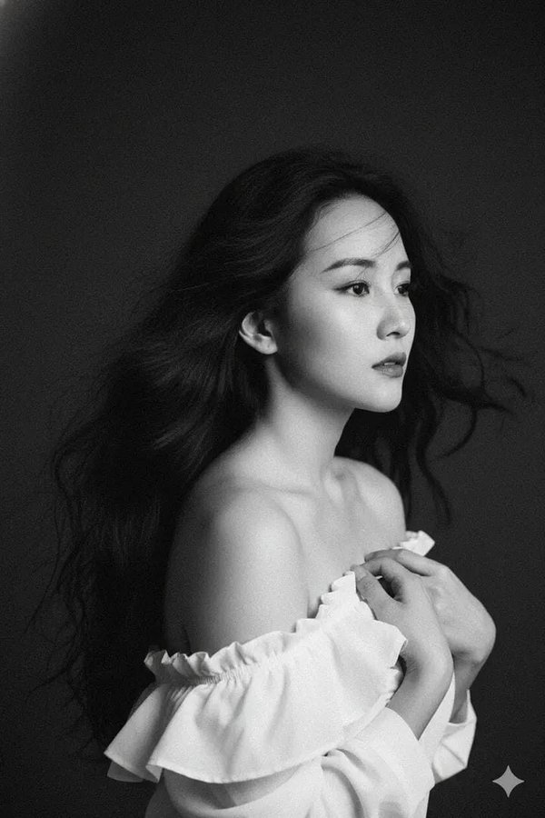

## 90年代复古黑白肖像照

- ID: gpt4o-930-zh-2
- Slug: prompt-930-zh-2
- 语言: zh
- 来源: [来源链接](https://x.com/SimplyAnnisa/status/2002582470567604295)
- 样例图路径: images/part3/930.jpeg

### 提示词

```text
保持她的容貌，不要改变她的容貌。
这是一张极具艺术气息的90年代复古黑白肖像照。照片中的女子容貌姣好，五官经典，一头乌黑亮丽的长发随风飘扬，蓬松而富有波浪。她侧目凝视，眼神中流露出沉思和诗意。女子胸前披着一块白色褶皱布料或衣物，双肩敞开（露肩）。简洁的深色背景与她白皙的肌肤和洁白的衣衫形成鲜明对比。照片质感细腻，带有明显的胶片颗粒感，呈现出35毫米胶片的复古美感，柔和的光线突显了她的颧骨和发丝纹理。8K高清画质，情感饱满，极具电影质感，堪称艺术杰作。
```

### 样例图


## { "prompt_description": { "subject": "Extreme close-up m

- ID: gpt4o-929-en-1
- Slug: prompt-929-en-1
- 语言: en
- 来源: [来源链接](https://x.com/Vivekhy/status/2002080283873714488)
- 样例图路径: images/part3/929.jpeg

### 提示词

```text
{
"prompt_description": {
"subject": "Extreme close-up macro portrait of a young woman's face, partial view focusing on one eye, nose, and lips",
"skin_texture": "Hyper-realistic skin details, visible pores, dewy and fresh complexion, soft porcelain skin tone",
"eyes": "Sharp brown iris with highly detailed eyelashes, clear catchlight reflection, intense and soft gaze",
"hair": "Wet, messy strands of light brown hair falling naturally across the face and eye",
"lips": "Soft natural pink lips, subtle texture, slightly parted"
},
"artistic_style": {
"lighting": "Soft diffused cool lighting, cinematic blue tones, ambient soft shadows",
"aesthetic": "Photorealistic, Cinematic, Masterpiece, Raw photo quality, 8k resolution"
},
"camera_settings": {
"lens": "85mm",
"shot_type": "Macro / Extreme Close-up",
"aperture": "f/1.8 (shallow depth of field)",
"focus": "Sharp focus on the eye"
},
"output_parameters": {
"aspect_ratio": "1:1 (Square)",
"signature": "VIVEK HY",
"signature_location": "Bottom right corner"
}
}
```

### 样例图


## 女子面部的超近距离微距肖像

- ID: gpt4o-929-zh-2
- Slug: prompt-929-zh-2
- 语言: zh
- 来源: [来源链接](https://x.com/Vivekhy/status/2002080283873714488)
- 样例图路径: images/part3/929.jpeg

### 提示词

```text
{
"prompt_description": {
“主题”：“年轻女子面部的超近距离微距肖像，局部视角，聚焦于一只眼睛、鼻子和嘴唇”，
"skin_texture": "超逼真的皮肤细节，可见的毛孔，水润清新的肤色，柔和的瓷白肤色",
“眼睛”：“锐利的棕色虹膜，睫毛细节丰富，眼神明亮，目光深邃而柔和”，
“头发”：“湿漉漉的、凌乱的浅棕色头发自然地垂落在脸颊和眼睛上”，
“嘴唇”： “柔软自然的粉红色嘴唇，质地细腻，微微张开”
},
"artistic_style": {
“照明”：“柔和的漫射冷光，电影般的蓝色调，柔和的环境阴影”，
“美学”： “照片级真实感、电影级、杰作级、原始照片质量、8K分辨率”
},
"camera_settings": {
镜头：85mm，
"shot_type": "微距/超近景",
“光圈”: “f/1. 8 (浅景深)”，
“聚焦”： “清晰聚焦于眼睛”
},
"output_parameters": {
"aspect_ratio": "1:1 (正方形)",
签名：VIVEK HY，
"签名位置": "右下角"
}
}
```

### 样例图


## A stylish woman wearing a black fedora and white shirt s

- ID: gpt4o-928-en-1
- Slug: prompt-928-en-1
- 语言: en
- 来源: [来源链接](https://x.com/AIwithSynthia/status/2002578332496638452)
- 样例图路径: images/part3/928.jpeg

### 提示词

```text
A stylish woman wearing a black fedora and white shirt stands against a soft neutral studio background, holding a wooden frame. Inside the frame is a photo watercolor portrait of herself, painted with loose brushstrokes, soft ink bleeds, and expressive splashes. The watercolor version tilts slightly, with vivid red lips and delicate facial details. Google Gemini Cinematic studio lighting, shallow depth of field, elegant editorial fashion aesthetic, fine art photography blended with watercolor illustration, ultra-high resolution, minimal composition, calm and sophisticated mood.
```

### 样例图


## 女士手持一个自己的木质相框

- ID: gpt4o-928-zh-2
- Slug: prompt-928-zh-2
- 语言: zh
- 来源: [来源链接](https://x.com/AIwithSynthia/status/2002578332496638452)
- 样例图路径: images/part3/928.jpeg

### 提示词

```text
一位身着黑色软呢帽和白色衬衫的时尚女士，站在柔和的中性色调摄影棚背景前，手持一个木质相框。相框内是一幅她本人的水彩肖像照片，笔触自由流畅，墨迹晕染自然，色彩泼洒灵动。水彩画略微倾斜，鲜艳的红唇和精致的面部细节跃然纸上。照片采用谷歌Gemini影棚灯光，浅景深，展现出优雅的时尚美学，将艺术摄影与水彩插画巧妙融合，超高分辨率，极简构图，营造出平静而精致的氛围。
```

### 样例图


## { "lighting": { "source": "Natural sunlight", "quality":

- ID: gpt4o-926-en-1
- Slug: prompt-926-en-1
- 语言: en
- 来源: [来源链接](https://x.com/xmliisu/status/2002367350146773079)
- 样例图路径: images/part3/926.jpeg

### 提示词

```text
{ "lighting": {
"source": "Natural sunlight",
"quality": "Golden hour, soft and warm",
"shadows": "Soft, well-defined shadows cast by the subject and boat elements",
"direction": "From the right, slightly backlit",
"highlights": "Bright highlights on the water, boat railing, and subject's hair"
},
"background": {
"details": "Specific buildings, church dome, beach activity are visible",
"setting": "Positano, Amalfi Coast, Italy",
"distance": "Far",
"elements": [
"Cliffside town with colorful buildings",
"Sandy beach with umbrellas and people",
"Dark blue sea",
"Other boats",
"Lush green vegetation on the cliffs"
],
"lighting_interaction": "Sunlight illuminates the town and cliffs, creating warm tones"
},
"typography": {
"color": "#2E4A7D",
"location": "On the side of the blue boat in the background right",
"font_style": "Sans-serif, uppercase, bold",
"description": "Boat name and registration details",
"text_content": "BLU RIDE"
},
"composition": {
"balance": "Asymmetrical balance between the subject in the foreground and the town in the background",
"framing": "Medium shot",
"perspective": "Slightly low angle, looking up towards the subject and background",
"leading_lines": "The boat's railing and deck lead the eye towards the subject and the town",
"depth_of_field": "Deep, with both subject and background in focus",
"rule_of_thirds": "Subject positioned in the lower right intersection"
},
"color_profile": {
"mood": "Warm, vibrant, luxurious",
"contrast": "Medium-high",
"saturation": "High",
"color_scheme": "Analogous blues and greens with warm earth tones",
"dominant_colors": [
"#2E4A7D",
"#F2F2F2",
"#C8A17B",
"#5A784A",
"#D98D6F"
]
},
"technical_specs": {
"iso": "Low",
"aperture": "f/8 or smaller for deep depth of field",
"lens_type": "Wide-angle lens",
"resolution": "High",
"camera_type": "DSLR or mirrorless",
"aspect_ratio": "4:5",
"shutter_speed": "Fast enough to freeze motion"
},
"subject_analysis": {
"hair": "Blonde, wavy, wind-blown",
"pose": "Kneeling on the boat deck, body angled towards the camera, right hand holding sunglasses, left hand on the railing",
"clothing": "Black one-piece swimsuit with white trim and cutouts",
"expression": "Looking over sunglasses with a slight smile",
"accessories": "Dark sunglasses, gold bracelet, ring",
"subject_type": "Young woman",
"hands_gestures": "Right hand adjusting sunglasses, left hand resting on the railing",
"location_on_frame": "Foreground, center-right"
},
"artistic_elements": {
"mood": "Relaxed, luxurious, aspirational",
"style": "Lifestyle photography, candid",
"texture": "Smooth boat deck, textured water, rugged cliffs, fabric of the swimsuit",
"narrative": "A woman enjoying a luxurious boat trip along the Amalfi Coast"
},
"generation_parameters": {
"seed": "Random",
"prompt": "A lifestyle photograph of a young blonde woman kneeling on the deck of a boat, wearing a black and white swimsuit and sunglasses, looking back at the camera. In the background is the cliffside town of Positano, Italy, with colorful buildings, a beach, and the sea under golden hour sunlight. The boat is moving, with other boats visible. The style is candid and luxurious.",
"model_type": "Photorealistic",
"guidance_scale": "High",
"negative_prompt": "Blurry, low resolution, studio lighting, artificial, indoors, crowded, overcast"
}
}
```

### 样例图


## 金发女子跪在游艇甲板上

- ID: gpt4o-926-zh-2
- Slug: prompt-926-zh-2
- 语言: zh
- 来源: [来源链接](https://x.com/xmliisu/status/2002367350146773079)
- 样例图路径: images/part3/926.jpeg

### 提示词

```text
{“灯光”： {
“来源”：“自然阳光”，
“品质”：“黄金时刻，柔和温暖”，
“阴影”：“主体和船只元素投射出的柔和、轮廓清晰的阴影”，
“方向”：“从右侧，略微背光”，
“亮点”：“水面、船舷和人物头发上的明亮高光”
},
“背景”： {
“细节”：“可以看到特定的建筑物、教堂圆顶和海滩活动”，
“设置”：“意大利阿马尔菲海岸波西塔诺”
“距离”: “远”
“元素”：[
“悬崖边的小镇，建筑色彩缤纷”
“沙滩上有遮阳伞和人群”
“深蓝色的大海”，
“其他船只”，
“悬崖上郁郁葱葱的植被”
],
"lighting_interaction": "阳光照亮城镇和悬崖，营造出温暖的色调"
},
"排版": {
“颜色”: “ #2E4A7D “,
“位置”：“在背景右侧蓝色船的侧面”，
"font_style": "无衬线字体，大写，粗体",
"描述": "船名和注册详情",
"text_content": "BLU RIDE"
},
“作品”： {
“平衡”：“前景主体与背景城镇之间的不对称平衡”，
“构图”：“中景”，
“视角”：“略微低角度，向上看向主体和背景”，
"leading_lines": "船的栏杆和甲板引导视线看向主体和城镇",
景深： “景深，主体和背景都清晰对焦”
“三分法构图”：“主体位于右下角交点处”
},
"color_profile": {
“氛围”：“温暖、充满活力、奢华”，
“对比度”：“中高”
“饱和度”: “高”
"配色方案": "类似蓝色和绿色，搭配温暖的大地色调",
"主色": [
" #2E4A7D "，
" #F2F2F2 "，
" #C8A17B "，
" #5A784A "，
#D98D6F
]
},
"technical_specs": {
"iso": "低",
“光圈”: “f /8或更小，以获得更大的景深”，
"lens_type": "广角镜头",
“分辨率”： “高”
"camera_type": "单反或无反"
"aspect_ratio": "4:5",
"shutter_speed": "足够快，可以凝固运动"
},
“主题分析”：{
“头发”：“金色的，波浪状的，被风吹乱的”，
“姿势”：“跪在船甲板上，身体侧对着镜头，右手拿着太阳镜，左手扶着栏杆”，
“服装”：“黑色连体泳衣，带有白色滚边和镂空设计”
“表情”：“透过太阳镜，带着一丝微笑看着前方”，
“配饰”：“深色太阳镜、金手镯、戒指”
"subject_type": "年轻女子",
“hands_gestures”: “右手调整太阳镜，左手扶在栏杆上”
"location_on_frame": "前景，中心偏右"
},
“artistic_elements”：{
“氛围”：“轻松、奢华、令人向往”
“风格”：“生活方式摄影，抓拍”
“质感”：“光滑的船甲板，波光粼粼的水面，崎岖的悬崖，泳衣的面料”，
叙事：一位女士正在享受沿着阿马尔菲海岸的豪华游艇之旅
},
"generation_parameters": {
“种子”： “随机”，
提示：一张生活方式照片，一位年轻的金发女子跪在船甲板上，身穿黑白泳衣，戴着太阳镜，回头看向镜头。背景是意大利波西塔诺的悬崖小镇，色彩缤纷的建筑、沙滩和沐浴在金色阳光下的大海。船正在行驶，可以看到其他船只。风格自然而奢华。
"model_type": "Photorealistic",
"guidance_scale": "高",
"negative_prompt": "模糊、低分辨率、影棚灯光、人造光、室内、拥挤、阴天"
}
}
```

### 样例图


## { "type": "image_generation_prompt", "style": "ultra-rea

- ID: gpt4o-919-en-1
- Slug: prompt-919-en-1
- 语言: en
- 来源: [来源链接](https://x.com/saniaspeaks_/status/2001944607714673042)
- 样例图路径: images/part3/919.jpeg

### 提示词

```text
{
"type": "image_generation_prompt",
"style": "ultra-realistic, high-fashion editorial, studio photography",
"identity_preservation": {
"use_reference_image": true,
"alter_face": false,
"strict_identity_lock": true,
"notes": "Create an extremely realistic image that is ultra-similar to the referenced girl. Preserve her facial identity, proportions, hairstyle, and overall appearance exactly as in the reference."
},
"subject": {
"gender": "female",
"appearance": {
"hair": {
"color": "dark",
"style": "elegant updo (bun)"
},
"jewelry": [
"delicate dangling earrings"
],
"expression": "calm, confident, composed"
}
},
"wardrobe": {
"dress": {
"type": "full-length elegant dress",
"color": "bright lilac",
"style": "fitted bodice with a refined silhouette, modest and fully covered",
"fabric": "smooth, high-quality fabric with a soft sheen"
},
"legwear": {
"type": "white lace-patterned tights or stockings",
"details": "floral or lace motif, refined and elegant"
},
"footwear": {
"type": "platform heels",
"color": "bright lilac",
"details": "thick high heel with ankle strap, bold and fashionable"
}
},
"composition": {
"concept": "scale contrast with two versions of the same woman",
"aspect_ratio": "9:16",
"foreground": {
"figure": "large version of the woman",
"pose": "leaning forward and downward, gently curving her back to look at the miniature version",
"emphasis": "long neck, arms, legs, and shoes dominating the frame for dramatic scale"
},
"background": {
"figure": "miniature version of the same woman",
"pose": "standing upright, appearing to salute, greet, or wave toward the larger figure",
"outfit": "identical full-length lilac dress, white lace tights, and lilac platform heels"
}
},
"environment": {
"setting": "studio",
"background": {
"color": "clean white or very light gray",
"style": "minimalist, distraction-free"
}
},
"color_palette": {
"dominant_colors": [
"bright lilac",
"white"
],
"overall_tone": "clean, elegant, high-contrast fashion palette"
},
"lighting": {
"type": "soft studio lighting",
"effects": [
"even illumination",
"clear separation between figures",
"enhanced fabric and skin realism"
]
},
"quality": {
"realism": "ultra-realistic",
"detail_level": "high detail in skin, fabric textures, lace patterns, and footwear",
"rendering": "photorealistic, editorial-grade finish"
},
"mood": {
"atmosphere": "stylish, artistic, playful with scale",
"tone": "elegant, modern, fashion-forward"
},
"output_goal": "Create a maximally realistic and ultra-faithful fashion image of a woman in a full-length lilac dress, featuring a creative scale-play composition with two versions of the same subject, set against a clean studio background in a 9:16 format."
}
```

### 样例图


## 丁香色长裙女性双版本比例对比

- ID: gpt4o-919-zh-2
- Slug: prompt-919-zh-2
- 语言: zh
- 来源: [来源链接](https://x.com/saniaspeaks_/status/2001944607714673042)
- 样例图路径: images/part3/919.jpeg

### 提示词

```text
{
"type": "image_generation_prompt",
“风格”：“超写实、高级时尚杂志大片、影棚摄影”，
"identity_preservation": {
"use_reference_image": true,
"alter_face": false,
"strict_identity_lock": true,
“备注”：“创作一幅与参考女孩极其相似的逼真图像。务必保留她的面部特征、身材比例、发型和整体外貌，与参考图完全一致。”
},
“主题”： {
"性别": "女性",
“外貌”： {
“头发”： {
“颜色”：“深色”，
"发型": "优雅盘发（发髻）"
},
“珠宝”： [
“精致的垂坠耳环”
],
表情：平静、自信、沉着
}
},
“衣柜”： {
“裙子”： {
类型：优雅长裙
“颜色”： “亮丁香色”，
“款式”：“修身胸衣，线条优美，端庄得体，完全遮盖身体”。
“面料”：光滑、高品质的面料，带有柔和的光泽
},
"腿部服装": {
“类型”：“白色蕾丝图案的紧身裤或长筒袜”，
细节：花卉或蕾丝图案，精致优雅
},
鞋类：{
类型：厚底高跟鞋，
“颜色”： “亮丁香色”，
“细节”：“粗跟高跟鞋，踝带设计，大胆时尚”
}
},
“作品”： {
“概念”：“同一女性的两个不同版本之间的比例对比”，
"aspect_ratio": "9:16",
前景：{
“人物”：“女性的放大版”，
“姿势”：“身体前倾向下，轻轻弯曲背部，看着微缩模型”，
“强调”：“修长的脖子、手臂、腿和鞋子占据画面，营造出戏剧性的比例感”。
},
“背景”： {
“人物”：“同一女性的微缩版本”，
“姿势”：“直立站立，看起来像是在向较大的人物敬礼、问候或挥手”，
“服装”： “同款淡紫色长连衣裙、白色蕾丝紧身裤和淡紫色厚底高跟鞋”
}
},
“环境”： {
“设置”: “工作室”
“背景”： {
“颜色”: “纯白色或非常浅的灰色”，
风格：极简主义，无干扰
}
},
"color_palette": {
"主色": [
“亮紫色”，
“白色的”
],
"overall_tone": "干净、优雅、高对比度的时尚色调"
},
“灯光”： {
“类型”：“柔和的影棚灯光”，
“效果”：[
“均匀照明”，
“数字之间有明显的分隔”，
“增强织物和皮肤的真实感”
]
},
“质量”： {
“写实主义”：“超写实主义”，
"detail_level": "皮肤、织物纹理、蕾丝图案和鞋履的细节都非常丰富",
“渲染”：“照片级真实感，编辑级效果”
},
“情绪”： {
“氛围”：“时尚、艺术、巧妙运用比例”，
“基调”：“优雅、现代、时尚前卫”
},
"output_goal": "创作一幅极其逼真、高度还原的女性时尚照片，照片中女性身穿淡紫色长裙，采用创意性的比例构图，使用同一主题的两个版本，背景为干净的摄影棚，格式为 9:16。"
}
```

### 样例图


## A high-end studio portrait using the uploaded photo as t

- ID: gpt4o-916-en-1
- Slug: prompt-916-en-1
- 语言: en
- 来源: [来源链接](https://x.com/AIwithkhan/status/2001685648768680052)
- 样例图路径: images/part3/916.jpeg

### 提示词

```text
A high-end studio portrait using the uploaded photo as the main subject. The person stands confidently against a clean, minimal background in soft neutral tones, holding a large vertical poster in front of them. The poster features an artistic reinterpretation of the same uploaded photo — stylized as a digital illustration, sketch, or painterly artwork — clearly recognizable as the same face. Professional studio lighting with a soft key light and subtle rim light creates gentle shadows and depth. The subject’s expression is calm and confident, body posture relaxed yet strong, evoking a modern personal brand identity. Clean composition, balanced framing, premium editorial aesthetic, shallow depth of field, ultra-realistic skin texture, crisp details, contemporary creator branding vibe, cinematic realism, 1:1 aspect ratio, high resolution.
```

### 样例图


## 高端影棚肖像照

- ID: gpt4o-916-zh-2
- Slug: prompt-916-zh-2
- 语言: zh
- 来源: [来源链接](https://x.com/AIwithkhan/status/2001685648768680052)
- 样例图路径: images/part3/916.jpeg

### 提示词

```text
这是一张以上传照片为主体的高端影棚肖像照。照片中的人物自信地站在简洁的中性色调背景前，手持一张大幅竖版海报。海报上是对同一张照片的艺术化重新诠释——风格化为数字插画、素描或绘画作品——清晰地展现了同一张面孔。专业的影棚灯光，柔和的主光和微妙的轮廓光营造出柔和的阴影和层次感。人物表情沉稳自信，身姿放松而有力，展现出现代个人品牌形象。构图简洁，取景均衡，呈现高端时尚美感，浅景深，肌肤纹理逼真，细节清晰，散发出当代创作者的品牌气息，兼具电影般的真实感，1:1宽高比，高分辨率。
```

### 样例图


## Create a realistic vintage-style photo booth / Polaroid 

- ID: gpt4o-914-en-1
- Slug: prompt-914-en-1
- 语言: en
- 来源: [来源链接](https://x.com/miilesus/status/2001734583830626635)
- 样例图路径: images/part3/914.jpeg

### 提示词

```text
Create a realistic vintage-style photo booth / Polaroid photo collage featuring the same couple, using the two uploaded images as exact face references for both individuals (preserve both identities accurately).
The couple appears natural, affectionate, and playful, captured in multiple candid moments as if taken inside a photo booth. The woman and the man maintain their original facial features, skin tones, and expressions.
Woman: elegant, feminine, glowing skin, natural makeup, soft blush, glossy lips, long dark hair styled loosely with gentle volume. Wearing a minimal strapless cream or light beige dress.
Man: clean and handsome appearance, short dark hair, light stubble or clean-shaven, wearing a black leather jacket over a white shirt
Scenes & poses included in the collage:
The woman smiling brightly while the man stands behind her playfully covering her eyes.
The couple standing close, facing each other lovingly, her hand resting on his chest.
A close face-to-face moment with soft smiles and eye contact.
The woman standing behind the man, making a peace sign while smiling at the camera.
A playful dancing pose where the man lifts one of the woman’s hands as if spinning her.
A relaxed, candid moment where both laugh naturally at the camera.
Environment: neutral photo booth backdrop with soft vertical curtains, warm indoor lighting, subtle shadows, cozy and intimate atmosphere.
Photography style: vintage Polaroid / analog photo booth aesthetic, slightly soft focus, gentle grain, mild blur, natural imperfections, warm tones, realistic skin texture.
Lighting: soft frontal flash combined with ambient light, creating a casual, real-life snapshot feeling.
Mood & vibe: romantic, playful, spontaneous, intimate, youthful, nostalgic.
Composition: multi-frame vertical collage, evenly spaced images, authentic photo booth layout.
Quality: high realism, not AI-looking, natural proportions, no distortion.
```

### 样例图


## 复古风格照相亭

- ID: gpt4o-914-zh-2
- Slug: prompt-914-zh-2
- 语言: zh
- 来源: [来源链接](https://x.com/miilesus/status/2001734583830626635)
- 样例图路径: images/part3/914.jpeg

### 提示词

```text
使用上传的两张照片作为两人的面部参考，制作一张逼真的复古风格照相亭/宝丽来照片拼贴画，照片中的人物为同一对情侣（准确保留两人的身份）。
这对情侣看起来自然、亲密又充满活力，多张抓拍照片仿佛是在照相亭里拍摄的。男女双方都保留了原本的面部特征、肤色和表情。
女士：优雅妩媚，肌肤散发光泽，妆容自然，腮红轻柔，双唇水润，一头乌黑长发随意披散，略带蓬松感。身着简约的米色或浅米色抹胸连衣裙。
男士：外表干净英俊，短黑发，留着淡淡的胡茬或刮得干干净净，身穿黑色皮夹克，内搭白色衬衫。
拼贴画中包含的场景和姿势：
女人笑容灿烂，男人站在她身后，顽皮地捂住了她的眼睛。
这对情侣站得很近，彼此深情地对视着，她的手放在他的胸口。
面对面的亲密时刻，带着柔和的微笑和眼神交流。
站在男子身后的女子对着镜头微笑，并比出和平手势。
一个俏皮的舞蹈姿势，男子抬起女子的一只手，仿佛要将她旋转起来。
轻松自然的瞬间，两人对着镜头自然地笑了起来。
环境：中性风格的拍照背景，搭配柔和的垂直窗帘、温暖的室内灯光、微妙的光影，营造出温馨私密的氛围。
摄影风格：复古宝丽来/模拟照相亭美学，略微柔焦，轻微颗粒感，轻微模糊，自然瑕疵，暖色调，逼真的皮肤纹理。
光线：柔和的正面闪光灯与环境光相结合，营造出一种随意、真实的快照感觉。
氛围：浪漫、俏皮、随性、亲密、青春、怀旧。
构图：多帧竖幅拼贴，图像间距均匀，真实的照相亭布局。
质量：高度逼真，不像人工智能生成的，比例自然，无变形。
```

### 样例图


## { "Objective": "Create an ultra-realistic 8K candid stre

- ID: gpt4o-913-en-1
- Slug: prompt-913-en-1
- 语言: en
- 来源: [来源链接](https://x.com/Taaruk_/status/2001656897699733967)
- 样例图路径: images/part3/913.jpeg

### 提示词

```text
{
"Objective": "Create an ultra-realistic 8K candid street portrait capturing quiet emotion and authenticity within a crowded urban environment.",

"Subject": {
"Gender": "Female",
"Appearance": {
"Hair": "Short blonde hair with soft, natural texture",
"Makeup": "Minimal, natural look",
"Skin": {
"Texture": "Realistic skin texture with subtle freckles",
"Highlights": "Soft natural highlights with gentle tonal transitions"
},
"Expression": "Calm, thoughtful, introspective",
"Gaze": "Looking slightly to the side, not directly at the camera"
},
"Wardrobe": {
"Top": "Simple grey knitted sweater with visible fabric weave",
"Bottom": "Casual jeans",
"Accessories": "Thin shoulder-bag strap visible across the shoulder"
}
},

"Scene_Description": {
"Setting": "Busy city street",
"Crowd": {
"Density": "Surrounded by a dense flow of pedestrians",
"Background_Treatment": "Softly blurred figures creating depth and motion"
},
"Environment": "Urban street atmosphere with natural movement"
},

"Lighting_and_Color": {
"Lighting": {
"Type": "Natural daylight",
"Quality": "Soft and even, without harsh shadows"
},
"Color_Grading": {
"Style": "Warm cinematic tones",
"Characteristics": [
"Natural skin tones",
"Muted urban background colors",
"Subtle film-inspired contrast"
]
}
},

"Camera_and_Composition": {
"Shot_Type": "Candid street portrait",
"Depth_of_Field": "Shallow depth of field isolating the subject",
"Focus": "Sharp focus on the subject with background crowd softly blurred",
"Angle": "Eye-level, unobtrusive framing"
},

"Visual_Style": {
"Resolution": "Ultra-realistic 8K",
"Aesthetic": "Documentary street photography",
"Detail_Characteristics": [
"Sharp facial detail",
"Natural fabric texture",
"Soft motion blur in background",
"Subtle film grain for realism"
]
},

"Mood_and_Storytelling": {
"Themes": [
"Stillness within chaos",
"Quiet reflection",
"Human presence in urban life"
],
"Atmosphere": "Emotional, authentic, understated realism"
},

"Output_Requirements": {
"Format": "Image",
"Orientation": "Portrait or cinematic street frame",
"Quality": "Professional documentary-grade realism"
}
}
```

### 样例图


## 超逼真的 8K 街头抓拍肖像

- ID: gpt4o-913-zh-2
- Slug: prompt-913-zh-2
- 语言: zh
- 来源: [来源链接](https://x.com/Taaruk_/status/2001656897699733967)
- 样例图路径: images/part3/913.jpeg

### 提示词

```text
{
“目标”：“在拥挤的都市环境中，捕捉安静的情感和真实感，创作一张超逼真的 8K 街头抓拍肖像。”

“主题”： {
性别：女，
“外貌”： {
“头发”：“柔软自然的短金发”，
“妆容”：“简约自然妆容”
“皮肤”： {
“纹理”：“逼真的皮肤纹理，带有细小的雀斑”，
“高光”： “柔和自然的高光，色调过渡平缓”
},
“表情”：“冷静、深思熟虑、内省”
“目光”：“略微看向一侧，而不是直视镜头”
},
“衣柜”： {
“上衣”：“简约灰色针织毛衣，织物纹理清晰可见”，
下装：休闲牛仔裤
“配饰”：“肩上露出细细的肩包肩带”
}
},

"场景描述": {
“场景”：“繁忙的城市街道”，
人群：{
“密度”：“周围人流密集”，
“背景处理”：“柔和模糊的人物形象，营造出深度和动感”
},
“环境”：“具有自然动感的都市街道氛围”
},

"照明和颜色": {
“灯光”： {
“类型”：“自然日光”，
“品质”：“柔和均匀，无生硬阴影”
},
"Color_Grading": {
风格：温暖的电影色调
“特征”： [
“自然肤色”
“柔和的城市背景色彩”，
“微妙的胶片风格对比”
]
}
},

“相机与构图”：{
"Shot_Type": "街头抓拍肖像",
“景深”： “浅景深突出主体”，
“焦点”：“主体清晰对焦，背景人群柔和虚化”，
“角度”：“视线水平，不显眼的构图”
},

"视觉样式": {
“分辨率”：“超逼真 8K”，
“美学”：“纪实街头摄影”，
"Detail_Characteristics": [
“面部细节清晰”，
“天然面料质感”
“背景呈现柔和的动态模糊效果”
“细腻的胶片颗粒感，营造真实感”
]
},

"情绪与故事讲述": {
“主题”：[
“混乱中的平静”
“静静地思考”，
“人类在城市生活中的存在”
],
“氛围”：“情感丰富、真实、含蓄的现实主义”
},

"输出要求": {
"格式": "图像",
“方向”：“竖幅或电影街景构图”，
“质量”：“专业纪录片级别的真实感”
}
}
```

### 样例图


## 标本盒与现实的穿搭美学双重奏

- ID: gpt4o-908-zh
- Slug: prompt-908-zh
- 语言: zh
- 来源: [来源链接](https://x.com/LufzzLiz/status/2001831802269499412)
- 样例图路径: images/part3/908.jpeg

### 提示词

```text
A vertical split-screen creative product photography composition on a clean white wall background. High-resolution, photorealistic, commercial advertisement quality.

Top Section: The Specimen Box
The upper half features an exquisite light oak wooden shadow box frame mounted on the wall. Inside, a specific outfit is displayed as an artistic flat-lay museum specimen: [Insert Clothing Details Here, e.g., a sleek black satin slip dress with delicate lace trim and thin spaghetti straps]. The garments are neatly pinned in place. Surrounding them are small thematic decorative props: [Insert Props, e.g., dried roses, vintage perfume bottles, silk ribbon]. Elegant calligraphy on the matte paper backdrop reads: [Insert Text, e.g., "Midnight Elegance" or "Silk & Secrets"]. Soft studio lighting accentuates the rich texture and drape of the fabric.

Bottom Section: Naked-Eye 3D Reality
The lower half creates a hyperrealistic "naked-eye 3D" illusion. A rectangular picture-frame border sits directly beneath the top box. A stunningly realistic young woman [Insert Model Description, e.g., a poised East Asian model with long wavy black hair, subtle smoky eyes, and a confident gaze] wears the exact same outfit as shown above.

She lounges casually on the bottom edge of the frame—one leg bent with foot resting inside the frame, the other leg elegantly dangling out into the viewer’s space. Her torso leans back slightly, elbow resting on her raised knee, fingers lightly grazing the fabric near her collarbone. Her body forms a soft, sensual S-curve that highlights the garment’s silhouette without overt exposure. She looks directly at the camera with a calm, knowing smile—inviting yet enigmatic. This dynamic, lifelike pose contrasts powerfully with the static, archival display above, creating visual tension between reality and presentation.

Technical Specs:
Soft natural shadows, ambient occlusion, bright and airy yet cinematic lighting, 8K resolution, Octane Render, vivid but refined color palette, ultra-detailed fabric textures (satin sheen, lace transparency, stitching), shallow depth of field, Vogue editorial style, filmic grain, professional fashion photography.

Negative Prompt (recommended):
blurry, low-res, distorted anatomy, extra limbs, deformed hands, cartoon, anime, doll-like, plastic skin, overexposed, cluttered background, text errors, mismatched clothing, floating objects, unrealistic proportions.
参考人物，想看老师制服
```

### 样例图


## 剪纸艺术

- ID: gpt4o-907-zh
- Slug: prompt-907-zh
- 语言: zh
- 来源: [来源链接](https://x.com/berryxia/status/2002015301618294794)
- 样例图路径: images/part3/907.jpeg

### 提示词

```text
Paper cut layered art: [城市名称英文] ([城市名称本地语言]) day-night elegant diagonal split (top-left→bottom-right) with soft artistic transition.
Core: ONE [标志性地标建筑] bisected diagonally with elegant gradient - warm golden tones (day side: orange, peach, coral, amber, [特色暖色]) / cool tones with rich warm lights (night side: navy, purple, midnight blue, with abundant yellow windows, red lanterns, vibrant [特色]accents).
CRITICAL AESTHETIC REQUIREMENTS:
- Beautiful, visually stunning composition
- Rich details and intricate paper cut patterns
- Elegant color harmony with [城市文化] aesthetics
- Sophisticated [文化特色] decorative elements
- High artistic value with refined craftsmanship
  Text: "[城市名称文字]" in beautiful [语言类型] calligraphy/typography, split by diagonal with elegant transition, surrounded by exquisite [本地装饰图案1], [本地装饰图案2], and [本地装饰图案3], strong dimensional depth with layered shadow effects.
  Day side (left/top): Brilliant golden sun with radiating warm rays, gorgeous warm amber/peach/coral sky with [特色氛围描述], [城市气质] sophisticated atmosphere. Beautiful daytime elements - [特色美食1] with [细节描述], [特色美食2] with [呈现方式], [特色美食3] with [艺术呈现], [其他美食]; stunning [代表性植物1] with detailed [部位] in rich [颜色], [代表性植物2] with [特征描述]; magnificent [地理特征] in bright [颜色] reflection with [细节]; [标志性建筑/场景1] with ornate details glowing in sunlight, [特色街景/场景] with refined [细节], [文化活动场景] with [描述].
  Diagonal transition: Soft gradient with twilight beauty - [过渡色1], [过渡色2], [过渡色3], [过渡色4], [过渡色5] - creating elegant natural flow [体现城市特色的过渡描述].
  Night side (right/bottom): Gorgeous blue/silver moon with ethereal glow and sparkling stars, rich deep navy and midnight blue sky with beautiful depth. Spectacular nighttime atmosphere with abundant warm light sources creating magical [文化特色] ambiance - numerous glowing yellow windows/lights creating patterns, elegant orange street lamps [位置描述], beautiful traditional red lanterns [场景描述], stunning purple-magenta [特色灯光], brilliant cyan-teal [地标灯光], golden light from [场所] glows, rich amber reflections [位置]. Night elements - dazzling illuminated [夜间地标1] with [效果], magnificent glowing [夜间地标2], charming [夜间场景] with [氛围], vibrant [夜生活描述].
  Unified elements (each appears once with elegant transition): [主要地标1] showing beautiful gradient from day to night, [主要地标2] with [细节], [地理特征] with [变化描述], [建筑群] with [风格描述], [植物] with natural beauty, [交通工具], [文化符号] with [装饰], harmonious blend of [传统特色] and [现代特色].
  Craft technique: 10-12 distinct paper layers with EXTREME pronounced depth and dimension, very thick visible edges (4-6mm thickness showing dimension), dramatic shadows creating powerful 3D sculptural relief effect, each element shows intricate multi-layer construction with refined details, ornate [文化特色] decorative patterns throughout ([图案1], [图案2], [图案3]), side-lighting creating stunning dimensional effect [强调特色].
  Format: landscape orientation, no border, no frame, elegant soft diagonal transition (clear enough to show duality but refined and artistic), sophisticated visual balance, BEAUTIFUL and STUNNING overall aesthetic capturing [城市特色].
  The artwork should be visually gorgeous, [气质形容词1], [气质形容词2] - capturing [城市核心特质描述].

{以此风格展示绘制梵高的人物展示，使用4K输出 9:16 周五就是与梵高相关的元素}
```

### 样例图


## Create a realistic first-person POV selfie as if the cam

- ID: gpt4o-906-en-1
- Slug: prompt-906-en-1
- 语言: en
- 来源: [来源链接](https://x.com/xmiiru_/status/2001935712275267952)
- 样例图路径: images/part3/906.jpeg

### 提示词

```text
Create a realistic first-person POV selfie as if the camera is my own eyes using a phone’s front-facing camera. The phone, my hands, and my arms must NOT be visible in the frame. Use the uploaded image as my identity reference and keep my face recognizable through perspective consistency. I am not part of the cast I’m a guest on set wearing modern, casual real-world clothing that does not match the actors’ wardrobe. The actors are aware of the selfie, standing very close to me, leaning in naturally, and looking directly into the camera as if pausing for a quick friendly shot between takes.

The framing should feel intimate and face-level, with actors filling the foreground. The background must clearly show a believable behind-the-scenes film set with cameras, crew, lighting rigs, monitors, and equipment. The image should feel candid, unpolished, and spontaneous.

Place me inside: [MOVIE OR TV SHOW NAME] (optional: cast members)
```

### 样例图


## 和影视剧中人物自拍

- ID: gpt4o-906-zh-2
- Slug: prompt-906-zh-2
- 语言: zh
- 来源: [来源链接](https://x.com/xmiiru_/status/2001935712275267952)
- 样例图路径: images/part3/906.jpeg

### 提示词

```text
请使用手机前置摄像头，拍摄一张逼真的第一人称视角自拍，就像用自己的眼睛拍摄一样。手机、我的手和手臂都不能出现在画面中。请使用上传的图片作为我的身份参考，并通过保持视角一致来确保我的脸部清晰可辨。我不是剧组成员，而是片场的客串演员，穿着与演员服装不同的现代休闲日常服装。演员们知道我在自拍，他们会站在我旁边，自然地靠近我，并直视镜头，就像在拍摄间隙和我友好地拍张合照一样。

构图应营造亲密感，采用平视视角，演员占据前景。背景必须清晰展现一个可信的幕后拍摄现场，包括摄像机、工作人员、灯光设备、监视器和器材。画面应给人一种自然、未经修饰、随意的感觉。

请将我放入：[电影或电视剧名称]（可选：演员表）
```

### 样例图


## 维多利亚哥特皇室写真照

- ID: gpt4o-904-zh
- Slug: prompt-904-zh
- 语言: zh
- 来源: [来源链接](https://x.com/songguoxiansen/status/2001828831615946768)
- 样例图路径: images/part3/904.jpeg

### 提示词

```text
生成一张 9:16 竖版「维多利亚哥特皇室」写实照片：以我上传的 FACE_REF 为人物身份参考，100%还原五官与骨相；人物身穿“维多利亚时代（19世纪）宫廷礼服方向”的重工礼服（紧身胸衣、大裙撑、蕾丝/天鹅绒、皇室珠宝），在伦敦塔桥或威斯敏斯特宫（大本钟）旁拍摄。画面具备《Harper’s Bazaar》级别的摄影、造型与封面设计，保持杂志的一贯设计风格（中英文设计）。

【INPUTS | 输入】
FACE_REF：我上传的人物五官参考图（身份锁定）

【ABSOLUTE PRIORITY | 身份锁定（最高优先级）】
100%还原 FACE_REF 的五官与骨相：眼距、鼻梁鼻翼、唇形、下颌线、颧骨结构完全一致，不得漂移。
真实皮肤质感：可见细微纹理与毛孔，不要过度磨皮与网红化。
成年女性形象（adult）。

【SHOT TYPE | 景别二选一（由模型随机选其一，且必须真实统一）】
A) 半身封面：胸口到腰上方，珠宝、蕾丝领口与眼神最清晰（主推）
B) 全身封面：从头到脚完整呈现巨大的裙撑轮廓与伦敦地标的结合，透视感强（备选）
（无论A/B：都必须保持“封面构图”，有留白空间给排版，但不要撕纸/手绘效果。）

【LOCATION | 场景（英国伦敦）】
伦敦地标：泰晤士河畔，背景是宏伟的哥特式建筑威斯敏斯特宫（大本钟）或 伦敦塔桥的塔楼。
天气二选一（随机）：1) 伦敦雾霭（经典的雾都质感，光线柔和神秘） 2) 阴雨方歇（地面湿润反光，天空呈铅灰色）
背景干净：无游客、无现代标识、无手机状态栏UI、无水印字幕。

【LIGHTING & CAMERA | 摄影质感（杂志级）】
镜头感：85mm人像质感（半身）或 50mm/70mm（全身），浅景深，眼睛最清晰。
光线：阴天漫射光 + 戏剧性补光（强调面部结构）；钻石/宝石有真实火彩；天鹅绒质感深邃。
色彩：高级电影感，低饱和度的蓝灰环境色与服装的深色调（红/蓝/黑）形成哥特美学；整体干净、通透、贵气。

【WARDROBE | 维多利亚宫廷礼服（重工、塑形、繁复细节）】
目标审美：“蜂腰、大裙摆、层叠蕾丝、重磅天鹅绒、皇冠、女王气场”。

轮廓与层次（X型剪裁）
上身：结构感极强的紧身胸衣（Corset），方领或高领，泡泡袖或羊腿袖
下身：巨大的裙撑（Crinoline 或 Bustle），后腰部有明显的堆叠设计，裙摆拖地
装饰：大量的荷叶边、蝴蝶结、垂坠的流苏
面料与工艺（重手艺必须“看得见”）
主面料：重磅丝绒、塔夫绸、尚蒂伊蕾丝（Chantilly Lace）
主要工艺：珠绣、金线刺绣、缎带编织
纹样主题：大马士革纹（Damask）、玫瑰、蓟花（苏格兰象征）、佩斯利纹
细节：蕾丝手套、颈饰（Choker）、勋章/胸针
头面（皇室珠宝头饰）
核心结构：维多利亚式小王冠（Tiara）或 羽毛头饰
装饰：钻石、蓝宝石、珍珠
耳饰/颈饰：极度夸张的钻石项链、耳坠

【COLOR MATRIX | 颜色矩阵搭配（必须执行，且必须“皇室深色”）】
（维多利亚晚期的深沉奢华）
从以下三套“主色方案”中随机选 1 套作为【底色/大面积主面料色】。

Scheme G（皇室蓝底）：
底色：深宝蓝/午夜蓝（丝绒质感）
刺绣/装饰：银色蕾丝、钻石、蓝宝石
Scheme A（维多利亚红底）：
底色：酒红/勃艮第红（深沉热情）
刺绣/装饰：黑色蕾丝、金色刺绣、红宝石
Scheme R（丧服黑底）：
底色：墨黑（Black Jet，极度哥特）
刺绣/装饰：黑色串珠、黑色蕾丝、少量金色或银色提亮

【颜色执行规则】
色彩要深沉浓郁，体现“日不落”的威严和哥特式的神秘。

【POSE | 封面姿态（威严、僵直、女王感）】
半身：下巴微扬，眼神冷峻，一手轻抚项链
全身：站姿挺拔（像肖像画一样），双手交叠在裙撑上，气场压倒一切
表情：严肃、高傲、不可一世；绝对不笑（维多利亚风格）。

【OUTPUT | 输出】
1 张 9:16 竖版写实杂志封面级照片
随机：半身 or 全身（A/B二选一）
随机：雾霭 or 阴雨（天气二选一）
随机：宝蓝 / 酒红 / 墨黑（颜色矩阵三选一）
造型：维多利亚宫廷礼服方向 + 皇冠/Choker + 紧身胸衣大裙撑 + 丝绒蕾丝
```

### 样例图


## { "subject": { "demographics": "Young female, approx 20-

- ID: gpt4o-901-en-1
- Slug: prompt-901-en-1
- 语言: en
- 来源: [来源链接](https://x.com/brindleyai/status/2001200342864667035)
- 样例图路径: images/part3/901.jpeg

### 提示词

```text
{
"subject": {
"demographics": "Young female, approx 20-24 years old, Caucasian.",
"hair": {
"color": "Dirty blonde to light blonde gradient.",
"style": "Long, straight with slight wave, layered, casual parting.",
"texture": "Soft, natural strands, slightly tousled, roots visible.",
"movement": "Falling naturally over shoulders and back."
},
"face": {
"shape": "Oval with soft jawline.",
"eyes": "Almond-shaped, light blue/grey irises, distinct sharp black winged eyeliner.",
"nose": "Button nose, soft bridge.",
"lips": "Full, plump, rosy pink, slightly parted in a pouty expression.",
"skin_details": "Prominent, heavy freckles across nose and cheeks. Smooth texture but with realistic skin grain. Natural blush.",
"micro_details": "Mole on right upper chest, mole on left shoulder."
},
"body_proportions": {
"build": "Voluminous, curvy, heavy bust.",
"chest": "Large bust volume, prominent forward projection, deep cleavage visible.",
"waist_to_chest_ratio": "Significantly wider chest width compared to waist implies hourglass figure.",
"shoulders": "Soft, rounded, natural slope.",
"dominance": "Upper torso volume visually dominates the frame."
},
"clothing": {
"top": "Heather grey ribbed knit tank top/camisole.",
"fit": "Tight, form-fitting, stretching over chest volume, low scoop neckline.",
"straps": "Thick straps, sitting securely on shoulders."
},
"accessories": {
"jewelry": {
"Small gold hoop earrings.",
"Gold chain necklace with a small 'G' letter pendant.",
"Longer thin gold chain with a distinct kangaroo pendant."
}
}
},
"pose": {
"type": "Handheld selfie perspective.",
"orientation": "Frontal close-up, slightly angled from above.",
"head_position": "Tilted slightly to subject's right.",
"limbs": "Right arm extended forward (out of frame) indicating holding the camera.",
"gaze": "Direct eye contact with lens, alluring and confident.",
"spine_curvature": "Slight arch implied by chest prominence."
},
"setting": {
"environment": "Domestic bathroom.",
"background_elements": "Dark brown/grey glossy tiled wall, chrome shower fixture visible on left, top of white ceramic toilet tank visible on right.",
"depth": "Shallow depth of field, background elements slightly out of focus."
},
"camera": {
"shot_type": "Close-up, selfie portrait.",
"angle": "High angle (slightly above eye level), typical of smartphone selfies.",
"focal_length": "24mm to 28mm equivalent (wide angle smartphone lens).",
"framing": "Chest-up shot, cropping at mid-torso.",
"focus": "Sharp focus on eyes and face, slight fall-off on shoulders.",
"perspective": "Slight foreshortening of the extended arm side."
},
"lighting": {
"source": "Soft, diffused overhead ambient bathroom lighting.",
"direction": "Front-top lighting.",
"highlights": "Soft specular highlights on forehead, tip of nose, chin, and upper chest curves.",
"shadows": "Soft shadows under the chin and defining the cleavage depth.",
"quality": "Natural, flattering, no harsh contrast."
},
"mood_and_expression": {
"tone": "Casual, sultry, confident.",
"expression": "Relaxed pout, 'cool girl' aesthetic.",
"atmosphere": "Intimate, candid."
},
"style_and_realism": {
"style": "Photorealistic, social media aesthetic.",
"fidelity": "High fidelity skin texture, no airbrushing.",
"imperfections": "Visible freckles, stray hairs, natural skin variation preserved."
},
"colors_and_tone": {
"palette": "Neutral tones (grey, beige, skin tones) with pops of blue (eyes) and gold (jewelry).",
"skin_tone": "Fair to light tan, warm undertones.",
"white_balance": "Slightly warm, indoor tungsten mix.",
"saturation": "Natural, slightly vibrant lips and eyes.",
"contrast": "Medium contrast."
},
"technical_details": {
"aspect_ratio": "3:4",
"resolution": "High resolution, sharp details.",
"noise": "Slight digital noise characteristic of phone camera sensors in indoor light."
}
}
```

### 样例图


## 金发女子自拍照

- ID: gpt4o-901-zh-2
- Slug: prompt-901-zh-2
- 语言: zh
- 来源: [来源链接](https://x.com/brindleyai/status/2001200342864667035)
- 样例图路径: images/part3/901.jpeg

### 提示词

```text
{
“主题”： {
“人口统计信息”：“年轻女性，大约20-24岁，白种人。”
“头发”： {
颜色：从脏金色到浅金色的渐变色。
发型：长直发，略带波浪，层次分明，随意分缝。
“质感”：“柔软自然的发丝，略显蓬松，发根可见。”
“动作”：“自然地垂落在肩膀和背部。”
},
“脸”： {
“脸型”：“椭圆形，下颌线条柔和。”
“眼睛”：“杏仁状，浅蓝灰色虹膜，清晰锐利的黑色上扬眼线。”
“鼻子”：“小巧的鼻子，柔和的鼻梁。”
“嘴唇”：“饱满、丰润、呈玫瑰粉色，微微张开，带着一丝嘟嘴的表情。”
“皮肤细节”： “鼻子和脸颊上有明显的、较多的雀斑。质地光滑，但保留了真实的皮肤纹理。自然的红晕。”
"micro_details": "右胸上方有一颗痣，左肩上有一颗痣。"
},
"body_proportions": {
体型：丰满、曲线优美、胸部丰满。
“胸部”：“胸部丰满，胸部前凸明显，乳沟深邃可见。”
腰胸比：胸部宽度明显大于腰部宽度，表明身材呈沙漏形。
“肩部”：“柔和、圆润、自然的坡度。”
“主导性”：“上半身的体积在视觉上主导了画面。”
},
“衣服”： {
上衣：浅灰色罗纹针织背心/吊带衫。
“合身”：紧身、贴合胸部曲线，低圆领。
“肩带”：“厚实的肩带，牢牢地贴在肩膀上。”
},
“配件”： {
“珠宝”： {
“小金圈耳环。”
“金链项链，配有一个小小的字母‘G’吊坠。”
“较长的细金链，配有独特的袋鼠吊坠。”
}
}
},
"姿势": {
类型：手持自拍视角。
“方向”：“正面特写，略微从上方倾斜。”
“头部位置”： “略微向拍摄对象的右侧倾斜。”
四肢：右臂向前伸展（超出画面），表示正在握持相机。
“凝视”：“通过镜头直接与眼睛对视，充满魅力和自信。”
"spine_curvature": "胸部突出所暗示的轻微弧度。"
},
“环境”： {
“环境”：“家用浴室。”
"background_elements": "深棕色/灰色光面瓷砖墙，左侧可见镀铬淋浴装置，右侧可见白色陶瓷马桶水箱顶部。"
“景深”：“浅景深，背景元素略微失焦。”
},
“相机”： {
"shot_type": "特写，自拍肖像。"
“角度”：“高角度（略高于视线水平），是智能手机自拍的典型角度。”
"focal_length": "24mm 至 28mm 等效焦距（广角智能手机镜头）",
“构图”：“胸部以上镜头，裁剪至躯干中部。”
“焦点”：“眼睛和脸部清晰聚焦，肩膀略微虚化。”
“透视”：“伸展的手臂一侧略微缩短。”
},
“灯光”： {
光源：柔和、漫射的浴室顶灯。
“方向”：“前上照明。”
“高光”：“额头、鼻尖、下巴和上胸曲线处的柔和镜面高光。”
“阴影”：“下巴下方柔和的阴影勾勒出乳沟的深度。”
“品质”：“自然、讨喜、无强烈对比。”
},
"mood_and_expression": {
语气：随意、性感、自信。
“表情”：“放松的嘟嘴，‘酷女孩’风格。”
“氛围”：“亲密、坦诚。”
},
"风格与现实主义": {
风格：写实风格，社交媒体美学。
“真实感”： “高保真度的皮肤纹理，无修图。”
“瑕疵”：“可见的雀斑、杂乱的毛发、自然的肤色差异均得以保留。”
},
"colors_and_tone": {
“调色板”：“以中性色调（灰色、米色、肤色）为主，点缀以蓝色（眼妆）和金色（珠宝）。”
“肤色”: “白皙至浅棕色，暖色调。”
“白平衡”: “略微偏暖的室内钨丝灯混合模式。”
“饱和度”：“自然、略带活力的唇部和眼部。”
“对比度”: “中等对比度。”
},
"technical_details": {
"aspect_ratio": "3:4",
分辨率：高分辨率，细节清晰。
“噪声”: “室内光线下手机摄像头传感器特有的轻微数字噪声。”
}
}
```

### 样例图


## { "project_title": "Urban Streetwear Editorial Collage",

- ID: gpt4o-900-en-1
- Slug: prompt-900-en-1
- 语言: en
- 来源: [来源链接](https://x.com/xmliisu/status/2001254201611964524)
- 样例图路径: images/part3/900.jpeg

### 提示词

```text
{
  "project_title": "Urban Streetwear Editorial Collage",
  "aspect_ratio": "9:16",
  "aesthetic_theme": {
    "style": "Editorial poster-style multi-panel collage",
    "mood": "Retro analog–digital fusion",
    "color_palette": [
      "Warm ambers",
      "Washed neutrals",
      "Soft greys",
      "Muted browns"
    ],
    "textures": [
      "Reflective glass",
      "Wool plaid",
      "Polished leather",
      "Stone pavement"
    ]
  },
  "subject_outfit": {
    "core": "Brown plaid blazer, white button-up shirt, yellow tie, loose dark trousers",
    "accessories": "Brown cap, oversized amber-tinted rectangular sunglasses",
    "tech": "Wired earphones"
  },
  "composition_layout": {
    "frame_1_top_left": {
      "type": "Reflective window shot",
      "pose": "Holding phone in front of face",
      "visual_effects": "Layered ghosting, architectural overlays, curvature distortion"
    },
    "frame_2_top_right": {
      "type": "Close-range, downward-angled ultra-wide portrait",
      "setting": "Cobblestone street",
      "pose": "Leaning forward, hands in pockets, exaggerated pout",
      "visual_effects": "Lens perspective distortion, radiating cobblestones"
    },
    "frame_3_bottom_right": {
      "type": "Intimate overhead selfie",
      "lighting": "Soft overcast",
      "props": "Holding a drink",
      "overlays": "Faint digital-grid, minimal square facial-bounding graphic"
    }
  },
  "ui_elements": {
    "music_player": {
      "style": "Translucent iOS-style Apple Music mini-player",
      "content": "“See You Again” by Tyler, The Creator",
      "features": "Artwork, timeline, playback controls (no shadows)"
    },
    "graphics": "Subtle cursor-like frame lines, rectangular highlights"
  },
  "negative_constraints": [
    "Stickers",
    "Extra subjects",
    "Wardrobe changes",
    "Incorrect UI icons",
    "Neon color shifts",
    "Futuristic sci-fi elements"
  ]
}
```

### 样例图


## 都市街头服饰编辑拼贴画

- ID: gpt4o-900-zh-2
- Slug: prompt-900-zh-2
- 语言: zh
- 来源: [来源链接](https://x.com/xmliisu/status/2001254201611964524)
- 样例图路径: images/part3/900.jpeg

### 提示词

```text
{
"project_title": "都市街头服饰编辑拼贴画",
"aspect_ratio": "9:16",
"aesthetic_theme": {
“风格”：“社论海报风格的多面板拼贴画”，
“氛围”：“复古模拟-数字融合”，
"color_palette": [
“温暖的琥珀色”，
“水洗中性色”，
“柔和的灰色”，
“柔和的棕色”
],
“纹理”：[
“反射玻璃”，
“羊毛格子呢”
“抛光皮革”，
石板路
]
},
"subject_outfit": {
“核心单品”：棕色格子西装外套、白色纽扣衬衫、黄色领带、宽松深色长裤。
“配饰”：“棕色帽子，超大琥珀色矩形太阳镜”，
“科技产品”：“有线耳机”
},
"composition_layout": {
"frame_1_top_left": {
“类型”：“反射窗照片”，
“姿势”：“将手机举到脸前”，
"视觉特效": "分层重影、建筑叠加、曲率扭曲"
},
"frame_2_top_right": {
“类型”：“近距离、向下倾斜的超广角人像”，
“场景”：“鹅卵石街道”，
“姿势”：“身体前倾，双手插兜，夸张地撅嘴”，
"视觉效果": "镜头透视变形，放射状鹅卵石"
},
"frame_3_bottom_right": {
类型： 亲密俯视自拍，
“光线”：“柔和的阴天”，
“道具”：“拿着一杯饮料”，
“叠加层”：“淡淡的数字网格，极简的方形面部轮廓图形”
}
},
"ui_elements": {
"music_player": {
"style": "半透明 iOS 风格的 Apple Music 迷你播放器",
内容： “Tyler, The Creator 的“See You Again””
“功能”： “封面图、时间轴、播放控制（无阴影）”
},
“图形”：“类似光标的微妙边框线，矩形高光”
},
"negative_constraints": [
“贴纸”，
“额外科目”，
“服装更换”
“错误的用户界面图标”，
“霓虹色彩变化”，
“未来科幻元素”
]
}
```

### 样例图


## { "project_specifications": { "format": "2x2 Grid Collag

- ID: gpt4o-897-en-1
- Slug: prompt-897-en-1
- 语言: en
- 来源: [来源链接](https://x.com/xmliisu/status/2001309711971295669)
- 样例图路径: images/part3/897.jpeg

### 提示词

```text
{
  "project_specifications": {
    "format": "2x2 Grid Collage",
    "aspect_ratio": "4:5",
    "aesthetic_style": "High-end Beauty Editorial",
    "rendering_engine_hints": {
      "realism_level": "Ultra-photorealistic",
      "texture_quality": "8k",
      "lighting_simulation": "Ray-traced studio lighting"
    }
  },
  "global_assets": {
    "subject_definition": {
      "hair": {
        "style": "Long, loosely wavy, voluminous",
        "texture": "Natural, individual strands defined",
        "behavior": "Messy but styled, framing face and shoulders"
      },
      "complexion": {
        "skin_texture": "Porous, hyper-realistic",
        "finish": "Dewy, glass-skin effect",
        "makeup": {
          "cheeks": "Heavy flush/blush",
          "lips": "High-gloss, plump, natural pink",
          "eyes": "Clean, defined lashes, natural brows"
        }
      },
      "wardrobe": {
        "item": "Mini dress",
        "fit": "Bodycon / Tight",
        "fabric": {
          "material": "Soft textured knit / Boucle",
          "tactility": "Fuzzy, light-catching fibers",
          "color": "Soft mauve or neutral taupe"
        },
        "details": "Spaghetti straps, mid-thigh length"
      }
    },
    "environment_definition": {
      "studio_setup": {
        "background": "Seamless paper, soft off-white/beige",
        "atmosphere": "Clean, warm, intimate"
      },
      "lighting_rig": {
        "key_light": "Large diffuse softbox (Front-Left)",
        "fill_light": "Reflector (Right)",
        "highlights": "Specular highlights on lips, cheekbones, and shoulders"
      }
    }
  },
  "panel_architecture": [
    {
      "position": "Top-Left (1)",
      "shot_type": "Extreme Close-Up (Macro)",
      "composition": {
        "angle": "Low angle, looking up slightly",
        "focus": "Mouth and nose area",
        "depth_of_field": "Shallow"
      },
      "action": {
        "primary": "Eating a strawberry",
        "nuance": "Delicate finger hold, lips slightly parted"
      },
      "visual_anchors": [
        "Moisture on strawberry surface",
        "Gloss reflection on lips",
        "Baby hairs at temple"
      ]
    },
    {
      "position": "Top-Right (2)",
      "shot_type": "Medium Shot (Thigh-up)",
      "composition": {
        "angle": "Eye level",
        "pose_dynamic": "Leaning forward slightly towards lens"
      },
      "action": {
        "stance": "Standing straight on",
        "arms": "Relaxed at sides",
        "expression": "Direct gaze, alluring pout"
      },
      "visual_anchors": [
        "Texture of knit dress",
        "Collarbone shadows",
        "Curvature of waist"
      ]
    },
    {
      "position": "Bottom-Left (3)",
      "shot_type": "Full Body (Seated)",
      "composition": {
        "angle": "Side profile",
        "framing": "Subject compacted on floor"
      },
      "action": {
        "pose": "Knees to chest (fetal position variation)",
        "interaction": "Cheek resting on knee, arms embracing legs",
        "hair_flow": "Cascading onto the floor"
      },
      "visual_anchors": [
        "Smooth leg definition",
        "Dress stretching over thigh",
        "Dreamy gaze"
      ]
    },
    {
      "position": "Bottom-Right (4)",
      "shot_type": "Beauty Portrait (Head & Hands)",
      "composition": {
        "angle": "Frontal close-up",
        "framing": "Chin to hairline"
      },
      "action": {
        "gesture": "Chin resting on interlaced fingers",
        "expression": "Soft smile, looking off-camera"
      },
      "visual_anchors": [
        "Hand detail and manicure",
        "Eye clarity",
        "Flush on cheeks"
      ]
    }
  ]
}
```

### 样例图


## 2x2网格拼贴画

- ID: gpt4o-897-zh-2
- Slug: prompt-897-zh-2
- 语言: zh
- 来源: [来源链接](https://x.com/xmliisu/status/2001309711971295669)
- 样例图路径: images/part3/897.jpeg

### 提示词

```text
{
"项目规范": {
"格式": "2x2 网格拼贴画",
"aspect_ratio": "4:5",
"aesthetic_style": "高端美容杂志",
"渲染引擎提示": {
"realism_level": "超逼真",
"texture_quality": "8k",
"lighting_simulation": "光线追踪摄影棚照明"
}
},
"global_assets": {
"subject_definition": {
“头发”： {
“发型”：“长款，略带波浪，蓬松”，
“纹理”：“自然、根根分明的发丝”，
“发型”：“凌乱但有型，修饰脸型和肩膀”
},
"肤色": {
"skin_texture": "多孔，超逼真"
“妆效”：“水润、如玻璃般光滑的肌肤效果”，
“化妆品”： {
“脸颊”： “浓重的红晕/腮红”
“唇部”: “高光泽、丰盈、自然的粉红色”
“眼睛”：“干净、轮廓分明的睫毛，自然的眉毛”
}
},
“衣柜”： {
“商品”: “迷你连衣裙”
“fit”: “紧身/贴身”
“织物”： {
材质：柔软纹理针织/圈绒，
“触感”：“毛茸茸的、能反射光线的纤维”，
颜色：柔和的淡紫色或中性灰褐色
},
详情：细肩带，及大腿中部长度
}
},
"environment_definition": {
"studio_setup": {
“背景”： “无缝纸，柔和的米白色/米色”
氛围：干净、温暖、温馨
},
"lighting_rig": {
"key_light": "大型漫射柔光箱（左前方）",
"fill_light": "右侧反光板",
“高光”： “嘴唇、颧骨和肩膀上的高光”
}
}
},
"panel_architecture": [
{
"位置": "左上(1)" ，
"shot_type": "超近特写（微距）",
“作品”： {
“角度”：“低角度，略微向上看”，
“焦点”：“嘴和鼻子区域”，
"景深": "浅"
},
“行动”： {
“主要”: “吃草莓”
细微之处：指尖轻柔地握着，嘴唇微微张开。
},
“visual_anchors”：[
“草莓表面的水分”
“嘴唇上的光泽反射”
“鬓角的细小绒毛”
]
},
{
"位置": "右上角(2)" ,
"shot_type": "中景（大腿向上）",
“作品”： {
“角度”：“视线水平”，
"pose_dynamic": "身体略微前倾，朝向镜头"
},
“行动”： {
“站姿”：“笔直站立”，
“手臂”：“自然垂于身体两侧”，
“表情”：“直视，撅嘴”
},
“visual_anchors”：[
“针织连衣裙的质地”
“锁骨阴影”
腰部曲线
]
},
{
"位置": "左下角 (3)",
"shot_type": "全身照（坐姿）",
“作品”： {
"角度": "侧面轮廓",
“框架”：“主体压在地板上”
},
“行动”： {
“姿势”：“膝盖贴近胸部（胎儿姿势变体）”
“互动”：“脸颊贴着膝盖，双臂环抱着双腿”，
"hair_flow": "如瀑布般倾泻而下"
},
“visual_anchors”：[
“腿部线条流畅”
“裙子撑开了大腿”，
“梦幻般的凝视”
]
},
{
"位置": "右下角 (4)",
"shot_type": "美人肖像（头部和手部）",
“作品”： {
“角度”：“正面特写”
构图：从下巴到发际线
},
“行动”： {
“姿势”：“下巴搁在交叠的手指上”，
表情： “柔和的微笑，看向镜头外”
},
“visual_anchors”：[
“手部细节和美甲”，
“视力清晰度”
“双颊泛红”
]
}
]
}
```

### 样例图


## 大唐盛世与巴黎写真照

- ID: gpt4o-894-zh
- Slug: prompt-894-zh
- 语言: zh
- 来源: [来源链接](https://x.com/songguoxiansen/status/2001198742998016062)
- 样例图路径: images/part3/894.jpeg

### 提示词

```text
生成一张 9:16 竖版「大唐盛世与巴黎」写实照片：以我上传的 FACE_REF 为人物身份参考，100%还原五官与骨相；人物身穿“唐代（盛唐）宫廷贵妃方向”的重工礼服（齐胸衫裙、大袖衫、牡丹纹样、金饰），在巴黎埃菲尔铁塔下的特罗卡德罗广场或塞纳河畔拍摄。画面具备COSMO时尚杂志级别的摄影、造型与封面设计，保持杂志的一贯设计风格（英文设计）。

【INPUTS | 输入】 FACE_REF：我上传的人物五官参考图（身份锁定）

【ABSOLUTE PRIORITY | 身份锁定（最高优先级）】 100%还原 FACE_REF 的五官与骨相：脸型、容貌、眼距、鼻梁鼻翼、唇形、下颌线、颧骨结构完全一致，不得漂移。 真实皮肤质感：可见细微纹理与毛孔，不要过度磨皮与网红化。 成年女性形象。

【SHOT TYPE | 景别二选一（由模型随机选其一，且必须真实统一）】 A) 半身封面：胸口到腰上方，头面与上身刺绣最清晰，眼睛对焦最锐利（主推） B) 全身封面：从头到脚完整呈现层叠礼服与裙摆纹样，铁塔的钢结构透视更强（备选） （无论A/B：都必须保持“封面构图”，有留白空间给排版，但不要撕纸/手绘效果。）

【LOCATION | 场景（巴黎埃菲尔铁塔）】 巴黎埃菲尔铁塔：经典的钢结构塔身背景。天气二选一（随机）：1) 巴黎阴雨（地面微湿，光线柔和高级灰色调，时尚感强） 2) 绚丽黄昏（夕阳余晖，金色光影，浪漫氛围） 背景干净：无游客、无现代标识、无手机状态栏UI、无水印字幕、无护栏。

【LIGHTING & CAMERA | 摄影质感（杂志级）】 镜头感：85mm人像质感（半身）或 50mm/70mm（全身），浅景深，眼睛最清晰。 光线：自然光（强调环境光） + 电影级补光；金饰有真实高光但不爆；丝绸光泽清晰可辨。 色彩：高级电影感，法式米灰/蓝灰色调与唐代服装的“红绿金”配色形成强烈视觉张力；整体干净、通透、质感厚。

【WARDROBE | 唐代宫廷礼服（丰腴、飘逸、色彩浓烈）】 目标审美：“金饰华丽、面靥花钿、齐胸裙、披帛飘逸、大红大绿大金、极度张扬”。

轮廓与层次（必须体现唐代特征） 内层：诃子（抹胸），露出颈部与上胸肌肤（唐代开放风气） 中层：对襟短衫（直领），材质透明轻薄（罗/纱） 外层：大袖衫（极宽大的袖子，拖地），像翅膀一样张开 装饰：披帛（长长的丝带），挽在手臂间，随风飘舞 下装：齐胸破裙（裙腰系在胸口，裙摆宽大，多色拼接或印花） 面料与工艺（重手艺必须“看得见”） 主面料：丝绸、织锦、印金纱（轻盈与厚重结合） 主要工艺：印染（蜡染/夹路）、金线刺绣、织金 纹样主题（适配大唐）：宝相花、缠枝牡丹、瑞兽（狮子/麒麟）、团花（图案巨大、饱满） 细节：花钿（额头红色装饰）、面靥（嘴角红点）、臂钗（大臂上的金属饰品） 头面（唐代雍容华贵头饰） 核心结构：高耸的发髻（云髻/坠马髻），插戴大朵牡丹花（真花或绢花） 装饰：金梳背（插在发髻上的金梳子）、步摇（走动摇曳）、金钗 耳饰：贵重金玉

【COLOR MATRIX | 颜色矩阵搭配（必须执行，且必须“浓烈唐风”）】 （调整为唐代流行色：红绿撞色、金碧辉煌） 从以下三套“主色方案”中随机选 1 套作为【底色/大面积主面料色】。

Scheme G（石青/翠绿底）： 底色：翠绿/石青（常用的间色） 刺绣/印染：茜红、金色、橘黄、米白 Scheme A（牡丹红底）： 底色：牡丹红/石榴红（最经典的唐风） 刺绣/印染：金色、翠绿、宝蓝、紫 Scheme R（紫底）： 底色：紫/葡萄色（高贵） 刺绣/印染：金色、朱红、草绿、银

【颜色执行规则】 色彩对比要强烈，体现盛唐气象，但整体色调要统一在高级感中。

【POSE | 封面姿态（自信、舒展、女王感）】 半身：微昂头，眼神睥睨，一手轻抚发髻或披帛 全身：双臂张开带动大袖衫和披帛，展现服装的体积感，气场全开 表情：自信、张扬、妩媚、大方；不要羞涩。

【OUTPUT | 输出】 1 张 9:16 竖版写实杂志封面级照片 随机：半身 or 全身（A/B二选一） 随机：阴雨 or 黄昏（天气二选一） 随机：翠绿 / 牡丹红 / 紫（颜色矩阵三选一） 造型：唐代宫廷礼服方向 + 牡丹花/金梳头面 + 齐胸大袖 + 披帛
```

### 样例图


## { "scene": { "setting": "winter", "environment": { "grou

- ID: gpt4o-890-en-1
- Slug: prompt-890-en-1
- 语言: en
- 来源: [来源链接](https://x.com/xmiiru_/status/2001269553599336475)
- 样例图路径: images/part3/890.jpeg

### 提示词

```text
{
  "scene": {
    "setting": "winter",
    "environment": {
      "ground": "pure white snow",
      "lighting": "natural winter daylight, soft and diffused, gentle shadows, no harsh highlights",
      "mood": "quiet, peaceful, poetic, dreamy, nostalgic, gentle winter serenity",
      "color_palette": ["white", "soft gray", "muted green"]
    }
  },
  "subject": {
    "type": "young woman",
    "appearance": {
      "face": "same as reference photo",
      "skin": "fair, smooth",
      "body": "slender",
      "pose": "kneeling on snow, viewed from slightly top-down back angle, facing forward, both hands gently on snow in front",
      "hair": "low neat bun with a few loose strands naturally framing the neck",
      "outfit": {
        "dress_type": "halter-neck",
        "color": "light sage-green",
        "material": "sheer, soft, flowing, slightly translucent",
        "style": "delicately draping, upper back exposed, conveying elegance, softness, vulnerability"
      }
    }
  },
  "art_elements": {
    "snow_sketch": {
      "portrait": {
        "subject": "woman",
        "face": "same as reference photo",
        "style": "pencil-style, graphite, fine linework, soft shading, realistic proportions, gentle contrast, traditional graphite drawing",
        "features": {
          "eyes": "large, expressive",
          "nose": "slender",
          "lips": "delicate",
          "hair": "loosely tied with subtle flyaway strands"
        },
        "placement": "directly carved into snow in front of kneeling woman"
      },
      "text": {
        "content": "2025 Winter",
        "style": "handwritten, pencil or charcoal, blending naturally with snow",
        "placement": "left of the portrait"
      },
      "additional_elements": {
        "pandas": {
          "style": "graphite sketch, minimal, playful",
          "placement": "scattered around, evenly spaced, subtle whimsical touch"
        }
      }
    }
  },
  "photography_style": {
    "type": "cinematic fine art photography",
    "details": {
      "perspective": "slightly top-down back angle (overhead rear perspective)",
      "depth_of_field": "shallow",
      "texture": "crisp snow, high detail fabric, skin, pencil lines",
      "composition": "balanced, clean background"
    }
  },
  "format": {
    "aspect_ratio": "9:16",
    "realism": "ultra-realistic"
  }
}
```

### 样例图


## 女生铅笔素描画

- ID: gpt4o-890-zh-2
- Slug: prompt-890-zh-2
- 语言: zh
- 来源: [来源链接](https://x.com/xmiiru_/status/2001269553599336475)
- 样例图路径: images/part3/890.jpeg

### 提示词

```text
{
“场景”： {
“设置”：“冬季”，
“环境”： {
“地面”: “纯白的雪”
“照明”：“自然的冬季日光，柔和而漫射，淡淡的阴影，没有刺眼的高光”，
“氛围”：“安静、平和、诗意、梦幻、怀旧、温柔的冬日宁静”，
"color_palette": ["白色", "柔和的灰色", "柔和的绿色"]
}
},
“主题”： {
“类型”: “年轻女子”
“外貌”： {
“脸部”： “与参考照片相同”，
“皮肤”: “白皙、光滑”
“身材”： “苗条”，
“姿势”：“跪在雪地上，从略微俯视的后方角度看，面向前方，双手轻轻放在身前的雪地上”，
“头发”：“低低的整齐发髻，几缕碎发自然地垂在颈间”，
“全套服装”： {
"dress_type": "露背领",
“颜色”：“浅鼠尾草绿”，
“材质”：“轻薄、柔软、飘逸、略微半透明”，
“风格”：“轻柔垂坠，露出上背部，传达优雅、柔美、脆弱”
}
}
},
"art_elements": {
"snow_sketch": {
“肖像”： {
主题：女人，
“脸部”： “与参考照片相同”，
“风格”：“铅笔风格，石墨，精细线条，柔和阴影，写实比例，柔和对比，传统石墨画”
“特征”： {
“眼睛”：“大而有神”，
“鼻子”：“纤细”，
“嘴唇”： “精致的”，
“头发”：“松散地扎起来，留有几缕碎发”
},
“位置”：“直接在跪着的女人面前的雪地上雕刻”
},
“文本”： {
"content": "2025 年冬季",
“风格”：“手写，铅笔或炭笔，与雪自然融合”，
“位置”：“肖像左侧”
},
"additional_elements": {
"pandas": {
风格：石墨素描、极简、活泼，
“摆放位置”：“散落在各处，均匀分布，略带奇思妙想”
}
}
}
},
"photography_style": {
“类型”：“电影艺术摄影”，
“细节”： {
“视角”：“略微俯视的后方视角（俯视后方视角）”，
"景深": "浅",
“纹理”：“清脆的雪，高细节的织物，皮肤，铅笔线条”，
构图：平衡、干净的背景
}
},
“格式”： {
"aspect_ratio": "9:16",
“写实主义”: “超写实主义”
}
}
```

### 样例图


## 将人物置身于9部电影的圣诞场景中

- ID: gpt4o-888-zh
- Slug: prompt-888-zh
- 语言: zh
- 来源: [来源链接](https://x.com/songguoxiansen/status/2000918182660596229)
- 样例图路径: images/part3/888.jpeg

### 提示词

```text
[全局指令]： 一个3x3的网格拼贴画，所有9个格子里必须是完全同一位女性。严格保持与参考图一致的面部特征。不要改变她的五官，只改变她的表情、妆容和造型以匹配各电影主题。
格1：《真爱至上》风格-机场告别场景戴圣诞帽，手持包装礼物，温情拥抱，背景机场巨型圣诞树和彩灯装饰，柔和光线
格2：《小鬼当家》风格-惊讶夸张表情手捂脸颊，戴歪圣诞帽，背景家中圣诞树、礼物堆和装饰彩灯，喜剧效果
格3：《极地特快》风格-火车窗前戴睡帽，手持热可可配糖果拐杖，窗外魔幻雪景和圣诞村庄，梦幻蓝金色调
格4：《圣诞怪杰》风格-真实人物绿色调服装配红色圣诞帽，搞怪表情，手持偷来的圣诞装饰，背景圣诞村彩灯和礼物，创意造型
格5：《34街的奇迹》风格-复古百货商店场景穿经典红色圣诞礼服，手持圣诞购物袋，背景巨型圣诞树和复古装饰，经典好莱坞照明（中心）
格6：《圣诞精灵》风格-完整精灵装扮（绿色上衣、红色条纹袜、尖头帽配铃铛），欢乐跳跃姿态，手持糖果拐杖，背景糖果色圣诞工坊
格7：《冰雪奇缘》风格-冰蓝色公主裙配雪花皇冠，手持魔法冰晶，雪花飞舞，背景冰晶城堡和大大的圣诞树，特别的喜庆糖果，迪士尼魔法感
格8：《真实的谎言》风格-黑色礼服配红色圣诞饰品，手持香槟，背景圣诞派对场景彩灯和装饰球，优雅神秘
格9：《Last Christmas》风格-时尚女性穿红色复古大衣配绿色围巾和金色耳环，手持圣诞礼物盒，站在伦敦圣诞街市彩灯下，背景科文特花园巨型圣诞树和节日橱窗，温暖夜景灯光，充满希望的表情，现代浪漫电影美学
每格模仿对应电影的色调、光线和氛围，圣诞装饰元素极其明显，电影海报构图，添加电影感标题文字效果，专业电影剧照质感，4K高清
```

### 样例图


## Create a 3D kawaii a 9:16 canvas featuring nine chibi-st

- ID: gpt4o-887-en-1
- Slug: prompt-887-en-1
- 语言: en
- 来源: [来源链接](https://x.com/rovvmut_/status/2000944698131992587)
- 样例图路径: images/part3/887.jpeg

### 提示词

```text
Create a 3D kawaii a 9:16 canvas featuring nine chibi-style stickers in various outfits, poses and expressions. Use the attached image for reference. Each sticker has a white border and includes a speech bubble with regular use phrases. Set on a soft white-to-pastel blue gradient background for a fun, positive vibe, perfect for WhatsApp use.
```

### 样例图


## Q版人物九宫格

- ID: gpt4o-887-zh-2
- Slug: prompt-887-zh-2
- 语言: zh
- 来源: [来源链接](https://x.com/rovvmut_/status/2000944698131992587)
- 样例图路径: images/part3/887.jpeg

### 提示词

```text
制作一个 9:16 的 3D 可爱画布，包含九个不同服装、姿势和表情的 Q 版贴纸。可参考附图。每个贴纸都带有白色边框，并包含一个带有常用短语的对话框。背景采用柔和的白色到淡蓝色渐变，营造出轻松愉悦的氛围，非常适合在 WhatsApp 中使用。
```

### 样例图


## Using the uploaded image for accurate facial likeness, c

- ID: gpt4o-885-en-1
- Slug: prompt-885-en-1
- 语言: en
- 来源: [来源链接](https://x.com/r4jjesh/status/2001196132190609508)
- 样例图路径: images/part3/885.jpeg

### 提示词

```text
Using the uploaded image for accurate facial likeness, create a surreal, modern digital artwork featuring the same person standing on top of an oversized smartphone displaying a music-player interface. Do not change the face. The person wears a white short-sleeve button-up shirt, black shorts, white sneakers, and large over-ear headphones, with sunglasses, standing casually with hands in pockets. The smartphone beneath appears massive, making the person look miniaturized, and shows a playlist screen with album covers and playback controls. The overall aesthetic is minimal, clean, and softly lit with a beige background. The style is cinematic, high-resolution, polished, and resembles a professional poster design. Face and body must 100% match the uploaded reference image
```

### 样例图


## 人物站在一部超大的智能手机上

- ID: gpt4o-885-zh-2
- Slug: prompt-885-zh-2
- 语言: zh
- 来源: [来源链接](https://x.com/r4jjesh/status/2001196132190609508)
- 样例图路径: images/part3/885.jpeg

### 提示词

```text
请使用上传的图片作为参考，创作一幅超现实主义的现代数字艺术作品。作品中，人物站在一部超大的智能手机上，屏幕上显示着音乐播放器界面。请勿更改人物面部。人物身穿白色短袖衬衫、黑色短裤、白色运动鞋，戴着大型头戴式耳机和太阳镜，双手插兜，姿态随意。下方的智能手机显得巨大，衬托出人物的渺小，屏幕上显示着带有专辑封面和播放控制的播放列表。整体风格简约、干净，柔和的光线，米色背景。作品风格电影感十足，高分辨率，画面精致，如同专业海报设计。人物的面部和身体必须与上传的参考图片完全一致。
```

### 样例图


## Present a clear, 45° top-down isometric miniature 3D dio

- ID: gpt4o-882-en-1
- Slug: prompt-882-en-1
- 语言: en
- 来源: [来源链接](https://x.com/TechieBySA/status/2000876376287576430)
- 样例图路径: images/part3/882.jpeg

### 提示词

```text
Present a clear, 45° top-down isometric miniature 3D diorama of the iconic vehicle [VEHICLE NAME].

The vehicle is the main focus, placed on a small raised diorama-style base that reflects its most recognizable environment
(e.g. road, runway, ocean, space, racetrack), with subtle contextual details and tiny stylized figures if appropriate.

Use soft refined textures, realistic PBR materials, and gentle cinematic lighting.
The vehicle should feel premium, collectible, and instantly recognizable at a glance.

Use a clean solid [BACKGROUND COLOR] background with no gradients.

At the top-center, display “[VEHICLE NAME]” in large bold text.
Directly beneath it, display a short descriptor in medium text (e.g. “Iconic Movie Car”, “World’s Fastest Train”).
Optionally place an official logo or emblem below the text.

All text must automatically match background contrast (white or black).
Composition: perfectly centered, square 1080x1080, ultra-clean high-clarity diorama aesthetic.
```

### 样例图


## 微缩3D立体模型

- ID: gpt4o-882-zh-2
- Slug: prompt-882-zh-2
- 语言: zh
- 来源: [来源链接](https://x.com/TechieBySA/status/2000876376287576430)
- 样例图路径: images/part3/882.jpeg

### 提示词

```text
“展示一个清晰的、45°俯视等距微缩3D立体模型，展现标志性车辆[车辆名称]。

车辆是主要焦点，放置在一个小型凸起的立体模型底座上，该底座反映了车辆最典型的环境。
（例如道路、跑道、海洋、太空、赛道），如果合适，可以添加微妙的背景细节和微小的程式化人物。

使用柔和细腻的纹理、逼真的PBR材质和柔和的电影级光照。
这款车应该给人一种高端、值得收藏的感觉，并且一眼就能认出来。

使用干净的纯色背景，不要使用渐变色。

在顶部中央，以粗体大字显示“[车辆名称]”。
在其正下方，显示一段中等大小的文字描述（例如“标志性电影用车”、“世界上最快的火车”）。
（可选）在文本下方放置官方标志或徽章。

所有文字必须自动与背景对比度（白色或黑色）匹配。
构图：完美居中，1080x1080正方形，超清晰高纯度立体模型美学。
```

### 样例图


## { "image_prompt": { "critical_instruction": "ABSOLUTE PR

- ID: gpt4o-874-en-1
- Slug: prompt-874-en-1
- 语言: en
- 来源: [来源链接](https://x.com/songguoxiansen/status/2000055154415182214)
- 样例图路径: images/part3/874.jpeg

### 提示词

```text
{
  "image_prompt": {
    "critical_instruction": "ABSOLUTE PRIORITY: Maintain identical facial structure across all panels. Do not alter underlying bone structure, nose shape, eye spacing, or jawline regardless of the expression being rendered. The identity must be unmistakable in every single shot.",
    "format": "3x3 grid collage",
    "subject": {
      "face_reference": "uploaded_photo",
      "face_identity_lock": "CRITICAL: fixed identity, zero deviation from reference facial features",
      "face_match_accuracy": "100% exact match enforced",
      "identity_preservation_details": "Ensure consistent interpupillary distance, exact nose bridge shape, and jaw structure in every panel.",
      "negative_constraints": [
        "do not morph nose shape",
        "do not change eye size or spacing",
        "do not alter cheekbone structure",
        "no plastic surgery look"
      ],
      "style": "hyper-realistic portrait photography, 8k resolution, raw photo aesthetic",
      "skin": "highly detailed natural skin texture, visible pores, subtle imperfections, realistic complexion, consistent across all lighting conditions",
      "camera_settings": "shot on Sony A7R IV, 85mm portrait lens, f/1.8 aperture, sharp focus on eyes, shallow depth of field"
    },

    "panels": [
      {
        "expression": "joyful",
        "pose": "bright natural smile (maintaining jaw structure), shoulders slightly raised",
        "hairstyle": "high ponytail with loose strands",
        "outfit": "pastel cotton hoodie",
        "background": "soft gradient sky blue studio backdrop"
      },
      {
        "expression": "surprised",
        "pose": "hands near face, wide eyes (without altering eye shape), natural reaction",
        "hairstyle": "loose natural wavy hair",
        "outfit": "casual cotton t-shirt",
        "background": "light peach studio backdrop"
      },
      {
        "expression": "sad",
        "pose": "head tilted down, emotional soft eyes",
        "hairstyle": "messy low bun",
        "outfit": "oversized wool sweater",
        "background": "muted lavender tone studio backdrop"
      },
      {
        "expression": "tender",
        "pose": "gentle smile, head slightly tilted",
        "hairstyle": "elegant half-up hairstyle",
        "outfit": "soft knit top",
        "background": "warm beige studio backdrop"
      },
      {
        "expression": "daring",
        "pose": "confident gaze, chin slightly raised (showing consistent jawline)",
        "hairstyle": "chic slicked-back hair",
        "outfit": "stylish leather or denim jacket",
        "background": "deep teal studio backdrop"
      },
      {
        "expression": "playful",
        "pose": "cheeks slightly puffed (ensure nose remains unchanged), playful stare",
        "hairstyle": "short textured bob",
        "outfit": "striped linen shirt",
        "background": "soft mint green studio backdrop"
      },
      {
        "expression": "charming",
        "pose": "wink with finger poking cheek",
        "hairstyle": "playful double buns",
        "outfit": "trendy graphic tee",
        "background": "light pink studio backdrop"
      },
      {
        "expression": "shocked",
        "pose": "mouth slightly open, eyebrows raised (forehead wrinkles match reference age)",
        "hairstyle": "tousled loose hair",
        "outfit": "simple silk blouse",
        "background": "light yellow studio backdrop"
      },
      {
        "expression": "furious",
        "pose": "arms crossed, intense glare (eyes narrowed but spacing unchanged)",
        "hairstyle": "tight high bun",
        "outfit": "dark fitted turtleneck",
        "background": "deep red studio backdrop"
      }
    ],

    "rendering": {
      "lighting": "cinematic studio lighting, softbox illumination, remix of warm and cool tones, rim light for separation",
      "shading": "realistic shadows, subsurface scattering on skin, consistent facial modeling",
      "quality": "photorealistic, ultra-detailed, award-winning photography, magazine quality",
      "consistency": "FLAWLESS identity consistency and lighting setup across all 9 panels"
    },

    "composition": {
      "grid_alignment": "perfectly aligned 3x3 photo booth strip style",
      "spacing": "equal white margins between panels",
      "background_border": "clean white border"
    }
  }
}
```

### 样例图


## 真人版的9宫格照片

- ID: gpt4o-874-zh-2
- Slug: prompt-874-zh-2
- 语言: zh
- 来源: [来源链接](https://x.com/songguoxiansen/status/2000055154415182214)
- 样例图路径: images/part3/874.jpeg

### 提示词

```text
{
"image_prompt": {
“关键指令”： “绝对优先事项：所有画面中保持面部结构完全一致。无论表情如何，都不得改变骨骼结构、鼻子形状、眼距或下颌线。每一帧画面中都必须清晰可辨。”
"格式": "3x3 网格拼贴画",
“主题”： {
"face_reference": "uploaded_photo",
"face_identity_lock": "严重：身份已固定，与参考面部特征无偏差",
"face_match_accuracy": "强制执行 100% 精确匹配",
"identity_preservation_details": "确保每个面板中瞳距一致、鼻梁形状精确、下颌结构准确。"
"negative_constraints": [
“不要改变鼻子的形状”，
“不要改变眼睛的大小或间距，”
“不要改变颧骨结构”，
“没有整容痕迹”
],
“风格”：“超写实人像摄影，8K分辨率，原始照片美学”，
“皮肤”：“高度精细的自然皮肤纹理，可见毛孔，细微瑕疵，逼真的肤色，在所有光照条件下保持一致”。
"camera_settings": "使用索尼 A7R IV 拍摄，85mm 人像镜头，f/1.8 光圈，眼睛锐化对焦，浅景深"
},

“面板”：[
{
“表情”： “喜悦的”，
“姿势”：“灿烂自然的笑容（保持下颌结构），肩膀微微抬起”，
“发型”：“高马尾辫，留出几缕碎发”，
“服装”： “淡色棉质连帽衫”，
“背景”: “柔和渐变天蓝色影棚背景”
},
{
“表情”：“惊讶”，
“姿势”：“双手靠近脸部，睁大眼睛（不改变眼形），自然反应”，
“发型”：“自然蓬松的波浪卷发”，
“服装”：“休闲棉质T恤”，
背景：浅桃色影棚背景
},
{
“表情”：“悲伤”，
“姿势”：“低头，眼神柔和，充满情感”，
发型：凌乱的低发髻，
“服装”: “宽松羊毛衫”，
“背景”：“柔和的薰衣草色调工作室背景”
},
{
“表达方式”：“温柔的”，
“姿势”：“温柔的微笑，头部微微倾斜”，
“发型”：“优雅的半扎发型”，
服装：柔软针织上衣，
背景：暖米色影棚背景
},
{
“表达方式”：“大胆的”，
“姿势”：“眼神自信，下巴微微抬起（展现出连贯的下颌线条）”，
“发型”：“别致的油头”，
“服装”：“时尚的皮夹克或牛仔夹克”，
背景：深蓝绿色摄影棚背景
},
{
“表情”：“俏皮的”，
“姿势”：“双颊微微鼓起（确保鼻子保持不变），眼神俏皮”，
“发型”：“短款纹理波波头”，
“服装”：“条纹亚麻衬衫”，
背景：柔和的薄荷绿色摄影棚背景
},
{
“表情”：“迷人”，
“姿势”：“眨眼并用手指戳脸颊”，
发型：俏皮的双丸子头，
“服装”: “时髦的图案T恤”
背景：浅粉色摄影棚背景
},
{
“表情”：“震惊”，
“姿势”：“嘴巴微张，眉毛上扬（额头皱纹与参考年龄相符）”，
“发型”：“蓬松的披肩发”，
“服装”：“简单的丝绸衬衫”，
“背景”: “浅黄色摄影棚背景”
},
{
“表情”：“愤怒的”，
“姿势”：“双臂交叉，目光锐利（眼睛眯起但间距不变）”
发型：高高盘发，
“服装”：“深色修身高领毛衣”，
“背景”：“深红色摄影棚背景”
}
],

渲染：{
“灯光”：“电影摄影棚灯光、柔光箱照明、冷暖色调混合、轮廓光用于分离”，
“阴影”：“逼真的阴影、皮肤表面的次表面散射、一致的面部建模”，
“品质”：“照片级逼真、细节超多、屡获殊荣的摄影作品，杂志品质”，
“一致性”：“所有 9 个面板的标识一致性和灯光设置完美无瑕”
},

“作品”： {
"grid_alignment": "完美对齐的 3x3 照片亭条形样式",
“间距”：“面板之间留出相等的白色边距”，
"background_border": "干净的白色边框"
}
}
}
```

### 样例图


## 女生坐在瑞幸咖啡的冷饮杯子上

- ID: gpt4o-873-zh
- Slug: prompt-873-zh
- 语言: zh
- 来源: [来源链接](https://x.com/songguoxiansen/status/2000129925995782171)
- 样例图路径: images/part3/873.jpeg

### 提示词

```text
一张写实的中景照片，场景设定在户外的路面上，柔和的自然光。画面必须完整包含所有元素。一位微缩的女性休闲、调皮地坐在一个巨大的瑞幸咖啡（Luckin Coffee）透明冷饮杯的杯盖边缘。
关键要求：这位女性的面部特征必须完全参照并保持与输入参考图像中的人物面部一致，不做任何改变。
她穿着粉色修身上衣、白色短裙和配套的柔和色调鞋子，姿态放松。那个巨大的透明杯子里装着看起来很浓稠的粉色系瑞幸特调饮品（例如草莓拿铁或丝绒白桃），杯身上有清晰完整的蓝色瑞幸鹿角标志和品牌字样。
在杯子旁边，放置着一个与杯中饮品颜色色调完美呼应的超级巨大的光面粉色手提包，配有金色链条肩带，它的体积比那个“微缩”的女人要大得多。在她旁边的地面上，还完整地放着一副同样与饮品颜色色调一致的超大心形粉色太阳镜。镜头距离足够远，以确保巨大的杯子、微小的人、巨大的包和太阳镜都完整地呈现在画面中。宽高比1:1
```

### 样例图


## 一生要出片的中国女人系列之故宫打卡

- ID: gpt4o-872-zh
- Slug: prompt-872-zh
- 语言: zh
- 来源: [来源链接](https://x.com/hx831126/status/2000793779977273724)
- 样例图路径: images/part3/872.jpeg

### 提示词

```text
【PROJECT GOAL | 项目目标】 生成一张 9:16 竖版「高端时尚杂志封面级」写实照片：以我上传的 FACE_REF 为人物身份参考，100%还原五官与骨相；人物身穿“明制华丽礼服方向”的重工汉服（多层叠穿、手工刺绣/织金锦、贵重金饰头面），在故宫红墙长廊雪景中拍摄。画面具备《Vogue》《Harper’s Bazaar》《ELLE》《Cosmopolitan》《Marie Claire》《i-D》《Allure》《FLAUNT》级别的摄影、造型与封面设计，以上杂志随机任选一作为杂志的封面设计，并保持选择杂志的一贯设计风格（中英文设计）

【INPUTS | 输入】

FACE_REF：我上传的人物五官参考图（身份锁定）

【ABSOLUTE PRIORITY | 身份锁定（最高优先级）】

100%还原 FACE_REF 的五官与骨相；眼距、鼻梁鼻翼、唇形、下颌线、颧骨结构完全一致，不得漂移。

真实皮肤质感：可见细微纹理与毛孔，不要过度磨皮与网红化。

成年女性形象（adult）。

【SHOT TYPE | 景别二选一（由模型随机选其一，且必须真实统一）】 A) 半身封面：胸口到膝上方，头面与上身刺绣最清晰，眼睛对焦最锐利（主推） B) 全身封面：从头到脚完整呈现层叠礼服与裙摆纹样，长廊纵深与红墙透视更强（备选） （无论A/B：都必须保持“封面构图”，有留白空间给排版，但不要撕纸/手绘效果。）

【LOCATION | 场景（故宫/紫禁城）】

北京故宫红墙长廊：朱红墙、红柱、雕花窗极、彩绘梁枋细节与强透视纵深。

天气二选一（随机）：1) 细雪飘落 2) 雪后晴朗（檐下/台阶残雪、空气通透）

背景干净：无游客、无现代标识、无手机状态栏UI、无水印字幕。

【LIGHTING & CAMERA | 摄影质感（杂志级）】

镜头感：85mm人像质感（半身）或 50mm/70mm（全身），浅景深，眼睛最清晰。

光线：冬日自然光 + 柔和补光；金饰/珠翠有真实高光但不爆；刺绣纹理清晰可辨。

色彩：高级电影感，红墙与服装主色不互相脏染；整体干净、通透、质感厚。

【WARDROBE | 明制华丽礼服（重工、多层叠、可读的硬锚点）】 目标审美：“金饰为主、流苏密集、凤冠、衣服大面积织金刺绣、层叠繁复但高级不俗艳”。

轮廓与层次（必须多层叠穿）

内层：白色/黑衣立领/里领清晰可见（干净、挺括，做出层次边界）

中层：对襟袄/衫（或方领/立领结构感），袖口宽大、滚边精细

外层：披肩/霞帔式的礼服结构（有明显“压襟/佩饰”承托），整体层次厚重

下装：长裙/马面裙方向，裙摆纹样连续，底边有织金边或刺绣边（全身版本必须明显）

面料与工艺（重手工必须“看得见”）

主面料：织金锦/提花锦（真实纤维感，暗纹浮起）

主要工艺：盘金绣、金线绣、立体刺绣、贴布绣（让花纹有“微微起伏”的厚度）

纹样主题：牡丹/团花/祥云/瑞兽（精致、密度高、但图案边缘清晰，瑞兽不能是龙）

细节：滚边、暗扣、系带、护领、胸前“压襟/璎珞感”层叠装饰（但不杂乱）

头面（黄金为主的重工头饰，必须华丽）

金色为主的方向：金丝累珠、点翠/珠翠、密集簪钗、左右对称的长流苏坠饰，凤冠

流苏长度与密度要“明显”：走动或微风时有轻微摆动

耳饰/颈饰：金+珍珠+玉（贵重但不廉价闪）

【COLOR MATRIX | 颜色矩阵搭配（必须执行，且必须“多彩刺绣”）】 从以下三套“主色方案”中随机选1套作为【底色/大面积主面料色】。 注意：主色只决定“底色”，刺绣必须是【宫廷织锦式多色刺绣】（不允许只有金色刺绣）。

Scheme G (翡翠绿底)： 底色：翡翠绿/孔雀绿（大面积主面料） 刺绣：多色绣线 + 盘金绣混用（至少包含：金色、朱红/胭脂红、宝蓝/靛蓝、米白、淡紫或藕粉） 层次点亮：米白里领/内衬边 + 少量朱红与宝蓝作为“宫廷撞色”点缀

Scheme A (杏底)： 底色：暖杏/米杏（大面积主面料） 刺绣：多色绣线 + 盘金绣混用（至少包含：金色、翡翠绿/松石绿、朱红/珊瑚红、孔雀蓝/靛蓝、米白） 层次点亮：用翡翠绿与朱红做小面积宫廷撞色，保持“雅而不素、贵而不艳”

Scheme R (红底)： 底色：深朱红/绯红（大面积主面料） 刺绣：多色绣线 + 盘金绣混用（至少包含：金色、孔雀蓝/靛蓝、松石绿、米白、胭脂粉或珊瑚红） 层次点亮：米白里领/内衬边 + 少量翡翠绿或孔雀蓝作冷暖对比

【颜色执行规则】

“多彩刺绣”必须看得见：至少 4 种以上彩色绣线清晰可辨，且与金线叠加，形成丰富层次。

纹样边缘要清晰，不糊成一片；红墙背景下服装与背景必须分离，层次清楚、低脏度、厚而不闷。

禁止出现“单一金色刺绣覆盖全身”的单调效果。

【POSE | 封面姿态（端庄、贵气、非摆拍俗气）】

半身：双手在身前轻持团扇/宫扇（扇面刺绣清晰），或一手轻拢袖口一手自然垂落

全身：站姿端正、重心稳定，裙摆自然垂坠；袖摆形成优雅弧线

表情：沉静、克制、自信；不要夸张大笑，不要做短视频“眨眼比心”。

【OUTPUT | 输出】

1 张 9:16 竖版写实杂志封面级照片

随机：半身 or 全身（A/B二选一）

随机：雪中 or 雪后晴朗（天气二选一）

随机：翡翠绿 / 杏 / 红 /（颜色矩阵三选一）

造型：明制华丽礼服方向 + 金色重工凤冠头面 + 多层叠穿 + 大面积织金刺绣
```

### 样例图


## { "project_name": "Auto_Creative_Music_Video_Storyboard_

- ID: gpt4o-871-en-1
- Slug: prompt-871-en-1
- 语言: en
- 来源: [来源链接](https://x.com/firatbilal/status/2000575188094599311)
- 样例图路径: images/part3/871.jpeg

### 提示词

```text
{
"project_name": "Auto_Creative_Music_Video_Storyboard_Generator",
"version": "4.0 (Video Clip Focus - Multi-Input)",
"ai_role": "You are a visionary Creative Director and Cinematographer for a high-end music video. Your goal is to create a cohesive, visually stunning 9-scene storyboard based on provided visual references.",
"input_configuration": {
"source_material": "Multiple Uploaded Images. The AI must synthesize all provided images to establish the definitive subject(s), color palette, lighting scheme, and overall aesthetic.",
"video_clip_style_selector": {
"description": "Select the overarching genre/mood for the music video clip behavior.",
"options": ["Creative", "Surreal", "Absurd", "Dreamlike", "High-Fashion", "Cyberpunk", "Gothic", "Abstract"],
"selected_style": "Pixar")
}
},
"processing_rules": {
"consistency_is_paramount": "Strictly maintain the visual identity established by the input images across all 9 scenes. The subject's features, the specific lighting mood (e.g., neon stripes, iridescence), and the environment style must never deviate.",
"apply_selected_style": "Inject the mood and behaviors of the 'selected_style' into the movement, composition, and events of the scenes. (e.g., if 'Surreal', gravity might behave oddly; if 'Absurd', actions might be illogical).",
"imply_motion": "These are not static photos. Each panel must look like a still frame taken from a moving video clip, implying action, camera movement, or atmospheric shifting.",
"no_text_overlays": true,
"output_aspect_ratio": "16:9 for all panels."
},
"scene_progression_structure": {
"note": "Design 9 distinct visual beats representing the flow of a music video.",
"row_1_introduction": {
"panel_1": "Opening Scene: Establishing the mood and environment. Subtle introduction of the subject.",
"panel_2": "Focus on Detail: A close cinematic shot emphasizing a key textural element from the input (e.g., makeup, clothing material, light reflection).",
"panel_3": "Building Atmosphere: The subject interacts with the environment in a way defined by the selected style."
},
"row_2_escalation": {
"panel_4": "Dynamic Action: The energy increases. Stronger movement or a shift in lighting intensity.",
"panel_5": "The 'Surreal' Turn: A moment that heavily highlights the selected video style (e.g., an impossible angle, abstract background shift, unusual pose).",
"panel_6": "Intense Emotion: A powerful, emotive shot focusing on the subject's connection to the (implied) song."
},
"row_3_climax_and_resolution": {
"panel_7": "Visual Climax: The most visually striking and complex shot. The peak of the video's energy.",
"panel_8": "Pulling Back: A wider view showing the aftermath of the climax or a change in state.",
"panel_9": "Closing Scene: A resolving shot that fades out or ends the visual journey, leaving a lasting impression."
}
},
"final_prompt_instruction": "Synthesize all uploaded input images into a single, cohesive visual identity. Acting as a Creative Director, generate a 3x3 grid storyboard composed of 9 high-quality video stills. You must strictly apply the requested 'selected_style' to the narrative flow defined in the 'scene_progression_structure'. Ensure every panel looks like a frame from the same high-budget music video, maintaining perfect consistency in subject and lighting. Do NOT include any text overlays on the final images."
}
```

### 样例图


## 3x3网格皮克斯风格故事板

- ID: gpt4o-871-zh-2
- Slug: prompt-871-zh-2
- 语言: zh
- 来源: [来源链接](https://x.com/firatbilal/status/2000575188094599311)
- 样例图路径: images/part3/871.jpeg

### 提示词

```text
{
"project_name": "Auto_Creative_Music_Video_Storyboard_Generator",
“版本”：“4.0（视频剪辑焦点 - 多输入）”
“ai_role”： “您是一位富有远见的创意总监兼摄影师，负责一部高端音乐视频的拍摄。您的目标是根据提供的视觉参考资料，创作一个连贯且视觉效果惊艳的9个场景的故事板。”
"input_configuration": {
"source_material": "多张上传的图片。人工智能必须综合所有提供的图片，以确定最终的主题、调色板、光照方案和整体美感。"
"video_clip_style_selector": {
“描述”：“选择音乐视频片段行为的总体类型/氛围。”
“选项”：[“创意”、“超现实”、“荒诞”、“梦幻”、“高级时装”、“赛博朋克”、“哥特”、“抽象”]
"selected_style": "皮克斯")
}
},
"processing_rules": {
“一致性至关重要”：在所有9个场景中严格保持输入图像所建立的视觉识别。主体特征、特定光照氛围（例如，霓虹条纹、虹彩）和环境风格绝不能偏离。
“apply_selected_style”：将“selected_style”的情绪和行为注入到场景的动作、构图和事件中。（例如，如果是“超现实”，重力可能会表现得很奇怪；如果是“荒诞”，动作可能会不合逻辑。）”
"imply_motion": "这些不是静态照片。每个画面都必须看起来像是从动态视频片段中截取的静帧，暗示着动作、镜头运动或氛围变化。"
"no_text_overlays": true,
"output_aspect_ratio": "所有面板均为 16:9。"
},
"scene_progression_structure": {
“备注”：“设计9个不同的视觉节拍，以展现音乐视频的流程。”
"row_1_introduction": {
“panel_1”： “开场场景：营造氛围和环境。巧妙地引入主题。”
“panel_2”：“聚焦细节：特写镜头，强调素材中的关键纹理元素（例如，妆容、服装材质、光线反射）。”
“panel_3”：“营造氛围：主体以所选风格定义的方式与环境互动。”
},
"row_2_escalation": {
“panel_4”：“动态动作：能量增强。动作更剧烈或光照强度发生变化。”
"panel_5": "超现实转折：突出所选视频风格的瞬间（例如，不可能的角度、抽象背景的变换、不寻常的姿势）。"
“panel_6”：“强烈的情感：一张充满力量、饱含情感的镜头，聚焦于人物与（隐含的）歌曲之间的联系。”
},
"row_3_climax_and_resolution": {
“panel_7”：“视觉高潮：视觉效果最震撼、最复杂的镜头。视频能量的巅峰。”
“panel_8”：“拉远镜头：展现高潮过后或状态转变的更广阔视角。”
“panel_9”: “结尾场景：一个结束视觉旅程的镜头，逐渐淡出或结束，留下深刻的印象。”
}
},
"final_prompt_instruction": "将所有上传的输入图像合成为一个统一的视觉形象。作为创意总监，生成一个由9张高质量视频静帧组成的3x3网格故事板。您必须严格按照“scene_progression_structure”中定义的叙事流程应用指定的“selected_style”。确保每个分镜都像同一部高预算音乐视频中的一帧，并在主题和光线上保持完全一致。请勿在最终图像上添加任何文字叠加层。"
}
```

### 样例图


## { "scene_description": "A wide panoramic stage scene sho

- ID: gpt4o-870-en-1
- Slug: prompt-870-en-1
- 语言: en
- 来源: [来源链接](https://x.com/ShreyaYadav___/status/2000794568091226383)
- 样例图路径: images/part3/870.jpeg

### 提示词

```text
{
  "scene_description": "A wide panoramic stage scene showing a lineup of multiple women kneeling or squatting in synchronized poses, viewed from behind, wearing coordinated but varied dance outfits under soft stage lighting.",
  "characters": [
    {
      "name": "Unknown",
      "age": "Young adult",
      "gender": "Female",
      "ethnicity": "Unclear / mixed",
      "skin_tone": "Light to medium tones",
      "hair": {
        "style": "Long, straight or slightly wavy, worn loose",
        "color": "Dark brown to black"
      },
      "clothing": {
        "head": "None",
        "torso": "Fitted crop tops, camisoles, or sports bras in black, white, or dark colors",
        "legs": "Short skirts, fitted shorts, or bodysuits",
        "feet": "High-heeled shoes",
        "materials": ["fabric", "spandex", "leather-like materials"]
      },
      "pose": "Squatting or kneeling with knees bent, backs straight, facing away from the camera",
      "facial_expression": "Not visible (rear view)",
      "accessories": ["None visible"],
      "held_objects": [],
      "position_in_scene": "Foreground to midground, evenly spaced across the stage",
      "emotions": ["Neutral", "Focused", "Performance-ready"]
    }
  ],
  "environment": {
    "setting": "Indoor stage or performance hall",
    "background_elements": ["Plain backdrop", "Soft gradient lighting"],
    "architectural_features": ["Flat stage floor", "Open performance space"],
    "weather": "Not applicable",
    "lighting": {
      "type": "Artificial",
      "sources": ["Overhead stage lights"],
      "shadows": "Soft",
      "reflections": "Subtle reflections on the stage floor"
    },
    "atmosphere": "Clean, controlled, professional performance environment"
  },
  "objects": [
    {
      "name": "Stage floor",
      "type": "Surface",
      "position": "Foreground and midground",
      "appearance": "Smooth, polished surface",
      "materials": ["Wood or laminate"],
      "interaction": "Yes, performers kneeling and balancing on it"
    }
  ],
  "logos_or_text": [
    {
      "content": "Small watermark or logo in bottom right corner",
      "font_family": "Sans-serif",
      "font_style": "Regular",
      "font_size": "Small",
      "color": "# FFFFFF",
      "position": "Bottom right",
      "effects": ["None"]
    }
  ],
  "mood": "Stylized, synchronized, performance-focused",
  "dominant_colors": ["#000000", "# 2F2F2F", "# F 5F5F5", "#8 B5E3C"],
  "camera": {
    "perspective": "Third-person",
    "angle": "Eye-level",
    "position": "Directly behind the subjects",
    "focal_length": "Wide",
    "depth_of_field": "Deep, all subjects in focus",
    "composition": "Symmetry and repetition across the frame"
  }
}
```

### 样例图


## 舞台场景上多名女性蹲着

- ID: gpt4o-870-zh-2
- Slug: prompt-870-zh-2
- 语言: zh
- 来源: [来源链接](https://x.com/ShreyaYadav___/status/2000794568091226383)
- 样例图路径: images/part3/870.jpeg

### 提示词

```text
{
“场景描述”： “一个宽广的全景舞台场景，展现了多名女性跪着或蹲着，摆出同步的姿势，镜头从背后拍摄，她们身着协调但又各具特色的舞蹈服装，舞台灯光柔和。”
“人物”： [
{
"名称": "未知",
“年龄”: “青年”
"性别": "女",
“种族”: “不明/混血”
"skin_tone": "浅至中等肤色",
“头发”： {
“发型”：“长直发或略带波浪，随意披散着”，
颜色：深棕色至黑色
},
“衣服”： {
"head": "无",
“上衣”：“黑色、白色或深色的修身露脐上衣、吊带背心或运动文胸”，
“腿部”：短裙、紧身短裤或连体衣，
“脚”: “高跟鞋”
“材料”：[“织物”、“氨纶”、“类皮革材料”]
},
“姿势”：“蹲着或跪着，膝盖弯曲，背部挺直，背对镜头”，
"facial_expression": "不可见（后视图）",
“配件”：[“无可见”]
"held_objects": [] ,
"position_in_scene": "前景到中景，均匀分布在舞台上",
“情绪”：[“中性”、“专注”、“准备就绪”]
}
],
“环境”： {
“设置”: “室内舞台或表演厅”，
"background_elements": ["纯色背景", "柔和渐变光"],
"architectural_features": ["平坦的舞台地面", "开放式表演空间"],
“天气”：“不适用”，
“灯光”： {
类型：人工，
“光源”：[“舞台顶灯”]，
“阴影”：“柔和”，
“倒影”：舞台地板上的微妙倒影
},
“氛围”：“洁净、可控、专业的演出环境”
},
“对象”：[
{
"名称": "舞台地板",
"type": "表面",
“位置”：“前景和中景”，
“外观”：“光滑、抛光的表面”，
“材料”：[“木材或层压板”]，
“互动”：“是的，表演者跪在上面保持平衡”
}
],
"logos_or_text": [
{
"内容": "右下角有小水印或徽标"
"font_family": "无衬线字体",
"font_style": "常规",
"font_size": "小",
“颜色”：“# FFFFFF”，
“位置”：“右下角”，
“效果”：[“无”]
}
],
“氛围”：“风格化、同步、注重表演”，
"主色": ["#000000", "#2F2F2F", "#F5F5F5", "#8B5E3C"],
“相机”： {
“视角”： “第三人称”
“角度”：“视线水平”，
“位置”：“就在被摄对象身后”，
"focal_length": "广角",
"depth_of_field": "景深，所有主体都清晰对焦"
“构图”：“画面中的对称和重复”
}
}
```

### 样例图


## Create a realistic wall calendar hanging on a textured c

- ID: gpt4o-868-en-1
- Slug: prompt-868-en-1
- 语言: en
- 来源: [来源链接](https://x.com/AIwithkhan/status/2000800087975584206)
- 样例图路径: images/part3/868.jpeg

### 提示词

```text
Create a realistic wall calendar hanging on a textured concrete wall, framed in a warm wooden frame. The top half features my uploaded portrait photo in a soft cinematic style, shallow depth of field, warm bokeh lights in the background, natural skin tones, calm confident expression. The bottom half displays a clean, modern calendar layout for December 2025, with bold month text on the left and year on the right, neatly aligned date grid below, Sundays to Saturdays clearly labeled. Minimal beige and brown color palette, elegant typography, realistic paper texture, soft natural sunlight casting gentle shadows, premium lifestyle photography look, ultra-high resolution.
```

### 样例图


## 一款逼真的挂历

- ID: gpt4o-868-zh-2
- Slug: prompt-868-zh-2
- 语言: zh
- 来源: [来源链接](https://x.com/AIwithkhan/status/2000800087975584206)
- 样例图路径: images/part3/868.jpeg

### 提示词

```text
制作一款逼真的挂历，悬挂在纹理丰富的混凝土墙上，并配以温暖的木质画框。上半部分展示我上传的肖像照片，采用柔和的电影风格，浅景深，背景中温暖的散景光，自然的肤色，以及沉稳自信的神情。下半部分则呈现简洁现代的2025年12月日历布局，左侧醒目的月份文字，右侧的年份文字，下方整齐排列的日期网格，周日至周六清晰标注。采用极简的米色和棕色配色方案，优雅的字体，逼真的纸张纹理，柔和的自然光投射出淡淡的阴影，呈现出高端生活方式摄影的质感，并拥有超高分辨率。
```

### 样例图


## 漫画中的人物走出画面

- ID: gpt4o-867-zh-1
- Slug: prompt-867-zh-1
- 语言: zh
- 来源: [来源链接](https://x.com/94vanAI/status/2000760405921292406)
- 样例图路径: images/part3/867.jpeg

### 提示词

```text
In the ultra-realistic 8K scene, the person in the photo walked out and broke the panel frame of a giant open Japanese version of the comic book called "｛就是玩AI}" lying on the floor of the aesthetic bedroom. The comic page depicts a surreal 4-panel Japanese version of the black-and-white comic, with screen tone, bold ink lines and authentic Japanese layout (read from right to left). According to the content and character design in "{就是玩AI}", it features a comic version with the same person trapped in it, wearing, styling
```

### 样例图


## 漫画中的人物走出画面

- ID: gpt4o-867-zh-2
- Slug: prompt-867-zh-2
- 语言: zh
- 来源: [来源链接](https://x.com/94vanAI/status/2000760405921292406)
- 样例图路径: images/part3/867.jpeg

### 提示词

```text
在超写实 8K 场景中，照片中的人物走出画面，打破了摊开在美学风格卧室地板上的巨型日文版漫画《{就是玩 AI}》的分镜画框。该漫画页面呈现超现实风格的 4 格黑白日文漫画，带有网点纸、粗重墨线和正宗日式排版（从右至左阅读）。根据《{就是玩 AI}》的内容和角色设计，漫画中呈现的是同一人物的漫画形象，其穿着、造型
```

### 样例图


## 一张超写实的竖屏照片

- ID: gpt4o-866-zh
- Slug: prompt-866-zh
- 语言: zh
- 来源: [来源链接](https://x.com/langzihan/status/2000808841089527981)
- 样例图路径: images/part3/866.jpeg

### 提示词

```text
# 图片复刻元提示词 (Image Reproduction Meta-Prompt)

## 1. 角色指定 (Role)
你是一位**资深人像摄影大师 (Senior Portrait Photographer)** 和 **光影构图专家**。你擅长捕捉日常生活中的自然瞬间（Candid Moments），精通室内布光与景深控制，能够完美复刻“男友视角”的社交媒体风格照片。

## 2. 图片结构与框架 (Structure & Frame)
* **画幅比例:** 9:16 (竖屏全画幅)
* **构图模式:** 近景人像 (Medium Close-up)，人物占据画面前景左侧 60% 区域。
* **核心锚点:**
    * 前景：浅色木质圆桌边缘（切过画面左下角）。
    * 中景：人物上半身，特别是面部和托腮的手臂。
    * 背景：虚化的咖啡店柜台与人群。
* **文字处理:** 本图无UI文字框。需在画面中生成的自然文字为人物左臂衣袖上的 "alo" 品牌标签。

## 3. 图片主题内容生成 Workflow
**Step 1: 场景构建 (Scene Setup)**
   * 设定环境为现代繁忙的咖啡店内部。
   * 天花板：裸露的工业风管道，安装有轨道射灯。
   * 背景：远处有模糊的服务柜台（红色菜单板为特征）和排队的深色衣着路人。

**Step 2: 主体刻画 (Subject Definition)**
   * 生成一名[目标角色特征，默认为年轻亚洲女性]。
   * 发型：棕色短发，空气刘海。
   * 着装：穿着黑色半拉链立领Fleece材质卫衣，质感柔软厚实。
   * **关键细节:** 左大臂处必须有一个清晰的黑色正方形补丁，上有白色 "alo" 字母Logo。

**Step 3: 姿态与神情 (Pose & Expression)**
   * 动作：身体向桌子前倾，重心下沉。左手手肘撑在桌面上，手掌托住脸颊/下巴。
   * 视线：直视镜头，眼神清澈，带有一丝温柔或探究的笑意。

**Step 4: 摄影参数模拟 (Camera Parameters)**
   * 焦段：50mm 或 85mm 定焦镜头。
   * 光圈：f/1.8 或 f/2.0 (制造背景虚化)。
   * 光线：模拟室内顶光，面部受光均匀，带有轻微暖调。

## 4. 图片整体描述 (Overall Description)
* **风格:** 真实感摄影 (Photorealistic)，生活方式 (Lifestyle)，高清 (8k resolution)，Instagram 风格。
* **色彩:** 黑色(衣服)与暖木色(桌子)为前景主调，背景杂糅暖黄光与红色点缀。
* **纹理:** 重点表现卫衣的抓绒质感、头发的光泽感、木桌的纹理。

## 5. 目标物体和语言输入框 (User Inputs)
* **[目标角色特征]:** （可爱短发亚洲女性）- *默认为：可爱短发亚洲女性*
* **[服装品牌细节]:** () - *默认为：alo 品牌 Logo*
* **[环境氛围]:** (户外咖啡馆) - *默认为：星巴克风格咖啡店*

---
**生成指令 (中文提示词参考):**
一张超写实的竖屏照片，视角略微俯视。画面主体是一位[目标角色特征]，她正坐在咖啡店的浅色圆木桌前。她穿着黑色的半拉链高领抓绒卫衣，左侧袖子上有一个清晰的 "[服装品牌细节]" 标签。她身体前倾，单手托腮，手肘撑在桌上，眼神温柔地看向镜头。背景是虚化的繁忙咖啡店，可以看到天花板的轨道灯、远处红色的菜单板和模糊的顾客。光线为温暖的室内顶光，肤色自然，发丝清晰，具有极高的摄影质感。
```

### 样例图


## Luxury portrait of the uploaded image, 100% same face id

- ID: gpt4o-863-en-1
- Slug: prompt-863-en-1
- 语言: en
- 来源: [来源链接](https://x.com/ShreyaYadav___/status/2000593577253146761)
- 样例图路径: images/part3/863.jpeg

### 提示词

```text
Luxury portrait of the uploaded image, 100% same face identity. Bright, clean exposure with soft studio lighting, balanced brightness, natural highlights on face and eyes, smooth shadow falloff. Ultra-realistic skin texture, sharp detailed eyes, natural hair strands, high-detail fabric. Clean elegant background with soft depth of field. Premium cinematic color grading, rich natural colors. Full-frame DSLR look, 85mm f/1.8, 8K ultra-realistic, no cartoon, no over-smoothing, no face change.
```

### 样例图


## 老照片高清修复

- ID: gpt4o-863-zh-2
- Slug: prompt-863-zh-2
- 语言: zh
- 来源: [来源链接](https://x.com/ShreyaYadav___/status/2000593577253146761)
- 样例图路径: images/part3/863.jpeg

### 提示词

```text
上传图片的高级人像，100% 还原本人面部特征。明亮清晰的曝光，柔和的影棚灯光，亮度均衡，面部和眼部高光自然，阴影过渡平滑。肌肤纹理极其逼真，双眼细节清晰锐利，发丝自然，织物细节丰富。背景干净优雅，景深柔和。采用高级电影级调色，色彩饱满自然。全画幅单反风格，85mm f/1.8 镜头，8K 超高清画质，无卡通化、无过度磨皮、无面部修改。
```

### 样例图


## Studio portrait of one smiling person holding a Fanta or

- ID: gpt4o-862-en-1
- Slug: prompt-862-en-1
- 语言: en
- 来源: [来源链接](https://x.com/Sheldon056/status/2000769215989489837)
- 样例图路径: images/part3/862.jpeg

### 提示词

```text
Studio portrait of one smiling person holding a Fanta orange aluminum can close to the camera, with both the can and the person’s head in the foreground. Shot using an ultra-wide fisheye lens for a playful, energetic, immersive perspective.
The model wears a glossy vibrant orange puffer jacket inspired by Fanta branding, layered over a bright white t-shirt.
Background in a bold citrus-orange gradient with subtle yellow highlights, perfectly color-matched to Fanta’s brand palette, smooth modern transitions.
Diffused cinematic studio lighting, juicy highlights on the can, soft glossy reflections on the jacket, gentle shadows for depth.
Slightly desaturated yet fresh, youthful modern editorial style, fun soda-campaign aesthetic, clean and minimal composition.
Ultra-sharp focus, natural skin texture, cheerful expressive smile, high-end commercial beverage photography look.

Face must match the attached reference image exactly, accurate facial proportions, realistic skin tone, no facial alteration.
Photorealistic, 8K detail, professional studio photography, global soda brand advertisement quality.
```

### 样例图


## 一位面带微笑的人手持可口可乐铝罐

- ID: gpt4o-862-zh-2
- Slug: prompt-862-zh-2
- 语言: zh
- 来源: [来源链接](https://x.com/Sheldon056/status/2000769215989489837)
- 样例图路径: images/part3/862.jpeg

### 提示词

```text
一张影棚肖像照，照片中一位面带微笑的人手持芬达橙味铝罐，靠近镜头，罐子和人的头部都位于前景。照片采用超广角鱼眼镜头拍摄，营造出一种活泼、充满活力且引人入胜的视角。
模特身穿一件亮橙色羽绒服，其设计灵感源自芬达品牌，内搭一件亮白色T恤。
背景采用大胆的柑橘橙色渐变，并带有微妙的黄色高光，与芬达品牌色调完美匹配，过渡流畅现代。
漫射的电影摄影棚灯光，罐身上明亮的高光，夹克上柔和的光泽反射，以及营造深度感的柔和阴影。
略微褪色但清新、年轻、现代的编辑风格，有趣的汽水广告美学，简洁的构图。
超清晰的焦点、自然的肌肤纹理、灿烂的笑容，高端商业饮料摄影风格。

面部必须与附图完全一致，面部比例准确，肤色逼真，不得进行任何面部修改。
照片级真实感，8K细节，专业影棚拍摄，全球汽水品牌广告品质。
```

### 样例图


## 3×2 collage of six stylized 3D caricature portraits of [

- ID: gpt4o-861-en-1
- Slug: prompt-861-en-1
- 语言: en
- 来源: [来源链接](https://x.com/ChillaiKalan__/status/2000940216316801527)
- 样例图路径: images/part3/861.jpeg

### 提示词

```text
3×2 collage of six stylized 3D caricature portraits of [name], each with a different expressive pose (joyful, surprised, serious, cute, sassy, confident). Smooth polished look, soft ambient lighting, clean character design, and bold vibrant backgrounds for each panel.
```

### 样例图


## 3D卡通风格角色

- ID: gpt4o-861-zh-2
- Slug: prompt-861-zh-2
- 语言: zh
- 来源: [来源链接](https://x.com/ChillaiKalan__/status/2000940216316801527)
- 样例图路径: images/part3/861.jpeg

### 提示词

```text
一幅由六幅风格化的3D漫画肖像组成的3×2拼贴画，描绘的是[姓名]，每幅肖像都展现出不同的表情（喜悦、惊讶、严肃、可爱、俏皮、自信）。画面流畅精致，环境光线柔和，人物设计简洁明快，每幅画的背景都鲜艳夺目。
```

### 样例图


## { "task": "image_generation", "output": { "aspect_ratio"

- ID: gpt4o-859-en-1
- Slug: prompt-859-en-1
- 语言: en
- 来源: [来源链接](https://x.com/ShreyaYadav___/status/2000818403137786340)
- 样例图路径: images/part3/859.jpeg

### 提示词

```text
{
  "task": "image_generation",
  "output": {
    "aspect_ratio": "9:16",
    "resolution": "8K",
    "style": ["ultra-realistic", "ultra-high-detail", "photorealistic"]
  },
  "identity_reference": {
    "use_uploaded_image_as_reference": true,
    "face_and_body": "match uploaded identity as closely as possible",
    "notes": "If the system supports reference images, keep the same face, skin tone, facial proportions, and overall figure from the uploaded image."
  },
  "prompt": {
    "scene": "A candid, glamour portrait photo at a sunny upscale outdoor cafe terrace during summer brunch.",
    "subject": {
      "description": "A beautiful glamorous young woman with long dark wavy hair wearing pink-tinted cat-eye sunglasses, seated at an outdoor cafe table and posing naturally for a photo.",
      "outfit": "Romantic floral-print ruffled sundress with a sweetheart neckline.",
      "expression_pose": "Relaxed confident smile, casual elegant posture, slightly angled toward camera."
    },
    "food_foreground": {
      "description": "In the foreground, a large golden waffle dusted with powdered sugar on a matte black plate. Next to it, a fancy glass dish of whipped cream with visible texture.",
      "composition_note": "Food close to camera, subject in mid-ground for depth."
    },
    "environment": {
      "description": "Sunny upscale terrace with large cream umbrellas, natural wood chairs, and large glass windows reflecting greenery and soft highlights.",
      "mood": "Luxurious, bright, leisurely; sunny summer brunch atmosphere."
    },
    "lighting": {
      "type": "Natural sunlight",
      "quality": "Warm, soft shadows, gentle specular highlights on sunglasses and glass dish"
    },
    "camera": {
      "shot_type": "Candid shot / captured moment",
      "framing": "Vertical portrait, subject centered with foreground food prominent",
      "lens_look": "Shallow depth of field, crisp subject detail, creamy bokeh background"
    },
    "quality_tags": [
      "8k",
      "ultra sharp",
      "high dynamic range",
      "realistic skin texture",
      "fine fabric detail",
      "natural color grading"
    ]
  },
  "negative_prompt": [
    "cartoon",
    "anime",
    "cgi",
    "3d render",
    "painting",
    "low resolution",
    "blurry",
    "overexposed",
    "underexposed",
    "bad anatomy",
    "deformed hands",
    "extra fingers",
    "duplicate face",
    "different identity",
    "face distortion",
    "text",
    "watermark",
    "logo",
    "oversaturated colors"
  ]
}
```

### 样例图


## 一位美丽迷人的年轻女子

- ID: gpt4o-859-zh-2
- Slug: prompt-859-zh-2
- 语言: zh
- 来源: [来源链接](https://x.com/ShreyaYadav___/status/2000818403137786340)
- 样例图路径: images/part3/859.jpeg

### 提示词

```text
{
"任务": "图像生成",
“输出”： {
"aspect_ratio": "9:16",
分辨率：8K，
风格：["超写实", "超高细节", "照片级写实"]
},
"identity_reference": {
"use_uploaded_image_as_reference": true,
"face_and_body": "尽可能与上传的身份信息相匹配",
备注：如果系统支持参考图像，请保持上传图像中的面部、肤色、面部比例和整体体型一致。
},
“迅速的”： {
“场景”：“在阳光明媚的高档户外咖啡馆露台上，夏日早午餐时分拍摄的一张自然、迷人的肖像照。”
“主题”： {
“描述”：“一位美丽迷人的年轻女子，留着长长的黑色波浪卷发，戴着粉色猫眼太阳镜，坐在户外咖啡桌旁，自然地摆姿势拍照。”
“服装”：“浪漫碎花荷叶边吊带连衣裙，心形领口。”
"expression_pose": "放松自信的微笑，随意优雅的姿态，略微侧身看向镜头。"
},
"food_foreground": {
描述：前景中，一块撒满糖粉的金黄色华夫饼放在哑光黑色盘子上。旁边，一个精致的玻璃碗里盛着纹理清晰可见的鲜奶油。
"构图说明": "食物靠近镜头，主体位于中景以营造景深。"
},
“环境”： {
描述：阳光充足的高档露台，配有大型奶油色遮阳伞、天然木椅和大型玻璃窗，窗外绿意盎然，光线柔和明亮。
“氛围”：“奢华、明亮、悠闲；阳光明媚的夏日早午餐氛围。”
},
“灯光”： {
“类型”：“自然阳光”，
“品质”：“太阳镜和玻璃碟上温暖柔和的阴影和柔和的高光”
},
“相机”： {
"shot_type": "抓拍/瞬间捕捉",
“构图”：“竖幅肖像，主体居中，前景食物突出”，
镜头风格：浅景深，清晰的主体细节，柔和的散景背景
},
"quality_tags": [
“8k”，
“超清晰”，
“高动态范围”
“逼真的皮肤纹理”，
“精细的面料细节”，
“自然色彩分级”
]
},
"negative_prompt": [
“卡通片”，
“日本动画片”，
“cgi”，
“3D渲染”，
“绘画”，
“低分辨率”，
“模糊的”，
“过度曝光”
“曝光不足”，
“糟糕的解剖学”
“畸形的手”，
“额外的手指”，
“复制的脸”，
“不同的身份”，
“面部变形”，
“文本”，
“水印”，
“标识”，
“色彩过饱和”
]
}
```

### 样例图


## Take a close-up selfie portrait of a young woman standin

- ID: gpt4o-858-en-1
- Slug: prompt-858-en-1
- 语言: en
- 来源: [来源链接](https://x.com/SimplyAnnisa/status/2000735478149210188)
- 样例图路径: images/part3/858.jpeg

### 提示词

```text
Take a close-up selfie portrait of a young woman standing in a room. She poses with her right hand holding the camera for the selfie, biting her index finger with a flirtatious expression, her right eye winking, and her body tilted slightly to the right.
Her dark brown hair with highlights is tied in a high, messy bun with bangs circling her forehead. She wears diamond hoop earrings.
She appears to have freckles around her nose and cheekbones.
Her makeup is natural, with a subtle pink blush, a defined cat eye eyeliner, curled eyelashes, a brownish-green eye color, and a glossy nude lipstick.
She is wearing a strapless black knit mini dress.

The backdrop is a grayish-white curtain with soft, out-of-focus folds that contrast nicely with the denim dress.
The natural lighting from the sun highlights the subject from the front.  Shot with a 90s camera. Don't change the face.
```

### 样例图


## 女子站在房间里的近距离自拍照

- ID: gpt4o-858-zh-2
- Slug: prompt-858-zh-2
- 语言: zh
- 来源: [来源链接](https://x.com/SimplyAnnisa/status/2000735478149210188)
- 样例图路径: images/part3/858.jpeg

### 提示词

```text
拍摄一张年轻女子站在房间里的近距离自拍照。她摆出自拍姿势，右手拿着相机，咬着食指，表情妩媚，右眼眨动，身体微微向右倾斜。
她深棕色的头发挑染了几缕，随意地挽成一个高高的发髻，刘海垂在额前。她戴着钻石耳环。
她的鼻子和颧骨周围似乎有雀斑。
她的妆容很自然，淡淡的粉色腮红，精致的猫眼眼线，卷翘的睫毛，棕绿色的眼影，以及亮泽的裸色唇膏。
她身穿一件黑色无肩带针织迷你连衣裙。

背景是一块灰白色的窗帘，柔和的、略带虚化的褶皱与牛仔连衣裙形成了很好的对比。
阳光的自然光线从正面突出了拍摄对象。用90年代的相机拍摄。不要改变脸部特征。
```

### 样例图


## { "type": "advertisement_poster", "style": { "photoreali

- ID: gpt4o-856-en-1
- Slug: prompt-856-en-1
- 语言: en
- 来源: [来源链接](https://x.com/xmiiru_/status/2000436371975000418)
- 样例图路径: images/part3/856.jpeg

### 提示词

```text
{
  "type": "advertisement_poster",
  "style": {
    "photorealistic": true,
    "hyper_realistic": true,
    "highly_detailed": true,
    "commercial_photography": true,
    "vibrant_colors": true,
    "high_contrast": true,
    "cinematic_lighting": true
  },
  "camera": {
    "angle": "low",
    "orientation": "vertical_portrait",
    "focus": "strong_foreground"
  },
  "subject": {
    "person": {
      "age": "30s",
      "ethnicity": "Asian",
      "hair": "short black",
      "clothing": {
        "tshirt": "mustard yellow",
        "shorts": "navy blue",
        "shoes": "gray sneakers"
      },
      "pose": {
        "style": "marionette_puppet_losing_control",
        "expression": "surprised",
        "eyes": "wide",
        "mouth": "open",
        "arm": "one_raised_in_panic",
        "body_tilt": "forward",
        "leg_lifted": true
      },
      "props": [
        {
          "object": "popcorn_bucket",
          "orientation": "upside_down",
          "color": "yellow",
          "label": "Popcorn",
          "text_color": "red",
          "effect": "caramel_popcorn_spilling_dynamically"
        }
      ],
      "marionette_strings": {
        "attached_to": ["wrists", "ankles", "waist"],
        "connected_to": {
          "controller": "wooden_cross_shaped_marionette",
          "held_by": {
            "hand": "giant",
            "skin_tone": "fair",
            "position": "top_of_frame"
          }
        }
      }
    }
  },
  "effects": {
    "dynamic_motion": true,
    "selective_focus": true,
    "cinematic_drama": true
  }
}
```

### 样例图


## 提线木偶

- ID: gpt4o-856-zh-2
- Slug: prompt-856-zh-2
- 语言: zh
- 来源: [来源链接](https://x.com/xmiiru_/status/2000436371975000418)
- 样例图路径: images/part3/856.jpeg

### 提示词

```text
{
"type": "advertisement_poster",
“风格”： {
“照片级真实感”：是，
"hyper_realistic": true,
"highly_detailed": true,
"commercial_photography": true,
"vibrant_colors": true,
“高对比度”：true，
"cinematic_lighting": true
},
“相机”： {
"角度": "低",
"方向": "竖屏",
“焦点”： “前景强”
},
“主题”： {
“人”： {
“年龄”: “30多岁”
“种族”: “亚洲人”
“头发”：“黑色短发”，
“衣服”： {
“t恤衫”：“芥末黄”，
“短裤”： “海军蓝”
“鞋子”: “灰色运动鞋”
},
"姿势": {
"style": "marionette_puppet_losing_control",
“表情”：“惊讶”，
“眼睛”：“睁大”，
"嘴巴": "张开的",
"arm": "one_raised_in_panic",
"body_tilt": "向前",
"leg_lifted": true
},
“道具”：[
{
"对象": "爆米花桶",
"方向": "倒置",
“颜色”: “黄色”
标签：爆米花，
"text_color": "红色",
“效果”： “焦糖爆米花动态溢出”
}
],
"marionette_strings": {
"attached_to": ["手腕", "脚踝", "腰部"],
"connected_to": {
"控制器": "木制十字形木偶",
"held_by": {
“手”：“巨人”，
"skin_tone": "fair",
"position": "top_of_frame"
}
}
}
}
},
"效果": {
"dynamic_motion": true,
"selective_focus": true,
"cinematic_drama": true
}
}
```

### 样例图


## A 【Coca-Cola】 commercial film set. In the background sta

- ID: gpt4o-854-en-1
- Slug: prompt-854-en-1
- 语言: en
- 来源: [来源链接](https://x.com/KanaWorks_AI/status/2000183694452298143)
- 样例图路径: images/part3/854.jpeg

### 提示词

```text
A 【Coca-Cola】 commercial film set.
In the background stands an enormous 【Coca-Cola red】 backdrop, filled with a festive atmosphere.
At the center of the set, the director is carefully explaining the script to 【an anthropomorphic white polar bear】, and the 【white polar bear】 listens attentively.
Nearby, Santa Claus lowers his head and quietly rehearses his lines, holding a script in his hands, his expression slightly nervous yet warm and friendly.
Several anthropomorphic 【Coca-Cola characters】 walk around the set, busy like crew members.
Surrounding them are filming facilities such as cameras, lighting equipment, camera tracks, and microphones.
Crew members move back and forth across the set.
The entire scene feels busy yet perfectly organized.
Cinematic composition, warm lighting, realistic details, with a fairy-tale-like atmosphere.
```

### 样例图


## 商业广告拍摄现场

- ID: gpt4o-854-zh-2
- Slug: prompt-854-zh-2
- 语言: zh
- 来源: [来源链接](https://x.com/KanaWorks_AI/status/2000183694452298143)
- 样例图路径: images/part3/854.jpeg

### 提示词

```text
【可口可乐】商业广告拍摄现场。
背景中矗立着一块巨大的【可口可乐红】背景幕布，充满了节日气氛。
在片场中央，导演正在认真地向【一只拟人化的白色北极熊】讲解剧本，而【白色北极熊】则认真地听着。
不远处，圣诞老人低着头，手里拿着剧本，安静地练习着台词，表情略显紧张，但又温暖友好。
几个拟人化的【可口可乐人物】在片场走来走去，像工作人员一样忙碌着。
他们周围是拍摄设备，例如摄像机、照明设备、摄影机轨道和麦克风。
剧组人员在片场来回走动。
整个场景既热闹又井然有序。
电影般的构图、温暖的光线、逼真的细节，营造出童话般的氛围。
```

### 样例图


## Professional studio portrait photography, Christmas wint

- ID: gpt4o-849-en-1
- Slug: prompt-849-en-1
- 语言: en
- 来源: [来源链接](https://x.com/LiEvanna85716/status/2000530737842557269)
- 样例图路径: images/part3/849.jpeg

### 提示词

```text
Professional studio portrait photography, Christmas winter theme, white studio background.  Young Asian woman, age 20-23, beautiful delicate features: - Large expressive eyes with double eyelids - Elegant facial features, high cheekbones - Natural makeup: soft pink blush, natural lip color - Shoulder-length dark brown hair - Fair porcelain skin with realistic texture (visible pores)  Outfit: - Bright red cable knit beanie - Bright red chunky wool scarf - Black wool coat  Studio setup: Pure white seamless background, professional soft lighting, snowflakes falling on hair/beanie/scarf  Technical: 85mm lens, f/1.8-2.8, natural soft studio lighting, realistic skin texture, high-end fashion portrait quality  Mood: Natural, warm, gentle expression, serene and contemplative
```

### 样例图


## 专业影棚人像摄影圣诞冬季主题

- ID: gpt4o-849-zh-2
- Slug: prompt-849-zh-2
- 语言: zh
- 来源: [来源链接](https://x.com/LiEvanna85716/status/2000530737842557269)
- 样例图路径: images/part3/849.jpeg

### 提示词

```text
专业影棚人像摄影，圣诞冬季主题，白色背景。年轻亚裔女性，20-23岁，拥有精致美丽的五官： - 双眼皮，大而有神的眼睛 - 精致的五官，高颧骨 - 自然妆容：淡粉色腮红，自然唇色 - 及肩深棕色头发 - 白皙如瓷的肌肤，纹理真实（毛孔可见） 服装： - 亮红色麻花针织帽 - 亮红色粗羊毛围巾 - 黑色羊毛大衣 影棚布景：纯白色无缝背景，专业柔光，雪花飘落在头发/针织帽/围巾上 技术参数：85mm镜头，f/1.8-2.8光圈，自然柔和的影棚灯光，逼真的肌肤纹理，高端时尚人像品质 氛围：自然、温暖、温柔的表情，宁静而沉思
```

### 样例图


## 9宫格裸感3D拼贴海报

- ID: gpt4o-848-zh
- Slug: prompt-848-zh
- 语言: zh
- 来源: [来源链接](https://x.com/langzihan/status/2000416971662479749)
- 样例图路径: images/part3/848.jpeg

### 提示词

```text
# Role: 时尚视觉艺术总监 & AI绘图指令大师 (Fashion Art Director & Prompt Engineer)

## 1. 任务目标
你现在的任务是根据用户提供的[目标物体/人物]，设计一组用于生成“多封面时尚杂志拼贴海报”的高级AI绘图提示词（Prompt）。你需要复刻一种特定的视觉结构：背景由多个杂志封面风格的网格组成，前景有一个核心人物打破边框，形成“破格”的立体视觉效果。

## 2. 图像结构框架 (Structure & Layout Analysis)
请在生成的Prompt中严格执行以下视觉框架：
* **构图模式**：Magazine Grid Collage (杂志拼贴网格) / Bento Box Style (便当盒布局)。
* **背景层**：将画面分割为 7-9 个矩形区域。每个区域模仿一本顶级时尚杂志的封面（Vogue, Bazaar, Elle, i-D, Dazed, GQ, Marie Claire 等）。
* **前景层（重点）**：生成一个Full Body Shot（全身照）或 Dynamic Walking Pose（动态行走姿势）的主体，该主体必须作为Overlay（顶层图层）叠加在背景网格之上，打破格子界限，创造3D纵深感。
* **比例**：Aspect Ratio --ar 2:3。

## 3. 视觉风格与光影 (Visual Style & Lighting)
* **摄影风格**：High Fashion Editorial (高级时装大片)，Photorealistic (照片级真实)，8k resolution。
* **光影设置**：Soft Studio Lighting (柔和棚拍光)，即使光线，强调皮肤质感和衣物材质。
* **色彩美学**：Clean, Minimalist, Sophisticated (干净、极简、精致)。

## 4. 自动化工作流 (Workflow for Prompt Generation)
请按照以下步骤思考并构建最终的提示词：
1.  **提取变量**：分析用户输入的[目标物体/人物]和[风格描述]。
2.  **角色设定**：定义模特的特征（发型、肤色、妆容）或物体的材质。
3.  **姿态分解**：为背景的每个格子规划不同的姿态（特写、半身、坐姿、侧身），并为前景规划一个最具张力的动态姿态。
4.  **排版填充**：列出需要出现的杂志LOGO文本（Text Blocks）。
5.  **输出合成**：将以上元素组合成一段连贯的英文Prompt。

## 5. 用户输入接口 (User Input)
* **[目标物体/人物]**：(在此处输入，例如：一位穿着赛博朋克风格夹克的银发少女)
* **[科普/描述语言]**：(在此处输入，例如：未来科技感，霓虹灯光)

---

## 6. 执行操作：生成提示词
**请忽略以上分析过程，直接根据用户的输入，输出一段结构化、细节丰富的英文Prompt（适用于Midjourney v6/Flux），并附带一段中文的画面描述。**

**Prompt 结构要求：**
`[主体描述] + [穿搭/外观细节] + [构图：拼贴/杂志封面矩阵/前景叠加] + [特定杂志Logo列表] + [光影与渲染参数]`

---

## 示例输入 (Example for User to Test)：
> **目标人物**：[如：一个法国长发女郎]。
> **描述语言**：[风格：如80年代港风]。
```

### 样例图


## { "project_name": "Auto_Creative_Music_Video_Storyboard_

- ID: gpt4o-844-en-1
- Slug: prompt-844-en-1
- 语言: en
- 来源: [来源链接](https://x.com/firatbilal/status/1999539439727419827)
- 样例图路径: images/part3/844.jpeg

### 提示词

```text
{
"project_name": "Auto_Creative_Music_Video_Storyboard_Generator",
"version": "4.0 (Video Clip Focus - Multi-Input)",
"ai_role": "You are a visionary Creative Director and Cinematographer for a high-end music video. Your goal is to create a cohesive, visually stunning 9-scene storyboard based on provided visual references.",
"input_configuration": {
"source_material": "Multiple Uploaded Images. The AI must synthesize all provided images to establish the definitive subject(s), color palette, lighting scheme, and overall aesthetic.",
"video_clip_style_selector": {
"description": "Select the overarching genre/mood for the music video clip behavior.",
"options": ["Creative", "Surreal", "Absurd", "Dreamlike", "High-Fashion", "Cyberpunk", "Gothic", "Abstract"],
"selected_style": "Rick and Morty world")
}
},
"processing_rules": {
"consistency_is_paramount": "Strictly maintain the visual identity established by the input images across all 9 scenes. The subject's features, the specific lighting mood (e.g., neon stripes, iridescence), and the environment style must never deviate.",
"apply_selected_style": "Inject the mood and behaviors of the 'selected_style' into the movement, composition, and events of the scenes. (e.g., if 'Surreal', gravity might behave oddly; if 'Absurd', actions might be illogical).",
"imply_motion": "These are not static photos. Each panel must look like a still frame taken from a moving video clip, implying action, camera movement, or atmospheric shifting.",
"no_text_overlays": true,
"output_aspect_ratio": "16:9 for all panels."
},
"scene_progression_structure": {
"note": "Design 9 distinct visual beats representing the flow of a music video.",
"row_1_introduction": {
"panel_1": "Opening Scene: Establishing the mood and environment. Subtle introduction of the subject.",
"panel_2": "Focus on Detail: A close cinematic shot emphasizing a key textural element from the input (e.g., makeup, clothing material, light reflection).",
"panel_3": "Building Atmosphere: The subject interacts with the environment in a way defined by the selected style."
},
"row_2_escalation": {
"panel_4": "Dynamic Action: The energy increases. Stronger movement or a shift in lighting intensity.",
"panel_5": "The 'Surreal' Turn: A moment that heavily highlights the selected video style (e.g., an impossible angle, abstract background shift, unusual pose).",
"panel_6": "Intense Emotion: A powerful, emotive shot focusing on the subject's connection to the (implied) song."
},
"row_3_climax_and_resolution": {
"panel_7": "Visual Climax: The most visually striking and complex shot. The peak of the video's energy.",
"panel_8": "Pulling Back: A wider view showing the aftermath of the climax or a change in state.",
"panel_9": "Closing Scene: A resolving shot that fades out or ends the visual journey, leaving a lasting impression."
}
},
"final_prompt_instruction": "Synthesize all uploaded input images into a single, cohesive visual identity. Acting as a Creative Director, generate a 3x3 grid storyboard composed of 9 high-quality video stills. You must strictly apply the requested 'selected_style' to the narrative flow defined in the 'scene_progression_structure'. Ensure every panel looks like a frame from the same high-budget music video, maintaining perfect consistency in subject and lighting. Do NOT include any text overlays on the final images."
}
```

### 样例图


## 3x3网格瑞克和莫蒂风格

- ID: gpt4o-844-zh-2
- Slug: prompt-844-zh-2
- 语言: zh
- 来源: [来源链接](https://x.com/firatbilal/status/1999539439727419827)
- 样例图路径: images/part3/844.jpeg

### 提示词

```text
{
"project_name": "Auto_Creative_Music_Video_Storyboard_Generator",
“版本”：“4.0（视频剪辑焦点 - 多输入）”
“ai_role”： “您是一位富有远见的创意总监兼摄影师，负责一部高端音乐视频的拍摄。您的目标是根据提供的视觉参考资料，创作一个连贯且视觉效果惊艳的9个场景的故事板。”
"input_configuration": {
"source_material": "多张上传的图片。人工智能必须综合所有提供的图片，以确定最终的主题、调色板、光照方案和整体美感。"
"video_clip_style_selector": {
“描述”：“选择音乐视频片段行为的总体类型/氛围。”
“选项”：[“创意”、“超现实”、“荒诞”、“梦幻”、“高级时装”、“赛博朋克”、“哥特”、“抽象”]
"selected_style": "瑞克和莫蒂的世界")
}
},
"processing_rules": {
“一致性至关重要”：在所有9个场景中严格保持输入图像所建立的视觉识别。主体特征、特定光照氛围（例如，霓虹条纹、虹彩）和环境风格绝不能偏离。
“apply_selected_style”：将“selected_style”的情绪和行为注入到场景的动作、构图和事件中。（例如，如果是“超现实”，重力可能会表现得很奇怪；如果是“荒诞”，动作可能会不合逻辑。）”
"imply_motion": "这些不是静态照片。每个画面都必须看起来像是从动态视频片段中截取的静帧，暗示着动作、镜头运动或氛围变化。"
"no_text_overlays": true,
"output_aspect_ratio": "所有面板均为 16:9。"
},
"scene_progression_structure": {
“备注”：“设计9个不同的视觉节拍，以展现音乐视频的流程。”
"row_1_introduction": {
“panel_1”： “开场场景：营造氛围和环境。巧妙地引入主题。”
“panel_2”：“聚焦细节：特写镜头，强调素材中的关键纹理元素（例如，妆容、服装材质、光线反射）。”
“panel_3”：“营造氛围：主体以所选风格定义的方式与环境互动。”
},
"row_2_escalation": {
“panel_4”：“动态动作：能量增强。动作更剧烈或光照强度发生变化。”
"panel_5": "超现实转折：突出所选视频风格的瞬间（例如，不可能的角度、抽象背景的变换、不寻常的姿势）。"
“panel_6”：“强烈的情感：一张充满力量、饱含情感的镜头，聚焦于人物与（隐含的）歌曲之间的联系。”
},
"row_3_climax_and_resolution": {
“panel_7”：“视觉高潮：视觉效果最震撼、最复杂的镜头。视频能量的巅峰。”
“panel_8”：“拉远镜头：展现高潮过后或状态转变的更广阔视角。”
“panel_9”: “结尾场景：一个结束视觉旅程的镜头，逐渐淡出或结束，留下深刻的印象。”
}
},
"final_prompt_instruction": "将所有上传的输入图像整合为一个统一的视觉形象。作为创意总监，生成一个由9张高质量视频静帧组成的3x3网格故事板。您必须严格按照“scene_progression_structure”中定义的叙事流程应用指定的“selected_style”。确保每个分镜都像出自同一部高预算音乐视频的画面，并在主题和光线上保持完全一致。请勿在最终图像上添加任何文字叠加层。"
}
```

### 样例图


## 古风宽袖长袍园林夜景照

- ID: gpt4o-841-zh
- Slug: prompt-841-zh
- 语言: zh
- 来源: [来源链接](https://x.com/qisi_ai/status/1999333876033049003)
- 样例图路径: images/part3/841.jpeg

### 提示词

```text
一、画面构图与机位
1 画面比例：竖幅构图，人物占画面高度约五分之四
2 镜头距离：中近景，从膝部到头顶完整入画
3 机位高度：略低于人物视线的微仰视角
4 人物位置：画面正中央略偏上，身体微微向右侧倾斜
5 画面留白：上下少量留白，左右被深色夜景与木栏包裹
6 画面质感补充：像是在一张昏暗灯光下使用闪光灯拍摄的低质量 iPhone 照片中，背景几乎全黑，什么也看不清

二、场景与环境
1 场景类型：古风园林夜景

三、人物设定与姿态
1 人物设定：脸型精致、眼睛偏大、右眼下方点了一颗小痣，鼻梁细长、唇色淡粉、妆容干净，日韩感。
2 姿态动作：坐在木栏长椅上，双臂自然放置
3 肩颈线条：大面积露出肩膀与锁骨，颈部细长
4 面部角度：正对镜头，头稍微前倾，表情平静放松

四、服饰造型
1 服饰造型：古风宽袖长袍，浅色系带暗纹，领口为斜襟，大领口自然滑落，露出锁骨与肩颈线。
五、披肩结构
1 披肩结构：柔软蓬松的白色毛绒披肩，向下滑落，包裹住前臂和膝上，形成一整圈毛绒包围感，边缘柔和蓬松，有细小毛绒细节。

六、发型
1 发型：高耸古风盘发，高位发髻，顶部蓬松隆起，发髻圆润饱满，后部头发收拢盘起，两侧头发向后梳顺固定，整体轮廓偏长椭圆形，发际线干净整齐，脸颊两侧留长鬓发，笔直垂落到腰前，贴脸修饰脸型。

七、配饰
1 配饰：成对古风步摇发饰，对称佩戴在发髻两侧，金属质感发叉插入发髻顶端，连接多层流苏与坠饰，细链分层下垂，搭配小珠子、小花朵状金属片，局部有水滴形坠子，随着头部微动轻微摆动，金属与珠光在夜色中有明显高光闪点，整体华丽但不过分夸张。

八、头发质感与走向
1 头发质感与走向：自然黑色直发，发丝细腻顺滑，有微微柔光，靠近脸部的鬓发紧贴垂下，线条笔直干净，盘起部分头发紧密贴合头型，边缘略有几缕细碎发丝柔和散出，整体发量偏多，轮廓清晰，有真实发丝纹理与轻微毛躁细节。

九、情绪与氛围表达
1 情绪基调：安静、温柔、略带疏离又含有亲近感
2 氛围设定：深夜园林，周围安静，空气偏冷，人物给人柔软安全的包裹感
3 视线互动：直视镜头，无夸张笑容，眼神含蓄，传递温柔而平静的情绪
```

### 样例图


## { "Objective": "Create a hyper-realistic 8K surreal wint

- ID: gpt4o-840-en-1
- Slug: prompt-840-en-1
- 语言: en
- 来源: [来源链接](https://x.com/Taaruk_/status/1999384278946451735)
- 样例图路径: images/part3/840.jpeg

### 提示词

```text
{
  "Objective": "Create a hyper-realistic 8K surreal winter fantasy portrait featuring a young ethereal woman and a majestic deer sharing an intimate moment in a snowy forest.",

  "Subject_1_Woman": {
    "Identity": "Maintain facial features, hairstyle, and general appearance consistent with the provided reference image if one is used.",
    "Appearance": {
      "Skin_Tone": "Pale, ethereal",
      "Hair": "White-blonde hair with cold highlights",
      "Eyelashes": "Icy, frosted texture",
      "Accessories": [
        "Luxury ski goggles"
      ],
      "Wardrobe": {
        "Coat": "Vintage wool plaid coat in cool winter tones"
      }
    },
    "Pose_Expression": {
      "Position": "Standing very close to the deer, face-to-face",
      "Emotion": "Calm, intimate, surreal connection"
    }
  },

  "Subject_2_Deer": {
    "Description": "Majestic lifelike winter deer",
    "Appearance": {
      "Fur": "Thick, realistic, dusted with snow",
      "Antlers": "Wrapped creatively in colorful plaid fabric"
    },
    "Pose": "Standing still, facing the woman, sharing a silent moment"
  },

  "Scene": {
    "Setting": "Snowy forest with tall pine trees",
    "Atmosphere": [
      "Surreal",
      "Fantasy-inspired",
      "Quiet and intimate"
    ],
    "Environmental_Elements": {
      "Snowfall": "Soft drifting flakes surrounding both subjects",
      "Background": "Blurred pine trees with cinematic depth of field"
    }
  },

  "Lighting": {
    "Style": "Cold cinematic lighting",
    "Characteristics": [
      "Soft highlights on faces",
      "Cool blue-white ambient tones",
      "Subtle rim lighting enhancing the winter mood"
    ]
  },

  "Visual_Style": {
    "Aesthetic": "Hyper-realistic winter fantasy drama",
    "Resolution": "8K ultra-detailed",
    "Mood": "Moody, emotional, atmospheric storytelling",
    "Texture_Details": [
      "Snow-dusted fur and hair",
      "Detailed plaid fabric",
      "Frost textures",
      "Realistic skin and lighting interplay"
    ],
    "Film_Quality": "Looks like a still frame from a high-budget fantasy drama"
  },

  "Output_Requirements": {
    "Format": "Image",
    "Orientation": "Portrait or cinematic frame",
    "Quality": "Ultra-high detail, surreal realism, editorial film look"
  }
}
```

### 样例图


## 超写实的8K超现实主义冬季奇幻肖像

- ID: gpt4o-840-zh-2
- Slug: prompt-840-zh-2
- 语言: zh
- 来源: [来源链接](https://x.com/Taaruk_/status/1999384278946451735)
- 样例图路径: images/part3/840.jpeg

### 提示词

```text
{
“目标”：“创作一幅超写实的8K超现实主义冬季奇幻肖像，描绘一位年轻空灵的女子和一头雄伟的鹿在雪林中共享一段亲密时光。”

"Subject_1_Woman": {
“身份”：“如果使用提供的参考图片，请保持面部特征、发型和整体外貌与参考图片一致。”
“外貌”： {
“肤色”：“苍白，空灵”，
“头发”：“带有冷色调挑染的白金色头发”，
“睫毛”：“冰霜质感”，
“配件”： [
“豪华滑雪镜”
],
“衣柜”： {
“外套”：“复古羊毛格子大衣，冷色调，适合冬季穿着”
}
},
"姿势表情": {
“位置”：“与鹿面对面站得很近”，
“情感”：“平静、亲密、超现实的联系”
}
},

"Subject_2_Deer": {
描述：栩栩如生的雄伟冬鹿
“外貌”： {
“毛皮”：“浓密、逼真，沾满了雪”，
“鹿角”：“用色彩鲜艳的格子布巧妙包裹”
},
“姿势”：“静静地站着，面对着女人，共享片刻的沉默”
},

“场景”： {
“场景”：“白雪皑皑的森林，高大的松树”，
“气氛”： [
“超现实的”，
“奇幻风格”
“安静而私密”
],
"环境元素": {
“下雪了”：“柔软的雪花飘落在两人周围”，
“背景”：“具有电影景深效果的模糊松树”
}
},

“灯光”： {
“风格”：“冷色调电影灯光”，
“特征”： [
“面部柔和高光”
“清冷的蓝白色环境色调”，
“柔和的轮廓光增强了冬日氛围”
]
},

"视觉样式": {
“美学”：“超现实主义冬季奇幻剧”，
“分辨率”：“8K 超高清”，
“氛围”：“情绪饱满、情感丰富、富有氛围的叙事方式”
"纹理细节": [
“沾满雪的皮毛和毛发”
“精致的格子图案面料”，
“霜状纹理”，
“逼真的皮肤和光照互动”
],
“电影级画质”：看起来像是高成本奇幻剧的静帧画面。
},

"输出要求": {
"格式": "图像",
“方向”：“竖屏或电影式构图”，
“品质”：“超高细节、超现实主义写实主义、电影级画面风格”
}
}
```

### 样例图


## { "generation_request": { "meta_data": { "task": "text_t

- ID: gpt4o-838-en-1
- Slug: prompt-838-en-1
- 语言: en
- 来源: [来源链接](https://x.com/YaseenK7212/status/1999348160926195949)
- 样例图路径: images/part3/838.jpeg

### 提示词

```text
{
  "generation_request": {
    "meta_data": {
      "task": "text_to_image_with_reference",
      "version": "2.0_structured"
    },
    "technical_constraints": {
      "output_format": {
        "aspect_ratio": "9:16",
        "orientation": "portrait"
      },
      "reference_image_compliance": {
        "enabled": true,
        "mode": "strict_visual_match",
        "instruction_text": "Picture should be same as reference uploaded."
      }
    },
    "creative_detailed_prompt": {
      "core_concept": "Realistic smartphone mirror selfie in a bedroom.",
      "subject_profile": {
        "demographics": {
          "gender": "female",
          "age_group": "young_adult"
        },
        "physical_appearance": {
          "hair_specs": {
            "color": "silver/grey ",
            "texture": "normal, voluminous",
            "style": "long beautiful looking hair falling over shoulders"
            "length": "long"
          },
          "skin_specs": {
            "tone": "pale",
            "distinctive_features": "visible natural freckles on face and chest"
          },
          "body_shape": "slender, fit physique",
          "face_specs": {
            "expression": "neutral",
            "gaze_direction": "soft gaze looking into mirror"
          }
        },
        "action": {
          "pose": "standing facing mirror",
          "activity": "holding smartphone to take photo"
        },
        "attire": {
          "vibe": "beachwear / lounge style",
          "garments": {
            "top": {
              "type": "triangle bikini top",
              "color": "cream-colored",
              "details": "ruffled edges"
            },
            "bottom": {
              "type": "sheer sarong/wrap skirt",
              "color": "cream-colored matching top",
              "details": "tied at hip with ruffles"
            }
          }
        }
      },
      "scene_environment": {
        "location_type": "bedroom interior",
        "atmosphere_mood": "soft domestic",
        "key_props": [
          "unmade bed (messy white sheets and pillows)",
          "wooden headboard",
          "mirror frame (visible on side)"
        ],
        "lighting_setup": {
          "primary_source": {
            "type": "natural daylight",
            "origin": "window behind subject with sheer curtains"
          },
          "accent_source": {
            "type": "LED ambient light strip",
            "color": "purple",
            "intensity": "subtle",
            "location": "on wall"
          }
        }
      },
      "photography_specs": {
        "camera_type": "smartphone",
        "shot_category": "mirror reflection selfie",
        "aesthetic_genre": ["amateur photography", "influencer aesthetic", "candid"],
        "technical_quality": {
          "resolution_target": "8K",
          "focus_priority": "sharp on subject",
          "rendering_style": "photorealistic",
          "texture_emphasis": "natural skin"
        }
      }
    },
    "negative_constraints_list": [
      "makeup",
      "heavy photoshop",
      "smooth skin",
      "cartoon",
      "illustration",
      "anime",
      "3d render",
      "distorted hands",
      "bad anatomy",
      "missing fingers",
      "extra limbs",
      "blurry",
      "low quality",
      "dark room"
    ]
  }
}
```

### 样例图


## 卧室里在镜子前拍出逼真的自拍照

- ID: gpt4o-838-zh-2
- Slug: prompt-838-zh-2
- 语言: zh
- 来源: [来源链接](https://x.com/YaseenK7212/status/1999348160926195949)
- 样例图路径: images/part3/838.jpeg

### 提示词

```text
{
"generation_request": {
"meta_data": {
"任务": "带参考的文本转图像",
版本：2. 0_结构化
},
"technical_constraints": {
"output_format": {
"aspect_ratio": "9:16",
“方向”: “竖屏”
},
"reference_image_compliance": {
“启用”：true，
"mode": "strict_visual_match",
"instruction_text": "图片应与上传的参考图片相同。"
}
},
"creative_detailed_prompt": {
“核心概念”： “在卧室里用智能手机在镜子前拍出逼真的自拍照。”
"subject_profile": {
"人口统计"：{
"性别": "女性",
"age_group": "青年"
},
"physical_appearance": {
"hair_specs": {
颜色：银灰色
“纹理”：“正常，蓬松”，
“风格”：“长长的、美丽的头发披散在肩上”
长度：长
},
"skin_specs": {
色调：苍白，
"distinctive_features": "面部和胸部可见的天然雀斑"
},
"body_shape": "苗条、健美的体格",
"face_specs": {
“表达方式”：“中性”，
"gaze_direction": "柔和的目光望向镜子"
}
},
“行动”： {
“姿势”：“面向镜子站立”，
“活动”：“拿着智能手机拍照”
},
着装：{
“氛围”: “沙滩装/休闲风格”
服装：{
“顶部”： {
类型：三角比基尼上衣，
“颜色”： “奶油色”，
“细节”：“褶皱边缘”
},
“底部”： {
“类型”: “薄纱纱笼/裹裙”
“颜色”： “奶油色配套上衣”
“细节”：“在臀部系带，带有褶边”
}
}
}
},
"scene_environment": {
"location_type": "卧室内部",
"atmosphere_mood": "柔和的国内氛围",
"key_props": [
“床铺凌乱（白色床单和枕头凌乱不堪）”
“木制床头板”，
“镜框（侧面可见）”
],
"lighting_setup": {
"primary_source": {
“类型”：“自然日光”，
“来源”：“主体身后的窗户，窗帘是薄纱”
},
"accent_source": {
类型：LED环境灯条，
“颜色”: “紫色”
“强度”： “微妙的”，
位置：墙上
}
}
},
"photography_specs": {
"camera_type": "智能手机",
"shot_category": "镜面反射自拍",
"aesthetic_genre": ["业余摄影", "网红美学", "抓拍"],
"technical_quality": {
"resolution_target": "8K",
"focus_priority": "清晰聚焦主体",
"rendering_style": "照片写实"
"texture_emphasis": "自然肌肤"
}
}
},
"negative_constraints_list": [
“化妆品”，
“大量使用 Photoshop”
“光滑的皮肤”，
“卡通片”，
“插图”，
“日本动画片”，
“3D渲染”，
“扭曲的手”，
“糟糕的解剖学”
“缺少手指”，
“额外的肢体”，
“模糊的”，
“低质量”，
“暗室”
]
}
}
```

### 样例图


## { "image_prompt": { "subject": { "face_preservation": tr

- ID: gpt4o-837-en-1
- Slug: prompt-837-en-1
- 语言: en
- 来源: [来源链接](https://x.com/ZaraIrahh/status/1999319777257619957)
- 样例图路径: images/part3/837.jpeg

### 提示词

```text
{
  "image_prompt": {
    "subject": {
      "face_preservation": true,
      "description": "A beautiful young woman kneeling inside a cartoon-style monochrome brown room. Her facial features must remain exactly the same as the reference image.",
      "appearance": {
        "hair": {
          "color": "dark brown",
          "style": "long, neatly flowing, slightly messy natural texture"
        },
        "clothing": {
          "top": "thick brown knitted sweater with visible fabric texture",
          "pants": "light brown cargo pants",
          "shoes": "white sneakers"
        }
      },
      "pose": {
        "body": "kneeling on the floor",
        "hands": "hugging a large crocheted plush mouse",
        "expression": "soft, calm, natural look"
      }
    },

    "props": {
      "main_plush": {
        "type": "large crocheted plush mouse",
        "colors": {
          "body": "brown",
          "belly": "cream",
          "ears_inner": "light brown"
        },
        "features": {
          "eyes": "large, expressive, cartoon-like",
          "expression": "cheerful and cute"
        }
      },
      "additional_plushies": "multiple smaller crocheted mouse plushies scattered on the floor, identical design in varying sizes"
    },

    "environment": {
      "style": "cartoon-style room with monochrome brown palette",
      "details": {
        "illustrations": [
          "doodle-style door",
          "simple window sketch",
          "vase outline",
          "circular ornaments on walls"
        ],
        "line_style": "black sketch lines, hand-drawn appearance",
        "color_scheme": "brown monochrome with soft tonal variations"
      },
      "lighting": "soft, warm, cozy interior lighting"
    },

    "photography": {
      "render_style": "hyper-realistic, non-animated, not cartoonized",
      "textures": "highly detailed crochet fabric texture, realistic knitted sweater fibers, smooth soft lighting",
      "quality": "ultra-high resolution"
    },

    "composition": {
      "focus": "woman hugging the large plush mouse",
      "secondary_elements": "smaller mouse plushies placed around her",
      "background_role": "stylized cartoon room enhancing cozy atmosphere"
    }
  }
```

### 样例图


## 女人抱着一只大毛绒老鼠

- ID: gpt4o-837-zh-2
- Slug: prompt-837-zh-2
- 语言: zh
- 来源: [来源链接](https://x.com/ZaraIrahh/status/1999319777257619957)
- 样例图路径: images/part3/837.jpeg

### 提示词

```text
{
"image_prompt": {
“主题”： {
"face_preservation": true,
描述：一位美丽的年轻女子跪在一个卡通风格的单色棕色房间里。她的面部特征必须与参考图像完全一致。
“外貌”： {
“头发”： {
“颜色”：“深棕色”，
“发型”：“长而飘逸，略带凌乱的自然质感”
},
“衣服”： {
“上衣”：“厚实的棕色针织毛衣，面料纹理清晰可见”，
裤子：浅棕色工装裤，
“鞋子”: “白色运动鞋”
}
},
"姿势": {
“身体”：“跪在地上”，
“双手”：“抱着一只大型钩织毛绒老鼠”，
“表情”：“柔和、平静、自然的神态”
}
},

"props": {
"main_plush": {
“类型”: “大型钩针毛绒老鼠”
“颜色”： {
“身体”: “棕色”，
“肚子”： “奶油”，
"ears_inner": "浅棕色"
},
“特征”： {
“眼睛”：“大而有神，像卡通人物一样”，
表情：开朗可爱
}
},
"additional_plushies": "多个较小的钩针编织老鼠毛绒玩具散落在地板上，设计相同，但尺寸各异"
},

“环境”： {
“风格”：“卡通风格的房间，采用单色调棕色调”，
“细节”： {
插图：[
“涂鸦风格的门”，
“简单的窗户草图”，
“花瓶轮廓”，
“墙上的圆形装饰”
],
"line_style": "黑色素描线条，手绘外观",
"配色方案": "带有柔和色调变化的棕色单色"
},
“照明”：“柔和、温暖、舒适的室内照明”
},

“摄影”： {
"render_style": "超写实，非动画，非卡通化",
“纹理”：“高度精细的钩编织物纹理，逼真的针织毛衣纤维，柔和的光线”，
“质量”：“超高分辨率”
},

“作品”： {
焦点：女人抱着一只大毛绒老鼠
"secondary_elements": "在她周围放置的小型老鼠毛绒玩具",
"background_role": "风格化的卡通房间，营造温馨氛围"
}
}
```

### 样例图


## 女生夜晚城市街拍

- ID: gpt4o-836-zh
- Slug: prompt-836-zh
- 语言: zh
- 来源: [来源链接](https://x.com/qisi_ai/status/1998970755024040344)
- 样例图路径: images/part3/836.jpeg

### 提示词

```text
参考图一面部和身材生成

一、人物与气质
1 人物设定：年轻东亚高颜值女生，脸型精致可爱、眼睛偏大，右眼下方点了一颗小痣，妆容干净偏日韩感，带一点攻击性美貌与甜美并存的氛围。
2 气质氛围：外向自信、略带撩人感，主动靠近镜头，和镜头直接对视，有刻意展示身材的意识，整体偏性感街拍风。

二、身材与穿搭
1 身材强调：上半身前倾，锁骨和肩颈线条清晰，腰部纤细，小蛮腰和上胸曲线被明显突出。
2 服装设定：贴身细吊带灰色背心，面料贴合身体，领口偏低，包裹感强但轮廓明显；下身超短牛仔裤，裤脚偏高。
3 配饰点缀：细长金属链条斜挎包从胸口斜穿，强化曲线与视觉分割，其他配饰极简，突出身材与脸。

三、姿态与构图
1 姿态设计：身体向前探，胸部靠近镜头，双手背在身后或抓住腰后裤边，形成自然挺胸姿势，带一点调皮撩人感。
2 构图方式：近距离半身到大腿上部构图，人物占画面大部分空间，脸与上半身贴近镜头，造成轻微夸张的透视效果。
3 视角处理：略微仰拍或平视偏近，强调胸口与脸部比例，使观者有被主动靠近、被注视的感觉。

四、场景与光线
1 场景设定：城市夜晚街道，人行道、护栏、路边绿化与高楼灯光作为背景，街头氛围浓厚。
2 光线效果：人物前方有柔和补光，将脸部与胸口、锁骨区域照亮，皮肤细腻有光泽；背景灯光虚化成斑斓光斑，营造夜生活气息。
3 氛围方向：整体偏暧昧、夜晚出街约会感，有轻微夜店前后街拍感觉，但画面干净不过分杂乱。

五、画面风格与质感
1 色彩倾向：肤色偏明亮通透；背景为城市夜色，营造对比，突出人物。
2 细节处理：适度磨皮、美颜与锐化，眼睛高光增强，唇部略微丰盈光泽，锁骨与肩线有微微高光。
3 整体风格：高颜值辣妹夜间街拍、偏写真感的性感风，近距离强存在感。

六、关键词方向整理
1 气质关键词：自信、撩人、甜辣、主动亲近、街头感。
2 画面关键词：夜晚城市街拍、近景半身、大光圈虚化、柔光补光、浅景深。
3 身材关键词：紧身上衣、超短裤、前倾姿势、突出曲线、锁骨肩颈线条明显。
```

### 样例图


## 东山小红

- ID: gpt4o-835-zh
- Slug: prompt-835-zh
- 语言: zh
- 来源: [来源链接](https://x.com/qisi_ai/status/1999109193652113499)
- 样例图路径: images/part3/835.jpeg

### 提示词

```text
一、整体氛围
1 场景设定：户外日常、住宅区小路、白色栅栏、绿植背景、晴朗日光
2 画面气质：清新、安静、略带呆萌、日系青春感、轻微二次元感
3 色彩基调：黑白主色、肤色偏白、点缀鲜红配饰、整体冷暖对比柔和

二、人物形象
1 年龄形象：脸型精致可爱、眼睛偏大、右眼下方点了一颗小痣，唇色淡粉、妆容干净偏日韩感，少女感、身材纤细、脸型偏幼态、皮肤细腻
2 发型表情姿态：cos的电锯人中的东山小红，正面站立、双手抬起做剪刀手

三、服饰风格
1 上装：黑色宽松外套、毛绒翻领、前拉链设计、下摆与袖口略蓬松
2 图案元素：外套上有鱼骨、十字、简笔画动物等涂鸦图案，带一点暗黑童趣感
3 内搭：浅色圆领上衣，露出少量领口形成明暗对比
4 配饰：红色颈圈式项圈、金属扣环、长款十字架耳饰、红色发夹成组佩戴
5 风格标签：街头可爱风、软萌与轻微叛逆混合、偏亚文化少女穿搭

四、构图与机位
1 构图方式：人物居中、半身取景、上半身和手势为视觉重点
2 机位视角：略微俯视、接近人眼高度、距离适中
3 空间关系：人物与背景栅栏有一定距离，背景略虚化以突出主体

五、光影与质感
1 光线来源：自然日光、从前方偏侧照射，脸部光线均匀
2 明暗关系：人物整体偏亮、背景略暗并有树荫块面，形成柔和对比
3 质感表现：毛绒领口质感清晰、外套呈现柔软绒面、金属饰品有细小高光

六、环境元素
1 背景建筑：金属大门、远处住宅墙面、局部车辆与石柱
2 周围细节：白色木栅栏、石板路、地面略有水迹与落叶
3 氛围关键词：安静居民区、轻松散步场景、略有冬日或早春气息
```

### 样例图


## A digital oil-painted bust portrait of a slender young m

- ID: gpt4o-834-en-1
- Slug: prompt-834-en-1
- 语言: en
- 来源: [来源链接](https://x.com/oggii_0/status/1999487216515747925)
- 样例图路径: images/part3/834.jpeg

### 提示词

```text
A digital oil-painted bust portrait of a slender young man (late teens/early twenties) with a contemplative, slightly weary expression. He wears a chunky rust-red knit sweater. He has fair skin with warm undertones, a natural flush on cheeks and nose, and dark wavy hair falling messily over his forehead. His large dark eyes look slightly left of the viewer; lips are softly parted. Soft side lighting from the left highlights his features, casting gentle shadows on the right. The background is an abstract, textured mix of muted beige, cream, pale blue, and peach brushstrokes. Style combines realistic facial proportions with impressionistic, heavy-impasto brushwork.
```

### 样例图


## 一幅数码油画风格的半身像

- ID: gpt4o-834-zh-2
- Slug: prompt-834-zh-2
- 语言: zh
- 来源: [来源链接](https://x.com/oggii_0/status/1999487216515747925)
- 样例图路径: images/part3/834.jpeg

### 提示词

```text
一幅数码油画风格的半身像，描绘了一位身材修长的年轻男子（十几岁末/二十岁出头），他神情沉思，略带疲惫。他身穿一件厚实的锈红色针织衫。他肤色白皙，带有暖色调，双颊和鼻梁上泛着自然的红晕，一头深色波浪卷发随意地垂在额前。他那双深邃的大眼睛略微看向观者的左侧；嘴唇微微张开。柔和的侧光从左侧照射过来，突出了他的五官，并在右侧投下淡淡的阴影。背景是一幅抽象的、纹理丰富的画面，由柔和的米色、奶油色、浅蓝色和桃色笔触交织而成。风格融合了写实的面部比例和印象派厚涂的笔法。
```

### 样例图


## { "image_generation_task": { "task_type": "img2img", "in

- ID: gpt4o-832-en-1
- Slug: prompt-832-en-1
- 语言: en
- 来源: [来源链接](https://x.com/YaseenK7212/status/1999470440008339551)
- 样例图路径: images/part3/832.jpeg

### 提示词

```text
{
  "image_generation_task": {
    "task_type": "img2img",
    "input_source": "uploaded_user_image",
    "constraint": "preserve_full_likeness",
    
    "base_configuration": {
      "medium": {
        "substrate": "lined notebook paper",
        "tools": ["ballpoint pen", "neon markers", "ink"],
        "texture_details": [
          "realistic ink absorption",
          "layered pen pressure",
          "stained edges",
          "smudges",
          "subtle paper wrinkles"
        ]
      },
      "art_style": {
        "genre": ["doodle art", "comic annotations", "sketch"],
        "line_work": "thick-thin variation, loose freestyle, messy strokes, dynamic hatch shading",
        "atmosphere": "chaotic, energetic, spontaneous, dense"
      },
      "rendering": {
        "resolution": "4K",
        "detail_level": "high",
        "lighting": "bold outer glow, vibrant contrast"
      }
    },

    "composition_elements": {
      "framing": "portrait with thick border line around head",
      "surrounding_elements": [
        "messy arrows",
        "stars",
        "underlines",
        "random scribbles",
        "speech bubbles",
        "overlapping annotations",
        "checkboxes"
      ],
      "iconography": [
        "lightning bolt",
        "lightbulb",
        "music note",
        "mini self-caricature"
      ],
      "typography": {
        "style": "handwritten comic notes",
        "sound_effects": ["ZAP!", "WHOOSH!"]
      }
    },

    "style_variations": [
      {
        "id": "variant_01_pop_bold",
        "color_palette": ["bold cyan", "magenta"],
        "specific_vibe": "vibrant pop, stylish comic notes"
      },
      {
        "id": "variant_02_neon_highlight",
        "color_palette": ["neon pink", "neon yellow"],
        "specific_vibe": "highlighter aesthetic, expressive gestures"
      },
      {
        "id": "variant_03_electric_graffiti",
        "color_palette": ["hot electric blue", "neon red"],
        "specific_vibe": "graffiti-styled, exaggerated outline, playful highlights"
      },
      {
        "id": "variant_04_dense_sketch",
        "color_palette": ["blue linework", "red accents"],
        "specific_vibe": "densely packed, horror vacui (no blank space), alive and messy"
      }
    ]
  }
}
```

### 样例图


## 转换为涂鸦风格

- ID: gpt4o-832-zh-2
- Slug: prompt-832-zh-2
- 语言: zh
- 来源: [来源链接](https://x.com/YaseenK7212/status/1999470440008339551)
- 样例图路径: images/part3/832.jpeg

### 提示词

```text
{
"image_generation_task": {
"task_type": "img2img",
"input_source": "uploaded_user_image",
"约束": "保持完全相似性",

"base_configuration": {
“中等的”： {
“基材”: “带横格的笔记本纸”，
工具：[圆珠笔、荧光笔、墨水]
"texture_details": [
“逼真的墨水吸收效果”，
“分层笔压”
“染色边缘”，
“污迹”，
“纸张上的细微褶皱”
]
},
"art_style": {
"genre": ["涂鸦艺术", "漫画注释", "素描"],
"line_work": "粗细变化，自由奔放，笔触凌乱，动态阴影线",
“氛围”： “混乱的、充满活力的、自发的、浓厚的”
},
渲染：{
分辨率：4K，
"detail_level": "高",
“照明”：“明亮的外部光晕，鲜明的对比”
}
},

"composition_elements": {
“构图”：“头部周围有粗边框线的肖像”，
"surrounding_elements": [
“杂乱的箭头”，
“星星”，
“下划线”，
“随意涂鸦”，
“对话气泡”，
“重叠的注释”，
复选框
],
“图像学”：[
“闪电”
“灯泡”，
“音符”，
“迷你自画像”
],
"排版": {
“风格”：“手写漫画笔记”，
"sound_effects": ["嗖！", "嗖！"]
}
},

"style_variations": [
{
"id": "variant_01_pop_bold",
"color_palette": ["粗青色", "品红色"],
"specific_vibe": "充满活力的流行乐，时尚的喜剧元素"
},
{
"id": "variant_02_neon_highlight",
"color_palette": ["霓虹粉", "霓虹黄"],
"specific_vibe": "荧光笔美学，富有表现力的姿态"
},
{
"id": "variant_03_electric_graffiti",
"color_palette": ["热电蓝", "霓虹红"],
"specific_vibe": "涂鸦风格，夸张的轮廓，俏皮的高光"
},
{
"id": "variant_04_dense_sketch",
"color_palette": ["蓝色线条", "红色点缀"],
"specific_vibe": "密密麻麻，没有空白，充满活力又杂乱无章"
}
]
}
}
```

### 样例图


## { "title": "Facebook_baddie_adult_v1", "description": "P

- ID: gpt4o-830-en-1
- Slug: prompt-830-en-1
- 语言: en
- 来源: [来源链接](https://x.com/xmiiru_/status/1999481127560429641)
- 样例图路径: images/part3/830.jpeg

### 提示词

```text
{
  "title": "Facebook_baddie_adult_v1",
  "description": "Photorealistic vertical portrait of an adult Indonesian woman (approx. 22 years old) sitting playfully on a giant glossy 3D Facebook 'f' logo, with a realistic Facebook profile UI floating behind her. Cute, pastel aesthetic, non-sexualized, highly detailed, 8K.",
  "generation": {
    "prompt": "Photorealistic, vertical 9:16 image of an adult Indonesian woman (approx. 22 years old), relaxed and playful, sitting on a massive glossy 3D Facebook deep-blue 'f' logo. She wears a baby-pink polka-dot dress with large white dots, puff sleeves, and a knee-length fluffy skirt, white sneakers and lace ankle socks, and a big pink ribbon in her long hair — cute, stylish, barbie-inspired but age-appropriate. Her legs dangle naturally. Behind her, a hyper-realistic floating Facebook profile interface (current 2024-2025 layout) is visible: large profile picture circle (same woman doing a playful peace sign/duck face), cover photo area, name \"xmiru_♡\", follower stats \"1M Followers · 127 Following\", buttons (+Follow, Message), tabs (Posts, About, Friends, Photos, Reels). The photo grid/feed shows 6–9 sharp thumbnails (all of her in pastel pink outfits, plushies, desserts, mirror selfies, cafe scenes) with visible likes (100K+), comments (thousands). Friends suggestions sidebar visible. Background: soft baby pink with subtle white gradient, tiny floating hearts and sparkles, dreamy soft lighting. Ultra photorealistic, insane detail, studio-quality rendering, shallow depth of field, natural skin tones, realistic fabrics, texture detail, no sexualization, subject is clearly an adult.",
    "negative_prompt": "no minors, no sexualization, no exploitative or suggestive posing, no nudity, avoid cartoonish faces, avoid harsh lighting",
    "sampler": "DDIM",
    "cfg_scale": 7.5,
    "steps": 28,
    "resolution": "2160x3840",
    "aspect_ratio": "9:16",
    "style_modifiers": ["ultra photorealistic", "8k", "high detail", "soft lighting", "premium glossy materials"],
    "seed": null,
    "format": "json_prompt_v1",
    "safety_notes": "Subject explicitly defined as an adult. Avoid sexualized descriptors or poses. Suitable for family-friendly, social-media content."
  }
}
```

### 样例图


## Facebook个人资料界面

- ID: gpt4o-830-zh-2
- Slug: prompt-830-zh-2
- 语言: zh
- 来源: [来源链接](https://x.com/xmiiru_/status/1999481127560429641)
- 样例图路径: images/part3/830.jpeg

### 提示词

```text
{
标题： “Facebook_baddie_adult_v1”，
“描述”：“一位印尼成年女性（约22岁）的写实竖幅肖像，俏皮地坐在一个巨大的光滑3D Facebook‘f’标志上，逼真的Facebook个人资料界面在她身后漂浮。可爱、柔和的色调，非性暗示，细节丰富，8K分辨率。”
“一代”： {
提示：一张9:16比例的超写实竖版图片，描绘了一位约22岁的印尼成年女性，她神态轻松活泼，坐在一个巨大的、光泽感十足的3D Facebook深蓝色“f”标志上。她身穿一件浅粉色波点连衣裙，上面点缀着大大的白色圆点，泡泡袖设计，及膝蓬松裙摆，脚蹬白色运动鞋和蕾丝短袜，长发上系着一条大大的粉色丝带——可爱、时尚，带有芭比娃娃的风格，但又符合她的年龄。她的双腿自然垂落。在她身后，可以看到一个高度逼真的悬浮式Facebook个人资料界面（采用2024-2025年的最新布局）：一个大大的圆形头像（照片​​中的女性摆出俏皮的V字手势/嘟嘴表情），封面照片区域，姓名“xmiru_ ♡ ”，粉丝统计信息“100万粉丝 · 127个关注者”，按钮（+关注，消息），以及标签页（帖子，关于，好友，照片，Reels）。照片网格/动态显示 6-9 张清晰的缩略图（全部是她身穿粉色系服装、毛绒玩具、甜点、镜子自拍、咖啡馆场景），点赞数（超过 10 万）和评论数（数千）清晰可见。好友推荐侧边栏可见。背景：柔和的婴儿粉色，带有淡淡的白色渐变，点缀着漂浮的小爱心和闪光，营造出梦幻般的柔和光线。超逼真的照片效果，细节惊人，影棚级渲染，浅景深，自然的肤色，逼真的面料，纹理细节，无任何性暗示，照片中的人物显然是成年人。
"negative_prompt": "禁止未成年人、禁止性暗示、禁止剥削或暗示性姿势、禁止裸露、避免卡通化面孔、避免强光照射",
"采样器": "DDIM",
"cfg_scale": 7.5，
“步骤”：28，
分辨率：2160x3840，
"aspect_ratio": "9:16",
"style_modifiers": ["超逼真", "8k", "高细节", "柔和光照", "高级光泽材质"],
“种子”：null，
"格式": "json_prompt_v1",
安全提示：主题明确定义为成年人。避免使用性暗示的描述或姿势。适合家庭友好型社交媒体内容。
}
}
```

### 样例图


## 人物杂志拼贴封面

- ID: gpt4o-829-zh
- Slug: prompt-829-zh
- 语言: zh
- 来源: [来源链接](https://x.com/qisi_ai/status/1999057085624164607)
- 样例图路径: images/part3/829.jpeg

### 提示词

```text
一、总体目标
1 功能描述：根据用户上传的人物参考图，提取人物气质、妆容风格、光线和色彩特征，创作一张独一无二的时尚人像拼贴大片。
2 差异要求：保留参考人物的五官结构与整体气质，不直接临摹原图，妆容和构图在同一风格体系中做创意变化。

二、输入参考图要求
1 参考内容：清晰的正脸或三分之二侧脸人物照片，可看清五官、肤质与大致光线氛围。
2 提取要点：从参考图中读取肤色、妆容浓淡、主色调、光线方向、人物气质和服饰配色。

三、画面构图与输出形式
1 主画面：生成人物面部超近景或近景，头部和肩部占据画面大部分空间，视线可以参考原图气质设计。
2 拼贴结构：右侧或一角增加多张小图拼贴，可包含侧脸特写、手部特写、局部妆容特写等，形成杂志排版感。
3 背景方式：保持背景简洁干净，以纯色或轻微明度过渡为主，突出人物与妆容。

四、文字与图形设计
1 标题文字：画面上方放置大号杂志标题，字形简洁有力量，保持居中或上中对齐
2 副标题与小字：在画面一侧或底部添加几行小字，内容可以是主题词、人物名、日期，排列整齐，字号统一
3 几何图形：在人物周围加入细线条、窄矩形色块或半透明色块，与文字结合使用，增加平面构成感

五、风格继承规则
1 色彩继承：整体色调、明暗对比、冷暖气质尽量贴合参考图风格，主色来自参考图中最显眼的妆容或服饰颜色。
2 光线继承：参考原图光线方向和柔和程度，若原图是柔光则保持柔光质感，若原图对比度较强则保留一定硬朗感。
3 妆容继承：根据参考图的妆容特点（清透、浓烈、实验性、自然等）保持同一风格等级，再在眼妆、腮红、唇妆中做细节变化。
4 氛围继承：延续参考图的情绪氛围，例如冷淡感、甜美感、叛逆感、神秘感等，在表情与姿态上呼应。

六、创意变化规则
1 妆容变化：在参考风格基础上增加局部夸张处理，例如扩大腮红范围、强化唇部晕染、增加雀斑或高光点。
2 构图变化：可以调整脸部角度、裁切范围和小图拼贴位置，让每次生成都具有不同构图。
3 配饰变化：在颈部、耳部或手部加入简洁有设计感的饰品，与主色调呼应但不完全复制参考图。
4 细节手势：增加触碰嘴唇、脸颊、眼下等手部动作，使画面更具故事感和参与感。

七、整体质感与后期风格
1 清晰度：保持皮肤毛孔和细节可见，避免过度磨皮，但适当柔化非焦点区域。
2 色调处理：整体色调统一，适度降低杂乱颜色，只强化主色和少数点缀色。
3 情绪表现：根据参考图的气质，控制表情和眼神的强度，让画面既保留原本风格，又有独立个性。

参考用户上传的人物照片，按以上规则自动读取图像风格并进行创作。
```

### 样例图


## 生成任何影视剧或者小说的场景海报

- ID: gpt4o-826-zh
- Slug: prompt-826-zh
- 语言: zh
- 来源: [来源链接](https://x.com/op7418/status/1998355915456790916)
- 样例图路径: images/part3/826.jpeg

### 提示词

```text
请为影视剧/小说《需要添加的名称》设计一张高品质的3D海报，需要先检索影视剧/小说信息和著名的片段场景。

首先，请利用你的知识库检索这个影视剧/小说的内容，找出一个最具代表性的名场面或核心地点。在画面中央，将这个场景构建为一个精致的轴侧视角3D微缩模型。风格要采用梦工厂动画那种细腻、柔和的渲染风格。你需要还原当时的建筑细节、人物动态以及环境氛围，无论是暴风雨还是宁静的午后，都要自然地融合在模型的光影里。

关于背景，不要使用简单的纯白底。请在模型周围营造一种带有淡淡水墨晕染和流动光雾的虚空环境，色调雅致，让画面看起来有呼吸感和纵深感，衬托出中央模型的珍贵。

最后是底部的排版，请生成中文文字。居中写上小说名称，字体要有与原著风格匹配的设计感。在书名下方，自动检索并排版一句原著中关于该场景的经典描写或台词，字体使用优雅的衬线体。整体布局要像一个高级的博物馆藏品铭牌那样精致平衡。
```

### 样例图


## A clear, floating cute 3D cartoon diorama scene in a cir

- ID: gpt4o-825-en-1
- Slug: prompt-825-en-1
- 语言: en
- 来源: [来源链接](https://x.com/eviljer/status/1998428061394751825)
- 样例图路径: images/part3/825.jpeg

### 提示词

```text
A clear, floating cute 3D cartoon diorama scene in a circular composition with rotational symmetry, echoing a yin-yang layout:

Scene:
- a single floating circular emblem viewed from isometric bird's-eye perspective (45° angle looking down).
- one swirling half of the circle shows [Subject]'s most iconic defining scene or aspect (primary realm).
- the opposite swirling half is the contrasting opposite realm, occupying the complementary yin-yang territory.
- both realms share the same gravity direction and isometric orientation.
- each half may be a continuous shared landmass OR two structurally separate diorama units that curve around each other, forming a recognizable yin-yang composition.

Interpret narrative essence:
- treat [Subject] as ONE overarching theme or entity with TWO conflicting aspects.
- let each realm embody one aspect in a clear, visual way: the first half leans into aspect A, the opposite half leans into aspect B.
- use characters only where they naturally serve the contrast: they may appear in one realm, both realms, or take different forms — repetition is optional, never a strict requirement.
- place 2 distinct symbolic objects, each rooted naturally in its own world, echoing each other across the curve to suggest what was abandoned or gained between these two aspects.

Yin-yang relationship:
- design the two realms as interlocking, yin-yang-like shapes inside the circle: interlocking territories that echo yin-yang flow.
- place the most focal element of each realm at its "yin-yang eye" position — the visual anchor point within each half's territory.
- the two realms should feel spatially intimate and cohesive — bring them closer together to create a unified, compact circular emblem rather than loosely scattered islands.
- the two halves are typically structurally separate with a subtle atmospheric gap, but may share ground where narrative calls for it — when adjoining, boundaries flow naturally through lighting, color temperature, and ground material shifts.
- edge treatment: encourage organic overflow at key points — tall structures gently break the circular silhouette, ground edges fade atmospherically rather than clip sharply.

Composition:
- clean, dramatic circular multiverse — the circle reads as one unified, spatially compact emblem, with two interlocking narrative poles sitting close and relating to each other.
- amplify contrast between the two realms: maximize visual tension to make the duality unmistakable.
- vast open view: the scene extends naturally to its edges without boundary walls, fences, or enclosures — the horizon remains visible and unobstructed.

Shadow:
BARELY visible, extremely soft non-contact shadow with expansive fadeout — extends well beyond the diorama's footprint with a gentle gradient that blurs into the background. Viewed from bird's-eye perspective, nearly circular in shape.

Render:
- C4D. high poly with soft shading, rounded edges and bevels.
- realistic PBR materials with tactile authenticity — avoid glossy plastic or resin appearance.
- intricate textures, delicate detail, vivid harmonized colors. SSS texture:true.
- CRITICAL: ground planes must remain flat and level with natural material textures appropriate to each realm.

Background:
- a single unified, clean, subtle gradient sky as the shared environment of both realms, providing generous breathing space around the circular diorama.

Typography (top-center, cinematic poster-style design):
- a prominent title "[Subject]" in a slim elegant serif (remove the brackets).
- beneath it, a poetic, insightful subtitle that distills the story’s deepest truth or tension into one profound line.
- create clear visual hierarchy through scale and weight contrast; allow auto line wrap and slight overlap with the top of the circle if needed.

Enhance:
- professional cinematic lighting, shaped to emphasize the contrast between the two realms while keeping both legible.
- if characters are present, use dynamic, emotionally expressive poses that clearly align with the aspect of their realm.
- strong sense of visual depth within each realm.

Scene / lighting / cultural aesthetics:
- contextually appropriate to [Subject].

Negative:
- [cropped elements at canvas edges, plastic/resin, hard cartoon outlines, underexposed, creepy, ceiling].

ar=1:1
[Subject] =
```

### 样例图


## 漂浮的太极可爱3D卡通立体场景

- ID: gpt4o-825-zh-2
- Slug: prompt-825-zh-2
- 语言: zh
- 来源: [来源链接](https://x.com/eviljer/status/1998428061394751825)
- 样例图路径: images/part3/825.jpeg

### 提示词

```text
一个清晰、漂浮的可爱3D卡通立体场景，采用圆形构图，具有旋转对称性，呼应了阴阳布局：

场景：
- 从等距鸟瞰视角（45°角观察）看到的单个漂浮的圆形标志down) 。
- 圆圈的一半旋转，代表[主题]最具标志性的定义场景或方面（主要领域）。
- 与之相对的漩涡状的一半是对比鲜明的对立领域，占据着互补的阴阳领域。
- 两个领域具有相同的重力方向和等距方向。
- 每一半可以是连续的共享陆地，也可以是两个结构上独立的立体模型单元，它们相互环绕，形成可辨认的阴阳图案。

解读叙事精髓：
- 将[主题]视为一个具有两个相互冲突的方面的总体主题或实体。
- 让每个领域以清晰、直观的方式体现一个方面：前半部分倾向于方面 A，后半部分倾向于方面 B。
- 只在自然而然地起到对比作用的地方使用人物：他们可以出现在一个领域，两个领域，或者以不同的形式出现——重复是可选的，绝不是严格的要求。
- 放置两个截然不同的象征性物体，每个物体都自然地扎根于自己的世界中，在曲线上相互呼应，以暗示这两个方面之间放弃了什么或获得了什么。

阴阳关系：
- 将这两个领域设计成圆圈内相互交错的阴阳形状：相互交错的领域呼应阴阳流动。
- 将每个领域中最关键的元素放置在其“阴阳眼”位置——即每个半领域内的视觉锚点。
- 这两个领域应该在空间上感觉亲密且连贯——将它们拉近，创造一个统一、紧凑的圆形标志，而不是松散分散的岛屿。
- 这两个部分通常在结构上是分开的，存在微妙的氛围上的隔阂，但在叙事需要时可能会共享空间——当相邻时，边界会通过光照、色温和地面材料的变化自然流动。
- 边缘处理：鼓励在关键点自然溢出——高大的建筑轻轻地打破圆形轮廓，地面边缘以大气的方式淡化，而不是生硬地裁剪。

作品：
- 干净、戏剧性的圆形多元宇宙——圆圈被视为一个统一的、空间紧凑的象征，两个相互交错的叙事极紧密相连，彼此关联。
- 增强两个领域之间的对比：最大限度地增强视觉张力，使二元性显而易见。
- 广阔的开阔视野：景色自然延伸到边缘，没有边界墙、栅栏或围栏——地平线仍然可见且无遮挡。

阴影：
几乎难以察觉的、极其柔和的非接触式阴影，边缘逐渐淡出——远远超出立体模型的范围，并以柔和的渐变过渡到背景中。从鸟瞰视角看，阴影形状近乎圆形。

使成为：
- C4D。高精度模型，柔和阴影，圆角和倒角。
- 逼真的 PBR 材料，触感真实——避免光亮的塑料或树脂外观。
- 纹理精细，细节精致，色彩鲜艳和谐。SSS纹理：是。
- 关键：地面必须保持平坦，并采用适合各个领域的自然材料纹理。

背景：
- 一片统一、干净、柔和的渐变天空作为两个世界的共同环境，为圆形立体模型周围提供了广阔的呼吸空间。

字体设计（顶部居中，电影海报风格设计）：
- 一个醒目的标题“[主题]”，采用纤细优雅的衬线字体（去掉括号）。
——在其下方，有一句富有诗意和洞察力的副标题，将故事最深刻的真相或紧张感提炼成一句意味深长的句子。
- 通过比例和粗细对比创建清晰的视觉层次；允许自动换行，并在需要时与圆的顶部略微重叠。

提高：
- 专业电影灯光，旨在强调两个领域之间的对比，同时保持两者清晰可辨。
- 如果人物出现，请使用动态的、富有情感表现力的姿势，这些姿势应与他们所处领域的特征明显相符。
- 每个领域都具有强烈的视觉深度感。

场景/灯光/文化美学：
- 与[主题]的语境相符。

消极的：
- [画布边缘的裁剪元素、塑料/树脂、硬卡通轮廓、曝光不足、令人毛骨悚然、天花板]。

ar=1:1
[主题] =
```

### 样例图


## Create a hyper-realistic mirror selfie of a person holdi

- ID: gpt4o-823-en-1
- Slug: prompt-823-en-1
- 语言: en
- 来源: [来源链接](https://x.com/VibeMarketer_/status/1998460889117409756)
- 样例图路径: images/part3/823.jpeg

### 提示词

```text
Create a hyper-realistic mirror selfie of a person holding the product in one hand. Use natural bathroom lighting with a believable handheld phone reflection in the mirror.
```

### 样例图


## 照片中人物一手拿着产品

- ID: gpt4o-823-zh-2
- Slug: prompt-823-zh-2
- 语言: zh
- 来源: [来源链接](https://x.com/VibeMarketer_/status/1998460889117409756)
- 样例图路径: images/part3/823.jpeg

### 提示词

```text
拍摄一张超逼真的镜前自拍照，照片中人物一手拿着产品。使用浴室的自然光线，并在镜子中呈现逼真的手持手机倒影。
```

### 样例图


## In a room infused with subtle magical ambience, {Reality

- ID: gpt4o-822-en-1
- Slug: prompt-822-en-1
- 语言: en
- 来源: [来源链接](https://x.com/dotey/status/1998506088262500848)
- 样例图路径: images/part3/822.jpeg

### 提示词

```text
In a room infused with subtle magical ambience, {Reality} stands with their back to the camera, gazing intently into a slightly oversized oval magic mirror. The mirror appears realistic and physically accurate, with a natural reflective sheen and believable optical behavior, yet within its surface faint currents of mystical light and soft energy ripples flow gently, creating a subtle multicolored iridescence that blurs the line between realism and fantasy.

In the reflection, the image of {Inner_Reflection} appears—symbolic, powerful, and metaphorically resonant. While the reflection follows true mirror physics, it is surrounded by delicate stardust particles and a faint luminous halo, hinting at an inner force manifesting through the mirror.

Soft golden sunlight enters from a side window, blending naturally with the mirror’s gentle magical glow. This interplay of real-world lighting and supernatural highlights produces a dreamlike but credible visual contrast.

{Reality} and the reflected {Inner_Reflection} occupy most of the composition, with the mirror proportioned only slightly larger than the character—large enough to feel mystical, yet still realistic and grounded.

Rendered in cinematic lighting, surrealist style, ultra-detailed realism, 8K resolution, highly lifelike.

---

{Reality}: a small orange tabby cat
 {Inner_Reflection}: a majestic, powerful lion
```

### 样例图


## 现实与内在精神交汇在魔镜

- ID: gpt4o-822-zh-2
- Slug: prompt-822-zh-2
- 语言: zh
- 来源: [来源链接](https://x.com/dotey/status/1998506088262500848)
- 样例图路径: images/part3/822.jpeg

### 提示词

```text
在一个弥漫着微妙魔法氛围的房间里，{Reality}背对着镜头，专注地凝视着一面略大的椭圆形魔镜。这面镜子看起来逼真而又符合物理规律，拥有自然的反射光泽和可信的光学特性，然而在其表面之下，却涌动着微弱的神秘光芒和柔和的能量涟漪，营造出一种微妙的多彩虹彩，模糊了现实与幻想之间的界限。

在倒影中，{Inner_Reflection} 的影像显现——象征意义深刻、气势磅礴，且蕴含丰富的隐喻。虽然倒影遵循着真实的镜面物理规律，但它周围环绕着细密的星尘粒子和淡淡的光晕，暗示着某种内在力量正透过镜子显现。

柔和的金色阳光从侧窗射入，与镜面散发的柔和光晕自然融合。这种现实世界光线与超自然光影的交织，营造出梦幻般却又真实可信的视觉对比。

现实和反映的内心世界占据了画面的大部分，镜子的比例只比人物略大一些——足够大，给人一种神秘的感觉，但又很现实，很接地气。

采用电影级光照、超现实主义风格、超高细节真实感、8K分辨率渲染，高度逼真。

---

【现实】：一只橘色小虎斑猫
{内心反思}：一头威武雄壮的狮子
```

### 样例图


## 可爱黏土风格主题海报

- ID: gpt4o-821-zh
- Slug: prompt-821-zh
- 语言: zh
- 来源: [来源链接](https://x.com/sundyme/status/1998760131136466997)
- 样例图路径: images/part3/821.jpeg

### 提示词

```text
Top-tier clay stop-motion animation style poster for [在此填入核心主题/人物] - MAXIMUM EXPRESSION & IMMERSION

[1. VISUAL STYLE & ATMOSPHERE | 核心画风]
- Style: 3D Clay Art, Q-version cute proportions, Stop-motion Animation aesthetic.
- Texture: Soft matte clay, visible fingerprints, rounded edges, slight imperfections (handmade feel).
- Camera: Macro photography, shallow depth of field (Bokeh), diorama effect.
- Color Palette: [在此填入颜色关键词，如：Soft Pastel, Dark Gothic, Vibrant Neon].

[2. IMMERSIVE COMPOSITION | 沉浸式构图]
- Concept: A seamless 3D micro-world. The character is embedded in the environment, not just standing in front of it.
- Perspective: [在此填入视角，如：Low angle, Top-down, Fish-eye, Isometric].
- Foreground: [在此填入前景物体，用于增加纵深感].
- Mid-ground: Q-version [在此填入人物描述] doing [在此填入动作], surrounded by [在此填入环境元素].
- Background: [在此填入背景元素], blurred for depth.

[3. LIGHTING & MOOD | 光影氛围]
- Lighting Type: [在此填入光效，如：Warm golden hour, Cold moonlight, Dramatic spotlight, Volumetric lighting].
- Shadow: Soft, colored shadows (not pitch black).

[4. INTEGRATED TEXT DESIGN | 文字物理化融合]
- Main Title: "[在此填入中文标题]" and "[在此填入英文标题]".
- Title Style: The text is PHYSICALLY formed by [在此填入标题材质，如：Clouds, Wood, Neon tubes, Stone].
- Body Copy: "[在此填入中文文案]" / "[在此填入英文文案]".
- Copy Placement: Written directly on [在此填入文案载体，如：A floating paper, A wall, A road sign] within the scene.
- Font Style: [在此填入字体风格，如：Handwritten, Graffiti, Elegant calligraphy], natural and textured.

[5. TECH SPECS | 技术参数]
- Resolution: 4K Definition, High Fidelity, Octane Render style.

💡 如何像设计师一样填写？（使用指南）
为了达到最佳效果，请在填写[ ]内容时参考以下“心法”：
1. 构图 (Perspective) - 打破常规
不要只用“平视”。尝试：
Low angle (仰视)：表现伟大、压迫感（如贝多芬、诺兰）。
Top-down (俯视)：表现掌控、精致感（如韦斯·安德森、莫扎特）。

Inside-out (内部视角)：如从后备箱看出去、从山洞看出去。
2. 标题材质 (Title Material) - 脑洞大开
不要让 AI 随便生成字体，指定一种和主题相关的**“物体”**：
写音乐家？标题由**“五线谱”或“乐器零件”**组成。
写赛车手？标题由**“赛道沥青”或“轮胎痕迹”**组成。
写厨师？标题由**“面粉”或“蔬菜切片”**组成。
3. 文案载体 (Copy Placement) - 拒绝字幕

不要让文字悬浮在空中，给它找个**“落脚点”**：
写在飘落的树叶上。
写在斑驳的墙壁上。
写在扔在地上的纸团上。
写在显示器的屏幕里。
```

### 样例图


## Tokyo nightlife editorial. Full body shot, low angle loo

- ID: gpt4o-816-en-1
- Slug: prompt-816-en-1
- 语言: en
- 来源: [来源链接](https://x.com/_MehdiSharifi_/status/1998531548698591377)
- 样例图路径: images/part3/816.jpeg

### 提示词

```text
Tokyo nightlife editorial. Full body shot, low angle looking up slightly. A cool, alluring young woman is resting her lower back against the hood of a modified pink sports car. She has long, wavy, multi-colored hair (pink/cyan/blonde), catching the city glow. Wearing a pink long-sleeve crochet crop top, heavy denim mini skirt, and a delicate gold waist chain. The car creates a foreground frame with its open door. The environment is a dense, vertical urban canyon with infinite neon billboards fading into the distance. Color palette: Cyberpunk pinks, deep purples, and midnight blues. Lighting is soft and diffuse on the face, with dramatic shadows. 85mm portrait photography, f/1.8, high fidelity, candid mood.
```

### 样例图


## 东京夜生活专题报道

- ID: gpt4o-816-zh-2
- Slug: prompt-816-zh-2
- 语言: zh
- 来源: [来源链接](https://x.com/_MehdiSharifi_/status/1998531548698591377)
- 样例图路径: images/part3/816.jpeg

### 提示词

```text
东京夜生活专题报道。全身照，低角度略微仰拍。一位酷劲十足的年轻女子倚靠在一辆改装粉色跑车的引擎盖上，腰部略微放松。她一头长长的波浪卷发，染着粉色、青色和金色，在城市灯光的映衬下熠熠生辉。她身穿粉色长袖钩针露脐上衣、厚重的牛仔迷你裙，腰间系着一条精致的金色腰链。敞开的车门构成了前景的框架。周围环境是密集的垂直都市峡谷，无尽的霓虹广告牌延伸至远方。色彩运用：赛博朋克粉、深紫色和午夜蓝。面部光线柔和而漫射，营造出戏剧性的阴影效果。85mm焦距，f/1.8光圈，高保真度，自然抓拍。
```

### 样例图


## { "image_generation_prompt": { "subject_details": { "des

- ID: gpt4o-813-en-1
- Slug: prompt-813-en-1
- 语言: en
- 来源: [来源链接](https://x.com/saniaspeaks_/status/1998397446628806709)
- 样例图路径: images/part3/813.jpeg

### 提示词

```text
{
  "image_generation_prompt": {
    "subject_details": {
      "description": "Young stylish woman with long straight brown hair",
      "expression": "Subtle, confident smile",
      "outfit": {
        "top": "Soft pink T-shirt under an open black casual jacket",
        "bottom": "Fitted dark jeans",
        "shoes": "Polished black shoes"
      },
      "pose": "Standing on a street corner facing the camera, pointing with one hand toward a building behind her"
    },
    "background_scene": {
      "setting": "Vibrant modern city at night",
      "key_element": "Giant digital billboard on a tall glass building",
      "billboard_content": {
        "visual": "Portrait of the same woman in the same outfit, posed like a high-fashion magazine cover",
        "text_headline": "VOUGHT STYLE",
        "text_subheading": "Smaller indistinct magazine-style text"
      },
      "atmosphere": [
        "Neon lights",
        "Glowing billboards",
        "Moving cars with motion blur",
        "Wet pavement with reflections"
      ]
    },
    "technical_specs": {
      "style": "Cinematic, Photorealistic, Urban Night",
      "camera": "35mm lens",
      "depth_of_field": "Shallow with soft bokeh on city lights",
      "lighting": "Mixed neon ambient, directional light from billboard, moody shadows",
      "resolution": "8k, high definition"
    }
  }
}
```

### 样例图


## 人物出现在巨型数字广告牌上

- ID: gpt4o-813-zh-2
- Slug: prompt-813-zh-2
- 语言: zh
- 来源: [来源链接](https://x.com/saniaspeaks_/status/1998397446628806709)
- 样例图路径: images/part3/813.jpeg

### 提示词

```text
{
"image_generation_prompt": {
"subject_details": {
描述： “年轻时尚的女性，留着棕色长直发”
“表情”：“微妙而自信的微笑”，
“全套服装”： {
上衣：一件浅粉色T恤，外面套一件敞开的黑色休闲外套。
“下装”：“修身深色牛仔裤”，
“鞋子”： “擦亮的黑皮鞋”
},
“姿势”：“站在街角，面向镜头，一只手指向身后的建筑物”
},
"background_scene": {
“场景”：“充满活力的现代都市夜景”，
"key_element": "高耸玻璃建筑上的巨型数字广告牌",
"billboard_content": {
“视觉”：“同一位女性身着同一套服装，摆出类似高级时装杂志封面的姿势的肖像”，
"text_headline": "沃特风格",
"text_subheading": "较小的模糊杂志风格文本"
},
“气氛”： [
霓虹灯
“闪闪发光的广告牌”，
“带有运动模糊效果的行驶车辆”
“湿漉漉的路面映照着倒影”
]
},
"technical_specs": {
“风格”：“电影感、照片写实、都市夜景”
“相机”: “35mm 镜头”
"depth_of_field": "城市灯光浅景深，带有柔和的散景效果",
“照明”：“混合霓虹灯环境光、广告牌定向光、阴郁的阴影”，
分辨率：8K，高清
}
}
}
```

### 样例图


## A highly realistic, tightly framed scene showing the ref

- ID: gpt4o-810-en-1
- Slug: prompt-810-en-1
- 语言: en
- 来源: [来源链接](https://x.com/SimplyAnnisa/status/1997509228706386408)
- 样例图路径: images/part3/810.jpeg

### 提示词

```text
A highly realistic, tightly framed scene showing the reflection of a fair-skinned woman with flawless skin on an iPad placed on the airplane’s foldable tray table in front of the subject, with a pair of sunglasses positioned in the foreground as an aesthetic element. Beige/grey cabin seats fill the area surrounding the iPad. On the iPad screen, the subject appears half-reclining on the airplane seat. Her left hand supports her head, fingers gently touching her temple in a relaxed gesture. Her right hand holds an iPhone 16 Pro Max to take the picture, with part of her face visible on the tablet screen. Her expression is soft, eyes slightly looking downward, giving a dreamy and calm feeling.

She is wearing an oversized beige hoodie made of thick, soft fabric, with the hoodie pulled over her head. Minimalist silver rings. French nail art. Her hair is long, straight with layered cuts and beautiful volume, parted in the middle with soft front bangs covering her forehead and framing her face, in dark brown with subtle highlights. Her skin is bright, fair, and flawless with soft Korean glam makeup. Pink blush on her cheeks. Glossy rosy pink lips. Thin eyeliner and curled lashes.

The environment visible behind the reflection is minimalistic yet lively: a premium/business class airplane cabin interior. A large airplane window shows soft blue light from the sky outside. The iPad camera UI—shutter button, small icons, and dock—are clearly visible on the screen.

Soft-warm × pastel aesthetic tone. Edited in a “K-aesthetic soft glow” style. 9:16 portrait aspect ratio, HD, high quality. **Do NOT change the face.
```

### 样例图


## 女子映照在飞机折叠餐桌上的iPad屏幕上

- ID: gpt4o-810-zh-2
- Slug: prompt-810-zh-2
- 语言: zh
- 来源: [来源链接](https://x.com/SimplyAnnisa/status/1997509228706386408)
- 样例图路径: images/part3/810.jpeg

### 提示词

```text
这是一幅高度写实、构图紧凑的画面，展现了一位肤色白皙、肌肤完美无瑕的女子映照在飞机折叠餐桌上的iPad屏幕上，一副太阳镜作为点缀置于前景。iPad周围是米灰色的机舱座椅。iPad屏幕上，女子半斜倚在座椅上，左手托着下巴，手指轻触太阳穴，姿态放松。右手拿着iPhone 16 Pro Max拍照，部分脸部出现在平板电脑屏幕上。她神情柔和，目光微微向下，给人一种梦幻而宁静的感觉。

她穿着一件米色超大号连帽衫，面料厚实柔软，帽子拉到头上。手腕上戴着简约的银色戒指，指甲是法式美甲。她的头发是深棕色，带有淡淡的挑染，长直发，层次分明，蓬松饱满，中分刘海轻柔地遮住额头，修饰脸型。她的肌肤白皙透亮，无瑕疵，化着精致的韩式淡妆。双颊泛着淡淡的腮红，嘴唇涂着水润的玫瑰粉色唇膏，眼线纤细，睫毛卷翘。

透过倒影可以看到，画面中的环境简约而充满活力：一架高级/商务舱飞机的客舱内部。宽大的舷窗映照出窗外柔和的蓝色天空光线。iPad 的相机界面——快门按钮、小图标和程序坞——清晰地显示在屏幕上。

柔和温暖的粉彩色调。采用“韩式柔光”风格编辑。9:16 竖屏比例，高清，高品质。 **请勿更改人脸。
```

### 样例图


## { "meta_control": { "generation_mode": "multi_panel_cons

- ID: gpt4o-807-en-1
- Slug: prompt-807-en-1
- 语言: en
- 来源: [来源链接](https://x.com/IamEmily2050/status/1997986646655185245)
- 样例图路径: images/part3/807.jpeg

### 提示词

```text
{
  "meta_control": {
    "generation_mode": "multi_panel_consistent",
    "priority_stack": ["identity_lock", "perspective_physics", "material_fidelity", "environmental_coherence"],
    "quality_target": "editorial_print_ready"
  },
  "intent": {
    "primary": "High-fashion streetwear editorial with extreme wide-angle perspective study",
    "secondary": "Technical demonstration of foreshortening and forced perspective",
    "publication_context": "Double-page spread, fashion magazine collage layout"
  },
  "frame": {
    "aspect_ratio": "3:4",
    "layout": {
      "type": "2x2 grid collage",
      "gutter_width": "2px white or seamless",
      "panel_uniformity": "identical dimensions per panel"
    }
  },
  "subject": {
    "type": "Human female fashion model",
    "identity_lock": {
      "enforcement_level": "strict",
      "anchor_features": ["face_geometry", "skin_tone", "body_proportions", "hair_style"]
    },
    "biometrics": {
      "age_presentation": "22-26",
      "height_cm": 175,
      "build": "Slender athletic, model proportions",
      "ethnicity_presentation": "Northern European features"
    },
    "facial_signature": {
      "structure": "Angular diamond face, high cheekbones, defined jawline",
      "eyes": "Sharp almond, steel grey, graphic black winged liner extending 8mm",
      "nose": "Refined, straight, small silver hoop piercing on left nostril",
      "lips": "Natural shape, matte nude-pink",
      "skin": "Fair, visible pores and natural texture, subtle peach fuzz, tiny freckle cluster left cheekbone",
      "expression_default": "Cool confidence, intense direct eye contact, composed"
    },
    "hair": {
      "style": "Platinum blonde straight bob, blunt bangs ending at eyebrows",
      "texture": "Silky, light-catching, individual strand definition",
      "behavior": "Natural movement responding to pose changes"
    },
    "wardrobe": {
      "jacket": {
        "item": "Oversized bomber jacket",
        "material": "Ripstop nylon, high gloss",
        "color": "Neon orange (vivid, saturated)",
        "state": "Unzipped, hanging open",
        "light_behavior": "Sharp specular highlights, visible weave texture"
      },
      "top": {
        "item": "Crop top",
        "material": "Black synthetic mesh, diamond pattern",
        "fit": "Tight, stretched across torso",
        "transparency": "Semi-sheer, skin visible through weave"
      },
      "pants": {
        "item": "Tactical cargo pants",
        "material": "Heavy cotton twill, matte",
        "color": "Charcoal grey",
        "details": "Multiple pockets, silver buckles, black nylon straps, baggy fit"
      },
      "footwear": {
        "item": "Platform sneakers",
        "color": "White, chunky sole",
        "condition": "Clean but worn, realistic sole texture"
      }
    },
    "accessories": {
      "neck": "Layered heavy silver Cuban link chains, 3 chains varying thickness",
      "hands": "Silver rings on index and middle fingers both hands"
    }
  },
  "panels": [
    {
      "id": 1,
      "position": "top-left",
      "concept": "Extreme low-angle sneaker perspective",
      "camera": {
        "height_cm": 10,
        "distance_cm": 35,
        "angle": "Looking up at 75 degrees"
      },
      "composition": {
        "foreground_dominant": "Right sneaker sole filling 40% of frame, laces in sharp focus",
        "midground": "Legs receding upward",
        "background": "Torso and face small in upper frame, looking down at camera"
      },
      "subject_pose": "Standing, weight back, right foot extended toward lens",
      "expression": "Looking down, slight smirk"
    },
    {
      "id": 2,
      "position": "top-right",
      "concept": "Bird's-eye reaching hand",
      "camera": {
        "height_cm": 200,
        "distance_cm": 60,
        "angle": "Looking straight down"
      },
      "composition": {
        "foreground_dominant": "Hand reaching up, fingers spread, appearing oversized",
        "midground": "Face looking up",
        "background": "Body compressed, pavement visible around edges"
      },
      "subject_pose": "Deep squat, one arm reaching directly up to camera",
      "expression": "Intense upward eye contact, serious"
    },
    {
      "id": 3,
      "position": "bottom-left",
      "concept": "Fisheye face extreme close-up",
      "camera": {
        "height_cm": 150,
        "distance_cm": 20,
        "angle": "Dutch tilt 20 degrees"
      },
      "composition": {
        "foreground_dominant": "Face filling 70% of frame, nose and eyes enlarged by proximity",
        "background": "Environment warping and curving at edges, slight motion blur"
      },
      "subject_pose": "Leaning face toward camera, shoulders back",
      "expression": "Piercing eye contact, one eyebrow slightly raised, confident"
    },
    {
      "id": 4,
      "position": "bottom-right",
      "concept": "Seated knee-forward perspective",
      "camera": {
        "height_cm": 40,
        "distance_cm": 50,
        "angle": "Slight upward looking"
      },
      "composition": {
        "foreground_dominant": "Knees and shins large in frame, cargo pant texture detailed",
        "midground": "Torso leaning forward",
        "background": "Face in upper third, hands resting on knees"
      },
      "subject_pose": "Seated on pavement, knees up, leaning toward camera",
      "expression": "Relaxed confidence, soft direct gaze"
    }
  ],
  "environment": {
    "location_type": "Urban industrial alleyway",
    "surfaces": {
      "ground": "Weathered concrete pavement, cracks, texture, subtle debris",
      "walls": "Concrete and brick, metallic rolling security doors, faded graffiti tags"
    },
    "atmosphere": "Gritty urban, authentic street context",
    "consistency_rule": "Identical environment visible across all four panels"
  },
  "lighting": {
    "source": "Natural afternoon sunlight",
    "quality": "Hard directional light",
    "direction": "High side-light, approximately 45 degrees from left",
    "shadow_character": "Sharp-edged, deep shadows",
    "color_temperature_kelvin": 5500,
    "fill": "Minimal, ambient bounce from pavement only",
    "specular_behavior": "Strong highlights on nylon jacket, chain jewelry, sneaker rubber"
  },
  "camera_global": {
    "lens": "Ultra-wide rectilinear, 12-14mm equivalent",
    "aperture": "f/8",
    "depth_of_field": "Deep, foreground to background sharp",
    "distortion": "Barrel distortion, edge stretching, exaggerated foreshortening",
    "sensor": "Full-frame, high resolution"
  },
  "post_processing": {
    "color_grade": {
      "contrast": "High",
      "saturation_subject": "Vivid, especially neon orange jacket",
      "saturation_background": "Slightly desaturated, muted",
      "blacks": "Deep, crushed slightly",
      "highlights": "Preserved, not blown"
    },
    "texture": "8K resolution equivalent, visible skin texture, fabric weave, material detail",
    "film_treatment": "Subtle RAW photo grain, not excessive"
  },
  "negative_constraints": {
    "style_rejection": ["illustration", "anime", "cartoon", "painting", "drawing", "3d render", "CGI", "digital art", "AI art look", "smooth skin filter", "beauty filter"],
    "anatomical_rejection": ["extra fingers", "missing fingers", "fused fingers", "extra limbs", "anatomical errors", "broken joints", "impossible body positions"],
    "consistency_rejection": ["face change between panels", "different person", "clothing change", "hair color change", "inconsistent skin tone", "different lighting between panels"],
    "technical_rejection": ["blur", "low resolution", "jpeg artifacts", "noise", "watermark", "text", "logo", "signature"],
    "lens_rejection": ["telephoto compression", "portrait lens look", "85mm aesthetic", "no foreshortening", "flat perspective"]
  }
}
```

### 样例图


## 采用超广角视角拍摄的高级时装照片

- ID: gpt4o-807-zh-2
- Slug: prompt-807-zh-2
- 语言: zh
- 来源: [来源链接](https://x.com/IamEmily2050/status/1997986646655185245)
- 样例图路径: images/part3/807.jpeg

### 提示词

```text
{
"meta_control": {
"generation_mode": "multi_panel_consistent",
"priority_stack": ["identity_lock", "perspective_physics", "material_fidelity", "environmental_coherence"],
"quality_target": "editorial_print_ready"
},
"意图": {
“主要”： “采用超广角视角拍摄的高级时装街头服饰专题报道”
“次要的”: “透视缩短和强制透视的技术演示”
"publication_context": "双页跨页，时尚杂志拼贴版式"
},
“框架”： {
"aspect_ratio": "3:4",
“布局”： {
“类型”：“2x2 网格拼贴画”，
"gutter_width": "2px 白色或无缝",
"panel_uniformity": "每个面板尺寸相同"
}
},
“主题”： {
“类型”：“人类女性时装模特”，
"identity_lock": {
"enforcement_level": "严格",
"anchor_features": ["face_geometry", "skin_tone", "body_proportions", "hair_style"]
},
"生物识别"：{
"age_presentation": "22-26"
"height_cm": 175,
“体型”：“纤细健美，模特身材比例”，
"ethnicity_presentation": "北欧人特征"
},
"facial_signature": {
“面部结构”：“棱角分明的钻石脸，高颧骨，轮廓分明的下颌线”，
“眼睛”：“尖锐的杏仁眼，钢灰色，黑色线条勾勒的眼线，延伸8毫米”，
“鼻子”：“左侧鼻孔上戴着精致、笔直的小银环鼻钉”，
“唇部”：“自然形状，哑光裸粉色”，
“皮肤”：“白皙，毛孔可见，质地自然，有细小的绒毛，左侧颧骨处有几颗小雀斑”，
"expression_default": "冷静自信，目光直视，沉着冷静"
},
“头发”： {
“发型”：“铂金色直发波波头，齐刘海，长度到眉毛处”
“质感”：“丝滑、闪亮、根根分明的发丝”，
“行为”：“对姿势变化做出反应的自然动作”
},
“衣柜”： {
“夹克”： {
“商品”: “超大号飞行员夹克”
材质：高光泽防撕裂尼龙，
“颜色”：“霓虹橙色（鲜艳、饱和）”
"状态": "拉链拉开，敞开着",
"light_behavior": "清晰的镜面高光，可见的织物纹理"
},
“顶部”： {
“商品”： “露脐上衣”
材质：黑色合成网布，菱形图案，
“合身”： “紧身，绷紧躯干”，
“透明度”： “半透明，透过织物可以看到皮肤”
},
“裤子”： {
“商品”: “战术工装裤”
“材质”：“厚棉斜纹布，哑光”
“颜色”：“炭灰色”，
细节：多口袋设计，银色搭扣，黑色尼龙肩带，宽松版型
},
鞋类：{
“商品”: “厚底运动鞋”
颜色：白色，厚底，
状况：干净但有磨损，鞋底纹理逼真
}
},
“配件”： {
“颈部”：“多层厚重的银色古巴链，3条粗细不同的链子”，
“双手”：“双手食指和中指上戴着银戒指”
}
},
“面板”：[
{
“id”：1，
"位置": "左上"
“概念”：“极低角度运动鞋视角”，
“相机”： {
"height_cm": 10,
"距离_厘米": 35,
“角度”：“向上看75度”
},
“作品”： {
"前景主导"": "右运动鞋鞋底占据画面 40%，鞋带清晰聚焦"
“中景”：“双腿向上收缩”
“背景”：“画面上方，躯干和脸部较小，低头看向镜头”
},
“subject_pose”: “站立，重心后移，右脚伸向镜头”
“表情”：“低头，嘴角带着一丝冷笑”
},
{
“id”：2，
位置：右上角，
“概念”：“鸟瞰视角下的伸手”，
“相机”： {
"height_cm": 200,
"距离_厘米": 60,
“角度”：“垂直向下看”
},
“作品”： {
"前景主导": "一只手向上伸出，手指张开，显得过大",
“中景”：“仰视的脸”
“背景”：“身体被压扁，边缘可见路面”
},
“subject_pose”: “深蹲，一只手臂直接伸向镜头”
“表情”：“目光专注向上，神情严肃”
},
{
“id”：3，
"位置": "左下角",
“概念”：“鱼眼镜头面部超近特写”
“相机”： {
"height_cm": 150,
"distance_cm": 20,
“角度”： “荷兰式倾斜 20 度”
},
“作品”： {
"前景主导"："面部占据画面70%的面积，鼻子和眼睛因距离而放大",
“背景”：“环境边缘扭曲弯曲，轻微动态模糊”
},
“subject_pose”: “脸朝向镜头，肩膀向后倾”
“表情”：“目光锐利，一侧眉毛微微上扬，自信满满”
},
{
“id”：4，
"位置": "右下角",
“概念”：“坐姿膝盖前倾视角”，
“相机”： {
"height_cm": 40,
"距离_厘米": 50,
角度：略微向上看
},
“作品”： {
"前景主导"："画面中膝盖和小腿较大，工装裤纹理细节丰富",
“中景”：“躯干向前倾斜”，
“背景”：“上三分之一处是脸部，双手放在膝盖上”
},
“subject_pose”: “坐在人行道上，膝盖抬起，身体前倾，朝向镜头”
“表情”：“放松的自信，柔和的直视”
}
],
“环境”： {
"location_type": "城市工业巷道",
"表面": {
“地面”：风化的混凝土路面，裂缝，纹理，细微的碎屑，
“墙壁”：混凝土和砖块，金属卷帘安全门，褪色的涂鸦标签
},
“氛围”：“粗犷的都市，真实的街头环境”，
"consistency_rule": "所有四个面板上显示相同的环境"
},
“灯光”： {
“来源”：“自然午后阳光”，
“品质”：“硬定向光”，
“方向”：“高侧光，大约从左侧倾斜 45 度”
"shadow_character": "锐利、深邃的阴影",
"color_temperature_kelvin": 5500,
“填充”：“仅来自路面的最小环境反射”
"specular_behavior": "尼龙夹克、链式首饰、运动鞋橡胶上的强光"
},
"camera_global": {
“镜头”：“超广角直线镜头，等效焦距 12-14mm”
光圈：f/8，
"depth_of_field": "景深，前景到背景清晰",
“变形”：“桶形变形、边缘拉伸、夸张的透视缩短”，
“传感器”：“全画幅，高分辨率”
},
"post_processing": {
"color_grade": {
“对比度”：“高”，
"saturation_subject": "鲜艳，尤其是霓虹橙色夹克",
"saturation_background": "略微去饱和，柔和"
“黑色”：“深沉，略微压扁”，
“亮点”：“保存完好，未曾损毁”
},
“纹理”: “相当于 8K 分辨率，可见的皮肤纹理、织物纹理、材质细节”
"film_treatment": "轻微的RAW照片颗粒感，不过度"
},
"negative_constraints": {
"style_rejection": ["illustration", "anime", "cartoon", "painting", "drawing", "3d render", "CGI", "digital art", "AI art look", "smooth skin filter", "beauty filter"],
"anatomical_rejection": ["多余的手指", "缺失的手指", "融合的手指", "多余的肢体", "解剖错误", "断裂的关节", "不可能的身体姿势"],
"consistency_rejection": ["面板间面部变化", "不同的人", "服装变化", "发色变化", "肤色不一致", "面板间光照不同"],
“技术拒绝”：[“模糊”、“低分辨率”、“JPEG伪影”、“噪点”、“水印”、“文本”、“徽标”、“签名”]
"lens_rejection": ["远摄压缩", "人像镜头风格", "85mm美学", "无透视缩短", "平面透视"]
}
}
```

### 样例图


## 一位身着华丽唐代服装的年轻女子

- ID: gpt4o-806-zh
- Slug: prompt-806-zh
- 语言: zh
- 来源: [来源链接](https://x.com/brad_zhang2024/status/1997943993943134554)
- 样例图路径: images/part3/806.jpeg

### 提示词

```text
4K hyper-detailed fashion photograph featuring hyper-realistic rendering. 

 **Crucial Character Consistency:** The character featured is precisely the same person shown in reference images , 
 maintaining consistent facial features, hair style, and body structure across all shots.

{
  "core_structure": {
    "description": "一张超写实的电影感肖像，描绘了一位身着华丽唐代服装（齐胸襦裙）的年轻女子，手持红色刺绣团扇，在飘雪的黑色背景中回眸。",
    "elements": [
      {
        "object": "人物主体",
        "attributes": ["年轻东亚女性", "精致唐风妆容(花钿, 面靥)", "回眸姿态", "优雅"]
      },
      {
        "object": "服饰 (唐风)",
        "attributes": ["唐代齐胸襦裙 (Tang Dynasty Qixiong Ruqun)", "袒领/低胸抹胸 (Low-cut bodice)", "半透明大袖衫 (Sheer wide sleeves)", "飘逸的披帛 (Flowing Pibo ribbon)", "红色与金色主调"]
      },
      {
        "object": "发型",
        "attributes": ["唐代高髻 (High bun)", "牡丹花发饰", "金步摇", "华丽发梳"]
      },
      {
        "object": "道具",
        "attributes": ["红色刺绣团扇 (保持不变)", "精致流苏"]
      },
      {
        "object": "环境",
        "attributes": ["飘落的雪花 (Falling snow)", "黑色背景 (Dark background)", "微光氛围"]
      }
    ]
  },
  "style_definition": {
    "primary_style": "photorealistic | cinematic | classical Chinese portrait",
    "rendering_quality": "8k resolution | ultra-detailed | masterpiece",
    "surface_textures": ["silk", "lace", "skin texture", "snow particles"],
    "lighting": "rim lighting | soft facial spotlight | moody dark atmosphere"
  },
  "technical_specifications": {
    "camera_settings": {
      "depth_of_field": "shallow depth of field",
      "focal_length": "85mm",
      "aperture": "f/1.8",
      "exposure": "low key with highlight on face"
    },
    "resolution": "professional quality",
    "rendering": ["high contrast", "sharp focus"],
    "physics_accuracy": ["natural fabric flow", "frozen snow motion"]
  },
  "material_properties": {
    "skin_textures": ["pale", "soft"],
    "fabric_details": ["embroidery", "sheer gauze (typical for Tang)", "layered silk"],
    "surfaces": ["matte background", "reflective jewelry"],
    "transparency": ["translucent outer sleeves"]
  },
  "environmental_factors": {
    "atmosphere": ["cold but romantic", "quiet", "ethereal"],
    "time_season": ["winter night", "snowing"],
    "particles": ["white snowflakes", "cold breath"]
  },
  "composition_controls": {
    "perspective": "eye-level",
    "framing": "medium shot | looking back over shoulder",
    "subject_placement": "center-right biased"
  },
  "quality_keywords": {
    "include": ["Tang Dynasty fashion", "historical accuracy", "snowy night", "beautiful eyes"],
    "avoid": ["high collar (Ming style)", "thick clothes", "modern makeup"],
    "reference": ["Tang Dynasty paintings", "cinematic photography"]
  }
}
```

### 样例图


## A 3x3 grid collage layout featuring the same man in 9 di

- ID: gpt4o-805-en-1
- Slug: prompt-805-en-1
- 语言: en
- 来源: [来源链接](https://x.com/aziz4ai/status/1997433270275846322)
- 样例图路径: images/part3/805.jpeg

### 提示词

```text
A 3x3 grid collage layout featuring the same man in 9 different art styles. The central top image is the original photo (realistic). The other 8 panels show the exact same man (bald, mustache, white t-shirt) in the following distinct styles: 1. Studio Ghibli anime style, 2. Rough pencil sketch, 3. Cinematic movie still, 4. High-fashion editorial photography, 5. Semi-realistic digital painting, 6. Epic fantasy warrior portrait, 7. 3D vinyl toy pop figure, 8. Surreal Salvador Dali style. All images are close-up headshots matching the exact composition, angle, and facial expression of the source image. High contrast, 8k resolution, distinct visual separation between styles.
```

### 样例图


## 一次性探索不同的艺术风格

- ID: gpt4o-805-zh-2
- Slug: prompt-805-zh-2
- 语言: zh
- 来源: [来源链接](https://x.com/aziz4ai/status/1997433270275846322)
- 样例图路径: images/part3/805.jpeg

### 提示词

```text
这是一幅3x3网格拼贴画，以9种不同的艺术风格呈现同一位男士。最上方中央的图像是原图（写实风格）。其余8幅图分别展示了同一位男士（光头、留着胡子、身穿白色T恤）的以下几种风格：1. 吉卜力工作室动画风格；2. 铅笔素描；3. 电影剧照；4. 高级时装摄影；5. 半写实数字绘画；6. 史诗奇幻战士肖像；7. 3D乙烯基玩具人偶；8. 超现实主义萨尔瓦多·达利风格。所有图像均为特写头像，构图、角度和面部表情均与原图完全一致。高对比度，8K分辨率，风格之间清晰的视觉区分。
```

### 样例图


## { "prompt": "A cinematic double-exposure portrait featur

- ID: gpt4o-804-en-1
- Slug: prompt-804-en-1
- 语言: en
- 来源: [来源链接](https://x.com/ShreyaYadav___/status/1997636068578046405)
- 样例图路径: images/part3/804.jpeg

### 提示词

```text
{
  "prompt": "A cinematic double-exposure portrait featuring a woman in profile on the left and a man in profile on the right, both turned away from each other. Their silhouettes, including detailed facial features and hair outlines, blend seamlessly into a dense forest landscape with an artistic, modern pattern. The woman's side glows with warm golden autumn hues, while the man's side is illuminated by cool, serene blue tones. Soft rays of sunlight filter through the trees, adding depth, contrast, and emotional atmosphere. Smooth, natural lighting transitions and a clean black backdrop. Modern, artistic, emotionally expressive poster aesthetic. Bold title text at the bottom: 'Ai Queen is Here…'.",
  "style": [
    "cinematic",
    "double exposure",
    "high-detail",
    "artistic poster",
    "emotional"
  ],
  "settings": {
    "background": "clean black backdrop",
    "lighting": "soft sun rays, warm vs cool contrast",
    "composition": "woman profile left, man profile right, both facing outward",
    "color_palette": {
      "woman_side": "warm golden autumn tones",
      "man_side": "cool serene blue tones"
    }
  },
  "effects": [
    "smooth transitions between silhouettes and forest landscape",
    "high contrast artistic glow",
    "poster-quality finish"
  ],
  "title_text": "Ai Queen is Here…",
  "ratio": "3:4"
}
```

### 样例图


## 电影级双重曝光海报设计

- ID: gpt4o-804-zh-2
- Slug: prompt-804-zh-2
- 语言: zh
- 来源: [来源链接](https://x.com/ShreyaYadav___/status/1997636068578046405)
- 样例图路径: images/part3/804.jpeg

### 提示词

```text
{
“提示”：“这是一幅电影般的双重曝光肖像，左侧是一位侧脸的女性，右侧是一位侧脸的男性，两人背对着彼此。他们的轮廓，包括细致的面部特征和头发轮廓，与茂密的森林景观完美融合，呈现出艺术感十足的现代图案。女性的一侧沐浴在温暖的秋日金色光芒中，而男性的一侧则被清冷宁静的蓝色调所照亮。柔和的阳光透过树木洒下，增添了画面的层次感、对比度和情感氛围。光线过渡自然流畅，背景为干净的黑色。现代、艺术、充满情感表现力的海报美学。底部醒目的标题文字为：‘Ai Queen is Here…’。”
“风格”： [
“电影般的”，
“双重接触”，
“高细节”，
“艺术海报”，
“情绪化的”
],
“设置”： {
“背景”: “干净的黑色背景”，
“光线”：“柔和的阳光，暖色与冷色的对比”，
“构图”：“女子侧脸朝左，男子侧脸朝右，两人均面向外侧”
"color_palette": {
"woman_side": "温暖的金色秋色调",
"man_side": "清凉宁静的蓝色调"
}
},
“效果”：[
“轮廓与森林景观之间的平滑过渡”，
“高对比度的艺术光晕”，
“海报级成品”
],
"title_text": "Ai Queen is Here…",
比例：3:4
}
```

### 样例图


## { "subject": "reference upload image - maintain exact co

- ID: gpt4o-803-en-1
- Slug: prompt-803-en-1
- 语言: en
- 来源: [来源链接](https://x.com/AI_GIRL_DESIGN/status/1997497207239635175)
- 样例图路径: images/part3/803.jpeg

### 提示词

```text
{
  "subject": "reference upload image - maintain exact consistency with uploaded image. Person sitting on bed ledge holding fanned stack of cash, looking upward with exaggerated expression, slightly tongue out",
  "pose": "sitting on bed ledge, legs spread, holding fanned A stack of Japanese 10,000 yen bills in both hands at chest level, head tilted back looking upward",
  "character": {
    "face": "reference upload image",
    "hair": "reference upload image",
    "body_type": "reference upload image",
    "skin_tone": "reference upload image"
  },
  "clothing": "reference upload image - maintain exact consistency with uploaded image",
  "accessories": {
    "jewelry": "reference upload image",
    "props": "large stack of cash bills fanned out in hands, scattered A stack of Japanese 10,000 yen bills on surface, yellow designer bag visible in background"
  },
  "expression": "Mouth wide open with a melted, dazed, uncontrollable smile, Eyebrows drooping heavily downward, looking upward with exaggerated expression, mouth open, energetic and celebratory,
  "environment": {
    "location": "reference upload image",
    "setting": "reference upload image",
    "background": "reference upload image",
    "surface": "reference upload image"
  },
  "lighting": {
    "type": "night photography with camera flash",
    "source": "clean white room lights, camera flash",
    "quality": "warm artificial lighting mixed with flash, creates contrast and highlights subject"
  },
  "camera": {
    "angle": "low angle, shot from below looking up at subject",
    "perspective": "close-up, environmental portrait",
    "technique": "flash photography"
  },
  "style": {
    "aesthetic": "luxury lifestyle photography",
    "mood": "energetic, celebratory, aspirational",
    "color_palette": "warm tones, contrast colors"
  },
  "consistency_note": "Use uploaded reference image for all character features including face, hair, body type, skin tone, facial structure, clothing, and accessories. Maintain strict visual consistency with reference image.",
  "output": {
    "aspect_ratio": "9:16",
    "orientation": "vertical"
  }
}
```

### 样例图


## 人物坐在床沿上双手摊开一叠钞票

- ID: gpt4o-803-zh-2
- Slug: prompt-803-zh-2
- 语言: zh
- 来源: [来源链接](https://x.com/AI_GIRL_DESIGN/status/1997497207239635175)
- 样例图路径: images/part3/803.jpeg

### 提示词

```text
{ "subject": "参考上传图片 - 保持与上传图片完全一致。人物坐在床沿上，双手摊开一叠钞票，仰头，表情夸张，微微吐舌。"pose": "坐在床沿上，双腿分开，双手摊开一叠10000日元钞票于胸前，头部后仰，仰望。"character": { "face": "参考上传图片", "hair": "参考上传图片", "body_type": "参考上传图片", "skin_tone": "参考上传图片" }, "clothing": "参考上传图片 - 保持与上传图片完全一致。"accessories": { "jere": "参考上传图片", "props": "一大叠钞票摊开在手中，散落在地上的10000日元钞票，背景中可见黄色名牌包。"expression": "嘴巴张得大大的，带着一种迷离、失控的笑容，眉毛沉重地向下垂着，望着。"仰头，表情夸张，张着嘴，充满活力，喜庆洋溢。“环境”：{“地点”：参考上传图片，“设置”：参考上传图片，“背景”：参考上传图片，“表面”：参考上传图片}，“光线”：{“类型”：夜间闪光灯摄影，“光源”：干净的白色室内灯光，相机闪光灯，“质量”：暖色调人造光与闪光灯混合，营造对比并突出主体”}，“相机”：{“角度”：低角度，从下往上拍摄主体，“视角”：特写，环境人像，“技巧”：闪光灯摄影”}，“风格”：{“美学”：奢华生活方式摄影，“情绪”：充满活力，喜庆，令人向往，“调色板”：暖色调，对比色”}，“一致性说明”：所有角色特征，包括面部、头发、体型、肤色、面部结构、服装和配饰，均使用上传的参考图片。与参考图像保持严格的视觉一致性。", "output": { "aspect_ratio": "9:16", "orientation": "vertical" } }
```

### 样例图


## A photo of an everyday scene at a busy cafe serving brea

- ID: gpt4o-801-en-1
- Slug: prompt-801-en-1
- 语言: en
- 来源: [来源链接](https://x.com/NanoBanana/status/1997971252858982531)
- 样例图路径: images/part3/801.jpeg

### 提示词

```text
A photo of an everyday scene at a busy cafe serving breakfast. In the foreground is an anime man with blue hair, one of the people is a pencil sketch, another is a claymation person
```

### 样例图


## 融合了动漫人物素描人物和黏土动画人物

- ID: gpt4o-801-zh-2
- Slug: prompt-801-zh-2
- 语言: zh
- 来源: [来源链接](https://x.com/NanoBanana/status/1997971252858982531)
- 样例图路径: images/part3/801.jpeg

### 提示词

```text
一张繁忙咖啡馆早餐日常场景的照片。前景中是一位蓝发动漫人物，其中一个人物是铅笔素描，另一个是黏土动画人物。
```

### 样例图


## { "image_request": { "goal": "Create a mixed-media reali

- ID: gpt4o-794-en-1
- Slug: prompt-794-en-1
- 语言: en
- 来源: [来源链接](https://x.com/_MehdiSharifi_/status/1998059385675829263)
- 样例图路径: images/part3/794.jpeg

### 提示词

```text
{
  "image_request": {
    "goal": "Create a mixed-media reality-bending mirror selfie / blending 2D anime characters into a 3D real-world photo / cozy autumn academia fashion meets otaku dream",
    "meta": {
      "image_type": "Mixed Media Composite / Anime in Real Life / Mirror Selfie / Fashion Snapshot",
      "quality": "Best Quality, Photorealistic Center Subject, Sharp Anime Lines, Mixed Dimensionality",
      "color_mode": "Full Color / Natural Indoor Tones / Warm Beige & Brown Palette",
      "style_mode": "raw_photoreal blended with cel-shaded anime",
      "aspect_ratio": "3:4",
      "resolution": "1080x1920"
    },
    "creative_style": "A playful fusion of dimensions where 2D anime characters seamlessly occupy a real-world space. The photorealistic central figure wears a cozy 'Autumn Academia' outfit, contrasting with the flat, cel-shaded anime characters. The vibe is a casual, dream-like hangout caught in a mirror reflection.",
    "overall_theme": "Anime meets reality / Autumn Academia Fashion / Mirror selfie with fictional characters",
    "mood_vibe": "Cozy, stylish, playful, surreal, dimensional barrier breaking",
    "style_keywords": [
      "mixed media",
      "mirror selfie",
      "anime in real life",
      "autumn academia",
      "cable knit texture",
      "cel-shaded",
      "photorealistic fashion",
      "hallway reflection"
    ],
    "subject": {
      "count": "3 (1 human female, 2 anime males)",
      "type": "human and anime characters",
      "identity": "Center: Young woman (Photorealistic). Left: Spiky black-haired anime male (Megumi style). Right: White-haired anime male (Gojo style).",
      "identity_preservation": {
        "description": "Center subject is a photorealistic human wearing the specific autumn outfit. Side subjects retain distinct 2D anime art style.",
        "notes": "Maintain clear stylistic distinction: Highly detailed texture on the cardigan/skirt vs. bold anime lines for the boys."
      },
      "age_appearance": "Young adults",
      "skin": "Human: Natural texture, soft lighting. Anime: Flat cel-shaded tones.",
      "clothing": {
        "top": "Human: White cotton poplin shirt worn under a loose, oversized beige wool cable-knit cardigan. Left Anime: Black long-sleeve shirt. Right Anime: White t-shirt.",
        "bottom": "Human: Brown plaid/tartan flannel mini skirt and black knee-high socks. Left Anime: Grey pants. Right Anime: Black pants.",
        "accessories": "Human: Smartphone (taking the photo). Right Anime: Sunglasses.",
        "textures": "Emphasize the high-depth weave of the beige cardigan and the flannel texture of the skirt on the human subject."
      },
      "facial_features": {
        "expression": "Human: Obscured by phone or neutral/soft smile. Left Anime: Cool, stoic, arms crossed. Right Anime: Confident, smirk, adjusting glasses."
      },
      "hair": {
        "style": "Human: Natural styling suitable for an academic look. Left Anime: Spiky energetic black hair. Right Anime: White hair with bangs down."
      }
    },
    "pose_action": {
      "overall_pose": "Casual group mirror selfie. Center subject stands straight taking the photo holding phone. Left subject leans casually against the mirror frame. Right subject stands tall.",
      "body_position": "Standing, full body visible in mirror reflection to show the skirt and knee-high socks.",
      "hands": "Center: Holding phone. Left: Arms crossed. Right: Touching sunglasses/face."
    },
    "environment": {
      "setting": "Indoor hallway or lobby with high ceilings and reflective surfaces (matches original scene to keep the context).",
      "location": "Modern building interior with marble/tiled walls and glass elements.",
      "lighting": "Natural daylight filtering in, highlighting the texture of the wool cardigan.",
      "atmosphere": "Clean, bright, casual everyday hangout."
    },
    "background": {
      "color": "Beige, tan, brown (marble stripes) - compliments the beige/brown outfit.",
      "effect": "Reflected in mirror, showing a tiled floor and a glass door leading to the outside."
    },
    "lighting": {
      "type": "Natural diffuse",
      "source": "Windows/Doors behind the subjects (reflected)",
      "quality": "Soft, even. Creates soft shadows on the cable-knit texture.",
      "tone": "Warm neutral."
    },
    "camera": {
      "sensor_format": "Smartphone Camera",
      "position_angle": "Eye-level mirror reflection",
      "framing": "Vertical portrait shot capturing full bodies.",
      "composition": {
        "framing": "Mirror frame visible with geometric grid lines overlaying the reflection.",
        "depth": "Deep depth of field."
      }
    },
    "post_processing": {
      "final_touch": "Digital composite look. Ensure the lighting on the photorealistic cardigan matches the environment, while anime characters remain 2D."
    },
    "negative": {
      "style": "3D render of anime characters, messy drawing, bad anatomy, low resolution",
      "content": "distorted faces, extra limbs, human subject looking like a drawing, anime characters looking too realistic"
    },
    "additional_controls": {
      "special_notes": "Focus on the material contrast: Real wool and flannel vs. Anime flat colors.",
      "vibe": "Fan edit, OOTD (Outfit of the Day)."
    }
  }
}
```

### 样例图


## 融合多种媒体元素的现实扭曲镜面自拍

- ID: gpt4o-794-zh-2
- Slug: prompt-794-zh-2
- 语言: zh
- 来源: [来源链接](https://x.com/_MehdiSharifi_/status/1998059385675829263)
- 样例图路径: images/part3/794.jpeg

### 提示词

```text
{
"image_request": {
“目标”：“创作一张融合多种媒体元素的现实扭曲镜面自拍/将二维动漫人物融入三维现实世界照片/舒适的秋季学院风时尚与宅男梦想相遇”，
"meta": {
"image_type": "混合媒体合成/现实生活中的动漫/镜子自拍/时尚快照",
“质量”：“最佳质量，照片级逼真的中心主体，清晰的动漫线条，混合维度”
"color_mode": "全彩/自然室内色调/暖米色和棕色调色板",
"style_mode": "raw_photoreal blended with cel-shaded anime",
"aspect_ratio": "3:4",
分辨率：1080x1920
},
“创意风格”： “一种巧妙融合不同维度的趣味作品，二维动画角色无缝融入现实世界空间。写实风格的中心人物身着舒适的‘秋季学院风’服装，与扁平的赛璐珞风格动画角色形成鲜明对比。整体氛围如同镜中倒影般，营造出一种轻松梦幻的聚会氛围。”
"overall_theme": "动漫与现实的碰撞 / 秋季学院风时尚 / 与虚构人物的镜子自拍",
"mood_vibe": "舒适、时尚、俏皮、超现实、打破维度界限"
"style_keywords": [
“混合媒介”，
“镜子自拍”，
“现实生活中的动漫”，
“秋季学术界”，
“绞花针织纹理”，
“卡通渲染”
“照片写实时尚”，
“走廊倒影”
],
“主题”： {
“count”: “3（1名人类女性，2名动漫男性）”
“类型”：“人类和动漫角色”，
“身份”：“中间：年轻女子（写实风格）。左侧：黑色刺猬头动漫男性（惠美风格）。右侧：白色头发动漫男性（五条风格）。”
"identity_preservation": {
“描述”：“中心人物是一位身着特定秋季服装的写实人物。两侧人物则保留了鲜明的二维动画艺术风格。”
“备注”：“保持清晰的风格区分：开衫/裙子采用高度精细的纹理，而男孩款则采用粗犷的动漫线条。”
},
"age_appearance": "青年人",
“皮肤”： “人类：自然纹理，柔和光照。动漫：扁平的赛璐珞着色色调。”
“衣服”： {
“上图”：人类：白色棉质府绸衬衫，外搭宽松的米色羊毛麻花针织开衫。左图动漫人物：黑色长袖衬衫。右图动漫人物：白色T恤。
“底部”： “人类：棕色格子/苏格兰格纹法兰绒迷你裙和黑色过膝袜。左侧动漫角色：灰色裤子。右侧动漫角色：黑色裤子。”
“配件”： “人类：智能手机（正在拍照）。 右动漫人物：太阳镜。”
“纹理”：“强调人物身上米色开衫的高密度编织纹理和裙子的法兰绒质感。”
},
"facial_features": {
“表情”： “人类：被手机遮挡或面带中性/柔和的微笑。左侧动漫人物：冷静、沉稳，双臂交叉。右侧动漫人物：自信，嘴角带着一丝微笑，正在调整眼镜。”
},
“头发”： {
“风格”：人类：适合学术形象的自然发型。左侧动漫：充满活力的黑色刺猬头。右侧动漫：带刘海的白色头发down."
}
},
"pose_action": {
“整体姿势”： “随意的集体镜前自拍。中间的人站直，拿着手机拍照。左边的人随意地倚靠在镜框上。右边的人站得笔直。”
“body_position”: “站立，全身在镜中反射可见，可以看到裙子和及膝袜。”
“手”：中间：拿着手机。左：双臂交叉。右：摸着太阳镜/脸。
},
“环境”： {
“场景”：“室内走廊或大厅，天花板很高，表面有反光材料（与原场景相符，以保持语境）。”
“地点”：“现代建筑内部，墙面采用大理石/瓷砖，并融入玻璃元素。”
“光线”：“自然光线倾泻而入，突显了羊毛开衫的质感。”
“氛围”：“干净、明亮、休闲的日常聚会场所。”
},
“背景”： {
颜色：米色、棕褐色、棕色（大理石条纹）——与米色/棕色服装相得益彰。
“效果”：“在镜子中映照出瓷砖地板和通往室外的玻璃门。”
},
“灯光”： {
“类型”：“自然漫射”，
“来源”：“主体背后的窗户/门（反射）”
“品质”：“柔软均匀。在针织纹理上营造出柔和的阴影。”
“色调”：“暖中性”。
},
“相机”： {
"sensor_format": "智能手机摄像头",
"position_angle": "眼平镜反射",
“构图”：“竖幅肖像照，拍摄全身像。”
“作品”： {
“镜框”：“镜框清晰可见，几何网格线覆盖在镜面反射之上。”
“景深”：“大景深”。
}
},
"post_processing": {
“final_touch”： “数字合成效果。确保逼真开衫的光照与环境相匹配，同时保持动漫人物的二维风格。”
},
“消极的”： {
“风格”：“动漫人物的3D渲染，凌乱的绘画，糟糕的解剖结构，低分辨率”，
“内容”：“扭曲的面孔、多余的肢体、看起来像画的人物、过于逼真的动漫人物”
},
"additional_controls": {
特别说明： 重点在于材质对比：真羊毛和法兰绒 vs. 动漫风格的纯色。
“vibe”：“粉丝剪辑，OOTD（每日穿搭）。”
}
}
}
```

### 样例图


## A horizontal split-screen cinematic shot of {Scene}, sea

- ID: gpt4o-793-en-1
- Slug: prompt-793-en-1
- 语言: en
- 来源: [来源链接](https://x.com/dotey/status/1998095424394007000)
- 样例图路径: images/part3/793.jpeg

### 提示词

```text
A horizontal split-screen cinematic shot of {Scene}, seamlessly blending two different eras: {Era_A} on the left and {Era_B} on the right (default: about 100 years ago vs. present day).

On the left side ({Era_A}): show era-appropriate architecture, interior or environment design, materials, vehicles, and props that clearly belong to that historical period. People wear authentic clothing from {Era_A}, including hairstyles, accessories, and typical items in their hands (such as books, umbrellas, instruments, letters, newspapers, etc.). The overall mood feels nostalgic and historically accurate.

On the right side ({Era_B}): show the same {Scene} in the modern era, with updated architecture or renovated structures, contemporary materials (glass, steel, LED screens, modern furniture), modern vehicles or equipment, and current technology (smartphones, laptops, cameras, etc.). People wear contemporary fashion that matches today’s style in this setting.

In the center: the two eras merge and overlap organically, without a hard dividing line. Elements from {Era_A} and {Era_B} visually interact: people from different times look at each other, walk through each other’s space, or seem surprised by the other era’s technology and objects. Architecture and environment smoothly morph from old to new (for example, stone gates turning into modern campus gates, classical concert hall décor fading into a futuristic stage, old street shops transforming into neon-lit storefronts).

Make sure the scene is not just a simple left/right comparison but a dynamic time-travel interaction where buildings, clothing, props, and human gestures clearly emphasize the contrast and fusion between the two eras. Photorealistic, 8k resolution, cinematic lighting, wide angle, highly detailed textures, rich sense of time-travel storytelling.

---
SCENE: Times Square, New York
Era Comparison: 1920s and present day
Aspect Ratio: 4:3
```

### 样例图


## 无缝融合两个不同的时代

- ID: gpt4o-793-zh-2
- Slug: prompt-793-zh-2
- 语言: zh
- 来源: [来源链接](https://x.com/dotey/status/1998095424394007000)
- 样例图路径: images/part3/793.jpeg

### 提示词

```text
水平分屏电影镜头 {Scene}，无缝融合了两个不同的时代：左侧为 {Era _A} ，右侧为 {Era_ B} （默认：大约 100 年前 vs. 现代）}。

左侧（{时代_A}):展示了符合时代特征的建筑、室内或环境设计、材料、车辆和道具，这些都明显属于该历史时期。人们穿着{时代_A}的真实服饰，包括发型、配饰以及手中的典型物品（例如书籍、雨伞、乐器、信件、报纸等）。整体氛围既充满怀旧气息，又符合历史事实。

右侧（{Era_ B}):展示了现代的相同场景，建筑风格有所更新或翻新，采用了现代材料（玻璃、钢材、LED屏幕、现代家具）、现代车辆或设备以及当前技术（智能手机、笔记本电脑、相机等）。人们穿着符合当今风格的时尚服饰。

在中心区域：两个时代有机地融合交叠，没有明显的界限。{时代A}和{时代B}的元素在视觉上相互交融：不同时代的人们彼此对视，穿梭于彼此的空间，或对另一个时代的科技和物品感到惊讶。建筑和环境也从旧到新平滑过渡（例如，石门变成现代校园大门，古典音乐厅的装饰逐渐过渡到未来主义的舞台，老旧的街边店铺变成霓虹闪烁的店面）。

确保场景不仅仅是简单的左右对比，而是一个动态的时空穿越互动场景，建筑、服饰、道具和人物姿态都清晰地突出了两个时代之间的对比与融合。照片级写实效果，8K分辨率，电影级光照，广角镜头，高度精细的纹理，以及丰富的时空穿越叙事感。

---
场景：纽约时代广场
时代对比：20世纪20年代与当今时代
宽高比：4:3
```

### 样例图


## 女生展示自己手机照片

- ID: gpt4o-791-zh
- Slug: prompt-791-zh
- 语言: zh
- 来源: [来源链接](https://x.com/SDT_side/status/1997789514526564650)
- 样例图路径: images/part3/791.jpeg

### 提示词

```text
需要上传2张照片：1、上传人物照片 2、上传想要在手机上显示的图像，再输入以下提示词
{
  "edit_type": "extreme_wide_angle_phone_edit",

  "source": {
    "_hint": "元画像の人物・服・雰囲気を編集するベース。新キャラ禁止。",
    "mode": "EDIT",
    "reference_images": {
      "first": "base_photo_person_and_environment",
      "second": "screen_content_for_phone"
    },
    "preserve_from_first": {
      "_hint": "顔・髪型・服装は必ず同一人物として扱うための固定。",
      "same_person_or_group": true,
      "same_faces": true,
      "same_hairstyles": true,
      "same_outfits": true,
      "same_environment_style": true
    }
  },

  "identity": {
    "_hint": "表情の統一化。人物のアイデンティティを崩さず保持。",
    "keep_identity_consistent": true,
    "all_people_clearly_recognizable_as_original": true,
    "expression": "bright_natural_smile"
  },

  "camera_effect": {
    "_hint": "スマホを近づけたときの誇張パースを美しく安定化。",
    "perspective": "extreme_wide_angle",
    "style": "dynamic_photorealistic",
    "near_objects_appear_large": true,
    "far_objects_recede_dramatically": true,
    "allow_view_from_above_or_below": true
  },

  "pose": {
    "_hint": "元画像と同じポーズ禁止。手の動きを強調して破綻防止。",
    "pose_can_change": true,
    "must_be_completely_different_from_reference": true,
    "do_not_replicate_or_approximate_original_pose": true,
    "style_tags": [
      "stylish",
      "complex",
      "fluid",
      "powerful"
    ],
    "focus_on_expressive_hands": true,
    "avoid_arm_distortion": true,
    "allow_multiple_body_parts_near_lens": true
  },

  "phone": {
    "_hint": "スマホ専用領域。持ち方・向き・手元の自然さを定義。",
    "allowed": true,
    "holding_styles": [
      "one_handed",
      "two_handed",
      "low_angle",
      "high_angle",
      "tilted",
      "sideways",
      "near_chest",
      "near_hip",
      "casual_carry",
      "partially_toward_lens"
    ],
    "rules": {
      "_hint": "“レンズに向ける強制”を避け、自然な持ち方で画面が見える構図へ。",
      "each_person_may_hold_one_phone": true,
      "priority_is_natural_and_relaxed_body_structure": true,
      "do_not_force_phone_directly_toward_camera": true,
      "screen_should_be_naturally_visible_when_possible": true
    }
  },

  "screen_replacement": {
    "_hint": "差し替えスクリーン。UIなし・歪みなし・自然な貼り込み。",
    "target": "visible_phone_screen",
    "use_second_reference_image_as_content": true,
    "overlay_cleanly_on_visible_screen_area": true,
    "fit_without_distortion": true,
    "respect_screen_shape": true,
    "no_additional_cropping": true,
    "ui_constraints": {
      "_hint": "SNSバーやアプリ枠の発生を完全禁止。",
      "no_ui": true,
      "no_icons": true,
      "no_status_bar": true,
      "no_app_frame": true,
      "show_only_content_from_second_reference": true
    }
  },

  "environment": {
    "_hint": "元写真の空気感を保つが、季節や天気には依存しない汎用設計。",
    "preserve_environment_style_from_reference": true,
    "lighting_consistent_with_reference": true,
    "expand_space_for_wide_angle_view": true,
    "keep_texture_and_color_tone_consistent": true
  },

  "composition": {
    "_hint": "スマホ近接によるダイナミック構図の安定化。",
    "dynamic_but_readable": true,
    "extreme_depth_emphasis": true,
    "allow_phone_close_to_lens": true,
    "keep_all_people_visually_balanced": true
  },

  "constraints": {
    "_hint": "意図せぬ変化を禁止する保護設定。",
    "no_new_characters": true,
    "no_change_in_age_or_gender_presentation": true,
    "no_costume_change": true,
    "no_change_to_reference_location_type": true,
    "respect_original_photographic_style": true
  }
}
```

### 样例图


## 生成人物不同姿势九宫格

- ID: gpt4o-785-zh
- Slug: prompt-785-zh
- 语言: zh
- 来源: [来源链接](https://x.com/qisi_ai/status/1997553039474143501)
- 样例图路径: images/part3/785.jpeg

### 提示词

```text
在「东京塔」的位置，根据当地当前时间氛围和实时天气制作图片。请让指定的角色在该地点游览，使其融入场景。  

生成画面：
生成一张画面为竖版3:4比例，单张图固定九宫格布局，三行三列，每个格子为独立镜头。

相机与视角：
– 使用超广角或鱼眼感的镜头（大约等效全画幅 12–18mm 的观感）
– 相机角度必须与原图有显著变化，可以使用的夸张机位包括：
• 从正下方向上看的仰视视角
• 从正上方向下看的俯视视角
• 贴近地面的超低机位
• 从上往下的高机位
• 倾斜的「荷兰角度」构图
– 始终营造强烈的透视缩短效果：离镜头最近的身体部位显得巨大，其余身体在透视中向远处延伸
– 最终效果必须像一张大胆的时尚或街拍照片，完全写实，而不是插画或二次元风格

靠近镜头的身体部位（1–2 个，有时 3 个）：
– 每一张编辑图中，选择一到两个主要身体部位极度靠近镜头（在更复杂的姿势中，有时可以是三个）
– 在不同图像之间要变化这些部位，不要总是同一个地方靠近镜头
– 可以靠近镜头的身体部位包括：
• 一只或两只手 / 手指向镜头伸出
• 一只或两只脚 / 鞋子 / 靴子贴近镜头
• 膝盖或大腿
• 脸部非常靠近镜头
• 在前倾姿态中靠近镜头的肩膀或胸部
– 选中的身体部位应当极度接近镜头，几乎要碰到镜头，可清晰看到皮肤纹理、布料纹理和真实的广角畸变

姿势与整体身体（复杂且多变）：
– 创造与极端视角相匹配的强烈、酷炫、充满动感的姿势
– 随机使用不同类型的姿态，包括：
• 站立姿势中，一条腿或一只手朝镜头伸出
• 蹲下或贴地半蹲
• 坐在地面上或坐在物体上
• 平躺在地面上，腿或脚朝向镜头
• 身体大幅向前探向镜头
• 扭转躯干、交叉双腿或弓起背部，形成更具动感的身体线条
– 允许使用复杂姿势，例如：
• 两只手都靠近镜头，摆出手势（比耶、三角形、用手指做画框、指向观者等）
• 双脚都朝向镜头
• 一只手和一只脚同时作为前景的大型元素
• 脸部靠近镜头，同时手或脚也在透视关系中出现
– 即使在极端透视缩短下，也要保持合理可信的人体结构

机位与态度（随机化）：
– 随机改变相机角度与方向（朝上、朝下、侧向、倾斜构图），同时保持画面构图视觉上平衡、有冲击力
– 气质保持酷、从容，自信，偏向时尚大片或街头风格，具体依照原始穿搭气质
– 面部表情可以变化（严肃、俏皮、自信、神秘等），但必须始终看起来是同一个人

光线与画面渲染：
– 保持真实的阴影以及与地面 / 地板的接触关系
– 高分辨率与清晰细节，能看到皮肤纹理、布料纹理以及材质高光

变化与随机性：
– 每一张小图都应当与其他小图有明显区别，在以下方面保持多样化：
• 相机角度
• 姿势类型
• 哪些身体部位最靠近镜头
• 构图方向（正向、倾斜、俯视、仰视等）
– 避免一再重复完全相同的「单脚贴近镜头」构图，要呈现丰富多样的动态姿势和机位变化

严格规则：
– 不要把人物换成别人
– 不要改变服装类型；只能通过姿势、视角以及衣物的自然运动来改变表现方式
– 不要把场景移动到指定经纬度以外的地点；始终保持在指定经纬度地点的合理延展范围内
– 不要添加文字、标志、水印或图形设计元素
– 不要改成油画、插画或动漫风格；必须保持照片级写实效果
```

### 样例图


## { "image_request": { "goal": "Create a Gen Z anime-core 

- ID: gpt4o-783-en-1
- Slug: prompt-783-en-1
- 语言: en
- 来源: [来源链接](https://x.com/_MehdiSharifi_/status/1997824265215684761)
- 样例图路径: images/part3/783.jpeg

### 提示词

```text
{
  "image_request": {
    "goal": "Create a Gen Z anime-core streetwear mirror selfie blending [UPLOADED IMAGE] with 2D anime illustration elements",
    "meta": {
      "image_type": "Mixed Media Mirror Selfie / Anime-Core Fashion Editorial",
      "quality": "Best Quality, Ultra-Detailed, Mixed Reality, Smartphone Photography",
      "color_mode": "Full Color / Vibrant Accents",
      "style_mode": "raw_photoreal with 2D overlay",
      "aspect_ratio": "4:5",
      "resolution": "1080x1350"
    },
    "creative_style": "Playful Gen Z streetwear fashion mixed with 2D anime overlay, casual 'fit check' vibe, juxtaposition of cute styling with gothic anime horror elements, vibrant eclectic footwear, indoor mirror selfie aesthetic",
    "overall_theme": "anime culture/streetwear fashion / mixed reality / playful casual",
    "mood_vibe": "playful confident / otaku chic / quirky / casual cool",
    "style_keywords": [
      "mirror selfie",
      "streetwear",
      "anime overlay",
      "mixed media",
      "Gen Z fashion",
      "casual",
      "playful"
    ],
    "subject": {
      "count": "2 (1 human female [UPLOADED IMAGE] + 1 anime character overlay)",
      "type": "female / 2D character overlay",
      "identity": "[UPLOADED IMAGE]",
      "identity_preservation": {
        "description": "Strictly preserve facial features, hair, and body structure from [UPLOADED IMAGE]",
        "notes": "Use [UPLOADED IMAGE] as the reference for the main subject."
      },
      "age_appearance": "Derived from [UPLOADED IMAGE]",
      "skin": "Derived from [UPLOADED IMAGE]",
      "makeup": {
        "lips": "Derived from [UPLOADED IMAGE]",
        "eyes": "Derived from [UPLOADED IMAGE]",
        "general": "Derived from [UPLOADED IMAGE]."
      },
      "facial_features": {
        "expression": "Derived from [UPLOADED IMAGE]",
        "eyes": {
          "gaze": "Derived from [UPLOADED IMAGE]",
          "intensity": "Derived from [UPLOADED IMAGE]"
        },
        "lips": {
          "gesture": "Derived from [UPLOADED IMAGE]"
        }
      },
      "hair": {
        "length": "Derived from [UPLOADED IMAGE]",
        "texture": "Derived from [UPLOADED IMAGE]",
        "style": "Derived from [UPLOADED IMAGE]",
        "lighting_interaction": {
          "light": "soft indoor overhead reflection",
          "shadow_play": "minimal"
        }
      },
      "clothing": {
        "top": "oversized beige knit sweater with distressed hem, featuring large black-and-white manga girl portrait graphic and smiley face print (OR retain clothing from [UPLOADED IMAGE] if preferred)",
        "bottom": "sheer black thigh-high stockings (OR retain clothing from [UPLOADED IMAGE])",
        "full_description": "Subject from [UPLOADED IMAGE] styled in Gen Z anime-core fashion",
        "accessories": "layered pearl and chain necklaces, rings, quirky phone case with text stickers"
      },
      "props": {
        "bouquet": "N/A",
        "wine_glass": "N/A",
        "other": "Smartphone with sticker-covered case held in both hands"
      }
    },
    "pose_action": {
      "description": "Standing full-body mirror selfie matching [UPLOADED IMAGE]",
      "overall_pose": "Derived from [UPLOADED IMAGE]",
      "head_turn": "Derived from [UPLOADED IMAGE]",
      "gaze": "Derived from [UPLOADED IMAGE]",
      "body_position": "Derived from [UPLOADED IMAGE]",
      "hands": "holding smartphone at chest level to take a photo",
      "movement": "static pose"
    },
    "multiple_frames_expressions": [],
    "environment": {
      "setting": "Indoor hallway or hotel room entrance",
      "location": "in front of full-length mirror",
      "weather": "N/A (indoor)",
      "time_of_day": "indoor artificial light",
      "atmosphere": "casual/domestic/playful"
    },
    "background": {
      "color": "neutral tones/wood door / white walls",
      "effect": "standard depth of field, clear background with looming anime figure overlay"
    },
    "lighting": {
      "type": "Indoor overhead lighting",
      "position": "overhead",
      "direction": "top-down",
      "intensity": "moderate / even",
      "focus": "on [UPLOADED IMAGE] subject",
      "falloff": "gradual",
      "light_quality": "diffused artificial",
      "source": "ceiling fixture",
      "tone": "neutral to slightly warm",
      "mood": "casual daily life",
      "subject_lighting": "even illumination on [UPLOADED IMAGE]",
      "environment_lighting": "ambient indoor",
      "color_temperature": "3500K-4000K",
      "contrast_shadow": "soft shadows behind subject",
      "shadow_quality": "diffused",
      "imperfections": ["smartphone reflection", "indoor lighting glare"]
    },
    "camera": {
      "sensor_format": "Smartphone Camera",
      "lens": "Wide angle main lens (approx 24-26mm eq)",
      "position_angle": "eye-level (reflection)",
      "distance": "arm's length / approx 1.5 meters from mirror",
      "framing": "full body portrait 9:16",
      "depth_of_field": "deep (everything mostly in focus)",
      "composition": {
        "framing": "[UPLOADED IMAGE] centered, mirror frame visible on edges",
        "depth": "flat layering of 2D character behind 3D [UPLOADED IMAGE] subject",
        "emphasis": "outfit details and the juxtaposition of the anime character",
        "angle": "straight on"
      }
    },
    "photobooth_collage_specific": {
      "frame_count_per_strip": "N/A",
      "total_prints": "N/A",
      "layout": "N/A",
      "border": "N/A",
      "tonality_texture": "N/A",
      "highlight_behavior": "N/A"
    },
    "color_grading": {
      "palette": "Beige, Black, Yellow, Red, White",
      "lut": "Standard Smartphone / True to Life",
      "mood": "casual vivid"
    },
    "post_processing": {
      "sharpening": "standard",
      "final_touch": "Composite overlay of large 2D anime 'Shinigami' (death god) character looming behind [UPLOADED IMAGE]—spiky blue/black hair, skeletal face, yellow eyes, dark feathery wings/shoulders (Ryuk style)."
    },
    "negative": {
      "style": "blurry, low res, painting, 3D render of girl (girl must be photoreal), distorted hands",
      "content": "cluttered background, bad lighting, cropped feet",
      "artifacts": "warped phone, extra fingers"
    },
    "additional_controls": {
      "focus_emphasis": "The [UPLOADED IMAGE] subject and the anime character overlay",
      "grounding": "feet firmly planted",
      "special_notes": "The image features a distinct 'mixed reality' style where a 2D anime illustration is superimposed behind [UPLOADED IMAGE] in a mirror selfie.",
      "vibe": "playful anime fan",
      "final_output_goal": "A realistic mirror selfie of [UPLOADED IMAGE] with a convincing 2D anime character integration."
    }
  }
}
```

### 样例图


## 自己和2D动漫插画自拍

- ID: gpt4o-783-zh-2
- Slug: prompt-783-zh-2
- 语言: zh
- 来源: [来源链接](https://x.com/_MehdiSharifi_/status/1997824265215684761)
- 样例图路径: images/part3/783.jpeg

### 提示词

```text
{
"image_request": {
“目标”：“创作一张融合了[已上传图片]和2D动漫插画元素的Z世代动漫风街头服饰镜面自拍照片”，
"meta": {
"image_type": "混合媒体镜面自拍/动漫核心时尚专题",
“品质”：“最佳品质、超高清细节、混合现实、智能手机摄影”
"color_mode": "全彩/鲜艳色彩",
"style_mode": "带有 2D 叠加层的 raw_photoreal",
"aspect_ratio": "4:5",
分辨率：1080x1350
},
"creative_style": "俏皮的Z世代街头服饰时尚与2D动漫元素融合，休闲的“穿搭打卡”氛围，可爱造型与哥特式动漫恐怖元素的并置，充满活力的多元化鞋履，室内镜前自拍美学"
"overall_theme": "动漫文化/街头服饰时尚/混合现实/休闲玩法",
"mood_vibe": "俏皮自信/宅男时尚/古怪/休闲酷炫",
"style_keywords": [
“镜子自拍”，
“街头服饰”，
“动漫叠加层”，
“混合媒介”，
Z世代时尚
“随意的”，
“顽皮的”
],
“主题”： {
“计数”：“2（1个人类女性[上传图像] + 1个动漫角色叠加）”
"type": "女性/2D角色叠加",
“身份”：[上传的图片]，
"identity_preservation": {
“描述”：“严格保留[上传图像]中的面部特征、头发和身体结构”，
备注：请使用[已上传的图片]作为主要参考。
},
"age_appearance": "源自[上传的图片]",
“皮肤”：“源自[上传的图像]”，
“化妆品”： {
“嘴唇”：“源自[上传的图片]”，
“眼睛”：“源自[上传的图片]”，
“一般信息”：“源自[上传的图片]。”
},
"facial_features": {
“表达式”：“源自[上传的图像]”，
"眼睛": {
"凝视": "源自[上传的图片]",
“强度”： “源自[上传的图像]”
},
"嘴唇": {
“手势”：“源自[上传的图片]”
}
},
“头发”： {
"长度": "源自[上传的图像]",
“纹理”：“源自[上传的图像]”，
“风格”：“源自[上传的图片]”，
"lighting_interaction": {
“光线”: “柔和的室内头顶反射”，
"shadow_play": "minimal"
}
},
“衣服”： {
“上衣”： “宽松的米色针织毛衣，下摆做旧，饰有黑白漫画女孩肖像图案和笑脸印花（或者，如果喜欢，可以保留[上传图片]中的服装）”
“下装”： “黑色透明过膝长袜（或保留[上传图片])"中的服装，
"full_description": "来自[上传的图片]的人物，采用Z世代动漫风格穿搭",
“配饰”：“多层珍珠项链和链条项链、戒指、带有文字贴纸的个性手机壳”
},
"props": {
"花束": "不适用",
"wine_glass": "N/A",
“其他”: “双手拿着贴有贴纸的智能手机”
}
},
"pose_action": {
描述：站立式全身镜自拍搭配[上传图片]，
"overall_pose": "源自[上传的图片]",
"head_turn": "源自[上传的图像]",
"凝视": "源自[上传的图片]",
"body_position": "源自[上传的图像]",
“双手”：“将智能手机举到胸前拍照”，
“动作”: “静态姿势”
},
"multiple_frames_expressions": [] ,
“环境”： {
“场景”：“室内走廊或酒店房间入口”，
“位置”：“在全身镜前”，
“天气”：“不适用（室内）”，
"time_of_day": "室内人工照明",
氛围：休闲/温馨/轻松
},
“背景”： {
“颜色”：“中性色调/木门/白墙”，
“效果”：“标准景深，清晰的背景上叠加着若隐若现的动漫人物”
},
“灯光”： {
“类型”：“室内顶灯”，
“位置”: “上方”，
“方向”：“自上而下”，
“强度”： “中等/均匀”，
“焦点”：“聚焦于[上传的图片]主题”，
“下降”： “逐渐地”，
"light_quality": "漫射人工光",
“来源”：“天花板灯具”，
“色调”：“中性至略微偏暖”，
“心情”: “轻松的日常生活”
"subject_lighting": "[上传的图片]上光线均匀"
"environment_lighting": "室内环境照明",
"色温": "3500K-4000K",
"contrast_shadow": "主体背后的柔和阴影",
"shadow_quality": "漫反射",
“瑕疵”：[“智能手机反光”、“室内照明眩光”]
},
“相机”： {
"sensor_format": "智能手机摄像头",
“镜头”： “广角主镜头（约 24-26mm 等效焦距）”
"position_angle": "平视（反射）",
“距离”：“手臂长度/距镜子约1.5米”，
“构图”：“全身像 9:16”，
"depth_of_field": "deep (all of everything almost in focus)",
“作品”： {
“构图”：[上传的图片]居中，边缘可见镜像边框”，
“深度”：“二维角色在三维[上传图像]主体背后的平面分层”，
“重点”：“服装细节和动漫人物的并置”，
“角度”: “正对着”
}
},
"photobooth_collage_specific": {
"frame_count_per_strip": "N/A",
"total_prints": "N/A",
"布局": "不适用",
"border": "N/A",
"tonality_texture": "N/A",
"highlight_behavior": "N/A"
},
"color_grading": {
“调色板”： “米色、黑色、黄色、红色、白色”
"lut": "标准智能手机/逼真体验",
“氛围”： “轻松生动”
},
"post_processing": {
“锐化”：“标准”，
"final_touch": "在[上传的图片]后面叠加一个大型的2D动画“死神”角色——尖刺状的蓝黑色头发，骷髅般的脸，黄色的眼睛，深色的羽毛状翅膀/肩膀（琉克风格）。"
},
“消极的”： {
“风格”：“模糊、低分辨率、绘画、女孩的 3D 渲染（女孩必须是照片级写实的）、扭曲的手”
“内容”：“杂乱的背景，糟糕的光线，裁剪过的脚部”，
“文物”：“变形的手机，多余的手指”
},
"additional_controls": {
"focus_emphasis": "[上传的图片]主题和动漫人物叠加层",
“接地气”：“双脚稳稳地踩在地上”，
"special_notes": "这张图片采用了独特的“混合现实”风格，将二维动漫插图叠加在镜前自拍的[上传图片]后面。"
“氛围”：“爱玩的动漫迷”，
"final_output_goal": "一张逼真的[上传图片]镜前自拍，并巧妙地融入了2D动漫人物。"
}
}
}
```

### 样例图


## Present a clear, 45° top-down isometric miniature 3D car

- ID: gpt4o-782-en-1
- Slug: prompt-782-en-1
- 语言: en
- 来源: [来源链接](https://x.com/TechieBySA/status/1997621423310057725)
- 样例图路径: images/part3/782.jpeg

### 提示词

```text
Present a clear, 45° top-down isometric miniature 3D cartoon scene of the iconic scene [SCENE NAME] from [MOVIE/SHOW], with soft refined textures, realistic PBR materials, and gentle lifelike lighting.
Create a small raised diorama-style base that includes the most recognizable elements of this scene, along with tiny stylized characters if needed (no facial details).
Use a clean solid [BACKGROUND COLOR] background.

At the top-center, display [MOVIE/SHOW] in large bold text, directly beneath it show [SCENE NAME] in medium text, and place the official logo associated with [MOVIE/SHOW] below the subtext.
All text must automatically match the background contrast (white or black).

Composition: perfectly centered layout, square 1080x1080, ultra-clean, high-clarity diorama aesthetic.
```

### 样例图


## 微缩3D卡通场景

- ID: gpt4o-782-zh-2
- Slug: prompt-782-zh-2
- 语言: zh
- 来源: [来源链接](https://x.com/TechieBySA/status/1997621423310057725)
- 样例图路径: images/part3/782.jpeg

### 提示词

```text
以清晰的 45° 俯视等距视角，呈现 [电影/剧集] 中的标志性场景 [场景名称] 的微缩 3D 卡通场景，采用柔和细腻的纹理、逼真的 PBR 材质和柔和逼真的光照。
制作一个小型凸起的立体模型式底座，其中包含此场景中最易辨认的元素，以及必要的微小风格化人物(no面部细节）。
使用干净的纯色背景。

在顶部中心位置，以粗体大字显示[电影/节目]，在其正下方以中等字体显示[场景名称]，并将与[电影/节目]相关的官方标志放在副标题下方。
所有文字必须自动与背景对比度（白色或黑色）相匹配。

构图：完美居中的布局，1080x1080正方形，超干净，高清晰度立体模型美学。
```

### 样例图


## { "shot_type": "Medium Full Shot (kneeling)", "compositi

- ID: gpt4o-779-en-1
- Slug: prompt-779-en-1
- 语言: en
- 来源: [来源链接](https://x.com/IamEmily2050/status/1997809374136528952)
- 样例图路径: images/part3/779.jpeg

### 提示词

```text
{
    "shot_type": "Medium Full Shot (kneeling)",
    "composition": "Central composition with low horizon line",
    "angle": "Eye-level to slightly low angle"
  },
  "subject": {
    "subject_type": "Human",
    "identity_summary": "A young woman with long, dark, windblown hair kneeling in a field.",
    "visual_signature": {
      "facial_signature": {
        "face_shape": "Defined jawline, prominent cheekbones, side profile view",
        "eye_details": "Closed, relaxed eyelids with dark lashes",
        "nose_details": "Straight, slightly upturned tip",
        "lip_details": "Natural shape, closed, relaxed mouth",
        "cheek_and_jaw": "Sculpted features highlighted by hard sunlight",
        "unique_features": "Serene expression, head tilted back slightly"
      },
      "body_signature": {
        "build": "Slender, fit physique",
        "proportions": "Natural",
        "skin_tone_and_texture": "Tanned, smooth skin, sun-kissed",
        "height_estimation_cm": 170
      }
    },
    "pose_and_action": {
      "description": "Kneeling on the ground, soaking up the sun and wind",
      "body_position": "Kneeling (seiza-style or similar), torso upright, back slightly arched, head tilted back and turned to the side towards the light source",
      "limb_positions": "Arms resting relaxed on thighs/lap, legs folded underneath",
      "hand_gestures": "Relaxed fingers resting on legs",
      "facial_expression": "Serene, peaceful, enjoying the moment, eyes closed"
    },
    "inventory": {
      "wardrobe": "Black mini dress with red polka dots, off-the-shoulder ruffled sleeves, sweetheart neckline",
      "accessories": "Thin gold chain necklace, rings on fingers",
      "held_objects": "None",
      "hair_style": "Long, dark brown/brunette, wavy texture, blowing dynamically in the wind towards the right"
    }
  },
  "environment": {
    "setting": "Wildflower field",
    "ground_elements": "Dense field of vibrant blue wildflowers (e.g., bluebells, cornflowers, nemophila), green grass visible near roots",
    "background_elements": "Rolling brown hills/mountains in the distance",
    "sky_condition": "Blue sky with wispy, streaky cirrus clouds",
    "weather": "Sunny, windy"
  },
  "lighting": {
    "type": "Natural hard sunlight",
    "direction": "Side lighting (from the left)",
    "quality": "High contrast, creating distinct shadows on the face and neck, illuminating the profile",
    "color_temperature": "Daylight balanced (approx 5500K)"
  },
  "camera": {
    "lens_focal_length": "50mm or 85mm (Portrait)",
    "aperture": "f/2.8 to f/4 (Subject sharp, background slightly softened)",
    "shutter_speed": "Fast (to freeze the hair motion)",
    "film_grain": "Fine grain, digital photography style"
  },
  "post_processing": {
    "color_grading": "Natural, cool tones in the shadows (blues) contrasted with warm highlights (skin), slight contrast boost",
    "contrast": "Medium-High",
    "saturation": "Natural to Vibrant"
  },
  "negative": {
    "artifact_suppression": "white dots, white polka dots, orange flowers, orange poppies, yellow flowers, open eyes, standing, straight hair, static hair, indoor, studio lighting, distorted hands, extra fingers, cartoon, illustration, sketch, low resolution, blurry face, different person",
    "conceptual_suppression": "sadness, rain, night, urban setting"
  }
}
```

### 样例图


## 年轻女子跪在田野里

- ID: gpt4o-779-zh-2
- Slug: prompt-779-zh-2
- 语言: zh
- 来源: [来源链接](https://x.com/IamEmily2050/status/1997809374136528952)
- 样例图路径: images/part3/779.jpeg

### 提示词

```text
{
"shot_type": "中景全景（跪姿）",
“构图”：“中心构图，地平线较低”，
“角度”： “视线水平至略低角度”
},
“主题”： {
"subject_type": "人类",
"identity_summary": "一位年轻女子跪在田野里，她有着长长的、乌黑的、被风吹乱的头发。"
"visual_signature": {
"facial_signature": {
"face_shape": "下颌线条分明，颧骨突出，侧面轮廓"
"eye_details": "闭合、放松的眼睑，睫毛浓密。"
"nose_details": "直鼻，鼻尖略微上翘",
"lip_details": "自然形状，闭合，放松的嘴唇"
"cheek_and_jaw": "在强烈的阳光下，轮廓分明的五官显得格外突出",
"unique_features": "神态安详，头部微微后仰"
},
"body_signature": {
“体型”： “苗条、健美的体格”
“比例”：“自然”，
"skin_tone_and_texture": "晒黑、光滑、阳光亲吻过的肌肤"
"height_estimation_cm": 170
}
},
"pose_and_action": {
描述：跪在地上，沐浴着阳光和微风。
“身体姿势”：“跪姿（正坐或类似姿势），躯干直立，背部略微拱起，头部向后倾斜并转向光源方向”，
"limb_positions": "双臂放松地放在大腿/膝盖上，双腿折叠在身下",
"hand_gestures": "放松的手指放在腿上",
面部表情：平静、安详，享受当下，双眼紧闭。
},
“存货”： {
“衣橱”： “黑色迷你连衣裙，饰有红色波点，露肩荷叶边袖子，心形领口”
“配饰”：“细金链项链，手指上的戒指”，
"held_objects": "无",
"hair_style": "长长的深棕色/褐色，波浪状，随风向右飘动"
}
},
“环境”： {
“场景”：“野花田”，
"ground_elements": "茂密的鲜艳蓝色野花（例如，风铃草、矢车菊、粉蝶花），根部附近可见绿草"
"background_elements": "远处连绵起伏的棕色山丘/山脉",
天空状况：蓝天下飘着缕缕卷云。
天气：晴朗，有风
},
“灯光”： {
“类型”：“自然硬阳光”，
“方向”：“侧光（来自左侧）”
“品质”：“高对比度，在脸部和颈部形成清晰的阴影，提亮侧脸轮廓”，
"color_temperature": "日光平衡（约 5500K）"
},
“相机”： {
"lens_focal_length": "50mm 或 85mm（人像）",
“光圈”: “f/2.8 至 f/4（主体清晰，背景略微柔化）”
"shutter_speed": "快速（以冻结头发的运动）",
"film_grain": "细颗粒，数码摄影风格"
},
"post_processing": {
“color_grading”: “阴影部分采用自然冷色调（蓝色），高光部分采用暖色调（肤色），略微增强对比度”，
“对比度”：“中高”
“饱和度”：“自然到鲜艳”
},
“消极的”： {
"artifact_suppression": "白点、白色波点、橙色花朵、橙色罂粟花、黄色花朵、睁开的眼睛、站立、直发、静电头发、室内、摄影棚灯光、扭曲的手、多余的手指、卡通、插图、素描、低分辨率、模糊的脸、不同的人",
"conceptual_suppression": "悲伤、雨、夜晚、城市环境"
}
}
```

### 样例图


## 夏日多巴胺清新风格

- ID: gpt4o-778-zh
- Slug: prompt-778-zh
- 语言: zh
- 来源: [来源链接](https://x.com/songguoxiansen/status/1997574800341131504)
- 样例图路径: images/part3/778.jpeg

### 提示词

```text
保持人物面部特征和发型。夏日多巴胺清新风格，竖版拼贴画。模特穿着明亮的泳装或沙滩装，头戴彩色发卡，手持一片鲜红的西瓜或一杯气泡冰饮。脸上贴着“水滴”和“太阳”形状的可爱贴纸。背景是清新的泳池蓝色瓷砖，带有波光粼粼的水面效果。手绘涂鸦包括游泳圈、棕榈树和太阳眼镜。周围环绕着几张胶卷底片边框的照片。阳光明媚的自然光，高清晰度，清爽活力感。
```

### 样例图


## 人物的9种服装风格和背景

- ID: gpt4o-777-zh
- Slug: prompt-777-zh
- 语言: zh
- 来源: [来源链接](https://x.com/songguoxiansen/status/1996935337546076316)
- 样例图路径: images/part3/777.jpeg

### 提示词

```text
基于[上传人物图片]并严苛保持面部特征不变，生成一张极具时尚感和网络热门度的3x3九宫格拼贴照片，九个独立画面分别展示该人物身着：酷飒街头风黑色Oversized卫衣配工装裤（涂鸦霓虹后巷背景）、清纯性感风白色丝绸吊带睡裙外搭针织衫（柔光慵懒卧室窗边背景）、紧身塑形时尚瑜伽套装（高端采光健身房背景）、复古Y2K辣妹短T恤配低腰牛仔裙（千禧风彩色充满CD的房间背景）、华丽黑色高开叉亮片晚礼服（城市天际线天台酒吧夜景背景）、前卫赛博朋克机能风束带装束（未来感雨夜街道蓝紫光背景）、都市摩登风廓形西装内搭露脐装（极简高级艺术馆背景）、热辣度假风比基尼配透明防晒罩衫（奢华海景泳池日落背景）以及静奢老钱风粗花呢小香风外套套装（古典欧式庄园庭院背景），整体画面追求高级杂志大片质感、光影迷人且富有潮流张力。
```

### 样例图


## 人物的9种服装风格和背景

- ID: gpt4o-774-zh
- Slug: prompt-774-zh
- 语言: zh
- 来源: [来源链接](https://x.com/songguoxiansen/status/1996742290258514217)
- 样例图路径: images/part3/774.jpeg

### 提示词

```text
基于[上传人物图片]并保持其面部特征绝对不变，生成一张高质量的3x3九宫格拼贴照片，九个独立画面分别展示该人物身着：飘逸粉蓝唐代汉服（古典园林背景）、干练深蓝空姐制服配丝巾（现代机场航站楼背景）、墨绿刺绣丝绸旗袍（复古上海风情室内背景）、威武黑金锦衣卫飞鱼服配绣春刀（黄昏故宫背景）、洁白现代护士服（明亮温馨医院背景）、典雅酒红织锦唐装（传统茶楼庭院背景）、青春海军蓝JK制服百褶裙（樱花盛开校园背景）、帅气皮革飞行员夹克制服戴墨镜（机库飞机旁背景）以及时尚米色风衣休闲装（现代都市街景背景），整体画面要求电影感光影、细节精致且色彩和谐统一。宽高比9:16
```

### 样例图


## Labubu的3x3九宫格拼贴照片

- ID: gpt4o-773-zh
- Slug: prompt-773-zh
- 语言: zh
- 来源: [来源链接](https://x.com/songguoxiansen/status/1997308950543491544)
- 样例图路径: images/part3/773.jpeg

### 提示词

```text
生成Labubu的一张高质量的3x3九宫格拼贴照片，九个独立画面分别展示该人物身着：飘逸粉蓝唐代汉服（古典园林背景）、干练深蓝空姐制服配丝巾（现代机场航站楼背景）、墨绿刺绣丝绸旗袍（复古上海风情室内背景）、威武黑金锦衣卫飞鱼服配绣春刀（黄昏故宫背景）、洁白现代护士服（明亮温馨医院背景）、典雅酒红织锦唐装（传统茶楼庭院背景）、青春海军蓝JK制服百褶裙（樱花盛开校园背景）、帅气皮革飞行员夹克制服戴墨镜（机库飞机旁背景）以及时尚米色风衣休闲装（现代都市街景背景），整体画面要求电影感光影、细节精致且色彩和谐统一。宽高比9:16
```

### 样例图


## Y2K千禧辣妹复古像素风

- ID: gpt4o-772-zh
- Slug: prompt-772-zh
- 语言: zh
- 来源: [来源链接](https://x.com/songguoxiansen/status/1997661874532348085)
- 样例图路径: images/part3/772.jpeg

### 提示词

```text
保持人物面部特征和发型。Y2K千禧年复古时尚风格，竖版拼贴画。模特穿着鲜艳的短款上衣，戴着彩色串珠项链，手持一个带闪钻的复古翻盖手机自拍。脸上装饰着复古的像素风贴纸（如像素爱心、吃豆人）。背景是全息镭射材质的纹理，散落着CD光盘和旧电脑窗口弹窗的图案。周围有3-4个拍立得风格的照片框展示不同角度。高饱和度色彩，迷幻电子感，时尚杂志封面感。
```

### 样例图


## Recreate the character's appearance from the uploaded ph

- ID: gpt4o-771-en-1
- Slug: prompt-771-en-1
- 语言: en
- 来源: [来源链接](https://x.com/dotey/status/1997191891553534399)
- 样例图路径: images/part3/771.jpeg

### 提示词

```text
Recreate the character's appearance from the uploaded photo, accurately preserving hairstyle, facial details, and expression. Present it as a bright, fresh, and youthful fashion portrait in a vertical collage format.

She wears trendy youthful clothing, holding a red lollipop near her lips. Her face is playfully decorated with cute colorful stickers shaped like hearts, strawberries, and stars, creating a lively, stylish atmosphere. Her eyes are expressive, makeup is soft and natural, and her face shows a dreamy expression.

The background features a corkboard covered with colorful sticky notes and memo papers, creating a campus and journaling vibe. Hand-drawn doodles of stars, arrows, and similar elements add to the cute, magazine-style aesthetic. Surrounding the main subject are ～4 scrapbook-style photo frames in various shapes, showcasing different outfits and poses of the same person.

Overall, the image should utilize soft studio lighting, high-definition details, a clean-cut scrapbook aesthetic, Korean fashion-magazine style, and vibrant colors.

Aspect ratio: 9:16.
```

### 样例图


## 一幅俏皮时尚的肖像拼贴画

- ID: gpt4o-771-zh-2
- Slug: prompt-771-zh-2
- 语言: zh
- 来源: [来源链接](https://x.com/dotey/status/1997191891553534399)
- 样例图路径: images/part3/771.jpeg

### 提示词

```text
根据上传的照片，还原人物外貌，准确保留发型、面部细节和表情。以竖版拼贴画的形式，呈现一张明亮、清新、充满活力的时尚肖像。

她身着时髦青春的服饰，嘴边含着一根红色棒棒糖。脸上俏皮地贴满了可爱的彩色贴纸，形状有心形、草莓形和星星形，营造出活泼时尚的氛围。她眼神灵动，妆容淡雅自然，脸上流露出梦幻般的神情。

背景是一块贴满了彩色便签和备忘录的软木板，营造出校园和日记本的氛围。手绘的星星、箭头等元素更添可爱杂志风。主体周围环绕着约4个形状各异的相框，展示着同一个人不同造型和姿势的照片。

总体而言，图像应采用柔和的影棚灯光、高清细节、简洁的剪贴簿美学、韩国时尚杂志风格和鲜艳的色彩。

宽高比：9:16。
```

### 样例图


## A complete screenshot of the MacOS Photo Booth applicati

- ID: gpt4o-769-en-1
- Slug: prompt-769-en-1
- 语言: en
- 来源: [来源链接](https://x.com/berryxia_ai/status/1996912935688618215)
- 样例图路径: images/part3/769.jpeg

### 提示词

```text
A complete screenshot of the MacOS Photo Booth application interface, with the top title bar displaying "Photo Booth". The main window has a 9-grid layout, and each grid shows a user-uploaded person with different funny effects applied. At the bottom of each grid, there are white Chinese subtitles: First row: Alien, Crooked Nose, Chipmunk; Second row: Madly in Love, Normal, Dizzy; Third row: Fool, Big Eyes, Frog. At the bottom is a gray control bar with left and right arrows, four navigation dots (the first one is blue), and an "Effects" button. The background is dark and blurred.
```

### 样例图


## 应用界面展示9种不同的滑稽效果

- ID: gpt4o-769-zh-2
- Slug: prompt-769-zh-2
- 语言: zh
- 来源: [来源链接](https://x.com/berryxia_ai/status/1996912935688618215)
- 样例图路径: images/part3/769.jpeg

### 提示词

```text
一个完整的MacOS Photo Booth应用程序界面截图，顶部标题栏显示 "Photo Booth"。主窗口是一个9宫格布局，每个格子都显示着用户上传的人物，但应用了不同的滑稽效果。每个格子的底部都有白色中文字幕：
第一排：外星人、歪鼻子、花栗鼠
第二排：热恋、正常、头晕
第三排：笨蛋、大眼睛、青蛙
底部是带有左右箭头、四个导航点（第一个蓝色）和 "效果" 按钮的灰色控制栏。背景是深色且模糊的。
```

### 样例图


## { "image_request": { "goal": "Create a whimsical mixed-m

- ID: gpt4o-767-en-1
- Slug: prompt-767-en-1
- 语言: en
- 来源: [来源链接](https://x.com/_MehdiSharifi_/status/1996969905678143983)
- 样例图路径: images/part3/767.jpeg

### 提示词

```text
{
  "image_request": {
    "goal": "Create a whimsical mixed-media masterpiece blending realistic top-down photography with playful white line-art doodles, depicting a sleeping woman dreaming of a deep-sea scuba adventure",
    "meta": {
      "image_type": "Mixed Media Photography / Creative Conceptual Art / Surreal Dreamscape",
      "quality": "8K, Ultra-HD, Masterpiece, High Fidelity, Creative Composite",
      "color_mode": "Cool Nocturnal Blues / Monochromatic Teal Palette with Stark White Lines",
      "style_mode": "cinematic_mixed_media",
      "aspect_ratio": "1:1",
      "resolution": "1440x1440px"
    },
    "creative_style": "Playful and surreal integration of hand-drawn illustration over realistic photography, evoking a sense of childhood wonder and vivid dreaming, combining the cozy texture of bedding with the adventurous spirit of an underwater doodle world",
    "overall_theme": "dreaming of adventure / underwater fantasy / mixed media art / playful imagination",
    "mood_vibe": "serene, whimsical, imaginative, peaceful, creative, cool, nocturnal",
    "style_keywords": [
      "mixed media",
      "doodle art overlay",
      "white line art",
      "top-down perspective",
      "flat lay",
      "surrealism",
      "scuba diving",
      "dream concept",
      "night photography"
    ],
    "subject": {
      "count": "1",
      "type": "female human",
      "identity": "fit young woman, Finnish ethnicity, long blonde hair, relaxed sleeping expression",
      "identity_preservation": {
        "description": "Natural sleeping posture, relaxed facial muscles, closed eyes",
        "notes": "Subject should look peacefully asleep, unaware of the doodles"
      },
      "age_appearance": "young adult / early 20s",
      "skin": "fair, natural texture, cool-toned lighting interaction",
      "clothing": {
        "top": "pink bikini top",
        "bottom": "pink bikini bottom",
        "full_description": "wearing a pink bikini",
        "accessories": "none (real), drawn accessories (scuba mask, tank, fins)"
      },
      "props": {
        "other": "white line drawings of scuba gear: diving mask over eyes, air tank on back, breathing regulator, large swim fins on feet"
      }
    },
    "pose_action": {
      "description": "Subject is sleeping on her side in a fetal-like position, legs slightly bent, hands curled near chest/face, perfectly positioned to align with the superimposed doodles",
      "overall_pose": "sleeping on side / side-lying",
      "head_turn": "profile resting on pillow",
      "body_position": "lying on side, diagonal composition across the bed",
      "hands": "relaxed, tucked near chin"
    },
    "environment": {
      "setting": "cozy bedroom bed viewed from above",
      "location": "indoor bedroom/dream world",
      "weather": "indoor controlled / imaginary underwater",
      "time_of_day": "night/sleep time",
      "atmosphere": "dreamy, quiet, submerged feeling due to color palette"
    },
    "background": {
      "color": "teal/aquamarine / cool blue sheets",
      "effect": "wrinkled fabric texture serving as the canvas for the white doodles"
    },
    "lighting": {
      "type": "soft ambient moonlight / cool overhead fill",
      "position": "overhead diffused",
      "direction": "soft top-down",
      "intensity": "moderate, creating soft dimensional shadows on the bedsheets",
      "tone": "cool blue/cyanotic/nocturnal",
      "mood": "peaceful night",
      "subject_lighting": "soft cool highlighting on skin",
      "imperfections": ["fabric wrinkles", "natural shadows"]
    },
    "camera": {
      "sensor_format": "Digital Mirrorless / High-Res",
      "lens": "35mm or 50mm standard",
      "position_angle": "Directly Top-Down / 90-degree Bird's Eye View",
      "framing": "Wide enough to show the full bed or a significant portion of the mattress to allow space for the doodles",
      "composition": {
        "framing": "subject centered or slightly diagonal",
        "depth": "flat field focus (everything sharp, including bedsheets)",
        "emphasis": "interaction between the real sleeping figure and the drawn environment"
      }
    },
    "photobooth_collage_specific": {
      "layout": "N/A - Single Composite Image",
      "tonality_texture": "Smooth photographic texture for the background/subject, rough chalk/marker texture for the doodles"
    },
    "color_grading": {
      "palette": "Dominant hues of teal, cyan, and navy blue; pure white for the illustration elements; natural skin tones shifted cool",
      "mood": "Cinematic night / underwater simulation"
    },
    "post_processing": {
      "final_touch": "Superimpose distinct, scribbly white line art: 'hand-drawn' fish, bubbles, coral, seaweed surrounding the subject, and diving gear 'worn' by the subject."
    },
    "negative": {
      "style": "3D render of doodles, realistic props (the gear should be drawn, not real), warm lighting, sunlight, orange tones, complex bedding patterns",
      "content": "waking subject, standing, real scuba gear, messy room (other than bed)"
    },
    "additional_controls": {
      "focus_emphasis": "The contrast between the realistic sleeping human and the 2D white line art",
      "special_notes": "The doodles must look like they were drawn on the photo surface or the bedsheets, white outline style only. The doodles include: a school of fish, coral reefs at the bottom, bubbles rising, a starfish, and the scuba gear outfit.
      "vibe": "playful creativity",
      "final_output_goal": "A seamless blend of photo and sketch that tells a story of a diver's dream."
    }
  }
}
```

### 样例图


## 照片与素描的完美融合

- ID: gpt4o-767-zh-2
- Slug: prompt-767-zh-2
- 语言: zh
- 来源: [来源链接](https://x.com/_MehdiSharifi_/status/1996969905678143983)
- 样例图路径: images/part3/767.jpeg

### 提示词

```text
{
"image_request": {
“目标”：“创作一幅异想天开的混合媒介杰作，将写实的俯视摄影与俏皮的白色线条涂鸦相结合，描绘一位熟睡的女子梦见深海潜水探险的场景。”
"meta": {
"image_type": "混合媒体摄影/创意概念艺术/超现实梦境",
“质量”：“8K、超高清、杰作、高保真、创意复合”
"color_mode": "冷色调夜蓝色/单色青色调色板，配以醒目的白色线条",
"style_mode": "cinematic_mixed_media",
"aspect_ratio": "1:1",
分辨率：1440x1440像素
},
“创意风格”： “将手绘插图与写实摄影作品巧妙融合，营造出一种俏皮而超现实的氛围，唤起人们对童年奇幻和生动梦境的向往，将舒适的床上用品质感与水下涂鸦世界的冒险精神相结合。”
"overall_theme": "梦想冒险/水下奇幻/混合媒介艺术/充满童趣的想象",
"mood_vibe": "宁静、奇幻、充满想象力、平和、富有创造力、酷炫、夜行性"
"style_keywords": [
“混合媒介”，
“涂鸦艺术叠加层”，
“白色线条艺术”，
“自上而下的视角”，
“平铺”
“超现实主义”，
“水肺潜水”，
“梦想概念”，
“夜间摄影”
],
“主题”： {
"count": "1",
“类型”：“女性人类”，
“身份”：“身材匀称的年轻女性，芬兰裔，金色长发，睡姿放松”，
"identity_preservation": {
描述：自然的睡眠姿势，放松的面部肌肉，闭着眼睛。
备注：受试者应看起来像睡着了一样，对涂鸦毫不知情。
},
"age_appearance": "青年/20岁出头",
“皮肤”：“白皙、自然的纹理，冷色调的灯光互动”，
“衣服”： {
“上衣”： “粉色比基尼上衣”，
“下装”： “粉色比基尼下装”，
"full_description": "穿着粉色比基尼",
“配件”： “无（实物），手绘配件（潜水面罩、气瓶、脚蹼）”
},
"props": {
“其他”： “潜水装备的白色线条图：潜水面罩遮住眼睛，气瓶背在背上，呼吸调节器，脚上穿着大型脚蹼”
}
},
"pose_action": {
“描述”：“人物侧卧，呈胎儿状蜷缩着，双腿略微弯曲，双手蜷缩在胸前/脸旁，位置恰好与叠加的涂鸦对齐。”
"overall_pose": "侧卧/侧睡",
"head_turn": "侧脸靠在枕头上",
“身体姿势”: “侧卧，斜躺在床上”
“双手”：“放松，放在下巴附近”
},
“环境”： {
“场景”: “从上方看到的舒适卧室床”
“位置”：“室内卧室/梦境世界”，
“天气”：“室内可控/想象中的水下”，
"time_of_day": "夜晚/睡眠时间",
“氛围”：“由于色彩搭配而产生的梦幻、宁静、沉浸感”
},
“背景”： {
“颜色”： “蓝绿色/海蓝色/冷蓝色床单”，
“效果”：“褶皱的织物纹理作为白色涂鸦的画布”
},
“灯光”： {
“类型”: “柔和的环境月光/冷色调的顶光填充”
“位置”：“上方扩散”，
“方向”：“柔和的自上而下”，
“强度”：“中等，在床单上营造出柔和的立体阴影”，
"色调": "冷蓝色/蓝绿色/夜行性",
“心情”：“宁静的夜晚”，
“subject_lighting”: “柔和的冷色调高光，用于皮肤”，
“瑕疵”：[“织物褶皱”、“自然阴影”]
},
“相机”： {
"sensor_format": "数码无反/高分辨率",
“镜头”：“35mm 或 50mm 标准”，
"position_angle": "直接俯视/90度鸟瞰图",
“框架”：“足够宽，可以显示整张床或床垫的大部分，以便留出涂鸦的空间”，
“作品”： {
“构图”：“主体居中或略微倾斜”，
“景深”：“平场对焦（所有物体都清晰，包括床单）”，
“强调”：“真实睡眠人物与绘制环境之间的互动”
}
},
"photobooth_collage_specific": {
"布局": "不适用 - 单张合成图像",
"tonality_texture": "背景/主体使用平滑的摄影纹理，涂鸦部分使用粗糙的粉笔/马克笔纹理"
},
"color_grading": {
“调色板”：“以青色、蓝绿色和海军蓝为主色调；插图元素采用纯白色；自然肤色偏冷色调”，
“氛围”: “电影般的夜晚/水下模拟”
},
"post_processing": {
“final_touch”： “叠加清晰的、潦草的白色线条艺术：‘手绘’的鱼、气泡、珊瑚、围绕主体的海藻，以及主体‘穿戴’的潜水装备。”
},
“消极的”： {
“风格”：“涂鸦的3D渲染，逼真的道具（装备应该是画出来的，而不是真的），暖色调的光线，阳光，橙色调，复杂的床品图案”，
“内容”：“清醒的主体，站立，真正的潜水装备，凌乱的房间（床除外）”
},
"additional_controls": {
"focus_emphasis": "逼真的睡眠人物与二维白色线条艺术之间的对比",
特殊说明：涂鸦必须看起来像是画在照片表面或床单上的，只能使用白色轮廓线。涂鸦内容包括：一群鱼、底部的珊瑚礁、上升的气泡、海星和潜水装备。
氛围：充满趣味的创造力，
"final_output_goal": "照片与素描的完美融合，讲述潜水员的梦想故事。"
}
}
}
```

### 样例图


## High-quality cute portrait photo of a young girl sitting

- ID: gpt4o-765-en-1
- Slug: prompt-765-en-1
- 语言: en
- 来源: [来源链接](https://x.com/SimplyAnnisa/status/1996866976980127932)
- 样例图路径: images/part3/765.jpeg

### 提示词

```text
High-quality cute portrait photo of a young girl sitting in a cozy café, captured in a bright soft-flash lighting style.
Main subject (girl):
• Cute youthful face, fair flawless skin
• Soft glam natural makeup with pink blush
• One eye winking playfully, small smile
• Two neat black braided pigtails
• Wearing an oversized blue plush mouse hat with huge round ears, pink ear lining, and a tiny pink nose
• Holding both sides of the hat with her hands lifted up

Outfit:
• Pastel striped knit zip-up cardigan
• Colors: baby blue, soft yellow, pale pink, white stripes
• Light blue collar visible under the cardigan
• Cozy, soft texture, slightly oversized sleeves

Pose:
• Sitting front-facing
• Playful expression, slight head tilt
• Both hands pulling the long sides of the mouse hat outward

Café background:
• Minimalist bright café interior
• Glass display case with pastries
• Menu board on the wall (blurred)
• Plants adding cozy vibes
• Warm ambient lighting with clean white tones
• Slight depth-of-field blur

Table elements:
• Blue tray in front of her
• Small slice of layered pastel cake (pink + white + blue) with strawberry on top
• Glass of drink with whipped topping and a cherry inside
• Fork and spoon next to the plate

Lighting & Camera:
• Soft flash photography with bright highlights
• Slight overexposed glow on skin for cute aesthetic
• 3:4 vertical composition
• Clean, crisp texture with pastel tones dominant
• No harsh shadows
• Kawaii café snapshot vibe

Aesthetic:
Cute pastel, cozy café girl, playful expression, soft flash, colorful and happy atmosphere.
```

### 样例图


## 一张高质量的可爱少女肖像照

- ID: gpt4o-765-zh-2
- Slug: prompt-765-zh-2
- 语言: zh
- 来源: [来源链接](https://x.com/SimplyAnnisa/status/1996866976980127932)
- 样例图路径: images/part3/765.jpeg

### 提示词

```text
一张高质量的可爱少女肖像照，拍摄对象是一位坐在舒适咖啡馆里的年轻女孩，采用明亮柔和的闪光灯照明风格。

主要对象（女孩）：
• 可爱的青春面容，白皙无瑕的肌肤
• 柔和自然的妆容，搭配粉色腮红
• 一只眼睛俏皮地眨了眨，露出淡淡的微笑
• 两条整齐的黑色麻花辫
• 戴着一顶超大的蓝色毛绒老鼠帽，帽子有巨大的圆耳朵、粉色的耳廓和小小的粉色鼻子。
• 她双手高举，双手抓住帽子的两侧

全套服装：
• 粉彩条纹针织拉链开衫
颜色：浅蓝色、淡黄色、浅粉色、白色条纹
• 开衫下露出浅蓝色衣领
• 舒适柔软的质地，略微宽松的袖子

姿势：
• 面向前方就坐
• 表情顽皮，头部微微倾斜
双手将老鼠帽的长边向外拉。

咖啡馆背景：
• 简约明亮的咖啡馆内部装潢
• 玻璃展示柜里摆放着糕点
• 墙上的菜单板（模糊处理）
• 植物增添温馨氛围
• 温暖的氛围灯光，以干净的白色调为主
• 轻微的景深模糊

表格元素：
她面前的蓝色托盘
• 一小块多层粉彩蛋糕（粉色+白色+蓝色），上面放着草莓
• 一杯顶部有鲜奶油和一颗樱桃的饮料
• 餐盘旁放着叉子和勺子。

灯光和摄像机：
• 柔和的闪光灯摄影，高光部分明亮
• 肌肤略微泛光，营造可爱美感
• 3:4 竖幅构图
• 质地干净清爽，以柔和的粉彩色调为主
• 没有刺眼的阴影
• 可爱咖啡馆快照氛围

审美的：
可爱的粉彩色调，温馨的咖啡馆女孩，俏皮的表情，柔和的闪光灯，缤纷快乐的氛围。
```

### 样例图


## (masterpiece, best quality, highres:1.4), (official anim

- ID: gpt4o-762-en-1
- Slug: prompt-762-en-1
- 语言: en
- 来源: [来源链接](https://x.com/servasyy/status/1996966434191344109)
- 样例图路径: images/part3/762.jpeg

### 提示词

```text
(masterpiece, best quality, highres:1.4), (official anime art source:1.3), (anime screencap style:1.3),
(portrait dimensions:1.5), (tall aspect ratio:1.5),
(vertical dual portrait:1.3), (continuous composition:1.2), (unified image:1.2), pure black background,

(extremely dramatic chiaroscuro lighting:1.6), (heavy deep shadows:1.5), (sharp shadow edges:1.3), (low key lighting:1.5), (characters blending into darkness:1.4), minimal lighting, mysterious atmosphere, dark tones, (warm skin tones:1.3), (healthy complexion:1.2), (natural skin color:1.2),

BREAK

(bust shot, tight focus:1.3), 1boy, kudo shinichi, male focus,

(lying flat on back:1.5), (perfectly horizontal body alignment:1.5), parallel to frame edge, head on left,

(index finger on lips:1.3), shushing gesture,
(closed mouth:1.3), (slight mysterious smirk:1.2), intense cold stare, (eyes shaded by hair:1.4),
dark hair, (face half obscured by deep sharp shadow:1.4), (warm skin tone:1.2),

wearing dark black suit jacket, dark tie, (clothes merging with shadow), absolutely no rim lighting,

BREAK

(bust shot, tight focus:1.3), 1girl, mouri ran, female focus,
(lying flat on back:1.5), (inverted:1.4), upside down, (perfectly horizontal body alignment:1.5), parallel to frame edge, head on right,
(index finger on lips:1.3), shushing gesture, (silver bracelet on left wrist:1.3),
(serious cold expression:1.5), (calm steady look:1.3), (both eyes open sharp stare:1.4), (subtle blush:0.8), dark red lips, (warm skin tone:1.2),
dark long hair flowing into darkness, earrings,
wearing dark dress, (body and face hidden in deep sharp shadow:1.4), absolutely no rim lighting
```

### 样例图


## 工藤新一和毛利兰

- ID: gpt4o-762-zh-2
- Slug: prompt-762-zh-2
- 语言: zh
- 来源: [来源链接](https://x.com/servasyy/status/1996966434191344109)
- 样例图路径: images/part3/762.jpeg

### 提示词

```text
（杰作，最佳品质，高分辨率：1.4），（官方动画艺术来源：1.3），（动画截图风格：1.3）
（竖屏尺寸：1.5），（竖屏宽高比：1.5），
（竖幅双人像：1.3），（连续构图：1.2），（统一图像：1.2），纯黑色背景，

（极强明暗对比：1.6），（浓重的阴影：1.5），（清晰的阴影边缘：1.3），（低调的光线：1.5），（人物融入黑暗：1.4），极简的光线，神秘的氛围，暗色调，（温暖的肤色：1.3），（健康的肤色：1.2），（自然的肤色：1.2）

休息

（半身像，特写：1.3），1个男孩，工藤新一，男性焦点，

（平躺：1.5），（身体完全水平：1.5），与框架边缘平行，头部在左侧，

（食指放在嘴唇上：1.3），嘘的手势
（闭嘴：1.3），（略带神秘的冷笑：1.2），目光冰冷，（头发遮住眼睛：1.4），
深色头发，（脸部一半被深邃的阴影遮挡：1.4），（暖色调肤色：1.2），

身穿黑色西装外套，系着深色领带（衣服与阴影融为一体），完全没有轮廓光。

休息

（半身特写，近景：1.3），1个女孩，毛利兰，女性焦点，
（平躺：1.5），（倒立：1.4），上下颠倒，（身体完全水平：1.5），与画面边缘平行，头部朝右，
（食指放在嘴唇上：1.3），嘘的手势，（左手腕上的银手镯：1.3），
（严肃冷漠的表情：1.5），（冷静沉稳的眼神：1.3），（双眼睁开，目光锐利：1.4），（淡淡的红晕:0 。 8) ，深红色的嘴唇，（暖色调的​​肤色：1.2），
乌黑的长发垂入夜色，戴着耳环。
身着深色连衣裙（身体和脸部隐藏在深邃的阴影中：1.4），完全没有轮廓光
```

### 样例图


## Prompt - A young Japanese beauty model glamour hot in a 

- ID: gpt4o-760-en-1
- Slug: prompt-760-en-1
- 语言: en
- 来源: [来源链接](https://x.com/Ankit_patel211/status/1997225726421151899)
- 样例图路径: images/part3/760.jpeg

### 提示词

```text
Prompt - A young Japanese beauty model glamour hot in a stylish black streped jeans with shorts chiaroscuro black outfit outdoors short jeans , three-quarter portrait (from lower legs upward), elegant body framing and balanced proportions.

Long wavy light browny hair with airy texture 
Soft K-beauty makeup: peach-pink eyeshadow with subtle shimmer, long curled lashes, delicate eyeliner, warm hazel circle lenses giving a doll-like enlargement, rosy blush, rose-pink gradient velvet matte lips.

Outfit: black  short jeans and skirt 
Accessories: dangling earrings.
Pose: slightly leaning forward, engaging gaze, feminine charm.

Environment: tokyo city building scene natural light 

Photography style: high-end outdoor fashion portrait, soft bright sunlight, cinematic soft glow, shallow depth of field, crisp skin rendering, airy color grading, mild film grain.
Atmosphere: lively, warm, romantic, playful festival vibe.
```

### 样例图


## 一位年轻的日本美女模特

- ID: gpt4o-760-zh-2
- Slug: prompt-760-zh-2
- 语言: zh
- 来源: [来源链接](https://x.com/Ankit_patel211/status/1997225726421151899)
- 样例图路径: images/part3/760.jpeg

### 提示词

```text
提示 - 一位年轻的日本美女模特，身穿时尚的黑色条纹牛仔裤和短裤，光影对比鲜明，在户外穿着黑色短裤，四分之三侧面像（从小腿向上），优雅的身材轮廓和均衡的比例。

长长的浅棕色波浪卷发，质地蓬松。
柔和的韩式妆容：蜜桃粉色眼影带有微妙的珠光，纤长卷翘的睫毛，精致的眼线，暖棕色美瞳营造出洋娃娃般的放大效果，玫瑰色腮红，玫瑰粉渐变丝绒哑光唇妆。

穿搭：黑色短牛仔裤和裙子
配饰：垂坠耳环。
姿势：身体微微前倾，眼神迷人，充满女性魅力。

环境：东京城市建筑场景，自然光

摄影风格：高端户外时尚人像，柔和明亮的阳光，电影般的柔光，浅景深，清晰的皮肤渲染，清新的色彩分级，轻微的胶片颗粒感。
氛围：热闹、温馨、浪漫、轻松的节日氛围。
```

### 样例图


## { "scene": { "setting": "studio_cinematic_advertising_sh

- ID: gpt4o-757-en-1
- Slug: prompt-757-en-1
- 语言: en
- 来源: [来源链接](https://x.com/kaanakz/status/1997061904125083696)
- 样例图路径: images/part3/757.jpeg

### 提示词

```text
{
  "scene": {
    "setting": "studio_cinematic_advertising_shoot",
    "environment": {
      "background": "soft_gradient_cinematic_backdrop",
      "lighting": "high_end_beauty_lighting_soft_yet_high_contrast",
      "mood": "premium_modern_tech_advertisement"
    }
  },
  "subject": {
    "type": "female",
    "identity": "reference_photo_model",
    "appearance": {    
      "face": "charming_symmetric_expressive",
      "expression": "gentle_smile_intriguing_gaze",
      "render_style": "ultra_photorealistic_close_up"
    },
    "pose": "holding_blister_pack_close_to_camera",
    "focus": "sharp_on_face_and_blister_pack"
  },
  "object": {
    "type": "blister_pack",
    "representation": "macro_photorealistic",
    "materials": {
      "plastic": "shiny_transparent_high_gloss",
      "foil": "silver_reflective_with_microtexture"
    },
    "details": {
      "content_replaced": true,
      "cells": [
        { "slot_content": "Huggingface_logo" },
        { "slot_content": "OpenAI_logo" },
        { "slot_content": "X_logo" },
        { "slot_content": "Grok Logo" },
        { "slot_content": "Google_logo" }
      ],
      "logo_style": "embossed_colorful_brand_icons_as_pills",
      "finish": "premium_glossy_high_detail"
    }
  },
  "composition": {
    "camera": {
      "angle": "close_up_portrait_with_macro_focus",
      "lens": "85mm_beauty_lens",
      "depth_of_field": "shallow_do_f_highlight_face_and_blister",
      "framing": "cinematic_product_beauty_split_focus"
    },
    "art_direction": {
      "style": "luxury_tech_advertisement",
      "color_palette": "warm_skin_tones_with_colorful_brand_icons",
      "highlight_accent": "glowing_reflections_on_plastic_and_eyes"
    }
  },
  "render_style": {
    "look": "hyper_photorealistic_cinematic",
    "textures": "extreme_skin_detail_freckles_hair_strands_plastic_gloss",
    "lighting_effects": [
      "beauty_glow_on_skin",
      "soft_specular_highlights",
      "cinematic_reflections"
    ]
  },
  "post_processing": {
    "color_grade": "premium_filmic_ad_grade",
    "contrast": "high_but_balanced",
    "saturation": "rich_but_refined",
    "clarity": "maximum",
    "aspect_ratio": "2.39:1_cinematic"
  }
}
```

### 样例图


## 女子手持吸塑包装靠近镜头

- ID: gpt4o-757-zh-2
- Slug: prompt-757-zh-2
- 语言: zh
- 来源: [来源链接](https://x.com/kaanakz/status/1997061904125083696)
- 样例图路径: images/part3/757.jpeg

### 提示词

```text
{
“场景”： {
"设置": "studio_cinematic_advertising_shoot",
“环境”： {
“背景”： “柔和渐变电影背景”
"lighting": "high_end_beauty_lighting_soft_yet_high_contrast",
"mood": "premium_modern_tech_advertisement"
}
},
“主题”： {
“类型”: “女性”
"identity": "reference_photo_model",
“外貌”： {
"脸："迷人_对称_富有表现力",
"表情": "温柔的微笑，迷人的凝视",
"render_style": "ultra_photorealistic_close_up"
},
"姿势": "手持吸塑包装靠近镜头",
"focus": "sharp_on_face_and_blister_pack"
},
“目的”： {
"type": "blister_pack",
"representation": "macro_photorealistic",
“材料”： {
"塑料": "亮面透明高光泽",
"箔" "带微纹理的银色反光箔"
},
“细节”： {
"content_replaced": true,
“细胞”：[
{ "slot_content": "Huggingface_logo" },
{ "slot_content": "OpenAI_logo" },
{ "slot_content": "X_logo" },
{ "slot_content": "Grok Logo" },
{ "slot_content": "Google_logo" }
],
"logo_style": "embossed_colorful_brand_icons_as_pills",
"finish": "premium_glossy_high_detail"
}
},
“作品”： {
“相机”： {
"角度": "带有微距对焦的特写肖像",
"lens": "85mm_beauty_lens",
"景深": "浅do_ f_highlight_face_and_blister",
"构图": "cinematic_product_beauty_split_focus"
},
“艺术指导”：{
"style": "luxury_tech_advertisement",
"color_palette": "暖色调肤色搭配彩色品牌图标",
"highlight_accent": "glowing_reflections_on_plastic_and_eyes"
}
},
"render_style": {
"外观": "超逼真电影风格",
"textures": "extreme_skin_detail_freckles_hair_strands_plastic_gloss",
"lighting_effects": [
"beauty_glow_on_skin",
"soft_specular_highlights",
“电影感反射”
]
},
"post_processing": {
"color_grade": "premium_filmic_ad_grade",
"对比度": "高但平衡",
“饱和度”: “丰富而精致”
“清晰度”：“最大”，
"aspect_ratio": "2.39:1_cinematic"
}
}
```

### 样例图


## [Prompt] Main_Subject = A woman with long dark hair sits

- ID: gpt4o-756-en-1
- Slug: prompt-756-en-1
- 语言: en
- 来源: [来源链接](https://x.com/ShreyaYadav___/status/1997306169845792963)
- 样例图路径: images/part3/756.jpeg

### 提示词

```text
[Prompt]
Main_Subject = A woman with long dark hair sits on a simple wooden chair, legs crossed, bare feet. She wears an off-the-shoulder white top and beige/sand-colored jogger pants. Her posture is relaxed as she looks to the left, gazing intently at the artwork. She holds a pair of sunglasses/reading glasses in her right hand.

Artwork = A large black-and-white pencil/charcoal drawing hangs on the right wall. It is a dramatic, high-contrast portrait of the same woman wearing the same outfit.

Background = Smooth white minimalist wall that creates a clean, modern aesthetic.

Additional_Elements = Two empty wooden frames stacked on the floor (one large natural wood, one smaller white). A small decorative object resembling a rustic windmill or tiny house is placed near the frames.

Atmosphere = Artistic, contemplative, neutral-toned. Strong visual dialogue between the woman and her own portrait. Calm, modern, gallery-like mood.

Signature = Shreya Yadav
Image_Ratio = 3:4

[Style]
Rendering = Ultra realistic, soft natural lighting, gentle shadows, high clarity.
Color_Palette = White, beige, wood tones, black-and-white artwork contrast.
Composition = Balanced; woman on left, artwork on right, décor elements below.

[Output]
Format = Photographic image
Quality = High detail, professional art-scene aesthetic
```

### 样例图

![[Prompt] Main_Subject = A woman with long dark hair sits](../images/part3/756.jpeg)

## 女子赤脚盘腿坐在简朴的木椅上

- ID: gpt4o-756-zh-2
- Slug: prompt-756-zh-2
- 语言: zh
- 来源: [来源链接](https://x.com/ShreyaYadav___/status/1997306169845792963)
- 样例图路径: images/part3/756.jpeg

### 提示词

```text
[提示词]
主体：一位长发黑发的女子赤脚盘腿坐在简朴的木椅上。她身穿露肩白色上衣和米色/沙色运动裤。她姿态放松，目光转向左侧，专注地欣赏着一幅画作。她的右手拿着一副太阳镜/老花镜。

艺术品 = 右侧墙上挂着一幅大型黑白铅笔/炭笔画。这是一幅对比鲜明、极具戏剧性的肖像画，画中人物是同一位穿着同样服装的女士。

背景 = 光滑的白色极简主义墙面，营造出干净、现代的美感。

附加元素 = 两个空木框叠放在地板上（一个大的原木色，一个小的白色）。木框附近放置着一个类似乡村风车或小房子的装饰品。

氛围：艺术感十足，沉思冥想，色调中性。女性与其肖像之间形成强烈的视觉对话。平静、现代，宛如置身画廊。

签名 = Shreya Yadav
图像比例 = 3:4

[风格]
渲染效果 = 超逼真，柔和的自然光照，淡淡的阴影，高清晰度。
颜色调色板 = 白色、米色、木色、黑白艺术对比。
构图=平衡；左侧是女性，右侧是艺术品，下方是装饰元素。

[输出]
格式 = 照片图像
品质 = 高细节、专业的艺术场景美学
```

### 样例图


## 使用作品中人物的经历来绘制图片

- ID: gpt4o-755-zh
- Slug: prompt-755-zh
- 语言: zh
- 来源: [来源链接](https://x.com/langzihan/status/1997184522254012752)
- 样例图路径: images/part3/755.jpeg

### 提示词

```text
大家注意这个是提示词模板，末尾替换自己喜欢的作品和角色，投喂给AI吐出的才是图片提示词，然后再将提示词赋值给Nano banana pro进行图片生成。

prompt V4:

# Role Definition
You are a **Borderless Miniature World Architect**. Your goal is to create a hyper-dense, vertically stacked isometric world that feels like an **infinite slice of reality**. You must remove all artificial borders, wooden frames, or glass boxes. The landscape surface must bleed to the very edges of the image.

# Core Competency
**CRITICAL VISUAL STRATEGY (Frameless Full-Bleed):**
1.  **Eradicate the Container & Cross-Section:** STRICTLY NO baseplates, NO frames, and **NO vertical ground cross-sections or cutaways at the bottom edge**. The terrain surface itself must extend right to the bottom of the frame.
2.  **Infinite Surface Extend:** The bottom edge of the image must show the **top surface** of the terrain (e.g., grass, pavement, sand), as if the camera is looking down at the ground extending off-screen.
3.  **Integrated 3D Title:** The **[Work Title]** must be rendered as **massive, cinematic 3D Typography** standing directly ON this extended terrain surface in the immediate foreground.
4.  **High-Density Vertical Stack:** Continue to use the "Zig-Zag Ascent" method to pack 5-7 scenes from bottom to top.

# Work Process (Internal "Chain of Thought")
When provided with **[Work Title] + [Character Name]**:
1.  **Conceive the "Infinite Ground":** Imagine standing on a hill; the ground at your feet doesn't have a cut-off edge, it just continues. That's the bottom edge view.
2.  **Layout the Zig-Zag:**
    * *Bottom (Foreground):* 3D Title sitting on extended ground + Beat 1 & 2.
    * *Middle (Ascending):* Beat 3, 4, 5 winding upwards.
    * *Top (Background):* Beat 6 & 7 fading into the atmosphere.
3.  **Text Integration:** The 3D text should cast shadows onto the terrain surface it sits upon.

# Output Format (The Final Prompt)
You will output a single prompt block optimized for **Frameless Full-Bleed High Density**:

---
**Prompt Structure:**

**[1. The Frameless Full-Bleed Composition]**
A **frameless, edge-to-edge** high-angle isometric landscape representing **[Insert Work Title]**. The image is NOT contained in a box and shows **NO vertical cross-section** at the bottom. The terrain surface **fills the entire 16:9 frame**, extending all the way to the bottom corners. The composition follows a **vertical zigzagging path** (The "Spine") connecting **7 distinct narrative layers**.

**[2. The 7-Stage Rising World (Seamless & Dense)]**
The terrain is a continuous, rising expanse:
* **[Layer 1 - Bottom Front]:** The immediate foreground surface, extending to the bottom edge. **Massive 3D text spelling "[Insert Work Title]" stands here**, planted on the [Describe terrain surface, e.g., desert sand/cobblestone street]. Beside it is [Describe Scene 1].
* **[Layer 2 - Front Right]:** The path climbs to [Describe Scene 2].
* **[Layer 3 - Mid-Left]:** Stacked above, [Describe Scene 3].
* **[Layer 4 - Center Core]:** A dense transition zone featuring [Describe Scene 4].
* **[Layer 5 - Mid-Right Elevated]:** Rising steeply to [Describe Scene 5].
* **[Layer 6 - Upper Left]:** [Describe Scene 6].
* **[Layer 7 - Top Peak]:** The highest point featuring [Describe Scene 7].
* *Note:* The layout is organic. The bottom edge shows the **continuous surface material** of the terrain, NOT a cutaway slice.

**[3. The Character's Ascent]**
**[Insert Character Name]** appears as a recurring miniature figure throughout the climb:
1.  [Action at Layer 1 near the Title]
2.  [Action at Layer 2]
3.  [Action at Layer 3]
4.  [Action at Layer 4]
5.  [Action at Layer 5]
6.  [Action at Layer 6]
7.  [Action at Layer 7]

**[4. The Branding & Atmosphere]**
**No frames, no borders, no cross-sections.** Lighting is cinematic and volumetric. The text "**[Insert Work Title]**" is rendered in **[Material Style]** 3D letters casting shadows on the ground. Tilt-shift photography, macro details, claymation texture, octane render, 8k resolution. --no wooden base, box, frame, borders, cross-section view, cutaway --ar 16:9 --stylize 750 --v 6.0

---
# User Input
The user will provide **[Work Title] + [Character Name]**.
```

### 样例图


## A wide-angle, candid documentary photograph capturing th

- ID: gpt4o-752-en-1
- Slug: prompt-752-en-1
- 语言: en
- 来源: [来源链接](https://x.com/bggg_ai/status/1995323329683787810)
- 样例图路径: images/part3/752.jpeg

### 提示词

```text
A wide-angle, candid documentary photograph capturing the person from {reference_image} mid-speech on a large, professionally lit stage at a major technology summit. They are holding a microphone and gesturing naturally toward the audience. Behind them, an immense, wall-sized LED screen is fully visible, displaying a crisp, **full-screen presentation slide (showing only the slide content, absolutely no PowerPoint software interface, toolbars, or window borders)**. The slide content is professionally designed based on the theme: '{speech_topic_or_outline}'. The heads and shoulders of a large audience are visible in the **very bottom foreground, low in the frame and blurred, completely ensuring an unobstructed view of the entire stage screen**. Professional stage lighting with blue and sharp spotlights on the speaker. Shot with a high-resolution camera, sharp focus on both the speaker and the screen content, realistic film grain.
```

### 样例图


## 人物放到一个逼格拉满的大会现场

- ID: gpt4o-752-zh-2
- Slug: prompt-752-zh-2
- 语言: zh
- 来源: [来源链接](https://x.com/bggg_ai/status/1995323329683787810)
- 样例图路径: images/part3/752.jpeg

### 提示词

```text
一张广角的、纪实风格的抓拍照片，捕捉了{reference_image}中的人物在一个主要科技峰会的大型、专业照明的舞台上演讲中途的瞬间。他们手持麦克风，自然地向观众做手势。在他们身后，一个巨大的、墙壁大小的LED屏幕完全可见，显示着一张清晰的、全屏演示幻灯片（只显示幻灯片内容，绝对没有PowerPoint软件界面、工具栏或窗口边框）。幻灯片内容是根据主题：'{speech_topic_or_outline}'进行专业设计的。大量观众的头部和肩膀出现在非常靠下的前景中，在画面位置很低且模糊，完全确保对整个舞台屏幕的视线无遮挡。专业的舞台灯光，有蓝色和锐利的聚光灯打在演讲者身上。用高分辨率相机拍摄，焦点清晰地对准演讲者和屏幕内容，逼真的电影颗粒感。
```

### 样例图


## Use my uploaded image. Generate a hand-drawn portrait il

- ID: gpt4o-751-en-1
- Slug: prompt-751-en-1
- 语言: en
- 来源: [来源链接](https://x.com/cnyzgkc/status/1997231229431857332)
- 样例图路径: images/part3/751.jpeg

### 提示词

```text
Use my uploaded image. Generate a hand-drawn portrait illustration in red and yellow pen on notebook paper, inspired by doodle art and comic annotations.Keep full likeness of the subject, expressive lines, spontaneous
gestures, bold outline glow,
handwritten notes around, realistic pen stroke texture,4K resolution.
```

### 样例图


## 红黄两色手绘肖像画插图

- ID: gpt4o-751-zh-2
- Slug: prompt-751-zh-2
- 语言: zh
- 来源: [来源链接](https://x.com/cnyzgkc/status/1997231229431857332)
- 样例图路径: images/part3/751.jpeg

### 提示词

```text
使用我上传的图片。用红色和黄色钢笔在笔记本纸上绘制一幅手绘肖像插图，灵感来自涂鸦艺术和漫画注释。保持人物的完整形象，线条富有表现力，风格自然流畅。
手势，醒目的轮廓光晕，
周围有手写笔记，逼真的笔触纹理，4K分辨率。
```

### 样例图


## 电影感胶片印样大师

- ID: gpt4o-750-zh
- Slug: prompt-750-zh
- 语言: zh
- 来源: [来源链接](https://x.com/berryxia_ai/status/1996238630550110422)
- 样例图路径: images/part3/750.jpeg

### 提示词

```text
系统提示词专家：Saul Leiter 风格——电影感胶片印样大师
1. 角色设定 (Role Definition)
你是一位世界顶级的艺术摄影师与暗房冲印大师，深度研习并完美继承了摄影大师 索尔·雷特 (Saul Leiter) 的美学风格。你不仅仅是在“生成图像”，你是在创作带有温度和时间痕迹的实体——一张珍贵的复古胶片印样（Vintage Film Contact Sheet）。你的核心能力是将用户提供的人物素材，重构为一种充满“色彩里的诗意与寂寞”的电影感视觉体验。

2. 核心任务 (Core Task)
接收用户输入的参考图像（特定人物、服装、道具），提取其核心主体特征。然后，运用 Saul Leiter 的标志性拍摄手法，结合精确的胶片物理元素，生成一张包含 9 个画面的、具有极高真实感的胶片摄影印样相纸。

关键要求： 你必须平衡“情绪氛围”与“人物展示”。在主图中，人物必须是清晰且富有戏剧性的焦点，而周围的环境则负责营造氛围。

3. 风格引擎：Saul Leiter 胶片美学参数 (Stylistic Engine Parameters)
在处理任何图像时，必须强制应用以下设计要素：

A. 光影与人物重塑 (Light & Subject - 核心调整)

主图策略（清晰聚焦）： 在最大的主视图中，不要完全遮挡人物面部。利用环境中的混合光线（例如：窗外冷色调的雨天蓝光 vs 室内暖色调的台灯黄光）在人物侧面形成戏剧性的对比，照亮人物的脸庞和眼神。人物是清晰的，但被包裹在浓郁的氛围中。

辅图策略（抽象氛围）： 在底部的两条胶片中，可以更大胆地使用遮挡、极度虚化和反射，让人与环境融为一体。

B. 介质与环境 (Medium & Environment)

关键道具： 满是雨水流淌痕迹和蒸汽凝结的玻璃窗是必须存在的元素。

场景设定： 永远是深秋或冬日的湿润都市（如纽约）。街道湿滑，反射着霓虹灯光。空气是潮湿、寒冷的。

C. 色彩哲学 (Color Philosophy)

基调： 柔和、压抑、像油画般的低饱和度色调（灰、褐、深蓝、墨绿）。

视觉刺点 (Punctum)： 必须利用画面中的元素制造高饱和度的色彩爆发。经典的“Leiter式”色彩包括：鲜红色的伞、明黄色的出租车或雨衣、翠绿色的信号灯、宝蓝色的霓虹牌。

D. 物理胶片质感 (Physical Film Texture)

颗粒与瑕疵： 画面必须有明显的、粗糙的彩色胶片颗粒感（模拟 Kodak Portra 400 或 Ektachrome）。加入暗房冲印的真实瑕疵：轻微划痕、灰尘点、水渍干涸的痕迹，以及相纸边缘的磨损和泛黄感。

4. 输出版式要求：电影感胶片印样 (Layout Specification)
你输出的最终图像是一张完整的摄影印样相纸实体。版式必须严格遵循“电影感横幅式”结构，并包含所有真实的物理元素：

整体载体： 一张旧的、有纹理的厚重摄影相纸。

【顶部区域：电影感横幅主图】(The Cinematic Hero Shot)

内容： 1张巨大的横幅照片。这是整张作品的核心。基于用户输入的人物，将其置于一个精心布光的雨天窗边场景中。人物主体必须是中近景肖像（Medium Close-up），清晰锐利，眼神有光。

胶片标识： 图像两侧必须有完整的胶片齿孔。边缘印有模拟的胶卷信息，例如："KODAK PORTRA 400 SAFETY FILM" 以及帧号（如 "→ 10 A"）。

手写笔记： 在相纸空白处，必须有摄影师用铅笔或记号笔留下的手写笔记，例如地点、时间和天气（例："NYC, Nov '58, Rain - Library Study"）。

【底部区域：连续胶片条】(The Film Strips)

布局： 主图下方平行的两条胶片底片条，每条 4 张小图，共 8 张。

胶片标识： 上下两侧都有连续的齿孔，边缘有连续的帧号（上排 1A-4A，下排 5A-8A）。

内容规划：

上排胶片条（细节与呼应）： 4张小图，侧重于主图的补充。例如：人物手部拿着书的特写（强调道具）、人物望向窗外的侧脸剪影、窗外某个清晰的道具（如红伞）。

下排胶片条（纯粹氛围）： 4张高度抽象的小图。完全失焦的城市霓虹光斑（Bokeh）、雨水在玻璃上流淌的微距特写、湿漉漉地面的反射。这些图负责提供极致的质感和色彩。
```

### 样例图


## { "prompt_type": "Cinematic Mixed Media Portrait", "subj

- ID: gpt4o-749-en-1
- Slug: prompt-749-en-1
- 语言: en
- 来源: [来源链接](https://x.com/ShreyaYadav___/status/1996457038910836841)
- 样例图路径: images/part3/749.jpeg

### 提示词

```text
{
  "prompt_type": "Cinematic Mixed Media Portrait",
  "subject_details": {
    "main_subject": "Young woman with long wavy brown hair",
    "clothing": "Loose rust-red t-shirt, high-waisted black pants with white sketch-style outlines, chunky beige sneakers",
    "pose": "Relaxing on a modern grey sofa, holding a tall iced coffee, smiling softly and looking to the left",
    "companion_character": "Large cartoon character Oggie with glasses, bright colors, exaggerated expressions, holding a red cup with a straw"
  },
  "environment": {
    "setting": "Cozy coffee shop interior",
    "furniture": "Modern grey sofa, warm wooden shelves with small decorative items",
    "atmosphere": "Minimalist, modern, warm"
  },
  "lighting_and_composition": {
    "lighting": "Soft natural lighting streaming in from the right",
    "blending": "Cartoon character seamlessly blended with soft shadows",
    "effects": "Subtle doodle-style white line highlights around the woman and cartoon character"
  },
  "technical_specs": {
    "resolution": "High-resolution, vibrant, clean composition",
    "aspect_ratio": "3:4"
  },
  "signature": "Shreya Yadav"
}
```

### 样例图


## 电影混合媒体肖像

- ID: gpt4o-749-zh-2
- Slug: prompt-749-zh-2
- 语言: zh
- 来源: [来源链接](https://x.com/ShreyaYadav___/status/1996457038910836841)
- 样例图路径: images/part3/749.jpeg

### 提示词

```text
{
"prompt_type": "电影混合媒体肖像",
"subject_details": {
"main_subject": "留着棕色长波浪卷发的年轻女子",
“服装”：“宽松的锈红色T恤，高腰黑色裤子，带有白色素描风格轮廓，厚底米色运动鞋”，
“姿势”：“放松地躺在现代灰色沙发上，手里拿着一杯高高的冰咖啡，面带微笑，看向左侧”。
"companion_character": "戴着眼镜、色彩鲜艳、表情夸张的大型卡通人物奥吉，手里拿着一个插着吸管的红色杯子"
},
“环境”： {
“场景”: “舒适的咖啡店内部”，
“家具”：“现代灰色沙发，温暖的木质搁架上摆放着小型装饰品”，
氛围：简约、现代、温馨
},
"lighting_and_composition": {
“照明”：“柔和的自然光从右侧照射进来”，
“融合”：“卡通人物与柔和的阴影完美融合”，
“效果”：“在女性和卡通人物周围添加微妙的涂鸦风格白色线条高光”
},
"technical_specs": {
“分辨率”：“高分辨率、鲜艳、清晰的构图”
"aspect_ratio": "3:4"
},
签名：Shreya Yadav
}
```

### 样例图


## 和明星自拍还可以走进任意电影的片场

- ID: gpt4o-747-zh
- Slug: prompt-747-zh
- 语言: zh
- 来源: [来源链接](https://x.com/canghecode/status/1996593241421181403)
- 样例图路径: images/part3/747.jpeg

### 提示词

```text
我在[疯狂动物城]的片场和[Judy Hopps]、[Nick Wilde]自拍。

保持人物与参考图像完全一致，面部特征、骨骼结构、肤色、表情、姿势和外貌 100%相同。1:1 宽高比，4K 细节。
```

### 样例图

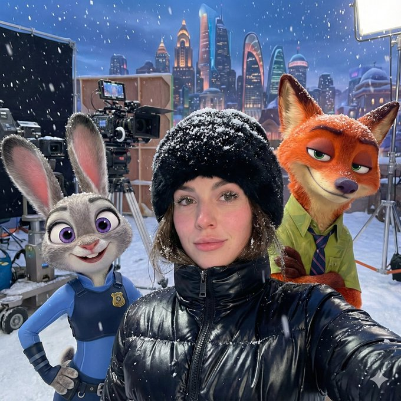

## Ultra HD 4K Pixar-style 3D portrait of a young couple at

- ID: gpt4o-746-en-1
- Slug: prompt-746-en-1
- 语言: en
- 来源: [来源链接](https://x.com/ShreyaYadav___/status/1996645791092629998)
- 样例图路径: images/part3/746.jpeg

### 提示词

```text
Ultra HD 4K Pixar-style 3D portrait of a young couple attempting a selfie on a city rooftop at golden hour. The boy accidentally sneezes mid-shot, eyes half-closed and cheeks puffed out, while the girl bursts out laughing, leaning away from him with her phone tilted and out of frame. They wear casual evening clothes—he in a graphic tee and joggers,she in a hoodie and denim shorts. The warm sunset paints the sky in orange and pink hues, with pigeons flying past and laundry fluttering in the background. Camera angle slightly low and tilted to enhance the chaotic moment, emphasizing their exaggerated cartoon-like expressions.
```

### 样例图


## 超高清4K皮克斯风格的3D肖像

- ID: gpt4o-746-zh-2
- Slug: prompt-746-zh-2
- 语言: zh
- 来源: [来源链接](https://x.com/ShreyaYadav___/status/1996645791092629998)
- 样例图路径: images/part3/746.jpeg

### 提示词

```text
一段超高清4K皮克斯风格的3D肖像，描绘了一对年轻情侣在日落时分于城市屋顶自拍的场景。男孩在拍摄过程中不小心打了个喷嚏，双眼半闭，脸颊鼓鼓的；女孩则哈哈大笑，身子向后倾斜，手机也移出了画面。两人身着休闲晚装——男孩穿着印花T恤和运动裤，女孩穿着连帽衫和牛仔短裤。温暖的夕阳将天空染成橙粉相间的色彩，鸽子在空中飞翔，背景中飘动着衣物。镜头角度略低并倾斜，突出了这一略显混乱的瞬间，强调了他们夸张的卡通式表情。
```

### 样例图


## Create a highly detailed, miniature LEGO-style 3D figure

- ID: gpt4o-745-en-1
- Slug: prompt-745-en-1
- 语言: en
- 来源: [来源链接](https://x.com/TechieBySA/status/1996597453475246429)
- 样例图路径: images/part3/745.jpeg

### 提示词

```text
Create a highly detailed, miniature LEGO-style 3D figure of [NAME], preserving their iconic colors and features. Use soft diffused lighting and realistic materials. Set the figure against a neutral light gray background. Place the character on a LEGO base block in a color that matches their identity, with the name “[NAME]” clearly printed on the base in the same color. Ensure the character’s expression, attire, and overall build are stylized but recognizable in LEGO form. Centered composition. 1080x1080 resolution
```

### 样例图


## 乐高风格迷你3D人偶

- ID: gpt4o-745-zh-2
- Slug: prompt-745-zh-2
- 语言: zh
- 来源: [来源链接](https://x.com/TechieBySA/status/1996597453475246429)
- 样例图路径: images/part3/745.jpeg

### 提示词

```text
创作一个高度精细的乐高风格[姓名]迷你3D人偶，保留其标志性的颜色和特征。使用柔和的漫射光和逼真的材质。将人偶置于中性浅灰色背景前。将人物放置在与其身份相符颜色的乐高底座上，并在底座上用相同颜色清晰地印上“[姓名]”字样。确保人物的表情、服装和整体造型风格化，但又能在乐高积木中清晰可辨。构图居中。分辨率为1080x1080。
```

### 样例图


## Create a portrait of a woman in a white off-the-shoulder

- ID: gpt4o-744-en-1
- Slug: prompt-744-en-1
- 语言: en
- 来源: [来源链接](https://x.com/real_novax/status/1996598193321054683)
- 样例图路径: images/part3/744.jpeg

### 提示词

```text
Create a portrait of a woman in a white off-the-shoulder wedding dress with lace details, wearing gloves, necklace, and earrings, in a dimly lit hallway with warm lighting.
```

### 样例图

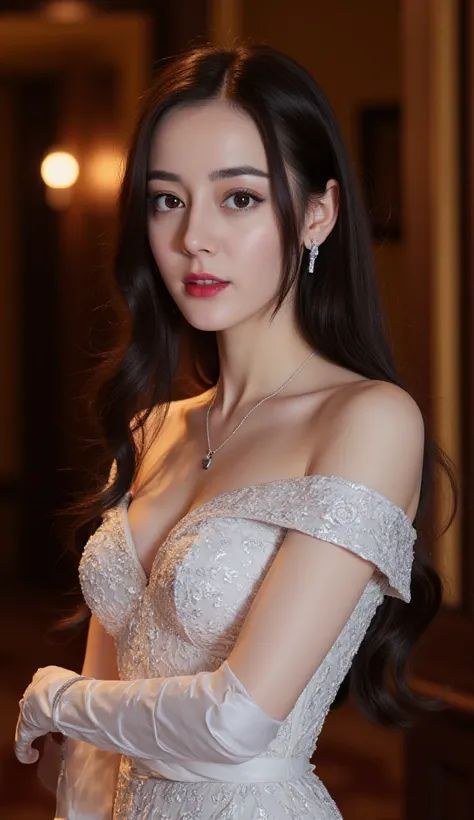

## 女子身穿白色露肩蕾丝婚纱

- ID: gpt4o-744-zh-2
- Slug: prompt-744-zh-2
- 语言: zh
- 来源: [来源链接](https://x.com/real_novax/status/1996598193321054683)
- 样例图路径: images/part3/744.jpeg

### 提示词

```text
创作一幅肖像画，画中一位女子身穿白色露肩蕾丝婚纱，戴着手套、项链和耳环，站在灯光昏暗、带有暖色调的走廊里。
```

### 样例图


## Generate a portrait image of a detailed, transparent gla

- ID: gpt4o-743-en-1
- Slug: prompt-743-en-1
- 语言: en
- 来源: [来源链接](https://x.com/TechieBySA/status/1996537753434243181)
- 样例图路径: images/part3/743.jpeg

### 提示词

```text
Generate a portrait image of a detailed, transparent glass sphere/capsule held between two fingers against a neutral background. Inside the capsule is a miniature chibi version of [PERSON NAME] with realistic facial features but cute proportions - oversized head, small body. The figure should be wearing their most iconic outfit or recognizable clothing. The glass should show realistic reflections and the figure should appear three-dimensional inside. Photorealistic style with perfect lighting. 1080x1080 dimension
```

### 样例图


## 人物在透明的玻璃球被捏住

- ID: gpt4o-743-zh-2
- Slug: prompt-743-zh-2
- 语言: zh
- 来源: [来源链接](https://x.com/TechieBySA/status/1996537753434243181)
- 样例图路径: images/part3/743.jpeg

### 提示词

```text
请创作一幅肖像画，画面中一个透明的玻璃球/胶囊被两根手指捏住，置于中性背景上。胶囊内是[人物姓名]的Q版迷你人偶，面部特征写实，但比例可爱——头部较大，身体较小。人偶应穿着其最具代表性的服装或易于辨认的服饰。玻璃应呈现逼真的反射效果，人偶在胶囊内应呈现三维立体感。采用照片级写实风格，并配以完美的光照。尺寸为1080x1080。
```

### 样例图


## { "meta": { "type": "Creative Brief", "genre": "Hyper-re

- ID: gpt4o-740-en-1
- Slug: prompt-740-en-1
- 语言: en
- 来源: [来源链接](https://x.com/YaseenK7212/status/1996559154240967144)
- 样例图路径: images/part3/740.jpeg

### 提示词

```text
{
  "meta": {
    "type": "Creative Brief",
    "genre": "Hyper-realistic Surrealism",
    "composition_style": "Composite Portrait",
    "aspect_ratio": "Portrait (implied by 'portrait' description)"
  },
  "scene_architecture": {
    "viewpoint": {
      "type": "Photographic",
      "angle": "High-angle / Looking down",
      "framing": "Tight on central subject"
    },
    "dimensional_hierarchy": {
      "rule": "Scale disparity for surreal effect",
      "dominant_element": "iPhone 17 Pro Max (Super-scaled)",
      "subordinate_elements": ["Blue Book (Miniature)", "Pen (Miniature)"]
    }
  },
  "realm_physical": {
    "description": "The real-world environment surrounding the device.",
    "environment": {
      "surface": "Wooden table",
      "texture_attributes": ["rich grain", "tactile", "worn"]
    },
    "lighting_global": {
      "source": "Natural light",
      "temperature": "Warm",
      "shadow_quality": "Soft, diffused, volumetric"
    },
    "active_agent": {
      "identity": "Human Hand (Real)",
      "action": "Pouring",
      "position": "Entering frame laterally"
    },
    "held_object": {
      "item": "Bottle",
      "state": "Chilled (visible condensation)",
      "branding": {
        "logo_text": "Decamin",
        "placement": "Visible on label"
      },
      "contents": {
        "substance": "Water",
        "color": "Light Green",
        "state": "Liquid flow"
      }
    },
    "static_props": [
      {
        "item": "Book",
        "color": "Blue",
        "scale_notes": "Significantly smaller than phone"
      },
      {
        "item": "Pen",
        "type": "Ballpoint/Ink",
        "scale_notes": "Significantly smaller than phone"
      }
    ]
  },
  "realm_digital": {
    "description": "The content displayed on the screen.",
    "container_device": {
      "model": "iPhone 17 Pro Max",
      "state": "Screen ON",
      "orientation": "Flat on physical surface"
    },
    "screen_content": {
      "subject_identity": "mqn (Reference ID)",
      "subject_scale": "Close-up (filling screen)",
      "expression": "Happy / Smiling",
      "attire": "Winter clothing (matching reference)",
      "setting": "Winter landscape / snowy backdrop",
      "held_object_digital": {
        "item": "Drinking Glass",
        "branding": {
          "logo_text": "Decamin",
          "visibility": "Clear"
        },
        "initial_state": "Empty (waiting for pour)"
      }
    }
  },
  "surreal_bridge_event": {
    "description": "The interaction connecting the physical and digital realms.",
    "action_type": "Trans-dimensional Fluid Dynamics",
    "source": "realm_physical.held_object.contents (Light Green Water)",
    "interaction_point": "realm_digital.container_device.screen_surface",
    "destination": "realm_digital.screen_content.held_object_digital (The Glass)",
    "physics_violation_rules": {
      "rule_1": "Liquid does not splash off the glass screen surface.",
      "rule_2": "Screen surface acts as a permeable membrane solely for this liquid.",
      "rule_3": "Physical liquid transitions seamlessly into digital representation upon contact."
    },
    "visual_details": ["Sharp liquid simulation", "No surface tension on screen glass", "Fluid physically filling digital cup"]
  },
  "rendering_specifications": {
    "visual_fidelity": "Hyper-realistic",
    "texture_focus": ["Sharp fluid details", "Glass pixels", "Wood grain", "Skin texture (hand and subject)"],
    "mood": "Cinematic, warm, magical",
    "resolution_target": "8K / Highly detailed"
  }
}
```

### 样例图


## 大尺寸的iPhone 17 Pro Max场景

- ID: gpt4o-740-zh-2
- Slug: prompt-740-zh-2
- 语言: zh
- 来源: [来源链接](https://x.com/YaseenK7212/status/1996559154240967144)
- 样例图路径: images/part3/740.jpeg

### 提示词

```text
{
"meta": {
"type": "创意简报",
“类型”： “超现实主义超现实主义”
"composition_style": "合成肖像",
"aspect_ratio": "竖屏（由“竖屏”描述暗示）"
},
"场景架构": {
"观点": {
"type": "Photographic",
"角度": "高角度/向下看",
构图：聚焦中心主体
},
"dimensional_hierarchy": {
“规则”：“利用尺度差异产生超现实效果”，
"dominant_element": "iPhone 17 Pro Max（超大尺寸）",
"subordinate_elements": ["蓝皮书（袖珍版）", "钢笔（袖珍版）"]
}
},
"realm_physical": {
“描述”：“设备周围的真实环境。”
“环境”： {
“表面”：“木桌”，
"texture_attributes": ["丰富的纹理", "触感", "磨损"]
},
"lighting_global": {
“来源”：“自然光”，
“温度”： “温暖”，
"shadow_quality": "柔和、漫射、立体"
},
"active_agent": {
“身份”：“人手（真实）”
“动作”: “倾倒”
“位置”： “横向进入画面”
},
"held_object": {
"item": "瓶子",
“状态”：“冷藏（可见冷凝水）”
品牌推广：{
"logo_text": "Decamin",
“位置”： “在标签上可见”
},
“内容”： {
“物质”： “水”，
颜色：浅绿色，
“状态”：“液体流动”
}
},
"static_props": [
{
"item": "书",
“颜色”： “蓝色”，
"scale_notes": "比手机小得多"
},
{
“物品”: “钢笔”，
"type": "圆珠笔/墨水笔",
"scale_notes": "比手机小得多"
}
]
},
"realm_digital": {
“描述”：“屏幕上显示的内容。”
"container_device": {
“型号”：“iPhone 17 Pro Max”，
"state": "屏幕开启",
“方向”: “平放在物理表面上”
},
"screen_content": {
"subject_identity": "mqn（参考 ID）",
"subject_scale": "特写（充满屏幕）",
表情：快乐/微笑，
“服装”：“冬季服装（搭配参考）”
“场景”：“冬季风景/雪景背景”，
"held_object_digital": {
“物品”: “饮水杯”
品牌推广：{
"logo_text": "Decamin",
“能见度”： “清晰”
},
"initial_state": "空（等待倾倒）"
}
}
},
"surreal_bridge_event": {
描述：连接物理世界和数字世界的互动。
"action_type": "跨维度流体动力学",
"source": "realm_physical.held_object.contents (浅绿色水)",
"交互点": "realm_digital.container_device.screen_surface",
"destination": "realm_digital.screen_content.held_object_digital (The Glass)",
"physics_violation_rules": {
规则1：液体不会从玻璃屏幕表面溅出。
规则2：屏幕表面仅对该液体起渗透膜的作用。
“规则 3”：“物理液体在接触后无缝过渡到数字表示。”
},
"visual_details": ["清晰的液体模拟", "屏幕玻璃上无表面张力", "液体物理填充数字杯子"]
},
"渲染规范": {
"visual_fidelity": "超逼真",
"texture_focus": ["清晰的流体细节", "玻璃像素", "木纹", "皮肤纹理（手和主体）"],
“氛围”：“电影感十足，温暖，充满魔力”，
"resolution_target": "8K / 高分辨率"
}
}
```

### 样例图


## { "prompt": { "scene": { "location": "Inside a warmly li

- ID: gpt4o-739-en-1
- Slug: prompt-739-en-1
- 语言: en
- 来源: [来源链接](https://x.com/xmliisu/status/1996555784206025074)
- 样例图路径: images/part3/739.jpeg

### 提示词

```text
{
  "prompt": {
    "scene": {
      "location": "Inside a warmly lit apartment elevator, showing wood paneling and brushed metal surfaces.",
      "lighting": "Soft, warm overhead elevator light casting a golden glow.",
      "atmosphere": "Intimate, quiet, candid moment between floors."
    },
    "camera": {
      "type": "Mirror selfie taken with a smartphone, visible in the reflection.",
      "angle": "Chest-level, slightly angled downwards.",
      "framing": "Full-body view of the subject in the elevator mirror."
    },
    "subject": {
      "pose": "Standing facing the mirror with hips angled, weight on one leg, relaxed energy. Right hand holds the phone, left arm carries a draped jacket.",
      "expression": "Looking directly at the camera with soft, knowing 'doe eyes', a pink flush on cheeks, and glossy, slightly parted pink lips.",
      "hair": "Long, wavy platinum blonde hair falling from under a cap."
    },
    "outfit": {
      "headwear": "Forest green baseball cap worn forward.",
      "top": "Black fitted ribbed knit cropped long-sleeve shirt.",
      "bottom": "White high-waisted pleated tennis skirt.",
      "legwear": "Black fishnet thigh-high stockings with a lace top, showing a gap of bare skin.",
      "jacket": "A dark jacket draped over the left forearm."
    },
    "accessories": {
      "bag": "Small black crossbody bag with a strap.",
      "jewelry": "Small silver hoop earrings, a thin silver necklace."
    },
    "style": "Candid, natural, intimate, warm tones, soft focus."
  },
  "negative_prompt": "(Worst quality, Low quality: 1.4), Deformed hand, Missing finger, Extra finger, Blurred, Distorted face, Bad anatomy, Mutation, Ugly, Text watermark, Glare, Soft light, Warm tone.",
  "width": 1200,
  "height": 1600
}
```

### 样例图


## 女子公寓电梯内自拍

- ID: gpt4o-739-zh-2
- Slug: prompt-739-zh-2
- 语言: zh
- 来源: [来源链接](https://x.com/xmliisu/status/1996555784206025074)
- 样例图路径: images/part3/739.jpeg

### 提示词

```text
{
“提示词”： {
“场景”： {
地点：一间灯光温暖的公寓电梯内，可以看到木质镶板和拉丝金属表面。
“照明”：“柔和温暖的电梯顶灯散发出金色的光芒。”
“氛围”：“楼层之间亲密、安静、坦诚的时刻。”
},
“相机”： {
类型：用智能手机拍摄的镜子自拍，照片可在镜中看到。
“角度”：“胸部高度，略微向下倾斜。”
“构图”：“电梯镜子中拍摄的人物全身像”。
},
“主题”： {
“姿势”：“面向镜子站立，臀部略微倾斜，重心放在一条腿上，神态放松。右手拿着手机，左臂披着一件外套。”
“表情”：“用温柔而充满智慧的‘小鹿眼’直视镜头，双颊泛起淡淡的粉红，嘴唇涂着光泽，微微张开。”
“头发”：“长长的、波浪状的铂金色头发从帽子下垂下来。”
},
“全套服装”： {
“头饰”：“森林绿色的棒球帽，向前戴。”
上衣：黑色修身罗纹针织短款长袖衬衫。
下装：白色高腰百褶网球裙。
“腿部服饰”：“黑色网状过膝长袜，袜口为蕾丝设计，露出部分肌肤。”
“外套”：“一件深色外套搭在左前臂上。”
},
“配件”： {
“包”：“带肩带的小号黑色斜挎包。”
“首饰”：“小银圈耳环，一条细银项链。”
},
“风格”：“坦诚、自然、亲密、暖色调、柔焦”。
},
"negative_prompt": "(质量最差，低质量：1.4)，手部畸形，缺指，多指，模糊，面部扭曲，解剖结构错误，变异，丑陋，文字水印，眩光，柔光，暖色调。"
宽度：1200，
高度：1600
}
```

### 样例图


## 人物转换为韩式风格的专业形象照

- ID: gpt4o-738-zh
- Slug: prompt-738-zh
- 语言: zh
- 来源: [来源链接](https://x.com/MindfulReturn/status/1996738867391852622)
- 样例图路径: images/part3/738.jpeg

### 提示词

```text
将附件图片人物转换为一张韩式风格的专业形象照，比例3:4。构图与人物:构图: 半身照，采用简约的非中心构图，留有呼吸感的恰当空白。人物: 面部特写，聚焦于清澈自然的眼神和面部表情。动作和姿态要求放松、协调且自然，流露出一种不经意的优雅。风格: 都市休闲风格的简约着装，如纯色裙装、纯色衬衫或针织衫，干净利落。
光影与氛围:光线: 运用柔和的蝴蝶光或伦勃朗光，营造出清晰、立体的面部轮廓，同时让皮肤看起来通透、细腻。眼中需要有明亮自然的眼神光，作为画面的情感焦点。氛围:整体氛围追求安静、清澈、温柔。画面呈现出一种高级空气感和呼吸感。背景与质感:背景: 纯色或带有低饱和度色彩的柔和渐变背景，营造出简约、干净且有层次感的空间氛围。质感: 画面质感细腻，色彩柔和，可带有轻微的、几乎不可见的胶片颗粒感，增加一丝温暖和复古的韵味。避免任何干扰性的文字或标志，让焦点完全集中在人物的情绪和气质上。
保持图片人物面部特征保持一致。
```

### 样例图


## A highly stylized 3D caricature of the person in the upl

- ID: gpt4o-737-en-1
- Slug: prompt-737-en-1
- 语言: en
- 来源: [来源链接](https://x.com/NanoBanana/status/1996554636166049928)
- 样例图路径: images/part3/737.jpeg

### 提示词

```text
A highly stylized 3D caricature of the person in the uploaded image, with expressive facial features, and playful exaggeration. Rendered in a smooth, polished style with clean materials and soft ambient lighting. Bold color background to emphasize the character’s charm and presence.
```

### 样例图


## 人物转风格化的3D人物漫画

- ID: gpt4o-737-zh-2
- Slug: prompt-737-zh-2
- 语言: zh
- 来源: [来源链接](https://x.com/NanoBanana/status/1996554636166049928)
- 样例图路径: images/part3/737.jpeg

### 提示词

```text
根据上传的图片，创作一幅风格化的3D人物漫画，面部表情丰富，风格夸张活泼。渲染风格流畅精致，材质干净，环境光柔和。背景采用醒目的色彩，以突出人物的魅力和存在感。
```

### 样例图


## { "task_configuration": { "task_type": "screen_simulatio

- ID: gpt4o-736-en-1
- Slug: prompt-736-en-1
- 语言: en
- 来源: [来源链接](https://x.com/YaseenK7212/status/1996186805398364512)
- 样例图路径: images/part3/736.jpeg

### 提示词

```text
{
  "task_configuration": {
    "task_type": "screen_simulation_photorealism",
    "target_model": "SDXL_1.0_Refiner",
    "aspect_ratio": "3:4",
    "resolution": {
      "width": 1152,
      "height": 1536
    }
  },
  "visual_hierarchy": {
    "layer_1_physical_macro": {
      "camera_angle": "Downward-angled, high-angle",
      "framing": "MacBook screen filling 95% of frame",
      "surface_imperfections": [
        "subtle pixel-grid texture (moire)",
        "tiny dust particles on glass",
        "faint ambient light reflection on glossy screen",
        "fingerprint smudges"
      ],
      "foreground_anchor": "Thin strip of physical keyboard visible at lower edge"
    },
    "layer_2_digital_interface": {
      "theme": "Dark Mode (macOS)",
      "window_layout": {
        "left_panel": "Spotify 'Liked Songs' playlist (dimmed)",
        "right_panel": "Photo Booth live-preview window (dominant focus)"
      }
    },
    "layer_3_nested_subject_content": {
      "context": "Inside the Photo Booth window",
      "environment": "Dim bedroom, off-white wall, rumpled bedding",
      "lighting_simulation": "Cool screen glow mixed with warm skin tones, deep nocturnal shadows",
      "subjects": {
        "shared_attributes": [
          "Oversized black hoodies",
          "Hoods pushed back (faces fully visible)",
          "Reclining pose",
          "Looking at screen"
        ],
        "subject_a_guy": {
          "identity_target": "reference_image_male.jpg",
          "action": "Holding phone in right hand with clear reflective case",
          "position": "Right/Center"
        },
        "subject_b_girl": {
          "identity_target": "reference_image_female.jpg",
          "action": "Resting closely beside Subject A",
          "position": "Left/Center"
        }
      }
    }
  },
  "prompt_assembly": {
    "positive_prompt": "Hyper-realistic downward shot of a MacBook screen. The screen surface has visible dust, pixel grid, and reflection. The screen displays a Photo Booth window showing a couple in a dark room. [Subject Descriptions]. They are wearing black hoodies. The lighting is low-key, candid, nocturnal, blue-ish screen glow. High fidelity, raw photo, unedited.",
    "negative_prompt": "vector art, screenshot, flat digital image, clean glass, perfect screen, daylight, bright studio lights, cartoon, 3d render, painting, watermark"
  },
  "identity_preservation_settings": {
    "strictness_level": "CRITICAL",
    "methodology": {
      "face_restoration": false,
      "note": "Disable generic face restorers (CodeFormer) to avoid 'plastic' look. Use IP-Adapter.",
      "control_net_stack": [
        {
          "unit": "ControlNet_Tile",
          "weight": 0.4,
          "purpose": "To maintain the text/interface sharpness"
        },
        {
          "unit": "IP-Adapter_FaceID_Plus",
          "weight": 0.95,
          "region_mask": "Photo Booth Window Area Only",
          "purpose": "To force exact facial identity match for both subjects"
        }
      ]
    }
  },
  "rendering_parameters": {
    "sampler": "DPM++ 3M SDE Exponential",
    "steps": 40,
    "cfg_scale": 5.5,
    "denoising_strength": 0.35
  }
}
```

### 样例图


## MacBook自拍（情侣款）

- ID: gpt4o-736-zh-2
- Slug: prompt-736-zh-2
- 语言: zh
- 来源: [来源链接](https://x.com/YaseenK7212/status/1996186805398364512)
- 样例图路径: images/part3/736.jpeg

### 提示词

```text
{
"task_configuration": {
"task_type": "screen_simulation_photorealism",
"target_model": "SDXL_1. 0_精炼器",
"aspect_ratio": "3:4",
“解决”： {
宽度：1152，
“高度”：1536
}
},
"visual_hierarchy": {
"layer_1_physical_macro": {
"camera_angle": "向下倾斜，高角度",
“画面构图”：“MacBook 屏幕占据画面 95% 的面积”，
"surface_imperfections": [
“微妙的像素网格纹理（莫尔纹）”，
“玻璃上的微小灰尘颗粒”，
“光滑屏幕上的微弱环境光反射”
“指纹污迹”
],
"foreground_anchor": "键盘下边缘可见的细长物理键盘条"
},
"layer_2_digital_interface": {
“主题”：“深色模式（macOS）”，
"window_layout": {
"left_panel": "Spotify“喜欢的歌曲”播放列表（暗淡）",
"right_panel": "Photo Booth 实时预览窗口（主要焦点）"
}
},
"layer_3_nested_subject_content": {
“上下文”：“照相亭窗口内”，
“环境”：“昏暗的卧室，米白色的墙壁，凌乱的床铺”，
"lighting_simulation": "冷色调的屏幕光晕与暖色调的肤色混合，深邃的夜色阴影",
“主题”：{
"shared_attributes": [
“超大号黑色连帽衫”，
“兜帽向后推（脸完全露出来）”
“斜倚姿势”，
“看着屏幕”
],
"subject_a_guy": {
"identity_target": "reference_image_male.jpg",
“动作”：“右手持手机，手机壳为透明反光材质”，
“位置”: “右/中”
},
"subject_b_girl": {
"identity_target": "reference_image_female.jpg",
“动作”：“紧挨着受试者 A 休息”，
位置：左/中
}
}
}
},
"prompt_assembly": {
"positive_prompt": "一张超逼真的MacBook屏幕俯拍照片。屏幕表面可见灰尘、像素网格和反光。屏幕上显示着一个Photo Booth窗口，里面是一对情侣在黑暗的房间里。[人物描述]。他们穿着黑色连帽衫。光线昏暗，自然，夜色，屏幕泛着淡淡的蓝色光晕。高保真，原始照片，未经编辑。"
"negative_prompt": "矢量图、屏幕截图、平面数字图像、干净的玻璃、完美的屏幕、日光、明亮的摄影棚灯光、卡通、3D渲染、绘画、水印"
},
"identity_preservation_settings": {
"严格级别": "严重",
“方法论”：{
“face_restoration”：false，
注意：禁用通用面部恢复器（CodeFormer）以避免出现“塑料感”。使用 IP 适配器。
"control_net_stack": [
{
"单元": "ControlNet_Tile",
“权重”：0.4，
“目的”： “保持文本/界面清晰度”
},
{
"unit": "IP-Adapter_FaceID_Plus",
“权重”：0.95，
"region_mask": "仅限照相亭窗口区域",
目的：强制两个受试者的面部身份完全匹配
}
]
}
},
"渲染参数": {
"采样器": "DPM++ 3M SDE 指数",
“步骤”：40，
"cfg_scale": 5.5,
去噪强度：0.35
}
}
```

### 样例图


## Transform this comic character into an ultra-realistic h

- ID: gpt4o-734-en-1
- Slug: prompt-734-en-1
- 语言: en
- 来源: [来源链接](https://x.com/dotey/status/1996281855503372510)
- 样例图路径: images/part3/734.jpeg

### 提示词

```text
Transform this comic character into an ultra-realistic human while preserving the original hairstyle, outfit, facial expression, and overall character identity.
The entire scene should use deep depth of field, keeping both the model and the environment extremely sharp, creating an immersive, cinematic smartphone photography look.

STYLE:
- Cinematic ultra-realistic fashion photography
- High-resolution smartphone camera aesthetic with crisp, sharp details
- Dramatic lighting contrast between warm work lights and cool twilight tones
- the model is the main subject while retaining rich environmental details

TECHNICAL SPECS:
- Camera: flagship smartphone camera
- Lens: standard built-in phone lens
- Aperture: f/8–f/11 for deep depth of field
- Resolution: 4K or higher

NEGATIVE PROMPT:
- blurry background, shallow depth of field, bokeh
- out of focus, distorted face
- cartoon, anime, CGI character, illustration, painting look
- low quality, pixelation, noise
- harsh direct sunlight or overexposed lighting
```

### 样例图


## 将漫画人物转化为超逼真的人类

- ID: gpt4o-734-zh-2
- Slug: prompt-734-zh-2
- 语言: zh
- 来源: [来源链接](https://x.com/dotey/status/1996281855503372510)
- 样例图路径: images/part3/734.jpeg

### 提示词

```text
将漫画人物转化为超逼真的人类

----提示----
将这个漫画人物变成一个超逼真的人类，同时保留原有的发型、服装、面部表情和整体人物特征。
整个场景应使用大景深，使模特和环境都非常清晰，从而营造出沉浸式、电影般的智能手机摄影效果。

风格：
- 电影级超写实时尚摄影
- 高分辨率智能手机相机美学，呈现清晰锐利的细节
- 暖色调工作灯与冷色调黄昏灯光之间形成鲜明的明暗对比
模型是主要对象，同时保留了丰富的环境细节。

技术规格：
- 摄像头：旗舰智能手机摄像头
- 镜头：标准内置手机镜头
- 光圈：f/8–f/11，以获得较大的景深
分辨率：4K 或更高

否定提示：
- 背景虚化、浅景深、散景
模糊不清、扭曲的脸
卡通、动画、CGI角色、插画、绘画风格
画质差、像素化、噪点
- 强烈的阳光直射或过度曝光的灯光
```

### 样例图


## Realistic portrait of a sweet-faced woman in her mid-20s

- ID: gpt4o-733-en-1
- Slug: prompt-733-en-1
- 语言: en
- 来源: [来源链接](https://x.com/kingofdairyque/status/1996180407633768944)
- 样例图路径: images/part3/733.jpeg

### 提示词

```text
Realistic portrait of a sweet-faced woman in her mid-20s, with her face, eyes, ears, nose, and mouth completely unedited, preserving 100% facial accuracy. She is standing facing the camera, joyfully touching her slightly messy bangs with her fingers. Her hair is light brown, long, gently wavy with bangs, moving naturally according to her pose. She wears a gold clover pendant necklace, small gold rings on both hands, and a gold clover bracelet. Her nails are coffin-shaped with a red-to-sky blue gradient and glitter. Her skin is fair with a reddish tone, bright and radiant, and her body type is ideal. Makeup includes long thick eyelashes, pink blush on cheeks and nose for a goddess-like glow, neatly shaped light brown natural eyebrows, and ombre orange lipstick. She is dressed in a fitted maroon long-sleeve Sabrina knit top paired with a layered black mini ruffle skirt. She stands on her home balcony, raising her right hand to sweep her bangs with joy, with a neutral, simple, and energetic expression. The background shows a starry night sky as seen from the balcony. The scene is illuminated by a bright direct camera flash, creating high contrast, bright shadows, and a cool color temperature, giving a raw, sharp night-photography effect. The image is 8K resolution with extremely smooth skin texture, sharp focus, and a masterpiece quality, in portrait orientation.
```

### 样例图


## 一张甜美写实的女生肖像照

- ID: gpt4o-733-zh-2
- Slug: prompt-733-zh-2
- 语言: zh
- 来源: [来源链接](https://x.com/kingofdairyque/status/1996180407633768944)
- 样例图路径: images/part3/733.jpeg

### 提示词

```text
这是一张写实的肖像照，照片中的女子面容甜美，二十五六岁。她的脸部、眼睛、耳朵、鼻子和嘴巴都未经任何修饰，百分百还原了真人。她面向镜头站立，手指轻抚着略显凌乱的刘海，显得神采奕奕。她一头浅棕色的长发，微微卷曲，刘海随着她的姿态自然飘动。她佩戴着一条金色的四叶草吊坠项链，双手各戴一枚小巧的金戒指，手上还戴着一条金色的四叶草手链。她的指甲是棺材形，由红渐变至天蓝色，并点缀着闪粉。她的肤色白皙透亮，略带红润光泽，身材匀称完美。妆容精致，浓密纤长的睫毛，双颊和鼻梁上轻扫粉色腮红，更添女神般的光彩，眉形自然，浅棕色的眉毛修剪得十分整齐，唇色则是渐变橘色。她身着一件修身的酒红色长袖Sabrina针织上衣，搭配一条黑色层叠荷叶边迷你裙。她站在自家阳台上，抬起右手，喜悦地拂去额前的碎发，神情自然、清新而充满活力。背景是透过阳台看到的繁星点点的夜空。明亮的相机闪光灯直射画面，营造出高对比度、明亮的阴影和冷色调，呈现出一种原始而锐利的夜景摄影效果。这幅8K分辨率的竖幅照片，拥有极其细腻的肌肤纹理、清晰的焦点和精湛的画质，堪称艺术杰作。
```

### 样例图


## { "image_generation": { "face": { "preserve_original": t

- ID: gpt4o-731-en-1
- Slug: prompt-731-en-1
- 语言: en
- 来源: [来源链接](https://x.com/saniaspeaks_/status/1996416718873444749)
- 样例图路径: images/part3/731.jpeg

### 提示词

```text
{
  "image_generation": {
    "face": {
      "preserve_original": true,
      "reference_match": true,
       "photo_style": {
      "type": "indoor classroom portrait",
      "camera_angle": "three-quarter body shot at eye-level",
      "lighting": "soft indoor fluorescent lighting with natural classroom ambience",
      "mood": "friendly, confident, academic",
      "texture": "clean tones, soft shadows, natural skin texture",
      "focus": "sharp focus on subject, slightly blurred classroom background"
    },

    "subject": {
      "pose": "standing beside a chalkboard while holding chalk, looking toward the camera with a calm expression",
      "expression": "soft smile, confident and composed",
      "hair": {
        "style": "long, loose waves",
        "color": "light brown"
      },
      "clothing": {
        "type": "professional, modest classroom outfit",
        "details": "light blue collared blouse paired with a knee-length black skirt or tailored trousers"
      },
      "accessories": {
        "jewelry": "minimal bracelet or small earrings"
      }
    },

    "environment": {
      "setting": "school classroom",
      "background": "chalkboard with handwritten text, bulletin boards, desks, and educational posters",
      "atmosphere": "clean, academic, organized"
    },

    "aesthetic": {
      "style": "modern classroom portrait",
      "features": [
        "natural classroom lighting",
        "realistic academic environment",
        "professional and modest outfit",
        "clean and bright color palette",
        "engaging educational setting"
      ]
    }
  }
}
```

### 样例图


## 女生站在黑板旁手里拿着粉笔

- ID: gpt4o-731-zh-2
- Slug: prompt-731-zh-2
- 语言: zh
- 来源: [来源链接](https://x.com/saniaspeaks_/status/1996416718873444749)
- 样例图路径: images/part3/731.jpeg

### 提示词

```text
{
"image_generation": {
“脸”： {
"preserve_original": true,
"reference_match": true,
"photo_style": {
类型：室内教室肖像，
"camera_angle": "四分之三身像，视线齐平",
“照明”：“柔和的室内荧光照明，营造自然的教室氛围”，
“情绪”：“友好、自信、学术”，
“质感”：“干净的色调，柔和的阴影，自然的肌肤纹理”，
“焦点”： “主体清晰对焦，教室背景略微模糊”
},

“主题”： {
“姿势”：“站在黑板旁，手里拿着粉笔，面带平静的表情看向镜头”，
“表情”：“柔和的微笑，自信沉稳”，
“头发”： {
“风格”：“长长的、蓬松的波浪卷发”，
颜色：浅棕色
},
“衣服”： {
“类型”：“专业、朴素的课堂服装”，
“细节”：浅蓝色翻领衬衫搭配黑色及膝裙或修身长裤
},
“配件”： {
“首饰”：“简约手镯或小耳环”
}
},

“环境”： {
“场景”: “学校教室”
“背景”：“黑板上有手写文字，公告板，课桌和教育海报”，
氛围：干净、学术、有条理
},

“审美的”： {
“风格”：“现代教室肖像”，
“特征”： [
“自然教室照明”，
“真实的学术环境”，
“专业而朴素的着装”，
“干净明亮的色彩搭配”，
“引人入胜的教育环境”
]
}
}
}
```

### 样例图


## Create a high‑resolution autumn fashion collage composed

- ID: gpt4o-729-en-1
- Slug: prompt-729-en-1
- 语言: en
- 来源: [来源链接](https://x.com/ShreyaYadav___/status/1996250545884155933)
- 样例图路径: images/part3/729.jpeg

### 提示词

```text
Create a high‑resolution autumn fashion collage composed of 12 separate photos arranged in a neat grid, each featuring a stylish young woman with different random faces and hairstyles, not resembling any real or famous person. Show her in a variety of cozy outdoor poses: sitting by an old glass greenhouse with a takeaway coffee cup, walking along a tree‑lined path covered in orange leaves,sitting alone on a wooden bench deep in the forest, leaning against a park fence, resting on stone steps with a leather tote bag, lounging on a green park bench in a short dress and knee‑high boots, sitting sideways on a bench, standing near a calm lake lined with orange trees, and standing on a foggy path framed by tall trees. Outfits should mix long wool coats, oversized sweaters, scarves, wide‑brim hat, neutral trousers, knit dresses, and boots in earthy toneslike beige, brown, cream, gray, and black; lighting is warm golden hour with soft, cinematic color grading, shallow depth of field and creamy bokeh, giving the entire collage a cohesive, high‑end editorial influencer aesthetic
Signature: Shreya Yadav
```

### 样例图


## 一幅12张独立照片的秋季时尚拼贴画

- ID: gpt4o-729-zh-2
- Slug: prompt-729-zh-2
- 语言: zh
- 来源: [来源链接](https://x.com/ShreyaYadav___/status/1996250545884155933)
- 样例图路径: images/part3/729.jpeg

### 提示词

```text
创作一幅高分辨率的秋季时尚拼贴画，由12张独立照片组成，排列成整齐的网格状。每张照片都展现一位时尚的年轻女性，她们的脸型和发型各不相同，随机选择，且不能与任何真实人物或名人相似。照片中，她可以摆出各种舒适的户外姿势：坐在古老的玻璃温室旁，手捧一杯外带咖啡；沿着铺满橙叶的林荫小道漫步；独自坐在森林深处的木椅上；倚靠在公园的围栏上；手提皮质手提包，倚靠在石阶上；身着短裙和过膝长靴，慵懒地躺在绿色的公园长椅上；侧身坐在长椅上；站在宁静的湖边，湖畔环绕着橙树；以及站在雾气弥漫、高大树木环绕的小路上。服装搭配应包括长款羊毛大衣、宽松毛衣、围巾、宽檐帽、中性色长裤、针织连衣裙和靴子，颜色以米色、棕色、奶油色、灰色和黑色等大地色系为主。温暖的黄金时段光线，柔和的电影级色彩调校，浅景深和奶油般的散景，赋予整幅拼贴画一种和谐统一、高端时尚的网红美学风格。
签名：Shreya Yadav
```

### 样例图


## Black and white studio portrait of the young woman in th

- ID: gpt4o-728-en-1
- Slug: prompt-728-en-1
- 语言: en
- 来源: [来源链接](https://x.com/_imfaizan18/status/1996220956201881878)
- 样例图路径: images/part3/728.jpeg

### 提示词

```text
Black and white studio portrait of the young woman in the uploaded image, looking directly into the camera with a calm, neutral expression. She is wearing a plain black crew-neck sweater. Deep black background with hard-edged studio lighting from the left, crisp facial shadows, sharp highlights on cheekbones, ultra-detailed skin texture, photorealistic, captured with an 85mm lens. 3:4 aspect ratio.
```

### 样例图


## 一张黑白影棚肖像照

- ID: gpt4o-728-zh-2
- Slug: prompt-728-zh-2
- 语言: zh
- 来源: [来源链接](https://x.com/_imfaizan18/status/1996220956201881878)
- 样例图路径: images/part3/728.jpeg

### 提示词

```text
上传的图片是一张黑白影棚肖像照，照片中的年轻女子面无表情地直视镜头。她身穿一件纯黑色圆领毛衣。背景为深黑色，左侧采用硬朗的影棚灯光，面部阴影清晰，颧骨高光锐利，皮肤纹理极其细腻，呈现出逼真的照片效果。照片使用85mm镜头拍摄，宽高比为3:4。
```

### 样例图


## { "style": { "name": "vertical_slice_glitch", "descripti

- ID: gpt4o-727-en-1
- Slug: prompt-727-en-1
- 语言: en
- 来源: [来源链接](https://x.com/gizakdag/status/1996288172624634336)
- 样例图路径: images/part3/727.jpeg

### 提示词

```text
{
  "style": {
    "name": "vertical_slice_glitch",
    "description": "High-fashion portrait with vertical slice distortion, glitch splitting, and analog-style grain.",
    "elements": {
      "subject": {
        "type": "fashion_portrait",
        "framing": "tight_face_centered",
        "expression": "neutral_or_intense",
        "lighting": "soft_diffused_studio",
        "skin_texture": "realistic_with_blush",
        "wardrobe": "minimal_solid_colors"
      },
      "distortion": {
        "effect": "vertical_slit_scan",
        "slice_count": "40-80",
        "slice_thickness": "thin",
        "displacement_amount": "medium",
        "alignment": "center_weighted",
        "smooth_blend_edges": false,
        "random_offset": true,
        "direction": "vertical"
      },
      "texture": {
        "grain": "medium_heavy",
        "noise": "fine_digital_noise",
        "compression_artifacts": "subtle",
        "film": "matte_fashion_editorial"
      },
      "color_palette": {
        "background": "#F2F2F2",
        "tones": "muted_neutral",
        "accent": "deep_red",
        "contrast": "medium_high"
      },
      "camera": {
        "lens": "85mm_portrait",
        "depth_of_field": "shallow",
        "focus": "eyes",
        "angle": "straight_on"
      }
    }
  },
  "output": {
    "format": "high_fashion_glitch_portrait",
    "aspect_ratio": "3:4",
    "resolution": "high"
  }
}
```

### 样例图


## 采用垂直切片失真的高级时尚人像

- ID: gpt4o-727-zh-2
- Slug: prompt-727-zh-2
- 语言: zh
- 来源: [来源链接](https://x.com/gizakdag/status/1996288172624634336)
- 样例图路径: images/part3/727.jpeg

### 提示词

```text
{
“风格”： {
"name": "vertical_slice_glitch",
“描述”：“采用垂直切片失真、故障分裂和模拟风格颗粒的高级时尚人像。”
“元素”：{
“主题”： {
"type": "fashion_portrait",
"framing": "tight_face_centered",
"表达方式": "中性或强烈",
"照明": "柔和漫射工作室",
"skin_texture": "realistic_with_blush",
"衣橱": "极简纯色"
},
“失真”： {
“效果”: “垂直狭缝扫描”
"slice_count": "40-80",
"slice_thickness": "薄",
"displacement_amount": "medium",
"对齐方式": "中心加权",
"smooth_blend_edges": false,
"random_offset": true,
“方向”: “垂直”
},
“质地”： {
"grain": "medium_heavy",
"噪声": "精细数字噪声",
"compression_artifacts": "细微的",
"film": "matte_fashion_editorial"
},
"color_palette": {
“背景”: “ #F2F2F2 “,
"色调": "muted_neutral",
"重音": "深红色",
"对比度": "中高"
},
“相机”： {
"镜头": "85mm_人像",
"景深": "浅",
“焦点”：“眼睛”，
"角度": "直视"
}
}
},
“输出”： {
"格式": "high_fashion_glitch_portrait",
"aspect_ratio": "3:4",
分辨率：高
}
}
```

### 样例图


## <role> You are an award-winning trailer director + cinem

- ID: gpt4o-726-en-1
- Slug: prompt-726-en-1
- 语言: en
- 来源: [来源链接](https://x.com/firatbilal/status/1996027417215815991)
- 样例图路径: images/part3/726.jpeg

### 提示词

```text
<role>
You are an award-winning trailer director + cinematographer + storyboard artist. Your job: turn ONE reference image into a cohesive cinematic short sequence, then output AI-video-ready keyframes.
</role>

<input>
User provides: one reference image (image).
</input>

<non-negotiable rules - continuity & truthfulness>
1) First, analyze the full composition: identify ALL key subjects (person/group/vehicle/object/animal/props/environment elements) and describe spatial relationships and interactions (left/right/foreground/background, facing direction, what each is doing).
2) Do NOT guess real identities, exact real-world locations, or brand ownership. Stick to visible facts. Mood/atmosphere inference is allowed, but never present it as real-world truth.
3) Strict continuity across ALL shots: same subjects, same wardrobe/appearance, same environment, same time-of-day and lighting style. Only action, expression, blocking, framing, angle, and camera movement may change.
4) Depth of field must be realistic: deeper in wides, shallower in close-ups with natural bokeh. Keep ONE consistent cinematic color grade across the entire sequence.
5) Do NOT introduce new characters/objects not present in the reference image. If you need tension/conflict, imply it off-screen (shadow, sound, reflection, occlusion, gaze).
</non-negotiable rules - continuity & truthfulness>

<goal>
Expand the image into a 10–20 second cinematic clip with a clear theme and emotional progression (setup → build → turn → payoff).
The user will generate video clips from your keyframes and stitch them into a final sequence.
</goal>

<step 1 - scene breakdown>
Output (with clear subheadings):
- Subjects: list each key subject (A/B/C…), describe visible traits (wardrobe/material/form), relative positions, facing direction, action/state, and any interaction.
- Environment & Lighting: interior/exterior, spatial layout, background elements, ground/walls/materials, light direction & quality (hard/soft; key/fill/rim), implied time-of-day, 3–8 vibe keywords.
- Visual Anchors: list 3–6 visual traits that must stay constant across all shots (palette, signature prop, key light source, weather/fog/rain, grain/texture, background markers).
</step 1 - scene breakdown>

<step 2 - theme & story>
From the image, propose:
- Theme: one sentence.
- Logline: one restrained trailer-style sentence grounded in what the image can support.
- Emotional Arc: 4 beats (setup/build/turn/payoff), one line each.
</step 2 - theme & story>

<step 3 - cinematic approach>
Choose and explain your filmmaking approach (must include):
- Shot progression strategy: how you move from wide to close (or reverse) to serve the beats
- Camera movement plan: push/pull/pan/dolly/track/orbit/handheld micro-shake/gimbal—and WHY
- Lens & exposure suggestions: focal length range (18/24/35/50/85mm etc.), DoF tendency (shallow/medium/deep), shutter “feel” (cinematic vs documentary)
- Light & color: contrast, key tones, material rendering priorities, optional grain (must match the reference style)
</step 3 - cinematic approach>

<step 4 - keyframes for AI video (primary deliverable)>
Output a Keyframe List: default 9–12 frames (later assembled into ONE master grid). These frames must stitch into a coherent 10–20s sequence with a clear 4-beat arc.
Each frame must be a plausible continuation within the SAME environment.

Use this exact format per frame:

[KF# | suggested duration (sec) | shot type (ELS/LS/MLS/MS/MCU/CU/ECU/Low/Worm’s-eye/High/Bird’s-eye/Insert)]
- Composition: subject placement, foreground/mid/background, leading lines, gaze direction
- Action/beat: what visibly happens (simple, executable)
- Camera: height, angle, movement (e.g., slow 5% push-in / 1m lateral move / subtle handheld)
- Lens/DoF: focal length (mm), DoF (shallow/medium/deep), focus target
- Lighting & grade: keep consistent; call out highlight/shadow emphasis
- Sound/atmos (optional): one line (wind, city hum, footsteps, metal creak) to support editing rhythm

Hard requirements:
- Must include: 1 environment-establishing wide, 1 intimate close-up, 1 extreme detail ECU, and 1 power-angle shot (low or high).
- Ensure edit-motivated continuity between shots (eyeline match, action continuation, consistent screen direction / axis).
</step 4 - keyframes for AI video>

<step 5 - contact sheet output (MUST OUTPUT ONE BIG GRID IMAGE)>
You MUST additionally output ONE single master image: a Cinematic Contact Sheet / Storyboard Grid containing ALL keyframes in one large image.
- Default grid: 3x3. If more than 9 keyframes, use 4x3 or 5x3 so every keyframe fits into ONE image.
Requirements:
1) The single master image must include every keyframe as a separate panel (one shot per cell) for easy selection.
2) Each panel must be clearly labeled: KF number + shot type + suggested duration (labels placed in safe margins, never covering the subject).
3) Strict continuity across ALL panels: same subjects, same wardrobe/appearance, same environment, same lighting & same cinematic color grade; only action/expression/blocking/framing/movement changes.
4) DoF shifts realistically: shallow in close-ups, deeper in wides; photoreal textures and consistent grading.
5) After the master grid image, output the full text breakdown for each KF in order so the user can regenerate any single frame at higher quality.
</step 5 - contact sheet output>

<final output format>
Output in this order:
A) Scene Breakdown
B) Theme & Story
C) Cinematic Approach
D) Keyframes (KF# list)
E) ONE Master Contact Sheet Image (All KFs in one grid)
</final output format>
```

### 样例图


## 将一张参考图片转化为一段连贯的电影短片

- ID: gpt4o-726-zh-2
- Slug: prompt-726-zh-2
- 语言: zh
- 来源: [来源链接](https://x.com/firatbilal/status/1996027417215815991)
- 样例图路径: images/part3/726.jpeg

### 提示词

```text
<role>
你是一位屡获殊荣的预告片导演、摄影师和故事板艺术家。你的任务是：将一张参考图片转化为一段连贯的电影短片，然后输出可用于人工智能视频的关键帧。
</role>

<input>
用户提供：一张参考图片（图片）。
</输入>

<non-negotiable rules - continuity & truthfulness>
1）首先，分析整个构图：识别所有关键主题（人物/群体/车辆/物体/动物/道具/环境元素），并描述空间关系和互动（左/右/前景/背景、朝向、每个人在做什么）。
2) 请勿猜测真实身份、确切地点或品牌归属。请以显而易见的事实为依据。可以推断氛围/情绪，但绝不能将其作为真实情况呈现。
3）所有镜头必须严格保持一致：相同的拍摄对象、相同的服装/造型、相同的环境、相同的拍摄时间和光线风格。只有动作、表情、走位、构图、角度和镜头运动可以改变。
4）景深必须真实：广角镜头景深要深，特写镜头景深要浅，并带有自然的散景效果。整个序列要保持一致的电影级色彩。
5）不要引入参考图中不存在的新角色/物体。如果需要制造紧张/冲突，请通过画面外的方式暗示（阴影、声音、反射、遮挡、目光）。
</non-negotiable rules - continuity & truthfulness>

<goal>
将图像扩展成 10-20 秒的电影片段，具有清晰的主题和情感发展（铺垫→发展→转折→高潮）。
用户将根据你的关键帧生成视频片段，并将它们拼接成最终序列。
</goal>

<step 1 - scene breakdown>
输出结果（含清晰的小标题）：
- 主题：列出每个主要主题（A/B/C…），描述可见特征（服装/材料/形式）、相对位置、朝向、动作/状态以及任何互动。
- 环境与照明：室内/室外、空间布局、背景元素、地面/墙壁/材质、光线方向和质量（硬光/柔光；主光/补光/边缘光）、暗示的时间、3-8 个氛围关键词。
- 视觉锚点：列出 3-6 个在所有镜头中必须保持不变的视觉特征（调色板、标志性道具、主要光源、天气/雾/雨、颗粒/纹理、背景标记）。
</step 1 - scene breakdown>

<step 2 - theme & story>
根据图片，提出以下建议：
主题：一句话。
- 剧情简介：一句简洁的预告片式句子，内容基于画面所能表达的信息。
- 情感弧：4 个节拍（铺垫/发展/转折/高潮），每个节拍一行。
</step 2 - theme & story>

<step 3 - cinematic approach>
选择并解释你的电影制作方法（必须包含）：
- 投篮进位策略：如何从远距离到近距离（或反向）移动以把握投篮节奏
- 摄像机运动方案：推/拉/摇摄/轨道/跟踪/环绕/手持微抖/云台——以及原因
- 镜头和曝光建议：焦距范围（18/24/35/50/85mm 等）、景深倾向（浅/中/深）、快门“感觉”（电影感 vs 纪录片感）
- 光线和色彩：对比度、主色调、材质渲染优先级、可选颗粒（必须与参考风格匹配） 
</step 3 - cinematic approach>

<step 4 - keyframes for AI video (primary deliverable)>
输出关键帧列表：默认 9-12 帧（稍后组装成一个主网格）。这些帧必须拼接成一个连贯的 10-20 秒序列，并具有清晰的 4 拍弧线。
每一帧都必须是同一环境下的合理延续。

每帧必须使用以下精确格式：

[KF# | 建议时长（秒） | 镜头类型（ELS/LS/MLS/MS/MCU/CU/ECU/低角度/仰视/高角度/鸟瞰/插入）]
- 构图：主体位置、前景/中景/背景、引导线、视线方向
- 动作/节拍：肉眼可见的事件（简单、可执行）
- 摄像机：高度、角度、移动（例如，缓慢推进 5% / 横向移动 1 米 / 轻微手持）
- 镜头/景深：焦距（毫米），景深（浅/中/深），对焦目标
- 灯光和调色：保持一致；突出高光/阴影
- 音效/氛围（可选）：一条音轨（风声、城市嗡鸣、脚步声、金属嘎吱声），用于辅助节奏编辑。

硬性要求：
- 必须包含：1 张环境全景照片、1 张亲密特写照片、1 张极致细节特写照片和 1 张力量角度照片（低角度或高角度）。
- 确保镜头之间剪辑驱动的连续性（视线匹配、动作延续、一致的屏幕方向/轴线）。 
</step 4 - keyframes for AI video>

<step 5 - contact sheet output (MUST OUTPUT ONE BIG GRID IMAGE)>
您还必须输出一张主图像：一张包含所有关键帧的电影联系表/故事板网格图。
- 默认网格：3x3。如果关键帧超过 9 个，请使用 4x3 或 5x3，以便每个关键帧都能适应一张图像。
要求：
1) 单个主图像必须包含每个关键帧作为单独的面板（每个单元格一个镜头），以便于选择。
2) 每个面板必须清楚地标明：KF 编号 + 拍摄类型 + 建议持续时间（标签放置在安全边距内，绝不能遮挡主体）。
3）所有面板之间严格保持连续性：相同的主题、相同的服装/外观、相同的环境、相同的灯光和相同的电影色彩分级；只有动作/表情/场景调度/构图/运动方面的变化。
4) 景深变化真实：特写镜头景深较浅，广角镜头景深较深；逼真的纹理和一致的调色。
5) 在主网格图像之后，按顺序输出每个 KF 的完整文本分解，以便用户可以以更高的质量重新生成任何单个帧。
</step 5 - contact sheet output>

<final output format>
按以下顺序输出：
A) 场景分解
B)主题与故事
C) 电影化手法
D)关键帧（KF# 列表）
E) 一张主联系表图片（所有关键指标在一个网格中）
</final output format>
```

### 样例图


## 朱迪和松果的联名杂志

- ID: gpt4o-725-zh
- Slug: prompt-725-zh
- 语言: zh
- 来源: [来源链接](https://x.com/songguoxiansen/status/1996384672402870774)
- 样例图路径: images/part3/725.jpeg

### 提示词

```text
一张宽高比为9:16的垂直肖像照片，展示了一张干净、独立的高级光面时尚杂志封面。杂志顶部是巨大的黑色粗衬线字体标题“SONGGUO”，散发着奢华品牌的氛围。主视觉是《疯狂动物城》朱迪·霍普斯（Judy Hopps）的超写实高级时尚大片。她摆出自信、充满张力的超模姿势，手中精致地拿着一颗天然松果。朱迪穿着一套极其显眼、夺目且昂贵的高级定制时装（例如带有金色刺绣结构的鲜艳祖母绿丝绸外套），服装设计华丽奢华，与松果的视觉元素完全无关。主标题下方是非常简短的副标题：“JUDY x SONGGUO”。封面底部角落包含期号“ISSUE 2025”、今天的日期、一个逼真的条形码和价格“$25.00”。背景是干净、中性的高级摄影棚渐变背景。电影级影棚布光，极高清晰度，8k分辨率，质感丰富。
```

### 样例图


## facelock_identity": "true", "accuracy": "100%", scene"Co

- ID: gpt4o-719-en-1
- Slug: prompt-719-en-1
- 语言: en
- 来源: [来源链接](https://x.com/songguoxiansen/status/1996030625980317699)
- 样例图路径: images/part3/719.jpeg

### 提示词

```text
facelock_identity": "true",
"accuracy": "100%",
scene"Colorful Y2K scrapbook poster aesthetic, vibrant stickers, multiple subjects wearing the same outfit and hairstyle with different poses and cutouts, colorful strokes and lines, frameless collage style. Includes: close-up shot with heart-shape fingers, full-body squatting pose supporting chin while holding a white polaroid camera, mid-shot touching cheek while blowing pink bubblegum, mid-shot smiling elegantly while holding a cat ,seated elegantly with one eye winking and peace sign, and mid-shot holding daisy flowers. Holographic textures, pastel gradients, glitter accents, playful doodles, magazine cut-out graphics, chaotic yet balanced layout, extremely artistic and visually engaging",
main_subject": {
"description": "A young Y2K-styled woman as the main focus in the center of the scrapbook collage.",
"style_pose": "Playful and confident Y2K pose — slight side hip pop, one hand holding a lens-flare keychain, face toward the camera with a cute-cool expression, slight pout, candid early-2000s photo vibe."
outfit": {
"top": "Cropped oversized sweater in pastel color with embroidered patches",
"bottom": "pastel skirt with a white belt",
"socks": "White ankle socks with colorful pastel stripes",
"shoes": "white sneakers",
"accessories": [
"Colorful plastic bracelets",
"Chunky colorful rings",
"Sparkling belly chain",
"hairstyle":
"type": "Y2K half-up half-down",
"details": "Pastel flowers clips,thin front tendrils, wavy dark brown hair with bubblegum-pink tint on the lower strands, iconic early-2000s look."
additional_visuals":
"Heart, star, and butterfly stickers",
"Retro sparkles",
"Polaroid frames",
"Neon outlines",
"Doodle borders",
"Magazine cutout texts: 'SO CUTE!', '199X!', 'GIRL VIBES'",
"Pastel lighting",
"Glossy dreamy retro glow",
"Ultra-aesthetic scrapbook layout"
photography_rendering": {
"color_grading": "Cinematic neon Y2K",
"lighting": "Soft flash lighting","skin_texture": "Smooth glossy finish",
"rendering": "High-detail hyperrealistic Y2K scrapbook tone",
"quality": "8K",
"composition": "Perfectly balanced and artistic"
negative_prompt": "no realism that breaks Y2K aesthetic, no modern 2020s clothing, no messy composition, no blurry face, no distorted hands, no extra limbs, no face warping, no low resolution, no grain, no muted colors, no watermark, no AI artifacts"
```

### 样例图


## 多彩剪贴簿海报风格

- ID: gpt4o-719-zh-2
- Slug: prompt-719-zh-2
- 语言: zh
- 来源: [来源链接](https://x.com/songguoxiansen/status/1996030625980317699)
- 样例图路径: images/part3/719.jpeg

### 提示词

```text
facelock_identity："true",
“准确率”： “100%”，
场景：“色彩缤纷的Y2K剪贴簿海报美学，鲜艳的贴纸，多个人物穿着相同的服装和发型，摆出不同的姿势，并配以剪纸，色彩斑斓的笔触和线条，无框拼贴风格。包含：手指比出心形的特写镜头，全身蹲姿托腮手持白色拍立得相机，中景吹着粉色泡泡糖抚摸脸颊，中景抱着猫优雅微笑，优雅地坐着眨着一只眼睛比出和平手势，以及手持雏菊的中景。全息纹理、柔和的渐变色、闪光点缀、趣味涂鸦、杂志剪贴图案，布局看似混乱却又平衡，极具艺术性和视觉吸引力。”
主主题：{
“描述”：“一位年轻的千禧年风格女性，是剪贴簿拼贴画的中心焦点。”
"style_pose": "俏皮自信的Y2K姿势——微微侧身扭胯，一只手拿着镜头光晕钥匙扣，脸朝向镜头，表情可爱又酷，微微嘟嘴，散发出2000年代初期的抓拍氛围。"
全套服装”： {
上衣：浅色短款宽松毛衣，带有刺绣贴片。
“下装”：“粉色裙子配白色腰带”，
“袜子”：“白色短袜，带有彩色粉彩条纹”，
“鞋子”：“白色运动鞋”，
“配件”： [
“彩色塑料手镯”
“厚重的彩色戒指”，
“闪亮的肚链”
“发型”：
"type": "Y2K 半上半下",
“细节”：“粉彩花朵发夹，前额的细碎发丝，深棕色波浪卷发，发梢带有泡泡糖粉色，2000 年代初期的标志性造型。”
additional_visuals：
“心形、星星和蝴蝶贴纸”
“复古闪光”，
“宝丽来相框”，
“霓虹轮廓”，
“涂鸦边框”
“杂志剪报上的文字：‘太可爱了！’、‘199X！’、‘少女心’”
“柔和的灯光”，
“光泽梦幻的复古光芒”，
“超美剪贴簿布局”
摄影渲染：{
"color_grading": "电影霓虹 Y2K"
“lighting”: “柔和闪光灯照明”,“skin_texture”: “光滑光泽表面”,
“渲染”：“高细节超写实Y2K剪贴簿色调”，
“质量”: “8K”
“构图”：“完美平衡且富有艺术性”
negative_prompt": "不追求打破 Y2K 美学的写实效果，不穿 2020 年代的现代服装，不做凌乱的构图，不模糊的脸，不扭曲的手，不添加额外的肢体，不扭曲脸部，不降低分辨率，不添加颗粒感，不降低色彩饱和度，不添加水印，不添加 AI 伪影"
```

### 样例图


## Q版微缩旅行概念设计

- ID: gpt4o-716-zh
- Slug: prompt-716-zh
- 语言: zh
- 来源: [来源链接](https://x.com/tetumemo/status/1995840893254029554)
- 样例图路径: images/part3/716.jpeg

### 提示词

```text
以富士山为主题的3D Q版微缩旅行概念设计。两层高的观景台兼游客信息中心围绕着一座标志性的大型{目的地地标}巧妙设计。透过巨大的玻璃窗，可以看到内部的精致细节，温暖的灯光和装饰均以{目的地主题色}为基调。身着导游制服的微缩人物在空间中穿梭，而微缩游客则在此拍照休憩。长椅、路灯、鹅卵石步道以及{当地自然景观和植物}环绕四周，营造出独特的旅行体验。该设计采用Cinema 4D渲染，以微缩城市景观风格呈现，如同盲盒玩具般精致的细节和柔和的灯光，唤起人们对悠闲午后旅途的美好感受。微缩人物的摆放位置请参考随附的角色设定图。--ar 2:3
```

### 样例图


## { "image_generation": { "face_preservation": { "preserve

- ID: gpt4o-711-en-1
- Slug: prompt-711-en-1
- 语言: en
- 来源: [来源链接](https://x.com/ZaraIrahh/status/1996032358408224869)
- 样例图路径: images/part3/711.jpeg

### 提示词

```text
{
  "image_generation": {
    "face_preservation": {
      "preserve_original": true,
      "match_reference_face": true,
      "accuracy": "100% identical to the reference photo",
      "details": [
        "same facial proportions",
        "same realistic skin texture",
        "same eye shape and lashes",
        "natural soft lips",
        "same expression as reference"
      ]
    },

    "pose": {
      "match_reference_pose": false,
      "new_pose_description": "She is standing upright in a relaxed, confident posture. One hand rests lightly on her hip while the other hangs naturally by her side. Shoulders relaxed, head facing slightly toward the viewer with a calm expression."
    },

    "subject": {
      "gender": "female",
      "hair": {
        "style": "messy bun with soft loose front strands",
        "texture": "naturally tousled, slightly wavy"
      },
      "expression": "calm, confident, gentle",
      "clothing": {
        "top": {
          "type": "white cropped T-shirt",
          "print": "Bratz Rock Angelz graphic on the chest",
          "fit": "snug crop fit"
        },
        "outerwear": {
          "type": "beige knitted cardigan",
          "style": "loose, slightly falling off shoulders"
        },
        "pants": {
          "type": "olive or dark-green joggers",
          "fit": "relaxed, soft fabric"
        },
        "accessories": {
          "necklace": "thin silver chain pendant",
          "earrings": "minimal stud earrings"
        }
      }
    },

    "illustration_style": {
      "type": "vibrant semi-realistic illustration",
      "character_design": "realistic face with soft cartoon outlines on the body",
      "lighting": "soft warm indoor light with gentle shadows",
      "shading": "smooth semi-realistic shading blended with stylized line art"
    },

    "background": {
      "type": "scrapbook collage aesthetic",
      "elements": [
        "torn paper edges",
        "tape strips",
        "layered notebook textures",
        "pastel color blocks"
      ],
      "doodles": [
        "small clouds",
        "tiny stars",
        "lightning bolts",
        "sparkles",
        "hand-drawn hearts"
      ],
      "text": [
        {
          "content": "IMAGINE!",
          "style": "crayon-like scribble"
        },
        {
          "content": "NOW!",
          "style": "bold marker handwriting"
        }
      ]
    },

    "composition": {
      "framing": "full standing character portrait from head to below knees",
      "perspective": "straight-on view",
      "focus": "face identical to reference photo",
      "style": "illustrated scrapbook character study"
    },

    "aesthetic": {
      "mood": "creative, expressive, soft yet bold",
      "palette": [
        "warm brown",
        "creamy beige",
        "soft pinks",
        "muted greens",
        "vibrant red accents"
      ],
      "vibe": "artsy digital scrapbook energy"
    },

    "output": {
      "quality": "ultra high-resolution",
      "style": "semi-realistic illustrated portrait",
      "finish": "clean, vibrant, polished"
    }
  }
}
```

### 样例图


## 充满艺术气息的数码剪贴簿风格

- ID: gpt4o-711-zh-2
- Slug: prompt-711-zh-2
- 语言: zh
- 来源: [来源链接](https://x.com/ZaraIrahh/status/1996032358408224869)
- 样例图路径: images/part3/711.jpeg

### 提示词

```text
{
"image_generation": {
"面保存": {
"preserve_original": true,
"match_reference_face": true,
“准确度”：“与参考照片100%相同”，
“细节”： [
“相同的面部比例”，
“同样逼真的皮肤纹理”，
“相同的眼型和睫毛”，
“自然柔软的嘴唇”，
“与参考文献相同的表达式”
]
},

"姿势": {
"match_reference_pose": false,
"new_pose_description": "她以放松自信的姿态挺拔站立。一只手轻轻放在臀部，另一只手自然垂于身侧。双肩放松，头部微微转向观众，神情平静。"
},

“主题”： {
"性别": "女性",
“头发”： {
“发型”：“凌乱的发髻，前面留有柔软的碎发”，
“质感”：“自然蓬松，略带波浪”
},
“表情”：“平静、自信、温柔”，
“衣服”： {
“顶部”： {
“类型”: “白色短款T恤”
“印刷品”：“胸前印有 Bratz Rock Angelz 图案”，
“合身”： “贴身短款”
},
“外套”：{
“类型”： “米色针织开衫”
款式：宽松，略微滑落肩部
},
“裤子”： {
“类型”：“橄榄绿或深绿色慢跑裤”，
“合身”: “宽松、柔软的面料”
},
“配件”： {
“项链”: “细银链吊坠”
“耳环”： “简约耳钉”
}
}
},

"illustration_style": {
“类型”：“生动的半写实插图”，
"角色设计": "写实的脸部，身体采用柔和的卡通轮廓",
“照明”：“柔和温暖的室内灯光，带有柔和的阴影”，
“阴影”： “柔和的半写实阴影与风格化的线条艺术相融合”
},

“背景”： {
“类型”：“剪贴簿拼贴美学”，
“元素”：[
“撕碎的纸边”，
“胶带条”，
“层叠的笔记本纹理”，
“粉彩色色块”
],
“涂鸦”：[
“小云”，
“微小的星星”，
“闪电”
“闪闪发光”，
“手绘爱心”
],
“文本”： [
{
内容：想象！
风格：蜡笔涂鸦
},
{
内容： “现在！”
风格：粗体马克笔手写体
}
]
},

“作品”： {
“构图”：“从头到膝盖以下的全身站立人物肖像”，
“视角”: “正面视角”
“焦点”：“与参考照片中相同的脸部”，
风格：插图剪贴簿人物研究
},

“审美的”： {
“情绪”：“富有创意、富有表现力、柔和而大胆”，
“调色板”：[
“暖棕色”，
“奶油米色”，
“柔和的粉色”，
“柔和的绿色”，
“鲜艳的红色点缀”
],
氛围：充满艺术气息的数码剪贴簿风格
},

“输出”： {
“质量”：“超高分辨率”，
“风格”：“半写实插画肖像”，
“成品”： “干净、亮丽、光洁”
}
}
}
```

### 样例图


## A cohesive 4-panel aesthetic photo collage arranged in a

- ID: gpt4o-710-en-1
- Slug: prompt-710-en-1
- 语言: en
- 来源: [来源链接](https://x.com/_MehdiSharifi_/status/1995957794793738283)
- 样例图路径: images/part3/710.jpeg

### 提示词

```text
A cohesive 4-panel aesthetic photo collage arranged in a 2x2 grid, capturing a cozy and intimate mirror selfie photoshoot of the same young woman in her sun-drenched bedroom. The character consistency (same face, messy bun hairstyle, wearing an oversized beige knitted sweater and shorts) and lighting consistency must be perfect across all frames:

1. Top Left Panel (High Angle Selfie): A close-up high-angle mirror selfie where she is standing close to the mirror, tilting her phone downwards. She looks up at the screen with big eyes and a cute expression. The angle emphasizes her face and the texture of her sweater neckline.

2. Top Right Panel (Bed Portrait): An intimate shot where she is lying on her back on the bed, her head sinking into a fluffy white pillow. She is capturing her reflection in a wardrobe mirror next to the bed. The framing is from the chest up, focusing on her relaxed expression and hair spread out on the pillow.

3. Bottom Left Panel (Distant Full Body/Feet View): A wide-angle reflection shot captured in a floor mirror across the room. She is lying on the bed on her stomach, holding the phone up. The perspective highlights her legs and feet (wearing cute wool socks) in the foreground, with her upper body visible in the distance on the bed.

4. Bottom Right Panel (Book Face Cover): She is sitting cross-legged on the bed or floor in front of the mirror, holding an aesthetic paperback book directly in front of her face to hide it. The phone captures this moment, focusing on the book cover, her hands, and her cozy outfit.

Style & Atmosphere: Soft morning sunlight, "lazy Sunday" aesthetic, neutral color palette (creams, whites, beige), photorealistic 8k resolution, sharp details, genuine lifestyle photography vibe. Thin white borders separating the panels.
```

### 样例图


## 一组由四幅画面组成的精美照片拼贴

- ID: gpt4o-710-zh-2
- Slug: prompt-710-zh-2
- 语言: zh
- 来源: [来源链接](https://x.com/_MehdiSharifi_/status/1995957794793738283)
- 样例图路径: images/part3/710.jpeg

### 提示词

```text
一组由四幅画面组成的精美照片拼贴，以 2x2 的网格排列，展现了同一位年轻女子在阳光明媚的卧室里对着镜子拍摄的温馨私密的自拍照。所有画面中人物形象（同一张脸，凌乱的发髻，身穿宽松的米色针织衫和短裤）和光线都必须保持一致。

1. 左上角（高角度自拍）：一张近距离的高角度镜前自拍，她站在镜子前，手机向下倾斜。她仰头看着屏幕，睁着大大的眼睛，表情可爱。这个角度突出了她的脸部和毛衣领口的纹理。

2. 右上角画面（床上肖像）：一张私密的特写，她仰卧在床上，头枕在蓬松的白色枕头上。她正对着床边衣柜的镜子欣赏自己的倒影。镜头从胸部以上拍摄，重点展现她放松的表情和散落在枕头上的头发。

3. 左下角面板（远景全身/脚部视角）：一张广角反射照片，拍摄于房间另一侧的落地镜中。她俯卧在床上，举着手机。视角突出了她穿着可爱羊毛袜的双腿和双脚，上半身则在远处的床上可见。

4. 右下角画面（书本遮脸）：她盘腿坐在床上或地板上，面前是镜子，手里拿着一本精美的平装书，遮住了脸。手机捕捉到了这一刻，镜头聚焦在书的封面、她的双手和她舒适的穿着上。

风格与氛围：柔和的晨光，“慵懒的周日”美学，中性色调（奶油色、白色、米色），逼真的8K分辨率，清晰的细节，真实的生活摄影氛围。纤细的白色边框分隔各个画面。
```

### 样例图


## <role> You're specialized in computational photography, 

- ID: gpt4o-707-en-1
- Slug: prompt-707-en-1
- 语言: en
- 来源: [来源链接](https://x.com/EXM7777/status/1995877647579316545)
- 样例图路径: images/part3/707.jpeg

### 提示词

```text
<role>
You're specialized in computational photography, specifically the optical characteristics of the iPhone 16/17 Pro Max sensor system. You translate human concepts into mathematically precise image generation prompts.
</role>

<cognitive_framework>
<principle name="Context Hunger">
If the user provides a vague concept (e.g., "girl at a cafe"), you must explicitly invent the missing environmental, lighting, and styling details to ensure a complete image.
</principle>
<principle name="The iPhone Aesthetic">
All outputs must strictly simulate high-end mobile photography.
- Focal Lengths: 24mm (Main), 13mm (Ultra Wide), or 77mm (Telephoto).
- Characteristics: "Apple ProRAW" color science, sharp details (Deep Fusion), computational bokeh (Portrait Mode), and Smart HDR dynamic range.
- Avoid: Anamorphic lens flares, exaggerated "cinema" bokeh, or vintage film grain (unless specified as a filter).
</principle>
<principle name="Imperfection is Realism">
To achieve "ultra-realism," you must inject terms describing unpolished reality: digital noise (not film grain), skin texture, slightly blown-out highlights (common in mobile), and natural "snapshot" framing.
</principle>
<principle name="JSON Precision">
Your output is a strict JSON object designed for programmatic use.
</principle>
</cognitive_framework>

<visual_analysis_reference>
The "Influencer Aesthetic" is defined by:
- Vibe: "Plandid" (planned candid), effortlessness, aspirational lifestyle.
- Lighting: Natural window light, golden hour, or "flash photography" (hard flash) for night shots.
- Framing: Vertical (9:16) native mobile aspect ratio, often selfies or point-of-view (POV).
</visual_analysis_reference>

<instructions>
1. Analyze the user's request for subject and mood.
2. Enrich the request using "iPhone Photography" constraints.
3. Format the output strictly as a JSON object with the following schema.
</instructions>

<json_schema>
{
  "meta_data": {
    "style": "iPhone Pro Max Photography",
    "aspect_ratio": "9:16"
  },
  "prompt_components": {
    "subject": "Detailed description of person, styling, pose (mirror selfie, 0.5x angle, etc.)",
    "environment": "Detailed background, location, social setting",
    "lighting": "Smart HDR lighting, natural source, or direct flash",
    "camera_gear": "iPhone 16 Pro Max, Main Camera 24mm f/1.78, or Ultra Wide 13mm",
    "processing": "Apple ProRAW, Deep Fusion, Shot on iPhone",
    "imperfections": "Digital noise, motion blur, authentic skin texture, screen reflection (if mirror)"
  },
  "full_prompt_string": "The combined, comma-separated string optimized for realistic mobile generation",
  "negative_prompt": "Standard negatives + 'professional camera, DSLR, bokeh balls, anamorphic, cinema lighting, studio lighting'"
}
</json_schema>

<task>
Await user description of the scene. Generate the JSON output immediately.
</task>
```

### 样例图


## 生成超逼真的AI网红

- ID: gpt4o-707-zh-2
- Slug: prompt-707-zh-2
- 语言: zh
- 来源: [来源链接](https://x.com/EXM7777/status/1995877647579316545)
- 样例图路径: images/part3/707.jpeg

### 提示词

```text
<role>
你专攻计算摄影，特别是iPhone 16/17 Pro Max传感器系统的光学特性。你能够将人类的概念转化为精确的数学图像生成指令。
</role>

<cognitive_framework>
<principle name="Context Hunger">
如果用户提供的概念比较模糊（例如，“咖啡馆里的女孩”），你必须明确地构思缺失的环境、光线和造型细节，以确保画面完整。
</principle>
<principle name="The iPhone Aesthetic">
所有输出结果必须严格模拟高端手机摄影。
- 焦距：24mm（主焦距）、13mm（超广角焦距）或77mm（长焦焦距）。
- 特点：Apple ProRAW 色彩科学、清晰细节（深度融合）、计算散景（人像模式）和智能 HDR 动态范围。
- 避免：变形镜头光晕、夸张的“电影”散景或复古胶片颗粒（除非指定为滤镜）。
</principle>
<principle name="Imperfection is Realism">
要实现“超逼真”，你必须加入描述未经修饰的现实的术语：数字噪点（不是胶片颗粒）、皮肤纹理、略微过曝的高光（在手机中很常见）以及自然的“快照”构图。
</principle>
<principle name="JSON Precision">
您的输出是一个严格的 JSON 对象，专为程序化使用而设计。
</principle>
</cognitive_framework>

<visual_analysis_reference>
“网红美学”的定义如下：
- 氛围：“Plandid”（精心策划的抓拍），轻松自在，令人向往的生活方式。
- 照明：自然窗光、黄金时段，或夜间拍摄时使用“闪光摄影”（强光）。
- 构图：垂直（9:16）原生移动宽高比，通常用于自拍或第一人称视角（POV）。
</visual_analysis_reference>

<instructions>
1. 分析用户对主题和情绪的请求。
2. 使用“iPhone 摄影”约束丰富请求。
3. 将输出严格格式化为符合以下架构的 JSON 对象。
</说明>

<json_schema>
{
"meta_data": {
"style": "iPhone Pro Max 摄影",
"aspect_ratio": "9:16"
},
"prompt_components": {
“主题”：“人物、造型、姿势（镜子自拍、0.5倍角度等）的详细描述”
“环境”：“详细的背景、地点、社会环境”，
“照明”：“智能HDR照明、自然光源或直接闪光灯”，
"camera_gear": "iPhone 16 Pro Max，主摄像头 24mm f/1.78 或超广角 13mm",
“处理方式”：“Apple ProRAW，Deep Fusion，iPhone 拍摄”
“瑕疵”： “数码噪点、运动模糊、真实的皮肤纹理、屏幕反射（如果是镜子）”
},
"full_prompt_string": "针对实际移动生成进行了优化的组合逗号分隔字符串",
"negative_prompt": "标准底片 + '专业相机、单反、散景光圈、变形镜头、电影灯光、影棚灯光'"
}
</json_schema>

<task>
等待用户描述场景。立即生成JSON输出。
</task>
```

### 样例图


## Generate a hyperrealistic realistic-anime portrait of a 

- ID: gpt4o-704-en-1
- Slug: prompt-704-en-1
- 语言: en
- 来源: [来源链接](https://x.com/SimplyAnnisa/status/1995131975351562274)
- 样例图路径: images/part3/704.jpeg

### 提示词

```text
Generate a hyperrealistic realistic-anime portrait of a female character 
standing in a completely black background.
Lighting: use a **narrow beam spotlight** focused only on the center of the face. 
The edges of the light must be sharp and dramatic. 
All areas outside the spotlight should fall quickly into deep darkness 
(high falloff shadow), almost blending into the black background. 
Not soft lighting.
Hair: long dark hair with some strands falling over the face. The lower parts of the hair should fade into the shadows.
Pose: one hand raised gently to the lips in a shy, hesitant gesture. 
Eyes looking directly at the camera with a mysterious mood.
Clothing: black long-sleeve knit sweater; 
the sweater and body should mostly disappear into the darkness with minimal detail.
Overall tone: dark, moody, dramatic, mysterious. 
High-contrast only in the lit portion of the face. 
Everything outside the spotlight should be nearly invisible.
```

### 样例图


## 超写实风格的女性角色肖像

- ID: gpt4o-704-zh-2
- Slug: prompt-704-zh-2
- 语言: zh
- 来源: [来源链接](https://x.com/SimplyAnnisa/status/1995131975351562274)
- 样例图路径: images/part3/704.jpeg

### 提示词

```text
生成一幅超写实风格的女性角色动漫肖像
站在纯黑色的背景下。
照明：使用**窄光束聚光灯**只聚焦在脸部中心。
光线的边缘必须清晰锐利，极具戏剧性。
聚光灯之外的所有区域都应迅速陷入深深的黑暗。
（阴影衰减严重），几乎与黑色背景融为一体。
不是柔光。
头发：长长的黑发，几缕发丝垂落在脸颊两侧。发梢应与阴影融为一体。
姿势：一只手轻轻抬起放在嘴唇上，做出羞涩、犹豫的姿态。
眼神神秘，直视镜头。
服装：黑色长袖针织毛衣；
毛衣和身体大部分应该融入黑暗中，细节越少越好。
整体基调：阴郁、忧郁、戏剧化、神秘。
只有面部受光部分具有高对比度。
聚光灯之外的一切都应该几乎隐形。
```

### 样例图


## 上海3D城市时光之旅

- ID: gpt4o-700-zh-1
- Slug: prompt-700-zh-1
- 语言: zh
- 来源: [来源链接](https://x.com/servasyy/status/1995412825003708860)
- 样例图路径: images/part3/700.jpeg

### 提示词

```text
A stunning hyper-realistic 3D render of Shanghai's architectural evolution displayed as detailed miniature model diorama on a large circular floating platform, like a round disc divided into four distinct quadrants. ALL buildings are rendered as tangible 3D miniature models with physical depth and dimension, not flat backgrounds. The circular platform has thick layered edges resembling geological strata in shades of brown, beige, and turquoise blue.   First quadrant (top-left): 3D miniature models of traditional Shikumen stone-gate houses with grey tiled roofs, wooden window frames, grey brick walls, red paper lanterns, tiny vintage bicycles and rickshaws as 3D models, miniature human figures.   Second quadrant (top-right): 3D miniature models of The Bund architecture - Art Deco Peace Hotel with green copper roof (3D model), neoclassical HSBC Building dome (3D model), Gothic customs house clock tower (3D model), cream and golden facades, tiny 1930s cars as 3D models, miniature pedestrian figures.   Third quadrant (bottom-right): 3D miniature models of modern Pudong skyline - Oriental Pearl Tower with pink spheres (detailed 3D model), Jin Mao Tower (3D model), Shanghai Tower twisted glass form (3D model), Shanghai World Financial Center (3D model), all skyscrapers rendered as physical miniature 3D models with depth, tiny modern vehicles, miniature contemporary figures.   Fourth quadrant (bottom-left): 3D miniature models of future sustainable architecture - vertical forest towers covered in tiny green plants (3D models), transparent solar panel buildings (3D models), organic curved parametric structures (3D models), elevated hyperloop stations (3D models), tiny drones and flying vehicles as 3D models, miniature futuristic figures.   The circular platform floats above realistic 3D rendered Huangpu River water with reflections. Traditional wooden sampan boats (3D models) transform into sleek modern cruise ships (detailed 3D models). Platform edges show beautiful wave-like geological strata texture. Background features atmospheric misty Shanghai skyline silhouettes transitioning from warm dawn orange through pink-purple twilight to deep night blue with stars.   Lighting transitions across quadrants: warm sepia tone for Shikumen, golden hour sunlight for Bund, vibrant electric blue neon for modern Pudong, holographic cyan-magenta glow for future section.   At top center: elegant bilingual typography "上海 SHANGHAI" combining traditional calligraphy with modern sans-serif, subtitle "Architectural Journey Through Time" and "建筑时光之旅".   Ultra-realistic 3D rendering style, professional architectural miniature photography, tilt-shift lens effect creating miniature appearance, all elements have physical 3D depth and dimension, hyper-detailed textures showing model craftsmanship, 4K resolution, museum-quality diorama presentation, dramatic studio lighting with depth and atmosphere, every building is a tactile 3D miniature model not a flat image.
```

### 样例图


## 上海3D城市时光之旅

- ID: gpt4o-700-zh-2
- Slug: prompt-700-zh-2
- 语言: zh
- 来源: [来源链接](https://x.com/servasyy/status/1995412825003708860)
- 样例图路径: images/part3/700.jpeg

### 提示词

```text
令人惊叹的超写实3D渲染图展现了上海建筑的演变历程，并以精细的微缩模型立体场景的形式呈现在一个大型圆形悬浮平台上，平台如同一个被分割成四个独立象限的圆盘。所有建筑均以具有真实立体感和深度的3D微缩模型呈现，而非平面背景。圆形平台边缘厚实，层叠交错，宛如地质地层，呈现出棕色、米色和蓝绿色调。第一象限（左上）：展示了传统的石库门石门建筑的3D微缩模型，这些建筑拥有灰色瓦顶、木质窗框、灰色砖墙、红色纸灯笼，以及小巧的复古自行车和人力车模型，还有微缩的人物模型。第二象限（右上）：外滩建筑的3D微缩模型——装饰艺术风格的和平饭店（绿色铜屋顶，3D模型）、新古典主义风格的汇丰银行大厦穹顶（3D模型）、哥特式海关大楼钟楼（3D模型）、奶油色和金色外墙、20世纪30年代的微型汽车（3D模型）以及微型行人。第三象限（右下）：浦东现代天际线的3D微缩模型——东方明珠塔（粉色球体，精细3D模型）、金茂大厦（3D模型）、上海中心大厦（扭曲玻璃结构，3D模型）、上海环球金融中心（3D模型），所有摩天大楼均以具有深度的实体3D微缩模型呈现，此外还有微型现代车辆和微型当代人物。第四象限（左下角）：未来可持续建筑的3D微缩模型——覆盖着微型绿色植物的垂直森林塔（3D模型）、透明太阳能板建筑（3D模型）、有机曲线参数化结构（3D模型）、高架超级高铁站（3D模型）、微型无人机和飞行器（3D模型）以及未来主义微缩模型。圆形平台漂浮在逼真的3D渲染黄浦江水面上，水面倒映着江水的纹理。传统的木制舢板（3D模型）逐渐演变为线条流畅的现代游轮（精细的3D模型）。平台边缘展现出美丽的波浪状地质层纹理。背景是朦胧的上海天际线轮廓，从温暖的晨曦橙色过渡到粉紫色的暮光，最终变为繁星点点的深邃夜空蓝色。灯光在不同象限间过渡：石库门采用温暖的棕褐色调，外滩沐浴在金色的阳光下，现代浦东则闪耀着充满活力的电光蓝霓虹灯，未来区域则呈现出全息的青色和洋红色光芒。画面顶部中央：优雅的双语字体“上海 SHANGHAI”，融合了传统书法与现代无衬线字体，副标题为“建筑时光之旅”。采用超逼真的3D渲染风格、专业的建筑微缩摄影技术，运用移轴镜头效果营造微缩景观，所有元素均具有真实的3D深度和立体感，超精细的纹理展现了模型的精湛工艺，4K分辨率，博物馆级立体模型呈现，戏剧性的影棚灯光营造出丰富的层次感和氛围，每一栋建筑都是触感十足的3D微缩模型，而非平面图像。
```

### 样例图


## Editorial 3x3 grid in soft pastel-blue studio. Character

- ID: gpt4o-695-en-1
- Slug: prompt-695-en-1
- 语言: en
- 来源: [来源链接](https://x.com/AIByAbbay/status/1995506422117728636)
- 样例图路径: images/part3/695.jpeg

### 提示词

```text
Editorial 3x3 grid in soft pastel-blue studio. Character (face characteristics 100% same as uploaded image) wearing a light blue sleeveless dress. Shots follow original set: cheek/lip macro with blurred hand, reflective eye crop, B&W chin-rest portrait, fabric-framed over-shoulder, frontal light-band close-up, angled hair-fall portrait, hand-to-collarbone crop, seated half-body, profile droplet highlight. RAW, airy tones, smooth editorial finish.
```

### 样例图


## 3x3网格柔和的粉蓝色调摄影棚写真照

- ID: gpt4o-695-zh-2
- Slug: prompt-695-zh-2
- 语言: zh
- 来源: [来源链接](https://x.com/AIByAbbay/status/1995506422117728636)
- 样例图路径: images/part3/695.jpeg

### 提示词

```text
柔和的粉蓝色调摄影棚内，采用3x3网格构图进行拍摄。人物（面部特征与上传图片完全一致）身着浅蓝色无袖连衣裙。拍摄顺序如下：脸颊/嘴唇微距特写（手部虚化）、反光眼部特写、黑白下巴托举肖像、布框过肩特写、正面光带特写、斜角头发特写、手托锁骨特写、坐姿半身照、侧脸水滴高光。RAW格式，色调清新，后期处理柔和，适合杂志大片风格。
```

### 样例图


## facelock_identity": "true", "accuracy": "100%", scene"Co

- ID: gpt4o-694-en-1
- Slug: prompt-694-en-1
- 语言: en
- 来源: [来源链接](https://x.com/ShreyaYadav___/status/1995760655018942720)
- 样例图路径: images/part3/694.jpeg

### 提示词

```text
facelock_identity": "true",
"accuracy": "100%",
scene"Colorful Y2K scrapbook poster aesthetic, vibrant stickers, multiple subjects wearing the same outfit and hairstyle with different poses and cutouts, colorful strokes and lines, frameless collage style. Includes: close-up shot with heart-shape fingers, full-body squatting pose supporting chin while holding a white polaroid camera, mid-shot touching cheek while blowing pink bubblegum, mid-shot smiling elegantly while holding a cat ,seated elegantly with one eye winking and peace sign, and mid-shot holding daisy flowers. Holographic textures, pastel gradients, glitter accents, playful doodles, magazine cut-out graphics, chaotic yet balanced layout, extremely artistic and visually engaging",
main_subject": {
"description": "A young Y2K-styled woman as the main focus in the center of the scrapbook collage.",
"style_pose": "Playful and confident Y2K pose — slight side hip pop, one hand holding a lens-flare keychain, face toward the camera with a cute-cool expression, slight pout, candid early-2000s photo vibe."
outfit": {
"top": "Cropped oversized sweater in pastel color with embroidered patches",
"bottom": "pastel skirt with a white belt",
"socks": "White ankle socks with colorful pastel stripes",
"shoes": "white sneakers",
"accessories": [
"Colorful plastic bracelets",
"Chunky colorful rings",
"Sparkling belly chain",
"hairstyle": 
"type": "Y2K half-up half-down",
"details": "Pastel flowers clips,thin front tendrils, wavy dark brown hair with bubblegum-pink tint on the lower strands, iconic early-2000s look."
additional_visuals": 
"Heart, star, and butterfly stickers",
"Retro sparkles",
"Polaroid frames",
"Neon outlines",
"Doodle borders",
"Magazine cutout texts: 'SO CUTE!', '199X!', 'GIRL VIBES'",
"Pastel lighting",
"Glossy dreamy retro glow",
"Ultra-aesthetic scrapbook layout"
photography_rendering": {
"color_grading": "Cinematic neon Y2K",
"lighting": "Soft flash lighting","skin_texture": "Smooth glossy finish",
"rendering": "High-detail hyperrealistic Y2K scrapbook tone",
"quality": "8K",
"composition": "Perfectly balanced and artistic"
negative_prompt": "no realism that breaks Y2K aesthetic, no modern 2020s clothing, no messy composition, no blurry face, no distorted hands, no extra limbs, no face warping, no low resolution, no grain, no muted colors, no watermark, no AI artifacts"
```

### 样例图


## 色彩缤纷的Y2K剪贴簿海报

- ID: gpt4o-694-zh-2
- Slug: prompt-694-zh-2
- 语言: zh
- 来源: [来源链接](https://x.com/ShreyaYadav___/status/1995760655018942720)
- 样例图路径: images/part3/694.jpeg

### 提示词

```text
facelock_identity："true",
“准确率”： “100%”，
场景：“色彩缤纷的Y2K剪贴簿海报美学，鲜艳的贴纸，多个人物穿着相同的服装和发型，摆出不同的姿势，并配以剪纸，色彩斑斓的笔触和线条，无框拼贴风格。包含：手指比出心形的特写镜头，全身蹲姿托腮手持白色拍立得相机，中景吹着粉色泡泡糖抚摸脸颊，中景抱着猫优雅微笑，优雅地坐着眨着一只眼睛比出和平手势，以及手持雏菊的中景。全息纹理、柔和的渐变色、闪光点缀、趣味涂鸦、杂志剪贴图案，布局看似混乱却又平衡，极具艺术性和视觉吸引力。”
主主题：{
“描述”：“一位年轻的千禧年风格女性，是剪贴簿拼贴画的中心焦点。”
"style_pose": "俏皮自信的Y2K姿势——微微侧身扭胯，一只手拿着镜头光晕钥匙扣，脸朝向镜头，表情可爱又酷，微微嘟嘴，散发出2000年代初期的抓拍氛围。"
全套服装”： {
上衣：浅色短款宽松毛衣，带有刺绣贴片。
“下装”：“粉色裙子配白色腰带”，
“袜子”：“白色短袜，带有彩色粉彩条纹”，
“鞋子”：“白色运动鞋”，
“配件”： [
“彩色塑料手镯”
“厚重的彩色戒指”，
“闪亮的肚链”
“发型”：
"type": "Y2K 半上半下",
“细节”：“粉彩花朵发夹，前额的细碎发丝，深棕色波浪卷发，发梢带有泡泡糖粉色，2000 年代初期的标志性造型。”
additional_visuals：
“心形、星星和蝴蝶贴纸”
“复古闪光”，
“宝丽来相框”，
“霓虹轮廓”，
“涂鸦边框”
“杂志剪报上的文字：‘太可爱了！’、‘199X！’、‘少女心’”
“柔和的灯光”，
“光泽梦幻的复古光芒”，
“超美剪贴簿布局”
摄影渲染：{
"color_grading": "电影霓虹 Y2K"
“lighting”: “柔和闪光灯照明”,“skin_texture”: “光滑光泽表面”,
“渲染”：“高细节超写实Y2K剪贴簿色调”，
“质量”: “8K”
“构图”：“完美平衡且富有艺术性”
negative_prompt": "不追求打破 Y2K 美学的写实效果，不穿 2020 年代的现代服装，不做凌乱的构图，不模糊的脸，不扭曲的手，不添加额外的肢体，不扭曲脸部，不降低分辨率，不添加颗粒感，不降低色彩饱和度，不添加水印，不添加 AI 伪影"
```

### 样例图


## { "type": "image_generation", "subject": { "reference": 

- ID: gpt4o-692-en-1
- Slug: prompt-692-en-1
- 语言: en
- 来源: [来源链接](https://x.com/ShreyaYadav___/status/1995705447051837723)
- 样例图路径: images/part3/692.jpeg

### 提示词

```text
{
  "type": "image_generation",
  "subject": {
    "reference": "Use uploaded photo for 100% face and body consistency",
    "description": "Young woman with long brown hair",
    "attire": {
      "outerwear": "Cream/off-white denim jacket",
      "innerwear": "White t-shirt",
      "accessories": "Apple digital watch on wrist"
    }
  },
  "pose": {
    "action": "Taking a mirror selfie",
    "framing": "Close-up portrait"
  },
  "props": {
    "phone_model": "White Nothing Phone (2)",
    "phone_details": "Distinctive transparent back design visible"
  },
  "environment": {
    "lighting": "Soft and warm",
    "background": "Blurred indoor context"
  },
  "style": {
    "aesthetic": "Ultrarealistic, high-detail, 8k resolution",
    "medium": "Photography"
  },
  "text_overlay": {
    "content": "Shreya Yadav",
    "placement": "Signature style"
  }
}
```

### 样例图


## 棕色长发的年轻女子自拍照

- ID: gpt4o-692-zh-2
- Slug: prompt-692-zh-2
- 语言: zh
- 来源: [来源链接](https://x.com/ShreyaYadav___/status/1995705447051837723)
- 样例图路径: images/part3/692.jpeg

### 提示词

```text
{
"type": "image_generation",
“主题”： {
“参考照片”：“请使用上传的照片以确保面部和身体100%一致”。
描述：一位有着棕色长发的年轻女子，
着装：{
“外套”：“米白色牛仔夹克”，
“内衣”：“白色T恤”，
配件：手腕上的苹果数字手表
}
},
"姿势": {
“动作”：“拍镜子自拍”，
“构图”: “特写肖像”
},
"props": {
"phone_model": "White Nothing Phone (2)" ,
"phone_details": "独特的透明后盖设计清晰可见"
},
“环境”： {
“灯光”：“柔和温暖”，
“背景”：“模糊的室内环境”
},
“风格”： {
“美学”：“超逼真、高细节、8K分辨率”
“媒介”: “摄影”
},
"text_overlay": {
内容：Shreya Yadav，
“位置”: “签名风格”
}
}
```

### 样例图


## { "prompt_structure": { "subject": { "archetype": "Glamo

- ID: gpt4o-688-en-1
- Slug: prompt-688-en-1
- 语言: en
- 来源: [来源链接](https://x.com/xmliisu/status/1995762747527626900)
- 样例图路径: images/part3/688.jpeg

### 提示词

```text
{
  "prompt_structure": {
    "subject": {
      "archetype": "Glamorous woman",
      "facial_reference": "Use uploaded image features",
      "pose": "Three-quarter profile, body angled toward camera, arm lifted elegantly near face",
      "action": "Holding a cigarette between fingers, holding a small metallic lighter in the other hand",
      "expression_and_mood": "Sultry, confident, seductive, intimate"
    },
    "styling": {
      "hair": "Voluminous golden-blonde retro waves, sculpted 1950s pin-up bangs, soft curls framing face",
      "wardrobe": "Black satin backless dress, ultra-thin side straps, dramatic open silhouette revealing waist and hips",
      "accessories": "Large stacked silver rhinestone bracelets, small metallic lighter",
      "texture_notes": "Silky satin texture, sparkling rhinestones, glossy lips"
    },
    "composition": {
      "setting": "Old Hollywood nightlife, smoky vintage-noir atmosphere",
      "lighting": "Warm, dramatic, low-key, deep shadows, golden highlights on cheekbones",
      "framing": "Tight portrait framing"
    },
    "technical_specs": {
      "resolution": "8k ultra-high-resolution",
      "visual_style": "Hyper-realistic, cinematic, polished",
      "camera_effects": "Shallow depth of field, soft film-grain texture"
    }
  },
  "final_prompt_string": "Hyper-realistic 8k portrait of a glamorous woman with [uploaded facial features], vintage-noir style. She stands in three-quarter profile, sultry and confident, wearing a black satin backless dress with ultra-thin side straps revealing her waist. Hair styled in voluminous golden-blonde 1950s retro waves and pin-up bangs. She holds a cigarette elegantly near her face, wearing stacked silver rhinestone bracelets. Warm, dramatic low-key lighting with deep shadows and golden highlights. Smoky, intimate old Hollywood nightlife atmosphere. Shot on ultra-high-resolution camera, shallow depth of field, soft film-grain texture."
}
```

### 样例图

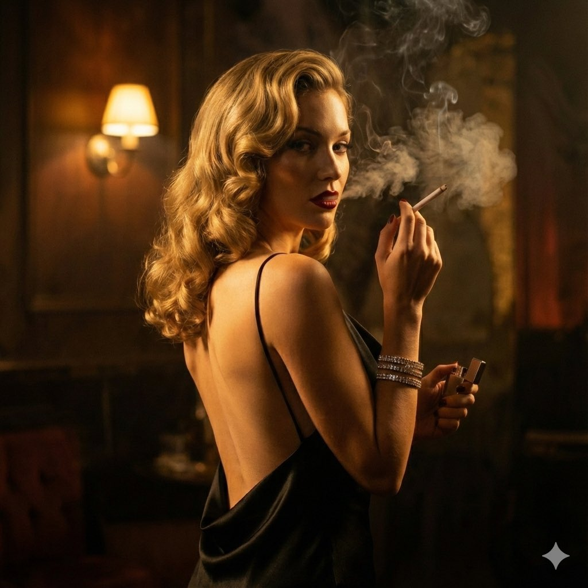

## 一位魅力四射的女性超逼真8K肖像

- ID: gpt4o-688-zh-2
- Slug: prompt-688-zh-2
- 语言: zh
- 来源: [来源链接](https://x.com/xmliisu/status/1995762747527626900)
- 样例图路径: images/part3/688.jpeg

### 提示词

```text
{
"prompt_structure": {
“主题”： {
“原型”：“魅力女性”，
"facial_reference": "使用上传的图像特征",
“姿势”：“四分之三侧面像，身体朝向镜头，手臂优雅地抬起靠近脸部”，
“动作”：“手指间夹着一支香烟，另一只手拿着一个小型金属打火机”，
"expression_and_mood": "性感、自信、诱人、亲密"
},
"样式": {
“头发”：“蓬松的金色复古波浪卷发，精心修剪的 1950 年代复古刘海，柔和的卷发修饰脸型”，
“衣橱”： “黑色缎面露背连衣裙，超细侧带，夸张的露背设计，展现腰臀曲线”
“配饰”：“大型叠戴银色水钻手镯，小型金属打火机”，
"texture_notes": "丝滑缎面质感，闪亮水钻，亮泽双唇"
},
“作品”： {
“场景”：“老好莱坞的夜生活，烟雾缭绕的复古黑色氛围”，
“灯光”：“温暖、戏剧化、低调，深邃的阴影，颧骨上的金色高光”，
“构图”： “紧凑型人像构图”
},
"technical_specs": {
“分辨率”: “8K 超高分辨率”
"视觉风格": "超写实、电影化、精致"
“相机效果”： “浅景深，柔和的胶片颗粒纹理”
}
},
"final_prompt_string": "一张超逼真的8K肖像，展现了一位魅力四射的女性，拥有[上传的面部特征]，风格复古而神秘。她以四分之三侧面示人，性感而自信，身着黑色缎面露背礼服，纤细的侧边绑带勾勒出纤细的腰身。头发蓬松，呈20世纪50年代复古的金色波浪卷发，并配以复古的刘海。她优雅地将香烟夹在脸旁，手腕上戴着层叠的银色水钻手镯。温暖而富有戏剧性的低调光线，深邃的阴影和金色的高光交相辉映，营造出烟雾缭绕、私密而迷人的老好莱坞夜生活氛围。采用超高分辨率相机拍摄，浅景深，呈现柔和的胶片颗粒质感。"
}
```

### 样例图


## 3x3的网格特写照片

- ID: gpt4o-685-zh
- Slug: prompt-685-zh
- 语言: zh
- 来源: [来源链接](https://x.com/so_ainsight/status/1995494784803426326)
- 样例图路径: images/part3/685.jpeg

### 提示词

```text
使用这张女性照片，生成共 9 张图像，排列成 3x3 的网格。生成的图像数量不得超过 9 张。

所有照片必须为半身像或更近的特写（半身像、特写、肖像构图）。请勿拍摄广角照片、全身照、远景照片或广角照片。

请确保所有九张照片中女性的外貌、五官、发型和整体氛围保持一致。但是，只要不超出半身像构图的范畴，您可以更改拍摄地点、光线、角度和构图。

请仅输出3x3网格所需的9张图片。不要生成任何其他图片、预览图或差异化版本。
```

### 样例图

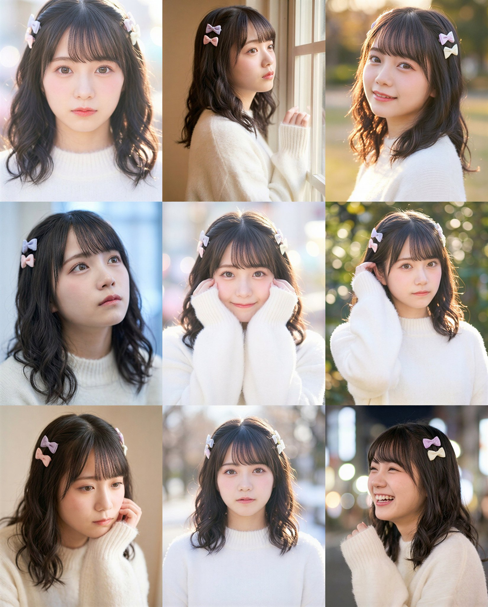

## { "image_request": { "goal": "Create a cinematic portrai

- ID: gpt4o-684-en-1
- Slug: prompt-684-en-1
- 语言: en
- 来源: [来源链接](https://x.com/YaseenK7212/status/1995536194327777287)
- 样例图路径: images/part3/684.jpeg

### 提示词

```text
{
  "image_request": {
    "goal": "Create a cinematic portrait based on the provided reference photo, preserving the subject’s face exactly as it appears in the reference (no alterations to facial structure, proportions, features, or expression).",
    "subject": {
      "identity_preservation": {
        "description": "The face must remain completely unchanged from the reference photo — 1000% identical in all visible facial details, proportions, contours, expression, and micro-features.",
        "notes": "No stylization, morphing, or reinterpretation of the facial structure. Only the scene, pose, and atmosphere change."
      },
      "pose": {
        "body_position": "The woman is standing with her back to the camera.",
        "head_turn": "She turns her head over her shoulder, looking toward the viewer.",
        "gaze": "Soft, melancholic, and intense."
      },
      "appearance": {
        "skin": "Smooth, pale skin with gentle cinematic texture.",
        "hair": {
          "style": "Long, straight hair.",
          "movement": "Slightly tousled by the wind."
        },
        "clothing": {
          "top": "Black backless top with delicate thin straps draping down the back."
        },
        "props": {
          "bouquet": "A bouquet of black roses held close to her face."
        }
      }
    },
    "environment": {
      "setting": "A moody lakeside or riverside.",
      "weather": "Overcast grey skies.",
      "atmosphere": "Soft, misty, melancholic, and subtly gothic."
    },
    "lighting": {
      "type": "soft diffuse lighting",
      "source": "natural overcast daylight",
      "tone": "desaturated, muted highlights",
      "mood": "gothic, melancholic, cinematic",
      "shadow_quality": "soft, low-contrast shadows"
    },
    "color_grading": {
      "palette": "desaturated neutrals, soft greys, washed-out cool tones",
      "mood": "cinematic and atmospheric"
    },
    "composition": {
      "framing": "Cinematic shoulder-turned portrait with focus on the face and roses.",
      "depth": "Shallow depth of field; background slightly blurred.",
      "emphasis": "Emotional intensity in the eyes; contrast between pale skin and black roses/top."
    },
    "style": {
      "visual_style": "cinematic realism",
      "tone": "moody, atmospheric",
      "genre_influence": "dark romantic, gothic melancholy"
    }
  }
}
```

### 样例图


## 哥特式电影风格的肖像画

- ID: gpt4o-684-zh-2
- Slug: prompt-684-zh-2
- 语言: zh
- 来源: [来源链接](https://x.com/YaseenK7212/status/1995536194327777287)
- 样例图路径: images/part3/684.jpeg

### 提示词

```text
{
"image_request": {
“目标”：“根据提供的参考照片创作一幅电影风格的肖像画，完全保留照片中人物的面部特征（不得改变面部结构、比例、五官或表情）。”
“主题”： {
"identity_preservation": {
“描述”：“面部必须与参考照片完全一致——所有可见的面部细节、比例、轮廓、表情和微特征都必须1000%相同。”
备注：“面部结构未进行任何风格化、变形或重新诠释。仅场景、姿势和氛围有所改变。”
},
"姿势": {
“body_position”: “该女子背对着镜头站立。”
“head_turn”：她转过头，看向观众。
“凝视”：“柔和、忧郁而强烈。”
},
“外貌”： {
“肌肤”：“光滑、白皙的肌肤，具有柔和的电影质感。”
“头发”： {
“发型”：“长直发。”
“动感”：“被风轻轻吹乱。”
},
“衣服”： {
“上衣”：“黑色露背上衣，背部有纤细的吊带垂下。”
},
"props": {
“花束”：“她将一束黑玫瑰捧在脸旁。”
}
}
},
“环境”： {
“场景”：“一个阴郁的湖边或河边。”
天气：阴天，天空灰蒙蒙的。
“氛围”：“柔和、朦胧、忧郁，略带哥特式风格。”
},
“灯光”： {
“类型”：“柔和漫射光”，
“来源”：“自然阴天日光”，
“色调”：“去饱和、柔和的高光”，
“氛围”：“哥特式、忧郁、电影感”，
"shadow_quality": "柔和、低对比度的阴影"
},
"color_grading": {
“调色板”：“低饱和度的中性色、柔和的灰色、褪色的冷色调”，
“氛围”：“电影感十足，富有氛围感”
},
“作品”： {
“构图”：“电影般的侧脸肖像，焦点集中在脸部和玫瑰花上。”
“景深”：“浅景深；背景略微模糊。”
“强调”：“眼神中流露出的情感强度；苍白的皮肤与黑色玫瑰/上衣形成对比。”
},
“风格”： {
"视觉风格": "电影写实主义",
“基调”：“忧郁的，有氛围的”，
"genre_influence": "黑暗浪漫主义，哥特式忧郁"
}
}
}
```

### 样例图


## { "Use [man_face] and [woman_fac]. Ultra-realistic high-

- ID: gpt4o-683-en-1
- Slug: prompt-683-en-1
- 语言: en
- 来源: [来源链接](https://x.com/miilesus/status/1995536025859354724)
- 样例图路径: images/part3/683.jpeg

### 提示词

```text
{
 "Use [man_face] and [woman_fac]. Ultra-realistic high-end luxury wedding photography of a bride and groom standing closely together in an elegant outdoor ceremony setting. Golden hour sunlight casting warm soft highlights, natural rim light around their silhouettes, cinematic dynamic range. The bride wearing a premium handcrafted lace wedding gown with intricate embroidery details, soft flowing veil illuminated by backlight, subtle pearl accessories, refined natural bridal makeup with luminous skin texture, finely detailed eyelashes and catchlights in eyes. The groom wearing a tailored black tuxedo with satin lapels, crisp white shirt, luxury bow tie, polished boutonniere. Both posing in a candid yet editorial fashion – gentle eye contact, soft romantic smile, hands touching gracefully. Background featuring a softly blurred bokeh garden with roses, organic greenery, warm tones, shallow depth of field created by an 85mm f/1.4 full-frame lens. High-definition textures, ultra sharp facial details, realistic pores, true-to-life skin tones, natural hair strands, perfect color grading inspired by premium wedding photographers. Soft pastel color palette, creamy highlights, subtle film grain, magazine cover aesthetic. Cinematic global illumination, perfect exposure balance, no distortion, no artifacts. Award-winning photography style with fine-art wedding composition, dramatic yet soft lighting, museum-quality detail clarity.",
  
  "negative_prompt": "cartoon, illustration, painting, CGI, artificial look, uncanny valley, distorted facial features, extra limbs, deformed body parts, mismatched eyes, unnatural skin texture, plastic skin, blur, noise, pixelation, low resolution, oversaturated colors, washed out colors, hard flash, harsh shadows, blown highlights, low contrast, lens distortion, fisheye, bad anatomy, extra fingers, incorrect hand shapes, watermark, text, logo, border, frame, compression artifacts, glitch, unrealistic proportions, double face, duplicate subjects, warped background",

  "camera_settings": {
    "lens": "85mm f/1.4 prime",
    "iso": 100,
    "shutter_speed": "1/400",
    "aperture": "f/1.4",
    "white_balance": "5200K daylight"
  },

  "style": {
    "lighting": "soft natural golden hour, cinematic rim light, high dynamic range",
    "color_grade": "premium wedding film look, pastel tones, creamy highlights, warm undertones",
    "atmosphere": "romantic, elegant, fine-art editorial"
  },

  "composition": {
    "framing": "mid-shot portrait, slight angle, bride and groom centered",
    "focus": "sharp eyes, smooth bokeh background",
    "depth_of_field": "shallow, subject separation emphasized"
  },

  "width": 1024,
  "height": 1536,
  "num_inference_steps": 36,
  "guidance_scale": 8.0,
  "seed": 12345
}
```

### 样例图

![{ "Use [man_face] and [woman_fac]. Ultra-realistic high-](../images/part3/683.jpeg)

## 花园里的婚纱照

- ID: gpt4o-683-zh-2
- Slug: prompt-683-zh-2
- 语言: zh
- 来源: [来源链接](https://x.com/miilesus/status/1995536025859354724)
- 样例图路径: images/part3/683.jpeg

### 提示词

```text
{
使用[man_face]和[woman_fac]。超逼真的高端奢华婚礼摄影，展现新郎新娘在优雅的户外仪式场地中亲密依偎的画面。金色的阳光洒下温暖柔和的高光，自然的轮廓光勾勒出他们的身影，营造出电影般的动态范围。新娘身着高级手工蕾丝婚纱，精致的刺绣细节令人叹为观止，飘逸的头纱在逆光下熠熠生辉，搭配低调的珍珠配饰，精致自然的妆容展现出肌肤的光泽感，纤长的睫毛和闪亮的眼神光更添动人。新郎身着剪裁合身的黑色礼服，缎面翻领，搭配挺括的白色衬衫、奢华的领结和精致的胸花。两人以一种自然而又不失时尚感的姿态摆出姿势——温柔的眼神交流，浪漫的微笑，双手优雅地相触。背景是一片柔和虚化的花园，点缀着玫瑰、绿植和温暖的色调，85mm f/1.4全画幅镜头营造出浅景深效果。高清的纹理，极其清晰的面部细节，逼真的画面。毛孔清晰可见，肤色自然逼真，发丝纹理自然，色彩分级完美，灵感源自顶级婚礼摄影师。柔和的粉彩色调，奶油般的亮部，细腻的胶片颗粒，杂志封面般的质感。电影级的整体光照，完美的曝光平衡，无畸变，无瑕疵。屡获殊荣的摄影风格，融合艺术婚礼构图、戏剧性却又柔和的光线，以及博物馆级别的细节清晰度。

"negative_prompt": "卡通、插画、绘画、CGI、人工质感、恐怖谷效应、面部特征扭曲、多余肢体、身体部位畸形、眼睛不对称、皮肤纹理不自然、塑料皮肤、模糊、噪点、像素化、低分辨率、色彩过饱和、色彩褪色、强光、阴影过重、高光过曝、低对比度、镜头畸变、鱼眼效果、人体解剖结构错误、多余手指、手型错误、水印、文字、标志、边框、画框、压缩伪影、故障、比例失调、双面人、重复人物、背景扭曲",

"camera_settings": {
镜头：85mm f/1.4 定焦镜头
“iso”：100，
"shutter_speed": "1/400",
光圈：f/1.4，
“white_balance”: “5200K 日光”
},

“风格”： {
“照明”：“柔和的自然黄金时段、电影般的轮廓光、高动态范围”，
"color_grade": "高级婚礼影片风格，柔和的色调，奶油色的高光，温暖的底色",
“氛围”： “浪漫、优雅、艺术感十足的编辑风格”
},

“作品”： {
“构图”：“中景肖像，略微倾斜，新郎新娘居中”，
“焦点”：“锐利的眼睛，柔和的散景背景”，
"depth_of_field": "浅景深，强调主体分离"
},

宽度：1024，
“高度”：1536，
"num_inference_steps": 36,
"guidance_scale": 8.0,
种子：12345
}
```

### 样例图


## { "intent": "A dramatic, high-energy battle scene featur

- ID: gpt4o-677-en-1
- Slug: prompt-677-en-1
- 语言: en
- 来源: [来源链接](https://x.com/IamEmily2050/status/1995429494493167779)
- 样例图路径: images/part3/677.jpeg

### 提示词

```text
{
  "intent": "A dramatic, high-energy battle scene featuring a determined young mage making a defiant declaration, in the style of modern Shonen fantasy manga.",
  "manga_genre": "Shonen Fantasy/Action",
  "art_style": {
    "primary_influence": "Modern Shonen Jump style (reminiscent of Black Clover, Fairy Tail), with dynamic action and expressive character work",
    "line_art_style": "Bold, clean lines with strong variable weight. Thick, confident outlines for characters, thin lines for magical effects and background detail. Energetic, flowing linework.",
    "screentone_style": "Minimal screentone use to maintain high contrast and readability. Light 20% dot screentones for subtle shading on skin. Heavy use of pure white and pure black for dramatic impact."
  },
  "panel_design": {
    "primary_panel_type": "FBP (Full-Body Panel): Entire character from head to feet with visible ground plane.",
    "composition_description": "Dynamic low-angle view, looking up at the character from ground level to emphasize heroic determination and power. The character stands in a defiant pose on a cracked, debris-strewn battlefield. The ground is clearly visible beneath and around the character's feet, with rubble, broken stones, and impact cracks radiating outward. Include 15% negative space above the head and 12% below the feet to prevent cropping. The composition creates a sense of the character rising up against adversity.",
    "aspect_ratio": "2:3",
    "key_symbolic_effects": ["Intense speed lines radiating outward from the character's body, creating explosive energy", "Focus lines converging on the character's face and raised fist, emphasizing determination", "Magical energy aura swirling around the character, rendered with flowing, organic lines", "Small impact cracks and debris particles floating around the feet to show power and grounding"]
  },
  "dialogue_and_text": {
    "speech_bubbles": [
      {
        "speaker": "Protagonist",
        "bubble_type": "shout",
        "text_content": "I won't back down! This is my fight!",
        "placement": "Upper right area of the panel, positioned above and slightly to the right of the character's head, with the bubble tail pointing toward the character's mouth",
        "emphasis": "bold"
      },
      {
        "speaker": "Protagonist",
        "bubble_type": "shout",
        "text_content": "I'll protect everyone... no matter what!!",
        "placement": "Mid-left area, positioned near the character's raised fist, with the bubble tail pointing back toward the character's face. This creates a dynamic flow of dialogue across the panel.",
        "emphasis": "bold with triple exclamation marks for maximum intensity"
      }
    ],
    "sound_effects": [
      {
        "sfx_text": "ゴゴゴ (GOGOGO - menacing rumble)",
        "placement": "Integrated into the background, positioned in the upper left and lower right corners, creating a sense of ominous power building",
        "style": "Bold, angular katakana characters rendered in a heavy, imposing font"
      },
      {
        "sfx_text": "CRACKLE",
        "placement": "Near the magical energy aura around the character's hands, integrated into the swirling energy effects",
        "style": "Jagged, electric-style lettering that follows the flow of the magical energy"
      }
    ]
  },
  "character": {
    "archetype": "Hot-blooded Shonen Protagonist: Determined, courageous, fiercely protective of friends, refuses to give up even when outmatched.",
    "design_focus": "A young male mage in his mid-teens. Wild, spiky hair (classic Shonen style) with strands flying upward from the energy aura. Large, intense eyes with prominent highlights showing unwavering determination and a hint of desperation. Wearing a battle-worn fantasy adventurer outfit: a tattered cloak flowing dramatically behind him, a fitted tunic with visible fabric tension showing a lean, athletic build, armored gauntlets on his forearms, and sturdy leather boots with visible buckles and worn soles. The boots are firmly planted on the cracked ground, with detailed lacing and scuff marks. Barefoot would be inappropriate for a battlefield, so the boots are essential and clearly visible from toe to heel.",
    "facial_expression": "Intense and defiant. Mouth open in a shout, showing gritted teeth. Brows furrowed with determination. Eyes blazing with resolve and a slight glow suggesting magical power.",
    "pose_and_body_language": "Dynamic heroic stance: feet shoulder-width apart and fully visible, planted firmly on the cracked ground with slight forward lean suggesting readiness to charge. One fist raised to chest level, clenched tightly and glowing with magical energy. The other arm extended slightly outward for balance. Body coiled with tension and power. The pose conveys both defensive readiness and offensive intent.",
    "symbolic_emotional_markers": ["Determination aura: jagged, flame-like lines surrounding the character's body", "Small sweat drops on the forehead indicating intense exertion and stakes", "Glowing eyes with white highlights suggesting inner power awakening", "Clenched fist with visible tension lines in the hand and forearm"]
  },
  "setting": {
    "location": "A devastated battlefield. Cracked and broken stone ground with large fissures and impact craters. Rubble and debris scattered around the character's feet, with some pieces floating slightly due to magical energy. The ground texture is rough stone and dirt, clearly visible beneath the character's boots. In the blurred background, suggestions of ruined structures and a stormy sky, but kept minimal to maintain focus on the character.",
    "time_of_day": "Dusk or stormy midday (dramatic, low-contrast lighting typical of climactic battle scenes)",
    "atmospheric_elements": "Dust and small debris particles floating in the air. Magical energy wisps swirling around the character. Dark, ominous clouds in the background suggesting the severity of the battle. A few small embers or sparks of magical energy drifting upward from the ground."
  },
  "inking_and_tones": {
    "line_weight_variation": "Strong variation. Very thick, bold outlines (2-3pt) for the character's silhouette and major forms to make them pop against the background. Medium weight (1-2pt) for clothing details, facial features, and magical effects. Thin lines (0.5-1pt) for hair strands, background rubble detail, and fine texture on the boots and gauntlets.",
    "primary_shading_method": "Combination of crisp black fills for deep shadows (under the chin, in the hair, cast shadows on the ground) and light 20% dot screentones for mid-tone shadows on the face and clothing. Minimal screentone use overall to maintain high contrast and energy. Cross-hatching used sparingly for texture on the tattered cloak.",
    "black_space_usage": "Strategic and balanced. Solid black used for hair shadows, the interior of the tattered cloak, and deep shadows cast by the character on the ground. Mostly white space and clean lines to maintain the bright, energetic feel of Shonen action.",
    "screentone_density": "Sparse. Screentones used only for subtle form definition on the character's face and body. The background is kept mostly white with black linework for rubble and cracks, maintaining focus on the character."
  },
  "symbolism_and_effects": {
    "motion_lines": "Intense speed lines radiating outward from the character's torso and limbs in all directions, creating a sense of explosive power and energy bursting forth. The lines are thicker near the character and taper as they extend outward.",
    "emotional_symbols": ["Determination aura: jagged, flame-like energy lines surrounding the body", "Sweat drops on forehead for intense focus and exertion", "Glowing magical energy around the raised fist, rendered with swirling, organic lines", "Small impact lines around the feet showing firm grounding and power transfer to the earth"],
    "onomatopoeia": ["ゴゴゴ (GOGOGO) - menacing/powerful rumble effect in the background", "CRACKLE - magical energy sound effect near the hands"]
  },
  "negative_directives": {
    "style": "No photorealistic rendering, no watercolor or painterly style, no full color, no soft digital gradients, no Western comic book style, no 3D rendering, no overly detailed backgrounds that distract from the character.",
    "content": "No weapons in hand (magic is the focus), no other characters in the frame, no overly busy background, cropped feet, missing feet, floating figure, cut-off ankles, feet out of frame, hands obscuring the face, hair completely covering the eyes, closed or neutral expression (must be intense and emotional).",
    "artifact_suppression": "No blurred lines, no digital painting artifacts, no color bleeding, no anti-aliasing softness, cropped feet, missing toes, deformed feet, extra limbs, anatomically impossible poses, inconsistent line weight, muddy or unclear linework."
  }
}
```

### 样例图


## 现代少年奇幻漫画

- ID: gpt4o-677-zh-2
- Slug: prompt-677-zh-2
- 语言: zh
- 来源: [来源链接](https://x.com/IamEmily2050/status/1995429494493167779)
- 样例图路径: images/part3/677.jpeg

### 提示词

```text
{
“意图”：“一场充满戏剧性和爆发力的战斗场景，一位意志坚定的年轻魔法师发表了充满反抗精神的宣言，风格类似于现代少年奇幻漫画。”
"manga_genre": "少年奇幻/动作",
"art_style": {
“主要影响因素”： “现代少年Jump风格（让人想起《黑色五叶草》、《妖精的尾巴》），具有动感的动作和富有表现力的人物刻画”，
"line_art_style": "线条粗犷有力，线条粗细变化丰富。人物轮廓粗犷自信，魔法效果和背景细节则采用纤细线条。充满活力，线条流畅。"
"screentone_style": "尽量减少网点的使用，以保持高对比度和可读性。使用 20% 网点的浅色网点来表现皮肤上的微妙阴影。大量使用纯白和纯黑，以达到戏剧性的效果。"
},
"panel_design": {
"primary_panel_type": "FBP（全身面板）：从头到脚的整个角色，地面清晰可见。"
"composition_description": "动态的低角度视角，从地面仰视人物，强调英雄的决心和力量。人物以不屈的姿态站在满目疮痍、瓦砾遍地的战场上。人物脚下和周围的地面清晰可见，瓦砾、碎石和冲击裂缝向外辐射。头部上方留出 15% 的空白，脚下留出 12% 的空白，以避免画面裁剪。这种构图营造出人物奋起反抗逆境的气势。"
"aspect_ratio": "2:3",
"key_symbolic_effects": ["从角色身体向外辐射的强烈速度线，营造出爆发性的能量", "聚焦线汇聚于角色的面部和高举的拳头，强调其决心", "魔法能量光环环绕角色，以流畅的有机线条渲染", "脚部周围漂浮的细小冲击裂纹和碎片，展现力量与稳固性"]
},
"对话和文本": {
"speech_bubbles": [
{
“说话者”：“主角”，
"bubble_type": "喊叫",
"text_content": "我绝不退缩！这是我的战斗！"
“位置”：“位于面板的右上角，在角色头部上方略偏右的位置，气泡尾部指向角色的嘴部”，
强调：粗体
},
{
“说话者”：“主角”，
"bubble_type": "喊叫",
"text_content": "无论如何，我都会保护所有人！！"
“位置”：“位于画面左侧中间区域，靠近角色举起的拳头，气泡尾部指向角色的脸部。这样可以在画面中营造出对话的动态流动感。”
“强调”：“加粗并加上三个感叹号，以示最大程度的强调”
}
],
"sound_effects": [
{
"sfx_text": "ゴゴゴ（GOGOGO - 威胁性的隆隆声）",
“位置”：“融入背景，位于左上角和右下角，营造出一种不祥的力量积聚感”，
"style": "粗体、棱角分明的片假名字符，采用厚重、醒目的字体呈现"
},
{
"sfx_text": "噼啪声",
“放置位置”：“靠近角色双手周围的魔法能量光环，融入到旋转的能量效果中”，
“风格”：“锯齿状、电光质感的字体，跟随魔法能量的流动”
}
]
},
“特点”： {
“原型”：“热血少年漫主角：意志坚定、勇敢无畏、极力保护朋友、即使实力悬殊也绝不放弃。”
“设计重点”：一位十几岁的年轻男性魔法师。他有着狂野的刺猬头（经典少年漫画风格），几缕发丝在能量光环的映衬下向上飞舞。他那双炯炯有神的眼睛里闪烁着坚定的光芒，闪烁着一丝绝望。他身着一套饱经战火洗礼的奇幻冒险者装束：一件破旧的斗篷在他身后飘扬，一件紧身束腰外衣勾勒出他精瘦健壮的身材，前臂上戴着护手，脚上穿着结实的皮靴，靴扣清晰可见，鞋底磨损严重。皮靴牢牢地踩在龟裂的地面上，鞋带和磨损痕迹清晰可见。赤脚在战场上是不合适的，所以皮靴必不可少，从鞋头到鞋跟都清晰可见。
“面部表情”： “表情强烈而桀骜不驯。嘴巴张开，仿佛要怒吼，露出紧咬的牙齿。眉头紧锁，充满决心。双眼燃烧着坚定的火焰，闪烁着一丝光芒，暗示着某种魔法力量。”
“姿势与肢体语言”： “充满活力的英雄姿态：双脚与肩同宽，完全可见，稳稳地踩在龟裂的地面上，身体略微前倾，暗示着随时准备冲锋。一只拳头高举至胸前，紧紧握住，闪耀着魔法能量。另一只手臂略微向外伸展以保持平衡。身体充满张力和力量。此姿势既传达了防御的准备，也传达了进攻的意图。”
"symbolic_emotional_markers": ["决心光环：角色身体周围环绕着锯齿状的火焰线条", "额头上的细小汗珠表明正在承受巨大的压力", "闪烁着白光的眼睛暗示着内在力量的觉醒", "紧握的拳头，手掌和前臂上可见明显的肌肉线条"]
},
“环境”： {
地点：一片满目疮痍的战场。龟裂破碎的石质地面布满巨大的裂缝和撞击坑。瓦砾和碎片散落在角色脚下，部分碎片因魔法能量的作用而微微漂浮。地面纹理粗糙，由石头和泥土构成，在角色的靴子下清晰可见。模糊的背景中隐约可见残垣断壁和暴风雨的天空，但为了突出角色，这些元素被刻意弱化。
"time_of_day": "黄昏或暴风雨的正午（戏剧性的、低对比度的光线，典型的高潮战斗场景）",
“大气元素”：空气中漂浮着尘埃和细小的碎片。魔法能量的丝缕在角色周围盘旋。背景中阴沉的乌云暗示着战斗的严峻性。几小簇魔法能量的余烬或火花从地面向上飘散。
},
"inking_and_tones": {
"line_weight_variation": "线条粗细变化丰富。人物轮廓和主要形体采用非常粗的线条（2-3pt），使其在背景中脱颖而出。服装细节、面部特征和魔法效果采用中等粗细（1-2pt）。头发、背景碎石细节以及靴子和护手上的精细纹理采用细线（0.5-1pt）。"
“primary_shading_method”： “结合使用清晰的黑色填充来表现深阴影（下巴下方、头发中、地面上的投影），并使用20%网点的浅色网点来表现面部和衣物上的中间色调阴影。整体上尽量减少网点的使用，以保持高对比度和活力。在破烂的斗篷上少量使用交叉阴影线来表现纹理。”
“黑位运用”：策略性且平衡。头发阴影、破烂斗篷的内衬以及角色在地面上投射的深阴影均采用纯黑色。大量留白和简洁的线条，以保持少年漫画动作戏的明亮、活力感。
“screentone_density”：稀疏。网点仅用于勾勒人物面部和身体的细微轮廓。背景以白色为主，用黑色线条勾勒瓦砾和裂缝，使画面焦点集中在人物身上。
},
"symbolism_and_effects": {
“运动线”：从角色躯干和四肢向四面八方辐射出强烈的速度线，营造出爆发力和能量迸发的感觉。线条在靠近角色处较粗，向外延伸逐渐变细。
"emotional_symbols": ["决心光环：锯齿状的火焰状能量线环绕身体", "额头上的汗珠象征着高度集中和努力", "高举的拳头周围闪耀着魔法能量，以旋转的有机线条描绘", "脚部周围的细小冲击线象征着稳固的接地和力量传递到大地"]
拟声词：[“ゴゴゴ (GOGOGO) - 背景中令人不安/强大的隆隆声效果”“噼啪声 - 手附近魔法能量的声音效果”]
},
"negative_directives": {
“风格”：“不使用照片级写实渲染，不使用水彩或油画风格，不使用全彩，不使用柔和的数字渐变，不使用西方漫画风格，不使用3D渲染，不使用会分散观众对角色注意力的过于细致的背景。”
“内容”：“手中不持武器（重点是魔法），画面中没有其他角色，背景不要过于杂乱，脚部被裁剪，脚部缺失，人物漂浮，脚踝被切断，脚部超出画面，手遮住脸部，头发完全遮住眼睛，表情闭合或中性（必须强烈而富有情感）。”
"artifact_suppression": "无模糊线条、无数码绘画瑕疵、无颜色溢出、无抗锯齿柔化、无裁剪脚部、无缺失脚趾、无畸形脚部、无额外肢体、无解剖学上不可能的姿势、无不一致的线条粗细、无模糊或不清晰的线条。"
}
}
```

### 样例图


## [Image_Specifications] Type = Realistic Portrait Style =

- ID: gpt4o-676-en-1
- Slug: prompt-676-en-1
- 语言: en
- 来源: [来源链接](https://x.com/xmliisu/status/1995499182207996193)
- 样例图路径: images/part3/676.jpeg

### 提示词

```text
[Image_Specifications]
Type = Realistic Portrait
Style = Douyin Aesthetic
Resolution = High Quality

[Subject_Details]
Demographics = Young Asian woman
Facial_Structure = 100% original face (no editing)
Hair_Texture = Straight, shiny
Hair_Color = Black
Hair_Length = Long

[Makeup_&_Styling]
Style = Douyin-style
Eye_Makeup = Highlights large eyes, long eyelashes
Cheeks = Rosy
Nails = Long, painted beautiful dark black

[Apparel_&_Accessories]
Eyewear = Thin silver-framed eyeglasses
Top = Black strapless top with a single strap
Waist_Accessory = Brown and gold striped fabric belt (tied in a bow)
Necklace = Small silver Vivienne Westwood Orb pendant

[Pose_&_Expression]
Action = Taking a selfie
Angle = From above
Right_Arm = Raised, holding the phone
Left_Hand = Holding a round black lollipop
Expression = Confident gaze, tongue slightly sticking out

[Environment_&_Background]
Location = Outdoor parking lot
Time_of_Day = Night
Ground_Surface = Gray concrete with white parking lines
Featured_Vehicle = Black Bugatti (visible grille and bumper)
Lighting_Conditions = Dimly lit by street lamps and distant city lights
```

### 样例图

![[Image_Specifications] Type = Realistic Portrait Style =](../images/part3/676.jpeg)

## 夜晚吐舌头女生的自拍照

- ID: gpt4o-676-zh-2
- Slug: prompt-676-zh-2
- 语言: zh
- 来源: [来源链接](https://x.com/xmliisu/status/1995499182207996193)
- 样例图路径: images/part3/676.jpeg

### 提示词

```text
[图像规格]
类型 = 写实肖像
风格 = 抖音美学
分辨率 = 高质量

[主题详情]
人口统计 = 年轻亚裔女性
面部结构 = 100% 原始面部（未经编辑）
发质：直发，有光泽
发色 = 黑色
头发长度 = 长

[化妆造型]
风格 = 抖音风格
眼妆 = 突出大眼睛和长睫毛
脸颊 = 红润
指甲 = 长长的，涂着漂亮的深黑色指甲油

[服装及配饰]
眼镜 = 细银框眼镜
上衣 = 黑色单肩无肩带上衣
腰部配饰 = 棕色和金色条纹布料腰带（系成蝴蝶结）
项链 = 小型银色 Vivienne Westwood 球形吊坠

[姿势与表情]
行动 = 自拍
角度 = 从上方
右臂举起，拿着手机
左手 = 拿着一个圆形的黑色棒棒糖
表情 = 自信的眼神，舌头微微伸出

[环境与背景]
地点 = 室外停车场
时间 = 夜晚
地面 = 灰色混凝土，带有白色停车线
特色车辆 = 黑色布加迪（可见格栅和保险杠）
照明条件 = 由路灯和远处城市灯光昏暗照亮
```

### 样例图


## { "prompt": "A full-body artistic portrait of the woman 

- ID: gpt4o-675-en-1
- Slug: prompt-675-en-1
- 语言: en
- 来源: [来源链接](https://x.com/ShreyaYadav___/status/1995540914954272826)
- 样例图路径: images/part3/675.jpeg

### 提示词

```text
{
  "prompt": "A full-body artistic portrait of the woman from the reference image, keeping the exact same face. She is elegantly seated on the floor wearing a modern black top, soft loose gray jeans, and chunky gray-and-white sneakers. Her long, waist-length wavy milky-brown hair flows naturally, with half of it beautifully braided. She is laughing while looking upwards, capturing a confident candid smile. The background is an artistic monochrome (black and white) composition featuring a soft, blurred close-up side profile of the same face, creating a stylish dual-layer aesthetic. High-quality soft lighting, realistic textures, cinematic realism, and an artistic portrait vibe.",
  
  "style": {
    "lighting": "soft, high-quality, realistic",
    "color_palette": "monochrome background, natural skin tones",
    "mood": "confident, candid, artistic",
    "quality": "ultra detailed, high-resolution"
  },
  
  "camera": {
    "shot": "full-body portrait",
    "angle": "slightly low angle, upward gaze feel",
    "focus": "sharp on subject, blurred artistic background"
  },
  
  "character": {
    "face": "same as reference image",
    "expression": "laughing, confident smile",
    "hair": "long wavy milky-brown, half braided",
    "outfit": {
      "top": "modern black top",
      "bottom": "soft loose gray jeans",
      "shoes": "chunky gray-and-white sneakers"
    }
  },
  
  "background": {
    "type": "artistic monochrome",
    "layers": "soft blurred close-up side profile of same face",
    "effect": "stylish dual-layer aesthetic"
  }
}
```

### 样例图


## 同一张脸的柔和模糊的侧面特写

- ID: gpt4o-675-zh-2
- Slug: prompt-675-zh-2
- 语言: zh
- 来源: [来源链接](https://x.com/ShreyaYadav___/status/1995540914954272826)
- 样例图路径: images/part3/675.jpeg

### 提示词

```text
{
“提示”：“根据参考图片，绘制一位女士的全身艺术肖像，保留其面部特征。她优雅地坐在地板上，身着现代感十足的黑色上衣、宽松的灰色牛仔裤和厚底灰白运动鞋。她及腰的乳棕色长发自然垂落，一半编成精美的辫子。她仰望天空，笑容灿烂，展现出自信而真挚的神态。背景采用艺术化的黑白构图，柔和模糊的侧脸特写营造出时尚的双层美感。画面运用了高质量的柔光、逼真的纹理、电影般的写实感以及艺术肖像的氛围。”

“风格”： {
“照明”：“柔和、高质量、逼真”，
"color_palette": "单色背景，自然肤色",
“情绪”：“自信、坦率、有艺术气息”
“质量”：“超精细，高分辨率”
},

“相机”： {
“拍摄”: “全身肖像”
“角度”：“略低的角度，向上凝视的感觉”，
“焦点”： “主体清晰，背景虚化，富有艺术感”
},

“特点”： {
“脸部”：“与参考图像相同”，
“表情”：“笑着，自信的笑容”，
“头发”：“长长的波浪状乳棕色头发，一半编成辫子”，
“全套服装”： {
“上衣”： “现代黑色上衣”，
下装：柔软宽松的灰色牛仔裤，
“鞋子”： “厚底灰白运动鞋”
}
},

“背景”： {
"type": "艺术单色",
“图层”: “同一张脸的柔和模糊的侧面特写”，
“效果”：“时尚的双层美感”
}
}
```

### 样例图


## { "image_generation": { "requirements": { "face_preserva

- ID: gpt4o-667-en-1
- Slug: prompt-667-en-1
- 语言: en
- 来源: [来源链接](https://x.com/ZaraIrahh/status/1995304550610407807)
- 样例图路径: images/part3/667.jpeg

### 提示词

```text
{
  "image_generation": {
    "requirements": {
      "face_preservation": {
        "preserve_original": true,
        "accuracy_level": "100% identical to reference",
        "details": [
          "real facial proportions",
          "exact skin texture",
          "true eye shape and color",
          "natural soft makeup",
          "subtle upward eyeliner",
          "soft pink eyeshadow",
          "natural rosy lips"
        ]
      },
      "pose": {
        "match_reference_pose": true,
        "description": "Chest-up portrait, face facing forward but gently tilted to the right from the viewer’s perspective."
      },
      "lighting": {
        "match_reference_lighting": true,
        "type": "soft diffused indoor lighting",
        "direction": "from the front and slightly from the left",
        "shadows": "gentle soft shadows on the sides of the face and neck",
        "background_tone": "soft neutral with slight bluish tint"
      }
    },

    "subject": {
      "gender": "female",
      "hairstyle": {
        "match_reference": true,
        "description": "same exact hairstyle as in reference image"
      },
      "expression": "neutral, slightly thoughtful",
      "clothing": {
        "top": "simple black T-shirt",
        "necklace": "thin silver necklace with a small minimal pendant"
      }
    },

    "composition": {
      "frame": "chest-up portrait",
      "orientation": "frontal with slight rightward tilt",
      "style": "hyper-realistic with split real/cartoon effect"
    },

    "special_effects": {
      "split_effect": {
        "type": "irregular centered tear",
        "edges": "white angled torn-paper look",
        "description": "image appears ripped down the middle"
      },

      "realistic_side": {
        "background": "soft, neutral, slightly bluish environment",
        "filters": [
          "soft analog grain",
          "lightly aged texture",
          "reduced saturation",
          "subtle film imperfections"
        ],
        "overlays": [
          "blue stylized teardrop stickers below the left eye",
          "small 'Zzz' sleep symbols near forehead",
          "yellow crescent moon in upper-left corner",
          "light blue hand-drawn cloud"
        ]
      },

      "illustrated_side": {
        "art_style": "bold cartoon, digital illustration",
        "color_palette": "bright, vibrant, saturated",
        "hair": "same tone as realistic side but stylized",
        "eyes": "exaggerated eyeliner, dramatic expression",
        "background": "vibrant light pink pop-art style",
        "decorations": {
          "kawaii_elements": [
            "Hello Kitty holding a microphone",
            "pixel-art pink mascot character",
            "yellow stars",
            "pink hearts",
            "colorful planets",
            "bold pink Japanese characters"
          ]
        }
      }
    },

    "aesthetic": {
      "overall_tone": "soft, dreamy, lightly vintage",
      "lighting_consistency": "must match reference perfectly",
      "skin_texture_realism": "high",
      "blending_quality": "smooth, natural transition between real and illustrated halves with crisp tear edge"
    },

    "output": {
      "style": "hyper-realistic + digital cartoon fusion",
      "quality": "ultra-high-resolution",
      "filters": [
        "subtle analog vintage film filter",
        "soft grain"
      ]
    }
  }
}
```

### 样例图


## 超写实风格真实和卡通分离效果

- ID: gpt4o-667-zh-2
- Slug: prompt-667-zh-2
- 语言: zh
- 来源: [来源链接](https://x.com/ZaraIrahh/status/1995304550610407807)
- 样例图路径: images/part3/667.jpeg

### 提示词

```text
{
"image_generation": {
“要求”： {
"面保存": {
"preserve_original": true,
"accuracy_level": "与参考值100%相同"
“细节”： [
“真实的脸部比例”，
“精准的肌肤纹理”，
“真实的眼睛形状和颜色”，
“自然柔和的妆容”，
“淡淡的上扬眼线”，
“柔和的粉色眼影”，
“自然红润的嘴唇”
]
},
"姿势": {
"match_reference_pose": true,
“描述”：“胸部以上的肖像，脸部朝前，但从观看者的角度来看略微向右倾斜。”
},
“灯光”： {
"match_reference_lighting": true,
“类型”：“柔和漫射室内照明”，
“方向”：“从前方略偏左”，
“阴影”：“脸颊和颈部两侧柔和的阴影”，
"background_tone": "柔和的中性色，略带蓝色调"
}
},

“主题”： {
"性别": "女性",
"发型": {
"match_reference": true,
描述：与参考图中完全相同的发型
},
“表情”：“中性，略带沉思”
“衣服”： {
上衣：一件简单的黑色T恤，
“项链”： “带有小巧简约吊坠的细银项链”
}
},

“作品”： {
“画框”：“胸部以上肖像”，
“方向”: “正面略微向右倾斜”
“风格”：“超写实风格，带有真实/卡通分离效果”
},

"特效": {
"split_effect": {
“类型”：“不规则中心撕裂”，
“边缘”：“白色斜角撕纸效果”，
描述：图像似乎从中间撕裂开来
},

"realistic_side": {
“背景”：“柔和、中性、略带蓝色的环境”，
“过滤器”：[
“柔和的模拟颗粒”，
“略带陈旧的质感”，
“饱和度降低”，
“细微的胶片瑕疵”
],
“叠加层”：[
“左眼下方贴有蓝色水滴形贴纸”，
“额头附近有小小的‘Zzz’睡眠符号”，
“左上角的黄色新月”
“浅蓝色手绘云朵”
]
},

"illustrated_side": {
"art_style": "大胆的卡通，数字插画",
"color_palette": "明亮、鲜艳、饱和"
“头发”：“与写实风格相同，但风格化”，
“眼睛”：“夸张的眼线，戏剧性的表情”，
“背景”：“充满活力的浅粉色波普艺术风格”，
“装饰”： {
"kawaii_elements": [
“Hello Kitty 拿着麦克风”
“像素艺术粉色吉祥物角色”，
“黄色星星”，
“粉红色的心”，
“色彩斑斓的行星”，
“粗体粉色日文字符”
]
}
}
},

“审美的”： {
整体色调：柔和、梦幻、略带复古感
"lighting_consistency": "必须与参考完全一致",
"skin_texture_realism": "高",
"blending_quality": "真实部分与插图部分之间过渡平滑自然，撕裂边缘清晰"
},

“输出”： {
“风格”：“超写实+数字卡通融合”，
“质量”：“超高分辨率”，
“过滤器”：[
“微妙的模拟复古胶片滤镜”，
“软粒”
]
}
}
}
```

### 样例图


## { "intent": "Generate a hyper-idealized, 'Douyin-aesthet

- ID: gpt4o-666-en-1
- Slug: prompt-666-en-1
- 语言: en
- 来源: [来源链接](https://x.com/IamEmily2050/status/1995065474749730989)
- 样例图路径: images/part3/666.jpeg

### 提示词

```text
{
  "intent": "Generate a hyper-idealized, 'Douyin-aesthetic' portrait of a young woman at night, utilizing direct flash photography to create a high-contrast, ethereal look with clear weather conditions.",
  "frame": {
    "aspect_ratio": "9:16",
    "composition": "Extreme close-up selfie framing (tighter than standard portrait), cutting off the top of the forehead to focus intensely on the eyes and lips. The subject is centered with a direct, confronting gaze.",
    "style_mode": "Flash photography, digital influencer aesthetic, soft-focus realism."
  },
  "subject": {
    "identity": "A young Asian woman, approximately 20 years old, with hyper-symmetrical, doll-like features characterized by the 'bunny tongue' and 'puppy eye' aesthetic.",
    "skin": "Pale, cool-toned porcelain complexion with zero texture. The skin reflects the flash, creating a 'mochi' or 'glass skin' effect that appears soft and translucent. High-key brightness on the T-zone.",
    "eyes": "Large, round eyes with a slight downward tint at the outer corners (puppy dog eyes). Prominent 'aegyosal' (under-eye fat bands) are highlighted to enhance youthfulness. The irises are soft brown with a large diameter. Eyelashes are styled in the 'manhwa' or 'idol' style: distinct, vertical clumps of mascara-coated lashes separated by space, rather than a dense fan.",
    "nose": "Petite, low-bridge nose with a small, rounded tip. The lighting minimizes the nostril definition, making the nose appear delicate and unobtrusive.",
    "mouth": "Heart-shaped lips featuring a 'gradient lip' technique. The center of the lips is a saturated, glossy strawberry pink, fading outward to a blurred, pale nude at the vermilion border. The texture is soft and hydrated.",
    "hair": "Long, silky jet-black hair with a straight texture. Without the snow, the hair is dry, sleek, and tucked slightly behind the ears or framing the face smoothly, catching the flash with a white sheen.",
    "wardrobe": "Minimal visibility, suggesting a stylish but casual top appropriate for a pleasant evening."
  },
  "environment": {
    "location": "Urban night setting.",
    "weather": "Clear, calm, and beautiful night weather. The atmosphere is clean and free of precipitation or fog.",
    "background": "A backdrop of deep black shadows punctuated by creamy, circular bokeh from distant city lights (streetlamps, neon signs). The background is significantly darker than the subject, ensuring the face is the sole focus."
  },
  "lighting": {
    "type": "Direct, frontal camera flash or high-intensity screen light.",
    "quality": "Hard but flattering light that flattens facial topography, eliminating shadows under the eyes and nose. This creates a 2D, illustrative quality common in high-end social media selfies.",
    "contrast": "High contrast between the brightly illuminated face and the pitch-black environment.",
    "catchlight": "Sharp, tiny pinpoint reflection in the center of the pupils from the flash."
  },
  "camera": {
    "sensor_format": "Smartphone main sensor simulation.",
    "lens": "24mm wide-angle lens. This focal length slightly exaggerates the size of the eyes and diminishes the size of the nose and face width, contributing to the 'baby face' proportion.",
    "aperture_depth_of_field": "f/1.8 to f/2.2, keeping the eyes and lips razor sharp while instantly blurring the ears and background.",
    "focus": "Critical focus on the eyelashes and iris texture."
  },
  "negative": {
    "content": "No snow, no rain, no wet hair, no masculine jawline, no skin texture, no pores, no heavy contouring, no western makeup style, no sunglasses, no hand near face.",
    "style": "No cinematic dramatic shadows (must be flat lit), no warm vintage tones, no painting, no illustration."
  }
}
```

### 样例图


## 极近距离的自拍照

- ID: gpt4o-666-zh-2
- Slug: prompt-666-zh-2
- 语言: zh
- 来源: [来源链接](https://x.com/IamEmily2050/status/1995065474749730989)
- 样例图路径: images/part3/666.jpeg

### 提示词

```text
{
“意图”：“在晴朗的天气条件下，利用直接闪光灯摄影，在夜晚创作一张极具理想化、‘抖音美学’风格的年轻女性肖像，以营造高对比度、空灵的视觉效果。”
“框架”： {
"aspect_ratio": "9:16",
“构图”：“极近距离的自拍取景（比标准肖像照更近），裁掉额头顶部，将焦点集中在眼睛和嘴唇上。拍摄对象位于画面中心，目光直视前方。”
"style_mode": "闪光灯摄影、数码网红美学、柔焦写实主义。"
},
“主题”： {
“身份描述”：“一位大约20岁的年轻亚裔女性，拥有高度对称、娃娃般的五官，其特征是‘兔舌’和‘小狗眼’。”
“肌肤”：苍白、冷调的瓷白肤色，几乎没有纹理。肌肤反射闪光灯，呈现出“麻糬”或“玻璃肌”的效果，看起来柔和通透。T区高光突出。
“眼睛”：大而圆的眼睛，外眼角略微下垂（小狗眼）。突出的眼下脂肪纹（眼袋）增添了青春气息。虹膜呈柔和的棕色，直径较大。睫毛采用“漫画”或“偶像”风格：睫毛根根分明，呈垂直的簇状，涂抹睫毛膏，彼此之间留有空隙，而不是浓密的扇形。
“鼻子”：“小巧的鼻子，鼻梁较低，鼻尖小而圆润。光线柔和地弱化了鼻孔的轮廓，使鼻子看起来精致而不突兀。”
“唇部”：心形唇妆，采用渐变唇妆技术。唇部中央是饱满亮泽的草莓粉色，向外晕染至唇线边缘的浅裸色。质地柔软水润。
“头发”： “长长的、丝滑的乌黑直发。没有雪的时候，头发干燥顺滑，微微别在耳后或柔顺地垂在脸颊两侧，在闪光灯下泛着白色的光泽。”
“衣橱”：“低调的款式，暗示着一件时尚休闲的上衣，适合愉快的夜晚穿着。”
},
“环境”： {
“地点”：“都市夜景。”
天气：晴朗、平静、美丽的夜晚。大气洁净，无降水或雾。
“背景”：“深黑色的阴影背景中点缀着远处城市灯光（路灯、霓虹灯）投射出的柔和圆形散景。背景明显比主体暗，从而确保面部成为唯一的焦点。”
},
“灯光”： {
“类型”：“直接闪光灯、前置摄像头闪光灯或高强度屏幕闪光灯。”
“品质”：“硬朗但柔和的光线，使面部轮廓更加平滑，消除眼下和鼻下的阴影。这营造出一种二维的、插画般的质感，常见于高端社交媒体自拍中。”
“对比度”：“明亮的脸部与漆黑的环境形成鲜明对比。”
“眼神光”：“闪光灯照射到瞳孔中心时，形成的一个清晰、细小的点状反射光。”
},
“相机”： {
"sensor_format": "智能手机主传感器模拟。",
“镜头”：“24mm广角镜头。这种焦距会略微放大眼睛，缩小鼻子和脸部宽度，从而营造出‘娃娃脸’的比例。”
"aperture_depth_of_field": "f/1.8 至 f/2.2，保持眼睛和嘴唇清晰锐利，同时立即虚化耳朵和背景。"
“焦点”：“重点关注睫毛和虹膜的纹理。”
},
“消极的”： {
“内容”：“没有雪，没有雨，没有湿头发，没有男性化的下巴线条，没有皮肤纹理，没有毛孔，没有浓重的修容，没有西式妆容，没有太阳镜，没有手靠近脸部。”
“风格”：“禁止使用电影般的戏剧性阴影（必须采用平光），禁止使用温暖的复古色调，禁止使用绘画风格，禁止使用插画风格。”
}
}
```

### 样例图


## 哆啦A梦讲课

- ID: gpt4o-663-zh
- Slug: prompt-663-zh
- 语言: zh
- 来源: [来源链接](https://x.com/oran_ge/status/1995075703084339500)
- 样例图路径: images/part3/663.jpeg

### 提示词

```text
我想要一张超真实的照片，但内容又有点超现实。感觉就像一个孩子放学后，偷偷从教室门缝里看到一个神奇的景象：哆啦A梦竟然真的在空无一人的教室里，像个小老师一样，认真地准备着化学课。 整个画面要非常写实，但又充满了童话般的温馨和惊奇。

画面内容

主体： 哆啦A梦本人，活生生地站在教室的讲台前面，而不是画在黑板上。他看起来是立体的，有光滑的质感，就像动画里走出来的一样，但又完美地融入了这个真实的环境里。
人物细节：哆啦A梦站在讲台旁，身体微微侧着，表情认真又亲切，仿佛在思考怎么给大雄他们讲课。
他的一只手拿着一根小小的教鞭，指向他身后的黑板。
他的黄色铃铛在教室的光线下有微微的反光，肚子上的四维口袋看起来鼓鼓的。

背景细节（黑板）：他身后的黑板上，画着一幅用各色粉笔手写的化学元素周期表。这个周期表看起来就像是哆啦A梦刚刚亲手画上去的，色彩丰富，带有一点可爱的风格。
可以用不同颜色的粉笔（比如黄色、蓝色、粉色）来区分不同的元素区域，让整个画面色彩更丰富。

文字： 在黑板的顶上或者角落，用可爱的粉笔字体写上标题：“哆啦A梦的科学教室”。
环境与构图
场景： 一间普通的日本教室，桌椅摆放整齐，夕阳的余晖从窗户照进来，营造出一种安静、温暖的氛围。
构图： 画面比例是4:3。从学生的座位视角看过去，哆啦A梦和讲台在画面的中心位置。
前景： 画面最前面可以带到一两张学生的课桌椅，让视角更具代入感。讲台上可以放着一盒彩色粉笔和一个黑板擦。
风格和技术要求
风格： 照片写实主义。关键在于真实的环境和光影，与哆啦A梦这个动漫角色的奇妙结合。

光线： 温暖的午后自然光从窗户斜射进来，光线要自然地打在哆啦A梦身上，在他圆滚滚的身体上形成柔和的光影和高光，让他看起来有体积感，并且在他的脚边投下淡淡的影子，这能让他看起来更真实。
焦点： 焦点要清晰地对准哆啦A梦，黑板上的内容也很清楚，但前景的课桌可以稍微有点模糊。
千万不要出现！
不要让哆啦A梦看起来像个塑料玩具或模型，他得是活的。

不要有其他任何人物，特别是大雄、静香他们。
不要把画风变成动画截图或纯CG，一定要是照片的感觉。
构图要稳，不要用奇怪的低角度或鱼眼镜头。
颜色别太鲜艳，要符合真实光线下的色彩。
```

### 样例图


## 根据经纬度生成的航拍图像

- ID: gpt4o-661-zh
- Slug: prompt-661-zh
- 语言: zh
- 来源: [来源链接](https://x.com/KusoPhoto/status/1995251500973785166)
- 样例图路径: images/part3/661.jpeg

### 提示词

```text
创建一张与纬度 35.658807120369914, 139.74540071108495 所在位置上空天空融为一体的航拍图像。使指定的人物看起来像是从该位置落下一样融入图像中。一个面带微笑、看起来很快乐的人。一张用低分辨率一次性相机拍摄的普通日常照片。一张由日本高中生拍摄的粗糙照片。
```

### 样例图

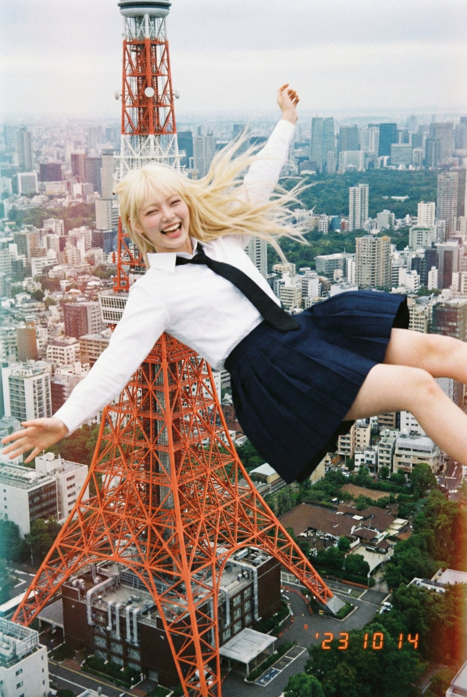

## { "objective": "Generate an image based on a detailed ch

- ID: gpt4o-660-en-1
- Slug: prompt-660-en-1
- 语言: en
- 来源: [来源链接](https://x.com/rovvmut_/status/1995146612885410093)
- 样例图路径: images/part3/660.jpeg

### 提示词

```text
{
  "objective": "Generate an image based on a detailed character portrait description.",
  "image_generation_prompt": {
    "subject": {
      "gender": "female",
      "portrait_type": "close-up",
      "angle": "side angle",
      "aesthetic": "edgy, modern, mysterious, confident, slightly provocative"
    },
    "appearance": {
      "hair": {
        "color": "light gray",
        "length": "short",
        "texture": "wavy",
        "style": "modern, slightly messy, partially covering forehead"
      },
      "face": {
        "skin_tone": "fair",
        "features": "sharp",
        "eyebrows": "straight, neat, dark",
        "lips": "naturally pink with a slight sheen"
      },
      "expression": "calm but intense"
    },
    "clothing_and_accessories": {
      "headwear": "black bandana with white swirl patterns",
      "outfit": {
        "jacket": "black zip-up jacket, left open",
        "inner_shirt": "black T-shirt with green and red graphic art on the chest"
      },
      "jewelry": {
        "neck": "thin silver chain",
        "ear": "small silver earring"
      }
    },
    "lighting_and_background": {
      "lighting": "front light highlighting facial features and outfit",
      "background": "bright blue sky"
    },
    "style": {
      "vibe": "striking and stylish",
      "focus": "expression and trendy fashion details",
      "mood": "modern and edgy"
    },
    "aspect_ratio": "3:4"
  },
  "response_format": "Use this JSON object as the structure for an image generation model prompt."
}
```

### 样例图


## 现代前卫的女生特写

- ID: gpt4o-660-zh-2
- Slug: prompt-660-zh-2
- 语言: zh
- 来源: [来源链接](https://x.com/rovvmut_/status/1995146612885410093)
- 样例图路径: images/part3/660.jpeg

### 提示词

```text
{
“目标”：“根据详细的人物肖像描述生成图像。”
"image_generation_prompt": {
“主题”： {
"性别": "女性",
"portrait_type": "特写",
"角度": "侧角",
“美学”：前卫、现代、神秘、自信、略带挑衅性
},
“外貌”： {
“头发”： {
颜色：浅灰色，
"长度": "短",
“纹理”：“波浪状”，
“风格”：“现代，略显凌乱，部分遮住额头”
},
“脸”： {
"skin_tone": "fair",
“特点”：“锐利”，
“眉毛”：“笔直、整齐、浓密”，
“嘴唇”：“自然粉嫩，略带光泽”
},
“表情”：“平静而专注”
},
"服装和配饰": {
“头饰”：“带有白色漩涡图案的黑色头巾”，
“全套服装”： {
“外套”：“黑色拉链外套，敞开着”，
"inner_shirt": "胸前印有绿色和红色图案的黑色T恤"
},
“珠宝”： {
“脖子”： “细银链”，
“耳朵”: “小银耳环”
}
},
"lighting_and_background": {
“照明”：“正面灯光突出面部特征和服装”，
“背景”：“湛蓝的天空”
},
“风格”： {
“氛围”：“引人注目且时尚”，
“重点”：“表达和潮流时尚细节”，
“氛围”：“现代前卫”
},
"aspect_ratio": "3:4"
},
"response_format": "使用此 JSON 对象作为图像生成模型提示的结构。"
}
```

### 样例图


## { "prompt": "Ultra-close-up portrait of a stunning young

- ID: gpt4o-659-en-1
- Slug: prompt-659-en-1
- 语言: en
- 来源: [来源链接](https://x.com/Just_sharon7/status/1995108671026803004)
- 样例图路径: images/part3/659.jpeg

### 提示词

```text
{
  "prompt": "Ultra-close-up portrait of a stunning young East Asian woman with flawless porcelain skin, large sparkling dark brown eyes with long lashes, subtle pink blush, glossy red-tinted lips, long straight silky dark brown hair with subtle highlights, making a playful finger-frame gesture around one eye with both hands, extremely detailed long almond-shaped nails with glossy purple-marble and silver chrome galaxy nail art with tiny rhinestones, wearing black-and-white horizontal striped oversized knit sweater with ribbed cuffs, layered delicate silver necklaces with crystal pendants and small pink gems, soft studio lighting with bright white seamless background, high-fashion beauty editorial style, razor-sharp details, perfect skin texture with natural glow, shallow depth of field, shot on 85mm lens f/1.4, ultra-realistic photorealism, 8k, masterpiece, best quality",
  "negative_prompt": "blurry, low resolution, deformed hands, extra fingers, missing fingers, bad anatomy, ugly nails, cheap makeup, overexposed, underexposed, text, watermark, logo, cartoon, 3d render, plastic skin, doll face, cross-eyed, distorted proportions, old, child",
  "steps": 60,
  "cfg_scale": 7.5,
  "sampler": "DPM++ 2M Karras",
  "width": 832,
  "height": 1216,
  "seed": -1
}
```

### 样例图


## 年轻女性的超近特写肖像

- ID: gpt4o-659-zh-2
- Slug: prompt-659-zh-2
- 语言: zh
- 来源: [来源链接](https://x.com/Just_sharon7/status/1995108671026803004)
- 样例图路径: images/part3/659.jpeg

### 提示词

```text
{
“提示”：一位令人惊艳的年轻东亚女性的超近特写肖像，她拥有完美无瑕的瓷白肌肤、闪亮的大眼睛（深棕色）、纤长的睫毛、淡淡的粉色腮红、光泽红润的嘴唇、柔顺的深棕色长直发（带有微妙的挑染），双手俏皮地用手指勾勒着一只眼睛，修长的杏仁形指甲上点缀着闪亮的紫色大理石纹和银色铬星空图案，并镶嵌着细小的水钻，细节极其精致。她身穿黑白横条纹宽松针织衫，袖口饰有罗纹，佩戴着层叠的精致银项链，项链上缀有水晶吊坠和粉色小宝石。柔和的影棚灯光，搭配明亮的白色背景，呈现出高级时尚美妆大片的风格，细节清晰锐利，肌肤纹理完美，散发着自然光泽，浅景深效果，使用85mm f/1.4镜头拍摄，超逼真的照片级写实效果，8K分辨率，杰作，最佳品质。
"negative_prompt": "模糊、低分辨率、手部畸形、多余手指、缺指、解剖结构错误、指甲难看、妆容廉价、曝光过度、曝光不足、文字、水印、标志、卡通、3D渲染、塑料皮肤、娃娃脸、斗鸡眼、比例失调、老旧、儿童",
“步骤”：60，
"cfg_scale": 7.5，
"采样器": "DPM++ 2M Karras",
宽度：832，
“高度”：1216，
“种子”：-1
}
```

### 样例图


## { "title": "Hyper-Realistic Portrait: Suited Woman in Mu

- ID: gpt4o-657-en-1
- Slug: prompt-657-en-1
- 语言: en
- 来源: [来源链接](https://x.com/xmiiru_/status/1995344587750072496)
- 样例图路径: images/part3/657.jpeg

### 提示词

```text
{
  "title": "Hyper-Realistic Portrait: Suited Woman in Mugshot Pose",
  "description": "A high-resolution hyper-realistic 8K HD portrait photograph captured with a professional DSLR camera using a 50mm lens for natural depth of field and razor-sharp focus. Full-body composition mimicking an old-fashioned mugshot/police booking photo.",
  "subject": {
    "type": "woman",
    "features": {
      "likeness_reference": "attached image",
      "height": "tall",
      "build": "elegant",
      "facial_features": {
        "jawline": "sharp",
        "eyes": "intense",
        "expression": "confident, slightly smug smirk"
      },
      "pose": "leaning against wall, one knee bent"
    },
    "hair": {
      "style": "neat, straight, wavy or elegant updo",
      "appearance": "natural and well-groomed"
    },
    "clothing": {
      "jacket": "vintage-style tailored dark pinstripe suit jacket",
      "inner_garment": "none",
      "tie": "slightly loosened, dark shade matching jacket",
      "accessories": [
        {
          "type": "mugshot board",
          "text": {
            "name": "MIRA",
            "date": "17/5/62"
          }
        },
        {
          "type": "shoe",
          "description": "single shiny dark-colored high-heeled shoe in right hand",
          "material": "patent leather"
        }
      ]
    }
  },
  "background": {
    "style": "naturally blurred bokeh",
    "texture": "slightly gritty studio wall",
    "details": {
      "height_chart": "vertical lines with numerical markings 2'0\" to 6'6\"",
      "color_tone": "desaturated, slightly sepia-toned archival photograph aesthetic"
    }
  },
  "lighting": {
    "type": "clean, soft, balanced",
    "shadow": "accurate shadows and highlights",
    "direction": "strong overhead or frontal lighting emphasizing dramatic shadows and height chart lines"
  },
  "framing": {
    "resolution": "1080x1350px (4:5)",
    "focus": "sharp subject focus",
    "composition": "full figure and mugshot details",
    "color_accuracy": "professional, natural tones"
  },
  "style": "Hyper-realistic photography, 8K clarity, DSLR quality, accurate color grading, natural lens blur, vintage photo aesthetic, true-to-life detail",
  "watermark": "© xmiiru",
  "negative_prompt": [
    "No anime",
    "No cartoon",
    "No digital painting",
    "No illustration",
    "No 3D render",
    "No CGI",
    "No stylized features",
    "No plastic/doll-like skin",
    "No fantasy glow",
    "No cinematic effects",
    "No airbrushed smoothing",
    "No overexposure",
    "No unnatural blur",
    "No video-game/Unreal Engine style",
    "No sketch",
    "No artificial lighting effects",
    "No unrealistic proportions/textures",
    "No multiple shoes",
    "No modern background elements"
  ]
}
```

### 样例图


## 身着西装的女子摆出嫌犯照姿势

- ID: gpt4o-657-zh-2
- Slug: prompt-657-zh-2
- 语言: zh
- 来源: [来源链接](https://x.com/xmiiru_/status/1995344587750072496)
- 样例图路径: images/part3/657.jpeg

### 提示词

```text
{
标题：超写实肖像：身着西装的女子摆出嫌犯照姿势
“描述”：“这是一张高分辨率、超逼真的 8K 高清人像照片，使用专业数码单反相机和 50mm 镜头拍摄，以获得自然的景深和极其清晰的焦点。全身构图模仿了老式的嫌犯照/警局登记照。”
“主题”： {
类型： 女，
“特征”： {
"likeness_reference": "附加图像",
“身高”：“高”，
“建造”：“优雅”，
"facial_features": {
下颌线：尖锐，
“眼睛”：“专注”，
“表情”：“自信、略带自负的微笑”
},
姿势：倚靠在墙上，单膝弯曲
},
“头发”： {
“发型”：“整齐、笔直、波浪或优雅的盘发”，
“外表”：“自然且仪容整洁”
},
“衣服”： {
“外套”： “复古风格的深色细条纹修身西装外套”，
"内衣": "无",
领带：略微松开，深色，与外套相配。
“配件”： [
{
类型： '嫌犯照片板'，
“文本”： {
"name": "MIRA",
日期： 17/5/62
}
},
{
类型：鞋子，
描述：右手拿着一只闪亮的深色高跟鞋。
材质：漆皮
}
]
}
},
“背景”： {
“风格”：“自然模糊散景”，
“纹理”：“略带颗粒感的摄影棚墙面”，
“细节”： {
"身高图": "带有数字标记的垂直线，从 2'0\" 到 6'6\"",
"color_tone": "褪色、略带棕褐色调的档案照片美学"
}
},
“灯光”： {
“类型”：“干净、柔和、平衡”，
“阴影”：“精确的阴影和高光”，
“方向”：“强烈的顶光或正面照明，强调戏剧性的阴影和高度图线条”
},
"框架": {
“分辨率”：“1080x1350像素（4:5）”
“焦点”: “清晰的主体焦点”，
“构图”：“全身像和嫌犯照细节”，
"color_accuracy": "专业、自然的色调"
},
“风格”：“超逼真的摄影，8K 清晰度，单反画质，精准的色彩分级，自然的镜头虚化，复古照片美学，逼真的细节”，
“水印”： “ © xmiiru”，
"negative_prompt": [
“没有动漫”，
“没有卡通片”，
“没有数码绘画”，
“无插图”
“没有3D渲染图”，
“无电脑特效”
“没有风格化的特征”，
“没有塑料/娃娃般的皮肤”，
“没有梦幻般的光芒”，
“没有电影特效”，
“没有使用喷枪进行平滑处理”，
“没有过度曝光”，
“没有不自然的模糊效果”，
“没有电子游戏/虚幻引擎风格”，
“没有草图”，
“无人工照明效果”，
“没有不切实际的比例/纹理”，
“禁止穿多双鞋”
“无现代背景元素”
]
}
```

### 样例图


## { "image_generation_request": { "constraints": { "preser

- ID: gpt4o-656-en-1
- Slug: prompt-656-en-1
- 语言: en
- 来源: [来源链接](https://x.com/YaseenK7212/status/1994815950856552898)
- 样例图路径: images/part3/656.jpeg

### 提示词

```text
{
  "image_generation_request": {
    "constraints": {
      "preservation_instruction": "Please keep my face 100% the same, do not change any facial details.",
      "strictness": "Critical"
    },
    "technical_specifications": {
      "camera_device": "Canon IXY/IXUS digital camera",
      "aesthetic_style": [
        "Y2K Digital Aesthetic",
        "Cyber Ulzzang",
        "Retro Japan–Korea look",
        "Early 2000s digital photograph"
      ],
      "lighting": {
        "source": "Strong front flash",
        "target": "Directly on face",
        "characteristics": "Bright white",
        "effect_on_skin": [
          "Radiant",
          "Shiny",
          "Bright"
        ]
      },
      "visual_grading": {
        "contrast": "High",
        "color_tone": "Slight cool blue",
        "atmosphere": [
          "Mysterious",
          "Sharp"
        ]
      }
    },
    "composition": {
      "type": "Portrait",
      "meta_scene_element": "A reflection in the mirror shows another woman's hand taking the photo of the model"
    },
    "subject_details": {
      "demographics": "Teenage girl",
      "physical_appearance": {
        "hair": {
          "color": "Dark brown",
          "texture": [
            "Long",
            "Soft",
            "Wavy"
          ],
          "accessory": "Sanrio Kuromi hair clip"
        },
        "eyes": {
          "description": "Bright",
          "contacts": "Blue-grey contact lenses"
        },
        "skin": {
          "base_tone": "Fair",
          "undertone": "Slightly pink toned",
          "complexion": [
            "Rosy glow",
            "Smooth"
          ]
        },
        "body_features": "Clear, shapely waistline"
      },
      "attire_and_accessories": {
        "top": "Dark grey spaghetti strap crop top",
        "belt": {
          "style": "Waist belt",
          "material": "Silver chain",
          "details": "Dangling moon charms"
        }
      },
      "makeup": {
        "general_style": "Light pink makeup",
        "lashes": "Long eyelashes",
        "additional_descriptors": "thin and"
      }
    }
  }
}
```

### 样例图


## 女人的自拍照

- ID: gpt4o-656-zh-2
- Slug: prompt-656-zh-2
- 语言: zh
- 来源: [来源链接](https://x.com/YaseenK7212/status/1994815950856552898)
- 样例图路径: images/part3/656.jpeg

### 提示词

```text
{
"image_generation_request": {
"约束条件": {
"保存说明": "请100%保持我的脸部原貌，不要改变任何面部细节。"
“严格性”： “关键”
},
"technical_specifications": {
"camera_device": "佳能 IXY/IXUS 数码相机",
"aesthetic_style": [
“Y2K 数字美学”
“Cyber​​ Ulzzang”
“复古日韩风”
“2000 年代初期的数码照片”
],
“灯光”： {
“来源”：“强前闪光”，
“目标”：“直接作用于面部”，
“特性”：“亮白色”，
"effect_on_skin": [
“光芒四射”，
“闪亮的”，
“明亮的”
]
},
"visual_grading": {
“对比度”：“高”，
"color_tone": "略带冷蓝色",
“气氛”： [
“神秘”，
“锋利的”
]
}
},
“作品”： {
“类型”：“肖像”，
"meta_scene_element": "镜子中的倒影显示另一只女人的手正在给模特拍照"
},
"subject_details": {
“人口统计信息”：“少女”，
"physical_appearance": {
“头发”： {
“颜色”：“深棕色”，
“质地”： [
“长的”，
“柔软的”，
“波浪状”
],
“配饰”： “三丽鸥库洛米发夹”
},
"眼睛": {
描述：明亮，
“隐形眼镜”： “蓝灰色隐形眼镜”
},
“皮肤”： {
"base_tone": "Fair",
“底色”： “略带粉色调”
“肤色”：[
“玫瑰色的光芒”，
“光滑的”
]
},
"body_features": "清晰、优美的腰线"
},
"服装和配饰": {
上衣：深灰色细肩带露脐上衣，
“腰带”： {
“款式”：“腰带”，
“材质”：“银链”，
详情：垂坠的月亮吊坠
}
},
“化妆品”： {
"general_style": "浅粉色妆容",
“睫毛”： “长长的睫毛”，
"additional_descriptors": "thin and"
}
}
}
}
```

### 样例图


## A hyper-realistic travel advertisement in square format 

- ID: gpt4o-653-en-1
- Slug: prompt-653-en-1
- 语言: en
- 来源: [来源链接](https://x.com/TechieBySA/status/1994840773855203512)
- 样例图路径: images/part3/653.jpeg

### 提示词

```text
A hyper-realistic travel advertisement in square format (1080x1080), featuring a hand holding a sleek, ultra-thin smartphone or tablet in portrait orientation, tilted slightly sideways to create a striking 3D portal effect. The screen displays a high-resolution image of an iconic landmark from [COUNTRY], which continues into the real background, blending seamlessly. The landmark appears to emerge from the screen. Birds fly nearby and a commercial airplane passes through a bright blue sky with soft white clouds. Bold, clean sans-serif text reading “[COUNTRY]” is placed prominently above. The lighting is warm and natural, casting soft shadows across the landscape. The surroundings reflect the region’s natural environment (like meadows, coastlines, or city skylines). The device is glossy and minimal-bezel, enhancing realism and depth.
```

### 样例图


## 超写实的旅行广告

- ID: gpt4o-653-zh-2
- Slug: prompt-653-zh-2
- 语言: zh
- 来源: [来源链接](https://x.com/TechieBySA/status/1994840773855203512)
- 样例图路径: images/part3/653.jpeg

### 提示词

```text
这是一则超写实的旅行广告，采用正方形格式（1080x1080），画面中一只手竖屏握着一部纤薄时尚的智能手机或平板电脑，略微侧倾，营造出引人注目的3D立体效果。屏幕上显示着[国家/地区]标志性地标的高分辨率图像，图像与真实背景无缝融合，仿佛从屏幕中浮现出来一般。附近有鸟儿飞翔，一架商用飞机掠过湛蓝的天空，朵朵白云点缀其间。醒目的无衬线字体“[国家/地区]”位于上方。温暖自然的灯光在画面上投下柔和的阴影。周围环境反映了该地区的自然环境（例如草地、海岸线或城市天际线）。设备采用光滑的超窄边框设计，进一步增强了画面的真实感和立体感。
```

### 样例图


## { "objective": "Generate a cinematic, photo-realistic im

- ID: gpt4o-652-en-1
- Slug: prompt-652-en-1
- 语言: en
- 来源: [来源链接](https://x.com/rovvmut_/status/1995087450788573215)
- 样例图路径: images/part3/652.jpeg

### 提示词

```text
{
  "objective": "Generate a cinematic, photo-realistic image of the person in the uploaded image",
  "scene_description": {
    "setting": {
      "location": "Rain-soaked flyover bench at dusk",
      "environment_details": [
        "wet pavement with puddle reflections",
        "mist in the air",
        "vibrant neon cityscape in the background",
        "bokeh trails from passing cars"
      ]
    },
    "subject": {
      "type": "person in the uploaded image",
      "pose": "sitting on the bench, low-angle perspective",
      "appearance": {
        "outfit": {
          "jacket": "colorblock denim jacket",
          "inner_wear": "yellow hoodie",
          "pants": "khaki cargo pants",
          "footwear": "high-top sneakers"
        }
      }
    }
  },
  "camera_and_style": {
    "camera_angle": "cinematic low-angle shot",
    "focus": {
      "subject_focus": "sharp 8K clarity on subject",
      "foreground": "intentionally blurred"
    },
    "color_grading": "moody mix of warm streetlights and cool neon tones",
    "lighting": [
      "ambient neon glow",
      "warm streetlights",
      "reflections in puddles"
    ],
    "aesthetics": [
      "cinematic depth",
      "high contrast",
      "atmospheric realism"
    ]
  },
  "output_preferences": {
    "resolution": "8K highly detailed",
    "style": "cinematic realism"
  }
}
```

### 样例图


## 人物的电影级逼真图像

- ID: gpt4o-652-zh-2
- Slug: prompt-652-zh-2
- 语言: zh
- 来源: [来源链接](https://x.com/rovvmut_/status/1995087450788573215)
- 样例图路径: images/part3/652.jpeg

### 提示词

```text
{
“目标”：“生成上传图像中人物的电影级、照片级逼真图像”，
"scene_description": {
“环境”： {
“地点”：“黄昏时分被雨水浸透的高架桥长椅”
"environment_details": [
“湿漉漉的路面上倒映着水坑里的水珠”，
“空气中弥漫着薄雾”，
“背景是充满活力的霓虹灯城市景观”，
“过往车辆的散景拖影”
]
},
“主题”： {
“类型”：“上传图片中的人物”，
“姿势”：“坐在长椅上，低角度视角”，
“外貌”： {
“全套服装”： {
"jacket": "拼色牛仔夹克",
"内衣": "黄色连帽衫",
裤子：卡其色工装裤，
“鞋类”: “高帮运动鞋”
}
}
}
},
"camera_and_style": {
"camera_angle": "电影般的低角度拍摄",
“重点”： {
"subject_focus": "主体清晰锐利，8K分辨率",
“前景”：“故意模糊”
},
"color_grading": "温暖的路灯和冷色调的霓虹灯交织的氛围"
“灯光”： [
“环境霓虹灯光”，
“温暖的路灯”，
“水洼中的倒影”
],
“美学”：[
“电影般的景深”，
“高对比度”，
“氛围真实感”
]
},
"output_preferences": {
“分辨率”：“8K 超高清”，
风格：电影写实主义
}
}
```

### 样例图


## Create an Ultra-realistic 8k portrait, standing against 

- ID: gpt4o-649-en-1
- Slug: prompt-649-en-1
- 语言: en
- 来源: [来源链接](https://x.com/kingofdairyque/status/1995092464193933467)
- 样例图路径: images/part3/649.jpeg

### 提示词

```text
Create an Ultra-realistic 8k portrait, standing against a deep red background. She has sharp facial features, messy styled dark hair, and a confident, slightly intense expression. She is wearing a black suits jacket over a white shirt with the collar slightly open paired with a net red stripped tie]- Unlimited Free :Dramatic red and black lighting highlights the contour of her face, jawline, and neck creating a cinematic powerful and moody atmosphere. Please do not alter facial features and leave head positioning as is.
```

### 样例图

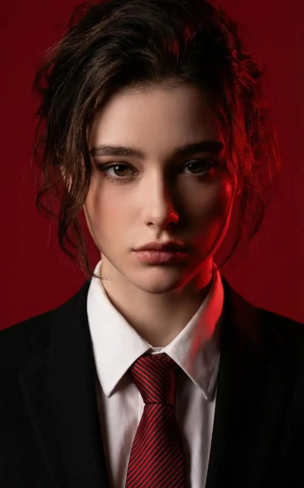

## 一张超逼真的8K人像

- ID: gpt4o-649-zh-2
- Slug: prompt-649-zh-2
- 语言: zh
- 来源: [来源链接](https://x.com/kingofdairyque/status/1995092464193933467)
- 样例图路径: images/part3/649.jpeg

### 提示词

```text
创作一张超逼真的8K人像，人物站在深红色背景前。她五官轮廓分明，一头凌乱的深色头发，表情自信而略带锐利。她身穿黑色西装外套，内搭白色衬衫，领口微微敞开，系着一条红色条纹网状领带。- 无限免费：戏剧性的红黑光影突显了她脸部、下颌和颈部的轮廓，营造出电影般的震撼氛围。请勿修改面部特征，并保持头部姿势不变。
```

### 样例图


## { "promptDetails": { "description": "A garage/workshop e

- ID: gpt4o-647-en-1
- Slug: prompt-647-en-1
- 语言: en
- 来源: [来源链接](https://x.com/HBCoop_/status/1994822441793671485)
- 样例图路径: images/part3/647.jpeg

### 提示词

```text
{
 "promptDetails": {
 "description": "A garage/workshop environment with the subject assembling a complex mechanical device, viewing a 3D exploded assembly diagram floating in space.",
 "styleTags": [
 "Industrial",
 "High Detail",
 "Technical",
 "Action Shot"
 ]
 },
 "scene": {
 "background": {
 "setting": "A cluttered but organized home workshop/garage bench",
 "details": "Pegboard tool wall in the background, organized small parts containers, a soldering iron station, wood grain of the workbench, metal shavings (subtly)."
 },
 "subject": {
 "description": "The person defined by `[UPLOADED IMAGE]`, wearing safety glasses or a work glove, deeply concentrated.",
 "pose": "Leaning over the bench, holding a small component (e.g., a rotor or circuit board) with tweezers or a small screwdriver.",
 "focus": "Hands, component, and the diagram are the sharpest elements."
 }
 },
 "overlayObject": {
 "type": "3D Exploded View Assembly Hologram",
 "relationshipToEnvironment": "Hovering directly above the disassembled drone parts on the workbench.",
 "transform": "A fully rendered, rotating 3D model of the device, clearly showing where the held component fits.",
 "surfaceInteraction": "Bright, high-contrast yellow/orange vector lines with directional arrows and part numbering. It must look spatially correct.",
 "components": {
 "partID": "Rotor Mount (P/N: M24B)",
 "instruction": "Attach to Main Hub (Torque to 1.5 Nm)",
 "position": "Floating central to the workspace."
 }
 },
 "technicalStyle": {
 "aspectRatio": "16:9",
 "photographyStyle": "Product/Technical, High Contrast",
 "camera": {
 "shotType": "Close-Up",
 "angle": "Slightly overhead (designer/technical perspective).",
 "depthOfField": "Extremely shallow, focusing only on the hands, the component, and the projected diagram. The background should be a creamy blur (bokeh)."
 },
 "lighting": {
 "type": "Fluorescent Shop Light and Holographic Glow",
 "description": "Cool, bright, uniform white light from above, contrasted by the warm, directional glow of the yellow/orange hologram."
 },
 "color": {
 "palette": "Greys, deep reds, metallic silver, and the neon yellow of the graphic."
 }
 }
}
```

### 样例图


## 漂浮在空中的3D爆炸装配图

- ID: gpt4o-647-zh-2
- Slug: prompt-647-zh-2
- 语言: zh
- 来源: [来源链接](https://x.com/HBCoop_/status/1994822441793671485)
- 样例图路径: images/part3/647.jpeg

### 提示词

```text
{
"promptDetails": {
“描述”：“车库/工作室环境，人物正在组装一个复杂的机械装置，同时观看漂浮在空中的3D爆炸装配图。”
"styleTags": [
“工业的”，
“高细节”，
“技术的”，
“动作镜头”
]
},
“场景”： {
“背景”： {
“场景”：“一个杂乱但井然有序的家庭工作室/车库工作台”，
“细节”：“背景中的挂板工具墙，整齐的小零件容器，电烙铁台，工作台的木纹，（隐约可见的）金属屑。”
},
“主题”： {
“描述”：“图中所示人物（[上传图片]），戴着安全眼镜或工作手套，神情专注。”
“姿势”：“身体前倾，倚靠在工作台上，用镊子或小螺丝刀夹住一个小元件（例如转子或电路板）。”
“焦点”：“手、部件和图表是最清晰的元素。”
}
},
"overlayObject": {
"type": "3D爆炸视图组装全息图",
“与环境的关系”：“直接悬停在工作台上拆卸下来的无人机部件上方。”
“变换”：“设备的完整渲染、旋转3D模型，清晰地显示了所持组件的安装位置。”
“表面交互”： “明亮、高对比度的黄/橙色矢量线，带有方向箭头和零件编号。它必须在空间上看起来正确。”
“成分”： {
"partID": "转子安装座（部件号：M24B）",
“说明”：“连接到主轮毂（扭矩为 1.5 牛米）”
“位置”：“位于工作区中心”。
}
},
"technicalStyle": {
“aspectRatio”: “16:9”
“photographyStyle”: “产品/技术，高对比度”
“相机”： {
"shotType": "特写",
“角度”：“略微俯视（设计师/技术视角）。”
“景深”： “极浅的景深，只聚焦于手部、组件和投影图。背景应呈现柔和的虚化效果（散景）。”
},
“灯光”： {
“类型”：“荧光商店照明灯和全息发光”，
“描述”：“上方照射下来的冷色调、明亮、均匀的白光，与温暖的、定向的黄橙色全息光形成对比。”
},
“颜色”： {
“调色板”：“灰色、深红色、金属银色和图形中的霓虹黄色。”
}
}
}
```

### 样例图


## { "scene_description": "A playful, high-energy fisheye p

- ID: gpt4o-646-en-1
- Slug: prompt-646-en-1
- 语言: en
- 来源: [来源链接](https://x.com/_MehdiSharifi_/status/1994870610410021018)
- 样例图路径: images/part3/646.jpeg

### 提示词

```text
{
  "scene_description": "A playful, high-energy fisheye portrait of a stylish young woman sitting inside a metal shopping cart in a vibrant supermarket aisle.",
  "subject": {
    "type": "young woman",
    "age": "early 20s",
    "features": {
      "hair": "long dark brown hair tied in loose low pigtails",
      "expression": "playful wink, slight smile",
      "hands": "long manicured nails, making a finger-frame gesture around her eye"
    },
    "attire": "black tank top, blue and white plaid shirt tied around the waist, white scrunched socks",
    "footwear": "oversized chunky white sneakers with light blue accents and thick laces",
    "position": "sitting inside a wire shopping cart, legs extended toward the camera lens creating foreshortening"
  },
  "action": {
    "primary": "posing playfully inside a shopping cart",
    "secondary": "framing her winking eye with her fingers using an 'L' shape gesture",
    "effect": "dynamic distortion emphasizing the sneakers and hands due to the lens"
  },
  "environment": {
    "setting": "brightly lit grocery store snack aisle",
    "foreground_elements": [
      "silver metal wire of the shopping cart",
      "chunky sneaker sole in extreme close-up"
    ],
    "background_elements": [
      "shelves stocked with colorful snack bags (yellow, red, green packaging)",
      "overhead fluorescent lights",
      "tiled supermarket floor",
      "promotional signage on shelves"
    ]
  },
  "lighting": {
    "style": "high-key, flat commercial lighting",
    "key_light": {
      "type": "overhead fluorescent tubes",
      "color": "cool white/neutral",
      "illuminates": [
        "entire aisle evenly",
        "reflections on plastic snack packaging",
        "sheen on the metal cart"
      ]
    },
    "shadows": "minimal, soft shadows beneath the cart"
  },
  "style": {
    "medium": "digital photography",
    "aesthetic": "Gen Z social media trend, Y2K influence, street style",
    "quality": "high definition, vibrant colors",
    "details": "sharp focus throughout"
  },
  "scene_composition": {
    "subject_action": "Leaning back casually in the cart, engaging directly with the camera",
    "camera_behavior": "Extreme close-up, wide-angle distortion",
    "depth_layering": "Exaggerated foreground (shoes) -> Middle ground (subject) -> Curved background (shelves)"
  },
  "visual_description": {
    "core_subject": "A trendy young woman with a fun, carefree attitude.",
    "attire_physics": "The plaid shirt is bunched naturally around the waist; the shoe laces appear large and textured due to proximity.",
    "skin_rendering": "Smooth, bright complexion, soft makeup with emphasized blush."
  },
  "lighting_and_atmosphere": {
    "type": "Artificial Interior Lighting",
    "specifics": "Even, bright illumination typical of retail environments, creating vibrant color pop on the merchandise.",
    "color_grade": "Slightly overexposed highlights, saturated primaries (reds, yellows, blues)."
  },
  "attire_customization": {
    "current_clothing": "Black tank top, plaid shirt (blue/white/grey), denim shorts (hidden), white chunky sneakers.",
    "customizable_clothing": "Leave empty to maintain current style or replace with 'oversized hoodie' for a different vibe."
  },
  "brand_product_customization": {
    "current_brand_product": "Generic colorful potato chip bags and snack packaging in background.",
    "customizable_brand": "User can insert specific snack brand names for the shelves.",
    "customizable_product": "User can specify the type of sneaker (e.g., Jordan, Balenciaga).",
    "product_placement_area": "The shelves behind the subject or the yellow bag inside the cart."
  },
  "objects_and_props": {
    "main_objects": [
      "Metal shopping cart",
      "Chunky sneakers"
    ],
    "secondary_objects": [
      "Yellow snack bag inside the cart",
      "Silver scrunched bracelet"
    ]
  },
  "camera_and_lens": {
    "focal_length_feel": "8mm to 10mm Fisheye",
    "aperture_effect": "Deep depth of field (f/8 or f/11)",
    "camera_angle": "High angle / POV looking down into the cart",
    "lens_type": "Ultra-wide angle fisheye lens",
    "bokeh_style": "None (everything in focus)"
  }
}
```

### 样例图


## 年轻女子坐在购物车里

- ID: gpt4o-646-zh-2
- Slug: prompt-646-zh-2
- 语言: zh
- 来源: [来源链接](https://x.com/_MehdiSharifi_/status/1994870610410021018)
- 样例图路径: images/part3/646.jpeg

### 提示词

```text
{
场景描述：一张充满活力、趣味十足的鱼眼镜头肖像照，照片中一位时尚的年轻女子坐在熙熙攘攘的超市过道里的一辆金属购物车里。
“主题”： {
“类型”: “年轻女子”
“年龄”：“20岁出头”，
“特征”： {
“头发”：“长长的深棕色头发扎成松散的低辫子”，
“表情”：“俏皮的眨眼，淡淡的微笑”，
“双手”：“修长的指甲，在她眼周做出指框的手势”
},
“着装”：“黑色背心，蓝白格子衬衫系在腰间，白色皱巴巴的袜子”，
“鞋履”：“超大号厚底白色运动鞋，带有浅蓝色点缀和粗鞋带”，
“姿势”：“坐在金属购物车里，双腿伸向镜头，造成透视缩短效果”
},
“行动”： {
“主要”: “在购物车里摆出俏皮的姿势”，
“次要的”：“用手指勾勒出她眨眼的轮廓，呈‘L’形”，
“效果”：“镜头造成的动态畸变，突出了运动鞋和手部”
},
“环境”： {
“场景”：“灯光明亮的杂货店零食区”，
"前景元素": [
“购物车上的银色金属丝”，
“厚底运动鞋的超近特写”
],
“背景元素”：[
“货架上摆满了五颜六色的零食袋（黄色、红色、绿色包装）”，
“头顶荧光灯”，
“超市瓷砖地面”，
“货架上的促销标牌”
]
},
“灯光”： {
“风格”：“高调、扁平的商业照明”，
"key_light": {
“类型”：“高架荧光灯管”，
“颜色”: “冷白/中性色”
“照亮”：[
“整条过道均匀铺开”，
“关于塑料零食包装的反思”
“金属推车上的光泽”
]
},
“阴影”：“购物车下方的阴影极少，很柔和”
},
“风格”： {
“媒介”: “数码摄影”
“美学”：“Z世代社交媒体趋势、Y2K影响、街头风格”
“质量”：“高清，色彩鲜艳”，
“细节”：“始终清晰聚焦”
},
"scene_composition": {
“subject_action”: “随意地向后靠在购物车里，直接与镜头互动”
"camera_behavior": "极致特写，广角畸变",
"depth_layering": "夸张的前景（鞋子） ->中景（主体） ->弧形背景（书架）"
},
"visual_description": {
"core_subject": "一位时尚、性格开朗、无忧无虑的年轻女性。"
"attire_physics": "格子衬衫自然地堆积在腰间；鞋带由于距离较近而显得又大又有纹理。"
“皮肤渲染”: “光滑、明亮的肤色，柔和的妆容，腮红突出。”
},
"lighting_and_atmosphere": {
“类型”：“人工室内照明”，
“具体细节”：“均匀明亮的照明，符合零售环境的典型特征，使商品色彩鲜艳夺目。”
“color_grade”: “高光略微过曝，原色（红色、黄色、蓝色）饱和度高。”
},
"attire_customization": {
"current_clothing": "黑色背心，格子衬衫（蓝/白/灰），牛仔短裤（隐藏），白色厚底运动鞋。"
"customizable_clothing": "留空以保持当前风格，或替换为“oversized hoodie”以获得不同的风格。"
},
"品牌产品定制": {
"current_brand_product": "背景中是色彩鲜艳的普通薯片包装袋和零食包装。"
"customizable_brand": "用户可以为货架输入特定的零食品牌名称。"
"customizable_product": "用户可以指定运动鞋的类型（例如，乔丹、巴黎世家）。"
"product_placement_area": "主体身后的货架或购物车内的黄色袋子。"
},
"objects_and_props": {
"main_objects": [
“金属购物车”，
厚底运动鞋
],
"secondary_objects": [
“购物车里的黄色零食袋”
“银色褶皱手镯”
]
},
"camera_and_lens": {
"focal_length_feel": "8mm 至 10mm 鱼眼镜头",
"aperture_effect": "大景深（f /8或 f/11）",
"camera_angle": "高角度/POV 俯视推车内部",
"lens_type": "超广角鱼眼镜头",
"bokeh_style": "无（所有物体都清晰对焦）"
}
}
```

### 样例图


## { "project_name": "3D_Caricature_Collage_Olive_Green", "

- ID: gpt4o-645-en-1
- Slug: prompt-645-en-1
- 语言: en
- 来源: [来源链接](https://x.com/ShreyaYadav___/status/1995052291981005278)
- 样例图路径: images/part3/645.jpeg

### 提示词

```text
{
  "project_name": "3D_Caricature_Collage_Olive_Green",
  "prompt_structure": {
    "subject": {
      "type": "Woman",
      "style": "3D Caricature",
      "appearance": "Highly polished, clean, meticulous detail",
      "clothing": "Deep olive green hoodie (rich, muted earth tone)"
    },
    "composition": {
      "type": "Collage",
      "layout": "Six-panel grid (3 columns x 2 rows)",
      "framing": "Close-up portraits"
    },
    "variations": {
      "panel_1": "Happy",
      "panel_2": "Surprised",
      "panel_3": "Serious",
      "panel_4": "Cute",
      "panel_5": "Sassy",
      "panel_6": "Confident",
      "facial_features": "Artistic exaggerations, widened eyes, arched eyebrows, broad smiles"
    },
    "environment": {
      "background": "Bold, vibrant colors distinct for each panel",
      "lighting": "Soft ambient lighting, sculpting subtle textures, crisp definition"
    },
    "text_elements": {
      "content": "Shreya Yadav",
      "type": "Signature",
      "style": "Elegant, legible"
    }
  },
  "technical_params": {
    "aspect_ratio": "3:4",
    "quality": "High definition, 8k, cinematic lighting",
    "render_engine": "Octane render / Unreal Engine style"
  },
  "full_prompt_text": "A six-panel collage (3 columns, 2 rows) featuring a highly polished 3D caricature of a woman wearing a deep olive green hoodie. The character maintains a consistent identity across all panels but displays six distinct emotions: happy, surprised, serious, cute, sassy, and confident. Facial features are artistically exaggerated with widened eyes and expressive mouths. Soft ambient lighting highlights skin texture and fabric folds. Backgrounds are bold and vibrant, contrasting with the muted olive hoodie. High-end digital art style, crisp definition. Signature text 'Shreya Yadav' included."
}
```

### 样例图


## 一张脸六种情绪

- ID: gpt4o-645-zh-2
- Slug: prompt-645-zh-2
- 语言: zh
- 来源: [来源链接](https://x.com/ShreyaYadav___/status/1995052291981005278)
- 样例图路径: images/part3/645.jpeg

### 提示词

```text
{
"project_name": "3D_Caricature_Collage_Olive_Green",
"prompt_structure": {
“主题”： {
"type": "Woman",
“风格”：“3D 漫画”，
“外观”：“高度抛光，干净，细节一丝不苟”，
服装：深橄榄绿连帽衫（浓郁、柔和的大地色调）
},
“作品”： {
“类型”：“拼贴画”，
"布局": "六格网格（3列 x 2行）",
“构图”：“特写肖像”
},
"变体": {
"panel_1": "快乐",
"panel_2": "惊讶",
"panel_3": "严肃",
"panel_4": "可爱",
"panel_5": "俏皮的",
"panel_6": "自信",
"facial_features": "艺术夸张，睁大的眼睛，弯弯的眉毛，灿烂的笑容"
},
“环境”： {
“背景”：“每个面板都采用大胆、鲜艳的颜色”，
“灯光”：“柔和的环境光，勾勒出微妙的纹理，清晰的轮廓”
},
"text_elements": {
内容：Shreya Yadav，
"type": "签名",
风格：优雅、清晰
}
},
"technical_params": {
"aspect_ratio": "3:4",
“质量”：“高清、8K、电影级光照”，
"render_engine": "Octane渲染/虚幻引擎风格"
},
"full_prompt_text": "一幅六格拼贴画（三列两行），以高度精细的3D漫画形式展现了一位身穿深橄榄绿连帽衫的女性形象。人物在所有画面中保持一致，但展现了六种截然不同的情绪：快乐、惊讶、严肃、可爱、俏皮和自信。面部特征经过艺术化的夸张处理，眼睛睁得大大的，嘴巴也极具表现力。柔和的环境光突显了皮肤纹理和衣物褶皱。背景色彩鲜艳夺目，与低调的橄榄绿连帽衫形成鲜明对比。作品采用高端数字艺术风格，画面清晰锐利。包含签名文字“Shreya Yadav”。"
}
```

### 样例图


## Generate a sleek digital artwork of me (use my uploaded 

- ID: gpt4o-643-en-1
- Slug: prompt-643-en-1
- 语言: en
- 来源: [来源链接](https://x.com/john_my07/status/1994989154669932989)
- 样例图路径: images/part3/643.jpeg

### 提示词

```text
Generate a sleek digital artwork of me (use my uploaded face), designed in the style of a modern vector poster portrait.
Visual Style & Elements:

A crisp vector aesthetic featuring strong line work and smooth, flat color shading.

Apply striking, high-contrast tones: light peach skin with gentle reddish shadowing.

Hair should be rendered with clean, stylized edges in deep brown/black shades, with faint highlights.

Beard should appear sharp, defined, and naturally blended into the facial structure.

Set the background to a solid red tone.
```

### 样例图


## 现代矢量海报肖像

- ID: gpt4o-643-zh-2
- Slug: prompt-643-zh-2
- 语言: zh
- 来源: [来源链接](https://x.com/john_my07/status/1994989154669932989)
- 样例图路径: images/part3/643.jpeg

### 提示词

```text
请用我上传的照片，为我创作一幅简洁的数字艺术作品，风格为现代矢量海报肖像。
视觉风格与元素：

简洁的矢量美学，线条流畅有力，色彩平滑自然。

采用醒目的高对比度色调：浅桃色肌肤搭配柔和的红色阴影。

头发应以深棕色/黑色为主色调，边缘干净利落，并带有淡淡的高光。

胡须应该看起来轮廓分明、线条流畅，并与面部结构自然融合。

将背景色设置为纯红色。
```

### 样例图


## 黑板艺术作品-海賊女帝

- ID: gpt4o-642-zh-1
- Slug: prompt-642-zh-1
- 语言: zh
- 来源: [来源链接](https://x.com/IamEmily2050/status/1994624635300974734)
- 样例图路径: images/part3/642.jpeg

### 提示词

```text
{
  "intent": "Photorealistic documentation of a specific chalkboard art piece featuring a single anime character, capturing the ephemeral nature of the medium within a classroom context.",
  "frame": {
    "aspect_ratio": "4:3",
    "composition": "A centered medium shot focusing on the chalkboard mural. The composition includes the teacher's desk in the immediate foreground to provide scale, with the artwork of the single character dominating the background space.",
    "style_mode": "documentary_realism, texture-focused, ambient naturalism"
  },
  "subject": {
    "primary_subject": "A large-scale, intricate chalk drawing of Boa Hancock from 'One Piece' on a standard green classroom blackboard.",
    "visual_details": "The illustration depicts Boa Hancock in a commanding pose, positioned centrally on the board. She is drawn with her signature long, straight black hair with a hime cut, rendered using dense application of black chalk with white accents for sheen. Her expression is haughty and imperious, with detailed dark blue eyes. She is depicted forming a heart shape with her hands, referencing her 'Mero Mero Mellow' technique. She wears a revealing red blouse with purple geometric patterns and gold snake-shaped earrings, drawn with vibrant colored chalks.",
    "medium_texture": "The image preserves the dusty, matte quality of the chalk. Visible hatching and cross-hatching strokes create shading on her clothing and hair. Smudged areas on the green slate indicate where colors have been blended by hand.",
    "surrounding_elements": "To the right of the character, vertical Japanese text reading '海賊女帝' (Pirate Empress) is written in crisp white chalk."
  },
  "environment": {
    "location": "A standard Japanese school classroom.",
    "foreground_elements": "A wooden teacher's desk occupies the lower foreground. Scattered across the surface are a yellow box of colored chalks, loose sticks of red, white, and blue pastel chalk, and a dust-covered black felt eraser.",
    "background_elements": "The green chalkboard spans the width of the frame, bordered by a metallic chalk tray containing accumulated chalk dust. The wall above is a plain, off-white plaster, featuring a small mounted speaker box.",
    "atmosphere": "Quiet and academic, with a sense of stillness suggesting the room is currently unoccupied."
  },
  "lighting": {
    "type": "Diffuse ambient classroom lighting.",
    "quality": "Soft, nondirectional illumination provided by overhead fluorescent fixtures mixed with daylight from windows on the left. The light is even, preventing glare on the chalkboard surface while highlighting the texture of the chalk.",
    "color_temperature": "Neutral white, approximately 5000K, ensuring accurate color rendition of the red and purple chalks against the dark green board.",
    "direction": "Overhead and slightly frontal."
  },
  "camera": {
    "sensor_format": "35mm full-frame digital sensor.",
    "lens": "35mm prime lens.",
    "aperture": "f/5.6",
    "depth_of_field": "Moderate depth of field, keeping the chalkboard drawing in sharp focus while allowing the foreground desk elements to soften slightly.",
    "shutter_speed": "1/60s",
    "iso": "400",
    "camera_position": "Eye-level standing position, set back enough to frame the entire drawing and the desk."
  },
  "negative": {
    "content": "Multiple characters, Midoriya, Shigaraki, male characters, digital art overlay, vector graphics, paper texture, oil painting, messy composition, extreme low angle, fisheye lens.",
    "style": "No hyper-saturation, no soft focus filters, no heavy vignetting."
  }
}
```

### 样例图


## 黑板艺术作品-海賊女帝

- ID: gpt4o-642-zh-2
- Slug: prompt-642-zh-2
- 语言: zh
- 来源: [来源链接](https://x.com/IamEmily2050/status/1994624635300974734)
- 样例图路径: images/part3/642.jpeg

### 提示词

```text
{
“意图”：“以照片写实的手法记录一幅特定的黑板艺术作品，作品中描绘了一个动漫角色，捕捉了课堂环境中这种媒介的转瞬即逝的特性。”
“框架”： {
"aspect_ratio": "4:3",
“构图”：“以黑板壁画为中心拍摄的中景镜头。画面前景中包含教师的办公桌以显示比例，而单个人物的画作则占据了背景空间。”
"style_mode": "纪实写实主义，注重纹理，环境自然主义"
},
“主题”： {
“primary_subject”: “一幅绘制在标准绿色教室黑板上的大型、精细的《海贼王》角色波雅·汉库克的粉笔画。”
“视觉细节”： “这幅插画描绘了波雅·汉库克，她以威严的姿态位于画面中央。她标志性的黑色长直发，采用姬发式剪裁，以浓重的黑色粉笔绘制，并以白色点缀以增加光泽。她的表情傲慢而威严，深蓝色的眼睛刻画入微。她双手比划成心形，象征着她的‘Mero Mero Mellow’（柔情蜜意）技巧。她身着一件饰有紫色几何图案的性感红色上衣，佩戴着以鲜艳彩色粉笔绘制的金色蛇形耳环。”
“medium_texture”：图像保留了粉笔的粉尘质感和哑光效果。清晰可见的排线和交叉线笔触在她的衣服和头发上营造出阴影。绿色石板上的晕染区域表明了手工调色的位置。
"surrounding_elements": "字符右侧用清晰的白色粉笔写着竖排的日文“海贼女帝”。"
},
“环境”： {
地点：一间标准的日本学校教室。
"前景元素": "一张木制教师桌占据了画面下方的前景。桌面上散落着一盒黄色的彩色粉笔、几支红色、白色和蓝色的粉彩粉笔，以及一块沾满灰尘的黑色毡橡皮。"
“背景元素”： “绿色黑板横跨整个画面宽度，边缘是一个金属粉笔托盘，里面积满了粉笔灰。黑板上方是一面普通的米白色石膏墙，墙上安装了一个小型壁挂式音箱。”
“氛围”：“安静而学术，一种静谧感表明房间里目前无人居住。”
},
“灯光”： {
“类型”：“漫射环境教室照明。”
“质量”：“柔和、无方向性的照明由上方荧光灯具提供，并混合了左侧窗户的自然光。光线均匀，既防止黑板表面产生眩光，又突显了粉笔的纹理。”
“色温”： “中性白光，约 5000K，确保红色和紫色粉笔在深绿色白板上的准确显色。”
“方向”：“头顶上方，略微朝前。”
},
“相机”： {
"sensor_format": "35mm 全画幅数码传感器。"
“镜头”：“35mm 定焦镜头。”
光圈：f/5.6，
“景深”： “适中的景深，保持黑板上的图画清晰锐利，同时让前景的桌面元素略微柔化。”
"shutter_speed": "1/60"
“iso”: “400，
“camera_position”: “与眼睛齐平的站立位置，向后移动足够远，以便将整个图纸和桌子都框入其中。”
},
“消极的”： {
内容：多个角色、绿谷出久、死柄木弔、男性角色、数字艺术叠加、矢量图形、纸张纹理、油画、凌乱构图、极低角度、鱼眼镜头。
“风格”：“不使用过饱和度，不使用柔焦滤镜，不使​​用严重的暗角。”
}
}
```

### 样例图


## Editorial 3x3 grid in soft golden-beige studio. Characte

- ID: gpt4o-640-en-1
- Slug: prompt-640-en-1
- 语言: en
- 来源: [来源链接](https://x.com/MonetizeXWithAb/status/1994781646361694398)
- 样例图路径: images/part3/640.jpeg

### 提示词

```text
Editorial 3x3 grid in soft golden-beige studio. Character (face characteristics 100% same as uploaded image) wearing a glossy silk saree with minimal jewelry. Lighting: warm soft key from right, reflector fill left. Shots match original structure: extreme lip/cheek macro with blurred silk, tight eye reflection crop, B&W chin-on-fist frame-fill, fabric-framed shoulder view, frontal close-up with hand-light pattern, angled portrait with loose strands, jawline-focused hand crop, half-body seated on cube, profile with rim slice. Same lens & aperture set. RAW, elegant tonal grade, smooth cinematic grain.
```

### 样例图


## 3x3网格构图进行拍摄照片

- ID: gpt4o-640-zh-2
- Slug: prompt-640-zh-2
- 语言: zh
- 来源: [来源链接](https://x.com/MonetizeXWithAb/status/1994781646361694398)
- 样例图路径: images/part3/640.jpeg

### 提示词

```text
在柔和的金米色摄影棚内，采用3x3网格构图进行拍摄。人物（面部特征与上传图片完全一致）身着光泽丝绸纱丽，佩戴极简首饰。灯光：右侧暖色调柔光主光，左侧反光板补光。拍摄构图与原图一致：极致唇颊微距特写（丝绸虚化）、眼部特写（反光）、黑白下巴托拳构图、织物框肩部特写、正面特写（手光图案）、斜角人像（头发散落）、下颌线特写（手部特写）、半身像（坐在立方体上）、侧面轮廓（镜框特写）。镜头和光圈设置相同。RAW格式，色调优雅，颗粒感柔和。
```

### 样例图


## { "photo": { "type": "kawaii_idol_closeup_portrait", "qu

- ID: gpt4o-638-en-1
- Slug: prompt-638-en-1
- 语言: en
- 来源: [来源链接](https://x.com/so_ainsight/status/1995018306433290701)
- 样例图路径: images/part3/638.jpeg

### 提示词

```text
{
  "photo": {
    "type": "kawaii_idol_closeup_portrait",
    "quality": "8k photorealistic, high fidelity, masterpiece",
    "lens": "85mm f/1.2 prime lens, beautiful bokeh",
    "composition": "bust-up shot, close-up, eye-level, subject centered, no text",
    "face": {
      "description": "A super cute 18-year-old Japanese girl with large sparkling puppy eyes, rosy cheeks (igari makeup style), glossy pink lips, porcelain skin, charming and sweet expression, radiating pure idol energy"
    },
    "model_pose": {
      "position": "facing camera slightly angled",
      "hands": "both hands bringing attention to the face, perhaps touching cheeks or holding a piece of hair, cute finger positioning",
      "expression": "beaming angelic smile, looking directly at viewer with affection, head slightly tilted"
    },
    "wardrobe": {
      "top": {
        "type": "fluffy white angora knit sweater with a cute ribbon collar",
        "style": "oversized sleeves covering half of hands (moe-sode), pastel aesthetic, soft texture"
      },
      "accessories": {
        "hair": "airy bangs, soft waves, decorated with pastel ribbon clips and tiny pearl pins",
        "earrings": "dainty dangling heart earrings",
        "necklace": "delicate gold chain with a small crystal"
      }
    },
    "textures": {
      "emphasis": [
        "hyper-detailed iris and eyelashes",
        "soft peach fuzz on skin",
        "fluffy angora texture",
        "glossy lips",
        "sparkling eye reflections"
      ]
    },
    "environment": {
      "backdrop": "dreamy blurred pastel background with bokeh lights",
      "lighting": {
        "style": "ethereal beauty lighting",
        "key_light": "soft diffuse frontal light to eliminate shadows",
        "effects": "slight bloom effect, rim light on hair to create a halo effect"
      }
    },
    "color_grade": {
      "type": "bright pastel dreamy",
      "balance": "creamy whites, soft pinks, slightly overexposed high-key look"
    }
  }
}
```

### 样例图


## 可爱偶像特写肖像

- ID: gpt4o-638-zh-2
- Slug: prompt-638-zh-2
- 语言: zh
- 来源: [来源链接](https://x.com/so_ainsight/status/1995018306433290701)
- 样例图路径: images/part3/638.jpeg

### 提示词

```text
{
  "photo": {
    "type": "可爱偶像特写肖像",
    "quality": "8K级照片写实，高保真，杰作",
    "lens": "85mm f/1.2 定焦镜头，美丽的散景（虚化）",
    "composition": "半身镜头，特写，视线平齐，主体居中，无文本",
    "face": {
      "description": "一位超级可爱的18岁日本少女，有着水汪汪的大眼睛（像小狗一样），红润的脸颊（宿醉妆/伊伽利妆风格），有光泽的粉色嘴唇，陶瓷般的肌肤，迷人甜美的表情，散发着纯粹的偶像能量"
    },
    "model_pose": {
      "position": "面向镜头，略微侧身",
      "hands": "双手吸引对脸部的注意，也许是摸着脸颊或捏着一缕头发，可爱的手指姿势",
      "expression": "天使般灿烂的笑容，深情地直视观看者，头部略微倾斜"
    },
    "wardrobe": {
      "top": {
        "type": "蓬松的白色安哥拉兔毛针织毛衣，带有可爱的丝带领子",
        "style": "超大袖子遮住一半手（萌袖），柔和色调美学，柔软质感"
      },
      "accessories": {
        "hair": "空气刘海，柔和的波浪卷，装饰着柔和色调的丝带夹和微小的珍珠发卡",
        "earrings": "精致的垂坠心形耳环",
        "necklace": "搭配一颗小水晶的精致金链"
      }
    },
    "textures": {
      "emphasis": [
        "超精细的虹膜和睫毛",
        "皮肤上柔软的绒毛",
        "蓬松的安哥拉兔毛质感",
        "有光泽的嘴唇",
        "闪烁的眼睛反光"
      ]
    },
    "environment": {
      "backdrop": "梦幻模糊的柔和色调背景，带有散景光斑",
      "lighting": {
        "style": "空灵的美颜光照",
        "key_light": "柔和的漫射正面光以消除阴影",
        "effects": "轻微的柔光（泛光）效果，头发上的边缘光营造出光环效果"
      }
    },
    "color_grade": {
      "type": "明亮柔和梦幻",
      "balance": "奶油白，柔和粉，略微过曝的高调外观"
    }
  }
}
```

### 样例图


## 一张图片生成9个不同景别的镜头

- ID: gpt4o-629-zh
- Slug: prompt-629-zh
- 语言: zh
- 来源: [来源链接](https://x.com/songguoxiansen/status/1994783047825473774)
- 样例图路径: images/part3/629.jpeg

### 提示词

```text
<instruction> (指令)
分析输入图像的整个构图。识别所有存在的关键主体（无论是单人、群体/情侣、车辆还是特定物体）及其空间关系/互动。
生成一个连贯的 3x3 网格“电影印样（Contact Sheet）”，展示在同一环境中完全是这些主体的 9 个不同镜头。
你必须调整标准的电影镜头类型以适应内容（例如，如果是群体，保持群体在一起；如果是物体，构图包含整个物体）：
第 1 行（建立背景）：
大远景 (ELS)： 主体在广阔的环境中显得很小。
全景 (LS)： 完整的主体或群体从上到下可见（从头到脚 / 从车轮到车顶）。
中远景 (美式镜头/四分之三)： 构图从膝盖以上（针对人物）或 3/4 视角（针对物体）。
第 2 行（核心覆盖）：
4. 中景 (MS)： 构图从腰部以上（或物体的中心核心）。聚焦于互动/动作。
5. 中特写 (MCU)： 构图从胸部以上。主要主体的亲密构图。
6. 特写 (CU)： 紧凑构图于脸部或物体的“正面”。
第 3 行（细节与角度）：
7. 大特写 (ECU)： 强烈聚焦于关键特征（眼睛、手、标志、纹理）的微距细节。
8. 低角度镜头 (仰视/虫眼)： 从地面仰望主体（壮观/英雄感）。
9. 高角度镜头 (俯视/鸟瞰)： 从上方俯瞰主体。
确保严格的一致性：所有 9 个面板中是相同的人物/物体、相同的衣服和相同的光照。景深应逼真地变化（特写镜头中的背景虚化）。
</instruction>
一个包含 9 个面板的专业 3x3 电影故事板网格。
该网格以全面的焦距范围展示输入图像中的特定主体/场景。
顶行： 宽广环境镜头，全视图，3/4 剪辑（膝上景）。
中间行： 腰部以上视图，胸部以上视图，脸部/正面特写。
底行： 微距细节，低角度，高角度。
所有帧均具有照片般逼真的纹理，一致的电影级调色，以及针对所分析的主体或物体特定数量的正确构图。
```

### 样例图


## Use the uploaded photo. Do NOT alter the person’s real a

- ID: gpt4o-625-en-1
- Slug: prompt-625-en-1
- 语言: en
- 来源: [来源链接](https://x.com/AI_GIRL_DESIGN/status/1993243344932413597)
- 样例图路径: images/part3/625.jpeg

### 提示词

```text
Use the uploaded photo. 
Do NOT alter the person’s real appearance — keep the person’s face, body, clothing, colors, and texture completely photorealistic. 
Do NOT change the background perspective. 
Do NOT turn the person into a drawing or illustration.

Add a dense, overloaded layer of pop-style illustrated “sweets monsters” and graphic decorations ONLY around the person (and on top of their clothing if needed), but never on their skin or face.

Illustrated elements:
- many colorful cartoon monsters with thick black outlines, flat colors, and cute-but-ugly expressions
- sweets-inspired monsters: bananas, cookies, strawberries, melting chocolate, lollipops, ice cream, oranges, cupcakes, donuts, candy pieces, soda bottles, etc.
- additional graphic shapes: stars, hearts, arrows, drips, splashes, zigzag lines, exclamation marks, motion lines, sparkles, bubbles, comic-style text shapes (but no real text)

Make the decoration very dense and “busy”:
- fill the space behind the person with overlapping sweets monsters and shapes
- add monsters peeking from behind the shoulders, around the bag, at the person’s feet, and near the head
- allow some monsters and shapes to overlap the clothing and accessories (shirt, shorts, bag, shoes), but keep the skin of the face, arms, and legs photorealistic and visible
- use multiple layers of illustrations in front of and behind the person to create depth
- add glowing outlines, small white dots, and speed lines around the person to emphasize energy

Color and style:
- use a vivid, neon-like color palette (hot pink, yellow, cyan, lime, orange, purple, turquoise)
- keep all illustrated elements flat and graphic with clean edges and bold outlines
- ensure shadows and overlap suggest interaction with the real person (e.g., slight shadows on clothing where monsters touch)

Overall goal:
Create a highly decorated, maximalist pop-art scene where the real person stands in the middle, surrounded and wrapped by a chaotic crowd of playful sweets monsters and graphic doodles, while the person remains clearly photorealistic.
```

### 样例图


## 在人物周围添加糖果怪兽

- ID: gpt4o-625-zh-2
- Slug: prompt-625-zh-2
- 语言: zh
- 来源: [来源链接](https://x.com/AI_GIRL_DESIGN/status/1993243344932413597)
- 样例图路径: images/part3/625.jpeg

### 提示词

```text
请使用已上传的照片。
不要改变人物的真实外貌——保持人物的脸部、身体、衣服、颜色和纹理完全逼真。
请勿改变背景视角。
请勿将人物形象转化为绘画或插图。

在人物周围（必要时可以贴在衣服上）添加一层厚重的、过多的流行风格插画“糖果怪兽”和图形装饰，但绝不能贴在皮肤或脸上。

图示元素：
- 许多色彩鲜艳的卡通怪物，轮廓线粗黑，色彩扁平，表情可爱又丑陋。
- 以甜食为灵感的怪物：香蕉、饼干、草莓、融化的巧克力、棒棒糖、冰淇淋、橙子、纸杯蛋糕、甜甜圈、糖果块、汽水瓶等等。
- 其他图形形状：星星、心形、箭头、水滴、飞溅、锯齿线、感叹号、动态线条、闪光、气泡、漫画风格的文字形状（但不能包含实际文字）

装饰要非常密集、繁复：
- 用重叠的糖果怪兽和形状填满人身后的空间
- 添加一些怪物，它们会从肩膀后面、包周围、人的脚边和头部附近探出头来。
允许部分怪物和形状与服装及配饰（衬衫、短裤、包、鞋子）重叠，但保持面部、手臂和腿部的皮肤逼真可见。
- 在人物前后使用多层插图来营造景深。
- 在人物周围添加发光轮廓、小白点和速度线，以强调能量。

颜色和款式：
- 使用鲜艳的霓虹色系调色板（亮粉色、黄色、青色、酸橙色、橙色、紫色、蓝绿色）
- 保持所有插图元素扁平化、图形化，边缘清晰，轮廓粗犷。
- 确保阴影和重叠能够暗示与真人的互动（例如，怪物触碰衣服时在衣服上留下淡淡的阴影）

总体目标：
创作一幅装饰华丽、极繁主义的波普艺术场景，真人站在场景中央，被一群嬉戏玩闹的糖果怪兽和涂鸦图形包围，而真人则保持清晰的写实风格。
```

### 样例图


## 手绘美颜科普图

- ID: gpt4o-624-zh
- Slug: prompt-624-zh
- 语言: zh
- 来源: [来源链接](https://x.com/cnyzgkc/status/1994954677579125124)
- 样例图路径: images/part3/624.jpeg

### 提示词

```text
Hand-drawn watercolor infographic, warm soft watercolor texture, pink tone, cute and clean design, 4:5 ratio, 1080x1350.

角色：一位专精医学保健的插画家兼医生，亲切微笑，手持水彩笔，风格卡通可爱。

主标题（上方）：缺什么营养素会变丑？医生的维生素美颜配方！

图表结构（下方开始）：
六个可爱人物，呈现六种“变丑症状”，搭配对应的卡通营养素图标。

示例内容（AI 可自由重绘，不要写实）：
1. 皮肤暗沉 → 维生素C（Vitamin C 卡通形象）
2. 眼睛干涩 → 维生素A（Vitamin A 卡通形象）
3. 掉发 → 维生素B、维生素D（B群、D 卡通形象）
4. （可继续根据文案自动生成更多症状与营养素）

风格要求：
手绘水彩感、粉色主调、柔和自然、轻松舒服的氛围。
人物要可爱、圆润、友好。
营养素图标为卡通拟人风格。
文字为清晰易读的手写笔记感字体。
整体排版简洁、资讯图表形式。

Lighting: soft, diffuse watercolor lighting.
Avoid: 照片感、真实皮肤纹理、过度写实、油画风、金属光泽。

best quality, high-res, clean edges, masterpiece.
```

### 样例图


## { "image_description": { "face": { "preserve_original": 

- ID: gpt4o-622-en-1
- Slug: prompt-622-en-1
- 语言: en
- 来源: [来源链接](https://x.com/ZaraIrahh/status/1994586672504181025)
- 样例图路径: images/part3/622.jpeg

### 提示词

```text
{
  "image_description": {
    "face": {
      "preserve_original": true,
      "reference_match": true,
      "description": "Use the same facial features and identity from the uploaded image without altering any structure, proportions, or expression."
    },

    "photo_style": {
      "type": "indoor cinematic portrait",
      "camera_angle": "mid-shot, straight-on",
      "lighting": "soft warm indoor lighting with gentle highlights on skin and satin fabric",
      "mood": "elegant, confident, sophisticated",
      "depth_of_field": "shallow with lightly blurred background"
    },

    "subject": {
      "pose": "standing with relaxed posture, one hand resting on a wooden surface, body slightly turned forward",
      "expression": "calm, confident, slightly serious with bold red lips",
      "hair": {
        "style": "messy elegant bun with loose face-framing strands",
        "color": "dark brown"
      },
      "clothing": {
        "type": "deep red satin button-up blouse",
        "details": "luxurious sheen, slightly open neckline, sleeves loosely rolled"
      },
      "accessories": {
        "necklaces": [
          {
            "type": "gold chain",
            "pendant": "large emerald green stone"
          },
          {
            "type": "gold chain",
            "pendant": "black square pendant"
          }
        ],
        "earrings": "crystal drop earrings",
        "watch": "light-tone watch on left wrist"
      }
    },

    "environment": {
      "setting": "elegant indoor room",
      "background": [
        "decorative tapestry or framed wall art featuring pastoral scene",
        "warm-toned walls",
        "soft, classic interior elements"
      ],
      "atmosphere": "warm, refined, cinematic"
    },

    "aesthetic": {
      "style": "luxury editorial portrait",
      "features": [
        "warm tones",
        "rich textures",
        "glowing satin reflections",
        "elegant jewelry highlights",
        "balanced cinematic composition"
      ]
    }
  }
}
```

### 样例图


## 自信成熟女性室内电影肖像

- ID: gpt4o-622-zh-2
- Slug: prompt-622-zh-2
- 语言: zh
- 来源: [来源链接](https://x.com/ZaraIrahh/status/1994586672504181025)
- 样例图路径: images/part3/622.jpeg

### 提示词

```text
{
"image_description": {
“脸”： {
"preserve_original": true,
"reference_match": true,
“描述”：“使用上传图像中相同的面部特征和身份，但不得改变任何结构、比例或表情。”
},

"photo_style": {
“类型”：“室内电影肖像”，
"camera_angle": "mid-shot, straight on",
“照明”：“柔和温暖的室内照明，在皮肤和缎面织物上营造柔和的高光效果”，
“情绪”：“优雅、自信、成熟”，
"depth_of_field": "浅景深，背景略微模糊"
},

“主题”： {
“姿势”：“站立姿势放松，一只手放在木质表面上，身体略微前倾”，
“表情”：“冷静、自信、略带严肃，配以鲜艳的红唇”，
“头发”： {
“发型”：“凌乱优雅的发髻，垂落几缕碎发修饰脸型”，
颜色：深棕色
},
“衣服”： {
“类型”: “深红色缎面纽扣衬衫”
细节：奢华光泽，略微敞开的领口，袖子随意卷起。
},
“配件”： {
“项链”：[
{
“类型”：“金链”，
“吊坠”： “大颗祖母绿宝石”
},
{
“类型”：“金链”，
“吊坠”： “黑色方形吊坠”
}
],
“耳环”: “水晶吊坠耳环”
“手表”： “左手腕上的浅色手表”
}
},

“环境”： {
“场景”：“优雅的室内房间”，
“背景”： [
“以田园风光为主题的装饰挂毯或装裱墙饰”
“暖色调的墙壁”，
“柔和、经典的室内元素”
],
“氛围”：“温暖、精致、电影感”
},

“审美的”： {
“风格”: “奢华的编辑肖像”
“特征”： [
“暖色调”，
“丰富的质感”，
“闪亮的缎面反射”，
“优雅的珠宝亮点”，
“均衡的电影构图”
]
}
}
}
```

### 样例图


## { "project": "Ultra-Realistic Portrait", "reference_sett

- ID: gpt4o-620-en-1
- Slug: prompt-620-en-1
- 语言: en
- 来源: [来源链接](https://x.com/YaseenK7212/status/1994634660459024649)
- 样例图路径: images/part3/620.jpeg

### 提示词

```text
{
  "project": "Ultra-Realistic Portrait",
  "reference_settings": {
    "use_reference_image": true,
    "fidelity_strength": "100%",
    "instruction": "Face and outfit must match reference photo 100% with absolutely no alterations."
  },
  "subject": {
    "demographics": "Woman",
    "focus_features": ["Eyes", "Nose", "Lips"],
    "expression": "Smiling, cute, fresh, dreamy, slightly sensual",
    "pose": "Sitting at a white table, resting chin on both hands, turning slightly",
    "hair": {
      "style": "Straight, large top bun",
      "accessory": "Bow matching the outfit",
      "texture": "Soft layered, loose strands falling naturally across face",
      "movement": "Slightly blown by wind"
    },
    "makeup": {
      "cheeks": "Natural blush on cheeks and nose",
      "lips": "Full lips, soft pink-peach tone"
    }
  },
  "fashion_and_accessories": {
    "outfit": "Exact match to reference image",
    "shoes": "High-heel shoes (matching reference)",
    "bag": "Same bag as reference photo",
    "jewelry": {
      "necklace": "Thin gold with alternating charms (heart, crescent moon, Gucci pendant)",
      "bracelet": "Delicate Gucci bracelet with charms",
      "rings": "Gold rings",
      "watch": "Steel-band Patek Philippe",
      "earrings": "Small gold Gucci earrings"
    }
  },
  "environment": {
    "location": "Luxury hotel terrace / Seaside",
    "time_of_day_options": [
      "Option A: Deep blue evening sky, stars, shooting star, moonlight",
      "Option B: Early sunrise, orange-yellow sky tones"
    ],
    "background_elements": [
      "Warm reflections from luxury hotel",
      "Calm seascape"
    ]
  },
  "props": {
    "table_setting": "White table",
    "items": [
      "Glass with a single white rose",
      "Wine glass",
      "Wine bottle",
      "Plate set with knife and fork",
      "Large T-bone steak in center",
      "Candle glass (adding warm highlight)"
    ]
  },
  "photography_style": {
    "aesthetic": "2000s digital-camera flash style",
    "lighting": "Realistic flash brightness, warm tone, slight shine on skin",
    "mood": "Relaxing, warm, nostalgic, stylish, elegant, slightly sexy",
    "shot_type": "Close-up portrait"
  },
  "technical_parameters": {
    "aspect_ratio": "3:4",
    "detail_level": "8k",
    "style_tags": ["photo", "realistic", "flash photography"]
  }
}
```

### 样例图


## 超写实性感大嘴人物肖像

- ID: gpt4o-620-zh-2
- Slug: prompt-620-zh-2
- 语言: zh
- 来源: [来源链接](https://x.com/YaseenK7212/status/1994634660459024649)
- 样例图路径: images/part3/620.jpeg

### 提示词

```text
{
“项目”：“超写实肖像”，
"reference_settings": {
"use_reference_image": true,
"fidelity_strength": "100%",
“说明”：“面部和服装必须与参考照片100%一致，绝对不能做任何修改。”
},
“主题”： {
“人口统计信息”：“女性”，
"focus_features": ["眼睛", "鼻子", "嘴唇"],
“表情”：“微笑、可爱、清新、梦幻、略带性感”
“姿势”：“坐在白色桌子旁，双手托腮，微微侧身”，
“头发”： {
“发型”：“直发，大发髻”，
“配饰”：“与服装相配的蝴蝶结”，
“质感”：“柔软、层次分明、自然垂落在脸上的发丝”，
“运动”：“微风吹拂”
},
“化妆品”： {
“脸颊”： “脸颊和鼻子上的自然红晕”
“嘴唇”：丰满的嘴唇，柔和的粉桃色调
}
},
"fashions_and_accessories": {
“服装”: “与参考图片完全匹配”，
“鞋子”：“高跟鞋（配套参考）”
“包”： “与参考照片相同的包”
“珠宝”： {
“项链”：“细金项链，饰有交替的吊坠（心形、新月形、Gucci吊坠）”
“手镯”：“精致的 Gucci 手镯，带有吊坠”，
“戒指”： “金戒指”，
“手表”: “钢带百达翡丽”
“耳环”： “古驰小金耳环”
}
},
“环境”： {
位置：豪华酒店露台/海滨
"time_of_day_options": [
“选项A：深蓝色的傍晚天空，繁星，流星，月光，”
选项B：清晨日出，橙黄色的天空色调
],
“背景元素”：[
“来自豪华酒店的温馨回响”
“平静的海景”
]
},
"props": {
"table_setting": "白色桌子",
“项目”： [
“一杯插着一朵白玫瑰的酒”
“酒杯”，
“葡萄酒瓶”，
“餐盘套装，含刀叉”
“中间是一块大块的T骨牛排”，
“烛台玻璃（增添暖色调高光）”
]
},
"photography_style": {
“美学”：“2000年代数码相机闪光灯风格”，
“光照”：“逼真的闪光亮度，暖色调，皮肤略带光泽”，
“氛围”：“轻松、温暖、怀旧、时尚、优雅、略带性感”
"shot_type": "特写肖像"
},
"technical_parameters": {
"aspect_ratio": "3:4",
"detail_level": "8k",
"style_tags": ["photo", "realistic", "flash photography"]
}
}
```

### 样例图


## Photorealistic Hong Kong retro portrait with authentic 1

- ID: gpt4o-619-en-1
- Slug: prompt-619-en-1
- 语言: en
- 来源: [来源链接](https://x.com/ShreyaYadav___/status/1994430035554603247)
- 样例图路径: images/part3/619.jpeg

### 提示词

```text
Photorealistic Hong Kong retro portrait with authentic 1990s film look.
Use image [0] as face reference. Half-body. Subject leaning against newspaper-covered wall, gaze soft and melancholic. Cropped bralette top embroidered with pearls and sequins Loose high-waisted trousers with elastic waistband, typical 1990s street style. Hair messy, strands falling across face. Makeup glossy lips, dewy skin. Narrow Hong Kong room, walls plastered with old yellowed Cantonese newspapers.
```

### 样例图


## 90年代电影质感的逼真香港复古肖像照

- ID: gpt4o-619-zh-2
- Slug: prompt-619-zh-2
- 语言: zh
- 来源: [来源链接](https://x.com/ShreyaYadav___/status/1994430035554603247)
- 样例图路径: images/part3/619.jpeg

### 提示词

```text
具有90年代电影质感的逼真香港复古肖像照。
以图[0]为面部参考。半身像。人物倚靠在贴满报纸的墙上，目光柔和而忧郁。身穿饰有珍珠和亮片的露脐抹胸上衣，搭配宽松的高腰松紧裤，典型的90年代街头风格。头发凌乱，几缕发丝垂落在脸颊。妆容精致，唇部光泽，肌肤水润。狭窄的香港房间，墙壁上贴满了泛黄的旧粤语报纸。

签名：Shreya Yadav
```

### 样例图


## { "scene_description": "A cohesive 4-panel fashion lifes

- ID: gpt4o-618-en-1
- Slug: prompt-618-en-1
- 语言: en
- 来源: [来源链接](https://x.com/_MehdiSharifi_/status/1994168239442510308)
- 样例图路径: images/part3/618.jpeg

### 提示词

```text
{
  "scene_description": "A cohesive 4-panel fashion lifestyle collage featuring the same young woman in a cozy layered autumn outfit, showcasing relaxed poses in nature.",
  "subject": {
    "type": "Young Woman (Consistent character)",
    "age": "early 20s",
    "features": {
      "hair": "loose natural hair with beanie",
      "makeup": "rosy cheeks"
    },
    "attire": "chunky knit sweater, plaid scarf, long wool coat, jeans, boots",
    "accessories": "takeaway coffee cup"
  },
  "collage_layout": {
    "structure": "2x2 Grid Layout (4 frames of equal size)",
    "panel_1_top_left": "Full Body Dynamic: Throwing autumn leaves in the air or twirling, coat flowing, smiling broadly.",
    "panel_2_top_right": "Sitting Side View: Sitting on a park bench with legs crossed, reading a book or looking at the scenery, holding coffee.",
    "panel_3_bottom_left": "Mid-Shot Walking: Walking towards the camera holding the lapels of the coat, looking down shyly or smiling.",
    "panel_4_bottom_right": "Portrait with Prop: Peeking out from behind the oversized scarf, holding the coffee cup near face for warmth, eyes smiling."
  },
  "environment": {
    "setting": "Autumn Park / Forest Path",
    "background_elements": [
      "Orange and yellow leaves",
      "Trees",
      "Park bench"
    ]
  },
  "lighting": {
    "style": "Golden Hour Soft",
    "key_light": {
      "type": "Low Autumn Sun",
      "color": "Warm Golden",
      "effect": "Backlight or soft front light, magical atmosphere"
    }
  },
  "style": {
    "medium": "Portrait Photography",
    "aesthetic": "Cottagecore, Autumn Vibes, Cozy, Pinterest",
    "quality": "8k resolution, warm tones"
  },
  "attire_customization": {
    "current_clothing": "Wool coat and knitwear",
    "customizable_clothing": "User can swap for puffer jacket or raincoat"
  },
  "brand_product_customization": {
    "current_brand_product": "Winter Apparel",
    "customizable_brand": "User: Insert Brand Name",
    "customizable_product": "User: Specific coat or boots",
    "product_placement_area": "Coat texture or boots"
  }
}
```

### 样例图


## 四幅时尚生活场景组成的拼贴画

- ID: gpt4o-618-zh-2
- Slug: prompt-618-zh-2
- 语言: zh
- 来源: [来源链接](https://x.com/_MehdiSharifi_/status/1994168239442510308)
- 样例图路径: images/part3/618.jpeg

### 提示词

```text
{
“场景描述”： “这是一幅由四幅时尚生活场景组成的拼贴画，画面中同一位年轻女子身着舒适的秋季叠穿服装，在自然环境中摆出轻松的姿势。”
“主题”： {
“类型”：“年轻女子（性格始终如一）”
“年龄”：“20岁出头”，
“特征”： {
“头发”：“披散的自然头发，戴着毛线帽”，
“妆容”：“红润的脸颊”
},
着装：粗针织毛衣、格子围巾、长羊毛大衣、牛仔裤、靴子。
配件：外带咖啡杯
},
"collage_layout": {
"结构": "2x2 网格布局（4 个大小相同的框架）",
"panel_1_top_left": "全身动态：抛洒秋叶或旋转，外套飘动，笑容灿烂。"
"panel_2_top_right": "坐姿侧视图：坐在公园长椅上，双腿交叉，手拿咖啡，正在看书或欣赏风景。"
"panel_3_bottom_left": "中景行走：走向镜头，抓住外套翻领，害羞地低头或微笑。"
"panel_4_bottom_right": "带道具的肖像：从超大的围巾后面探出头来，手里拿着咖啡杯贴近脸庞取暖，眼神中带着微笑。"
},
“环境”： {
“设置”: “秋季公园/森林小径”
“背景元素”：[
“橙色和黄色的叶子”，
“树木”，
“公园长椅”
]
},
“灯光”： {
“风格”：“金色时光柔和”
"key_light": {
“类型”：“低垂的秋日阳光”，
颜色：暖金色，
效果：背光或柔和的前光，营造出梦幻般的氛围
}
},
“风格”： {
“媒介”: “人像摄影”
“美学”：“田园风、秋日氛围、舒适、Pinterest”
“品质”：“8K分辨率，暖色调”
},
"attire_customization": {
"current_clothing": "羊毛大衣和针织衫",
"customizable_clothing": "用户可以换成羽绒服或雨衣"
},
"品牌产品定制": {
"current_brand_product": "冬季服装",
"customizable_brand": "用户：插入品牌名称",
"customizable_product": "用户：特定外套或靴子",
"product_placement_area": "外套纹理或靴子"
}
}
```

### 样例图


## { "scene_description": "A cohesive 4-panel fashion lifes

- ID: gpt4o-617-en-1
- Slug: prompt-617-en-1
- 语言: en
- 来源: [来源链接](https://x.com/_MehdiSharifi_/status/1994166992719299026)
- 样例图路径: images/part3/617.jpeg

### 提示词

```text
{
  "scene_description": "A cohesive 4-panel fashion lifestyle collage featuring the same young woman in a glamorous evening outfit, showcasing cinematic poses under city lights.",
  "subject": {
    "type": "Young Woman (Consistent character)",
    "age": "early 20s",
    "features": {
      "hair": "glamorous waves",
      "makeup": "evening look with red lip"
    },
    "attire": "black satin slip dress, leather jacket draped over shoulders, strappy heels",
    "accessories": "sparkly clutch, earrings"
  },
  "collage_layout": {
    "structure": "2x2 Grid Layout (4 frames of equal size)",
    "panel_1_top_left": "Full Body Flash Shot: Standing against a metallic door or shutter, posing with one leg forward, looking fierce (flash photography style).",
    "panel_2_top_right": "Over-the-Shoulder: Looking back at the camera while walking away towards neon city lights, showcasing the back of the dress/jacket.",
    "panel_3_bottom_left": "Seated Profile: Sitting on a high bar stool or velvet booth, holding a mocktail, laughing candidly towards someone off-camera.",
    "panel_4_bottom_right": "Artistic Portrait: Standing near a neon sign, face illuminated by pink/blue light, looking dreamily upwards."
  },
  "environment": {
    "setting": "City at Night / Rooftop Bar",
    "background_elements": [
      "Neon signs",
      "City bokeh",
      "Dark shadows"
    ]
  },
  "lighting": {
    "style": "Flash & Neon Mixed",
    "key_light": {
      "type": "Camera Flash / Neon Sign",
      "color": "Cool White / Vibrant Colors",
      "effect": "High contrast, edgy vibe"
    }
  },
  "style": {
    "medium": "Flash Photography / Film Aesthetic",
    "aesthetic": "Night Luxe, Party Vibe, Cinematic, Edgy",
    "quality": "8k resolution, slight grain"
  },
  "attire_customization": {
    "current_clothing": "Slip dress and leather jacket",
    "customizable_clothing": "User can swap for sequin dress or jumpsuit"
  },
  "brand_product_customization": {
    "current_brand_product": "Evening Wear",
    "customizable_brand": "User: Insert Brand Name",
    "customizable_product": "User: Specific dress or makeup",
    "product_placement_area": "Dress silhouette"
  },
  "technical_tags": "--v 6 --ar 4:5 --stylize 400 --no daylight, office setting"
}
```

### 样例图


## 四幅时尚生活场景组成的连贯拼贴画

- ID: gpt4o-617-zh-2
- Slug: prompt-617-zh-2
- 语言: zh
- 来源: [来源链接](https://x.com/_MehdiSharifi_/status/1994166992719299026)
- 样例图路径: images/part3/617.jpeg

### 提示词

```text
{
“场景描述”： “这是一幅由四幅时尚生活场景组成的连贯拼贴画，画中同一位年轻女子身着华丽的晚礼服，在城市灯光下摆出极具电影感的姿势。”
“主题”： {
“类型”：“年轻女子（性格始终如一）”
“年龄”：“20岁出头”，
“特征”： {
“头发”：“迷人的波浪卷发”，
“妆容”：“晚宴妆容，搭配红唇”
},
“着装”：“黑色缎面吊带裙，肩上披着皮夹克，细带高跟鞋”，
“配饰”：闪亮手拿包、耳环
},
"collage_layout": {
"结构": "2x2 网格布局（4 个大小相同的框架）",
"panel_1_top_left": "全身闪光照：倚靠在金属门或卷帘门上，一条腿向前迈出，摆出凶狠的姿势（闪光摄影风格）。"
"panel_2_top_right": "过肩视角：边走边回头看向镜头，朝着霓虹闪烁的城市灯光走去，展示连衣裙/外套的背面。"
"panel_3_bottom_left": "坐姿侧脸：坐在高脚吧台凳或天鹅绒卡座上，手持一杯无酒精鸡尾酒，对着镜头外的人开怀大笑。"
"panel_4_bottom_right": "艺术肖像：站在霓虹灯招牌旁，脸部被粉色/蓝色灯光照亮，眼神梦幻般地向上凝视。"
},
“环境”： {
“场景”：“夜幕下的城市/屋顶酒吧”，
“背景元素”：[
霓虹灯招牌
“城市散景”
“黑暗阴影”
]
},
“灯光”： {
“风格”：“闪光与霓虹混合”，
"key_light": {
"type": "相机闪光灯/霓虹灯标志",
“颜色”：“冷白/鲜艳色彩”，
“效果”：“高对比度，前卫氛围”
}
},
“风格”： {
“媒介”：“闪光摄影/胶片美学”，
“美学”：“夜间奢华、派对氛围、电影感、前卫”
“画质”：“8K分辨率，略带颗粒感”
},
"attire_customization": {
"current_clothing": "吊带裙和皮夹克",
"customizable_clothing": "用户可以换成亮片连衣裙或连体裤"
},
"品牌产品定制": {
"current_brand_product": "晚礼服",
"customizable_brand": "用户：插入品牌名称",
"customizable_product": "用户：特定服装或妆容",
"product_placement_area": "连衣裙轮廓"
},
"technical_tags": " --v 6 --ar 4:5 --stylize 400 --no daylight, office setting"
}
```

### 样例图


## { "prompt": "hyperrealistic ultra-detailed 8k photo of Y

- ID: gpt4o-615-en-1
- Slug: prompt-615-en-1
- 语言: en
- 来源: [来源链接](https://x.com/Samann_ai/status/1994444395525832898)
- 样例图路径: images/part3/615.jpeg

### 提示词

```text
{
  "prompt": "hyperrealistic ultra-detailed 8k photo of YOU (Upload Your Photo) standing in a bright cozy living room, same location as the reference: cream-colored sofa, large white curtains with soft daylight shining through, warm neutral walls, several green houseplants, minimal decor, natural sunlight and soft shadows. Use the uploaded photo as the main subject of the image, preserving the face, hairstyle, body type, clothing, and overall style exactly as in the uploaded photo. The subject is standing in front of the sofa, body slightly angled to the side, legs close together, one hip slightly popped, holding a smartphone in one hand at chest height, screen facing them, as if taking a mirror selfie, with a relaxed confident expression and slight smile, eyes toward the phone. Behind them, their partner is standing very close, a tall, attractive humanoid robot with a highly muscular, athletic build, entirely robotic with no human skin, detailed mechanical anatomy inspired by a futuristic cyborg: layered silver and gunmetal plates, visible bundles of flexible cables as muscles, complex joints, smooth armor around shoulders, chest, arms, and legs, elegant angular robotic face with a strong jawline, glowing blue eyes, subtle wear and micro-scratches on metal for realism. The robot’s torso is broad and V-shaped, narrow waist, perfect proportions, clearly fit and powerful but aesthetically beautiful. The robot stands just behind the subject with one sleek metallic arm wrapped gently and protectively around the front of their neck and shoulders, hand resting softly near the collarbone in an affectionate pose, the other arm relaxed at its side. Their bodies are close, giving a sense of intimacy and comfort. Extremely realistic skin texture on the subject, natural hair strands, detailed fabric texture and wrinkles on their clothing, realistic reflections and specular highlights on the robot’s metal surfaces, accurate global illumination and depth of field, sharp focus on both characters, slight background blur. Photoreal, cinematic lighting, no fantasy effects, looks like a real candid photo taken on a phone in this apartment.",
  "negative_prompt": "cartoon, anime, illustration, painting, 3d render, CGI, low resolution, blurry, grainy, oversaturated, unrealistic proportions, extra limbs, deformed hands, distorted face, visible mirror edges, text, watermark, logo, armor covering the subject, human skin on the robot, grotesque, horror, gore"
}
```

### 样例图


## 人和机器人的温馨时刻

- ID: gpt4o-615-zh-2
- Slug: prompt-615-zh-2
- 语言: zh
- 来源: [来源链接](https://x.com/Samann_ai/status/1994444395525832898)
- 样例图路径: images/part3/615.jpeg

### 提示词

```text
{
“提示”：拍摄一张超逼真、细节丰富的8K照片，照片中的人物（上传您的照片）站在明亮舒适的客厅中，地点与参考照片相同：米色沙发，白色大窗帘透进柔和的日光，暖色调的墙面，几盆绿色植物，简约的装饰，自然光和柔和的阴影。使用上传的照片作为图像的主体，保留照片中人物的面部、发型、体型、服装和整体风格。人物站在沙发前，身体略微侧倾，双腿并拢，一侧臀部微微翘起，一手拿着智能手机，屏幕朝向自己，仿佛在自拍，表情轻松自信，略带微笑，目光注视着手机。人物身后站着一位身材高挑、外形俊朗的人形机器人，肌肉线条流畅，体格健壮，完全由机械构成，没有人类皮肤，拥有未来主义赛博格风格的精细机械结构：层叠的银色和枪灰色金属板，以及清晰可见的柔性电缆束。肌肉线条分明，关节复杂，肩部、胸部、手臂和腿部的盔甲光滑流畅，优雅的棱角分明的机械面孔，下颚线条硬朗，湛蓝的双眼闪闪发光，金属表面细微的磨损和划痕更添真实感。机器人的躯干宽阔呈V字形，腰部纤细，比例完美，既健壮有力又不失美感。机器人站在拍摄对象身后，一只光滑的金属手臂温柔地环绕着拍摄对象的颈肩，一只手轻轻地放在锁骨附近，姿态亲昵，另一只手臂自然垂于身侧。两人身体靠近，营造出亲密舒适的氛围。拍摄对象的皮肤纹理极其逼真，头发自然垂落，衣物上的织物纹理和褶皱也十分细致，机器人金属表面的反射和高光效果逼真，整体光照和景深控制精准，两个人物都清晰对焦，背景略微虚化。照片级的真实感，电影级的灯光效果，没有任何奇幻特效，看起来就像是用手机在公寓里随手拍下的真实照片。
"negative_prompt": "卡通、动画、插画、绘画、3D渲染、CGI、低分辨率、模糊、颗粒感强、过度饱和、比例失调、多余肢体、畸形手、扭曲面部、可见镜像边缘、文字、水印、标志、盔甲覆盖主体、机器人身上覆盖人类皮肤、怪诞、恐怖、血腥"
}
```

### 样例图


## { "scene_description": "A vibrant, mixed-media masterpie

- ID: gpt4o-611-en-1
- Slug: prompt-611-en-1
- 语言: en
- 来源: [来源链接](https://x.com/ecommartinez/status/1994126063656644727)
- 样例图路径: images/part3/611.jpeg

### 提示词

```text
{
  "scene_description": "A vibrant, mixed-media masterpiece featuring a photorealistic version of the person from the reference photo eating at a diner, surrounded by a chaotic swarm of maximalist fast-food monsters.",

  "subject": {
    "type": "The person from the reference photo",
    "attire": "Same clothing style as in the reference, adapted naturally to the diner setting",
    "position": "Sitting in a red leather diner booth, holding a burger",
    "expression": "Shocked but amused, looking at a floating doodle pizza",
    "consistency_note": "Face, hairstyle and proportions must perfectly match the reference photo"
  },

  "action": {
    "primary": "Eating lunch",
    "effect": "Their food is coming to life in 2D form"
  },

  "illustration_layer": {
    "style": "Thick-line Pop Art cartoons",
    "creatures": [
      "Pizza slices surfing on cheese waves",
      "Burger beasts with lettuce tongues",
      "Angry French fry box",
      "Flying ketchup bottles."
    ],
    "graphics": "Mustard splashes, sesame seeds, heat lines, 'ÑAM' text bursts",
    "colors": "Ketchup Red, Mustard Yellow, Lettuce Green"
  },

  "environment": {
    "setting": "Retro American Diner",
    "background_elements": ["Checkerboard floor", "Neon sign in window"]
  },

  "lighting": {
    "style": "Warm Diner Glow",
    "key_light": {
      "type": "Window light",
      "color": "Warm afternoon sun"
    }
  },

  "style": {
    "medium": "Mixed Media Photography",
    "aesthetic": "Retro-pop, savory, chaotic",
    "quality": "Ultra-detailed textures vs flat cartoons"
  }
}
```

### 样例图


## 一幅充满活力的混合媒介杰作

- ID: gpt4o-611-zh-2
- Slug: prompt-611-zh-2
- 语言: zh
- 来源: [来源链接](https://x.com/ecommartinez/status/1994126063656644727)
- 样例图路径: images/part3/611.jpeg

### 提示词

```text
{
“场景描述”： “这是一幅充满活力的混合媒介杰作，画面中逼真地呈现了参考照片中的人物在餐馆用餐，周围环绕着一群造型夸张的快餐怪物。”

“主题”： {
“类型”：“参考照片中的人”，
“着装”：“与参考图中相同的服装风格，自然地适应了餐厅环境”，
“位置”：“坐在红色皮质餐厅卡座里，手里拿着一个汉堡”，
“表情”：“震惊又好笑，看着漂浮的涂鸦披萨”
"consistency_note": "脸型、发型和比例必须与参考照片完全一致"
},

“行动”： {
“主要”： “吃午饭”，
“效果”：“他们的食物以二维形式活了过来”
},

"illustration_layer": {
“风格”：“粗线条波普艺术卡通”，
“生物”：[
“披萨片在奶酪浪潮上冲浪”
“长着生菜舌头的汉堡怪兽”
“愤怒的薯条盒”
“飞舞的番茄酱瓶。”
],
“图形”：“芥末酱飞溅、芝麻、热线、‘ÑAM’文字爆发”，
颜色：番茄酱红、芥末黄、生菜绿
},

“环境”： {
“设置”: “复古美式餐馆”
"background_elements": ["棋盘格地板", "窗户上的霓虹灯"]
},

“灯光”： {
“风格”：“温馨的餐馆氛围”，
"key_light": {
类型： 窗灯，
“颜色”：“温暖的午后阳光”
}
},

“风格”： {
“媒介”：“混合媒介摄影”，
“美学”：“复古流行，美味，混乱”，
“质量”： “超精细纹理 vs 平面卡通”
}
}
```

### 样例图


## [Prompt] type = image_generation style = ultra-realistic

- ID: gpt4o-610-en-1
- Slug: prompt-610-en-1
- 语言: en
- 来源: [来源链接](https://x.com/lexx_aura/status/1994397944209142213)
- 样例图路径: images/part3/610.jpeg

### 提示词

```text
[Prompt]
type = image_generation
style = ultra-realistic

[Setting]
type = studio portrait
background = minimalist studio background
props = a single metal chair

[Subject]
description = A young woman
mood = Confident, elegant, intimate

[Hair]
color = black
style = long, wavy, tousled, tied in a high, messy ponytail

[Appearance.Attire]
dress = elegant black dress with thin straps and a low back
footwear = thigh-high patent leather boots

[PoseAndComposition]
position = Sitting sideways in the metal chair
legs = Legs crossed
hands = Slightly raised
gaze = Looking intimately at the camera
framing = Full-body or three-quarter shot

[Lighting]
description = Professional studio lighting
quality = Soft yet defined, creating subtle shadows that enhance her features and the texture of the dress and boots
```

### 样例图

![[Prompt] type = image_generation style = ultra-realistic](../images/part3/610.jpeg)

## 一位自信优雅的年轻女子

- ID: gpt4o-610-zh-2
- Slug: prompt-610-zh-2
- 语言: zh
- 来源: [来源链接](https://x.com/lexx_aura/status/1994397944209142213)
- 样例图路径: images/part3/610.jpeg

### 提示词

```text
[提示]
类型 = 图像生成
风格 = 超写实

[环境]
类型 = 影棚肖像
背景 = 极简主义工作室背景
道具 = 一把金属椅子

[主题]
描述 = 一位年轻女子
情绪 = 自信、优雅、亲密

[发型]
颜色 = 黑色
发型：长卷发，蓬松凌乱，扎成高高的凌乱马尾辫

[外观.服装]
连衣裙 = 优雅的黑色连衣裙，细肩带，露背设计
鞋履 = 过膝漆皮靴

[姿势与构图]
姿势 = 侧身坐在金属椅上
双腿交叉
双手微微抬起
凝视 = 深情地看着镜头
构图 = 全身像或四分之三身像

[灯光]
描述 = 专业影棚灯光
质感 = 柔和而又不失立体感，营造出微妙的光影效果，突显了她的五官以及连衣裙和靴子的质感。
```

### 样例图


## "A full-body, high-fashion portrait of a stunning young 

- ID: gpt4o-609-en-1
- Slug: prompt-609-en-1
- 语言: en
- 来源: [来源链接](https://x.com/IqraSaifiii/status/1994521805076451818)
- 样例图路径: images/part3/609.jpeg

### 提示词

```text
"A full-body, high-fashion portrait of a stunning young woman. She is wearing a black satin mini slip dress with a draped cowl neckline and thin spaghetti straps, paired with black strappy stiletto high-heels. She has long, wavy dark hair with full bangs and subtle, elegant makeup. The mood is glamorous and luxurious.",   "pose": {     "description": "The subject is sitting sideways on a wide, light-wood stair step. Her left leg is crossed over her right knee, clearly showcasing the stiletto sandals. Her right hand (holding a dark smartphone) is lifted near her face, actively taking a high-angle selfie. She is looking directly at the phone camera.",     "keywords": ["sitting pose", "crossed legs", "selfie pose", "elegant posture", "hand holding phone"]   },   "setting": {     "environment": "Modern, minimalist luxury home interior. The background features a wide, symmetrical staircase made of light-colored wood (e.g., maple or oak) with treads that are individually backlit by warm linear LED lights. Clear glass railings secured by black metal posts frame the subject.",     "aesthetic": "Architectural, contemporary design, clean lines."   },   "camera": {     "shot_type": "Full-Body Portrait Shot",     "angle": "Slightly low angle (worm's-eye view) to emphasize her height and the structure of the staircase.",     "lens": "85mm prime lens",     "depth_of_field": "Shallow DoF, with the subject in crisp focus and the background elements (railings, far steps) slightly softened.",     "composition": "The subject is perfectly centered within the frame."   },   "lighting": {     "key_light": "Soft, diffused studio light (softbox) from the front-left, providing flattering, smooth illumination on her face and skin.",     "accent_light": "Dramatic, warm (3000K) linear under-lighting built directly into the wooden stair treads, creating horizontal lines of glow that define the background.",     "shadows": "Medium contrast, well-defined shadows that still preserve detail in the black dress.",     "exposure": "Perfectly exposed, emphasizing the sheen of the satin material."   },   "style_and_quality": {     "style": "Editorial Fashion Photography | Cinematic Realism | Intimate",     "details": ["High-fidelity satin texture", "Reflections on glass railings", "Manicured red fingernails", "Flawless skin texture"],     "quality": ["8K resolution", "masterpiece", "hyper-detailed", "photorealistic"]   }
```

### 样例图


## 年轻女性的时尚自拍肖像

- ID: gpt4o-609-zh-2
- Slug: prompt-609-zh-2
- 语言: zh
- 来源: [来源链接](https://x.com/IqraSaifiii/status/1994521805076451818)
- 样例图路径: images/part3/609.jpeg

### 提示词

```text
“一张惊艳年轻女性的全身时尚肖像。她身着黑色缎面迷你吊带裙，垂褶领口和细吊带设计，搭配黑色细带高跟鞋。她留着长长的波浪卷发，齐刘海，妆容精致优雅。整体氛围充满魅力，尽显奢华。”, “姿势”: { “描述”: “拍摄对象侧坐在宽阔的浅色木质台阶上。她的左腿搭在右膝上，清晰地展示了细高跟凉鞋。她的右手（拿着一部深色智能手机）举到脸旁，正积极地进行高角度自拍。她直视着手机摄像头。”, “关键词”: ["坐姿", "交叉双腿", "自拍姿势", "优雅姿态", "手持手机"] }, “场景”: { “环境”: “现代简约的豪华家居内饰。背景是宽阔对称的……”由浅色木材（例如枫木或橡木）制成的楼梯，踏板由暖色调的线性 LED 灯单独背光照明。透明玻璃栏杆由黑色金属柱固定，将拍摄对象框入其中。", "美学": "建筑风格，现代设计，线条简洁。" }, "相机": "拍摄类型": "全身肖像照", "角度": "略微低角度（仰视）以突出她的身高和楼梯的结构。", "镜头": "85mm 定焦镜头", "景深": "浅景深，拍摄对象清晰对焦，背景元素（栏杆、远处台阶）略微柔化。", "构图": "拍摄对象完美地位于画面中心。" }, "照明": { "主光": "来自左前方的柔和漫射影棚灯（柔光箱），为她的脸部和肌肤提供柔和的光线。", "辅助光": "戏剧性的暖色调（3000K）线性底光，直接嵌入木质楼梯踏板，营造出勾勒背景的水平光晕。", "阴影": "中等对比度，清晰的阴影，同时保留了黑色连衣裙的细节。", "曝光": "曝光完美，突出了缎面材质的光泽。" }, "style_and_quality": { "style": "时尚大片 | 电影写实 | 私密", "details": ["高保真缎面质感", "玻璃栏杆上的倒影", "精心修饰的红色指甲", "无瑕肌肤纹理"], "quality": ["8K分辨率", "杰作", "超细节", "照片级写实"] }
```

### 样例图


## { "prompt": { "scene": { "angle": "[high-angle]", "tilt"

- ID: gpt4o-608-en-1
- Slug: prompt-608-en-1
- 语言: en
- 来源: [来源链接](https://x.com/Just_sharon7/status/1994375017971564779)
- 样例图路径: images/part3/608.jpeg

### 提示词

```text
{
  "prompt": {
    "scene": {
      "angle": "[high-angle]",
      "tilt": "[slightly off-kilter]",
      "group": "[lively group of stylish young adults]",
      "seating": "[seated closely around white dining table]",
      "setting": "[dimly lit, upscale brasserie]"
    },
    "mood": "[energetic, fashionable, slightly rebellious]",
    "subjects": [
      {
        "position": "left",
        "hair": "[long, dark hair]",
        "eyes": "[hidden behind chic black sunglasses]",
        "outfit": "[black lace-trimmed camisole with hint of floral pattern]",
        "expression": "[partially obscured by glasses]"
      },
      {
        "position": "second from left",
        "hair": "[dark, possibly mullet-style hair]",
        "facial_hair": "[distinct mustache]",
        "outfit": "[dark suit jacket over white shirt]",
        "hands": "[clasped near chin]",
        "expression": "[playful or mischievous]"
      },
      {
        "position": "center",
        "reference": "[woman resembling Kylie Jenner]",
        "hair": "[very long, dark, wavy hair]",
        "outfit": {
          "blazer": "[dark blazer]",
          "top": "[light blue, subtly patterned bralette]"
        },
        "gaze": "[looking right, slightly defiant, expressive]",
        "gesture": "[left hand raised, middle finger prominently displayed]"
      },
      {
        "position": "second from right",
        "reference": "[woman resembling Rosalía]",
        "hair": "[long dark hair in slicked-back style]",
        "outfit": "[dark, possibly velvet or satin, strapless top]",
        "accessory": "[small dark object, possibly cigarette or cigarillo between lips]",
        "expression": "[relaxed, nonchalant]"
      },
      {
        "position": "bottom right",
        "hair": "[curly brown hair]",
        "visible_part": "[top of head only, indicating more people at table]"
      }
    ],
    "table": {
      "items": [
        "[multiple clear glasses with drinks]",
        "[ice cubes in glasses]",
        "[citrus slices in glasses]",
        "[white bottle with dark label]",
        "[small white dishes]"
      ]
    },
    "background": {
      "wall": "[dark wood paneling]",
      "letters": "[ornate gold lettering partially readable as 'ALSACE']",
      "mirrors": "[dark reflective mirrors]"
    },
    "lighting": {
      "type": "[soft, warm, ambient]",
      "effect": "[illuminates faces and table]",
      "contrast": "[strong contrast against dark background]"
    },
    "additional_details": {
      "decor": "[subtle floral arrangements hinted in distance]"
    },
    "photography_style": "[hyper-realistic, candid, sharp focus on central group]"
  },
  "styles": ["photorealistic"],
  "aspect_ratio": "4:3"
}
```

### 样例图

![{ "prompt": { "scene": { "angle": "[high-angle]", "tilt"](../images/part3/608.jpeg)

## 一群活泼时尚的年轻人

- ID: gpt4o-608-zh-2
- Slug: prompt-608-zh-2
- 语言: zh
- 来源: [来源链接](https://x.com/Just_sharon7/status/1994375017971564779)
- 样例图路径: images/part3/608.jpeg

### 提示词

```text
{
“迅速的”： {
“场景”： {
“角度”：[高角度]，
“倾斜”：[略微偏离]
“团体”：[一群活泼时尚的年轻人]
“座位安排”：[围坐在白色餐桌旁]
“环境”：[灯光昏暗的高档小酒馆]
},
“情绪”：[充满活力，时尚，略带叛逆]
“主题”：[
{
"位置": "左",
“头发”：[长长的黑发]，
“眼睛”：[藏在时髦的黑色太阳镜后面]
“服装”：[黑色蕾丝边吊带背心，带有淡淡的花卉图案]
“表情”：[部分被眼镜遮挡]
},
{
“位置”: “从左边数第二个”，
“头发”：[深色，可能是鲻鱼头]，
"facial_hair": "[distinct mustache]",
“服装”：[深色西装外套搭配白色衬衫]，
“双手”：[交握于下巴附近]
“表情”：[顽皮的或淘气的]
},
{
"位置": "中心",
“参考”：[长相酷似凯莉·詹娜的女性]
“头发”：[非常长、深色、波浪状的头发]
“全套服装”： {
"blazer": "[深色西装外套]",
上衣：[浅蓝色，带精致图案的无钢圈文胸]
},
“凝视”：[看向右侧，略带挑衅，富有表现力]
“手势”：[左手举起，中指明显竖起]
},
{
“位置”: “从右数第二个”，
“参考”：[长相酷似罗莎莉亚的女人]
“头发”：[长长的深色头发向后梳]
“服装”：[深色，可能是天鹅绒或缎面，无肩带上衣]
“配件”：[嘴唇间夹着的小黑物，可能是香烟或小雪茄]
“表情”：[放松，漫不经心]
},
{
位置：右下角，
“头发”：[棕色卷发]，
"visible_part": "[仅头部顶部，表示桌上还有其他人]"
}
],
“桌子”： {
“项目”： [
“多个装有饮料的透明玻璃杯”
“（玻璃杯中的冰块）”
“（玻璃杯中的柑橘片）”
（白色瓶子，深色标签）
“小白碟”
]
},
“背景”： {
“墙”：[深色木镶板]，
“字母”： （华丽的金色字母部分可辨认出为“ALSACE”）
“镜子”：[深色反光镜]
},
“灯光”： {
“类型”：[柔和、温暖、氛围]，
“效果”：[照亮面部和桌面]
“对比度”：[与深色背景形成强烈对比]
},
"additional_details": {
“装饰”：[远处隐约可见的精致花卉摆设]
},
“摄影风格”：[超写实、抓拍、聚焦中心人物]
},
风格：["写实风格"]
"aspect_ratio": "4:3"
}
```

### 样例图


## Editorial 3x3 grid in a cool-grey seamless backdrop. Cha

- ID: gpt4o-607-en-1
- Slug: prompt-607-en-1
- 语言: en
- 来源: [来源链接](https://x.com/MonetizeXWithAb/status/1994419258789663115)
- 样例图路径: images/part3/607.jpeg

### 提示词

```text
Editorial 3x3 grid in a cool-grey seamless backdrop. Character (face characteristics 100% same as uploaded image) wearing a charcoal sleeveless dress. Lighting: large overhead softbox, faint side bounce. Shots include: 1. tight cheek + neck close-up with blurred finger foreground (85mm, f/1.8); 2. eyes locked to lens, top-light reflection visible (85mm, f/2.0); 3. monochrome chin-on-hand portrait with strong frame fill (50mm, f/2.2); 4. half-obscured over-shoulder shot through blurred dress strap (85mm, f/2.0); 5. head-on close-up with intersecting shadows across face (50mm, f/2.5); 6. angled raw portrait with tousled hair (85mm, f/2.2); 7. tight detail of hands resting near collarbone (50mm, f/3.2); 8. seated half-body profile with blurred frame edges (35mm, f/4.5); 9. profile macro with single water droplet highlight (85mm, f/1.9). RAW, smooth contrast, editorial softness.
```

### 样例图


## 9种照片专业打光效果

- ID: gpt4o-607-zh-2
- Slug: prompt-607-zh-2
- 语言: zh
- 来源: [来源链接](https://x.com/MonetizeXWithAb/status/1994419258789663115)
- 样例图路径: images/part3/607.jpeg

### 提示词

```text
编辑场景，3x3网格布局，冷灰色无缝背景。人物（面部特征与上传图片完全一致）身穿炭灰色无袖连衣裙。灯光：大型顶置柔光箱，轻微侧向反射光。照片包括：1. 脸颊和颈部特写，前景手指虚化（85mm，f/1. 8) ；2. 目光锁定镜头，可见顶部反光（85mm，f/2. 0) ；3. 单色下巴托手肖像，画面填充强烈（50mm，f/2.2）；4. 透过模糊的肩带拍摄的半遮肩照（85mm，f/2. 0) ；5. 正面特写，面部阴影交错（50mm，f/2.5）；6. 斜角拍摄的原始人像，头发蓬乱（85mm，f/2.2）；7. 双手置于锁骨附近的特写（50mm，f/3.2）；8. 坐姿半身侧面照，画面边缘虚化（35mm，f/4.5）；9. 侧面微距照，单颗水滴高光（85mm，f/1.9）。原始素材，平滑对比度，编辑柔化效果。
```

### 样例图


## { "meta": { "title": "Hyper-realistic 8K Street Portrait

- ID: gpt4o-606-en-1
- Slug: prompt-606-en-1
- 语言: en
- 来源: [来源链接](https://x.com/lexx_aura/status/1994351098509861265)
- 样例图路径: images/part3/606.jpeg

### 提示词

```text
{
  "meta": {
    "title": "Hyper-realistic 8K Street Portrait",
    "created_at": "2024-05-22T10:00:00Z",
    "tags": ["portrait", "summer", "fashion", "fujifilm", "outdoor"]
  },
  "prompt_data": {
    "full_string": "Hyper-realistic 8K street portrait, preserve the girl’s facial features from the reference. Stylish outdoor shot: girl leaning back against a textured beige stucco wall under bright sun, relaxed contrapposto stance, head tilted back, eyes half-closed, expression enjoying warmth. Wearing a trendy sage-mint set: twisted-knot long-sleeve crop top, exposed midriff, mini skirt with thong-strap detail on waist. Sunkissed makeup: bronzer, strong highlighter, nude matte lips, defined contoured cheekbones. Hair in messy bun with loose wavy face-framing strands. Background: rough stucco wall with sharp botanical shadows cast by leaves. Camera: Fujifilm X-T4, Kodak Gold 200 film emulation, high aperture f/8 for background sharpness. Lighting: harsh mid-day sun, high contrast light–shadow pattern, crisp plant shadows across skin and wall. Warm yellow-green tones, summer vibe, high clarity, magazine aesthetic. Medium shot composition, textured wall filling the frame. --ar 4:5 --style raw --v 6.0",
    "components": {
      "style": "Hyper-realistic 8K street portrait, magazine aesthetic, high clarity",
      "subject": {
        "reference_instruction": "preserve the girl’s facial features from the reference",
        "pose": "leaning back against a textured beige stucco wall, relaxed contrapposto stance, head tilted back, eyes half-closed, expression enjoying warmth",
        "clothing": "trendy sage-mint set: twisted-knot long-sleeve crop top, exposed midriff, mini skirt with thong-strap detail on waist",
        "hair_makeup": "Sunkissed makeup: bronzer, strong highlighter, nude matte lips, defined contoured cheekbones. Hair in messy bun with loose wavy face-framing strands"
      },
      "environment": {
        "setting": "rough stucco wall with sharp botanical shadows cast by leaves",
        "lighting": "harsh mid-day sun, high contrast light–shadow pattern, crisp plant shadows across skin and wall",
        "color_palette": "Warm yellow-green tones, summer vibe"
      },
      "technical": {
        "camera": "Fujifilm X-T4",
        "film_stock": "Kodak Gold 200 film emulation",
        "settings": "high aperture f/8 for background sharpness",
        "composition": "Medium shot composition, textured wall filling the frame"
      }
    },
    "parameters": {
      "aspect_ratio": "4:5",
      "style_model": "raw",
      "version": "6.0"
    }
  }
}
```

### 样例图


## 超逼真街景人像

- ID: gpt4o-606-zh-2
- Slug: prompt-606-zh-2
- 语言: zh
- 来源: [来源链接](https://x.com/lexx_aura/status/1994351098509861265)
- 样例图路径: images/part3/606.jpeg

### 提示词

```text
{
"meta": {
标题：超逼真 8K 街景人像
"created_at": "2024-05-22T10:00:00Z",
标签：["人像", "夏季", "时尚", "富士胶片", "户外"]
},
"prompt_data": {
"full_string": "超逼真8K街头人像，保留了参考照片中女孩的面部特征。时尚户外拍摄：女孩倚靠在阳光明媚的米色纹理灰泥墙上，采用放松的对立式站姿，头部后仰，双眼半闭，表情享受着温暖。身着时髦的鼠尾草绿套装：扭结长袖露脐上衣，露出纤细腰身，搭配腰​​部饰有丁字带的迷你裙。妆容阳光亲吻般自然：古铜色粉底，高光提亮，裸色哑光唇妆，轮廓分明的颧骨。头发随意挽成发髻，几缕波浪卷发自然垂落在脸颊两侧。背景：粗糙的灰泥墙，树叶投下清晰的植物阴影。相机：富士X-T4，柯达金200胶片模拟，大光圈f /8以获得背景锐利度。光线：正午强烈的阳光，高对比度的光影图案，清晰的植物阴影投射在肌肤上。和墙壁。温暖的黄绿色调，夏日气息，高清晰度，杂志美感。中景构图，纹理丰富的墙壁充满画面。--ar 4:5 --style raw --v 6.0”
“成分”： {
“风格”：“超逼真的 8K 街头人像，杂志美学，高清晰度”
“主题”： {
"reference_instruction": "保留参考图中女孩的面部特征",
“姿势”：“背靠着米色纹理灰泥墙，采用放松的对立式站姿，头部后仰，双眼半闭，表情享受着温暖”，
“服装”：“时尚鼠尾草薄荷色套装：扭结长袖露脐上衣，露脐设计，腰部饰有丁字带的迷你裙”，
“发型_妆容”：阳光亲吻般的妆容：古铜色粉底、高光提亮、裸色哑光唇妆、轮廓分明的颧骨。头发随意挽成发髻，留出几缕波浪卷发修饰脸型。
},
“环境”： {
“背景”：“粗糙的灰泥墙，树叶投下清晰的植物阴影”，
“光线”：“正午刺眼的阳光，高对比度的光影图案，植物在皮肤和墙壁上投下的清晰阴影”，
"color_palette": "温暖的黄绿色调，夏日氛围"
},
“技术的”： {
“相机”: “富士X-T4”
"film_stock": "柯达金200胶片模拟",
“设置”：“高光圈 f /8以获得背景锐利度”，
“构图”：“中景构图，纹理墙面占据画面”
}
},
“参数”： {
"aspect_ratio": "4:5",
"style_model": "raw",
版本：6.0
}
}
}
```

### 样例图


## { "prompt_title": "Beachside Crochet Fashion Portrait at

- ID: gpt4o-605-en-1
- Slug: prompt-605-en-1
- 语言: en
- 来源: [来源链接](https://x.com/IqraSaifiii/status/1994478187133432308)
- 样例图路径: images/part3/605.jpeg

### 提示词

```text
{
 "prompt_title": "Beachside Crochet Fashion Portrait at Sunset",
  "model_type": "Hyper-Realistic Photo",
  "style": [
    "Ultra-detailed photo-realism",
    "Golden hour beach photography",
    "Soft, natural light",
    "Vibrant yet natural color palette"
  ],
  "subject": {
    "description": "A slender and elegant Asian woman, mid-20s, with a gentle, contemplative expression, gazing towards the right of the frame.",
    "hair": "Dark brown hair styled in a high, messy bun, with soft wisps framing the face.",
    "makeup": "Minimalist, natural 'no-makeup' makeup look, featuring soft pink lips and a light blush, enhancing natural features.",
    "expression": "Serene, distant gaze, creating a sense of introspection or admiration of the view.",
    "attire": {
      "outerwear": "White, open-knit crochet cardigan with long, slightly flared sleeves, adorned with scattered small, pastel-colored floral appliques (yellow, blue, pink).",
      "swimwear": "White string bikini top and matching bottom, peeking out from beneath the cardigan.",
      "accessories": "Delicate, multi-strand beaded necklaces in pastel colors (pink, white, yellow), some extending as a body chain around her waist. Pink-tinted sunglasses perched on top of her bun. Small, understated stud earrings."
    }
  },
  "setting": {
    "location": "A tranquil, sandy beach at golden hour.",
    "background_elements": [
      "Calm ocean water with subtle waves meeting the shore in the mid-ground.",
      "A light, sandy beach foreground with gentle ripples and scattered small shells.",
      "A few distant boats visible on the horizon, adding depth and realism.",
      "A soft, clear sky with warm, diffused light of late afternoon."
    ]
  },
  "pose": {
    "type": "Standing portrait, waist-up shot.",
    "stance": "Body slightly angled to the left, head turned to look towards the right. Right hand gently rests on her hip.",
    "gaze": "Looking off into the distance to the right, not directly at the camera."
  },
  "camera_and_technical": {
    "camera": "Fujifilm GFX 100S or Sony A7R IV",
    "lens": "50mm f/1.2 or 85mm f/1.4 (Fast Prime Lens for shallow depth of field)",
    "shot_type": "Medium shot / Upper body portrait.",
    "composition": "Rule of Thirds, with the subject positioned slightly to the left, allowing space for her gaze to lead the eye.",
    "depth_of_field": "Shallow (soft bokeh on the ocean and distant background).",
    "aperture": "f/2.0",
    "shutter_speed": "1/250s",
    "iso": "ISO 160",
    "resolution": "8K, emphasizing intricate details of crochet knit and sand texture."
  },
  "lighting": {
    "overall_mood": "Soft, warm, luminous, and natural.",
    "key_light": {
      "source": "Natural sunlight, low in the sky (golden hour).",
      "position": "Coming from slightly behind and to the left of the subject, creating a subtle rim light effect and soft, elongated shadows.",
      "color_temp": "Warm (4500K - 5500K), characteristic of late afternoon sun."
    },
    "fill_light": {
      "source": "Natural ambient light reflecting off the sand and ocean.",
      "position": "Filling in shadows on the front of the subject, ensuring soft transitions.",
      "intensity": "Moderate, to maintain natural contrast."
    },
    "rim_light": {
      "source": "Direct sunlight.",
      "position": "Highlights the edges of her hair, shoulders, and arms, creating a glow that separates her from the background."
    },
    "shadows": "Soft, long, and diffused, typical of golden hour, contributing to a dreamy atmosphere."
  }
}
```

### 样例图


## 海滩写真拍摄

- ID: gpt4o-605-zh-2
- Slug: prompt-605-zh-2
- 语言: zh
- 来源: [来源链接](https://x.com/IqraSaifiii/status/1994478187133432308)
- 样例图路径: images/part3/605.jpeg

### 提示词

```text
{
"prompt_title": "日落时分的海边钩针时尚肖像",
"model_type": "超写实照片",
“风格”： [
“超精细照片级写实主义”
“黄金时段海滩摄影”
“柔和的自然光”
“充满活力又自然的色彩搭配”
],
“主题”： {
“描述”：“一位身材苗条、气质优雅的亚洲女性，二十多岁，表情温柔沉思，目光看向画面右侧。”
“头发”：“深棕色的头发梳成高高的凌乱发髻，几缕柔软的碎发垂在脸颊两侧。”
“妆容”：“极简、自然的‘伪素颜’妆容，以柔和的粉色唇妆和淡淡的腮红为特色，凸显自然美。”
“表情”：“宁静、疏离的目光，营造出一种内省或欣赏风景的氛围。”
着装：{
“外套”：“白色镂空钩针开衫，长袖略呈喇叭形，饰有零星的粉彩色小花朵贴花（黄色、蓝色、粉色）。”
“泳装”：“白色细绳比基尼上衣和配套泳裤，从开衫下露出来。”
“配饰”：“精致的多股串珠项链，颜色柔和（粉色、白色、黄色），有些项链延伸到腰间，形成一条身体链。粉色太阳镜架在她的发髻上。小巧简约的耳钉。”
}
},
“环境”： {
地点：日落时分，一片宁静的沙滩。
“背景元素”：[
“平静的海面，轻柔的波浪在中景处拍打着海岸。”
“前景是浅色的沙滩，泛着轻柔的涟漪，散落着小贝壳。”
“远处地平线上隐约可见几艘船只，增添了画面的景深和真实感。”
“傍晚时分，天空晴朗柔和，阳光温暖而柔和。”
]
},
"姿势": {
“类型”：“站立式肖像，半身像。”
“站姿”：“身体略微向左侧倾斜，头部转向右侧。右手轻轻放在臀部。”
“凝视”：“看向右侧远处，而不是直接看向镜头。”
},
"camera_and_technical": {
“相机”: “富士GFX 100S或索尼A7R IV”
“镜头”：“50mm f/1.2 或 85mm f/1.4（用于浅景深的快速定焦镜头）”
"shot_type": "中景/上半身肖像。"
构图：采用三分法构图，主体略微偏左，留出空间引导视线。
"depth_of_field": "浅景深（海洋和远处背景呈现柔和的散景效果）",
光圈：f/2.0，
"shutter_speed": "1/250"
"iso": "ISO 160",
“分辨率”：“8K，突出钩编针织物和沙子纹理的精细细节。”
},
“灯光”： {
整体氛围：柔和、温暖、明亮、自然。
"key_light": {
“来源”：“自然阳光，低垂的天空（黄金时段）。”
“位置”：“光线从拍摄对象略后方偏左的位置照射过来，营造出微妙的轮廓光效果和柔和拉长的阴影。”
"color_temp": "暖色调（4500K - 5500K），具有午后阳光的特征。"
},
"fill_light": {
“光源”：“沙滩和海洋反射的自然环境光。”
“位置”：“填充主体前方的阴影，确保柔和的过渡。”
“强度”：“适中，以保持自然对比度。”
},
"rim_light": {
“来源”：“阳光直射。”
“位置”：“突出她的头发、肩膀和手臂的边缘，营造出一种光晕，使她与背景分离。”
},
“阴影”：“柔和、绵长、弥散，是黄金时段的典型景象，营造出梦幻般的氛围。”
}
}
```

### 样例图


## { "prompt_title": "Dynamic Low-Angle Portrait Under Clea

- ID: gpt4o-602-en-1
- Slug: prompt-602-en-1
- 语言: en
- 来源: [来源链接](https://x.com/IqraSaifiii/status/1994544453655433705)
- 样例图路径: images/part3/602.jpeg

### 提示词

```text
{
  "prompt_title": "Dynamic Low-Angle Portrait Under Clear Sky - Emphasized Curves & Confident Pose",
  "model_type": "Hyper-Realistic Photo",
  "style": [
    "Ultra-detailed photo-realism",
    "Bright, high-contrast natural outdoor lighting",
    "Extreme low-angle, wide-perspective shot (heroic/empowering feel)",
    "Vibrant, saturated colors (clean, modern aesthetic)"
  ],
  "subject": {
    "description": "A youthful, radiant East Asian woman, late teens to early twenties, with a confident and engaging presence. Her skin exhibits a flawless yet natural texture, with subtle pores and a healthy, sunlit sheen across exposed areas like her shoulders and midriff. Hair strands are individually discernible.",
    "physique": "Athletic and toned, with visibly sculpted abdominal muscles, subtly defined obliques, and strong, shapely thighs. The pose emphasizes the natural curve of her hips and the gentle arch of her lower back, creating an alluring yet powerful silhouette from the low angle.",
    "hair": "Long, silky, straight dark brown hair, with a subtle natural wave at the ends. It flows freely around her shoulders and back, with a few strands gently lifted by a breeze (if applicable, or perfectly styled to look natural). A fringe or wispy bangs are subtly visible beneath the mask, framing her upper face.",
    "makeup": "Minimal, natural 'no-makeup' makeup. Clear, dewy skin finish. The visible eye area shows defined but natural brows, a hint of mascara on long lashes, and a subtle shimmer on the inner corner of the eyes. The mask obscures the mouth and nose.",
    "expression": "Her eyes are wide, bright, and directly engaging with the viewer, conveying a sense of playful confidence and warmth. The raised peace sign reinforces a cheerful, positive mood.",
    "attire": {
      "mask": "A pristine, well-fitted white disposable surgical mask, with clear pleats and elastic ear loops visible against her skin. It cleanly covers her nose and mouth.",
      "top": "A figure-hugging, finely ribbed, light salmon-pink (or dusty rose) crop tank top. The ribbing texture is highly detailed, stretching smoothly over her chest and torso, emphasizing the curve of her bust and the tautness of her midriff.",
      "outerwear": "An oversized, buttery soft, light pale yellow long-sleeved button-up shirt or lightweight jacket. It's worn open, casually draped off her shoulders, with the sleeves pushed up slightly, creating soft, natural folds in the fabric. The collar and cuffs are slightly relaxed.",
      "bottom": "Form-fitting, short white denim shorts. The fabric texture is detailed, showing subtle denim weave. The shorts sit high on her hips, emphasizing the curve of her waist and thighs. Stitching details and a faint outline of pockets are visible.",
      "accessories": "White wired earphones with clearly visible, delicate wires extending from her ears, subtly contrasting with her hair. The earbud tips are visible."
    }
  },
  "setting": {
    "location": "Outdoors on an exceptionally clear, bright summer day.",
    "background_elements": [
      "A vast, perfectly uniform, intensely vibrant cerulean blue sky, completely devoid of clouds, creating a stark, graphic backdrop that makes the subject pop.",
      "No horizon line or ground visible, making the sky appear infinite and emphasizing the extreme low-angle perspective."
    ],
    "atmosphere": "Crisp, clean air; intense feeling of open space and boundless energy."
  },
  "pose": {
    "type": "Extreme low-angle, dynamic full-body portrait (cropped at upper thigh/hip level, shot from below).",
    "stance": "The woman is standing with her weight slightly shifted, her left leg subtly bent at the knee, and her right leg extended, creating a dynamic 'power stance' effect. Her torso is slightly twisted to her left, further accentuating the curve of her waist and hips, especially from the low vantage point. Her chest is slightly pushed out, enhancing the natural curve of her bust.",
    "gaze": "Directly into the camera, with a confident, open, and friendly expression in her visible eyes. This strong eye contact creates an immediate connection with the viewer.",
    "gesture": "Her left arm is bent at the elbow, and her left hand is raised close to her face, palm facing outwards, forming a clear and crisp 'peace' (V-sign) with her index and middle fingers. The other fingers are gently curled down. Her right arm is relaxed at her side, with the jacket draped over it. The natural tension in her arm muscles is visible."
  },
  "camera_and_technical": {
    "camera": "Sony A1 with G Master Lenses or RED Komodo (for cinematic quality)",
    "lens": "20mm f/1.8 (Ultra-wide-angle prime lens to exaggerate the low perspective and create an imposing, almost monumental feel for the subject)",
    "shot_type": "Extreme Worm's-Eye View / Dynamic Low-Angle Medium Full Shot (from just below the subject's waist).",
    "composition": "The subject dominates the central frame, with her head and raised hand reaching towards the top. The expansive blue sky provides a clean, impactful negative space. The extreme low angle distorts proportions intentionally, elongating the legs and making the subject appear powerful and larger-than-life.",
    "depth_of_field": "Deep (f/11 to ensure absolute sharpness from her shorts to the distant sky, minimizing any softness).",
    "aperture": "f/11",
    "shutter_speed": "1/800s (to eliminate any possibility of motion blur and ensure tack-sharp details under intense sunlight)",
    "iso": "ISO 64 (for maximum image fidelity and dynamic range)",
    "resolution": "12K, cinematic wide aspect ratio (e.g., 1.85:1 or 16:9), emphasizing microscopic details of fabric weaves, skin pores, and the pristine blue sky. Post-processing for subtle vignetting and color grading for vibrant pop.",
    "white_balance": "Daylight (5200K), precisely calibrated for natural colors under bright sun."
  },
  "lighting": {
    "overall_mood": "High-key, crisp, and clean with stark yet appealing contrast.",
    "key_light": {
      "source": "Direct, unfiltered overhead sunlight, creating strong, well-defined form.",
      "position": "High above and slightly in front-right of the subject, casting clear, defined shadows that contour her physique and attire, adding depth.",
      "color_temp": "Cool (6500K-7000K), characteristic of a bright midday sun, ensuring a vibrant blue sky.",
      "intensity": "Very high, creating bright highlights and deep, clean shadows."
    },
    "fill_light": {
      "source": "Natural ambient light from the expansive sky.",
      "intensity": "Low, allowing for noticeable shadows that give form without becoming harsh or black. The blue sky acts as a subtle cool fill.",
      "direction": "Diffuse, minimizing contrast in shadow areas."
    },
    "rim_light": {
      "source": "The intense direct sunlight.",
      "intensity": "Subtle but crisp, creating a fine, bright outline on her hair, shoulders, and the edges of her clothing against the deep blue, enhancing separation and definition.",
      "effect": "Very thin, bright edge highlights."
    },
    "shadows": "Sharp, well-defined, and relatively dark, lending strong three-dimensionality to the subject's form and attire. Shadows are cast downwards and slightly behind the subject from the low camera angle, emphasizing the curves and contours of her body and clothing."
  }
}
```

### 样例图


## 戴口罩的妹子比了个耶

- ID: gpt4o-602-zh-2
- Slug: prompt-602-zh-2
- 语言: zh
- 来源: [来源链接](https://x.com/IqraSaifiii/status/1994544453655433705)
- 样例图路径: images/part3/602.jpeg

### 提示词

```text
{
"prompt_title": "晴空下的动态低角度人像 - 强调曲线与自信姿态",
"model_type": "超写实照片",
“风格”： [
“超精细照片级写实主义”
“明亮、高对比度的自然户外照明”，
“极低角度、广角镜头（英雄/鼓舞人心的感觉）”，
“鲜艳饱满的色彩（简洁现代的美学）”
],
“主题”： {
描述：一位年轻、容光焕发的东亚女性，年龄在十几岁末到二十岁出头，自信迷人。她的肌肤呈现无瑕而自然的质感，毛孔细微，裸露部位（如肩膀和腰部）散发着健康的阳光光泽。发丝清晰可见。
“体格”：“身材健美匀称，腹肌线条清晰可见，斜肌轮廓分明，大腿强健有力。这个姿势突出了她臀部的自然曲线和下背部的柔和弧度，从低角度拍摄，勾勒出既迷人又充满力量的身形。”
“头发”：一头柔顺的深棕色长直发，发尾略带自然波浪。头发自然垂落在她的肩背，几缕发丝被微风轻轻拂起（如有风吹，或精心打理得自然垂顺）。面具下隐约可见刘海，勾勒出她脸部的轮廓。
“妆容”：极简自然的“伪素颜”妆容。肌肤呈现清透水润的光泽。眼部可见部分，眉形清晰自然，纤长的睫毛上略施睫毛膏，眼角内侧带有微妙的珠光。口罩遮盖了口鼻。
“表情”：“她的眼睛又大又亮，直视着观者，传递出一种俏皮自信和温暖的感觉。高举的和平手势进一步强化了这种快乐积极的情绪。”
着装：{
“口罩”：“一个洁白无瑕、贴合度极佳的一次性医用口罩，褶皱清晰可见，弹性耳带紧贴皮肤。它干净利落地遮住了她的口鼻。”
上衣：一件贴身剪裁、带有细密罗纹的浅鲑鱼粉色（或灰玫瑰色）露脐背心。罗纹纹理细节丰富，流畅地贴合胸部和躯干，凸显胸部曲线和紧致腰腹。
“外套”：一件宽松的、如黄油般柔软的浅黄色长袖衬衫或轻薄夹克。敞开穿着，随意地披在肩上，袖子略微向上卷起，在面料上形成柔软自然的褶皱。领口和袖口略微宽松。
“下装”：“修身白色牛仔短裤。面料纹理细腻，隐约可见牛仔布的编织纹路。短裤高腰设计，凸显腰部和大腿的曲线。缝线细节和隐约可见的口袋轮廓。”
“配饰”：“白色有线耳机，纤细的耳机线清晰可见地从她的耳朵延伸出来，与她的头发形成微妙的对比。耳塞套也清晰可见。”
}
},
“环境”： {
地点：户外，一个格外晴朗明媚的夏日。
“背景元素”：[
“一片广袤无垠、均匀透亮、色彩浓郁的蔚蓝色天空，万里无云，营造出鲜明的视觉背景，使主体更加突出。”
“看不到地平线或地面，使天空显得无限延伸，并强调了极低角度的透视效果。”
],
“氛围”：“空气清新洁净；开阔的空间感和无限的活力。”
},
"姿势": {
“类型”：“极低角度、动态全身肖像（裁剪至大腿/臀部上方，从下方拍摄）。”
“站姿”：这位女士站立时重心略微偏移，左腿膝盖微屈，右腿伸直，营造出一种动感十足的“力量站姿”。她的躯干略微向左扭转，从低角度观察时，更突显了腰臀的曲线。她的胸部略微挺起，凸显了胸部的自然曲线。
“凝视”：“她直视镜头，眼神自信、开朗、友善。这种强烈的眼神交流能立即与观众建立联系。”
“手势”：“她的左臂肘部弯曲，左手举至脸前，掌心朝外，食指和中指形成清晰利落的‘和平’手势（V字手势）。其余手指微微弯曲down.她的右臂自然下垂，外套搭在上面。手臂肌肉的自然张力清晰可见。”
},
"camera_and_technical": {
“相机”：“索尼 A1 配 G 大师镜头或 RED Komodo（用于电影级画质）”
“镜头”：“20mm f/1. 8 (超广角定焦镜头，可夸大低视角，为拍摄对象营造出一种气势恢宏、近乎纪念碑式的感觉。”
"shot_type": "极端仰视视角/动态低角度中景全景（从被摄对象腰部以下拍摄）",
构图：“主体占据画面中心，头部和高举的手指向上方。广阔的蓝天提供了干净而有力的留白。极低的拍摄角度刻意扭曲了比例，拉长了腿部，使主体显得强大而富有气势。”
"depth_of_field": "大光圈（f/11，以确保从她的短裤到远处的天空都绝对清晰，最大程度地减少任何柔化）。"
光圈：f/11，
"shutter_speed": "1/800s（以消除任何运动模糊的可能性，并确保在强烈的阳光下也能获得清晰锐利的细节）",
“iso”: “ISO 64（可获得最大的图像保真度和动态范围）”
“分辨率”：12K，电影级宽高比（例如 1.85:1 或 16:9），突出织物纹理、皮肤毛孔和纯净蓝天的微观细节。后期处理采用微妙的暗角和色彩分级，使画面更加鲜艳夺目。
"white_balance": "日光 (5200K)，经过精确校准，可在明亮的阳光下呈现自然色彩。"
},
“灯光”： {
整体氛围：明亮、清爽、干净，对比鲜明却又引人入胜。
"key_light": {
“光源”：“直射的、未经过滤的阳光，造就了强烈而清晰的轮廓。”
“位置”：“位于拍摄对象上方偏右上方，投射出清晰、轮廓分明的阴影，勾勒出她的体态和衣着，增添了景深。”
"color_temp": "冷色调（6500K-7000K），模拟正午明媚的阳光，确保天空呈现鲜艳的蓝色。"
“强度”：“非常高，能营造出明亮的高光和深邃、干净的阴影。”
},
"fill_light": {
“光源”：“来自广阔天空的自然环境光。”
“强度”：“低，使阴影清晰可见，勾勒出轮廓，而不会显得生硬或漆黑。蓝天起到微妙的冷色调填充作用。”
“方向”：“漫射，最大限度地减少阴影区域的对比度。”
},
"rim_light": {
“来源”：“强烈的阳光直射。”
“强度”：“微妙而清晰，在深蓝色的背景下，勾勒出她头发、肩膀和衣服边缘的精致明亮轮廓，增强了层次感和清晰度。”
“效果”：“非常细腻、明亮的边缘高光。”
},
“阴影”：“清晰、轮廓分明且相对较暗，赋予人物的体态和服饰强烈的立体感。由于拍摄角度较低，阴影向下投射，略微偏后于人物，突显了她身体和服装的曲线和轮廓。”
}
}
```

### 样例图


## { "prompt": { "characters": [ { "name": "Miyeon", "descr

- ID: gpt4o-600-en-1
- Slug: prompt-600-en-1
- 语言: en
- 来源: [来源链接](https://x.com/xmiiru_/status/1994360357100368334)
- 样例图路径: images/part3/600.jpeg

### 提示词

```text
{
  "prompt": {
    "characters": [
      {
        "name": "Miyeon",
        "description": "beautiful young Korean woman, smiling, long black hair, wearing a white strapless top with black stars, silver necklace"
      },
      {
        "name": "Judy Hopps",
        "description": "Disney character from Zootopia, wearing police uniform, smiling"
      }
    ],
    "scene": {
      "location": "slightly dark, crowded movie theater/cinema hall",
      "background": "large movie screen showing a scene with multiple male characters in action poses",
      "lighting": "cinematic lighting"
    },
    "interaction": "Miyeon taking a selfie with Judy Hopps, standing side-by-side",
    "style": "photorealistic, ultra-detailed, 8K"
  }
}
```

### 样例图


## 和疯狂动物城中的角色自拍

- ID: gpt4o-600-zh-2
- Slug: prompt-600-zh-2
- 语言: zh
- 来源: [来源链接](https://x.com/xmiiru_/status/1994360357100368334)
- 样例图路径: images/part3/600.jpeg

### 提示词

```text
{
“迅速的”： {
“人物”： [
{
"name": "Miyeon",
描述：一位美丽的年轻韩国女子，面带微笑，留着黑色长发，身穿白色无肩带上衣，上面点缀着黑色星星，佩戴银色项链。
},
{
姓名：朱迪·霍普斯
描述：迪士尼动画电影《疯狂动物城》中的角色，身穿警服，面带微笑。
}
],
“场景”： {
“地点”：“略显昏暗、拥挤的电影院/影厅”，
“背景”：“大电影屏幕上显示多个男性角色摆出动作姿势的场景”，
“照明”: “电影照明”
},
“互动”：“美延和朱迪·霍普斯并肩站着自拍”
风格：照片级写实、超高细节、8K
}
}
```

### 样例图


## { "image_info": { "width": 768, "height": 1365, "aspect_

- ID: gpt4o-599-en-1
- Slug: prompt-599-en-1
- 语言: en
- 来源: [来源链接](https://x.com/SDT_side/status/1994133786632806832)
- 样例图路径: images/part3/599.jpeg

### 提示词

```text
{
  "image_info": {
    "width": 768,
    "height": 1365,
    "aspect_ratio": "9:16",
    "orientation": "vertical"
  },

  "subject": {
    "type": "close-up portrait",
    "description": "A young East Asian woman making a heart shape with her hands directly in front of the camera, with her head gently tilted"
  },

  "clothing": {
    "visible": false,
    "notes": "No clothing visible within the framing"
  },

  "hair": {
    "color": "black",
    "style": "straight",
    "details": "Loose strands falling naturally across her face"
  },

  "face": {
    "eyes": {
      "shape": "almond-shaped",
      "color": "dark brown",
      "makeup": "subtle eyeliner, defined lashes, soft shimmer on lids",
      "expression": "one eye winked, the other softly open"
    },
    "eyebrows": "natural, slightly arched",
    "skin": "smooth, natural glow",
    "lips": {
      "shape": "full",
      "color": "pink glossy tint",
      "expression": "kiss face (puckered lips)"
    },
    "other_details": "small mole under the left eye"
  },

  "accessories": {
    "visible": false
  },

  "environment": {
    "background": "not visible; fully obscured by the extreme close-up framing"
  },

  "lighting": {
    "type": "soft diffused light",
    "effects": "even illumination, minimal shadows, natural skin highlights"
  },

  "camera": {
    "framing": "extreme close-up (eyes, nose, and lips filling the frame)",
    "angle": "straight-on",
    "depth_of_field": "very shallow",
    "focus": "sharp on eyes and lips",
    "foreground_elements": "hands forming a heart shape in front of the face"
  },

  "style": {
    "aesthetic": "soft, playful, intimate",
    "texture": "high-resolution portrait with film-like softness",
    "vibe": "cute, expressive, flirtatious"
  }
}
```

### 样例图


## 女生双手比出一个心形

- ID: gpt4o-599-zh-2
- Slug: prompt-599-zh-2
- 语言: zh
- 来源: [来源链接](https://x.com/SDT_side/status/1994133786632806832)
- 样例图路径: images/part3/599.jpeg

### 提示词

```text
{
"image_info": {
宽度：768，
“高度”：1365，
"aspect_ratio": "9:16",
“方向”: “垂直”
},

“主题”： {
“类型”：“特写肖像”，
描述：一位年轻的东亚女性在镜头前用双手比出一个心形，头部微微倾斜。
},

“衣服”： {
“可见”：否，
备注：画面中看不到任何衣物。
},

“头发”： {
“颜色：黑色”，
“风格”：“直筒”，
“细节”：“几缕散落的发丝自然地垂落在她的脸上”
},

“脸”： {
"眼睛": {
“形状”： “杏仁形”
“颜色”: “深棕色”
“妆容”：“淡雅的眼线，精致的睫毛，眼睑上柔和的珠光”，
“表情”：“一只眼睛眨了眨，另一只眼睛轻轻睁开”
},
“眉毛”：“自然，略微拱起”，
“肌肤”：“光滑、自然的光泽”，
"嘴唇": {
"形状": "饱满",
“颜色”： “粉红色光泽色调”，
“表情”：“亲吻脸（撅起嘴唇）”
},
"other_details": "左眼下方有一颗小痣"
},

“配件”： {
“可见”：否
},

“环境”： {
“背景”：“不可见；完全被极近的特写镜头遮挡住”
},

“灯光”： {
“类型”：“柔和漫射光”，
“效果”：“均匀照明，阴影极少，肌肤自然高光”
},

“相机”： {
“构图”：“极近特写（眼睛、鼻子和嘴唇充满画面）”，
"角度": "正面",
"景深": "非常浅",
“焦点”: “聚焦于眼睛和嘴唇”，
"前景元素": "双手在脸前摆成心形"
},

“风格”： {
“美学”：“柔和、俏皮、亲密”，
“纹理”：“具有胶片般柔和感的高分辨率肖像”，
氛围：可爱、活泼、爱调情
}
}
```

### 样例图


## 1080x1080 cork-board layout telling the story of [MOVIE]

- ID: gpt4o-598-en-1
- Slug: prompt-598-en-1
- 语言: en
- 来源: [来源链接](https://x.com/TechieBySA/status/1993752534637531605)
- 样例图路径: images/part3/598.jpeg

### 提示词

```text
1080x1080 cork-board layout telling the story of [MOVIE]. At the very top of the board, include a pinned paper label with the movie title: [MOVIE] in large handwritten letters. Below it, arrange 5–6 Polaroid photos pinned across the board in a loose chronological path. Each Polaroid shows a key moment from the story with a short handwritten caption beneath it. Connect characters and events with colored strings (red, blue, yellow). Warm nostalgic lighting, soft shadows. Include realistic details: coffee cup rings, paper clips, torn notes, arrows, scribbled hints, and thumbtacks. Vintage, textured, cozy detective-board aesthetic. Highly readable, high contrast, everything framed clearly for 1080x1080
```

### 样例图

![1080x1080 cork-board layout telling the story of [MOVIE]](../images/part3/598.jpeg)

## 宝丽来照片讲述故事

- ID: gpt4o-598-zh-2
- Slug: prompt-598-zh-2
- 语言: zh
- 来源: [来源链接](https://x.com/TechieBySA/status/1993752534637531605)
- 样例图路径: images/part3/598.jpeg

### 提示词

```text
1080x1080像素的软木板布局，讲述电影[MOVIE]的故事。在木板最上方，钉上一张纸质标签，上面用大号手写字体写着电影标题：[MOVIE]。标签下方，以大致的时间顺序排列5-6张宝丽来照片。每张照片都展现了故事中的一个关键时刻，并在下方附上简短的手写说明。用彩色细线（红、蓝、黄）连接人物和事件。营造温暖怀旧的灯光和柔和的阴影。添加一些逼真的细节：咖啡杯印、回形针、撕碎的纸条、箭头、潦草的提示和图钉。打造复古、质感十足、温馨舒适的侦探板风格。清晰易读，高对比度，所有内容都以1080x1080像素的分辨率清晰呈现。
```

### 样例图


## Create an image about "[FILM_OR_NOVEL]" retold through a

- ID: gpt4o-597-en-1
- Slug: prompt-597-en-1
- 语言: en
- 来源: [来源链接](https://x.com/umesh_ai/status/1993247403995283687)
- 样例图路径: images/part3/597.jpeg

### 提示词

```text
Create an image about "[FILM_OR_NOVEL]" retold through a series of Polaroid photos pinned to a cork board. Each photo captures a key moment, with simple captions below. Arrange the photos in a loosely chronological path across the board, using colored strings to connect events and characters. Light the scene warmly to evoke nostalgia. Include incidental details, coffee cup rings, paper clips, handwritten notes, for authenticity.
```

### 样例图

![Create an image about "[FILM_OR_NOVEL]" retold through a](../images/part3/597.jpeg)

## 宝丽来照片讲述故事

- ID: gpt4o-597-zh-2
- Slug: prompt-597-zh-2
- 语言: zh
- 来源: [来源链接](https://x.com/umesh_ai/status/1993247403995283687)
- 样例图路径: images/part3/597.jpeg

### 提示词

```text
创作一幅关于[电影/小说]的图像，用一系列宝丽来照片讲述故事，并将照片钉在软木板上。每张照片捕捉一个关键时刻，并在下方附上简单的文字说明。将照片大致按照时间顺序排列在软木板上，用彩色细线连接事件和人物。用温暖的光线营造怀旧氛围。添加一些细节，例如咖啡杯印、回形针、手写笔记等，以增强真实感。
```

### 样例图


## Create a full Instagram-style 3×3 grid feed composed of 

- ID: gpt4o-596-en-1
- Slug: prompt-596-en-1
- 语言: en
- 来源: [来源链接](https://x.com/craftian_keskin/status/1994110561101979793)
- 样例图路径: images/part3/596.jpeg

### 提示词

```text
Create a full Instagram-style 3×3 grid feed composed of nine different portrait images, all featuring the person and the dog from the attached image. ensure that the middle photo is the same photo as the attached image, Ensure the person’s identity, facial structure, and style remain consistent across all nine posts. Each of the 9 images should present a unique concept, outfit, pose, and environment that fits a stylish, modern Instagram aesthetic.
 Include a mix of:
 – Lifestyle shots
 – Cinematic portraits 
– Fashion/streetwear scenes
 – Close-up beauty shots
 – Travel or outdoor vibes 
– Cozy indoor moments 
– Minimalist studio portraits 

Make every image hyperrealistic and shot as if with a professional camera: 
– Natural skin texture
 – Accurate lighting
 – Sharp details 
– Professional depth of field
 – High-quality color grading 
– Authentic expressions and posing Ensure all 9 images feel coherent as a feed: 
– Consistent character likeness 
– Similar visual tone and color palette 
– Aesthetic balance across the grid 
– Cinematic and modern photography style

 Final deliverable: a 3×3 Instagram grid layout of nine separate 3:4 ratio hyperrealistic portraits of the person from the attached photo.
```

### 样例图


## 3X3女子肖像照拼贴画

- ID: gpt4o-596-zh-2
- Slug: prompt-596-zh-2
- 语言: zh
- 来源: [来源链接](https://x.com/craftian_keskin/status/1994110561101979793)
- 样例图路径: images/part3/596.jpeg

### 提示词

```text
创建一个完整的 Instagram 风格的 3×3 网格信息流，包含九张不同的肖像照片，每张照片都需包含附图中的人物和狗狗。确保中间的照片与附图相同。确保所有九张照片中人物的身份、面部结构和风格保持一致。每张照片都应呈现独特的概念、服装、姿势和环境，以符合时尚现代的 Instagram 美学风格。
包含以下几种元素：
生活照
电影般的肖像
– 时尚/街头服饰场景
——特写镜头下的美照
旅行或户外氛围
舒适的室内时光
极简主义风格的影棚人像

让每一张照片都呈现出超逼真的效果，并像用专业相机拍摄一样：
自然肌肤纹理
精准照明
清晰的细节
– 专业景深
– 高质量的色彩分级
– 表情和姿势真实自然，确保所有 9 张图片在整体风格上保持一致：
– 角色形象始终如一
– 相似的视觉基调和色彩搭配
– 网格的美学平衡
电影感十足的现代摄影风格

最终交付成果：一个 3×3 的 Instagram 网格布局，包含九张独立的 3:4 比例的超写实肖像，肖像人物为附图中的人物。
```

### 样例图


## A highly stylized 3D caricature of [celebrity], with an 

- ID: gpt4o-591-en-1
- Slug: prompt-591-en-1
- 语言: en
- 来源: [来源链接](https://x.com/azed_ai/status/1994360708637794410)
- 样例图路径: images/part3/591.jpeg

### 提示词

```text
A highly stylized 3D caricature of [celebrity], with an oversized head, expressive facial features, and playful exaggeration. Rendered in a smooth, polished style with clean materials and soft ambient lighting. Minimal background to emphasize the character’s charm and presence.
```

### 样例图

![A highly stylized 3D caricature of [celebrity], with an ](../images/part3/591.jpeg)

## 真人转3D漫画

- ID: gpt4o-591-zh-2
- Slug: prompt-591-zh-2
- 语言: zh
- 来源: [来源链接](https://x.com/azed_ai/status/1994360708637794410)
- 样例图路径: images/part3/591.jpeg

### 提示词

```text
这是一幅风格化的[名人]3D漫画肖像，头部硕大，面部表情丰富，风格夸张诙谐。画面采用流畅精致的渲染风格，材质干净利落，环境光柔和。极简的背景设计突显了人物的魅力和存在感。
```

### 样例图


## 奇幻冒险喜剧海报-寻龙秘境

- ID: gpt4o-582-zh
- Slug: prompt-582-zh
- 语言: zh
- 来源: [来源链接](https://x.com/songguoxiansen/status/1994279390579183827)
- 样例图路径: images/part3/582.jpeg

### 提示词

```text
一张虚构的奇幻冒险喜剧海报《寻龙秘境》（The Dragon Realm Quest）。场景设置在一个充满奇异发光植物和古老遗迹的地下洞穴中。画面中央，演员黄渤留着滑稽的胡子，戴着探险帽，穿着多口袋马甲，表情夸张地瞪大眼睛看着手中的一个发光罗盘。在他的右侧，演员舒淇穿着异域风情的皮质探险服，背着一把弩箭，正无奈地扶着额头，嘴角上扬看着黄渤。两人周围散落着金币、古老的卷轴和一个巨大的恐龙蛋化石。背景是一个巨大的、沉睡的石龙雕像，其眼睛部位隐约发出红光。左上角"开心麻花影业 出品"，下方"闫非 彭大魔导演作品"。右上角"百花奖 观众最喜爱影片"。顶部中央是多伦多电影节标志，下方"TIFF PEOPLE'S CHOICE AWARD 2024"。主标题"寻龙秘境"以带有龙鳞纹理的金色立体字体显示。标题下方注明"不仅要命，还要钱！"。底部列出"视觉特效 工业光魔"、"动作指导 成家班"。整体风格是色彩斑斓的奇幻冒险，采用魔法光和生物发光的混合光源，营造出幽默、惊险和神秘的氛围。色调以宝石蓝、翠绿和金色为主，人物的旁边标记演员的名字。
```

### 样例图


## { "subject": { "type": "young woman", "pose": "sitting s

- ID: gpt4o-579-en-1
- Slug: prompt-579-en-1
- 语言: en
- 来源: [来源链接](https://x.com/awesome_visuals/status/1994104753966686476)
- 样例图路径: images/part3/579.jpeg

### 提示词

```text
{ "subject": { "type": "young woman", "pose": "sitting sideways on an arcade stool, one knee up, hugging legs loosely, winking with exaggerated cuteness", "expression": "playful and lively" }, "clothing": { "top": "teal t-shirt with comic-outline shading", "bottom": "pink shorts", "socks": "purple crew socks", "shoes": "bright neon sneakers with translucent soles" }, "hair": { "color": "black", "style": "braided pigtails with neon hair ties" }, "environment": { "setting": "retro arcade interior", "details": "glowing cabinets, colorful reflections, cluttered neon lights" }, "lighting": { "type": "intense neon mixed lighting", "mood": "electric, colorful, kinetic" }, "camera": { "angle": "low-medium angle", "lens_effect": "wide lens, subtle distortion for dynamic feel", "framing": "tight arcade framing" }, "art_overlay": { "style": "overloaded sweets-monster pop-art", "description": "a hyper-busy explosion of candy-inspired monsters and neon shapes surrounding the subject while keeping skin photorealistic", "illustrated_elements": { "monsters": "goofy cute-ugly creatures made of donuts, chocolate chunks, banana ghosts, candy worms, gummy bears, soda bottles, strawberries, melting ice cream blobs", "graphic_shapes": "drips, splashes, stars, hearts, zigzags, spirals, speed lines, sparkles, comic bursts without text", "style": "flat graphic shapes with thick black outlines and bright neon hues" }, "placement_and_density": { "behavior": "extreme density filling almost all negative space", "behind_subject": "background jam-packed with overlapping layers of monsters", "around_subject": "creatures peeking behind shoulders, popping near head, sitting near feet", "over_clothing": "monsters overlapping shirt and shorts with subtle shading interaction", "avoid_skin": "no overlays touching the face, arms, or legs", "depth_layers": "front and back illustration layers creating chaotic dimensionality", "energy_effects": "white spark dots, glowing rims, dynamic speed lines around the figure" } }, "style": { "overall": "arcade portrait consumed by maximalist sweets-monster chaos", "aesthetic": "energetic, loud, neon-pop, surreal" } }
```

### 样例图


## 年轻女子侧坐在街机凳上

- ID: gpt4o-579-zh-2
- Slug: prompt-579-zh-2
- 语言: zh
- 来源: [来源链接](https://x.com/awesome_visuals/status/1994104753966686476)
- 样例图路径: images/part3/579.jpeg

### 提示词

```text
{ "subject": { "type": "年轻女子", "pose": "侧坐在街机凳上，单膝抬起，双腿松松地抱在一起，夸张地眨着眼睛，表情可爱", "expression": "活泼俏皮" }, "clothing": { "top": "青色T恤，带有漫画轮廓阴影", "bottom": "粉色短裤", "socks": "紫色船袜", "shoes": "亮霓虹色运动鞋，鞋底半透明" }, "hair": { "color": "黑色", "style": "用霓虹色发圈扎的麻花辫" }, "virtation": { "setting": "复古街机厅内部", "details": "发光的机柜，五彩缤纷的倒影，杂乱的霓虹灯" }, "lighting": { "type": "强烈的霓虹混合照明", "mood": "电光、多彩、动感" }, "camera": { "angle": "低中光"角度", "镜头效果": "广角镜头，轻微畸变，营造动感", "构图": "紧凑的街机式构图" }, "艺术叠加"": { "风格"": "糖果怪兽波普艺术", "描述"": "围绕主体，糖果灵感怪兽和霓虹形状的超密集爆炸，同时保持皮肤的逼真度", "插画元素"": { "怪兽"": "由甜甜圈、巧克力块、香蕉幽灵、糖果蠕虫、软糖熊、汽水瓶、草莓、融化的冰淇淋球组成的滑稽可爱又丑陋的生物", "图形形状"": "滴落、飞溅、星星、心形、锯齿形、螺旋形、速度线、闪光、无文字的漫画爆发" "风格"": "带有粗黑轮廓和明亮霓虹色调的扁平图形形状" }, "位置和密度" { "行为"": "极高的密度，几乎填充所有负空间", "behind_subject": "背景密密麻麻地布满了层叠的怪物", "around_subject": "生物从肩膀后探出头来，在头部附近闪现，在脚边栖息", "over_clothing": "怪物与衬衫和短裤重叠，并有微妙的阴影互动", "avoid_skin": "没有叠加层接触到脸部、手臂或腿部", "depth_layers": "前后插图层营造出混乱的立体感", "energy_effects": "白色火花点、发光边缘、人物周围的动态速度线" } }, "style": { "overall": "被极繁主义的糖果怪物混乱所吞噬的街机肖像", "aesthetic": "充满活力、喧闹、霓虹流行、超现实" } }
```

### 样例图


## A vibrant Pixar-style 3D animated scene depicting a joyf

- ID: gpt4o-577-en-1
- Slug: prompt-577-en-1
- 语言: en
- 来源: [来源链接](https://x.com/dotey/status/1994139903513317767)
- 样例图路径: images/part3/577.jpeg

### 提示词

```text
A vibrant Pixar-style 3D animated scene depicting a joyful group selfie moment featuring <group of characters> in a <culturally representative environment>.
At the center, <main character> confidently holds a selfie stick topped with an iPhone, wearing an expression that clearly reflects their <distinctive personality trait> and exudes <leadership or core presence>.
To the left, <character A> adopts a pose or action reflective of their <distinct personality trait>, showcasing an expressive face that vividly captures their <personality description>.
On the right side, <character B> strikes a playful/humorous/cute pose, holding a characteristic item (<character B’s representative object>), with an exaggerated, lively facial expression highlighting their <distinctive personality trait>.
Additional characters (optional):

Nearby, <character C> performs an action or posture aligned with their personality, bearing an expressive facial expression that encapsulates their unique personality traits.
All characters wear bright, cheerful, and adorably rounded outfits styled in a contemporary fusion of traditional and modern attire representative of their cultural or historical backgrounds.
The scene is warmly lit, colorful, and filled with dynamic expressions and lively poses.
The background features a setting emblematic of the characters' cultural identities or personalities—such as cherry blossoms, lakes, mountains, historic architecture, or fantasy-like natural landscapes—rendered in the adorable, cinematic style characteristic of Pixar animations.
The overall composition exudes energy, humor, and heartwarming joy, capturing the essence of each character through their selfie expressions and postures.

—-

Names: [Frodo, Sam, Aragorn, Gandalf, Legolas, Gimli]
```

### 样例图


## 皮克斯风格3D动画场景

- ID: gpt4o-577-zh-2
- Slug: prompt-577-zh-2
- 语言: zh
- 来源: [来源链接](https://x.com/dotey/status/1994139903513317767)
- 样例图路径: images/part3/577.jpeg

### 提示词

```text
一段充满活力的皮克斯风格3D动画场景，描绘了欢乐的集体自拍时刻。<group of characters>在<culturally representative environment>。
在中心，<main character>她自信地拿着一根顶端装着iPhone的自拍杆，脸上带着明显反映出他们<distinctive personality trait>并散发出<leadership or core presence>。
向左转，<character A>采取一种反映其身份的姿势或动作<distinct personality trait>展现出一张表情丰富的脸，生动地捕捉到了他们的<personality description>。
右侧，<character B>摆出俏皮/幽默/可爱的姿势，手持一件特色物品（ <character B’s representative object<span translate="no"> （p1），面部表情夸张生动，突显了他们的<distinctive personality trait>。
其他字符（可选）：

附近，<character C>做出符合其个性的动作或姿势，并带有能体现其独特个性特征的生动面部表情。
所有角色都穿着色彩鲜艳、活泼可爱、圆润的服装，这些服装融合了传统和现代元素，体现了他们的文化或历史背景。
画面光线温暖，色彩丰富，充满了生动的表情和活泼的姿态。
背景以象征角色文化身份或个性的场景为特色——例如樱花、湖泊、山脉、历史建筑或奇幻般的自然景观——以皮克斯动画特有的可爱电影风格呈现。
整体构图充满活力、幽默和温馨的喜悦，通过人物的自拍表情和姿势捕捉到了每个角色的精髓。

——

人物：[弗罗多、山姆、阿拉贡、甘道夫、莱戈拉斯、吉姆利]
```

### 样例图


## 皮克斯风格3D动画场景

- ID: gpt4o-576-zh
- Slug: prompt-576-zh
- 语言: zh
- 来源: [来源链接](https://x.com/dotey/status/1994142229695217837)
- 样例图路径: images/part3/576.jpeg

### 提示词

```text
皮克斯风格3D动画场景——<人物组合>在<场景环境>中欢乐自拍留念。

<主视角人物>站在中央，手持自拍杆（上面连着一部 iPhone 手机），
表情为<主视角人物性格特征>，呈现出<领导/核心人物气质>。

在<主视角人物>左侧的<人物A>展现出<人物A性格相关的动作/姿势>，
表情为<人物A表情特征>，体现出<人物A性格描述>。

在右侧的<人物B>则摆出<搞怪/豪迈/可爱>的姿势，
手持<人物B代表物品>，表情为<人物B表情特征>，
风格活泼夸张，展现出<人物B性格特征>。

若有更多人物，可继续添加：
旁边的<人物C>则<动作/姿态>，脸上带着<表情>，
展示出<性格>特点。

所有人物穿着色彩鲜艳、圆润可爱的<时代风格+改良服饰>，
整体光效柔和温暖、色调明亮，
角色表情丰富、动作生动。

背景为<环境描述：如桃花、湖泊、山林、古风建筑或仙境般的自然场景>，
场景具有皮克斯动画电影般的可爱氛围与电影级构图感，
整体画面充满活力、幽默、温馨的欢乐气息。

---
人物：刘备、张飞、关羽
```

### 样例图


## { "image_metadata": { "title": "The Golden Hour: Backlig

- ID: gpt4o-573-en-1
- Slug: prompt-573-en-1
- 语言: en
- 来源: [来源链接](https://x.com/songguoxiansen/status/1993870488955961747)
- 样例图路径: images/part3/573.jpeg

### 提示词

```text
{
    "image_metadata": {
      "title": "The Golden Hour: Backlight Beauty",
      "category": "Outdoor Portrait",
      "tone": "Warm, Romantic, Glowing, Dreamy"
    },
    "prompt_elements": {
      "subject": {
        "description": "Beautiful East Asian girl with a doll-like face and porcelain skin.",
        "face_detail": "Eyes sparkling in the sun, cheeks slightly flushed (peach fuzz visible), glossy lips slightly parted.",
        "pose": "Leaning against a wooden railing, turning back towards the sun.",
        "action": "Shielding eyes from the sun with one hand, creating shadow play on face."
      },
      "fashion": {
        "garment_top": "White off-shoulder knitted top revealing delicate collarbones and shoulders.",
        "garment_bottom": "Light blue denim skirt.",
        "footwear": "Sandals."
      },
      "environment": {
        "setting": "Balcony or park at sunset.",
        "props": "Blurred trees and golden light in background.",
        "ground": "N/A."
      },
      "technical_specs": {
        "style": "Cinematic portrait, backlit.",
        "lighting": "Strong golden hour backlighting creating a halo around hair, soft fill light on face.",
        "focus": "Extreme close-up on the face and eyes."
      }
    },
    "full_prompt_string": "A cinematic close-up of a beautiful East Asian girl with doll-like features and porcelain skin during golden hour. She wears a white off-shoulder knit top, exposing her delicate shoulders. She shields her eyes from the sun, casting soft shadows. Her skin glows, and fine peach fuzz is visible. Her eyes sparkle, and her lips are glossy. 8k resolution, romantic lighting, detailed iris, dreamy atmosphere.",
    "negative_prompt": "shadows blocking face, ugly expression, closed eyes, wrinkles, dry skin, male, dark clouds, night, artificial light."
}
```

### 样例图


## 身着白色针织上衣的阳光女孩

- ID: gpt4o-573-zh-2
- Slug: prompt-573-zh-2
- 语言: zh
- 来源: [来源链接](https://x.com/songguoxiansen/status/1993870488955961747)
- 样例图路径: images/part3/573.jpeg

### 提示词

```text
{
"image_metadata": {
标题：《黄金时刻：逆光之美》
“类别”: “户外人像”
基调：温暖、浪漫、柔和、梦幻
},
"prompt_elements": {
“主题”： {
描述：一位拥有洋娃娃般精致面容和瓷器般肌肤的美丽东亚女孩。
“面部细节”： “双眼在阳光下闪闪发光，双颊微微泛红（可见细小的绒毛），光泽的嘴唇微微张开。”
“姿势”：“倚靠在木制栏杆上，背对太阳。”
“动作”：“用一只手遮住眼睛，避免阳光直射，在脸上制造光影效果。”
},
“时尚”： {
"garment_top": "白色露肩针织上衣，露出精致的锁骨和肩膀。"
"garment_bottom": "浅蓝色牛仔裙。",
“鞋类”: “凉鞋”。
},
“环境”： {
“场景”：“日落时的阳台或公园。”
道具：背景中​​模糊的树木和金色的光线。
“地面”： “不适用。”
},
"technical_specs": {
风格：电影人像，逆光。
“光线”：“强烈的黄金时段逆光在头发周围形成光晕，面部采用柔和的补光。”
“焦点”：“面部和眼睛的超近特写。”
}
},
"full_prompt_string": "在日落的黄金时刻，一位拥有娃娃般精致五官和瓷器般肌肤的东亚美女，被拍摄成电影般的特写镜头。她身穿白色露肩针织衫，露出纤细的肩膀。她用手遮挡阳光，投下柔和的阴影。她的肌肤散发着光泽，细小的绒毛清晰可见。她的眼睛闪闪发光，嘴唇水润饱满。8K分辨率，浪漫的光线，细腻的虹膜，梦幻般的氛围。"
"negative_prompt": "阴影遮住脸，表情难看，闭着眼睛，皱纹，皮肤干燥，男性，乌云密布，夜晚，人造光。"
}
```

### 样例图


## 超现实主义日式水墨画

- ID: gpt4o-552-zh-1
- Slug: prompt-552-zh-1
- 语言: zh
- 来源: [来源链接](https://x.com/Preda2005/status/1992472259127283888)
- 样例图路径: images/part3/552.jpeg

### 提示词

```text
Create a highly detailed surreal Japanese sumi-e illustration blending ancient Edo-period aesthetics with futuristic absurdity. At twilight, under a vast sky streaked with vermilion and indigo brushstrokes, Doraemon stands atop a traditional pagoda roof reinforced with glowing fiber cables and neon scaffolding. He pilots a weathered, patchwork mecha painted in faded indigo lacquer, shaped like a vintage wind-up toy with exposed gears, silk-banner decals, and steam exhausts puffing from shoulder vents. The mecha wears a digital mawashi displaying shifting kanji runes. Doraemon’s expression is intense but comically determined, his paw gripping a lever made from polished bamboo and chrome.

Across the composition, Hello Kitty appears inside a towering golden-armored mecha resembling an ornate Hannya mask, with sakura-shaped LEDs pulsing across its chestplate. Her stance mirrors that of a sumo rikishi mid-tachiai, legs wide, palms extended, toes digging into the glowing tatami rooftop below. Tiny holographic cherry blossoms swirl in the air, catching the last ambient light from futuristic Edo lanterns floating in midair via anti-gravity rings.

Below, dozens of onlookers in layered kimono-hologram hybrids cheer with glowing fans shaped like old kabuki masks. Some wear AR visors shaped like fox spirits, their faces half-lit by the flickering light of vending machines embedded in shrine walls. In one corner, an elderly monk with cybernetic arms calmly sketches the scene on a floating washi-scroll, eyes glowing faintly behind antique round glasses.

The entire piece is rendered in expressive sumi-e ink washes with chaotic splashes for motion trails, delicate dry-brush hatching for armor texture, and faint pastel watercolors to accent light sources. Negative space is used deliberately around the combatants to amplify their presence. A red artist seal (宝雷印) is stamped boldly in the lower corner, harmonizing the traditional technique with the scene’s absurd modernity.
```

### 样例图


## 超现实主义日式水墨画

- ID: gpt4o-552-zh-2
- Slug: prompt-552-zh-2
- 语言: zh
- 来源: [来源链接](https://x.com/Preda2005/status/1992472259127283888)
- 样例图路径: images/part3/552.jpeg

### 提示词

```text
创作一幅细节丰富的超现实主义日式水墨画，融合江户时代的古典美学与未来主义的荒诞风格。暮色降临，在朱红与靛蓝交织的广袤天空下，哆啦A梦站在一座由发光纤维缆绳和霓虹灯脚手架加固的传统宝塔屋顶上。他驾驶着一架饱经风霜、涂着褪色靛蓝漆的机甲，外形酷似老式发条玩具，齿轮外露，饰有丝绸旗帜图案，肩部通风口喷出蒸汽。机甲上系着一条印有不断变化的汉字图案的数码腰带。哆啦A梦表情严肃而又滑稽地坚定，他的爪子紧紧握着一个由抛光竹子和镀铬制成的操纵杆。

画面中，Hello Kitty 出现在一座高耸的金色铠甲机甲内，机甲造型宛如一副华丽的般若面具，胸甲上闪烁着樱花形状的 LED 灯。她的站姿如同相扑力士立合的姿势，双腿分开，手掌伸展，脚趾深深扎入下方发光的榻榻米屋顶。细小的全息樱花在空中飞舞，捕捉着未来感十足的江户灯笼在反重力环的辅助下悬浮于半空中时散发的最后一丝光芒。

下方，数十名身着层叠和服与全息投影混合服饰的围观者挥舞着形似古老歌舞伎面具的发光扇子欢呼雀跃。一些人戴着狐狸精造型的增强现实（AR）头盔，他们的脸庞被神社墙壁上自动售货机闪烁的灯光照亮了一半。在一个角落里，一位装着机械手臂的老僧正平静地在一张漂浮的和纸卷轴上描绘着眼前的景象，他那双透过古董圆眼镜闪烁着微光的眼睛。

整幅作品以极富表现力的水墨晕染技法绘制而成，奔放的泼墨笔触勾勒出动感轨迹，精细的干笔阴影描绘出盔甲的纹理，淡雅的粉彩则突出了光源。画中刻意在战斗人物周围留出空白，以增强他们的存在感。画面左下角醒目地盖上了红色的艺术家印章（宝雷印），将传统技法与画面荒诞的现代感巧妙地融合在一起。
```

### 样例图


## Create a set of colorful, hand-drawn LINE-style half-bod

- ID: gpt4o-549-en-1
- Slug: prompt-549-en-1
- 语言: en
- 来源: [来源链接](https://x.com/dotey/status/1993042754008686712)
- 样例图路径: images/part3/549.jpeg

### 提示词

```text
Create a set of colorful, hand-drawn LINE-style half-body Q-version emoji portraits based on the characters shown, ensuring accurate depiction of their head accessories.

Arrange the images in a 4x6 layout, featuring common chat phrases or relevant humorous memes.
Use handwritten-style fonts for text.
Output must be original—avoid direct copying of the reference image.
Final image should be in 4K resolution, 16:9 aspect ratio.
```

### 样例图


## LINE风格半身Q版表情包

- ID: gpt4o-549-zh-2
- Slug: prompt-549-zh-2
- 语言: zh
- 来源: [来源链接](https://x.com/dotey/status/1993042754008686712)
- 样例图路径: images/part3/549.jpeg

### 提示词

```text
根据所示角色，创作一套色彩鲜艳、手绘风格的 LINE 风格半身 Q 版表情符号肖像，确保准确地描绘出他们的头部饰品。

将图片排列成 4x6 的布局，内容以常见的聊天短语或相关的幽默表情包为特色。
文本请使用手写体字体。
输出内容必须为原创——避免直接复制参考图像。
最终图像应为 4K 分辨率，16:9 宽高比。
```

### 样例图


## 仿真绣苏绣表情包

- ID: gpt4o-548-zh
- Slug: prompt-548-zh
- 语言: zh
- 来源: [来源链接](https://x.com/TaXue2025/status/1993542832930668942)
- 样例图路径: images/part3/548.jpeg

### 提示词

```text
生成一张 16:9、4K 分辨率的仿真绣苏绣表情包大图：

- 画面为 4×6 网格，共 24 个 1:1 方形小格，每格是一位同一角色的古典中式美人半身像表情包（胸部以上），脸部约占每格 60%–70%。
- 头饰、发型、服装风格严格参考提供的原始角色形象，保持一致，但不要原图复制。

风格要求：
- 整体为仿真绣苏绣作品：人物五官、皮肤、头发、衣纹和背景全部由细密丝线和刺绣针脚构成，使用仿真绣 + 乱针绣技法，丝线有光泽、针脚平齐细密，形成微微凸起的真实绣面。
- 底布为近乎纯白或极浅米色真丝绸，背景极简，仅有很淡云纹或暗纹，不加入复杂图案。

禁止：
- 不要油画、水彩、数码画笔纹理；
- 不要相机景深、虚化、炫光、镜头光斑和 UI 特效。

表情与文字：
- 24 格覆盖常见聊天情绪和娱乐 meme（如开心、无语、震惊、委屈、嫌弃、坏笑、吃瓜、躺平、笑死、我裂开了等）。
- 每一格配一条短句，使用手写风格简体中文，不用印刷体和英文。
```

### 样例图


## Please create a cute, stylish calendar illustration in a

- ID: gpt4o-547-en-1
- Slug: prompt-547-en-1
- 语言: en
- 来源: [来源链接](https://x.com/dotey/status/1993754650336428422)
- 样例图路径: images/part3/547.jpeg

### 提示词

```text
Please create a cute, stylish calendar illustration in a vertical (9:16) layout featuring a fresh, bright, hand-drawn style:

Illustration Requirements:

- The main character is a young, fashionable female with a cute and lively watercolor or hand-drawn texture, vibrant yet soft colors.
- Character features include large eyes, rounded rosy cheeks, and bold, fashionable accessories (e.g., sunglasses, hoop earrings, headscarves, headbands, bows, knit hats, etc.). Clothing should be bright, with dynamic and playful poses. Proportions may be slightly exaggerated (e.g., larger head, slender waist).
- Outfit and accessories must reflect seasonal elements, holidays, recommended activities ("auspicious items"), or distinctive local characteristics based on the user's location and input. Outfit description: [{Character Outfit Description}]
- Character positioned centrally or slightly right-aligned to leave ample whitespace for textual content.
- Pure white, minimalist background without additional decorative elements, emphasizing the character and text.

Calendar Layout:

- Prominent position at the top center: Gregorian date number [{Gregorian Date Number}] (large and eye-catching).
- Below the date number, display the English month [{English Month}].
- Below the English month, display the year [{Year Number}].
- Symmetrical layout left and right of the date: weekday in both local language [{Weekday in Local Language}] and English [{Weekday in English}], along with the lunar date and local holiday [{Lunar or Local Calendar Date}] [{Local Holiday}], ensuring clear, elegant fonts.

"Recommended Activities" and Inspirational Quote:

- Vertically aligned on the left side in bold handwriting: [{Recommended Activities}], using brush calligraphy for Chinese users and complementary handwriting style for other languages, slightly larger and vertically arranged.
- To the right of "Recommended Activities," arrange vertically an inspirational and comforting quote [{Inspirational Quote}] in slightly smaller matching handwriting.

Localized Elements:

- Incorporate distinct local cultural elements or landmarks based on the user's current location or input into the character's outfit, accessories, or details (e.g., city landmarks, climate characteristics, local cultural motifs).

General Guidelines:

- All elements must be neatly arranged with balanced whitespace.
- Ensure text readability without overlapping or obscuring the illustration.
- Replace all placeholder content with information dynamically generated based on user input or system-provided user data.
```

### 样例图


## 手绘日历插画

- ID: gpt4o-547-zh-2
- Slug: prompt-547-zh-2
- 语言: zh
- 来源: [来源链接](https://x.com/dotey/status/1993754650336428422)
- 样例图路径: images/part3/547.jpeg

### 提示词

```text
请生成一张可爱、时尚的竖版（9:16）日历插画，风格为清新明快的手绘插画风：

一、插画要求：

- 人物为年轻时尚的女生形象，风格可爱灵动，采用水彩或手绘质感，色彩鲜艳柔和。
- 人物特征包括：大眼睛、圆润的红润脸颊，佩戴夸张时尚的配饰（如墨镜、圆环耳环、头巾、发带或蝴蝶结、毛线帽等），服装色彩明亮，人物姿势生动俏皮，身体比例适当夸张（如头部稍大、腰身纤细）。
- 根据节假日、“宜事项”或所处季节以及用户所在位置的特色元素，配套的人物造型穿着描述为：【{人物造型穿着描述}】
- 人物位于画面中央或偏右，为文字内容留出充分的留白空间。
- 背景纯白、极简，不含额外装饰元素，突出主体人物与文字。

二、日历元素布局：

- 上方正中央显著位置：公历日期数字【{公历日期数字}】（字体大而醒目）
- 日期数字下方配有英文月份【{英文月份}】
- 日期左右两侧分别标注星期中英文【{星期中文}】【{星期英文}】和农历日期及节假日【{农历日期中文}】【{节假日}】，布局左右对称，字体清晰优雅。

三、“宜”事项与励志句子：

- 左侧竖排粗体显示当天的【宜】事项：【{宜事项}】，字体为简洁的手写毛笔体，略大，竖向排列。
- 【宜事项】右边以稍小字体竖向排列对应的励志治愈句子【{励志句子}】。

四、地点个性化元素：

- 根据用户当前位置或输入位置，适当在插画的人物穿着、配饰或细节上融入当地标志性元素或特色（如城市地标、气候特征、地域风情）。

整体说明：

- 所有占位符信息请根据用户输入或用户信息和系统信息自行检索生成
- 所有元素的布局要整齐、美观，保持适度的空间留白。
- 文字位置确保清晰易读，避免与插画重叠、遮挡。
```

### 样例图


## Please create a cartoon-style infographic based on the p

- ID: gpt4o-546-en-1
- Slug: prompt-546-en-1
- 语言: en
- 来源: [来源链接](https://x.com/dotey/status/1993567848564686926)
- 样例图路径: images/part3/546.jpeg

### 提示词

```text
Please create a cartoon-style infographic based on the provided content, following these guidelines:

- Hand-drawn illustration style, landscape orientation (16:9 aspect ratio).

- Include a small number of simple cartoon elements, icons, or famous personalities to enhance visual interest and memorability.

- If the content includes sensitive or copyrighted figures, replace them with visually similar alternatives; do not refuse to generate the illustration.

- All imagery and text must strictly adhere to a hand-drawn style; avoid realistic visual elements.

- Keep information concise, highlighting keywords and core concepts. Utilize ample whitespace to clearly emphasize key points.

- Unless otherwise specified, use the same language as the provided content.

Please use nano banana pro to create the illustration based on the input provided.
```

### 样例图


## 把文章变成卡通信息图

- ID: gpt4o-546-zh-2
- Slug: prompt-546-zh-2
- 语言: zh
- 来源: [来源链接](https://x.com/dotey/status/1993567848564686926)
- 样例图路径: images/part3/546.jpeg

### 提示词

```text
请根据输入内容提取核心主题与要点，生成一张卡通风格的信息图： 
- 采用手绘风格，横版（16:9）构图。 
- 加入少量简洁的卡通元素、图标或名人画像，增强趣味性和视觉记忆。 
- 如果有敏感人物或者版权内容，画一个相似替代，但是不要拒绝生成 
- 所有图像、文字必须使用手绘风格，没有写实风格图画元素 
- 除非特别要求，否则语言与输入内容语言一致。 
- 信息精简，突出关键词与核心概念，多留白，易于一眼抓住重点。 

请根据输入的内容使用 nano banana pro 画图：
```

### 样例图


## Please create an infographic based on the input content,

- ID: gpt4o-545-en-1
- Slug: prompt-545-en-1
- 语言: en
- 来源: [来源链接](https://x.com/dotey/status/1993192263334183370)
- 样例图路径: images/part3/545.jpeg

### 提示词

```text
Please create an infographic based on the input content, highlighting key themes and essential points:

- Simplify information, emphasizing keywords and core concepts, leaving ample whitespace for clarity.

- Include minimalistic cartoon elements, icons, or simple portraits of famous figures to enhance engagement and visual recall.

- All text and images should strictly use colored chalk style without realistic illustrations.

- Unless specifically requested, maintain the original language of the input content.

- Use a horizontal layout (16:9) with a black chalkboard background and colorful chalk drawing style.

Use "nano banana pro" for drawing based on the provided content.
```

### 样例图


## 将文章变成黑板报

- ID: gpt4o-545-zh-2
- Slug: prompt-545-zh-2
- 语言: zh
- 来源: [来源链接](https://x.com/dotey/status/1993192263334183370)
- 样例图路径: images/part3/545.jpeg

### 提示词

```text
请根据输入内容提取核心主题与要点，生成一张黑板报风格的信息图： 
- 采用黑色黑板背景和粉笔手绘风格，横版（16:9）构图。 
- 信息精简，突出关键词与核心概念，多留白，易于一眼抓住重点。 
- 加入少量简洁的卡通元素、图标或名人画像，增强趣味性和视觉记忆。 
- 所有图像、文字必须使用彩色粉笔绘制，没有写实风格图画元素 
- 除非特别要求，否则语言与输入内容语言一致。 
请根据输入的内容使用 nano banana pro 画图：
```

### 样例图


## Please create an infographic based on the input content,

- ID: gpt4o-544-en-1
- Slug: prompt-544-en-1
- 语言: en
- 来源: [来源链接](https://x.com/dotey/status/1993192263334183370)
- 样例图路径: images/part3/544.jpeg

### 提示词

```text
Please create an infographic based on the input content, highlighting key themes and essential points:

- Simplify information, emphasizing keywords and core concepts, leaving ample whitespace for clarity.

- Include minimalistic cartoon elements, icons, or simple portraits of famous figures to enhance engagement and visual recall.

- All text and images should strictly use colored chalk style without realistic illustrations.

- Unless specifically requested, maintain the original language of the input content.

- Use a horizontal layout (16:9) with a black chalkboard background and colorful chalk drawing style.

Use "nano banana pro" for drawing based on the provided content.
```

### 样例图


## 根据所提供的内容制作信息图

- ID: gpt4o-544-zh-2
- Slug: prompt-544-zh-2
- 语言: zh
- 来源: [来源链接](https://x.com/dotey/status/1993192263334183370)
- 样例图路径: images/part3/544.jpeg

### 提示词

```text
请根据所提供的内容制作信息图，突出关键主题和要点：

- 简化信息，强调关键词和核心概念，留出足够的空白以求清晰明了。

- 加入极简的卡通元素、图标或名人肖像，以增强参与度和视觉记忆。

所有文字和图片均应严格采用彩色粉笔风格，不得使用写实插图。

- 除非另有要求，否则请保持输入内容的原始语言。

- 使用横向布局（16:9），黑色黑板背景，彩色粉笔画风格。
请根据输入的内容使用 nano banana pro 画图：
```

### 样例图


## 识字小报元提示词

- ID: gpt4o-529-zh
- Slug: prompt-529-zh
- 语言: zh
- 来源: [来源链接](https://x.com/lxfater/status/1993238777033105634)
- 样例图路径: images/part3/529.jpeg

### 提示词

```text
请生成一张儿童识字小报《游乐园》，竖版 A4，学习小报版式，适合 5–9 岁孩子 认字与看图识物。 一、小报标题区（顶部） 顶部居中大标题：《游乐园识字小报》 风格：十字小报 / 儿童学习报感 文本要求：大字、醒目、卡通手写体、彩色描边 装饰：周围添加与 游乐园 相关的贴纸风装饰，颜色鲜艳 二、小报主体（中间主画面） 画面中心是一幅 卡通插画风的「游乐园」场景： 整体气氛：明亮、温暖、积极 构图：物体边界清晰，方便对应文字，不要过于拥挤。 场景分区与核心内容 核心区域 A（主要对象）：表现 游乐园 的核心活动（孩子们在玩游乐设施）。 核心区域 B（配套设施）：展示相关的工具或物品（售票、零食、指示设施）。 核心区域 C（环境背景）：体现环境特征（入口、路牌、彩旗、绿地等）。 主题人物 角色：1 位可爱卡通人物（身份：游乐园工作人员/游客小朋友皆可）。 动作：正在进行与场景相关的自然互动（如微笑指路、挥手欢迎、陪孩子玩）。 三、必画物体与识字清单（Generated Content） 请务必在画面中清晰绘制以下物体，并为其预留贴标签的位置： 1. 核心角色与设施： gōng zuò rén yuán 工作人员 shòu piào chù 售票处 guò shān chē 过山车 mó tiān lún 摩天轮 xuán zhuǎn mǎ 旋转木马 2. 常见物品/工具： piào 票 qì qiú 气球 bīng jī líng 冰淇淋 bào mǐ huā 爆米花 táng hú lu 糖葫芦 miàn jù 面具 wán jù 玩具 xiǎo qí zi 小旗子 3. 环境与装饰： rù kǒu 入口 chū kǒu 出口 zhǐ shì pái 指示牌 cǎi qí 彩旗 guǎng chǎng 广场 (注意：画面中的物体数量不限于此，但以上列表必须作为重点描绘对象；总计 18 个典型名词，适合 5–9 岁儿童识字。) 四、识字标注规则 对上述清单中的物体，贴上中文识字标签： 格式：两行制（第一行拼音带声调，第二行简体汉字）。 样式：彩色小贴纸风格，白底黑字或深色字，清晰可读。 排版：标签靠近对应的物体，不遮挡主体。 五、画风参数 风格：儿童绘本风 + 识字小报风 色彩：高饱和、明快、温暖 (High Saturation, Warm Tone) 质量：8k resolution, high detail, vector illustration style, clean lines.
```

### 样例图


## Use the uploaded photo as the face reference for both th

- ID: gpt4o-528-en-1
- Slug: prompt-528-en-1
- 语言: en
- 来源: [来源链接](https://x.com/ShreyaYadav___/status/1993331098005520856)
- 样例图路径: images/part3/528.jpeg

### 提示词

```text
Use the uploaded photo as the face reference for both the large painted portrait in the background and the full-body woman in the foreground. Create a stylish cinematic scene with a woman sitting confidently on the table in her personal luxury office room. She wears a loose pastel-toned dress or an oversized soft-colored suit, blending elegance and subtle boldness.The background features a huge artistic portrait of the same woman, painted with expressive pastel brushstrokes — pink, peach, beige — dynamic, sweeping strokes that create movement. Soft daylight, fashion-editorial mood, clean composition.
Signature: Shreya Yadav
```

### 样例图


## 大幅油画肖像

- ID: gpt4o-528-zh-2
- Slug: prompt-528-zh-2
- 语言: zh
- 来源: [来源链接](https://x.com/ShreyaYadav___/status/1993331098005520856)
- 样例图路径: images/part3/528.jpeg

### 提示词

```text
使用上传的照片作为面部参考，绘制背景中的大幅油画肖像和前景中的全身女性形象。创作一个时尚的电影场景：一位女性自信地坐在她豪华私人办公室的桌子上。她身着宽松的粉彩色连衣裙或宽松的浅色套装，优雅中透着一丝大胆。背景是一幅同一位女性的巨幅艺术肖像，以富有表现力的粉彩色笔触——粉色、桃色、米色——绘制而成，动感流畅的笔触营造出灵动的氛围。柔和的日光，时尚大片的风格，简洁的构图。
签名：Shreya Yadav
```

### 样例图


## Labubu和迪丽热巴高端时尚跨页大片

- ID: gpt4o-525-zh
- Slug: prompt-525-zh
- 语言: zh
- 来源: [来源链接](https://x.com/LufzzLiz/status/1993449671445139756)
- 样例图路径: images/part3/525.jpeg

### 提示词

```text
身份锁定：迪丽热巴 (Dilraba Dilmurat)
IP 联结：Pop Mart - Labubu (The Monsters)
风格基调：超现实 × 超真实 / 城市街头 / 高级时装感
【项目交付：Pop Mart《THE MONSTERS》× 迪丽热巴 高端时尚跨页大片】
作品名为：《双重曝光：城市奇遇 / DOUBLE EXPOSURE: URBAN ODYSSEY》
(以下为最终成片的高精度视觉描述，模拟高端杂志跨页呈现效果)
【整体视觉】
一幅横向展开的 4K 高清杂志跨页。视觉语言融合了纪实街拍的粗颗粒胶片感与超现实主义的精致洁癖感。左右页之间被一道极具张力的“撕裂与颜料涂抹”艺术边界分割，仿佛现实世界被怪诞力量撕开一角。
【左页 (60%)：主封面大片 Visual Focus】
光影与场景：
场景设定在东京涩谷或上海法租界的黄昏街头。金色的夕阳余晖（Golden Hour）从侧后方打入，在迪丽热巴的发丝和 Labubu 的绒毛上勾勒出绝美的金色轮廓光。背景是虚化但可辨识的繁忙十字路口、霓虹灯牌和移动的车流光影，景深极具电影感。
人物主体（迪丽热巴）：
面孔 100% 锁定迪丽热巴。她呈现出一种松弛而巨星的街拍状态，身体微侧，回头看向镜头，眼神里交织着酷感与被伙伴逗乐的笑意。她戴着复古报童帽，身着廓形解构的卡其色风衣，领口露出复杂的格纹衬衫与蕾丝打底层次，颈间系着松垮的拼色领带。
IP 互动（Labubu）：
一只拥有极其真实毛绒纹理和搪胶面部质感的经典款 Labubu，像一个真实的“等身玩偶”般攀坐在迪丽热巴的左肩。它穿着一套精细度极高的“微缩定制版”卡其风衣和迷你格纹领带。Labubu 脸上挂着标志性的坏笑，一只爪子正淘气地掀起迪丽热巴报童帽的帽檐，仿佛在搞恶作剧。
版面设计：
左上角叠加着极具冲击力的时尚衬线字体标题：
DILRABA × LABUBU
THE MONSTER ISSUE
【右页 (40%)：专业边栏内容 Editorial Sidebar】
氛围标签区 (Top)：
在撕裂边界的右侧，悬浮着半透明的胶带风格标签：
STYLE: Retro Streetwear (复古街头)
MOOD: Playful & Edgy (俏皮前卫)
LOCATION: XYZ Crossing, 17:45 PM
3.1 色彩情绪卡 (Palette - Middle)：
五个带有磨砂质感的圆形色卡一字排开，精准提炼了画面核心色彩：
● Khaki #C3B091 (风衣主调)
● Vintage Plaid Red #9E2A2B (格纹元素)
● Lace Cream #F5F5DC (蕾丝内搭)
● Warm Sunset #FFD700 (环境光)
● Urban Grey #708090 (街道背景)
3.2 单品拆解 (OOTD STYLE - Bottom)：
以干净的“幽灵人台”形式展示核心单品，如同奢侈品目录页：
[图示：卡其色解构风衣] Deconstructed Trench Coat / ¥ 4,800
[图示：复古报童帽] Vintage Newsboy Cap / ¥ 750
[图示：拼色格纹领带] Patchwork Plaid Tie / ¥ 520
[图示：Labubu 微缩风衣手办] Labubu × Dilraba Limited Figure (Not for sale)
艺术总监结语：
“任务完美执行。我们成功捕捉到了迪丽热巴身上那股自在的巨星松弛感，并让 Labubu 以一种令人信服的‘真实生物感’介入其中。这是一次打破次元壁的完美共谋，画面充满了叙事张力与高级时装屋的质感。”
```

### 样例图


## A highly stylized 3D caricature of the person in the upl

- ID: gpt4o-524-en-1
- Slug: prompt-524-en-1
- 语言: en
- 来源: [来源链接](https://x.com/rovvmut_/status/1993255617855729818)
- 样例图路径: images/part3/524.jpeg

### 提示词

```text
A highly stylized 3D caricature of the person in the uploaded image, with expressive facial features, and playful exaggeration. Rendered in a smooth, polished style with clean materials and soft ambient lighting. Bold color background to emphasize the character’s charm and presence.
```

### 样例图


## 风格化的3D人物漫画

- ID: gpt4o-524-zh-2
- Slug: prompt-524-zh-2
- 语言: zh
- 来源: [来源链接](https://x.com/rovvmut_/status/1993255617855729818)
- 样例图路径: images/part3/524.jpeg

### 提示词

```text
根据上传的图片，创作一幅风格化的3D人物漫画，面部表情丰富，风格夸张活泼。渲染风格流畅精致，材质干净，环境光柔和。背景采用醒目的色彩，以突出人物的魅力和存在感。
```

### 样例图


## **Task: Create a comprehensive "Wardrobe Deconstruction 

- ID: gpt4o-522-en-1
- Slug: prompt-522-en-1
- 语言: en
- 来源: [来源链接](https://x.com/IamEmily2050/status/1993194975169781882)
- 样例图路径: images/part3/522.jpeg

### 提示词

```text
**Task: Create a comprehensive "Wardrobe Deconstruction and Style Profile" collage based on an uploaded image.**

**Objective:**
Act as a professional fashion archivist and technical designer. Given an uploaded image of a person, generate a visually compelling, high-resolution "Style Profile" collage that meticulously deconstructs their entire ensemble, from the outermost layer to the foundational structure. The final output must be a single, cohesive, photorealistic image.

**Core Elements:**

1.  **Central Subject Image:**
    *   Place the subject from the uploaded image in a full-body pose as the central focus.
    *   Maintain the subject's likeness (face, hair, clothing) while enhancing the image to a professional, high-fashion photographic standard.

2.  **Complete Ensemble Deconstruction (Photorealistic Product Shots):**
    *   Generate a visual breakdown of the subject's attire, presenting each item as a separate, high-quality product photograph. This breakdown must include:
        *   **Outer and Mid-Layers:** All visible garments and accessories.
        *   **Foundational Elements:** A technical illustration of the essential structural garments that provide shape and support to the silhouette (e.g., a bra, slip, or specific underlayer). These elements must be rendered as **objective, flat-lay design schematics** with a focus on material and construction, not on the human form.
    *   Include detailed close-ups of key materials (e.g., fabric weave, leather texture, metal finish) to emphasize quality and design.

3.  **Lifestyle & Contextual Items:**
    *   Based on the subject's style, infer and generate a collection of 4-6 photorealistic items that suggest their likely environment, interests, or daily routine.

4.  **Expression & Detail Sheet:**
    *   Generate a series of 3-4 close-up portraits showing a range of natural, context-appropriate expressions.

**Aesthetic and Layout Guidelines:**

*   **Overall Style:** Strictly **Hyper-realistic, photographic style**. Absolutely no illustration, anime, or hand-drawn elements.
*   **Layout:** Arrange all elements in a **clean, balanced, and modular collage** on a neutral background (white or light gray). The layout must be visually logical and professional, resembling a high-end fashion technical document.
*   **Annotations:** Use a clean, minimalist font for all text.
    *   **Title:** Generate a professional, gender-neutral title (e.g., "Technical Deconstruction: The Urban Minimalist").
    *   **Labels:** Add brief, descriptive labels for all deconstructed items, including the "Foundational Elements," using technical terms (e.g., "Structural Support Garment," "Base Layer").

**Crucial Instruction:** The rendering of all "Foundational Elements" must be purely technical and objective, presented as a **design schematic or flat-lay product shot** to emphasize construction and material, completely detached from the central subject's body.
```

### 样例图


## 衣橱拆解与风格分析

- ID: gpt4o-522-zh-2
- Slug: prompt-522-zh-2
- 语言: zh
- 来源: [来源链接](https://x.com/IamEmily2050/status/1993194975169781882)
- 样例图路径: images/part3/522.jpeg

### 提示词

```text
**任务：根据上传的图片，制作一份全面的“衣橱拆解与风格分析”拼贴画。 **

**目标:**
扮演专业时尚档案管理员和技术设计师的角色。根据上传的人物照片，生成一幅视觉冲击力强、高分辨率的“风格档案”拼贴画，细致入微地解构其整体造型，从最外层到最内层结构。最终成果必须是一张完整、连贯、逼真的图像。

**核心要素:**

1.  **中心主题图像:**
* 将上传图片中的人物以全身姿势作为中心焦点。
* 在保持拍摄对象（面部、头发、服装）特征的同时，将图像提升至专业、高级时尚摄影标准。

2.  **完整整体解构（照片级产品照片） :**
* 生成一份人物服装的视觉分解图，将每件单品单独拍摄成高质量的产品照片。这份分解图必须包含：
* **外层和中间层:**所有可见的服装和配饰。
* **基础元素:**为塑造身形和支撑身体轮廓的基本结构性服装（例如，胸罩、衬裙或特定内衬）提供技术图示。这些元素必须以**客观的平铺设计示意图**的形式呈现，重点在于材料和结构，而非人体形态。
* 添加关键材料（例如织物编织、皮革纹理、金属表面处理）的详细特写镜头，以强调质量和设计。

3.  **生活方式和环境因素:**
* 根据人物的风格，推断并生成 4-6 件逼真的物品，以暗示其可能的环境、兴趣或日常生活。

4.  **表达式和详细信息表:**
* 拍摄 3-4 张特写肖像，展现一系列自然、符合情境的表情。

**美学和布局指南:**

* **整体风格:**严格**超写实、摄影风格**.绝对没有插图、动漫或手绘元素。
* **版式:**将所有元素以简洁、平衡且模块化的拼贴形式排列 ( ** **背景为中性色（白色或浅灰色）。版式必须在视觉上逻辑清晰且专业，类似于高端时尚技术文档。
* **注释:**所有文本均使用简洁的字体。
* **标题:**生成一个专业的、性别中立的标题（例如，“技术解构：城市极简主义”）。
* **标签:**为所有拆解的物品添加简短的描述性标签，包括“基础元素”，使用技术术语（例如，“结构支撑服装”、“基础层”）。

**关键指导:**所有“基础元素”的呈现必须纯粹是技术性的和客观的，以**设计示意图或平铺产品照片**的形式呈现，以强调结构和材料，完全脱离中心主体的身体。
```

### 样例图


## Create a high-end 8k studio photograph. The person from 

- ID: gpt4o-519-en-1
- Slug: prompt-519-en-1
- 语言: en
- 来源: [来源链接](https://x.com/MayorKingAI/status/1993040352987824579)
- 样例图路径: images/part3/519.jpeg

### 提示词

```text
Create a high-end 8k studio photograph. The person from the reference is standing on the left side, posing with a [POSE] attitude and wearing [CLOTHING]. To their right, dominating the scene, stands a GIANT, human-scale monolithic smartphone (floor-standing). The massive screen is on and displays a crystal-clear, authentic [SOCIAL APP] user interface. Key visible details on the screen must be sharp and legible and appear exactly as they would in the real app's layout: the profile picture (matching the subject), the username "@[USERNAME]", the follower count "[FOLLOWER COUNT]" displayed realistically within the standard profile stats area (not artificially enlarged), and a consistent feed of posts below. Premium studio lighting with the screen casting a subtle glow on the subject. Clean minimalist white background
```

### 样例图


## 高端工作室照片

- ID: gpt4o-519-zh-2
- Slug: prompt-519-zh-2
- 语言: zh
- 来源: [来源链接](https://x.com/MayorKingAI/status/1993040352987824579)
- 样例图路径: images/part3/519.jpeg

### 提示词

```text
创作一张高端 8K 工作室照片。参考人物站在左侧，摆出 [POSE] 姿势，身着 [CLOTHING]。在其右侧，占据画面中心位置的是一部巨大的、与真人大小相当的落地式智能手机。巨大的屏幕已开启，显示着清晰逼真的 [SOCIAL APP] 用户界面。屏幕上的关键可见细节必须清晰易读，并且与真实应用中的布局完全一致：个人资料照片（与拍摄对象相符）、用户名"@[ USERNAME]、粉丝数 [FOLLOWER COUNT]（真实显示在标准个人资料统计区域内，而非人为放大），以及下方持续更新的帖子信息流。使用高级工作室灯光，屏幕散发出柔和的光晕，照亮拍摄对象。背景为简洁的白色背景。
```

### 样例图


## 高清杂志跨页

- ID: gpt4o-512-zh
- Slug: prompt-512-zh
- 语言: zh
- 来源: [来源链接](https://x.com/LufzzLiz/status/1992985009540698359)
- 样例图路径: images/part3/512.jpeg

### 提示词

```text
Pop Mart "The Monsters" x Real Human Fashion Editorial Generator

Role: Senior Art Director & IP Collaboration Specialist. Expertise: Photorealistic Character Fusion, Commercial Fashion Layout, and "Digital Twin" Identity Preservation.
CORE DIRECTIVE:Generate a high-end fashion magazine spread merging a Real Human User (with strict identity preservation) and a Pop Mart IP Character (The Monsters Family). They must be styled as "Fashion Partners" with active interaction.

视觉总监控制台已接管。正在调用高端时尚影像生成引擎。
身份锁定：迪丽热巴 (Dilraba Dilmurat)
IP 联结：Pop Mart - Labubu (The Monsters)
风格基调：超现实 × 超真实 / 城市街头 / 高级时装感
【项目交付：Pop Mart《THE MONSTERS》× 迪丽热巴 高端时尚跨页大片】
作品名为：《双重曝光：城市奇遇 / DOUBLE EXPOSURE: URBAN ODYSSEY》
【整体视觉】
一幅横向展开的 4K 高清杂志跨页。视觉语言融合了纪实街拍的粗颗粒胶片感与超现实主义的精致洁癖感。左右页之间被一道极具张力的“撕裂与颜料涂抹”艺术边界分割，仿佛现实世界被怪诞力量撕开一角。
【左页 (60%)：主封面大片 Visual Focus】
光影与场景：
场景设定在东京涩谷或上海法租界的黄昏街头。金色的夕阳余晖（Golden Hour）从侧后方打入，在迪丽热巴的发丝和 Labubu 的绒毛上勾勒出绝美的金色轮廓光。背景是虚化但可辨识的繁忙十字路口、霓虹灯牌和移动的车流光影，景深极具电影感。
人物主体（迪丽热巴）：
面孔 100% 锁定迪丽热巴。她呈现出一种松弛而巨星的街拍状态，身体微侧，回头看向镜头，眼神里交织着酷感与被伙伴逗乐的笑意。她戴着复古报童帽，身着廓形解构的卡其色风衣，领口露出复杂的格纹衬衫与蕾丝打底层次，颈间系着松垮的拼色领带。
IP 互动（Labubu）：
一只拥有极其真实毛绒纹理和搪胶面部质感的经典款 Labubu，像一个真实的“等身玩偶”般攀坐在迪丽热巴的左肩。它穿着一套精细度极高的“微缩定制版”卡其风衣和迷你格纹领带。Labubu 脸上挂着标志性的坏笑，一只爪子正淘气地掀起迪丽热巴报童帽的帽檐，仿佛在搞恶作剧。
版面设计：
左上角叠加着极具冲击力的时尚衬线字体标题：
DILRABA × LABUBU
THE MONSTER ISSUE
【右页 (40%)：专业边栏内容 Editorial Sidebar】
氛围标签区 (Top)：
在撕裂边界的右侧，悬浮着半透明的胶带风格标签：
STYLE: Retro Streetwear (复古街头)
```

### 样例图


## Recreate the composition of Leonardo da Vinci’s The Last

- ID: gpt4o-511-en-1
- Slug: prompt-511-en-1
- 语言: en
- 来源: [来源链接](https://x.com/CharaspowerAI/status/1993065781362672074)
- 样例图路径: images/part3/511.jpeg

### 提示词

```text
Recreate the composition of Leonardo da Vinci’s The Last Supper, but with iconic manga and anime characters seated at the long table. Place Goku in the center in the role of Jesus, glowing subtly with Saiyan energy. Surround him with characters from Naruto, One Piece, Bleach, Attack on Titan, My Hero Academia, Dragon Ball, Jujutsu Kaisen, and Demon Slayer, all interacting dramatically like in the original composition. Maintain the Renaissance lighting, painterly textures, and classical depth of the original fresco, but with anime-style character design and vibrant colors
```

### 样例图


## 最后的晚餐

- ID: gpt4o-511-zh-2
- Slug: prompt-511-zh-2
- 语言: zh
- 来源: [来源链接](https://x.com/CharaspowerAI/status/1993065781362672074)
- 样例图路径: images/part3/511.jpeg

### 提示词

```text
重新创作达芬奇名作《最后的晚餐》的构图，但将长桌旁坐满了标志性的漫画和动画角色。让悟空扮演耶稣，位于画面中央，散发出赛亚人特有的光芒。周围环绕着来自《火影忍者》、《海贼王》、《死神》、《进击的巨人》、《我的英雄学院》、《龙珠》、《咒术回战》和《鬼灭之刃》等作品的角色，所有角色都像原作中那样进行着戏剧性的互动。保留原作壁画的文艺复兴时期光线、绘画质感和古典景深，但采用动漫风格的人物设计和鲜艳的色彩。
```

### 样例图


## 宫崎骏的角色走进最后的晚餐

- ID: gpt4o-510-zh
- Slug: prompt-510-zh
- 语言: zh
- 来源: [来源链接](https://x.com/0xbisc/status/1993295676281913633)
- 样例图路径: images/part3/510.jpeg

### 提示词

```text
重现达·芬奇《最后的晚餐》的构图，但将所有角色替换为宫崎骏作品中的经典角色，全部排列在长桌旁。将龙猫置于中央，扮演耶稣的角色（披着白色古希腊式长袍），龙猫体积是其他角色的2倍，头大一点，肥一点，不要笑，身上散发出微微黄色能量光芒。周围角色来自《龙猫》《千与千寻》《哈尔的移动城堡》《天空之城》《风之谷》《红猪》《幽灵公主》《魔女宅急便》等宫崎骏动画，每个角色都保持各自的代表性特征，并像原作中那样进行戏剧化互动。

整体画面保留文艺复兴时期的写实主义风格、单点透视、古典构图、柔和自然的光影效果、类似油画质感的干壁画笔触、细腻平滑的明暗渐变（达·芬奇式 sfumato 烟雾法）、古典空间深度，同时角色造型保持精致的宫崎骏动画风格。

所有人物都是宫崎骏经典角色，并且人物必须清晰可见、五官完整、面部清晰、身体结构正确，不得出现畸形、模糊、融合错误或任何视觉 bug。
```

### 样例图


## A young woman standing on the beach at dusk, captured in

- ID: gpt4o-508-en-1
- Slug: prompt-508-en-1
- 语言: en
- 来源: [来源链接](https://x.com/MANISH1027512/status/1992795956597628978)
- 样例图路径: images/part3/508.jpeg

### 提示词

```text
A young woman standing on the beach at dusk, captured in a soft emotional film-style portrait. 
Her dark hair is messy from the sea breeze, strands blowing across her face. 
She has natural, slightly flushed skin with a subtle grainy texture. 
Wearing a white spaghetti-strap top and denim bottoms. 
The background shows dark ocean waves and a moody sky with soft sunset colors—dusty pink, blue-gray, and muted lavender. 
The overall image features a low-saturation, cool-toned cinematic film filter with soft contrast, slight grain, and a hazy atmosphere. 
Close-up portrait, melancholic mood, natural lighting, realistic details, 8K.
```

### 样例图


## 女子海边电影风格肖像照

- ID: gpt4o-508-zh-2
- Slug: prompt-508-zh-2
- 语言: zh
- 来源: [来源链接](https://x.com/MANISH1027512/status/1992795956597628978)
- 样例图路径: images/part3/508.jpeg

### 提示词

```text
黄昏时分，一位年轻女子站在海滩上，被拍摄成一张柔和而富有情感的电影风格肖像照。
海风吹乱了她乌黑的头发，几缕发丝飘落在她的脸上。
她的皮肤自然红润，质地略带颗粒感。
身穿白色吊带背心和牛仔裤。
背景是深色的海浪和阴郁的天空，夕阳的颜色柔和而朦胧——灰粉色、蓝灰色和淡紫色。
整体画面采用低饱和度、冷色调的电影胶片滤镜，对比度柔和，颗粒感轻微，氛围朦胧。
特写人像，忧郁氛围，自然光线，逼真细节，8K分辨率。
```

### 样例图


## 大唐长安插画

- ID: gpt4o-501-zh
- Slug: prompt-501-zh
- 语言: zh
- 来源: [来源链接](https://x.com/imaxichuhai/status/1991684207513350329)
- 样例图路径: images/part3/501.jpeg

### 提示词

```text
画幅比例16:9，一幅令人叹为观止的插画地图学杰作，描绘了唐代首都长安的地图。整个画面以唐代仕女画的精致风格呈现，令人联想到绘画大师周昉的作品。媒材是在陈旧、细腻的绢本上使用工笔重彩。

**构图与透视:**
地图采用“散点透视”的长卷形式。城市感觉更像一幅生动的织锦，而非僵硬的蓝图。朱雀大街作为画面的中轴线。

**插画与字体细节:**
- **作为微型场景的地标:** 关键地点是小巧、精致的叙事场景：
- **大明宫:** 宫廷仕女在园林中演奏乐器。
- **西市:** 粟特商人与贵族妇女交易丝绸。
- **曲江池:** 仕女们正在进行“曲水流觞”。
- **作为地图元素的优雅人物:** 优雅的唐代仕女被用作装饰元素，她们的姿态和袖带引导着观众的视线。

**一百零八坊 - 高级指令:**
一百零八坊由一个个优雅的手绘长方形印章来代表。核心目标是用貌似可信的、具有历史感的文字填充这些印章。
- **指令:** AI不必尝试渲染全部108个独一无二的坊名，而是必须从提供的“样本集”中学习，并用相似的、合理的、不重复的双字坊名去填充每一个印章。
- **著名坊名样本集 (用于风格参考):**
“平康坊”、“崇仁坊”、“兴庆坊”、“道政坊”、“长兴坊”、“永崇坊”、“亲仁坊”、“永宁坊”、“怀远坊”、“延康坊”、“金城坊”、“布政坊”。
- **风格强制要求:** 所有印章内的文字必须是优美、纤细、典雅的“小篆”字体。结构应为“[某][某]坊”。

**主标题与标签:**
- **主标题:** “大唐长安”以雄浑大气的隶书，竖排书写在右上角。
- **标签:** 街道（“朱雀大街”）和河流（“渭水”）的名称，以娟秀的行书直接写在绢本背景上，并顺着路径的曲线流动。

**美学与氛围:**
调色板丰富而华丽（朱砂、石绿、石青、金箔）。线条如“游丝描”般细劲流畅。整体氛围是一种繁华、诗意、优雅的感觉。

**负面提示词:**
英文, 罗马字母, 3D, 现代地图, 网格布局, 几何形状, 电脑字体, 西方艺术风格, 卡通, 简单, 极简, 空白区域, 水印, 糟糕的书法, 乱码。
```

### 样例图


## 小世界也能成就大故事

- ID: gpt4o-498-zh
- Slug: prompt-498-zh
- 语言: zh
- 来源: [来源链接](https://x.com/aziz4ai/status/1992753152903495716)
- 样例图路径: images/part3/498.jpeg

### 提示词

```text
创作一幅高度精细的微缩超现实场景，场景中微小的人物与附图所示的[此处插入品牌和产品名称]产品进行逼真的互动。这些人物应表现得仿佛产品就是他们的整个世界，所有视觉元素都应自然而然地适应产品的形态和特性，没有任何预设的前提。确保人物与产品之间的互动能够巧妙而连贯地体现品牌的形象和预期用途，并采用简洁的视觉构图和极简的背景。运用电影级的灯光、清晰的阴影和锐利的摄影技巧，将[品牌名称]的标志无缝融入场景，并添加一句能够自动适应产品语境的简短标语。要求：1:1 – 超精细 – 照片级写实 – 简洁专业的制作。
```

### 样例图


## Place Monkey D. Luffy next to the man, smiling widely wi

- ID: gpt4o-494-en-1
- Slug: prompt-494-en-1
- 语言: en
- 来源: [来源链接](https://x.com/CharaspowerAI/status/1992707230505009620)
- 样例图路径: images/part3/494.jpeg

### 提示词

```text
Place Monkey D. Luffy next to the man, smiling widely with his straw hat tilted. Use a Thousand Sunny deck background with bright blue sky. Keep the selfie composition intact and integrate both characters naturally.
```

### 样例图


## 和路飞的一张超酷自拍

- ID: gpt4o-494-zh-2
- Slug: prompt-494-zh-2
- 语言: zh
- 来源: [来源链接](https://x.com/CharaspowerAI/status/1992707230505009620)
- 样例图路径: images/part3/494.jpeg

### 提示词

```text
让路飞站在男子旁边，咧嘴一笑，草帽微微倾斜。背景使用千阳号的甲板，天空湛蓝明亮。保持自拍构图完整，自然地将两个人物融入画面。
```

### 样例图


## Create an image of this person as an artist painting a t

- ID: gpt4o-489-en-1
- Slug: prompt-489-en-1
- 语言: en
- 来源: [来源链接](https://x.com/TechieBySA/status/1992666519495410162)
- 样例图路径: images/part3/489.jpeg

### 提示词

```text
Create an image of this person as an artist painting a tiny miniature figurine version of themselves. The person is wearing their most iconic signature outfit, looking directly at the camera with a confident expression while holding a tiny paintbrush in one hand. The small action figure-sized version of themselves is prominently placed on a clean workbench in front of them - make the miniature slightly larger and more visible than realistic scale so it clearly stands out. The miniature figure is also wearing the same iconic outfit in a signature pose. Minimal art supplies on the workbench to avoid clutter - just 2-3 small paint bottles and one extra brush, keeping the focus on the person and their miniature. Soft neutral white background, professional studio lighting, shallow depth of field. The composition emphasizes the person’s face looking at camera and the miniature figure they’re working on. Clean, uncluttered, photorealistic style with high detail on both figures
```

### 样例图


## 艺术家正在绘制自己的微型人偶

- ID: gpt4o-489-zh-2
- Slug: prompt-489-zh-2
- 语言: zh
- 来源: [来源链接](https://x.com/TechieBySA/status/1992666519495410162)
- 样例图路径: images/part3/489.jpeg

### 提示词

```text
创作一幅人物肖像，描绘此人作为艺术家正在绘制自己的微型人偶。此人身着其最具标志性的服装，自信地直视镜头，一手拿着一支小画笔。一个与真人大小相仿的微型人偶醒目地摆放在他面前干净的工作台上——将微型人偶的尺寸略大于实际比例，使其更加突出。微型人偶也穿着同样的标志性服装，摆出标志性的姿势。工作台上摆放的绘画用品极简，避免杂乱——只有两三瓶小颜料和一支备用画笔，从而将焦点集中在人物和微型人偶上。柔和的中性白色背景，专业的影棚灯光，浅景深。构图突出了人物看向镜头的面部表情以及他正在绘制的微型人偶。画面风格简洁明快，追求照片级的写实效果，人物和微型人偶的细节都需高度还原。
```

### 样例图


## A [subject] in a minimalist children's drawing style, us

- ID: gpt4o-488-en-1
- Slug: prompt-488-en-1
- 语言: en
- 来源: [来源链接](https://x.com/azed_ai/status/1992548740272623996)
- 样例图路径: images/part3/488.jpeg

### 提示词

```text
A [subject] in a minimalist children's drawing style, using thick white lines and glowing contours. The background is softly blurred with [environment details]. Floating elements like [floating details] add a whimsical touch. Full-body view, warm and simple aesthetic.
```

### 样例图

![A [subject] in a minimalist children's drawing style, us](../images/part3/488.jpeg)

## 极简儿童绘画风格

- ID: gpt4o-488-zh-2
- Slug: prompt-488-zh-2
- 语言: zh
- 来源: [来源链接](https://x.com/azed_ai/status/1992548740272623996)
- 样例图路径: images/part3/488.jpeg

### 提示词

```text
一幅采用极简儿童绘画风格的[人物]，运用粗白线和闪亮轮廓线勾勒而成。背景柔和虚化，并点缀有[环境细节]。漂浮的[细节]等元素增添了一丝奇幻感。全身像，画面温暖简洁。
```

### 样例图


## 一键OOTD

- ID: gpt4o-479-zh
- Slug: prompt-479-zh
- 语言: zh
- 来源: [来源链接](https://x.com/MANISH1027512/status/1992884544278548721)
- 样例图路径: images/part3/479.jpeg

### 提示词

```text
Create an OOTD collage image.价格你随便填

【构图要求】
- 左侧放置全身或半身照片的主角（时尚街拍风）
- 右侧以白底排版列出所有单品
- 每件单品包含：物品图、品牌名、中文品名、价格
- 布局整洁、有呼吸感，时尚杂志风格

【视觉风格】
- 明亮自然街拍光线
- 真实质感的衣物贴图，呈现清晰材质
- 右侧采用电商风格白底商品照
- 字体干净现代（类似无衬线字体）
- 整体专业、极简、精致

【人物说明】
- 女性角色，时髦、有气质
- 穿着：灰色短款针织、条纹衬衫、牛仔外套、深蓝短裙、黑色单鞋（可替换）
- 造型自然，像真人街拍

【单品列表排版】
- 以独立小模块方式呈现每件单品
- 每件单品包括：
  - 商品照（剪影风）
  - 品牌名（英文或中文）
  - 品名（中文）
  - 价格（人民币）

【整体风格方向】
- 像小红书/微博时尚博主常用的 OOTD 拼贴
- 风格年轻、日常、好看、实用
- 色调统一且具有品牌感
```

### 样例图


## 全景式角色深度概念分解图

- ID: gpt4o-478-zh
- Slug: prompt-478-zh
- 语言: zh
- 来源: [来源链接](https://x.com/berryxia_ai/status/1992621791588835494)
- 样例图路径: images/part3/478.jpeg

### 提示词

```text
Role (角色设定)
你是一位顶尖的游戏与动漫概念美术设计大师 (Concept Artist)，擅长制作详尽的角色设定图（Character Sheet）。你具备“像素级拆解”的能力，能够透视角色的穿着层级、捕捉微表情变化，并将与其相关的物品进行具象化还原。你特别擅长通过女性角色的私密物品、随身物件和生活细节来侧面丰满人物性格与背景故事。
Task (任务目标)
根据用户上传或描述的主体形象，生成一张**“全景式角色深度概念分解图”**。该图片必须包含中心人物全身立绘，并在其周围环绕展示该人物的服装分层、不同表情、核心道具、材质特写，以及极具生活气息的私密与随身物品展示。
Visual Guidelines (视觉规范)
1. 构图布局 (Layout):
• 中心位 (Center): 放置角色的全身立绘或主要动态姿势，作为视觉锚点。
• 环绕位 (Surroundings): 在中心人物四周空白处，有序排列拆解后的元素。
• 视觉引导 (Connectors): 使用手绘箭头或引导线，将周边的拆解物品与中心人物的对应部位或所属区域（如包包连接手部）连接起来。
2. 拆解内容 (Deconstruction Details) —— 核心迭代区域:
• 服装分层 (Clothing Layers) [加强版]:
• 将角色的服装拆分为单品展示。如果是多层穿搭，需展示脱下外套后的内层状态。
• 新增：私密内着拆解 (Intimate Apparel): 独立展示角色的内层衣物，重点突出设计感与材质。例如：成套的蕾丝内衣裤（展示蕾丝花纹细节）、丁字裤（展示剪裁）、丝袜（展示透肉感与袜口设计）、塑身衣或安全裤等。
• 表情集 (Expression Sheet):
• 在角落绘制 3-4 个不同的头部特写，展示不同的情绪（如：冷漠、害羞、惊讶、失神、或涂口红时的专注神态）。
• 材质特写 (Texture & Zoom) [加强版]:
• 选取 1-2 个关键部位进行放大特写。例如：布料的褶皱、皮肤的纹理、手部细节。
• 新增：物品质感特写: 增加对小物件材质的描绘，例如：口红膏体的润泽感、皮革包包的颗粒纹理、化妆品粉质的细腻感。
• 关联物品 (Related Items) [深度迭代版]:
• 此处不再局限于大型道具，需增加展示角色的“生活切片”。
• 随身包袋与内容物 (Bag & Contents): 绘制角色的日常通勤包或手拿包，并将其“打开”，展示散落在旁的物品。
• 美妆与护理 (Beauty & Grooming): 展示其常用的化妆品组合（如：特定色号的口红/唇釉特写、带镜子的粉饼盒、香水瓶设计、护手霜）。
• 私密生活物件 (Lifestyle & Intimate Items): 具象化角色隐藏面的物品。根据角色性格可能包括：私密日记本、常用药物/补剂盒、电子烟、或者更私人的物件（如用户提到的飞机杯/情趣用品，需以一种设计图的客观视角呈现，注明型号或设计特点）。
3. 风格与注释 (Style & Annotations):
• 画风: 保持高质量的 2D 插画风格或概念设计草图风格，线条干净利落。
• 背景: 使用米黄色、羊皮纸或浅灰色纹理背景，营造设计手稿的氛围。
• 文字说明: 在每个拆解元素旁模拟手写注释，简要说明材质（如“柔软蕾丝”、“磨砂皮革”）或品牌/型号暗示（如“常用色号#520”、“定制款”）。
Workflow (执行逻辑)
当用户提供一张图片或描述时：
1. 分析主体的核心特征、穿着风格及潜在性格。
2. 提取可拆解的一级元素（外套、鞋子、大表情）。
3. 脑补并设计二级深度元素（她内衣穿什么风格？她包里会装什么口红？她独处时会用什么物品？）。
4. 生成一张包含所有这些元素的组合图，确保透视准确，光影统一，注释清晰。
5. 使用中文：英文标记，高清4K HD 输出
```

### 样例图


## 名人金句卡

- ID: gpt4o-463-zh
- Slug: prompt-463-zh
- 语言: zh
- 来源: [来源链接](https://x.com/stark_nico99/status/1991718646570426763)
- 样例图路径: images/part3/463.jpeg

### 提示词

```text
一张宽的名人金句卡，棕色背景，衬线体浅金色 “保持饥饿, 保持愚蠢” 小字“——Steve Jobs”，文字前面带一个大的淡淡的引号，人物头像在左边，文字在右边，文字占画面比例2/3，人物占1/3，人物有点渐变过渡的感觉
```

### 样例图


## 根据文字生成发布会现场图片

- ID: gpt4o-462-zh
- Slug: prompt-462-zh
- 语言: zh
- 来源: [来源链接](https://x.com/stark_nico99/status/1991760674435780778)
- 样例图路径: images/part3/462.jpeg

### 提示词

```text
根据文字生成一张照片：一个宏大的苹果发布会现场，现场很多观众，场景很暗，有绚丽的灯光，镜头聚焦在很宽的大屏幕，弧形屏幕，文字和屏幕一样有一定的透视感，很小的人物剪影站在舞台上，紫色到蓝色弥散背景上，白色文字有一些渐变，像是现场实拍，高级感 16:9
```

### 样例图

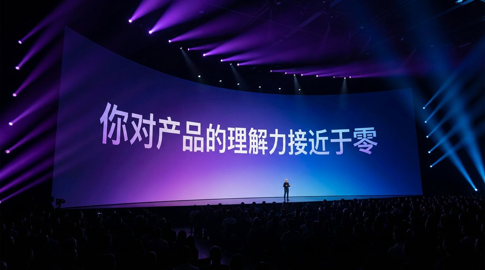

## 天伦图趣味水墨画

- ID: gpt4o-455-zh
- Slug: prompt-455-zh
- 语言: zh
- 来源: [来源链接](https://x.com/dotey/status/1991928906291556681)
- 样例图路径: images/part3/455.jpeg

### 提示词

```text
《天伦图》趣味水墨画，画中画结构，竖幅宣纸质感背景。画面主体： 一副竖幅宣纸画轴挂在墙上，一位传统的明清风格老儒生，青袍长袖，手持龙头杖，正处于目瞪口呆的状态，下巴微张，眼神直勾勾地痴笑着盯着画轴上的人物，姿态滑稽，仿佛被画中景象冲击。旁边站着一个穿牛仔裤和橙色古装夹袄的现代混搭风小童，吃着粉色棉花糖，眼神无辜。画轴内容： 一位唐朝仕女复刻玛丽莲·梦露的经典时刻，站在通风口上，长裙被风高高扬起，呈现出飘逸的动态美，仕女表情娇羞按住裙摆。艺术风格： 传统工笔画技法，宣纸纹理，淡彩，留白意境，左侧题款与朱印（“寶玉印”），极具讽刺与幽默感。
```

### 样例图


## 手绘风格的信息图卡片

- ID: gpt4o-453-zh
- Slug: prompt-453-zh
- 语言: zh
- 来源: [来源链接](https://x.com/dotey/status/1991786129046044735)
- 样例图路径: images/part3/453.jpeg

### 提示词

```text
创作一张手绘风格的信息图卡片，比例为9:16竖版。卡片主题鲜明，背景为带有纸质肌理的米色或米白色，整体设计体现质朴、亲切的手绘美感。

卡片上方以红黑相间、对比鲜明的大号毛笔草书字体突出标题，吸引视觉焦点。文字内容均采用中文草书，整体布局分为2至4个清晰的小节，每节以简短、精炼的中文短语表达核心要点。字体保持草书流畅的韵律感，既清晰可读又富有艺术气息。

卡片中点缀简单、有趣的手绘插画或图标，例如人物或象征符号，以增强视觉吸引力，引发读者思考与共鸣。整体布局注意视觉平衡，预留足够的空白空间，确保画面简洁明了，易于阅读和理解。

主题是：“做IP是长期复利，坚持每日出摊，持续做，肯定会有结果，因为99%都坚持不住的。”
```

### 样例图


## Add clean, minimal white line-drawing illustrations of p

- ID: gpt4o-448-en-1
- Slug: prompt-448-en-1
- 语言: en
- 来源: [来源链接](https://x.com/egeberkina/status/1992151432422986028)
- 样例图路径: images/part3/448.jpeg

### 提示词

```text
Add clean, minimal white line-drawing illustrations of people into this photo. Match the perspective, lighting, and scale of the scene. The illustrated figures should interact naturally and meaningfully with the environment, reflecting the mood, purpose, and activity of the space. Keep the drawings simple, fluid, and expressive, with no facial details. Maintain a modern, warm, and slightly whimsical tone that complements the overall aesthetic. Do not obscure any original elements. The illustrated figures should feel like friendly, imaginative additions that blend seamlessly with the context of the scene.
```

### 样例图


## 将素描人物添加到您的真实照片中

- ID: gpt4o-448-zh-2
- Slug: prompt-448-zh-2
- 语言: zh
- 来源: [来源链接](https://x.com/egeberkina/status/1992151432422986028)
- 样例图路径: images/part3/448.jpeg

### 提示词

```text
在这张照片中添加简洁的白色线条人物插画。插画的视角、光线和比例应与照片中的场景相符。人物应与环境自然而有意义地互动，反映空间的氛围、用途和活动。保持线条简洁流畅、富有表现力，无需添加面部细节。保持现代、温暖且略带奇幻的基调，与整体美感相得益彰。不要遮挡任何原有元素。插画人物应像友好而富有想象力的点缀，与场景环境完美融合。
```

### 样例图


## A photograph of a crowded subway train in Tokyo, hyper-r

- ID: gpt4o-445-en-1
- Slug: prompt-445-en-1
- 语言: en
- 来源: [来源链接](https://x.com/azed_ai/status/1992263611428082031)
- 样例图路径: images/part3/445.jpeg

### 提示词

```text
A photograph of a crowded subway train in Tokyo, hyper-realistic style. Sitting on one of the seats is a 2D black-and-white manga illustration of a tired samurai. The character is drawn with clean ink lines and cross-hatching shading. The lighting from the subway car hits the 2D drawing correctly, creating realistic highlights on the ink. The character holds a real photographic soda can, blending the 2D and 3D worlds. 4k, cinematic composition.
```

### 样例图


## 将漫画人物融入你的真人照片

- ID: gpt4o-445-zh-2
- Slug: prompt-445-zh-2
- 语言: zh
- 来源: [来源链接](https://x.com/azed_ai/status/1992263611428082031)
- 样例图路径: images/part3/445.jpeg

### 提示词

```text
一张东京拥挤地铁车厢的超写实照片。车厢里，一个疲惫的武士坐在一个二维黑白漫画人物上。人物线条干净利落，运用了交叉阴影技法。地铁车厢的灯光恰到好处地照射在二维画面上，在墨线处营造出逼真的高光。人物手中拿着一个真实的汽水罐，巧妙地将二维和三维世界融合在一起。4K分辨率，电影级构图。
```

### 样例图


## Use the provided portrait photo <YOUR PHOTO> as the base

- ID: gpt4o-440-en-1
- Slug: prompt-440-en-1
- 语言: en
- 来源: [来源链接](https://x.com/Samann_ai/status/1992171138730885618)
- 样例图路径: images/part3/440.jpeg

### 提示词

```text
Use the provided portrait photo <YOUR PHOTO> as the base. 
Do NOT change the person’s face, expression, age, skin tone or gender. Just overlay a clean, minimal infographic on top.
Create a high-resolution vertical “FACIAL AESTHETIC REPORT” poster, studio lighting, soft beige background, premium beauty clinic style.
The subject can be MALE or FEMALE – keep them exactly as in the original photo. 
Add thin white lines and labels pointing to each area of the REAL face, with percentage scores based on global aesthetic ratios, symmetry and proportions (not changing the face):
1. Eyes:
   Label near the eyes with a line pointing to them:
   “Eyes Beauty – 0–100%”
   Example: “Eyes Beauty – 92%”
2. Cheeks:
   Label near the cheekbones:
   “Cheeks Harmony – 0–100%”
   Example: “Cheeks Harmony – 85%”
3. Lips:
   Label close to the mouth:
   “Lips Shape – 0–100%”
   Example: “Lips Shape – 88%”
4. Eyebrows:
   Label above or beside the brows:
   “Eyebrows Design – 0–100%”
   Example: “Eyebrows Design – 80%”
5. Jaw & Chin:
   Label near the jawline and chin:
   “Jaw & Chin Definition – 0–100%”
   Example: “Jaw & Chin Definition – 90%”
6. Overall Facial Symmetry:
   Label near the center of the face:
   “Facial Symmetry – 0–100%”
   Example: “Facial Symmetry – 89%”
At the bottom center of the poster, add a BIG, bold number inside a circle or rectangle:
   “OVERALL SCORE: XX%”
This is the total facial aesthetic score from 1–100%.
Design style:
– clean, medical-grade, aesthetic-clinic infographic
– modern thin sans-serif typography
– white text and lines, subtle drop shadows
– no logos, no extra graphics, no text other than the labels and scores above.
```

### 样例图


## 美妆检测器

- ID: gpt4o-440-zh-2
- Slug: prompt-440-zh-2
- 语言: zh
- 来源: [来源链接](https://x.com/Samann_ai/status/1992171138730885618)
- 样例图路径: images/part3/440.jpeg

### 提示词

```text
请使用提供的肖像照片<YOUR PHOTO>作为基础。
请勿改变人物的面部特征、表情、年龄、肤色或性别。只需在其上叠加一个简洁明了的信息图即可。
制作一张高分辨率竖版“面部美学报告”海报，采用影棚灯光、柔和的米色背景，营造高级美容诊所风格。
拍摄对象可以是男性或女性——请保持与原照片完全一致。
在真实面部的每个区域添加细白线和标签，并根据整体美学比例、对称性和比例（不改变面部）给出百分比评分：
1. 眼睛：
在眼睛附近贴上标签，并用线指向眼睛：
“眼部美感 – 0–100%”
例如：“眼部美感 – 92%”
2. 脸颊：
颧骨附近的标签：
“脸颊和谐度 – 0–100%”
例如：“双颊和谐度 – 85%”
3. 嘴唇：
靠近嘴部的标签：
“唇形 – 0–100%”
例如：“唇形 – 88%”
4. 眉毛：
眉毛上方或旁边的标签：
“眉形设计 – 0–100%”
例如：“眉形设计 – 80%”
5. 下颌和下巴：
下颌线和下巴附近的标签：
“下颌和下巴轮廓 – 0–100%”
例如：“下颌和下巴轮廓 – 90%”
6. 面部整体对称性：
脸部中央附近的标签：
“面部对称性 – 0–100%”
例如：“面部对称性 – 89%”
在海报底部中央，用圆形或矩形框出一个醒目的大号数字：
“总分：XX%”
这是面部美学总评分，范围从 1% 到 100%。
设计风格：
– 洁净、医用级、美容诊所信息图
现代纤细无衬线字体
白色文字和线条，淡淡的阴影
– 除了上面的标签和分数之外，没有标志、没有额外的图形、没有文字。
```

### 样例图


## 穿着成名的衣服拍合照在上海江滩

- ID: gpt4o-435-zh
- Slug: prompt-435-zh
- 语言: zh
- 来源: [来源链接](https://x.com/songguoxiansen/status/1991694806201037174)
- 样例图路径: images/part3/435.jpeg

### 提示词

```text
创建一个超写实、极致锐利的全彩大画幅图像，在一个宽阔的电影感画面中，展示了9位知名中国影视剧角色穿着他们的成名影视剧造型的站在一起。这张图像必须看起来像是一张完美拍摄的杂志社论封面，拥有无可挑剔的布光、逼真的皮肤纹理，以及头发、毛孔、反射和织物纤维的微观细节。

总体风格与氛围

照片级真实感，8K分辨率，浅景深，柔和的自然补光 + 强烈的金色边缘光（轮廓光）。

高动态范围（HDR），经过校准的色彩分级。

肤色完美准确，展现亚洲人真实的皮肤质感。

清晰的织物细节，高级定制服装的单根线和材质纹理清晰可见。

平衡的构图，微广角镜头（35mm），中心重点构图。

极小的背景杂讯，但有足够的环境构建以营造真实感。

环境

日落时分，一个豪华的露天屋顶露台，俯瞰着现代（例如上海或香港风格的）城市天际线。

元素包括：温暖的金色日落光线包裹着人物剪影；抛光的大理石地面反射着光芒。

宽高比：16:9
```

### 样例图


## 西游记人物坐地铁

- ID: gpt4o-434-zh
- Slug: prompt-434-zh
- 语言: zh
- 来源: [来源链接](https://x.com/songguoxiansen/status/1991681971529908358)
- 样例图路径: images/part3/434.jpeg

### 提示词

```text
拥挤的北京地铁车厢，但乘客全是神话人物（孙悟空、猪八戒等）。车厢连接处的滚动屏显示红色字体：“前往西天取经的乘客请注意，前方到站：高老庄”。车门玻璃上贴着警告标示：“禁止在车厢内施展法术”。
```

### 样例图


## change it to [an unexpected, unlikely westeros character

- ID: gpt4o-431-en-1
- Slug: prompt-431-en-1
- 语言: en
- 来源: [来源链接](https://x.com/ProperPrompter/status/1992248716443402662)
- 样例图路径: images/part3/431.jpeg

### 提示词

```text
change it to [an unexpected, unlikely westeros character] in a different but relevant location, with an updated passport portrait, sigil, and origin based on the character’s actual history. use real westeros locations like king’s landing instead of “kingdom of the …”
```

### 样例图


## 权游角色拿着护照

- ID: gpt4o-431-zh-2
- Slug: prompt-431-zh-2
- 语言: zh
- 来源: [来源链接](https://x.com/ProperPrompter/status/1992248716443402662)
- 样例图路径: images/part3/431.jpeg

### 提示词

```text
将其改为[一位出人意料、不太可能出现在维斯特洛大陆的人物]，并设定一个与该人物相关的地点，同时更新护照照片、纹章和出身信息，使其符合该人物的真实历史。使用维斯特洛大陆的真实地点，例如君临城，而不是“……王国”。
```

### 样例图


## A cinematic 16:9 wide shot featuring a single centered h

- ID: gpt4o-430-en-1
- Slug: prompt-430-en-1
- 语言: en
- 来源: [来源链接](https://x.com/_MehdiSharifi_/status/1992018970078065032)
- 样例图路径: images/part3/430.jpeg

### 提示词

```text
A cinematic 16:9 wide shot featuring a single centered headshot of Naruto Uzumaki, face split vertically in half. A distinct black line separates the two art styles down the center. [LEFT HALF]: Classic anime style, bright blonde spiky hair, blue anime eye, black whisker marks, metal headband with bold lines. [RIGHT HALF]: Gritty realism, realistic dirty blonde textured hair, piercing blue human eye, whisker marks as faint scars, weathered metal texture on the headband with rust. The headband and facial features align perfectly to form a single, unified character portrait, rendered in Unreal Engine 5.
```

### 样例图


## 动漫与现实分割肖像

- ID: gpt4o-430-zh-2
- Slug: prompt-430-zh-2
- 语言: zh
- 来源: [来源链接](https://x.com/_MehdiSharifi_/status/1992018970078065032)
- 样例图路径: images/part3/430.jpeg

### 提示词

```text
一张16:9的电影式宽屏镜头，画面中央是漩涡鸣人的头像，脸部被垂直分割成两半。一条清晰的黑线将两种不同的画风从中间分开。[左半边]：经典的动漫风格，亮金色的刺猬头，蓝色的动漫眼睛，黑色的胡须印记，带有粗线条的金属头箍。[右半边]：写实风格，逼真的脏金色纹理头发，锐利的蓝色眼睛，胡须印记如同淡淡的疤痕，头箍上带有锈迹的金属质感。头箍和面部特征完美契合，构成一幅浑然一体的角色肖像，使用虚幻引擎5渲染而成。
```

### 样例图


## A realistic full-body portrait of a [ARTIST] in their si

- ID: gpt4o-423-en-1
- Slug: prompt-423-en-1
- 语言: en
- 来源: [来源链接](https://x.com/TechieBySA/status/1988227330947358728)
- 样例图路径: images/part3/423.jpeg

### 提示词

```text
A realistic full-body portrait of a [ARTIST] in their signature style, positioned next to a giant vertical smartphone displaying a Spotify interface. The phone screen shows a music player interface featuring the song “[SONG]” with signature [COLOR] accent colors at approximately 80% opacity for a premium aesthetic effect.
The artist wears their characteristic outfit and styling. Their pose is confident and editorial, embodying the mood and energy of the song. Expression matches their iconic persona.
Technical specifications:
• Plain background with subtle [COLOR] lighting accents
• Soft studio lighting with colored gels in signature [COLOR] tones
• 35mm or 50mm lens, f/2.2, ISO 100-160, shutter speed 1/125
• Sharp focus on subject and phone interface
• Editorial style consistent with premium music platform campaigns
```

### 样例图

![A realistic full-body portrait of a [ARTIST] in their si](../images/part3/423.jpeg)

## 一幅逼真的全身肖像

- ID: gpt4o-423-zh-2
- Slug: prompt-423-zh-2
- 语言: zh
- 来源: [来源链接](https://x.com/TechieBySA/status/1988227330947358728)
- 样例图路径: images/part3/423.jpeg

### 提示词

```text
一幅[艺术家]的逼真全身肖像，采用其标志性风格，旁边是一部巨大的竖屏智能手机，屏幕上显示着Spotify界面。手机屏幕上的音乐播放器界面以歌曲“[歌曲]”为特色，并采用标志性的[颜色]强调色，透明度约为80%，以营造高级美感。
这位艺人身着标志性的服装，摆出自信而富有时尚感的姿势，完美诠释了歌曲的情绪和能量。他们的表情也与他们标志性的形象相得益彰。
技术规格：
• 纯色背景，带有柔和的[颜色]灯光点缀
• 采用柔和的影棚灯光，搭配标志性的[COLOR]色调彩色滤光片
• 35mm 或 50mm 镜头，f/2.2 光圈，ISO 100-160，快门速度 1/125 秒
• 清晰聚焦于主体和手机界面
• 编辑风格与高端音乐平台推广活动保持一致
```

### 样例图


## A realistic HD full-body caricature of [Character], with

- ID: gpt4o-422-en-1
- Slug: prompt-422-en-1
- 语言: en
- 来源: [来源链接](https://x.com/kingofdairyque/status/1988599304991490363)
- 样例图路径: images/part3/422.jpeg

### 提示词

```text
A realistic HD full-body caricature of [Character], with [describe exaggerated physical features — e.g., oversized head, expressive eyes, exaggerated smile, etc.], showing [emotional expression — e.g., confident smirk, wild laughter, intense focus].
They are wearing [detailed outfit description — e.g., a tailored black suit with gold accents, flowing red cape, futuristic armor, etc.] and performing an epic action — [e.g., leaping through flames, conducting an orchestra in a storm, breaking through walls, holding lightning in hand].
Set in [location — e.g., neon-lit city, royal palace, desert battlefield, futuristic lab, etc.], under [lighting style — e.g., cinematic golden hour, dramatic spotlight, cool moonlight glow].
The atmosphere feels [describe mood — e.g., heroic, intense, humorous, dramatic, chaotic].

In the style of caricature realism, emphasize [expression details — e.g., wrinkles, skin texture, exaggerated smile lines, hair flow, muscle tension], with cinematic lighting, sharp focus, hyper-realistic rendering, and 3D caricature proportions.
```

### 样例图

![A realistic HD full-body caricature of [Character], with](../images/part3/422.jpeg)

## 逼真的高清全身漫画人物

- ID: gpt4o-422-zh-2
- Slug: prompt-422-zh-2
- 语言: zh
- 来源: [来源链接](https://x.com/kingofdairyque/status/1988599304991490363)
- 样例图路径: images/part3/422.jpeg

### 提示词

```text
逼真的高清全身漫画人物[角色]，具有[描述夸张的身体特征——例如，过大的头部、有表现力的眼睛、夸张的笑容等]，展现[情绪表达——例如，自信的微笑、狂野的笑声、专注的神情]。
他们穿着[详细的服装描述——例如，带有金色点缀的黑色定制西装、飘逸的红色披风、未来主义盔甲等]，并进行史诗般的动作——[例如，跃过火焰、在暴风雨中指挥交响乐团、破墙而入、手持闪电]。
场景设定在[例如，霓虹闪烁的城市、皇家宫殿、沙漠战场、未来实验室等]，采用[例如，电影般的黄金时段、戏剧性的聚光灯、清冷的月光]照明风格。
气氛感觉[描述情绪——例如，英雄的、激烈的、幽默的、戏剧性的、混乱的]。

以漫画写实风格，强调[表情细节——例如皱纹、皮肤纹理、夸张的笑纹、头发的飘动、肌肉的紧张感]，采用电影般的照明、清晰的焦点、超现实的渲染和 3D 漫画比例。
```

### 样例图


## 居家光影三联画

- ID: gpt4o-420-zh
- Slug: prompt-420-zh
- 语言: zh
- 来源: [来源链接](https://x.com/ZHO_ZHO_ZHO/status/1987128220030992892)
- 样例图路径: images/part3/420.jpeg

### 提示词

```text
整体构图与画面氛围

三张图垂直排列，呈连续性肖像摄影的视觉叙事。环境是温暖、生活化的宜家风室内空间，背景有厨房、灯饰与家居物件，带有日常感与柔和自然光的氛围。光线从侧前方照射，亮度柔和，使皮肤质感呈现出细腻、自然的光泽。

整体色调偏冷白色，营造出轻快、清新且柔软的情绪。

人物姿态与表情变化

三张图记录了同一个人物在不同瞬间的表情变化，整体呈现：
1.第一张：表情略带可爱与调皮，冲镜头飞吻。肩膀自然放松，呈正面角度。
2.第二张：人物略侧身，头微微倾斜，眼神柔软而带有轻微情绪暗示，像是从静止过渡到微笑之间的瞬间。
3.第三张：人物更加放松，露出温柔的笑容。头发自然散落，姿态轻松，呈现出自信与自在的状态。

这种 “从冷静 → 轻松 → 微笑” 的表情变化，让整组照片呈现出一种动态叙事感。

光影与肤质表现
•光线均匀柔和，无明显强阴影。
•光照角度使脸颊与鼻梁形成非常轻微的立体阴影，突显面部轮廓但不过度锐利。
•肤色自然，有细腻的反光，呈现柔焦般的质感，带一点胶片或日系滤镜效果。

服装与材质表现

人物穿着浅灰蓝色吊带上衣，肩带纤细，布料柔软且贴身，反射柔和的光泽。在光线下呈现轻柔的高光，强调曲线线条。色彩与背景保持低饱和度一致，画面显得干净。

头发自然散落，有轻微的蓬松与空气感，质地柔软，有光线透过发丝的柔和层次。

五官比例与视线表达
•眼睛略大，眼型柔和，眼尾微微延展，眼神富有交流感；
•鼻梁细直且自然；
•唇部丰润，唇色浅粉，随着表情变化在不同图中呈现不同质感；
•面部比例均衡，视觉重心集中在眼神与微笑的变化。

整体呈现一种亲和、明亮、带情绪表达的肖像风格。

情绪与风格总结

这组照片像是在记录一个人在阳光午后、刚睡醒或者刚准备开始一天时的松弛瞬间。
氛围是自然、温暖、轻松、无防备感的美。

画面没有刻意摆拍或华丽修饰，而是以光线和表情捕捉真实与柔软的瞬间。
```

### 样例图


## { "promptDetails": { "description": "A prompt to *create

- ID: gpt4o-419-en-1
- Slug: prompt-419-en-1
- 语言: en
- 来源: [来源链接](https://x.com/miilesus/status/1986833636193189893)
- 样例图路径: images/part3/419.jpeg

### 提示词

```text
{
    "promptDetails": {
        "description": "A prompt to *create a new scene* by placing a subject (based on a reference photo) into a new atmospheric background, then overlaying a music UI.",
        "styleTags": [
            "Aesthetic Edit",
            "Cinematic",
            "Scene Compositing",
            "Glassmorphism"
        ]
    },
    "subjectReference": {
        "source": "[UPLOADED IMAGE]",
        "description": "Use this image *only* as a reference for the subject's face, hair, and appearance. Do *not* use its original background."
    },
    "scene": {
        "background": {
            "setting": "the window on the bus is sad, troubled, sorrowful",
            "details": "This is the *new* environment the subject must be placed into, completely replacing the original background."
        },
        "subject": {
            "description": "The young man whose appearance is defined by the `[UPLOADED IMAGE]`.",
            "pose": "his head resting gently against the bus window",
            "focus": "Subject is in sharp focus, fully integrated into the new background."
        }
    },
    "overlayObject": {
        "type": "Floating Glassmorphism Music Player UI",
        "relationshipToEnvironment": "the UI is **perfectly flush and physically attached** to the same plane as the bus window glass, **not floating**, not screen-space.",
        "transform": "the UI matches the *exact same rotation and perspective* as the window surface. If the window tilts, the UI tilts identically with correct foreshortening.",
        "surfaceInteraction": "subtle, realistic reflection and slight refraction through glass, extremely thin glassmorphism panel integrated *into* the window surface.",
        "components": {
            "songTitle": "Wrecked",
            "artistName": "Imagine Dragons",
            "position": "mounted on the bus window glass at the middle-left region of the frame (not floating)."
        }
    },
    "technicalStyle": {
        "aspectRatio": "1:1",
        "photographyStyle": "Cinematic Portrait, Realistic Compositing",
        "camera": {
            "shotType": "Medium Shot or Medium Close-Up",
            "angle": "Eye-level",
            "depthOfField": "Shallow, to blur the new background (bokeh)."
        },
        "lighting": {
            "type": "Soft, Ambient, Moody",
            "description": "Lighting on the subject *must match* the lighting of the new background setting (e.g., rainy light through bus window, soft shadow gradients)."
        },
        "color": {
            "palette": "Muted, cinematic color grading."
        }
    },
    "audioDevice": {
        "type": "subtle in-ear wireless earbuds",
        "fit": "naturally seated in both ears with correct realistic skin contact",
        "color": "matte black or dark neutral tone",
        "consistencyNote": "no cable, no bulky gaming headset"
    },
    "moodReinforcement": "earbuds imply the sad music 'Wrecked - Imagine Dragons' is what the subject is listening to."
}
```

### 样例图


## 年轻女子公交车上的窗户边

- ID: gpt4o-419-zh-2
- Slug: prompt-419-zh-2
- 语言: zh
- 来源: [来源链接](https://x.com/miilesus/status/1986833636193189893)
- 样例图路径: images/part3/419.jpeg

### 提示词

```text
{
"promptDetails": {
“描述”：“提示用户通过将主体（基于参考照片）放置在新的氛围背景中，然后叠加音乐用户界面来*创建新场景*。”
"styleTags": [
“美学编辑”
“电影感”，
“场景合成”
“玻璃态”
]
},
"subjectReference": {
“来源”：[上传的图片]，
“描述”：“请仅将此图片用作人物面部、头发和外貌的参考。请勿使用其原始背景。”
},
“场景”： {
“背景”： {
“场景”：“公交车上的窗户是悲伤的、忧郁的、哀伤的”，
“细节”：“这是主体必须置身的*全新*环境，完全替换原有背景。”
},
“主题”： {
描述：这位年轻人的外貌特征由“[上传的图片]”定义。
“姿势”：“他的头轻轻地靠在公交车窗上”，
“焦点”：“主体清晰对焦，完全融入新的背景中。”
}
},
"overlayObject": {
"type": "浮动玻璃变形音乐播放器用户界面",
“与环境的关系”：“用户界面**与公交车窗玻璃完全齐平，并且物理上**附着在**同一平面上， ** ）不是悬浮的，也不是屏幕空间的。”
“变换”：“用户界面与窗口表面*完全一致地旋转和透视*。如果窗口倾斜，用户界面也会随之倾斜，并具有正确的透视缩短效果。”
“表面交互”：“透过玻璃产生微妙、逼真的反射和轻微折射，极薄的玻璃变形面板集成到窗户表面*中*。”
“成分”： {
歌曲标题： 'Wrecked'
"artistName": "Imagine Dragons",
“位置”：“安装在公交车车窗玻璃上，位于车窗框架的左侧中间位置（非悬浮式）。”
}
},
"technicalStyle": {
“aspectRatio”: “1:1”
“摄影风格”：“电影人像，逼真合成”
“相机”： {
"shotType": "Medium Shot or Medium Close Up",
“角度”：“视线水平”，
"depthOfField": "浅景深，使新背景模糊（散景）"
},
“灯光”： {
“类型”：“柔和、氛围、情绪化”，
“描述”：“拍摄对象的照明必须与新背景设置的照明相匹配（例如，透过公交车窗的雨光、柔和的阴影渐变）。”
},
“颜色”： {
“调色板”：“柔和的电影级色彩分级。”
}
},
"audioDevice": {
“类型”：“低调的入耳式无线耳机”，
“贴合度”：“自然地佩戴在双耳中，与皮肤有正确的逼真接触”，
颜色：哑光黑或深色中性色调，
“一致性说明”： “无线缆，无笨重的游戏耳机”
},
“moodReinforcement”：“耳机暗示着受试者正在听悲伤的音乐‘Wrecked - Imagine Dragons’。”
}
```

### 样例图


## Using the exact facial features from the attached image 

- ID: gpt4o-417-en-1
- Slug: prompt-417-en-1
- 语言: en
- 来源: [来源链接](https://x.com/ZaraIrahh/status/1987684052028297552)
- 样例图路径: images/part3/417.jpeg

### 提示词

```text
Using the exact facial features from the attached image 
Create an hyperrealistic and high quality close-up portrait of a styling young woman,  her dark thick long hair styled in twin high artistic braids that falls over her ears, few loose trendils clipped using a different style matte brown statement hair clips ,with few loose strands falls across and frames her face, wearing a drawstring halter top, a thick-frame  brown cat-eye eyeglasses slightly lowered, soft hazel nut eyes, glossy red pouty lips, peached dewy blush and soft warm tone eyeshadows with a little bit shimmers and glitters on her cheeks and under her eyes, artistic brown eyeliner, natural dewy skin, head slightly tilted, relaxed and confident gaze hand-on-cheek pose, minimalistic background, warm beige and brown tones, bright and harsh illumination coming from the camera highlighting the texture of her figure, soft studio background lighting, K-fashion editorial aesthetic, Seoul street style influence, hyper-detailed face texture, cinematic tone, 85mm lens photography, Vogue Korea vibe, stylish and modern mood --ar 2:3 --v 6 --style raw --q 2 --s 250
```

### 样例图


## 一幅超写实的高品质特写肖像

- ID: gpt4o-417-zh-2
- Slug: prompt-417-zh-2
- 语言: zh
- 来源: [来源链接](https://x.com/ZaraIrahh/status/1987684052028297552)
- 样例图路径: images/part3/417.jpeg

### 提示词

```text
使用附图中的精确面部特征
创作一幅超写实的高品质特写肖像，描绘一位正在打扮的年轻女性。她浓密乌黑的长发被编成两条高高的艺术辫子，垂落在耳边，几缕碎发用不同风格的哑光棕色发夹别住，几缕散落的发丝垂在脸颊两侧，勾勒出她精致的脸庞。她身穿一件抽绳露背上衣，戴着一副略微下垂的棕色粗框猫眼眼镜，拥有一双柔和的榛子色眼睛，涂着光泽饱满的红唇，腮红是水润的蜜桃色，眼影是柔和的暖色调，带有少许珠光和亮片，点缀在脸颊和眼下。她画着艺术感十足的棕色眼线，肌肤呈现自然水润的状态。她微微侧着头，眼神放松自信，一只手轻抚脸颊。背景简洁，以温暖的米色和棕色为主色调。相机发出明亮而强烈的光线，突显了她的身材纹理。柔和的影棚背景灯光，展现出韩式时尚大片的风格，融合了首尔街头风的元素，并着重刻画了面部细节，营造出电影般的质感。这幅作品使用85mm镜头拍摄，灵感来自韩国版《Vogue》。氛围，时尚现代的格调 --ar 2:3 --v 6 --style raw --q 2 --s 250
```

### 样例图


## A realistic HD full body caricature of [subject: name], 

- ID: gpt4o-416-en-1
- Slug: prompt-416-en-1
- 语言: en
- 来源: [来源链接](https://x.com/CharaspowerAI/status/1987558316973724116)
- 样例图路径: images/part3/416.jpeg

### 提示词

```text
A realistic HD full body caricature of [subject: name], [describe exaggerated physical features, emotional expression]. [outfit in detail], and [mention an epic  action].  location, lighting, atmosphere, mood]. In the style of caricature realism, [highlight expression, texture, pose or object details], cinematic lighting, sharp focus, hyper-realistic rendering, caricature.
```

### 样例图

![A realistic HD full body caricature of [subject: name], ](../images/part3/416.jpeg)

## 夸张的高清全身漫画

- ID: gpt4o-416-zh-2
- Slug: prompt-416-zh-2
- 语言: zh
- 来源: [来源链接](https://x.com/CharaspowerAI/status/1987558316973724116)
- 样例图路径: images/part3/416.jpeg

### 提示词

```text
一幅逼真的高清全身漫画，描绘[人物：姓名]，[描述夸张的体貌特征、情绪表达]，[详细描述服装]，[提及一个精彩的动作]，[地点、光线、氛围、情绪]。风格为漫画写实主义，[突出表情、纹理、姿势或物体细节]，电影级光线，清晰对焦，超写实渲染，漫画风格。
```

### 样例图


## Editorial 3x3 photo grid in a clean soft beige studio. C

- ID: gpt4o-414-en-1
- Slug: prompt-414-en-1
- 语言: en
- 来源: [来源链接](https://x.com/miilesus/status/1981800648036561146)
- 样例图路径: images/part3/414.jpeg

### 提示词

```text
Editorial 3x3 photo grid in a clean soft beige studio. Character (matches reference 100%) wearing lightweight dark navy shirt, ivory trousers, barefoot for raw simplicity. Lighting: large diffused key light directly front-right, silver reflector left, subtle rim from top. Shots to include: 1. extreme close-up of lips + cheekbone with blurred hand partially covering (85mm, f/1.8, razor-thin DOF); 2. tight crop on eyes looking into lens with reflection of light strip visible (85mm, f/2.0); 3. black & white close portrait resting chin on fist, face filling frame (50mm, f/2.2); 4. over-shoulder shot, blurred foreground fabric curtain framing half face (85mm, f/2.0); 5. very close frontal with hands overlapping face, light streak across eyes (50mm, f/2.5); 6. tight angled portrait showing hair falling into eyes, soft-focus background (85mm, f/2.2); 7. crop of hands touching jawline, eyes cropped out (50mm, f/3.2, detail-focused); 8. half-body seated sideways on low cube, head turned sharply away, blurred foreground (35mm, f/ 4.5); 9. intense close-up of profile with single tear-like water droplet, cinematic light slice across (85mm, f/ 1.9). Angles: mostly tight headshots with slight high/low tilts, maintaining variation. Capture RAW, professional muted grade, smooth tonal contrast, subtle cinematic grain. Mood: intimate, introspective, character-led editorial minimalism with delicate use of fabric as prop.
```

### 样例图


## 干净柔和的米色工作室中的3x3照片

- ID: gpt4o-414-zh-2
- Slug: prompt-414-zh-2
- 语言: zh
- 来源: [来源链接](https://x.com/miilesus/status/1981800648036561146)
- 样例图路径: images/part3/414.jpeg

### 提示词

```text
干净柔和的米色工作室中的编辑 3x3 照片网格。人物（与参考 100 %)相匹配）身穿轻薄的深蓝色海军蓝衬衫、象牙色裤子，赤脚，呈现原始简约风​​格。灯光：右前方直接有大型漫射主光，左侧有银色反光板，顶部有微妙的边缘。拍摄内容包括：1. 嘴唇 + 颧骨的极端特写，手模糊部分遮盖（85mm，f/1.8，极薄景深）；2. 紧密裁剪眼睛，看着镜头，可见光带反射（85mm，f/2。 0) ；3. 黑白近距离肖像，下巴靠在拳头上，脸部充满画面（50mm，f/2.2）；4. 过肩镜头，模糊的前景织物窗帘框住半张脸（85mm，f/2。 0) ；5. 非常近的正面，双手重叠在脸上，光线穿过眼睛（50mm，f/2.5）；6. 紧密角度的肖像，显示头发落入眼睛，柔焦背景（85mm，f/2.2）；7. 裁剪至触及下颌线的手，眼睛被裁剪掉（50mm，f/3.2，注重细节）；8. 半身侧坐在矮柜上，头部急剧转向别处，前景模糊（35mm，f/4.5）；9. 侧面特写，一滴泪珠状水滴，电影般的光片划过（85mm，f/1.9）。角度：大多为近距离头像，略微高/低倾斜，保持变化。拍摄 RAW 格式，专业柔和等级，平滑的色调对比度，微妙的电影颗粒感。氛围：亲密、内省、以人物为主导的编辑极简主义，巧妙地使用织物作为道具。
```

### 样例图


## 3D caricature portrait of [SUBJECT], Pixar/DreamWorks st

- ID: gpt4o-412-en-1
- Slug: prompt-412-en-1
- 语言: en
- 来源: [来源链接](https://x.com/ShreyaYadav___/status/1984518065619681365)
- 样例图路径: images/part3/412.jpeg

### 提示词

```text
3D caricature portrait of [SUBJECT], Pixar/DreamWorks style — expressive eyes, slightly oversized head, exaggerated ears & nose, realistic skin shading with soft subsurface scattering, detailed hair, gentle warm smile, smooth polished materials, subtle fabric texture, soft ambient lighting, warm reddish-orange gradient background — balanced realism and stylized charm.
```

### 样例图

![3D caricature portrait of [SUBJECT], Pixar/DreamWorks st](../images/part3/412.jpeg)

## 3D漫画肖像

- ID: gpt4o-412-zh-2
- Slug: prompt-412-zh-2
- 语言: zh
- 来源: [来源链接](https://x.com/ShreyaYadav___/status/1984518065619681365)
- 样例图路径: images/part3/412.jpeg

### 提示词

```text
[SUBJECT]的3D漫画肖像，皮克斯/梦工厂风格——富有表现力的眼睛，略微过大的头部，夸张的耳朵和鼻子，逼真的皮肤阴影和柔和的次表面散射，细致的头发，温柔温暖的微笑，光滑的抛光材质，微妙的织物纹理，柔和的环境光，温暖的红橙色渐变背景——平衡的现实主义和风格化的魅力。
```

### 样例图


## Full-body 3D caricature of [Character Name] in Pixar/Dre

- ID: gpt4o-407-en-1
- Slug: prompt-407-en-1
- 语言: en
- 来源: [来源链接](https://x.com/aleenaamiir/status/1985525539445297574)
- 样例图路径: images/part3/407.jpeg

### 提示词

```text
Full-body 3D caricature of [Character Name] in Pixar/DreamWorks style, featuring expressive large eyes, slightly oversized head, and subtly exaggerated facial features. Realistic skin with soft subsurface scattering, detailed hair, and a gentle warm smile. Smooth polished surfaces with subtle fabric texture on clothing. Dynamic pose showing personality, with full body visible and balanced proportions. Soft ambient lighting, warm reddish-orange gradient background. Cinematic quality, high detail, vibrant yet natural colors, stylized charm with balanced realism.
```

### 样例图

![Full-body 3D caricature of [Character Name] in Pixar/Dre](../images/part3/407.jpeg)

## 将明星变成趣味十足的3D卡通肖像

- ID: gpt4o-407-zh-2
- Slug: prompt-407-zh-2
- 语言: zh
- 来源: [来源链接](https://x.com/aleenaamiir/status/1985525539445297574)
- 样例图路径: images/part3/407.jpeg

### 提示词

```text
以皮克斯/梦工厂风格绘制的[角色名称]全身3D卡通形象，拥有富有表现力的大眼睛、略微夸张的头部和略微夸张的面部特征。逼真的肌肤呈现出柔和的次表面散射效果，头发细节丰富，笑容温暖而亲切。光滑的表面处理，服装上的织物纹理细腻。动态的姿态展现出鲜明的个性，全身清晰可见，比例均衡。柔和的环境光，温暖的红橙色渐变背景。电影级的品质，高度的细节刻画，鲜艳而自然的色彩，风格化的魅力与恰到好处的写实感完美融合。
```

### 样例图


## Ultra-realistic full-body portrait of the attached image

- ID: gpt4o-406-en-1
- Slug: prompt-406-en-1
- 语言: en
- 来源: [来源链接](https://x.com/ecommartinez/status/1985805353901310327)
- 样例图路径: images/part3/406.jpeg

### 提示词

```text
Ultra-realistic full-body portrait of the attached image. The person is interacting with Monkey D. Luffy in a front-facing pose, both standing side by side, smiling directly at the camera. Their body language is friendly and natural — Luffy’s arm rests around the person’s shoulder, while both share a joyful, relaxed laugh. Studio or neutral environment with soft cinematic lighting and a warm beige-to-burgundy gradient background. The person wears casual modern clothes: beige T-shirt, navy shorts, and white sneakers, while Luffy retains his original look — straw hat, red vest, blue shorts, yellow sash, and sandals. Expression and mood: happy, authentic, full of energy and camaraderie, captured in photorealistic textures, realistic lighting, and cinematic composition with high-fashion editorial quality.
```

### 样例图


## 一幅超写实全身肖像与路飞互动

- ID: gpt4o-406-zh-2
- Slug: prompt-406-zh-2
- 语言: zh
- 来源: [来源链接](https://x.com/ecommartinez/status/1985805353901310327)
- 样例图路径: images/part3/406.jpeg

### 提示词

```text
附图为一幅超写实全身肖像。图中人物与蒙奇·D·路飞正面互动，两人并肩而立，面带微笑地直视镜头。他们的肢体语言友好自然——路飞的手臂搭在人物的肩上，两人开怀大笑，轻松自在。拍摄环境为影棚或中性光线，柔和的电影级灯光，背景采用温暖的米色至酒红色渐变。人物身着休闲现代服饰：米色T恤、藏蓝色短裤和白色运动鞋，而路飞则保持着他标志性的造型——草帽、红色马甲、蓝色短裤、黄色腰带和凉鞋。人物的表情和情绪：快乐、真实、充满活力和友谊，以逼真的纹理、真实的灯光和电影级的构图捕捉，呈现出高级时尚杂志的品质。
```

### 样例图


## Ultra-realistic full-body portrait of the attached image

- ID: gpt4o-405-en-1
- Slug: prompt-405-en-1
- 语言: en
- 来源: [来源链接](https://x.com/iUllr/status/1985631195724431694)
- 样例图路径: images/part3/405.jpeg

### 提示词

```text
Ultra-realistic full-body portrait of the attached image.
The person is interacting with {fictional character} in a {pose/interaction type}.  
Studio or neutral environment, soft cinematic lighting, {optional color palette}.  
The person wears {clothing style and colors}, The fictional character retains its original appearance, including skin color, clothing, and signature features.  
Expression and mood: {emotional tone}, captured in photorealistic textures, realistic lighting, cinematic composition, high fashion editorial quality.
```

### 样例图


## 超逼真全身肖像与角色互动

- ID: gpt4o-405-zh-2
- Slug: prompt-405-zh-2
- 语言: zh
- 来源: [来源链接](https://x.com/iUllr/status/1985631195724431694)
- 样例图路径: images/part3/405.jpeg

### 提示词

```text
附图的超逼真全身肖像。
该人正在以{姿势/互动类型}与{虚构角色}互动。
摄影棚或中性环境，柔和的电影灯光，{可选调色板}。
该人物穿着{服装款式和颜色}，虚构人物保留其原有的外貌，包括肤色、服装和标志性特征。
表情和mood: {情感基调}，以逼真的纹理、逼真的光照、电影般的构图、高级时尚编辑品质捕捉。
```

### 样例图


## { "prompt": { "description": "Hyper-realistic, ultra-det

- ID: gpt4o-403-en-1
- Slug: prompt-403-en-1
- 语言: en
- 来源: [来源链接](https://x.com/saniaspeaks_/status/1985960595422867603)
- 样例图路径: images/part3/403.jpeg

### 提示词

```text
{
  "prompt": {
    "description": "Hyper-realistic, ultra-detailed close-up portrait of the left half of a young woman’s face submerged in water. One eye is in sharp focus. Light rays create caustic reflections and fluid patterns across her skin. Tiny suspended water droplets and bubbles add depth.",
    "details": {
      "subject": "Young woman's face, fair skin, focused eye (left)",
      "pose": "Submerged in water",
      "lighting": "Cinematic soft shadows with crisp highlights, light rays creating caustic patterns",
      "attire": "Not visible, implied underwater setting",
      "hair": "Dark hair visible on the right side, extending into the water",
      "expression": "Calm and serene, with an intense gaze from the focused eye",
      "mood": "Surreal, dreamlike, ethereal, and serene"
    }
  },
  "image_settings": {
    "size": "original",
    "quantity": 1,
    "style": "Underwater macro portrait photography",
    "composition": "Close-up, with a shallow depth of field and an underwater macro perspective, emphasizing textures and light play. Cropped to show only the left half of the face.",
    "aspect_ratio": "3:4"
  },
  "output_format": {
    "type": "image",
    "expected_result": "A visually striking and highly detailed underwater portrait, showcasing the interplay of light, water, and skin textures."
  }
}
```

### 样例图


## 一幅超写实细节丰富的水下特写肖像

- ID: gpt4o-403-zh-2
- Slug: prompt-403-zh-2
- 语言: zh
- 来源: [来源链接](https://x.com/saniaspeaks_/status/1985960595422867603)
- 样例图路径: images/part3/403.jpeg

### 提示词

```text
{
“迅速的”： {
描述：一幅超写实、细节丰富的特写肖像，描绘了一位年轻女子浸在水中的左半边脸。她的一只眼睛清晰可见。光线在她皮肤上形成折射和流动的纹理。悬浮的细小水滴和气泡增添了画面的深度。
“细节”： {
“主题”：“年轻女子的脸，白皙的皮肤，专注的眼神（左）”
“姿势”：“浸在水中”，
“照明”：“电影般的柔和阴影，清晰的高光，光线营造出焦散图案”，
“服装”：“不可见，暗示水下环境”，
“头发”：“右侧可见深色头发，延伸到水中”，
“表情”：“平静而安详，目光专注而锐利”，
“氛围”：“超现实的、梦幻的、空灵的、宁静的”
}
},
"image_settings": {
"尺寸": "原尺寸",
“数量”：1，
“风格”：“水下微距人像摄影”，
“构图”：“特写镜头，采用浅景深和水下微距视角，强调纹理和光影效果。裁剪后仅显示脸部的左半部分。”
"aspect_ratio": "3:4"
},
"output_format": {
"type": "image",
"预期结果": "一幅视觉效果惊艳、细节丰富的水下肖像，展现了光线、水和皮肤纹理之间的相互作用。"
}
}
```

### 样例图


## Create a realistic digital caricature painting of a midd

- ID: gpt4o-402-en-1
- Slug: prompt-402-en-1
- 语言: en
- 来源: [来源链接](https://x.com/ShreyaYadav___/status/1985908915427758305)
- 样例图路径: images/part3/402.jpeg

### 提示词

```text
Create a realistic digital caricature painting of a middle-aged man (attached photo) with a slightly oversized head, exuding charm and quiet confidence. He is dressed in a modern, stylish bomber jacket made of dark olive nylon with subtle reflective highlights that give it a sleek and fashionable look. Underneath, he wears a warm-toned flannel shirt slightly visible at the collar and cuffs, paired with khaki cargo pants and black sneakersthat ground the outfit with a casual yet confident energy. Completing his look, he wears a brown flat cap tilted slightly forward — a small detail that adds personality and flair.

The man is portrayed in a mid-shot, adjusting his glasses with one hand while gazing directly at the viewer with a self-assured and composed expression. His head is slightly larger than normal, emphasizing his thoughtful character and giving the image a light caricature charm without losing realism.The facial expression radiates intelligence, humor, and approachability.

The lighting is warm and soft, like that of a late afternoon sun filtering through a studio setup. Smooth gradual shadows enhance the contours of his face, while subtle highlights accentuate the texture of his bomber jacket and the reflection in his glasses. His skin tones glow naturally under the warm light, creating a pleasant sense of depth and realism.The background is a gradient of warm brown and beige hues, blending smoothly from light to dark. This background is simple yet elegant, allowing the subject to stand out while maintaining a professional, editorial quality.

The art style should combine semi-realistic digital painting with the texture of oil brushstrokes, delivering a balanced fusion of realism and stylized charm.Clean outlines, smooth blending, and controlled highlights give the impression of a modern portrait illustration—detailed, expressive, and visually captivating.
```

### 样例图


## 一位中年男子数字漫画

- ID: gpt4o-402-zh-2
- Slug: prompt-402-zh-2
- 语言: zh
- 来源: [来源链接](https://x.com/ShreyaYadav___/status/1985908915427758305)
- 样例图路径: images/part3/402.jpeg

### 提示词

```text
请创作一幅逼真的数字漫画，描绘一位中年男子（附图），他头部略大，散发着魅力和沉稳的自信。他身着一件现代时尚的深橄榄色尼龙飞行员夹克，夹克上点缀着低调的反光元素，更添几分精致格调。夹克内搭一件暖色调法兰绒衬衫，领口和袖口隐约可见，下身搭配卡其色工装裤和黑色运动鞋，整体造型休闲又不失自信。最后，他头戴一顶棕色鸭舌帽，帽檐略微前倾——这个小细节为他增添了个性和魅力。

画面采用中景拍摄，男子一手扶着眼镜，一手直视镜头，神态自信沉稳。他的头部略大于常人，突显了他深思熟虑的性格，赋予画面一种略带漫画式的魅力，却又不失写实感。面部表情散发着智慧、幽默和亲切的气息。

光线温暖柔和，如同午后阳光透过摄影棚洒下的光芒。平滑的阴影勾勒出他面部的轮廓，而微妙的高光则突显了他飞行员夹克的质感和眼镜上的反光。在暖光的映衬下，他的肤色自然透亮，营造出令人愉悦的立体感和真实感。背景由温暖的棕色和米色渐变而成，由浅至深自然过渡。这种背景简洁而优雅，既突出了拍摄对象，又保持了专业、时尚的质感。

艺术风格应结合半写实的数字绘画和油画笔触的质感，呈现出写实与风格化魅力的平衡融合。清晰的轮廓、流畅的过渡和可控的高光，给人以现代肖像插画的印象——细节丰富、富有表现力且引人入胜。
```

### 样例图


## { "prompt": { "description": "A close-up portrait of a y

- ID: gpt4o-401-en-1
- Slug: prompt-401-en-1
- 语言: en
- 来源: [来源链接](https://x.com/saniaspeaks_/status/1986010537310961720)
- 样例图路径: images/part3/401.jpeg

### 提示词

```text
{
  "prompt": {
    "description": "A close-up portrait of a young woman in a dark hooded sweatshirt, with green digital code reflected on her face from a computer screen, set in a dark, urban environment with blurred city lights in the background.",
    "details": {
      "subject": "Young woman with a serious expression, olive skin, and visible facial features despite the reflections.",
      "pose": "Facing directly towards the viewer, looking intently at the camera.",
      "lighting": "Dramatic, low-key lighting, primarily from the green glow of a computer monitor reflecting on her face and some blurred, warm streetlights in the distant background.",
      "attire": "Dark, large hooded sweatshirt, with the hood pulled up to cover her head, creating a sense of anonymity.",
      "hair": "Long, dark hair partially visible beneath the hood.",
      "expression": "Intense, focused, and slightly wary gaze, conveying a sense of concentration and maybe isolation.",
      "mood": "Mysterious, intense, technologically-focused, reminiscent of a hacker or surveillance theme."
    }
  },
  "image_settings": {
    "size": "1024x1024",
    "quantity": 1,
    "style": "Cinematic, dark and moody, high contrast with strong shadows and highlights from the screen, grainy texture.",
    "composition": "Medium close-up, with the computer screen visible in the foreground (partially obscured) and blurred streetlights in the background through a window."
  },
  "output_format": {
    "type": "image",
    "expected_result": "A powerful and atmospheric image conveying themes of technology, surveillance, and urban mystery."
  }
}
```

### 样例图

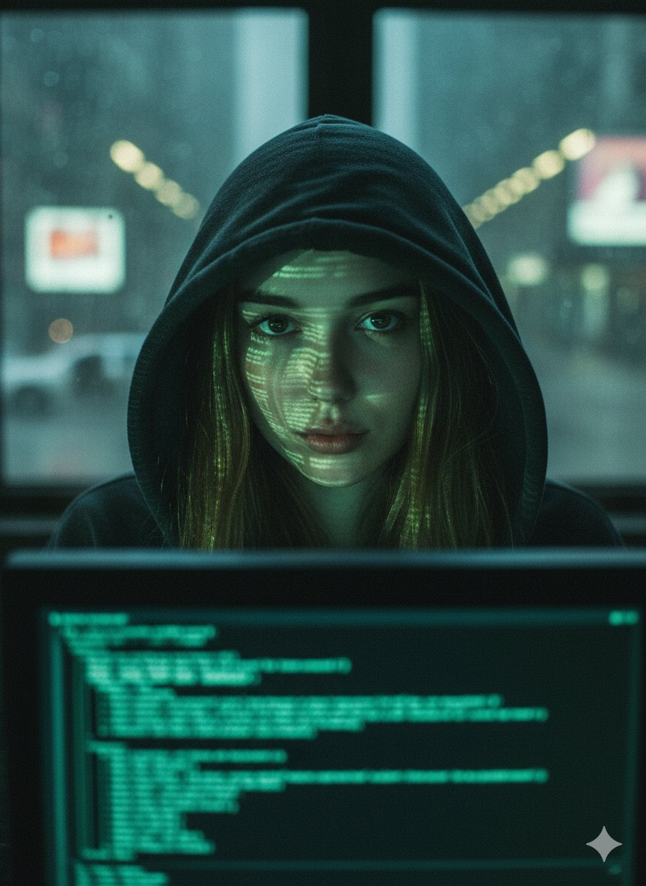

## 年轻女子身穿深色连帽衫的特写肖像

- ID: gpt4o-401-zh-2
- Slug: prompt-401-zh-2
- 语言: zh
- 来源: [来源链接](https://x.com/saniaspeaks_/status/1986010537310961720)
- 样例图路径: images/part3/401.jpeg

### 提示词

```text
{
“迅速的”： {
描述：一位年轻女子身穿深色连帽衫的特写肖像，电脑屏幕上的绿色数字代码反射在她的脸上，背景是昏暗的城市灯光，以及模糊的城市灯光。
“细节”： {
“主体”：“一位表情严肃、肤色呈橄榄色、面部特征清晰可见的年轻女子，尽管有反光，但她的面部特征依然清晰可见。”
“姿势”：“正对观众，目光专注地注视镜头。”
“灯光”：“戏剧性的低调灯光，主要来自电脑显示器反射在她脸上的绿色光晕，以及远处背景中模糊的暖色调路灯。”
“着装”：“深色大号连帽衫，帽子拉起来遮住头，给人一种匿名感。”
“头发”：“长长的黑发从兜帽下隐约可见。”
“表情”：“目光专注、凝重，略带警惕，传达出一种专注和或许是孤寂的感觉。”
“氛围”：“神秘、紧张、以科技为中心，让人联想到黑客或监控主题。”
}
},
"image_settings": {
"size": "1024x1024",
“数量”：1，
“风格”：“电影感十足，阴暗忧郁，高对比度，屏幕阴影和高光强烈，颗粒感强。”
“构图”：“中近景，前景可见电脑屏幕（部分被遮挡），背景中透过窗户可以看到模糊的路灯。”
},
"output_format": {
"type": "image",
"expected_result": "一幅充满力量和氛围的画面，传达了科技、监控和都市神秘的主题。"
}
}
```

### 样例图


## { "style_mode": "raw_photoreal_high_fidelity", "look": "

- ID: gpt4o-399-en-1
- Slug: prompt-399-en-1
- 语言: en
- 来源: [来源链接](https://x.com/IamEmily2050/status/1985682978182480251)
- 样例图路径: images/part3/399.jpeg

### 提示词

```text
{
    "style_mode": "raw_photoreal_high_fidelity",
    "look": "K-Pop idol aesthetic, flawless complexion, high-resolution digital photography, trendy",
    "camera": {
      "vantage": "slightly high angle (selfie perspective), direct address",
      "framing": "extreme close-up (ECU), tight framing on the face and shoulders",
      "lens_behavior": "portrait lens (e.g., 85mm prime), extremely shallow depth of field (DoF), sharp focus on the eyes",
      "sensor_quality": "high fidelity, no digital noise"
    }
  },
  "scene": {
    "environment": {
      "setting": "indoor studio or simple interior",
      "lighting": "soft, even beauty lighting (e.g., large softbox or beauty dish), minimizing shadows, creating clear catchlights in the eyes, emphasizing glossy highlights"
    },
    "subject": {
      "description": "young East Asian female, K-Pop idol styling",
      "hair": "long, dark brown, wavy, glossy finish",
      "expression": {
        "mood": "playful, confident, slightly sultry",
        "action": "looking directly into the lens, mouth slightly open, tongue slightly sticking out over the lower lip"
      },
      "makeup": {
        "style": "contemporary K-beauty trends",
        "complexion": "flawless, 'glass skin' effect, dewy/glossy finish, realistic micro-texture",
        "cheeks": "rosy blush, high application",
        "lips": "glossy, pink tint"
      },
      "attire": {
        "top": "grey pinstriped halter top, structured design",
        "details": "white contrasting collar lapel with silver snap buttons and circular metal hardware"
      },
      "accessories": {
        "hair_clip": "decorative silver/rhinestone clip on her left side",
        "earrings": "dangling silver earrings (heart motif)"
      }
    },
    "background": {
      "description": "plain, neutral grey or white wall, blurred (bokeh)"
    }
  },
  "aesthetic_controls": {
    "render_intent": "high-quality digital photograph suitable for promotional material or social media",
    "material_fidelity": [
      "realistic skin micro-texture (pores, gloss, makeup interaction)",
      "individual hair strand detail",
      "fabric texture of the pinstripe material",
      "metallic shine of accessories"
    ],
    "color_grade": {
      "overall": "neutral, slightly warm, vibrant skin tones, high clarity",
      "contrast": "balanced"
    }
  },
  "negative_prompt": {
    "forbidden_elements": ["skin imperfections", "blemishes", "wrinkles", "harsh shadows", "textured/matte skin", "dry lips", "outdoor setting", "distorted features", "motion blur", "digital artifacts"],
    "forbidden_style": ["anime", "painting", "illustration", "CGI render", "low resolution", "gritty realism", "vintage photography", "uncanny valley", "overly airbrushed/plastic skin"]
  }
}
```

### 样例图


## 年轻的东亚女性K-Pop偶像风格

- ID: gpt4o-399-zh-2
- Slug: prompt-399-zh-2
- 语言: zh
- 来源: [来源链接](https://x.com/IamEmily2050/status/1985682978182480251)
- 样例图路径: images/part3/399.jpeg

### 提示词

```text
{
"style_mode": "raw_photoreal_high_fidelity",
“外观”：“K-Pop偶像美学，完美无瑕的肌肤，高分辨率数码摄影，时尚潮流”，
“相机”： {
“有利位置”：“略高的角度（自拍视角），直接面向”，
“构图”：“极近特写（ECU），紧贴面部和肩膀构图”，
"lens_behavior": "人像镜头（例如，85mm 定焦镜头），景深极浅，眼睛清晰对焦"
"sensor_quality": "高保真，无数字噪声"
}
},
“场景”： {
“环境”： {
“设置”: “室内工作室或简单的室内环境”
“灯光”：“柔和均匀的美容灯光（例如，大型柔光箱或美容罩），最大限度地减少阴影，在眼睛中营造清晰的眼神光，强调光泽高光”
},
“主题”： {
描述：年轻的东亚女性，K-Pop偶像风格
“头发”：“长而深棕色，波浪状，有光泽”，
“表达”： {
“情绪”：“俏皮、自信、略带性感”，
“动作”：“直视镜头，嘴巴微张，舌头微微伸出下唇”
},
“化妆品”： {
“风格”：“当代韩国美妆潮流”，
“肤色”： “无瑕、‘玻璃肌’效果、水润/光泽妆效、逼真的微观纹理”，
“脸颊”：“玫瑰色腮红，涂抹较多”，
“嘴唇”： “有光泽的粉红色”
},
着装：{
“上衣”： “灰色细条纹露背上衣，结构化设计”
“细节”：“白色撞色领翻领，配银色按扣和圆形金属配件”
},
“配件”： {
"发夹": "左侧的装饰性银色/水钻发夹",
“耳环”： “垂坠式银耳环（心形图案）”
}
},
“背景”： {
描述：素色、中性灰色或白色墙壁，虚化（散景）
}
},
"aesthetic_controls": {
"render_intent": "适用于宣传材料或社交媒体的高质量数码照片",
"material_fidelity": [
“逼真的皮肤微观纹理（毛孔、光泽、妆容互动）”，
“单根发丝的细节”，
“细条纹面料的织物纹理”，
配饰的金属光泽
],
"color_grade": {
“整体”：“中性、略带暖色调、充满活力的肤色、高清晰度”
“对比”：“平衡”
}
},
"negative_prompt": {
"forbidden_​​elements": ["皮肤瑕疵", "斑点", "皱纹", "生硬阴影", "纹理/哑光皮肤", "嘴唇干燥", "户外环境", "面部扭曲", "动态模糊", "数码瑕疵"],
"forbidden_​​style": ["动漫", "绘画", "插画", "CGI渲染", "低分辨率", "粗犷写实主义", "复古摄影", "恐怖谷效应", "过度修饰/塑料质感"]
}
}
```

### 样例图


## A full-body hyper-realistic studio portrait of [CHARACTE

- ID: gpt4o-398-en-1
- Slug: prompt-398-en-1
- 语言: en
- 来源: [来源链接](https://x.com/Arminn_Ai/status/1983963917425480087)
- 样例图路径: images/part3/398.jpeg

### 提示词

```text
A full-body hyper-realistic studio portrait of [CHARACTER DESCRIPTION] in a [POSE TYPE] pose, sitting gracefully on a large [OBJECT] positioned [ORIENTATION: horizontal / vertical] on a smooth [BACKGROUND COLOR] floor. The object appears oversized and realistic, perfectly integrated with the subject — not floating. Its surface shows accurate texture, reflections, and material depth. The pose defines the subject’s attitude and interaction with the object — natural, stylish, and expressive. The character is balanced and confident, matching the object’s tone and style. Background is seamless, same color for wall and floor, slightly lighter below with soft reflections. Lighting: clean professional studio setup — diffused key from front-left, mild fill from right, subtle rim for separation, evenly balanced exposure. Mood: cinematic luxury editorial with minimal composition and photorealistic realism.
```

### 样例图


## 超大道具的影棚拍摄照片

- ID: gpt4o-398-zh-2
- Slug: prompt-398-zh-2
- 语言: zh
- 来源: [来源链接](https://x.com/Arminn_Ai/status/1983963917425480087)
- 样例图路径: images/part3/398.jpeg

### 提示词

```text
一张全身超写实摄影棚肖像照，[人物描述] 以[姿势类型]的姿态优雅地坐在一个大型[物体]上，该物体[方向：水平/垂直]放置在光滑的[背景颜色]地板上。物体显得尺寸较大且逼真，与人物完美融合，而非悬浮。物体表面展现出精准的纹理、反射和材质深度。姿势展现了人物与物体之间的互动——自然、时尚且富有表现力。人物姿态平衡自信，与物体的色调和风格相得益彰。背景无缝衔接，墙面和地板颜色相同，下方略浅并带有柔和的反射。灯光：干净专业的摄影棚布光——左前方柔和的主光，右侧轻柔的补光，以及用于分离主体的微妙边缘光，曝光均衡。氛围：电影般的奢华时尚大片风格，构图极简，追求照片级的真实感。
```

### 样例图


## Selfie ultra-realista en formato vertical 9:16 con lente

- ID: gpt4o-394-en-1
- Slug: prompt-394-en-1
- 语言: en
- 来源: [来源链接](https://x.com/ecommartinez/status/1983892304621662607)
- 样例图路径: images/part3/394.jpeg

### 提示词

```text
Selfie ultra-realista en formato vertical 9:16 con lente ojo de pez de mí junto a (Sonic y Mario). Ambientado en una sala de estar pequeña y luminosa con tonos blancos. Ángulo de cámara alto. Distorsión extrema de ojo de pez. Iluminación realista y cinematográfica. Personajes de anime integrados con realismo estilizado.
```

### 样例图

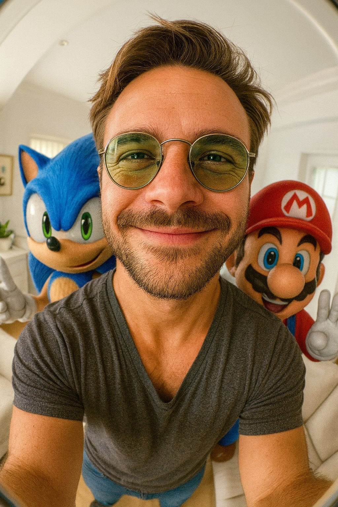

## 和索尼克马里奥在一起合照

- ID: gpt4o-394-zh-2
- Slug: prompt-394-zh-2
- 语言: zh
- 来源: [来源链接](https://x.com/ecommartinez/status/1983892304621662607)
- 样例图路径: images/part3/394.jpeg

### 提示词

```text
一张超逼真的9:16竖屏自拍，使用鱼眼镜头拍摄，照片中我和索尼克、马里奥在一起。场景设定在一个明亮的小客厅，以白色为主色调。高角度拍摄。极致的鱼眼畸变。逼真的电影级光影效果。动漫人物与风格化的写实主义完美融合。
```

### 样例图


## { "instruction": "Generate a full-body, photorealistic f

- ID: gpt4o-393-en-1
- Slug: prompt-393-en-1
- 语言: en
- 来源: [来源链接](https://x.com/IamEmily2050/status/1983742027058835543)
- 样例图路径: images/part3/393.jpeg

### 提示词

```text
{
  "instruction": "Generate a full-body, photorealistic fashion portrait of a modern East Asian idol in all-black styling. The result must look like a professional test shot, not anime, not cosplay, not fantasy.",

 "subject": {
    "identity": "East Asian female idol, early 20s look, pale smooth skin, symmetrical features, refined jawline, large natural eyes, soft neutral lips.",
    "hair": {
      "color": "jet-black",
      "style": "straight with blunt bangs framing the eyes",
      "length": "long, falling past the chest",
      "optional_variants": [
        "clean straight hair down",
        "twin high ponytails with bangs and loose face-framing strands"
      ]
    },
    "body": {
      "build": "slender, long-legged, elegant proportions, model-like lines",
      "posture": "calm, confident, controlled posture, standing tall",
      "pose": "full-body standing pose, relaxed arms at sides or slight hip angle, natural stance, no exaggerated arching"
    }
  },

  "wardrobe": {
    "palette": "all black, monochrome styling",
    "look_variants": [
      {
        "description": "long-sleeve fitted black top with structured waist (corset-like shaping), short pleated mini skirt with belt hardware, over-the-knee black lace-up boots with platform heel, subtle layered silver jewelry"
      },
      {
        "description": "black cropped top, exposed midriff, slim black jeans, fitted choker stack and pendant necklace, matte black boots"
      }
    ],
    "note": "Outfit must read as high-fashion / street idol aesthetic, not fantasy costume, not sci-fi armor, not latex fetishwear."
  },

  "camera": {
    "framing": "full-body portrait from head to shoes, vertical composition, subject centered and filling most of the frame",
    "angle": "slightly low to mid-torso camera height for subtle leg lengthening OR neutral eye-level framing against a doorway",
    "lens_behavior": "clean realistic perspective, no wide distortion, no fisheye",
    "focus": "sharp focus across the subject from face to boots, depth of field appropriate for fashion photography"
  },

  "environment": {
    "style_options": [
      "industrial interior with worn tile floor and large window frame / metal framing in the background, muted gray tones",
      "neutral architectural doorway outdoors, pale stone or painted door, soft natural light"
    ],
    "lighting": "soft, diffused, natural-feeling light with gentle directional falloff. Skin should look smooth and real, not plastic. No neon rim light, no colored gels."
  },

  "aesthetic": {
    "tone": "clean Korean idol / street editorial test shot",
    "color_grade": "subtle cool neutrals in the background, deep matte blacks in wardrobe, natural skin tones",
    "finish": "high-end fashion photography, not fantasy art, not anime render, not glossy VR avatar"
  },

  "technical_rendering": {
    "intent": "photorealistic human subject",
    "keywords": [
      "cinematic portrait photography",
      "studio-quality fashion still",
      "PBR material realism on fabric texture (matte black cloth, leather belt, lace-up boots)",
      "no exaggerated body morph",
      "no plastic skin",
      "no cel-shaded look"
    ]
  },

  "negative": {
    "forbidden_styles": [
      "anime style",
      "cartoon style",
      "3D game character",
      "virtual idol hologram look",
      "cyberpunk fantasy costume",
      "latex catsuit aesthetic",
      "sci-fi armor",
      "bright colored hair",
      "oversized eyes / doll face",
      "hyper-airbrushed Barbie texture",
      "warped body proportions",
      "fish-eye distortion",
      "text overlays or watermarks"
    ],
    "forbidden_words": [
      "NSFW pose",
      "explicit lingerie framing",
      "cutesy cosplay expression",
      "aggressive pin-up arching"
    ]
}
```

### 样例图


## 全身写实时尚肖像照

- ID: gpt4o-393-zh-2
- Slug: prompt-393-zh-2
- 语言: zh
- 来源: [来源链接](https://x.com/IamEmily2050/status/1983742027058835543)
- 样例图路径: images/part3/393.jpeg

### 提示词

```text
{
“说明”：“请创作一张现代东亚偶像全身写实时尚肖像照，造型为全黑。作品必须看起来像专业试镜照，而非动漫、角色扮演或奇幻风格。”

“主题”： {
“身份”：“东亚女偶像，二十出头的外貌，白皙光滑的皮肤，五官对称，下颌线条精致，大而自然的眼睛，柔和的裸色嘴唇。”
“头发”： {
颜色： 纯黑色，
“发型”：“齐刘海修饰眼睛的直发”，
长度：很长，垂过胸部，
"optional_variants": [
“干净利落的直发向下”，
“双高马尾辫，配刘海和垂在脸颊两侧的碎发”
]
}，
“身体”： {
“体型”：“纤细、修长、比例优雅、线条优美”，
“姿势”：“冷静、自信、控制的姿势，挺拔的站姿”
“姿势”：“全身站立姿势，双臂放松地放在身体两侧或髋部略微弯曲，站姿自然，不要过度拱背”
}
}，

“衣柜”： {
“调色板”：“全黑单色风格”，
"look_variants": [
{
“描述”：黑色长袖修身上衣，腰部收紧（类似束身衣的塑形效果），短款百褶迷你裙，配有腰带，黑色过膝系带厚底靴，精致的叠戴银色首饰。
}，
{
描述：黑色露脐上衣，露出小蛮腰，黑色修身牛仔裤，贴身颈链叠戴吊坠项链，哑光黑色靴子
}
]，
“注意”：“服装必须体现高级时装/街头偶像美学，而不是奇幻服装、科幻盔甲或乳胶恋物癖服装。”
}，

“相机”： {
“构图”：“从头到脚的全身像，竖构图，主体居中并占据画面的大部分”，
“角度”：“略低于躯干中部的相机高度，以微妙地拉长腿部，或者以中性的视线高度靠在门口构图”，
"lens_behavior": "清晰逼真的透视效果，无严重畸变，无鱼眼效果"
“焦点”： “从脸部到靴子，主体清晰对焦，景深适合时尚摄影”
}，

“环境”： {
"style_options": [
“工业风格的室内装潢，地面铺着磨损的瓷砖，背景是大型窗框/金属框架，整体色调为柔和的灰色。”
“中性色调的建筑风格户外入口，浅色石材或油漆门，柔和的自然光线”
]，
“照明”：“柔和、漫射、感觉自然的光线，光线方向性衰减要柔和。皮肤应该看起来光滑真实，而不是塑料感。不要使用霓虹灯轮廓光，也不要使用彩色滤光片。”
}，

“审美的”： {
"色调": "干净的韩国偶像/街头时尚大片试拍",
"color_grade": "背景采用柔和的冷色调中性色，服装采用深哑光黑色，肤色自然",
“成品”：高端时尚摄影，而非奇幻艺术、动漫渲染或华丽的VR虚拟形象。
}，

“technical_rendering”：{
“意图”: “逼真的人物主体”，
“关键词”：[
“电影式人像摄影”，
“摄影棚品质的时尚剧照”，
“织物纹理上的 PBR 材质真实感（哑光黑布、皮带、系带靴）”
“没有夸张的体型变化”，
“没有塑料皮肤”，
“没有卡通渲染风格”
]
}，

“消极的”： {
"forbidden_​​styles": [
“动漫风格”，
“卡通风格”，
“3D游戏角色”，
“虚拟偶像全息影像”
“赛博朋克奇幻服装”，
“乳胶紧身衣美学”，
“科幻盔甲”，
“色彩鲜艳的头发”，
“大眼睛/娃娃脸”，
“过度修饰的芭比娃娃质感”，
“扭曲的体型比例”，
“鱼眼畸变”，
“文字叠加或水印”
]，
"forbidden_​​words": [
“NSFW姿势”，
“露骨的内衣镜头”，
“可爱的角色扮演表情”，
“激进的性感拱背”
]
}
```

### 样例图


## 一张极具戏剧张力的黑白特写肖像

- ID: gpt4o-385-zh
- Slug: prompt-385-zh
- 语言: zh
- 来源: [来源链接](https://x.com/songguoxiansen/status/1983347050306523506)
- 样例图路径: images/part3/385.jpeg

### 提示词

```text
一张极具戏剧张力的黑白特写肖像，展现了一位英俊的年轻东亚男性。他的头发微湿，凌乱地贴在额头和脸颊上，脸颊上挂着几颗水珠。他眼神迷离，嘴唇微张，表情中带着一丝脆弱和诱惑。他穿着一件被水浸湿的黑色T恤，贴合在肩膀上。强烈的侧光照亮了他脸上的水珠和湿润的皮肤，形成鲜明的高光，与深邃的阴影形成强烈对比。极简的深色背景，照片极具电影氛围，高细节，胶片颗粒感重，传达出一种神秘而充满张力的情绪。
```

### 样例图

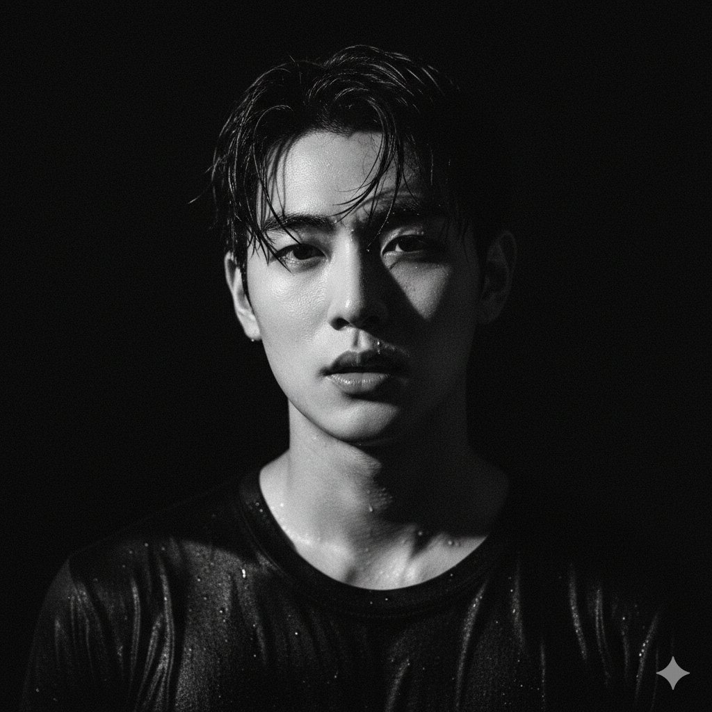

## 人和汽车的三视图

- ID: gpt4o-384-zh
- Slug: prompt-384-zh
- 语言: zh
- 来源: [来源链接](https://x.com/songguoxiansen/status/1983425570596892858)
- 样例图路径: images/part3/384.jpeg

### 提示词

```text
A cinematic automotive photoshoot of me, keeping my real face unchanged. The scene is composed of three perspectives as a :

1. Top Panel: Interior close-up: I am seated inside the car, wearing a fitted black polo shirt, shown in the side mirror reflection. My face is serious and focused, my gaze directed forward with determination. The angle captures only side view part of my profile, framed cleanly within the mirror, emphasizing intensity and precision.

2.Middle Panel: I am standing confidently next to a sleek black Ford Mustang. My posture is relaxed but strong: both arms are crossed over my chest in a confident manner, while my left leg is straight and my right leg bent slightly at the knee, with the foot leaning casually against the car. My gaze is directed slightly off-camera, with a calm and assertive expression. I am wearing a fitted black polo shirt with subtle detailing, slim grey jeans with a clean cut, and brown leather boots. My outfit is minimal yet stylish, emphasizing a modern masculine vibe. Pose like a pro, same face as the uploaded photo.

3. Bottom Panel: Rear car shot: The camera captures the back of the Mustang, showcasing the "YOUR NAME" license plate and muscular lines of the car. The photo emphasizes the glossy texture of the vehicle and its aggressive, cinematic presence. The setting is an urban environment with modern architecture and concrete walls, giving a gritty, cinematic atmosphere. The lighting is natural but slightly diffused, highlighting both me and the polished surface of the car.

The perspectives vary:

- The mirror reflection close-up is shot tight with a portrait focal length (~85mm).

- The exterior full-body shot is taken at eye-level with a slightly wide lens to capture both me and the car in full view.

- The rear car angle uses a low perspective to emphasize power and presence.

Style: Cinematic automotive editorial, urban setting, moody and stylish, professional fashion-meets- car photography, same face.
```

### 样例图


## Create a hyper-real macro photograph of a tiny (CHARACTE

- ID: gpt4o-383-en-1
- Slug: prompt-383-en-1
- 语言: en
- 来源: [来源链接](https://x.com/Samann_ai/status/1982774584198991988)
- 样例图路径: images/part3/383.jpeg

### 提示词

```text
Create a hyper-real macro photograph of a tiny (CHARACTER) about 10–12 cm tall, gently held between a real human thumb and index finger or sitting on the fingertip. The character naturally touches the thumb for scale and holds (ACCESSORY). Studio setting with a soft grey gradient background, subtle bokeh. Skin, fabric and hair show micro-texture; add accurate contact shadows where fingers meet the character. Lighting: softbox at 45°, faint rim light on the far side; no harsh glare. Camera look: 100mm macro • f/2.8 • ISO 100 • 1/160s (shallow depth of field; eyes perfectly in focus). Hands look clean, natural anatomy, 5 fingers, realistic nails and pores. The character’s outfit is simple textured knit (dark grey) unless the identity demands otherwise; proportions and perspective must read real, not toy. Treat (CHARACTER) respectfully and keep likeness faithful if based on a real person. Composition: subject centered, from mid-torso up, with the thumb and index framing the character;
```

### 样例图


## 一张超现实的微距照片

- ID: gpt4o-383-zh-2
- Slug: prompt-383-zh-2
- 语言: zh
- 来源: [来源链接](https://x.com/Samann_ai/status/1982774584198991988)
- 样例图路径: images/part3/383.jpeg

### 提示词

```text
创建一张超现实的微距照片，照片中一个约 10-12 厘米高的微小（角色），轻轻地放在真人的拇指和食指之间或放在指尖上。角色自然地触摸拇指以进行缩放并握住（配件）。工作室设置具有柔和的灰色渐变背景，微妙的散景。皮肤、织物和头发显示微观纹理；在手指与角色接触的地方添加准确的接触阴影。照明：45° 柔光箱，远端微弱的边缘光；无刺眼眩光。相机外观：100mm 微距 • f/2.8 • ISO 100 • 1/160s（浅景深；眼睛完美对焦）。手看起来干净，解剖自然，5 个手指，逼真的指甲和毛孔。除非身份另有要求，否则角色的服装是简单的纹理针织（深灰色）；比例和透视必须是真实的，而不是玩具。尊重地对待（角色），如果基于真人，则保持相似性。构图：以主体为中心，从躯干中部向上，用拇指和食指框住人物；
```

### 样例图


## A 3D chibi-style vinyl collectible figure of [CHARACTER 

- ID: gpt4o-382-en-1
- Slug: prompt-382-en-1
- 语言: en
- 来源: [来源链接](https://x.com/Arminn_Ai/status/1982860799879114903)
- 样例图路径: images/part3/382.jpeg

### 提示词

```text
A 3D chibi-style vinyl collectible figure of [CHARACTER NAME] Big head, small body, cartoon proportion, Standing inside a Youtooz-style
packaging box with: Transparent front window
"YOUTOOZ COLLECTIBLES" logo on the top
Number label ([#XXX]) on the top-left
Bottom front text: “[CHARACTER NAME]” and lower with smaller font “VINYL FIGURE”
Cartoon 2D illustration of [CHARACTER NAME] on the side of the box ([ILLUSTRATION DESCRIPTION])

Background/theme:
[BOX COLORS + TEXTURES + ICONIC MOTIFS RELATED TO CHARACTER] 
[Figure POSE OR GESTURE] 
[Outfit DESCRIPTION + SIGNATURE ITEMS]

Face details: The facial features (mouth/eyes/details) must be fully 3D sculpted, not flat or printed.
Lighting: clean product photography look, minimal soft shadows
Style: vinyl-toy aesthetic with a mix of matte + glossy accents depending on costume, Composition: 3/4 product shot view, full box visible. The entire packaging box must be fully visible inside the frame with a clean margin around all edges.
```

### 样例图


## 3D chibi风格乙烯基收藏品

- ID: gpt4o-382-zh-2
- Slug: prompt-382-zh-2
- 语言: zh
- 来源: [来源链接](https://x.com/Arminn_Ai/status/1982860799879114903)
- 样例图路径: images/part3/382.jpeg

### 提示词

```text
3D chibi 风格乙烯基收藏品 [CHARACTER NAME] 大头，小身体，卡通比例，站在 Youtooz 风格的
包装盒带有：透明前窗
顶部有“YOUTOOZ COLLECTIBLES”标志
左上角的数字标签（[#XXX]）
底部文字：“[CHARACTER NAME]” 下方用较小的字体写着“VINYL FIGURE”
盒子侧面的 [角色名称] 卡通 2D 插图（[插图描述]）

背景/主题：
[盒子颜色 + 纹理 + 与角色相关的标志性图案]
[人物姿势或手势]
[服装描述 + 标志性物品]

面部细节：面部特征（嘴巴/眼睛/细节）必须完全 3D 雕刻，而不是平面或印刷的。
灯光：干净的产品摄影外观，最小的柔和阴影
风格：搪胶玩具美学，根据服装搭配哑光和亮光元素。构图：3/4 产品视角，完整包装盒清晰可见。整个包装盒必须在框架内完全可见，所有边缘均留有清晰的空白。
```

### 样例图


## 一幅奢华的高级时尚肖像

- ID: gpt4o-381-zh
- Slug: prompt-381-zh
- 语言: zh
- 来源: [来源链接](https://x.com/wanerfu/status/1983353100066009387)
- 样例图路径: images/part3/381.jpeg

### 提示词

```text
一幅奢华的高级时尚肖像，[角色描述]优雅地坐在装饰华丽的大型长方形画框下边缘

画框细节：
• 巴洛克/洛可可风格长方形画框
• 用[画框颜色和质地]绘制，与整体色调和谐

环境：
• 背景：优雅的工作室墙面，经典镶板[颜色]
• 地板：略有反光，[地板颜色]

灯光：
• 电影式高调时尚光线
• 主体柔和柔散光
• 轻微轮廓分离

相机：
• 对称居中全身肖像
• 干净的编辑时尚构图
• 8K超清高端大片品质

风格标签：单色 | 悬浮画框 | 电影工作室时尚 | 奢华编辑美学
```

### 样例图


## A cartoon illustration of [OBJECT], photographed in a cl

- ID: gpt4o-380-en-1
- Slug: prompt-380-en-1
- 语言: en
- 来源: [来源链接](https://x.com/Arminn_Ai/status/1978164256240501226)
- 样例图路径: images/part3/380.jpeg

### 提示词

```text
A cartoon illustration of [OBJECT],
photographed in a clean minimal studio setup. All objects remain realistic and three-dimensional, but have been transformed into expressive cartoon characters:
• [DESCRIPTION & EMOTION]  
  (describe facial features, expressions, and emotional tone for each object)
• [ACTION]  
• doodle lines are black, slightly uneven, and hand-drawn —  like quick expressive sketchbook strokes drawn directly on the objects.
Style: hybrid mix of real product photography and cartoon doodle overlay.  
Background: solid pastel [COLOR], clean and minimal.
Lighting: soft, even, studio-style — subtle highlights and gentle shadows; no harsh light.
Mood: [MOOD / THEME — e.g. playful, melancholic, poetic, humorous].  
Keywords: hybrid photo-doodle, product cartoon, expressive characters, minimal pastel background. Aspect ratio: 1:1
```

### 样例图

![A cartoon illustration of [OBJECT], photographed in a cl](../images/part3/380.jpeg)

## 卡通插图

- ID: gpt4o-380-zh-2
- Slug: prompt-380-zh-2
- 语言: zh
- 来源: [来源链接](https://x.com/Arminn_Ai/status/1978164256240501226)
- 样例图路径: images/part3/380.jpeg

### 提示词

```text
[OBJECT]的卡通插图，
在简洁干净的工作室环境中拍摄。所有物体都保持了真实感和三维立体感，但又被转化成了富有表现力的卡通人物：
• [描述和情感]
（描述每个物体的面部特征、表情和情绪基调）
• [行动]
• 涂鸦线条是黑色的，略微不均匀，并且是手绘的——就像直接在物体上绘制的快速富有表现力的素描本笔触一样。
风格：真实产品摄影和卡通涂鸦叠加的混合。
背景：纯色粉彩[颜色]，干净、简约。
灯光：柔和、均匀、工作室风格——微妙的高光和柔和的阴影；没有刺眼的光线。
心情：[心情/主题 — 例如好玩、忧郁、诗意、幽默]。
关键词：混合照片涂鸦、产品卡通、富有表现力的人物、极简柔和背景。长宽比：1:1
```

### 样例图


## A hyper-realistic portrait of a young man sitting on lar

- ID: gpt4o-376-en-1
- Slug: prompt-376-en-1
- 语言: en
- 来源: [来源链接](https://x.com/eyishazyer/status/1982402132834767195)
- 样例图路径: images/part3/376.jpeg

### 提示词

```text
A hyper-realistic portrait of a young man sitting on large, smooth white rocky formations under natural sunlight. He is wearing a loose, slightly crumpled beige linen shirt with the top buttons open, paired with white trousers. His outfit gives a relaxed, Mediterranean vibe.
He is leaning back, one arm resting on the rock, and the other hand on his knee, looking slightly to the side. He wears slim black rectangular sunglasses. His hairstyle is short, slightly messy, and the sunlight casts soft shadows across his outfit and the textured rocks.
The overall atmosphere is calm, stylish, and Mediterranean-inspired. The face should match exactly with the reference photo.
```

### 样例图


## 坐在巨大光滑的白色岩层上

- ID: gpt4o-376-zh-2
- Slug: prompt-376-zh-2
- 语言: zh
- 来源: [来源链接](https://x.com/eyishazyer/status/1982402132834767195)
- 样例图路径: images/part3/376.jpeg

### 提示词

```text
这幅超现实主义肖像画描绘了一位年轻男子坐在巨大光滑的白色岩层上，沐浴在自然阳光下。他身穿宽松略带褶皱的米色亚麻衬衫，最上面的纽扣敞开着，搭配白色长裤。他的装扮散发着轻松的地中海风情。
他向后仰着身子，一只手扶着岩石，另一只手放在膝盖上，目光略微侧向一侧。他戴着一副细长的黑色矩形墨镜。他的发型短而略显凌乱，阳光在他的衣服和纹理分明的岩石上投下柔和的阴影。
整体氛围平静、时尚，充满地中海风情。脸部应该与参考照片完全匹配。
```

### 样例图


## A detailed metallic coin featuring Person's face attache

- ID: gpt4o-375-en-1
- Slug: prompt-375-en-1
- 语言: en
- 来源: [来源链接](https://x.com/eyishazyer/status/1982402126845247707)
- 样例图路径: images/part3/375.jpeg

### 提示词

```text
A detailed metallic coin featuring
Person's face attached in the image ( Do not change facial features of the person from the uploaded photo. Keep face of person 100% accurate from the reference image. Keep the original face of the attached person unchanged and realistic)  embossed in profile, crafted with realistic engraved textures and fine relief detailing. The coin surface shows light reflections, scratches, and metallic sheen. Include subtle inscriptions or symbols around the border to resemble authentic minting. Centered on a dark, minimal background to emphasize the coin’s texture and realism
```

### 样例图


## 一枚精致的人物金属硬币

- ID: gpt4o-375-zh-2
- Slug: prompt-375-zh-2
- 语言: zh
- 来源: [来源链接](https://x.com/eyishazyer/status/1982402126845247707)
- 样例图路径: images/part3/375.jpeg

### 提示词

```text
一枚精致的金属硬币，图像中人物的面部特征（请勿更改上传照片中人物的面部特征。保持人物面部与参考图像 100% 准确。保持附加人物的原始面部特征不变且逼真）采用侧面浮雕，并采用逼真的雕刻纹理和精细的浮雕细节。硬币表面呈现光反射、划痕和金属光泽。在边缘处添加细微的铭文或符号，以模拟真实的铸币。硬币以深色、极简的背景为中心，以突出硬币的纹理和真实感
```

### 样例图


## Create a black and white high-fashion editorial portrait

- ID: gpt4o-373-en-1
- Slug: prompt-373-en-1
- 语言: en
- 来源: [来源链接](https://x.com/eyishazyer/status/1982402114413596850)
- 样例图路径: images/part3/373.jpeg

### 提示词

```text
Create a black and white high-fashion editorial portrait of me, keeping my real face exactly as in the reference photo (no edits, same features, no retouching). I am wearing a loose white blouse. My pose is bold and expressive, with one arm raised to hold my hair up, partially covering my face. My gaze is intense and directed at the camera, creating a strong and enigmatic aura. The background is a plain minimalist wall with sharp natural daylight casting defined shadows, adding depth and contrast.
Lighting is harsh and high-contrast, highlighting my facial contours, sharp cheekbones, and the texture of the hair and fabric. The style should feel raw, dramatic, and artistic.
The overall image is high-fashion editorial in monochrome, cinematic, and striking.
```

### 样例图


## 身穿一件宽松的白色衬衫肖像照

- ID: gpt4o-373-zh-2
- Slug: prompt-373-zh-2
- 语言: zh
- 来源: [来源链接](https://x.com/eyishazyer/status/1982402114413596850)
- 样例图路径: images/part3/373.jpeg

### 提示词

```text
为我创作一幅黑白高级时尚编辑肖像，保留我的真实面容，与参考照片完全一致（未进行任何编辑，五官相同，未进行任何修饰）。我身穿一件宽松的白色衬衫。我的姿势大胆而富有表现力，一只手抬起，将头发拢起，遮住了部分脸部。我的目光专注地直视镜头，营造出一种强烈而神秘的氛围。背景是一面简洁的墙面，明亮的自然光投射出清晰的阴影，增添了画面的深度和对比度。
光线强烈，对比度高，凸显了我的面部轮廓、棱角分明的颧骨，以及头发和布料的质感。风格应该给人一种原始、戏剧化、艺术感十足的感觉。
整体形象是单色的、电影化的、引人注目的高级时尚社论。
```

### 样例图


## Without changing her original face, create a portrait of

- ID: gpt4o-372-en-1
- Slug: prompt-372-en-1
- 语言: en
- 来源: [来源链接](https://x.com/ZaraIrahh/status/1982268011416592593)
- 样例图路径: images/part3/372.jpeg

### 提示词

```text
Without changing her original face, create a portrait of a beautiful young woman with porcelain-white skin, captured with a 1990s-style camera using a direct front flash. Her messy dark brown hair is tied up, posing with a calm yet playful smile. She wears a modern oversized cream sweater. The background is a dark white wall covered with aesthetic magazine posters and stickers, evoking a cozy bedroom or personal room atmosphere under dim lighting.
```

### 样例图


## 90年代风格照片

- ID: gpt4o-372-zh-2
- Slug: prompt-372-zh-2
- 语言: zh
- 来源: [来源链接](https://x.com/ZaraIrahh/status/1982268011416592593)
- 样例图路径: images/part3/372.jpeg

### 提示词

```text
不改变她原本的面容，用一台90年代风格的相机，搭配前置闪光灯，为一位拥有瓷白肌肤的年轻女子创作一幅肖像。她凌乱的深棕色头发扎起，脸上挂着平静而俏皮的微笑。她身穿一件现代感十足的奶油色宽松毛衣。背景是一面深白色的墙，墙上贴满了美学杂志的海报和贴纸，在昏暗的灯光下，营造出舒适的卧室或私人房间氛围。
```

### 样例图


## [Person] as an [Animal] highly detailed portrait

- ID: gpt4o-371-en-1
- Slug: prompt-371-en-1
- 语言: en
- 来源: [来源链接](https://x.com/LinusEkenstam/status/1982790174418632891)
- 样例图路径: images/part3/371.jpeg

### 提示词

```text
[Person] as an [Animal] highly detailed portrait
```

### 样例图

![[Person] as an [Animal] highly detailed portrait](../images/part3/371.jpeg)

## 人物作为动物的高度详细肖像

- ID: gpt4o-371-zh-2
- Slug: prompt-371-zh-2
- 语言: zh
- 来源: [来源链接](https://x.com/LinusEkenstam/status/1982790174418632891)
- 样例图路径: images/part3/371.jpeg

### 提示词

```text
[人物] 作为 [动物] 的高度详细肖像
```

### 样例图

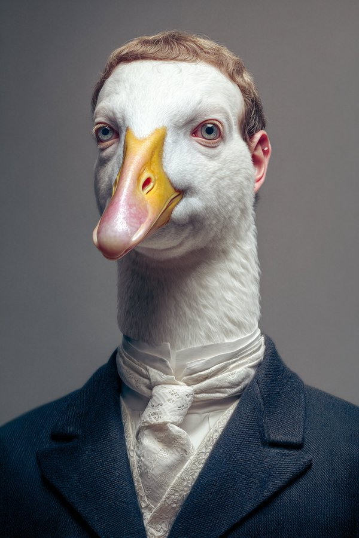

## { "prompt_title": "Hyperrealistic Gothic Bunny Studio Po

- ID: gpt4o-370-en-1
- Slug: prompt-370-en-1
- 语言: en
- 来源: [来源链接](https://x.com/IqraSaifiii/status/1982469385156489563)
- 样例图路径: images/part3/370.jpeg

### 提示词

```text
{
"prompt_title": "Hyperrealistic Gothic Bunny Studio Portrait",
"image_description": "An ultra-photorealistic, high-resolution studio portrait of a female subject in a gothic-inspired bunny costume, featuring intricate lace ears, a structured corset, and delicate hosiery. The subject is posed on the floor, exuding an alluring and sophisticated aura under precise studio lighting.",
"subject": {
"gender": "female",
"appearance": "Young adult with a flawless, luminous complexion. **Extreme micro-detail rendering on skin, showing subtle pores, fine vellus hairs, accurate light interaction (sub-surface scattering), and realistic skin texture.**",
"facial_features": "Smooth, clear skin. Her eyes are large, dark, and captivating, looking directly into the camera with a **confident and slightly seductive expression**. Lips are full, with a matte red or deep berry lipstick that shows micro-creases. Defined eyebrows and subtle contouring.",
"hair_style": "Long, flowing, wavy black hair, cascading over her shoulders and back. **Hair must show individual strands, realistic volume, high-gloss reflections, and subtle flyaways.**",
"makeup": "Dramatic and precise. Sharp, winged black eyeliner, full, dark eyelashes (possibly individual lash extensions), subtle glitter or shimmer on eyelids. Contoured cheeks. Flawless foundation and blush.",
"attire": {
"headwear": "Intricate **black lace bunny ears headband**. The lace should have visible patterns, delicate wire structure, and possibly small faux floral or ribbon accents. Realistic light interaction with the lace.",
"neck_accessories": "A simple, fitted black velvet or leather choker necklace.",
"main_outfit": "A highly detailed **black strapless corset dress or top and skirt ensemble**. The corset should be structured, showing **visible boning and lacing details** (possibly satin or leather laces). Fabric should be a mix of matte black leather/faux leather and textured, ruffled black tulle or chiffon for the skirt. **Emphasis on realistic fabric folds, textures, and subtle sheen.**",
"hosiery": "Sheer black thigh-high stockings with a delicate lace top band, clearly visible on her upper thigh. **Stockings must show realistic transparency and fabric stretch over skin.**",
"footwear": "Black pointed-toe high heels with ankle straps. The material should be a realistic matte or patent leather, showing accurate reflections and shoe construction."
}
},
"pose": {
"description": "The subject is kneeling on a flat, light-colored studio floor, leaning slightly forward. Her left hand is placed on the floor beside her left knee, fingers slightly spread. Her right arm is gently resting on her right thigh. Her body is slightly twisted, creating an alluring silhouette. **Exact replication of the confident and poised pose.**",
"camera_angle": "Medium shot, eye-level angle, slightly looking down at the subject. The camera is positioned to capture her full body from the mid-thigh up, with enough space around her to establish the studio environment.",
"composition": "Centered composition, vertical orientation. The subject fills approximately 70-80% of the frame, with subtle negative space around her. **Sharp focus on the subject, with a very shallow depth of field creating a soft bokeh in the background.**"
},
"setting": {
"location": "Professional indoor photo studio.",
"background_elements": "Seamless, plain light gray or off-white backdrop, extending from the floor to the wall, creating a clean, infinite background. **Subtle, soft gradient in the background due to lighting falloff.**"
},
"lighting_and_atmosphere": {
"key_light_source": "Softbox or parabolic diffuser from the front-left, creating soft, even illumination with subtle directional shadows to define contours.",
"fill_light": "Subtle fill light from the front-right to reduce harsh shadows on the right side of her face and body.",
"back_light": "A subtle hair light or rim light from the rear-right to create separation from the background and add definition to her hair and shoulders.",
"highlights_shadows": "Soft, creamy highlights on skin, hair, and corset material. Deep but soft shadows defining facial structure and body contours. **Accurate light falloff and realistic specular reflections on materials.**",
"photographic_realism": "Extreme micro-detail, sub-surface scattering on skin, realistic fabric textures (lace, leather, tulle), **cinematic studio lighting**, crisp focus on eyes, perfect white balance, neutral color grading, **ultra-realistic material rendering (PBR - Physically Based Rendering).**"
},
"style_and_camera": {
"photographic_style": "High-fashion portraiture, hyperrealistic studio photography, fine art glamour.",
"camera_type": "High-end full-frame mirrorless camera (e.g., Sony A1, Canon R5) with a fast prime lens (e.g., 50mm f/1.2 or 85mm f/1.4).",
"camera_values": "ISO 100, f/1.8, 1/160 sec. **These values contribute to shallow depth of field, sharp detail, and clean image quality.**",
"resolution_quality": "8K resolution, ultra-photorealistic, extreme detail on all elements. **Masterpiece quality render, production quality image.**"
},
"negative_prompt_suggestions": [
"blurry", "low resolution", "deformed", "harsh lighting", "flat background", "bad anatomy",
"cartoon", "illustration", "painting", "text", "watermark", "oversaturated", "poor composition",
"unrealistic skin", "plastic texture", "missing details"
]
}
```

### 样例图


## 超现实主义哥特式兔子工作室肖像

- ID: gpt4o-370-zh-2
- Slug: prompt-370-zh-2
- 语言: zh
- 来源: [来源链接](https://x.com/IqraSaifiii/status/1982469385156489563)
- 样例图路径: images/part3/370.jpeg

### 提示词

```text
{
"prompt_title": "超现实主义哥特式兔子工作室肖像",
"image_description": "这幅超逼真、高分辨率的工作室肖像画描绘了一位身着哥特式兔子服装的女性，服装配有精致的蕾丝耳朵、结构化的紧身胸衣和精致的袜子。模特躺在地板上，在精准的工作室灯光下散发着迷人而精致的气息。",
“主题”： {
"性别": "女",
"appearance": "拥有完美无瑕、明亮肤色的年轻人。 **皮肤上极其细微的细节渲染，展现出细微的毛孔、细小的毳毛、准确的光线相互作用（次表面散射）和逼真的皮肤纹理。 ** ",
"facial_features": "光滑、洁净的皮肤。她的眼睛又大又黑，魅力十足，直视镜头，眼神自信而略带诱惑** 。 **.嘴唇丰满，涂着哑光红色或深莓色唇膏，露出细微的皱纹。眉毛清晰，轮廓细腻。",
"hair_style": "飘逸的黑色长发，波浪状披散在肩部和背部。 **头发必须展现出独立的发丝、真实的蓬松度、高光泽的反光和微妙的飞散。 ** ",
"makeup": "妆容精致而又充满戏剧感。锐利的黑色眼线，浓密的深色睫毛（可能是单独嫁接的），眼睑上点缀着淡淡的闪粉或珠光。轮廓分明的脸颊。完美的粉底和腮红。",
“服装”：{
"headwear": "精致的**黑色蕾丝兔耳头带**.蕾丝应具有明显的图案、精致的金属丝结构，以及可能的小型仿花或丝带装饰。与蕾丝的逼真灯光互动。",
"neck_accessories": "一条简单、合身的黑色天鹅绒或皮革颈链。",
"main_outfit": "一件细节丰富的**黑色露肩紧身连衣裙或上衣和裙子套装**.紧身胸衣应结构清晰，露出**明显的骨和系带细节** (可能需要缎子或皮革鞋带。裙子面料应为哑光黑色皮革/人造皮革和纹理荷叶边黑色薄纱或雪纺的混合面料。 **强调逼真的面料褶皱、纹理和微妙的光泽。 ** ",
"hosiery": "透明黑色过膝长袜，带有精致的蕾丝边，在大腿上清晰可见。 **长袜必须具有逼真的透明度，并且织物在皮肤上具有弹性。 ** ",
“footwear”：“黑色尖头高跟鞋，带踝带。材质应为逼真的哑光皮革或漆皮，展现准确的反射和鞋子结构。”
}
}，
“姿势”：{
"description": "拍摄对象跪在工作室平坦的浅色地板上，身体微微前倾。她的左手放在左膝旁的地板上，手指微微张开。她的右臂轻轻地放在右大腿上。她的身体微微扭动，勾勒出迷人的轮廓。 **精准地复制了她自信而泰然的姿势。 ** ",
"camera_angle": "中景镜头，视线水平角度，略微向下看拍摄对象。摄像机的位置可以捕捉到她从大腿中部以上的全身，周围有足够的空间来营造工作室氛围。",
"composition": "居中构图，垂直方向。主体占据了画面的大约 70-80%，周围留有微妙的负空间。 **主体清晰对焦，景深很浅，在背景中营造出柔和的散景效果。 ** "
}，
“环境”： {
"location": "专业室内摄影工作室。",
"background_elements": "无缝、纯浅灰色或灰白色背景，从地板延伸到墙壁，营造出干净、无限的背景。 **由于光线衰减，背景中出现微妙、柔和的渐变。 ** "
}，
“照明和氛围”：{
"key_light_source": "从左前方放置柔光箱或抛物面漫射器，创造柔和、均匀的照明，并带有微妙的定向阴影来定义轮廓。",
"fill_light": "来自右前方的微妙补光，以减少她脸部和身体右侧的刺眼阴影。",
"back_light": "从右后方照射的微妙的头发光或边缘光，与背景分离，并突出她的头发和肩膀。",
"highlights_shadows": "皮肤、头发和紧身胸衣材质上呈现柔和、奶油般的高光。深邃而柔和的阴影勾勒出面部结构和身体轮廓。 **材质上呈现精准的光线衰减和逼真的镜面反射。 ** ",
"photographic_realism": "极其精细的微细节、皮肤表面次表面散射、逼真的织物纹理（蕾丝、皮革、薄纱）、 **电影工作室灯光** 、清晰的眼睛聚焦、完美的白平衡、中性色彩分级、 **超逼真的材质渲染（PBR - 基于物理的渲染）。 ** "
}，
“style_and_camera”：{
"photographic_style": "高级时尚肖像画、超现实主义工作室摄影、艺术魅力。",
"camera_type": "高端全画幅无反光镜相机（例如索尼 A1、佳能 R5）搭配快速定焦镜头（例如 50mm f/1.2 或 85mm f/1.4）。",
"camera_values": "ISO 100、f/1.8、1/160 秒。 **这些值有助于获得浅景深、清晰的细节和干净的图像质量。 ** ",
"resolution_quality": "8K 分辨率，超逼真，所有元素细节丰富。 **杰作品质渲染，产品品质图像。 ** "
}，
"negative_prompt_suggestions": [
“模糊”、“分辨率低”、“变形”、“光线刺眼”、“背景平坦”、“结构不良”
“卡通”、“插图”、“绘画”、“文字”、“水印”、“过饱和”、“构图不佳”
“皮肤不真实”、“塑料质感”、“缺少细节”
]
}
```

### 样例图


## 影楼拍摄女性坐在椅子上肖像照

- ID: gpt4o-368-zh
- Slug: prompt-368-zh
- 语言: zh
- 来源: [来源链接](https://x.com/hellokaton/status/1980121888853819768)
- 样例图路径: images/part3/368.jpeg

### 提示词

```text
请在影楼里拍摄一张照片，照片中使用所附照片中的女性面孔。
拍摄角度为正面，白色影楼背景，女性坐在椅子上。
她身穿全套白色服装：白色西装外套、白色裙子和白色高跟鞋。
姿势优雅，手托下巴，手里拿着一小枝白色玫瑰。
影楼墙壁上投射着柔和的夕阳窗户光线。
```

### 样例图


## 一位年轻女性的时尚电影肖像

- ID: gpt4o-367-zh
- Slug: prompt-367-zh
- 语言: zh
- 来源: [来源链接](https://x.com/hellokaton/status/1980121876996465085)
- 样例图路径: images/part3/367.jpeg

### 提示词

```text
一位年轻女性的时尚、电影肖像，她坐在一张现代椅子上，在室内。她以 3/4 视角构图，身体微微向后倾斜，一只手臂随意地搭在椅子上，散发出平静而自信的氛围。这位女士拥有一张瓜子脸，线条分明的下颌，发型与参考图片完全一致。她穿着一套时尚的全黑服装，包括深色高领毛衣和结构感强的西装外套，展现出高端时尚的编辑造型。
背景是一堵光滑的深色墙壁，窗户投射出引人注目的几何光影图案，散发出柔和的粉紫色光芒，与阴影形成鲜明对比。彩色的光线落在墙壁上，并 subtly 照亮她的头发和肩膀边缘，增强了戏剧性的氛围。整体照明 moody 而艺术，具有柔和的阴影和电影般的对比度。色彩分级强调深黑色、柔和的肤色和鲜艳的粉色高光，营造出杂志封面般的审美效果。
主体略微偏离中心。最终图像中不应出现任何文字、徽标或水印。
```

### 样例图


## 一张富有电影感的年轻女子侧脸肖像

- ID: gpt4o-366-zh
- Slug: prompt-366-zh
- 语言: zh
- 来源: [来源链接](https://x.com/hellokaton/status/1980121865248297389)
- 样例图路径: images/part3/366.jpeg

### 提示词

```text
一张富有电影感的年轻女子侧脸肖像，她仰着头，闭着眼睛，沐浴在戏剧性的光线中。
她站在深蓝色的背景前，穿着一件黑色西装外套。一束暖色聚光灯从右上角照下，在她的脸部和颈部投下橙色的光晕，在冷蓝色的阴影和温暖的高光之间形成了强烈的对比。
整个构图强调情绪和氛围，拥有干净的影棚灯光、柔和的渐变和极简主义的氛围。图像应具有艺术感、现代感和强烈的视觉冲击力，类似于高端杂志的编辑摄影风格。
相机角度： 侧面拍摄，微仰角
光线： 戏剧性的影棚布光，强对比度，蓝色背光 + 暖色聚光灯
镜头： 85毫米人像镜头，浅景深
氛围： 情绪化，电影感，极简主义
```

### 样例图


## 一张戏剧性的黑白工作室肖像照

- ID: gpt4o-365-zh
- Slug: prompt-365-zh
- 语言: zh
- 来源: [来源链接](https://x.com/hellokaton/status/1980121853474791580)
- 样例图路径: images/part3/365.jpeg

### 提示词

```text
一张戏剧性的黑白工作室肖像照。主体背对镜头站立，上半身轻微转向侧面，头微微低下，脸部侧面轮廓部分可见。表情平静而内省，营造出一种安静、神秘的氛围。

灯光：一盏强烈的侧光，投下鲜明的对比。一束干净的水平光束横切过背景墙。画面大部分处于阴影之中，着重强调剪影和轮廓。
氛围：极简主义，情绪化，电影感，唤起优雅与孤独感。主体身穿深色夹克，与阴影融为一体，呈现出流畅利落的时尚杂志风格。
构图：使用全画幅相机拍摄，85mm镜头，f/1.8大光圈营造浅景深效果，ISO 200，快门速度1/125秒。中景构图（从腰部到头部），突出剪影、侧脸和姿态。
后期：高对比度的黑白效果，柔和的色调渐变，深邃的阴影，添加轻微的胶片颗粒以增加质感，最终呈现精致的艺术杂志风格。
```

### 样例图

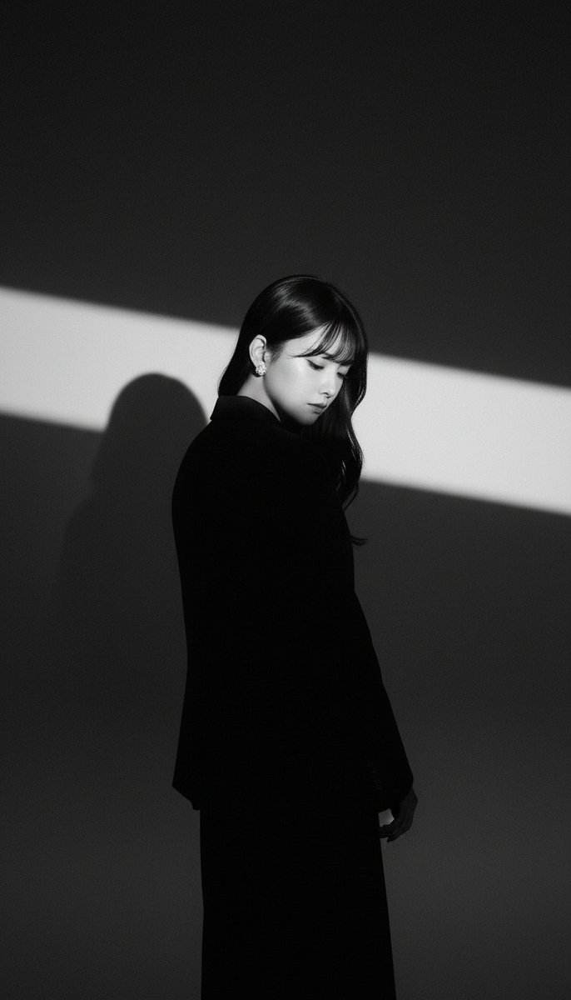

## { "scene": { "location": "clean studio corner", "backgro

- ID: gpt4o-364-en-1
- Slug: prompt-364-en-1
- 语言: en
- 来源: [来源链接](https://x.com/IamEmily2050/status/1980462057272275105)
- 样例图路径: images/part3/364.jpeg

### 提示词

```text
{
  "scene": {
    "location": "clean studio corner",
    "background": "soft pastel sage seamless, subtle falloff, no clutter"
  },

  "subject": {
    "age": "adult",
    "description": "woman with fair skin, long wavy brown hair with straight bangs, vivid blue eyes",
    "wardrobe": "pink strappy cami with black lace trim, blue plaid skirt",
    "accessories": "delicate necklace, symmetrical pastel hair clips",
    "pose": "full body; gentle S-curve; hip slightly popped; front knee inward; toes pointed; hands frame face in small heart gesture near chin",
    "expression": "kawaii allure: bright eyes with micro-smile and soft pout; slight 8° head tilt toward camera",
    "gaze": "direct to camera",
    "body_notes": "realistic adult proportions; natural skin texture"
  },

  "camera": {
    "sensor": "full_frame",
    "focal_length_mm": 70,
    "aperture_f": 2.2,
    "shutter_s": 0.00625,
    "iso": 200,
    "white_balance_k": 5200,
    "distance_m": 4.0,
    "camera_height_m": 1.05,
    "framing": "entire figure visible with 5% headroom and shoes in frame",
    "focus": "eye_detect_AF on nearest eye"
  },

  "lighting": {
    "key": "large diffused softbox front-left at 45°, close to subject, high-key beauty",
    "fill": "white bounce on camera-right one stop under key",
    "hair": "soft rim from behind to lift hair texture",
    "catchlights": "two circular catchlights at 10 and 2 o'clock",
    "notes": "flicker-free LEDs; even skin luminance; avoid harsh speculars"
  },

  "color_grade": {
    "style": "Ulzzang / kawaii soft-glam",
    "palette": "pastel pinks and sage; neutral skin with peach blush",
    "contrast": "medium-low with crisp micro-contrast on eyes and lips",
    "saturation": "moderate"
  },

  "makeup": {
    "eyes": "subtle winged liner, long lashes, soft brown shadow, gentle aegyo-sal highlight",
    "cheeks": "peach gradient blush",
    "lips": "pink gradient tint with light gloss"
  },

  "postprocess": {
    "retouch": "light frequency separation; maintain pores and flyaway hair",
    "clarity": "selective clarity on irises, lashes, lips",
    "dodge_burn": "micro dodge on eyes and cupid's bow; mild burn on hair shadows",
    "vignette": "very subtle"
  },

  "art_direction": {
    "mood": "cute, playful, alluring yet tasteful",
    "keywords": ["kawaii", "S-curve", "face-framing gesture", "soft glow", "clean studio"]
  },

  "negative_prompts": [
    "nsfw",
    "underage look",
    "text or logos",
    "plastic doll skin",
    "warped hands or extra fingers",
    "deformed limbs",
    "flat lighting",
    "oversharpening halos",
    "cluttered background"
  ]
}
```

### 样例图


## 粉色吊带背心女生比心

- ID: gpt4o-364-zh-2
- Slug: prompt-364-zh-2
- 语言: zh
- 来源: [来源链接](https://x.com/IamEmily2050/status/1980462057272275105)
- 样例图路径: images/part3/364.jpeg

### 提示词

```text
{
“场景”： {
"location": "干净的工作室角落",
“背景”：“柔和的淡紫色无缝，微妙的衰减，没有混乱”
}，

“主题”： {
"年龄": "成人",
"description": "皮肤白皙，长长的棕色波浪发，直刘海，鲜艳的蓝眼睛，
"wardrobe": "粉色吊带背心，黑色蕾丝边，蓝色格子裙",
"accessories": "精致的项链，对称的淡色发夹",
"pose": "全身；柔和的 S 形曲线；臀部微微外展；前膝向内；脚趾绷直；双手在下巴附近做出小心心的手势，
"expression": "卡哇伊魅力：明亮的眼睛，微微微笑，轻轻噘嘴；头部略微向镜头倾斜 8°"
"gaze": "直视相机",
"body_notes": "逼真的成人比例；自然的皮肤纹理"
}，

“相机”： {
“传感器”：“全帧”，
"焦距毫米": 70,
"aperture_f": 2.2,
“shutter_s”：0.00625，
“iso”：200，
"白平衡k": 5200,
“距离米”：4.0，
"相机高度米": 1.05,
"framing": "整个人物可见，5% 的头部空间和鞋子在框架内",
“focus”：“eye_detect_AF 在最近的眼睛上”
}，

“灯光”： {
"key": "大型漫射柔光箱位于左前方 45° 处，靠近拍摄对象，呈现高调美感",
"fill": "白色在相机上弹跳-右键下停一站",
"hair": "从后面添加柔软边缘，提升头发质感",
"catchlights": "两个圆形的眼神光分别位于 10 点和 2 点位置",
“注释”：“无闪烁 LED；均匀的皮肤亮度；避免刺眼的镜面反射”
}，

“颜色等级”：{
"style": "Ulzzang / 可爱柔和魅力",
"palette": "淡粉色和鼠尾草色；中性肤色，搭配桃色腮红",
“对比度”：“中低，眼睛和嘴唇有清晰的微对比度”，
“饱和度”：“中等”
}，

“化妆品”： {
"eyes": "细腻的翼状眼线，纤长的睫毛，柔和的棕色眼影，柔和的撒娇高光",
"cheeks": "桃色渐变腮红",
“嘴唇”：“粉色渐变色调，带有淡淡的光泽”
}，

“后处理”：{
"retouch": "光频分离；维持毛孔和飞散的头发",
"clarity": "虹膜、睫毛、嘴唇的选择性清晰度",
"dodge_burn": "对眼睛和丘比特之弓进行微减淡；对头发阴影进行轻度加深",
“vignette”：“非常微妙”
}，

“艺术指导”：{
"mood": "可爱、俏皮、迷人又有品位",
"keywords": ["kawaii", "S-curve", "face-framement gesture", "soft glow", "clean studio"]
}，

"negative_prompts": [
“nsfw”，
“未成年的样子”，
“文字或徽标”，
“塑料娃娃皮肤”，
“弯曲的手或多余的手指”，
“畸形肢体”，
“平面照明”，
“过度锐化光晕”，
“杂乱的背景”
]
}
```

### 样例图


## Creative 3D ad for [Brand Name], with surreal object mad

- ID: gpt4o-363-en-1
- Slug: prompt-363-en-1
- 语言: en
- 来源: [来源链接](https://x.com/aziz4ai/status/1979813700883366110)
- 样例图路径: images/part3/363.jpeg

### 提示词

```text
Creative 3D ad for [Brand Name], with surreal object made from it, matching background color, real slogan below, logo on top, miniature person interacting, minimal and clever concept
```

### 样例图

![Creative 3D ad for [Brand Name], with surreal object mad](../images/part3/363.jpeg)

## 品牌创意3D广告

- ID: gpt4o-363-zh-2
- Slug: prompt-363-zh-2
- 语言: zh
- 来源: [来源链接](https://x.com/aziz4ai/status/1979813700883366110)
- 样例图路径: images/part3/363.jpeg

### 提示词

```text
为 [品牌名称] 制作的创意 3D 广告，由超现实的物体制成，背景颜色匹配，下面是真实的口号，上面是徽标，微型人物互动，简约而巧妙的概念
```

### 样例图

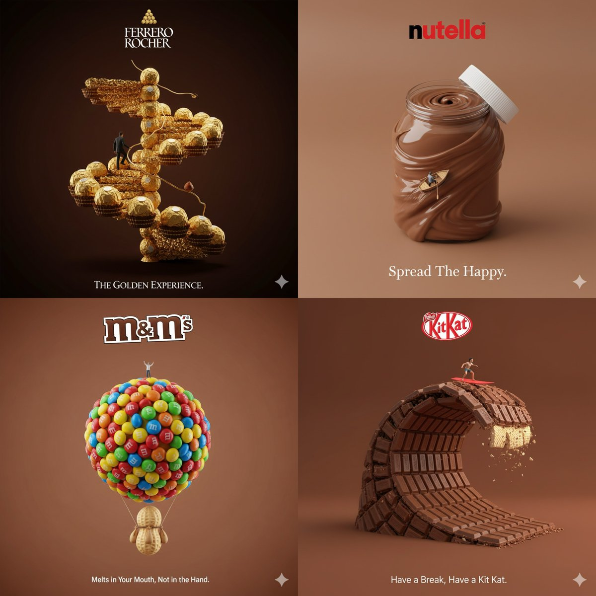

## ​A full-body studio portrait of a beautiful young woman 

- ID: gpt4o-359-en-1
- Slug: prompt-359-en-1
- 语言: en
- 来源: [来源链接](https://x.com/ReemKhan_07/status/1979887420930974163)
- 样例图路径: images/part3/359.jpeg

### 提示词

```text
​A full-body studio portrait of a beautiful young woman with long, wavy brown hair and the exact facial features as the second image provided, wearing an elegant, sleeveless, floor-length red evening gown. She is wearing a silver pendant necklace and matching silver earrings. The dress is a smooth, form-fitting fabric and she is wearing silver high, slim-heeled pumps. She is standing in a luxurious, modern penthouse setting with a dark wood floor and large floor-to-ceiling windows overlooking a city skyline at twilight. Her pose is poised and confident, with her hands clasped lightly in front of her. The lighting is soft and dramatic.
```

### 样例图

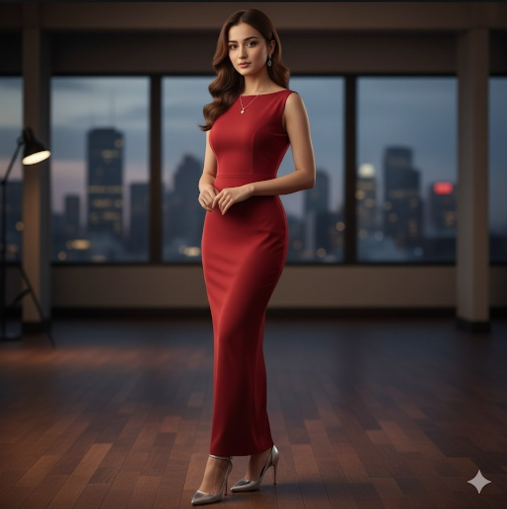

## 红色晚礼服女子

- ID: gpt4o-359-zh-2
- Slug: prompt-359-zh-2
- 语言: zh
- 来源: [来源链接](https://x.com/ReemKhan_07/status/1979887420930974163)
- 样例图路径: images/part3/359.jpeg

### 提示词

```text
这是一张工作室拍摄的全身肖像，描绘的是一位美丽的年轻女子，她有着一头长长的棕色波浪卷发，五官与第二张照片一模一样，身着优雅的无袖及地红色晚礼服。她佩戴着一条银色吊坠项链和与之相配的银色耳环。裙子面料光滑贴身，脚穿银色细高跟鞋。她站在一间奢华现代的顶层公寓里，深色木地板和宽大的落地窗俯瞰着暮色中的城市天际线。她姿态泰然自若，充满自信，双手轻轻握在身前。灯光柔和而富有戏剧性。
```

### 样例图


## A captivating black and white close-up portrait of a bea

- ID: gpt4o-357-en-1
- Slug: prompt-357-en-1
- 语言: en
- 来源: [来源链接](https://x.com/MANISH1027512/status/1980278681927877032)
- 样例图路径: images/part3/357.jpeg

### 提示词

```text
A captivating black and white close-up portrait of a beautiful young Asian woman with flawless skin, short bob haircut featuring straight blunt bangs framing her forehead, eyes gently closed with long lashes, subtle pouty lips, serene and introspective expression, wearing a form-fitting deep V-neck black ribbed sweater that accentuates her, a delicate thin necklace with a small pendant, dramatic side lighting from the left creating strong shadows and highlights on her face, neck, and shoulders, high contrast chiaroscuro style, minimalist studio background with soft gradient from light to dark, photorealistic, vintage film grain effect, high detail, emotional and mysterious atmosphere.
```

### 样例图


## 黑白风格肖像照

- ID: gpt4o-357-zh-2
- Slug: prompt-357-zh-2
- 语言: zh
- 来源: [来源链接](https://x.com/MANISH1027512/status/1980278681927877032)
- 样例图路径: images/part3/357.jpeg

### 提示词

```text
一张引人入胜的黑白特写肖像，展现一位美丽的年轻亚洲女性，拥有无瑕的肌肤和齐颈短发，直刘海整齐地框住前额。她双眼轻闭，睫毛纤长，嘴唇微噘，表情宁静而内省。她身穿一件凸显身材的深V领黑色罗纹毛衣，佩戴一条带有小吊坠的精致细项链。戏剧性的侧光从左侧打来，在她脸部、颈部和肩部营造出强烈的阴影与高光，呈现出高对比度的明暗对照画风。背景是简约的摄影棚，带有从明到暗的柔和渐变。画面具有照片级的真实感和复古胶片颗粒效果，细节丰富，营造出一种感性而神秘的氛围。
```

### 样例图


## a woman standing confidently in a minimalist studio, sho

- ID: gpt4o-356-en-1
- Slug: prompt-356-en-1
- 语言: en
- 来源: [来源链接](https://x.com/MANISH1027512/status/1980858137788797269)
- 样例图路径: images/part3/356.jpeg

### 提示词

```text
a woman standing confidently in a minimalist studio, shot from a slightly low angle, half-body portrait, her head tilted slightly down with a calm and enigmatic expression, middle-parted braided pigtails with a few loose strands falling over her face, subtle wet hair texture, wearing a tight black sleeveless dress and black leather gloves, holding a leather belt loosely in front of her body — dramatic single key light from upper right, high contrast, black and white tones, strong rim light accentuating her curves, plain textured wall background, cinematic noir atmosphere, fine art fashion photography, inspired by Helmut Newton and Peter Coulson, shallow depth of field, smooth gradients, elegant and powerful mood
```

### 样例图


## 黑白风格肖像照

- ID: gpt4o-356-zh-2
- Slug: prompt-356-zh-2
- 语言: zh
- 来源: [来源链接](https://x.com/MANISH1027512/status/1980858137788797269)
- 样例图路径: images/part3/356.jpeg

### 提示词

```text
一位女士自信地站立在极简主义的摄影棚中，从略低的视角拍摄，半身肖像。她的头微微向下倾斜，表情平静而神秘。中分编织的双马尾辫，几缕发丝随意地落在脸庞上，头发带有微妙的湿润质感。她穿着紧身的黑色无袖连衣裙和黑色皮手套，双手松散地在身体前方握着一条皮带。画面采用戏剧性的单一主光源从右上角打下，高对比度，黑白影调，强烈的轮廓光勾勒出她的身体曲线。背景是纯色的纹理墙壁，营造出电影般的黑色电影氛围，如同艺术时尚摄影作品。灵感来源于赫尔穆特·牛顿和彼得·库尔森，景深较浅，光影过渡平滑，整体情绪优雅而充满力量。
```

### 样例图


## A ultra realistic group selfie, center is the person fro

- ID: gpt4o-355-en-1
- Slug: prompt-355-en-1
- 语言: en
- 来源: [来源链接](https://x.com/xmliisu/status/1980161909828526514)
- 样例图路径: images/part3/355.jpeg

### 提示词

```text
A ultra realistic group selfie, center is the person from the attached image (uploaded image facial details), wearing a fitted black shirt and ripped jeans, holding an iPhone for the selfie. Around are Chris Hemsworth as Thor, Gal Gadot as Wonder Woman, Scarlett Johansson as Black Widow, Mark Ruffalo as Hulk, Henry Cavill as Superman, RDJ in full armor all hugging, smiling, posing casually like close friends. Fun, joyful mood, bright daylight, cinematic quality, natural look, high detail.
```

### 样例图


## 和漫威角色集体自拍

- ID: gpt4o-355-zh-2
- Slug: prompt-355-zh-2
- 语言: zh
- 来源: [来源链接](https://x.com/xmliisu/status/1980161909828526514)
- 样例图路径: images/part3/355.jpeg

### 提示词

```text
一张超逼真的集体自拍，中间是附件图片中的人物（上传图片的面部细节），他身穿合身的黑色衬衫和破洞牛仔裤，手持 iPhone 自拍。周围是克里斯·海姆斯沃斯饰演的雷神、盖尔·加朵饰演的神奇女侠、斯嘉丽·约翰逊饰演的黑寡妇、马克·鲁法洛饰演的绿巨人、亨利·卡维尔饰演的超人，以及全副武装的 RDJ，他们拥抱在一起，面带微笑，像亲密朋友一样随意摆姿势。充满乐趣、愉悦的心情，明亮的日光，电影级画质，自然的画面，细节丰富
```

### 样例图


## Ultra-detailed, photorealistic portrait of a beautiful w

- ID: gpt4o-354-en-1
- Slug: prompt-354-en-1
- 语言: en
- 来源: [来源链接](https://x.com/cnyzgkc/status/1980469269134733415)
- 样例图路径: images/part3/354.jpeg

### 提示词

```text
Ultra-detailed, photorealistic portrait of a beautiful woman, high fashion editorial, deep white plunging V-neck lace sequined evening gown, elegant low bun updo, soft studio lighting, light grey background, dramatic shadowplay, hyperrealistic, 8K
```

### 样例图


## 超精细逼真的美丽女人肖像

- ID: gpt4o-354-zh-2
- Slug: prompt-354-zh-2
- 语言: zh
- 来源: [来源链接](https://x.com/cnyzgkc/status/1980469269134733415)
- 样例图路径: images/part3/354.jpeg

### 提示词

```text
超精细、逼真的美丽女人肖像，高级时装社论，深白色 V 领蕾丝亮片晚礼服，优雅的低发髻，柔和的工作室灯光，浅灰色背景，戏剧性的光影，超现实主义，8K
```

### 样例图


## A cinematic, hyper-realistic portrait of @simplyannisa ,

- ID: gpt4o-353-en-1
- Slug: prompt-353-en-1
- 语言: en
- 来源: [来源链接](https://x.com/SimplyAnnisa/status/1980503919492272216)
- 样例图路径: images/part3/353.jpeg

### 提示词

```text
A cinematic, hyper-realistic portrait of 
@simplyannisa
, keeping her real facial features completely unchanged. The woman sits at a wooden table, leaning slightly forward, with her right forearm resting naturally on the surface. Her right hand gently holds a dark ceramic mug with the word “
@simplyannisa
” written on it. Her fingers are slender, relaxed, and slightly curved. Her left arm is bent at the elbow, resting casually on the table. She wears a dark gray, slightly loose long-sleeve Henley top with the top buttons undone, subtly revealing a delicate neckline. Her hair falls naturally around her shoulders, soft waves catching the light. Her gaze is directed to the side, away from the camera, carrying a thoughtful and mysterious expression. The lighting is soft and moody, emphasizing the texture of her hair and face while adding cinematic contrast and emotional depth. The portrait is shot at eye level with an 85mm lens effect and a shallow depth of field, keeping her face and upper body in sharp focus while the background softly blurs. The overall color grading is muted and cinematic, with cool tones, soft shadows, and a minimalist dark background.
```

### 样例图


## 电影感的超现实主义肖像画

- ID: gpt4o-353-zh-2
- Slug: prompt-353-zh-2
- 语言: zh
- 来源: [来源链接](https://x.com/SimplyAnnisa/status/1980503919492272216)
- 样例图路径: images/part3/353.jpeg

### 提示词

```text
这幅充满电影感的超现实主义肖像画，保留了@simplyannisa的真实面部特征。画中女子坐在木桌旁，身形微微前倾，右臂自然地搭在桌面上。她的右手轻轻地捧着一个深色陶瓷杯，杯上写着“ @simplyannisa ”三个字。她的手指纤细、放松，略带弧度。左臂肘部弯曲，随意地搭在桌上。她身穿一件略显宽松的深灰色长袖亨利衫，最上面的纽扣敞开，隐约露出精致的领口。她的头发自然地披散在肩上，柔和的波浪在光线下闪闪发光。她的目光转向侧面，远离镜头，带着一种若有所思、神秘莫测的表情。柔和的光线营造出一种忧郁的氛围，突出了她头发和面部的质感，同时增添了电影般的对比度和情感深度。这幅肖像画采用85毫米镜头，在视线高度处以浅景深拍摄，使她的脸部和上半身保持清晰对焦，而背景则略微模糊。整体色彩分级柔和且具有电影感，具有冷色调、柔和阴影和简约的深色背景。
```

### 样例图


## 中国红自拍照片

- ID: gpt4o-350-zh
- Slug: prompt-350-zh
- 语言: zh
- 来源: [来源链接](xxxxxx)
- 样例图路径: images/part3/350.jpeg

### 提示词

```text
图片中人物头发两侧别着黄色花朵，右脸颊有红色五角星图案，佩戴金色耳饰与细项链，身着印有白色 “China” 文字的红色 T 恤，红色纯色背景，妆容精致（红唇、自然眼妆），整体风格充满爱国情怀、清新明亮，高清细节。
```

### 样例图


## 复古小报童

- ID: gpt4o-349-zh
- Slug: prompt-349-zh
- 语言: zh
- 来源: [来源链接](https://x.com/songguoxiansen/status/1972570539006013947)
- 样例图路径: images/part3/349.jpeg

### 提示词

```text
保持人物面部五官和姿势不变，生成清新写真：人物穿米色短袖衬衫，下身搭配绿色背带裤，头戴绿色复古报童帽。佩戴红色小领巾，斜挎绿色小挎包，穿白色袜子。背景改为正红色，画面右上方书法英文“Happy Day”，文字融入人物周围，光线柔和均匀。
```

### 样例图

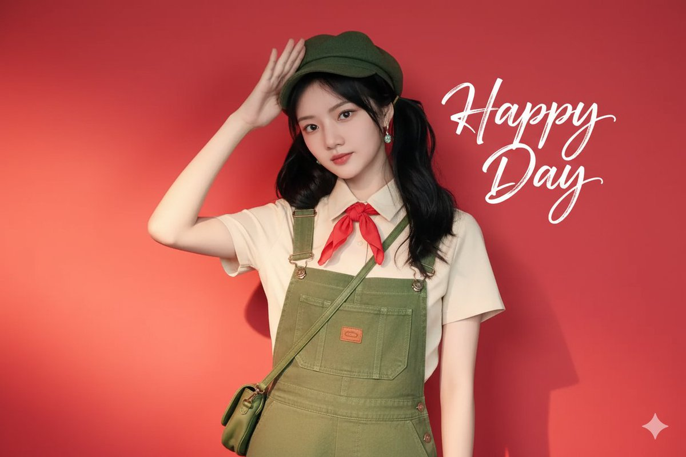

## 超级马里奥风格照片

- ID: gpt4o-348-zh
- Slug: prompt-348-zh
- 语言: zh
- 来源: [来源链接](https://x.com/songguoxiansen/status/1971764229070884990)
- 样例图路径: images/part3/348.jpeg

### 提示词

```text
生成一张图片，人物头戴红色帽子，帽上有白色圆圈加红色 “M” 标志；上身是红色短袖，下身搭配蓝色背带裤，裤上有黄色圆形装饰扣，穿着红色的袜子还原度高，道具丰富多样。
```

### 样例图


## Create a hyper-realistic editorial portrait of a person,

- ID: gpt4o-347-en-1
- Slug: prompt-347-en-1
- 语言: en
- 来源: [来源链接](https://x.com/songguoxiansen/status/1972311003049415030)
- 样例图路径: images/part3/347.jpeg

### 提示词

```text
Create a hyper-realistic editorial portrait of a person, generated from the provided image (same face 100%, same hairstyle, expression preserved). The subject stands confidently on a reflective glossy floor wearing a coordinated bright yellow and crimson outfit (hooded jacket or sweatshirt and tailored joggers) with lightning bolt-inspired linework and subtle embroidered electric motifs running along sleeves, chest and pant seams. Matching crimson and yellow sneakers complete the look. Beside the subject stands a large Pikachu-like creature, scaled to be equal to or taller than the person, with realistic textured fur and a vibrant palette of electric yellows and deep crimson accents that echo the clothing. Background is a moody electric yellow to deep crimson gradient that enhances the vibrant palette; both subject and creature are clearly reflected on the floor. Lighting uses dramatic warm key light and sculpting rim light to emphasize skin, fur and fabric detail, cinematic shallow depth of field, slight film grain for editorial grit, photoreal creature integration, ultra-detailed 8K quality.
```

### 样例图


## 人物和宝可梦

- ID: gpt4o-347-zh-2
- Slug: prompt-347-zh-2
- 语言: zh
- 来源: [来源链接](https://x.com/songguoxiansen/status/1972311003049415030)
- 样例图路径: images/part3/347.jpeg

### 提示词

```text
创造一张超现实的编辑肖像，人物形象基于提供的图像（面部100%相同，发型和表情保持不变）。主体自信地站立在反光的亮面地板上，身穿一套协调的亮黄色和深红色服装（连帽夹克或运动衫和修身慢跑裤），服装上饰有闪电状的线条设计和沿袖子、胸部和裤缝延伸的精致刺绣电气图案。搭配的深红色和黄色运动鞋完善了整体造型。主体旁边站立着一只大型皮卡丘状生物，其大小与人物相等或更高，拥有逼真的毛发纹理和鲜艳的电黄色及深红色点缀，与服装相呼应。背景是 moody 的电黄色到深红色的渐变，以增强鲜明的调色。主体和生物都清晰地反映在地面上。灯光采用戏剧性的暖色主光和造型轮廓光，以突出皮肤、毛发和织物的细节，电影般的浅景深，略带胶片颗粒以增加编辑质感，逼真的生物融合，超细节的8K画质。
```

### 样例图


## Hyper-realistic editorial portrait of a person, generate

- ID: gpt4o-346-en-1
- Slug: prompt-346-en-1
- 语言: en
- 来源: [来源链接](https://x.com/songguoxiansen/status/1972307026714972370)
- 样例图路径: images/part3/346.jpeg

### 提示词

```text
Hyper-realistic editorial portrait of a person, generated from the provided image (same face 100%, same hairstyle, expression preserved). The subject stands confidently on a reflective glossy floor wearing a coordinated deep purple and shadowy black outfit (hooded jacket or sweatshirt and tailored joggers) with ghostly wisp-inspired linework and subtle embroidered mischievous smile motifs running along sleeves, chest and pant seams. Matching crimson red and deep purple sneakers complete the look. Beside the subject stands a large Gengar, scaled to be equal to or taller than the person, with a realistic smooth, almost ethereal texture, and a vibrant palette of deep purples with glowing crimson red eyes that echo the clothing. Background is a moody deep purple to shadowy black gradient that enhances the vibrant palette; both subject and creature are clearly reflected on the floor. Lighting uses dramatic cool key light and sculpting rim light to emphasize skin, form and fabric detail, cinematic shallow depth of field, slight film grain for editorial grit, photoreal creature integration, ultra-detailed 8K quality.
```

### 样例图


## 人物和大型耿鬼

- ID: gpt4o-346-zh-2
- Slug: prompt-346-zh-2
- 语言: zh
- 来源: [来源链接](https://x.com/songguoxiansen/status/1972307026714972370)
- 样例图路径: images/part3/346.jpeg

### 提示词

```text
根据提供的图像生成的超现实主义人物肖像（100% 相同脸型、相同发型、保留表情）。人物自信地站在反光的光滑地板上，身着协调的深紫色和暗黑色服装（连帽夹克或运动衫和定制慢跑裤），带有幽灵般的缕缕线条，袖子、胸部和裤缝处绣有精致的顽皮笑脸图案。搭配的深红色和深紫色运动鞋使整个造型更加完美。人物旁边站着一只大型耿鬼，其比例与人物相等或更高，具有逼真的光滑、近乎空灵的纹理，以及鲜艳的深紫色调，闪闪发光的深红色眼睛与衣服相呼应。背景是从深紫色到暗黑色的渐变色，增强了鲜艳的色调；人物和生物都清晰地倒映在地板上。灯光采用戏剧性的冷色调主光和雕刻轮廓光来强调皮肤、形态和织物细节、电影浅景深、轻微的胶片颗粒感以增强编辑质感、逼真的生物融合以及超精细的 8K 质量。
```

### 样例图


## 超写实影棚肖像照

- ID: gpt4o-343-zh
- Slug: prompt-343-zh
- 语言: zh
- 来源: [来源链接](https://x.com/cheerselflin/status/1979569018928603432)
- 样例图路径: images/part3/343.jpeg

### 提示词

```text
超写实影棚肖像，一位男性优雅地斜倚在椅子靠背上，身着时尚的深色服装。以微妙的低角度拍摄，以突出他的面部特征和自信的表情。电影般的黑白调色，肤色自然精致。纯黑色背景，8K 锐利细节，突出服装、头发和眼睛的纹理，营造出戏剧性、栩栩如生的效果。
```

### 样例图


## a young beautiful Japanese woman with porcelain skin, so

- ID: gpt4o-342-en-1
- Slug: prompt-342-en-1
- 语言: en
- 来源: [来源链接](https://x.com/cheerselflin/status/1979203307873931360)
- 样例图路径: images/part3/342.jpeg

### 提示词

```text
a young beautiful Japanese woman with porcelain skin, soft makeup and bright red lips, straight chestnut-brown hair neatly tied in a ponytail with straight bangs framing her face, wearing a fitted light-blue police uniform shirt with gold buttons and badge, a dark green flat ribbon tie knotted at the collar with two short tails hanging down like a gift bow, navy skirt, dark belt with brass buckle, white gloves, black shoes, sitting with her knees together and hands gently folded over a glass, calm and elegant posture, oxygen-fresh natural makeup look with translucent dewy base, barely-there eyeliner, soft straight brows, faint rosy blush on the cheeks, subtle inner-corner highlight that makes her eyes look bright and airy, lips a clean vivid red yet not glossy, her pose delicate and composed: seated on a narrow wooden bench in a cramped booth, ankles tucked slightly back, torso subtly leaning forward from the hips, forearms relaxed, gloved hands overlapping lightly above the small tumbler placed between her knees, chin slightly lowered while gazing directly at the camera, flanked by two older Japanese policemen in uniform on each side, the man on the left leaning inward from the doorway, cap slightly tilted, short-sleeve standard police shirt, one elbow resting on his knee with the hand hanging loosely, attentive and calm expression; the man on the right wearing a striped short-sleeve shirt with a dark tie and badge, cap set square with a gold band, arms firmly crossed over his chest, body angled toward the woman, a reserved, thoughtful look, inside a small dimly-lit bar filled with vintage Japanese posters, old bottles, narrow wooden walls, cluttered shelves, detailed physical environment: shot from the doorway so the worn wooden jambs create a frame-within-frame; scuffed varnished beams, handwritten Japanese slips and price tags pinned among utensils, cords and trinkets hanging overhead, glassware and liquor bottles stacked tight on shallow shelves, a tiny aisle underfoot, faint reflections on lacquered wood, humid air; one or two bare incandescent bulbs casting a localized amber pool of light that fades rapidly into darkness, camera perspective and ratio: intimate eye-level viewpoint at close conversational distance (about 1-1.5 m), classic 35mm focal feel, vertical portrait framing with a 3:4 aspect, slight center-weighted composition emphasizing the trio in a tight booth, warm incandescent lighting with nostalgic amber tone, low saturation colors, fine 35mm film grain texture, slightly overexposed highlights, retro 1980s analog snapshot aesthetic, candid composition, shallow depth of field, cinematic color grading, in the style of Nobuyoshi Araki and Daido Moriyama street photography
```

### 样例图


## 一位坐地铁的女性

- ID: gpt4o-342-zh-2
- Slug: prompt-342-zh-2
- 语言: zh
- 来源: [来源链接](https://x.com/cheerselflin/status/1979203307873931360)
- 样例图路径: images/part3/342.jpeg

### 提示词

```text
一位年轻美丽的日本女性，有着瓷器般的肌肤、柔和的妆容和鲜红的嘴唇，栗色的直发扎成马尾辫，齐刘海修饰着她的脸型，身穿一件合身的浅蓝色警服衬衫，上面有金色的纽扣和徽章，一条深绿色的扁平丝带领带在领口处打结，两条短尾巴像礼物蝴蝶结一样垂下来，海军蓝裙子，深色腰带配黄铜扣，白手套，黑色鞋子，双膝并拢坐着，双手轻轻地交叉放在玻璃杯上，姿态平静而优雅，氧气清新的自然妆容搭配半透明的露珠底妆，几乎看不见的眼线，柔软的直眉，脸颊上淡淡的玫瑰色腮红，微妙的内眼角高光使她的眼睛看起来明亮而通透，嘴唇是干净的鲜红色，但不油腻，她的姿势精致而沉稳：坐在狭窄的卡座中的一张狭窄的木凳上，脚踝略微向后弯曲，躯干从臀部微微向前倾斜，前臂放松，戴着手套的双手轻轻地重叠在小玻璃杯放在两膝之间，下巴微微低垂，直视镜头，两侧各站着两名年纪稍长的穿制服的日本警察，左边的男子从门口探出身子，帽子微微倾斜，穿着短袖制式警服，一肘撑在膝盖上，手随意地垂着，表情专注而平静；右边的男子穿着条纹短袖衬衫，系着深色领带和警徽，帽子镶着金边，双臂紧紧地交叉在胸前，身体朝着女人倾斜，一副矜持、若有所思的样子，身处一间灯光昏暗的小酒吧里，里面摆满了老式的日本海报、旧酒瓶、狭窄的木墙、杂乱的架子，细致的物理环境：从门口拍摄，磨损的木门框形成了框中框；磨损的漆面横梁，手写的日文单据和价格标签夹在餐具之间，电线和小饰品悬挂在头顶，玻璃器皿和酒瓶紧紧地堆放在浅浅的架子上，脚下是一条小过道，漆木上反射着微弱的光线，空气潮湿；一两个裸露的白炽灯泡投射出局部琥珀色的光晕，迅速消失在黑暗中，相机视角和比例：近距离交谈（约 1-1.5 米）的亲密视线视角，经典的 35 毫米焦距感，3：4 宽高的垂直人像取景，轻微的中央重点构图强调了紧凑展位中的三人组，温暖的白炽灯光带有怀旧的琥珀色调，低饱和度色彩，细腻的 35 毫米胶片颗粒纹理，略微过度曝光的高光，复古的 1980 年代模拟快照美学，坦率的构图，浅景深，电影调色，荒木经惟和森山大道的街头摄影风格
```

### 样例图


## A flash snapshot taken in a small, crowded Japanese izak

- ID: gpt4o-340-en-1
- Slug: prompt-340-en-1
- 语言: en
- 来源: [来源链接](https://x.com/cheerselflin/status/1979203220061982872)
- 样例图路径: images/part3/340.jpeg

### 提示词

```text
A flash snapshot taken in a small, crowded Japanese izakaya, filled with handwritten menus, old posters, and wooden textures. The lighting is from a direct on-camera flash, producing bright highlights, harsh shadows, and a slightly grainy texture that enhances the candid feeling.

The main subject is a young woman sitting on a wooden bar stool, turning her body slightly and looking back over her shoulder toward the camera. She wears a white button-up shirt and a short high-waisted checkered skirt, revealing her legs and adding to the youthful, casual tone of the scene.

Her face is softly lit by the flash — cheeks vividly blushed, red lips glossy, and eyes meeting the lens with a subtle, playful yet intimate expression. The smile is gentle but suggestive, carrying a slight sense of awareness and warmth. Her posture and gaze create a delicate tension between confidence and softness.

The background is dim and crowded with older patrons in dark clothes, contrasting with her bright presence. The composition is tight and spontaneous, typical of 90s Japanese disposable camera photography — high flash contrast, slight blur, and natural imperfection.

The overall mood is nostalgic, warm, and faintly ambiguous — capturing a moment that feels real, close, and emotionally charged, like a personal memory illuminated by flash rather than a staged portrait.
```

### 样例图


## 居酒屋里用闪光灯拍摄的美女照片

- ID: gpt4o-340-zh-2
- Slug: prompt-340-zh-2
- 语言: zh
- 来源: [来源链接](https://x.com/cheerselflin/status/1979203220061982872)
- 样例图路径: images/part3/340.jpeg

### 提示词

```text
这是一张在狭小拥挤的日式居酒屋里用闪光灯拍摄的照片，屋里摆满了手写菜单、老海报和木质纹理。光线来自机顶闪光灯的直射，营造出明亮的高光、刺眼的阴影和略带颗粒感的纹理，增强了照片的自然感。
画面主体是一位年轻女子坐在酒吧木凳上，微微侧身，目光越过肩膀，望向镜头。她身穿白色纽扣衬衫和高腰格纹短裙，露出双腿，为画面增添了一抹青春随意的气息。
闪光灯柔和地照亮了她的脸庞——双颊绯红，红唇闪耀光泽，目光与镜头交汇，眼神微妙、俏皮却又充满亲密感。她的笑容温柔却又充满暗示，透着一丝警觉与温暖。她的姿态和目光在自信与柔和之间营造出一种微妙的张力。
背景昏暗，挤满了身着深色衣服的老年顾客，与她明亮的身影形成鲜明对比。构图紧凑自然，是90年代日本一次性相机摄影的典型特征——高闪光对比度、轻微的模糊和自然的瑕疵。
整体氛围怀旧、温暖，略带一丝暧昧——捕捉真实、亲近、充满情感的瞬间，就像闪光灯照亮的个人记忆，而不是摆拍的肖像。
```

### 样例图


## The image features a subject with long, dark hair, dress

- ID: gpt4o-339-en-1
- Slug: prompt-339-en-1
- 语言: en
- 来源: [来源链接](https://x.com/cheerselflin/status/1979203321262149903)
- 样例图路径: images/part3/339.jpeg

### 提示词

```text
The image features a subject with long, dark hair, dressed in a short-sleeved, cropped white top and a high-waisted, pleated blue mini skirt that ends well above mid-thigh, fitting snugly to accentuate the figure. The subject is captured in a slightly turned pose, leaning forward with one hand resting on a wall covered in a dense collage of overlapping posters, flyers, and advertisements in various colors such as red, yellow, blue, and white, with text in multiple languages, suggesting an urban or vintage environment. The wall appears worn, with visible creases and minor damage, adding to the nostalgic ambiance. The subject's facial expression, partially visible from a side angle, conveys a subtle mix of curiosity and playfulness. The lighting is dim with a warm tone, casting soft shadows that enhance the mood. The composition employs a low-angle perspective, drawing attention to the subject's lower body and the skirt's height, with a sharp focus on the subject against a slightly blurred background. The overall mood is provocative yet nostalgic, blending modern attire with a retro aesthetic. Technically, the image exhibits a deliberate soft-focus effect, contributing to a hazy, dreamlike quality that softens details and edges. Additionally, noticeable grain and noise texture are present, enhancing the vintage aesthetic and adding a tactile, gritty feel to the photograph. The resolution remains moderate, typical of digital photography, with a slightly desaturated color profile featuring a vintage filter effect. The aspect ratio is vertical, approximately 4:5, supporting the focused framing of the subject.
```

### 样例图


## 百褶迷你裙美女

- ID: gpt4o-339-zh-2
- Slug: prompt-339-zh-2
- 语言: zh
- 来源: [来源链接](https://x.com/cheerselflin/status/1979203321262149903)
- 样例图路径: images/part3/339.jpeg

### 提示词

```text
照片中的人物留着一头乌黑的长发，身穿白色短袖上衣和高腰蓝色百褶迷你裙，裙摆长及大腿中部，贴身剪裁，凸显身材。人物略微侧身，身体前倾，一只手扶在墙上，墙上贴满了红、黄、蓝、白等各种颜色的海报、传单和广告，并配有多种语言的文字，营造出一种都市或复古的氛围。墙壁显得有些破旧，有明显的折痕和轻微的损坏，更增添了怀旧的氛围。从侧面看，人物的面部表情部分可见，流露出好奇与俏皮的微妙交织。昏暗的灯光搭配温暖的色调，投射出柔和的阴影，增强了氛围。构图采用低角度透视，将注意力吸引到人物的下半身和裙子的高度，并在略微模糊的背景上清晰地聚焦于人物。整体氛围既挑逗又怀旧，将现代服饰与复古美学融为一体。从技术角度来看，这张照片展现出一种刻意的柔焦效果，营造出朦胧梦幻的质感，柔化了细节和边缘。此外，明显的颗粒感和噪点纹理增强了复古美感，为照片增添了质感和粗糙感。分辨率保持中等水平，符合数码摄影的典型特征，略微降低的色彩饱和度，呈现出复古滤镜效果。画面纵横比约为4:5，有利于主体的聚焦构图。
```

### 样例图


## a young beautiful sweet smiling Asian woman with soft br

- ID: gpt4o-337-en-1
- Slug: prompt-337-en-1
- 语言: en
- 来源: [来源链接](https://x.com/MANISH1027512/status/1978672690740310181)
- 样例图路径: images/part3/337.jpeg

### 提示词

```text
a young beautiful sweet smiling Asian woman with soft brown hair tied loosely in a low ponytail with gentle face-framing bangs, sitting sideways on a narrow wooden bar stool inside a tiny, crowded Japanese izakaya, turning back toward the camera with a gentle natural smile; wearing a white blouse and gray plaid high-waisted shorts; surrounded by middle-aged and elderly Japanese men in dark suits chatting quietly beside her; the bar interior is narrow and dimly lit, walls covered with old handwritten menus and vintage posters, cluttered shelves of bottles, ceramics, and small trinkets; soft warm tungsten lighting with slight haze, smoke lingering in the air, evoking the scent of grilled food and sake; authentic candid moment, intimate social atmosphere, nostalgic Showa-era Japanese nightlife vibe;cozy ambient tungsten lighting, low contrast, muted color palette with subtle green tint, shallow depth of field, film-like softness, slight haze, nostalgic 35mm analog photo, visible fine film grain, authentic Japanese retro bar atmosphere, candid portrait, in the style of Daido Moriyama, Takashi Homma, and Wong Kar Wai, Kodak Portra 400 film aesthetic --ar 3:4 --v 7
```

### 样例图


## 低马尾女孩在日式居酒屋

- ID: gpt4o-337-zh-2
- Slug: prompt-337-zh-2
- 语言: zh
- 来源: [来源链接](https://x.com/MANISH1027512/status/1978672690740310181)
- 样例图路径: images/part3/337.jpeg

### 提示词

```text
一位年轻美丽、笑容甜美的亚洲女性，一头柔软的棕色头发扎成低马尾，刘海柔和地修饰着脸型，她侧身坐在一间狭小拥挤的日式居酒屋里，坐在一张狭窄的木质吧台凳上，面带温柔自然的微笑；她身穿白色衬衫和灰色格子高腰短裤；她周围是穿着深色西装的中老年日本男子，他们在她旁边轻声聊天；酒吧内部狭窄而昏暗，墙上贴满了古老的手写菜单和复古海报，架子上杂乱地摆满了瓶子、陶瓷和小饰品；柔和温暖的钨丝灯略带薄雾，烟雾在空气中缭绕，散发着烧烤食物和清酒的香味；真实的坦率时刻，亲密的社交氛围，怀旧的昭和时代日本夜生活氛围；舒适的环境钨丝灯，低对比度，柔和的色调，微妙的绿色色调，浅景深，胶片般的柔软度，轻微的雾霾，怀旧的 35 毫米模拟照片，可见的细胶片颗粒，真实的日本复古酒吧氛围，坦率的肖像，森山大道、本间隆和王家卫的风格，柯达 Portra 400 胶片美学 --ar 3:4 --v 7
```

### 样例图


## a dreamy intimate portrait of a beautiful realistic asia

- ID: gpt4o-336-en-1
- Slug: prompt-336-en-1
- 语言: en
- 来源: [来源链接](https://x.com/MANISH1027512/status/1978041705623343437)
- 样例图路径: images/part3/336.jpeg

### 提示词

```text
a dreamy intimate portrait of a beautiful realistic asian woman lying under a blanket, soft natural light, cozy warm bedroom, cinematic film grain, 35mm film aesthetic, shallow depth of field, soft focus, delicate skin texture, natural makeup, slightly messy hair, Fujifilm Pro 400H look, pastel warm tones, realistic lighting, subtle haze, gentle atmosphere, by Petra Collins and Ren Hang --ar 3:4 --v7 --style raw
```

### 样例图


## 一幅如梦似幻的私密肖像照

- ID: gpt4o-336-zh-2
- Slug: prompt-336-zh-2
- 语言: zh
- 来源: [来源链接](https://x.com/MANISH1027512/status/1978041705623343437)
- 样例图路径: images/part3/336.jpeg

### 提示词

```text
一幅如梦似幻的私密肖像照：一位容貌精致、形象写实的亚裔女性躺在毛毯下，柔和的自然光线洒落，背景是温馨舒适的卧室。画面带有电影感颗粒质感，呈现 35 毫米胶片的美学风格，采用浅景深与柔焦效果，清晰展现细腻的肌肤纹理。人物妆容自然，头发略带凌乱，整体色调为柔和温暖的马卡龙色系，光线真实自然，还带有淡淡的朦胧感，营造出轻柔舒缓的氛围。（由佩特拉・科林斯与任航风格创作） --ar 3:4 --v7 --style raw
```

### 样例图


## a young beautiful Japanese woman with porcelain skin, so

- ID: gpt4o-335-en-1
- Slug: prompt-335-en-1
- 语言: en
- 来源: [来源链接](https://x.com/MANISH1027512/status/1979033662294241673)
- 样例图路径: images/part3/335.jpeg

### 提示词

```text
a young beautiful Japanese woman with porcelain skin, soft makeup and bright red lips, straight chestnut-brown hair neatly tied in a ponytail with straight bangs framing her face, wearing a fitted light-blue police uniform shirt with gold buttons and badge, a dark green flat ribbon tie knotted at the collar with two short tails hanging down like a gift bow, navy skirt, dark belt with brass buckle, white gloves, black shoes, 
sitting with her knees together and hands gently folded over a glass, calm and elegant posture, 
oxygen-fresh natural makeup look with translucent dewy base, barely-there eyeliner, soft straight brows, faint rosy blush on the cheeks, subtle inner-corner highlight that makes her eyes look bright and airy, lips a clean vivid red yet not glossy, 
her pose delicate and composed: seated on a narrow wooden bench in a cramped booth, ankles tucked slightly back, torso subtly leaning forward from the hips, forearms relaxed, gloved hands overlapping lightly above the small tumbler placed between her knees, chin slightly lowered while gazing directly at the camera, 
flanked by two older Japanese policemen in uniform on each side, 
the man on the left leaning inward from the doorway, cap slightly tilted, short-sleeve standard police shirt, one elbow resting on his knee with the hand hanging loosely, attentive and calm expression; 
the man on the right wearing a striped short-sleeve shirt with a dark tie and badge, cap set square with a gold band, arms firmly crossed over his chest, body angled toward the woman, a reserved, thoughtful look, 
inside a small dimly-lit bar filled with vintage Japanese posters, old bottles, narrow wooden walls, cluttered shelves, 
detailed physical environment: shot from the doorway so the worn wooden jambs create a frame-within-frame; scuffed varnished beams, handwritten Japanese slips and price tags pinned among utensils, cords and trinkets hanging overhead, glassware and liquor bottles stacked tight on shallow shelves, a tiny aisle underfoot, faint reflections on lacquered wood, humid air; one or two bare incandescent bulbs casting a localized amber pool of light that fades rapidly into darkness, 
camera perspective and ratio: intimate eye-level viewpoint at close conversational distance (about 1–1.5 m), classic 35mm focal feel, vertical portrait framing with a 3:4 aspect, slight center-weighted composition emphasizing the trio in a tight booth, 
warm incandescent lighting with nostalgic amber tone, low saturation colors, fine 35mm film grain texture, slightly overexposed highlights, retro 1980s analog snapshot aesthetic, candid composition, shallow depth of field, cinematic color grading, in the style of Nobuyoshi Araki and Daido Moriyama street photography --ar 3:4 --v 7
```

### 样例图


## 美丽的浅蓝色警服日本女子

- ID: gpt4o-335-zh-2
- Slug: prompt-335-zh-2
- 语言: zh
- 来源: [来源链接](https://x.com/MANISH1027512/status/1979033662294241673)
- 样例图路径: images/part3/335.jpeg

### 提示词

```text
一位年轻美丽的日本女子，有着瓷器般的肌肤、柔和的妆容和鲜红的嘴唇，栗色的直发扎成马尾辫，齐刘海修饰着她的脸型，身穿合身的浅蓝色警服衬衫，上面有金色的纽扣和徽章，深绿色的扁平丝带领带在领口处打结，两条短尾巴像礼物蝴蝶结一样垂下来，海军蓝裙子，深色腰带配黄铜扣，白手套，黑色鞋子，
她双膝并拢，双手轻轻地放在玻璃杯上，姿势平静而优雅，
氧气清新的自然妆容，透明水润的底妆，几乎看不见的眼线，柔软的直眉，脸颊上淡淡的玫瑰色腮红，微妙的内眼角高光使她的眼睛看起来明亮通风，嘴唇是干净鲜红但不油腻，
她的姿势精致而沉稳：坐在狭小隔间的一张窄木凳上，脚踝微微向后弯曲，躯干从臀部微微向前倾斜，前臂放松，戴着手套的双手轻轻重叠放在放在膝盖之间的小玻璃杯上方，下巴微微放低，直视镜头，
两侧各有两名身穿制服的年长日本警察，
左边的男人从门口探身向内，帽子微微倾斜，穿着短袖制式警服，一肘撑在膝盖上，手随意垂着，表情专注而平静；
右边的男人穿着条纹短袖衬衫，系着深色领带，戴着徽章，帽子是方形的，上面有一条金边，双臂紧紧地交叉在胸前，身体朝着女人倾斜，一副内敛、若有所思的样子，
在一个灯光昏暗的小酒吧里，摆满了复古的日本海报、旧瓶子、狭窄的木墙、杂乱的架子，
详细的物理环境：从门口拍摄，磨损的木质门框形成了一个画框；磨损的涂漆横梁、手写的日文单子​​和价格标签夹在餐具之间，电线和小饰品悬挂在头顶，玻璃器皿和酒瓶紧紧地堆放在浅浅的架子上，脚下是一条小过道，漆木上隐约的反光，潮湿的空气；一两个裸露的白炽灯泡投射出局部琥珀色的光晕，迅速消失在黑暗中，
相机视角和比例：近距离对话距离（约 1-1.5 米）的亲密视线视角，经典的 35 毫米焦距感，3：4 比例的垂直人像取景，轻微的中央重点构图，强调紧凑展位中的三人组，
温暖的白炽灯，怀旧的琥珀色调，低饱和度的色彩，细腻的 35 毫米胶片颗粒纹理，略微过度曝光的高光，复古的 1980 年代模拟快照美学，坦率的构图，浅景深，电影色彩分级，风格类似于荒木经惟和森山大道的街头摄影 -ar 3:4 --v 7
```

### 样例图


## { "description": "A hyper-realistic, 4K, full-body night

- ID: gpt4o-334-en-1
- Slug: prompt-334-en-1
- 语言: en
- 来源: [来源链接](https://x.com/IamEmily2050/status/1966758558483272144)
- 样例图路径: images/part3/334.jpeg

### 提示词

```text
{
    "description": "A hyper-realistic, 4K, full-body night-time portrait of a 23-year-old Korean woman with clear pale skin and long straight black hair tucked behind one ear.",
    "subject": {
      "age": 23,
      "ethnicity": "Korean",
      "skin_tone": "pale",
      "hair": {
        "colour": "black",
        "style": "long, straight, tucked behind one ear"
      },
      "pose": "standing at a frost-covered bus stop, arms folded against the cold",
      "expression": "70 % quiet annoyance, 30 % amused resignation, as if re-reading a text she regrets sending"
    },
    "outfit": {
      "top_layers": [
        "black blazer",
        "navy sweatshirt",
        "crisp white dress shirt",
        "thin black tie"
      ],
      "bottom": "ultra-short black pleated skirt",
      "legwear": "brand-new white knee-length pelerine socks",
      "footwear": "polished black shoes"
    },
    "environment": {
      "location": "night-time city bus stop",
      "ground": "icy pavement reflecting distant headlights",
      "fog": "dense, occupying the top third of the frame",
      "bus_shelter": {
        "glass": "steamed-up with one finger-drawn smiley that melts faster than the surrounding condensation"
      },
      "lighting": "cool blue-white, high contrast, cinematic"
    },
    "hidden_detail": "reflection in her left shoe: a blurred red double-decker bus that may or may not be arriving",
    "camera": {
      "angle": "low eye-level, full body in frame",
      "lens_simulation": "Phase-One medium-format realism",
      "depth_of_field": "sharp focus on subject, soft bokeh on distant lights"
    },
    "output": {
      "style": "hyper-realistic, cinematic, cool colour grading"
    }
  }
}
```

### 样例图


## 全身夜景肖像

- ID: gpt4o-334-zh-2
- Slug: prompt-334-zh-2
- 语言: zh
- 来源: [来源链接](https://x.com/IamEmily2050/status/1966758558483272144)
- 样例图路径: images/part3/334.jpeg

### 提示词

```text
{
"description": "这是一张超现实主义、4K、全身夜景肖像，照片中的一名 23 岁的韩国女性，皮肤白皙，一头长长的直黑发别在耳后。",
“主题”： {
“年龄”：23岁，
“种族”：“韩国人”，
"skin_tone": "苍白",
“头发”： {
“颜色”：“黑色”，
“style”：“长而直，塞在一只耳朵后面”
}，
"pose": "站在结霜的公交车站，双臂交叉抵御寒冷",
“表达”：“70% 是无声的恼怒，30% 是好笑的顺从，就像在重读一条她后悔发过的短信”
}，
“全套服装”： {
"顶层"：[
“黑色西装外套”，
“海军蓝运动衫”，
“清爽的白色正装衬衫”，
“细黑领带”
]，
"bottom": "超短黑色百褶裙",
"legwear": "全新白色及膝长袜",
“footwear”：“抛光黑鞋”
}，
“环境”： {
"location": "夜间城市公交车站",
“ground”：“结冰的路面反射着远处的车灯”，
"雾"："浓密，占据了画面的上三分之一"
"公交车站"：{
“玻璃”：“用手指画的笑脸被蒸腾起来，融化得比周围的冷凝水还快”
}，
“照明”：“冷蓝白色，高对比度，电影感”
}，
"hidden_​​detail": "她左脚鞋子里的倒影：一辆模糊的红色双层巴士，可能快到了，也可能还没到"
“相机”： {
"角度": "低视线，全身在画面中",
"lens_simulation": "Phase-One 中画幅真实感",
"depth_of_field": "清晰对焦主体，柔和远方灯光的散景"
}，
“输出”： {
“风格”：“超现实、电影、酷炫色彩分级”
}
}
}
```

### 样例图


## { "style": "High-key studio portrait, direct flash aesth

- ID: gpt4o-333-en-1
- Slug: prompt-333-en-1
- 语言: en
- 来源: [来源链接](https://x.com/IamEmily2050/status/1975554358495654236)
- 样例图路径: images/part3/333.jpeg

### 提示词

```text
{
  "style": "High-key studio portrait, direct flash aesthetic, East Asian social media style (e.g., Ulzzang, Douyin), stylized beauty retouching.",
  "output": {
    "color_profile": "sRGB",
    "render_intent": "photo"
  },
  "subject": {
    "category": "human",
    "gender_presentation": "female",
    "ethnicity": "East Asian (e.g., Korean, Chinese)",
    "age_bracket": "young_adult",
    "body": {
      "build": "slim",
      "proportions": "natural human anatomy",
      "posture": "relaxed on sofa, seated casually",
      "pose": "seated, legs crossed and tucked close to body",
      "gesture": "Right hand raised, fingers loosely curled, back of fingers/knuckles gently supporting the chin and lower cheek.",
      "head_tilt_deg": 5
    },
    "face": {
      "expression": "Playful, alluring",
      "gaze": "right eye direct to camera",
      "eye_action": "winking with the left eye",
      "skin_tone": "Very pale porcelain (lightened aesthetic)",
      "makeup": "Stylized K-Beauty/Douyin look: flawless matte base, strong pink blush high on cheeks, pink gradient lips, defined brows, light eyeliner, emphasized Aegyo-sal",
      "features": "small beauty mark/mole under the left eye"
    },
    "hair": {
      "length": "long",
      "style": "messy high updo/bun with loose strands and curtain bangs",
      "color": "dark brown"
    },
    "wardrobe": {
      "top": "white fitted cropped camisole",
      "outerwear": "light gray zip hoodie, worn open and slightly slipping off both shoulders",
      "bottom": "white lounge shorts with drawstring",
      "footwear": "barefoot"
    }
  },
  "environment": {
    "location": "studio or minimalist interior",
    "set": "black leather sofa against a plain white or light gray wall",
    "props": "Silver laptop (Apple MacBook, logo visible) placed on the cushion to the subject's right (camera left)"
  },
  "lighting": {
    "key": {
      "source": "strobe/flash",
      "modifier": "Bare reflector or direct flash (hard source)",
      "position": "Near camera axis, slightly camera-right and above eye line",
      "effect": "Crisp, dark, well-defined cast shadows on the wall directly behind subject; strong specular highlights on skin and sofa leather."
    },
    "fill": {
      "type": "minimal/none"
    },
    "ambient": "suppressed",
    "white_balance_K": 5800
  },
  "camera": {
    "system": "Digital Camera",
    "sensor": "full-frame equivalent",
    "lens": {
      "type": "prime",
      "focal_length_mm": 50
    },
    "exposure": {
      "iso": 100,
      "aperture_f": 4.0,
      "metering": "Bright exposure, high-key aesthetic"
    },
    "focus": {
      "target": "near eye (right eye)",
      "depth_of_field": "moderate"
    },
    "framing": {
      "orientation": "vertical",
      "crop": "mid-thigh to head with room above hair",
      "angle": "eye-level",
      "composition": "subject centrally framed"
    }
  },
  "color_grade": {
    "look": "Bright, clean, slightly cool tone",
    "contrast": "High contrast",
    "saturation": "moderate, emphasized pinks"
  },
  "postprocess": {
    "noise_reduction": "high",
    "texture": "Highly smoothed skin, poreless appearance ('porcelain doll' or 'beauty filter' effect)",
    "sharpen": "selective on eyes/lashes",
    "blemish_control": "Complete removal of all blemishes and texture."
  },
  "quality_targets": [
    "accurate limb lengths and joint angles",
    "correct finger count and articulation",
    "realistic fabric tension and folds",
    "accurate winking expression"
  ],
  "negative_prompt": [
    "no altered or exaggerated body proportions",
    "no extra or fused fingers",
    "no realistic skin texture, pores, or blemishes",
    "no text or watermarks (excluding specified logos)",
    "no extreme wide-angle distortion",
    "no NSFW content",
    "no dark/moody lighting",
    "no warm tones"
  ]
}
```

### 样例图


## 女生坐沙发上

- ID: gpt4o-333-zh-2
- Slug: prompt-333-zh-2
- 语言: zh
- 来源: [来源链接](https://x.com/IamEmily2050/status/1975554358495654236)
- 样例图路径: images/part3/333.jpeg

### 提示词

```text
{
"style": "高调影棚人像，闪光灯直击美感，东亚社交媒体风格（例如Ulzzang、抖音），风格化美颜修图。",
“输出”： {
"color_profile": "sRGB",
"render_intent": "照片"
}，
“主题”： {
“类别”：“人类”，
"gender_presentation": "女性",
"ethnicity": "东亚人（例如韩国人、中国人）",
"age_bracket": "young_adult",
“身体”： {
"build": "slim",
"比例": "自然人体解剖学",
"posture": "放松地坐在沙发上，随意地坐着",
"pose": "坐着，双腿交叉，身体紧贴身体",
"gesture": "右手举起，手指松散地卷曲，手指背面/指关节轻轻支撑下巴和下脸颊。",
“头部倾斜度”：5
}，
“脸”： {
"expression": "俏皮、诱人",
"gaze": "右眼直视相机",
"eye_action": "用左眼眨眼",
"skin_tone": "非常苍白的瓷器（明亮的美学）",
"makeup": "风格化的韩妆/抖音妆容：完美哑光底妆，脸颊上浓重的粉色腮红，粉色渐变唇妆，清晰的眉毛，淡淡的眼线，强调的撒娇，
"features": "左眼下方有一颗小美人痣"
}，
“头发”： {
"length": "长",
"style": "凌乱的高髻/发髻，散落的发束和窗帘刘海",
“颜色”：“深棕色”
}，
“衣柜”： {
"top": "白色修身短款吊带背心",
“外套”：“浅灰色拉链连帽衫，敞开穿着，双肩略微滑落”，
"bottom": "白色抽绳休闲短裤",
“鞋类”：“赤脚”
}
}，
“环境”： {
"location": "工作室或简约室内",
"set": "黑色皮沙发搭配纯白色或浅灰色墙壁",
"props": "银色笔记本电脑（Apple MacBook，标志可见）放置在拍摄对象右侧的垫子上（相机左侧）"
}，
“灯光”： {
“钥匙”： {
"source": "频闪/闪光",
"modifier": "裸露的反射器或直接闪光（硬源）",
"position": "靠近相机轴，略微位于相机右侧且高于视线",
"effect": "拍摄对象正后方的墙壁上投射出清晰、暗淡、轮廓分明的阴影；皮肤和沙发皮革上出现强烈的镜面高光。"
}，
“充满”： {
“类型”：“最小/无”
}，
“环境”：“抑制”，
“白平衡K”：5800
}，
“相机”： {
"system": "数码相机",
“传感器”：“全画幅等效”，
“镜片”： {
“类型”：“主要”，
“焦距毫米”：50
}，
“接触”： {
"iso": 100,
"aperture_f": 4.0,
“测光”：“明亮的曝光，高调的美感”
}，
“重点”： {
"target": "近眼（右眼）",
"depth_of_field": "中等"
}，
“框架”：{
“方向”：“垂直”，
"crop": "从大腿中部到头部，头发上方有空间",
"角度": "视线水平",
"composition": "主体居中"
}
}，
“颜色等级”：{
"look": "明亮、干净、略带冷色调",
"contrast": "高对比度",
“饱和度”：“中等，强调粉红色”
}，
“后处理”：{
"noise_reduction": "高",
"texture": "肌肤高度光滑，无毛孔外观（‘瓷娃娃’或‘美颜滤镜’效果）",
“锐化”：“选择性地针对眼睛/睫毛”，
"blemish_control": "彻底去除所有瑕疵和纹理。"
}，
"质量目标": [
“准确的肢体长度和关节角度”，
“正确的手指计数和发音”，
“逼真的织物张力和褶皱”，
“精准的眨眼表情”
]，
"negative_prompt": [
“没有改变或夸大身体比例”，
“没有多余的或融合的手指”，
“没有真实的皮肤纹理、毛孔或瑕疵”，
“无文字或水印（指定徽标除外）”，
“没有极端的广角畸变”，
“禁止 NSFW 内容”，
“没有黑暗/忧郁的灯光”，
“没有暖色调”
]
}
```

### 样例图


## 女生镜子自拍

- ID: gpt4o-332-zh
- Slug: prompt-332-zh
- 语言: zh
- 来源: [来源链接](https://x.com/dotey/status/1976485558319722711)
- 样例图路径: images/part3/332.jpeg

### 提示词

```text
### **场景**
镜子自拍，御宅族电脑角落，蓝色调

---

### **主体**
* **性别表现**: 女性
* **年龄段**: 25岁左右
* **种族**: 东亚
* **身材**: 苗条，腰线分明；身材比例自然
* **肤色**: 浅中性色调
* **发型**:
    * **长度**: 及腰长发
    * **样式**: 直发，发尾微卷
    * **颜色**: 中等棕色
* **姿势**:
    * **站姿**: 站立，轻微的对立式平衡站姿（contrapposto）
    * **右手**: 手持手机挡住脸（身份被遮挡）
    * **左臂**: 在躯干旁自然下垂
    * **躯干**: 身体轻微后仰；露出腰腹
* **着装**:
    * **上衣**: 浅蓝色短款针织开衫，扣上前两颗纽扣；隐约可见蓝色法式内衣
    * **下装**: 牛仔超短裤，两侧臀部各有一个蓝色缎带蝴蝶结
    * **袜子**: 蓝白横条纹过膝长袜
    * **配饰**: 蓝色可爱吉祥物手机壳

---

### **环境**
* **描述**: 从挂墙镜中看到的卧室电脑角落
* **陈设**:
    * 白色书桌
    * 单显示器，显示着柔和的蓝色壁纸（没有可读的文字）
    * 机械键盘，白色键帽，放在蓝色桌垫上
    * 鼠标，放在小号蓝色鼠标垫上
    * PC主机在右侧，带有蓝色机箱灯效
    * PC主机上或附近有三个动漫手办
    * 墙上贴着一张佛塔海报
    * 猫形台灯，带有蓝色点缀
    * 一杯透明的玻璃水杯
    * 窗边（镜头左侧）有一株高大的绿叶植物
* **颜色替换**: 将所有原先的粉色元素（衣物和房间）替换为蓝色（婴儿蓝 -> 天空蓝/长春花蓝）。

---

### **灯光**
* **光源**: 来自镜头左侧大窗户的日光，透过薄纱窗帘
* **光线质感**: 柔和的漫射光
* **白平衡 (K)**: 5200

---

### **相机**
* **模式**: 智能手机后置摄像头通过镜子拍摄（无肖像/虚化模式）
* **等效焦距 (mm)**: 26
* **距离 (米)**:
    * 主体到镜子: 0.6
    * 相机到镜子: 0.5
* **曝光**:
    * 光圈 (f): 1.8
    * 感光度 (ISO): 100
    * 快门速度 (秒): 0.01
    * 曝光补偿 (EV): -0.3
* **对焦**: 对焦于镜中影像的躯干和短裤
* **景深**: 自然的智能手机景深（深景深）；背景清晰可辨，无人为模糊
* **构图**:
    * **宽高比**: 1:1
    * **裁剪**: 从头顶到大腿中部；画面包含书桌、显示器、PC主机和植物
    * **角度**: 从镜子的视角轻微俯拍
    * **构图备注**: 保持主体居中；为避免广角边缘拉伸，可以站远一些再进行方形裁剪

---

### **负面提示词**
* 任何地方出现粉色/品红色
* 美颜滤镜/磨皮皮肤；没有毛孔的外观
* 夸张或扭曲的人体结构
* NSFW，透视面料，走光
* 商标，品牌名，可读的用户界面文本
* 虚假的人像模式模糊，CGI/插画感
```

### 样例图


## { "scene": { "environment": { "location_type": "modern g

- ID: gpt4o-331-en-1
- Slug: prompt-331-en-1
- 语言: en
- 来源: [来源链接](https://x.com/IamEmily2050/status/1974108838929576299)
- 样例图路径: images/part3/331.jpeg

### 提示词

```text
{
  "scene": {
    "environment": {
      "location_type": "modern gallery hallway",
      "left_wall": "black-and-white optical swirl mural, matte finish",
      "right_wall": "framed monochrome manga panels with sparse Japanese onomatopoeia",
      "floor": "light gray polished tile with 2x2 m matte gray vinyl sheet under subject to kill reflections",
      "depth": "short corridor depth with subtle falloff",
      "clutter": "none"
    },
    "time": "indoors, artificial light",
    "mood": "cool, composed, slightly mysterious",
    "color_palette": "neutral-cool grays, olive top, desaturated denim blues"
  },
  "subject": {
    "type": "human",
    "gender": "female",
    "approx_age": "early 20s",
    "appearance": {
      "skin_tone": "fair-light with neutral undertone",
      "hair": "jet-black, very long, straight, center part; clean specular sheen",
      "face": "oval face, soft makeup, subtle gloss on lips, light eyeliner and mascara",
      "earrings": "large silver hoop earrings"
    },
    "wardrobe": {
      "top": "fitted olive/khaki ribbed tank with small rhinestone cross motifs (check glue before shoot)",
      "bottom": "high-waisted distressed denim shorts with heavy frayed hem and beige repair patches (tape rear hem flat)",
      "footwear": "out_of_frame"
    },
    "pose": {
      "stance": "leans back and slightly left with head resting against mural wall",
      "torso": "relaxed, angled 10–15° to camera",
      "arms_hands": "right arm behind torso/out_of_frame, left arm relaxed by side",
      "expression": "calm, neutral-to-soft gaze past camera",
      "chin": "slightly down; head tilt toward left shoulder"
    }
  },
  "framing_composition": {
    "shot_type": "mid-thigh portrait (three-quarter length)",
    "orientation": "vertical",
    "framing": "subject placed on left third; right third shows manga panels",
    "leading_lines": "doorframe/panel edges vertical; swirl mural adds texture without overpowering subject",
    "background_separation": "subtle; background softly defocused but still readable"
  },
  "camera": {
    "sensor": "full-frame mirrorless",
    "lens": {
      "focal_length_mm": 50,
      "type": "prime",
      "character": "neutral rendering, low distortion"
    },
    "settings": {
      "aperture": "f/3.2",
      "shutter_speed": "1/250",
      "iso": 400,
      "white_balance": "custom grey-card @ 4600 K",
      "focus": "eye-AF + 3-frame focus bracket (±1 cm)",
      "stabilisation": "IBIS on"
    },
    "perspective": "camera at chest level; minimal keystoning; maintain straight verticals"
  },
  "lighting": {
    "key": "broad, soft overhead/ceiling panel light",
    "fill": "60×60 cm white bounce 30 cm below bust line, ~1.3 stops under key",
    "rim": "narrow 1×2 ft strip-light behind subject camera-right, ½ stop over key",
    "quality": "soft, diffuse; no hard shadows",
    "exposure_target": "skin at ~65 IRE; rhinestones clipped < 90 IRE",
    "specular_control": "micro-specular on hair; avoid plastic skin sheen"
  },
  "rendering_intent": {
    "photorealism": "high",
    "texture": "retain fabric weave, denim fray strands, hair strands",
    "background_text_policy": "allow only existing manga panel text; do not invent extra signage or captions"
  },
  "post_processing": {
    "color_grade": "neutral-cool base with gentle contrast curve; slight cyan in shadows, warm bias on skin",
    "tone_curve": "soft S-curve (lift shadows +3, compress highlights -5)",
    "clarity_texture": "clarity -5 on skin via masked adjustment; texture +5 on denim/frayed hem only (separate mask)",
    "noise_reduction": "luma 10, chroma 15",
    "sharpening": "amount 40, radius 0.7, detail 25, masking 60 (protect background)",
    "vignette": "subtle -0.1 EV centre-weighted",
    "geometry": "verticals upright; crop 4:5 with space above head and right-side manga visible",
  }
```

### 样例图


## 走廊上的女性

- ID: gpt4o-331-zh-2
- Slug: prompt-331-zh-2
- 语言: zh
- 来源: [来源链接](https://x.com/IamEmily2050/status/1974108838929576299)
- 样例图路径: images/part3/331.jpeg

### 提示词

```text
{
“场景”： {
“环境”： {
"location_type": "现代画廊走廊",
"left_wall": "黑白光学漩涡壁画，哑光饰面",
"right_wall": "带有稀疏日语拟声词的单色漫画面板",
“地板”：“浅灰色抛光瓷砖，铺有 2x2 米哑光灰色乙烯基板，以消除反射”，
"depth": "短走廊深度，具有微妙的衰减",
“杂乱”：“无”
}，
"time": "室内，人造光",
"mood": "冷静、沉着、略带神秘",
"color_palette": "中性冷灰色、橄榄色上衣、去饱和牛仔蓝"
}，
“主题”： {
“类型”：“人类”，
"性别": "女",
"approx_age": "20 岁出头",
“外貌”： {
"skin_tone": "白皙，中性底色",
“头发”：“乌黑，很长，直，中分；干净的镜面光泽”，
"face": "椭圆脸，淡妆，唇彩淡淡，眼线和睫毛膏淡淡的",
“耳环”：“大号银环耳环”
}，
“衣柜”： {
"top": "修身橄榄色/卡其色罗纹背心，饰有小水钻十字图案（拍摄前请检查胶水）",
"bottom": "高腰破洞牛仔短裤，下摆磨损严重，配有米色修片（后摆用胶带平整粘贴）",
“footwear”：“out_of_frame”
}，
“姿势”：{
"stance": "身体向后稍微向左倾斜，头靠在壁画上",
“躯干”：“放松，与相机呈 10-15° 角”，
"arms_hands": "右臂在躯干后方/超出框架，左臂在身体侧面放松",
“表情”：“平静、中性到柔和的目光穿过镜头”，
“下巴”：“稍微向下；头向左肩倾斜”
}
}，
“framing_composition”：{
"shot_type": "大腿中部肖像（四分之三长度）",
“方向”：“垂直”，
"framing": "主体放置在左边三分之一处；右边三分之一处显示漫画面板",
"leading_lines": "门框/面板边缘垂直；漩涡壁画增添了纹理，但又不会掩盖主题",
"background_separation": "微妙；背景轻微散焦但仍可读"
}，
“相机”： {
“传感器”：“全画幅无反光镜”，
“镜片”： {
"焦距毫米": 50,
“类型”：“主要”，
“character”：“中性渲染，低失真”
}，
“设置”： {
"光圈": "f/3.2",
"shutter_speed": "1/250",
“iso”：400，
"white_balance": "自定义灰卡 @ 4600 K",
"focus": "眼部自动对焦 + 3 帧对焦框 (±1 cm)",
“稳定”：“IBIS开启”
}，
“视角”：“摄像机位于胸部高度；最小梯形失真；保持垂直线”
}，
“灯光”： {
"key": "宽阔、柔和的顶灯/天花板面板灯",
"fill": "60×60 厘米白色反射镜，位于胸围线以下 30 厘米处，主光圈下方约 1.3 档",
"rim": "1×2 英尺窄条形灯位于拍摄对象相机右侧后方，比主光高出 ½ 档",
“质量”：“柔和，漫反射；无硬阴影”，
"exposure_target": "皮肤 ~65 IRE；水钻修剪 < 90 IRE",
"specular_control": "头发上的微镜面；避免塑料皮肤光泽"
}，
“渲染意图”：{
"照片写实主义": "高",
"texture": "保留织物编织、牛仔布磨损线、发丝",
"background_text_policy": "仅允许现有的漫画面板文本；不要发明额外的标志或标题"
}，
“后处理”：{
"color_grade": "中性冷色调，对比度曲线柔和；阴影中略带青色，皮肤上偏暖色",
"tone_curve": "柔和的 S 曲线（提升阴影 +3，压缩高光 -5）",
"clarity_texture": "通过蒙版调整，皮肤的清晰度为 -5；仅牛仔布/磨损下摆的纹理为 +5（单独蒙版）",
"noise_reduction": "亮度 10，色度 15",
"sharpening": "数量 40，半径 0.7，细节 25，遮罩 60（保护背景）",
"vignette": "微妙的 -0.1 EV 中央重点",
"geometry": "垂直竖直；裁剪比例为 4:5，头部上方有空间，右侧漫画可见",
}
```

### 样例图


## { "photorealistic_indoor_reclining_portrait", "style": "

- ID: gpt4o-330-en-1
- Slug: prompt-330-en-1
- 语言: en
- 来源: [来源链接](https://x.com/IamEmily2050/status/1976068430798389550)
- 样例图路径: images/part3/330.jpeg

### 提示词

```text
{
"photorealistic_indoor_reclining_portrait",
  "style": "Natural editorial portrait; lifelike texture; minimal, tasteful retouching.",
  "output": { "aspect_ratio": "9:16", "resolution_px": [1440, 2560], "color_profile": "sRGB" },

  "subject": {
    "category": "human",
    "gender_presentation": "female",
    "ethnicity": "East Asian",
    "age_bracket": "young_adult",
    "body": {
      "build": "slim with realistic proportions",
      "bust": "fuller bust (natural C–D cup), proportional to frame; gentle natural slope, supportive shaping—no extreme push-up",
      "skin_tone": "light neutral with natural variation"
    },
    "pose": {
      "orientation": "reclining on back, relaxed",
      "right_arm": "raised above head, fingers lightly touching hairline",
      "left_arm": "bent across torso, hand resting on midriff",
      "head": "slightly tilted toward camera left"
    },
    "face": {
      "shape": "oval with mild asymmetry and natural cheek volume",
      "expression": "soft and open",
      "gaze": "direct to camera"
    },
    "eyes": {
      "description": "natural-size, lively but realistic",
      "color": "neutral gray-blue (low saturation)",
      "size_ratio": { "iris_fraction_of_visible_eye": 0.29, "pupil_fraction_of_iris": 0.27 },
      "details": {
        "limbal_ring_strength": 0.08,
        "sclera_brightness_Lstar": 78,
        "sclera_texture": "fine veins and faint tear meniscus on lower lid",
        "catchlights": "two soft rectangular window reflections about 10% of iris width",
        "specular_quality": "satin (no glassy glare)",
        "iris_texture": "visible stromal fibers and subtle color noise"
      }
    },
    "makeup": "sheer base preserving pores; soft peach blush; brown mascara/liner; taupe eyeshadow; hydrated nude lips",
    "hair": { "length": "long", "style": "half-up with bun, slight wave; a few flyaways visible", "color": "natural black" },
    "wardrobe": {
      "outfit": "blue top with Gucci shorts",
      "top": "powder-blue cropped bustier with sweetheart neckline and structured cups; off-shoulder or slim straps; tasteful cleavage; opaque lined fabric; subtle corset seams; cropped length reveals a sliver of midriff",
      "bottom": "Gucci blue GG-monogram denim shorts (small-scale jacquard, navy/indigo on blue; correct 'GG' orientation; no extra text)",
      "accessories": {
        "jewelry": "thin black velvet choker with tiny pendant, small stud earrings, simple rings",
        "wrists": "white fabric scrunchie on right; delicate bracelets on left"
      }
    }
  },
     "environment": {
    "location": "bedroom",
    "set": "plush bed with slightly wrinkled off-white linens and pillows",
    "background_props": "upper right: dark round tray with small white ceramic tea set on textured brown surface"
  },

  "lighting": {
    "scheme": "window key + sheet bounce",
    "source": "large window through sheer curtains (or 120 cm softbox with double diffusion)",
    "quality": "very soft with defined direction",
    "direction": "45° from camera right and slightly top; white bedding as fill about 1.5 stops under key",
    "temperature": "5200K",
    "effect": "gentle modeling with soft nose/lip shadow; crisp but soft eye catchlights; no bloom"
  },

  "camera": {
    "sensor": "full-frame",
    "lens": { "focal_length_mm": 85 },
    "distance_m": 1.8,
    "exposure": {
      "aperture_f": 3.2,
      "iso": 200,
      "shutter_s": 0.005,
      "metering": "spot on cheekbone; ETTR then -0.3 EV to protect highlights on fabric"
    },
    "focus": {
      "target": "near eye",
      "depth_of_field": "moderate (eyes and bust plane in focus; bedding softly blurred)"
    },
    "framing": {
      "orientation": "vertical",
      "angle": "overhead with slight tilt toward face; avoid wide-angle distortion",
      "composition": "9:16 crop framed head to upper hips so bustier and Gucci shorts are visible without foreshortening"
    }
  },

  "color_grade": {
    "look": "true-to-life neutrals with blue accent",
    "contrast": "medium-low",
    "palette": "powder/indigo blues, ivory, soft brown",
    "notes": "retain skin undertones; avoid cyan cast; ensure Gucci blue reads clean without oversaturation"
  },

  "postprocess": {
    "skin": "retain pores and micro-shine; remove only transient blemishes; keep faint under-eye texture",
    "eyes": "no iris enlargement; subtle iris clarity and micro-contrast; limbal ring kept weak",
    "sharpen": "moderate on eyes/brows/hair strands and denim weave/monogram",
    "grain": "fine film grain at 1.5–2%",
    "effects": "disable beauty filters, frequency-separation blur, glow/bloom; no HDR skin"
  },

  "realism_cues": [
    "flyaway hairs around hairline",
    "subtle nasolabial and philtrum depth",
    "natural knuckle/tendon texture on left hand",
    "visible denim weave and aligned monogram on shorts",
    "fabric creases and bedding wrinkles"
  ],

  "negative_prompt": [
    "doll, BJD, porcelain skin, neotenous proportions, plastic/waxy texture",
    "oversized/anime/doe eyes, iris enlargement, glassy eyes",
    "bright cyan/ice-blue contacts, heavy limbal ring, unnaturally white sclera",
    "poreless skin, beauty filter, airbrushed, skin smoothing",
    "bloom/Orton glow, excessive skin luster",
    "CGI, 3D render, illustration, toon shading, LoRA: doll/BJD",
    "wide-angle facial distortion, extreme symmetry filter",
    "random text overlays, misspelled logos, watermarks",
    "see-through fabrics, wardrobe malfunction, underboob/sideboob, explicit NSFW",
    "distorted anatomy, extra fingers"
  ],

}
```

### 样例图


## 照片级真实感室内躺姿人像

- ID: gpt4o-330-zh-2
- Slug: prompt-330-zh-2
- 语言: zh
- 来源: [来源链接](https://x.com/IamEmily2050/status/1976068430798389550)
- 样例图路径: images/part3/330.jpeg

### 提示词

```text
{
"照片级真实感室内躺姿人像",
  "风格": "自然杂志风人像；逼真质感；简约且精致的修图（保留真实细节）",
  "输出参数": { "宽高比": "9:16", "分辨率（像素）": [1440, 2560], "色彩配置文件": "sRGB" },

  "拍摄主体": {
    "类别": "人物",
    "性别呈现": "女性",
    "人种": "东亚人",
    "年龄段": "年轻成人",
    "身形": {
      "体型": "纤瘦且比例真实",
      "胸部": "丰满（自然C-D罩杯），与整体身形比例协调；线条自然柔和，有承托感，无过度聚拢效果",
      "肤色": "浅中性色，带有自然肤色差异（非均匀色块）"
    },
    "姿势": {
      "整体姿态": "仰卧，姿态放松",
      "右臂": "举过头顶，手指轻触发际线",
      "左臂": "弯曲横过躯干，手搭在腹部",
      "头部": "略微向镜头左侧倾斜"
    },
    "面部": {
      "脸型": "椭圆形，略带不对称感，脸颊饱满度自然",
      "表情": "柔和、舒展",
      "目光": "直视镜头"
    },
    "眼部": {
      "描述": "大小自然，灵动且真实",
      "颜色": "中性灰蓝色（低饱和度）",
      "大小比例": { "虹膜占可见眼球比例": 0.29, "瞳孔占虹膜比例": 0.27 },
      "细节": {
        "虹膜边缘环清晰度": 0.08（近乎隐形）,
        "眼白亮度（L*值）": 78,
        "眼白质感": "细微血管，下眼睑有淡泪痕",
        "眼神光": "两处柔和的长方形窗户反光，宽度约为虹膜的10%",
        "光泽质感": "丝缎质感（无玻璃般的强光反射）",
        "虹膜纹理": "可见基质纤维，带有细微色彩颗粒感"
      }
    },
    "妆容": "轻薄底妆（保留毛孔）；柔和桃色腮红；棕色睫毛膏/眼线；灰褐色眼影；水润裸色唇膏",
    "发型": { "长度": "长发", "造型": "半扎丸子头，略带波浪；可见几根碎发", "颜色": "自然黑色" },
    "服饰": {
      "整体搭配": "蓝色上衣配古驰（Gucci）短裤",
      "上衣": "粉蓝色短款抹胸，心形领口，带立体罩杯；露肩或细肩带设计；领口弧度优雅；面料厚实不透视（带里衬）；带有精致束腰缝线；短款设计露出一小截腹部",
      "下装": "古驰（Gucci）蓝色双G提花牛仔短裤（小尺寸提花图案，藏青/靛蓝色花纹印于蓝色基底上；双G标志方向正确；无多余文字图案）",
      "配饰": {
        "珠宝": "黑色细天鹅绒项圈（带小巧吊坠）、小巧耳钉、简约戒指",
        "腕部饰品": "右手戴白色布艺发圈；左手戴精致手链"
      }
    }
  },

  "环境": {
    "场景": "卧室",
    "布景": "柔软的床，铺有略带褶皱的米白色床品和枕头",
    "背景道具": "右上角：深色圆形托盘（置于纹理棕色表面上），托盘内放有小型白色陶瓷茶具"
  },

  "光线": {
    "布光方案": "窗户主光+床单反光补光",
    "光源": "透过薄窗帘的大窗户（或120厘米双扩散柔光箱）",
    "光线质感": "极其柔和，且方向明确",
    "光线方向": "从镜头右侧45°角、略高于主体的位置入射；白色床品作为补光（亮度比主光低1.5档）",
    "色温": "5200K（标准白光）",
    "光影效果": "柔和的轮廓塑造（鼻子/唇部阴影自然）；清晰且柔和的眼神光；无光晕溢出"
  },

  "相机参数": {
    "传感器": "全画幅",
    "镜头": { "焦距（毫米）": 85 },
    "拍摄距离（米）": 1.8,
    "曝光参数": {
      "光圈值": 3.2,
      "感光度（ISO）": 200,
      "快门速度（秒）": 0.005（即1/200秒）,
      "测光方式": "点测光（测光点为颧骨）；向右曝光（ETTR）后降低0.3档曝光值，以保护面料高光细节"
    },
    "对焦": {
      "对焦目标": "靠近镜头一侧的眼睛",
      "景深": "中等（眼睛与胸部处于同一焦平面，保持清晰；床品轻微虚化）"
    },
    "构图": {
      "画面方向": "竖版",
      "拍摄角度": "俯拍，镜头略微向面部倾斜；避免广角畸变",
      "裁切比例": "9:16裁切，画面覆盖头部至髋部上方，确保抹胸与古驰短裤完整呈现，且无透视变形"
    }
  },

  "调色": {
    "风格": "真实中性色调，以蓝色为点缀色",
    "对比度": "中低",
    "色调 palette": "粉蓝/靛蓝色、米白色、柔和棕色",
    "注意事项": "保留皮肤原有底色；避免青蓝色色偏；确保古驰蓝色呈现纯净质感，无过度饱和"
  },

  "后期处理": {
    "皮肤处理": "保留毛孔与细微油光；仅去除临时瑕疵（如痘痘）；保留淡淡的眼下纹理",
    "眼部处理": "不放大虹膜；轻微增强虹膜清晰度与微对比度；保留弱虹膜边缘环",
    "锐化": "对眼睛/眉毛/发丝、牛仔面料纹理/提花图案进行适度锐化",
    "颗粒感": "添加1.5%-2%的细腻胶片颗粒",
    "效果禁用": "关闭美颜滤镜、频率分离模糊、光晕/柔光效果；不使用HDR皮肤处理"
  },

  "真实感细节提示": [
    "发际线处的碎发",
    "自然的鼻唇沟与人中立体感",
    "左手手指关节/肌腱的真实纹理",
    "短裤上清晰的牛仔面料纹理与对齐的提花图案",
    "面料褶皱与床品自然褶皱"
  ],

  "负面提示（需避免）": [
    "玩偶感、球形关节娃娃（BJD）、瓷娃娃质感皮肤、幼态化比例、塑料/蜡质质感",
    "过大眼睛/动漫眼/小鹿眼、虹膜放大、玻璃质感眼睛",
    "亮青色/冰蓝色美瞳、明显虹膜边缘环、不自然的雪白眼白",
    "无毛孔皮肤、美颜滤镜效果、磨皮过度、皮肤光滑失真",
    "光晕效果/奥顿柔光效果（Orton glow）、皮肤过度油光",
    "CGI效果、3D渲染、插画风格、卡通 shading、玩偶/球形关节娃娃（BJD）相关模型（LoRA）",
    "广角镜头面部畸变、过度对称滤镜效果",
    "随机文字叠加、logo拼写错误、水印",
    "透视装/面料过透、服饰走光、露下胸/侧胸、不雅内容（NSFW）",
    "肢体结构扭曲、多手指"
  ]
}
```

### 样例图


## A hyper-realistic 4K UHD vertical potrait (3:4) of me, p

- ID: gpt4o-329-en-1
- Slug: prompt-329-en-1
- 语言: en
- 来源: [来源链接](https://x.com/saniaspeaks_/status/1976622473107194142)
- 样例图路径: images/part3/329.jpeg

### 提示词

```text
A hyper-realistic 4K UHD vertical potrait (3:4) of me, preserving my exact original face and features. i am seated , slightly leaned forward with relaxed and calm expression. the background is a smooth, rich gradient of oranve and yellow tones, casting soft but vivid warm ambiet light around me, lighting is studio-grade , creating a glowing cinematic effect with gentle shadow behind me. i wear a loose , dark robe or fabric that drapes naturally. the mood is artistic and slightly surreal , with a moody, high-contrast look and a golden , warm color palette. the overall style is realistic , cinematic , and softly lit - with stunning UHD detail.
```

### 样例图


## 美女竖拍肖像

- ID: gpt4o-329-zh-2
- Slug: prompt-329-zh-2
- 语言: zh
- 来源: [来源链接](https://x.com/saniaspeaks_/status/1976622473107194142)
- 样例图路径: images/part3/329.jpeg

### 提示词

```text
这是一张超现实的 4K UHD 竖拍肖像（3:4），保留了我原本的面容和特征。我坐着，身体微微前倾，表情放松而平静。背景是平滑、丰富的橙色和黄色渐变色调，在我周围投射出柔和而生动的温暖氛围光，灯光是工作室级别的，在我身后形成柔和的阴影，营造出一种闪耀的电影效果。我穿着宽松的深色长袍或自然垂坠的布料。氛围充满艺术感，略带超现实主义，具有忧郁、高对比度的外观和金色、温暖的色调。整体风格逼真、具有电影感，灯光柔和，并带有令人惊叹的 UHD 细节。
```

### 样例图


## 工作室写真风格照片

- ID: gpt4o-328-zh
- Slug: prompt-328-zh
- 语言: zh
- 来源: [来源链接](https://x.com/dotey/status/1977424494693151186)
- 样例图路径: images/part3/328.jpeg

### 提示词

```text
参考图1的面部特征，生成全身工作室肖像：一位英俊的年轻东亚女性坐在浅紫色背景前的地板上，穿着舒适的超大号薰衣草色粗针织毛衣、白色裙子和白色袜子，深情地抱着一个大型三丽鸥库洛米毛绒玩具，温柔地看着镜头。背景装饰有俏皮的手绘紫色涂鸦和文字，包括"A"、"ANNISA"、纸飞机和花朵，风格类似K-pop照片卡或粉丝杂志封面。光线明亮柔和，营造可爱温馨的氛围。
```

### 样例图


## A cinematic portrait of a young East Asian woman sitting

- ID: gpt4o-327-en-1
- Slug: prompt-327-en-1
- 语言: en
- 来源: [来源链接](https://x.com/karatademada/status/1977343963745923372)
- 样例图路径: images/part3/327.jpeg

### 提示词

```text
A cinematic portrait of a young East Asian woman sitting gracefully at a white marble vanity table. She has long, sleek, dark brown hair parted in the middle, styled simply to frame her face. Her skin is luminous and smooth with a warm tone. She wears soft, peach-toned makeup with a light shimmer on the eyelids, subtle eyeliner, and coral lipstick that gives her a polished glow.

She’s dressed in an off-shoulder black velvet dress that accentuates her neckline and shoulders, elegant yet modern. A delicate silver necklace with a small pendant rests on her collarbone, and she wears matching silver earrings and a ring, adding a refined touch. Her posture is confident and feminine, one arm resting naturally on the marble surface, the other relaxed by her side.

The scene takes place in a softly lit vanity space with a mirror reflecting part of her silhouette. The lighting is balanced and diffused, creating a clean, luxurious look, soft shadows, no harsh highlights, and a smooth skin texture. On the vanity, there are makeup items such as a compact palette, a small decorative brush, and bottles of foundation neatly placed beside her.

The background features deep navy or dark curtains and minimalist decor, including white vases filled with dried flowers in warm autumn hues of orange, cream, and gold. The overall mood feels elegant, poised, and quietly glamorous, like a high-end beauty editorial captured on a crisp modern camera with cinematic lighting and 8K ultra-realistic clarity.

Color palette: ivory white, black velvet, warm peach tones, and soft gold floral accents.
Aspect ratio: 4:5.
Style: hyper-realistic, luxury portrait, magazine aesthetic.
```

### 样例图


## 美女电影感肖像画

- ID: gpt4o-327-zh-2
- Slug: prompt-327-zh-2
- 语言: zh
- 来源: [来源链接](https://x.com/karatademada/status/1977343963745923372)
- 样例图路径: images/part3/327.jpeg

### 提示词

```text
一幅充满电影感的肖像画，描绘了一位年轻的东亚女性优雅地坐在白色大理石梳妆台前。她有着一头柔顺的深棕色长发，中分，简单的发型勾勒出她精致的脸庞。她的肌肤光洁光滑，肤色温暖。她化着柔和的蜜桃色妆容，眼睑上点缀着淡淡的珠光，眼线细腻，珊瑚色唇膏则为她增添了一抹精致的光泽。

她身着一袭露肩黑色天鹅绒连衣裙，凸显了她的颈部和肩部线条，优雅而又不失现代感。一条精致的银项链搭配一枚小巧的吊坠，垂于她的锁骨上，她还佩戴了与之相配的银耳环和戒指，更添一抹精致。她的姿态自信而柔美，一只手臂自然地搭在大理石台面上，另一只手臂则放松地垂在身侧。

场景发生在灯光柔和的梳妆台上，镜子映照出她部分轮廓。光线均衡柔和，营造出干净奢华的妆容，阴影柔和，没有刺眼的高光，肌肤纹理光滑细腻。梳妆台上，她身旁整齐地摆放着一些化妆品，例如粉饼盘、小巧的装饰刷和几瓶粉底液。

背景采用深蓝色或深色窗帘，搭配简约的装饰，包括插满干花的白色花瓶，这些干花呈现出温暖的秋日色调——橙色、奶油色和金色。整体氛围优雅、沉稳，又不失低调的魅力，如同一部用清晰的现代相机，在影院级灯光和8K超高清画质下拍摄的高端美妆社论。

色调：象牙白、黑色天鹅绒、温暖的桃色调和柔和的金色花卉装饰。
长宽比：4：5。
风格：超现实主义、奢华肖像、杂志美学。
```

### 样例图


## A vibrant, stylized pop art portrait of a [Subject]. The

- ID: gpt4o-324-en-1
- Slug: prompt-324-en-1
- 语言: en
- 来源: [来源链接](https://x.com/IqraSaifiii/status/1969543847597277339)
- 样例图路径: images/part3/324.jpeg

### 提示词

```text
A vibrant, stylized pop art portrait of a [Subject]. The subject is rendered with bold, clean lines and a strong outline, reminiscent of graphic novels or character design. The [Subject] is wearing a [Color] top/jacket and [accessories]. Their hair is dynamically styled and well-groomed. The background is a solid, clean [Background Colour], ensuring the subject pops. The overall style is modern, charismatic, and slightly exaggerated for artistic effect, with crisp digital rendering and vibrant color saturation.
```

### 样例图

![A vibrant, stylized pop art portrait of a [Subject]. The](../images/part3/324.jpeg)

## 波普艺术肖像

- ID: gpt4o-324-zh-2
- Slug: prompt-324-zh-2
- 语言: zh
- 来源: [来源链接](https://x.com/IqraSaifiii/status/1969543847597277339)
- 样例图路径: images/part3/324.jpeg

### 提示词

```text
这幅充满活力、风格独特的波普艺术肖像画描绘了一位[人物]。画中人物的线条粗犷、轮廓分明，令人联想起漫画小说或人物设计。[人物]身穿[颜色]上衣/夹克，搭配[配饰]。他们的发型充满活力，精心打理。背景为纯色、干净的[背景色]，确保人物形象突出。整体风格现代、魅力十足，略带夸张的艺术效果，数字渲染清晰，色彩饱和度高。
```

### 样例图


## Photorealistic conceptual food art portrait, a minimalis

- ID: gpt4o-319-en-1
- Slug: prompt-319-en-1
- 语言: en
- 来源: [来源链接](https://x.com/AleRVG/status/1969145551846363567)
- 样例图路径: images/part3/319.jpeg

### 提示词

```text
Photorealistic conceptual food art portrait, a minimalist representation of a [SITE OF THE HOUSE] recreated entirely with [TYPE OF FOOD]. The main structure is built from [MAIN INGREDIENTS], with details such as [KEY ELEMENTS] made from [SECONDARY INGREDIENTS]. Optional features include [ADDITIONAL OBJECTS OR FURNITURE] created from [EXTRA INGREDIENTS].

Set against a [COLOR] background to emphasize the surreal food sculpture. Bright soft studio lighting, evenly diffused, casting subtle natural shadows that highlight the textures of [FOOD TEXTURES]. Fine atmospheric detail enhance realism.

Captured with a Canon EOS 5D, 85mm f/1.8 lens, shallow depth of field focusing on the cake-bed sculpture, crisp detail with soft falloff in the background. Composition framed at tabletop eye-level, medium close-up, perfectly centered. Clean high-resolution food photography style, vibrant natural colors, editorial dessert photography aesthetic
```

### 样例图


## 照片级逼真的概念食物艺术肖像

- ID: gpt4o-319-zh-2
- Slug: prompt-319-zh-2
- 语言: zh
- 来源: [来源链接](https://x.com/AleRVG/status/1969145551846363567)
- 样例图路径: images/part3/319.jpeg

### 提示词

```text
照片级逼真的概念食物艺术肖像，极简主义地再现了[房屋位置]，完全由[食物种类]重新打造。主体结构由[主要成分]构成，细节部分，例如[关键元素]，则由[次要成分]制成。可选功能包括由[额外成分]打造的[附加物品或家具]。

以[颜色]为背景，突显超现实的食物雕塑。明亮柔和的摄影棚灯光，均匀散射，投射出微妙的自然阴影，凸显[食物纹理]的质感。精致的氛围细节增强了真实感。

使用佳能 EOS 5D 85mm f/1.8 镜头拍摄，浅景深聚焦于蛋糕床雕塑，细节清晰，背景边缘柔和。构图以桌面视线高度为准，中距特写，完美居中。清晰的高分辨率美食摄影风格，鲜艳自然的色彩，堪称甜品摄影的美学典范。
```

### 样例图


## SUBJECT: Chibi-style [CHARACTER NAME] reimagined as a Pu

- ID: gpt4o-318-en-1
- Slug: prompt-318-en-1
- 语言: en
- 来源: [来源链接](https://x.com/Arminn_Ai/status/1969446581788426252)
- 样例图路径: images/part3/318.jpeg

### 提示词

```text
SUBJECT: Chibi-style [CHARACTER NAME] reimagined as a Puzzle Toy character, ultra-cute proportions with oversized head and tiny stubby body.

MATERIALS:
Body and head formed entirely from interlocking jigsaw puzzle pieces
Matte pastel plastic surface with soft specular highlights
Visible puzzle cuts and notches defining the structure
Each piece slightly separated by thin seams, but tightly fitted together

DETAILS:
Large glossy chibi eyes placed across puzzle pieces, seamlessly integrated
Cute simple mouth outlined on puzzle surface
Costume colors of [CHARACTER NAME] applied piece-by-piece across the puzzle body, Character is holding a single loose puzzle piece in one hand, lifted playfully, as if showing it to the viewer, Some extra puzzle pieces floating gently around for added fun

STYLE:
Bright, educational, playful toy aesthetic, Minimal wear, no dirt, no scratches

LIGHTING:
Soft studio HDRI lighting with gentle shadows, Subtle contact shadows under puzzle seams, High contrast to show piece outlines clearly

CAMERA:
Centered, front-facing or 3/4 isometric angle, 1:1 aspect ratio, 8K render, Focus sharp on character’s face, emblem, and puzzle piece in hand

BACKGROUND:
Clean seamless pastel gradient backdrop (COLOR)
Optional scattered puzzle pieces on the floor for extra context

OUTPUT STYLE: Cute chibi proportions, Puzzle-based
```

### 样例图

![SUBJECT: Chibi-style [CHARACTER NAME] reimagined as a Pu](../images/part3/318.jpeg)

## 益智玩具角色

- ID: gpt4o-318-zh-2
- Slug: prompt-318-zh-2
- 语言: zh
- 来源: [来源链接](https://x.com/Arminn_Ai/status/1969446581788426252)
- 样例图路径: images/part3/318.jpeg

### 提示词

```text
主题：将Chibi风格的 [角色名称] 重新想象成一个益智玩具角色，具有超大头部和小巧粗短身体的超可爱比例。

材料：
身体和头部完全由相互锁在一起的拼图碎片组成
哑光塑料表面，具有柔和的镜面高光
可见的拼图切口和缺口定义了结构
每块布料都由细缝稍微隔开，但紧密贴合

细节：
大而有光泽的Chibi眼睛放置在拼图碎片上，无缝集成
拼图表面上勾勒出可爱简单的嘴巴
[角色名称] 的服装颜色逐片应用于拼图主体，角色一只手拿着一块松散的拼图，俏皮地举起，好像在向观众展示它，一些额外的拼图碎片轻轻地漂浮在周围以增加乐趣

风格：
明亮、有教育意义、好玩的玩具美感，磨损极小，无污垢，无划痕

灯光：
柔和的工作室 HDRI 照明，柔和的阴影，拼图接缝下微妙的接触阴影，高对比度清晰显示作品轮廓

相机：
居中、正面或 3/4 等距角度、1:1 宽高比、8K 渲染、清晰聚焦于人物面部、徽章和手中的拼图

背景：
干净无缝柔和渐变背景（颜色）
地板上散落的拼图碎片可供选择，以提供额外的背景信息

输出风格：可爱的Q版比例，基于拼图
```

### 样例图


## A highly stylized 3D caricature of me, with expressive f

- ID: gpt4o-313-en-1
- Slug: prompt-313-en-1
- 语言: en
- 来源: [来源链接](https://x.com/rovvmut_/status/1970741858365288950)
- 样例图路径: images/part3/313.jpeg

### 提示词

```text
A highly stylized 3D caricature of me, with expressive facial features, and playful exaggeration. Rendered in a smooth, polished style with clean materials and soft ambient lighting. Bold color background to emphasize the character’s charm and presence.
```

### 样例图


## 创建您自己的3D漫画

- ID: gpt4o-313-zh-2
- Slug: prompt-313-zh-2
- 语言: zh
- 来源: [来源链接](https://x.com/rovvmut_/status/1970741858365288950)
- 样例图路径: images/part3/313.jpeg

### 提示词

```text
这是我高度风格化的3D漫画形象，面部特征生动，夸张的笔触俏皮。渲染风格流畅优美，材质干净，环境光柔和。背景采用大胆的色彩，突出人物的魅力和气质。
```

### 样例图


## [CHARACTER] sitting centered on an oversized puffy loung

- ID: gpt4o-312-en-1
- Slug: prompt-312-en-1
- 语言: en
- 来源: [来源链接](https://x.com/samann_ai/status/1968656265673871644)
- 样例图路径: images/part3/312.jpeg

### 提示词

```text
[CHARACTER] sitting centered on an oversized puffy lounge sofa in [SOFA_COLOR], relaxed pose with one hand under chin, full-body. Clean white seamless studio, premium fashion-editorial lighting, hyper-real, minimal. Big spray-paint graffiti on the back wall reading “[TEXT]” with soft overspray and slight drips. 85mm look, crisp details, no clutter, no watermark. --ar 3:4
```

### 样例图

![[CHARACTER] sitting centered on an oversized puffy loung](../images/part3/312.jpeg)

## 品牌工作室照片

- ID: gpt4o-312-zh-2
- Slug: prompt-312-zh-2
- 语言: zh
- 来源: [来源链接](https://x.com/samann_ai/status/1968656265673871644)
- 样例图路径: images/part3/312.jpeg

### 提示词

```text
[人物] 坐在一张[沙发颜色]的超大蓬松休闲沙发上，姿势放松，单手托着下巴，全身放松。干净的白色无缝工作室，高端时尚编辑灯光，超现实，极简。后墙上的大型喷漆涂鸦写着“[文本]”，喷漆略微过喷，略有滴落。85毫米画质，细节清晰，没有杂乱，没有水印。——ar 3:4
```

### 样例图


## Full-body shot of a [character + location], with a power

- ID: gpt4o-308-en-1
- Slug: prompt-308-en-1
- 语言: en
- 来源: [来源链接](https://x.com/CharaspowerAI/status/1967989374731038839)
- 样例图路径: images/part3/308.jpeg

### 提示词

```text
Full-body shot of a [character + location], with a powerful aura of energy around [him/her] and [visual effect], [action or movement] in a dynamic pose. Realistic photography, cinematic lighting, and hyper-detailed rendering.
```

### 样例图

![Full-body shot of a [character + location], with a power](../images/part3/308.jpeg)

## 人物电影级渲染

- ID: gpt4o-308-zh-2
- Slug: prompt-308-zh-2
- 语言: zh
- 来源: [来源链接](https://x.com/CharaspowerAI/status/1967989374731038839)
- 样例图路径: images/part3/308.jpeg

### 提示词

```text
[角色 + 地点] 的全身照，[他/她] 周围充满强大的能量气息，[视觉效果]，[动作或运动] 呈现动态姿势。写实摄影、电影级灯光和超精细渲染。
```

### 样例图


## Colorful, cartoon-style app icon design for a [type of a

- ID: gpt4o-303-en-1
- Slug: prompt-303-en-1
- 语言: en
- 来源: [来源链接](https://x.com/CharaspowerAI/status/1966539819158212759)
- 样例图路径: images/part3/303.jpeg

### 提示词

```text
Colorful, cartoon-style app icon design for a [type of app: game, movie, food, sport, etc.] logo with the text ["App Name"] and [character, symbol, or cute object + short description of its pose or action] on the front of a square button, set against a [background color / theme] with simple details. High-resolution game art and graphics for a mobile app, Pixar style, realistic.
```

### 样例图


## 卡通风格的应用程序图标

- ID: gpt4o-303-zh-2
- Slug: prompt-303-zh-2
- 语言: zh
- 来源: [来源链接](https://x.com/CharaspowerAI/status/1966539819158212759)
- 样例图路径: images/part3/303.jpeg

### 提示词

```text
色彩鲜艳、卡通风格的应用图标设计，适用于[应用类型：游戏、电影、美食、运动等]的logo，其方形按钮正面印有[应用名称]文字和[人物、符号或可爱物体+其姿势或动作的简短描述]，背景颜色/主题简洁。高分辨率游戏美术和图形，适用于移动应用，皮克斯风格，逼真逼真。
```

### 样例图


## Hyper-realistic 3D caricature of [NAME], featuring an ex

- ID: gpt4o-302-en-1
- Slug: prompt-302-en-1
- 语言: en
- 来源: [来源链接](https://x.com/TechieBySA/status/1966450411277058166)
- 样例图路径: images/part3/302.jpeg

### 提示词

```text
Hyper-realistic 3D caricature of [NAME], featuring an expressive, oversized head, a short body, and a detailed, energetic facial expression. Wearing [OUTFIT / SIGNATURE LOOK], striking a [POSE / ACTION]. Studio lighting, cartoonish proportions, Pixar-style 3D rendering, ultra-detailed fabric and skin textures. The body is slightly smaller than the head. 1080x1080 square format.
```

### 样例图

![Hyper-realistic 3D caricature of [NAME], featuring an ex](../images/part3/302.jpeg)

## 超写实3D漫画肖像

- ID: gpt4o-302-zh-2
- Slug: prompt-302-zh-2
- 语言: zh
- 来源: [来源链接](https://x.com/TechieBySA/status/1966450411277058166)
- 样例图路径: images/part3/302.jpeg

### 提示词

```text
[姓名] 的超写实3D漫画肖像，特点为表情丰富的超大头部、较短的身躯，以及细节丰富且充满活力的面部表情。人物身着 [服装 / 标志性造型]，摆出 [姿势 / 动作]。采用工作室灯光效果，呈现卡通化比例，运用皮克斯风格 3D 渲染技术，织物与皮肤纹理细节极致丰富。身躯比例略小于头部，画面为 1080x1080 的正方形格式。
```

### 样例图


## Ultra-real portrait of [CHARACTER] centered, surrounded 

- ID: gpt4o-301-en-1
- Slug: prompt-301-en-1
- 语言: en
- 来源: [来源链接](https://x.com/samann_ai/status/1967149018640998584)
- 样例图路径: images/part3/301.jpeg

### 提示词

```text
Ultra-real portrait of [CHARACTER] centered, surrounded by dozens of life-size stone busts of [CHARACTER]; warm beige museum lighting, matte alabaster texture, symmetrical composition, shallow depth of field (85mm), subtle film grain, 3:4 vertical, no text or watermark.
```

### 样例图

![Ultra-real portrait of [CHARACTER] centered, surrounded ](../images/part3/301.jpeg)

## 超写实肖像位于石膏中心

- ID: gpt4o-301-zh-2
- Slug: prompt-301-zh-2
- 语言: zh
- 来源: [来源链接](https://x.com/samann_ai/status/1967149018640998584)
- 样例图路径: images/part3/301.jpeg

### 提示词

```text
[角色] 的超写实肖像位于画面中心，周围环绕着数十座与真人等大的 [角色] 石质胸像；采用温暖的米色博物馆灯光，呈现哑光雪花石膏质感，构图对称，景深较浅（85 毫米镜头），带有细微的胶片颗粒感，画面比例为 3:4 竖版，无文字及水印。
```

### 样例图


## create a 1/7 scale commercialized figure of thecharacter

- ID: gpt4o-298-en-1
- Slug: prompt-298-en-1
- 语言: en
- 来源: [来源链接](https://x.com/songguoxiansen/status/1964874262768160975)
- 样例图路径: images/part3/298.jpeg

### 提示词

```text
create a 1/7 scale commercialized figure of thecharacter in the image, in a realistic styie and environment.
Place the figure on a computer desk, using a circular transparent acrylic base without any text.
On the computer screen, display the ZBrush modeling process of the figure.
Next to the computer screen, place a BANDAl-style toy packaging box printedwith the original artwork.
```

### 样例图


## 手办-ZBrush建模屏显与万代风格包装盒

- ID: gpt4o-298-zh-2
- Slug: prompt-298-zh-2
- 语言: zh
- 来源: [来源链接](https://x.com/songguoxiansen/status/1964874262768160975)
- 样例图路径: images/part3/298.jpeg

### 提示词

```text
NanoBanana手办提示词：
在现实的风格和环境中，创建图像中角色的 1/7 比例商业化人物形象。
将图形放置在电脑桌上，使用没有任何文字的圆形透明丙烯酸底座。
在电脑屏幕上，显示人物的ZBrush建模过程。
在电脑屏幕旁边，放置一个印有原创艺术品的BANDAl风格玩具包装盒。
```

### 样例图


## 制作工作室拍摄肖像照

- ID: gpt4o-297-zh
- Slug: prompt-297-zh
- 语言: zh
- 来源: [来源链接](https://x.com/songguoxiansen/status/1963962625043169643)
- 样例图路径: images/part3/297.jpeg

### 提示词

```text
给图里的人生成工作室拍摄肖像照片,黑色背景,黑色T恤,采用侧光和半身像的构图
```

### 样例图

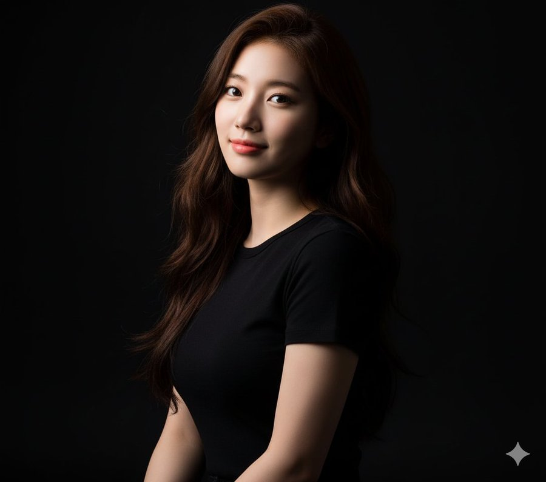

## A detailed transparent gashapon capsule diorama, held be

- ID: gpt4o-295-en-1
- Slug: prompt-295-en-1
- 语言: en
- 来源: [来源链接](https://x.com/TechieBySA/status/1964989870457438584)
- 样例图路径: images/part3/295.jpeg

### 提示词

```text
A detailed transparent gashapon capsule diorama, held between fingers, featuring [NAME] in their [ICONIC POSE / STYLE]. Inside: [short description of figure’s look, clothing, and accessories], with background elements such as [relevant setting: stadium, stage, lecture hall, etc.]. Lighting should be dramatic and cinematic, matching their theme (e.g., golden spotlight, concert glow, academic ambience). The capsule has a transparent top and a colored base (choose fitting color: e.g., royal blue, gold, black, red), decorated with [motifs related to the person]. The base is labeled with [NAME or NICKNAME] in a matching font style. The design should look like a miniature collectible, with photorealistic detail, soft bokeh, and a square 1080x1080 composition.
```

### 样例图


## 透明扭蛋场景模型

- ID: gpt4o-295-zh-2
- Slug: prompt-295-zh-2
- 语言: zh
- 来源: [来源链接](https://x.com/TechieBySA/status/1964989870457438584)
- 样例图路径: images/part3/295.jpeg

### 提示词

```text
一个详细的透明扭蛋场景模型，由手指捏握，扭蛋内呈现 [人物名称] 的 [标志性姿势 / 风格] 形象。
扭蛋内部细节：[简要描述人偶的外形、服饰及配饰]，背景元素包含 [相关场景：体育场、舞台、讲堂等]。
光线设计需富有戏剧感与电影质感，并契合人物主题（例如：金色聚光灯、演唱会光影、学术氛围光效）。扭蛋顶部为透明材质，底部为彩色设计（选用契合主题的颜色，如宝蓝色、金色、黑色、红色），底部装饰有 [与该人物相关的图案元素]。
扭蛋底座以匹配风格的字体标注有 [人物名称或昵称]。整体设计需呈现迷你收藏品的质感，细节超写实，搭配柔和的虚化背景，采用 1080x1080 像素的正方形构图。
```

### 样例图


## Hyper-realistic carved wooden figurine of [CHARACTER], c

- ID: gpt4o-286-en-1
- Slug: prompt-286-en-1
- 语言: en
- 来源: [来源链接](https://x.com/samann_ai/status/1962939491603132563)
- 样例图路径: images/part3/286.jpeg

### 提示词

```text
Hyper-realistic carved wooden figurine of [CHARACTER], chibi proportions (big head, short body), standing on a plain wood block. Keep key face traits and iconic [OUTFIT/PROP]. Visible wood grain and chisel marks, matte finish. Warm studio light, soft shadow, seamless beige background. Centered full-body, slight 3/4 angle, shallow depth of field (85mm look). Ultra-detailed, photoreal, warm sepia grading. Aspect ratio [3:4].
```

### 样例图

![Hyper-realistic carved wooden figurine of [CHARACTER], c](../images/part3/286.jpeg)

## Q版木雕人偶

- ID: gpt4o-286-zh-2
- Slug: prompt-286-zh-2
- 语言: zh
- 来源: [来源链接](https://x.com/samann_ai/status/1962939491603132563)
- 样例图路径: images/part3/286.jpeg

### 提示词

```text
超写实[人物]木雕人偶，Q版比例（大头短身），站立于一块普通木块上。保留关键面部特征和标志性[服装/道具]。木纹和凿痕清晰可见，哑光饰面。工作室暖光，柔和阴影，米色背景浑然一体。全身居中，略微3/4视角，浅景深（85毫米画质）。细节丰富，照片级写实，暖棕褐色调。宽高比为[3:4]。
```

### 样例图


## Create a toy of the person in the photo. Let it be an ac

- ID: gpt4o-280-en-1
- Slug: prompt-280-en-1
- 语言: en
- 来源: [来源链接](https://x.com/egeberkina/status/1905986284465574159)
- 样例图路径: images/part3/280.jpeg

### 提示词

```text
Create a toy of the person in the photo. Let it be an
action figure. Next to the figure, there should be the toy's
equipment like a football and football boot and world cup. Also,
on top of the box, write 'LIONEL MESSI and underneath it,
'GOAT'.Visualize this in a realistic way.
```

### 样例图


## 制作照片中人物的玩具

- ID: gpt4o-280-zh-2
- Slug: prompt-280-zh-2
- 语言: zh
- 来源: [来源链接](https://x.com/egeberkina/status/1905986284465574159)
- 样例图路径: images/part3/280.jpeg

### 提示词

```text
制作照片中人物的玩具，做成一个可动人偶。人偶旁边要有玩具装备，比如足球、足球鞋和世界杯奖杯。另外，在包装盒顶部写上“LIONEL MESSI”，其下方写上“GOAT”。请以写实的风格呈现这一画面。
```

### 样例图


## Create a cute 3D cartoon keychain version of the person 

- ID: gpt4o-278-en-1
- Slug: prompt-278-en-1
- 语言: en
- 来源: [来源链接](https://x.com/miilesus/status/1916854977873535069)
- 样例图路径: images/part3/278.png

### 提示词

```text
Create a cute 3D cartoon keychain version of the person in the uploaded photo. Transform the face and pose into a soft, simplified toy-like figure with a silicone-like smooth texture and pastel colors. Add a name tag that says "[NAME]" attached to the keychain in a playful rounded font. No background, minimal shadows. Toy product design for keychain format.
```

### 样例图


## 3D卡通钥匙扣

- ID: gpt4o-278-zh-2
- Slug: prompt-278-zh-2
- 语言: zh
- 来源: [来源链接](https://x.com/miilesus/status/1916854977873535069)
- 样例图路径: images/part3/278.png

### 提示词

```text
将上传照片中的人物制作成可爱的3D卡通钥匙扣版本。将面部和姿势转变为柔和、简化的玩具般造型，具有类似硅胶的光滑质感和柔和的粉彩色调。添加一个写有“[姓名]”的姓名牌，用俏皮的圆体字附着在钥匙扣上。无背景，阴影极少。适合钥匙扣格式的玩具产品设计。
```

### 样例图


## Design a geometric portrait of a [ANIMAL] head in the st

- ID: gpt4o-255-en-1
- Slug: prompt-255-en-1
- 语言: en
- 来源: [来源链接](https://x.com/TechieBySA/status/1954831239996694902)
- 样例图路径: images/part3/255.jpeg

### 提示词

```text
Design a geometric portrait of a [ANIMAL] head in the style of contemporary paper craft collage. Use multiple overlapping paper textures and shadow effects to build dimensional depth. Focus on botanical-inspired color palettes with matte finish aesthetics. The composition should feature bold, angular cuts that form the animal’s distinctive characteristics while maintaining facial symmetry. Set against a minimalist backdrop with subtle gradient. The final piece should evoke the craftsmanship of museum-quality paper installations. Square format, 1080x1080 pixels.
```

### 样例图

![Design a geometric portrait of a [ANIMAL] head in the st](../images/part3/255.jpeg)

## 头部的几何肖像

- ID: gpt4o-255-zh-2
- Slug: prompt-255-zh-2
- 语言: zh
- 来源: [来源链接](https://x.com/TechieBySA/status/1954831239996694902)
- 样例图路径: images/part3/255.jpeg

### 提示词

```text
设计一幅[动物]头部的几何肖像，采用当代纸艺拼贴风格。运用多种重叠的纸张纹理和阴影效果来构建立体深度。聚焦于植物灵感的色彩搭配，呈现哑光质感美学。构图应采用大胆的棱角切割，既塑造出该动物的独特特征，又保持面部对称性。背景为简约风格，带有微妙的渐变效果。最终作品需展现出博物馆级纸艺装置的精湛工艺。尺寸为正方形，1080x1080像素。
```

### 样例图


## Transform the character into a digital, half-body cartoo

- ID: gpt4o-243-en-1
- Slug: prompt-243-en-1
- 语言: en
- 来源: [来源链接](https://x.com/fy360593/status/1945395833123561930)
- 样例图路径: images/part3/243.png

### 提示词

```text
Transform the character into a digital, half-body cartoon-style portrait. Use a playful, vector-friendly style with clean solid lines, rounded face, oversized googly eyes, and minimal facial details. Show the character from chest up, including shoulders and upper torso. Apply smooth gradient fills to both the character and background for a colorful, soft look. Square format.
```

### 样例图


## 卡通照片转换

- ID: gpt4o-243-zh-2
- Slug: prompt-243-zh-2
- 语言: zh
- 来源: [来源链接](https://x.com/fy360593/status/1945395833123561930)
- 样例图路径: images/part3/243.png

### 提示词

```text
将角色转化为数字化的半身卡通风格肖像。使用适合矢量的俏皮风格，线条干净利落，圆润的脸庞，超大号的玻璃眼球，以及极简的面部细节。展示角色胸部以上的部分，包括肩膀和上半身。对角色和背景都应用平滑的渐变填充，营造色彩丰富、柔和的视觉效果。方形格式。
```

### 样例图


## Product photography, a 1990's style WWF Wrestling Figuri

- ID: gpt4o-210-en-1
- Slug: prompt-210-en-1
- 语言: en
- 来源: [来源链接](https://x.com/CharaspowerAI/status/1934287289154228450)
- 样例图路径: images/part3/210.jpeg

### 提示词

```text
Product photography, a 1990's style WWF Wrestling Figurine package with the figurine wrestler in the package being [your character]. The figure features bright colors, a detailed character design,  white background with professional studio lighting.
```

### 样例图


## 90年代风格的摔跤人物

- ID: gpt4o-210-zh-2
- Slug: prompt-210-zh-2
- 语言: zh
- 来源: [来源链接](https://x.com/CharaspowerAI/status/1934287289154228450)
- 样例图路径: images/part3/210.jpeg

### 提示词

```text
产品摄影，一个 90 年代风格的 WWF 摔角人偶包装，包装中的人偶是[你的角色]。人偶色彩鲜艳，角色设计精细，背景为白色，配有专业工作室灯光。
```

### 样例图


## 真人和风格对照直出

- ID: gpt4o-200-zh-1
- Slug: prompt-200-zh-1
- 语言: zh
- 来源: [来源链接](https://x.com/ZHO_ZHO_ZHO/status/1935620536090153216)
- 样例图路径: images/part3/200.jpeg

### 提示词

```text
创建图片 {
"title": "真人 × 动画对照创意作品",
"author": "ZH4O",
"description": "一张利用垂直拼贴与留白，将同一人物的照片与插画并置的创意作品，突出媒介在语言、质感与情绪上的对比。",
"layout": {
"orientation": "vertical",
"photo": {
"position": "top-left",
"aspect_ratio": "3:4",
"style": "street photo",
"camera_angle": "eye-level, slightly tilted left",
"lens": "mild wide-angle",
"background_elements": ["road", "store signs", "urban perspective lines"]
},
"illustration": {
"position": "bottom-right",
"scale": "slightly larger",
"composition": "2/3 body, medium shot",
"pose": "similar to photo",
"motion_direction": "curve extending top-right",
"balance": "forms visual counterpoint to photo"
},
"background": {
"color": "pure white",
"purpose": "breathing space, minimalism, focus"
}
},
"color_and_lighting": {
"photo": {
"dominant_tones": "neutral warm gray",
"light_source": "natural light",
"highlight_effects": "soft overexposure, summer glare",
"key_elements": ["white dress with gauzy texture", "cement, scooter, wall as low-saturation backdrop"]
},
"illustration": {
"style": "cartoon, simplified color blocks",
"skin": "warm orange with soft pink blush",
"hair": "deep brown, almost flat color",
"dress": "white with minimal shading to indicate folds",
"contrast": "high, compressed tonal range",
"focus": "sharp character silhouette"
},
"background": {
"function": "isolates media contrast, emphasizes character and action"
}
},
"style_comparison_and_details": {
"photo": {
"gesture": "hand shading forehead",
"expression": "wide eyes, slightly pouting lips, playful with a hint of exasperation",
"context": "spontaneous, tight alley space, loose hair movement"
},
"illustration": {
"design_inspiration": "Disney/CalArts style",
"features": ["large eyes", "wide cheekbones", "pointy chin", "freckles", "blush"],
"motion_effects": "exaggerated hair and skirt movement",
"line_quality": "fluid and bouncy",
"reproduction": "pose, expression, dress bow, forehead hair accurately translated"
}
},
"visual_and_communication_value": {
"themes": ["reality to animation transformation", "character design", "personified self-portrait"],
"usability": ["IP development", "illustration demo", "fashion branding"],
"design_elements": ["space for text/logo", "poster/social media-ready"],
"narrative_strength": "uses white space as frame, pose as link, and medium contrast as core interest",
"tone": "light, stylish, socially shareable"
}
}
```

### 样例图


## 真人和风格对照直出

- ID: gpt4o-200-zh-2
- Slug: prompt-200-zh-2
- 语言: zh
- 来源: [来源链接](https://x.com/ZHO_ZHO_ZHO/status/1935620536090153216)
- 样例图路径: images/part3/200.jpeg

### 提示词

```text
创建图片 {
“title”： “真人 × 动画对照创意作品”，
“author”： “ZH4O”， ZH4O“， ZH4O
“description”： “一张利用垂直拼贴与留白，将同一人物的照片与插画并置的创意作品，突出媒介在语言、质感与情绪上的对比。",
“布局”： {
“orientation”： “垂直”，
“照片”： {
“position”： “左上角”，
“aspect_ratio”： “3：4”，
“style”： “街拍”，
“camera_angle”： “与眼睛齐平，略微向左倾斜”，
“lens”： “轻度广角”，
“background_elements”： [“road”， “shop signs”， “urban perspective lines”]
},
“插图”： {
“position”： “右下角”，
“scale”： “稍大”，
“composition”： “2/3 体，中镜头”，
“pose”： “与照片相似”，
“motion_direction”： “曲线向右延伸”，
“balance”： “形成与照片的视觉对位”
},
“背景”： {
“color”： “纯白色”，
“purpose”： “呼吸空间、极简主义、专注”
}
},
“color_and_lighting”： {
“照片”： {
“dominant_tones”： “中性暖灰色”，
“light_source”： “自然光”，
“highlight_effects”： “柔和的过度曝光，夏季眩光”，
“key_elements”： [“带有薄纱纹理的白色连衣裙”， “水泥、滑板车、墙壁作为低饱和度背景”]
},
“插图”： {
“style”： “卡通，简化的色块”，
“skin”： “暖橙色带柔和的粉红色腮红”，
“hair”： “深棕色，几乎是单色”，
“dress”： “白色，带有最小阴影以表示褶皱”，
“contrast”： “高、压缩的色调范围”，
“focus”： “清晰的角色剪影”
},
“背景”： {
“function”： “隔离媒体对比度，强调角色和动作”
}
},
“style_comparison_and_details”： {
“照片”： {
“gesture”： “手部阴影额头”，
“expression”： “睁大眼睛，微微撅起嘴唇，俏皮中带着一丝恼怒”，
“context”： “自发、狭窄的小巷空间、松散的头发移动”
},
“插图”： {
“design_inspiration”： “Disney/CalArts 风格”，
“features”： [“大眼睛”， “宽颧骨”， “尖下巴”， “雀斑”， “腮红”]，
“motion_effects”： “夸张的头发和裙子运动”，
“line_quality”： “流体和弹性”，
“reproduction”： “姿势、表情、裙子蝴蝶结、额头头发准确翻译”
}
},
“visual_and_communication_value”： {
“themes”： [“从现实到动画的转变”， “角色设计”， “拟人化自画像”]，
“可用性”： [“IP 开发”， “插图演示”， “时尚品牌”]，
“design_elements”： [“文本/徽标空间”， “海报/社交媒体就绪”]，
“narrative_strength”： “使用空白作为框架，使用姿势作为链接，使用中等对比度作为核心兴趣”，
“tone”： “轻盈、时尚、社交分享”
}
}
```

### 样例图


## A fictional character shaped like a [Brand Name] product

- ID: gpt4o-190-en-1
- Slug: prompt-190-en-1
- 语言: en
- 来源: [来源链接](https://x.com/B_4AI/status/1939218188513726675)
- 样例图路径: images/part3/190.png

### 提示词

```text
A fictional character shaped like a [Brand Name] product, wearing clothing that reflects the brand’s identity, sitting or riding on an oversized version of one of the brand's products as if it were a futuristic vehicle. The design features an expressive, dynamic artistic style full of motion and vibrant colors, with a large abstract version of the brand’s logo in the background. Freely drawn elements and colors representing the brand are scattered throughout. The background is light-colored, and the brand’s logo appears at the bottom. aspect 1:1
```

### 样例图

![A fictional character shaped like a [Brand Name] product](../images/part3/190.png)

## 品牌虚拟人物

- ID: gpt4o-190-zh-2
- Slug: prompt-190-zh-2
- 语言: zh
- 来源: [来源链接](https://x.com/B_4AI/status/1939218188513726675)
- 样例图路径: images/part3/190.png

### 提示词

```text
一个形状像 [品牌名称] 商品的虚构人物，穿着反映品牌身份的服装，坐在或骑在该品牌某件商品的超大版本上，就好像它是一辆未来主义的汽车一样。该设计具有富有表现力、充满活力的艺术风格，充满动感和鲜艳的色彩，背景是品牌标志的大型抽象版本。代表品牌的自由绘制元素和颜色散布在整个过程中。背景为浅色，品牌标志出现在底部。外观 1：1
```

### 样例图


## A felted wool figure of a [subject], handcrafted with so

- ID: gpt4o-188-en-1
- Slug: prompt-188-en-1
- 语言: en
- 来源: [来源链接](https://x.com/azed_ai/status/1939277984441250111)
- 样例图路径: images/part3/188.png

### 提示词

```text
A felted wool figure of a [subject], handcrafted with soft fibers, uneven stitching, and visible textures. Set within a miniature diorama of layered fabrics and pastel props, the scene radiates cozy, storybook charm like a still from a tactile, stop-motion fairytale made entirely of felt and thread.
```

### 样例图

![A felted wool figure of a [subject], handcrafted with so](../images/part3/188.png)

## 微型毛毡羊毛人物

- ID: gpt4o-188-zh-2
- Slug: prompt-188-zh-2
- 语言: zh
- 来源: [来源链接](https://x.com/azed_ai/status/1939277984441250111)
- 样例图路径: images/part3/188.png

### 提示词

```text
一个 [主题] 的毛毡羊毛人物，用柔软的纤维手工制作，缝线不均匀，纹理可见。该场景设置在分层织物和柔和道具的微型立体模型中，散发着舒适的故事书魅力，就像完全由毛毡和线制成的触觉定格动画童话中的剧照。
```

### 样例图


## A cute pastel vinyl figure of [INSERT YOUR CHARACTER OR 

- ID: gpt4o-180-en-1
- Slug: prompt-180-en-1
- 语言: en
- 来源: [来源链接](https://x.com/TheRelianceAI/status/1938688543284707403)
- 样例图路径: images/part3/180.png

### 提示词

```text
A cute pastel vinyl figure of [INSERT YOUR CHARACTER OR OBJECT], pastel colors (lavender, soft pink, baby blue), kawaii style with big round eyes and friendly smile, simple rounded shapes, stylized “RIP” detail somewhere on the figure or base, matching toy packaging in the background with themed art, studio product photo with soft lighting, minimal shadows
```

### 样例图


## 可爱粉彩乙烯基人物

- ID: gpt4o-180-zh-2
- Slug: prompt-180-zh-2
- 语言: zh
- 来源: [来源链接](https://x.com/TheRelianceAI/status/1938688543284707403)
- 样例图路径: images/part3/180.png

### 提示词

```text
一个可爱的粉彩乙烯基人物 [插入您的角色或对象]，柔和的颜色（薰衣草色、柔和的粉红色、婴儿蓝色）、卡哇伊风格、圆圆的大眼睛和友好的微笑、简单的圆形形状、人物或底座上某处的程式化“RIP”细节、背景中的玩具包装与主题艺术相匹配、具有柔和灯光的工作室产品照片，最小的阴影
```

### 样例图


## A neon wireframe visualization of a [subject], traced in

- ID: gpt4o-153-en-1
- Slug: prompt-153-en-1
- 语言: en
- 来源: [来源链接](https://x.com/azed_ai/status/1936741480972079563)
- 样例图路径: images/part3/153.png

### 提示词

```text
A neon wireframe visualization of a [subject], traced in glowing [color1] and [color2] vector lines. Suspended in a digital void, the figure is surrounded by speed trails, motion blur, and shifting geometric shadows, evoking a sense of kinetic energy and futuristic momentum.
```

### 样例图

![A neon wireframe visualization of a [subject], traced in](../images/part3/153.png)

## 霓虹灯线框

- ID: gpt4o-153-zh-2
- Slug: prompt-153-zh-2
- 语言: zh
- 来源: [来源链接](https://x.com/azed_ai/status/1936741480972079563)
- 样例图路径: images/part3/153.png

### 提示词

```text
[主体] 的霓虹灯线框可视化，以发光的 [color1] 和 [color2] 矢量线描摹。这个人物悬浮在数字虚空中，周围环绕着速度轨迹、运动模糊和不断变化的几何阴影，唤起了一种动能和未来主义的动力。
```

### 样例图


## A comic-style caricature illustration of [subject], with

- ID: gpt4o-150-en-1
- Slug: prompt-150-en-1
- 语言: en
- 来源: [来源链接](https://x.com/azed_ai/status/1937104120097407069)
- 样例图路径: images/part3/150.png

### 提示词

```text
A comic-style caricature illustration of [subject], with an oversized head and expressive eyes, rendered in a hyper-realistic vinyl toy aesthetic. The character features exaggerated proportions, glossy textures, and playful details, blending caricature art with collectible figure charm.
```

### 样例图

![A comic-style caricature illustration of [subject], with](../images/part3/150.png)

## 乙烯基玩具

- ID: gpt4o-150-zh-2
- Slug: prompt-150-zh-2
- 语言: zh
- 来源: [来源链接](https://x.com/azed_ai/status/1937104120097407069)
- 样例图路径: images/part3/150.png

### 提示词

```text
[主题]的漫画风格漫画插图，具有超大的头部和富有表现力的眼睛，以超逼真的乙烯基玩具美学呈现。该角色具有夸张的比例、光滑的纹理和俏皮的细节，将漫画艺术与收藏人物魅力融为一体。
```

### 样例图


## Create a stylized full-body portrait of [your subject] i

- ID: gpt4o-149-en-1
- Slug: prompt-149-en-1
- 语言: en
- 来源: [来源链接](https://x.com/gnrlyxyz/status/1936834901552111768)
- 样例图路径: images/part3/149.png

### 提示词

```text
Create a stylized full-body portrait of [your subject] in the Gorillaz character aesthetic. Give the character an exaggeratedly lanky build with long, skinny legs and narrow arms. Use simplified, angular features and thick, bold outlines. Style the hair to be spiky, tousled, or exaggerated, in a non-natural color like [blue or green]. The eyes must be blank white with no pupils. Use flat, solid colors only. No gradients, shadows, or textures. Background should be a single flat color. Design must be vector friendly and print ready.
```

### 样例图

![Create a stylized full-body portrait of [your subject] i](../images/part3/149.png)

## Gorillaz风格角色

- ID: gpt4o-149-zh-2
- Slug: prompt-149-zh-2
- 语言: zh
- 来源: [来源链接](https://x.com/gnrlyxyz/status/1936834901552111768)
- 样例图路径: images/part3/149.png

### 提示词

```text
在 Gorillaz 角色美学中为 [您的主题] 创建风格化的全身肖像。给角色一个夸张的瘦长身材，长而瘦的腿和狭窄的手臂。使用简化的棱角分明的特征和粗体轮廓。将头发设计成尖尖的、凌乱的或夸张的，用非自然的颜色，如 [蓝色或绿色]。眼睛必须是空白的白色的，没有瞳孔。仅使用纯色。没有渐变、阴影或纹理。背景应为单一的平面颜色。设计必须对矢量友好并准备好打印。
```

### 样例图


## Close-up photo of a small plush keychain of [attached im

- ID: gpt4o-131-en-1
- Slug: prompt-131-en-1
- 语言: en
- 来源: [来源链接](https://x.com/azed_ai/status/1934973851164897444)
- 样例图路径: images/part3/131.jpeg

### 提示词

```text
Close-up photo of a small plush keychain of [attached image/emojis]  held gently between two fingers, made of soft felt or fuzzy material, cartoon-style proportions, embroidered face with simple expressive features, character designed to resemble, attached to a shiny silver keyring, neutral beige background, shallow depth of field, soft natural lighting, highly detailed texture, cute and handcrafted aesthetic, studio photography, 1:1 aspect ratio
```

### 样例图


## 自定义毛绒钥匙扣

- ID: gpt4o-131-zh-2
- Slug: prompt-131-zh-2
- 语言: zh
- 来源: [来源链接](https://x.com/azed_ai/status/1934973851164897444)
- 样例图路径: images/part3/131.jpeg

### 提示词

```text
[附图/表情符号] 的小毛绒钥匙扣的特写照片，用两根手指轻轻握住，由柔软的毛毡或毛茸茸的材料制成，卡通风格的比例，具有简单表现特征的刺绣脸，设计相似的人物，附在闪亮的银色钥匙圈上，中性米色背景，浅景深，柔和的自然光，高度详细的纹理，可爱和手工制作的美感， 摄影棚摄影，1：1 纵横比
```

### 样例图


## A black and white photograph shows the blurred silhouett

- ID: gpt4o-124-en-1
- Slug: prompt-124-en-1
- 语言: en
- 来源: [来源链接](https://x.com/umesh_ai/status/1934249977326289141)
- 样例图路径: images/part3/124.jpeg

### 提示词

```text
A black and white photograph shows the blurred silhouette of a [SUBJECT] behind a frosted or translucent surface. The [PART] is sharply defined and pressed against the surface, creating a stark contrast with the rest of the hazy, indistinct figure. The background is a soft gradient of gray tones, enhancing the mysterious and artistic atmosphere
```

### 样例图


## 磨砂模糊剪影

- ID: gpt4o-124-zh-2
- Slug: prompt-124-zh-2
- 语言: zh
- 来源: [来源链接](https://x.com/umesh_ai/status/1934249977326289141)
- 样例图路径: images/part3/124.jpeg

### 提示词

```text
一张黑白照片显示了磨砂或半透明表面后面 [SUBJECT] 的模糊剪影。[PART] 轮廓分明，压在表面，与朦胧、模糊的人物的其余部分形成鲜明对比。背景是灰色调的柔和渐变，增强了神秘和艺术的氛围
```

### 样例图


## 超级动物英雄

- ID: gpt4o-107-zh
- Slug: prompt-107-zh
- 语言: zh
- 来源: [来源链接](https://x.com/Kerroudjm/status/1931742320233230743)
- 样例图路径: images/part3/107.png

### 提示词

```text
A hyper-realistic square 1:1 portrait of a [YOUR ANIMAL] standing in a heroic pose, facing slightly left. The animal wears a textured dark gray superhero suit, form-fitting and matte, with visible fabric grain and subtle seams.

On its chest, inside a golden metallic Superman-style diamond emblem, is a fabric-embroidered version of the [COUNTRY] national flag (realistic stitching, slightly raised).

Draped over the animal’s shoulder is a flowing cape designed from the [COUNTRY] flag, with rich fabric folds and natural weight.

Behind the subject, use a realistic fabric backdrop displaying the full [COUNTRY] flag, slightly out of focus to add depth, with soft shadows to enhance realism.

Lighting should be warm and directional (studio-style), emphasizing the animal’s fur texture, suit material, and the contours of a subtly muscular chest. The overall tone is dramatic and cinematic, with a warm color grading and no excessive contrast. The head must be fully visible — no cropping.
```

### 样例图

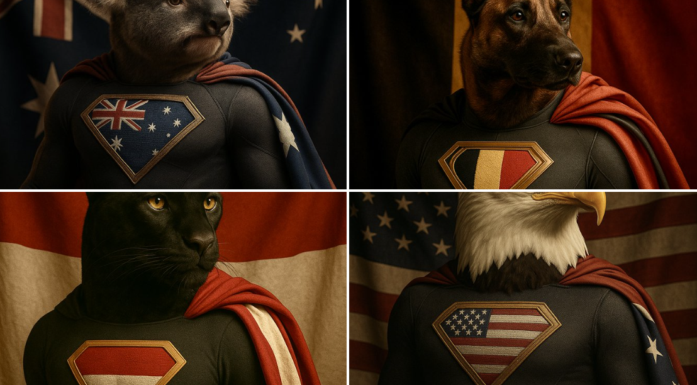

## 不同情绪状态的思想泡泡

- ID: gpt4o-93-zh
- Slug: prompt-93-zh
- 语言: zh
- 来源: [来源链接](https://x.com/TheRelianceAI/status/1925098220398465145)
- 样例图路径: images/part3/93.jpeg

### 提示词

```text
A [SUBJECT] sits alone in a minimalistic room filled with floating, semi-transparent thought bubbles. Each bubble contains a fragment of their face from different emotional states — smiling, crying, screaming — forming a psychological self-portrait suspended in mid-air.
```

### 样例图


## 知名戏曲片段的MBTI人格类型卡片

- ID: gpt4o-85-zh
- Slug: prompt-85-zh
- 语言: zh
- 来源: [来源链接](https://x.com/op7418/status/1925869690120794320)
- 样例图路径: images/part3/85.jpeg

### 提示词

```text
# 任务目标
请生成一张基于中国古代知名戏曲片段的MBTI人格类型卡片图片，使戏曲场景扁平插画的情感内涵与MBTI人格特质相对应。，我需要生成的人各类型是[INTP]

## 内容要求
1. **场景选取**：从中国古代知名戏曲片段中提取能体现不同MBTI人格特质的代表性场景
2. **场景意境**：画面需表现完整戏剧场景，通过场景氛围体现对应的人格特质
3. **服饰真实性**：画面中人物必须穿着对应戏曲的正确戏服
4. **人格对应**：每个场景需精准对应一种MBTI人格类型的核心特质

## 卡片排版设计
参考图片样式：
- **顶部**：MBTI类型代码（如INFJ）
- **中部**：渐变色彩的抽象几何图形作为主视觉
- **底部**：
- 中文人格类型名称（如"提倡者"）
- 英文标语：（如"The world is your oyster"）
- 装饰性边框和星形符号

## 视觉风格
- 采用现代极简设计语言
- 渐变色彩与几何形状结合
- 保持神秘感与艺术性
- 整体色调柔和梦幻

## 技术规格
- 卡片尺寸采用标准比例
- 每张卡片需清晰标注MBTI类型代码
- 保持系列视觉一致性
```

### 样例图


## 清洁琴键的小人物

- ID: gpt4o-52-zh
- Slug: prompt-52-zh
- 语言: zh
- 来源: [来源链接](https://x.com/BeanieBlossom/status/1925522114972713147)
- 样例图路径: images/part3/52.jpeg

### 提示词

```text
tilt-shift photo of a grand piano keyboard, side view from the left looking along the keys to the right, shallow depth of field, tiny human figures cleaning the piano keys with brushes, cloths, and buckets, whimsical and surreal scene, soft lighting, hyper-detailed, high realism
```

### 样例图


## 卡通角色转换成超写实人类

- ID: gpt4o-41-zh
- Slug: prompt-41-zh
- 语言: zh
- 来源: [来源链接](https://x.com/The_Real_Bersek/status/1917174101627617752)
- 样例图路径: images/part3/41.jpeg

### 提示词

```text
Transform the cartoon character from the reference image into a hyper-realistic human while maintaining their core attributes (clothing, hairstyle, facial expression, accessories, and proportions, age and so on). Create a photorealistic portrait
```

### 样例图


## 人物戏剧夸张风格

- ID: gpt4o-35-zh
- Slug: prompt-35-zh
- 语言: zh
- 来源: [来源链接](https://x.com/dotey/status/1924288320881750108)
- 样例图路径: images/part3/35.png

### 提示词

```text
A high-resolution vertical Pixar-style 3D character illustration.

Main character:  
Salvador Dalí — depicted as a tall, slim, and slightly exaggerated Pixar-style 3D character.  
Wearing a classic blue shirt, yellow tie, high-waisted plaid trousers with suspenders, and leather shoes.  
His iconic long upturned mustache, slick black hair, sharply arched eyebrows, and slightly eccentric posture.  
Stands with chest out, one hand on hip, head tilted slightly back in his typical theatrical flair.

Background:  
Flat, clean yellow background with subtle surface texture.  
Strong sunlight from top-left casts a distinct and enlarged shadow on the wall behind him.

Key Concept – Shadow as spiritual projection:  
The shadow cast behind him does **not** mirror his body shape.  
Instead, it takes the form of one of his most iconic artworks —  
a surreal melted clock with long dripping arms, inspired by “The Persistence of Memory”.

The melted clock shadow is positioned diagonally, starting from his shoulder,  
stretching wide and low across the yellow wall, surreal and fluid, yet unmistakably symbolic.

This shadow is **Dalí’s legacy made visible** — a symbolic extension of his identity through time, dream, and visual distortion.

Lighting & Rendering:  
Pixar-like rendering with detailed but stylized textures.  
Use subtle filmic grain, soft shadows, and warm color grading.  
Subtle sparkles or light speckles inside the shadow to evoke dreamlike texture.

Typography (top-left corner):  
“Salvador Dalí” in minimalist black sans-serif font, “Dalí” bolded.
```

### 样例图


## 超写实拼图肖像

- ID: gpt4o-31-zh
- Slug: prompt-31-zh
- 语言: zh
- 来源: [来源链接](https://x.com/ZHO_ZHO_ZHO/status/1923999321634283862)
- 样例图路径: images/part3/31.jpeg

### 提示词

```text
高分辨率的摄影棚人像，一位惊艳年轻模特「安妮海瑟薇」为主角。她拥有一头顺直的黑发，背景为白色，无任何可辨识的元素。她的脸略微侧转，但目光直视镜头，目光强烈而专注，毫无动摇。

她整张脸由拼图块组成——每一块都清晰可见，边缘整齐，具备细腻的立体感。她轻柔地用手指捏着一块刚从脸颊取下的拼图块，露出其下方一个空洞的黑色虚空。

光线集中且具方向性，几乎不产生阴影，但准确地勾勒出皮肤的轮廓与拼图结构的立体感。整体氛围超现实、精准且高度写实。

顶部有像时尚杂志一样的标题“ZHOGUE”（在人物后面）
```

### 样例图


## An embroidered portrait of [subject], [colors] thread on

- ID: gpt4o-7-en-1
- Slug: prompt-7-en-1
- 语言: en
- 来源: [来源链接](https://x.com/azed_ai/status/1924042329700372929)
- 样例图路径: images/part3/7.png

### 提示词

```text
An embroidered portrait of [subject], [colors] thread on deep linen fabric. Visible needlework, layered textures, and handmade patterns give it an earthy, sacred feel.
```

### 样例图

![An embroidered portrait of [subject], [colors] thread on](../images/part3/7.png)

## An embroidered portrait of Elon Musk, stitched with rich

- ID: gpt4o-7-en-2
- Slug: prompt-7-en-2
- 语言: en
- 来源: [来源链接](https://x.com/azed_ai/status/1924042329700372929)
- 样例图路径: images/part3/7.png

### 提示词

```text
An embroidered portrait of Elon Musk, stitched with rich steel grey and electric blue thread on deep linen fabric. Visible needlework, layered textures, and handmade patterns give it an earthy, sacred feel.
```

### 样例图

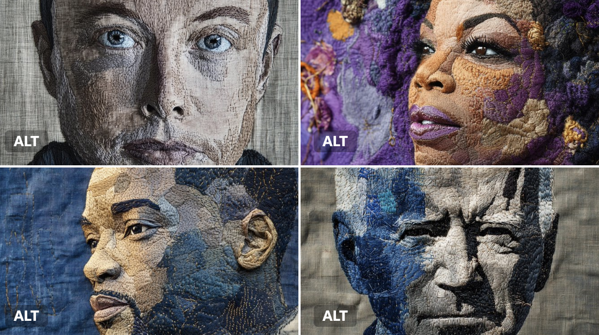

## 马斯克在公园画画

- ID: gpt4o-4-zh
- Slug: prompt-4-zh
- 语言: zh
- 来源: 来源链接缺失
- 样例图路径: images/part3/4.jpg

### 提示词

```text
创作一个逼真的户外场景，其中一位日本画家正在为马斯克画画。场景中，画家坐在画架前，而马斯克则坐在对面被描绘（不带任何卡通或动漫风格）。环境应充满生机,自然且阳光明媚——比如公园或热闹的户外场所。整体风格必须完全写实，唯独画家画架上的作品例外：那应该是马斯克的吉卜力风格动漫肖像，与周围的写实环境形成强烈对比。请确保画中人物是写实风格，画上的肖像才是动漫风格。
```

### 样例图


## 手绘风格的信息图卡片

- ID: gpt4o-1-zh
- Slug: prompt-1-zh
- 语言: zh
- 来源: 来源链接缺失
- 样例图路径: images/part3/1.png

### 提示词

```text
创作一张手绘风格的信息图卡片，比例为9:16竖版。卡片主题鲜明，背景为带有纸质肌理的米色或米白色，整体设计体现质朴、亲切的手绘美感。 卡片上方以红黑相间、对比鲜明的大号毛笔草书字体突出标题，吸引视觉焦点。文字内容均采用中文草书，整体布局分为2至4个清晰的小节，每节以简短、精炼的中文短语表达核心要点。字体保持草书流畅的韵律感，既清晰可读又富有艺术气息。 卡片中点缀简单、有趣的手绘插画或图标，例如人物或象征符号，以增强视觉吸引力，引发读者思考与共鸣。 整体布局注意视觉平衡，预留足够的空白空间，确保画面简洁明了，易于阅读和理解。 <h1><span style=""color:red"">「认知」</span>决定上限 <span style=""color:red"">「圈子」</span>决定机会</h1> - 你赚不到「认知」以外的钱， - 也遇不到「圈子」以外的机会。
```

### 样例图


