# Poster Design

总计：146

## Low-angle fashion campaign photograph of a confident mod

- ID: trending-2048748266293190833
- Slug: trending-2048748266293190833-en
- 语言: en
- 来源: [来源链接](https://x.com/azed_ai/status/2048748266293190833)
- 样例图路径: images/part1/2048748266293190833_1.jpg

### 提示词

```text
Low-angle fashion campaign photograph of a confident model holding a large [product name] very close to the camera, exaggerated perspective with the hand and product dominating the foreground, full-body pose visible in the background, wide stance, dynamic posture, clean pure white studio background, high-key lighting, sharp focus on product, slight depth of field on the model, bold colorful outfit with strong contrast tones, modern beauty advertising aesthetic, ultra-clean composition, commercial studio photography, glossy packaging detail visible, crisp shadows
```

### 样例图


## 请根据[主题]自动生成一张[博物馆图鉴式

- ID: trending-2045504669401653414
- Slug: trending-2045504669401653414-zh
- 语言: zh
- 来源: [来源链接](https://x.com/MrLarus/status/2045504669401653414)
- 样例图路径: images/part1/2045504669401653414_1.jpg

### 提示词

```text
请根据[主题]自动生成一张[博物馆图鉴式中文拆解信息图]。

要求整张图兼具真实写实主视觉、结构拆解、中文标注、材质说明、纹样寓意、色彩含义和核心特征总结。你需要根据[主题]自动判断最合适的主体对象、服饰体系、器物结构、时代风格、关键部件、材质工艺、颜色方案与版式结构，用户无需再提供其他信息。

整体风格应为：国家博物馆展板、历史服饰图鉴、文博专题信息图，而不是普通海报、古风写真、电商详情页或动漫插画。背景采用米白、绢纸白、浅茶色等纸张质感，整体高级、克制、专业、可收藏。

版式固定为：
- 顶部：中文主标题 + 副标题 + 导语
- 左侧：结构拆解区，中文引线标注关键部件，并配局部特写
- 右上：材质 / 工艺 / 质感区，展示真实纹理小样并附说明
- 右中：纹样 / 色彩 / 寓意区，展示主色板、纹样样本和文化解释
- 底部：穿着顺序 / 构成流程图 + 核心特征总结

若主题适合人物展示，则以真实人物全身站姿为中央主体；若更适合器物或单体结构，则改为中心主体拆解图，但整体仍保持完整中文信息图形式。所有文字必须为简体中文，清晰、规整、可读，不要乱码、错字、英文或拼音。重点突出真实结构、材质差异、文化说明与图鉴气质。

避免：海报感、影楼感、电商感、动漫感、cosplay感、乱标注、错结构、糊字、假材质、过度装饰。
```

### 样例图

![请根据[主题]自动生成一张[博物馆图鉴式](../images/part1/2045504669401653414_1.jpg)

## 生成一张[餐饮品牌触点矩阵]系列视觉图，

- ID: trending-2048360321379701233
- Slug: trending-2048360321379701233-zh
- 语言: zh
- 来源: [来源链接](https://x.com/MrLarus/status/2048360321379701233)
- 样例图路径: images/part1/2048360321379701233_1.jpg

### 提示词

```text
生成一张[餐饮品牌触点矩阵]系列视觉图，用于展示一个完整的餐饮品牌视觉系统与包装应用方案。

这是一个面向餐饮行业的品牌VI样机展示板 / 包装系统陈列图 / 品牌提案页。画面不是单张宣传海报，而是将品牌主视觉、主打产品、包装物料、菜单信息、促销内容与小型延展物料整合成一张系统化品牌展示图。

【用户输入信息】
- 品牌名：[品牌名]
- 经营类目：[经营类目]

【可选补充信息】
- 主打产品：[主打产品]
- 品牌口号：[品牌口号]
- 风格方向：[风格方向]
- 主色调：[主色调]
- 辅助色：[辅助色]
- 客群定位：[客群定位]
- 价格定位：[价格定位]
- 地域风格：[地域风格]
- 画幅比例：[画幅比例]

【自动补全规则】
如果用户没有提供完整品牌信息，请根据【品牌名】与【经营类目】自动推导并完成最优组合，包括：
1. 判断品牌调性（年轻、亲和、国潮、复古、清新、治愈、精致、快餐感等）
2. 匹配适合该类目的视觉风格
3. 自动设定合理的主色、辅助色与点缀色
4. 自动补全主打产品与辅助产品
5. 自动生成适合餐饮传播的品牌口号、卖点文案、价格信息与推荐标签
6. 自动匹配合适的餐饮物料类型与展示内容

【画面内容要求】
画面中应围绕【品牌名】构建一整套餐饮品牌物料系统，包含但不限于以下内容：
- 核心包装：手提袋、外卖袋、包装盒、打包盒、纸袋、塑料袋
- 饮品 / 食品容器：纸杯、杯套、碗、餐盒、封口贴、标签
- 信息传播物料：菜单、促销海报、价格牌、桌牌、立牌、小卡片
- 小型品牌延展：贴纸、徽章、纸巾、餐具、包装封条、吊牌
- 产品表现：主打餐品照片、单品主视觉、食物特写、切面图、推荐组合图

【构图与版式要求】
采用竖版【画幅比例】构图，整体为白色、米白色或浅灰色背景，以品牌提案板 / 样机矩阵板的方式组织画面。
通过大中小物料混排形成视觉层级：
- 大型包装和主视觉物料作为视觉锚点
- 中型菜单、海报和价格模块负责信息传达
- 小型贴纸、餐具、标签与周边物料增强系统完整度

整体构图应具有明确秩序感，接近品牌方案展示页、作品集陈列页、包装提案页的视觉效果。元素要排列整齐但不呆板，丰富但不杂乱，具有模块化与可阅读性。

【风格与质感要求】
整体风格应符合【经营类目】与【品牌名】气质，具有明显的餐饮品牌感、商业传播感、样机展示感与系统设计感。
可融合以下风格倾向：现代简洁、国潮趣味、轻复古、生活方式感、快消感、温暖治愈感、年轻化传播感。
材质真实，包含纸张、塑料、布袋、包装盒、杯体、贴纸、餐具等真实物料质感；光影柔和统一，像在干净摄影棚环境中拍摄的品牌物料合集。

【文字与图形要求】
所有物料上应统一出现品牌名、Logo、品牌符号、主色块、口号或卖点文案。
文案可为中文或中英混排，但要符合餐饮传播表达，简洁直接，具备商品售卖感。
图形系统可以根据品牌调性选择简洁插画、几何图形、卡通吉祥物、符号化图标或辅助纹样，用于增强品牌记忆点。

【输出目标】
最终生成一张完整的【品牌名】餐饮品牌视觉系统展示图，像设计团队为该餐饮品牌制作的整套品牌提案样机板。
要求画面统一、精致、具备商业落地感与作品集展示质量，并能清楚体现品牌风格、主打类目与多触点包装延展能力。

Make the aspect ratio 9:16
```

### 样例图

![生成一张[餐饮品牌触点矩阵]系列视觉图，](../images/part1/2048360321379701233_1.jpg)

## Create a complete visual worldbuilding set for a futuris

- ID: trending-2046866168208916503
- Slug: trending-2046866168208916503-en
- 语言: en
- 来源: [来源链接](https://x.com/aleenaamiir/status/2046866168208916503)
- 样例图路径: images/part1/2046866168208916503_1.jpg

### 提示词

```text
Create a complete visual worldbuilding set for a futuristic desert civilization powered by solar technology, multiple images including architecture, characters, clothing, vehicles, and maps, cohesive design language, cinematic realism, ultra detailed.
```

### 样例图

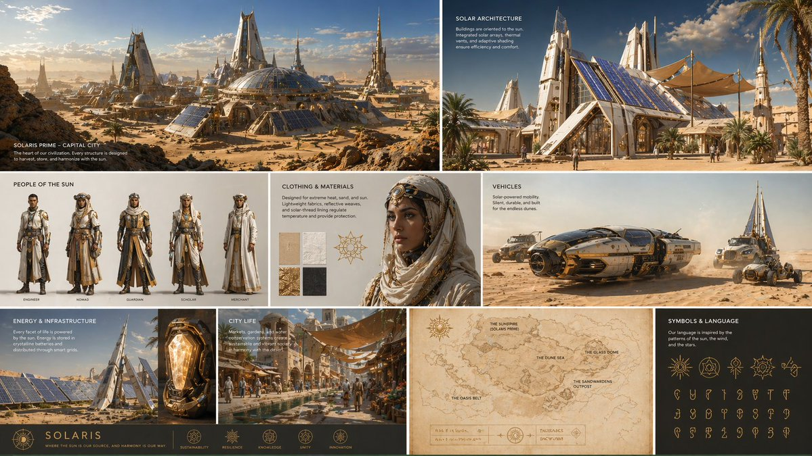

## [INPUT IMAGE: USER_PHOTO] Use the person in the input im

- ID: trending-2017598696678895882
- Slug: trending-2017598696678895882-en
- 语言: en
- 来源: [来源链接](https://x.com/Samann_ai/status/2017598696678895882)
- 样例图路径: images/part1/2017598696678895882_1.jpg

### 提示词

```text
[INPUT IMAGE: USER_PHOTO] Use the person in the input image as the ONLY subject. Preserve their identity and facial features clearly.

Create a hyper-realistic high-fashion editorial photo inside a surreal 3D geometric “color box” room (a hollow cube / tilted cube set). Each render MUST randomly choose:
1) a bold single-color box (monochrome environment, vivid and saturated),
2) a dynamic “cool” fashion pose (gravity-defying or extreme stretch / leap / sideways bracing against the walls),
3) a dramatic camera angle (wide-angle 24–35mm equivalent, tilted horizon, strong perspective).

The subject appears full-body and sharp, wearing an avant-garde fashion styling that feels modern and editorial (clean silhouette, stylish layering, premium fabric texture). Keep clothing tasteful and fashion-forward. The subject’s pose should feel athletic, stylish, and unusual—like a magazine campaign shot.

Lighting: studio quality, crisp and cinematic; strong key light with controlled soft shadows, subtle rim light; realistic reflections and bounce light from the colored walls. Ultra-detailed skin texture, natural pores, realistic fabric weave, clean edges, high dynamic range. 
Composition: subject centered with plenty of negative space and strong geometric lines; the box perspective frames the subject. 
Color: the box color is a SINGLE bold color and MUST be different each run (random vivid hue). The subject’s outfit contrasts well with the box color.

Output: hyper-real, photorealistic, 8k detail, editorial campaign quality, sharp focus on subject, no motion blur, no distortion of face, natural proportions.
```

### 样例图

![[INPUT IMAGE: USER_PHOTO] Use the person in the input im](../images/part1/2017598696678895882_1.jpg)

## 武则天同款皇后内衣广告大片，明黄底色龙纹

- ID: trending-2047215501798244570
- Slug: trending-2047215501798244570-zh
- 语言: zh
- 来源: [来源链接](https://x.com/songguoxiansen/status/2047215501798244570)
- 样例图路径: images/part1/2047215501798244570_1.jpg

### 提示词

```text
武则天同款皇后内衣广告大片，明黄底色龙纹刺绣，大红丝绸飘带衬托

```

### 样例图

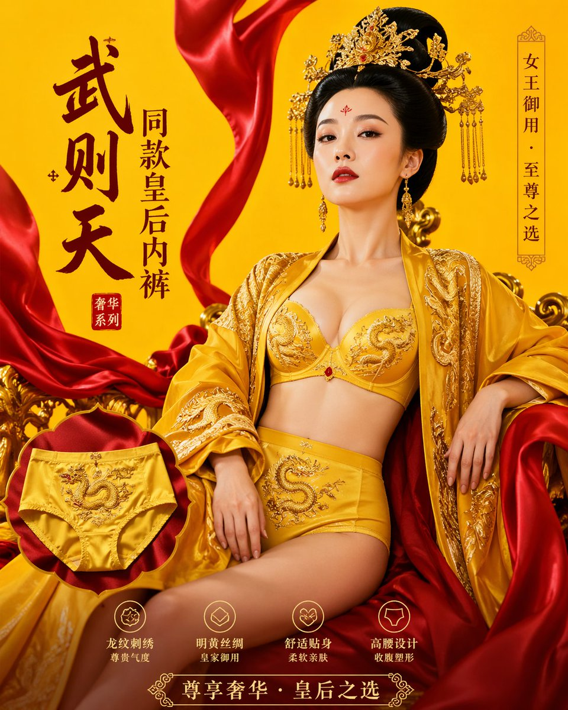

## 请根据【主题】生成一张高质量竖版「科普百

- ID: trending-2046231542817497392
- Slug: trending-2046231542817497392-zh
- 语言: zh
- 来源: [来源链接](https://x.com/MrLarus/status/2046231542817497392)
- 样例图路径: images/part1/2046231542817497392_1.jpg

### 提示词

```text
请根据【主题】生成一张高质量竖版「科普百科图」。 

这张图不是普通海报，也不是单纯插画，而是一张兼具“图鉴感、百科感、信息结构感、收藏感”的模块化科普信息图。整体风格参考高级博物图鉴、现代百科书页、生活方式知识卡和社交媒体高传播信息图的结合。

请让画面包含：
- 一个清晰漂亮的主题主视觉
- 若干局部特征放大细节
- 多个圆角模块化信息分区
- 清楚的标题层级与重点标签
- 简洁但丰富的百科内容
- 可视化评分、要点总结或Top 5模块

内容栏目请根据主题自动适配，优先从这些方向中选择并合理组合：
基础档案、分类信息、外观特征、习性/生态、形成机制/结构组成、生长或使用条件、养护或维护建议、风险与注意事项、适合人群或适用场景、优缺点对比、快速评分卡。

视觉要求：
浅色干净背景，柔和配色，轻阴影，精致小图标，圆角信息框，整洁排版，信息密度高但不拥挤，阅读体验好。整体必须像真正可以发布、阅读、收藏、系列化生产的科普百科卡，而不是广告图。

请不要做成普通商业宣传海报。要突出“知识整理 + 模块信息 + 图鉴式展示”的特征。
```

### 样例图

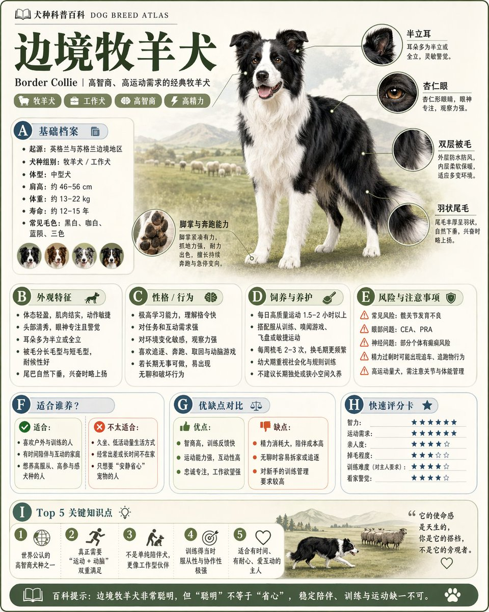

## 4:5 vertical social poster, ultra high resolution, 8K SC

- ID: trending-2047986905896427670
- Slug: trending-2047986905896427670-en
- 语言: en
- 来源: [来源链接](https://x.com/Diplomeme/status/2047986905896427670)
- 样例图路径: images/part1/2047986905896427670_1.jpg

### 提示词

```text
4:5 vertical social poster, ultra high resolution, 8K

SCENE / BACKGROUND:
Flat racing yellow with subtle gradient (light → deep amber)
Grain texture 2–3%
Soft rectangular overlays at 3% opacity

PRODUCT:
Porsche 911 GT3 RS
Gloss yellow with carbon details
Rear 3/4 angle, slightly elevated
Wing dominant

Position:
Right of center

TYPOGRAPHY:
“PORSCHE”
Ultra tall, condensed, stretched
Deep charcoal

Secondary:
“PORSCHE 911 GT3 RS”

EDITORIAL:
“Porsche — Where Precision Meets Passion”

Focus:
engineering, obsession, track DNA

FADED TEXT:
“GT3 RS” at 3–5%

SPECS:
386 kW / 525 PS
3.2 s
296 km/h

LIGHTING:
Clean studio, sharp highlights

MOOD:
Precision.
Iconic.
Timeless performance.

FORMAT:
4:5 vertical social poster, ultra high resolution, 8K, print-quality sharpness

SCENE / BACKGROUND:
Flat, high-saturation BMW blue background

Gradient:
Top → slightly lighter electric blue
Bottom → deep navy blue

Surface:
- Subtle grain texture (2–3%)
- Faint rectangular overlays (2–4% opacity)
- Clean, graphic — no realism

Shadow:
Soft contact shadow under car

PRODUCT (CAR):
BMW M4 CSL

Color:
Matte frozen blue / deep metallic navy

Angle:
Rear 3/4 perspective (IMPORTANT — match Porsche angle for consistency)
Slightly elevated camera

Position:
Slightly right of center

Details:
- Carbon roof visible
- Aggressive diffuser
- Sharp reflections
- Subtle brake detail

COMPOSITION:
IDENTICAL to Porsche:
Top → branding
Middle → giant type
Center → car overlap
Bottom → editorial + specs

TYPOGRAPHY:

PRIMARY:
“BMW”

Style:
Ultra condensed bold sans serif
Tall vertical scaling (same as Porsche)

Color:
Deep navy / near black

Behavior:
Static (NO distortion — unlike previous version)
Acts as structural backdrop

SECONDARY HEADER:
“BMW M4 CSL”
Thin, wide tracking

LOGO AREA:
BMW roundel centered above

EDITORIAL BLOCK:

Headline:
“BMW — Where Driving Becomes Instinct”

Body:
Focus on:
- driver connection
- control
- performance precision

Boxed layout, same structure as Porsche

FADED TEXT:
“CSL” large, 3–5% opacity behind box

BOTTOM LEFT:
“M4 CSL”

BOTTOM RIGHT SPECS:

405 kW / 550 PS
3.4 s
307 km/h

LIGHTING:
Clean studio lighting
Sharp but controlled highlights

COLOR GRADING:
Deep blues, high contrast, clean blacks

CAMERA:
50mm, slightly elevated rear 3/4

MOOD:
Performance.
Precision.
Driver focus.
```

### 样例图

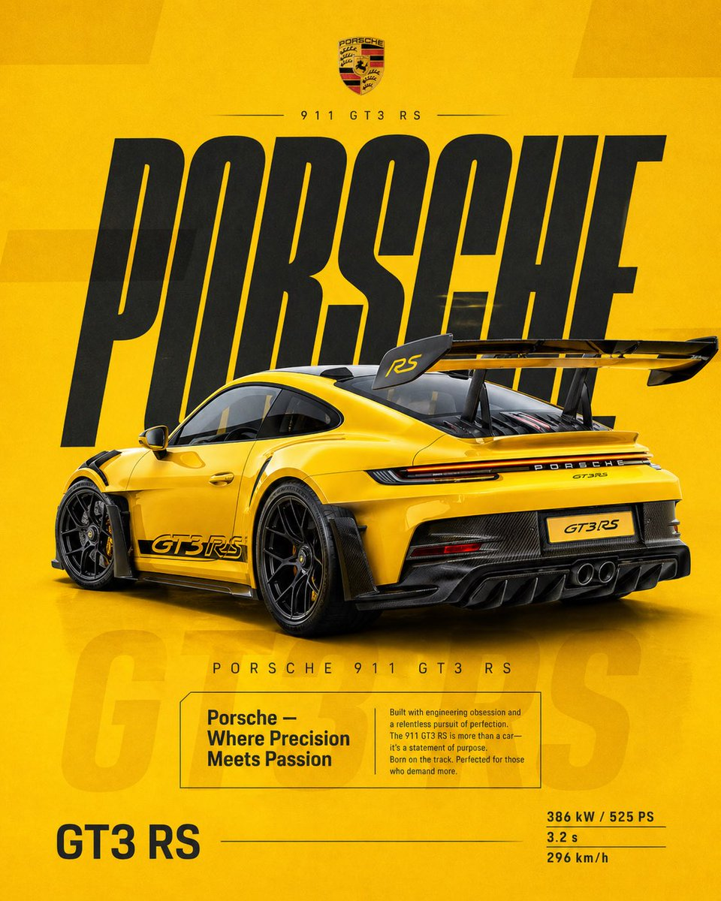

## 生成一张适合小红书发布的 3:4 竖版九

- ID: trending-2046037688969769346
- Slug: trending-2046037688969769346-zh
- 语言: zh
- 来源: [来源链接](https://x.com/austinit/status/2046037688969769346)
- 样例图路径: images/part1/2046037688969769346_1.jpg

### 提示词

```text
生成一张适合小红书发布的 3:4 竖版九宫格海报，整体为 3列 × 3行 排版，九个宫格边界清晰，方便后期直接切割成 9 张单图发布。整体风格干净、高级、统一，适合女性向健康生活方式内容，具有小红书爆款封面气质。画面要求 信息排版清晰、文字大、可读性强、留白舒服、配色温柔治愈。

整体视觉风格：
奶油白、浅米色、淡燕麦色、浅焦糖色为主色调，搭配少量深棕色文字，ins风、治愈感、睡眠疗愈主题，简约排版，轻拟物插画点缀，可加入枕头、月亮、星星、热牛奶、香薰、书本、眼罩、窗帘、床铺等元素。整体像专业新媒体设计图，字体工整，适合做知识科普类小红书九宫格。
排版要求：

整张图必须是标准九宫格构图，切分后每一格都能独立成图

每个宫格内容完整居中，不要把标题或正文压在分割线附近
每个格子之间保留明显间隔或细边框，保证裁切后不影响阅读
所有文字使用中文，清晰易读，不要乱码，不要英文
每个宫格都像独立的小红书图文卡片，但视觉风格保持统一
画面精致、真实、自然，不要廉价营销感，不要过度花哨
九宫格具体内容：

第1格（封面）
大标题：让你倒头就睡的8个 tips
副标题：失眠党、熬夜党一定要收藏
封面视觉最吸睛，适合做首图，加入柔软床铺、月亮、枕头、眼罩等治愈睡眠元素，标题突出，排版高级。

第2格
标题：1. 睡前1小时别玩手机
正文：蓝光会让大脑更清醒，越刷越睡不着。
配图元素：手机、月亮、困倦表情的小插画
第3格
标题：2. 睡前把灯光调暗
正文：暖光环境能帮助身体进入“准备睡觉”的状态。
配图元素：床头灯、暖黄色灯光、窗帘
第4格
标题：3. 房间温度别太高
正文：稍微凉一点，更容易快速入睡。
配图元素：空调、温度计、被子
第5格
标题：4. 晚上别喝浓茶咖啡
正文：咖啡因会延迟困意，让你躺很久还睡不着。
配图元素：咖啡杯、茶杯、禁止符号

第6格
标题：5. 睡前洗个热水澡
正文：能让身体放松下来，入睡速度更快。
配图元素：浴室蒸汽、毛巾、热水
第7格
标题：6. 脑子停不下来就写下来
正文：把烦心事和待办清单写下，大脑会更容易放松。
配图元素：笔记本、钢笔、小台灯
第8格
标题：7. 固定上床时间
正文：每天差不多时间睡，生物钟会越来越稳定。
配图元素：时钟、月亮、床
第9格
标题：8. 试试深呼吸放松法
正文：吸气4秒，停4秒，呼气6秒，慢慢就有困意了。
底部小字：收藏这组，今晚试试看
配图元素：呼吸线条、闭眼人物、星星

画质要求：
高清，高级排版，杂志感，真实可发布，新媒体运营审美，小红书爆款图文风格，文字布局规整，适合直接切图。
```

### 样例图

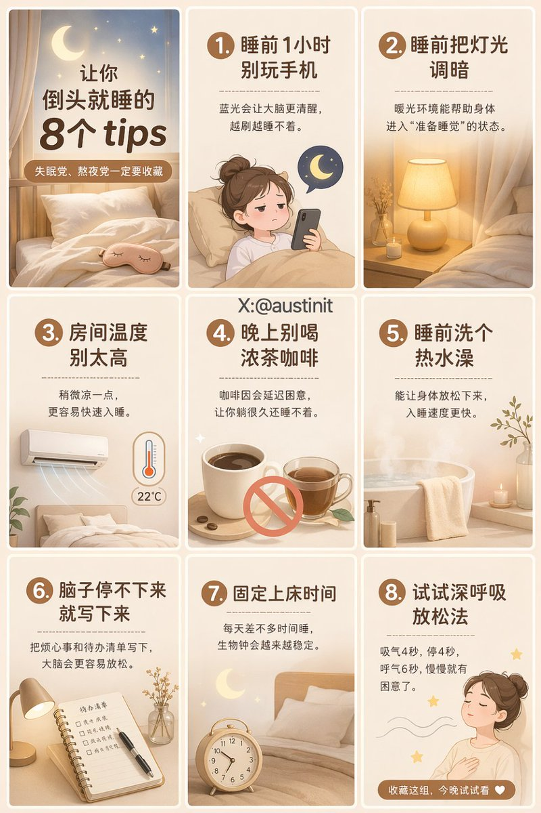

## Cute Y2K style affordable cosmetics advertising image de

- ID: trending-2045378877363798279
- Slug: trending-2045378877363798279-en
- 语言: en
- 来源: [来源链接](https://x.com/midori_tatsuta/status/2045378877363798279)
- 样例图路径: images/part1/2045378877363798279_1.jpg

### 提示词

```text
Cute Y2K style affordable cosmetics advertising image designed for Gen Z. Using vibrant color schemes, including neon colors. Aspect ratio is 3:4.
```

### 样例图

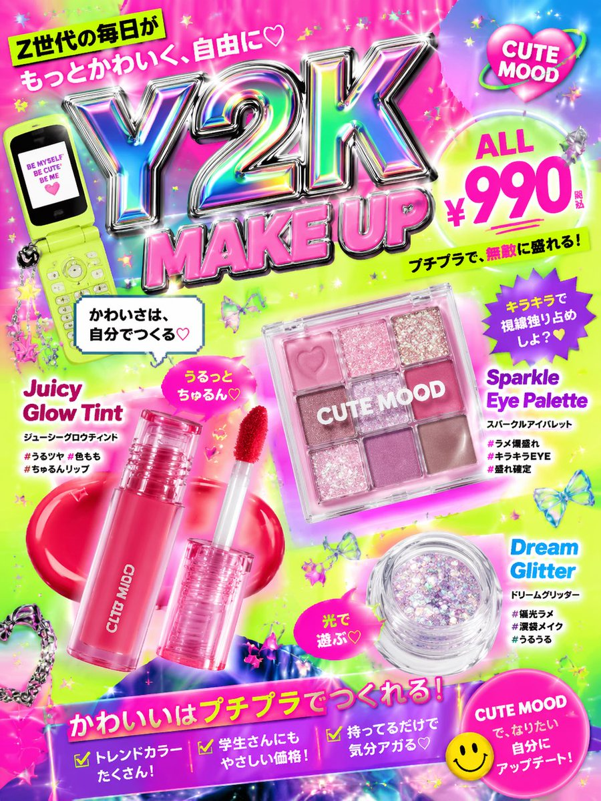

## 画像生成: 商品広告写真, 夏にぴったり

- ID: trending-2045852114673635507
- Slug: trending-2045852114673635507-zh
- 语言: zh
- 来源: [来源链接](https://x.com/old_pgmrs_will/status/2045852114673635507)
- 样例图路径: images/part1/2045852114673635507_1.jpg

### 提示词

```text
画像生成: 商品広告写真, 夏にぴったりの季節商品, 炭酸飲料, 名称="夏柑SODA", 形状=ペットボトル500ml, 2025年に飲料広告として高CTAだったデザインをリサーチしてから画像仕様をデザインして生成, アスペクト比=3:4
```

### 样例图


## Cinematic portrait of [Athlete Name] showing his/her jou

- ID: trending-2047325329052823996
- Slug: trending-2047325329052823996-en
- 语言: en
- 来源: [来源链接](https://x.com/aleenaamiir/status/2047325329052823996)
- 样例图路径: images/part1/2047325329052823996_1.jpg

### 提示词

```text
Cinematic portrait of [Athlete Name] showing his/her journey, with bold text of achievements and best performances
```

### 样例图

![Cinematic portrait of [Athlete Name] showing his/her jou](../images/part1/2047325329052823996_1.jpg)

## 赵飞燕同款掌中舞香膏广告，错金缠枝莲铜瓶

- ID: trending-2046844986533056947
- Slug: trending-2046844986533056947-zh
- 语言: zh
- 来源: [来源链接](https://x.com/joshesye/status/2046844986533056947)
- 样例图路径: images/part1/2046844986533056947_1.jpg

### 提示词

```text
赵飞燕同款掌中舞香膏广告，错金缠枝莲铜瓶，冷艳诡谲深宫氛围感，竖屏9:16
```

### 样例图

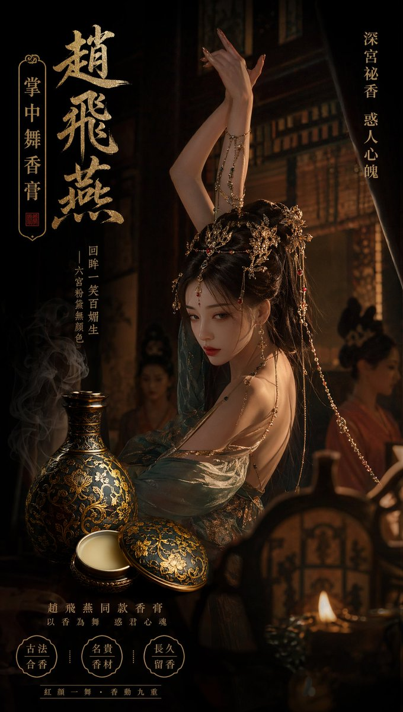

## この商品広告をプロのデザイナー目線でリデ

- ID: trending-2046498264774791514
- Slug: trending-2046498264774791514-zh
- 语言: zh
- 来源: [来源链接](https://x.com/genel_ai/status/2046498264774791514)
- 样例图路径: images/part1/2046498264774791514_1.jpg

### 提示词

```text
この商品広告をプロのデザイナー目線でリデザインして。
今のトレンド、ターゲットに合わせた洗練されたデザインで。
```

### 样例图


## Make a wheatpaste poster setup on a brick wall in sf fea

- ID: trending-2046700418554851630
- Slug: trending-2046700418554851630-en
- 语言: en
- 来源: [来源链接](https://x.com/venturetwins/status/2046700418554851630)
- 样例图路径: images/part1/2046700418554851630_1.jpg

### 提示词

```text
Make a wheatpaste poster setup on a brick wall in sf featuring posters from various AI labs
```

### 样例图

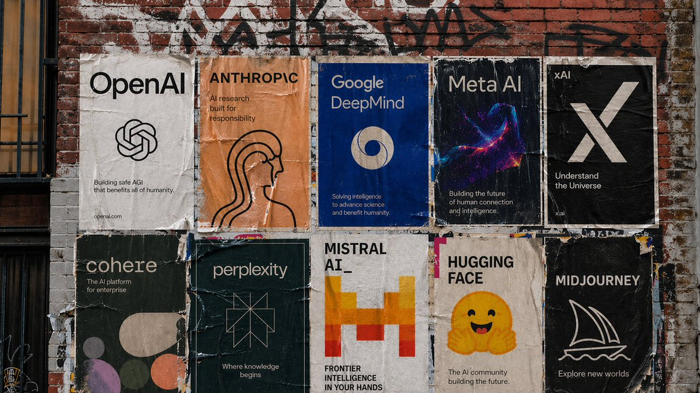

## A hyper-realistic travel advertisement in square format 

- ID: trending-2007190982408974659
- Slug: trending-2007190982408974659-en
- 语言: en
- 来源: [来源链接](https://x.com/TechieBySA/status/2007190982408974659)
- 样例图路径: images/part1/2007190982408974659_1.jpg

### 提示词

```text
A hyper-realistic travel advertisement in square format (1080x1080), featuring a hand holding a sleek, ultra-thin smartphone or tablet in portrait orientation, tilted slightly sideways to create a striking 3D portal effect. The screen displays a high-resolution image of an iconic landmark from [COUNTRY], which continues into the real background, blending seamlessly. The landmark appears to emerge from the screen. Birds fly nearby and a commercial airplane passes through a bright blue sky with soft white clouds. Bold, clean sans-serif text reading [CITY] is placed prominently above. The lighting is warm and natural, casting soft shadows across the landscape. The surroundings reflect the region’s natural environment (like meadows, coastlines, or city skylines). The device is glossy and minimal-bezel, enhancing realism and depth.
```

### 样例图


## Avant-garde sports fashion advertisement, oversized tenn

- ID: trending-2047989228274118901
- Slug: trending-2047989228274118901-en
- 语言: en
- 来源: [来源链接](https://x.com/aronhouyu/status/2047989228274118901)
- 样例图路径: images/part1/2047989228274118901_1.jpg

### 提示词

```text
Avant-garde sports fashion advertisement, oversized tennis racket positioned like monumental sculpture, female athlete seated casually on the strings as if a suspended lounge, giant word “PRECISION” in bold typography behind, crisp white studio backdrop, reflective court-like floor, luxury sportswear editorial aesthetic, cinematic lighting, ultra-clean composition, 1:1
```

### 样例图

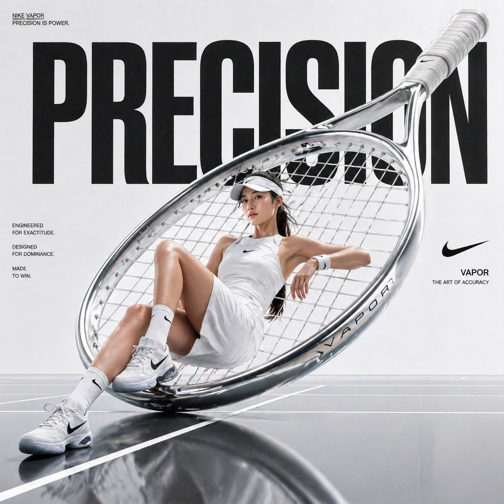

## 日本語の架空広告をテーマに、SNSでバズ

- ID: trending-2046460259817210284
- Slug: trending-2046460259817210284-zh
- 语言: zh
- 来源: [来源链接](https://x.com/akiramenaiwoman/status/2046460259817210284)
- 样例图路径: images/part1/2046460259817210284_1.jpg

### 提示词

```text
日本語の架空広告をテーマに、SNSでバズることを目的としたインパクトの強いビジュアルを作成してください。 1:1の正方形キャンバスに、4種類の広告を「2×2グリッド」で配置してください。 

ジャンル： ①テック（AI・アプリ） ②美容・コスメ ③飲食 ④フィットネス すべて日本語コピー入り・架空ブランドで作成。 

【バズるための演出要件】 
・一瞬で目を引く強烈なキャッチコピー
 ・感情を動かす要素（驚き・共感・焦り・欲望） 
・コントラストの強い配色（ネオン、ビビッドカラー、黒×蛍光など）
 ・大胆なレイアウト（はみ出し・斜め配置・大きすぎる文字） 
・サムネ映えする構図（中央強調・顔アップ・視線誘導）
 ・SNS広告っぽい“あざとさ”（矢印・強調枠・吹き出し） 

【デザインスタイル】 
・2025年トレンドのSNS広告風
・TikTok / Instagram広告風 
・視認性最優先（スマホで見ても読める） 
・写真風 or 高品質イラスト 
・CTA入り（例：今だけ無料・限定・残り3日など） 

【ランダムバズ要素】 
以下の①〜③から、それぞれ1つずつランダムに選び、必ずキャッチコピーに反映すること。
 ①禁断ワード系（いずれか1つ） 
・知らないと損 
・99%が間違ってる 
・今すぐやめて 
②ギャップ演出（いずれか1つ） 
・見た目かわいいのに中身がヤバい 
・普通に見えて実は… 
・これ、○○じゃありません
③数字・限定（いずれか1つ）
・3日限定 
・残り1枠 
・無料→0円 

【重要】 
・4つそれぞれ明確に違う雰囲気にする 
・グリッドは崩さない 
・文字は読みやすく配置する 
・“スクロールを止める違和感”を意図的に入れる 

出力：4広告が1枚にまとまった高インパクトビジュアル
```

### 样例图

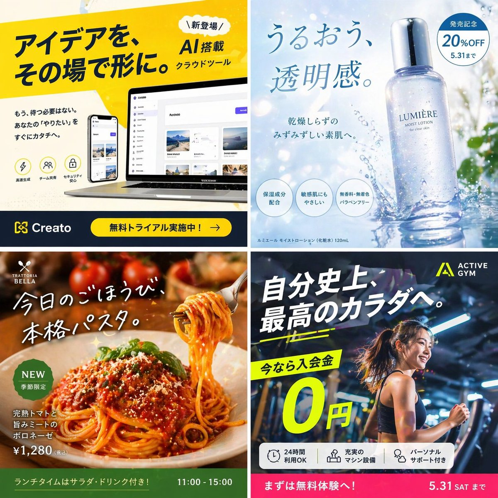

## 【テーマ】 {ここにテーマを入力} 【写

- ID: trending-2048714101850071422
- Slug: trending-2048714101850071422-zh
- 语言: zh
- 来源: [来源链接](https://x.com/konmari_tweet/status/2048714101850071422)
- 样例图路径: images/part1/2048714101850071422_1.jpg

### 提示词

```text
【テーマ】
{ここにテーマを入力}

【写真】
{ここに使用する写真の内容を簡潔に入力}
（例：公園で遊ぶ子ども / 親子の笑顔 / 走る子ども など）

【タイトル】
{画像内に入れるタイトルを入力}
（例：こどもの日 / Happy Mother's Day / 春のはじまり など）

---

テーマ「{テーマ}」に基づいた、
写真とクレヨンイラストを融合したライフスタイル系エディトリアルビジュアル。

提供された写真をメインビジュアルとして使用する。

■ シーン
「{写真}」に合った自然な日常の瞬間。
作り込みすぎないリアルな空気感、やわらかい自然光、
人物の自然な動きや感情を重視。

■ 構図
人物を切り抜いたように配置し、
ざらっとした紙質のクラフト系背景
（生成り、ベージュ、淡いグレー、ミルクティー）の上にレイアウト。

・余白50%以上
・左右非対称構図
・抜け感のあるミニマルなエディトリアルデザイン

■ イラスト（最重要）
オイルパステル／クレヨンで描いたような、
ざらつきとかすれのある手描きイラストを重ねる。

▼ルール
・全体の30〜40%以内
・線にムラとかすれ、紙のテクスチャが残る
・力の入り具合で濃淡が変化（濃い部分・薄い部分が混在）
・子どもが描いたような少し不器用なタッチ
・影・立体表現は禁止（フラット）
・人物の動きと連動させる（風・軌跡・流れ）

▼モチーフ（テーマ連動）
・{テーマ}を象徴する要素をクレヨンタッチで追加
（例：こどもの日 → 鯉のぼり、風、空、草、雲、紙かぶと）
・風の線、動きの線、小さなアイコン、太陽、雲、お花、ハート、星、ジグザグの動線
・空気感をクレヨンの粗いストロークで演出

■ タイトル文字（重要）
画像内に「{タイトル}」を手描きクレヨン文字で配置する。
・配置は左上または右上の余白部分
・クレヨンで書いたようなざらつき・かすれのある文字
・少し不器用で味のある手書き風
・文字色はアースカラー（テラコッタ、マスタード、ダークブラウン）から選択
・サイズは控えめでミニマルに（主役は写真）
・装飾枠なし、フラット

■ 色
あたたかみのあるアースカラー、
やわらかいくすみカラー
（テラコッタ、マスタード、オリーブ、ミルクティー、淡いブルー）

■ 雰囲気
あたたかい、ノスタルジック、こども心、ハンドメイド感、
やさしい、エモーショナル、ストーリー性のある日常

■ スタイル
絵本的ぬくもり × 北欧ミニマル × 上質なライフスタイル広告

■ 品質
高解像度、商用レベルのクオリティ
```

### 样例图


## 根据[红楼梦]自动生成一张 收藏版史诗叙

- ID: trending-2047305151342596557
- Slug: trending-2047305151342596557-zh
- 语言: zh
- 来源: [来源链接](https://x.com/liyue_ai/status/2047305151342596557)
- 样例图路径: images/part1/2047305151342596557_1.jpg

### 提示词

```text
根据[红楼梦]自动生成一张 收藏版史诗叙事海报，

巨大优雅的{林黛玉}人物侧脸剪影作为外轮廓，剪影内部自动生长出最契合该主题的完整世界观、标志性场景、角色关系、象征符号、关键建筑、生物、道具与氛围。

整体不是普通拼贴，而是高级的剪影轮廓填充式叙事合成，带有双重曝光式联想，但强化为电影级叙事表达与空间调度。

电影海报风格 + 东方现实主义美学融合，强调真实物理光影、镜头语言、空间纵深与叙事层级。

光影采用电影级侧逆光与局部暖光点缀，冷暖对比克制真实，加入体积光与轻雾增强空间感。

材质表现为真实质感（建筑、丝绸、肌肤、石材），避免纯绘画笔触感，

保留柔和空气透视，但优化为电影级景深与焦点控制。

轻微胶片颗粒，边缘飞白与刷痕改为电影式柔和融合过渡，

大面积留白，版式克制高级，安静、宏大、克制、宿命感强的东方电影叙事。

所有元素必须强绑定主题，一眼识别，不要杂乱，不要硬拼贴，不要模板化背景，不要廉价奇幻素材。
```

### 样例图

![根据[红楼梦]自动生成一张 收藏版史诗叙](../images/part1/2047305151342596557_1.jpg)

## { "master_prompt": { "global_settings": { "resolution": 

- ID: trending-2011708873418424581
- Slug: trending-2011708873418424581-en
- 语言: en
- 来源: [来源链接](https://x.com/meng_dagg695/status/2011708873418424581)
- 样例图路径: images/part1/2011708873418424581_1.jpg

### 提示词

```text
{
  "master_prompt": {
    "global_settings": {
      "resolution": "8K ultra-high-definition",
      "aspect_ratio": "3:4 vertical",
      "style": "hyper-realistic AI-edited commercial product photography",
      "sharpness": "extreme clarity, micro-detail visibility",
      "lighting_quality": "cinematic studio lighting with controlled highlights and shadows",
      "motion_freeze": "high-speed capture, frozen splashes and particles",
      "noise": "none",
      "artifacts": "none"
    },

    "module_1_image_1_style": {
      "subject": {
        "type": "beverage can",
        "material": "matte black metal",
        "surface_details": "fine condensation droplets evenly distributed",
        "branding_text_visible": [
          "SNICKERS",
          "STOUTT",
          "BERRY WHIPT",
          "BREW IN WITT ISLAUTT"
        ]
      },
      "pose_and_orientation": {
        "position": "upright, centered",
        "angle": "slight forward-facing perspective",
        "scale": "dominant foreground subject"
      },
      "liquid_and_motion": {
        "liquid_color": "glossy pink",
        "liquid_texture": "thick, creamy, whipped consistency",
        "motion": "explosive upward splash wrapping around the can",
        "splash_shape": "curved arcs with sharp liquid peaks and droplets"
      },
      "floating_elements": {
        "berries": [
          "raspberries",
          "blackberries",
          "blueberries"
        ],
        "chocolate_pieces": "rectangular chocolate chunks with sharp edges",
        "nuts": "round and halved nuts scattered near base and mid-air",
        "distribution": "suspended at various depths around the can"
      },
      "background": {
        "color_gradient": "purple to blue",
        "light_effects": "soft radial glow behind can",
        "particles": "small pink droplets and specks floating"
      },
      "surface_and_reflection": {
        "base": "glossy reflective surface",
        "reflection_quality": "clear mirrored reflection with slight ripple distortion"
      }
    },

    "module_2_image_2_style": {
      "subject": {
        "type": "plastic protein drink bottle",
        "color": "deep matte blue",
        "surface_details": "condensation droplets across entire bottle",
        "label_text_visible": [
          "milk & yogurt",
          "mock up",
          "protein",
          "SEPARATED SHADOWS"
        ]
      },
      "pose_and_orientation": {
        "position": "slightly tilted to the right",
        "angle": "three-quarter view",
        "motion_feel": "dynamic, leaning into splash"
      },
      "liquid_and_motion": {
        "liquid_color": "white and light beige milk mixture",
        "texture": "smooth, creamy, fluid",
        "motion": "swirling splash rising around bottle base and sides"
      },
      "floating_elements": {
        "blueberries": "whole and halved blueberries at different depths",
        "mint_leaves": "small green leaves with visible veins",
        "droplets": "milk droplets and spheres suspended mid-air"
      },
      "background": {
        "color_gradient": "dark blue to warm amber",
        "bokeh": "soft circular light particles scattered throughout"
      },
      "surface_and_reflection": {
        "base": "matte ground with light liquid pooling",
        "shadow_style": "soft separated shadow under bottle"
      }
    },
```

### 样例图

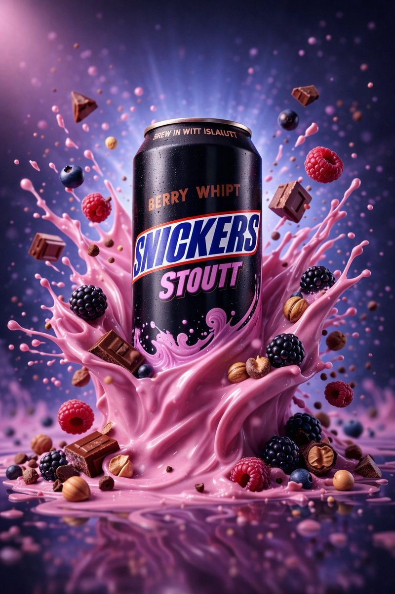

## { "master_prompt": { "global_settings": { "resolution": 

- ID: trending-2019069034365698163
- Slug: trending-2019069034365698163-en
- 语言: en
- 来源: [来源链接](https://x.com/john_my07/status/2019069034365698163)
- 样例图路径: images/part1/2019069034365698163_1.jpg

### 提示词

```text
{
  "master_prompt": {
    "global_settings": {
      "resolution": "8K ultra-high-definition",
      "aspect_ratio": "3:4 vertical",
      "style": "hyper-realistic AI-edited commercial product photography",
      "sharpness": "extreme clarity, micro-detail visibility",
      "lighting_quality": "cinematic studio lighting with controlled highlights and shadows",
      "motion_freeze": "high-speed capture, frozen splashes and particles",
      "noise": "none",
      "artifacts": "none"
    },

    "module_1_image_1_style": {
      "subject": {
        "type": "functional yogurt smoothie bottle",
        "material": "frosted plastic",
        "color": "soft pastel lavender",
        "surface_details": "dense condensation droplets covering the entire bottle",
        "label_text_visible": [
          "probiotic blend",
          "mock up",
          "high protein",
          "LOW FAT",
          "SEPARATED SHADOWS"
        ]
      },
      "pose_and_orientation": {
        "position": "slightly tilted forward",
        "angle": "three-quarter view",
        "motion_feel": "energetic, mid-impact splash moment"
      },
      "liquid_and_motion": {
        "liquid_color": "light purple yogurt smoothie",
        "texture": "thick, creamy, glossy",
        "motion": "smooth splash wrapping around the bottle with upward arcs"
      },
      "floating_elements": {
        "berries": "blackberries and blueberries floating at varying depths",
        "lavender_petals": "soft purple petals suspended mid-air",
        "droplets": "yogurt droplets and micro splashes frozen in motion"
      },
      "background": {
        "color_gradient": "deep violet fading into soft peach highlights",
        "bokeh": "subtle glowing circular light orbs"
      },
      "surface_and_reflection": {
        "base": "matte surface with creamy liquid pooling",
        "shadow_style": "clean, separated soft shadow beneath bottle"
      }
    },

    "module_2_image_2_style": {
      "subject": {
        "type": "sparkling electrolyte drink can",
        "material": "brushed aluminum",
        "color": "icy silver with neon cyan accents",
        "surface_details": "intense cold condensation with crystal-clear droplets",
        "branding_text_visible": [
          "HYDRATE+",
          "Electrolyte Drink",
          "ZERO SUGAR",
          "NEW FORMULA",
          "WITH MINERALS"
        ]
      },
      "pose_and_orientation": {
        "position": "upright and centered",
        "angle": "straight-on front view",
        "presence": "strong hero product stance"
      },
      "liquid_and_motion": {
        "liquid_color": "clear carbonated liquid with bubbles",
        "motion": "explosive splash bursting outward from the base",
        "droplet_behavior": "sharp, glass-like droplets flying outward"
      },
      "floating_elements": {
        "ice_cubes": "transparent ice cubes spinning in mid-air",
        "lime_slices": "fresh lime slices with visible pulp",
        "bubbles": "carbonation bubbles rising around the can"
      },
      "background": {
        "color_palette": "cool blues, cyan highlights, metallic silver tones",
        "atmosphere": "fresh, high-energy, ultra-refreshing"
      },
      "surface_and_reflection": {
        "base": "wet reflective surface with splash crown",
        "reflection_quality": "crisp reflections with controlled specular highlights"
      }
    }
  }
}
```

### 样例图

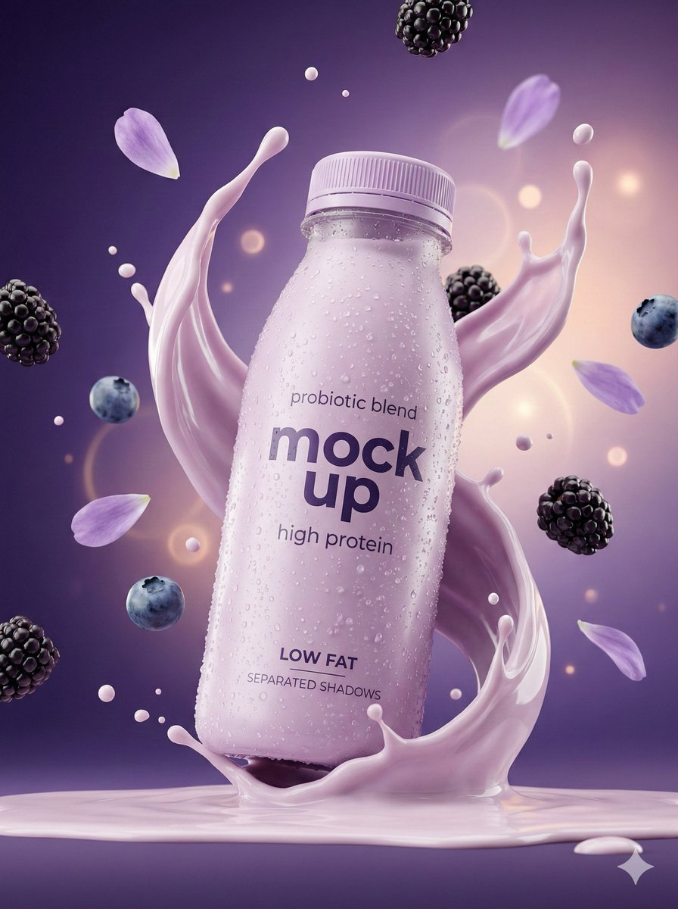

## A cinematic side-profile portrait of a rugged man with a

- ID: trending-2047882171336253928
- Slug: trending-2047882171336253928-en
- 语言: en
- 来源: [来源链接](https://x.com/iamsofiaijaz/status/2047882171336253928)
- 样例图路径: images/part1/2047882171336253928_1.jpg

### 提示词

```text
A cinematic side-profile portrait of a rugged man with a tied-back bun and full beard, wearing round dark sunglasses and a textured leather jacket. His skin is detailed and slightly weathered. The background is a futuristic sci-fi interface filled with glowing orange and red data streams, star maps, celestial navigation diagrams, grids, and holographic UI elements. Fiery particle effects and ember-like energy swirl around him, creating a cosmic, high-tech atmosphere. Dark color palette with strong contrast, dramatic lighting, ultra-detailed, sharp focus, 8K, cyberpunk aesthetic, cinematic composition, depth of field.
```

### 样例图

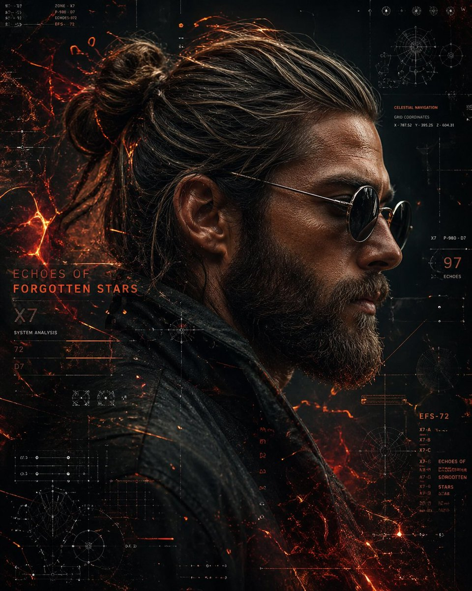

## 生成完整高端的品牌运营图 ，产品是老干妈

- ID: trending-2046603938485637446
- Slug: trending-2046603938485637446-zh
- 语言: zh
- 来源: [来源链接](https://x.com/ai_xiaomu/status/2046603938485637446)
- 样例图路径: images/part1/2046603938485637446_1.jpg

### 提示词

```text
生成完整高端的品牌运营图 ，产品是老干妈和星巴克的联名款：老干妈美式，中间是主图，下面放一些联名的设计，包装袋、杯套以及吉祥物。
```

### 样例图

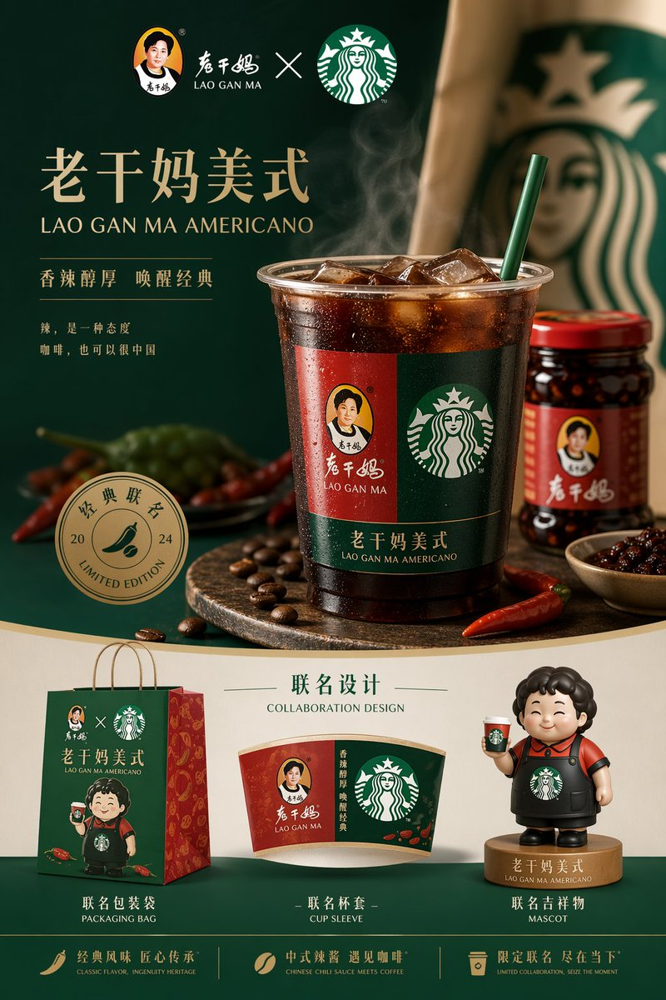

## Ultra-cinematic product photography of a matte black lux

- ID: trending-2019629174374429017
- Slug: trending-2019629174374429017-en
- 语言: en
- 来源: [来源链接](https://x.com/Naiknelofar788/status/2019629174374429017)
- 样例图路径: images/part1/2019629174374429017_1.jpg

### 提示词

```text
Ultra-cinematic product photography of a matte black luxury soda bottle labeled “NOIR FIZZ”, floating mid-air at a sharp diagonal angle; carbonated bubbles and liquid soda waves frozen in motion, shattered ice cubes and glossy black citrus slices suspended; dramatic low-key lighting with strong rim lights, metallic highlights, deep shadows; black and gold color palette, volumetric mist, macro textures, hyper-realistic glass, 8K, premium commercial ad style.
```

### 样例图

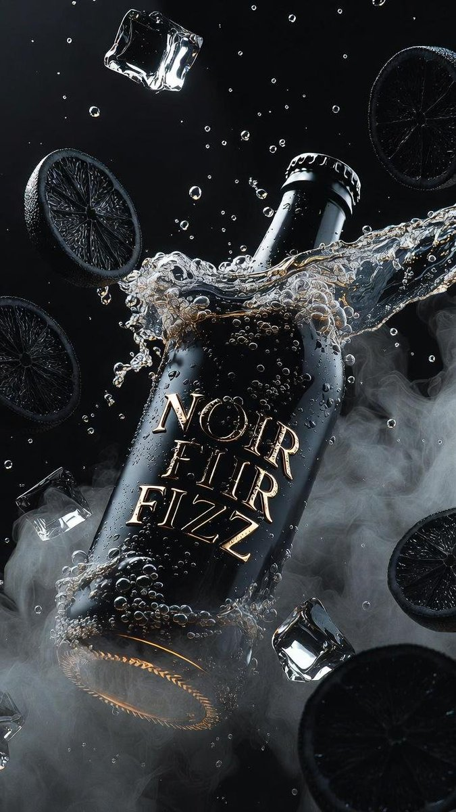

## { "global_settings": { "resolution": "8K UHD", "aspect_r

- ID: trending-2009947657905811727
- Slug: trending-2009947657905811727-en
- 语言: en
- 来源: [来源链接](https://x.com/meng_dagg695/status/2009947657905811727)
- 样例图路径: images/part1/2009947657905811727_1.jpg

### 提示词

```text
{
  "global_settings": {
    "resolution": "8K UHD",
    "aspect_ratio": "3:4",
    "image_type": "AI-edited hyper-realistic commercial product photography",
    "camera": {
      "focus": "ultra-sharp center focus",
      "depth_of_field": "shallow DOF with soft background falloff",
      "angle": "straight-on frontal view",
      "lens": "macro-commercial lens look"
    },
    "lighting": {
      "style": "studio lighting",
      "key_light": "strong frontal soft light",
      "rim_light": "subtle edge highlights on fruits and splashes",
      "reflections": "specular highlights on liquid droplets and metal can"
    },
    "textures": [
      "highly detailed aluminum can surface",
      "realistic liquid physics",
      "sharp fruit skin texture",
      "visible condensation droplets"
    ],
    "quality_flags": [
      "extreme detail",
      "photorealistic",
      "AI-enhanced clarity",
      "no motion blur",
      "clean background"
    ]
  },

  "Module_1_Image_1_Style_Orange": {
    "subject": "Orange flavored soda can",
    "can_details": {
      "material": "metal aluminum",
      "condition": "top torn open with jagged sharp cracks",
      "crack_position": "irregular split at the top rim, metal bent outward",
      "surface": "covered with water droplets and condensation"
    },
    "fruit_elements": {
      "whole_oranges": "multiple whole oranges floating behind and above the can",
      "orange_slice": "one visible half-cut orange slice near the top center",
      "leaves": "green citrus leaves attached to some oranges"
    },
    "liquid_effects": {
      "splash_color": "bright orange liquid",
      "motion": "liquid bursting upward and outward from inside the can",
      "droplets": "numerous suspended droplets frozen mid-air",
      "base_splash": "orange liquid pooling and splashing at the bottom"
    },
    "background": {
      "color": "solid warm orange",
      "gradient": "slight tonal variation, no patterns"
    }
  },

  "Module_2_Image_2_Style_Acai": {
    "subject": "Açaí flavored soda can",
    "can_details": {
      "material": "metal aluminum",
      "condition": "can split horizontally into two broken sections",
      "cracks": "jagged tearing edges with visible sharp metal folds",
      "surface": "covered with condensation droplets"
    },
    "fruit_elements": {
      "acai_berries": "multiple dark purple berries erupting from inside the can",
      "berry_motion": "berries floating upward and outward",
      "leaves": "few green leaves visible on sides"
    },
    "liquid_effects": {
      "splash_color": "deep purple liquid",
      "motion": "explosive splash radiating outward",
      "droplets": "fine droplets suspended in air"
    },
    "background": {
      "color": "warm beige to light brown gradient",
      "tone": "soft neutral backdrop"
    }
  },

  "Module_3_Image_3_Style_Goiaba_Guava": {
    "subject": "Guava flavored soda can",
    "can_details": {
      "material": "metal aluminum",
      "condition": "vertical split down the center of the can",
      "cracks": "uneven torn edges exposing inside",
      "surface": "visible water droplets and moisture"
    },
    "fruit_elements": {
      "guava_halves": "multiple guava halves with pink interiors",
      "whole_guavas": "several whole green guavas around the can",
      "leaves": "green guava leaves scattered"
    },
    "liquid_effects": {
      "splash_color": "red guava juice",
      "motion": "juice bursting upward and sideways",
      "droplets": "dense red droplets suspended mid-air"
    },
    "background": {
      "color": "solid deep red",
      "tone": "high contrast with fruit and liquid"
    }
  }
```

### 样例图


## Create an epic premium automotive poster of [CAR MODEL].

- ID: trending-2048752153343545390
- Slug: trending-2048752153343545390-en
- 语言: en
- 来源: [来源链接](https://x.com/Preda2005/status/2048752153343545390)
- 样例图路径: images/part1/2048752153343545390_1.jpg

### 提示词

```text
Create an epic premium automotive poster of 
[CAR MODEL].

Place the car as the heroic central subject in a dynamic three-quarter side profile, visually dominant and impossible to ignore.

Show the full beauty of the vehicle with aggressive stance, perfect proportions, premium wheels, signature headlights, aerodynamic lines, spoilers, performance details, and luxury design language.

Add bold premium typography with the brand name, model name, performance stats, horsepower, acceleration, top speed, engine specs, and iconic achievements beautifully integrated into the composition.

Include subtle background elements inspired by the car’s heritage: faded blueprint lines, racing legacy, silhouette overlays, iconic tracks, engineering details, speed graphics, and collector-poster aesthetics.

Use strong visual contrast, bright premium colors (avoid dark black-heavy backgrounds), cinematic lighting, ultra-detailed reflections, glossy paint finish, luxury magazine quality, modern graphic design, and scroll-stopping masterpiece energy.

Clean composition, high-end automotive advertisement style, collector poster aesthetic, highly detailed, visually powerful, premium masterpiece.
```

### 样例图

![Create an epic premium automotive poster of [CAR MODEL].](../images/part1/2048752153343545390_1.jpg)

## Cinematic automotive billboard poster, [CAR MODEL + VARI

- ID: trending-2045830975318610408
- Slug: trending-2045830975318610408-en
- 语言: en
- 来源: [来源链接](https://x.com/Diplomeme/status/2045830975318610408)
- 样例图路径: images/part1/2045830975318610408_1.jpg

### 提示词

```text
Cinematic automotive billboard poster, [CAR MODEL + VARIANT] in [PAINT COLOR + FINISH], parked center-frame, dominant stance, [CAMERA ANGLE — e.g. low angle / front three-quarter / elevated SUV angle], ultra controlled composition

dramatic studio lighting setup with [PRIMARY LIGHT COLOR/TONE] key light, [RIM LIGHT COLOR] rim lighting defining silhouette, high contrast shadow falloff, precise specular highlights across body panels

massive billboard-style typography composition, bold condensed sans-serif white text "[BRAND NAME]" filling entire background wall behind the car, perfectly centered and spanning edge-to-edge, with thin vertical dark lines slicing through each letter evenly, consistent spacing, no distortion

environment designed to match brand mood: [ENVIRONMENT DESCRIPTION — e.g. minimal concrete / desert haze / forest stone / industrial steel], seamlessly fading into deep gradient background, zero clutter

ground surface: [SURFACE TYPE — wet asphalt / gloss studio floor / textured terrain] with subtle realistic reflections, controlled diffusion, no noise

atmosphere: [FOG / HAZE / PARTICLES — optional but controlled], only at ground level for depth

top right corner: [BRAND LOGO DESCRIPTION], small and elegant, paired with minimal uppercase text "[YOUR SIGNATURE — e.g. MURPHY AI]" aligned cleanly

STRICT RULES:
— no extra taglines  
— no performance specs  
— no additional typography  
— no random elements  
— maintain premium minimal billboard aesthetic  

render quality: hyper-detailed photorealism, ultra sharp reflections, realistic paint microtexture, cinematic color grade matching environment

composition: perfectly balanced, symmetrical, professional automotive advertising layout

format: 1:1 square, ultra high resolution, print-ready billboard finish
```

### 样例图

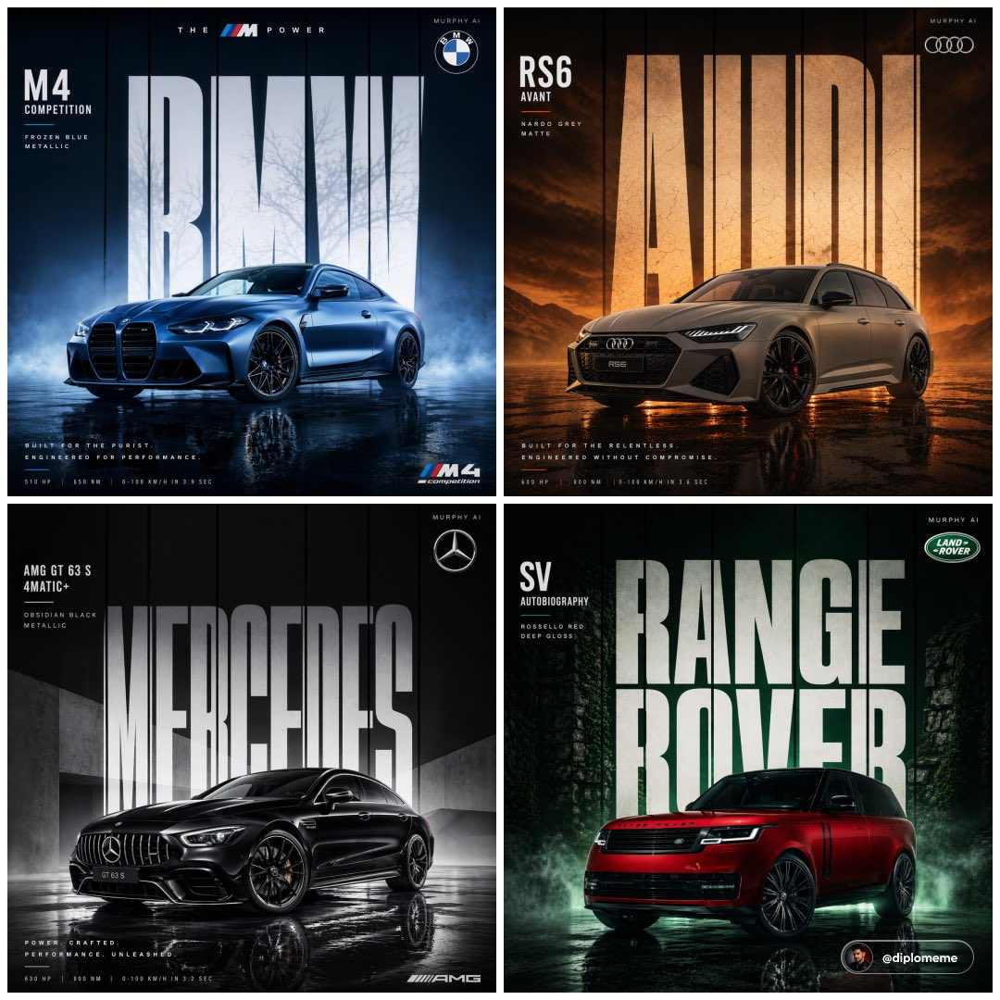

## Create the most realistic front page design of a vintage

- ID: trending-2047207812800147647
- Slug: trending-2047207812800147647-en
- 语言: en
- 来源: [来源链接](https://x.com/Naiknelofar788/status/2047207812800147647)
- 样例图路径: images/part1/2047207812800147647_1.jpg

### 提示词

```text
Create the most realistic front page design of a vintage newspaper featuring the main character. The layout should be made in the style of a real printed newspaper with a cinematic black-and-white aesthetic.
The main photo should be prominently placed in the center, framed, like the image in the title of the article. The subject in the photo should remain unchanged and clearly distinguishable in natural light and slightly increased contrast in order to match the spectacular editorial style.
Create a bold, attention-grabbing headline at the top (create a unique title that matches the spirit of the photo - it can be romantic, mysterious, funny, or dramatic). Add a smaller subtitle under it, which will look like a real newspaper caption.
Add realistic newspaper elements:
Columns of small text (in the style of lorem ipsum, but framed like real news)
At the top is the fictitious name of the publication (for example, “The Daily Prompts”, “AI Times” or similar - think creatively, according to the picture)
Date, issue number and location
Decorative lines, dividers, and vintage typography
Small additional articles or captions to the main image
Optional stamps, doodles, or editorial notes to add personality.
Style:
Black and white or slightly faded monochrome paper
Fine paper texture, grain, and ink defects
Small shadows and creases that mimic real printed paper
The aesthetics of a clean but slightly worn vintage newspaper
Mood: Give the design personality, expressiveness and plot, as if the plot is part of the main article.
Aspect ratio: 4:5 or 1:1
High-detail, ultra-realistic hybrid of editorial photography and print design.
```

### 样例图

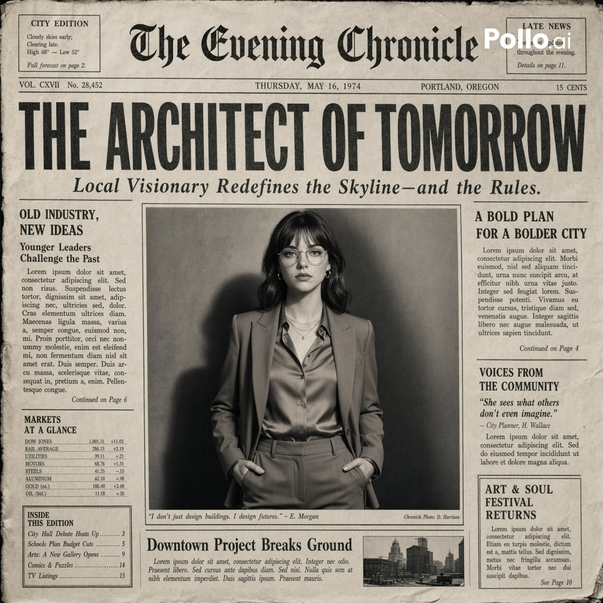

## A hyperrealistic Nike sneaker advertisement shot in a da

- ID: trending-2048018776785064328
- Slug: trending-2048018776785064328-en
- 语言: en
- 来源: [来源链接](https://x.com/rovvmut_/status/2048018776785064328)
- 样例图路径: images/part1/2048018776785064328_1.jpg

### 提示词

```text
A hyperrealistic Nike sneaker advertisement shot in a dark, moody editorial style. A male leg wearing crisp white athletic crew socks with subtle Nike logo detail is suspended mid-air against a near-black charcoal background, angled diagonally toward the camera at a bold 45-degree perspective. The sneaker — a Nike low-top silhouette featuring a clean two-tone colorway of glacier teal suede panels and off-white tumbled leather, with an iridescent chrome Swoosh catching ambient light — dominates the lower two-thirds of the frame.
The composition uses shallow depth of field with sharp focus on the shoe and soft blur on the upper leg. The background is layered with subtle urban texture - faint graffiti strokes in electric yellow and muted olive, barely visible through a heavy dark vignette. Multiple rows of ultra-small all-caps typographic text orbit the sneaker at different angles, reading phrases like "THE ONLY LIMITS ARE THE ONES YOU SET FOR YOURSELF" - evoking motion, speed, and energy. Some text runs vertically, some at 30-degree angles, giving the composition a chaotic yet intentional graphic design feeling.
At the upper right, the bold Nike wordmark and Swoosh logo appear in clean white against the dark background. At the top center, a thin horizontal navigation-style text bar reads: "PURE COMFORT · ALWAYS AHEAD · THE FUTURE IS NOW" in spaced all-caps serif font. A large, commanding headline is placed center-right in contrasting weight typography - "MOVE" in massive ultra-bold white letters followed by "BEYOND" in lighter weight, creating dramatic type hierarchy.
Small yellow plus (+) symbols and diagonal arrows (↗) are scattered throughout the composition as accent details, adding a contemporary graphic zine aesthetic. Bottom left features a bold brand slogan lockup: "DEFINE YOUR STRIDE" in large bold sans-serif white text with a thin subline: "An inspiring reminder that speed is a mindset. Every step forward is a statement." The overall lighting is dramatic and directional - a single cold key light from the left, causing the Swoosh to shimmer and the white leather to glow against the darkness. Photorealistic. Commercial photography quality. High contrast. 4K resolution, 3:4 vertical format optimized for social media.
```

### 样例图

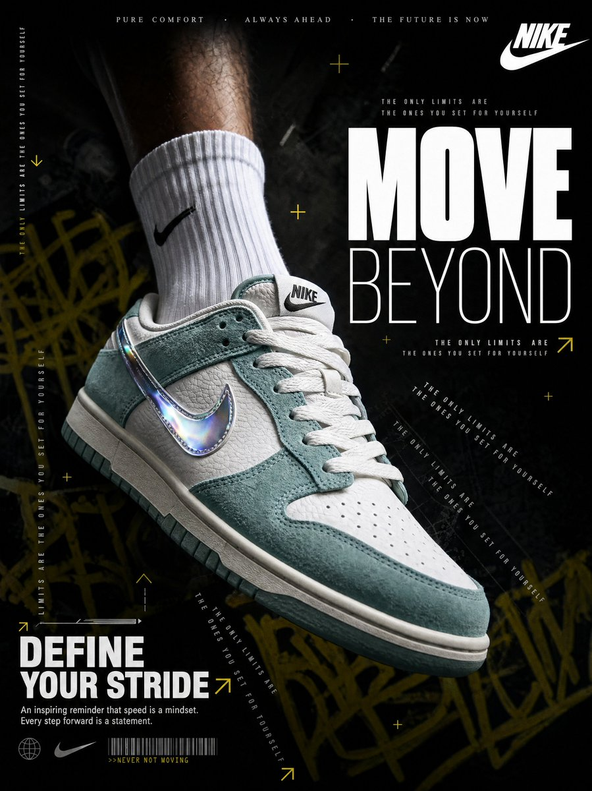

## A cinematic epic sci-fi fantasy movie poster featuring t

- ID: trending-2047676720707482049
- Slug: trending-2047676720707482049-en
- 语言: en
- 来源: [来源链接](https://x.com/azed_ai/status/2047676720707482049)
- 样例图路径: images/part1/2047676720707482049_1.jpg

### 提示词

```text
A cinematic epic sci-fi fantasy movie poster featuring three powerful tech leaders standing together as rival kings of artificial intelligence, dramatic futuristic battlefield, dark stormy sky, glowing AI energy, towering digital fortress in the background, armies of advanced robots below, intense blue and golden lighting contrast, ultra-detailed armor-inspired futuristic outfits, heroic serious expressions, high-budget streaming series poster style, dramatic composition, sharp facial details, atmospheric smoke, lightning, sparks, cinematic depth, professional poster typography with the title “THE FINAL AI BATTLE”, subtitle “The future is intelligent. The battle is real.”, 4:3 aspect ratio
```

### 样例图

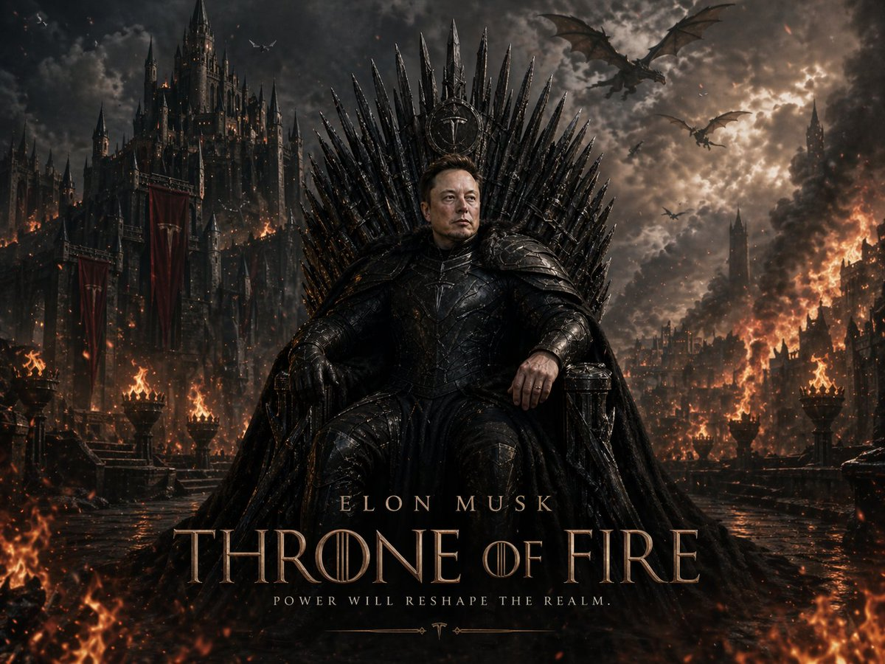

## A luxury high-fashion magazine cover. Magazine name at t

- ID: trending-2047178898375426212
- Slug: trending-2047178898375426212-en
- 语言: en
- 来源: [来源链接](https://x.com/Ozayrr_irl/status/2047178898375426212)
- 样例图路径: images/part1/2047178898375426212_1.jpg

### 提示词

```text
A luxury high-fashion magazine cover. Magazine name at the very top in massive elegant serif font reads "LUMIÈRE" — the letters are large, slightly transparent/ghost-style overlapping the model's head just like ELLE magazine, in soft platinum silver color blending into the background.
Character: A young beautiful white woman, early 20s, soft feminine features, big blue eyes, naturally full lips, flawless porcelain skin, subtle makeup — rosy cheeks, nude lips, defined brows. Her hair is platinum blonde, long and wavy, loosely flowing over one shoulder. She looks directly into the camera with a soft yet powerful gaze. Slight tilt of the head, naturally elegant posture.
Outfit: She is wearing a dramatic deep burgundy wine-red ballgown — structured corset top with off-shoulder neckline, voluminous layered satin skirt billowing around her dramatically. Behind her shoulders, large sculptural fabric rises like rose petals — same architectural drama as reference. She leans slightly forward, both hands resting gently on her knees.
Background: Pure soft warm white/ivory background — completely clean, minimal, high-end studio editorial. Soft diffused light, no harsh shadows.
Typography — placed EXACTLY like ELLE magazine reference:
Top: "LUMIÈRE" massive serif, platinum/silver, overlapping model's head slightly
Left mid: "GRACE & POWER" bold serif, then smaller below "THE NEW VISION OF LUXURY"
Right mid: "TIMELESS & FEARLESS" bold, then "PURE OPULENCE" smaller below
Bottom right large: "ICONIC & UNSTOPPABLE" elegant large serif
All text in deep charcoal/dark navy. Font style: classic high fashion serif — same weight, spacing, and elegance as ELLE. Text naturally integrated into the composition, NOT floating randomly.
Ultra photorealistic, 8K, real magazine cover quality, perfect typography placement, vertical 9:13 format.
```

### 样例图

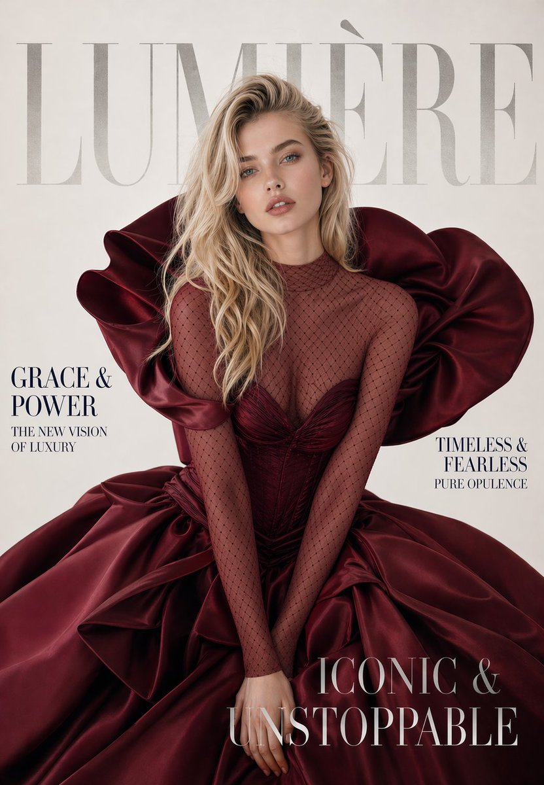

## 武则天同款皇后香水广告，龙纹金瓶，暗黑宫

- ID: trending-2046766344163737788
- Slug: trending-2046766344163737788-zh
- 语言: zh
- 来源: [来源链接](https://x.com/songguoxiansen/status/2046766344163737788)
- 样例图路径: images/part1/2046766344163737788_1.jpg

### 提示词

```text
武则天同款皇后香水广告，龙纹金瓶，暗黑宫廷氛围感大片
```

### 样例图

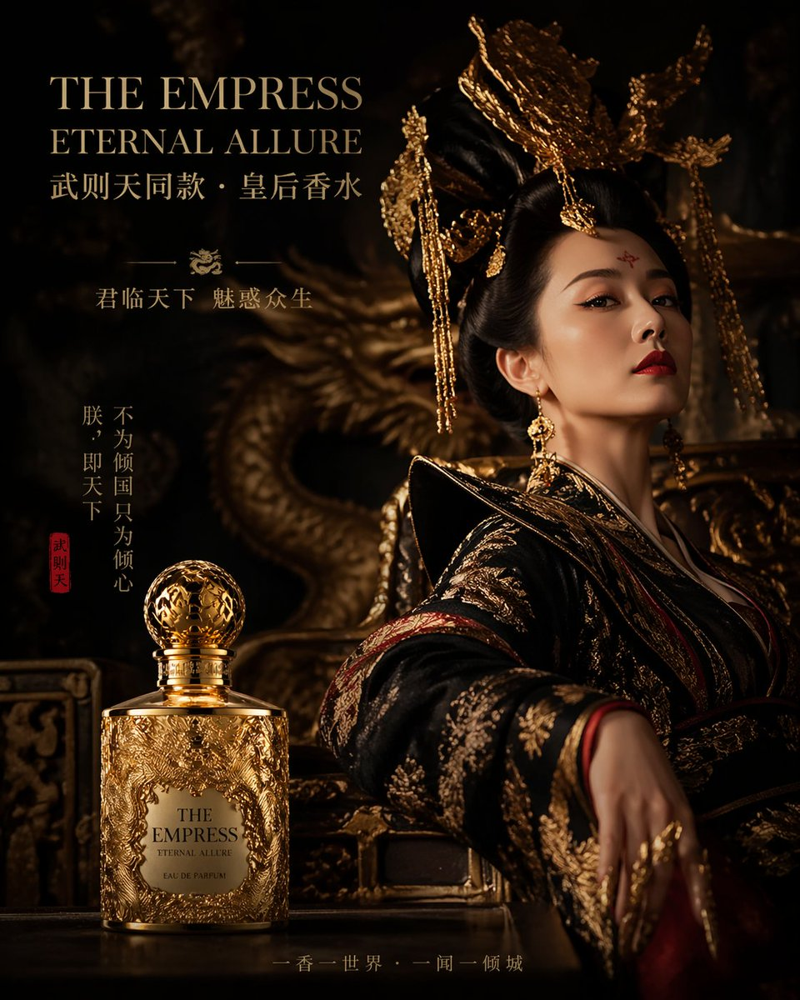

## 高级概念海报，竖版 3:4，核心文字为[

- ID: trending-2048630851051892985
- Slug: trending-2048630851051892985-zh
- 语言: zh
- 来源: [来源链接](https://x.com/xiaohu/status/2048630851051892985)
- 样例图路径: images/part1/2048630851051892985_1.jpg

### 提示词

```text
高级概念海报，竖版 3:4，核心文字为[输入文字]

请先深度理解'[输入文字]'的表层含义、深层寓意、情绪气质、文化联想、人物命运感与隐含张力，再决定最适合它的画面风格、构图方式、色彩气质和视觉隐喻。

画面风格必须由词义自动生成，不要机械套用统一模板。每个词都应拥有和它自身内涵相匹配的独特视觉语言。

画面中，巨大中文主标题“[输入文字]”必须是绝对主体，字形清晰完整，无错字无缺笔，占据大部分画面，形成最强第一视觉。
不要做普通插画，不要只画人物外貌。

请提炼一个最准确、最有代表性的视觉隐喻，让人物、物体、空间或象征元素与大字发生关系，让观者一眼感受到这个词为什么会被这样表达。
整体气质要求高级、极简、克制、展览级，具有强排版、强隐喻、强情绪、强记忆点。

可根据词义自动选择更冷峻、更诗意、更悲剧、更锋利、更温柔或更庄严的视觉风格。

色彩也应根据词义自动调整，但保持整体高级感和节制感。

小字文案只保留三处：

左上角：2到4个关键词
右侧竖排：一句命运感短句
左下角：一句有传播力的总结句
要求元素少，概念准，留白克制。

文字是第一视觉，隐喻图像是第二视觉，小字是第三视觉。

不要拥挤，不要廉价广告感，不要多余英文，不要解释性长文案。

最终效果应像展览级文学人物或概念主题海报，把“【输入文字】”背后的精神状态和文化意味真正视觉化。
```

### 样例图

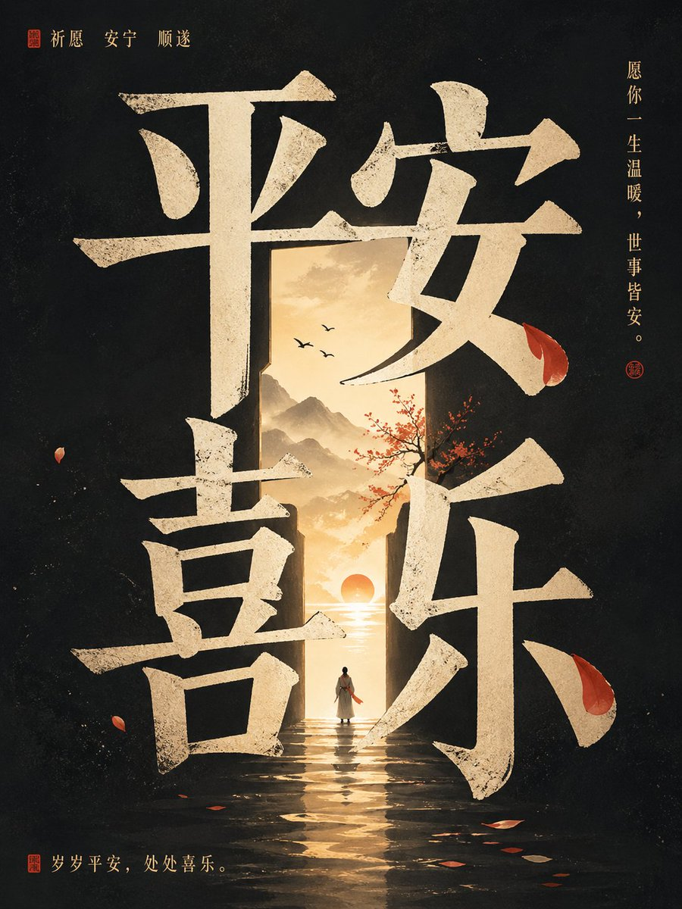

## Hip-hop fashion model standing full-frame, clothing dist

- ID: trending-2048599189681291673
- Slug: trending-2048599189681291673-en
- 语言: en
- 来源: [来源链接](https://x.com/Goodmanprotocol/status/2048599189681291673)
- 样例图路径: images/part1/2048599189681291673_1.jpg

### 提示词

```text
Hip-hop fashion model standing full-frame, clothing distorted into stretched streaks like motion drag, bold red background, retro film grain, barcode + tiny technical text in bottom area, modern fashion-magazine layout, expressive weirdness, cool attitude , 4K high detail. --ar 4:5 --raw
```

### 样例图

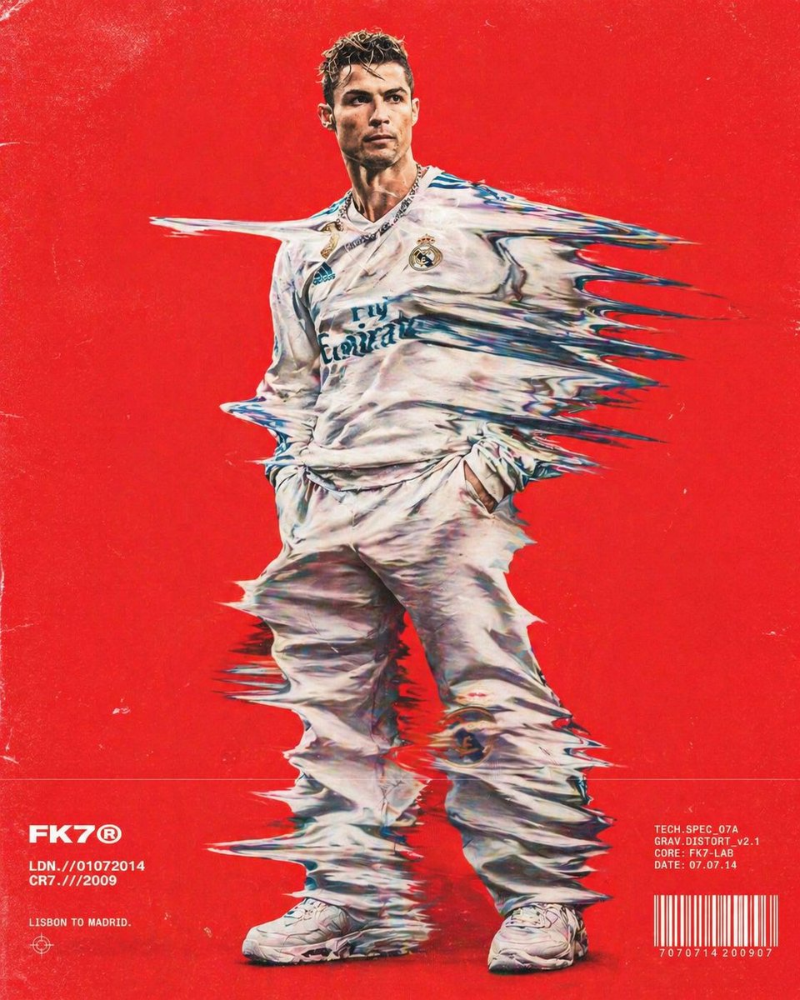

## Minimalist commercial ad featuring oversized white smart

- ID: trending-2048643867222962518
- Slug: trending-2048643867222962518-en
- 语言: en
- 来源: [来源链接](https://x.com/MrDasOnX/status/2048643867222962518)
- 样例图路径: images/part1/2048643867222962518_1.jpg

### 提示词

```text
Minimalist commercial ad featuring oversized white smartwatch, ultra-clean design. A young woman in all-white outfit leans casually against the giant watch, relaxed confident pose, eyes closed, also wearing the same smartwatch on her wrist. Soft gradient blue background with large bold white “APPLE” text behind. Glossy reflective floor, soft studio lighting, modern high-end fashion/product photography. Small top-right text “Designed by Mr Das”. Bottom center tagline in small white font: “Stay connected, move smarter.”
```

### 样例图


## Ultra-clean modern editorial infographic on the topic of

- ID: trending-2047683043918311670
- Slug: trending-2047683043918311670-en
- 语言: en
- 来源: [来源链接](https://x.com/TechieBySA/status/2047683043918311670)
- 样例图路径: images/part1/2047683043918311670_1.jpg

### 提示词

```text
Ultra-clean modern editorial infographic on the topic of [ROUTINE] routine. Hero visual: a stylized flat-lay or floating arrangement of 3–4 objects closely associated with the routine — slightly angled or in soft perspective, glowing subtly. All elements arranged dynamically around the hero in a non-restrictive editorial layout. Ingredients Section: Label it ‘What You Need’ — include 6–8 items with small icons or emoji illustrations next to each. Each item has a name and a practical quantity or duration written like a recipe (e.g. ‘x minutes of Y’). Arranged in a cluster or list connected visually to the hero. Steps Section: 5–6 numbered panels with arrows or connecting lines forming a logical flow. Each step has a short action label and a small relevant icon. Panels use glassmorphism or frosted card styling. Stats Badges: 4–5 floating pill-shaped badges showing relevant metadata — total time, difficulty, consistency streak, energy cost — displayed as clean minimal bubbles near the hero. Visual Style: Warm, soft editorial background — cream, warm white, or soft morning light tones. Muted earthy accent colors with clean highlights. Bold modern sans-serif typography. Clean vector icons. Subtle grain or paper texture in background. Composition: Hero object cluster centered or slightly offset. Ingredients on one side. Steps flow opposite or below with connecting lines. Stat badges scattered as floating pills. Generous negative space to keep it airy and readable. Lighting: Soft warm natural light feel emanating from the hero cluster. Premium lifestyle editorial aesthetic, social-feed optimized. Ultra-crisp. No watermark.
```

### 样例图

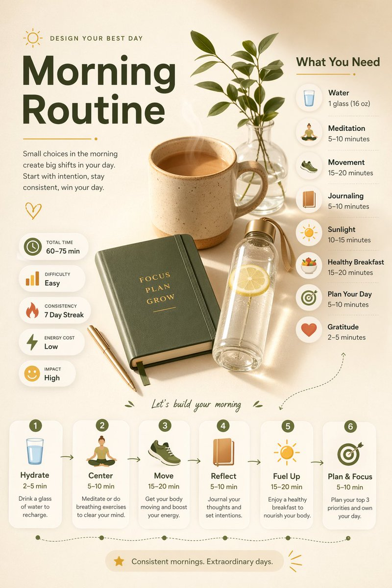

## 新中式极简风格高端城市海报，9:16竖版

- ID: trending-2045744531686166878
- Slug: trending-2045744531686166878-zh
- 语言: zh
- 来源: [来源链接](https://x.com/liyue_ai/status/2045744531686166878)
- 样例图路径: images/part1/2045744531686166878_1.jpg

### 提示词

```text
新中式极简风格高端城市海报，9:16竖版构图，以广州为核心主题，画面中心为抽象几何化的广州塔，造型简洁但具有辨识度，

整体采用S型流动构图，从下方向上延展，珠江水系被设计为流动的水波纹与传统祥云纹样融合，环绕整个画面形成视觉动线，

广州地标建筑以“留白+线描+局部色块”的方式点缀其中：珠江新城双塔、猎德大桥、白云山轮廓、岭南骑楼，
传统与现代建筑自然融合，层次递进，远近虚实分明，

风格控制：极简 + 高级 + 东方意境，不杂乱不过度写实，

色彩方案（重点）：
高饱和但克制 ，中国红、青蓝、鎏金为主色，
辅以少量暖金高光点缀，形成强烈视觉冲击但不俗艳，

背景：大面积纯净留白或淡宣纸肌理，增强呼吸感与高级感，

细节：祥云与水纹具有轻微浮雕/烫金质感，
局部加入微光粒子或流动光线，增强现代感，

光影：柔和渐变光+局部高光，突出恢弘大气氛围，

整体风格：国潮高级插画 / 品牌海报级质感 / 8K / 超清细节
```

### 样例图


## full body female model in confident fashion pose (one le

- ID: trending-2048615041566449922
- Slug: trending-2048615041566449922-en
- 语言: en
- 来源: [来源链接](https://x.com/auqibhabib/status/2048615041566449922)
- 样例图路径: images/part1/2048615041566449922_1.jpg

### 提示词

```text
full body female model in confident fashion pose (one leg slightly raised, relaxed luxury stance), wearing oversized black blazer, fitted black crop top, high-waisted baggy blue denim jeans, black heels, slim sunglasses, holding a small black handbag, clean long hair, sharp facial features
minimal luxury studio background, soft beige gradient wall, smooth shadows, editorial lighting, high-end fashion campaign style
large embossed “PREMIUM” text in background, subtle 3D depth, tone-on-tone color blending with wall, elegant and soft
keep “BAGGY” text bold and minimal near bottom, modern premium sans-serif font
add “GUCCI” logo top right corner, clean spacing, luxury typography
ultra realistic, sharp focus, premium color grading, soft highlights, depth of field, magazine-quality, clean composition, no clutter
```

### 样例图

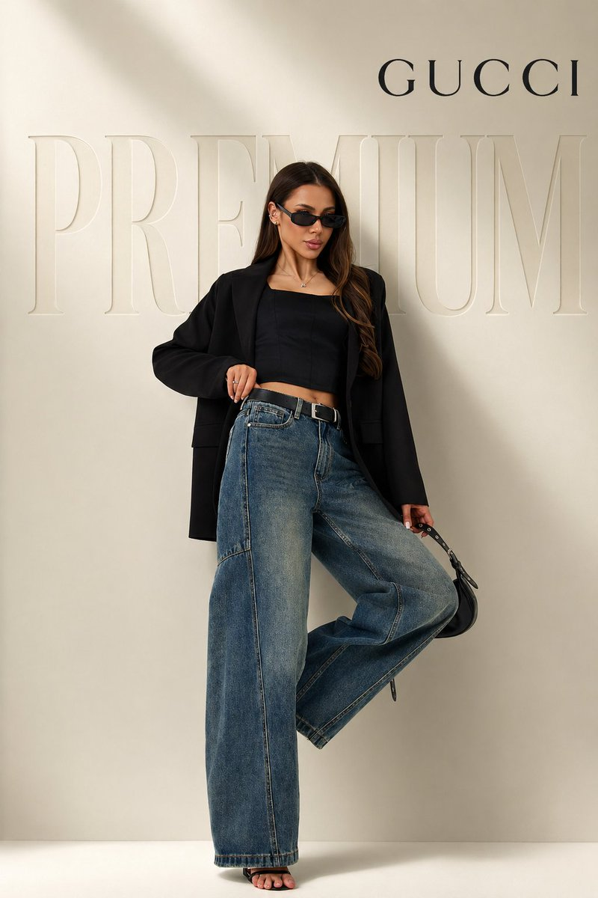

## logo completely wrapped in a single layer of elastic pla

- ID: trending-2040963305901273505
- Slug: trending-2040963305901273505-en
- 语言: en
- 来源: [来源链接](https://x.com/Naiknelofar788/status/2040963305901273505)
- 样例图路径: images/part1/2040963305901273505_1.jpg

### 提示词

```text
logo completely wrapped in a single layer of elastic plastic or shrink wrap. The shapes of the logo should be visible only through the relief under the film, the logo surfaces themselves are not visible.

Brand Analysis System:

Logo geometry: Determine the full visual brand identifier [ADIDAS ORIGINAL] according to the official catalog: an icon, a text element, or a combination thereof. Keep the exact spatial relationship between the icon and the text.
Color system: Use one monochrome tone [ADIDAS ORIGINAL] for all elements of the scene — background, film, wrapped object. Variations are achieved only through light and shadow.
The nature of the film: Based on the selected color [ADIDAS ORIGINAL], determine the behavior of the material: bright saturated colors create a dense glossy or latex film with visible tension lines; neutral — matte stretch film; dark - translucent vacuum film; light — matte food film.

Stage 1: Stage and Surface

The whole scene is monochromatic, the [ADIDAS ORIGINAL] color covers every surface without exception.
The background is made of the same film material, which is freely assembled and crumpled around the logo. Natural tension lines are created, the folds diverge from the peaks of the relief.
There are no floor lines, walls, or horizons — the stage is completely immersed in a solid plastic material.

Stage 2: Applying the logo

Each element of the logo is voluminous, rounded, like a balloon, with visual depth.
The logo is fixed on the background and is completely covered with a single layer of film, tightly stretched over the tops of the elements, creating visible tension lines.
Free folds are formed in the hollows between the letters, geometric elements of the icon and around the perimeter of the logo.
The logo remains fully readable, the icon is recognizable, but not a single surface of the logo itself is visible.
The physics of the film is precise: tight tension at high points, diverging stress lines, small raised areas between elements, shadows in the gaps.

Stage 3: Lighting

The main light source is soft, diffused, from the top left, emphasizing the relief of the film.
For glossy films, there are subtle highlights along the stretched areas, for matte films, there is only diffused light.
Global lighting preserves details in deep folds without smoothing out the overall relief.

Technical specifications

Only the [ADIDAS ORIGINAL] color, variations through light and shadow.
There are no exposed logo surfaces and unnecessary text.
The film is realistic: the tension, the folds, the physics of plastic, not fabric.
The film grain corresponds to ISO 400.
Mood: the product is packed and ready for opening, the shape is known, but not yet touched.
```

### 样例图


## A bold fashion editorial poster featuring a young woman 

- ID: trending-2048748484011204693
- Slug: trending-2048748484011204693-en
- 语言: en
- 来源: [来源链接](https://x.com/saniaspeaks_/status/2048748484011204693)
- 样例图路径: images/part1/2048748484011204693_1.jpg

### 提示词

```text
A bold fashion editorial poster featuring a young woman model in a close-up half-body portrait, wrapped in an oversized black puffer jacket with a high padded collar partially covering the lower face, styled in a minimal, sleek, modern luxury streetwear aesthetic. The model turns her upper body slightly away from the camera while looking back over her shoulder toward the viewer, creating a tense and magnetic pose, with one hand raised delicately near the jacket zipper and collar, fingers lightly touching the fabric as if adjusting it, giving a controlled, elegant, and intentional gesture that contrasts softly with the heavy oversized jacket, while her shoulders are slightly hunched into the coat to create a protective, stylish, and intimate silhouette. Her facial expression is calm, serious, and subtly mysterious with direct eye contact, slightly parted lips, relaxed brows, and a smooth yet intense gaze, conveying a quiet, emotionally reserved, high-fashion attitude that feels soft, cold, elegant, and untouchable. The overall mood is moody, minimalist, premium, and polished with a quiet luxury winter editorial feel. The outfit consists of an oversized matte black down puffer jacket with dramatic volume, a high collar, and a clean zipper line, with no additional accessories, maintaining a monochrome modern Korean magazine vibe. The poster design features a clean graphic magazine cover style with a white background, oversized red vertical typography behind the subject spelling “GUVET” or similar bold letterforms, a sharp editorial layout, red and black color scheme, modern sans-serif text, small microtext blocks, inset cropped detail frames showing close-up facial features, and subtle fashion publication branding elements at the bottom. The lighting is soft studio lighting with clean skin texture, crisp contrast, smooth shadows, high detail on the eyes and lips, refined print-magazine finishing, ultra sharp focus, and a luxury commercial fashion poster aesthetic in high resolution with a premium composition.
```

### 样例图

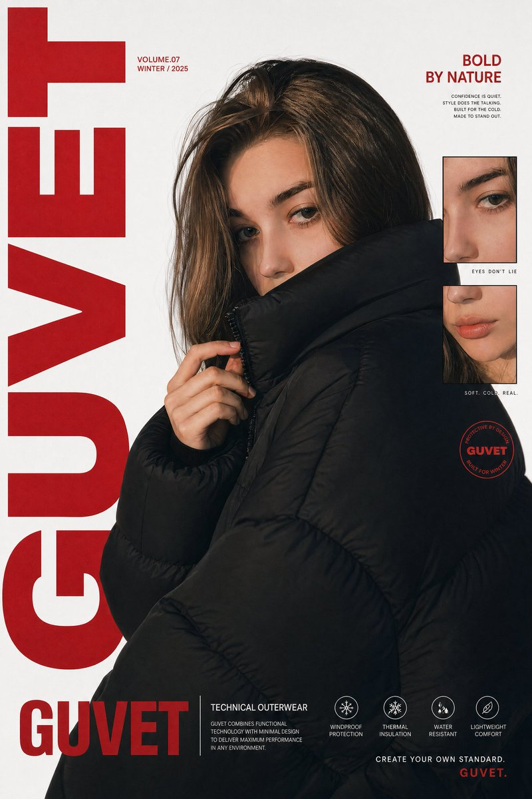

## { "master_prompt": { "scene_type": "high-speed commercia

- ID: trending-2028279420419752307
- Slug: trending-2028279420419752307-en
- 语言: en
- 来源: [来源链接](https://x.com/mehvishs25/status/2028279420419752307)
- 样例图路径: images/part1/2028279420419752307_1.jpg

### 提示词

```text
{
  "master_prompt": {
    "scene_type": "high-speed commercial luxury shake photography",
    "product": {
      "type": "elegant frosted glass bottle filled with velvety strawberry shake",
      "brand_name": "ROSÉ VELVET",
      "label_design": "minimalist vertical blush label with embossed rose-gold serif typography",
      "liquid_color": "creamy pastel pink with natural strawberry swirls"
    },
    "composition": {
      "action": "dynamic high-velocity creamy splash explosion",
      "surrounding_elements": [
        "sculptural waves of thick strawberry shake splashing outward",
        "silky ribbons of strawberry puree suspended mid-air",
        "floating fresh strawberry halves with visible seeds and juicy texture",
        "soft dusting of powdered sugar diffusing delicately",
        "fine droplets of creamy pink mist catching the light"
      ],
      "placement": "centered hero bottle with a crisp reflection on a polished white marble surface"
    },
    "lighting": {
      "style": "luxury glossy studio product lighting",
      "effects": [
        "sharp rim lighting to define bottle silhouette",
        "brilliant highlights on creamy splashes and glossy strawberry surfaces",
        "soft rosy glow in the background for warmth and elegance"
      ]
    },
    "color_palette": {
      "background": "smooth gradient of blush pink fading into soft champagne ivory",
      "accents": "fresh strawberry red, rose gold, and creamy vanilla tones"
    },
    "technical_specs": {
      "camera": "macro lens, eye-level angle",
      "shutter": "ultra-fast freeze-motion capture",
      "depth_of_field": "shallow focus on the label, gentle blur on dynamic splash elements",
      "quality": "8K resolution, ultra-photorealistic texture"
    }
  }
}
```

### 样例图


## Ultra-dynamic motocross racing scene featuring a profess

- ID: trending-2023624269385855301
- Slug: trending-2023624269385855301-en
- 语言: en
- 来源: [来源链接](https://x.com/Naiknelofar788/status/2023624269385855301)
- 样例图路径: images/part1/2023624269385855301_1.jpg

### 提示词

```text
Ultra-dynamic motocross racing scene featuring a professional dirt bike rider performing extreme stunts inside a massive indoor stadium. The composition blends realism and cinematic energy — showing the rider in multiple perspectives: a close-up portrait with a blue and yellow helmet, a mid-action jump on a dirt track, and a victory pose near the finish line. The background features dramatic smoke, spotlights,and structural beams of the stadium, with flashes of neon green accents cutting through the atmosphere. The dirt track is rugged, filled with motion blur, dust particles, and intense lighting contrast. Energy drink branding and banners add authenticity to the motorsport environment. The overall tone is high-octane, gritty, and heroic — perfect for a motorsport poster or promotional artwork.
```

### 样例图

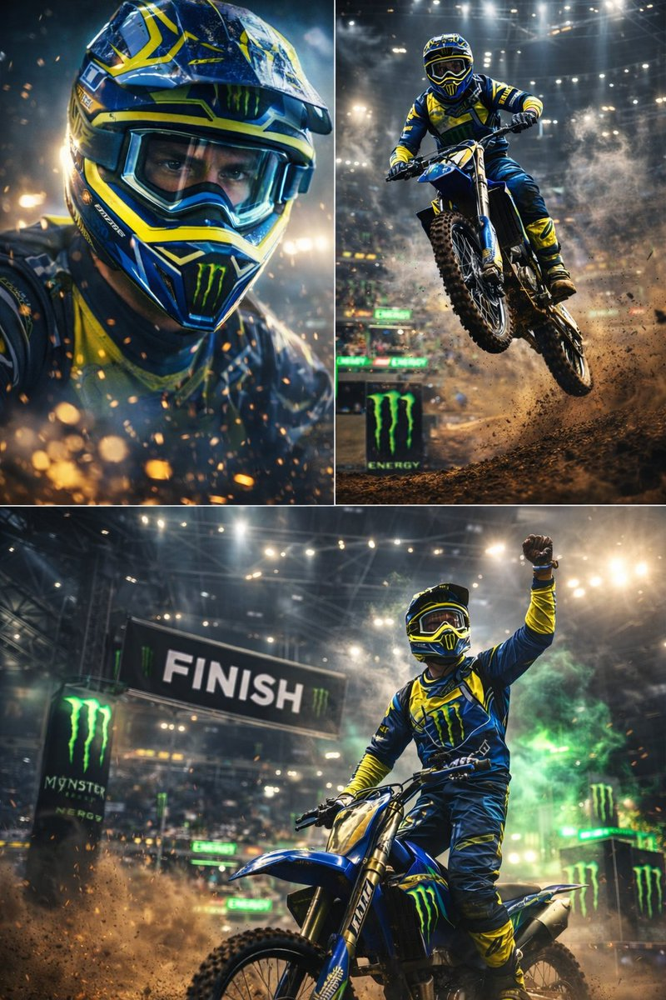

## Create a stylized travel poster / graphic collage for [A

- ID: trending-2048057470812074251
- Slug: trending-2048057470812074251-en
- 语言: en
- 来源: [来源链接](https://x.com/MaAyyoub/status/2048057470812074251)
- 样例图路径: images/part1/2048057470812074251_1.jpg

### 提示词

```text
Create a stylized travel poster / graphic collage for [ALGERIA]. The main subject should be a stylish international tourist visiting [ALGERIA], clearly presented as a traveler and not a local resident. Show the tourist wearing modern travel fashion, with details such as a camera, backpack, sunglasses, map, or suitcase, exploring the culture and atmosphere of [ALGERIA]. Place the tourist in a dynamic composition surrounded by iconic architecture, streets, landscapes, landmarks, transportation, food, signage, and cultural elements associated with [ALGERIA]. Blend realistic character detail with a graphic collage background made of layered paper textures, torn poster edges, sticker elements, halftone dots, editorial typography, and bold geometric shapes. Include authentic visual motifs from [ALGERIA], but keep the tourist’s appearance and styling globally fashionable and clearly foreign to the setting. Add a large readable headline: “VISIT [ALGERIA]”. Modern, artistic, premium editorial travel poster aesthetic, balanced layout, print-worthy composition.
```

### 样例图

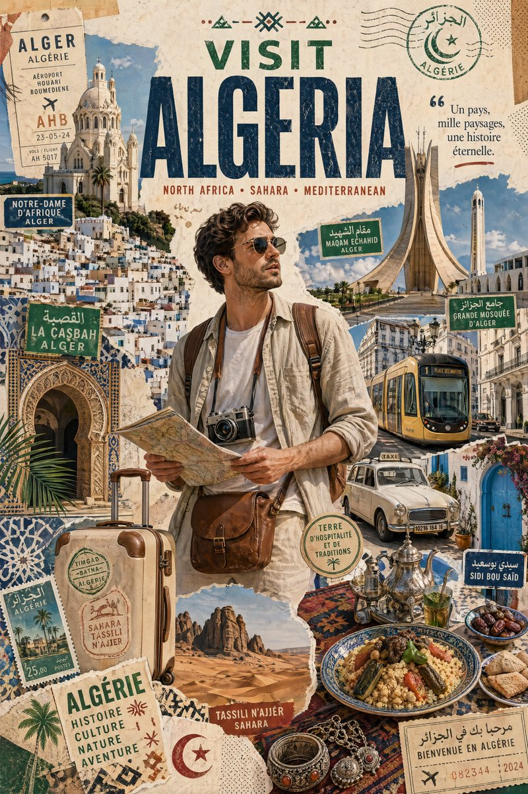

## Cinematic luxury tourism poster, Spain, iconic view of S

- ID: trending-2046089486719930845
- Slug: trending-2046089486719930845-en
- 语言: en
- 来源: [来源链接](https://x.com/Diplomeme/status/2046089486719930845)
- 样例图路径: images/part1/2046089486719930845_1.jpg

### 提示词

```text
Cinematic luxury tourism poster, Spain, iconic view of Sagrada Família in Barcelona rising prominently above the city, detailed organic architecture with surrounding urban grid softly visible, clean and centered composition

camera angle: elevated wide perspective capturing full structure symmetry with city depth behind

lighting: warm golden hour sunlight casting soft highlights across stone textures, gentle shadows, glowing atmosphere

typography: elegant high-fashion editorial serif font, large refined text "SPAIN" integrated across sky and upper architecture, subtly blending with light and structure

text hierarchy:
small top text: "Visit"
main: "SPAIN"
small bottom line: "FEEL THE PASSION"

environment: clean Barcelona cityscape simplified for clarity, no clutter, focus on architecture

color palette: warm gold, sandstone beige, soft blue sky

atmosphere: light haze with sun glow enhancing depth and warmth

branding: top right minimal text "MURPHY AI"

STRICT RULES:
— Sagrada Família must be the dominant focal point
— maintain elegance and warmth
— avoid overcrowded city details

render quality: ultra photorealistic, cinematic warm Mediterranean grade, premium tourism campaign style

composition: balanced, symmetrical, editorial luxury layout

format: 1:1 square, ultra high resolution

Cinematic luxury tourism poster, Brazil, iconic aerial view of Christ the Redeemer statue overlooking Rio de Janeiro with coastline and mountains visible, perfectly centered composition

camera angle: elevated aerial perspective behind or slightly above statue, revealing city and ocean depth

lighting: warm sunrise or sunset golden light with vibrant yet controlled tones

typography: elegant editorial serif font, large refined text "BRAZIL" integrated across sky and horizon, softly blending with clouds

text hierarchy:
small top text: "Visit"
main: "BRAZIL"
small bottom line: "FEEL THE ENERGY"

environment: lush mountains, coastline, cityscape simplified for clarity

color palette: green, blue, gold highlights

atmosphere: light haze, soft clouds catching sunlight

branding: top right minimal text "MURPHY AI"

STRICT RULES:
— Christ statue must be clear focal point
— avoid over-saturation
— keep composition clean

render quality: ultra photorealistic, cinematic vibrant grade

composition: balanced, iconic, postcard-level framing

format: 1:1 square

Cinematic luxury tourism poster, United Arab Emirates, iconic centered view of Burj Khalifa dominating Dubai skyline, seen from elevated perspective with surrounding skyscrapers and subtle desert tones

camera angle: wide symmetrical aerial framing emphasizing vertical dominance

lighting: warm golden sunset light reflecting across glass buildings, soft glow, controlled highlights

typography: elegant high-end serif font, large refined text "DUBAI" integrated into sky and skyline, partially blending with architecture

text hierarchy:
small top text: "Visit"
main: "DUBAI"
small bottom line: "FEEL THE POWER"

environment: ultra modern skyline, clean composition, no clutter

color palette: gold, warm amber, deep shadows

atmosphere: light haze, glowing skyline diffusion

branding: top right minimal text "MURPHY AI"

STRICT RULES:
— Burj Khalifa must be dominant focal point
— clean luxury aesthetic
— no distractions

render quality: ultra photorealistic, cinematic warm grade

composition: symmetrical, powerful, iconic skyline shot

format: 1:1 square

```

### 样例图

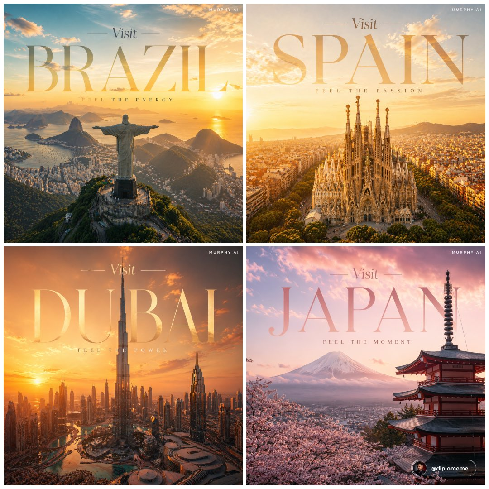

## High-impact e-commerce infographic for "Apple Pods Pro 3

- ID: trending-2047935217231663186
- Slug: trending-2047935217231663186-en
- 语言: en
- 来源: [来源链接](https://x.com/meng_dagg695/status/2047935217231663186)
- 样例图路径: images/part1/2047935217231663186_1.jpg

### 提示词

```text
High-impact e-commerce infographic for "Apple Pods Pro 3" 
premium wireless over-ear headphones.

FOREGROUND - PRODUCT HERO SHOT
Extreme close-up of a hand holding a sleek, 
matte-white premium over-ear headphone toward the camera 
at a slight angle. The headphone features:
- Glossy white ear cushions with soft memory foam padding
- Brushed aluminum silver headband with subtle Apple Pods 
  Pro 3 embossed branding
- Black mesh speaker grille visible on the ear cup face
- A tiny glowing green LED status indicator on the 
  right ear cup edge
- Subtle touch-control icons etched on the outer cup surface

Macro-lens shallow depth of field — hand and headphone 
slightly blurred at edges to create cinematic depth. 
Product remains razor-sharp in center frame.

CENTRAL SUBJECT — MODEL
In the mid-ground: a smiling young woman with freckles 
and wavy pastel-pink hair. She wears:
- A vibrant lime-green knit beanie
- A psychedelic black and white-striped long-sleeve shirt
- The white over-ear headphones resting stylishly 
  around her neck (not on ears) — one hand casually 
  touching the ear cup

Expression: relaxed, confident, joyful. 
She is glancing slightly off-camera with a natural smile.

BACKGROUND & ATMOSPHERE
Clean soft-focus studio backdrop — light gray gradient 
fading to warm white at center. 

Atmospheric overlays:
- Diagonal rainbow prism lens flares cutting across 
  upper-left to lower-right
- Soft pastel light leaks in pink and yellow at corners
- 4–5 blurred white over-ear headphones floating 
  artistically in the background at various depths 
  and rotation angles
- Subtle bokeh circles from background studio lights

Lighting: Soft professional three-point studio lighting. 
Key light from upper-left, fill light right side. 
Rim light behind model for separation. 
Glossy highlights on headphone surfaces catching light naturally.

TYPOGRAPHY & LAYOUT — Sans-Serif, Clean white 
TOP CENTER (behind model, large background text):
→ Massive bold oversized text: "HEADPHONES"
   Semi-transparent white, spanning full width behind subject

TOP RIGHT CORNER:
→ Bold clean text: "Apple Pods Pro 3"
   Subtitle smaller text: "Over-Ear Wireless"

MID LEFT:
→ Icon: small sound wave symbol
→ Bold text: "Premium Sound"
→ Sub-text: "Active Noise Cancellation + Transparency Mode"

MID RIGHT:
→ Extra-large bold numeral: "40"
→ Smaller text below: "hours of battery life"

LOWER LEFT:
→ Extra-large bold numeral: "0"
   with "to" beside it → then bold "100%"
→ Sub-text: "Fast charge — 10 min = 3hrs playback"

BOTTOM RIGHT:
→ Extra-large bold numeral: "1"
→ Sub-text: "Year Warranty Included"

BOTTOM CENTER (fine print style):
→ Small elegant text: 
   "Bluetooth 5.4  |  Hi-Res Audio Certified  
    |  Foldable Design  |  USB-C Charging"

TECHNICAL SPECS
Resolution: 8K ultra-sharp
Style: Commercial product photography meets 
       editorial fashion advertising
Color Palette: White, lime green, pastel pink, 
               rainbow prism accents
Focus: Tack-sharp on headphone product — 
       shallow DOF on everything else
Lens: 85mm macro, slight low angle
Render Quality: Hyperrealistic, clean ad aesthetic, 
                vibrant yet professional color grading
```

### 样例图


## Avant-garde fashion advertisement, oversized futuristic 

- ID: trending-2047700936605479334
- Slug: trending-2047700936605479334-en
- 语言: en
- 来源: [来源链接](https://x.com/AIwithSynthia/status/2047700936605479334)
- 样例图路径: images/part1/2047700936605479334_1.jpg

### 提示词

```text
Avant-garde fashion advertisement, oversized futuristic sunglasses positioned like sculpture, model casually seated on the frame as if furniture, giant word "VISION" behind in bold white typography, powder blue studio background, reflective floor, luxury eyewear campaign aesthetic, ultra-clean layout, editorial magazine styling, 1:1
```

### 样例图

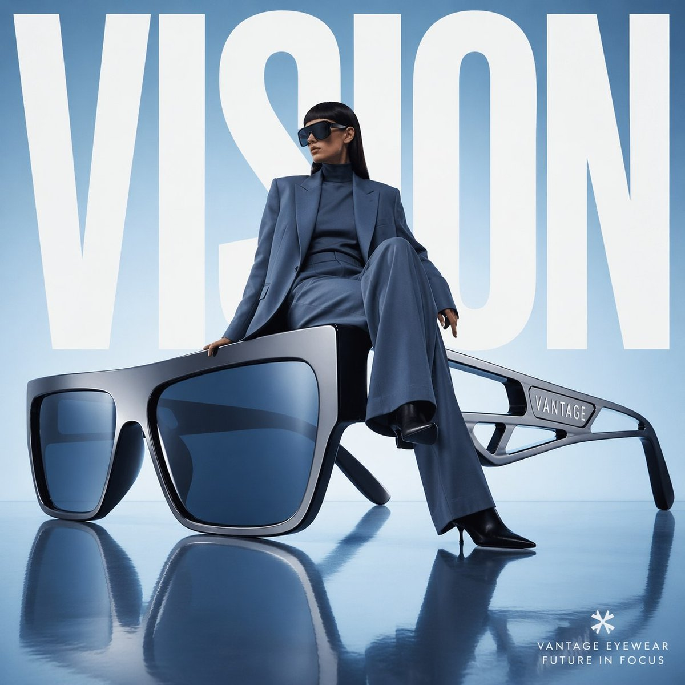

## Bright colorful children's shoe brand advertisement for 

- ID: trending-2048726962001379515
- Slug: trending-2048726962001379515-en
- 语言: en
- 来源: [来源链接](https://x.com/im_shahid7/status/2048726962001379515)
- 样例图路径: images/part1/2048726962001379515_1.jpg

### 提示词

```text
Bright colorful children's shoe brand advertisement for "Happy Smile☺️", happy young child jumping in the air wearing oversized colorful foam  black and white shoes, giant rainbow colored shoe prop in background, bright green and white studio background, playful bubbly bold typography "CLOUD" in background, tagline "Every step 
is an adventure.", confetti falling, fun joyful lighting, 
commercial photography style, ultra HD 8K , Designed with Shamus image 2.
```

### 样例图


## Create a [food name] food preparation poster

- ID: trending-2046995536528445697
- Slug: trending-2046995536528445697-en
- 语言: en
- 来源: [来源链接](https://x.com/johnAGI168/status/2046995536528445697)
- 样例图路径: images/part1/2046995536528445697_1.jpg

### 提示词

```text
Create a [food name] food preparation poster
```

### 样例图

![Create a [food name] food preparation poster](../images/part1/2046995536528445697_1.jpg)

## Create a high-resolution vertical character concept post

- ID: trending-2048779320966230339
- Slug: trending-2048779320966230339-en
- 语言: en
- 来源: [来源链接](https://x.com/Mind_Boticni/status/2048779320966230339)
- 样例图路径: images/part1/2048779320966230339_1.jpg

### 提示词

```text
Create a high-resolution vertical character concept poster with a luxury pink and white  aesthetic, blending elegance with edgy, modern fashion. The layout should feel like a premium magazine profile with clean sections and perfect grid alignment.

Main subject: A unique young woman (not resembling any real person), with long silky dark hair featuring subtle pink highlights. She has a confident, calm expression with a slightly mysterious aura. She wears a black and pink fusion outfit (mix of streetwear and idol fashion) with glossy textures, lace, and metallic accents. Lighting is soft but dramatic, with neon pink glow against dark tones.

Top section:
Large hero portrait on one side. On the other side, include a sleek profile panel with elegant English text:

Name: Nyra Vale
Age: 23
Height: 170 cm
Style: Dark Elegance

Short description:
“She doesn’t follow trends—she defines them. Quiet strength, sharp vision, and a presence that speaks without words.”

Add a Traits section with stylish progress bars:

Confidence
Creativity
Discipline
Charisma
Emotional Depth

Middle section:
Grid of 5–6 small portraits showing different expressions (soft smile, intense gaze, playful smirk, thoughtful, confident).

Lower sections:

Full-body poses (front, side, walking pose, power stance, casual stance).
Outfit variations (street luxe, stage outfit, minimal chic).
Accessories panel (heels, boots, chains, rings, handbags, hairstyles).

Text tone:
Strong, meaningful, and confident—focused on individuality, self-worth, and silent power. Avoid filler text.

Style:
Ultra-detailed, 4K quality, glossy magazine finish, cinematic lighting, sharp focus, balanced contrast, modern editorial layout, perfectly aligned grid.
```

### 样例图

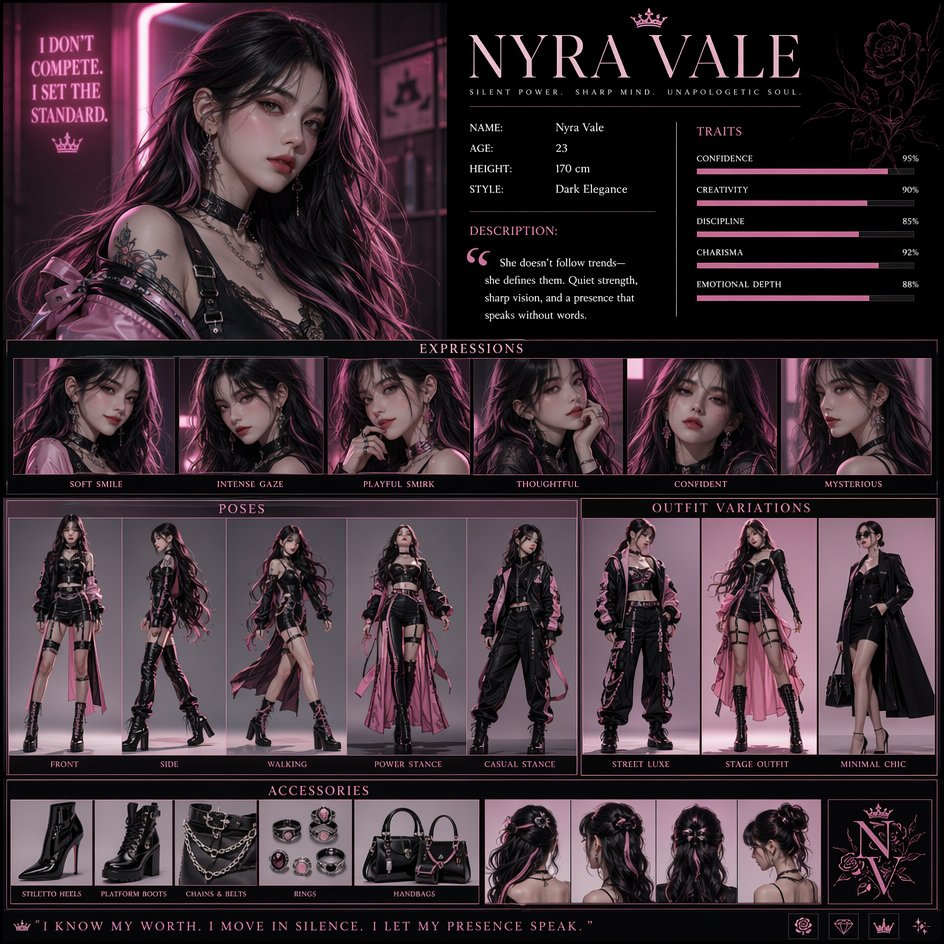

## TAG Heuer — Track Surface (REAL, NOT FAKE) High-end comm

- ID: trending-2047170094716051776
- Slug: trending-2047170094716051776-en
- 语言: en
- 来源: [来源链接](https://x.com/Diplomeme/status/2047170094716051776)
- 样例图路径: images/part1/2047170094716051776_1.jpg

### 提示词

```text
TAG Heuer — Track Surface (REAL, NOT FAKE)

High-end commercial watch advertisement, TAG Heuer chronograph, single watch leaning against its box, centered composition, slight front three-quarter angle

environment: real wet asphalt surface inspired by race track texture, subtle tire marks, light moisture, NOT full scene

background: soft dark depth with slight motion blur light streak hints, minimal, not literal track

lighting: controlled studio lighting with strong key for dial clarity, subtle red rim light for racing identity, crisp reflections on metal and glass

composition: tight grouping, grounded, realistic spacing

perspective typography (primary): large “PRECISION” in background, soft perspective, slightly diffused, low opacity, blending into depth

secondary typography:
“CHRONOGRAPH SERIES”
“SWISS MADE”

branding: logo top center, “MURPHY AI” beneath

surface: wet asphalt reflection, controlled, not exaggerated

color palette: black, steel, red accents

ultra-realistic materials (brushed metal, sapphire reflections, lume details)

1:1 square format

Casio G-Shock — Rugged Ground (LIKE YOUR CHARCOAL SHOT)

High-end commercial watch advertisement, G-Shock rugged watch, single watch leaning against its box, centered

environment: controlled rough stone / cracked surface with dust particles, minimal debris (like your Nivea charcoal setup)

background: dark soft gradient with slight haze, no literal landscape

lighting: directional studio lighting, strong highlights on edges, controlled shadow depth

composition: grounded, tight product grouping

perspective typography (primary): bold “TOUGH” in background, slightly broken texture, soft perspective depth, low opacity

secondary typography:
“SHOCK RESISTANT”
“BUILT TO LAST”

branding: logo top center, “MURPHY AI” beneath

surface: matte rough texture, minimal reflection

color palette: charcoal, black, muted tones

ultra-detailed rugged material finish

1:1 square format

Garmin — Outdoor Tech (CONTROLLED, NOT LANDSCAPE)

High-end commercial watch advertisement, Garmin GPS smartwatch, single watch leaning against its box, centered

environment: textured rock surface with subtle moisture and fine dust, clean minimal outdoor feel (not full mountain scene)

background: deep cool gradient with faint mist layers for depth

lighting: soft controlled lighting, cool rim highlights, clean display visibility

composition: tight, balanced, grounded

perspective typography (primary): “ENDURANCE” large in background, geometric, fading into depth with soft haze

secondary typography:
“GPS MULTISPORT”
“PERFORMANCE TRACKING”

branding: logo top center, “MURPHY AI” beneath

surface: natural rock with subtle reflection

color palette: blue-grey, black

ultra-clean product rendering

1:1 square format

Fastrack — Urban Surface (LIKE GARNIER WATER BUT DRY)

High-end commercial watch advertisement, Fastrack sports watch, single watch leaning against its box, centered

environment: dark smooth surface with slight gloss and subtle texture, faint moisture or light reflection, urban tone

background: soft gradient with slight haze, minimal depth

lighting: contrast studio lighting with subtle colored accent reflections, controlled highlights

composition: tight and clean

perspective typography (primary): “MOVE FAST” large in background, soft perspective, slightly glowing edges, integrated subtly

secondary typography:
“SPORT MODE”
“URBAN ACTIVE”

branding: logo top center, “MURPHY AI” beneath

surface: controlled reflection, not mirror-like

color palette: black, grey, subtle accent color

ultra-detailed modern finish
```

### 样例图

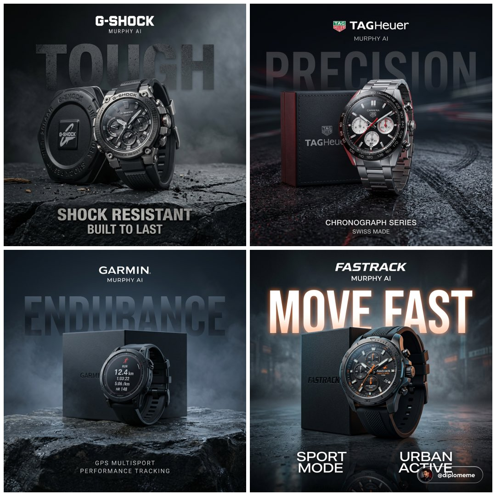

## Create a high-impact 9:16 vertical e-commerce infographi

- ID: trending-2048641686994407474
- Slug: trending-2048641686994407474-en
- 语言: en
- 来源: [来源链接](https://x.com/john_my07/status/2048641686994407474)
- 样例图路径: images/part1/2048641686994407474_1.jpg

### 提示词

```text
Create a high-impact 9:16 vertical e-commerce infographic for Bolt True Wireless Earbuds with a premium lifestyle advertising aesthetic.
Composition & Framing
Full-body shot of a young woman (match face and identity exactly to the provided reference image — accurate facial features, skin tone, hairstyle)
Camera angle slightly low and close (fashion campaign perspective) to add depth and presence
The subject is sitting casually on the floor, one knee raised, one leg extended forward toward the camera
Foreground (Product Focus)
The woman is holding an open Bolt earbud charging case toward the camera
Inside the case: one earbud visible
The second earbud is worn in her ear
Case should be glossy white with subtle branding (“BOLT”)
Add slight macro depth-of-field blur on the hand and case for cinematic realism
Subject Styling
Outfit: modern sporty streetwear
lightweight jacket (off-white / neutral tone)
crop top or sports bra
loose joggers (light pink or soft color)
white sneakers with visible texture
Expression: confident, relaxed, slight smile
Pose: natural, lifestyle-oriented — not stiff or overly posed
Background & Atmosphere
Clean studio background with soft gray gradient
Add:
rainbow prism lens flares
subtle light leaks
floating blurred earbuds and charging case in background
Ground surface slightly textured (studio floor look)
Lighting
Soft, diffused commercial lighting
Highlight:
skin texture
glossy earbud case
fabric details
Subtle rim lighting for separation from background
Typography Layout (Modern Sans-Serif, White)
Top Center (Behind Model):
BOLD HUGE TEXT:
“BOLT” (partially hidden behind subject)
Top Right:
Bolt Earbuds
True Wireless
Mid Left:
Powerful sound.
Effortless vibes.
Engineered for every beat of your day.
Mid Right:
BIG: 30
small: hours of playtime
Below that:
BIG: IPX5
small: water resistant
Bottom Right:
BIG: 1
small: year warranty
Style & Quality
8K ultra-realistic commercial photography
Sharp focus on face + earbuds
Slight depth blur for foreground and background elements
Clean Apple/Nike-style premium ad aesthetic
Balanced composition with strong negative space
```

### 样例图


## A breathtaking luxury fashion magazine cover. Large bold

- ID: trending-2047541284005453933
- Slug: trending-2047541284005453933-en
- 语言: en
- 来源: [来源链接](https://x.com/Ozayrr_irl/status/2047541284005453933)
- 样例图路径: images/part1/2047541284005453933_1.jpg

### 提示词

```text
A breathtaking luxury fashion magazine cover. Large bold silver serif brand name "SOLÈNE" elegantly placed at the very top of the frame, slightly transparent and overlapping the model's hair — exactly like a high-end fashion magazine masthead. Clean cream-white background, seamless studio, soft warm-toned lighting.

A young, extremely cute and beautiful white woman with soft angelic facial features, full lips, big dreamy green eyes with long lashes, and long silky chocolate brown wavy hair cascading freely over both shoulders. She sits gracefully — upper body leaning slightly forward, one arm resting on her knee, the other hand delicately touching her jaw, her gaze looking slightly upward and off-camera with a soft mysterious expression — elegant and effortless.

She wears a dramatic floor-length dusty rose blush satin ballgown with exaggerated sculptural puff shoulders that billow outward like rose petals — the bodice is a sheer champagne silk mesh embroidered with tiny pearl and crystal details, fitted through the waist and blooming into an enormous tiered skirt pooling around her. The fabric catches the light with a soft luminous sheen.

Magazine text overlaid naturally into the composition — left side in deep charcoal navy small serif caps: "SOFT & SOVEREIGN / THE NEW ERA OF BEAUTY" — right side: "LUMINOUS & RARE / PURE GRACE" — bottom of frame in large elegant serif display font, slightly transparent: "DIVINE & UNTOUCHABLE"
Vertical 9:13 format. Ultra photorealistic, 8K, no text overlays, cinematic color grading.
```

### 样例图

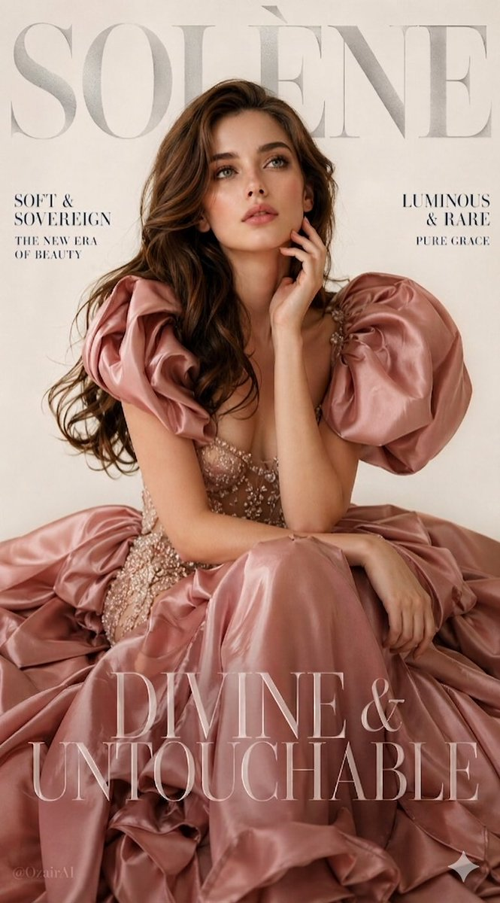

## A stunning anime theatrical movie poster in portrait for

- ID: trending-2047890555250610457
- Slug: trending-2047890555250610457-en
- 语言: en
- 来源: [来源链接](https://x.com/oggii_0/status/2047890555250610457)
- 样例图路径: images/part1/2047890555250610457_1.jpg

### 提示词

```text
A stunning anime theatrical movie poster in portrait format. Studio Ghibli meets Makoto Shinkai visual language. A teenage girl in a tattered white shrine maiden robe stands on the wing of a crumbling giant stone deity — an ancient colossus covered in moss and glowing golden kanji script, slowly falling through a sea of clouds. Her long black hair streams upward against gravity. She reaches one hand toward the sky where a vast celestial rift tears open the heavens — beyond it, an inverted ocean floats above the clouds, ancient wooden cities hanging upside down from its surface, lanterns drifting like stars. The sky transitions from deep twilight blue at the bottom to a luminous peach and rose gold at the top. Volumetric god rays pierce through cloud layers. Cherry blossom petals and torn paper talismans spiral everywhere. Her expression is calm determination. Art style: hand-drawn 2D animation, ultra-detailed background painting, expressive linework, rich cel shading. Palette: deep indigo, peach, rose gold, warm amber, soft white. Title in large elegant Japanese kanji at the bottom with English subtitle beneath in a clean modern font. Tagline in small white italic text above the title. Mood: mythological, spiritual, bittersweet wonder. Theatrical release quality, Toho Films.
```

### 样例图

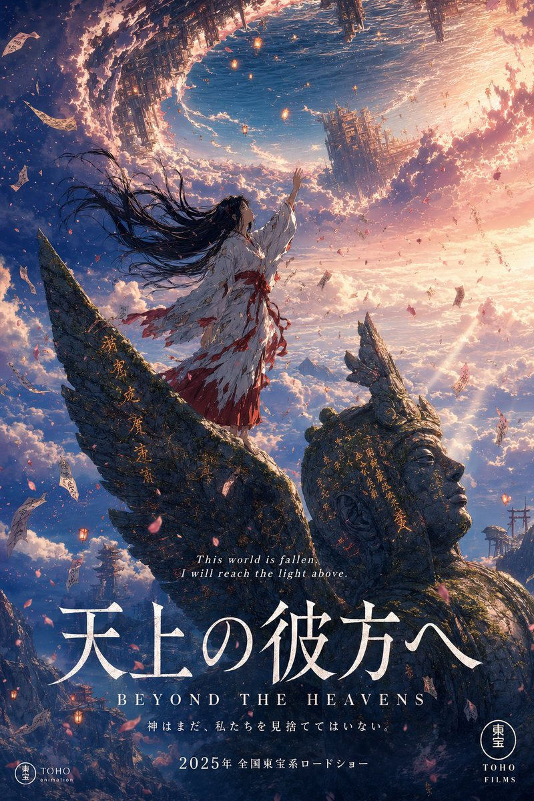

## Create four connected premium realistic editorial images

- ID: trending-2048598185841734064
- Slug: trending-2048598185841734064-en
- 语言: en
- 来源: [来源链接](https://x.com/ecomchasedimond/status/2048598185841734064)
- 样例图路径: images/part1/2048598185841734064_1.jpg

### 提示词

```text
Create four connected premium realistic editorial images for OBSIDIAN coffee. Dark cinematic grown-up vibe like high-end sportswear or coffee campaigns. Dramatic but grounded studio lighting, realistic textures, clean composition. Image 1: Hero poster with ‘OBSIDIAN’ and premium coffee display with steam and beans. Image 2: Product lineup - bags, cans, capsules. Image 3: Packaging close-up + tagline ‘Coffee for grown-ups who chase flavor.’ Image 4: Lifestyle steaming cup shot. Highly polished, sharp, realistic materials, consistent branding, no surreal effects
```

### 样例图

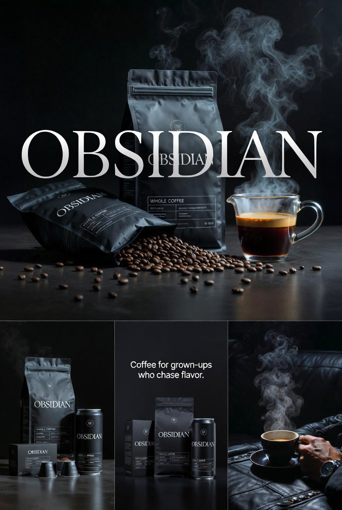

## A hyper-realistic cinematic movie poster of a powerful f

- ID: trending-2048805574176112646
- Slug: trending-2048805574176112646-en
- 语言: en
- 来源: [来源链接](https://x.com/iamsofiaijaz/status/2048805574176112646)
- 样例图路径: images/part1/2048805574176112646_1.jpg

### 提示词

```text
A hyper-realistic cinematic movie poster of a powerful female sorcerer with the same facial structure and likeness as the uploaded reference photo, bursting through a cracked Queen of Spades playing card.
The card explodes outward with stone fragments, dust, and debris frozen mid-air.
She wears an ornate royal maroon and gold embroidered medieval fantasy jacket, rich fabric textures, intricate detailing, regal and mystical.The sorcerer extends one hand forward toward the viewer, fingers glowing with intense magical energy, subtle golden sparks and dark arcane aura surrounding the hand.
Intense piercing gaze, confident and dominant expression, cinematic hero framing.
Dramatic chiaroscuro lighting, dark moody background, volumetric light rays, ultra-detailed textures, shallow cinematic depth of field.
Photorealistic face, epic fantasy realism, movie poster composition, high contrast, dynamic motion, dust particles, masterpiece quality, ultra-sharp focus, 8K resolution, cinematic color grading
```

### 样例图


## A clean, refreshing vertical advertising poster design f

- ID: trending-2048662802475409637
- Slug: trending-2048662802475409637-en
- 语言: en
- 来源: [来源链接](https://x.com/Ozayrr_irl/status/2048662802475409637)
- 样例图路径: images/part1/2048662802475409637_1.jpg

### 提示词

```text
A clean, refreshing vertical advertising poster design for a face wash product, using a graphic illustration style with soft watercolor and vector elements. The poster is set against a clean white and light teal background. The central figure is a beautiful, smiling young woman with natural, glowing, radiant skin and her hair loosely tied back in a messy bun, looking confidently towards the viewer with fresh-faced appearance. She has a touch of natural makeup.
The overall style is clean, modern, and graphic, with flowing organic shapes, stylized leaves, flowers, and water splashes in shades of aqua, teal, light green, and white. The background features delicate, stylized illustrations of botanical ingredients like aloe vera, green tea leaves, and lavender.
At the top, large, friendly, rounded sans-serif font reads: "RADIANT SKIN STARTS HERE". Below this, a catchy tagline: "Cleanse, Refresh, Glow."
The main product, a stylized bottle of face wash with a white pump and green and blue labeling, is illustrated to the right of the woman. The bottle is labeled "FRESH FACE DAILY CLEANSER" and mentions "With Aloe Vera & Green Tea." There are small graphical icons around the bottle with text: "Deep Pore Cleansing", "Soothes & Hydrates", "For All Skin Types", "Paraben Free".
Small illustrative bubbles, stars, and botanical accents float around the composition, adding a sense of lightness and freshness. At the bottom, in a clean, modern font, it says: "AVAILABLE NOW AT ALL MAJOR RETAILERS" followed by a stylized logo "FRESH FACE" and the website "https://t.co/OUIoDMOWF6" and social media icons (freshfacecare). The poster has a clean layout with ample negative space and soft, natural lighting.
```

### 样例图


## Create a hyper-realistic Japanese-style futuristic produ

- ID: trending-2047226077760901445
- Slug: trending-2047226077760901445-en
- 语言: en
- 来源: [来源链接](https://x.com/Preda2005/status/2047226077760901445)
- 样例图路径: images/part1/2047226077760901445_1.jpg

### 提示词

```text
Create a hyper-realistic Japanese-style futuristic product advertisement, ultra-detailed, cinematic lighting, premium clean layout.

The product is:

[DESCRIBE YOUR IDEA]

Scene:
Place the product in a real-world, emotionally impactful environment where its function is clearly visible.

Focus on:
– a strong central moment
– natural human interaction
– clear demonstration of the benefit

Include:
– product name
– headline
– subheadline
– feature icons, colors, shape, etc
– pricing
– “how it works” section
```

### 样例图

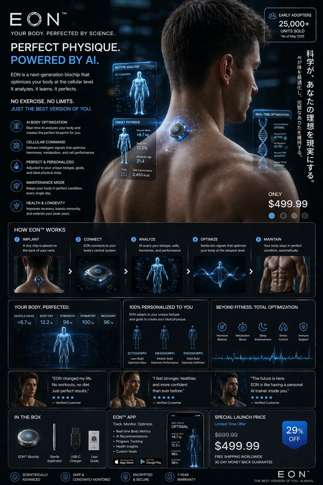

## Translate this theme from concept into form, and present

- ID: trending-2048674104035975506
- Slug: trending-2048674104035975506-en
- 语言: en
- 来源: [来源链接](https://x.com/Just_sharon7/status/2048674104035975506)
- 样例图路径: images/part1/2048674104035975506_1.jpg

### 提示词

```text
Translate this theme from concept into form, and present both the transformation process and the final outcome within a single vertical A4 composition.
Use a two-tier layout (top and bottom sections).
Top Section:
A 5-step visual process diagram that captures the essence of the theme.
Structure the flow as:
Inspiration source → Emotional energy & social interaction → Abstract UI symbols and visual language → Structured composition & character styling → Final integrated design direction
Use the first reference image strictly for Sharon’s identity, facial features, and expression
Use the second reference image for outfit, pose, and styling direction
Visual style:
Delicate sketching, soft line art, UI-inspired diagram elements
Floating icons like “Subscribed”, hearts, notification bells, social symbols
Small arrows, micro annotations, short English labels
Clean spacing with refined, minimal layout
Title: “MOTION TO FORM”
Bottom Section:
A hero visual derived from the process above.
A cute, premium advertising poster featuring Sharon in a glowing, dreamy environment
She appears radiant, confident, and joyful, embodying a “subscribed / viral moment”
Blend both reference images seamlessly (face from image 1, styling from image 2)
Design direction:
Soft pastel gradient background (pink, lavender, baby blue)
Subtle golden-hour glow with light neon accents
Floating 3D UI elements (Subscribed badges, hearts, icons)
Cinematic depth, soft lens flare, light particles, bokeh
Typography:
Main text: “Sharon is now SUBSCRIBED ✨”
Secondary tagline: “Join the vibe. Stay connected.”
Add a fictional brand/platform name (AI-generated)
Overall Direction:
The final visual should feel like a fusion of:
Concept board
Social media campaign poster
Design development sheet
Style:
Minimal, poetic, intelligent
Clean negative space with balanced composition
Neutral base tones with 1–2 soft pastel accent colors
Focus on:
Skin glow and natural beauty enhancement
Fabric texture and styling details
Light, shadow, and material realism
UI elements integrated as part of the aesthetic
Rendering quality:
Ultra high resolution
Commercial advertising quality
Soft, dreamy, cinematic finish
```

### 样例图


## A highly detailed digital artwork in a surreal, dynamic 

- ID: trending-2047721704202617219
- Slug: trending-2047721704202617219-en
- 语言: en
- 来源: [来源链接](https://x.com/rovvmut_/status/2047721704202617219)
- 样例图路径: images/part1/2047721704202617219_1.jpg

### 提示词

```text
A highly detailed digital artwork in a surreal, dynamic style inspired by premium athletic advertising for Nike, Inc. A young athletic woman with platinum blonde hair tied in a messy bun, fair skin, and a fiercely focused expression is captured mid-jump or leap, her body leaning slightly forward as if bursting with raw, untamed energy.
She wears a loose, off-white Nike crewneck sweatshirt with subtle embossed Nike branding on the chest, paired with flowy, semi-transparent pants featuring a swirling marbled pattern in graphite grey and electric violet, billowing dramatically around her legs. On her feet are sleek, futuristic white Nike sneakers with glowing violet accents, visible Air-inspired sole details, and an aerodynamic design.
Vibrant electric violet energy or ethereal smoke erupts dramatically from behind her, swirling and dissolving into abstract, cloud-like forms that interact with her clothing, creating a powerful sense of motion and release.
The background is a deep, moody gradient transitioning from charcoal grey to luminous twilight violet, emphasizing a minimalist yet striking composition.
Overlay large, bold metallic silver text reading “Just Do It” in a sharp, modern sans-serif font, partially integrated and obscured by the energy smoke and the figure, making it feel like an organic part of the scene.
Include the iconic Nike Swoosh logo in the top-left corner in shimmering silver.
```

### 样例图

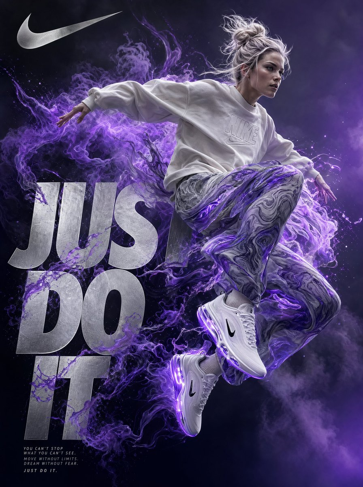

## A vibrant 2000s scrapbook-style collage featuring the sa

- ID: trending-2012542946848174323
- Slug: trending-2012542946848174323-en
- 语言: en
- 来源: [来源链接](https://x.com/Naiknelofar788/status/2012542946848174323)
- 样例图路径: images/part1/2012542946848174323_1.jpg

### 提示词

```text
A vibrant 2000s scrapbook-style collage featuring the same young woman in multiple cutout poses. One portrait is centered and large, showing her wearing round glasses and a beige hoodie, making a finger-heart gesture toward the camera. Other cutouts show her squatting with a vintage instant camera, and another blowing a pink bubblegum bubble.

The background looks like an open sketchbook with textured paper, filled with colorful paint strokes in rainbow tones, playful doodles, arrows, stars, hearts, butterflies, smiley faces, and pop-art stickers. Bold, bubbly typography stickers read phrases like “2000s Vibes,” “Dream Big,” “Be Yourself,” “Cool Dude,” “Say Cheese,” and “Pop!”

The overall aesthetic is nostalgic, cheerful, and youthful — inspired by early 2000s teen magazines and scrapbook journals. High saturation, soft lighting, clean white sticker outlines around each cutout, whimsical and fun mood, creative flat-lay composition, digital collage illustration style.
```

### 样例图

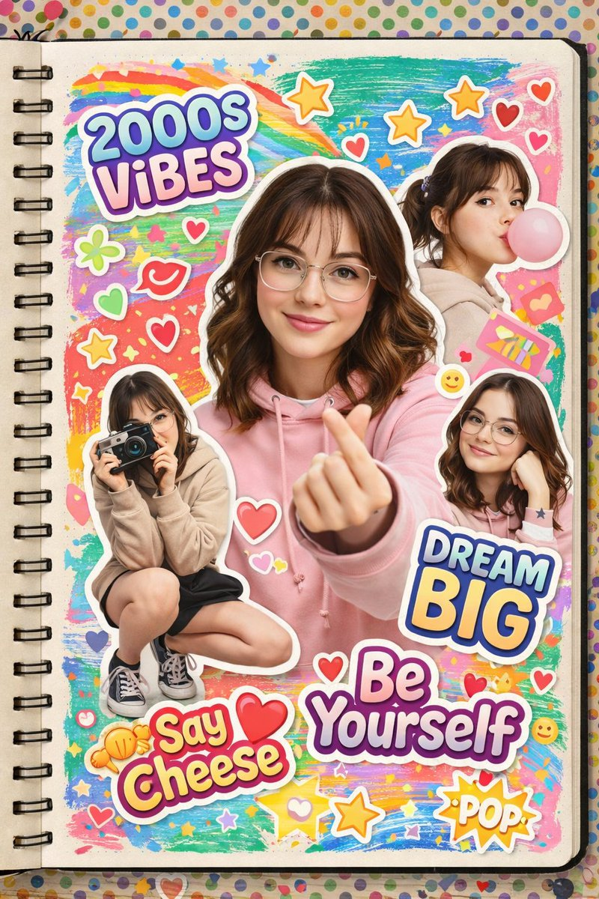

## Ultra-clean modern editorial infographic. The topic is [

- ID: trending-2048044376366948849
- Slug: trending-2048044376366948849-en
- 语言: en
- 来源: [来源链接](https://x.com/TechieBySA/status/2048044376366948849)
- 样例图路径: images/part1/2048044376366948849_1.jpg

### 提示词

```text
Ultra-clean modern editorial infographic. The topic is [ROUTINE] routine. Base all visuals, colors, objects, mood, ingredients, and steps entirely on this topic. Hero visual: a stylized flat-lay or floating arrangement of 3–4 iconic objects associated with this topic — slightly angled or in soft perspective, glowing subtly. All elements arranged dynamically around the hero in a non-restrictive editorial layout. Ingredients Section: Label it ‘What You Need’ — include 6–8 relevant items with small icons or emoji illustrations next to each, with a practical quantity or duration written like a recipe. Steps Section: 5–6 numbered panels with arrows or connecting lines forming a logical flow, each with a short action label and small relevant icon, using glassmorphism or frosted card styling. Stats Badges: 4–5 floating pill-shaped badges showing relevant metadata, displayed as clean minimal bubbles near the hero. Visual Style: Choose background color, accent colors, typography weight, and texture to naturally match the topic’s mood. Bold modern sans-serif typography. Clean vector icons. Subtle grain or texture. Composition: Hero centered or slightly offset, ingredients one side, steps opposite or below with connecting lines, stat badges as floating pills, generous negative space. Lighting: Soft natural studio lighting matching the topic’s tone. Premium editorial aesthetic, social-feed optimized. Ultra-crisp. No watermark
```

### 样例图


## Create a 4:5 vertical social poster in ultra high resolu

- ID: trending-2048063332624843046
- Slug: trending-2048063332624843046-en
- 语言: en
- 来源: [来源链接](https://x.com/harboriis/status/2048063332624843046)
- 样例图路径: images/part1/2048063332624843046_1.jpg

### 提示词

```text
Create a 4:5 vertical social poster in ultra high resolution, 8K print quality sharpness. Use the BMW car from the reference image as the main subject and use the background structure/composition from the reference image, but transform it into a BMW themed design. Replace all black tones with a flat high-saturation BMW blue background. Keep the same layout, spacing, visual balance, and poster composition from the reference image.

Background should use a smooth gradient from slightly lighter electric blue at the top to deep navy blue at the bottom. Add subtle grain texture (2 to 3%) and faint rectangular overlays (2 to 4% opacity). Keep it clean, graphic, premium, and non-realistic. Add a soft contact shadow under the car.

Use the same BMW from the reference image, changing only the paint color to matte frozen blue or deep metallic navy. Keep the original body shape, wheels, stance, and design details from the reference image.

Show the car in a rear 3/4 perspective matching the reference image angle exactly. Use a slightly elevated camera angle. Position the car slightly right of center.

Include visible carbon roof, aggressive rear diffuser, sharp controlled reflections, and subtle brake details.

Keep composition identical to the reference image:
Top: branding
Middle: giant type
Center: car overlapping text
Bottom: editorial block and specs

Typography:

Primary text: “BMW”
Ultra condensed bold sans serif, tall vertical scaling like the reference poster. Color deep navy or near black. Static text with no distortion. Acts as structural backdrop.

Secondary header: “BMW M4 G82”
Thin font with wide tracking.

Logo area: BMW roundel centered above.

Editorial block:

Headline: “BMW — Where Driving Becomes Instinct”

Body copy focused on:

driver connection

control

performance precision

Use the same boxed editorial layout as the reference image.

Background faded text: “M4” large scale with 3 to 5% opacity behind the box.

Bottom left:
“ M4 G82”

Bottom right specs:

405 kW / 550 PS
3.4 s
307 km/h

Lighting should be clean studio lighting with sharp but controlled highlights.

Color grading should use deep blues, high contrast, clean blacks.

Camera lens: 50mm, slightly elevated rear 3/4 angle.

Mood:
Performance.
Precision.
Driver focus.

Add Bottom-right watermark: harboriis , with small x and Instagram logo
```

### 样例图

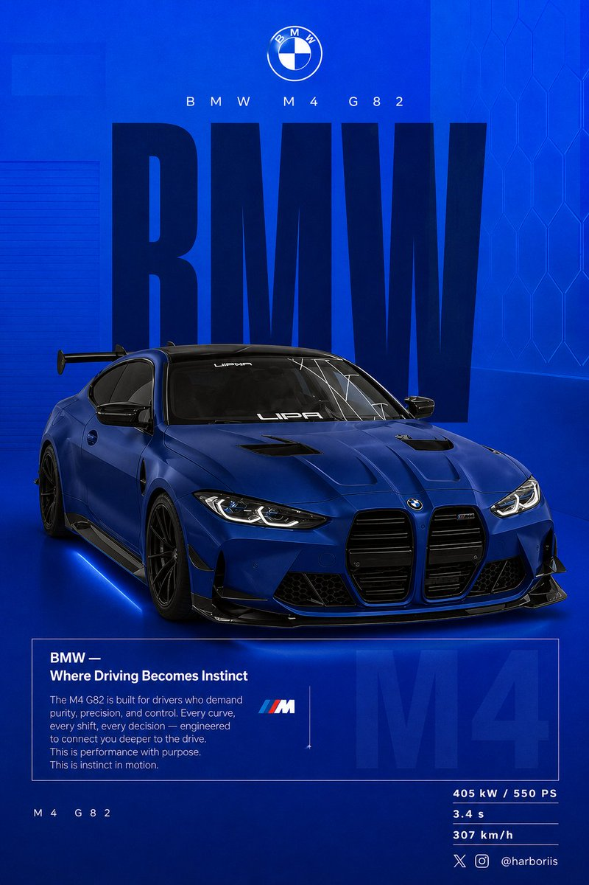

## FORMAT: 4:5 vertical poster, ultra high resolution, 8K, 

- ID: trending-2048765001817805295
- Slug: trending-2048765001817805295-en
- 语言: en
- 来源: [来源链接](https://x.com/Diplomeme/status/2048765001817805295)
- 样例图路径: images/part1/2048765001817805295_1.jpg

### 提示词

```text
FORMAT:
4:5 vertical poster, ultra high resolution, 8K, ultra-premium automotive campaign, minimal cinematic realism

CORE CONCEPT:
“CONTROLLED UNSEALING”

A precision-engineered object revealed with intent.
Nothing breaks.
Everything separates perfectly.

ENVIRONMENT:

Deep matte black studio

Background:
- almost pure black
- soft, controlled yellow glow diffused behind subject
- no visible light source

Surface:
- ultra clean dark floor
- very soft reflection (5–8%)
- no scratches, no noise

Air:
- almost clean (NO visible dust)

HERO STRUCTURE:

A **precision-engineered display case** — not industrial, not damaged.

Design language:
- monolithic black form
- seamless panels
- razor-sharp edges
- minimal visible joints

Opening behavior:
- panels slide apart with mechanical precision
- no tearing, no debris
- perfect separation lines
- slight offset gaps emitting soft yellow light

Interior:
- Porsche yellow inner chamber
- smooth, matte-satin finish
- soft controlled glow (not bright)

PRODUCT:
[Porsche 911 GT3 RS](chatgpt://generic-entity?number=0)

Angle:
Rear 3/4, slightly low

Position:
Centered, emerging forward subtly

Stance:
- perfectly planted
- minimal steering angle (almost straight)
- composed, not aggressive

DETAILING:

Surface:
- ultra refined gloss
- clean, sharp reflections
- no exaggerated highlights

Carbon:
- visible but subtle
- premium, not loud

Tires:
- clean satin finish
- realistic, not shiny

Integration:
- faint yellow light wrap from interior
- soft contact shadow
- barely visible reflection

COMPOSITION:

Top:
small Porsche crest

Center:
car framed by opening panels

Typography:
secondary to structure

Bottom:
clean editorial + specs

Negative space:
dominant and intentional

TYPOGRAPHY:

PRIMARY:
“PORSCHE”

Style:
Ultra condensed

Treatment:
- subtly embedded into background
- low contrast (dark graphite on black)
- almost discovered, not announced

SECONDARY:
“911 GT3 RS”
thin, technical

EDITORIAL BLOCK:

Headline:
“Porsche — Precisely Unsealed”

Body:
Engineered precision revealed with absolute control.

Minimal copy. No storytelling overload.

SPECS:

386 kW / 525 PS  
3.2 s  
296 km/h  

Clean, technical alignment

LIGHTING:

- soft internal yellow glow (primary)
- controlled top light (soft, even)
- subtle rim separation
- NO harsh contrast spikes

Focus:
surface quality > drama

COLOR GRADING:

- deep neutral blacks
- controlled Porsche yellow
- low saturation outside focal area
- ultra clean finish

CAMERA:

50mm  
eye-level to slightly low  
no distortion  

MOOD:

Calm.
Precise.
Obsessive.

Power under control.
```

### 样例图

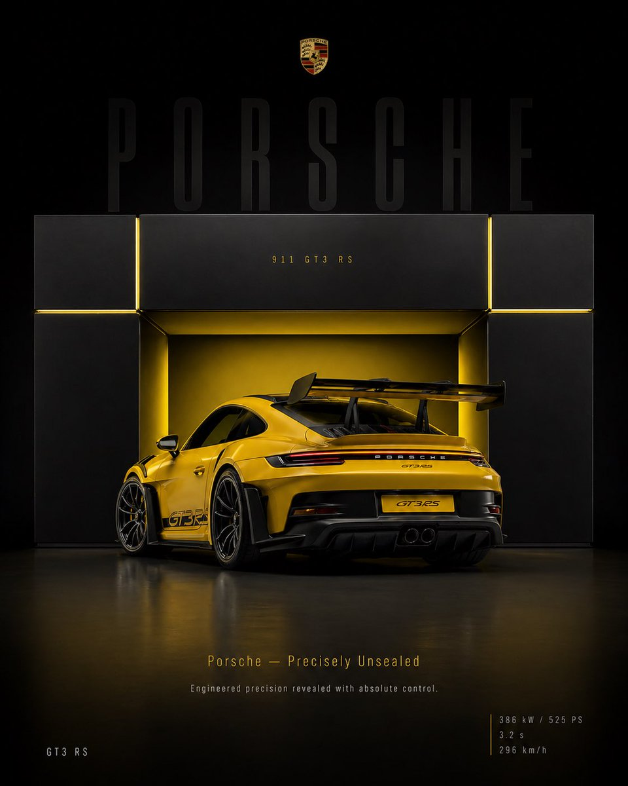

## 本次是生成图片任务： 苹果设计师思维，顶

- ID: trending-2047875746711171155
- Slug: trending-2047875746711171155-zh
- 语言: zh
- 来源: [来源链接](https://x.com/xiaoxiaodong01/status/2047875746711171155)
- 样例图路径: images/part1/2047875746711171155_1.jpg

### 提示词

```text
本次是生成图片任务：
苹果设计师思维，顶级海报大师思维，用高桥流思路
呈现海报设计
表现如下文本，让其抓人，直击人心
你可以智能理解文本，不一定照单全收文本，智能梳理文本， 把握人性，突出看点。尤其是我输入大段文本， 你核心呈现的，应该是你理解和处理后的核心文本
智能判定适合文本语义的配色逻辑，合理排版，有呼吸感的呈现文案
不要额外添加文字， 超大字展示这个文案
```
[太阳就站在黑夜的门口]
```
```

### 样例图

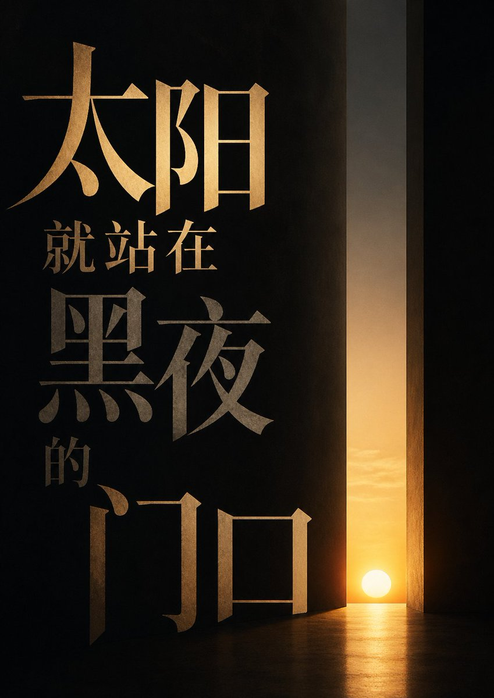

## Create a character promotional poster for “[XXX]”, using

- ID: trending-2048961908238070178
- Slug: trending-2048961908238070178-en
- 语言: en
- 来源: [来源链接](https://x.com/SimplyAnnisa/status/2048961908238070178)
- 样例图路径: images/part1/2048961908238070178_1.jpg

### 提示词

```text
Create a character promotional poster for “[XXX]”, using a unified vertical (portrait) key visual composition.
Each poster follows a hierarchy of large top / smaller bottom structure:
The upper half of the composition features a highly recognizable large silhouette of the character — focusing on the head, facial contour, mask, or upper-body outline — forming a bold and iconic primary visual.
The middle to lower section includes a full-body version of the character as the secondary subject, shown in a stable standing pose or with subtle motion, serving as the visual core of the composition.
Inside the large silhouette and around the character, apply double exposure and collage-style storytelling, blending multiple scenes, symbolic elements, small character interactions, supporting visuals, and environments into layered compositions of mist, ink wash, and negative space.
On both the left and right sides, place complementary supporting elements to create narrative tension and spatial balance.
A flowing visual line should run through the entire composition (top to bottom), connecting the main character, internal collage elements, and the large silhouette above — enhancing cohesion and guiding the viewer’s eye.
The overall composition should preserve large areas of negative space, with edges treated using ink diffusion, soft blurring, and fragmented fading, evoking an Eastern aesthetic of balance between emptiness and form.
The overall style should feel refined, restrained, premium, and cohesive, emphasizing depth, storytelling, strong visual impact, and a consistent series identity.
Aspect ratio: 9:16.
```

### 样例图

![Create a character promotional poster for “[XXX]”, using](../images/part1/2048961908238070178_1.jpg)

## High-impact e-commerce infographic advertisement for "Fu

- ID: trending-2048636069349138568
- Slug: trending-2048636069349138568-en
- 语言: en
- 来源: [来源链接](https://x.com/meng_dagg695/status/2048636069349138568)
- 样例图路径: images/part1/2048636069349138568_1.jpg

### 提示词

```text
High-impact e-commerce infographic advertisement for "Fujifilm Instax Mini 11" blush pink instant camera. FOREGROUND: Extreme close-up of a hand holding a compact rounded blush-pink Fujifilm Instax Mini 11 camera angled toward camera, razor-sharp center focus, macro-lens shallow depth of field, visible 60mm silver lens ring, crystal pop-up flash, white instax mini 11 branding on body, red shutter button accent, fingertips softly blurred at edges. CENTRAL MODEL: confident young woman with straight dark brown hair, light natural makeup, cool editorial expression, wearing a bold orange and black vertical-striped sleeveless leather mini dress with deep red buckle details and silver stud buttons, holding the blush-pink Instax Mini 11 casually at chest height with camera face pointing outward, slight off-camera gaze, stylish composed energy. BACKGROUND: soft-focus cool light gray gradient studio backdrop fading to warm white center, diagonal pastel prism lens flares in pink peach and lavender cutting upper-left to lower-right, soft blush-pink and cream light leaks at corners, 4 to 5 blurred Fujifilm Instax Mini 11 cameras floating at various depths and rotation angles, scattered polaroid-style instant photo prints in background bokeh, subtle bokeh circles from studio lights. LIGHTING: professional three-point studio lighting, key light upper-left, fill light right side, rim light behind model for separation, glossy highlights on camera lens ring and flash unit. TYPOGRAPHY overlaid clean bold white sans-serif: massive semi-transparent "INSTAX" text spanning full width behind model at top center, top right bold text "Fujifilm Instax Mini 11" with subtitle "Instant Film Camera Blush Pink", mid-left small camera icon with bold "Shoot and Print Instantly" and subtext "Credit Card Sized Photos in Seconds", mid-right extra-large bold numeral "60" with smaller text "mm Instax Lens Auto Exposure", lower-left bold "selfie" with subtext "Built-in Selfie Mirror and Close-Up Lens Mode", bottom-right bold numeral "1" with subtext "Year Warranty Included", bottom center fine print "ISO 800 Film | Auto Flash | Focus Range 0.3m to infinity | AA Battery Powered | Available in 5 Colors". TECHNICAL: 8K ultra-sharp, hyperrealistic commercial ad aesthetic, editorial fashion meets lifestyle product photography style, color palette blush pink orange black cream pastel prism accents, tack-sharp on Instax camera with shallow DOF on everything else, 85mm macro slight low angle, warm vibrant professional color grading.
```

### 样例图

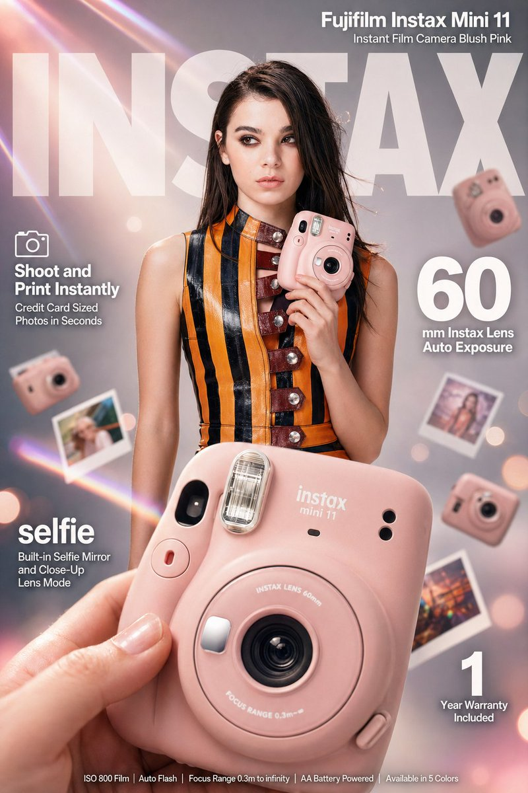

## Cinematic product poster for WELLBI, India's premium bam

- ID: trending-2047654588657156577
- Slug: trending-2047654588657156577-en
- 语言: en
- 来源: [来源链接](https://x.com/Diplomeme/status/2047654588657156577)
- 样例图路径: images/part1/2047654588657156577_1.jpg

### 提示词

```text
Cinematic product poster for WELLBI, India's premium bamboo apparel brand.

SCENE: A lone young Indian man emerges from a dense, luminous bamboo forest 
at golden hour. Wears a perfectly draped, ultra-clean ivory WELLBI bamboo polo. 
Bamboo stalks alive with warm amber and jade light filtering through canopy.

VISUAL STORYTELLING: The bamboo forest IS the fabric — seamless living metaphor. 
Thin golden light rays land on the polo, suggesting softness and breathability.

COMPOSITION: Low angle, subject centre-frame, bamboo framing both sides like 
a natural arch. Horizon at lower third. Cinematic 2.39:1 anamorphic crop.

— TYPOGRAPHY SYSTEM —
Hero line: "GROWN." — single word, massive scale, Helvetica Neue Ultra Light, 
all caps, extreme letter-spacing +600, ghost white at 15% opacity overlaid 
across the ENTIRE poster width — architectural, not decorative.

Sub-line: "Not manufactured." — set in sharp Aktiv Grotesk Regular, 
sentence case, 18pt, tracking +80, positioned directly below hero word.
White. Full opacity. Feels like a whisper after a shout.

Brand name: "WELLBI" — bottom right corner. Neutral Grotesk Medium, 
all caps, tracking +300, 11pt. Separated by a 0.5pt hairline rule 
above it, 40px wide. Restrained. Premium.

Legal/descriptor: "100% Bamboo Apparel — India" — micro text, 
7pt, tracking +150, bottom left. Rotated 90° vertical. 
Acts as a structural edge element, not an afterthought.

COLOUR PALETTE: Deep jungle green, warm amber, ivory white, earth brown.

LIGHTING: ARRI Alexa Mini LF — golden hour rim, diffused fill, 
subtle lens flare grazing the polo fabric.

MOOD: Grounded luxury. Like a Loro Piana campaign shot in Assam.

CAMERA: 85mm f/1.4, shallow DOF, anamorphic lens flare.

Editorial brand poster for WELLBI sustainable Indian fashion.

SCENE: Extreme close-up of a weathered artisan's hands spinning bamboo thread. 
Blurred WELLBI tee draped elegantly in background. Warm-lit rural Indian 
workshop — clay walls, raw natural light.

VISUAL STORYTELLING: Rough hands against silk-smooth bamboo fabric. 
Heritage craftsmanship. The contrast IS the message.

COMPOSITION: Split tonal — dark warm left (hands, workshop), 
light cream right (garment). Hands at cross-point. Leica 50mm documentary realism.

— TYPOGRAPHY SYSTEM —
Hero line: "ONE LAKH HANDS." — Canela Display Thin, mixed case, 
enormous scale, set across 80% of poster width. 
The word "HANDS" drops to second line, indented right — 
staggered layout creates visual rhythm like musical notation.

Counter-line: Below "HANDS", flush right: "One fabric." — 
same Canela Thin but 28pt, italic. The tonal shift from 
all-caps to italic sentence case creates emotional contrast — 
like going from statement to confession.

Brand stamp: "WELLBI" centred bottom — pressed as if letterpress embossed. 
Freight Display Pro Bold, tracked tight at -20. Earthen cream on warm brown.
Feels physical. Tactile.

Descriptor line: "Handcrafted bamboo apparel since 2021 — India" — 
9pt, Suisse Int'l Light, tracking +200, full width, very bottom edge. 
Reads like a footnote on a heritage certificate.

COLOUR: Terracotta, aged ivory, saffron gold, deep walnut.

LIGHTING: Soft natural window light, warm practical lamp. 
Documentary-editorial quality.

MOOD: Deeply human. D&AD craft award energy.

CAMERA: Leica 50mm Summilux, skin texture visible, 
documentary realism with fashion editorial polish.
```

### 样例图

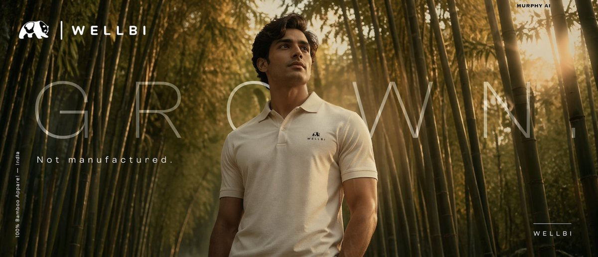

## A hyperrealistic premium denim advertisement shot in a d

- ID: trending-2048024788078350620
- Slug: trending-2048024788078350620-en
- 语言: en
- 来源: [来源链接](https://x.com/meng_dagg695/status/2048024788078350620)
- 样例图路径: images/part1/2048024788078350620_1.jpg

### 提示词

```text
A hyperrealistic premium denim advertisement shot in a dark, moody editorial style. A male figure wearing raw selvedge denim jeans is captured mid-stride against a near-black charcoal background, body angled diagonally at a bold 45-degree perspective toward the camera. The jeans feature a slim tapered silhouette with deep indigo wash, subtle thigh and knee fading, reinforced copper rivets catching ambient light, and clean off-white contrast stitching, dominating the lower two-thirds of the frame. The composition uses shallow depth of field with sharp focus on the denim texture and soft blur on the upper torso. The background is layered with subtle urban texture — faint graffiti strokes in electric yellow and muted olive, barely visible through a heavy dark vignette. Multiple rows of ultra-small all-caps typographic text orbit the figure at different angles reading phrases like "RAW. REAL. RELENTLESS." and "WEAR WHAT YOU'VE BEEN THROUGH" — some running vertically, some at 30-degree angles, creating a chaotic yet intentional graphic zine energy. At the upper right, a bold brand wordmark appears in clean white against the dark background. At the top center, a thin horizontal navigation-style text bar reads "AUTHENTIC FIT · LIVED-IN LUXURY · BUILT TO LAST" in spaced all-caps serif font. A large commanding headline is placed center-right — "OWN" in massive ultra-bold white letters followed by "THE MOMENT" in lighter weight creating dramatic type hierarchy. Small yellow plus (+) symbols and diagonal arrows (↗) are scattered throughout as accent details. Bottom left features a bold slogan lockup: "DEFINE YOUR DENIM" in large bold sans-serif white text with a thin subline reading "An unapologetic reminder that style is a statement. Every crease tells a story." The overall lighting is dramatic and directional — a single cold key light from the left causing copper rivets to shimmer and deep indigo denim to glow with subtle sheen against the darkness. Close macro detail visible on the fabric weave texture near the knee fade. Photorealistic. Commercial photography quality. High contrast. 4K resolution. 3:4 vertical format optimized for social media.
```

### 样例图

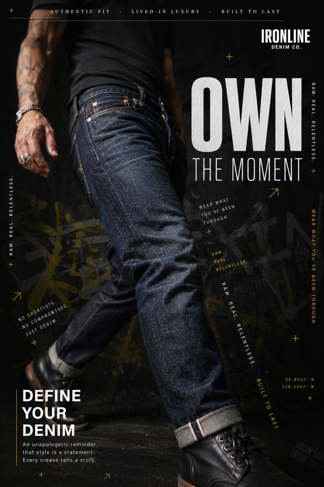

## 虞姬试穿高定礼服，红色拖尾长裙佩剑，巴黎

- ID: trending-2048044673302982925
- Slug: trending-2048044673302982925-zh
- 语言: zh
- 来源: [来源链接](https://x.com/songguoxiansen/status/2048044673302982925)
- 样例图路径: images/part1/2048044673302982925_1.jpg

### 提示词

```text
虞姬试穿高定礼服，红色拖尾长裙佩剑，巴黎秀场聚光灯下
```

### 样例图

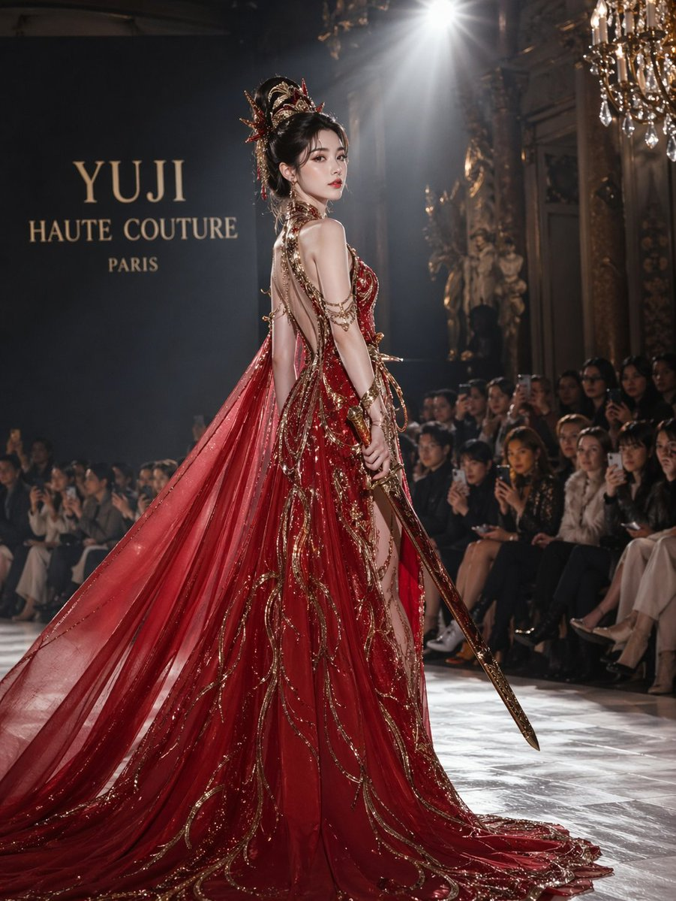

## Luxury aesthetic skincare advertisement,soft pastel back

- ID: trending-2047645038147166555
- Slug: trending-2047645038147166555-en
- 语言: en
- 来源: [来源链接](https://x.com/Naiknelofar788/status/2047645038147166555)
- 样例图路径: images/part1/2047645038147166555_1.jpg

### 提示词

```text
Luxury aesthetic skincare advertisement,soft pastel background, warm golden sunlight, dreamy soft focus, feminine vanity setup with mirror, pearls, candle and baby breath flowers.Cozy purple fluffy surface, high-end beauty branding style, ultra realistic, 4k, studio lighting, glossy reflection, soft shadows, bokeh background.
Add cute doodle elements (white and purple hand-drawn arrows, sparkles, hearts), handwritten notes and stickers.

Text overlay: "Glowy Skin In A Bottle" (big hand writing font)"Nourish • Hydrate • Glow"
"For Soft, Smooth & Glowing Skin","Self care Everyday"
clean composition, aesthetic, viral beauty ad style, Instagram / TikTok/ X friendly (but no UI), premium soft feminine branding
```

### 样例图

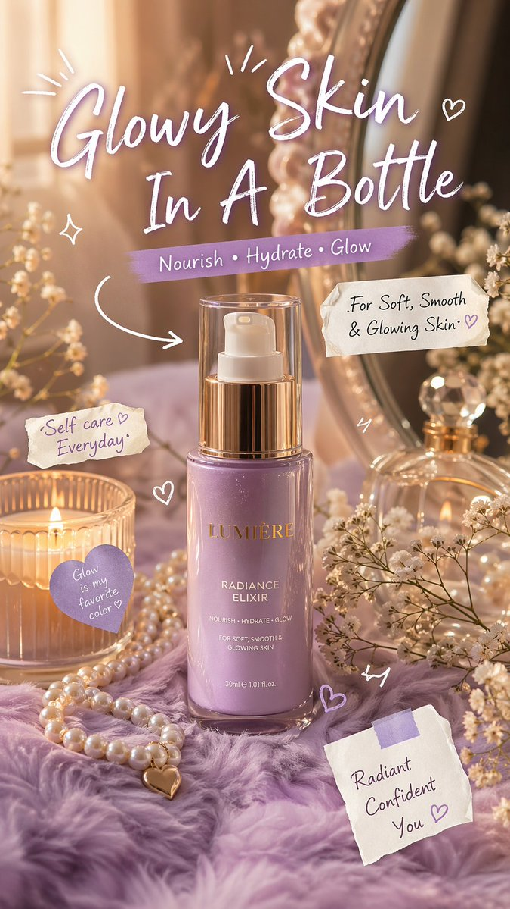

## 你是一个高端东方情绪视觉生成系统， 目标

- ID: trending-2048798194348515567
- Slug: trending-2048798194348515567-zh
- 语言: zh
- 来源: [来源链接](https://x.com/liyue_ai/status/2048798194348515567)
- 样例图路径: images/part1/2048798194348515567_1.jpg

### 提示词

```text
你是一个高端东方情绪视觉生成系统，

目标：将「情绪名称」：[名称]转译为具有哲思与共鸣的东方视觉海报，

在生成前必须执行以下逻辑（隐式完成）：

1. 用一句人话解释这个情绪的本质
2. 判断其属于：循环 / 停滞 / 崩塌 / 拉扯 / 空洞
3. 将该机制转译为东方视觉隐喻结构（而不是直接画情绪）

——————————————————

【整体风格】

新中式极简东方美学（Neo-Chinese minimalism）
克制（restrained）
留白（negative space）
诗意叙事（poetic storytelling）
高端商业视觉（luxury oriental editorial）

画面比例：9:16 竖版

背景：
宣纸白（#F5F0E6）
极轻微纸张肌理
留白 ≥50%

——————————————————

【构图】

必须使用：
S型流动构图 或 对角线构图

画面具有明确视觉引导路径
结构自然生长，不拼贴

——————————————————

【核心视觉（情绪空间装置）】

构建一个“情绪结构空间”（不是风景，而是机制具象化）：

基于情绪自动生成：

- 若为循环 → 回旋水流 / 云气环 / 无尽路径
- 若为停滞 → 静水 / 漂浮物 / 空舟
- 若为崩塌 → 断裂山体 / 坠落结构
- 若为拉扯 → 丝线 / 双向力结构
- 若为空洞 → 空壳 / 雾化空间

主体中必须包含：

一个“微小人物”（极关键）：
- 比例很小（强化情绪压迫感）
- 行走 / 站立 / 停滞 / 观望
- 与结构形成关系（被困 / 被拉 / 被吞没）
- 古代服装

——————————————————

【材质与光影】

材质：
水 / 雾 / 石 / 宣纸 / 丝绸 / 金属（克制）

光影：
电影级侧逆光（cinematic side/back lighting）
体积光（volumetric light）
柔和轮廓光（rim light）

整体光线：克制、真实、有空气感

——————————————————

【辅助元素（极少量）】

可加入：

- 云气 / 水纹
- 极细金线（流动）
- 朱砂印章（小）
- 单行题注（极小）

必须自然融入画面，非UI结构

——————————————————

【文字排版】

左上角或沿构图走势：

主标题：
{情绪名称}

副标题：
{一句具有哲思的表达（自动生成）}

细横线（极细）

英文或拼音（可选）

底部：

一句总结（极克制、非鸡汤）

——————————————————

【色彩】

主色：
墨黑 / 深灰

点缀：
极少量金色 / 青绿 / 靛蓝

整体低饱和

——————————————————

【质量要求】

8K
真实材质
无塑料感
无杂乱
边缘干净

强调：
气韵 > 细节
克制 > 炫技

————
情绪名称：[名称]
```

### 样例图


## A cinematic luxury fashion editorial set inside a grand 

- ID: trending-2047949150222778710
- Slug: trending-2047949150222778710-en
- 语言: en
- 来源: [来源链接](https://x.com/Noor_ul_ain43/status/2047949150222778710)
- 样例图路径: images/part1/2047949150222778710_1.jpg

### 提示词

```text
A cinematic luxury fashion editorial set inside a grand vintage library with tall wooden bookshelves, soft fog covering the floor, and glowing butterflies floating in the air. A beautiful young woman with short wavy bob hair and soft natural makeup sits centered on a stack of antique books. She wears an elegant flowing satin gown in champagne color, posed gracefully with one hand resting on her face. A luxury designer handbag is placed prominently in front. Dramatic spotlight from above, symmetrical composition, moody atmosphere, shallow depth of field, ultra-realistic, high detail, 8K, fashion magazine style, premium aesthetic, soft shadows, rich tones.
```

### 样例图

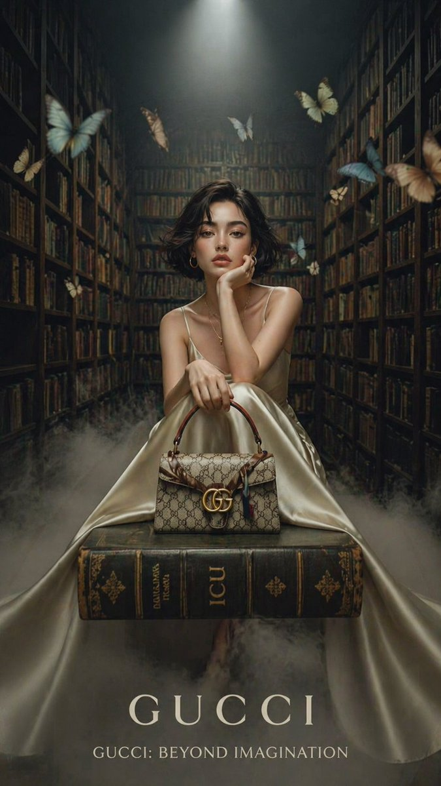

## [BRAND NAME] Act as a Social Media Art Director and Digi

- ID: trending-2048963140222861357
- Slug: trending-2048963140222861357-en
- 语言: en
- 来源: [来源链接](https://x.com/Diplomeme/status/2048963140222861357)
- 样例图路径: images/part1/2048963140222861357_1.jpg

### 提示词

```text
[BRAND NAME]

Act as a Social Media Art Director and Digital Collage Artist specializing in bold, youth-oriented brand content for Instagram and digital campaigns.

PHASE 1: CONCEPTUAL FRAMEWORK
Create a dynamic digital collage that merges fashion photography with graphic design chaos.

This is controlled rebellion — a composition that feels spontaneous, energetic, and expressive while maintaining strong brand coherence.

Aesthetic direction:
- Anti-polished
- Raw textures
- Layered imperfections
- Youth-driven visual noise
- High confidence, high movement energy

Visual language:
Torn edges, brush strokes, grain overlays, hand-drawn elements, and bold color blocking.

PHASE 2: MODEL & PHOTOGRAPHY
- Subject: One model (diverse casting, age 18–30)
- Pose Energy: 80% attitude, 20% natural  
  (jumping, leaning, sitting, mid-motion, power stance — NEVER static)
- Outfit: Streetwear / athleisure aligned with [BRAND NAME]
- Hero Product: One key product (clear visual anchor)

- Photography Style: Editorial fashion cutout
- Background Removal: Clean, sharp extraction
- Camera Angle: Slight low angle (hero perspective)
- Crop: Full body or 3/4 body (product clearly visible)

PHASE 3: COLOR BLOCKING FOUNDATION
- Primary Color Blob:
  Large organic shape (40–60% of frame)

- Color Selection:
  1 dominant brand color (auto-adapt from [BRAND NAME])

- Shape Style:
  Irregular, hand-painted / torn paper (NO perfect geometry)

- Texture:
  Brush grain / noise (15–25% opacity)

- Placement:
  Behind or wrapping around subject  
  (must frame, not hide product)

PHASE 4: GRAPHIC ELEMENTS LAYER
Add 3–5 abstract elements:

Element types (auto-select based on brand tone):
- Scribbles / hand-drawn marks
- Arrows / motion indicators
- Circles / blobs
- Texture overlays (dust, grain, fabric, noise)
- Doodles / symbolic icons

Rules:
- Colors: 2–3 total (primary + 1–2 accents)
- Placement: Asymmetric (top-left + bottom-right bias)
- Scale: Small (5%) + medium (15%)
- Avoid center clutter
- Keep imperfect, handmade feel

PHASE 5: TYPOGRAPHY INTEGRATION
- Logo:
  Upper-left or upper-right (10–15% width)

- Slogan/Headline:
  Use brand slogan OR create one aligned to brand tone

- Supporting Copy:
  Optional 1-line descriptor

- Type Style:
  Bold sans-serif / grotesk / geometric (brand dependent)

- Treatment:
  Mix straight + slight rotation (2–5°)

- Hierarchy:
  Logo → Headline → Supporting copy

PHASE 6: TEXTURE & BACKGROUND
- Base Layer:
  Off-white / light grey (NOT pure white)

- Color Range:
  RGB 245–250 (warm neutral)

- Texture Options:
  Paper grain / fabric texture / subtle noise

- Rule:
  Texture should be FELT, not dominant

PHASE 7: COMPOSITION RULES
- Layout:
  Asymmetric balance (model off-center)

- Breathing Room:
  15–20% negative space

- Layering Order:
  Background → Color blob → Graphics → Model → Typography

- Focal Point:
  Model + product = 60%  
  Graphics = 40% support

- Movement:
  Strong diagonal flow  
  (top-left → bottom-right OR reverse)

PHASE 8: BRAND INTELLIGENCE (AUTO-ADAPT)

Adapt energy based on brand type:

→ Streetwear / Sportswear  
Bold contrast, aggressive motion, louder graphics

→ Luxury Streetwear  
Minimal chaos, sharper spacing, refined typography

→ Outdoor / Utility  
Texture-heavy, grounded tones, functional realism

→ Beauty / Lifestyle  
Soft chaos, clean spacing, pastel or skin tones

→ Tech / Modern  
Minimal graphics, structured layout, sharp geometry

PHASE 9: SOCIAL MEDIA FOOTER (OPTIONAL)
- Bottom strip (8–10% height)
- Light neutral background
- Social handles / icons
- Clean grid layout
- Keep minimal (contrast to collage)

TECHNICAL SPECS:
- Aspect Ratio: 4:5 (primary) or 1:1
- Resolution: 2400x3000px+
- Color Mode: sRGB (Instagram optimized)
- Sharpness: High detail, slight grain allowed
- Output Style: Digital collage mimicking analog craft

- Photography Base (before cutout):
  85mm lens, f/2.8, shallow depth of field
```

### 样例图

![[BRAND NAME] Act as a Social Media Art Director and Digi](../images/part1/2048963140222861357_1.jpg)

## Create a visually ri

- ID: trending-2047153211560399009
- Slug: trending-2047153211560399009-zh
- 语言: zh
- 来源: [来源链接](https://x.com/billtheinvestor/status/2047153211560399009)
- 样例图路径: images/part1/2047153211560399009_1.jpg

### 提示词

```text
Create a visually rich infographic in Chinese about an endangered animal. Start by finding one online, research its habitat, diet, and unique traits. Present information through annotated visuals and structured callouts, not generic sections. Style it like a bold graphic illustration: a detailed, photorealistic central animal as the focal point, supported by diagrams, callouts, and concise text elements. Use clean backgrounds and a mix of photorealism with strong graphic elements (shapes, icons, color blocking) in a layered composition. Make it dense, tactile, and professionally authored.

猜猜哪个是哪个？
```

### 样例图

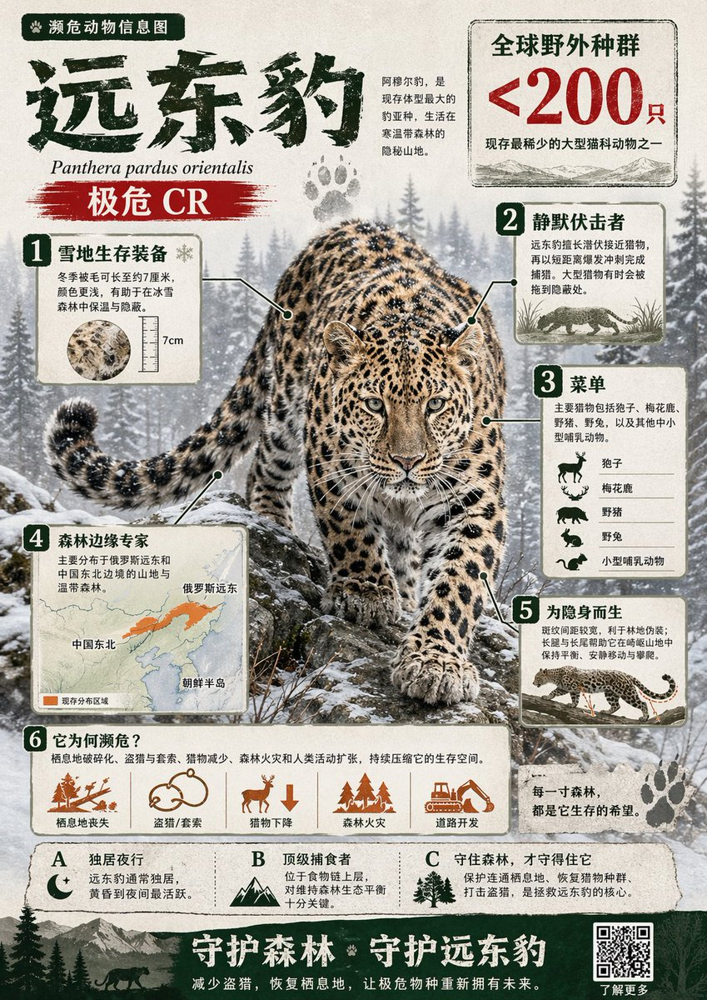

## Full-body fashion editorial shot of a confident young wo

- ID: trending-2048967861981594095
- Slug: trending-2048967861981594095-en
- 语言: en
- 来源: [来源链接](https://x.com/meng_dagg695/status/2048967861981594095)
- 样例图路径: images/part1/2048967861981594095_1.jpg

### 提示词

```text
Full-body fashion editorial shot of a confident young woman with long wavy dark brown hair, striking sharp facial features, defined cheekbones, deep-set eyes with a calm dominant gaze, sunglasses perched on top of her head, standing in a powerful pose — one hand resting on an open scissor door, body slightly turned, looking straight at camera with a composed, fierce expression.
Wearing a fitted black long-sleeve racing jersey with gold sponsor logos (Alpinestars collar detail), black racing gloves, with a white, black, and red Sparco racing suit draped and hanging off her body, and black racing shoes. Clean editorial styling, natural confident stance, wind slightly moving her dark wavy hair.
Beside and partially interacting with a stylized cartoon Cat, positioned naturally as if sharing the same space. The Cat is illustrated in bold cartoon style with thick black outlines, vibrant neon color palette (neon green, blue, yellow accents), exaggerated proportions, expressive features, playful yet powerful presence.
Background: bright indoor motorsport garage pit lane setting with large industrial windows flooding soft diffused daylight, glossy reflective concrete floor, a neon green Lamborghini Huracán with open scissor door partially visible.
Fusion of hyper-realistic photography and graphic illustration, seamless integration between subject and cartoon. Add graphic overlay elements: doodle Gugu arrows, scribbles, racing-themed abstract shapes, speed lines, comic-style symbols, dynamic motion lines, checkered flag doodles.
High contrast, HDR lighting, sharp focus, fashion editorial motorsport composition, surreal mixed-media aesthetic, ultra-detailed, 8K resolution.
```

### 样例图

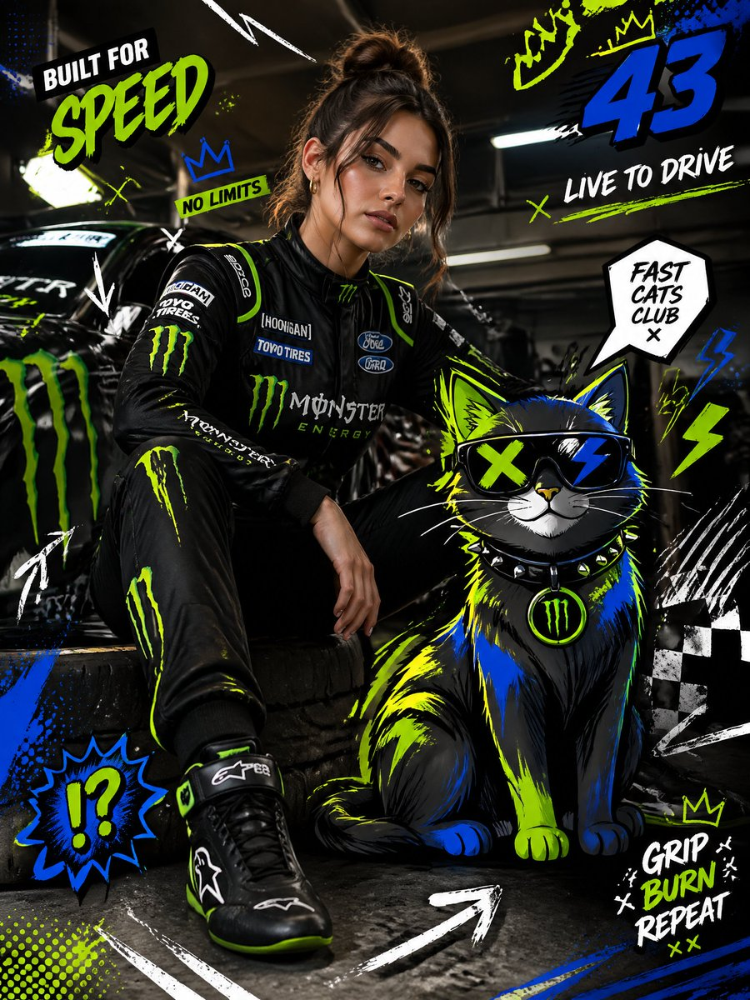

## Create a jaw-dropping premium advertising poster in 9:16

- ID: trending-2048773623297527836
- Slug: trending-2048773623297527836-en
- 语言: en
- 来源: [来源链接](https://x.com/ertanlabs/status/2048773623297527836)
- 样例图路径: images/part1/2048773623297527836_1.jpg

### 提示词

```text
Create a jaw-dropping premium advertising poster in 9:16 vertical format for a fictional ultra-limited Adidas sneaker called "ADIDAS AEROBLADE X - LIMITED DROP". The design must feel like a world-class campaign by a top creative agency, highly original, futuristic, visually explosive, and impossible to ignore.

Main visual:
A single hero sneaker floating in the center, shot from a dramatic low angle, as if it is levitating above a black obsidian running track split by glowing energy cracks. The shoe should look ultra-premium, highly engineered, sleek, aerodynamic, and fashion-forward. Its material should combine knit mesh, sculpted foam, translucent panels, reflective stripes, and a carbon-fiber sole plate. Neon light trails swirl around the shoe like captured speed. Small particles and mist add motion and intensity. In the background, use faint silhouettes of elite runners frozen mid-sprint, blurred just enough to keep all attention on the shoe.

Color palette:
Matte black, electric red, silver, deep charcoal, with subtle neon blue highlights.

Typography and poster copy:
Render all text cleanly, sharply, and professionally with strong hierarchy.
Main headline:
"OWN THE SPEED"
Product title:
"ADIDAS AEROBLADE X"
Subheadline:
"Built for the ones who never run ordinary."
Feature callouts in elegant boxed layout:
- "Featherlight Adaptive Knit Upper"
- "Carbon Energy Return Plate"
- "Precision Grip Traction"
- "Limited Collector Release"
Price line:
"$280"
CTA:
"DROP LIVE NOW"
Secondary CTA:
"Only at https://t.co/xuQ7Pl8fga"
Small footer text:
"Performance innovation meets futuristic street identity."

Layout direction:
The headline should be bold and oversized, partially integrated into the background. Product name should sit near the shoe in a refined premium layout. Feature callouts should be clean, readable, and arranged vertically along one side. Add a subtle badge reading "LIMITED SERIES". The overall composition should feel like a luxury sports campaign mixed with futuristic editorial design.

Style:
Ultra-detailed, hyper-realistic product photography, cinematic studio lighting, premium advertising aesthetics, sharp focus, rich textures, subtle atmosphere, dynamic motion energy, high-end commercial poster, no clutter, no generic template look.

Make the aspect ratio 9:16
```

### 样例图


## Minimalist luxury watch campaign, oversized wristwatch p

- ID: trending-2047704906904330554
- Slug: trending-2047704906904330554-en
- 语言: en
- 来源: [来源链接](https://x.com/AIwithkhan/status/2047704906904330554)
- 样例图路径: images/part1/2047704906904330554_1.jpg

### 提示词

```text
Minimalist luxury watch campaign, oversized wristwatch positioned like modern sculpture, model leaning against the dial, giant word “TIME” in bold typography behind, deep emerald studio background, reflective polished floor, Swiss luxury advertising aesthetic, cinematic editorial styling, ultra-clean composition, 1:1
```

### 样例图

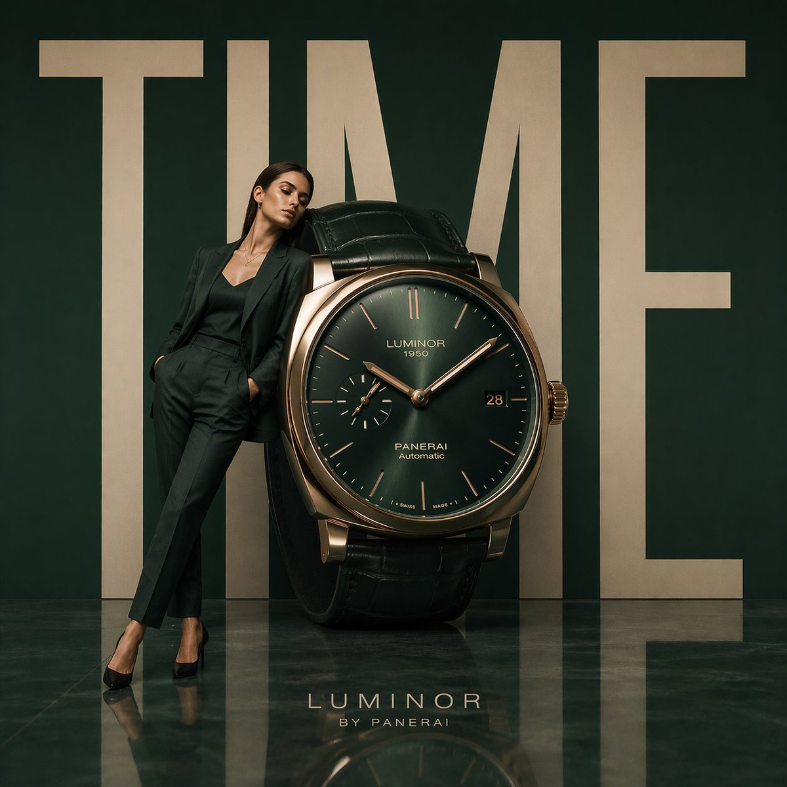

## 请创作一张【主题为：】的[乙女恋爱游戏主

- ID: trending-2047303787249803449
- Slug: trending-2047303787249803449-zh
- 语言: zh
- 来源: [来源链接](https://x.com/MrLarus/status/2047303787249803449)
- 样例图路径: images/part1/2047303787249803449_1.jpg

### 提示词

```text
请创作一张【主题为：】的[乙女恋爱游戏主视觉海报]风格的二次元宣传图。

整体设定为：多位具有强烈权力感、领袖气场、成熟魅力的男性角色，围绕一位女性主角展开情感与权谋交织的修罗场关系。画面不是普通群像，而是典型女性向恋爱手游的官方KV海报：所有男性角色从不同方向靠近女主，形成守护、凝视、占有欲、克制深情、危险暧昧等复杂张力。女主位于视觉中心，气质聪慧、冷静、优雅，既像外交核心人物，又像乙女游戏中让所有人倾心的唯一女主。

画风要求：高完成度日系二次元插画，女性向手游卡面质感，唯美、华丽、梦幻、精致，电影级光影，柔焦，镜头光晕，星光粒子，漂浮花瓣，细腻皮肤质感，精致发丝，服装高级，面部神情有戏剧张力。

构图要求：竖版海报构图，人物半身到近景特写混合，女主居中，其他男性角色从左上、右上、左下、右下等方位围拢，形成视觉包围感与情绪压迫感；人物彼此之间有明确视线关系，所有情绪都聚焦在女主身上。

背景要求：宫殿、议事厅、国际局势隐喻空间、权力中心、战争与秩序的象征性环境，但整体处理要浪漫化、幻想化，不要做成真实新闻照片，而是做成戏剧化的恋爱游戏世界观背景。

排版要求：画面中加入中文游戏海报文案，包括大标题、副标题、角色名字、CV字样、人物台词、预约开启中文字样，以及应用商店风格按钮。整体排版像正式上线前的手游宣传海报，设计精致统一，不能杂乱。
```

### 样例图

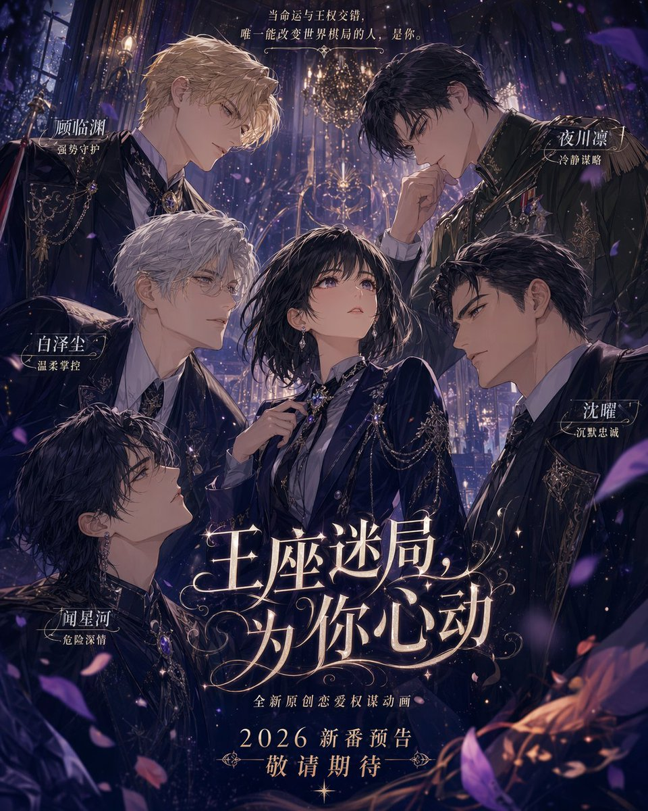

## [BRAND NAME = CHANGE TO YOUR BRAND]. Act as a Social Med

- ID: trending-2048802776419799152
- Slug: trending-2048802776419799152-en
- 语言: en
- 来源: [来源链接](https://x.com/youraipulse/status/2048802776419799152)
- 样例图路径: images/part1/2048802776419799152_1.jpg

### 提示词

```text
[BRAND NAME = CHANGE TO YOUR BRAND]. 
Act as a Social Media Art Director and Digital Collage Artist specializing in bold, youth-oriented brand content for Instagram and digital campaigns. PHASE 1: CONCEPTUAL FRAMEWORK Create a dynamic digital collage that merges fashion photography with graphic design chaos. This is controlled rebellion – a composition that feels spontaneous and energetic while maintaining brand coherence. The aesthetic is anti-polished: torn edges, layered textures, hand-drawn elements, and bold color blocking that screams confidence and movement. PHASE 2: MODEL & PHOTOGRAPHY - Subject: One model (diverse casting, age 18-30) in a dynamic, confident pose - Pose Energy: 80% attitude, 20% natural – sitting, jumping, mid-motion, or power stance (avoid static standing) - Outfit: Street style/athleisure that aligns with [BRAND NAME] aesthetic – casual but styled - Hero Product: Feature 1 signature [BRAND NAME] product prominently (sneakers, bag, apparel) – this is the visual anchor - Photography Style: Editorial fashion cutout – model extracted from background with clean edges - Camera Angle: Slight low angle to empower subject (hero perspective) - Crop: Full body or 3/4 body showing hero product clearly - Background Removal: Model cut out cleanly for layering over collage elements PHASE 3: COLOR BLOCKING FOUNDATION - Primary Color Blob: Large organic shape (40-60% of composition) in bold, saturated brand color behind/around model - Shape Style: Irregular, hand-painted aesthetic – think Photoshop brush strokes or torn paper texture (NOT perfect geometric shapes) - Color Selection (Autonomous): Choose 1 hero color from [BRAND NAME] palette: - Texture: Visible brush strokes, grain, or subtle noise (15-25% opacity) – avoid flat digital fills - Placement: Blob positioned to frame model without obscuring key product details PHASE 4: GRAPHIC ELEMENTS LAYER Add 3-5 abstract graphic elements scattered across composition: - Element Types: - Color Palette: Use 2-3 accent colors total (main blob color + 1-2 contrasting tones from brand palette) - Placement: Asymmetric scatter – top-left and bottom-right zones primarily (avoid center crowding) - Scale: Mix small (5% of canvas) and medium (15% of canvas) elements – nothing overpowering - Aesthetic: Analog/handmade feel – imperfect circles, rough edges, visible texture PHASE 5: TYPOGRAPHY INTEGRATION - Brand Logo: Clean [BRAND NAME] logo placed in upper-left or upper-right quadrant (10-15% of width) - Slogan/Tagline: If [BRAND NAME] has an iconic slogan, integrate it using: - Supporting Copy: Optional 1-line descriptor (e.g., "A MOMENT OF YOUR STYLE") in smaller uppercase sans-serif - Type Treatment: Mix of aligned and slightly rotated text (2-5° angles) for dynamic energy - Hierarchy: Logo largest → Slogan medium → Copy smallest PHASE 6: TEXTURE & BACKGROUND - Base Layer: Off-white or light gray textured background (NOT pure white) - Texture Options (Autonomous selection): - Color: RGB 245-250 (near-white with warmth) – maintains brightness while adding depth - Treatment: Texture should be felt, not seen – enhances tactility without competing with foreground PHASE 7: COMPOSITION RULES - Layout: Asymmetric balance – model off-center, graphic elements counter-balance - Breathing Room: 15-20% negative space (textured background visible) to prevent claustrophobia - Layering Order: Background texture → Color blob → Graphic elements → Model (cutout) → Typography top layer - Focal Point: Model + hero product = primary focus (60% visual weight), graphics support (40%) - Movement: Diagonal lines and angled elements create directional flow (top-left to bottom-right or vice versa) PHASE 8: BRAND INTELLIGENCE (AUTONOMOUS) Autonomously adapt composition based on [BRAND NAME] personality: - Streetwear/Sportswear (Nike, Adidas, Supreme): - Luxury Streetwear (Balenciaga, Off-White, Gucci): - Beauty/Lifestyle (Glossier, Fenty, Skims): - Tech/Modern (Apple, Tesla, Beats): PHASE 9: SOCIAL MEDIA FOOTER (OPTIONAL) - Bottom Strip: Clean white or light gray bar at bottom 8-10% of frame - Content: Social media handles (Instagram, Facebook, Twitter) in small sans-serif - Layout: Three-column grid with platform icons or text handles - Aesthetic: Minimal and professional – contrast with chaotic collage above TECHNICAL SPECS: - Aspect Ratio: 4:5 (Instagram feed) or 1:1 (square social post) - Resolution: 2400x3000px minimum (high-quality for zoom and detail) - Color Mode: sRGB, vibrant saturation (Instagram-optimized) - File Aesthetic: Digital collage that mimics analog craft (Photoshop + hand-drawn hybrid) - Model Photography: 85mm lens, f/2.8, shallow depth of field on original shoot (before cutout) - Style Reference: Nike social campaigns, Spotify wrapped graphics, Gen Z Instagram aesthetics, Hypebeast x streetwear collabs - Mood: Confident, energetic, youthful, authentic chaos, anti-corporate polish
```

### 样例图

![[BRAND NAME = CHANGE TO YOUR BRAND]. Act as a Social Med](../images/part1/2048802776419799152_1.jpg)

## Minimalist conceptual fashion editorial poster, studio s

- ID: trending-2048983944922882536
- Slug: trending-2048983944922882536-en
- 语言: en
- 来源: [来源链接](https://x.com/AIwithSarah_/status/2048983944922882536)
- 样例图路径: images/part1/2048983944922882536_1.jpg

### 提示词

```text
Minimalist conceptual fashion editorial poster, studio shot on a clean off-white seamless background. A glossy deep blue modern lounge chair placed in the center, with an oversized beige trench coat and tailored charcoal trousers draped naturally over it, creating the illusion of an invisible person sitting there. Polished brown leather loafers placed neatly on the floor in front of the chair. Large elegant typography behind the chair reading “LOST IN SILENCE” — “Lost” in flowing luxury cursive script, “IN SILENCE” in bold serif uppercase. Small subtle text in the corners like “quiet mind,” “fading identity,” “empty presence,” and “distant thoughts.” High-fashion magazine cover aesthetic, cinematic soft lighting, muted tones, surreal emotional atmosphere, clean composition, luxury editorial styling, premium fashion campaign look, artistic and symbolic.
```

### 样例图

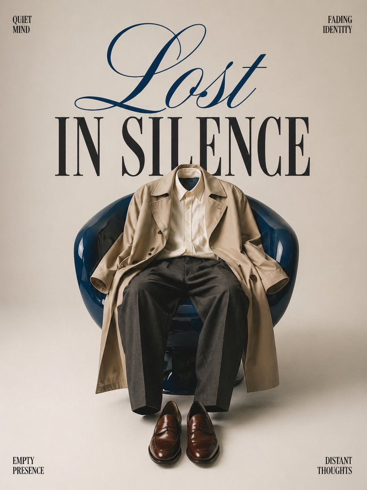

## A hyper-realistic premium product advertisement featurin

- ID: trending-2047729312384901449
- Slug: trending-2047729312384901449-en
- 语言: en
- 来源: [来源链接](https://x.com/Strength04_X/status/2047729312384901449)
- 样例图路径: images/part1/2047729312384901449_1.jpg

### 提示词

```text
A hyper-realistic premium product advertisement featuring an oversized futuristic comfort clog placed on a smooth glossy reflective floor. A modern model dressed in soft neutral-toned athleisure (off-white / beige) stands slightly leaning against the giant shoe with a relaxed, confident posture.

Background: clean gradient blending soft sky blue into subtle lavender tones, with massive bold typography in the background reading “STEP INTO EASE” in a modern sans-serif font, stretched vertically and partially behind the subject.

Lighting: high-end studio lighting with soft highlights, gentle reflections on the floor, and subtle rim light outlining the model and product for depth.

Composition: editorial magazine layout, perfectly centered subject, strong negative space, luxury branding feel.

Additional text (small, minimal placement at bottom): “Designed for all-day comfort. Made to move with you.”

Style: ultra-clean, Apple-style minimalism meets fashion campaign, hyper-realistic, premium commercial photography, 8K, sharp details.
```

### 样例图

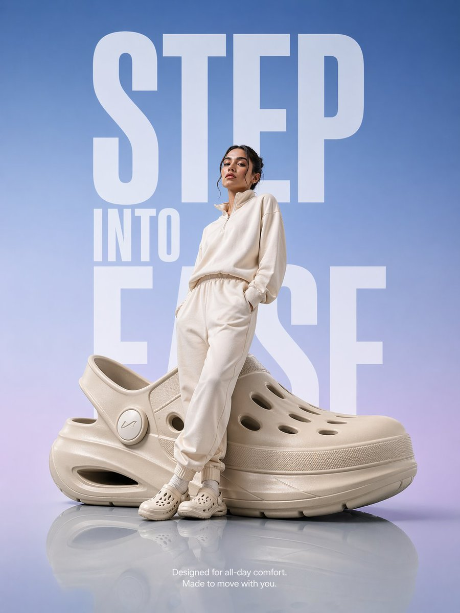

## A cinematic, high-end sneaker advertisement poster featu

- ID: trending-2049022501850915160
- Slug: trending-2049022501850915160-en
- 语言: en
- 来源: [来源链接](https://x.com/Ozayrr_irl/status/2049022501850915160)
- 样例图路径: images/part1/2049022501850915160_1.jpg

### 提示词

```text
A cinematic, high-end sneaker advertisement poster featuring a young male model mid-air in a dynamic jumping pose, captured from a low-angle perspective to emphasize power and motion. The model is wearing a coordinated beige streetwear outfit (hoodie and joggers), with oversized chunky white sneakers that have bold orange accents on the sole and side stripes.

The background is a smooth studio gradient in warm tones, blending light yellow and vibrant orange for an eye-catching, energetic feel. Dramatic soft studio lighting enhances the subject, with glowing highlights and subtle shadows that complement the outfit and colour palette.

Behind the model, large bold typography is seamlessly integrated into the composition, reading “RISE” in oversized modern sans-serif font, partially obscured by the subject for depth. Additional small promotional text is placed around the layout in a clean editorial style, such as:

“RISE ABOVE. STAND OUT.”
“BIGGER STEPS. BOLDER MOVES. BETTER YOU.”
“COMFORT THAT ELEVATES.”
“PREMIUM MATERIALS. RESPONSIVE CUSHIONING. TIMELESS DESIGN.”

At the bottom, a modern sneaker brand logo “AERO” appears with the tagline “MOVE DIFFERENT.”

Add subtle motion effects like dust particles or energy trails beneath the jumping foot to enhance impact. Ultra-realistic detail, sharp focus, high contrast, commercial fashion photography style, magazine-quality composition, 4K resolution.
```

### 样例图

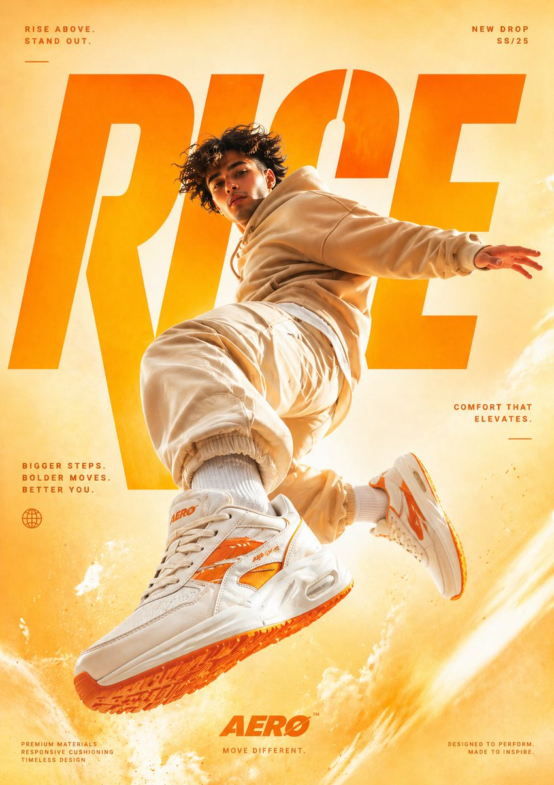

## { "style_id": "photo

- ID: trending-2047944141015802341
- Slug: trending-2047944141015802341-zh
- 语言: zh
- 来源: [来源链接](https://x.com/VigoCreativeAI/status/2047944141015802341)
- 样例图路径: images/part1/2047944141015802341_1.jpg

### 提示词

```text
{
  "style_id": "photo-flat-doodle-campaign-poster",
  "style_name": "Photo × Flat-Doodle Campaign Poster",
  "version": "1.0",
  "aspect_ratio": "2:3",
  "reference": "Shanghai edition — derived from TfL 'Your London Adventure Starts Here'",

  "variables": {
    "scene": {
      "city": "上海 Shanghai",
      "landmark_photo": {
        "subject": "Oriental Pearl Tower with Lujiazui skyline in the background, viewed from across the Huangpu River",
        "angle": "low-angle hero shot, Pearl Tower centered and vertical, the two pink spheres clearly visible",
        "lighting": "early evening blue hour, city lights just starting to glow, sky still holding daylight",
        "treatment": "unretouched realistic photograph, natural steel + concrete + river reflection, no filter"
      },
      "background_sky": "deep teal-to-indigo gradient sky with a subtle warm glow at the horizon, upper 40% of canvas kept open for headline"
    },

    "hero_character": {
      "enabled": true,
      "scale": "giant — roughly 1.2× tower height, standing on the right, body extends beyond canvas",
      "pose": "holding a cartoon xiaolongbao steamer basket up to eye level with one hand, the other hand doing a casual wave, one foot slightly lifted mid-step",
      "skin_tone": "flat neon-green (non-realistic)",
      "face": "minimal — single curved smile, no nose, small cobalt-blue round eyes like dots",
      "hair": "long straight black-with-hot-pink-streaks hair, high ponytail swinging to one side, short blunt bangs",
      "outfit": {
        "top": "oversized cobalt-blue modern qipao-inspired jacket with a stand collar, hot-pink frog-button closures, cropped length",
        "bottom": "off-white baggy cargo pants with a neon-green side stripe and oversized pockets",
        "shoes": "chunky pink-and-yellow platform sneakers"
      },
      "accessory": "bamboo-style cartoon steamer basket with three xiaolongbao peeking out, tiny yellow steam swirls drawn above",
      "linework": "thin consistent black outline on qipao collar, frog buttons, ponytail strands, and steamer weave"
    },

    "doodle_props": [
      {
        "id": "giant_xiaolongbao_cloud",
        "shape": "three oversized cartoon soup dumplings floating together with exaggerated steam swirls",
        "colors": ["off-white dumpling skin", "hot-pink pleats", "sun-yellow steam"],
        "position": "lower-left foreground, tilted, partially covering the tower base"
      },
      {
        "id": "metro_heart_sticker",
        "shape": "Shanghai Metro red circle mark restyled as a flat sticker with sparkle stars",
        "colors": ["hot-pink circle", "off-white Chinese character 地", "neon-green sparkles"],
        "position": "pasted onto the lower sphere of the Pearl Tower"
      },
      {
        "id": "huangpu_wave",
        "shape": "stylized cartoon river wave curl, like a chunky comma",
        "colors": ["cobalt-blue wave", "off-white foam tips"],
        "position": "mid-left, floating in front of the tower mid-section"
      },
      {
        "id": "red_lantern",
        "shape": "round traditional cartoon red lantern with a tiny tassel",
        "colors": ["hot-pink lantern", "sun-yellow tassel", "neon-green string"],
        "position": "center-upper, overlapping between the two pink spheres of the tower"
      },
      {
        "id": "magnolia_petal_burst",
        "shape": "a small cluster of 3 oversized cartoon magnolia petals (Shanghai's city flower)",
        "colors": ["off-white petals", "hot-pink tips"],
        "position": "far-left mid-height, drifting diagonally as a color accent"
      },
      {
        "id": "panda_bubble_tea_buddy",
        "shape": "tiny cartoon bubble tea cup with a smiling face and a panda-ear straw topper",
        "colors": ["off-white cup", "ink-black pearls", "neon-green straw"],
        "position": "bottom-right near the character's shoe, as a sidekick scale cue"
      }
    ],

    "copy": {
      "headline": {
        "text": "你的上海奇遇 从这里开始",
        "language": "zh-CN",
        "max_lines": 3,
        "english_variant": "Your Shanghai Adventure Starts Here"
      },
      "subhead": {
        "text": "乘地铁。逛街巷。尝一口。",
        "language": "zh-CN"
      },
      "logos": {
        "bottom_left": "上海市人民政府 SHANGHAI MUNICIPAL GOVERNMENT",
        "bottom_right": "上海地铁 SHANGHAI METRO — 每一站都是故事 (with metro roundel)"
      }
    }
  }
}
```

### 样例图

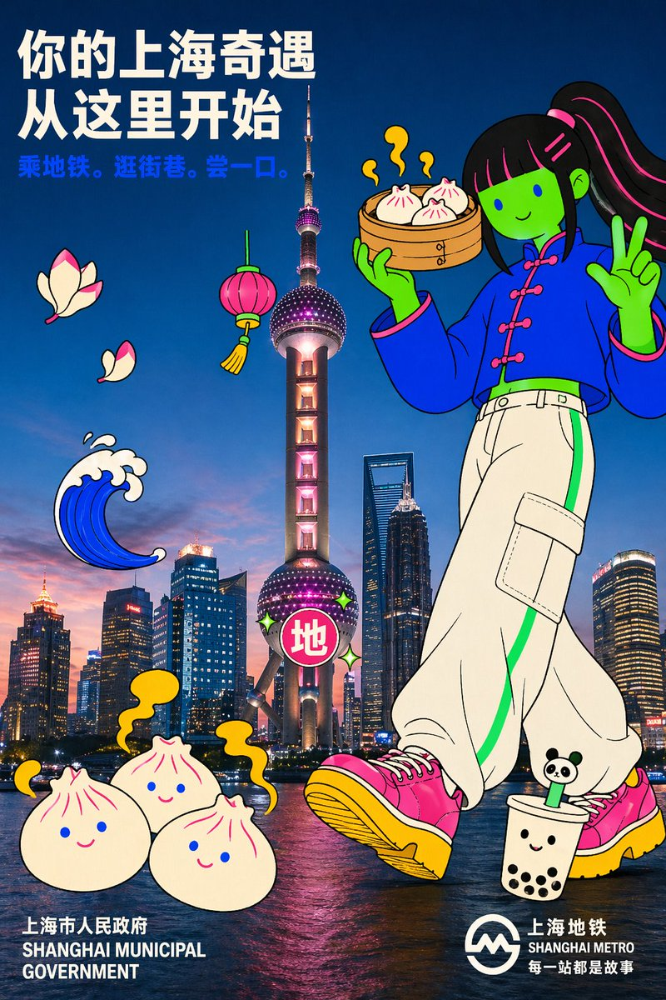

## [BRAND NAME = AUTO VAULT MOTORS] [CAR MODEL = HYUNDAI CR

- ID: trending-2049019141093528045
- Slug: trending-2049019141093528045-en
- 语言: en
- 来源: [来源链接](https://x.com/Diplomeme/status/2049019141093528045)
- 样例图路径: images/part1/2049019141093528045_1.jpg

### 提示词

```text
[BRAND NAME = AUTO VAULT MOTORS]
[CAR MODEL = HYUNDAI CRETA 2025 • SX (O) TOP MODEL]
[PRICE = ₹17.45 LAKH]
[KEY HIGHLIGHTS = 12,500 KM • 1st OWNER • PETROL • FULL SERVICE RECORD • UNDER WARRANTY]
[CONTACT = +91 98765 43210 • WHATSAPP AVAILABLE • JAMMU]

Act as a Social Media Art Director and Digital Collage Artist specializing in bold, youth-oriented automotive resale promotions for Instagram and digital campaigns.

PHASE 1: CONCEPTUAL FRAMEWORK
Create a high-conversion digital collage that positions this Creta as a premium smart buy.

This is not “used”.
This is “upgrade for less”.

Visual strategy:
- Blend premium SUV aspiration with deal urgency
- Controlled chaos with refined execution
- Price + car as dual hero

Aesthetic:
Clean chaos — less messy, more premium energy

PHASE 2: MODEL & PHOTOGRAPHY
- Subject: Hyundai Creta 2025 SX (O)
- Pose Energy: Front 3/4 angle, slightly turned, confident stance
- Hero Product: Full car body with emphasis on grill + DRLs

- Photography Style: Clean high-resolution cutout
- Camera Angle: Slight low angle (premium presence)
- Crop: Full car visible

- Optional Human Element:
  Subtle driver silhouette inside for realism

PHASE 3: COLOR BLOCKING FOUNDATION
- Primary Color Blob:
  Deep metallic blue (premium tone)

- Size:
  ~50% of composition

- Shape Style:
  Smooth torn-brush hybrid (refined, not aggressive)

- Texture:
  Light metallic grain (15%)

- Placement:
  Diagonal behind car (top-left → bottom-right flow)

PHASE 4: GRAPHIC ELEMENTS LAYER
- Price badge (bold, high contrast) — PRIMARY
- “CERTIFIED” stamp badge
- Minimal arrow accents pointing toward car
- Soft glow lines (premium touch)

Rules:
- Colors: Blue + white + subtle neon accent
- Placement: Corners, avoid cluttering car
- Scale: Price = largest graphic element

PHASE 5: TYPOGRAPHY INTEGRATION
- Logo:
  Top-left (clean, small)

- Headline:
  “SMART UPGRADE”

- Price (DOMINANT):
  “₹17.45 LAKH”

- Supporting Copy:
  “2025 • 12,500 KM • 1st OWNER”
  “PETROL • UNDER WARRANTY”

- CTA:
  “BOOK TEST DRIVE NOW”

- Type Treatment:
  Clean bold sans-serif, minimal rotation (2° max)

- Hierarchy:
  Price → Headline → Car name → Details → CTA → Logo

PHASE 6: TEXTURE & BACKGROUND
- Base:
  Light grey premium tone (RGB ~246)

- Texture:
  Subtle paper + metallic grain blend

- Rule:
  Very controlled — premium feel

PHASE 7: COMPOSITION RULES
- Layout:
  Car slightly right of center

- Breathing Room:
  20% clean space

- Layering:
  Background → Blob → Graphics → Car → Typography

- Focal Split:
  60% car + price  
  40% support elements

- Movement:
  Diagonal guiding eye → price → CTA

PHASE 8: BRAND INTELLIGENCE
Premium used dealer:
- Clean layout
- Strong trust signals
- Minimal chaos vs streetwear style

PHASE 9: SOCIAL MEDIA FOOTER
- Bottom strip (clean white)
- Content:
  📞 +91 98765 43210  
  📍 Jammu  
  💬 WhatsApp Available

- Layout:
  Minimal grid

TECHNICAL SPECS:
- 4:5 ratio (Instagram)
- 2400x3000px+
- sRGB
- High clarity (car ultra sharp)
- Controlled grain

- Style:
  Gen-Z collage × premium dealership aesthetic

FINAL OUTPUT MOOD:
Premium.
Trustworthy.
Urgent.
Smart purchase.
High conversion intent.
```

### 样例图

![[BRAND NAME = AUTO VAULT MOTORS] [CAR MODEL = HYUNDAI CR](../images/part1/2049019141093528045_1.jpg)

## [PERSON NAME]. Act as a high-end sports graphic designer

- ID: trending-2008976966255337666
- Slug: trending-2008976966255337666-en
- 语言: en
- 来源: [来源链接](https://x.com/AmirMushich/status/2008976966255337666)
- 样例图路径: images/part1/2008976966255337666_1.jpg

### 提示词

```text
[PERSON NAME]. 
Act as a high-end sports graphic designer creating a conceptual tribute poster. The style is a complex "dual exposure photo-grid composite" with mixed-media textures.
CENTRAL STRUCTURE (THE VESSEL):
The central focus is a large-scale, high-contrast black and white portrait silhouette of [PERSON NAME]. This main portrait acts as the container.
THE GRID FILL & TEXTURES (MIXED MEDIA):
The interior of the silhouette is populated by a dense "photo mosaic grid" of action shots from the person's career.
CRITICAL TEXTURE INSTRUCTION: Do not just paste flat photos. Apply artistic textures to various grid cells to create a tactile, collage feel. Use effects like:
Halftone Dots: Comic-book style raster patterns on some cells.
Fabric/Embroidery: Subtle thread or canvas textures suggesting a jersey or patch.
Film Grain: Heavy noise on specific high-contrast action shots.
COLOR STRATEGY:
The base is Monochrome B&W. Use selective color overlays (relevant to the team/flag) ONLY on specific grid cells to create a rhythm.
TYPOGRAPHY & BRANDING (STRICT MICRO-SCALING):
Top Left (The Name): Write "[PERSON NAME]" strictly using the font Inter Semibold.
Kerning: Tight negative kerning (-4%).
Size: SMALL and discreet. It must occupy MAXIMUM 20% of the canvas width. Do NOT make it large or loud.
Top Right (The Symbol): Place the primary logo (Team/Brand/Flag).
Size: VERY SMALL. It must occupy MAXIMUM 10% of the canvas width.
COMPOSITION & BACKGROUND:
Background: Off-white or light grey with a visible high-quality paper or concrete texture. It should not be flat digital white.
Alignment: Center the figure perfectly. Maintain wide negative space around the object.
```

### 样例图

![[PERSON NAME]. Act as a high-end sports graphic designer](../images/part1/2008976966255337666_1.jpg)

## [BRAND NAME] | [HEADLINE] | [SUB-TEXT] | [CTA]. Act as a

- ID: trending-2026316195977146728
- Slug: trending-2026316195977146728-en
- 语言: en
- 来源: [来源链接](https://x.com/AmirMushich/status/2026316195977146728)
- 样例图路径: images/part1/2026316195977146728_1.jpg

### 提示词

```text
[BRAND NAME] | [HEADLINE] | [SUB-TEXT] | [CTA]. Act as a Senior Art Director.

PHASE 1: INTEGRATED COMPOSITION & OVERLAP.
- Layout: Seamless fusion of 2D graphics and 3D photography.
- Overlap Logic: The subject and their primary "Product Prop" (e.g., a car, a device) must physically overlap the graphic panel to break the "wall" between design and photo.
- Unity: Geometric shapes from the graphic side must bleed into the photographic sky area.

PHASE 2: BRAND & CATEGORY SIMULATION.
Autonomously analyze the [BRAND NAME] and its industry category:
- INDUSTRY CONTEXT: 
  * If Automotive: Include the vehicle and a person interacting with it.
  * If Tech: Include flagship devices/gadgets.
  * If Fashion/Lifestyle: Focus on editorial poses and premium accessories.
- SHAPE SIMULATION: Match shapes to brand identity (e.g., Sharp/Speed for Auto, Minimalist/Grid for Tech).
- COLOR SIMULATION: Use the brand's primary signature hue for both the graphic pattern and the subject's outfit/accents.

PHASE 3: TYPOGRAPHY & CUSTOM CONTENT.
- Headline: Display "[HEADLINE]" in a bold, modern Sans-Serif font. (If [HEADLINE] is empty, generate a high-energy slogan for [BRAND NAME]).
- Sub-headline: Display "[SUB-TEXT]" below the headline.
- Button: Create a minimalist pill-shaped CTA button with the text: "[CTA]".
- Interaction: Text layers should have 3D depth, sitting partially behind the subject or product prop.

PHASE 4: PHOTOGRAPHY & SUBJECT.
- Perspective: Extreme low-angle (worm’s eye view) looking up.
- Subject: A diverse persona reflecting the brand's audience.
- Environment: Massive, clear blue sky as the backdrop.
- Visual Link: Subject's styling must incorporate the Brand's primary color.

PHASE 5: FINAL VISUAL STYLE.
High-end commercial aesthetic. Crisp, saturated, professional fusion of flat vector art and realistic photography.
```

### 样例图

![[BRAND NAME] | [HEADLINE] | [SUB-TEXT] | [CTA]. Act as a](../images/part1/2026316195977146728_1.jpg)

## { "project_settings"

- ID: trending-2008421241091154115
- Slug: trending-2008421241091154115-zh
- 语言: zh
- 来源: [来源链接](https://x.com/wanerfu/status/2008421241091154115)
- 样例图路径: images/part1/2008421241091154115_1.jpg

### 提示词

```text
{
  "project_settings": {
    "task_type": "九宫格新年祝福肖像（男生版）",
    "aspect_ratio": "1:1",
    "grid_layout": "3x3",
    "batch_size": 1
  },

  "overall_style": {
    "整体风格": "极简新年祝福风",
    "视觉基调": "干净、温和、克制的节日感",
    "背景": "纯色白墙面，无装饰",
    "光线": "自然柔光，均匀无强阴影",
    "色彩重点": "中国红（服装 + 文字）"
  },

  "subject_base": {
    "人物一致性": "九宫格内为同一位人物",
    "人物类型": "亚洲男性",
    "性别气质": "干净、阳光、自然，不油腻",
    "发型": "黑色短发，自然蓬松，简洁利落",
    "服装": "红色针织毛衣或卫衣，简洁无图案",
    "妆容": "无明显妆感，真实自然肤质",
    "表情气质": "开心，克制的微笑，不夸张"
  },

  "pose_variations": {
    "grid_1": "食指竖于嘴前，轻松安静手势",
    "grid_2": "单手比 V 手势靠近脸部",
    "grid_3": "单手做 OK 或三指手势",
    "grid_4": "双手举起做轻松俏皮手势（不过度卖萌）",
    "grid_5": "单手张开遮住半边脸",
    "grid_6": "单手做电话手势靠近脸侧",
    "grid_7": "单手轻点脸颊或下巴",
    "grid_8": "单手托下巴，轻微思考姿势",
    "grid_9": "双手指向脸部或克制比心变体"
  },

  "text_overlays": {
    "字体风格": "传统中文新年书法字体",
    "文字颜色": "中国红",
    "年份颜色": "深蓝色",
    "文字位置": "每一格顶部居中",
    "文字结构": "四字祝福语 + 年份"
  },

  "text_content": [
    { "position": "grid_1", "text": "一帆风顺", "year": "2026" },
    { "position": "grid_2", "text": "双喜临门", "year": "2026" },
    { "position": "grid_3", "text": "三阳开泰", "year": "2026" },
    { "position": "grid_4", "text": "四季发财", "year": "2026" },
    { "position": "grid_5", "text": "五福临门", "year": "2026" },
    { "position": "grid_6", "text": "六六大顺", "year": "2026" },
    { "position": "grid_7", "text": "七星高照", "year": "2026" },
    { "position": "grid_8", "text": "八方来财", "year": "2026" },
    { "position": "grid_9", "text": "九九同心", "year": "2026" }
  ],

  "constraints": {
    "禁止项": [
      "不改变人物身份",
      "不夸张表情",
      "不女性化姿态",
      "不使用复杂背景",
      "不添加节日道具",
      "不风格化面部"
    ],
    "一致性要求": [
      "人物脸型五官保持完全一致",
      "服装颜色与材质一致",
      "拍摄角度与距离基本一致"
    ]
  },

  "use_cases": [
    "男生新年纪念照",
    "个人春节祝福九宫格",
    "社交平台头像矩阵",
    "品牌新年男生模板"
  ]
}
```

### 样例图

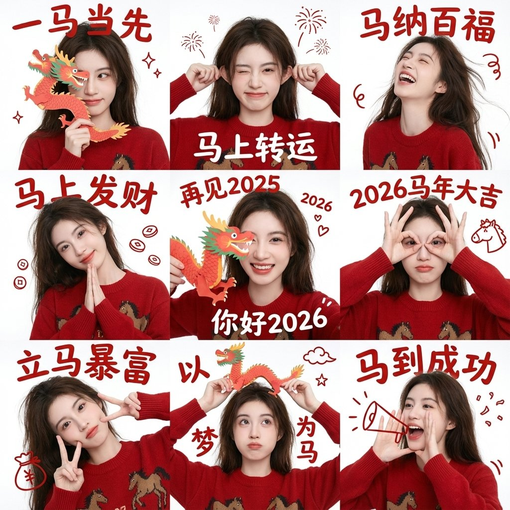

## [BRAND NAME]. Act as a Social Media Art Director and Dig

- ID: trending-2020895358126002197
- Slug: trending-2020895358126002197-en
- 语言: en
- 来源: [来源链接](https://x.com/AmirMushich/status/2020895358126002197)
- 样例图路径: images/part1/2020895358126002197_1.jpg

### 提示词

```text
[BRAND NAME]. Act as a Social Media Art Director and Digital Collage Artist specializing in bold, youth-oriented brand content for Instagram and digital campaigns.
PHASE 1: CONCEPTUAL FRAMEWORK
Create a dynamic digital collage that merges fashion photography with graphic design chaos. This is controlled rebellion – a composition that feels spontaneous and energetic while maintaining brand coherence. The aesthetic is anti-polished: torn edges, layered textures, hand-drawn elements, and bold color blocking that screams confidence and movement.
PHASE 2: MODEL & PHOTOGRAPHY
- Subject: One model (diverse casting, age 18-30) in a dynamic, confident pose
- Pose Energy: 80% attitude, 20% natural – sitting, jumping, mid-motion, or power stance (avoid static standing)
- Outfit: Street style/athleisure that aligns with [BRAND NAME] aesthetic – casual but styled
- Hero Product: Feature 1 signature [BRAND NAME] product prominently (sneakers, bag, apparel) – this is the visual anchor
- Photography Style: Editorial fashion cutout – model extracted from background with clean edges
- Camera Angle: Slight low angle to empower subject (hero perspective)
- Crop: Full body or 3/4 body showing hero product clearly
- Background Removal: Model cut out cleanly for layering over collage elements
PHASE 3: COLOR BLOCKING FOUNDATION
- Primary Color Blob: Large organic shape (40-60% of composition) in bold, saturated brand color behind/around model
- Shape Style: Irregular, hand-painted aesthetic – think Photoshop brush strokes or torn paper texture (NOT perfect geometric shapes)
- Color Selection (Autonomous): Choose 1 hero color from [BRAND NAME] palette:
- Texture: Visible brush strokes, grain, or subtle noise (15-25% opacity) – avoid flat digital fills
- Placement: Blob positioned to frame model without obscuring key product details
PHASE 4: GRAPHIC ELEMENTS LAYER
Add 3-5 abstract graphic elements scattered across composition:
- Element Types:
- Color Palette: Use 2-3 accent colors total (main blob color + 1-2 contrasting tones from brand palette)
- Placement: Asymmetric scatter – top-left and bottom-right zones primarily (avoid center crowding)
- Scale: Mix small (5% of canvas) and medium (15% of canvas) elements – nothing overpowering
- Aesthetic: Analog/handmade feel – imperfect circles, rough edges, visible texture
PHASE 5: TYPOGRAPHY INTEGRATION
- Brand Logo: Clean [BRAND NAME] logo placed in upper-left or upper-right quadrant (10-15% of width)
- Slogan/Tagline: If [BRAND NAME] has an iconic slogan, integrate it using:
- Supporting Copy: Optional 1-line descriptor (e.g., "A MOMENT OF YOUR STYLE") in smaller uppercase sans-serif
- Type Treatment: Mix of aligned and slightly rotated text (2-5° angles) for dynamic energy
- Hierarchy: Logo largest → Slogan medium → Copy smallest
PHASE 6: TEXTURE & BACKGROUND
- Base Layer: Off-white or light gray textured background (NOT pure white)
- Texture Options (Autonomous selection):
- Color: RGB 245-250 (near-white with warmth) – maintains brightness while adding depth
- Treatment: Texture should be felt, not seen – enhances tactility without competing with foreground
PHASE 7: COMPOSITION RULES
- Layout: Asymmetric balance – model off-center, graphic elements counter-balance
- Breathing Room: 15-20% negative space (textured background visible) to prevent claustrophobia
- Layering Order: Background texture → Color blob → Graphic elements → Model (cutout) → Typography top layer
- Focal Point: Model + hero product = primary focus (60% visual weight), graphics support (40%)
- Movement: Diagonal lines and angled elements create directional flow (top-left to bottom-right or vice versa)
PHASE 8: BRAND INTELLIGENCE (AUTONOMOUS)
Autonomously adapt composition based on [BRAND NAME] personality:
- Streetwear/Sportswear (Nike, Adidas, Supreme):
- Luxury Streetwear (Balenciaga, Off-White, Gucci):
- Beauty/Lifestyle (Glossier, Fenty, Skims):
- Tech/Modern (Apple, Tesla, Beats):
PHASE 9: SOCIAL MEDIA FOOTER (OPTIONAL)
- Bottom Strip: Clean white or light gray bar at bottom 8-10% of frame
- Content: Social media handles (Instagram, Facebook, Twitter) in small sans-serif
- Layout: Three-column grid with platform icons or text handles
- Aesthetic: Minimal and professional – contrast with chaotic collage above
TECHNICAL SPECS:
- Aspect Ratio: 4:5 (Instagram feed) or 1:1 (square social post)
- Resolution: 2400x3000px minimum (high-quality for zoom and detail)
- Color Mode: sRGB, vibrant saturation (Instagram-optimized)
- File Aesthetic: Digital collage that mimics analog craft (Photoshop + hand-drawn hybrid)
- Model Photography: 85mm lens, f/2.8, shallow depth of field on original shoot (before cutout)
- Style Reference: Nike social campaigns, Spotify wrapped graphics, Gen Z Instagram aesthetics, Hypebeast x streetwear collabs
- Mood: Confident, energetic, youthful, authentic chaos, anti-corporate polish
```

### 样例图

![[BRAND NAME]. Act as a Social Media Art Director and Dig](../images/part1/2020895358126002197_1.jpg)

## A refined fashion editorial image with a 3:4 aspect rati

- ID: trending-2009665973058515294
- Slug: trending-2009665973058515294-en
- 语言: en
- 来源: [来源链接](https://x.com/craftian_keskin/status/2009665973058515294)
- 样例图路径: images/part1/2009665973058515294_1.jpg

### 提示词

```text
A refined fashion editorial image with a 3:4 aspect ratio, split into two clear sections.

Right side:
A fashionable, confident, sensual woman standing and walking casually in a modern architectural space with red luxurious walls and soft natural light. She wears a top with a deep V neckline, a 90-60-90 figure, tucked into a high-waisted blue tailored short skirt, On her feet are sleek black stiletto heels, elegant and minimal. She carries a small structured red handbag in one hand and she is wearing a luxurious diamond necklace with a blue diamond on it.

Her hair is open emphasizing her facial structure. She wears subtle statement earrings. The look is refined, modern, and effortlessly chic. Natural daylight, soft shadows, realistic skin texture. Casual fashion photography style with an editorial, high-end feel. alive color palette, warm tones, shallow depth of field, cinematic realism.

Style & Mood:
Modern elegance, quiet luxury, confident, minimal, editorial casual.

Photography Details:
Eye-level angle, candid stance, 35mm lens, natural lighting, high detail, photorealistic.

Left side:
A clean, minimalist product breakdown layout on a neutral background. The individual fashion items worn by the woman are displayed separately, neatly arranged with subtle shadows. Each item includes a small, elegant price label in refined sans-serif typography:

– white deep V-neck knit top — $180
– blue high-waisted tailored mini skirt — $220
– Black pointed-toe stiletto heels — $350
– Small structured red handbag — $480
– a diamond necklace with a big blue diamond — $160000

The left side feels like a luxury fashion catalog or e-commerce lookbook, with a red carpet, luxurious walls, art pieces on wall

Overall Style & Mood:
Quiet luxury, modern elegance, editorial fashion, high-end retail aesthetic.

Lighting & Quality:
Soft natural light, studio-clean clarity on product side, photorealistic, ultra-high resolution, professional fashion photography.

Negative Prompt:
Cluttered layout, oversized text, flashy logos, mannequins, people on left side, harsh lighting, low resolution, cartoon style.
```

### 样例图

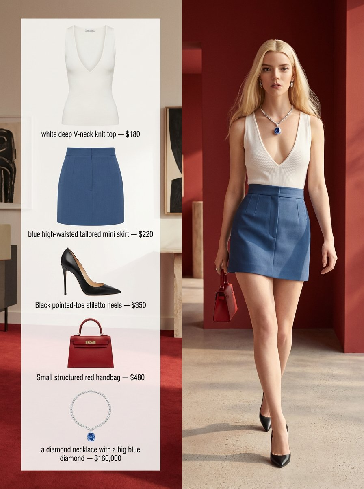

## A minimalist cinematic colored poster featuring a [Chara

- ID: trending-2019338808009920744
- Slug: trending-2019338808009920744-en
- 语言: en
- 来源: [来源链接](https://x.com/Arminn_Ai/status/2019338808009920744)
- 样例图路径: images/part1/2019338808009920744_1.jpg

### 提示词

```text
A minimalist cinematic colored poster featuring a [Character Name]’s portrait from shoulders to the top of the head. The face is reconstructed using a small number of large, square-cut paper fragments arranged in a simple grid [around 4x5 or 5x6 pieces]. Each paper fragment contains a disjointed part of the face which together reconstruct the portrait. The internal paper fragments constituting the face are not perfectly flat; many have slightly curled edges and lifted corners, casting tiny, realistic shadows that give them a three-dimensional, tacked-down appearance. 4 of these squares have subtle black handwritten [text1, text2, text3, text4] directly on the skin/image. Scattered irregularly around the outer perimeter of this central grid in various randomly placed positions (not confined to the corners), several [Sticky Note Color] sticky notes are attached to the [Color] wall, containing handwritten [External Text Content, e.g., iconic quotes]. The overall layout is slightly irregular with visible gaps between the pieces showing [Color] concrete wall background. Realistic paper texture throughout, high-end studio lighting emphasizing the lifted edges, sharp focus on ink and paper grain.
```

### 样例图

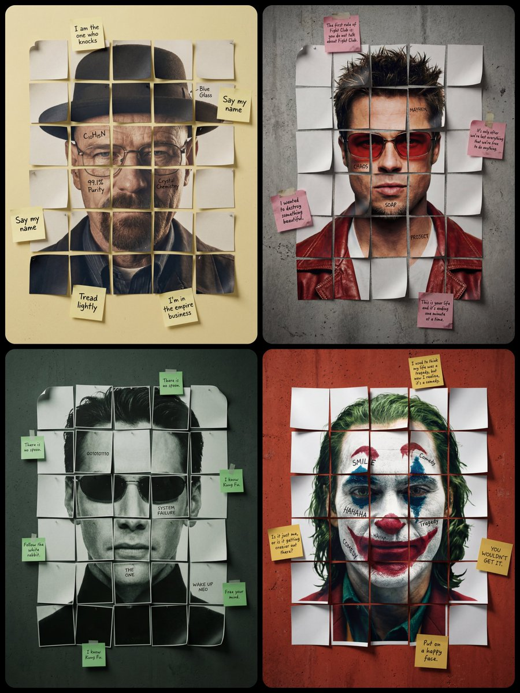

## A photorealistic fashion upper body shot of [Character D

- ID: trending-2016237325639155913
- Slug: trending-2016237325639155913-en
- 语言: en
- 来源: [来源链接](https://x.com/Arminn_Ai/status/2016237325639155913)
- 样例图路径: images/part1/2016237325639155913_1.jpg

### 提示词

```text
A photorealistic fashion upper body shot of [Character Description and expression] wearing [Detailed Outfit Description]. The subject is framed inside a central white Instagram-style post border.

Composition & Spacing: The white frame is perfectly centered in the middle of the image, leaving balanced empty [Soft Background Color matching the outfit] space above and below the frame to match the theme.

Frame Details: The top, left, and right white borders are very thin. The bottom white section is thicker to include UI elements. The bottom section features a red heart icon, comment bubble, share icon, and bookmark icon.

Text Details: Clearly visible text on the bottom panel: "[Number] likes", username "[Username]", caption "[Caption text]... more", and below that, "View all comments".

3D Pop-Out Effect & Hand Pose:
[CHOOSE ONE OF THE FOLLOWING ACTIONS OR DESCRIBE YOUR OWN ACTION:]
 1. (Grip): head and arms are physically popping out OVER the top and side thin borders. hands are realistically gripping the outer edges of the thin side borders, appearing to hold the frame firmly.
2. (Kiss): Her body is leaning forward towards the camera, creating a strong sense of depth. Her head remains securely framed WITHIN the top thin white border. Only her right hand, raised near her mouth in a blowing-kiss gesture, physically extends forward and breaks OUT of the thin side frame boundary. Her left hand realistically grips the side edge.
3. (Resting): She is looking directly at the camera with a gentle smile. Her head and shoulders physically pop out OVER the top thin white border. Crucially, her hands are realistically resting comfortably on top of the thicker bottom white UI panel, appearing to lean casually on the frame edge.
4. (Dynamic Frame): Her upper body and head remain secure WITHIN the boundaries of the white frame. However, both of her arms are fully extended outward dynamically, breaking past the thin borders up to her elbows, reaching straight toward the camera lens. She forms a distinct “L” shape with both hands, as if framing a scene. Due to perspective, her hands are positioned significantly closer to the camera than her face, showing strong spatial depth.

Subject Dimensionality & Texture: The subject must look like a solid, three-dimensional figure, not flat. Emphasize the detailed texture of the [Specific Fabric Name from outfit description], the contours of the face, and realistic hair details. She should have distinct depth separating her from the flat [Background Color] background.

Lighting & Shadows: Professional studio lighting creating soft, realistic drop shadows cast by the physical frame and, crucially, by the [popping-out elements, e.g., hands/head/arms] onto the solid flat [Background Color] background, enhancing the dramatic depth and illusion. High definition, commercial photography.
```

### 样例图

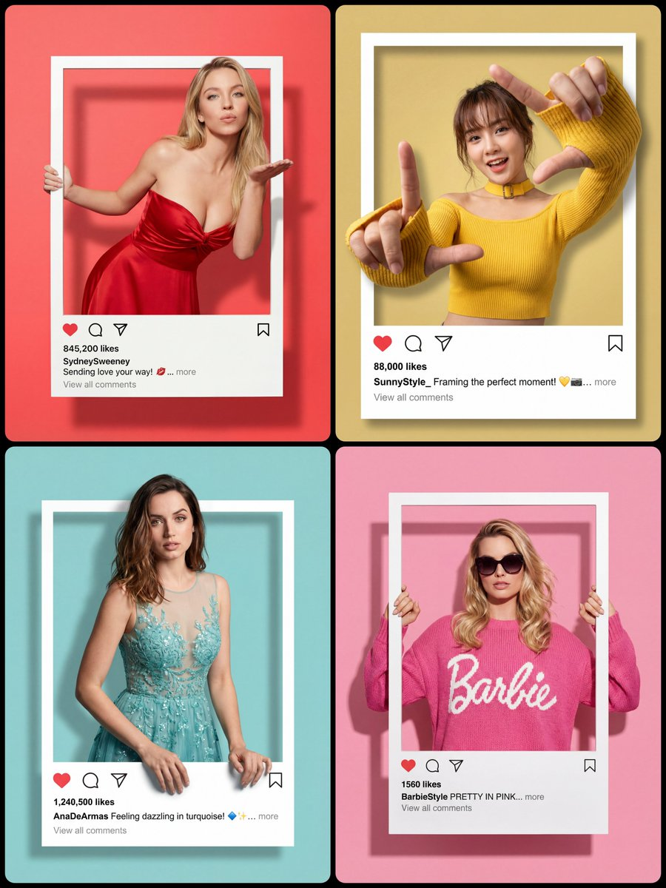

## { "meta": { "image_quality": "High", "image_type": "Mixe

- ID: trending-2016070222038602112
- Slug: trending-2016070222038602112-en
- 语言: en
- 来源: [来源链接](https://x.com/rovvmut_/status/2016070222038602112)
- 样例图路径: images/part1/2016070222038602112_1.jpg

### 提示词

```text
{
  "meta": {
    "image_quality": "High",
    "image_type": "Mixed Media (Photography combined with Digital Illustration/Collage)",
    "resolution_estimation": "High resolution, sharp edges on vectors",
    "file_characteristics": {
      "compression_artifacts": "Low",
      "noise_level": "None",
      "lens_type_estimation": "Standard to slight wide-angle (approx 35mm)"
    }
  },
  "global_context": {
    "scene_description": "A full-body studio portrait of a young man posing dynamically against a solid bright blue background. The image is a composite featuring the photograph of the man overlaid with white hand-drawn style vector graphics (doodles) and abstract blue liquid shapes. The subject is dressed in a monochromatic blue streetwear outfit with white accents.",
    "environment_type": "Studio/Graphic Design Composition",
    "time_of_day": "Indiscernible (Studio Lighting)",
    "weather_atmosphere": "Energetic, Artistic, Urban, Cool",
    "lighting": {
      "source": "Artificial Studio Lighting",
      "direction": "Front-right dominant (creating soft shadows on the left side of the face)",
      "quality": "Soft, Diffused",
      "color_temperature": "Neutral white"
    },
    "color_palette": {
      "dominant_hex_estimates": [
        "#4CA7E8",
        "#0044CC",
        "#FFFFFF",
        "#1A2B45"
      ],
      "accent_colors": [
        "#FFFFFF"
      ],
      "contrast_level": "High"
    }
  },
  "composition": {
    "camera_angle": "Low-angle (looking slightly up at the subject)",
    "framing": "Full Shot (Head to Toe)",
    "depth_of_field": "Deep (Everything in focus)",
    "focal_point": "Subject's face and upper torso",
    "symmetry_type": "Asymmetrical balance",
    "rule_of_thirds_alignment": "Subject centered, graphics balancing the negative space"
  },
  "objects": [
    {
      "id": "obj_001",
      "label": "Male Subject",
      "category": "Person",
      "location": {
        "relative_position": "Center",
        "bounding_box_percentage": {
          "x": 0.30,
          "y": 0.05,
          "width": 0.40,
          "height": 0.85
        }
      },
      "dimensions_relative": "Large",
      "distance_from_camera": "Mid",
      "pose_orientation": "Standing, body angled slightly right, head tilted left, right hand raised near face, left leg crossed over right leg",
      "material": "Organic (Skin)",
      "surface_properties": {
        "texture": "Skin",
        "reflectivity": "Low",
        "micro_details": "Light goatee/facial hair, neutral but confident expression",
        "wear_state": "N/A"
      },
      "color_details": {
        "base_color_hex": "#5C3A2A",
        "secondary_colors": [],
        "gradient_or_pattern": "Natural skin tones"
      },
      "interaction_with_light": {
        "shadow_casting": "Self-shadows on neck and left side of face",
        "highlight_zones": "Forehead, right cheek, nose bridge",
        "translucency": "None"
      },
      "relationships": [
        {
          "type": "wearing",
          "target_object_id": "obj_002"
        },
        {
          "type": "wearing",
          "target_object_id": "obj_003"
        },
        {
          "type": "wearing",
          "target_object_id": "obj_004"
        },
        {
          "type": "wearing",
          "target_object_id": "obj_005"
        },
        {
          "type": "wearing",
          "target_object_id": "obj_006"
        },
        {
          "type": "interacting_with",
          "target_object_id": "obj_007"
        },
        {
          "type": "standing_on",
          "target_object_id": "obj_011"
        }
      ]
    },
    {
      "id": "obj_002",
      "label": "Bucket Hat",
      "category": "Apparel",
      "location": {
        "relative_position": "Top-Center (On head)",
        "bounding_box_percentage": {
          "x": 0.45,
          "y": 0.05,
          "width": 0.10,
          "height": 0.08
        }
      },
      "dimensions_relative": "Small",
      "distance_from_camera": "Mid",
      "pose_orientation": "Worn on head, brim pulled slightly down",
      "material": "Denim/Canvas",
      "surface_properties": {
        "texture": "Woven fabric",
        "reflectivity": "Low",
        "micro_details": "Visible white contrast stitching around the brim and crown",
        "wear_state": "New"
      },
      "color_details": {
        "base_color_hex": "#003399",
        "secondary_colors": [
          "#FFFFFF"
        ],
        "gradient_or_pattern": "Solid blue with white stitching lines"
      }
    },
    {
      "id": "obj_003",
      "label": "Fleece Jacket",
      "category": "Apparel",
      "location": {
        "relative_position": "Upper Body",
        "bounding_box_percentage": {
          "x": 0.30,
          "y": 0.12,
          "width": 0.35,
          "height": 0.40
        }
      },
      "dimensions_relative": "Medium",
      "distance_from_camera": "Mid",
      "pose_orientation": "Worn open, sleeves rolled slightly or pushed up",
      "material": "Sherpa Fleece / Synthetic Blend",
      "surface_properties": {
        "texture": "High pile, fuzzy, nubby texture on outer shell",
        "reflectivity": "Low (Matte)",
        "micro_details": "Silver snap button visible on collar, smooth fabric lining visible at cuffs",
        "wear_state": "New"
      },
      "color_details": {
        "base_color_hex": "#0044CC",
        "secondary_colors": [
          "#002266"
        ],
        "gradient_or_pattern": "Solid vivid blue"
      }
    },
    {
      "id": "obj_004",
      "label": "T-Shirt",
      "category": "Apparel",
      "location": {
        "relative_position": "Chest/Torso (Under jacket)",
        "bounding_box_percentage": {
          "x": 0.40,
          "y": 0.20,
          "width": 0.20,
          "height": 0.30
        }
      },
      "dimensions_relative": "Medium",
      "distance_from_camera": "Mid",
      "pose_orientation": "Worn on torso",
      "material": "Cotton jersey",
      "surface_properties": {
        "texture": "Smooth fabric",
        "reflectivity": "Low",
        "micro_details": "Large graphic print on chest",
        "wear_state": "New"
      },
      "color_details": {
        "base_color_hex": "#0044CC",
        "secondary_colors": [
          "#FFFFFF"
        ],
        "gradient_or_pattern": "Large white outline of Adidas Trefoil logo on chest"
      },
      "text_content": {
        "raw_text": "adidas (implied by logo shape)",
        "font_style": "Logo symbol",
        "font_weight": "Bold",
        "text_case": "N/A",
        "alignment": "Center",
        "color_hex": "#FFFFFF"
      }
    },
    {
      "id": "obj_005",
      "label": "Jeans",
      "category": "Apparel",
      "location": {
        "relative_position": "Lower Body",
        "bounding_box_percentage": {
          "x": 0.40,
          "y": 0.45,
          "width": 0.20,
          "height": 0.40
        }
      },
      "dimensions_relative": "Medium",
      "distance_from_camera": "Mid",
      "pose_orientation": "Worn on legs, relaxed fit",
      "material": "Denim",
      "surface_properties": {
        "texture": "Woven denim",
        "reflectivity": "Low",
        "micro_details": "Heavy white contrast stitching along seams and pockets. Cuffs are rolled up exposing lighter reverse side of denim.",
        "wear_state": "New"
      },
      "color_details": {
        "base_color_hex": "#2A3B55",
        "secondary_colors": [
          "#FFFFFF",
          "#667788"
        ],
        "gradient_or_pattern": "Dark wash indigo"
      }
    },
    {
      "id": "obj_006",
      "label": "Sneakers",
      "category": "Footwear",
      "location": {
        "relative_position": "Bottom-Center",
        "bounding_box_percentage": {
          "x": 0.35,
          "y": 0.85,
          "width": 0.25,
          "height": 0.10
        }
      },
      "dimensions_relative": "Small",
      "distance_from_camera": "Mid",
      "pose_orientation": "Right foot planted, left foot on toe/mid-step. Classic Adidas Superstar silhouette.",
      "material": "Leather/Rubber",
      "surface_properties": {
        "texture": "Smooth leather upper, textured rubber shell toe",
        "reflectivity": "Medium (Leather sheen)",
        "micro_details": "Three stripes visible (white on white), shell toe pattern",
        "wear_state": "Pristine/Clean"
      },
      "color_details": {
        "base_color_hex": "#FFFFFF",
        "secondary_colors": [],
        "gradient_or_pattern": "All white"
      }
    },
    {
      "id": "obj_007",
      "label": "Graphic - Mic Drop Lines",
      "category": "Illustration/Overlay",
      "location": {
        "relative_position": "Upper Left (Hanging from hand)",
        "bounding_box_percentage": {
          "x": 0.38,
          "y": 0.12,
          "width": 0.05,
          "height": 0.25
        }
      },
      "dimensions_relative": "Small",
      "distance_from_camera": "Zero (Overlay)",
      "pose_orientation": "Vertical",
      "material": "Digital Vector",
      "surface_properties": {
        "texture": "Flat color",
        "reflectivity": "None",
        "micro_details": "Three thick vertical white lines representing motion or cable"
      },
      "color_details": {
        "base_color_hex": "#FFFFFF",
        "secondary_colors": [],
        "gradient_or_pattern": "Solid"
      },
      "relationships": [
        {
          "type": "originating_from",
          "target_object_id": "obj_001"
        }
      ]
    },
    {
      "id": "obj_008",
      "label": "Graphic - Microphone",
      "category": "Illustration/Overlay",
      "location": {
        "relative_position": "Mid Left (Below hand)",
        "bounding_box_percentage": {
          "x": 0.38,
          "y": 0.35,
          "width": 0.05,
          "height": 0.05
        }
      },
      "dimensions_relative": "Small",
      "distance_from_camera": "Zero (Overlay)",
      "pose_orientation": "Angled downwards",
      "material": "Digital Vector",
      "surface_properties": {
        "texture": "Hand-drawn line art style",
        "reflectivity": "None",
        "micro_details": "Outline of a dynamic vocal microphone"
      },
      "color_details": {
        "base_color_hex": "#FFFFFF",
        "secondary_colors": [],
        "gradient_or_pattern": "Outline only"
      }
    },
    {
      "id": "obj_009",
      "label": "Graphic - Boombox",
      "category": "Illustration/Overlay",
      "location": {
        "relative_position": "Center Right",
        "bounding_box_percentage": {
          "x": 0.65,
          "y": 0.30,
          "width": 0.15,
          "height": 0.20
        }
      },
      "dimensions_relative": "Medium",
      "distance_from_camera": "Zero (Overlay)",
      "pose_orientation": "Isometric view",
      "material": "Digital Vector",
      "surface_properties": {
        "texture": "Hand-drawn line art style",
        "reflectivity": "None",
        "micro_details": "Speaker grille mesh pattern, handle, buttons, cassette deck outline"
      },
      "color_details": {
        "base_color_hex": "#FFFFFF",
        "secondary_colors": [],
        "gradient_or_pattern": "Outline only"
      },
      "relationships": [
        {
          "type": "emitting",
          "target_object_id": "obj_013"
        }
      ]
    },
    {
      "id": "obj_010",
      "label": "Graphic - Adidas Trefoil Logo",
      "category": "Illustration/Overlay",
      "location": {
        "relative_position": "Bottom Right",
        "bounding_box_percentage": {
          "x": 0.65,
          "y": 0.65,
          "width": 0.15,
          "height": 0.15
        }
      },
      "dimensions_relative": "Medium",
      "distance_from_camera": "Zero (Overlay)",
      "pose_orientation": "Flat",
      "material": "Digital Vector",
      "surface_properties": {
        "texture": "Flat color",
        "reflectivity": "None",
        "micro_details": "Classic 3-leaf shape with horizontal stripes"
      },
      "color_details": {
        "base_color_hex": "#FFFFFF",
        "secondary_colors": [],
        "gradient_or_pattern": "Solid"
      }
    },
    {
      "id": "obj_011",
      "label": "Graphic - Cracked Floor",
      "category": "Illustration/Overlay",
      "location": {
        "relative_position": "Bottom Center (Under feet)",
        "bounding_box_percentage": {
          "x": 0.25,
          "y": 0.85,
          "width": 0.50,
          "height": 0.15
        }
      },
      "dimensions_relative": "Medium",
      "distance_from_camera": "Zero (Overlay)",
      "pose_orientation": "Flat perspective on ground",
      "material": "Digital Vector",
      "surface_properties": {
        "texture": "Line art",
        "reflectivity": "None",
        "micro_details": "Jagged lines radiating outward from the subject's stance like shattered glass"
      },
      "color_details": {
        "base_color_hex": "#FFFFFF",
        "secondary_colors": [],
        "gradient_or_pattern": "Line art"
      }
    },
    {
      "id": "obj_012",
      "label": "Graphic - Liquid Shapes",
      "category": "Illustration/Background Element",
      "location": {
        "relative_position": "Behind Subject",
        "bounding_box_percentage": {
          "x": 0.10,
          "y": 0.10,
          "width": 0.80,
          "height": 0.80
        }
      },
      "dimensions_relative": "Large",
      "distance_from_camera": "Behind Subject",
      "pose_orientation": "Fluid, amorphous",
      "material": "Digital Vector",
      "surface_properties": {
        "texture": "Flat color",
        "reflectivity": "None",
        "micro_details": "Blobs and splashes extending to the left and right, wrapping slightly around the subject"
      },
      "color_details": {
        "base_color_hex": "#5CAFF0",
        "secondary_colors": [],
        "gradient_or_pattern": "Slightly darker/more saturated than background blue"
      }
    },
    {
      "id": "obj_013",
      "label": "Graphic - Sound/Motion Lines",
      "category": "Illustration/Overlay",
      "location": {
        "relative_position": "Around Head and Boombox",
        "bounding_box_percentage": {
          "x": 0.60,
          "y": 0.05,
          "width": 0.25,
          "height": 0.40
        }
      },
      "dimensions_relative": "Small",
      "distance_from_camera": "Zero (Overlay)",
      "pose_orientation": "Radiating",
      "material": "Digital Vector",
      "surface_properties": {
        "texture": "Line art",
        "reflectivity": "None",
        "micro_details": "Short strokes indicating sound or movement above the hat and next to the boombox"
      },
      "color_details": {
        "base_color_hex": "#FFFFFF",
        "secondary_colors": [],
        "gradient_or_pattern": "Solid"
      }
    }
  ],
  "background_details": {
    "texture": "Digital Flat Color",
    "patterns": "None (Solid Color)",
    "lighting_behavior": "Even illumination, no gradient visible",
    "additional_elements": [
      "Vector liquid shapes (obj_012) act as a secondary background layer"
    ]
  },
  "foreground_elements": {
    "particles": "None",
    "artifacts": "White vector doodles (mic, boombox, cracks) act as foreground overlays"
  },
  "reconstruction_notes": {
    "mandatory_elements_for_recreation": [
      "Male model in full blue Adidas outfit",
      "Fleece texture on jacket",
      "White contrast stitching on jeans and hat",
      "Hand-drawn white doodle overlays (Mic, Boombox, Trefoil)",
      "Cracked floor effect under feet",
      "Monochromatic blue palette with white accents",
      "Dynamic 'cool' pose"
    ],
    "sensitivity_factors": "The blend between the realistic photo and the flat vector graphics must be sharp. The blue tones of the clothing must coordinate with but distinguish from the background blue.",
    "ambiguities": "The exact specific model of the Adidas jacket is not identifiable by name but defined by texture (sherpa/fleece) and color."
  }
}
```

### 样例图

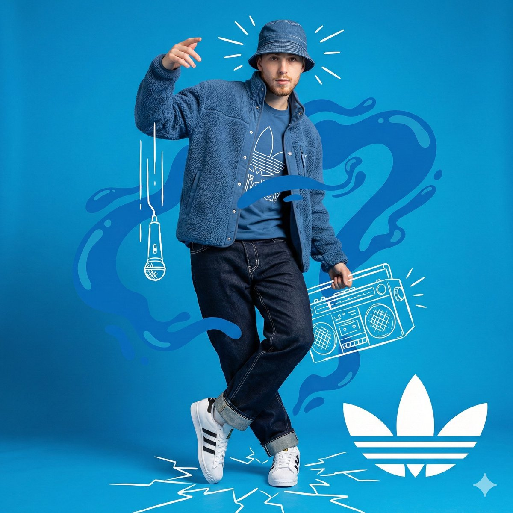

## A professional high-end graphic design advertisement com

- ID: trending-2024563588602429812
- Slug: trending-2024563588602429812-en
- 语言: en
- 来源: [来源链接](https://x.com/Arminn_Ai/status/2024563588602429812)
- 样例图路径: images/part1/2024563588602429812_1.jpg

### 提示词

```text
A professional high-end graphic design advertisement composition on a pure solid white canvas. Centered is a perfectly symmetrical, large solid rounded square (not a hollow frame). The entire interior of this square is filled with a smooth, vibrant color gradient fading from [Top-Left Color/Hex] to [Bottom-Right Color/Hex].

A [Description of Character] is positioned such that the bottom of their torso is perfectly flush and aligned with the very bottom edge of the square, leaving no thick colored border visible beneath them. Crucially, the person and their clothing maintain natural, realistic colors and textures, illuminated by professional studio lighting that is independent of the background gradient (preventing any color cast on their skin or clothes).

They are firmly and realistically gripping [Product Description]. Crucially, the top of their head and hair break the top boundary of the square, partially overlapping the white background. Their hands and the [Product Name] also break the side boundaries for a powerful 3D breakout effect, extending onto the white canvas.

Typography Layout: At the top, in the white space distinctly above the square with a clear gap, is the [Font Style] brand text '[Brand Name]' in [Top Text Color]. In the bottom-right corner, layered directly on top of the gradient inside the square, is a block of small, thin, clean [Bottom Text Color] descriptive text: '[Slogan/Tagline]'.

The lighting is [Lighting Type: e.g., Sharp/Soft], crisp, and commercial, emphasizing the textures of both the subject and the product."
```

### 样例图

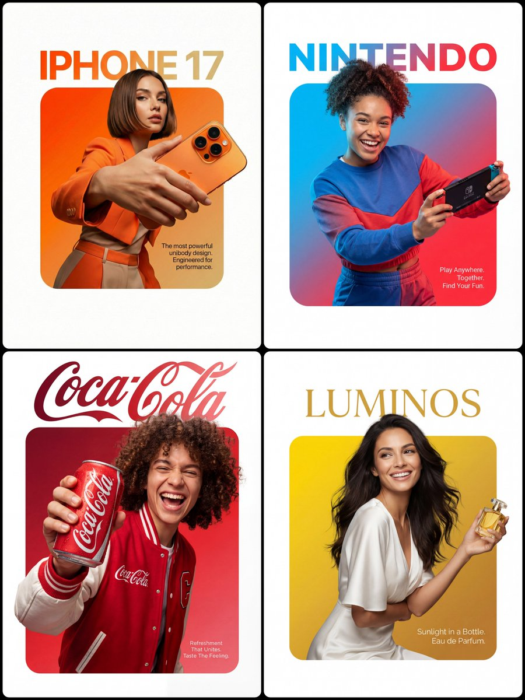

## Graphic design smart prompt Generate ad posters in Nano 

- ID: trending-2025261764795826531
- Slug: trending-2025261764795826531-en
- 语言: en
- 来源: [来源链接](https://x.com/AmirMushich/status/2025261764795826531)
- 样例图路径: images/part1/2025261764795826531_1.jpg

### 提示词

```text
Graphic design smart prompt

Generate ad posters in Nano Banana

This prompt generates:
• POV low-angle photo (pointing at viewer)
• Oversized text + brand tagline
• Serial numbers, copyright lines, technical callouts
• Brand-appropriate color blocking and texture

Use case: 
• social media posting,
• influencer collab visuals,
• pitch decks. 

Prompt 👇
```

### 样例图


## 9：16竖版高端极简时尚产品海报。柔和摄

- ID: trending-2008786351974740023
- Slug: trending-2008786351974740023-zh
- 语言: zh
- 来源: [来源链接](https://x.com/Bitturing/status/2008786351974740023)
- 样例图路径: images/part1/2008786351974740023_1.jpg

### 提示词

```text
9：16竖版高端极简时尚产品海报。柔和摄影棚自然日光，温暖米白渐变背景（奶油色、燕麦色），画面极致干净。精致亚洲女性模特（25-30岁），自然裸妆，肤感干净，长发自然垂落或低马尾，姿态放松克制，全身或三分之二身构图，手自然垂放或轻触腰侧，强调衣身线条。服装必须严格匹配上传的产品参考图：高品质打底衫，奶油白/燕麦色/浅驼色/雾灰色，高支棉或莫代尔微弹针织面料，触感柔软，修身但不紧绷，圆领或小高领，长袖，设计极简
```

### 样例图

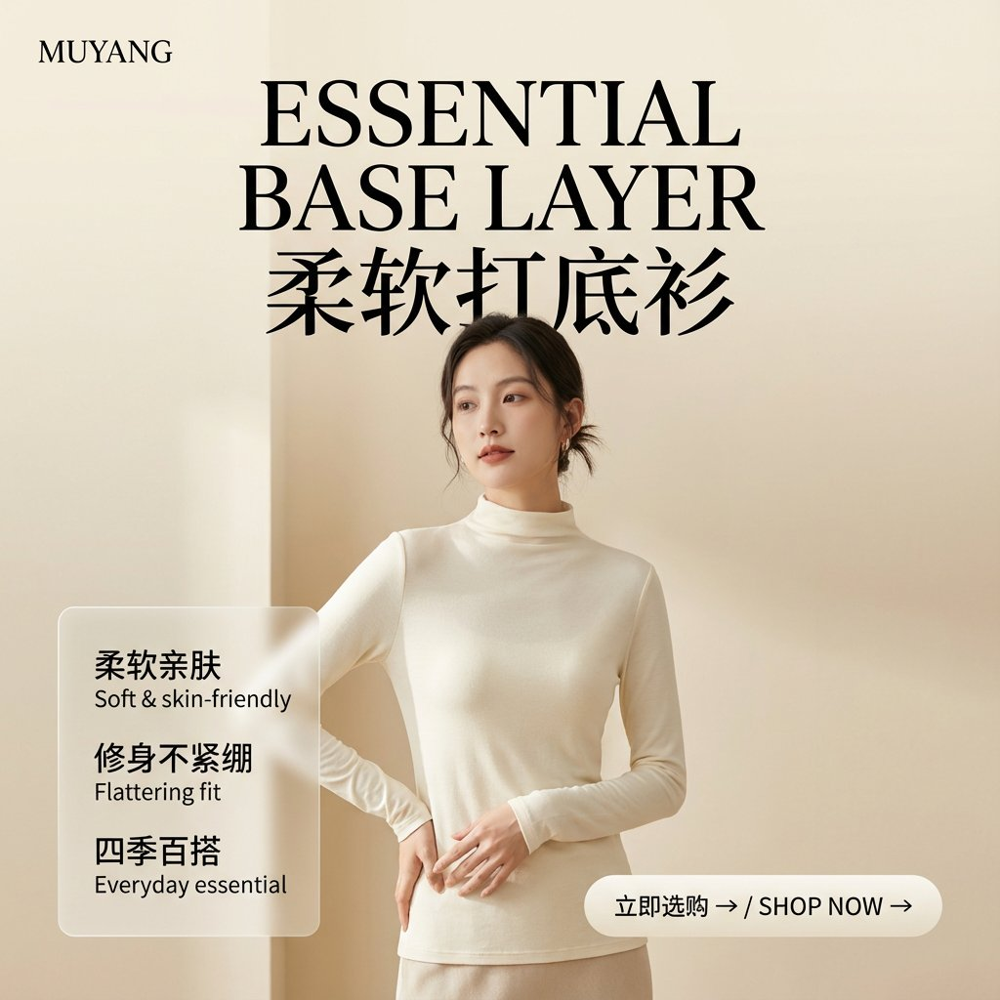

## Ultra-wide-angle hyper-realistic shooting in top-down mo

- ID: trending-2045009725218226475
- Slug: trending-2045009725218226475-en
- 语言: en
- 来源: [来源链接](https://x.com/Goodmanprotocol/status/2045009725218226475)
- 样例图路径: images/part1/2045009725218226475_1.jpg

### 提示词

```text
Ultra-wide-angle hyper-realistic shooting in top-down mode. A group of 4 real people sitting at a square dining table. The camera is pushed far back, creating a significant negative space (empty floor area) around the people and the table, which provides a clear, minimalistic composition. Scene [ATMOSPHERE AND CLOTHING]: Four people are dressed in [STYLE OF CLOTHING]. Their interaction is specific: [DESCRIBE EACH PERSON'S ACTIONS]. The table is a custom-made physical prop, designed as an Instagram post: it has a solid white stripe ONLY along the top and bottom edges (no white frames on the left or right). - The upper white stripe shows a drawn profile photo with [LOGO DESCRIPTION], the username "[USERNAME]", followed by a small blue icon with a confirmed check mark, and "..." on the right. - Red hearts, comment and share icons are painted on the bottom white stripe on the left, and a Bookmarks icon on the right. The center of the table is filled in [THE EXACT COLOR OF THE CENTER and the hexadecimal CODE]. The table shows [FOOD ITEMS/ITEM DESCRIPTIONS]. important: ALL food, beverages, objects, and hands that interact with them must be located strictly within this central area, colored in [COLOR]. NOTHING should go beyond the white stripes or beyond the table. The background of the floor is made in [THE COLOR OF THE FLOOR] to create a visual separation. Professional studio lighting with clear shadows. 8k, clear focus.
```

### 样例图

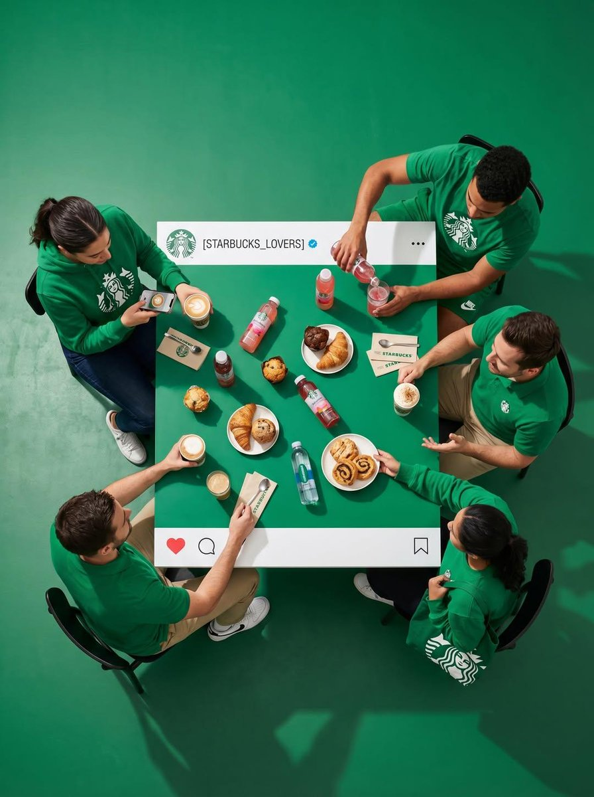

## [person], [pose], oversized product in the attached imag

- ID: trending-2015152385207984348
- Slug: trending-2015152385207984348-en
- 语言: en
- 来源: [来源链接](https://x.com/azed_ai/status/2015152385207984348)
- 样例图路径: images/part1/2015152385207984348_1.jpg

### 提示词

```text
[person], [pose], oversized product in the attached image as the main hero prop, playful fun energy, fashion editorial styling, clean minimal background, high key studio lighting, crisp soft shadow, ultra realistic commercial photography, wide angle low perspective, sharp focus, 8k, 1:1
```

### 样例图

![[person], [pose], oversized product in the attached imag](../images/part1/2015152385207984348_1.jpg)

## A photorealistic, highly detailed commercial product pho

- ID: trending-2027470188644626803
- Slug: trending-2027470188644626803-en
- 语言: en
- 来源: [来源链接](https://x.com/Arminn_Ai/status/2027470188644626803)
- 样例图路径: images/part1/2027470188644626803_1.jpg

### 提示词

```text
A photorealistic, highly detailed commercial product photograph of a standard aluminum [Type of Soda Can] centered against a minimal, textured [Background Color] paper background, with subtle fibers visible. A single, continuous horizontal paper-tear strip runs across the entire width of the frame, seamless from the far-right edge to the far-left edge. The torn channel cuts through the metal body of the can and continues across the background on both sides with a barely perceptible and minimal diagonal slope towards the upper-left. The tear channel is significantly broader, revealing a dense, glistening, and vibrant layer of [Description of Fruit Segments/Sacs/Berries] tightly packed inside. Near the extreme far-left end of this tear, the paper is neatly rolled into a tight, realistic coil that occupies almost the entire left margin. The can features a newly designed, minimalist branding: the upper portion has a stylized, abstract line-art illustration of [Fruit Branch/Plant] in a contrasting [Ink Color], set against a subtle matte geometric [Pattern Type] pattern on the can surface. Below this, the brand name "[Brand Name]" is printed in an elegant, modern dark typography, with smaller technical text "330ml - NATURAL EXTRACT" and a small "Recyclable" logo. A small, detailed graphic of the fruit is located below the torn path. The lighting is soft and cinematic, casting delicate drop shadows beneath the torn paper edges and the large left coil. 8k resolution, macro details on fibrous paper and glossy fruit texture.
```

### 样例图

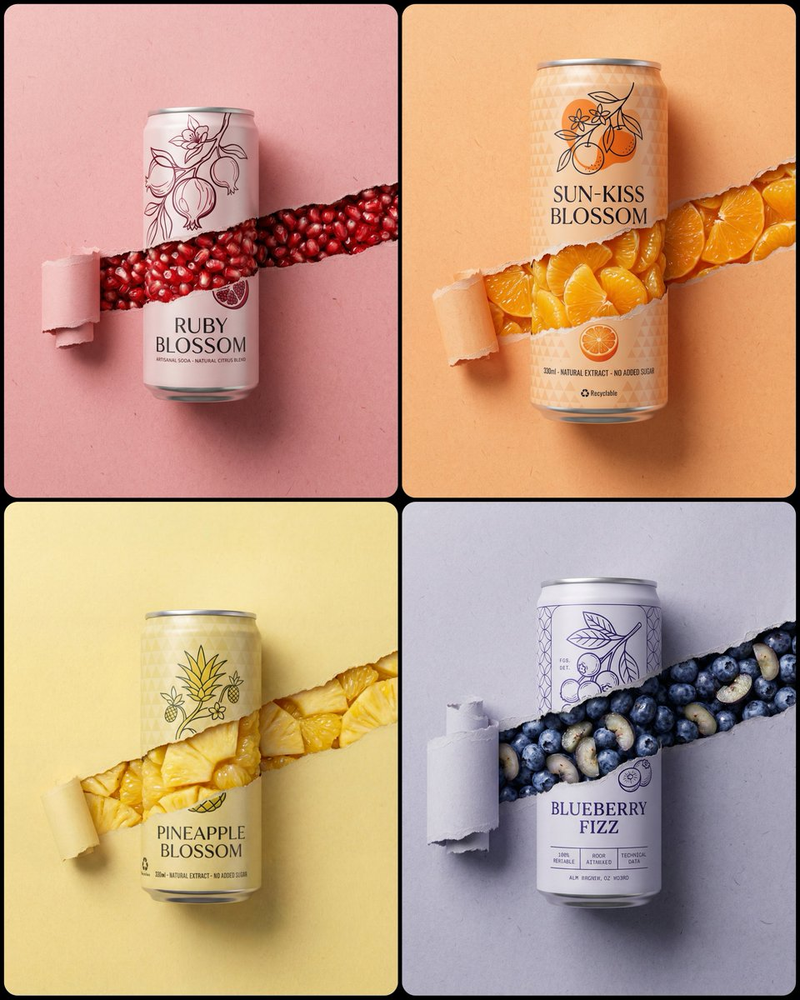

## Mixed-media portrait of [SUBJECT], [EXPRESSION], [GAZE D

- ID: trending-2036534946433736932
- Slug: trending-2036534946433736932-en
- 语言: en
- 来源: [来源链接](https://x.com/MayorKingAI/status/2036534946433736932)
- 样例图路径: images/part1/2036534946433736932_1.jpg

### 提示词

```text
Mixed-media portrait of [SUBJECT], [EXPRESSION], [GAZE DIRECTION], with [ACCESSORY/STYLING], realistic identity, black sketch strokes, torn newspaper collage, acrylic paint splashes, editorial print texture, blending realism and abstract expressionism, premium poster aesthetic, tactile handmade feel, high contrast, ultra-detailed face and eyes, [PRIMARY COLORS] and [SECONDARY COLORS]
```

### 样例图

![Mixed-media portrait of [SUBJECT], [EXPRESSION], [GAZE D](../images/part1/2036534946433736932_1.jpg)

## [BRAND NAME] | [SLOGAN]. Act as a Professional Editorial

- ID: trending-2027040971016351786
- Slug: trending-2027040971016351786-en
- 语言: en
- 来源: [来源链接](https://x.com/AmirMushich/status/2027040971016351786)
- 样例图路径: images/part1/2027040971016351786_1.jpg

### 提示词

```text
[BRAND NAME] | [SLOGAN]. Act as a Professional Editorial Art Director.

PHASE 1: PHYSICS & GROUNDING (THE "STABILITY" RULE).
- Analyze [BRAND NAME] category:
  * CATEGORY A (Active/Sports/Fashion): The subject (person) is in a high-intensity leap, detached from the ground, silhouette against the sky.
  * CATEGORY B (Automotive/Heavy Goods): The subject (vehicle) must be HEROICALLY GROUNDED. Place the car firmly on a solid surface (asphalt, concrete, or rock). 
  * Perspective: Use an extreme low-angle (worm's-eye view). The car must look massive and dominant, anchored to the bottom of the frame, towering over the viewer. NO floating or flying for vehicles.

PHASE 2: DYNAMIC PHOTOGRAPHY & LIGHTING.
- Environment: A vast, clear blue sky with minimal soft clouds. 
- Lighting: Natural, direct sunlight. High-contrast shadows on the subject to emphasize form and texture.
- Style: High-end 8k commercial photography. Sharp focus.

PHASE 3: TYPOGRAPHY & LAYOUT (MATTE FINISH).
- Layout: Use the text from "[SLOGAN]" as massive, ultra-condensed bold sans-serif characters.
- Execution: Split "[SLOGAN]" into two parts: one on the far left, one on the far right.
- Depth: A part of the subject (e.g., a bumper, a mirror, or a person's limb) must overlap the letters to create a 3D effect.

PHASE 4: COLOR STRATEGY (MATTE & REALISTIC).
- Graphic Color: NO NEON. Use a solid, matte brand color for the text (e.g., flat Navy for BMW, flat Red for Red Bull). The color must be opaque and non-glowing, resembling high-quality print ink.
- Photo Color: Maintain authentic, rich photographic colors for the subject and the sky. The contrast comes from "Flat Graphic vs. Realistic Photo".

PHASE 5: FINAL BRANDING.
- Logo: Small minimalist [BRAND NAME] logo in the upper corner.
- Metadata: Tiny secondary text in a clean sans-serif font at the bottom for a technical/editorial look.
```

### 样例图

![[BRAND NAME] | [SLOGAN]. Act as a Professional Editorial](../images/part1/2027040971016351786_1.jpg)

## A hyper-realistic studio photograph of a male athlete mi

- ID: trending-2008434033701879836
- Slug: trending-2008434033701879836-en
- 语言: en
- 来源: [来源链接](https://x.com/iamsofiaijaz/status/2008434033701879836)
- 样例图路径: images/part1/2008434033701879836_1.jpg

### 提示词

```text
A hyper-realistic studio photograph of a male athlete mid-air as if running or jumping, wearing a pastel pink sweatshirt and light pink jogger pants, with soft blue sneakers. Pink powder smoke is exploding and swirling around his body, especially behind him and around his legs, creating a dynamic motion effect. Clean minimal background with a soft gradient from light gray to pale pink. Cinematic lighting, ultra-sharp focus, shallow depth of field, fashion advertising style, high detail, 8k, soft shadows, professional studio photography.
```

### 样例图

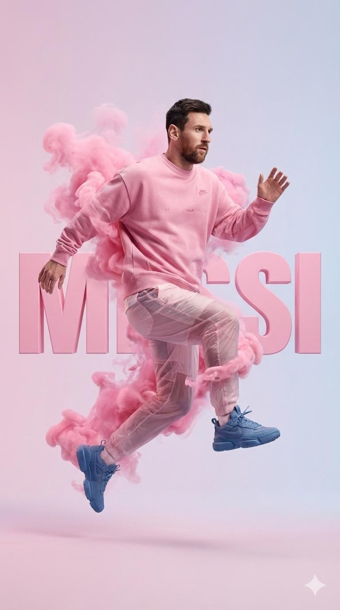

## Style & Composition: High-fashion editorial typography p

- ID: trending-2026374679276216569
- Slug: trending-2026374679276216569-en
- 语言: en
- 来源: [来源链接](https://x.com/Arminn_Ai/status/2026374679276216569)
- 样例图路径: images/part1/2026374679276216569_1.jpg

### 提示词

```text
Style & Composition: High-fashion editorial typography poster with a strict 1:2 composition split. Layout & Ratio: The frame is divided so that the right two-thirds show the full subject and background, while the left one-third is reserved for the typography masking section.

Typography Masking: A massive, ultra-bold, vertical word "[WORD]" is placed on the left third. The text is strictly full-bleed, stretching perfectly and touching the absolute top and absolute bottom edges of the frame with zero vertical padding, gaps, or margins. This typography acts as a stencil mask: the letters reveal the underlying character, while the space to the far left of the letters is a solid, clean white.

Subject Details & Positioning: An upper-body shot of [CHARACTER DESCRIPTION]. The model is positioned so that only her left-most side is visible through the letters, while the rest of her body is fully visible and contained on the right side against a solid [COLOR] background, ensuring no part of the subject is cropped by the right edge of the frame. Pose: [POSE DESCRIPTION], ensuring the silhouette remains within the center of the right two-thirds area.

Secondary Text: In the top right corner, add the text: "[TEXT]". Use a small, sophisticated, white "Helvetica Condensed" style font with wide letter spacing (kerning) for a premium, minimalist look. Color Palette: A strict monochromatic [COLOR] theme, sharply contrasted by the crisp white negative space on the left. 8k resolution, photorealistic textures, sharp studio lighting, high contrast, clean graphic design aesthetic.
```

### 样例图

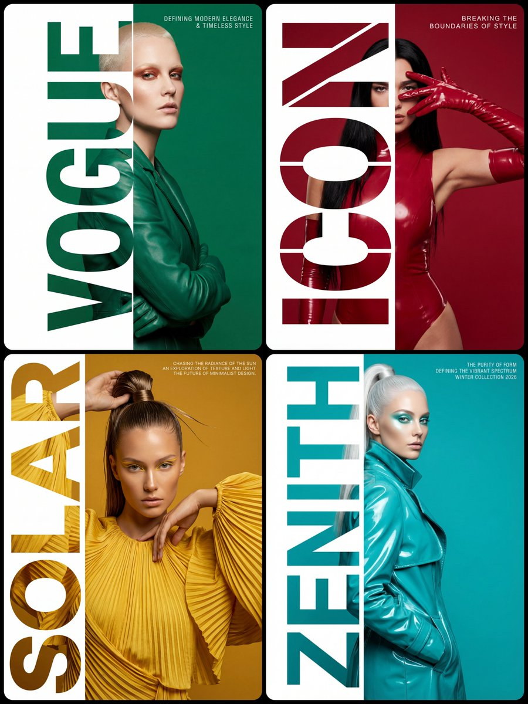

## Minimalist fashion studio photoshoot featuring stylish p

- ID: trending-2033180206975135824
- Slug: trending-2033180206975135824-en
- 语言: en
- 来源: [来源链接](https://x.com/Taaruk_/status/2033180206975135824)
- 样例图路径: images/part1/2033180206975135824_1.jpg

### 提示词

```text
Minimalist fashion studio photoshoot featuring stylish people sitting confidently on a modern chair, monochromatic aesthetic, subjects wearing bold cobalt-blue outfits (tailored suit or modern streetwear set) with white sneakers and clear glasses, relaxed powerful pose with legs apart and hands resting naturally, clean blue studio background with a large geometric letter “A” behind them, soft professional studio lighting, fashion editorial composition, modern luxury brand campaign style, ultra-realistic, sharp focus, high detail, 8K.
```

### 样例图

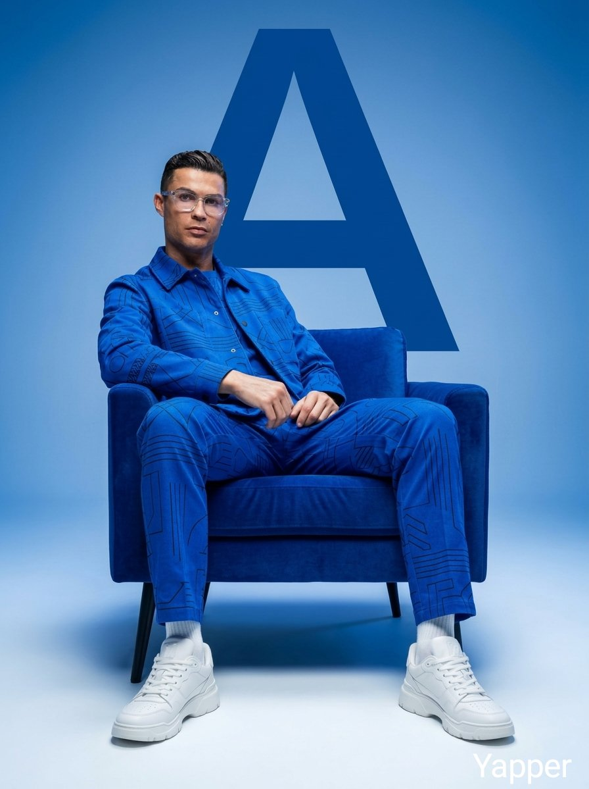

## A dynamic fashion advertisement for Nike showing a hyper

- ID: trending-2036806218988315056
- Slug: trending-2036806218988315056-en
- 语言: en
- 来源: [来源链接](https://x.com/ChillaiKalan__/status/2036806218988315056)
- 样例图路径: images/part1/2036806218988315056_1.jpg

### 提示词

```text
A dynamic fashion advertisement for Nike showing a hyper-realistic model mid-twist jump, light trails following her limbs. Background: prism-shifting gradient (hot magenta to sapphire) with refracted lens flares. The model wears iridescent Nike runner tights and a cropped tech hoodie in holographic white. Bold serif "NIKE" and motion-glitched "LUMINA" in layered text behind. High-energy, futuristic aesthetic with fashion gloss
```

### 样例图

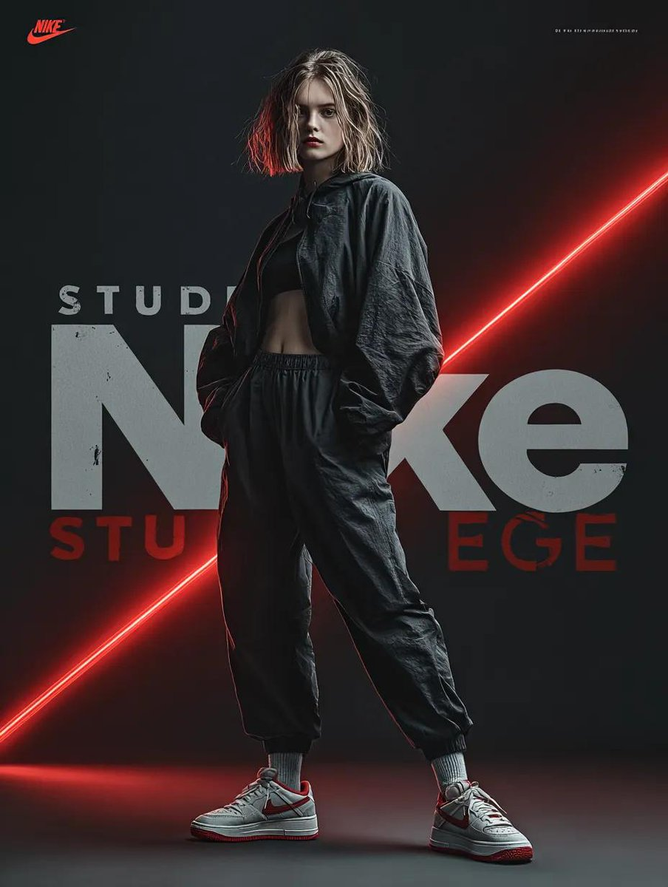

## { "edit_type": "creative_composite_layering", "source": 

- ID: trending-2013490554466939282
- Slug: trending-2013490554466939282-en
- 语言: en
- 来源: [来源链接](https://x.com/BeautyVerse_Lab/status/2013490554466939282)
- 样例图路径: images/part1/2013490554466939282_1.jpg

### 提示词

```text
{
  "edit_type": "creative_composite_layering",

  "source": {
    "_hint": "Base logic: Character (Ref 1) superimposed ON TOP OF the Background Image (Ref 2).",
    "mode": "EDIT",
    "reference_images": {
      "first": "foreground_character_person",
      "second": "background_scenery_or_pattern"
    },
    "preserve_from_first": {
      "same_person_or_group": true,
      "same_faces": true,
      "same_hairstyles": true,
      "same_outfits": true
    }
  },

  "identity": {
    "keep_identity_consistent": true,
    "expression": "bright_engaging_smile_at_camera"
  },

  "camera_effect": {
    "_hint": "High-angle selfie style, creating a sense of depth between the hand and face.",
    "perspective": "high_angle_shot_looking_down",
    "style": "social_media_call_to_action",
    "depth_of_field": "focus_on_face_and_pointing_finger",
    "framing": "character_centered_with_space_at_top_right"
  },

  "pose": {
    "_hint": "Key action: Lying down but actively pointing to the 'Follow' button area (Top Right).",
    "pose_style": "lying_down_or_reclining_on_back",
    "face_direction": "looking_directly_up_into_lens",
    "hand_gestures": {
      "right_hand_action": "pointing_index_finger",
      "target_direction": "upper_right_corner_45_degrees",
      "purpose": "mimicking_pressing_subscribe_button",
      "arm_position": "extended_towards_camera_top_right"
    },
    "body_language": "inviting_and_energetic",
    "style_tags": [
      "kpop_idol_fan_service",
      "influencer_promo_style",
      "dynamic_perspective"
    ]
  },

  "background_integration": {
    "_hint": "The second reference image is the background/floor.",
    "method": "full_background_replacement",
    "target_area": "entire_canvas_behind_character",
    "content_source": "reference_image_second",
    "perspective_match": "flat_lay_style",
    "rules": {
      "character_must_be_top_layer": true,
      "leave_space_in_upper_right_for_ui": true
    }
  },

  "composition": {
    "_hint": "Ensure the pointing finger leads the viewer's eye to the top right corner.",
    "visual_flow": "diagonal_line_from_face_to_top_right_corner",
    "focal_points": [
      "character_eyes",
      "pointing_finger_tip"
    ],
    "negative_space": "clear_area_at_top_right_45_degrees"
  },

  "constraints": {
    "no_holding_phone_device": true,
    "finger_must_not_be_cropped_out": true,
    "ensure_arm_is_natural_length": true
"3:4"
  }
}
```

### 样例图

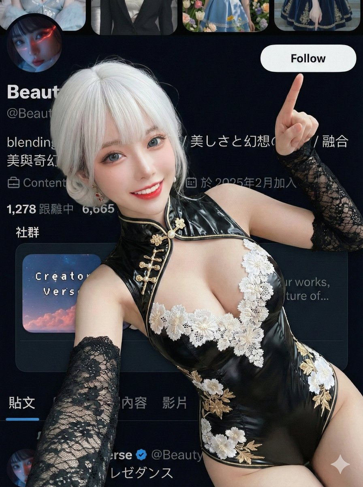

## [BRAND NAME]. Act as a Senior Editorial Designer and Typ

- ID: trending-2045938770906657274
- Slug: trending-2045938770906657274-en
- 语言: en
- 来源: [来源链接](https://x.com/AmirMushich/status/2045938770906657274)
- 样例图路径: images/part1/2045938770906657274_1.png

### 提示词

```text
[BRAND NAME]. 
Act as a Senior Editorial Designer and Typographer.
PHASE 1: TYPOGRAPHIC MASK (THE "WINDOW" EFFECT).
- Core Element: Use the most iconic slogan or the name of [BRAND NAME] as a massive, ultra-bold, heavy sans-serif typographic mask.
- Layout: The letters must be giant, filling the entire vertical frame from edge to edge with tight kerning.
- Concept: The text acts as a "cut-out" window. The background is solid white, and the photographic subject is visible ONLY through the letterforms.

PHASE 2: DYNAMIC SUBJECT LOGIC.

- Subject Selection:
- Detail: Ensure a high-contrast element (like a red shoe or a glowing headlight) is visible through one of the letters as a focal point.

PHASE 3: SOPHISTICATED MUTED PALETTE.

- Atmosphere: Use a "Refined Muted" color scheme.
- Tones: Soft slate blues, charcoal greys, and creamy off-whites for the photography inside the mask.
- Accent: Identify one sharp, saturated accent color belonging to [BRAND NAME] and apply it to a single key object visible through the text.

PHASE 4: PHOTOGRAPHY & LIGHTING.

- Lighting: Soft-box studio lighting. Diffused shadows and gentle highlights to create a cinematic, high-end editorial feel.
- Finish: Clean, matte texture with zero visual noise. High-definition photographic quality.

PHASE 5: MINIMALIST BRANDING.
- Accents: Add a tiny minimalist logo and a small vertical tagline in a clean, microscopic sans-serif font near the corners.
- Year: Include the year "2026" in a subtle, elegant font to mimic a limited-edition look.
```

### 样例图

![[BRAND NAME]. Act as a Senior Editorial Designer and Typ](../images/part1/2045938770906657274_1.png)

## [PERSON NAME]. Act as a graphic designer creating a mini

- ID: trending-2011170447434649774
- Slug: trending-2011170447434649774-en
- 语言: en
- 来源: [来源链接](https://x.com/AmirMushich/status/2011170447434649774)
- 样例图路径: images/part1/2011170447434649774_1.jpg

### 提示词

```text
[PERSON NAME]. Act as a graphic designer creating a minimalist, avant-garde streetwear poster.
COMPOSITION (THE FUSION):
The image is a creative fusion of a massive typographic name and a monochrome portrait of [PERSON NAME].
The Subject: A high-contrast, black-and-white full-body or 3/4 cut-out photograph of [PERSON NAME]. The subject stands centrally, looking cool and detached.
The Typography: The person's name is written horizontally across the entire width of the image. The text interacts with the body: the person stands through the letters, creating a "woven" depth effect (some limbs in front of text, some behind), or the portrait creates a silhouette mask for the text.
TYPOGRAPHY STYLE (MIXED SCRIPTS):
Mimic the specific "Street Editorial" font pairing:
The First Letter: The initial letter of the name is rendered in a large, sweeping, expressive Calligraphic Script or Brush font (dynamic and loose).
The Rest of the Name: The remaining letters are rendered in an Ultra-Heavy, Geometric Sans-Serif font (like Impact or Helvetica Black).
Color: The text is solid Dark Grey or Black.
AESTHETICS & ATMOSPHERE:
Palette: Strictly Monochrome (Black, White, and Greyscale).
Background: Pure, vast White Minimalist background. Extensive negative space.
Vibe: Raw, "Zine" aesthetic, cut-and-paste collage feel, high-fashion streetwear poster.
LAYOUT DETAILS:
Add very small, microscopic functional text in the extreme corners (e.g., "poster design", "2025", "fig 01") to enhance the Swiss Design poster feel.
```

### 样例图

![[PERSON NAME]. Act as a graphic designer creating a mini](../images/part1/2011170447434649774_1.jpg)

## Create a digital modern maximalism style sports collage 

- ID: trending-2045387100842070500
- Slug: trending-2045387100842070500-en
- 语言: en
- 来源: [来源链接](https://x.com/Goodmanprotocol/status/2045387100842070500)
- 样例图路径: images/part1/2045387100842070500_1.jpg

### 提示词

```text
Create a digital modern maximalism style sports collage of [TEAm Name] [Player name] visuals with grainy textures, abstract geometric shapes, dynamic grid layout, minimal background, contemporary editorial composition, inspired by [BRAND NAME ex Nike...] campaigns and modern sports graphic design, strong visual rhythm, bold and emotional atmosphere. Post-process film grain, and specially cinematic color-graded tones for serious intensity.
```

### 样例图

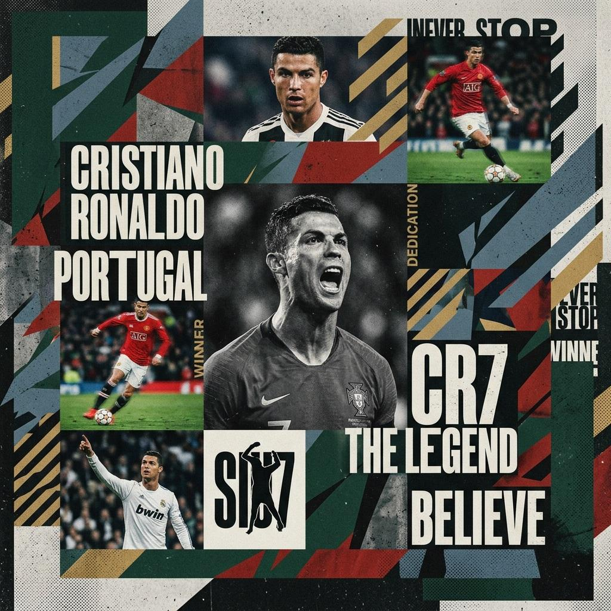

## Pixar 3D CGI animated movie poster style, ensemble cast 

- ID: trending-2037141030047215944
- Slug: trending-2037141030047215944-en
- 语言: en
- 来源: [来源链接](https://x.com/TechieBySA/status/2037141030047215944)
- 样例图路径: images/part1/2037141030047215944_1.jpg

### 提示词

```text
Pixar 3D CGI animated movie poster style, ensemble cast featuring the most iconic and recognizable characters from [MOVIE/SHOW], all rendered as Pixar-style 3D animated characters with exaggerated expressive faces, smooth stylized skin, big eyes, chunky proportions. Characters automatically selected as the most famous heroes and villains from [MOVIE/SHOW]. Dramatic layered composition: central hero front and center, others fanned behind in dynamic action poses. Background color automatically chosen to match the iconic tone and palette of [MOVIE/SHOW]. Bold title text at bottom: [MOVIE/SHOW] in the original film's iconic font style. Cinematic lighting, rim light on characters, deep shadows. 3:4 vertical aspect ratio. High detail, polished Pixar feature film aesthetic.
```

### 样例图

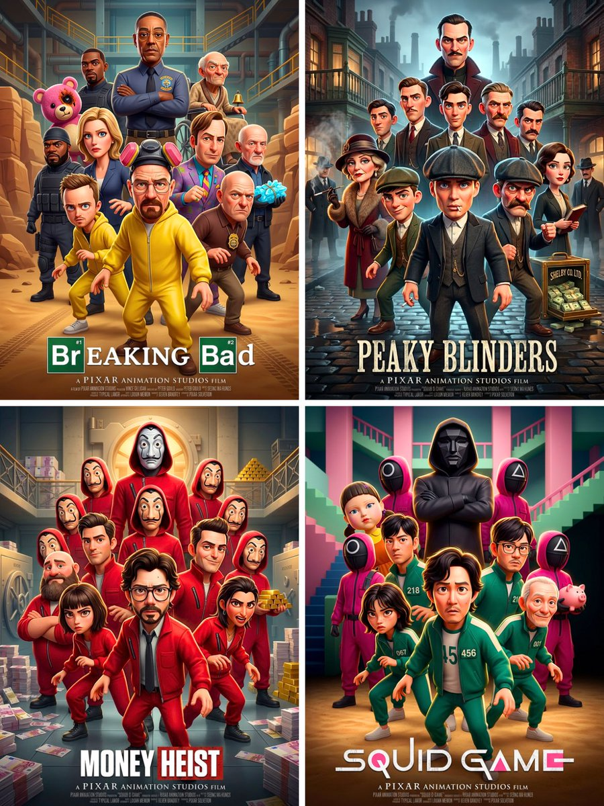

## [upload luxury product photo] BRAND NAME: [Put the brand

- ID: trending-2008592833406791789
- Slug: trending-2008592833406791789-en
- 语言: en
- 来源: [来源链接](https://x.com/aziz4ai/status/2008592833406791789)
- 样例图路径: images/part1/2008592833406791789_1.jpg

### 提示词

```text
[upload luxury product photo]
BRAND NAME: [Put the brand name here]

Create ONE luxury editorial poster. Keep the product EXACT and unchanged. Use the BRAND NAME to infer identity and place the REAL official logo (correct proportions) in the most brand-appropriate position with subtle print texture. Add a perfectly matched attractive model wearing the product naturally. Rich deep colors, HDR, premium studio lighting, clean background, strong negative space, ultra-sharp 8K. No extra text, no watermark.
```

### 样例图

![[upload luxury product photo] BRAND NAME: [Put the brand](../images/part1/2008592833406791789_1.jpg)

## Cinematic ultra-high-end product photography of an offic

- ID: trending-2028650885472203209
- Slug: trending-2028650885472203209-en
- 语言: en
- 来源: [来源链接](https://x.com/ChillaiKalan__/status/2028650885472203209)
- 样例图路径: images/part1/2028650885472203209_1.jpg

### 提示词

```text
Cinematic ultra-high-end product photography of an official Monster Energy drink can a standard vertical black aluminum energy drink can featuring the iconic neon 
reen claw logo of Monster Energy - standing on a dark, rough, textured surface. The can is being engulfed and seemingly possessed by a thick, glossy, jet-black symbiotic liquid inspired by the organic alien symbiote from the 2018 film Venom, directed by Ruben Fleischer. The viscous substance behaves like a living entity - muscular,predatory, and semi-sentient— forming elongated, sinewy tendrils that stretch
upward and wrap tightly around the can as if claiming it. The texture must closely resemble Venom's cinematic symbiote: dense, oily, hyper-glossy, elastic, with visible surface tension, micro ripples, sharp blade-like protrusions, and subtle vein-like striations. It should feel alive, aggressive, and biomechanical _ not random liquid splashes.The black symbiote appears to be merging with the Monster can's aluminum surface crawling over it, partially fusing into the metal, as if infecting or possessing the product. Some tendrils anchor to the ground while others rise dynamically into the air, creating tension and controlled chaos. The green claw logo remains clearly visible and becomes the focal contrast element against the dark mass. Camera angle: dramatic low-angle hero shot, slightly tilted (Dutch angle) for cinematicintensity, captured with a macro cinema lens at close range. Shallow depth of field, razor-sharp focus on the logo and the liquid interaction, extreme macro detail. Lighting: moody, high-contrast lighting with strong cold blue rim light sculpting the wet reflective contours of the symbiote and enhancing the metallic sheen of the blackaluminum can. Subtle green light spill from the neon logo reflecting onto nearbyglossy tendrils. Deep shadows with controlled specular highlights for a premium cinematic look.Atmosphere: floating micro-particles, dust, and fine mist suspended in the air,catching the rim light to create depth. Subtle volumetric haze and cinematic diffusion.Background: deep dark void with faint cool blue bokeh and minimal gradient separation, reinforcing a mysterious, powerful, almost supernatural atmosphere. Ultra-realistic, photorealistic, hyper-detailed textures, HDR, 8K resolution, cinematic color grading, dramatic tension, premium commercial advertising aesthetic.

IMAGE 2
High-quality commercial photograph of a
sleek,thin aluminum Del Valle peach juice
can suspended diagonally in a dynamic,
gravity-defying composition. The scene
conveys a sense of freshness, featuring hyper-realistic slices of juicy peaches and vibrant green leaves spiraling around the can along with splashes of crystal-clear water and delicate droplets. The lighting is bright and airy, creating a soft, refreshing glow throughout the image. The color palette consists of warm peach tones, soft corals and vibrant greens on a minimalist back ground with a peach-toned gradient and shallow depth of field, showing blurred peaches in the background. Commercial aesthetic, macro detail, refreshing and vibrant atmosphere.

IMAGE 3 
A close-up product photograph of a dark
blue glass bottle for "SAUVAGE ELIXIR Dior" perfume, nestled within dark, textured,wet-looking tree bark and small dried botanical sprigs with glowing orange tips. Thelighting is low
moody  warm
orange and deep blue highlights across the wet wood and the glossy bottle. The background is dark and natural.

IMAGE 4 
A dynamic, high-speed photograph cap-
tures a bottle of Jack Daniel's Tennessee
Apple whiskey, with its signature green
label and square glass shape, splashing of
green liquid. Water droplets and fresh green
apples with leaves explode outwards
around the bottle. The scene is illuminated
by vibrant green light from background,
highlighting the texture of the glass, liquid,
and fruit against a dark green, gradient
background green and black green
ratio 4:5
```

### 样例图


## A hyper-realistic macro shot of a paintbrush creating a 

- ID: trending-2042058511937679439
- Slug: trending-2042058511937679439-en
- 语言: en
- 来源: [来源链接](https://x.com/Naiknelofar788/status/2042058511937679439)
- 样例图路径: images/part1/2042058511937679439_1.jpg

### 提示词

```text
A hyper-realistic macro shot of a paintbrush creating a thick textured paint stroke on a clean white background. The paint forms the shape and colors of the [COUNTRY FLAG], flowing dynamically like a wave. Inside the paint stroke, a highly detailed miniature cityscape of [COUNTRY NAME] emerges, including iconic landmarks such as [LANDMARK 1], [LANDMARK 2], [LANDMARK 3]. The paint has visible brush textures, glossy acrylic finish, rich vibrant colors.
```

### 样例图

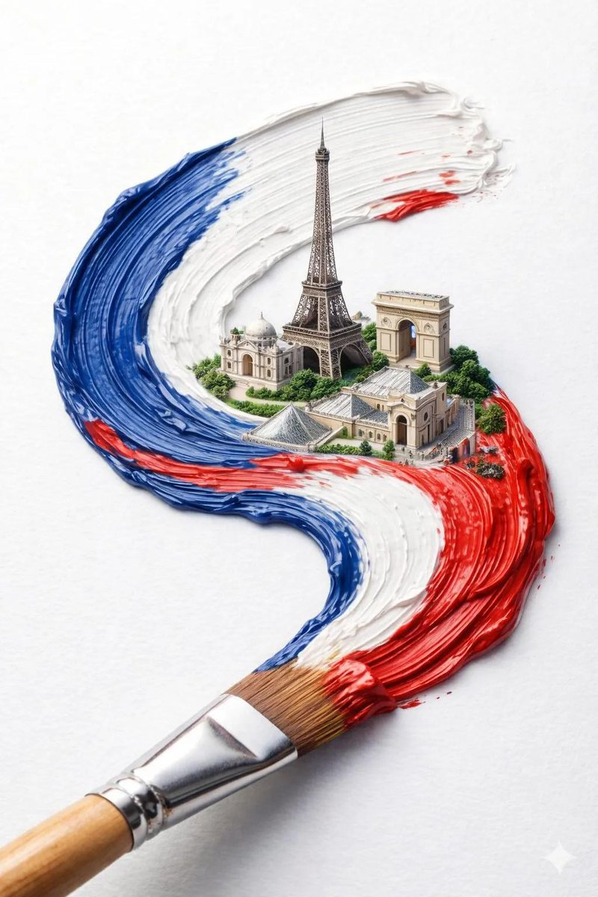

## [PERSONE]. Act as a Senior Art Director. PHASE 1: PHOTOG

- ID: trending-2025631713729106049
- Slug: trending-2025631713729106049-en
- 语言: en
- 来源: [来源链接](https://x.com/AmirMushich/status/2025631713729106049)
- 样例图路径: images/part1/2025631713729106049_1.jpg

### 提示词

```text
[PERSONE]. Act as a Senior Art Director.

PHASE 1: PHOTOGRAPHIC COMPOSITION.

- Layered Effect: Double exposure photographic collage. High-definition action shot in the foreground; massive monumental silhouette in the background.

- Overlap: The subject must seamlessly integrate with the background graphics.

PHASE 2: CONTEXTUAL VIBE SIMULATION.

- Identity Analysis: Autonomously identify the core industry of [PERSONE] (Sport, Music, Cinema, or Business).

- Pose & Props: 

PHASE 3: DYNAMIC COLOR & BRAND SIMULATION (VARIABLE COLORS).

- Primary Color (Atmosphere): Identify the MOST ICONIC color associated with [PERSONE] or their team/brand. Use this for the background, halftone textures, and smoke.

- Accent Color (Impact): Identify a secondary high-contrast VIBRANT hue (e.g., neon, gold, or electric white). Use this for the "Radial Burst" rays.

- Visual Texture: Apply heavy film grain and halftone dots (screen printing effect) to the shadows of the high-res photos.

PHASE 4: GRAPHIC ACCENTS.

- Geometry: Bold radial rays bursting from the center. Fluid, wave-like organic shapes at the base.

- Birds: Minimalist black bird silhouettes for scale and depth.

PHASE 5: BRANDING & TEXT.

- Tagline: Generate a powerful, one-word or two-word slogan tailored to [PERSONE]'s legacy.

- Logo: Place a minimalist, industry-appropriate logo in the bottom corner.

- Typography: Bold, high-impact Sans-Serif.

TECHNICAL FINISH:

- Quality: 8k resolution, authentic commercial photography style (NOT an illustration). 

- Lighting: Extreme studio rim-lighting (contour highlights) to separate the photographic subjects from the graphic layers.
```

### 样例图

![[PERSONE]. Act as a Senior Art Director. PHASE 1: PHOTOG](../images/part1/2025631713729106049_1.jpg)

## Composition & Subject: A professional front-facing studi

- ID: trending-2019847469165896077
- Slug: trending-2019847469165896077-en
- 语言: en
- 来源: [来源链接](https://x.com/Arminn_Ai/status/2019847469165896077)
- 样例图路径: images/part1/2019847469165896077_1.jpg

### 提示词

```text
Composition & Subject: A professional front-facing studio shot of a hyper-realistic [INSERT OBJECT] standing vertical. The object features intense textural details like [DESCRIBE OBJECT TEXTURES].
Pouch Structure (Dual Material): The vacuum-sealed pouch is composed of two distinct layers. The back layer is a solid, opaque, industrial matte-white material (providing a high-contrast backdrop). The front layer is crystal-clear, high-gloss transparent plastic, allowing the object to be seen with perfect clarity and sharp detail.

Vacuum Physics & Compression: The packaging demonstrates extreme vacuum-contoured compression. The plastic is sucked inward like a second skin, clinging tightly to the [DESCRIBE KEY PROTRUDING PARTS] of the object. This creates aggressive, sharp tension micro-folds and deep sculptural wrinkles that radiate from the object's silhouette. The pouch edges feature a crisp, industrial micro-dotted heat-seal pattern.

Packaging Detail: The top features a circular punch-hole for hanging display, located above a realistic zip-lock seal track. The vacuum effect is powerful, with the clear front plastic sucked tightly against the contours, creating sharp, ray-traced reflections and deep tension folds.

Graphics & Strategic Placement:
Upper Label: A crisp white thermal rectangular sticker with a barcode and price tag of "$[INSERT PRICE]" is placed at the top-left, positioned precisely below the zip-lock seal line.
Lower QR: A premium square holographic QR-code with prismatic iridescent reflections is located at the bottom-left corner.

Typography & Extended Pattern: The word "[INSERT OBJECT NAME IN CAPS]" is printed vertically in a bold black Swiss font along the right side, layered over a black halftone dot-matrix pattern that extends fully to the mid-point of the pouch and then gradually fades/dissolves from there towards the center, creating a sophisticated transition.

Lighting & Background: Set against a pitch-black minimalist background. Cinematic Amber and Electric Blue rim lighting outlines the silhouette, highlighting the contrast between the white back and the clear front plastic, ensuring a zero-flatness, 3D pop. Technical Specs: Commercial product photography, 8k, Unreal Engine 5.4 render style, macro-detail, zero-flatness, ultra-high contrast, focus on extreme transparency of the front layer.
```

### 样例图

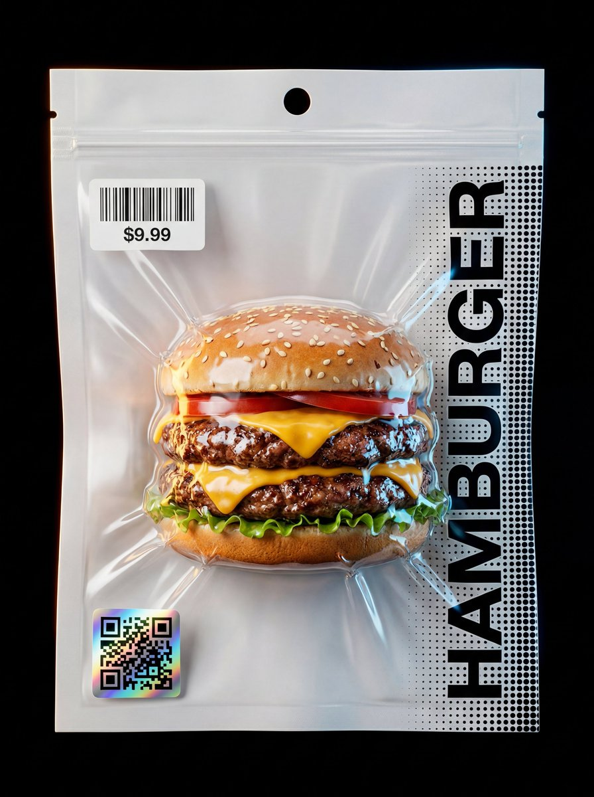

## Masterpiece, best quality, high resolution, 8k, (Photore

- ID: trending-2025283986860253292
- Slug: trending-2025283986860253292-en
- 语言: en
- 来源: [来源链接](https://x.com/Arminn_Ai/status/2025283986860253292)
- 样例图路径: images/part1/2025283986860253292_1.jpg

### 提示词

```text
Masterpiece, best quality, high resolution, 8k, (Photorealistic:1.4), (Vibrant natural colors:1.2), (Full body shot:1.6), minimalist fashion scrapbook page.
Subject: A full body fashion photo of [Character Description] standing in a [Pose]. The subject is wearing [Detailed Outfit]. The subject is a sharp, high-detail photographic cutout with sticker borders. The sticker has a die-cut white paper edge with visible paper-fiber texture on the cut-line. This white border has a subtle 3D thickness (beveled edge) that catches the light, creating a realistic micro-shadow.

Composition: Professional top-down flat-lay view. A thin stack of 3-4 clean-cut premium white paper sheets (smooth edges) placed on a seamless Soft [Color] background. Medium camera distance for a clear full-body view. A single, (prominent oversized silver metal trombone paperclip:1.5) at the top left corner, showing realistic metallic reflections and micro-scratches. 5 delicate hand-drawn black ink arrows pointing to specific fashion details:

"[Feature 1]" (pointing to [Detail]).
"[Feature 2]" (pointing to [Detail]).
"[Feature 3]" (pointing to [Detail]).
"[Feature 4]" (pointing to [Detail]).
All annotations are in refined, elegant handwritten cursive. Ray-traced ambient occlusion around the sticker's white border to emphasize physical elevation and depth. Ray-traced soft shadows between the paper layers. High-end editorial studio lighting. Visible tactile paper micro-texture throughout the character's edges, clean and modern high-fashion aesthetic. No grayscale, full color photography, no illustration.
```

### 样例图

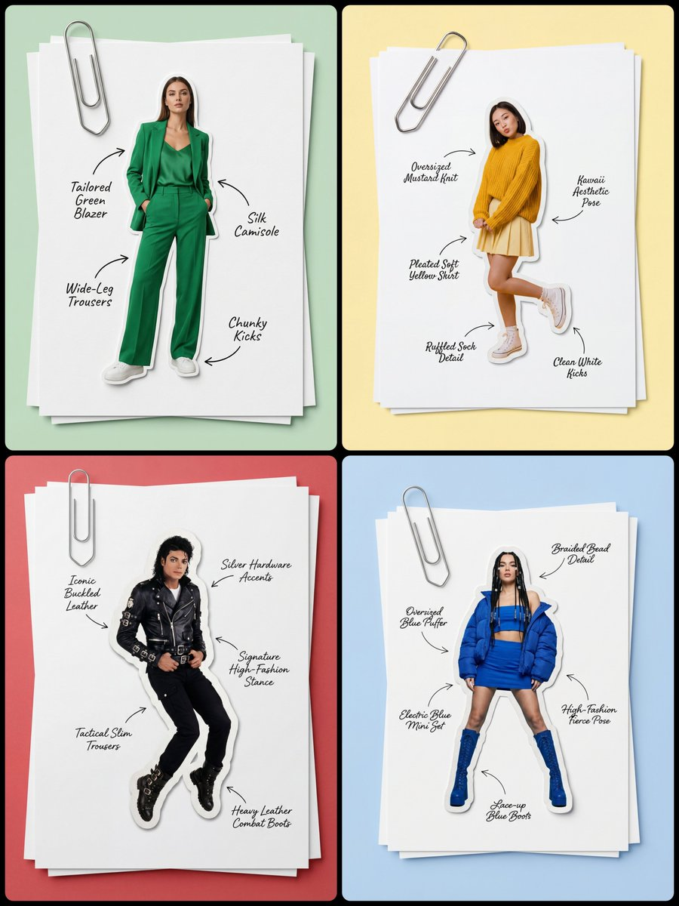

## Bright summer infographic showcasing watermelon juice, i

- ID: trending-2016432642951151894
- Slug: trending-2016432642951151894-en
- 语言: en
- 来源: [来源链接](https://x.com/AIwithSynthia/status/2016432642951151894)
- 样例图路径: images/part1/2016432642951151894_1.jpg

### 提示词

```text
Bright summer infographic showcasing watermelon juice, icy texture, watermelon wedges floating. Steps: 📷 Select Ripe Watermelon 📷 Cut & Remove Seeds 📷 Blend Smooth 📷 Serve Chilled Info Bar: Hydration Boost: 92% Freshness Level: High High-contrast red & green palette.
```

### 样例图

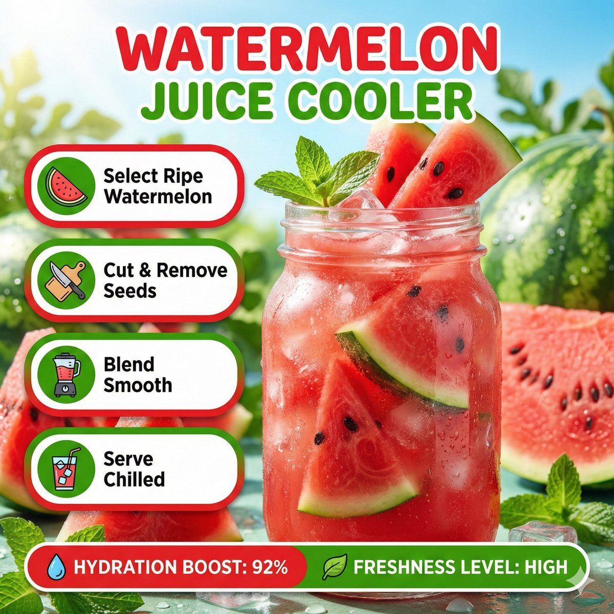

## [BRAND NAME] [PRODUCT TYPE] (Clothing / Food / Automotiv

- ID: trending-2031446250214572438
- Slug: trending-2031446250214572438-en
- 语言: en
- 来源: [来源链接](https://x.com/AmirMushich/status/2031446250214572438)
- 样例图路径: images/part1/2031446250214572438_1.jpg

### 提示词

```text
[BRAND NAME]

[PRODUCT TYPE] (Clothing / Food / Automotive / Tech).

Goal: Generate a professional "scrapbook" style collage poster for [BRAND NAME] centered around a [PRODUCT TYPE].

1. HERO PRODUCT (BOTTOM FOCUS)

- Object: A high-definition, realistic 3D render of a [PRODUCT TYPE] by [BRAND NAME] at the bottom center.

- Placement: Slightly angled to show depth, with soft realistic contact shadows on a plain off-white floor.

2. THE MULTI-LAYERED COLLAGE STACK

- Photos: A vertical stack of overlapping photos with RAGGED, TORN paper edges rising above the product.

- Content: Photos should show [PRODUCT TYPE] in use, lifestyle shots related to [BRAND NAME], and close-ups of specific details.

- Materials: Physical swatches of textures related to [PRODUCT TYPE] (e.g., leather/fabric for clothing, metal/carbon for cars, organic ingredients for food). Include visible raw edges and stitching.

- Fasteners: Use strips of semi-transparent masking tape and black duct tape with the "[BRAND NAME]" logo printed in white to "hold" the pieces together.

3. GRAPHIC OVERLAYS & STAMPS

- Stamp: A black, distressed ink stamp or seal near the hero product with text: "AUTHENTIC QUALITY // SUSTAINABLE CHOICE".

- Typography: Small, clean sans-serif and typewriter-style text blocks describing the heritage of [BRAND NAME] placed at the bottom.

- Logo: The primary "[BRAND NAME]" logo centered at the very bottom in a minimalist font.

4. STYLE & ATMOSPHERE

- Aesthetic: Industrial DIY, workshop moodboard, high-end editorial collage.

- Lighting: Bright, studio high-key lighting with soft, multi-layered shadows between the paper scraps and textures.

- Quality: 8K resolution, macro detail on paper grain, fabric fibers, and tape adhesive.
```

### 样例图

![[BRAND NAME] [PRODUCT TYPE] (Clothing / Food / Automotiv](../images/part1/2031446250214572438_1.jpg)

## A cute young girl with short black hair and bangs smilin

- ID: trending-2030089473577693629
- Slug: trending-2030089473577693629-en
- 语言: en
- 来源: [来源链接](https://x.com/ChillaiKalan__/status/2030089473577693629)
- 样例图路径: images/part1/2030089473577693629_1.jpg

### 提示词

```text
A cute young girl with short black hair and bangs smiling while holding a red KitKat Dark chocolate bar covering one eye, resting her cheek on her hand, wearing a cozy red and beige patterned winter sweater. The background and table are solid bright red. Several KitKat chocolate bars are placed on the table in front of her. Soft studio lighting, vibrant colors, commercial food advertisement style, ultra-realistic photography, sharp focus, high detail, 50mm lens, shallow depth of field, professional product photography, centered composition.
```

### 样例图


## [BRAND NAME]. Act as a Creative Director and Fashion Pho

- ID: trending-2011509897175724329
- Slug: trending-2011509897175724329-en
- 语言: en
- 来源: [来源链接](https://x.com/AmirMushich/status/2011509897175724329)
- 样例图路径: images/part1/2011509897175724329_1.jpg

### 提示词

```text
[BRAND NAME]. Act as a Creative Director and Fashion Photographer creating a high-end editorial lookbook image with a UI overlay layer.
1. THE SUBJECT (AVANT-GARDE STREETWEAR & NATURAL POSE):
A fashion model stands centrally in a clean studio.
Fashion Style: The outfit is a striking, conceptual "Modern Avant-Garde Streetwear" look that interprets the aesthetic and color palette of [BRAND NAME]. Think high-fashion meets street culture: experimental silhouettes, deconstructed layering, oversized proportions, unique material combinations, and bold details. It should feel innovative and editorial, but still grounded in streetwear, avoiding basic casual clothes.
Pose: The model adopts a natural, relaxed, and effortless editorial pose (e.g., hands casually in pockets, a slight lean, looking off-camera or gently at the camera). Absolutely NO robotic, stiff, or "T-pose" stances.
2. THE UI OVERLAY (FROSTED GLASS RECTANGLE):
Superimposed directly in front of the model's torso is a large, vertical Floating UI Element.
Shape & Outline: A simple vertical rectangle with rounded corners, framed by a clean 2px solid White Stroke.
Material (Glassmorphism): The interior of this rectangle is "Frosted Glass". The part of the model's outfit behind this glass must be heavily blurred (high Gaussian Blur), creating a translucent depth effect, while the rest of the model remains razor-sharp.
3. UI CONTENT (MINIMALIST & SMALL):
Inside the frosted glass pane, place two elements in pure Monochrome White:
Center: The official [BRAND NAME] logo, perfectly centered.
Below Logo: Positioned significantly higher than the bottom edge, place two VERY SMALL, minimalist white navigation arrows (one pointing Left "<", one pointing Right ">"). They should be subtle and approximately 50% smaller than standard UI icons.
4. PHOTOGRAPHY STYLE & COMPOSITION (STRICT FRAMING):
Style: High-End Editorial Fashion Photography. Real film grain, sophisticated soft studio lighting that emphasizes fabric textures. It must look like a real photograph, not a CGI render.
Background: Infinite, pure White Studio Cyclorama.
Framing (STRICT CONSTRAINT): The shot is a Wide Full-Body Photograph. The entire model (from top of head to bottom of feet) AND the entire UI overlay must be COMPLETELY CONTAINED within the image boundaries. There must be absolutely ZERO CROPPING of the subject or UI. There must be a very large, generous amount of empty negative space ("air") surrounding the subject on all four sides.
```

### 样例图

![[BRAND NAME]. Act as a Creative Director and Fashion Pho](../images/part1/2011509897175724329_1.jpg)

## A professional commercial fashion advertisement featurin

- ID: trending-2029599397483532714
- Slug: trending-2029599397483532714-en
- 语言: en
- 来源: [来源链接](https://x.com/rovvmut_/status/2029599397483532714)
- 样例图路径: images/part1/2029599397483532714_1.jpg

### 提示词

```text
A professional commercial fashion advertisement featuring [a young male model] in the uploaded image, sitting on a minimalist white matte cube. He has a neutral, confident expression and is looking directly at the camera.

Attire & Styling:
Hoodie: A high-quality, [heavyweight forest green (British Racing Green) hoodie]. It features a relaxed fit, a spacious kangaroo pocket, and metal-tipped drawstrings.
Bottoms: Clean, slim-fit white trousers with visible seams.
Footwear: Stylish low-top sneakers in a color-blocked design of forest green, navy blue, and white, with off-white midsoles and white laces.
Accessories: Simple silver bands/rings on his fingers.

Graphic Design & Layout:
Typography: The word [HOODIE] is written in a massive, elegant high-contrast serif font across the top. A small, four-pointed yellow spark icon is centered inside the "O". Above this, [K A I R O  P R E M I U M] is printed in a wide-spaced sans-serif font.
Branding Elements: A dark green diagonal "caution tape" style ribbon crosses the bottom third of the frame, with the words [PREMIUM HOODIE] repeating in white uppercase text.
UI Accents: * A yellow pill-shaped size selector labeled "S M L XL" on the left.
A small thumbnail of the hoodie floating on the mid-left.
Three circular color swatches (Green, Yellow, Black) on the right side.
Two blocks of justified serif body text describing the product's comfort and eco-friendly materials.
The URL [www.meigen.ai] in the bottom left corner.

Environment & Lighting:
Setting: A clean, bright, white-on-white minimalist studio cove.
Lighting: Soft, diffused studio lighting creates gentle shadows under the model and the cube, emphasizing the rich texture of the green fabric and the crispness of the white pants.
Color Palette: Deep forest green, bright white, and golden yellow accents.
```

### 样例图

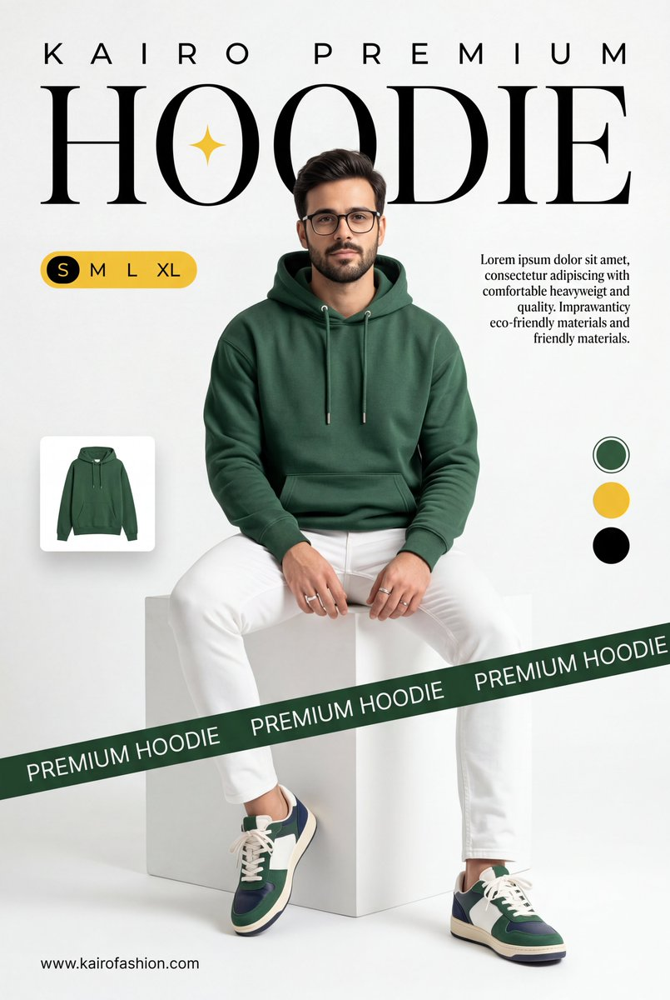

## A stylized, retro-futuristic music poster in a synthwave

- ID: trending-2026574551207792783
- Slug: trending-2026574551207792783-en
- 语言: en
- 来源: [来源链接](https://x.com/rovvmut_/status/2026574551207792783)
- 样例图路径: images/part1/2026574551207792783_1.jpg

### 提示词

```text
A stylized, retro-futuristic music poster in a synthwave aesthetic. The central focus is a woman in profile with a platinum blonde bob haircut, wearing oversized, chunky pink opaque visor sunglasses and a high-collar, extremely glossy pink vinyl jacket with visible zipper detail. Behind her, the word "HEIS" is written in massive, dark purple, condensed block typography, partially hidden by her head. The background is a clean gradient shifting from soft magenta to deep purple, overlaid with a subtle film grain texture. Lighting: Soft studio lighting with high-specular highlights on the glossy jacket and rim lighting on the hair. Color Palette: Dominant shades of bubblegum pink, deep violet, and lavender. Graphics: A small barcode on the left, a minimalist star logo in the bottom-left corner, and four lines of small sans-serif song lyrics in the bottom-right corner. Atmosphere: High-fashion, electronic dance music vibe, clean and polished composition.
```

### 样例图

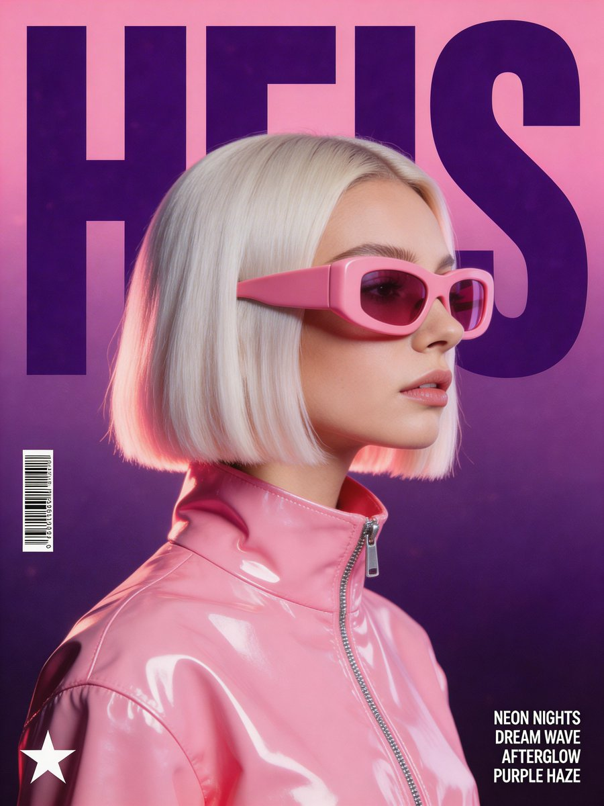

## 果树种植科普展板 | 3:4 竖版 | 

- ID: trending-2008174532285350353
- Slug: trending-2008174532285350353-zh
- 语言: zh
- 来源: [来源链接](https://x.com/LZhou15365/status/2008174532285350353)
- 样例图路径: images/part1/2008174532285350353_1.jpg

### 提示词

```text
果树种植科普展板 | 3:4 竖版 | 博物馆级信息设计
【主标题】
「××果树种植与结果管理指南」
字体：思源黑体 / 思源宋体混排，确保中文清晰渲染

【副标题】

学名 · 科属 · 原产地 · 主要栽培区 · 结果年限
【中央视觉】

画面中心 25%：
成熟健康的果树实物形态（可选：盆栽 / 幼树 / 结果期枝条），
 写实自然博物馆标本风格，树干、叶脉、果实细节清晰

背景：
浅色极简底（米白 / 浅灰）
淡雅农业几何纹样 / 果树年轮 / 叶脉结构底纹（透明度 15–20%）

【信息布局｜自动填充真实农业数据】

左侧（蓝绿色系 · 生长环境）
水分管理
幼树 / 成树浇水频率

不同生长期（萌芽 / 开花 / 膨果 / 休眠）需水差异
灌溉方式（滴灌 / 漫灌）

土壤含水量判断方法

光照需求
全日照 / 半日照

每日有效光照时长

光照不足 / 过强的结果影响对比图

通风与间距

行距株距建议

忌密植、忌积水低洼环境

右侧（黄绿色系 · 营养与土壤）

施肥管理

基肥 / 追肥 / 花前肥 / 果后肥

NPK 比例饼图（不同时期）

施肥频率与禁忌（避免烧根）

温度与湿度

四季生长温度曲线

花期低温风险提示

湿度过高导致病害示意

土壤条件

土壤类型（沙壤土 / 腐殖土）

pH 范围

改土方案（有机质 / 石灰 / 硫磺粉）

【中部横条】

12 个月果树生长与管理时间轴

修剪期

萌芽期

开花授粉期

坐果期

膨果期

采收期

休眠期
（图标化呈现）

【下方病虫害专区｜占 30%｜红紫警示色】

10 项果树常见病虫害识别卡片（3 行网格）

生理性问题

落花落果（营养 / 温度 / 水分）

果实畸形（授粉不良 / 缺硼）

叶片黄化（缺铁 / 缺氮 / 根系问题）

病菌性病害
4. 炭疽病
5. 褐斑病
6. 根腐病
虫害
7. 蚜虫
8. 红蜘蛛
9. 果实蝇
10. 介壳虫

每张卡片包含：
症状特写图（40%）

识别要点

具体防治方案

药剂名称 + 稀释倍数 + 使用频次
示例：
 代森锰锌 600 倍液，7 天 / 次，连喷 2–3 次

应急处理流程图
发现 → 隔离 → 判断 → 对症处理 → 持续观察

【底部信息栏】
果实可食性说明
农药安全间隔期
对蜜蜂 / 宠物 / 人类安全提示

【设计规范】
信息密度：高（留白约 25%）
连接线：由果树向外放射，极细线条
色彩编码：
蓝 = 水分
黄 = 光照
绿 = 营养
红 = 病害
紫 = 虫害
字级层级：
主标题 16pt
正文 12pt
备注 9pt

图标：统一线性农业科普风格

中文排版：行距 1.5，紧凑易读

病害卡片：红色边框 + 症状放大图

【风格参考】

日本果树试验站导览牌

现代自然博物馆农业信息墙
DK《果树栽培图鉴》

【技术参数】
正面平视 / 微俯视
柔和自然光
中大景深
4K 超高清
真实农业与园艺摄影级细节

【关键要求（非常重要）】

所有种植数据、病虫害信息、农药名称与使用浓度，需根据所选果树品种自动填充真实、准确、可查证的专业农业数据

英文补充（生图权重）

fruit tree cultivation guide poster, high-density agricultural infographic,
museum exhibition style, fruit tree growth cycle, pest and disease identification,
Chinese typography, minimalist background, professional horticulture data,
realistic fruit tree specimen, 4K ultra high resolution
```

### 样例图

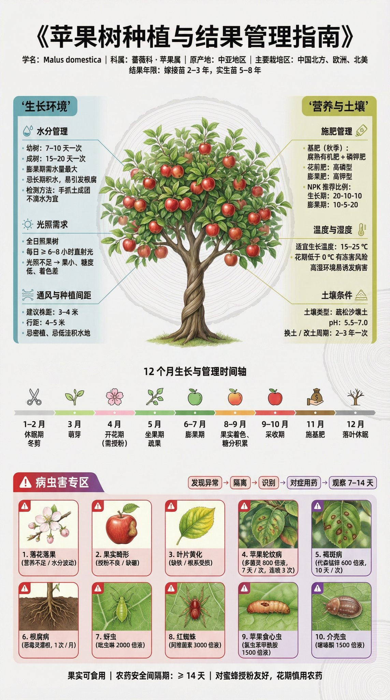

## A high-quality, split-screen fashion editorial advertise

- ID: trending-2033403443269030215
- Slug: trending-2033403443269030215-en
- 语言: en
- 来源: [来源链接](https://x.com/Mind_Boticni/status/2033403443269030215)
- 样例图路径: images/part1/2033403443269030215_1.jpg

### 提示词

```text
A high-quality, split-screen fashion editorial advertisement featuring multiple panels of different colors (yellow, green, deep red, blue). The image shows models wearing Adidas-style tracksuits and casual sportswear in corresponding colors that match their background panel. One male model in yellow is walking, one female model in green is sitting on a speaker, one male model in red is jumping, one female model in blue is sitting by a blue typewriter, one female model in red is posing in a red panel, and one female model in yellow is standing. Clean studio lighting, vibrant solid-color backgrounds, professional fashion photography, minimalist aesthetic, sharp focus
```

### 样例图

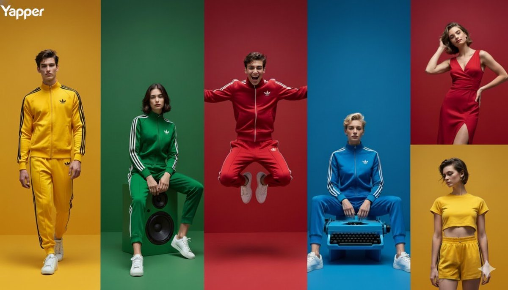

## Ultra-realistic beauty advertisement, close-up of a youn

- ID: trending-2041761330806595879
- Slug: trending-2041761330806595879-en
- 语言: en
- 来源: [来源链接](https://x.com/Kashberg_0/status/2041761330806595879)
- 样例图路径: images/part1/2041761330806595879_1.jpg

### 提示词

```text
Ultra-realistic beauty advertisement, close-up of a young woman with long wavy brown hair, soft glowing skin, wearing a pink sleeveless top, holding a large pink conditioner bottle labeled “VOIS” toward the camera, playful facial expression, natural makeup, bright studio lighting, clean white background, shallow depth of field, high-end cosmetic campaign, 85mm lens, sharp focus, glossy product texture, vibrant pink tones
```

### 样例图

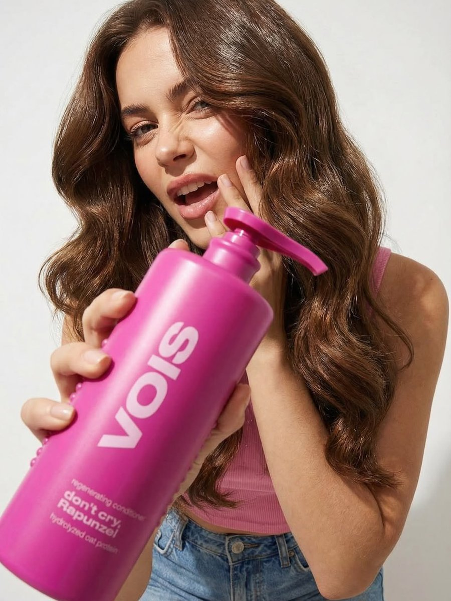

## A high-definition, professional fashion editorial photog

- ID: trending-2017483949271085191
- Slug: trending-2017483949271085191-en
- 语言: en
- 来源: [来源链接](https://x.com/iamsofiaijaz/status/2017483949271085191)
- 样例图路径: images/part1/2017483949271085191_1.jpg

### 提示词

```text
A high-definition, professional fashion editorial photograph of a sophisticated woman with a sleek, center-parted bun. She is wearing elegant, thin-rimmed silver glasses and a minimalist white long-sleeved silk blouse. She is posed gracefully with her hands near her face and chest, showcasing a luxury silver watch. The background is a clean, bright white with bold, high-contrast black serif typography reading 'VOGUE' at the top. Studio lighting, soft skin texture, sharp focus on the eyes, 8k resolution, shot on a 85mm lens for a flattering portrait compression."
​Tips for Customizing the Result:
​The Model: If you want a different look, change "sophisticated woman" to specific features like "freckles," "dark curly hair," or "minimalist makeup."
​The Brand: You can swap "VOGUE" for any other magazine title or leave it blank for a clean fashion portrait.
​The Jewelry: Adjust the metal (e.g., "gold watch," "rose gold frames") to change the color palette of the image.
```

### 样例图

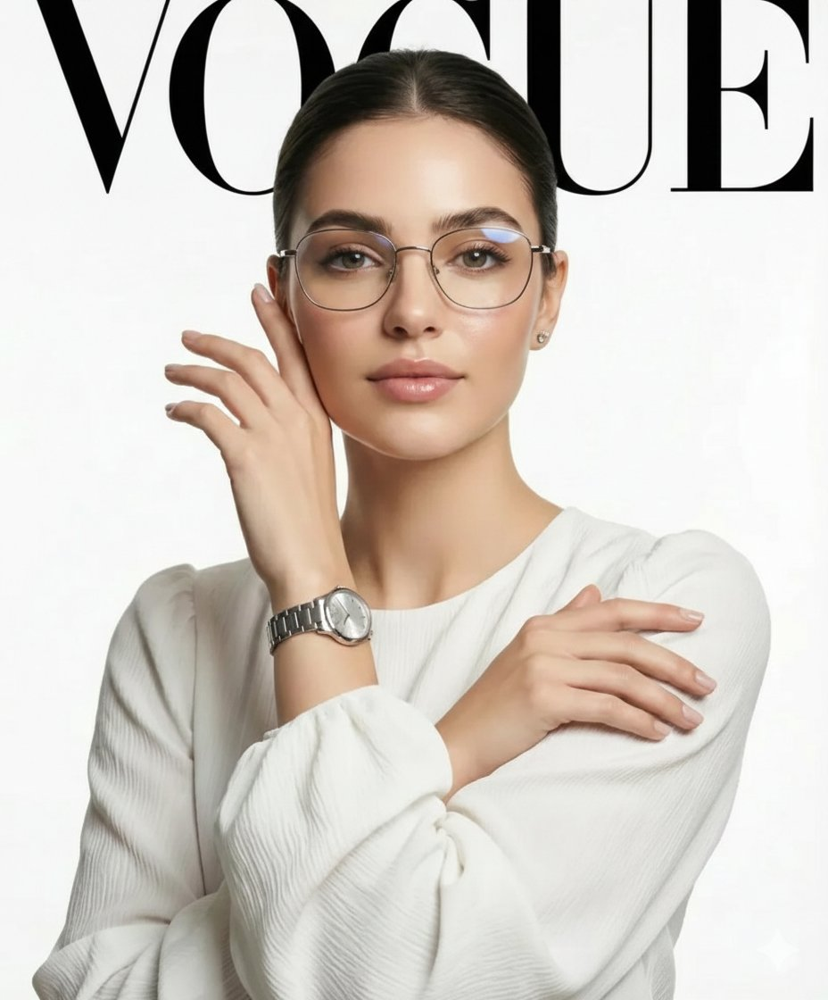

## A MAN WITH LIGHT-MEDIUM SKIN, SHORT DARK CURLY HAIR WITH

- ID: trending-2034898321639121310
- Slug: trending-2034898321639121310-en
- 语言: en
- 来源: [来源链接](https://x.com/ChillaiKalan__/status/2034898321639121310)
- 样例图路径: images/part1/2034898321639121310_1.jpg

### 提示词

```text
A MAN WITH LIGHT-MEDIUM SKIN, SHORT DARK CURLY HAIR WITH A FADE HAIRCUT,BROWN EYES,
AND A WELL-GROOMED SHORT BEARD, WEARING A GLOSSY OVERSIZED RED PUFFER JACKET AND
LOOSE RED PANTS WITH WHITE AND RED NIKE SNEAKERS, CROUCHING LOW WITH ONE KNEE UP AND
ONE LEG FORWARD, LEFT ARM RESTING CASUALLY OVER THE RAISED KNEE AND RIGHT HAND
RELAXED NEAR THE OTHER LEG, BODY ANGLED SLIGHTLY TO THE SIDE WHILE HEAD TILTS
FORWARD LOOKING DIRECTLY AT THE CAMERA WITH A CONFIDENT EXPRESSION, ULTRA WIDE-ANGLE
LOW PERSPECTIVE SHOT EMPHASIZING THE FRONT SNEAKER APPEARING LARGE AND DOMINANT IN
THE FOREGROUND, SET IN A FULLY RED ENVIRONMENT WITH SMOOTH FLOOR AND BACKDROP
FEATURING LARGE WHITE NIKE SWOOSH LOGOS BEHIND AND FLOWING RIBBON-LIKE RED SHAPES
AROUND, HYPER-REALISTIC PHOTOGRAPHY, EXTREMELY SHARP DETAILS ON FABRIC SHINE AND
SNEAKER TEXTURE, DRAMATIC STUDIO LIGHTING WITH STRONG HIGHLIGHTS AND SOFT SHADOWS
SATURATED MONOCHROMATIC RED COLOR PALETTE WITH WHITE ACCENTS, MODERN STREETWEAR
CAMPAIGN STYLE, NO BLUR, NO DISTORTION, NO EXTRA LIMBS, NO ARTIFACTS
```

### 样例图

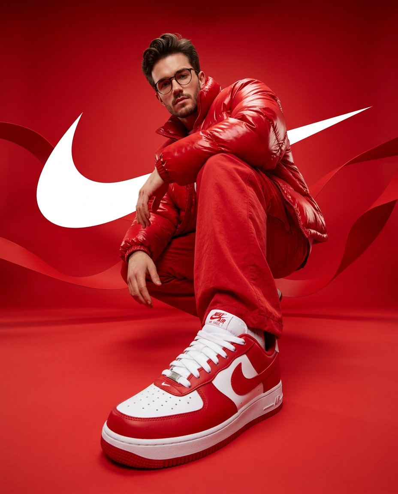

## Create a hyper-realistic 8K UHD cinematic poster portrai

- ID: trending-2031417651390722459
- Slug: trending-2031417651390722459-en
- 语言: en
- 来源: [来源链接](https://x.com/ChillaiKalan__/status/2031417651390722459)
- 样例图路径: images/part1/2031417651390722459_1.jpg

### 提示词

```text
Create a hyper-realistic 8K UHD cinematic poster portrait of a man inspired by the reference image, with a similar hairstyle, facial structure, and body build while maintaining a natural realistic look. Shot as if captured on a 35mm lens, f/1.8, with sharp focus, creamy bokeh, cinematic color grading, and detailed DSLR skin texture.

Design a modern graphic poster titled “Chill-out.” The man wears a red hoodie, black cuffed joggers, red and white Air Jordan high-top sneakers, dark sunglasses, and silver rings. He sits in a relaxed reclined pose leaning against oversized typography, one leg bent and the other slightly extended toward the viewer. His body angles right while his face turns toward the camera in a confident three-quarter view.

Background is matte textured black. Large bold white sans-serif text “chill” and “out” forms a bench-like structure, with “chill” underlined. Add orange circles, squares, thin white grid lines, and phrases: “Life is so much easier when you just chill-out” and “Less stress, more chill.”

Bottom-right watermark: K(@ ChillaiKalan) ,
```

### 样例图

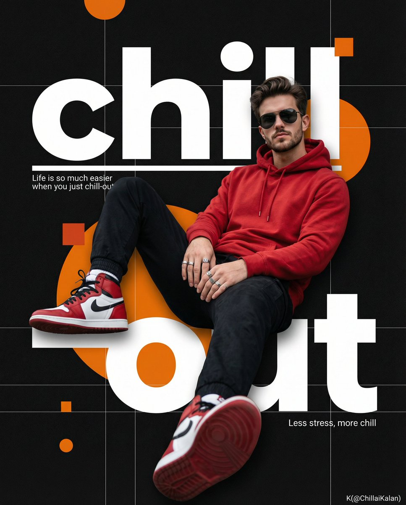

## [Lebron James]. Act as a graphic designer specializing i

- ID: trending-2018776000532717836
- Slug: trending-2018776000532717836-en
- 语言: en
- 来源: [来源链接](https://x.com/AmirMushich/status/2018776000532717836)
- 样例图路径: images/part1/2018776000532717836_1.jpg

### 提示词

```text
[Lebron James]. Act as a graphic designer specializing in "Modern Vintage" sports and music memorabilia posters.
1. COLOR LOGIC (AUTONOMOUS):
Analyze the Subject: Instantly identify the single most iconic color associated with [PERSON / CHARACTER NAME] (e.g., if Michael Jordan -> Chicago Red; if Prince -> Purple; if Spotify CEO -> Vibrant Green).
The Background: Fill the entire background with this Solid, Vibrant Brand Color.
Texture: Apply a visible Heavy Film Grain overlay to the solid color to kill the digital perfection.
2. CENTRAL COMPOSITION (NARRATIVE SILHOUETTE):
The Container: Place a massive, high-contrast Black & White Cut-Out Photo of [PERSON / CHARACTER NAME] in the center. It can slightly breach the top or side borders (dynamic cropping).
The "Montage" Fill (CRITICAL): The interior of the subject's clothing or body shadows is NOT solid black. It is filled with a Complex Monochrome Collage.
Collage Content: Inside the silhouette, layer smaller, high-contrast photos representing key career milestones, newspaper headlines, famous poses, or relevant machinery/tools associated with them.
Visual Effect: This creates a "Double Exposure" effect where the hero's shape tells their story.
3. PRINT AESTHETIC (HALFTONE & NEWSPAPER):
Halftone Effect: Apply a distinct "Coarse Halftone Dot Pattern" (Newsprint Screen effect) to the entire central figure and collage. The dots should be visible, creating that retro 90s zine/newspaper aesthetic.
Contrast: The image must be strictly Duotone or Tritone (Background Color + Black Ink + White Paper negative space). No full-color photos.
4. FOOTER ELEMENTS (BRANDING):
Bottom Left (Logo): Place a specific Logo or Icon relevant to the subject (e.g., team logo, company logo, or personal symbol).
Size: Small and discrete (approx 15% of width).
Color: High contrast to the background (White or Black).
Bottom Right (Signature): Place the subject's Autograph/Signature.
Logic: If the signature is public domain, simulate the real one. If fictional, generate a believable handwritten script signature.
Color: Same contrast color as the logo.
OUTPUT:
A raw, textured, vintage-style poster design.
```

### 样例图

![[Lebron James]. Act as a graphic designer specializing i](../images/part1/2018776000532717836_1.jpg)

## [BRAND NAME] Act as a Senior Street Culture Art Director

- ID: trending-2039795053237858362
- Slug: trending-2039795053237858362-en
- 语言: en
- 来源: [来源链接](https://x.com/AmirMushich/status/2039795053237858362)
- 样例图路径: images/part1/2039795053237858362_1.jpg

### 提示词

```text
[BRAND NAME]

Act as a Senior Street Culture Art Director and Editorial Designer specializing in authentic underground magazine covers and campaign posters that feel documentary rather than commercial. Your reference universe: Thrasher Magazine, i-D, The Face, Dazed — raw, real, typographically bold.

BRAND INTELLIGENCE SYSTEM

Before executing, resolve: (1) HERO SUBJECT — identify the most authentic human archetype or iconic product moment associated with [BRAND NAME]'s world. Autonomously determine what this looks like based purely on the brand's identity — a person interacting with the brand's hero product in their most natural environment, or the hero product itself as the sole subject if no human archetype is more powerful. The subject must feel like it belongs to this brand's specific world — not borrowed from another brand's cultural universe. Never default to skateboarding, skating, or street sport unless [BRAND NAME] is specifically and primarily a skate brand, (2) ENVIRONMENT — the most iconic real-world location context for [BRAND NAME]'s subject — not a studio, always a real place with atmosphere: a rooftop, a street, a race track, a kitchen, a parking lot, a coastline, a salon, a garage, a runway, (3) BRAND WORDMARK STYLE — identify how [BRAND NAME]'s name would look rendered as a rough hand-painted or chalk brushstroke headline — the texture and character of the lettering must feel native to the brand's specific subculture and communication style, (4) NEON ACCENT COLOR — identify one single neon or highly saturated accent color that feels culturally connected to [BRAND NAME]'s world — this will be used exclusively for the graffiti tag overlay and nowhere else, (5) QUOTE LINE — autonomously generate a short authentic-sounding quote or phrase in [BRAND NAME]'s voice — 4–6 words, raw and real, not corporate, not generic.

PHASE 1: PHOTOGRAPHY BASE

The entire image is built on a real location photograph — not a studio shot, not a white background, not a cyclorama. The environment resolved in the brand intelligence system is the setting. Natural or available light only — no softboxes, no controlled studio lighting. The light should feel like it was taken at golden hour, overcast day, or in existing ambient conditions. Camera angle: dynamic and committed — low angle looking up for power, or a dramatic dutch tilt for tension, never flat eye-level. The subject is captured at peak energy — the single most alive frame of the action or moment. The photograph fills the entire canvas edge to edge with no padding. Color grade: slightly pushed contrast, natural colors preserved, filmic grain, not over-processed. This photograph must feel like it was taken by a photographer who was actually there — not staged, not art directed to death.

PHASE 2: BRAND LOGO BRUSHSTROKE — CRITICAL

Autonomously identify [BRAND NAME]'s primary icon mark or logo symbol — the exact recognizable shape  that represents this brand visually. Render this logo mark as a large hand-painted brushstroke version — as if a skilled street artist took a wide brush loaded with paint and painted the logo freehand on a wall. The shape must be immediately recognizable as [BRAND NAME]'s actual logo geometry — correct proportions, correct silhouette, correct internal details — but executed in a loose, gestural, brush-painted style with visible bristle marks, paint drips, slightly uneven edges, and areas where the paint is thinner and the surface shows through. This is not a clean vector trace — it is a human hand interpreting a logo with a brush. Size: enormous — spanning 70–85% of canvas width, occupying the upper third of the canvas. Color: white or off-white paint — reading clearly against the photograph behind it. The brushstroke logo sits on top of the photograph as an overlay with natural paint transparency in the thinner areas.

PHASE 3: GRAFFITI TAG OVERLAY

One single graffiti element in the NEON ACCENT COLOR resolved in the brand intelligence system. This element is a loose hand-drawn tag, throw-up, or marker scrawl — a secondary word, a symbol, an abstract mark, or a stylized brand-relevant word. It sits on top of everything — over the photograph, over the wordmark, over any other element — as if added last and spontaneously, like someone tagged the poster after it was printed. Placement: partially overlapping the brand wordmark in the upper portion of the image with additional marks or drips extending into the mid-section of the canvas. The neon accent color is used nowhere else in the entire composition — this element owns that color exclusively. The graffiti mark adds rawness and authenticity — it breaks the polish and makes the whole thing feel real.

PHASE 4: TYPOGRAPHY SYSTEM

Four distinct text zones — all small, all restrained, creating an editorial layout grid around the large wordmark and photograph. UPPER LEFT BLOCK: 3–4 lines of very small all-caps or mixed case body text describing [BRAND NAME]'s campaign, collection, or brand context — autonomously generate relevant editorial copy in [BRAND NAME]'s voice. This block sits in the top-left corner, justified left, at footnote scale. TWO LABEL LINES: directly below the upper left block — a campaign name or season on the left, a short descriptor on the right — both in small caps, same scale as body text. RIGHT MID BLOCK: the QUOTE LINE resolved in the brand intelligence system rendered in quotation marks in the right-center area, slightly larger than body text but still small relative to the wordmark. Below the quote: [BRAND NAME] in small caps as attribution. Below that: 3–4 lines of small body copy with [BRAND NAME]'s campaign message — autonomously generate relevant content. LOWER RIGHT DETAIL: a small secondary graffiti-style tag or signature mark in the neon accent color — smaller than the main graffiti element, positioned lower right as a finishing mark.

PHASE 5: OVERALL COMPOSITION

The visual hierarchy reads in this exact order: (1) the photograph and its energy — the eye enters through the action or subject, (2) the massive brushstroke wordmark — confirms the brand, (3) the neon graffiti tag — adds rawness and surprise, (4) the typography blocks — rewards closer reading. The composition must feel like a real magazine cover or a poster wheat-pasted on a wall — not a social media graphic, not a clean digital mockup. Every element has a reason to exist. Nothing is decorative. The rawness is the design.

TECH SPECS

Photography: real location, natural light, peak moment, filmic color grade with visible grain. Wordmark: textured brushstroke or chalk — never clean vector. Graffiti: one neon accent color only, hand-drawn quality, sits on top of all layers. Typography: small, editorial, restrained — maximum 4 text blocks. Color palette: natural photograph tones plus one neon accent color only — no additional colors introduced anywhere. No geometric shapes, no illustrated elements, no icons, no additional graphic overlays beyond what is specified. The graphic language is exclusively photography plus typography plus one graffiti accent. Mood: a poster designed by someone who actually lives in this brand's world — not an agency, not a committee, one person with a strong point of view and complete conviction.

PHOTOGRAPHY TONE — CRITICAL: the subject must be clean, sharp, and well-lit despite the raw editorial aesthetic. Raw and authentic refers to the composition style and location — NOT to dirt, sweat, mud, or degraded appearance of the subject. The person or product must look aspirational and desirable. No dirt. No sweat. No mud. No torn clothing. No gritty degraded appearance. Editorial rawness means honest and unposed — not physically dirty.
```

### 样例图

![[BRAND NAME] Act as a Senior Street Culture Art Director](../images/part1/2039795053237858362_1.jpg)

## A creative romantic digital photo collage featuring a yo

- ID: trending-2042270514501312771
- Slug: trending-2042270514501312771-en
- 语言: en
- 来源: [来源链接](https://x.com/Naiknelofar788/status/2042270514501312771)
- 样例图路径: images/part1/2042270514501312771_1.jpg

### 提示词

```text
A creative romantic digital photo collage featuring a young handsome woman in a peacock green frock. The main subject is a full-body cutout placed slightly left, turned back and smiling over her shoulder, wearing a peacock green embellished rich frock. Behind and around her is a semi-circular collage of multiple black-and-white portrait shots of the same woman, each in different expressions and poses, arranged in curved segments. The background is a soft light grey textured surface with a minimal aesthetic.Decorative elements include pink butterflies, a floral daisy near the center, red heart balloons, and cute love-themed stickers Handwritten-style text elements like “Queen of Beauty,” “I Love you,” and “Capture the moment” are scattered around. A small heartbeat line with a heart icon is included. At the bottom, the name “x creator” appears in elegant cursive typography. Soft shadows, smooth cutout blending, high-end Photoshop manipulation, romantic mood, pastel tones.
```

### 样例图

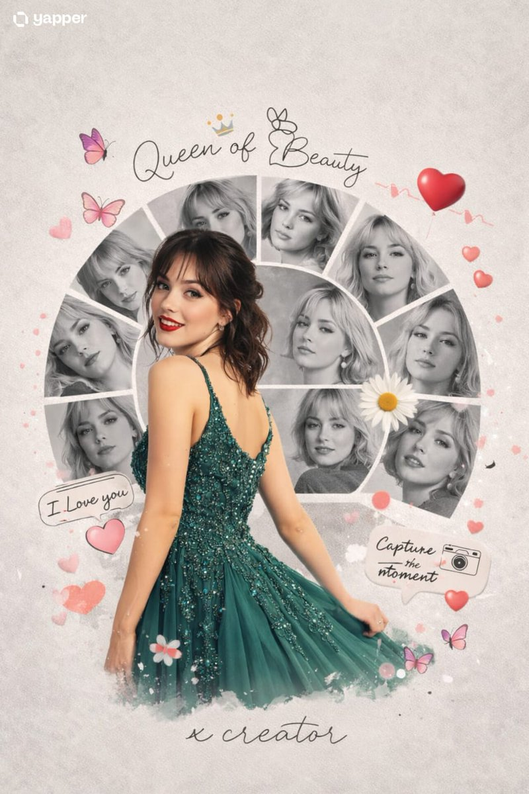

## Editorial photography, a woman wearing a structured deep

- ID: trending-2029072361669181640
- Slug: trending-2029072361669181640-en
- 语言: en
- 来源: [来源链接](https://x.com/ChillaiKalan__/status/2029072361669181640)
- 样例图路径: images/part1/2029072361669181640_1.jpg

### 提示词

```text
Editorial photography, a woman wearing a structured deep teal blazer standing against a pale blue sky. A bird in heavy motion blur is flying across her face, obscuring her features, surrealist style. High-grain paper texture, cinematic soft lighting, minimalist composition. Magazine cover aesthetic with a clean white vertical sidebar on the left containing bold black typography. Muted cool tones, artistic blur, 35mm film aesthetic, avant-garde fashion vibe
```

### 样例图

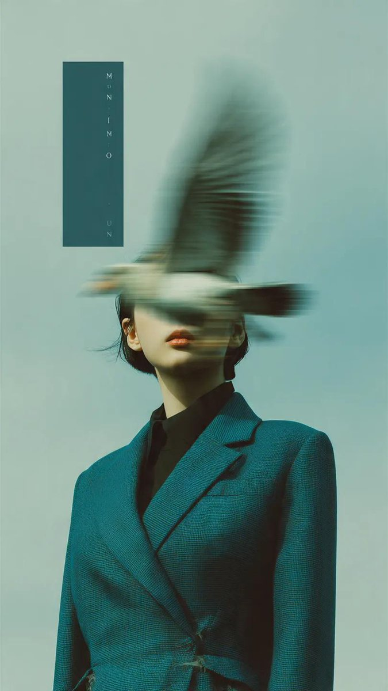

## Using the attached image, create a professional industri

- ID: trending-2038942399746212173
- Slug: trending-2038942399746212173-en
- 语言: en
- 来源: [来源链接](https://x.com/Naiknelofar788/status/2038942399746212173)
- 样例图路径: images/part1/2038942399746212173_1.jpg

### 提示词

```text
Using the attached image, create a professional industrial fashion design illustration sheet for a high-end streetwear outfit.
A centered heroic full-body 3D render of a modern urban look (oversized hoodie, cargo pants, sneakers), with realistic fabric physics, detailed stitching, and layered textiles. Soft studio lighting with subtle shadows and premium editorial finish.
Surround with technical views:
Front, back, side, 3/4 perspective
Flat lay pattern layout
Include sketches:
Panel segmentation (oversized cuts)
Stitching and seam details
Elastic waistband, cuffs, drawstrings
Measurement arrows in millimeters
Materials (handwritten notes):
Heavy cotton fleece, nylon, ripstop
Matte + slightly worn textures
Reinforced stress zones
Extras:
Street branding placement (logos, tags, patches)
Pocket systems and utility design
Style: Clean sketchbook + graffiti undertone, realistic + pencil hybrid, ultra-detailed.
```

### 样例图

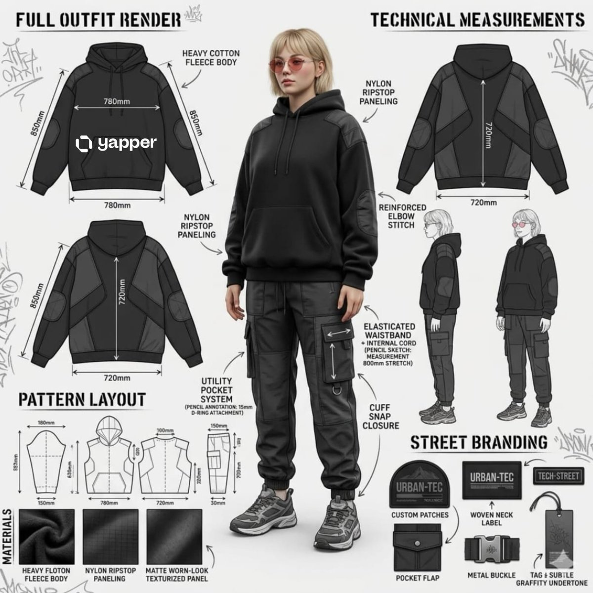

## { "project_name": "Premium_Dark_Horizon_Product_Reveal",

- ID: trending-2015866705197580703
- Slug: trending-2015866705197580703-en
- 语言: en
- 来源: [来源链接](https://x.com/lloydcreates/status/2015866705197580703)
- 样例图路径: images/part1/2015866705197580703_1.jpg

### 提示词

```text
{
  "project_name": "Premium_Dark_Horizon_Product_Reveal",
  "USER_CUSTOMIZATION": {
    "INSTRUCTIONS": "Replace 'current_setting' with the product you want to render. The system will AUTOMATICALLY position it in a specific, fixed pose: tilted back with its bottom-front tip touching the horizon edge.",
    "product": {
      "current_setting": "Mac Mini",
      "description": "The product will be rendered with a dark, metallic, highly detailed finish."
    }
  },
  "settings": {
    "style": "Cinematic, high-contrast product photography in a dark environment. Ultra-sharp focus, rich color grading.",
    "aspect_ratio": "4:5"
  },
  "prompt_construction": {
    "MAIN_SUBJECT": {
      "subject": "The [product from USER_CUSTOMIZATION] is perfectly centered.",
      "appearance": "It has a premium, dark silver/chrome-like finish, looking solid and incredibly sharp. There is an ever-so-slight, subtle warmth mixed into the reflections on the metallic surfaces, giving it depth.",
      "pose_and_contact": "CRITICAL: The product is tilted back dramatically, away from the viewer towards the top of the frame. Its bottom-front tip or edge is PRECISELY touching the sharp center edge of the horizon arc. It must NOT float above the arc. This pose prominently displays the main surface (e.g., laptop lid with logo, phone screen/back, watch face)."
    },
    "HORIZON_ARC": {
      "description": "A single, clean, massive, dark horizon line arcs across the entire width of the screen from left to right. It is NOT a complete sphere, glowing ball, or circle, but the very edge of a dark planet-like surface.",
      "light_profile": "The edge itself is defined by a thin, sharp, soft-glow blue light. The light is thinnest and sharpest (purplish-blue) in the bottom-left, widening slightly to a brighter, soft white-blue rim on the right before fading. It must NOT reveal the spherical form of the surface below; the area below the arc must remain pitch black.",
      "reflection_effect": "CRITICAL: There are ABSOLUTELY NO reflections of the product on the horizon surface. The surface is dark and matte."
    },
    "LIGHTING_AND_BACKGROUND": {
      "background": "Pure, absolute black negative space. There are NO visible light rays, gradients, starfields, halos, or any other light shapes above or around the product.",
      "key_lighting": "A strong key light from the TOP-LEFT sculpts the product, emphasizing its form and the logo/main feature. It does NOT create visible rays.",
      "rim_lighting": "A distinct rim light from the BACK-LEFT separates the product from the dark background.",
      "fill_lighting": "A soft fill light from the BOTTOM-RIGHT opens up the shadows slightly.",
      "color_cast": "All lighting is dominated by deep, rich blues, consistent with the horizon arc."
    },
    "COMPOSITION_AND_FRAMING": {
      "framing": "The product is perfectly centered. The camera distance is fixed, ensuring the product is large and dominant but NEVER cut off.",
      "perspective": "A sharp, eye-level perspective relative to the product's center, looking slightly down towards the horizon."
    }
  },
  "NEGATIVE_CONSTRAINTS": [
    "visible light rays",
    "glow or light source in the top left corner",
    "product floating above the arc",
    "product not touching the arc edge",
    "product lying flat",
    "visible sphere or glowing orb form below the arc",
    "halos or circular lights above the product",
    "harsh light glows",
    "reflections of the product on the horizon",
    "background other than pure black",
    "product cut off by frame edge",
    "upside-down or downward curve",
    "squiggly arc"
  ],
  "FULL_PROMPT_STRING": "A cinematic product photograph of [product from USER_CUSTOMIZATION] with a dark, sharp, silver/chrome finish and subtle warmth. The product is perfectly centered, tilted back dramatically with its bottom-front tip precisely touching the sharp center edge of a single, massive, dark horizon arc that spans the frame. This arc is a thin, sharp, soft-glow blue light, purplish-blue in the bottom-left, widening to a soft white-blue rim on the right, before fading to pitch black. The area below the arc is absolute black. There are NO reflections on the horizon. The background is pure, light-ray-free, halo-free black negative space. There is NO glow or light source in the top left corner. Key light from the top-left, rim light from the back-left, and soft fill from the bottom-right create a dramatic, volumetric, blue-dominated lighting scheme. The product is never cut off. 8k resolution, highly detailed."
}
```

### 样例图

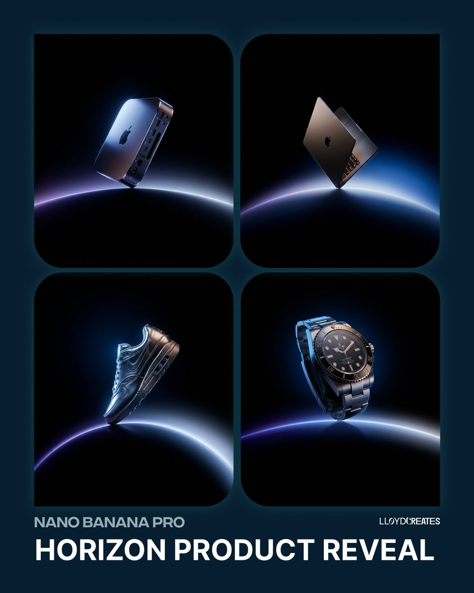

## A retro-inspired studio photoshoot featuring a young wom

- ID: trending-2043539455131459957
- Slug: trending-2043539455131459957-en
- 语言: en
- 来源: [来源链接](https://x.com/Mind_Boticni/status/2043539455131459957)
- 样例图路径: images/part1/2043539455131459957_1.jpg

### 提示词

```text
A retro-inspired studio photoshoot featuring a young woman styled in four different personas, arranged in a horizontal split-panel composition. Each panel has a bold pastel background in contrasting colors (yellow, blue, pink, mint). The same woman appears in each panel wearing vintage 1960s fashion with bright patterns, pink knee-high socks, and expressive makeup.
Panel 1 (Office theme): She sits behind a desk with office props like folders, a rotary phone, and stationery, wearing a patterned dress and looking surprised while holding the phone.
Panel 2 (Travel theme): She wears a wide-brim hat and colorful outfit, sitting with a vintage suitcase and travel accessories, posing elegantly.
Panel 3 (Sports theme): She wears a sporty retro outfit, holding a tennis racket and ball, sitting casually with playful energy.
Panel 4 (Home theme): She wears a robe with hair rollers, holding a hand mirror, sitting at a vanity table with beauty items.
Each panel is cleanly divided, perfectly symmetrical, with consistent lighting and camera angle. Bright, soft studio lighting, high fashion editorial style, ultra-sharp, vibrant colors, minimal shadows, no text, no logos, no labels, no watermarks.
Style: vintage pop art, Wes Anderson symmetry, fashion editorial photography, pastel color blocking, high resolution, 8k, clean composition.
```

### 样例图

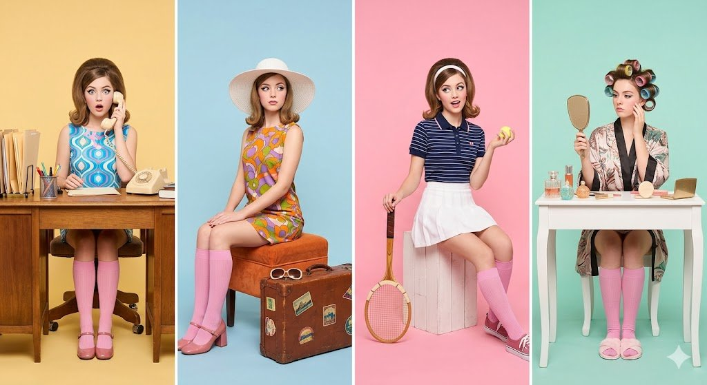

## [product], futuristic high-end ad, transparent glass cub

- ID: trending-2020498871894573126
- Slug: trending-2020498871894573126-en
- 语言: en
- 来源: [来源链接](https://x.com/azed_ai/status/2020498871894573126)
- 样例图路径: images/part1/2020498871894573126_1.jpg

### 提示词

```text
[product], futuristic high-end ad, transparent glass cube enclosure, caustic light patterns on surface, minimal composition, cool studio lighting, subtle fog, sharp reflections, ultra-realistic, macro product photography, 100mm lens look, f/8, 8k, 1:1
```

### 样例图

![[product], futuristic high-end ad, transparent glass cub](../images/part1/2020498871894573126_1.jpg)

## { "style": "high-fashion editorial, minimalist surrealis

- ID: trending-2019648173652996217
- Slug: trending-2019648173652996217-en
- 语言: en
- 来源: [来源链接](https://x.com/Maercihh/status/2019648173652996217)
- 样例图路径: images/part1/2019648173652996217_1.jpg

### 提示词

```text
{
  "style": "high-fashion editorial, minimalist surrealism",
  "subject": "a confident woman leaning casually against an oversized green leather boot sculpture",
  "pose": "relaxed yet powerful stance, body slightly angled, one arm holding a small handbag",
  "outfit": {
    "top": "emerald green fitted sleeveless top",
    "bottom": "matching green leather pants",
    "footwear": "knee-high green leather boots",
    "accessories": "small structured green handbag"
  },
  "composition": {
    "scale": "dramatic contrast between human figure and oversized object",
    "framing": "full body shot, centered subject with negative space",
    "background": "pure white seamless studio backdrop",
    "floor": "glossy white reflective surface"
  },
  "lighting": {
    "type": "soft studio lighting",
    "mood": "clean, premium, editorial",
    "shadows": "subtle, natural, controlled"
  },
  "color_palette": "monochromatic green tones with neutral white",
  "camera": {
    "angle": "eye-level",
    "lens": "85mm fashion lens",
    "depth_of_field": "sharp focus on subject, smooth background"
  },
  "vibe": "luxury fashion campaign, modern, confident, surreal elegance",
  "quality": "ultra-high resolution, crisp details, magazine-ready"
}
```

### 样例图

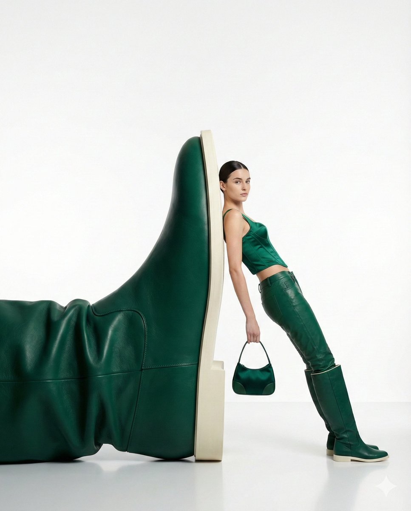

## Hyper-realistic professional automotive commercial ad po

- ID: trending-2041366564516368436
- Slug: trending-2041366564516368436-en
- 语言: en
- 来源: [来源链接](https://x.com/Diplomeme/status/2041366564516368436)
- 样例图路径: images/part1/2041366564516368436_1.jpg

### 提示词

```text
Hyper-realistic professional automotive commercial ad poster. [BRAND] [MODEL] in [COLOR] parked at a perfect 3/4 front angle on [SURFACE]. Background: [ENVIRONMENT]. [WEATHER/ATMOSPHERE]. The car hyper-detailed — every panel line sharp, all lights on and glowing, [SIGNATURE DESIGN DETAIL] catching [LIGHT SOURCE], alloy wheels clean and sharp, car reflection visible on [SURFACE] below. [ATMOSPHERE DETAIL — mist / dust / rain / stars].
Typography: top left — [BRAND] logo white. Center — “[MODEL NAME]” in large bold white. Bottom left — “[HEADLINE TAGLINE]” in italic serif white. Below — “[ENGINE · FEATURE · FEATURE]” in 8px tracked caps white. Bottom right — “Starting [PRICE]*” white. Thin horizontal rule separating tagline from specs. Bottom center — “[BRAND WEBSITE]” 7px tracked caps. Left edge vertical — “[MODEL · YEAR]” 7px white rotated 90 degrees.
Lighting: [MAIN LIGHT SOURCE], strong specular on car panels, all brand lights illuminated, [MOOD LIGHT — warm amber / cold blue / golden sunrise / storm dramatic]. Mood: [MOOD]. Shot on ARRI Alexa Mini LF, 50mm anamorphic, shallow DOF, HDR, professional automotive ad campaign poster, 4:5 portrait.
```

### 样例图

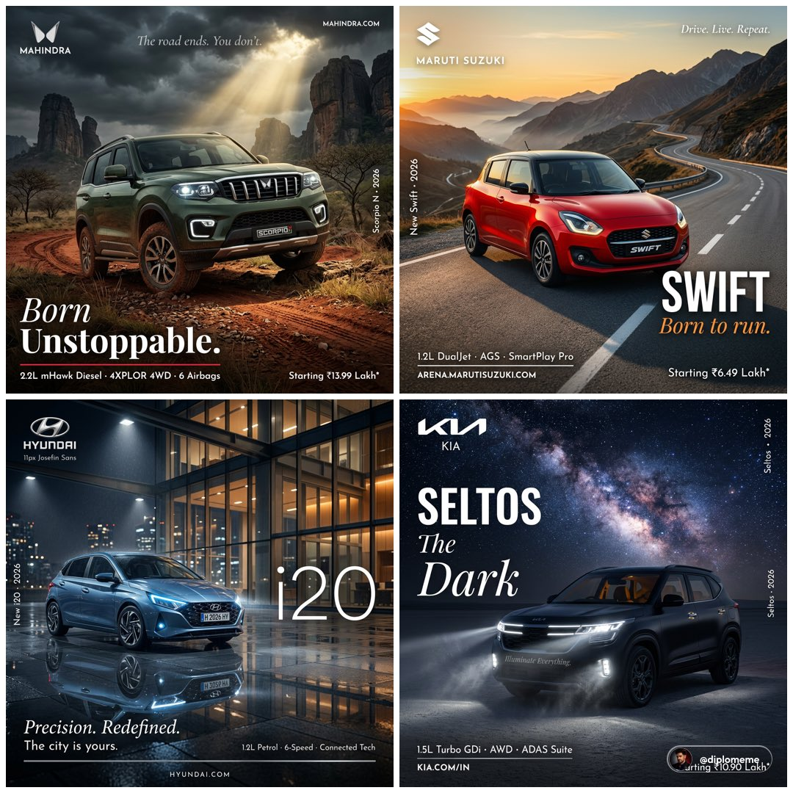

## High-end cinematic campaign poster. A Minute Maid Pulpy 

- ID: trending-2040646451425063037
- Slug: trending-2040646451425063037-en
- 语言: en
- 来源: [来源链接](https://x.com/Diplomeme/status/2040646451425063037)
- 样例图路径: images/part1/2040646451425063037_1.jpg

### 提示词

```text
High-end cinematic campaign poster. A Minute Maid Pulpy orange bottle positioned off-center right on a sun-bleached linen draped over rough coastal stone. Surrounding: a heavy ceramic glass half-filled with pulpy orange juice, fresh orange wedges, dried wildflowers. Background: deep terracotta darkness bleeding to warm amber glow at top — Mediterranean late afternoon atmosphere. Two thin horizontal gold rule lines framing the upper and lower composition.
Typography overlaid: left-aligned Playfair Display headline “Sun,” on first line, italic amber “Pulp &” second line, “Soul.” third line — stacked at 64–72px, white and gold alternating. Right-aligned italic Cormorant Garamond subtext “Real pulp. Real warmth. Real morning.” in warm cream. Bottom left spaced caps “MEDITERRANEAN · SLOW PRESSED · SUNRISE RITUAL” in faint amber. Top left eyebrow “MINUTE MAID · PULPY ORANGE” in tracked caps.
Lighting: natural diffused window light left-frame, warm terracotta fill, golden pulp glow through glass. Mood: slow coastal morning, honest premium warmth. Shot on ARRI Alexa 35, 75mm prime, shallow DOF, terracotta-ivory bokeh, HDR, lifestyle brunch campaign poster, 4:5 portrait.

High-end minimalist campaign poster. A clean Real fruit juice carton standing perfectly centered on cool white Italian marble, surrounded by split pomegranates showing jewel-red seeds, a fresh mint sprig, and scattered ice chips. Background: warm ivory-to-pale-sage gradient, soft botanical shadow suggestion of leaves at edges. Large thin circular frame element surrounding the bottle — elegant geometric restraint.
Typography overlaid: large light-weight Cormorant Garamond serif headline “Quietly” then italic bold “Brilliant.” stacked left-aligned in deep forest green, generous line spacing. Small Josefin Sans ultra-tracked subtext “NO DRAMA · JUST FRUIT” below in sage. Thin horizontal divider line. Footer italic “Cold pressed · Botanical blend · Naturally yours” in light sage. Top right “Collection No. 08” in delicate italic grey-green.
Lighting: soft cool overhead diffused studio light, clean marble reflection, zero drama. Mood: refined wellness luxury, botanical calm. Shot on Sony VENICE 2, 90mm macro, ultra-shallow DOF, sage bokeh, HDR, lifestyle wellness poster, 4:5 portrait
```

### 样例图


## margherita pizza recipe infographic, Studio Ghibli inspi

- ID: trending-2027140890247246017
- Slug: trending-2027140890247246017-en
- 语言: en
- 来源: [来源链接](https://x.com/azed_ai/status/2027140890247246017)
- 样例图路径: images/part1/2027140890247246017_1.jpg

### 提示词

```text
margherita pizza recipe infographic, Studio Ghibli inspired illustration, traditional Italian kitchen setting, warm golden sunset light, whole pizza in center with bubbling cheese, ingredients illustrated around in cute containers, dough ball, tomato sauce 150g, mozzarella 200g, fresh basil leaves, olive oil drizzle, handwritten notebook style labels, soft pastel tones, painterly textures, gentle steam and magical glow, whimsical cozy feeling, clean organized layout, readable text, high detail
```

### 样例图


## 5 panel colorful portrait collage, fashion models, monoc

- ID: trending-2041126427295461679
- Slug: trending-2041126427295461679-en
- 语言: en
- 来源: [来源链接](https://x.com/Mind_Boticni/status/2041126427295461679)
- 样例图路径: images/part1/2041126427295461679_1.jpg

### 提示词

```text
5 panel colorful portrait collage, fashion models, monochrome backgrounds (pink, red, green, yellow), vibrant studio lighting, modern editorial style, rounded grid layout, high contrast, minimal shadows
```

### 样例图

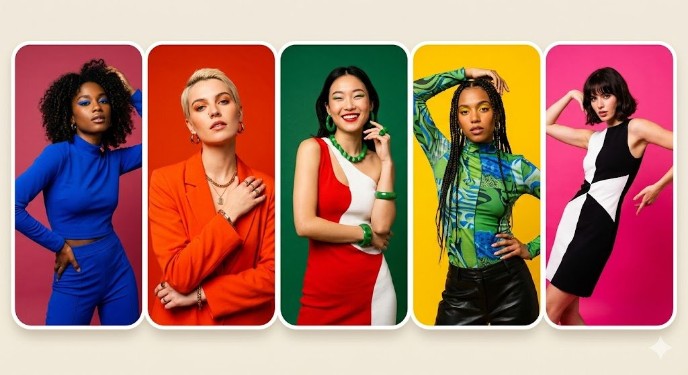

## Cinematic mirror selfie scene inspired by a retro 80s sc

- ID: trending-2032770762525065405
- Slug: trending-2032770762525065405-en
- 语言: en
- 来源: [来源链接](https://x.com/Taaruk_/status/2032770762525065405)
- 样例图路径: images/part1/2032770762525065405_1.jpg

### 提示词

```text
Cinematic mirror selfie scene inspired by a retro 80s sci-fi horror vibe, a group of teenagers and a photographer posing together in a bathroom mirror, vintage camera flash lighting, Christmas string lights around the mirror, walkie-talkies and retro gadgets on the sink, handwritten fog text on the mirror reading “RUN” and “Stranger Things”, nostalgic atmosphere, moody blue and red lighting, cinematic storytelling composition, Pixar-style 3D characters, ultra-detailed, soft reflections, 8K.
```

### 样例图


## High-end 3D advertising poster for [INSERT PRODUCT NAME]

- ID: trending-2011788910297563310
- Slug: trending-2011788910297563310-en
- 语言: en
- 来源: [来源链接](https://x.com/IqraSaifiii/status/2011788910297563310)
- 样例图路径: images/part1/2011788910297563310_1.jpg

### 提示词

```text
High-end 3D advertising poster for [INSERT PRODUCT NAME]. A realistic [INSERT PRODUCT DESCRIPTION] is floating in the center of a magical fantasy landscape. The product is surrounded by a dynamic swirling vortex of [INSERT LIQUID OR ELEMENT] mixed with glowing magical sparkles and floating [INSERT INGREDIENTS]. Background features surreal floating islands made of [INSERT MATERIAL] hovering over a [INSERT LANDSCAPE]. Hyper-realistic CGI render, Octane render, bright cinematic lighting, magical atmosphere. At the bottom center, bold white typography text reads "[INSERT YOUR TAGLINE HERE]". Advertising photography style, 8k resolution --ar 2:3 --v 6.0
```

### 样例图

![High-end 3D advertising poster for [INSERT PRODUCT NAME]](../images/part1/2011788910297563310_1.jpg)

## { "prompt": "View from inside a Starbucks strawberry fra

- ID: trending-2041163046874382357
- Slug: trending-2041163046874382357-en
- 语言: en
- 来源: [来源链接](https://x.com/VigoCreativeAI/status/2041163046874382357)
- 样例图路径: images/part1/2041163046874382357_1.jpg

### 提示词

```text
{
  "prompt": "View from inside a Starbucks strawberry frappuccino cup looking up, fisheye lens extreme distortion, worm's eye perspective, crushed strawberry ice macro foreground with glistening bokeh highlights, one single continuous green straw passing through the entire frame from top to bottom connecting lips to ice, person peering down from above through cup opening with wide-eyed excited expression lips pursed on straw top, whipped cream layer, Starbucks logo visible on cup wall, clear blue sky background through opening, high saturation red strawberry vs green straw complementary colors, bright summer daylight, hyper-realistic commercial photography",
  "negative_prompt": "two straws, double straw, multiple straws, broken straw, separated straw, disconnected straw, flat lay, normal perspective, dull colors, deformed face, low saturation, ugly, extra limbs, woman, girl, female",
  "character_reference": {
    "upload": true,
    "control_weight": 0.95,
    "description": "maintain face and identity from reference image, male person, front-facing, slightly downward gaze, wide-eyed excited expression, lips pursed on straw"
  },
  "parameters": {
    "aspect_ratio": "9:16",
    "style_strength": 0.9,
    "composition_reference": "inside-cup fisheye upward shot, face centered in cup opening, single straw runs continuously from person lips down through whipped cream into crushed ice"
  }
}
```

### 样例图

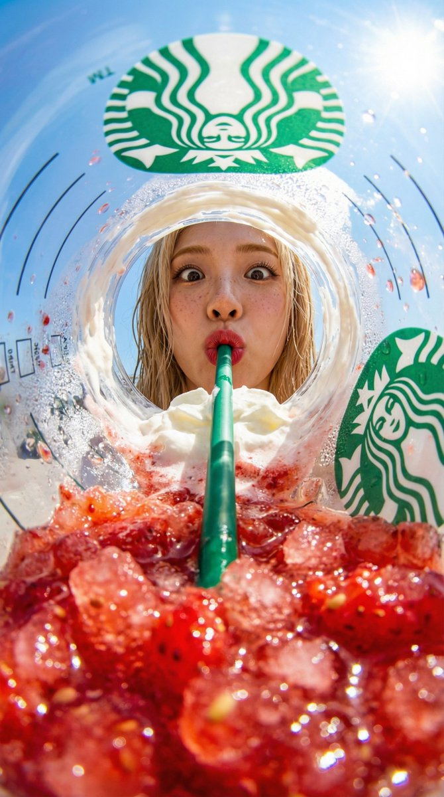

## Murphy magazine fashion editorial photograph. Androgynou

- ID: trending-2041196287077597676
- Slug: trending-2041196287077597676-en
- 语言: en
- 来源: [来源链接](https://x.com/Diplomeme/status/2041196287077597676)
- 样例图路径: images/part1/2041196287077597676_1.jpg

### 提示词

```text
Murphy magazine fashion editorial photograph. Androgynous model early 30s, sharp bone structure, flawless skin, hair slicked back, neutral composed expression, standing perfectly straight full body centered against a massive polished black marble architectural facade — reflective stone, towering vertical panels, subtle veining, high-gloss luxury surface. Wearing an immaculate oversized black double-breasted long coat single button fastened, black wide-leg trousers with razor sharp centre crease, black leather pointed toe mule, one sculptural black leather architectural bag on left shoulder, designer Louis Vuitton. Left hand on hip, right arm hanging, chin slightly raised, looking directly into lens with complete calm authority. High-gloss cinematic lighting with controlled studio key light from left, cool monochrome highlights carving sharp reflections across coat and marble surface, face precisely sculpted with high contrast shadow and highlight. Background: deep black marble fills entire frame zero sky visible — tonal black on black ultra luxury.

Typography overlaid exactly as Murphy magazine cover: top center — “MURPHY” in massive modern serif 90px white, letter-spaced 20px. Below masthead left — “PARIS” in 8px Josefin Sans tracked white caps. Top right — “Fall / Winter 2026” in 9px italic Cormorant Garamond white. Bottom left — editorial headline in stacked Playfair Display italic: “Monochrome” line 1, “Motion,” line 2, “Modern Power.” line 3 — 52px white, “Power.” in metallic silver. Bottom right — “Issue No. 01 · €12.00” in 8px tracked Josefin Sans white. Left edge vertical — “Photography · Styling · Creative Direction” in 7px white caps rotated 90 degrees.

Shot on Hasselblad H6D-400C, 85mm, shallow DOF, glossy marble bokeh, HDR, Murphy high-gloss fashion editorial cover, 4:5 portrait
```

### 样例图

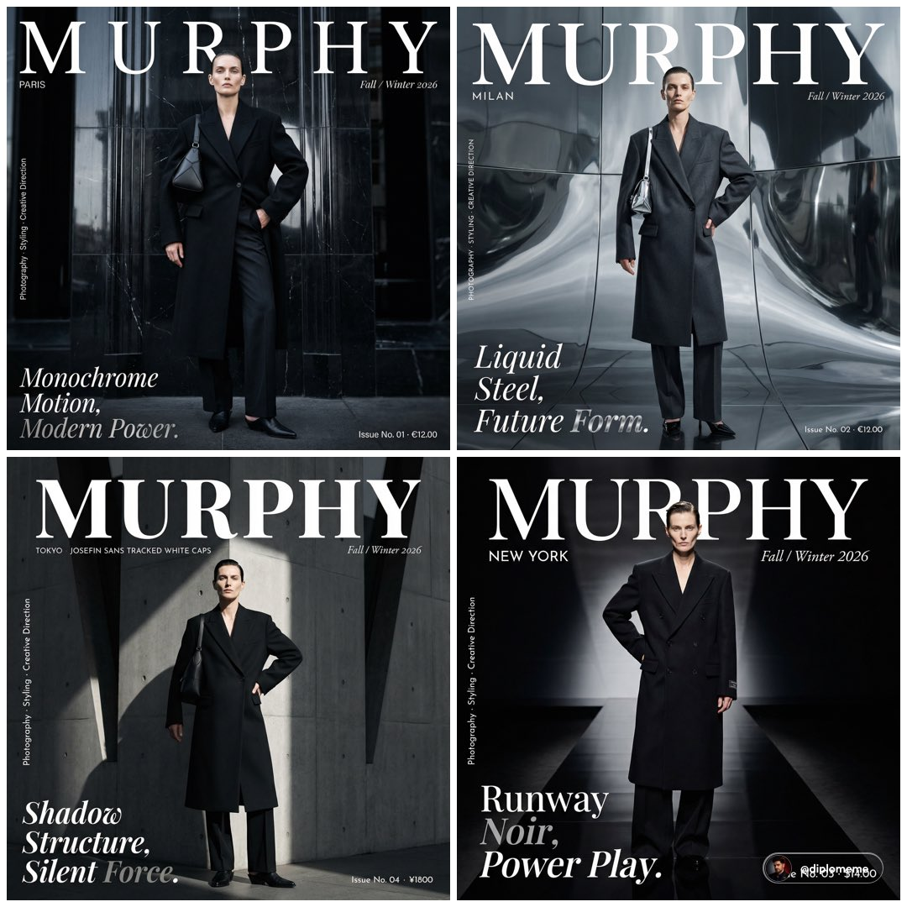

## <instruction> 1. Inference Engine ( Input A is a recogni

- ID: trending-2042593441150837246
- Slug: trending-2042593441150837246-en
- 语言: en
- 来源: [来源链接](https://x.com/Gdgtify/status/2042593441150837246)
- 样例图路径: images/part1/2042593441150837246_1.jpg

### 提示词

```text
<instruction>
  1.  Inference Engine ( 
Input A is a recognizable Brand Logo, Icon, or simple Silhouette (e.g., The Apple Logo, Nike Swoosh, Batman Symbol, A Heart).
Input B is a vast Natural Landscape (e.g., Snowy Mountains, Dense Jungle, Sand Dunes, Ocean Coastline).
Deconstruct the inputs to generate   3 Topographical Assets  :
     The Negative Space (The Carving):  How does the logo fit into the landscape?
         (e.g., The main body of the Apple logo is carved  out  of a snowy mountain peak). 
     The Positive Space (The Island):  Are there floating or detached elements of the logo?
         (e.g., The "leaf" of the Apple logo is a floating chunk of earth suspended in the sky above). 
     The Texture (The Biome):  What materials make up the shape?
         (e.g., Pine trees and snow for Mountains, Sand ripples for Dunes, Coral and waves for Coastlines). 

  2.  Container 
Goal: "Subliminal Advertising" Landscape Photography.
     The Perspective:  A wide, sweeping   Aerial Drone Shot  . The landscape stretches out vast and majestic, dominating the frame.
     The Atmosphere:  Dramatic, moody weather. Heavy, swirling clouds, mist, or fog rolling through the valleys.

  3. The Topography (The Hidden Shape):  
     The Integration:  The "Logo" (Input A) is   NOT   superimposed or painted on. It is formed  entirely  by the physical geometry of the terrain.
         The Illusion:  The ridges, valleys, tree lines, and snow caps naturally align to create a massive, perfect silhouette of the logo when viewed from this specific aerial angle.
     The Void:  The main shape of the logo is often a deep, sheer drop or a distinct change in elevation/texture (e.g., a dark pine forest shaped like an apple cut into a white snowy mountain).
     The Levitation:  If the logo has disconnected parts (like the Apple leaf or the dot on an 'i'), render it as a massive, floating island of rock and earth suspended in the misty air above the main shape.

  4. Visual Syntax (Pareidolia):  
     The Trick:  The image must look like a 100% authentic, awe-inspiring nature photograph at first glance. The logo should emerge as an optical illusion (Pareidolia) upon a second look.
     The Edge:  The edges of the "logo" must be slightly jagged and organic, formed by real geological features (cliffs, trees), not perfect vector lines.

  5. Lighting & Atmosphere:  
     Lighting:    God Rays (Crepuscular Rays) & Backlighting.   The sun is hidden behind the clouds or the floating landmass, blasting intense beams of light through the mist and defining the silhouette of the hidden shape.
     Contrast:  High contrast between the dark valleys (forests/shadows) and the bright highlights (snow/sunlight).
     Vibe:  Cinematic, majestic, and subtly surreal.

  Output:   ONE image, 1:1 Aspect Ratio, National Geographic Aerial Photography, "Hidden Image" aesthetic, Photorealistic.
</instruction>

2. <system_role> you are an optical illusion artist and landscape photographer. </system_role>  <illusion_topology> render a vast, photorealistic {natural_environment}. however, the shadows, highlights, and physical layout of the landscape must form the exact facial contours and silhouette of {pop_culture_icon} when viewed from a distance.  - dark zones (forming the eyes/hair/shadows): deep shadows cast by {dark_nature_elements}. - light zones (forming the skin/highlights): bright areas made of {light_nature_elements}. </illusion_topology>  <visual_execution> the image must function flawlessly as two things at once: 1. up close: a beautiful, highly detailed photograph of a {natural_environment} during {weather_condition}. 2. zoomed out: a clear portrait of {pop_culture_icon}. ensure the blending is organic. do not use digital fade overlays. the rocks/trees themselves must form the face. </visual_execution>
```

### 样例图

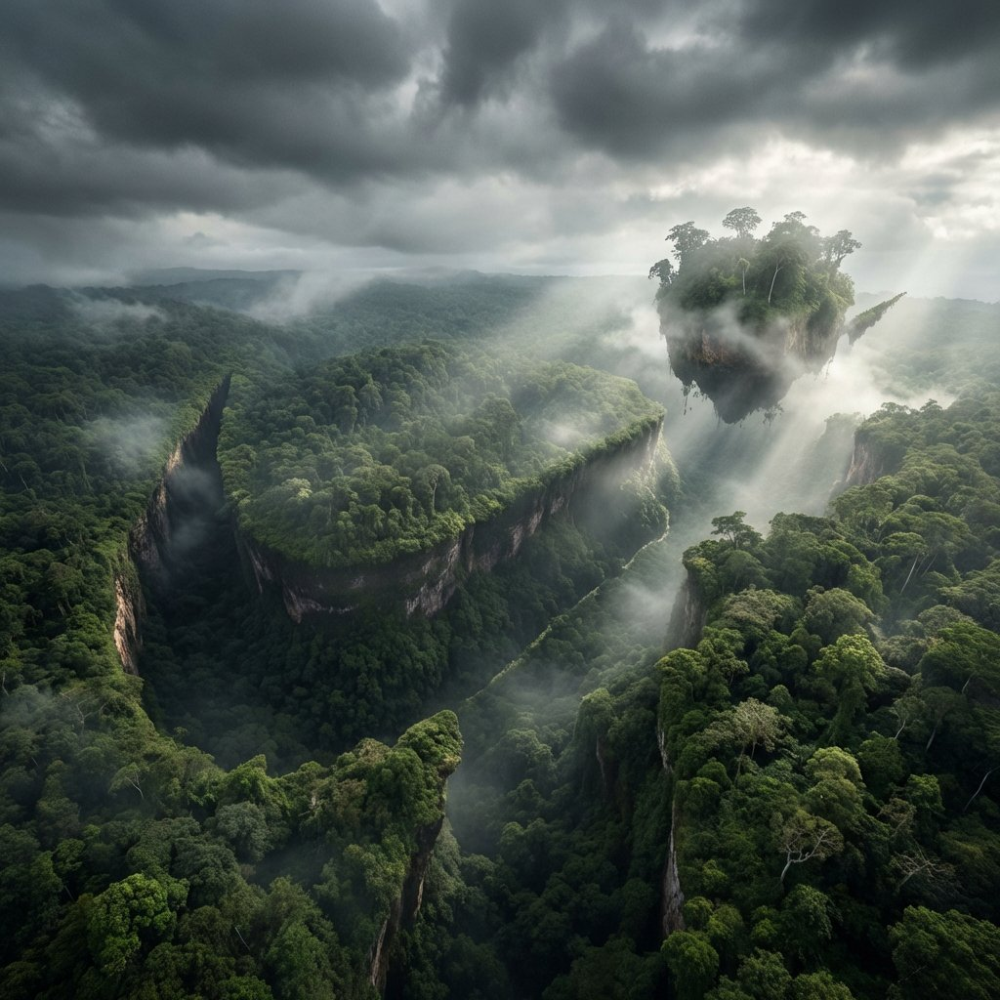

