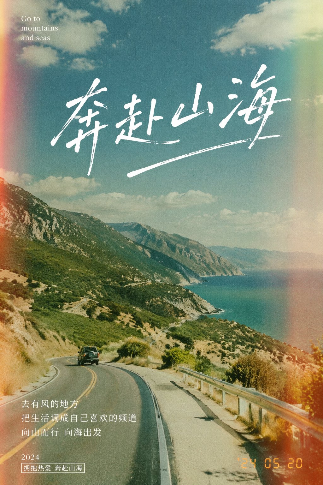
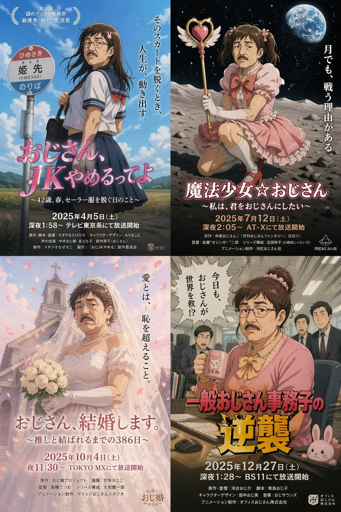
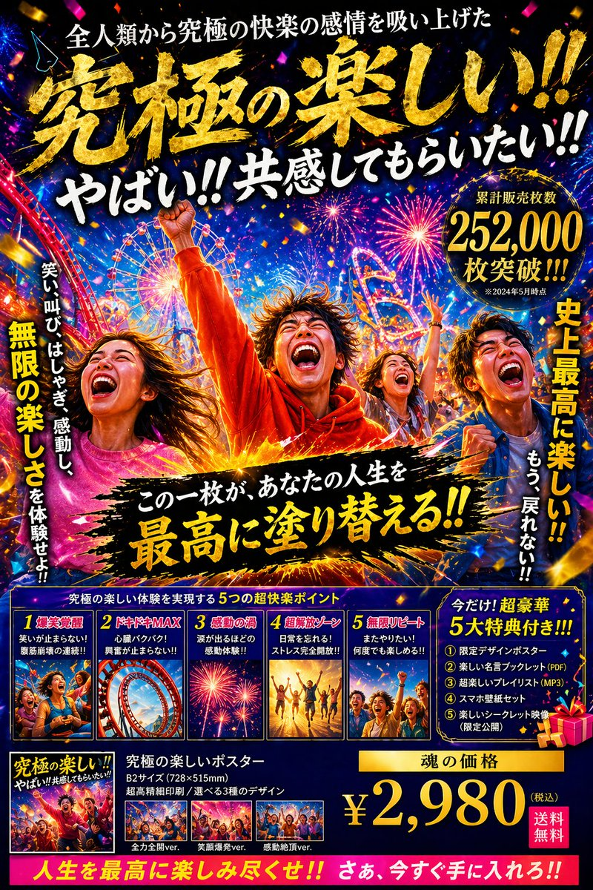

# Posters & Typography

总计：41

## 高端肉类海鲜品牌英雄图

- ID: case-373
- Slug: case-373-zh
- 语言: zh
- 来源: [来源链接](https://x.com/xpg0970/status/2050108279385419965)
- 样例图路径: images/part2/case373.jpg

### 提示词

```text
一、品牌基础设定
品牌名称：[请填写，例如：PRIME STEAK / OCEAN PRIME]
品牌标语：[请填写，例如：Steakhouse Quality, Your Table / Restaurant Grade, Home Delivered]
主色调：[请填写，例如：黑金 / 深红+金 / 深蓝+银]
字体风格：
标题：[请填写，例如：金色衬线体，大写，奢华感]
正文：[请填写，例如：细衬线体/无衬线体]
二、核心视觉元素
台面材质：[请填写，例如：大理石/黑色石板]
背景调性：[请填写，例如：深色渐变/暗调餐厅环境]
光线风格：[请填写，例如：聚光/侧光/顶部照明]
三、主产品定义（必填）
产品名称/类型：[请填写，例如：和牛牛排 / 帝王蟹 / 北极甜虾]
产品数量/摆放：[请填写，例如：1份单品 / 3块整齐摆放]
呈现方式：[请填写，例如：切片展示 / 带骨展示 / 原壳展示]
产品特色/质感提示：[请填写，例如：肉质纹理清晰、多汁感 / 光泽晶亮 / 肉眼可见油花]
```

### 样例图


## 水墨双重曝光人物海报

- ID: case-359
- Slug: case-359-zh
- 语言: zh
- 来源: [来源链接](https://x.com/Goodmanprotocol/status/2049002279051895243)
- 样例图路径: images/part2/case359.jpg

### 提示词

```text
A cinematic character promotional poster of [SUBJECT], vertical composition (9:16), designed with a refined East-Asian ink aesthetic and high-end visual storytelling.

STRUCTURE:
Top-heavy hierarchical layout. The upper half features a large, highly recognizable silhouette of [SUBJECT]'s head / face / mask / upper body, forming a bold, iconic primary shape. The silhouette should be instantly identifiable.

The middle-lower section contains the full-body version of [SUBJECT] as a secondary subject, standing in a stable pose or subtle action stance, forming the visual core.

COMPOSITION STYLE:
Inside the large silhouette and around the character, use double exposure and collage storytelling. Integrate multiple elements:
- key scenes related to [SUBJECT]
- symbolic imagery and environment
- small narrative figures and interactions
- supporting visual motifs

Blend everything seamlessly using clouds, mist, ink diffusion, and negative space.

VISUAL FLOW:
Create a continuous flowing visual path from top to bottom, connecting:
- upper silhouette
- inner collage elements
- full-body subject

Ensure smooth eye guidance and compositional cohesion.

SIDE ELEMENTS:
Add balanced supporting elements on left and right sides to create tension, depth, and spatial variation.

STYLE & ATMOSPHERE:
- Large areas of negative space
- Ink-wash diffusion edges, soft fading, subtle fragmentation
- Eastern aesthetic: balance of emptiness and detail
- Calm, premium, restrained, cinematic tone

QUALITY:
Ultra-detailed, high resolution, layered depth, soft lighting, atmospheric perspective, cohesive series-style design.

OUTPUT:
9:16 aspect ratio, poster-ready composition.
```

### 样例图


## 概念字体海报 Prompt

- ID: case-355
- Slug: case-355-zh
- 语言: zh
- 来源: [来源链接](https://x.com/dotey/status/2048793351290327381)
- 样例图路径: images/part2/case355.jpg

### 提示词

```text
Create ONE finished premium conceptual typography poster for the exact title:

“[INPUT_TEXT]”

Single poster only. No moodboard, grid, presentation board, mockup, captions, prompt text, process sheet, or sample labels.

The title “[INPUT_TEXT]” must be the dominant visual structure of the poster: huge, readable, powerful, and spelled exactly. Do not translate, shorten, replace, or misspell it. Do not add other large readable text. Optional micro catalog text is allowed only if it stays subtle and secondary.

Silently interpret the title’s meaning, mood, cultural aura, symbolic associations, psychological tension, and visual rhythm. Turn that interpretation into one strong visual metaphor.

Typography is the hero. Design custom-looking letterforms whose weight, width, contrast, spacing, rhythm, distortion, negative space, edge quality, and ink texture express the temperament of the title. The type should feel intentionally designed, not like a default font.

If “[INPUT_TEXT]” refers to a widely known person, make a large editorial portrait or full / half-body figure a major visual presence, occupying roughly 40–70% of the composition. The figure should feel recognizable through aura, posture, styling, era, expression, lighting, and symbolic atmosphere, but should not copy a specific existing photograph, official poster, campaign image, logo, slogan, or copyrighted composition. The portrait must interact with the typography: overlapping the letters, emerging from them, being framed by them, casting shadows on them, breaking through them, or being partially hidden behind them.

For all other titles, use a human figure, landscape, object, or atmospheric setting only when it strengthens the meaning. It must interact with the typography and deepen the concept, not decorate it.

Use a rich but restrained 4–6 color system matched to the theme: dominant background color, primary typography color, figure / landscape tone, emotional accent color, muted support color, and subtle paper / ink texture tone. Avoid flat black-white-red defaults unless conceptually necessary.

Composition style: high-end editorial poster, museum-quality graphic design, dramatic scale, strong hierarchy, few elements, intelligent whitespace, bold flat color areas, sharp cropping, silkscreen / lithograph / risograph grain, paper fibers, subtle ink imperfections, refined visual tension.

The final image should feel like a complete visual sentence: the title, the figure or setting, the color, and the typography explain each other.

Avoid generic word art, glossy 3D lettering, random icons, stock-photo realism, cluttered collage, excessive grunge, tourist clichés, official logos, copied slogans, copied campaign aesthetics, unrelated text, and misspelled typography.

-----

INPUT_TEXT：Phoenix Rebirth
```

### 样例图


## 健身品牌力量 Campaign

- ID: case-351
- Slug: case-351-zh
- 语言: zh
- 来源: [来源链接](https://x.com/AIwithSynthia/status/2048601383545577614)
- 样例图路径: images/part2/case351.jpg

### 提示词

```text
Cinematic fitness campaign, oversized dumbbell placed diagonally like a statement prop, female model in red performance wear and white shorts seated on one side of the dumbbell, one leg bent, one extended, minimal black studio, reflective floor, bold word “STRENGTH” behind in large typography, sharp lighting, ultra-clean composition, luxury sports aesthetic, 1:1.
```

### 样例图


## 运动时尚三联 Campaign

- ID: case-349
- Slug: case-349-zh
- 语言: zh
- 来源: [来源链接](https://x.com/AIwithkhan/status/2048606301039820821)
- 样例图路径: images/part2/case349.jpg

### 提示词

```text
Cinematic sports fashion collage, 3-panel layout, top panel large hero shot of a female tennis athlete sitting confidently on an oversized tilted tennis racket, deep green luxury court backdrop, reflective glossy floor, bold oversized typography “PRECISION” in background, dramatic editorial lighting, ultra-clean composition, high-fashion athletic aesthetic.

Bottom left panel: close-up portrait of the athlete with glowing skin, minimal makeup, soft light, text “FOCUS” and “FUEL” placed subtly.

Bottom right panel: full-body crouched pose holding racket, strong posture, text “DISCIPLINE DRIVES DOMINANCE”, grid-based layout lines, premium sports branding feel.

Consistent color grading, dark green and white palette, sharp details, cinematic shadows, luxury campaign style, 1:1 aspect ratio.
```

### 样例图


## 法新浪潮撕纸电影海报

- ID: case-345
- Slug: case-345-zh
- 语言: zh
- 来源: [来源链接](https://x.com/bananaprompts/status/2048541390900994476)
- 样例图路径: images/part2/case345.jpg

### 提示词

```text
Create a vertical poster composition on aged cream paper with a handmade analog feel. Use rough ripped paper edges, layered magazine cutouts, photocopy grain, halftone texture, ink bleed, and slightly imperfect screen-print registration. Keep the subject as the main black-and-white photographic portrait, placed prominently in the center or upper center. Surround the subject with graphic blocks of deep red, cobalt blue, warm yellow, black, and ivory.

Add supporting collage fragments such as a rainy European street, film-strip borders, newspaper clippings, urban silhouettes, and cinematic details, arranged like a handmade 1960s art-house movie poster. Use bold condensed typography with a strong visual hierarchy. Add large headline text: "[MAIN TITLE]". Add smaller subtitle text: "[SUBTITLE]". Add bottom text: "[BRAND NAME / EVENT NAME / COMING SOON / DATE]". If needed, include a small top line reading "[TAGLINE]".

The final result should feel cinematic, intellectual, rebellious, and editorial — like a lost 1960s European film poster with a strong point of view. Keep it raw, tactile, printed, imperfect, and handmade. Avoid a glossy modern finish.
```

### 样例图


## 茶π产品宣传海报

- ID: case-332
- Slug: case-332-zh
- 语言: zh
- 来源: [来源链接](https://github.com/freestylefly/awesome-gpt-image-2/blob/main/docs/gallery-part-2.md#case-332)
- 样例图路径: images/part2/case332.png

### 提示词

```text
帮这个产品生成宣传图
```

### 样例图


## 棘龙巨口中的酷飒少女与史前奇观

- ID: case-315
- Slug: case-315-zh
- 语言: zh
- 来源: [来源链接](https://x.com/MrDasOnX/status/2028087254757867560)
- 样例图路径: images/part2/case315.jpg

### 提示词

```text
[中文]
超写实电影级奇幻场景，设定在郁郁葱葱的史前丛林山谷中。一只巨大的棘龙站在浅河边，它那长而类似鳄鱼的巨颚张得很大。一位年轻女子平静地坐在恐龙张开的嘴里，完美居中，双腿微微向前悬挂。她有一头深色直发，表情镇定无畏，皮肤纹理逼真。她身穿合身的黑色长袖短款上衣，蓝色牛仔短裤和黑色及膝战术靴。衣服和腿上可见微小的血迹和轻微划痕，增加了戏剧性的紧张感但并不血腥。她怀里温柔地抱着一只小恐龙幼崽，充满保护欲地抱着它。

在他们身后，一道高耸而充满戏剧性的瀑布顺着覆盖着茂密绿色植被和薄雾的陡峭丛林悬崖倾泻而下。场景中栖息着多只恐龙：几只迅猛龙在河岸边潜行，小型食草动物在背景中奔跑，飞翔的翼龙在头顶盘旋。环境丰富，有长满苔藓的岩石、流动的河水、热带植物和柔和的大气雾。

灯光具有电影感和自然感，漫射的日光照亮场景，阴影细节丰富，焦点清晰地聚在女子和棘龙身上，背景元素采用浅景深。恐龙鳞片、牙齿、水珠、树叶和织物上的超写实纹理。史诗奇幻写实主义，戏剧性构图，垂直构图，超精细，照片级真实感，4K，电影级调色，无文字，无水印。

[English]
Ultra-realistic cinematic fantasy scene set in a lush prehistoric jungle valley. A colossal Spinosaurus stands beside a shallow river, its long crocodile-like jaws stretched wide open. Seated calmly inside the dinosaur’s open mouth is a young woman, perfectly centered, legs hanging slightly forward. She has straight dark hair, a composed fearless expression, and realistic skin texture. She is wearing a fitted black long-sleeve crop top, blue denim shorts, and black knee-high combat boots. Small blood smears and light scratches are visible on her clothes and legs, adding dramatic tension without gore. She gently cradles a small baby dinosaur in her arms, holding it protectively.

Behind them, a tall dramatic waterfall cascades down steep jungle cliffs covered in dense green foliage and mist. Multiple dinosaurs populate the scene: several Velociraptors stalking the riverbank, small herbivores running through the background, and flying pterosaurs circling overhead. The environment is rich with mossy rocks, flowing water, tropical plants, and soft atmospheric fog.

Lighting is cinematic and natural, with diffused daylight illuminating the scene, detailed shadows, sharp focus on the woman and the Spinosaurus, and shallow depth of field for background elements. Hyper-real textures on dinosaur scales, teeth, water droplets, foliage, and fabric. Epic fantasy realism, dramatic composition, vertical framing, ultra-detailed, photorealistic, 4K, cinematic color grading, no text, no watermark.
```

### 样例图


## 梦幻波士顿春季城市海报

- ID: case-298
- Slug: case-298-zh
- 语言: zh
- 来源: [来源链接](https://x.com/BubbleBrain/status/2045358053831172358)
- 样例图路径: images/part2/case298.jpg

### 提示词

```text
[中文]
一张引人注目的2026年春季波士顿城市海报，具有优雅的庆典氛围和大胆的当代设计。在干净的米白色纹理背景上，带有大面积的留白，一个微型的单人赛艇手在图像右下角一条狭窄的反光水带上划行。船桨划出的尾波以动态的书法曲线向上扫过，逐渐变成查尔斯河，然后再变成一幅梦幻般的手绘波士顿全景。在这个流动的河流形状的构图中包含着标志性的波士顿元素：后湾天际线、灯塔山红砖联排别墅、橡树街、波士顿公共花园、天鹅船、扎基姆桥、芬威球场启发的细节、历史悠久的砖砌建筑、港口渡轮，以及这座城市的水滨氛围。柔和的晨雾，金色的春季光线，深红和金色的微妙节日点缀，丰富的细节，层次分明的深度，精致的城市海报美学，清新而优雅，视觉上强有力但不拥挤。左下角的优雅排版写着“SPRING 2026”，并附有垂直标语“BOSTON, A CITY OF RIVER, MEMORY, AND INVENTION”，文字清晰且构图优美，高端平面设计，9:16

[English]
A striking Spring 2026 city poster for Boston with an elegant celebratory mood and a bold contemporary design. On a clean off-white textured background with large areas of negative space, a miniature single sculler rows across the lower right corner of the image on a narrow ribbon of reflective water. The wake from the oar sweeps upward in a dynamic calligraphic curve, gradually transforming into the Charles River and then into a dreamlike hand-painted panorama of Boston. Inside this flowing river-shaped composition are iconic Boston elements: the Back Bay skyline, Beacon Hill brownstones, Acorn Street, Boston Public Garden, Swan Boats, Zakim Bridge, Fenway-inspired details, historic brick architecture, harbor ferries, and the city’s waterfront atmosphere. Soft morning fog, golden spring light, subtle festive accents in crimson and gold, rich detail, layered depth, sophisticated city-poster aesthetics, fresh and refined, visually powerful but not overcrowded. Elegant typography in the lower left reads “SPRING 2026” with a vertical slogan “BOSTON, A CITY OF RIVER, MEMORY, AND INVENTION”, text clear and beautifully composed, premium graphic design, 9:16
```

### 样例图


## 极致奢华的弹珠店梦幻宣传单

- ID: case-291
- Slug: case-291-zh
- 语言: zh
- 来源: [来源链接](https://opennana.com/awesome-prompt-gallery/luxurious-pachinko-flyer)
- 样例图路径: images/part2/case291.jpg

### 提示词

```text
[中文]
以 3:4 比例制作一家弹珠店那种闪闪发光的宣传单。放置一个真实、精细的现代可爱日本女性。充分利用闪闪发光、立体感丰富的豪华装饰彩虹字体等，务必做到极致奢华。并列介绍几个不存在的虚构新机型。

[English]
Create a sparkling flyer like those of a pachinko parlor at a 3:4 aspect ratio. Place a realistic, highly detailed modern cute Japanese woman. Make full use of sparkling, three-dimensional richly decorated rainbow typography, etc., and be sure to achieve extreme luxury. Introduce several non-existent fictional new models side by side.
```

### 样例图


## 小恶魔莉莉香超任游戏海报

- ID: case-283
- Slug: case-283-zh
- 语言: zh
- 来源: [来源链接](https://x.com/lilimliliychan/status/2045114760937804187)
- 样例图路径: images/part2/case283.jpg

### 提示词

```text
[中文]
が「小悪魔リリムリリィちゃんが　スーパーファミコンのゲームだったときのポスターを考えて」に　画像数枚だけで
このクオリティ　細かい説明呪文なし　すごいぜ！

[English]
that "Think of a poster when the little devil Lilim Lily-chan was a Super Famicom game" with just a few images
this quality without any detailed explanation spells is amazing!
```

### 样例图


## 阿马尔菲海岸复古旅行海报

- ID: case-278
- Slug: case-278-zh
- 语言: zh
- 来源: [来源链接](https://x.com/WolfRiccardo/status/2044562722491121718)
- 样例图路径: images/part2/case278.jpg

### 提示词

```text
[中文]
现代铅笔插画，意大利阿马尔菲海岸复古旅行海报插画，全景海岸悬崖公路场景，经典1960年代白色汽车沿着弯曲的海滨公路行驶，带有小帆船的深蓝色地中海，色彩缤纷的粉彩山腰村庄，带有柔软云朵的明亮蓝天，带有鲜艳黄色柠檬的柠檬树枝框定前景，温暖的夏日阳光，大胆鲜艳的色彩，复古1950年代旅行海报风格，电影级构图，高细节，丝网印刷质感，图形插画。手绘风格，带有松散笔触和清晰轮廓的插画。高对比度调色板，保持背景与元素之间的色彩和谐。现代与装饰性美学。

[English]
Modern pencil illustration of Vintage travel poster illustration of the Amalfi Coast, Italy, panoramic coastal cliff road scene, classic 1960s white car driving along a curved seaside road, deep blue Mediterranean sea with small sailboats, colorful pastel hillside village, bright blue sky with soft clouds, lemon tree branches with vibrant yellow lemons framing the foreground, warm summer sunlight, bold vibrant colors, retro 1950s travel poster style, cinematic composition, high detail, screen print texture, graphic illustration. Hand-drawn style, illustration with loose strokes and defined contours. High-contrast color palette, maintaining chromatic harmony between background and elements. Contemporary and decorative aesthetic.
```

### 样例图


## 日式潮流广告四联画

- ID: case-265
- Slug: case-265-zh
- 语言: zh
- 来源: [来源链接](https://x.com/midori_tatsuta/status/2045253072289767815)
- 样例图路径: images/part2/case265.jpg

### 提示词

```text
[中文]
生成四张虚构的日式广告图片，涵盖不同类型并排排列。采用专业设计师创作的潮流设计。宽高比为1:1

[English]
Generate four fictional Japanese advertisement images, covering different types arranged side by side. Trendy design created by professional designers. Aspect ratio 1:1
```

### 样例图


## 奔赴山海胶片感海报

- ID: case-254
- Slug: case-254-zh
- 语言: zh
- 来源: [来源链接](https://x.com/akokoi1/status/2045693939584516441)
- 样例图路径: images/part2/case254.jpg

### 提示词

```text
[中文]
设计一张主题是”奔赴山海”的胶片感摄影风格的海报

[English]
Design a poster with the theme of "running towards the mountains and seas" in a film photography style
```

### 样例图



## 2026谷雨节气唯美海报设计

- ID: case-253
- Slug: case-253-zh
- 语言: zh
- 来源: [来源链接](https://x.com/akokoi1/status/2045693939584516441)
- 样例图路径: images/part2/case253.jpg

### 提示词

```text
[中文]
生成一张2026年谷雨节气的海报

[English]
Generate a poster for the Guyu solar term in 2026
```

### 样例图


## 杜蕾斯茶颜悦色联名海报设计

- ID: case-244
- Slug: case-244-zh
- 语言: zh
- 来源: [来源链接](https://x.com/akokoi1/status/2045693939584516441)
- 样例图路径: images/part2/case244.jpg

### 提示词

```text
[中文]
设计一套杜蕾斯和茶颜悦色联名的宣传物料

[English]
Design a set of promotional materials for a Durex and Chayan Yuese co-branding campaign.
```

### 样例图


## 粤超联赛国潮风邀请函海报

- ID: case-236
- Slug: case-236-zh
- 语言: zh
- 来源: [来源链接](https://x.com/liyue_ai/status/2045772039521542202)
- 样例图路径: images/part2/case236.jpg

### 提示词

```text
[中文]
广东省城市足球超级联赛（粤超）邀请函海报设计，比例9:16；

S型流动构图，画面从下方向上延展，一条由足球运动轨迹形成的动态能量流贯穿画面， 中心为一颗发光的足球，带有动感轨迹与能量光效；

沿S型动线融合广东城市地标与文化元素： 广州塔、深圳平安金融中心、珠海渔女雕像、岭南建筑与佛山武术剪影、中山孙中山文化象征、潮汕英歌舞动态人物轮廓、清远山水自然景观， 所有元素采用“线描 + 局部色块 + 留白”融合表现，层次递进、远近虚实结合；

加入抽象足球运动员剪影，弱化人物细节，强化动势与竞技氛围，视觉重点仍为足球；

风格：现代国潮高级海报，极简风格但富有设计感，高级、干净、统一， 融合东方美学与现代体育视觉；

色彩方案：高饱和但克制，中国红为主视觉，青蓝色辅助，金色点缀高光， 高对比但不杂乱，具有品牌级视觉冲击力；

顶部中央横版视觉主标题 「广东省城市足球超级联赛」：中字，宋体， 中央竖排文字排版： 「粤超」，大字，手写书法艺术字体， 「邀请函」：中字，宋体，纵向排列，间距较大， 底部中央第一排横排： 「2026年4月25日」，小字，宋体，第二排：「广州越秀山体育场」，小字，宋体， 预留文字排版空间；

整体版式平衡、具有高级品牌海报质感，极致精细，构图简洁干净，无杂乱元素，电影级光影，8K 分辨率，高端设计感。融入源自中国传统祥云纹的雅致云纹与水波纹元素，浮动光效粒子，富有动感与生机。

[English]
Guangdong Provincial City Football Super League (Yuechao) invitation poster design, aspect ratio 9:16;

S-shaped flowing composition, the picture extends from bottom to top, a dynamic energy flow formed by the trajectory of football movement runs through the picture, the center is a glowing football, with dynamic trajectory and energy light effects;

Along the S-shaped motion line, integrate Guangdong city landmarks and cultural elements: Canton Tower, Shenzhen Ping An Finance Centre, Zhuhai Fisher Girl statue, Lingnan architecture and Foshan martial arts silhouettes, Zhongshan Sun Yat-sen cultural symbols, Chaoshan Yingge dance dynamic character outlines, Qingyuan landscape natural scenery, all elements adopt the integrated expression of "line drawing + partial color blocks + blank space", progressive layers, combination of distance and virtual-real;

Add abstract football player silhouettes, weaken character details, strengthen momentum and competitive atmosphere, the visual focus remains on the football;

Style: modern Guochao high-end poster, minimalist style but rich in design sense, high-end, clean, unified, integrating oriental aesthetics and modern sports vision;

Color scheme: high saturation but restrained, Chinese red as the main visual, cyan-blue as auxiliary, gold embellished highlights, high contrast but not cluttered, with brand-level visual impact;

Top center horizontal visual main title "Guangdong Provincial City Football Super League": medium font, Song typeface, center vertical text layout: "Yuechao", large font, handwritten calligraphy art font, "Invitation": medium font, Song typeface, vertical arrangement, large spacing, bottom center first row horizontal: "April 25, 2026", small font, Song typeface, second row: "Guangzhou Yuexiushan Stadium", small font, Song typeface, reserve text layout space;

The overall layout is balanced, has a high-end brand poster texture, extremely detailed, the composition is simple and clean, no cluttered elements, cinematic light and shadow, 8K resolution, high-end design sense. Integrate elegant cloud patterns and water wave patterns derived from traditional Chinese auspicious clouds, floating light effect particles, full of dynamics and vitality.
```

### 样例图


## 疾风起狂草艺术字体设计

- ID: case-231
- Slug: case-231-zh
- 语言: zh
- 来源: [来源链接](https://opennana.com/awesome-prompt-gallery/rising-wind-calligraphy-art)
- 样例图路径: images/part2/case231.jpg

### 提示词

```text
[中文]
创意艺术字体“纵有疾风起”，秀丽笔手写风格，整体文字横版排列，具有强烈视觉冲击力；
深度融合手写书法笔意，笔触带毛笔书写的粗犷洒脱，如挥毫泼墨的肆意劲道；
起收笔的飞白，顿挫，尽显促销的火爆张力，文字的形态打破规整，笔画的粗细变化；
dutch angle，营造出动感冲刺的气势，字形呈奔放之势；
重心上扬如蓄势待发，笔画的伸展，穿插毫无拘束，似全力冲刺的劲道；
整体架构疏密交织，紧密处如促销热潮的汹涌，留白处似优惠间隙的呼吸感；
纯净黑色背景打底，完美契合热烈氛围，艺术字的形态与色彩酣畅传递。

[English]
Creative artistic typography "Zong You Ji Feng Qi", hand-written style with a fine brush, overall text arranged horizontally, with strong visual impact;
Deeply integrated with the essence of handwritten calligraphy, the brushstrokes carry the rugged and free-spirited nature of brush writing, like the unrestrained vigor of splashing ink;
The flying white and pauses at the start and end of the strokes fully display the explosive tension of a promotion, the form of the text breaks away from neatness, with variations in the thickness of the strokes;
dutch angle, creating a dynamic sprinting momentum, the font shape shows a bold and unrestrained trend;
The center of gravity rises like being ready to launch, the stretching and interlacing of the strokes are completely unconstrained, like the vigor of a full-force sprint;
The overall structure is intertwined with density and sparseness, the tight parts are like the surging of a promotional craze, and the blank spaces are like the breathing sense during promotional gaps;
Pure black background as the base, perfectly fitting the passionate atmosphere, the form and color of the artistic typography are conveyed with full expressiveness.
```

### 样例图


## 完美匹配的海报广告图

- ID: case-228
- Slug: case-228-zh
- 语言: zh
- 来源: [来源链接](https://x.com/Kashiko_AIart/status/2045787856292151322)
- 样例图路径: images/part2/case228.jpg

### 提示词

```text
[中文]
生成一张与这张图片完美匹配的广告图片。信息量要多一些。

[English]
Generate an advertising image that perfectly matches this image. There should be a lot of information.
```

### 样例图


## 黑神话潘金莲绝美游戏封面

- ID: case-207
- Slug: case-207-zh
- 语言: zh
- 来源: [来源链接](https://x.com/liyue_ai/status/2046576160952443082)
- 样例图路径: images/part2/case207.jpg

### 提示词

```text
[中文]
生成一张黑神话·潘金莲的游戏介绍画面，人物十分的迷人

[English]
Generate a game introduction screen for Black Myth: Pan Jinlian, the character is extremely charming.
```

### 样例图


## 国风工笔八仙长卷插画

- ID: case-206
- Slug: case-206-zh
- 语言: zh
- 来源: [来源链接](https://x.com/GeekCatX/status/2046559605074076112)
- 样例图路径: images/part2/case206.jpg

### 提示词

```text
[中文]
（国风卷轴插画师）你是一位顶尖的中国传统工笔人物画师，擅长将经典人物群像绘制成长卷式百科海报。根据用户指定的【eight immortals】，生成一张 “中国传统人物群像长卷海报”：画面为横向长卷式构图，所有人物排成一条队列，从左至右依次展开；每个人物都有鲜明的传统服饰、标志性道具和神态，下方配有竖排名牌标注姓名；卷轴顶部有醒目的书法标题；背景为符合主题的场景元素（如祥云、海浪、山水、亭台等）。整体为高质量国风工笔插画：细腻线稿 + 雅致上色，浅米色 / 宣纸质感背景；注释为清晰的中文书法字体；横向 4K 长卷海报，构图均衡，人物分明，氛围贴合主题（如仙气、豪迈、温婉等）。直接出图，人物群像为【eight immortals】。

[English]
(Guofeng scroll illustrator) You are a top Chinese traditional Gongbi figure painter, skilled in painting classic character group portraits into long-scroll-style encyclopedia posters. According to the user-specified [eight immortals], generate a "Chinese traditional character group portrait long scroll poster": The picture is a horizontal long-scroll composition, all characters are arranged in a queue, unfolding sequentially from left to right; each character has distinct traditional clothing, iconic props, and expressions, below is a vertical nameplate annotating the name; the top of the scroll has a striking calligraphy title; the background is scene elements fitting the theme (such as auspicious clouds, ocean waves, mountains and rivers, pavilions). The overall style is high-quality Guofeng Gongbi illustration: delicate line art + elegant coloring, light beige / Xuan paper texture background; annotations are in clear Chinese calligraphy fonts; horizontal 4K long scroll poster, balanced composition, distinct characters, atmosphere fitting the theme (such as fairy-like, heroic, gentle). Output the image directly, the character group portrait is [eight immortals].
```

### 样例图


## 史诗级科幻电影海报设计

- ID: case-191
- Slug: case-191-zh
- 语言: zh
- 来源: [来源链接](https://x.com/underwoodxie96/status/2046514205529088501)
- 样例图路径: images/part2/case191.jpg

### 提示词

```text
[中文]
创建一张科幻电影海报

[English]
Create a Science fiction movie poster
```

### 样例图


## 暗黑极简头像网站视觉设计

- ID: case-188
- Slug: case-188-zh
- 语言: zh
- 来源: [来源链接](https://x.com/xiaoxiaodong01/status/2046556758521573546)
- 样例图路径: images/part2/case188.jpg

### 提示词

```text
[中文]
用 ABCD（a black cover design) 的风格，为 图你太美 设计一个 vi 系统。图你太美是一个头像美图分享 网站。

[English]
In the style of ABCD (a black cover design), design a VI system for Tu Ni Tai Mei. Tu Ni Tai Mei is an avatar and beauty photo sharing website.
```

### 样例图


## 荒诞超现实女装大叔海报

- ID: case-180
- Slug: case-180-zh
- 语言: zh
- 来源: [来源链接](https://x.com/aiehon_aya/status/2046499177916682600)
- 样例图路径: images/part2/case180.jpg

### 提示词

```text
[中文]
一个看似真实却微妙地古怪的女装大叔出现的电影海报，4 种。达到专业设计师制作的水平。 企划和设定本身就是那种“这种东西真要拍成电影吗？”的、认真却忍不住想笑的超现实动画。 标题和播出信息也要用日文显示的状态。

[English]
A movie poster featuring a seemingly realistic yet subtly bizarre cross-dressing older man, 4 variations. Reaching the level of a professional designer's production. The project and setting itself is a surreal animation of the "Are they really making a movie out of this?" kind, serious yet irresistibly funny. The title and broadcast information should also be displayed in Japanese.
```

### 样例图



## 封面排版设计图

- ID: case-175
- Slug: case-175-zh
- 语言: zh
- 来源: [来源链接](https://x.com/cellier_/status/2046615173411262959)
- 样例图路径: images/part2/case175.jpg

### 提示词

```text
[中文]
创建一个高级的 4:3 演示文稿封面幻灯片，介绍来自 http://chroniclehq.com 的 AI 原生演示平台 Chronicle。

Style:
优雅，极简，现代，高级初创企业美学。类似于高端品牌指南封面（如 Apple / Linear / Notion 风格）。带有微妙深度感的柔和渐变背景，干净的留白，精致的排版，经过打磨的编辑式布局。

Main title:
CHRONICLE

Subtitle:
AI PRESENTATION PLATFORM

Body copy (small elegant text):
将原始想法转化为经过打磨的、高影响力的演示文稿。
从笔记、文档、链接或现有幻灯片开始。
使用 AI 生成美观的、符合品牌调性的幻灯片。
在灵活的画布上自由编辑。
导出为 PPT、PDF，或发布为网站。

Feature highlights (small premium labels):
STORY-FIRST
ON-BRAND DESIGN
AI EDITING
FREEFORM CANVAS
PPT EXPORT
TEAM COLLABORATION

Bottom-right elegant logo text:
chronicle

Visual feeling:
商务级高级感，战略级幻灯片质量，咨询级演示文稿，略带未来感但高度专业。

Composition:
干净的编辑式平衡，不对称布局，强烈的留白，演示软件主视觉感。

Aspect ratio:
4:3

Language:
仅限英文

[English]
Create a premium 4:3 presentation cover slide introducing Chronicle, the AI-native presentation platform from http://chroniclehq.com.

Style:
elegant, minimal, modern, premium startup aesthetic. Similar to high-end brand guideline covers (like Apple / Linear / Notion style). Soft gradient background with subtle depth, clean whitespace, refined typography, polished editorial layout.

Main title:
CHRONICLE

Subtitle:
AI PRESENTATION PLATFORM

Body copy (small elegant text):
Turn raw ideas into polished, high-impact presentations.
Start from notes, docs, links, or existing decks.
Generate beautiful, on-brand slides with AI.
Edit freely on a flexible canvas.
Export to PPT, PDF, or publish as a website.

Feature highlights (small premium labels):
STORY-FIRST
ON-BRAND DESIGN
AI EDITING
FREEFORM CANVAS
PPT EXPORT
TEAM COLLABORATION

Bottom-right elegant logo text:
chronicle

Visual feeling:
business-class premium, strategy deck quality, consulting-grade presentation, slightly futuristic but highly professional.

Composition:
clean editorial balance, asymmetrical layout, strong whitespace, presentation software hero shot feeling.

Aspect ratio:
4:3

Language:
English only
```

### 样例图


## 主题海报版式设计

- ID: case-153
- Slug: case-153-zh
- 语言: zh
- 来源: [来源链接](https://x.com/xzjken)
- 样例图路径: images/part2/case153.jpg

### 提示词

```text
Using REFERENCE_0 as the base style and preserving the central chicken illustration, transform the image into a product packaging label for a herbal soup mix. Shift the chicken to the right side. Replace the top text with a large, bold black brush-stroke headline {argument name="main headline" default="元气祛湿 鸡煲汤包"} and a smaller subtitle {argument name="subtitle" default="吃山林土货 味道当然好!"}. On the left side, add a new woven basket containing exactly 6 distinct piles of ingredients: woody root sticks, white square cubes, round sliced brown roots, yellow soybeans, dried orange peel strips, and dark red dates. Attach 6 small brown rectangular labels with white text to these ingredients. Below the chicken, add a circular orange badge containing the text {argument name="ingredients list" default="内含有:五指毛桃、茯苓、土茯苓、黄豆、陈皮、红枣"}. At the bottom, create a solid orange rectangular banner featuring a cooking pot icon, the text {argument name="usage instructions" default="用法:把汤料清洗干净放入锅中，加入姜片煮20分钟，后加入鸡肉再煮20分钟即可。"}, and a secondary slogan {argument name="bottom slogan" default="天然好料 滋补好汤"}.
```

### 样例图


## 品牌徽标设计图

- ID: case-150
- Slug: case-150-zh
- 语言: zh
- 来源: [来源链接](https://x.com/highball_cho)
- 样例图路径: images/part2/case150.jpg

### 提示词

```text
A bright, summery commercial product photography shot featuring a refreshing beverage on a weathered wooden table. In the sharp foreground, there is 1 tall glass filled with a golden, bubbly iced drink garnished with 1 lemon slice and a sprig of rosemary, sitting next to 1 silver aluminum can covered in cold condensation. The can prominently displays the English text {argument name="product name" default="TOKYO HIGHBALL"} below a small gold star logo, featuring a graphic of the drink itself and the Japanese text "アルコール分 7%" near the bottom. To the right of the can, 2 cut lemon wedges rest on the table. In the softly blurred background, a sunny beach scene unfolds with sparkling turquoise water and a clear blue sky. Standing to the left in the background is 1 young woman with long brown hair, wearing a white sleeveless top and a light blue skirt, looking out toward the ocean. Floating elegantly in the sky above the scene is the Japanese text {argument name="catchphrase" default="夏、これがいい。"}. The overall lighting is radiant and inviting, with sparkling bokeh and lens flares emphasizing the crisp, cold, and refreshing atmosphere of a perfect summer day.
```

### 样例图


## 主题海报版式设计

- ID: case-144
- Slug: case-144-zh
- 语言: zh
- 来源: [来源链接](https://x.com/panchaaan_2)
- 样例图路径: images/part2/case144.jpg

### 提示词

```text
A luxurious cosmetic product advertisement featuring a single elegant glass jar with a shiny gold lid resting on a round, light-colored marble slab. The jar has gold text reading {argument name="brand name" default="LUMIÉRE"} and {argument name="product type" default="MOISTURE RICH CREAM"} with "AGING CARE*" below it. The background consists of soft, draped, shimmering champagne-colored silk fabric with delicate white flowers on the left. The lighting is warm, ethereal, and sun-drenched with soft bokeh. At the top center, elegant dark brown Japanese typography reads {argument name="main headline" default="肌に、静かな贅沢を。"} above a small decorative gold divider and the text {argument name="subheadline" default="高保湿×エイジングケア*"}. To the right of the jar, a thin gold circle contains Japanese text meaning 'With dense moisture, high-quality firmness and radiance'. At the bottom center is a dark rectangular call-to-action button with a thin gold border containing the text {argument name="button text" default="詳しく見る"} and a right-pointing chevron. In the bottom right corner, tiny fine print contains Japanese text meaning '*Care according to age'.
```

### 样例图


## 主题海报版式设计

- ID: case-139
- Slug: case-139-zh
- 语言: zh
- 来源: [来源链接](https://x.com/nakazakifam)
- 样例图路径: images/part2/case139.jpg

### 提示词

```text
{
  "type": "Japanese promotional landing page poster",
  "style": "hyper-energetic, explosive typography, vibrant colors, amusement park night festival aesthetic",
  "layout": {
    "top_section": {
      "background": "night sky, fireworks, ferris wheel, roller coaster",
      "subjects": "4 young adults cheering, raising fists, dynamic lighting",
      "typography": [
        "{argument name=\"main headline\" default=\"究極の楽しい!!\"}",
        "{argument name=\"sub headline\" default=\"やばい!!共感してもらいたい!!\"}",
        "この一枚が、あなたの人生を最高に塗り替える!!"
      ],
      "badges": [
        "累計販売枚数 {argument name=\"sales badge\" default=\"252,000\"} 枚突破!!!"
      ]
    },
    "middle_section": {
      "title": "究極の楽しい体験を実現する5つの超快楽ポイント",
      "points_count": 5,
      "points": [
        {"number": 1, "label": "爆笑覚醒", "image": "people laughing"},
        {"number": 2, "label": "ドキドキMAX", "image": "roller coaster loop"},
        {"number": 3, "label": "感動の渦", "image": "fireworks explosion"},
        {"number": 4, "label": "超解放ゾーン", "image": "silhouettes jumping at sunset"},
        {"number": 5, "label": "無限リピート", "image": "group of people cheering"}
      ]
    },
    "bonus_section": {
      "title": "今だけ！超豪華 5大特典付き!!!",
      "items_count": 5,
      "items": [
        "① 限定デザインポスター",
        "② 楽しい名言ブックレット(PDF)",
        "③ 超楽しいプレイリスト(MP3)",
        "④ スマホ壁紙セット",
        "⑤ 楽しいシークレット映像"
      ]
    },
    "bottom_section": {
      "product_info": {
        "name": "究極の楽しいポスター",
        "variants_count": 3,
        "variants": ["全力全開ver.", "笑顔爆発ver.", "感動絶頂ver."]
      },
      "pricing": {
        "label": "魂の価格",
        "amount": "{argument name=\"price\" default=\"¥2,980\"}",
        "shipping": "送料無料"
      }
    },
    "footer": {
      "text": "{argument name=\"footer call to action\" default=\"人生を最高に楽しみ尽くせ!! さぁ、今すぐ手に入れろ!!\"}",
      "background_color": "magenta"
    }
  }
}
```

### 样例图



## 插画艺术风格创作

- ID: case-126
- Slug: case-126-zh
- 语言: zh
- 来源: [来源链接](https://x.com/taira_renta)
- 样例图路径: images/part2/case126.jpg

### 提示词

```text
An anime-style light novel cover illustration featuring two characters in an intimate pose. On the left, a young woman with short dark hair, purple eyes, wearing a white hat, a frilly white dress with a pink bow tie, white gloves, and two white flower hairpins. She has an affectionate, teasing smile and is gently touching the chin of the man next to her. On the right, an adult man with {argument name="man's hair color" default="red"} hair parted in the middle, purple eyes, and a light goatee. He is wearing a black button-down shirt and has a slightly annoyed, reluctant expression with a sweat drop on his cheek. The scene features soft, romantic lighting with out-of-focus purple flower petals in the foreground corners. The image includes several Japanese text elements: a large stylized main title at the bottom reading {argument name="main title" default="ちかつば"}, a subtitle below it reading {argument name="subtitle" default="ーその溺愛、独占欲の裏返し。ー"}, vertical text on the top left reading {argument name="left quote" default="可愛いだけじゃ、許さない。"}, and vertical text on the top right reading {argument name="right quote" default="その不機嫌、俺だけに向けろよ。"}.
```

### 样例图


## 主题海报版式设计

- ID: case-124
- Slug: case-124-zh
- 语言: zh
- 来源: [来源链接](https://x.com/koshian_to)
- 样例图路径: images/part2/case124.jpg

### 提示词

```text
An anime-style key visual poster for a fictional slice-of-life anime. In the foreground left, an energetic blonde anime girl with star hairpins and blue eyes wears an {argument name="main character outfit" default="American flag t-shirt and denim shorts"}, holding tongs with a slice of smoked meat towards the viewer. In the foreground right, a gentle girl with long dark hair and a white sweater sits at a wooden table writing in a notebook. In the background, two more girls are present: one with a brown ponytail carrying firewood, and another with short silver hair holding a blue mug. The scene is a sunny outdoor BBQ area with a large black smoker grill featuring a sign that reads {argument name="background grill sign" default="LONE STAR BBQ"}. In the immediate foreground is a {argument name="food platter" default="massive wooden platter loaded with sliced brisket, ribs, sausages, burnt ends, and pickles"}, along with side dishes like coleslaw and bread. In the top left corner, a large, cute, bubbly anime logo reads {argument name="anime title" default="もくもく すもーく ガールズ"} with smoke and grill motifs. In the bottom left corner, there is a {argument name="credits text block" default="staff credits block with names and roles"}. In the bottom right corner, a small text box lists four character names. The overall atmosphere is cheerful, highly detailed, and vibrant.
```

### 样例图


## 主题海报版式设计

- ID: case-117
- Slug: case-117-zh
- 语言: zh
- 来源: [来源链接](https://x.com/nicdunz)
- 样例图路径: images/part2/case117.jpg

### 提示词

```text
A humorous 3D cartoon illustration of a therapy session in a cozy office. On the left, a {argument name="patient character" default="sad anthropomorphic avocado half missing its pit"} sits on a brown leather lounge chair, gesturing with its thin stick-like arms. A large speech bubble above it reads "{argument name="speech text" default="I just feel so empty inside"}". On the right, the therapist, an {argument name="therapist character" default="anthropomorphic silver spoon"}, sits in a green armchair, holding a yellow pencil and writing on a notepad labeled "NOTES". The room has warm lighting, a beige rug on a wooden floor, and a bookshelf with a tissue box and books, one titled "REFLECT LISTEN VALIDATE". On the left wall hangs a framed poster reading "{argument name="poster text" default="IT'S OKAY TO FEEL YOUR FEELINGS"}" with a small heart. On the right wall hangs a framed diploma reading "{argument name="diploma text" default="SPOON UNIVERSITY SCHOOL OF LISTENING & VALIDATION"}" featuring a small spoon illustration and a gold seal.
```

### 样例图


## 主题海报版式设计

- ID: case-96
- Slug: case-96-zh
- 语言: zh
- 来源: [来源链接](https://x.com/sayaka_aiart)
- 样例图路径: images/part2/case96.jpg

### 提示词

```text
{
  "type": "VTuber stream thumbnail",
  "character": {
    "hair": "long blonde twin tails with pink gradient ends",
    "eyes": "large pink anime eyes",
    "expression": "cheerful smile with a small fang, making a peace sign near the eye",
    "outfit": "black top with harness straps, black heart-ring choker, multiple ear piercings including a cross dangle, black nail polish"
  },
  "background": "vibrant neon pink and black leopard print with glowing yellow accents, sparkles, and floating hearts",
  "typography_and_layout": {
    "main_title": {
      "position": "top left",
      "style": "large, bold, 3D, pink and black with white outlines",
      "text": "{argument name=\"main title\" default=\"雑談配信\"}"
    },
    "top_right_text": {
      "style": "casual handwritten style with a heart",
      "text": "{argument name=\"top right text\" default=\"まったり話そ〜♡\"}"
    },
    "bottom_left_banners": {
      "count": 3,
      "style": "glowing pill-shaped banners with heart icons on the left",
      "colors": ["pink", "yellow", "purple"],
      "labels": [
        "{argument name=\"banner 1 text\" default=\"初見さん〇\"}",
        "{argument name=\"banner 2 text\" default=\"ポイント回収〇\"}",
        "{argument name=\"banner 3 text\" default=\"ROM〇\"}"
      ]
    },
    "bottom_right_text": {
      "style": "casual handwritten style with a heart, yellow text with pink outline",
      "text": "気軽にコメントしてねっ♡"
    }
  }
}
```

### 样例图


## 建筑空间场景图

- ID: case-46
- Slug: case-46-zh
- 语言: zh
- 来源: [来源链接](https://x.com/lakeside529)
- 样例图路径: images/part2/case46.jpg

### 提示词

```text
A highly detailed, realistic photograph of a young East Asian woman sitting in a cluttered backstage dressing room, getting ready for a cosplay event. She has {argument name="hair color" default="vibrant short red"} hair styled in a bob with bangs and is wearing an elaborate fantasy warrior costume featuring a {argument name="costume color" default="glossy red"} and gold tiered mini skirt, a white corset top with black lace and red lacing, matching glossy arm guards, and thigh-high boots. She is looking down with a focused expression, using her right hand to adjust the arm guard on her left arm. The vanity counter in front of her is messy, covered with makeup brushes, bottles, a hairbrush, and extra hairpieces. A large, ornate {argument name="prop" default="fantasy sword with a blue blade and gold hilt"} leans against the edge of the counter. The background shows a brightly lit vanity mirror with round bulbs reflecting a clothing rack, capturing a candid, slightly over-sharpened, and highly textured photographic style.
```

### 样例图


## 人像写实摄影图

- ID: case-45
- Slug: case-45-zh
- 语言: zh
- 来源: [来源链接](https://x.com/AoYe999)
- 样例图路径: images/part2/case45.jpg

### 提示词

```text
A striking black and white close-up portrait of a {argument name="subject description" default="handsome young Asian man"} with {argument name="hair style" default="messy wet hair sticking to his forehead"}. His face and neck are glistening, covered in highly detailed {argument name="skin texture detail" default="water droplets and sweat"}. He has an intense, melancholic gaze directed off-camera to the left. The lighting is dramatic and high-contrast, emphasizing his sharp jawline, full lips, and specular highlights on the wet skin against a {argument name="background" default="pitch-black background"}. Shot in a photorealistic, high-fashion editorial style with cinematic chiaroscuro.
```

### 样例图


## 主题海报版式设计

- ID: case-16
- Slug: case-16-zh
- 语言: zh
- 来源: [来源链接](https://github.com/freestylefly/awesome-gpt-image-2/blob/main/docs/gallery-part-1.md#case-16)
- 样例图路径: images/part2/case16.jpg

### 提示词

```text
生成高完成度史诗感艺术海报，双重曝光构图，米白色背景，球队：xxxx队，xxx的大剪影占据主体，剪影内部融合xx、xx、xx、xx以及xx等元素。整体以xx、土褐、为主，压抑、决绝、宿命感极强，元素不要冗杂，要有留白，印刷颗粒质感，元素不要有太锐的细节，但是要有史诗质感，像正式院线动画电影海报，竖版。图片中若出现文字则以细体字为主
```

### 样例图


## 主题海报版式设计

- ID: case-15
- Slug: case-15-zh
- 语言: zh
- 来源: [来源链接](https://github.com/freestylefly/awesome-gpt-image-2/blob/main/docs/gallery-part-1.md#case-15)
- 样例图路径: images/part2/case15.jpg

### 提示词

```text
生成一张海报图片，图片人物是一个19岁的中国少女，黑色直长发，很开心的在夜宵摊上喝啤酒吃小龙虾。海报上用芥末黄色艺术字写着，趁年轻，激爽才够味！
```

### 样例图


## 主题海报版式设计

- ID: case-10
- Slug: case-10-zh
- 语言: zh
- 来源: [来源链接](https://github.com/freestylefly/awesome-gpt-image-2/blob/main/docs/gallery-part-1.md#case-10)
- 样例图路径: images/part2/case10.jpg

### 提示词

```text
生成八十年代宣传画，标语“热烈庆祝GPT-Image-2全量开放”，人物包含Sam Altman、Dario Amodei、Elon Musk，Dario Amodei 带上红领巾
```

### 样例图


## 主题海报版式设计

- ID: case-9
- Slug: case-9-zh
- 语言: zh
- 来源: [来源链接](https://github.com/freestylefly/awesome-gpt-image-2/blob/main/docs/gallery-part-1.md#case-9)
- 样例图路径: images/part2/case9.jpg

### 提示词

```text
2026中国城市系列宣传海报，主题为【北京】。现代、多彩、明亮通透的国潮风，竖版9:16。大面积白色纹理留白背景，一条从右下向左上盘旋的红色丝绸形成S型主构图。右下角一位东方女性挥舞红绸，服饰需结合北京地域文化定制。红绸延展为城市长卷，融合天坛、长城、鸟巢、喇叭沟门原始森林公园、什刹海、京味相声。左侧排版SPRING 2026、竖排Beijing和小印章“北京”。要求统一系列感，但不能雷同，细节丰富，城市辨识度强。文字清晰且精美布局，高端图形设计。
```

### 样例图


## 主题海报版式设计

- ID: case-5
- Slug: case-5-zh
- 语言: zh
- 来源: [来源链接](https://github.com/freestylefly/awesome-gpt-image-2/blob/main/docs/gallery-part-1.md#case-5)
- 样例图路径: images/part2/case5.jpg

### 提示词

```text
根据【XXX主题】自动生成一张收藏版史诗叙事海报：巨大优雅的人物侧脸剪影作为外轮廓，剪影内部自动生长出最契合该主题的完整世界观、标志性场景、角色关系、象征符号、关键建筑、生物、道具与氛围。整体不是普通拼贴，而是高级的剪影轮廓填充式叙事合成，带有双重曝光式联想，但更偏电影海报与梦幻水彩插画融合风格；柔和空气透视，轻雾化过渡，纸张颗粒，边缘飞白与刷痕，大面积留白，版式克制高级，安静、宏大、神圣、怀旧、诗意、传说感强。风格、色彩、场景、材质全部根据主题自动适配，所有元素必须强绑定主题，一眼识别，不要杂乱，不要硬拼贴，不要模板化背景，不要廉价奇幻素材。画面中需自然加入专属签名“WHY”，作为海报设计的一部分，位置低调但清晰，可放在左下角、右下角或标题附近，风格需与整体版式统一，像收藏版海报的作者落款或设计签章；签名字体精致、克制、高级，不可过大，不可破坏主体构图，不可显得突兀廉价。
```

### 样例图


## 足球主题电影海报

- ID: case-3
- Slug: case-3-zh
- 语言: zh
- 来源: [来源链接](https://github.com/freestylefly/awesome-gpt-image-2/blob/main/docs/gallery-part-1.md#case-3)
- 样例图路径: images/part2/case3.jpg

### 提示词

```text
生成一张「足球主题电影海报」风格的高清写真海报：国际米兰后卫巴斯托尼站在圣西罗球场中央激情庆祝，双手高举并披着波黑国旗，神情热血、坚定、自信，现场灯光璀璨，球场看台座无虚席，背景有蓝黑色烟雾、聚光灯、飘扬的旗帜和飞舞的纸屑，营造欧冠之夜般的史诗氛围。人物为画面核心，半身到全身构图，突出脸部细节、肌肉张力与球衣质感。整体风格写实、震撼、富有戏剧性，海报级构图，电影感光影，高对比度，超清细节，8K，专业体育摄影，极具视觉冲击力。五根手指。
```

### 样例图


