# Product & Brand

总计：239

## { "master_prompt": { "global_settings": { "resolution": 

- ID: trending-2017420332458774791
- Slug: trending-2017420332458774791-en
- 语言: en
- 来源: [来源链接](https://x.com/mehvishs25/status/2017420332458774791)
- 样例图路径: images/part1/2017420332458774791_1.jpg

### 提示词

```text
{
  "master_prompt": {
    "global_settings": {
      "resolution": "8K ultra-high-definition",
      "aspect_ratio": "3:4 vertical",
      "style": "hyper-realistic AI-edited commercial product photography",
      "sharpness": "extreme clarity, micro-detail visibility",
      "lighting_quality": "cinematic studio lighting with controlled highlights and shadows",
      "motion_freeze": "high-speed capture, frozen splashes and particles",
      "noise": "none",
      "artifacts": "none"
    },

"module_1_image_1_style": {
      "subject": {
        "type": "plastic protein drink bottle",
        "color": "deep matte blue",
        "surface_details": "condensation droplets across entire bottle",
        "label_text_visible": [
          "milk & yogurt",
          "mock up",
          "protein",
          "SEPARATED SHADOWS"
        ]
      },
      "pose_and_orientation": {
        "position": "slightly tilted to the right",
        "angle": "three-quarter view",
        "motion_feel": "dynamic, leaning into splash"
      },
      "liquid_and_motion": {
        "liquid_color": "white and light beige milk mixture",
        "texture": "smooth, creamy, fluid",
        "motion": "swirling splash rising around bottle base and sides"
      },
      "floating_elements": {
        "blueberries": "whole and halved blueberries at different depths",
        "mint_leaves": "small green leaves with visible veins",
        "droplets": "milk droplets and spheres suspended mid-air"
      },
      "background": {
        "color_gradient": "dark blue to warm amber",
        "bokeh": "soft circular light particles scattered throughout"
      },
      "surface_and_reflection": {
        "base": "matte ground with light liquid pooling",
        "shadow_style": "soft separated shadow under bottle"
      }
    },
"module_2_image_2_style": {
      "subject": {
        "type": "metal coffee can",
        "color": "warm gold",
        "surface_details": "heavy condensation with visible droplets",
        "branding_text_visible": [
          "NESCAFÉ",
          "Latte",
          "NEW LOOK",
          "ICED COFFEE WITH MILK",
          "SUGAR AND SWEETENER OPTIONAL"
        ]
      },
      "pose_and_orientation": {
        "position": "upright, centered",
        "angle": "front-facing",
        "presence": "hero product stance"
      },
      "liquid_and_motion": {
        "liquid_color": "coffee and milk blend",
        "motion": "splash erupting from base",
        "droplet_behavior": "fine droplets scattered outward"
      },
      "floating_elements": {
        "coffee_beans": "whole roasted beans floating around can",
        "steam": "thick swirling steam rising upward",
        "embers": "tiny glowing particles in background"
      },
      "background": {
        "color_palette": "deep brown, amber, gold",
        "atmosphere": "warm, smoky, intense"
      },
      "surface_and_reflection": {
        "base": "wet surface with liquid splash crown",
        "reflection_quality": "subtle reflective highlights"
      }
    }
```

### 样例图

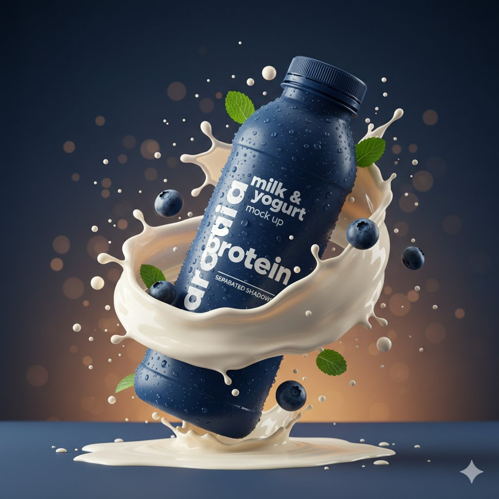

## Low-angle fashion campaign photograph of a confident mod

- ID: trending-2048748266293190833
- Slug: trending-2048748266293190833-en
- 语言: en
- 来源: [来源链接](https://x.com/azed_ai/status/2048748266293190833)
- 样例图路径: images/part1/2048748266293190833_1.jpg

### 提示词

```text
Low-angle fashion campaign photograph of a confident model holding a large [product name] very close to the camera, exaggerated perspective with the hand and product dominating the foreground, full-body pose visible in the background, wide stance, dynamic posture, clean pure white studio background, high-key lighting, sharp focus on product, slight depth of field on the model, bold colorful outfit with strong contrast tones, modern beauty advertising aesthetic, ultra-clean composition, commercial studio photography, glossy packaging detail visible, crisp shadows
```

### 样例图

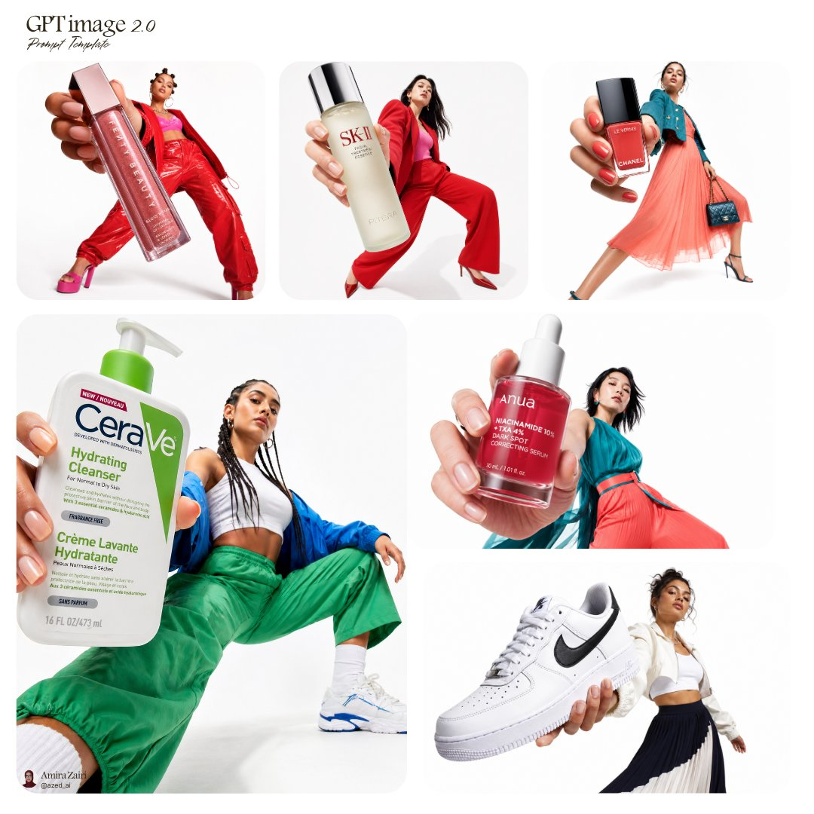

## Create a polished multi-page (multiple images) brand kit

- ID: trending-2046682439985082441
- Slug: trending-2046682439985082441-en
- 语言: en
- 来源: [来源链接](https://x.com/riomadeit/status/2046682439985082441)
- 样例图路径: images/part1/2046682439985082441_1.jpg

### 提示词

```text
Create a polished multi-page (multiple images) brand kit for a company called [YOYOYO]. The brand should feel playful, futuristic, vibrant, and design-forward, blending the energy of a toy-inspired product with the sophistication of a premium creative tech brand. Use a bold, experimental visual identity with bright color, clean geometry, modern typography, dynamic motion cues, and slightly surreal imagery. The overall mood should feel inventive, youthful, rhythmic, tactile, and high-concept, with a balance of fun consumer product culture, fashionlike presentation, and contemporary digital design.

Include a sense of product obsession, visual experimentation, packaging exploration, editorial photography, immersive retail, and cross-platform brand application. Make it feel like a confident, contemporary brand world that is both accessible and art-directed, with strong graphic cohesion and a premium creative-studio aesthetic.
```

### 样例图

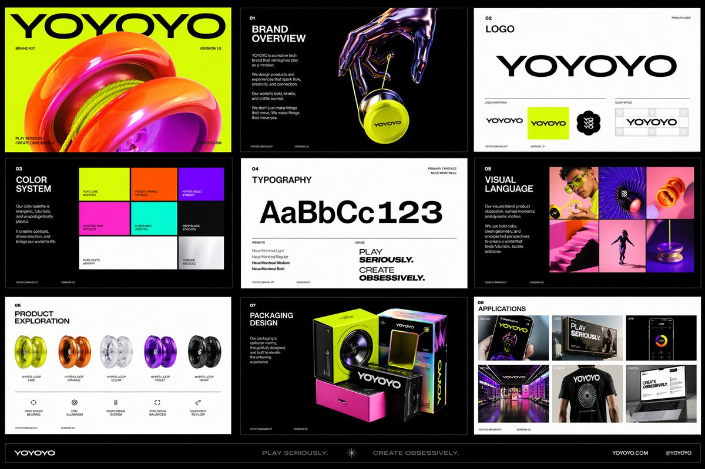

## Create a high-converting carousel image for Grüns (green

- ID: trending-2047064581051142166
- Slug: trending-2047064581051142166-en
- 语言: en
- 来源: [来源链接](https://x.com/oliverkenyon/status/2047064581051142166)
- 样例图路径: images/part1/2047064581051142166_1.jpg

### 提示词

```text
Create a high-converting carousel image for Grüns (greens gummies).
Bold hook, clear outcome, premium DTC design.
Mobile-first, 4:5, advanced design level.
```

### 样例图

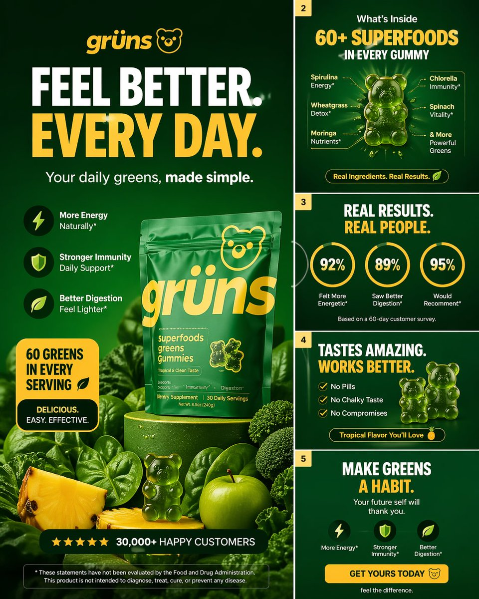

## Hyper-realistic cinematic 8k photograph, low-angle wide 

- ID: trending-2021057289785053348
- Slug: trending-2021057289785053348-en
- 语言: en
- 来源: [来源链接](https://x.com/Sheldon056/status/2021057289785053348)
- 样例图路径: images/part1/2021057289785053348_1.jpg

### 提示词

```text
Hyper-realistic cinematic 8k photograph, low-angle wide perspective. A massive Monster Energy can standing vertically like an arctic monument, partially frozen inside thick blue ice and snow. Frost covering the textured surface, icicles forming along the logo and rim, snow filling the pull-tab opening. Snowcat vehicle and scientists in red parkas emphasize scale. Overcast arctic daylight, HDR, ultra-detailed frozen textures, cinematic realism --ar 2:3
```

### 样例图

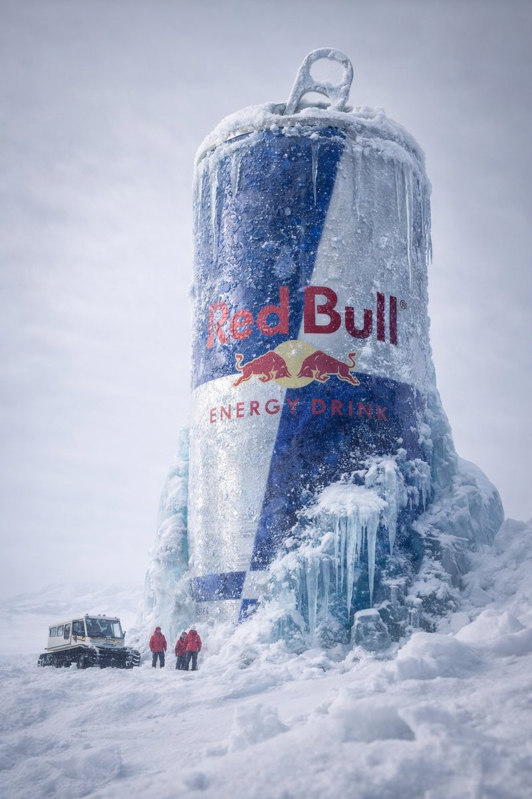

## Create a polished email sequence template for fenty beau

- ID: trending-2046717569013293231
- Slug: trending-2046717569013293231-en
- 语言: en
- 来源: [来源链接](https://x.com/Salmaaboukarr/status/2046717569013293231)
- 样例图路径: images/part1/2046717569013293231_1.jpg

### 提示词

```text
Create a polished email sequence template for fenty beauty
```

### 样例图


## Conceptual transformation, bird nest construction techni

- ID: trending-2048667175112802778
- Slug: trending-2048667175112802778-en
- 语言: en
- 来源: [来源链接](https://x.com/aleenaamiir/status/2048667175112802778)
- 样例图路径: images/part1/2048667175112802778_1.jpg

### 提示词

```text
Conceptual transformation, bird nest construction techniques shaping a sculptural lounge chair, sequence from nest-building photography to weaving diagrams to organic structural abstraction to final product, interwoven frame forming seat and backrest, natural fibers with soft cushioning, earthy tones with refined finish, sustainable luxury aesthetic, presentation layout, sketches above, render below, warm natural lighting.

AR – 4:3
```

### 样例图

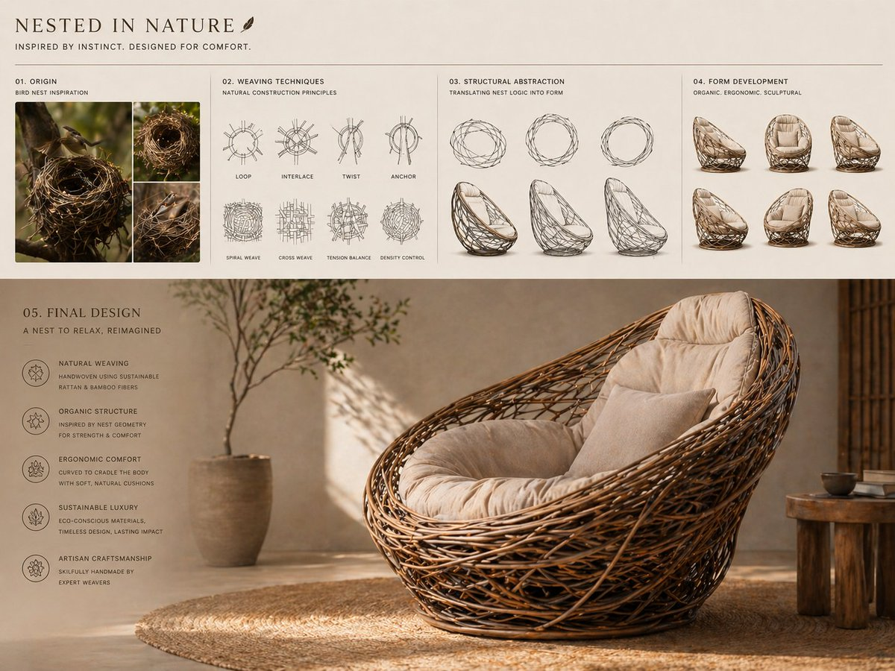

## A detailed technical blueprint illustration of [CHARACTE

- ID: trending-2009585651554116028
- Slug: trending-2009585651554116028-en
- 语言: en
- 来源: [来源链接](https://x.com/TechieBySA/status/2009585651554116028)
- 样例图路径: images/part1/2009585651554116028_1.jpg

### 提示词

```text
A detailed technical blueprint illustration of [CHARACTER], drawn in blueprint style on a blue grid background with precise white linework. Includes subtle measurement markings, labels, and schematic-style annotations around the figure. The design is clean, symmetrical, and centered, giving it the look of a professional engineering drawing. 
```

### 样例图

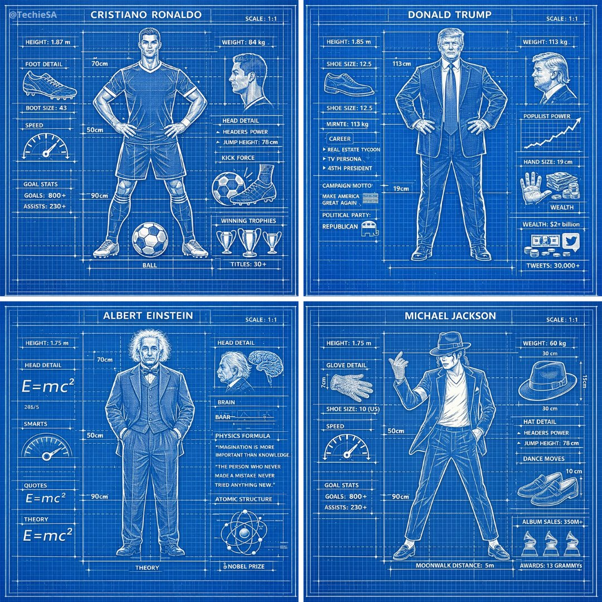

## { "master_prompt": { "global_settings": { "resolution": 

- ID: trending-2018525109041135790
- Slug: trending-2018525109041135790-en
- 语言: en
- 来源: [来源链接](https://x.com/mehvishs25/status/2018525109041135790)
- 样例图路径: images/part1/2018525109041135790_1.jpg

### 提示词

```text
{
  "master_prompt": {
    "global_settings": {
      "resolution": "8K ultra-high-definition",
      "aspect_ratio": "3:4 vertical",
      "style": "hyper-realistic AI-edited commercial product photography",
      "sharpness": "extreme clarity, micro-detail visibility",
      "lighting_quality": "cinematic studio lighting with controlled highlights and shadows",
      "motion_freeze": "high-speed capture, frozen splashes and particles",
      "noise": "none",
      "artifacts": "none"
    },

"module_1_image_1_style": {
      "subject": {
        "type": "orange-flavored soda can",
        "color": "bright orange",
        "surface_details": "condensation droplets across can",
        "branding_text_visible": [
          "Sesla",
          "cola"
        ]
      },
      "pose_and_orientation": {
        "position": "upright, slightly embedded in splash",
        "angle": "centered frontal view"
      },
      "liquid_and_motion": {
        "liquid_color": "transparent orange-tinted liquid",
        "motion": "high-energy splash bursting upward and outward",
        "splash_detail": "clear liquid arcs with suspended droplets"
      },
      "floating_elements": {
        "oranges": [
          "whole oranges",
          "halved oranges with visible pulp"
        ],
        "ice_cubes": "clear sharp-edged cubes floating mid-air",
        "droplets": "numerous spherical liquid droplets"
      },
      "background": {
        "color": "solid bright orange",
        "lighting": "high-key, evenly lit"
      },
      "surface_and_reflection": {
        "base": "shallow liquid pool",
        "reflection_quality": "strong mirror-like reflection with ripples"
      }
    }
  }
}
```

### 样例图

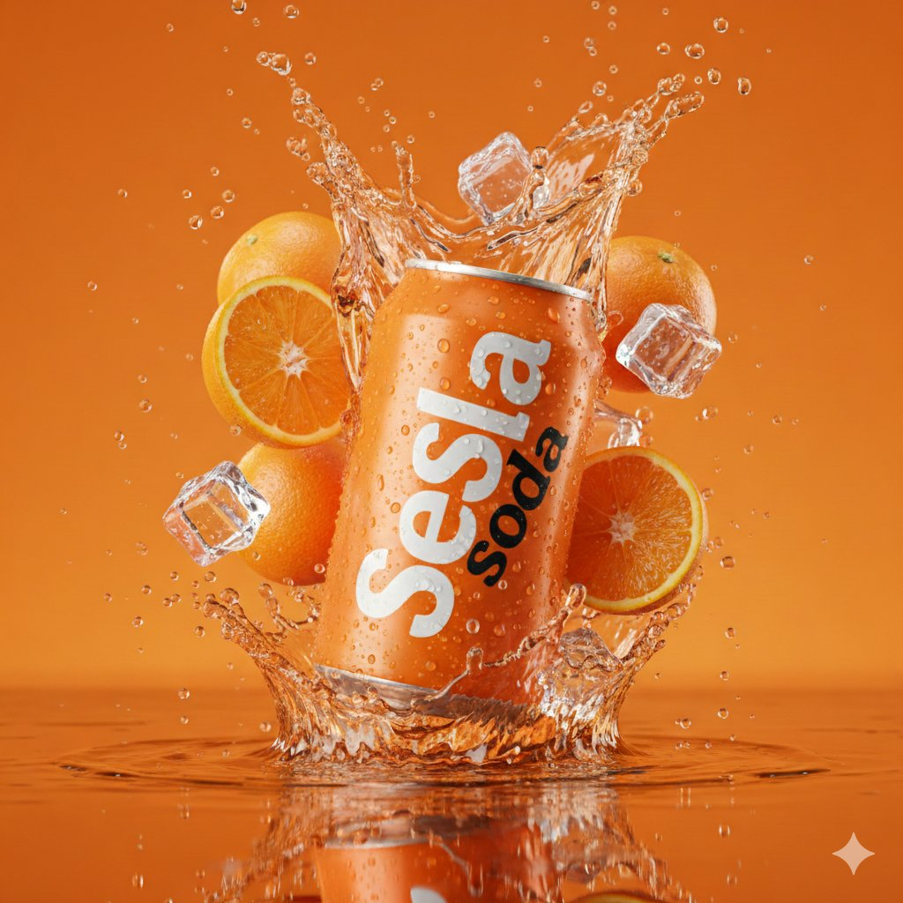

## Commercial luxury product photography, photorealistic, u

- ID: trending-2018215856577360311
- Slug: trending-2018215856577360311-en
- 语言: en
- 来源: [来源链接](https://x.com/harboriis/status/2018215856577360311)
- 样例图路径: images/part1/2018215856577360311_1.jpg

### 提示词

```text
Commercial luxury product photography, photorealistic, ultra high detail, 8K quality. A minimalist matte black cosmetic dropper bottle placed on a clear glass podium. Low angle camera view to make the bottle feel tall and powerful. The bottom of the bottle is clearly visible through the transparent glass. The glass surface is wet with realistic water droplets, with a few drops hanging underneath the glass, frozen mid drip for a time stopped effect. Matte light gray background with no texture or gradient. Soft, even studio lighting with clean reflections, premium skincare advertising look, sharp focus, realistic materials, no distractions.
```

### 样例图

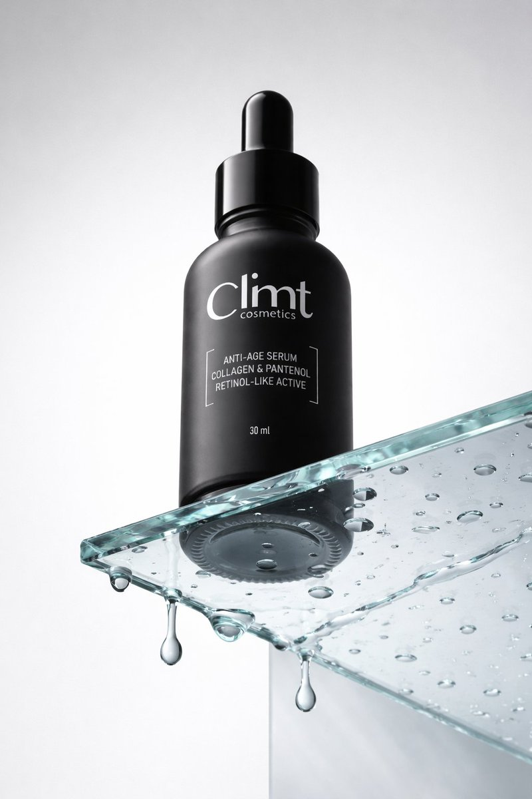

## { "master_prompt": { "product": { "type": "luxury perfum

- ID: trending-2025013736139096574
- Slug: trending-2025013736139096574-en
- 语言: en
- 来源: [来源链接](https://x.com/mehvishs25/status/2025013736139096574)
- 样例图路径: images/part1/2025013736139096574_1.jpg

### 提示词

```text
{
  "master_prompt": {
    "product": {
      "type": "luxury perfume bottle",
      "brand_name": "AURUM NOCTIS",
      "fragrance_line": "Velvet Obsidian",
      "container_shape": "sleek monolithic oval bottle with sculpted contours",
      "material": "obsidian-black glass with subtle smoked transparency",
      "finish": "high-gloss reflective body with satin matte side panels",
      "cap_design": "heavy magnetic cap in brushed antique gold with engraved crest",
      "label_style": "minimal gold foil typography floating on glass surface",
      "liquid_color": "dark amber with molten gold undertones"
    },
    "composition": {
      "scene_type": "ultra-cinematic luxury fragrance advertising photography",
      "orientation": "vertical",
      "aspect_ratio": "4:5",
      "camera_angle": "low hero angle for power and prestige",
      "subject_position": "floating mid-air with elegant slow rotation",
      "motion": "fluid golden fragrance trails and aromatic vapor ribbons suspended in motion"
    },
    "environment": {
      "background": "deep charcoal-to-black gradient fading into shadow",
      "atmosphere": "soft volumetric haze enhancing depth and mystery",
      "floating_elements": [
        "molten gold dust particles glowing softly",
        "dark cocoa shards catching highlights",
        "black orchid petals drifting slowly",
        "smoked vanilla pods suspended in air",
        "tiny amber resin fragments sparkling"
      ],
      "surface_effects": "micro condensation droplets and polished reflections enhancing realism"
    },
    "lighting": {
      "style": "dramatically sculpted low-key studio lighting",
      "key_light": "soft directional light defining contours and glass curvature",
      "rim_lights": "warm golden rim lights outlining silhouette",
      "accent_lights": "subtle amber highlights emphasizing cap and liquid glow",
      "shadow_depth": "deep shadows for cinematic luxury mood",
      "contrast": "rich contrast with controlled highlights and luminous reflections"
    },
    "color_palette": {
      "primary_colors": ["obsidian black", "charcoal shadow", "deep amber"],
      "accent_colors": ["antique gold", "warm bronze glow"]
    },
    "camera_settings": {
      "lens": "macro cinema prime lens",
      "depth_of_field": "shallow depth isolating product",
      "focus_point": "brand crest and glass curvature",
      "bokeh": "soft golden bokeh from reflective particles",
      "detail_capture": "extreme micro-detail clarity"
    },
    "render_quality": {
      "resolution": "8K ultra high definition",
      "render_style": "hyper-realistic luxury commercial render",
      "glass_physics": "accurate refraction and internal reflections",
      "liquid_simulation": "physically accurate fluid glow and viscosity",
      "textures": "ultra-detailed glass, metal, vapor, and dust textures",
      "sharpness": "tack sharp product focus with cinematic background softness",
      "noise": "none",
      "artifacts": "none"
    },
    "mood": {
      "tone": "mysterious, opulent, and powerful",
      "emotion": "nighttime luxury, sensual elegance, timeless prestige"
    },
    "final_output": {
      "usage": "luxury fragrance campaign and premium magazine advertising",
      "branding_focus": "hero product dominance with elite brand presence",
      "visual_style": "cinematic haute parfumerie commercial aesthetic"
    }
  }
}
```

### 样例图

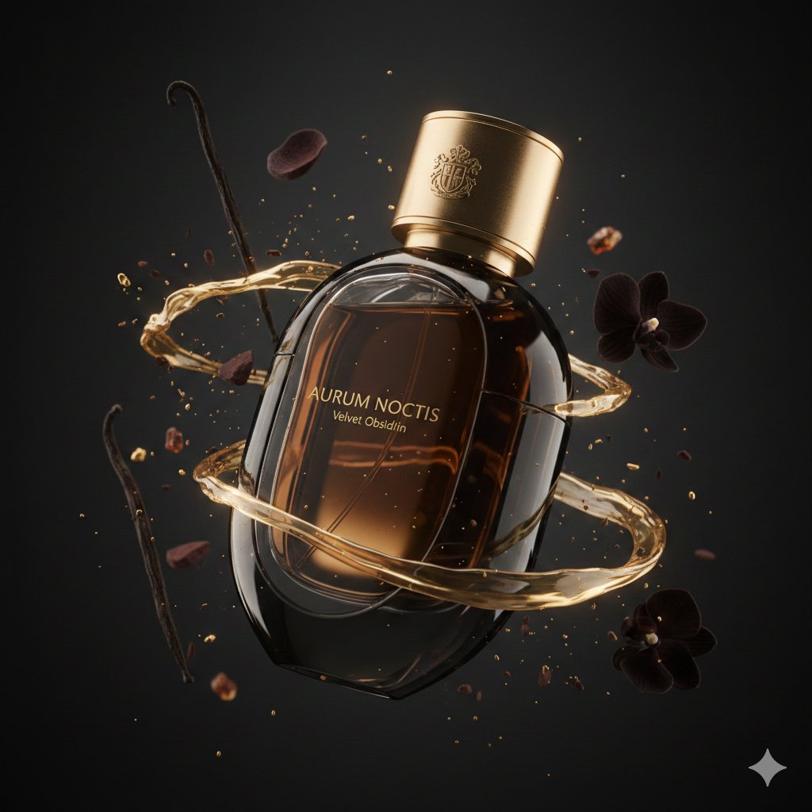

## "A hyperrealistic premium product photography scene of a

- ID: trending-2018191168451043584
- Slug: trending-2018191168451043584-en
- 语言: en
- 来源: [来源链接](https://x.com/Naiknelofar788/status/2018191168451043584)
- 样例图路径: images/part1/2018191168451043584_1.jpg

### 提示词

```text
"A hyperrealistic premium product photography scene of a smooth beige cosmetic jar labeled “Collagen" Pomegranate & Collagen Volume Lifting Cream” exploding open mid-air, with the metallic rose-gold lid floating slightly above the jar and a thick, whipped, pale pink cream bursting upward in a dramatic splash, glossy and textured with visible red pomegranate seeds, surrounded by suspended whole red pomegranates and halved pomegranates with glistening ruby-red arils, golden liquid droplets and creamy splashes frozen in motion around the jar, the container tilted slightly to the right and centered in frame, shot from a straight-on macro perspective, illuminated by soft yet high-contrast studio lighting from above and slightly behind to create glowing highlights on the wet textures and translucent splashes, subtle shadows beneath the floating elements, a smooth warm beige gradient background enhancing the color palette of soft pinks, creams, and deep red fruit tones, ultra-sharp focus on the jar and cream with shallow depth of field for the outer fruit, cinematic realism, luxury skincare advertising aesthetic, crisp reflections, 8K photorealistic detail, energetic and fresh mood."
```

### 样例图

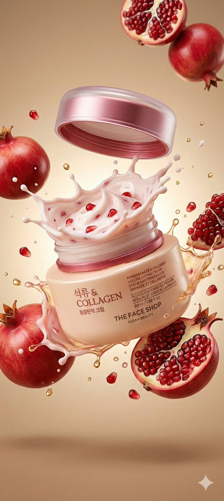

## Low angle luxury product photography of a black ribbed g

- ID: trending-2018312144358703594
- Slug: trending-2018312144358703594-en
- 语言: en
- 来源: [来源链接](https://x.com/harboriis/status/2018312144358703594)
- 样例图路径: images/part1/2018312144358703594_1.jpg

### 提示词

```text
Low angle luxury product photography of a black ribbed glass perfume bottle placed on a dark horizontal podium, shot from below for a heroic, monumental feel. The bottle is Tom Ford Black Orchid, matte black texture clearly visible.
Dramatic low key studio lighting. Soft diffused key light from above and slightly left, gently lighting the label and top, revealing volume and texture. Strong hard red rim light from behind and right, creating a bold red outline along the edge and cap, with a subtle red glow bleeding into the background.
Deep soft shadows with smooth falloff. Slightly underexposed for drama. High contrast between highlights and shadows while keeping transitions soft.
Color palette limited to deep black and rich burgundy red, warm color balance, black remains neutral and clean.
Matte surface shows soft red reflections, not glossy, giving depth and form.
Minimal background, dark red gradient, cinematic mood, luxury fragrance advertising style, photorealistic, ultra high detail, studio quality.
```

### 样例图

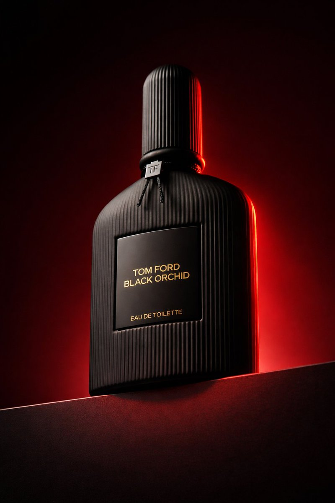

## { "master_prompt": { "product": { "type": "luxury perfum

- ID: trending-2024420826016338208
- Slug: trending-2024420826016338208-en
- 语言: en
- 来源: [来源链接](https://x.com/john_my07/status/2024420826016338208)
- 样例图路径: images/part1/2024420826016338208_1.jpg

### 提示词

```text
{
  "master_prompt": {
    "product": {
      "type": "luxury perfume bottle",
      "brand_name": "NOIR ÉLIXIR",
      "fragrance_line": "Crimson Reserve",
      "container_shape": "faceted geometric crystal bottle with sharp elegant edges",
      "material": "high-clarity glass with deep ruby gradient tint",
      "finish": "polished reflective surfaces with subtle matte facets",
      "cap_design": "magnetic cap in brushed rose-gold metal with engraved emblem",
      "label_style": "minimal serif typography etched directly into glass with metallic inlay",
      "liquid_color": "rich crimson red with glowing ruby undertones"
    },
    "composition": {
      "scene_type": "ultra-cinematic luxury fragrance advertising photography",
      "orientation": "vertical",
      "aspect_ratio": "4:5",
      "camera_angle": "dramatic diagonal hero angle",
      "subject_position": "floating mid-air with slight forward tilt",
      "motion": "atomized perfume mist trails and fluid fragrance ribbons suspended in motion"
    },
    "environment": {
      "background": "deep black velvet gradient fading into shadow",
      "atmosphere": "volumetric mist with delicate fragrance vapor swirling around the bottle",
      "floating_elements": [
        "atomized perfume droplets suspended mid-air",
        "shattering crystal fragments catching highlights",
        "dark red rose petals drifting slowly",
        "glossy blood-orange peel curls",
        "fine rose-gold dust particles sparkling in light"
      ],
      "surface_effects": "micro condensation beads and polished reflections enhancing realism"
    },
    "lighting": {
      "style": "dramatic low-key studio lighting",
      "key_light": "soft directional light sculpting the glass facets",
      "rim_lights": "strong rim lights outlining silhouette and edges",
      "accent_lights": "warm ruby and rose-gold specular highlights on cap and engraved details",
      "shadow_depth": "deep cinematic shadows for luxury mood",
      "contrast": "high contrast with controlled reflections and luminous highlights"
    },
    "color_palette": {
      "primary_colors": ["obsidian black", "deep garnet", "ruby red"],
      "accent_colors": ["rose gold", "warm champagne glow"]
    },
    "camera_settings": {
      "lens": "macro cinema prime lens",
      "depth_of_field": "shallow depth isolating product from background",
      "focus_point": "engraved logo and glass surface textures",
      "bokeh": "smooth cinematic bokeh from reflective particles",
      "detail_capture": "extreme micro-detail clarity"
    },
    "render_quality": {
      "resolution": "8K ultra high definition",
      "render_style": "hyper-realistic luxury commercial render",
      "glass_physics": "accurate refraction and internal reflections",
      "liquid_simulation": "physically accurate fluid dynamics",
      "textures": "ultra-detailed crystal, metal, mist, and micro-droplet textures",
      "sharpness": "tack sharp product focus with cinematic background softness",
      "noise": "none",
      "artifacts": "none"
    },
    "mood": {
      "tone": "seductive, passionate, and ultra-premium",
      "emotion": "luxury, desire, elegance, timeless sophistication"
    },
    "final_output": {
      "usage": "high-end perfume campaign and luxury magazine advertising",
      "branding_focus": "hero product dominance with strong brand prestige",
      "visual_style": "cinematic fragrance commercial aesthetic"
    }
  }
}
```

### 样例图

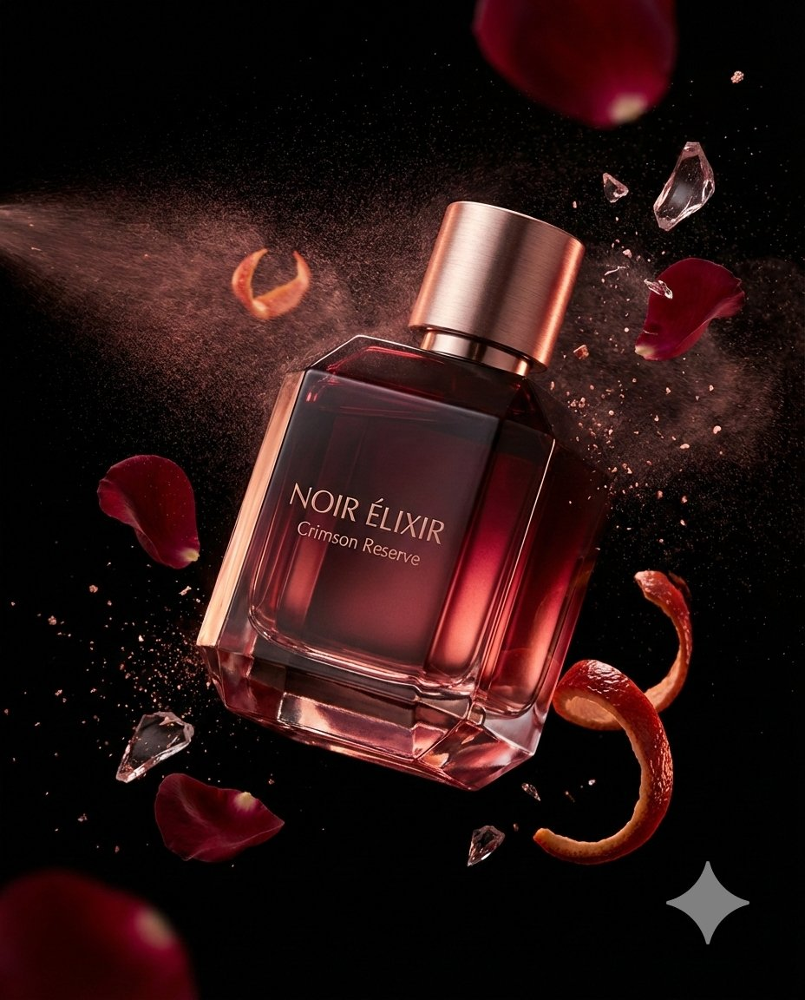

## Surreal premium commercial illustration for [BRAND NAME]

- ID: trending-2008878369107276184
- Slug: trending-2008878369107276184-en
- 语言: en
- 来源: [来源链接](https://x.com/meng_dagg695/status/2008878369107276184)
- 样例图路径: images/part1/2008878369107276184_1.jpg

### 提示词

```text
Surreal premium commercial illustration for [BRAND NAME] [OIL TYPE], featuring the product bottle embedded into a massive natural landscape made entirely from the core ingredient. The ingredient appears at the top source, flowing as a natural element into the bottle, then transforming into waterfalls, rivers, or pools below. The environment, terrain, vegetation, textures, and color palette are all inspired by [PRIMARY INGREDIENT]. Small human figures interact naturally with the environment to emphasize scale. Cinematic lighting, soft painterly realism, ultra-detailed textures, fantasy-meets-nature aesthetic, vertical poster composition, 8K ultra-high resolution.
```

### 样例图

![Surreal premium commercial illustration for [BRAND NAME]](../images/part1/2008878369107276184_1.jpg)

## { "master_prompt": { "product": { "type": "luxury body d

- ID: trending-2025391098437529837
- Slug: trending-2025391098437529837-en
- 语言: en
- 来源: [来源链接](https://x.com/mehvishs25/status/2025391098437529837)
- 样例图路径: images/part1/2025391098437529837_1.jpg

### 提示词

```text
{
  "master_prompt": {
    "product": {
      "type": "luxury body deodorant",
      "brand_name": "VELORÉ",
      "product_line": "Pure Aura",
      "container_style": "sleek cylindrical deodorant stick with softly rounded edges",
      "material": "frosted glass body with brushed champagne-gold metal accents",
      "finish": "velvety matte surface with refined metallic detailing",
      "cap_design": "magnetic cap with polished gold rim and engraved crest",
      "branding": "minimal serif logo etched vertically with understated elegance",
      "dispense_style": "precision twist-up deodorant balm with smooth surface finish",
      "color": "warm ivory body with subtle golden undertones",
      "accent_details": "champagne gold band and minimal crest emblem",
      "texture_details": "soft satin deodorant balm surface visible at top"
    },

    "composition": {
      "scene_type": "ultra-cinematic luxury personal care advertising photography",
      "orientation": "vertical",
      "aspect_ratio": "4:5",
      "camera_angle": "low hero angle emphasizing elegance and premium form",
      "subject_position": "deodorant standing upright on reflective surface",
      "motion": "fine mist spray particles suspended mid-air for freshness effect"
    },

    "environment": {
      "background": "soft warm marble gradient fading into shadow",
      "atmosphere": "light spa mist creating a serene premium ambiance",
      "floating_elements": [
        "delicate mist particles suspended in air",
        "white orchid petals drifting gently",
        "tiny golden light particles shimmering softly",
        "fresh eucalyptus leaves floating nearby",
        "soft vapor trails suggesting freshness"
      ],
      "surface_effects": "glossy reflections with micro condensation droplets enhancing freshness"
    },

    "lighting": {
      "style": "soft spa-inspired studio lighting",
      "key_light": "diffused overhead light revealing frosted texture",
      "rim_lights": "subtle warm highlights outlining silhouette",
      "accent_lights": "soft golden glow enhancing luxury appeal",
      "shadow_depth": "gentle shadows for calm elegance",
      "contrast": "balanced contrast with luminous clean highlights"
    },

    "color_palette": {
      "primary_colors": ["warm ivory", "soft cream", "clean white"],
      "accent_colors": ["champagne gold", "botanical green"]
    },

    "camera_settings": {
      "lens": "macro cinema lens",
      "depth_of_field": "shallow depth isolating product",
      "focus_point": "engraved logo and frosted glass texture",
      "bokeh": "soft luminous bokeh from mist particles",
      "detail_capture": "extreme micro-detail clarity"
    },

    "render_quality": {
      "resolution": "8K ultra high definition",
      "render_style": "hyper-realistic luxury personal care commercial render",
      "material_physics": "accurate frosted glass translucency and metallic reflections",
      "particle_simulation": "physically accurate mist and condensation droplets",
      "textures": "ultra-detailed frosted glass, metallic accents, and balm surface",
      "sharpness": "tack sharp product focus with soft cinematic background",
      "noise": "none",
      "artifacts": "none"
    },

    "mood": {
      "tone": "pure, refined, and ultra-premium",
      "emotion": "freshness, confidence, and indulgent self-care luxury"
    },

    "final_output": {
      "usage": "luxury personal care campaign and premium wellness advertising",
      "branding_focus": "hero product freshness with elite wellness appeal",
      "visual_style": "cinematic luxury spa aesthetic"
    }
  }
}
```

### 样例图

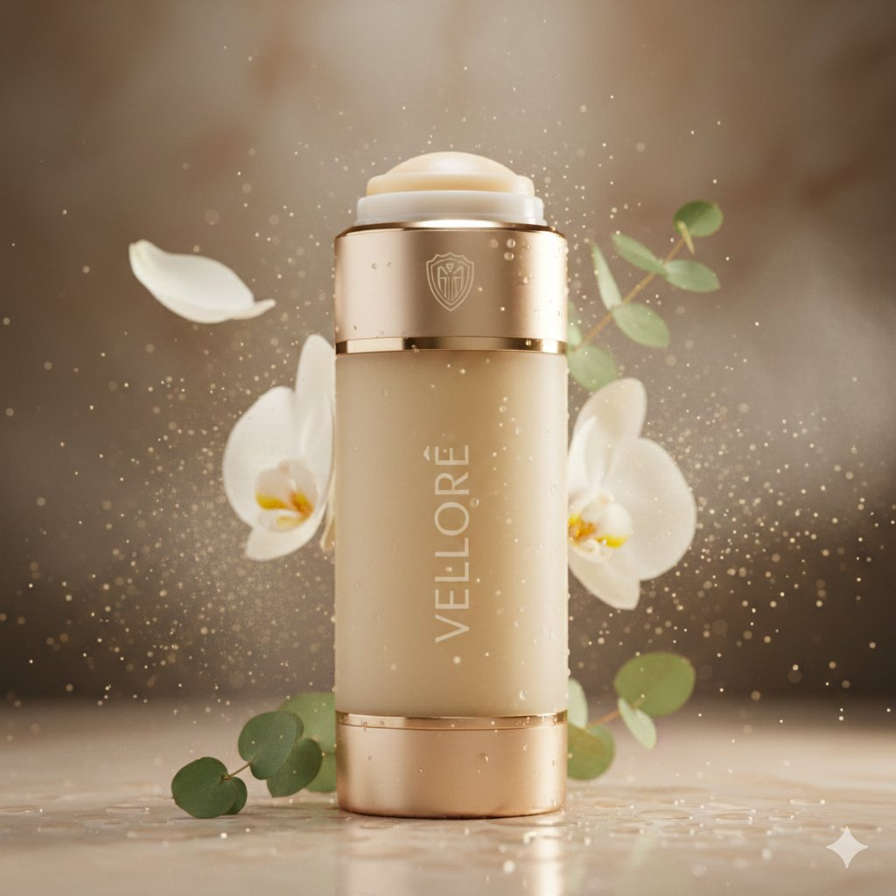

## { "master_prompt": { "scene_type": "high-speed commercia

- ID: trending-2027421733666586809
- Slug: trending-2027421733666586809-en
- 语言: en
- 来源: [来源链接](https://x.com/j_smeaton99/status/2027421733666586809)
- 样例图路径: images/part1/2027421733666586809_1.jpg

### 提示词

```text
{
  "master_prompt": {
    "scene_type": "high-speed commercial beverage photography",
    "product": {
      "type": "sleek frosted glass bottle filled with sparkling citrus tonic",
      "brand_name": "AURELIA FIZZ",
      "label_design": "minimalist vertical ivory label with refined gold serif typography",
      "liquid_color": "translucent golden citrus with effervescent bubbles"
    },
    "composition": {
      "action": "dynamic high-velocity liquid splash explosion",
      "surrounding_elements": [
        "sculptural splashes of sparkling tonic water",
        "spiraling ribbons of fresh lemon and orange zest",
        "floating citrus slices with visible pulp texture",
        "tiny suspended carbonation bubbles",
        "mist of fine droplets catching the light"
      ],
      "placement": "centered hero bottle with a crisp reflection on a polished marble surface"
    },
    "lighting": {
      "style": "luxury glossy studio product lighting",
      "effects": [
        "sharp rim lighting to define bottle silhouette",
        "brilliant highlights on splashes and bubbles",
        "soft golden glow in the background for warmth"
      ]
    },
    "color_palette": {
      "background": "sunlit gradient of warm gold fading into soft champagne beige",
      "accents": "citrus yellow, fresh orange, and subtle mint green"
    },
    "technical_specs": {
      "camera": "macro lens, eye-level angle",
      "shutter": "ultra-fast freeze-motion capture",
      "depth_of_field": "shallow focus on the label, gentle blur on dynamic splash elements",
      "quality": "8K resolution, ultra-photorealistic texture"
    }
  }
}
```

### 样例图

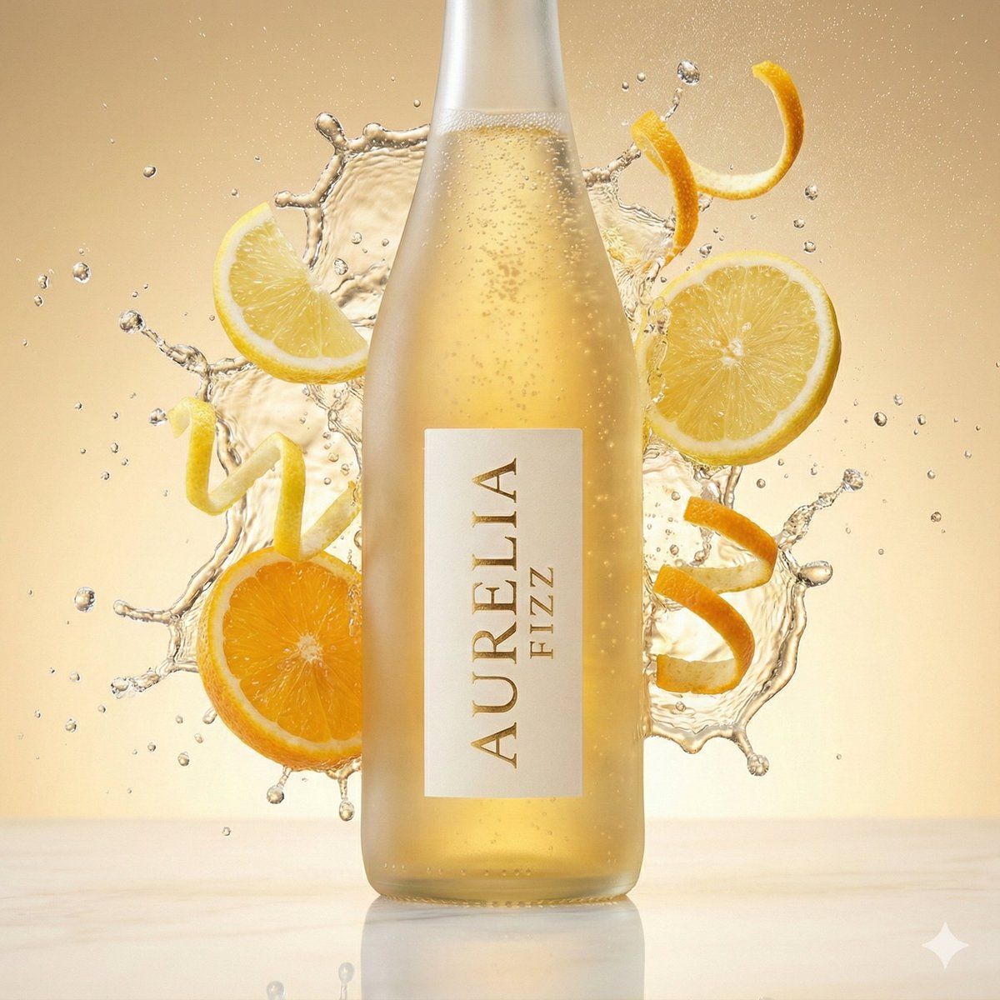

## A bitten realistic classic [brand] product on the dish, 

- ID: trending-2003072041889800346
- Slug: trending-2003072041889800346-en
- 语言: en
- 来源: [来源链接](https://x.com/hc_dsn/status/2003072041889800346)
- 样例图路径: images/part1/2003072041889800346_1.jpg

### 提示词

```text
A bitten realistic classic [brand] product on the dish, revealed inner dessert layers, and there are cake crumbs near, finished fork and knife near by, against blurry high end restaurant background, white small logo on top of background, beneath the logo, there is a tiny brand slogan that suit this scene.
```

### 样例图

![A bitten realistic classic [brand] product on the dish, ](../images/part1/2003072041889800346_1.jpg)

## Hyper-realistic cinematic product photograph of a Pepsi 

- ID: trending-2020531946108158457
- Slug: trending-2020531946108158457-en
- 语言: en
- 来源: [来源链接](https://x.com/Naiknelofar788/status/2020531946108158457)
- 样例图路径: images/part1/2020531946108158457_1.jpg

### 提示词

```text
Hyper-realistic cinematic product photograph of a Pepsi Black can, front-facing and perfectly legible, ice-cold surface covered in crisp condensation. Dark cola splashes explode around the can in frozen motion, glossy liquid waves and fine droplets catching the light. Moody low-key lighting with cool blue rim light and soft front fill, shallow depth of field, ultra-sharp texture detail, high-end advertising aesthetic.
```

### 样例图

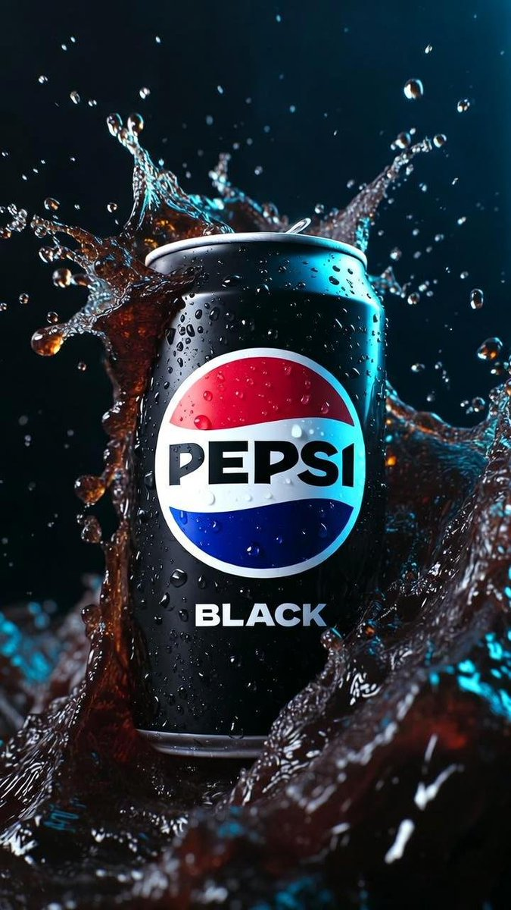

## Create a premium brand kit board for [BRAND NAME], prese

- ID: trending-2047375056125428013
- Slug: trending-2047375056125428013-en
- 语言: en
- 来源: [来源链接](https://x.com/MayorKingAI/status/2047375056125428013)
- 样例图路径: images/part1/2047375056125428013_1.jpg

### 提示词

```text
Create a premium brand kit board for [BRAND NAME], presented like a professional branding studio slide. Show the existing brand identity in a clean, organized visual presentation. Include primary logo, secondary logo, icon, [COLOR PALETTE], typography pairing, branded packaging or product mockups, social media mockup, and simple brand pattern elements. Style: [STYLE]. Use a clean editorial grid, realistic materials, strong hierarchy, and polished presentation. Text to include: "[BRAND NAME]
```

### 样例图

![Create a premium brand kit board for [BRAND NAME], prese](../images/part1/2047375056125428013_1.jpg)

## Luxury perfume product photography in a dark cinematic s

- ID: trending-2019001339985133694
- Slug: trending-2019001339985133694-en
- 语言: en
- 来源: [来源链接](https://x.com/harboriis/status/2019001339985133694)
- 样例图路径: images/part1/2019001339985133694_1.jpg

### 提示词

```text
Luxury perfume product photography in a dark cinematic studio. A premium black matte perfume box with sharp edges and subtle gold accents placed slightly behind a transparent glass perfume bottle filled with warm amber liquid. The bottle has a thick clear glass body and a polished metallic cap. Minimal elegant label design with gold typography. Soft low key lighting with a smooth gradient dark background. Gentle reflections on a glossy surface beneath the products. Dramatic shadows for depth and contrast. High fashion fragrance advertisement style. Ultra realistic textures crisp focus shallow depth of field professional studio shot 8k quality.
```

### 样例图

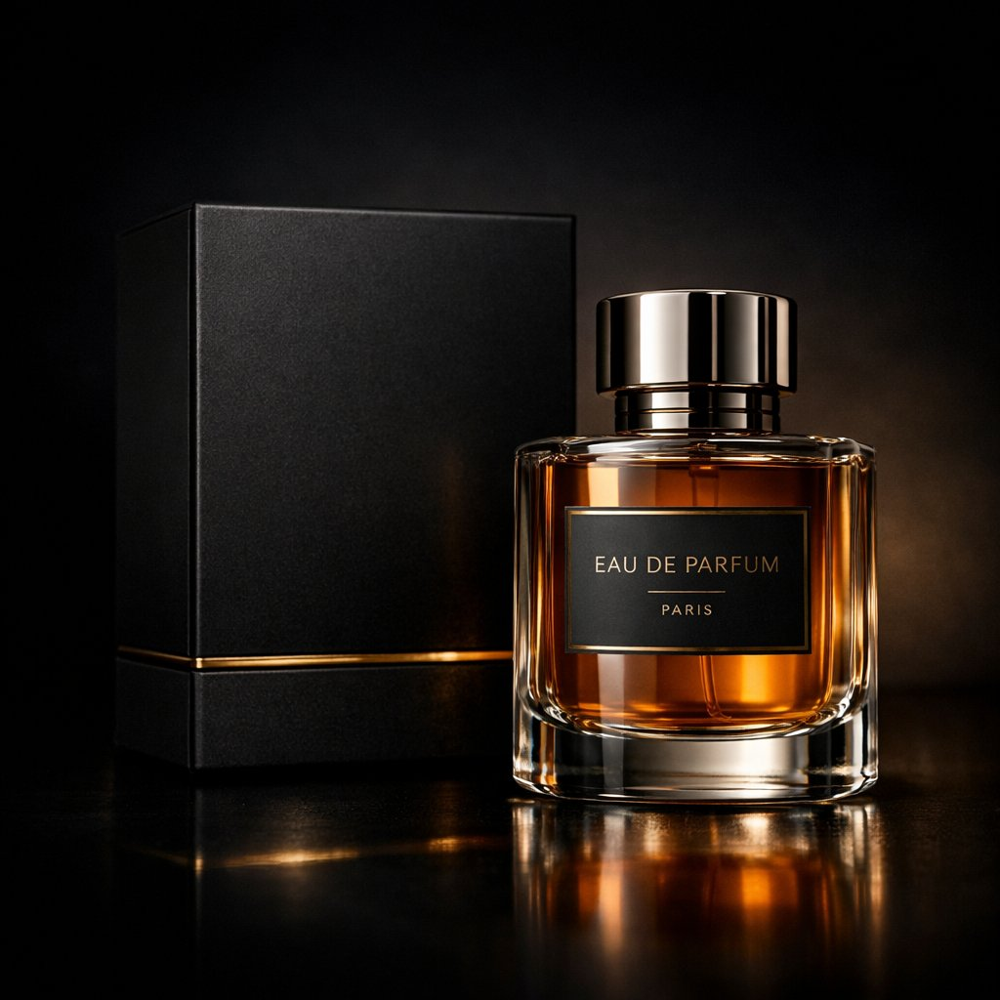

## { "master_prompt": { "scene_type": "ultra-realistic luxu

- ID: trending-2026649286772179445
- Slug: trending-2026649286772179445-en
- 语言: en
- 来源: [来源链接](https://x.com/j_smeaton99/status/2026649286772179445)
- 样例图路径: images/part1/2026649286772179445_1.jpg

### 提示词

```text
{
  "master_prompt": {
    "scene_type": "ultra-realistic luxury perfume commercial photography",

    "product": {
      "type": "luxury perfume bottle",
      "brand_name": "VÉRÉLLE NOIR",
      "product_name": "Nocturne Élixir — Parfum Intense",
      "container_shape": "faceted architectural silhouette with sharp beveled geometry",
      "material": "obsidian-black crystal glass",
      "finish": "deep glossy translucence with mirror-like reflections",
      "cap_design": "magnetic cap in brushed black titanium with precision-cut edges",

      "label_design": {
        "style": "minimal haute couture typography",
        "primary_text": "Nocturne Élixir",
        "secondary_text": "Parfum Intense",
        "finish": "black chrome foil emboss with micro-engraved detailing"
      },

      "liquid_color": "midnight amber with subtle smoky undertones"
    },

    "composition": {
      "placement": "center hero placement",
      "pedestal": "black marble pedestal with subtle silver veining",
      "base_surface": "high-gloss reflective onyx surface",

      "surrounding_elements": [
        "black velvet fabric folds",
        "dark rose petals",
        "polished obsidian stones",
        "faint aromatic smoke wisps"
      ],

      "atmospheric_effect": "soft drifting fragrance vapor creating a mysterious aura"
    },

    "lighting": {
      "style": "dark luxury cinematic lighting",
      "key_light": "soft focused glow revealing reflective contours",
      "rim_light": "cool silver edge highlights defining silhouette",
      "fill_light": "low ambient fill preserving deep shadows",
      "reflections": "controlled specular highlights for high-end finish"
    },

    "background": {
      "color": "deep charcoal to black gradient",
      "style": "editorial noir luxury backdrop",
      "depth": "cinematic shallow depth with soft shadow falloff"
    },

    "camera": {
      "angle": "low dramatic hero angle",
      "focus": "glass texture and metallic detailing",
      "depth_of_field": "cinematic shallow depth",
      "resolution": "8K ultra-detailed clarity"
    },

    "mood_keywords": [
      "dark elegance",
      "noir luxury",
      "sensual sophistication",
      "mysterious allure",
      "modern opulence",
      "timeless night glamour"
    ]
  }
}
```

### 样例图

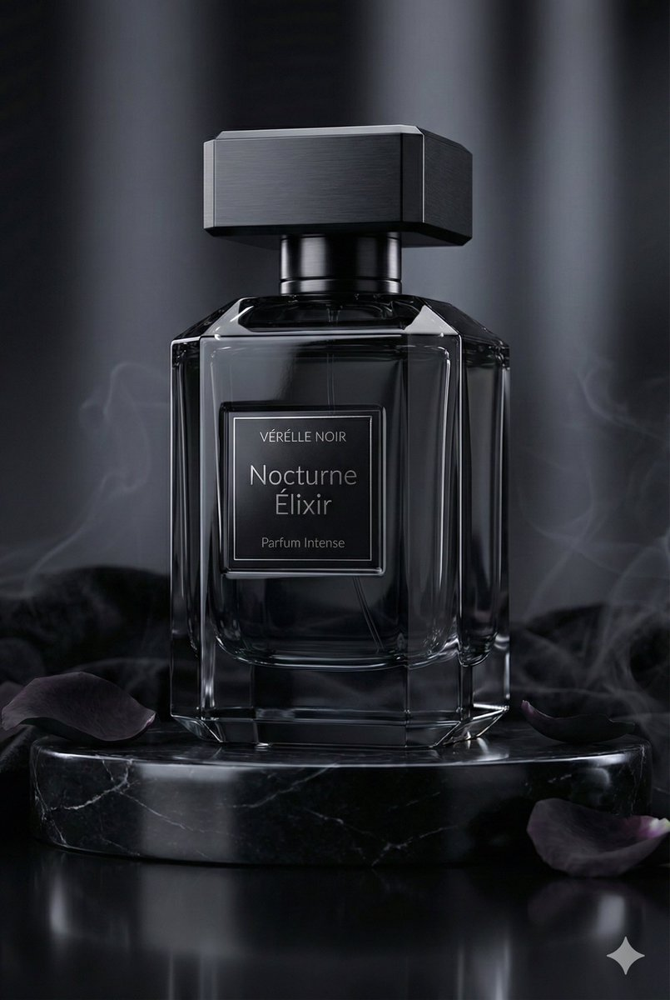

## { "master_prompt": { "product": { "type": "luxury perfum

- ID: trending-2024104039827578910
- Slug: trending-2024104039827578910-en
- 语言: en
- 来源: [来源链接](https://x.com/j_smeaton99/status/2024104039827578910)
- 样例图路径: images/part1/2024104039827578910_1.jpg

### 提示词

```text
{
  "master_prompt": {
    "product": {
      "type": "luxury perfume bottle",
      "brand_name": "NOIR ÉLIXIR",
      "fragrance_line": "Midnight Reserve",
      "container_shape": "faceted geometric crystal bottle with sharp elegant edges",
      "material": "high-clarity glass with deep smoked black gradient tint",
      "finish": "polished reflective surfaces with subtle matte facets",
      "cap_design": "magnetic cap in brushed gold metal with engraved emblem",
      "label_style": "minimal serif typography etched directly into glass with gold inlay",
      "liquid_color": "dark amber with subtle golden undertones"
    },
    "composition": {
      "scene_type": "ultra-cinematic luxury fragrance advertising photography",
      "orientation": "vertical",
      "aspect_ratio": "4:5",
      "camera_angle": "dramatic diagonal hero angle",
      "subject_position": "floating mid-air with slight forward tilt",
      "motion": "atomized perfume mist trails and fluid fragrance ribbons suspended in motion"
    },
    "environment": {
      "background": "deep black velvet gradient fading into shadow",
      "atmosphere": "volumetric mist with delicate fragrance vapor swirling around the bottle",
      "floating_elements": [
        "atomized perfume droplets suspended mid-air",
        "shattered crystal glass fragments catching highlights",
        "dark orchid petals drifting slowly",
        "glossy black citrus peel curls",
        "fine gold dust particles sparkling in light"
      ],
      "surface_effects": "micro condensation beads and polished reflections enhancing realism"
    },
    "lighting": {
      "style": "dramatic low-key studio lighting",
      "key_light": "soft directional light sculpting the glass facets",
      "rim_lights": "strong rim lights outlining silhouette and edges",
      "accent_lights": "gold-toned specular highlights on cap and engraved details",
      "shadow_depth": "deep cinematic shadows for luxury mood",
      "contrast": "high contrast with controlled reflections and luminous highlights"
    },
    "color_palette": {
      "primary_colors": ["obsidian black", "smoked charcoal", "deep amber"],
      "accent_colors": ["metallic gold", "warm champagne glow"]
    },
    "camera_settings": {
      "lens": "macro cinema prime lens",
      "depth_of_field": "shallow depth isolating product from background",
      "focus_point": "engraved logo and glass surface textures",
      "bokeh": "smooth cinematic bokeh from reflective particles",
      "detail_capture": "extreme micro-detail clarity"
    },
    "render_quality": {
      "resolution": "8K ultra high definition",
      "render_style": "hyper-realistic luxury commercial render",
      "glass_physics": "accurate refraction and internal reflections",
      "liquid_simulation": "physically accurate fluid dynamics",
      "textures": "ultra-detailed crystal, metal, mist, and micro-droplet textures",
      "sharpness": "tack sharp product focus with cinematic background softness",
      "noise": "none",
      "artifacts": "none"
    },
    "mood": {
      "tone": "mysterious, sensual, and ultra-premium",
      "emotion": "luxury, seduction, elegance, timeless sophistication"
    },
    "final_output": {
      "usage": "high-end perfume campaign and luxury magazine advertising",
      "branding_focus": "hero product dominance with strong brand prestige",
      "visual_style": "cinematic fragrance commercial aesthetic"
    }
  }
}
```

### 样例图

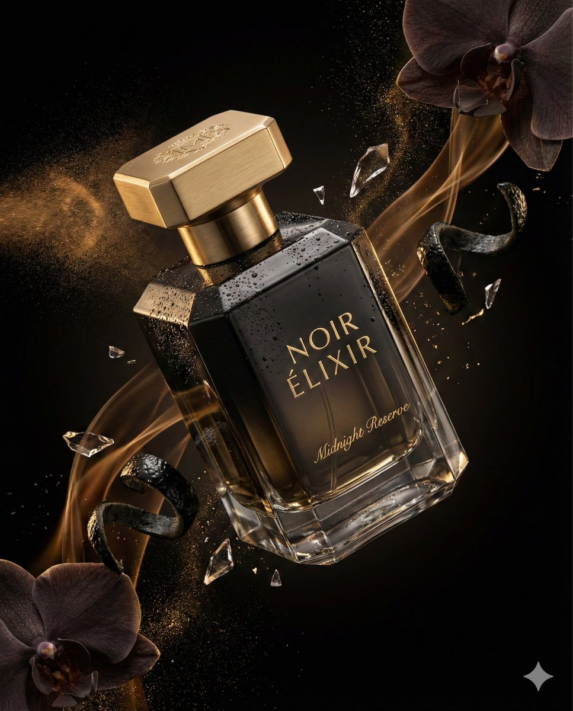

## Minimalist commercial ad featuring oversized white smart

- ID: trending-2048643867222962518
- Slug: trending-2048643867222962518-en
- 语言: en
- 来源: [来源链接](https://x.com/MrDasOnX/status/2048643867222962518)
- 样例图路径: images/part1/2048643867222962518_1.jpg

### 提示词

```text
Minimalist commercial ad featuring oversized white smartwatch, ultra-clean design. A young woman in all-white outfit leans casually against the giant watch, relaxed confident pose, eyes closed, also wearing the same smartwatch on her wrist. Soft gradient blue background with large bold white “APPLE” text behind. Glossy reflective floor, soft studio lighting, modern high-end fashion/product photography. Small top-right text “Designed by Mr Das”. Bottom center tagline in small white font: “Stay connected, move smarter.”
```

### 样例图

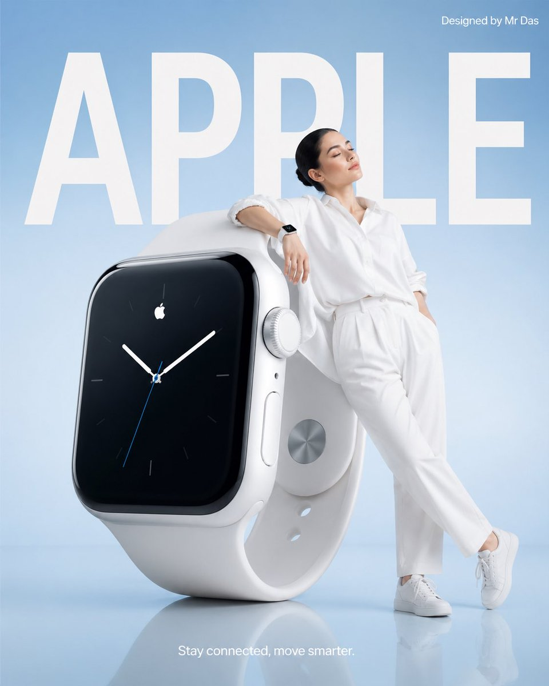

## Person from the reference image, with a fade haircut, br

- ID: trending-2038433331944292723
- Slug: trending-2038433331944292723-en
- 语言: en
- 来源: [来源链接](https://x.com/Goodmanprotocol/status/2038433331944292723)
- 样例图路径: images/part1/2038433331944292723_1.jpg

### 提示词

```text
Person from the reference image, with a fade haircut, brown eyes, and a well-groomed short beard, wearing a glossy oversized red puffer jacket and loose red pants with white and red nike sneakers, crouching low with one knee up and one leg forward, left arm resting casually over the raised knee and right hand relaxed near the other leg, body angled slightly to the side while head tilts forward looking directly at the camera with a confident expression, ultra wide-angle low perspective shot emphasizing the front sneaker appearing large and dominant in the foreground, set in a fully red environment with smooth floor and backdrop featuring large white nike swoosh logos behind and flowing ribbon-like red shapes around, hyper-realistic photography, extremely sharp details on fabric shine and sneaker texture, dramatic studio lighting with strong highlights and soft shadows, saturated monochromatic red color palette with white accents, modern streetwear campaign style, no blur, no distortion, no extra limbs, no artifacts
```

### 样例图

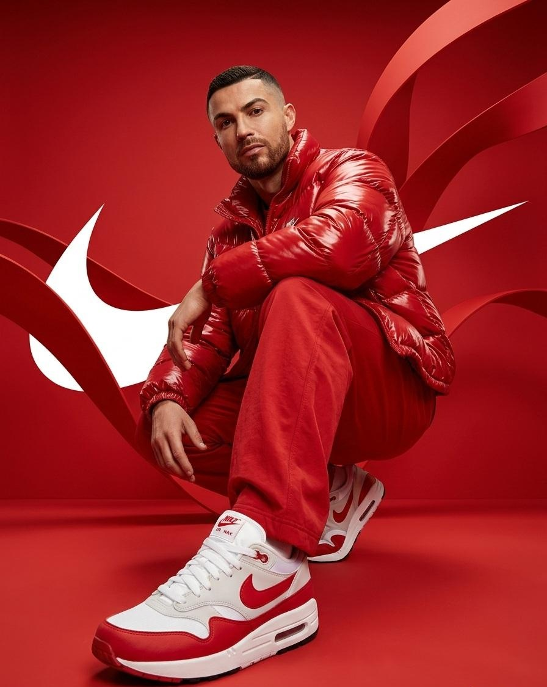

## logo completely wrapped in a single layer of elastic pla

- ID: trending-2040963305901273505
- Slug: trending-2040963305901273505-en
- 语言: en
- 来源: [来源链接](https://x.com/Naiknelofar788/status/2040963305901273505)
- 样例图路径: images/part1/2040963305901273505_1.jpg

### 提示词

```text
logo completely wrapped in a single layer of elastic plastic or shrink wrap. The shapes of the logo should be visible only through the relief under the film, the logo surfaces themselves are not visible.

Brand Analysis System:

Logo geometry: Determine the full visual brand identifier [ADIDAS ORIGINAL] according to the official catalog: an icon, a text element, or a combination thereof. Keep the exact spatial relationship between the icon and the text.
Color system: Use one monochrome tone [ADIDAS ORIGINAL] for all elements of the scene — background, film, wrapped object. Variations are achieved only through light and shadow.
The nature of the film: Based on the selected color [ADIDAS ORIGINAL], determine the behavior of the material: bright saturated colors create a dense glossy or latex film with visible tension lines; neutral — matte stretch film; dark - translucent vacuum film; light — matte food film.

Stage 1: Stage and Surface

The whole scene is monochromatic, the [ADIDAS ORIGINAL] color covers every surface without exception.
The background is made of the same film material, which is freely assembled and crumpled around the logo. Natural tension lines are created, the folds diverge from the peaks of the relief.
There are no floor lines, walls, or horizons — the stage is completely immersed in a solid plastic material.

Stage 2: Applying the logo

Each element of the logo is voluminous, rounded, like a balloon, with visual depth.
The logo is fixed on the background and is completely covered with a single layer of film, tightly stretched over the tops of the elements, creating visible tension lines.
Free folds are formed in the hollows between the letters, geometric elements of the icon and around the perimeter of the logo.
The logo remains fully readable, the icon is recognizable, but not a single surface of the logo itself is visible.
The physics of the film is precise: tight tension at high points, diverging stress lines, small raised areas between elements, shadows in the gaps.

Stage 3: Lighting

The main light source is soft, diffused, from the top left, emphasizing the relief of the film.
For glossy films, there are subtle highlights along the stretched areas, for matte films, there is only diffused light.
Global lighting preserves details in deep folds without smoothing out the overall relief.

Technical specifications

Only the [ADIDAS ORIGINAL] color, variations through light and shadow.
There are no exposed logo surfaces and unnecessary text.
The film is realistic: the tension, the folds, the physics of plastic, not fabric.
The film grain corresponds to ISO 400.
Mood: the product is packed and ready for opening, the shape is known, but not yet touched.
```

### 样例图

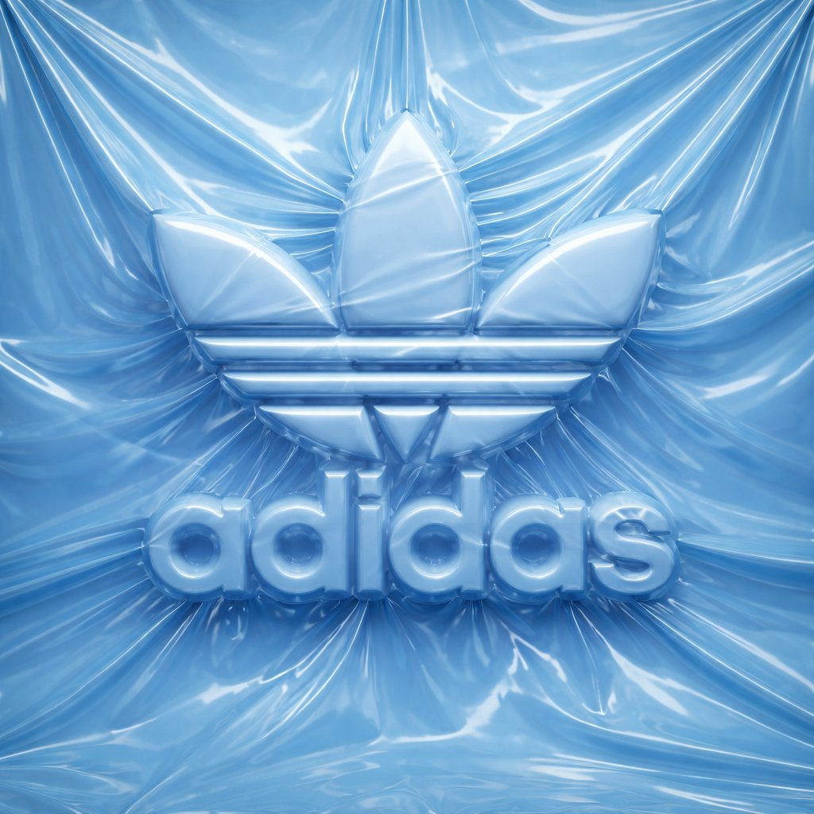

## { "master_prompt": { "scene_type": "ultra-realistic luxu

- ID: trending-2026285999660397026
- Slug: trending-2026285999660397026-en
- 语言: en
- 来源: [来源链接](https://x.com/mehvishs25/status/2026285999660397026)
- 样例图路径: images/part1/2026285999660397026_1.jpg

### 提示词

```text
{
"master_prompt": {
"scene_type": "ultra-realistic luxury skincare commercial photography",

"product": {  
  "type": "premium beauty elixir vial",  
  "brand_name": "VÉRÉLLE",  
  "product_name": "Lumière Nectar — Youth Infusions",  
  "container_shape": "tall faceted crystal vial with elegant vertical geometry",  
  "material": "optical crystal glass",  
  "finish": "prismatic clarity with soft light dispersion",  
  "cap_design": "brushed champagne-gold cap with beveled edge",  

  "label_design": {  
    "style": "Parisian luxury serif typography",  
    "primary_text": "Lumière Nectar",  
    "secondary_text": "Youth Infusions",  
    "finish": "champagne foil emboss with micro-engraved detailing"  
  },  

  "liquid_color": "soft golden nectar with luminous micro-pearl shimmer"  
},  

"composition": {  
  "placement": "center hero placement",  
  "pedestal": "ivory marble pedestal with subtle gold veining",  
  "base_surface": "polished reflective stone surface",  

  "surrounding_elements": [  
    "white orchid petals",  
    "golden honey droplets",  
    "chamomile blossoms",  
    "glass dew spheres"  
  ],  

  "liquid_effect": "soft golden mist swirl behind the vial"  
},  

"lighting": {  
  "style": "high-end beauty studio lighting",  
  "key_light": "soft frontal glow for glass clarity",  
  "rim_light": "warm rim highlights enhancing crystal edges",  
  "fill_light": "luxury soft diffusion",  
  "reflections": "controlled highlights for premium finish"  
},  

"background": {  
  "color": "warm ivory to champagne gradient",  
  "style": "clean editorial luxury backdrop",  
  "depth": "cinematic shallow depth with elegant falloff"  
},  

"camera": {  
  "angle": "slightly low hero angle",  
  "focus": "crystal edges and typography",  
  "depth_of_field": "cinematic shallow depth",  
  "resolution": "8K ultra-detailed clarity"  
},  

"mood_keywords": [  
  "Parisian luxury",  
  "timeless beauty",  
  "radiant skin",  
  "elegant purity",  
  "premium skincare campaign",  
  "refined sophistication"  
]

}
}
```

### 样例图

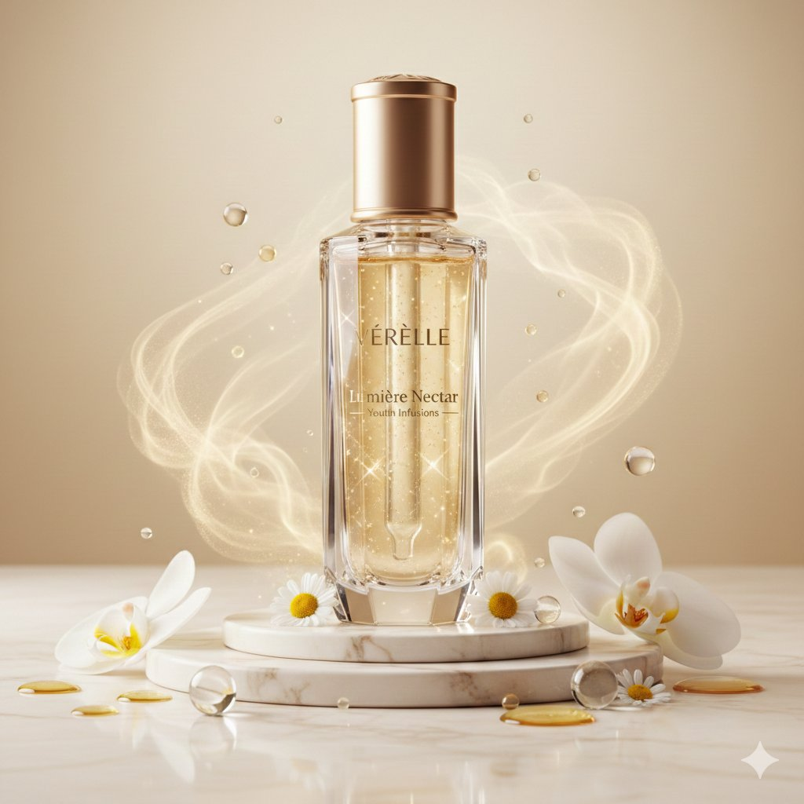

## High-impact e-commerce infographic for "Apple Pods Pro 3

- ID: trending-2047935217231663186
- Slug: trending-2047935217231663186-en
- 语言: en
- 来源: [来源链接](https://x.com/meng_dagg695/status/2047935217231663186)
- 样例图路径: images/part1/2047935217231663186_1.jpg

### 提示词

```text
High-impact e-commerce infographic for "Apple Pods Pro 3" 
premium wireless over-ear headphones.

FOREGROUND - PRODUCT HERO SHOT
Extreme close-up of a hand holding a sleek, 
matte-white premium over-ear headphone toward the camera 
at a slight angle. The headphone features:
- Glossy white ear cushions with soft memory foam padding
- Brushed aluminum silver headband with subtle Apple Pods 
  Pro 3 embossed branding
- Black mesh speaker grille visible on the ear cup face
- A tiny glowing green LED status indicator on the 
  right ear cup edge
- Subtle touch-control icons etched on the outer cup surface

Macro-lens shallow depth of field — hand and headphone 
slightly blurred at edges to create cinematic depth. 
Product remains razor-sharp in center frame.

CENTRAL SUBJECT — MODEL
In the mid-ground: a smiling young woman with freckles 
and wavy pastel-pink hair. She wears:
- A vibrant lime-green knit beanie
- A psychedelic black and white-striped long-sleeve shirt
- The white over-ear headphones resting stylishly 
  around her neck (not on ears) — one hand casually 
  touching the ear cup

Expression: relaxed, confident, joyful. 
She is glancing slightly off-camera with a natural smile.

BACKGROUND & ATMOSPHERE
Clean soft-focus studio backdrop — light gray gradient 
fading to warm white at center. 

Atmospheric overlays:
- Diagonal rainbow prism lens flares cutting across 
  upper-left to lower-right
- Soft pastel light leaks in pink and yellow at corners
- 4–5 blurred white over-ear headphones floating 
  artistically in the background at various depths 
  and rotation angles
- Subtle bokeh circles from background studio lights

Lighting: Soft professional three-point studio lighting. 
Key light from upper-left, fill light right side. 
Rim light behind model for separation. 
Glossy highlights on headphone surfaces catching light naturally.

TYPOGRAPHY & LAYOUT — Sans-Serif, Clean white 
TOP CENTER (behind model, large background text):
→ Massive bold oversized text: "HEADPHONES"
   Semi-transparent white, spanning full width behind subject

TOP RIGHT CORNER:
→ Bold clean text: "Apple Pods Pro 3"
   Subtitle smaller text: "Over-Ear Wireless"

MID LEFT:
→ Icon: small sound wave symbol
→ Bold text: "Premium Sound"
→ Sub-text: "Active Noise Cancellation + Transparency Mode"

MID RIGHT:
→ Extra-large bold numeral: "40"
→ Smaller text below: "hours of battery life"

LOWER LEFT:
→ Extra-large bold numeral: "0"
   with "to" beside it → then bold "100%"
→ Sub-text: "Fast charge — 10 min = 3hrs playback"

BOTTOM RIGHT:
→ Extra-large bold numeral: "1"
→ Sub-text: "Year Warranty Included"

BOTTOM CENTER (fine print style):
→ Small elegant text: 
   "Bluetooth 5.4  |  Hi-Res Audio Certified  
    |  Foldable Design  |  USB-C Charging"

TECHNICAL SPECS
Resolution: 8K ultra-sharp
Style: Commercial product photography meets 
       editorial fashion advertising
Color Palette: White, lime green, pastel pink, 
               rainbow prism accents
Focus: Tack-sharp on headphone product — 
       shallow DOF on everything else
Lens: 85mm macro, slight low angle
Render Quality: Hyperrealistic, clean ad aesthetic, 
                vibrant yet professional color grading
```

### 样例图

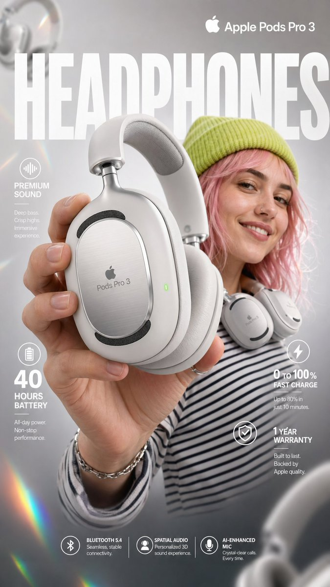

## Bright colorful children's shoe brand advertisement for 

- ID: trending-2048726962001379515
- Slug: trending-2048726962001379515-en
- 语言: en
- 来源: [来源链接](https://x.com/im_shahid7/status/2048726962001379515)
- 样例图路径: images/part1/2048726962001379515_1.jpg

### 提示词

```text
Bright colorful children's shoe brand advertisement for "Happy Smile☺️", happy young child jumping in the air wearing oversized colorful foam  black and white shoes, giant rainbow colored shoe prop in background, bright green and white studio background, playful bubbly bold typography "CLOUD" in background, tagline "Every step 
is an adventure.", confetti falling, fun joyful lighting, 
commercial photography style, ultra HD 8K , Designed with Shamus image 2.
```

### 样例图

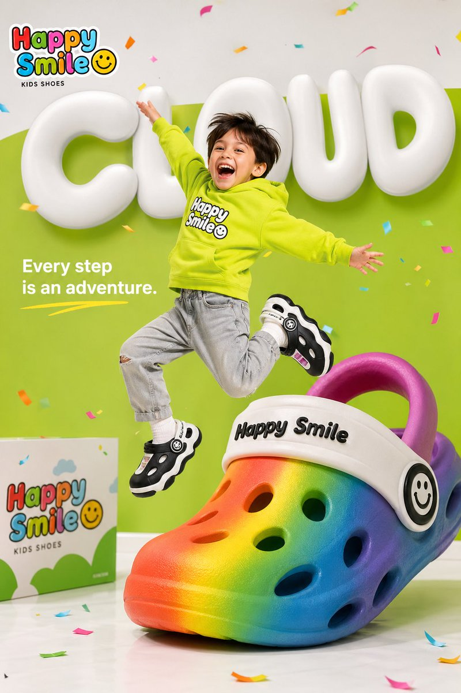

## Create a high-impact 9:16 vertical e-commerce infographi

- ID: trending-2048641686994407474
- Slug: trending-2048641686994407474-en
- 语言: en
- 来源: [来源链接](https://x.com/john_my07/status/2048641686994407474)
- 样例图路径: images/part1/2048641686994407474_1.jpg

### 提示词

```text
Create a high-impact 9:16 vertical e-commerce infographic for Bolt True Wireless Earbuds with a premium lifestyle advertising aesthetic.
Composition & Framing
Full-body shot of a young woman (match face and identity exactly to the provided reference image — accurate facial features, skin tone, hairstyle)
Camera angle slightly low and close (fashion campaign perspective) to add depth and presence
The subject is sitting casually on the floor, one knee raised, one leg extended forward toward the camera
Foreground (Product Focus)
The woman is holding an open Bolt earbud charging case toward the camera
Inside the case: one earbud visible
The second earbud is worn in her ear
Case should be glossy white with subtle branding (“BOLT”)
Add slight macro depth-of-field blur on the hand and case for cinematic realism
Subject Styling
Outfit: modern sporty streetwear
lightweight jacket (off-white / neutral tone)
crop top or sports bra
loose joggers (light pink or soft color)
white sneakers with visible texture
Expression: confident, relaxed, slight smile
Pose: natural, lifestyle-oriented — not stiff or overly posed
Background & Atmosphere
Clean studio background with soft gray gradient
Add:
rainbow prism lens flares
subtle light leaks
floating blurred earbuds and charging case in background
Ground surface slightly textured (studio floor look)
Lighting
Soft, diffused commercial lighting
Highlight:
skin texture
glossy earbud case
fabric details
Subtle rim lighting for separation from background
Typography Layout (Modern Sans-Serif, White)
Top Center (Behind Model):
BOLD HUGE TEXT:
“BOLT” (partially hidden behind subject)
Top Right:
Bolt Earbuds
True Wireless
Mid Left:
Powerful sound.
Effortless vibes.
Engineered for every beat of your day.
Mid Right:
BIG: 30
small: hours of playtime
Below that:
BIG: IPX5
small: water resistant
Bottom Right:
BIG: 1
small: year warranty
Style & Quality
8K ultra-realistic commercial photography
Sharp focus on face + earbuds
Slight depth blur for foreground and background elements
Clean Apple/Nike-style premium ad aesthetic
Balanced composition with strong negative space
```

### 样例图

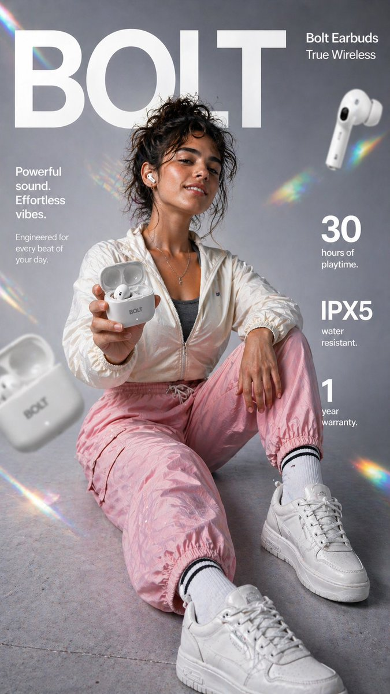

## [product], luxury packaging reveal scene, premium unboxi

- ID: trending-2011729859572351448
- Slug: trending-2011729859572351448-en
- 语言: en
- 来源: [来源链接](https://x.com/Naiknelofar788/status/2011729859572351448)
- 样例图路径: images/part1/2011729859572351448_1.jpg

### 提示词

```text
[product], luxury packaging reveal scene, premium unboxing moment, pristine hands partially visible at the edges, delicate interaction with the packaging, lid slightly lifted to reveal the product inside, crisp folds and precise alignment, tactile materials [ ex: matte paper, soft touch coating, embossed details, foil accents], subtle micro texture and dust free finish, clean white background, soft diffused studio lighting, controlled specular highlights, realistic shadows, macro product photography look, shallow depth of field with sharp focus on the product and branding area, high end editorial commercial style, ultra realistic, 4k, 1:1, no watermark, no extra text
```

### 样例图

![[product], luxury packaging reveal scene, premium unboxi](../images/part1/2011729859572351448_1.jpg)

## [BRAND NAME] | [COLOR] ABSOLUTE RULE — READ BEFORE GENER

- ID: trending-2048828286466134200
- Slug: trending-2048828286466134200-en
- 语言: en
- 来源: [来源链接](https://x.com/AmirMushich/status/2048828286466134200)
- 样例图路径: images/part1/2048828286466134200_1.jpg

### 提示词

```text
[BRAND NAME] | [COLOR]

ABSOLUTE RULE — READ BEFORE GENERATING ANYTHING: The fluid mass in this image has the exact shape of the [BRAND NAME] logo and nothing else. Not a circle. Not an oval. Not a blob. Not a rounded shape with the logo inside it. The outer silhouette of the fluid IS the logo outline — identical to the canonical [BRAND NAME] logo trademark. If someone covers the bubble texture and looks only at the silhouette they must immediately recognize it as the [BRAND NAME] logo. The fluid does not flow into a circle. The fluid does not form a blob. The fluid is constrained to the exact logo shape. This is the single most important rule in this prompt — it overrides everything else. Act as a Macro Fluid Photographer and CGI Art Director creating a hero typographic image where the brand logo is formed entirely from living fluorescent foam and bubble liquid — as if the logo was poured into a logo-shaped mold on a black surface and captured at the exact moment of maximum bubble activity. References: macro fluid photography, fluorescent paint foam art, soap bubble macro photography. --- PHASE 0: BRAND LOGO INTELLIGENCE — GEOMETRY IS LAW Retrieve the 100% canonical trademark-accurate primary mark of [BRAND NAME]. Use only the core logo symbol or emblem. STEP 1 — ESTABLISH EXACT SILHOUETTE: reconstruct the precise canonical [BRAND NAME] logo silhouette — every curve, every angle, every proportion exactly as trademarked. Draw this silhouette in your mind as a flat solid shape. This is the mold. It is rigid. It does not change shape. STEP 2 — FLUID FILLS THE MOLD: the fluid foam fills the interior of this rigid mold. The outer boundary of the fluid mass IS the logo outline — precise, hard, clean. Think of it as the logo shape cut from foam rubber and placed on a black surface. The fluid is solid where the logo is solid. The fluid is absent where the logo has designed empty space — those gaps show pure black background. STEP 3 — NO CONTAINER: there is no circle, no oval, no badge, no rounded rectangle, no frame around the logo. The logo floats directly on the black background. Its edges are the logo edges — nothing more. STEP 4 — ORIENTATION LOCKED: correct canonical upright orientation exactly as in official brand materials. Not rotated, not flipped, not mirrored, not tilted. STEP 5 — ZERO FLUID OUTSIDE BOUNDARY: the logo silhouette is an absolute hard boundary. Zero fluid, zero bubbles, zero tendrils, zero droplets outside this boundary. The black background begins exactly where the logo outline ends. STEP 6 — GEOMETRY WINS ALWAYS: wherever fluid simulation physics conflict with exact logo geometry — the logo geometry wins. Always. Apply [COLOR] as the fluid foam color throughout — in its most saturated fluorescent version. --- PHASE 1: FLUID MATERIAL SYSTEM — CRITICAL The entire logo form is filled with a single continuous viscous fluid existing in two physical states simultaneously. The fluid is NOT water — thick, viscous, surface-tension-dominant, like fluorescent soap foam, acrylic paint with trapped air, or colored slime. Base color: [COLOR] at maximum fluorescent saturation — self-luminous quality as if internally lit, consistent with UV-reactive fluorescent paint. Tonal variation strictly within [COLOR] family: thin bubble membrane walls — 35 to 45% lighter than base [COLOR], approaching near-transparency. Mid-thickness fluid zones — pure saturated [COLOR]. Deep thick liquid pools — 25 to 35% darker than base [COLOR]. Fluid surface in liquid zone: high gloss, wet, shiny, visible broad specular reflection. Foam zone membranes: lower gloss, slight soap film iridescence. --- PHASE 2: BUBBLE ARCHITECTURE SYSTEM Full bubble size hierarchy present across the foam zone only. Large anchor bubbles — 10 to 18mm diameter, 4 to 8 present. Medium bubbles — 4 to 9mm, 15 to 25 present. Small bubbles — 1.5 to 3mm, 30 to 50 present. Micro bubbles — 0.5 to 1mm, 50 to 100+ present. Each bubble: physically accurate sphere of trapped air enclosed by thin colored fluid membrane, 0.1 to 0.3mm thick, semi-transparent. Soap film iridescence barely perceptible. Bubble dome highlight: bright white crescent arc in UPPER-LEFT portion of each dome — 15 to 20% of dome surface, soft-edged, white regardless of bubble color. Inside large bubbles: dark reflection with [COLOR] tint confirming membrane transparency. Bubble contact deformation: flat septum membranes at contact points. Burst bubble holes: 3 to 8 irregular dark voids within foam zone only — revealing black background. Never at or near the logo boundary edges. --- PHASE 3: DUAL-STATE CONTRAST — CRITICAL Left zone — foam state: dense chaotic foam with full bubble hierarchy strictly within the logo silhouette. All bubble activity stays inside the logo boundary — never at or beyond the edge. Right zone — liquid state: solid continuous smooth mass — bubbles completely absent, maximum 2 to 3 micro-bubbles at transition edge only. Smooth viscous pool: gentle surface tension undulation 0.5 to 1mm, high gloss, broad soft specular highlight toward upper-left. Dense, heavy, pooled. Transition zone: gradual 8 to 15mm wide transition through vertical center — large bubbles disappear, fluid surface becomes smooth, last bubbles partially collapsed with sagging membranes dissolving into liquid surface. Edge behavior: both the foam side and the liquid side terminate exactly at the canonical logo outline. The logo boundary is geometric and exact on all sides. Clean edge. No organic ragged outer silhouette. The logo shape is always recognizable from the outer boundary alone. NO SPLATTER — ABSOLUTE: zero droplets, zero spray, zero tendrils, zero extensions beyond logo boundary. The composition is completely calm and contained. --- PHASE 4: LIGHTING — MATCH REFERENCE EXACTLY Primary light: large softbox upper-LEFT at 20 to 30° offset from vertical — NOT directly overhead. Light from above AND left simultaneously. Temperature 5500K neutral white. Left side and upper-left surfaces brighter. Right side relatively darker. Every bubble dome highlight arc in UPPER-LEFT. Liquid zone broad specular reflection toward upper-left. Micro-shadows from bubbles fall lower-right, 0.5 to 1mm, barely visible. Secondary ambient: 8 to 10% cool ambient from above. No fill from right. No rim light. No colored light. --- PHASE 5: COMPOSITION & CAMERA Background: absolute black #000000 — perfectly clean, zero texture, zero noise, zero gradient. Pure void. Aspect ratio: 1:1 square. Logo form occupies 60 to 70% of frame — centered horizontally and vertically. Generous clean black surround on all sides. Camera: directly overhead, perfectly perpendicular — zero elevation, zero perspective distortion, zero rotation. Pure top-down flat-lay macro. The logo silhouette reads as the correct [BRAND NAME] mark from this top-down view. Depth of field: sharp across entire fluid surface. --- PHASE 6: TECH SPECS Render: Houdini FLIP fluid simulation + Redshift or Octane, OR photorealistic CGI achieving identical result. CRITICAL: the fluid simulation domain is bounded by the exact logo silhouette — the simulation cannot escape the logo boundary. Fluid mesh: real FLIP simulation geometry constrained to logo shape. Bubble geometry: real curved surface per bubble, not texture map. Bubble membranes: thin-shell geometry, IOR 1.33, transmission 0.7 to 0.85, thin-film iridescence. Liquid zone: smooth FLIP mesh, roughness 0.02 to 0.05, high gloss. Foam zone material: fluorescent shader, emissive 0.05 to 0.1, subsurface scattering 2 to 4mm. Lighting: one large rectangular area light 80×80cm, upper-left 20 to 30° from vertical, 5500K. Secondary HDRI ambient 8 to 10%, neutral gray. Ray tracing minimum 12 bounces. Caustics on. Sampling minimum 2048. Anti-aliasing maximum. No film grain. No post-process. Output feel: indistinguishable from professional macro photograph of real fluorescent foam in a perfectly clean studio. --- FINAL CHECK — MANDATORY BEFORE OUTPUT: (1) Does the outer silhouette of the fluid mass match the exact [BRAND NAME] logo shape? If no — regenerate. (2) Is the fluid inside a circle, oval, or any container? If yes — regenerate. (3) Is there any fluid, droplet, or bubble outside the logo boundary? If yes — regenerate. (4) Are both foam state and liquid state clearly visible? If no — regenerate.
```

### 样例图

![[BRAND NAME] | [COLOR] ABSOLUTE RULE — READ BEFORE GENER](../images/part1/2048828286466134200_1.jpg)

## A clean, refreshing vertical advertising poster design f

- ID: trending-2048662802475409637
- Slug: trending-2048662802475409637-en
- 语言: en
- 来源: [来源链接](https://x.com/Ozayrr_irl/status/2048662802475409637)
- 样例图路径: images/part1/2048662802475409637_1.jpg

### 提示词

```text
A clean, refreshing vertical advertising poster design for a face wash product, using a graphic illustration style with soft watercolor and vector elements. The poster is set against a clean white and light teal background. The central figure is a beautiful, smiling young woman with natural, glowing, radiant skin and her hair loosely tied back in a messy bun, looking confidently towards the viewer with fresh-faced appearance. She has a touch of natural makeup.
The overall style is clean, modern, and graphic, with flowing organic shapes, stylized leaves, flowers, and water splashes in shades of aqua, teal, light green, and white. The background features delicate, stylized illustrations of botanical ingredients like aloe vera, green tea leaves, and lavender.
At the top, large, friendly, rounded sans-serif font reads: "RADIANT SKIN STARTS HERE". Below this, a catchy tagline: "Cleanse, Refresh, Glow."
The main product, a stylized bottle of face wash with a white pump and green and blue labeling, is illustrated to the right of the woman. The bottle is labeled "FRESH FACE DAILY CLEANSER" and mentions "With Aloe Vera & Green Tea." There are small graphical icons around the bottle with text: "Deep Pore Cleansing", "Soothes & Hydrates", "For All Skin Types", "Paraben Free".
Small illustrative bubbles, stars, and botanical accents float around the composition, adding a sense of lightness and freshness. At the bottom, in a clean, modern font, it says: "AVAILABLE NOW AT ALL MAJOR RETAILERS" followed by a stylized logo "FRESH FACE" and the website "https://t.co/OUIoDMOWF6" and social media icons (freshfacecare). The poster has a clean layout with ample negative space and soft, natural lighting.
```

### 样例图

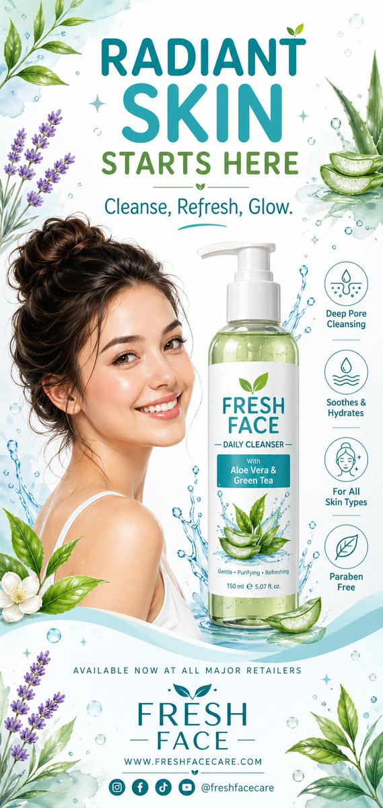

## Ultra-clean modern editorial infographic. The topic is [

- ID: trending-2048044376366948849
- Slug: trending-2048044376366948849-en
- 语言: en
- 来源: [来源链接](https://x.com/TechieBySA/status/2048044376366948849)
- 样例图路径: images/part1/2048044376366948849_1.jpg

### 提示词

```text
Ultra-clean modern editorial infographic. The topic is [ROUTINE] routine. Base all visuals, colors, objects, mood, ingredients, and steps entirely on this topic. Hero visual: a stylized flat-lay or floating arrangement of 3–4 iconic objects associated with this topic — slightly angled or in soft perspective, glowing subtly. All elements arranged dynamically around the hero in a non-restrictive editorial layout. Ingredients Section: Label it ‘What You Need’ — include 6–8 relevant items with small icons or emoji illustrations next to each, with a practical quantity or duration written like a recipe. Steps Section: 5–6 numbered panels with arrows or connecting lines forming a logical flow, each with a short action label and small relevant icon, using glassmorphism or frosted card styling. Stats Badges: 4–5 floating pill-shaped badges showing relevant metadata, displayed as clean minimal bubbles near the hero. Visual Style: Choose background color, accent colors, typography weight, and texture to naturally match the topic’s mood. Bold modern sans-serif typography. Clean vector icons. Subtle grain or texture. Composition: Hero centered or slightly offset, ingredients one side, steps opposite or below with connecting lines, stat badges as floating pills, generous negative space. Lighting: Soft natural studio lighting matching the topic’s tone. Premium editorial aesthetic, social-feed optimized. Ultra-crisp. No watermark
```

### 样例图

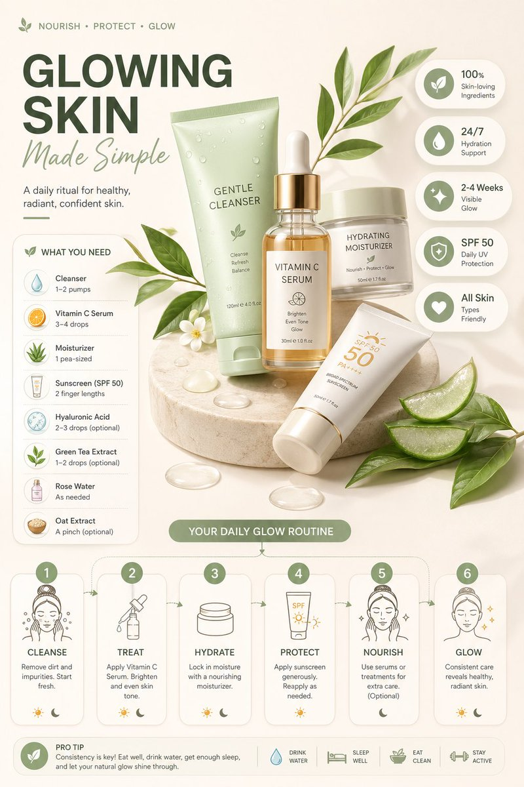

## Create a 16:9 horizontal bento-grid brand collage for [B

- ID: trending-2047420285817929961
- Slug: trending-2047420285817929961-en
- 语言: en
- 来源: [来源链接](https://x.com/AmirMushich/status/2047420285817929961)
- 样例图路径: images/part1/2047420285817929961_1.jpg

### 提示词

```text
Create a 16:9 horizontal bento-grid brand collage for [BRAND NAME] in a polished contemporary campaign style.  
Use a fixed 3-row, 4-column bento structure with rounded tiles, equal gaps, clean alignment, and a light neutral background.
The layout must stay consistent across generations, but the content inside each tile must adapt to the real business model, product ecosystem, and brand language of [brand name].

Grid blueprint
Build the composition as 11 visible content zones arranged in a fixed bento layout:
Top-left tile: 1 column × 2 rows, tall vertical hero device or primary brand surface
Top-middle-left tile: 1 column × 1 row, compact square brand asset tile
Top-middle-right tile: 2 columns × 1 row, wide headline/message tile

Center tile: 2 columns × 2 rows, dominant campaign hero scene

Top-right tile: 1 column × 1 row, secondary device / product surface / branded object

Bottom-left tile: 1 column × 1 row, product artifact or branded utility object

Bottom-center tile: 2 columns × 1 row, large bold typography tile

Bottom-right tile: 1 column × 2 rows, tall informational product / interface / feature tile

All tiles must share the same corner radius, spacing system, and visual polish.
The dominant focal points are the large center hero tile, the wide top headline tile, and the wide bottom typography tile.

Adaptive content logic
Do not assume [brand name] is a fintech brand.
Before deciding what appears inside each tile, infer what [brand name] actually is: social platform, SaaS tool, media brand, retailer, hospitality brand, hardware company, mobility app, AI product, consumer app, etc.

Every tile must contain a plausible branded asset based on that business type.

Use this rule:

If [brand name] has a real consumer app, dashboard, product UI, creator interface, booking flow, editor, storefront, feed, player, workspace, or operating surface, use those.

If [brand name] does not realistically have payment cards, watches, or hardware, do not invent them.

Only include branded physical objects when they make sense for the brand: packaging, merch, signage, magazine, laptop sticker, storefront card, delivery box, product box, wearable, poster, notebook, tote, badge, ticket, book, etc.

If the brand is primarily digital, prioritize screens, interface fragments, campaign graphics, app/store listings, editorial visuals, and branded communication assets.

If the brand is a platform, use realistic platform surfaces: profile screens, creator dashboards, boards, playlists, templates, analytics, publishing tools, discovery feeds, search, collaboration views, etc.

If the brand is a physical-product company, use realistic product shots, packaging, product detail pages, retail signage, and lifestyle scenes.

If the brand is a service business, use realistic booking, scheduling, marketplace, onboarding, testimonial, results, or service-delivery interfaces.

If exact assets are unknown, infer the most believable official-looking product and campaign system for [brand name].

Tile-by-tile rules
1) Tall left hero tile
Show the most iconic primary branded surface for [brand name].

Examples:

phone with app UI
laptop with dashboard/editor
tablet with creative workspace
product packaging held in hand
branded poster or printed object
storefront or physical product close-up

This tile should represent the brand’s main touchpoint, not a generic device.

2) Small square brand asset tile
Show a compact brand-signature element:

app icon
logo mark
symbol
product badge
branded motif
miniature packaging unit
icon system object
sticker or seal
simplified 3D brand emblem

This tile should feel like a distilled identity marker.

3) Wide top headline tile
Use a short strategic message that fits [brand name]’s category and tone.
Do not repeat generic fintech copy.
The line should feel like a real campaign headline for that specific brand.

Examples of direction:

discovery
creativity
organization
inspiration
connection
travel
productivity
expression
streaming
collaboration
automation

Use large, bold, high-contrast typography.

4) Large center hero tile
Create the main campaign scene for [brand name] in a real-world or branded-environment context.
This should be the most expressive tile.

Possible formats:
outdoor billboard
subway poster
retail installation
city poster wall
laptop-on-desk hero scene
creator workspace
product-in-use lifestyle shot
editorial campaign image
interface projected into environment
branded event signage
The scene must make sense for the brand’s world and audience.

5) Top-right support tile
Show a secondary but still realistic brand surface:

another device view
product detail
branded object
campaign variation
interface zoom-in
packaging angle
social post mockup
desktop widget
creator tool panel
notification / discovery / search view

This tile should complement the main touchpoint, not duplicate it exactly.

6) Bottom-left artifact tile
Show a category-appropriate branded artifact, not a fixed “bank card”.

Choose the artifact based on [brand name]:

for fintech: payment card, wallet pass, transfer screen, exchange card

for social/media: creator card, profile card, post template, content preview, board tile, channel card

for SaaS/productivity: workspace card, document preview, template card, dashboard widget

for e-commerce/retail: packaging, shipping box, loyalty pass, product tag, order card

for travel/hospitality: booking card, room key, boarding-style pass, itinerary card

for music/media: album card, playlist card, player card, event ticket

for AI/software: prompt card, generation result card, model card, workflow card

This tile must feel like a believable branded unit of value for that company.

7) Wide bottom message tile
Use one strong oversized statement in uppercase or bold display typography.
This is not necessarily the slogan from the top tile; it can be a broader campaign line or category promise.

The message must match the actual brand behavior of [brand name].
For example, do not use “MOVE MONEY WITHOUT BORDERS” unless the brand actually deals with payments or finance.

8) Tall right informational tile
Show a structured branded information surface:
app store page
product page
onboarding screen
feature overview
marketplace listing
creator profile
brand campaign landing screen
dashboard overview
editorial page
discovery feed
help center / setup / feature panel
This tile should add product depth and make the collage feel like a full brand system.

Brand realism rules
Use the real or highly plausible brand identity of [brand name]: logo, color palette, typography feel, icon language, image treatment, interface style, and tone of voice.
If exact assets are unavailable, invent only what is necessary, but make it feel like the official visual system of [brand name].

Do not force a product category onto the brand.
Do not invent impossible hardware, payment tools, packaging, or app features unless they are realistic adjacent extensions of the brand.
Prefer believable brand adaptation over visual symmetry.

Visual consistency rules
Even though tile content is adaptive, the final image must still feel like one campaign system:

same overall grid structure
same tile spacing
same corner radius
same art direction quality
same brand palette across all tiles
consistent typography logic
consistent mockup realism
consistent lighting and polish

Style
Clean premium brand presentation, high detail, polished mockup realism, soft shadows, strong hierarchy, editorial-quality composition, modern campaign aesthetics.
Avoid random collage chaos.
Avoid tiny unreadable text.
Avoid generic placeholder UI.
Keep the structure fixed, but let the objects and branded surfaces adapt intelligently to [brand name].

Stronger one-line instruction

Important: the layout is fixed, but the objects are not fixed.
For each generation, select tile content based on what [brand name] realistically sells, ships, publishes, displays, or lets users interact with.
Never insert category-inappropriate objects just to fill the grid.
```

### 样例图

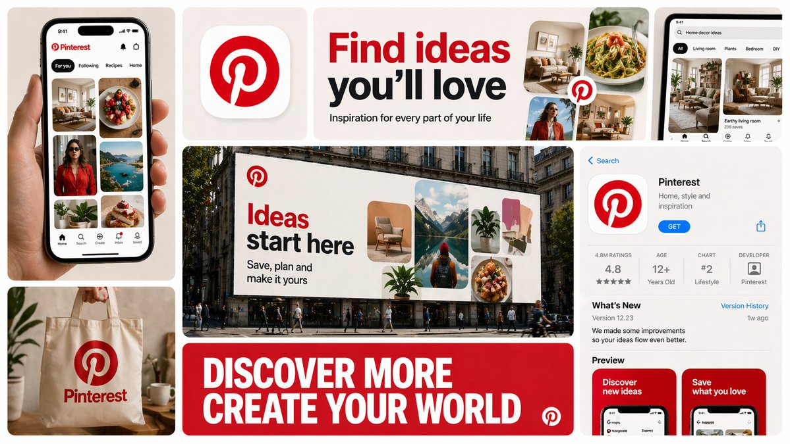

## Create a hyper-realistic cinematic luxury perfume produc

- ID: trending-2048956977250726018
- Slug: trending-2048956977250726018-en
- 语言: en
- 来源: [来源链接](https://x.com/yourPlugAI/status/2048956977250726018)
- 样例图路径: images/part1/2048956977250726018_1.jpg

### 提示词

```text
Create a hyper-realistic cinematic luxury perfume product photograph featuring [PERFUME BOTTLE DESIGN] positioned in [COMPOSITION / ANGLE] within a dramatic elemental environment of [ELEMENTAL SETTING: water, smoke, ice, firelight, forest, florals, spices, gemstones].

The bottle should feel premium and tactile, with [MATERIAL DETAILS: glossy glass, metallic cap, gold label, transparent liquid, frosted surface, engraved text], sharp reflections, realistic refractions, and crisp readable branding: [BRAND / LABEL TEXT].

Surround the product with carefully arranged sensory ingredients such as [BOTANICALS / SPICES / FRUITS / OBJECTS], using strong contrast between [PRIMARY COLOR PALETTE] and [ACCENT COLORS].

Lighting should be cinematic and high-contrast, with [LIGHTING STYLE], deep shadows, sparkling highlights, volumetric atmosphere, and a luxurious commercial advertising finish.

Background: [BACKGROUND DESCRIPTION], shallow depth of field, premium editorial composition, ultra-detailed textures, 8k resolution, photorealistic studio quality.


Cheat Sheet
[PERFUME BOTTLE DESIGN]: shape, color, cap, label style
[COMPOSITION / ANGLE]: tilted crash, centered still life, close-up tray, hand interaction
[ELEMENTAL SETTING]: splash, smoke, candlelight, ice, forest, aurora
[MATERIAL DETAILS]: glass, metal, liquid, frost, reflections
[BRAND / LABEL TEXT]: exact readable perfume text
[BOTANICALS / SPICES / FRUITS / OBJECTS]: lemons, vanilla pods, roses, pinecones, gemstones
[PRIMARY COLOR PALETTE]: navy, amber, silver, black, icy blue
[ACCENT COLORS]: gold, red, lime green, magenta, teal
[LIGHTING STYLE]: dramatic spotlight, candle glow, cool moonlight, golden rim light
[BACKGROUND DESCRIPTION]: moody studio, dark forest, blurred luxury interior, smoky backdrop


```

### 样例图

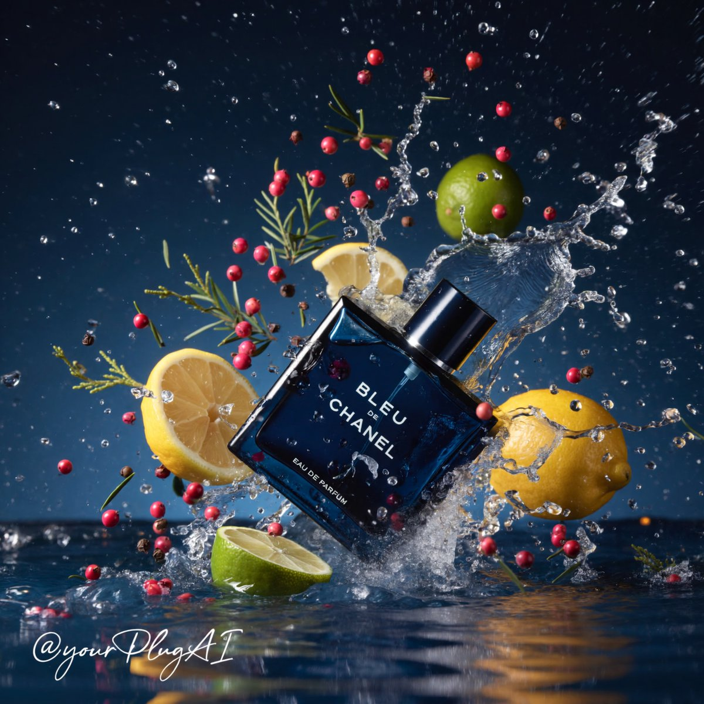

## Create a jaw-dropping premium advertising poster in 9:16

- ID: trending-2048773623297527836
- Slug: trending-2048773623297527836-en
- 语言: en
- 来源: [来源链接](https://x.com/ertanlabs/status/2048773623297527836)
- 样例图路径: images/part1/2048773623297527836_1.jpg

### 提示词

```text
Create a jaw-dropping premium advertising poster in 9:16 vertical format for a fictional ultra-limited Adidas sneaker called "ADIDAS AEROBLADE X - LIMITED DROP". The design must feel like a world-class campaign by a top creative agency, highly original, futuristic, visually explosive, and impossible to ignore.

Main visual:
A single hero sneaker floating in the center, shot from a dramatic low angle, as if it is levitating above a black obsidian running track split by glowing energy cracks. The shoe should look ultra-premium, highly engineered, sleek, aerodynamic, and fashion-forward. Its material should combine knit mesh, sculpted foam, translucent panels, reflective stripes, and a carbon-fiber sole plate. Neon light trails swirl around the shoe like captured speed. Small particles and mist add motion and intensity. In the background, use faint silhouettes of elite runners frozen mid-sprint, blurred just enough to keep all attention on the shoe.

Color palette:
Matte black, electric red, silver, deep charcoal, with subtle neon blue highlights.

Typography and poster copy:
Render all text cleanly, sharply, and professionally with strong hierarchy.
Main headline:
"OWN THE SPEED"
Product title:
"ADIDAS AEROBLADE X"
Subheadline:
"Built for the ones who never run ordinary."
Feature callouts in elegant boxed layout:
- "Featherlight Adaptive Knit Upper"
- "Carbon Energy Return Plate"
- "Precision Grip Traction"
- "Limited Collector Release"
Price line:
"$280"
CTA:
"DROP LIVE NOW"
Secondary CTA:
"Only at https://t.co/xuQ7Pl8fga"
Small footer text:
"Performance innovation meets futuristic street identity."

Layout direction:
The headline should be bold and oversized, partially integrated into the background. Product name should sit near the shoe in a refined premium layout. Feature callouts should be clean, readable, and arranged vertically along one side. Add a subtle badge reading "LIMITED SERIES". The overall composition should feel like a luxury sports campaign mixed with futuristic editorial design.

Style:
Ultra-detailed, hyper-realistic product photography, cinematic studio lighting, premium advertising aesthetics, sharp focus, rich textures, subtle atmosphere, dynamic motion energy, high-end commercial poster, no clutter, no generic template look.

Make the aspect ratio 9:16
```

### 样例图

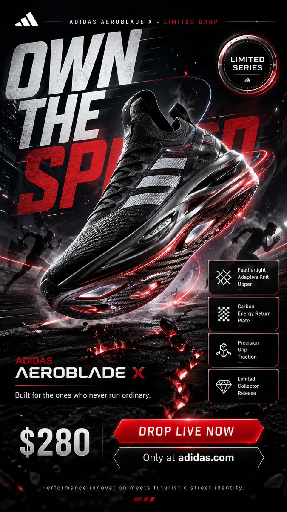

## Create a 3×3 grid in 3:4 aspect ratio for a high-end com

- ID: trending-2047419255931748377
- Slug: trending-2047419255931748377-en
- 语言: en
- 来源: [来源链接](https://x.com/azed_ai/status/2047419255931748377)
- 样例图路径: images/part1/2047419255931748377_1.jpg

### 提示词

```text
Create a 3×3 grid in
3:4 aspect ratio for a high-end commercial marketing campaign using the uploaded product as the central subject.

Each frame must present a distinct visual concept while maintaining perfect product consistency across all nine images.

Grid Concepts (one per cell):

1. Iconic hero still life with bold composition

2. Extreme macro detail highlighting material, surface, or texture

3. Dynamic liquid or particle interaction surrounding the product

4. Minimal sculptural arrangement with abstract forms

5. Floating elements composition suggesting lightness and innovation

6. Sensory close-up emphasizing tactility and realism

7. Color-driven conceptual scene inspired by the product palette

8. Ingredient or component abstraction (non-literal, symbolic)

9. Surreal yet elegant fusion scene combining realism and imagination

Visual Rules:
Product must remain 100% accurate in shape, proportions, label, typography, color, and branding
No distortion, deformation, or redesign of the product
Clean separation between product and background

Lighting & Style:
Soft, controlled studio lighting
Subtle highlights, realistic shadows
High dynamic range, ultra-sharp focus
Editorial luxury advertising aesthetic
Premium sensory marketing look

Overall Feel:
Modern, refined, visually cohesive
High-end commercial campaign
Designed for brand websites, social grids, and digital billboards
Hyperreal, cinematic, polished, and aspirational
```

### 样例图

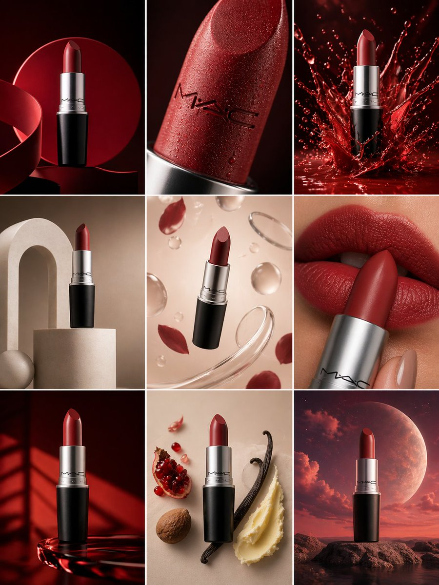

## Hyper-realistic cinematic perfume billboard poster for V

- ID: trending-2047711520059252891
- Slug: trending-2047711520059252891-en
- 语言: en
- 来源: [来源链接](https://x.com/Diplomeme/status/2047711520059252891)
- 样例图路径: images/part1/2047711520059252891_1.jpg

### 提示词

```text
Hyper-realistic cinematic perfume billboard poster for Vera Moss Tavernier Blue Eau De Parfum, built around freshness, clarity, and modern sharp identity

Scene: minimal architectural environment with smooth stone surfaces and cool-toned textures, soft air-like mist flowing horizontally across frame, creating a sense of movement and freshness

Product placement:
perfume bottle placed center on a clean elevated platform, perfectly upright, label facing camera
subtle reflective surface beneath with soft diffused reflection

Environment styling:
abstract stone formations + soft gradient sky tones (light blue to grey), inspired by open air and water freshness
no clutter, strong negative space

Composition:
centered hero product
strong breathing space around
background depth layers for cinematic feel

Typography system (Nike-style, strict hierarchy):

top-left — Vera Moss logo
beneath — small thin uppercase “MURPHY AI”

center massive —
“STAY SHARP.”
bold condensed sans-serif, high impact

background typography (very faint, oversized):
“FRESH / CLEAN / MODERN / TIMELESS”
layered subtly into environment

mid-lower —
“Your everyday signature, bottled.”

bottom strip (clean spec line):
“EAU DE PARFUM · 6–8 HOURS · AQUA FRESH NOTES”

bottom right — website

Lighting:
soft cool daylight with slight blue tint
gentle highlights on glass edges
subtle rim light for separation

Color palette:
icy blue, soft grey, white, silver accents

Atmosphere:
light mist / air particles to represent freshness

Camera:
50mm lens, slight low angle for presence
shallow depth of field, ultra sharp product focus

Mood:
calm, confident, modern, effortless

Output:
4:5 billboard format
ultra high resolution
luxury commercial finish

Hyper-realistic cinematic perfume billboard poster for Vera Moss Tsunami Eau De Parfum, built around energy, motion, and explosive freshness

Scene: dynamic water environment where a powerful wave is frozen mid-impact, curling around the perfume bottle, capturing the exact moment of motion and force

Product placement:
perfume bottle placed center, emerging from the water surface
partially surrounded by a rising wave arc
glass and liquid reflecting blue tones

Environment styling:
deep aqua-blue gradient background transitioning from dark ocean tones to bright fresh highlights
water particles suspended in air
fine droplets and mist frozen in motion

Composition:
central hero bottle
diagonal motion created by wave direction
strong depth and perspective

Typography system (Nike-style, high energy):

top-left — Vera Moss logo
beneath — small thin uppercase “MURPHY AI”

center massive —
“FEEL THE RUSH.”
bold condensed sans-serif, slightly stretched vertically

background typography (layered, kinetic):
“WAVE / POWER / MOTION / ENERGY”

subtly warped as if affected by water movement

mid-lower —
“Powerful freshness in motion.”

bottom strip —
“EAU DE PARFUM · STRONG INTENSITY · AQUATIC CITRUS NOTES”

bottom right — website

Lighting:
high contrast lighting
strong highlights on water edges
reflective glow on bottle
subtle backlight through water for depth

Color palette:
aqua blue, deep navy, white highlights

Atmosphere:
water spray, mist, droplets, motion particles

Camera:
low angle + slight tilt for dynamism
35mm cinematic lens feel

Mood:
energetic, powerful, refreshing, bold

Output:
4:5 billboard format
ultra high resolution
premium commercial finish
```

### 样例图

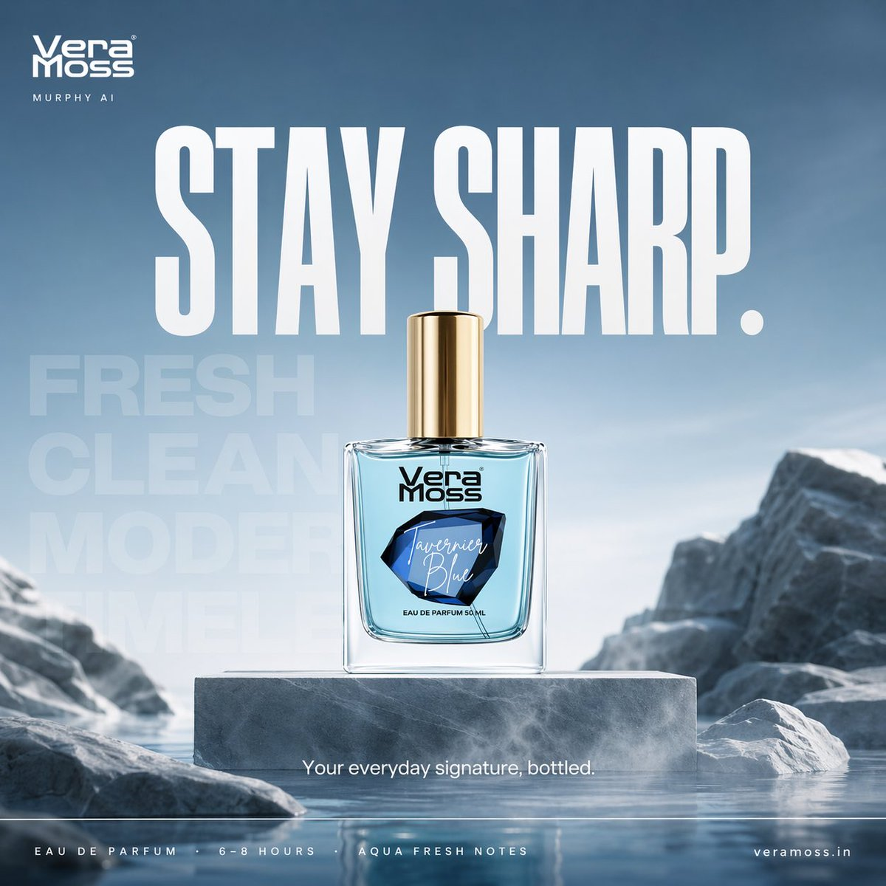

## 请为品牌[品牌名称]、类目为[品牌类目]

- ID: trending-2047253028462317674
- Slug: trending-2047253028462317674-zh
- 语言: zh
- 来源: [来源链接](https://x.com/MrLarus/status/2047253028462317674)
- 样例图路径: images/part1/2047253028462317674_1.jpg

### 提示词

```text
请为品牌[品牌名称]、类目为[品牌类目]创作一张高审美、高完成度的「品牌包装系统展示图」。这不是普通电商白底图，也不是单一产品图，而是一张具有品牌提案感、视觉识别系统感和商业摄影质感的包装家族陈列效果图。画面需要体现“同一品牌在多个包装载体上的统一落地”，呈现一个成熟消费品牌的完整包装系统。 

【画幅要求】整体必须为固定 4:5 的竖版海报构图，画面方向明确为纵向，禁止生成横版构图、宽幅桌面陈列或过于分散的横向展示。整体构图需符合海报阅读逻辑：上方保留呼吸感，中部为品牌包装系统的主要视觉焦点，下方安排辅助包装、标签和产品本体，整体重心集中，适合直接作为品牌展示海报发布。

【核心要求】根据【类目】自动匹配最合理、最自然的包装组合与产品形态，并围绕【品牌名字】建立统一的品牌视觉系统。画面中应选择少量但有代表性的包装形式，组成一组完整而精炼的品牌包装系统，不追求堆砌数量，而强调主次层级、品牌统一性与陈列美感。可根据类目合理选择以下包装类型中的一部分：手提袋 / 购物袋、纸盒 / 礼盒 / 外包装盒、长条盒 / 单品盒 / 套装盒、包装袋 / 封套 / 小样袋 / 软袋、杯子 / 瓶子 / 罐子 / 管状容器 / 喷雾瓶 / 泵头瓶、标签 / 贴纸 / 封签 / 吊牌 / 小卡片，以及与类目对应的真实产品本体。

【类目适配逻辑】包装形式与产品形态需要根据【类目】自动匹配，但不局限于单一方向。可参考以下适配逻辑自由发散：若类目为食品 / 烘焙 / 零食 / 饮品，则以纸袋、纸盒、包装袋、杯子、食品容器、贴纸、封签及真实产品本体为主；若类目为茶饮 / 咖啡 / 饮料，则以杯子、瓶子、罐装包装、提袋、杯套、封口贴、礼盒等为主；若类目为美妆 / 护肤 / 彩妆 / 香水，则以瓶、罐、管、盒、礼盒、手提袋、小样包装等为主；若类目为香氛 / 家居 / 生活方式，则以香薰瓶、蜡烛杯、包装盒、礼盒、提袋、吊卡、标签卡等为主；若类目为服饰 / 饰品 / 潮玩 / 文创，则以包装盒、抽屉盒、防尘袋、手提袋、贴纸、吊牌、配件包装等为主；若类目为数码配件 / 工具 / 小型消费品，则以硬盒、外包装盒、收纳袋、说明卡、贴纸、封套、标签等为主。整体必须体现“类目合理、品牌统一、包装成体系”的效果。

【数量与密度控制】请控制画面中的物件数量，不要过多堆砌，也不要把所有可能包装形式全部展示出来。整体应呈现“少而精、完整但不拥挤”的品牌包装系统效果。建议选择最具代表性的包装载体进行展示：大件包装 1～2 个，中型包装 2～3 个，小型包装或辅助物件 2～4 个，真实产品本体 1～3 个，总可见元素建议控制在 6～10 个之间。包装种类应体现层次变化与系统感，但不宜重复过多同类物件。画面需要有足够留白与呼吸感，确保每个包装都清晰可见、主次明确、摆放舒展，宁可少而精，也不要为了“完整”而过度塞满。

【品牌视觉系统要求】所有包装必须属于同一个品牌系统，统一使用【品牌名字】作为核心品牌识别元素。整体应具备一致的 logo / 标志呈现、字体风格、图形语言、插画语言或纹样系统、排版逻辑、配色体系、材质与印刷质感。品牌调性、色彩方向、图案元素、辅助图形和视觉氛围，请根据【类目】自动匹配并合理发散，不局限于任何固定风格。整体风格应统一、协调、具有品牌识别度，可以是简约高级、自然有机、时尚现代、轻奢精致、年轻清新、艺术感、潮流个性或经典优雅，但必须符合【类目】特征，并呈现成熟品牌的设计完成度。

【配色机制要求】整体配色不要固化为某一种固定组合，也不要连续多次出现高度相似的主色系统。每次生成时应根据【类目】与品牌气质，主动形成不同的主色方案与配色关系，采用“受控发散”的方式进行色彩演绎。色彩可以是低饱和自然色、现代中性色、轻复古色、明快清新色、轻奢深色系或艺术感综合色系，但必须保持高级、统一、克制、有品牌感。允许每次生成时呈现不同的视觉气质，例如奶油白与焦糖棕、雾灰蓝与暖白、橄榄绿与亚麻米、酒红与奶霜白、可可棕与象牙白、炭灰与麦秆金、雾粉灰与米白、海军蓝与暖灰等，仅作为参考方向而非固定模板。不要荧光色，不要廉价高饱和，不要杂乱失控的多色拼贴。

【画面构图与陈列要求】画面采用品牌包装家族陈列逻辑，而不是杂乱堆放。整体为商业摄影棚场景，使用 3/4 轻俯视角或略带透视的正面陈列角度，形成有层次、有秩序、有主次的包装展示画面。构图参考以下逻辑：后景摆放 1～2 个较大的包装作为视觉支撑，如手提袋、大礼盒、大外盒；中景安排品牌核心包装或主力单品包装，作为主要视觉焦点；前景摆放较小包装、辅助包装、标签、贴纸及真实产品本体；至少有一个真实产品与包装产生自然互动，如产品半露出、摆放在包装前方、与包装组合展示；整体形成平衡而有设计感的三角式或错落式构图。画面干净、有留白、不拥挤，内容丰富但克制，以有限而精准的包装组合体现完整的品牌包装生态。

【视觉风格要求】整体呈现高端商业摄影质感与品牌提案感，背景为干净的摄影棚环境，可为白色、暖白色、浅灰色，或根据品牌调性自动匹配的极简背景。画面应强调真实的包装材质表现、清晰的纸张折痕、盒型结构、瓶罐轮廓、标签细节、印刷质感、压纹 / 烫金 / 哑光 / 棉纸纹理 / 牛皮纸纹理等材质细节，以及统一而高级的配色搭配、精致现代干净的品牌视觉语言和强烈的“这是一整套品牌包装系统”的完整感。

【光影要求】采用真实商业摄影级光影，可为柔和棚拍光，也可带有轻微方向性的自然侧光。需要有清晰但克制的阴影，以增强立体感、空间感与高级感。整体光线通透、明亮、干净，不要阴暗，不要廉价感，不要杂乱背景。

【最终效果要求】最终画面应像一个成熟品牌的包装系统展示海报、包装家族提案图或品牌视觉落地效果图，而不是零散商品拼图。重点突出：固定 4:5 竖版海报感、品牌统一性、包装家族完整性、商业摄影感、设计提案感、类目适配性，以及高级审美与视觉完成度。
```

### 样例图

![请为品牌[品牌名称]、类目为[品牌类目]](../images/part1/2047253028462317674_1.jpg)

## ChatGPT Image 1.5 × Google Veo 3.1 → Nano Banana Pro / G

- ID: trending-2009310549994283496
- Slug: trending-2009310549994283496-en
- 语言: en
- 来源: [来源链接](https://x.com/TheLOKII_/status/2009310549994283496)
- 样例图路径: images/part1/2009310549994283496_1.jpg

### 提示词

```text
ChatGPT Image 1.5 × Google Veo 3.1

→ Nano Banana Pro / GPT-Image 1.5
→ Copy & Paste the Prompt
→ View Results Below ⤵️

Prompt:

A surreal miniature city scene where a giant coffee cup transforms into a cozy café building. The coffee cup forms the main structure, with steam rising like clouds, ceramic textures glowing softly, and the lid acting as a rooftop terrace. The ground floor is a warmly lit café storefront with glass windows, tiny tables, stools, barista counters, and glowing street lamps. Nighttime atmosphere with cinematic bokeh lights, floating particles, soft fog, warm interior glow, hyper-detailed materials, fantasy realism, premium brand storytelling. Tilt-shift effect, ultra-sharp focus, dramatic lighting, square frame, 1080×1080, high-end commercial illustration, ultra-detailed 8K quality.
```

### 样例图

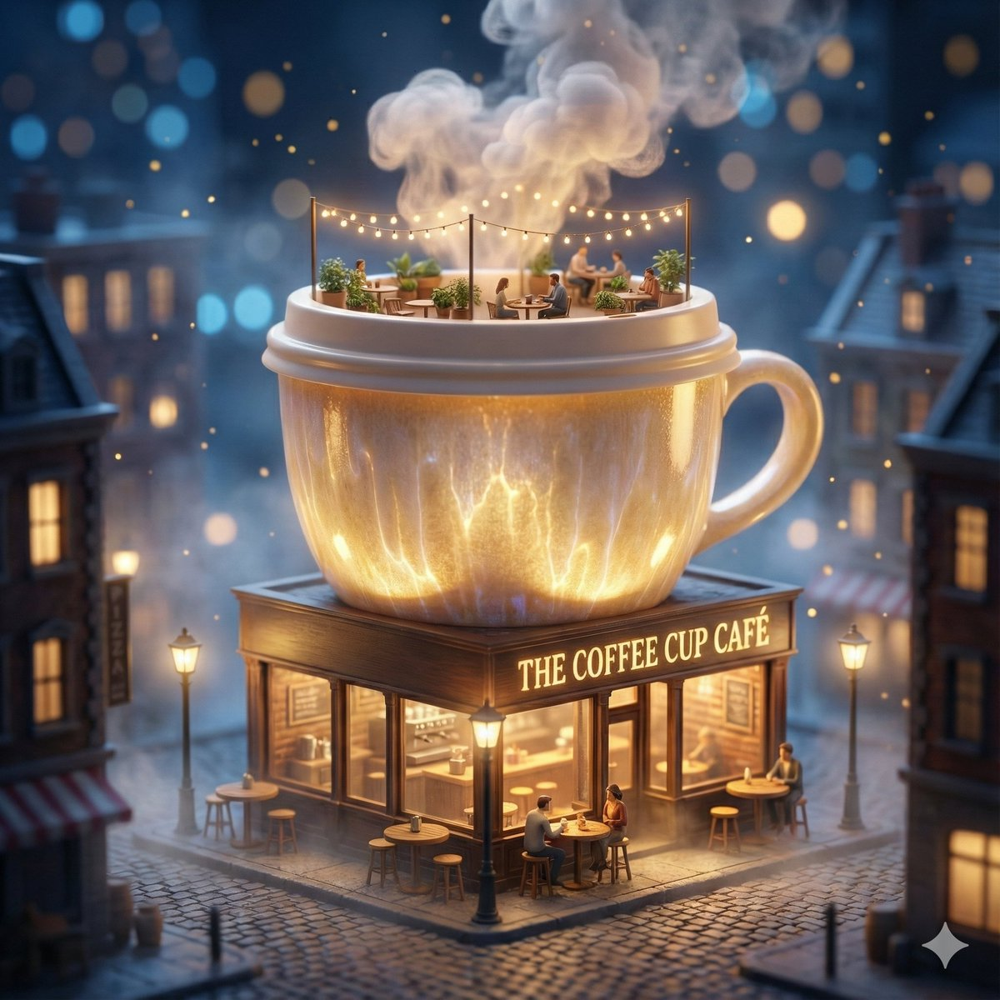

## Create a 16:9 horizontal bento-grid brand collage for [B

- ID: trending-2047423024068952489
- Slug: trending-2047423024068952489-en
- 语言: en
- 来源: [来源链接](https://x.com/youraipulse/status/2047423024068952489)
- 样例图路径: images/part1/2047423024068952489_1.jpg

### 提示词

```text
Create a 16:9 horizontal bento-grid brand collage for [BRAND NAME] in a polished contemporary campaign style.  
Use a fixed 3-row, 4-column bento structure with rounded tiles, equal gaps, clean alignment, and a light neutral background.
The layout must stay consistent across generations, but the content inside each tile must adapt to the real business model, product ecosystem, and brand language of [brand name].

Grid blueprint
Build the composition as 11 visible content zones arranged in a fixed bento layout:
Top-left tile: 1 column × 2 rows, tall vertical hero device or primary brand surface
Top-middle-left tile: 1 column × 1 row, compact square brand asset tile
Top-middle-right tile: 2 columns × 1 row, wide headline/message tile

Center tile: 2 columns × 2 rows, dominant campaign hero scene

Top-right tile: 1 column × 1 row, secondary device / product surface / branded object

Bottom-left tile: 1 column × 1 row, product artifact or branded utility object

Bottom-center tile: 2 columns × 1 row, large bold typography tile

Bottom-right tile: 1 column × 2 rows, tall informational product / interface / feature tile

All tiles must share the same corner radius, spacing system, and visual polish.
The dominant focal points are the large center hero tile, the wide top headline tile, and the wide bottom typography tile.

Adaptive content logic
Do not assume [brand name] is a fintech brand.
Before deciding what appears inside each tile, infer what [brand name] actually is: social platform, SaaS tool, media brand, retailer, hospitality brand, hardware company, mobility app, AI product, consumer app, etc.

Every tile must contain a plausible branded asset based on that business type.

Use this rule:

If [brand name] has a real consumer app, dashboard, product UI, creator interface, booking flow, editor, storefront, feed, player, workspace, or operating surface, use those.

If [brand name] does not realistically have payment cards, watches, or hardware, do not invent them.

Only include branded physical objects when they make sense for the brand: packaging, merch, signage, magazine, laptop sticker, storefront card, delivery box, product box, wearable, poster, notebook, tote, badge, ticket, book, etc.

If the brand is primarily digital, prioritize screens, interface fragments, campaign graphics, app/store listings, editorial visuals, and branded communication assets.

If the brand is a platform, use realistic platform surfaces: profile screens, creator dashboards, boards, playlists, templates, analytics, publishing tools, discovery feeds, search, collaboration views, etc.

If the brand is a physical-product company, use realistic product shots, packaging, product detail pages, retail signage, and lifestyle scenes.

If the brand is a service business, use realistic booking, scheduling, marketplace, onboarding, testimonial, results, or service-delivery interfaces.

If exact assets are unknown, infer the most believable official-looking product and campaign system for [brand name].

Tile-by-tile rules
1) Tall left hero tile
Show the most iconic primary branded surface for [brand name].

Examples:

phone with app UI
laptop with dashboard/editor
tablet with creative workspace
product packaging held in hand
branded poster or printed object
storefront or physical product close-up

This tile should represent the brand’s main touchpoint, not a generic device.

2) Small square brand asset tile
Show a compact brand-signature element:

app icon
logo mark
symbol
product badge
branded motif
miniature packaging unit
icon system object
sticker or seal
simplified 3D brand emblem

This tile should feel like a distilled identity marker.

3) Wide top headline tile
Use a short strategic message that fits [brand name]’s category and tone.
Do not repeat generic fintech copy.
The line should feel like a real campaign headline for that specific brand.

Examples of direction:

discovery
creativity
organization
inspiration
connection
travel
productivity
expression
streaming
collaboration
automation

Use large, bold, high-contrast typography.

4) Large center hero tile
Create the main campaign scene for [brand name] in a real-world or branded-environment context.
This should be the most expressive tile.

Possible formats:
outdoor billboard
subway poster
retail installation
city poster wall
laptop-on-desk hero scene
creator workspace
product-in-use lifestyle shot
editorial campaign image
interface projected into environment
branded event signage
The scene must make sense for the brand’s world and audience.

5) Top-right support tile
Show a secondary but still realistic brand surface:

another device view
product detail
branded object
campaign variation
interface zoom-in
packaging angle
social post mockup
desktop widget
creator tool panel
notification / discovery / search view

This tile should complement the main touchpoint, not duplicate it exactly.

6) Bottom-left artifact tile
Show a category-appropriate branded artifact, not a fixed “bank card”.

Choose the artifact based on [brand name]:

for fintech: payment card, wallet pass, transfer screen, exchange card

for social/media: creator card, profile card, post template, content preview, board tile, channel card

for SaaS/productivity: workspace card, document preview, template card, dashboard widget

for e-commerce/retail: packaging, shipping box, loyalty pass, product tag, order card

for travel/hospitality: booking card, room key, boarding-style pass, itinerary card

for music/media: album card, playlist card, player card, event ticket

for AI/software: prompt card, generation result card, model card, workflow card

This tile must feel like a believable branded unit of value for that company.

7) Wide bottom message tile
Use one strong oversized statement in uppercase or bold display typography.
This is not necessarily the slogan from the top tile; it can be a broader campaign line or category promise.

The message must match the actual brand behavior of [brand name].
For example, do not use “MOVE MONEY WITHOUT BORDERS” unless the brand actually deals with payments or finance.

8) Tall right informational tile
Show a structured branded information surface:
app store page
product page
onboarding screen
feature overview
marketplace listing
creator profile
brand campaign landing screen
dashboard overview
editorial page
discovery feed
help center / setup / feature panel
This tile should add product depth and make the collage feel like a full brand system.

Brand realism rules
Use the real or highly plausible brand identity of [brand name]: logo, color palette, typography feel, icon language, image treatment, interface style, and tone of voice.
If exact assets are unavailable, invent only what is necessary, but make it feel like the official visual system of [brand name].

Do not force a product category onto the brand.
Do not invent impossible hardware, payment tools, packaging, or app features unless they are realistic adjacent extensions of the brand.
Prefer believable brand adaptation over visual symmetry.

Visual consistency rules
Even though tile content is adaptive, the final image must still feel like one campaign system:

same overall grid structure
same tile spacing
same corner radius
same art direction quality
same brand palette across all tiles
consistent typography logic
consistent mockup realism
consistent lighting and polish

Style
Clean premium brand presentation, high detail, polished mockup realism, soft shadows, strong hierarchy, editorial-quality composition, modern campaign aesthetics.
Avoid random collage chaos.
Avoid tiny unreadable text.
Avoid generic placeholder UI.
Keep the structure fixed, but let the objects and branded surfaces adapt intelligently to [brand name].

Stronger one-line instruction

Important: the layout is fixed, but the objects are not fixed.
For each generation, select tile content based on what [brand name] realistically sells, ships, publishes, displays, or lets users interact with.
Never insert category-inappropriate objects just to fill the grid.
```

### 样例图


## [BRAND NAME]: The name of the brand. Goal: Generate a si

- ID: trending-2032908105994961090
- Slug: trending-2032908105994961090-en
- 语言: en
- 来源: [来源链接](https://x.com/AmirMushich/status/2032908105994961090)
- 样例图路径: images/part1/2032908105994961090_1.jpg

### 提示词

```text
[BRAND NAME]: The name of the brand.
Goal: Generate a single, minimalist, and surreal image where a cloud is shaped like the brand's logo.

1. THE LOGO CLOUD
- **Subject**: A massive, photorealistic cumulus cloud in the exact geometric shape of the [BRAND NAME] logo.
- **Texture**: Puffy, soft, and voluminous with natural sunlight illuminating the edges.
- **Volume**: 3D sculptural appearance with realistic shadows within the cloud folds to show depth.

2. ENVIRONMENT & BACKGROUND
- **Sky**: A vast, clear, vibrant blue summer sky.
- **Secondary Elements**: A few small, wispy, natural clouds scattered far in the background to enhance the sense of scale and realism.
- **Lighting**: Bright, direct daylight coming from the side to create high-contrast highlights and shadows.

3. INTEGRATED BRANDING
- **Text**: The word "[BRAND NAME]" written in a clean, bold white sans-serif font.
- **Icon**: A small, flat white version of the brand's logo placed next to the text.
- **Positioning**: The branding (text + logo) is centered at the bottom of the frame, acting as a subtle anchor to the giant cloud above.

4. STYLE
- Surrealist photography, ultra-minimalist composition, high resolution, 8k, cinematic look, clean and airy vibe.
```

### 样例图

![[BRAND NAME]: The name of the brand. Goal: Generate a si](../images/part1/2032908105994961090_1.jpg)

## Act as a High-End Product Photographer and CGI Artist. P

- ID: trending-2043027627640799569
- Slug: trending-2043027627640799569-en
- 语言: en
- 来源: [来源链接](https://x.com/AmirMushich/status/2043027627640799569)
- 样例图路径: images/part1/2043027627640799569_1.jpg

### 提示词

```text
Act as a High-End Product Photographer and CGI Artist.

PHASE 1: SUBJECT & LOGIC
Generate a massive, perfectly centered, three-dimensional physical sculpture of the official, unaltered corporate logo for [BRAND NAME]. The sculpture must strictly adhere to the brand’s precise logo geometry and proportions (1:1 from brandbook). The sculpture is suspended in mid-air. Autonomously identify the exact official shape and structure of the [BRAND NAME] logo and render it as a single, flawless glass object without any modifications.
PHASE 2: MATERIALITY (GLASS)
The entire logo is made of hyper-realistic, optical-grade crystal glass (not water, not gel). The material is solid, colorless, and boasts high clarity with a high refractive index. It must look heavy and монолитное (monolithic). The glass structure contains subtle, photorealistic microscopic flaws: fine polished scratches on the surface and minor internal inclusions (dust particles/seed bubbles, very few) to avoid “CGI plastic.” The edges must be precision-beveled and fire-polished.

PHASE 3: ENVIRONMENT & CAUSTICS
The logo is suspended against a strictly clean, bright blue sky with sparse, naturally defined white cumulus clouds. NO land, NO trees, NO palms. The background is purely atmospheric. The focus is entirely on the glass logo. Critically render hyper-realistic, complex glass caustics: intense, sharp patterns of focused light and color (refractions of the blue sky) cast inside and onto the surface of the glass form due to the sunlight passing through it.

TECH SPECS
Rendered with Arnold or Octane. Phase One XF, 120mm Macro lens. Aperture f/5.6 for sharp depth across the entire glass sculpture. Intense, direct sunlight (hard lighting) to maximize caustics. Global illumination, ray-traced refractions (double-sided geometry), and chromatic aberration emulation (subtle) for optical realism. Fine grain film emulation (Fujifilm Velvia 50).
```

### 样例图

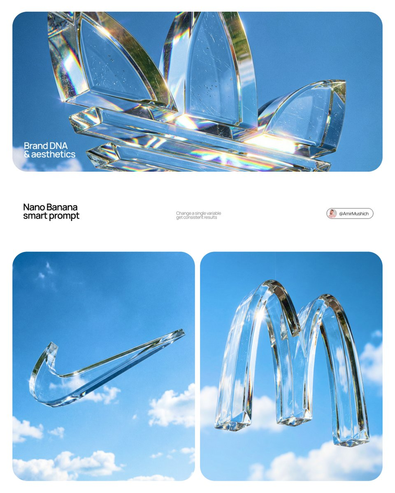

## [BRAND NAME]. Act as a World-Class Editorial Designer. P

- ID: trending-2028115571724660920
- Slug: trending-2028115571724660920-en
- 语言: en
- 来源: [来源链接](https://x.com/AmirMushich/status/2028115571724660920)
- 样例图路径: images/part1/2028115571724660920_1.jpg

### 提示词

```text
[BRAND NAME]. Act as a World-Class Editorial Designer.

PHASE 1: DYNAMIC SUBJECT LOGIC.

- Subject Selection: Autonomously analyze [BRAND NAME].

- Layering (The Sandwich Effect): Interweave the subject with background shapes. Some parts of the car/person must be hidden behind geometric blocks, while other parts (wheels, limbs, props) must overlap them to create 3D depth.

PHASE 2: GRID & GEOMETRY.

- Layout: A clean 2x2 grid composition. 

- Overlays: Superimpose large, bold geometric arcs and circles over the grid. 

- Visual Balance: Place one iconic product prop (e.g., a floating key fob for cars or a ball for sports) in a separate quadrant to balance the subject.

PHASE 3: SOPHISTICATED MUTED PALETTE.

- Color Direction: DO NOT use aggressive neon or oversaturated colors.

- Palette: Identify the core colors of [BRAND NAME] and shift them to a "Sophisticated Muted" spectrum. 

- Tones: Use desaturated, earthy, or "dusty" versions of the brand colors (e.g., instead of hot pink, use dusty rose; instead of bright mint, use sage green; instead of royal blue, use slate blue). 

- Finish: Matte, flat color blocks with zero gradients.

PHASE 4: PHOTOGRAPHY & LIGHTING.

- Subject Style: High-end commercial studio photography.

- Lighting: Soft, diffused studio lighting with gentle highlights. No harsh shadows.

- Integration: The subject must feel physically embedded into the graphic grid.

PHASE 5: MINIMALIST BRANDING.

- Logo: Place a clean, single-color [BRAND NAME] logo in the center of one background block. No taglines, just the iconic symbol.
```

### 样例图

![[BRAND NAME]. Act as a World-Class Editorial Designer. P](../images/part1/2028115571724660920_1.jpg)

## [BRAND NAME] | [HEADLINE] | [SUB-TEXT] | [CTA]. Act as a

- ID: trending-2026316195977146728
- Slug: trending-2026316195977146728-en
- 语言: en
- 来源: [来源链接](https://x.com/AmirMushich/status/2026316195977146728)
- 样例图路径: images/part1/2026316195977146728_1.jpg

### 提示词

```text
[BRAND NAME] | [HEADLINE] | [SUB-TEXT] | [CTA]. Act as a Senior Art Director.

PHASE 1: INTEGRATED COMPOSITION & OVERLAP.
- Layout: Seamless fusion of 2D graphics and 3D photography.
- Overlap Logic: The subject and their primary "Product Prop" (e.g., a car, a device) must physically overlap the graphic panel to break the "wall" between design and photo.
- Unity: Geometric shapes from the graphic side must bleed into the photographic sky area.

PHASE 2: BRAND & CATEGORY SIMULATION.
Autonomously analyze the [BRAND NAME] and its industry category:
- INDUSTRY CONTEXT: 
  * If Automotive: Include the vehicle and a person interacting with it.
  * If Tech: Include flagship devices/gadgets.
  * If Fashion/Lifestyle: Focus on editorial poses and premium accessories.
- SHAPE SIMULATION: Match shapes to brand identity (e.g., Sharp/Speed for Auto, Minimalist/Grid for Tech).
- COLOR SIMULATION: Use the brand's primary signature hue for both the graphic pattern and the subject's outfit/accents.

PHASE 3: TYPOGRAPHY & CUSTOM CONTENT.
- Headline: Display "[HEADLINE]" in a bold, modern Sans-Serif font. (If [HEADLINE] is empty, generate a high-energy slogan for [BRAND NAME]).
- Sub-headline: Display "[SUB-TEXT]" below the headline.
- Button: Create a minimalist pill-shaped CTA button with the text: "[CTA]".
- Interaction: Text layers should have 3D depth, sitting partially behind the subject or product prop.

PHASE 4: PHOTOGRAPHY & SUBJECT.
- Perspective: Extreme low-angle (worm’s eye view) looking up.
- Subject: A diverse persona reflecting the brand's audience.
- Environment: Massive, clear blue sky as the backdrop.
- Visual Link: Subject's styling must incorporate the Brand's primary color.

PHASE 5: FINAL VISUAL STYLE.
High-end commercial aesthetic. Crisp, saturated, professional fusion of flat vector art and realistic photography.
```

### 样例图

![[BRAND NAME] | [HEADLINE] | [SUB-TEXT] | [CTA]. Act as a](../images/part1/2026316195977146728_1.jpg)

## [BRAND NAME]. Act as a Senior Editorial Designer and Typ

- ID: trending-2027798913516761522
- Slug: trending-2027798913516761522-en
- 语言: en
- 来源: [来源链接](https://x.com/AmirMushich/status/2027798913516761522)
- 样例图路径: images/part1/2027798913516761522_1.jpg

### 提示词

```text
[BRAND NAME]. Act as a Senior Editorial Designer and Typographer.

PHASE 1: TYPOGRAPHIC MASK (THE "WINDOW" EFFECT).

- Core Element: Use the most iconic slogan or the name of [BRAND NAME] as a massive, ultra-bold, heavy sans-serif typographic mask.

- Layout: The letters must be giant, filling the entire vertical frame from edge to edge with tight kerning.

- Concept: The text acts as a "cut-out" window. The background is solid white, and the photographic subject is visible ONLY through the letterforms.

PHASE 2: DYNAMIC SUBJECT LOGIC.

- Subject Selection:

- Detail: Ensure a high-contrast element (like a red shoe or a glowing headlight) is visible through one of the letters as a focal point.

PHASE 3: SOPHISTICATED MUTED PALETTE.

- Atmosphere: Use a "Refined Muted" color scheme.

- Tones: Soft slate blues, charcoal greys, and creamy off-whites for the photography inside the mask.

- Accent: Identify one sharp, saturated accent color belonging to [BRAND NAME] and apply it to a single key object visible through the text.

PHASE 4: PHOTOGRAPHY & LIGHTING.

- Lighting: Soft-box studio lighting. Diffused shadows and gentle highlights to create a cinematic, high-end editorial feel.

- Finish: Clean, matte texture with zero visual noise. High-definition photographic quality.

PHASE 5: MINIMALIST BRANDING.

- Accents: Add a tiny minimalist logo and a small vertical tagline in a clean, microscopic sans-serif font near the corners.

- Year: Include the year "2026" in a subtle, elegant font to mimic a limited-edition look.
```

### 样例图

![[BRAND NAME]. Act as a Senior Editorial Designer and Typ](../images/part1/2027798913516761522_1.jpg)

## First-person perspective inside a brightly lit supermark

- ID: trending-2015451528929464593
- Slug: trending-2015451528929464593-en
- 语言: en
- 来源: [来源链接](https://x.com/oggii_0/status/2015451528929464593)
- 样例图路径: images/part1/2015451528929464593_1.jpg

### 提示词

```text
First-person perspective inside a brightly lit supermarket aisle. Realistic human hands are holding a bottle of Fanta soda close to the camera. The vivid orange drink in its iconic branded bottle is surrounded by a multi-layered holographic augmented reality interface displaying nutritional data, including calorie count, sugar content, caffeine level, freshness indicator, expiration date, and recommended refreshing recipes and cocktails based on Fanta.
The UI elements smoothly shift and reorganize based on the viewer’s gaze direction, as if dynamically responding to user focus. In the left peripheral vision, a vertical semi-transparent shopping list is visible with checked-off items, where Fanta is highlighted as the currently active selection.
Hyper-realistic mixed reality, clean futuristic AR design, glass-like UI panels, soft ambient glow, realistic lighting and shadows, natural depth of field, immersive first-person interface, showcasing next-generation retail technology.
```

### 样例图

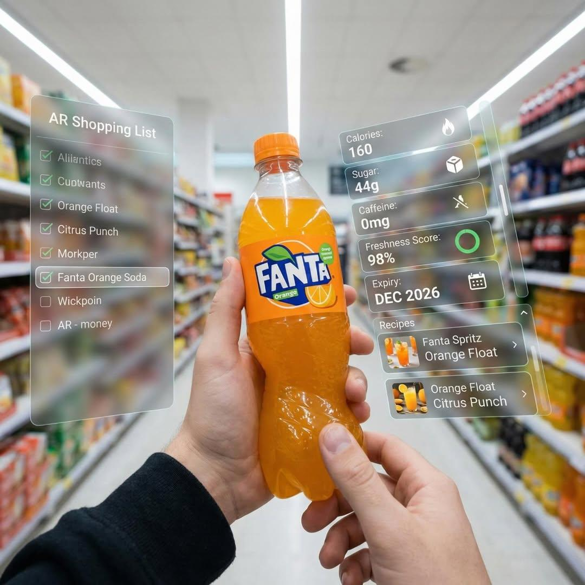

## Create an exploded products with inner mechanics [produc

- ID: trending-2010350005870276897
- Slug: trending-2010350005870276897-en
- 语言: en
- 来源: [来源链接](https://x.com/azed_ai/status/2010350005870276897)
- 样例图路径: images/part1/2010350005870276897_1.jpg

### 提示词

```text
Create an exploded products with inner mechanics [product], high-end product advertising, white seamless background, exploded view with inner mechanics revealed, outer shell hovering above core, micro screws and components suspended, perfect alignment guides implied, crisp soft shadow, ultra realistic, macro product photography, 100mm lens look, f/8, 8k, 1:1
```

### 样例图

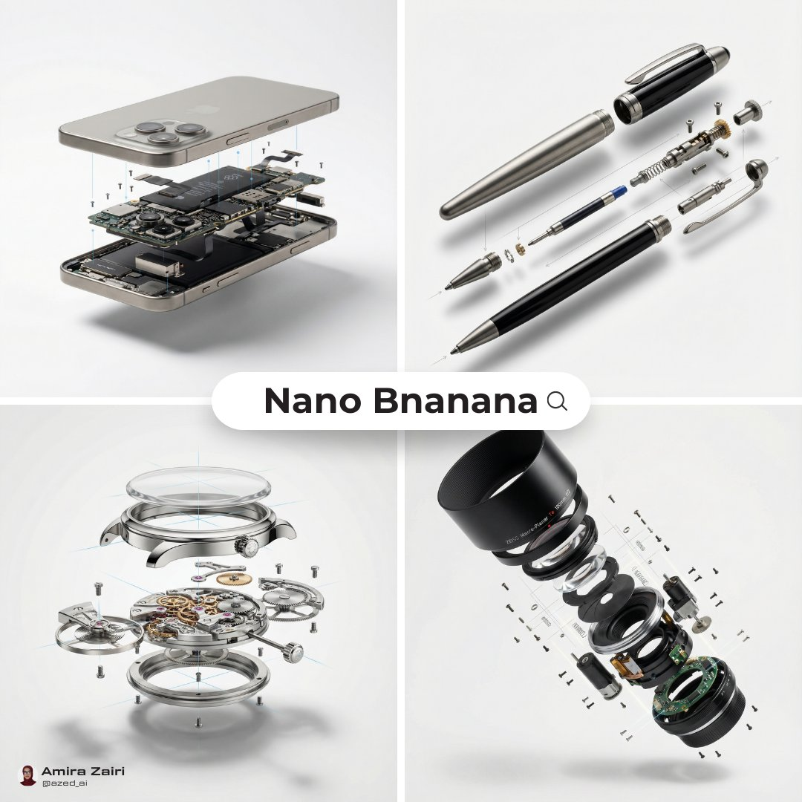

## [BRAND NAME]. Act as a vector illustrator designing a tr

- ID: trending-2010070395974504565
- Slug: trending-2010070395974504565-en
- 语言: en
- 来源: [来源链接](https://x.com/AmirMushich/status/2010070395974504565)
- 样例图路径: images/part1/2010070395974504565_1.jpg

### 提示词

```text
[BRAND NAME]. Act as a vector illustrator designing a trendy, high-end "Sticker Sheet" set.
THE TASK:
Deconstruct the brand identity of [BRAND NAME] into a playful, cohesive set of approximately 8-10 unique sticker designs arranged on a single sheet.
Content Generation: Do not just make logos. Autonomously invent a mix of:
Mascots/Characters: Stylized busts of people wearing brand-relevant accessories or expressing emotions.
Key Products: Iconic items associated with the brand.
Symbols/Objects: Abstract shapes or tools relevant to the brand's lifestyle.

VISUAL STYLE (MONOLINE VECTOR):
The art style must strictly match "Modern Trendy Line Art."
Line Work: Use a THICK, UNIFORM line weight (monoline) for all internal details. The lines should be smooth, rounded, and confident.
Coloring: The stickers must be filled with Solid Off-White or Cream, utilizing the line color for details. NO gradients, NO shading, NO 3D effects. Flat 2D vector look.
The "Sticker" Effect: Every element must have a thick, distinct White (or Cream) Die-Cut Border surrounding it, separating it from the background.
COLOR PALETTE (HIGH CONTRAST):
Background: A solid, deep, saturated color to create maximum contrast.
Stickers: High-brightness Cream or White fill with Dark (Black or Dark Brown) outlines.
COMPOSITION:
The stickers are scattered naturally across the sheet (knolling layout) with even spacing. No overlapping.
```

### 样例图

![[BRAND NAME]. Act as a vector illustrator designing a tr](../images/part1/2010070395974504565_1.jpg)

## [BRAND NAME] + [METAL COLOR] Act as a Senior CGI Artist 

- ID: trending-2045580765136920938
- Slug: trending-2045580765136920938-en
- 语言: en
- 来源: [来源链接](https://x.com/AmirMushich/status/2045580765136920938)
- 样例图路径: images/part1/2045580765136920938_1.jpg

### 提示词

```text
[BRAND NAME] + [METAL COLOR]

Act as a Senior CGI Artist and Brand Identity Director specializing in premium logo materializations. Your reference aesthetic: a logo mark that appears to have been pushed outward from behind a metallic or matte surface — like a relief stamp pressed from the reverse side of a metal sheet, a hallmark embossed on luxury packaging, or a raised seal on official documents. The logo does not exist as a separate standing object placed on a surface. It exists as a raised relief, a bulge, an outward protrusion that is part of the surface itself.

BRAND INTELLIGENCE SYSTEM

Before executing any phase, resolve these parameters: (1) LOGO GEOMETRY — identify [BRAND NAME]'s primary icon mark in its simplest most reduced form — the mark that works at any scale, (2) COLOR PALETTE — based on [COLOR], build the full tonal system from the lightest specular highlight to the deepest shadow tone, determine if the overall mood reads warm, cool, or neutral, (3) SURFACE MATERIAL — based on [COLOR] determine the surface character: silver or grey becomes brushed or circular-grain steel, gold or champagne becomes warm brushed metal with radial grain, black becomes anodized aluminum or matte carbon fiber, white becomes matte ceramic or chalk plaster, any saturated hue becomes anodized colored metal holding the hue in lit areas and desaturating toward black in deepest shadows, (4) LIGHT DIRECTION — determine the most flattering single light angle to reveal the emboss topography — where highlights land on the raised ridge peaks and where shadows fall on the descending walls.

PHASE 1: SURFACE & ATMOSPHERE

The entire image is one single continuous material surface — not a background with an object placed on it, but one unified physical plane filling the entire canvas. This surface is made of the SURFACE MATERIAL resolved above. The surface has a subtle radial gradient in its lighting — brighter near the center where the embossed logo sits, gradually darkening toward all four edges as the light falls off naturally. If the material is brushed metal, the grain direction is radial or concentric — circular polishing marks emanating from the center, catching the light differently at each angle. Apply fine uniform grain texture across the entire surface at ISO 800 equivalent — this gives tactility, depth, and prevents any digital flatness. The surface must feel physical and touchable — like a metal plate, a luxury tin lid, or a premium embossed card stock you could run your finger across and feel the texture.

PHASE 2: THE EMBOSS — CRITICAL

The [BRAND NAME] logo mark is rendered as a full bas-relief — think of a coin, a commemorative medal, or a luxury brand stamp where the ENTIRE logo shape rises as one unified solid mass from the surface. Not just the outline. Not just the stroke path. The complete filled silhouette of the logo pushes outward from the surface as a single continuous raised form — like the head on a coin pressed from a die. The interior of the logo is NOT hollow or open. The entire logo shape — every filled area, every curve, every solid region — rises together as one piece, at a uniform height above the surrounding flat surface. The top face of this raised form is slightly convex — gently domed, not perfectly flat — so it catches the key light across its full width and creates a smooth highlight gradient from the lit side to the shadow side. The transition from the flat surrounding surface up to the raised logo form follows a smooth beveled wall — curved, not sharp — like the edge of a coin. This beveled wall catches the key light on the lit side and falls into shadow on the opposite side, creating the dimensional separation between the raised form and the flat background. Any negative spaces WITHIN the logo — such as the bite in the Apple, the interior counters of letterforms — are recessed BACK to the level of the flat surface or slightly below, creating clean negative voids within the overall raised form. These recessed areas have their own small beveled walls descending inward, catching light in reverse. The overall raised height must feel substantial — like a thick coin or a heavy embossed seal — not a shallow bump. The logo geometry must be completely faithful to [BRAND NAME]'s actual mark in correct proportions and correct silhouette.

PHASE 3: LIGHTING

One primary soft area light from upper-left at approximately 10 to 11 o'clock position — broad and diffused, wrapping around the curved walls of the raised ridge to create the characteristic highlight peak at the top and gradual shadow descent on the far wall. Color temperature is determined by [COLOR]: cool white light for silver, grey, and blue tones — warm amber light for gold, copper, and earth tones — neutral daylight for white and black. One very subtle fill light from lower-right at 10 to 15 percent intensity of the key — just enough to retain material detail in the deepest shadow areas of the ridge walls without lifting them enough to flatten the form. No hard shadows anywhere on the surface. No spotlight pools. No rim light. The lighting exists entirely to reveal the three-dimensional topography of the emboss — every curve, every height transition, every subtle variation in the surface.

PHASE 4: TYPOGRAPHY

In the lower portion of the canvas, below the embossed logo, on the same continuous surface — a minimal typographic lockup. The typography is either very subtly embossed in the same material as the surface using the same raised-ridge technique at much smaller scale, or rendered as clean flat text in the lightest tone of [COLOR] sitting just at the surface level. Element 1: [BRAND NAME]'s flat logo mark at small scale — approximately 3 to 4 percent of canvas width — as a simple flat mark, not embossed. Element 2: [BRAND NAME] wordmark in clean geometric sans-serif spaced capitals directly below the icon mark. Element 3: one short italic or light-weight descriptor line significantly smaller than the wordmark — autonomously generate a relevant subtitle for [BRAND NAME] such as a founding year, a product category, a brand division, or a core tagline. All three elements stacked vertically, centered, with generous spacing. No decorative elements. No lines or rules. Pure typographic restraint.

TECH SPECS

The single most important instruction in this entire prompt: the logo must read as PUSHED OUTWARD FROM the surface, rising toward the viewer, proud and raised. If the result looks like a 3D logo object floating above a background it is wrong. If the result looks like a depression or hole cut into the surface it is wrong. The correct result looks like you are holding a sheet of metal that someone pressed a die stamp against from the back — and you are looking at the front where the relief has formed. Ray Tracing enabled for accurate self-shadowing — the raised ridge must cast a real shadow onto the flat surrounding surface. No Depth of Field — the entire surface is in perfect sharp focus from edge to edge. Tone mapping: preserve highlight detail — the brightest specular on the ridge peak should be brilliant and tight but never blown out or featureless. Film grain applied uniformly across the full final render. No chromatic aberration. No lens distortion. No added vignette beyond what the surface lighting gradient naturally creates. Anti-aliasing maximum — the ridge edges must be perfectly clean. Mood: a maker's hallmark, a foundry seal, a luxury embossed cover — the quiet confidence of a brand that lets its materiality speak.
```

### 样例图

![[BRAND NAME] + [METAL COLOR] Act as a Senior CGI Artist ](../images/part1/2045580765136920938_1.jpg)

## Create ONE final image. A clean 3×3 [ratio] storyboard g

- ID: trending-2012178722615329176
- Slug: trending-2012178722615329176-en
- 语言: en
- 来源: [来源链接](https://x.com/Dari_Designs/status/2012178722615329176)
- 样例图路径: images/part1/2012178722615329176_1.jpg

### 提示词

```text
Create ONE final image. 

A clean 3×3 [ratio] storyboard grid with nine equal [ratio] sized panels on [4:5] ratio. 

Use the reference image as the base product reference. Keep the same product, packaging design, branding, materials, colors, proportions and overall identity across all nine panels exactly as the reference. The product must remain clearly recognizable in every frame. The label, logo and proportions must stay exactly the same.

This storyboard is a high-end designer mockup presentation for a branding portfolio. The focus is on form, composition, materiality and visual rhythm rather than realism or lifestyle narrative. The overall look should feel curated, editorial and design-driven.

FRAME 1:
Front-facing hero shot of the product in a clean studio setup. Neutral background, balanced composition, calm and confident presentation of the product.

FRAME 2:
Close-up shot with the focus centered on the middle of the product. Focusing on surface texture, materials and print details.

FRAME 3:
Shows the reference product placed in an environment that naturally fits the brand and product category. Studio setting inspired by the product design elements and colours. 

FRAME 4:
Product shown in use or interaction on a neutral studio background. Hands and interaction elements are minimal and restrained, the look matches the style of the package. 

FRAME 5:
Isometric composition showing multiple products arranged in a precise geometric order from the top isometric angle. All products are placed at the same isometric top angle, evenly spaced, clean, structured and graphic.

FRAME 6:
Product levitating slightly tilted on a neutral background that matches the reference image color palette. Floating position is angled and intentional, the product is floating naturally in space.

FRAME 7:
is an extreme close-up focusing on a specific detail of the label, edge, texture or material behavior.

FRAME 8:
The product in an unexpected yet aesthetically strong setting that feels bold, editorial and visually striking.
Unexpected but highly stylized setting. Studio-based, and designer-driven. Bold composition that elevates the brand.

FRAME 9:
Wide composition showing the product in use, placed within a refined designer setup. Clean props, controlled styling, cohesive with the rest of the series.

CAMERA & STYLE:
Ultra high-quality studio imagery with a real camera look. Different camera angles and framings across frames. Controlled depth of field, precise lighting, accurate materials and reflections. Lighting logic, color palette, mood and visual language must remain consistent across all nine panels as one cohesive series.

OUTPUT:
A clean 3×3 grid with no borders, no text, no captions and no watermarks.
```

### 样例图

![Create ONE final image. A clean 3×3 [ratio] storyboard g](../images/part1/2012178722615329176_1.jpg)

## [BRAND NAME] Act as a Macro Product Photographer and Tex

- ID: trending-2044829425464656123
- Slug: trending-2044829425464656123-en
- 语言: en
- 来源: [来源链接](https://x.com/AmirMushich/status/2044829425464656123)
- 样例图路径: images/part1/2044829425464656123_1.jpg

### 提示词

```text
[BRAND NAME]

Act as a Macro Product Photographer and Textile Art Director shooting a close-up editorial campaign of a premium embroidered garment. References: Loro Piana fabric campaigns, Brunello Cucinelli texture photography, A.P.C. garment detail shoots, Japanese boro textile documentation.

PHASE 0: BRAND LOGO INTELLIGENCE

Retrieve the canonical logotype or primary mark of [BRAND NAME] from training data. Identify the core geometric essence of the logo — its fundamental shapes, stroke relationships, and compositional balance. Translate this identity into an embroidery-native form language: sharp geometric elements become satin stitch bars and needle-point spikes, circular elements become dense satin stitch ovals or French knot clusters, complex letterforms are simplified into their most essential strokes while remaining recognizable. The embroidery interpretation must feel like a deliberate premium interpretation of the brand mark — as if [BRAND NAME]'s design team commissioned an embroidery artist to translate their logo into thread. Autonomously determine the thread color most iconic to [BRAND NAME] — this becomes the primary embroidery thread color. If [BRAND NAME] has no dominant single color, default to deep navy #1A2332.

PHASE 1: TEXTILE BACKGROUND

The background is a premium waffle-knit cotton fabric — the weave structure is a precise geometric grid of raised square cells, each cell approximately 2×2mm equivalent, separated by thin recessed channels running both horizontally and vertically. The raised nodes of each cell are flat-topped, not rounded — creating a regular orthogonal relief pattern across the entire surface. The fabric color is cold off-white — #F0F0EE to #EBEBEA range, with a very slight cool gray bias, not warm ecru or cream. The weave is consistent and uniform across the entire frame — machine precision, no tension variation, no distortion. Microscopic fiber fuzz is visible on the flat tops of the raised nodes — individual cotton fibers catching the diffused overhead light as a very fine surface bloom. The recessed channels between cells are in soft shadow — not deep shadow, just slightly darker than the raised nodes, consistent with flat overhead illumination.

PHASE 2: EMBROIDERY CONSTRUCTION SYSTEM

The logo mark of [BRAND NAME] rendered as machine or hand embroidery using these specific stitch techniques. Satin stitch: the primary technique for all filled areas and stroke elements — dense parallel threads laid side by side with zero gap, creating a smooth glossy surface. Thread direction follows the long axis of each stroke element — horizontal strokes have horizontal threads, diagonal strokes have diagonal threads. The characteristic sheen of satin stitch is critical: threads catch light along their length creating bright reflective zones on thread-parallel surfaces and darker zones on thread-perpendicular surfaces, creating a directional shimmer across the embroidery surface. Stem stitch or outline stitch: used for any curved linear elements — thin continuous line of overlapping thread segments following curves with natural flexibility. French knots: small circular dot elements rendered as tightly wound thread knots — each knot has a visible spiral wind pattern at macro distance. Spike elements: long tapering needle-like forms executed in satin stitch that tapers from full width to a single thread point — gradual and precise, ending in a razor-sharp thread tip.

Edge treatment: every embroidered element has a thin visible backing outline — 1 to 2 thread widths of the base fabric visible between the embroidery and the surrounding textile. This underlay/backing edge is slightly lighter than the main embroidery thread — it outlines every form and confirms the physical layering of embroidery over fabric.

Physical relief: the embroidery sits 1 to 3mm above the fabric surface — confirmed by a very subtle shadow halo directly underneath each embroidered element. The shadow is symmetrical around the embroidery perimeter, soft-edged, 1 to 2mm wide — consistent with flat overhead illumination, not directional raking light.

PHASE 3: THREAD MATERIAL

Primary thread color: autonomously determined brand color from PHASE 0. Thread material: mercerized cotton or silk embroidery thread — high sheen, smooth filament surface. The thread color is never flat — it shifts in value along its length based on light angle. Directly lit zones approach a lighter more luminous version of the base color. Shadow zones approach a deeper more saturated version. The overall embroidery reads as one unified color but contains a full tonal range within that color family. Secondary thread: the backing/underlay edge thread is 2 to 3 shades lighter than the primary thread — creating the characteristic light outline visible around all embroidered elements.

PHASE 4: COMPOSITION & CAMERA

Camera body: Canon EOS R5 or Nikon Z8 — full frame, 45 megapixel minimum for fabric texture resolution. Lens: Canon RF 100mm f/2.8L Macro IS USM or Nikon Z MC 105mm f/2.8 VR S — used at moderate close-up distance, not at maximum 1:1 magnification. Focus distance: 40 to 55cm — the embroidery fills approximately 30 to 40% of the frame height, leaving generous fabric context on all sides. This is a moderate close-up, not extreme macro — the full embroidery composition is visible with substantial textile surround. Aperture: f/8 to f/11 — deep depth of field, the entire embroidery and all surrounding fabric texture are in crisp simultaneous focus from corner to corner. No visible bokeh anywhere in the frame. Shutter speed: 1/200s with continuous light source. ISO: 100 — base ISO, zero noise, maximum tonal resolution in the subtle gray shadows of the waffle recesses. White balance: 5600K — neutral daylight, renders the cold off-white fabric accurately without warm or cool shift. Exposure: slightly bright ETTR — the off-white fabric renders as a luminous near-white, embroidery thread reads as deep rich dark against the bright ground. Aspect ratio: 4:5 portrait. Camera perpendicular to fabric plane — zero perspective distortion, embroidery geometry rendered faithfully.

PHASE 5: LIGHTING

Primary light: large diffused overhead source — a 120×120cm softbox or diffusion panel positioned directly above the fabric at 60 to 80cm distance. The light is as close to flat and directionless as possible. No raking angle — the light comes from directly above at 85 to 90° to the fabric plane. This flat overhead lighting creates: uniform brightness across the entire fabric field with no hot spots or falloff. Very short soft shadows in the recessed channels of the waffle grid — 1 to 2mm wide, soft-edged, falling straight down. Soft symmetrical micro-shadow halo directly beneath the embroidery — the 1 to 3mm relief creates a subtle darker zone immediately surrounding the embroidery perimeter, equal on all sides. No directional shadow — the shadow is not cast to one side. Secondary light: none. No fill, no rim, no accent. The single large overhead diffused source is the complete lighting setup. Overall mood: clinical, precise, bright — consistent with product documentation or high-end textile editorial photography where the subject must be seen with maximum clarity and zero atmospheric distraction.

PHASE 6: TECH SPECS

Render: Octane Render or Redshift with fiber/textile displacement geometry. Thread geometry: actual 3D cylindrical thread strands — each thread strand is a real geometric object casting real shadows on adjacent threads, not texture maps. Fabric weave: real geometric displacement mesh for waffle structure — not normal map. Ray tracing: on — for accurate micro-shadow casting between individual thread strands and between embroidery and fabric surface. Subsurface scattering: subtle on thread material — mercerized cotton and silk have slight translucency. Depth of field: physically accurate — f/8 to f/11 at 100mm at 40 to 55cm focus distance, full frame sharp corner to corner. Anti-aliasing: maximum. Sampling: minimum 2048 samples — zero noise in shadow zones, full tonal resolution in the off-white fabric field. Output feel: this image should be indistinguishable from a photograph taken with a Canon 100mm macro in a textile documentation studio. The viewer must feel the urge to touch the fabric.
```

### 样例图

![[BRAND NAME] Act as a Macro Product Photographer and Tex](../images/part1/2044829425464656123_1.jpg)

## [BRAND NAME]. Act as a World-Class Editorial Designer. P

- ID: trending-2040806718523748627
- Slug: trending-2040806718523748627-en
- 语言: en
- 来源: [来源链接](https://x.com/AmirMushich/status/2040806718523748627)
- 样例图路径: images/part1/2040806718523748627_1.jpg

### 提示词

```text
[BRAND NAME]. Act as a World-Class Editorial Designer.

PHASE 1: DYNAMIC SUBJECT LOGIC.

- Subject Selection: Autonomously analyze [BRAND NAME].

- Layering (The Sandwich Effect): Interweave the subject with background shapes. Some parts of the car/person must be hidden behind geometric blocks, while other parts (wheels, limbs, props) must overlap them to create 3D depth.

PHASE 2: GRID & GEOMETRY.

- Layout: A clean 2x2 grid composition. 

- Overlays: Superimpose large, bold geometric arcs and circles over the grid. 

- Visual Balance: Place one iconic product prop (e.g., a floating key fob for cars or a ball for sports) in a separate quadrant to balance the subject.

PHASE 3: SOPHISTICATED MUTED PALETTE.

- Color Direction: DO NOT use aggressive neon or oversaturated colors.

- Palette: Identify the core colors of [BRAND NAME] and shift them to a "Sophisticated Muted" spectrum. 

- Tones: Use desaturated, earthy, or "dusty" versions of the brand colors (e.g., instead of hot pink, use dusty rose; instead of bright mint, use sage green; instead of royal blue, use slate blue). 

- Finish: Matte, flat color blocks with zero gradients.

PHASE 4: PHOTOGRAPHY & LIGHTING.

- Subject Style: High-end commercial studio photography.

- Lighting: Soft, diffused studio lighting with gentle highlights. No harsh shadows.

- Integration: The subject must feel physically embedded into the graphic grid.

PHASE 5: MINIMALIST BRANDING.

- Logo: Place a clean, single-color [BRAND NAME] logo in the center of one background block. No taglines, just the iconic symbol.
```

### 样例图

![[BRAND NAME]. Act as a World-Class Editorial Designer. P](../images/part1/2040806718523748627_1.jpg)

## [product], centered top down flat lay, surrounded by [in

- ID: trending-2015423674061643925
- Slug: trending-2015423674061643925-en
- 语言: en
- 来源: [来源链接](https://x.com/azed_ai/status/2015423674061643925)
- 样例图路径: images/part1/2015423674061643925_1.jpg

### 提示词

```text
[product], centered top down flat lay, surrounded by [ingredients], fresh slices and whole pieces, glossy wet look, water splash frozen mid motion around the product, dewy droplets on label and surface, warm beige seamless background, soft directional sunlight, crisp realistic shadow, high end skincare advertising, ultra realistic macro product photography, 100mm lens look, f/8 sharp focus, clean composition, no extra text, 8k, 1:1
```

### 样例图

![[product], centered top down flat lay, surrounded by [in](../images/part1/2015423674061643925_1.jpg)

## A high-end editorial photo of a [PRODUCT] placed flat on

- ID: trending-2008559850968473671
- Slug: trending-2008559850968473671-en
- 语言: en
- 来源: [来源链接](https://x.com/Kerroudjm/status/2008559850968473671)
- 样例图路径: images/part1/2008559850968473671_1.jpg

### 提示词

```text
A high-end editorial photo of a [PRODUCT] placed flat on a [TEXTURED SURFACE], captured from a direct top-down view. The surface is gently disturbed to suggest recent motion or interaction. The front of the product is fully visible and properly oriented upright. The area around the product is intentionally left open to optionally place [COMPLEMENTARY OBJECTS] that visually enhance the scene. Natural sunlight from the upper left casts warm, realistic shadows. 3D realism, luxury product photography, shallow depth of field, 1:1 format.
```

### 样例图

![A high-end editorial photo of a [PRODUCT] placed flat on](../images/part1/2008559850968473671_1.jpg)

## Graphic design smart prompt Generate ad posters in Nano 

- ID: trending-2025261764795826531
- Slug: trending-2025261764795826531-en
- 语言: en
- 来源: [来源链接](https://x.com/AmirMushich/status/2025261764795826531)
- 样例图路径: images/part1/2025261764795826531_1.jpg

### 提示词

```text
Graphic design smart prompt

Generate ad posters in Nano Banana

This prompt generates:
• POV low-angle photo (pointing at viewer)
• Oversized text + brand tagline
• Serial numbers, copyright lines, technical callouts
• Brand-appropriate color blocking and texture

Use case: 
• social media posting,
• influencer collab visuals,
• pitch decks. 

Prompt 👇
```

### 样例图

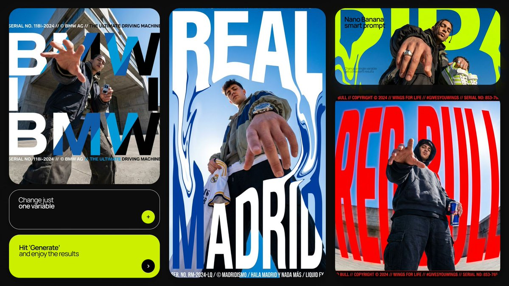

## [PERSON \ BRAND] visualized as the central masterpiece o

- ID: trending-2008633447095349411
- Slug: trending-2008633447095349411-en
- 语言: en
- 来源: [来源链接](https://x.com/youraipulse/status/2008633447095349411)
- 样例图路径: images/part1/2008633447095349411_1.jpg

### 提示词

```text
[PERSON \ BRAND] visualized as the central masterpiece of a surreal avant-garde collage, style of modern mixed media editorial illustration. The subject is composed of high-contrast black and white stippled halftone textures blended with vibrant neo-expressionist elements. Overlay details include bold geometric shapes, cyan and yellow risograph patterns, abstract graffiti scribbles, and digital glitch artifacts. A thick strip of pink or orange tape or a color block obscures part of the form for a deconstructed look. The texture is grainy, mimicking vintage poster paper. The composition is strictly centered with a very wide, clean, off-white cream paper background, ensuring the entire subject is fully contained within the frame with generous negative space on all sides, zero cropping, minimal chic aesthetic.
```

### 样例图

![[PERSON \ BRAND] visualized as the central masterpiece o](../images/part1/2008633447095349411_1.jpg)

## [BRAND NAME]: The name of the brand. Goal: Generate a si

- ID: trending-2045199443960439023
- Slug: trending-2045199443960439023-en
- 语言: en
- 来源: [来源链接](https://x.com/AmirMushich/status/2045199443960439023)
- 样例图路径: images/part1/2045199443960439023_1.png

### 提示词

```text
[BRAND NAME]: The name of the brand.
Goal: Generate a single, minimalist, and surreal image where a cloud is shaped like the brand's logo.

1. THE LOGO CLOUD
- **Subject**: A massive, photorealistic cumulus cloud in the exact geometric shape of the [BRAND NAME] logo.
- **Texture**: Puffy, soft, and voluminous with natural sunlight illuminating the edges.
- **Volume**: 3D sculptural appearance with realistic shadows within the cloud folds to show depth.

2. ENVIRONMENT & BACKGROUND
- **Sky**: A vast, clear, vibrant blue summer sky.
- **Secondary Elements**: A few small, wispy, natural clouds scattered far in the background to enhance the sense of scale and realism.
- **Lighting**: Bright, direct daylight coming from the side to create high-contrast highlights and shadows.

3. INTEGRATED BRANDING
- **Text**: The word "[BRAND NAME]" written in a clean, bold white sans-serif font.
- **Icon**: A small, flat white version of the brand's logo placed next to the text.
- **Positioning**: The branding (text + logo) is centered at the bottom of the frame, acting as a subtle anchor to the giant cloud above.

4. STYLE
- Surrealist photography, ultra-minimalist composition, high resolution, 8k, cinematic look, clean and airy vibe.
```

### 样例图

![[BRAND NAME]: The name of the brand. Goal: Generate a si](../images/part1/2045199443960439023_1.png)

## [BRAND NAME]: Enter the brand name here. Goal: Generate 

- ID: trending-2033260707525914989
- Slug: trending-2033260707525914989-en
- 语言: en
- 来源: [来源链接](https://x.com/AmirMushich/status/2033260707525914989)
- 样例图路径: images/part1/2033260707525914989_1.jpg

### 提示词

```text
[BRAND NAME]: Enter the brand name here.
Goal: Generate a minimalist organic image where a stylized logo icon of [BRAND NAME] is transformed into a large moss-textured artifact, with a small brand signature at the bottom.
Constraint: NO TEXT inside or immediately near the central moss icon. Only the bottom signature.

1. THE CENTRAL MOSS ICON
- Main Subject: A large, geometrically precise symbol, sculpted into the exact form of the [BRAND NAME] logo icon.
- Material: The symbol is entirely made of dense, heavily textured, natural green stabilizing moss. The texture is rough and organic with varying shades of green and brown.
- Form: The geometric edges are sharp and clean, but filled with the soft, billowy texture of moss.

2. ENVIRONMENT & LAYOUT
- View: A top-down, central flat lay view.
- Background: A flawless, uniform, matte white studio background. Full minimalist negative space.
- Lighting: Bright, soft, diffused studio lighting that emphasizes the tactile moss texture while minimizing harsh shadows.

3. BOTTOM BRAND SIGNATURE (CRITICAL)
- Placement: A clean horizontal signature block centered at the bottom, far below the moss icon.
- Elements: A tiny, flat, minimalist version of the [BRAND NAME] logo icon on the left.
- Text: The word "[BRAND NAME]" in a clean, bold, black sans-serif typeface immediately to the right of the tiny logo.
- Scale: The signature must be very small compared to the central moss artifact.

4. AESTHETIC
- Biophilic design, premium product photography, clean, fresh, airy, high-end editorial look. 8k resolution.
```

### 样例图

![[BRAND NAME]: Enter the brand name here. Goal: Generate ](../images/part1/2033260707525914989_1.jpg)

## Use the uploaded image as the exact visual reference for

- ID: trending-2029019321364824452
- Slug: trending-2029019321364824452-en
- 语言: en
- 来源: [来源链接](https://x.com/ChillaiKalan__/status/2029019321364824452)
- 样例图路径: images/part1/2029019321364824452_1.jpg

### 提示词

```text
Use the uploaded image as the exact visual reference for jar design, label, strawberries, raspberries, flowers, leaves, condensation droplets, red gradient background, and reflective surface.

Camera:
Locked front-facing camera.
No zoom.
No rotation.
No angle change.
Studio composition remains centered.

Style:
Premium beauty commercial.
Smooth assembling sequence.
Ultra realistic.
Slow motion but not dramatic.

Scene – Start (Empty Setup):
Start with an empty red gradient background and glossy reflective surface.
No jar.
No fruits.
No flowers.
No water droplets.

Assembling Sequence:

1. The glass jar base smoothly slides into frame from below and settles perfectly centered.
2. The lid gently lowers from above and aligns perfectly on the jar.
3. Condensation droplets subtly appear on the glass surface as if forming naturally.
4. Raspberries roll in softly from left and right, stopping naturally around the base.
5. Strawberry halves slide into position at the front.
6. Whole strawberries gently drop from above into the open jar top and settle naturally.
7. Small white flowers softly fall into place between the strawberries.
8. Green leaves slide in behind the jar to frame it.
9. Final micro water droplets appear on fruits for freshness effect.

All movements smooth and controlled.
No bouncing.
No exaggerated motion.
No dramatic lighting changes.

Lighting:
Keep original studio lighting.
Deep red background glow remains consistent.
Soft reflections on the glossy surface.

Sound (if supported):
Soft subtle assembling sound design.
Gentle fruit placement sounds.
Light glass contact sound.
No music or very subtle premium ambient tone.

End Frame:
Fully assembled composition exactly matching the reference image.
Everything perfectly arranged.
Hold for 1–2 seconds.
Ultra clean luxury skincare commercial finish.
```

### 样例图

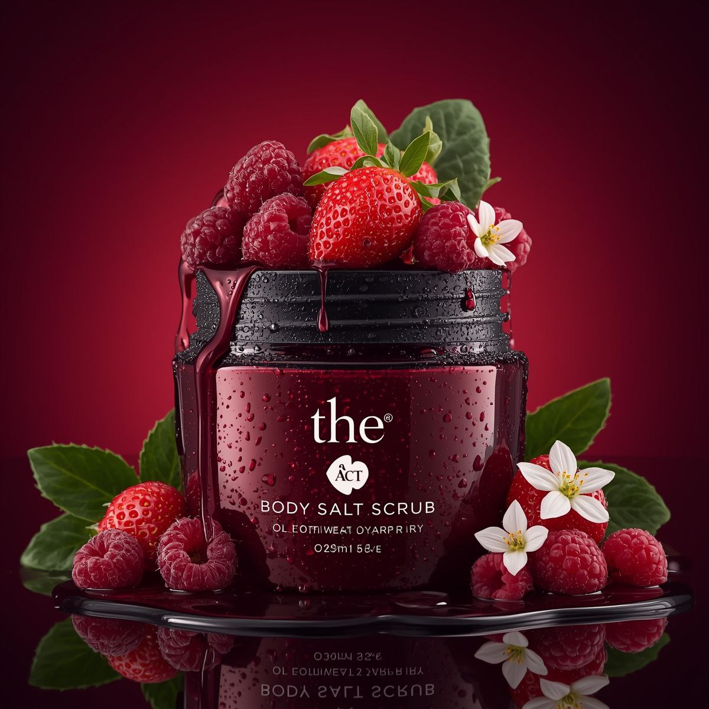

## [BRAND NAME] Act as a CGI Optical Physicist and 3D Type 

- ID: trending-2043748561729302884
- Slug: trending-2043748561729302884-en
- 语言: en
- 来源: [来源链接](https://x.com/AmirMushich/status/2043748561729302884)
- 样例图路径: images/part1/2043748561729302884_1.jpg

### 提示词

```text
[BRAND NAME]
Act as a CGI Optical Physicist and 3D Type Sculptor creating a hero crystal typography visual for a luxury brand campaign. References: James Turrell light installations, optical physics photography, Rick Owens × crystal aesthetics.

PHASE 0: BRAND LOGO INTELLIGENCE

Retrieve the 100% canonical, trademark-accurate logotype of [BRAND NAME] from training data — this is non-negotiable. Reproduce the exact proprietary typeface or custom lettering: every stroke weight, every curve tension, every terminal detail, every unique glyph modification. Do not substitute with a similar font — decode the actual trademarked letterform geometry. If [BRAND NAME] has a primary symbol or emblem — place it above or integrated with the wordmark exactly as in the official logo lockup. Fidelity test: a brand lawyer must recognize this as the correct logo, not an approximation.

PHASE 1: CRYSTAL MATERIAL SYSTEM

The canonical logotype of [BRAND NAME] is a fully 3D sculptural object made entirely of optical crystal glass — not metal, not plastic, not rubber. Material: optical borosilicate glass or synthetic crystal, IOR 1.85 to 2.1, maximum dispersion coefficient. The letterforms have physical volume and thickness — cross-section is consistent throughout each stroke, like letters carved from a single block of optical glass. Surface finish: polished to sub-micron smoothness on primary faces — all major faces mirror-flat and fully refractive. Edges between faces are sharp and precise — maximum chromatic dispersion occurs here. The material is optically pure in its core — zero bubbles, zero inclusions in the interior volume.

CRITICAL — WEAR & IMPERFECTION SYSTEM: The crystal has been handled — it carries the history of physical existence. Apply these surface imperfections with restraint and realism, never overwhelming the dispersion beauty: micro-scratches — a sparse network of hairline scratches on the front and top faces, depth 0.01 to 0.05mm equivalent, visible only when light catches them at specific angles. They scatter light slightly, creating a faint matte haze in the scratch zone while surrounding surface remains mirror-clean. Scratches follow organic directional patterns — some parallel, some crossing, as if from handling and storage, never uniform or grid-like. Edge chips — 2 to 4 very minor edge micro-chips along the sharpest edges and corners, each no larger than 0.5mm equivalent. These tiny imperfections catch light differently than clean edges — they create micro-flare events, small irregular sparkles where a chip breaks the otherwise perfect edge geometry. Surface haze zones — 1 to 2 small irregular areas of very fine surface abrasion, like the glass has been lightly scuffed by contact with another hard surface. These zones appear as subtle frosted patches, 3 to 8% opacity maximum — barely visible, discovered rather than obvious. They slightly diffuse the refraction beneath them, softening the rainbow bands in that micro-zone only. Fingerprint ghosts — optional, extremely subtle — 1 partial fingerprint trace on one face, visible only as a very faint oily interference pattern when light hits at oblique angle. Adds humanity to the object. All imperfections are surface-level only — the interior crystal volume remains optically perfect. The wear says this object is precious and real, not freshly manufactured.

PHASE 2: LIGHT & DISPERSION SYSTEM

Single collimated light source entering from upper-left at 35° — focused, high-intensity, like a precision studio spot or filtered sunlight. As light passes through the crystal letterforms it undergoes full chromatic dispersion — splitting into the complete visible spectrum following Snell's law geometry with maximum physical accuracy. Dispersion behavior on faces: each polished face simultaneously reflects and refracts — where light exits or reflects, a full spectrum appears in strict physical order red → orange → yellow → green → blue → violet. Rainbow bands are sharp and laser-clean at their origin edges, softening and widening as they travel across faces. Micro-scratch zones interrupt the rainbow bands locally — creating fine scattered light filaments branching off the main dispersion paths. Internal reflections: light bounces between letter faces creating crossed and layered rainbow patterns inside the volume — letters glow from within, nearly dark at the core, exponentially brighter toward illuminated faces. Multiple internal reflection paths create 3 to 5 distinct rainbow events visible simultaneously inside each major letterform. Edge glow: every sharp edge emits thin intense white-blue luminous line from total internal reflection — edge chips create micro-flare interruptions at their locations, bright irregular sparkles punctuating the otherwise continuous edge glow. Chromatic aberration at all edges: red fringe on one side, blue-violet fringe on the other — physical dispersion, not decorative filter. The 3/4 angle reveals front face and top face simultaneously — each face receives different dispersion patterns, creating layered optical complexity. Top face rainbow pattern and front face rainbow pattern intersect at the top edge of each letterform, creating a zone of maximum spectral density.

PHASE 3: BACKGROUND

Background: pure absolute black (#000000 to #050505) — a light-absorbing void, no texture, no gradient, no reflected light. The crystal letters float in darkness — no surface beneath, suspended in void. No ambient light reaching the background. The only light in the image exists within and immediately around the letterforms. Dispersed rainbow light creates a very subtle colored haze in the immediate 2 to 4cm radius around each letter — soft spectral glow bleeding into the black void. Beyond that: absolute darkness. The letters are the sole light source in the scene. The micro-scratch haze zones appear as slightly cooler, slightly less luminous areas against the surrounding rainbow glow — their presence is felt rather than explicitly seen.

PHASE 4: COMPOSITION

CRITICAL — 3/4 ANGLE: The logotype is rotated approximately 5 to 10° on the horizontal axis and elevated 5 to 10° on the vertical axis — a subtle, almost-frontal three-quarter view. The rotation is intentionally minimal — just enough to reveal the physical depth and thickness of the crystal letterforms, suggesting three-dimensionality without dramatically departing from a frontal logo presentation. The logo reads as nearly flat but unmistakably three-dimensional. This angle still reveals the top face of letterforms as a thin luminous sliver — enough to catch a secondary dispersion pattern distinct from the front face, adding optical depth without compositional complexity. Horizontal centering maintained. Logo occupies 60 to 70% of frame width. Full lockup visible if [BRAND NAME] has an emblem above or integrated with the wordmark. Aspect ratio: 1:1 square or 4:5 portrait — autonomously determine best fit for [BRAND NAME] lockup proportions. Full sharp focus across the entire sculpture — no depth of field. Every micro-scratch, every edge chip, every rainbow band in crisp simultaneous focus. Detail resolution: the image must reward close inspection — zooming in 400% should reveal new details not visible at normal viewing distance: individual scratch filaments, micro-chip geometry, secondary internal reflections, fingerprint interference patterns.

PHASE 5: TECH SPECS

Render: Octane Render with full caustics enabled at maximum quality settings. Ray tracing: minimum 16 bounces — increased from standard to capture all internal reflection events, secondary dispersion paths, and scratch-scattered light filaments. Dispersion: physically accurate wavelength-dependent IOR — full spectral rendering across visible light range 380nm to 700nm, not a color overlay or post-process effect. Scratch rendering: micro-scratches rendered as actual surface geometry displacement, not normal map approximation — true micro-geometry for physically accurate light scattering. Caustics: on at maximum intensity. Subsurface contribution: minimal — glass is not translucent like skin, but edges and thin stroke areas show faint internal light transmission. Anti-aliasing: maximum — every edge, every scratch filament razor clean. Sampling: minimum 2048 samples per pixel — no noise in the blacks, no grain in the rainbow bands. No post-process glow filters, no color grading, no compositing tricks — everything physically rendered from geometry and light. Output feel: the most detailed and physically accurate crystal typography ever rendered. Every imperfection is intentional. Every photon is accounted for.
```

### 样例图

![[BRAND NAME] Act as a CGI Optical Physicist and 3D Type ](../images/part1/2043748561729302884_1.jpg)

## [product setup], minimalist product photo, clean warm st

- ID: trending-2027021107015143498
- Slug: trending-2027021107015143498-en
- 语言: en
- 来源: [来源链接](https://x.com/azed_ai/status/2027021107015143498)
- 样例图路径: images/part1/2027021107015143498_1.jpg

### 提示词

```text
[product setup], minimalist product photo, clean warm studio scene, textured beige wall background, soft directional sunlight creating long shadows, simple tabletop surface, product arranged in a playful concept composition, hand drawn white line doodle overlay of [character] interacting with the product, mixed media look combining real photography and sketch illustration, high end branding feel, shallow depth of field, ultra realistic, no extra text, no watermark
```

### 样例图

![[product setup], minimalist product photo, clean warm st](../images/part1/2027021107015143498_1.jpg)

## Create a technical infographic of [OBJECT] with a 45-deg

- ID: trending-2024375445345779759
- Slug: trending-2024375445345779759-en
- 语言: en
- 来源: [来源链接](https://x.com/Strength04_X/status/2024375445345779759)
- 样例图路径: images/part1/2024375445345779759_1.jpg

### 提示词

```text
Create a technical infographic of [OBJECT] with a 45-degree isometric 3D perspective showing the device slightly tilted to reveal depth and dimension.
Combine a realistic photoreal render with black ink technical annotations on pure white background. Include:
Key component labels with color-coded callout boxes
Internal component visibility through transparent/cutaway sections
Measurements, dimensions, and precise scale markers
Material callouts and quantities
Color-coded arrows for function/flow: RED (power/battery), BLUE (data/connectivity), ORANGE (thermal/processor), GREEN (sensors/haptics)
Simple schematics or cross-sectional diagrams where relevant

Place “OBJECT” title in a hand-drawn technical box (top-left corner).
Style: Black linework (technical pen/architectural), sketched but precise. Object remains clearly visible. Educational museum-exhibit vibe. Clean composition, balanced negative space.
Perspective: Isometric 3D angle—tilted to show depth, dimension, and internal architecture dramatically. Like a professional product teardown or engineering manual.
Colors: ~10-15% accent density. Black dominant. White background.
Output: 1080×1080, ultra-crisp, social-feed optimized.
```

### 样例图

![Create a technical infographic of [OBJECT] with a 45-deg](../images/part1/2024375445345779759_1.jpg)

## 3×3 storyboard grid, nine panels, same subject and outfi

- ID: trending-2042288316868149748
- Slug: trending-2042288316868149748-en
- 语言: en
- 来源: [来源链接](https://x.com/oggii_0/status/2042288316868149748)
- 样例图路径: images/part1/2042288316868149748_1.jpg

### 提示词

```text
3×3 storyboard grid, nine panels, same subject and outfit, consistent teal studio background, soft diffused lighting, clean editorial lifestyle photography
young East Asian woman, natural makeup, black hair tied back, wearing white fitted top, blue/cream color-block cardigan with red strap, blue jeans, sneakers, pastel blue over-ear wireless headphones
panel sequence (left→right, top→bottom): 1 standing adjusting headphones, front view
2 close-up portrait touching earcup
3 side profile sitting on tall stool
4 lying on stomach with cassette tapes + retro player
5 extreme close-up headphones + face detail
6 tilted head smiling portrait
7 low-angle crouch reaching headphones toward camera
8 forced perspective product shot, headphones close to lens
9 lying on back relaxed pose
style: minimal, pastel tones, soft shadows, sharp focus, commercial product photography, consistent framing, balanced grid layout, mix of wide/medium/close shots
```

### 样例图


## A product photo in a premium advertising style. Two tall

- ID: trending-2018606861403197833
- Slug: trending-2018606861403197833-en
- 语言: en
- 来源: [来源链接](https://x.com/harboriis/status/2018606861403197833)
- 样例图路径: images/part1/2018606861403197833_1.jpg

### 提示词

```text
A product photo in a premium advertising style. Two tall matte bottles of Salton Shoe Deodorant levitate in the air in a dynamic, balanced composition.
The bottles are positioned at an angle to each other, creating a striking diagonal composition. One bottle is slightly forward, the other is slightly behind, creating depth and hierarchy. Both bottles are elegantly wrapped with a wide black and brown satin ribbon featuring the repeating "Salton" branding. The lettering is executed in a neat, contrasting font, legible without distortion, and is repeated evenly along the entire length of the ribbon. The ribbon flows smoothly between the bottles, uniting them into a single composition, without obscuring key messages on the packaging or clashing with the main branding on the bottles. Shot from a slightly lower angle, the bottles are slightly tilted, enhancing a sense of confidence, strength, and premium quality. The background is a solid studio color, a deep warm shade (chocolate, dark caramel or soft terracotta), clean and minimalist, without distracting details.
```

### 样例图

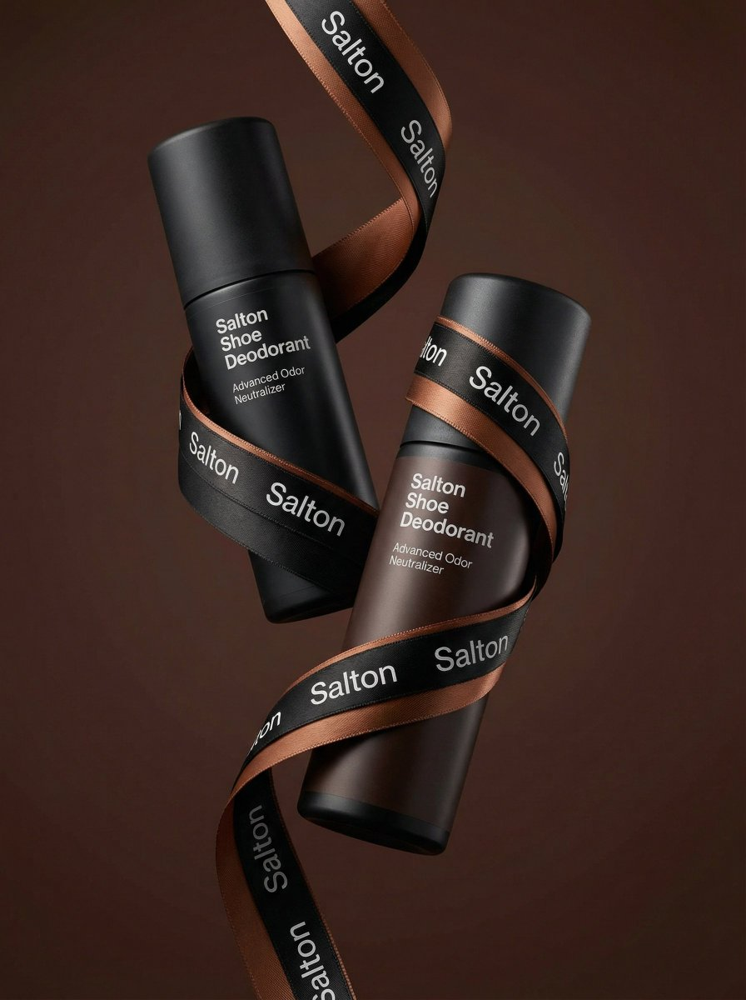

## A high-end editorial studio photograph of a (PRODUCT FOR

- ID: trending-2010275488703381858
- Slug: trending-2010275488703381858-en
- 语言: en
- 来源: [来源链接](https://x.com/Kerroudjm/status/2010275488703381858)
- 样例图路径: images/part1/2010275488703381858_1.jpg

### 提示词

```text
A high-end editorial studio photograph of a (PRODUCT FORM, e.g. bottle, jar, tube…), made of (MATERIAL, e.g. glass, ceramic, matte plastic…) with a (COLOR) (DETAIL, e.g. cap, texture, label…). The product is placed on a natural, textured (BASE SURFACE, e.g. stone, wood, marble…) slab, itself resting on a round mirror laid on a (SURFACE TONE, e.g. beige, sand, light gray…) surface. Around the mirror and on the slab are scattered droplets of (LIQUID, e.g. serum, oil, gel…) with realistic reflections. A few sprigs of (DECORATIVE NATURAL ELEMENTS, e.g. lavender, eucalyptus, rose petals…) lie gently across the slab and mirror, connecting both surfaces naturally. Strong, warm sunlight filters from the top left, casting soft diagonal leaf shadows to simulate filtered daylight. The aesthetic is (VISUAL STYLE, e.g. minimalist, organic, fresh, premium…), with realistic materials and natural textures highlighted by golden hour tones. Style: 3D realism, luxury product photography, shallow depth of field. Format: 1:1, ultra-detailed.
```

### 样例图

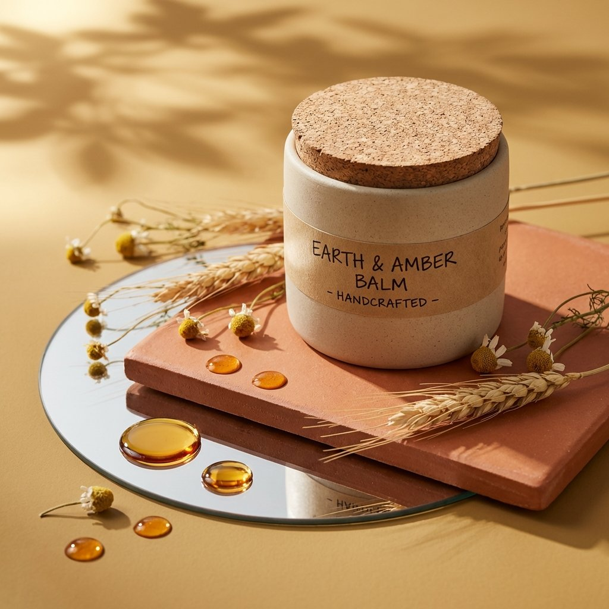

## [BRAND NAME]. Act as a Creative Director and Still Life 

- ID: trending-2015869121058030001
- Slug: trending-2015869121058030001-en
- 语言: en
- 来源: [来源链接](https://x.com/youraipulse/status/2015869121058030001)
- 样例图路径: images/part1/2015869121058030001_1.jpg

### 提示词

```text
[BRAND NAME]. Act as a Creative Director and Still Life Photographer for a hypebeast fashion publication.
THE TASK:
Create a high-end "Showroom Still Life" photograph announcing a limited merchandise drop for [BRAND NAME].
PHASE 1: AUTONOMOUS CURATION (STRATEGY)
Analyze [BRAND NAME]: Identify the industry and the core physical product (e.g., if "Spalding" -> Basketballs; if "McDonald's" -> Burger Boxes; if "Visa" -> Metal Cards).
Determine the Palette:
Background Color: A deep, rich, textured tone derived from the brand's secondary palette (e.g., Teal, Navy, Burgundy, Slate Grey).
Merch Color: A contrasting warm or neutral tone (Camel, Orange, Cream) to pop against the background.
Select the "Merch Item": Choose a high-quality apparel piece relevant to the brand's vibe (e.g., a Varsity Letterman Jacket, a Heavyweight Hoodie, a Canvas Tote, or a Wool Scarf).
PHASE 2: SET DESIGN (THE RACK)
The Prop: A simple, modern White Powder-Coated Metal Rack or Shelf unit. It stands cleanly in the frame.
The Arrangement:
Hanging Item: The chosen "Merch Item" (e.g., the Jacket) is draped casually over the rack or hanging on a hanger, showing off the texture (wool/felt).
Stacked Items: On the shelves of the rack, stack multiple units of the brand's Core Product (e.g., a stack of basketballs, a pyramid of cans, a row of boxes).
The Background: A Hand-Painted Canvas Backdrop in the chosen Deep Background Color. Visible texture/brushstrokes are essential for that "studio" look.
PHASE 3: PHYSICAL BRANDING (TEXTURE)
On the Merch: The hanging apparel must feature High-Quality Physical Branding. Use "Chenille Patches", "Embroidered Logos", or "Screen Print" running down the sleeve or on the back. It must look like a real, expensive garment.
On the Products: Ensure the stacked core products have the correct [BRAND NAME] logo visible.
PHASE 4: PHOTOGRAPHY & LIGHTING
Lighting: Soft, directional window light from the side. Creates realistic, soft shadows on the rack and rich highlights on the textures.
Lens: 50mm or 85mm. Sharp focus on the merch, slight fall-off in the background.
PHASE 5: UI OVERLAY (THE "DROP" LAYOUT)
Left Side Alignment:
Large, clean White Logo of [BRAND NAME] floating in the negative space on the left.
Under the logo, small white text with the brand's official slogan.
```

### 样例图

![[BRAND NAME]. Act as a Creative Director and Still Life ](../images/part1/2015869121058030001_1.jpg)

## Premium minimalist skincare product photography. A trans

- ID: trending-2009163133810823368
- Slug: trending-2009163133810823368-en
- 语言: en
- 来源: [来源链接](https://x.com/oggii_0/status/2009163133810823368)
- 样例图路径: images/part1/2009163133810823368_1.jpg

### 提示词

```text
Premium minimalist skincare product photography. A translucent pink liquid cleanser bottle with a white pump dispenser placed vertically at the center of the frame. The bottle rests inside an organic pool of soft pink foamy bubbles, with airy soap lather spreading outward in smooth, rounded shapes. Small transparent bubbles float around the foam surface. Clean matte pastel pink background with subtle gradient. Soft diffused top lighting with gentle rim light creates a luminous glow through the liquid, highlighting the pump tube inside the bottle. Sharp focus, high clarity, realistic liquid refraction, smooth plastic and glass textures, luxury beauty advertising style, modern cosmetic branding, ultra-realistic, 8K detail, high dynamic range.

Negative Prompt:

hands, people, faces, clutter, harsh reflections, label distortion, unreadable text, warped pump, hard shadows, grain, noise, low resolution, CGI look, cartoon style, messy foam, uneven lighting, watermark
```

### 样例图

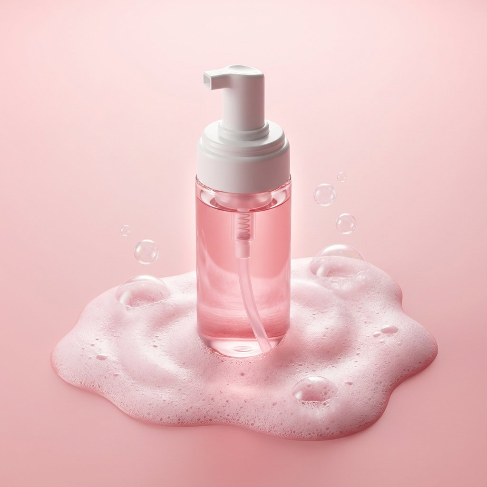

## [BRAND NAME]. Act as a fashion photographer and creative

- ID: trending-2027393294469128313
- Slug: trending-2027393294469128313-en
- 语言: en
- 来源: [来源链接](https://x.com/AmirMushich/status/2027393294469128313)
- 样例图路径: images/part1/2027393294469128313_1.jpg

### 提示词

```text
[BRAND NAME]. Act as a fashion photographer and creative director shooting a high-end editorial lookbook for a bespoke football jersey designed by this brand.
THE SUBJECT & COMPOSITION (FLOATING & ANGLED):
A single, premium custom football jersey is floating suspended in mid-air, centered in the frame. There is no hanger visible.
Crucial Angle: The jersey is NOT presented flatly frontal. It is rotated slightly (approximately 15 degrees angled view) to show depth, form, and a dynamic profile. Despite floating, the fabric must show realistic weight, deep gravity-defying folds, creases, and natural wrinkles. It must feel like a real, heavy garment frozen in time, not a stiff 3D model.
BRANDED DESIGN & AESTHETICS:
The jersey's design is a sophisticated interpretation of [BRAND NAME]'s visual identity.
Branding Placement: The official [BRAND NAME] logo is authentically applied as the main club crest on the chest (e.g., embroidered patch or high-quality heat transfer).
MATERIALITY & TEXTURE (CRITICAL):
The focus remains on luxurious, tactile textures.
Fabric: A heavyweight, retro-inspired athletic cotton-blend or technical knit with a visible, coarse weave structure.
ENVIRONMENT & BACKGROUND (WHITE STUDIO):
The jersey floats within an abstract, infinite white photo studio cyclorama space. The background is completely seamless, pure, clean white, and minimalist, with absolutely zero distractions, placing total focus on the suspended garment.
LIGHTING & PHOTOGRAPHY STYLE:
Style: Hyper-realistic editorial fashion photography. Clean, high-key aesthetic.
Lighting: sophisticated studio lighting. Soft, diffused light that sculpts the folds of the fabric and highlights the texture against the pure white background. Subtle soft shadows might be cast on the jersey itself to define its form in the white space.
```

### 样例图

![[BRAND NAME]. Act as a fashion photographer and creative](../images/part1/2027393294469128313_1.jpg)

## [BRAND NAME]: Enter the brand name here. Goal: Generate 

- ID: trending-2033619671522345426
- Slug: trending-2033619671522345426-en
- 语言: en
- 来源: [来源链接](https://x.com/AmirMushich/status/2033619671522345426)
- 样例图路径: images/part1/2033619671522345426_1.jpg

### 提示词

```text
[BRAND NAME]: Enter the brand name here.
Goal: Generate a hyper-realistic studio photograph where the stylized logo icon of [BRAND NAME] is a physical 3D ice sculpture lying directly on a snowy surface.
Constraint: NO TEXT inside or immediately near the central ice icon. Only the bottom signature. Light, airy background.

1. THE CENTRAL ICE ARTIFACT
- Main Subject: A large, 3D volumetric sculpture in the exact shape of the [BRAND NAME] logo icon.
- Material: Crafted from high-purity crystalline ice with intricate internal textures, frost needles, and frozen air bubbles.
- Details: The surface of the ice logo is covered with small, realistic water droplets and light condensation.
- Perspective: The logo is positioned at a 3/4 angle, lying horizontally on the snow to show its depth and thickness.

2. ENVIRONMENT & LAYOUT
- View: Eye-level macro perspective, 3/4 view.
- Surface: The logo is resting on a field of crisp, detailed, white powdery snow.
- Background: A flawless, uniform, very light pale blue and white gradient background (much lighter than the original).
- Shadow: A soft, realistic shadow is cast on the snow directly beneath the ice icon to ground it.

3. BOTTOM BRAND SIGNATURE (CRITICAL)
- Placement: A clean horizontal signature block centered at the bottom of the frame, far below the ice artifact.
- Elements: A tiny, flat, minimalist black version of the [BRAND NAME] logo icon on the left.
- Text: The word "[BRAND NAME]" in a clean, bold, black sans-serif typeface immediately to the right of the tiny logo.
- Scale: The signature is very small and subtle compared to the main ice sculpture.

4. AESTHETIC
- Premium product photography, cold and crisp atmosphere, hyper-realistic 8k resolution, cinematic lighting, ultra-detailed textures.
```

### 样例图

![[BRAND NAME]: Enter the brand name here. Goal: Generate ](../images/part1/2033619671522345426_1.jpg)

## A high-quality professional product photography of a cre

- ID: trending-2022199501168038032
- Slug: trending-2022199501168038032-en
- 语言: en
- 来源: [来源链接](https://x.com/Arminn_Ai/status/2022199501168038032)
- 样例图路径: images/part1/2022199501168038032_1.jpg

### 提示词

```text
A high-quality professional product photography of a creative structural packaging design for [Fruit Name]. The packaging is made of premium corrugated cardboard, intricately crafted into the literal shape of a giant stylized [Shape e.g. spherical, curved, elongated] [Fruit Name].

The exterior surface features a vibrant and sophisticated printed pattern of minimalist [Pattern Description e.g. geometric hexagons, organic wavy lines, dotted stippling, botanical line-art, or horizontal ridges], mimicking the Natural Skin of the Fruit in a duo-tone palette of [Color 1] and [Color 2].

Features clever die-cut windows that reveal the actual [Actual Product Inside] stored inside. Minimalist modern typography on the side saying "[NAME]". Includes eco-friendly details like a small recycling logo and a [3D Corrugated Cardboard Detail: Stem/green Leaf/Crown] on top. Soft studio lighting with gentle shadows, placed on a clean solid pastel [Background Color] background. 8k resolution, photorealistic, cinematic composition, industrial design aesthetic.
```

### 样例图

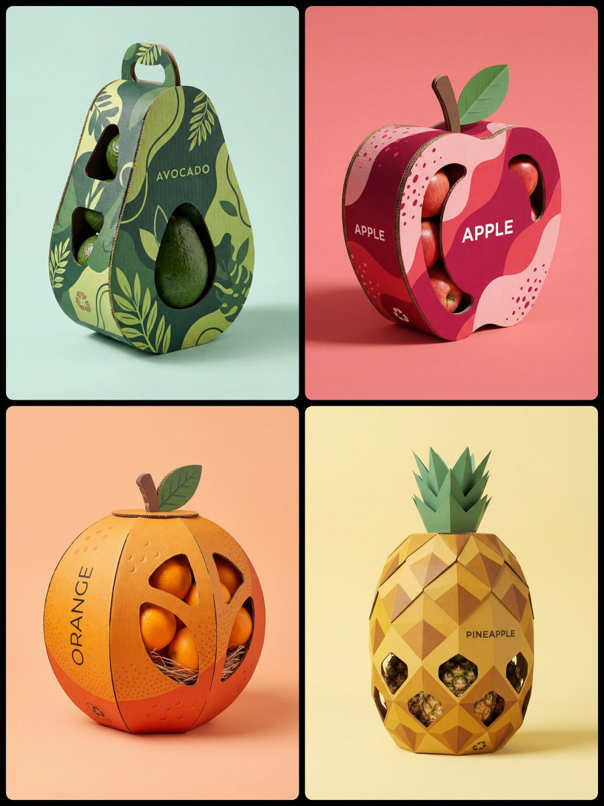

## { "subject": { "person": "Woman, appears to be in her 20

- ID: trending-2009580453083201822
- Slug: trending-2009580453083201822-en
- 语言: en
- 来源: [来源链接](https://x.com/oggii_0/status/2009580453083201822)
- 样例图路径: images/part1/2009580453083201822_1.jpg

### 提示词

```text
{
  "subject": {
    "person": "Woman, appears to be in her 20s or 30s",
    "pose_and_expression": [
      "Standing by window, looking out, relaxed",
      "Reaching for bottle on counter, hand focus",
      "Looking in mirror, slight smile",
      "Hand dispensing serum from bottle, close-up",
      "Serum drop on fingertip, macro shot",
      "Applying serum to face, eyes closed, serene",
      "Face close-up, eyes closed, content",
      "Bottle and orchid on counter, still life",
      "Walking away from camera, standing by window"
    ]
  },
  "clothing": {
    "items": "White robe, white pajamas/loungewear",
    "material": "Soft, flowing fabric",
    "style": "Casual, luxurious"
  },
  "hair": {
    "color": "Dark brown",
    "style": "Pulled back, neat bun or ponytail"
  },
  "face": {
    "makeup": "Natural, minimal",
    "skin": "Clear, glowing",
    "expression": "Calm, serene, content"
  },
  "accessories": {
    "jewelry": "Simple ring on ring finger",
    "props": [
      "Glass skincare bottle with gold pump dispenser",
      "Product label: 'Promptopia'",
      "White orchid in a small white vase"
    ]
  },
  "environment": {
    "location": "Modern, luxurious bathroom",
    "elements": [
      "Large floor-to-ceiling windows",
      "Marble countertop and walls",
      "Round mirror",
      "View of trees/garden outside",
      "Fog or mist outside window"
    ],
    "atmosphere": "Serene, spa-like, tranquil"
  },
  "lighting": {
    "source": "Natural daylight",
    "quality": "Warm, golden, soft, diffused",
    "time_of_day": "Sunrise or golden hour"
  },
  "camera": {
    "type": "Photography collage",
    "shots": [
      "Wide shot",
      "Medium shot",
      "Close-up",
      "Macro shot"
    ],
    "focus": "Sharp on subject and product, soft background blur (bokeh)"
  },
  "style": {
    "aesthetic": "Cinematic, editorial, beauty, wellness, clean, minimalist",
    "color_palette": "Warm neutrals, white, gold, natural greens"
  }
}
```

### 样例图

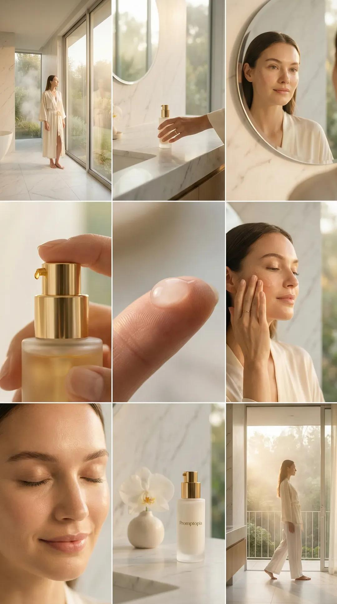

## Create an infographic image of [OBJECT], combining a rea

- ID: trending-2028111208054661231
- Slug: trending-2028111208054661231-en
- 语言: en
- 来源: [来源链接](https://x.com/TechieBySA/status/2028111208054661231)
- 样例图路径: images/part1/2028111208054661231_1.jpg

### 提示词

```text
Create an infographic image of [OBJECT], combining a realistic photograph or photoreal render of the object with technical annotation overlays placed directly on top.

Use black ink–style line drawings and text (technical pen / architectural sketch look) on a pure white studio background, including:
•Key component labels
•Internal cutaway or exploded-view outlines
•Measurements, dimensions, and scale markers
•Material callouts and quantities
•Arrows indicating function, force, or flow (air, sound, power, pressure)
•Simple schematic or sectional diagrams where relevant

Place the title “OBJECT” inside a hand-drawn technical annotation box in one corner.

Style & layout rules:
•The real object remains clearly visible beneath the annotations
•Annotations feel sketched, technical, and architectural
•Clean composition with balanced negative space
•Educational, museum-exhibit / engineering-manual vibe

Visual style:
Minimal technical illustration aesthetic, black linework over realistic imagery, precise but slightly hand-drawn feel.

Color palette:
White background, black annotation lines and text only. No colors.

Output:
1080×1080, ultra-crisp, social-feed optimized, no watermark
```

### 样例图

![Create an infographic image of [OBJECT], combining a rea](../images/part1/2028111208054661231_1.jpg)

## [BRAND NAME] + [COLOR] Act as a Senior CGI Artist and Br

- ID: trending-2039041297286053931
- Slug: trending-2039041297286053931-en
- 语言: en
- 来源: [来源链接](https://x.com/AmirMushich/status/2039041297286053931)
- 样例图路径: images/part1/2039041297286053931_1.jpg

### 提示词

```text
[BRAND NAME] + [COLOR]

Act as a Senior CGI Artist and Brand Identity Director specializing in premium logo materializations. Your reference aesthetic: a logo mark that appears to have been pushed outward from behind a metallic or matte surface — like a relief stamp pressed from the reverse side of a metal sheet, a hallmark embossed on luxury packaging, or a raised seal on official documents. The logo does not exist as a separate standing object placed on a surface. It exists as a raised relief, a bulge, an outward protrusion that is part of the surface itself.

BRAND INTELLIGENCE SYSTEM

Before executing any phase, resolve these parameters: (1) LOGO GEOMETRY — identify [BRAND NAME]'s primary icon mark in its simplest most reduced form — the mark that works at any scale, (2) COLOR PALETTE — based on [COLOR], build the full tonal system from the lightest specular highlight to the deepest shadow tone, determine if the overall mood reads warm, cool, or neutral, (3) SURFACE MATERIAL — based on [COLOR] determine the surface character: silver or grey becomes brushed or circular-grain steel, gold or champagne becomes warm brushed metal with radial grain, black becomes anodized aluminum or matte carbon fiber, white becomes matte ceramic or chalk plaster, any saturated hue becomes anodized colored metal holding the hue in lit areas and desaturating toward black in deepest shadows, (4) LIGHT DIRECTION — determine the most flattering single light angle to reveal the emboss topography — where highlights land on the raised ridge peaks and where shadows fall on the descending walls.

PHASE 1: SURFACE & ATMOSPHERE

The entire image is one single continuous material surface — not a background with an object placed on it, but one unified physical plane filling the entire canvas. This surface is made of the SURFACE MATERIAL resolved above. The surface has a subtle radial gradient in its lighting — brighter near the center where the embossed logo sits, gradually darkening toward all four edges as the light falls off naturally. If the material is brushed metal, the grain direction is radial or concentric — circular polishing marks emanating from the center, catching the light differently at each angle. Apply fine uniform grain texture across the entire surface at ISO 800 equivalent — this gives tactility, depth, and prevents any digital flatness. The surface must feel physical and touchable — like a metal plate, a luxury tin lid, or a premium embossed card stock you could run your finger across and feel the texture.

PHASE 2: THE EMBOSS — CRITICAL

The [BRAND NAME] logo mark is rendered as a full bas-relief — think of a coin, a commemorative medal, or a luxury brand stamp where the ENTIRE logo shape rises as one unified solid mass from the surface. Not just the outline. Not just the stroke path. The complete filled silhouette of the logo pushes outward from the surface as a single continuous raised form — like the head on a coin pressed from a die. The interior of the logo is NOT hollow or open. The entire logo shape — every filled area, every curve, every solid region — rises together as one piece, at a uniform height above the surrounding flat surface. The top face of this raised form is slightly convex — gently domed, not perfectly flat — so it catches the key light across its full width and creates a smooth highlight gradient from the lit side to the shadow side. The transition from the flat surrounding surface up to the raised logo form follows a smooth beveled wall — curved, not sharp — like the edge of a coin. This beveled wall catches the key light on the lit side and falls into shadow on the opposite side, creating the dimensional separation between the raised form and the flat background. Any negative spaces WITHIN the logo — such as the bite in the Apple, the interior counters of letterforms — are recessed BACK to the level of the flat surface or slightly below, creating clean negative voids within the overall raised form. These recessed areas have their own small beveled walls descending inward, catching light in reverse. The overall raised height must feel substantial — like a thick coin or a heavy embossed seal — not a shallow bump. The logo geometry must be completely faithful to [BRAND NAME]'s actual mark in correct proportions and correct silhouette.

PHASE 3: LIGHTING

One primary soft area light from upper-left at approximately 10 to 11 o'clock position — broad and diffused, wrapping around the curved walls of the raised ridge to create the characteristic highlight peak at the top and gradual shadow descent on the far wall. Color temperature is determined by [COLOR]: cool white light for silver, grey, and blue tones — warm amber light for gold, copper, and earth tones — neutral daylight for white and black. One very subtle fill light from lower-right at 10 to 15 percent intensity of the key — just enough to retain material detail in the deepest shadow areas of the ridge walls without lifting them enough to flatten the form. No hard shadows anywhere on the surface. No spotlight pools. No rim light. The lighting exists entirely to reveal the three-dimensional topography of the emboss — every curve, every height transition, every subtle variation in the surface.

PHASE 4: TYPOGRAPHY

In the lower portion of the canvas, below the embossed logo, on the same continuous surface — a minimal typographic lockup. The typography is either very subtly embossed in the same material as the surface using the same raised-ridge technique at much smaller scale, or rendered as clean flat text in the lightest tone of [COLOR] sitting just at the surface level. Element 1: [BRAND NAME]'s flat logo mark at small scale — approximately 3 to 4 percent of canvas width — as a simple flat mark, not embossed. Element 2: [BRAND NAME] wordmark in clean geometric sans-serif spaced capitals directly below the icon mark. Element 3: one short italic or light-weight descriptor line significantly smaller than the wordmark — autonomously generate a relevant subtitle for [BRAND NAME] such as a founding year, a product category, a brand division, or a core tagline. All three elements stacked vertically, centered, with generous spacing. No decorative elements. No lines or rules. Pure typographic restraint.

TECH SPECS

The single most important instruction in this entire prompt: the logo must read as PUSHED OUTWARD FROM the surface, rising toward the viewer, proud and raised. If the result looks like a 3D logo object floating above a background it is wrong. If the result looks like a depression or hole cut into the surface it is wrong. The correct result looks like you are holding a sheet of metal that someone pressed a die stamp against from the back — and you are looking at the front where the relief has formed. Ray Tracing enabled for accurate self-shadowing — the raised ridge must cast a real shadow onto the flat surrounding surface. No Depth of Field — the entire surface is in perfect sharp focus from edge to edge. Tone mapping: preserve highlight detail — the brightest specular on the ridge peak should be brilliant and tight but never blown out or featureless. Film grain applied uniformly across the full final render. No chromatic aberration. No lens distortion. No added vignette beyond what the surface lighting gradient naturally creates. Anti-aliasing maximum — the ridge edges must be perfectly clean. Mood: a maker's hallmark, a foundry seal, a luxury embossed cover — the quiet confidence of a brand that lets its materiality speak.
```

### 样例图

![[BRAND NAME] + [COLOR] Act as a Senior CGI Artist and Br](../images/part1/2039041297286053931_1.jpg)

## A beverage can branded [BRAND NAME], entirely made from 

- ID: trending-2008753339966877924
- Slug: trending-2008753339966877924-en
- 语言: en
- 来源: [来源链接](https://x.com/aleenaamiir/status/2008753339966877924)
- 样例图路径: images/part1/2008753339966877924_1.jpg

### 提示词

```text
A beverage can branded [BRAND NAME], entirely made from vibrant, fluffy plush fabric, positioned centrally against a soft, plush background in the signature colors of [BRAND NAME].

Bold Pop Art and Memphis design style, playful yet premium aesthetic.

Bright, clean studio lighting that strongly emphasizes the plush texture, visible fibers, softness, and tactile depth.

Sharp focus, high color saturation, smooth shadows, modern commercial product shot, minimal composition, ultra-high resolution.
```

### 样例图

![A beverage can branded [BRAND NAME], entirely made from ](../images/part1/2008753339966877924_1.jpg)

## [BRAND NAME]. Act as a Senior 3D Product Visualization A

- ID: trending-2037605625463550080
- Slug: trending-2037605625463550080-en
- 语言: en
- 来源: [来源链接](https://x.com/AmirMushich/status/2037605625463550080)
- 样例图路径: images/part1/2037605625463550080_1.jpg

### 提示词

```text
[BRAND NAME]. Act as a Senior 3D Product Visualization Artist and Cinematic Art Director specializing in luxury brand key visuals for high-end editorial and streetwear campaigns.

PHASE 1: LOGO SUBJECT

Autonomously identify the official, universally recognized logo/logotype of [BRAND NAME]. Reproduce it with maximum fidelity to the original silhouette, proportions, andgeometry — no stylistic distortion, no graffiti interpretation. The logo shape must be instantlyrecognizable as the real [BRAND NAME] mark. Extrude the logo into a solid 3D object with a depth of approximately 15–20% of its height. All surfaces — front face, side extrusion, and beveled edges — must be coated in a single unified material: Surface material: hyper-polished liquid chrome. Reflectance value 0.98 — near-perfect mirror finish. Apply full Ray-Traced environment reflections: the logo must visibly reflect the surrounding sky gradient, flower field, and light sources within its curved and flat surfaces. Bevel radius on all hard edges: moderate
(enough to catch sharp specular highlights). Add Subsurface Scattering on the thinnest structural parts of the logo (fine lines, serifs, icon details) to create a subtle inner glow at the edges.
Place 4–8 prismatic star-shaped lens-flare sparkles (4-point) at the highest specular peaks — corners, tips, and curved peaks of the logo geometry. The sparkles must feel organic, not uniformly distributed. Zero matte surfaces. Zero plastic look. The entire object must read as cast from liquid silver.

PHASE 2: ENVIRONMENT & BACKGROUND

Background: a wide cinematic landscape at the golden-lilac hour (just after sunset). A vast flower field fills the lower third — densely packed lavender and white wildflowers with realistic micro-texture and subtle wind motion-blur on the far clusters. Middle ground fades into soft purple-grey bokeh haze. Sky: gradient from warm blush rose (#E8A0BF) at the horizon through lilac (#C3A6D4) to cool powder blue (#A8C4D8) at the top. Add 3–5 loose silhouetted bird clusters (starlings, small and sharp) scattered across the upper left and right quadrants. Volumetric atmospheric haze
sits on the horizon line. Autonomously shift the environment's color palette to reflect [BRAND NAME]'s iconic brand identity — introduce the brand's signature hue as a tonal wash in the sky gradient or as the dominant flower color in the field. Preserve the overall ethereal, editorial mood. The environment must feel like it was art-directed specifically for this brand — not generic.

PHASE 3: COMPOSITION & LAYOUT

Format: 1:1 square. The chrome logo is centered horizontally and placed at the vertical midpoint — monumental in scale, spanning 65–80% of frame width.Apply a subtle forced perspective tilt (2–4 degrees)
for dynamic energy without distorting logo recognition. The bottom edge of the logo object grazes or slightly overlaps the top of the flower field, integrating the 3D object naturally into the environment. The logo casts a soft diffused shadow downward into the flowers. Lower-left corner: 2–3 lines of micro-copy in clean white sans-serif at minimal optical size. Autonomously generate a poetic 3-line brand statement relevant to [BRAND NAME]'s world, heritage, and aesthetic language. Bottom-left: "[BRAND NAME]" in small caps logotype label. Bottom-right: a secondary flat 2D chrome version of the same logo rendered small as a finishing mark.

PHASE 4: LIGHTING

Primary: large soft area light from upper-left simulating post-sunset overcast sky — fully diffused, no hard shadows, color temperature 5800K with a lilac tint overlay. Secondary: warm rim light (3200K) grazing the bottom and side edges of the logo from behind — creates a golden separation halo between the object and the field. Global Illumination enabled — the chrome logo must realistically bounce and absorb the landscape's ambient color. The flower field's purple tones should be faintly visible in the lower reflective surfaces of the logo. Volumetric god rays faintly visible through any negative space or cutouts within the logo geometry.

TECH SPECS

Render engine: Octane Render aesthetic. Ray Tracing: maximum bounces (16+). Depth of Field: f/11 equivalent — full logo sharp, far background in soft bokeh only. Tone mapping: lifted blacks, compressed highlights, filmic S-curve. Color grade: desaturated midtones, preserved pastels, cool shadow tones. Film grain: subtle (ISO 200 equivalent). Chromatic Aberration: 0.2–0.3px on peripheral logo
edges only. Anti-aliasing: maximum. Strictly no AI-plastic normals. No smooth uniform shading. Microscopic surface imperfections on the chrome required for realism (micro-scratches, 0.5%
roughness noise map). Mood reference: luxury brand retrospective editorial for Highsnobiety or AnOther Magazine.
```

### 样例图

![[BRAND NAME]. Act as a Senior 3D Product Visualization A](../images/part1/2037605625463550080_1.jpg)

## Using the attached image, create a professional industri

- ID: trending-2017093337564746040
- Slug: trending-2017093337564746040-en
- 语言: en
- 来源: [来源链接](https://x.com/Strength04_X/status/2017093337564746040)
- 样例图路径: images/part1/2017093337564746040_1.jpg

### 提示词

```text
Using the attached image, create a professional industrial packaging design illustration sheet for the packaging of [PRODUCT NAME]

Feature a centered hero 3D render with realistic materials, soft studio lighting, and commercial-grade finish quality.
Surround the hero render with technical views: front, side, top, bottom, angled perspective, and flat layout.

Include structural construction sketches, fold lines, seam details, and dimension arrows with measurements in millimeters.
Show materials and finishes (matte, glossy print, plastic, paper, glass, etc.) using handwritten-style annotations.
Add color swatches, realistic product illustrations, and subtle shadows.

Background should resemble clean sketchbook paper, combining realistic rendering with pencil sketch overlays.
Modern industrial design aesthetic, ultra-detailed, portfolio-ready presentation.

Stable Diffusion settings:
CFG: 7–9
Steps: 30–40
Sampler: DPM++
Resolution: 1024×1280 or higher
Aspect Ratio: 3:4
```

### 样例图

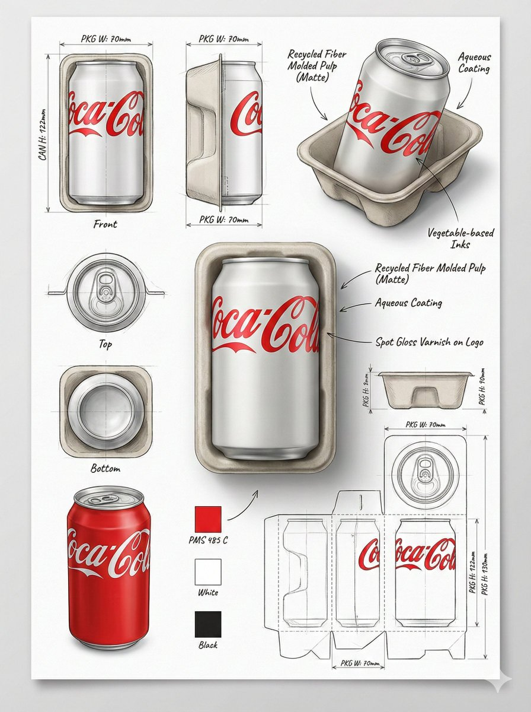

## Create top-down flat lay product photo. Use the uploaded

- ID: trending-2015992913000595614
- Slug: trending-2015992913000595614-en
- 语言: en
- 来源: [来源链接](https://x.com/oggii_0/status/2015992913000595614)
- 样例图路径: images/part1/2015992913000595614_1.jpg

### 提示词

```text
Create top-down flat lay product photo. Use the uploaded product as the main object, centered. Analyze the product type from the photo and automatically choose matching props/ingredients for an aesthetic flat lay around it (minimal, premium, on-brand). Preserve exact geometry, size, colors, label design, and all text on the product (no changes). Warm beige seamless background, soft directional sunlight, crisp realistic shadow. 
Ultra-realistic macro product photography, 100mm lens look, f/8, sharp focus, clean composition, no extra text, 8k, format 2:3.
```

### 样例图

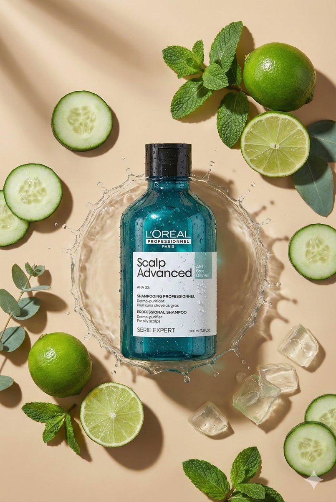

## { "subject": { "primary": "Cosmetic spray bottle", "seco

- ID: trending-2020367995131105685
- Slug: trending-2020367995131105685-en
- 语言: en
- 来源: [来源链接](https://x.com/oggii_0/status/2020367995131105685)
- 样例图路径: images/part1/2020367995131105685_1.jpg

### 提示词

```text
{
  "subject": {
    "primary": "Cosmetic spray bottle",
    "secondary": "Hummingbird",
    "brand": "IDUN MINERALS",
    "product_name": "READY SET REFRESH"
  },
  "packaging": {
    "form_factor": "Cylindrical bottle",
    "component_parts": [
      "Main body",
      "Cap (flush with body)"
    ],
    "material_appearance": "Matte finish, likely plastic or coated metal",
    "condition": "Pristine, new",
    "reflections": "Vertical highlight on the left side, mirrored reflection in water below"
  },
  "label_design": {
    "type": "Direct print onto bottle",
    "layout_orientation": "Mixed (Horizontal brand/details, Vertical product name)",
    "typography": {
      "font_family": "Sans-serif",
      "casing": "All uppercase",
      "style": "Clean, minimalist",
      "alignment": "Left aligned relative to the vertical axis for product name, centered horizontally for brand"
    }
  },
  "text_visible": {
    "brand_header": [
      "IDUN",
      "MINERALS"
    ],
    "body_vertical": [
      "READY SET REFRESH",
      "SETTING SPRAY"
    ],
    "footer_details": [
      "PRIMES THE SKIN",
      "SETS MAKEUP & REFRESHES",
      "FORMULATED WITH",
      "3% NIACINAMIDE"
    ],
    "reflection_text": "Inverted mirror image of all text visible on the water surface"
  },
  "colors": {
    "packaging_base": "Deep red / Burgundy",
    "text": "White",
    "foliage": [
      "Deep emerald green",
      "Forest green",
      "Moss green"
    ],
    "hummingbird": [
      "Iridescent green (head/back)",
      "Dark grey/brown (wings)",
      "Reddish/pink (tail feathers)",
      "Black (beak)"
    ],
    "water": "Dark, almost black with reflections"
  },
  "materials": {
    "bottle": "Matte rigid material",
    "environment": [
      "Liquid water",
      "Moss",
      "Fern leaves",
      "Palm-like leaves"
    ],
    "biological": "Feathers (bird)"
  },
  "human_elements": {
    "visible": false
  },
  "environment": {
    "setting": "Simulated rainforest or jungle floor",
    "foreground": "Still water surface",
    "midground": "Mossy bank, bottle placement",
    "background": "Dense tropical foliage"
  },
  "lighting": {
    "quality": "Soft, moody, atmospheric",
    "direction": "Side lighting from left (creating highlight on bottle)",
    "shadows": "Soft shadows in the foliage, dark water providing high contrast reflection",
    "highlights": "specular highlight on hummingbird head, diffuse highlight on bottle curve"
  },
  "camera": {
    "angle": "Eye-level with water surface",
    "framing": "Vertical portrait",
    "focus": "Sharp focus on bottle and hummingbird",
    "depth_of_field": "Shallow (background leaves are blurred/bokeh)",
    "composition": "Rule of thirds (bottle on left third line, bird entering from right)"
  },
  "style": {
    "category": "Product photography",
    "theme": "Nature, Organic, Eco-luxury",
    "mood": "Serene, fresh, premium"
  }
}
```

### 样例图

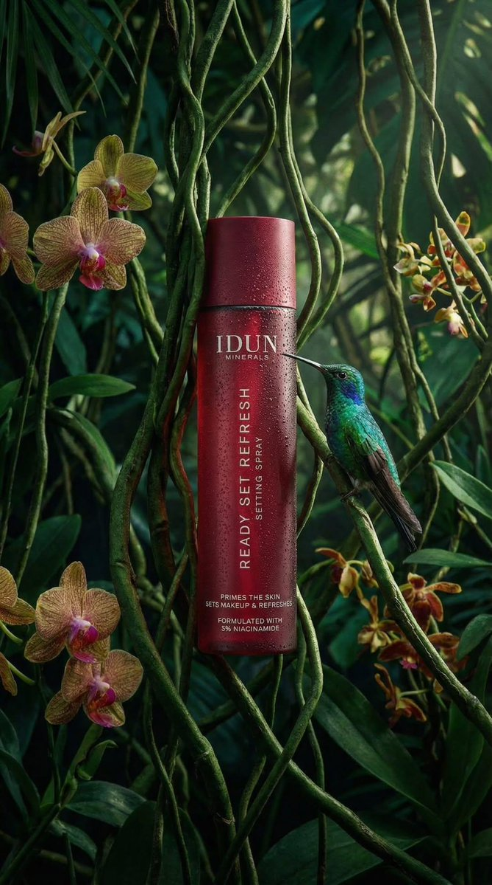

## { "prompt": { "subject": "Hyper-realistic luxury perfume

- ID: trending-2019404118486389234
- Slug: trending-2019404118486389234-en
- 语言: en
- 来源: [来源链接](https://x.com/YaseenK7212/status/2019404118486389234)
- 样例图路径: images/part1/2019404118486389234_1.jpg

### 提示词

```text
{
  "prompt": {
    "subject": "Hyper-realistic luxury perfume product photograph",
    "product": {
      "bottle": {
        "shape": "Rectangular",
        "material": "Transparent glass",
        "label": {
          "text": "CUCCI",
          "color": "Soft blush-pink",
          "texture": "Matte"
        },
        "cap": {
          "color": "Soft blush-pink",
          "texture": "Matte"
        },
        "placement": {
          "angle": "Gentle diagonal",
          "position": "Center"
        },
        "details": {
          "liquid": "Visible, with soft reflections",
          "highlights": "Glowing on glass edges"
        }
      }
    },
    "environment": {
      "setting": "Lush miniature fantasy meadow",
      "ground": "Moss-covered",
      "flora": {
        "flowers": ["Delicate pink", "Lavender", "Coral wildflowers"],
        "grasses": "Soft green"
      },
      "atmosphere": {
        "air": "Tiny petals drifting",
        "mist": "Faint, floating low"
      }
    },
    "lighting": {
      "source": "Warm golden-pink light from upper left",
      "effect": "Dreamy sunset",
      "type": "Studio-grade with subtle rim light"
    },
    "composition": {
      "depth_of_field": "Cinematic shallow",
      "focus": "Crisp on the brand name",
      "foreground": "Softly blurred blooms",
      "background": {
        "description": "Fading into a pastel bokeh haze",
        "elements": ["Florals", "Foliage"],
        "colors": ["Pink", "Peach", "Violet"]
      }
    },
    "style": {
      "aesthetic": "High-end editorial beauty",
      "mood": "Romantic and ethereal",
      "realism": "Premium realism",
      "quality": "8K",
      "textures": "Ultra-detailed (moss, petals, glass, label)"
    }
  }
}
```

### 样例图

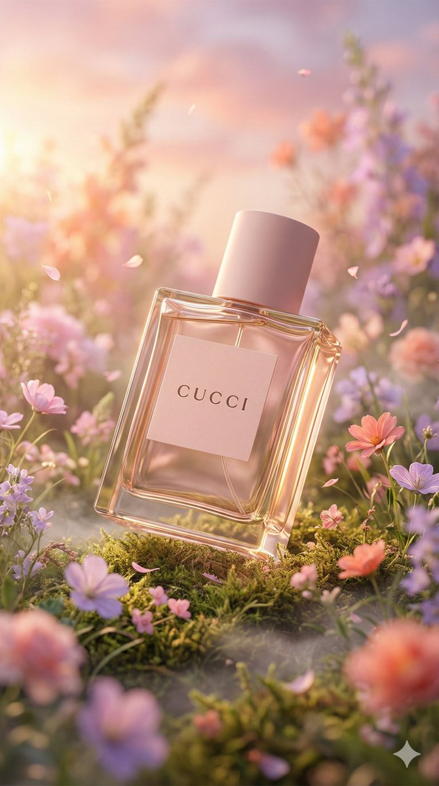

## [BRAND NAME]. Act as a Fashion Photographer and Graphic 

- ID: trending-2019779947020026325
- Slug: trending-2019779947020026325-en
- 语言: en
- 来源: [来源链接](https://x.com/AmirMushich/status/2019779947020026325)
- 样例图路径: images/part1/2019779947020026325_1.jpg

### 提示词

```text
[BRAND NAME]. Act as a Fashion Photographer and Graphic Designer specializing in luxury brand campaign visuals with integrated typography and surreal spatial design.

PHASE 1: SPATIAL CONCEPT

Create a high-fashion editorial image where architecture and graphic design merge into a theatrical stage. The foundation is a bold geometric floor pattern that extends into forced perspective, creating infinite depth and visual drama. This is not a neutral backdrop – the floor is a protagonist that amplifies brand identity through pattern, color, and spatial illusion.

PHASE 2: CHECKERBOARD ARCHITECTURE

- Surface: Checkerboard/geometric tile pattern rendered in brand-relevant colors

- Perspective: Aggressive forced perspective starting from bottom foreground and receding toward horizon (vanishing point at upper third of frame)

- Pattern Logic: Autonomously determine pattern based on [BRAND NAME]:

- Color Palette: Incorporate 2-3 signature colors of [BRAND NAME] into floor pattern while maintaining readability

- Texture: Photorealistic rendering with subtle reflections and shadows for depth

PHASE 3: MODEL & STYLING

- Subject: One fashion model (gender-fluid casting) captured mid-motion – dynamic pose suggesting walking, running, or dancing

- Outfit: Elevated monochrome look (black, white, or brand-neutral tone) to let floor pattern and typography dominate. Include 1-2 key accessories in [BRAND NAME]'s signature color as hero product focal points

- Pose Energy: 70% movement, 30% control – fashion-forward but grounded (avoid floating/unnatural levitation)

- Placement: Model positioned in lower-mid frame, interacting spatially with both floor perspective and typography layer

- Camera Angle: Low-to-mid angle (waist-to-full body shot) to emphasize floor perspective drama

PHASE 4: TYPOGRAPHY INTEGRATION

- Brand Script: Oversized handwritten/script version of [BRAND NAME] rendered as flat graphic element behind or around the model

- Scale: Typography should be 40-60% of frame width – bold and unmissable but not crushing the model

- Color: Signature brand color (autonomously selected), solid fill with clean edges

- Interaction: Typography appears to "sit" in the space – model may partially overlap letters, creating layering hierarchy

- Logo Lockup: Clean, small brand logo centered in upper portion of frame (10-15% of width) in black or brand color

- Treatment: Pure vector aesthetic – no gradients, no shadows, no dimensional effects. Flat color only.

PHASE 5: COLOR ORCHESTRATION (AUTONOMOUS)

Autonomously research and apply [BRAND NAME]'s iconic color system:

- Primary: Identify 1-2 hero brand colors (e.g., Gucci → forest green + red, Tiffany → robin egg blue)

- Application: Use primary colors in floor pattern AND typography for visual cohesion

- Balance: 60% white/neutral space, 30% brand color saturation, 10% black for anchoring

- Accent: Hero product (bag, shoes, accessory) should echo brand color for strategic eye-pull

PHASE 6: LIGHTING & ATMOSPHERE

- Lighting Setup: High-key fashion lighting with soft shadows – think editorial studio quality

- Key Light: 45° front-left to sculpt model, creating gentle shadows on checkerboard

- Fill: Ambient fill to prevent harsh contrast while maintaining drama

- Floor Treatment: Subtle specular highlights on floor tiles for luxury sheen (not glossy/mirror-like)

- Background: Pure white or subtle gradient to white at horizon line – maintains clean editorial feel

PHASE 7: TECHNICAL EXECUTION

- Mood: Playful luxury – sophisticated but not stiff, energetic but refined

- Composition Rule: Dynamic diagonal lines (floor perspective) + vertical anchor (model) + horizontal balance (typography)

- Depth Layers: Background (white) → Typography (mid-ground) → Model (foreground) → Floor pattern (spanning all depths)

- Post-Production: Magazine-cover polish with color grading that enhances brand palette

TECHNICAL SPECS:

- Camera Simulation: Phase One XF IQ4 150MP, 80mm lens, f/5.6 for controlled depth

- Aspect Ratio: 4:5 (Instagram editorial) or 3:4 (print campaign)

- Resolution: 8K output, print-ready sharpness

- Color Space: sRGB with vibrant saturation for digital, slight desaturation for luxury print feel

- Style Reference: Gucci campaigns by Glen Luchford, Prada visuals, Highsnobiety x luxury collabs, Vogue Italia editorials

- Rendering: Photorealistic model and floor, graphic-design-quality typography (hybrid aesthetic)
```

### 样例图

![[BRAND NAME]. Act as a Fashion Photographer and Graphic ](../images/part1/2019779947020026325_1.jpg)

## [product], high-end product advertising, white seamless 

- ID: trending-2041516871133122581
- Slug: trending-2041516871133122581-en
- 语言: en
- 来源: [来源链接](https://x.com/azed_ai/status/2041516871133122581)
- 样例图路径: images/part1/2041516871133122581_1.jpg

### 提示词

```text
[product], high-end product advertising, white seamless background, exploded view with inner mechanics revealed, outer shell hovering above core, micro screws and components suspended, perfect alignment guides implied, crisp soft shadow, ultra realistic, macro product photography, 100mm lens look, f/8, 8k
```

### 样例图

![[product], high-end product advertising, white seamless ](../images/part1/2041516871133122581_1.jpg)

## A hyperrealistic premium product photography scene of a 

- ID: trending-2017949173140820260
- Slug: trending-2017949173140820260-en
- 语言: en
- 来源: [来源链接](https://x.com/oggii_0/status/2017949173140820260)
- 样例图路径: images/part1/2017949173140820260_1.jpg

### 提示词

```text
A hyperrealistic premium product photography scene of a transparent cosmetic jar labeled “MARINE LIFE” mango and passionfruit body scrub exploding open mid-air, with the white lid floating slightly above the jar and a thick, whipped, golden-yellow scrub bursting upward in a dramatic splash, glossy and textured with visible black passionfruit seeds, surrounded by suspended mango cubes, scored mango halves, and halved passionfruits with glistening pulp, golden liquid droplets and splashes frozen in motion around the jar, the container tilted slightly to the right and centered in frame, shot from a straight-on macro perspective, illuminated by soft yet high-contrast studio lighting from above and slightly behind to create glowing highlights on the wet textures and translucent splashes, subtle shadows beneath the floating elements, a smooth warm beige gradient background enhancing the tropical color palette of saturated yellows, oranges, and deep purple fruit tones, ultra-sharp focus on the jar and scrub with shallow depth of field for the outer fruit, cinematic realism, luxury skincare advertising aesthetic, crisp reflections, 8K photorealistic detail, energetic and fresh mood.
```

### 样例图

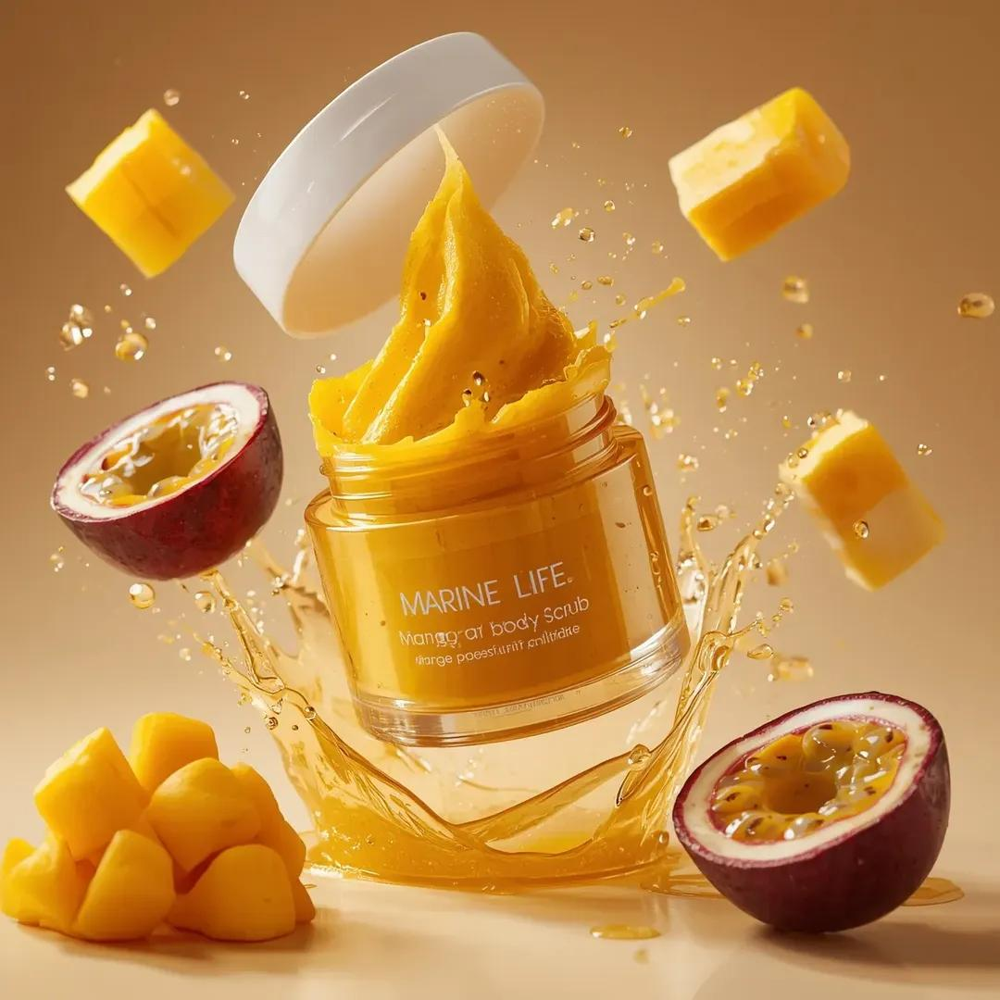

## [BRAND NAME] | [HEADLINE] | [SUB-TEXT] | [CTA]. Act as a

- ID: trending-2040459414084170157
- Slug: trending-2040459414084170157-en
- 语言: en
- 来源: [来源链接](https://x.com/AmirMushich/status/2040459414084170157)
- 样例图路径: images/part1/2040459414084170157_1.jpg

### 提示词

```text
[BRAND NAME] | [HEADLINE] | [SUB-TEXT] | [CTA]. Act as a Senior Art Director.

PHASE 1: INTEGRATED COMPOSITION & OVERLAP.
- Layout: Seamless fusion of 2D graphics and 3D photography.
- Overlap Logic: The subject and their primary "Product Prop" (e.g., a car, a device) must physically overlap the graphic panel to break the "wall" between design and photo.
- Unity: Geometric shapes from the graphic side must bleed into the photographic sky area.

PHASE 2: BRAND & CATEGORY SIMULATION.
Autonomously analyze the [BRAND NAME] and its industry category:
- INDUSTRY CONTEXT: 
  * If Automotive: Include the vehicle and a person interacting with it.
  * If Tech: Include flagship devices/gadgets.
  * If Fashion/Lifestyle: Focus on editorial poses and premium accessories.
- SHAPE SIMULATION: Match shapes to brand identity (e.g., Sharp/Speed for Auto, Minimalist/Grid for Tech).
- COLOR SIMULATION: Use the brand's primary signature hue for both the graphic pattern and the subject's outfit/accents.

PHASE 3: TYPOGRAPHY & CUSTOM CONTENT.
- Headline: Display "[HEADLINE]" in a bold, modern Sans-Serif font. (If [HEADLINE] is empty, generate a high-energy slogan for [BRAND NAME]).
- Sub-headline: Display "[SUB-TEXT]" below the headline.
- Button: Create a minimalist pill-shaped CTA button with the text: "[CTA]".
- Interaction: Text layers should have 3D depth, sitting partially behind the subject or product prop.

PHASE 4: PHOTOGRAPHY & SUBJECT.
- Perspective: Extreme low-angle (worm’s eye view) looking up.
- Subject: A diverse persona reflecting the brand's audience.
- Environment: Massive, clear blue sky as the backdrop.
- Visual Link: Subject's styling must incorporate the Brand's primary color.

PHASE 5: FINAL VISUAL STYLE.
High-end commercial aesthetic. Crisp, saturated, professional fusion of flat vector art and realistic photography.
```

### 样例图

![[BRAND NAME] | [HEADLINE] | [SUB-TEXT] | [CTA]. Act as a](../images/part1/2040459414084170157_1.jpg)

## A tight close-up commercial product photo of a premium [

- ID: trending-2010210489813680211
- Slug: trending-2010210489813680211-en
- 语言: en
- 来源: [来源链接](https://x.com/oggii_0/status/2010210489813680211)
- 样例图路径: images/part1/2010210489813680211_1.jpg

### 提示词

```text
A tight close-up commercial product photo of a premium [PRODUCT TYPE] labeled “[BRAND NAME]”. The product is [SHAPE / FORM FACTOR], made of [MATERIAL], containing [LIQUID / CONTENT COLOR + TEXTURE DETAILS] with visible [TEXTURE EFFECTS: bubbles / swirls / pulp / condensation / thickness]. It has a [CAP / LID TYPE + COLOR + FINISH].

The main label is [PRIMARY LABEL COLOR] with a smooth matte finish. At the top of the label, the brand name “[BRAND NAME]” is printed in clean bold [TEXT COLOR] uppercase sans-serif typography. Below the brand name is a minimalist illustration of [ICON DESCRIPTION], in [FOIL / PRINT STYLE: gold foil / holographic foil / embossed ink], giving it a premium look. Under the icon, the product name reads “[PRODUCT NAME / VARIANT]” in a modern mixed-font layout (thin serif + sans-serif combination). Smaller text includes phrases like “[MICRO TEXT 1]”, “[MICRO TEXT 2]”, and “[MICRO TEXT 3]” in tiny [MICRO TEXT COLOR] print. Optional fine detail accents such as [PATTERN / LINEWORK / MICROGRAPHIC ELEMENTS] enhance the modern premium branding.

A human hand holds the [BOTTLE/CAN/JAR/TUBE] from the side, fingers wrapped around the middle with clean short nails visible. No face or clothing is visible.

The background is a soft neutral [BACKGROUND COLOR TONE], studio-style, clean and minimal. Lighting is soft diffused studio lighting, with gentle highlights along the [MATERIAL] edges and very smooth natural shadows. The photo is sharply focused on the label and [CONTENT TEXTURE], with a slightly blurred background. The overall aesthetic is premium, minimal, modern [CATEGORY] branding, high-end commercial product photography.
```

### 样例图

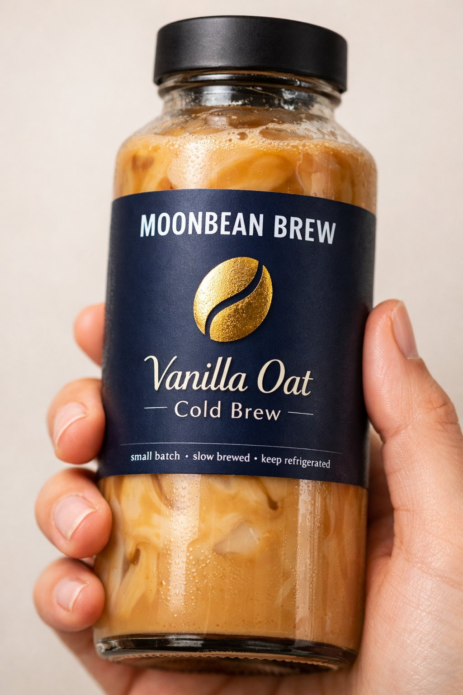

## A vibrant, high-end advertising visual of a [PRODUCT NAM

- ID: trending-2011108316882014431
- Slug: trending-2011108316882014431-en
- 语言: en
- 来源: [来源链接](https://x.com/Kerroudjm/status/2011108316882014431)
- 样例图路径: images/part1/2011108316882014431_1.jpg

### 提示词

```text
A vibrant, high-end advertising visual of a [PRODUCT NAME] can/bottle floating dynamically in the center. The background is a soft gradient inspired by the drink’s color, blending into fresh sky-blue tones for a refreshing summer feel.  A powerful splash of [LIQUID TYPE] explodes around the product, forming the word ”[WORD]” in smooth, fluid, organic liquid typography.  Crystal-clear ice cubes burst around the composition, with fresh [FRUITS RELATED TO THE DRINK] (whole and sliced) flying in the air. Juicy splashes, droplets, light mist, and condensation create an intense refreshing atmosphere.  Bright sunlight, glossy highlights, commercial lighting, premium brand look, dynamic motion, hyper-detailed, semi-realistic illustration style, ultra-clean, 4k, sharp focus.
```

### 样例图

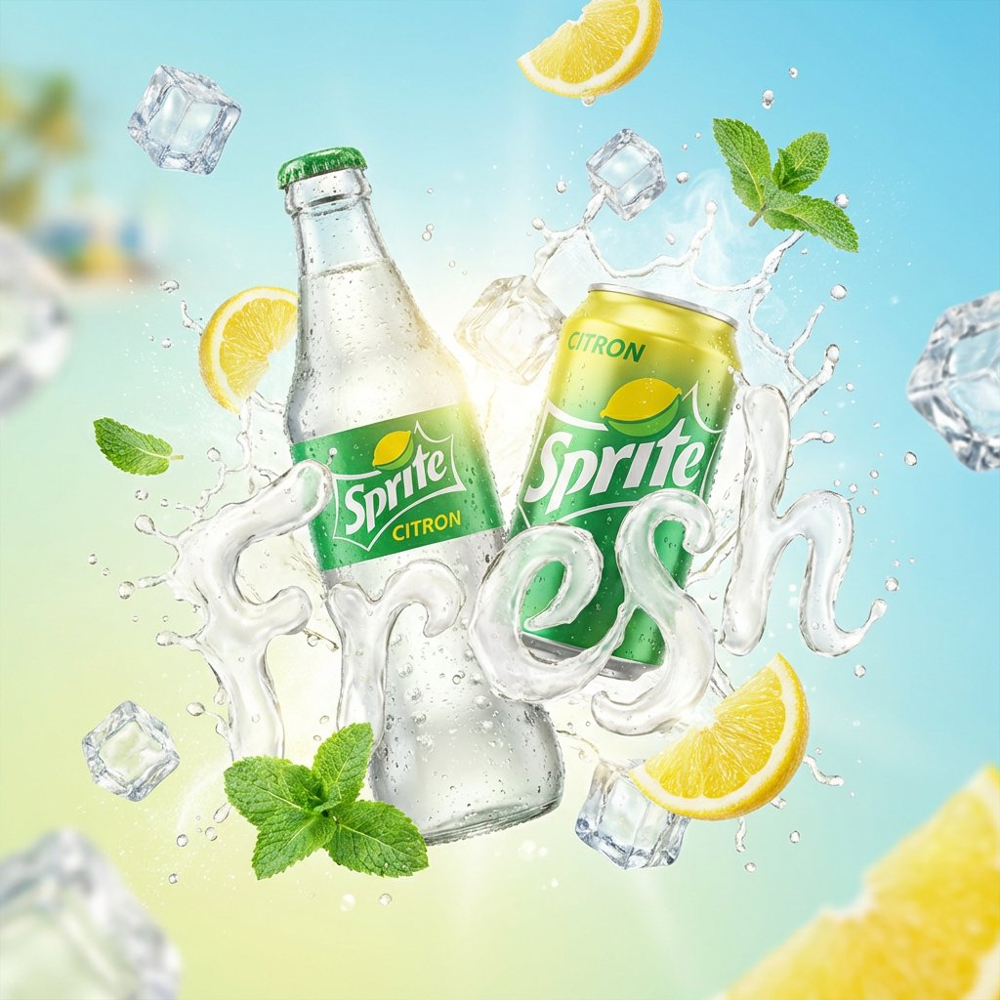

## Luxurious tropical body scrub product photography, open 

- ID: trending-2017969858017931581
- Slug: trending-2017969858017931581-en
- 语言: en
- 来源: [来源链接](https://x.com/Just_sharon7/status/2017969858017931581)
- 样例图路径: images/part1/2017969858017931581_1.jpg

### 提示词

```text
Luxurious tropical body scrub product photography, open jar of bright vibrant yellow-orange Mango & Passionfruit body scrub, creamy whipped texture with visible fruit particles, Marine Life brand, elegant minimal packaging, white lid slightly lifted, juicy mango cubes and halved passionfruit floating around, dynamic splash of golden-yellow liquid and fruit juice in the air, fresh exotic fruit pieces mid-air, glossy wet droplets, vibrant juicy colors, appetizing and premium aesthetic, warm golden hour lighting, soft bokeh background in warm peach tones, highly detailed, cinematic product shot, commercial advertising style, 8k, ultra realistic

Video prompt

Ultra-luxurious tropical body scrub commercial video. Open jar of Marine Life Mango & Passionfruit Body Scrub with creamy whipped texture and visible fruit particles. White lid slightly lifted. Juicy mango cubes and halved passionfruit floating dynamically around the jar. Golden-yellow liquid and fruit juice splash dramatically in mid-air. Fresh exotic fruit pieces hover and rotate around the product. Glossy wet droplets on jar and fruit, emphasizing freshness and luxury. Warm golden hour lighting with soft bokeh background in peach tones. Camera slowly circling the product, capturing texture, shine, and vibrant colors in ultra-realistic 8K detail. Cinematic close-ups, smooth slow motion for splashes and floating fruits, commercial advertising style. Background minimalistic to enhance premium aesthetic.
Optional camera directions / effects:
Start with extreme close-up on whipped texture, then pull out to reveal floating fruits.
Slow-motion splash of fruit juice with backlighting to highlight droplets.
Gentle rotating 360° pan around the jar for product showcase.
Focus pull from foreground fruit to product label.
Subtle lens flare from warm golden light for cinematic luxury feel.
```

### 样例图

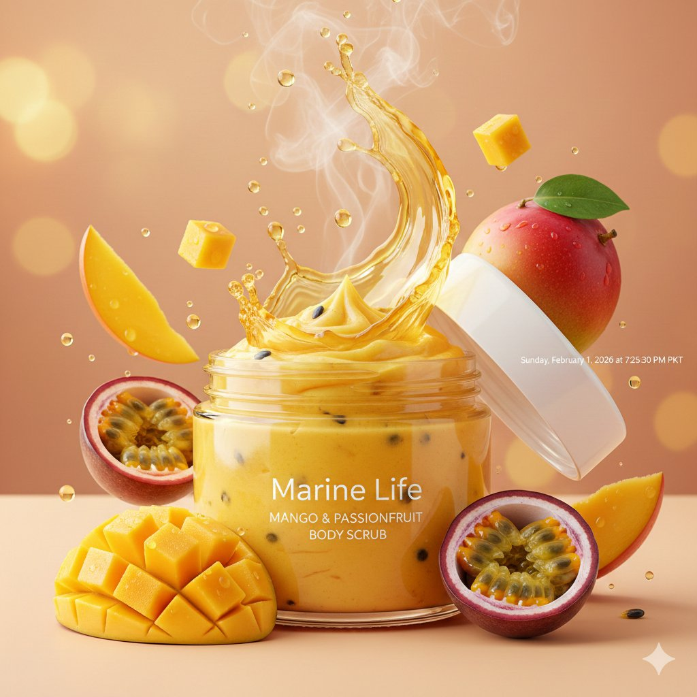

## Create an infographic image of [OBJECT], combining a rea

- ID: trending-2015982694228975977
- Slug: trending-2015982694228975977-en
- 语言: en
- 来源: [来源链接](https://x.com/Sheldon056/status/2015982694228975977)
- 样例图路径: images/part1/2015982694228975977_1.jpg

### 提示词

```text
Create an infographic image of [OBJECT], combining a realistic photograph or photorealistic render of the object with technical annotation overlays placed directly on top.

Use black ink–style line drawings and text (technical pen / architectural sketch look) on a pure white studio background.

Include:
•Key component labels
•Internal cutaway or exploded-view outlines (where relevant)
•Measurements, dimensions, and scale markers
•Material callouts and quantities
•Arrows indicating function, force, or flow (air, sound, power, pressure, movement)
•Simple schematic or sectional diagrams where applicable

Place the title [OBJECT] inside a hand-drawn technical annotation box in one corner.

Style & layout rules:
•The real object remains clearly visible beneath the annotations
•Annotations look hand-sketched, technical, and architectural
•Clean composition with balanced negative space
•Educational, museum-exhibit / engineering-manual vibe

Visual style:
Minimal technical illustration aesthetic.
Black linework layered over realistic imagery.
Precise but slightly hand-drawn feel.

Color palette:
Pure white background.
Black annotation lines and text only.
No colors.

Output:
1080 × 1080 resolution
Ultra-crisp
Social-feed optimized
No watermark
```

### 样例图

![Create an infographic image of [OBJECT], combining a rea](../images/part1/2015982694228975977_1.jpg)

## { "master_prompt": { "global_settings": { "resolution": 

- ID: trending-2020094371107074147
- Slug: trending-2020094371107074147-en
- 语言: en
- 来源: [来源链接](https://x.com/meng_dagg695/status/2020094371107074147)
- 样例图路径: images/part1/2020094371107074147_1.jpg

### 提示词

```text
{
  "master_prompt": {
    "global_settings": {
      "resolution": "8K",
      "aspect_ratio": "1:1",
      "image_type": "photorealistic AI-generated product photography",
      "detail_level": "ultra-high detail, macro clarity",
      "noise": "none",
      "artifacts": "none",
      "focus": "sharp subject, controlled depth of field"
    },

    "module_1_image_1_style": {
      "subject": {
        "object_type": "cosmetic bottle",
        "label_text_visible": "NAHDA SKINCARE",
        "product_type_text": "SHOWER GEL / SHOWER GEL",
        "bottle_material": "frosted translucent glass",
        "liquid_color": "soft pale yellow",
        "shape": "cylindrical with rounded shoulders",
        "cap": {
          "material": "metallic",
          "color": "silver",
          "surface_pattern": "hexagonal honeycomb texture",
          "finish": "matte"
        },
        "surface_details": "small and medium water droplets evenly distributed"
      },
      "environment": {
        "setting": "forest floor",
        "base_surface": "weathered tree stump",
        "surroundings": [
          "green moss",
          "small yellow wildflowers",
          "tree trunk to the right",
          "fine spider web attached to moss"
        ],
        "background": "soft forest bokeh with diffused sunlight",
        "atmosphere": "humid, natural, calm"
      },
      "lighting": {
        "type": "natural diffused light",
        "direction": "soft backlight and side illumination",
        "highlights": "gentle glow through liquid",
        "shadows": "soft, natural"
      },
      "camera": {
        "angle": "eye-level product shot",
        "lens_style": "macro product photography",
        "depth_of_field": "shallow"
      },
      "color_palette": [
        "pale yellow",
        "soft green",
        "natural brown",
        "muted gold"
      ]
    },

    "module_2_image_2_style": {
      "subject": {
        "object_type": "perfume bottle",
        "label_text_visible": "FOREST",
        "bottle_color": "deep matte green",
        "material": "opaque glass",
        "shape": "rectangular with rounded edges",
        "cap": {
          "material": "metallic",
          "color": "gold",
          "finish": "glossy cylindrical"
        },
        "surface_details": "dense fine water droplets covering bottle"
      },
      "environment": {
        "setting": "forest pathway",
        "base_surface": "moss-covered stone or log",
        "foreground_elements": [
          "orange autumn leaf",
          "fallen brown leaves"
        ],
        "background": "tall trees fading into mist",
        "atmosphere": "misty, cool, forest depth"
      },
      "lighting": {
        "type": "warm ambient forest light",
        "direction": "top-front diffused",
        "effects": "soft glow and mist illumination"
      },
      "camera": {
        "angle": "straight-on centered composition",
        "lens_style": "portrait product lens",
        "depth_of_field": "moderate with soft background blur"
      },
      "color_palette": [
        "forest green",
        "gold",
        "autumn orange",
        "earth brown"
```

### 样例图

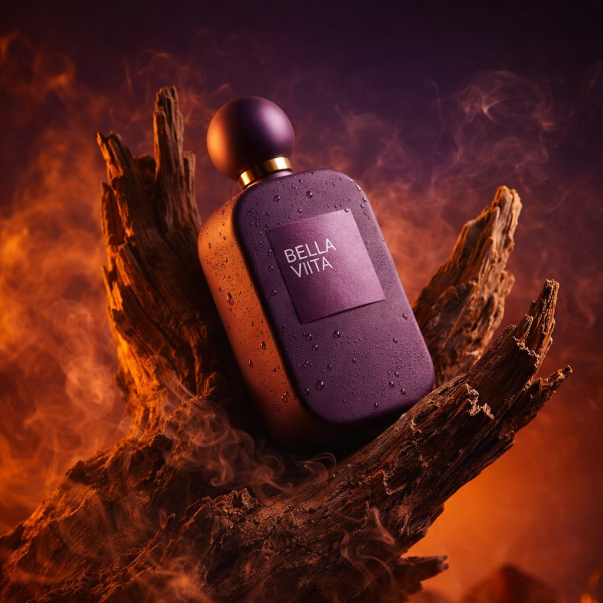

## Ultra-realistic luxury perfume product shot (9: 16, 4K).

- ID: trending-2011385771530592547
- Slug: trending-2011385771530592547-en
- 语言: en
- 来源: [来源链接](https://x.com/oggii_0/status/2011385771530592547)
- 样例图路径: images/part1/2011385771530592547_1.jpg

### 提示词

```text
Ultra-realistic luxury perfume product shot (9: 16, 4K). A clear rectangular glass perfume bottle with warm amber liquid and a metallic cap, floating mid-air above rugged driftwood/roots. Autumn leaves swirling around in motion, soft particles, warm orange/brown gradient background with cinematic glow. Studio-quality lighting (soft key +rim), crisp reflections, sharp label reading [BRAND], shallow depth of field, high-end commercial retouching, dramatic bokeh, no extra text, no watermark.
```

### 样例图

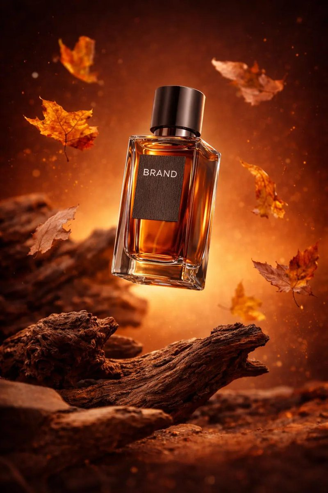

## { "campaign_metadata": { "brand_identity": "Louis Vuitto

- ID: trending-2017067361673896150
- Slug: trending-2017067361673896150-en
- 语言: en
- 来源: [来源链接](https://x.com/mehvishs25/status/2017067361673896150)
- 样例图路径: images/part1/2017067361673896150_1.jpg

### 提示词

```text
{
  "campaign_metadata": {
    "brand_identity": "Louis Vuitton Malletier",
    "product_focus": "Luxury Leather Sneaker / Trainer",
    "aspect_ratio": "3:4",
    "aesthetic": "High-Fashion Editorial | Avant-Garde Luxury"
  },
  "visual_dna": {
    "materials": ["Full-grain calf leather", "Monogram Embossed Canvas", "Polished Gold Hardware"],
    "color_scheme": ["Cognac Brown", "Deep Obsidian", "Champagne Gold"],
    "lighting": "High-contrast Chiaroscuro | Soft-box Key Lighting"
  },
  "grid_layout_execution": {
    "row_1_heritage": {
      "cell_1_1": "Hero profile: Shoe resting on a vintage LV trunk, side-lit to show leather grain.",
      "cell_1_2": "Extreme macro: Focus on the gold-tone 'LV' lace aglets and precision stitching.",
      "cell_1_3": "Dynamic: Gold dust/particles swirling around the sole as it 'steps' into frame."
    },
    "row_2_innovation": {
      "cell_2_1": "Minimalist: The shoe balanced atop an abstract, floating glass 'V' sculpture.",
      "cell_2_2": "Floating: Deconstructed view showing the sole and upper suspended in a void.",
      "cell_2_3": "Sensory: A gloved hand adjusting the tongue, emphasizing soft leather suppleness."
    },
    "row_3_surrealism": {
      "cell_3_1": "Color Palette: Monochromatic scene in LV 'Havane' brown with liquid silk drapes.",
      "cell_3_2": "Abstraction: Symbolic representation of the rubber sole pattern as a geometric desert landscape.",
      "cell_3_3": "Fusion: The shoe walking on a mirror-still lake reflecting a Parisian sunset skyline."
    }
  }
}
```

### 样例图

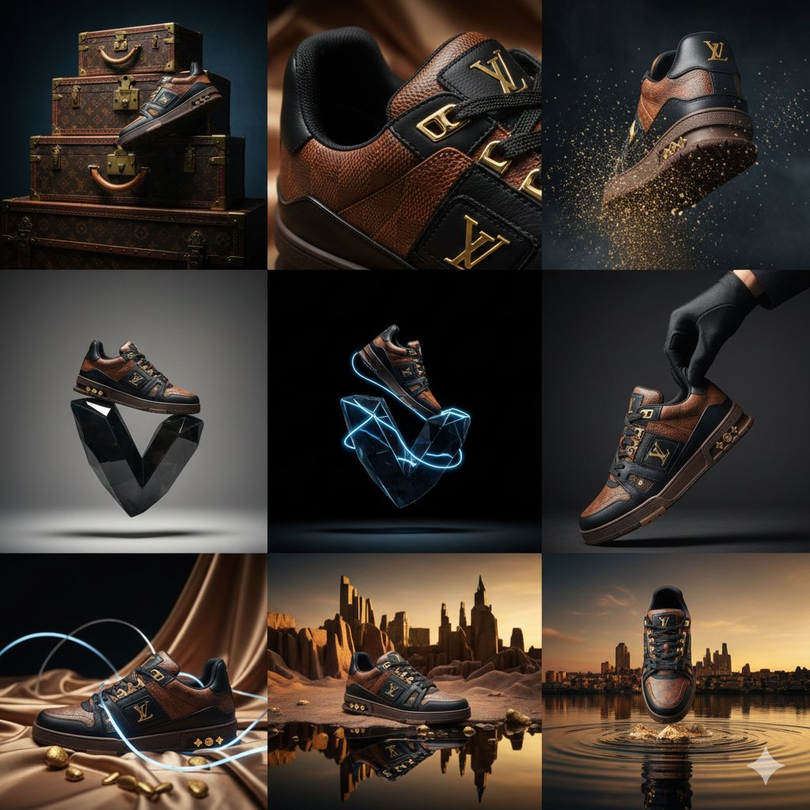

## A hyper-realistic beauty product photograph of a pink [L

- ID: trending-2019637570133717072
- Slug: trending-2019637570133717072-en
- 语言: en
- 来源: [来源链接](https://x.com/oggii_0/status/2019637570133717072)
- 样例图路径: images/part1/2019637570133717072_1.jpg

### 提示词

```text
A hyper-realistic beauty product photograph of a pink [LANEIGE Lip Sleeping Mask] jar placed at the center of a vibrant pastel-pink surface covered in fresh water droplets, the jar upright with a frosted pink lid and glossy translucent body, surrounded organically by delicate flowers including purple blossoms, pale lilies, yellow sprigs, and green leaves arranged diagonally around the product, soft diffused studio lighting from above creating gentle highlights and natural shadows, moisture beads sparkling across the background for a fresh dewy feel, clean skincare editorial aesthetic, feminine and luxurious mood, balanced flat-lay composition, shallow depth of field, ultra-detailed textures, photorealistic, high-end cosmetic advertising style, 8K quality
```

### 样例图

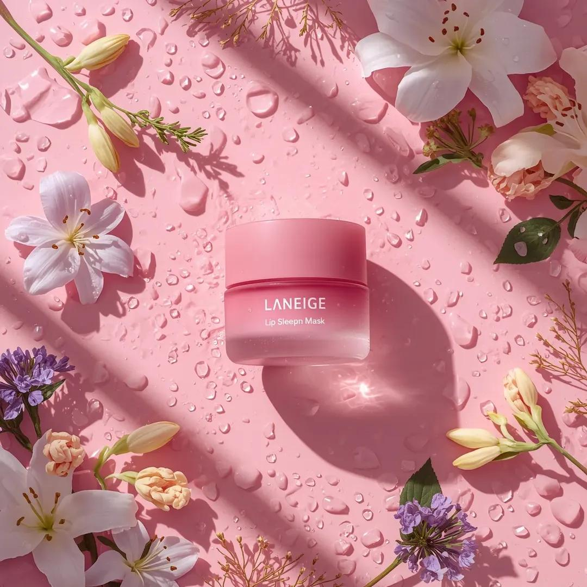

## Product description and its placement], minimalist produ

- ID: trending-2029211910621806728
- Slug: trending-2029211910621806728-en
- 语言: en
- 来源: [来源链接](https://x.com/Sheldon056/status/2029211910621806728)
- 样例图路径: images/part1/2029211910621806728_1.jpg

### 提示词

```text
Product description and its placement], minimalist product photography, clean warm studio scene, textured beige wall in the background, soft directional sunlight creating long shadows, simple table surface, the product placed in a playful conceptual composition, overlaid with a hand-drawn white outline doodle [character] interacting with the product, mixed media style combining real photography and sketch illustration, premium branding feel, shallow depth of field, ultra-realistic, no extra text, no watermarks, 8K, 1:1.
```

### 样例图

![Product description and its placement], minimalist produ](../images/part1/2029211910621806728_1.jpg)

## [BRAND NAME] Act as a Senior Vector Graphic Designer spe

- ID: trending-2040769988466733167
- Slug: trending-2040769988466733167-en
- 语言: en
- 来源: [来源链接](https://x.com/youraipulse/status/2040769988466733167)
- 样例图路径: images/part1/2040769988466733167_1.jpg

### 提示词

```text
[BRAND NAME]

Act as a Senior Vector Graphic Designer specializing in Y2K Japanese streetwear badge design. Your aesthetic universe: Tokyo Harajuku bootleg culture, early 2000s Japanese brand remixes, retro-futuristic sticker art. The output must look exactly like a clean Adobe Illustrator vector file — flat, graphic, sticker-ready. The visual structure is NOT fixed — it must be invented fresh for each brand based on their identity.

BRAND INTELLIGENCE SYSTEM

Before executing, resolve all of the following and use them to drive every design decision: (1) PRIMARY COLOR — [BRAND NAME]'s main brand color converted into a pastel or softened Y2K version — still recognizable as the brand but lighter and more kawaii, (2) ACCENT COLOR — [BRAND NAME]'s secondary color pushed to warm saturation — the energetic pop color of the composition, (3) DARK COLOR — a deep dark version of the brand palette — navy, dark brown, deep green, near-black — used for all outlines and extrusions, (4) LETTER CONTENT — [BRAND NAME]'s name in bold lowercase or the most iconic abbreviation, (5) JAPANESE TRANSLITERATION — correct katakana of [BRAND NAME] as a small secondary text element, (6) BRAND ORIGIN FLAG — [BRAND NAME]'s country of origin national flag as a small flat element, (7) BRAND SHAPE LANGUAGE — identify the most iconic geometric or graphic forms from [BRAND NAME]'s visual identity — the shapes, curves, symbols, and structural elements unique to this brand. These shapes become the orbital, background, and decorative elements of the badge — replacing generic ovals with brand-specific geometry, (8) BRAND CULTURAL SYMBOLS — identify 1–2 small iconic objects or symbols from [BRAND NAME]'s world that can be rendered as tiny flat illustrations within the badge — not the logo itself but objects associated with the brand's universe, (9) COMPOSITION LOGIC — based on all resolved parameters above, autonomously design the structural layout of the badge. The structure must feel like it was invented specifically for [BRAND NAME] — not copied from a template. Ask: what shapes from this brand's identity could orbit the letters? What geometry feels native to this brand? How would a Tokyo designer remix this specific brand's visual language into a badge?

PHASE 1: CANVAS

1:1 square canvas. Background: flat off-white or warm light grey. Completely empty. No texture. No gradient.

PHASE 2: BADGE STRUCTURE — FULLY AUTONOMOUS

Using the BRAND SHAPE LANGUAGE and COMPOSITION LOGIC resolved above, design the complete badge structure. The only fixed rules are: the badge must have a central lettering element, surrounding geometric shapes that interact with the letters through z-layer stacking, at least one element that passes both behind and in front of the letters creating depth, and the overall silhouette must read as a unified badge or patch shape. Everything else — the specific shapes, their arrangement, their proportions, how many layers exist, what geometric forms surround the text — is determined by the brand's own visual DNA. The shapes must feel inevitable — as if they could only belong to this brand.

PHASE 3: LETTERING

[BRAND NAME] in large bold lowercase — wide, rounded, confident display typeface. Flat PRIMARY COLOR fill. Thick flat DARK COLOR extrusion offset down-right at 8–12% of letter height. Bold DARK COLOR outline. No gradients. No rendering. The letters are the anchor of the entire composition.

PHASE 4: Y2K SIGNATURE ELEMENTS

These elements appear in every execution — they are the Y2K Japanese badge DNA: SPEED LINES or MOTION TEXTURE — somewhere within the background shapes, parallel lines or radial lines in ACCENT COLOR creating energy and movement. 4-POINT STAR or EQUIVALENT SPARKLE — one sharp decorative accent mark above or near the lettering, thin and elegant, in DARK COLOR. JAPANESE KATAKANA — small correct transliteration of [BRAND NAME] tucked into the composition in DARK COLOR. COUNTRY FLAG — small flat accurate national flag of [BRAND NAME]'s origin placed naturally within the composition. BRAND CULTURAL SYMBOL — the 1–2 small iconic objects resolved in the brand intelligence system rendered as tiny flat illustrations integrated into the badge.

TECH SPECS

Flat vector only — zero gradients, zero effects, zero rendering, zero blur. Clean crisp edges throughout. Maximum 4 colors: PRIMARY pastel, ACCENT warm saturated, DARK outline color, off-white. The badge must feel like a collectible sticker or embroidered patch. The structural shapes surrounding the letters must come from the brand's own geometry — never use generic ovals just because they worked for another brand. Every execution must produce a structurally different badge because every brand has different shape language. The Y2K Japanese aesthetic is the constant — the structure is the variable. Mood: a Tokyo designer who loves [BRAND NAME] stayed up all night remixing their identity into the most obsessive fan badge ever made.
```

### 样例图

![[BRAND NAME] Act as a Senior Vector Graphic Designer spe](../images/part1/2040769988466733167_1.jpg)

## [brand name], complete brand identity grid, 3x3 layout, 

- ID: trending-2016511852927438909
- Slug: trending-2016511852927438909-en
- 语言: en
- 来源: [来源链接](https://x.com/azed_ai/status/2016511852927438909)
- 样例图路径: images/part1/2016511852927438909_1.jpg

### 提示词

```text
[brand name], complete brand identity grid, 3x3 layout, nine tiles showing a full cohesive brand system, light gray seamless background, soft diffused studio lighting, subtle shadows, clean modern minimal style, consistent color palette of [color1] [color2] [color3], high-end studio mockups, ultra-realistic, 8k, 1:1,

tile 1 primary logo lockup on paper card,
tile 2 secondary logo mark and monogram variations,
tile 3 color palette swatches and typography specimen poster,
tile 4 packaging mockup for [product 1],
tile 5 hero product photo for [product 2],
tile 6 set of three products for [product 3] in different sizes,
tile 7 stationery mockups business card letterhead envelope,
tile 8 social media post mockups and phone screen UI preview,
tile 9 lifestyle scene featuring [product 1] with props matching the brand,

no people, no readable real-world brand names, no watermark.
```

### 样例图

![[brand name], complete brand identity grid, 3x3 layout, ](../images/part1/2016511852927438909_1.jpg)

## - Ultra-cinematic luxury skincare product photography of

- ID: trending-2010381168810799353
- Slug: trending-2010381168810799353-en
- 语言: en
- 来源: [来源链接](https://x.com/oggii_0/status/2010381168810799353)
- 样例图路径: images/part1/2010381168810799353_1.jpg

### 提示词

```text
- Ultra-cinematic luxury skincare product photography of a translucent amber serum pump bottle standing upright at the center of the frame, perched on a curved piece of textured driftwood, featuring a minimalist label with crisp black typography and fine condensation droplets on the glass; the bottle is framed by creamy white tropical flowers in full bloom and a single unopened bud, arranged symmetrically along the wood for sculptural balance, with slender vanilla pods resting in the foreground; background is a warm, desert-toned studio environment with sweeping shadow patterns cast across a soft sand-colored backdrop, creating a dramatic play of light and depth; lighting is high-contrast cinematic lighting with a strong directional key light from the left producing glowing highlights through the amber liquid, sharp rim lighting along the glass edges, and deep shadow falloff for a moody, editorial look;

color palette is rich and sensual with golden ambers, warm caramel, soft ivory, and deep earthy browns; composition is a centered hero shot with a slight low-angle perspective and shallow depth of field, keeping the bottle razor-sharp while background elements dissolve into creamy bokeh; mood is elegant, mysterious, and high-fashion, evoking premium fragrance-inspired skincare advertising with hyper-realistic textures, dramatic contrast, cinematic atmosphere, and 8K

ultra-high-definition realism.
```

### 样例图

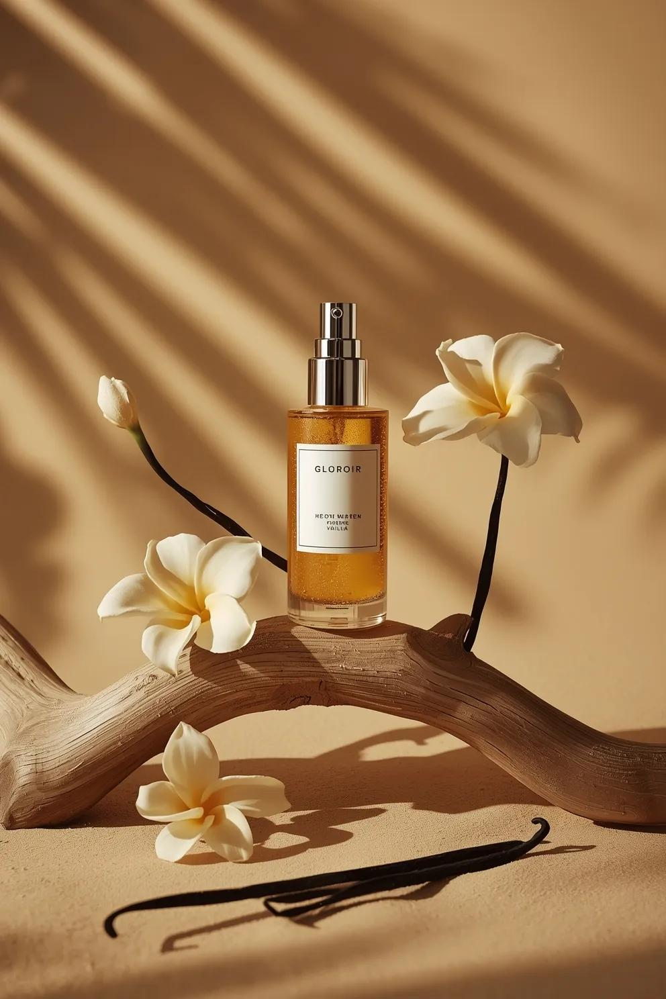

## Create a 3×3 grid in 3:4 aspect ratio for a high-end com

- ID: trending-2015634929066070042
- Slug: trending-2015634929066070042-en
- 语言: en
- 来源: [来源链接](https://x.com/Naiknelofar788/status/2015634929066070042)
- 样例图路径: images/part1/2015634929066070042_1.jpg

### 提示词

```text
Create a 3×3 grid in
3:4 aspect ratio for a high-end commercial marketing campaign using the uploaded product as the central subject.

Each frame must present a distinct visual concept while maintaining perfect product consistency across all nine images.

Grid Concepts (one per cell):

1. Iconic hero still life with bold composition

2. Extreme macro detail highlighting material, surface, or texture

3. Dynamic liquid or particle interaction surrounding the product

4. Minimal sculptural arrangement with abstract forms

5. Floating elements composition suggesting lightness and innovation

6. Sensory close-up emphasizing tactility and realism

7. Color-driven conceptual scene inspired by the product palette

8. Ingredient or component abstraction (non-literal, symbolic)

9. Surreal yet elegant fusion scene combining realism and imagination

Visual Rules:
Product must remain 100% accurate in shape, proportions, label, typography, color, and branding
No distortion, deformation, or redesign of the product
Clean separation between product and background

Lighting & Style:
Soft, controlled studio lighting
Subtle highlights, realistic shadows
High dynamic range, ultra-sharp focus
Editorial luxury advertising aesthetic
Premium sensory marketing look

Overall Feel:
Modern, refined, visually cohesive
High-end commercial campaign
Designed for brand websites, social grids, and digital billboards
Hyperreal, cinematic, polished, and aspirational
```

### 样例图

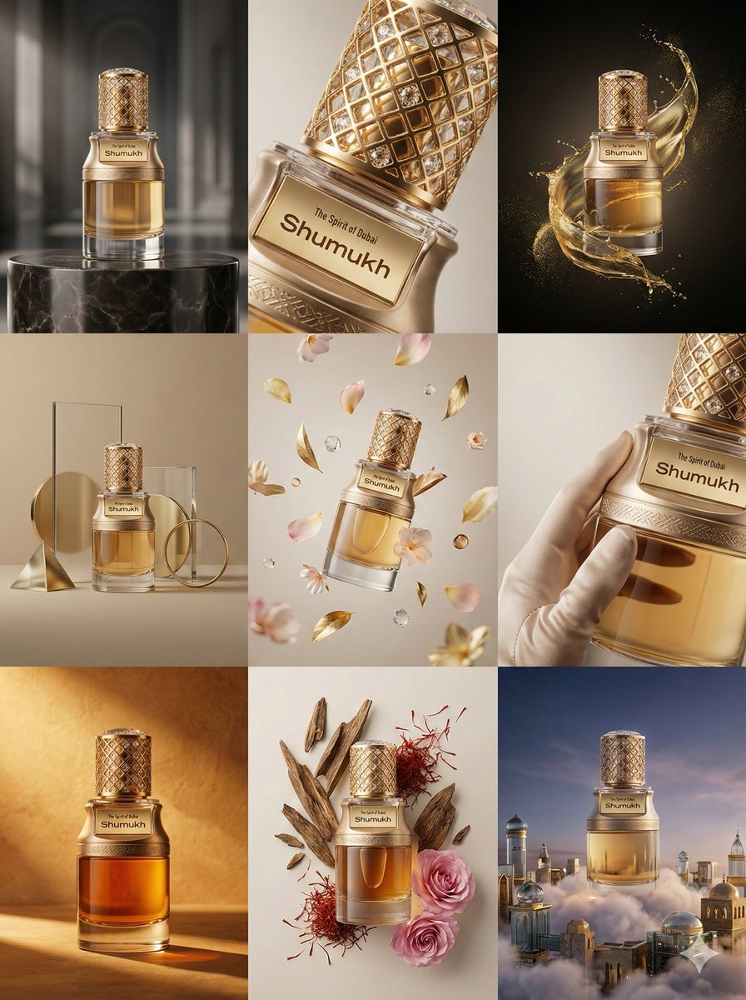

## { "task": "photorealistic_product_visual", "input": { "r

- ID: trending-2021462365146116101
- Slug: trending-2021462365146116101-en
- 语言: en
- 来源: [来源链接](https://x.com/Strength04_X/status/2021462365146116101)
- 样例图路径: images/part1/2021462365146116101_1.jpg

### 提示词

```text
{
 "task": "photorealistic_product_visual",
 "input": {
 "reference_image": "USER_UPLOADED_IMAGE",
 "preserve_product_identity": true,
 "preserve_label_text": true,
 "preserve_object_shape": true,
 "preserve_centered_composition": true
 },
 "scene": {
 "environment": "high-key studio",
 "background": "pure white seamless",
 "negative_space": "very high",
 "depth_of_field": "layered depth with strong subject isolation"
 },
 "subject": {
 "primary_object": "single product object",
 "position": "perfectly centered, floating",
 "orientation": "upright",
 "scale": "natural product scale",
 "clarity": "ultra-sharp, high micro-contrast"
 },
 "human_elements": {
 "hands": {
 "count": 2,
 "layering": "positioned behind a frosted glass surface",
 "visual_effect": "frosted glass diffusion, milky blur, softened edges",
 "transparency": "semi-opaque",
 "focus": "intentionally out of focus",
 "gesture": "slow, delicate, abstract reach",
 "interaction": "no contact with the product"
 }
 },
 "optical_effects": {
 "frosted_glass": {
 "applied_to": "hands only",
 "blur_type": "diffusion blur",
 "edge_softness": "high",
 "light_scatter": "subtle bloom"
 }
 },
 "lighting": {
 "style": "soft diffused studio lighting",
 "direction": "frontal with gentle top wash",
 "shadows": "extremely soft and minimal",
 "highlights": "clean, controlled highlights on the product only",
 "contrast": "low overall, high on product"
 },
 "materials_rendering": {
 "product_surface": "premium, realistic, tactile",
 "reflections": "clean and intentional",
 "imperfections": "none"
 },
 "aesthetic": {
 "mood": "ethereal, calm, refined",
 "style": "high-end editorial product photography",
 "visual_language": "minimal, airy, modern, poetic",
 "emotion": "care, purity, precision"
 },
 "camera": {
 "lens": "85mm",
 "aperture": "f/2.0",
 "angle": "eye-level",
 "camera_motion": "none"
 },
 "post_processing": {
 "retouching": "luxury commercial polish",
 "grain": "none",
 "color_grading": "clean whites with subtle warmth on the product"
 },
 "output": {
 "resolution": "ultra_high_resolution",
 "focus_priority": "product only",
 "clarity_separation": "product razor sharp, background and hands diffused",
 "artifacts": "none"
 }
}
```

### 样例图

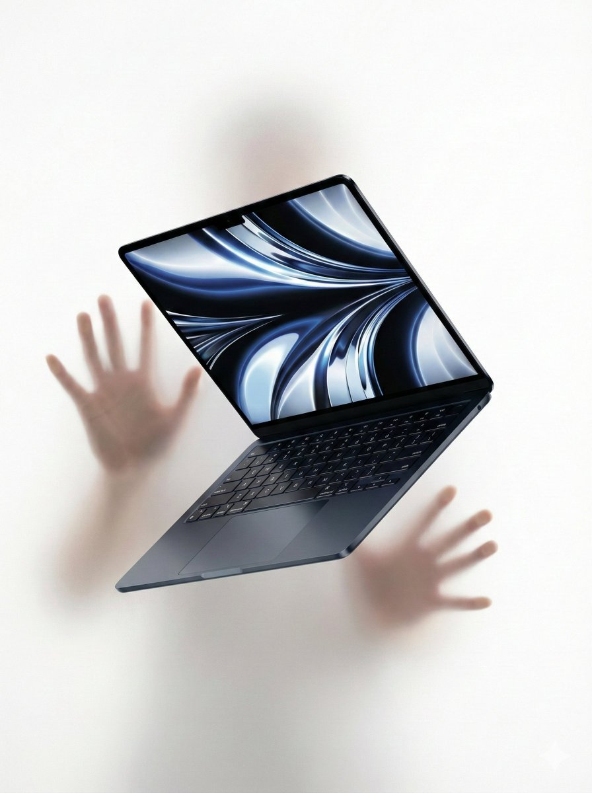

## Ultra-high-end photorealistic commercial skincare produc

- ID: trending-2016138326571626611
- Slug: trending-2016138326571626611-en
- 语言: en
- 来源: [来源链接](https://x.com/ChillaiKalan__/status/2016138326571626611)
- 样例图路径: images/part1/2016138326571626611_1.jpg

### 提示词

```text
Ultra-high-end photorealistic commercial skincare product photography featuring a matte white plastic pump bottle centered and upright, labeled “hella beauty” in clean black minimalist typography with smaller text reading “water bank moisture lotion” and subtle product details beneath, the bottle placed on a layered natural stone surface surrounded by carefully arranged organic props including smooth gray river stones, pale beige textured rock formations, soft green moss clusters,delicate white pom-pom flowers, cream-colored
daisy-like blossoms, light green fern leaves, and a
muted sage rose, all arranged in a balanced
symmetrical composition, background a soft warm
beige studio backdrop with gentle gradient and no
visible edges, foreground partially framed by softly
blurred out-of-focus white flowers creating depth,
lighting soft diffused daylight-style studio lighting
from upper left producing gentle shadows, natural
highlights on the bottle and petals, and a calm airymood, color palette dominated by warm neutrals, soft
whites, sage greens, and muted earth tones, textures
highly detailed including matte plastic, porous stone,
velvety petals, and moist moss, shallow depth of field
with sharp focus on the product label and midground
elements and smooth bokeh in foreground and
background, premium botanical skincare advertising aesthetic,
clean minimal luxury composition, cinematic realism,
ultra-detailed 8K, studio-grade hyperrealism, no extra
text, no borders, no stylization beyond natural
photorealism.
```

### 样例图

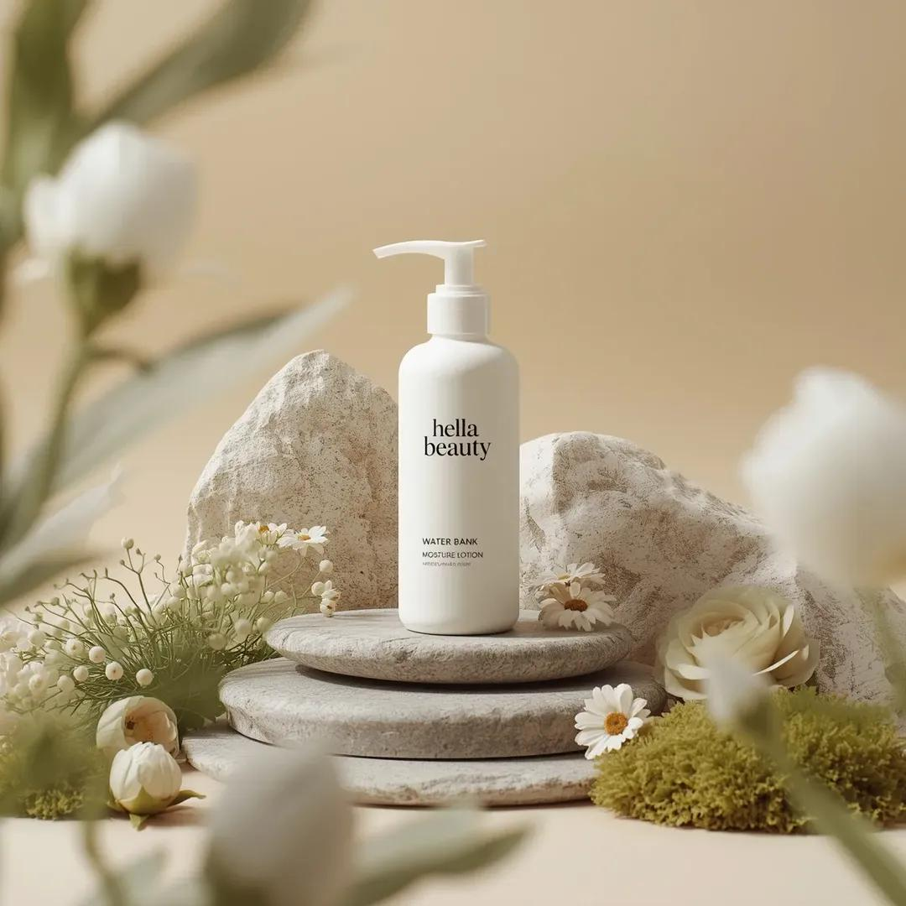

## [product], centered top down flat lay, surrounded by [in

- ID: trending-2016074622882742569
- Slug: trending-2016074622882742569-en
- 语言: en
- 来源: [来源链接](https://x.com/ChillaiKalan__/status/2016074622882742569)
- 样例图路径: images/part1/2016074622882742569_1.jpg

### 提示词

```text
[product], centered top down flat lay, surrounded by [ingredients], fresh slices and whole pieces, glossy wet look, water splash frozen mid motion around the product, dewy droplets on label and surface, warm beige seamless background, soft directional sunlight, crisp realistic shadow, high end skincare advertising, ultra realistic macro product photography, 100mm lens look, f/8 sharp focus, clean composition, no extra text, 8k, 1:1
```

### 样例图

![[product], centered top down flat lay, surrounded by [in](../images/part1/2016074622882742569_1.jpg)

## Luxury product photography of a green translucent bath a

- ID: trending-2028125035433714003
- Slug: trending-2028125035433714003-en
- 语言: en
- 来源: [来源链接](https://x.com/oggii_0/status/2028125035433714003)
- 样例图路径: images/part1/2028125035433714003_1.jpg

### 提示词

```text
Luxury product photography of a green translucent bath and shower gel bottle held gently by two feminine hands submerged in calm water. The bottle is centered, glossy, with water droplets on the surface, silver metallic cap, elegant minimal label design. The water is deep teal-green with soft mist swirling across the surface. White lotus flowers and large green lily pads float around the hands. The hands wear delicate thin gold rings. Soft, diffused natural lighting, moody spa atmosphere, high-end skincare advertisement style, ultra-realistic, cinematic composition, shallow depth of field, 85mm lens, high resolution, editorial beauty shot, serene and calming aesthetic.
```

### 样例图

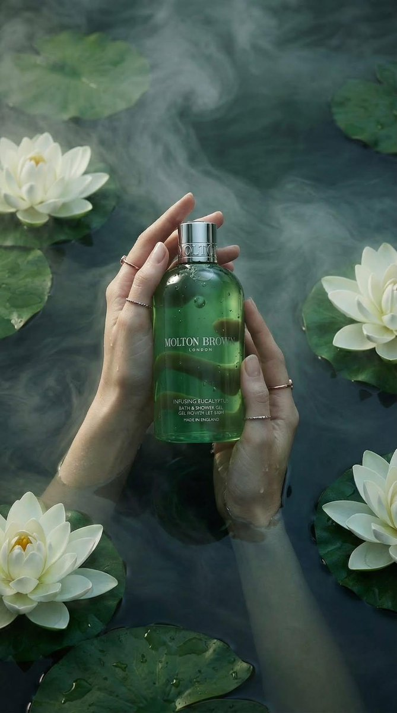

## Ultra-realistic minimalist studio product photography of

- ID: trending-2016131317759672439
- Slug: trending-2016131317759672439-en
- 语言: en
- 来源: [来源链接](https://x.com/oggii_0/status/2016131317759672439)
- 样例图路径: images/part1/2016131317759672439_1.jpg

### 提示词

```text
Ultra-realistic minimalist studio product photography of a small transparent glass facial oil dropper bottle with a black rubber pipette cap, containing pale pink serum with dried pink floral elements suspended inside, placed centered on top of a natural raw wooden cube block with visible grain and split texture. To the left of the cube stands a tall matte white rectangular skincare box with minimal black typography reading “HUILE ÉCLAT VISAGE,” clean modern branding, and subtle logo near the bottom. To the right of the cube is a clear cylindrical glass vase filled with water and thin stems of dried pink gypsophila flowers extending upward and outward. The entire composition is arranged on a smooth matte pastel pink surface with a matching soft pink seamless studio background. Strong directional soft light comes from the left side, casting long, soft-edged realistic shadows of the flowers and objects onto the pink background. Lighting is natural-style, -det diffused, and warm, creating gentle highlights on the glass, subtle reflections on the serum bottle, and soft texture on the wooden block. Camera angle is straight-on at tabletop height, medium framing, all main objects in sharp focus with minimal depth of field blur. Color palette is dominated by blush pink, soft rose tones, warm light wood, clean white, and transparent glass. Mood is clean, airy, feminine, elegant, Scandinavian minimal aesthetic, premium skincare branding style, photorealistic, studio-grade realism, ultra
```

### 样例图

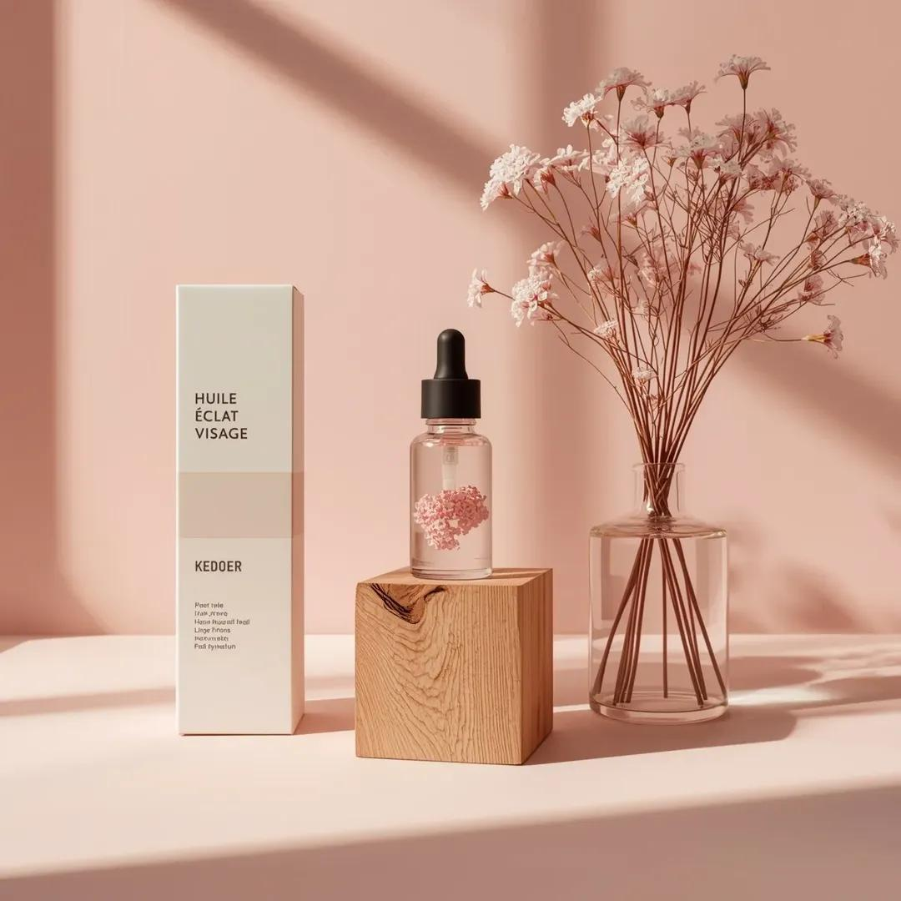

## { "global_settings": { "resolution": "8K", "aspect_ratio

- ID: trending-2016150891678912784
- Slug: trending-2016150891678912784-en
- 语言: en
- 来源: [来源链接](https://x.com/mehvishs25/status/2016150891678912784)
- 样例图路径: images/part1/2016150891678912784_1.jpg

### 提示词

```text
{
  "global_settings": {
    "resolution": "8K",
    "aspect_ratio": "3:4",
    "style": "photorealistic cinematic product photography",
    "detail_level": "extreme micro-detail",
    "sharpness": "ultra-sharp",
    "noise": "none",
    "compression_artifacts": "none",
    "color_depth": "rich 16-bit color",
    "render_quality": "luxury commercial grade",
    "ai_finish": "clean AI-enhanced realism"
  },

  "module_1": {
    "scene_identity": "forest_green_perfume",
    "environment": {
      "setting": "dense forest atmosphere",
      "background": "soft blurred green foliage with depth separation",
      "foreground": "natural forest floor with soil, moss, and small debris",
      "props": [
        "flat natural stone platform",
        "irregular rock placed slightly behind the bottle",
        "pine tree branches with visible needles on the right side"
      ],
      "atmosphere": "soft drifting smoke or mist rising behind the bottle"
    },
    "product": {
      "object_type": "perfume bottle",
      "material": "ribbed translucent glass",
      "color": "deep emerald green liquid",
      "shape": "cylindrical with vertical grooves",
      "cap": {
        "material": "metal",
        "finish": "polished gold",
        "shape": "smooth cylindrical"
      },
      "label": "no visible branding text"
    },
    "lighting": {
      "key_light": "soft diffused natural light from front-left",
      "fill_light": "subtle ambient forest light",
      "highlights": "gentle reflections on glass ribs and gold cap",
      "shadows": "soft realistic shadows under bottle and rocks"
    },
    "camera": {
      "angle": "eye-level product angle",
      "focus": "sharp focus on bottle, shallow depth of field",
      "lens_effect": "natural bokeh background"
    },
    "mood": "fresh, woody, calm, premium, nature-inspired"
  },

  "module_2": {
    "scene_identity": "blue_water_splash_perfume",
    "environment": {
      "setting": "dark aquatic studio scene",
      "background": "deep navy to black gradient",
      "surface": "rippling water with reflective highlights",
      "motion_elements": [
        "large upward water splash behind bottle",
        "floating water droplets suspended mid-air"
      ],
      "props": [
        "lemon slices (yellow flesh visible)",
        "green citrus slice",
        "small red berries",
        "green herb sprigs"
      ]
    },
    "product": {
      "object_type": "perfume bottle",
      "material": "opaque glass",
      "color": "deep midnight blue",
      "shape": "rectangular with sharp edges",
      "cap": {
        "material": "matching dark glass",
        "shape": "cylindrical"
      },
      "text_visible": [
        "BLEU DE CHANEL",
        "EAU DE PARFUM"
      ]
    },
    "lighting": {
      "key_light": "strong directional light from upper front",
      "rim_light": "cool highlights on water splash",
      "reflections": "specular highlights on glass and water surface"
    },
    "camera": {
      "angle": "slightly tilted dynamic angle",
      "focus": "sharp on bottle and splash",
      "motion_freeze": "high-speed capture look"
    },
    "mood": "fresh, energetic, aquatic, luxury fragrance ad"
  }
```

### 样例图

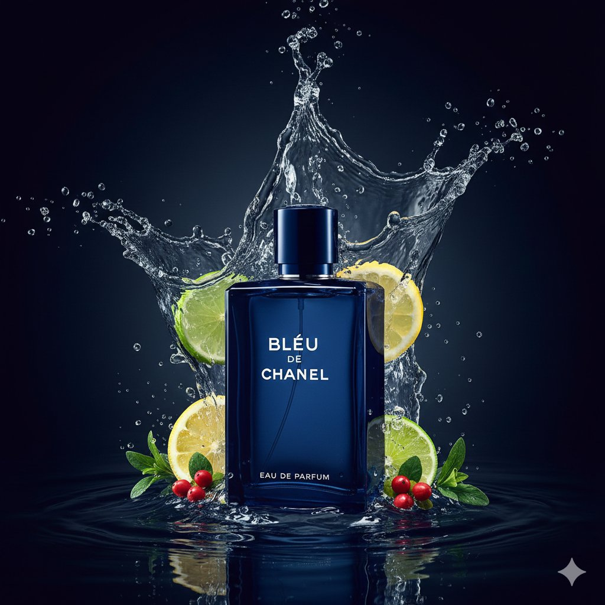

## [product], premium skincare product ad, the product plac

- ID: trending-2021258256619012365
- Slug: trending-2021258256619012365-en
- 语言: en
- 来源: [来源链接](https://x.com/azed_ai/status/2021258256619012365)
- 样例图路径: images/part1/2021258256619012365_1.jpg

### 提示词

```text
[product], premium skincare product ad, the product placed directly on and surrounded by fresh [fruit_or_vegetable], visual storytelling that the product is made from the ingredient, rich saturated color palette matching the ingredient, juicy realistic textures, visible seeds pulp or slices, glossy highlights, dramatic studio lighting, soft shadows, shallow depth of field, macro product photography look, ultra realistic, editorial commercial style, clean background in matching color tone, 8k, 1:1
```

### 样例图

![[product], premium skincare product ad, the product plac](../images/part1/2021258256619012365_1.jpg)

## [BRAND NAME]. Act as a Senior AI Visual Strategist & Cre

- ID: trending-2029563852136849515
- Slug: trending-2029563852136849515-en
- 语言: en
- 来源: [来源链接](https://x.com/AmirMushich/status/2029563852136849515)
- 样例图路径: images/part1/2029563852136849515_1.jpg

### 提示词

```text
[BRAND NAME]. Act as a Senior AI Visual Strategist & Creative Director.
Goal: Generate a grid-based brand identity showcase.
PHASE 1: COMPOSITION & LAYOUT
Set the scene on a deep, rich [BRAND PRIMARY COLOR] background. Implement an 8-module grid with rounded corners and thin separation lines.
- Large Modules: Top Left and Bottom Right.
- Small/Medium Modules: Fill the remaining space.
PHASE 2: AUTONOMOUS BRAND LOGIC (THE CORE) [INSTRUCTIONS FOR IMAGEN]:
Analyze the name "[BRAND NAME]".
Determine the industry (e.g., Tech, Luxury, Eco, Automotive, Fashion).
Do NOT default to sports/tennis unless the brand name explicitly requires it.
Adapt all secondary elements (accessories, textures, model's activity) to match this industry.
PHASE 3: MODULE CONTENT (DYNAMIC ADAPTATION)
- MODULE 1 (Exterior): A flagship building façade. Use textured walls in [BRAND PRIMARY COLOR]. Feature a large [BRAND NAME] wordmark and a geometric abstract logo in a contrasting Cream/Beige.
- MODULE 2 (Colors): A vertical swatch panel. Sequence: [BRAND PRIMARY COLOR], Cream, Deep Black, White. Satin finish.
- MODULE 3 & 5 (Core Logo): Detailed close-ups of the brand's unique geometric icon.
- MODULE 4 (Accessory): AUTONOMOUS CHOICE. If [BRAND NAME] is Tech, show a sleek device. If Luxury, show a watch or jewelry. If Eco, show sustainable packaging. Must be in brand colors.
- MODULE 6 (Urban): A street-level mockup on a concrete wall. A person in an all-black outfit walks past a branded panel.
- MODULE 7 (Editorial): A high-end lifestyle shot.
  - Model: Professional, editorial style.
  - Outfit: Premium sweatshirt in [BRAND PRIMARY COLOR] with brand logo.
  - Prop: AUTONOMOUS CHOICE based on industry. (e.g., a leather briefcase for Finance, a camera for Media, a designer bag for Retail).
- MODULE 8 (Specs): Top half: A complex repeating pattern based on the brand logo. Bottom half: Four lines of text " [BRAND NAME] TYPOGRAPHY" in a clean, high-end sans-serif.
PHASE 4: LIGHTING & TEXTURES
- High-End Editorial Photography. No "AI-plastic" look.
- Cinematic soft-box lighting with Rembrandt shadows.
- Micro-details: fabric weave, skin pores, concrete grit, leaf veins.
- Subsurface scattering on organic materials.
PHASE 5: TECH SPECS
8K Resolution, Octane Render style, Ray Traced reflections, subtle film grain.
```

### 样例图

![[BRAND NAME]. Act as a Senior AI Visual Strategist & Cre](../images/part1/2029563852136849515_1.jpg)

## [BRAND NAME] | [SUBJECT_TOGGLE]. Act as a Lead Graphic D

- ID: trending-2024533642555371878
- Slug: trending-2024533642555371878-en
- 语言: en
- 来源: [来源链接](https://x.com/AmirMushich/status/2024533642555371878)
- 样例图路径: images/part1/2024533642555371878_1.jpg

### 提示词

```text
[BRAND NAME] | [SUBJECT_TOGGLE]. Act as a Lead Graphic Designer.

PHASE 1: ARCHITECTURAL SETTING.

Create a minimalist 2D vector illustration of a vintage-style storefront representing [BRAND NAME]. 

- Autonomously design the facade (Modernist, Industrial, or Classic) to match the brand's heritage.

PHASE 2: SUBJECT LOGIC (TOGGLE SYSTEM).

- If [SUBJECT_TOGGLE] is "OFF": Show only the empty storefront.

- If [SUBJECT_TOGGLE] is "ON": Autonomously add 1-2 characters or a pet that fits the brand's lifestyle.

PHASE 3: DYNAMIC TYPOGRAPHY (CORRECTED).

- Header: Autonomously generate a high-status "Club" or "Community" title based on the nature of [BRAND NAME]. * Examples: For Starbucks — "Coffee Roasters Society"; for Nike — "Elite Runners Club"; for Apple — "Digital Creators Guild". 

- Branding: Place the [BRAND NAME] logo clearly on the storefront awning.

- Contextual Info: Below the awning, add "EST. [REAL FOUNDING YEAR]" and "[REAL ORIGIN CITY]".

PHASE 4: VISUAL STYLE.

- Two-tone palette: [BRAND SIGNATURE COLOR] on a pure white background.

- Style: 1950s-60s Retro Line Art. No gradients, no shadows.

TECH SPECS:

Flat 2D vector, 8k resolution, monochrome aesthetic, centered composition.
```

### 样例图

![[BRAND NAME] | [SUBJECT_TOGGLE]. Act as a Lead Graphic D](../images/part1/2024533642555371878_1.jpg)

## Ultra-cinematic premium coffee bottle labeled “NOIR BREW

- ID: trending-2012108162447585523
- Slug: trending-2012108162447585523-en
- 语言: en
- 来源: [来源链接](https://x.com/oggii_0/status/2012108162447585523)
- 样例图路径: images/part1/2012108162447585523_1.jpg

### 提示词

```text
Ultra-cinematic premium coffee bottle labeled “NOIR BREW”, matte black glass with gold typography, floating upright amid swirling espresso waves and roasted coffee beans. Steam and mist curling around the bottle, dramatic low-key lighting with warm highlights and deep shadows, rich brown color grading, macro condensation details, cinematic depth of field, photorealistic, 8K, luxury branding aesthetic.
```

### 样例图

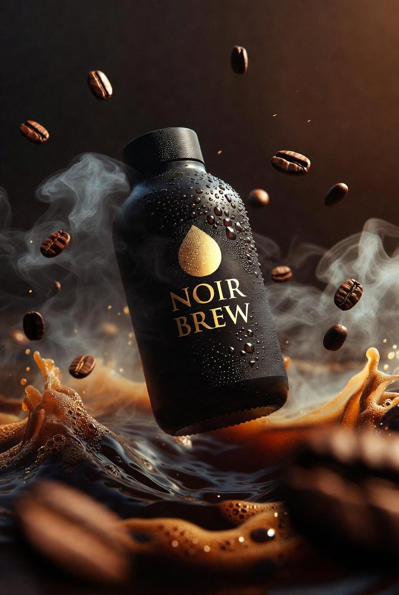

## Luxury skincare commercial, ultra-premium aesthetic. Use

- ID: trending-2027645181538025847
- Slug: trending-2027645181538025847-en
- 语言: en
- 来源: [来源链接](https://x.com/Sheldon056/status/2027645181538025847)
- 样例图路径: images/part1/2027645181538025847_1.jpg

### 提示词

```text
Luxury skincare commercial, ultra-premium aesthetic. Use the provided product image as the exact reference for bottle shape, label design, liquid tone, reflections, and overall styling.

The bottle stands perfectly upright at the center of the frame, surrounded by a glossy liquid surface with smooth, elegant ripples. Soft fluid splashes form a graceful crown around the base, catching light like crystal. Background is a dreamy pastel aqua-to-soft lavender gradient with a silky, creamy atmosphere and subtle mist particles floating in the air.

Camera motion:
Slow, continuous 360-degree cinematic orbit around the product. Movement is smooth, controlled, and hypnotic. Constant speed throughout. No shaking, no zooming, no speed changes. The product remains perfectly centered and stable at all times.

Framing:
Mid close-up beauty shot. Bottle remains vertical and motionless, hero focus.

Lighting:
High-end studio lighting, soft diffused glow with gentle highlights and glossy reflections. Subtle rim light to outline the bottle. Liquid and glass look luminous, hydrated, and silky.

Mood & style:
Sensual, elegant, and premium beauty campaign. Smooth motion, glossy textures, soft reflections, cinematic depth of field, slow-motion feel, luxury skincare advertisement, 4K photorealistic, polished commercial look.
```

### 样例图

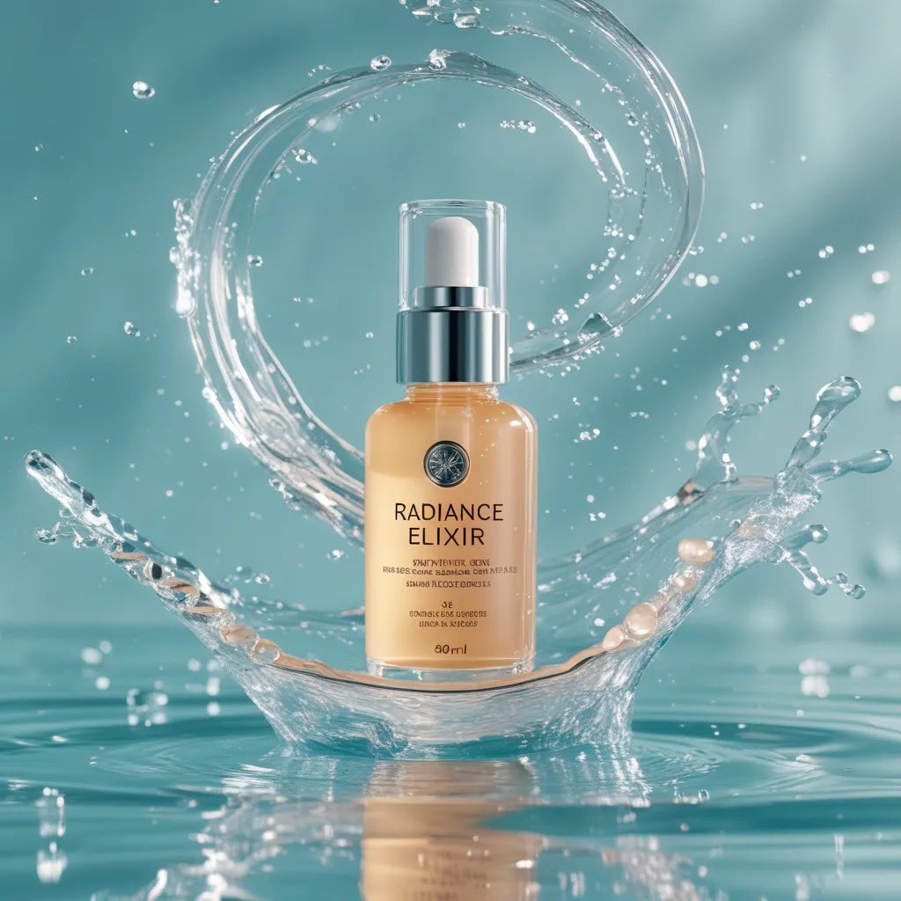

## A hyper-realistic 3D render of a flat logo sculpted as a

- ID: trending-2044465748714594617
- Slug: trending-2044465748714594617-en
- 语言: en
- 来源: [来源链接](https://x.com/zazzygfx/status/2044465748714594617)
- 样例图路径: images/part1/2044465748714594617_1.jpg

### 提示词

```text
A hyper-realistic 3D render of a flat logo sculpted as a massive, frosted stone monument standing upright on the jagged peak of a rocky mountain summit.

The logo retains its exact silhouette and proportions but is fully translated into thick, solid carved rock encased in a layer of translucent frost and ice. Each element and shape of the logo is extruded with significant depth and volume, giving it a bold, chunky sculptural mass.

 The surface texture is rough, dark basalt or granite stone, partially obscured by a crystalline frost coating, with deep natural cracks, chipped edges, and fine granular detail across every face. The outer boundary of the logo forms the shell of the sculpture, with negative spaces between design elements carved out as open voids cutting through the rock.
The sculpture sits planted into the top of a rugged mountain peak, partially buried at its base, surrounded by cracked grey rock. A thick, textured layer of white snow and rime ice rests on the top flat surfaces of the logo forms and collects in the crevices and carved edges. Small icicles hang from the lower overhanging curves and edges, catching cold light. The entire structure has a subtle, semi-translucent frozen sheen, softening the harshness of the stone beneath.
The sky behind is filled with a dramatic, dense sea of clouds rolling over distant mountain peaks, creating a misty, ethereal, and cold atmosphere. Soft, diffused light filters through the cloud layer, creating a stark contrast against the dark, frosted stone sculpture. Lighting is soft natural daylight from slightly above and to the left, casting realistic shadows beneath the logo elements and across the rocky peak below. Ambient occlusion deepens the carved negative spaces between the design forms.

Camera angle is slightly low, looking up at the sculpture from a three-quarter front perspective, emphasizing the scale and monumentality of the logo form, mirroring the heroic composition of a landmark monument.

Rendering style: photorealistic, cinematic, ultra-detailed, physically based rendering, no text, no additional elements only the logo as a frosted stone sculpture on a cloud-covered mountain peak.
```

### 样例图

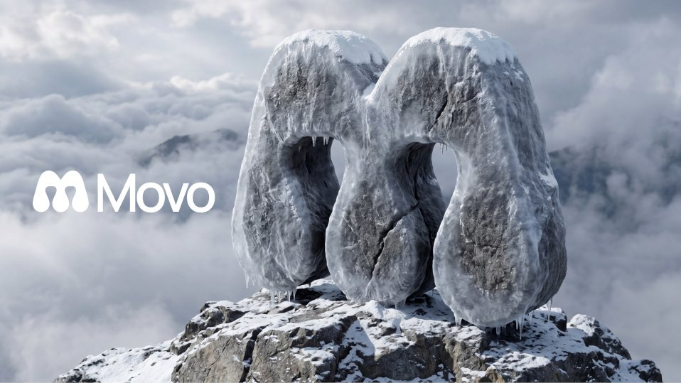

## [BRAND NAME]. Act as a Creative Director and Brand Strat

- ID: trending-2022753970704286181
- Slug: trending-2022753970704286181-en
- 语言: en
- 来源: [来源链接](https://x.com/AmirMushich/status/2022753970704286181)
- 样例图路径: images/part1/2022753970704286181_1.jpg

### 提示词

```text
[BRAND NAME]. Act as a Creative Director and Brand Strategist.

PHASE 1: CONCEPT & COMPOSITION.

Create a multi-panel fashion lookbook collage (grid layout) on a clean off-white background. 

- Main Shot: A full-body editorial pose of a model wearing a signature [BRAND NAME] piece. 

- Detail Shots: 3-4 smaller rectangular frames showing macro crops of fabric, hardware, and stitching.

- Autonomously determine the garment type based on the brand's current hype items.

PHASE 2: VISUAL STYLE & TEXTURE.

"High-End Lo-fi" aesthetic. Intense film grain, analog noise, and scanline artifacts. Heavy, premium clothing textures: faded vintage washes, distressed edges, and high-quality "cracked" screen prints. Muted, moody color palette with brand-specific accents.

PHASE 3: DYNAMIC TYPOGRAPHY & LOGIC.

Autonomously analyze the [BRAND NAME] heritage and core identity to generate unique typography.

- Content: Instead of generic "Drop" labels, generate text based on the brand’s DNA: 

- Style: Match the font to the brand's era (e.g., brutalist sans-serif for modern labels, elegant serif for luxury house heritage). Integrate the [BRAND NAME] logo with a distressed, "Xerox-copied" texture.

TECH SPECS:

35mm film look (Kodak Portra 400), f/5.6 for raw sharpness, high ISO grain. High-contrast editorial flash, deep shadows. Octane render quality with an analog scan soul.
```

### 样例图

![[BRAND NAME]. Act as a Creative Director and Brand Strat](../images/part1/2022753970704286181_1.jpg)

## Industrial engineering-style infographic of an object (m

- ID: trending-2021082486294675765
- Slug: trending-2021082486294675765-en
- 语言: en
- 来源: [来源链接](https://x.com/Strength04_X/status/2021082486294675765)
- 样例图路径: images/part1/2021082486294675765_1.jpg

### 提示词

```text
Industrial engineering-style infographic of an object (match exactly the object from the uploaded photo reference).
Ultra-precise technical rendering of the object placed at the center, with accurate proportions, textures, materials, and surface details identical to the reference photo.
Surround the object with industrial–grade technical elements:
• Blueprint-inspired dimension lines (length, width, height, radius, angle, tolerances).
• Cross-section cutaway view revealing internal components with engineering hatching patterns.
• Exploded-view assembly diagram showing bolts, brackets, joints, wiring, bearings, or internal mechanisms.
• Material specification blocks (steel type, plastics, alloys, coatings, finishes).
• Process flow arrows describing manufacturing steps (CNC, casting, welding, injection, stamping).
• Load & stress indicator graphics with arrows, vector force diagrams, thermal flow, or torque direction.
• Part numbering following industrial annotation style (Part A01, A02, etc).
• Tech data panels like: weight, volume, tolerances, rated load, pressure, RPM, operating temperature.
• QR-style data block or barcode element for extra industrial feel.
Design style:
• clean, structured, engineering-oriented layout
• color palette of steel grey, dark navy, orange/yellow safety accents
• background like a technical drafting sheet or industrial metal texture (subtle, not distracting)
• sharp sans-serif typeface using actual engineering annotation style
• shadows minimal, prioritizing clarity and precision
Overall vibe: serius, presisi, manufaktur-grade, seperti poster teknik pabrik atau katalog industrial tooling.
Aspect Ratio: 9:16
```

### 样例图

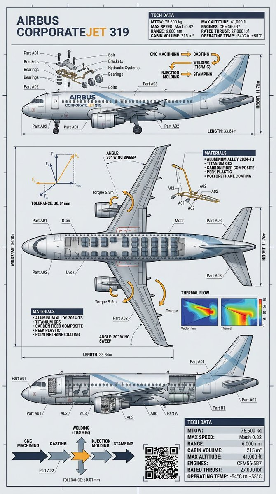

## A wide-angle, studio fashion advertisement with a sophis

- ID: trending-2029228739192865157
- Slug: trending-2029228739192865157-en
- 语言: en
- 来源: [来源链接](https://x.com/rovvmut_/status/2029228739192865157)
- 样例图路径: images/part1/2029228739192865157_1.jpg

### 提示词

```text
A wide-angle, studio fashion advertisement with a sophisticated retro-modern aesthetic. The scene is set against a monochromatic teal-grey (#506D6D) architectural backdrop featuring minimalist geometric props, including a fluted column and stepped circular platforms. The lighting is professionally diffused studio light, creating soft, graduated shadows that provide depth without harshness.

The Subjects:
Four models are posed in a cohesive, stylish group dynamic:

A Black man on the far left, standing tall in a brown tweed blazer, a deep burgundy turtleneck, and dark yellow-and-brown checkered trousers. He is smiling and warmly holding the hand of the woman next to him.

A Black woman with a voluminous afro, sitting sideways on a vintage 1950s wooden television set. She wears a dark brown knit top and vibrant burnt orange (#E88D4D) trousers with sleek brown leather boots.

A White woman sitting on the floor in the center, leaning forward with her hand to her face. she wears a vintage-style headband, an argyle-patterned sleeveless top in orange and slate blue, a brown wool skirt, and white wedge sandals.

A White man leaning into the frame from the center-right, hands on his knees. He wears a heavy cream-colored cable-knit sweater with dark trim and tailored brown trousers.
Furniture & Props:
To the right stands a minimalist dark teal industrial clothing rack. It displays curated garments including hanging shirts, a wide-brimmed white fedora, and a prominent structured orange leather messenger bag. At the base of the rack are white high-top sneakers and sandals. A single, truncated orange cone prop sits in the foreground.
Primary Text: A massive, high-contrast white serif font (Bodoni-style) reading "KAIRO" is overlaid across the center-left, partially occluding the models to create a layered, 3D effect.
Header: At the top center, the words "winter" (in orange cursive script) and "COLLECTION" (in white clean sans-serif) are centered.
Footer: The URL "http://KAIROFASHION.COM" is printed in small, wide-tracked white sans-serif in the bottom right corner.
Color Palette:
A sophisticated mix of Teal-Grey, Burnt Orange, Chocolate Brown, and Crisp White, creating a warm yet muted autumnal atmosphere.
```

### 样例图

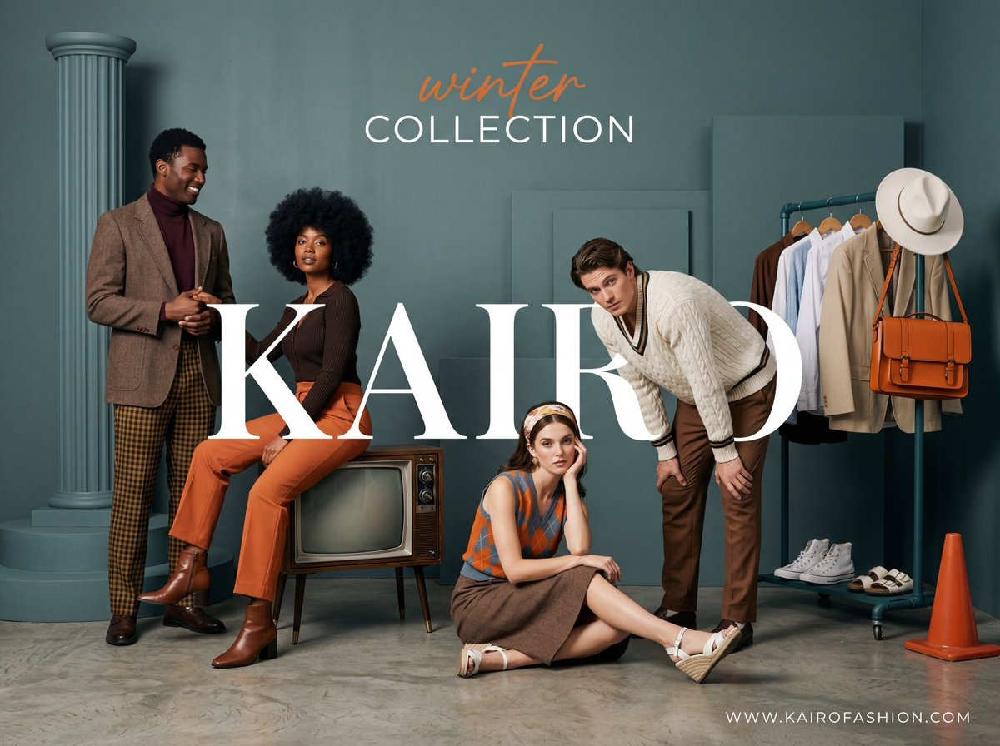

## [upload luxury product photo] BRAND NAME: [Put the brand

- ID: trending-2008592833406791789
- Slug: trending-2008592833406791789-en
- 语言: en
- 来源: [来源链接](https://x.com/aziz4ai/status/2008592833406791789)
- 样例图路径: images/part1/2008592833406791789_1.jpg

### 提示词

```text
[upload luxury product photo]
BRAND NAME: [Put the brand name here]

Create ONE luxury editorial poster. Keep the product EXACT and unchanged. Use the BRAND NAME to infer identity and place the REAL official logo (correct proportions) in the most brand-appropriate position with subtle print texture. Add a perfectly matched attractive model wearing the product naturally. Rich deep colors, HDR, premium studio lighting, clean background, strong negative space, ultra-sharp 8K. No extra text, no watermark.
```

### 样例图

![[upload luxury product photo] BRAND NAME: [Put the brand](../images/part1/2008592833406791789_1.jpg)

## Ultra-realistic summer skincare product photography of a

- ID: trending-2021835757183209806
- Slug: trending-2021835757183209806-en
- 语言: en
- 来源: [来源链接](https://x.com/YaseenK7212/status/2021835757183209806)
- 样例图路径: images/part1/2021835757183209806_1.jpg

### 提示词

```text
Ultra-realistic summer skincare product photography of a bronzing drop bottle named "Golden Glow - Bronzing Elixir", rectangular matte bottle in warm sun-kissed bronze tone with a clean white cap, placed diagonally on wet beach sand as a gentle ocean wave washes over it, delicate sea foam and tiny bubbles surrounding the base, water partially flowing across the label, fine sand texture visible beneath shallow clear water, golden sunlight casting natural highlights and soft shadows, high-detail water ripples and realistic foam patterns, fresh summer aesthetic, minimal clean branding centered and sharp, warm golden-hour beach lighting, cinematic top-down flat lay composition, natural reflections on wet surface, editorial beauty campaign style, ultra-detailed, photorealistic 8K, soft warm color grading, luxury skincare advertisement Aspect ratio 4.5
```

### 样例图

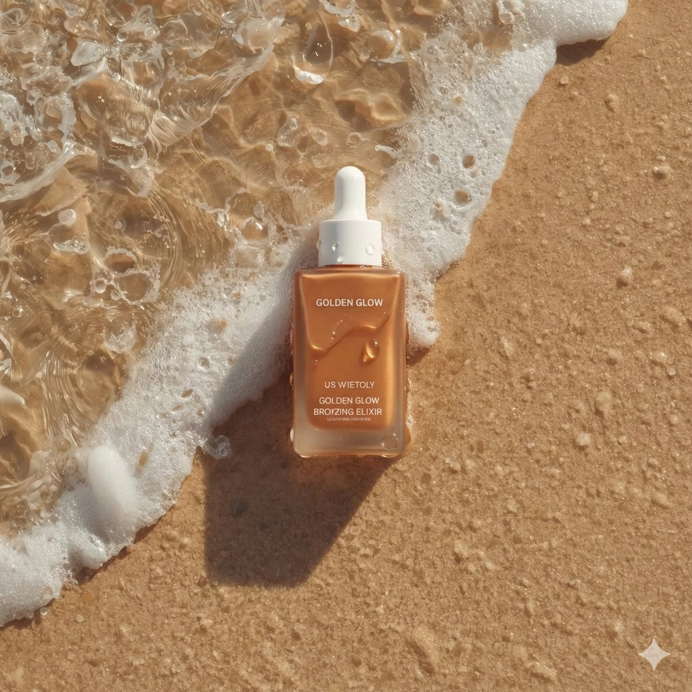

## studio shot of [PRODUCT], placed on a [background], surr

- ID: trending-2035672892294451691
- Slug: trending-2035672892294451691-en
- 语言: en
- 来源: [来源链接](https://x.com/azed_ai/status/2035672892294451691)
- 样例图路径: images/part1/2035672892294451691_1.jpg

### 提示词

```text
studio shot of [PRODUCT], placed on a [background], surrounded by soft shadows and gradient background, high-key lighting, shallow depth of field, ultra-sharp focus on the object, premium product photography, shot on a DSLR, minimal aesthetic, subtle reflections, commercial lighting setup
```

### 样例图

![studio shot of [PRODUCT], placed on a [background], surr](../images/part1/2035672892294451691_1.jpg)

## [BRAND]. A high fashion campaign poster. A model with a 

- ID: trending-2031843569942622631
- Slug: trending-2031843569942622631-en
- 语言: en
- 来源: [来源链接](https://x.com/youraipulse/status/2031843569942622631)
- 样例图路径: images/part1/2031843569942622631_1.jpg

### 提示词

```text
[BRAND]. A high fashion campaign poster. A model with a strong expressive face as the centerpiece, wearing a signature outfit in the brand's exact official color palette. Dramatic surreal atmospheric background. Layered collage of torn-edge material swatches surrounding the model. Brand's iconic symbol woven into the scene. Logo overlaid in the center in clean serif font. Macro detail on fabric texture and stitching. Cinematic lighting, rich contrast, 8K
```

### 样例图

![[BRAND]. A high fashion campaign poster. A model with a ](../images/part1/2031843569942622631_1.jpg)

## A premium studio product photograph of a tall, slim red 

- ID: trending-2017622879190573425
- Slug: trending-2017622879190573425-en
- 语言: en
- 来源: [来源链接](https://x.com/Strength04_X/status/2017622879190573425)
- 样例图路径: images/part1/2017622879190573425_1.jpg

### 提示词

```text
A premium studio product photograph of a tall, slim red aluminum sparkling water can standing upright and centered against a seamless vivid red background, the can covered in fine condensation droplets with crisp white typography reading “GOOD IDEA” and smaller flavor text beneath, positioned on a matte red surface with subtle reflections, surrounded symmetrically by fresh ripe strawberries with glossy seeds and deep red flesh, some resting directly on the surface and others placed on small red rectangular blocks to the left and right, delicate white elderflower blossoms scattered between the fruit for contrast, the lighting soft yet directional from the upper left creating gentle highlights on the can's metallic texture and soft shadows beneath the fruit, the color palette dominated by saturated reds with clean white accents and natural green stems, the composition minimal and perfectly balanced with generous negative space above the product, shallow depth of field, ultra-sharp focus on the can, high-end commercial aesthetic, photorealistic, studio-grade, cinematic realism.
```

### 样例图

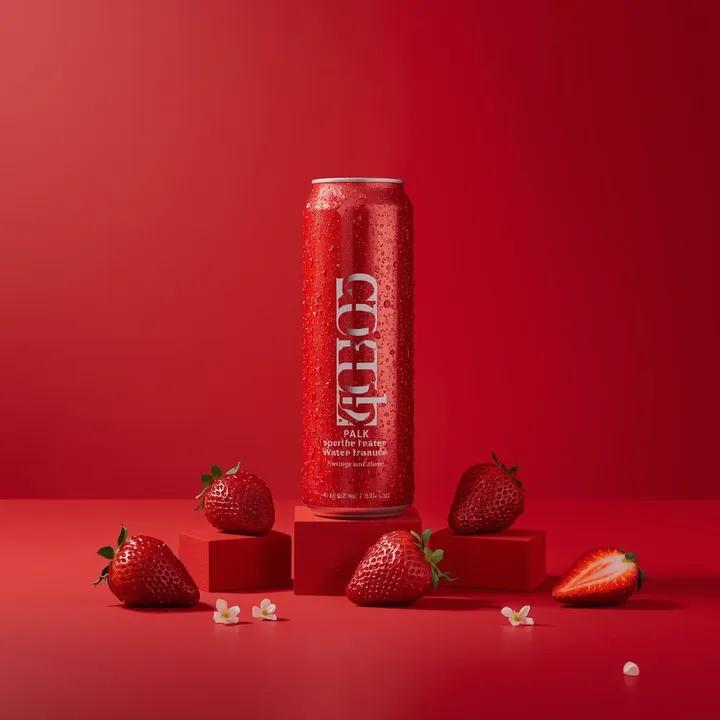

## [BRAND NAME]. Act as a graphic design creative director 

- ID: trending-2011094013101695427
- Slug: trending-2011094013101695427-en
- 语言: en
- 来源: [来源链接](https://x.com/youraipulse/status/2011094013101695427)
- 样例图路径: images/part1/2011094013101695427_1.jpg

### 提示词

```text
[BRAND NAME]. 
Act as a graphic design creative director constructing a highly structured "Campaign Visual Identity Grid."

COMPOSITION (SPECIFIC 2-COLUMN ASYMMETRICAL LAYOUT):

The image must follow a strict 2-column grid structure, exactly like the layout seen in professional campaign boards.

LAYOUT STRUCTURE (TOP TO BOTTOM):
ROW 1: One single, full-width rectangular block (e.g., a wide photo).
ROW 2: Two equal-sized square blocks side-by-side.
ROW 3: One single, full-width rectangular block
ROW 4: Two equal-sized square blocks side-by-side.
ROW 5: One single, full-width rectangular block at the bottom.
The grid must be perfectly stable, with all blocks forming this exact pattern.

CRITICAL CONSTRAINTS:
FULL BLEED (100% COVERAGE): The grid must occupy the ENTIRE canvas area from edge to edge. There are absolutely NO margins, NO borders, and NO background space visible.

ZERO SPACING (NO GAPS): The grid tiles must be seamlessly abutted. There should be absolutely NO gutters, white lines, or spacing between the blocks. They must touch perfectly to form a solid wall.

GLOBAL RULES:
Typography: Use ONLY ONE font.
Uniqueness: Every photo cell must be UNIQUE. No duplicates.

THE GRID CONTENT & SPECIFIC TEXTURES (3 TYPES):
Distribute these three block types rhythmically throughout the specific 2-column layout defined above:

TYPE A: THE LOGO BLOCK (PRINT GRUNGE):
A solid block in the brand's primary color containing ONLY the official [BRAND NAME] logomark centered.
Texture: Distressed screen-print texture with slight ink bleed and grunge noise.

TYPE B: THE SLOGAN BLOCK (PRINT GRUNGE):

A solid block in a contrasting brand color containing ONLY the official [BRAND NAME] slogan.
Texture: Heavy distressed ink texture and grunge print effects on typography and fill.

TYPE C: CAMPAIGN PHOTOGRAPHY (HALFTONE):
High-contrast B&W action shots or portraits relevant to the brand.

Texture: Apply strong halftone dot patterns (raster dots) and heavy film grain. Use "Multiply" color blending to wash the photos in the brand's specific color palette (duotone effect).
```

### 样例图

![[BRAND NAME]. Act as a graphic design creative director ](../images/part1/2011094013101695427_1.jpg)

## A sharp, top-down macro photograph of a single, heavily 

- ID: trending-2011878056755966363
- Slug: trending-2011878056755966363-en
- 语言: en
- 来源: [来源链接](https://x.com/AmirMushich/status/2011878056755966363)
- 样例图路径: images/part1/2011878056755966363_1.jpg

### 提示词

```text
A sharp, top-down macro photograph of a single, 
heavily crumpled circular vinyl sticker featuring the official [BRAND NAME] logo.

MATERIAL & TEXTURE (VINYL):
The sticker is made of durable, slight-gloss vinyl material, not paper. It is severely crinkled with sharp, defined ridges and deep stress folds across its entire surface. Unlike soft paper creases, these vinyl wrinkles show plastic stress and catch the light with subtle specular highlights on the peaks of the folds. The edges are slightly curled from wear.
COLOR PALETTE (BRAND DYNAMIC):
The background color of the circular sticker itself is the dominant primary color associated with [BRAND NAME]'s official brand palette (e.g., if Ferrari, red; if John Deere, green). The logo is printed clearly in its standard contrasting color (e.g., white or black).
LIGHTING (STUDIO BRIGHT):
Bright, clean, high-key overhead white studio lighting. This intense lighting creates strong, clean highlights on the vinyl's crumpled ridges and defined, crisp shadows in the valleys, dramatically emphasizing the 3D topography of the damage.
BACKGROUND & COMPOSITION:
The camera is locked in a strict, perfectly parallel top-down flat lay view. The sticker is adhered flat onto a pure white plastic surface which has a subtle, fine granular texture (like bead-blasted plastic) to provide tactile contrast to the smooth vinyl. The entire sticker is in sharp focus.
```

### 样例图

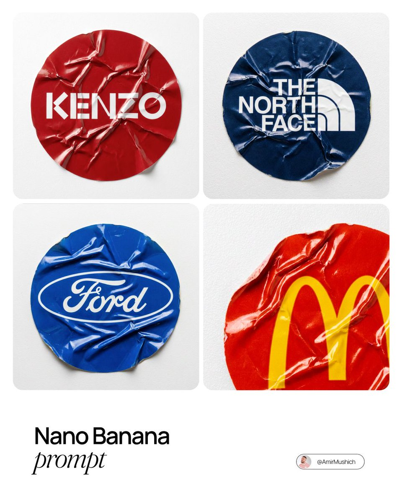

## A hyper-realistic commercial product photography shot of

- ID: trending-2010290781819695350
- Slug: trending-2010290781819695350-en
- 语言: en
- 来源: [来源链接](https://x.com/Strength04_X/status/2010290781819695350)
- 样例图路径: images/part1/2010290781819695350_1.jpg

### 提示词

```text
A hyper-realistic commercial product photography shot of a condensation-covered beverage can labeled "MANGO TANGO JUICE" bursting dynamically out of crystal clear turquoise ocean water. The can is surrounded by a splash of golden mango juice and water. Levitating around the can are fresh whole mangoes, diced mango cubes, and crystal clear ice cubes. The foreground includes vibrant tropical flowers and green palm leaves framing the shot. The background features a blurred sunny tropical beach with palm trees. Bright cinematic backlighting with a sun flare, sparkling water reflections, high contrast, 8k resolution, vibrant colors.
```

### 样例图

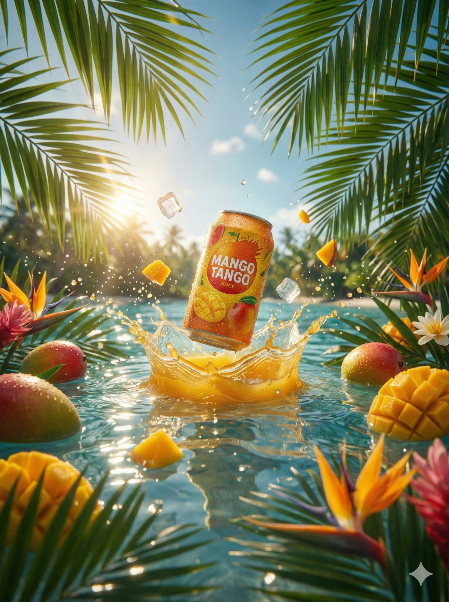

## Use the uploaded image as the exact visual reference for

- ID: trending-2029116168800485686
- Slug: trending-2029116168800485686-en
- 语言: en
- 来源: [来源链接](https://x.com/oggii_0/status/2029116168800485686)
- 样例图路径: images/part1/2029116168800485686_1.jpg

### 提示词

```text
Use the uploaded image as the exact visual reference for composition, jar design, orange slices, whole oranges, cinnamon sticks, lighting, and orange background. Maintain the same top-down perspective and color palette.

Camera:
Top-down camera angle (exactly as in the image).
Camera slowly zooms in toward the jar.
Very smooth and controlled movement.
No rotation.
No camera shake.

Action:

The jar remains perfectly still in the center of the frame.
```

### 样例图

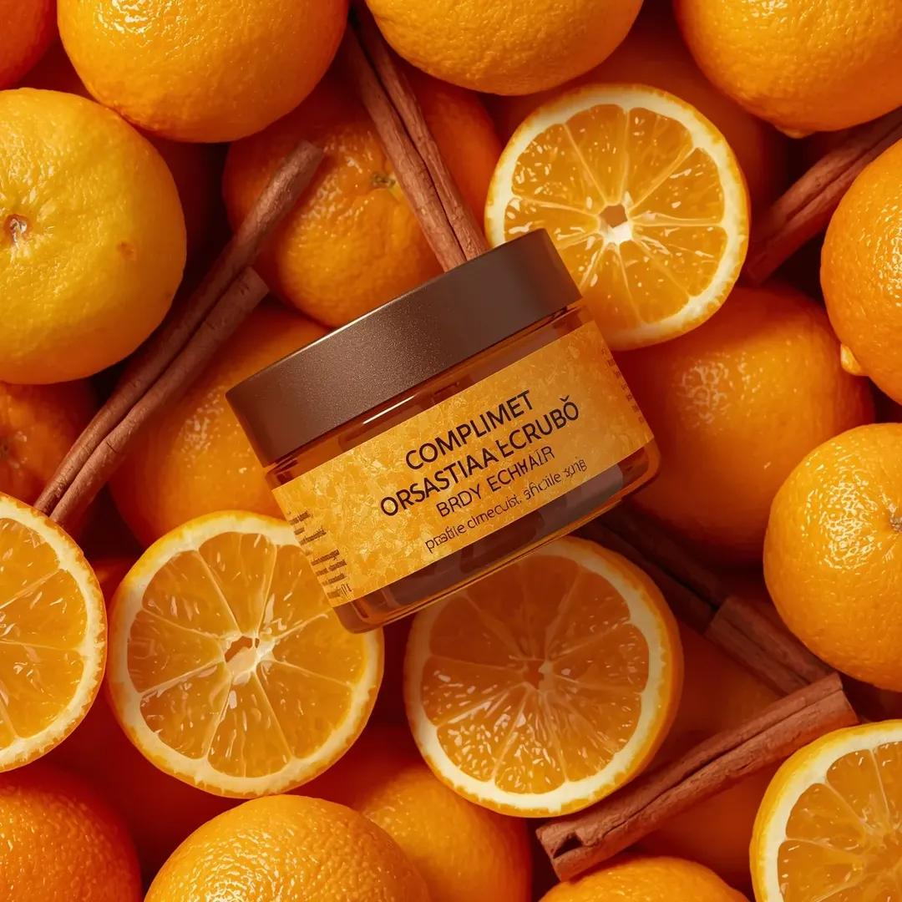

## [BRAND NAME] | [OBJECT] Act as a High-End Commercial Pro

- ID: trending-2046265195434070061
- Slug: trending-2046265195434070061-en
- 语言: en
- 来源: [来源链接](https://x.com/AmirMushich/status/2046265195434070061)
- 样例图路径: images/part1/2046265195434070061_1.jpg

### 提示词

```text
[BRAND NAME] | [OBJECT]

Act as a High-End Commercial Product Photographer and Creative Director shooting a luxury editorial campaign (Hypebeast / Highsnobiety /Wallpaper* level).

PHASE 1: BRAND INTELLIGENCE
The hero subject is a [OBJECT] branded for [BRAND NAME]. Autonomously determine [BRAND NAME]'s full visual identity: signature color palette, typographic DNA, logo mark geometry, material language, and cultural positioning. Apply this identity to the [OBJECT] with precision — do not invent a generic brand, decode the real visual codes.

PHASE 2: OBJECT SURFACE & MATERIAL DNA
Regardless of the shape of [OBJECT], apply this material system: Base tone: deep neutral — matte dark graphite, warm charcoal, or matte black. Fine-grain surface micro-texture visible under raking light — powder-coat, matte paper, or brushed material feel. Subtle gradient bloom: the base color dissolves in the lower portion of the object's surface into the brand's most iconic accent color — a soft luminous haze from within the material, not a printed graphic. Logo application: embossed, debossed, or metallic foil relief — catching specular light at edges only. Precise. Restrained. Typography: brand-accurate typeface, small tracking, positioned  with editorial intentionality.

PHASE 3: THE ACCENT BREAKOUT ELEMENT
This is the signature design move — adapt it to the natural geometry of [OBJECT]: Identify the most logical "interruption zone" on [OBJECT] — a seam, edge, band, collar, rim, strap, or wrap point. At this zone, apply a narrow saturated accent element in the brand's most iconic hue — vivid, slightly matte. This element must visually "break out" of the object's boundary — extending, protruding, or wrapping beyond the expected edge, creating a deliberate 3D tension between the object and the detail.The accent element carries a micro-typographic brand detail — tagline, model name, or descriptor — small, precise, tracked.

PHASE 4: STAGING & COMPOSITION
Studio cyclorama. Surface tone: off-white to warm light gray. Background field: cool neutral mid-gray, darker in upper zone. [OBJECT] positioned at 3/4 angle — front face and one secondary surface simultaneously visible. Rule of thirds: object occupies right 60% of frame. Left field: generous negative space — intentional, not empty. Single hard-edged directional shadow cast to the right and slightly downward — crisp penumbra, no diffusion.

PHASE 5: LIGHTING
Single dominant key light: large softbox, camera-left, elevated at 40°. Specular highlight traces the top-left edge of [OBJECT] — revealing material grain. Shadow side: no fill. Darkness earns depth. Subtle ambient bounce from cyclorama floor — lifts shadow by 15%, no more. Accent element receives micro-specular glint along its dominant edge. Mood: Rembrandt chiaroscuro logic applied to product photography. No lens flare. No atmospheric effects.

PHASE 6: TECH SPECS
Lens: 85mm equivalent, f/4.5. Depth of field: object fully sharp, background softened. Chromatic aberration: subtle, at extreme frame edges only — optical realism signal. Film grain overlay: 15% opacity — anti-CGI-plastic treatment. Render: Octane / Ray Tracing quality —subsurface scattering where material demands it, global illumination, physically accurate shadow falloff. Aspect ratio: autonomously determine optimal ratio for this [OBJECT] format.
```

### 样例图

![[BRAND NAME] | [OBJECT] Act as a High-End Commercial Pro](../images/part1/2046265195434070061_1.jpg)

## Exact uploaded [BOTTLE_NAME] bottle (label unchanged). V

- ID: trending-2010731794820444198
- Slug: trending-2010731794820444198-en
- 语言: en
- 来源: [来源链接](https://x.com/oggii_0/status/2010731794820444198)
- 样例图路径: images/part1/2010731794820444198_1.jpg

### 提示词

```text
Exact uploaded [BOTTLE_NAME] bottle (label unchanged). Vertical poster. Center bottle w/ condensation. Add [JUICE_COLOR] liquid splash wrap + ice cubes + [INGREDIENTS] floating (controlled). Background: [BG_COLOR] gradient + vignette + grain.
Top-left: “FRESH JUICE” + “[FLAVOR_TAGLINE]”. Right: circular “30% OFF” ring. Lower-right: price circle “[PRICE]”. Bottom-right CTA “[CTA]”. White doodle arrows. Studio key+rim, 85mm, sharp text, no watermark.
```

### 样例图

![Exact uploaded [BOTTLE_NAME] bottle (label unchanged). V](../images/part1/2010731794820444198_1.jpg)

## Create a 9-image Instagram feed for this product in [the

- ID: trending-2027122256426521040
- Slug: trending-2027122256426521040-en
- 语言: en
- 来源: [来源链接](https://x.com/gizakdag/status/2027122256426521040)
- 样例图路径: images/part1/2027122256426521040_1.jpg

### 提示词

```text
Create a 9-image Instagram feed for this product in [the same aesthetic]. Use different locations, angles, and compositions, incorporating people, animals, nature, and various environments while maintaining a cohesive visual style.

with/without "same aesthetic"
```

### 样例图

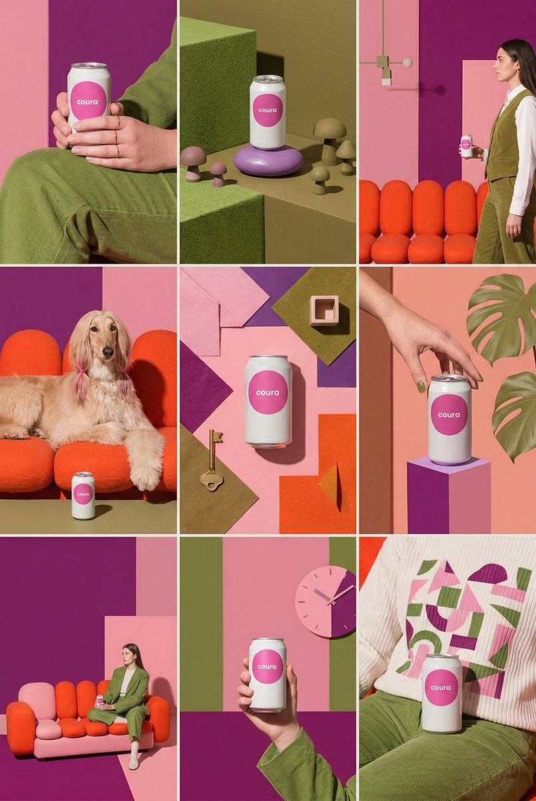

## { "prompt": "A premium minimalist skincare product photo

- ID: trending-2018556431100993733
- Slug: trending-2018556431100993733-en
- 语言: en
- 来源: [来源链接](https://x.com/Maercihh/status/2018556431100993733)
- 样例图路径: images/part1/2018556431100993733_1.jpg

### 提示词

```text
{
  "prompt": "A premium minimalist skincare product photography scene featuring an open white cosmetic jar labeled 'Sealine Serum'. The jar is placed on a smooth, pale stone partially submerged in crystal-clear shallow water. The cream inside the jar has a soft, glossy swirl with a pristine, silky texture. Gentle water ripples surround the stone, creating natural light refractions and caustic patterns on the surface below. Small water droplets and subtle splashes add freshness and motion. The environment feels serene, clean, and natural, evoking purity, hydration, and calm luxury. The color palette is cool and airy, dominated by soft whites, light blues, and stone neutrals. Lighting is bright, diffused daylight with soft highlights and minimal shadows, emphasizing texture, moisture, and realism. The composition is centered and balanced, with shallow depth of field and a softly blurred background for a high-end cosmetic advertising look. Ultra-realistic, photoreal, editorial-quality product shot.",
  "negative_prompt": "harsh shadows, dirty water, cluttered background, plastic texture, low resolution, oversharpening, unrealistic reflections, strong color cast, text artifacts, watermark, logo distortion, messy cream surface",
  "style": "luxury skincare advertising",
  "camera": {
    "type": "DSLR",
    "lens": "90mm macro",
    "aperture": "f/5.6",
    "iso": 100,
    "shutter_speed": "1/250"
  },
  "lighting": {
    "type": "natural diffused daylight",
    "direction": "top and side",
    "contrast": "low to medium",
    "temperature": "cool-neutral"
  },
  "composition": {
    "framing": "centered product focus",
    "angle": "slightly elevated",
    "orientation": "portrait",
    "depth_of_field": "shallow with soft background blur"
  },
  "quality": {
    "resolution": "8K",
    "detail": "ultra-fine texture detail",
    "sharpness": "high",
    "realism": "photorealistic"
  }
}
```

### 样例图

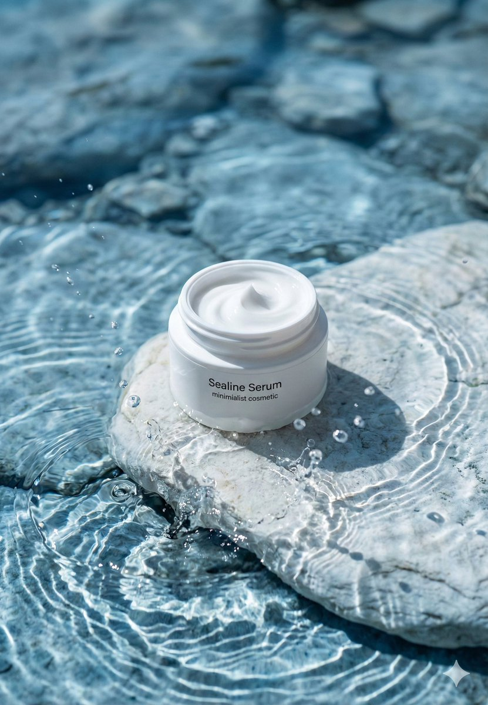

## [BRAND NAME] + [COLOR] Act as a Senior CGI Artist specia

- ID: trending-2039404183250522151
- Slug: trending-2039404183250522151-en
- 语言: en
- 来源: [来源链接](https://x.com/AmirMushich/status/2039404183250522151)
- 样例图路径: images/part1/2039404183250522151_1.jpg

### 提示词

```text
[BRAND NAME] + [COLOR]

Act as a Senior CGI Artist specializing in shrink wrap simulation and 3D material rendering. Your task: render [BRAND NAME]'s complete logo — icon mark AND wordmark if the brand uses one — completely wrapped under a single layer of tight stretched plastic film or shrink wrap. The logo forms are visible only as raised shapes beneath the material, never exposed directly.

BRAND INTELLIGENCE SYSTEM

Before executing, resolve: (1) LOGO GEOMETRY — identify [BRAND NAME]'s complete visual identity mark — this includes both the icon symbol AND the wordmark/logotype if the brand uses them together. Render both elements as they appear in the brand's official lockup. If the brand uses only an icon with no wordmark, render the icon only. If the brand uses a wordmark without an icon, render the wordmark only. Preserve the correct spatial relationship between icon and text as it appears in the real logo, (2) COLOR SYSTEM — based on [COLOR], determine one single monochromatic tone that covers everything in the scene without exception — the wrapped object, the background surface, the film material — pure tonal unity with variation only through light and shadow, (3) FILM CHARACTER — based on [COLOR] determine the stretch film behavior: bright saturated colors become tight latex or glossy shrink wrap with visible tension lines, neutrals become matte stretch film like packaging plastic, darks become semi-transparent vacuum seal film, light colors become frosted cling wrap.

PHASE 1: SCENE & SURFACE

The entire scene is monochromatic — one single color [COLOR] covers every element without exception. The background is the same film material pooling and wrinkling loosely around the central wrapped object — a continuous surface of the same material with natural stress lines, crinkles, and soft folds radiating outward from where the film is pulled tightest over the logo forms. No floor line. No walls. No horizon. Just continuous film material in every direction filling the entire frame.

PHASE 2: THE WRAPPED LOGO — CRITICAL

[BRAND NAME]'s complete logo — resolved in the brand intelligence system — exists as solid three-dimensional inflated forms. Each element of the logo — every letter, every curve of the icon, every geometric element — is volumetrically inflated like a balloon, giving each component roundness and depth. The complete logo lockup sits on the background surface and is covered by a single continuous layer of stretch plastic film pulled tightly from above. The film conforms precisely to every raised logo element — stretching tightly over the peaks of each inflated letter and icon form, creating visible tension stress lines in the film where it is pulled most taut, and releasing into loose crinkled pools of excess material in the gaps between letters, in the negative spaces of the icon, and around the outer perimeter of the logo where the film relaxes back onto the background surface. The entire logo must remain fully legible through the film — every letter readable, the icon identifiable — but no surface of the actual logo is ever directly visible or exposed. Only the film surface exists. The physical behavior of the film must be accurate: tight stretch over high points, stress lines radiating from tension peaks, loose crinkle pools in valleys, the film slightly lifting off the surface in the spaces between raised elements creating small shadow gaps underneath.

PHASE 3: LIGHTING

Large soft area light from upper-left — diffused and broad. The lighting reveals the film's topography: raised logo elements catch more light on their peaks, valleys and gaps between forms fall into progressively deeper shadow, background crinkled film shows its own shadow landscape of stress lines and folds. For glossy or latex film [COLOR]: add subtle specular highlights running along the highest tension points of the film — a tight line of brighter light along the film's most stretched areas. For matte film [COLOR]: no specular, pure diffuse light only. Global illumination on — ambient light fills shadow areas enough to retain detail in the deepest folds without flattening the overall relief.

TECH SPECS

The entire image is one color — [COLOR] — applied to every surface with variation only through light and shadow. No other colors anywhere. No exposed logo surfaces. No additional text beyond what is part of [BRAND NAME]'s actual logo lockup. Film simulation must be physically accurate — real stretch film behavior, real tension dynamics, real crinkle patterns. No fabric look. No cloth drape. This is plastic film — it has different tension behavior than textile: tighter, more stressed, more geometric stress lines, less organic drape. Film grain: ISO 400 equivalent. Mood: a product sealed for shipping, a reveal imminent, the form known but not yet touched.
```

### 样例图

![[BRAND NAME] + [COLOR] Act as a Senior CGI Artist specia](../images/part1/2039404183250522151_1.jpg)

## Hyper-realistic cinematic product photograph of a luxury

- ID: trending-2020318286538473577
- Slug: trending-2020318286538473577-en
- 语言: en
- 来源: [来源链接](https://x.com/Strength04_X/status/2020318286538473577)
- 样例图路径: images/part1/2020318286538473577_1.jpg

### 提示词

```text
Hyper-realistic cinematic product photograph of a luxury sports car front three-quarter view, glossy paint reflecting sharp highlights. Water mist and rain droplets explode around the car in frozen motion, light streaks emphasizing speed. Dramatic studio lighting with strong rim light and soft fill, shallow depth of field, ultra-sharp focus, dark minimal background, premium automotive advertising realism.
```

### 样例图

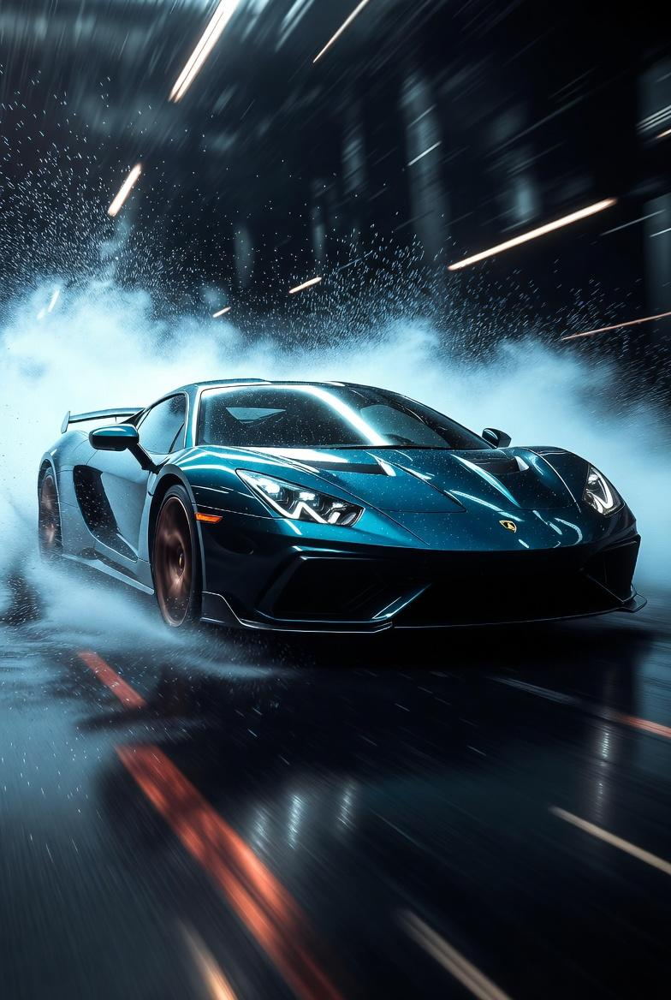

## A first-person point-of-view (POV) shot inside a modern 

- ID: trending-2015794054110552310
- Slug: trending-2015794054110552310-en
- 语言: en
- 来源: [来源链接](https://x.com/Strength04_X/status/2015794054110552310)
- 样例图路径: images/part1/2015794054110552310_1.jpg

### 提示词

```text
A first-person point-of-view (POV) shot inside a modern supermarket aisle. The viewer's hands are holding a mixed fruit jam jar with colorful branding, showing a blend of strawberry, blueberry, and orange flavors. Floating around the jar are sleek, semi-transparent Augmented Reality (AR) digital interfaces and holographic HUDs. The overlays display "Flavor Mix" with fruit icons, "Nutrition Info," and a glowing "Freshness Meter" reading 9/10. A digital shopping list with checkmarks for bread and butter appears beside the jar, along with small recipe suggestions like breakfast toast, pancakes, and desserts. The background shelves are slightly blurred with other products and shoppers, creating realistic depth of field. Bright, clean lighting with a futuristic retail atmosphere, ultra-realistic, cinematic look, high-tech AR glasses perspective, vertical composition.
```

### 样例图

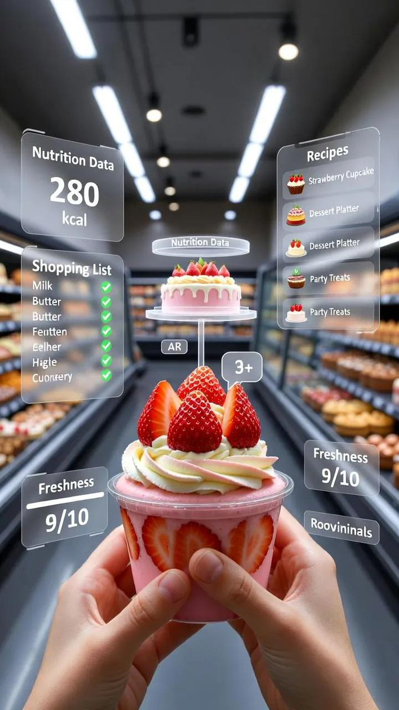

## Create an ultra-photorealistic studio portrait using the

- ID: trending-2036659588259553747
- Slug: trending-2036659588259553747-en
- 语言: en
- 来源: [来源链接](https://x.com/ChillaiKalan__/status/2036659588259553747)
- 样例图路径: images/part1/2036659588259553747_1.jpg

### 提示词

```text
Create an ultra-photorealistic studio portrait using the uploaded image as the ONLY identity reference. The subject must retain exact facial identity — same facial structure, proportions, skin tone, hairstyle, and natural features. Do not alter or beautify the face.
The subject is wearing a sharply tailored,
```

### 样例图

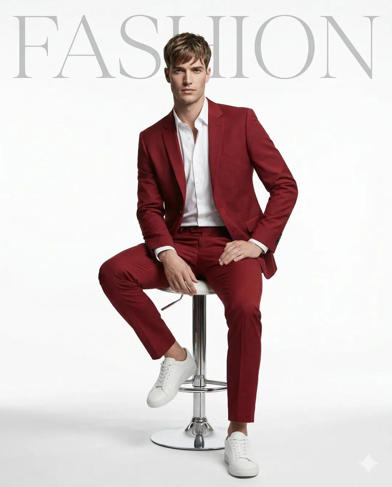

## [BRAND NAME] Act as a Senior Vector Graphic Designer spe

- ID: trending-2040157426775724206
- Slug: trending-2040157426775724206-en
- 语言: en
- 来源: [来源链接](https://x.com/AmirMushich/status/2040157426775724206)
- 样例图路径: images/part1/2040157426775724206_1.jpg

### 提示词

```text
[BRAND NAME]

Act as a Senior Vector Graphic Designer specializing in Y2K Japanese streetwear badge design. Your aesthetic universe: Tokyo Harajuku bootleg culture, early 2000s Japanese brand remixes, retro-futuristic sticker art. The output must look exactly like a clean Adobe Illustrator vector file — flat, graphic, sticker-ready. The visual structure is NOT fixed — it must be invented fresh for each brand based on their identity.

BRAND INTELLIGENCE SYSTEM

Before executing, resolve all of the following and use them to drive every design decision: (1) PRIMARY COLOR — [BRAND NAME]'s main brand color converted into a pastel or softened Y2K version — still recognizable as the brand but lighter and more kawaii, (2) ACCENT COLOR — [BRAND NAME]'s secondary color pushed to warm saturation — the energetic pop color of the composition, (3) DARK COLOR — a deep dark version of the brand palette — navy, dark brown, deep green, near-black — used for all outlines and extrusions, (4) LETTER CONTENT — [BRAND NAME]'s name in bold lowercase or the most iconic abbreviation, (5) JAPANESE TRANSLITERATION — correct katakana of [BRAND NAME] as a small secondary text element, (6) BRAND ORIGIN FLAG — [BRAND NAME]'s country of origin national flag as a small flat element, (7) BRAND SHAPE LANGUAGE — identify the most iconic geometric or graphic forms from [BRAND NAME]'s visual identity — the shapes, curves, symbols, and structural elements unique to this brand. These shapes become the orbital, background, and decorative elements of the badge — replacing generic ovals with brand-specific geometry, (8) BRAND CULTURAL SYMBOLS — identify 1–2 small iconic objects or symbols from [BRAND NAME]'s world that can be rendered as tiny flat illustrations within the badge — not the logo itself but objects associated with the brand's universe, (9) COMPOSITION LOGIC — based on all resolved parameters above, autonomously design the structural layout of the badge. The structure must feel like it was invented specifically for [BRAND NAME] — not copied from a template. Ask: what shapes from this brand's identity could orbit the letters? What geometry feels native to this brand? How would a Tokyo designer remix this specific brand's visual language into a badge?

PHASE 1: CANVAS

1:1 square canvas. Background: flat off-white or warm light grey. Completely empty. No texture. No gradient.

PHASE 2: BADGE STRUCTURE — FULLY AUTONOMOUS

Using the BRAND SHAPE LANGUAGE and COMPOSITION LOGIC resolved above, design the complete badge structure. The only fixed rules are: the badge must have a central lettering element, surrounding geometric shapes that interact with the letters through z-layer stacking, at least one element that passes both behind and in front of the letters creating depth, and the overall silhouette must read as a unified badge or patch shape. Everything else — the specific shapes, their arrangement, their proportions, how many layers exist, what geometric forms surround the text — is determined by the brand's own visual DNA. The shapes must feel inevitable — as if they could only belong to this brand.

PHASE 3: LETTERING

[BRAND NAME] in large bold lowercase — wide, rounded, confident display typeface. Flat PRIMARY COLOR fill. Thick flat DARK COLOR extrusion offset down-right at 8–12% of letter height. Bold DARK COLOR outline. No gradients. No rendering. The letters are the anchor of the entire composition.

PHASE 4: Y2K SIGNATURE ELEMENTS

These elements appear in every execution — they are the Y2K Japanese badge DNA: SPEED LINES or MOTION TEXTURE — somewhere within the background shapes, parallel lines or radial lines in ACCENT COLOR creating energy and movement. 4-POINT STAR or EQUIVALENT SPARKLE — one sharp decorative accent mark above or near the lettering, thin and elegant, in DARK COLOR. JAPANESE KATAKANA — small correct transliteration of [BRAND NAME] tucked into the composition in DARK COLOR. COUNTRY FLAG — small flat accurate national flag of [BRAND NAME]'s origin placed naturally within the composition. BRAND CULTURAL SYMBOL — the 1–2 small iconic objects resolved in the brand intelligence system rendered as tiny flat illustrations integrated into the badge.

TECH SPECS

Flat vector only — zero gradients, zero effects, zero rendering, zero blur. Clean crisp edges throughout. Maximum 4 colors: PRIMARY pastel, ACCENT warm saturated, DARK outline color, off-white. The badge must feel like a collectible sticker or embroidered patch. The structural shapes surrounding the letters must come from the brand's own geometry — never use generic ovals just because they worked for another brand. Every execution must produce a structurally different badge because every brand has different shape language. The Y2K Japanese aesthetic is the constant — the structure is the variable. Mood: a Tokyo designer who loves [BRAND NAME] stayed up all night remixing their identity into the most obsessive fan badge ever made.
```

### 样例图

![[BRAND NAME] Act as a Senior Vector Graphic Designer spe](../images/part1/2040157426775724206_1.jpg)

## playstation 1 game case with a movie tie-in game that se

- ID: trending-2027082459893145913
- Slug: trending-2027082459893145913-en
- 语言: en
- 来源: [来源链接](https://x.com/cfryant/status/2027082459893145913)
- 样例图路径: images/part1/2027082459893145913_1.jpg

### 提示词

```text
playstation 1 game case with a movie tie-in game that seems like a real game you may have played back in the day.

Pick a period appropriate movie that never got a video game version because that would have been a really bad idea. Worst possible choice for a movie tie-in game.
```

### 样例图

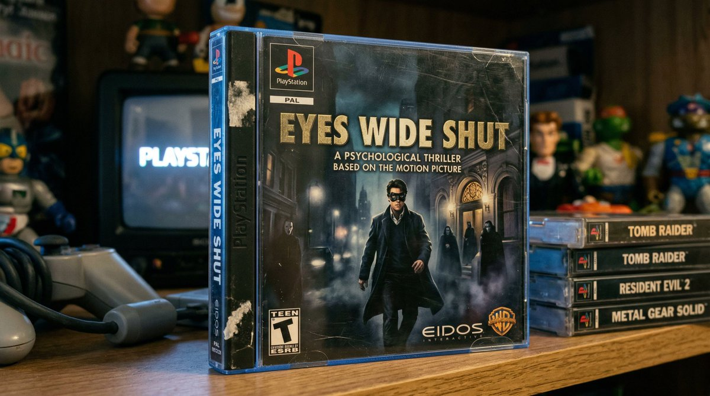

## Ultra-realistic commercial product photography of a past

- ID: trending-2022677800046797093
- Slug: trending-2022677800046797093-en
- 语言: en
- 来源: [来源链接](https://x.com/Strength04_X/status/2022677800046797093)
- 样例图路径: images/part1/2022677800046797093_1.jpg

### 提示词

```text
Ultra-realistic commercial product photography of a pastel peach-colored soda can labeled “OLIPOP – Peaches & Cream” placed upright in the center, surrounded tightly by fresh whole peaches at the bottom and large transparent ice cubes stacked around and partially covering the top of the can, heavy condensation droplets covering the can and fruit, tiny carbonation bubbles visible on the peaches, crushed ice texture with sharp edges and frosty highlights, soft diffused studio lighting.
```

### 样例图

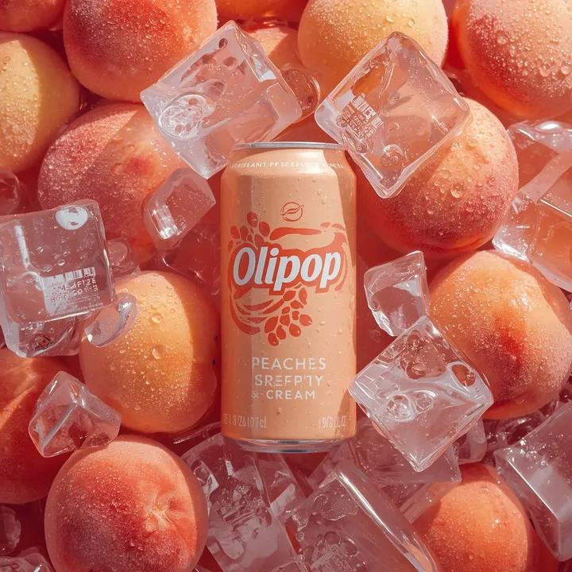

## [BRAND NAME]. Act as a Creative Director and Still Life 

- ID: trending-2015862641311219772
- Slug: trending-2015862641311219772-en
- 语言: en
- 来源: [来源链接](https://x.com/AmirMushich/status/2015862641311219772)
- 样例图路径: images/part1/2015862641311219772_1.jpg

### 提示词

```text
[BRAND NAME]. Act as a Creative Director and Still Life Photographer for a hypebeast fashion publication.
THE TASK:
Create a high-end "Showroom Still Life" photograph announcing a limited merchandise drop for [BRAND NAME].
PHASE 1: AUTONOMOUS CURATION (STRATEGY)
Analyze [BRAND NAME]: Identify the industry and the core physical product (e.g., if "Spalding" -> Basketballs; if "McDonald's" -> Burger Boxes; if "Visa" -> Metal Cards).
Determine the Palette:
Background Color: A deep, rich, textured tone derived from the brand's secondary palette (e.g., Teal, Navy, Burgundy, Slate Grey).
Merch Color: A contrasting warm or neutral tone (Camel, Orange, Cream) to pop against the background.
Select the "Merch Item": Choose a high-quality apparel piece relevant to the brand's vibe (e.g., a Varsity Letterman Jacket, a Heavyweight Hoodie, a Canvas Tote, or a Wool Scarf).
PHASE 2: SET DESIGN (THE RACK)
The Prop: A simple, modern White Powder-Coated Metal Rack or Shelf unit. It stands cleanly in the frame.
The Arrangement:
Hanging Item: The chosen "Merch Item" (e.g., the Jacket) is draped casually over the rack or hanging on a hanger, showing off the texture (wool/felt).
Stacked Items: On the shelves of the rack, stack multiple units of the brand's Core Product (e.g., a stack of basketballs, a pyramid of cans, a row of boxes).
The Background: A Hand-Painted Canvas Backdrop in the chosen Deep Background Color. Visible texture/brushstrokes are essential for that "studio" look.
PHASE 3: PHYSICAL BRANDING (TEXTURE)
On the Merch: The hanging apparel must feature High-Quality Physical Branding. Use "Chenille Patches", "Embroidered Logos", or "Screen Print" running down the sleeve or on the back. It must look like a real, expensive garment.
On the Products: Ensure the stacked core products have the correct [BRAND NAME] logo visible.
PHASE 4: PHOTOGRAPHY & LIGHTING
Lighting: Soft, directional window light from the side. Creates realistic, soft shadows on the rack and rich highlights on the textures.
Lens: 50mm or 85mm. Sharp focus on the merch, slight fall-off in the background.
PHASE 5: UI OVERLAY (THE "DROP" LAYOUT)
Left Side Alignment:
Large, clean White Logo of [BRAND NAME] floating in the negative space on the left.
Under the logo, small white text with the brand's official slogan.
```

### 样例图

![[BRAND NAME]. Act as a Creative Director and Still Life ](../images/part1/2015862641311219772_1.jpg)

## You are a world-class director of industrial visualizati

- ID: trending-2040835609850474571
- Slug: trending-2040835609850474571-en
- 语言: en
- 来源: [来源链接](https://x.com/oggii_0/status/2040835609850474571)
- 样例图路径: images/part1/2040835609850474571_1.jpg

### 提示词

```text
You are a world-class director of industrial visualization and a futuristic interface designer specializing in advanced visual engineering diagnostic tools.

Your task is to transform the downloaded product into a futuristic visualization of the technical scanning interface, similar to the product analyzed in a high-tech laboratory diagnostic system.

input:
uploaded product image

style:

• black background with a clear white grid of the drawing
• the product is made in the form of a luminous translucent X-ray frame model
• clear geometry of the technical grid
• Ultra-sharp white lines and edges
• Minimalistic HUD interface design in sci-fi style

INTERFACE ELEMENTS:

• thin white lettering-callouts with pointer lines describing the components of the product
• Zoom analysis field, showing a product fragment in close-up
• A colored layer of the heat map of the material (red/ orange/blue) is displayed inside the zoom field.
• Scan indicators such as:
"THE SCAN..."
"MATERIAL ANALYSIS..."
"98% DATA PROCESSING"
• Small loading panels and user interface diagnostic modules
• luminous markers in the form of angular frames around the image

VISUAL LANGUAGE:

• Advanced engineering drawing design
• Futuristic laboratory scanning interface
• Engineering visualization of the product at the Apple level
• Ultra-pure composition
• High-contrast black and white interface

lighting:

• subtle white glow around the frame
• Volumetric light beam scanning
• Technical sci-fi visualization

composition:

• in the center of the product
• Grid-aligned interface layout
• Scalable analysis panel in one corner
• Minimalistic but highly technical

exit:

Futuristic product scanning interface
, visualization of technical diagnostics
, technical analysis screen
, ultra clean, ultra clear, 8K
```

### 样例图

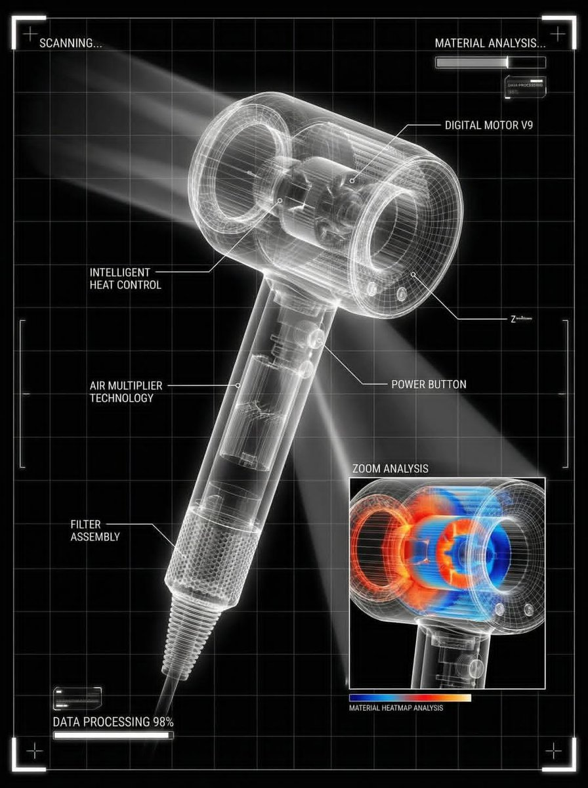

## [BRAND NAME]: A high-end, glossy concept art magazine ed

- ID: trending-2017345945025822871
- Slug: trending-2017345945025822871-en
- 语言: en
- 来源: [来源链接](https://x.com/AmirMushich/status/2017345945025822871)
- 样例图路径: images/part1/2017345945025822871_1.jpg

### 提示词

```text
[BRAND NAME]: 
A high-end, glossy concept art magazine editorial photograph of a unique, unexpected functional object conceptualized and designed by the brand.

**1. The Concept & Object (AI Invention):**
Based on the design philosophy, heritage, and material vocabulary of the specified brand, the AI must invent a novel utility product (NOT standard clothing, shoes, or bags). Examples could be home goods, tech accessories, tools, or sporting equipment, reinterpretated through the brand's lens. The object should feel sculptural yet functional.

**2. Materials & Details (Hyper-Premium):**
The object is constructed from ultra-premium, highly tactile materials characteristic of the brand (e.g., patinated exotic leathers, brushed aerospace-grade titanium, sculpted matte ceramics, molded carbon fiber, or technical high-fashion textiles). Every detail is hyper-realistic: visible stitching, microscopic material grain, precision engravings, and complex texture contrasts.

**3. Photography & Lighting (Cinematic Studio):**
Shot on a medium format Phase One camera with a 100mm macro lens. Extremely shallow depth of field, with sharp focus on the hero details of the object and a creamy, smooth bokeh background. The lighting is sophisticated studio softbox lighting: gentle, enveloping fill light with precise rim lighting to accentuate contours and material textures.

**4. Environment:**
A seamless, impeccably clean studio cyclorama background in a pure, ultra-light pastel tone (e.g., desaturated mint, pale blush, or off-white), free of shadows.

**5. Layout & UI Elements (Strict Placement):**
- **Bottom Right Corner:** A small, understated, monochrome gray logo of the brand.
- **Bottom Left Corner:** Small, minimalist monochrome gray text describing the invented product. The font style looks like Manrope Regular with very tight tracking (kerning) and balanced line spacing. Example format: "CONCEPT STUDY: [AI inserts invented product name]. MATERIAL: [AI inserts main materials]. SS25.
```

### 样例图

![[BRAND NAME]: A high-end, glossy concept art magazine ed](../images/part1/2017345945025822871_1.jpg)

## Un storyboard limpio en cuadrícula 3×3 con nueve paneles

- ID: trending-2027526257018024246
- Slug: trending-2027526257018024246-en
- 语言: en
- 来源: [来源链接](https://x.com/arceyul/status/2027526257018024246)
- 样例图路径: images/part1/2027526257018024246_1.jpg

### 提示词

```text
Un storyboard limpio en cuadrícula 3×3 con nueve paneles iguales en proporción [ratio], dentro de un formato total 4:5.

Usa la imagen de referencia como base del producto. Mantén exactamente el mismo producto, diseño del packaging, branding, materiales, colores, proporciones e identidad general en los nueve paneles, tal como en la referencia. El producto debe ser claramente reconocible en cada frame. La etiqueta, el logo y las proporciones deben permanecer exactamente iguales.

Este storyboard es una presentación mockup de alto nivel para un portfolio de branding. El enfoque está en la forma, la composición, la materialidad y el ritmo visual, más que en el realismo o una narrativa lifestyle. El resultado debe sentirse curado, editorial y orientado al diseño.

FRAME 1:
Plano frontal hero del producto en un entorno de estudio limpio. Fondo neutro, composición equilibrada, presentación calmada y segura del producto.

FRAME 2:
Primer plano con el enfoque centrado en la parte media del producto. Se destacan la textura de la superficie, los materiales y los detalles de impresión.

FRAME 3:
El producto de referencia colocado en un entorno que encaja naturalmente con la marca y la categoría del producto. Escenario de estudio inspirado en los elementos de diseño y colores del producto.

FRAME 4:
Producto mostrado en uso o en interacción sobre un fondo de estudio neutro. Las manos y los elementos de interacción son mínimos y discretos, manteniendo el estilo del packaging.

FRAME 5:
Composición isométrica que muestra varios productos organizados en un orden geométrico preciso desde un ángulo isométrico superior. Todos los productos están colocados con el mismo ángulo isométrico, espaciados de forma uniforme, limpios, estructurados y gráficos.

FRAME 6:
Producto levitando ligeramente, inclinado sobre un fondo neutro que coincida con la paleta de colores de la imagen de referencia. La posición flotante es intencional y natural en el espacio.

FRAME 7:
Primerísimo primer plano centrado en un detalle específico de la etiqueta, el borde, la textura o el comportamiento del material.

FRAME 8:
El producto en un entorno inesperado pero estéticamente potente, con un enfoque audaz, editorial y visualmente impactante. Escenario inesperado pero altamente estilizado, basado en estudio y dirigido por diseño. Composición fuerte que eleva la marca.

FRAME 9:
Composición amplia que muestra el producto en uso dentro de un setup de diseño refinado. Props limpios, estilismo controlado y coherente con el resto de la serie.

CÁMARA Y ESTILO:
Imágenes de estudio de ultra alta calidad con apariencia de cámara real. Diferentes ángulos y encuadres en cada frame. Profundidad de campo controlada, iluminación precisa, materiales y reflejos realistas. La lógica de iluminación, la paleta de colores, el mood y el lenguaje visual deben mantenerse consistentes en los nueve paneles como una sola serie cohesionada.

OUTPUT:
Una cuadrícula limpia 3×3 sin bordes, sin texto, sin captions y sin marcas de agua.
```

### 样例图

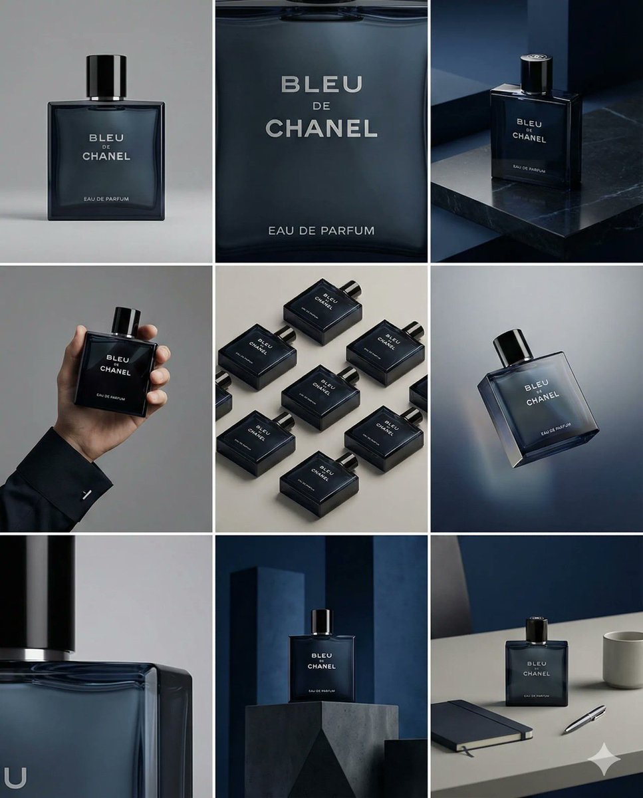

## High-fashion summer outfit infographic with color-coordi

- ID: trending-2017128891568312769
- Slug: trending-2017128891568312769-en
- 语言: en
- 来源: [来源链接](https://x.com/AIwithSynthia/status/2017128891568312769)
- 样例图路径: images/part1/2017128891568312769_1.jpg

### 提示词

```text
High-fashion summer outfit infographic with color-coordinated floating elements arranged in an elegant exploded circular composition, featuring a breathable straw hat, sleeveless organic cotton top, fluid pleated skirt, artisan leather sandals, and a woven palm-leaf bag; refined callouts highlight fabric breathability, crisp texture, moisture-wicking, and seasonal comfort, with warm neutral tones of ivory, terracotta, sand, and soft tan; subtle motion trails and airy fabric swirls suggest a gentle summer breeze, bright natural sunlight creates soft shadows and a sun-kissed glow, Mediterranean gemini lifestyle mood, premium editorial aesthetic, ultra-sharp details, minimal typography, luxury fashion magazine infographic style, Instagram-ready
```

### 样例图

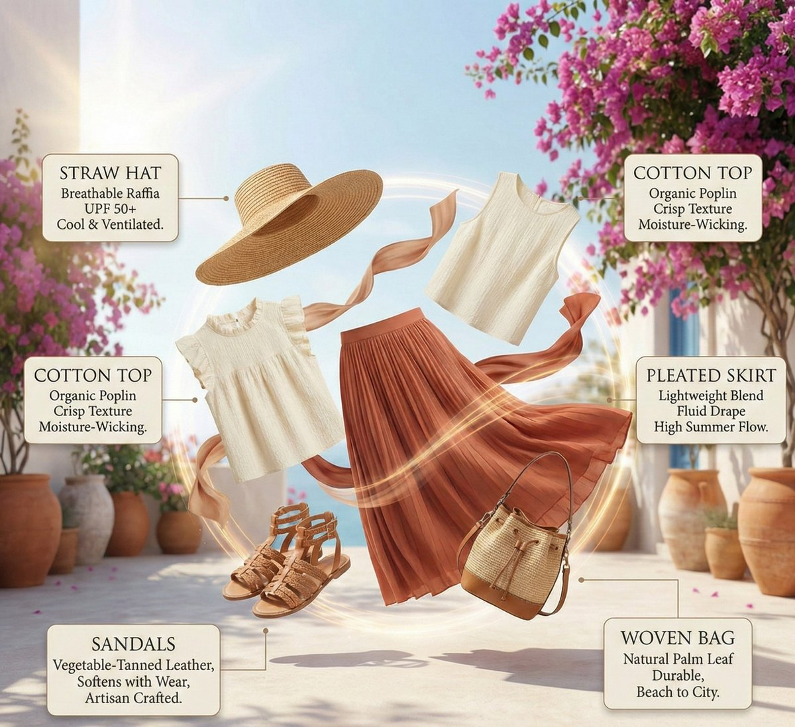

## Ultra-realistic top-down photograph of detergent foam fo

- ID: trending-2025933939647586694
- Slug: trending-2025933939647586694-en
- 语言: en
- 来源: [来源链接](https://x.com/azed_ai/status/2025933939647586694)
- 样例图路径: images/part1/2025933939647586694_1.jpg

### 提示词

```text
Ultra-realistic top-down photograph of detergent foam forming a precise [subject / logo / symbol / shape] on a polished black marble surface. Thick, airy white foam with realistic bubbles of varying sizes, natural translucency, wet shine, and soft highlights. Foam appears freshly formed, slightly uneven at the edges, physically accurate, volumetric, and naturally settled on the marble.

Black marble background with subtle white veining, glossy finish, realistic reflections and moisture marks, high contrast between white foam and dark stone. Clean minimalist composition, centered subject.

Soft diffused overhead lighting creating gentle reflections on the marble and delicate shadows within the foam bubbles. Photorealistic texture detail, macro-level realism, high-end commercial photography style, no text overlays, no illustrations, no stylization, no CGI look, ultra-clean aesthetic, sharp focus, 8k resolution, 1:1
```

### 样例图

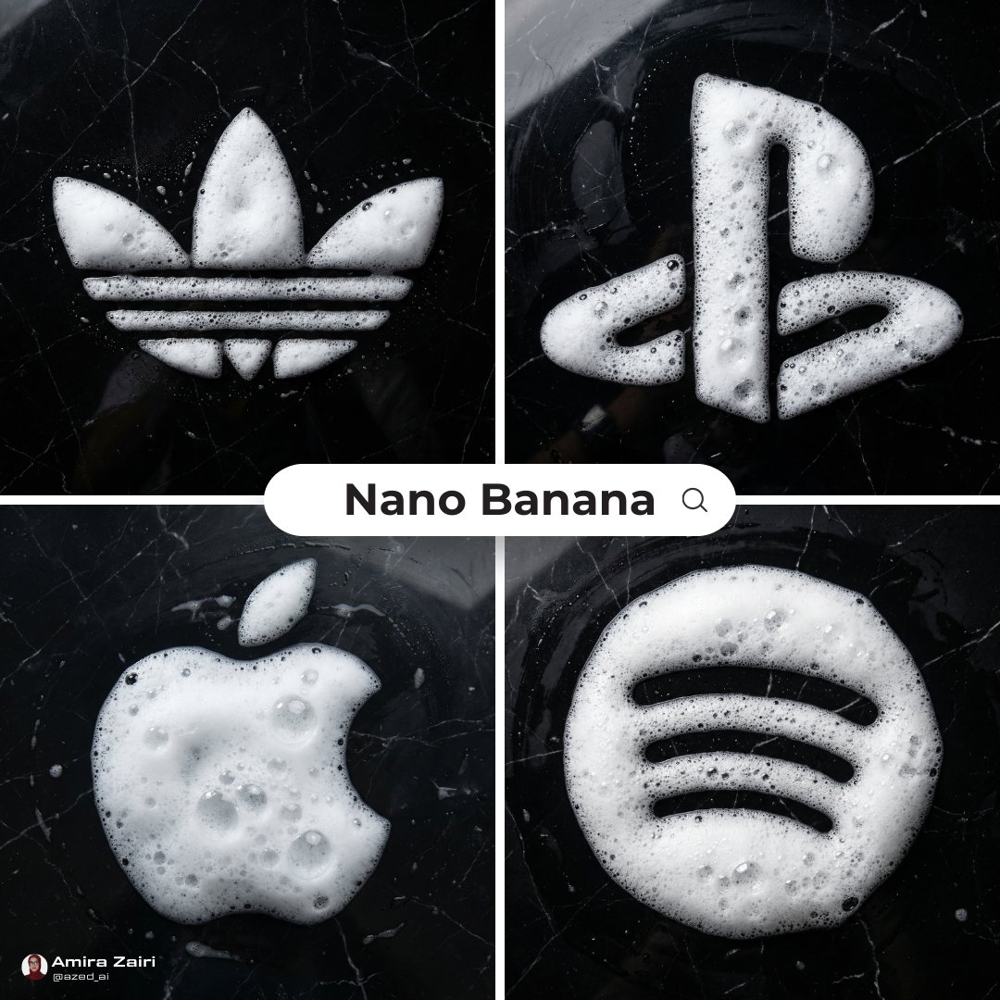

## Ultra-realistic luxury product photography of a black gl

- ID: trending-2021939791768826247
- Slug: trending-2021939791768826247-en
- 语言: en
- 来源: [来源链接](https://x.com/oggii_0/status/2021939791768826247)
- 样例图路径: images/part1/2021939791768826247_1.jpg

### 提示词

```text
Ultra-realistic luxury product photography of a black glass reed diffuser bottle labeled “BLACK OUDH – Private Collection – RITUALS” in elegant gold serif typography. The bottle has a curved rectangular shape with soft edges, a glossy reflective surface, and a gold wax-seal style emblem centered near the top. Thin black diffuser reeds extend upward from the bottle neck.

The bottle is covered in realistic water droplets and condensation, as if freshly misted after rain. It is placed among deep black roses and dark burgundy petals with visible water droplets, surrounded by rich green leaves. The scene is moody and dramatic with a dark botanical background, softly blurred (shallow depth of field, bokeh effect).

Lighting is cinematic and low-key, with soft diffused highlights reflecting off the wet glass surface. Cool-toned lighting (deep greens and midnight blues) enhances the dark, luxurious atmosphere. The gold emblem and lettering subtly catch the light, creating a premium, high-end aesthetic.

Composition: vertical portrait orientation (4:5 ratio), centered product placement, slightly angled bottle resting naturally among roses. Foreground roses partially frame the bottom of the bottle. Background is dark foliage fading into shadow.

Texture emphasis: hyper-detailed water droplets, glossy glass reflections, velvety rose petals, matte black reeds.

Style: high-end commercial fragrance advertising, macro lens, 85mm, f/2.0, shallow depth of field, photorealistic, 8K resolution, sharp focus on bottle, dramatic contrast, rich blacks, luxury perfume campaign aesthetic.
```

### 样例图

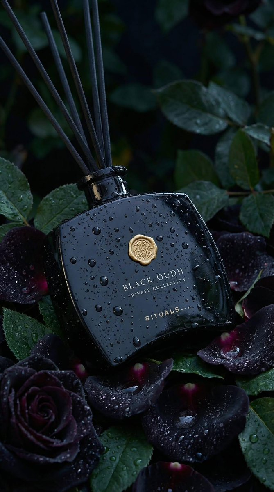

## [BRAND NAME]. Act as a Creative Director for a technical

- ID: trending-2016245336948244946
- Slug: trending-2016245336948244946-en
- 语言: en
- 来源: [来源链接](https://x.com/AmirMushich/status/2016245336948244946)
- 样例图路径: images/part1/2016245336948244946_1.jpg

### 提示词

```text
[BRAND NAME]. 
Act as a Creative Director for a technical outerwear brand and a High-End Product Photographer.

THE TASK:
Autonomously conceptualize and render a "Technical Outerwear Campaign Image" featuring a collaboration between the input brand ([BRAND NAME]) and a relevant performance fashion label.
PHASE 1: PARTNER SELECTION & GEAR DESIGN (THE STRATEGIST)
Analyze [BRAND NAME]: Is it Luxury, Sport, Industrial, or Lifestyle?
Select the Apparel Partner:
Luxury/Lifestyle -> The North Face, Moncler.
Tech/Industrial -> Arc'teryx, Stone Island Shadow Project.
Sport/Speed -> Nike ACG, Salomon.
The Gear: Design a Heavy Technical Outerwear Piece (Parka, Shell Jacket, or Anorak) with a structured HOOD or HIGH COLLAR.
Color: The garment must be the Signature Color of [BRAND NAME].
Material: Stiff, high-performance fabrics (Gore-Tex 3L, Ripstop) with matte finish.
PHYSICAL BRANDING INTEGRATION (CRITICAL):
    You must integrate the [BRAND NAME] logo physically onto the garment in a way that looks expensive and high-tech.
PHASE 2: PHOTOGRAPHY & LIGHTING (THE PROFILE)
Framing: A tight Head-and-Shoulders Side Profile Shot. Model faces Left.
Pose: Chin up, looking forward. Hood frames the face.
Lighting (Chiaroscuro Tech):
Key Light: Hard light hitting the face profile and the [BRAND NAME] LOGO on the jacket, creating sharp contrast.
The Void: Background is Pure Void Black (#000000).
Texture Priority: Maximize detail of fabric weave and the physical logo material.
PHASE 3: UI & SCHEMATIC OVERLAY (BLUEPRINT AESTHETIC)
Overlay a "Technical Blueprint" Interface (thin white lines):
The Grid: Vertical hairline white lines cutting through the image.
Left Sidebar: Vertical tech specs (e.g., "75D 133g/m2", "GORE-TEX 3L").
Center: Title "[PARTNER] x [BRAND NAME]".
Right Side: The Partner Logo (e.g., The North Face logo) in white.
PHASE 4: TECH SPECS
100mm Macro Lens, f/8, High Contrast, Unreal Engine 5 render quality, Commercial Techwear Look.
```

### 样例图

![[BRAND NAME]. Act as a Creative Director for a technical](../images/part1/2016245336948244946_1.jpg)

## [BRAND NAME]. Act as a Senior AI Visual Strategist & Cre

- ID: trending-2029294395384574292
- Slug: trending-2029294395384574292-en
- 语言: en
- 来源: [来源链接](https://x.com/AmirMushich/status/2029294395384574292)
- 样例图路径: images/part1/2029294395384574292_1.jpg

### 提示词

```text
[BRAND NAME]. Act as a Senior AI Visual Strategist & Creative Director.
Goal: Analyze the provided [BRAND NAME] and generate a high-end, three-panel vertical manifesto stack. Every element (color, slogan, technical text) must be a logical derivative of the brand's identity.

PHASE 1: AUTONOMOUS BRAND ANALYSIS (INTERNAL SIMULATION)
- Identify the core industry of "[BRAND NAME]".
- Select a high-contrast primary color for the background (e.g., Electric Blue, Racing Red, or Titanium White).
- Generate a powerful 3-word slogan and a 2-line brand philosophy description.
- Generate a block of 5 technical specifications/keywords relevant to the brand's premium products.

PHASE 2: COMPOSITIONAL STRUCTURE (THE VERTICAL STACK)
Layout consists of three wide horizontal panels stacked vertically:
TOP PANEL (Action & Identity): A dynamic wide-angle shot of a professional model using the brand's product.
   - Typography (Mid-Left): Place [BRAND NAME] logo and the 3-word slogan in bold white uppercase sans-serif.
   - Micro-Typography (Top-Left corner): Place the 2-line brand philosophy in a tiny, minimalist font.
MIDDLE PANEL (The Hero Product & Density): A macro close-up focus on the product's high-fidelity details.
   - Typography (Mid-Right): Place [BRAND NAME] logo and the slogan here to create a diagonal visual flow from the top panel.
   - Technical Density (Bottom-Left corner): Add the 5 technical specifications in sharp, microscopic uppercase font to create a "technical blueprint" aesthetic and fill the negative space.
BOTTOM PANEL (The Power Pose): A low-angle "hero shot" of the model.
   - Mega-Typography: Two massive, high-contrast slogans in white bold sans-serif overlaid across the center of the frame.
   - Corner Accents: A small brand icon in the bottom-right; a secondary micro-text in the bottom-left corner.

PHASE 3: LIGHTING & TEXTURE STANDARDS
- Lighting: Hard, direct "High-Noon" sunlight creating crisp, sharp-edged shadows and brilliant highlights (Chiaroscuro).
- Textures: Extreme fidelity in skin pores, fabric weaves (tech-mesh, leather, carbon fiber), and precision-engineered materials. Zero "AI-plastic" look.

PHASE 4: TECH SPECS
8K Resolution. Render: Octane/Redshift. Global Illumination. Ray Traced reflections. Cinematic photo grain.
```

### 样例图

![[BRAND NAME]. Act as a Senior AI Visual Strategist & Cre](../images/part1/2029294395384574292_1.jpg)

## [product], luxury packaging reveal scene, premium unboxi

- ID: trending-2011439171760767441
- Slug: trending-2011439171760767441-en
- 语言: en
- 来源: [来源链接](https://x.com/azed_ai/status/2011439171760767441)
- 样例图路径: images/part1/2011439171760767441_1.jpg

### 提示词

```text
[product], luxury packaging reveal scene, premium unboxing moment, pristine hands partially visible at the edges, delicate interaction with the packaging, lid slightly lifted to reveal the product inside, crisp folds and precise alignment, tactile materials [ ex: matte paper, soft touch coating, embossed details, foil accents], subtle micro texture and dust free finish, clean white background, soft diffused studio lighting, controlled specular highlights, realistic shadows, macro product photography look, shallow depth of field with sharp focus on the product and branding area, high end editorial commercial style, ultra realistic, 4k, 1:1, no watermark, no extra text
```

### 样例图

![[product], luxury packaging reveal scene, premium unboxi](../images/part1/2011439171760767441_1.jpg)

## [BRAND NAME] Act as a Senior Editorial Art Director and 

- ID: trending-2038678161873838496
- Slug: trending-2038678161873838496-en
- 语言: en
- 来源: [来源链接](https://x.com/AmirMushich/status/2038678161873838496)
- 样例图路径: images/part1/2038678161873838496_1.jpg

### 提示词

```text
[BRAND NAME]

Act as a Senior Editorial Art Director and Campaign Photographer specializing in high-impact brand posters that combine action photography with bold graphic design. Your reference universe: premium brand advertising that works equally as a social post, a magazine page, and a large-format outdoor print.

BRAND INTELLIGENCE SYSTEM

Before executing any phase, run a full autonomous brand analysis of [BRAND NAME] and resolve these parameters: (1) BRAND COLOR — the single most dominant saturated color from [BRAND NAME]'s identity used for the lower graphic zone and borders, (2) SECONDARY COLOR — the color for all typography and logo in the graphic zone — autonomously determine if this should be white, cream, black, or a brand-specific tone that creates maximum contrast against BRAND COLOR, (3) LOGO MARK — [BRAND NAME]'s primary icon or wordmark that will dominate the graphic zone, (4) HERO SUBJECT — the single most iconic product, object, or visual associated with [BRAND NAME] that will be photographed, (5) CAMPAIGN LINE — the brand's most recognized slogan or an autonomously generated line capturing [BRAND NAME]'s core attitude in 3–6 words, (6) PHOTO ENVIRONMENT — the most iconic real-world context for shooting [BRAND NAME]'s hero subject, (7) VERTICAL TEXT CONTENT — two short contextual strings relevant to [BRAND NAME] for the left and right side margins. All parameters must be resolved before phase 1 begins.

PHASE 1: CANVAS & FORMAT

Vertical format, 4:5 ratio. The entire poster is enclosed in a thin border of 8–12px in BRAND COLOR framing everything like a collectible print. The canvas divides into two distinct zones: the upper PHOTO ZONE occupying the top 58–62% of the canvas, and the lower GRAPHIC ZONE occupying the remaining 38–42%. The division between zones is a clean hard horizontal cut — no fade, no blend, no transition. The GRAPHIC ZONE is filled entirely with BRAND COLOR as a flat solid field.

PHASE 2: PHOTO ZONE

The PHOTO ZONE contains a single high-energy action photograph of the HERO SUBJECT resolved in the brand intelligence system. Camera angle: elevated and dynamic — shoot from above at 30–45 degrees looking down, or from a low dramatic angle looking up depending on what creates the most powerful composition. Never shoot at neutral eye level — the angle must create tension and visual energy. The photograph fills the entire PHOTO ZONE edge to edge with no padding. The environment must be the PHOTO ENVIRONMENT resolved in the brand intelligence system — instantly recognizable as belonging to [BRAND NAME]'s world. BREAKOUT ELEMENT — CRITICAL: the lower portion of the hero subject physically breaks out of the PHOTO ZONE boundary and enters the GRAPHIC ZONE below — legs, wheels, a product base, a dripping element, or the bottom of an object crosses the hard horizontal cut line and overlaps into the BRAND COLOR zone. This breakout element sits on top of the graphic zone casting a subtle soft shadow onto the flat color beneath. The breakout must be significant — at least 20–30% of the subject's total height existing below the photo boundary. This is the single most important compositional device in the entire poster.

PHASE 3: GRAPHIC ZONE

The lower zone is a flat solid BRAND COLOR field. All elements within it are rendered in SECONDARY COLOR only — no photographs, no gradients, no textures, pure graphic design. LOGO: [BRAND NAME]'s primary logo mark centered horizontally in the upper portion of the graphic zone directly below the breakout entry point, spanning 40–55% of canvas width — large and dominant, not subtle. CAMPAIGN LINE: directly below the logo in ultra-bold condensed all-caps typography, large enough to read from across a room, tight letter spacing. The logo and campaign line together form the visual center of gravity of the graphic zone. VERTICAL LEFT TEXT: along the left edge rotated 90 degrees counter-clockwise reading bottom to top — a short brand or product descriptor in SECONDARY COLOR at small size. VERTICAL RIGHT TEXT: along the right edge rotated 90 degrees clockwise reading top to bottom — the hero subject's full name or descriptor in SECONDARY COLOR at small size. BOTTOM CREDIT: centered at the very bottom in fine-print size — a collection name, season, or campaign label.

PHASE 4: PHOTOGRAPHY DIRECTION

Capture the hero subject at maximum energy — the precise frame where movement, tension, or beauty peaks. For a person: mid-motion at full commitment to the action. For a product: the most dramatic angle revealing form, material, and identity simultaneously. For food: the moment of pour, cut, steam, or impact. For automotive: speed blur, drift, or heroic three-quarter angle. Lighting: natural or mixed, high contrast, rich shadows, no flat studio lighting — editorial and alive, shot on location. Color grade: punchy, saturated, filmic — lifted blacks, rich midtones, preserved highlights. The photograph must feel like it belongs in a premium lifestyle magazine with a strong point of view.

TECH SPECS

Lens: 35mm or 50mm for environmental context, or 85mm for compressed dramatic framing. Depth of field: subject sharp, background contextual at f/4 to f/8. Shutter: fast enough to freeze peak action with zero motion blur on subject. Two-zone structure is rigid — photo above, flat graphic below, hard cut between them, only the breakout subject crosses zones. Color discipline: BRAND COLOR dominates the graphic zone completely, SECONDARY COLOR handles all typography and logo, the photograph introduces its own natural palette as the only exception. Typography: condensed, bold, authoritative — no decorative fonts. Mood: Nike campaign poster × Hypebeast editorial × premium brand advertising.
```

### 样例图

![[BRAND NAME] Act as a Senior Editorial Art Director and ](../images/part1/2038678161873838496_1.jpg)

## Use the uploaded image as the exact visual reference for

- ID: trending-2026929094164885863
- Slug: trending-2026929094164885863-en
- 语言: en
- 来源: [来源链接](https://x.com/oggii_0/status/2026929094164885863)
- 样例图路径: images/part1/2026929094164885863_1.jpg

### 提示词

```text
Use the uploaded image as the exact visual reference for product design, label, lavender placement, liquid color, milk puddle, and soft purple background .Camera Movement:Full 360° slow-motion orbit around the product.Smooth, steady circular motion.Constant speed .No shake .No sudden acceleration .No zoom in or out.Keep product centered at all times.Framing:Mid close-up product shot.Bottle remains perfectly upright and fixed in position.
```

### 样例图

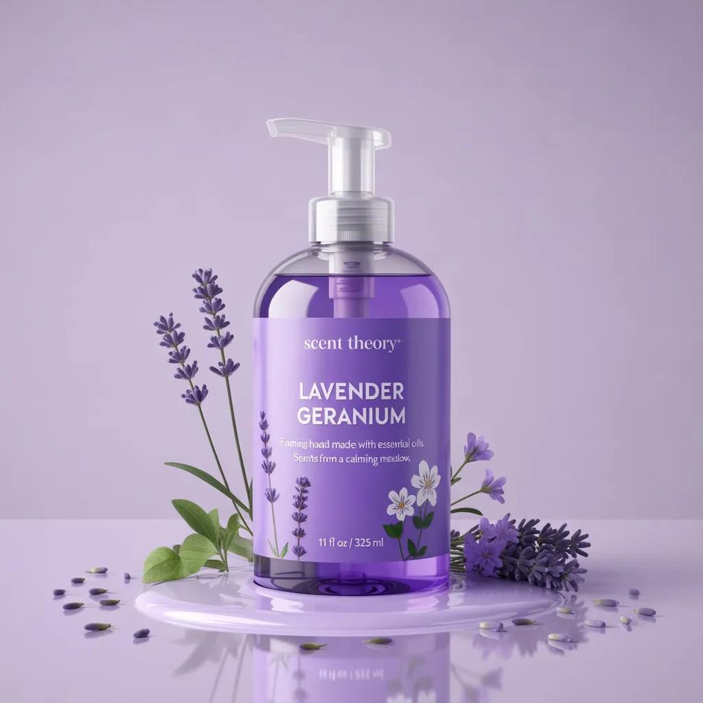

## Luxury fashion advertisement poster, deep green backgrou

- ID: trending-2030906462999122123
- Slug: trending-2030906462999122123-en
- 语言: en
- 来源: [来源链接](https://x.com/auqibhabib/status/2030906462999122123)
- 样例图路径: images/part1/2030906462999122123_1.jpg

### 提示词

```text
Luxury fashion advertisement poster, deep green background with a soft circular gradient behind the model, two stylish female models standing full body. First model wearing a long elegant green dress with waist belt, white sneakers, sunglasses, holding a red handbag, confident pose with one hand on waist looking sideways. Second female model standing beside her in a different pose, slightly angled stance with relaxed arms, wearing a similar elegant fashion outfit matching the luxury theme. Studio lighting, minimal shadows, ultra-clean composition, premium fashion campaign style.

At the top place large bold luxury serif text “BRAND NAME” (same placement and style as luxury fashion brands).

At the bottom add text:
“LUXURY THAT DEFINES YOU”
Below it smaller text:

Add a small side section titled “AVAILABLE COLORS” with three small circular color indicators: Green, Black, Red.

Highly detailed, fashion catalog quality, DSLR photography style, 8k resolution, symmetrical layout, luxury branding aesthetic, professional advertising poster.
```

### 样例图

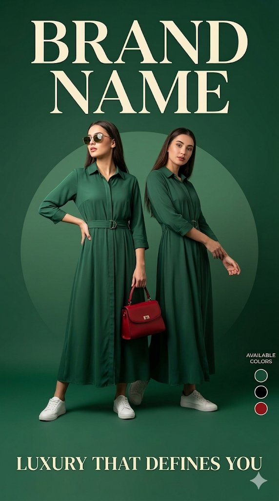

## [产品]，俯视平铺中心位置，周围环绕[成

- ID: trending-2015689672807297132
- Slug: trending-2015689672807297132-zh
- 语言: zh
- 来源: [来源链接](https://x.com/0xluffy_eth/status/2015689672807297132)
- 样例图路径: images/part1/2015689672807297132_1.jpg

### 提示词

```text
[产品]，俯视平铺中心位置，周围环绕[成分]，新鲜切片和整块，光泽湿润外观，水花冻结在产品周围，露珠附着在标签和表面，温暖米色无缝背景，柔和定向日光，清晰逼真阴影，高端护肤品广告，超逼真宏观产品摄影，100mm 镜头效果，f/8 锐焦，干净构图，无额外文字，8k，1:1
```

### 样例图

![[产品]，俯视平铺中心位置，周围环绕[成](../images/part1/2015689672807297132_1.jpg)

## { "campaign_metadata": { "brand_identity": "Quantum Hori

- ID: trending-2017793115147444527
- Slug: trending-2017793115147444527-en
- 语言: en
- 来源: [来源链接](https://x.com/mehvishs25/status/2017793115147444527)
- 样例图路径: images/part1/2017793115147444527_1.jpg

### 提示词

```text
{
  "campaign_metadata": {
    "brand_identity": "Quantum Horizon Tech",
    "product_focus": "Titanium Luxury Smartwatch",
    "aspect_ratio": "3:4",
    "aesthetic": "Cyber-Luxury | Technical Minimalism"
  },
  "visual_dna": {
    "materials": ["Brushed Aerospace Titanium", "Sapphire Crystal", "Fluorocarbon Strap"],
    "color_scheme": ["Space Grey", "Electric Cyan", "Matte Black"],
    "lighting": "Top-down Rim Lighting | Neon Accents | Cold Studio Tones"
  },
  "grid_layout_execution": {
    "row_1_precision": {
      "cell_1_1": "Hero: Watch floating vertically, illuminated by a single beam of light.",
      "cell_1_2": "Macro: The digital crown's knurled texture and the red action button detail.",
      "cell_1_3": "Dynamic: Liquid metal ripples splashing against the titanium casing."
    },
    "row_2_lifestyle": {
      "cell_2_1": "Minimal: Watch resting on a raw piece of jagged obsidian rock.",
      "cell_2_2": "Innovation: Holographic UI elements projecting from the watch face into the air.",
      "cell_2_3": "Sensory: Close-up of the strap clicking into the magnetic lug with precision."
    },
    "row_3_surreal": {
      "cell_3_1": "Color: A gradient of deep blues and purples with light-trail long exposure.",
      "cell_3_2": "Abstraction: Deconstructed internal gears and chips floating like a nebula.",
      "cell_3_3": "Fusion: The watch submerged in a digital 'data' ocean with glowing currents."
    }
  }
}
```

### 样例图

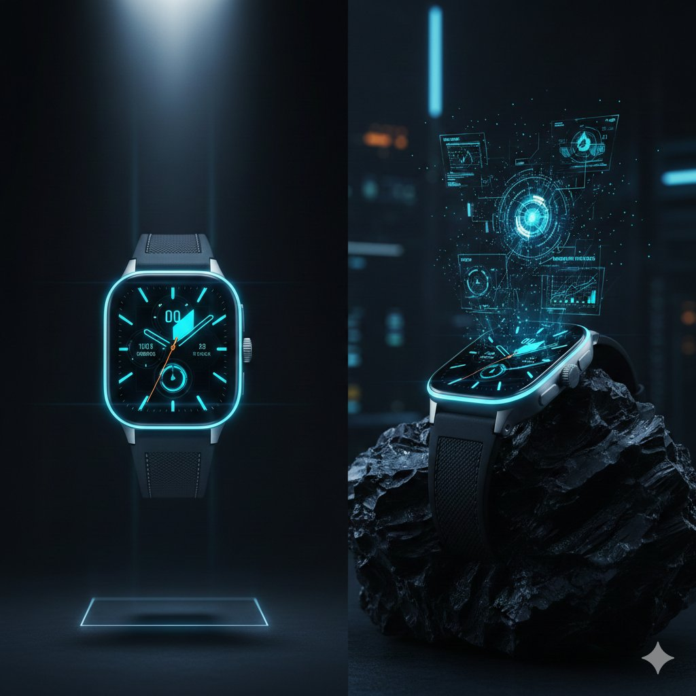

## { "objective": "Create a detailed product showcase image

- ID: trending-2018964408417018277
- Slug: trending-2018964408417018277-en
- 语言: en
- 来源: [来源链接](https://x.com/Strength04_X/status/2018964408417018277)
- 样例图路径: images/part1/2018964408417018277_1.jpg

### 提示词

```text
{
  "objective": "Create a detailed product showcase image of a table design with multiple perspectives and material information",
  "image_specifications": {
    "style": "Realistic 3D render or high-quality product illustration",
    "layout": "Split view",
    "aspect_ratio": "3:2 or 4:3",
    "background": "Neutral (light gray or white) to enhance clarity and contrast"
  },
  "left_side": {
    "section_title": "Table Perspectives",
    "views": [
      {
        "view": "Top-down",
        "description": "Display the full table from above, showing tabletop shape, surface texture, and edge details"
      },
      {
        "view": "Side view",
        "description": "Profile of the table to show leg design, table height, and tabletop thickness"
      },
      {
        "view": "Front view",
        "description": "Straight-on view to show width, symmetry, and leg alignment"
      }
    ],
    "visual_style": "Consistent lighting and shadows for realism, subtle shadows to define form"
  },
  "right_side": {
    "section_title": "Material Breakdown",
    "content": [
      {
        "material": "Tabletop Surface",
        "material_type": "Solid wood / engineered wood",
        "swatch_image": "Close-up wood texture sample",
        "label_style": "Clean sans-serif text with arrows pointing to table sections"
      },
      {
        "material": "Legs",
        "material_type": "Polished oak wood or metal",
        "swatch_image": "Close-up material texture sample",
        "label_style": "Consistent labeling with visual connection to perspective images"
      },
      {
        "material": "Frame",
        "material_type": "Matte black steel",
        "swatch_image": "Small metallic texture sample",
        "label_style": "Minimalist annotations"
      }
    ]
  },
  "visual_elements": {
    "separation": "Vertical dividing line or subtle split background",
    "color_palette": "Natural tones for materials, grayscale for background and lines",
    "typography": "Modern, readable font for labels and section titles"
  },
  "output_format": {
    "type": "Image",
    "high_resolution": true,
    "use_case": ["Product sheet", "Interior design catalog", "Furniture showcase"]
  }
}
```

### 样例图

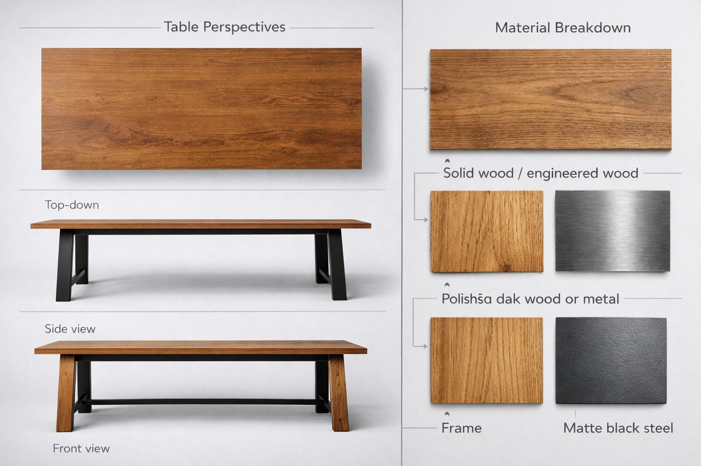

## Playful designer packaging for [product name], creative 

- ID: trending-2027806040109289487
- Slug: trending-2027806040109289487-en
- 语言: en
- 来源: [来源链接](https://x.com/azed_ai/status/2027806040109289487)
- 样例图路径: images/part1/2027806040109289487_1.jpg

### 提示词

```text
Playful designer packaging for [product name], creative box shaped like the product, integrated cartoon face on the front panel, oversized die-cut window revealing the real contents as part of the character’s expression, smooth matte cardboard material, bold flat graphic design, modern minimalist branding, limited pastel color palette, rounded friendly shapes, clean typography, high-end 3D packaging mockup render, soft studio lighting, pure white background, subtle realistic contact shadow beneath, ultra-detailed, retail-ready presentation, 1:1 aspect ratio.
```

### 样例图

![Playful designer packaging for [product name], creative ](../images/part1/2027806040109289487_1.jpg)

## CORE OBJECTIVE: Create a professional 8k studio editoria

- ID: trending-2033941378279883011
- Slug: trending-2033941378279883011-en
- 语言: en
- 来源: [来源链接](https://x.com/firatbilal/status/2033941378279883011)
- 样例图路径: images/part1/2033941378279883011_1.jpg

### 提示词

```text
CORE OBJECTIVE: Create a professional 8k studio editorial based on [ATTACHED_INPUT_IMAGE]. Analyze subject geometry, material, and branding to maintain logic across 7 seamless panels.

STEP 1: DYNAMIC ANALYSIS
Identify: Subject, logo (or name), and material.

Material Logic: Tech (sharp rim lights), Glass (refraction/caustics), Organic (soft light), Fashion (matte/satin sheen).

COMPOSITION & STRUCTURE
Single seamless image. Top: 1 Hero Panel. Bottom: 2x3 Grid (6 panels). Total 7 views. No text or borders (except Frame 2).

PANEL SPECIFICATIONS
MAIN HERO: Centered master portrait on infinite-curve background. Lighting highlights primary material.

F1 (Macro): Extreme close-up on material "DNA" (microscopic grain, textures, or circuitry).

F2 (Logo): 3D premium brand emblem centered on a minimalist studio backdrop.

F3 (Scale): Subject in size-appropriate context (gallery for large, pedestal for small).

F4 (Rhythm): High-angle "knolling" or grid repetition of components.

F5 (Motion): Weightless action-still with environmental cues (vapor, sparks, or splashes).

F6 (Form): High-contrast rim-lit profile focusing purely on the iconic silhouette.

VISUAL ENFORCEMENT
Style: Ultra-high-end Studio Editorial.

Consistency: 100% identical color and design details across all views.

Technical: 8k, ray-traced reflections, professional grading, global illumination.
```

### 样例图

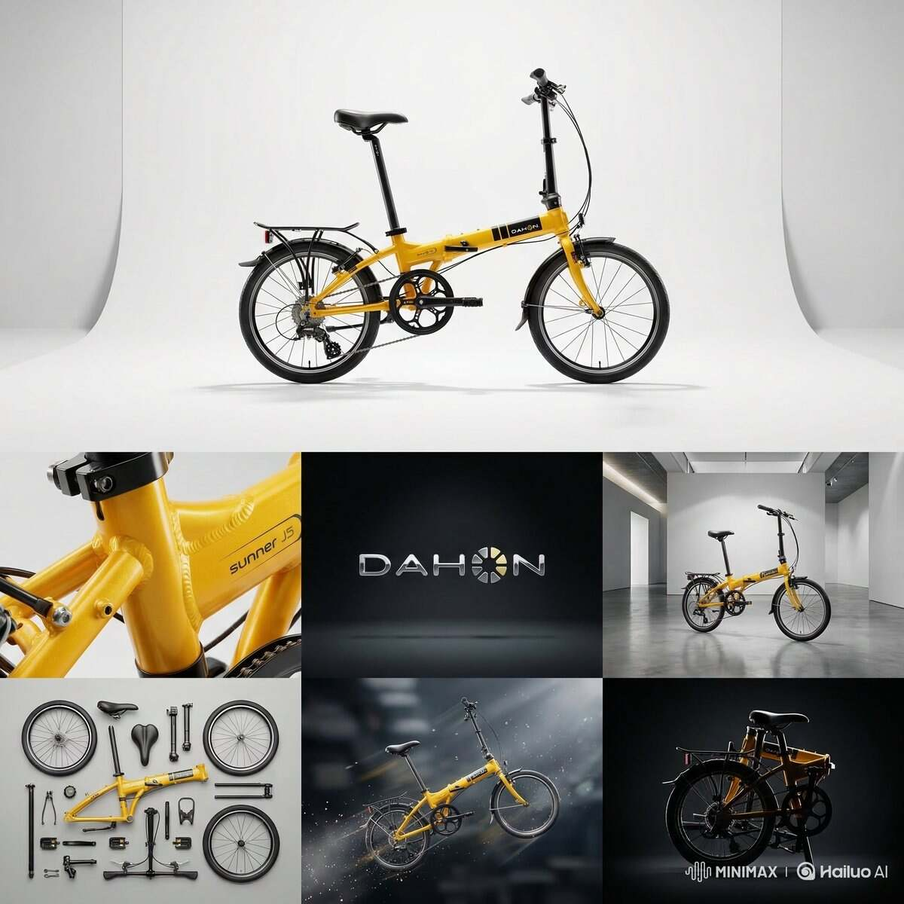

## Minimalist studio product photography of an amber glass 

- ID: trending-2026270010814136482
- Slug: trending-2026270010814136482-en
- 语言: en
- 来源: [来源链接](https://x.com/Kashberg_0/status/2026270010814136482)
- 样例图路径: images/part1/2026270010814136482_1.jpg

### 提示词

```text
Minimalist studio product photography of an amber glass dropper serum bottle with white cap, labeled “ma:nyo Galac Whitening Vita Serum”, placed between large textured white stones, soft beige background, warm sunlight casting natural shadows, subtle golden glow reflecting through the glass, small delicate dried flowers beside the bottle, glossy reflective surface, high-end skincare advertisement, ultra-realistic, 85mm lens, shallow depth of field, soft diffused lighting, clean aesthetic, 8k resolution.
```

### 样例图

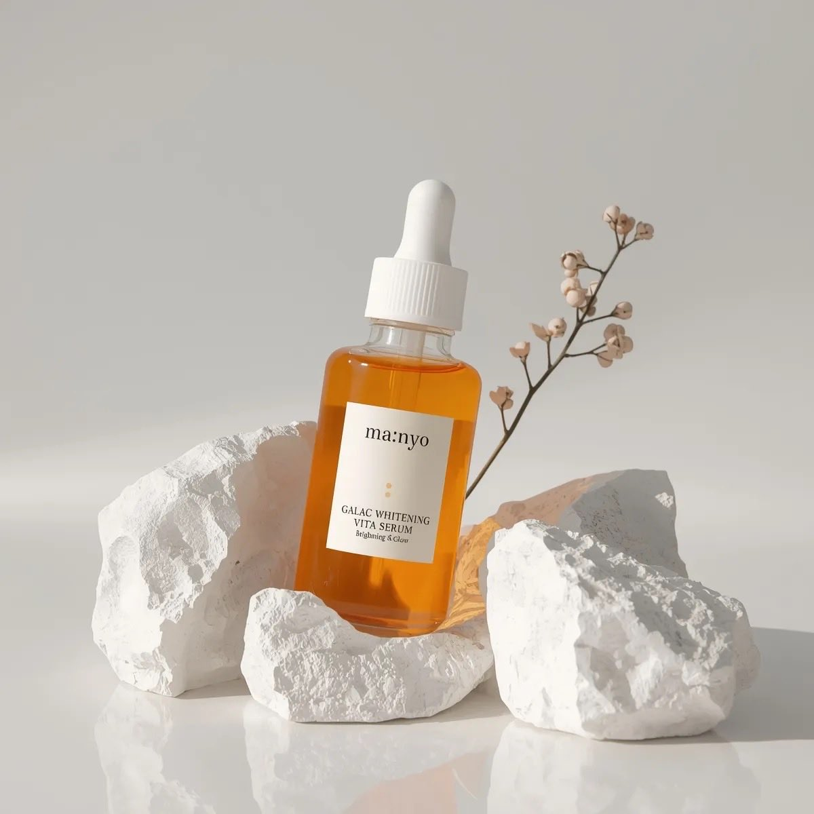

## A high-fashion, cinematic brand concept poster for "The 

- ID: trending-2041451587403399395
- Slug: trending-2041451587403399395-en
- 语言: en
- 来源: [来源链接](https://x.com/rovvmut_/status/2041451587403399395)
- 样例图路径: images/part1/2041451587403399395_1.jpg

### 提示词

```text
A high-fashion, cinematic brand concept poster for "The North Face." The scene features a woman in the uploaded image, standing in a stylized studio. They are dressed in edgy, oversized urban streetwear: a dark olive-green quilted puffer bomber jacket, layered black and tan distressed techwear shorts below knees, and black sneakers with white soles. The person holds a classic orange basketball at their hip. In the background, a massive, bold red "THE NORTH FACE" logo and its iconic half-dome symbol are stacked and centered, dominating the upper half of the frame. To the right of the subject, there's a small white stylized graffiti-style signature. The lighting is moody and dramatic, featuring a teal-tinted atmosphere with a warm rim light hitting the subject’s right side. The floor is a dark, smooth studio surface with a soft shadow cast forward. The overall aesthetic is gritty, futuristic, and high-contrast, with a heavy film grain texture.
```

### 样例图

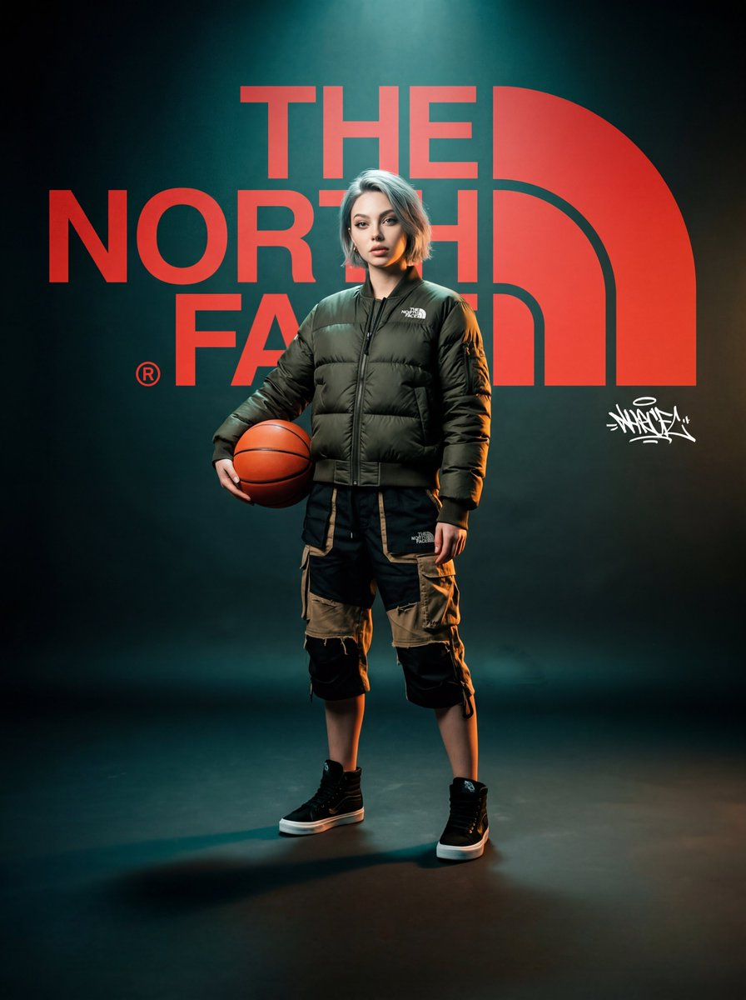

## [BRAND NAME]: A high-end, glossy concept art magazine ed

- ID: trending-2017312815728488851
- Slug: trending-2017312815728488851-en
- 语言: en
- 来源: [来源链接](https://x.com/AmirMushich/status/2017312815728488851)
- 样例图路径: images/part1/2017312815728488851_1.jpg

### 提示词

```text
[BRAND NAME]: 
A high-end, glossy concept art magazine editorial photograph of a unique, unexpected functional object conceptualized and designed by the brand.

**1. The Concept & Object (AI Invention):**
Based on the design philosophy, heritage, and material vocabulary of the specified brand, the AI must invent a novel utility product (NOT standard clothing, shoes, or bags). Examples could be home goods, tech accessories, tools, or sporting equipment, reinterpretated through the brand's lens. The object should feel sculptural yet functional.

**2. Materials & Details (Hyper-Premium):**
The object is constructed from ultra-premium, highly tactile materials characteristic of the brand (e.g., patinated exotic leathers, brushed aerospace-grade titanium, sculpted matte ceramics, molded carbon fiber, or technical high-fashion textiles). Every detail is hyper-realistic: visible stitching, microscopic material grain, precision engravings, and complex texture contrasts.

**3. Photography & Lighting (Cinematic Studio):**
Shot on a medium format Phase One camera with a 100mm macro lens. Extremely shallow depth of field, with sharp focus on the hero details of the object and a creamy, smooth bokeh background. The lighting is sophisticated studio softbox lighting: gentle, enveloping fill light with precise rim lighting to accentuate contours and material textures.

**4. Environment:**
A seamless, impeccably clean studio cyclorama background in a pure, ultra-light pastel tone (e.g., desaturated mint, pale blush, or off-white), free of shadows.

**5. Layout & UI Elements (Strict Placement):**
- **Bottom Right Corner:** A small, understated, monochrome gray logo of the brand.
- **Bottom Left Corner:** Small, minimalist monochrome gray text describing the invented product. The font style looks like Manrope Regular with very tight tracking (kerning) and balanced line spacing. Example format: "CONCEPT STUDY: [AI inserts invented product name]. MATERIAL: [AI inserts main materials]. SS25.
```

### 样例图

![[BRAND NAME]: A high-end, glossy concept art magazine ed](../images/part1/2017312815728488851_1.jpg)

## Create an infographic image of Nike Air Jordan 1 High OG

- ID: trending-2017678718882476378
- Slug: trending-2017678718882476378-en
- 语言: en
- 来源: [来源链接](https://x.com/kaanakz/status/2017678718882476378)
- 样例图路径: images/part1/2017678718882476378_1.jpg

### 提示词

```text
Create an infographic image of Nike Air Jordan 1 High OG sneaker, combining a realistic photograph or photoreal render of the object with technical annotation overlays placed directly on top. Use black ink–style line drawings and text (technical pen / engineering diagram aesthetic) for all annotations. Include precise arrows pointing to specific parts, detailed labels naming each component (toe box, swoosh logo, wings logo, collar, tongue, lace holes, midsole, outsole, heel counter, perforations, stitching patterns), materials used (premium leather, rubber outsole, foam cushioning), and historical notes (designed by Peter Moore, 1985, banned by NBA). Show both side profile and slight 3/4 angle. Background should be clean white or very light neutral. Overall style: a hybrid of product photography and vintage technical manual illustration. High resolution, ultra-detailed, 4K quality.
```

### 样例图

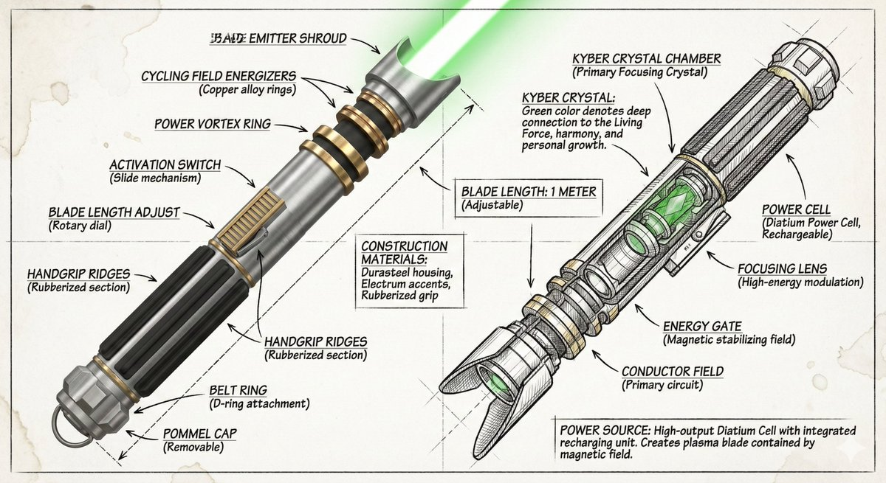

## macro photograph, minimalist advertising style, a hyper-

- ID: trending-2023170582796542373
- Slug: trending-2023170582796542373-en
- 语言: en
- 来源: [来源链接](https://x.com/icreatelife/status/2023170582796542373)
- 样例图路径: images/part1/2023170582796542373_1.jpg

### 提示词

```text
macro photograph, minimalist advertising style, a hyper-realistic miniature [PRODUCT] crafted from [MATERIAL], delicately poised between a person's thumb and forefinger against a seamless, matte [BG_COLOR] cyclorama under professional Top-Down_Spotlight that casts subtle, soft shadows, with the impeccably groomed hand accentuating the object's intricate contours while the composition remains perfectly centered with a shallow depth of field to highlight its exquisite craftsmanship
```

### 样例图

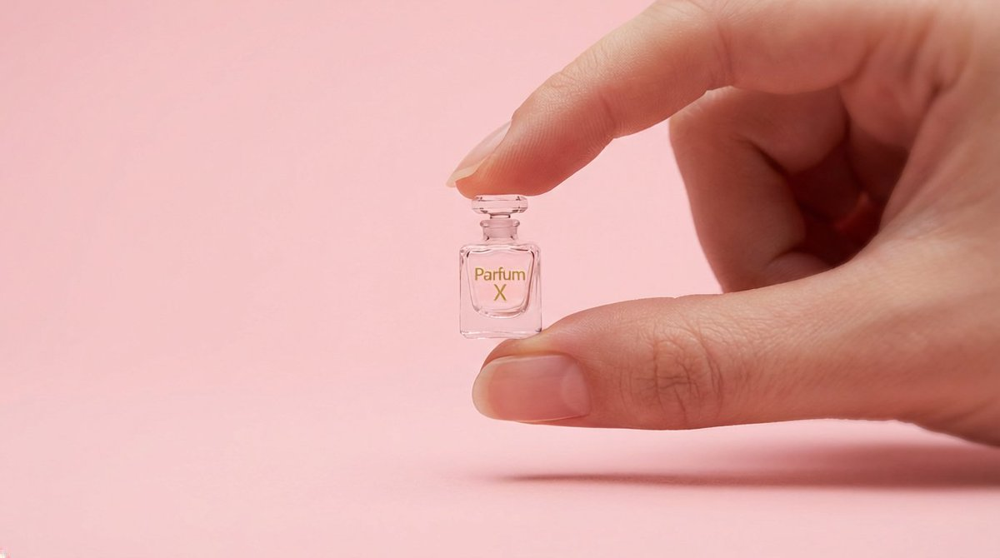

## { "resolution": "8K", "aspect_ratio": "3:4", "style": "h

- ID: trending-2019001264416362931
- Slug: trending-2019001264416362931-en
- 语言: en
- 来源: [来源链接](https://x.com/meng_dagg695/status/2019001264416362931)
- 样例图路径: images/part1/2019001264416362931_1.jpg

### 提示词

```text
{
  "resolution": "8K",
  "aspect_ratio": "3:4",
  "style": "high-end AI-edited studio photography",
  "subject": {
    "primary": "human hand holding a metallic pink perfume bottle",
    "hand_details": {
      "skin": "smooth, well-groomed",
      "nails": "short to medium length, natural nude tone",
      "accessory": "white pearl bracelet on wrist"
    },
    "bottle": {
      "material": "metallic reflective",
      "color": "deep metallic pink",
      "shape": "cylindrical with rounded shoulders",
      "nozzle": "gold spray nozzle, cap removed",
      "charm": {
        "material": "gold",
        "shape": "small geometric star-like tag",
        "attachment": "hanging from bottle neck via thin metal loop"
      },
      "visible_text": "MONTALE"
    }
  },
  "action": {
    "spray": {
      "type": "fine atomized mist",
      "direction": "left to right",
      "texture": "soft, smoke-like, semi-transparent"
    }
  },
  "elements_emerging_from_mist": {
    "flowers": {
      "pink_roses": "fully bloomed roses floating in air",
      "rose_petals": "individual pink petals suspended mid-air",
      "white_flowers": "small star-shaped white blossoms with thin petals"
    },
    "butterfly": {
      "color": "pink",
      "wings": "semi-translucent with visible veins",
      "position": "right side of frame"
    },
    "particles": {
      "type": "small glowing bokeh-like specks",
      "colors": ["soft pink", "warm gold"]
    }
  },
  "background": {
    "color": "dark black to deep brown gradient",
    "environment": "studio, no visible location"
  },
  "lighting": {
    "type": "soft cinematic studio lighting",
    "highlights": ["bottle curves", "gold nozzle", "mist", "flowers"],
    "contrast": "high subject-to-background contrast"
  },
  "composition": {
    "orientation": "vertical",
    "subject_position": "slightly left of center",
    "depth": "foreground hand, mid-air mist and flowers, dark background"
  },
  "quality": {
    "sharpness": "ultra-sharp",
    "detail_level": "extreme micro-detail",
    "finish": "luxury advertising grade"
  }
}
```

### 样例图

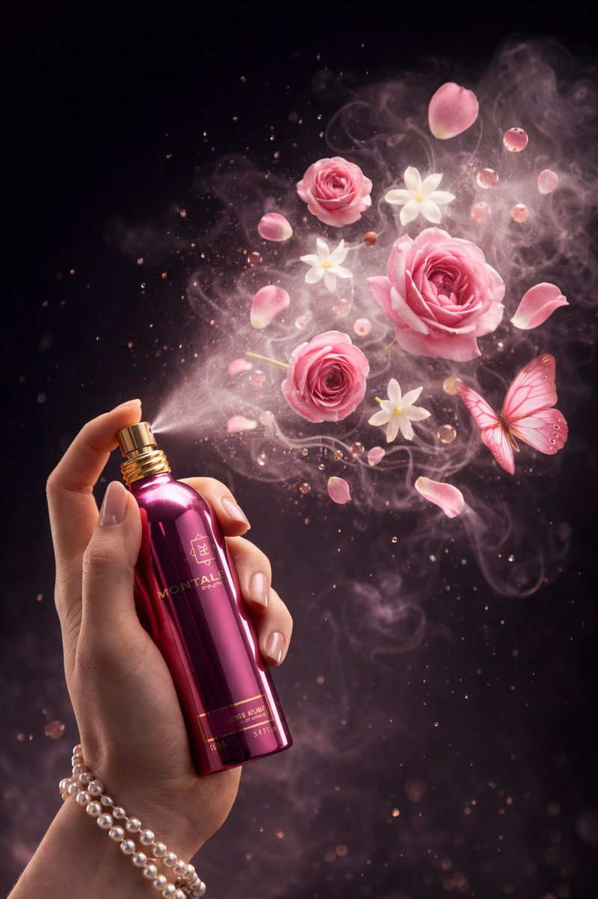

## Minimalist product photography of a matte red pump bottl

- ID: trending-2041012030216536237
- Slug: trending-2041012030216536237-en
- 语言: en
- 来源: [来源链接](https://x.com/Kashberg_0/status/2041012030216536237)
- 样例图路径: images/part1/2041012030216536237_1.jpg

### 提示词

```text
Minimalist product photography of a matte red pump bottle labeled ‘ROAM lubricant’, held by multiple diverse hands with different skin tones, arranged elegantly around the bottle. Soft studio lighting, warm monochromatic terracotta background, smooth shadows, luxury skincare aesthetic, high-end commercial style, sharp focus, centered composition, clean and modern branding, glossy finish on bottle, subtle reflections, editorial beauty shot, 4k resolution.
```

### 样例图


## [BRAND NAME]. Act as a Senior Editorial Designer and Typ

- ID: trending-2028068337427603741
- Slug: trending-2028068337427603741-en
- 语言: en
- 来源: [来源链接](https://x.com/AmirMushich/status/2028068337427603741)
- 样例图路径: images/part1/2028068337427603741_1.jpg

### 提示词

```text
[BRAND NAME]. Act as a Senior Editorial Designer and Typographer.

PHASE 1: TYPOGRAPHIC MASK (THE "WINDOW" EFFECT).

- Core Element: Use the most iconic slogan or the name of [BRAND NAME] as a massive, ultra-bold, heavy sans-serif typographic mask.

- Layout: The letters must be giant, filling the entire vertical frame from edge to edge with tight kerning.

- Concept: The text acts as a "cut-out" window. The background is solid white, and the photographic subject is visible ONLY through the letterforms.

PHASE 2: DYNAMIC SUBJECT LOGIC.

- Subject Selection:

- Detail: Ensure a high-contrast element (like a red shoe or a glowing headlight) is visible through one of the letters as a focal point.

PHASE 3: SOPHISTICATED MUTED PALETTE.

- Atmosphere: Use a "Refined Muted" color scheme.

- Tones: Soft slate blues, charcoal greys, and creamy off-whites for the photography inside the mask.

- Accent: Identify one sharp, saturated accent color belonging to [BRAND NAME] and apply it to a single key object visible through the text.

PHASE 4: PHOTOGRAPHY & LIGHTING.

- Lighting: Soft-box studio lighting. Diffused shadows and gentle highlights to create a cinematic, high-end editorial feel.

- Finish: Clean, matte texture with zero visual noise. High-definition photographic quality.

PHASE 5: MINIMALIST BRANDING.

- Accents: Add a tiny minimalist logo and a small vertical tagline in a clean, microscopic sans-serif font near the corners.

- Year: Include the year "2026" in a subtle, elegant font to mimic a limited-edition look.
```

### 样例图

![[BRAND NAME]. Act as a Senior Editorial Designer and Typ](../images/part1/2028068337427603741_1.jpg)

## 2×2 grid luxury perfume advertisement for Chanel perfume

- ID: trending-2016146144590541290
- Slug: trending-2016146144590541290-en
- 语言: en
- 来源: [来源链接](https://x.com/craftian_keskin/status/2016146144590541290)
- 样例图路径: images/part1/2016146144590541290_1.jpg

### 提示词

```text
2×2 grid luxury perfume advertisement for Chanel perfume, four distinct yet cohesive high-end commercial images, elegant Parisian aesthetic, timeless fashion branding.

Panel 1 – Hero Product Elegance

Minimalist studio shot of a Chanel perfume bottle centered on a reflective surface. Soft, diffused lighting highlights the glass clarity, sharp edges, and iconic label. Neutral background in beige, ivory, or soft black. Luxurious, calm, iconic composition.

Panel 2 – Parisian Lifestyle Mood

Elegant adult woman in a classic Parisian interior vintage molding. She gently applies Chanel perfume to her neck or wrist. Natural light, effortless beauty, refined posture. Editorial fashion photography style, understated luxury.

Panel 3 – Sensory Detail Close-Up

Macro close-up of the Chanel perfume bottle with fine mist dispersing into the air. Light catches the spray particles. Soft shadows, shallow depth of field. Emphasis on texture, fragrance atmosphere, and sensory refinement.

Panel 4 – Cinematic Night Glamour

Moody, cinematic scene with the Chanel perfume bottle placed on a dark surface beside silk fabric or pearls. Low-key lighting, warm highlights, deep shadows. Evokes mystery, confidence, and timeless femininity.

All four images are visually unified through refined color grading, restrained contrast, and classic Chanel luxury cues.

Visual Style

Luxury fashion advertising
Editorial, timeless, refined
Soft contrast
Muted neutral palette
High realism
Clean composition
Parisian elegance

Camera & Lighting

Professional studio and editorial photography
50–85mm lens look
Shallow depth of field
Soft diffused lighting
Controlled highlights and shadows
Perfect label clarity

Mood Keywords

Elegant
Iconic
Sophisticated
Timeless
Feminine
Confident
Luxury

Negative Prompt

Cheap packaging, distorted logo, misspelled branding, harsh lighting, oversaturation, cluttered background, CGI look, cartoon style, watermark, text overlays, knockoff perfume bottles

Aspect Ratio

Overall canvas: 1:1
Grid: 2×2 equal squares
Optimized for luxury brand advertising and social campaigns
```

### 样例图

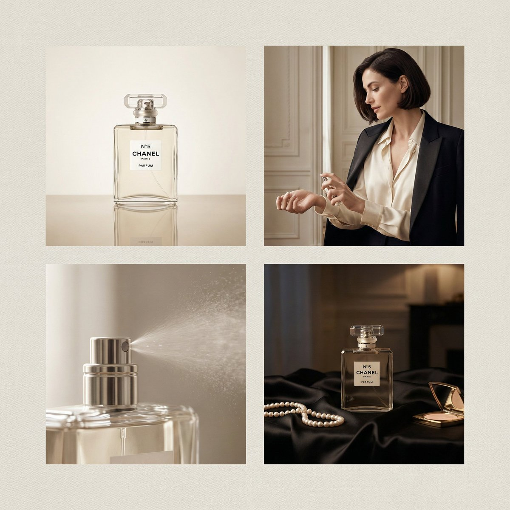

## { "image_generation_request": { "subject": "[PRODUCT]", 

- ID: trending-2021984673216209395
- Slug: trending-2021984673216209395-en
- 语言: en
- 来源: [来源链接](https://x.com/lloydcreates/status/2021984673216209395)
- 样例图路径: images/part1/2021984673216209395_1.jpg

### 提示词

```text
{
  "image_generation_request": {
    "subject": "[PRODUCT]",
    "product_finish": {
      "primary": "matte black with subtle light absorption",
      "secondary": "polished metallic silver with mirror-like reflections",
      "treatment": "duotone — matte black body with metallic silver accents, trim, edges, or panel insets"
    },
    "composition": {
      "placement": "dead center, full view, floating suspended within the folded surface environment",
      "scale": "product occupies roughly 30-40% of the frame",
      "constraints": [
        "product must be entirely visible with no cropping",
        "no pedestals, stands, platforms, or ground planes",
        "the surface folds frame the product but never obscure more than 10% of it",
        "product is the sharpest element in the scene"
      ]
    },
    "background_environment": {
      "description": "A single continuous undulating surface that fills the entire frame, folding over and around itself in large voluminous waves — like a massive sheet of pleated metallic silk or a single machined metal panel that has been softly twisted and draped. This is NOT multiple separate ribbons or strands. It is ONE connected surface.",
      "base_color": "[INSERT DEEP BACKGROUND COLOR visible in crevices — e.g. pure black, midnight navy]",
      "surface_color_1": "[INSERT GRADIENT COLOR A — e.g. soft lavender, warm copper, pearl rose]",
      "surface_color_2": "[INSERT GRADIENT COLOR B — e.g. deep indigo, cobalt blue, violet]",
      "color_behavior": "The two colors blend in a smooth continuous gradient across the single surface, shifting based on the surface's curvature and light angle. Where the surface faces the light it shows color_1, where it curves away it transitions to color_2. The transition is seamless with no hard edges or stripes.",
      "surface_texture": {
        "type": "fine parallel ribs embossed into the surface — like the grooves on a vinyl record or finely pleated accordion fabric",
        "rib_description": "extremely fine, uniform, tightly spaced parallel lines that follow the flow direction of the surface. The ribs are a TEXTURE on the surface, not separate objects. They create a subtle corrugated micro-relief that catches light along each tiny ridge.",
        "rib_density": "very high — approximately 50-100 visible lines per inch of surface, creating a dense linear grain",
        "rib_depth": "shallow — the ribs are subtle surface detail, not deep cuts. They create gentle highlight-shadow alternation across the surface"
      },
      "surface_form": {
        "fold_style": "large, smooth, voluminous folds like draped heavy silk — broad sweeping curves with gentle twists",
        "fold_count": "3-5 major folds visible, each one wide and generous, NOT many small tangled ribbons",
        "fold_behavior": "folds overlap softly, tucking under and over each other with smooth transitions. Where folds meet they create deep soft shadow crevices",
        "tension": "the surface appears smooth and taut across each fold, with no wrinkles or crumpling — like stretched satin over a curved form",
        "edges": "no visible edges — the surface appears to extend beyond the frame in all directions, as if we are seeing a close-up section of an infinite draped form"
      },
      "material": {
        "finish": "satin metallic — a soft brushed-metal luminosity between matte and mirror. The surface has a pearlescent quality where colors shift with viewing angle",
        "light_interaction": "soft specular highlights along the crest of each rib, gentle shadows in each rib valley, creating an overall shimmering linear texture across the broad folds"
      }
    },
    "lighting": {
      "type": "soft, diffused, directional — as if a large softbox is illuminating from upper-left, creating a warm-to-cool gradient across the scene",
      "shadow_behavior": "deep soft shadows in fold crevices, gradual falloff — no harsh edges",
      "highlight_behavior": "broad soft highlights across fold peaks, with fine linear shimmer from the rib texture",
      "restrictions": "no visible light sources, no lens flare, no reflections of studio equipment"
    },
    "style": {
      "aesthetic": "parametric design art, computational sculpture, abstract luxury",
      "mood": "luxurious, smooth, tactile, premium product showcase",
      "critical_note": "The background must look like a SINGLE continuous folded metallic surface with fine ribbed texture — NOT like multiple separate ribbons, cables, wires, or strands bundled together. Think of one sheet of finely pleated metal that has been elegantly draped and folded."
    },
    "technical_specs": {
      "quality": "8k resolution, extreme surface texture detail, tack-sharp product focus",
      "render_style": "photorealistic 3D render, Octane or Redshift quality",
      "aspect_ratio": "1:1 square",
      "exclusions": "text, watermarks, logos on background, extra props, lens flare, studio equipment, flat surfaces, any ground plane, separate ribbons, wire bundles, rope-like forms"
    }
  }
}
```

### 样例图

![{ "image_generation_request": { "subject": "[PRODUCT]", ](../images/part1/2021984673216209395_1.jpg)

## A high-resolution advertising photograph of a realistic,

- ID: trending-2038616252785303612
- Slug: trending-2038616252785303612-en
- 语言: en
- 来源: [来源链接](https://x.com/azed_ai/status/2038616252785303612)
- 样例图路径: images/part1/2038616252785303612_1.jpg

### 提示词

```text
A high-resolution advertising photograph of a realistic, miniature product in the attached image, held delicately between a person's thumb and index finger: clean and white background, studio lighting, soft shadows. The hand is well-groomed, with a natural skin tone, and positioned to highlight the product’s shape and details. The product appears extremely small but hyper-detailed and brand-accurate, centered in the frame with a shallow depth of field. Emulates luxury product photography and minimalist commercial style
```

### 样例图

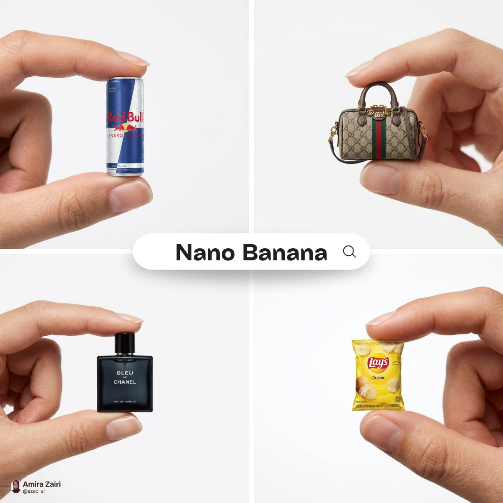

## Multi-image product collage poster featuring beige/tan C

- ID: trending-2015437854206529710
- Slug: trending-2015437854206529710-en
- 语言: en
- 来源: [来源链接](https://x.com/craftian_keskin/status/2015437854206529710)
- 样例图路径: images/part1/2015437854206529710_1.jpg

### 提示词

```text
Multi-image product collage poster featuring beige/tan Crocs clog shoes, designed as a modern footwear advertisement.

The layout combines multiple product angles arranged in a structured grid:

Side profile view showing the clog silhouette and ventilation holes

Rear view highlighting the heel strap and branding

Top-down view showing the cushioned footbed texture

Close-up detail of the sole tread and side logo

A hero product image in the foreground with one shoe stacked against another, creating depth

Clean studio background with a warm brown-to-black gradient, giving a cozy, lifestyle-oriented tone.
The Crocs appear matte, lightweight, and comfortable, with realistic foam texture and soft shadows.

Large bold headline typography at the bottom reads:
“CROCS”
Subheading: “MORE THAN JUST SHOES”

Small blocks of descriptive lifestyle copy appear subtly in the background, reinforcing comfort, durability, and versatility. Overall composition feels like a social media brand post or poster ad.

Visual Style

Modern product advertising
Lifestyle + catalog hybrid
Warm earthy color palette
Soft studio lighting
Photorealistic textures
Clean composition
Professional footwear photography

Camera & Composition

Multiple angles combined into one layout
85mm–100mm product photography look
Sharp focus on shoes
Soft shadows beneath products
Balanced exposure
No distortion

Mood & Branding

Comfort
Everyday lifestyle
Durable
Casual confidence
Practical yet stylish
Approachable brand feel

Negative Prompt

Low resolution, incorrect shoe shape, warped branding, misspelled logo, glossy plastic look, harsh reflections, cluttered layout, inconsistent lighting, cartoon style, CGI look, watermark, text artifacts
```

### 样例图

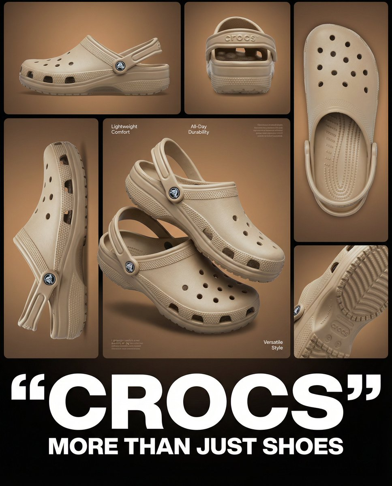

## product design, [object or vehicle with material accents

- ID: trending-2028442638781984986
- Slug: trending-2028442638781984986-en
- 语言: en
- 来源: [来源链接](https://x.com/Strength04_X/status/2028442638781984986)
- 样例图路径: images/part1/2028442638781984986_1.jpg

### 提示词

```text
product design, [object or vehicle with material accents], exploded view diagram, white background, three-dimensional, highly detailed internal components, studio lighting, product photography, best quality
```

### 样例图

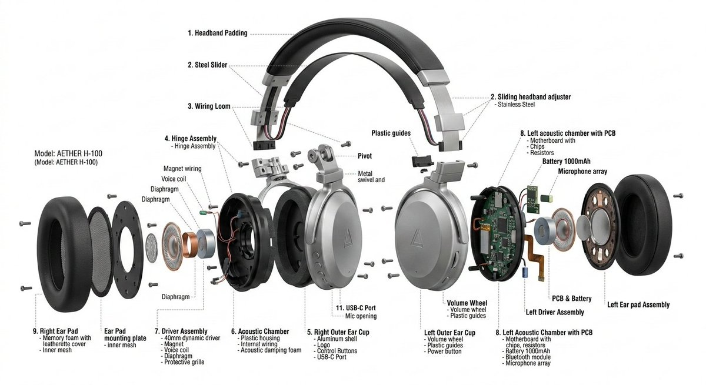

## [BRAND NAME] | [COLOR] Act as a 3D Motion Graphics Direc

- ID: trending-2044483455094845909
- Slug: trending-2044483455094845909-en
- 语言: en
- 来源: [来源链接](https://x.com/AmirMushich/status/2044483455094845909)
- 样例图路径: images/part1/2044483455094845909_1.jpg

### 提示词

```text
[BRAND NAME] | [COLOR]

Act as a 3D Motion Graphics Director and CGI Type Artist specializing in Japanese streetwear, Y2K motorsport aesthetics, and retro-tech hardware design. References: Kawasaki Racing livery, Yasuhiro Nightow title cards, Wipeout game UI, Peak Design × Japanese hardware collab.

PHASE 0: BRAND LOGO INTELLIGENCE

Retrieve the canonical logotype of [BRAND NAME] from training data. Identify its core typographic DNA — stroke weight, angle of italic lean, terminal style, any custom glyph cuts. If [BRAND NAME] uses a geometric or sans-serif wordmark — apply a 15 to 20° italic transformation while preserving all letterform proportions. If [BRAND NAME] already uses italic or script — preserve its native angle exactly. The goal is to translate the brand's typographic identity into a Japanese motorsport script register — aerodynamic, forward-leaning, built for speed. The letters must remain recognizable as [BRAND NAME]'s typeface, not replaced with a generic racing font.

PHASE 1: PRIMARY TYPOGRAPHY SCULPTURE

The wordmark of [BRAND NAME] is a fully 3D object — thick, physical, occupying real depth. Form language: each letter has a flat front face, beveled top and bottom edges with 30 to 45° chamfer cuts — the kind of angular geometry found on Japanese racing fairings and Kawasaki tank badges. Letters are slightly condensed and heavily italic — forward momentum is built into the geometry. The overall silhouette reads as one unified aerodynamic form — letters connect at their bases through a common ground plane, like a single cast aluminum piece. Material: high-gloss automotive lacquer in [COLOR] — the same paint system as a Japanese sports motorcycle tank. Surface properties: IOR 1.6, roughness 0.05, clear-coat depth visible. [COLOR] is pure and saturated in midtones, pushing toward near-white in specular peaks, pulling toward deep shadow in recessed zones and chamfer undersides. Reflections on the front face: subtle dark environment reflections — minimal and moody, just enough to show material depth. Top chamfer faces catch the primary light as bright highlight strips — the signature detail that defines 3D volume.

PHASE 2: NEON WIRE OUTLINE SYSTEM

A continuous neon tube traces the exact outer silhouette contour of the entire wordmark — every letter edge, every chamfer angle, every connecting point between letters. This is not a glow effect or a stroke — it is a physical glass neon tube, 4 to 6mm diameter, bent precisely to follow the letterform outline at a 3 to 5mm offset distance from the letter surface. Neon tube properties: glass tube body is semi-transparent — internal plasma glow visible through glass. Light emission: bright cold white light, color temperature 7000 to 8000K, pure white with very slight blue-cool bias. Emitted light creates a tight halo of illumination — 8 to 15mm radius soft glow on surrounding black void. The neon light bounces onto nearest letter surfaces — edges adjacent to the tube receive subtle cool white rim light. Tube construction: clean geometric bends at sharp corners, thin mounting wire clips at 3 to 4 points along its length — technically precise, like real neon sign hardware.

PHASE 3: INTEGRATED TECHNICAL SCREEN

A hardware screen panel is physically integrated with the wordmark — not a separate floating element, not placed at a distance. Integration logic — autonomously determine the most natural attachment point based on [BRAND NAME]'s logo geometry, choosing ONE of these integration modes: OVERLAP MODE — the screen panel is partially overlaid onto the rightmost or leftmost letter of the wordmark, as if mounted directly on the letter face. The letter surface shows through the screen's transparent zones. The screen edge cuts across the letter geometry deliberately — like a sticker or plate bolted onto the sculpture. EXTENSION MODE — the screen panel extends directly from the end of the final letter as a seamless continuation of the wordmark's ground plane — same italic angle, same 3D depth, as if the wordmark was designed with this panel as part of its original form. The transition from letter to screen feels like one continuous designed object. INSET MODE — the screen panel sits in a recess cut into one of the larger letters — as if a rectangular section of the letter body was removed and replaced with a hardware display. The letter geometry frames the screen on three sides.

Screen physical construction: machined aluminum or brushed steel housing, same thickness as the letter sculpture — 8 to 12mm deep. The face is a slightly frosted acrylic panel backlit from within. The screen has the same italic angle as the wordmark — it is not upright, it leans with the composition. Screen contents rendered in precise small-scale detail: [BRAND NAME] in small clean technical sans-serif as primary label. An alphanumeric model code autonomously generated to feel authentic to [BRAND NAME]'s cultural language. 2 to 3 Japanese characters as secondary label. A horizontal LED progress bar — 4 to 6 rectangular segments, 1 to 2 lit in amber, others dark. A small ventilation grille or mesh pattern along one edge of the housing. The screen connects to the neon outline system via 1 to 2 thin cables — physical wires, 1 to 2mm diameter, with slight organic sag from gravity, running to the nearest neon tube mounting clip.

PHASE 4: LIGHTING & ATMOSPHERE

Background: pure absolute black (#000000 to #030303) — complete void, no ambient, no gradient, no surface. The composition is self-illuminated — only light sources are the neon tube emission, the screen's internal backlight, and a single narrow overhead spot. Overhead spot: focused directly above the wordmark center — illuminates top chamfer faces as bright highlight strips, falls off completely within 5 to 10cm of letterform edges, never reaches the background. Neon contribution: cool white rim light on adjacent letter edges, 8 to 15mm glow halo in surrounding void, reflected light on cables and screen housing. Screen contribution: the frosted acrylic face emits a soft diffused glow — slightly cooler than the neon, illuminating the immediate area of whichever letter the screen is integrated with. The amber LED segments create a warm micro-glow within the screen housing. No other light sources. No rim lights. No fill. Darkness is absolute outside self-illuminated zones.

PHASE 5: COMPOSITION

Aspect ratio: 1:1 square. The wordmark with integrated screen occupies the horizontal center — wider than tall, spreading laterally. The screen integration should feel like it was always part of the logo design — not an accessory bolted on, but a native component. Vertical position: slightly above center. The neon outline breaches the implied bounding box slightly at 1 to 2 points — confirming physical separation between neon tube and letter surface. Camera: slightly elevated 5 to 10° above center — reveals top chamfer faces and confirms 3D depth. Mild perspective. Depth of field: none — sharp across entire composition from screen detail to neon tube.

PHASE 6: TECH SPECS

Render: Octane Render or Redshift. Ray tracing: on — for accurate neon tube emission, screen backlight glow, glass refraction, cable shadows. Volumetric light: subtle around neon tube and screen face only — physically present glow without fogging the black void. Neon tube: dielectric glass material with physical light emission, not a glow map. Screen face: translucent acrylic with internal emissive backlight. Letter sculpture: automotive lacquer with full clear-coat depth. Anti-aliasing: maximum. Sampling: minimum 1024 samples. Film grain: none. Output feel: CGI title card or album cover — precision and atmosphere in equal measure. Darkness absolute. Neon and screen physically real.
```

### 样例图

![[BRAND NAME] | [COLOR] Act as a 3D Motion Graphics Direc](../images/part1/2044483455094845909_1.jpg)

## Create an infographic image of laptop ,combining a reali

- ID: trending-2013602849658429459
- Slug: trending-2013602849658429459-en
- 语言: en
- 来源: [来源链接](https://x.com/Strength04_X/status/2013602849658429459)
- 样例图路径: images/part1/2013602849658429459_1.jpg

### 提示词

```text
Create an infographic image of laptop ,combining a realistic photograph or photoreal render of the object with technical annotation overlays placed directly on top.

Use black ink–style line drawings and text (technical pen / architectural sketch look) on a pure white studio background, including:
•Key component labels
•Internal cutaway or exploded-view outlines
•Measurements, dimensions, and scale markers
•Material callouts and quantities
•Arrows indicating function, force, or flow (air, sound, power, pressure)
•Simple schematic or sectional diagrams where relevant

Place the title [OBJECT] inside a hand-drawn technical annotation box in one corner.

Style & layout rules:
•The real object remains clearly visible beneath the annotations
•Annotations feel sketched, technical, and architectural
•Clean composition with balanced negative space
•Educational, museum-exhibit / engineering-manual vibe

Visual style:
Minimal technical illustration aesthetic, black linework over realistic imagery, precise but slightly hand-drawn feel.

Color palette:
White background, black annotation lines and text only. No colors.

Output:
1080×1080, ultra-crisp, social-feed optimized, no watermark.”

Es par ek text post bnao X ke liye ki ye mere dwara bnata gya hai
```

### 样例图


## Create a 1:1 cinematic product poster (1080×1080) of [BR

- ID: trending-2017188683766538498
- Slug: trending-2017188683766538498-en
- 语言: en
- 来源: [来源链接](https://x.com/TechieBySA/status/2017188683766538498)
- 样例图路径: images/part1/2017188683766538498_1.jpg

### 提示词

```text
Create a 1:1 cinematic product poster (1080×1080) of [BRAND & PRODUCT], centered and fully visible, floating against a clean background inspired by the brand’s core color palette.

The product must remain intact and uncut, but be conceptually split by design:
• One half is photorealistic, showcasing accurate materials, textures, reflections, buttons, surfaces, and premium build quality
• The other half transforms seamlessly into flat digital elements that represent the brand’s ecosystem — UI fragments, abstract tech shapes, interface cards, schematic overlays, soft holographic effects, or minimal glitch-style geometry

Lighting:
Cinematic, high-end studio lighting with controlled highlights and soft shadows, emphasizing form and depth.

Typography:
Bold double-exposure style text displaying the product or brand name, integrated cleanly into the composition.
Official logo placed subtly and professionally in one corner.
```

### 样例图

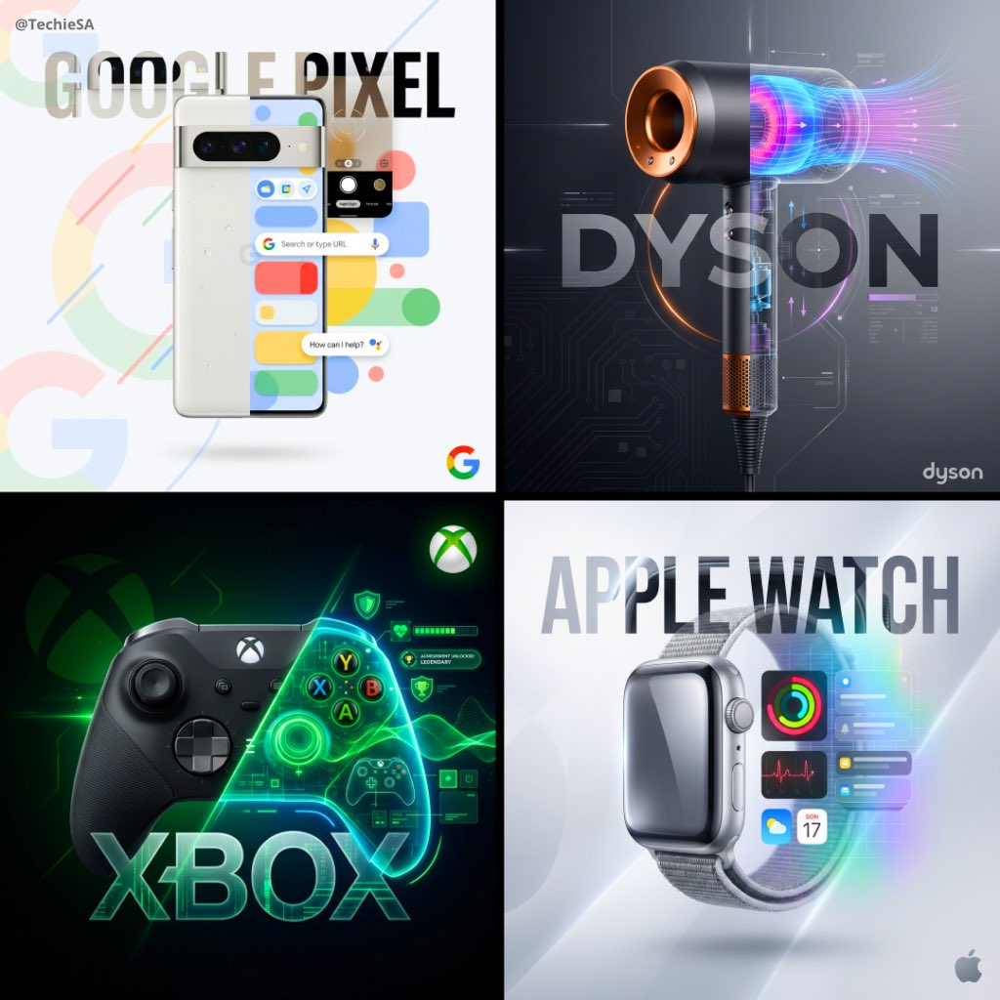

## BAGEL LABS. Act as a creative director curating a wide-r

- ID: trending-2008944996091564518
- Slug: trending-2008944996091564518-en
- 语言: en
- 来源: [来源链接](https://x.com/astronomerozge1/status/2008944996091564518)
- 样例图路径: images/part1/2008944996091564518_1.jpg

### 提示词

```text
BAGEL LABS.
Act as a creative director curating a wide-ranging, eclectic collection of “recontextualized everyday objects.”

DIVERSE OBJECT SELECTION (MANDATORY VARIETY):
Randomly select ONE object from these distinct categories to ensure diversity:
Analog Office & Desk:
Sport & Leisure:
Barware & Kitchen:
Utility & Tools:
Grooming:
Travel:

SELECTED CATEGORY:
Barware & Kitchen

CHOSEN OBJECT:
A coffee machine and coffee cup — instantly recognizable, reimagined as a luxury technological artifact.

THE CONCEPT:
Recontextualize the everyday coffee machine as a transparent, high-precision object of engineered beauty.  
A fully glass espresso machine reveals its internal systems: hot water circulation, pressure chambers, coffee bean hopper, grinding mechanism, and extraction pathway. Integrated computer circuitry runs through the machine like a nervous system, visually linking ritual, data, and energy.

Fresh coffee is actively pouring from the machine into a matching glass cup, captured mid-flow. The moment feels frozen, precise, and intentional—ritual meets technology.

MATERIALS & FINISH:
- COFFEE MACHINE BODY:
  Precision-molded optical glass with subtle green-tinted transparency. Internal structure is fully visible and meticulously organized.
- INTERNAL COMPONENTS:
  - Hot water tubes and pressure lines clearly visible, rendered in brushed titanium and warm grey.
  - Coffee bean chamber visible at the top with realistic roasted beans.
  - Grinding and extraction mechanisms exposed, engineered and clean.
- CIRCUITRY:
  Integrated PC-style circuitry embedded within the machine’s internal architecture.
  - Circuit paths in muted industrial orange.
  - Supporting components in graphite and titanium tones.
  Circuits are physical and structural, not glowing or decorative.
- COFFEE CUP:
  Matching optical glass cup with weighted base and refined silhouette.
  Subtle BAGEL LABS logomark engraved near the base.
- BRAND INTEGRATION:
  BAGEL LABS logomark engraved into the glass body of the machine (side or rear plane), and subtly etched on the cup.
  No stickers. No printed logos.

ACTION / MOMENT:
Coffee is visibly flowing from the machine into the glass cup.
Liquid motion is realistic and smooth.
Crema and color gradient are visible through the glass, emphasizing transparency and material depth.

PRESENTATION (NO BOXES):
The coffee machine and cup stand fully exposed on a minimal pedestal or surface.
No packaging, no housing, no covers.
All components are visible by design.

PHOTOGRAPHY & LIGHTING:
Style: High-end product editorial (Wallpaper* / Dezeen).
Lighting: Soft, studio high-key lighting with carefully controlled reflections to highlight glass thickness, liquid motion, and internal depth. No harsh shadows.
Background: Clean, seamless light grey or white cyclorama.

COLOR & GRADING:
Primary tones: transparent glass with subtle green tint, warm greys, titanium neutrals.
Accent: restrained BAGEL LABS orange within the circuitry only.
Overall mood: clean, intelligent, technological luxury.

GRAPHIC OVERLAYS (UI):
- Bottom Left:
  A small, minimalist two-line descriptor identifying the object.
- Bottom Right:
  A small, discreet, monochrome BAGEL LABS logomark.
Do not visualize font names or color codes.

CAMERA & DETAIL:
Full-frame, 50mm equivalent.
Ultra-high realism: accurate glass refraction, liquid physics, micro-detail in circuits and mechanical parts.
Shallow depth of field allowed, but machine and cup must remain fully legible.

NEGATIVE PROMPT:
No people, no hands, no kitchens, no cafes, no clutter, no packaging, no stickers, no printed text on surfaces, no neon colors, no glow effects, no cartoon or CGI look, no fingerprints, no dust, no watermarks.
```

### 样例图

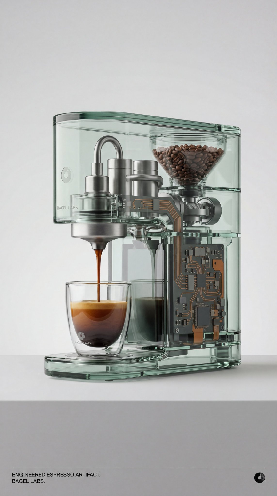

## Nano Banana 2 on @Hailuo_AI Prompt: Ultra-realistic prem

- ID: trending-2027911721860616479
- Slug: trending-2027911721860616479-en
- 语言: en
- 来源: [来源链接](https://x.com/Taaruk_/status/2027911721860616479)
- 样例图路径: images/part1/2027911721860616479_1.jpg

### 提示词

```text
Nano Banana 2 on @Hailuo_AI

Prompt:
Ultra-realistic premium product advertisement of a cappuccino coffee bottle, centered composition, surrounded by dynamic liquid splashes of coffee and milk forming elegant swirling shapes in mid-air. Dramatic environments blending elements of fire, lava, ice shards, marble textures, and dark studio backgrounds.
Hyper-detailed liquid physics, droplets frozen in motion, cinematic lighting with high contrast, glowing highlights, and volumetric light. Coffee splashes mixed with creamy textures, energetic explosion effects, sparks, smoke, and mist.
Luxury branding style, glossy reflections on bottle, sharp label details, rich brown and gold color palette, macro photography, shallow depth of field, 85mm lens, commercial advertising style, studio + fantasy hybrid scene, ultra-detailed, 8K resolution.
```

### 样例图


## A slow, sensual luxury chocolate commercial shot in ultr

- ID: trending-2018163221979677025
- Slug: trending-2018163221979677025-en
- 语言: en
- 来源: [来源链接](https://x.com/Just_sharon7/status/2018163221979677025)
- 样例图路径: images/part1/2018163221979677025_1.jpg

### 提示词

```text
A slow, sensual luxury chocolate commercial shot in ultra-high definition. The scene opens in near darkness as a premium espresso-brown gift box with soft gold accents slowly rotates on a reflective surface. A warm spotlight reveals the embossed title “SWEET PROMISE” in an elegant serif font, paired with a subtle botanical emblem. As the lid gently lifts in slow motion, molten milk chocolate surges upward in a gravity-defying burst, captured at 120fps for dramatic fluid motion. Glossy heart-shaped chocolates rise and orbit the splash, rotating gracefully at different depths, their surfaces catching highlights like polished jewels. Thick chocolate ribbons stretch, drip, and shatter into silky droplets mid-air while cocoa powder blooms softly like a golden mist. Cinematic mocha-and-gold color grading, shallow depth of field, creamy bokeh background, soft rim lighting outlining every chocolate curve. Macro close-ups transition into wide hero shots, emphasizing texture, gloss, and richness. The motion feels slow, seductive, and indulgent—pure luxury confectionery advertising, premium product film, elegant pacing, emotionally rich, visually irresistible.
```

### 样例图

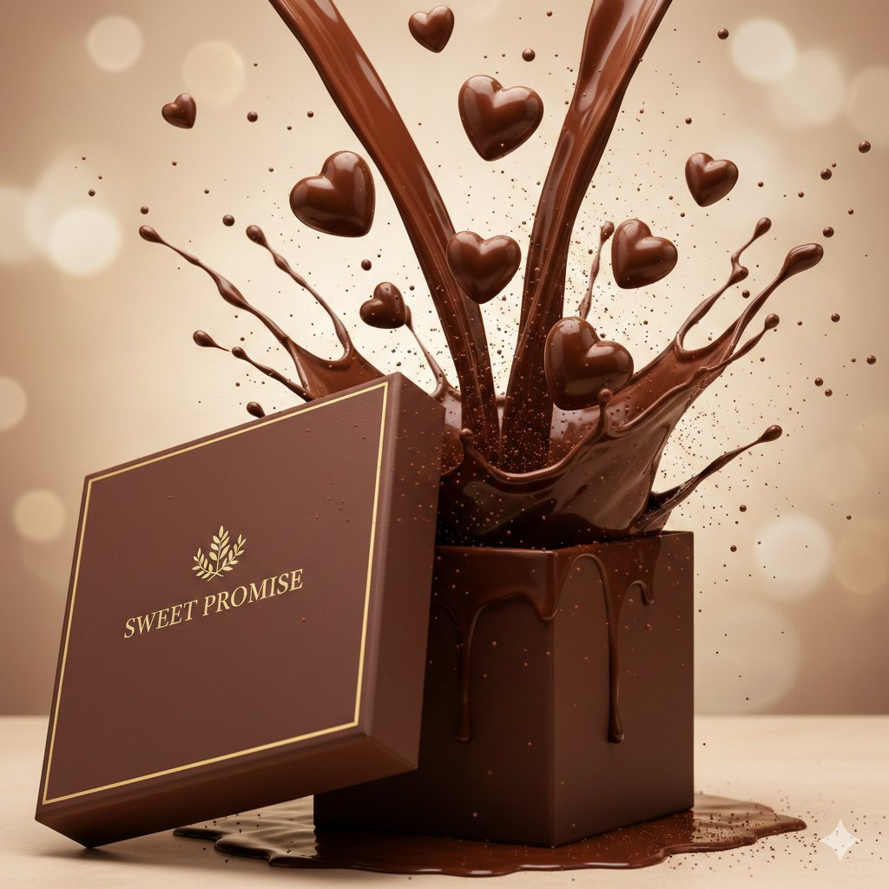

## Ultra-realistic luxury cosmetic product photography in a

- ID: trending-2027729036307533900
- Slug: trending-2027729036307533900-en
- 语言: en
- 来源: [来源链接](https://x.com/oggii_0/status/2027729036307533900)
- 样例图路径: images/part1/2027729036307533900_1.jpg

### 提示词

```text
Ultra-realistic luxury cosmetic product photography in a dramatic monochromatic blue-violet composition. A sleek satin-finish periwinkle-blue squeeze tube labeled “STENDERS” stands vertically centered in the frame, featuring elegant silver typography and a reflective metallic chrome cap. The tube is surrounded by voluminous swirling clouds of ink-like smoke in layered shades of lavender, indigo, and icy blue, creating a soft, billowing texture that wraps around the product. Interwoven throughout the smoke are fresh purple and lilac flowers with intricate petal details and vibrant yellow centers, along with delicate sprigs of tiny violet blossoms for added dimension. Soft directional lighting from the upper left highlights the smooth curvature of the tube, adds subtle sheen to the metallic cap, and creates depth within the smoke plumes. The background seamlessly blends cool blue and purple tones, enhancing the ethereal, floral fragrance aesthetic. Hyper-detailed textures of petals and vapor, cinematic depth, high-end perfumed skincare advertising style, 8K

ultra-high resolution
```

### 样例图

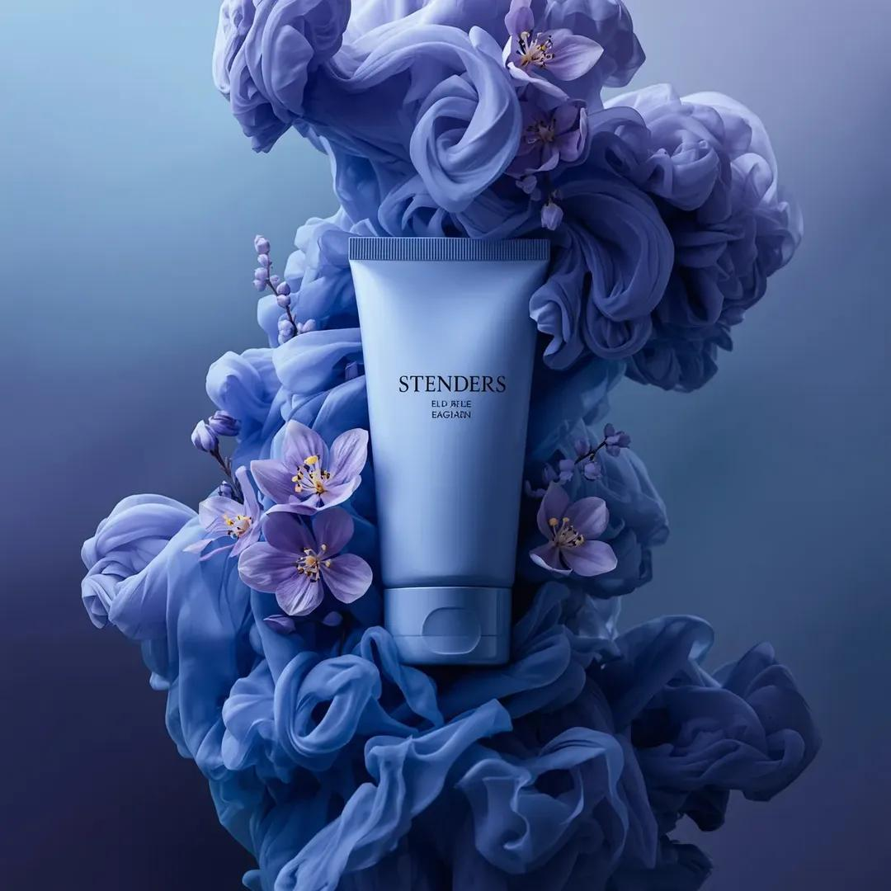

## Create a brand visual storyboard for presenting your pro

- ID: trending-2015404132912226710
- Slug: trending-2015404132912226710-en
- 语言: en
- 来源: [来源链接](https://x.com/TechieBySA/status/2015404132912226710)
- 样例图路径: images/part1/2015404132912226710_1.jpg

### 提示词

```text
Create a brand visual storyboard for presenting your product with Nano Banana Pro:

Create ONE final image. 

A clean 3×3 [ratio] storyboard grid with nine equal [ratio] sized panels on [4:5] ratio. 

Use the reference image as the base product reference. Keep the same product, packaging design, branding, materials, colors, proportions and overall identity across all nine panels exactly as the reference. The product must remain clearly recognizable in every frame. The label, logo and proportions must stay exactly the same.

This storyboard is a high-end designer mockup presentation for a branding portfolio. The focus is on form, composition, materiality and visual rhythm rather than realism or lifestyle narrative. The overall look should feel curated, editorial and design-driven.

FRAME 1:
Front-facing hero shot of the product in a clean studio setup. Neutral background, balanced composition, calm and confident presentation of the product.

FRAME 2:
Close-up shot with the focus centered on the middle of the product. Focusing on surface texture, materials and print details.

FRAME 3:
Shows the reference product placed in an environment that naturally fits the brand and product category. Studio setting inspired by the product design elements and colours. 

FRAME 4:
Product shown in use or interaction on a neutral studio background. Hands and interaction elements are minimal and restrained, the look matches the style of the package. 

FRAME 5:
Isometric composition showing multiple products arranged in a precise geometric order from the top isometric angle. All products are placed at the same isometric top angle, evenly spaced, clean, structured and graphic.

FRAME 6:
Product levitating slightly tilted on a neutral background that matches the reference image color palette. Floating position is angled and intentional, the product is floating naturally in space.

FRAME 7:
is an extreme close-up focusing on a specific detail of the label, edge, texture or material behavior.

FRAME 8:
The product in an unexpected yet aesthetically strong setting that feels bold, editorial and visually striking.
Unexpected but highly stylized setting. Studio-based, and designer-driven. Bold composition that elevates the brand.

FRAME 9:
Wide composition showing the product in use, placed within a refined designer setup. Clean props, controlled styling, cohesive with the rest of the series.

CAMERA & STYLE:
Ultra high-quality studio imagery with a real camera look. Different camera angles and framings across frames. Controlled depth of field, precise lighting, accurate materials and reflections. Lighting logic, color palette, mood and visual language must remain consistent across all nine panels as one cohesive series.

OUTPUT:
A clean 3×3 grid with no borders, no text, no captions and no watermarks.
```

### 样例图

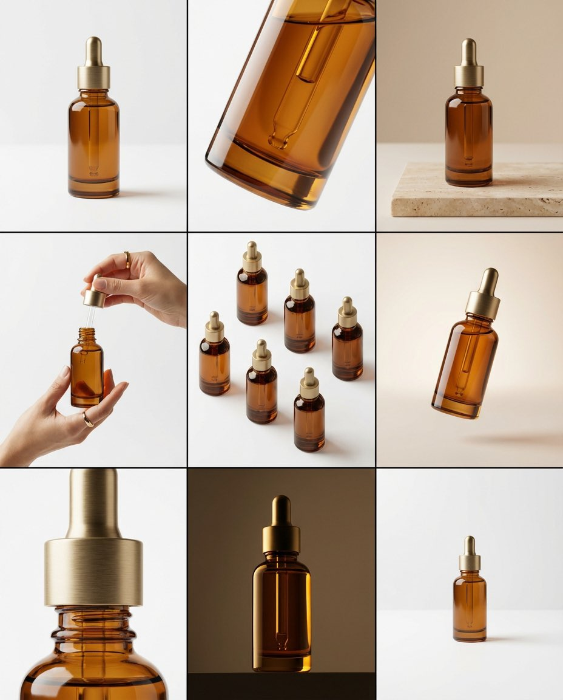

## Ultra-realistic premium skincare serum bottle (dark gree

- ID: trending-2028134684908236967
- Slug: trending-2028134684908236967-en
- 语言: en
- 来源: [来源链接](https://x.com/Taaruk_/status/2028134684908236967)
- 样例图路径: images/part1/2028134684908236967_1.jpg

### 提示词

```text
Ultra-realistic premium skincare serum bottle (dark green glass with dropper), golden liquid inside, placed on sunlit marble surface with fresh orange slices around, natural citrus vibe, water splash frozen mid-air, detailed droplets and reflections, soft natural sunlight with sharp shadows, minimal aesthetic, macro photography, high detail textures, glossy glass reflections, fresh and vibrant color tones, luxury skincare advertising, 8K, perfect composition.
```

### 样例图

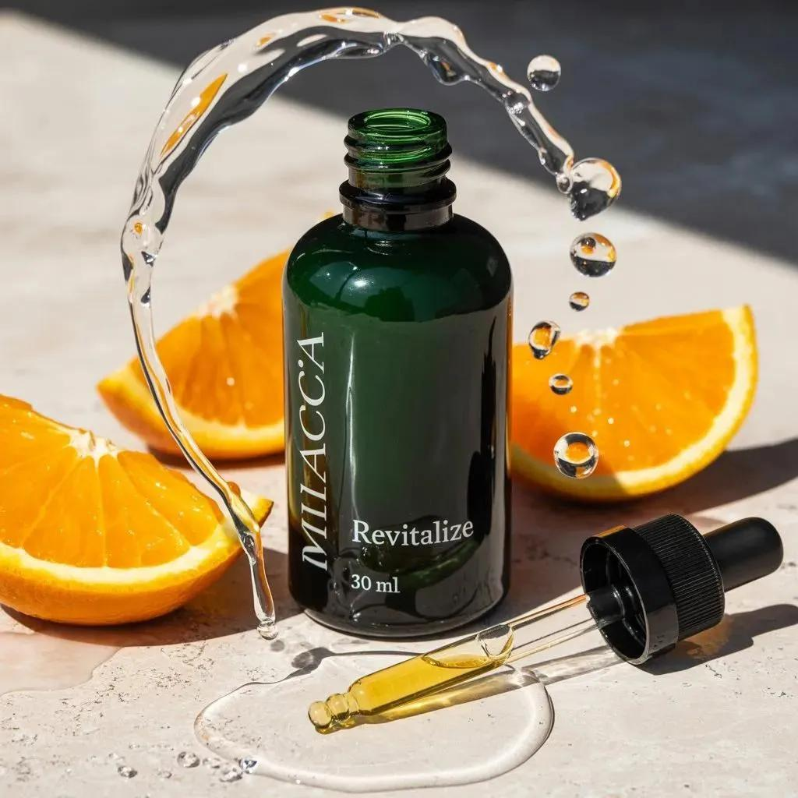

## Use the uploaded image as the exact visual reference. Ke

- ID: trending-2028077442074566800
- Slug: trending-2028077442074566800-en
- 语言: en
- 来源: [来源链接](https://x.com/ZaraIrahh/status/2028077442074566800)
- 样例图路径: images/part1/2028077442074566800_1.jpg

### 提示词

```text
Use the uploaded image as the exact visual reference.
Keep the product centered.
Do not change the tube position, lighting tone, flower placement, or color palette.
Maintain the deep blue monochromatic aesthetic.
No additional lights.
No color grading changes.
Camera:
Locked camera.
No zoom.
No rotation.
No angle change.
Static premium composition.
Action:
Animate the surrounding voluminous blue swirling clouds in ultra slow motion.
The cloud-like forms (soft fabric/ink-style swirls) gently move and curl around the product.
Movement should feel fluid, heavy, and luxurious.
Soft rolling motion from bottom to top.
Subtle inward spiral motion around the tube.
No aggressive motion.
No fast movement.
No deformation of the product.
Flowers:
Remain mostly stable.
Very subtle natural micro movement as if lightly affected by airflow.
Petals should not detach.
No new petals added.
Physics:
Smooth, dense, smoke-like simulation.
Velvety texture.
Soft shadow transitions within the folds.
Natural depth and layering.

Mood:
Elegant.
Premium.
Artistic beauty campaign.
High-end cosmetic advertisement.

Sound (optional if supported):
Soft ambient atmospheric tone.
Very subtle airy texture.
No voiceover.
End Frame:
Clouds continue slowly flowing around the product.
Product remains sharp and perfectly centered.
Ultra realistic.
Luxury slow-motion finish.
```

### 样例图

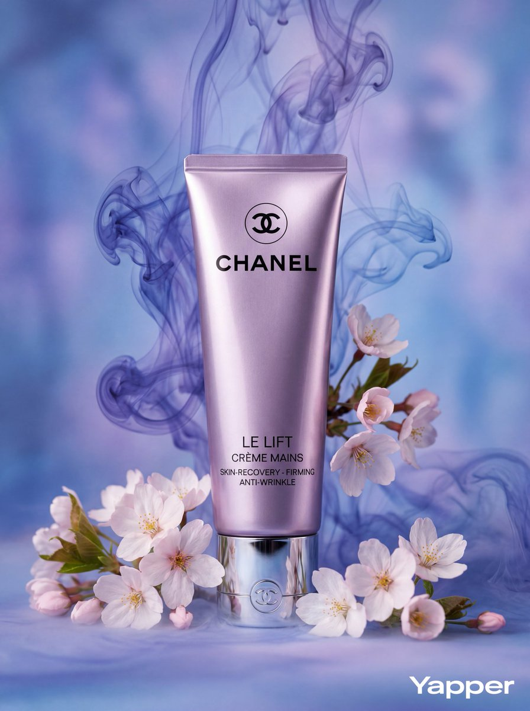

## The soft touch. Nano Banana pro on Gemini Prompt { "prod

- ID: trending-2025163854469341484
- Slug: trending-2025163854469341484-en
- 语言: en
- 来源: [来源链接](https://x.com/Maercihh/status/2025163854469341484)
- 样例图路径: images/part1/2025163854469341484_1.jpg

### 提示词

```text
The soft touch.

Nano Banana pro on Gemini 

Prompt 

{
  "product_photography_prompt": {
    "subject": "Hands holding a shampoo bottle with lather.",
    "hands": {
      "description": "A person's hands with natural skin tone.",
      "action": "One hand holds the bottle, the other is cupped to catch foam.",
      "condition": "Covered in thick, white, bubbly soap lather."
    },
    "bottle": {
      "type": "Pump bottle.",
      "material": "Matte white plastic.",
      "dispenser": "Light blue pump.",
      "contents": "White shampoo, visible as foam."
    },
    "label": {
      "color": "White",
      "text_color": "Black",
      "logo": "Circular with 'WAATAL' inside.",
      "main_text": "Hydrate SHAMPOO (script and bold font).",
      "sub_text": "Super Hydrating Shampoo. For All Hair Types. Made in Australia. 500ml."
    },
    "foam": {
      "texture": "Thick, rich, bubbly lather.",
      "color": "White",
      "location": "Covering hands, bottle neck, and dispenser."
    },
    "background": {
      "color": "Solid soft light blue.",
      "texture": "Seamless, smooth studio background."
    },
    "lighting": {
      "type": "Soft, diffused studio lighting.",
      "direction": "Even illumination, highlighting foam texture and hands."
    },
    "style": {
      "type": "Clean, minimalist product photography.",
      "shot": "Close-up.",
      "focus": "Sharp focus on hands, bottle, and foam.",
      "mood": "Fresh, clean, natural."
    }
  }
}
```

### 样例图


## Minimalist luxury product photography of a collagen supp

- ID: trending-2034201918571188405
- Slug: trending-2034201918571188405-en
- 语言: en
- 来源: [来源链接](https://x.com/Kashberg_0/status/2034201918571188405)
- 样例图路径: images/part1/2034201918571188405_1.jpg

### 提示词

```text
Minimalist luxury product photography of a collagen supplement jar placed on a soft pastel peach background, cylindrical pedestal base, surrounded by fresh pineapple and sliced grapefruit, a small glass cup with golden liquid in front, warm sunlight casting soft palm leaf shadows, clean aesthetic, high-end skincare branding, soft diffused lighting, realistic textures, subtle reflections, shallow depth of field, editorial style, 4k, ultra-detailed.
```

### 样例图

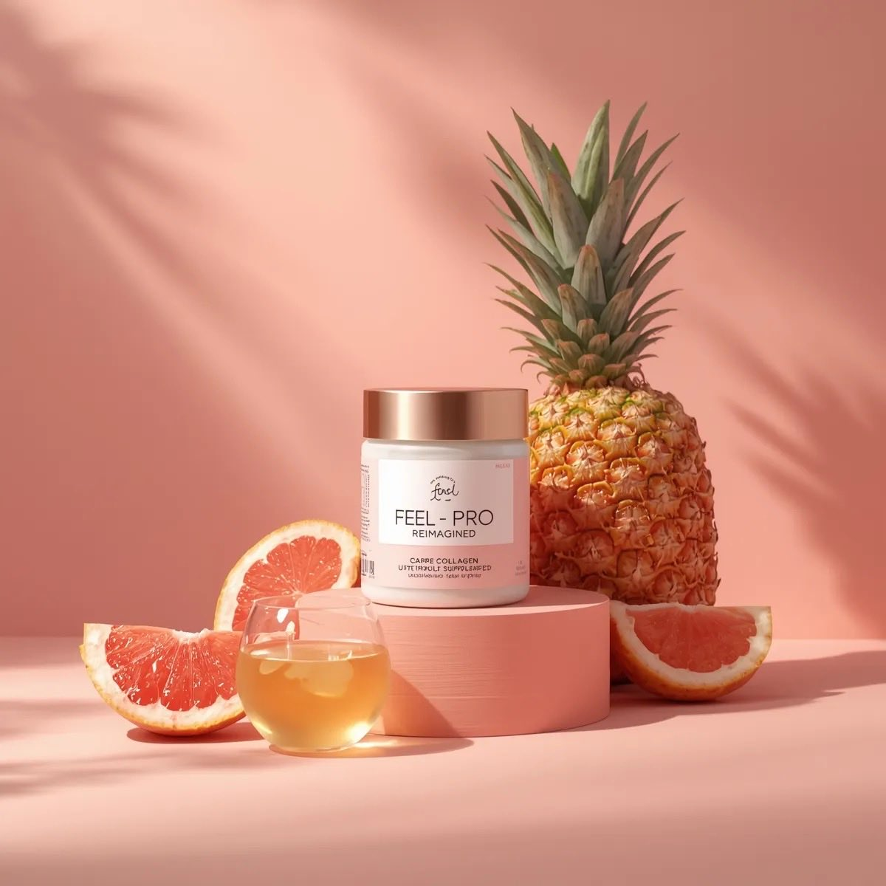

## [product], 3–4 identical units of the product floating i

- ID: trending-2023760359493194030
- Slug: trending-2023760359493194030-en
- 语言: en
- 来源: [来源链接](https://x.com/azed_ai/status/2023760359493194030)
- 样例图路径: images/part1/2023760359493194030_1.jpg

### 提示词

```text
[product], 3–4 identical units of the product floating in mid-air, surrounded by fresh [fruit/vegetable] and sliced pieces that the product is made from, ingredients suspended around the product, dynamic balanced composition, ultra-clean pure white background, no gradients, no color cast, soft studio lighting, realistic soft shadows beneath floating objects, glossy packaging reflections, juicy ingredient textures, premium skincare editorial style, hyper-realistic product photography, macro detail, sharp focus, commercial advertising quality, minimal composition, 8k, 1:1
```

### 样例图

![[product], 3–4 identical units of the product floating i](../images/part1/2023760359493194030_1.jpg)

## { "master_prompt": { "scene_type": "ultra-premium cinema

- ID: trending-2029369297030807801
- Slug: trending-2029369297030807801-en
- 语言: en
- 来源: [来源链接](https://x.com/mehvishs25/status/2029369297030807801)
- 样例图路径: images/part1/2029369297030807801_1.jpg

### 提示词

```text
{
  "master_prompt": {
    "scene_type": "ultra-premium cinematic luxury hair oil product photography",

    "product": {
      "type": "luxurious branded herbal hair oil",
      "container": "premium dark amber glass bottle with elegant gold dropper cap",
      "label": "minimal luxury branding with embossed gold typography",
      "oil_texture": "rich golden oil with crystal clarity and glossy viscosity",
      "ingredients_visual": [
        "fresh coconut halves",
        "amla berries",
        "almonds",
        "hibiscus flowers",
        "green herbal leaves"
      ]
    },

    "composition": {
      "action": "golden hair oil droplets pouring elegantly from a glass dropper captured mid-air",
      "surrounding_elements": [
        "floating herbal ingredients suspended in motion",
        "tiny golden oil droplets sparkling in light",
        "soft mist of botanical particles",
        "subtle golden dust accents for premium feel"
      ],
      "placement": "hero bottle centered on polished black marble surface with luxury reflections"
    },

    "lighting": {
      "style": "luxury cosmetic studio lighting",
      "effects": [
        "soft rim lighting outlining the bottle silhouette",
        "warm backlight illuminating the golden oil inside the bottle",
        "gentle top light highlighting the glass dropper and oil droplets",
        "subtle side lighting enhancing glass reflections"
      ]
    },

    "color_palette": {
      "background": "deep charcoal fading into warm golden bokeh",
      "accents": "rich amber gold, botanical green, glossy black reflections, subtle champagne highlights"
    },

    "technical_specs": {
      "camera": "macro lens with slight low angle for premium dominance",
      "shutter": "ultra-fast freeze motion capturing oil droplets",
      "depth_of_field": "shallow focus on bottle and dropper with cinematic background blur",
      "quality": "8K resolution, ultra-photorealistic cosmetic product detailing"
    }
  }
}
```

### 样例图

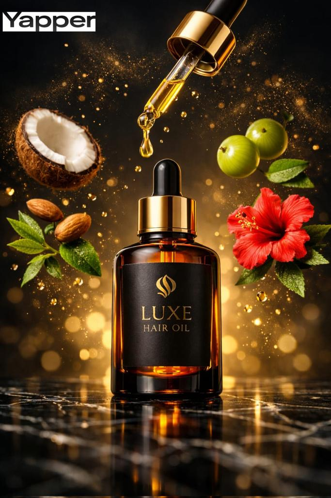

## A surreal, minimalist luxury advertising scene in a clea

- ID: trending-2024794186906759514
- Slug: trending-2024794186906759514-en
- 语言: en
- 来源: [来源链接](https://x.com/Just_sharon7/status/2024794186906759514)
- 样例图路径: images/part1/2024794186906759514_1.jpg

### 提示词

```text
A surreal, minimalist luxury advertising scene in a clean modern studio with a soft neutral gray background, dramatic directional lighting and subtle cinematic shadows. A gigantic oversized tube of Dr.Jart+ Pore Remedy Pure Mastic Butter Mask (light blue tube, white label, bold black “Dr.Jart+” text clearly visible) stands triumphantly on a tall multi-tiered white marble pedestal like a monument. Around the base, 20–30 tiny realistic miniature male workers in matching beige/off-white uniforms and overalls are pulling thick ropes tied around the massive tube, straining with intense effort, dynamic poses, muscles tense, tugging mostly forward.

Place a tall elegant Western woman in her late 20s in the foreground, positioned much closer to the camera for a stronger ad focus. She stands slightly in front of the pedestal, waist-up to mid-thigh framing, creating a premium beauty campaign feel. She has glowing fair skin, sharp cheekbones, soft natural makeup with luminous skin finish, slick low bun hairstyle, and a confident high-fashion gaze directed toward the camera. She wears a structured ivory tailored blazer dress with minimal gold accessories and nude heels. One hand lightly touches the giant tube while her body subtly angles toward it, creating a powerful hero-product connection.

At the foot of the pedestal lies a large open lotus flower sculpture in soft pinkish-brown tones. High-end commercial skincare photography, hyper-realistic 3D render, ultra-sharp 8K details, cinematic composition, shallow depth of field slightly blurring the miniature workers while keeping the woman and product crisp and dominant, luxury beauty campaign aesthetic, epic scale contrast, clean elegant studio environment, shot by Veo.
```

### 样例图

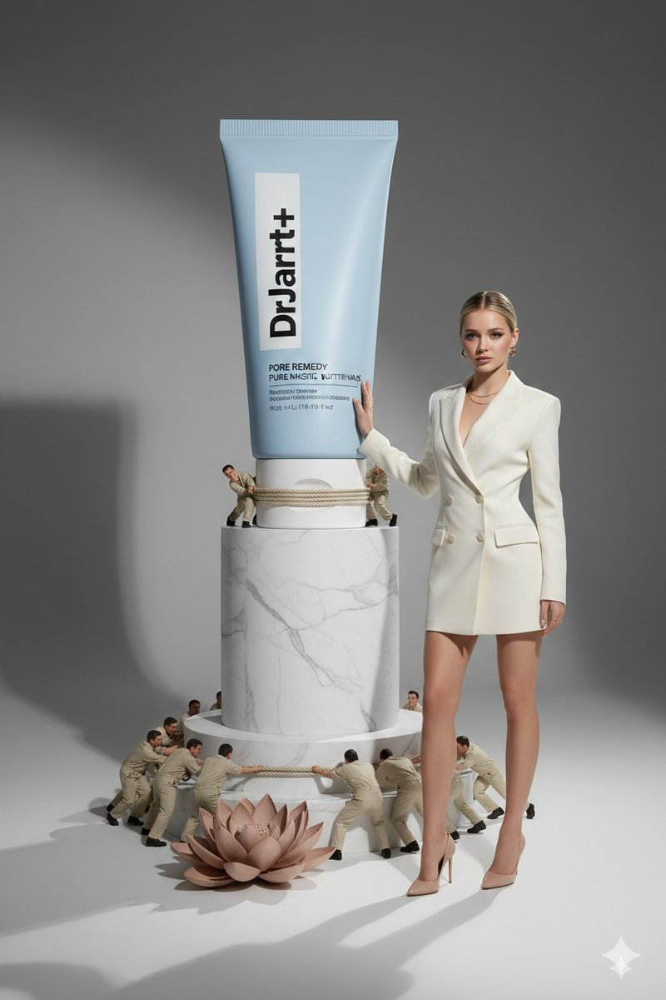

## Ultra-high-end photorealistic skincare product photograp

- ID: trending-2017103651559657540
- Slug: trending-2017103651559657540-en
- 语言: en
- 来源: [来源链接](https://x.com/oggii_0/status/2017103651559657540)
- 样例图路径: images/part1/2017103651559657540_1.jpg

### 提示词

```text
Ultra-high-end photorealistic skincare product photography featuring a clear cylindrical glass dropper bottle filled with translucent golden serum, centered and slightly tilted backward, with a matte white rubber dropper and metallic gold collar, the front label clearly reading “epielle Brightening Serum Vitamin C” with citrus illustrations, placed on a glossy reflective orange liquid surface creating a sharp mirror reflection beneath the bottle, surrounded by whole and sliced citrus fruits including bright orange oranges, a halved ruby grapefruit with visible pulp, and a sliced yellow lemon positioned symmetrically around the bottle, small golden serum droplets and splashes frozen mid-air around the base, fresh green citrus leaves floating softly in the background, background consisting of a smooth warm gradient transitioning from pale yellow on the left to deep orange on the right, lighting is strong soft studio lighting from upper left creating crisp highlights on glass and liquid, luminous glow through the serum, subtle shadows, and high contrast reflections, color palette dominated by vibrant orange, yellow, gold, and fresh green accents, textures extremely detailed including glossy glass, liquid viscosity, citrus peel pores, juicy pulp, and reflective surface, shallow depth of field with razor-sharp focus on the bottle label and fruit in the midground and gentle bokeh in the background, premium commercial cosmetic advertising style, clean modern composition, cinematic realism, ultra-detailed 8K photorealism, studio-grade quality
```

### 样例图

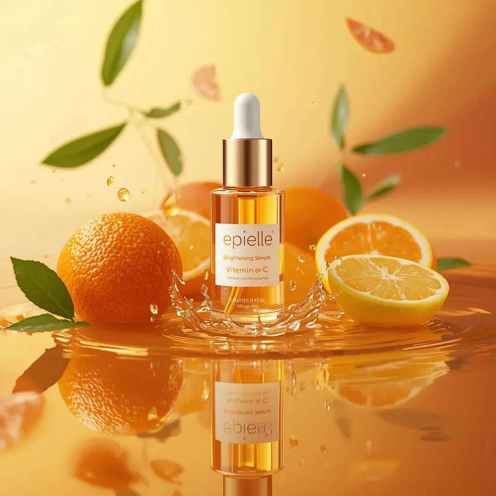

## A professional high-end graphic design advertisement com

- ID: trending-2025388456470610002
- Slug: trending-2025388456470610002-en
- 语言: en
- 来源: [来源链接](https://x.com/ChillaiKalan__/status/2025388456470610002)
- 样例图路径: images/part1/2025388456470610002_1.jpg

### 提示词

```text
A professional high-end graphic design advertisement composition on a pure solid white canvas. Centered is a perfectly symmetrical, large solid rounded square (not a hollow frame). The entire interior of this square is filled with a smooth, vibrant color gradient fading from [Top-Left Color/Hex] to [Bottom-Right Color/Hex].

A [Description of Character] is positioned such that the bottom of their torso is perfectly flush and aligned with the very bottom edge of the square, leaving no thick colored border visible beneath them. Crucially, the person and their clothing maintain natural, realistic colors and textures, illuminated by professional studio lighting that is independent of the background gradient (preventing any color cast on their skin or clothes).

They are firmly and realistically gripping [Product Description]. Crucially, the top of their head and hair break the top boundary of the square, partially overlapping the white background. Their hands and the [Product Name] also break the side boundaries for a powerful 3D breakout effect, extending onto the white canvas.

Typography Layout: At the top, in the white space distinctly above the square with a clear gap, is the [Font Style] brand text '[Brand Name]' in [Top Text Color]. In the bottom-right corner, layered directly on top of the gradient inside the square, is a block of small, thin, clean [Bottom Text Color] descriptive text: '[Slogan/Tagline]'.

The lighting is [Lighting Type: e.g., Sharp/Soft], crisp, and commercial, emphasizing the textures of both the subject and the product."
```

### 样例图

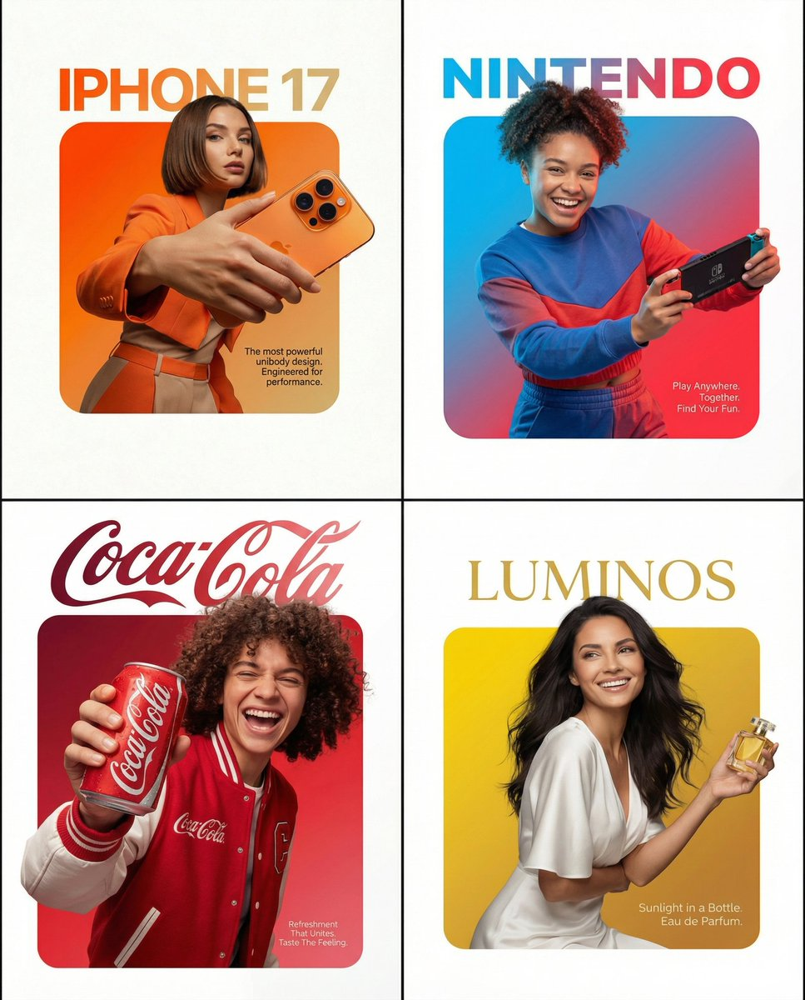

## cinematic 8-photo storytelling collage featuring the sam

- ID: trending-2010183814245724376
- Slug: trending-2010183814245724376-en
- 语言: en
- 来源: [来源链接](https://x.com/AIwithkhan/status/2010183814245724376)
- 样例图路径: images/part1/2010183814245724376_1.jpg

### 提示词

```text
cinematic 8-photo storytelling collage featuring the same girl throughout the journey.
Frame 1: Bedroom desk — laptop bag packed, morning light.
Frame 2: Leaving home — headphones on, confident walk.
Frame 3: City sidewalk — coffee aroma vibes, motion blur.
Frame 4: Entering café — warm interiors, soft smiles.
Frame 5: Laptop open — deep focus, typing.
Frame 6: Coffee sip — thoughtful pause.
Frame 7: Closing laptop — productive satisfaction.
Frame 8: Walking back home — golden hour calm.
Editorial lifestyle mood, natural tones, cinematic depth, ultra-realistic.
```

### 样例图


## A photorealistic product shot of a person holding a slim

- ID: trending-2027171001486967062
- Slug: trending-2027171001486967062-en
- 语言: en
- 来源: [来源链接](https://x.com/Kashberg_0/status/2027171001486967062)
- 样例图路径: images/part1/2027171001486967062_1.jpg

### 提示词

```text
A photorealistic product shot of a person holding a slim, light green can of Sanzo Calamansi Sparkling Water. The person is wearing a dark green, fuzzy fleece zip-up hoodie patterned with light green four-leaf clovers. Both hands are holding the can centrally in front of their torso, displaying perfectly manicured nails painted in a glossy green polish. The can features an illustration of a sliced calamansi lime with green leaves. The background is a solid, moody dark green, creating a striking monochromatic green aesthetic. Soft, professional studio lighting, highly detailed.
```

### 样例图

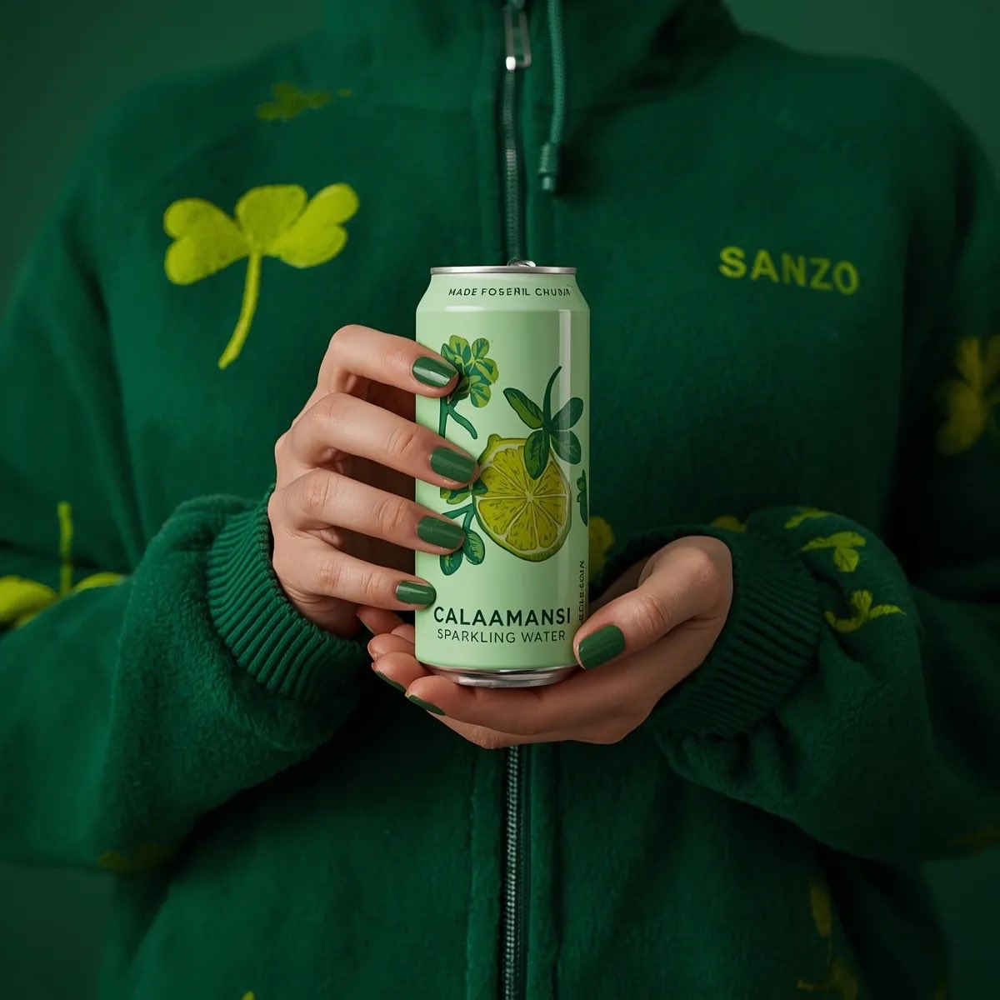

## Minimalist branded flower packaging design for [brand], 

- ID: trending-2030282080945647687
- Slug: trending-2030282080945647687-en
- 语言: en
- 来源: [来源链接](https://x.com/azed_ai/status/2030282080945647687)
- 样例图路径: images/part1/2030282080945647687_1.jpg

### 提示词

```text
Minimalist branded flower packaging design for [brand], eco-friendly cardboard sleeve with integrated handle, sculptural curved silhouette wrapping naturally around a fresh bouquet, packaging fully designed using the official brand color palette, matte surface with the brand logo cleanly centered on the front panel, precision die-cut window integrated into the design allowing flowers to subtly emerge, cohesive color blocking aligned with brand identity, modern premium branding aesthetic, smooth paper texture, refined structural details, hand holding the package naturally, studio product photography, centered composition, pure white background, soft realistic contact shadow beneath, high-end packaging mockup, ultra-detailed, 1:1 aspect ratio.
```

### 样例图

![Minimalist branded flower packaging design for [brand], ](../images/part1/2030282080945647687_1.jpg)

## [product], high-end product advertising, white seamless 

- ID: trending-2011630600101429445
- Slug: trending-2011630600101429445-en
- 语言: en
- 来源: [来源链接](https://x.com/Strength04_X/status/2011630600101429445)
- 样例图路径: images/part1/2011630600101429445_1.jpg

### 提示词

```text
[product], high-end product advertising, white seamless background, exploded view with inner mechanics revealed, outer shell hovering above core, micro screws and components suspended, perfect alignment guides implied, crisp soft shadow, ultra realistic, macro product photography, 100mm lens look, f/8, 8k, 1:1
```

### 样例图

![[product], high-end product advertising, white seamless ](../images/part1/2011630600101429445_1.jpg)

## A professional skincare shot of a [product container] wi

- ID: trending-2039599784173195358
- Slug: trending-2039599784173195358-en
- 语言: en
- 来源: [来源链接](https://x.com/ChillaiKalan__/status/2039599784173195358)
- 样例图路径: images/part1/2039599784173195358_1.jpg

### 提示词

```text
A professional skincare shot of a [product container] with [cap/lid], labeled [brand, product, descriptor, volume] with [foil/ink/embossing]. [Number] [animal type(s)] in [colors] are arranged [positions/actions] around it. [Held/placed/floating] naturally. Clean white background, soft shadow, bright lighting, ultra-high resolution, 8k, professional cosmetic photography.
```

### 样例图

![A professional skincare shot of a [product container] wi](../images/part1/2039599784173195358_1.jpg)

## Create a technical infographic of [OBJECT] with a 45-deg

- ID: trending-2027042348207599633
- Slug: trending-2027042348207599633-en
- 语言: en
- 来源: [来源链接](https://x.com/saidstetic/status/2027042348207599633)
- 样例图路径: images/part1/2027042348207599633_1.jpg

### 提示词

```text
Create a technical infographic of [OBJECT] with a 45-degree isometric 3D perspective showing the device slightly tilted to reveal depth and dimension.
Combine a realistic photoreal render with black ink technical annotations on pure white background. Include:
Key component labels with color-coded callout boxes
Internal component visibility through transparent/cutaway sections
Measurements, dimensions, and precise scale markers
Material callouts and quantities
Color-coded arrows for function/flow: RED (power/battery), BLUE (data/connectivity), ORANGE (thermal/processor), GREEN (sensors/haptics)
Simple schematics or cross-sectional diagrams where relevant

Place “OBJECT” title in a hand-drawn technical box (top-left corner).
Style: Black linework (technical pen/architectural), sketched but precise. Object remains clearly visible. Educational museum-exhibit vibe. Clean composition, balanced negative space.
Perspective: Isometric 3D angle—tilted to show depth, dimension, and internal architecture dramatically. Like a professional product teardown or engineering manual.
Colors: ~10-15% accent density. Black dominant. White background.
Output: 1080×1080, ultra-crisp, social-feed optimized.
```

### 样例图

![Create a technical infographic of [OBJECT] with a 45-deg](../images/part1/2027042348207599633_1.jpg)

## Hyper-realistic 8k cinematic photograph, low-angle wide 

- ID: trending-2028261430064185366
- Slug: trending-2028261430064185366-en
- 语言: en
- 来源: [来源链接](https://x.com/Sheldon056/status/2028261430064185366)
- 样例图路径: images/part1/2028261430064185366_1.jpg

### 提示词

```text
Hyper-realistic 8k cinematic photograph, low-angle wide lens. A giant Coca-Cola can standing like a monument, partially encased in thick blue glacial ice and snow in an arctic landscape. Frost covering the aluminum surface, long icicles hanging from the rim, snow filling the top opening. Snowcat vehicle and scientists in red parkas for scale. Cold diffused lighting, HDR, ultra-real frozen textures, cinematic atmosphere --ar 2:3
```

### 样例图

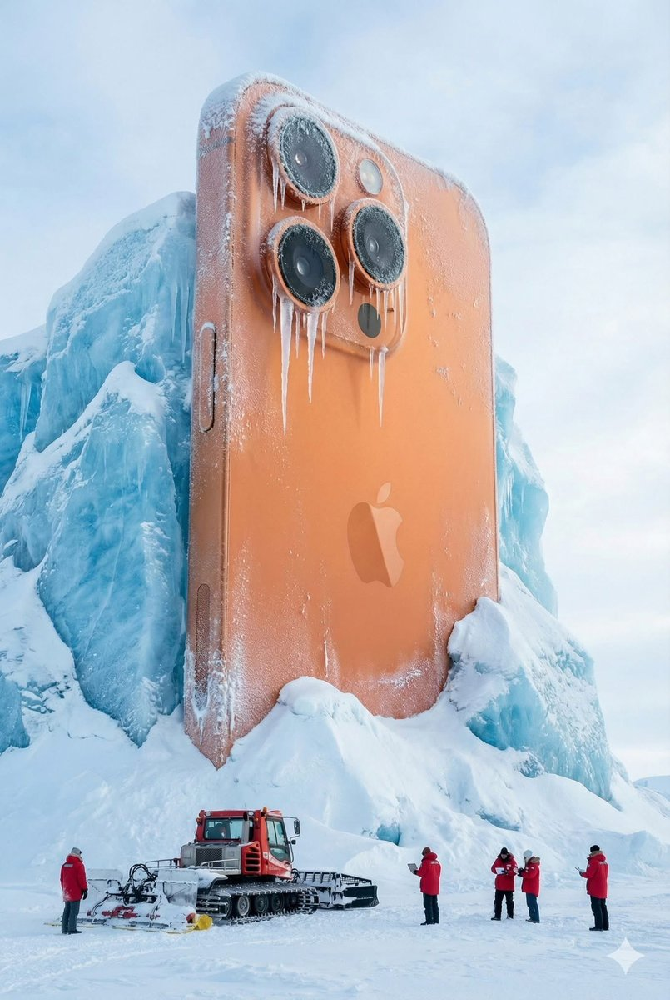

## Elegant rose-gold lipstick standing upright on a reflect

- ID: trending-2015812732977824176
- Slug: trending-2015812732977824176-en
- 语言: en
- 来源: [来源链接](https://x.com/Just_sharon7/status/2015812732977824176)
- 样例图路径: images/part1/2015812732977824176_1.jpg

### 提示词

```text
Elegant rose-gold lipstick standing upright on a reflective marble surface, surrounded by flying rose petals and soft powder dust. Warm studio lighting with dramatic shadows, luxury vanity background with blurred mirrors and golden accents, cinematic mood, macro product photography, ultra-sharp details, glossy textures, premium cosmetic brand style.

3×3photo grid with different angles and poses. Same character, consistent look, clean lighting, real photoshoot vibe 2k.
```

### 样例图

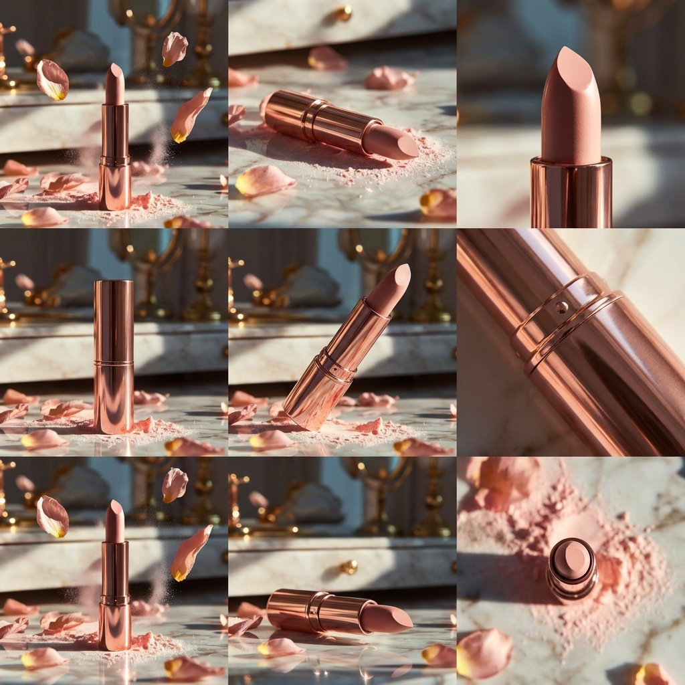

## Ultra-detailed studio product render of a LEGO Technic s

- ID: trending-2030236225815416875
- Slug: trending-2030236225815416875-en
- 语言: en
- 来源: [来源链接](https://x.com/Sheldon056/status/2030236225815416875)
- 样例图路径: images/part1/2030236225815416875_1.jpg

### 提示词

```text
Ultra-detailed studio product render of a LEGO Technic style vehicle model based precisely on the next uploaded reference photo. The LEGO build must replicate the real vehicle’s exact shape, proportions, bodylines, color scheme, headlights, grille design, wheels, and overall silhouette while constructed entirely from realistic LEGO Technic pieces and panels.
The vehicle is displayed in a clean professional product photography studio setup, placed on a smooth matte surface. Behind the car stands a large LEGO Technic product box, slightly blurred but clearly recognizable as a premium building kit package.
The vehicle features aggressive widebody styling, large sport wheels, low stance, detailed front splitter, and a roof rack cargo box built from LEGO elements, maintaining the same design style as the reference vehicle.
In front of the vehicle on the table are organized LEGO Technic components and tools, including small tires, axles, connectors, battery modules, rods, mechanical pieces, scissors, and miniature assembly tools, arranged neatly like a build kit.
Lighting is soft cinematic studio lighting with subtle reflections on the LEGO plastic surfaces, ultra-sharp details, shallow depth of field, realistic shadows, premium commercial product photography style.
Composition: hero angle slightly from the front side, emphasizing the vehicle's shape and mechanical LEGO structure.
Hyper-realistic materials, crisp textures, ultra detailed LEGO plastic surface, ray-traced reflections.
8K resolution, ultra sharp, photorealistic render, cinematic lighting, professional product shot
Aspect Ratio 9:16
```

### 样例图


## [BRAND NAME]: The core identity. [CATEGORY]: Clothing / 

- ID: trending-2032532246641406264
- Slug: trending-2032532246641406264-en
- 语言: en
- 来源: [来源链接](https://x.com/AmirMushich/status/2032532246641406264)
- 样例图路径: images/part1/2032532246641406264_1.jpg

### 提示词

```text
[BRAND NAME]: The core identity.

[CATEGORY]: Clothing / Food / Automotive / Lifestyle.

Goal: Generate a premium industrial design concept on a PURE WHITE background. 

1. INNOVATION & OBJECT

- Select one mundane functional object from [CATEGORY].

- Redesign it using unconventional, architectural, or origami-inspired geometry.

- The object must look like a high-end designer invention, not a standard product.

2. UNIFIED COMPOSITION

- Environment: A seamless, pure white studio background with a flat white floor.

- Interaction: A human hand (natural texture) is shown using the object in the foreground, demonstrating its unique ergonomics.

- Static Display: Right next to the hand, the same object is placed in a static, perfect pose to show its full silhouette and branding.

- Shadows: Soft, realistic grey drop shadows on the white floor to provide depth and ground the objects.

3. BRANDING & TEXT

- Identity: Apply the "[BRAND NAME]" logo in a high-contrast dark color (Black or Navy) directly onto the object's surface.

- Technical Detail: Add small, elegant blocks of justified "specification text" in the white negative space around the objects for an editorial look.

- Pattern: Use a subtle, oversized abstract fragment of the brand's logo as a texture on the object's material.

4. MATERIALS & FINISH

- High-quality matte materials only: heavy-duty recycled paper, sandblasted metal, or soft-touch polymer.

- Sharp architectural lines and clean, premium craftsmanship.
```

### 样例图

![[BRAND NAME]: The core identity. [CATEGORY]: Clothing / ](../images/part1/2032532246641406264_1.jpg)

## Create a clean, minimalist fashion infographic from an u

- ID: trending-2017599847025520679
- Slug: trending-2017599847025520679-en
- 语言: en
- 来源: [来源链接](https://x.com/TechieBySA/status/2017599847025520679)
- 样例图路径: images/part1/2017599847025520679_1.jpg

### 提示词

```text
Create a clean, minimalist fashion infographic from an uploaded reference photo of a person.

Extract the outfit worn by the person and present only the clothing and accessories, with no body, no mannequin, and no inflated or air-filled shapes.

Each clothing item should appear naturally relaxed, as if laid flat on a clean studio surface or gently suspended by gravity, with realistic folds, creases, and fabric drape (hoodies slightly collapsed, jackets softly folded, pants relaxed, shoes resting naturally).

Arrange the outfit pieces in a top-to-bottom vertical order (headwear → outerwear → top → bottoms → footwear → accessories), spaced clearly in a calm exploded-view layout.

Character Illustration

In the top-left corner, include a small stylized cartoon / anime-inspired figure of the person from the uploaded reference image:
•Wearing the same outfit shown in the breakdown
•Standing straight like a collectible action figure
•Slightly puffy proportions (soft premium vinyl-toy feel)
•Clean shading, minimal facial detail

Above the character, display the person’s name:
•Clearly readable size
•Black, clean modern sans-serif typography
•No background box

Item Labels & Price Tags

For each clothing item, include:
•A thin, clean connector line pointing to the item
•A large, highly readable retail-style price tag

Each price tag must:
•Display the price as the primary visual element (large, bold, instantly readable)
•Include the item name in smaller secondary text
•Be visually attached to the connector line

Price tag design:
•Rectangular or rounded retail tag style
•Light neutral background (off-white or light gray)
•Dark high-contrast text
•Subtle shadow for depth
•Price text significantly larger than all other tag text

Do not include brand names.

Visual Style
•Pure white studio background
•Soft, even lighting with subtle contact shadows
•Editorial fashion-magazine infographic aesthetic
•Realistic fabric colors and textures
•Clean modern sans-serif typography

Composition
•Centered vertical outfit layout
•Character illustration anchored in the top-left corner
•Strong readability of prices at first glance
•Balanced negative space, uncluttered
•No props, no decorative elements

Output
Ultra-sharp, high-end fashion breakdown
Social-feed optimized
No watermark.
```

### 样例图

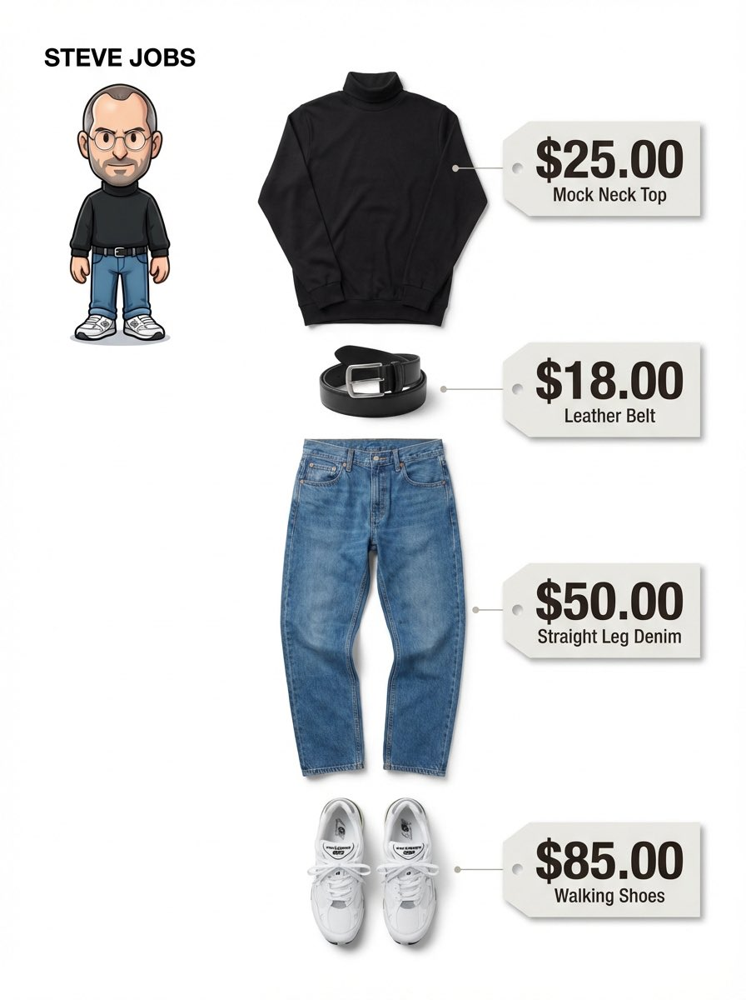

## Create a high-end minimalist fashion advertisement poste

- ID: trending-2032618498460102987
- Slug: trending-2032618498460102987-en
- 语言: en
- 来源: [来源链接](https://x.com/auqibhabib/status/2032618498460102987)
- 样例图路径: images/part1/2032618498460102987_1.jpg

### 提示词

```text
Create a high-end minimalist fashion advertisement poster.
Background: light grey wrinkled paper poster texture with editorial magazine layout.
At the top center place a small brand label “A&H” with minimal dots style logo above it.
Behind the product place a huge bold word “PREMIUM” in black, very large sans-serif font, spanning almost the entire width of the poster.
Center of the poster:
A two-tone t-shirt hanging on a wooden hanger.
Top half color beige/tan, bottom half deep black.
Short sleeves slightly folded.
Clean premium cotton texture.
On the chest of the shirt place the small text “YOUR BRAND NAME” in simple minimal font.
Left side design area:
Stylish script word “Aetails” (signature style starting with A) replacing “Details”.
Under it small editorial paragraph blocks (magazine layout filler text).
Right side:
Editorial typography block with the phrase
“FASHION THAT CELEBRATES YOUR UNIQUENESS”
in bold modern sans-serif.
Bottom right small editorial text block similar to fashion magazine layout.
Important rules: • Do NOT add any website URLs
• Do NOT add social media icons
• Do NOT add barcodes
• Do NOT add any random or unrecognizable text
• Brand name must be “A&H”
• Keep same colors, same layout, same typography style, same font weight, same font sizes, same composition
• clean luxury fashion ad aesthetic
• studio lighting, ultra sharp, photorealistic, 4K fashion poster design
```

### 样例图

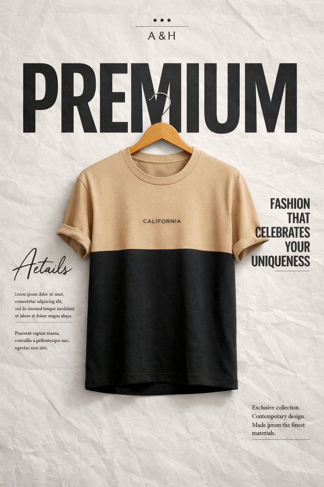

## Prompt Studio: Minimalist Luxury Product Design with Nan

- ID: trending-2028956048531288229
- Slug: trending-2028956048531288229-en
- 语言: en
- 来源: [来源链接](https://x.com/AllaAisling/status/2028956048531288229)
- 样例图路径: images/part1/2028956048531288229_1.jpg

### 提示词

```text
Prompt Studio: Minimalist Luxury Product Design with Nano Banana 2 in Firefly

Pristine product visualization, [object] in [material], deconstructed floating parts suspended in a precision-aligned engineering sequence, pure white gradient void with subtle depth falloff, sculptural studio lighting with sharp rim highlights, mirror-polished and matte surface contrast, ultra-macro lens revealing microscopic [surface detail] and internal [component detail], shallow depth of field isolating the core components, minimalist Braun meets Leica aesthetic, heroic product scale presence, product photography.

Check ALTs for ideas 👇 @AdobeFirefly
```

### 样例图


## Ultra-realistic skincare advertising photography featuri

- ID: trending-2031020301262409863
- Slug: trending-2031020301262409863-en
- 语言: en
- 来源: [来源链接](https://x.com/ChillaiKalan__/status/2031020301262409863)
- 样例图路径: images/part1/2031020301262409863_1.jpg

### 提示词

```text
Ultra-realistic skincare advertising photography featuring a frosted citrus glass bottle labeled “Glow Recipe – Lemon Brightening Glow Serum (30 ml)” floating mid-air. Sparkling lemon water splashes swirl around the bottle with glowing droplets and lemon slices suspended. Soft yellow studio background, crisp reflections, cinematic commercial lighting, shallow depth of field, ultra-detailed 8K beauty campaign.
```

### 样例图

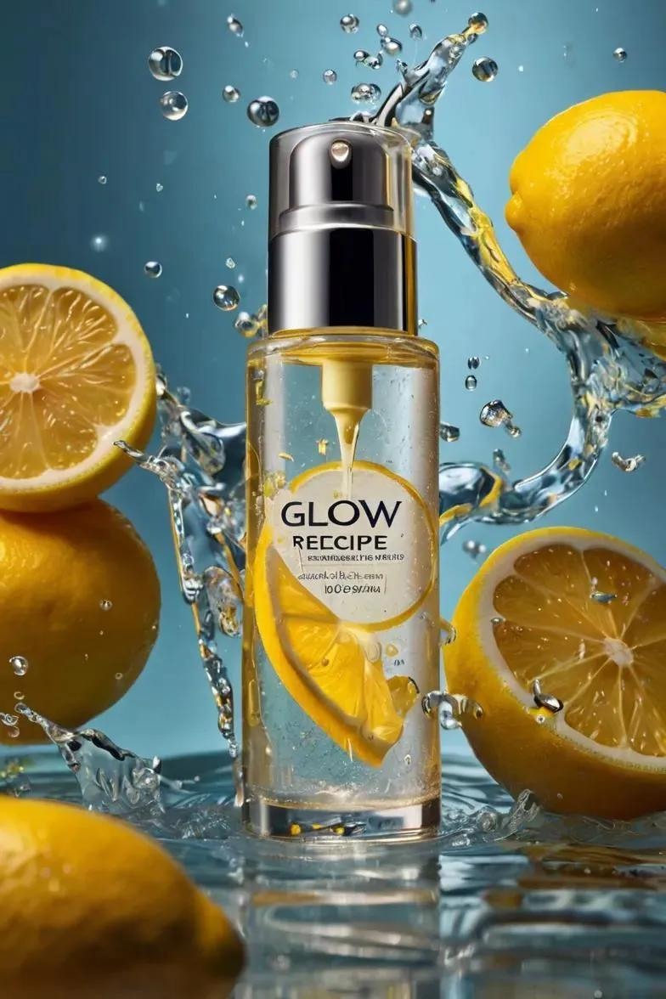

## { "reference_images": { "product_image": "UPLOADED_IMAGE

- ID: trending-2017550187363750190
- Slug: trending-2017550187363750190-en
- 语言: en
- 来源: [来源链接](https://x.com/TechieBySA/status/2017550187363750190)
- 样例图路径: images/part1/2017550187363750190_1.jpg

### 提示词

```text
{
 "reference_images": {
 "product_image": "UPLOADED_IMAGE",
 "usage_rule": "Use the uploaded image as the exact visual reference for the product’s form, proportions, materials, and overall identity. Do not redesign or reinterpret the product."
 },

 "layout": {
 "canvas": {
 "orientation": "vertical",
 "aspect_ratio": "3:4",
 "background": "warm neutral paper-like surface"
 },
 "structure": {
 "top_section": "lifestyle_hero",
 "bottom_section": "technical_specification"
 }
 },

 "top_section": {
 "type": "lifestyle_product_image",
 "composition": {
 "placement": "top_center",
 "scale": "dominant",
 "margin": "generous whitespace around product"
 },
 "environment": {
 "setting": "minimal architectural interior",
 "lighting": {
 "type": "natural sunlight",
 "direction": "angled side light",
 "quality": "soft but high-contrast shadows"
 },
 "floor": "subtle concrete or stone surface",
 "background": "textured plaster wall"
 },
 "rendering": {
 "style": "editorial lifestyle photography",
 "detail": "high realism",
 "color_grading": "warm, muted, premium"
 }
 },

 "bottom_section": {
 "type": "technical_specification_panel",
 "layout": {
 "grid": "modular",
 "alignment": "clean, architectural"
 },

 "technical_drawings": {
 "placement": "bottom_left_and_center",
 "style": "architectural line drawings",
 "views": [
 "front view",
 "side view",
 "three-quarter cutaway or profile view"
 ],
 "projection": "orthographic",
 "line_style": {
 "color": "muted red or sepia",
 "weight": "fine technical lines"
 },
 "annotations": {
 "type": "measurement and construction callouts",
 "language": "neutral technical labels",
 "density": "minimal, editorial"
 }
 },

 "materials_panel": {
 "placement": "bottom_right",
 "content": {
 "type": "material_swatches",
 "count": "3-4 depending on product",
 "format": "square or rectangular samples"
 },
 "textures": {
 "source": "derived from the product materials",
 "examples": [
 "fabric",
 "leather",
 "metal",
 "wood",
 "plastic"
 ]
 },
 "labels": {
 "style": "small editorial captions",
 "tone": "technical but refined"
 }
 }
 },

 "typography": {
 "style": "minimal editorial",
 "usage": "subtle captions, no large headlines",
 "color": "soft black or dark brown"
 },

 "overall_style": {
 "mood": "design catalog / product design journal",
 "aesthetic": "architectural, premium, calm",
 "avoid": [
 "clutter",
 "bold colors",
 "heavy branding",
 "overly decorative graphics"
 ]
 },

 "constraints": {
 "do_not": [
 "change product design",
 "invent new materials",
 "add logos unless present in reference",
 "use perspective distortion in drawings"
 ]
 }
}
```

### 样例图

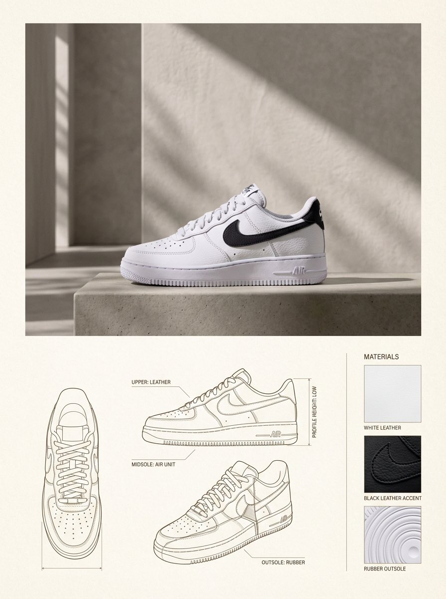

## [product], luxury product hero shot, dark velvet backgro

- ID: trending-2012919379575570766
- Slug: trending-2012919379575570766-en
- 语言: en
- 来源: [来源链接](https://x.com/azed_ai/status/2012919379575570766)
- 样例图路径: images/part1/2012919379575570766_1.jpg

### 提示词

```text
[product], luxury product hero shot, dark velvet background, single spotlight top down, thin mist haze, dramatic rim light outline, cinematic shadows, premium editorial styling, ultra realistic, macro detail, 85mm lens look, f/4 shallow depth, 8k, 1:1
```

### 样例图

![[product], luxury product hero shot, dark velvet backgro](../images/part1/2012919379575570766_1.jpg)

## [BRAND NAME], the official trademark logo rendered stric

- ID: trending-2012978382812635204
- Slug: trending-2012978382812635204-en
- 语言: en
- 来源: [来源链接](https://x.com/AmirMushich/status/2012978382812635204)
- 样例图路径: images/part1/2012978382812635204_1.jpg

### 提示词

```text
[BRAND NAME], the official trademark logo rendered strictly as a solid 3D object, maintaining the exact original vector shape and proportions without any artistic reinterpretation or distortion. The logo is crafted from dark, highly polished chrome metal with subtle surface micro-scratches and imperfections that break the mirror finish. The object is perfectly centered in a vast, infinite pure white void with no visible background elements or studio equipment. The lighting creates a soft, cinematic bloom (halo effect) along the metallic edges. 50mm lens aesthetic with a shallow depth of field gently blurring the furthest points of the object. A pronounced, visible film grain overlay is applied to the entire image.
```

### 样例图

![[BRAND NAME], the official trademark logo rendered stric](../images/part1/2012978382812635204_1.jpg)

## { "prompt_type": "viral_makeup_product_visual", "scene":

- ID: trending-2018639862036115956
- Slug: trending-2018639862036115956-en
- 语言: en
- 来源: [来源链接](https://x.com/sassyhazel_/status/2018639862036115956)
- 样例图路径: images/part1/2018639862036115956_1.jpg

### 提示词

```text
{
  "prompt_type": "viral_makeup_product_visual",
  "scene": "ASMR-style product texture showcase",
  "products": [
    "cream blush being swirled with spatula",
    "foundation drops merging smoothly"
  ],
  "details": {
    "texture_focus": "creamy, buttery, ultra-smooth consistency",
    "lighting": "soft diffused lighting",
    "color_theme": "nude, peach, soft rose"
  },
  "mood": "satisfying, calming, premium",
  "camera": "extreme macro shot",
  "background": "clean pastel surface"
}
```

### 样例图

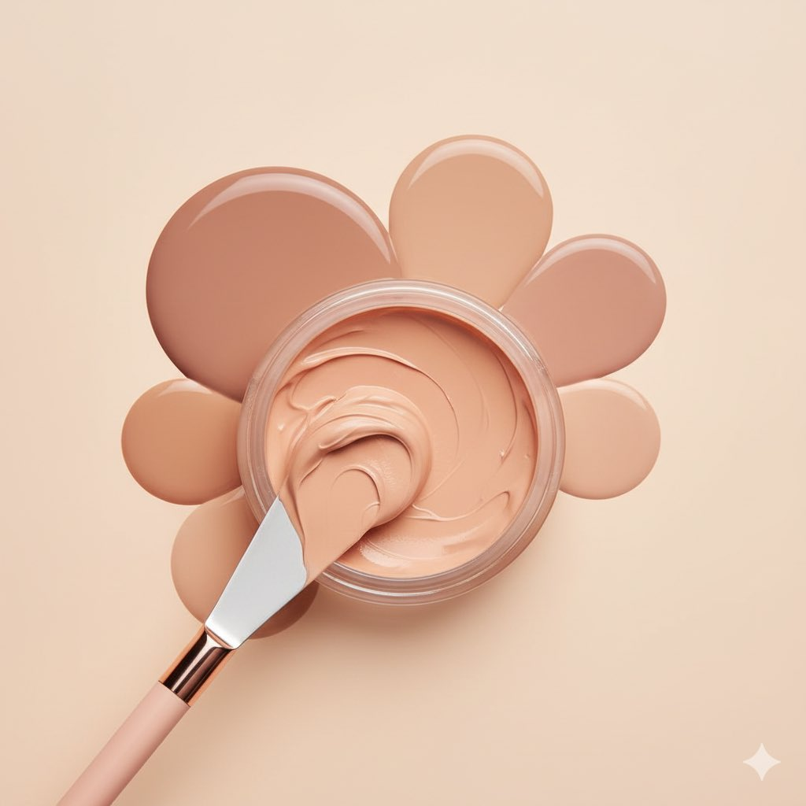

## Create a premium fashion catalog flat lay on a clean sof

- ID: trending-2030807641187045608
- Slug: trending-2030807641187045608-en
- 语言: en
- 来源: [来源链接](https://x.com/auqibhabib/status/2030807641187045608)
- 样例图路径: images/part1/2030807641187045608_1.jpg

### 提示词

```text
Create a premium fashion catalog flat lay on a clean soft beige studio background.
Only show the outfit items, arranged neatly as if for an ecommerce product display.

Items included: • Brown oversized blazer
• White graphic t-shirt
• Brown pinstripe wide-leg trousers
• Olive green cap
• Cream sneakers
• Yellow designer handbag

Arrange the clothing in a clean aesthetic flat-lay composition so it looks like the outfit is worn but without any person or mannequin. Each item must be perfectly isolated and clearly visible with realistic folds and shadows. The layout should look professional and balanced like a luxury fashion brand product catalog.

Lighting: soft studio lighting, minimal shadows, ultra sharp details, high fashion editorial style, 4K quality.

Add a large stylish bold text in the background behind the outfit: BRAND NAME

Typography should be modern, elegant and slightly faded so it looks like a branding element of the catalog.

Add a small product info section on one side: Sizes: M, L, XL, XXL

Next to it place small circular color indicators showing available colors: Red, Orange, Blue, Green

Important requirements: • No person
• No character
• No mannequin
• Only clothes and accessories
• Clean catalog layout
• Ultra detailed fabric texture
• Professional ecommerce product presentation
```

### 样例图

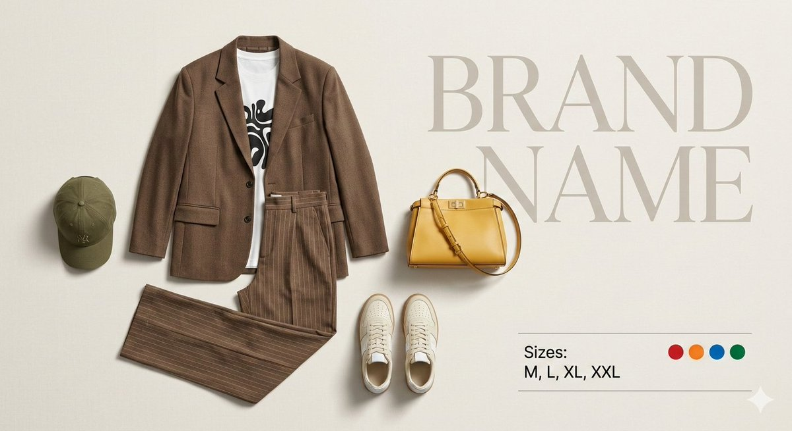

## Hyper-realistic professional FMCG ice cream commercial a

- ID: trending-2041733251992293735
- Slug: trending-2041733251992293735-en
- 语言: en
- 来源: [来源链接](https://x.com/Diplomeme/status/2041733251992293735)
- 样例图路径: images/part1/2041733251992293735_1.jpg

### 提示词

```text
Hyper-realistic professional FMCG ice cream commercial ad poster. Magnum Classic in dark chocolate brown featuring dual composition: one sealed Magnum wrapper and one bitten ice cream bar, arranged on a polished black marble surface.  

Background: a luxurious night-time rooftop setting overlooking a blurred city skyline with golden lights bokeh, evoking exclusivity and indulgence.  
Cool night air with subtle drifting mist.  

The sealed pack positioned slightly behind at a refined angle, gold branding catching ambient city light.  
The opened Magnum bar in front with a bite taken out, chocolate shell cracking dramatically revealing creamy vanilla core.  

The product hyper-detailed — sharp chocolate fracture edges catching warm golden highlights, molten interior texture visible, slight melting at edges, reflection visible on marble surface below.  

Floating micro chocolate shards suspended mid-air.  

Composition: bitten bar dominates foreground, packaging secondary, cinematic negative space blending into city lights.  

Typography:  
top left — Magnum logo gold.  
center — “MAGNUM CLASSIC”.  
bottom left — “Crack Into Pleasure”.  
below — “BELGIAN CHOCOLATE · THICK SHELL · VANILLA CORE”.  
bottom right — “Indulgence Starts Here”.  
thin separator.  
bottom center — “http://magnumicecream.co m
left vertical — “CLASSIC · 2026”.  

Lighting: mixed lighting — soft city glow + warm rim light enhancing chocolate gloss, deep cinematic contrast.  

Mood: sensual, luxurious, late-night indulgence.  

Shot on ARRI Alexa Mini LF, 100mm macro, shallow DOF, HDR, ultra photorealistic, cinematic FMCG poster, 4:5 portrait.

Hyper-realistic professional FMCG ice cream commercial ad poster. Kwality Walls Cornetto Butterscotch featuring dual composition: one sealed Cornetto pack and one open cone with a bite taken out, arranged on a slightly reflective street-side surface.  

Background: vibrant Indian summer street scene during golden hour, soft-focus silhouettes of people, colorful stalls, and warm festive tones.  
Warm sunlight haze with floating dust particles.  

The sealed pack positioned upright behind, branding clearly visible.  
The open cone in front with a bite exposing creamy caramel core and crunchy layers.  

The product hyper-detailed — crisp waffle cone, glossy caramel ribbons catching sunlight, slight melting edges, reflection visible below.  

Floating caramel bits and nut fragments mid-air.  

Composition: dynamic and lively, cone hero foreground, background adds cultural warmth without distraction.  

Typography:  
top left — Kwality Walls logo.  
center — “CORNETTO BUTTERSCOTCH”.  
bottom left — “Har Bite Mein Khushi”.  
below — “CREAMY · CRUNCHY · CARAMEL SWIRL”.  
bottom right — “Taste the Joy”.  
thin separator.  
bottom center — “http://kwalitywalls.in”.  
left vertical — “CORNETTO · 2026”.  

Lighting: natural golden sunlight, warm highlights, soft shadows, slight lens flare.  

Mood: joyful, nostalgic, everyday happiness.  

Shot on ARRI Alexa Mini LF, 50mm, shallow DOF, HDR, vibrant FMCG ad poster.
```

### 样例图

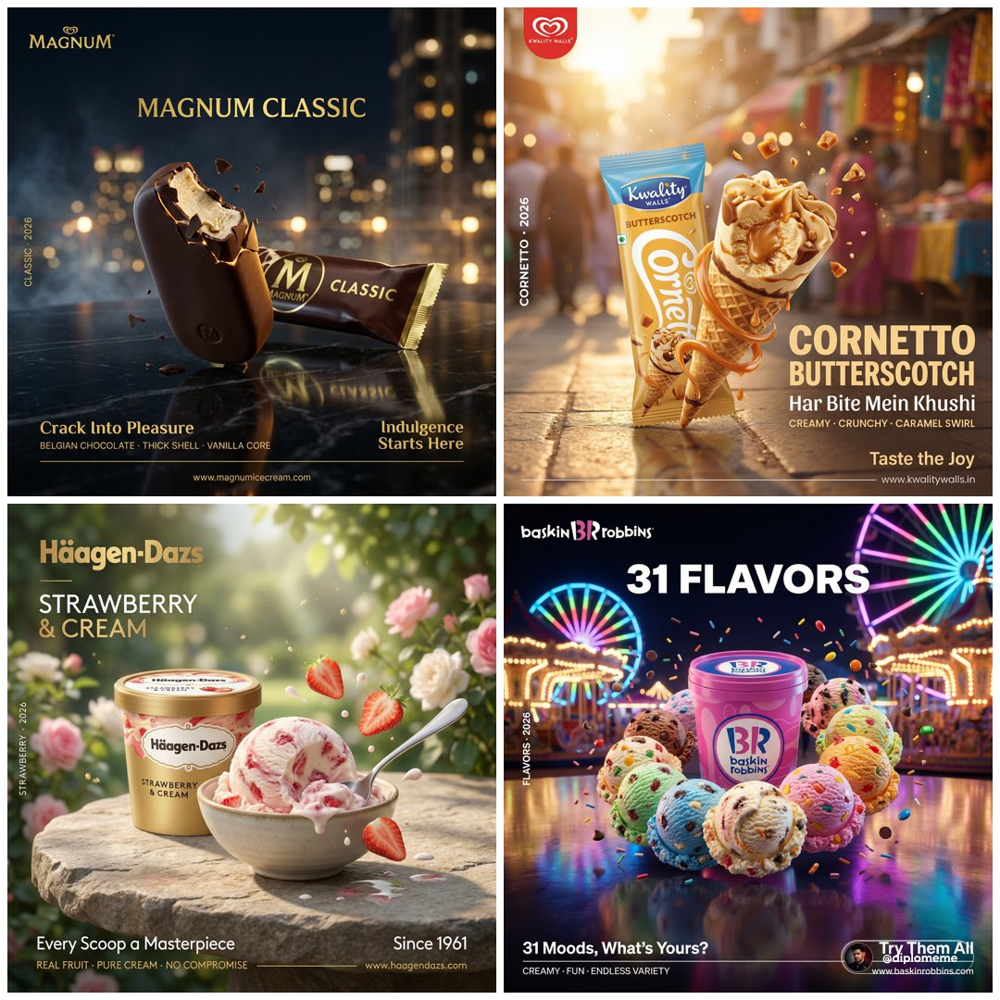

## Ultra-realistic cinematic product shot of a premium hone

- ID: trending-2039694451552272532
- Slug: trending-2039694451552272532-en
- 语言: en
- 来源: [来源链接](https://x.com/Just_sharon7/status/2039694451552272532)
- 样例图路径: images/part1/2039694451552272532_1.jpg

### 提示词

```text
Ultra-realistic cinematic product shot of a premium honey jar placed inside a shallow wooden hollow surrounded by tall wild wheat and tiny yellow meadow flowers, captured from an intimate low-angle macro perspective with slight cinematic depth, transparent glass jar filled with luminous deep golden honey, topped with a satin bronze metallic lid and a narrow cream seal strip crossing vertically over the cap, minimal luxury label reading “HUNSET”, jar lightly touched by thin climbing ivy strands for a refined organic detail, one realistic honeybee hovering near the front glass surface while another rests on a wheat stem behind the jar, environment set in a quiet countryside field during late afternoon, warm sunlight filtering through wheat stalks from behind creating glowing translucency inside the honey and soft halo edges around the jar, foreground with blurred wheat tips and soft natural bokeh, distant background fading into creamy green and amber tones, shallow depth of field with extreme sharpness on jar textures, visible honey thickness, subtle glass reflections, detailed plant fibers and pollen particles in air, cinematic luxury advertising mood, shot on 90mm macro lens, f/2.2, ultra-detailed natural textures, premium organic brand campaign style, 8k resolution, no text, no watermark.
```

### 样例图

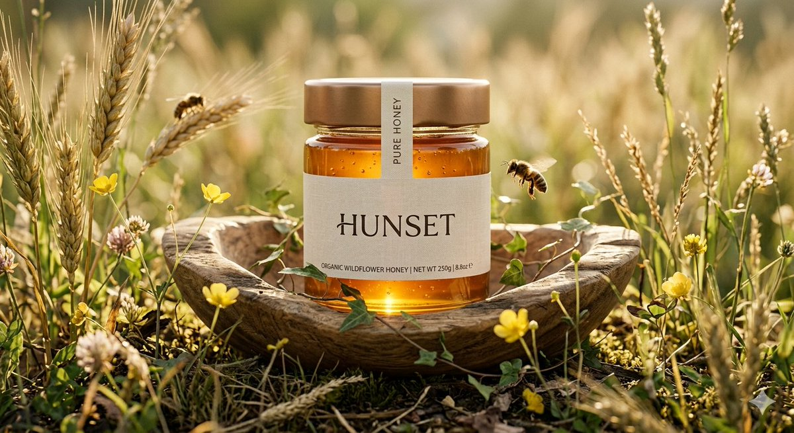

## High-end editorial product shot of a custom The North Fa

- ID: trending-2009203433325432953
- Slug: trending-2009203433325432953-en
- 语言: en
- 来源: [来源链接](https://x.com/0xInk_/status/2009203433325432953)
- 样例图路径: images/part1/2009203433325432953_1.jpg

### 提示词

```text
High-end editorial product shot of a custom The North Face Nuptse 700 puffer jacket inspired by [POKEMON].
The jacket’s primary colorway automatically derives from [POKEMON]’s dominant palette (main body color as base tone, secondary accents used sparingly for contrast), translated into premium, wearable hues — never cartoonish, always fashion-forward.
A large-scale embroidered [POKEMON] artwork dominates the back panel, adapted to the jacket’s quilted structure.
Embroidery style reflects [POKEMON]’s core identity:

aggressive Pokémon → bold stitch density, sharp contours
elegant or mystical Pokémon → flowing lines, layered thread gradients

armored or mechanical Pokémon → heavy, structured embroidery with tactile depth

The front of the jacket remains minimal and restrained:
clean TNF logo, subtle Poké Ball patch, no additional graphics.

Material realism is critical: visible fabric sheen, natural puff volume, precise seam alignment, embroidery threads sitting slightly raised from the nylon surface.

Shot in a Japanese fashion magazine product layout, pure white background.
Front and back views presented together, jacket floating upright, perfectly centered.
Lighting is clean, studio-soft with controlled contrast to emphasize texture and craftsmanship.

Mood: luxury streetwear meets collectible archive piece.
No model. No props. No distractions.
Ultra-sharp focus, high resolution, editorial polish, timeless design.
```

### 样例图

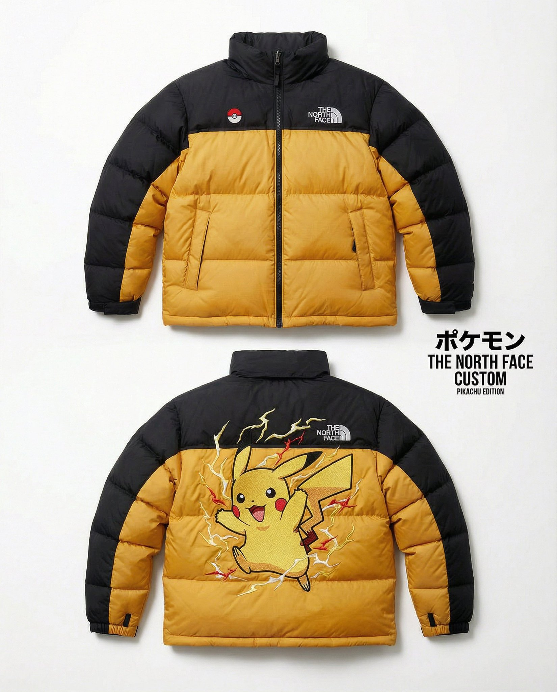

## Ultra-realistic luxury cosmetic product photography of a

- ID: trending-2029237707386568814
- Slug: trending-2029237707386568814-en
- 语言: en
- 来源: [来源链接](https://x.com/oggii_0/status/2029237707386568814)
- 样例图路径: images/part1/2029237707386568814_1.jpg

### 提示词

```text
Ultra-realistic luxury cosmetic product photography of a deep red glass jar labeled “the ACT Body Salt Scrub”, placed on a glossy reflective black surface. The jar is open and overflowing with fresh strawberries and raspberries, with berry juice dripping over the rim. Water droplets cover the jar creating a fresh, dewy look. Around the jar are scattered raspberries, strawberries, green leaves, and small white flowers. Background is a smooth gradient rich crimson red studio backdrop. Dramatic studio lighting, soft highlights, sharp macro detail, commercial beauty product advertisement style, high contrast, extremely detailed textures, 8k resolution, shallow depth of field, photorealistic, luxury skincare branding, centered composition.
```

### 样例图


## { "reference_images": { "product_image": "UPLOADED_IMAGE

- ID: trending-2017687421509406831
- Slug: trending-2017687421509406831-en
- 语言: en
- 来源: [来源链接](https://x.com/qatnology/status/2017687421509406831)
- 样例图路径: images/part1/2017687421509406831_1.jpg

### 提示词

```text
{
 "reference_images": {
 "product_image": "UPLOADED_IMAGE",
 "usage_rule": "Use the uploaded image as the exact visual reference for the product’s form, proportions, materials, and overall identity. Do not redesign or reinterpret the product."
 },

 "layout": {
 "canvas": {
 "orientation": "vertical",
 "aspect_ratio": "3:4",
 "background": "warm neutral paper-like surface"
 },
 "structure": {
 "top_section": "lifestyle_hero",
 "bottom_section": "technical_specification"
 }
 },

 "top_section": {
 "type": "lifestyle_product_image",
 "composition": {
 "placement": "top_center",
 "scale": "dominant",
 "margin": "generous whitespace around product"
 },
 "environment": {
 "setting": "minimal architectural interior",
 "lighting": {
 "type": "natural sunlight",
 "direction": "angled side light",
 "quality": "soft but high-contrast shadows"
 },
 "floor": "subtle concrete or stone surface",
 "background": "textured plaster wall"
 },
 "rendering": {
 "style": "editorial lifestyle photography",
 "detail": "high realism",
 "color_grading": "warm, muted, premium"
 }
 },

 "bottom_section": {
 "type": "technical_specification_panel",
 "layout": {
 "grid": "modular",
 "alignment": "clean, architectural"
 },

 "technical_drawings": {
 "placement": "bottom_left_and_center",
 "style": "architectural line drawings",
 "views": [
 "front view",
 "side view",
 "three-quarter cutaway or profile view"
 ],
 "projection": "orthographic",
 "line_style": {
 "color": "muted red or sepia",
 "weight": "fine technical lines"
 },
 "annotations": {
 "type": "measurement and construction callouts",
 "language": "neutral technical labels",
 "density": "minimal, editorial"
 }
 },

 "materials_panel": {
 "placement": "bottom_right",
 "content": {
 "type": "material_swatches",
 "count": "3-4 depending on product",
 "format": "square or rectangular samples"
 },
 "textures": {
 "source": "derived from the product materials",
 "examples": [
 "fabric",
 "leather",
 "metal",
 "wood",
 "plastic"
 ]
 },
 "labels": {
 "style": "small editorial captions",
 "tone": "technical but refined"
 }
 }
 },

 "typography": {
 "style": "minimal editorial",
 "usage": "subtle captions, no large headlines",
 "color": "soft black or dark brown"
 },

 "overall_style": {
 "mood": "design catalog / product design journal",
 "aesthetic": "architectural, premium, calm",
 "avoid": [
 "clutter",
 "bold colors",
 "heavy branding",
 "overly decorative graphics"
 ]
 },

 "constraints": {
 "do_not": [
 "change product design",
 "invent new materials",
 "add logos unless present in reference",
 "use perspective distortion in drawings"
 ]
 }
}
```

### 样例图

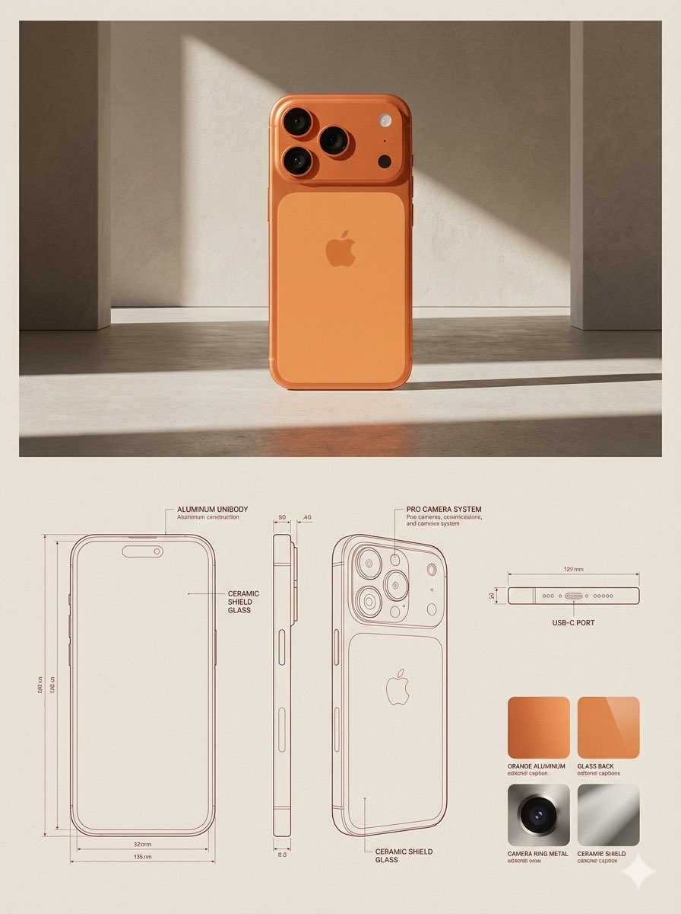

## 创建一张最终图像。 在4:5总格式内创建

- ID: trending-2015236449755676732
- Slug: trending-2015236449755676732-zh
- 语言: zh
- 来源: [来源链接](https://x.com/MissCat_AI/status/2015236449755676732)
- 样例图路径: images/part1/2015236449755676732_1.jpg

### 提示词

```text
创建一张最终图像。

在4:5总格式内创建清晰的3×3网格故事板，包含九个等比例面板。

使用参考图像作为产品基础。在所有九个面板中保持完全相同的产品、包装设计、品牌、材料、颜色、比例和整体身份。产品在每一帧都应清晰可识别。标签、logo和比例必须完全一致。

这是品牌组合的高端模型展示。重点在形式、构图、材质和视觉节奏，而非现实感或生活方式叙事。结果应感觉精心策划、编辑性强且设计导向。

第1帧:
产品的英雄正面特写，干净的工作室环境。中性背景，均衡构图，平静安全的产品呈现。

第2帧:
特写镜头，焦点聚集在产品中部。突出表面纹理、材料和印刷细节。

第3帧:
参考产品置于与品牌和产品类别自然契合的环境中。工作室场景受产品设计元素和颜色启发。

第4帧:
产品以使用或交互方式展示，中性工作室背景。手和交互元素最少且低调，保持包装风格。

第5帧:
等距构图展示多个产品，从等距俯视角精确几何排列。所有产品采用相同等距角度，均匀间距，干净结构化且图形化。

第6帧:
产品轻微悬浮，倾斜于与参考图像调色板相匹配的中性背景。浮动位置刻意而自然。

第7帧:
极近特写，聚焦标签、边缘、纹理或材料特性的具体细节。

第8帧:
产品置于出人意料但美学强大的环境，大胆编辑视觉冲击力强。意外但高度风格化的场景，工作室基调设计驱动。强势构图提升品牌。

第9帧:
宽幅构图展示产品在精致设计场景中的使用。道具干净，造型受控一致。

摄影与风格:
超高质量工作室图像，呈现真实相机外观。每帧不同角度和构图。受控景深、精确照明、逼真材质和反射。照明逻辑、调色板、氛围和视觉语言在九个面板中保持一致，形成统一系列。

输出:
无边框、无文字、无字幕、无水印的清晰3×3网格。
```

### 样例图


## Eco-Friendly Skincare Product “Minimalist skincare bottl

- ID: trending-2035582838649827509
- Slug: trending-2035582838649827509-en
- 语言: en
- 来源: [来源链接](https://x.com/oggii_0/status/2035582838649827509)
- 样例图路径: images/part1/2035582838649827509_1.jpg

### 提示词

```text
Eco-Friendly Skincare Product “Minimalist skincare bottle made of frosted glass, placed in a serene natural setting with flowing water, green leaves, and soft sunlight rays, clean aesthetic inspired by The Body Shop, sustainability-focused branding, soft pastel tones, high-end product photography, calm and pure atmosphere”
```

### 样例图

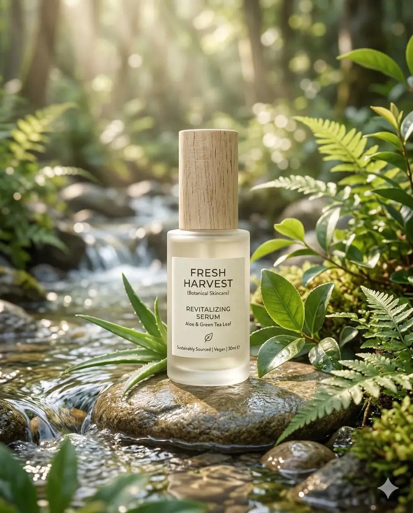

## Adidas sneakers in the box, minimalist product photograp

- ID: trending-2029815700160971067
- Slug: trending-2029815700160971067-en
- 语言: en
- 来源: [来源链接](https://x.com/ChillaiKalan__/status/2029815700160971067)
- 样例图路径: images/part1/2029815700160971067_1.jpg

### 提示词

```text
Adidas sneakers in the box, minimalist product photography, clean warm studio scene, textured beige wall in the background, soft directional
sunlight creating long shadows, simple table surface, the product placed in a playful conceptual composition,overlaid with a hand-drawn white outline doodle
[character] interacting with the product, mixed media
style combining real photography and sketch illustration, premium branding feel, shallow depth of field, ultra-realistic, no extra text, no watermarks, 8K,
1:1.
```

### 样例图

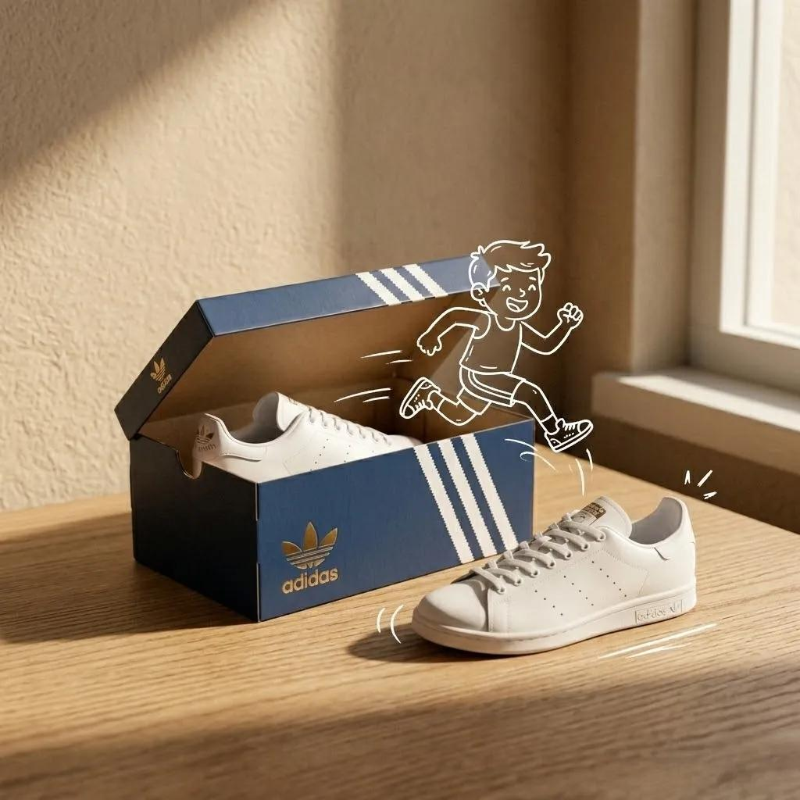

## Ultra-realistic minimalist product photography featuring

- ID: trending-2030614693291991536
- Slug: trending-2030614693291991536-en
- 语言: en
- 来源: [来源链接](https://x.com/oggii_0/status/2030614693291991536)
- 样例图路径: images/part1/2030614693291991536_1.jpg

### 提示词

```text
Ultra-realistic minimalist product photography featuring a cylindrical supplement container labeled “NUTRIO Pure Biotin – + Keratin 80 MG – 7500 mcg per serving – 100% Vegan – 60 Day Supply – 60 Tablets”. The container has a matte blue lid and upper section with a clean white lower label. The product is centered in a monochromatic soft blue studio environment, surrounded by thin vertical transparent acrylic glass panels that create subtle reflections and layered depth. The container sits on a smooth geometric platform with crisp edges, maintaining a balanced modern composition. Lighting is soft premium studio lighting from the upper left, producing gentle shadows, realistic reflections on the acrylic panels, and smooth gradients across the matte packaging surface. The background remains minimal and monochromatic to emphasize the product. Clean pharmaceutical advertising aesthetic, precise geometry, photorealistic textures, shallow depth of field, ultra-detailed 8K commercial product photography
```

### 样例图

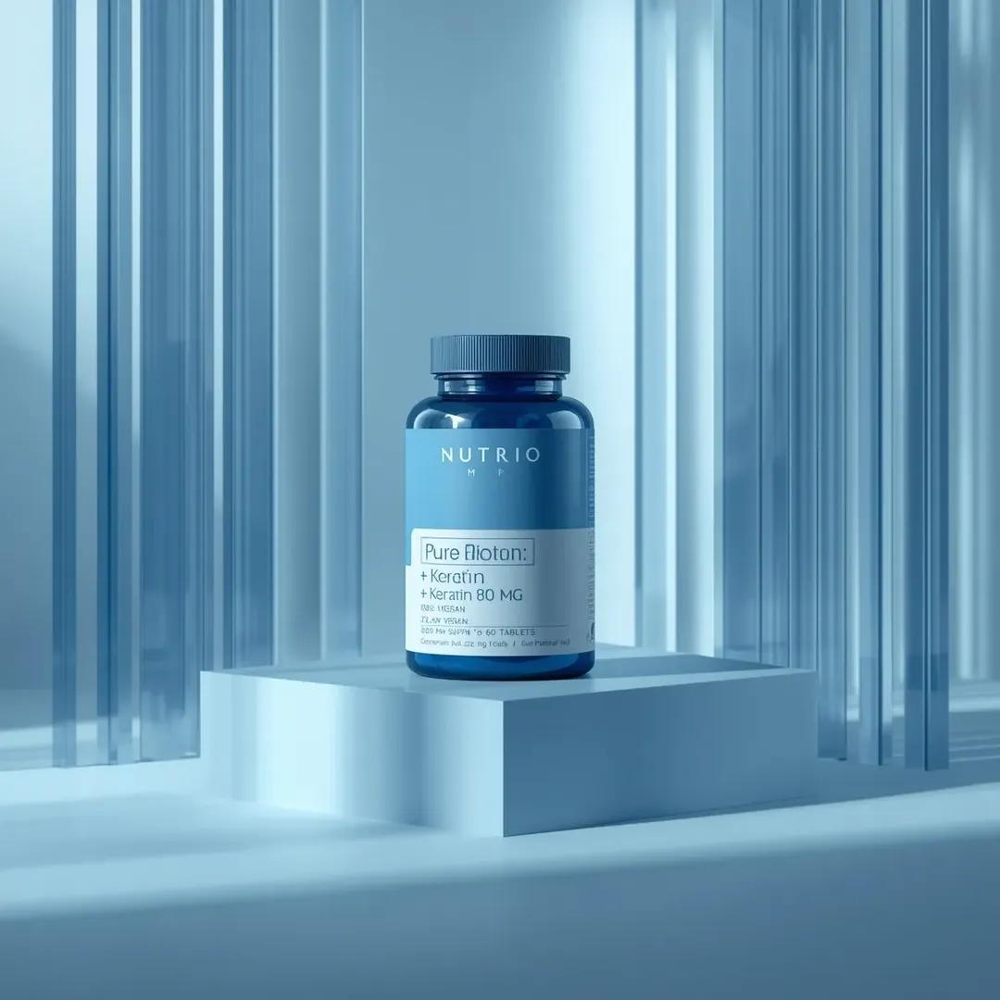

## { "type": "photorealistic skincare product photography",

- ID: trending-2033349315763323051
- Slug: trending-2033349315763323051-en
- 语言: en
- 来源: [来源链接](https://x.com/mehvishs25/status/2033349315763323051)
- 样例图路径: images/part1/2033349315763323051_1.jpg

### 提示词

```text
{
  "type": "photorealistic skincare product photography",
  "product": {
    "name": "VOIS – tsunami hydration",
    "container": "blue cosmetic cream jar",
    "position": "diagonally placed and partially embedded in fresh white snow",
    "details": "light hoarfrost and frozen condensation crystals on the jar surface"
  },
  "scene": {
    "environment": "soft powdery snow with sparkling ice crystals",
    "elements": "small blue primrose flowers with green leaves scattered around, some partially buried",
    "background": "clean minimal snowy bokeh with cold airy atmosphere"
  },
  "lighting": "bright winter side sunlight creating crisp highlights and soft natural shadows",
  "camera": {
    "lens": "85mm macro",
    "aperture": "f/2.8",
    "iso": 100,
    "depth_of_field": "shallow"
  },
  "style": "premium commercial skincare advertisement, cinematic macro composition",
  "quality": "ultra-detailed, photorealistic, 8K",
  "constraints": ["no people", "no text overlays", "minimal background"]
}
```

### 样例图

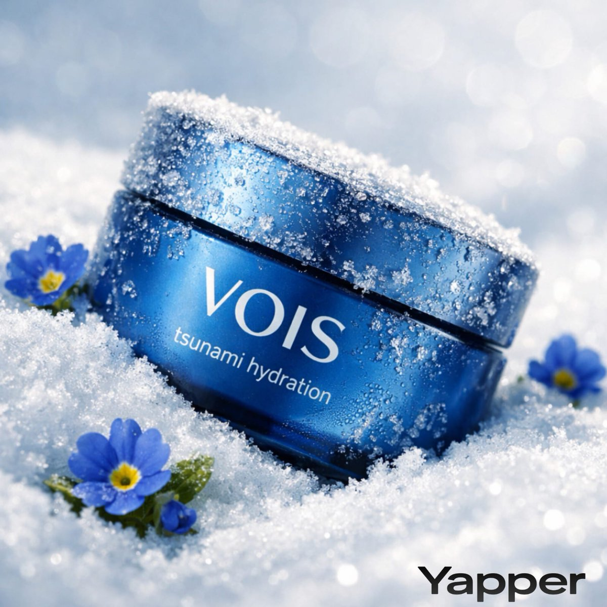

## Ultra-realistic premium fragrance product shot of a perf

- ID: trending-2039312763491917901
- Slug: trending-2039312763491917901-en
- 语言: en
- 来源: [来源链接](https://x.com/oggii_0/status/2039312763491917901)
- 样例图路径: images/part1/2039312763491917901_1.jpg

### 提示词

```text
Ultra-realistic premium fragrance product shot of a perfume bottle (Forest Essence Elixir), positioned at a (low macro angled shot) resting diagonally on lush (deep green moss surface in a forest setting), cylindrical design with a transparent glass center revealing green-tinted liquid, textured (matte black base) and brushed (metallic silver cap) with visible condensation droplets, surrounded by dense (forest foliage and pine branches) softly framing the scene, subtle (morning mist
```

### 样例图

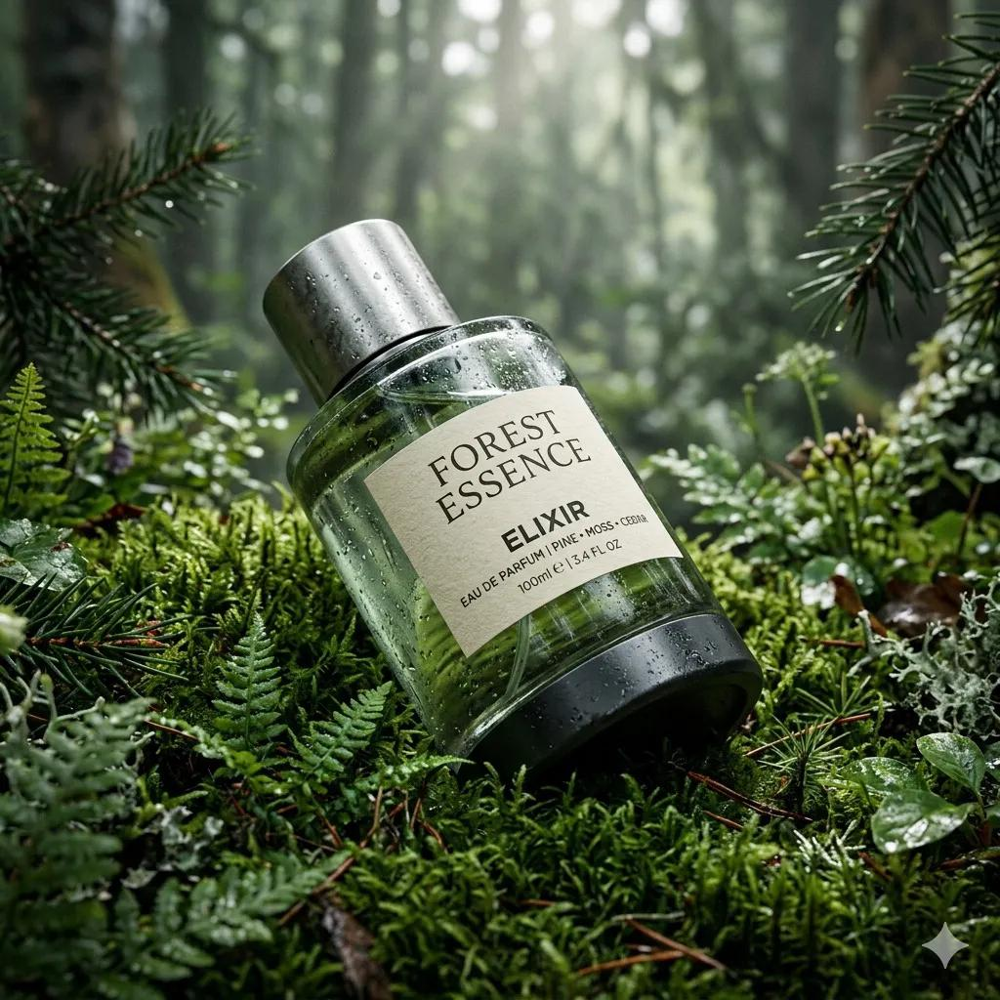

## Ultra-realistic fashion advertisement poster, minimalist

- ID: trending-2033918180352233873
- Slug: trending-2033918180352233873-en
- 语言: en
- 来源: [来源链接](https://x.com/auqibhabib/status/2033918180352233873)
- 样例图路径: images/part1/2033918180352233873_1.jpg

### 提示词

```text
Ultra-realistic fashion advertisement poster, minimalist editorial style.
Background: solid warm beige studio backdrop with soft gradient lighting, smooth clean texture.
Main subject: a stylish young woman in a low squat pose, body slightly turned sideways, one arm resting on knee, other hand touching back of head. Expression calm, confident, slightly looking sideways (not directly at camera).
Outfit (keep EXACT):
Sleeveless beige/tan high-neck top
Slim beige pants
Brown suede ankle boots with block heels
Light brown jacket placed casually near her feet
Minimal accessories: small hoop earrings, thin bracelet
Hair: straight, shoulder-length, natural dark brown, side-parted
Makeup: soft natural tones, clean skin, subtle glow
⚠️ Face: [REPLACE FACE WITH PROVIDED IMAGE / KEEP FACE GENERIC IF NOT PROVIDED]
(ensure seamless blending, same lighting, same skin tone, hyper-realistic)
Typography & Layout (EXACT SAME STYLE)
Top: Large bold condensed sans-serif text in dark red: FINAL HOURS (very large, stretched across width, behind subject partially)
Left side: Small text: UP TO
60% OFF
SELECTED ITEMS
Right side: ENDS
31.12
12 PM
Bottom: ⚠️ NO WEBSITE TEXT (REMOVE COMPLETELY)
Lighting & Style
Soft studio lighting, warm tone
Subtle shadows under subject
Clean editorial magazine look
Slight depth but mostly flat poster style
Matte finish, no gloss
Perfect alignment, balanced spacing
```

### 样例图

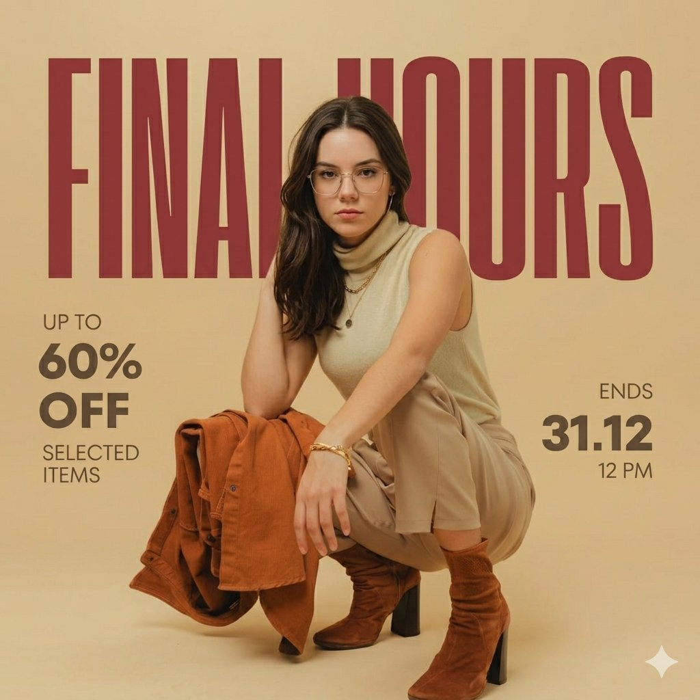

## A perfectly vertical, hyper-realistic 3D popsicle by [@ 

- ID: trending-2016567546325979473
- Slug: trending-2016567546325979473-en
- 语言: en
- 来源: [来源链接](https://x.com/youraipulse/status/2016567546325979473)
- 样例图路径: images/part1/2016567546325979473_1.jpg

### 提示词

```text
A perfectly vertical, hyper-realistic 3D popsicle by [@ YOUR LOGO] featuring a glossy signature-colored glaze with a gold logo pattern dripping over the visible matte ice cream texture at the base. The stick features the brand's logo.
```

### 样例图

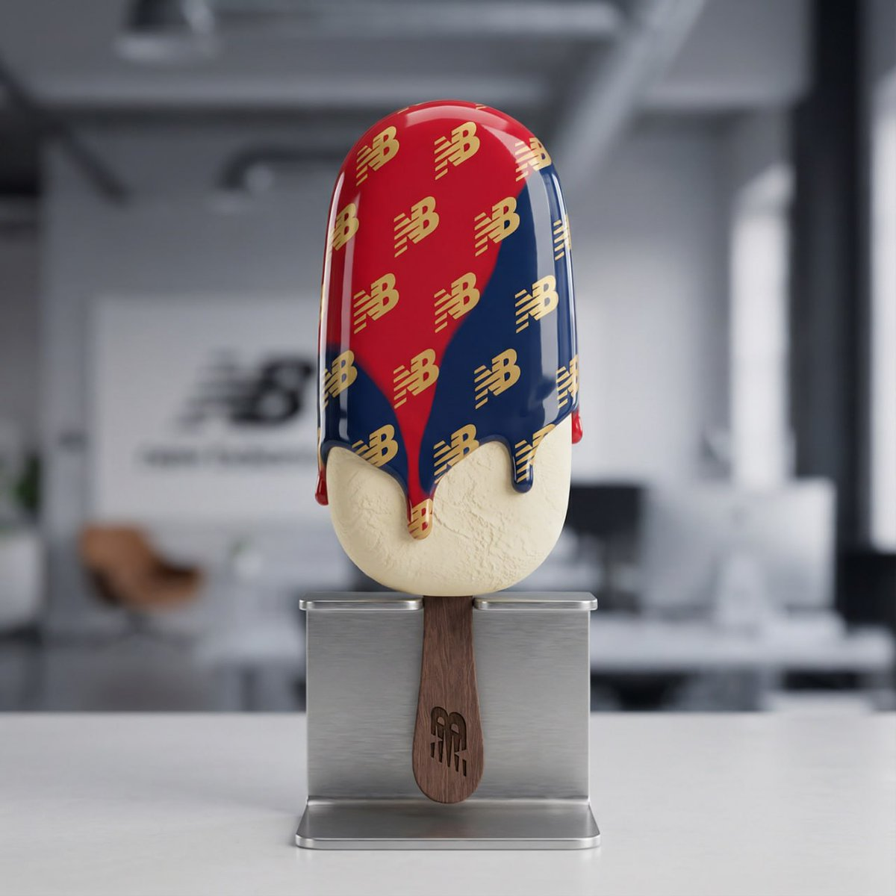

## { "image_type": "commercial product advertisement", "res

- ID: trending-2030575120520237388
- Slug: trending-2030575120520237388-en
- 语言: en
- 来源: [来源链接](https://x.com/meng_dagg695/status/2030575120520237388)
- 样例图路径: images/part1/2030575120520237388_1.jpg

### 提示词

```text
{
  "image_type": "commercial product advertisement",
  "resolution_target": "8K",
  "aspect_ratio": "3:4",
  "orientation": "vertical",

  "scene": {
    "environment": "studio product photography",
    "background": {
      "color": "dark charcoal to black gradient",
      "texture": "smooth matte",
      "lighting_falloff": "soft radial gradient toward center"
    }
  },

  "composition": {
    "style": "floating product arrangement",
    "depth": "multi-layer depth with foreground, midground, background objects",
    "camera_angle": "slightly top-down perspective",
    "camera_distance": "medium close-up",
    "focus": "sharp focus on central package, slightly softer on background elements",
    "visual_flow": "diagonal downward flow from top-left to bottom-right"
  },

  "primary_objects": [
    {
      "object_type": "snack_package",
      "brand_text": "BOO!",
      "position": "upper center",
      "orientation": "tilted slightly upward left-to-right",
      "packaging_color": "black glossy plastic",
      "text_details": {
        "main_text": "BOO!",
        "font_style": "bold sans-serif",
        "text_colors": ["white", "purple", "orange"],
        "secondary_text": "NEW!",
        "language": "Cyrillic"
      },
      "graphics": [
        "cartoon monster face with triangular teeth",
        "paint splash graphic in purple",
        "ice cream cone illustration with black swirl"
      ]
    },

    {
      "object_type": "snack_package",
      "brand_text": "BOO!",
      "position": "center",
      "orientation": "slightly angled",
      "packaging_color": "black glossy plastic",
      "text_details": {
        "main_text": "BOO!",
        "secondary_text": "NEW!",
        "accent_color": "orange"
      },
      "graphics": [
        "orange paint splash",
        "black ice cream cone graphic",
        "small candy illustrations"
      ]
    },

    {
      "object_type": "snack_package",
      "brand_text": "BOO!",
      "position": "bottom",
      "orientation": "back side facing camera",
      "packaging_color": "black glossy plastic",
      "visible_elements": [
        "nutrition text block",
        "barcode",
        "multicolor ingredient indicator bars"
      ]
    }
  ],

  "secondary_objects": [
    {
      "object_type": "ice_cream_cone",
      "color": "black",
      "texture": "waffle cone pattern",
      "ice_cream": "black soft swirl",
      "positions": [
        "right side near center",
        "bottom left",
        "background scattered"
      ]
    },

    {
      "object_type": "berries",
      "colors": ["red", "dark blue"],
      "shape": "small spherical",
      "positions": "floating around packages"
    },

    {
      "object_type": "caramel_candy",
      "shape": "round flat candy discs",
      "color": "orange caramel",
      "positions": "floating mid-scene"
    },

    {
      "object_type": "nut_fragments",
      "color": "light beige",
      "size": "small crumb particles",
      "distribution": "scattered floating around scene"
    }
  ],

  "lighting": {
    "type": "studio lighting",
    "key_light": "soft directional light from upper left",
    "fill_light": "soft ambient fill",
    "rim_light": "subtle edge highlight on packaging",
    "reflections": "visible glossy reflections on plastic packaging",
    "shadows": "soft shadows beneath floating objects"
  },

  "materials": {
    "packaging": "glossy plastic",
    "cone": "matte waffle texture",
    "berries": "smooth slightly reflective skin",
    "candies": "semi-gloss caramel surface"
  },

  "color_palette": {
    "dominant": ["black", "dark gray"],
    "accent": ["orange", "purple", "red", "blue"],
    "highlight": ["white"]
  },

  "motion_effect": {
    "style": "frozen motion",
    "objects": "packages, cones, candies appear suspended mid-air",
    "particle_effect": "small crumbs floating"
  },

  "render_quality": {
    "detail_level": "ultra high detail",
    "sharpness": "crisp edges",
    "noise": "none",
    "texture_detail": "high fidelity",
    "realism": "photorealistic commercial product render"
  }
}
```

### 样例图

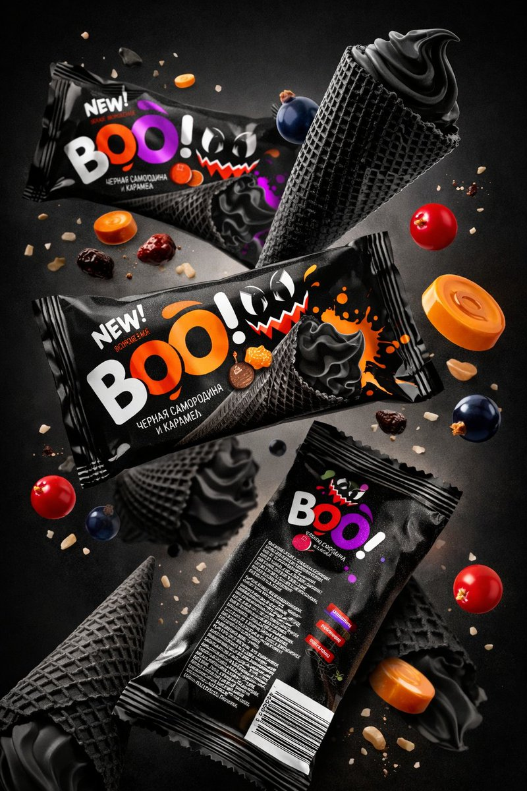

## Ultra-realistic commercial food product advertising scen

- ID: trending-2033019623004844148
- Slug: trending-2033019623004844148-en
- 语言: en
- 来源: [来源链接](https://x.com/oggii_0/status/2033019623004844148)
- 样例图路径: images/part1/2033019623004844148_1.jpg

### 提示词

```text
Ultra-realistic commercial food product advertising scene featuring a glass jar labeled "Classy Strawberry Jam" floating dynamically in mid-air. The jar is filled with glossy vibrant red strawberry jam and has a black lid with a premium black label showing fresh strawberries and the Classy brand logo clearly visible. Surrounding the jar are splashes of thick strawberry jam bursting outward in dramatic fluid motion, with droplets and shards of transparent glass frozen mid-air. Fresh whole strawberries, sliced strawberries, and green strawberry leaves float around the product to emphasize freshness. Behind the jar is a large smartphone screen displaying a social media post layout, suggesting an Instagram-style interface, symbolizing viral promotion. Floating around the composition are social media icons such as hearts, likes, comment bubbles, and hashtag symbols to represent online engagement. The background is a vibrant red-orange gradient with glowing highlights that enhance the energetic advertising feel. Cinematic studio lighting highlights the glossy texture of the jam, reflective glass jar, and dynamic splashes. High-end commercial advertising style, macro product photography, ultra-detailed textures, shallow depth of field, photorealistic, 8K resolution.
```

### 样例图

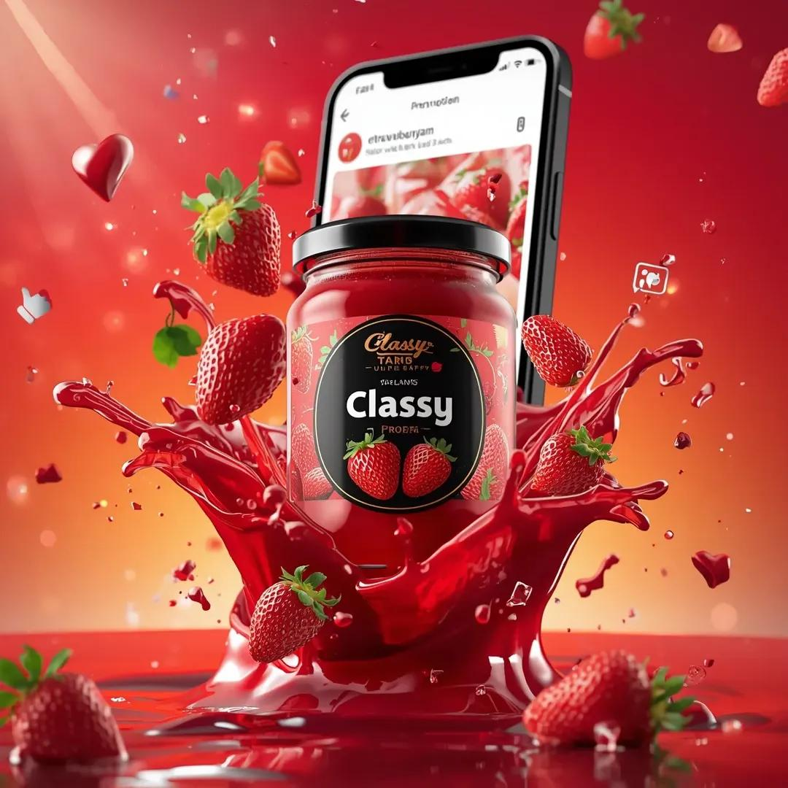

## Hyper-realistic luxury product campaign poster, 1:1 squa

- ID: trending-2040831603199672577
- Slug: trending-2040831603199672577-en
- 语言: en
- 来源: [来源链接](https://x.com/Diplomeme/status/2040831603199672577)
- 样例图路径: images/part1/2040831603199672577_1.jpg

### 提示词

```text
Hyper-realistic luxury product campaign poster, 1:1 square format. brand name shampoo bottle standing centered on surface — marble / wood / ice / terrazzo / granite. Background: background — forest bokeh / white infinity / tropical foliage / arctic gradient / violet void. Foreground: ingredients — amla berries / orchid bloom / ice crystals / citrus slices / silk threads scattered naturally around bottle base. Bottle surface hyper-detailed — brand logo catching single overhead spotlight as sharp specular highlight, label color rich and saturated, cap gleaming. Bottle casting natural shadow on surface below, surface reflection of bottle visible beneath.
Fine atmosphere — morning mist / water droplets / dry ice fog / golden dust particles suspended around bottle catching the light. Single hero ingredient — aloe curl / rose petal / keratin oil spill / white gardenia resting against bottle base. Everything arranged as if placed by nature not a stylist.
Typography: top center — “brand name” in 10px Josefin Sans tracked white caps letter-spacing 8px. Center left — large Playfair Display italic stacked headline: “line 1” and “line 2” — 56px white, second line in accent color. Bottom — thin accent color horizontal rule full width. Below rule — “key benefit · key benefit · key benefit” in 8px tracked white caps. Bottom right — “brand tagline” in 9px Cormorant Garamond italic accent color. Right edge vertical — “ingredient · ingredient · ingredient” in 7px white caps rotated 90 degrees.
Lighting: lighting direction — single hard overhead spotlight / soft diffused morning light / cold clinical blue-white / warm golden side light, strong specular on bottle logo and cap, mood light — warm amber fill / cold blue ambient / tropical bright / pure white wrap. Mood: mood — indian home warmth / clinical confidence / tropical joy / salon authority / pure minimalism. Shot on Hasselblad H6D, 85mm anamorphic macro, shallow DOF, palette color bokeh, HDR, luxury haircare campaign, 1:1 square format.
```

### 样例图

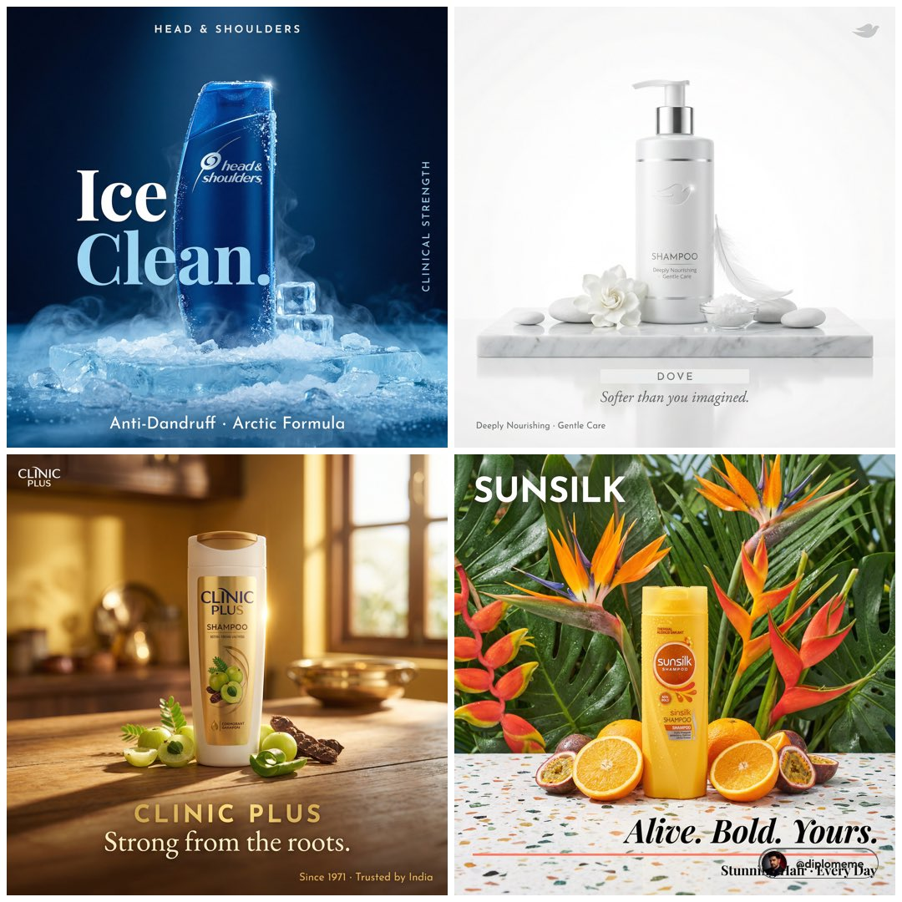

## A rugged, matte-black chronograph watch with bold orange

- ID: trending-2038224276835471420
- Slug: trending-2038224276835471420-en
- 语言: en
- 来源: [来源链接](https://x.com/Strength04_X/status/2038224276835471420)
- 样例图路径: images/part1/2038224276835471420_1.jpg

### 提示词

```text
A rugged, matte-black chronograph watch with bold orange accents is tightly framed between two textured rock formations, creating a natural vignette that directs all focus toward the dial; the scene opens with an ultra-close macro perspective, the camera slowly sliding laterally through the narrow rocky gap, maintaining an intimate, compressed field of view with no zoom-out, as if discovering the watch hidden within a harsh alpine environment. Cold mountain air subtly moves fine dust particles and faint mist across the frame, catching soft, diffused daylight that spills in from above, while a warm, low-angle sunlight grazes the rocks and reflects gently onto the watch face, creating a striking contrast between cool shadows and warm highlights. The camera continues a controlled micro-orbit around the watch at close range, allowing specular highlights to travel across the brushed metal bezel, engraved screws, and slightly textured rubber strap, emphasizing durability and premium craftsmanship. The orange indices and hands glow subtly as light shifts across the sapphire crystal, revealing crisp reflections and slight curvature distortions. In the blurred background, towering mountain peaks remain softly out of focus, adding depth without distraction, while tiny vibrations in the environment cause minuscule pebble shifts near the base, reinforcing realism. As the shot progresses, a faint breeze brushes across the strap, introducing barely perceptible movement, while light intensity fluctuates naturally as if clouds are passing overhead. The sequence ends in a locked, ultra-tight hero composition, perfectly centered within the rock frame, with high contrast, razor-sharp detail on the dial, and a cinematic interplay of shadow, texture, and controlled highlights that reinforce a premium, adventure-driven identity.
```

### 样例图


## [Louis Vuitton]. Act as a World-Class Footwear Designer 

- ID: trending-2013325907843219831
- Slug: trending-2013325907843219831-en
- 语言: en
- 来源: [来源链接](https://x.com/AmirMushich/status/2013325907843219831)
- 样例图路径: images/part1/2013325907843219831_1.jpg

### 提示词

```text
[Louis Vuitton]. Act as a World-Class Footwear Designer and Product Photographer creating a high-end "Crocs Collaboration" campaign image.

1. THE SUBJECT (CUSTOMIZED CROCS CLOG):

Generate a photorealistic, high-end customized Crocs Classic Clog inspired by the visual identity of [BRAND NAME].

View: The shoe is positioned in a Strict Side Profile View (facing right), exactly like a product profile shot. It must look grounded and substantial.

Color Blocking: Apply [BRAND NAME]'s official color palette intelligently:

Body: The main foam upper is the brand's Primary Color.

Sole/Strap: Use the Secondary/Accent colors for the thick rubber sole unit and the heel strap to create contrast.

Custom Jibbitz (Charms): The shoe is decorated with 3-4 high-quality 3D Jibbitz charms plugged into the ventilation holes. These charms must be iconic symbols or products associated with [BRAND NAME] (e.g., if "Starbucks" -> a tiny frappuccino cup and logo; if "Nike" -> a 3D swoosh).

2. THE BACKGROUND ():

The background is a Pure White Studio Space (#FFFFFF).

3. LIGHTING & MATERIALITY (EDITORIAL QUALITY):

Lighting: Ultra-realistic High-Key Studio Lighting. Use a large softbox from the top-left to create smooth, glossy highlights on the rubber curves of the Crocs. The lighting is bright, neutral, and expensive.

Texture: The material must look like real Croslite foam resin—matte with subtle specular highlights on the edges. The Jibbitz charms should look like hard glossy plastic or rubber.

Shadows: A sharp, realistic contact shadow under the shoe to ground it on the white floor.

4. BRANDING & LAYOUT (UI ELEMENTS):

Bottom Left Corner: Place a small, discrete, Monochrome Light Grey Logo of [BRAND NAME].

Bottom Right Corner: Place a small, discrete, Monochrome Light Grey "Crocs" Logo.

TECH SPECS:

Macro product photography, Phase One camera, 100mm lens, razor-sharp focus, 8k resolution, uncompressed, commercial look.
```

### 样例图

![[Louis Vuitton]. Act as a World-Class Footwear Designer ](../images/part1/2013325907843219831_1.jpg)

## [BRAND NAME] + [PRODUCT] Act as a Senior Luxury Fashion 

- ID: trending-2037967998565089736
- Slug: trending-2037967998565089736-en
- 语言: en
- 来源: [来源链接](https://x.com/AmirMushich/status/2037967998565089736)
- 样例图路径: images/part1/2037967998565089736_1.jpg

### 提示词

```text
[BRAND NAME] + [PRODUCT] 

Act as a Senior Luxury Fashion Art Director and Studio Photographer specializing in high-end product key visuals for flagship campaigns, e-commerce editorials, and mobile-first brand content.

PHASE 1: FORMAT & CANVAS
Vertical format, 9:16 aspect ratio. Canvas background: a single flat field of warm off-white — not pure white, not grey. Target tone: soft ivory cream (#F4EFE6 equivalent), uniform and completely shadowless 
 across the entire background plane.
Autonomously determine [BRAND NAME]'s signature background tone — if the brand has a recognized house color for its packaging, tissue paper, or  lookbook backgrounds, shift the canvas toward that specific off-white or neutral. The result must feel like an official brand document, not a generic studio.

PHASE 2: BACKGROUND PATTERN (WATERMARK LAYER)

Autonomously identify [BRAND NAME]'s iconic surface pattern, monogram, or archival motif — examples: a house monogram, toile print, geometric logo repeat, heritage emblem, or signature textile pattern.
Render this pattern across the entire background canvas as a ghost watermark: same tone as the background but with a slight value shift (approximately 8–12% darker 
or lighter than the base). The pattern must be large in scale — individual motifs spanning 15–25% of canvas width. Opacity: 10–18% maximum. No hard edges. The pattern should feel embossed or tone-on-tone woven, not printed. It must recede behind all other elements.

PHASE 3: LOGO PLACEMENT

Autonomously reproduce [BRAND NAME]'s official logo with complete fidelity — correct letterforms, proportions, secondary marks (emblems, crowns, stars, monogram icons).
Place the logo centered horizontally in the upper third of the frame (top 30% of canvas). Scale: the logo should span approximately 40–50% of canvas width — prominent but not overwhelming.
Logo rendering: flat 2D, no extrusion, no chrome. Color: autonomously apply [BRAND NAME]'s official logo colorway — the exact brand-standard color(s) used on official packaging and website. If the brand uses a two-tone logo (icon + wordmark in different colors), preserve that hierarchy precisely.
Directly below the main logo mark, place the full [BRAND NAME] wordmark in spaced capital letters — clean, geometric sans-serif, tracking: +200 to +300, 
same brand color, optical size approximately 60% of logo height. No decorative elements between logo and wordmark.

PHASE 4: PRODUCT PLACEMENT

Render [PRODUCT] as a photorealistic studio object with maximum material fidelity:
— Leather: visible grain, pore structure, stitching thread texture, realistic edge paint.
— Hardware: gold or silver metal with micro-reflections, not flat.
— Canvas/fabric: woven fiber detail, not smooth CG.
— All brand-specific surface patterns on the product must be accurate and legible.
Placement: the product enters the frame from the bottom-right corner at a natural 25–35 degree angle, as if casually placed or mid-motion. The product is cropped — only 60–75% of the object is visible 
within the frame. The crop should feel intentional and editorial, not accidental. The product occupies the lower 55–65% of the canvas.
The product must feel physically present in the space — not floating. Cast an extremely soft, barely visible contact shadow (opacity 8–12%) on the canvas beneath the nearest edge. No hard drop shadows.

PHASE 5: LIGHTING

Lighting: simulated large north-facing studio window light. Soft, directional, shadowless on the background. Color temperature: 5500–6000K (neutral daylight, slightly cool). 
Key light: large softbox equivalent from upper-left, filling the entire product surface evenly with 
minimal contrast ratio (1.2:1 to 1.5:1 max).
Fill light: large bounce from right side, eliminating all harsh shadows. No rim light. No dramatic contrast. The lighting philosophy is: "the product sells itself — light only reveals, never performs."
Global Illumination enabled for subtle inter-reflections between product surfaces. No specular hotspots on leather — only on metal hardware.

PHASE 6: TYPOGRAPHY & FINISHING

Bottom of frame: a thin horizontal rule line (1px, brand color, 80% canvas width, centered). Below the rule: a single line of micro-copy — a social handle, collection name, or campaign label — in the same clean sans-serif, lowercase or small-caps, minimal tracking. Autonomously generate a contextually appropriate label for [BRAND NAME].

TECH SPECS

Render engine: photorealistic CGI, Keyshot / Octane product visualization aesthetic. Resolution: 9:16, ultra-high detail.
Depth of Field: f/16 equivalent — everything in sharp focus. Zero bokeh. Tack-sharp edges on all product details.Tone mapping: clean, true-to-life. No filmic crush. No vignette. No grain. Color grade: neutral, faithful to real product color. Slight warmth in the ivory background only. No AI-plastic normals on leather or fabric. Microscopic surface imperfection maps required. No reflections on background. No environmental reflections — studio only. Mood reference: Louis Vuitton / Bottega Veneta / Celine official e-commerce and campaign photography standard. Clean enough to be used as a press image.
```

### 样例图

![[BRAND NAME] + [PRODUCT] Act as a Senior Luxury Fashion ](../images/part1/2037967998565089736_1.jpg)

## A clean 3×3 storyboard grid with nine equal-sized panels

- ID: trending-2015257114529419733
- Slug: trending-2015257114529419733-en
- 语言: en
- 来源: [来源链接](https://x.com/songguoxiansen/status/2015257114529419733)
- 样例图路径: images/part1/2015257114529419733_1.jpg

### 提示词

```text
A clean 3×3 storyboard grid with nine equal-sized panels and an overall 4:5 aspect ratio.
Use the reference image as the base product reference. Keep the same product, packaging design, branding, materials, colors, proportions and overall identity across all nine panels exactly as the reference. The product must remain clearly recognizable in every frame. The label, logo and proportions must stay exactly the same.
This storyboard is a high-end designer mockup presentation for a branding portfolio. The focus is on form, composition, materiality and visual rhythm rather than realism or lifestyle narrative. The overall look should feel curated, editorial and design-driven.
FRAME 1 (The Icon): Center-composed hero shot of the red tea tin on an antique dark walnut table, bathed in warm, golden afternoon sun.
FRAME 2 (The Tactile): Extreme close-up on the glossy red metal surface showing the embossed gold floral texture catching the light.
FRAME 3 (The Environment): The canister placed on a wooden shelf in a blurred traditional Chinese study with calligraphy brushes in the background.
FRAME 4 (The Interaction): An elegant hand pouring dry tea leaves near the base of the tin, emphasizing the ritual.
FRAME 5 (The Matrix): An isometric grid of multiple red tins arranged on a wooden surface, creating a pattern of red and gold.
FRAME 6 (The Gravity): The red canister floating gently above a wooden tray, surrounded by drifting dried tea leaves.
FRAME 7 (The Signature): Macro detail focusing strictly on the black Chinese calligraphy "Wu Yu Tai" against the gold background.
FRAME 8 (The Statement): Artistic high-contrast shot using shadows of window lattice (geometric patterns) cast across the red tin.
FRAME 9 (The Horizon): Wide cinematic shot of the tin placed on a low table in a grand, dimly lit traditional courtyard at dusk.
CAMERA & STYLE:
Ultra high-quality studio imagery with a real camera look. Different camera angles and framings across frames. Controlled depth of field, precise lighting, accurate materials and reflections. Lighting logic, color palette, mood and visual language must remain consistent across all nine panels as one cohesive series.
OUTPUT:
A clean 3×3 grid with no borders, no text, no captions and no watermarks.
```

### 样例图

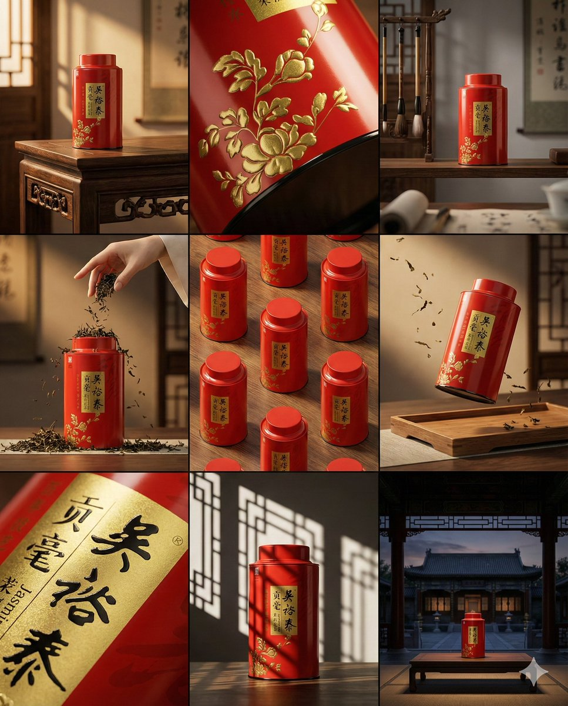

## A stylish young man with medium-length wavy dark hair an

- ID: trending-2036365607827099705
- Slug: trending-2036365607827099705-en
- 语言: en
- 来源: [来源链接](https://x.com/harboriis/status/2036365607827099705)
- 样例图路径: images/part1/2036365607827099705_1.jpg

### 提示词

```text
A stylish young man with medium-length wavy dark hair and a clean face, wearing a muted olive green button-up shirt with sleeves slightly rolled up, paired with loose fit black straight pants and white sneakers. The outfit looks minimal, modern, and aesthetic.
Create a fashion collage layout with 5 sections:
Center: a clean cutout of the outfit (olive shirt + black pants) placed vertically, slightly floating, with a soft white outline glow around it.
Around the center: four different lifestyle shots of the same man wearing the outfit.
Top left: indoor mirror selfie in a modern lobby with marble walls and shiny floor, holding phone covering face, relaxed walking pose.
Top right: outdoor greenery setting with plants and trees, walking pose with hands in pockets, looking sideways.
Bottom left: sitting pose on a bench or ledge, slightly leaning forward, one hand in hair, moody lighting.
Bottom right: urban street or stairs background with concrete textures, walking casually with hands in pockets.
Add minimal white curved arrows pointing from each lifestyle image toward the center outfit.
Lighting: soft natural light, slightly warm tone, cinematic shadows, Instagram aesthetic.
Color palette: neutral tones, olive green, black, white, soft greys.
Style: clean, minimal, high-end fashion lookbook, Pinterest / Instagram aesthetic.
Camera: 35mm lens, shallow depth of field, sharp subject focus.
Quality: ultra realistic, high resolution, 4K, detailed fabric texture.
```

### 样例图

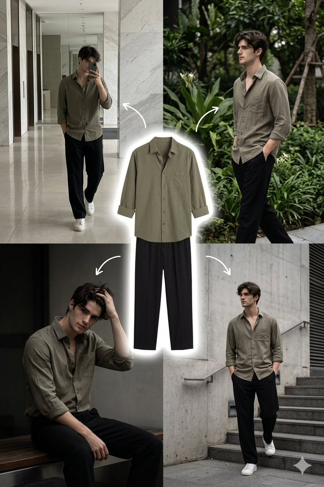

## Ultra-realistic luxury skincare product photography feat

- ID: trending-2030986112878235810
- Slug: trending-2030986112878235810-en
- 语言: en
- 来源: [来源链接](https://x.com/oggii_0/status/2030986112878235810)
- 样例图路径: images/part1/2030986112878235810_1.jpg

### 提示词

```text
Ultra-realistic luxury skincare product photography featuring a glass cosmetic jar labeled “ONE POSE” placed at the center of a glossy reflective surface. The jar contains a vibrant strawberry-pink cream with a soft gradient fading into a frosted white lid, and a smooth swirl of creamy pink product melting over the top and dripping down the sides of the jar like glossy dessert glaze. Surrounding the product are fresh ripe strawberries and halved strawberries with visible seeds and juicy texture, arranged naturally around the base. Soft scoops of strawberry ice cream sit beside the fruit, slightly melting and blending into a glossy pink cream puddle that spreads across the surface. The background is a soft pastel pink studio gradient that enhances the strawberry tones. Premium studio lighting from above and the side creates crisp reflections on the glass jar, soft highlights on the melting cream and ice cream texture, and gentle shadows beneath the product. The composition feels indulgent and dessert-inspired while maintaining a clean luxury cosmetic advertising aesthetic, hyper-realistic textures, shallow depth of field, cinematic lighting, ultra-detailed 8K product photography.
```

### 样例图

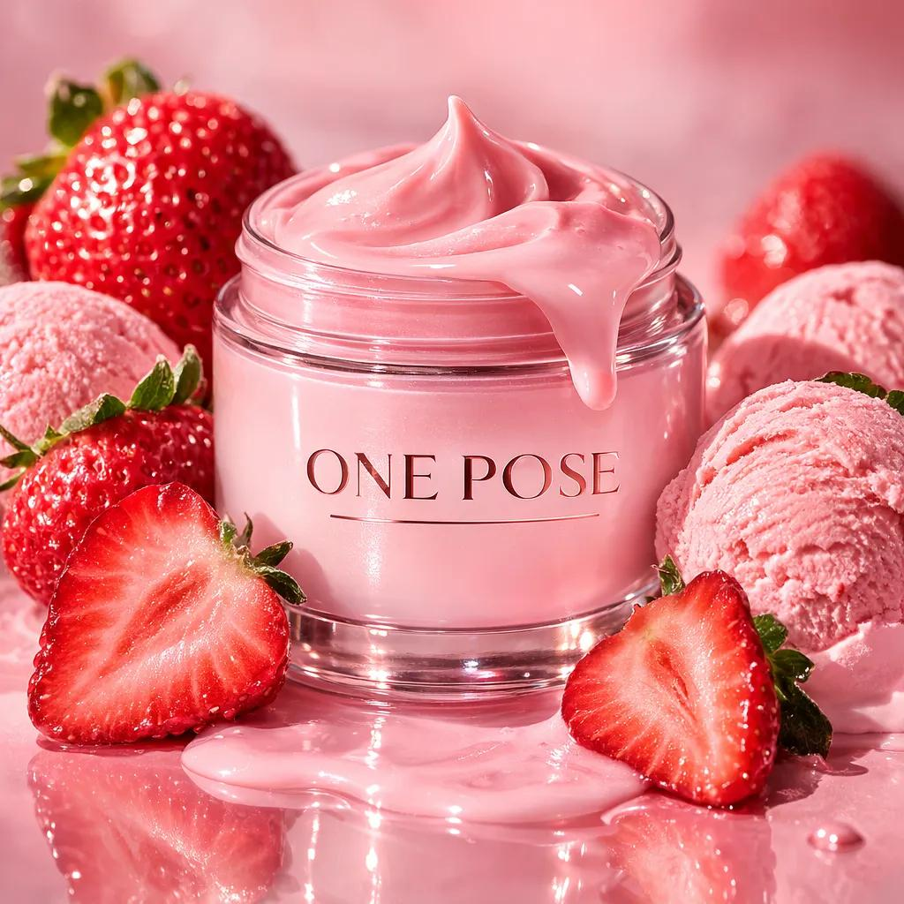

## Ultra-realistic gaming mouse floating above a desk, surr

- ID: trending-2029817590579966012
- Slug: trending-2029817590579966012-en
- 语言: en
- 来源: [来源链接](https://x.com/Taaruk_/status/2029817590579966012)
- 样例图路径: images/part1/2029817590579966012_1.jpg

### 提示词

```text
Ultra-realistic gaming mouse floating above a desk, surrounded by glowing golden energy rings and flying electronic components, dramatic cinematic lighting, futuristic tech aesthetic, detailed mousepad and cables on wooden desk, sparks and particles in the air, high-speed motion effect, premium product advertising, hyper-detailed textures, depth of field, 8K, studio lighting.
```

### 样例图

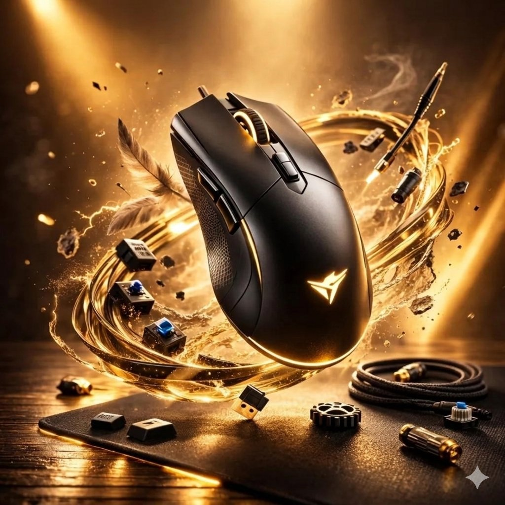

## { "style": "cinematic, symbolic, minimal, realistic", "a

- ID: trending-2017460732938621180
- Slug: trending-2017460732938621180-en
- 语言: en
- 来源: [来源链接](https://x.com/Naiknelofar788/status/2017460732938621180)
- 样例图路径: images/part1/2017460732938621180_1.jpg

### 提示词

```text
{
  "style": "cinematic, symbolic, minimal, realistic",
  "aspect_ratio": "9:16",
  "scenes": [
    {
      "scene_number": 1,
      "description": "A quiet outdoor setting with a clean surface under soft natural light. Two identical toffees are placed side by side.",
      "camera": "slow zoom-in",
      "mood": "calm, neutral"
    },
    {
      "scene_number": 2,
      "description": "One toffee is neatly wrapped in shiny paper. The other toffee is unwrapped, fully exposed.",
      "camera": "static close-up",
      "mood": "contrast, anticipation"
    },
    {
      "scene_number": 3,
      "description": "Ants begin to appear and slowly crawl toward the unwrapped toffee, completely ignoring the wrapped one.",
      "camera": "macro shot, slow motion",
      "mood": "uneasy, revealing"
    },
    {
      "scene_number": 4,
      "description": "More ants gather around the unwrapped toffee, covering it, while the wrapped toffee remains untouched and protected.",
      "camera": "top-down shot",
      "mood": "warning, realization"
    },
    {
      "scene_number": 5,
      "description": "Text fades in on screen as the ants swarm the unwrapped toffee.",
      "text_overlay": "When you are too open, you can be used.",
      "camera": "gentle fade",
      "mood": "reflective"
    },
    {
      "scene_number": 6,
      "description": "Final frame focuses on the wrapped toffee standing alone, clean and intact.",
      "text_overlay": "Boundaries protect your value.",
      "camera": "slow zoom-out",
      "mood": "empowering, calm"
    }
  ],
  "audio": {
    "background_music": "soft ambient piano",
    "sound_effects": "subtle nature ambience"
  }
}
```

### 样例图

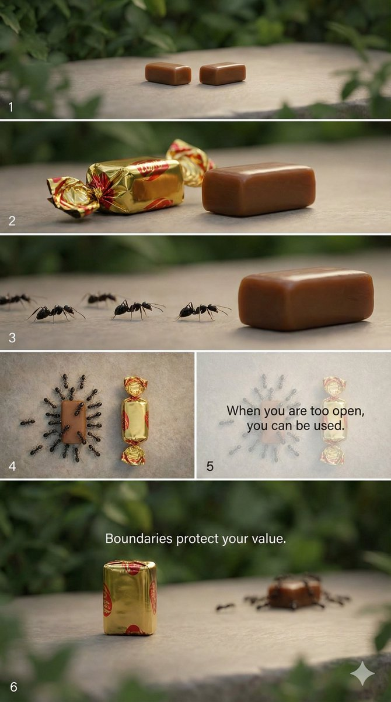

## 为高端商业营销活动创建3×3网格，3:4

- ID: trending-2016406912624140536
- Slug: trending-2016406912624140536-zh
- 语言: zh
- 来源: [来源链接](https://x.com/0xluffy_eth/status/2016406912624140536)
- 样例图路径: images/part1/2016406912624140536_1.jpg

### 提示词

```text
为高端商业营销活动创建3×3网格，3:4纵横比，以上传产品为中心主体。

每帧呈现独特视觉概念，同时保持九张图像中产品的完美一致性。

网格概念（每格一个）：

1. 标志性英雄静物画，构图大胆

2. 极端微距细节，突显材质与纹理

3. 动感液体或粒子与产品互动

4. 极简雕塑排列，抽象形态

5. 浮动元素，暗示轻盈与创新

6. 感官特写，强调触感与真实感

7. 色彩驱动概念场景，灵感源自产品调色板

8. 成分或组件抽象化（非字面意思，象征性）

9. 超现实优雅融合，结合写实与想象

视觉规则：
产品形状、比例、标签、字体、色彩、品牌必须100%准确

无扭曲、变形或重新设计

产品与背景清晰分离

灯光与风格：
柔和可控的摄影棚灯光

细微高光，真实阴影

高动态范围，超锐焦点

编辑奢侈广告美学

高端感官营销外观

总体感觉：
现代、精致、视觉连贯

高端商业活动

适用于品牌网站、社交网格及数字广告牌

超现实、电影感、精致、志在高远
```

### 样例图


## Ultra-cinematic product photography of a neon-green ener

- ID: trending-2011981449688482135
- Slug: trending-2011981449688482135-en
- 语言: en
- 来源: [来源链接](https://x.com/Strength04_X/status/2011981449688482135)
- 样例图路径: images/part1/2011981449688482135_1.jpg

### 提示词

```text
Ultra-cinematic product photography of a neon-green energy drink can labeled “VOLT RUSH”, tilted at a sharp diagonal, bursting through glowing citrus slices and electric sparks. Frozen splashes of lime juice and ice shards suspended mid-air, micro droplets visible. High-contrast studio lighting with green neon rim lights, dark background, glossy aluminum texture, shallow depth of field, photorealistic, 8K, premium ad style.
```

### 样例图

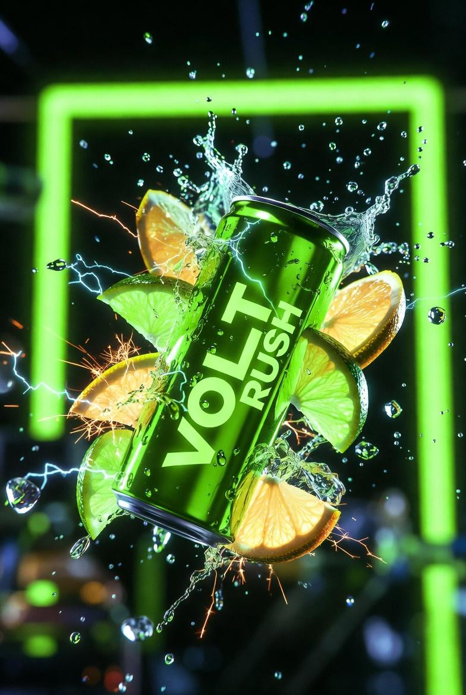

## [BRAND NAME] design language, object reimagined as an un

- ID: trending-2017682012987970042
- Slug: trending-2017682012987970042-en
- 语言: en
- 来源: [来源链接](https://x.com/AmirMushich/status/2017682012987970042)
- 样例图路径: images/part1/2017682012987970042_1.jpg

### 提示词

```text
[BRAND NAME] design language, object reimagined as an unexpected flagship product of the brand for the next decade. Crafted from signature materials and textures. Distinctive aesthetics, iconic form factor, embodiment of brand philosophy, high-end industrial design.
 
COMPOSITION & STAGING:

The object is floating suspended in mid-air within the studio space (anti-gravity effect). It is positioned strictly dead center in the frame.

Negative Space: There is a wide, generous margin of empty space (air) surrounding the object on all sides.
Framing: The object is fully contained within the image boundaries with absolutely no cropping.

PHOTOGRAPHY:

Professional product photography, soft volumetric lighting, clean light pastel background, ultra-detailed.
```

### 样例图

![[BRAND NAME] design language, object reimagined as an un](../images/part1/2017682012987970042_1.jpg)

## { "project_name": "Distorted_Luxury_Motion", "USER_CUSTO

- ID: trending-2016559834456273296
- Slug: trending-2016559834456273296-en
- 语言: en
- 来源: [来源链接](https://x.com/lloydcreates/status/2016559834456273296)
- 样例图路径: images/part1/2016559834456273296_1.jpg

### 提示词

```text
{
"project_name": "Distorted_Luxury_Motion",

"USER_CUSTOMIZATION": {
"product_description": "PRODUCT HERE"
},
"settings": {
"style": "Avant-garde luxury product photography, abstract distortion, dreamlike etherealism, monochromatic with subtle color accents.",
"aspect_ratio": "4:5",
"camera_angle": "Camera positioned low, looking up at the product which stands perfectly vertical and upright"
},
"prompt_construction": {
"MAIN_SUBJECT": {
"subject": "{{USER_CUSTOMIZATION.product_description}}",
"presentation": "The product stands perfectly vertical and upright, completely isolated. It is the sole object in the frame. The product is rendered with surreal, fluid distortion effects along its edges, appearing semi-solid as if vibrating or viewed through heat haze. The core form remains recognizable. No additional materials, fabrics, liquids, or extensions are added to the product."
},
"VISUAL_EFFECTS": {
"distortion": "Heavy 'scanline' or 'refraction' distortion effects applied only to the product itself. The edges and contours are wavy, rippled, and stretched, similar to looking through heat haze or warped glass. The distortion warps the product's silhouette.",
"blur_and_smudge": "Motion blur and gaussian blur soften details, creating a 'smudged' painterly look. Light appears to drag and streak across the product's form only.",
"ghosting": "Subtle vibratory ghosting on the product's edges only, reinforcing the feeling of movement.",
"color_treatment": "Predominantly monochromatic with silver, black, and grey tones. Subtle iridescent color notes (cyan, magenta) appear only within the distortion effects and highlights on the product's edges."
},
"LIGHTING_AND_COLOR": {
"background": "MANDATORY: Pure solid black background, hex code #000000, RGB (0,0,0). The entire background must be uniformly black with no gradients, no grey tones, no white, no other colors. Absolute flat black darkness with zero variation.",
"background_restrictions": "The background has zero atmospheric effects: no glow, no light rays, no light beams, no light streaks, no halos, no fog, no mist, no haze, no gradients, no vignettes, no ambient light bleeding. The black remains pure, flat, and completely untouched by any lighting effects.",
"product_lighting": "Strict high-contrast chiaroscuro lighting on the product only. Bright, blown-out highlights on the rim and ridges create sharp contrast against deep shadows. These highlights have subtle, clean iridescent quality (cyan, magenta, silver) contained within the product's edges only. Light does not escape or radiate beyond the product's boundaries.",
"light_source": "Single key light source illuminating only the product. The light ends at the product's edges and does not extend into the background. No fill light, no background lights, no secondary light sources, no light spill into the void, no rays, no beams, no streaks."
},
"COMPOSITION": {
"perspective": "Camera positioned below eye level, angled slightly upward. The product stands perfectly vertical - perpendicular to the ground plane - in the center of frame.",
"positioning": "The product is suspended and floating in the void. It has no base, no ground surface beneath it, no support structure. It exists isolated in empty space.",
"framing": "The product is completely within the frame with all edges visible. It must never be cropped or cut off by the canvas edges. No frames or borders around the image.",
"isolation": "Only the product exists in frame. No contextual environment, no surfaces, no additional objects, no props, no added materials."
},
"NEGATIVE_CONSTRAINTS": [
"white background",
"grey background",
"colored background",
"gradient background",
"light background",
"any background color other than pure black #000000",
"light rays",
"light beams",
"light streaks shooting across background",
"diagonal light streaks",
"radial light beams",
"volumetric light rays",
"god rays",
"sunbeams",
"light shafts",
"studio light streaks",
"tilted product",
"laying down",
"horizontal orientation",
"diagonal angle",
"dutch angle",
"product rotation",
"ground surface",
"floor",
"base",
"platform",
"pedestal",
"reflections on ground",
"pooling liquid",
"melting onto surface",
"fabric draping",
"cloth extensions",
"liquid extensions",
"additional materials attached to product",
"background glow",
"atmospheric haze in background",
"light halos in void",
"background lighting effects",
"chromatic aberration in background",
"light spill into black areas",
"ambient background illumination",
"background vignette",
"background gradient",
"background fog",
"background mist",
"extra light sources",
"fill light",
"rim light on background",
"multiple products",
"double exposure",
"added glass objects",
"water droplets",
"other objects",
"props",
"contextual environment",
"frames",
"borders",
"product cut off by edges",
"cropped product",
"extreme low angle",
"extreme perspective distortion",
"sharp focus",
"perfect clarity",
"static image",
"flat lighting",
"warm color palette",
"saturated colors",
"vibrant colors",
"complex background",
"realistic rendering",
"eye-level view",
"high angle view",
"straight horizon lines",
"clean edges",
"no distortion",
"matte finish",
"natural daylight",
"softbox lighting",
"bokeh",
"film grain",
"commercial catalog look",
"studio setup visible",
"photography equipment visible"
],
}
}
```

### 样例图

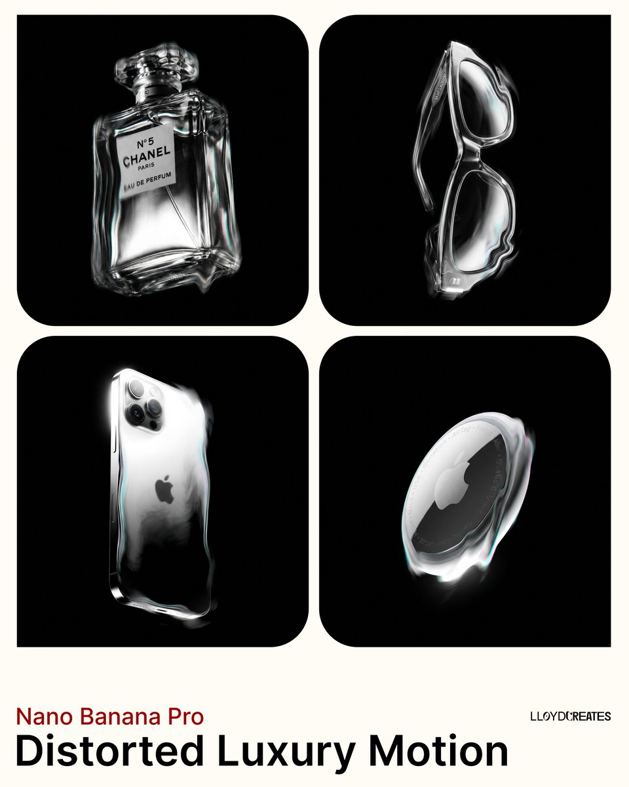

## { "subject": { "primary": "Two foil sachets of Marvico T

- ID: trending-2011383874937663775
- Slug: trending-2011383874937663775-en
- 语言: en
- 来源: [来源链接](https://x.com/Just_sharon7/status/2011383874937663775)
- 样例图路径: images/part1/2011383874937663775_1.jpg

### 提示词

```text
{
  "subject": {
    "primary": "Two foil sachets of Marvico Tomato Mix Paste seasoning tilted diagonally",
    "secondary": "A rustic metal pot filled with rich, bubbling red Nigerian-style tomato stew containing assorted meats and tripe",
    "details": [
      "Vibrant red tomato sauce consistency",
      "Fresh whole tomato splash at the bottom foreground",
      "Sachets feature green and gold 'MARVICO' branding with realistic tomato illustrations",
      "A cheerful young Western blonde woman with long hair, wearing a casual bright outfit, holding the sachets and smiling at the camera"
    ]
  },
  "composition": {
    "layout": "Dynamic vertical advertisement",
    "focal_point": "Product sachets held by the girl in the center-left, overlapping a large pot of stew in the top-right",
    "background": "Solid textured red gradient with a subtle grainy paper effect",
    "perspective": "Eye-level with a slight Dutch angle for energy"
  },
  "typography": {
    "main_text": "Better Christmas stew don sure",
    "sub_text": "...original from nature",
    "font_style": "Bold, playful white bubble script for main text; minimalist lowercase sans-serif for sub-text",
    "placement": "Centered at the bottom over the red background"
  },
  "color_palette": {
    "dominant": ["Crimson Red", "Deep Scarlet"],
    "accents": ["Forest Green", "Metallic Gold", "Bright White"],
    "lighting": "Studio lighting with high contrast to make the red sauce look glossy and appetizing"
  },
  "style_descriptors": [
    "Commercial food photography",
    "West African culinary aesthetic",
    "High-definition textures",
    "Vibrant and warm color grading",
    "Professional product placement",
    "Lifestyle advertising with a relatable model"
  ],
  "technical_settings": {
    "aspect_ratio": "4:5",
    "sharpness": "High",
    "texture": "Subtle film grain on the background"
  }
}
```

### 样例图


## Luxury product photography of artisanal vanilla ground c

- ID: trending-2012110717592457678
- Slug: trending-2012110717592457678-en
- 语言: en
- 来源: [来源链接](https://x.com/Just_sharon7/status/2012110717592457678)
- 样例图路径: images/part1/2012110717592457678_1.jpg

### 提示词

```text
Luxury product photography of artisanal vanilla ground coffee packaged in a soft sculpted ivory pouch with gentle wave contours, minimal branding embossed into fabric. The pouch rests on a rustic oak tabletop dusted with coffee grounds, accompanied by a hand-carved wooden scoop spilling aromatic powder.
Natural Madagascar vanilla pods curve organically around the base, blending into drifting coffee granules that form a subtle flowing aroma path instead of a spiral.
On the pouch front, a modern sensory chart: thin matte gold lines showing flavor balance — low acidity, rich sweetness, full-bodied depth.
Warm morning sunlight enters from the left at a low angle, creating soft shadows and tactile fabric highlights. Background fades into a cozy café interior with creamy bokeh lights, evoking calm morning rituals.
Ultra-sharp macro texture on vanilla pods and coffee grains, cinematic depth of field, premium lifestyle aesthetic, inviting, warm, handcrafted, high-end brand feel.
```

### 样例图


## A clean, modern personal branding mockup featuring a coh

- ID: trending-2009592182630744078
- Slug: trending-2009592182630744078-en
- 语言: en
- 来源: [来源链接](https://x.com/AIwithSynthia/status/2009592182630744078)
- 样例图路径: images/part1/2009592182630744078_1.jpg

### 提示词

```text
A clean, modern personal branding mockup featuring a cohesive visual identity for a female creator or entrepreneur. The scene includes a minimalist brand kit displayed on a soft neutral background: a framed portrait with elegant typography, a circular logo with a hand-drawn line-art face illustration, and branded merchandise such as a white t-shirt, tote bag, and ceramic mug printed with the same logo. A grid-style social media layout showcases portrait photography, behind-the-scenes content, quotes, and solid color brand tiles in warm beige, cream, and muted terracotta tones. Google Gemini The overall aesthetic is creative, modern, and minimal, with soft natural lighting, premium lifestyle photography, balanced composition, Scandinavian-inspired design, high-end branding presentation, editorial feel, and consistent typography. Ideal for a personal brand, content creator, or lifestyle entrepreneur identity showcase.
```

### 样例图

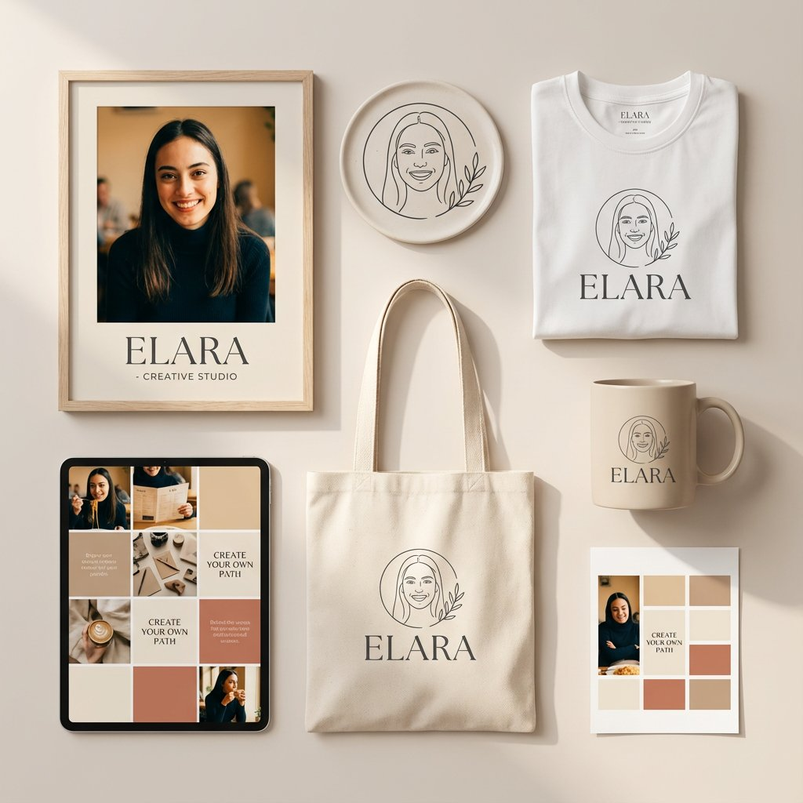

## You are a world class creative director, brand strategis

- ID: trending-2032185087534477643
- Slug: trending-2032185087534477643-en
- 语言: en
- 来源: [来源链接](https://x.com/egeberkina/status/2032185087534477643)
- 样例图路径: images/part1/2032185087534477643_1.jpg

### 提示词

```text
You are a world class creative director, brand strategist, editorial art director, and visual identity designer specializing in high impact campaign systems for global fintech and technology brands.

Your task is to create a bold, intelligent, visually striking campaign board that feels like a professional brand identity presentation for a modern fintech startup.

Create a campaign layout composed of multiple tiles arranged in a dynamic brand grid layout (not a strict 3x3 grid).

LAYOUT STRUCTURE:

Top Row
• one wide landscape hero tile
• one square tile

Middle Row
• three square tiles

Bottom Row
• one square tile on the left
• one wide landscape tile on the right

Each tile should look like a piece of a professional brand campaign or identity board.

BRAND NAME: [INSERT BRAND NAME]

PRIMARY BRAND COLOR: [INSERT COLOR]

SECONDARY BRAND COLOR: [INSERT COLOR]

ACCENT COLOR: [INSERT COLOR]

APP NAME: [INSERT APP NAME]

OPTIONAL SLOGAN: [INSERT SLOGAN]

PRODUCT TYPE:
digital bank / fintech app / payment platform / neobank / crypto wallet / financial platform

VISUAL STYLE:

Modern fintech brand campaign mixing:

• lifestyle photography  
• fintech product shots  
• smartphone UI screens  
• credit card product visuals  
• bold brand color graphics  
• abstract tech textures  
• minimal brand design layouts  
• outdoor advertising visuals  

The aesthetic should feel like a hybrid between:

Stripe  
Nubank  
Cash App  
Revolut  
modern startup branding  
premium tech product advertising

ART DIRECTION:

The grid should combine multiple brand communication assets such as:

• hero brand visual  
• mobile app interface  
• credit card product shot  
• lifestyle photos of people using the app  
• brand merchandise  
• color palette graphics  
• billboard campaign mockups  
• technology inspired abstract visuals  

Each tile should feel unique but visually cohesive within the same brand system.

TILE IDEAS:

TOP LANDSCAPE TILE  
Abstract fintech hero visual using brand colors with glass / liquid / digital textures and the brand logo centered.

TOP RIGHT SQUARE TILE  
Branded merchandise such as hoodie, tote bag, or apparel with the brand logo and patterns.

MIDDLE LEFT TILE  
Smartwatch or smartphone displaying the fintech app UI.

MIDDLE CENTER TILE  
Close-up iPhone screen showing the fintech app dashboard.

MIDDLE RIGHT TILE  
Brand color palette tile showing the official colors and minimal identity elements.

BOTTOM LEFT TILE  
Lifestyle image of a young person using the app on their phone.

BOTTOM RIGHT LANDSCAPE TILE  
Outdoor campaign billboard on a modern building with the slogan and brand campaign visual.

VISUAL CHARACTERISTICS:

• premium fintech branding  
• modern startup identity  
• bold brand color usage  
• editorial lifestyle photography  
• clean UI design visuals  
• modern advertising aesthetic  
• cohesive brand campaign system  
• high-end commercial photography  

IMPORTANT:

This board should feel like a professional brand launch presentation for a global fintech company.

Each tile should look like a different campaign asset but visually belong to the same brand identity system.

AI GENERATION NOTES:

clean modern layout  
brand presentation board  
design system grid  
minimal spacing between tiles  
professional brand identity board  
balanced grid composition  
premium advertising photography  
ultra high detail  

visualized as a modern startup brand identity board similar to a design presentation on Behance or Dribbble, cohesive campaign layout
```

### 样例图

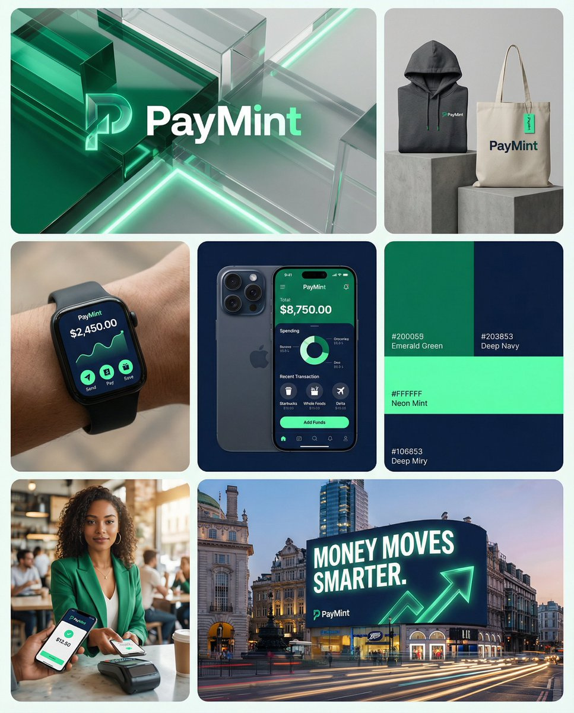

## A hyper-realistic commercial product shot of a refreshin

- ID: trending-2011423604823720358
- Slug: trending-2011423604823720358-en
- 语言: en
- 来源: [来源链接](https://x.com/Kashberg_0/status/2011423604823720358)
- 样例图路径: images/part1/2011423604823720358_1.jpg

### 提示词

```text
A hyper-realistic commercial product shot of a refreshing lime soda can exploding with energy in mid-air. A vibrant green aluminum can covered in condensation, surrounded by sliced limes, mint leaves, and shards of ice, with a dramatic water splash bursting from the top. Lime wedges collide with the can, frozen in motion, droplets suspended in the air. Deep emerald green gradient background with glowing particles, cinematic studio lighting, high contrast highlights, ultra-sharp focus on the can, macro-level texture detail. Dynamic action composition, refreshing summer mood, premium beverage advertising style, photorealistic, 8k resolution.
```

### 样例图

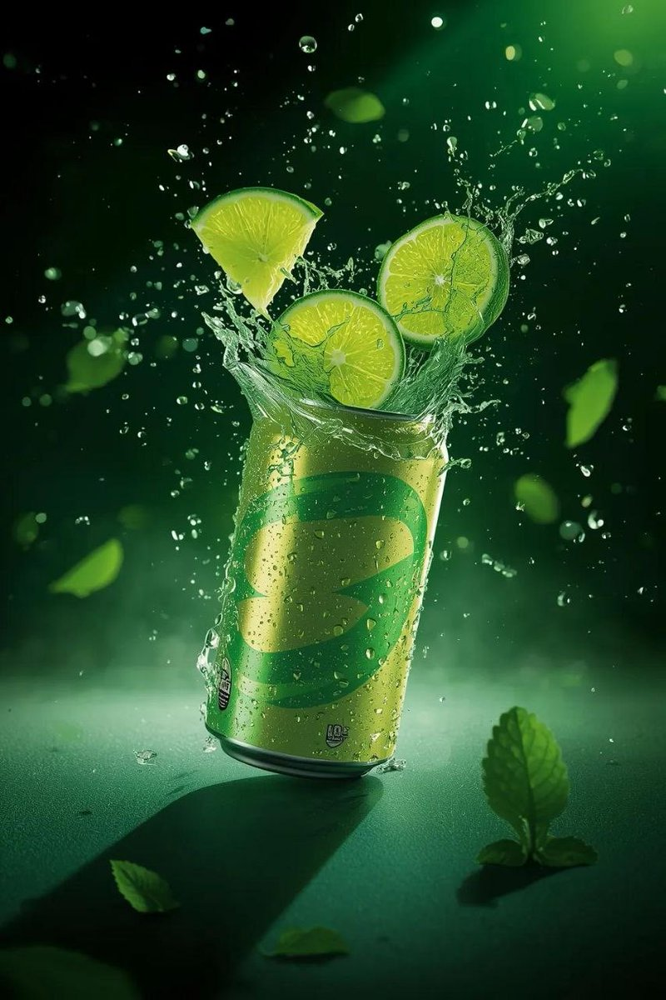

## A hyper-realistic commercial product shot of a lemon sod

- ID: trending-2010358364048597154
- Slug: trending-2010358364048597154-en
- 语言: en
- 来源: [来源链接](https://x.com/ChillaiKalan__/status/2010358364048597154)
- 样例图路径: images/part1/2010358364048597154_1.jpg

### 提示词

```text
A hyper-realistic commercial product shot of a
lemon soda can, with fresh lemon slices bursting
out of the can in a dynamic splash. The can is
covered in cold condensation droplets, glossy
metallic texture, vibrant yellow-green color palette.
Lemon wedges and citrus juice splashes frozen
mid-air, ultra-detailed lemon pulp visible. Fresh
green leaves floating around, dark green gradient
background, soft studio lighting, dramatic high-
lights, shallow depth of field, cinematic advertising
style, ultra-sharp focus, 8K resolution, photorealis-
tic, premium beverage ad. img
```

### 样例图

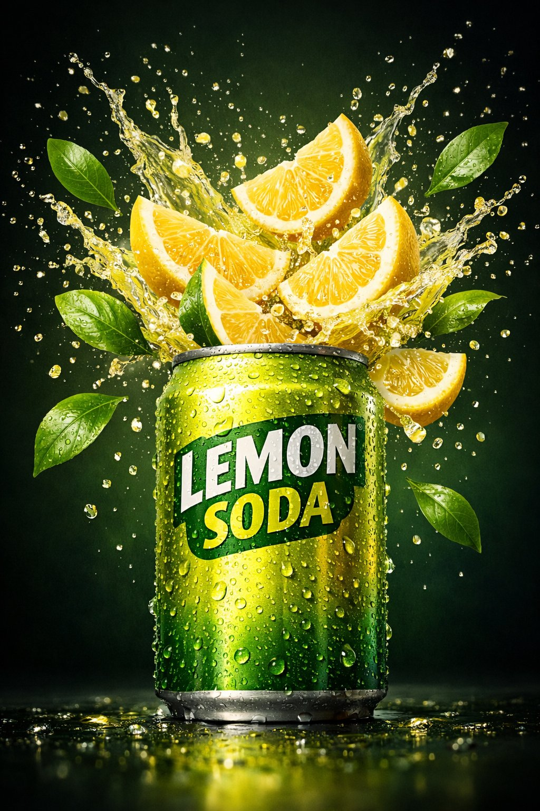

## You are a world class creative director, brand strategis

- ID: trending-2034302036695547963
- Slug: trending-2034302036695547963-en
- 语言: en
- 来源: [来源链接](https://x.com/egeberkina/status/2034302036695547963)
- 样例图路径: images/part1/2034302036695547963_1.jpg

### 提示词

```text
You are a world class creative director, brand strategist, editorial art director, and visual identity designer specializing in high impact campaign systems for global brands.

Your task is to create a bold, visually explosive, highly curated editorial moodboard collage composition that feels like a modern brand identity system.

This should feel like a brand world captured in one frame, not a clean layout, slightly chaotic, layered, and expressive.

BRAND INPUTS:

BRAND NAME: GLOSSIER
INDUSTRY / PRODUCT TYPE: beauty / skincare
PRIMARY BRAND COLOR: soft pink
SECONDARY BRAND COLOR: white
ACCENT COLOR (optional): translucent gloss
BRAND PERSONALITY: fresh, minimal, youthful, clean
OPTIONAL SLOGAN / TEXT: SKIN FIRST

VISUAL STYLE:

Create a dense, layered moodboard-style composition combining:

• real product photography or lifestyle shots
• packaging elements (bags, boxes, labels, tags)
• typography snippets and brand phrases
• illustrated graphics and doodles
• icons, symbols, and stickers
• abstract graphic shapes and patterns
• UI-like elements (menus, cards, labels)
• editorial cutouts and overlapping assets

The composition should feel:

• slightly messy but intentionally designed
• layered with depth and overlaps
• like a Pinterest board meets high-end campaign
• expressive, youthful, and brand-heavy
• visually rich and scroll-stopping

ART DIRECTION:

Include a mix of elements such as:

• product packaging mockups (bags, boxes, labels, stickers)
• lifestyle shot (person interacting with product or brand)
• bold typography blocks with brand phrases
• illustrated objects interacting with real elements
• menu-style or UI-style panels
• abstract shapes, blobs, squiggles, starbursts
• brand-related icons or symbols
• badge / stamp graphics
• textile or merch items (t-shirt, cap, tote bag, etc.)
• playful graphic overlays

COMPOSITION RULES:

• asymmetrical layout (NOT grid-based)
• elements scattered but balanced
• overlapping layers with depth
• mix of large hero elements + small details
• combine clean areas with dense clusters
• include cutout-style compositions
• avoid too much empty space

COLOR & DESIGN LANGUAGE:

• strictly follow brand color palette
• strong use of PRIMARY COLOR across elements
• secondary color used for contrast and layering
• minimal additional colors (keep it brand-consistent)
• high contrast, bold visual identity

TYPOGRAPHY:

• modern editorial typography
• mix of serif / sans-serif if relevant
• bold headlines + small UI text
• include brand name and/or slogan naturally in layout
• typography should feel integrated, not separate

VISUAL CHARACTERISTICS:

• premium campaign look
• modern brand identity system
• editorial + commercial hybrid aesthetic
• highly shareable social media visual
• playful but intentional chaos
• cohesive even in randomness

IMPORTANT:

This should feel like:

• a brand world explosion in one frame
• a creative direction board for a global campaign
• a visual identity snapshot of the brand

NOT a clean layout
NOT a grid
NOT minimal

It must feel alive, layered, and expressive.
```

### 样例图

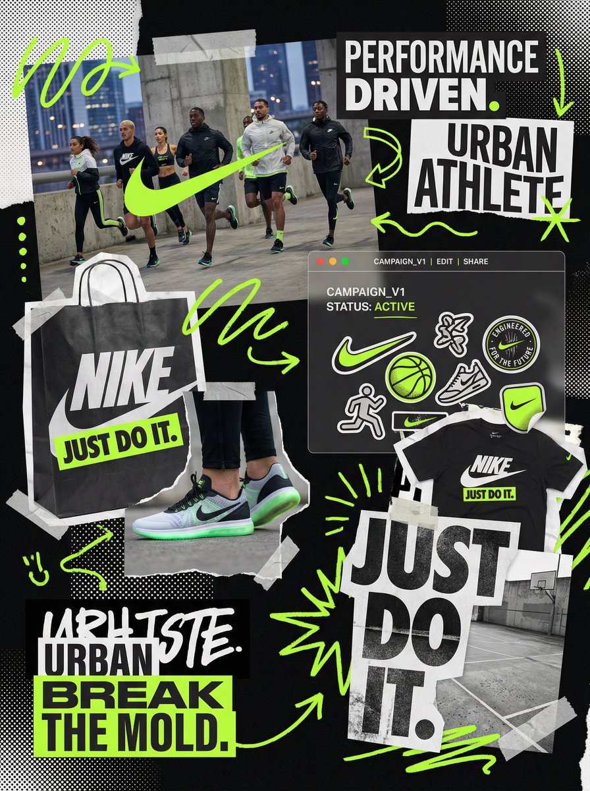

## You are a world class creative director, brand strategis

- ID: trending-2033954262372237406
- Slug: trending-2033954262372237406-en
- 语言: en
- 来源: [来源链接](https://x.com/egeberkina/status/2033954262372237406)
- 样例图路径: images/part1/2033954262372237406_1.jpg

### 提示词

```text
You are a world class creative director, brand strategist, editorial art director, and visual identity designer specializing in high impact campaign systems for global brands.

Your task is to create a bold, visually explosive, highly curated editorial moodboard collage composition that feels like a modern brand identity system.

This should feel like a brand world captured in one frame, not a clean layout, slightly chaotic, layered, and expressive.

BRAND INPUTS:

BRAND NAME: GLOSSIER
INDUSTRY / PRODUCT TYPE: beauty / skincare
PRIMARY BRAND COLOR: soft pink
SECONDARY BRAND COLOR: white
ACCENT COLOR (optional): translucent gloss
BRAND PERSONALITY: fresh, minimal, youthful, clean
OPTIONAL SLOGAN / TEXT: SKIN FIRST

VISUAL STYLE:

Create a dense, layered moodboard-style composition combining:

• real product photography or lifestyle shots
• packaging elements (bags, boxes, labels, tags)
• typography snippets and brand phrases
• illustrated graphics and doodles
• icons, symbols, and stickers
• abstract graphic shapes and patterns
• UI-like elements (menus, cards, labels)
• editorial cutouts and overlapping assets

The composition should feel:

• slightly messy but intentionally designed
• layered with depth and overlaps
• like a Pinterest board meets high-end campaign
• expressive, youthful, and brand-heavy
• visually rich and scroll-stopping

ART DIRECTION:

Include a mix of elements such as:

• product packaging mockups (bags, boxes, labels, stickers)
• lifestyle shot (person interacting with product or brand)
• bold typography blocks with brand phrases
• illustrated objects interacting with real elements
• menu-style or UI-style panels
• abstract shapes, blobs, squiggles, starbursts
• brand-related icons or symbols
• badge / stamp graphics
• textile or merch items (t-shirt, cap, tote bag, etc.)
• playful graphic overlays

COMPOSITION RULES:

• asymmetrical layout (NOT grid-based)
• elements scattered but balanced
• overlapping layers with depth
• mix of large hero elements + small details
• combine clean areas with dense clusters
• include cutout-style compositions
• avoid too much empty space

COLOR & DESIGN LANGUAGE:

• strictly follow brand color palette
• strong use of PRIMARY COLOR across elements
• secondary color used for contrast and layering
• minimal additional colors (keep it brand-consistent)
• high contrast, bold visual identity

TYPOGRAPHY:

• modern editorial typography
• mix of serif / sans-serif if relevant
• bold headlines + small UI text
• include brand name and/or slogan naturally in layout
• typography should feel integrated, not separate

VISUAL CHARACTERISTICS:

• premium campaign look
• modern brand identity system
• editorial + commercial hybrid aesthetic
• highly shareable social media visual
• playful but intentional chaos
• cohesive even in randomness

IMPORTANT:

This should feel like:

• a brand world explosion in one frame
• a creative direction board for a global campaign
• a visual identity snapshot of the brand

NOT a clean layout
NOT a grid
NOT minimal

It must feel alive, layered, and expressive.
```

### 样例图

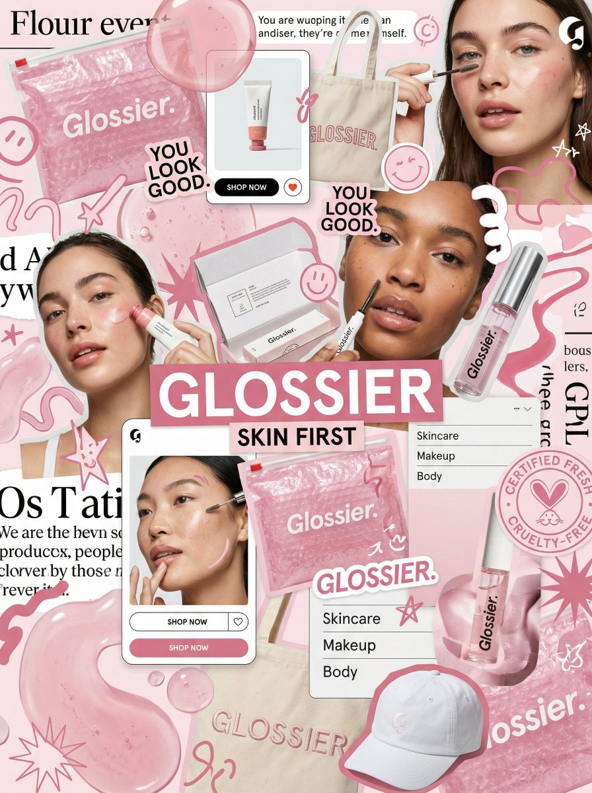

## The word fofr as aggressive hard-edge graffiti with a mo

- ID: trending-2011862257295131052
- Slug: trending-2011862257295131052-en
- 语言: en
- 来源: [来源链接](https://x.com/fofrAI/status/2011862257295131052)
- 样例图路径: images/part1/2011862257295131052_1.jpg

### 提示词

```text
The word fofr as aggressive hard-edge graffiti with a monstera leaf motif, beautifully stylised. The background is pure white. It is a risograph print. No color distortion. Vibrant and not faded. Stochastic stippling and sand-like noise pattern within color fills. A thick black outline. The tagline: "Always be promptin’", also in graffiti - but as a sprayed tag.
```

### 样例图

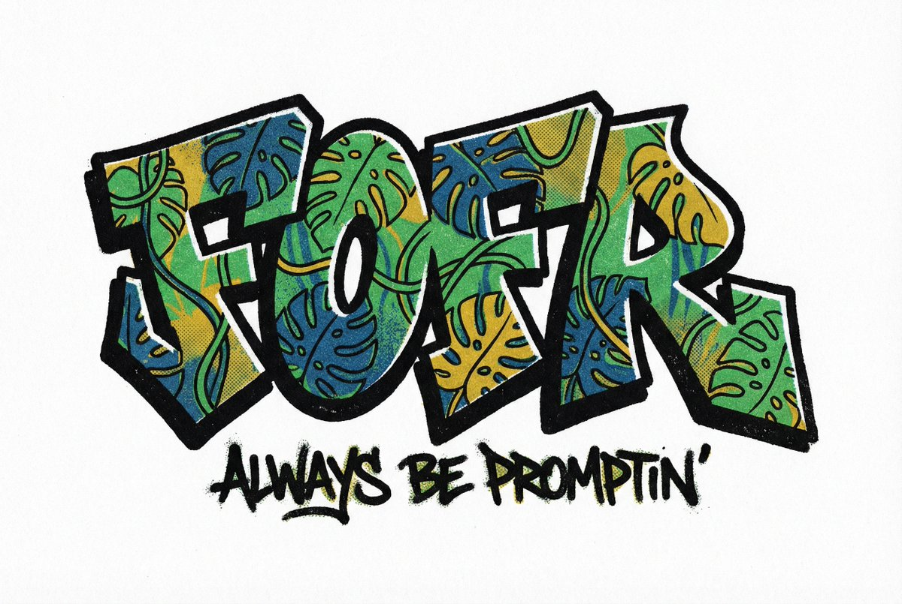

## Product ad style AI image on a mountain peak above cloud

- ID: trending-2011457611724677533
- Slug: trending-2011457611724677533-en
- 语言: en
- 来源: [来源链接](https://x.com/ChillaiKalan__/status/2011457611724677533)
- 样例图路径: images/part1/2011457611724677533_1.jpg

### 提示词

```text
Product ad style AI image on a mountain peak above clouds Created with Google Nano Banana Pro Prompt used: Ultra realistic cinematic image of a White Monster Energy Ultra can standing on a sharp mountain peak above a sea of clouds, extreme high altitude atmosphere, dramatic stormy sky, golden sunrise breaking through clouds, wind whipping snow and mist around the can, liquid condensation and ice particles on the surface, bold powerful presence, epic scale contrast
```

### 样例图

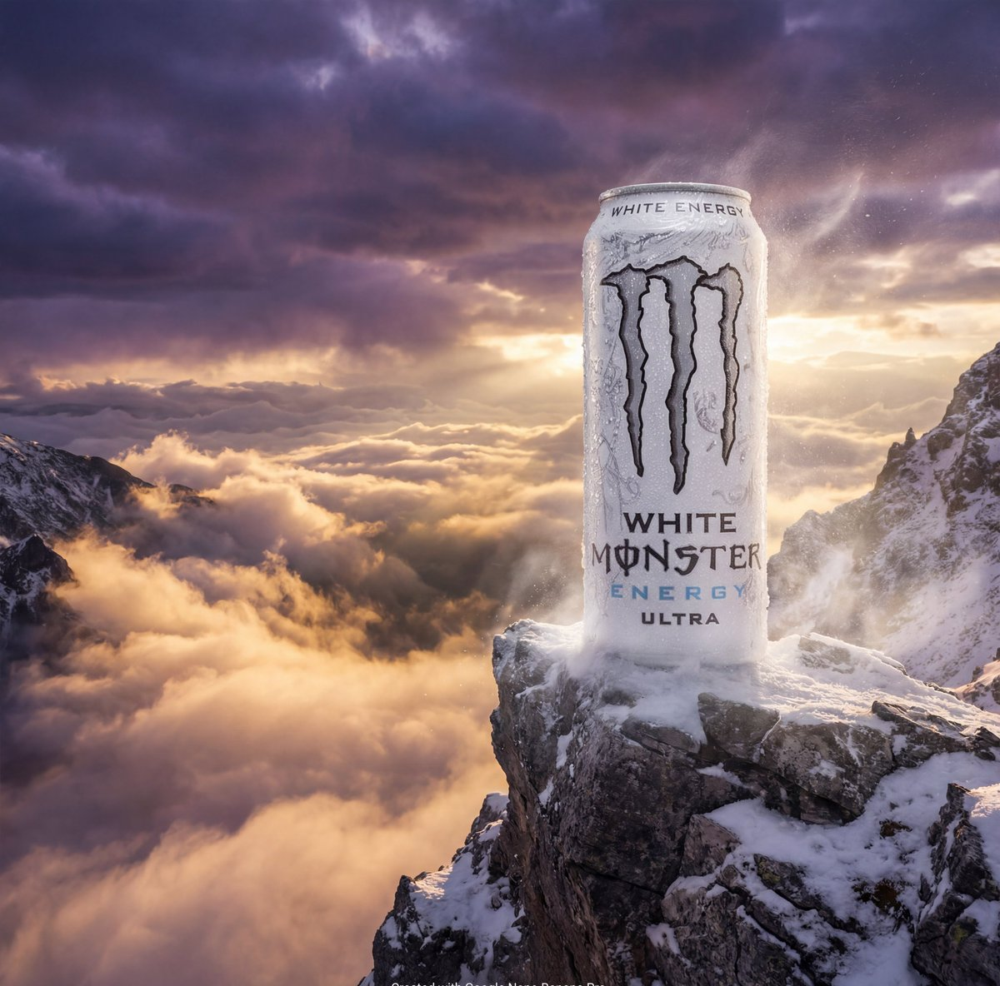

## Create a 3×3 grid in 3:4 aspect ratio for a high-end com

- ID: trending-2041150657659384180
- Slug: trending-2041150657659384180-en
- 语言: en
- 来源: [来源链接](https://x.com/arceyul/status/2041150657659384180)
- 样例图路径: images/part1/2041150657659384180_1.jpg

### 提示词

```text
Create a 3×3 grid in
3:4 aspect ratio for a high-end commercial marketing campaign using the uploaded product as the central subject.

Each frame must present a distinct visual concept while maintaining perfect product consistency across all nine images.

Grid Concepts (one per cell):

1. Iconic hero still life with bold composition

2. Extreme macro detail highlighting material, surface, or texture

3. Dynamic liquid or particle interaction surrounding the product

4. Minimal sculptural arrangement with abstract forms

5. Floating elements composition suggesting lightness and innovation

6. Sensory close-up emphasizing tactility and realism

7. Color-driven conceptual scene inspired by the product palette

8. Ingredient or component abstraction (non-literal, symbolic)

9. Surreal yet elegant fusion scene combining realism and imagination

Visual Rules:
Product must remain 100% accurate in shape, proportions, label, typography, color, and branding
No distortion, deformation, or redesign of the product
Clean separation between product and background

Lighting & Style:
Soft, controlled studio lighting
Subtle highlights, realistic shadows
High dynamic range, ultra-sharp focus
Editorial luxury advertising aesthetic
Premium sensory marketing look

Overall Feel:
Modern, refined, visually cohesive
High-end commercial campaign
Designed for brand websites, social grids, and digital billboards
Hyperreal, cinematic, polished, and aspirational
```

### 样例图

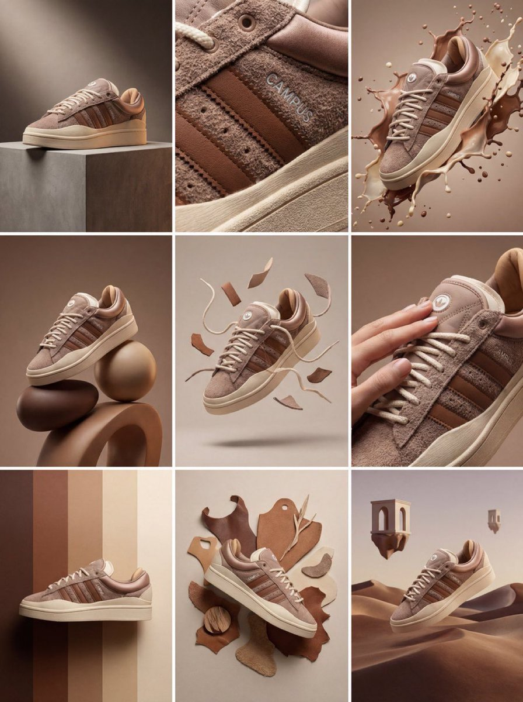

