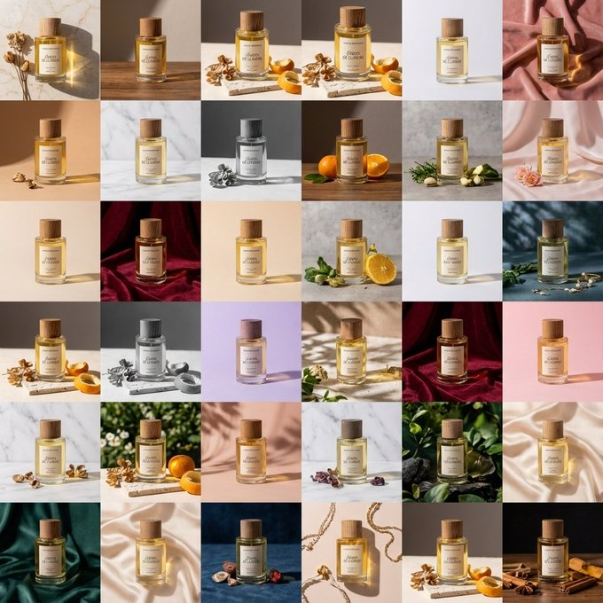
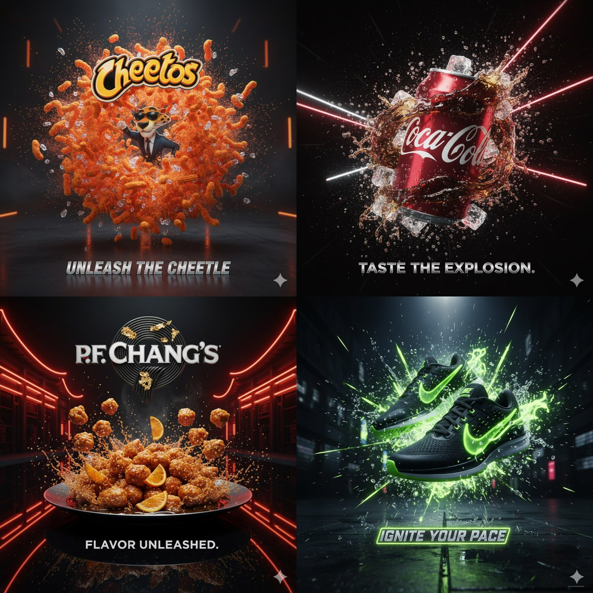
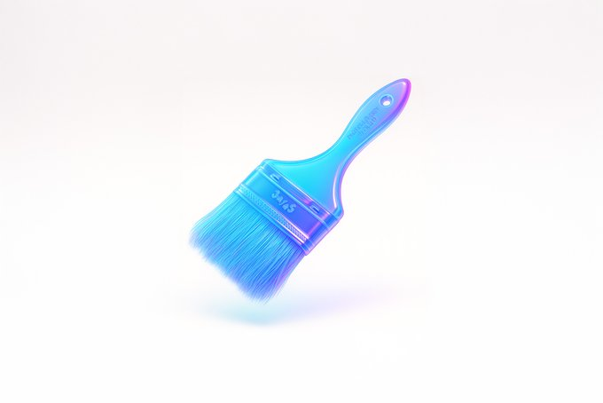
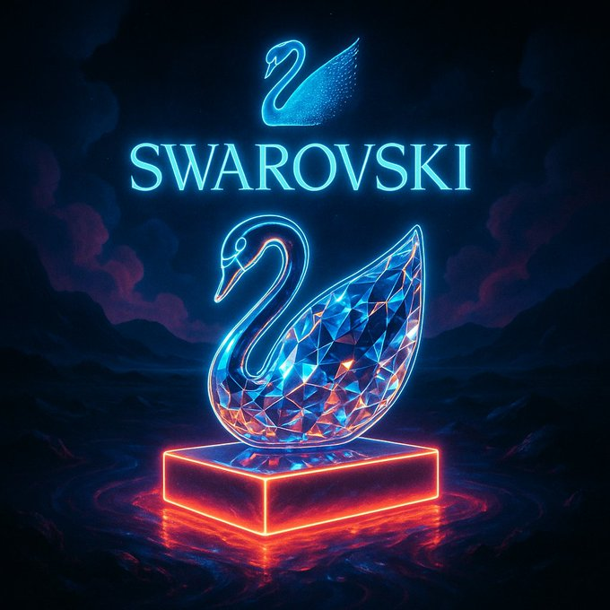
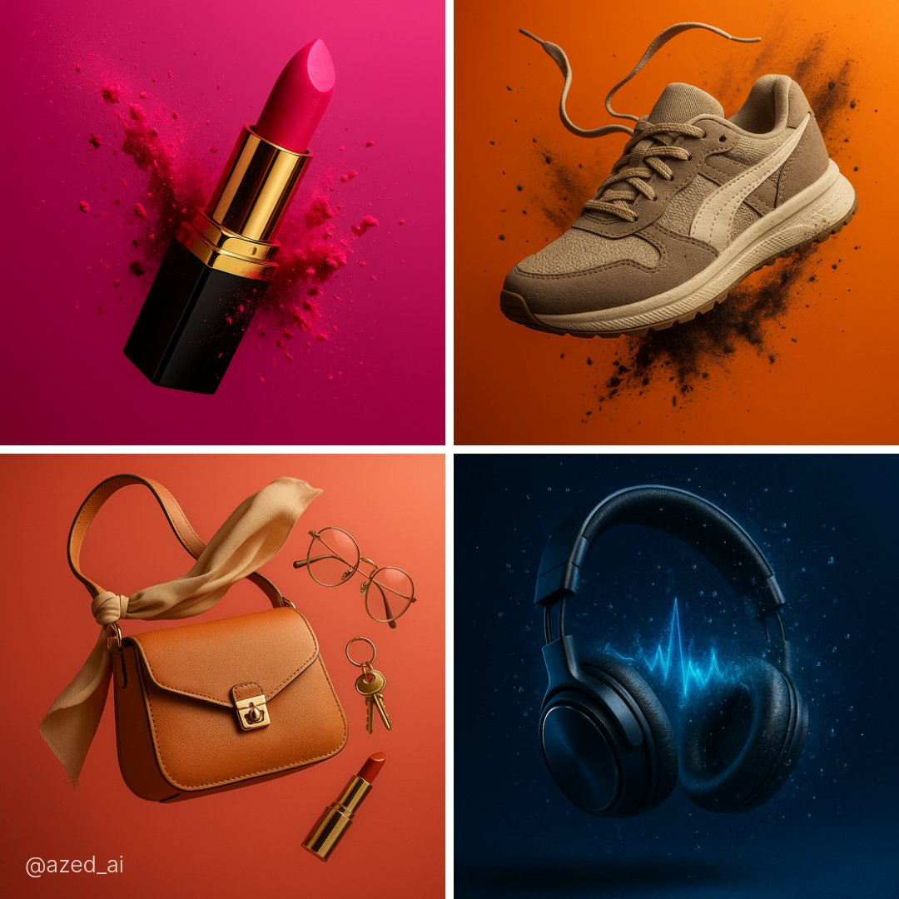
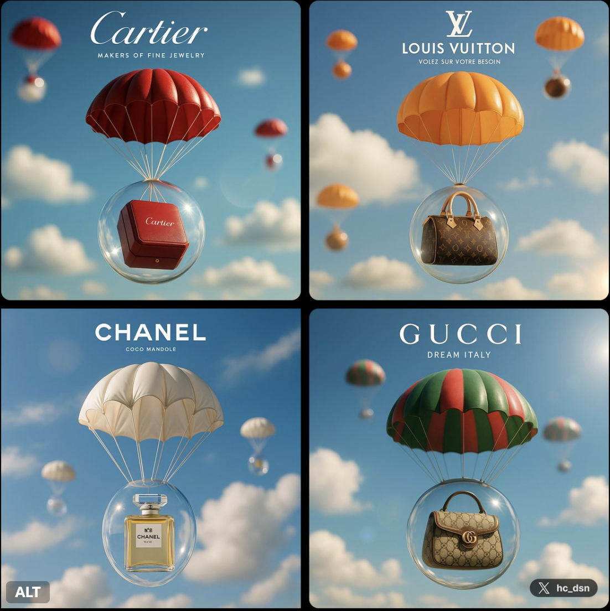

# product

总计：254

## 青岛啤酒灵感女装系列

- ID: case-385
- Slug: case-385-zh
- 语言: zh
- 来源: [来源链接](https://x.com/Popcraft_ai/status/2051142270381170754)
- 样例图路径: images/part2/case385.jpg

### 提示词

```text
Inspired by Tsingtao (China beer)🍺

“Inspired by this product, design a set of cool-style women's clothing”
```

### 样例图


## 90 年代公寓场景参考板

- ID: case-381
- Slug: case-381-zh
- 语言: zh
- 来源: [来源链接](https://x.com/Iancu_ai/status/2051287273581203888)
- 样例图路径: images/part2/case381.jpg

### 提示词

```text
{
  "type": "scene reference board — 90s apartment living room, cinematic night",
  "style": "cinematic film photography, 35mm grain, warm amber shadow fill, deep chiaroscuro lighting, hyper-detailed interior, production design reference quality",
  "layout": {
    "main_panel_center_left": {
      "label": "CAMERA A — FRONT VIEW",
      "scene": "Wide shot, L-shaped tan sectional sofa, grey knit throw blanket, wooden coffee table (remote, mug, ashtray, Rolling Stone stack), lava lamp left, table lamp right, rain-streaked city window behind, Nirvana poster left wall. 35mm grain."
    },
    "main_panel_center_right": {
      "label": "CAMERA B — REVERSE VIEW",
      "scene": "Wide reverse from behind sofa. CRT TV prominent right, grey static screen. Tall bookshelf, VHS tapes. Cool blue backlight from window behind camera. Deep shadow."
    },
    "prop_strip_bottom": "6 close-up tiles: 1. LAVA LAMP — chrome base, blue-green wax blobs; 2. COFFEE TABLE — remote, mug, ashtray, magazines; 3. NIRVANA POSTER — black smiley face, wall texture; 4. CRT TELEVISION — static screen, VHS stack; 5. WINDOW/RAIN — city bokeh, water streaks; 6. THROW BLANKET — sofa corner, worn upholstery",
    "top_right_inset": "SOURCE REF thumbnail — original photo",
    "footer": "2700K PRACTICAL · 4100K CITY NIGHT · 24mm · 35MM"
  },
  "background": "deep charcoal #1a1a1a, thin white separators",
  "dimensions": "wide landscape 3:1, high resolution"
}
```

### 样例图


## 科学家收藏级玩具发布板

- ID: case-365
- Slug: case-365-zh
- 语言: zh
- 来源: [来源链接](https://x.com/Gdgtify/status/2049766203392921897)
- 样例图路径: images/part2/case365.jpg

### 提示词

```text
2x2 grid, do this for 4 famous scientists in history: Design a collector-grade launch visual for [TOY / FIGURE / DESIGNER OBJECT] shown in pristine hero form along with interchangeable accessories, alternate expressions, packaging design, scale references, sticker details, rarity indicators, and close-up material highlights. The object should feel like a luxury drop, somewhere between art toy culture and elite product branding.  Accessory Layout: Arrange [ACCESSORY 1], [ACCESSORY 2], [ALT VERSION], [PACKAGING FEATURE], and [LIMITED EDITION DETAIL] around the figure in carefully staged clusters. Everything should feel desirable, neat, and “unboxable.”  Visual Style: Hype-culture collectible reveal meets premium e-commerce launch campaign. Clean, glossy, tactile, designer-toy sophistication with a playful but expensive sensibility.  Composition Guidelines: Hero figure remains dominant. Accessories should be balanced and elegantly spaced. Packaging should be visible but not steal the scene. The entire image should feel like a product collectors would screenshot instantly.  Lighting & Background: Soft commercial lighting with subtle specular highlights, polished background in [BACKGROUND STYLE], crisp shadows, premium color separation, ultra-sharp details, no watermark.
```

### 样例图


## Logo 与品牌身份系统提示词合集

- ID: case-354
- Slug: case-354-zh
- 语言: zh
- 来源: [来源链接](https://x.com/wanerfu/status/2048659924822184026)
- 样例图路径: images/part2/case354.jpg

### 提示词

```text
1. Logo概念生成提示词

你是一位拥有20年经验的顶级Logo设计师，为全球知名品牌设计过即时识别且深具意义的标志。

品牌名称：[你的品牌名]
行业：[你的行业]
品牌个性：[描述]
目标受众：[描述]
欣赏的视觉身份：[列举3个]
讨厌的视觉身份：[列举3个]
偏好风格：[如极简、大胆、几何、有机、复古、未来]

为我的品牌生成5个完全不同的Logo概念。

对每个概念提供：

- 核心视觉理念及象征意义
- 形状语言及为何适合品牌
- 字体方向建议
- 第一眼的情感触发
- 为何适合目标受众
- 在名片、App图标和广告牌上的效果
- 何为永恒而非潮流

然后告诉我，如果这是你的品牌，你会选哪个以及原因。

2. 品牌身份基础提示词

你是为财富500强公司和初创企业建立品牌身份的顶级品牌战略师，这些企业后来融资数百万。

业务名称：[你的业务名]
业务描述：[一句话]
目标受众：[详细描述]
竞争对手：[列举3-5个]
想触发的感受：[如信任、兴奋、奢华、亲近、力量]
想关联的词汇：[列举5-10个]
不想关联的词汇：[列举5-10个]

在设计任何视觉效果之前建立完整的品牌身份基础。

为我提供：

- 品牌原型及为何完美契合
- 5个具体人类特征描述的品牌个性
- 带示例的品牌语调指南
- 核心品牌承诺（一句话）
- 3个品牌应触发的情感层级
- 与竞争对手的根本差异
- 定义品牌的唯一关键词

3. 配色方案提示词

你是色彩心理学专家和品牌设计师，深知色彩如何触发情感、建立信任和驱动购买决策。

品牌名称：[你的品牌名]
行业：[你的行业]
目标受众：[年龄、性别、收入、生活方式]
想触发的首要情感：[如信任、能量、奢华、平静、兴奋]
前3名竞争对手颜色：[列举]
喜欢的颜色：[列举]
讨厌的颜色：[列举]

为我建立完整品牌配色板。

为我提供：

- 主色及其HEX代码和心理学解释
- 两个辅助色及HEX代码
- 一个强调色用于CTA和高亮
- 一个中性色用于背景和文字
- 每种颜色对目标受众的影响
- 与竞争对手的差异化
- 在网站、社交媒体和包装上的应用示例
- 永远不要搭配的颜色组合及原因

4. 字体方向提示词

你是字体专家和品牌设计师，深知字体如何传达个性、建立可信度和实现品牌即时识别。

品牌名称：[你的品牌名]
品牌个性：[5个词]
行业：[你的行业]
目标受众：[描述]
字体应触发的感受：[如权威、友好、创新、优雅、能量]
喜欢的品牌字体：[列举3个]

为我建立完整字体系统。

为我提供：

- 标题用主显示字体名称及为何完美
- 长文本的辅助字体
- 引言或重点的强调字体
- 标题、副标题、正文、说明文字的精确字号层级
- 字距和行高建议
- 字体搭配方法
- 预算有限时的免费替代方案
- 你所在行业应避免的字体错误

5. 完整品牌身份包提示词

你是顶级品牌代理创意总监，交付覆盖每个触点的完整品牌身份系统。

业务名称：[你的业务名]
业务描述：[一句话]
目标受众：[详细描述]
品牌个性：[5个词]
行业：[你的行业]
竞争对手：[列举3个]
设计工具预算：[免费或付费]
时间表：[你需要的时间]

在一个回复中交付我的完整品牌身份系统。

包含所有元素：

- 品牌战略基础、原型、个性、承诺和定位
- Logo概念及3个变体
- 完整配色板、HEX代码和使用规则
- 字体系统、名称、字号和层级
- 视觉方向指南
- 品牌语调指南和标语选项
- 社交媒体视觉模板
- 3条永远不要打破的核心品牌规则

将一切作为结构化品牌手册交付，任何设计师、开发者或AI工具都能在10分钟内完全理解你的品牌。
```

### 样例图


## 四季包装 Campaign 宫格

- ID: case-342
- Slug: case-342-zh
- 语言: zh
- 来源: [来源链接](https://x.com/SRKDAN/status/2048582939504431195)
- 样例图路径: images/part2/case342.jpg

### 提示词

```text
PHASE 1 - PRODUCT: [ITEM] in [MATERIAL] packaging, minimal label design
PHASE 2 - GRID: 2x2 seasonal grid, four distinct brand worlds
PHASE 3 - COMPOSITION: each quadrant a full campaign scene with props and environment
PHASE 4 - CONSISTENCY: same product silhouette, four distinct palettes

Swap: [ITEM] / [MATERIAL] / [LABEL STYLE]
```

### 样例图


## 俯拍巨女城景自拍

- ID: case-328
- Slug: case-328-zh
- 语言: zh
- 来源: [来源链接](https://x.com/saniaspeaks_/status/2009834337043394622)
- 样例图路径: images/part2/case328.jpg

### 提示词

```text
[中文]
{
  "type": "图像生成提示词",
  "language": "zh",
  "style": "超现实电影感自拍摄影",
  "aspect_ratio": "9:16",
  "identity_preservation": {
    "use_reference_image": true,
    "strict_identity_lock": true,
    "alter_face": false,
    "alter_skin": false,
    "alter_hair": false,
    "alter_gender": false,
    "notes": "保留上传参考图像中完全一致的脸部特征、皮肤纹理、头发、眼镜、年龄和性别。禁止合成皮肤或雕塑感。"
  },
  "subject": {
    "gender": "女性",
    "capture_method": "由主体本人拍摄的自拍",
    "pose": {
      "selfie_arm": {
        "description": "一只手臂完全伸直并完全向上伸展，手持拍摄自拍的相机",
        "visibility": "手臂在画面中清晰可见、笔直且占主导地位",
        "camera_visibility": "自拍相机设备本身不得在画面中出现"
      },
      "product_arm": {
        "description": "另一只手臂完全伸向相机，手持附带的佳能相机",
        "importance": "产品最靠近相机并在视觉上占主导地位"
      },
      "head": {
        "tilt": "头部向自拍相机微微倾斜"
      },
      "expression": "自然放松的面部表情"
    },
    "body_visibility": "从头到脚全身可见",
    "feet": "双脚清晰接触路面"
  },
  "composition": {
    "perspective": "胸部高度的自然自拍视角",
    "camera_angle": "极端俯拍角度，相机位于主体正上方并直视下方",
    "layer_depth": [
      "产品（最靠近相机）",
      "脸部",
      "全身",
      "城市环境（背景）"
    ]
  },
  "scale_and_perspective": {
    "effect": "强制透视",
    "subject_scale": "女性呈现极度巨大",
    "buildings_scale": "建筑物显得小得多，最高不超过她的膝盖",
    "dominance": "主体在视觉上完全主导整个场景",
    "realism": "激发规模感同时保持物理可信"
  },
  "environment": {
    "location": "真实城市十字路口",
    "elements": [
      "人行横道",
      "道路标线",
      "交通标志",
      "汽车",
      "自行车",
      "真实人类尺度的行人"
    ],
    "setting": "地面层城市环境"
  },
  "lighting": {
    "type": "自然日光",
    "conditions": "晴朗或轻度多云天空",
    "shadows": "柔和且真实",
    "restrictions": "禁止奇幻或戏剧性照明"
  },
  "product_rules": {
    "usage": "完全按提供的上传佳能产品使用",
    "distortion": "无",
    "logo": "保持不变",
    "appearance": "仅有自然反射和真实高光"
  },
  "camera_quality": {
    "realism": "最大照片真实感",
    "depth": "前景、主体与背景清晰分离",
    "artifacts": "无"
  },
  "constraints": [
    "禁止AI艺术感",
    "禁止塑料或雕塑皮肤",
    "禁止扭曲脸部或身体",
    "禁止多余肢体或错误解剖",
    "禁止文字或水印",
    "禁止可见自拍相机设备"
  ],
  "output_goal": "创作一张超现实电影感自拍图像：女性使用其确切参考身份，从极端俯拍视角在真实城市人行横道拍摄，具备强制透视比例、自然日光，并将佳能相机产品明显持向镜头。"
}

[English]
{
  "type": "image_generation_prompt",
  "language": "en",
  "style": "hyper-realistic cinematic selfie photography",
  "aspect_ratio": "9:16",
  "identity_preservation": {
    "use_reference_image": true,
    "strict_identity_lock": true,
    "alter_face": false,
    "alter_skin": false,
    "alter_hair": false,
    "alter_gender": false,
    "notes": "Preserve identical facial features, skin texture, hair, glasses, age, and gender from the uploaded reference image. No synthetic skin or sculptural look."
  },
  "subject": {
    "gender": "female",
    "capture_method": "selfie taken by the subject herself",
    "pose": {
      "selfie_arm": {
        "description": "one arm fully straight and completely extended upward holding the camera that takes the selfie",
        "visibility": "arm clearly visible, straight and dominant in frame",
        "camera_visibility": "the selfie camera device itself must NOT be visible in the frame"
      },
      "product_arm": {
        "description": "the other arm fully extended toward the camera holding the attached Canon camera",
        "importance": "product is closest to the camera and visually dominant"
      },
      "head": {
        "tilt": "slightly tilted toward the selfie camera"
      },
      "expression": "natural and relaxed facial expression"
    },
    "body_visibility": "full body visible from head to toe",
    "feet": "feet clearly touching the road surface"
  },
  "composition": {
    "perspective": "natural selfie perspective at chest height",
    "camera_angle": "extreme top-down angle, camera above the subject looking directly downward",
    "layer_depth": [
      "product (closest to camera)",
      "face",
      "full body",
      "city environment (background)"
    ]
  },
  "scale_and_perspective": {
    "effect": "forced perspective",
    "subject_scale": "the woman appears extremely giant",
    "buildings_scale": "buildings appear much smaller, reaching no higher than her knees",
    "dominance": "the subject visually dominates the entire scene",
    "realism": "inspiring scale while remaining physically believable"
  },
  "environment": {
    "location": "real urban intersection",
    "elements": [
      "pedestrian crosswalk",
      "road markings",
      "traffic signs",
      "cars",
      "bicycles",
      "pedestrians at realistic human scale"
    ],
    "setting": "ground-level urban environment"
  },
  "lighting": {
    "type": "natural daylight",
    "conditions": "clear or lightly cloudy sky",
    "shadows": "soft and realistic",
    "restrictions": "no fantasy or dramatic lighting"
  },
  "product_rules": {
    "usage": "use the uploaded Canon product exactly as provided",
    "distortion": "none",
    "logo": "unchanged",
    "appearance": "natural reflections and realistic highlights only"
  },
  "camera_quality": {
    "realism": "maximum photorealism",
    "depth": "clear separation of foreground, subject, and background",
    "artifacts": "none"
  },
  "constraints": [
    "No AI-art look",
    "No plastic or sculpted skin",
    "No distortion of face or body",
    "No extra limbs or incorrect anatomy",
    "No text or watermarks",
    "No visible selfie camera device"
  ],
  "output_goal": "Create a hyper-realistic cinematic selfie image of a woman using her exact reference identity, captured from an extreme top-down perspective in a real urban crosswalk, with forced perspective scale, natural daylight, and a Canon camera product prominently held toward the lens."
}
```

### 样例图


## 珊瑚色极简影棚时尚商业大片

- ID: case-318
- Slug: case-318-zh
- 语言: zh
- 来源: [来源链接](https://x.com/Maercihh/status/2026941078885310750)
- 样例图路径: images/part2/case318.jpg

### 提示词

```text
[中文]
超写实高端时尚商业广告大片，使用上传的模特照片作为严格的身份参考。保留精确的面部特征、比例和自然皮肤纹理——无修图，无变形。场景：珊瑚色单色工作室盒，配有光泽反光棋盘格或极简抛光地板。拥有柔和光线渐变的干净几何墙壁。产品：产品放置在前景中心超大位置，因广角透视而占据画面主导地位。包装超清晰，文字完全可读，具有逼真的反射和材质纹理。较小的产品单元可对称放置在背景中。模特姿势：站在产品后方，微蹲或前倾，一只手伸向镜头以创造深度感。强烈自信的表情，时尚态度。相机：低角度 24-35mm 镜头感，戏剧性透视畸变，对产品和模特都进行深焦处理。灯光：明亮的商业影棚灯光，柔和阴影，包装上有光泽高光，高端广告成片质感。4K–8K 写实主义，无水印，无嵌入式文本。纵横比 9:13

[English]
Ultra-realistic high-fashion commercial campaign using the uploaded model photo as strict identity reference. Preserve exact facial features, proportions and natural skin texture — no retouching, no reshaping.
Scene: coral monochrome studio box with glossy reflective checker or minimal polished floor. Clean geometric walls with soft light gradients.
Product: the product placed oversized in the center foreground, dominating the frame due to wide-angle perspective. The packaging is ultra-sharp, fully readable, realistic reflections and material texture. Smaller product units can be placed symmetrically in the background.
Model pose: standing behind the product, slightly crouched or leaning forward, one hand reaching toward the camera to create depth. Strong confident expression, fashion attitude.
Camera: low-angle 24–35mm lens look, dramatic perspective distortion, deep focus on both product and model.
Lighting: bright commercial studio lighting, soft shadows, glossy highlights on packaging, high-end campaign finish. 4K–8K realism, no watermark, no embedded text.i ar 9:13
```

### 样例图


## 震撼视觉的深红影棚广角美妆大片

- ID: case-317
- Slug: case-317-zh
- 语言: zh
- 来源: [来源链接](https://x.com/Maercihh/status/2026941078885310750)
- 样例图路径: images/part2/case317.jpg

### 提示词

```text
[中文]
照片级真实感的大胆美妆宣传活动，使用上传的模特作为精确的身份参考。不做面部改变，不做平滑处理。
场景：深红色饱和的摄影棚环境，具有高对比度的地板图案或光滑表面。
产品：产品被握持或放置在极其靠近镜头的位置，由于透视关系显得巨大。
模特姿势：俏皮或自信的微笑，手臂完全伸向相机，手指因广角镜头而略微变形。透过太阳镜的强烈眼神交流或自然凝视。
相机：超广角 20–28mm 美学，动态前景夸张，浅至中等景深。
灯光：强有力的商业照明，具有清晰的高光和反射，锐利的包装边缘，充满活力的调色。超精细的皮肤纹理和织物真实感。

[English]
Photorealistic bold beauty campaign using uploaded model as exact identity reference. No facial changes, no smoothing.
Scene: deep red saturated studio environment with high-contrast floor pattern or glossy surface.
Product: the product held or positioned extremely close to the lens, appearing large due to perspective.
Model pose: playful or confident smile, arm fully extended toward camera, fingers slightly distorted by wide lens. Strong eye contact through sunglasses or natural gaze.
Camera: ultra-wide 20–28mm aesthetic, dynamic foreground exaggeration, shallow-to-medium depth of field.
Lighting: punchy commercial lighting with defined highlights and reflections, crisp packaging edges, vibrant color grading. Hyper-detailed skin texture and fabric realism.
```

### 样例图


## 电商商品展示设计

- ID: case-313
- Slug: case-313-zh
- 语言: zh
- 来源: [来源链接](https://x.com/Fujimoto_hina/status/2027903683154088431)
- 样例图路径: images/part2/case313.jpg

### 提示词

```text
[中文]
{
  "style": "超写实奢华化妆品产品摄影",
  "composition": {
    "color_scheme": "戏剧性的单色蓝紫色",
    "resolution": "8K超高分辨率",
    "depth": "电影级景深",
    "aesthetic": "高端香氛护肤品广告风格"
  },
  "product": {
    "type": "软管包装",
    "finish": "缎面质感",
    "color": "长春花蓝",
    "label": "NUBELLA",
    "typography": "优雅的银色字体",
    "cap": "反光金属铬盖",
    "position": "垂直居中"
  },
  "surroundings": {
    "smoke": {
      "type": "墨水般的旋涡云雾",
      "colors": [
        "薰衣草色",
        "靛蓝色",
        "冰蓝色"
      ],
      "texture": "柔软、翻腾",
      "interaction": "环绕在产品周围"
    },
    "flowers": {
      "primary": [
        {
          "color": "紫色",
          "details": "错综复杂的花瓣细节",
          "center": "鲜艳的黄色"
        },
        {
          "color": "紫丁香色",
          "details": "错综复杂的花瓣细节",
          "center": "鲜艳的黄色"
        }
      ],
      "secondary": {
        "type": "细小的紫罗兰色花朵",
        "purpose": "增加立体感"
      }
    }
  },
  "lighting": {
    "direction": "来自左上方的柔和定向照明",
    "effects": [
      "突显软管的光滑曲度",
      "为金属盖增添微妙的光泽",
      "在烟雾中营造深度"
    ]
  },
  "background": {
    "blend": "无缝的冷色调蓝色和紫色调",
    "enhancement": "空灵的花香美学"
  },
  "details": "花瓣和蒸汽的超精细纹理"
}

[English]
{
  "style": "Ultra-realistic luxury cosmetic product photography",
  "composition": {
    "color_scheme": "Dramatic monochromatic blue-violet",
    "resolution": "8K ultra-high resolution",
    "depth": "Cinematic depth",
    "aesthetic": "High-end perfumed skincare advertising style"
  },
  "product": {
    "type": "Squeeze tube",
    "finish": "Satin-finish",
    "color": "Periwinkle-blue",
    "label": "NUBELLA",
    "typography": "Elegant silver",
    "cap": "Reflective metallic chrome",
    "position": "Vertically centered"
  },
  "surroundings": {
    "smoke": {
      "type": "Ink-like swirling clouds",
      "colors": [
        "Lavender",
        "Indigo",
        "Icy blue"
      ],
      "texture": "Soft, billowing",
      "interaction": "Wrapping around the product"
    },
    "flowers": {
      "primary": [
        {
          "color": "Purple",
          "details": "Intricate petal details",
          "center": "Vibrant yellow"
        },
        {
          "color": "Lilac",
          "details": "Intricate petal details",
          "center": "Vibrant yellow"
        }
      ],
      "secondary": {
        "type": "Tiny violet blossoms",
        "purpose": "Added dimension"
      }
    }
  },
  "lighting": {
    "direction": "Soft directional lighting from upper left",
    "effects": [
      "Highlights smooth curvature of the tube",
      "Adds subtle sheen to metallic cap",
      "Creates depth within smoke plumes"
    ]
  },
  "background": {
    "blend": "Seamless cool blue and purple tones",
    "enhancement": "Ethereal floral fragrance aesthetic"
  },
  "details": "Hyper-detailed textures of petals and vapor"
}
```

### 样例图


## 终结者机器人淘宝详情页

- ID: case-301
- Slug: case-301-zh
- 语言: zh
- 来源: [来源链接](https://x.com/rionaifantasy/status/2045356799751303194)
- 样例图路径: images/part2/case301.jpg

### 提示词

```text
[中文]
生成图片:
T-800机器人的淘宝商品详情页，展示:
机器人的正面侧面背面三视图，
产品价格，
产品细节，
功能和使用场景等

[English]
Generate image:
Taobao product detail page of a T-800 robot, showing:
front, side, and back three-view drawings of the robot,
product price,
product details,
functions and usage scenarios
```

### 样例图


## 一张采用分层蒙太奇构图的电影海报

- ID: case-275
- Slug: case-275-zh
- 语言: zh
- 来源: [来源链接](https://x.com/old_pgmrs_will/status/2045440101359198302)
- 样例图路径: images/part2/case275.jpg

### 提示词

```text
[中文]
“一张采用分层蒙太奇构图的电影海报。背景为日落时分的海滨小镇，平静的海面倒映着耀眼的日光眩光，薄雾笼罩的天空中有远处飞鸟，沿海公路旁立着电线杆剪影。左侧中景处，一位身着深灰色外套、留着深色卷发的中年男子站在混凝土海堤边，神情忧郁地低头凝视，被傍晚的阳光逆光勾勒轮廓。右侧前景主体为一张大幅特写年轻女子侧脸肖像，她望向右侧，身穿带白色条纹的深色水手校服，湿润的黑发贴在脸颊，柔和漫射光线下，一滴泪珠从她脸颊滑落。画面下方中央前景处，一只柴犬抬头朝右侧望去，红棕色毛发被温暖的轮廓光点亮。画面最底端为一条横向电影胶片，内含五幅独立矩形场景缩略图：女孩与柴犬在海滩、女孩骑车望向海面、女孩与男子坐在室内桌前、男子与女孩在海滩面对面站立、女孩拥抱柴犬的特写。画面叠加指定文字：左上角为深青绿色大号衬线字体标题《风间静语》，下方副标题为「—— 致那日的你 ——」；标题下方为小号深色衬线正文：“逝去之物，不复归来。然而，只要心灵稍稍相连，我们便能再度直面明日。” 画面右侧中部为深色衬线字体文字：“曾有一段时光，是你教会我如何生活。我永不会忘。” 左下角为大号白色文字：“10 月 31 日 周五 影院上映”。右下角为小号白色无衬线字体演职人员表：“主演：福波真子 / 桐嶋秀作 原作与剧本：柴野麻吕 导演：今仓七海 主题曲：SyVa《看得见海的地方》（Dogstar★唱片） 制作：《夕凪之尾》影视伙伴 制作公司：DABUSHIBANU-NU 发行：GOODSHIBALERS ©2026《夕凪之尾》影视伙伴”。
分段提示词：
图层索引：0
片段：“背景为日落时分的海滨小镇，平静海面倒映耀眼日光眩光，薄雾天空中有远处飞鸟，沿海公路旁有电线杆剪影。”
图层索引：1
片段：“左侧中景处，身着深灰色外套、留深色卷发的中年男子站在混凝土海堤边，神情忧郁低头，被傍晚阳光逆光照射。”
图层索引：2
片段：“右侧前景主体为大幅特写年轻女子侧脸肖像，她望向右侧，身穿带白条纹的深色水手校服，湿润黑发贴脸，柔和漫射光下一滴泪珠滑落脸颊。”
图层索引：3
片段：“画面下方中央前景处，一只柴犬抬头望向右侧，红棕色毛发被温暖轮廓光点亮。”
图层索引：4
片段：“画面最底端为横向电影胶片，内含五幅独立矩形场景缩略图：女孩与柴犬在海滩、女孩骑车望向水面、女孩与男子坐在室内桌前、男子与女孩在海滩面对面、女孩拥抱柴犬特写。”
图层索引：[5,6,7,8]
片段：“画面叠加指定文字：左上角为深青绿色大号衬线字体《风间静语》，下方副标题「—— 致那日的你 ——」；其下小号深色衬线正文：“逝去之物，不复归来。然而，只要心灵稍稍相连，我们便能再度直面明日。” 右侧中部深色衬线文字：“曾有一段时光，是你教会我如何生活。我永不会忘。” 左下角大号白色文字：“10 月 31 日 周五 影院上映”。右下角小号白色无衬线字体演职信息：“主演：福波真子 / 桐嶋秀作 原作与剧本：柴野麻吕 导演：今仓七海 主题曲：SyVa《看得见海的地方》（Dogstar★唱片） 制作：《夕凪之尾》影视伙伴 制作公司：DABUSHIBANU-NU 发行：GOODSHIBALERS ©2026《夕凪之尾》影视伙伴”。
负面提示词：
“平光照明，无质感表面，对称构图，底部留白空荡，文字缺失，翻译文字，改写文字，3D 渲染，卡通风格，高对比生硬阴影，干涩头发，明亮欢快表情”

[English]
A cinematic movie poster utilizing a layered montage composition. In the background, a coastal town at sunset with calm ocean water reflecting a glowing sun glare, distant birds in a hazy sky, and the silhouette of utility poles along a coastal road. In the left midground, a middle-aged man with dark wavy hair in a dark grey jacket stands near a concrete sea wall, looking downward with a melancholic expression, backlit by the late afternoon sun. Dominating the right foreground is a large, closely cropped profile portrait of a young woman looking right; she wears a dark school sailor uniform with white stripes, has wet dark hair clinging to her face, and a single tear rolls down her cheek under soft, diffuse lighting. In the lower center foreground, a Shiba Inu dog looks upwards toward the right, its reddish-brown fur catching warm rim lighting. Along the very bottom edge is a horizontal film strip of five distinct rectangular scene thumbnails: a dog and girl on a beach, a girl on a bicycle looking at the water, a girl and man sitting at an indoor table, a man and girl standing facing each other on a beach, and a close-up of a girl hugging a Shiba Inu. Overlaid on the image is specific text. In the top left, large dark teal serif text reads 'The Quiet Between Winds' with a subtitle below reading '— To You, That Day —'. Below that, smaller dark serif body text reads 'What is lost will not return. And yet, when hearts connect, even just a little, we can face tomorrow again.'. On the mid-right side, dark serif text reads 'There was a time when you taught me how to live. I won't forget it.'. In the bottom left, large white text reads 'OCTOBER 31 FRI. IN THEATERS'. In the lower right corner, small white sans-serif credit text reads 'Starring: Mako Fukunami / Shusaku Kirimine Original Story & Screenplay: Shibano Maruo Director: Nanami Imakura Theme Song: SyVa \"Umi no Mieru de\" (Dogstar★RECORDS) Production: \"Yūnagi no Shippo\" Film Partners Production Company: DABUSHIBANU-NU Distribution: GOODSHIBALERS ©2026 \"Yūnagi no Shippo\" Film Partners'."
  segmented:
    - layer_index: 0
      segment: "In the background, a coastal town at sunset with calm ocean water reflecting a glowing sun glare, distant birds in a hazy sky, and the silhouette of utility poles along a coastal road."
    - layer_index: 1
      segment: "In the left midground, a middle-aged man with dark wavy hair in a dark grey jacket stands near a concrete sea wall, looking downward with a melancholic expression, backlit by the late afternoon sun."
    - layer_index: 2
      segment: "Dominating the right foreground is a large, closely cropped profile portrait of a young woman looking right; she wears a dark school sailor uniform with white stripes, has wet dark hair clinging to her face, and a single tear rolls down her cheek under soft, diffuse lighting."
    - layer_index: 3
      segment: "In the lower center foreground, a Shiba Inu dog looks upwards toward the right, its reddish-brown fur catching warm rim lighting."
    - layer_index: 4
      segment: "Along the very bottom edge is a horizontal film strip of five distinct rectangular scene thumbnails: a dog and girl on a beach, a girl on a bicycle looking at the water, a girl and man sitting at an indoor table, a man and girl standing facing each other on a beach, and a close-up of a girl hugging a Shiba Inu."
    - layer_indices: [5, 6, 7, 8]
      segment: "Overlaid on the image is specific text. In the top left, large dark teal serif text reads 'The Quiet Between Winds' with a subtitle below reading '— To You, That Day —'. Below that, smaller dark serif body text reads 'What is lost will not return. And yet, when hearts connect, even just a little, we can face tomorrow again.'. On the mid-right side, dark serif text reads 'There was a time when you taught me how to live. I won't forget it.'. In the bottom left, large white text reads 'OCTOBER 31 FRI. IN THEATERS'. In the lower right corner, small white sans-serif credit text reads 'Starring: Mako Fukunami / Shusaku Kirimine Original Story & Screenplay: Shibano Maruo Director: Nanami Imakura Theme Song: SyVa \"Umi no Mieru de\" (Dogstar★RECORDS) Production: \"Yūnagi no Shippo\" Film Partners Production Company: DABUSHIBANU-NU Distribution: GOODSHIBALERS ©2026 \"Yūnagi no Shippo\" Film Partners'."

negative: "flat lighting, untextured surfaces, symmetrical composition, empty bottom margin, missing text, translated text, paraphrased text, 3D render, cartoon, high-contrast harsh shadows, dry hair, bright cheerful expressions
```

### 样例图


## 夏日柑橘苏打高转化广告图

- ID: case-237
- Slug: case-237-zh
- 语言: zh
- 来源: [来源链接](https://x.com/old_pgmrs_will/status/2045852114673635507)
- 样例图路径: images/part2/case237.jpg

### 提示词

```text
[中文]
图像生成: 商品广告照片, 适合夏天的季节商品, 碳酸饮料, 名称="夏柑SODA", 形状=PET瓶500ml, 研究2025年作为饮料广告的高CTA设计后设计并生成图像规格, 宽高比3:4

[English]
Image generation: Product advertising photo, Seasonal product suitable for summer, Carbonated beverage, Name="Summer Citrus SODA", Shape=500ml PET bottle, Design and generate image specifications after researching high CTA design as a beverage advertisement in 2025, Aspect ratio 3:4
```

### 样例图


## 电商商品展示图

- ID: case-192
- Slug: case-192-zh
- 语言: zh
- 来源: [来源链接](https://x.com/MrLarus/status/2046544209117634735)
- 样例图路径: images/part2/case192.jpg

### 提示词

```text
[中文]
AI智能眼镜电商详情图

[English]
AI smart glasses e-commerce detail image
```

### 样例图


## 潮流视角重塑精致商品广告

- ID: case-181
- Slug: case-181-zh
- 语言: zh
- 来源: [来源链接](https://x.com/genel_ai/status/2046498264774791514)
- 样例图路径: images/part2/case181.jpg

### 提示词

```text
[中文]
请以专业设计师的视角重新设计这个商品广告。
采用当前的潮流趋势，针对目标受众的精致设计。

[English]
Please redesign this product advertisement from the perspective of a professional designer. Adopt current fashion trends, exquisite design targeting the target audience.
```

### 样例图


## 荒诞超现实女装大叔海报

- ID: case-180
- Slug: case-180-zh
- 语言: zh
- 来源: [来源链接](https://x.com/aiehon_aya/status/2046499177916682600)
- 样例图路径: images/part2/case180.jpg

### 提示词

```text
[中文]
一个看似真实却微妙地古怪的女装大叔出现的电影海报，4 种。达到专业设计师制作的水平。 企划和设定本身就是那种“这种东西真要拍成电影吗？”的、认真却忍不住想笑的超现实动画。 标题和播出信息也要用日文显示的状态。

[English]
A movie poster featuring a seemingly realistic yet subtly bizarre cross-dressing older man, 4 variations. Reaching the level of a professional designer's production. The project and setting itself is a surreal animation of the "Are they really making a movie out of this?" kind, serious yet irresistibly funny. The title and broadcast information should also be displayed in Japanese.
```

### 样例图


## 界面交互设计图

- ID: case-159
- Slug: case-159-zh
- 语言: zh
- 来源: [来源链接](https://x.com/onlyhuman028)
- 样例图路径: images/part2/case159.jpg

### 提示词

```text
{
  "type": "e-commerce livestream UI mockup",
  "subject": {
    "description": "photorealistic young Asian woman, sweaty glowing skin, long dark wavy hair, wearing a white short-sleeve polo shirt and white pleated tennis skirt, holding a white tennis racket over her right shoulder, looking directly at camera, studio lighting, white background"
  },
  "layout": {
    "top_header": {
      "host_info": {
        "name": "{argument name=\"host name\" default=\"小鹿运动优选\"}",
        "stats": "12.8万本场点赞",
        "button": "关注"
      },
      "rank_tag": "带货榜第3名",
      "viewer_stats": "1.2万"
    },
    "top_right": {
      "coupon": {
        "title": "直播间专属券",
        "value": "￥20 满199可用",
        "button": "领取"
      }
    },
    "left_overlay": {
      "title": "{argument name=\"campaign title\" default=\"夏日运动季\"}",
      "subtitle": "{argument name=\"campaign subtitle\" default=\"活力开场\"}",
      "bullet_points": {
        "count": 3,
        "items": ["透气速干", "弹力舒适", "运动百搭"]
      }
    },
    "right_overlay": {
      "product_cards": {
        "count": 2,
        "card_1": {
          "status": "正在讲解",
          "image": "white polo shirt and skirt flat lay",
          "title": "{argument name=\"product name\" default=\"运动POLO衫套装\"}",
          "details": "白色·M码",
          "price": "{argument name=\"price\" default=\"￥129\"}",
          "button": "去抢购"
        },
        "card_2": {
          "status": "热卖 x 156",
          "image": "miniature of main model",
          "title": "运动POLO衫套装女",
          "details": "透气速干 显瘦百搭",
          "price": "{argument name=\"price\" default=\"￥129\"}",
          "button": "抢"
        }
      }
    },
    "bottom_left": {
      "chat_messages": {
        "count": 5,
        "description": "scrolling chat messages with usernames and comments"
      },
      "purchase_alert": "用户_6789 等3人 正在去购买"
    },
    "bottom_bar": {
      "input_field": "说点什么...",
      "icons": {
        "count": 5,
        "types": ["smile", "shopping cart", "heart", "gift", "more"]
      }
    }
  }
}
```

### 样例图


## 界面交互设计图

- ID: case-158
- Slug: case-158-zh
- 语言: zh
- 来源: [来源链接](https://x.com/coconut_256)
- 样例图路径: images/part2/case158.jpg

### 提示词

```text
{
  "type": "e-commerce live stream interface mockup",
  "subject": {
    "description": "young Asian woman, long wavy dark hair, wearing a white short-sleeve polo shirt and white pleated tennis skirt, holding a white tennis racket over her right shoulder, looking directly at the camera with a soft expression",
    "background": "soft light grey studio background"
  },
  "layout": {
    "header": {
      "left": {
        "avatar": "female portrait",
        "name": "{argument name=\"host name\" default=\"小鹿运动优选\"}",
        "stats": "12.8万本场点赞",
        "button": "关注",
        "badge": "带货榜第3名"
      },
      "right": {
        "viewer_avatars_count": 3,
        "viewer_count": "1.2万",
        "close_icon": "X"
      }
    },
    "floating_elements": [
      {
        "position": "top right",
        "type": "coupon card",
        "title": "直播间专属券",
        "details": "¥20 满199可用",
        "button": "领取"
      },
      {
        "position": "mid left",
        "type": "campaign text",
        "subtitle": "夏日运动季",
        "headline": "{argument name=\"main headline\" default=\"活力开场\"}",
        "bullet_points_count": 3,
        "bullet_points": ["透气速干", "弹力舒适", "运动百搭"]
      },
      {
        "position": "mid right",
        "type": "product card active",
        "badge": "正在讲解",
        "image": "white polo and skirt flat lay",
        "title": "{argument name=\"product name\" default=\"运动POLO衫套装\"}",
        "details": "白色·M码",
        "price": "{argument name=\"price\" default=\"¥129\"}",
        "button": "去抢购"
      },
      {
        "position": "bottom right",
        "type": "product card secondary",
        "badge": "热卖 x 156",
        "image": "model wearing the outfit",
        "title": "运动POLO衫套装女 透气速干 显瘦百搭",
        "tags": ["7天无理由退货", "运费险"],
        "price": "¥129",
        "button": "抢"
      }
    ],
    "chat_overlay": {
      "position": "bottom left",
      "message_count": 5,
      "messages": [
        "小鹿姐姐: 欢迎新朋友们来到直播间~",
        "运动达人: {argument name=\"chat message\" default=\"这套好看!\"}",
        "卡卡西: 布料透气吗?",
        "小鹿运动优选: 我们这个面料是冰丝速干的，运动出汗也不闷热哦~",
        "用户_6789: 已拍!"
      ],
      "purchase_alert": "用户_6789 等3人 正在去购买"
    },
    "footer": {
      "input_bar": "说点什么...",
      "icons_count": 5,
      "icons": ["smile", "shopping cart", "heart", "share", "more"]
    }
  }
}
```

### 样例图


## 电商商品展示设计

- ID: case-157
- Slug: case-157-zh
- 语言: zh
- 来源: [来源链接](https://x.com/AmberPromptai)
- 样例图路径: images/part2/case157.jpg

### 提示词

```text
{
  "type": "e-commerce product infographic",
  "theme": "dark mode with {argument name=\"accent color\" default=\"orange\"} accents",
  "product": {
    "brand": "{argument name=\"brand name\" default=\"MEAN WELL\"}",
    "model": "{argument name=\"product model\" default=\"ELG-100-24B\"}",
    "description": "100W Constant Current LED Driver, rectangular silver metal housing with black cables on both ends and detailed specification label"
  },
  "layout": {
    "sections": [
      {
        "name": "Hero Section",
        "elements": [
          "Brand logo top left",
          "Headline: '{argument name=\"main headline\" default=\"Stable Power For Outdoors\"}'",
          "Subtext: Wide input voltage, protected housing...",
          "Large angled product shot",
          "Faded '100W' watermark in background"
        ]
      },
      {
        "name": "Feature Highlights",
        "count": 3,
        "panels": [
          { "title": "Precision Build", "visual": "Close-up of the specification label" },
          { "title": "Secure Connection", "visual": "Close-up of the cable entry and mounting ear" },
          { "title": "Key Features", "visual": "Angled product shot with 3 callout lines pointing to text: '100~305VAC Input', 'Constant Current', 'IP67 / IP65 Housing'" }
        ]
      },
      {
        "name": "Applications",
        "count": 4,
        "panels": [
          { "title": "For Street Lighting", "visual": "Nighttime highway illuminated by streetlights" },
          { "title": "For Outdoor Projects", "visual": "Modern building exterior with architectural landscape lighting" },
          { "title": "For Indoor Systems", "visual": "Modern commercial hallway with linear ceiling lights" },
          { "title": "For Dimming Control", "visual": "Electrical control box with 4 labels: '0-10V', 'PWM', 'RESISTOR', 'DALI'" }
        ]
      },
      {
        "name": "Environmental Protection",
        "elements": [
          "Product resting on a wet surface with water droplets and rain effect",
          "Headline: 'Protected Performance'",
          "Description text about indoor/outdoor use and active PFC",
          "Badge: '{argument name=\"warranty years\" default=\"5\"}-Year Warranty'"
        ]
      },
      {
        "name": "Technical Specifications",
        "elements": [
          "Headline: 'Lighting Power Technology'",
          "4 checkmark bullet points: '100~305VAC Input', 'Active PFC', 'Low Standby <0.5W', '0~10V / PWM / Resistor / DALI'",
          "Product shot glowing on a high-tech circuit board background"
        ]
      }
    ]
  }
}
```

### 样例图


## 应用界面样机图

- ID: case-156
- Slug: case-156-zh
- 语言: zh
- 来源: [来源链接](https://x.com/linxiaobei888)
- 样例图路径: images/part2/case156.jpg

### 提示词

```text
{
  "type": "mobile live-streaming e-commerce interface mockup",
  "subject": {
    "description": "young Asian woman, long dark hair, wearing light-colored floral pajama set with a pink bow, holding the pajama top outward to show the fabric",
    "background": "cozy room, clothing rack with pajamas, flowers, warm lighting"
  },
  "ui_layout": {
    "top_bar": {
      "time": "20:34",
      "host_info": {
        "name": "{argument name=\"host name\" default=\"小雨睡衣\"}",
        "stats": "12.8万本场点赞",
        "button": "关注"
      },
      "viewer_info": {
        "avatars_count": 3,
        "total_viewers": "1.2万"
      }
    },
    "floating_tags": {
      "count": 2,
      "labels": ["带货总榜第3名", "人气榜"]
    },
    "widgets": {
      "top_left": "red envelope icon with timer 03:45",
      "top_right": "floating heart icon with text 直播好物大赏 发现新热爱"
    },
    "marketing_text_overlay": {
      "position": "mid-right",
      "lines_count": 5,
      "lines": [
        "{argument name=\"main headline\" default=\"新款睡衣\"}",
        "{argument name=\"sub headline\" default=\"正在秒杀中...\"}",
        "亲肤透气",
        "柔软舒适",
        "不起球 不褪色"
      ]
    },
    "chat_log": {
      "position": "bottom-left",
      "message_count": 7,
      "messages": [
        "32 雨*** 加入了直播间",
        "小***: 好看，多少钱",
        "小***: 拍了，期待发货",
        "C***: 质量看着不错",
        "用***: 身高165，体重120斤，穿多大码？",
        "@***: 主播身上这款有货吗？",
        "晴***: 已拍，坐等收货！"
      ]
    },
    "product_card": {
      "position": "bottom-right",
      "thumbnail": "miniature of the host",
      "title": "{argument name=\"product title\" default=\"【小雨睡衣】春季新款家居服套装\"}",
      "tags_count": 2,
      "tags": ["7天无理由退货", "运费险"],
      "price_section": "秒杀价 ¥ {argument name=\"product price\" default=\"89.9\"}",
      "action_button": "抢"
    },
    "bottom_bar": {
      "input_placeholder": "说点什么...",
      "icon_count": 5,
      "icons": ["smiley face", "shopping cart", "heart/gift", "gift box", "three dots"]
    }
  }
}
```

### 样例图


## 主题海报版式设计

- ID: case-153
- Slug: case-153-zh
- 语言: zh
- 来源: [来源链接](https://x.com/xzjken)
- 样例图路径: images/part2/case153.jpg

### 提示词

```text
Using REFERENCE_0 as the base style and preserving the central chicken illustration, transform the image into a product packaging label for a herbal soup mix. Shift the chicken to the right side. Replace the top text with a large, bold black brush-stroke headline {argument name="main headline" default="元气祛湿 鸡煲汤包"} and a smaller subtitle {argument name="subtitle" default="吃山林土货 味道当然好!"}. On the left side, add a new woven basket containing exactly 6 distinct piles of ingredients: woody root sticks, white square cubes, round sliced brown roots, yellow soybeans, dried orange peel strips, and dark red dates. Attach 6 small brown rectangular labels with white text to these ingredients. Below the chicken, add a circular orange badge containing the text {argument name="ingredients list" default="内含有:五指毛桃、茯苓、土茯苓、黄豆、陈皮、红枣"}. At the bottom, create a solid orange rectangular banner featuring a cooking pot icon, the text {argument name="usage instructions" default="用法:把汤料清洗干净放入锅中，加入姜片煮20分钟，后加入鸡肉再煮20分钟即可。"}, and a secondary slogan {argument name="bottom slogan" default="天然好料 滋补好汤"}.
```

### 样例图


## 直播界面设计图

- ID: case-152
- Slug: case-152-zh
- 语言: zh
- 来源: [来源链接](https://x.com/coder_left)
- 样例图路径: images/part2/case152.jpg

### 提示词

```text
{
  "type": "e-commerce livestream screenshot mockup",
  "scene": {
    "subject": "{argument name=\"main subject\" default=\"Caucasian male resembling Sam Altman\"}",
    "clothing": "dark green crewneck sweater",
    "action": "holding a black product box in one hand and pointing at it with the other",
    "setting": "dark studio with a microphone on the left, faint 'AI' text in the background",
    "props": [
      "black mug with white OpenAI logo",
      "stack of 4 black product boxes on the right"
    ]
  },
  "product_design": {
    "box_color": "black",
    "logo": "orange asterisk or sunburst",
    "text": "{argument name=\"product name\" default=\"Claude Opus 4.7\"}"
  },
  "ui_overlays": {
    "top_left_product_info": {
      "brand_tag": "Anthropic 官方旗舰店",
      "title": "{argument name=\"product name\" default=\"Claude Opus 4.7\"}",
      "subtitle": "{argument name=\"main headline\" default=\"更强推理·更高智能\"}",
      "sub_subtitle": "最强大模型: Opus 4.7 重磅发布!",
      "bullet_points_count": 3,
      "bullet_points": ["超强推理能力", "代码能力巅峰", "复杂任务轻松搞定"]
    },
    "top_right_live_status": {
      "viewer_info": "直播中 | 52.8万人观看",
      "promo_banner": "直播专属福利 限时折扣·错过不再有",
      "countdown": "倒计时 00:09:47"
    },
    "middle_right_price_card": {
      "header": "{argument name=\"product name\" default=\"Claude Opus 4.7\"} 直播间专享价",
      "price_currency": "¥",
      "price_value": "{argument name=\"promotional price\" default=\"0.47\"}",
      "price_unit": "/百万tokens起",
      "original_price": "原价: ¥1.89",
      "button": "立即抢购"
    },
    "bottom_left_chat": {
      "message_count": 9,
      "input_box_placeholder": "说点什么..."
    },
    "bottom_right_banner": {
      "headline": "奥特曼首推！认准Claude Opus 4.7",
      "subheadline": "更智能 · 更安全 · 更可靠",
      "feature_tags_count": 4,
      "feature_tags": ["强大推理", "代码神器", "安全可靠", "极速响应"]
    },
    "floating_elements": [
      {
        "type": "sticker",
        "position": "middle right over product boxes",
        "text": "{argument name=\"sticker text\" default=\"史上最强 AI模型!\"}"
      }
    ]
  }
}
```

### 样例图


## 品牌徽标设计图

- ID: case-150
- Slug: case-150-zh
- 语言: zh
- 来源: [来源链接](https://x.com/highball_cho)
- 样例图路径: images/part2/case150.jpg

### 提示词

```text
A bright, summery commercial product photography shot featuring a refreshing beverage on a weathered wooden table. In the sharp foreground, there is 1 tall glass filled with a golden, bubbly iced drink garnished with 1 lemon slice and a sprig of rosemary, sitting next to 1 silver aluminum can covered in cold condensation. The can prominently displays the English text {argument name="product name" default="TOKYO HIGHBALL"} below a small gold star logo, featuring a graphic of the drink itself and the Japanese text "アルコール分 7%" near the bottom. To the right of the can, 2 cut lemon wedges rest on the table. In the softly blurred background, a sunny beach scene unfolds with sparkling turquoise water and a clear blue sky. Standing to the left in the background is 1 young woman with long brown hair, wearing a white sleeveless top and a light blue skirt, looking out toward the ocean. Floating elegantly in the sky above the scene is the Japanese text {argument name="catchphrase" default="夏、これがいい。"}. The overall lighting is radiant and inviting, with sparkling bokeh and lens flares emphasizing the crisp, cold, and refreshing atmosphere of a perfect summer day.
```

### 样例图


## 直播界面设计图

- ID: case-149
- Slug: case-149-zh
- 语言: zh
- 来源: [来源链接](https://x.com/JCutcut47692)
- 样例图路径: images/part2/case149.jpg

### 提示词

```text
{
  "type": "mobile livestream e-commerce interface mockup",
  "subject": {
    "person": "Elon Musk",
    "clothing": "black t-shirt with SPACEX logo",
    "pose": "gesturing towards camera with both hands, explaining enthusiastically",
    "watermark": "@Proof AI"
  },
  "background": {
    "setting": "large display screen",
    "image": "Mars landscape with Starship rocket and dome habitats",
    "text": [
      "SPACEX",
      "{argument name=\"background title\" default=\"移民火星计划\"}"
    ]
  },
  "ui_layout": {
    "header": {
      "broadcaster_info": {
        "name": "{argument name=\"broadcaster name\" default=\"ElonMusk\"}",
        "stats": "75.8万本场点赞",
        "follow_button": "关注"
      },
      "viewer_stats": {
        "avatars_count": 3,
        "text": "10万+",
        "close_button": "X"
      },
      "tags": [
        "带货总榜第1名",
        "更多直播 >"
      ]
    },
    "product_card": {
      "position": "mid-right",
      "status": "讲解中",
      "image": "Mars dome habitats",
      "title": "{argument name=\"product title\" default=\"火星移民基础套餐\"}",
      "price": "{argument name=\"product price\" default=\"¥99.00\"}",
      "action_button": "抢"
    },
    "chat_overlay": {
      "position": "bottom-left",
      "join_alert": "星辰大海 加入了直播间",
      "messages_count": 7,
      "messages": [
        "{argument name=\"top chat message\" default=\"梦想家: 支持马斯克！！🚀\"}",
        "火星弟弟: 多少钱一位？",
        "科技迷: 太酷了！想去火星！",
        "未来已来: 如何报名？",
        "小火箭: 🌹🌹🌹",
        "宇宙无敌: 讲解一下细节",
        "东方不败: 老马牛逼！👍👍👍"
      ]
    },
    "bottom_action_bar": {
      "input_placeholder": "说点什么...",
      "icons_count": 4,
      "icons": ["shopping cart", "gift box", "heart planet", "plus sign"]
    },
    "floating_reactions": {
      "position": "bottom-right",
      "elements": "stack of floating hearts, thumbs up, and laughing emojis"
    }
  }
}
```

### 样例图


## 综合应用场景图

- ID: case-148
- Slug: case-148-zh
- 语言: zh
- 来源: [来源链接](https://x.com/alanlovelq)
- 样例图路径: images/part2/case148.jpg

### 提示词

```text
A {argument name="platform" default="Taobao"} product detail page for {argument name="robot model" default="T-800 robot"}, displaying: front, side, and back three-view drawings of the robot, product price, product details, functions, and usage scenarios, etc.
```

### 样例图


## 综合应用场景图

- ID: case-147
- Slug: case-147-zh
- 语言: zh
- 来源: [来源链接](https://x.com/alanlovelq)
- 样例图路径: images/part2/case147.jpg

### 提示词

```text
A {argument name="platform" default="Taobao"} product detail page for {argument name="robot model" default="T-800 robot"}, displaying: front, side, and back three-view drawings of the robot, product price, product details, functions, and usage scenarios, etc.
```

### 样例图


## 综合应用场景图

- ID: case-146
- Slug: case-146-zh
- 语言: zh
- 来源: [来源链接](https://x.com/alanlovelq)
- 样例图路径: images/part2/case146.jpg

### 提示词

```text
A {argument name="platform" default="Taobao"} product detail page for {argument name="robot model" default="T-800 robot"}, displaying: front, side, and back three-view drawings of the robot, product price, product details, functions, and usage scenarios, etc.
```

### 样例图


## 综合应用场景图

- ID: case-145
- Slug: case-145-zh
- 语言: zh
- 来源: [来源链接](https://x.com/alanlovelq)
- 样例图路径: images/part2/case145.jpg

### 提示词

```text
A {argument name="platform" default="Taobao"} product detail page for {argument name="robot model" default="T-800 robot"}, displaying: front, side, and back three-view drawings of the robot, product price, product details, functions, and usage scenarios, etc.
```

### 样例图


## 主题海报版式设计

- ID: case-144
- Slug: case-144-zh
- 语言: zh
- 来源: [来源链接](https://x.com/panchaaan_2)
- 样例图路径: images/part2/case144.jpg

### 提示词

```text
A luxurious cosmetic product advertisement featuring a single elegant glass jar with a shiny gold lid resting on a round, light-colored marble slab. The jar has gold text reading {argument name="brand name" default="LUMIÉRE"} and {argument name="product type" default="MOISTURE RICH CREAM"} with "AGING CARE*" below it. The background consists of soft, draped, shimmering champagne-colored silk fabric with delicate white flowers on the left. The lighting is warm, ethereal, and sun-drenched with soft bokeh. At the top center, elegant dark brown Japanese typography reads {argument name="main headline" default="肌に、静かな贅沢を。"} above a small decorative gold divider and the text {argument name="subheadline" default="高保湿×エイジングケア*"}. To the right of the jar, a thin gold circle contains Japanese text meaning 'With dense moisture, high-quality firmness and radiance'. At the bottom center is a dark rectangular call-to-action button with a thin gold border containing the text {argument name="button text" default="詳しく見る"} and a right-pointing chevron. In the bottom right corner, tiny fine print contains Japanese text meaning '*Care according to age'.
```

### 样例图


## 品牌徽标设计图

- ID: case-143
- Slug: case-143-zh
- 语言: zh
- 来源: [来源链接](https://x.com/Gc_qube)
- 样例图路径: images/part2/case143.jpg

### 提示词

```text
A photorealistic amateur photograph of a custom building block set resting on a light wood grain table in a living room. In the background stands a large product box with a red logo reading "{argument name="brand name" default="BRICKLY"} BUILDING SETS". The box features text reading "8+", "540 PCS", "5 FIGURES", and the main large title "{argument name="set title" default="WATTERSON FAMILY HOUSE"}". A red circular badge on the box reads "CUSTOM SET FAN DESIGN", and the box art depicts the house and characters under a blue sky. In the foreground sits the fully assembled block model of a {argument name="house color" default="blue"} two-story suburban house with a brown roof, white porch, red steps, a white picket fence, and a blocky green tree. To the left of the house is a built block model of a {argument name="car color" default="pink"} station wagon. Standing in a row in front of the house are exactly 5 custom block minifigures: a blue cat in tan pants, an orange fish with legs, a tall pink rabbit in a white shirt and tie, a blue cat in a white shirt, and a small pink rabbit in an orange dress. The background is a slightly blurred living room with a grey sofa and white blinds.
```

### 样例图


## 电商商品展示设计

- ID: case-141
- Slug: case-141-zh
- 语言: zh
- 来源: [来源链接](https://x.com/takadtmnu)
- 样例图路径: images/part2/case141.jpg

### 提示词

```text
{
  "type": "promotional banner design set",
  "theme": "strawberry advertisement campaign",
  "style": "anime illustration, bright, cheerful, commercial graphic design",
  "color_palette": "{argument name=\"primary color theme\" default=\"pastel pink and vibrant red\"}",
  "character": "{argument name=\"character description\" default=\"anime girl with brown side ponytail and bunny ears, wearing a pastel blue and pink jacket\"}",
  "product": "{argument name=\"product\" default=\"fresh red strawberries\"}",
  "layout": {
    "sections": [
      {
        "type": "large landscape banner",
        "position": "top left",
        "visuals": "character winking and holding a strawberry next to a large basket of strawberries",
        "main_text": "{argument name=\"main headline\" default=\"いちごたっぷり\"}",
        "sub_text": ["笑顔あふれる、甘〜いひととき♪", "とびきりおいしい！", "ひと粒で、しあわせ広がる♡", "あまっ♡", "旬のおいしさをお届け！"],
        "badges": {
          "count": 3,
          "labels": ["あま〜くてジューシー！", "いろんなサイズを楽しめる♪", "新鮮朝採れ！"]
        }
      },
      {
        "type": "vertical banner",
        "position": "right",
        "visuals": "character eating a strawberry with a pile of strawberries below",
        "main_text": "いちごたっぷり",
        "sub_text": ["旬のいちごをお届け！", "{argument name=\"secondary headline\" default=\"あま〜くて、ジューシー！\"}", "とろけるおいしさ〜♡"],
        "badges": {
          "count": 3,
          "labels": ["朝採れ新鮮！", "いろんなサイズを楽しめる♪", "甘くてジューシー！"]
        }
      },
      {
        "type": "wide horizontal banner",
        "position": "middle",
        "visuals": "character with closed eyes eating a strawberry, flanked by strawberries",
        "main_text": "いちごたっぷり！",
        "sub_text": ["あまくて、ジューシーな幸せ♡", "旬の美味しさをお届けします！", "おいし〜っ♡"]
      },
      {
        "type": "small square banner",
        "position": "bottom left",
        "visuals": "character smiling holding strawberry",
        "text": ["いちごたっぷり", "あま〜くてジューシー！"]
      },
      {
        "type": "small square banner",
        "position": "bottom mid-left",
        "visuals": "pile of strawberries with one cut in half",
        "text": ["旬のいちご！", "あまくてとろけるおいしさ♡"]
      },
      {
        "type": "small horizontal banner",
        "position": "bottom mid-right",
        "visuals": "character holding strawberry",
        "text": ["いちごたっぷり", "朝採れ新鮮！", "あまくてジューシー！"]
      },
      {
        "type": "circular icons",
        "position": "bottom right",
        "count": 4,
        "items": [
          { "visual": "basket of strawberries", "label": "朝採れ新鮮！" },
          { "visual": "half strawberry", "label": "あまくてジューシー！" },
          { "visual": "whole strawberry", "label": "いろんなサイズ！" },
          { "visual": "character face", "label": "とろけるおいしさ♡" }
        ]
      }
    ]
  }
}
```

### 样例图


## 主题海报版式设计

- ID: case-140
- Slug: case-140-zh
- 语言: zh
- 来源: [来源链接](https://x.com/AutoIntelliMode)
- 样例图路径: images/part2/case140.jpg

### 提示词

```text
{"type": "promotional advertisement poster for a bottled green tea beverage", "product": {"type": "clear plastic PET bottle filled with yellow-green tea", "label": "white label with green typography, featuring the product name '{argument name=\"product name\" default=\"清風茶\"}', subtitle '緑茶 Seifucha', and vertical text '国産茶葉使用' and '香り豊か、後味さわやか'"}, "background": "bright, fresh, sunlit outdoor atmosphere with dynamic water splashes wrapping around the bottle and vibrant green tea leaves", "layout": {"sections": [{"title": "headline", "position": "top-left", "text": "{argument name=\"main headline\" default=\"新発売\"}", "style": "large red text with a gold underline and a small green leaf accent"}, {"title": "catchphrase", "position": "mid-left", "text": "{argument name=\"catchphrase\" default=\"毎日に、すっきり。\"}", "style": "dark green text"}, {"title": "features", "position": "lower-left", "count": 2, "labels": ["国産茶葉使用", "香り豊か、後味さわやか"], "style": "white pill-shaped banners with green leaf icons"}, {"title": "price_badge", "position": "top-right", "text": "今だけ!! 特別価格 {argument name=\"price\" default=\"128円\"} (税込)", "style": "red circular sticker with white and yellow text"}, {"title": "promo_banner", "position": "bottom-left", "text": "期間限定のお得価格!", "style": "angled red ribbon with yellow and white text"}, {"title": "footer", "position": "bottom-edge", "text": "{argument name=\"footer text\" default=\"全国のコンビニ・スーパーで発売中\"}", "style": "solid green horizontal bar with a white shopping cart icon"}]}}
```

### 样例图


## 主题海报版式设计

- ID: case-139
- Slug: case-139-zh
- 语言: zh
- 来源: [来源链接](https://x.com/nakazakifam)
- 样例图路径: images/part2/case139.jpg

### 提示词

```text
{
  "type": "Japanese promotional landing page poster",
  "style": "hyper-energetic, explosive typography, vibrant colors, amusement park night festival aesthetic",
  "layout": {
    "top_section": {
      "background": "night sky, fireworks, ferris wheel, roller coaster",
      "subjects": "4 young adults cheering, raising fists, dynamic lighting",
      "typography": [
        "{argument name=\"main headline\" default=\"究極の楽しい!!\"}",
        "{argument name=\"sub headline\" default=\"やばい!!共感してもらいたい!!\"}",
        "この一枚が、あなたの人生を最高に塗り替える!!"
      ],
      "badges": [
        "累計販売枚数 {argument name=\"sales badge\" default=\"252,000\"} 枚突破!!!"
      ]
    },
    "middle_section": {
      "title": "究極の楽しい体験を実現する5つの超快楽ポイント",
      "points_count": 5,
      "points": [
        {"number": 1, "label": "爆笑覚醒", "image": "people laughing"},
        {"number": 2, "label": "ドキドキMAX", "image": "roller coaster loop"},
        {"number": 3, "label": "感動の渦", "image": "fireworks explosion"},
        {"number": 4, "label": "超解放ゾーン", "image": "silhouettes jumping at sunset"},
        {"number": 5, "label": "無限リピート", "image": "group of people cheering"}
      ]
    },
    "bonus_section": {
      "title": "今だけ！超豪華 5大特典付き!!!",
      "items_count": 5,
      "items": [
        "① 限定デザインポスター",
        "② 楽しい名言ブックレット(PDF)",
        "③ 超楽しいプレイリスト(MP3)",
        "④ スマホ壁紙セット",
        "⑤ 楽しいシークレット映像"
      ]
    },
    "bottom_section": {
      "product_info": {
        "name": "究極の楽しいポスター",
        "variants_count": 3,
        "variants": ["全力全開ver.", "笑顔爆発ver.", "感動絶頂ver."]
      },
      "pricing": {
        "label": "魂の価格",
        "amount": "{argument name=\"price\" default=\"¥2,980\"}",
        "shipping": "送料無料"
      }
    },
    "footer": {
      "text": "{argument name=\"footer call to action\" default=\"人生を最高に楽しみ尽くせ!! さぁ、今すぐ手に入れろ!!\"}",
      "background_color": "magenta"
    }
  }
}
```

### 样例图


## 封面排版设计图

- ID: case-138
- Slug: case-138-zh
- 语言: zh
- 来源: [来源链接](https://x.com/aiehon_aya)
- 样例图路径: images/part2/case138.jpg

### 提示词

```text
{
  "type": "fashion product catalog layout",
  "theme": "A cohesive fashion collection featuring a specific pattern: {argument name=\"pattern description\" default=\"overlapping circular floral mandala motifs in purple, green, blue, orange, and pink\"}",
  "layout": {
    "structure": "2x2 grid with a full-width bottom banner",
    "sections": [
      {
        "id": "01",
        "title": "{argument name=\"product 1\" default=\"Flared Dress\"}",
        "subtitle": "フレアワンピース",
        "main_image": "Woman in patterned flared dress holding white handbag.",
        "swatch_count": 3,
        "swatch_descriptions": ["purple variant", "green/blue variant", "orange/yellow variant"],
        "description_text": "華やかなフレアシルエット。軽やかな素材が優雅な動きを演出します。"
      },
      {
        "id": "02",
        "title": "{argument name=\"product 2\" default=\"Silk Scarf\"}",
        "subtitle": "シルクスカーフ",
        "main_image": "Woman in white blouse with patterned silk scarf.",
        "swatch_count": 2,
        "swatch_descriptions": ["flat pattern detail", "tied knot detail"],
        "description_text": "首元に彩りを添えるシルクスカーフ。上品な光沢と滑らかな肌ざわり。"
      },
      {
        "id": "03",
        "title": "{argument name=\"product 3\" default=\"Tote Bag\"}",
        "subtitle": "トートバッグ",
        "main_image": "Woman carrying patterned tote bag.",
        "swatch_count": 3,
        "swatch_descriptions": ["purple variant", "blue variant", "orange/yellow variant"],
        "description_text": "A4サイズも入る収納力。軽くて丈夫、毎日使いたくなるトートバッグ。"
      },
      {
        "id": "04",
        "title": "{argument name=\"product 4\" default=\"Pouch\"}",
        "subtitle": "ポーチ",
        "main_image": "Patterned zip pouch on table with magazine and vase.",
        "swatch_count": 3,
        "swatch_descriptions": ["green/purple variant", "orange variant", "pink variant"],
        "description_text": "バッグの中を彩る華やかなポーチ。細部まで美しいデザインが魅力です。"
      }
    ],
    "bottom_banner": {
      "title": "Pattern Design",
      "description_text": "細やかな線と豊かな色彩が織りなす、唯一無二のパターンデザイン。日常に優雅な彩りを。",
      "image": "Horizontal strip showing the seamless pattern."
    }
  }
}
```

### 样例图


## 界面交互设计图

- ID: case-137
- Slug: case-137-zh
- 语言: zh
- 来源: [来源链接](https://x.com/ryuya__31)
- 样例图路径: images/part2/case137.jpg

### 提示词

```text
{
  "type": "e-commerce landing page hero section mockup",
  "aesthetic": "clean, bright, airy, feminine, floral accents with purple flowers, {argument name=\"primary color\" default=\"soft pink\"} and white color palette, soft lighting",
  "header": {
    "logo": "{argument name=\"brand name\" default=\"LUMEA BEAUTY\"}",
    "navigation_links": {
      "count": 5,
      "labels": ["特徴", "成分", "お客様の声", "使い方", "FAQ"]
    },
    "cta_button": "今すぐ試す"
  },
  "hero_section": {
    "left_column": {
      "headline": "{argument name=\"headline text\" default=\"鏡を見るたび、うるおう透明感。\"}",
      "subheadline": "乾燥・くすみが気になる肌に。美容成分を贅沢に配合した、毎日のための集中保湿美容液。",
      "feature_badges": {
        "count": 3,
        "style": "pill-shaped with small icons",
        "labels": ["敏感肌OK", "高保湿", "朝晩使える"]
      },
      "bullet_points": {
        "count": 3,
        "style": "pink checkmarks",
        "labels": ["美容成分をしっかり届ける", "ハリ・ツヤのある印象へ", "続けやすいシンプルケア"]
      },
      "cta_buttons": {
        "count": 2,
        "labels": ["初回限定で試してみる >", "成分をチェック >"]
      },
      "trust_badges": "送料無料 / 初回限定 / 定期縛りなし"
    },
    "center_subject": {
      "model": "{argument name=\"model description\" default=\"young East Asian woman smiling, touching her cheek\"}",
      "action": "holding a dropper bottle of serum"
    },
    "right_column": {
      "product_display": {
        "count": 2,
        "items": ["{argument name=\"product type\" default=\"moisturizing boost serum\"} dropper bottle", "packaging box"]
      },
      "stat_cards": {
        "count": 3,
        "style": "floating white rounded rectangles with gold accents",
        "labels": ["満足度 96%", "美容成分 5種配合", "愛用者 12,000人突破"]
      }
    }
  },
  "bottom_section": {
    "benefit_cards": {
      "count": 3,
      "style": "horizontal white rounded rectangles with icons",
      "labels": ["うるおい", "透明感", "使いやすさ"]
    }
  }
}
```

### 样例图


## 品牌视觉识别图

- ID: case-136
- Slug: case-136-zh
- 语言: zh
- 来源: [来源链接](https://x.com/ryuya__31)
- 样例图路径: images/part2/case136.jpg

### 提示词

```text
{
  "type": "e-commerce landing page hero section",
  "brand": "{argument name=\"brand name\" default=\"CLEAR RESET\"}",
  "theme": "refreshing skincare, clean aesthetic, water bubbles background",
  "color_palette": ["white", "{argument name=\"primary color\" default=\"teal\"}", "light blue"],
  "layout": {
    "header": {
      "logo": "CLEAR RESET",
      "navigation_links": {"count": 5, "labels": ["About Product", "About Pores/Acne", "Ingredients", "How to Use", "FAQ"]},
      "action_buttons": {"count": 2, "labels": ["Buy Now", "My Page"]}
    },
    "hero_content": {
      "headline": "{argument name=\"main headline\" default=\"毛穴・ニキビ悩みに、すっきり澄んだ肌へ。\"}",
      "subheadline": "Balances sebum and clears pores. Non-sticky, medicated skincare for comfortable daily use.",
      "vertical_copy": "Prevents recurring rough skin and acne, leading to smooth, clear skin."
    },
    "visuals": {
      "model": "{argument name=\"model description\" default=\"young Asian woman with clear radiant skin, hair tied up, smiling softly\"}",
      "products": {
        "count": 2,
        "description": "{argument name=\"product type\" default=\"acne care gel tube and lotion bottle\"}",
        "placement": "center"
      },
      "background": "light blue gradient with floating water bubbles"
    },
    "feature_highlights": {
      "count": 4,
      "style": "circular icons with text below",
      "labels": ["Quasi-drug", "Pore Care", "Non-sticky", "Daily Use Morning/Night OK"]
    },
    "call_to_action": {
      "banner_text": "Limited to first-time buyers",
      "buttons": {"count": 2, "labels": ["Try it at a discount", "See details"]}
    },
    "statistics_cards": {
      "count": 4,
      "style": "white rectangular cards with large teal numbers",
      "labels": ["Satisfaction 92%", "Pore visibility -23%", "Acne prevention 87%", "Want to repeat 97%"]
    }
  }
}
```

### 样例图


## 应用界面样机图

- ID: case-135
- Slug: case-135-zh
- 语言: zh
- 来源: [来源链接](https://x.com/ryuya__31)
- 样例图路径: images/part2/case135.jpg

### 提示词

```text
{
  "type": "website landing page mockup",
  "theme": "men's skincare, sleek, professional, dark mode",
  "color_palette": "{argument name=\"color scheme\" default=\"dark navy blue\"}, white text, subtle blue gradients",
  "header": {
    "logo": "{argument name=\"brand name\" default=\"NEX SKIN\"}",
    "navigation": ["HOME", "PRODUCT", "ABOUT", "FEATURE", "FAQ"],
    "cta_button": "今すぐ始める >"
  },
  "hero_section": {
    "left_column": {
      "headline": "{argument name=\"main headline\" default=\"清潔感は、毎日のスキンケアから。\"}",
      "sub_headline": "男の肌は、もっとシンプルでいい。",
      "body_text": "3 lines of descriptive text about skincare benefits",
      "buttons": [
        {"style": "solid blue", "text": "今すぐ始める >"},
        {"style": "outlined", "text": "詳しく見る >"}
      ],
      "feature_highlights": {
        "count": 3,
        "items": [
          {"icon": "sparkle", "title": "テカリ対策", "subtitle": "皮脂バランスを整える"},
          {"icon": "water drop", "title": "保湿", "subtitle": "うるおいを与え続ける"},
          {"icon": "shield/bottle", "title": "オールインワン", "subtitle": "化粧水・美容液・乳液がこれ1本"}
        ]
      }
    },
    "center_image": {
      "subject": "handsome {argument name=\"target demographic\" default=\"young Asian man\"}",
      "appearance": "clean-cut, dark hair, flawless glowing skin, wearing a black shirt",
      "pose": "hand touching chin thoughtfully",
      "lighting": "dramatic studio lighting highlighting facial structure"
    },
    "right_column": {
      "product_shot": {
        "bottle": "tall cylindrical dark blue bottle with water droplets",
        "labels": ["{argument name=\"brand name\" default=\"NEX SKIN\"}", "{argument name=\"product type\" default=\"ALL-IN-ONE LOTION\"}", "150mL"],
        "base": "textured dark rock surface",
        "badge": "circular outlined badge reading 'これ1本で男の肌悩みをトータルケア'"
      }
    }
  },
  "bottom_stats_bar": {
    "count": 3,
    "items": [
      {"icon": "users", "label": "累計販売本数", "value": "120万本突破"},
      {"icon": "star", "label": "使用感満足度", "value": "92.1%"},
      {"icon": "checklist", "label": "リピート率", "value": "85.3%"}
    ],
    "footnotes": "small legal text on the right"
  }
}
```

### 样例图


## 界面交互设计图

- ID: case-134
- Slug: case-134-zh
- 语言: zh
- 来源: [来源链接](https://x.com/ryuya__31)
- 样例图路径: images/part2/case134.jpg

### 提示词

```text
{
  "type": "skincare e-commerce landing page mockup",
  "brand": "{argument name=\"brand name\" default=\"DERMA CALM\"}",
  "color_palette": ["white", "light blue", "{argument name=\"primary color\" default=\"dark blue\"}"],
  "layout": {
    "header": {
      "logo": "left-aligned brand name with Japanese subtext",
      "navigation_links": {
        "count": 6,
        "labels": ["ABOUT", "PRODUCT", "FEATURE", "INGREDIENT", "VOICE", "Q&A"]
      },
      "buttons": {
        "count": 2,
        "labels": ["マイページ", "今すぐ購入する"]
      }
    },
    "hero_section": {
      "left_column": {
        "headline": "{argument name=\"hero headline\" default=\"敏感な肌にも、毎日つづけられる安心ケア。\"}",
        "subtext": "paragraph detailing low irritation, moisturizing, fragrance-free, and alcohol-free benefits",
        "buttons": {
          "count": 2,
          "labels": ["今すぐ購入する", "詳しく見る"]
        }
      },
      "center_column": {
        "product": "white pump bottle with clear cap labeled {argument name=\"product type\" default=\"Moisture Barrier Serum\"}",
        "props": ["dollop of white cream", "circular badge reading 皮膚科医監修"]
      },
      "right_column": {
        "subject": "{argument name=\"model description\" default=\"young East Asian woman with clear glowing skin touching her cheek\"}",
        "background": "blurred laboratory glassware in a bright, clean clinical setting"
      }
    },
    "bottom_features_panel": {
      "left_cards": {
        "count": 3,
        "descriptions": ["95% satisfaction with 5 stars", "shield icon for low irritation formula", "drop icon for skin barrier support"]
      },
      "right_badges": {
        "count": 3,
        "descriptions": ["no fragrance icon", "no alcohol icon", "patch tested icon"]
      },
      "footer": "fine print disclaimers at the bottom"
    }
  }
}
```

### 样例图


## 电商商品展示设计

- ID: case-125
- Slug: case-125-zh
- 语言: zh
- 来源: [来源链接](https://x.com/Gc_qube)
- 样例图路径: images/part2/case125.jpg

### 提示词

```text
{
  "type": "anime production layout sheet",
  "style": "traditional colored pencil genga, key animation drawing",
  "subject": {
    "character": "{argument name=\"character name\" default=\"ナズナ 七草\"}",
    "appearance": "anime girl with {argument name=\"hair color\" default=\"light purple\"} hair styled in twin braids and bangs, blue eyes, wearing a dark oversized coat",
    "pose_and_expression": "{argument name=\"expression\" default=\"smug with a small fang, resting chin on hand\"}"
  },
  "background": "{argument name=\"background scene\" default=\"nighttime city skyline with a railing\"}, soft focus",
  "layout": {
    "top_edge": "standard animation paper peg holes",
    "left_margin": {
      "series_title": "{argument name=\"anime title\" default=\"よふかしのうた\"}",
      "production_codes": ["#05 C.", "[A] (1)"],
      "circled_note": "髪のハイライト 色トレスです"
    },
    "right_margin": {
      "red_box": "002.normal",
      "timing_layers": ["A (1)", "B (1) (2) (3)", "C (1) (2) END"],
      "background_notes": ["BL 夜景", "BG 市街地夜景 色トレス"]
    }
  }
}
```

### 样例图


## 人物角色设定图

- ID: case-54
- Slug: case-54-zh
- 语言: zh
- 来源: [来源链接](https://x.com/fukumy_ai)
- 样例图路径: images/part2/case54.jpg

### 提示词

```text
{
  "type": "4-panel satirical product advertisement grid",
  "layout": {
    "grid": "2x2",
    "panels": [
      {
        "position": "top-left",
        "product_name": "{argument name=\"top left product name\" default=\"座る石\"}",
        "visual": "man in white shirt and dark pants sitting on a large round stone in a park",
        "catchphrase": "いつでも、どこでも、落ち着ける。",
        "sales_badge": "累計販売数 12,000個 突破!",
        "vertical_text": "公園のベンチが埋まっていた日に。",
        "features_count": 3,
        "features_labels": [
          "重さ約8kgで安定感抜群",
          "底面フェルト加工で傷つけにくい",
          "付属の専用ベルトで持ち運び簡単"
        ],
        "extra_visual": "small inset image of the stone with a leather carrying strap",
        "specs": [
          "耐荷重 150kg",
          "安心の日本製"
        ]
      },
      {
        "position": "top-right",
        "product_name": "{argument name=\"top right product name\" default=\"磨きたくない人の歯ブラシ\"}",
        "visual": "sleek light blue toothbrush angled diagonally on a dark blue background",
        "toothbrush_text": "I don't want to brush my yeeth.",
        "catchphrase": "持っているだけで安心感",
        "vertical_text": "歯を磨く代わりに、これを持つ。",
        "sales_badge": "シリーズ累計販売数 85,000本 突破!",
        "features_count": 3,
        "features_labels": [
          "気持ちを落ち着けるお守り代わりに",
          "会議や商談前のエチケットに",
          "磨かない選択を、もっと自由に。"
        ],
        "bottom_banner": "歯磨きストレスから、あなたを解放する。"
      },
      {
        "position": "bottom-left",
        "product_name": "{argument name=\"bottom left product name\" default=\"雲の貯金箱\"}",
        "visual": "hand inserting a coin into a fluffy white cloud-shaped piggy bank",
        "catchphrase": "空気より軽い、安心感。",
        "sales_badge": "累計販売数 23,567個 突破!",
        "features_count": 3,
        "features_labels": [
          "ふわふわの触り心地",
          "割れないから安心",
          "インテリアに馴染むデザイン"
        ],
        "color_variants_count": 3,
        "color_variants_labels": [
          "blue",
          "pink",
          "white"
        ],
        "price": "¥2,980 (税込)",
        "bottom_text": "今日から、空に向かってコツコツ貯めよう。"
      },
      {
        "position": "bottom-right",
        "product_name": "{argument name=\"bottom right product name\" default=\"叱ってくれる石\"}",
        "visual": "round stone on a wooden desk with a pen, text written on the stone",
        "stone_text": "{argument name=\"scolding phrase\" default=\"いいかげんやれ\"}",
        "catchphrase": "やる気が出ないあなたへ。",
        "sales_badge": "累計販売数 18,000個 突破!",
        "features_count": 3,
        "features_labels": [
          "見るたびに心を奮い立たせる",
          "厳選された言葉をランダム表示",
          "電池不要、半永久的に叱ってくれる"
        ],
        "phrase_variants_count": 10,
        "phrase_variants_labels": [
          "甘えるな",
          "考えるな",
          "動け",
          "現実を見ろ",
          "逃げるな",
          "寝るな",
          "やればできる",
          "お前ならできる",
          "寝るな",
          "もう言い訳するな"
        ],
        "price": "¥3,500 (税込)"
      }
    ]
  }
}
```

### 样例图


## 建筑空间场景图

- ID: case-47
- Slug: case-47-zh
- 语言: zh
- 来源: [来源链接](https://x.com/makaneko_AI)
- 样例图路径: images/part2/case47.jpg

### 提示词

```text
{
  "type": "2x2 grid of Japanese digital advertisement banners",
  "layout": {
    "structure": "4 equal quadrants",
    "quadrants": [
      {
        "position": "top-left",
        "theme": "Travel",
        "subject": "A couple holding hands on a white sand beach, looking out at turquoise ocean water under a bright blue sky.",
        "elements": ["red hibiscus flower in bottom left corner"],
        "text_labels": [
          "今年こそ、解き放て。",
          "{argument name=\"travel destination\" default=\"沖縄旅行\"}",
          "3日間の癒やし旅",
          "航空券＋ホテル",
          "39,800円〜",
          "絶景、グルメ、体験 ぜんぶ叶う!"
        ],
        "icons": {
          "count": 3,
          "descriptions": ["airplane", "hotel building", "car"]
        }
      },
      {
        "position": "top-right",
        "theme": "Skincare",
        "subject": "Close-up portrait of a young woman with glowing, dewy skin, eyes closed, gently touching her cheeks.",
        "elements": [
          "soft pink gradient background",
          "dynamic water splash effects",
          "pink cosmetic jar labeled '{argument name=\"skincare product name\" default=\"LUMIÈRE\"} Brightening Gel'"
        ],
        "text_labels": [
          "毛穴・くすみ卒業！",
          "透明感あふれる",
          "水光肌へ",
          "新感覚スキンケア",
          "初回限定 78%OFF",
          "{argument name=\"discount price\" default=\"1,980円\"}"
        ],
        "badges": {
          "count": 3,
          "style": "gold circular",
          "labels": ["毛穴ケア", "高保湿", "ハリ・ツヤ"]
        }
      },
      {
        "position": "bottom-left",
        "theme": "Gourmet Food",
        "subject": "Thick, sliced, medium-rare steak sizzling on a dark grill plate.",
        "elements": [
          "garlic chips",
          "rosemary sprig",
          "dark background with smoke and glowing embers"
        ],
        "text_labels": [
          "とろける旨さ！",
          "{argument name=\"food item\" default=\"黒毛和牛\"}",
          "贅沢ステーキ",
          "期間限定",
          "特別価格",
          "通常価格 8,980円",
          "4,980円"
        ],
        "badges": {
          "count": 1,
          "style": "red circular",
          "labels": ["A4 A5等級"]
        }
      },
      {
        "position": "bottom-right",
        "theme": "Online Education",
        "subject": "Young man in a blue shirt studying at a desk, writing in a notebook next to an open laptop.",
        "elements": ["bright indoor lighting", "desk environment"],
        "text_labels": [
          "スキマ時間で",
          "{argument name=\"education goal\" default=\"最短合格！\"}",
          "オンライン資格講座",
          "スマホで完結",
          "効率学習で差がつく！",
          "今だけ！ 受講料 20%OFF"
        ],
        "badges": {
          "count": 1,
          "style": "blue circular",
          "labels": ["受講者数 10万人 突破！"]
        },
        "icons": {
          "count": 2,
          "descriptions": ["smartphone", "open book"]
        }
      }
    ]
  }
}
```

### 样例图


## 电商商品展示设计

- ID: case-33
- Slug: case-33-zh
- 语言: zh
- 来源: [来源链接](https://x.com/yurunekofree)
- 样例图路径: images/part2/case33.jpg

### 提示词

```text
A 3D render of a cute kawaii {argument name="subject" default="cloud"} character on a pure white background. The character has a soft, matte, squishy texture resembling clay or a stress toy. It features large glossy black eyes with white highlights, a simple curved smile, and round pink blush on its cheeks. The edges and bottom of the figure have a subtle pastel gradient of {argument name="accent colors" default="pink, blue, and purple"}. Soft studio lighting, minimalist icon style, casting a gentle shadow.
```

### 样例图


## 直播界面设计图

- ID: case-21
- Slug: case-21-zh
- 语言: zh
- 来源: [来源链接](https://x.com/sjbbxhz)
- 样例图路径: images/part2/case21.jpg

### 提示词

```text
{
  "type": "live stream UI mockup",
  "subject": {
    "description": "portrait of {argument name=\"host name\" default=\"Elon Musk\"}, smiling, wearing a black t-shirt with a white technical schematic graphic",
    "background": "left side shows a screen with '{argument name=\"left background logo\" default=\"SPACEX\"}' text, right side shows a red '{argument name=\"right background logo\" default=\"Tesla T logo\"}' and a dark car"
  },
  "ui_overlay": {
    "top_header": {
      "host_info": "avatar, name '{argument name=\"host name\" default=\"Elon Musk\"}', subtext '55.6万本场点赞', red '关注' button",
      "rank_badge": "gold coin icon with '全站第1名'",
      "viewer_stats": "3 top viewer avatars with '12.3w', '8.6w', '5.7w', total '68.7万', 'X' close button",
      "right_links": "'更多直播 >', '礼物展馆 0/24' with blue '经典' tag"
    },
    "mid_left_gifts": {
      "count": 2,
      "items": [
        "avatar '科技爱好者', '送小心心', heart icon x 1314",
        "avatar '星辰大海', '送火箭', rocket icon x 666"
      ]
    },
    "bottom_left_chat": {
      "system_message": "level 37 badge '宇宙漫游者 加入了直播间'",
      "message_count": 7,
      "messages": [
        "小火箭: 马斯克！未来可期！🚀",
        "future: 特斯拉Model 2什么时候出？",
        "星空梦想家: SpaceX今年能上火星吗？",
        "AI探索者: Neuralink进展如何？",
        "帅气的网友: 马总好！",
        "Mars: 第一次来你的直播，超激动！",
        "用户123: 讲讲AI吧，会取代人类吗？"
      ]
    },
    "bottom_right_product_card": {
      "hot_tag": "orange '热卖 x 1888'",
      "image": "Tesla Cybertruck",
      "title": "{argument name=\"product name\" default=\"特斯拉Cybertruck 电动皮卡\"}",
      "price": "{argument name=\"product price\" default=\"¥ 1,618,000\"}",
      "button": "red '抢' button",
      "floating_animation": "translucent hearts floating up the right edge"
    },
    "bottom_bar": {
      "input_field": "'说点什么...'",
      "icons": ["smiley face", "three dots", "shopping cart", "gift box", "share"]
    }
  }
}
```

### 样例图


## { "project_metadata": { "title": "K-Pop Idol Newspaper F

- ID: gpt4o-1040-en-1
- Slug: prompt-1040-en-1
- 语言: en
- 来源: [来源链接](https://x.com/BubbleBrain/status/2007074986008141973)
- 样例图路径: images/part3/1040.jpeg

### 提示词

```text
{
  "project_metadata": {
    "title": "K-Pop Idol Newspaper Fashion Concept",
    "style_preset": "Soft Focus Editorial Photography",
    "aspect_ratio": "3:4",
    "version": "2.1"
  },
  "subject": {
    "identity": {
      "ethnicity": "Korean",
      "age_group": "Young Adult",
      "aesthetic": "K-pop idol, mixture of innocent and sexy, pure visual"
    },
    "physique": {
      "body_type": "Curvy and voluptuous",
      "specific_attributes": "Highly emphasized and prominent bustline, hourglass silhouette, toned arms",
      "skin_tone": "Pale, porcelain white, flawless and glowing"
    },
    "hair_and_makeup": {
      "hair": {
        "color": "Dark brown",
        "style": "Long, voluminous waves, slight wet look",
        "action": "Hands gently touching face or hair"
      },
      "makeup": {
        "lips": "Glossy pink jelly lips, gradient lip color",
        "eyes": "Sparkling K-pop style eye makeup, aegyo-sal emphasized",
        "finish": "Glass skin effect, bright and dewy"
      }
    },
    "pose_and_expression": {
      "expression": "Cute pouting lips (dudu lips), seductive yet innocent gaze, looking into the lens",
      "pose": "Medium-full body shot, standing, playful posture, emphasising curves"
    }
  },
  "fashion_elements": {
    "primary_garment": {
      "item": "Strapless mini-dress",
      "material": "Authentic recycled newspaper pages",
      "construction": "Architectural, origami-style pleats, visible newsprint, headlines, and grayscale imagery textures",
      "fit": "Form-fitting, cinched at the waist"
    },
    "accessories": [
      {
        "item": "Hoop earrings",
        "style": "Large, thin, minimalist",
        "material": "Polished silver"
      }
    ]
  },
  "environment_and_backdrop": {
    "setting": "Studio indoor",
    "background_type": "Textured wall",
    "details": "Completely covered in layered, overlapping vintage newspaper pages, sepia-toned paper, collage effect",
    "depth": "Shallow depth of field to separate subject from the background"
  },
  "cinematography_and_lighting": {
    "camera": {
      "lens": "85mm prime lens",
      "shot_type": "Medium-full shot",
      "angle": "Eye-level",
      "sensor": "Digital, clear"
    },
    "lighting": {
      "primary_source": "Soft diffused frontal lighting",
      "effect": "Bright, flattering beauty lighting, minimizing shadows on face",
      "color_temp": "Cool white to neutral"
    },
    "post_processing": {
      "focus": "Soft focus, dreamy atmosphere",
      "textures": "Heavy skin smoothing, airbrushed look, ethereal glow, no grain",
      "filter": "Beauty filter style, dreamy blur effect"
    }
  }
}
```

### 样例图


## K-Pop偶像报纸时尚概念

- ID: gpt4o-1040-zh-2
- Slug: prompt-1040-zh-2
- 语言: zh
- 来源: [来源链接](https://x.com/BubbleBrain/status/2007074986008141973)
- 样例图路径: images/part3/1040.jpeg

### 提示词

```text
{
"project_metadata": {
标题：《K-Pop偶像报纸时尚概念》
"style_preset": "柔焦编辑摄影",
"aspect_ratio": "3:4",
版本：2.1
},
“主题”： {
“身份”： {
“种族”: “韩国人”
"age_group": "青年人",
“美学”：“K-pop偶像，兼具清纯与性感，纯粹的视觉美”
},
"体格": {
"body_type": "曲线优美，丰满性感",
"specific_attributes": "非常突出且醒目的胸部线条，沙漏型身材，健美的双臂",
肤色：苍白如瓷，无瑕透亮
},
"发型和化妆": {
“头发”： {
“颜色”：“深棕色”，
“发型”：“长而蓬松的波浪卷，略带湿润感”，
“动作”：“双手轻轻触碰脸部或头发”
},
“化妆品”： {
“唇部”： “亮泽的粉色果冻唇膏，渐变唇色”
“眼睛”：“闪亮的韩式流行风格眼妆，强调卧蚕”，
“妆效”：“玻璃肌效果，明亮水润”
}
},
"pose_and_expression": {
“表情”：“嘟嘟的可爱嘴唇，既诱人又无辜的眼神，看着镜头”，
“姿势”：“中全身照，站立，俏皮的姿势，强调曲线”
}
},
"fashion_elements": {
"primary_garment": {
“商品”: “无肩带迷你连衣裙”
“材料”：“真正的再生报纸页面”，
“构造”：“建筑风格的折纸褶皱，可见的新闻印刷品、标题和灰度图像纹理”，
“合身”： “贴合身形，腰部收紧”
},
“配件”： [
{
“物品”: “圈形耳环”，
“风格”：“大号、纤细、极简主义”
材质：抛光银
}
]
},
"environment_and_backdrop": {
设置：室内工作室，
"background_type": "纹理墙",
“细节”：“完全覆盖着层叠交错的复古报纸页面，棕褐色调的纸张，拼贴效果”，
“景深”： “浅景深使主体与背景分离”
},
"cinematography_and_lighting": {
“相机”： {
“镜头”: “85mm 定焦镜头”
"shot_type": "中远景镜头",
“角度”：“视线水平”，
“传感器”：“数字式，清晰”
},
“灯光”： {
"primary_source": "柔和的漫射正面照明",
“效果”：“明亮、讨喜的美颜灯光，最大限度地减少脸上的阴影”，
"color_temp": "冷白光到中性色"
},
"post_processing": {
“焦点”：“柔焦，梦幻般的氛围”，
“质地”：“强效柔滑肌肤，喷枪妆效，空灵光泽，无颗粒感”
"滤镜": "美颜滤镜风格，梦幻虚化效果"
}
}
}
```

### 样例图


## A refined fashion editorial image with a 3:2 aspect rati

- ID: gpt4o-1039-en-1
- Slug: prompt-1039-en-1
- 语言: en
- 来源: [来源链接](https://x.com/craftian_keskin/status/2007156041851490337)
- 样例图路径: images/part3/1039.jpeg

### 提示词

```text
A refined fashion editorial image with a 3:2 aspect ratio, split into two clear sections.

Right side:
A fashionable, confident, sensual woman standing and walking casually in a modern architectural space with warm wooden walls and soft natural light. She wears a top with a deep V neckline, has a small mole on her chest, a 90-60-90 figure, tucked into a high-waisted white tailored short skirt, On her feet are sleek black stiletto heels, elegant and minimal. She carries a small structured black handbag in one hand.

Her hair is slicked back into a clean low bun, emphasizing her facial structure. She wears narrow black sunglasses and subtle statement earrings. The look is refined, modern, and effortlessly chic. Natural daylight, soft shadows, realistic skin texture. Casual fashion photography style with an editorial, high-end feel. Neutral color palette, warm tones, shallow depth of field, cinematic realism.

Style & Mood:
Modern elegance, quiet luxury, confident, minimal, editorial casual.

Photography Details:
Eye-level angle, candid stance, 35mm lens, natural lighting, high detail, photorealistic.

Left side:
A clean, minimalist product breakdown layout on a neutral background. The individual fashion items worn by the woman are displayed separately, neatly arranged with subtle shadows. Each item includes a small, elegant price label in refined sans-serif typography:

– Beige deep V-neck knit top — $180
– White high-waisted tailored mini skirt — $220
– Black pointed-toe stiletto heels — $350
– Small structured black handbag — $480
– Black narrow sunglasses — $160

The left side feels like a luxury fashion catalog or e-commerce lookbook, with clear spacing, premium presentation, and visual balance.

Overall Style & Mood:
Quiet luxury, modern elegance, editorial fashion, high-end retail aesthetic.

Lighting & Quality:
Soft natural light, studio-clean clarity on product side, photorealistic, ultra-high resolution, professional fashion photography.

Negative Prompt:
Cluttered layout, oversized text, flashy logos, mannequins, people on left side, harsh lighting, low resolution, cartoon style.
```

### 样例图


## 一张精致的时尚大片

- ID: gpt4o-1039-zh-2
- Slug: prompt-1039-zh-2
- 语言: zh
- 来源: [来源链接](https://x.com/craftian_keskin/status/2007156041851490337)
- 样例图路径: images/part3/1039.jpeg

### 提示词

```text
一张精致的时尚大片，宽高比为 3:2，清晰地分为两个部分。

右侧：
一位时尚、自信、充满魅力的女士，在现代建筑风格的空间中随意地站立或行走，温暖的木质墙壁和柔和的自然光线营造出舒适的氛围。她身着一件深V领上衣，胸前有一颗小痣，身材比例完美，下身搭配一条高腰白色修身短裙。脚上是一双优雅简约的黑色细高跟鞋。她手提一只小巧精致的黑色手提包。

她的头发利落地梳成一个低髻，凸显了她精致的脸型。她戴着黑色窄框太阳镜和简约的耳环，整体造型优雅、现代，又不失随性时尚感。自然的光线、柔和的阴影、真实的肌肤纹理，营造出一种休闲时尚摄影的质感，同时又不失高端大片的氛围。中性色调、暖色调、浅景深，以及电影般的真实感，共同成就了这组照片。

风格与氛围：
现代优雅，低调奢华，自信，简约，时尚休闲。

摄影细节：
平视角度，自然姿态，35mm镜头，自然光，高细节，照片级真实感。

左侧：
简洁的极简主义产品展示布局，背景中性。女士身上穿着的每件时尚单品都单独展示，整齐排列，并辅以柔和的阴影效果。每件单品都配有小巧精致的价格标签，采用优雅的无衬线字体。

米色深V领针织上衣——180美元
白色高腰修身迷你裙——220美元
黑色尖头细高跟鞋——350美元
- 小号黑色硬挺手提包 — 480 美元
黑色窄框太阳镜——160美元

左侧的设计风格类似于奢侈时尚产品目录或电商产品图册，布局清晰，呈现方式高端大气，视觉效果平衡。

整体风格与氛围：
低调奢华，现代优雅，时尚杂志风格，高端零售美学。

照明和质量：
柔和的自然光，产品面清晰如影楼，照片真实感强，超高分辨率，专业时尚摄影。

否定提示：
布局杂乱，文字过大，标志花哨，模特，左侧有人，光线刺眼，分辨率低，卡通风格。
```

### 样例图


## 4x4 grid of identical 3D object renders showing the same

- ID: gpt4o-1034-en-1
- Slug: prompt-1034-en-1
- 语言: en
- 来源: [来源链接](https://x.com/gokayfem/status/2007137742883266682)
- 样例图路径: images/part3/1034.jpeg

### 提示词

```text
4x4 grid of identical 3D object renders showing the same furniture piece with 16 different material applications. Each cell displays the exact same object geometry with a unique surface texture applied.

Object: Curved sculptural seating form with rounded back, cushioned seat, and four angled legs. Organic mid-century modern silhouette with smooth flowing lines, gently sloped armrests, and comfortable proportions. Single unified form without separate cushions or pillows.

Camera specifications: Fixed 3/4 front angle view, warm showroom lighting from upper-left at 45°, soft ambient fill light, identical framing across all 16 cells, subtle floor shadow beneath object, clean neutral gradient background.

Object geometry (identical in all cells):
* Same exact 3D model in every cell
* Same camera angle and distance
* Same lighting setup
* Only the surface material changes between cells

16 unique material applications (one per cell, left to right, top to bottom):

Row 1 - Soft Luxury:
* Cell 1: Midnight blue velvet - deep navy plush pile absorbing light across curved surfaces
* Cell 2: Cognac full-grain leather - warm caramel with natural grain wrapping around form
* Cell 3: Cream bouclé - chunky looped wool texture following organic contours
* Cell 4: Blush pink silk - luminous soft draping appearance with subtle sheen on curves

Row 2 - Natural Elements:
* Cell 5: Live-edge walnut wood - rich brown grain flowing across entire solid form
* Cell 6: White Carrara marble - bright polished stone with gray veins (sculptural interpretation)
* Cell 7: Natural rattan weave - honey tan woven cane pattern covering all surfaces
* Cell 8: Olive green shagreen - textured bumpy stingray pattern on elegant form

Row 3 - Metals & Industrial:
* Cell 9: Brushed brass - warm golden metal with soft directional scratches
* Cell 10: Matte black steel - powder-coated charcoal covering entire form
* Cell 11: Polished chrome - mirror-like silver reflecting environment
* Cell 12: Antique bronze - deep brown with green patina weathering

Row 4 - Statement Finishes:
* Cell 13: Emerald green lacquer - jewel tone high-gloss reflective surface
* Cell 14: Smoked glass - dark translucent gray showing form as sculptural object
* Cell 15: Camel herringbone wool - warm tan zigzag woven textile on all surfaces
* Cell 16: Mother of pearl - iridescent shell mosaic with rainbow shimmer across curves

Material application rules:
* Each material wraps entirely around the object
* Texture scale appropriate for furniture size
* Material responds correctly to object curvature
* Lighting reveals unique surface properties of each material
* Realistic rendering quality showing how material would actually appear

Technical requirements:
* Identical object silhouette in all 16 cells
* Zero variation in geometry, camera, or lighting
* Only surface material differs between cells
* Clean grid layout with thin borders
* Professional product visualization quality
* Each cell could serve as standalone product render

Purpose: Material exploration for furniture design, showing clients how the same form transforms with different surface treatments. Demonstrates versatility of single design across fabric, leather, wood, metal, stone, and decorative finishes.

Output: 4x4 seamless grid comparing 16 material options on identical object. Presentation-ready format for design review, client selection, or 3D visualization portfolio.
```

### 样例图


## 16 种不同的表面材质

- ID: gpt4o-1034-zh-2
- Slug: prompt-1034-zh-2
- 语言: zh
- 来源: [来源链接](https://x.com/gokayfem/status/2007137742883266682)
- 样例图路径: images/part3/1034.jpeg

### 提示词

```text
4x4 的网格，由 16 种不同的材质渲染图组成，展示同一件家具的相同几何形状。每个单元格都应用了不同的表面纹理。

物件：弧形雕塑座椅，圆润的靠背，带软垫的座面，四条倾斜的椅腿。有机的中世纪现代风格轮廓，线条流畅，扶手略微倾斜，比例舒适。一体式设计，无需单独的坐垫或靠枕。

相机规格：固定 3/4 前角视角，从左上方 45° 角照射的暖色展厅照明，柔和的环境补光，所有 16 个单元格的取景相同，物体下方有微妙的地板阴影，干净的中性渐变背景。

对象几何形状（所有单元格均相同）：
每个单元格都使用完全相同的 3D 模型。
* 相同的拍摄角度和距离
* 相同的照明设置
细胞间仅表面物质发生变化。* 只有细胞表面物质发生变化。

16 种独特的材料应用（每个单元格一种，从左到右，从上到下）：

第一排 - 轻奢：
* 单元格 1：午夜蓝丝绒 - 深海军蓝长绒面料，可吸收曲面上的光线
* 单元格 2：干邑色全粒面皮革 - 温暖的焦糖色，天然纹理包裹着造型
* 单元格 3：奶油色圈绒 - 粗毛圈绒质地，贴合有机轮廓
* 第4格：淡粉色丝绸——光泽柔和，垂坠感极佳，曲线处带有微妙的光泽

第 2 行 - 自然元素：
* 第5单元：原木胡桃木——浓郁的棕色纹理贯穿整个实木框架
* 6号单元：白色卡拉拉大理石——光泽亮丽、带有灰色纹理的石材（雕塑诠释）
* 7号单元：天然藤编——蜜棕色藤条编织图案覆盖所有表面
* 第8格：橄榄绿鲨革——优雅造型上带有纹理粗糙的鳐鱼图案

第 3 行 - 金属和工业：
* 9号单元格：拉丝黄铜——温暖的金色金属，带有柔和的定向划痕
* 10号单元：哑光黑色钢材 - 表面喷涂炭黑色粉末涂层
* 11号单元格：抛光铬——镜面般的银色反射环境
* 12号单元格：古铜色 - 深棕色，带有绿色风化痕迹

第 4 行 - 语句结尾：
* 13号单元格：翠绿色漆面 - 宝石色调高光泽反光表面
* 第14号单元：烟熏玻璃——深灰色半透明，呈现出雕塑般的形态
* 15号单元：驼色人字纹羊毛——温暖的棕褐色之字形织物，所有表面均有纹理
* 第16格：珍珠母贝——带有彩虹般光泽的虹彩贝壳马赛克，曲线处闪烁着光芒

材料应用规则：
每种材料都完全包裹住物体。
* 纹理比例适合家具尺寸
* 材料对物体曲率的响应正确
光照展现了每种材料独特的表面特性。
* 逼真的渲染质量，展现材质的实际外观

技术要求：
* 所有 16 个单元格中的物体轮廓均相同
* 几何形状、相机或光照方面均无任何变化
* 细胞间仅表面物质存在差异。
* 简洁的网格布局，搭配细边框
* 专业产品可视化质量
每个单元格都可以作为独立的产品渲染图。

目的：探索家具设计中的材料运用，向客户展示同一造型如何通过不同的表面处理呈现出不同的效果。展现单一设计在织物、皮革、木材、金属、石材和装饰饰面等多种材质上的多样性。

输出：4x4无缝网格，对比同一物体上的16种材质选项。格式可直接用于演示，适用于设计评审、客户选择或3D可视化作品集。
```

### 样例图


## A [MACRO MEDIUM - e.g., stream of liquid gold, plume of 

- ID: gpt4o-1032-en-1
- Slug: prompt-1032-en-1
- 语言: en
- 来源: [来源链接](https://x.com/maxescu/status/2007134245328957539)
- 样例图路径: images/part3/1032.jpeg

### 提示词

```text
A [MACRO MEDIUM - e.g., stream of liquid gold, plume of smoke, silk ribbon], captured mid-motion, forming a dynamic [SHAPE - e.g., arc, spiral, wave] from the lower left to the upper right. Suspended within the [TEXTURE/MATERIAL] lives a miniature world of [MICRO SUBJECT - e.g., a city, a historical event, an ecosystem], rendered as highly detailed structures sculpted entirely from the [MACRO MEDIUM] itself.

Inside the [MEDIUM]: [DETAIL 1], [DETAIL 2], and [DETAIL 3]. The forms appear [ADJECTIVE - e.g., woven, liquid, crystalline, glowing], strictly defined by the physics of the [MACRO MEDIUM].

Style: [PHOTOGRAPHY STYLE - e.g., Macro product photography] fused with [ARTISTIC GENRE - e.g., Ukiyo-e, Cyberpunk, Baroque painting]. High emphasis on texture, lighting, and material contrast. Color palette: [COLORS] derived naturally from the material.

View & background:Plain, matte [BACKGROUND COLOR - usually Black or White] to create maximum contrast. Minimalist composition.

Typography:Title: “[TITLE]” Subtitle: “[SUBTITLE]” Font style: [FONT DESCRIPTION] placed cleanly in the negative space.

Composition rules:The [MEDIUM] creates a defined boundary. All details remain strictly inside the stroke/flow; nothing exists in the negative space. 8K, hyper-realistic texture, [LIGHTING STYLE].
```

### 样例图


## 一个微缩的世界

- ID: gpt4o-1032-zh-2
- Slug: prompt-1032-zh-2
- 语言: zh
- 来源: [来源链接](https://x.com/maxescu/status/2007134245328957539)
- 样例图路径: images/part3/1032.jpeg

### 提示词

```text
一幅[宏观媒介——例如，一股液态黄金、一缕烟雾、一条丝带]的动态画面，从左下角到右上角形成一个动态的[形状——例如，弧形、螺旋形、波浪形]。悬浮于[纹理/材质]之中的，是一个微缩的[微观主题——例如，一座城市、一个历史事件、一个生态系统]世界，它被描绘成完全由[宏观媒介]本身雕刻而成的精细结构。

在 [MEDIUM ]: [DETAIL 1]、[DETAIL 2] 和 [DETAIL 3] 内部。这些形态呈现出 [ADJECTIVE - 例如，编织的、液体的、晶体的、发光的]，严格由 [MACRO MEDIUM] 的物理特性所定义。

风格：[摄影风格 - 例如：微距产品摄影] 与 [艺术流派 - 例如：浮世绘、赛博朋克、巴洛克绘画] 相融合。高度注重纹理、光线和材质对比。色彩：[色彩] 源自材质本身。

画面及背景：纯色、哑光背景（通常为黑色或白色），以营造最大对比度。极简主义构图。

排版：标题：“[标题]” 副标题：“[副标题]” 字体样式：[字体描述] 干净利落地放置在空白处。

构图规则：[媒介] 划定了明确的边界。所有细节都严格保留在笔触/流线内；负空间中不存在任何内容。8K，超逼真纹理，[光照风格]。
```

### 样例图


## 水果包装

- ID: gpt4o-1024-zh
- Slug: prompt-1024-zh
- 语言: zh
- 来源: [来源链接](https://x.com/berryxia/status/2003836511565815965)
- 样例图路径: images/part3/1024.jpeg

### 提示词

```text
Premium Japanese-style product poster in 16:9 landscape format, editorial design showcasing kiwi juice skin packaging concept with sophisticated visual storytelling:

LEFT SIDE (40% of canvas):
- Hero product: One large kiwi juice skin package displayed vertically with dramatic soft lighting, showing ultra-realistic kiwi peel texture wrapped around rectangular container, fuzzy brown skin with thousands of fine visible hair-like fibers covering entire surface, rough natural texture, brown color with subtle variations, looks exactly like real kiwi skin stretched over package
- Below: One cross-sectioned fresh kiwi showing vibrant green creamy flesh with black seeds radiating from white center
- Japanese typography vertically aligned: "キウイスキン" (Kiwi Skin) in elegant thin gothic font
- Subtitle: "果汁皮肤 / 猕猴桃" in refined style
- Small design philosophy text in Japanese

CENTER (30% of canvas):
- Generous white negative space (Ma - 間)
- Minimal geometric elements: delicate thin lines
- Floating text: "自然な素材" (natural materials)
- Subtle minimalist brand mark
- Very subtle kiwi fuzz texture pattern in background (low opacity)

RIGHT SIDE (30% of canvas):
- Two kiwi juice skin packages arranged artistically at different angles and heights
- One whole fresh kiwi with natural fuzzy brown skin
- Typography: "Natural Packaging / 自然な包装"
- Tagline: "The skin is the package / 皮膚が包装である"
- Detail callouts pointing to fuzzy hair texture

DESIGN PRINCIPLES: Abundant white space, asymmetrical balance, Wabi-sabi aesthetic, Muji/Noritake editorial minimalism
COLOR PALETTE: brown kiwi tones, pure white background, bright green accent from flesh
PHOTOGRAPHY: Soft diffused studio lighting, ultra-sharp macro details showing fuzzy texture, photorealistic rendering
CRITICAL: The kiwi skin packaging must look incredibly realistic - actual organic fuzzy brown texture with thousands of tiny brown hairs, rough natural appearance, NOT plastic

16:9 widescreen, high-end Japanese product poster, gallery quality
```

### 样例图


## 品牌商品包装

- ID: gpt4o-1023-zh
- Slug: prompt-1023-zh
- 语言: zh
- 来源: [来源链接](https://x.com/AmirMushich/status/2003478037032239127)
- 样例图路径: images/part3/1023.jpeg

### 提示词

```text
理想食品品牌：[此处填写食品品牌名称]

任务：担任专门从事军用包装设计的平面设计专家。根据上面提供的“所需食品品牌”，创作一张虚构的即食军粮（MRE）的高保真图像。

第一阶段：品牌调研

找出所需食品品牌的官方标志。

找出该品牌最主要的两种颜色。

颜色 A（主色）：主要背景色。

颜色 B（辅助色）：用于字体和图标的颜色。

第二阶段：视觉执行（图像生成）

生成一张单份MRE（即食口粮）包装袋的特写图像，背景为干净的纯白色。设计必须符合以下严格限制：

尺寸和外形：包装袋的尺寸必须与标准美军MRE（单兵口粮）的尺寸完全一致。它应该是一个高高的竖直长方形（而不是正方形或小零食袋）。包装袋应该看起来厚实沉重，真空密封的轮廓清晰可见，并且在盛放食物的地方略微鼓起。

材质与颜色：采用厚实耐用的哑光塑料，顶部和底部采用加固的压纹热封工艺。包装整体颜色必须为A色。所有文字和标识必须使用B色印刷。

标志放置位置：将品牌的原样、未经修改的标志放置在左上角（替换国防部印章）。

主要品牌标识：必须在袋子中心以 45 度向上倾斜的角度印上“MRE”字样的大号粗体衬线字体。

字体排印与版式设计：

右上角：“即食餐，个人装”，粗体无衬线字体。

左上角（标志下方）：标语“战士推荐、战士测试、战士认可™ ”。

右下角：列出“菜单 [随机数字]”，后面跟着 Desired Food 品牌的著名招牌菜品，全部以粗体大写字母显示。

底部中心：将品牌名称作为制造商，然后是虚假地址、“美国政府财产”法律免责声明，以及最底部边缘的“无焰口粮加热器”航空安全警告。

细节：在包装袋顶部中央印上“可剥离密封”字样和一个向上的小箭头。确保顶部和底部的压痕清晰可见。
```

### 样例图


## 电商商品KV图

- ID: gpt4o-1021-zh
- Slug: prompt-1021-zh
- 语言: zh
- 来源: [来源链接](https://x.com/yanhua1010/status/2004012045143101808)
- 样例图路径: images/part3/1021.jpeg

### 提示词

```text
基于我给的产品图，梳理产品卖点/参数要点，然后给我输出一套统一旗舰店极简KV系统（9:16），最后生成10张详情页的完整提示词（中英双语、干净大气、至少5张细节特写），先单独生成Logo，用于后续每张海报左上角，其中文字排版风格需要统一，比如玻璃效果、3d浮雕效果，或者其他效果，提示词参考如下:
00、LOGO生成
提示词（中文）： 极简高端时尚品牌logo，矢量风格，干净几何形。品牌名：【"MUYANG"】。图标：细线圆形徽章，内含单支精致叶枝（负空间，现代，优雅）。配色：深苔灰绿色(#2F3A33)搭配温暖米白背景(#F3EFE6)或透明背景。字体：高端衬线体"MUYANG"，字母间距宽松，下方小字"沐阳"。无渐变、无阴影、无3D、无样机、无水印。
01、海报01｜【产品·丝滑睡裙】主KV（Hero）
提示词（中文）： 9:16竖版高端极简时尚海报。柔和摄影棚日光，温暖米白渐变背景（奶油/燕麦色），超干净。精致亚洲美女模特(25-30岁)，精致五官，自然裸妆，长发慵懒随意，放松优雅姿态，全身照，一只手轻轻抚摸裙摆。
服装必须与上传的产品参考图匹配：香槟色/奶油色缎面短款吊带睡裙，细吊带，V领，裙长至大腿中部，丝滑光泽面料，保持服装设计与参考图完全一致。
排版布局：左上角放置MUYANG logo(小号)。顶部居中巨大衬线标题(2行)："SILK SLIP DRESS" / "丝滑睡裙"(中英堆叠，干净)。左侧中部玻璃拟态信息卡(3个要点，双语)：仿真丝触感 / Silk-like touch；修身不紧绷 / Flattering fit；居家也优雅 / Elegant at home。右下角【圆角药丸CTA】："立即选购 → / SHOP NOW →"。
负面词：cluttered, busy, multiple patterns, gradients, shadows, watermark, logo repeated, messy text, low quality, blurry, plain face, unattractive
02、海报02｜产品场景展示
提示词（中文）： 9:16竖版，电影质感干净时尚摄影。背景：柔和晨光透过白色纱帘的卧室，奶白色床品，极简北欧风格，温暖氛围。精致亚洲美女模特全身侧身站立，长发披肩，回眸微笑，一只手撩起发丝。使用上传的产品参考图保持香槟色短款吊带睡裙的形状、长度、面料光泽完全一致。
文字：左上角小号MUYANG logo。左上小号优雅字体："晨光私语 / Morning Whisper"。左下大标题："慵懒的刚刚好"。标题下副标题(双语)："丝滑触肤，开启美好一天 / Silky touch, beautiful day begins."。右下角CTA药丸："了解更多 → / LEARN MORE →"。
负面词：cluttered, busy, dark, messy room, shadows, watermark, messy text, low quality, blurry, plain face
03、海报03｜多场景拼贴
提示词（中文）： 9:16竖版极简拼贴海报，圆角照片块和充足负空间。背景：温暖奶油色，干净。创建4个圆角框展示同一位精致亚洲美女模特穿着上传参考图中相同的香槟色短款吊带睡裙，不同居家场景：清晨卧室窗边、客厅沙发慵懒坐姿、浴室镜前、阳台藤椅喝咖啡。所有框架中保持服装、模特完全一致。
左上角MUYANG logo。底部大衬线标题："一裙多场景"。底部副标题(双语)："居家、约会、度假都适合 / Home, date, vacation ready."。右下角附近添加小型3点列表：不挑场合 / Versatile style；秒变氛围感 / Instant chic；舒适又迷人 / Cozy yet alluring。
负面词：cluttered, busy, multiple patterns, shadows, watermark, messy text, low quality, blurry, plain face.
04、海报04｜细节01·面料光泽（Fabric Sheen）
提示词（中文）： 9:16竖版高端微距细节海报。背景：奶油色渐变，大量干净负空间。极近距离拍摄上传参考图中缎面面料的光泽质感，展示丝滑反光效果和柔软垂坠感，面料随身体曲线自然流动。左上角MUYANG logo。
右侧大标题(双语)："仿真丝光泽 / Silk-like Sheen"。小文案(双语，2行)："触感细腻，像第二层肌肤 / Delicate touch, like second skin."。"自然反光更显质感 / Natural luster, premium feel."。右下角CTA药丸："了解更多 → / LEARN MORE →"。
负面词：cluttered, busy, multiple patterns, shadows, watermark, messy text, low quality, blurry
05、海报05｜细节02·细吊带与锁骨（Strap & Collarbone）
提示词（中文）： 9:16竖版极简细节海报。背景：温暖米白，超干净。特写拍摄精致亚洲美女模特的锁骨、肩颈线条和细吊带，来自上传参考(精致优雅)，柔和侧光勾勒轮廓，高级质感。添加一个小圆角内嵌图展示完整着装轮廓(非常小，低不透明度)。
左上角MUYANG logo。居中大衬线标题："细吊带设计"。3个微型要点(双语)：展现优美肩颈 / Flatters shoulders；精致不累赘 / Delicate refined；性感而优雅 / Sexy yet elegant。CTA药丸："立即选购 → / SHOP NOW →"。
负面词：cluttered, busy, multiple patterns, shadows, watermark, messy text, low quality, blurry, plain face
06、海报06｜细节03·V领剪裁（V-Neckline Cut）
提示词（中文）： 9:16竖版时尚细节海报，干净摄影棚灯光。背景：淡燕麦到奶油色渐变，无纹理。近距离拍摄V领剪裁细节(从上传参考)，展示领口线条流畅性和恰到好处的深度，性感不失优雅。左上角MUYANG logo。
左侧大标题："V领剪裁"。副标题(双语)："修饰脸型，拉长颈部线条 / Face-flattering, neck-elongating."。添加小标签行："DETAIL 03"(小号)。CTA药丸："了解更多 → / LEARN MORE →"。
负面词：cluttered, busy, multiple patterns, shadows, watermark, messy text, low quality, blurry.
07、海报07｜细节04·裙摆垂坠感（Hemline Drape）
提示词（中文）： 9:16竖版高端细节海报。背景：极浅香槟金雾霾色，低对比。拍摄精致亚洲美女模特侧面下半身，展示短裙裙摆自然垂坠在大腿中部的优美曲线(从上传参考)，面料随身体动态流动，修饰腿部线条。
左上角MUYANG logo。右侧标题(双语)："短款更显腿长"。小文案(双语)："恰到好处的长度，修饰比例 / Perfect length, flattering proportion."。
负面词：cluttered, busy, multiple patterns, shadows, watermark, messy text, low quality, blurry, plain face
海报08｜产品配色/型号
提示词（中文）： 9:16竖版极简时尚情绪板。背景：温暖奶油色。左侧：全身精致亚洲美女模特穿着上传参考图中的香槟色短款吊带睡裙(干净摄影棚，自然站姿)。右侧：整齐排列受睡裙启发的配色/材质色卡(香槟金、奶油色、珍珠白、柔和米色) + 极简线条图标(月亮、羽毛、丝绸、晨露)。保持一切扁平、高端，不繁忙。
左上角MUYANG logo。顶部大衬线："配色灵感 / COLOR INSPIRATION"。3个要点(双语)：香槟金显气质 / Champagne exudes elegance；温柔色更衬肤 / Soft tones flatter skin；低调奢华感 / Subtle luxury。CTA："了解更多 → / LEARN MORE →"。
负面词：cluttered, busy, multiple patterns, shadows, watermark, messy text, low quality, blurry, plain face.
09、海报09｜产品尺码/参数
提示词（中文）： 9:16竖版极简尺码指南海报。背景：温暖米白，干净。将尺码表(S/M/L)放置为整洁的网格卡片(玻璃拟态，圆角)。内容(双语标题)："尺码参考 / SIZE GUIDE"。表格列：尺码 Size｜衣长 Length｜胸围 Bust｜腰围 Waist｜臀围 Hip。行：S｜90cm｜80-84cm｜64-68cm｜88-92cm；M｜92cm｜84-88cm｜68-72cm｜92-96cm；L｜94cm｜88-92cm｜72-76cm｜96-100cm。左上角MUYANG logo。底部小注释(双语)："手工测量，误差±2cm属正常 / Hand-measured, ±2cm variance normal."。底部贴心提示："建议参考胸围选择尺码 / Suggest sizig by bust measurement."
负面词：no extra patterns, no clutter, no watermark
10、海报10｜结尾信任页 质保/售后/说明
提示词（中文）： 9:16竖版高端护理海报。背景：奶油色渐变，非常干净。
左上角MUYANG logo。大标题："洗护指南 / CARE GUIDE"。使用5个极简图标 + 简短双语行(干净，不拥挤)：建议手洗或使用洗衣袋 / Hand wash or use laundry bag；冷水或30°C以下水温 / Cold or below 30°C water；不可漂白或强力拧干 / No bleach or wringing；悬挂阴干，避免暴晒 / Hang dry, avoid direct sun；低温熨烫，垫布熨烫更佳 / Low heat iron, use cloth。底部添加小字(双语)："悉心呵护，延长丝滑寿命 / Care well, silkiness lasts longer."。
负面词：no clutter, no heavy texture, no watermark
```

### 样例图


## 虚拟与现实的融合

- ID: gpt4o-1014-zh
- Slug: prompt-1014-zh
- 语言: zh
- 来源: [来源链接](https://x.com/berryxia/status/2005233233605398681)
- 样例图路径: images/part3/1014.jpeg

### 提示词

```text
A premium vertical split concept poster for [品牌名称] [产品名称], showing ONE [产品] split in half - left side realistic, right side deconstructed.

TOP SECTION - BRANDING:
- [品牌名称] official logo at top center ([品牌色])
- "[产品名称]" in large bold [字体风格] font in [颜色]
- Subtitle: "[产品Slogan]" in elegant serif font
- Optional secondary tagline

CENTRAL DESIGN - ONE SINGLE [产品] SPLIT VERTICALLY DOWN THE MIDDLE:

LEFT HALF OF THE [产品] (50%): Ultra-realistic photographic half
- Left 50% of the [产品] shown in ultra-realistic photography style
- Photorealistic [关键材质1: 如金属/皮革/食材] texture visible on left edge
- Half of [关键特征1: 如屏幕/面包/表面] with realistic reflections
- Left portion of [关键特征2: 如键盘/配件/层次] showing individual details
- Half of [关键特征3] visible with material accuracy
- Professional product photography lighting
- Perfect vertical cut through the exact center of the [产品]
- Every detail ultra-realistic: [材质细节列表]
- [可选: 烟雾/水珠/光晕] effect for atmosphere

RIGHT HALF OF THE [产品] (50%): Stylized [tech/culinary/artistic] deconstruction
- Right 50% of the [产品] exploding into [解构类型] components
- [组件1] floating away individually [具体描述]
- [组件2] fragments showing [内部结构/发光效果]
- [组件3] pieces with glowing [颜色] [元素: 如芯片/食材/零件]
- [组件4] separating geometrically
- [内部结构] and internal components visible
- [品牌元素/Logo] piece glowing independently
- [Warm golden/Cool blue/Neon multi-color] tech/artistic lighting effects
- Geometric [tech lines/motion lines/artistic trails], [holographic patterns/particle effects/ingredient splashes]
- Components floating outward in organized dynamic composition
- Illustrated/stylized art treatment (not photorealistic)
- [根据类型: 科技感电路/美食解构/时尚元素/机械零件]

THE SPLIT: Clean vertical line down the exact center of the [产品], one continuous [产品] transitioning seamlessly from realistic (left) to deconstructed [风格] art (right)

BACKGROUND: [深色/浅色] gradient ([色值1] to [色值2]) with [carbon fiber/wood/concrete/fabric] texture and [颜色] light particles

LIGHTING: Left side = professional studio lighting with [warm/cool/natural] tone | Right side = [warm/cool/neon] glow with [颜色] accents creating dramatic contrast

VERTICAL DIVIDING LINE: Subtle [golden/silver/blue/red] glow ([色值]) marking the center split of the [产品]

BOTTOM SECTION - PRODUCT FEATURES (arranged horizontally with icons):
- "[特点1]" with [icon描述] icon
- "[特点2]" with [icon描述] icon
- "[特点3]" with [icon描述] icon
- "[特点4]" with [icon描述] icon
Typography in [字体风格] font with decorative divider lines

COLOR PALETTE: [主色调列表]

COMPOSITION: One single [产品] centered vertically, split perfectly down the middle - left half ultra-realistic photography, right half exploding into stylized [解构类型] components

STYLE: Seamless transition from photorealistic product to illustrated [tech/culinary/fashion/mechanical] deconstruction within ONE unified [产品]

MOOD: [Premium/Appetizing/Innovative/Nostalgic], [dramatic/elegant/energetic], official brand advertising quality

TEXT STYLE: Mix of bold display fonts and elegant serifs, [品牌色] colors

Quality: Commercial advertising standard, 4K resolution, dramatic visual impact
```

### 样例图


## 现代Bento网格布局产品展示设计

- ID: gpt4o-1003-zh
- Slug: prompt-1003-zh
- 语言: zh
- 来源: [来源链接](https://x.com/berryxia/status/2005842541141451133)
- 样例图路径: images/part3/1003.jpeg

### 提示词

```text
现代Bento网格布局产品展示设计,采用磨砂亚克力透明玻璃材质。适用于任何产品类型(食物/药品/科技产品/元素等)。

【布局结构】8个模块,非对称Bento网格排列,横向landscape格式:

模块1: 【3D玻璃产品主体展示】(中等尺寸1x1,占20-25%空间)

- 3D透明玻璃/亚克力材质的[产品名称]雕塑

- [产品特色]:

* 食物 → 展示切面/内部结构(如番茄种子腔室、胡萝卜横切面)

* 药品 → 药片/胶囊的透明玻璃形态

* 科技产品 → 产品外观的玻璃艺术化呈现

- 材质效果: 透明红橙/蓝色/绿色等[产品主色]玻璃,光泽表面,光线折射,真实反射

- 正下方文字标注: "[中文产品名] / [English Name]"

- 不占用过多空间,为信息模块留足展示区域

模块2: 【核心功效/特点】(标准卡片1x1)

标题: "核心功效" 或 "核心特点" 或 "主要功能"

内容: 4个核心卖点,用 "/" 分隔

- 食物 → "抗氧化延缓衰老 / 保护心血管健康 / 美白护肤养颜 / 促进消化吸收"

- 药品 → "解热镇痛 / 抗炎消肿 / 抗血小板聚集 / 预防心血管疾病"

- 科技 → "主动降噪 / 空间音频 / 自适应均衡 / 20小时续航"

配合简洁图标

模块3: 【使用方法/应用场景】(标准卡片1x1)

标题: "食用方法" 或 "使用方法" 或 "应用场景"

内容: 4种使用方式/场景

- 食物 → "生食: 沙拉凉拌 / 熟食: 炒蛋炖汤 / 加工: 酱料榨汁 / 搭配: 鸡蛋牛肉"

- 药品 → "口服: 餐后温水送服 / 剂量: 成人100mg / 频次: 每日1-2次 / 疗程: 遵医嘱"

- 科技 → "音乐欣赏 / 通勤降噪 / 居家办公 / 观影娱乐"

配合场景图标

模块4: 【关键数据/参数】(标准卡片1x1)

标题: "营养价值" 或 "技术参数" 或 "产品规格"

内容: 5个关键数据点

- 食物 → "热量 [X]千卡/100克 / 维生素C [X]毫克 / [特色成分] 丰富 / 膳食纤维 [X]克 / 钾 [X]毫克"

- 药品 → "成分: [化学式] / 规格: [X]mg / 起效时间: [X]分钟 / 半衰期: [X]小时 / 代谢途径: [途径]"

- 科技 → "芯片: [型号] / 续航: [X]小时 / 重量: [X]克 / 驱动单元: [规格] / 充电: [X]小时"

配合简洁数据可视化图表

模块5: 【适用人群/目标用户】(标准卡片1x1)

标题: "适合人群" 或 "目标用户" 或 "适用场景"

内容: 分为推荐(✓)和警示(⚠️)两部分

- 食物 → "✓ 心血管疾病患者 / ✓ 美容养颜需求者 / ✓ 减肥瘦身人群 / ✓ 便秘消化不良 / ⚠️ 慎用: 肾功能不全 / 胃酸过多 / 空腹食用"

- 药品 → "✓ 发热患者 / ✓ 轻中度疼痛 / ✓ 炎症性疾病 / ⚠️ 禁忌: 孕妇 / 哮喘患者 / 胃溃疡"

- 科技 → "✓ 音乐发烧友 / ✓ 商务人士 / ✓ 通勤人群 / ✓ 内容创作者"

用绿色✓和琥珀色⚠️区分

模块6: 【注意事项/使用指南】(标准卡片1x1)

标题: "食用注意" 或 "使用注意" 或 "重要提示"

内容: 4条重要提醒事项

- 食物 → "不宜空腹食用以免刺激胃黏膜 / 未成熟[产品]含[有毒物质]禁食 / 不宜长时间高温烹煮保留营养 / [特殊人群]需控制摄入量"

- 药品 → "需餐后服用避免胃部不适 / 不可与[禁忌药物]同服 / 服药期间避免饮酒 / 出现过敏反应立即停药就医"

- 科技 → "首次使用需配对设备 / 避免极端温度环境 / 定期清洁保养 / 长期不用请充电保存"

配合警示图标

模块7: 【特殊指标】(标准卡片1x1)

标题: 根据产品类型调整

- 食物 → "嘌呤含量" 显示 "[X]毫克/100克" + "低嘌呤食物 ✓" + "痛风患者友好"

- 药品 → "不良反应" 列举常见副作用

- 科技 → "兼容性" 显示支持的系统/设备

配合指示器或图标

模块8: 【趣味知识/产品洞察】(标准卡片1x1)

标题: "冷知识" 或 "产品故事" 或 "有趣事实"

内容: 2-3条有趣的知识点

- 食物 → "[产品]加热后[成分]吸收率提升X倍 / [产品]原产[地区]已有[X]年历史 / 未成熟[产品]含[有害物质]"

- 药品 → "[产品]是世界上使用最广泛的[类别]之一 / 每年全球生产超过[X]吨 / [发明年份]年由[人名]发明"

- 科技 → "[产品]采用[技术]专利技术 / [品牌]首次将[功能]应用于消费级产品 / 全球销量突破[X]万台"

【磨砂亚克力材质规格】(CRITICAL 核心灵魂):

卡片材质效果:

- 透明度: 80-85% 半透明(TRANSLUCENT),可以看穿卡片看到背景

- 磨砂效果: 柔和的frosted glass blur模糊,backdrop-filter风格

- 底色调: 轻微白色/奶油色霜化效果(15-20%不透明度),提升可读性但保持透明

- 边框: 细致的发光边框,捕捉光线反射

- 阴影: 柔和的分层阴影,营造浮空深度感

- 玻璃物理: 真实的玻璃边缘高光、光线折射、表面反射效果

- 视觉特征: 背景渐变可以透过卡片清晰看见,像真实的磨砂亚克力板

重要: 卡片必须保持TRANSLUCENT透明质感,不能变成不透明白卡片!

【色彩方案】:

基础色彩配比: 90% 中性色 + 10% 产品主题色点缀

- 基础层: 透明玻璃、浅灰色、米白色

- 文字色: 中等深灰 #3A3A3A (柔和但清晰,适合透明背景)

- 主题色点缀(10%使用):

* 食物 → 产品天然色(番茄红橙、胡萝卜橙、菠菜绿等)

* 药品 → 医疗蓝、药品白、红十字标志色

* 科技 → 品牌主色(Apple银灰蓝、小米橙、华为红等)

- 点缀位置: 仅用于关键图标、重要数字、警示符号、3D主体

- 警示色: 琥珀橙 #FF9800 用于⚠️警告内容

- 肯定色: 绿色 #4CAF50 用于✓推荐内容

【背景设置】:

- 类型: 柔和渐变,2-3个相近色过渡

- 产品色调适配:

* 食物 → 奶油白-淡桃红-浅橙色(温暖色调)

* 药品 → 浅灰白-淡蓝-医疗白(清洁专业)

* 科技 → 太空灰-银白-淡蓝(科技感)

- 装饰元素: 极度柔和的抽象形状,可透过玻璃卡片隐约看见

- 重要: 背景要柔和不抢眼,通过透明卡片可见但不干扰阅读

【排版布局】:

- 格式: 横向 landscape 16:9 或类似比例

- 网格类型: 非对称Bento网格,卡片大小不一

- 空间分配:

* 3D玻璃主体: 20-25% (中等尺寸,不过度占用)

* 信息卡片: 75-80% (7个标准卡片)

- 卡片间距: 适度留白,不拥挤,呼吸感良好

- 视觉层次: 通过卡片大小、位置、色彩点缀建立信息优先级

- 阅读流: 从左上3D主体开始,自然流向各信息卡片

【文字规范】:

- 语言: 全中文内容(产品名可双语标注)

- 字体层级:

* 模块标题: 粗体,大号

* 正文内容: 常规体,中号

* 数据数字: 粗体,突出显示

- 可读性: 中等深灰文字在磨砂玻璃上清晰易读

- 单位规范:

* 重量: 克、千克、毫克

* 能量: 千卡、卡路里

* 时间: 分钟、小时、天

* 容量: 毫升、升

【图标风格】:

- 类型: 极简线条图标 (line icons)

- 尺寸: 小巧不喧宾夺主

- 颜色: 浅灰线条,关键图标用主题色点缀

- 用途: 辅助说明,增强视觉识别

【使用方法】:

1. 将 [产品名称] 替换为实际产品

2. 根据产品类型(食物/药品/科技)选择对应的内容示例

3. 填充8个模块的具体信息

4. 调整主题色为产品代表色

5. 确保保持磨砂亚克力的透明质感

【质量标准】:

✓ 透明度正确(80-85%,可看穿)

✓ 磨砂模糊效果明显但不过度

✓ 背景可透过卡片看见

✓ 3D主体占比适中(20-25%)

✓ 信息完整(8个模块内容齐全)

✓ 全中文显示清晰

✓ 色彩克制优雅(90%中性+10%点缀)

✓ 排版舒适不拥挤

✓ 玻璃质感真实(边缘高光、反射、折射)

【典型应用示例】:

食物: 🍅西红柿、🥕胡萝卜、🍎苹果、🥑牛油果

药品: 💊阿司匹林、维生素C、布洛芬、青霉素

科技: 🎧AirPods Max、iPhone、MacBook、特斯拉

元素: ⚛️碳、氧、氢、氮
```

### 样例图


## 百科全书式信息卡片

- ID: gpt4o-994-zh
- Slug: prompt-994-zh
- 语言: zh
- 来源: [来源链接](https://x.com/yyyole/status/2005135811185180757)
- 样例图路径: images/part3/994.jpeg

### 提示词

```text
一张极简艺术风格的[芦笋]百科全书式信息卡片，
博物馆展品级别的设计品质，信息丰富但视觉克制

【整体构图 - 黄金分割布局】
- 画面比例：2:3竖版 或 3:4方形
- 三大视觉区域：
    * 顶部展示区（30%）：大尺寸食材摄影 + 优雅标题排版
    * 中部信息区（60%）：多层次信息模块网格系统
    * 底部注释区（10%）：来源标注 + 设计细节

【顶部展示区 - 视觉焦点】
• 食材名称：超大字号，细线体/宋体，字间距加宽
• 拉丁学名：小字号斜体，灰色调
• 食材分类标签：极简胶囊形状标签
• 主图：去背景食材特写，工作室灯光，微阴影
• 原产地小型地图图示
• 当季时间轴线条图

【中部核心信息区 - 9大模块】

1、营养成分详解
- 圆环图：卡路里、蛋白质、碳水、脂肪占比
- 条形图：维生素A/C/E/K含量对比
- 矿物质微量元素列表（钙、铁、锌等）
- 每100g营养数据精确标注
- GI值（升糖指数）可视化刻度尺

2、健康功效地图
- 人体轮廓图标注受益部位
- 5-6个主要功效图标化展示
- 功效强度等级标识（⭐⭐⭐⭐⭐）
- 科学研究来源小标注

3、烹饪方法矩阵
- 8-10种烹饪方式图标网格
- 每种方式最佳温度/时间参数
- 营养保留率百分比显示
- 推荐指数星级评价
- 难度等级色彩标识

4、四季食用指南
- 圆形时间轮盘设计
- 标注最佳食用月份
- 不同季节功效变化说明
- 时令搭配建议

5、黄金搭配矩阵
- 9宫格搭配食材小图标
- 搭配理由简短标注
- 协同增效/相克警示
- 经典菜品配方示例
- 营养互补关系连线图

6、适宜人群画像
- 人群图标（儿童/孕妇/老人/运动员等）
- 推荐程度色彩编码
- 特殊人群剂量建议
- 年龄段分类指南

7、禁忌与注意事项
- 红色警示框设计
- 不宜人群清晰列举
- 过敏源标识
- 药物相互作用提示
- 最大摄入量警戒线

8、选购与储存指南
- 新鲜度判断要点（颜色/手感/气味）
- 品质等级划分图示
- 最佳储存温度/湿度数据
- 保鲜期时间轴
- 冷藏/冷冻/常温图标指南

9、趣味知识扩展
- 历史小故事（起源/传说）
- 世界各地别名
- 年产量数据可视化
- 有机/转基因标识说明
- 可持续性评级

【视觉系统 - 极简艺术美学】

配色方案：
- 主色：食材本身的自然色彩提取
- 辅色：大地色系（米白/燕麦/亚麻/石墨灰）
- 强调色：克制使用1-2个高纯度色彩
- 背景：纯白或极浅灰（#FAFAFA）
- 文字：深灰而非纯黑（#2C2C2C）

字体系统：
- 标题：超细线条无衬线字体（Helvetica Neue UltraLight）
- 正文：现代几何字体（DIN/Futura）
- 数据：等宽字体（Roboto Mono）
- 中文：思源黑体Light/方正兰亭黑
- 字号层级：6级字号系统（48/32/24/16/12/10pt）

图标系统：
- 统一2pt线宽
- 圆角一致性（2px）
- 24x24px网格对齐
- stroke而非fill优先
- 负空间利用

布局系统：
- 12列网格系统
- 8pt基准网格对齐
- 模块间距：24pt/32pt/48pt
- 边距：页边距48pt起
- 卡片圆角：8-12px
- 微妙分割线：0.5pt，15%透明度

质感细节：
- 微渐变背景（3-5%色值变化）
- 柔和投影（0 4px 24px rgba(0,0,0,0.04)）
- 磨砂玻璃效果（backdrop-filter: blur(20px)）
- 元素间微妙高度差异（海拔系统）
- 数据区域淡色填充（5%透明度）

【信息可视化原则】
- 数据图表：Edward Tufte简约数据墨水原则
- 去除非必要装饰
- 图表网格线极淡（10%透明度）
- 数据点精确标注
- 趋势线平滑自然

【呼吸感营造】
- 模块间留白≥模块内容宽度的25%
- 文字行间距1.6-1.8倍
- 段落间距≥2行高
- 图文组合留白法则

风格关键词：
瑞士国际主义平面设计、日本侘寂美学、包豪斯功能主义、
斯堪的纳维亚极简主义、Dieter Rams设计哲学、
无印良品视觉语言、Kinfolk杂志美学、
苹果产品设计语言、Google Material Design精髓
```

### 样例图


## 专业首饰类型设计全流程展示

- ID: gpt4o-993-zh
- Slug: prompt-993-zh
- 语言: zh
- 来源: [来源链接](https://x.com/yyyole/status/2004766562360942975)
- 样例图路径: images/part3/993.jpeg

### 提示词

```text
专业{首饰类型}设计全流程展示 | {主材料}商业级设计过程可视化，专业设计系统文档风格。
【主材料】：{金}（如：虎眼石、翡翠、南红玛瑙）
【首饰类型】：{手镯}（如：手串、吊坠、戒指、耳环
【辅材智能配置】：根据主材料自动匹配（金属配件、隔珠、弹力线等）

专业珠宝设计全流程展示图 | 从概念到成品的完整设计过程

项目信息板块（左上角）
项目名称：「{主材料} {首饰类型}设计方案」
设计师签名栏（muyang）
项目编号和日期
品牌Logo预留位
金色装饰线框

第一阶段：设计概念 CONCEPT DESIGN
视觉呈现：
灵感拼贴板（Mood Board）：{主材料}原石照片、纹理特写、色彩提取
手绘草图：3-4个设计方案，铅笔素描风格
文化元素融入（如虎眼石→东方瑞兽纹样）
比例尺标注，关键尺寸备注
标注内容：
设计理念说明（中英双语）
目标客群定位
预算区间估算

第二阶段：材料精选 MATERIAL CURATION
主材料展示区：
{主材料}原矿到成品珠粒对比
4-6颗品质分级展示（AAAAA→A级）
显微镜下纹理特写
色卡比对（Pantone色号标注）
专业珠宝托盘呈现
辅材智能搭配区：
金属配件：根据主材料调性选择暖色系主材（虎眼石、南红）→ 18K玫瑰金/红铜
冷色系主材（青金石、海蓝宝）→ 925银/白金
中性主材（黑曜石、玛瑙）→ 精钢/钛钢
隔珠/配珠：尺寸比例协调（主珠直径的1/3-1/2）
材质对比（如虎眼石配砗磲/椰壳）
数量配比建议
串线材料：手串→弹力线（克重标注）
项链→不锈钢钢丝/K金链
透明展示盒分格摆放
光照：顶部柔光 + 侧面暖光，突出材质光泽

第三阶段：工程图纸 TECHNICAL DRAWING
CAD专业制图：
三视图（正视/侧视/俯视），精确到0.1mm
剖面图展示内部结构（如隔珠穿孔位置）
尺寸标注线（箭头 + 数字）
珠子排列顺序图解
结绳工艺节点详图
蓝图底色 + 白色线框，建筑图纸风格
参数表格：
| 部件 | 尺寸 | 数量 | 材质 |
| {主材料}主珠 | Ø{X}mm | {N}颗 | 天然{主材料} |
| 隔珠 | Ø{Y}mm | {M}颗 | {辅材} |
| 配件 | - | 1套 | {金属材质} |

第四阶段：工艺打样 PROTOTYPING
制作过程：
选珠配对：工匠用卡尺测量，色差比对
打磨抛光：砂轮机/手工打磨台
穿孔检查：专业灯光透视孔洞
试戴调整：手腕/颈部模特展示，周长调节
细节特写：金属扣头安装过程，微距摄影
环境设置：
传统工作台（木质/大理石台面）
专业珠宝工具铺陈（镊子、放大镜、量具）
暖色工作灯照明
工匠手部特写（展现匠心）

第五阶段：品控检验 QUALITY CONTROL
检测场景：
紫外线灯下检测{主材料}真伪
电子秤精确称重（克重显示）
游标卡尺复核尺寸
拉力测试弹力线强度
检验报告单特写（证书编号、检测数据）
分屏展示：
左侧：检测设备操作
右侧：放大显示检测结果
底部：合格印章/质检签字
色调：冷色调科技感，白色实验室环境

第六阶段：包装呈现 PACKAGING
包装系统展示：
内包装：定制绒布袋/锦盒，品牌烫金Logo
外包装：艺术礼盒，{主材料}纹理印刷
附件配套：材质证书卡
保养说明书（图文并茂）
品牌故事卡片
擦拭布/密封袋
构图：爆炸图式展开，层层递进

第七阶段：成品大片 FINAL SHOWCASE

A组-产品摄影：
纯白背景悬浮拍摄，360°全角度
特写镜头：{主材料}猫眼效果/晶体纹理
金属配件反光细节
尺寸参照物（硬币/尺子）
专业影棚四点布光
B组-场景应用：
真人手腕/颈部佩戴
生活化场景（咖啡桌、书桌、户外）
不同光线环境（自然光/夜景灯光）
动态展示（手部移动形成光轨）
C组-细节放大：
100倍微距：{主材料}内部结构
金属接口工艺特写
结绳编织纹理
品牌刻印细节

整体视觉规范
布局架构
横向时间轴：7阶段等宽分布，21:9电影比例
流程箭头：立体金属质感，渐变发光效果
信息层级：一级标题：粗体中文+细体英文，金色
二级标题：黑体，12号
正文标注：宋体/思源黑体，9号
色彩系统
背景基调：#F8F6F0 象牙白
主材料色：根据{主材料}天然色提取（虎眼石→琥珀金棕）
金属色：K金 #D4AF37
银色 #C0C0C0
玫瑰金 #B76E79
强调色：深褐 #3E2723（文字/边框）
摄影标准
分辨率：最低4K（3840×2160）
景深：F8-F11保持各阶段清晰
色温：5500K标准日光
格式：RAW原片后期，保留最大细节
```

### 样例图


## [PRODUCT] with fine sand particles swirling around it, c

- ID: gpt4o-985-en-1
- Slug: prompt-985-en-1
- 语言: en
- 来源: [来源链接](https://x.com/AllaAisling/status/2003960376766222356)
- 样例图路径: images/part3/985.jpeg

### 提示词

```text
[PRODUCT] with fine sand particles swirling around it, caught mid-motion, desert wind effect, warm golden lighting, gritty texture contrast, elemental power, rugged durability implied, dynamic studio capture.
```

### 样例图

![[PRODUCT] with fine sand particles swirling around it, c](../images/part3/985.jpeg)

## 沙与风产品摄影

- ID: gpt4o-985-zh-2
- Slug: prompt-985-zh-2
- 语言: zh
- 来源: [来源链接](https://x.com/AllaAisling/status/2003960376766222356)
- 样例图路径: images/part3/985.jpeg

### 提示词

```text
【产品】细沙颗粒在其周围旋转，捕捉到运动瞬间，沙漠风效果，温暖的金色光线，粗糙的纹理对比，自然的力量，暗示着坚固耐用，动态的影棚拍摄。
```

### 样例图


## 角色拆解艺术海报

- ID: gpt4o-984-zh
- Slug: prompt-984-zh
- 语言: zh
- 来源: [来源链接](https://x.com/berryxia/status/2004088874684043595)
- 样例图路径: images/part3/984.jpeg

### 提示词

```text
核心指令 (Core Instruction)  任务：基于用户提供的参考图片，创作一张超高品质、电影级的3D皮克斯/迪士尼(Pixar/Disney)风格角色拆解艺术海报。将照片中的人物转换为风格化写实的3D动画角色，并将其个人物品以严谨的"Knolling"（整齐排列）艺术风格进行布局展示。  画面比例：16:9 横版 (可根据需求调整为 3:2, 4:5, 1:1) 艺术风格核心：皮克斯"风格化写实主义" (Stylized Realism) — 融合夸张的卡通比例与照片级真实材质光影。 质量标杆：对标《寻梦环游记(Coco)》、《青春变形记(Turning Red)》、《夏日友晴天(Luca)》的官方角色宣传海报。  📷 物品布局 (Item Layout) - Knolling放射式构图 总物品数：30-36件，围绕角色呈90度直角或放射状有序排列。  分类1：时尚穿搭 (Fashion Atelier) - 香槟金标签 - 主服装拆解：衣袖、衣领、布料裁片、内衬等全部分离悬浮。 - 鞋履拆解：鞋底、鞋面、鞋带、鞋跟等分离。 - 随身配饰：腰带、包袋、帽子、围巾等。 *示例：一件风衣可拆解为翻领、肩章、腰带、袖口束带、主衣身等部分。*  分类2：美妆个护 (Beauty Collection) - 玫瑰金标签 - 彩妆：口红（带膏体切面和色号标签）、眼影盘（每格颜色清晰）、粉饼、香水瓶（液体折射清晰可见）。 - 护肤：精华液瓶、面霜罐、美容仪器。 *示例：一瓶香水需展现玻璃瓶身的通透感、液体内部的光线折射以及瓶盖的金属质感。*  分类3：数码生活 (Modern Essentials) - 钢蓝色标签  - 电子设备：带手机壳的智能手机（屏幕需有内容）、无线耳机、智能手表、笔记本/平板电脑、相机。 - 材质要求：金属、玻璃（带折射）、塑料等材质需有正确的粗糙度和反射效果。 *示例：一部相机可拆解为镜头、机身、闪光灯、存储卡、肩带等。*  分类4：个人爱好 (Luxury & Hobbies) - 24K金标签  - 奢华配饰：珠宝首饰（项链、耳环、戒指等，宝石需有色散效果）、品牌包袋（展示内部分隔和五金件）。 - 兴趣爱好：画笔、调色盘、书籍、乐器、运动装备、咖啡用具等。 *示例：一个手办可拆解为头部、身体、四肢、武器、地台等组件。*  每件物品要求： - 渲染质量：与角色同等级别的3D渲染精度。 - 编号标签：带有01-36的圆形编号徽章。 - 材质与阴影：应用PBR材质，投射逼真的软阴影。   📷 爆炸视图技术 (Exploded View Technique)  - 连接线：使用优雅的虚线/实线将悬浮的服装部件连接到角色身上。 - 引导箭头：使用装饰性箭头将物品指向其文字标签。 - 技术注释：   - 材质样本：展示织物、皮革等材质的微距特写方块。   - 材质标签：如"100%真丝"、"意大利小牛皮"。   - 测量标尺：带有厘米(cm)/英寸(in)标记的标尺。  📷 角色拆解艺术 · THE ART OF DECONSTRUCTION 📷"   字体：中文用典雅的衬线体（如方正宋刻本秀楷），英文用Playfair Display，带金箔效果。 - 副标题 (Subtitle)：（主标题下方，飘逸手写体）   "角色本质·艺术拆解 / Character Essence Unveiled"   中英文混排，字体优雅。 - 分类标题 (Category Headers)：（带图标的圆角矩形标签）   "📷 美妆个护"** (玫瑰金)   "📷 数码生活"** (钢蓝色)   "📷 设计元素 (Design Elements)  - 几何框架：使用装饰艺术(Art Deco)风格的六边形/圆形细线框（0.5-1pt粗细）来组织物品群组。 - 测量标尺：沿画面左右边缘放置，营造技术美学感。 - 十字准星：在画面四角和关键焦点处添加。 - 材质样本：在底部展示一排面料/皮革/金属的微距特写方块。 - 信息卡片：带优雅边框的卡片，用于展示物品的详细信息。 - 雷达图：用装饰框包裹的角色属性雷达图，如：优雅★★★★★, 风格★★★★★, 智慧★★★★★。 - 连接线条：使用金色/银色的优雅虚线和装饰性箭头。  📷 背景与氛围 (Background & Atmosphere)  - 背景渐变：从白色到奶油色/香槟色的暖色调渐变，或从浅灰到白色的冷色调渐变。 - 图案叠加：叠加一层低透明度（5-10%）的装饰艺术几何网格或蓝图线条。 - 暗角效果 (Vignette)：轻柔的边缘变暗效果，将焦点引向中心。 - 氛围粒子：柔和的金色散景(Bokeh)光斑和微妙的胶片颗粒(Film Grain)，营造电影感。  📷 清晨6:00 → 📷 创作进行时 → 📷 色彩方案 (Color Palette) - 女性/时尚主题：香槟金(#D4AF37), 玫瑰金(), 奶油色(), 樱花粉()。 - 男性/科技主题**：钢蓝色(#4A90E2#4A4A4A#C0C0C0), 电光蓝(#00D9FF)。 - 正式/奢华主题：纯黑(#000000), 24K金(#FFD700), 深红色(#8B0000), 象牙白(#FFFFF0)。 - 情侣主题：男性一侧使用冷色调，女性一侧使用暖色调，形成对比。  📷 技术规格 (Technical Specifications) 渲染参数 (Rendering) - 引擎：路径追踪(Path Tracing)，等同于Cycles/Arnold/RenderMan级别。 - 采样数：最低4096 SPP (Samples Per Pixel)，确保画面纯净无噪点。 - 光线弹射：12次，以获得准确的全局光照。 - 焦散(Caustics)：开启，用于钻石和玻璃的真实光线折射效果。 - 模型面数：角色多边形数200万以上，确保曲面平滑。 - 毛发：每个角色超过10万根发丝，并经过物理模拟。  PBR材质流程 (Materials - PBR Workflow)  - 皮肤：三层SSS，双层高光。 - 毛发：各向异性着色器，主副双高光。 - 织物：微观编织法线贴图，准确的粗糙度变化。 - 金属*：金属度(Metalness) 1.0，粗糙度(Roughness) 0.1-0.4。 - 玻璃：折射率(IOR) 1.5，钻石IOR 2.42并带色散(Dispersion)。 - 皮革：粗糙度0.6-0.7，带颗粒感的凹凸贴图。  分辨率与输出 (Resolution & Output) - 分辨率：4K (3840×2160) 横版。 - 宽高比：16:9。 - 色深：32-bit浮点，为后期处理提供最大空间。 - 抗锯齿：16x MSAA，边缘锐利清晰。  📷 后期处理 (Post-Processing) - 色彩分级 (Color Grading)：   - 使用电影感LUT，提高暗部，避免纯黑（最低RGB 15,15,15）。   - 温和的S型曲线增强对比度。   - 根据主题调整色温（暖色+200K，冷色-200K）。   - 整体饱和度-5%，重点色彩（如金色）饱和度+10%。 - **特效 (Effects)**：   - **辉光(Bloom)**：为高光区域添加柔和光晕。   - **胶片颗粒(Film Grain)**：模拟柯达Portra 400胶片的有机质感。   - **色差(Chromatic Aberration)**：在边缘添加极细微的色散。   - **暗角(Vignette)**：中等强度的暗角。   - **锐化(Sharpening)**：输出时进行适度锐化。  📷 特殊指令 (Special Instructions)  - **单人角色**：总计约30件物品，聚焦于个人生活方式。 - **情侣角色**：总计约36件物品（每人18件），用爱心符号连接，并使用性别区分的色调。 - **孕妇角色**：包含孕期用品（如托腹油、维生素、B超照片），在腹部附近添加婴儿图标。 - **核心要点**：必须根据参考照片匹配角色的年龄、职业和风格。  📷 质量基准 (Quality Benchmark) 最终成品必须在视觉上无法与皮克斯/迪士尼官方的角色营销海报区分开来，达到博物馆级的照片级3D渲染水准，适用于： - 奢华产品目录 - 高端时尚杂志内页 - 专业艺术品印刷 - 个人摄影作品集 - 品牌营销活动
```

### 样例图


## 圣诞特辑-美妆博主圣诞妆容教程界面

- ID: gpt4o-972-zh
- Slug: prompt-972-zh
- 语言: zh
- 来源: [来源链接](https://x.com/songguoxiansen/status/2003466070502564105)
- 样例图路径: images/part3/972.jpeg

### 提示词

```text
竖屏社交媒体故事设计 (9:16 宽高比)，美妆博主圣诞妆容教程界面。背景为柔和的高级感粉色渐变，营造甜美梦幻氛围。
核心视觉：
人物一致性（最高权重）： 画面中央展示一位亚洲女性美妆博主，面部特征、五官及发型必须严格、完美地复刻上传的参考图片人物。
妆容与配饰： 极度精致的“圣诞麋鹿甜酷妆”。眼妆为红棕色晕染，面部有白色小鹿斑点，头戴毛绒驯鹿角发箍。
红笔标记与步骤对应（逻辑核心）： 在右侧完妆人物的面部，使用醒目的红色墨水笔引出5条指示线，分别指向妆容的5个关键部位，并按顺序标注中文：1. 眼影；2. 金色闪片；3. 睫毛；4. 鹿系腮红；5. 饱满红唇。
排版布局：
顶部： 中文标题“圣诞妆容教程”，搭配口红图标。副标题“麋鹿少女妆 甜酷风”。
中部（对比区）： 左右分屏设计。左侧为该人物“素颜”，右侧为“完妆”。中间用虚线和剪刀图标连接。
下部（强关联步骤预览区）： 设置横向滑动的圆角卡片栏，展示5个与面部标记严格对应的步骤图：
卡片1：眼部涂抹眼影的特写；
卡片2：用手指点缀金色闪片的特写；
卡片3：夹睫毛或刷睫毛的特写；
卡片4：面颊扫腮红和画鹿斑的特写；
卡片5：涂抹红色口红的嘴唇特写。 每张卡片左上角需清晰标注数字1-5，与面部红笔标记的序号呼应。
底部（互动区）： “上滑看完整教程”箭头，“点击查看同款产品”按钮，点赞与收藏图标。
风格： 高清商业摄影质感结合UI设计，光影通透，色彩鲜艳，肤质细腻真实，时尚杂志排版风格。 --ar 9:16
```

### 样例图


## 圣诞特辑-圣诞护肤品套装促销卡片

- ID: gpt4o-960-zh
- Slug: prompt-960-zh
- 语言: zh
- 来源: [来源链接](https://x.com/songguoxiansen/status/2003096613359853946)
- 样例图路径: images/part3/960.jpeg

### 提示词

```text
制作一张专业的圣诞护肤品套装促销卡片,采用竖版构图设计,整体风格简约高端。背景使用柔和的渐变色,从顶部的冰雪白色过渡到底部的淡粉色,营造出清新优雅的氛围。画面中央偏上位置,精心摆放着一套高端护肤品礼盒,礼盒采用磨砂白色包装,表面压印精致的雪花纹理和品牌Logo(Dior)。礼盒呈打开状态,内部露出三瓶不同大小的护肤品瓶子,瓶身设计简约现代,搭配金色瓶盖。产品周围巧妙地摆放着圣诞装饰元素:几支新鲜的松枝、小巧的金色铃铛、几颗红色浆果,以及散落的小礼物盒,所有道具都经过精心布光,呈现出高级的产品摄影质感。卡片顶部使用纤细优雅的字体书写"圣诞礼遇 · 焕颜新生"的中文标题。中部产品下方用醒目的红色字体标注促销信息"限量礼盒装 8折优惠 买赠面膜5片",底部配有行动号召按钮样式的文字"立即抢购 数量有限",以及活动有效期"12月15日-26日"。整体设计强调产品质感和节日氛围的完美结合。宽高比9:16
```

### 样例图


## { "reference": "use uploaded image as facial reference, 

- ID: gpt4o-958-en-1
- Slug: prompt-958-en-1
- 语言: en
- 来源: [来源链接](https://x.com/r4jjesh/status/2002893222608331014)
- 样例图路径: images/part3/958.jpeg

### 提示词

```text
{
"reference": "use uploaded image as facial reference, preserve original face and identity exactly",
"character_type": "caricature-style keychain, gender-neutral",
"pose": "riding a yellow scooter indoors",
"head_style": "oversized head with joyful, playful smile",
"outfit_beanie": "yellow knit beanie",
"outfit_top": "striped yellow-black sweater",
"outfit_bottom": "denim shorts",
"socks": "white socks",
"footwear": "white sneakers",
"keychain_detail": "blue strap labeled 'SAMMU'",
"lighting": "soft indoor lighting",
"depth_of_field": "shallow depth of field",
"background": "mall-like indoor environment",
"style": "whimsical, toy-like, premium collectible",
"photography": "cinematic product photography",
"texture": "smooth plastic, high
detail finish"
}
```

### 样例图


## 卡通风格钥匙扣

- ID: gpt4o-958-zh-2
- Slug: prompt-958-zh-2
- 语言: zh
- 来源: [来源链接](https://x.com/r4jjesh/status/2002893222608331014)
- 样例图路径: images/part3/958.jpeg

### 提示词

```text
{
“参考”：“使用上传的图片作为面部参考，精确保留原始面部和身份信息”，
"character_type": "卡通风格钥匙扣，中性款",
“姿势”：“在室内骑黄色滑板车”，
"head_style": "大头，带着快乐、俏皮的笑容",
"outfit_beanie": "黄色针织帽",
"outfit_top": "条纹黄黑毛衣",
"outfit_bottom": "牛仔短裤",
“袜子”: “白袜子”，
“鞋类”: “白色运动鞋”，
"keychain_detail": "蓝色表带，标签为'SAMMU'",
“照明”：“柔和的室内照明”，
"depth_of_field": "浅景深",
“背景”：“类似购物中心的室内环境”，
“风格”：“异想天开、玩具般、高级收藏品”
“摄影”: “电影化产品摄影”，
“质感”：光滑塑料，高
细节处理”
}
```

### 样例图


## Fotografía de producto profesional estilo 'Knolling' (Fl

- ID: gpt4o-957-en-1
- Slug: prompt-957-en-1
- 语言: en
- 来源: [来源链接](https://x.com/elCarlosVega/status/2002824697013297266)
- 样例图路径: images/part3/957.jpeg

### 提示词

```text
Fotografía de producto profesional estilo 'Knolling' (Flat Lay) de alta gama, representando una cápsula del tiempo del año [AÑO].

Composición: Organización cenital meticulosamente alineada en una cuadrícula perfecta de 90 grados.
Fondo: Superficie sólida mate de color [COLOR QUE CONTRASTE, EJ: AMARILLO MOSTAZA / AZUL ELÉCTRICO].

Sujetos (Autogeneración Histórica): Selecciona y renderiza con precisión fotográfica los 5 objetos tecnológicos o de cultura pop más icónicos lanzados específicamente en [AÑO]. Incluye 5-7 accesorios menores correspondientes a la época (cables, medios de almacenamiento, papelería o dulces retro).

Elemento Central: El año "[AÑO]" está escrito en el centro exacto de la cuadrícula utilizando tipografía física y táctil (letras de plástico recortado, madera o metal) con una fuente acorde a la década.

Iluminación y Estética: Iluminación de estudio "Softbox" cenital, completamente difusa y sin sombras duras (shadowless).

Estilo: Simetría obsesiva tipo Wes Anderson, vibrante, deconstruido, organizado y visualmente satisfactorio.
Renderizado: Fotorealismo 8k, texturas de plástico y metal detalladas.
```

### 样例图


## 高端专业平铺式产品摄影

- ID: gpt4o-957-zh-2
- Slug: prompt-957-zh-2
- 语言: zh
- 来源: [来源链接](https://x.com/elCarlosVega/status/2002824697013297266)
- 样例图路径: images/part3/957.jpeg

### 提示词

```text
高端专业“平铺式”产品摄影，代表了[年份]年的时光胶囊。

构图：精心排列的天顶线构成完美的 90 度网格。
背景：纯哑光表面，颜色为对比色[例如：芥末黄/电光蓝]。

主题（历史自创）：选择并以照片般的精确度呈现[年份]发布的5件最具代表性的科技或流行文化物品。包括5-7件与该时代相符的小配件（线缆、存储介质、文具或复古糖果）。

中心元素：年份“[YEAR]”用实体和触感排版（切割塑料字母、木头或金属）写在网格的正中心，字体选择与该年代相符。

灯光和美学：顶部“柔光箱”摄影棚照明，完全漫射，没有硬阴影（无阴影）。

风格：极致对称，韦斯·安德森式，充满活力，解构主义，井然有序，视觉上令人愉悦。
渲染：8K 照片级真实感，精细的塑料和金属纹理。
```

### 样例图


## [BRAND NAME] is launching a new functional wellness elix

- ID: gpt4o-954-en-1
- Slug: prompt-954-en-1
- 语言: en
- 来源: [来源链接](https://x.com/AmirMushich/status/2002793794975273279)
- 样例图路径: images/part3/954.jpeg

### 提示词

```text
[BRAND NAME] is launching a new functional wellness elixir (e.g., adaptogenic, nootropic, or natural energy drink). As the Creative Director, devise a product name and visualize a complete high-end promotional shot. The aesthetic is "Cosmic Premium"—technological, clean, and sophisticated, like top-tier Apple product photography.

THE PRODUCT: Design a sculptural, multi-layered beverage bottle suspended in the center. The form is engineered and futuristic. The materials are hyper-tactile: bead-blasted titanium details, frosted borosilicate glass, and textured haptic polymer grips.
**Crucial Color Instruction:** The liquid inside must have a distinct, natural color relevant to its invented function (e.g., vibrant turmeric yellow, deep berry red, earthy matcha green, or pale calming blue). The liquid should look real with subtle natural sediment.
**Crucial Graphic Detail:** On the clear glass section of the bottle, apply a layer of subtle, minimalist, technical typography printed in matte white ink. This design should feel utilitarian and futuristic (e.g., small technical specs like 'SPACE GRADE FORMULA', 'BATCH: OZ-9', volume indicators, or coordinate markings), adding a functional aesthetic similar to aerospace labeling, without overwhelming the bottle's clean lines.

THE ENVIRONMENT & LIGHTING: The bottle is in a seamless studio.
**Crucial Background Instruction:** The background must be a solid, clean, very light pastel tone that is specifically chosen to complement the liquid color (e.g., a soft cool mint background for a warm orange liquid, or a pale blush background for a deep green liquid). No gradients. Ultra-soft, diffused studio lighting creates sleek highlights on metal and deep subsurface scattering in the glass and liquid.

PHOTOGRAPHY STYLE: High-resolution 100mm macro lens shot. Shallow depth of field, sharp focus on bottle textures and the printed graphics on the glass, smooth pastel background bokeh. 8k resolve, hyper-realistic textures.

GRAPHIC OVERLAYS: Include subtle dark gray UI elements.
Bottom Left Corner: Very small, minimalist text (like Manrope Regular font) describing the product's name and function in two sentences.
Bottom Right Corner: A small, minimalist dark gray logomark for [BRAND NAME].
```

### 样例图

![[BRAND NAME] is launching a new functional wellness elix](../images/part3/954.jpeg)

## 一张完整的产品高端宣传照

- ID: gpt4o-954-zh-2
- Slug: prompt-954-zh-2
- 语言: zh
- 来源: [来源链接](https://x.com/AmirMushich/status/2002793794975273279)
- 样例图路径: images/part3/954.jpeg

### 提示词

```text
[品牌名称] 即将推出一款全新的功能性健康饮品（例如，具有适应原、益智或天然能量的饮料）。作为创意总监，请构思产品名称并构思一张完整的高端宣传照。美学风格为“宇宙级奢华”——科技感十足、简洁精致、高端大气，如同顶级苹果产品摄影作品。

产品：设计一款造型独特、多层结构的饮料瓶，瓶身悬浮于中央。造型充满未来感和工程感。材质触感极佳：喷砂钛金属细节、磨砂硼硅酸盐玻璃和纹理触感聚合物握把。
**关键颜色说明:**内装液体必须具有与其功能相符的独特、自然的颜色（例如，鲜艳的姜黄、深邃的浆果红、质朴的抹茶绿或宁静的浅蓝）。液体应呈现逼真的效果，并带有细微的天然沉淀。
**关键图形细节:**在瓶子的透明玻璃部分，印上一层简洁、极简的哑光白色技术字体。这种设计应兼具实用性和未来感（例如，“太空级配方”、“批次: OZ-9 ”等小型技术规格、容量指示或坐标标记），增添类似航空航天标签的功能美感，同时又不破坏瓶子简洁的线条。

环境与灯光：瓶子放置在一个无缝摄影棚内。
**关键背景说明:**背景必须是纯色、干净、非常浅的粉彩色调，并且要经过精心挑选以衬托液体颜色（例如，暖橙色液体搭配柔和的薄荷绿背景，或深绿色液体搭配淡粉色背景）。禁止使用渐变色。超柔和的漫射摄影棚灯光可以在金属表面营造出光滑的高光，并在玻璃和液体表面形成深邃的散射效果。

摄影风格：高分辨率100mm微距镜头拍摄。浅景深，清晰聚焦于瓶身纹理和玻璃上的印刷图案，柔和的粉彩背景虚化。8K分辨率，超逼真的纹理。

图形叠加层：包含微妙的深灰色用户界面元素。
左下角：非常小的极简文字（类似 Manrope Regular 字体），用两句话描述产品的名称和功能。
右下角：[品牌名称] 的小型、极简的深灰色标志。
```

### 样例图


## Do this for 1983 > You are a Professional Product Photog

- ID: gpt4o-946-en-1
- Slug: prompt-946-en-1
- 语言: en
- 来源: [来源链接](https://x.com/Gdgtify/status/2002307108050776474)
- 样例图路径: images/part3/946.jpeg

### 提示词

```text
Do this for 1983 > You are a Professional Product Photographer specializing in knolling Flat Lay photography. I will provide a Year or inventor. Step 1: The Selection.  > Identify 3 to 5 inventions from that year, plus 5-7 smaller related accessories (e.g., if the invention is a camera, include film rolls; if it's a car part, include a wrench).

Step 2: The Layout. Arrange all items on a flat, solid-colored matte background (choose a color that contrasts well with the items).

The Grid: Align everything at perfect 90-degree angles. Organize them by size and shape.

The Vibe: Deconstructed, organized, satisfying, geometric.

The Lighting:

Soft, flat, overhead studio lighting (shadowless).

Output:

A single 4:5 image.

The Year (e.g., "1955") should be arranged using physical typography (like metal letters or cut paper) placed in the center of the grid.

Style: Wes Anderson symmetry, high-end commercial advertising, vibrant.
```

### 样例图


## 指定年份的小玩意和发明可视化

- ID: gpt4o-946-zh-2
- Slug: prompt-946-zh-2
- 语言: zh
- 来源: [来源链接](https://x.com/Gdgtify/status/2002307108050776474)
- 样例图路径: images/part3/946.jpeg

### 提示词

```text
请完成以下关于 1983 年的任务 > 您是一位专业产品摄影师，专长于轻柔的平铺摄影。我将提供一个年份或一位发明家。步骤 1：选择。  >从该年份中找出 3 到 5 项发明，以及 5 到 7 项相关的小型配件（例如，如果发明是相机，则包括胶卷；如果是汽车零件，则包括扳手）。

步骤 2：布局。将所有物品排列在平整的纯色哑光背景上（选择与物品形成鲜明对比的颜色）。

网格法：将所有物体对齐成完美的 90 度角。按大小和形状进行排列。

氛围：解构的、有条理的、令人满意的、几何的。

照明：

柔和、平整的顶灯式摄影棚照明（无阴影）。

输出：

一张4:5比例的图片。

年份（例如“1955”）应使用实体印刷品（如金属字母或剪纸）放置在网格的中心。

风格：韦斯·安德森式的对称美，高端商业广告风格，充满活力。
```

### 样例图


## do this for Messi: <instruction> Relic-Loadout Kit Input

- ID: gpt4o-945-en-1
- Slug: prompt-945-en-1
- 语言: en
- 来源: [来源链接](https://x.com/Gdgtify/status/2002116477307044203)
- 样例图路径: images/part3/945.jpeg

### 提示词

```text
do this for Messi: <instruction>
Relic-Loadout Kit
Input A is a fictional or real character (image/name) OR story IP (poster/name).
Analyze and infer: character archetype, iconic scene, signature items, and moral arc.
Goal: Premium collector kit box with compartments (no logos; minimal text).
Rules:
Center compartment: mini figurine.
Surround 10–16 relic props that teach the character arc (before/after item, symbol of sacrifice, tool of choice).
Add a tiny “arc timeline” strip with 5 beats (icons + 1–2 words max each).
Output: one image, 4:5 product hero shot.
</instruction>
```

### 样例图


## 将你最喜欢的角色变成收藏品

- ID: gpt4o-945-zh-2
- Slug: prompt-945-zh-2
- 语言: zh
- 来源: [来源链接](https://x.com/Gdgtify/status/2002116477307044203)
- 样例图路径: images/part3/945.jpeg

### 提示词

```text
请为梅西做这件事：</指令>
遗物装备包
输入 A 是虚构或真实的角色（图像/名称）或故事 IP（发布者/名称）。
分析和推断：人物原型、标志性场景、标志性物品和道德弧线。
目标：带隔层的优质收藏套装盒（无标志；文字极少）。
规则：
中间隔层：迷你人偶。
围绕 10-16 件遗物道具来展现角色弧光（前后物品、牺牲的象征、选择的工具）。
添加一个包含 5 个节点的“弧线时间轴”小条（每个节点最多可包含 1-2 个图标和 1-2 个单词）。
输出：一张图片，4:5 产品主图。
</指令>
```

### 样例图


## [BRAND NAME]: A high-end, glossy concept art magazine ed

- ID: gpt4o-939-en-1
- Slug: prompt-939-en-1
- 语言: en
- 来源: [来源链接](https://x.com/AmirMushich/status/2002029348132721016)
- 样例图路径: images/part3/939.jpeg

### 提示词

```text
[BRAND NAME]:
A high-end, glossy concept art magazine editorial photograph of a unique, unexpected functional object conceptualized and designed by the brand.

**1. The Concept & Object (AI Invention):**
Based on the design philosophy, heritage, and material vocabulary of the specified brand, the AI must invent a novel utility product (NOT standard clothing, shoes, or bags). Examples could be home goods, tech accessories, tools, or sporting equipment, reinterpretated through the brand's lens. The object should feel sculptural yet functional.

**2. Materials & Details (Hyper-Premium):**
The object is constructed from ultra-premium, highly tactile materials characteristic of the brand (e.g., patinated exotic leathers, brushed aerospace-grade titanium, sculpted matte ceramics, molded carbon fiber, or technical high-fashion textiles). Every detail is hyper-realistic: visible stitching, microscopic material grain, precision engravings, and complex texture contrasts.

**3. Photography & Lighting (Cinematic Studio):**
Shot on a medium format Phase One camera with a 100mm macro lens. Extremely shallow depth of field, with sharp focus on the hero details of the object and a creamy, smooth bokeh background. The lighting is sophisticated studio softbox lighting: gentle, enveloping fill light with precise rim lighting to accentuate contours and material textures.

**4. Environment:**
A seamless, impeccably clean studio cyclorama background in a pure, ultra-light pastel tone (e.g., desaturated mint, pale blush, or off-white), free of shadows.

**5. Layout & UI Elements (Strict Placement):**
- **Bottom Right Corner:** A small, understated, monochrome gray logo of the brand.
- **Bottom Left Corner:** Small, minimalist monochrome gray text describing the invented product. The font style looks like Manrope Regular with very tight tracking (kerning) and balanced line spacing. Example format: "CONCEPT STUDY: [AI inserts invented product name]. MATERIAL: [AI inserts main materials]. SS25."
```

### 样例图

![[BRAND NAME]: A high-end, glossy concept art magazine ed](../images/part3/939.jpeg)

## 概念艺术杂志的编辑照片

- ID: gpt4o-939-zh-2
- Slug: prompt-939-zh-2
- 语言: zh
- 来源: [来源链接](https://x.com/AmirMushich/status/2002029348132721016)
- 样例图路径: images/part3/939.jpeg

### 提示词

```text
[品牌名称]:
这是一张高端、光鲜亮丽的概念艺术杂志的编辑照片，展示了该品牌构思和设计的独特、出人意料的功能性物品。

** 1.概念与对象（人工智能发明） :**
基于指定品牌的设计理念、历史传承和材料语汇，人工智能必须创造一款新颖的实用产品（并非标准服装、鞋履或包袋）。产品示例可以是家居用品、科技配件、工具或运动器材，并以品牌视角进行重新诠释。该产品应兼具雕塑感和实用功能。

** 2. 材料与细节（超高端） :**
这款产品采用品牌标志性的超高端、触感极佳的材质打造而成（例如，做旧珍稀皮革、拉丝航空级钛金属、雕塑哑光陶瓷、模压碳纤维或高科技时尚面料）。每个细节都力求逼真：清晰可见的缝线、微观材质纹理、精准的雕刻以及复杂的质感对比。

** 3.摄影与灯光（电影工作室） :**
使用Phase One中画幅相机和100mm微距镜头拍摄。景深极浅，主体细节清晰锐利，背景则呈现柔和细腻的散景效果。灯光采用专业的影棚柔光箱：柔和的环绕式补光，辅以精准的轮廓光，凸显物体的轮廓和材质纹理。

** 4. 环境:**
一个无缝、无可挑剔的干净的摄影棚环形背景，采用纯净、超浅的粉彩色调（例如，褪色的薄荷绿、淡腮红或灰白色），没有阴影。

** 5. 布局和 UI 元素（严格放置） :**
- **右下角:**品牌的小巧、低调、单色灰色标志。
- **左下角:**描述发明产品的简洁单色灰色小字。字体样式类似Manrope Regular，字距非常紧凑（字距调整），行距均衡。示例格式：“概念研究：[AI插入发明产品名称]。材料：[AI插入主要材料]。2025春夏。”
```

### 样例图


## Create a 3×3 grid in 3:4 aspect ratio for a high-end com

- ID: gpt4o-922-en-1
- Slug: prompt-922-en-1
- 语言: en
- 来源: [来源链接](https://x.com/firatbilal/status/2002424619232588218)
- 样例图路径: images/part3/922.jpeg

### 提示词

```text
Create a 3×3 grid in
3:4 aspect ratio for a high-end commercial marketing campaign using the uploaded product as the central subject.

Each frame must present a distinct visual concept while maintaining perfect product consistency across all nine images.

Grid Concepts (one per cell):

1. Iconic hero still life with bold composition

2. Extreme macro detail highlighting material, surface, or texture

3. Dynamic liquid or particle interaction surrounding the product

4. Minimal sculptural arrangement with abstract forms

5. Floating elements composition suggesting lightness and innovation

6. Sensory close-up emphasizing tactility and realism

7. Color-driven conceptual scene inspired by the product palette

8. Ingredient or component abstraction (non-literal, symbolic)

9. Surreal yet elegant fusion scene combining realism and imagination

Visual Rules:
Product must remain 100% accurate in shape, proportions, label, typography, color, and branding
No distortion, deformation, or redesign of the product
Clean separation between product and background

Lighting & Style:
Soft, controlled studio lighting
Subtle highlights, realistic shadows
High dynamic range, ultra-sharp focus
Editorial luxury advertising aesthetic
Premium sensory marketing look

Overall Feel:
Modern, refined, visually cohesive
High-end commercial campaign
Designed for brand websites, social grids, and digital billboards
Hyperreal, cinematic, polished, and aspirational
```

### 样例图


## 产品高端商业营销设计

- ID: gpt4o-922-zh-2
- Slug: prompt-922-zh-2
- 语言: zh
- 来源: [来源链接](https://x.com/firatbilal/status/2002424619232588218)
- 样例图路径: images/part3/922.jpeg

### 提示词

```text
创建一个 3×3 的网格
3:4 宽高比，适用于以上传产品为中心主题的高端商业营销活动。

每幅画面都必须呈现独特的视觉概念，同时在所有九幅画面中保持产品的完美一致性。

网格概念（每个单元格一个）：

1. 构图大胆的标志性英雄静物画

2. 极致的宏观细节，突出材质、表面或纹理。

3. 产品周围的动态液体或颗粒相互作用

4. 极简主义的抽象造型雕塑摆设

5. 漂浮元素构成，暗示着轻盈和创新。

6. 强调触觉和真实感的感官特写

7. 以产品色卡为灵感的色彩驱动型概念场景

8. 成分或组成部分抽象（非字面意义、符号意义）

9. 超现实而又优雅的融合场景，兼具现实主义与想象力

视觉规则：
产品在形状、比例、标签、字体、颜色和品牌标识方面必须保持100%准确。
产品不得有任何变形、扭曲或重新设计。
产品与背景之间清晰分离

灯光与风格：
柔和、可控的摄影棚灯光
微妙的高光，逼真的阴影
高动态范围，超清晰对焦
编辑奢华广告美学
高端感官营销外观

整体感觉：
现代、精致、视觉上和谐统一
高端商业推广活动
专为品牌网站、社交媒体平台和数字广告牌而设计
超现实的、电影般的、精致的、令人向往的
```

### 样例图


## { "image_layout": "2x2 grid collage featuring four disti

- ID: gpt4o-910-en-1
- Slug: prompt-910-en-1
- 语言: en
- 来源: [来源链接](https://x.com/lexx_aura/status/2001653710745739419)
- 样例图路径: images/part3/910.jpeg

### 提示词

```text
{
"image_layout": "2x2 grid collage featuring four distinct photographs of the same female subject.",
"subject_general": {
"gender": "Female",
"hair_color": "Dark brown/black",
"hair_style": "Long, styled in loose waves in three panels; sleek high ponytail in one panel",
"aesthetic": "Glamorous, influencer, trendy, luxury lifestyle"
},
"panels": [
{
"position": "top_left",
"setting": "Outdoors at night, dark background with illuminated green foliage",
"action": "Subject is holding a cake with one hand and licking frosting off the index finger of the other hand",
"outfit": {
"top": "Black halter-neck sleeveless top",
"jewelry": "Gold wristwatch, gold bangle bracelet, ring, small hoop earrings"
},
"props": {
"item": "Round white frosted cake",
"details": [
"Red cherries on top",
"Decorative white piping along edges",
"Black icing text reading 'bad bitch energy'"
]
}
},
{
"position": "top_right",
"setting": "Daytime city street, likely an upscale shopping district (e.g., Rodeo Drive) with palm trees and storefronts visible",
"action": "Subject is leaning out of the open door of a black luxury car, looking at the camera",
"outfit": {
"top": "White sleeveless ribbed crop top",
"bottom": "Blue denim jeans",
"accessories": "Shoulder bag (strap visible), gold hoop earrings"
},
"lighting": "Bright natural sunlight casting shadows"
},
{
"position": "bottom_left",
"setting": "Indoor hallway, beige walls, wooden floor",
"action": "Full-body mirror selfie",
"outfit": {
"style": "Matching two-piece set",
"color": "Dark brown/chocolate",
"top": "Velvet/suede corset-style bustier top",
"bottom": "Mini skirt",
"accessories": "Patterned designer handbag (resembling Dior Saddle bag), stack of gold bracelets"
},
"background_details": [
"Large rectangular mirror with gold frame leaning against wall",
"Vase with pampas grass in the corner",
"Doorway visible in reflection"
]
},
{
"position": "bottom_right",
"setting": "Inside a vehicle or outdoors, golden hour sunlight",
"action": "Close-up selfie, hand raised near mouth/chin",
"outfit": {
"top": "Light pink/mauve ribbed tank top",
"outerwear": "Beige fuzzy/sherpa jacket worn off-the-shoulder",
"jewelry": "Layered gold necklaces with pendants, hoop earrings"
},
"hair_styling": "Sleeked back high ponytail",
"background_details": "Car window frame, palm trees and blue sky visible in background"
}
]
}
```

### 样例图


## 女生四宫格照片

- ID: gpt4o-910-zh-2
- Slug: prompt-910-zh-2
- 语言: zh
- 来源: [来源链接](https://x.com/lexx_aura/status/2001653710745739419)
- 样例图路径: images/part3/910.jpeg

### 提示词

```text
{
"image_layout": "2x2 网格拼贴，包含同一女性对象的四张不同照片。"
"subject_general": {
"性别": "女",
"hair_color": "深棕色/黑色",
"发型": "长发，分成三片，烫成蓬松的波浪卷；一片，扎成光滑的高马尾辫",
“美学”： “魅力四射、网红、潮流、奢华生活方式”
},
“面板”：[
{
"位置": "左上",
“场景”：“夜晚的户外，深色背景，绿色树叶在灯光下闪烁”，
“动作”：“受试者一手拿着蛋糕，另一只手的食指正在舔掉上面的糖霜”，
“全套服装”： {
“上衣”： “黑色露背无袖上衣”，
“珠宝”：金手表、金手镯、戒指、小耳环
},
"props": {
“商品”: “圆形白色糖霜蛋糕”
“细节”： [
“上面放些红樱桃”，
“边缘饰有白色滚边”，
“黑色糖霜上写着‘坏女孩能量’”
]
}
},
{
"位置": "右上角",
“场景”：“白天的城市街道，可能是一个高档购物区（例如罗迪欧大道），可以看到棕榈树和商店橱窗”，
“动作”：“拍摄对象从一辆黑色豪华轿车的敞开车门探出身子，看着镜头”。
“全套服装”： {
“上衣”：“白色无袖罗纹露脐上衣”，
“底部”：“蓝色牛仔裤”，
配饰：单肩包（肩带可见）、金色圆环耳环
},
“光线”：“明亮的自然阳光投射出阴影”
},
{
"位置": "左下角",
“场景”：“室内走廊，米色墙壁，木地板”，
“动作”：“全身镜前自拍”，
“全套服装”： {
“款式”：“配套两件套”
颜色：深棕色/巧克力色，
“上衣”：天鹅绒/麂皮紧身胸衣式上衣，
“下装”: “迷你裙”，
“配饰”：“图案名牌手提包（类似迪奥马鞍包），一叠金手镯”
},
"background_details": [
“一面金色边框的大长方形镜子斜靠在墙上”
“花瓶角落里放着蒲苇草”
“倒影中可见门口”
]
},
{
"位置": "右下角",
“场景”：“车内或室外，日落时的金色阳光”，
“动作”：“近距离自拍，手举到嘴/下巴附近”，
“全套服装”： {
上衣：浅粉色/淡紫色罗纹背心，
“外套”：“米色毛绒/羊羔绒夹克，露肩穿着”，
“珠宝”：“多层金项链配吊坠，圈形耳环”
},
"发型"："光滑的高马尾辫",
"background_details": "背景中可以看到车窗框、棕榈树和蓝天"
}
]
}
```

### 样例图


## 标本盒与现实的穿搭美学双重奏

- ID: gpt4o-908-zh
- Slug: prompt-908-zh
- 语言: zh
- 来源: [来源链接](https://x.com/LufzzLiz/status/2001831802269499412)
- 样例图路径: images/part3/908.jpeg

### 提示词

```text
A vertical split-screen creative product photography composition on a clean white wall background. High-resolution, photorealistic, commercial advertisement quality.

Top Section: The Specimen Box
The upper half features an exquisite light oak wooden shadow box frame mounted on the wall. Inside, a specific outfit is displayed as an artistic flat-lay museum specimen: [Insert Clothing Details Here, e.g., a sleek black satin slip dress with delicate lace trim and thin spaghetti straps]. The garments are neatly pinned in place. Surrounding them are small thematic decorative props: [Insert Props, e.g., dried roses, vintage perfume bottles, silk ribbon]. Elegant calligraphy on the matte paper backdrop reads: [Insert Text, e.g., "Midnight Elegance" or "Silk & Secrets"]. Soft studio lighting accentuates the rich texture and drape of the fabric.

Bottom Section: Naked-Eye 3D Reality
The lower half creates a hyperrealistic "naked-eye 3D" illusion. A rectangular picture-frame border sits directly beneath the top box. A stunningly realistic young woman [Insert Model Description, e.g., a poised East Asian model with long wavy black hair, subtle smoky eyes, and a confident gaze] wears the exact same outfit as shown above.

She lounges casually on the bottom edge of the frame—one leg bent with foot resting inside the frame, the other leg elegantly dangling out into the viewer’s space. Her torso leans back slightly, elbow resting on her raised knee, fingers lightly grazing the fabric near her collarbone. Her body forms a soft, sensual S-curve that highlights the garment’s silhouette without overt exposure. She looks directly at the camera with a calm, knowing smile—inviting yet enigmatic. This dynamic, lifelike pose contrasts powerfully with the static, archival display above, creating visual tension between reality and presentation.

Technical Specs:
Soft natural shadows, ambient occlusion, bright and airy yet cinematic lighting, 8K resolution, Octane Render, vivid but refined color palette, ultra-detailed fabric textures (satin sheen, lace transparency, stitching), shallow depth of field, Vogue editorial style, filmic grain, professional fashion photography.

Negative Prompt (recommended):
blurry, low-res, distorted anatomy, extra limbs, deformed hands, cartoon, anime, doll-like, plastic skin, overexposed, cluttered background, text errors, mismatched clothing, floating objects, unrealistic proportions.
参考人物，想看老师制服
```

### 样例图


## { "project_title": "Urban Streetwear Editorial Collage",

- ID: gpt4o-900-en-1
- Slug: prompt-900-en-1
- 语言: en
- 来源: [来源链接](https://x.com/xmliisu/status/2001254201611964524)
- 样例图路径: images/part3/900.jpeg

### 提示词

```text
{
  "project_title": "Urban Streetwear Editorial Collage",
  "aspect_ratio": "9:16",
  "aesthetic_theme": {
    "style": "Editorial poster-style multi-panel collage",
    "mood": "Retro analog–digital fusion",
    "color_palette": [
      "Warm ambers",
      "Washed neutrals",
      "Soft greys",
      "Muted browns"
    ],
    "textures": [
      "Reflective glass",
      "Wool plaid",
      "Polished leather",
      "Stone pavement"
    ]
  },
  "subject_outfit": {
    "core": "Brown plaid blazer, white button-up shirt, yellow tie, loose dark trousers",
    "accessories": "Brown cap, oversized amber-tinted rectangular sunglasses",
    "tech": "Wired earphones"
  },
  "composition_layout": {
    "frame_1_top_left": {
      "type": "Reflective window shot",
      "pose": "Holding phone in front of face",
      "visual_effects": "Layered ghosting, architectural overlays, curvature distortion"
    },
    "frame_2_top_right": {
      "type": "Close-range, downward-angled ultra-wide portrait",
      "setting": "Cobblestone street",
      "pose": "Leaning forward, hands in pockets, exaggerated pout",
      "visual_effects": "Lens perspective distortion, radiating cobblestones"
    },
    "frame_3_bottom_right": {
      "type": "Intimate overhead selfie",
      "lighting": "Soft overcast",
      "props": "Holding a drink",
      "overlays": "Faint digital-grid, minimal square facial-bounding graphic"
    }
  },
  "ui_elements": {
    "music_player": {
      "style": "Translucent iOS-style Apple Music mini-player",
      "content": "“See You Again” by Tyler, The Creator",
      "features": "Artwork, timeline, playback controls (no shadows)"
    },
    "graphics": "Subtle cursor-like frame lines, rectangular highlights"
  },
  "negative_constraints": [
    "Stickers",
    "Extra subjects",
    "Wardrobe changes",
    "Incorrect UI icons",
    "Neon color shifts",
    "Futuristic sci-fi elements"
  ]
}
```

### 样例图


## 都市街头服饰编辑拼贴画

- ID: gpt4o-900-zh-2
- Slug: prompt-900-zh-2
- 语言: zh
- 来源: [来源链接](https://x.com/xmliisu/status/2001254201611964524)
- 样例图路径: images/part3/900.jpeg

### 提示词

```text
{
"project_title": "都市街头服饰编辑拼贴画",
"aspect_ratio": "9:16",
"aesthetic_theme": {
“风格”：“社论海报风格的多面板拼贴画”，
“氛围”：“复古模拟-数字融合”，
"color_palette": [
“温暖的琥珀色”，
“水洗中性色”，
“柔和的灰色”，
“柔和的棕色”
],
“纹理”：[
“反射玻璃”，
“羊毛格子呢”
“抛光皮革”，
石板路
]
},
"subject_outfit": {
“核心单品”：棕色格子西装外套、白色纽扣衬衫、黄色领带、宽松深色长裤。
“配饰”：“棕色帽子，超大琥珀色矩形太阳镜”，
“科技产品”：“有线耳机”
},
"composition_layout": {
"frame_1_top_left": {
“类型”：“反射窗照片”，
“姿势”：“将手机举到脸前”，
"视觉特效": "分层重影、建筑叠加、曲率扭曲"
},
"frame_2_top_right": {
“类型”：“近距离、向下倾斜的超广角人像”，
“场景”：“鹅卵石街道”，
“姿势”：“身体前倾，双手插兜，夸张地撅嘴”，
"视觉效果": "镜头透视变形，放射状鹅卵石"
},
"frame_3_bottom_right": {
类型： 亲密俯视自拍，
“光线”：“柔和的阴天”，
“道具”：“拿着一杯饮料”，
“叠加层”：“淡淡的数字网格，极简的方形面部轮廓图形”
}
},
"ui_elements": {
"music_player": {
"style": "半透明 iOS 风格的 Apple Music 迷你播放器",
内容： “Tyler, The Creator 的“See You Again””
“功能”： “封面图、时间轴、播放控制（无阴影）”
},
“图形”：“类似光标的微妙边框线，矩形高光”
},
"negative_constraints": [
“贴纸”，
“额外科目”，
“服装更换”
“错误的用户界面图标”，
“霓虹色彩变化”，
“未来科幻元素”
]
}
```

### 样例图


## { "project_specifications": { "format": "2x2 Grid Collag

- ID: gpt4o-897-en-1
- Slug: prompt-897-en-1
- 语言: en
- 来源: [来源链接](https://x.com/xmliisu/status/2001309711971295669)
- 样例图路径: images/part3/897.jpeg

### 提示词

```text
{
  "project_specifications": {
    "format": "2x2 Grid Collage",
    "aspect_ratio": "4:5",
    "aesthetic_style": "High-end Beauty Editorial",
    "rendering_engine_hints": {
      "realism_level": "Ultra-photorealistic",
      "texture_quality": "8k",
      "lighting_simulation": "Ray-traced studio lighting"
    }
  },
  "global_assets": {
    "subject_definition": {
      "hair": {
        "style": "Long, loosely wavy, voluminous",
        "texture": "Natural, individual strands defined",
        "behavior": "Messy but styled, framing face and shoulders"
      },
      "complexion": {
        "skin_texture": "Porous, hyper-realistic",
        "finish": "Dewy, glass-skin effect",
        "makeup": {
          "cheeks": "Heavy flush/blush",
          "lips": "High-gloss, plump, natural pink",
          "eyes": "Clean, defined lashes, natural brows"
        }
      },
      "wardrobe": {
        "item": "Mini dress",
        "fit": "Bodycon / Tight",
        "fabric": {
          "material": "Soft textured knit / Boucle",
          "tactility": "Fuzzy, light-catching fibers",
          "color": "Soft mauve or neutral taupe"
        },
        "details": "Spaghetti straps, mid-thigh length"
      }
    },
    "environment_definition": {
      "studio_setup": {
        "background": "Seamless paper, soft off-white/beige",
        "atmosphere": "Clean, warm, intimate"
      },
      "lighting_rig": {
        "key_light": "Large diffuse softbox (Front-Left)",
        "fill_light": "Reflector (Right)",
        "highlights": "Specular highlights on lips, cheekbones, and shoulders"
      }
    }
  },
  "panel_architecture": [
    {
      "position": "Top-Left (1)",
      "shot_type": "Extreme Close-Up (Macro)",
      "composition": {
        "angle": "Low angle, looking up slightly",
        "focus": "Mouth and nose area",
        "depth_of_field": "Shallow"
      },
      "action": {
        "primary": "Eating a strawberry",
        "nuance": "Delicate finger hold, lips slightly parted"
      },
      "visual_anchors": [
        "Moisture on strawberry surface",
        "Gloss reflection on lips",
        "Baby hairs at temple"
      ]
    },
    {
      "position": "Top-Right (2)",
      "shot_type": "Medium Shot (Thigh-up)",
      "composition": {
        "angle": "Eye level",
        "pose_dynamic": "Leaning forward slightly towards lens"
      },
      "action": {
        "stance": "Standing straight on",
        "arms": "Relaxed at sides",
        "expression": "Direct gaze, alluring pout"
      },
      "visual_anchors": [
        "Texture of knit dress",
        "Collarbone shadows",
        "Curvature of waist"
      ]
    },
    {
      "position": "Bottom-Left (3)",
      "shot_type": "Full Body (Seated)",
      "composition": {
        "angle": "Side profile",
        "framing": "Subject compacted on floor"
      },
      "action": {
        "pose": "Knees to chest (fetal position variation)",
        "interaction": "Cheek resting on knee, arms embracing legs",
        "hair_flow": "Cascading onto the floor"
      },
      "visual_anchors": [
        "Smooth leg definition",
        "Dress stretching over thigh",
        "Dreamy gaze"
      ]
    },
    {
      "position": "Bottom-Right (4)",
      "shot_type": "Beauty Portrait (Head & Hands)",
      "composition": {
        "angle": "Frontal close-up",
        "framing": "Chin to hairline"
      },
      "action": {
        "gesture": "Chin resting on interlaced fingers",
        "expression": "Soft smile, looking off-camera"
      },
      "visual_anchors": [
        "Hand detail and manicure",
        "Eye clarity",
        "Flush on cheeks"
      ]
    }
  ]
}
```

### 样例图


## 2x2网格拼贴画

- ID: gpt4o-897-zh-2
- Slug: prompt-897-zh-2
- 语言: zh
- 来源: [来源链接](https://x.com/xmliisu/status/2001309711971295669)
- 样例图路径: images/part3/897.jpeg

### 提示词

```text
{
"项目规范": {
"格式": "2x2 网格拼贴画",
"aspect_ratio": "4:5",
"aesthetic_style": "高端美容杂志",
"渲染引擎提示": {
"realism_level": "超逼真",
"texture_quality": "8k",
"lighting_simulation": "光线追踪摄影棚照明"
}
},
"global_assets": {
"subject_definition": {
“头发”： {
“发型”：“长款，略带波浪，蓬松”，
“纹理”：“自然、根根分明的发丝”，
“发型”：“凌乱但有型，修饰脸型和肩膀”
},
"肤色": {
"skin_texture": "多孔，超逼真"
“妆效”：“水润、如玻璃般光滑的肌肤效果”，
“化妆品”： {
“脸颊”： “浓重的红晕/腮红”
“唇部”: “高光泽、丰盈、自然的粉红色”
“眼睛”：“干净、轮廓分明的睫毛，自然的眉毛”
}
},
“衣柜”： {
“商品”: “迷你连衣裙”
“fit”: “紧身/贴身”
“织物”： {
材质：柔软纹理针织/圈绒，
“触感”：“毛茸茸的、能反射光线的纤维”，
颜色：柔和的淡紫色或中性灰褐色
},
详情：细肩带，及大腿中部长度
}
},
"environment_definition": {
"studio_setup": {
“背景”： “无缝纸，柔和的米白色/米色”
氛围：干净、温暖、温馨
},
"lighting_rig": {
"key_light": "大型漫射柔光箱（左前方）",
"fill_light": "右侧反光板",
“高光”： “嘴唇、颧骨和肩膀上的高光”
}
}
},
"panel_architecture": [
{
"位置": "左上(1)" ，
"shot_type": "超近特写（微距）",
“作品”： {
“角度”：“低角度，略微向上看”，
“焦点”：“嘴和鼻子区域”，
"景深": "浅"
},
“行动”： {
“主要”: “吃草莓”
细微之处：指尖轻柔地握着，嘴唇微微张开。
},
“visual_anchors”：[
“草莓表面的水分”
“嘴唇上的光泽反射”
“鬓角的细小绒毛”
]
},
{
"位置": "右上角(2)" ,
"shot_type": "中景（大腿向上）",
“作品”： {
“角度”：“视线水平”，
"pose_dynamic": "身体略微前倾，朝向镜头"
},
“行动”： {
“站姿”：“笔直站立”，
“手臂”：“自然垂于身体两侧”，
“表情”：“直视，撅嘴”
},
“visual_anchors”：[
“针织连衣裙的质地”
“锁骨阴影”
腰部曲线
]
},
{
"位置": "左下角 (3)",
"shot_type": "全身照（坐姿）",
“作品”： {
"角度": "侧面轮廓",
“框架”：“主体压在地板上”
},
“行动”： {
“姿势”：“膝盖贴近胸部（胎儿姿势变体）”
“互动”：“脸颊贴着膝盖，双臂环抱着双腿”，
"hair_flow": "如瀑布般倾泻而下"
},
“visual_anchors”：[
“腿部线条流畅”
“裙子撑开了大腿”，
“梦幻般的凝视”
]
},
{
"位置": "右下角 (4)",
"shot_type": "美人肖像（头部和手部）",
“作品”： {
“角度”：“正面特写”
构图：从下巴到发际线
},
“行动”： {
“姿势”：“下巴搁在交叠的手指上”，
表情： “柔和的微笑，看向镜头外”
},
“visual_anchors”：[
“手部细节和美甲”，
“视力清晰度”
“双颊泛红”
]
}
]
}
```

### 样例图


## Create a 3×3 grid in 3:4 aspect ratio for a high-end com

- ID: gpt4o-893-en-1
- Slug: prompt-893-en-1
- 语言: en
- 来源: [来源链接](https://x.com/azed_ai/status/2000845183257292883)
- 样例图路径: images/part3/893.jpeg

### 提示词

```text
Create a 3×3 grid in
3:4 aspect ratio for a high-end commercial marketing campaign using the uploaded product as the central subject.

Each frame must present a distinct visual concept while maintaining perfect product consistency across all nine images.

Grid Concepts (one per cell):

1. Iconic hero still life with bold composition

2. Extreme macro detail highlighting material, surface, or texture

3. Dynamic liquid or particle interaction surrounding the product

4. Minimal sculptural arrangement with abstract forms

5. Floating elements composition suggesting lightness and innovation

6. Sensory close-up emphasizing tactility and realism

7. Color-driven conceptual scene inspired by the product palette

8. Ingredient or component abstraction (non-literal, symbolic)

9. Surreal yet elegant fusion scene combining realism and imagination

Visual Rules:
Product must remain 100% accurate in shape, proportions, label, typography, color, and branding
No distortion, deformation, or redesign of the product
Clean separation between product and background

Lighting & Style:
Soft, controlled studio lighting
Subtle highlights, realistic shadows
High dynamic range, ultra-sharp focus
Editorial luxury advertising aesthetic
Premium sensory marketing look

Overall Feel:
Modern, refined, visually cohesive
High-end commercial campaign
Designed for brand websites, social grids, and digital billboards
Hyperreal, cinematic, polished, and aspirational
```

### 样例图


## 9宫格产品展示

- ID: gpt4o-893-zh-2
- Slug: prompt-893-zh-2
- 语言: zh
- 来源: [来源链接](https://x.com/azed_ai/status/2000845183257292883)
- 样例图路径: images/part3/893.jpeg

### 提示词

```text
创建一个 3×3 的网格
3:4 宽高比，适用于以上传产品为中心主题的高端商业营销活动。

每幅画面都必须呈现独特的视觉概念，同时在所有九幅画面中保持产品的完美一致性。

网格概念（每个单元格一个）：

1. 构图大胆的标志性英雄静物画

2. 极致的宏观细节，突出材质、表面或纹理。

3. 产品周围的动态液体或颗粒相互作用

4. 极简主义的抽象造型雕塑摆设

5. 漂浮元素构成，暗示着轻盈和创新。

6. 强调触觉和真实感的感官特写

7. 以产品色卡为灵感的色彩驱动型概念场景

8. 成分或组成部分抽象（非字面意义、符号意义）

9. 超现实而又优雅的融合场景，兼具现实主义与想象力

视觉规则：
产品在形状、比例、标签、字体、颜色和品牌标识方面必须保持100%准确。
产品不得有任何变形、扭曲或重新设计。
产品与背景之间清晰分离

灯光与风格：
柔和、可控的摄影棚灯光
微妙的高光，逼真的阴影
高动态范围，超清晰对焦
编辑奢华广告美学
高端感官营销外观

整体感觉：
现代、精致、视觉上和谐统一
高端商业推广活动
专为品牌网站、社交媒体平台和数字广告牌而设计
超现实的、电影般的、精致的、令人向往的
```

### 样例图


## Generate a 6x6 grid of variations based on the original 

- ID: gpt4o-892-en-1
- Slug: prompt-892-en-1
- 语言: en
- 来源: [来源链接](https://x.com/gokayfem/status/2001265620449444251)
- 样例图路径: images/part3/892.jpeg

### 提示词

```text
Generate a 6x6 grid of variations based on the original image. Keep the same product but vary the color palettes, backgrounds, lighting, angles, props, and styling dramatically across all 36 cells. Maintain the same professional quality and aesthetic throughout.
```

### 样例图



## 6X6产品多种风格

- ID: gpt4o-892-zh-2
- Slug: prompt-892-zh-2
- 语言: zh
- 来源: [来源链接](https://x.com/gokayfem/status/2001265620449444251)
- 样例图路径: images/part3/892.jpeg

### 提示词

```text
基于原图生成一个 6x6 的变体网格。保持产品相同，但大幅改变所有 36 个单元格中的配色方案、背景、光线、角度、道具和造型。始终保持相同的专业品质和美感。
```

### 样例图


## Generate a 6x6 grid of professional product photography.

- ID: gpt4o-891-en-1
- Slug: prompt-891-en-1
- 语言: en
- 来源: [来源链接](https://x.com/gokayfem/status/2001265620449444251)
- 样例图路径: images/part3/891.jpeg

### 提示词

```text
Generate a 6x6 grid of professional product photography. Reference the original image's mood, quality, and aesthetic. Each cell should showcase a completely different product (bags, bottles, hats, cosmetics, jewelry, food, electronics, etc.) in a unique studio setting with a distinct color palette. Maintain the same high-end commercial photography style throughout. Vary the products, lighting, backgrounds, props, and styling dramatically across all 36 images.
```

### 样例图


## 6X6风格和质量各异的产品图

- ID: gpt4o-891-zh-2
- Slug: prompt-891-zh-2
- 语言: zh
- 来源: [来源链接](https://x.com/gokayfem/status/2001265620449444251)
- 样例图路径: images/part3/891.jpeg

### 提示词

```text
生成一个 6x6 的专业产品摄影网格。参考原图的风格、质量和美感。每个单元格应展示一种完全不同的产品（例如包袋、瓶装水、帽子、化妆品、珠宝、食品、电子产品等），并置于独特的摄影棚环境中，使用不同的色彩搭配。保持整体高端商业摄影风格一致。在所有 36 张图片中，产品、光线、背景、道具和造型都应有显著差异。
```

### 样例图


## A dynamic aerial view of a bustling city street, focusin

- ID: gpt4o-889-en-1
- Slug: prompt-889-en-1
- 语言: en
- 来源: [来源链接](https://x.com/TechieBySA/status/2000936938103267764)
- 样例图路径: images/part3/889.jpeg

### 提示词

```text
A dynamic aerial view of a bustling city street, focusing on a miniature [BRAND] store. The camera performs a smooth, sweeping dolly in towards the storefront, capturing the vibrant activity of pedestrians, cyclists, and vehicles. Bright daylight illuminates the scene, highlighting the distinctive branding and merchandise displayed in the window. The atmosphere is lively and energetic, with a playful, miniature aesthetic that emphasizes the intricate details of the cityscape. 1080x1080 dimension.
```

### 样例图


## 微缩的品牌门店

- ID: gpt4o-889-zh-2
- Slug: prompt-889-zh-2
- 语言: zh
- 来源: [来源链接](https://x.com/TechieBySA/status/2000936938103267764)
- 样例图路径: images/part3/889.jpeg

### 提示词

```text
一段动态的航拍镜头，展现了熙熙攘攘的城市街道，镜头聚焦于一家微缩的[品牌]门店。镜头流畅地缓缓推移至店面，捕捉行人、骑行者和车辆熙熙攘攘的景象。明亮的日光照亮了整个画面，突显了橱窗中独特的品牌标识和商品。画面充满活力，趣味盎然的微缩美学突出了城市景观的精妙细节。画面尺寸为1080x1080。
```

### 样例图


## { "scene_description": "A cinematic, wide-angle interior

- ID: gpt4o-883-en-1
- Slug: prompt-883-en-1
- 语言: en
- 来源: [来源链接](https://x.com/_MehdiSharifi_/status/1994550156763582572)
- 样例图路径: images/part3/883.jpeg

### 提示词

```text
{
  "scene_description": "A cinematic, wide-angle interior shot of a stylish young woman lounging inside a vintage American muscle car during golden hour.",
  "subject": {
    "type": "young woman",
    "age": "early 20s",
    "features": {
      "hair": "long, volumetric, sun-kissed honey blonde hair, tousled and windblown texture",
      "skin": "fair with warm golden undertones from the sun",
      "expression": "confident, alluring gaze directly into the lens, slight pout"
    },
    "attire": "black puff-sleeve milkmaid-style mini dress or romper with a sweetheart neckline",
    "position": "reclined comfortably across the front bench/bucket seats, one leg extended towards the camera (foreshortened), one knee bent, hand resting casually against her forehead."
  },
  "action": {
    "primary": "lounging in the passenger seat",
    "secondary": "shielding eyes/touching hair with left hand",
    "effect": "relaxed, rebellious 'cool girl' aesthetic"
  },
  "environment": {
    "setting": "Interior of a classic 1960s/70s muscle car",
    "foreground_elements": [
      "vintage wood-rimmed 3-spoke steering wheel (partial view)",
      "black vinyl dashboard",
      "chrome accents"
    ],
    "background_elements": [
      "wooden ranch-style fence visible through window",
      "clear blue sky",
      "car rear view mirror reflecting a sliver of the face"
    ]
  },
  "lighting": {
    "style": "Natural Golden Hour",
    "key_light": {
      "type": "Direct, warm sunlight",
      "color": "golden amber",
      "illuminates": [
        "face",
        "hair highlights",
        "legs"
      ]
    },
    "shadows": "Deep, high-contrast shadows inside the car cabin, creating depth"
  },
  "style": {
    "medium": "35mm film photography",
    "aesthetic": "Vintage Americana, editorial fashion, indie road trip",
    "quality": "high fidelity, grain simulation",
    "details": "ultra-realistic textures on leather and skin"
  },
  "scene_composition": {
    "subject_action": "Lounging with attitude, dominating the frame",
    "camera_behavior": "Wide-angle interior shot, creating perspective distortion on the boots",
    "depth_layering": "Steering wheel foreground -> Subject focus -> Exterior background"
  },
  "visual_description": {
    "core_subject": "A photorealistic young woman with blonde waves.",
    "attire_physics": "The black fabric of the dress absorbs light, while the leather boots have specular highlights.",
    "skin_rendering": "Warm, glowing skin texture with natural highlighting from the sun."
  },
  "lighting_and_atmosphere": {
    "type": "Golden Hour Natural Light",
    "specifics": "Hard sunlight entering through the car window, creating distinct shadow lines across the interior upholstery.",
    "color_grade": "Warm, Kodak Portra 400 inspired, rich blacks and vibrant skin tones."
  },
  "attire_customization": {
    "current_clothing": "Black long-sleeve puff-shoulder top with sweetheart neckline, black chunky platform combat boots with laces.",
    "customizable_clothing": "User can replace with 'denim jacket', 'white summer dress', etc."
  },
  "brand_product_customization": {
    "current_brand_product": "Dr. Martens style combat boots",
    "customizable_brand": "",
    "customizable_product": "",
    "product_placement_area": "The boots in the foreground or the car interior branding."
  },
  "objects_and_props": {
    "main_objects": [
      "Vintage car seats (ribbed black leather)",
      "Steering wheel",
      "Rearview mirror"
    ],
    "secondary_objects": [
      "Wooden fence outside",
      "Chrome door handle"
    ]
  },
  "camera_and_lens": {
    "focal_length_feel": "24mm or 28mm (wide angle)",
    "aperture_effect": "f/5.6 (deep enough to keep interior sharp, slight softness outside)",
    "camera_angle": "Eye-level relative to seated subject, shot from driver's side perspective",
    "lens_type": "Wide angle prime lens",
    "bokeh_style": "Minimal bokeh, mostly sharp context"
  }
}
```

### 样例图


## 女子在一辆复古美式车内

- ID: gpt4o-883-zh-2
- Slug: prompt-883-zh-2
- 语言: zh
- 来源: [来源链接](https://x.com/_MehdiSharifi_/status/1994550156763582572)
- 样例图路径: images/part3/883.jpeg

### 提示词

```text
{
“scene_description” “一段电影感十足的广角内景镜头，展现了一位时尚年轻女子在日落时分慵懒地躺在一辆复古美式肌肉车内。”
“主题”： {
“类型”: “年轻女子”
“年龄”：“20岁出头”，
“特征”： {
“头发”：“长长的、蓬松的、阳光亲吻过的蜜金色头发，蓬松凌乱，略带风吹的质感”，
“肤色”：“白皙，带有阳光带来的温暖金色光泽”，
“表情”：“自信、迷人的眼神直视镜头，微微撅嘴”
},
“服装”：“黑色泡泡袖挤奶女工风格迷你连衣裙或连体裤，心形领口”，
“姿势”：“舒适地斜倚在前排长椅/桶形座椅上，一条腿伸向镜头（画面缩短），一条膝盖弯曲，一只手随意地放在额头上。”
},
“行动”： {
“主要”： “躺在乘客座位上”，
“次要的”：“用左手遮住眼睛/触摸头发”，
“效果”：“轻松叛逆的‘酷女孩’美学”
},
“环境”： {
“场景”：“一辆经典的 20 世纪 60 年代/70 年代肌肉车的内饰”，
"前景元素": [
“复古木质三辐方向盘（局部视图）”
“黑色乙烯基仪表板”，
“镀铬装饰”
],
“背景元素”：[
“透过窗户可以看到木制牧场风格的围栏”
“晴朗的蓝天”，
“汽车后视镜映出脸部的一角”
]
},
“灯光”： {
“风格”：“自然黄金时刻”，
"key_light": {
“类型”：“直接、温暖的阳光”，
“颜色”：“金琥珀色”，
“照亮”：[
“脸”，
“头发挑染”，
“腿”
]
},
“阴影”：“车厢内部深邃、高对比度的阴影，营造出景深效果”
},
“风格”： {
“媒介”: “35mm 胶片摄影”
“美学”：“复古美式风格、时尚大片、独立公路旅行”
“质量”：“高保真度，颗粒模拟”，
“细节”：“皮革和皮肤上的超逼真纹理”
},
"scene_composition": {
“subject_action”: “慵懒地摆着姿势，占据了画面”
“camera_behavior”: “广角室内镜头，在靴子上产生透视变形”
"depth_layering": "方向盘前景->主体焦点->外部背景"
},
"visual_description": {
核心主题：一位拥有金色波浪卷发的写实年轻女性。
"attire_physics": "连衣裙的黑色面料会吸收光线，而皮靴则具有镜面反射的高光。"
“skin_rendering”: “温暖、有光泽的肌肤纹理，带有阳光带来的自然高光。”
},
"lighting_and_atmosphere": {
“类型”：“黄金时段自然光”，
“具体情况”：“强烈的阳光透过车窗照射进来，在车内座椅上投下清晰的阴影线。”
"color_grade": "温暖的色调，灵感来自柯达Portra 400，浓郁的黑色和鲜艳的肤色。"
},
"attire_customization": {
"current_clothing": "黑色长袖泡泡袖上衣，心形领口，黑色厚底系带马丁靴。"
"customizable_clothing": "用户可以替换为'牛仔夹克'、'白色夏日连衣裙'等。"
},
"品牌产品定制": {
"current_brand_product": "马丁靴款式"
"customizable_brand": "",
"customizable_product": "",
"product_placement_area": "前景中的靴子或汽车内饰品牌标识。"
},
"objects_and_props": {
"main_objects": [
“复古汽车座椅（黑色罗纹皮革）”
“方向盘”，
“后视镜”
],
"secondary_objects": [
“外面有木栅栏，”
“镀铬门把手”
]
},
"camera_and_lens": {
"focal_length_feel": "24mm 或 28mm（广角）",
"aperture_effect": "f/5.6（足够深，可以保持内部清晰，外部略微柔和）",
“camera_angle”: “相对于坐着的拍摄对象，从驾驶员侧视角拍摄，视线与拍摄对象视线齐平”
"lens_type": "广角定焦镜头",
"bokeh_style": "极简散景，主体清晰"
}
}
```

### 样例图


## 一张超写实的竖屏照片

- ID: gpt4o-866-zh
- Slug: prompt-866-zh
- 语言: zh
- 来源: [来源链接](https://x.com/langzihan/status/2000808841089527981)
- 样例图路径: images/part3/866.jpeg

### 提示词

```text
# 图片复刻元提示词 (Image Reproduction Meta-Prompt)

## 1. 角色指定 (Role)
你是一位**资深人像摄影大师 (Senior Portrait Photographer)** 和 **光影构图专家**。你擅长捕捉日常生活中的自然瞬间（Candid Moments），精通室内布光与景深控制，能够完美复刻“男友视角”的社交媒体风格照片。

## 2. 图片结构与框架 (Structure & Frame)
* **画幅比例:** 9:16 (竖屏全画幅)
* **构图模式:** 近景人像 (Medium Close-up)，人物占据画面前景左侧 60% 区域。
* **核心锚点:**
    * 前景：浅色木质圆桌边缘（切过画面左下角）。
    * 中景：人物上半身，特别是面部和托腮的手臂。
    * 背景：虚化的咖啡店柜台与人群。
* **文字处理:** 本图无UI文字框。需在画面中生成的自然文字为人物左臂衣袖上的 "alo" 品牌标签。

## 3. 图片主题内容生成 Workflow
**Step 1: 场景构建 (Scene Setup)**
   * 设定环境为现代繁忙的咖啡店内部。
   * 天花板：裸露的工业风管道，安装有轨道射灯。
   * 背景：远处有模糊的服务柜台（红色菜单板为特征）和排队的深色衣着路人。

**Step 2: 主体刻画 (Subject Definition)**
   * 生成一名[目标角色特征，默认为年轻亚洲女性]。
   * 发型：棕色短发，空气刘海。
   * 着装：穿着黑色半拉链立领Fleece材质卫衣，质感柔软厚实。
   * **关键细节:** 左大臂处必须有一个清晰的黑色正方形补丁，上有白色 "alo" 字母Logo。

**Step 3: 姿态与神情 (Pose & Expression)**
   * 动作：身体向桌子前倾，重心下沉。左手手肘撑在桌面上，手掌托住脸颊/下巴。
   * 视线：直视镜头，眼神清澈，带有一丝温柔或探究的笑意。

**Step 4: 摄影参数模拟 (Camera Parameters)**
   * 焦段：50mm 或 85mm 定焦镜头。
   * 光圈：f/1.8 或 f/2.0 (制造背景虚化)。
   * 光线：模拟室内顶光，面部受光均匀，带有轻微暖调。

## 4. 图片整体描述 (Overall Description)
* **风格:** 真实感摄影 (Photorealistic)，生活方式 (Lifestyle)，高清 (8k resolution)，Instagram 风格。
* **色彩:** 黑色(衣服)与暖木色(桌子)为前景主调，背景杂糅暖黄光与红色点缀。
* **纹理:** 重点表现卫衣的抓绒质感、头发的光泽感、木桌的纹理。

## 5. 目标物体和语言输入框 (User Inputs)
* **[目标角色特征]:** （可爱短发亚洲女性）- *默认为：可爱短发亚洲女性*
* **[服装品牌细节]:** () - *默认为：alo 品牌 Logo*
* **[环境氛围]:** (户外咖啡馆) - *默认为：星巴克风格咖啡店*

---
**生成指令 (中文提示词参考):**
一张超写实的竖屏照片，视角略微俯视。画面主体是一位[目标角色特征]，她正坐在咖啡店的浅色圆木桌前。她穿着黑色的半拉链高领抓绒卫衣，左侧袖子上有一个清晰的 "[服装品牌细节]" 标签。她身体前倾，单手托腮，手肘撑在桌上，眼神温柔地看向镜头。背景是虚化的繁忙咖啡店，可以看到天花板的轨道灯、远处红色的菜单板和模糊的顾客。光线为温暖的室内顶光，肤色自然，发丝清晰，具有极高的摄影质感。
```

### 样例图


## Create an ultra-realistic 3D commercial-style product sh

- ID: gpt4o-857-en-1
- Slug: prompt-857-en-1
- 语言: en
- 来源: [来源链接](https://x.com/ZaraIrahh/status/2000485236841607559)
- 样例图路径: images/part3/857.jpeg

### 提示词

```text
Create an ultra-realistic 3D commercial-style product shot of a premium cherry juice bottle, suspended mid-air with intricate condensation droplets on its surface. The bottle should appear fresh and vibrant, with each condensation bead reflecting ambient light to enhance photorealism. Surround the product with dynamic elements like splashing droplets of cherry juice, whole cherries, and ice cubes, frozen in high-speed motion, each element sharply defined with vibrant clarity.
Floating cherry stems and leaves should also be included to enhance the sense of freshness and energy.

Set the background against a rich, deep red and burgundy gradient, which complements the rich color of the cherry juice and evokes a sense of indulgence and premium quality. The product should be centrally placed, slightly tilted to convey a sense of movement and sophistication.
Use cinematic, studio-style lighting with bright highlights reflecting off the bottle, crisp shadows, and high contrast to create a luxurious, polished look. Ensure the bottle’s label is clearly visible, with subtle reflections beneath it, adding depth and realism to the scene.

The overall aesthetic must evoke indulgence, freshness, and premium quality, with all elements contributing to a high-end, visually striking image. The scene should feel rich, fresh, and full of vitality,with a focus on the vibrant color and fresh nature of the cherry juice.

Technical Specifications:

Aspect Ratio: 4:5

Resolution: Ultra-HD quality

Lighting: Studio-style, cinematic with bright highlights, subtle reflections, and high contrast

Detailing: Extreme attention to condensation, droplets, and high-speed motion of elements
```

### 样例图


## 超逼真的3D商业风格产品图

- ID: gpt4o-857-zh-2
- Slug: prompt-857-zh-2
- 语言: zh
- 来源: [来源链接](https://x.com/ZaraIrahh/status/2000485236841607559)
- 样例图路径: images/part3/857.jpeg

### 提示词

```text
创作一张超逼真的3D商业风格产品图，展示一瓶优质樱桃汁悬浮在半空中，瓶身表面凝结着精致的水珠。瓶身应呈现清新亮丽的质感，每一滴水珠都反射着环境光，增强照片的真实感。在产品周围添加动态元素，例如飞溅的樱桃汁、完整的樱桃和冰块，以高速运动的瞬间定格，每个元素都清晰锐利，栩栩如生。
为了增强清新活力感，还可以加入漂浮的樱桃茎和叶子。

背景采用浓郁的深红色和酒红色渐变色，与樱桃汁的浓郁色泽相得益彰，营造出奢华和高品质的氛围。产品应置于画面中央，略微倾斜，以展现动感和精致感。
使用电影级的影棚灯光，让明亮的高光反射在瓶身上，阴影清晰锐利，并营造出高对比度，从而打造出奢华精致的视觉效果。确保瓶标清晰可见，其下方有微妙的反射光，为画面增添层次感和真实感。

整体美学必须营造出奢华、清新和高端的氛围，所有元素都应共同打造出高端且引人注目的视觉效果。场景应给人以丰富、清新和充满活力的感觉，重点突出樱桃汁鲜艳的色彩和新鲜的特性。

技术规格：

宽高比：4:5

分辨率：超高清

灯光：影棚风格，电影感十足，高光明亮，反射柔和，对比度高。

细节处理：极其注重冷凝、水滴和高速运动的元素。
```

### 样例图


## { "format": "9:16", "type": "AR high-end studio photo", 

- ID: gpt4o-850-en-1
- Slug: prompt-850-en-1
- 语言: en
- 来源: [来源链接](https://x.com/xmiiru_/status/2000549421394633036)
- 样例图路径: images/part3/850.jpeg

### 提示词

```text
{
  "format": "9:16",
  "type": "AR high-end studio photo",
  "slides": [
    {
      "slide": 3,
      "prompt": "Create a 9:16 AR high-end studio photo of a beautiful woman matching the provided photo reference. She is wearing a red maxi gown with short sleeves and a sabrina neckline, paired with high heels. She is smiling toward the camera, sitting in a squatting pose, with one hand resting on her knee and the other supporting her chin. The woman is seated inside a large transparent plastic bag styled as luxury packaging, with a big elegant red bow on top. The environment is a professional studio with a deep grey background, dramatic cinematic studio lighting, strong red palette accents, glossy reflections on the plastic surface, and a high-fashion editorial mood."
    },
    {
      "slide": 4,
      "prompt": "Create a 9:16 AR high-end studio photo of a beautiful woman matching the provided photo reference. She is wearing a white organza maxi gown with red polka dots, voluminous silhouette, short puff sleeves, and a sabrina neckline. She is paired with red sheer tights, red leather heels, and elegant jewelry. She is sitting cross-legged, smiling warmly at the camera, holding a green gift box with a red ribbon using both hands. The scene maintains a luxury fashion editorial aesthetic with a studio setup, refined lighting, and a polished high-end mood."
    }
  ]
}
```

### 样例图


## 圣诞主题高端影棚照片

- ID: gpt4o-850-zh-2
- Slug: prompt-850-zh-2
- 语言: zh
- 来源: [来源链接](https://x.com/xmiiru_/status/2000549421394633036)
- 样例图路径: images/part3/850.jpeg

### 提示词

```text
{
"格式": "9:16",
"type": "AR高端影棚照片",
“幻灯片”：[
{
“幻灯片”：3，
提示：请根据提供的照片参考，创作一张9:16的AR高端影棚照片，照片中的女士是一位美丽的女性。她身穿红色短袖长款礼服，领口为Sabrina式，脚踩高跟鞋。她面带微笑地对着镜头，呈蹲姿，一只手放在膝盖上，另一只手托着下巴。她坐在一个大型透明塑料袋中，该塑料袋被设计成奢华包装，顶部系着一个优雅的大红色蝴蝶结。拍摄环境为专业影棚，背景为深灰色，采用戏剧性的电影级灯光，并以强烈的红色调点缀，塑料表面呈现光泽，营造出高级时尚杂志的氛围。
},
{
“幻灯片”：4，
“提示”：根据提供的照片参考，创作一张时长 9 分 16 秒的 AR 高端摄影棚照片，照片中的女士是一位美丽的女性。她身穿白色欧根纱长裙，裙摆蓬松，饰有红色波点，短泡泡袖，领口为萨布丽娜式。她搭配红色薄丝袜、红色皮质高跟鞋和精致的珠宝。她盘腿而坐，对着镜头露出温暖的笑容，双手捧着一个系着红色丝带的绿色礼盒。场景营造出奢华时尚大片的氛围，采用摄影棚布景、精致的灯光和高端的质感mood."
}
]
}
```

### 样例图


## { "title": "Shopping Version", "description": { "real_wo

- ID: gpt4o-845-en-1
- Slug: prompt-845-en-1
- 语言: en
- 来源: [来源链接](https://x.com/xmiiru_/status/1999429065015488970)
- 样例图路径: images/part3/845.jpeg

### 提示词

```text
{  "title": "Shopping Version",
  "description": {
    "real_woman": {
      "appearance": "A real human woman wearing a stylish polka dot dress",
      "pose": "Holding shopping bags with a happy expression",
      "style": "Full photorealistic photography",
      "details": "Vibrant colors, sharp detail, realistic skin texture, natural lighting",
      "restriction": "Must remain photorealistic and not cartoon"
    },
    "background_comic": {
      "style": "Intricately detailed multi-panel black-and-white comic strip",
      "character": "Same woman depicted as a cartoon",
      "story_panels": [
        "Entering the store excitedly",
        "Fighting over sale items",
        "Trying ridiculous outfits",
        "Struggling with an overflowing cart",
        "Checking an empty wallet with a shocked expression"
      ],
      "connection": "Comic narrative continues directly from her realistic shopping pose"
    },
    "overall_goal": "Create a seamless story where the photorealistic woman is the 'real moment' inside her own comic adventure"
  }
}
```

### 样例图


## 成为自己漫画中的一部分

- ID: gpt4o-845-zh-2
- Slug: prompt-845-zh-2
- 语言: zh
- 来源: [来源链接](https://x.com/xmiiru_/status/1999429065015488970)
- 样例图路径: images/part3/845.jpeg

### 提示词

```text
{标题：购物版本，
“描述”： {
"real_woman": {
“外貌”：“一位穿着时尚波点连衣裙的真人女性”，
“姿势”：“手提购物袋，表情开心”，
“风格”：“完全照片级写实摄影”，
“细节”：“色彩鲜艳，细节清晰，皮肤纹理逼真，光照自然”，
“限制”：“必须保持照片级写实风格，而非卡通风格”
},
"background_comic": {
“风格”：“精细的多格黑白漫画”，
“角色”：“同一个女人被描绘成卡通形象”，
"story_panels": [
“兴奋地走进商店，”
“争抢特价商品”
“尝试奇装异服”
“推着满满一车东西的购物车，真是吃力不讨好”
“一脸震惊地检查空钱包”
],
“联系”：“漫画叙事直接从她写实的购物姿势延续下来”
},
"overall_goal": "创造一个流畅的故事，让照片般逼真的女性成为她自己漫画冒险中的“真实瞬间”"
}
}
```

### 样例图


## Create a hyper-realistic mirror selfie of a person holdi

- ID: gpt4o-823-en-1
- Slug: prompt-823-en-1
- 语言: en
- 来源: [来源链接](https://x.com/VibeMarketer_/status/1998460889117409756)
- 样例图路径: images/part3/823.jpeg

### 提示词

```text
Create a hyper-realistic mirror selfie of a person holding the product in one hand. Use natural bathroom lighting with a believable handheld phone reflection in the mirror.
```

### 样例图


## 照片中人物一手拿着产品

- ID: gpt4o-823-zh-2
- Slug: prompt-823-zh-2
- 语言: zh
- 来源: [来源链接](https://x.com/VibeMarketer_/status/1998460889117409756)
- 样例图路径: images/part3/823.jpeg

### 提示词

```text
拍摄一张超逼真的镜前自拍照，照片中人物一手拿着产品。使用浴室的自然光线，并在镜子中呈现逼真的手持手机倒影。
```

### 样例图


## studio shot of [PRODUCT], placed on a [background], surr

- ID: gpt4o-814-en-1
- Slug: prompt-814-en-1
- 语言: en
- 来源: [来源链接](https://x.com/azed_ai/status/1998708551888547897)
- 样例图路径: images/part3/814.jpeg

### 提示词

```text
studio shot of [PRODUCT], placed on a [background], surrounded by soft shadows and gradient background, high-key lighting, shallow depth of field, ultra-sharp focus on the object, premium product photography, shot on a DSLR, minimal aesthetic, subtle reflections, commercial lighting setup
```

### 样例图

![studio shot of [PRODUCT], placed on a [background], surr](../images/part3/814.jpeg)

## 产品的影棚拍摄照片

- ID: gpt4o-814-zh-2
- Slug: prompt-814-zh-2
- 语言: zh
- 来源: [来源链接](https://x.com/azed_ai/status/1998708551888547897)
- 样例图路径: images/part3/814.jpeg

### 提示词

```text
[产品] 的影棚拍摄照片，置于 [背景] 之上，周围环绕着柔和的阴影和渐变背景，采用高调布光、浅景深，主体清晰锐利，高端产品摄影，使用单反相机拍摄，简约美学，微妙的反射，商业照明设置
```

### 样例图


## { "meta_control": { "generation_mode": "multi_panel_cons

- ID: gpt4o-807-en-1
- Slug: prompt-807-en-1
- 语言: en
- 来源: [来源链接](https://x.com/IamEmily2050/status/1997986646655185245)
- 样例图路径: images/part3/807.jpeg

### 提示词

```text
{
  "meta_control": {
    "generation_mode": "multi_panel_consistent",
    "priority_stack": ["identity_lock", "perspective_physics", "material_fidelity", "environmental_coherence"],
    "quality_target": "editorial_print_ready"
  },
  "intent": {
    "primary": "High-fashion streetwear editorial with extreme wide-angle perspective study",
    "secondary": "Technical demonstration of foreshortening and forced perspective",
    "publication_context": "Double-page spread, fashion magazine collage layout"
  },
  "frame": {
    "aspect_ratio": "3:4",
    "layout": {
      "type": "2x2 grid collage",
      "gutter_width": "2px white or seamless",
      "panel_uniformity": "identical dimensions per panel"
    }
  },
  "subject": {
    "type": "Human female fashion model",
    "identity_lock": {
      "enforcement_level": "strict",
      "anchor_features": ["face_geometry", "skin_tone", "body_proportions", "hair_style"]
    },
    "biometrics": {
      "age_presentation": "22-26",
      "height_cm": 175,
      "build": "Slender athletic, model proportions",
      "ethnicity_presentation": "Northern European features"
    },
    "facial_signature": {
      "structure": "Angular diamond face, high cheekbones, defined jawline",
      "eyes": "Sharp almond, steel grey, graphic black winged liner extending 8mm",
      "nose": "Refined, straight, small silver hoop piercing on left nostril",
      "lips": "Natural shape, matte nude-pink",
      "skin": "Fair, visible pores and natural texture, subtle peach fuzz, tiny freckle cluster left cheekbone",
      "expression_default": "Cool confidence, intense direct eye contact, composed"
    },
    "hair": {
      "style": "Platinum blonde straight bob, blunt bangs ending at eyebrows",
      "texture": "Silky, light-catching, individual strand definition",
      "behavior": "Natural movement responding to pose changes"
    },
    "wardrobe": {
      "jacket": {
        "item": "Oversized bomber jacket",
        "material": "Ripstop nylon, high gloss",
        "color": "Neon orange (vivid, saturated)",
        "state": "Unzipped, hanging open",
        "light_behavior": "Sharp specular highlights, visible weave texture"
      },
      "top": {
        "item": "Crop top",
        "material": "Black synthetic mesh, diamond pattern",
        "fit": "Tight, stretched across torso",
        "transparency": "Semi-sheer, skin visible through weave"
      },
      "pants": {
        "item": "Tactical cargo pants",
        "material": "Heavy cotton twill, matte",
        "color": "Charcoal grey",
        "details": "Multiple pockets, silver buckles, black nylon straps, baggy fit"
      },
      "footwear": {
        "item": "Platform sneakers",
        "color": "White, chunky sole",
        "condition": "Clean but worn, realistic sole texture"
      }
    },
    "accessories": {
      "neck": "Layered heavy silver Cuban link chains, 3 chains varying thickness",
      "hands": "Silver rings on index and middle fingers both hands"
    }
  },
  "panels": [
    {
      "id": 1,
      "position": "top-left",
      "concept": "Extreme low-angle sneaker perspective",
      "camera": {
        "height_cm": 10,
        "distance_cm": 35,
        "angle": "Looking up at 75 degrees"
      },
      "composition": {
        "foreground_dominant": "Right sneaker sole filling 40% of frame, laces in sharp focus",
        "midground": "Legs receding upward",
        "background": "Torso and face small in upper frame, looking down at camera"
      },
      "subject_pose": "Standing, weight back, right foot extended toward lens",
      "expression": "Looking down, slight smirk"
    },
    {
      "id": 2,
      "position": "top-right",
      "concept": "Bird's-eye reaching hand",
      "camera": {
        "height_cm": 200,
        "distance_cm": 60,
        "angle": "Looking straight down"
      },
      "composition": {
        "foreground_dominant": "Hand reaching up, fingers spread, appearing oversized",
        "midground": "Face looking up",
        "background": "Body compressed, pavement visible around edges"
      },
      "subject_pose": "Deep squat, one arm reaching directly up to camera",
      "expression": "Intense upward eye contact, serious"
    },
    {
      "id": 3,
      "position": "bottom-left",
      "concept": "Fisheye face extreme close-up",
      "camera": {
        "height_cm": 150,
        "distance_cm": 20,
        "angle": "Dutch tilt 20 degrees"
      },
      "composition": {
        "foreground_dominant": "Face filling 70% of frame, nose and eyes enlarged by proximity",
        "background": "Environment warping and curving at edges, slight motion blur"
      },
      "subject_pose": "Leaning face toward camera, shoulders back",
      "expression": "Piercing eye contact, one eyebrow slightly raised, confident"
    },
    {
      "id": 4,
      "position": "bottom-right",
      "concept": "Seated knee-forward perspective",
      "camera": {
        "height_cm": 40,
        "distance_cm": 50,
        "angle": "Slight upward looking"
      },
      "composition": {
        "foreground_dominant": "Knees and shins large in frame, cargo pant texture detailed",
        "midground": "Torso leaning forward",
        "background": "Face in upper third, hands resting on knees"
      },
      "subject_pose": "Seated on pavement, knees up, leaning toward camera",
      "expression": "Relaxed confidence, soft direct gaze"
    }
  ],
  "environment": {
    "location_type": "Urban industrial alleyway",
    "surfaces": {
      "ground": "Weathered concrete pavement, cracks, texture, subtle debris",
      "walls": "Concrete and brick, metallic rolling security doors, faded graffiti tags"
    },
    "atmosphere": "Gritty urban, authentic street context",
    "consistency_rule": "Identical environment visible across all four panels"
  },
  "lighting": {
    "source": "Natural afternoon sunlight",
    "quality": "Hard directional light",
    "direction": "High side-light, approximately 45 degrees from left",
    "shadow_character": "Sharp-edged, deep shadows",
    "color_temperature_kelvin": 5500,
    "fill": "Minimal, ambient bounce from pavement only",
    "specular_behavior": "Strong highlights on nylon jacket, chain jewelry, sneaker rubber"
  },
  "camera_global": {
    "lens": "Ultra-wide rectilinear, 12-14mm equivalent",
    "aperture": "f/8",
    "depth_of_field": "Deep, foreground to background sharp",
    "distortion": "Barrel distortion, edge stretching, exaggerated foreshortening",
    "sensor": "Full-frame, high resolution"
  },
  "post_processing": {
    "color_grade": {
      "contrast": "High",
      "saturation_subject": "Vivid, especially neon orange jacket",
      "saturation_background": "Slightly desaturated, muted",
      "blacks": "Deep, crushed slightly",
      "highlights": "Preserved, not blown"
    },
    "texture": "8K resolution equivalent, visible skin texture, fabric weave, material detail",
    "film_treatment": "Subtle RAW photo grain, not excessive"
  },
  "negative_constraints": {
    "style_rejection": ["illustration", "anime", "cartoon", "painting", "drawing", "3d render", "CGI", "digital art", "AI art look", "smooth skin filter", "beauty filter"],
    "anatomical_rejection": ["extra fingers", "missing fingers", "fused fingers", "extra limbs", "anatomical errors", "broken joints", "impossible body positions"],
    "consistency_rejection": ["face change between panels", "different person", "clothing change", "hair color change", "inconsistent skin tone", "different lighting between panels"],
    "technical_rejection": ["blur", "low resolution", "jpeg artifacts", "noise", "watermark", "text", "logo", "signature"],
    "lens_rejection": ["telephoto compression", "portrait lens look", "85mm aesthetic", "no foreshortening", "flat perspective"]
  }
}
```

### 样例图


## 采用超广角视角拍摄的高级时装照片

- ID: gpt4o-807-zh-2
- Slug: prompt-807-zh-2
- 语言: zh
- 来源: [来源链接](https://x.com/IamEmily2050/status/1997986646655185245)
- 样例图路径: images/part3/807.jpeg

### 提示词

```text
{
"meta_control": {
"generation_mode": "multi_panel_consistent",
"priority_stack": ["identity_lock", "perspective_physics", "material_fidelity", "environmental_coherence"],
"quality_target": "editorial_print_ready"
},
"意图": {
“主要”： “采用超广角视角拍摄的高级时装街头服饰专题报道”
“次要的”: “透视缩短和强制透视的技术演示”
"publication_context": "双页跨页，时尚杂志拼贴版式"
},
“框架”： {
"aspect_ratio": "3:4",
“布局”： {
“类型”：“2x2 网格拼贴画”，
"gutter_width": "2px 白色或无缝",
"panel_uniformity": "每个面板尺寸相同"
}
},
“主题”： {
“类型”：“人类女性时装模特”，
"identity_lock": {
"enforcement_level": "严格",
"anchor_features": ["face_geometry", "skin_tone", "body_proportions", "hair_style"]
},
"生物识别"：{
"age_presentation": "22-26"
"height_cm": 175,
“体型”：“纤细健美，模特身材比例”，
"ethnicity_presentation": "北欧人特征"
},
"facial_signature": {
“面部结构”：“棱角分明的钻石脸，高颧骨，轮廓分明的下颌线”，
“眼睛”：“尖锐的杏仁眼，钢灰色，黑色线条勾勒的眼线，延伸8毫米”，
“鼻子”：“左侧鼻孔上戴着精致、笔直的小银环鼻钉”，
“唇部”：“自然形状，哑光裸粉色”，
“皮肤”：“白皙，毛孔可见，质地自然，有细小的绒毛，左侧颧骨处有几颗小雀斑”，
"expression_default": "冷静自信，目光直视，沉着冷静"
},
“头发”： {
“发型”：“铂金色直发波波头，齐刘海，长度到眉毛处”
“质感”：“丝滑、闪亮、根根分明的发丝”，
“行为”：“对姿势变化做出反应的自然动作”
},
“衣柜”： {
“夹克”： {
“商品”: “超大号飞行员夹克”
材质：高光泽防撕裂尼龙，
“颜色”：“霓虹橙色（鲜艳、饱和）”
"状态": "拉链拉开，敞开着",
"light_behavior": "清晰的镜面高光，可见的织物纹理"
},
“顶部”： {
“商品”： “露脐上衣”
材质：黑色合成网布，菱形图案，
“合身”： “紧身，绷紧躯干”，
“透明度”： “半透明，透过织物可以看到皮肤”
},
“裤子”： {
“商品”: “战术工装裤”
“材质”：“厚棉斜纹布，哑光”
“颜色”：“炭灰色”，
细节：多口袋设计，银色搭扣，黑色尼龙肩带，宽松版型
},
鞋类：{
“商品”: “厚底运动鞋”
颜色：白色，厚底，
状况：干净但有磨损，鞋底纹理逼真
}
},
“配件”： {
“颈部”：“多层厚重的银色古巴链，3条粗细不同的链子”，
“双手”：“双手食指和中指上戴着银戒指”
}
},
“面板”：[
{
“id”：1，
"位置": "左上"
“概念”：“极低角度运动鞋视角”，
“相机”： {
"height_cm": 10,
"距离_厘米": 35,
“角度”：“向上看75度”
},
“作品”： {
"前景主导"": "右运动鞋鞋底占据画面 40%，鞋带清晰聚焦"
“中景”：“双腿向上收缩”
“背景”：“画面上方，躯干和脸部较小，低头看向镜头”
},
“subject_pose”: “站立，重心后移，右脚伸向镜头”
“表情”：“低头，嘴角带着一丝冷笑”
},
{
“id”：2，
位置：右上角，
“概念”：“鸟瞰视角下的伸手”，
“相机”： {
"height_cm": 200,
"距离_厘米": 60,
“角度”：“垂直向下看”
},
“作品”： {
"前景主导": "一只手向上伸出，手指张开，显得过大",
“中景”：“仰视的脸”
“背景”：“身体被压扁，边缘可见路面”
},
“subject_pose”: “深蹲，一只手臂直接伸向镜头”
“表情”：“目光专注向上，神情严肃”
},
{
“id”：3，
"位置": "左下角",
“概念”：“鱼眼镜头面部超近特写”
“相机”： {
"height_cm": 150,
"distance_cm": 20,
“角度”： “荷兰式倾斜 20 度”
},
“作品”： {
"前景主导"："面部占据画面70%的面积，鼻子和眼睛因距离而放大",
“背景”：“环境边缘扭曲弯曲，轻微动态模糊”
},
“subject_pose”: “脸朝向镜头，肩膀向后倾”
“表情”：“目光锐利，一侧眉毛微微上扬，自信满满”
},
{
“id”：4，
"位置": "右下角",
“概念”：“坐姿膝盖前倾视角”，
“相机”： {
"height_cm": 40,
"距离_厘米": 50,
角度：略微向上看
},
“作品”： {
"前景主导"："画面中膝盖和小腿较大，工装裤纹理细节丰富",
“中景”：“躯干向前倾斜”，
“背景”：“上三分之一处是脸部，双手放在膝盖上”
},
“subject_pose”: “坐在人行道上，膝盖抬起，身体前倾，朝向镜头”
“表情”：“放松的自信，柔和的直视”
}
],
“环境”： {
"location_type": "城市工业巷道",
"表面": {
“地面”：风化的混凝土路面，裂缝，纹理，细微的碎屑，
“墙壁”：混凝土和砖块，金属卷帘安全门，褪色的涂鸦标签
},
“氛围”：“粗犷的都市，真实的街头环境”，
"consistency_rule": "所有四个面板上显示相同的环境"
},
“灯光”： {
“来源”：“自然午后阳光”，
“品质”：“硬定向光”，
“方向”：“高侧光，大约从左侧倾斜 45 度”
"shadow_character": "锐利、深邃的阴影",
"color_temperature_kelvin": 5500,
“填充”：“仅来自路面的最小环境反射”
"specular_behavior": "尼龙夹克、链式首饰、运动鞋橡胶上的强光"
},
"camera_global": {
“镜头”：“超广角直线镜头，等效焦距 12-14mm”
光圈：f/8，
"depth_of_field": "景深，前景到背景清晰",
“变形”：“桶形变形、边缘拉伸、夸张的透视缩短”，
“传感器”：“全画幅，高分辨率”
},
"post_processing": {
"color_grade": {
“对比度”：“高”，
"saturation_subject": "鲜艳，尤其是霓虹橙色夹克",
"saturation_background": "略微去饱和，柔和"
“黑色”：“深沉，略微压扁”，
“亮点”：“保存完好，未曾损毁”
},
“纹理”: “相当于 8K 分辨率，可见的皮肤纹理、织物纹理、材质细节”
"film_treatment": "轻微的RAW照片颗粒感，不过度"
},
"negative_constraints": {
"style_rejection": ["illustration", "anime", "cartoon", "painting", "drawing", "3d render", "CGI", "digital art", "AI art look", "smooth skin filter", "beauty filter"],
"anatomical_rejection": ["多余的手指", "缺失的手指", "融合的手指", "多余的肢体", "解剖错误", "断裂的关节", "不可能的身体姿势"],
"consistency_rejection": ["面板间面部变化", "不同的人", "服装变化", "发色变化", "肤色不一致", "面板间光照不同"],
“技术拒绝”：[“模糊”、“低分辨率”、“JPEG伪影”、“噪点”、“水印”、“文本”、“徽标”、“签名”]
"lens_rejection": ["远摄压缩", "人像镜头风格", "85mm美学", "无透视缩短", "平面透视"]
}
}
```

### 样例图


## Role & Subject: A massive, encyclopedic 16:9 3D infograp

- ID: gpt4o-792-en-1
- Slug: prompt-792-en-1
- 语言: en
- 来源: [来源链接](https://x.com/songguoxiansen/status/1997927625717915755)
- 样例图路径: images/part3/792.jpeg

### 提示词

```text
Role & Subject: A massive, encyclopedic 16:9 3D infographic poster titled "THE EVOLUTION OF STARK INDUSTRIES IRON MAN SUITS". The visual style is a high-end fusion of museum-grade product photography and complex technical engineering blueprints.

The Hero Lineup (Chronological Core): A complete, linear chronological lineup of 10 historical versions of Iron Man Armors, ranging from the crude, bulky Mark I prototype forged in a cave to the sleek, bleeding-edge Mark LXXXV nanotechnology model. They are arranged with precision on a glowing holographic measurement scale/ruler base running horizontally across the center. Rendering: Hyper-realistic 3D, 8k resolution. Emphasis on the evolution of textures: showing the aging of early crude welded scrap metal, heavy iron, and exposed wiring of the Mk I vs. the pristine, highly-polished hot-rod red and gold plating, and fluid nanotech finish of modern versions like the Mk 50 and Mk 85.

Brand Atmosphere (The Canvas): Background: A deep, rich Hot Rod Red and metallic Gold textured background, resembling an armored plating surface. It is heavily layered with low-opacity watermarks of vintage Stark Industries patent drawings, handwritten engineering notes by Tony Stark (with coffee stains), and newspaper clippings related to the Avengers' history. Header: A prominent, high-contrast STARK INDUSTRIES logo displayed at the top center, with a bold typography title.

The "Hyper-Dense" Information Layer (The PUNCH Style): The layout is overwhelmed with organized information (creating a "Data aesthetics" look):

Dense Annotation Network: Hundreds of fine white and cyan hairlines connecting specific components (e.g., Arc Reactors, Repulsor Transmitters in palms, Articulated Helmet Faceplates, Micro-missile Compartments, Flight Stabilizers) to compact text blocks, energy output charts, and data tables floating in the volumetric space.

Contextual Zones: "Era Modules" floating above the suits, representing different phases (e.g., "AFGHANISTAN ESCAPE," "THE AVENGERS INITIATIVE," "ULTRON OFFENSIVE," "INFINITY WAR NANO-TECH") with iconographic markers.

Magnifying Inserts: Circular "Zoom-in" lenses scattered in empty spaces, showing extreme macro close-ups of texture details like the crude welding on Mark I, the mechanical joint articulation of Mark III, and the fluid nano-particle assembly of Mark LXXXV.

Tech Specs Strip: A structured data bar at the very bottom listing precise specifications (Model Number, Weight in tons/kg, Power Source Type, Year of Creation, Primary Material Code).

Technical Specs: Octane render, Unreal Engine 5 aesthetic, editorial layout, information design masterpiece, cinematic volumetric lighting, sharp focus, professional color grading, blockbuster movie poster vibe. --ar 16:9 --v 6.0 --stylize 350
```

### 样例图


## 斯塔克工业钢铁侠战衣的演变

- ID: gpt4o-792-zh-2
- Slug: prompt-792-zh-2
- 语言: zh
- 来源: [来源链接](https://x.com/songguoxiansen/status/1997927625717915755)
- 样例图路径: images/part3/792.jpeg

### 提示词

```text
角色与主题：一幅名为“斯塔克工业钢铁侠战衣的演变”的大型百科全书式16:9 3D信息图海报。视觉风格融合了博物馆级别的产品摄影和复杂的技术工程蓝图，呈现出高端质感。

英雄阵容（时间线核心）：完整呈现10款钢铁侠战甲的历史版本，按时间顺序排列，从洞穴中锻造的粗糙笨重的Mark I原型到线条流畅、尖端科技的Mark LXXXV纳米技术型号，应有尽有。它们被精确地排列在中央水平延伸的发光全息测量标尺底座上。渲染：超逼真3D，8K分辨率。着重展现纹理的演变：早期Mark I粗糙的焊接废金属、厚重的铁质和裸露的电线，与Mk 50和Mk 85等现代版本光洁如新、高度抛光的红色和金色镀层以及流畅的纳米技术表面形成鲜明对比。

品牌氛围（画布）：背景：深邃浓郁的热棒红和金属金色纹理背景，宛如装甲板表面。其上叠加了多层低透明度的水印，包括斯塔克工业的复古专利图纸、托尼·斯塔克的手写工程笔记（带有咖啡渍）以及与复仇者联盟历史相关的报纸剪报。标题：醒目的高对比度“STARK INDUSTRIES”标志位于顶部中央，搭配粗体标题。

“超密集”信息层（PUNCH 风格）：布局中充斥着组织有序的信息（营造出一种“数据美学”的外观）：

密集的注释网络：数百条细细的白色和青色线条将特定组件（例如，弧形反应堆、手掌中的反重力发射器、铰接式头盔面罩、微型导弹舱、飞行稳定器）连接到漂浮在体积空间中的紧凑文本块、能量输出图表和数据表。

上下文区域：“时代模块”漂浮在战衣上方，代表不同的阶段（例如，“阿富汗逃亡”、“复仇者联盟计划”、“奥创进攻”、“无限战争纳米科技”），并带有图标标记。

放大插片：散落在空白处的圆形“放大”镜头，显示纹理细节的极端宏观特写，例如 Mark I 的粗糙焊接、Mark III 的机械关节铰接以及 Mark LXXXV 的流体纳米颗粒组装。

技术规格条：最底部的结构化数据栏，列出精确的规格（型号、重量（吨/千克）、电源类型、生产年份、主要材料代码）。

技术规格：Octane渲染，虚幻引擎5美学，编辑布局，信息设计杰作，电影级体积光照，清晰对焦，专业调色，大片海报氛围。--ar 16:9 --v 6.0 --stylize 350
```

### 样例图


## 产品发展轨迹图

- ID: gpt4o-790-zh-1
- Slug: prompt-790-zh-1
- 语言: zh
- 来源: [来源链接](https://x.com/berryxia_ai/status/1997663876985549073)
- 样例图路径: images/part3/790.jpeg

### 提示词

```text
Role & Subject: A massive, encyclopedic 16:9 3D infographic poster titled "THE EVOLUTION OF [Product Name]". The visual style is a high-end fusion of museum-grade product photography and complex technical engineering blueprints.

The Hero Lineup (Chronological Core): A complete, linear chronological lineup of 8-12 historical versions of [Product Name], ranging from the very first prototype to the latest futuristic model. They are arranged with precision on a measurement scale/ruler base running horizontally across the center. Rendering: Hyper-realistic 3D, 8k resolution. Emphasis on the evolution of textures: showing the aging of early [Material Vibe] vs. the pristine, high-tech finish of modern versions.

Brand Atmosphere (The Canvas): Background: A deep, rich [Brand Color] textured background. It is heavily layered with low-opacity watermarks of vintage patent drawings, handwritten engineering notes, and newspaper clippings related to the brand's history. Header: A prominent, high-contrast brand logo displayed at the top center, with a bold typography title.

The "Hyper-Dense" Information Layer (The PUNCH Style): The layout is overwhelmed with organized information (creating a "Data aesthetics" look):

Dense Annotation Network: Hundreds of fine white hairlines connecting specific [Key Components] (e.g., curves, buttons, engines) to compact text blocks and data tables floating in the space.

Contextual Zones: "Era Modules" floating above the products, representing different historical decades with iconographic markers.

Magnifying Inserts: Circular "Zoom-in" lenses scattered in empty spaces, showing extreme macro close-ups of texture details and internal mechanisms.

Tech Specs Strip: A structured data bar at the very bottom listing precise specifications (weight, dimensions, year, material code).

Technical Specs: Octane render, Unreal Engine 5 aesthetic, editorial layout, information design masterpiece, volumetric lighting, sharp focus, professional color grading. --ar 16:9 --v 6.0 --stylize 300 「以泡泡玛特发展史为例」
```

### 样例图


## 产品发展轨迹图

- ID: gpt4o-790-zh-2
- Slug: prompt-790-zh-2
- 语言: zh
- 来源: [来源链接](https://x.com/berryxia_ai/status/1997663876985549073)
- 样例图路径: images/part3/790.jpeg

### 提示词

```text
角色与主题：一幅名为“[产品名称]的演变”的大型百科全书式16:9 3D信息图海报。视觉风格融合了博物馆级别的产品摄影和复杂的技术工程蓝图，呈现出高端的视觉效果。

英雄阵容（时间核心）：完整呈现[产品名称]的8-12个历史版本，按时间顺序排列，涵盖从最初的原型到最新的未来主义型号。它们精确地排列在横跨中心的水平刻度/尺形底座上。渲染：超逼真3D，8K分辨率。着重展现纹理的演变：早期[材质风格]的岁月痕迹与现代版本光滑的高科技质感形成鲜明对比。

品牌氛围（画布）：背景：深沉浓郁的[品牌色]纹理背景。其上叠加了大量低透明度的水印，内容包括与品牌历史相关的复古专利图纸、手写工程笔记和报纸剪报。标题：醒目的高对比度品牌标识位于顶部中央，搭配粗体标题。

“超密集”信息层（PUNCH 风格）：布局中充斥着组织有序的信息（营造出一种“数据美学”的外观）：

密集注释网络：数百条细白线将特定的[关键组件]（例如曲线、按钮、引擎）连接到漂浮在空间中的紧凑文本块和数据表。

背景区域：“时代模块”漂浮在产品上方，用图标标记代表不同的历史年代。

放大镜：散布在空白处的圆形“放大”镜头，显示纹理细节和内部机制的极致微距特写。

技术规格条：最底部的结构化数据栏，列出精确的规格（重量、尺寸、年份、材料代码）。

技术规格：Octane 渲染、虚幻引擎 5 美学、编辑布局、信息设计杰作、体积照明、锐聚焦、专业色彩分级。 --ar 16:9 --v 6.0 --stylize 300 「以泡泡玛特发展史为例」
```

### 样例图


## 调研和数据可视化设计

- ID: gpt4o-786-zh
- Slug: prompt-786-zh
- 语言: zh
- 来源: [来源链接](https://x.com/op7418/status/1997715077789897182)
- 样例图路径: images/part3/786.jpeg

### 提示词

```text
【核心任务指令】
你是一个拥有实时网络搜索能力和顶尖数据可视化设计能力的AI专家。请执行以下两个步骤：
调研阶段：立刻针对用户指定的【2025 中国新能源汽车】进行全面的网络调研。搜集关于该领域内不同子产品、型号或作品的大众口碑、市场热度、专业评测及用户反馈数据。

可视化阶段：基于你的调研结果，设计一张专业的信息图表（Infographic）。你需要将调研到的具体项目，精准地分类填入下面定义的五个“从夯到拉”的视觉等级模块中。

【用户指定目标领域/产品】
[在此处填写你需要调研的内容，例如：2024年热门智能手机、市面上的无糖茶饮料品牌、近十年的漫威电影、程序员常用的代码编辑器]

【图像设计要求】
整体风格：
一张结构清晰、现代感强的模块化信息图表，采用“Bento Grid”（便当盒网格）布局。背景干净简洁，聚焦于内容呈现。视觉上必须体现出从高到低的强烈层级落差感。

等级结构与视觉定义（严格执行以下五级）：

第1级（最高层）：夯 (Hāng)
调研填充标准：根据调研，该领域内目前公认的“版本之子”、具有统治级热度、无可争议的顶流产品/作品。

视觉表现：占据画面最上方或最大的版面模块。色调为极具爆发力的爆裂红与辉煌金，带有光晕或能量外溢的视觉特效。字体最大、最粗。模块内需展示调研到的代表性产品的名称或高质量图像，并配以极简的赞美短语（如“全网吹爆”、“神作”）。

第2级：顶级

调研填充标准：硬核实力派，虽然热度可能不及“夯”，但口碑极佳，是行家首选的优质项目。

视觉表现：位于第二层。色调为坚实、高级的燃烧橙与金属银。模块设计显得扎实、富有质感。展示代表性实力派产品。

第3级：人上人

调研填充标准：优越之选，品味在线，买了/看了绝对不亏的中坚力量，代表了一定的鉴赏力。

视觉表现：位于中层。色调为明亮、干净的柠檬黄与冷灰。设计风格现代、清爽。展示代表性优质中产产品。

第4级：NPC

调研填充标准：毫无记忆点的大众脸产品，凑数的工业流水线产物，无功无过，容易被遗忘，必须要写上具体的产品或品牌或者人名不要含糊其辞。

视觉表现：位于中下层。色调为平淡乏味的面包色/米色或纸板棕。模块设计显得普通、重复、缺乏个性。展示那些非常平庸的产品。

第5级（最底层）：拉完了

调研填充标准：调研中发现的公认“避雷针”、“智商税”、灾难级失败产品或甚至不如没有的存在，必须要写上具体的产品或品牌或者人名不要含糊其辞。

视觉表现：挤在画面最底部或角落，视觉空间被压缩。色调为绝望黑、惨白，并带有明显的数字故障（Glitch）、破碎或腐烂的视觉效果。展示那些著名的“翻车”产品，并配以警示性短语（如“快逃”、“大冤种”）。
```

### 样例图


## 杂志编辑风格制作专业的OOTD时尚拼贴

- ID: gpt4o-759-zh
- Slug: prompt-759-zh
- 语言: zh
- 来源: [来源链接](https://x.com/qisi_ai/status/1997139694170337387)
- 样例图路径: images/part3/759.jpeg

### 提示词

```text
角色与任务 :
请以杂志编辑风格制作专业的 OOTD（今日的搭配）时尚拼贴。
设计需在左侧和右侧反映以下内容。

左侧：
・完全保留上传图片的面部、发型、服装。
・可爱、有趣且搞怪的姿势，真实的氛围感。
・干净明亮，杂志品质的照片。
・宽度占整体的60%。

右侧：
・在干净的白色背景上整理好的商品网格
・[数量]个独立商品模块垂直排列
・最后的商品是配置了根据图像推测的内衣（胸罩、T 恤等）。
・各模块包含的内容：
商品照片（白色背景裁剪、电子商务风格）
商品名称
价格
・宽度占整体的40%。

展示商品示例：
1.[商品1] - ¥[价格]
2.[商品2] - ¥[价格]
3.[商品3] - ¥[价格]
4.[商品4] - ¥[价格]
5.[商品5] - ¥[价格]
6.[商品6] - ¥[价格]

排版：
・现代的无衬线体（简洁、极简）
・商品名使用中等粗细
・价格加粗

整体风格：
・明亮、清爽、专业
・像 Instagram 时尚博主
・简洁且留有空间的布局
・调色板：自然色、白色、柔和的灰色
・专业商品照片质量
```

### 样例图


## { "scene": { "setting": "studio_cinematic_advertising_sh

- ID: gpt4o-757-en-1
- Slug: prompt-757-en-1
- 语言: en
- 来源: [来源链接](https://x.com/kaanakz/status/1997061904125083696)
- 样例图路径: images/part3/757.jpeg

### 提示词

```text
{
  "scene": {
    "setting": "studio_cinematic_advertising_shoot",
    "environment": {
      "background": "soft_gradient_cinematic_backdrop",
      "lighting": "high_end_beauty_lighting_soft_yet_high_contrast",
      "mood": "premium_modern_tech_advertisement"
    }
  },
  "subject": {
    "type": "female",
    "identity": "reference_photo_model",
    "appearance": {    
      "face": "charming_symmetric_expressive",
      "expression": "gentle_smile_intriguing_gaze",
      "render_style": "ultra_photorealistic_close_up"
    },
    "pose": "holding_blister_pack_close_to_camera",
    "focus": "sharp_on_face_and_blister_pack"
  },
  "object": {
    "type": "blister_pack",
    "representation": "macro_photorealistic",
    "materials": {
      "plastic": "shiny_transparent_high_gloss",
      "foil": "silver_reflective_with_microtexture"
    },
    "details": {
      "content_replaced": true,
      "cells": [
        { "slot_content": "Huggingface_logo" },
        { "slot_content": "OpenAI_logo" },
        { "slot_content": "X_logo" },
        { "slot_content": "Grok Logo" },
        { "slot_content": "Google_logo" }
      ],
      "logo_style": "embossed_colorful_brand_icons_as_pills",
      "finish": "premium_glossy_high_detail"
    }
  },
  "composition": {
    "camera": {
      "angle": "close_up_portrait_with_macro_focus",
      "lens": "85mm_beauty_lens",
      "depth_of_field": "shallow_do_f_highlight_face_and_blister",
      "framing": "cinematic_product_beauty_split_focus"
    },
    "art_direction": {
      "style": "luxury_tech_advertisement",
      "color_palette": "warm_skin_tones_with_colorful_brand_icons",
      "highlight_accent": "glowing_reflections_on_plastic_and_eyes"
    }
  },
  "render_style": {
    "look": "hyper_photorealistic_cinematic",
    "textures": "extreme_skin_detail_freckles_hair_strands_plastic_gloss",
    "lighting_effects": [
      "beauty_glow_on_skin",
      "soft_specular_highlights",
      "cinematic_reflections"
    ]
  },
  "post_processing": {
    "color_grade": "premium_filmic_ad_grade",
    "contrast": "high_but_balanced",
    "saturation": "rich_but_refined",
    "clarity": "maximum",
    "aspect_ratio": "2.39:1_cinematic"
  }
}
```

### 样例图


## 女子手持吸塑包装靠近镜头

- ID: gpt4o-757-zh-2
- Slug: prompt-757-zh-2
- 语言: zh
- 来源: [来源链接](https://x.com/kaanakz/status/1997061904125083696)
- 样例图路径: images/part3/757.jpeg

### 提示词

```text
{
“场景”： {
"设置": "studio_cinematic_advertising_shoot",
“环境”： {
“背景”： “柔和渐变电影背景”
"lighting": "high_end_beauty_lighting_soft_yet_high_contrast",
"mood": "premium_modern_tech_advertisement"
}
},
“主题”： {
“类型”: “女性”
"identity": "reference_photo_model",
“外貌”： {
"脸："迷人_对称_富有表现力",
"表情": "温柔的微笑，迷人的凝视",
"render_style": "ultra_photorealistic_close_up"
},
"姿势": "手持吸塑包装靠近镜头",
"focus": "sharp_on_face_and_blister_pack"
},
“目的”： {
"type": "blister_pack",
"representation": "macro_photorealistic",
“材料”： {
"塑料": "亮面透明高光泽",
"箔" "带微纹理的银色反光箔"
},
“细节”： {
"content_replaced": true,
“细胞”：[
{ "slot_content": "Huggingface_logo" },
{ "slot_content": "OpenAI_logo" },
{ "slot_content": "X_logo" },
{ "slot_content": "Grok Logo" },
{ "slot_content": "Google_logo" }
],
"logo_style": "embossed_colorful_brand_icons_as_pills",
"finish": "premium_glossy_high_detail"
}
},
“作品”： {
“相机”： {
"角度": "带有微距对焦的特写肖像",
"lens": "85mm_beauty_lens",
"景深": "浅do_ f_highlight_face_and_blister",
"构图": "cinematic_product_beauty_split_focus"
},
“艺术指导”：{
"style": "luxury_tech_advertisement",
"color_palette": "暖色调肤色搭配彩色品牌图标",
"highlight_accent": "glowing_reflections_on_plastic_and_eyes"
}
},
"render_style": {
"外观": "超逼真电影风格",
"textures": "extreme_skin_detail_freckles_hair_strands_plastic_gloss",
"lighting_effects": [
"beauty_glow_on_skin",
"soft_specular_highlights",
“电影感反射”
]
},
"post_processing": {
"color_grade": "premium_filmic_ad_grade",
"对比度": "高但平衡",
“饱和度”: “丰富而精致”
“清晰度”：“最大”，
"aspect_ratio": "2.39:1_cinematic"
}
}
```

### 样例图


## 一幅电影海报模版

- ID: gpt4o-742-zh
- Slug: prompt-742-zh
- 语言: zh
- 来源: [来源链接](https://x.com/sundyme/status/1996572954931437867)
- 样例图路径: images/part3/742.jpeg

### 提示词

```text
请用这种风格设计一幅电影《》的海报。基于生成的提示词再生成图片
风格描述模板：
{
  "style_template_en_v2": {
    "style_name": "3D Q-Version Healing Toy Movie Poster (Optimized)",
    "style_description": "A highly tactile 3D digital rendering style mimicking macro product photography of premium designer toy collectibles. It transforms movie characters and scenes into cute, Q-version miniature dioramas. The core aesthetic relies on the contrast between matte resin/vinyl surfaces and soft, flocked plush textures, bathed in warm, diffused light to create a calm, healing atmosphere with clean poster typography.",

    "style_prompt": {
      "positive": "A tactile 3D digital render mimicking high-end product photography of collectible designer toys presented as a movie poster. Cute Q-version proportions. The defining feature is mixed materials: smooth matte resin or vinyl for bodies/hard objects contrasting with soft, fuzzy flocked plush textures (like felt or velvet) on clothing, hair, moss, or animals. The setting is a miniature natural diorama. Lighting is soft, warm, and diffused with gentle dappled shadows (komorebi effect), creating a calm, healing (治愈系) atmosphere. Shallow depth of field, macro lens effect, bokeh background. Clean bilingual typography.",
      "negative": "2D illustration, painting, pixel art, low poly, rough sketch, realistic human proportions, harsh direct lighting, hard dark shadows, glossy plastic shine, metallic reflections, noisy grain, blurry textures, distressed or grungy look, aggressive mood, dark themes, excessive ornamental decoration on text elements."
    },

    "composition_guidelines": {
      "top_element": {
        "content_goal": "Stylized Bilingual Movie Title",
        "visual_directive": {
          "position": "Top center, prominent placement.",
          "font_style": "Cute, decorative serif or rounded font that echoes the movie's theme (e.g., integrating tiny leaves, clouds, or icons relevant to the film).",
          "structure": "Large Chinese title above smaller English subtitle."
        }
      },
      "center_element": {
        "content_goal": "Main Character(s) in Miniature Diorama",
        "visual_directive": {
          "subject_style": "Cute, proportional Q-version toy figurines.",
          "material_focus": "Emphasize the contrast between matte skin/armor versus flocked clothing/hair.",
          "environment": "A self-contained, soft-focus miniature environment diorama (e.g., on a floating island, a windowsill, inside a glass cloche) that tells the movie's story gently."
        }
      },
      "bottom_element": {
        "content_goal": "Healing Interpretation Quote",
        "visual_directive": {
          "position": "Bottom center, grounding the composition.",
          "font_style": "Refined, clean serif or elegant handwritten style. Small and subtle.",
          "decoration_style": "Minimalist. Clean text only. Avoid excessive scrolls, banners, ornate lines, or complex decorative borders surrounding the text (as per recent optimization)."
        }
      }
    },

    "rendering_and_atmosphere": {
      "lighting_style": "Soft, warm, diffused natural light. Golden hour feel. Gentle, non-harsh shadows. Dappled light effects are highly encouraged.",
      "camera_lens": "Macro photography aesthetic. Very shallow depth of field, focusing sharply on the toy textures while blurring the foreground and background into soft bokeh.",
      "emotional_mood": "Warm, calm, cozy, safe, nostalgic, and healing."
    },

    "usage_notes": {
      "best_suited_for": "Transforming emotionally resonant or even slightly dark movies into comforting, collectible merchandise forms.",
      "key_success_factor": "The success of this style hinges on the convincing rendering of the 'flocked/fuzzy' texture against the 'smooth matte' texture. The lighting must be gentle to sell the 'healing' vibe."
    }
  }
}
```

### 样例图


## Product photography, perfectly straight-on frontal view.

- ID: gpt4o-712-en-1
- Slug: prompt-712-en-1
- 语言: en
- 来源: [来源链接](https://x.com/MatoToushi/status/1995694265066991831)
- 样例图路径: images/part3/712.jpeg

### 提示词

```text
Product photography, perfectly straight-on frontal view. CRITICAL: The original art style, linework, and character features of the input illustration MUST BE STRICTLY PRESERVED. Do not abstract or simplify the drawing itself.

The artwork is a physical multi-layered construction mounted on a white wall.
**COMPOSITION RULE:**
1. The aspect ratio and orientation of the final product photography should match the dimensions of the input source image.
2. A large clear base panel is secured with visible metallic standoffs.
3. Crucially, the entire die-cut illustration (all layers) MUST be contained entirely within the boundaries of this base panel.
4. There should be an appropriate clear margin between the edges of the illustration and the edges of the base panel.

**MATERIAL PHYSICS RULE (HIGH TRANSMISSION):**
On top of the base, the illustration is reconstructed using **ultra-clear, highly luminous tinted acrylic sheets** designed for maximal light transmission.
1. The colors are the color of the transparent material itself (glass-like), not painted.
2. **For Skin/White Areas:** MUST be **pure, colorless, ultra-clear glass-like acrylic**.
3. **For Colored Areas (Hair/Clothes):** Use **highly translucent colored acrylic**. The color is vibrant but extremely see-through, allowing significant light to pass.

**LIGHTING & SHADOWS:**
Strong cool diagonal lighting passes through the highly transparent artwork. **Instead of creating dark or heavy shadows, the light casts bright, glowing, highly translucent colorful caustics onto the wall, showing the wall's texture underneath.** The shadow area should feel light and airy, revealing the original colors as bright projections. 8k resolution, ultra-detailed.
```

### 样例图


## 照片变成美丽的亚克力艺术品

- ID: gpt4o-712-zh-2
- Slug: prompt-712-zh-2
- 语言: zh
- 来源: [来源链接](https://x.com/MatoToushi/status/1995694265066991831)
- 样例图路径: images/part3/712.jpeg

### 提示词

```text
产品摄影，完美的正前方视角。关键：输入插图的原始艺术风格、线条和角色特征必须严格保留。 不要对绘画本身进行抽象或简化。

该艺术品是一个安装在白墙上的物理多层结构。 构图规则：

最终产品摄影的纵横比和方向应与输入源图像的尺寸相匹配。

一块大的透明底板通过可见的金属支撑柱固定。

至关重要的是，整个模切插图（所有图层）必须完全包含在该底板的边界内。

插图边缘与底板边缘之间应有适当的透明留白。

材质物理规则（高透光）： 在底座之上，插图使用专为最大透光率设计的超透明、高亮度着色亚克力板进行重构。

颜色是透明材料本身的颜色（玻璃状），而非涂漆。

对于皮肤/白色区域： 必须是纯净、无色、超透明的玻璃状亚克力。

对于彩色区域（头发/衣服）： 使用高透光彩色亚克力。颜色鲜艳但极度通透，允许大量光线穿过。

光照与阴影： 强烈的冷色对角光穿过高透明的艺术品。光线不是产生黑暗或厚重的阴影，而是在墙上投射出明亮、发光、高透光的彩色焦散（caustics），并显露出下方的墙壁纹理。 阴影区域应感觉轻盈通透，将原始颜色显示为明亮的投影。8k分辨率，超细节。
```

### 样例图


## Q版星巴克迷你概念店

- ID: gpt4o-708-zh
- Slug: prompt-708-zh
- 语言: zh
- 来源: [来源链接](https://x.com/tetumemo/status/1995699440695607443)
- 样例图路径: images/part3/708.jpeg

### 提示词

```text
这款3D Q版星巴克迷你概念店设计别具匠心，其外观灵感源自品牌最具代表性的产品和包装（例如，巨型{品牌核心产品，例如，炸鸡桶/汉堡/甜甜圈/烤鸭}）。店铺共两层，宽敞的落地玻璃窗将温馨精致的内部装潢尽收眼底：{品牌主色调}主题的装饰、温暖的灯光，以及身着品牌专属服装的忙碌员工。可爱的小人偶在街道上漫步、休憩，周围环绕着长椅、路灯和盆栽植物，营造出迷人的都市景象。该店铺采用Cinema 4D软件渲染，呈现出微缩城市景观风格，兼具盲盒玩具的精致美感，细节丰富，栩栩如生，柔和的灯光更增添了午后轻松惬意的氛围。请参阅随附的角色设定图，了解店内出现的迷你角色。--ar 2:3
```

### 样例图


## Create an editorial photoreal 3×3 storyboard contact she

- ID: gpt4o-673-en-1
- Slug: prompt-673-en-1
- 语言: en
- 来源: [来源链接](https://x.com/Salmaaboukarr/status/1995473175233069217)
- 样例图路径: images/part3/673.jpeg

### 提示词

```text
Create an editorial photoreal 3×3 storyboard contact sheet for a high end beauty e commerce ad featuring only the following products: {{product_main}} and {{product_secondary}}

Background {{background}}.  
Lighting  {{lighting}}.  

generate as one evenly spaced 3×3 grid.  

{{panels}}
```

### 样例图


## 3×3的美妆电商广告制作

- ID: gpt4o-673-zh-2
- Slug: prompt-673-zh-2
- 语言: zh
- 来源: [来源链接](https://x.com/Salmaaboukarr/status/1995473175233069217)
- 样例图路径: images/part3/673.jpeg

### 提示词

```text
为高端美妆电商广告制作一张 3×3 的写实风格故事板联系表，广告中仅包含以下产品： {{主产品}}和{{辅助产品}}

背景{{背景}} 。
照明{{照明}} 。

生成一个等间距的 3×3 网格。

{{面板}}
```

### 样例图


## 疯狂动物城朱迪和尼克

- ID: gpt4o-672-zh-1
- Slug: prompt-672-zh-1
- 语言: zh
- 来源: [来源链接](https://x.com/LiEvanna85716/status/1995414338493108500)
- 样例图路径: images/part3/672.jpeg

### 提示词

```text
# Nano Banana Pro Configuration - Zootopia Cyber Fan Concept
# Generated by AI Writing Assistant

project_name: "Zootopia_Cyber_Fashion_Wink"
model_base: "SDXL_Realistic_v4" # 假设的基础模型，可根据实际情况调整
output_resolution: [896, 1152]  # 3:4 Ratio, optimized for Twitter feed

character:
  id: "cyber_judy_fan_01"
  gender: "female"
  age: "20s"
  features:
    - "delicate facial features"
    - "playful expression"
    - "winking one eye"
    - "holding smartphone for selfie"

scene:
  location: "Zootopia official merchandise store"
  lighting: "interior shop lighting, soft neon accents, volumetric bloom"
  atmosphere: "lively, colorful, detailed background"

prompts:
  positive: |
    (Masterpiece, 8k resolution, photorealistic, ultra-detailed),
    POV selfie shot, beautiful young woman winking at camera,
    wearing a futuristic metallic silver corset dress (iridescent texture:1.2),
    wearing fluffy Judy Hopps rabbit ear hat (purple and grey),
    holding a high-tech smartphone, selfie gesture,
    background is a cluttered Zootopia souvenir shop,
    shelves filled with Nick Wilde and Judy Hopps plush toys (fuzzy texture:1.3),
    ZPD badges, carrots merchandise,
    depth of field, ray tracing reflections on the metallic dress,
    cinematic lighting, sharp focus on eyes and phone.

  negative: |
    (worst quality, low quality:1.4), monochrome, zombie,
    deformed anatomy, disfigured, extra fingers, bad hands, 
    missing fingers, floating limbs, disconnected limbs,
    blur, out of focus, cropped head, watermark, text, signature,
    distorted plushies, scary faces on toys.

views:
  - view_id: "main_selfie"
    camera_angle: "high angle selfie"
    focus: "face and upper body"
    description: "The main engagement shot showing the wink and the outfit details."

  - view_id: "outfit_detail"
    camera_angle: "medium shot"
    focus: "waist and background"
    description: "Showcasing the metallic texture of the corset and the Zootopia merch in the back."

# Advanced Settings for Nano Banana Pro
sampling:
  steps: 35
  cfg_scale: 7.5
  sampler: "DPM++ 2M Karras"
  seed: -1 # Random
```

### 样例图


## 疯狂动物城朱迪和尼克

- ID: gpt4o-672-zh-2
- Slug: prompt-672-zh-2
- 语言: zh
- 来源: [来源链接](https://x.com/LiEvanna85716/status/1995414338493108500)
- 样例图路径: images/part3/672.jpeg

### 提示词

```text
# Nano Banana Pro 配置 - 疯狂动物城赛博粉丝概念
# 由 AI 写作助手生成

project_name: "疯狂动物城_赛博_时尚_眨眼"
model_base: "SDXL_Realistic_v4" # 假设的基础模型，可根据实际情况调整
output_resolution: [896, 1152]  # 3:4 比例，针对 Twitter 信息流优化

character:
  id: "赛博_朱迪_粉丝_01"
  gender: "女性"
  age: "20多岁"
  features:
    - "精致的五官"
    - "顽皮/俏皮的表情"
    - "眨一只眼"
    - "手持智能手机自拍"

scene:
  location: "疯狂动物城官方周边商店"
  lighting: "室内商店照明，柔和的霓虹点缀，体积光（光晕）"
  atmosphere: "生动活泼，色彩丰富，背景细节详实"

prompts:
  positive: |
    (杰作, 8k分辨率, 照片级真实, 超精细),
    第一人称视角（POV）自拍镜头, 美丽的年轻女性对着镜头眨眼,
    身穿未来感金属银色紧身胸衣连衣裙 (彩虹色纹理:1.2),
    戴着毛茸茸的朱迪警官（Judy Hopps）兔耳帽 (紫色和灰色),
    手持高科技智能手机, 自拍姿势,
    背景是琳琅满目的疯狂动物城纪念品商店,
    货架上摆满了尼克（Nick Wilde）和朱迪（Judy Hopps）的毛绒玩具 (毛绒纹理:1.3),
    ZPD（动物城警局）警徽, 胡萝卜周边商品,
    景深效果, 金属裙上的光线追踪反射,
    电影级布光, 焦点清晰对准眼睛和手机。

  negative: |
    (最差质量, 低质量:1.4), 单色, 僵尸,
    解剖结构变形, 毁容, 多余的手指, 坏手, 
    缺失手指, 悬浮肢体, 断肢,
    模糊, 失焦, 截断的头部, 水印, 文字, 签名,
    扭曲的毛绒玩具, 玩具有可怕的脸。

views:
  - view_id: "main_selfie"
    camera_angle: "高角度/俯拍自拍"
    focus: "脸部和上半身"
    description: "展示眨眼表情和服装细节的主要互动镜头。"

  - view_id: "outfit_detail"
    camera_angle: "中景镜头"
    focus: "腰部和背景"
    description: "展示紧身胸衣的金属质感以及后方的疯狂动物城周边商品。"

# Nano Banana Pro 高级设置
sampling:
  steps: 35
  cfg_scale: 7.5
  sampler: "DPM++ 2M Karras"
  seed: -1 # 随机
```

### 样例图


## { "promptDetails": { "description": "A garage/workshop e

- ID: gpt4o-647-en-1
- Slug: prompt-647-en-1
- 语言: en
- 来源: [来源链接](https://x.com/HBCoop_/status/1994822441793671485)
- 样例图路径: images/part3/647.jpeg

### 提示词

```text
{
 "promptDetails": {
 "description": "A garage/workshop environment with the subject assembling a complex mechanical device, viewing a 3D exploded assembly diagram floating in space.",
 "styleTags": [
 "Industrial",
 "High Detail",
 "Technical",
 "Action Shot"
 ]
 },
 "scene": {
 "background": {
 "setting": "A cluttered but organized home workshop/garage bench",
 "details": "Pegboard tool wall in the background, organized small parts containers, a soldering iron station, wood grain of the workbench, metal shavings (subtly)."
 },
 "subject": {
 "description": "The person defined by `[UPLOADED IMAGE]`, wearing safety glasses or a work glove, deeply concentrated.",
 "pose": "Leaning over the bench, holding a small component (e.g., a rotor or circuit board) with tweezers or a small screwdriver.",
 "focus": "Hands, component, and the diagram are the sharpest elements."
 }
 },
 "overlayObject": {
 "type": "3D Exploded View Assembly Hologram",
 "relationshipToEnvironment": "Hovering directly above the disassembled drone parts on the workbench.",
 "transform": "A fully rendered, rotating 3D model of the device, clearly showing where the held component fits.",
 "surfaceInteraction": "Bright, high-contrast yellow/orange vector lines with directional arrows and part numbering. It must look spatially correct.",
 "components": {
 "partID": "Rotor Mount (P/N: M24B)",
 "instruction": "Attach to Main Hub (Torque to 1.5 Nm)",
 "position": "Floating central to the workspace."
 }
 },
 "technicalStyle": {
 "aspectRatio": "16:9",
 "photographyStyle": "Product/Technical, High Contrast",
 "camera": {
 "shotType": "Close-Up",
 "angle": "Slightly overhead (designer/technical perspective).",
 "depthOfField": "Extremely shallow, focusing only on the hands, the component, and the projected diagram. The background should be a creamy blur (bokeh)."
 },
 "lighting": {
 "type": "Fluorescent Shop Light and Holographic Glow",
 "description": "Cool, bright, uniform white light from above, contrasted by the warm, directional glow of the yellow/orange hologram."
 },
 "color": {
 "palette": "Greys, deep reds, metallic silver, and the neon yellow of the graphic."
 }
 }
}
```

### 样例图


## 漂浮在空中的3D爆炸装配图

- ID: gpt4o-647-zh-2
- Slug: prompt-647-zh-2
- 语言: zh
- 来源: [来源链接](https://x.com/HBCoop_/status/1994822441793671485)
- 样例图路径: images/part3/647.jpeg

### 提示词

```text
{
"promptDetails": {
“描述”：“车库/工作室环境，人物正在组装一个复杂的机械装置，同时观看漂浮在空中的3D爆炸装配图。”
"styleTags": [
“工业的”，
“高细节”，
“技术的”，
“动作镜头”
]
},
“场景”： {
“背景”： {
“场景”：“一个杂乱但井然有序的家庭工作室/车库工作台”，
“细节”：“背景中的挂板工具墙，整齐的小零件容器，电烙铁台，工作台的木纹，（隐约可见的）金属屑。”
},
“主题”： {
“描述”：“图中所示人物（[上传图片]），戴着安全眼镜或工作手套，神情专注。”
“姿势”：“身体前倾，倚靠在工作台上，用镊子或小螺丝刀夹住一个小元件（例如转子或电路板）。”
“焦点”：“手、部件和图表是最清晰的元素。”
}
},
"overlayObject": {
"type": "3D爆炸视图组装全息图",
“与环境的关系”：“直接悬停在工作台上拆卸下来的无人机部件上方。”
“变换”：“设备的完整渲染、旋转3D模型，清晰地显示了所持组件的安装位置。”
“表面交互”： “明亮、高对比度的黄/橙色矢量线，带有方向箭头和零件编号。它必须在空间上看起来正确。”
“成分”： {
"partID": "转子安装座（部件号：M24B）",
“说明”：“连接到主轮毂（扭矩为 1.5 牛米）”
“位置”：“位于工作区中心”。
}
},
"technicalStyle": {
“aspectRatio”: “16:9”
“photographyStyle”: “产品/技术，高对比度”
“相机”： {
"shotType": "特写",
“角度”：“略微俯视（设计师/技术视角）。”
“景深”： “极浅的景深，只聚焦于手部、组件和投影图。背景应呈现柔和的虚化效果（散景）。”
},
“灯光”： {
“类型”：“荧光商店照明灯和全息发光”，
“描述”：“上方照射下来的冷色调、明亮、均匀的白光，与温暖的、定向的黄橙色全息光形成对比。”
},
“颜色”： {
“调色板”：“灰色、深红色、金属银色和图形中的霓虹黄色。”
}
}
}
```

### 样例图


## { "scene_description": "A playful, high-energy fisheye p

- ID: gpt4o-646-en-1
- Slug: prompt-646-en-1
- 语言: en
- 来源: [来源链接](https://x.com/_MehdiSharifi_/status/1994870610410021018)
- 样例图路径: images/part3/646.jpeg

### 提示词

```text
{
  "scene_description": "A playful, high-energy fisheye portrait of a stylish young woman sitting inside a metal shopping cart in a vibrant supermarket aisle.",
  "subject": {
    "type": "young woman",
    "age": "early 20s",
    "features": {
      "hair": "long dark brown hair tied in loose low pigtails",
      "expression": "playful wink, slight smile",
      "hands": "long manicured nails, making a finger-frame gesture around her eye"
    },
    "attire": "black tank top, blue and white plaid shirt tied around the waist, white scrunched socks",
    "footwear": "oversized chunky white sneakers with light blue accents and thick laces",
    "position": "sitting inside a wire shopping cart, legs extended toward the camera lens creating foreshortening"
  },
  "action": {
    "primary": "posing playfully inside a shopping cart",
    "secondary": "framing her winking eye with her fingers using an 'L' shape gesture",
    "effect": "dynamic distortion emphasizing the sneakers and hands due to the lens"
  },
  "environment": {
    "setting": "brightly lit grocery store snack aisle",
    "foreground_elements": [
      "silver metal wire of the shopping cart",
      "chunky sneaker sole in extreme close-up"
    ],
    "background_elements": [
      "shelves stocked with colorful snack bags (yellow, red, green packaging)",
      "overhead fluorescent lights",
      "tiled supermarket floor",
      "promotional signage on shelves"
    ]
  },
  "lighting": {
    "style": "high-key, flat commercial lighting",
    "key_light": {
      "type": "overhead fluorescent tubes",
      "color": "cool white/neutral",
      "illuminates": [
        "entire aisle evenly",
        "reflections on plastic snack packaging",
        "sheen on the metal cart"
      ]
    },
    "shadows": "minimal, soft shadows beneath the cart"
  },
  "style": {
    "medium": "digital photography",
    "aesthetic": "Gen Z social media trend, Y2K influence, street style",
    "quality": "high definition, vibrant colors",
    "details": "sharp focus throughout"
  },
  "scene_composition": {
    "subject_action": "Leaning back casually in the cart, engaging directly with the camera",
    "camera_behavior": "Extreme close-up, wide-angle distortion",
    "depth_layering": "Exaggerated foreground (shoes) -> Middle ground (subject) -> Curved background (shelves)"
  },
  "visual_description": {
    "core_subject": "A trendy young woman with a fun, carefree attitude.",
    "attire_physics": "The plaid shirt is bunched naturally around the waist; the shoe laces appear large and textured due to proximity.",
    "skin_rendering": "Smooth, bright complexion, soft makeup with emphasized blush."
  },
  "lighting_and_atmosphere": {
    "type": "Artificial Interior Lighting",
    "specifics": "Even, bright illumination typical of retail environments, creating vibrant color pop on the merchandise.",
    "color_grade": "Slightly overexposed highlights, saturated primaries (reds, yellows, blues)."
  },
  "attire_customization": {
    "current_clothing": "Black tank top, plaid shirt (blue/white/grey), denim shorts (hidden), white chunky sneakers.",
    "customizable_clothing": "Leave empty to maintain current style or replace with 'oversized hoodie' for a different vibe."
  },
  "brand_product_customization": {
    "current_brand_product": "Generic colorful potato chip bags and snack packaging in background.",
    "customizable_brand": "User can insert specific snack brand names for the shelves.",
    "customizable_product": "User can specify the type of sneaker (e.g., Jordan, Balenciaga).",
    "product_placement_area": "The shelves behind the subject or the yellow bag inside the cart."
  },
  "objects_and_props": {
    "main_objects": [
      "Metal shopping cart",
      "Chunky sneakers"
    ],
    "secondary_objects": [
      "Yellow snack bag inside the cart",
      "Silver scrunched bracelet"
    ]
  },
  "camera_and_lens": {
    "focal_length_feel": "8mm to 10mm Fisheye",
    "aperture_effect": "Deep depth of field (f/8 or f/11)",
    "camera_angle": "High angle / POV looking down into the cart",
    "lens_type": "Ultra-wide angle fisheye lens",
    "bokeh_style": "None (everything in focus)"
  }
}
```

### 样例图


## 年轻女子坐在购物车里

- ID: gpt4o-646-zh-2
- Slug: prompt-646-zh-2
- 语言: zh
- 来源: [来源链接](https://x.com/_MehdiSharifi_/status/1994870610410021018)
- 样例图路径: images/part3/646.jpeg

### 提示词

```text
{
场景描述：一张充满活力、趣味十足的鱼眼镜头肖像照，照片中一位时尚的年轻女子坐在熙熙攘攘的超市过道里的一辆金属购物车里。
“主题”： {
“类型”: “年轻女子”
“年龄”：“20岁出头”，
“特征”： {
“头发”：“长长的深棕色头发扎成松散的低辫子”，
“表情”：“俏皮的眨眼，淡淡的微笑”，
“双手”：“修长的指甲，在她眼周做出指框的手势”
},
“着装”：“黑色背心，蓝白格子衬衫系在腰间，白色皱巴巴的袜子”，
“鞋履”：“超大号厚底白色运动鞋，带有浅蓝色点缀和粗鞋带”，
“姿势”：“坐在金属购物车里，双腿伸向镜头，造成透视缩短效果”
},
“行动”： {
“主要”: “在购物车里摆出俏皮的姿势”，
“次要的”：“用手指勾勒出她眨眼的轮廓，呈‘L’形”，
“效果”：“镜头造成的动态畸变，突出了运动鞋和手部”
},
“环境”： {
“场景”：“灯光明亮的杂货店零食区”，
"前景元素": [
“购物车上的银色金属丝”，
“厚底运动鞋的超近特写”
],
“背景元素”：[
“货架上摆满了五颜六色的零食袋（黄色、红色、绿色包装）”，
“头顶荧光灯”，
“超市瓷砖地面”，
“货架上的促销标牌”
]
},
“灯光”： {
“风格”：“高调、扁平的商业照明”，
"key_light": {
“类型”：“高架荧光灯管”，
“颜色”: “冷白/中性色”
“照亮”：[
“整条过道均匀铺开”，
“关于塑料零食包装的反思”
“金属推车上的光泽”
]
},
“阴影”：“购物车下方的阴影极少，很柔和”
},
“风格”： {
“媒介”: “数码摄影”
“美学”：“Z世代社交媒体趋势、Y2K影响、街头风格”
“质量”：“高清，色彩鲜艳”，
“细节”：“始终清晰聚焦”
},
"scene_composition": {
“subject_action”: “随意地向后靠在购物车里，直接与镜头互动”
"camera_behavior": "极致特写，广角畸变",
"depth_layering": "夸张的前景（鞋子） ->中景（主体） ->弧形背景（书架）"
},
"visual_description": {
"core_subject": "一位时尚、性格开朗、无忧无虑的年轻女性。"
"attire_physics": "格子衬衫自然地堆积在腰间；鞋带由于距离较近而显得又大又有纹理。"
“皮肤渲染”: “光滑、明亮的肤色，柔和的妆容，腮红突出。”
},
"lighting_and_atmosphere": {
“类型”：“人工室内照明”，
“具体细节”：“均匀明亮的照明，符合零售环境的典型特征，使商品色彩鲜艳夺目。”
“color_grade”: “高光略微过曝，原色（红色、黄色、蓝色）饱和度高。”
},
"attire_customization": {
"current_clothing": "黑色背心，格子衬衫（蓝/白/灰），牛仔短裤（隐藏），白色厚底运动鞋。"
"customizable_clothing": "留空以保持当前风格，或替换为“oversized hoodie”以获得不同的风格。"
},
"品牌产品定制": {
"current_brand_product": "背景中是色彩鲜艳的普通薯片包装袋和零食包装。"
"customizable_brand": "用户可以为货架输入特定的零食品牌名称。"
"customizable_product": "用户可以指定运动鞋的类型（例如，乔丹、巴黎世家）。"
"product_placement_area": "主体身后的货架或购物车内的黄色袋子。"
},
"objects_and_props": {
"main_objects": [
“金属购物车”，
厚底运动鞋
],
"secondary_objects": [
“购物车里的黄色零食袋”
“银色褶皱手镯”
]
},
"camera_and_lens": {
"focal_length_feel": "8mm 至 10mm 鱼眼镜头",
"aperture_effect": "大景深（f /8或 f/11）",
"camera_angle": "高角度/POV 俯视推车内部",
"lens_type": "超广角鱼眼镜头",
"bokeh_style": "无（所有物体都清晰对焦）"
}
}
```

### 样例图


## MacBook Pro 笔记本电脑拆解

- ID: gpt4o-627-zh
- Slug: prompt-627-zh
- 语言: zh
- 来源: [来源链接](https://x.com/songguoxiansen/status/1994671420480356417)
- 样例图路径: images/part3/627.jpeg

### 提示词

```text
MacBook Pro 笔记本电脑的极致拆解，左右分屏构图。左侧 1/3 展示合盖或半开状态的完整银色MacBook；右侧 2/3 展示极其复杂的内部构造，M系列芯片主板、风扇、铝合金外壳和键盘组件，按Knolling网格整齐平铺。纯白背景，商业产品摄影，高透光感，--ar 16:9
```

### 样例图


## A minimal sunlit wall. Sharp, elongated shadow of a huma

- ID: gpt4o-621-en-1
- Slug: prompt-621-en-1
- 语言: en
- 来源: [来源链接](https://x.com/egeberkina/status/1994380091241922920)
- 样例图路径: images/part3/621.jpeg

### 提示词

```text
A minimal sunlit wall. Sharp, elongated shadow of a human hand holding the exact product from the uploaded image. Recreate the product’s silhouette precisely in the shadow, accurate bottle shape, cap, edges, proportions. Project the product’s real label text (taken from the uploaded image) onto the shadow in clean, crisp white typography, perfectly matching placement, spacing, and size.Warm afternoon sunlight, soft grain, smooth beige wall texture. Ultra-minimal, high-end skincare aesthetic. No extra objects, no color except the natural wall tone. Artistic shadow-play composition, subtle dreamy atmosphere, natural imperfections on the wall, gently diffused light
```

### 样例图


## 一只手拿着上传图片中的产品

- ID: gpt4o-621-zh-2
- Slug: prompt-621-zh-2
- 语言: zh
- 来源: [来源链接](https://x.com/egeberkina/status/1994380091241922920)
- 样例图路径: images/part3/621.jpeg

### 提示词

```text
一面阳光照射的极简主义墙面。一只手拿着上传图片中的产品，投射出清晰而修长的影子。在阴影中精确地重现产品的轮廓，包括瓶身形状、瓶盖、边缘和比例。将产品标签上的真实文字（取自上传图片）以简洁清晰的白色字体投射到阴影上，确保位置、间距和大小完美匹配。温暖的午后阳光，柔和的米色墙面纹理。极简主义的高端护肤美学。除墙面自然色调外，不添加任何其他物品或颜色。艺术化的光影组合，营造出微妙梦幻的氛围，保留墙面的自然纹理，并柔和地漫射光线。
```

### 样例图


## { "scene_description": "A cohesive 4-panel fashion lifes

- ID: gpt4o-618-en-1
- Slug: prompt-618-en-1
- 语言: en
- 来源: [来源链接](https://x.com/_MehdiSharifi_/status/1994168239442510308)
- 样例图路径: images/part3/618.jpeg

### 提示词

```text
{
  "scene_description": "A cohesive 4-panel fashion lifestyle collage featuring the same young woman in a cozy layered autumn outfit, showcasing relaxed poses in nature.",
  "subject": {
    "type": "Young Woman (Consistent character)",
    "age": "early 20s",
    "features": {
      "hair": "loose natural hair with beanie",
      "makeup": "rosy cheeks"
    },
    "attire": "chunky knit sweater, plaid scarf, long wool coat, jeans, boots",
    "accessories": "takeaway coffee cup"
  },
  "collage_layout": {
    "structure": "2x2 Grid Layout (4 frames of equal size)",
    "panel_1_top_left": "Full Body Dynamic: Throwing autumn leaves in the air or twirling, coat flowing, smiling broadly.",
    "panel_2_top_right": "Sitting Side View: Sitting on a park bench with legs crossed, reading a book or looking at the scenery, holding coffee.",
    "panel_3_bottom_left": "Mid-Shot Walking: Walking towards the camera holding the lapels of the coat, looking down shyly or smiling.",
    "panel_4_bottom_right": "Portrait with Prop: Peeking out from behind the oversized scarf, holding the coffee cup near face for warmth, eyes smiling."
  },
  "environment": {
    "setting": "Autumn Park / Forest Path",
    "background_elements": [
      "Orange and yellow leaves",
      "Trees",
      "Park bench"
    ]
  },
  "lighting": {
    "style": "Golden Hour Soft",
    "key_light": {
      "type": "Low Autumn Sun",
      "color": "Warm Golden",
      "effect": "Backlight or soft front light, magical atmosphere"
    }
  },
  "style": {
    "medium": "Portrait Photography",
    "aesthetic": "Cottagecore, Autumn Vibes, Cozy, Pinterest",
    "quality": "8k resolution, warm tones"
  },
  "attire_customization": {
    "current_clothing": "Wool coat and knitwear",
    "customizable_clothing": "User can swap for puffer jacket or raincoat"
  },
  "brand_product_customization": {
    "current_brand_product": "Winter Apparel",
    "customizable_brand": "User: Insert Brand Name",
    "customizable_product": "User: Specific coat or boots",
    "product_placement_area": "Coat texture or boots"
  }
}
```

### 样例图


## 四幅时尚生活场景组成的拼贴画

- ID: gpt4o-618-zh-2
- Slug: prompt-618-zh-2
- 语言: zh
- 来源: [来源链接](https://x.com/_MehdiSharifi_/status/1994168239442510308)
- 样例图路径: images/part3/618.jpeg

### 提示词

```text
{
“场景描述”： “这是一幅由四幅时尚生活场景组成的拼贴画，画面中同一位年轻女子身着舒适的秋季叠穿服装，在自然环境中摆出轻松的姿势。”
“主题”： {
“类型”：“年轻女子（性格始终如一）”
“年龄”：“20岁出头”，
“特征”： {
“头发”：“披散的自然头发，戴着毛线帽”，
“妆容”：“红润的脸颊”
},
着装：粗针织毛衣、格子围巾、长羊毛大衣、牛仔裤、靴子。
配件：外带咖啡杯
},
"collage_layout": {
"结构": "2x2 网格布局（4 个大小相同的框架）",
"panel_1_top_left": "全身动态：抛洒秋叶或旋转，外套飘动，笑容灿烂。"
"panel_2_top_right": "坐姿侧视图：坐在公园长椅上，双腿交叉，手拿咖啡，正在看书或欣赏风景。"
"panel_3_bottom_left": "中景行走：走向镜头，抓住外套翻领，害羞地低头或微笑。"
"panel_4_bottom_right": "带道具的肖像：从超大的围巾后面探出头来，手里拿着咖啡杯贴近脸庞取暖，眼神中带着微笑。"
},
“环境”： {
“设置”: “秋季公园/森林小径”
“背景元素”：[
“橙色和黄色的叶子”，
“树木”，
“公园长椅”
]
},
“灯光”： {
“风格”：“金色时光柔和”
"key_light": {
“类型”：“低垂的秋日阳光”，
颜色：暖金色，
效果：背光或柔和的前光，营造出梦幻般的氛围
}
},
“风格”： {
“媒介”: “人像摄影”
“美学”：“田园风、秋日氛围、舒适、Pinterest”
“品质”：“8K分辨率，暖色调”
},
"attire_customization": {
"current_clothing": "羊毛大衣和针织衫",
"customizable_clothing": "用户可以换成羽绒服或雨衣"
},
"品牌产品定制": {
"current_brand_product": "冬季服装",
"customizable_brand": "用户：插入品牌名称",
"customizable_product": "用户：特定外套或靴子",
"product_placement_area": "外套纹理或靴子"
}
}
```

### 样例图


## { "scene_description": "A cohesive 4-panel fashion lifes

- ID: gpt4o-617-en-1
- Slug: prompt-617-en-1
- 语言: en
- 来源: [来源链接](https://x.com/_MehdiSharifi_/status/1994166992719299026)
- 样例图路径: images/part3/617.jpeg

### 提示词

```text
{
  "scene_description": "A cohesive 4-panel fashion lifestyle collage featuring the same young woman in a glamorous evening outfit, showcasing cinematic poses under city lights.",
  "subject": {
    "type": "Young Woman (Consistent character)",
    "age": "early 20s",
    "features": {
      "hair": "glamorous waves",
      "makeup": "evening look with red lip"
    },
    "attire": "black satin slip dress, leather jacket draped over shoulders, strappy heels",
    "accessories": "sparkly clutch, earrings"
  },
  "collage_layout": {
    "structure": "2x2 Grid Layout (4 frames of equal size)",
    "panel_1_top_left": "Full Body Flash Shot: Standing against a metallic door or shutter, posing with one leg forward, looking fierce (flash photography style).",
    "panel_2_top_right": "Over-the-Shoulder: Looking back at the camera while walking away towards neon city lights, showcasing the back of the dress/jacket.",
    "panel_3_bottom_left": "Seated Profile: Sitting on a high bar stool or velvet booth, holding a mocktail, laughing candidly towards someone off-camera.",
    "panel_4_bottom_right": "Artistic Portrait: Standing near a neon sign, face illuminated by pink/blue light, looking dreamily upwards."
  },
  "environment": {
    "setting": "City at Night / Rooftop Bar",
    "background_elements": [
      "Neon signs",
      "City bokeh",
      "Dark shadows"
    ]
  },
  "lighting": {
    "style": "Flash & Neon Mixed",
    "key_light": {
      "type": "Camera Flash / Neon Sign",
      "color": "Cool White / Vibrant Colors",
      "effect": "High contrast, edgy vibe"
    }
  },
  "style": {
    "medium": "Flash Photography / Film Aesthetic",
    "aesthetic": "Night Luxe, Party Vibe, Cinematic, Edgy",
    "quality": "8k resolution, slight grain"
  },
  "attire_customization": {
    "current_clothing": "Slip dress and leather jacket",
    "customizable_clothing": "User can swap for sequin dress or jumpsuit"
  },
  "brand_product_customization": {
    "current_brand_product": "Evening Wear",
    "customizable_brand": "User: Insert Brand Name",
    "customizable_product": "User: Specific dress or makeup",
    "product_placement_area": "Dress silhouette"
  },
  "technical_tags": "--v 6 --ar 4:5 --stylize 400 --no daylight, office setting"
}
```

### 样例图


## 四幅时尚生活场景组成的连贯拼贴画

- ID: gpt4o-617-zh-2
- Slug: prompt-617-zh-2
- 语言: zh
- 来源: [来源链接](https://x.com/_MehdiSharifi_/status/1994166992719299026)
- 样例图路径: images/part3/617.jpeg

### 提示词

```text
{
“场景描述”： “这是一幅由四幅时尚生活场景组成的连贯拼贴画，画中同一位年轻女子身着华丽的晚礼服，在城市灯光下摆出极具电影感的姿势。”
“主题”： {
“类型”：“年轻女子（性格始终如一）”
“年龄”：“20岁出头”，
“特征”： {
“头发”：“迷人的波浪卷发”，
“妆容”：“晚宴妆容，搭配红唇”
},
“着装”：“黑色缎面吊带裙，肩上披着皮夹克，细带高跟鞋”，
“配饰”：闪亮手拿包、耳环
},
"collage_layout": {
"结构": "2x2 网格布局（4 个大小相同的框架）",
"panel_1_top_left": "全身闪光照：倚靠在金属门或卷帘门上，一条腿向前迈出，摆出凶狠的姿势（闪光摄影风格）。"
"panel_2_top_right": "过肩视角：边走边回头看向镜头，朝着霓虹闪烁的城市灯光走去，展示连衣裙/外套的背面。"
"panel_3_bottom_left": "坐姿侧脸：坐在高脚吧台凳或天鹅绒卡座上，手持一杯无酒精鸡尾酒，对着镜头外的人开怀大笑。"
"panel_4_bottom_right": "艺术肖像：站在霓虹灯招牌旁，脸部被粉色/蓝色灯光照亮，眼神梦幻般地向上凝视。"
},
“环境”： {
“场景”：“夜幕下的城市/屋顶酒吧”，
“背景元素”：[
霓虹灯招牌
“城市散景”
“黑暗阴影”
]
},
“灯光”： {
“风格”：“闪光与霓虹混合”，
"key_light": {
"type": "相机闪光灯/霓虹灯标志",
“颜色”：“冷白/鲜艳色彩”，
“效果”：“高对比度，前卫氛围”
}
},
“风格”： {
“媒介”：“闪光摄影/胶片美学”，
“美学”：“夜间奢华、派对氛围、电影感、前卫”
“画质”：“8K分辨率，略带颗粒感”
},
"attire_customization": {
"current_clothing": "吊带裙和皮夹克",
"customizable_clothing": "用户可以换成亮片连衣裙或连体裤"
},
"品牌产品定制": {
"current_brand_product": "晚礼服",
"customizable_brand": "用户：插入品牌名称",
"customizable_product": "用户：特定服装或妆容",
"product_placement_area": "连衣裙轮廓"
},
"technical_tags": " --v 6 --ar 4:5 --stylize 400 --no daylight, office setting"
}
```

### 样例图


## { "scene_description": "A cohesive 4-panel fashion lifes

- ID: gpt4o-595-en-1
- Slug: prompt-595-en-1
- 语言: en
- 来源: [来源链接](https://x.com/_MehdiSharifi_/status/1994166422251950451)
- 样例图路径: images/part3/595.jpeg

### 提示词

```text
{
  "scene_description": "A cohesive 4-panel fashion lifestyle collage featuring the same young woman in a trendy streetwear outfit, showcasing different dynamic poses and angles.",
  "subject": {
    "type": "Young Woman (Consistent character)",
    "age": "early 20s",
    "features": {
      "hair": "high ponytail or messy bun",
      "makeup": "fresh urban look"
    },
    "attire": "oversized graphic hoodie, biker shorts, high socks, chunky sneakers",
    "accessories": "cross-body bag, sunglasses on head"
  },
  "collage_layout": {
    "structure": "2x2 Grid Layout (4 frames of equal size)",
    "panel_1_top_left": "Front Full Body: Walking confidently towards the camera on a city crosswalk, hair moving in the wind, looking slightly to the side.",
    "panel_2_top_right": "Side Profile Sitting: Sitting on concrete steps with knees pulled up, resting chin on knees, looking peacefully at the street view.",
    "panel_3_bottom_left": "Back View Full Body: Standing and looking away at a city billboard or view, hands in hoodie pockets, highlighting the back graphic of the hoodie.",
    "panel_4_bottom_right": "Mid-Shot Angle: Leaning casually against a brick wall, one leg up on the wall, looking directly at the camera with a cool expression."
  },
  "environment": {
    "setting": "City Streets / Urban Alley",
    "background_elements": [
      "Brick textures",
      "Street signs",
      "City depth"
    ]
  },
  "lighting": {
    "style": "Overcast Soft Light",
    "key_light": {
      "type": "Natural Sky",
      "color": "Cool White",
      "effect": "Even lighting ideal for street fashion"
    }
  },
  "style": {
    "medium": "Digital Street Photography",
    "aesthetic": "Hypebeast, Urban, Gen Z, Candid",
    "quality": "8k resolution, sharp focus on subject"
  },
  "attire_customization": {
    "current_clothing": "Hoodie and biker shorts",
    "customizable_clothing": "User can swap for denim jacket and cargo pants"
  },
  "brand_product_customization": {
    "current_brand_product": "Streetwear",
    "customizable_brand": "User: Insert Brand Name",
    "customizable_product": "User: Specific sneakers or bag",
    "product_placement_area": "Hoodie chest or sneakers"
  }
}
```

### 样例图


## 四幅女子时尚生活场景拼贴画

- ID: gpt4o-595-zh-2
- Slug: prompt-595-zh-2
- 语言: zh
- 来源: [来源链接](https://x.com/_MehdiSharifi_/status/1994166422251950451)
- 样例图路径: images/part3/595.jpeg

### 提示词

```text
{
“场景描述”： “这是一幅由四幅时尚生活场景组成的拼贴画，画中同一位年轻女子身着时髦的街头服饰，展现了不同的动态姿势和角度。”
“主题”： {
“类型”：“年轻女子（性格始终如一）”
“年龄”：“20岁出头”，
“特征”： {
“发型”：“高马尾或凌乱发髻”，
妆容：清新都市妆容
},
“着装”：“超大号印花连帽衫、骑行短裤、高筒袜、厚底运动鞋”，
“配饰”：“斜挎包，头戴太阳镜”
},
"collage_layout": {
"结构": "2x2 网格布局（4 个大小相同的框架）",
"panel_1_top_left": "正面全身照：自信地走在城市人行横道上，头发随风飘扬，目光略微侧向一边。"
"panel_2_top_right": "侧脸坐姿：坐在水泥台阶上，双膝蜷起，下巴搁在膝盖上，平静地望着街景。"
"panel_3_bottom_left": "背部全身像：站立，目光看向远处的城市广告牌或风景，双手插在连帽衫口袋里，突显连帽衫背面的图案。"
"panel_4_bottom_right": "中景角度：随意地倚靠在砖墙上，一条腿搭在墙上，面带冷峻的表情直视镜头。"
},
“环境”： {
“场景”：“城市街道/城市小巷”，
“背景元素”：[
“砖纹理”，
“街道标志”，
“城市深度”
]
},
“灯光”： {
“风格”：“阴天柔光”，
"key_light": {
"type": "自然天空",
“颜色”：“冷白”，
“效果”：“均匀的灯光，非常适合街头时尚”
}
},
“风格”： {
“媒介”：“数码街头摄影”，
“美学”：“潮牌、都市、Z世代、坦率”
“画质”：“8K分辨率，主体清晰对焦”
},
"attire_customization": {
"current_clothing": "连帽衫和骑行短裤",
"customizable_clothing": "用户可以更换牛仔夹克和工装裤"
},
"品牌产品定制": {
"current_brand_product": "街头服饰",
"customizable_brand": "用户：插入品牌名称",
"customizable_product": "用户：特定运动鞋或包包",
"product_place_area": "连帽衫、胸前或运动鞋"
}
}
```

### 样例图


## { "scene_description": "A photorealistic, high-end 3D pr

- ID: gpt4o-594-en-1
- Slug: prompt-594-en-1
- 语言: en
- 来源: [来源链接](https://x.com/_MehdiSharifi_/status/1994022879051014312)
- 样例图路径: images/part3/594.png

### 提示词

```text
{
  "scene_description": "A photorealistic, high-end 3D product visualization of a perfectly assembled packaging box derived from a dieline, set in a pristine minimal studio.",
  "subject": {
    "type": "Assembled Packaging Box",
    "material": "Premium matte paperboard",
    "features": {
      "structure": "Perfectly folded, accurate panel placement, sharp clean edges",
      "surface": "Smooth matte texture with high-fidelity print rendering"
    },
    "position": "Upright, angled at a refined ¾ perspective view to show front and side panels",
    "artwork_state": "Undistorted typography, preserving original design exactly"
  },
  "action": {
    "primary": "Standing static on a surface",
    "secondary": "Casting a gentle shadow",
    "effect": "Demonstrates structural integrity and design elegance"
  },
  "environment": {
    "setting": "Minimalist High-End Studio Void",
    "foreground_elements": [
      "Clean, smooth surface",
      "Soft contact shadows"
    ],
    "background_elements": [
      "Soft neutral seamless backdrop (light grey/cream)",
      "Zero distractions",
      "No extra props"
    ]
  },
  "lighting": {
    "style": "Soft Commercial Product Lighting (Global Illumination)",
    "key_light": {
      "type": "Large Diffused Softbox",
      "color": "Neutral White (5500K)",
      "illuminates": [
        "The face of the box evenly",
        "The matte texture of the paper"
      ]
    },
    "fill_light": {
      "type": "White Reflector",
      "effect": "Softens shadows to ensure artwork visibility"
    },
    "shadows": "Subtle, soft gradient shadows anchoring the object"
  },
  "style": {
    "medium": "3D Rendering / Product Photography",
    "aesthetic": "Premium Editorial, Mockup Style, Minimalist Luxury",
    "quality": "8k resolution, ray-traced optics, physically based rendering (PBR)",
    "details": "Crisp folds, zero distortion, matte paper grain visibility"
  },
  "scene_composition": {
    "subject_action": "Static presentation",
    "camera_behavior": "Locked-off tripod shot",
    "depth_layering": "Sharp Subject -> Infinite Soft Background"
  },
  "visual_description": {
    "core_subject": "A flawless 3D box assembled from a flat dieline.",
    "attire_physics": "N/A - Rigid Body physics.",
    "surface_rendering": "Non-reflective matte finish that absorbs light softly, ensuring text is readable and colors are true."
  },
  "lighting_and_atmosphere": {
    "type": "Clean Studio",
    "specifics": "Even light distribution, ambient occlusion in the creases.",
    "color_grade": "Natural, color-calibrated, neutral tones."
  },
  "attire_customization": {
    "current_clothing": "N/A",
    "customizable_clothing": "N/A"
  },
  "brand_product_customization": {
    "current_brand_product": "Packaging Design",
    "customizable_brand": "User: Insert Brand Name/Logo for the box",
    "customizable_product": "User: Describe the box type (e.g., cosmetic box, tuck-end box)",
    "product_placement_area": "All visible panels (Front, Side, Top)"
  },
  "objects_and_props": {
    "main_objects": [
      "The 3D Box"
    ],
    "secondary_objects": []
  },
  "camera_and_lens": {
    "focal_length_feel": "85mm or 100mm (Telephoto to eliminate perspective distortion)",
    "aperture_effect": "f/16 (Deep depth of field for edge-to-edge sharpness)",
    "camera_angle": "Isometric or ¾ perspective",
    "lens_type": "Studio Macro Lens",
    "bokeh_style": "None (Smooth gradient background)"
  },
  "technical_tags": "--v 6 --ar 4:5 --stylize 150 --no warping, distortion, messy background, props, glossy reflection, low poly"
}
```

### 样例图


## 模切线图转3D产品可视化

- ID: gpt4o-594-zh-2
- Slug: prompt-594-zh-2
- 语言: zh
- 来源: [来源链接](https://x.com/_MehdiSharifi_/status/1994022879051014312)
- 样例图路径: images/part3/594.png

### 提示词

```text
{
"scene_description": "一个逼真的高端3D产品可视化模型，展示了一个完美组装的包装盒，该包装盒由模切线图生成，场景设定在一个简洁干净的摄影棚内。"
“主题”： {
"type": "组装包装盒",
“材质”： “优质哑光纸板”
“特征”： {
“结构”：“折叠完美，面板位置准确，边缘锋利干净”，
“表面”： “光滑哑光质感，高保真印刷效果”
},
“位置”：“直立，以精细的四分之三透视角度倾斜，以显示正面和侧面面板”，
"artwork_state": "未失真的字体，完全保留原始设计"
},
“行动”： {
“primary”: “静止地立于表面上”
“次要的”: “投下温柔的阴影”
“效果”：“展现了结构完整性和设计优雅性”
},
“环境”： {
“设置”：“极简高端工作室虚空”
"前景元素": [
“干净光滑的表面”，
“柔和的隐形眼镜阴影”
],
“背景元素”：[
“柔和的中性无缝背景（浅灰色/米色）”，
“零干扰”，
“无需额外道具”
]
},
“灯光”： {
“风格”：“柔和的商业产品照明（整体照明）”
"key_light": {
"type": "大型漫射柔光箱",
“颜色”：“中性白（5500K）”，
“照亮”：[
“盒子表面平整”，
纸张的哑光质感
]
},
"fill_light": {
“类型”：“白色反光器”，
“效果”：“柔化阴影，确保作品清晰可见”
},
“阴影”：“柔和的渐变阴影，使物体更加突出”
},
“风格”： {
“medium”: “3D渲染/产品摄影”
“美学”：“高端编辑风格、模型风格、极​​简奢华”
“质量”：“8k分辨率、光线追踪光学、基于物理的渲染（PBR）”
细节：折痕清晰，零变形，哑光纸颗粒可见
},
"scene_composition": {
"subject_action": "静态演示",
"camera_behavior": "锁定三脚架拍摄",
"depth_layering": "清晰主体->无限柔和背景"
},
"visual_description": {
"core_subject": "一个由平面模切线组装而成的完美3D盒子。"
"attire_physics": "不适用 - 刚体物理。",
"surface_rendering": "非反射哑光表面，柔和吸收光线，确保文字清晰可读，色彩真实。"
},
"lighting_and_atmosphere": {
"type": "Clean Studio",
“具体细节”：“光线分布均匀，褶皱处有环境光遮挡。”
"color_grade": "自然、色彩校准的中性色调。"
},
"attire_customization": {
"current_clothing": "N/A",
"customizable_clothing": "N/A"
},
"品牌产品定制": {
"current_brand_product": "包装设计",
"customizable_brand": "用户：输入包装盒的品牌名称/徽标",
"customizable_product": "用户：描述盒子类型（例如，化妆品盒、折叠盒）",
"product_placement_area": "所有可见面板（正面、侧面、顶部）"
},
"objects_and_props": {
"main_objects": [
“3D盒子”
],
"secondary_objects": []
},
"camera_and_lens": {
"focal_length_feel": "85mm 或 100mm（长焦镜头可消除透视畸变）",
"aperture_effect": "f/16（景深大，边缘到边缘清晰）",
"camera_angle": "等距或四分之三视角",
"lens_type": "影室微距镜头",
"bokeh_style": "无（平滑渐变背景）"
},
"technical_tags": " --v 6 --ar 4:5 --stylize 150 --no warping, distortion, messy background, props, glossy reflection, low poly"
}
```

### 样例图


## **Task: Create a comprehensive "Wardrobe Deconstruction 

- ID: gpt4o-522-en-1
- Slug: prompt-522-en-1
- 语言: en
- 来源: [来源链接](https://x.com/IamEmily2050/status/1993194975169781882)
- 样例图路径: images/part3/522.jpeg

### 提示词

```text
**Task: Create a comprehensive "Wardrobe Deconstruction and Style Profile" collage based on an uploaded image.**

**Objective:**
Act as a professional fashion archivist and technical designer. Given an uploaded image of a person, generate a visually compelling, high-resolution "Style Profile" collage that meticulously deconstructs their entire ensemble, from the outermost layer to the foundational structure. The final output must be a single, cohesive, photorealistic image.

**Core Elements:**

1.  **Central Subject Image:**
    *   Place the subject from the uploaded image in a full-body pose as the central focus.
    *   Maintain the subject's likeness (face, hair, clothing) while enhancing the image to a professional, high-fashion photographic standard.

2.  **Complete Ensemble Deconstruction (Photorealistic Product Shots):**
    *   Generate a visual breakdown of the subject's attire, presenting each item as a separate, high-quality product photograph. This breakdown must include:
        *   **Outer and Mid-Layers:** All visible garments and accessories.
        *   **Foundational Elements:** A technical illustration of the essential structural garments that provide shape and support to the silhouette (e.g., a bra, slip, or specific underlayer). These elements must be rendered as **objective, flat-lay design schematics** with a focus on material and construction, not on the human form.
    *   Include detailed close-ups of key materials (e.g., fabric weave, leather texture, metal finish) to emphasize quality and design.

3.  **Lifestyle & Contextual Items:**
    *   Based on the subject's style, infer and generate a collection of 4-6 photorealistic items that suggest their likely environment, interests, or daily routine.

4.  **Expression & Detail Sheet:**
    *   Generate a series of 3-4 close-up portraits showing a range of natural, context-appropriate expressions.

**Aesthetic and Layout Guidelines:**

*   **Overall Style:** Strictly **Hyper-realistic, photographic style**. Absolutely no illustration, anime, or hand-drawn elements.
*   **Layout:** Arrange all elements in a **clean, balanced, and modular collage** on a neutral background (white or light gray). The layout must be visually logical and professional, resembling a high-end fashion technical document.
*   **Annotations:** Use a clean, minimalist font for all text.
    *   **Title:** Generate a professional, gender-neutral title (e.g., "Technical Deconstruction: The Urban Minimalist").
    *   **Labels:** Add brief, descriptive labels for all deconstructed items, including the "Foundational Elements," using technical terms (e.g., "Structural Support Garment," "Base Layer").

**Crucial Instruction:** The rendering of all "Foundational Elements" must be purely technical and objective, presented as a **design schematic or flat-lay product shot** to emphasize construction and material, completely detached from the central subject's body.
```

### 样例图


## 衣橱拆解与风格分析

- ID: gpt4o-522-zh-2
- Slug: prompt-522-zh-2
- 语言: zh
- 来源: [来源链接](https://x.com/IamEmily2050/status/1993194975169781882)
- 样例图路径: images/part3/522.jpeg

### 提示词

```text
**任务：根据上传的图片，制作一份全面的“衣橱拆解与风格分析”拼贴画。 **

**目标:**
扮演专业时尚档案管理员和技术设计师的角色。根据上传的人物照片，生成一幅视觉冲击力强、高分辨率的“风格档案”拼贴画，细致入微地解构其整体造型，从最外层到最内层结构。最终成果必须是一张完整、连贯、逼真的图像。

**核心要素:**

1.  **中心主题图像:**
* 将上传图片中的人物以全身姿势作为中心焦点。
* 在保持拍摄对象（面部、头发、服装）特征的同时，将图像提升至专业、高级时尚摄影标准。

2.  **完整整体解构（照片级产品照片） :**
* 生成一份人物服装的视觉分解图，将每件单品单独拍摄成高质量的产品照片。这份分解图必须包含：
* **外层和中间层:**所有可见的服装和配饰。
* **基础元素:**为塑造身形和支撑身体轮廓的基本结构性服装（例如，胸罩、衬裙或特定内衬）提供技术图示。这些元素必须以**客观的平铺设计示意图**的形式呈现，重点在于材料和结构，而非人体形态。
* 添加关键材料（例如织物编织、皮革纹理、金属表面处理）的详细特写镜头，以强调质量和设计。

3.  **生活方式和环境因素:**
* 根据人物的风格，推断并生成 4-6 件逼真的物品，以暗示其可能的环境、兴趣或日常生活。

4.  **表达式和详细信息表:**
* 拍摄 3-4 张特写肖像，展现一系列自然、符合情境的表情。

**美学和布局指南:**

* **整体风格:**严格**超写实、摄影风格**.绝对没有插图、动漫或手绘元素。
* **版式:**将所有元素以简洁、平衡且模块化的拼贴形式排列 ( ** **背景为中性色（白色或浅灰色）。版式必须在视觉上逻辑清晰且专业，类似于高端时尚技术文档。
* **注释:**所有文本均使用简洁的字体。
* **标题:**生成一个专业的、性别中立的标题（例如，“技术解构：城市极简主义”）。
* **标签:**为所有拆解的物品添加简短的描述性标签，包括“基础元素”，使用技术术语（例如，“结构支撑服装”、“基础层”）。

**关键指导:**所有“基础元素”的呈现必须纯粹是技术性的和客观的，以**设计示意图或平铺产品照片**的形式呈现，以强调结构和材料，完全脱离中心主体的身体。
```

### 样例图


## 小世界也能成就大故事

- ID: gpt4o-498-zh
- Slug: prompt-498-zh
- 语言: zh
- 来源: [来源链接](https://x.com/aziz4ai/status/1992753152903495716)
- 样例图路径: images/part3/498.jpeg

### 提示词

```text
创作一幅高度精细的微缩超现实场景，场景中微小的人物与附图所示的[此处插入品牌和产品名称]产品进行逼真的互动。这些人物应表现得仿佛产品就是他们的整个世界，所有视觉元素都应自然而然地适应产品的形态和特性，没有任何预设的前提。确保人物与产品之间的互动能够巧妙而连贯地体现品牌的形象和预期用途，并采用简洁的视觉构图和极简的背景。运用电影级的灯光、清晰的阴影和锐利的摄影技巧，将[品牌名称]的标志无缝融入场景，并添加一句能够自动适应产品语境的简短标语。要求：1:1 – 超精细 – 照片级写实 – 简洁专业的制作。
```

### 样例图


## 一键OOTD

- ID: gpt4o-479-zh
- Slug: prompt-479-zh
- 语言: zh
- 来源: [来源链接](https://x.com/MANISH1027512/status/1992884544278548721)
- 样例图路径: images/part3/479.jpeg

### 提示词

```text
Create an OOTD collage image.价格你随便填

【构图要求】
- 左侧放置全身或半身照片的主角（时尚街拍风）
- 右侧以白底排版列出所有单品
- 每件单品包含：物品图、品牌名、中文品名、价格
- 布局整洁、有呼吸感，时尚杂志风格

【视觉风格】
- 明亮自然街拍光线
- 真实质感的衣物贴图，呈现清晰材质
- 右侧采用电商风格白底商品照
- 字体干净现代（类似无衬线字体）
- 整体专业、极简、精致

【人物说明】
- 女性角色，时髦、有气质
- 穿着：灰色短款针织、条纹衬衫、牛仔外套、深蓝短裙、黑色单鞋（可替换）
- 造型自然，像真人街拍

【单品列表排版】
- 以独立小模块方式呈现每件单品
- 每件单品包括：
  - 商品照（剪影风）
  - 品牌名（英文或中文）
  - 品名（中文）
  - 价格（人民币）

【整体风格方向】
- 像小红书/微博时尚博主常用的 OOTD 拼贴
- 风格年轻、日常、好看、实用
- 色调统一且具有品牌感
```

### 样例图


## Leaked production footage from a secret soundstage, 1969

- ID: gpt4o-446-en-1
- Slug: prompt-446-en-1
- 语言: en
- 来源: [来源链接](https://x.com/azed_ai/status/1992263633464946805)
- 样例图路径: images/part3/446.jpeg

### 提示词

```text
Leaked production footage from a secret soundstage, 1969. Neil Armstrong is walking on the "Moon surface," but the camera pulls back to reveal it is just a sandbox in a studio. A boom mic operator is visible in the top corner. Stanley Kubrick is shouting instructions through a megaphone. Studio lights, film grain, slightly blurry, handheld camera movement style.
```

### 样例图


## 伪造的历史

- ID: gpt4o-446-zh-2
- Slug: prompt-446-zh-2
- 语言: zh
- 来源: [来源链接](https://x.com/azed_ai/status/1992263633464946805)
- 样例图路径: images/part3/446.jpeg

### 提示词

```text
1969年，一段泄露的秘密摄影棚拍摄花絮。尼尔·阿姆斯特朗正行走在“月球表面”，但镜头拉远，揭示出那只是摄影棚里的沙箱。画面右上角可以看到一名吊杆麦克风操作员。斯坦利·库布里克正用扩音器大声喊着指示。摄影棚灯光、胶片颗粒感、略微模糊的画面，以及手持摄影机的移动风格。
```

### 样例图


## Create a hyper-realistic 3D render of a large capsule-sh

- ID: gpt4o-409-en-1
- Slug: prompt-409-en-1
- 语言: en
- 来源: [来源链接](https://x.com/TechieBySA/status/1984265548251980140)
- 样例图路径: images/part3/409.jpeg

### 提示词

```text
Create a hyper-realistic 3D render of a large capsule-shaped container. The top half is solid and glossy in the brand’s signature color, featuring the official [BRAND] logo prominently. The bottom half is transparent, revealing multiple miniature famous products of this brand, [PRODUCT], neatly packed inside. Set against a dark background with cinematic lighting and soft reflections to create a premium, surreal advertising aesthetic. Ultra-detailed, professional product render style. 1080x1080 dimension
```

### 样例图


## 大型胶囊形容器的品牌3D渲染图

- ID: gpt4o-409-zh-2
- Slug: prompt-409-zh-2
- 语言: zh
- 来源: [来源链接](https://x.com/TechieBySA/status/1984265548251980140)
- 样例图路径: images/part3/409.jpeg

### 提示词

```text
制作一个超逼真的大型胶囊形容器的3D渲染图。上半部分为品牌标志性颜色的实心亮面材质，并醒目地印有[品牌]官方标识。下半部分为透明材质，展现出该品牌众多知名产品的微缩模型[产品]，整齐地包装在内。以深色背景搭配电影级灯光和柔和的反射效果，营造出高端超现实的广告美感。采用超精细的专业产品渲染风格。尺寸为1080x1080。
```

### 样例图


## 3D collectible chibi-style figure of [insert celebrity o

- ID: gpt4o-408-en-1
- Slug: prompt-408-en-1
- 语言: en
- 来源: [来源链接](https://x.com/aleenaamiir/status/1984585442487124448)
- 样例图路径: images/part3/408.jpeg

### 提示词

```text
3D collectible chibi-style figure of [insert celebrity or character name], ultra-detailed, stylized proportions (large head, small body), expressive face, cinematic lighting, soft shadows, Pixar-quality realism, glossy vinyl toy texture, standing pose, high detail clothing, character-accurate outfit, professional product photography, rendered in Unreal Engine 5, on a minimal studio background, toy display aesthetic, 8K ultra realistic
```

### 样例图


## 角色变成3D收藏级Q版人偶

- ID: gpt4o-408-zh-2
- Slug: prompt-408-zh-2
- 语言: zh
- 来源: [来源链接](https://x.com/aleenaamiir/status/1984585442487124448)
- 样例图路径: images/part3/408.jpeg

### 提示词

```text
3D 收藏级 Q 版人偶，原型为[插入名人或角色名称]，细节丰富，比例协调（大头小身），面部表情生动，采用电影级光影效果，阴影柔和，呈现皮克斯级别的逼真度，触感光滑如乙烯基玩具，采用站姿，服装细节丰富，还原角色造型，专业产品摄影，使用虚幻引擎 5 渲染，背景简洁，呈现玩具展示美感，8K 超高清画质。
```

### 样例图


## Tiny cute isometric [CHARACTER or PRODUCT], soft lightin

- ID: gpt4o-404-en-1
- Slug: prompt-404-en-1
- 语言: en
- 来源: [来源链接](https://x.com/AmirMushich/status/1985740675871056194)
- 样例图路径: images/part3/404.jpeg

### 提示词

```text
Tiny cute isometric [CHARACTER or PRODUCT], soft lighting, soft pastel colors, 3d icon clay render, substance 3d, pastel background
```

### 样例图

![Tiny cute isometric [CHARACTER or PRODUCT], soft lightin](../images/part3/404.jpeg)

## 小巧可爱的等距视角

- ID: gpt4o-404-zh-2
- Slug: prompt-404-zh-2
- 语言: zh
- 来源: [来源链接](https://x.com/AmirMushich/status/1985740675871056194)
- 样例图路径: images/part3/404.jpeg

### 提示词

```text
小巧可爱的等距视角[角色或产品]，柔和的光线，柔和的粉彩色调，3D图标粘土渲染，Substance 3D，粉彩背景
```

### 样例图


## A 3D chibi-style vinyl collectible figure of [CHARACTER 

- ID: gpt4o-382-en-1
- Slug: prompt-382-en-1
- 语言: en
- 来源: [来源链接](https://x.com/Arminn_Ai/status/1982860799879114903)
- 样例图路径: images/part3/382.jpeg

### 提示词

```text
A 3D chibi-style vinyl collectible figure of [CHARACTER NAME] Big head, small body, cartoon proportion, Standing inside a Youtooz-style
packaging box with: Transparent front window
"YOUTOOZ COLLECTIBLES" logo on the top
Number label ([#XXX]) on the top-left
Bottom front text: “[CHARACTER NAME]” and lower with smaller font “VINYL FIGURE”
Cartoon 2D illustration of [CHARACTER NAME] on the side of the box ([ILLUSTRATION DESCRIPTION])

Background/theme:
[BOX COLORS + TEXTURES + ICONIC MOTIFS RELATED TO CHARACTER] 
[Figure POSE OR GESTURE] 
[Outfit DESCRIPTION + SIGNATURE ITEMS]

Face details: The facial features (mouth/eyes/details) must be fully 3D sculpted, not flat or printed.
Lighting: clean product photography look, minimal soft shadows
Style: vinyl-toy aesthetic with a mix of matte + glossy accents depending on costume, Composition: 3/4 product shot view, full box visible. The entire packaging box must be fully visible inside the frame with a clean margin around all edges.
```

### 样例图


## 3D chibi风格乙烯基收藏品

- ID: gpt4o-382-zh-2
- Slug: prompt-382-zh-2
- 语言: zh
- 来源: [来源链接](https://x.com/Arminn_Ai/status/1982860799879114903)
- 样例图路径: images/part3/382.jpeg

### 提示词

```text
3D chibi 风格乙烯基收藏品 [CHARACTER NAME] 大头，小身体，卡通比例，站在 Youtooz 风格的
包装盒带有：透明前窗
顶部有“YOUTOOZ COLLECTIBLES”标志
左上角的数字标签（[#XXX]）
底部文字：“[CHARACTER NAME]” 下方用较小的字体写着“VINYL FIGURE”
盒子侧面的 [角色名称] 卡通 2D 插图（[插图描述]）

背景/主题：
[盒子颜色 + 纹理 + 与角色相关的标志性图案]
[人物姿势或手势]
[服装描述 + 标志性物品]

面部细节：面部特征（嘴巴/眼睛/细节）必须完全 3D 雕刻，而不是平面或印刷的。
灯光：干净的产品摄影外观，最小的柔和阴影
风格：搪胶玩具美学，根据服装搭配哑光和亮光元素。构图：3/4 产品视角，完整包装盒清晰可见。整个包装盒必须在框架内完全可见，所有边缘均留有清晰的空白。
```

### 样例图


## A cartoon illustration of [OBJECT], photographed in a cl

- ID: gpt4o-380-en-1
- Slug: prompt-380-en-1
- 语言: en
- 来源: [来源链接](https://x.com/Arminn_Ai/status/1978164256240501226)
- 样例图路径: images/part3/380.jpeg

### 提示词

```text
A cartoon illustration of [OBJECT],
photographed in a clean minimal studio setup. All objects remain realistic and three-dimensional, but have been transformed into expressive cartoon characters:
• [DESCRIPTION & EMOTION]  
  (describe facial features, expressions, and emotional tone for each object)
• [ACTION]  
• doodle lines are black, slightly uneven, and hand-drawn —  like quick expressive sketchbook strokes drawn directly on the objects.
Style: hybrid mix of real product photography and cartoon doodle overlay.  
Background: solid pastel [COLOR], clean and minimal.
Lighting: soft, even, studio-style — subtle highlights and gentle shadows; no harsh light.
Mood: [MOOD / THEME — e.g. playful, melancholic, poetic, humorous].  
Keywords: hybrid photo-doodle, product cartoon, expressive characters, minimal pastel background. Aspect ratio: 1:1
```

### 样例图

![A cartoon illustration of [OBJECT], photographed in a cl](../images/part3/380.jpeg)

## 卡通插图

- ID: gpt4o-380-zh-2
- Slug: prompt-380-zh-2
- 语言: zh
- 来源: [来源链接](https://x.com/Arminn_Ai/status/1978164256240501226)
- 样例图路径: images/part3/380.jpeg

### 提示词

```text
[OBJECT]的卡通插图，
在简洁干净的工作室环境中拍摄。所有物体都保持了真实感和三维立体感，但又被转化成了富有表现力的卡通人物：
• [描述和情感]
（描述每个物体的面部特征、表情和情绪基调）
• [行动]
• 涂鸦线条是黑色的，略微不均匀，并且是手绘的——就像直接在物体上绘制的快速富有表现力的素描本笔触一样。
风格：真实产品摄影和卡通涂鸦叠加的混合。
背景：纯色粉彩[颜色]，干净、简约。
灯光：柔和、均匀、工作室风格——微妙的高光和柔和的阴影；没有刺眼的光线。
心情：[心情/主题 — 例如好玩、忧郁、诗意、幽默]。
关键词：混合照片涂鸦、产品卡通、富有表现力的人物、极简柔和背景。长宽比：1:1
```

### 样例图


## { "prompt_title": "Hyperrealistic Gothic Bunny Studio Po

- ID: gpt4o-370-en-1
- Slug: prompt-370-en-1
- 语言: en
- 来源: [来源链接](https://x.com/IqraSaifiii/status/1982469385156489563)
- 样例图路径: images/part3/370.jpeg

### 提示词

```text
{
"prompt_title": "Hyperrealistic Gothic Bunny Studio Portrait",
"image_description": "An ultra-photorealistic, high-resolution studio portrait of a female subject in a gothic-inspired bunny costume, featuring intricate lace ears, a structured corset, and delicate hosiery. The subject is posed on the floor, exuding an alluring and sophisticated aura under precise studio lighting.",
"subject": {
"gender": "female",
"appearance": "Young adult with a flawless, luminous complexion. **Extreme micro-detail rendering on skin, showing subtle pores, fine vellus hairs, accurate light interaction (sub-surface scattering), and realistic skin texture.**",
"facial_features": "Smooth, clear skin. Her eyes are large, dark, and captivating, looking directly into the camera with a **confident and slightly seductive expression**. Lips are full, with a matte red or deep berry lipstick that shows micro-creases. Defined eyebrows and subtle contouring.",
"hair_style": "Long, flowing, wavy black hair, cascading over her shoulders and back. **Hair must show individual strands, realistic volume, high-gloss reflections, and subtle flyaways.**",
"makeup": "Dramatic and precise. Sharp, winged black eyeliner, full, dark eyelashes (possibly individual lash extensions), subtle glitter or shimmer on eyelids. Contoured cheeks. Flawless foundation and blush.",
"attire": {
"headwear": "Intricate **black lace bunny ears headband**. The lace should have visible patterns, delicate wire structure, and possibly small faux floral or ribbon accents. Realistic light interaction with the lace.",
"neck_accessories": "A simple, fitted black velvet or leather choker necklace.",
"main_outfit": "A highly detailed **black strapless corset dress or top and skirt ensemble**. The corset should be structured, showing **visible boning and lacing details** (possibly satin or leather laces). Fabric should be a mix of matte black leather/faux leather and textured, ruffled black tulle or chiffon for the skirt. **Emphasis on realistic fabric folds, textures, and subtle sheen.**",
"hosiery": "Sheer black thigh-high stockings with a delicate lace top band, clearly visible on her upper thigh. **Stockings must show realistic transparency and fabric stretch over skin.**",
"footwear": "Black pointed-toe high heels with ankle straps. The material should be a realistic matte or patent leather, showing accurate reflections and shoe construction."
}
},
"pose": {
"description": "The subject is kneeling on a flat, light-colored studio floor, leaning slightly forward. Her left hand is placed on the floor beside her left knee, fingers slightly spread. Her right arm is gently resting on her right thigh. Her body is slightly twisted, creating an alluring silhouette. **Exact replication of the confident and poised pose.**",
"camera_angle": "Medium shot, eye-level angle, slightly looking down at the subject. The camera is positioned to capture her full body from the mid-thigh up, with enough space around her to establish the studio environment.",
"composition": "Centered composition, vertical orientation. The subject fills approximately 70-80% of the frame, with subtle negative space around her. **Sharp focus on the subject, with a very shallow depth of field creating a soft bokeh in the background.**"
},
"setting": {
"location": "Professional indoor photo studio.",
"background_elements": "Seamless, plain light gray or off-white backdrop, extending from the floor to the wall, creating a clean, infinite background. **Subtle, soft gradient in the background due to lighting falloff.**"
},
"lighting_and_atmosphere": {
"key_light_source": "Softbox or parabolic diffuser from the front-left, creating soft, even illumination with subtle directional shadows to define contours.",
"fill_light": "Subtle fill light from the front-right to reduce harsh shadows on the right side of her face and body.",
"back_light": "A subtle hair light or rim light from the rear-right to create separation from the background and add definition to her hair and shoulders.",
"highlights_shadows": "Soft, creamy highlights on skin, hair, and corset material. Deep but soft shadows defining facial structure and body contours. **Accurate light falloff and realistic specular reflections on materials.**",
"photographic_realism": "Extreme micro-detail, sub-surface scattering on skin, realistic fabric textures (lace, leather, tulle), **cinematic studio lighting**, crisp focus on eyes, perfect white balance, neutral color grading, **ultra-realistic material rendering (PBR - Physically Based Rendering).**"
},
"style_and_camera": {
"photographic_style": "High-fashion portraiture, hyperrealistic studio photography, fine art glamour.",
"camera_type": "High-end full-frame mirrorless camera (e.g., Sony A1, Canon R5) with a fast prime lens (e.g., 50mm f/1.2 or 85mm f/1.4).",
"camera_values": "ISO 100, f/1.8, 1/160 sec. **These values contribute to shallow depth of field, sharp detail, and clean image quality.**",
"resolution_quality": "8K resolution, ultra-photorealistic, extreme detail on all elements. **Masterpiece quality render, production quality image.**"
},
"negative_prompt_suggestions": [
"blurry", "low resolution", "deformed", "harsh lighting", "flat background", "bad anatomy",
"cartoon", "illustration", "painting", "text", "watermark", "oversaturated", "poor composition",
"unrealistic skin", "plastic texture", "missing details"
]
}
```

### 样例图


## 超现实主义哥特式兔子工作室肖像

- ID: gpt4o-370-zh-2
- Slug: prompt-370-zh-2
- 语言: zh
- 来源: [来源链接](https://x.com/IqraSaifiii/status/1982469385156489563)
- 样例图路径: images/part3/370.jpeg

### 提示词

```text
{
"prompt_title": "超现实主义哥特式兔子工作室肖像",
"image_description": "这幅超逼真、高分辨率的工作室肖像画描绘了一位身着哥特式兔子服装的女性，服装配有精致的蕾丝耳朵、结构化的紧身胸衣和精致的袜子。模特躺在地板上，在精准的工作室灯光下散发着迷人而精致的气息。",
“主题”： {
"性别": "女",
"appearance": "拥有完美无瑕、明亮肤色的年轻人。 **皮肤上极其细微的细节渲染，展现出细微的毛孔、细小的毳毛、准确的光线相互作用（次表面散射）和逼真的皮肤纹理。 ** ",
"facial_features": "光滑、洁净的皮肤。她的眼睛又大又黑，魅力十足，直视镜头，眼神自信而略带诱惑** 。 **.嘴唇丰满，涂着哑光红色或深莓色唇膏，露出细微的皱纹。眉毛清晰，轮廓细腻。",
"hair_style": "飘逸的黑色长发，波浪状披散在肩部和背部。 **头发必须展现出独立的发丝、真实的蓬松度、高光泽的反光和微妙的飞散。 ** ",
"makeup": "妆容精致而又充满戏剧感。锐利的黑色眼线，浓密的深色睫毛（可能是单独嫁接的），眼睑上点缀着淡淡的闪粉或珠光。轮廓分明的脸颊。完美的粉底和腮红。",
“服装”：{
"headwear": "精致的**黑色蕾丝兔耳头带**.蕾丝应具有明显的图案、精致的金属丝结构，以及可能的小型仿花或丝带装饰。与蕾丝的逼真灯光互动。",
"neck_accessories": "一条简单、合身的黑色天鹅绒或皮革颈链。",
"main_outfit": "一件细节丰富的**黑色露肩紧身连衣裙或上衣和裙子套装**.紧身胸衣应结构清晰，露出**明显的骨和系带细节** (可能需要缎子或皮革鞋带。裙子面料应为哑光黑色皮革/人造皮革和纹理荷叶边黑色薄纱或雪纺的混合面料。 **强调逼真的面料褶皱、纹理和微妙的光泽。 ** ",
"hosiery": "透明黑色过膝长袜，带有精致的蕾丝边，在大腿上清晰可见。 **长袜必须具有逼真的透明度，并且织物在皮肤上具有弹性。 ** ",
“footwear”：“黑色尖头高跟鞋，带踝带。材质应为逼真的哑光皮革或漆皮，展现准确的反射和鞋子结构。”
}
}，
“姿势”：{
"description": "拍摄对象跪在工作室平坦的浅色地板上，身体微微前倾。她的左手放在左膝旁的地板上，手指微微张开。她的右臂轻轻地放在右大腿上。她的身体微微扭动，勾勒出迷人的轮廓。 **精准地复制了她自信而泰然的姿势。 ** ",
"camera_angle": "中景镜头，视线水平角度，略微向下看拍摄对象。摄像机的位置可以捕捉到她从大腿中部以上的全身，周围有足够的空间来营造工作室氛围。",
"composition": "居中构图，垂直方向。主体占据了画面的大约 70-80%，周围留有微妙的负空间。 **主体清晰对焦，景深很浅，在背景中营造出柔和的散景效果。 ** "
}，
“环境”： {
"location": "专业室内摄影工作室。",
"background_elements": "无缝、纯浅灰色或灰白色背景，从地板延伸到墙壁，营造出干净、无限的背景。 **由于光线衰减，背景中出现微妙、柔和的渐变。 ** "
}，
“照明和氛围”：{
"key_light_source": "从左前方放置柔光箱或抛物面漫射器，创造柔和、均匀的照明，并带有微妙的定向阴影来定义轮廓。",
"fill_light": "来自右前方的微妙补光，以减少她脸部和身体右侧的刺眼阴影。",
"back_light": "从右后方照射的微妙的头发光或边缘光，与背景分离，并突出她的头发和肩膀。",
"highlights_shadows": "皮肤、头发和紧身胸衣材质上呈现柔和、奶油般的高光。深邃而柔和的阴影勾勒出面部结构和身体轮廓。 **材质上呈现精准的光线衰减和逼真的镜面反射。 ** ",
"photographic_realism": "极其精细的微细节、皮肤表面次表面散射、逼真的织物纹理（蕾丝、皮革、薄纱）、 **电影工作室灯光** 、清晰的眼睛聚焦、完美的白平衡、中性色彩分级、 **超逼真的材质渲染（PBR - 基于物理的渲染）。 ** "
}，
“style_and_camera”：{
"photographic_style": "高级时尚肖像画、超现实主义工作室摄影、艺术魅力。",
"camera_type": "高端全画幅无反光镜相机（例如索尼 A1、佳能 R5）搭配快速定焦镜头（例如 50mm f/1.2 或 85mm f/1.4）。",
"camera_values": "ISO 100、f/1.8、1/160 秒。 **这些值有助于获得浅景深、清晰的细节和干净的图像质量。 ** ",
"resolution_quality": "8K 分辨率，超逼真，所有元素细节丰富。 **杰作品质渲染，产品品质图像。 ** "
}，
"negative_prompt_suggestions": [
“模糊”、“分辨率低”、“变形”、“光线刺眼”、“背景平坦”、“结构不良”
“卡通”、“插图”、“绘画”、“文字”、“水印”、“过饱和”、“构图不佳”
“皮肤不真实”、“塑料质感”、“缺少细节”
]
}
```

### 样例图


## A high-quality studio photograph of a [BRAND] fully cove

- ID: gpt4o-322-en-1
- Slug: prompt-322-en-1
- 语言: en
- 来源: [来源链接](https://x.com/Kerroudjm/status/1969779989282246838)
- 样例图路径: images/part3/322.jpeg

### 提示词

```text
A high-quality studio photograph of a [BRAND] fully covered in ultra-realistic [ANIMAL] texture (e.g., fur, feathers, skin, or scales), placed against a soft neutral background. The object’s original shape, key design elements, and brand identity remain clearly visible beneath the animal’s organic surface. Integrate the official logo of the brand prominently into the composition. Automatically generate a compelling and brand-appropriate slogan that draws symbolic inspiration from the animal’s qualities and matches the tone of a premium advertising campaign. The image must feature clean composition, soft shadows, minimalist styling, professional lighting, and highly detailed textures—each hair, scale, or wrinkle should be visible in sharp detail. Format 1:1.
```

### 样例图

![A high-quality studio photograph of a [BRAND] fully cove](../images/part3/322.jpeg)

## 产品的工作室照片

- ID: gpt4o-322-zh-2
- Slug: prompt-322-zh-2
- 语言: zh
- 来源: [来源链接](https://x.com/Kerroudjm/status/1969779989282246838)
- 样例图路径: images/part3/322.jpeg

### 提示词

```text
一张高质量的工作室照片，[品牌] 全身覆盖超逼真的 [动物] 纹理（例如毛皮、羽毛、皮肤或鳞片），置于柔和的中性背景中。在动物的自然表皮下，物体的原始形状、关键设计元素和品牌标识清晰可见。将品牌官方标识醒目地融入构图。自动生成引人注目且契合品牌形象的宣传语，该宣传语应从动物的特质中汲取象征性灵感，并与高端广告宣传的基调相符。图片必须构图清晰、阴影柔和、造型简约、灯光专业，并具有高度精细的纹理——每根毛发、鳞片或皱纹都应清晰可见。格式 1:1。
```

### 样例图


## Ultra-realistic CGI shot of a giant [PRODUCT NAME HERE],

- ID: gpt4o-321-en-1
- Slug: prompt-321-en-1
- 语言: en
- 来源: [来源链接](https://x.com/aziz4ai/status/1969500341696614569)
- 样例图路径: images/part3/321.jpeg

### 提示词

```text
Ultra-realistic CGI shot of a giant [PRODUCT NAME HERE], seamlessly integrated into a matching real-world environment that reflects the product’s identity, surrounded by context-specific city or nature elements, cinematic composition with natural shadows and photorealistic reflections, high Kelvin sunlight for neutral lighting, captured in HDR 8K DSLR quality, surreal yet believable visual integration, brand logo clearly visible, slogan dynamically adapted to the product’s character, dramatic and immersive atmosphere, aspect ratio 2:3
```

### 样例图

![Ultra-realistic CGI shot of a giant [PRODUCT NAME HERE],](../images/part3/321.jpeg)

## 产品超逼真的CGI镜头

- ID: gpt4o-321-zh-2
- Slug: prompt-321-zh-2
- 语言: zh
- 来源: [来源链接](https://x.com/aziz4ai/status/1969500341696614569)
- 样例图路径: images/part3/321.jpeg

### 提示词

```text
超逼真的CGI镜头，拍摄一个巨大的 [此处填写产品名称]，无缝融入到反映产品特性的现实环境中，周围环绕着特定环境的城市或自然元素，具有自然阴影和逼真反射的电影构图，高开尔文阳光用于中性照明，以 HDR 8K DSLR 质量捕捉，超现实但可信的视觉融合，品牌标识清晰可见，标语根据产品特性动态调整，戏剧性和沉浸式氛围，宽高比为 2:3
```

### 样例图


## Cinematic 3D action-packed advertisement of [PRODUCT], c

- ID: gpt4o-314-en-1
- Slug: prompt-314-en-1
- 语言: en
- 来源: [来源链接](https://x.com/aziz4ai/status/1970017329410191505)
- 样例图路径: images/part3/314.jpeg

### 提示词

```text
Cinematic 3D action-packed advertisement of [PRODUCT], captured in a dramatic mid-motion scene that embodies its core energy. Use bold studio lighting with intense highlights and deep shadows, dynamic particles, and slow-motion effects to amplify impact. The environment should feel surreal yet hyperrealistic, designed to reflect the product’s personality (crunchy, energetic, fast, luxurious, refreshing, etc.). Integrate the brand logo crafted from product elements if possible, and place a sleek creative slogan beneath it that matches the mood. Composition in 1:1 aspect ratio, hyper-detailed, sharp, bold, and designed to go viral.
```

### 样例图

![Cinematic 3D action-packed advertisement of [PRODUCT], c](../images/part3/314.jpeg)

## 电影级3D动感广告

- ID: gpt4o-314-zh-2
- Slug: prompt-314-zh-2
- 语言: zh
- 来源: [来源链接](https://x.com/aziz4ai/status/1970017329410191505)
- 样例图路径: images/part3/314.jpeg

### 提示词

```text
[PRODUCT] 的电影级 3D 动感广告，以戏剧化的中景捕捉，展现其核心能量。运用大胆的影棚灯光、强烈的高光和深邃的阴影、动态粒子和慢动作效果来增强视觉冲击力。环境应营造超现实却又超现实的感觉，旨在体现产品的个性（清爽、活力、快速、奢华、清爽等）。尽可能融入由产品元素精心打造的品牌标识，并在其下方放置一个与氛围相符的时尚创意口号。构图采用 1:1 的宽高比，细节丰富、锐利大胆，旨在打造病毒式传播的效果。
```

### 样例图



## create a 1/7 scale commercialized figure of thecharacter

- ID: gpt4o-298-en-1
- Slug: prompt-298-en-1
- 语言: en
- 来源: [来源链接](https://x.com/songguoxiansen/status/1964874262768160975)
- 样例图路径: images/part3/298.jpeg

### 提示词

```text
create a 1/7 scale commercialized figure of thecharacter in the image, in a realistic styie and environment.
Place the figure on a computer desk, using a circular transparent acrylic base without any text.
On the computer screen, display the ZBrush modeling process of the figure.
Next to the computer screen, place a BANDAl-style toy packaging box printedwith the original artwork.
```

### 样例图


## 手办-ZBrush建模屏显与万代风格包装盒

- ID: gpt4o-298-zh-2
- Slug: prompt-298-zh-2
- 语言: zh
- 来源: [来源链接](https://x.com/songguoxiansen/status/1964874262768160975)
- 样例图路径: images/part3/298.jpeg

### 提示词

```text
NanoBanana手办提示词：
在现实的风格和环境中，创建图像中角色的 1/7 比例商业化人物形象。
将图形放置在电脑桌上，使用没有任何文字的圆形透明丙烯酸底座。
在电脑屏幕上，显示人物的ZBrush建模过程。
在电脑屏幕旁边，放置一个印有原创艺术品的BANDAl风格玩具包装盒。
```

### 样例图


## Create a cute 3D cartoon keychain version of the person 

- ID: gpt4o-278-en-1
- Slug: prompt-278-en-1
- 语言: en
- 来源: [来源链接](https://x.com/miilesus/status/1916854977873535069)
- 样例图路径: images/part3/278.png

### 提示词

```text
Create a cute 3D cartoon keychain version of the person in the uploaded photo. Transform the face and pose into a soft, simplified toy-like figure with a silicone-like smooth texture and pastel colors. Add a name tag that says "[NAME]" attached to the keychain in a playful rounded font. No background, minimal shadows. Toy product design for keychain format.
```

### 样例图


## 3D卡通钥匙扣

- ID: gpt4o-278-zh-2
- Slug: prompt-278-zh-2
- 语言: zh
- 来源: [来源链接](https://x.com/miilesus/status/1916854977873535069)
- 样例图路径: images/part3/278.png

### 提示词

```text
将上传照片中的人物制作成可爱的3D卡通钥匙扣版本。将面部和姿势转变为柔和、简化的玩具般造型，具有类似硅胶的光滑质感和柔和的粉彩色调。添加一个写有“[姓名]”的姓名牌，用俏皮的圆体字附着在钥匙扣上。无背景，阴影极少。适合钥匙扣格式的玩具产品设计。
```

### 样例图


## “{BRAND or PRODUCT NAME}” — surreal minimal conceptual a

- ID: gpt4o-273-en-1
- Slug: prompt-273-en-1
- 语言: en
- 来源: [来源链接](https://x.com/aziz4ai/status/1927459345790288258)
- 样例图路径: images/part3/273.jpeg

### 提示词

```text
“{BRAND or PRODUCT NAME}” — surreal minimal conceptual advertisement
Create a 1:1 high-resolution poster that reimagines the brand/product as a surreal object of desire using minimal elements and symbolic storytelling.

• Visual Style: ultra-clean background (light or muted tone), soft lighting, strong negative space
• Scene Concept: transform the essence of the product into a metaphorical or dreamlike scene
• Add a short, punchy slogan (2–3 words) that emotionally resonates with the concept
• Include the brand’s logo in a clean, modern style (integrated naturally into the layout)
• Composition: centered or rule-of-thirds alignment, use shadows and depth tastefully
• Mood: artistic, elegant, and thought-provoking — like a museum installation
• No clutter, no realism overload — just conceptual clarity
```

### 样例图


## 超现实主义极简概念广告

- ID: gpt4o-273-zh-2
- Slug: prompt-273-zh-2
- 语言: zh
- 来源: [来源链接](https://x.com/aziz4ai/status/1927459345790288258)
- 样例图路径: images/part3/273.jpeg

### 提示词

```text
“{品牌或产品名称}”——超现实主义极简概念广告
创建 1：1 高分辨率海报，使用最少的元素和象征性的故事讲述将品牌/产品重新想象为超现实的欲望对象。

• 视觉风格：超干净的背景（浅色或柔和的色调）、柔和的灯光、强烈的负空间
• 场景概念：将产品本质转化为隐喻或梦幻般的场景
• 添加一个简短、有力的口号（2-3 个词），在情感上与概念产生共鸣
• 以简洁、现代的风格包含品牌标识（自然融入布局）
• 构图：居中或三分法对齐，巧妙运用阴影和深度
• 氛围：艺术、优雅、发人深省——就像博物馆装置
• 没有混乱，没有现实主义超载——只有概念清晰
```

### 样例图


## A hyper-realistic photograph of a tree in a scenic meado

- ID: gpt4o-266-en-1
- Slug: prompt-266-en-1
- 语言: en
- 来源: [来源链接](https://x.com/TheRelianceAI/status/1956047431117770925)
- 样例图路径: images/part3/266.png

### 提示词

```text
A hyper-realistic photograph of a tree in a scenic meadow, with a sturdy, detailed bark trunk and lush green leaves, where instead of fruits, the branches naturally bear [PRODUCT], seamlessly integrated into the foliage, with realistic textures, natural lighting, soft shadows, subtle imperfections, shot at eye level with a shallow depth of field, ultra-detailed, 8k
```

### 样例图


## 树上挂着产品

- ID: gpt4o-266-zh-2
- Slug: prompt-266-zh-2
- 语言: zh
- 来源: [来源链接](https://x.com/TheRelianceAI/status/1956047431117770925)
- 样例图路径: images/part3/266.png

### 提示词

```text
一张超写实的照片，画面中是一片风景优美的草地上的一棵树。树干坚固，树皮纹理清晰，树叶郁郁葱葱、绿意盎然。树枝上长的不是果实，而是自然悬挂着[产品]，它们与树叶无缝融合，纹理逼真。照片采用自然光线，搭配柔和的阴影，带有细微的瑕疵，以平视角度拍摄，景深较浅，细节极致丰富，分辨率为8k。
```

### 样例图


## Ultra-detailed render of a [CHARACTER NAME] paper toy ve

- ID: gpt4o-264-en-1
- Slug: prompt-264-en-1
- 语言: en
- 来源: [来源链接](https://x.com/TechieBySA/status/1961411111879594453)
- 样例图路径: images/part3/264.png

### 提示词

```text
Ultra-detailed render of a [CHARACTER NAME] paper toy version in box form (papertoy) made from matte folded cardboard and cut with visible paper texture, clean edges and neat folds. Cubic head and body, square extremities, simplified facial features, flat printed colors and subtle shading for greater depth. The clothing and accessories faithfully imitate the appearance of the reference image in a minimalist geometric papercraft style, maintaining compact proportions and chibi style. Neutral studio lighting, soft shadows, smooth background, photorealistic product photography, 4K, no text or logos. 1080x1080 dimension.
```

### 样例图

![Ultra-detailed render of a [CHARACTER NAME] paper toy ve](../images/part3/264.png)

## 纸制玩具版本

- ID: gpt4o-264-zh-2
- Slug: prompt-264-zh-2
- 语言: zh
- 来源: [来源链接](https://x.com/TechieBySA/status/1961411111879594453)
- 样例图路径: images/part3/264.png

### 提示词

```text
超细节渲染的[角色名称]纸制玩具版本，呈盒子形状（纸制玩具），由哑光折叠纸板制成，带有可见的纸张纹理，边缘干净，折叠整齐。头部和身体为立方体，四肢为方形，面部特征简化，采用平面印刷色彩和微妙阴影以增强深度。服装和配饰以极简几何纸艺风格忠实地模仿参考图的外观，保持紧凑比例和Q版风格。中性工作室灯光，柔和阴影，平滑背景，逼真的产品摄影效果，4K分辨率，无文字或标志。尺寸为1080x1080。
```

### 样例图


## retexture the image attached based on the JSON below: { 

- ID: gpt4o-256-en-1
- Slug: prompt-256-en-1
- 语言: en
- 来源: [来源链接](https://x.com/egeberkina/status/1940054985418375269)
- 样例图路径: images/part3/256.jpeg

### 提示词

```text
retexture the image attached based on the JSON below:

{
  "style_name": "Floating Glassy Neon 3D",
  "retexture_mode": "shape_lock",
  "object_analysis": {
    "preserve_silhouette": true,
    "geometry_sensitive_mapping": true,
    "detail_retention": "maintain contours, volumes, and layering"
  },
  "material_properties": {
    "base_material": "translucent neon glass-gel",
    "surface_finish": "semi-gloss with soft glow edges",
    "transparency": "high, with soft light refraction",
    "refraction": "gentle bend with subtle halo on curves",
    "embedded_effects": "internal light scatter and edge neon glow",
    "color_blend": {
      "primary": ["aqua", "electric blue", "neon violet"],
      "gradient_direction": "top-left to bottom-right",
      "transition_smoothness": "very smooth"
    }
  },
  "lighting": {
    "type": "softbox HDRI",
    "intensity": "soft and bright",
    "source_direction": "overhead and slightly front",
    "highlight_behavior": "gentle bloom with glass sparkle"
  },
  "shadow_behavior": {
    "type": "floating contact shadow",
    "appearance": "extremely soft, blurred ellipse",
    "opacity": 0.07,
    "distance_below_object": "moderate",
    "color": "neutral gray"
  },
  "background": {
    "type": "solid color",
    "color": "#ffffff",
    "glow_effect": "none",
    "gradient": "none"
  },
  "rendering": {
    "depth_of_field": "subtle with slight vignette",
    "focus_point": "center of floating object",
    "ambient_occlusion": "minimal to preserve light feel",
    "render_engine": "3D stylized with light diffusion and high specular detail",
    "camera_angle": "slightly above object, frontal",
    "resolution": "very high for product branding"
  },
  "special_effects": {
    "floating_behavior": true,
    "visual_weightlessness": true,
    "shadow_softness": "maximum"
  }
}
```

### 样例图



## 漂浮玻璃霓虹3D

- ID: gpt4o-256-zh-2
- Slug: prompt-256-zh-2
- 语言: zh
- 来源: [来源链接](https://x.com/egeberkina/status/1940054985418375269)
- 样例图路径: images/part3/256.jpeg

### 提示词

```text
根据以下JSON对附加图片进行重新纹理处理：

{
  "风格名称": "漂浮玻璃霓虹3D",
  "重纹理模式": "形状锁定",
  "对象分析": {
    "保留轮廓": true,
    "几何敏感映射": true,
    "细节保留": "维持轮廓、体积和层次感"
  },
  "材质属性": {
    "基础材质": "半透明霓虹玻璃胶",
    "表面处理": "半光泽，边缘带有柔和光晕",
    "透明度": "高，带有柔和的光折射",
    "折射效果": "轻微弯曲，曲线处有微妙光晕",
    "内置效果": "内部光散射和边缘霓虹发光",
    "色彩混合": {
      "主色": ["水绿色", "电蓝色", "霓虹紫"],
      "渐变方向": "左上角至右下角",
      "过渡平滑度": "非常平滑"
    }
  },
  "光照": {
    "类型": "柔光箱HDRI",
    "强度": "柔和明亮",
    "光源方向": " overhead 且略微偏前",
    "高光表现": "柔和光晕，带有玻璃闪光"
  },
  "阴影表现": {
    "类型": "漂浮接触阴影",
    "外观": "极其柔和、模糊的椭圆形",
    "不透明度": 0.07,
    "物体下方距离": "适中",
    "颜色": "中性灰"
  },
  "背景": {
    "类型": "纯色",
    "颜色": "#ffffff",
    "发光效果": "无",
    "渐变": "无"
  },
  "渲染": {
    "景深": "轻微，带有轻微渐晕",
    "焦点": "漂浮物体的中心",
    "环境光遮蔽": "最小化以保持明亮感",
    "渲染引擎": "3D风格化，带有光扩散和高镜面细节",
    "相机角度": "略高于物体，正面视角",
    "分辨率": "极高，适用于产品品牌推广"
  },
  "特殊效果": {
    "漂浮效果": true,
    "视觉失重感": true,
    "阴影柔和度": "最大"
  }
}
```

### 样例图


## 1×1 square, ultra-detailed render of a box-shaped papert

- ID: gpt4o-251-en-1
- Slug: prompt-251-en-1
- 语言: en
- 来源: [来源链接](https://x.com/Arminn_Ai/status/1954985717609730175)
- 样例图路径: images/part3/251.jpeg

### 提示词

```text
1×1 square, ultra-detailed render of a box-shaped papertoy version of [CHARACTER NAME]. Made from folded and cut matte cardstock with visible paper texture, crisp edges, and clean folds. Cubic head and body, blocky limbs, simplified facial features, flat printed colors, and subtle shading for depth. Clothing and accessories faithfully mimic [CHARACTER NAME]’s iconic look in a minimal geometric papercraft style, keeping proportions compact and chibi-like. Neutral studio lighting, soft shadows, plain background, photorealistic product photography, 4K, no text or logos.
```

### 样例图


## 超细节盒状纸艺玩具

- ID: gpt4o-251-zh-2
- Slug: prompt-251-zh-2
- 语言: zh
- 来源: [来源链接](https://x.com/Arminn_Ai/status/1954985717609730175)
- 样例图路径: images/part3/251.jpeg

### 提示词

```text
1×1大小的正方形，超细节渲染的[角色名称]盒状纸艺玩具版本。由折叠和裁剪的哑光卡纸制成，具有可见的纸张纹理、清晰的边缘和整齐的折痕。立方体头部和身体，块状四肢，简化的面部特征，平印色彩，以及用于体现深度的微妙阴影。服装和配饰以简约的几何纸艺风格忠实还原[角色名称]的标志性外观，保持紧凑的比例和Q版风格。中性工作室灯光，柔和阴影，简洁背景，逼真的产品摄影效果，4K分辨率，无文字或标志。
```

### 样例图


## Create square image of studio-lit product photography of

- ID: gpt4o-250-en-1
- Slug: prompt-250-en-1
- 语言: en
- 来源: [来源链接](https://x.com/Morph_VGart/status/1933966476492353807)
- 样例图路径: images/part3/250.png

### 提示词

```text
Create square image of studio-lit product photography of a [Product] suspended in mid-air, lots of thick dynamic water swirls surrounding it in slow-motion arcs, crystal-clear droplets glistening with light refraction, high-gloss finish, minimal backdrop, cinematic lighting with soft shadows and highlights, shot on a pure matching gradient background, ultra-realistic detail, commercial photography style, 85mm lens depth of field.
```

### 样例图


## 被优雅水漩涡环绕的品牌产品

- ID: gpt4o-250-zh-2
- Slug: prompt-250-zh-2
- 语言: zh
- 来源: [来源链接](https://x.com/Morph_VGart/status/1933966476492353807)
- 样例图路径: images/part3/250.png

### 提示词

```text
创建一个方形图像，是工作室照明的产品摄影，一个[产品]悬浮在空中，周围有许多厚重的动态水漩涡以慢动作弧线环绕，晶莹剔透的液滴折射着光线，高光泽度，简约背景，电影般的照明，柔和的阴影和高光，在纯色匹配渐变背景上拍摄，超逼真的细节，商业摄影风格，85mm 镜头景深。
```

### 样例图


## A high-end editorial photo of (PRODUCT NAME OR IMAGE) pl

- ID: gpt4o-238-en-1
- Slug: prompt-238-en-1
- 语言: en
- 来源: [来源链接](https://x.com/Kerroudjm/status/1944730614323671129)
- 样例图路径: images/part3/238.png

### 提示词

```text
A high-end editorial photo of (PRODUCT NAME OR IMAGE) placed on a white marble pedestal, resting on champagne-colored silk. It is surrounded by pastel flowers whose type and color naturally harmonize with the product’s primary colors (COLOR PALETTE) — complementing and enhancing its tones. Soft natural light from the upper left. 3D realism, luxury product photography, shallow depth of field, 1:1 format.
```

### 样例图


## 用花朵美化你的产品

- ID: gpt4o-238-zh-2
- Slug: prompt-238-zh-2
- 语言: zh
- 来源: [来源链接](https://x.com/Kerroudjm/status/1944730614323671129)
- 样例图路径: images/part3/238.png

### 提示词

```text
(产品名称或图片)放置在白色大理石底座上，休息在香槟色丝绸上，的高端编辑照片。它被淡色花朵环绕，其类型和颜色自然与产品的主要颜色（调色板）协调——补充并增强其色调。来自左上方的柔和自然光。3D 现实主义，奢华产品摄影，浅景深，1:1 格式。
```

### 样例图


## Create a hyper-realistic, square 1:1 image featuring a s

- ID: gpt4o-236-en-1
- Slug: prompt-236-en-1
- 语言: en
- 来源: [来源链接](https://x.com/TechieBySA/status/1944724068982211044)
- 样例图路径: images/part3/236.jpeg

### 提示词

```text
Create a hyper-realistic, square 1:1 image featuring a small helicopter flying through a bright blue sky with fluffy white clouds and a subtle lens flare. The helicopter is painted in the signature colors and graphics of [BRAND]. It is carrying a giant product from [BRAND] hanging below. The composition has the look and feel of a clean, playful (or premium, futuristic) advertisement. At the bottom, include the [BRAND] logo and a small slogan like [BRAND SLOGAN] in a stylish font. 1080x1080 dimension.
```

### 样例图


## 直升机品牌广告

- ID: gpt4o-236-zh-2
- Slug: prompt-236-zh-2
- 语言: zh
- 来源: [来源链接](https://x.com/TechieBySA/status/1944724068982211044)
- 样例图路径: images/part3/236.jpeg

### 提示词

```text
创作一张超写实的 1:1 方形图像，展现一架小型直升机在明亮的蓝天中飞行，周围有蓬松的白云和微妙的镜头眩光。直升机涂装着[BRAND]的标志性颜色和图案。它下方悬挂着一个来自[BRAND]的巨大产品。整个构图具有干净、俏皮（或高端、未来感）的广告风格。在底部，包含[BRAND]的标志和一句简短的风格化标语，如[BRAND SLOGAN]。尺寸为 1080x1080。
```

### 样例图


## a surreal-realistic digital artwork of a product from th

- ID: gpt4o-234-en-1
- Slug: prompt-234-en-1
- 语言: en
- 来源: [来源链接](https://x.com/B_4AI/status/1944334293297246692)
- 样例图路径: images/part3/234.jpeg

### 提示词

```text
a surreal-realistic digital artwork of a product from the brand [Brand name]. The product should be glowing with neon outlines, stylized like a high-contrast 3D render. Place it in a dreamlike environment inspired by the brand’s identity, color scheme, and culture. Use soft shadows, deep blacks, and intense lighting for dramatic effect.
```

### 样例图



## 产品成为霓虹灯下的梦想

- ID: gpt4o-234-zh-2
- Slug: prompt-234-zh-2
- 语言: zh
- 来源: [来源链接](https://x.com/B_4AI/status/1944334293297246692)
- 样例图路径: images/part3/234.jpeg

### 提示词

```text
[Brand name] 品牌商品的超现实主义写实数字艺术作品。产品应该闪耀着霓虹灯轮廓，像高对比度的3D渲染一样风格化。将其放置在受品牌身份、配色方案和文化启发的梦幻般的环境中。使用柔和的阴影、深黑色和强烈的光照来获得戏剧性的效果。
```

### 样例图


## A highly detailed cinematic advertisement scene featurin

- ID: gpt4o-212-en-1
- Slug: prompt-212-en-1
- 语言: en
- 来源: [来源链接](https://x.com/TheRelianceAI/status/1942981383820845445)
- 样例图路径: images/part3/212.png

### 提示词

```text
A highly detailed cinematic advertisement scene featuring [TYPE OF ALCOHOL, BRAND], standing on a surreal floating platform that visually embodies its spirit. The platform is made of materials that represent the drink’s essence (e.g. sparkling crystals for champagne, rich dark wood for whiskey, frosted ice for vodka), with dramatic reflections and melting details dripping into a calm reflective water surface. A matching glass is filled with the drink, featuring artistic textures (ice, gems, swirling liquid). Soft, colorful sunset sky with dramatic clouds in the background, high-end luxury aesthetic, photorealistic, macro details, dreamy glow, premium product photography.
```

### 样例图


## 品牌在悬浮平台上

- ID: gpt4o-212-zh-2
- Slug: prompt-212-zh-2
- 语言: zh
- 来源: [来源链接](https://x.com/TheRelianceAI/status/1942981383820845445)
- 样例图路径: images/part3/212.png

### 提示词

```text
一个高度细致的影视广告场景，展示[酒类类型，品牌]，站在一个体现其精神的超现实悬浮平台上。平台由代表饮品本质的材料制成（例如香槟的闪亮水晶、威士忌的浓郁深色木材、伏特加的冰霜），戏剧性的倒影和融化的细节滴入平静的反射水面。一个匹配的玻璃杯装满了饮品，具有艺术纹理（冰块、宝石、旋转的液体）。柔和的彩色日落天空背景中有戏剧性的云朵，高端奢华美学，照片级真实感，宏观细节，梦幻般的光芒，高端产品摄影。
```

### 样例图


## Product photography, a 1990's style WWF Wrestling Figuri

- ID: gpt4o-210-en-1
- Slug: prompt-210-en-1
- 语言: en
- 来源: [来源链接](https://x.com/CharaspowerAI/status/1934287289154228450)
- 样例图路径: images/part3/210.jpeg

### 提示词

```text
Product photography, a 1990's style WWF Wrestling Figurine package with the figurine wrestler in the package being [your character]. The figure features bright colors, a detailed character design,  white background with professional studio lighting.
```

### 样例图


## 90年代风格的摔跤人物

- ID: gpt4o-210-zh-2
- Slug: prompt-210-zh-2
- 语言: zh
- 来源: [来源链接](https://x.com/CharaspowerAI/status/1934287289154228450)
- 样例图路径: images/part3/210.jpeg

### 提示词

```text
产品摄影，一个 90 年代风格的 WWF 摔角人偶包装，包装中的人偶是[你的角色]。人偶色彩鲜艳，角色设计精细，背景为白色，配有专业工作室灯光。
```

### 样例图


## Create the word “[WORD]” made entirely from its real tex

- ID: gpt4o-209-en-1
- Slug: prompt-209-en-1
- 语言: en
- 来源: [来源链接](https://x.com/aziz4ai/status/1935749368876867967)
- 样例图路径: images/part3/209.jpeg

### 提示词

```text
Create the word “[WORD]” made entirely from its real texture and styled using the identity of the most iconic brand associated with it.

The word should:
• Visually reflect the material (e.g. honey, chocolate, soda, candy).
• Use the brand’s signature colors and typography.
• Include the brand logo beneath the word.
• Add a short slogan (3–4 words) matching the product’s vibe.
• Be centered in a minimal background inspired by the product (e.g. breakfast table, soda splash, cookie tray).

• Dimensions: 1:1
• Style: clean, bold, product-focused
• Render: ultra-HD, HDR, 8K
```

### 样例图

![Create the word “[WORD]” made entirely from its real tex](../images/part3/209.jpeg)

## 吃掉你的文字

- ID: gpt4o-209-zh-2
- Slug: prompt-209-zh-2
- 语言: zh
- 来源: [来源链接](https://x.com/aziz4ai/status/1935749368876867967)
- 样例图路径: images/part3/209.jpeg

### 提示词

```text
创建由其真实质感完全构成，并使用与其最具有标志性的品牌相联系的标识进行风格的“[单词]”。

该单词应：
• 视觉上反映材料（例如蜂蜜、巧克力、汽水、糖果）。
• 使用该品牌的标志性颜色和字体。
• 在文字下方包含品牌标志。
• 添加一个与产品氛围相符的简短口号（3-4 个字）。
• 居中放置在受产品启发的简约背景中（例如：早餐桌、汽水飞溅、饼干托盘）。

• 尺寸：1:1
• 风格：简洁、醒目、以产品为中心
• 渲染：超高清、HDR、8K
```

### 样例图


## A realistic product photo of a [brand name] [bottle or j

- ID: gpt4o-208-en-1
- Slug: prompt-208-en-1
- 语言: en
- 来源: [来源链接](https://x.com/azed_ai/status/1934250327693476182)
- 样例图路径: images/part3/208.jpeg

### 提示词

```text
A realistic product photo of a [brand name] [bottle or jar] sculpted entirely from fresh [ingredient name], arranged perfectly to form the shape of the original packaging, including a detailed and accurate label on the front. The background is a clean, soft light gray with a natural wooden surface. Studio lighting, soft shadows, 1:1 square composition, professional product photography style, ultra-detailed textures, vibrant and glossy finish
```

### 样例图

![A realistic product photo of a [brand name] [bottle or j](../images/part3/208.jpeg)

## 逼真的产品照片

- ID: gpt4o-208-zh-2
- Slug: prompt-208-zh-2
- 语言: zh
- 来源: [来源链接](https://x.com/azed_ai/status/1934250327693476182)
- 样例图路径: images/part3/208.jpeg

### 提示词

```text
一个逼真的产品照片，展示一个[品牌名称][瓶子或罐子]，完全由新鲜[原料名称]雕刻而成，完美排列形成原始包装的形状，包括前面详细且准确的标签。背景是干净柔和的浅灰色，带有自然木质表面。工作室灯光，柔和阴影，1:1 方形构图，专业产品摄影风格，超精细纹理，生动有光泽的表面。
```

### 样例图


## Create a hyperrealistic, high-impact image of a [subject

- ID: gpt4o-207-en-1
- Slug: prompt-207-en-1
- 语言: en
- 来源: [来源链接](https://x.com/azed_ai/status/1925576114803749307)
- 样例图路径: images/part3/207.jpeg

### 提示词

```text
Create a hyperrealistic, high-impact image of a [subject] suspended mid-air, captured at the peak of an explosive moment. Surround it with dynamic [particles/splashes/fragments] that enhance motion and energy. macro-level detail, bold rim lighting, and a vibrant [background color] to emphasize form, texture, and contrast, cinematic, modern, and visually striking. perfect for premium product campaigns.
```

### 样例图



## 超现实的高冲击力的图像

- ID: gpt4o-207-zh-2
- Slug: prompt-207-zh-2
- 语言: zh
- 来源: [来源链接](https://x.com/azed_ai/status/1925576114803749307)
- 样例图路径: images/part3/207.jpeg

### 提示词

```text
创建一个超现实的、高冲击力的图像，展示一个[主题]在空中悬停，捕捉到爆炸性时刻的巅峰。用动态的[粒子/飞溅/碎片]围绕它，增强运动感和能量。宏观细节，大胆的边缘照明，以及充满活力的[背景颜色]，以强调形状、质感和对比度，电影般的、现代的、视觉上引人注目。非常适合高端产品活动。
```

### 样例图


## Create a hyperrealistic, surreal 1:1 advertisement for [

- ID: gpt4o-206-en-1
- Slug: prompt-206-en-1
- 语言: en
- 来源: [来源链接](https://x.com/aziz4ai/status/1933698466577866902)
- 样例图路径: images/part3/206.jpeg

### 提示词

```text
Create a hyperrealistic, surreal 1:1 advertisement for [Brand Name].
Transform the product into a miniature industrial factory or laboratory from the inside.
Reveal detailed internal systems: pipes, workers, glowing fluids, steam, and machines — all functioning to reflect the product’s core purpose (energy, beauty, flavor, etc).
Keep the outer product branding realistic and sharp.
Set the background minimal and cinematic.
Add the brand logo at the top, and a short, powerful slogan at the bottom.
Style: studio-grade lighting, high contrast, photorealistic textures.
```

### 样例图


## 工业内部品牌广告

- ID: gpt4o-206-zh-2
- Slug: prompt-206-zh-2
- 语言: zh
- 来源: [来源链接](https://x.com/aziz4ai/status/1933698466577866902)
- 样例图路径: images/part3/206.jpeg

### 提示词

```text
创建一个超现实、1:1 比例的品牌广告。
将产品内部转化为微型工厂或实验室。
展示详细的内部系统：管道、工人、发光的液体、蒸汽和机器——所有这些都运作起来，反映产品的核心功能（能量、美丽、风味等）。
保持外层产品的品牌标识真实锐利。
将背景设置得简约且电影感十足。
在顶部添加品牌标志，底部添加一句简短有力的口号。
风格：影棚级灯光，高对比度，照片级真实纹理。
```

### 样例图


## 真人和风格对照直出

- ID: gpt4o-200-zh-1
- Slug: prompt-200-zh-1
- 语言: zh
- 来源: [来源链接](https://x.com/ZHO_ZHO_ZHO/status/1935620536090153216)
- 样例图路径: images/part3/200.jpeg

### 提示词

```text
创建图片 {
"title": "真人 × 动画对照创意作品",
"author": "ZH4O",
"description": "一张利用垂直拼贴与留白，将同一人物的照片与插画并置的创意作品，突出媒介在语言、质感与情绪上的对比。",
"layout": {
"orientation": "vertical",
"photo": {
"position": "top-left",
"aspect_ratio": "3:4",
"style": "street photo",
"camera_angle": "eye-level, slightly tilted left",
"lens": "mild wide-angle",
"background_elements": ["road", "store signs", "urban perspective lines"]
},
"illustration": {
"position": "bottom-right",
"scale": "slightly larger",
"composition": "2/3 body, medium shot",
"pose": "similar to photo",
"motion_direction": "curve extending top-right",
"balance": "forms visual counterpoint to photo"
},
"background": {
"color": "pure white",
"purpose": "breathing space, minimalism, focus"
}
},
"color_and_lighting": {
"photo": {
"dominant_tones": "neutral warm gray",
"light_source": "natural light",
"highlight_effects": "soft overexposure, summer glare",
"key_elements": ["white dress with gauzy texture", "cement, scooter, wall as low-saturation backdrop"]
},
"illustration": {
"style": "cartoon, simplified color blocks",
"skin": "warm orange with soft pink blush",
"hair": "deep brown, almost flat color",
"dress": "white with minimal shading to indicate folds",
"contrast": "high, compressed tonal range",
"focus": "sharp character silhouette"
},
"background": {
"function": "isolates media contrast, emphasizes character and action"
}
},
"style_comparison_and_details": {
"photo": {
"gesture": "hand shading forehead",
"expression": "wide eyes, slightly pouting lips, playful with a hint of exasperation",
"context": "spontaneous, tight alley space, loose hair movement"
},
"illustration": {
"design_inspiration": "Disney/CalArts style",
"features": ["large eyes", "wide cheekbones", "pointy chin", "freckles", "blush"],
"motion_effects": "exaggerated hair and skirt movement",
"line_quality": "fluid and bouncy",
"reproduction": "pose, expression, dress bow, forehead hair accurately translated"
}
},
"visual_and_communication_value": {
"themes": ["reality to animation transformation", "character design", "personified self-portrait"],
"usability": ["IP development", "illustration demo", "fashion branding"],
"design_elements": ["space for text/logo", "poster/social media-ready"],
"narrative_strength": "uses white space as frame, pose as link, and medium contrast as core interest",
"tone": "light, stylish, socially shareable"
}
}
```

### 样例图


## 真人和风格对照直出

- ID: gpt4o-200-zh-2
- Slug: prompt-200-zh-2
- 语言: zh
- 来源: [来源链接](https://x.com/ZHO_ZHO_ZHO/status/1935620536090153216)
- 样例图路径: images/part3/200.jpeg

### 提示词

```text
创建图片 {
“title”： “真人 × 动画对照创意作品”，
“author”： “ZH4O”， ZH4O“， ZH4O
“description”： “一张利用垂直拼贴与留白，将同一人物的照片与插画并置的创意作品，突出媒介在语言、质感与情绪上的对比。",
“布局”： {
“orientation”： “垂直”，
“照片”： {
“position”： “左上角”，
“aspect_ratio”： “3：4”，
“style”： “街拍”，
“camera_angle”： “与眼睛齐平，略微向左倾斜”，
“lens”： “轻度广角”，
“background_elements”： [“road”， “shop signs”， “urban perspective lines”]
},
“插图”： {
“position”： “右下角”，
“scale”： “稍大”，
“composition”： “2/3 体，中镜头”，
“pose”： “与照片相似”，
“motion_direction”： “曲线向右延伸”，
“balance”： “形成与照片的视觉对位”
},
“背景”： {
“color”： “纯白色”，
“purpose”： “呼吸空间、极简主义、专注”
}
},
“color_and_lighting”： {
“照片”： {
“dominant_tones”： “中性暖灰色”，
“light_source”： “自然光”，
“highlight_effects”： “柔和的过度曝光，夏季眩光”，
“key_elements”： [“带有薄纱纹理的白色连衣裙”， “水泥、滑板车、墙壁作为低饱和度背景”]
},
“插图”： {
“style”： “卡通，简化的色块”，
“skin”： “暖橙色带柔和的粉红色腮红”，
“hair”： “深棕色，几乎是单色”，
“dress”： “白色，带有最小阴影以表示褶皱”，
“contrast”： “高、压缩的色调范围”，
“focus”： “清晰的角色剪影”
},
“背景”： {
“function”： “隔离媒体对比度，强调角色和动作”
}
},
“style_comparison_and_details”： {
“照片”： {
“gesture”： “手部阴影额头”，
“expression”： “睁大眼睛，微微撅起嘴唇，俏皮中带着一丝恼怒”，
“context”： “自发、狭窄的小巷空间、松散的头发移动”
},
“插图”： {
“design_inspiration”： “Disney/CalArts 风格”，
“features”： [“大眼睛”， “宽颧骨”， “尖下巴”， “雀斑”， “腮红”]，
“motion_effects”： “夸张的头发和裙子运动”，
“line_quality”： “流体和弹性”，
“reproduction”： “姿势、表情、裙子蝴蝶结、额头头发准确翻译”
}
},
“visual_and_communication_value”： {
“themes”： [“从现实到动画的转变”， “角色设计”， “拟人化自画像”]，
“可用性”： [“IP 开发”， “插图演示”， “时尚品牌”]，
“design_elements”： [“文本/徽标空间”， “海报/社交媒体就绪”]，
“narrative_strength”： “使用空白作为框架，使用姿势作为链接，使用中等对比度作为核心兴趣”，
“tone”： “轻盈、时尚、社交分享”
}
}
```

### 样例图


## create image with 1:1 ratio [Brand] ad. Ultra-high-detai

- ID: gpt4o-194-en-1
- Slug: prompt-194-en-1
- 语言: en
- 来源: [来源链接](https://x.com/hc_dsn/status/1936095679879037143)
- 样例图路径: images/part3/194.jpeg

### 提示词

```text
create image with 1:1 ratio 
[Brand] ad. Ultra-high-detail product photo in a fusion of Art Deco and Futurism. The product rest on platforms.  Background features stylized Art Deco skyscraper silhouettes morphing into Futurist speed lines, forming a diagonal left-to-right composition. Surfaces use brand Core Material and faceted glass with ambient lighting in Brand Color theme.  The product evoking motion and kinetic optimism. Dramatic low-angle lighting enhances reflections, with subtle vapor trails in the background.  Small logo on the bottom, and a tiny slogan beneath
```

### 样例图

![create image with 1:1 ratio [Brand] ad. Ultra-high-detai](../images/part3/194.jpeg)

## 装饰艺术未来主义

- ID: gpt4o-194-zh-2
- Slug: prompt-194-zh-2
- 语言: zh
- 来源: [来源链接](https://x.com/hc_dsn/status/1936095679879037143)
- 样例图路径: images/part3/194.jpeg

### 提示词

```text
以 1：1 的比例创建图像
[品牌] 广告。融合了装饰艺术和未来主义的超高细节产品照片。该产品位于平台上。 背景以风格化的装饰艺术摩天大楼剪影转变为未来主义的速度线条，形成从左到右的对角线构图。表面使用品牌核心材料和多面玻璃，并在品牌颜色主题中使用环境照明。 该产品唤起了动感和动感的乐观主义。戏剧性的低角度照明增强了反射，背景中带有微妙的蒸汽痕迹。 底部有小标志，下面有一个小标语
```

### 样例图


## A fictional character shaped like a [Brand Name] product

- ID: gpt4o-190-en-1
- Slug: prompt-190-en-1
- 语言: en
- 来源: [来源链接](https://x.com/B_4AI/status/1939218188513726675)
- 样例图路径: images/part3/190.png

### 提示词

```text
A fictional character shaped like a [Brand Name] product, wearing clothing that reflects the brand’s identity, sitting or riding on an oversized version of one of the brand's products as if it were a futuristic vehicle. The design features an expressive, dynamic artistic style full of motion and vibrant colors, with a large abstract version of the brand’s logo in the background. Freely drawn elements and colors representing the brand are scattered throughout. The background is light-colored, and the brand’s logo appears at the bottom. aspect 1:1
```

### 样例图

![A fictional character shaped like a [Brand Name] product](../images/part3/190.png)

## 品牌虚拟人物

- ID: gpt4o-190-zh-2
- Slug: prompt-190-zh-2
- 语言: zh
- 来源: [来源链接](https://x.com/B_4AI/status/1939218188513726675)
- 样例图路径: images/part3/190.png

### 提示词

```text
一个形状像 [品牌名称] 商品的虚构人物，穿着反映品牌身份的服装，坐在或骑在该品牌某件商品的超大版本上，就好像它是一辆未来主义的汽车一样。该设计具有富有表现力、充满活力的艺术风格，充满动感和鲜艳的色彩，背景是品牌标志的大型抽象版本。代表品牌的自由绘制元素和颜色散布在整个过程中。背景为浅色，品牌标志出现在底部。外观 1：1
```

### 样例图


## a realistic LEGO-style set featuring [COUNTRY]’s nationa

- ID: gpt4o-184-en-1
- Slug: prompt-184-en-1
- 语言: en
- 来源: [来源链接](https://x.com/TheRelianceAI/status/1939271090678779980)
- 样例图路径: images/part3/184.png

### 提示词

```text
a realistic LEGO-style set featuring [COUNTRY]’s national treasure: [ITEM]. Photorealistic packaging with LEGO branding, box art showing the built model, the model assembled from LEGO bricks in authentic colors and details. Studio product photography with soft shadows and clear lighting, highly detailed, professional commercial render. Include box and bricks in the scene, focus on realism and LEGO-like style. 9:16.
```

### 样例图

![a realistic LEGO-style set featuring [COUNTRY]’s nationa](../images/part3/184.png)

## 乐高风格套装

- ID: gpt4o-184-zh-2
- Slug: prompt-184-zh-2
- 语言: zh
- 来源: [来源链接](https://x.com/TheRelianceAI/status/1939271090678779980)
- 样例图路径: images/part3/184.png

### 提示词

```text
以 [COUNTRY] 的国宝 [ITEM] 为特色的逼真乐高风格套装。带有乐高品牌的逼真包装，展示拼搭模型的盒子艺术，模型由乐高积木组装而成，具有逼真的颜色和细节。具有柔和阴影和清晰照明的工作室产品摄影，高度详细的专业商业渲染。在场景中加入盒子和积木，注重真实感和类似乐高的风格。9:16.
```

### 样例图


## A cute pastel vinyl figure of [INSERT YOUR CHARACTER OR 

- ID: gpt4o-180-en-1
- Slug: prompt-180-en-1
- 语言: en
- 来源: [来源链接](https://x.com/TheRelianceAI/status/1938688543284707403)
- 样例图路径: images/part3/180.png

### 提示词

```text
A cute pastel vinyl figure of [INSERT YOUR CHARACTER OR OBJECT], pastel colors (lavender, soft pink, baby blue), kawaii style with big round eyes and friendly smile, simple rounded shapes, stylized “RIP” detail somewhere on the figure or base, matching toy packaging in the background with themed art, studio product photo with soft lighting, minimal shadows
```

### 样例图


## 可爱粉彩乙烯基人物

- ID: gpt4o-180-zh-2
- Slug: prompt-180-zh-2
- 语言: zh
- 来源: [来源链接](https://x.com/TheRelianceAI/status/1938688543284707403)
- 样例图路径: images/part3/180.png

### 提示词

```text
一个可爱的粉彩乙烯基人物 [插入您的角色或对象]，柔和的颜色（薰衣草色、柔和的粉红色、婴儿蓝色）、卡哇伊风格、圆圆的大眼睛和友好的微笑、简单的圆形形状、人物或底座上某处的程式化“RIP”细节、背景中的玩具包装与主题艺术相匹配、具有柔和灯光的工作室产品照片，最小的阴影
```

### 样例图


## Create a 3D-rendered digital illustration of a stylized 

- ID: gpt4o-179-en-1
- Slug: prompt-179-en-1
- 语言: en
- 来源: [来源链接](https://x.com/tranmautritam/status/1938160355064353153)
- 样例图路径: images/part3/179.png

### 提示词

```text
Create a 3D-rendered digital illustration of a stylized cartoon boy character, standing in a neutral pose. The character should be rendered in a realistic-minimalist 3D style, with soft rounded proportions and plush matte textures — similar to high-end Cinema 4D + Redshift product renders.
```

### 样例图


## 创建多种3D风格头像

- ID: gpt4o-179-zh-2
- Slug: prompt-179-zh-2
- 语言: zh
- 来源: [来源链接](https://x.com/tranmautritam/status/1938160355064353153)
- 样例图路径: images/part3/179.png

### 提示词

```text
创建风格化卡通男孩角色的 3D 渲染数字插图，以中性姿势站立。角色应以逼真的极简主义 3D 风格渲染，具有柔和圆润的比例和毛绒哑光纹理——类似于高端 Cinema 4D + Redshift 产品渲染。
```

### 样例图


## He has a warm natural skin tone with rosy cheeks, dot ey

- ID: gpt4o-179-en-3
- Slug: prompt-179-en-3
- 语言: en
- 来源: [来源链接](https://x.com/tranmautritam/status/1938160355064353153)
- 样例图路径: images/part3/179.png

### 提示词

```text
He has a warm natural skin tone with rosy cheeks, dot eyes (or small glossy eyes), and soft curly dark brown hair. Facial expression is neutral or slightly curious. Outfit includes an olive green T-shirt with rolled sleeves, beige rolled shorts, and off-white matte sneakers with subtle stitching. He wears a dark olive crossbody satchel with a flap, and a slim black watch on his right wrist.
```

### 样例图


## 创建多种3D风格头像

- ID: gpt4o-179-zh-4
- Slug: prompt-179-zh-4
- 语言: zh
- 来源: [来源链接](https://x.com/tranmautritam/status/1938160355064353153)
- 样例图路径: images/part3/179.png

### 提示词

```text
他有着温暖自然的肤色，红润的脸颊，圆点的眼睛（或有光泽的小眼睛）和柔软的深棕色卷发。面部表情中性或略带好奇。服装包括一件卷袖的橄榄绿色 T 恤、米色卷短裤和带有微妙缝线的米白色哑光运动鞋。他戴着一个带翻盖的深橄榄色斜挎包，右手腕上戴着一块纤细的黑色手表。
```

### 样例图


## Render with soft, diffused lighting and gentle shadows u

- ID: gpt4o-179-en-5
- Slug: prompt-179-en-5
- 语言: en
- 来源: [来源链接](https://x.com/tranmautritam/status/1938160355064353153)
- 样例图路径: images/part3/179.png

### 提示词

```text
Render with soft, diffused lighting and gentle shadows underfoot. Use a 100% transparent background (PNG format) or very light neutral grey if previewed. Full-body composition, front-facing or light 3/4 view. Maintain a clean, high-resolution, polished render — ideal for a character design showcase or branding. Soft color palette with earth tones.
```

### 样例图


## 创建多种3D风格头像

- ID: gpt4o-179-zh-6
- Slug: prompt-179-zh-6
- 语言: zh
- 来源: [来源链接](https://x.com/tranmautritam/status/1938160355064353153)
- 样例图路径: images/part3/179.png

### 提示词

```text
使用柔和的漫射照明和脚下柔和的阴影进行渲染。使用 100% 透明背景（PNG 格式）或非常浅的中性灰色（如果预览）。全身构图，正面或浅色 3/4 视图。保持干净、高分辨率、精美的渲染 — 非常适合角色设计展示或品牌推广。带有大地色调的柔和调色板。
```

### 样例图


## Create a cinematic advertisement for “[PRODUCT NAME]” — 

- ID: gpt4o-171-en-1
- Slug: prompt-171-en-1
- 语言: en
- 来源: [来源链接](https://x.com/aziz4ai/status/1938363131442405631)
- 样例图路径: images/part3/171.jpeg

### 提示词

```text
Create a cinematic advertisement for “[PRODUCT NAME]” — use bioluminescent neon lighting that matches the brand’s visual identity — place the product at the center of the scene with surreal, minimalistic composition — automatically adapt the environment to reflect the product’s nature (e.g. tech, fragrance, luxury, automotive, beauty) — integrate the brand’s actual logo in high fidelity — generate a short, powerful 3-word tagline that fits the brand’s tone — long exposure lighting effects — dramatic shadows — ultra-sharp focus — dark or ambient background — aspect ratio 2:3 or 1:1 — ultra-HD resolution
```

### 样例图

![Create a cinematic advertisement for “[PRODUCT NAME]” — ](../images/part3/171.jpeg)

## 霓虹灯品牌重新构想

- ID: gpt4o-171-zh-2
- Slug: prompt-171-zh-2
- 语言: zh
- 来源: [来源链接](https://x.com/aziz4ai/status/1938363131442405631)
- 样例图路径: images/part3/171.jpeg

### 提示词

```text
为“[产品名称]”创建电影广告 — 使用与品牌视觉形象相匹配的生物发光霓虹灯 — 以超现实、简约的构图将产品置于场景中心——自动调整环境以反映产品的性质（例如科技、香水、奢侈品、汽车、美容） — 以高保真度集成品牌的实际徽标 — 生成一个简短的、 符合品牌基调的强大 3 字标语 — 长时间曝光、灯光效果 — 戏剧性的阴影 — 超清晰焦点 — 黑暗或环境背景 — 纵横比 2：3 或 1：1 — 超高清分辨率
```

### 样例图


## A minimal still life of a round glass candle filled with

- ID: gpt4o-168-en-1
- Slug: prompt-168-en-1
- 语言: en
- 来源: [来源链接](https://x.com/TheRelianceAI/status/1938272260726350172)
- 样例图路径: images/part3/168.png

### 提示词

```text
A minimal still life of a round glass candle filled with [fruit], labeled “[SCENT NAME]”, placed on elegant white silk fabric. The candle glass is [glass color], and the wax matches the fruit color. The scene is softly lit by natural daylight with subtle shadows and smooth highlights. Hyperrealistic texture, clean aesthetic, top-down view, styled like high-end product photography.
```

### 样例图


## 水果蜡烛

- ID: gpt4o-168-zh-2
- Slug: prompt-168-zh-2
- 语言: zh
- 来源: [来源链接](https://x.com/TheRelianceAI/status/1938272260726350172)
- 样例图路径: images/part3/168.png

### 提示词

```text
一个装满 [水果] 的圆形玻璃蜡烛的极简静物，标有“[SCENT NAME]”，放在优雅的白色丝绸织物上。蜡烛玻璃为【玻璃色】，蜡与水果色相配。该场景由自然日光柔和照亮，具有微妙的阴影和平滑的高光。超写实的质感，简洁的美感，自上而下的视角，风格像高端产品摄影。
```

### 样例图


## create image with 1:1 ratio retexture the photo I attach

- ID: gpt4o-167-en-1
- Slug: prompt-167-en-1
- 语言: en
- 来源: [来源链接](https://x.com/hc_dsn/status/1938203557771260064)
- 样例图路径: images/part3/167.jpeg

### 提示词

```text
create image with 1:1 ratio 
retexture the photo I attached with the following json 
{   "style_name": "hermes_subtle_specular_gradient",   "background": {     "type": "solid",     "color": "#000000",     "light_reflection": "none"   },   "base_material": {     "type": "polished_metal",     "color": "#B0B0B0",     "finish": "glossy",     "reflectivity": 0.75,     "surface_variation": {       "micro_noise": 0.005,       "brushed_direction": "none"     }   },   "highlight_strategy": {     "mode": "localized_specular_enhancement",     "trigger": "light-facing curved planes and direct lit faces",     "color_gradient": ["#121A28", "#3D4C6B", "#8c71b7", "#4d21cd"],     "gradient_type": "fluid_blend",     "intensity_curve": "ease-out from highlight center",     "falloff": 0.8,     "blend_mode": "soft_light",     "saturation_level": 0.4,     "coverage_ratio": 0.2,     "transition_smoothness": 0.95   },   "lighting": {     "scene_type": "high-control studio",     "key_light": {       "intensity": 1.0,       "color": "#FFFFFF",       "angle": "35° above and side",       "softness": 0.6     },     "fill_light": {       "enabled": false     },     "rim_light": {       "enabled": false     },     "reflection_behavior": {       "mirrored_zones": "limited to high exposure zones",       "glow_color": "applied from gradient with low saturation"     }   },   "specular_color_behavior": {     "base_surface": "metallic neutral",     "highlight_zones": "low-saturation chromatic reflection",     "edge_bleed": "minimal",     "inner_glow": 0.1   },   "detail_features": {     "engraved_elements": {       "type": "precise deboss",       "lighting_response": "low bounce",       "shadow_edge": "#222222",       "rim_light_tint": "#888888"     }   },   "application_targets": [     "object product photography",     "3D icons with selective lighting",     "branding renders",     "luxury UI component styling"   ],   "visual_effect_notes": {     "mood": "understated luxury, technical precision, controlled emotion",     "realism": "stylized physical logic",     "focus": "refined colored specular only on light-facing curved surfaces with fluid-like gradient transitions"   } }
```

### 样例图


## 液态金属设计产品

- ID: gpt4o-167-zh-2
- Slug: prompt-167-zh-2
- 语言: zh
- 来源: [来源链接](https://x.com/hc_dsn/status/1938203557771260064)
- 样例图路径: images/part3/167.jpeg

### 提示词

```text
以 1：1 的比例创建图像
我用以下 json 对我附加的照片进行 retexture
{ “style_name”： “hermes_subtle_specular_gradient”， “background”： { “type”： “solid”， “color”： “#000000”， “light_reflection”： “none” }， “base_material”： { “type”： “polished_metal”， “color”： “#B0B0B0”， “finish”： “glossy”， “reflectivity”： 0.75， “surface_variation”： { “micro_noise”： 0.005， “brushed_direction”： “none” } }， “highlight_strategy”： { “mode”： “localized_specular_enhancement”， “trigger”： “朝光曲面和直接照明 faces“， ”color_gradient“： [”#121A28“， ”#3D4C6B“， ”#8c71b7“， ”#4d21cd“]， ”gradient_type“： ”fluid_blend“， ”intensity_curve“： ”从高光中心缓出“， ”衰减“： 0.8， ”blend_mode“： ”soft_light“， ”saturation_level“： 0.4， ”coverage_ratio“： 0.2， ”transition_smoothness“： 0.95 }， ”lighting“： { ”scene_type“： ”high-control studio“， ”key_light“： { ”intensity“：1.0， “color”： “#FFFFFF”， “angle”： “上侧 35°”， “柔和度”： 0.6 }， “fill_light”： { “enabled”： false }， “rim_light”： { “enabled”： false }， “reflection_behavior”： { “mirrored_zones”： “仅限于高曝光区域”， “glow_color”： “从低饱和度渐变应用” } }， “specular_color_behavior”： { “base_surface”： “金属中性”， “highlight_zones”： “低饱和度色度 reflection“， ”edge_bleed“： ”minimal“， ”inner_glow“： 0.1 }， ”detail_features“： { ”engraved_elements“： { ”type“： ”精确凹陷“， ”lighting_response“： ”低反弹“， ”shadow_edge“： ”#222222“， ”rim_light_tint“： ”#888888“ } }， ”application_targets“： [ ”对象产品 photography“， ”具有选择性照明的 3D 图标“， ”品牌渲染“， ”豪华 UI 组件样式“ ]， ”visual_effect_notes“： { ”mood“： ”低调奢华、技术精确、受控情感“， ”realism“： ”风格化的物理逻辑“， ”focus“： ”仅在具有流体般渐变过渡的面向光线的曲面上优化彩色镜面反射“ } }
```

### 样例图


## retexture the image attached based on the JSON below: { 

- ID: gpt4o-161-en-1
- Slug: prompt-161-en-1
- 语言: en
- 来源: [来源链接](https://x.com/egeberkina/status/1936851399289037108)
- 样例图路径: images/part3/161.png

### 提示词

```text
retexture the image attached based on the JSON below:
{
  "style_name": "Transparent Studio Render",
  "visual_rules": {
    "form": {
      "shape": "preserve original object shape",
      "outline": "no outlines, use smooth geometry transitions and bevels"
    },
    "lighting": {
      "style": "studio-style 3-point lighting or soft HDRI setup",
      "highlight": "subtle specular highlights for semi-matte plastic or coated surfaces",
      "shadow": "soft drop shadow directly beneath the object, cast on a translucent floor plane"
    },
    "texture": {
      "surface": "smooth or lightly textured based on object, clean shader setup with minimal noise",
      "branding": "bold and high-contrast, treated as printed decals or sticker-style labels"
    },
    "material": {
      "finish": "semi-matte or satin shader, mimicking printed plastic or coated materials"
    },
    "color_handling": {
      "strategy": "make the object's primary color the focal point",
      "enhancement": "slightly boosted saturation and contrast for clean product visualization"
    },
    "background": {
      "type": "fully transparent (alpha channel)",
      "shadow": "optional soft drop shadow directly beneath the object to ground it visually"
    }
  },
  "rendering": {
    "camera_angle": "centered front view or slightly elevated for dimensional clarity",
    "depth_of_field": "neutral or slightly shallow to keep object fully sharp",
    "background_blur": "none, background remains transparent"
  }
}
```

### 样例图


## 物品纹理处理

- ID: gpt4o-161-zh-2
- Slug: prompt-161-zh-2
- 语言: zh
- 来源: [来源链接](https://x.com/egeberkina/status/1936851399289037108)
- 样例图路径: images/part3/161.png

### 提示词

```text
根据以下 JSON 对附加的图片进行重新纹理处理：
{
“style_name”： “透明工作室渲染”，
“visual_rules”： {
“form”： {
“shape”： “保留原始对象形状”，
“outline”： “无轮廓，使用平滑的几何过渡和斜面”
    },
“照明”： {
“style”： “工作室风格的 3 点光照或柔和 HDRI 设置”，
“highlight”： “半哑光塑料或涂层表面的细微镜面反射高光”，
“shadow”： “对象正下方的柔和投影，投射在半透明地板平面上”
    },
“texture”： {
“surface”： “基于对象的平滑或轻微纹理，干净的着色器设置，噪点最小”，
“branding”： “粗体且对比度高，被视为印刷贴花或贴纸式标签”
    },
“material”： {
“finish”： “半哑光或缎面着色器，模拟打印塑料或涂层材质”
    },
“color_handling”： {
“strategy”： “将对象的原色作为焦点”，
“enhancement”： “略微提高饱和度和对比度，实现清晰的产品可视化”
    },
“背景”： {
“type”： “完全透明（Alpha 通道）”，
“shadow”： “可选的软投影正下方，使其在视觉上接地”
    }
  },
“渲染”： {
“camera_angle”： “居中前视图或略微升高以提高尺寸清晰度”，
“depth_of_field”： “中性或稍浅，以保持物体完全清晰”，
“background_blur”： “无，背景保持透明”
  }
}
```

### 样例图


## A high-quality 3D cartoon animal character inspired by [

- ID: gpt4o-158-en-1
- Slug: prompt-158-en-1
- 语言: en
- 来源: [来源链接](https://x.com/B_4AI/status/1937010045062959468)
- 样例图路径: images/part3/158.png

### 提示词

```text
A high-quality 3D cartoon animal character inspired by [Brand Name], with large round eyes and an innocent, friendly expression. The character wears a knitted sweater featuring the brand name in bold letters. It sits confidently atop a futuristic vehicle shaped like a product from the brand, fully inspired by the brand’s design language and covered in racing stickers and symbolic brand logos. The scene is set inside a maintenance workshop that showcases Stone Age-era versions of the brand's products. The background blends the brand’s visual identity colors. The design must be highly detailed, with Pixar-style lighting and realistic textures for the character, fabric, and vehicle. Format: full-body, in a dynamic pose, rendered in 4K CGI.
```

### 样例图


## 品牌3D卡通动物角色

- ID: gpt4o-158-zh-2
- Slug: prompt-158-zh-2
- 语言: zh
- 来源: [来源链接](https://x.com/B_4AI/status/1937010045062959468)
- 样例图路径: images/part3/158.png

### 提示词

```text
受 [品牌名称] 启发的高品质 3D 卡通动物角色，拥有圆圆的大眼睛和天真友好的表情。该角色穿着一件针织毛衣，上面印有粗体字的品牌名称。它自信地坐在一辆形状像该品牌产品的未来主义汽车上，完全受到品牌设计语言的启发，并覆盖着赛车贴纸和象征性的品牌标志。场景设置在一个维修车间内，该车间展示了该品牌产品的石器时代版本。背景融合了品牌的视觉识别颜色。设计必须非常详细，具有皮克斯风格的照明和角色、织物和车辆的逼真纹理。格式：全身，动态姿势，以 4K CGI 渲染。
```

### 样例图


## create image with 1:1 ratio A branded footwear ad for [B

- ID: gpt4o-142-en-1
- Slug: prompt-142-en-1
- 语言: en
- 来源: [来源链接](https://x.com/hc_dsn/status/1925139884920152110)
- 样例图路径: images/part3/142.jpeg

### 提示词

```text
create image with 1:1 ratio   A branded footwear ad for [Brand], showcasing the high-end Brand shoe using brand technology and texture.(fiction a technology and texture based on brand DNA). The shoe is shown in dynamic floating perspective over a graph paper background layout with technical sketches and handwritten notes. A random lifestyle authentic photo featuring brand clothing in motion is taped in the corner, styled with street wear fashion. Emphasize the product's slogan with  bold typography. Layout features include product spec labels like Project a fiction brand title, Date, Size, and fiction model name in engineering style. The background reference with brand pantone color palettes with code number
```

### 样例图


## 为任何品牌设计运动鞋

- ID: gpt4o-142-zh-2
- Slug: prompt-142-zh-2
- 语言: zh
- 来源: [来源链接](https://x.com/hc_dsn/status/1925139884920152110)
- 样例图路径: images/part3/142.jpeg

### 提示词

```text
以 1：1 的比例创建图片 [Brand] 的品牌鞋靴广告，使用品牌技术和纹理展示高端品牌鞋靴。（虚构一种基于品牌DNA的技术和质感）。这双鞋以动态浮动透视形式显示在方格纸背景布局上，并附有技术草图和手写注释。角落里贴着一张随机的生活方式真实照片，照片中展示了运动中的品牌服装，与街头服饰时尚相得益彰。用粗体排版强调产品的口号。布局功能包括产品规格标签，如工程样式的 Project a fiction brand title、Date、Size 和 fiction model name。带有品牌 pantone 调色板和代码编号的背景参考
```

### 样例图


## Create image with 1:1 ratio A cctv footage, A closed up 

- ID: gpt4o-141-en-1
- Slug: prompt-141-en-1
- 语言: en
- 来源: [来源链接](https://x.com/hc_dsn/status/1925431043122970869)
- 样例图路径: images/part3/141.jpeg

### 提示词

```text
Create image with 1:1 ratio A cctv footage, 
A closed up view of focus woman carrying  [brand] [product] on street, a square zoomed window on the product, sci fi analyzing overlay UI with infos like brand name, date, time, location name, in brand color monospaced font, product name, width, height, weight, etc, vhs effect, glitch effect, film grainy
```

### 样例图


## 监控级别的时尚洞察力

- ID: gpt4o-141-zh-2
- Slug: prompt-141-zh-2
- 语言: zh
- 来源: [来源链接](https://x.com/hc_dsn/status/1925431043122970869)
- 样例图路径: images/part3/141.jpeg

### 提示词

```text
创建比例为 1：1 的图像闭路电视素材，
焦点女性在街上抬着 [品牌] [产品] 的特写视图，产品上的方形缩放窗口，科幻分析叠加 UI，其中包含品牌名称、日期、时间、位置名称、品牌颜色等宽字体、产品名称、宽度、高度、粗细等信息、vhs 效果、毛刺效果、胶片颗粒感
```

### 样例图


## A high-quality studio product photo of a [brand name]-br

- ID: gpt4o-139-en-1
- Slug: prompt-139-en-1
- 语言: en
- 来源: [来源链接](https://x.com/azed_ai/status/1934631664153760241)
- 样例图路径: images/part3/139.jpeg

### 提示词

```text
A high-quality studio product photo of a [brand name]-branded [product type], [floating / standing] against a solid background in the brand’s signature color. The product features the brand logo prominently and uses the official brand color palette. Clean composition, soft shadows, ultra-realistic materials and textures, no text, no props, professional commercial lighting, sharp focus, minimalist aesthetic.
```

### 样例图

![A high-quality studio product photo of a [brand name]-br](../images/part3/139.jpeg)

## 将您最喜欢的品牌变成生活方式产品

- ID: gpt4o-139-zh-2
- Slug: prompt-139-zh-2
- 语言: zh
- 来源: [来源链接](https://x.com/azed_ai/status/1934631664153760241)
- 样例图路径: images/part3/139.jpeg

### 提示词

```text
一张高质量的工作室商品照片，其中包含 [品牌名称] 品牌 [商品类型]、[浮动/直立] 和纯色背景，采用品牌标志性的颜色。该商品突出品牌徽标，并使用官方品牌调色板。干净的构图，柔和的阴影，超逼真的材质和纹理，无文字，无道具，专业的商业照明，锐利的焦点，极简的美学。
```

### 样例图


## a fully transparent [product] made of ultra-clear irides

- ID: gpt4o-137-en-1
- Slug: prompt-137-en-1
- 语言: en
- 来源: [来源链接](https://x.com/aziz4ai/status/1934528170264572227)
- 样例图路径: images/part3/137.jpeg

### 提示词

```text
a fully transparent [product] made of ultra-clear iridescent glass, showing all internal components in photorealistic detail. The outer shell is glossy, refracts subtle rainbow colors, and reveals the product’s structure and mechanics. Scene lit with high-Kelvin studio lighting (~7000K) on a neutral background. The product maintains its real proportions, materials, and branding.
```

### 样例图

![a fully transparent [product] made of ultra-clear irides](../images/part3/137.jpeg)

## 透视一切

- ID: gpt4o-137-zh-2
- Slug: prompt-137-zh-2
- 语言: zh
- 来源: [来源链接](https://x.com/aziz4ai/status/1934528170264572227)
- 样例图路径: images/part3/137.jpeg

### 提示词

```text
由超透明虹彩玻璃制成的完全透明 [产品]，以逼真的细节展示所有内部组件。外壳有光泽，折射出微妙的彩虹色，并揭示产品的结构和机械。在中性背景上使用高开尔文工作室照明 （~7000K） 照亮的场景。该产品保持其真实的比例、材料和品牌。
```

### 样例图


## “[Product Name]” placed at the center in full photoreali

- ID: gpt4o-126-en-1
- Slug: prompt-126-en-1
- 语言: en
- 来源: [来源链接](https://x.com/aziz4ai/status/1934702903932957023)
- 样例图路径: images/part3/126.jpeg

### 提示词

```text
“[Product Name]” placed at the center in full photorealism, surrounded by surreal vector illustrations using exactly two bold, vibrant colors that match the product’s mood.
The scene is minimalistic yet energetic, with abstract vector shapes (symbols, lines, expressions, etc.) orbiting or interacting with the product.
Add the real logo clearly and integrate a short 3–4 word slogan at the bottom.
Style: surreal, high-resolution, minimal, cinematic lighting, 1:1 aspect ratio.
```

### 样例图

![“[Product Name]” placed at the center in full photoreali](../images/part3/126.jpeg)

## 重新构想的超现实主义广告

- ID: gpt4o-126-zh-2
- Slug: prompt-126-zh-2
- 语言: zh
- 来源: [来源链接](https://x.com/aziz4ai/status/1934702903932957023)
- 样例图路径: images/part3/126.jpeg

### 提示词

```text
“[产品名称]”以完全逼真的方式放置在中心，周围环绕着超现实主义的矢量插图，使用两种大胆、鲜艳的颜色，与产品的情绪相匹配。
场景简约而充满活力，抽象的矢量形状（符号、线条、表情等）围绕产品运行或与产品交互。
清楚地添加真实的 logo，并在底部加入一个 3-4 字的简短标语。
风格：超现实、高分辨率、极简、电影般的照明、1：1 纵横比。
```

### 样例图


## A hyper-realistic, ultra-detailed 3D digital advertiseme

- ID: gpt4o-118-en-1
- Slug: prompt-118-en-1
- 语言: en
- 来源: [来源链接](https://x.com/shushant_l/status/1931316125029339572)
- 样例图路径: images/part3/118.jpeg

### 提示词

```text
A hyper-realistic, ultra-detailed 3D digital advertisement showcasing a Pepsi can bursting open at its center, sending a refreshing splash of carbonated cola into the air, with effervescent bubbles and ice cubes flying outward. The can’s metallic surface is rendered with sharp, photorealistic textures, complete with condensation droplets, light reflections, and subtle scratches. Surrounding the scene are cold, translucent ice shards and a twist of lemon zest caught mid-motion, adding a vibrant contrast. The background features a deep electric blue gradient with cinematic volumetric lighting and soft lens flares. Green mint leaves and misty vapors add a refreshing, natural accent. The entire scene is rendered in 4K UHD using advanced global illumination, HDR lighting, and realistic shadows. The composition evokes premium beverage advertising with a dramatic tone, created using tools like Unreal Engine + Octane Render for maximum visual impact.
```

### 样例图


## 品牌产品数字广告

- ID: gpt4o-118-zh-2
- Slug: prompt-118-zh-2
- 语言: zh
- 来源: [来源链接](https://x.com/shushant_l/status/1931316125029339572)
- 样例图路径: images/part3/118.jpeg

### 提示词

```text
一个超现实的、超详细的 3D 数字广告，展示百事罐在中心爆裂，喷出清凉的碳酸可乐，气泡和冰块飞溅。罐子的金属表面具有锐利的、写实的纹理，包括冷凝水滴、光线反射和细微的划痕。场景周围是冷的透明冰片和柠檬皮在空中飞舞，增添了鲜明的对比。背景是深电光渐变，带有电影级体积照明和柔和的镜头光晕。绿色薄荷叶和雾气增添了清凉的自然点缀。整个场景使用高级全局光照、HDR 照明和真实的阴影在 4K UHD 下渲染。构图以高端饮料广告的戏剧性基调呈现，使用 Unreal Engine + Octane Render 等工具以达到最大的视觉冲击力。
```

### 样例图


## 冰爽优雅的产品海报

- ID: gpt4o-115-zh
- Slug: prompt-115-zh
- 语言: zh
- 来源: [来源链接](https://x.com/TheRelianceAI/status/1931371954524545120)
- 样例图路径: images/part3/115.png

### 提示词

```text
Imagine a visual concept where [insert your product] — featuring Korean text on the label — is suspended inside a cracked, ultra-clear block of ice. The product is fully visible through the ice, with soft frost forming around it. It rests on smooth white silk, and the ambient lighting is cold and elegant, with reflections dancing across the surface. Describe the entire scene in rich visual detail, in the style of a luxurious Korean skincare advertisement.
```

### 样例图


## 将你的Logo变成吉祥物

- ID: gpt4o-101-zh
- Slug: prompt-101-zh
- 语言: zh
- 来源: [来源链接](https://x.com/alex_prompter/status/1927308788610081088)
- 样例图路径: images/part3/101.jpeg

### 提示词

```text
Create a mascot for [BRAND NAME] logo following the JSON aesthetic below:
{
"style": "brand-inspired creative mascot generation",
"subject_handling": {
"adapt_to_uploaded_image": true,
"preserve_uploaded_logo_shape_and_text": true,
"extract_dominant_brand_colors": true,
"analyze_logo_style_for_mood": true,
"use_uploaded_image_as_primary_reference": true
},
"mascot_generation": {
"character_type": "open — could be an animal, humanoid, object, robot, fantasy creature, or abstract form",
"design_strategy": "generate a mascot concept that visually complements the uploaded brand based on extracted brand colors, mood, and style",
"style_alignment": "mascot should feel like part of the brand family — matching tone (playful, elegant, techy, minimal, etc.)",
"color_usage": "use brand colors as dominant tones in mascot’s body, clothing, skin, or materials",
"personality_embedding": "include expressive traits aligned with brand tone (e.g. curious, bold, serene, confident)"
},
"composition": {
"include_uploaded_logo_in_final_image": true,
"arrangement": "mascot and logo presented together in a clear and balanced composition",
"environment": "minimal scene or brand-aligned abstract background — not too busy",
"interaction": "mascot may pose near, hold, or gesture to logo — but must not obscure or alter it"
},
"lighting": {
"type": "neutral or soft directional lighting depending on brand tone",
"shadow_behavior": "soft contact shadows to ground elements"
},
"camera": {
"view_angle": "centered frontal or three-quarter depending on layout",
"focus": "both mascot and logo in clear focus"
},
"post_processing": {
"enhance_color harmony between mascot and logo": true,
"disable_style_overrides or artistic distortion": true
},
"image_constraints": {
"transparent_background": false,
"aspect_ratio": [INSERT ASPECT RATIO],
"include_text_if_present_in_logo": true,
"preserve_uploaded_logo_geometry": true,
"prevent_logo_modification": true
},
"notes": "Use the uploaded logo or product image as the central brand reference. Automatically generate a unique mascot that feels like an original creation belonging to the brand — inspired by extracted colors, shapes, and mood. The mascot must not copy other mascots or use predefined templates. The final image should creatively showcase both the logo and its new mascot side-by-side, visually unified but distinct."
}
```

### 样例图


## 3D卡通雕塑风格

- ID: gpt4o-98-zh
- Slug: prompt-98-zh
- 语言: zh
- 来源: [来源链接](https://x.com/aziz4ai/status/1925301120252924356)
- 样例图路径: images/part3/98.jpeg

### 提示词

```text
a soft 3D cartoon-style sculpture of [brand product], made of smooth clay-like textures and vibrant pastel colors, placed in a minimalist isometric scene that complements the product’s nature, clean composition, gentle lighting, subtle shadows, with the product’s logo and a 3-word slogan displayed clearly belo
```

### 样例图


## 制药风格商品

- ID: gpt4o-94-zh
- Slug: prompt-94-zh
- 语言: zh
- 来源: [来源链接](https://x.com/azed_ai/status/1925197464099049735)
- 样例图路径: images/part3/94.jpeg

### 提示词

```text
A square-format digital photograph showing a fictional pharmaceutical-style product from [Brand Name] Pharmacy. The box is on the left, clean and minimalist, featuring bold text with the product name "[PRODUCT NAME]" and a witty line like "Take one [type] daily." Next to the box is a silver blister pack containing 6–10 themed pills or capsules shaped like [describe icon/logo/item, e.g., a coffee cup, burger, heart, Midjourney logo, etc.]. Neutral background, soft lighting, sharp focus, modern packaging aesthetic.
```

### 样例图


## AirBnB 任何东西

- ID: gpt4o-88-zh
- Slug: prompt-88-zh
- 语言: zh
- 来源: [来源链接](https://x.com/R2_fieldworks/status/1924433924106727531)
- 样例图路径: images/part3/88.png

### 提示词

```text
A highly detailed 3D isometric icon of the following object: [OBJECT]

Style: Airbnb 2024 icon language — miniature diorama / emoji-like object with crisp edges, realistic textures, and soft handcrafted realism.  

Material: The object should clearly retains its fundamental qualities but look as if its made from a mixture of matte and plastic-like materials.  

View: three-quarter front-left isometric view with a slight top-down angle.  

Lighting: soft neutral studio lighting from the top-left with subtle shadows and gentle gloss highlights.  

Color palette: retain the fundamental colors from the object and include subtle gradients and no harsh contrasts.  

Background: clean white, no drop shadow or noise.  

Mood: minimal, charming, utilitarian, premium.  

Rendering: hyper-detailed, photorealistic object with depth and tactility, like a designer lifestyle emoji or miniature product model. 

Optional Add-on for Replication:  Use the attached photo as a reference for proportions and layout. Do not copy exactly — reinterpret it in the Airbnb icon aesthetic.
```

### 样例图


## 品牌乐器

- ID: gpt4o-81-zh
- Slug: prompt-81-zh
- 语言: zh
- 来源: [来源链接](https://x.com/TheRelianceAI/status/1926148686884606257)
- 样例图路径: images/part3/81.png

### 提示词

```text
A highly stylized and vibrant promotional image of a [INSTRUMENT] designed in the visual style of the [BRAND] brand — the instrument is reimagined with iconic colors, patterns, and aesthetic elements of the brand. Set in a dynamic, music-inspired environment, with glowing accents, product-style lighting, and joyful energy. Artistic fusion of music and design. 3D render look, high detail, vibrant colors, futuristic but playful.
```

### 样例图


## Alloy图标

- ID: gpt4o-79-zh
- Slug: prompt-79-zh
- 语言: zh
- 来源: [来源链接](https://x.com/hc_dsn/status/1926095406871568670)
- 样例图路径: images/part3/79.jpeg

### 提示词

```text
create image with 1: 1 ratio  
turn a vector [ type
] icon with the following json style 
{
    "object": "icon",
    "material": {
        "primary_surface": "smooth matted translucent metallic",
        "finish": "iridescent sheen",
        "color_profile": {
            "base_color": "deep blue",
            "secondary_tones": [
                "black",
                "violet",
                "copper-orange highlights"
            ]
        },
        "panel_lines": {
            "material": "metallic copper",
            "visual_treatment": "glowing edge with subtle bevel"
        },
    },
    "lighting": {
        "type": "studio",
        "key_light": {
            "position": "top-left",
            "effect": "smooth gradient highlight across the surface"
        },
        "rim_light": {
            "position": "right side",
            "effect": "sharp metallic edge glow"
        },
        "reflections": {
            "character": "diffused but iridescent, hinting at a highly polished or lacquered surface"
        },
        "shadows": "soft edge, minimal ground contact due to floating presentation"
    },
    "background": {
        "color": "#FFF",
        "style": "solid matte",
    },
    "composition": {
        "camera_angle": "centered, eye-level",
        "depth_of_field": "none (sharp focus throughout)",
        "presentation": "floating, isolated subject"     "angle": "isometric style"
    },
    "visual_style": {
        "tone": "modern, high-impact",
        "inspiration": "sports branding meets futuristic product design",
        "aesthetic": "bold contrast, tech-luxury fusion"
    }
}
```

### 样例图


## 3D零食卡通世界

- ID: gpt4o-77-zh
- Slug: prompt-77-zh
- 语言: zh
- 来源: [来源链接](https://x.com/aziz4ai/status/1925895453217898847)
- 样例图路径: images/part3/77.jpeg

### 提示词

```text
A 3D-rendered digital illustration featuring a retro-style food truck inspired by the brand [INSERT BRAND NAME], designed with smooth pastel colors and soft textures. A black-and-white cartoon character stands beside the truck, holding a product that visually represents the brand. The environment reflects the brand’s world—playful hills, trees, and skies stylized with its color palette and product shapes. The brand’s logo is clearly displayed on the truck, and a short slogan appears naturally within the scene. Format: 1:1, isometric view, cinematic lighting, clean and joyful composition.
```

### 样例图


## 品牌折叠纸

- ID: gpt4o-69-zh
- Slug: prompt-69-zh
- 语言: zh
- 来源: [来源链接](https://x.com/HBCoop_/status/1925600123200881024)
- 样例图路径: images/part3/69.png

### 提示词

```text
A flat branded paper folds itself into the full 3D shape of a [insert product or item, e.g. “Coca-Cola bottle”, “Nike sneaker”, “Big Mac”], mid-motion. 

The paper colors match the [insert brand name] brand’s signature palette and the natural colors of the item (e.g., [describe key colors or ingredients, like “red and white for Coca-Cola”, “brown, green, yellow for Big Mac”]).

Dramatic studio lighting, origami texture detail, soft gradient shadows. Stylized with Japanese minimalism and elegant negative space. The scene captures a clean, elevated transformation from flat brand identity into sculptural product form.
```

### 样例图


## 选择你的阵营

- ID: gpt4o-63-zh
- Slug: prompt-63-zh
- 语言: zh
- 来源: [来源链接](https://x.com/aziz4ai/status/1925595213726097803)
- 样例图路径: images/part3/63.jpeg

### 提示词

```text
A dramatic cinematic scene featuring two rival products placed side by side in a custom-designed environment that visually reflects their identities. The composition should include high contrast lighting, atmospheric effects like mist, fog, or neon glow, and hyper-detailed textures. Incorporate a powerful 3D slogan below or behind the products in bold stylized typography that fits the scene’s mood. The products must reflect the essence of [Brand A] and [Brand B] through color, lighting, and placement. Ultra-realistic, moody tones, 1:1 square format, with sharp depth of field and high resolution.
```

### 样例图


## 品牌设计指南海报

- ID: gpt4o-62-zh
- Slug: prompt-62-zh
- 语言: zh
- 来源: [来源链接](https://x.com/ai4everyday/status/1925838516979646795)
- 样例图路径: images/part3/62.jpeg

### 提示词

```text
Create a vertical 9:16 brand design guide poster using the uploaded product image. Adapt the design style to match the product’s niche and visual identity. Structure the poster with clear, elegant sections: (1) Large logo display and safe zone usage, (2) Product mockup centered and highlighted, (3) Primary and secondary color palette swatches with hex codes, (4) Typography guide with heading, subheading, body font samples, and line spacing specs, (5) Iconography or graphic motif examples used by the brand, (6) Image treatment style with sample lifestyle or studio visuals, (7) Grid system or layout rules, (8) Packaging mockups and surface applications, (9) Do’s & Don’ts with annotated visuals. Use minimalist white or soft neutral background with structured layout dividers and drop shadows. The result must be visually rich, clean, and suitable for a printed or digital brand book.
```

### 样例图


## 令人垂涎欲滴的广告

- ID: gpt4o-60-zh
- Slug: prompt-60-zh
- 语言: zh
- 来源: [来源链接](https://x.com/aziz4ai/status/1925470550035476622)
- 样例图路径: images/part3/60.jpeg

### 提示词

```text
a vertical 2:3 high-resolution food advertisement featuring the most iconic and delicious product from a well-known brand called [INSERT BRAND NAME]. The product appears centered with mouthwatering details — such as melted cheese, dripping chocolate, whipped cream, or condensation — depending on the product. The background should be a gradient or pastel tone inspired by the brand’s identity. At the top, display a bold slogan in a color that matches the brand’s style. At the bottom, include the official logo of the brand. Use cinematic studio lighting, soft shadows, and ultra-sharp textures to create a visually irresistible and minimal poster.
```

### 样例图


## 品牌奢华之物从天而降

- ID: gpt4o-27-zh
- Slug: prompt-27-zh
- 语言: zh
- 来源: [来源链接](https://x.com/hc_dsn/status/1924390055231287650)
- 样例图路径: images/part3/27.png

### 提示词

```text
Create a image with 1:1 ratio
a dreamy brand ad of [Brand], a brand designed bubble-like capsule with brand color parachute packaging their classic product, against blue sky and other blurry parachute packaging, white cloud, a small brand logo on top, a tiny slogan beneath it, cinematic day lighting, lens flare, dof, hdr
```

### 样例图



## 新市场中的美妆品牌

- ID: gpt4o-24-zh
- Slug: prompt-24-zh
- 语言: zh
- 来源: [来源链接](https://x.com/azed_ai/status/1924439540028313693)
- 样例图路径: images/part3/24.png

### 提示词

```text
A product photography shot of a [PRODUCT] inspired by [FOOD BRAND], placed against a soft light gray background. The product is sharply focused with soft studio lighting. The packaging design includes the official [FOOD BRAND] logo and reflects the brand’s colors and style. The product is sleek, glossy, and realistic, with high detail and elegant presentation. No food items, just the makeup product. Include only the makeup item in the shot. Modern aesthetic, luxury cosmetic branding
```

### 样例图


## 产品变成纸玻璃

- ID: gpt4o-21-zh
- Slug: prompt-21-zh
- 语言: zh
- 来源: [来源链接](https://x.com/aziz4ai/status/1923449494898618849)
- 样例图路径: images/part3/21.jpeg

### 提示词

```text
[Product by Brand] in a surreal, minimalist paper-glass style advertisement.
The product is centered, crafted from translucent frosted glass-paper, placed against a clean white or softly tinted background.
Soft cinematic lighting creates gentle contrast and ambient shadows.
A single brand color subtly interacts with the scene through glow, mist, liquid, or foam.
Include a bold, elegant 4-word slogan near the product.
The brand logo appears subtly etched, glowing, or printed in a refined manner.
Vertical or square aspect ratio, ultra-detailed, poster-quality, visually soothing and conceptually refined.
```

### 样例图


## 品牌星球世界

- ID: gpt4o-16-zh
- Slug: prompt-16-zh
- 语言: zh
- 来源: [来源链接](https://x.com/TheRelianceAI/status/1923064017477628160)
- 样例图路径: images/part3/16.png

### 提示词

```text
Planet [Brand name], Year 3025. A distant world shaped entirely by the essence of the brand. The landscapes echo its core identity — from surreal terrains to fantastical weather patterns. Native flora and fauna embody its signature ingredients and aesthetics. Rivers flow with iconic flavors. Architecture is inspired by its packaging and visual language, fused with futuristic technology. The atmosphere is rich in texture, cinematic lighting, and surreal detail. A dreamlike vision of brand identity reimagined as a sci-fi utopia.
```

### 样例图


## 树屋

- ID: gpt4o-15-zh
- Slug: prompt-15-zh
- 语言: zh
- 来源: [来源链接](https://x.com/TheRelianceAI/status/1923451797869371701)
- 样例图路径: images/part3/15.png

### 提示词

```text
A quiet morning in a luxury treehouse retreat created by [BRAND NAME] — golden light pours through windows framed in the brand’s signature colors. A cozy seating area features playful, thematic furniture, and a circular rug inspired by [BRAND SYMBOL OR PRODUCT]. The coffee table bears the embossed logo, while a screen on the wall loops the phrase: “[BRAND SLOGAN].” A curated display of iconic items adds a sense of nostalgia. Subtle ambient lighting glows in brand tones, and a tray with signature treats sits near the window. It’s cozy, imaginative, and unmistakably [BRAND NAME]
```

### 样例图


## 创意广告

- ID: gpt4o-14-zh
- Slug: prompt-14-zh
- 语言: zh
- 来源: [来源链接](https://x.com/azed_ai/status/1924090458298609881)
- 样例图路径: images/part3/14.png

### 提示词

```text
A high-impact advertisement set against a clean, dark or high-contrast background. A [product] is centered, sharply lit and highly detailed. Around it, surreal, stylized visual [elements] illustrations explode outward (e.g., musicians, runners, curls, sunbursts), vibrant color palette, neon. bold uppercase ad copy at the top that reads [TEXT] and the brand logo at the bottom, modern Ad
```

### 样例图


## 创意广告

- ID: gpt4o-13-zh
- Slug: prompt-13-zh
- 语言: zh
- 来源: [来源链接](https://x.com/aziz4ai/status/1923980304525537424)
- 样例图路径: images/part3/13.png

### 提示词

```text
Use the uploaded product image exactly as it is — do not alter, redraw, or reinterpret any part of it. Follow the guidelines below to create a high-quality, cinematic product presentation:

• Keep the product fully intact — all text, labels, proportions, packaging, and colors must remain exactly the same.
• Use natural or cinematic lighting to enhance the product’s appeal.
• Place the product on a realistic surface that matches its category (e.g. wooden kitchen table for bread, bathroom shelf for skincare, desk for tech gadgets).
• Add complementary props if appropriate (e.g. toast and coffee for bread, leaves and water droplets for skincare) — but do not let them touch or cover the product.
• Use a softly blurred or ambient background (e.g. kitchen, morning window light, minimal interior).
• Include soft shadows and subtle reflections for a grounded, photo-realistic effect.
• Final result should feel premium, natural, and visually appealing — with 100% fidelity to the uploaded product image.
```

### 样例图


## 品牌之爱话术

- ID: gpt4o-11-zh
- Slug: prompt-11-zh
- 语言: zh
- 来源: [来源链接](https://x.com/aziz4ai/status/1924046710218645932)
- 样例图路径: images/part3/11.jpeg

### 提示词

```text
A romantic square-format bouquet inspired by [Brand Name]. Roses are crafted from visual patterns or textures that reflect the brand’s identity. The bouquet is wrapped in luxurious material echoing the brand’s signature style (e.g. silk, velvet, leather), and elegantly tied with one of the brand’s iconic products, replacing a traditional ribbon. Place it on a surface that matches the brand’s aesthetic. Add a message card beside the bouquet with a short, emotional 3-word slogan representing the brand’s spirit. Include the [Brand Name] logo subtly in the scene. Cinematic lighting, ultra-detailed, elegant depth of field, premium editorial quality.
```

### 样例图


## 青花瓷风格

- ID: gpt4o-9-zh
- Slug: prompt-9-zh
- 语言: zh
- 来源: [来源链接](https://x.com/firatbilal/status/1923627963251052769)
- 样例图路径: images/part3/9.png

### 提示词

```text
Using the uploaded image as the exact visual base, transform it into a hyper-realistic 3D object that retains the original shape and proportions of the logo only. Apply traditional Ottoman Iznik ceramic textures—featuring a warm white glazed base with delicate crackle lines, overlaid with vivid cobalt blue, turquoise, and bold red floral motifs such as tulips, carnations, and arabesque vines. The entire logo should be treated as a standalone porcelain sculpture with raised, hand-painted detailing and no background plate or tile structure. Ensure the decorative patterns elegantly follow the contours of the Bugatti logo, without altering its form. Render the object in a pure black background with Cinema 4D-style product lighting—highlighting realistic ceramic gloss, material depth, and subtle reflections. The final result should feel like a luxurious handcrafted ceramic reinterpretation, balancing heritage ornamentation with industrial branding.
```

### 样例图


