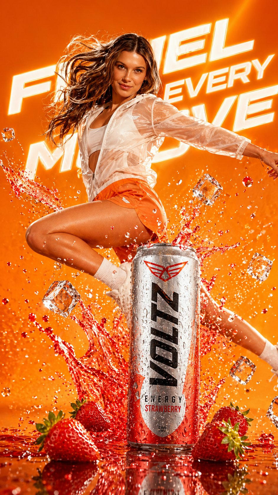
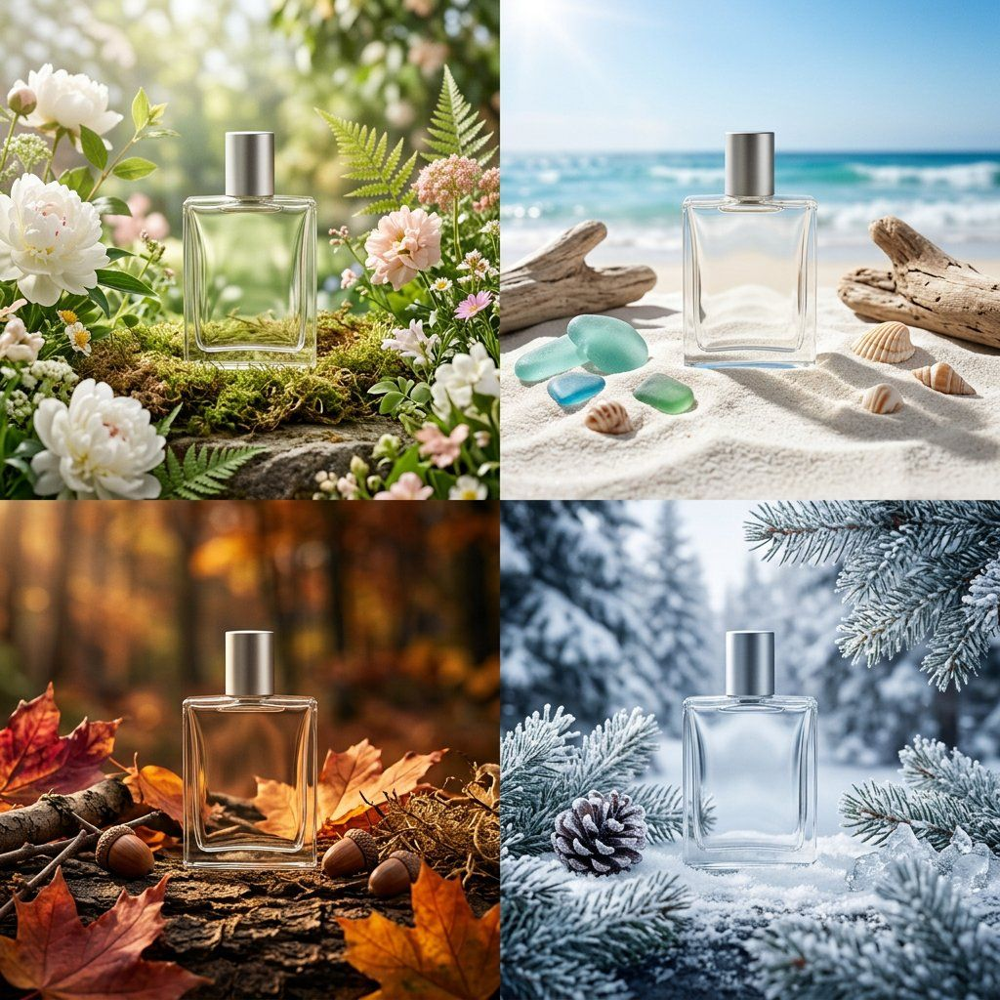
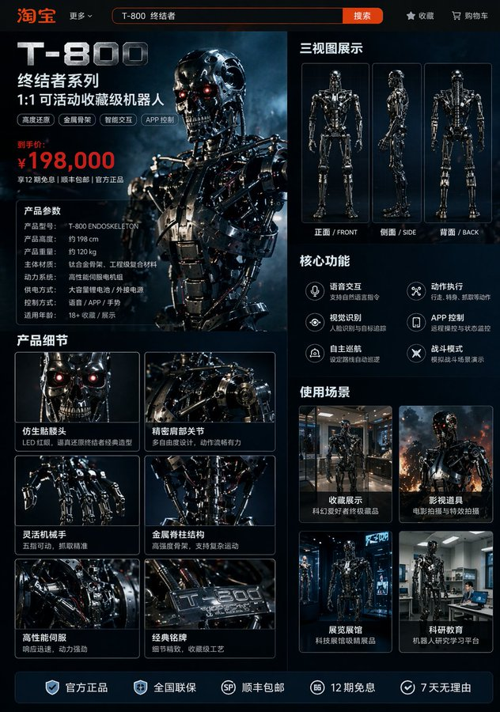
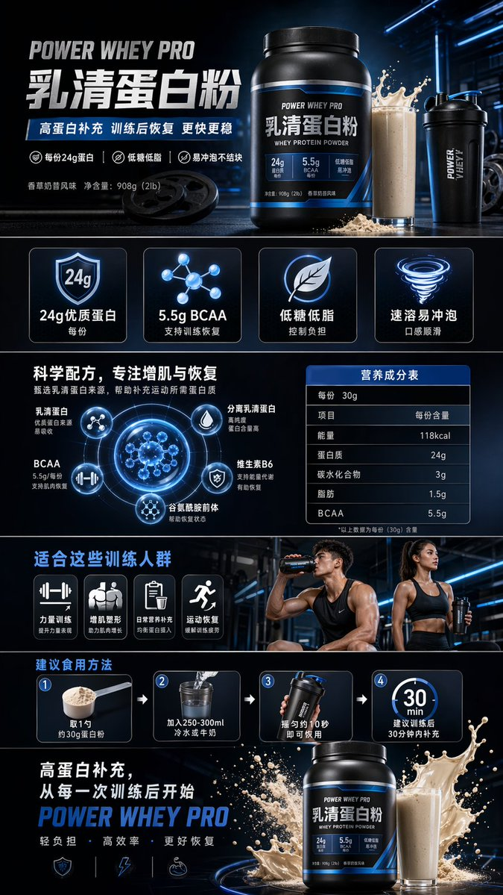
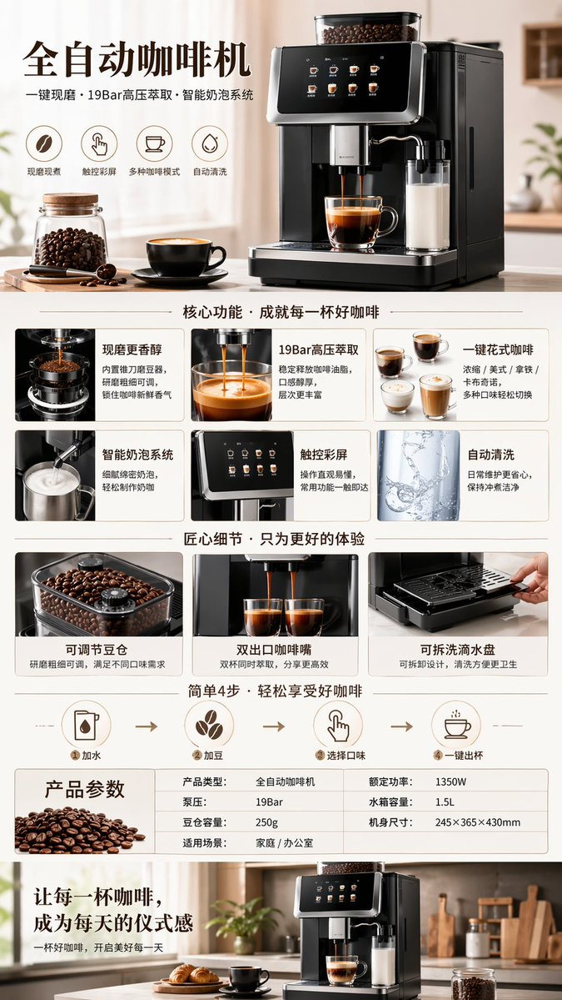
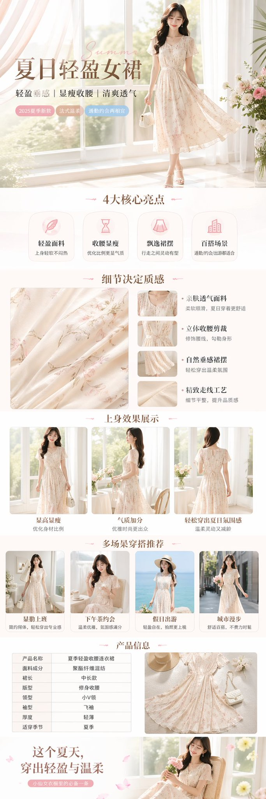
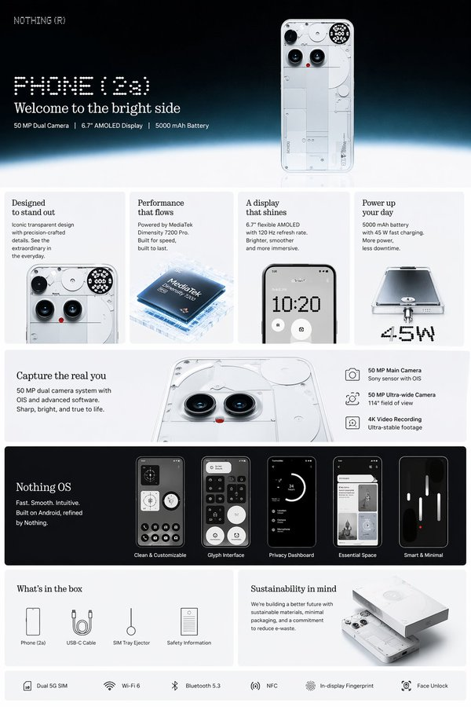
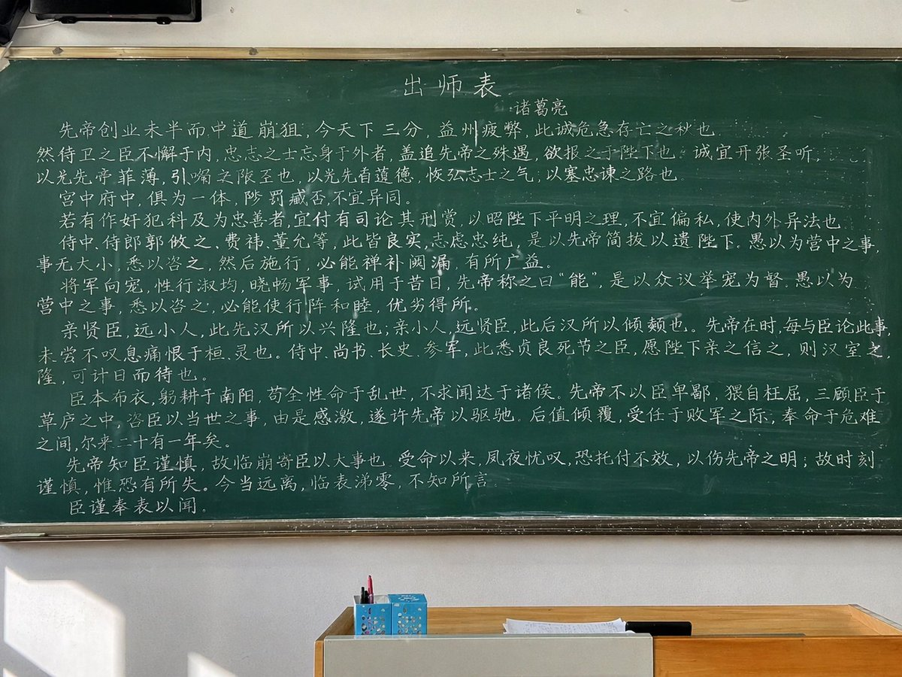
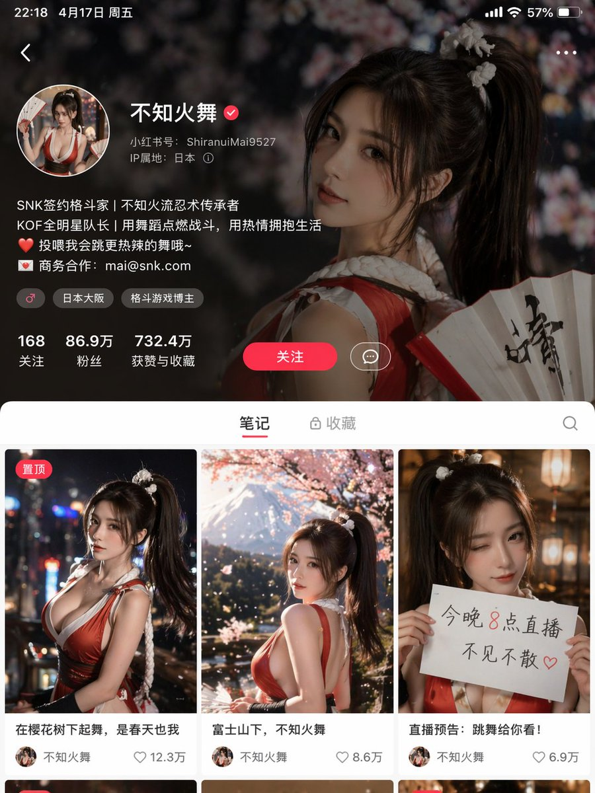
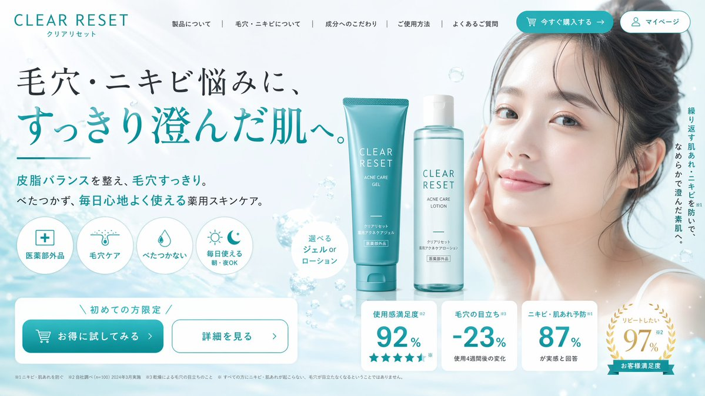

# Products & E-commerce

总计：19

## 青岛啤酒灵感女装系列

- ID: case-385
- Slug: case-385-zh
- 语言: zh
- 来源: [来源链接](https://x.com/Popcraft_ai/status/2051142270381170754)
- 样例图路径: images/part2/case385.jpg

### 提示词

```text
Inspired by Tsingtao (China beer)🍺

“Inspired by this product, design a set of cool-style women's clothing”
```

### 样例图


## 草莓能量饮料商业广告

- ID: case-358
- Slug: case-358-zh
- 语言: zh
- 来源: [来源链接](https://x.com/SPEEDAI07/status/2049043627163435040)
- 样例图路径: images/part2/case358.jpg

### 提示词

```text
A hyper-realistic commercial advertisement blending energy drink and sports branding. A dynamic athletic woman mid-air jump, wearing modern sportswear (light translucent jacket, orange shorts, white sneakers), surrounded by explosive splashes of red strawberry liquid and flying ice cubes. A cold metallic energy drink can (strawberry flavor) bursting with droplets sits in the foreground, covered in condensation. Fresh strawberries scattered on a glossy reflective surface.

Bright cinematic lighting with dramatic highlights and motion effects. Vibrant orange gradient background with bold glowing typography behind the subject. Ultra-detailed, high contrast, sharp focus, commercial product photography style, 8K resolution, advertising poster aesthetic, energetic, powerful, refreshing mood.
```

### 样例图



## 四季包装 Campaign 宫格

- ID: case-342
- Slug: case-342-zh
- 语言: zh
- 来源: [来源链接](https://x.com/SRKDAN/status/2048582939504431195)
- 样例图路径: images/part2/case342.jpg

### 提示词

```text
PHASE 1 - PRODUCT: [ITEM] in [MATERIAL] packaging, minimal label design
PHASE 2 - GRID: 2x2 seasonal grid, four distinct brand worlds
PHASE 3 - COMPOSITION: each quadrant a full campaign scene with props and environment
PHASE 4 - CONSISTENCY: same product silhouette, four distinct palettes

Swap: [ITEM] / [MATERIAL] / [LABEL STYLE]
```

### 样例图



## 珊瑚色极简影棚时尚商业大片

- ID: case-318
- Slug: case-318-zh
- 语言: zh
- 来源: [来源链接](https://x.com/Maercihh/status/2026941078885310750)
- 样例图路径: images/part2/case318.jpg

### 提示词

```text
[中文]
超写实高端时尚商业广告大片，使用上传的模特照片作为严格的身份参考。保留精确的面部特征、比例和自然皮肤纹理——无修图，无变形。场景：珊瑚色单色工作室盒，配有光泽反光棋盘格或极简抛光地板。拥有柔和光线渐变的干净几何墙壁。产品：产品放置在前景中心超大位置，因广角透视而占据画面主导地位。包装超清晰，文字完全可读，具有逼真的反射和材质纹理。较小的产品单元可对称放置在背景中。模特姿势：站在产品后方，微蹲或前倾，一只手伸向镜头以创造深度感。强烈自信的表情，时尚态度。相机：低角度 24-35mm 镜头感，戏剧性透视畸变，对产品和模特都进行深焦处理。灯光：明亮的商业影棚灯光，柔和阴影，包装上有光泽高光，高端广告成片质感。4K–8K 写实主义，无水印，无嵌入式文本。纵横比 9:13

[English]
Ultra-realistic high-fashion commercial campaign using the uploaded model photo as strict identity reference. Preserve exact facial features, proportions and natural skin texture — no retouching, no reshaping.
Scene: coral monochrome studio box with glossy reflective checker or minimal polished floor. Clean geometric walls with soft light gradients.
Product: the product placed oversized in the center foreground, dominating the frame due to wide-angle perspective. The packaging is ultra-sharp, fully readable, realistic reflections and material texture. Smaller product units can be placed symmetrically in the background.
Model pose: standing behind the product, slightly crouched or leaning forward, one hand reaching toward the camera to create depth. Strong confident expression, fashion attitude.
Camera: low-angle 24–35mm lens look, dramatic perspective distortion, deep focus on both product and model.
Lighting: bright commercial studio lighting, soft shadows, glossy highlights on packaging, high-end campaign finish. 4K–8K realism, no watermark, no embedded text.i ar 9:13
```

### 样例图


## 终结者机器人淘宝详情页

- ID: case-301
- Slug: case-301-zh
- 语言: zh
- 来源: [来源链接](https://x.com/rionaifantasy/status/2045356799751303194)
- 样例图路径: images/part2/case301.jpg

### 提示词

```text
[中文]
生成图片:
T-800机器人的淘宝商品详情页，展示:
机器人的正面侧面背面三视图，
产品价格，
产品细节，
功能和使用场景等

[English]
Generate image:
Taobao product detail page of a T-800 robot, showing:
front, side, and back three-view drawings of the robot,
product price,
product details,
functions and usage scenarios
```

### 样例图



## 夏日柑橘苏打高转化广告图

- ID: case-237
- Slug: case-237-zh
- 语言: zh
- 来源: [来源链接](https://x.com/old_pgmrs_will/status/2045852114673635507)
- 样例图路径: images/part2/case237.jpg

### 提示词

```text
[中文]
图像生成: 商品广告照片, 适合夏天的季节商品, 碳酸饮料, 名称="夏柑SODA", 形状=PET瓶500ml, 研究2025年作为饮料广告的高CTA设计后设计并生成图像规格, 宽高比3:4

[English]
Image generation: Product advertising photo, Seasonal product suitable for summer, Carbonated beverage, Name="Summer Citrus SODA", Shape=500ml PET bottle, Design and generate image specifications after researching high CTA design as a beverage advertisement in 2025, Aspect ratio 3:4
```

### 样例图


## 健身蛋白粉电商详情页

- ID: case-194
- Slug: case-194-zh
- 语言: zh
- 来源: [来源链接](https://x.com/MrLarus/status/2046544209117634735)
- 样例图路径: images/part2/case194.jpg

### 提示词

```text
[中文]
健身蛋白粉电商详情图

[English]
Fitness protein powder e-commerce detail image
```

### 样例图



## 电商商品展示图

- ID: case-192
- Slug: case-192-zh
- 语言: zh
- 来源: [来源链接](https://x.com/MrLarus/status/2046544209117634735)
- 样例图路径: images/part2/case192.jpg

### 提示词

```text
[中文]
AI智能眼镜电商详情图

[English]
AI smart glasses e-commerce detail image
```

### 样例图


## 全自动咖啡机产品展示

- ID: case-190
- Slug: case-190-zh
- 语言: zh
- 来源: [来源链接](https://x.com/MrLarus/status/2046544209117634735)
- 样例图路径: images/part2/case190.jpg

### 提示词

```text
[中文]
全自动咖啡机电商详情图

[English]
Fully automatic coffee machine e-commerce detail image
```

### 样例图



## 清新夏日女装连衣裙电商展示

- ID: case-189
- Slug: case-189-zh
- 语言: zh
- 来源: [来源链接](https://x.com/MrLarus/status/2046544209117634735)
- 样例图路径: images/part2/case189.jpg

### 提示词

```text
[中文]
夏季女裙电商详情图

[English]
Summer women's dress e-commerce detail image
```

### 样例图



## 潮流视角重塑精致商品广告

- ID: case-181
- Slug: case-181-zh
- 语言: zh
- 来源: [来源链接](https://x.com/genel_ai/status/2046498264774791514)
- 样例图路径: images/part2/case181.jpg

### 提示词

```text
[中文]
请以专业设计师的视角重新设计这个商品广告。
采用当前的潮流趋势，针对目标受众的精致设计。

[English]
Please redesign this product advertisement from the perspective of a professional designer. Adopt current fashion trends, exquisite design targeting the target audience.
```

### 样例图


## 亚马逊详情图设计

- ID: case-178
- Slug: case-178-zh
- 语言: zh
- 来源: [来源链接](https://x.com/xin_pai88825/status/2046576100592201946)
- 样例图路径: images/part2/case178.jpg

### 提示词

```text
[中文]
生成一套亚马逊 A+=详情图

[English]
Generate a set of Amazon A+= detail images
```

### 样例图



## 综合应用场景图

- ID: case-148
- Slug: case-148-zh
- 语言: zh
- 来源: [来源链接](https://x.com/alanlovelq)
- 样例图路径: images/part2/case148.jpg

### 提示词

```text
A {argument name="platform" default="Taobao"} product detail page for {argument name="robot model" default="T-800 robot"}, displaying: front, side, and back three-view drawings of the robot, product price, product details, functions, and usage scenarios, etc.
```

### 样例图


## 综合应用场景图

- ID: case-147
- Slug: case-147-zh
- 语言: zh
- 来源: [来源链接](https://x.com/alanlovelq)
- 样例图路径: images/part2/case147.jpg

### 提示词

```text
A {argument name="platform" default="Taobao"} product detail page for {argument name="robot model" default="T-800 robot"}, displaying: front, side, and back three-view drawings of the robot, product price, product details, functions, and usage scenarios, etc.
```

### 样例图



## 综合应用场景图

- ID: case-146
- Slug: case-146-zh
- 语言: zh
- 来源: [来源链接](https://x.com/alanlovelq)
- 样例图路径: images/part2/case146.jpg

### 提示词

```text
A {argument name="platform" default="Taobao"} product detail page for {argument name="robot model" default="T-800 robot"}, displaying: front, side, and back three-view drawings of the robot, product price, product details, functions, and usage scenarios, etc.
```

### 样例图



## 综合应用场景图

- ID: case-145
- Slug: case-145-zh
- 语言: zh
- 来源: [来源链接](https://x.com/alanlovelq)
- 样例图路径: images/part2/case145.jpg

### 提示词

```text
A {argument name="platform" default="Taobao"} product detail page for {argument name="robot model" default="T-800 robot"}, displaying: front, side, and back three-view drawings of the robot, product price, product details, functions, and usage scenarios, etc.
```

### 样例图


## 电商商品展示设计

- ID: case-141
- Slug: case-141-zh
- 语言: zh
- 来源: [来源链接](https://x.com/takadtmnu)
- 样例图路径: images/part2/case141.jpg

### 提示词

```text
{
  "type": "promotional banner design set",
  "theme": "strawberry advertisement campaign",
  "style": "anime illustration, bright, cheerful, commercial graphic design",
  "color_palette": "{argument name=\"primary color theme\" default=\"pastel pink and vibrant red\"}",
  "character": "{argument name=\"character description\" default=\"anime girl with brown side ponytail and bunny ears, wearing a pastel blue and pink jacket\"}",
  "product": "{argument name=\"product\" default=\"fresh red strawberries\"}",
  "layout": {
    "sections": [
      {
        "type": "large landscape banner",
        "position": "top left",
        "visuals": "character winking and holding a strawberry next to a large basket of strawberries",
        "main_text": "{argument name=\"main headline\" default=\"いちごたっぷり\"}",
        "sub_text": ["笑顔あふれる、甘〜いひととき♪", "とびきりおいしい！", "ひと粒で、しあわせ広がる♡", "あまっ♡", "旬のおいしさをお届け！"],
        "badges": {
          "count": 3,
          "labels": ["あま〜くてジューシー！", "いろんなサイズを楽しめる♪", "新鮮朝採れ！"]
        }
      },
      {
        "type": "vertical banner",
        "position": "right",
        "visuals": "character eating a strawberry with a pile of strawberries below",
        "main_text": "いちごたっぷり",
        "sub_text": ["旬のいちごをお届け！", "{argument name=\"secondary headline\" default=\"あま〜くて、ジューシー！\"}", "とろけるおいしさ〜♡"],
        "badges": {
          "count": 3,
          "labels": ["朝採れ新鮮！", "いろんなサイズを楽しめる♪", "甘くてジューシー！"]
        }
      },
      {
        "type": "wide horizontal banner",
        "position": "middle",
        "visuals": "character with closed eyes eating a strawberry, flanked by strawberries",
        "main_text": "いちごたっぷり！",
        "sub_text": ["あまくて、ジューシーな幸せ♡", "旬の美味しさをお届けします！", "おいし〜っ♡"]
      },
      {
        "type": "small square banner",
        "position": "bottom left",
        "visuals": "character smiling holding strawberry",
        "text": ["いちごたっぷり", "あま〜くてジューシー！"]
      },
      {
        "type": "small square banner",
        "position": "bottom mid-left",
        "visuals": "pile of strawberries with one cut in half",
        "text": ["旬のいちご！", "あまくてとろけるおいしさ♡"]
      },
      {
        "type": "small horizontal banner",
        "position": "bottom mid-right",
        "visuals": "character holding strawberry",
        "text": ["いちごたっぷり", "朝採れ新鮮！", "あまくてジューシー！"]
      },
      {
        "type": "circular icons",
        "position": "bottom right",
        "count": 4,
        "items": [
          { "visual": "basket of strawberries", "label": "朝採れ新鮮！" },
          { "visual": "half strawberry", "label": "あまくてジューシー！" },
          { "visual": "whole strawberry", "label": "いろんなサイズ！" },
          { "visual": "character face", "label": "とろけるおいしさ♡" }
        ]
      }
    ]
  }
}
```

### 样例图


## 品牌视觉识别图

- ID: case-136
- Slug: case-136-zh
- 语言: zh
- 来源: [来源链接](https://x.com/ryuya__31)
- 样例图路径: images/part2/case136.jpg

### 提示词

```text
{
  "type": "e-commerce landing page hero section",
  "brand": "{argument name=\"brand name\" default=\"CLEAR RESET\"}",
  "theme": "refreshing skincare, clean aesthetic, water bubbles background",
  "color_palette": ["white", "{argument name=\"primary color\" default=\"teal\"}", "light blue"],
  "layout": {
    "header": {
      "logo": "CLEAR RESET",
      "navigation_links": {"count": 5, "labels": ["About Product", "About Pores/Acne", "Ingredients", "How to Use", "FAQ"]},
      "action_buttons": {"count": 2, "labels": ["Buy Now", "My Page"]}
    },
    "hero_content": {
      "headline": "{argument name=\"main headline\" default=\"毛穴・ニキビ悩みに、すっきり澄んだ肌へ。\"}",
      "subheadline": "Balances sebum and clears pores. Non-sticky, medicated skincare for comfortable daily use.",
      "vertical_copy": "Prevents recurring rough skin and acne, leading to smooth, clear skin."
    },
    "visuals": {
      "model": "{argument name=\"model description\" default=\"young Asian woman with clear radiant skin, hair tied up, smiling softly\"}",
      "products": {
        "count": 2,
        "description": "{argument name=\"product type\" default=\"acne care gel tube and lotion bottle\"}",
        "placement": "center"
      },
      "background": "light blue gradient with floating water bubbles"
    },
    "feature_highlights": {
      "count": 4,
      "style": "circular icons with text below",
      "labels": ["Quasi-drug", "Pore Care", "Non-sticky", "Daily Use Morning/Night OK"]
    },
    "call_to_action": {
      "banner_text": "Limited to first-time buyers",
      "buttons": {"count": 2, "labels": ["Try it at a discount", "See details"]}
    },
    "statistics_cards": {
      "count": 4,
      "style": "white rectangular cards with large teal numbers",
      "labels": ["Satisfaction 92%", "Pore visibility -23%", "Acne prevention 87%", "Want to repeat 97%"]
    }
  }
}
```

### 样例图



## 人物角色设定图

- ID: case-54
- Slug: case-54-zh
- 语言: zh
- 来源: [来源链接](https://x.com/fukumy_ai)
- 样例图路径: images/part2/case54.jpg

### 提示词

```text
{
  "type": "4-panel satirical product advertisement grid",
  "layout": {
    "grid": "2x2",
    "panels": [
      {
        "position": "top-left",
        "product_name": "{argument name=\"top left product name\" default=\"座る石\"}",
        "visual": "man in white shirt and dark pants sitting on a large round stone in a park",
        "catchphrase": "いつでも、どこでも、落ち着ける。",
        "sales_badge": "累計販売数 12,000個 突破!",
        "vertical_text": "公園のベンチが埋まっていた日に。",
        "features_count": 3,
        "features_labels": [
          "重さ約8kgで安定感抜群",
          "底面フェルト加工で傷つけにくい",
          "付属の専用ベルトで持ち運び簡単"
        ],
        "extra_visual": "small inset image of the stone with a leather carrying strap",
        "specs": [
          "耐荷重 150kg",
          "安心の日本製"
        ]
      },
      {
        "position": "top-right",
        "product_name": "{argument name=\"top right product name\" default=\"磨きたくない人の歯ブラシ\"}",
        "visual": "sleek light blue toothbrush angled diagonally on a dark blue background",
        "toothbrush_text": "I don't want to brush my yeeth.",
        "catchphrase": "持っているだけで安心感",
        "vertical_text": "歯を磨く代わりに、これを持つ。",
        "sales_badge": "シリーズ累計販売数 85,000本 突破!",
        "features_count": 3,
        "features_labels": [
          "気持ちを落ち着けるお守り代わりに",
          "会議や商談前のエチケットに",
          "磨かない選択を、もっと自由に。"
        ],
        "bottom_banner": "歯磨きストレスから、あなたを解放する。"
      },
      {
        "position": "bottom-left",
        "product_name": "{argument name=\"bottom left product name\" default=\"雲の貯金箱\"}",
        "visual": "hand inserting a coin into a fluffy white cloud-shaped piggy bank",
        "catchphrase": "空気より軽い、安心感。",
        "sales_badge": "累計販売数 23,567個 突破!",
        "features_count": 3,
        "features_labels": [
          "ふわふわの触り心地",
          "割れないから安心",
          "インテリアに馴染むデザイン"
        ],
        "color_variants_count": 3,
        "color_variants_labels": [
          "blue",
          "pink",
          "white"
        ],
        "price": "¥2,980 (税込)",
        "bottom_text": "今日から、空に向かってコツコツ貯めよう。"
      },
      {
        "position": "bottom-right",
        "product_name": "{argument name=\"bottom right product name\" default=\"叱ってくれる石\"}",
        "visual": "round stone on a wooden desk with a pen, text written on the stone",
        "stone_text": "{argument name=\"scolding phrase\" default=\"いいかげんやれ\"}",
        "catchphrase": "やる気が出ないあなたへ。",
        "sales_badge": "累計販売数 18,000個 突破!",
        "features_count": 3,
        "features_labels": [
          "見るたびに心を奮い立たせる",
          "厳選された言葉をランダム表示",
          "電池不要、半永久的に叱ってくれる"
        ],
        "phrase_variants_count": 10,
        "phrase_variants_labels": [
          "甘えるな",
          "考えるな",
          "動け",
          "現実を見ろ",
          "逃げるな",
          "寝るな",
          "やればできる",
          "お前ならできる",
          "寝るな",
          "もう言い訳するな"
        ],
        "price": "¥3,500 (税込)"
      }
    ]
  }
}
```

### 样例图


