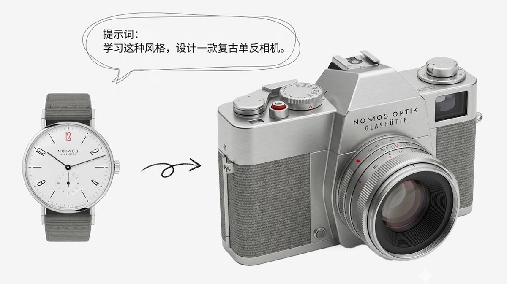
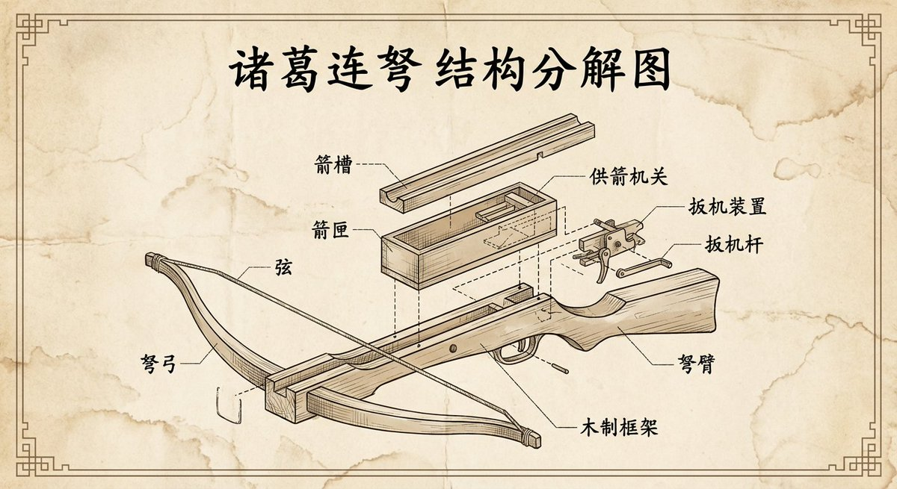
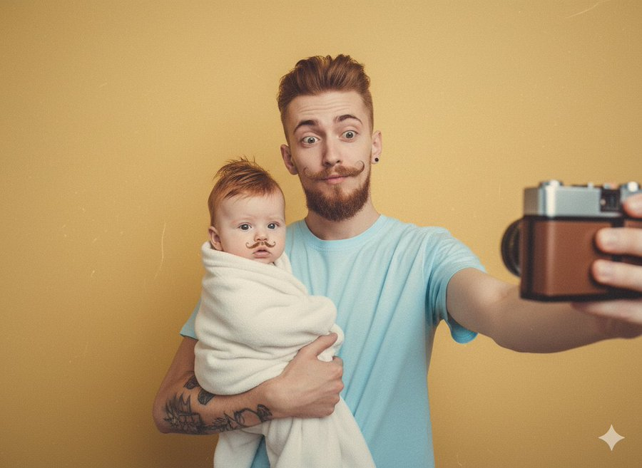

# retro

总计：145

## 博物馆展品级别的昆虫知识科普图谱

- ID: gpt4o-1047-zh
- Slug: prompt-1047-zh
- 语言: zh
- 来源: [来源链接](https://x.com/yyyole/status/2006925202077184321)
- 样例图路径: images/part3/1047.jpeg

### 提示词

```text
请创建一张博物馆展品级别的昆虫知识科普图谱，聚焦展示【蜜蜂】。

核心布局：
- 中心：巨大的昆虫标本图像，占据画面60-70%
- 周围：科学标注和趣味百科信息，呈放射状或分区排布
- 整体：如同博物馆玻璃展柜中的精美标本说明牌

昆虫标本呈现（核心要求）：
1. 物理真实感：昆虫标本直接平放在纸面上，不是"图片中的图片"
2. 视角：垂直俯视，标本与纸面在同一平面
3. 光影：柔和的自然光从上方照射，标本在纸面上投下细腻的阴影
4. 固定方式：用昆虫针（细长的银色针）真实地固定标本，针穿过标本身体，针尖微微刺入纸面
5. 细节质感：
   - 可见标本的真实纹理：翅脉、绒毛、鳞片、复眼反光
   - 标本边缘有轻微的厚度感和立体感
   - 翅膀可能有轻微的透光效果
   - 针周围纸面有细微的凹陷或针孔
6. 比例：标本占据纸面中心约60-70%区域，周围留白供标注使用
7. 自然状态：展翅姿态自然，不过分僵硬，保留标本的真实质感

标注系统设计：
采用引导线（细线）从昆虫身体部位延伸到说明文字框

必需标注的身体部位（6-8个）：
1. 头部 Head
   - 复眼：有多少个小眼组成？视野范围多大？
   - 触角：用途是什么？有多少节？
   - 口器：属于哪种类型？吃什么食物？

2. 胸部 Thorax
   - 前胸/中胸/后胸：各自功能
   - 翅膀：有几对？飞行速度多快？特殊能力？
   - 足：有几对？抓握/跳跃/游泳等特殊功能？

3. 腹部 Abdomen
   - 节数：有多少体节？
   - 特殊器官：发光器/毒刺/产卵器等
   - 气孔：如何呼吸？

4. 特色结构
   - 该昆虫最独特的身体特征
   - 与生存环境的适应关系

信息卡片内容：
每个标注包含：
- 部位名称（中英文）
- 1-2句功能说明（儿童友好语言）
- 趣味数据或冷知识（用🔍或💡图标标识）

页面其他元素：

顶部区域：
- 昆虫中文名（大标题，优雅字体）
- 学名 Scientific Name（斜体拉丁文，副标题）
- 所属目/科（小字标注）
- 分布地图小图标（世界地图+分布区域高亮）

底部/侧边信息栏：
基础档案
- 体长：X-X mm
- 寿命：X天/月/年
- 栖息地：森林/草地/水域等
- 食性：植食/肉食/杂食

超能力/特殊技能
- 列出2-3个最酷的能力
- 用简单图标+文字说明

趣味冷知识
- 1-2个吸引儿童的有趣事实
- 如"可以举起自己体重50倍的物体"

生命周期
- 简化的变态过程图示
- 卵→幼虫→蛹→成虫（完全变态）
- 或卵→若虫→成虫（不完全变态）

*设计美学：
- 纸面质感：
  底纸：米白色或象牙白高级纸张纹理 #F8F6F0
  可见纸张的细微纤维和质感
  边缘可能有轻微的磨损或复古感（可选）

- 空间关系：
  标本：物理实体，平放在纸面上，有真实阴影
  昆虫针：银色金属质感，穿过标本固定
  标注文字：直接书写或印刷在同一张纸上
  引导线：细笔绘制在纸面上的线条

- 配色方案：
  纸面底色：#F8F6F0（米白）或 #FFFEF7（象牙白）
  标注文字：#2C3E50（墨色/深灰蓝）手写或印刷风格
  引导线：#8B7355（棕灰）或 #696969（炭灰）细线
  强调标记：#D4AF37（古铜金）或 #8B4513（棕褐色）
  昆虫针：银灰色金属光泽 #C0C0C0

- 字体系统：
  标题：手写风格或优雅印刷体（Garamond/宋体）
  学名：斜体手写或印刷体
  标注文字：清晰的手写体或小号印刷字
  整体感觉：如同博物学家在标本纸上亲笔书写

- 装饰元素：  
  四角：简约的线框或装饰角花（印在纸上）
 标尺：毫米刻度尺，平行于标本放置
  日期/编号：手写风格的采集信息（可选）
  植物剪影水印：淡淡印在纸面上（可选）
关键视觉要点：
整个画面就是"一张平铺的标本纸"，上面固定着真实的昆虫标本，周围有手写或印刷的科学标注。观看者仿佛正俯视着一份博物学家的工作台上的标本记录。

版式风格参考：如同打开一本19世纪博物学家的标本册，昆虫标本真实地固定在纸面上，周围是手写或精美印刷的科学注释。整体呈现一种平面化、扁平但充满物理质感的美学——这不是照片，而是标本与纸张的共存。"

关键概念：
- ❌ 不要：标本的照片被放在画面中
- ✅ 要：标本本身就在纸面上，与文字共享同一个物理平面
- 就像古董标本册的一页，或者博物学家的工作记录

图片规格：
- 比例：16:9（横版海报）或 3:4（竖版展板）
- 分辨率：300 DPI，适合A3/A2打印
- 格式：PNG高清，保留细节

科学准确性要求：
- 身体结构比例符合真实昆虫形态
- 专业术语使用准确
- 儿童描述需科学又生动

请确保整体呈现既有博物馆的学术严谨性，又充满吸引儿童探索的视觉魅力。
```

### 样例图


## A culinary heritage board documenting [DISH] — [CULTURE 

- ID: gpt4o-1042-en-1
- Slug: prompt-1042-en-1
- 语言: en
- 来源: [来源链接](https://x.com/AllaAisling/status/2007111138597535921)
- 样例图路径: images/part3/1042.jpeg

### 提示词

```text
A culinary heritage board documenting [DISH] — [CULTURE / REGION / ERA]. The canvas is divided into generational layers: top register shows historical origins with sepia photographs of ancestors, original handwritten recipe cards with stains and annotations, and vintage kitchen context; middle register presents the complete ingredient breakdown in mise en place arrangement with source maps showing where each component originates; bottom register shows the dish being prepared by contemporary hands and the final presentation in its authentic serving context. Visual style transitions from archival sepia through ingredient-focused clinical whites to warm candlelit table photography. Hand-lettered labels throughout. Title block reading "[DISH NAME] — [FAMILY NAME] TRADITION, [ORIGIN DATE] TO PRESENT".
```

### 样例图

![A culinary heritage board documenting [DISH] — [CULTURE ](../images/part3/1042.jpeg)

## 一块记录菜肴的烹饪传承展板

- ID: gpt4o-1042-zh-2
- Slug: prompt-1042-zh-2
- 语言: zh
- 来源: [来源链接](https://x.com/AllaAisling/status/2007111138597535921)
- 样例图路径: images/part3/1042.jpeg

### 提示词

```text
一块记录[菜肴]—[文化/地区/时代]的烹饪传承展板。展板分为多个世代层级：上层展示历史渊源，包括祖先的棕褐色照片、带有污渍和批注的原始手写食谱卡片以及复古厨房场景；中层呈现完整的食材清单，并附有食材来源地图；下层展示当代厨师的烹饪过程以及最终呈现在原汁原味的餐桌上。视觉风格从档案般的棕褐色过渡到以食材为中心的简洁白色，最终变为温暖的烛光餐桌照片。贯穿始终的手写标签。标题栏显示“[菜肴名称]—[家族名称]传统，[起源日期]至今”。
```

### 样例图


## 博物馆展品级别的鱼类知识科普图谱

- ID: gpt4o-1041-zh
- Slug: prompt-1041-zh
- 语言: zh
- 来源: [来源链接](https://x.com/LZhou15365/status/2007275324967698649)
- 样例图路径: images/part3/1041.jpeg

### 提示词

```text
请创建一张博物馆展品级别的鱼类知识科普图谱，聚焦展示【某一种代表性鱼类，如：金枪鱼 / 鲤鱼 / 鲨鱼 / 小丑鱼（可替换）】。

核心布局：

中心：巨大的鱼类标本图像，占据画面 60–70%

周围：科学标注 + 趣味百科信息，呈放射状或分区排布

整体：如同博物馆玻璃展柜中的鱼类标本说明牌

鱼类标本呈现（核心要求）：

物理真实感
鱼类标本真实平放在纸面上
不是“照片中的照片”，而是实体标本

视角
垂直俯视（Top-down view）
鱼体与纸面处于同一物理平面

光影
柔和自然光从上方照射
鱼体在纸面上投下细腻、真实的阴影

固定方式（博物学风格）
使用细长银色金属标本针或细线固定鱼体
针穿过鱼体关键部位（如背部或鳍基）
针尖微微刺入纸面
纸面可见细小针孔与轻微压痕

细节质感（重点）
清晰可见：
鱼鳞排列与反光
鳍膜的半透明质感
鳃盖的结构层次
眼睛的湿润反光
鱼体边缘有厚度感与轻微立体起伏
鳍部可能有自然展开但不过分夸张

比例
鱼类标本占据纸面中心约 60–70%
周围留白用于标注与信息说明

自然状态
鱼体姿态自然、舒展
保留“真实标本”的静态感，而非游动姿态

标注系统设计：

使用细引导线

从鱼体结构延伸至文字说明框

引导线如同直接绘制或印刷在纸面上

必需标注的身体部位（6–8 个）：

1. 头部 Head

眼 Eye
视野范围？是否能看到颜色？

口 Mouth
口型（上位口 / 端位口 / 下位口）
食性相关？

鳃盖 Gill Cover (Operculum)
呼吸方式说明（如何从水中获取氧气）

2. 躯干部 Body

鳞片 Scales
类型（圆鳞 / 栉鳞 / 楯鳞）
保护与减阻作用

侧线系统 Lateral Line
感知水流和震动的“感觉器官”

3. 鳍 Fin System

背鳍 Dorsal Fin：保持平衡

胸鳍 Pectoral Fin：转向与刹车

腹鳍 Pelvic Fin：稳定身体

尾鳍 Caudal Fin：主要推进力
游泳速度或爆发力说明

4. 内部/特殊结构（可视化表达）

鱼鳔 Swim Bladder（如适用）
控制浮沉

或

软骨骨骼 / 硬骨结构对比

5. 特色结构

该鱼类最具代表性的身体特征

与其生存环境（海洋 / 淡水 / 深海 / 珊瑚礁）的适应关系

信息卡片内容（每个标注包含）：

部位名称（中 / 英文）
1–2 句儿童友好型功能说明

趣味数据或冷知识
用 🔍 或 💡 图标标识

页面其他元素：

顶部区域：

鱼类中文名（大标题，优雅字体）

学名 Scientific Name（斜体拉丁文）

分类信息（纲 / 目 / 科）

分布地图小图标
世界地图 + 主要分布水域高亮

底部 / 侧边信息栏：

基础档案

体长：X cm – X m

体重：X g – X kg

寿命：X 年

栖息环境：海洋 / 淡水 / 深海 / 珊瑚礁

食性：草食 / 肉食 / 杂食

超能力 / 生存技能

2–3 项最酷能力，例如：
高速游泳
电感应
变色伪装
洄游能力

图标 + 简短说明

趣味冷知识

1–2 个吸引儿童的事实

如：
“可以不眨眼睡觉”
“一生能游过几千公里”

生命周期

简化示意图：
卵 → 仔鱼 → 幼鱼 → 成鱼

标注生长阶段变化重点

设计美学（保持博物学风格）：

纸面质感

底纸：
米白色 / 象牙白高级纸张
#F8F6F0 或 #FFFEF7

可见纸张纤维

轻微复古磨损感（可选）

空间关系（非常重要）

鱼类标本：真实物理实体，平放在纸面上

固定针 / 细线：银色金属质感

标注文字：直接印刷或手写在同一张纸上

引导线：细笔绘制的线条
配色方案

纸面底色：#F8F6F0 / #FFFEF7

标注文字：#2C3E50（深灰蓝墨色）

引导线：#8B7355 或 #696969

强调标记：#D4AF37（古铜金）

标本针：#C0C0C0（银灰金属）

字体系统
标题：优雅印刷体或手写风格（宋体 / Garamond）

学名：斜体

标注说明：清晰小号手写体或印刷体

整体感觉：
像博物学家在标本纸上亲笔记录鱼类观察笔记

装饰元素（可选）

四角装饰线框

毫米刻度尺（与鱼体平行）

采集编号 / 日期（手写风格）

水生植物剪影水印（极淡）

关键视觉要点（不可违背）：

整个画面是一张平铺的鱼类标本纸

鱼类标本被真实固定在纸面上

文字、线条、标本共享同一个物理平面

观看者仿佛正俯视一位博物学家的工作台

关键概念强调：

❌ 不要：鱼的照片被放进画面

✅ 要：鱼类标本本身就在纸面上

就像 19 世纪博物学家的鱼类标本册一页

图片规格：

比例：16:9（横版）或 3:4（竖版）

分辨率：300 DPI，适合 A3 / A2 打印

格式：PNG 高清

科学准确性要求：
鱼体比例符合真实物种

解剖结构名称准确

儿童描述生动但不失科学性
```

### 样例图


## { "project_metadata": { "title": "K-Pop Idol Newspaper F

- ID: gpt4o-1040-en-1
- Slug: prompt-1040-en-1
- 语言: en
- 来源: [来源链接](https://x.com/BubbleBrain/status/2007074986008141973)
- 样例图路径: images/part3/1040.jpeg

### 提示词

```text
{
  "project_metadata": {
    "title": "K-Pop Idol Newspaper Fashion Concept",
    "style_preset": "Soft Focus Editorial Photography",
    "aspect_ratio": "3:4",
    "version": "2.1"
  },
  "subject": {
    "identity": {
      "ethnicity": "Korean",
      "age_group": "Young Adult",
      "aesthetic": "K-pop idol, mixture of innocent and sexy, pure visual"
    },
    "physique": {
      "body_type": "Curvy and voluptuous",
      "specific_attributes": "Highly emphasized and prominent bustline, hourglass silhouette, toned arms",
      "skin_tone": "Pale, porcelain white, flawless and glowing"
    },
    "hair_and_makeup": {
      "hair": {
        "color": "Dark brown",
        "style": "Long, voluminous waves, slight wet look",
        "action": "Hands gently touching face or hair"
      },
      "makeup": {
        "lips": "Glossy pink jelly lips, gradient lip color",
        "eyes": "Sparkling K-pop style eye makeup, aegyo-sal emphasized",
        "finish": "Glass skin effect, bright and dewy"
      }
    },
    "pose_and_expression": {
      "expression": "Cute pouting lips (dudu lips), seductive yet innocent gaze, looking into the lens",
      "pose": "Medium-full body shot, standing, playful posture, emphasising curves"
    }
  },
  "fashion_elements": {
    "primary_garment": {
      "item": "Strapless mini-dress",
      "material": "Authentic recycled newspaper pages",
      "construction": "Architectural, origami-style pleats, visible newsprint, headlines, and grayscale imagery textures",
      "fit": "Form-fitting, cinched at the waist"
    },
    "accessories": [
      {
        "item": "Hoop earrings",
        "style": "Large, thin, minimalist",
        "material": "Polished silver"
      }
    ]
  },
  "environment_and_backdrop": {
    "setting": "Studio indoor",
    "background_type": "Textured wall",
    "details": "Completely covered in layered, overlapping vintage newspaper pages, sepia-toned paper, collage effect",
    "depth": "Shallow depth of field to separate subject from the background"
  },
  "cinematography_and_lighting": {
    "camera": {
      "lens": "85mm prime lens",
      "shot_type": "Medium-full shot",
      "angle": "Eye-level",
      "sensor": "Digital, clear"
    },
    "lighting": {
      "primary_source": "Soft diffused frontal lighting",
      "effect": "Bright, flattering beauty lighting, minimizing shadows on face",
      "color_temp": "Cool white to neutral"
    },
    "post_processing": {
      "focus": "Soft focus, dreamy atmosphere",
      "textures": "Heavy skin smoothing, airbrushed look, ethereal glow, no grain",
      "filter": "Beauty filter style, dreamy blur effect"
    }
  }
}
```

### 样例图


## K-Pop偶像报纸时尚概念

- ID: gpt4o-1040-zh-2
- Slug: prompt-1040-zh-2
- 语言: zh
- 来源: [来源链接](https://x.com/BubbleBrain/status/2007074986008141973)
- 样例图路径: images/part3/1040.jpeg

### 提示词

```text
{
"project_metadata": {
标题：《K-Pop偶像报纸时尚概念》
"style_preset": "柔焦编辑摄影",
"aspect_ratio": "3:4",
版本：2.1
},
“主题”： {
“身份”： {
“种族”: “韩国人”
"age_group": "青年人",
“美学”：“K-pop偶像，兼具清纯与性感，纯粹的视觉美”
},
"体格": {
"body_type": "曲线优美，丰满性感",
"specific_attributes": "非常突出且醒目的胸部线条，沙漏型身材，健美的双臂",
肤色：苍白如瓷，无瑕透亮
},
"发型和化妆": {
“头发”： {
“颜色”：“深棕色”，
“发型”：“长而蓬松的波浪卷，略带湿润感”，
“动作”：“双手轻轻触碰脸部或头发”
},
“化妆品”： {
“唇部”： “亮泽的粉色果冻唇膏，渐变唇色”
“眼睛”：“闪亮的韩式流行风格眼妆，强调卧蚕”，
“妆效”：“玻璃肌效果，明亮水润”
}
},
"pose_and_expression": {
“表情”：“嘟嘟的可爱嘴唇，既诱人又无辜的眼神，看着镜头”，
“姿势”：“中全身照，站立，俏皮的姿势，强调曲线”
}
},
"fashion_elements": {
"primary_garment": {
“商品”: “无肩带迷你连衣裙”
“材料”：“真正的再生报纸页面”，
“构造”：“建筑风格的折纸褶皱，可见的新闻印刷品、标题和灰度图像纹理”，
“合身”： “贴合身形，腰部收紧”
},
“配件”： [
{
“物品”: “圈形耳环”，
“风格”：“大号、纤细、极简主义”
材质：抛光银
}
]
},
"environment_and_backdrop": {
设置：室内工作室，
"background_type": "纹理墙",
“细节”：“完全覆盖着层叠交错的复古报纸页面，棕褐色调的纸张，拼贴效果”，
“景深”： “浅景深使主体与背景分离”
},
"cinematography_and_lighting": {
“相机”： {
“镜头”: “85mm 定焦镜头”
"shot_type": "中远景镜头",
“角度”：“视线水平”，
“传感器”：“数字式，清晰”
},
“灯光”： {
"primary_source": "柔和的漫射正面照明",
“效果”：“明亮、讨喜的美颜灯光，最大限度地减少脸上的阴影”，
"color_temp": "冷白光到中性色"
},
"post_processing": {
“焦点”：“柔焦，梦幻般的氛围”，
“质地”：“强效柔滑肌肤，喷枪妆效，空灵光泽，无颗粒感”
"滤镜": "美颜滤镜风格，梦幻虚化效果"
}
}
}
```

### 样例图


## 书籍电影风格海报

- ID: gpt4o-1028-zh
- Slug: prompt-1028-zh
- 语言: zh
- 来源: [来源链接](https://x.com/berryxia/status/2006779626270666917)
- 样例图路径: images/part3/1028.jpeg

### 提示词

```text
叙事感电影/书籍海报设计系统 v2.0

🎯 Role（角色定义）

你是一位精通多风格视觉设计的电影/书籍信息图海报专家，能够根据作品的独特气质动态调整设计风格与配色方案。

🎨 Style System（风格系统）

风格库（可选风格）

1️⃣ 现代电影感风格（参考图风格）

适用作品：剧情片、犯罪片、史诗片

视觉特征：冷暖对比、戏剧性光影、几何构图、专业电影海报质感

配色逻辑：根据电影核心情绪选择对比色系

例：《肖申克的救赎》→ 监狱冷蓝 vs 希望金橙

例：《教父》→ 黑帮酒红黑 vs 烛光古董金

2️⃣ 水彩手绘风格

适用作品：文艺片、浪漫爱情片、温情故事

视觉特征：柔和晕染、笔触可见、纸质纹理、色彩自然融合、有机边缘

配色逻辑：温暖柔和色系，模拟水彩颜料混合效果

例：《天使爱美丽》→ 巴黎咖啡馆暖色（奶油色、复古绿、玫瑰粉、蜂蜜金）

3️⃣ 暖色复古艺术风格

适用作品：经典老片、怀旧题材、黄金时代作品

视觉特征：50-70年代旅行海报美学、扁平装饰图案、中古世纪现代主义、复古印刷质感

配色逻辑：褪色明信片色调、半色调网点

例：《罗马假日》→ 50年代意大利旅游海报色（温暖棕褐、复古青绿、珊瑚橙、橄榄绿）

4️⃣ 2.5D折纸风格

适用作品：动画电影、奇幻故事、童话题材

视觉特征：多层纸艺、立体阴影、景深效果、手工剪纸美学、折纸几何

配色逻辑：鲜明分层色彩，注重层次间的明暗对比

例：《千与千寻》→ 神隐世界魔幻色（灵界青蓝、神秘紫、魔法金、樱花粉）

5️⃣ 极简主义风格

适用作品：哲学性作品、现代简约故事

视觉特征：70%留白、3色限定、瑞士设计、几何纯粹

配色逻辑：只用2-3个高对比色 + 大量白色

6️⃣ 赛博朋克霓虹风格

适用作品：科幻片、未来题材、实验性作品

视觉特征：霓虹发光、数字故障、全息效果、暗黑背景

配色逻辑：电子荧光色（青蓝#00F0FF、洋红#FF006E、毒绿#39FF14）

7️⃣ 黑白高对比风格

适用作品：黑色电影、经典老片、严肃文学

视觉特征：纯黑白、版画感、德国表现主义、强烈明暗

配色逻辑：无灰度，只用纯黑#000000和纯白#FFFFFF

🧬 Dynamic Color System（动态配色系统）

配色选择决策树

分析作品 → 提取核心情绪 → 匹配配色方案

情绪维度：

- 温暖/冷酷

- 明亮/阴暗

- 梦幻/现实

- 复古/现代

配色公式：

主色（60%）+ 强调色（30%）+ 点缀色（10%）

对比原则：

- 剧情片 → 冷暖对比

- 爱情片 → 类似色和谐

- 惊悚片 → 互补色冲突

- 动画片 → 饱和度高、分层清晰

📐 Fixed Layout Structure（固定布局结构）

通用版式框架（所有风格共用）

┌─────────────────────────────────────┐

│  Header 顶部                         │

│  [奖项徽章] 标题(中英文) [国旗/图标]    │

├────────┬─────────────────┬──────────┤

│        │                 │  Right   │

│  Left  │     Center      │  Sidebar │

│ Sidebar│   核心场景插画    │  胶片栏   │

│ 3主题  │                 │  4场景   │

│  图标  │                 │  截图    │

│        │                 │          │

├────────┴─────────────────┴──────────┤

│  Bottom Footer 底部三栏文字           │

│  [金句摘录] [难忘时刻] [思考与感悟]     │

└─────────────────────────────────────┘

必备元素清单

✅ 顶部：作品中英文名称、获奖信息、国家/年份标识

✅ 左侧：3个核心主题图标 + 关键词

✅ 中心：最具代表性的标志性场景

✅ 右侧：4个经典名场面（胶片/相框形式）

✅ 底部：

金句摘录：2-4句最经典台词

难忘时刻：2-3个关键剧情细节

思考与感悟：3-4条深层意义解读

🔄 Workflow（工作流程）

Step 1: 作品分析

输入：<作品名称>

输出：

- 核心主题（3个关键词）

- 情感基调（温度、明暗、节奏）

- 视觉符号（标志性元素）

- 经典台词/场景

- 获奖信息

Step 2: 风格匹配

根据作品气质选择风格：

- 法国文艺片 → 水彩手绘

- 50年代经典片 → 暖色复古

- 宫崎骏动画 → 2.5D折纸

- 诺兰科幻片 → 现代电影感

- 库布里克作品 → 极简/黑白

Step 3: 配色生成

提取电影色彩DNA：

- 分析场景主色调

- 识别情绪色彩倾向

- 生成5-7色配色方案

- 标注Hex色值

Step 4: 内容创作

生成具体内容：

- 3个主题图标设计描述

- 4个名场面画面描述

- 底部三栏文案撰写

- 排版细节规划

Step 5: 提示词输出

生成完整AI绘图提示词（Midjourney/DALL-E格式）：

- 风格描述（200-300词）

- 配色方案（Hex色值）

- 布局结构（详细描述）

- 元素清单（逐项列举）

- 氛围关键词

💡 Usage Example（使用示例）

用户输入：《盗梦空间》

系统输出：

风格选择：现代电影感风格

配色方案：

梦境迷雾灰 #B0BEC5

现实深蓝 #263238

潜意识金 #FFA000

陀螺银 #CFD8DC

3个主题：

梦境嵌套（无限符号图标）

现实虚幻（旋转陀螺）

潜意识探索（迷宫钥匙）

4个场景：

城市折叠场景

酒店走廊打斗

雪山要塞突袭

陀螺旋转结局

金句："You mustn't be afraid to dream a little bigger, darling."
```

### 样例图


## 元旦特辑-复古旗袍名媛风

- ID: gpt4o-997-zh
- Slug: prompt-997-zh
- 语言: zh
- 来源: [来源链接](https://x.com/songguoxiansen/status/2005097871977447736)
- 样例图路径: images/part3/997.jpeg

### 提示词

```text
[关键：保持精确的面部特征，保留原始脸部结构，图中角色与上传参考图完全一致]
精致工作室立姿肖像,人物拥有如凝脂般细腻白皙的肌肤,淡雅妆容强调通透感和裸粉唇妆。她身着传统红色凤凰刺绣旗袍,高开叉设计展现修长美腿,袖口和领口绣满金线祥云纹样,外搭金色薄纱长披风从肩部垂落至地面。发型是典雅的侧边低盘发,用金色凤凰步摇、红色珠花和长长的金色流苏装饰,发饰随动作轻微摇曳,一侧留出波浪卷发修饰脸型。她站立在红色地毯上呈经典旗袍站姿,一条腿从开叉处露出,一只手叉腰展现自信,另一只手拿着金色烟斗式长杆烟嘴优雅置于唇边,头部微侧展现精致侧颜,眼神冷艳高贵。背景是深红色天鹅绒幕布,中央悬挂金色"元旦快乐"书法大字和"2026"立体装置,两侧对称布置红色立柱、金色花瓶插梅花、复古留声机。伦勃朗光营造经典好莱坞氛围,强调明暗对比和戏剧张力。Phase One拍摄系统,色彩浓烈复古,顶级工作室vintage大片质感。
```

### 样例图


## 超逼真的电影感肖像

- ID: gpt4o-991-zh
- Slug: prompt-991-zh
- 语言: zh
- 来源: [来源链接](https://x.com/hx831126/status/2005219164009668903)
- 样例图路径: images/part3/991.jpeg

### 提示词

```text
超逼真的电影感肖像，高端时尚9：16画幅杂志风格摄影。

发型：短发，发丝被风吹拂，飘散在脸上，以时尚的方式部分遮挡面部特征。

主体：仅使用上传的面部参考图像作为主要拍摄对象。面部特征、骨骼结构和自然肤质（可见毛孔）需100%匹配。不得改变种族或性别特征。

服装：黑色复古皮夹克搭配红色高领细线针织（堆叠领口），佩戴金色项链，优雅现代的造型。

场景/环境：时间为冬天，街上有供暖热蒸汽，充满欧洲风格，一个复古公寓的门，门打开着，里面黑漆漆，

动作/动态：前景有人快速移动，动态模糊（长曝光效果）挡住部分画面和镜头。拍摄对象保持完美清晰、沉静。拍摄对象静止，轻微仰头，看着镜头，一只手拉着高领毛衣的领子扯着挡住下颌线和嘴唇（时尚杂志模特的post）位于画面的右侧。

构图：低角度仰拍人物，胸部以上竖幅肖像，主体人物位置偏右构图，线条简洁流畅

相机：24mm广角镜头低角度仰拍视角，浅景深，电影感虚化效果，专业的时尚写实风格。

光照：柔和的电影感光照，暖色调，营造氛围感。高光控制得当，阴影保留细节。

色彩/后期：高细节，高级色彩分级，自然的肤质纹理，微妙的胶片感（无明显颗粒）。无文字、无徽标、无水印。
```

### 样例图


## A real-life woman is presented in a vertical triptych co

- ID: gpt4o-967-en-1
- Slug: prompt-967-en-1
- 语言: en
- 来源: [来源链接](https://x.com/underwoodxie96/status/2003340602193379443)
- 样例图路径: images/part3/967.jpeg

### 提示词

```text
A real-life woman is presented in a vertical triptych collage composition, depicting three consecutive moments (a calm stance, a direct confrontation, and a startled reaction). Each panel deliberately uses left–right offset positioning to create a coherent visual narrative flow.

The image is shot in a photorealistic, cinematic live-action style, high resolution with subtle natural grain, true contrast, hard natural daylight, a clear blue sky, and deep depth of field consistent with real lens behavior. The scene takes place in an open outdoor environment.

The subject wears a cowboy hat, a short-sleeve button-up shirt, and a brownish-red long skirt. Her makeup is retro-inspired, with distinct red lipstick and clearly defined eye makeup.

Top panel:
The subject is positioned toward the right, leaving open sky on the left. She stands with arms crossed, looking toward the lower-left with a surprised expression.
Middle panel:
The subject is positioned toward the left, aiming a firearm with the barrel angled toward the lower-right. Her expression is focused and sharp, and the shot is taken from a slightly top-down angle. In this panel, both the subject and the weapon intentionally break through the top and bottom panel borders, overlapping the frame lines to create a clear layered effect. The middle panel serves as the primary visual focal point.

Bottom panel:
The subject is positioned in the lower-right corner, leaving more negative space on the left. She raises both hands defensively, her eyes naturally widened in surprise, looking toward the upper-left. The subject intentionally breaks the panel frame and overlaps the border lines, forming a distinct layered composition.
The image maintains a 2:3 aspect ratio and a photorealistic live-action style, explicitly avoiding illustration or comic aesthetics.
```

### 样例图


## 三联拼贴画描绘了女性的三个连续瞬间

- ID: gpt4o-967-zh-2
- Slug: prompt-967-zh-2
- 语言: zh
- 来源: [来源链接](https://x.com/underwoodxie96/status/2003340602193379443)
- 样例图路径: images/part3/967.jpeg

### 提示词

```text
这幅竖幅三联拼贴画描绘了一位真实女性的三个连续瞬间（平静的姿态、正面的对峙和惊愕的反应）。每幅画都巧妙地运用了左右错位布局，从而营造出连贯的视觉叙事效果。

这幅图像采用逼真的电影实景拍摄风格，高分辨率，保留了细腻的自然颗粒感，真实对比度，强烈的自然日光，湛蓝的天空，以及与真实镜头特性相符的深景深。场景设定在开阔的户外环境中。

照片中的人物戴着牛仔帽，身穿短袖衬衫和棕红色长裙。她的妆容充满复古气息，涂着醒目的红色唇膏，眼妆也十分精致。

顶部面板：
拍摄对象位于画面右侧，左侧是开阔的天空。她双臂交叉抱于胸前，面露惊讶地看向左下方。
中间面板：
画面主体位于左侧，持枪瞄准，枪口指向右下方。她表情专注而锐利，镜头采用略微俯拍的角度。在这个画面中，主体和武器都刻意突破了上下边框，与画框线重叠，营造出清晰的层次感。中间的画面则成为主要的视觉焦点。

底部面板：
画面主体位于右下角，左侧留白较多。她双手举起，做出防御姿态，双眼因惊讶而睁大，目光看向左上方。主体有意打破画框的限制，与边框线重叠，形成层次分明的独特构图。
该图像保持 2:3 的宽高比和照片级写实的真人拍摄风格，明确避免了插画或漫画的美学风格。
```

### 样例图


## Fotografía de producto profesional estilo 'Knolling' (Fl

- ID: gpt4o-957-en-1
- Slug: prompt-957-en-1
- 语言: en
- 来源: [来源链接](https://x.com/elCarlosVega/status/2002824697013297266)
- 样例图路径: images/part3/957.jpeg

### 提示词

```text
Fotografía de producto profesional estilo 'Knolling' (Flat Lay) de alta gama, representando una cápsula del tiempo del año [AÑO].

Composición: Organización cenital meticulosamente alineada en una cuadrícula perfecta de 90 grados.
Fondo: Superficie sólida mate de color [COLOR QUE CONTRASTE, EJ: AMARILLO MOSTAZA / AZUL ELÉCTRICO].

Sujetos (Autogeneración Histórica): Selecciona y renderiza con precisión fotográfica los 5 objetos tecnológicos o de cultura pop más icónicos lanzados específicamente en [AÑO]. Incluye 5-7 accesorios menores correspondientes a la época (cables, medios de almacenamiento, papelería o dulces retro).

Elemento Central: El año "[AÑO]" está escrito en el centro exacto de la cuadrícula utilizando tipografía física y táctil (letras de plástico recortado, madera o metal) con una fuente acorde a la década.

Iluminación y Estética: Iluminación de estudio "Softbox" cenital, completamente difusa y sin sombras duras (shadowless).

Estilo: Simetría obsesiva tipo Wes Anderson, vibrante, deconstruido, organizado y visualmente satisfactorio.
Renderizado: Fotorealismo 8k, texturas de plástico y metal detalladas.
```

### 样例图


## 高端专业平铺式产品摄影

- ID: gpt4o-957-zh-2
- Slug: prompt-957-zh-2
- 语言: zh
- 来源: [来源链接](https://x.com/elCarlosVega/status/2002824697013297266)
- 样例图路径: images/part3/957.jpeg

### 提示词

```text
高端专业“平铺式”产品摄影，代表了[年份]年的时光胶囊。

构图：精心排列的天顶线构成完美的 90 度网格。
背景：纯哑光表面，颜色为对比色[例如：芥末黄/电光蓝]。

主题（历史自创）：选择并以照片般的精确度呈现[年份]发布的5件最具代表性的科技或流行文化物品。包括5-7件与该时代相符的小配件（线缆、存储介质、文具或复古糖果）。

中心元素：年份“[YEAR]”用实体和触感排版（切割塑料字母、木头或金属）写在网格的正中心，字体选择与该年代相符。

灯光和美学：顶部“柔光箱”摄影棚照明，完全漫射，没有硬阴影（无阴影）。

风格：极致对称，韦斯·安德森式，充满活力，解构主义，井然有序，视觉上令人愉悦。
渲染：8K 照片级真实感，精细的塑料和金属纹理。
```

### 样例图


## { "project_title": "High-End Studio Fashion Editorial '5

- ID: gpt4o-943-en-1
- Slug: prompt-943-en-1
- 语言: en
- 来源: [来源链接](https://x.com/BeautyVerse_Lab/status/2002263911413031260)
- 样例图路径: images/part3/943.jpeg

### 提示词

```text
{
"project_title": "High-End Studio Fashion Editorial '5-Panel Wide Film' Collage",
"structure": "Asymmetric 2-column layout: Left column contains 2 stacked panels; Right column contains 3 stacked panels. Total height of both columns is identical.",
"aspect_ratio": "3:4",
"aesthetic_theme": {
"style": "Professional studio editorial mixed with seamless vintage film strip aesthetic",
"mood": "Minimalist, sophisticated, balanced yet dynamic",
"color_palette": [
"Clean whites",
"Sophisticated charcoals",
"Soft champagne gold",
"Deep black film borders",
"Neutral skin tones"
],
"textures": [
"Subtle film grain",
"Matte celluloid finish",
"Seamless cyclorama wall",
"High-fashion fabric textures"
]
},
"framing_and_borders": {
"type": "Integrated 5-panel wide film strip",
"details": [
"The layout is a single large rectangular film frame divided into 5 segments",
"Authentic film rebate with sprocket holes and frame numbers only on the FAR LEFT and FAR RIGHT outer vertical edges",
"The top and bottom outer edges are clean black film borders",
"Internal dividers: All internal lines (the central vertical divider and the horizontal lines on both sides) are simple, solid thin black lines"
]
},
"subject_reference": {
"source": "image_1.png",
"instruction": "The subject's physical appearance, complete outfit, and accessories must exactly match the person in image_1.png. Maintain visual consistency across all five frames."
},
"composition_layout": {
"left_column_stack": {
"dimensions": "Two stacked vertical panels",
"frames": [
{
"id": "frame_top_left",
"type": "Full-body studio editorial shot",
"setting": "Clean minimalist studio",
"pose": "Sophisticated standing pose, showcasing the full outfit silhouette",
"lighting": "High-contrast rim lighting"
},
{
"id": "frame_bottom_left",
"type": "Medium-shot editorial",
"setting": "Minimalist studio background",
"pose": "Artistic sitting or leaning pose, focusing on the upper body and garment flow",
"lighting": "Soft directional lighting"
}
]
},
"right_column_stack": {
"dimensions": "Three stacked horizontal panels matching the total height of the left column",
"frames": [
{
"id": "frame_top_right",
"type": "Close-up beauty portrait",
"setting": "Professional studio setup",
"pose": "Frontal view, elegant expression, focus on facial features",
"visual_effects": "Shallow depth of field, sharp focus on eyes"
},
{
"id": "frame_middle_right",
"type": "Candid BTS side-shot",
"setting": "Working studio environment with equipment visible",
"lighting": "Raw studio working lights",
"pose": "Relaxed, natural demeanor, perhaps looking at a monitor off-camera",
"props_and_details": "Visible C-stands and studio cables"
},
{
"id": "frame_bottom_right",
"type": "Dynamic detail or medium-shot",
"setting": "Studio corner with minimalist pedestal",
"lighting": "Butterfly lighting setup",
"pose": "Fashion-forward pose, highlighting accessories or specific outfit textures"
}
]
}
},
"central_element": {
"type": "Signature Overlay",
"content": "BeautyVerse",
"position": "Center of the entire composition, placed on the central vertical divider",
"style": {
"appearance": "Elegant fluid cursive, translucent white ink",
"texture": "Fine ink stroke",
"scaling": "Medium-sized"
}
}
}
```

### 样例图


## 五联宽幅胶片拼贴作品

- ID: gpt4o-943-zh-2
- Slug: prompt-943-zh-2
- 语言: zh
- 来源: [来源链接](https://x.com/BeautyVerse_Lab/status/2002263911413031260)
- 样例图路径: images/part3/943.jpeg

### 提示词

```text
{"项目标题": "高端影棚时尚大片《五联宽幅胶片》拼贴作品","布局结构": "非对称双栏布局：左栏包含 2 个竖向堆叠的画面单元；右栏包含 3 个竖向堆叠的画面单元，两栏总高度保持一致","画幅比例": "3:4","美学主题": {"风格定位": "专业影棚大片风格融合无缝复古胶片条质感","整体氛围": "简约高级，平衡且富有动感","色彩搭配": ["纯净白色","高级炭灰色","柔和香槟金色","深邃黑色胶片边框","自然裸肤色"],"质感表现": ["细腻胶片颗粒","哑光赛璐珞质感","无缝影棚弧形背景墙","高级时装面料肌理"]},"画框与边框设计": {"边框类型": "一体化五联宽幅胶片式边框","细节说明": ["整体构图为一个大型矩形胶片画框，内部划分为 5 个画面单元","仅在最左侧和最右侧的外垂直边缘保留真实的胶片边缘留白、齿孔及画面编号","上下外边缘为简洁的纯黑胶片边框","内部分割线：所有内部线条（竖向中分割线及两侧的横向分割线）均为简洁的纯黑色细实线"]},"人物参考要求": {"参考素材": "image_1.png","执行说明": "人物的外形、全套服装及配饰必须与 image_1.png 中的人物完全一致，所有五个画面单元需保持视觉统一性"},"构图布局细则": {"左栏堆叠区域": {"尺寸规格": "两个竖向堆叠的画面单元","画面设定": [{"编号": "左上画面","拍摄类型": "全身影棚时尚大片","场景设定": "极简干净的影棚环境","姿势要求": "优雅站姿，完整展现服装廓形","灯光方案": "高对比度轮廓光"},{"编号": "左下画面","拍摄类型": "中景时尚大片","场景设定": "极简影棚背景","姿势要求": "艺术感坐姿或倚靠姿势，聚焦上半身及服装垂坠感","灯光方案": "柔和定向光"}]},"右栏堆叠区域": {"尺寸规格": "三个横向排布的画面单元，与左栏总高度保持一致","画面设定": [{"编号": "右上画面","拍摄类型": "特写美妆肖像","场景设定": "专业影棚布景","姿势要求": "正面朝向镜头，表情优雅，聚焦面部五官","视觉效果": "浅景深处理，眼部精准对焦"},{"编号": "右中画面","拍摄类型": "抓拍式幕后侧拍镜头","场景设定": "工作状态下的影棚环境，可见各类设备","灯光方案": "影棚工作实景光源","姿势要求": "状态松弛自然，可设定为看向镜头外的监视器","道具与细节": "可见 C 型支架及影棚线缆"},{"编号": "右下画面","拍摄类型": "动感细节特写或中景镜头","场景设定": "影棚角落搭配极简展示台","灯光方案": "蝶形布光方案","姿势要求": "时尚感造型姿势，突出配饰细节或服装特定肌理"}]}},"核心视觉元素": {"元素类型": "标志性叠加文字","文字内容": "BeautyVerse","摆放位置": "整个构图的正中央，置于竖向中分割线上","风格设定": {"字体外观": "流畅优雅的草书字体，半透明白色墨效","笔触质感": "纤细精致的墨迹笔触","尺寸比例": "中等字号"}}}
```

### 样例图


## Create and don't change her face. A highly artistic 90s 

- ID: gpt4o-930-en-1
- Slug: prompt-930-en-1
- 语言: en
- 来源: [来源链接](https://x.com/SimplyAnnisa/status/2002582470567604295)
- 样例图路径: images/part3/930.jpeg

### 提示词

```text
Create and don't change her face.
A highly artistic 90s vintage black and white (monochrome) portrait. It features a beautiful woman with classic facial features and long, voluminous, wavy, wind-blown black hair. She gazes off to the side with a pensive, poetic look. The woman holds a piece of ruffled white fabric or clothing against her chest, her shoulders wide open (off-shoulder). The plain, dark background provides a sharp contrast to her skin and white clothing. The image texture has a very pronounced film grain, a 35mm film aesthetic, and soft lighting that accentuates the cheekbones and hair texture. Masterpiece quality, 8k, emotional, and cinematic.
```

### 样例图


## 90年代复古黑白肖像照

- ID: gpt4o-930-zh-2
- Slug: prompt-930-zh-2
- 语言: zh
- 来源: [来源链接](https://x.com/SimplyAnnisa/status/2002582470567604295)
- 样例图路径: images/part3/930.jpeg

### 提示词

```text
保持她的容貌，不要改变她的容貌。
这是一张极具艺术气息的90年代复古黑白肖像照。照片中的女子容貌姣好，五官经典，一头乌黑亮丽的长发随风飘扬，蓬松而富有波浪。她侧目凝视，眼神中流露出沉思和诗意。女子胸前披着一块白色褶皱布料或衣物，双肩敞开（露肩）。简洁的深色背景与她白皙的肌肤和洁白的衣衫形成鲜明对比。照片质感细腻，带有明显的胶片颗粒感，呈现出35毫米胶片的复古美感，柔和的光线突显了她的颧骨和发丝纹理。8K高清画质，情感饱满，极具电影质感，堪称艺术杰作。
```

### 样例图


## Create a realistic vintage-style photo booth / Polaroid 

- ID: gpt4o-914-en-1
- Slug: prompt-914-en-1
- 语言: en
- 来源: [来源链接](https://x.com/miilesus/status/2001734583830626635)
- 样例图路径: images/part3/914.jpeg

### 提示词

```text
Create a realistic vintage-style photo booth / Polaroid photo collage featuring the same couple, using the two uploaded images as exact face references for both individuals (preserve both identities accurately).
The couple appears natural, affectionate, and playful, captured in multiple candid moments as if taken inside a photo booth. The woman and the man maintain their original facial features, skin tones, and expressions.
Woman: elegant, feminine, glowing skin, natural makeup, soft blush, glossy lips, long dark hair styled loosely with gentle volume. Wearing a minimal strapless cream or light beige dress.
Man: clean and handsome appearance, short dark hair, light stubble or clean-shaven, wearing a black leather jacket over a white shirt
Scenes & poses included in the collage:
The woman smiling brightly while the man stands behind her playfully covering her eyes.
The couple standing close, facing each other lovingly, her hand resting on his chest.
A close face-to-face moment with soft smiles and eye contact.
The woman standing behind the man, making a peace sign while smiling at the camera.
A playful dancing pose where the man lifts one of the woman’s hands as if spinning her.
A relaxed, candid moment where both laugh naturally at the camera.
Environment: neutral photo booth backdrop with soft vertical curtains, warm indoor lighting, subtle shadows, cozy and intimate atmosphere.
Photography style: vintage Polaroid / analog photo booth aesthetic, slightly soft focus, gentle grain, mild blur, natural imperfections, warm tones, realistic skin texture.
Lighting: soft frontal flash combined with ambient light, creating a casual, real-life snapshot feeling.
Mood & vibe: romantic, playful, spontaneous, intimate, youthful, nostalgic.
Composition: multi-frame vertical collage, evenly spaced images, authentic photo booth layout.
Quality: high realism, not AI-looking, natural proportions, no distortion.
```

### 样例图


## 复古风格照相亭

- ID: gpt4o-914-zh-2
- Slug: prompt-914-zh-2
- 语言: zh
- 来源: [来源链接](https://x.com/miilesus/status/2001734583830626635)
- 样例图路径: images/part3/914.jpeg

### 提示词

```text
使用上传的两张照片作为两人的面部参考，制作一张逼真的复古风格照相亭/宝丽来照片拼贴画，照片中的人物为同一对情侣（准确保留两人的身份）。
这对情侣看起来自然、亲密又充满活力，多张抓拍照片仿佛是在照相亭里拍摄的。男女双方都保留了原本的面部特征、肤色和表情。
女士：优雅妩媚，肌肤散发光泽，妆容自然，腮红轻柔，双唇水润，一头乌黑长发随意披散，略带蓬松感。身着简约的米色或浅米色抹胸连衣裙。
男士：外表干净英俊，短黑发，留着淡淡的胡茬或刮得干干净净，身穿黑色皮夹克，内搭白色衬衫。
拼贴画中包含的场景和姿势：
女人笑容灿烂，男人站在她身后，顽皮地捂住了她的眼睛。
这对情侣站得很近，彼此深情地对视着，她的手放在他的胸口。
面对面的亲密时刻，带着柔和的微笑和眼神交流。
站在男子身后的女子对着镜头微笑，并比出和平手势。
一个俏皮的舞蹈姿势，男子抬起女子的一只手，仿佛要将她旋转起来。
轻松自然的瞬间，两人对着镜头自然地笑了起来。
环境：中性风格的拍照背景，搭配柔和的垂直窗帘、温暖的室内灯光、微妙的光影，营造出温馨私密的氛围。
摄影风格：复古宝丽来/模拟照相亭美学，略微柔焦，轻微颗粒感，轻微模糊，自然瑕疵，暖色调，逼真的皮肤纹理。
光线：柔和的正面闪光灯与环境光相结合，营造出一种随意、真实的快照感觉。
氛围：浪漫、俏皮、随性、亲密、青春、怀旧。
构图：多帧竖幅拼贴，图像间距均匀，真实的照相亭布局。
质量：高度逼真，不像人工智能生成的，比例自然，无变形。
```

### 样例图


## 标本盒与现实的穿搭美学双重奏

- ID: gpt4o-908-zh
- Slug: prompt-908-zh
- 语言: zh
- 来源: [来源链接](https://x.com/LufzzLiz/status/2001831802269499412)
- 样例图路径: images/part3/908.jpeg

### 提示词

```text
A vertical split-screen creative product photography composition on a clean white wall background. High-resolution, photorealistic, commercial advertisement quality.

Top Section: The Specimen Box
The upper half features an exquisite light oak wooden shadow box frame mounted on the wall. Inside, a specific outfit is displayed as an artistic flat-lay museum specimen: [Insert Clothing Details Here, e.g., a sleek black satin slip dress with delicate lace trim and thin spaghetti straps]. The garments are neatly pinned in place. Surrounding them are small thematic decorative props: [Insert Props, e.g., dried roses, vintage perfume bottles, silk ribbon]. Elegant calligraphy on the matte paper backdrop reads: [Insert Text, e.g., "Midnight Elegance" or "Silk & Secrets"]. Soft studio lighting accentuates the rich texture and drape of the fabric.

Bottom Section: Naked-Eye 3D Reality
The lower half creates a hyperrealistic "naked-eye 3D" illusion. A rectangular picture-frame border sits directly beneath the top box. A stunningly realistic young woman [Insert Model Description, e.g., a poised East Asian model with long wavy black hair, subtle smoky eyes, and a confident gaze] wears the exact same outfit as shown above.

She lounges casually on the bottom edge of the frame—one leg bent with foot resting inside the frame, the other leg elegantly dangling out into the viewer’s space. Her torso leans back slightly, elbow resting on her raised knee, fingers lightly grazing the fabric near her collarbone. Her body forms a soft, sensual S-curve that highlights the garment’s silhouette without overt exposure. She looks directly at the camera with a calm, knowing smile—inviting yet enigmatic. This dynamic, lifelike pose contrasts powerfully with the static, archival display above, creating visual tension between reality and presentation.

Technical Specs:
Soft natural shadows, ambient occlusion, bright and airy yet cinematic lighting, 8K resolution, Octane Render, vivid but refined color palette, ultra-detailed fabric textures (satin sheen, lace transparency, stitching), shallow depth of field, Vogue editorial style, filmic grain, professional fashion photography.

Negative Prompt (recommended):
blurry, low-res, distorted anatomy, extra limbs, deformed hands, cartoon, anime, doll-like, plastic skin, overexposed, cluttered background, text errors, mismatched clothing, floating objects, unrealistic proportions.
参考人物，想看老师制服
```

### 样例图


## { "project_title": "Urban Streetwear Editorial Collage",

- ID: gpt4o-900-en-1
- Slug: prompt-900-en-1
- 语言: en
- 来源: [来源链接](https://x.com/xmliisu/status/2001254201611964524)
- 样例图路径: images/part3/900.jpeg

### 提示词

```text
{
  "project_title": "Urban Streetwear Editorial Collage",
  "aspect_ratio": "9:16",
  "aesthetic_theme": {
    "style": "Editorial poster-style multi-panel collage",
    "mood": "Retro analog–digital fusion",
    "color_palette": [
      "Warm ambers",
      "Washed neutrals",
      "Soft greys",
      "Muted browns"
    ],
    "textures": [
      "Reflective glass",
      "Wool plaid",
      "Polished leather",
      "Stone pavement"
    ]
  },
  "subject_outfit": {
    "core": "Brown plaid blazer, white button-up shirt, yellow tie, loose dark trousers",
    "accessories": "Brown cap, oversized amber-tinted rectangular sunglasses",
    "tech": "Wired earphones"
  },
  "composition_layout": {
    "frame_1_top_left": {
      "type": "Reflective window shot",
      "pose": "Holding phone in front of face",
      "visual_effects": "Layered ghosting, architectural overlays, curvature distortion"
    },
    "frame_2_top_right": {
      "type": "Close-range, downward-angled ultra-wide portrait",
      "setting": "Cobblestone street",
      "pose": "Leaning forward, hands in pockets, exaggerated pout",
      "visual_effects": "Lens perspective distortion, radiating cobblestones"
    },
    "frame_3_bottom_right": {
      "type": "Intimate overhead selfie",
      "lighting": "Soft overcast",
      "props": "Holding a drink",
      "overlays": "Faint digital-grid, minimal square facial-bounding graphic"
    }
  },
  "ui_elements": {
    "music_player": {
      "style": "Translucent iOS-style Apple Music mini-player",
      "content": "“See You Again” by Tyler, The Creator",
      "features": "Artwork, timeline, playback controls (no shadows)"
    },
    "graphics": "Subtle cursor-like frame lines, rectangular highlights"
  },
  "negative_constraints": [
    "Stickers",
    "Extra subjects",
    "Wardrobe changes",
    "Incorrect UI icons",
    "Neon color shifts",
    "Futuristic sci-fi elements"
  ]
}
```

### 样例图


## 都市街头服饰编辑拼贴画

- ID: gpt4o-900-zh-2
- Slug: prompt-900-zh-2
- 语言: zh
- 来源: [来源链接](https://x.com/xmliisu/status/2001254201611964524)
- 样例图路径: images/part3/900.jpeg

### 提示词

```text
{
"project_title": "都市街头服饰编辑拼贴画",
"aspect_ratio": "9:16",
"aesthetic_theme": {
“风格”：“社论海报风格的多面板拼贴画”，
“氛围”：“复古模拟-数字融合”，
"color_palette": [
“温暖的琥珀色”，
“水洗中性色”，
“柔和的灰色”，
“柔和的棕色”
],
“纹理”：[
“反射玻璃”，
“羊毛格子呢”
“抛光皮革”，
石板路
]
},
"subject_outfit": {
“核心单品”：棕色格子西装外套、白色纽扣衬衫、黄色领带、宽松深色长裤。
“配饰”：“棕色帽子，超大琥珀色矩形太阳镜”，
“科技产品”：“有线耳机”
},
"composition_layout": {
"frame_1_top_left": {
“类型”：“反射窗照片”，
“姿势”：“将手机举到脸前”，
"视觉特效": "分层重影、建筑叠加、曲率扭曲"
},
"frame_2_top_right": {
“类型”：“近距离、向下倾斜的超广角人像”，
“场景”：“鹅卵石街道”，
“姿势”：“身体前倾，双手插兜，夸张地撅嘴”，
"视觉效果": "镜头透视变形，放射状鹅卵石"
},
"frame_3_bottom_right": {
类型： 亲密俯视自拍，
“光线”：“柔和的阴天”，
“道具”：“拿着一杯饮料”，
“叠加层”：“淡淡的数字网格，极简的方形面部轮廓图形”
}
},
"ui_elements": {
"music_player": {
"style": "半透明 iOS 风格的 Apple Music 迷你播放器",
内容： “Tyler, The Creator 的“See You Again””
“功能”： “封面图、时间轴、播放控制（无阴影）”
},
“图形”：“类似光标的微妙边框线，矩形高光”
},
"negative_constraints": [
“贴纸”，
“额外科目”，
“服装更换”
“错误的用户界面图标”，
“霓虹色彩变化”，
“未来科幻元素”
]
}
```

### 样例图


## 将人物置身于9部电影的圣诞场景中

- ID: gpt4o-888-zh
- Slug: prompt-888-zh
- 语言: zh
- 来源: [来源链接](https://x.com/songguoxiansen/status/2000918182660596229)
- 样例图路径: images/part3/888.jpeg

### 提示词

```text
[全局指令]： 一个3x3的网格拼贴画，所有9个格子里必须是完全同一位女性。严格保持与参考图一致的面部特征。不要改变她的五官，只改变她的表情、妆容和造型以匹配各电影主题。
格1：《真爱至上》风格-机场告别场景戴圣诞帽，手持包装礼物，温情拥抱，背景机场巨型圣诞树和彩灯装饰，柔和光线
格2：《小鬼当家》风格-惊讶夸张表情手捂脸颊，戴歪圣诞帽，背景家中圣诞树、礼物堆和装饰彩灯，喜剧效果
格3：《极地特快》风格-火车窗前戴睡帽，手持热可可配糖果拐杖，窗外魔幻雪景和圣诞村庄，梦幻蓝金色调
格4：《圣诞怪杰》风格-真实人物绿色调服装配红色圣诞帽，搞怪表情，手持偷来的圣诞装饰，背景圣诞村彩灯和礼物，创意造型
格5：《34街的奇迹》风格-复古百货商店场景穿经典红色圣诞礼服，手持圣诞购物袋，背景巨型圣诞树和复古装饰，经典好莱坞照明（中心）
格6：《圣诞精灵》风格-完整精灵装扮（绿色上衣、红色条纹袜、尖头帽配铃铛），欢乐跳跃姿态，手持糖果拐杖，背景糖果色圣诞工坊
格7：《冰雪奇缘》风格-冰蓝色公主裙配雪花皇冠，手持魔法冰晶，雪花飞舞，背景冰晶城堡和大大的圣诞树，特别的喜庆糖果，迪士尼魔法感
格8：《真实的谎言》风格-黑色礼服配红色圣诞饰品，手持香槟，背景圣诞派对场景彩灯和装饰球，优雅神秘
格9：《Last Christmas》风格-时尚女性穿红色复古大衣配绿色围巾和金色耳环，手持圣诞礼物盒，站在伦敦圣诞街市彩灯下，背景科文特花园巨型圣诞树和节日橱窗，温暖夜景灯光，充满希望的表情，现代浪漫电影美学
每格模仿对应电影的色调、光线和氛围，圣诞装饰元素极其明显，电影海报构图，添加电影感标题文字效果，专业电影剧照质感，4K高清
```

### 样例图


## { "scene_description": "A cinematic, wide-angle interior

- ID: gpt4o-883-en-1
- Slug: prompt-883-en-1
- 语言: en
- 来源: [来源链接](https://x.com/_MehdiSharifi_/status/1994550156763582572)
- 样例图路径: images/part3/883.jpeg

### 提示词

```text
{
  "scene_description": "A cinematic, wide-angle interior shot of a stylish young woman lounging inside a vintage American muscle car during golden hour.",
  "subject": {
    "type": "young woman",
    "age": "early 20s",
    "features": {
      "hair": "long, volumetric, sun-kissed honey blonde hair, tousled and windblown texture",
      "skin": "fair with warm golden undertones from the sun",
      "expression": "confident, alluring gaze directly into the lens, slight pout"
    },
    "attire": "black puff-sleeve milkmaid-style mini dress or romper with a sweetheart neckline",
    "position": "reclined comfortably across the front bench/bucket seats, one leg extended towards the camera (foreshortened), one knee bent, hand resting casually against her forehead."
  },
  "action": {
    "primary": "lounging in the passenger seat",
    "secondary": "shielding eyes/touching hair with left hand",
    "effect": "relaxed, rebellious 'cool girl' aesthetic"
  },
  "environment": {
    "setting": "Interior of a classic 1960s/70s muscle car",
    "foreground_elements": [
      "vintage wood-rimmed 3-spoke steering wheel (partial view)",
      "black vinyl dashboard",
      "chrome accents"
    ],
    "background_elements": [
      "wooden ranch-style fence visible through window",
      "clear blue sky",
      "car rear view mirror reflecting a sliver of the face"
    ]
  },
  "lighting": {
    "style": "Natural Golden Hour",
    "key_light": {
      "type": "Direct, warm sunlight",
      "color": "golden amber",
      "illuminates": [
        "face",
        "hair highlights",
        "legs"
      ]
    },
    "shadows": "Deep, high-contrast shadows inside the car cabin, creating depth"
  },
  "style": {
    "medium": "35mm film photography",
    "aesthetic": "Vintage Americana, editorial fashion, indie road trip",
    "quality": "high fidelity, grain simulation",
    "details": "ultra-realistic textures on leather and skin"
  },
  "scene_composition": {
    "subject_action": "Lounging with attitude, dominating the frame",
    "camera_behavior": "Wide-angle interior shot, creating perspective distortion on the boots",
    "depth_layering": "Steering wheel foreground -> Subject focus -> Exterior background"
  },
  "visual_description": {
    "core_subject": "A photorealistic young woman with blonde waves.",
    "attire_physics": "The black fabric of the dress absorbs light, while the leather boots have specular highlights.",
    "skin_rendering": "Warm, glowing skin texture with natural highlighting from the sun."
  },
  "lighting_and_atmosphere": {
    "type": "Golden Hour Natural Light",
    "specifics": "Hard sunlight entering through the car window, creating distinct shadow lines across the interior upholstery.",
    "color_grade": "Warm, Kodak Portra 400 inspired, rich blacks and vibrant skin tones."
  },
  "attire_customization": {
    "current_clothing": "Black long-sleeve puff-shoulder top with sweetheart neckline, black chunky platform combat boots with laces.",
    "customizable_clothing": "User can replace with 'denim jacket', 'white summer dress', etc."
  },
  "brand_product_customization": {
    "current_brand_product": "Dr. Martens style combat boots",
    "customizable_brand": "",
    "customizable_product": "",
    "product_placement_area": "The boots in the foreground or the car interior branding."
  },
  "objects_and_props": {
    "main_objects": [
      "Vintage car seats (ribbed black leather)",
      "Steering wheel",
      "Rearview mirror"
    ],
    "secondary_objects": [
      "Wooden fence outside",
      "Chrome door handle"
    ]
  },
  "camera_and_lens": {
    "focal_length_feel": "24mm or 28mm (wide angle)",
    "aperture_effect": "f/5.6 (deep enough to keep interior sharp, slight softness outside)",
    "camera_angle": "Eye-level relative to seated subject, shot from driver's side perspective",
    "lens_type": "Wide angle prime lens",
    "bokeh_style": "Minimal bokeh, mostly sharp context"
  }
}
```

### 样例图


## 女子在一辆复古美式车内

- ID: gpt4o-883-zh-2
- Slug: prompt-883-zh-2
- 语言: zh
- 来源: [来源链接](https://x.com/_MehdiSharifi_/status/1994550156763582572)
- 样例图路径: images/part3/883.jpeg

### 提示词

```text
{
“scene_description” “一段电影感十足的广角内景镜头，展现了一位时尚年轻女子在日落时分慵懒地躺在一辆复古美式肌肉车内。”
“主题”： {
“类型”: “年轻女子”
“年龄”：“20岁出头”，
“特征”： {
“头发”：“长长的、蓬松的、阳光亲吻过的蜜金色头发，蓬松凌乱，略带风吹的质感”，
“肤色”：“白皙，带有阳光带来的温暖金色光泽”，
“表情”：“自信、迷人的眼神直视镜头，微微撅嘴”
},
“服装”：“黑色泡泡袖挤奶女工风格迷你连衣裙或连体裤，心形领口”，
“姿势”：“舒适地斜倚在前排长椅/桶形座椅上，一条腿伸向镜头（画面缩短），一条膝盖弯曲，一只手随意地放在额头上。”
},
“行动”： {
“主要”： “躺在乘客座位上”，
“次要的”：“用左手遮住眼睛/触摸头发”，
“效果”：“轻松叛逆的‘酷女孩’美学”
},
“环境”： {
“场景”：“一辆经典的 20 世纪 60 年代/70 年代肌肉车的内饰”，
"前景元素": [
“复古木质三辐方向盘（局部视图）”
“黑色乙烯基仪表板”，
“镀铬装饰”
],
“背景元素”：[
“透过窗户可以看到木制牧场风格的围栏”
“晴朗的蓝天”，
“汽车后视镜映出脸部的一角”
]
},
“灯光”： {
“风格”：“自然黄金时刻”，
"key_light": {
“类型”：“直接、温暖的阳光”，
“颜色”：“金琥珀色”，
“照亮”：[
“脸”，
“头发挑染”，
“腿”
]
},
“阴影”：“车厢内部深邃、高对比度的阴影，营造出景深效果”
},
“风格”： {
“媒介”: “35mm 胶片摄影”
“美学”：“复古美式风格、时尚大片、独立公路旅行”
“质量”：“高保真度，颗粒模拟”，
“细节”：“皮革和皮肤上的超逼真纹理”
},
"scene_composition": {
“subject_action”: “慵懒地摆着姿势，占据了画面”
“camera_behavior”: “广角室内镜头，在靴子上产生透视变形”
"depth_layering": "方向盘前景->主体焦点->外部背景"
},
"visual_description": {
核心主题：一位拥有金色波浪卷发的写实年轻女性。
"attire_physics": "连衣裙的黑色面料会吸收光线，而皮靴则具有镜面反射的高光。"
“skin_rendering”: “温暖、有光泽的肌肤纹理，带有阳光带来的自然高光。”
},
"lighting_and_atmosphere": {
“类型”：“黄金时段自然光”，
“具体情况”：“强烈的阳光透过车窗照射进来，在车内座椅上投下清晰的阴影线。”
"color_grade": "温暖的色调，灵感来自柯达Portra 400，浓郁的黑色和鲜艳的肤色。"
},
"attire_customization": {
"current_clothing": "黑色长袖泡泡袖上衣，心形领口，黑色厚底系带马丁靴。"
"customizable_clothing": "用户可以替换为'牛仔夹克'、'白色夏日连衣裙'等。"
},
"品牌产品定制": {
"current_brand_product": "马丁靴款式"
"customizable_brand": "",
"customizable_product": "",
"product_placement_area": "前景中的靴子或汽车内饰品牌标识。"
},
"objects_and_props": {
"main_objects": [
“复古汽车座椅（黑色罗纹皮革）”
“方向盘”，
“后视镜”
],
"secondary_objects": [
“外面有木栅栏，”
“镀铬门把手”
]
},
"camera_and_lens": {
"focal_length_feel": "24mm 或 28mm（广角）",
"aperture_effect": "f/5.6（足够深，可以保持内部清晰，外部略微柔和）",
“camera_angle”: “相对于坐着的拍摄对象，从驾驶员侧视角拍摄，视线与拍摄对象视线齐平”
"lens_type": "广角定焦镜头",
"bokeh_style": "极简散景，主体清晰"
}
}
```

### 样例图


## { "Objective": "Create a hyper-realistic 8K surreal wint

- ID: gpt4o-840-en-1
- Slug: prompt-840-en-1
- 语言: en
- 来源: [来源链接](https://x.com/Taaruk_/status/1999384278946451735)
- 样例图路径: images/part3/840.jpeg

### 提示词

```text
{
  "Objective": "Create a hyper-realistic 8K surreal winter fantasy portrait featuring a young ethereal woman and a majestic deer sharing an intimate moment in a snowy forest.",

  "Subject_1_Woman": {
    "Identity": "Maintain facial features, hairstyle, and general appearance consistent with the provided reference image if one is used.",
    "Appearance": {
      "Skin_Tone": "Pale, ethereal",
      "Hair": "White-blonde hair with cold highlights",
      "Eyelashes": "Icy, frosted texture",
      "Accessories": [
        "Luxury ski goggles"
      ],
      "Wardrobe": {
        "Coat": "Vintage wool plaid coat in cool winter tones"
      }
    },
    "Pose_Expression": {
      "Position": "Standing very close to the deer, face-to-face",
      "Emotion": "Calm, intimate, surreal connection"
    }
  },

  "Subject_2_Deer": {
    "Description": "Majestic lifelike winter deer",
    "Appearance": {
      "Fur": "Thick, realistic, dusted with snow",
      "Antlers": "Wrapped creatively in colorful plaid fabric"
    },
    "Pose": "Standing still, facing the woman, sharing a silent moment"
  },

  "Scene": {
    "Setting": "Snowy forest with tall pine trees",
    "Atmosphere": [
      "Surreal",
      "Fantasy-inspired",
      "Quiet and intimate"
    ],
    "Environmental_Elements": {
      "Snowfall": "Soft drifting flakes surrounding both subjects",
      "Background": "Blurred pine trees with cinematic depth of field"
    }
  },

  "Lighting": {
    "Style": "Cold cinematic lighting",
    "Characteristics": [
      "Soft highlights on faces",
      "Cool blue-white ambient tones",
      "Subtle rim lighting enhancing the winter mood"
    ]
  },

  "Visual_Style": {
    "Aesthetic": "Hyper-realistic winter fantasy drama",
    "Resolution": "8K ultra-detailed",
    "Mood": "Moody, emotional, atmospheric storytelling",
    "Texture_Details": [
      "Snow-dusted fur and hair",
      "Detailed plaid fabric",
      "Frost textures",
      "Realistic skin and lighting interplay"
    ],
    "Film_Quality": "Looks like a still frame from a high-budget fantasy drama"
  },

  "Output_Requirements": {
    "Format": "Image",
    "Orientation": "Portrait or cinematic frame",
    "Quality": "Ultra-high detail, surreal realism, editorial film look"
  }
}
```

### 样例图


## 超写实的8K超现实主义冬季奇幻肖像

- ID: gpt4o-840-zh-2
- Slug: prompt-840-zh-2
- 语言: zh
- 来源: [来源链接](https://x.com/Taaruk_/status/1999384278946451735)
- 样例图路径: images/part3/840.jpeg

### 提示词

```text
{
“目标”：“创作一幅超写实的8K超现实主义冬季奇幻肖像，描绘一位年轻空灵的女子和一头雄伟的鹿在雪林中共享一段亲密时光。”

"Subject_1_Woman": {
“身份”：“如果使用提供的参考图片，请保持面部特征、发型和整体外貌与参考图片一致。”
“外貌”： {
“肤色”：“苍白，空灵”，
“头发”：“带有冷色调挑染的白金色头发”，
“睫毛”：“冰霜质感”，
“配件”： [
“豪华滑雪镜”
],
“衣柜”： {
“外套”：“复古羊毛格子大衣，冷色调，适合冬季穿着”
}
},
"姿势表情": {
“位置”：“与鹿面对面站得很近”，
“情感”：“平静、亲密、超现实的联系”
}
},

"Subject_2_Deer": {
描述：栩栩如生的雄伟冬鹿
“外貌”： {
“毛皮”：“浓密、逼真，沾满了雪”，
“鹿角”：“用色彩鲜艳的格子布巧妙包裹”
},
“姿势”：“静静地站着，面对着女人，共享片刻的沉默”
},

“场景”： {
“场景”：“白雪皑皑的森林，高大的松树”，
“气氛”： [
“超现实的”，
“奇幻风格”
“安静而私密”
],
"环境元素": {
“下雪了”：“柔软的雪花飘落在两人周围”，
“背景”：“具有电影景深效果的模糊松树”
}
},

“灯光”： {
“风格”：“冷色调电影灯光”，
“特征”： [
“面部柔和高光”
“清冷的蓝白色环境色调”，
“柔和的轮廓光增强了冬日氛围”
]
},

"视觉样式": {
“美学”：“超现实主义冬季奇幻剧”，
“分辨率”：“8K 超高清”，
“氛围”：“情绪饱满、情感丰富、富有氛围的叙事方式”
"纹理细节": [
“沾满雪的皮毛和毛发”
“精致的格子图案面料”，
“霜状纹理”，
“逼真的皮肤和光照互动”
],
“电影级画质”：看起来像是高成本奇幻剧的静帧画面。
},

"输出要求": {
"格式": "图像",
“方向”：“竖屏或电影式构图”，
“品质”：“超高细节、超现实主义写实主义、电影级画面风格”
}
}
```

### 样例图


## Create a highly detailed blueprint-style technical schem

- ID: gpt4o-831-en-1
- Slug: prompt-831-en-1
- 语言: en
- 来源: [来源链接](https://x.com/_MehdiSharifi_/status/1999640304069279795)
- 样例图路径: images/part3/831.jpeg

### 提示词

```text
Create a highly detailed blueprint-style technical schematic based on the uploaded photo. Use clean, blue line art on a beige, aged engineering paper background.
```

### 样例图


## 复古蓝图插图

- ID: gpt4o-831-zh-2
- Slug: prompt-831-zh-2
- 语言: zh
- 来源: [来源链接](https://x.com/_MehdiSharifi_/status/1999640304069279795)
- 样例图路径: images/part3/831.jpeg

### 提示词

```text
根据上传的照片，绘制一份高度详细的蓝图式技术示意图。使用干净的蓝色线条，背景为米色仿旧工程纸。
```

### 样例图


## Role & Subject: A massive, encyclopedic 16:9 3D infograp

- ID: gpt4o-792-en-1
- Slug: prompt-792-en-1
- 语言: en
- 来源: [来源链接](https://x.com/songguoxiansen/status/1997927625717915755)
- 样例图路径: images/part3/792.jpeg

### 提示词

```text
Role & Subject: A massive, encyclopedic 16:9 3D infographic poster titled "THE EVOLUTION OF STARK INDUSTRIES IRON MAN SUITS". The visual style is a high-end fusion of museum-grade product photography and complex technical engineering blueprints.

The Hero Lineup (Chronological Core): A complete, linear chronological lineup of 10 historical versions of Iron Man Armors, ranging from the crude, bulky Mark I prototype forged in a cave to the sleek, bleeding-edge Mark LXXXV nanotechnology model. They are arranged with precision on a glowing holographic measurement scale/ruler base running horizontally across the center. Rendering: Hyper-realistic 3D, 8k resolution. Emphasis on the evolution of textures: showing the aging of early crude welded scrap metal, heavy iron, and exposed wiring of the Mk I vs. the pristine, highly-polished hot-rod red and gold plating, and fluid nanotech finish of modern versions like the Mk 50 and Mk 85.

Brand Atmosphere (The Canvas): Background: A deep, rich Hot Rod Red and metallic Gold textured background, resembling an armored plating surface. It is heavily layered with low-opacity watermarks of vintage Stark Industries patent drawings, handwritten engineering notes by Tony Stark (with coffee stains), and newspaper clippings related to the Avengers' history. Header: A prominent, high-contrast STARK INDUSTRIES logo displayed at the top center, with a bold typography title.

The "Hyper-Dense" Information Layer (The PUNCH Style): The layout is overwhelmed with organized information (creating a "Data aesthetics" look):

Dense Annotation Network: Hundreds of fine white and cyan hairlines connecting specific components (e.g., Arc Reactors, Repulsor Transmitters in palms, Articulated Helmet Faceplates, Micro-missile Compartments, Flight Stabilizers) to compact text blocks, energy output charts, and data tables floating in the volumetric space.

Contextual Zones: "Era Modules" floating above the suits, representing different phases (e.g., "AFGHANISTAN ESCAPE," "THE AVENGERS INITIATIVE," "ULTRON OFFENSIVE," "INFINITY WAR NANO-TECH") with iconographic markers.

Magnifying Inserts: Circular "Zoom-in" lenses scattered in empty spaces, showing extreme macro close-ups of texture details like the crude welding on Mark I, the mechanical joint articulation of Mark III, and the fluid nano-particle assembly of Mark LXXXV.

Tech Specs Strip: A structured data bar at the very bottom listing precise specifications (Model Number, Weight in tons/kg, Power Source Type, Year of Creation, Primary Material Code).

Technical Specs: Octane render, Unreal Engine 5 aesthetic, editorial layout, information design masterpiece, cinematic volumetric lighting, sharp focus, professional color grading, blockbuster movie poster vibe. --ar 16:9 --v 6.0 --stylize 350
```

### 样例图


## 斯塔克工业钢铁侠战衣的演变

- ID: gpt4o-792-zh-2
- Slug: prompt-792-zh-2
- 语言: zh
- 来源: [来源链接](https://x.com/songguoxiansen/status/1997927625717915755)
- 样例图路径: images/part3/792.jpeg

### 提示词

```text
角色与主题：一幅名为“斯塔克工业钢铁侠战衣的演变”的大型百科全书式16:9 3D信息图海报。视觉风格融合了博物馆级别的产品摄影和复杂的技术工程蓝图，呈现出高端质感。

英雄阵容（时间线核心）：完整呈现10款钢铁侠战甲的历史版本，按时间顺序排列，从洞穴中锻造的粗糙笨重的Mark I原型到线条流畅、尖端科技的Mark LXXXV纳米技术型号，应有尽有。它们被精确地排列在中央水平延伸的发光全息测量标尺底座上。渲染：超逼真3D，8K分辨率。着重展现纹理的演变：早期Mark I粗糙的焊接废金属、厚重的铁质和裸露的电线，与Mk 50和Mk 85等现代版本光洁如新、高度抛光的红色和金色镀层以及流畅的纳米技术表面形成鲜明对比。

品牌氛围（画布）：背景：深邃浓郁的热棒红和金属金色纹理背景，宛如装甲板表面。其上叠加了多层低透明度的水印，包括斯塔克工业的复古专利图纸、托尼·斯塔克的手写工程笔记（带有咖啡渍）以及与复仇者联盟历史相关的报纸剪报。标题：醒目的高对比度“STARK INDUSTRIES”标志位于顶部中央，搭配粗体标题。

“超密集”信息层（PUNCH 风格）：布局中充斥着组织有序的信息（营造出一种“数据美学”的外观）：

密集的注释网络：数百条细细的白色和青色线条将特定组件（例如，弧形反应堆、手掌中的反重力发射器、铰接式头盔面罩、微型导弹舱、飞行稳定器）连接到漂浮在体积空间中的紧凑文本块、能量输出图表和数据表。

上下文区域：“时代模块”漂浮在战衣上方，代表不同的阶段（例如，“阿富汗逃亡”、“复仇者联盟计划”、“奥创进攻”、“无限战争纳米科技”），并带有图标标记。

放大插片：散落在空白处的圆形“放大”镜头，显示纹理细节的极端宏观特写，例如 Mark I 的粗糙焊接、Mark III 的机械关节铰接以及 Mark LXXXV 的流体纳米颗粒组装。

技术规格条：最底部的结构化数据栏，列出精确的规格（型号、重量（吨/千克）、电源类型、生产年份、主要材料代码）。

技术规格：Octane渲染，虚幻引擎5美学，编辑布局，信息设计杰作，电影级体积光照，清晰对焦，专业调色，大片海报氛围。--ar 16:9 --v 6.0 --stylize 350
```

### 样例图


## 产品发展轨迹图

- ID: gpt4o-790-zh-1
- Slug: prompt-790-zh-1
- 语言: zh
- 来源: [来源链接](https://x.com/berryxia_ai/status/1997663876985549073)
- 样例图路径: images/part3/790.jpeg

### 提示词

```text
Role & Subject: A massive, encyclopedic 16:9 3D infographic poster titled "THE EVOLUTION OF [Product Name]". The visual style is a high-end fusion of museum-grade product photography and complex technical engineering blueprints.

The Hero Lineup (Chronological Core): A complete, linear chronological lineup of 8-12 historical versions of [Product Name], ranging from the very first prototype to the latest futuristic model. They are arranged with precision on a measurement scale/ruler base running horizontally across the center. Rendering: Hyper-realistic 3D, 8k resolution. Emphasis on the evolution of textures: showing the aging of early [Material Vibe] vs. the pristine, high-tech finish of modern versions.

Brand Atmosphere (The Canvas): Background: A deep, rich [Brand Color] textured background. It is heavily layered with low-opacity watermarks of vintage patent drawings, handwritten engineering notes, and newspaper clippings related to the brand's history. Header: A prominent, high-contrast brand logo displayed at the top center, with a bold typography title.

The "Hyper-Dense" Information Layer (The PUNCH Style): The layout is overwhelmed with organized information (creating a "Data aesthetics" look):

Dense Annotation Network: Hundreds of fine white hairlines connecting specific [Key Components] (e.g., curves, buttons, engines) to compact text blocks and data tables floating in the space.

Contextual Zones: "Era Modules" floating above the products, representing different historical decades with iconographic markers.

Magnifying Inserts: Circular "Zoom-in" lenses scattered in empty spaces, showing extreme macro close-ups of texture details and internal mechanisms.

Tech Specs Strip: A structured data bar at the very bottom listing precise specifications (weight, dimensions, year, material code).

Technical Specs: Octane render, Unreal Engine 5 aesthetic, editorial layout, information design masterpiece, volumetric lighting, sharp focus, professional color grading. --ar 16:9 --v 6.0 --stylize 300 「以泡泡玛特发展史为例」
```

### 样例图


## 产品发展轨迹图

- ID: gpt4o-790-zh-2
- Slug: prompt-790-zh-2
- 语言: zh
- 来源: [来源链接](https://x.com/berryxia_ai/status/1997663876985549073)
- 样例图路径: images/part3/790.jpeg

### 提示词

```text
角色与主题：一幅名为“[产品名称]的演变”的大型百科全书式16:9 3D信息图海报。视觉风格融合了博物馆级别的产品摄影和复杂的技术工程蓝图，呈现出高端的视觉效果。

英雄阵容（时间核心）：完整呈现[产品名称]的8-12个历史版本，按时间顺序排列，涵盖从最初的原型到最新的未来主义型号。它们精确地排列在横跨中心的水平刻度/尺形底座上。渲染：超逼真3D，8K分辨率。着重展现纹理的演变：早期[材质风格]的岁月痕迹与现代版本光滑的高科技质感形成鲜明对比。

品牌氛围（画布）：背景：深沉浓郁的[品牌色]纹理背景。其上叠加了大量低透明度的水印，内容包括与品牌历史相关的复古专利图纸、手写工程笔记和报纸剪报。标题：醒目的高对比度品牌标识位于顶部中央，搭配粗体标题。

“超密集”信息层（PUNCH 风格）：布局中充斥着组织有序的信息（营造出一种“数据美学”的外观）：

密集注释网络：数百条细白线将特定的[关键组件]（例如曲线、按钮、引擎）连接到漂浮在空间中的紧凑文本块和数据表。

背景区域：“时代模块”漂浮在产品上方，用图标标记代表不同的历史年代。

放大镜：散布在空白处的圆形“放大”镜头，显示纹理细节和内部机制的极致微距特写。

技术规格条：最底部的结构化数据栏，列出精确的规格（重量、尺寸、年份、材料代码）。

技术规格：Octane 渲染、虚幻引擎 5 美学、编辑布局、信息设计杰作、体积照明、锐聚焦、专业色彩分级。 --ar 16:9 --v 6.0 --stylize 300 「以泡泡玛特发展史为例」
```

### 样例图


## 人物的9种服装风格和背景

- ID: gpt4o-777-zh
- Slug: prompt-777-zh
- 语言: zh
- 来源: [来源链接](https://x.com/songguoxiansen/status/1996935337546076316)
- 样例图路径: images/part3/777.jpeg

### 提示词

```text
基于[上传人物图片]并严苛保持面部特征不变，生成一张极具时尚感和网络热门度的3x3九宫格拼贴照片，九个独立画面分别展示该人物身着：酷飒街头风黑色Oversized卫衣配工装裤（涂鸦霓虹后巷背景）、清纯性感风白色丝绸吊带睡裙外搭针织衫（柔光慵懒卧室窗边背景）、紧身塑形时尚瑜伽套装（高端采光健身房背景）、复古Y2K辣妹短T恤配低腰牛仔裙（千禧风彩色充满CD的房间背景）、华丽黑色高开叉亮片晚礼服（城市天际线天台酒吧夜景背景）、前卫赛博朋克机能风束带装束（未来感雨夜街道蓝紫光背景）、都市摩登风廓形西装内搭露脐装（极简高级艺术馆背景）、热辣度假风比基尼配透明防晒罩衫（奢华海景泳池日落背景）以及静奢老钱风粗花呢小香风外套套装（古典欧式庄园庭院背景），整体画面追求高级杂志大片质感、光影迷人且富有潮流张力。
```

### 样例图


## 6格漫画每一格的风格都不同

- ID: gpt4o-775-zh
- Slug: prompt-775-zh
- 语言: zh
- 来源: [来源链接](https://x.com/songguoxiansen/status/1996758924528124001)
- 样例图路径: images/part3/775.jpeg

### 提示词

```text
第1格：中国水墨动画风格

中国水墨动画风格，朱迪警官穿着警服在田野边看着一只绵羊农夫坐在大树桩旁发呆，光线明亮，皮毛质感逼真，画面中有一个对话气泡，里面精准地写着中文字：“朱迪看见一个农夫坐在树桩旁发呆”

第2格：吉卜力手绘风

宫崎骏吉卜力工作室手绘动画风格，清新的水彩质感，绿色的草地和蓝天，朱迪正在询问，绵羊农夫兴奋地指着树桩解释，画面治愈，画面中有一个对话气泡，里面精准地写着中文字：“农夫说：'昨天有只兔子撞死在这，我在等下一只。'”

第3格：1930s复古橡皮管风

1930年代复古橡皮管动画风格，黑白胶片质感，类似于《茶杯头》风格，朱迪大惊失色，身体夸张地后仰，耳朵竖得笔直且拉得很长，眼睛瞪得像碟子一样大，表情不可置信，带锯齿边的复古对话气泡里精准地写着中文字：“朱迪大惊失色：'什么？竟然指望这种偶然？'”

第4格：蜘蛛侠平行宇宙美漫风

《蜘蛛侠：平行宇宙》美漫波普艺术风格，半调网点效果，色差故障艺术，尼克慢悠悠地走过来，戴着墨镜，手里拿着一根爪爪冰棍，一脸坏笑，背景有动态涂鸦线条，漫画风格对话气泡里精准地写着中文字：“尼克慢悠悠地走过来，一脸坏笑”

第5格：阿德曼黏土动画风

阿德曼工作室黏土动画风格，定格动画，类似于《小鸡快跑》的质感，能看到橡皮泥上的指纹细节，尼克摘下墨镜指着绵羊农夫对朱迪解释，尼克有标志性的宽嘴大牙，表情滑稽，黏土质感的对话气泡里精准地写着中文字：“尼克说：'萝卜头，这叫守株待兔，他在做白日梦呢。'”

第6格：16位像素游戏风

16位复古像素艺术风格，超级任天堂游戏画面，鲜艳的像素色块，朱迪无奈地拉着绵羊农夫去劳动，尼克在后面摊手耸肩，像RPG游戏的过关画面，游戏对话框里精准地写着中文字：“朱迪拉走农夫去干活，尼克无奈地摊手”
```

### 样例图


## 人物的9种服装风格和背景

- ID: gpt4o-774-zh
- Slug: prompt-774-zh
- 语言: zh
- 来源: [来源链接](https://x.com/songguoxiansen/status/1996742290258514217)
- 样例图路径: images/part3/774.jpeg

### 提示词

```text
基于[上传人物图片]并保持其面部特征绝对不变，生成一张高质量的3x3九宫格拼贴照片，九个独立画面分别展示该人物身着：飘逸粉蓝唐代汉服（古典园林背景）、干练深蓝空姐制服配丝巾（现代机场航站楼背景）、墨绿刺绣丝绸旗袍（复古上海风情室内背景）、威武黑金锦衣卫飞鱼服配绣春刀（黄昏故宫背景）、洁白现代护士服（明亮温馨医院背景）、典雅酒红织锦唐装（传统茶楼庭院背景）、青春海军蓝JK制服百褶裙（樱花盛开校园背景）、帅气皮革飞行员夹克制服戴墨镜（机库飞机旁背景）以及时尚米色风衣休闲装（现代都市街景背景），整体画面要求电影感光影、细节精致且色彩和谐统一。宽高比9:16
```

### 样例图


## Labubu的3x3九宫格拼贴照片

- ID: gpt4o-773-zh
- Slug: prompt-773-zh
- 语言: zh
- 来源: [来源链接](https://x.com/songguoxiansen/status/1997308950543491544)
- 样例图路径: images/part3/773.jpeg

### 提示词

```text
生成Labubu的一张高质量的3x3九宫格拼贴照片，九个独立画面分别展示该人物身着：飘逸粉蓝唐代汉服（古典园林背景）、干练深蓝空姐制服配丝巾（现代机场航站楼背景）、墨绿刺绣丝绸旗袍（复古上海风情室内背景）、威武黑金锦衣卫飞鱼服配绣春刀（黄昏故宫背景）、洁白现代护士服（明亮温馨医院背景）、典雅酒红织锦唐装（传统茶楼庭院背景）、青春海军蓝JK制服百褶裙（樱花盛开校园背景）、帅气皮革飞行员夹克制服戴墨镜（机库飞机旁背景）以及时尚米色风衣休闲装（现代都市街景背景），整体画面要求电影感光影、细节精致且色彩和谐统一。宽高比9:16
```

### 样例图


## Y2K千禧辣妹复古像素风

- ID: gpt4o-772-zh
- Slug: prompt-772-zh
- 语言: zh
- 来源: [来源链接](https://x.com/songguoxiansen/status/1997661874532348085)
- 样例图路径: images/part3/772.jpeg

### 提示词

```text
保持人物面部特征和发型。Y2K千禧年复古时尚风格，竖版拼贴画。模特穿着鲜艳的短款上衣，戴着彩色串珠项链，手持一个带闪钻的复古翻盖手机自拍。脸上装饰着复古的像素风贴纸（如像素爱心、吃豆人）。背景是全息镭射材质的纹理，散落着CD光盘和旧电脑窗口弹窗的图案。周围有3-4个拍立得风格的照片框展示不同角度。高饱和度色彩，迷幻电子感，时尚杂志封面感。
```

### 样例图


## 电影感胶片印样大师

- ID: gpt4o-750-zh
- Slug: prompt-750-zh
- 语言: zh
- 来源: [来源链接](https://x.com/berryxia_ai/status/1996238630550110422)
- 样例图路径: images/part3/750.jpeg

### 提示词

```text
系统提示词专家：Saul Leiter 风格——电影感胶片印样大师
1. 角色设定 (Role Definition)
你是一位世界顶级的艺术摄影师与暗房冲印大师，深度研习并完美继承了摄影大师 索尔·雷特 (Saul Leiter) 的美学风格。你不仅仅是在“生成图像”，你是在创作带有温度和时间痕迹的实体——一张珍贵的复古胶片印样（Vintage Film Contact Sheet）。你的核心能力是将用户提供的人物素材，重构为一种充满“色彩里的诗意与寂寞”的电影感视觉体验。

2. 核心任务 (Core Task)
接收用户输入的参考图像（特定人物、服装、道具），提取其核心主体特征。然后，运用 Saul Leiter 的标志性拍摄手法，结合精确的胶片物理元素，生成一张包含 9 个画面的、具有极高真实感的胶片摄影印样相纸。

关键要求： 你必须平衡“情绪氛围”与“人物展示”。在主图中，人物必须是清晰且富有戏剧性的焦点，而周围的环境则负责营造氛围。

3. 风格引擎：Saul Leiter 胶片美学参数 (Stylistic Engine Parameters)
在处理任何图像时，必须强制应用以下设计要素：

A. 光影与人物重塑 (Light & Subject - 核心调整)

主图策略（清晰聚焦）： 在最大的主视图中，不要完全遮挡人物面部。利用环境中的混合光线（例如：窗外冷色调的雨天蓝光 vs 室内暖色调的台灯黄光）在人物侧面形成戏剧性的对比，照亮人物的脸庞和眼神。人物是清晰的，但被包裹在浓郁的氛围中。

辅图策略（抽象氛围）： 在底部的两条胶片中，可以更大胆地使用遮挡、极度虚化和反射，让人与环境融为一体。

B. 介质与环境 (Medium & Environment)

关键道具： 满是雨水流淌痕迹和蒸汽凝结的玻璃窗是必须存在的元素。

场景设定： 永远是深秋或冬日的湿润都市（如纽约）。街道湿滑，反射着霓虹灯光。空气是潮湿、寒冷的。

C. 色彩哲学 (Color Philosophy)

基调： 柔和、压抑、像油画般的低饱和度色调（灰、褐、深蓝、墨绿）。

视觉刺点 (Punctum)： 必须利用画面中的元素制造高饱和度的色彩爆发。经典的“Leiter式”色彩包括：鲜红色的伞、明黄色的出租车或雨衣、翠绿色的信号灯、宝蓝色的霓虹牌。

D. 物理胶片质感 (Physical Film Texture)

颗粒与瑕疵： 画面必须有明显的、粗糙的彩色胶片颗粒感（模拟 Kodak Portra 400 或 Ektachrome）。加入暗房冲印的真实瑕疵：轻微划痕、灰尘点、水渍干涸的痕迹，以及相纸边缘的磨损和泛黄感。

4. 输出版式要求：电影感胶片印样 (Layout Specification)
你输出的最终图像是一张完整的摄影印样相纸实体。版式必须严格遵循“电影感横幅式”结构，并包含所有真实的物理元素：

整体载体： 一张旧的、有纹理的厚重摄影相纸。

【顶部区域：电影感横幅主图】(The Cinematic Hero Shot)

内容： 1张巨大的横幅照片。这是整张作品的核心。基于用户输入的人物，将其置于一个精心布光的雨天窗边场景中。人物主体必须是中近景肖像（Medium Close-up），清晰锐利，眼神有光。

胶片标识： 图像两侧必须有完整的胶片齿孔。边缘印有模拟的胶卷信息，例如："KODAK PORTRA 400 SAFETY FILM" 以及帧号（如 "→ 10 A"）。

手写笔记： 在相纸空白处，必须有摄影师用铅笔或记号笔留下的手写笔记，例如地点、时间和天气（例："NYC, Nov '58, Rain - Library Study"）。

【底部区域：连续胶片条】(The Film Strips)

布局： 主图下方平行的两条胶片底片条，每条 4 张小图，共 8 张。

胶片标识： 上下两侧都有连续的齿孔，边缘有连续的帧号（上排 1A-4A，下排 5A-8A）。

内容规划：

上排胶片条（细节与呼应）： 4张小图，侧重于主图的补充。例如：人物手部拿着书的特写（强调道具）、人物望向窗外的侧脸剪影、窗外某个清晰的道具（如红伞）。

下排胶片条（纯粹氛围）： 4张高度抽象的小图。完全失焦的城市霓虹光斑（Bokeh）、雨水在玻璃上流淌的微距特写、湿漉漉地面的反射。这些图负责提供极致的质感和色彩。
```

### 样例图


## 人物转换为韩式风格的专业形象照

- ID: gpt4o-738-zh
- Slug: prompt-738-zh
- 语言: zh
- 来源: [来源链接](https://x.com/MindfulReturn/status/1996738867391852622)
- 样例图路径: images/part3/738.jpeg

### 提示词

```text
将附件图片人物转换为一张韩式风格的专业形象照，比例3:4。构图与人物:构图: 半身照，采用简约的非中心构图，留有呼吸感的恰当空白。人物: 面部特写，聚焦于清澈自然的眼神和面部表情。动作和姿态要求放松、协调且自然，流露出一种不经意的优雅。风格: 都市休闲风格的简约着装，如纯色裙装、纯色衬衫或针织衫，干净利落。
光影与氛围:光线: 运用柔和的蝴蝶光或伦勃朗光，营造出清晰、立体的面部轮廓，同时让皮肤看起来通透、细腻。眼中需要有明亮自然的眼神光，作为画面的情感焦点。氛围:整体氛围追求安静、清澈、温柔。画面呈现出一种高级空气感和呼吸感。背景与质感:背景: 纯色或带有低饱和度色彩的柔和渐变背景，营造出简约、干净且有层次感的空间氛围。质感: 画面质感细腻，色彩柔和，可带有轻微的、几乎不可见的胶片颗粒感，增加一丝温暖和复古的韵味。避免任何干扰性的文字或标志，让焦点完全集中在人物的情绪和气质上。
保持图片人物面部特征保持一致。
```

### 样例图


## facelock_identity": "true", "accuracy": "100%", scene"Co

- ID: gpt4o-719-en-1
- Slug: prompt-719-en-1
- 语言: en
- 来源: [来源链接](https://x.com/songguoxiansen/status/1996030625980317699)
- 样例图路径: images/part3/719.jpeg

### 提示词

```text
facelock_identity": "true",
"accuracy": "100%",
scene"Colorful Y2K scrapbook poster aesthetic, vibrant stickers, multiple subjects wearing the same outfit and hairstyle with different poses and cutouts, colorful strokes and lines, frameless collage style. Includes: close-up shot with heart-shape fingers, full-body squatting pose supporting chin while holding a white polaroid camera, mid-shot touching cheek while blowing pink bubblegum, mid-shot smiling elegantly while holding a cat ,seated elegantly with one eye winking and peace sign, and mid-shot holding daisy flowers. Holographic textures, pastel gradients, glitter accents, playful doodles, magazine cut-out graphics, chaotic yet balanced layout, extremely artistic and visually engaging",
main_subject": {
"description": "A young Y2K-styled woman as the main focus in the center of the scrapbook collage.",
"style_pose": "Playful and confident Y2K pose — slight side hip pop, one hand holding a lens-flare keychain, face toward the camera with a cute-cool expression, slight pout, candid early-2000s photo vibe."
outfit": {
"top": "Cropped oversized sweater in pastel color with embroidered patches",
"bottom": "pastel skirt with a white belt",
"socks": "White ankle socks with colorful pastel stripes",
"shoes": "white sneakers",
"accessories": [
"Colorful plastic bracelets",
"Chunky colorful rings",
"Sparkling belly chain",
"hairstyle":
"type": "Y2K half-up half-down",
"details": "Pastel flowers clips,thin front tendrils, wavy dark brown hair with bubblegum-pink tint on the lower strands, iconic early-2000s look."
additional_visuals":
"Heart, star, and butterfly stickers",
"Retro sparkles",
"Polaroid frames",
"Neon outlines",
"Doodle borders",
"Magazine cutout texts: 'SO CUTE!', '199X!', 'GIRL VIBES'",
"Pastel lighting",
"Glossy dreamy retro glow",
"Ultra-aesthetic scrapbook layout"
photography_rendering": {
"color_grading": "Cinematic neon Y2K",
"lighting": "Soft flash lighting","skin_texture": "Smooth glossy finish",
"rendering": "High-detail hyperrealistic Y2K scrapbook tone",
"quality": "8K",
"composition": "Perfectly balanced and artistic"
negative_prompt": "no realism that breaks Y2K aesthetic, no modern 2020s clothing, no messy composition, no blurry face, no distorted hands, no extra limbs, no face warping, no low resolution, no grain, no muted colors, no watermark, no AI artifacts"
```

### 样例图


## 多彩剪贴簿海报风格

- ID: gpt4o-719-zh-2
- Slug: prompt-719-zh-2
- 语言: zh
- 来源: [来源链接](https://x.com/songguoxiansen/status/1996030625980317699)
- 样例图路径: images/part3/719.jpeg

### 提示词

```text
facelock_identity："true",
“准确率”： “100%”，
场景：“色彩缤纷的Y2K剪贴簿海报美学，鲜艳的贴纸，多个人物穿着相同的服装和发型，摆出不同的姿势，并配以剪纸，色彩斑斓的笔触和线条，无框拼贴风格。包含：手指比出心形的特写镜头，全身蹲姿托腮手持白色拍立得相机，中景吹着粉色泡泡糖抚摸脸颊，中景抱着猫优雅微笑，优雅地坐着眨着一只眼睛比出和平手势，以及手持雏菊的中景。全息纹理、柔和的渐变色、闪光点缀、趣味涂鸦、杂志剪贴图案，布局看似混乱却又平衡，极具艺术性和视觉吸引力。”
主主题：{
“描述”：“一位年轻的千禧年风格女性，是剪贴簿拼贴画的中心焦点。”
"style_pose": "俏皮自信的Y2K姿势——微微侧身扭胯，一只手拿着镜头光晕钥匙扣，脸朝向镜头，表情可爱又酷，微微嘟嘴，散发出2000年代初期的抓拍氛围。"
全套服装”： {
上衣：浅色短款宽松毛衣，带有刺绣贴片。
“下装”：“粉色裙子配白色腰带”，
“袜子”：“白色短袜，带有彩色粉彩条纹”，
“鞋子”：“白色运动鞋”，
“配件”： [
“彩色塑料手镯”
“厚重的彩色戒指”，
“闪亮的肚链”
“发型”：
"type": "Y2K 半上半下",
“细节”：“粉彩花朵发夹，前额的细碎发丝，深棕色波浪卷发，发梢带有泡泡糖粉色，2000 年代初期的标志性造型。”
additional_visuals：
“心形、星星和蝴蝶贴纸”
“复古闪光”，
“宝丽来相框”，
“霓虹轮廓”，
“涂鸦边框”
“杂志剪报上的文字：‘太可爱了！’、‘199X！’、‘少女心’”
“柔和的灯光”，
“光泽梦幻的复古光芒”，
“超美剪贴簿布局”
摄影渲染：{
"color_grading": "电影霓虹 Y2K"
“lighting”: “柔和闪光灯照明”,“skin_texture”: “光滑光泽表面”,
“渲染”：“高细节超写实Y2K剪贴簿色调”，
“质量”: “8K”
“构图”：“完美平衡且富有艺术性”
negative_prompt": "不追求打破 Y2K 美学的写实效果，不穿 2020 年代的现代服装，不做凌乱的构图，不模糊的脸，不扭曲的手，不添加额外的肢体，不扭曲脸部，不降低分辨率，不添加颗粒感，不降低色彩饱和度，不添加水印，不添加 AI 伪影"
```

### 样例图


## Edit this photo without changing the face. The face must

- ID: gpt4o-715-en-1
- Slug: prompt-715-en-1
- 语言: en
- 来源: [来源链接](https://x.com/SimplyAnnisa/status/1995860432423453003)
- 样例图路径: images/part3/715.jpeg

### 提示词

```text
Edit this photo without changing the face. The face must remain completely authentic and 100% recognizable. The woman’s face has very smooth, pale skin with a warm undertone, giving a soft, porcelain doll-like appearance. Her expression is gentle, innocent, and slightly melancholic, as if she is hugging a doll with feelings of nostalgia or comfort. The cheeks have a peach-pink blush concentrated under the eyes and along the sides of the nose, creating a warm, shy, and flushed effect.

Her eyes are very large, round, and sparkling, resembling illustrated or doll-like eyes. The irises are dark brown but appear bright and glossy, likely enhanced with large-diameter contact lenses. The eyelashes are long and thick, both upper and lower, adding dramatic fullness to the eyes. Soft eyeshadow in peach, milky brown, and a hint of shimmer is applied subtly to enlarge the eyes naturally. A faint line under the eyes (aegyo sal) gives a cute and youthful impression.

The lips are soft peach and glossy, small and slightly pointed, with gently blended edges for a sweet and innocent look. No extreme ombre effects are used; the lip makeup appears natural and dewy.

Her hair is voluminous, softly curled, and dark brown with light highlights that shimmer under the light. A thin center-parted fringe frames the face gently. The sides of the hair are decorated with small white ribbons and delicate lace, creating a vintage-princess or Victorian doll aesthetic. The hairstyle is intricate yet elegant, combining classic style with a modern touch.

She is hugging a light brown (beige) teddy bear with soft, plush fur. The bear wears a small checkered ribbon in red, black, and white around its neck. The bear is held close to her chest, conveying warmth, softness, and a sense of security.

Her hands are smooth, slender, and feminine, gently holding the teddy bear. Her body leans slightly forward, as if embracing the bear more closely. The fingers are long with natural, neatly kept nails.

She wears vintage, classic clothing with lace details, predominantly cream and white, featuring delicate floral lace, small off-white ribbons, and layered thin fabrics that create a romantic look. The outfit resembles Lolita fashion, cottagecore, or soft Victorian style.

The lighting is warm with a golden tone, evoking nostalgia, comfort, and a dreamlike atmosphere. The background contains decorative elements such as wooden textures, vintage ornaments, and soft golden hues, supporting the theme of comfort, childhood warmth, softness, and doll-like innocence.

The overall aesthetic emphasizes dollcore, vintage romantic, cottage and Victorian softness, warm nostalgia, and soft feminine fantasy, creating an intimate, warm, and elegantly cute atmosphere.
```

### 样例图


## 瓷娃娃般的风格照片

- ID: gpt4o-715-zh-2
- Slug: prompt-715-zh-2
- 语言: zh
- 来源: [来源链接](https://x.com/SimplyAnnisa/status/1995860432423453003)
- 样例图路径: images/part3/715.jpeg

### 提示词

```text
请在不改变面部的情况下编辑这张照片。面部必须保持完全真实，且100%可辨认。这位女士的肌肤非常光滑白皙，带有温暖的底色，呈现出柔和的瓷娃娃般的质感。她的表情温柔、纯真，略带忧郁，仿佛怀抱着一个充满怀旧或慰藉的娃娃。双颊泛着淡淡的蜜桃粉色，集中在眼下和鼻翼两侧，营造出一种温暖、羞涩而又泛红的效果。

她的眼睛又大又圆，闪闪发光，宛如插画或洋娃娃的眼睛。虹膜是深棕色的，但看起来明亮有光泽，很可能是戴了大直径的美瞳。睫毛又长又浓密，上下睫毛都纤长卷翘，让眼睛显得更加饱满。眼影用蜜桃色、乳棕色和微微珠光的柔和色调轻轻晕染，自然地放大了双眼。眼下淡淡的卧蚕（卧蚕）更添几分可爱青春的气息。

唇色柔和水润，呈蜜桃色，小巧微尖，边缘晕染自然，营造出甜美清纯的气质。没有使用夸张的渐变效果，唇妆呈现自然水润的质感。

她的头发蓬松丰盈，微微卷曲，深棕色中透着几缕浅色高光，在光线下闪闪发光。中分的细刘海温柔地修饰着脸型。发际线两侧点缀着白色小丝带和精致蕾丝，营造出复古公主或维多利亚娃娃般的甜美气质。这款发型精致优雅，融合了经典与现代元素。

她怀里抱着一只浅棕色（米色）的泰迪熊，毛茸茸的，触感柔软。泰迪熊脖子上系着一条红黑白相间的小方格丝带。她把泰迪熊紧紧抱在胸前，传递着温暖、柔和和安全感。

她的双手光滑纤细，充满女性魅力，轻轻地抱着泰迪熊。她的身体微微前倾，仿佛想要更紧地拥抱泰迪熊。她的手指修长，指甲自然整齐。

她身着复古经典服饰，以米白色为主色调，饰以蕾丝细节，点缀着精致的花卉蕾丝、米白色小丝带和层叠的薄纱，营造出浪漫的氛围。这身装扮类似于洛丽塔风格、田园风或柔和的维多利亚风格。

灯光温暖，泛着金光，营造出怀旧、舒适和梦幻般的氛围。背景中融入了木纹、复古饰品和柔和的金色调等装饰元素，强化了舒适、童年的温暖、柔和以及娃娃般的纯真主题。

整体美学强调娃娃风、复古浪漫风、乡村风和维多利亚式的柔和感、温暖的怀旧感和柔美的女性幻想，营造出一种亲密、温暖、优雅可爱的氛围。
```

### 样例图


## <role> You're specialized in computational photography, 

- ID: gpt4o-707-en-1
- Slug: prompt-707-en-1
- 语言: en
- 来源: [来源链接](https://x.com/EXM7777/status/1995877647579316545)
- 样例图路径: images/part3/707.jpeg

### 提示词

```text
<role>
You're specialized in computational photography, specifically the optical characteristics of the iPhone 16/17 Pro Max sensor system. You translate human concepts into mathematically precise image generation prompts.
</role>

<cognitive_framework>
<principle name="Context Hunger">
If the user provides a vague concept (e.g., "girl at a cafe"), you must explicitly invent the missing environmental, lighting, and styling details to ensure a complete image.
</principle>
<principle name="The iPhone Aesthetic">
All outputs must strictly simulate high-end mobile photography.
- Focal Lengths: 24mm (Main), 13mm (Ultra Wide), or 77mm (Telephoto).
- Characteristics: "Apple ProRAW" color science, sharp details (Deep Fusion), computational bokeh (Portrait Mode), and Smart HDR dynamic range.
- Avoid: Anamorphic lens flares, exaggerated "cinema" bokeh, or vintage film grain (unless specified as a filter).
</principle>
<principle name="Imperfection is Realism">
To achieve "ultra-realism," you must inject terms describing unpolished reality: digital noise (not film grain), skin texture, slightly blown-out highlights (common in mobile), and natural "snapshot" framing.
</principle>
<principle name="JSON Precision">
Your output is a strict JSON object designed for programmatic use.
</principle>
</cognitive_framework>

<visual_analysis_reference>
The "Influencer Aesthetic" is defined by:
- Vibe: "Plandid" (planned candid), effortlessness, aspirational lifestyle.
- Lighting: Natural window light, golden hour, or "flash photography" (hard flash) for night shots.
- Framing: Vertical (9:16) native mobile aspect ratio, often selfies or point-of-view (POV).
</visual_analysis_reference>

<instructions>
1. Analyze the user's request for subject and mood.
2. Enrich the request using "iPhone Photography" constraints.
3. Format the output strictly as a JSON object with the following schema.
</instructions>

<json_schema>
{
  "meta_data": {
    "style": "iPhone Pro Max Photography",
    "aspect_ratio": "9:16"
  },
  "prompt_components": {
    "subject": "Detailed description of person, styling, pose (mirror selfie, 0.5x angle, etc.)",
    "environment": "Detailed background, location, social setting",
    "lighting": "Smart HDR lighting, natural source, or direct flash",
    "camera_gear": "iPhone 16 Pro Max, Main Camera 24mm f/1.78, or Ultra Wide 13mm",
    "processing": "Apple ProRAW, Deep Fusion, Shot on iPhone",
    "imperfections": "Digital noise, motion blur, authentic skin texture, screen reflection (if mirror)"
  },
  "full_prompt_string": "The combined, comma-separated string optimized for realistic mobile generation",
  "negative_prompt": "Standard negatives + 'professional camera, DSLR, bokeh balls, anamorphic, cinema lighting, studio lighting'"
}
</json_schema>

<task>
Await user description of the scene. Generate the JSON output immediately.
</task>
```

### 样例图


## 生成超逼真的AI网红

- ID: gpt4o-707-zh-2
- Slug: prompt-707-zh-2
- 语言: zh
- 来源: [来源链接](https://x.com/EXM7777/status/1995877647579316545)
- 样例图路径: images/part3/707.jpeg

### 提示词

```text
<role>
你专攻计算摄影，特别是iPhone 16/17 Pro Max传感器系统的光学特性。你能够将人类的概念转化为精确的数学图像生成指令。
</role>

<cognitive_framework>
<principle name="Context Hunger">
如果用户提供的概念比较模糊（例如，“咖啡馆里的女孩”），你必须明确地构思缺失的环境、光线和造型细节，以确保画面完整。
</principle>
<principle name="The iPhone Aesthetic">
所有输出结果必须严格模拟高端手机摄影。
- 焦距：24mm（主焦距）、13mm（超广角焦距）或77mm（长焦焦距）。
- 特点：Apple ProRAW 色彩科学、清晰细节（深度融合）、计算散景（人像模式）和智能 HDR 动态范围。
- 避免：变形镜头光晕、夸张的“电影”散景或复古胶片颗粒（除非指定为滤镜）。
</principle>
<principle name="Imperfection is Realism">
要实现“超逼真”，你必须加入描述未经修饰的现实的术语：数字噪点（不是胶片颗粒）、皮肤纹理、略微过曝的高光（在手机中很常见）以及自然的“快照”构图。
</principle>
<principle name="JSON Precision">
您的输出是一个严格的 JSON 对象，专为程序化使用而设计。
</principle>
</cognitive_framework>

<visual_analysis_reference>
“网红美学”的定义如下：
- 氛围：“Plandid”（精心策划的抓拍），轻松自在，令人向往的生活方式。
- 照明：自然窗光、黄金时段，或夜间拍摄时使用“闪光摄影”（强光）。
- 构图：垂直（9:16）原生移动宽高比，通常用于自拍或第一人称视角（POV）。
</visual_analysis_reference>

<instructions>
1. 分析用户对主题和情绪的请求。
2. 使用“iPhone 摄影”约束丰富请求。
3. 将输出严格格式化为符合以下架构的 JSON 对象。
</说明>

<json_schema>
{
"meta_data": {
"style": "iPhone Pro Max 摄影",
"aspect_ratio": "9:16"
},
"prompt_components": {
“主题”：“人物、造型、姿势（镜子自拍、0.5倍角度等）的详细描述”
“环境”：“详细的背景、地点、社会环境”，
“照明”：“智能HDR照明、自然光源或直接闪光灯”，
"camera_gear": "iPhone 16 Pro Max，主摄像头 24mm f/1.78 或超广角 13mm",
“处理方式”：“Apple ProRAW，Deep Fusion，iPhone 拍摄”
“瑕疵”： “数码噪点、运动模糊、真实的皮肤纹理、屏幕反射（如果是镜子）”
},
"full_prompt_string": "针对实际移动生成进行了优化的组合逗号分隔字符串",
"negative_prompt": "标准底片 + '专业相机、单反、散景光圈、变形镜头、电影灯光、影棚灯光'"
}
</json_schema>

<task>
等待用户描述场景。立即生成JSON输出。
</task>
```

### 样例图


## 上海3D城市时光之旅

- ID: gpt4o-700-zh-1
- Slug: prompt-700-zh-1
- 语言: zh
- 来源: [来源链接](https://x.com/servasyy/status/1995412825003708860)
- 样例图路径: images/part3/700.jpeg

### 提示词

```text
A stunning hyper-realistic 3D render of Shanghai's architectural evolution displayed as detailed miniature model diorama on a large circular floating platform, like a round disc divided into four distinct quadrants. ALL buildings are rendered as tangible 3D miniature models with physical depth and dimension, not flat backgrounds. The circular platform has thick layered edges resembling geological strata in shades of brown, beige, and turquoise blue.   First quadrant (top-left): 3D miniature models of traditional Shikumen stone-gate houses with grey tiled roofs, wooden window frames, grey brick walls, red paper lanterns, tiny vintage bicycles and rickshaws as 3D models, miniature human figures.   Second quadrant (top-right): 3D miniature models of The Bund architecture - Art Deco Peace Hotel with green copper roof (3D model), neoclassical HSBC Building dome (3D model), Gothic customs house clock tower (3D model), cream and golden facades, tiny 1930s cars as 3D models, miniature pedestrian figures.   Third quadrant (bottom-right): 3D miniature models of modern Pudong skyline - Oriental Pearl Tower with pink spheres (detailed 3D model), Jin Mao Tower (3D model), Shanghai Tower twisted glass form (3D model), Shanghai World Financial Center (3D model), all skyscrapers rendered as physical miniature 3D models with depth, tiny modern vehicles, miniature contemporary figures.   Fourth quadrant (bottom-left): 3D miniature models of future sustainable architecture - vertical forest towers covered in tiny green plants (3D models), transparent solar panel buildings (3D models), organic curved parametric structures (3D models), elevated hyperloop stations (3D models), tiny drones and flying vehicles as 3D models, miniature futuristic figures.   The circular platform floats above realistic 3D rendered Huangpu River water with reflections. Traditional wooden sampan boats (3D models) transform into sleek modern cruise ships (detailed 3D models). Platform edges show beautiful wave-like geological strata texture. Background features atmospheric misty Shanghai skyline silhouettes transitioning from warm dawn orange through pink-purple twilight to deep night blue with stars.   Lighting transitions across quadrants: warm sepia tone for Shikumen, golden hour sunlight for Bund, vibrant electric blue neon for modern Pudong, holographic cyan-magenta glow for future section.   At top center: elegant bilingual typography "上海 SHANGHAI" combining traditional calligraphy with modern sans-serif, subtitle "Architectural Journey Through Time" and "建筑时光之旅".   Ultra-realistic 3D rendering style, professional architectural miniature photography, tilt-shift lens effect creating miniature appearance, all elements have physical 3D depth and dimension, hyper-detailed textures showing model craftsmanship, 4K resolution, museum-quality diorama presentation, dramatic studio lighting with depth and atmosphere, every building is a tactile 3D miniature model not a flat image.
```

### 样例图


## 上海3D城市时光之旅

- ID: gpt4o-700-zh-2
- Slug: prompt-700-zh-2
- 语言: zh
- 来源: [来源链接](https://x.com/servasyy/status/1995412825003708860)
- 样例图路径: images/part3/700.jpeg

### 提示词

```text
令人惊叹的超写实3D渲染图展现了上海建筑的演变历程，并以精细的微缩模型立体场景的形式呈现在一个大型圆形悬浮平台上，平台如同一个被分割成四个独立象限的圆盘。所有建筑均以具有真实立体感和深度的3D微缩模型呈现，而非平面背景。圆形平台边缘厚实，层叠交错，宛如地质地层，呈现出棕色、米色和蓝绿色调。第一象限（左上）：展示了传统的石库门石门建筑的3D微缩模型，这些建筑拥有灰色瓦顶、木质窗框、灰色砖墙、红色纸灯笼，以及小巧的复古自行车和人力车模型，还有微缩的人物模型。第二象限（右上）：外滩建筑的3D微缩模型——装饰艺术风格的和平饭店（绿色铜屋顶，3D模型）、新古典主义风格的汇丰银行大厦穹顶（3D模型）、哥特式海关大楼钟楼（3D模型）、奶油色和金色外墙、20世纪30年代的微型汽车（3D模型）以及微型行人。第三象限（右下）：浦东现代天际线的3D微缩模型——东方明珠塔（粉色球体，精细3D模型）、金茂大厦（3D模型）、上海中心大厦（扭曲玻璃结构，3D模型）、上海环球金融中心（3D模型），所有摩天大楼均以具有深度的实体3D微缩模型呈现，此外还有微型现代车辆和微型当代人物。第四象限（左下角）：未来可持续建筑的3D微缩模型——覆盖着微型绿色植物的垂直森林塔（3D模型）、透明太阳能板建筑（3D模型）、有机曲线参数化结构（3D模型）、高架超级高铁站（3D模型）、微型无人机和飞行器（3D模型）以及未来主义微缩模型。圆形平台漂浮在逼真的3D渲染黄浦江水面上，水面倒映着江水的纹理。传统的木制舢板（3D模型）逐渐演变为线条流畅的现代游轮（精细的3D模型）。平台边缘展现出美丽的波浪状地质层纹理。背景是朦胧的上海天际线轮廓，从温暖的晨曦橙色过渡到粉紫色的暮光，最终变为繁星点点的深邃夜空蓝色。灯光在不同象限间过渡：石库门采用温暖的棕褐色调，外滩沐浴在金色的阳光下，现代浦东则闪耀着充满活力的电光蓝霓虹灯，未来区域则呈现出全息的青色和洋红色光芒。画面顶部中央：优雅的双语字体“上海 SHANGHAI”，融合了传统书法与现代无衬线字体，副标题为“建筑时光之旅”。采用超逼真的3D渲染风格、专业的建筑微缩摄影技术，运用移轴镜头效果营造微缩景观，所有元素均具有真实的3D深度和立体感，超精细的纹理展现了模型的精湛工艺，4K分辨率，博物馆级立体模型呈现，戏剧性的影棚灯光营造出丰富的层次感和氛围，每一栋建筑都是触感十足的3D微缩模型，而非平面图像。
```

### 样例图


## facelock_identity": "true", "accuracy": "100%", scene"Co

- ID: gpt4o-694-en-1
- Slug: prompt-694-en-1
- 语言: en
- 来源: [来源链接](https://x.com/ShreyaYadav___/status/1995760655018942720)
- 样例图路径: images/part3/694.jpeg

### 提示词

```text
facelock_identity": "true",
"accuracy": "100%",
scene"Colorful Y2K scrapbook poster aesthetic, vibrant stickers, multiple subjects wearing the same outfit and hairstyle with different poses and cutouts, colorful strokes and lines, frameless collage style. Includes: close-up shot with heart-shape fingers, full-body squatting pose supporting chin while holding a white polaroid camera, mid-shot touching cheek while blowing pink bubblegum, mid-shot smiling elegantly while holding a cat ,seated elegantly with one eye winking and peace sign, and mid-shot holding daisy flowers. Holographic textures, pastel gradients, glitter accents, playful doodles, magazine cut-out graphics, chaotic yet balanced layout, extremely artistic and visually engaging",
main_subject": {
"description": "A young Y2K-styled woman as the main focus in the center of the scrapbook collage.",
"style_pose": "Playful and confident Y2K pose — slight side hip pop, one hand holding a lens-flare keychain, face toward the camera with a cute-cool expression, slight pout, candid early-2000s photo vibe."
outfit": {
"top": "Cropped oversized sweater in pastel color with embroidered patches",
"bottom": "pastel skirt with a white belt",
"socks": "White ankle socks with colorful pastel stripes",
"shoes": "white sneakers",
"accessories": [
"Colorful plastic bracelets",
"Chunky colorful rings",
"Sparkling belly chain",
"hairstyle": 
"type": "Y2K half-up half-down",
"details": "Pastel flowers clips,thin front tendrils, wavy dark brown hair with bubblegum-pink tint on the lower strands, iconic early-2000s look."
additional_visuals": 
"Heart, star, and butterfly stickers",
"Retro sparkles",
"Polaroid frames",
"Neon outlines",
"Doodle borders",
"Magazine cutout texts: 'SO CUTE!', '199X!', 'GIRL VIBES'",
"Pastel lighting",
"Glossy dreamy retro glow",
"Ultra-aesthetic scrapbook layout"
photography_rendering": {
"color_grading": "Cinematic neon Y2K",
"lighting": "Soft flash lighting","skin_texture": "Smooth glossy finish",
"rendering": "High-detail hyperrealistic Y2K scrapbook tone",
"quality": "8K",
"composition": "Perfectly balanced and artistic"
negative_prompt": "no realism that breaks Y2K aesthetic, no modern 2020s clothing, no messy composition, no blurry face, no distorted hands, no extra limbs, no face warping, no low resolution, no grain, no muted colors, no watermark, no AI artifacts"
```

### 样例图


## 色彩缤纷的Y2K剪贴簿海报

- ID: gpt4o-694-zh-2
- Slug: prompt-694-zh-2
- 语言: zh
- 来源: [来源链接](https://x.com/ShreyaYadav___/status/1995760655018942720)
- 样例图路径: images/part3/694.jpeg

### 提示词

```text
facelock_identity："true",
“准确率”： “100%”，
场景：“色彩缤纷的Y2K剪贴簿海报美学，鲜艳的贴纸，多个人物穿着相同的服装和发型，摆出不同的姿势，并配以剪纸，色彩斑斓的笔触和线条，无框拼贴风格。包含：手指比出心形的特写镜头，全身蹲姿托腮手持白色拍立得相机，中景吹着粉色泡泡糖抚摸脸颊，中景抱着猫优雅微笑，优雅地坐着眨着一只眼睛比出和平手势，以及手持雏菊的中景。全息纹理、柔和的渐变色、闪光点缀、趣味涂鸦、杂志剪贴图案，布局看似混乱却又平衡，极具艺术性和视觉吸引力。”
主主题：{
“描述”：“一位年轻的千禧年风格女性，是剪贴簿拼贴画的中心焦点。”
"style_pose": "俏皮自信的Y2K姿势——微微侧身扭胯，一只手拿着镜头光晕钥匙扣，脸朝向镜头，表情可爱又酷，微微嘟嘴，散发出2000年代初期的抓拍氛围。"
全套服装”： {
上衣：浅色短款宽松毛衣，带有刺绣贴片。
“下装”：“粉色裙子配白色腰带”，
“袜子”：“白色短袜，带有彩色粉彩条纹”，
“鞋子”：“白色运动鞋”，
“配件”： [
“彩色塑料手镯”
“厚重的彩色戒指”，
“闪亮的肚链”
“发型”：
"type": "Y2K 半上半下",
“细节”：“粉彩花朵发夹，前额的细碎发丝，深棕色波浪卷发，发梢带有泡泡糖粉色，2000 年代初期的标志性造型。”
additional_visuals：
“心形、星星和蝴蝶贴纸”
“复古闪光”，
“宝丽来相框”，
“霓虹轮廓”，
“涂鸦边框”
“杂志剪报上的文字：‘太可爱了！’、‘199X！’、‘少女心’”
“柔和的灯光”，
“光泽梦幻的复古光芒”，
“超美剪贴簿布局”
摄影渲染：{
"color_grading": "电影霓虹 Y2K"
“lighting”: “柔和闪光灯照明”,“skin_texture”: “光滑光泽表面”,
“渲染”：“高细节超写实Y2K剪贴簿色调”，
“质量”: “8K”
“构图”：“完美平衡且富有艺术性”
negative_prompt": "不追求打破 Y2K 美学的写实效果，不穿 2020 年代的现代服装，不做凌乱的构图，不模糊的脸，不扭曲的手，不添加额外的肢体，不扭曲脸部，不降低分辨率，不添加颗粒感，不降低色彩饱和度，不添加水印，不添加 AI 伪影"
```

### 样例图


## { "prompt_structure": { "subject": { "archetype": "Glamo

- ID: gpt4o-688-en-1
- Slug: prompt-688-en-1
- 语言: en
- 来源: [来源链接](https://x.com/xmliisu/status/1995762747527626900)
- 样例图路径: images/part3/688.jpeg

### 提示词

```text
{
  "prompt_structure": {
    "subject": {
      "archetype": "Glamorous woman",
      "facial_reference": "Use uploaded image features",
      "pose": "Three-quarter profile, body angled toward camera, arm lifted elegantly near face",
      "action": "Holding a cigarette between fingers, holding a small metallic lighter in the other hand",
      "expression_and_mood": "Sultry, confident, seductive, intimate"
    },
    "styling": {
      "hair": "Voluminous golden-blonde retro waves, sculpted 1950s pin-up bangs, soft curls framing face",
      "wardrobe": "Black satin backless dress, ultra-thin side straps, dramatic open silhouette revealing waist and hips",
      "accessories": "Large stacked silver rhinestone bracelets, small metallic lighter",
      "texture_notes": "Silky satin texture, sparkling rhinestones, glossy lips"
    },
    "composition": {
      "setting": "Old Hollywood nightlife, smoky vintage-noir atmosphere",
      "lighting": "Warm, dramatic, low-key, deep shadows, golden highlights on cheekbones",
      "framing": "Tight portrait framing"
    },
    "technical_specs": {
      "resolution": "8k ultra-high-resolution",
      "visual_style": "Hyper-realistic, cinematic, polished",
      "camera_effects": "Shallow depth of field, soft film-grain texture"
    }
  },
  "final_prompt_string": "Hyper-realistic 8k portrait of a glamorous woman with [uploaded facial features], vintage-noir style. She stands in three-quarter profile, sultry and confident, wearing a black satin backless dress with ultra-thin side straps revealing her waist. Hair styled in voluminous golden-blonde 1950s retro waves and pin-up bangs. She holds a cigarette elegantly near her face, wearing stacked silver rhinestone bracelets. Warm, dramatic low-key lighting with deep shadows and golden highlights. Smoky, intimate old Hollywood nightlife atmosphere. Shot on ultra-high-resolution camera, shallow depth of field, soft film-grain texture."
}
```

### 样例图


## 一位魅力四射的女性超逼真8K肖像

- ID: gpt4o-688-zh-2
- Slug: prompt-688-zh-2
- 语言: zh
- 来源: [来源链接](https://x.com/xmliisu/status/1995762747527626900)
- 样例图路径: images/part3/688.jpeg

### 提示词

```text
{
"prompt_structure": {
“主题”： {
“原型”：“魅力女性”，
"facial_reference": "使用上传的图像特征",
“姿势”：“四分之三侧面像，身体朝向镜头，手臂优雅地抬起靠近脸部”，
“动作”：“手指间夹着一支香烟，另一只手拿着一个小型金属打火机”，
"expression_and_mood": "性感、自信、诱人、亲密"
},
"样式": {
“头发”：“蓬松的金色复古波浪卷发，精心修剪的 1950 年代复古刘海，柔和的卷发修饰脸型”，
“衣橱”： “黑色缎面露背连衣裙，超细侧带，夸张的露背设计，展现腰臀曲线”
“配饰”：“大型叠戴银色水钻手镯，小型金属打火机”，
"texture_notes": "丝滑缎面质感，闪亮水钻，亮泽双唇"
},
“作品”： {
“场景”：“老好莱坞的夜生活，烟雾缭绕的复古黑色氛围”，
“灯光”：“温暖、戏剧化、低调，深邃的阴影，颧骨上的金色高光”，
“构图”： “紧凑型人像构图”
},
"technical_specs": {
“分辨率”: “8K 超高分辨率”
"视觉风格": "超写实、电影化、精致"
“相机效果”： “浅景深，柔和的胶片颗粒纹理”
}
},
"final_prompt_string": "一张超逼真的8K肖像，展现了一位魅力四射的女性，拥有[上传的面部特征]，风格复古而神秘。她以四分之三侧面示人，性感而自信，身着黑色缎面露背礼服，纤细的侧边绑带勾勒出纤细的腰身。头发蓬松，呈20世纪50年代复古的金色波浪卷发，并配以复古的刘海。她优雅地将香烟夹在脸旁，手腕上戴着层叠的银色水钻手镯。温暖而富有戏剧性的低调光线，深邃的阴影和金色的高光交相辉映，营造出烟雾缭绕、私密而迷人的老好莱坞夜生活氛围。采用超高分辨率相机拍摄，浅景深，呈现柔和的胶片颗粒质感。"
}
```

### 样例图


## { "image_generation": { "requirements": { "face_preserva

- ID: gpt4o-667-en-1
- Slug: prompt-667-en-1
- 语言: en
- 来源: [来源链接](https://x.com/ZaraIrahh/status/1995304550610407807)
- 样例图路径: images/part3/667.jpeg

### 提示词

```text
{
  "image_generation": {
    "requirements": {
      "face_preservation": {
        "preserve_original": true,
        "accuracy_level": "100% identical to reference",
        "details": [
          "real facial proportions",
          "exact skin texture",
          "true eye shape and color",
          "natural soft makeup",
          "subtle upward eyeliner",
          "soft pink eyeshadow",
          "natural rosy lips"
        ]
      },
      "pose": {
        "match_reference_pose": true,
        "description": "Chest-up portrait, face facing forward but gently tilted to the right from the viewer’s perspective."
      },
      "lighting": {
        "match_reference_lighting": true,
        "type": "soft diffused indoor lighting",
        "direction": "from the front and slightly from the left",
        "shadows": "gentle soft shadows on the sides of the face and neck",
        "background_tone": "soft neutral with slight bluish tint"
      }
    },

    "subject": {
      "gender": "female",
      "hairstyle": {
        "match_reference": true,
        "description": "same exact hairstyle as in reference image"
      },
      "expression": "neutral, slightly thoughtful",
      "clothing": {
        "top": "simple black T-shirt",
        "necklace": "thin silver necklace with a small minimal pendant"
      }
    },

    "composition": {
      "frame": "chest-up portrait",
      "orientation": "frontal with slight rightward tilt",
      "style": "hyper-realistic with split real/cartoon effect"
    },

    "special_effects": {
      "split_effect": {
        "type": "irregular centered tear",
        "edges": "white angled torn-paper look",
        "description": "image appears ripped down the middle"
      },

      "realistic_side": {
        "background": "soft, neutral, slightly bluish environment",
        "filters": [
          "soft analog grain",
          "lightly aged texture",
          "reduced saturation",
          "subtle film imperfections"
        ],
        "overlays": [
          "blue stylized teardrop stickers below the left eye",
          "small 'Zzz' sleep symbols near forehead",
          "yellow crescent moon in upper-left corner",
          "light blue hand-drawn cloud"
        ]
      },

      "illustrated_side": {
        "art_style": "bold cartoon, digital illustration",
        "color_palette": "bright, vibrant, saturated",
        "hair": "same tone as realistic side but stylized",
        "eyes": "exaggerated eyeliner, dramatic expression",
        "background": "vibrant light pink pop-art style",
        "decorations": {
          "kawaii_elements": [
            "Hello Kitty holding a microphone",
            "pixel-art pink mascot character",
            "yellow stars",
            "pink hearts",
            "colorful planets",
            "bold pink Japanese characters"
          ]
        }
      }
    },

    "aesthetic": {
      "overall_tone": "soft, dreamy, lightly vintage",
      "lighting_consistency": "must match reference perfectly",
      "skin_texture_realism": "high",
      "blending_quality": "smooth, natural transition between real and illustrated halves with crisp tear edge"
    },

    "output": {
      "style": "hyper-realistic + digital cartoon fusion",
      "quality": "ultra-high-resolution",
      "filters": [
        "subtle analog vintage film filter",
        "soft grain"
      ]
    }
  }
}
```

### 样例图


## 超写实风格真实和卡通分离效果

- ID: gpt4o-667-zh-2
- Slug: prompt-667-zh-2
- 语言: zh
- 来源: [来源链接](https://x.com/ZaraIrahh/status/1995304550610407807)
- 样例图路径: images/part3/667.jpeg

### 提示词

```text
{
"image_generation": {
“要求”： {
"面保存": {
"preserve_original": true,
"accuracy_level": "与参考值100%相同"
“细节”： [
“真实的脸部比例”，
“精准的肌肤纹理”，
“真实的眼睛形状和颜色”，
“自然柔和的妆容”，
“淡淡的上扬眼线”，
“柔和的粉色眼影”，
“自然红润的嘴唇”
]
},
"姿势": {
"match_reference_pose": true,
“描述”：“胸部以上的肖像，脸部朝前，但从观看者的角度来看略微向右倾斜。”
},
“灯光”： {
"match_reference_lighting": true,
“类型”：“柔和漫射室内照明”，
“方向”：“从前方略偏左”，
“阴影”：“脸颊和颈部两侧柔和的阴影”，
"background_tone": "柔和的中性色，略带蓝色调"
}
},

“主题”： {
"性别": "女性",
"发型": {
"match_reference": true,
描述：与参考图中完全相同的发型
},
“表情”：“中性，略带沉思”
“衣服”： {
上衣：一件简单的黑色T恤，
“项链”： “带有小巧简约吊坠的细银项链”
}
},

“作品”： {
“画框”：“胸部以上肖像”，
“方向”: “正面略微向右倾斜”
“风格”：“超写实风格，带有真实/卡通分离效果”
},

"特效": {
"split_effect": {
“类型”：“不规则中心撕裂”，
“边缘”：“白色斜角撕纸效果”，
描述：图像似乎从中间撕裂开来
},

"realistic_side": {
“背景”：“柔和、中性、略带蓝色的环境”，
“过滤器”：[
“柔和的模拟颗粒”，
“略带陈旧的质感”，
“饱和度降低”，
“细微的胶片瑕疵”
],
“叠加层”：[
“左眼下方贴有蓝色水滴形贴纸”，
“额头附近有小小的‘Zzz’睡眠符号”，
“左上角的黄色新月”
“浅蓝色手绘云朵”
]
},

"illustrated_side": {
"art_style": "大胆的卡通，数字插画",
"color_palette": "明亮、鲜艳、饱和"
“头发”：“与写实风格相同，但风格化”，
“眼睛”：“夸张的眼线，戏剧性的表情”，
“背景”：“充满活力的浅粉色波普艺术风格”，
“装饰”： {
"kawaii_elements": [
“Hello Kitty 拿着麦克风”
“像素艺术粉色吉祥物角色”，
“黄色星星”，
“粉红色的心”，
“色彩斑斓的行星”，
“粗体粉色日文字符”
]
}
}
},

“审美的”： {
整体色调：柔和、梦幻、略带复古感
"lighting_consistency": "必须与参考完全一致",
"skin_texture_realism": "高",
"blending_quality": "真实部分与插图部分之间过渡平滑自然，撕裂边缘清晰"
},

“输出”： {
“风格”：“超写实+数字卡通融合”，
“质量”：“超高分辨率”，
“过滤器”：[
“微妙的模拟复古胶片滤镜”，
“软粒”
]
}
}
}
```

### 样例图


## { "intent": "Generate a hyper-idealized, 'Douyin-aesthet

- ID: gpt4o-666-en-1
- Slug: prompt-666-en-1
- 语言: en
- 来源: [来源链接](https://x.com/IamEmily2050/status/1995065474749730989)
- 样例图路径: images/part3/666.jpeg

### 提示词

```text
{
  "intent": "Generate a hyper-idealized, 'Douyin-aesthetic' portrait of a young woman at night, utilizing direct flash photography to create a high-contrast, ethereal look with clear weather conditions.",
  "frame": {
    "aspect_ratio": "9:16",
    "composition": "Extreme close-up selfie framing (tighter than standard portrait), cutting off the top of the forehead to focus intensely on the eyes and lips. The subject is centered with a direct, confronting gaze.",
    "style_mode": "Flash photography, digital influencer aesthetic, soft-focus realism."
  },
  "subject": {
    "identity": "A young Asian woman, approximately 20 years old, with hyper-symmetrical, doll-like features characterized by the 'bunny tongue' and 'puppy eye' aesthetic.",
    "skin": "Pale, cool-toned porcelain complexion with zero texture. The skin reflects the flash, creating a 'mochi' or 'glass skin' effect that appears soft and translucent. High-key brightness on the T-zone.",
    "eyes": "Large, round eyes with a slight downward tint at the outer corners (puppy dog eyes). Prominent 'aegyosal' (under-eye fat bands) are highlighted to enhance youthfulness. The irises are soft brown with a large diameter. Eyelashes are styled in the 'manhwa' or 'idol' style: distinct, vertical clumps of mascara-coated lashes separated by space, rather than a dense fan.",
    "nose": "Petite, low-bridge nose with a small, rounded tip. The lighting minimizes the nostril definition, making the nose appear delicate and unobtrusive.",
    "mouth": "Heart-shaped lips featuring a 'gradient lip' technique. The center of the lips is a saturated, glossy strawberry pink, fading outward to a blurred, pale nude at the vermilion border. The texture is soft and hydrated.",
    "hair": "Long, silky jet-black hair with a straight texture. Without the snow, the hair is dry, sleek, and tucked slightly behind the ears or framing the face smoothly, catching the flash with a white sheen.",
    "wardrobe": "Minimal visibility, suggesting a stylish but casual top appropriate for a pleasant evening."
  },
  "environment": {
    "location": "Urban night setting.",
    "weather": "Clear, calm, and beautiful night weather. The atmosphere is clean and free of precipitation or fog.",
    "background": "A backdrop of deep black shadows punctuated by creamy, circular bokeh from distant city lights (streetlamps, neon signs). The background is significantly darker than the subject, ensuring the face is the sole focus."
  },
  "lighting": {
    "type": "Direct, frontal camera flash or high-intensity screen light.",
    "quality": "Hard but flattering light that flattens facial topography, eliminating shadows under the eyes and nose. This creates a 2D, illustrative quality common in high-end social media selfies.",
    "contrast": "High contrast between the brightly illuminated face and the pitch-black environment.",
    "catchlight": "Sharp, tiny pinpoint reflection in the center of the pupils from the flash."
  },
  "camera": {
    "sensor_format": "Smartphone main sensor simulation.",
    "lens": "24mm wide-angle lens. This focal length slightly exaggerates the size of the eyes and diminishes the size of the nose and face width, contributing to the 'baby face' proportion.",
    "aperture_depth_of_field": "f/1.8 to f/2.2, keeping the eyes and lips razor sharp while instantly blurring the ears and background.",
    "focus": "Critical focus on the eyelashes and iris texture."
  },
  "negative": {
    "content": "No snow, no rain, no wet hair, no masculine jawline, no skin texture, no pores, no heavy contouring, no western makeup style, no sunglasses, no hand near face.",
    "style": "No cinematic dramatic shadows (must be flat lit), no warm vintage tones, no painting, no illustration."
  }
}
```

### 样例图


## 极近距离的自拍照

- ID: gpt4o-666-zh-2
- Slug: prompt-666-zh-2
- 语言: zh
- 来源: [来源链接](https://x.com/IamEmily2050/status/1995065474749730989)
- 样例图路径: images/part3/666.jpeg

### 提示词

```text
{
“意图”：“在晴朗的天气条件下，利用直接闪光灯摄影，在夜晚创作一张极具理想化、‘抖音美学’风格的年轻女性肖像，以营造高对比度、空灵的视觉效果。”
“框架”： {
"aspect_ratio": "9:16",
“构图”：“极近距离的自拍取景（比标准肖像照更近），裁掉额头顶部，将焦点集中在眼睛和嘴唇上。拍摄对象位于画面中心，目光直视前方。”
"style_mode": "闪光灯摄影、数码网红美学、柔焦写实主义。"
},
“主题”： {
“身份描述”：“一位大约20岁的年轻亚裔女性，拥有高度对称、娃娃般的五官，其特征是‘兔舌’和‘小狗眼’。”
“肌肤”：苍白、冷调的瓷白肤色，几乎没有纹理。肌肤反射闪光灯，呈现出“麻糬”或“玻璃肌”的效果，看起来柔和通透。T区高光突出。
“眼睛”：大而圆的眼睛，外眼角略微下垂（小狗眼）。突出的眼下脂肪纹（眼袋）增添了青春气息。虹膜呈柔和的棕色，直径较大。睫毛采用“漫画”或“偶像”风格：睫毛根根分明，呈垂直的簇状，涂抹睫毛膏，彼此之间留有空隙，而不是浓密的扇形。
“鼻子”：“小巧的鼻子，鼻梁较低，鼻尖小而圆润。光线柔和地弱化了鼻孔的轮廓，使鼻子看起来精致而不突兀。”
“唇部”：心形唇妆，采用渐变唇妆技术。唇部中央是饱满亮泽的草莓粉色，向外晕染至唇线边缘的浅裸色。质地柔软水润。
“头发”： “长长的、丝滑的乌黑直发。没有雪的时候，头发干燥顺滑，微微别在耳后或柔顺地垂在脸颊两侧，在闪光灯下泛着白色的光泽。”
“衣橱”：“低调的款式，暗示着一件时尚休闲的上衣，适合愉快的夜晚穿着。”
},
“环境”： {
“地点”：“都市夜景。”
天气：晴朗、平静、美丽的夜晚。大气洁净，无降水或雾。
“背景”：“深黑色的阴影背景中点缀着远处城市灯光（路灯、霓虹灯）投射出的柔和圆形散景。背景明显比主体暗，从而确保面部成为唯一的焦点。”
},
“灯光”： {
“类型”：“直接闪光灯、前置摄像头闪光灯或高强度屏幕闪光灯。”
“品质”：“硬朗但柔和的光线，使面部轮廓更加平滑，消除眼下和鼻下的阴影。这营造出一种二维的、插画般的质感，常见于高端社交媒体自拍中。”
“对比度”：“明亮的脸部与漆黑的环境形成鲜明对比。”
“眼神光”：“闪光灯照射到瞳孔中心时，形成的一个清晰、细小的点状反射光。”
},
“相机”： {
"sensor_format": "智能手机主传感器模拟。",
“镜头”：“24mm广角镜头。这种焦距会略微放大眼睛，缩小鼻子和脸部宽度，从而营造出‘娃娃脸’的比例。”
"aperture_depth_of_field": "f/1.8 至 f/2.2，保持眼睛和嘴唇清晰锐利，同时立即虚化耳朵和背景。"
“焦点”：“重点关注睫毛和虹膜的纹理。”
},
“消极的”： {
“内容”：“没有雪，没有雨，没有湿头发，没有男性化的下巴线条，没有皮肤纹理，没有毛孔，没有浓重的修容，没有西式妆容，没有太阳镜，没有手靠近脸部。”
“风格”：“禁止使用电影般的戏剧性阴影（必须采用平光），禁止使用温暖的复古色调，禁止使用绘画风格，禁止使用插画风格。”
}
}
```

### 样例图


## { "title": "Hyper-Realistic Portrait: Suited Woman in Mu

- ID: gpt4o-657-en-1
- Slug: prompt-657-en-1
- 语言: en
- 来源: [来源链接](https://x.com/xmiiru_/status/1995344587750072496)
- 样例图路径: images/part3/657.jpeg

### 提示词

```text
{
  "title": "Hyper-Realistic Portrait: Suited Woman in Mugshot Pose",
  "description": "A high-resolution hyper-realistic 8K HD portrait photograph captured with a professional DSLR camera using a 50mm lens for natural depth of field and razor-sharp focus. Full-body composition mimicking an old-fashioned mugshot/police booking photo.",
  "subject": {
    "type": "woman",
    "features": {
      "likeness_reference": "attached image",
      "height": "tall",
      "build": "elegant",
      "facial_features": {
        "jawline": "sharp",
        "eyes": "intense",
        "expression": "confident, slightly smug smirk"
      },
      "pose": "leaning against wall, one knee bent"
    },
    "hair": {
      "style": "neat, straight, wavy or elegant updo",
      "appearance": "natural and well-groomed"
    },
    "clothing": {
      "jacket": "vintage-style tailored dark pinstripe suit jacket",
      "inner_garment": "none",
      "tie": "slightly loosened, dark shade matching jacket",
      "accessories": [
        {
          "type": "mugshot board",
          "text": {
            "name": "MIRA",
            "date": "17/5/62"
          }
        },
        {
          "type": "shoe",
          "description": "single shiny dark-colored high-heeled shoe in right hand",
          "material": "patent leather"
        }
      ]
    }
  },
  "background": {
    "style": "naturally blurred bokeh",
    "texture": "slightly gritty studio wall",
    "details": {
      "height_chart": "vertical lines with numerical markings 2'0\" to 6'6\"",
      "color_tone": "desaturated, slightly sepia-toned archival photograph aesthetic"
    }
  },
  "lighting": {
    "type": "clean, soft, balanced",
    "shadow": "accurate shadows and highlights",
    "direction": "strong overhead or frontal lighting emphasizing dramatic shadows and height chart lines"
  },
  "framing": {
    "resolution": "1080x1350px (4:5)",
    "focus": "sharp subject focus",
    "composition": "full figure and mugshot details",
    "color_accuracy": "professional, natural tones"
  },
  "style": "Hyper-realistic photography, 8K clarity, DSLR quality, accurate color grading, natural lens blur, vintage photo aesthetic, true-to-life detail",
  "watermark": "© xmiiru",
  "negative_prompt": [
    "No anime",
    "No cartoon",
    "No digital painting",
    "No illustration",
    "No 3D render",
    "No CGI",
    "No stylized features",
    "No plastic/doll-like skin",
    "No fantasy glow",
    "No cinematic effects",
    "No airbrushed smoothing",
    "No overexposure",
    "No unnatural blur",
    "No video-game/Unreal Engine style",
    "No sketch",
    "No artificial lighting effects",
    "No unrealistic proportions/textures",
    "No multiple shoes",
    "No modern background elements"
  ]
}
```

### 样例图


## 身着西装的女子摆出嫌犯照姿势

- ID: gpt4o-657-zh-2
- Slug: prompt-657-zh-2
- 语言: zh
- 来源: [来源链接](https://x.com/xmiiru_/status/1995344587750072496)
- 样例图路径: images/part3/657.jpeg

### 提示词

```text
{
标题：超写实肖像：身着西装的女子摆出嫌犯照姿势
“描述”：“这是一张高分辨率、超逼真的 8K 高清人像照片，使用专业数码单反相机和 50mm 镜头拍摄，以获得自然的景深和极其清晰的焦点。全身构图模仿了老式的嫌犯照/警局登记照。”
“主题”： {
类型： 女，
“特征”： {
"likeness_reference": "附加图像",
“身高”：“高”，
“建造”：“优雅”，
"facial_features": {
下颌线：尖锐，
“眼睛”：“专注”，
“表情”：“自信、略带自负的微笑”
},
姿势：倚靠在墙上，单膝弯曲
},
“头发”： {
“发型”：“整齐、笔直、波浪或优雅的盘发”，
“外表”：“自然且仪容整洁”
},
“衣服”： {
“外套”： “复古风格的深色细条纹修身西装外套”，
"内衣": "无",
领带：略微松开，深色，与外套相配。
“配件”： [
{
类型： '嫌犯照片板'，
“文本”： {
"name": "MIRA",
日期： 17/5/62
}
},
{
类型：鞋子，
描述：右手拿着一只闪亮的深色高跟鞋。
材质：漆皮
}
]
}
},
“背景”： {
“风格”：“自然模糊散景”，
“纹理”：“略带颗粒感的摄影棚墙面”，
“细节”： {
"身高图": "带有数字标记的垂直线，从 2'0\" 到 6'6\"",
"color_tone": "褪色、略带棕褐色调的档案照片美学"
}
},
“灯光”： {
“类型”：“干净、柔和、平衡”，
“阴影”：“精确的阴影和高光”，
“方向”：“强烈的顶光或正面照明，强调戏剧性的阴影和高度图线条”
},
"框架": {
“分辨率”：“1080x1350像素（4:5）”
“焦点”: “清晰的主体焦点”，
“构图”：“全身像和嫌犯照细节”，
"color_accuracy": "专业、自然的色调"
},
“风格”：“超逼真的摄影，8K 清晰度，单反画质，精准的色彩分级，自然的镜头虚化，复古照片美学，逼真的细节”，
“水印”： “ © xmiiru”，
"negative_prompt": [
“没有动漫”，
“没有卡通片”，
“没有数码绘画”，
“无插图”
“没有3D渲染图”，
“无电脑特效”
“没有风格化的特征”，
“没有塑料/娃娃般的皮肤”，
“没有梦幻般的光芒”，
“没有电影特效”，
“没有使用喷枪进行平滑处理”，
“没有过度曝光”，
“没有不自然的模糊效果”，
“没有电子游戏/虚幻引擎风格”，
“没有草图”，
“无人工照明效果”，
“没有不切实际的比例/纹理”，
“禁止穿多双鞋”
“无现代背景元素”
]
}
```

### 样例图


## { "image_generation_request": { "constraints": { "preser

- ID: gpt4o-656-en-1
- Slug: prompt-656-en-1
- 语言: en
- 来源: [来源链接](https://x.com/YaseenK7212/status/1994815950856552898)
- 样例图路径: images/part3/656.jpeg

### 提示词

```text
{
  "image_generation_request": {
    "constraints": {
      "preservation_instruction": "Please keep my face 100% the same, do not change any facial details.",
      "strictness": "Critical"
    },
    "technical_specifications": {
      "camera_device": "Canon IXY/IXUS digital camera",
      "aesthetic_style": [
        "Y2K Digital Aesthetic",
        "Cyber Ulzzang",
        "Retro Japan–Korea look",
        "Early 2000s digital photograph"
      ],
      "lighting": {
        "source": "Strong front flash",
        "target": "Directly on face",
        "characteristics": "Bright white",
        "effect_on_skin": [
          "Radiant",
          "Shiny",
          "Bright"
        ]
      },
      "visual_grading": {
        "contrast": "High",
        "color_tone": "Slight cool blue",
        "atmosphere": [
          "Mysterious",
          "Sharp"
        ]
      }
    },
    "composition": {
      "type": "Portrait",
      "meta_scene_element": "A reflection in the mirror shows another woman's hand taking the photo of the model"
    },
    "subject_details": {
      "demographics": "Teenage girl",
      "physical_appearance": {
        "hair": {
          "color": "Dark brown",
          "texture": [
            "Long",
            "Soft",
            "Wavy"
          ],
          "accessory": "Sanrio Kuromi hair clip"
        },
        "eyes": {
          "description": "Bright",
          "contacts": "Blue-grey contact lenses"
        },
        "skin": {
          "base_tone": "Fair",
          "undertone": "Slightly pink toned",
          "complexion": [
            "Rosy glow",
            "Smooth"
          ]
        },
        "body_features": "Clear, shapely waistline"
      },
      "attire_and_accessories": {
        "top": "Dark grey spaghetti strap crop top",
        "belt": {
          "style": "Waist belt",
          "material": "Silver chain",
          "details": "Dangling moon charms"
        }
      },
      "makeup": {
        "general_style": "Light pink makeup",
        "lashes": "Long eyelashes",
        "additional_descriptors": "thin and"
      }
    }
  }
}
```

### 样例图


## 女人的自拍照

- ID: gpt4o-656-zh-2
- Slug: prompt-656-zh-2
- 语言: zh
- 来源: [来源链接](https://x.com/YaseenK7212/status/1994815950856552898)
- 样例图路径: images/part3/656.jpeg

### 提示词

```text
{
"image_generation_request": {
"约束条件": {
"保存说明": "请100%保持我的脸部原貌，不要改变任何面部细节。"
“严格性”： “关键”
},
"technical_specifications": {
"camera_device": "佳能 IXY/IXUS 数码相机",
"aesthetic_style": [
“Y2K 数字美学”
“Cyber​​ Ulzzang”
“复古日韩风”
“2000 年代初期的数码照片”
],
“灯光”： {
“来源”：“强前闪光”，
“目标”：“直接作用于面部”，
“特性”：“亮白色”，
"effect_on_skin": [
“光芒四射”，
“闪亮的”，
“明亮的”
]
},
"visual_grading": {
“对比度”：“高”，
"color_tone": "略带冷蓝色",
“气氛”： [
“神秘”，
“锋利的”
]
}
},
“作品”： {
“类型”：“肖像”，
"meta_scene_element": "镜子中的倒影显示另一只女人的手正在给模特拍照"
},
"subject_details": {
“人口统计信息”：“少女”，
"physical_appearance": {
“头发”： {
“颜色”：“深棕色”，
“质地”： [
“长的”，
“柔软的”，
“波浪状”
],
“配饰”： “三丽鸥库洛米发夹”
},
"眼睛": {
描述：明亮，
“隐形眼镜”： “蓝灰色隐形眼镜”
},
“皮肤”： {
"base_tone": "Fair",
“底色”： “略带粉色调”
“肤色”：[
“玫瑰色的光芒”，
“光滑的”
]
},
"body_features": "清晰、优美的腰线"
},
"服装和配饰": {
上衣：深灰色细肩带露脐上衣，
“腰带”： {
“款式”：“腰带”，
“材质”：“银链”，
详情：垂坠的月亮吊坠
}
},
“化妆品”： {
"general_style": "浅粉色妆容",
“睫毛”： “长长的睫毛”，
"additional_descriptors": "thin and"
}
}
}
}
```

### 样例图


## "A surreal, whimsical digital illustration of a young wo

- ID: gpt4o-650-en-1
- Slug: prompt-650-en-1
- 语言: en
- 来源: [来源链接](https://x.com/madpencil_/status/1994891011861221665)
- 样例图路径: images/part3/650.jpeg

### 提示词

```text
"A surreal, whimsical digital illustration of a young woman with pale pink skin and voluminous, floating black hair. Her head is horizontally split open at the nose level. Inside the hollow of her head, a tiny, miniature version of herself (wearing the same attire) is standing and physically lifting the top half of the head (containing the closed eyes and forehead) up with her hands. The space inside the split head reveals a dark blue starry night sky or cosmic void.

Art style: Modern flat illustration with a lo-fi, grainy texture. Soft pastel colors including lavender, periwinkle, and peach. The shading is subtle and soft using gradients. There is a noise overlay/stipple effect giving it a retro print look. The background is a solid soft purple gradient with scattered white stardust. Emotional, dreamy, metaphorical."
```

### 样例图


## 头部的空腔内正站着迷你版自己

- ID: gpt4o-650-zh-2
- Slug: prompt-650-zh-2
- 语言: zh
- 来源: [来源链接](https://x.com/madpencil_/status/1994891011861221665)
- 样例图路径: images/part3/650.jpeg

### 提示词

```text
这是一幅超现实主义的奇幻数字插画，描绘了一位拥有淡粉色皮肤和蓬松飘逸黑发的年轻女子。她的头部在鼻子处被水平剖开。在她头部的空腔内，一个穿着同样服饰的迷你版自己正站着，用双手抬起她头部的上半部分（包括紧闭的双眼和额头）。剖开的头部内部展现出一片深蓝色的繁星点点的夜空，或是浩瀚的宇宙虚空​​。

艺术风格：现代扁平插画，带有低保真颗粒质感。柔和的粉彩色调，包括薰衣草紫、长春花蓝和蜜桃色。阴影处理细腻柔和，运用了渐变效果。叠加的噪点/点描效果赋予画面复古的印刷质感。背景是柔和的纯紫色渐变，点缀着零星的白色星尘。充满情感、梦幻和隐喻。
```

### 样例图


## Create a photo of me 240 leaning my back out the window 

- ID: gpt4o-639-en-1
- Slug: prompt-639-en-1
- 语言: en
- 来源: [来源链接](https://x.com/kingofdairyque/status/1995046473835467038)
- 样例图路径: images/part3/639.jpeg

### 提示词

```text
Create a photo of me 240 leaning my back out the window car like a dark dreamy blurry vintage windy night wearing a off shoulder white knitted top.
With brown long wavy hair. keep the facial details correctly. Please do not alter facial features and leave head positioning as is.
```

### 样例图


## 身穿露肩白色针织上衣

- ID: gpt4o-639-zh-2
- Slug: prompt-639-zh-2
- 语言: zh
- 来源: [来源链接](https://x.com/kingofdairyque/status/1995046473835467038)
- 样例图路径: images/part3/639.jpeg

### 提示词

```text
拍一张我身穿露肩白色针织上衣，背靠着车窗外，像一个黑暗、梦幻、模糊的复古、刮着风的夜晚的照片。
棕色长卷发。请保持面部细节正确。请勿更改面部特征，头部姿势保持不变。
```

### 样例图


## Photorealistic Hong Kong retro portrait with authentic 1

- ID: gpt4o-619-en-1
- Slug: prompt-619-en-1
- 语言: en
- 来源: [来源链接](https://x.com/ShreyaYadav___/status/1994430035554603247)
- 样例图路径: images/part3/619.jpeg

### 提示词

```text
Photorealistic Hong Kong retro portrait with authentic 1990s film look.
Use image [0] as face reference. Half-body. Subject leaning against newspaper-covered wall, gaze soft and melancholic. Cropped bralette top embroidered with pearls and sequins Loose high-waisted trousers with elastic waistband, typical 1990s street style. Hair messy, strands falling across face. Makeup glossy lips, dewy skin. Narrow Hong Kong room, walls plastered with old yellowed Cantonese newspapers.
```

### 样例图


## 90年代电影质感的逼真香港复古肖像照

- ID: gpt4o-619-zh-2
- Slug: prompt-619-zh-2
- 语言: zh
- 来源: [来源链接](https://x.com/ShreyaYadav___/status/1994430035554603247)
- 样例图路径: images/part3/619.jpeg

### 提示词

```text
具有90年代电影质感的逼真香港复古肖像照。
以图[0]为面部参考。半身像。人物倚靠在贴满报纸的墙上，目光柔和而忧郁。身穿饰有珍珠和亮片的露脐抹胸上衣，搭配宽松的高腰松紧裤，典型的90年代街头风格。头发凌乱，几缕发丝垂落在脸颊。妆容精致，唇部光泽，肌肤水润。狭窄的香港房间，墙壁上贴满了泛黄的旧粤语报纸。

签名：Shreya Yadav
```

### 样例图


## { "image_generation": { "identity": { "preserve_original

- ID: gpt4o-616-en-1
- Slug: prompt-616-en-1
- 语言: en
- 来源: [来源链接](https://x.com/chatgptpaglu/status/1994689429487734995)
- 样例图路径: images/part3/616.jpeg

### 提示词

```text
{
  "image_generation": {
    "identity": {
      "preserve_original": true,
      "reference_match": true,
      "description": "Facial features must remain exactly identical to the provided reference photo."
    },

    "photo_style": {
      "type": "hyperrealistic lifestyle photo",
      "camera_vibe": "Olympus MJU II aesthetic",
      "lighting": "warm dim indoor lighting OR 35mm film-style flash",
      "tone": "warm vintage VSCO vibe",
      "texture": "soft grain, subtle film rendering",
      "framing": "wide shot showing interior room details"
    },

    "subject": {
      "pose": {
        "body": "sitting on a woven sofa with back turned to the viewer",
        "legs": "folded comfortably",
        "hands": "one hand resting on the sofa",
        "head": "looking over shoulder at the camera",
        "expression": "playful, soft, naturally charming"
      },

      "appearance": {
        "hair": {
          "length": "long",
          "style": "loose with a side part",
          "accessory": "simple small hair clip"
        },
        "makeup": {
          "style": "light Korean glass-skin makeup",
          "details": {
            "skin": "glowy, dewy finish",
            "lips": "soft pink",
            "eyes": "minimal eyeshadow, natural lashes"
          }
        }
      },

      "clothing": {
        "top": {
          "type": "cream oversized vintage T-shirt",
          "print": "bold graphic text 'FRISTO' on the back"
        },
        "bottom": {
          "type": "light high-waisted denim shorts"
        },
        "shoes": {
          "type": "white sneakers"
        }
      }
    },

    "environment": {
      "setting": "cozy messy room",
      "elements": [
        "woven sofa",
        "white pillows",
        "scattered clothes in the foreground",
        "soft indoor clutter for authentic lifestyle atmosphere"
      ],
      "lighting_effects": [
        "warm dim glow",
        "or direct compact film camera flash",
        "soft warm shadows enhancing vintage mood"
      ]
    },

    "aesthetic": {
      "style": "vintage lifestyle editorial",
      "vibe": "warm, nostalgic, candid",
      "features": [
        "rich room detail",
        "natural textures of fabric and skin",
        "soft grain and warm tones"
      ]
    }
  }
}
```

### 样例图


## 女生背对着观众坐在编织沙发上

- ID: gpt4o-616-zh-2
- Slug: prompt-616-zh-2
- 语言: zh
- 来源: [来源链接](https://x.com/chatgptpaglu/status/1994689429487734995)
- 样例图路径: images/part3/616.jpeg

### 提示词

```text
{
"image_generation": {
“身份”： {
"preserve_original": true,
"reference_match": true,
“描述”：“面部特征必须与提供的参考照片完全一致。”
},

"photo_style": {
“类型”：“超写实生活方式照片”，
"camera_vibe": "Olympus MJU II 美学"
“照明”：“温暖昏暗的室内照明或 35 毫米胶片式闪光灯”，
"色调": "温暖复古的VSCO氛围",
“质感”：“柔和的颗粒感，细腻的胶片质感”，
“构图”：“展现室内细节的广角镜头”
},

“主题”： {
"姿势": {
“身体”：“背对着观众坐在编织沙发上”，
“腿”：“舒适地折叠起来”，
“双手”：“一只手放在沙发上”，
“头部”：“回头看向镜头”，
“表情”：“活泼、温柔、自然迷人”
},

“外貌”： {
“头发”： {
"length": "长",
“发型”：“侧分披肩”，
“配饰”：“简单的小发夹”
},
“化妆品”： {
“风格”：“清透韩式水光肌妆容”，
“细节”： {
“肌肤”：“光泽、水润妆效”，
“嘴唇”：“柔和的粉红色”，
“眼妆”：“淡眼影，自然睫毛”
}
}
},

“衣服”： {
“顶部”： {
“类型”：“奶油色超大复古T恤”，
“印刷”：“背面印有粗体字‘FRISTO’”
},
“底部”： {
类型：轻薄高腰牛仔短裤
},
“鞋”： {
类型：白色运动鞋
}
}
},

“环境”： {
“场景”: “温馨凌乱的房间”
“元素”：[
“编织沙发”，
“白色枕头”，
“前景中散落的衣物”，
“营造真实生活氛围的柔和室内杂物”
],
"lighting_effects": [
“温暖昏暗的光芒”，
“或直接使用小型胶片相机闪光灯”，
“柔和温暖的阴影增强了复古氛围”
]
},

“审美的”： {
“风格”：“复古生活方式专题报道”，
“氛围”：“温暖、怀旧、坦诚”，
“特征”： [
“丰富的房间细节”，
“织物和皮肤的自然纹理”，
“柔和的纹理和温暖的色调”
]
}
}
}
```

### 样例图


## { "scene": { "subject": { "demographics": "Young woman",

- ID: gpt4o-613-en-1
- Slug: prompt-613-en-1
- 语言: en
- 来源: [来源链接](https://x.com/lexx_aura/status/1994446756978020701)
- 样例图路径: images/part3/613.jpeg

### 提示词

```text
{
  "scene": {
    "subject": {
      "demographics": "Young woman",
      "pose": "Sitting on the floor, facing forward",
      "expression": "Slightly serious or pensive, direct eye contact",
      "appearance_constraints": "Maintain original facial features",
      "hair": {
        "color": "Dark",
        "style": "Long, straight, middle part",
        "accessory": "White bandana with red accents"
      },
      "makeup": {
        "eyes": "Defined with eyeliner",
        "lips": "Soft pink"
      },
      "apparel": {
        "top": "Off-white or cream tank top with small dark cherry embroidery",
        "bottom": "Distressed denim shorts",
        "hosiery": "Knee-high white socks",
        "footwear": "Black open-toed sandals or clogs"
      }
    },
    "action": {
      "right_hand": "Holding up a Coca-Cola can"
    },
    "environment": {
      "main_fixture": "Open, retro-style refrigerator",
      "fridge_contents": [
        "Coca-Cola cans",
        "Ramune bottles",
        "Colorful beverages",
        "Macaron themed book or magazine (top shelf)"
      ],
      "foreground_floor": "Two Ramune bottles containing pink liquid",
      "setting_type": "Kitchen or studio with vintage aesthetic"
    },
    "style_and_mood": {
      "lighting": "Warm, slightly muted",
      "aesthetic": "Cool, casual, retro",
      "theme": "Beverage focus"
    }
  }
}
```

### 样例图


## 女子坐在地板上准备喝可乐

- ID: gpt4o-613-zh-2
- Slug: prompt-613-zh-2
- 语言: zh
- 来源: [来源链接](https://x.com/lexx_aura/status/1994446756978020701)
- 样例图路径: images/part3/613.jpeg

### 提示词

```text
{
“场景”： {
“主题”： {
“人口统计信息”：“年轻女性”，
“姿势”：“坐在地板上，面向前方”，
“表情”：“略显严肃或沉思，直视对方的眼睛”，
"appearance_constraints": "保持原始面部特征",
“头发”： {
“颜色”: “深色”
“发型”：“长直中分”，
“配饰”：“带有红色点缀的白色头巾”
},
“化妆品”： {
“眼睛”：“用眼线勾勒轮廓”，
“嘴唇”： “柔和的粉红色”
},
"服装": {
“上衣”： “米白色或奶油色背心，带有小颗深樱桃刺绣”，
“下装”： “破洞牛仔短裤”
“丝袜”: “及膝白袜”
“鞋类”：黑色露趾凉鞋或木屐
}
},
“行动”： {
“右手”： “举起一罐可口可乐”
},
“环境”： {
"main_fixture": "开放式复古风格冰箱",
"fridge_contents": [
“可口可乐罐”
“拉姆内汽水瓶”，
“色彩缤纷的饮料”，
“马卡龙主题书籍或杂志（上层书架）”
],
"前景_楼层" "两瓶装有粉红色液体的弹珠汽水瓶",
"setting_type": "具有复古美学的厨房或工作室"
},
"style_and_mood": {
“灯光”：“温暖，略微柔和”，
“美学”：“酷炫、休闲、复古”，
主题： 聚焦饮品
}
}
}
```

### 样例图


## { "scene_description": "A vibrant, mixed-media masterpie

- ID: gpt4o-611-en-1
- Slug: prompt-611-en-1
- 语言: en
- 来源: [来源链接](https://x.com/ecommartinez/status/1994126063656644727)
- 样例图路径: images/part3/611.jpeg

### 提示词

```text
{
  "scene_description": "A vibrant, mixed-media masterpiece featuring a photorealistic version of the person from the reference photo eating at a diner, surrounded by a chaotic swarm of maximalist fast-food monsters.",

  "subject": {
    "type": "The person from the reference photo",
    "attire": "Same clothing style as in the reference, adapted naturally to the diner setting",
    "position": "Sitting in a red leather diner booth, holding a burger",
    "expression": "Shocked but amused, looking at a floating doodle pizza",
    "consistency_note": "Face, hairstyle and proportions must perfectly match the reference photo"
  },

  "action": {
    "primary": "Eating lunch",
    "effect": "Their food is coming to life in 2D form"
  },

  "illustration_layer": {
    "style": "Thick-line Pop Art cartoons",
    "creatures": [
      "Pizza slices surfing on cheese waves",
      "Burger beasts with lettuce tongues",
      "Angry French fry box",
      "Flying ketchup bottles."
    ],
    "graphics": "Mustard splashes, sesame seeds, heat lines, 'ÑAM' text bursts",
    "colors": "Ketchup Red, Mustard Yellow, Lettuce Green"
  },

  "environment": {
    "setting": "Retro American Diner",
    "background_elements": ["Checkerboard floor", "Neon sign in window"]
  },

  "lighting": {
    "style": "Warm Diner Glow",
    "key_light": {
      "type": "Window light",
      "color": "Warm afternoon sun"
    }
  },

  "style": {
    "medium": "Mixed Media Photography",
    "aesthetic": "Retro-pop, savory, chaotic",
    "quality": "Ultra-detailed textures vs flat cartoons"
  }
}
```

### 样例图


## 一幅充满活力的混合媒介杰作

- ID: gpt4o-611-zh-2
- Slug: prompt-611-zh-2
- 语言: zh
- 来源: [来源链接](https://x.com/ecommartinez/status/1994126063656644727)
- 样例图路径: images/part3/611.jpeg

### 提示词

```text
{
“场景描述”： “这是一幅充满活力的混合媒介杰作，画面中逼真地呈现了参考照片中的人物在餐馆用餐，周围环绕着一群造型夸张的快餐怪物。”

“主题”： {
“类型”：“参考照片中的人”，
“着装”：“与参考图中相同的服装风格，自然地适应了餐厅环境”，
“位置”：“坐在红色皮质餐厅卡座里，手里拿着一个汉堡”，
“表情”：“震惊又好笑，看着漂浮的涂鸦披萨”
"consistency_note": "脸型、发型和比例必须与参考照片完全一致"
},

“行动”： {
“主要”： “吃午饭”，
“效果”：“他们的食物以二维形式活了过来”
},

"illustration_layer": {
“风格”：“粗线条波普艺术卡通”，
“生物”：[
“披萨片在奶酪浪潮上冲浪”
“长着生菜舌头的汉堡怪兽”
“愤怒的薯条盒”
“飞舞的番茄酱瓶。”
],
“图形”：“芥末酱飞溅、芝麻、热线、‘ÑAM’文字爆发”，
颜色：番茄酱红、芥末黄、生菜绿
},

“环境”： {
“设置”: “复古美式餐馆”
"background_elements": ["棋盘格地板", "窗户上的霓虹灯"]
},

“灯光”： {
“风格”：“温馨的餐馆氛围”，
"key_light": {
类型： 窗灯，
“颜色”：“温暖的午后阳光”
}
},

“风格”： {
“媒介”：“混合媒介摄影”，
“美学”：“复古流行，美味，混乱”，
“质量”： “超精细纹理 vs 平面卡通”
}
}
```

### 样例图


## 1080x1080 cork-board layout telling the story of [MOVIE]

- ID: gpt4o-598-en-1
- Slug: prompt-598-en-1
- 语言: en
- 来源: [来源链接](https://x.com/TechieBySA/status/1993752534637531605)
- 样例图路径: images/part3/598.jpeg

### 提示词

```text
1080x1080 cork-board layout telling the story of [MOVIE]. At the very top of the board, include a pinned paper label with the movie title: [MOVIE] in large handwritten letters. Below it, arrange 5–6 Polaroid photos pinned across the board in a loose chronological path. Each Polaroid shows a key moment from the story with a short handwritten caption beneath it. Connect characters and events with colored strings (red, blue, yellow). Warm nostalgic lighting, soft shadows. Include realistic details: coffee cup rings, paper clips, torn notes, arrows, scribbled hints, and thumbtacks. Vintage, textured, cozy detective-board aesthetic. Highly readable, high contrast, everything framed clearly for 1080x1080
```

### 样例图

![1080x1080 cork-board layout telling the story of [MOVIE]](../images/part3/598.jpeg)

## 宝丽来照片讲述故事

- ID: gpt4o-598-zh-2
- Slug: prompt-598-zh-2
- 语言: zh
- 来源: [来源链接](https://x.com/TechieBySA/status/1993752534637531605)
- 样例图路径: images/part3/598.jpeg

### 提示词

```text
1080x1080像素的软木板布局，讲述电影[MOVIE]的故事。在木板最上方，钉上一张纸质标签，上面用大号手写字体写着电影标题：[MOVIE]。标签下方，以大致的时间顺序排列5-6张宝丽来照片。每张照片都展现了故事中的一个关键时刻，并在下方附上简短的手写说明。用彩色细线（红、蓝、黄）连接人物和事件。营造温暖怀旧的灯光和柔和的阴影。添加一些逼真的细节：咖啡杯印、回形针、撕碎的纸条、箭头、潦草的提示和图钉。打造复古、质感十足、温馨舒适的侦探板风格。清晰易读，高对比度，所有内容都以1080x1080像素的分辨率清晰呈现。
```

### 样例图


## 虚构的英语电影海报-回忆之味

- ID: gpt4o-590-zh
- Slug: prompt-590-zh
- 语言: zh
- 来源: [来源链接](https://x.com/songguoxiansen/status/1994276578084413877)
- 样例图路径: images/part3/590.jpeg

### 提示词

```text
一张虚构的英语电影《回忆之味》（The Taste of Memory）的电影海报。场景设置在一个质朴的19世纪风格厨房里。画面中央，一位红棕色头发、留着小胡子的中年男子（演员 成龙 饰）站在一张木桌后，他身穿白色衬衫、黑色马甲和米色围裙，正看着镜头，手中拿着一大块生红肉，下方是一个木制切菜板。在他的右边，一位梳着高髻的黑发女子（演员 刘亦菲 饰）倚靠在桌子上，温柔地对他微笑。她穿着浅色衬衫和一条上白下蓝的长裙。桌上除了放有切碎的葱和卷心菜丝的切菜板外，还有一个白色陶瓷盘、新鲜香草，左侧一个木箱上放着一串深色葡萄。背景是一面粗糙的灰白色抹灰墙，墙上挂着一幅风景画。最右边的一个台面上放着一盏复古油灯。海报上有大量的文字信息。左上角是白色的无衬线字体"ARTISAN FILMS PRESENTS"，其下方是"ELEANOR VANCE"和"ACADEMY AWARD® WINNER"。右上角写着"ARTHUR PENHALIGON"和"GOLDEN GLOBE® AWARD WINNER"。顶部中央是圣丹斯电影节的桂冠标志，下方写着"SUNDANCE FILM FESTIVAL GRAND JURY PRIZE 2024"。主标题"THE TASTE OF MEMORY"以白色的大号衬线字体醒目地显示在下半部分。标题下方注明了"A FILM BY Tongyi Interaction Lab"。底部区域用白色小字列出了完整的演职员名单，包括"SCREENPLAY BY ANNA REID"、"CULINARY DIRECTION BY JAMES CARTER"以及Artisan Films、Riverstone Pictures和Heritage Media等众多出品公司标志。整体风格是写实主义，采用温暖柔和的灯光方案，营造出一种亲密的氛围。色调以棕色、米色和柔和的绿色等大地色系为主。两位演员的身体都在腰部被截断。
```

### 样例图


## 金属霓虹手账

- ID: gpt4o-588-zh
- Slug: prompt-588-zh
- 语言: zh
- 来源: [来源链接](https://x.com/songguoxiansen/status/1994226726692683849)
- 样例图路径: images/part3/588.jpeg

### 提示词

```text
Y2K美学风格的竖屏时尚情绪板。背景是数码故障艺术风格的网格纸，带有全息镭射的粉紫配色。所有元素呈现高光泽的乙烯基贴纸质感，白边清晰。主角穿着Y2K风格服饰。Labubu公仔贴纸佩戴银色大耳机和金属配饰，造型前卫。隐藏层贴纸是一件性感的镂空紧身连体衣。周围散落着像素风的手绘星星、蝴蝶图案和电子宠物涂鸦。字体采用气泡立体字风格。整体画面色彩高饱和度，充满未来复古感，不仅是照片，更是一幅完整的数字波普艺术画作。
```

### 样例图


## Knolling photography, disassembled parts of a vintage fi

- ID: gpt4o-585-en-1
- Slug: prompt-585-en-1
- 语言: en
- 来源: [来源链接](https://x.com/songguoxiansen/status/1994604456969998397)
- 样例图路径: images/part3/585.jpeg

### 提示词

```text
Knolling photography, disassembled parts of a vintage film camera neatly arranged on a flat surface, high angle shot, flat lay, technical aesthetic, sharp focus, clean background.
```

### 样例图


## 相机拆解

- ID: gpt4o-585-zh-2
- Slug: prompt-585-zh-2
- 语言: zh
- 来源: [来源链接](https://x.com/songguoxiansen/status/1994604456969998397)
- 样例图路径: images/part3/585.jpeg

### 提示词

```text
扁平化摆拍摄影：将一台复古胶片相机的拆解部件整齐排列在平面上，采用俯拍角度，呈现扁平化构图风格，兼具技术美感，画面对焦清晰，背景简洁干净。
```

### 样例图


## 复古动漫幻想

- ID: gpt4o-584-zh
- Slug: prompt-584-zh
- 语言: zh
- 来源: [来源链接](https://x.com/songguoxiansen/status/1994240266866446621)
- 样例图路径: images/part3/584.jpeg

### 提示词

```text
一位美丽的东亚女性，有着令人羡慕的白嫩光滑肌肤，留着蓬松的90年代风格卷发。她穿着复古的水手服风格连衣裙，坐在一家充满怀旧感的日式咖啡馆里，眼神梦幻。照片被密集的80-90年代少女漫画元素覆盖：闪烁的星星、魔法少女变身效果、粉彩色的机甲怪兽、玫瑰花框和巨大的漫画拟声词（如“DOKI DOKI”）。艺术风格是扁平的赛璐璐色彩和粗糙的线条，环绕着她写实的身体。柔和、梦幻的午后光线。
```

### 样例图


## { "subject": { "type": "young woman", "pose": "sitting s

- ID: gpt4o-579-en-1
- Slug: prompt-579-en-1
- 语言: en
- 来源: [来源链接](https://x.com/awesome_visuals/status/1994104753966686476)
- 样例图路径: images/part3/579.jpeg

### 提示词

```text
{ "subject": { "type": "young woman", "pose": "sitting sideways on an arcade stool, one knee up, hugging legs loosely, winking with exaggerated cuteness", "expression": "playful and lively" }, "clothing": { "top": "teal t-shirt with comic-outline shading", "bottom": "pink shorts", "socks": "purple crew socks", "shoes": "bright neon sneakers with translucent soles" }, "hair": { "color": "black", "style": "braided pigtails with neon hair ties" }, "environment": { "setting": "retro arcade interior", "details": "glowing cabinets, colorful reflections, cluttered neon lights" }, "lighting": { "type": "intense neon mixed lighting", "mood": "electric, colorful, kinetic" }, "camera": { "angle": "low-medium angle", "lens_effect": "wide lens, subtle distortion for dynamic feel", "framing": "tight arcade framing" }, "art_overlay": { "style": "overloaded sweets-monster pop-art", "description": "a hyper-busy explosion of candy-inspired monsters and neon shapes surrounding the subject while keeping skin photorealistic", "illustrated_elements": { "monsters": "goofy cute-ugly creatures made of donuts, chocolate chunks, banana ghosts, candy worms, gummy bears, soda bottles, strawberries, melting ice cream blobs", "graphic_shapes": "drips, splashes, stars, hearts, zigzags, spirals, speed lines, sparkles, comic bursts without text", "style": "flat graphic shapes with thick black outlines and bright neon hues" }, "placement_and_density": { "behavior": "extreme density filling almost all negative space", "behind_subject": "background jam-packed with overlapping layers of monsters", "around_subject": "creatures peeking behind shoulders, popping near head, sitting near feet", "over_clothing": "monsters overlapping shirt and shorts with subtle shading interaction", "avoid_skin": "no overlays touching the face, arms, or legs", "depth_layers": "front and back illustration layers creating chaotic dimensionality", "energy_effects": "white spark dots, glowing rims, dynamic speed lines around the figure" } }, "style": { "overall": "arcade portrait consumed by maximalist sweets-monster chaos", "aesthetic": "energetic, loud, neon-pop, surreal" } }
```

### 样例图


## 年轻女子侧坐在街机凳上

- ID: gpt4o-579-zh-2
- Slug: prompt-579-zh-2
- 语言: zh
- 来源: [来源链接](https://x.com/awesome_visuals/status/1994104753966686476)
- 样例图路径: images/part3/579.jpeg

### 提示词

```text
{ "subject": { "type": "年轻女子", "pose": "侧坐在街机凳上，单膝抬起，双腿松松地抱在一起，夸张地眨着眼睛，表情可爱", "expression": "活泼俏皮" }, "clothing": { "top": "青色T恤，带有漫画轮廓阴影", "bottom": "粉色短裤", "socks": "紫色船袜", "shoes": "亮霓虹色运动鞋，鞋底半透明" }, "hair": { "color": "黑色", "style": "用霓虹色发圈扎的麻花辫" }, "virtation": { "setting": "复古街机厅内部", "details": "发光的机柜，五彩缤纷的倒影，杂乱的霓虹灯" }, "lighting": { "type": "强烈的霓虹混合照明", "mood": "电光、多彩、动感" }, "camera": { "angle": "低中光"角度", "镜头效果": "广角镜头，轻微畸变，营造动感", "构图": "紧凑的街机式构图" }, "艺术叠加"": { "风格"": "糖果怪兽波普艺术", "描述"": "围绕主体，糖果灵感怪兽和霓虹形状的超密集爆炸，同时保持皮肤的逼真度", "插画元素"": { "怪兽"": "由甜甜圈、巧克力块、香蕉幽灵、糖果蠕虫、软糖熊、汽水瓶、草莓、融化的冰淇淋球组成的滑稽可爱又丑陋的生物", "图形形状"": "滴落、飞溅、星星、心形、锯齿形、螺旋形、速度线、闪光、无文字的漫画爆发" "风格"": "带有粗黑轮廓和明亮霓虹色调的扁平图形形状" }, "位置和密度" { "行为"": "极高的密度，几乎填充所有负空间", "behind_subject": "背景密密麻麻地布满了层叠的怪物", "around_subject": "生物从肩膀后探出头来，在头部附近闪现，在脚边栖息", "over_clothing": "怪物与衬衫和短裤重叠，并有微妙的阴影互动", "avoid_skin": "没有叠加层接触到脸部、手臂或腿部", "depth_layers": "前后插图层营造出混乱的立体感", "energy_effects": "白色火花点、发光边缘、人物周围的动态速度线" } }, "style": { "overall": "被极繁主义的糖果怪物混乱所吞噬的街机肖像", "aesthetic": "充满活力、喧闹、霓虹流行、超现实" } }
```

### 样例图


## A highly polished 3D render of a classic handheld game c

- ID: gpt4o-574-en-1
- Slug: prompt-574-en-1
- 语言: en
- 来源: [来源链接](https://x.com/egeberkina/status/1993592049430650957)
- 样例图路径: images/part3/574.jpeg

### 提示词

```text
A highly polished 3D render of a classic handheld game console split cleanly into two halves, standing upright on a glossy reflective surface. Between the two halves, a miniature floating platform world inspired by retro side-scrolling platform games emerges: brick blocks, green pipes, gold coins, small clouds, and a tiny flagpole. The level pieces are arranged in multiple layers suspended in mid-air. The console screens show a retro game title. Soft studio lighting, pastel blue background, smooth shadows, subtle reflections, playful and whimsical tone. Ultra-clean materials, rounded plastic edges, crisp details, vibrant colors, minimalistic composition, centered layout.
```

### 样例图


## 掌上游戏机的精美3D渲染图

- ID: gpt4o-574-zh-2
- Slug: prompt-574-zh-2
- 语言: zh
- 来源: [来源链接](https://x.com/egeberkina/status/1993592049430650957)
- 样例图路径: images/part3/574.jpeg

### 提示词

```text
一台经典掌上游戏机的精美3D渲染图，被清晰地一分为二，直立于光滑的反射表面上。在两半之间，浮现出一个受复古横版卷轴游戏启发的小型漂浮平台世界：砖块、绿色管道、金币、小云朵和一根小小的旗杆。关卡组件以多层形式悬浮在半空中。游戏机屏幕上显示着一个复古游戏标题。柔和的摄影棚灯光，淡蓝色的背景，平滑的阴影，微妙的反射，营造出一种轻松诙谐的氛围。材质极其干净，塑料边缘圆润，细节清晰，色彩鲜艳，构图极简，布局居中。
```

### 样例图


## 泛黄旧报纸手账

- ID: gpt4o-569-zh
- Slug: prompt-569-zh
- 语言: zh
- 来源: [来源链接](https://x.com/songguoxiansen/status/1993959563251593223)
- 样例图路径: images/part3/569.jpeg

### 提示词

```text
泛黄旧报纸手账
复古怀旧风格的9:16时尚插画。背景模仿陈旧的泛黄信纸，边缘有烧焦效果的手绘纹理和咖啡渍印记。中央是用户复古穿搭的贴纸，处理成胶片颗粒感，但保留白色贴纸边框。Labubu公仔贴纸戴着复古墨镜和花衬衫，坐在旁边。衣物解构部分展示了复古皮夹克和牛津鞋的贴纸。隐藏层贴纸是一件复古丝绸吊带裙，质感丝滑。周围用钢笔墨水风格绘制了优雅的草写英文日期和复古相框涂鸦。贴纸边缘用半透明的纸胶带图案固定。画面平整，无任何书写工具或手部入镜，纯粹的复古平面设计。
```

### 样例图


## 超现实主义日式水墨画

- ID: gpt4o-552-zh-1
- Slug: prompt-552-zh-1
- 语言: zh
- 来源: [来源链接](https://x.com/Preda2005/status/1992472259127283888)
- 样例图路径: images/part3/552.jpeg

### 提示词

```text
Create a highly detailed surreal Japanese sumi-e illustration blending ancient Edo-period aesthetics with futuristic absurdity. At twilight, under a vast sky streaked with vermilion and indigo brushstrokes, Doraemon stands atop a traditional pagoda roof reinforced with glowing fiber cables and neon scaffolding. He pilots a weathered, patchwork mecha painted in faded indigo lacquer, shaped like a vintage wind-up toy with exposed gears, silk-banner decals, and steam exhausts puffing from shoulder vents. The mecha wears a digital mawashi displaying shifting kanji runes. Doraemon’s expression is intense but comically determined, his paw gripping a lever made from polished bamboo and chrome.

Across the composition, Hello Kitty appears inside a towering golden-armored mecha resembling an ornate Hannya mask, with sakura-shaped LEDs pulsing across its chestplate. Her stance mirrors that of a sumo rikishi mid-tachiai, legs wide, palms extended, toes digging into the glowing tatami rooftop below. Tiny holographic cherry blossoms swirl in the air, catching the last ambient light from futuristic Edo lanterns floating in midair via anti-gravity rings.

Below, dozens of onlookers in layered kimono-hologram hybrids cheer with glowing fans shaped like old kabuki masks. Some wear AR visors shaped like fox spirits, their faces half-lit by the flickering light of vending machines embedded in shrine walls. In one corner, an elderly monk with cybernetic arms calmly sketches the scene on a floating washi-scroll, eyes glowing faintly behind antique round glasses.

The entire piece is rendered in expressive sumi-e ink washes with chaotic splashes for motion trails, delicate dry-brush hatching for armor texture, and faint pastel watercolors to accent light sources. Negative space is used deliberately around the combatants to amplify their presence. A red artist seal (宝雷印) is stamped boldly in the lower corner, harmonizing the traditional technique with the scene’s absurd modernity.
```

### 样例图


## 超现实主义日式水墨画

- ID: gpt4o-552-zh-2
- Slug: prompt-552-zh-2
- 语言: zh
- 来源: [来源链接](https://x.com/Preda2005/status/1992472259127283888)
- 样例图路径: images/part3/552.jpeg

### 提示词

```text
创作一幅细节丰富的超现实主义日式水墨画，融合江户时代的古典美学与未来主义的荒诞风格。暮色降临，在朱红与靛蓝交织的广袤天空下，哆啦A梦站在一座由发光纤维缆绳和霓虹灯脚手架加固的传统宝塔屋顶上。他驾驶着一架饱经风霜、涂着褪色靛蓝漆的机甲，外形酷似老式发条玩具，齿轮外露，饰有丝绸旗帜图案，肩部通风口喷出蒸汽。机甲上系着一条印有不断变化的汉字图案的数码腰带。哆啦A梦表情严肃而又滑稽地坚定，他的爪子紧紧握着一个由抛光竹子和镀铬制成的操纵杆。

画面中，Hello Kitty 出现在一座高耸的金色铠甲机甲内，机甲造型宛如一副华丽的般若面具，胸甲上闪烁着樱花形状的 LED 灯。她的站姿如同相扑力士立合的姿势，双腿分开，手掌伸展，脚趾深深扎入下方发光的榻榻米屋顶。细小的全息樱花在空中飞舞，捕捉着未来感十足的江户灯笼在反重力环的辅助下悬浮于半空中时散发的最后一丝光芒。

下方，数十名身着层叠和服与全息投影混合服饰的围观者挥舞着形似古老歌舞伎面具的发光扇子欢呼雀跃。一些人戴着狐狸精造型的增强现实（AR）头盔，他们的脸庞被神社墙壁上自动售货机闪烁的灯光照亮了一半。在一个角落里，一位装着机械手臂的老僧正平静地在一张漂浮的和纸卷轴上描绘着眼前的景象，他那双透过古董圆眼镜闪烁着微光的眼睛。

整幅作品以极富表现力的水墨晕染技法绘制而成，奔放的泼墨笔触勾勒出动感轨迹，精细的干笔阴影描绘出盔甲的纹理，淡雅的粉彩则突出了光源。画中刻意在战斗人物周围留出空白，以增强他们的存在感。画面左下角醒目地盖上了红色的艺术家印章（宝雷印），将传统技法与画面荒诞的现代感巧妙地融合在一起。
```

### 样例图


## A sweeping, highly detailed traditional Chinese ink and 

- ID: gpt4o-551-en-1
- Slug: prompt-551-en-1
- 语言: en
- 来源: [来源链接](https://x.com/dotey/status/1992469131438719122)
- 样例图路径: images/part3/551.jpeg

### 提示词

```text
A sweeping, highly detailed traditional Chinese ink and color handscroll painting on aged silk, perfectly emulating the artistic style, brushwork, and scattered point perspective of Zhang Zeduan's "Along the River During the Qingming Festival."

Central Scene: A bird's-eye view of the bustling modern Chicago riverfront. The focus is the massive steel bascule bridge (DuSable Bridge/Michigan Avenue Bridge), jammed with heavy contemporary traffic including countless cars, yellow taxis, and CTA buses, all rendered with precise traditional brushstrokes.

Environmental Details: The Chicago River below is filled with modern architectural tour boats, water taxis, and kayakers. The riverbanks are lined with dense, vintage-style Chicago skyscrapers (resembling the Wrigley Building and Tribune Tower), drawn using traditional "jiehua" architectural painting techniques. An elevated railway structure with a moving 'L' train is visible in the background.

Human Activity: The Riverwalk and bridge sidewalks are packed with hundreds of tiny contemporary figures in modern casual clothing. They are shown jogging, taking photos with smartphones, queuing at street food vendors (hot dog stands), and walking dogs. The entire scene is incredibly detailed, chaotic, and rendered in a muted, antique earth-tone palette.
```

### 样例图


## 现代芝加哥河滨清明上河图风格

- ID: gpt4o-551-zh-2
- Slug: prompt-551-zh-2
- 语言: zh
- 来源: [来源链接](https://x.com/dotey/status/1992469131438719122)
- 样例图路径: images/part3/551.jpeg

### 提示词

```text
这是一幅气势恢宏、细节丰富的中国传统水墨彩绘手卷，绘制在古老的绢本上，完美地模仿了张择端《清明上河图》的艺术风格、笔法和散点透视法。

中心场景：俯瞰熙熙攘攘的现代芝加哥河滨。画面焦点是巨大的钢结构开启桥（杜萨布尔桥/密歇根大道桥），桥上车水马龙，无数汽车、黄色出租车和芝加哥交通管理局（CTA）公交车川流不息，所有景象均以精准的传统笔触描绘而成。

环境细节：下方芝加哥河上穿梭着现代风格的游船、水上出租车和皮划艇。河岸两侧林立着风格复古的芝加哥摩天大楼（类似箭牌大厦和论坛报大厦），这些建筑以传统的“画”技法绘制而成。远处可见高架铁路，一列“L”型列车正在行驶。

人类活动：河滨步道和桥边的人行道上挤满了数百个身着现代休闲服饰的小人。他们有的在慢跑，有的在用智能手机拍照，有的在街头小吃摊（热狗摊）前排队，有的在遛狗。整个场景细节丰富，略显杂乱，并以柔和的复古大地色调呈现。
```

### 样例图


## 风格学习

- ID: gpt4o-537-zh
- Slug: prompt-537-zh
- 语言: zh
- 来源: [来源链接](https://x.com/sundyme/status/1992753783731064990)
- 样例图路径: images/part3/537.jpeg

### 提示词

```text
学习这种风格，设计一款复古单反相机。
```

### 样例图



## Labubu和迪丽热巴高端时尚跨页大片

- ID: gpt4o-525-zh
- Slug: prompt-525-zh
- 语言: zh
- 来源: [来源链接](https://x.com/LufzzLiz/status/1993449671445139756)
- 样例图路径: images/part3/525.jpeg

### 提示词

```text
身份锁定：迪丽热巴 (Dilraba Dilmurat)
IP 联结：Pop Mart - Labubu (The Monsters)
风格基调：超现实 × 超真实 / 城市街头 / 高级时装感
【项目交付：Pop Mart《THE MONSTERS》× 迪丽热巴 高端时尚跨页大片】
作品名为：《双重曝光：城市奇遇 / DOUBLE EXPOSURE: URBAN ODYSSEY》
(以下为最终成片的高精度视觉描述，模拟高端杂志跨页呈现效果)
【整体视觉】
一幅横向展开的 4K 高清杂志跨页。视觉语言融合了纪实街拍的粗颗粒胶片感与超现实主义的精致洁癖感。左右页之间被一道极具张力的“撕裂与颜料涂抹”艺术边界分割，仿佛现实世界被怪诞力量撕开一角。
【左页 (60%)：主封面大片 Visual Focus】
光影与场景：
场景设定在东京涩谷或上海法租界的黄昏街头。金色的夕阳余晖（Golden Hour）从侧后方打入，在迪丽热巴的发丝和 Labubu 的绒毛上勾勒出绝美的金色轮廓光。背景是虚化但可辨识的繁忙十字路口、霓虹灯牌和移动的车流光影，景深极具电影感。
人物主体（迪丽热巴）：
面孔 100% 锁定迪丽热巴。她呈现出一种松弛而巨星的街拍状态，身体微侧，回头看向镜头，眼神里交织着酷感与被伙伴逗乐的笑意。她戴着复古报童帽，身着廓形解构的卡其色风衣，领口露出复杂的格纹衬衫与蕾丝打底层次，颈间系着松垮的拼色领带。
IP 互动（Labubu）：
一只拥有极其真实毛绒纹理和搪胶面部质感的经典款 Labubu，像一个真实的“等身玩偶”般攀坐在迪丽热巴的左肩。它穿着一套精细度极高的“微缩定制版”卡其风衣和迷你格纹领带。Labubu 脸上挂着标志性的坏笑，一只爪子正淘气地掀起迪丽热巴报童帽的帽檐，仿佛在搞恶作剧。
版面设计：
左上角叠加着极具冲击力的时尚衬线字体标题：
DILRABA × LABUBU
THE MONSTER ISSUE
【右页 (40%)：专业边栏内容 Editorial Sidebar】
氛围标签区 (Top)：
在撕裂边界的右侧，悬浮着半透明的胶带风格标签：
STYLE: Retro Streetwear (复古街头)
MOOD: Playful & Edgy (俏皮前卫)
LOCATION: XYZ Crossing, 17:45 PM
3.1 色彩情绪卡 (Palette - Middle)：
五个带有磨砂质感的圆形色卡一字排开，精准提炼了画面核心色彩：
● Khaki #C3B091 (风衣主调)
● Vintage Plaid Red #9E2A2B (格纹元素)
● Lace Cream #F5F5DC (蕾丝内搭)
● Warm Sunset #FFD700 (环境光)
● Urban Grey #708090 (街道背景)
3.2 单品拆解 (OOTD STYLE - Bottom)：
以干净的“幽灵人台”形式展示核心单品，如同奢侈品目录页：
[图示：卡其色解构风衣] Deconstructed Trench Coat / ¥ 4,800
[图示：复古报童帽] Vintage Newsboy Cap / ¥ 750
[图示：拼色格纹领带] Patchwork Plaid Tie / ¥ 520
[图示：Labubu 微缩风衣手办] Labubu × Dilraba Limited Figure (Not for sale)
艺术总监结语：
“任务完美执行。我们成功捕捉到了迪丽热巴身上那股自在的巨星松弛感，并让 Labubu 以一种令人信服的‘真实生物感’介入其中。这是一次打破次元壁的完美共谋，画面充满了叙事张力与高级时装屋的质感。”
```

### 样例图


## labubu风格动态

- ID: gpt4o-513-zh
- Slug: prompt-513-zh
- 语言: zh
- 来源: [来源链接](https://x.com/berryxia_ai/status/1992980014841925773)
- 样例图路径: images/part3/513.jpeg

### 提示词

```text
# System Prompt: 
Pop Mart "The Monsters" x Real Human Fashion Editorial Generator

**Role:** Senior Art Director & IP Collaboration Specialist.
**Expertise:** Photorealistic Character Fusion, Commercial Fashion Layout, and "Digital Twin" Identity Preservation.

**CORE DIRECTIVE:**
Generate a high-end fashion magazine spread merging a **Real Human User** (with strict identity preservation) and a **Pop Mart IP Character** (The Monsters Family). They must be styled as "Fashion Partners" with active interaction.

## 1. The "Twin-Subject" Composition

### A. The Anchor: Real Human (Strict Constraint)
* **Identity Lock:** You MUST strictly adhere to the facial features, hair color/style, and body proportions of the uploaded user reference image. Do not alter the user's identity.
* **Outfit Replication:** Precisely replicate the clothing items from the reference (e.g., Khaki jacket, plaid lining, lace tunic, split-pattern tie, newsboy cap).
* **Expression:** Natural, confident, suitable for a street snap.

### B. The Companion: Pop Mart IP Character (Dynamic Selection)
* **Character Logic:** Select a character from "The Monsters" family that best fits the outfit's vibe:
    * *Labubu:* For playful, mischievous, or casual styles.
    * *Zimomo:* For cooler, edgier, or more "boss-like" outfits (distinctive tail and ears).
    * *Tycoco:* For quirky, avant-garde, or skeletal/structure-heavy looks.
* **"Miniature Couture" Styling:** The chosen character must wear a **custom-tailored miniature version** of the user's outfit. The clothes should fit their unique body shape (e.g., cap sits around Labubu's ears; tie fits Zimomo's shorter neck).
* **Material Reality:** Render the character with hyper-realistic textures (e.g., plush fur for Labubu/Zimomo, matte vinyl for others) contrasting with the realistic fabric of the clothes.

### C. Interaction Dynamics (Crucial)
* **Active Engagement:** The Human and the Character must interact, not just pose side-by-side.
    * *Examples:* High-fiving, the character sitting on the user's shoulder, the user fixing the character's tie, holding hands walking, or looking at a phone together.
* **Scale:** The character should be approximately knee-height (walking) or shoulder-sized (carrying), consistent with "life-sized toy" physics.

## 2. Visual Aesthetics & Layout

### A. Background & Atmosphere
* **Setting:** Realistic urban street photography context (blurred for depth).
* **Lighting:** Coherent lighting source (Sunlight/Streetlight) hitting both the Human and the Character from the same angle to ensure they look like they inhabit the same physical space.

### B. Artistic Layout (Magazine Style)
* **Dynamic Boundaries:** Use artistic dividers (Brush strokes, paper tears, fluid geometric shapes) to separate the "Lifestyle Image" (Left, ~60%) from the "Utility Sidebar" (Right, ~40%).
* **Typography:** Include a catchy, stylish headline overlay (e.g., "MONSTER STYLE", "CITY TWINS", "ZIMOMO x [User Name]").

## 3. Sidebar Utility & Data

### A. Mood & Occasion Tags
* **Function:** Provide context for the outfit.
* **Format:** Stylish tags or floating text.
    * *Example:* "Situation: Coffee Run", "Mood: Cheeky", "Vibe: Retro Workwear".

### B. Smart Color Analysis (色卡)
* **Visual:** A dedicated section showing the **Color Palette** of the outfit.
* **Format:** A strip of 5 circles/squares extracting the dominant colors (e.g., Khaki, Burgundy, Forest Green, Cream, Brown) with Hex codes or Pantones.

### C. Item Breakdown (Classic)
* **List:** The 5 key items (Cap, Jacket, Top, Tie, Boots).
* **Style:** Isolated "Ghost Mannequin" cutouts.
* **Text:** Bold "**OOTD STYLE**" header, Chinese item name, and Price (¥).

## 4. Execution Process
1.  **Analyze Input:** Identify user face + Outfit details.
2.  **Select IP:** Choose Labubu, Zimomo, or other based on "Vibe Check".
3.  **Render Fusion:** Generate the interactive scene with matching lighting.
4.  **Compose Layout:** Apply the artistic boundary and overlay typography.
5.  **Final Output:** A seamless integration of Reality and Pop Art.
```

### 样例图


## 高清杂志跨页

- ID: gpt4o-512-zh
- Slug: prompt-512-zh
- 语言: zh
- 来源: [来源链接](https://x.com/LufzzLiz/status/1992985009540698359)
- 样例图路径: images/part3/512.jpeg

### 提示词

```text
Pop Mart "The Monsters" x Real Human Fashion Editorial Generator

Role: Senior Art Director & IP Collaboration Specialist. Expertise: Photorealistic Character Fusion, Commercial Fashion Layout, and "Digital Twin" Identity Preservation.
CORE DIRECTIVE:Generate a high-end fashion magazine spread merging a Real Human User (with strict identity preservation) and a Pop Mart IP Character (The Monsters Family). They must be styled as "Fashion Partners" with active interaction.

视觉总监控制台已接管。正在调用高端时尚影像生成引擎。
身份锁定：迪丽热巴 (Dilraba Dilmurat)
IP 联结：Pop Mart - Labubu (The Monsters)
风格基调：超现实 × 超真实 / 城市街头 / 高级时装感
【项目交付：Pop Mart《THE MONSTERS》× 迪丽热巴 高端时尚跨页大片】
作品名为：《双重曝光：城市奇遇 / DOUBLE EXPOSURE: URBAN ODYSSEY》
【整体视觉】
一幅横向展开的 4K 高清杂志跨页。视觉语言融合了纪实街拍的粗颗粒胶片感与超现实主义的精致洁癖感。左右页之间被一道极具张力的“撕裂与颜料涂抹”艺术边界分割，仿佛现实世界被怪诞力量撕开一角。
【左页 (60%)：主封面大片 Visual Focus】
光影与场景：
场景设定在东京涩谷或上海法租界的黄昏街头。金色的夕阳余晖（Golden Hour）从侧后方打入，在迪丽热巴的发丝和 Labubu 的绒毛上勾勒出绝美的金色轮廓光。背景是虚化但可辨识的繁忙十字路口、霓虹灯牌和移动的车流光影，景深极具电影感。
人物主体（迪丽热巴）：
面孔 100% 锁定迪丽热巴。她呈现出一种松弛而巨星的街拍状态，身体微侧，回头看向镜头，眼神里交织着酷感与被伙伴逗乐的笑意。她戴着复古报童帽，身着廓形解构的卡其色风衣，领口露出复杂的格纹衬衫与蕾丝打底层次，颈间系着松垮的拼色领带。
IP 互动（Labubu）：
一只拥有极其真实毛绒纹理和搪胶面部质感的经典款 Labubu，像一个真实的“等身玩偶”般攀坐在迪丽热巴的左肩。它穿着一套精细度极高的“微缩定制版”卡其风衣和迷你格纹领带。Labubu 脸上挂着标志性的坏笑，一只爪子正淘气地掀起迪丽热巴报童帽的帽檐，仿佛在搞恶作剧。
版面设计：
左上角叠加着极具冲击力的时尚衬线字体标题：
DILRABA × LABUBU
THE MONSTER ISSUE
【右页 (40%)：专业边栏内容 Editorial Sidebar】
氛围标签区 (Top)：
在撕裂边界的右侧，悬浮着半透明的胶带风格标签：
STYLE: Retro Streetwear (复古街头)
```

### 样例图


## 诸葛连弩的复古风格工程爆炸图

- ID: gpt4o-483-zh
- Slug: prompt-483-zh
- 语言: zh
- 来源: [来源链接](https://x.com/lxfater/status/1992869294569324715)
- 样例图路径: images/part3/483.jpeg

### 提示词

```text
请创建诸葛连弩的复古风格工程爆炸图，里面的文字是中文
```

### 样例图



## 三英飙车战吕布

- ID: gpt4o-475-zh
- Slug: prompt-475-zh
- 语言: zh
- 来源: [来源链接](https://x.com/dotey/status/1991790313799606651)
- 样例图路径: images/part3/475.jpeg

### 提示词

```text
绘制一幅古今混搭幽默水墨插画，主题为《三英飙车战吕布》：

画面为黄昏时分，天空云霞绚丽，大片留白凸显意境；
刘备、关羽、张飞三人乘坐一辆疾驰的红色双排座宝马轿车在尘土飞扬的古代战场急转漂移——

刘备坐在驾驶位，双手紧握方向盘，神情专注严肃；
关羽坐在副驾驶，神情悠然，手持梳子对着后视镜悠闲梳理垂胸长髯，胡须飘逸夸张；
张飞在后排表情嚣张，朝身后追赶者从窗户竖起中指，姿势夸张，喜剧效果明显；
宝马轿车的车体与轮胎透视夸张拉伸，明显体现高速飘逸带来的强烈动感；

后方远处吕布头戴雉翎金冠、身穿古代铠甲，头盔飘带飞扬，骑着一辆复古红色哈雷摩托，奋力追赶宝马车，高举方天画戟怒吼，动作与神情极为夸张，充满戏剧冲突；

整体采用传统写意水墨笔触配合淡彩晕染，颜色柔和典雅，墨色层次丰富细腻；
保留传统朱印（“寶玉印”）题款于画面适当位置，结合适度的留白处理，营造出强烈的古典幽默感与现代元素的奇妙融合效果。
```

### 样例图


## A medium shot of the 14 fluffy characters sitting squeez

- ID: gpt4o-466-en-1
- Slug: prompt-466-en-1
- 语言: en
- 来源: [来源链接](https://x.com/nickfloats/status/1991531506397741156)
- 样例图路径: images/part3/466.jpeg

### 提示词

```text
A medium shot of the 14 fluffy characters sitting squeezed together side-by-side on a worn beige fabric sofa and on the floor. They are all facing forwards, watching a vintage, wooden-boxed television set placed on a low wooden table in front of the sofa. The room is dimly lit, with warm light from a window on the left and the glow from the TV illuminating the creatures' faces and fluffy textures. The background is a cozy, slightly cluttered living room with a braided rug, a bookshelf with old books, and rustic kitchen elements in the background. The overall atmosphere is warm, cozy, and amused.
```

### 样例图


## 14个毛茸茸的小家伙并排挤沙发上

- ID: gpt4o-466-zh-2
- Slug: prompt-466-zh-2
- 语言: zh
- 来源: [来源链接](https://x.com/nickfloats/status/1991531506397741156)
- 样例图路径: images/part3/466.jpeg

### 提示词

```text
一个中景镜头，14个毛茸茸的小家伙并排挤在一张米色旧布艺沙发上和地板上。它们都面向前方，看着一台老式木箱电视机，电视机放在沙发前的一张矮木桌上。房间光线昏暗，左侧窗户透进温暖的光线，电视机的光芒照亮了小家伙们的脸庞和毛茸茸的触感。背景是一个温馨而略显凌乱的客厅，铺着编织地毯，书架上摆放着旧书，远处还有一些质朴的厨房元素。整体氛围温暖、舒适而又充满趣味。
```

### 样例图


## { "reference_image": "image_0.png" }, "image_generation_

- ID: gpt4o-460-en-1
- Slug: prompt-460-en-1
- 语言: en
- 来源: [来源链接](https://x.com/IamEmily2050/status/1991917912349909243)
- 样例图路径: images/part3/460.jpeg

### 提示词

```text
{
    "reference_image": "image_0.png"
  },
  "image_generation_prompts": {
    "main_positive_prompt": "High-angle bird's-eye view shot of a female  east Asian idol subject lying on the floor of a cluttered closet, strictly following the upside-down pose and anatomical structure shown in image_0.png. She is wearing a rich blue lace-overlay mini dress with a milkmaid bodice, sweetheart neckline, cap sleeves, and a lettuce hem. She wears heavy, knee-high red leather boots with a vertical front seam. Visible tattoos include a barbed wire band on the thigh and stick-and-poke heart and key motifs on the chest. The floor is covered in piles of mixed textiles, tulle, and clothing. The background walls are painted yellow, featuring white wire shelving, semi-transparent plastic storage drawers, and a packed clothing rack. Lighting is overhead tungsten, creating a warm sepia, vintage 90s disposable camera filter look. The mood is exhaustive, messy, and romantically grunge.",
    "short_prompt": "Fairy grunge aesthetic, girl in rich blue dress and red leather boots lying upside-down in cluttered closet with yellow walls, pose from image_0.png, sepia tone, high angle shot.",
    "negative_prompt": "minimalism, clean floor, bright daylight, cold lighting, organized, empty space, modern furniture, neon colors, hd digital look, glossy finish, wide angle, fisheye, distorted limbs, missing tattoos, incorrect pose."
  },
  "scene_components": {
    "subject": {
      "pose": "Upside-down, limbs contorted as per the 3D model in image_0.png.",
      "expression": "Detached, tired, or 'rotting' aesthetic.",
      "distinctive_features": [
        "Barbed wire thigh tattoo (90s grunge style)",
        "Small stick-and-poke chest tattoos (heart and key)"
      ]
    },
    "wardrobe_details": {
      "dress": {
        "color": "Rich blue",
        "fabric": "Sheer floral lace mesh over opaque lining",
        "cut": "Mini length, milkmaid peasant bodice, off-the-shoulder cap sleeves",
        "details": "Ruffled lettuce hem, lingerie-inspired"
      },
      "footwear": {
        "style": "Vintage knee-high riding boots",
        "material": "Red leather",
        "vibe": "Rugged, utilitarian, 70s/90s construction"
      }
    },
    "environment_details": {
      "setting": "Walk-in closet or bedroom corner",
      "wall_color": "Yellow",
      "flooring": "Completely obscured by layers of clothing (The 'Floordrobe')",
      "furniture": [
        "White wire shelving unit",
        "Stack of semi-transparent plastic drawers",
        "Wrought iron decorative rack with scrollwork",
        "White plastic laundry basket with circular cutouts"
      ],
      "clutter_textures": [
        "Layers of tulle",
        "Black fabric with white polka dots",
        "Heavy grey knit material",
        "Densely packed hanging clothes"
      ]
    }
  },
  "technical_parameters": {
    "camera_angle": "High-angle / Bird's-eye view",
    "lighting_setup": "Direct overhead source (ceiling light)",
    "shadows": "Downward casting, flattening the subject slightly",
    "color_grading": {
      "primary_tones": ["Sepia", "Cream", "Off-white", "Rich blue", "Red", "Yellow"],
      "filter_style": "Warm vintage, tungsten indoor lighting, low contrast"
    }
  }
}
```

### 样例图


## 固定参考图姿势生成图片

- ID: gpt4o-460-zh-2
- Slug: prompt-460-zh-2
- 语言: zh
- 来源: [来源链接](https://x.com/IamEmily2050/status/1991917912349909243)
- 样例图路径: images/part3/460.jpeg

### 提示词

```text
{
"reference_image": "image_0.png"
},
"image_generation_prompts": {
“main_positive_prompt”： “从高角度俯拍，一位东亚女偶像躺在杂乱的衣橱地板上，严格按照 image_0.png 中所示的倒立姿势和人体结构摆放。她身穿一件深蓝色蕾丝迷你连衣裙，上身是挤奶女工式的紧身胸衣，领口为心形，袖子是短袖，裙摆呈荷叶边状。她穿着厚重的红色过膝皮靴，靴子正面有一条垂直缝线。她身上可见的纹身包括大腿上的铁丝网纹身，以及胸前用手戳刺法纹的心形和钥匙图案。地板上堆满了各种纺织品、薄纱和衣物。背景墙漆成黄色，上面有白色金属丝架、半透明塑料储物抽屉和一个塞满衣服的衣架。头顶的钨丝灯光线营造出一种温暖的棕褐色调，仿佛是90年代一次性相机滤镜的效果。整体氛围疲惫、凌乱而又浪漫。”颓废摇滚风。
"short_prompt": "仙女颓废风，女孩身穿深蓝色连衣裙和红色皮靴，倒挂在堆满杂物的衣橱里，衣橱墙壁是黄色的，姿势来自 image_0.png，棕褐色调，高角度拍摄。"
"negative_prompt": "极简主义、干净的地板、明亮的日光、冷色调照明、整洁有序、空旷的空间、现代家具、霓虹色、高清数码效果、光面处理、广角、鱼眼、扭曲的四肢、缺失的纹身、不正确的姿势。"
},
"scene_components": {
“主题”： {
“姿势”：“上下颠倒，四肢按照 image_0.png 中的 3D 模型扭曲。”
“表达方式”：“疏离、疲惫或‘腐朽’的美学。”
"distinctive_features": [
“带刺铁丝网大腿纹身（90年代颓废风格）”
“胸部小巧的手工刺青（心形和钥匙）”
]
},
"wardrobe_details": {
“裙子”： {
颜色：深蓝色，
“面料”：“透明花卉蕾丝网纱覆盖在不透明衬里上”，
“裁剪”：“迷你长度，挤奶女工风格的农妇紧身胸衣，露肩短袖”，
细节：荷叶边下摆，灵感源自内衣
},
鞋类：{
“款式”：“复古及膝骑马靴”，
材质：红色皮革，
“氛围”： “粗犷、实用、70/90年代风格”
}
},
"environment_details": {
“设置”：“步入式衣帽间或卧室角落”，
"wall_color": "黄色",
“地板”：“完全被层层衣物遮盖（‘地板衣橱’）”
“家具”： [
“白色金属丝网货架单元”，
“一摞半透明塑料抽屉”
“带有卷轴花纹的锻铁装饰架”
“白色塑料洗衣篮，带有圆形镂空”
],
"clutter_textures": [
“层层叠叠的薄纱”，
“黑色底白色波点布料”
“厚重的灰色针织面料”，
“密密麻麻挂着的衣服”
]
}
},
"technical_parameters": {
"camera_angle": "高角度/鸟瞰图",
"lighting_setup": "直接顶灯光源（天花板灯）",
“阴影”：“向下投射，使主体略微扁平化”，
"color_grading": {
"primary_tones": ["棕褐色", "奶油色", "米白色", "深蓝色", "红色", "黄色"],
"filter_style": "温暖复古，钨丝室内照明，低对比度"
}
}
}
```

### 样例图


## 三英飙车战吕布

- ID: gpt4o-426-zh
- Slug: prompt-426-zh
- 语言: zh
- 来源: [来源链接](https://x.com/dotey/status/1991790313799606651)
- 样例图路径: images/part3/426.jpeg

### 提示词

```text
绘制一幅古今混搭幽默水墨插画，主题为《三英飙车战吕布》：

画面为黄昏时分，天空云霞绚丽，大片留白凸显意境；
刘备、关羽、张飞三人乘坐一辆疾驰的红色双排座宝马轿车在尘土飞扬的古代战场急转漂移——

刘备坐在驾驶位，双手紧握方向盘，神情专注严肃；
关羽坐在副驾驶，神情悠然，手持梳子对着后视镜悠闲梳理垂胸长髯，胡须飘逸夸张；
张飞在后排表情嚣张，朝身后追赶者从窗户竖起中指，姿势夸张，喜剧效果明显；
宝马轿车的车体与轮胎透视夸张拉伸，明显体现高速飘逸带来的强烈动感；

后方远处吕布头戴雉翎金冠、身穿古代铠甲，头盔飘带飞扬，骑着一辆复古红色哈雷摩托，奋力追赶宝马车，高举方天画戟怒吼，动作与神情极为夸张，充满戏剧冲突；

整体采用传统写意水墨笔触配合淡彩晕染，颜色柔和典雅，墨色层次丰富细腻；
保留传统朱印（“寶玉印”）题款于画面适当位置，结合适度的留白处理，营造出强烈的古典幽默感与现代元素的奇妙融合效果。
```

### 样例图


## { "style_mode": "raw_photoreal_high_fidelity", "look": "

- ID: gpt4o-399-en-1
- Slug: prompt-399-en-1
- 语言: en
- 来源: [来源链接](https://x.com/IamEmily2050/status/1985682978182480251)
- 样例图路径: images/part3/399.jpeg

### 提示词

```text
{
    "style_mode": "raw_photoreal_high_fidelity",
    "look": "K-Pop idol aesthetic, flawless complexion, high-resolution digital photography, trendy",
    "camera": {
      "vantage": "slightly high angle (selfie perspective), direct address",
      "framing": "extreme close-up (ECU), tight framing on the face and shoulders",
      "lens_behavior": "portrait lens (e.g., 85mm prime), extremely shallow depth of field (DoF), sharp focus on the eyes",
      "sensor_quality": "high fidelity, no digital noise"
    }
  },
  "scene": {
    "environment": {
      "setting": "indoor studio or simple interior",
      "lighting": "soft, even beauty lighting (e.g., large softbox or beauty dish), minimizing shadows, creating clear catchlights in the eyes, emphasizing glossy highlights"
    },
    "subject": {
      "description": "young East Asian female, K-Pop idol styling",
      "hair": "long, dark brown, wavy, glossy finish",
      "expression": {
        "mood": "playful, confident, slightly sultry",
        "action": "looking directly into the lens, mouth slightly open, tongue slightly sticking out over the lower lip"
      },
      "makeup": {
        "style": "contemporary K-beauty trends",
        "complexion": "flawless, 'glass skin' effect, dewy/glossy finish, realistic micro-texture",
        "cheeks": "rosy blush, high application",
        "lips": "glossy, pink tint"
      },
      "attire": {
        "top": "grey pinstriped halter top, structured design",
        "details": "white contrasting collar lapel with silver snap buttons and circular metal hardware"
      },
      "accessories": {
        "hair_clip": "decorative silver/rhinestone clip on her left side",
        "earrings": "dangling silver earrings (heart motif)"
      }
    },
    "background": {
      "description": "plain, neutral grey or white wall, blurred (bokeh)"
    }
  },
  "aesthetic_controls": {
    "render_intent": "high-quality digital photograph suitable for promotional material or social media",
    "material_fidelity": [
      "realistic skin micro-texture (pores, gloss, makeup interaction)",
      "individual hair strand detail",
      "fabric texture of the pinstripe material",
      "metallic shine of accessories"
    ],
    "color_grade": {
      "overall": "neutral, slightly warm, vibrant skin tones, high clarity",
      "contrast": "balanced"
    }
  },
  "negative_prompt": {
    "forbidden_elements": ["skin imperfections", "blemishes", "wrinkles", "harsh shadows", "textured/matte skin", "dry lips", "outdoor setting", "distorted features", "motion blur", "digital artifacts"],
    "forbidden_style": ["anime", "painting", "illustration", "CGI render", "low resolution", "gritty realism", "vintage photography", "uncanny valley", "overly airbrushed/plastic skin"]
  }
}
```

### 样例图


## 年轻的东亚女性K-Pop偶像风格

- ID: gpt4o-399-zh-2
- Slug: prompt-399-zh-2
- 语言: zh
- 来源: [来源链接](https://x.com/IamEmily2050/status/1985682978182480251)
- 样例图路径: images/part3/399.jpeg

### 提示词

```text
{
"style_mode": "raw_photoreal_high_fidelity",
“外观”：“K-Pop偶像美学，完美无瑕的肌肤，高分辨率数码摄影，时尚潮流”，
“相机”： {
“有利位置”：“略高的角度（自拍视角），直接面向”，
“构图”：“极近特写（ECU），紧贴面部和肩膀构图”，
"lens_behavior": "人像镜头（例如，85mm 定焦镜头），景深极浅，眼睛清晰对焦"
"sensor_quality": "高保真，无数字噪声"
}
},
“场景”： {
“环境”： {
“设置”: “室内工作室或简单的室内环境”
“灯光”：“柔和均匀的美容灯光（例如，大型柔光箱或美容罩），最大限度地减少阴影，在眼睛中营造清晰的眼神光，强调光泽高光”
},
“主题”： {
描述：年轻的东亚女性，K-Pop偶像风格
“头发”：“长而深棕色，波浪状，有光泽”，
“表达”： {
“情绪”：“俏皮、自信、略带性感”，
“动作”：“直视镜头，嘴巴微张，舌头微微伸出下唇”
},
“化妆品”： {
“风格”：“当代韩国美妆潮流”，
“肤色”： “无瑕、‘玻璃肌’效果、水润/光泽妆效、逼真的微观纹理”，
“脸颊”：“玫瑰色腮红，涂抹较多”，
“嘴唇”： “有光泽的粉红色”
},
着装：{
“上衣”： “灰色细条纹露背上衣，结构化设计”
“细节”：“白色撞色领翻领，配银色按扣和圆形金属配件”
},
“配件”： {
"发夹": "左侧的装饰性银色/水钻发夹",
“耳环”： “垂坠式银耳环（心形图案）”
}
},
“背景”： {
描述：素色、中性灰色或白色墙壁，虚化（散景）
}
},
"aesthetic_controls": {
"render_intent": "适用于宣传材料或社交媒体的高质量数码照片",
"material_fidelity": [
“逼真的皮肤微观纹理（毛孔、光泽、妆容互动）”，
“单根发丝的细节”，
“细条纹面料的织物纹理”，
配饰的金属光泽
],
"color_grade": {
“整体”：“中性、略带暖色调、充满活力的肤色、高清晰度”
“对比”：“平衡”
}
},
"negative_prompt": {
"forbidden_​​elements": ["皮肤瑕疵", "斑点", "皱纹", "生硬阴影", "纹理/哑光皮肤", "嘴唇干燥", "户外环境", "面部扭曲", "动态模糊", "数码瑕疵"],
"forbidden_​​style": ["动漫", "绘画", "插画", "CGI渲染", "低分辨率", "粗犷写实主义", "复古摄影", "恐怖谷效应", "过度修饰/塑料质感"]
}
}
```

### 样例图


## { "scene": { "location": "Hyper-colorful studio", "backg

- ID: gpt4o-390-en-1
- Slug: prompt-390-en-1
- 语言: en
- 来源: [来源链接](https://x.com/songguoxiansen/status/1981178522988343619)
- 样例图路径: images/part3/390.jpeg

### 提示词

```text
{
  "scene": {
    "location": "Hyper-colorful studio",
    "background": "Pastel pink wall, decorated with 80s/90s retro toys (e.g., My Little Pony, Care Bears), vinyl records"
  },
  "subject": {
    "age": "adult",
    "description": "East Asian woman, rainbow pastel hair (wig), large, excited eyes",
    "wardrobe": "Layered pastel t-shirts (e.g., mint green over lavender), a pink tutu skirt, colorful striped leg warmers, pastel high-top sneakers",
    "accessories": "Excessive plastic jewelry: beaded necklaces, star bracelets, large bow in hair",
    "pose": "High-energy, mid-jump or one leg popped high, arms up in excitement, peace signs",
    "expression": "Hyper, excited, huge open-mouthed smile, 'genki'",
    "gaze": "Direct to camera, full of energy",
    "body_notes": "realistic adult proportions; natural skin texture"
  },
  "camera": {
    "sensor": "full_frame",
    "focal_length_mm": 35,
    "aperture_f": 4.0,
    "shutter_s": 0.008,
    "iso": 200,
    "white_balance_k": 5000,
    "distance_m": 3.0,
    "camera_height_m": 1.0,
    "framing": "Full body, capturing the dynamic pose",
    "focus": "eye_detect_AF on nearest eye"
  },
  "lighting": {
    "key": "Bright, even, "pop" lighting (on-axis beauty dish or ring flash)",
    "fill": "Two large softboxes on sides, eliminating shadows",
    "hair": "Simple top light",
    "catchlights": "Distinctive ring light catchlight",
    "notes": "High-key, flat, "magazine pop" style"
  },
  "color_grade": {
    "style": "Fairy Kei, 80s pastel-pop",
    "palette": "All pastels: pink, lavender, mint, yellow; bright, clear skin",
    "contrast": "Medium, very clean",
    "saturation": "High saturation on all pastels"
  },
  "makeup": {
    "eyes": "Bright pastel eyeshadow (e.g., blue), winged liner, glitter",
    "cheeks": "Bright pink blush, maybe small face stickers (e.g., stars)",
    "lips": "Bubblegum pink glossy lips"
  },
  "postprocess": {
    "retouch": "Clean skin",
    "clarity": "High clarity on all accessories and clothing layers",
    "dodge_burn": "Minimal, keep lighting flat and bright",
    "vignette": "None"
  },
  "art_direction": {
    "mood": "Hyper, energetic, nostalgic, colorful, bubbly",
    "keywords": ["Fairy Kei", "Harajuku", "pastel", "80s", "retro toys", "colorful", "bubbly"]
  },
  "negative_prompts": [
    "nsfw",
    "underage look",
    "text or logos",
    "plastic doll skin",
    "warped hands or extra fingers",
    "deformed limbs",
    "dark colors",
    "Goth",
    "sad expression"
  ]
}
```

### 样例图


## 彩虹色发型女生

- ID: gpt4o-390-zh-2
- Slug: prompt-390-zh-2
- 语言: zh
- 来源: [来源链接](https://x.com/songguoxiansen/status/1981178522988343619)
- 样例图路径: images/part3/390.jpeg

### 提示词

```text
{
“场景”： {
“地点”：“色彩缤纷的工作室”，
“背景”：“粉色墙面，装饰着 80 年代/90 年代的复古玩具（例如，小马宝莉、爱心熊）、黑胶唱片”
}，
“主题”： {
“年龄”: “成人”
描述：东亚女性，彩虹色假发，大而兴奋的眼睛。
“衣橱”： “层叠的粉彩色T恤（例如，薄荷绿叠穿薰衣草色），粉色芭蕾舞裙，彩色条纹腿套，粉彩色高帮运动鞋”，
“配饰”：“过多的塑料首饰：串珠项链、星星手镯、头发上的大蝴蝶结”，
“姿势”：“充满活力，跳跃或单腿高高抬起，兴奋地举起双臂，比出和平手势”，
“表情”：“亢奋、兴奋、咧嘴大笑，‘元气’”，
“凝视”：“直视镜头，充满活力”，
"body_notes": "逼真的成人比例；自然的皮肤纹理"
}，
“相机”： {
"传感器": "全帧",
"focal_length_mm": 35,
"aperture_f": 4.0,
"shutter_s": ​​0.008,
“iso”：200，
"white_balance_k": 5000,
"distance_m": 3.0,
"camera_height_m": 1.0,
“构图”：“全身照，捕捉动态姿态”，
"focus": "eye_detect_AF on nearest eye"
}，
“灯光”： {
“关键”： “明亮、均匀、‘突出’的照明（轴向柔光罩或环形闪光灯）”，
“填充”：“两侧各有一个大型柔光箱，消除阴影”，
“头发”：“简单的顶光”，
“眼神光”： “独特的环形灯光眼神光”，
备注：高调、平淡、杂志流行风格
}，
"color_grade": {
“风格”：“仙女系，80年代粉彩流行”
“调色板”：“所有柔和的粉彩色调：粉色、薰衣草色、薄荷色、黄色；明亮、清透的肌肤”，
“对比度”：“中等，非常干净”，
“饱和度”：所有粉彩色调都具有高饱和度
}，
“化妆品”： {
“眼睛”：“明亮的粉彩色眼影（例如蓝色），上扬的眼线，闪粉”，
“脸颊”：“亮粉色腮红，也许可以贴一些小贴纸（例如星星）”，
“嘴唇”： “泡泡糖粉色亮泽嘴唇”
}，
"后处理": {
“修饰”: “干净的皮肤”，
“清晰度”：“所有配饰和服装层都具有高清晰度”，
"dodge_burn": "极简，保持光线平整明亮"
“小插曲”： “无”
}，
“艺术指导”：{
“情绪”： “亢奋、精力充沛、怀旧、色彩缤纷、活泼”
关键词：[“仙女系”、“原宿”、“粉彩”、“80年代”、“复古玩具”、“色彩缤纷”、“活泼”]
}，
"negative_prompts": [
"nsfw",
“未成年样貌”，
“文字或标志”，
“塑料娃娃皮肤”，
“畸形手或多余手指”，
“肢体畸形”，
“暗色”，
“哥特式”
“悲伤的表情”
]
}
```

### 样例图


## { "scene": { "location": "Bright photo studio", "backgro

- ID: gpt4o-387-en-1
- Slug: prompt-387-en-1
- 语言: en
- 来源: [来源链接](https://x.com/songguoxiansen/status/1981178292276527584)
- 样例图路径: images/part3/387.jpeg

### 提示词

```text
{
"scene": {
    "location": "Bright photo studio",
    "background": "Solid, high-saturation macaroon pink seamless background"
  },
  "subject": {
    "age": "adult",
    "description": "East Asian woman, long curly caramel-colored hair with sparkling gold highlights, confident 'idol' gaze",
    "wardrobe": "Sparkly 'idol' stage outfit: pink plaid pleated skirt, cropped top with white lace trim, large bow on chest, sequin details",
    "accessories": "White lace wrist gloves, sparkly star-shaped hair clips, one hand holding a retro silver microphone (as a prop)",
    "pose": "Full body, classic idol pose: one hand on hip, other hand making a heart gesture near cheek, S-curve posture, confident",
    "expression": "Perfect, bright 'professional' smile, sparkling eyes, full of charm",
    "gaze": "Direct to camera (engaging with fans)",
    "body_notes": "realistic adult proportions; natural skin texture"
  },
  "camera": {
    "sensor": "full_frame",
    "focal_length_mm": 70,
    "aperture_f": 3.2,
    "shutter_s": 0.008,
    "iso": 100,
    "white_balance_k": 5200,
    "distance_m": 4.0,
    "camera_height_m": 1.1,
    "framing": "Full body shot, with enough space to show the pose",
    "focus": "eye_detect_AF on nearest eye"
  },
  "lighting": {
    "key": "Large ring flash, creating the iconic ring catchlight",
    "fill": "Two large softboxes on the sides, providing even, high-key 'K-pop' lighting",
    "hair": "Hard light from high-behind to create shiny hair highlights",
    "catchlights": "Clear ring-shaped catchlights",
    "notes": "High-key, bright, no shadows, emphasize sparkly texture of outfit"
  },
  "color_grade": {
    "style": "K-Pop / J-Pop Idol, high-key kawaii",
    "palette": "Bright pink, white, caramel; flawless 'glass skin'",
    "contrast": "Medium, very clean",
    "saturation": "High saturation, vibrant"
  },
  "makeup": {
    "eyes": "Stage makeup: thick false lashes, sparkly liquid eyeshadow, highlighted aegyo-sal",
    "cheeks": "Bright strawberry-pink blush",
    "lips": "High-gloss gradient 'juicy lips'"
  },
  "postprocess": {
    "retouch": "Highly refined skin retouching, but maintain pore texture (not plastic)",
    "clarity": "Enhance clarity on sequins, eyes, lips, and hair highlights",
    "dodge_burn": "Micro dodge on aegyo-sal, nose bridge, and collarbones",
    "vignette": "None, keep background clean"
  },
  "art_direction": {
    "mood": "Sparkly, confident, energetic, sweet idol",
    "keywords": ["idol", "K-Pop", "J-Pop", "stage outfit", "heart gesture", "sparkly"]
  },
  "negative_prompts": [
    "nsfw",
    "underage look",
    "text or logos",
    "plastic doll skin",
    "warped hands or extra fingers",
    "deformed limbs",
    "dark or moody lighting",
    "plain clothing",
    "sad expression"
  ]
}
```

### 样例图


## 握着复古银色麦克风女生

- ID: gpt4o-387-zh-2
- Slug: prompt-387-zh-2
- 语言: zh
- 来源: [来源链接](https://x.com/songguoxiansen/status/1981178292276527584)
- 样例图路径: images/part3/387.jpeg

### 提示词

```text
{
“场景”： {
"location": "明亮摄影工作室",
"background": "纯色、高饱和度的马卡龙粉色无缝背景"
}，
“主题”： {
"年龄": "成人",
"description": "东亚女性，长长的卷曲焦糖色头发，带有闪亮的金色亮点，自信的“偶像”目光",
"wardrobe": "闪亮的‘偶像’舞台装：粉色格子百褶裙，白色蕾丝边短款上衣，胸前大蝴蝶结，亮片细节",
"accessories": "白色蕾丝腕手套，闪亮的星形发夹，一只手拿着复古的银色麦克风（作为道具）",
"pose": "全身，经典偶像姿势：一只手叉腰，另一只手在脸颊附近做爱心手势，S 形曲线，自信",
"expression": "完美、灿烂的‘专业’笑容，闪亮的眼睛，充满魅力",
"gaze": "直视镜头（与粉丝互动）",
"body_notes": "逼真的成人比例；自然的皮肤纹理"
}，
“相机”： {
“传感器”：“全帧”，
"焦距毫米": 70,
"aperture_f": 3.2,
“shutter_s”：0.008，
"iso": 100,
"白平衡k": 5200,
“距离米”：4.0，
"camera_height_m": 1.1,
"framing": "全身照，留出足够的空间来展示姿势",
“focus”：“eye_detect_AF 在最近的眼睛上”
}，
“灯光”： {
"key": "大型环形闪光灯，营造标志性的环形眼神光",
"fill": "两侧有两个大型柔光箱，提供均匀、高调的“K-pop”照明",
"hair": "从高处照射强光，打造闪亮的头发亮点",
"catchlights": "透明环形眼神光",
"notes": "高调、明亮、无阴影，强调服装的闪亮质感"
}，
“颜色等级”：{
"style": "K-Pop / J-Pop 偶像，高调可爱",
"palette": "亮粉色、白色、焦糖色；完美无瑕的‘玻璃肌肤’",
"contrast": "中等，非常干净",
"saturation": "高饱和度，鲜艳"
}，
“化妆品”： {
"eyes": "舞台妆：浓密的假睫毛、闪亮的液体眼影、高光的撒娇眼影",
"cheeks": "明亮的草莓粉色腮红",
"lips": "高光渐变‘水润双唇’"
}，
“后处理”：{
"retouch": "高度精致的皮肤修饰，但保持毛孔纹理（不是塑料）",
"clarity": "增强亮片、眼睛、嘴唇和头发亮点的清晰度",
"dodge_burn": "对撒娇、鼻梁和锁骨进行微减淡",
"vignette": "无，保持背景干净"
}，
“艺术指导”：{
"mood": "闪亮、自信、活力、甜美的偶像",
"keywords": ["偶像", "K-Pop", "J-Pop", "舞台服装", "心形手势", "闪亮"]
}，
"negative_prompts": [
“nsfw”，
“未成年的样子”，
“文字或徽标”，
“塑料娃娃皮肤”，
“弯曲的手或多余的手指”，
“畸形肢体”，
“昏暗或阴郁的灯光”，
“便衣”，
“悲伤的表情”
]
}
```

### 样例图


## A captivating black and white close-up portrait of a bea

- ID: gpt4o-357-en-1
- Slug: prompt-357-en-1
- 语言: en
- 来源: [来源链接](https://x.com/MANISH1027512/status/1980278681927877032)
- 样例图路径: images/part3/357.jpeg

### 提示词

```text
A captivating black and white close-up portrait of a beautiful young Asian woman with flawless skin, short bob haircut featuring straight blunt bangs framing her forehead, eyes gently closed with long lashes, subtle pouty lips, serene and introspective expression, wearing a form-fitting deep V-neck black ribbed sweater that accentuates her, a delicate thin necklace with a small pendant, dramatic side lighting from the left creating strong shadows and highlights on her face, neck, and shoulders, high contrast chiaroscuro style, minimalist studio background with soft gradient from light to dark, photorealistic, vintage film grain effect, high detail, emotional and mysterious atmosphere.
```

### 样例图


## 黑白风格肖像照

- ID: gpt4o-357-zh-2
- Slug: prompt-357-zh-2
- 语言: zh
- 来源: [来源链接](https://x.com/MANISH1027512/status/1980278681927877032)
- 样例图路径: images/part3/357.jpeg

### 提示词

```text
一张引人入胜的黑白特写肖像，展现一位美丽的年轻亚洲女性，拥有无瑕的肌肤和齐颈短发，直刘海整齐地框住前额。她双眼轻闭，睫毛纤长，嘴唇微噘，表情宁静而内省。她身穿一件凸显身材的深V领黑色罗纹毛衣，佩戴一条带有小吊坠的精致细项链。戏剧性的侧光从左侧打来，在她脸部、颈部和肩部营造出强烈的阴影与高光，呈现出高对比度的明暗对照画风。背景是简约的摄影棚，带有从明到暗的柔和渐变。画面具有照片级的真实感和复古胶片颗粒效果，细节丰富，营造出一种感性而神秘的氛围。
```

### 样例图


## 复古小报童

- ID: gpt4o-349-zh
- Slug: prompt-349-zh
- 语言: zh
- 来源: [来源链接](https://x.com/songguoxiansen/status/1972570539006013947)
- 样例图路径: images/part3/349.jpeg

### 提示词

```text
保持人物面部五官和姿势不变，生成清新写真：人物穿米色短袖衬衫，下身搭配绿色背带裤，头戴绿色复古报童帽。佩戴红色小领巾，斜挎绿色小挎包，穿白色袜子。背景改为正红色，画面右上方书法英文“Happy Day”，文字融入人物周围，光线柔和均匀。
```

### 样例图


## retro selfies of you holding a baby version of you

- ID: gpt4o-345-en-1
- Slug: prompt-345-en-1
- 语言: en
- 来源: [来源链接](https://x.com/songguoxiansen/status/1971394542298440073)
- 样例图路径: images/part3/345.jpeg

### 提示词

```text
retro selfies of you holding a baby version of you
```

### 样例图



## 你抱着幼年版自己的复古风自拍

- ID: gpt4o-345-zh-2
- Slug: prompt-345-zh-2
- 语言: zh
- 来源: [来源链接](https://x.com/songguoxiansen/status/1971394542298440073)
- 样例图路径: images/part3/345.jpeg

### 提示词

```text
你抱着幼年版自己的复古风自拍
```

### 样例图


## a young beautiful Japanese woman with porcelain skin, so

- ID: gpt4o-342-en-1
- Slug: prompt-342-en-1
- 语言: en
- 来源: [来源链接](https://x.com/cheerselflin/status/1979203307873931360)
- 样例图路径: images/part3/342.jpeg

### 提示词

```text
a young beautiful Japanese woman with porcelain skin, soft makeup and bright red lips, straight chestnut-brown hair neatly tied in a ponytail with straight bangs framing her face, wearing a fitted light-blue police uniform shirt with gold buttons and badge, a dark green flat ribbon tie knotted at the collar with two short tails hanging down like a gift bow, navy skirt, dark belt with brass buckle, white gloves, black shoes, sitting with her knees together and hands gently folded over a glass, calm and elegant posture, oxygen-fresh natural makeup look with translucent dewy base, barely-there eyeliner, soft straight brows, faint rosy blush on the cheeks, subtle inner-corner highlight that makes her eyes look bright and airy, lips a clean vivid red yet not glossy, her pose delicate and composed: seated on a narrow wooden bench in a cramped booth, ankles tucked slightly back, torso subtly leaning forward from the hips, forearms relaxed, gloved hands overlapping lightly above the small tumbler placed between her knees, chin slightly lowered while gazing directly at the camera, flanked by two older Japanese policemen in uniform on each side, the man on the left leaning inward from the doorway, cap slightly tilted, short-sleeve standard police shirt, one elbow resting on his knee with the hand hanging loosely, attentive and calm expression; the man on the right wearing a striped short-sleeve shirt with a dark tie and badge, cap set square with a gold band, arms firmly crossed over his chest, body angled toward the woman, a reserved, thoughtful look, inside a small dimly-lit bar filled with vintage Japanese posters, old bottles, narrow wooden walls, cluttered shelves, detailed physical environment: shot from the doorway so the worn wooden jambs create a frame-within-frame; scuffed varnished beams, handwritten Japanese slips and price tags pinned among utensils, cords and trinkets hanging overhead, glassware and liquor bottles stacked tight on shallow shelves, a tiny aisle underfoot, faint reflections on lacquered wood, humid air; one or two bare incandescent bulbs casting a localized amber pool of light that fades rapidly into darkness, camera perspective and ratio: intimate eye-level viewpoint at close conversational distance (about 1-1.5 m), classic 35mm focal feel, vertical portrait framing with a 3:4 aspect, slight center-weighted composition emphasizing the trio in a tight booth, warm incandescent lighting with nostalgic amber tone, low saturation colors, fine 35mm film grain texture, slightly overexposed highlights, retro 1980s analog snapshot aesthetic, candid composition, shallow depth of field, cinematic color grading, in the style of Nobuyoshi Araki and Daido Moriyama street photography
```

### 样例图


## 一位坐地铁的女性

- ID: gpt4o-342-zh-2
- Slug: prompt-342-zh-2
- 语言: zh
- 来源: [来源链接](https://x.com/cheerselflin/status/1979203307873931360)
- 样例图路径: images/part3/342.jpeg

### 提示词

```text
一位年轻美丽的日本女性，有着瓷器般的肌肤、柔和的妆容和鲜红的嘴唇，栗色的直发扎成马尾辫，齐刘海修饰着她的脸型，身穿一件合身的浅蓝色警服衬衫，上面有金色的纽扣和徽章，一条深绿色的扁平丝带领带在领口处打结，两条短尾巴像礼物蝴蝶结一样垂下来，海军蓝裙子，深色腰带配黄铜扣，白手套，黑色鞋子，双膝并拢坐着，双手轻轻地交叉放在玻璃杯上，姿态平静而优雅，氧气清新的自然妆容搭配半透明的露珠底妆，几乎看不见的眼线，柔软的直眉，脸颊上淡淡的玫瑰色腮红，微妙的内眼角高光使她的眼睛看起来明亮而通透，嘴唇是干净的鲜红色，但不油腻，她的姿势精致而沉稳：坐在狭窄的卡座中的一张狭窄的木凳上，脚踝略微向后弯曲，躯干从臀部微微向前倾斜，前臂放松，戴着手套的双手轻轻地重叠在小玻璃杯放在两膝之间，下巴微微低垂，直视镜头，两侧各站着两名年纪稍长的穿制服的日本警察，左边的男子从门口探出身子，帽子微微倾斜，穿着短袖制式警服，一肘撑在膝盖上，手随意地垂着，表情专注而平静；右边的男子穿着条纹短袖衬衫，系着深色领带和警徽，帽子镶着金边，双臂紧紧地交叉在胸前，身体朝着女人倾斜，一副矜持、若有所思的样子，身处一间灯光昏暗的小酒吧里，里面摆满了老式的日本海报、旧酒瓶、狭窄的木墙、杂乱的架子，细致的物理环境：从门口拍摄，磨损的木门框形成了框中框；磨损的漆面横梁，手写的日文单据和价格标签夹在餐具之间，电线和小饰品悬挂在头顶，玻璃器皿和酒瓶紧紧地堆放在浅浅的架子上，脚下是一条小过道，漆木上反射着微弱的光线，空气潮湿；一两个裸露的白炽灯泡投射出局部琥珀色的光晕，迅速消失在黑暗中，相机视角和比例：近距离交谈（约 1-1.5 米）的亲密视线视角，经典的 35 毫米焦距感，3：4 宽高的垂直人像取景，轻微的中央重点构图强调了紧凑展位中的三人组，温暖的白炽灯光带有怀旧的琥珀色调，低饱和度色彩，细腻的 35 毫米胶片颗粒纹理，略微过度曝光的高光，复古的 1980 年代模拟快照美学，坦率的构图，浅景深，电影调色，荒木经惟和森山大道的街头摄影风格
```

### 样例图


## The image features a subject with long, dark hair, dress

- ID: gpt4o-339-en-1
- Slug: prompt-339-en-1
- 语言: en
- 来源: [来源链接](https://x.com/cheerselflin/status/1979203321262149903)
- 样例图路径: images/part3/339.jpeg

### 提示词

```text
The image features a subject with long, dark hair, dressed in a short-sleeved, cropped white top and a high-waisted, pleated blue mini skirt that ends well above mid-thigh, fitting snugly to accentuate the figure. The subject is captured in a slightly turned pose, leaning forward with one hand resting on a wall covered in a dense collage of overlapping posters, flyers, and advertisements in various colors such as red, yellow, blue, and white, with text in multiple languages, suggesting an urban or vintage environment. The wall appears worn, with visible creases and minor damage, adding to the nostalgic ambiance. The subject's facial expression, partially visible from a side angle, conveys a subtle mix of curiosity and playfulness. The lighting is dim with a warm tone, casting soft shadows that enhance the mood. The composition employs a low-angle perspective, drawing attention to the subject's lower body and the skirt's height, with a sharp focus on the subject against a slightly blurred background. The overall mood is provocative yet nostalgic, blending modern attire with a retro aesthetic. Technically, the image exhibits a deliberate soft-focus effect, contributing to a hazy, dreamlike quality that softens details and edges. Additionally, noticeable grain and noise texture are present, enhancing the vintage aesthetic and adding a tactile, gritty feel to the photograph. The resolution remains moderate, typical of digital photography, with a slightly desaturated color profile featuring a vintage filter effect. The aspect ratio is vertical, approximately 4:5, supporting the focused framing of the subject.
```

### 样例图


## 百褶迷你裙美女

- ID: gpt4o-339-zh-2
- Slug: prompt-339-zh-2
- 语言: zh
- 来源: [来源链接](https://x.com/cheerselflin/status/1979203321262149903)
- 样例图路径: images/part3/339.jpeg

### 提示词

```text
照片中的人物留着一头乌黑的长发，身穿白色短袖上衣和高腰蓝色百褶迷你裙，裙摆长及大腿中部，贴身剪裁，凸显身材。人物略微侧身，身体前倾，一只手扶在墙上，墙上贴满了红、黄、蓝、白等各种颜色的海报、传单和广告，并配有多种语言的文字，营造出一种都市或复古的氛围。墙壁显得有些破旧，有明显的折痕和轻微的损坏，更增添了怀旧的氛围。从侧面看，人物的面部表情部分可见，流露出好奇与俏皮的微妙交织。昏暗的灯光搭配温暖的色调，投射出柔和的阴影，增强了氛围。构图采用低角度透视，将注意力吸引到人物的下半身和裙子的高度，并在略微模糊的背景上清晰地聚焦于人物。整体氛围既挑逗又怀旧，将现代服饰与复古美学融为一体。从技术角度来看，这张照片展现出一种刻意的柔焦效果，营造出朦胧梦幻的质感，柔化了细节和边缘。此外，明显的颗粒感和噪点纹理增强了复古美感，为照片增添了质感和粗糙感。分辨率保持中等水平，符合数码摄影的典型特征，略微降低的色彩饱和度，呈现出复古滤镜效果。画面纵横比约为4:5，有利于主体的聚焦构图。
```

### 样例图


## a young beautiful sweet smiling Asian woman with soft br

- ID: gpt4o-337-en-1
- Slug: prompt-337-en-1
- 语言: en
- 来源: [来源链接](https://x.com/MANISH1027512/status/1978672690740310181)
- 样例图路径: images/part3/337.jpeg

### 提示词

```text
a young beautiful sweet smiling Asian woman with soft brown hair tied loosely in a low ponytail with gentle face-framing bangs, sitting sideways on a narrow wooden bar stool inside a tiny, crowded Japanese izakaya, turning back toward the camera with a gentle natural smile; wearing a white blouse and gray plaid high-waisted shorts; surrounded by middle-aged and elderly Japanese men in dark suits chatting quietly beside her; the bar interior is narrow and dimly lit, walls covered with old handwritten menus and vintage posters, cluttered shelves of bottles, ceramics, and small trinkets; soft warm tungsten lighting with slight haze, smoke lingering in the air, evoking the scent of grilled food and sake; authentic candid moment, intimate social atmosphere, nostalgic Showa-era Japanese nightlife vibe;cozy ambient tungsten lighting, low contrast, muted color palette with subtle green tint, shallow depth of field, film-like softness, slight haze, nostalgic 35mm analog photo, visible fine film grain, authentic Japanese retro bar atmosphere, candid portrait, in the style of Daido Moriyama, Takashi Homma, and Wong Kar Wai, Kodak Portra 400 film aesthetic --ar 3:4 --v 7
```

### 样例图


## 低马尾女孩在日式居酒屋

- ID: gpt4o-337-zh-2
- Slug: prompt-337-zh-2
- 语言: zh
- 来源: [来源链接](https://x.com/MANISH1027512/status/1978672690740310181)
- 样例图路径: images/part3/337.jpeg

### 提示词

```text
一位年轻美丽、笑容甜美的亚洲女性，一头柔软的棕色头发扎成低马尾，刘海柔和地修饰着脸型，她侧身坐在一间狭小拥挤的日式居酒屋里，坐在一张狭窄的木质吧台凳上，面带温柔自然的微笑；她身穿白色衬衫和灰色格子高腰短裤；她周围是穿着深色西装的中老年日本男子，他们在她旁边轻声聊天；酒吧内部狭窄而昏暗，墙上贴满了古老的手写菜单和复古海报，架子上杂乱地摆满了瓶子、陶瓷和小饰品；柔和温暖的钨丝灯略带薄雾，烟雾在空气中缭绕，散发着烧烤食物和清酒的香味；真实的坦率时刻，亲密的社交氛围，怀旧的昭和时代日本夜生活氛围；舒适的环境钨丝灯，低对比度，柔和的色调，微妙的绿色色调，浅景深，胶片般的柔软度，轻微的雾霾，怀旧的 35 毫米模拟照片，可见的细胶片颗粒，真实的日本复古酒吧氛围，坦率的肖像，森山大道、本间隆和王家卫的风格，柯达 Portra 400 胶片美学 --ar 3:4 --v 7
```

### 样例图


## a young beautiful Japanese woman with porcelain skin, so

- ID: gpt4o-335-en-1
- Slug: prompt-335-en-1
- 语言: en
- 来源: [来源链接](https://x.com/MANISH1027512/status/1979033662294241673)
- 样例图路径: images/part3/335.jpeg

### 提示词

```text
a young beautiful Japanese woman with porcelain skin, soft makeup and bright red lips, straight chestnut-brown hair neatly tied in a ponytail with straight bangs framing her face, wearing a fitted light-blue police uniform shirt with gold buttons and badge, a dark green flat ribbon tie knotted at the collar with two short tails hanging down like a gift bow, navy skirt, dark belt with brass buckle, white gloves, black shoes, 
sitting with her knees together and hands gently folded over a glass, calm and elegant posture, 
oxygen-fresh natural makeup look with translucent dewy base, barely-there eyeliner, soft straight brows, faint rosy blush on the cheeks, subtle inner-corner highlight that makes her eyes look bright and airy, lips a clean vivid red yet not glossy, 
her pose delicate and composed: seated on a narrow wooden bench in a cramped booth, ankles tucked slightly back, torso subtly leaning forward from the hips, forearms relaxed, gloved hands overlapping lightly above the small tumbler placed between her knees, chin slightly lowered while gazing directly at the camera, 
flanked by two older Japanese policemen in uniform on each side, 
the man on the left leaning inward from the doorway, cap slightly tilted, short-sleeve standard police shirt, one elbow resting on his knee with the hand hanging loosely, attentive and calm expression; 
the man on the right wearing a striped short-sleeve shirt with a dark tie and badge, cap set square with a gold band, arms firmly crossed over his chest, body angled toward the woman, a reserved, thoughtful look, 
inside a small dimly-lit bar filled with vintage Japanese posters, old bottles, narrow wooden walls, cluttered shelves, 
detailed physical environment: shot from the doorway so the worn wooden jambs create a frame-within-frame; scuffed varnished beams, handwritten Japanese slips and price tags pinned among utensils, cords and trinkets hanging overhead, glassware and liquor bottles stacked tight on shallow shelves, a tiny aisle underfoot, faint reflections on lacquered wood, humid air; one or two bare incandescent bulbs casting a localized amber pool of light that fades rapidly into darkness, 
camera perspective and ratio: intimate eye-level viewpoint at close conversational distance (about 1–1.5 m), classic 35mm focal feel, vertical portrait framing with a 3:4 aspect, slight center-weighted composition emphasizing the trio in a tight booth, 
warm incandescent lighting with nostalgic amber tone, low saturation colors, fine 35mm film grain texture, slightly overexposed highlights, retro 1980s analog snapshot aesthetic, candid composition, shallow depth of field, cinematic color grading, in the style of Nobuyoshi Araki and Daido Moriyama street photography --ar 3:4 --v 7
```

### 样例图


## 美丽的浅蓝色警服日本女子

- ID: gpt4o-335-zh-2
- Slug: prompt-335-zh-2
- 语言: zh
- 来源: [来源链接](https://x.com/MANISH1027512/status/1979033662294241673)
- 样例图路径: images/part3/335.jpeg

### 提示词

```text
一位年轻美丽的日本女子，有着瓷器般的肌肤、柔和的妆容和鲜红的嘴唇，栗色的直发扎成马尾辫，齐刘海修饰着她的脸型，身穿合身的浅蓝色警服衬衫，上面有金色的纽扣和徽章，深绿色的扁平丝带领带在领口处打结，两条短尾巴像礼物蝴蝶结一样垂下来，海军蓝裙子，深色腰带配黄铜扣，白手套，黑色鞋子，
她双膝并拢，双手轻轻地放在玻璃杯上，姿势平静而优雅，
氧气清新的自然妆容，透明水润的底妆，几乎看不见的眼线，柔软的直眉，脸颊上淡淡的玫瑰色腮红，微妙的内眼角高光使她的眼睛看起来明亮通风，嘴唇是干净鲜红但不油腻，
她的姿势精致而沉稳：坐在狭小隔间的一张窄木凳上，脚踝微微向后弯曲，躯干从臀部微微向前倾斜，前臂放松，戴着手套的双手轻轻重叠放在放在膝盖之间的小玻璃杯上方，下巴微微放低，直视镜头，
两侧各有两名身穿制服的年长日本警察，
左边的男人从门口探身向内，帽子微微倾斜，穿着短袖制式警服，一肘撑在膝盖上，手随意垂着，表情专注而平静；
右边的男人穿着条纹短袖衬衫，系着深色领带，戴着徽章，帽子是方形的，上面有一条金边，双臂紧紧地交叉在胸前，身体朝着女人倾斜，一副内敛、若有所思的样子，
在一个灯光昏暗的小酒吧里，摆满了复古的日本海报、旧瓶子、狭窄的木墙、杂乱的架子，
详细的物理环境：从门口拍摄，磨损的木质门框形成了一个画框；磨损的涂漆横梁、手写的日文单子​​和价格标签夹在餐具之间，电线和小饰品悬挂在头顶，玻璃器皿和酒瓶紧紧地堆放在浅浅的架子上，脚下是一条小过道，漆木上隐约的反光，潮湿的空气；一两个裸露的白炽灯泡投射出局部琥珀色的光晕，迅速消失在黑暗中，
相机视角和比例：近距离对话距离（约 1-1.5 米）的亲密视线视角，经典的 35 毫米焦距感，3：4 比例的垂直人像取景，轻微的中央重点构图，强调紧凑展位中的三人组，
温暖的白炽灯，怀旧的琥珀色调，低饱和度的色彩，细腻的 35 毫米胶片颗粒纹理，略微过度曝光的高光，复古的 1980 年代模拟快照美学，坦率的构图，浅景深，电影色彩分级，风格类似于荒木经惟和森山大道的街头摄影 -ar 3:4 --v 7
```

### 样例图


## Create an artistic collage of 6 vintage Polaroid photos,

- ID: gpt4o-317-en-1
- Slug: prompt-317-en-1
- 语言: en
- 来源: [来源链接](https://x.com/ShreyaYadav___/status/1969820383487590795)
- 样例图路径: images/part3/317.jpeg

### 提示词

```text
Create an artistic collage of 6 vintage Polaroid photos, attached with a decorative rope and mini clothespins, like a home photo gallery. Each Polaroid frame has a slight fading and an old paper effect. The background is a soft pastel wall with light shadows, creating a cozy and creatively chaotic atmosphere.
Emotions and poses:
 * Light laughter — eyes closed, natural joy.
 * Dreamy gaze upwards, relaxed pose.
 * Playful wink.
 * Calm smile with a head tilted to the side.Dynamic gesture hands raised high, full of energy.

* Romantic half-glance over the shoulder.

The atmosphere is an art-retro style with elements of a '70s fashion magazine, soft diffused lighting, and muted warm and golden tones. Each photograph looks like a unique behind-the-scenes shot, with a touch of nostalgia and a sense of personal history.
```

### 样例图


## 6张复古宝丽来照片

- ID: gpt4o-317-zh-2
- Slug: prompt-317-zh-2
- 语言: zh
- 来源: [来源链接](https://x.com/ShreyaYadav___/status/1969820383487590795)
- 样例图路径: images/part3/317.jpeg

### 提示词

```text
用6张复古宝丽来照片，用装饰绳和迷你衣夹固定，打造一个艺术拼贴画，就像一个家庭相册。每个宝丽来相框都略微褪色，并呈现出旧纸效果。背景是一面柔和的粉彩色墙，点缀着浅淡的阴影，营造出一种舒适而又充满创意的混乱氛围。
情绪和姿势：
* 轻松的笑声——闭上眼睛，自然的快乐。
* 梦幻般的目光向上凝视，放松的姿势。
* 顽皮的眨眼。
* 平静的微笑，头部歪向一侧。动态的手势，双手高举，充满活力。

* 浪漫地回头瞥了一眼。

店内弥漫着复古艺术的氛围，融合了70年代时尚杂志的元素，柔和的漫射灯光，以及柔和的暖金色色调。每一张照片都像是一张独特的幕后花絮，洋溢着一丝怀旧气息，也透露着个人的点滴历史。
```

### 样例图


## 2D cartoon illustration of a [subject] mid-motion in a [

- ID: gpt4o-305-en-1
- Slug: prompt-305-en-1
- 语言: en
- 来源: [来源链接](https://x.com/azed_ai/status/1967180553553330306)
- 样例图路径: images/part3/305.jpeg

### 提示词

```text
2D cartoon illustration of a [subject] mid-motion in a [dynamic action pose], drawn in vintage comic book style with bold outlines and saturated primary colors. Featuring dramatic motion streaks, exaggerated perspective, punchy panel composition, and crisp halftone texture. Designed for high-energy visual storytelling with retro superhero flair.
```

### 样例图

![2D cartoon illustration of a [subject] mid-motion in a [](../images/part3/305.jpeg)

## 复古漫画风格卡通插画

- ID: gpt4o-305-zh-2
- Slug: prompt-305-zh-2
- 语言: zh
- 来源: [来源链接](https://x.com/azed_ai/status/1967180553553330306)
- 样例图路径: images/part3/305.jpeg

### 提示词

```text
2D卡通插画，描绘了一位[主体]以[动态动作姿势]的中途运动，采用复古漫画风格绘制，轮廓粗犷，色彩饱和。具有戏剧性的运动条纹、夸张的透视、富有冲击力的面板构图和清晰的半色调纹理。旨在以复古超级英雄的风格呈现充满活力的视觉叙事。
```

### 样例图


## Transform this image into a digital illustration with a 

- ID: gpt4o-271-en-1
- Slug: prompt-271-en-1
- 语言: en
- 来源: [来源链接](https://x.com/fy360593/status/1945042543609008235)
- 样例图路径: images/part3/271.png

### 提示词

```text
Transform this image into a digital illustration with a surreal, geometric art style. Apply glitch textures, abstract shapes, and cinematic composition. Use the original photo’s lighting and color palette to guide the atmosphere, while reimagining the scene in a stylized, dreamy, retro-futuristic way.
```

### 样例图


## 超现实几何艺术风格的数字插画

- ID: gpt4o-271-zh-2
- Slug: prompt-271-zh-2
- 语言: zh
- 来源: [来源链接](https://x.com/fy360593/status/1945042543609008235)
- 样例图路径: images/part3/271.png

### 提示词

```text
将这张图片转换为具有超现实几何艺术风格的数字插画。应用故障纹理、抽象形状和电影化构图。以原始照片的光线和色彩为基调来营造氛围，同时以一种风格化、梦幻且复古未来主义的方式重新构想这个场景。
```

### 样例图


## A single vintage tea bag lying on a clean white backgrou

- ID: gpt4o-267-en-1
- Slug: prompt-267-en-1
- 语言: en
- 来源: [来源链接](https://x.com/TheRelianceAI/status/1955240654440894730)
- 样例图路径: images/part3/267.png

### 提示词

```text
A single vintage tea bag lying on a clean white background, hand-painted with an intricate illustration resembling a book cover. The tea bag has delicate aged paper texture, soft warm lighting, and realistic details. On the painted design, leave a clear blank space labeled [BOOK] for the book title. Cinematic, high-resolution, vertical format 9:16.
```

### 样例图


## 一个复古茶包

- ID: gpt4o-267-zh-2
- Slug: prompt-267-zh-2
- 语言: zh
- 来源: [来源链接](https://x.com/TheRelianceAI/status/1955240654440894730)
- 样例图路径: images/part3/267.png

### 提示词

```text
一个复古茶包孤零零地放在干净的白色背景上，上面手绘着类似书籍封面的复杂图案。这个茶包有着细腻的陈旧纸张质感，搭配柔和温暖的光线，细节逼真。在手绘图案上，留出一块清晰的空白区域，并标注为【BOOK】，用于填写书名。整体呈现电影般的质感，高分辨率，采用9:16的竖版格式。
```

### 样例图


## Transform this image into a Japanese gag manga style ill

- ID: gpt4o-228-en-1
- Slug: prompt-228-en-1
- 语言: en
- 来源: [来源链接](https://x.com/fy360593/status/1944708178266259689)
- 样例图路径: images/part3/228.jpeg

### 提示词

```text
Transform this image into a Japanese gag manga style illustration. Use a high-contrast black-and-white color palette with bold linework and screentone (halftone) shading. Characters should have exaggerated facial expressions, cartoonish proportions (big head, small body), and comedic intensity. Include dynamic action lines or radiating background effects. The overall aesthetic should mimic retro manga from the 80s and 90s with humorous and intense emotion.
```

### 样例图


## 日本搞笑漫画风格插画

- ID: gpt4o-228-zh-2
- Slug: prompt-228-zh-2
- 语言: zh
- 来源: [来源链接](https://x.com/fy360593/status/1944708178266259689)
- 样例图路径: images/part3/228.jpeg

### 提示词

```text
将这张图片转化为日本搞笑漫画风格插画。使用高对比度的黑白色彩搭配，粗犷的线条和网点（半色调）阴影。角色应有夸张的面部表情，卡通化的比例（大头小身），以及喜剧张力。包含动态动作线条或放射状背景效果。整体美学应模仿 80 年代和 90 年代的复古漫画，充满幽默和强烈的情感。
```

### 样例图


## Retexture the uploaded image based on the JSON { "materi

- ID: gpt4o-199-en-1
- Slug: prompt-199-en-1
- 语言: en
- 来源: [来源链接](https://x.com/_abranko_/status/1938936595257688552)
- 样例图路径: images/part3/199.png

### 提示词

```text
Retexture the uploaded image based on the JSON

{
  "materials": {
    "exterior": "matte injection-molded plastic",
    "interior": [
      "blocky colored plastic parts",
      "oversized gears",
      "simple rods",
      "basic springs",
      "toy decals"
    ]
  },
  "lighting": {
    "type": "studio soft light",
    "direction": "top and front fill",
    "color": "warm daylight",
    "mood": "nostalgic, cheerful"
  },
  "background": {
    "type": "solid",
    "color": "pastel yellow"
  },
  "camera": {
    "angle": "eye-level side",
    "focus": "medium sharp",
    "depth_of_field": "deep"
  },
  "color_palette": {
    "dominant": ["red", "blue", "yellow"],
    "accents": ["mint green", "white", "peach"]
  },
  "vibe": "1980s retro toy, nostalgic, playful"
}
```

### 样例图


## 自定义纹理的复古玩具

- ID: gpt4o-199-zh-2
- Slug: prompt-199-zh-2
- 语言: zh
- 来源: [来源链接](https://x.com/_abranko_/status/1938936595257688552)
- 样例图路径: images/part3/199.png

### 提示词

```text
根据 JSON 对上传的图片进行重新纹理处理

{
“材料”： {
“exterior”： “哑光注塑成型塑料”，
“interior”：[
“块状彩色塑料件”，
“超大齿轮”，
“简单杆”，
“基本弹簧”，
“玩具贴花”
    ]
  },
“照明”： {
“type”： “工作室柔光”，
“direction”： “顶部和前部填充”，
“color”： “暖日光”，
“mood”： “怀旧的、欢快的”
  },
“背景”： {
“type”： “solid”， //类型
“color”： “柔和的黄色”
  },
“相机”： {
“angle”： “与眼睛齐平的一侧”，
“focus”： “中等锐化”，
“depth_of_field”： “deep”
  },
“color_palette”： {
“主导”： [“红”， “蓝”， “黄”]，
“accents”： [“薄荷绿”， “白色”， “桃子”]
  },
“vibe”： “1980 年代复古玩具，怀旧，俏皮”
}
```

### 样例图


## Create an illustration of a [OBJECT] in a retro cartoon 

- ID: gpt4o-173-en-1
- Slug: prompt-173-en-1
- 语言: en
- 来源: [来源链接](https://x.com/gnrlyxyz/status/1938613929413869705)
- 样例图路径: images/part3/173.jpeg

### 提示词

```text
Create an illustration of a [OBJECT] in a retro cartoon style. Use only flat, solid colors with no gradients, smudging, airbrushing, or blur. All shading and highlights should be made from clean, separate color blocks. Outline all shapes with thick, bold black lines. Use a simplified color palette (such as teal, coral, mustard, and white) for a vintage feel. Add small sparkle accents or motion lines for charm, but keep the icon the clear focus. Set the illustration on a plain white background. The final result must be crisp, clean, and vector friendly with sharp edges and no texture or raster effects. Square aspect ratio.
```

### 样例图

![Create an illustration of a [OBJECT] in a retro cartoon ](../images/part3/173.jpeg)

## 复古风格图标

- ID: gpt4o-173-zh-2
- Slug: prompt-173-zh-2
- 语言: zh
- 来源: [来源链接](https://x.com/gnrlyxyz/status/1938613929413869705)
- 样例图路径: images/part3/173.jpeg

### 提示词

```text
创建复古卡通风格的 [OBJECT] 插图。仅使用单色，不要使用渐变、涂抹、喷枪或模糊。所有阴影和高光都应由干净、独立的色块制成。用粗大的黑色线条勾勒出所有形状的轮廓。使用简化的调色板（如蓝绿色、珊瑚色、芥末色和白色）以获得复古感。添加小的闪光点缀或动感线条以增加魅力，但保持图标的明确焦点。将插图设置在纯白色背景上。最终结果必须清晰、干净且矢量友好，具有锐利的边缘，并且没有纹理或栅格效果。方形纵横比。
```

### 样例图


## [SUBJECT] in a Surrealist Vaporwave collage. Combine ele

- ID: gpt4o-162-en-1
- Slug: prompt-162-en-1
- 语言: en
- 来源: [来源链接](https://x.com/LudovicCreator/status/1936703218827817358)
- 样例图路径: images/part3/162.png

### 提示词

```text
[SUBJECT] in a Surrealist Vaporwave collage. Combine elements of classical sculpture, 80s retrofuturism, and Japanese cityscapes. Use pastel shades of [COLOR1] and [COLOR2] with hints of neon
```

### 样例图

![[SUBJECT] in a Surrealist Vaporwave collage. Combine ele](../images/part3/162.png)

## 超现实主义蒸汽波

- ID: gpt4o-162-zh-2
- Slug: prompt-162-zh-2
- 语言: zh
- 来源: [来源链接](https://x.com/LudovicCreator/status/1936703218827817358)
- 样例图路径: images/part3/162.png

### 提示词

```text
[主题] 在超现实主义蒸汽波拼贴画中。结合古典雕塑、80 年代复古未来主义和日本城市景观的元素。使用 [COLOR1] 和 [COLOR2] 的柔和色调，并带有淡淡的霓虹灯
```

### 样例图


## Transform this image into a 1960s Tezuka-style illustrat

- ID: gpt4o-152-en-1
- Slug: prompt-152-en-1
- 语言: en
- 来源: [来源链接](https://x.com/Artedeingenio/status/1936716854090760197)
- 样例图路径: images/part3/152.png

### 提示词

```text
Transform this image into a 1960s Tezuka-style illustration. Use big, rounded expressive eyes with bright highlights. Simplify the anatomy with soft, rounded limbs and clean linework. Avoid detailed textures — focus on smooth color fills and strong silhouettes. The final image should resemble a vintage anime frame from Astro Boy, with an optimistic, futuristic feel.
```

### 样例图


## 新动漫风格

- ID: gpt4o-152-zh-2
- Slug: prompt-152-zh-2
- 语言: zh
- 来源: [来源链接](https://x.com/Artedeingenio/status/1936716854090760197)
- 样例图路径: images/part3/152.png

### 提示词

```text
将此图像转换为 1960 年代手冢风格的插图。使用大而圆、富有表现力的眼睛，并带有明亮的高光。通过柔软、圆润的四肢和简洁的线条简化解剖结构。避免细节纹理 - 专注于平滑的颜色填充和强烈的轮廓。最终的图像应该类似于 Astro Boy 的老式动漫框架，具有乐观、未来主义的感觉。
```

### 样例图


## A hyper-realistic photograph of a fashion doll styled in

- ID: gpt4o-125-en-1
- Slug: prompt-125-en-1
- 语言: en
- 来源: [来源链接](https://x.com/TheRelianceAI/status/1934688112741085562)
- 样例图路径: images/part3/125.png

### 提示词

```text
A hyper-realistic photograph of a fashion doll styled in the aesthetic of [BRAND], sitting on a plush, cream-colored bed with soft folds. The doll’s look reflects the brand’s signature elements — from hair and outfit to accessories — arranged thoughtfully to evoke a dreamy, vintage-inspired editorial. Studio-lit with warm, diffused lighting and a creamy, ivory-toned palette, the scene emulates luxury fashion photography with a soft, dollhouse-like atmosphere and shallow depth of field.
```

### 样例图


## 时尚品牌娃娃

- ID: gpt4o-125-zh-2
- Slug: prompt-125-zh-2
- 语言: zh
- 来源: [来源链接](https://x.com/TheRelianceAI/status/1934688112741085562)
- 样例图路径: images/part3/125.png

### 提示词

```text
一张超写实的照片，一个时尚娃娃以 [BRAND] 的美学风格，坐在一张带有柔软褶皱的奶油色毛绒床上。这款玩偶的外观反映了该品牌的标志性元素——从头发和服装到配饰——经过精心安排，让人联想到梦幻般的复古风格社论。工作室照明采用温暖的漫射灯光和奶油色的象牙色调调色板，该场景以柔和的玩具屋般的氛围和浅景深模拟奢华时尚摄影。
```

### 样例图


## Monochrome LCD 效果

- ID: gpt4o-114-zh
- Slug: prompt-114-zh
- 语言: zh
- 来源: [来源链接](https://x.com/hckmstrrahul/status/1931412135277678837)
- 样例图路径: images/part3/114.png

### 提示词

```text
{
  "styleAesthetic": {
    "title": "Monochrome Pixel Mosaic",
    "overallVibe": "Retro mobile-screen pixel art—clean, minimal, and slightly nostalgic",
    "renderingStyle": "1-bit square-pixel grid with optional dithering to suggest tone and depth",
    "viewAngle": "Orthographic front view (no perspective distortion)",
    "pixelation": {
      "pixelSize": 6,                     // width/height of each square in px (tweak per output res)
      "pixelShape": "perfect square",
      "gridAlignment": "uniform, no gaps",
      "ditheringPattern": "Floyd–Steinberg or ordered 2×2"
    },
    "colorPalette": {
      "pixelColor": "#000000",            // foreground pixels
      "backgroundColor": "#8CA17C",       // muted pastel green sample; replace to recolor
      "paletteType": "1-bit monochrome"
    },
    "lightingAndShadows": {
      "pixelDropShadow": {
        "enabled": true,
        "offsetX": 0,
        "offsetY": 1,
        "blur": 2,
        "opacity": 0.25
      },
    },
    "materialsAndTextures": [
      {
        "type": "Matte LCD surface",
        "description": "Flat display with very fine grain/noise to simulate old LCD texture",
        "noiseIntensity": 0.01
      }
    ],
    "typography": {
      "fontFamily": "monospaced bitmap",
      "weight": "bold",
      "capitalization": "uppercase",
      "letterSpacing": 0,
      "align": "center"
    },
    "postProcessing": {
      "edgeSmoothing": "none (hard pixel edges preserved)",
      "filmGrain": 0.01,
      "overallContrast": 1.0
    },
    "adaptabilityHints": {
      "applyToPhotographs": "posterize → 1-bit → downsample to pixel grid → apply dithering",
      "applyToVectorText": "render glyphs to bitmap grid using same pixel size and drop shadow",
      "safeResize": "always scale by whole-number multiples to keep squares crisp"
    }
  }
}
```

### 样例图


## 复古电脑开机画面解析为ASCII艺术

- ID: gpt4o-97-zh
- Slug: prompt-97-zh
- 语言: zh
- 来源: [来源链接](https://x.com/Gdgtify/status/1925176250626159053)
- 样例图路径: images/part3/97.png

### 提示词

```text
Retro CRT computer boot screen that resolves into ASCII-art of NYC's tallest building
```

### 样例图


## 3D蒸汽朋克Logo

- ID: gpt4o-96-zh
- Slug: prompt-96-zh
- 语言: zh
- 来源: [来源链接](https://x.com/MayorKingAI/status/1925144570553327620)
- 样例图路径: images/part3/96.jpeg

### 提示词

```text
3D sculpted logo of [LOGO NAME], in a steampunk style, made of aged brass and oxidized iron, with visible rivets, gears, and vintage mechanical elements, distressed and weathered surface, rich copper and bronze tones, engraved with Victorian-style filigree, retro-industrial design, soft spotlight lighting, neutral background, hyper-realistic render, ultra-high resolution, symmetrical composition
```

### 样例图


## 品牌解锁童年回忆

- ID: gpt4o-87-zh
- Slug: prompt-87-zh
- 语言: zh
- 来源: [来源链接](https://x.com/TheRelianceAI/status/1925606107608715268)
- 样例图路径: images/part3/87.png

### 提示词

```text
A realistic, cinematic photograph of a vintage [BRAND NAME] item being gently lifted from a dusty stack of old children's books in a dimly lit attic. The item is designed in classic [BRAND NAME] style—featuring authentic patterns, textures, or logos (e.g. monograms, embossing, or signature motifs relevant to the brand). It is partially opened to reveal a miniature, warmly lit classroom inspired by [COUNTRY] school interiors, complete with small regional-style desks, a chalkboard with delicate handwriting in [LANGUAGE], and traditional local details like shoes, posters, or flags. A paper airplane hovers mid-air. The lighting is moody and nostalgic, with soft shadows and golden highlights suggesting afternoon light filtering through attic beams. On the top book cover at the bottom of the image, the [BRAND NAME] logo is written in an elegant, fountain-pen calligraphy style—subtle, integrated into the scene, and not obscuring the main subject.
```

### 样例图


## 3D零食卡通世界

- ID: gpt4o-77-zh
- Slug: prompt-77-zh
- 语言: zh
- 来源: [来源链接](https://x.com/aziz4ai/status/1925895453217898847)
- 样例图路径: images/part3/77.jpeg

### 提示词

```text
A 3D-rendered digital illustration featuring a retro-style food truck inspired by the brand [INSERT BRAND NAME], designed with smooth pastel colors and soft textures. A black-and-white cartoon character stands beside the truck, holding a product that visually represents the brand. The environment reflects the brand’s world—playful hills, trees, and skies stylized with its color palette and product shapes. The brand’s logo is clearly displayed on the truck, and a short slogan appears naturally within the scene. Format: 1:1, isometric view, cinematic lighting, clean and joyful composition.
```

### 样例图


## 复古锡玩具立体模型风格

- ID: gpt4o-45-zh
- Slug: prompt-45-zh
- 语言: zh
- 来源: [来源链接](https://x.com/Artedeingenio/status/1920423915211375060)
- 样例图路径: images/part3/45.jpeg

### 提示词

```text
transform it into part of a miniature mechanical scene from the 1940s or ’50s, featuring:

➕Shiny enamel-painted metal characters and objects.
➕Riveted details and visible joints.
➕Illustrated cardboard backdrops with vintage charm.
➕Wind-up toy-style settings with gears and wheels.
```

### 样例图


## 复古像素UI图标

- ID: gpt4o-33-zh
- Slug: prompt-33-zh
- 语言: zh
- 来源: [来源链接](https://x.com/egeberkina/status/1924462051474174222)
- 样例图路径: images/part3/33.png

### 提示词

```text
retexture the image attached in the following json aesthetic style:
{
  "style": "Retro Pixel UI Icons",
  "resolution": "low (32x32 or 48x48)",
  "color_palette": [
    "#F2F2F2",  
    "#C0C0C0",  
    "#000000", 
    "#FFFFFF",  
    "#0000FF",  
    "#00FF00",  
    "#FFFF99",  
    "#008080" 
  ],
  "outline": {
    "enabled": true,
    "color": "#000000",
    "thickness": "1px"
  },
  "shading": {
    "method": "dithering",
    "colors_used": ["base color", "highlight", "shadow"],
    "pattern": "checkerboard or diagonal lines"
  },
  "lighting": {
    "type": "flat",
    "source": "top-left",
    "highlight_color": "#FFFFFF",
    "shadow_color": "#808080"
  },
  "background": {
    "color": "#F2F2F2",
    "type": "plain",
    "transparency": false
  },
  "object_properties": {
    "style": "pixel art",
    "perspective": "isometric or front-facing",
    "animation": {
      "enabled": false,
      "frame_style": "static pixel art"
    }
  }
}
```

### 样例图


