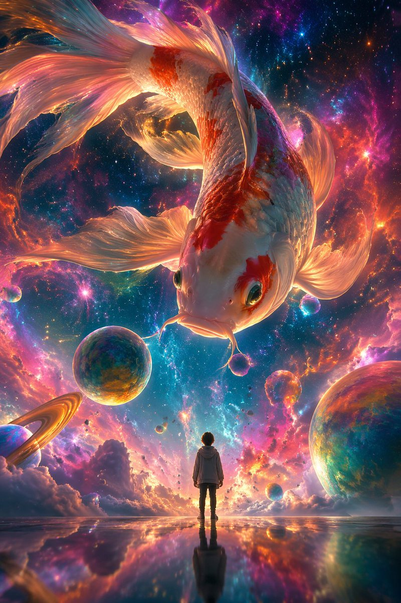

# Scenes & Storytelling

总计：9

## 90 年代公寓场景参考板

- ID: case-381
- Slug: case-381-zh
- 语言: zh
- 来源: [来源链接](https://x.com/Iancu_ai/status/2051287273581203888)
- 样例图路径: images/part2/case381.jpg

### 提示词

```text
{
  "type": "scene reference board — 90s apartment living room, cinematic night",
  "style": "cinematic film photography, 35mm grain, warm amber shadow fill, deep chiaroscuro lighting, hyper-detailed interior, production design reference quality",
  "layout": {
    "main_panel_center_left": {
      "label": "CAMERA A — FRONT VIEW",
      "scene": "Wide shot, L-shaped tan sectional sofa, grey knit throw blanket, wooden coffee table (remote, mug, ashtray, Rolling Stone stack), lava lamp left, table lamp right, rain-streaked city window behind, Nirvana poster left wall. 35mm grain."
    },
    "main_panel_center_right": {
      "label": "CAMERA B — REVERSE VIEW",
      "scene": "Wide reverse from behind sofa. CRT TV prominent right, grey static screen. Tall bookshelf, VHS tapes. Cool blue backlight from window behind camera. Deep shadow."
    },
    "prop_strip_bottom": "6 close-up tiles: 1. LAVA LAMP — chrome base, blue-green wax blobs; 2. COFFEE TABLE — remote, mug, ashtray, magazines; 3. NIRVANA POSTER — black smiley face, wall texture; 4. CRT TELEVISION — static screen, VHS stack; 5. WINDOW/RAIN — city bokeh, water streaks; 6. THROW BLANKET — sofa corner, worn upholstery",
    "top_right_inset": "SOURCE REF thumbnail — original photo",
    "footer": "2700K PRACTICAL · 4100K CITY NIGHT · 24mm · 35MM"
  },
  "background": "deep charcoal #1a1a1a, thin white separators",
  "dimensions": "wide landscape 3:1, high resolution"
}
```

### 样例图


## 月下美女直播画面

- ID: case-330
- Slug: case-330-zh
- 语言: zh
- 来源: [来源链接](https://github.com/freestylefly/awesome-gpt-image-2/blob/main/docs/gallery-part-2.md#case-330)
- 样例图路径: images/part2/case330.png

### 提示词

```text
生成一张直播间的图片，直播间氛围是月下美女跳舞的画面，直播间有很多人评论
```

### 样例图


## 星云巨鲤与小人的奇幻对话

- ID: case-238
- Slug: case-238-zh
- 语言: zh
- 来源: [来源链接](https://x.com/liyue_ai/status/2045875219307655337)
- 样例图路径: images/part2/case238.jpg

### 提示词

```text
[中文]
一幅超现实主义数字插画风格，采用低角度仰拍视角。画面描绘了一条巨型彩色锦鲤遨游在梦幻般的星云中，四周环绕着色彩鲜艳的星云与气泡。
画面中央还站着一个小人，背对观众，神情平静地仰望空中这条巨大的锦鲤，锦鲤头向下看着小人。
整体画面呈现出强烈的大小对比，氛围空灵又梦幻。比例9:16

[English]
A surrealist digital illustration style, adopting a low-angle upward perspective. The picture depicts a giant colorful koi swimming in a dreamy nebula, surrounded by colorful nebulae and bubbles. In the center of the picture stands a small figure, with their back to the audience, calmly looking up at this huge koi in the air, and the koi is looking down at the small figure. The overall picture presents a strong size contrast, and the atmosphere is ethereal and dreamy. Aspect ratio 9:16
```

### 样例图



## 智能动画分镜生成器

- ID: case-204
- Slug: case-204-zh
- 语言: zh
- 来源: [来源链接](https://x.com/joshesye/status/2046596222505361866)
- 样例图路径: images/part2/case204.jpg

### 提示词

```text
[中文]
生成一张动画分镜生成器

[English]
Generate an animation storyboard generator
```

### 样例图


## 千禧年日系校园喜剧场景

- ID: case-182
- Slug: case-182-zh
- 语言: zh
- 来源: [来源链接](https://x.com/UminekoStudio/status/2046488248256806981)
- 样例图路径: images/part2/case182.jpg

### 提示词

```text
[中文]
2000 年代面向中学生的日剧喜剧场景

[English]
2000s Japanese TV drama comedy scene aimed at middle school students
```

### 样例图


## 综合应用场景图

- ID: case-109
- Slug: case-109-zh
- 语言: zh
- 来源: [来源链接](https://x.com/underwoodxie96)
- 样例图路径: images/part2/case109.jpg

### 提示词

```text
{argument name="subject" default="A beautiful internet celebrity"} is live-streaming a {argument name="activity" default="game"}.
```

### 样例图


## 综合应用场景图

- ID: case-108
- Slug: case-108-zh
- 语言: zh
- 来源: [来源链接](https://x.com/underwoodxie96)
- 样例图路径: images/part2/case108.jpg

### 提示词

```text
{argument name="subject" default="A beautiful internet celebrity"} is live-streaming a {argument name="activity" default="game"}.
```

### 样例图


## 综合应用场景图

- ID: case-97
- Slug: case-97-zh
- 语言: zh
- 来源: [来源链接](https://x.com/kawai_design)
- 样例图路径: images/part2/case97.jpg

### 提示词

```text
Create a high-quality Japanese {argument name="thumbnail type" default="webinar thumbnail"}. {argument name="aspect ratio" default="16:9 widescreen"}. There is a lot of text, but the main copy stands out clearly.
```

### 样例图


## 综合应用场景图

- ID: case-25
- Slug: case-25-zh
- 语言: zh
- 来源: [来源链接](https://x.com/nicdunz)
- 样例图路径: images/part2/case25.jpg

### 提示词

```text
create a minecraft skin inspired by {argument name="reference" default="my look"}
```

### 样例图


