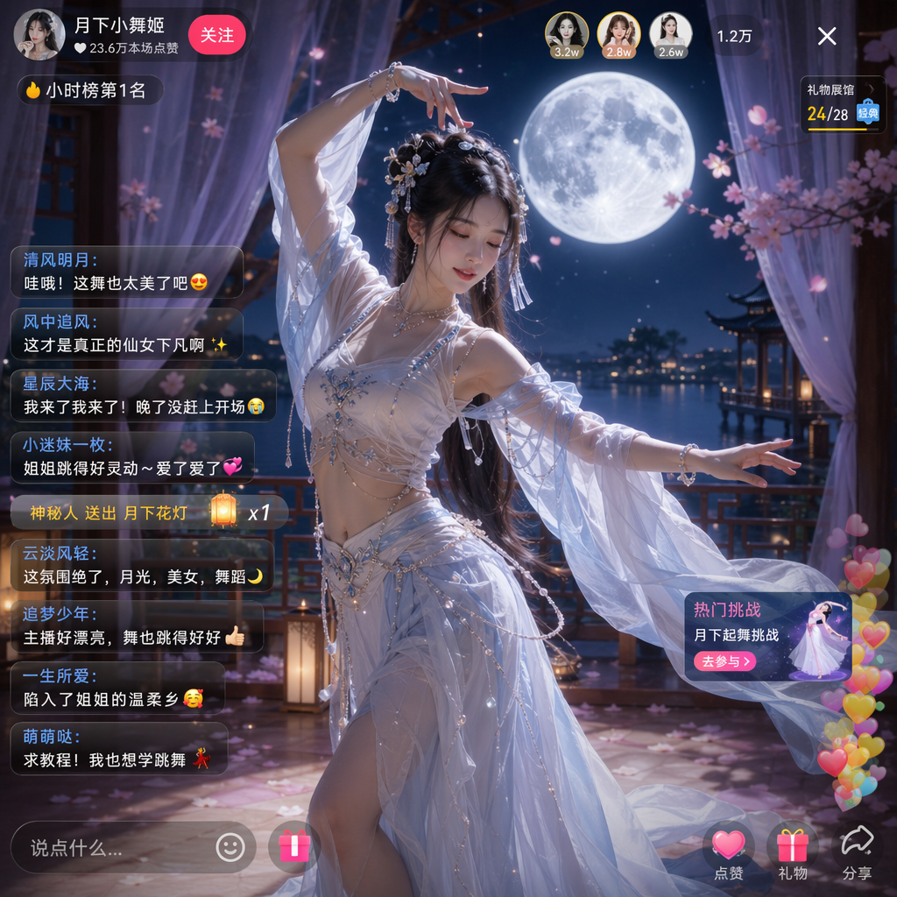

# Scenes

总计：7

## 月下美女直播画面

- ID: case-330
- Slug: case-330-zh
- 语言: zh
- 来源: [来源链接](https://github.com/freestylefly/awesome-gpt-image-2/blob/main/docs/gallery-part-2.md#case-330)
- 样例图路径: images/part2/case330.png

### 提示词

```text
生成一张直播间的图片，直播间氛围是月下美女跳舞的画面，直播间有很多人评论
```

### 样例图



## 智能动画分镜生成器

- ID: case-204
- Slug: case-204-zh
- 语言: zh
- 来源: [来源链接](https://x.com/joshesye/status/2046596222505361866)
- 样例图路径: images/part2/case204.jpg

### 提示词

```text
[中文]
生成一张动画分镜生成器

[English]
Generate an animation storyboard generator
```

### 样例图


## 千禧年日系校园喜剧场景

- ID: case-182
- Slug: case-182-zh
- 语言: zh
- 来源: [来源链接](https://x.com/UminekoStudio/status/2046488248256806981)
- 样例图路径: images/part2/case182.jpg

### 提示词

```text
[中文]
2000 年代面向中学生的日剧喜剧场景

[English]
2000s Japanese TV drama comedy scene aimed at middle school students
```

### 样例图


## 综合应用场景图

- ID: case-109
- Slug: case-109-zh
- 语言: zh
- 来源: [来源链接](https://x.com/underwoodxie96)
- 样例图路径: images/part2/case109.jpg

### 提示词

```text
{argument name="subject" default="A beautiful internet celebrity"} is live-streaming a {argument name="activity" default="game"}.
```

### 样例图


## 综合应用场景图

- ID: case-108
- Slug: case-108-zh
- 语言: zh
- 来源: [来源链接](https://x.com/underwoodxie96)
- 样例图路径: images/part2/case108.jpg

### 提示词

```text
{argument name="subject" default="A beautiful internet celebrity"} is live-streaming a {argument name="activity" default="game"}.
```

### 样例图


## 综合应用场景图

- ID: case-97
- Slug: case-97-zh
- 语言: zh
- 来源: [来源链接](https://x.com/kawai_design)
- 样例图路径: images/part2/case97.jpg

### 提示词

```text
Create a high-quality Japanese {argument name="thumbnail type" default="webinar thumbnail"}. {argument name="aspect ratio" default="16:9 widescreen"}. There is a lot of text, but the main copy stands out clearly.
```

### 样例图


## 综合应用场景图

- ID: case-25
- Slug: case-25-zh
- 语言: zh
- 来源: [来源链接](https://x.com/nicdunz)
- 样例图路径: images/part2/case25.jpg

### 提示词

```text
create a minecraft skin inspired by {argument name="reference" default="my look"}
```

### 样例图


