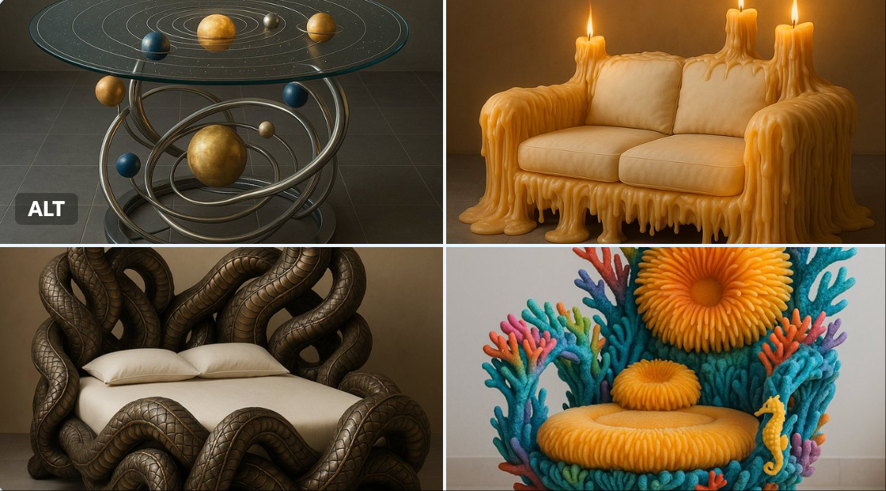
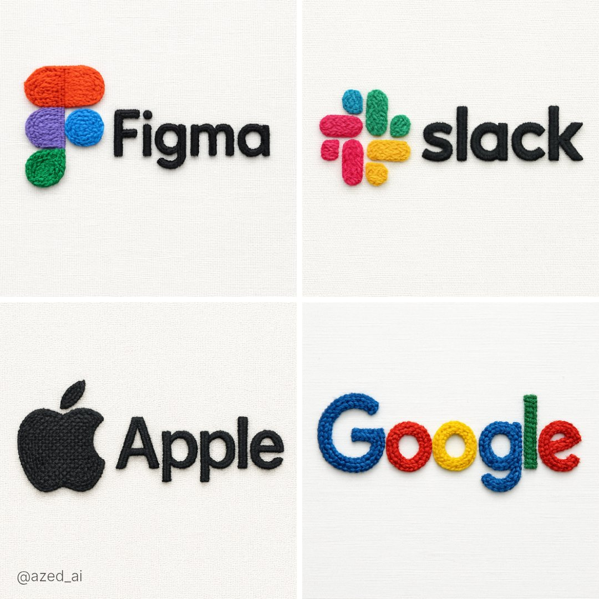
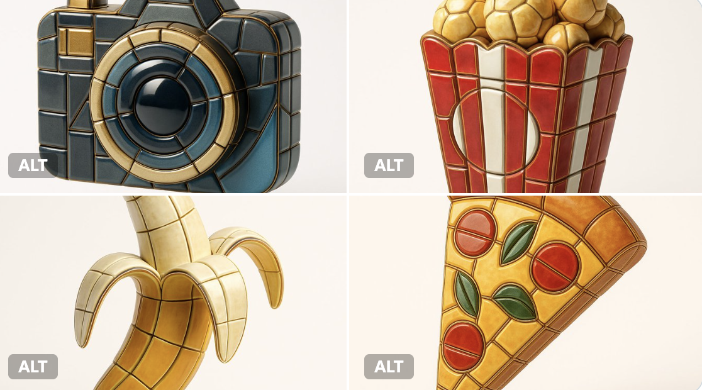
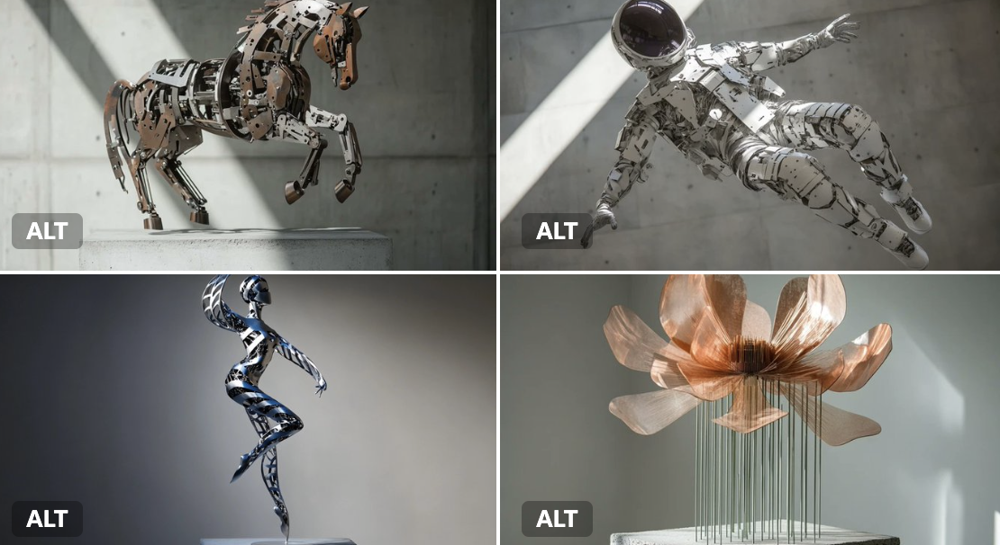

# sculpture

总计：50

## 4x4 grid of identical 3D object renders showing the same

- ID: gpt4o-1034-en-1
- Slug: prompt-1034-en-1
- 语言: en
- 来源: [来源链接](https://x.com/gokayfem/status/2007137742883266682)
- 样例图路径: images/part3/1034.jpeg

### 提示词

```text
4x4 grid of identical 3D object renders showing the same furniture piece with 16 different material applications. Each cell displays the exact same object geometry with a unique surface texture applied.

Object: Curved sculptural seating form with rounded back, cushioned seat, and four angled legs. Organic mid-century modern silhouette with smooth flowing lines, gently sloped armrests, and comfortable proportions. Single unified form without separate cushions or pillows.

Camera specifications: Fixed 3/4 front angle view, warm showroom lighting from upper-left at 45°, soft ambient fill light, identical framing across all 16 cells, subtle floor shadow beneath object, clean neutral gradient background.

Object geometry (identical in all cells):
* Same exact 3D model in every cell
* Same camera angle and distance
* Same lighting setup
* Only the surface material changes between cells

16 unique material applications (one per cell, left to right, top to bottom):

Row 1 - Soft Luxury:
* Cell 1: Midnight blue velvet - deep navy plush pile absorbing light across curved surfaces
* Cell 2: Cognac full-grain leather - warm caramel with natural grain wrapping around form
* Cell 3: Cream bouclé - chunky looped wool texture following organic contours
* Cell 4: Blush pink silk - luminous soft draping appearance with subtle sheen on curves

Row 2 - Natural Elements:
* Cell 5: Live-edge walnut wood - rich brown grain flowing across entire solid form
* Cell 6: White Carrara marble - bright polished stone with gray veins (sculptural interpretation)
* Cell 7: Natural rattan weave - honey tan woven cane pattern covering all surfaces
* Cell 8: Olive green shagreen - textured bumpy stingray pattern on elegant form

Row 3 - Metals & Industrial:
* Cell 9: Brushed brass - warm golden metal with soft directional scratches
* Cell 10: Matte black steel - powder-coated charcoal covering entire form
* Cell 11: Polished chrome - mirror-like silver reflecting environment
* Cell 12: Antique bronze - deep brown with green patina weathering

Row 4 - Statement Finishes:
* Cell 13: Emerald green lacquer - jewel tone high-gloss reflective surface
* Cell 14: Smoked glass - dark translucent gray showing form as sculptural object
* Cell 15: Camel herringbone wool - warm tan zigzag woven textile on all surfaces
* Cell 16: Mother of pearl - iridescent shell mosaic with rainbow shimmer across curves

Material application rules:
* Each material wraps entirely around the object
* Texture scale appropriate for furniture size
* Material responds correctly to object curvature
* Lighting reveals unique surface properties of each material
* Realistic rendering quality showing how material would actually appear

Technical requirements:
* Identical object silhouette in all 16 cells
* Zero variation in geometry, camera, or lighting
* Only surface material differs between cells
* Clean grid layout with thin borders
* Professional product visualization quality
* Each cell could serve as standalone product render

Purpose: Material exploration for furniture design, showing clients how the same form transforms with different surface treatments. Demonstrates versatility of single design across fabric, leather, wood, metal, stone, and decorative finishes.

Output: 4x4 seamless grid comparing 16 material options on identical object. Presentation-ready format for design review, client selection, or 3D visualization portfolio.
```

### 样例图


## 16 种不同的表面材质

- ID: gpt4o-1034-zh-2
- Slug: prompt-1034-zh-2
- 语言: zh
- 来源: [来源链接](https://x.com/gokayfem/status/2007137742883266682)
- 样例图路径: images/part3/1034.jpeg

### 提示词

```text
4x4 的网格，由 16 种不同的材质渲染图组成，展示同一件家具的相同几何形状。每个单元格都应用了不同的表面纹理。

物件：弧形雕塑座椅，圆润的靠背，带软垫的座面，四条倾斜的椅腿。有机的中世纪现代风格轮廓，线条流畅，扶手略微倾斜，比例舒适。一体式设计，无需单独的坐垫或靠枕。

相机规格：固定 3/4 前角视角，从左上方 45° 角照射的暖色展厅照明，柔和的环境补光，所有 16 个单元格的取景相同，物体下方有微妙的地板阴影，干净的中性渐变背景。

对象几何形状（所有单元格均相同）：
每个单元格都使用完全相同的 3D 模型。
* 相同的拍摄角度和距离
* 相同的照明设置
细胞间仅表面物质发生变化。* 只有细胞表面物质发生变化。

16 种独特的材料应用（每个单元格一种，从左到右，从上到下）：

第一排 - 轻奢：
* 单元格 1：午夜蓝丝绒 - 深海军蓝长绒面料，可吸收曲面上的光线
* 单元格 2：干邑色全粒面皮革 - 温暖的焦糖色，天然纹理包裹着造型
* 单元格 3：奶油色圈绒 - 粗毛圈绒质地，贴合有机轮廓
* 第4格：淡粉色丝绸——光泽柔和，垂坠感极佳，曲线处带有微妙的光泽

第 2 行 - 自然元素：
* 第5单元：原木胡桃木——浓郁的棕色纹理贯穿整个实木框架
* 6号单元：白色卡拉拉大理石——光泽亮丽、带有灰色纹理的石材（雕塑诠释）
* 7号单元：天然藤编——蜜棕色藤条编织图案覆盖所有表面
* 第8格：橄榄绿鲨革——优雅造型上带有纹理粗糙的鳐鱼图案

第 3 行 - 金属和工业：
* 9号单元格：拉丝黄铜——温暖的金色金属，带有柔和的定向划痕
* 10号单元：哑光黑色钢材 - 表面喷涂炭黑色粉末涂层
* 11号单元格：抛光铬——镜面般的银色反射环境
* 12号单元格：古铜色 - 深棕色，带有绿色风化痕迹

第 4 行 - 语句结尾：
* 13号单元格：翠绿色漆面 - 宝石色调高光泽反光表面
* 第14号单元：烟熏玻璃——深灰色半透明，呈现出雕塑般的形态
* 15号单元：驼色人字纹羊毛——温暖的棕褐色之字形织物，所有表面均有纹理
* 第16格：珍珠母贝——带有彩虹般光泽的虹彩贝壳马赛克，曲线处闪烁着光芒

材料应用规则：
每种材料都完全包裹住物体。
* 纹理比例适合家具尺寸
* 材料对物体曲率的响应正确
光照展现了每种材料独特的表面特性。
* 逼真的渲染质量，展现材质的实际外观

技术要求：
* 所有 16 个单元格中的物体轮廓均相同
* 几何形状、相机或光照方面均无任何变化
* 细胞间仅表面物质存在差异。
* 简洁的网格布局，搭配细边框
* 专业产品可视化质量
每个单元格都可以作为独立的产品渲染图。

目的：探索家具设计中的材料运用，向客户展示同一造型如何通过不同的表面处理呈现出不同的效果。展现单一设计在织物、皮革、木材、金属、石材和装饰饰面等多种材质上的多样性。

输出：4x4无缝网格，对比同一物体上的16种材质选项。格式可直接用于演示，适用于设计评审、客户选择或3D可视化作品集。
```

### 样例图


## 现代Bento网格布局产品展示设计

- ID: gpt4o-1003-zh
- Slug: prompt-1003-zh
- 语言: zh
- 来源: [来源链接](https://x.com/berryxia/status/2005842541141451133)
- 样例图路径: images/part3/1003.jpeg

### 提示词

```text
现代Bento网格布局产品展示设计,采用磨砂亚克力透明玻璃材质。适用于任何产品类型(食物/药品/科技产品/元素等)。

【布局结构】8个模块,非对称Bento网格排列,横向landscape格式:

模块1: 【3D玻璃产品主体展示】(中等尺寸1x1,占20-25%空间)

- 3D透明玻璃/亚克力材质的[产品名称]雕塑

- [产品特色]:

* 食物 → 展示切面/内部结构(如番茄种子腔室、胡萝卜横切面)

* 药品 → 药片/胶囊的透明玻璃形态

* 科技产品 → 产品外观的玻璃艺术化呈现

- 材质效果: 透明红橙/蓝色/绿色等[产品主色]玻璃,光泽表面,光线折射,真实反射

- 正下方文字标注: "[中文产品名] / [English Name]"

- 不占用过多空间,为信息模块留足展示区域

模块2: 【核心功效/特点】(标准卡片1x1)

标题: "核心功效" 或 "核心特点" 或 "主要功能"

内容: 4个核心卖点,用 "/" 分隔

- 食物 → "抗氧化延缓衰老 / 保护心血管健康 / 美白护肤养颜 / 促进消化吸收"

- 药品 → "解热镇痛 / 抗炎消肿 / 抗血小板聚集 / 预防心血管疾病"

- 科技 → "主动降噪 / 空间音频 / 自适应均衡 / 20小时续航"

配合简洁图标

模块3: 【使用方法/应用场景】(标准卡片1x1)

标题: "食用方法" 或 "使用方法" 或 "应用场景"

内容: 4种使用方式/场景

- 食物 → "生食: 沙拉凉拌 / 熟食: 炒蛋炖汤 / 加工: 酱料榨汁 / 搭配: 鸡蛋牛肉"

- 药品 → "口服: 餐后温水送服 / 剂量: 成人100mg / 频次: 每日1-2次 / 疗程: 遵医嘱"

- 科技 → "音乐欣赏 / 通勤降噪 / 居家办公 / 观影娱乐"

配合场景图标

模块4: 【关键数据/参数】(标准卡片1x1)

标题: "营养价值" 或 "技术参数" 或 "产品规格"

内容: 5个关键数据点

- 食物 → "热量 [X]千卡/100克 / 维生素C [X]毫克 / [特色成分] 丰富 / 膳食纤维 [X]克 / 钾 [X]毫克"

- 药品 → "成分: [化学式] / 规格: [X]mg / 起效时间: [X]分钟 / 半衰期: [X]小时 / 代谢途径: [途径]"

- 科技 → "芯片: [型号] / 续航: [X]小时 / 重量: [X]克 / 驱动单元: [规格] / 充电: [X]小时"

配合简洁数据可视化图表

模块5: 【适用人群/目标用户】(标准卡片1x1)

标题: "适合人群" 或 "目标用户" 或 "适用场景"

内容: 分为推荐(✓)和警示(⚠️)两部分

- 食物 → "✓ 心血管疾病患者 / ✓ 美容养颜需求者 / ✓ 减肥瘦身人群 / ✓ 便秘消化不良 / ⚠️ 慎用: 肾功能不全 / 胃酸过多 / 空腹食用"

- 药品 → "✓ 发热患者 / ✓ 轻中度疼痛 / ✓ 炎症性疾病 / ⚠️ 禁忌: 孕妇 / 哮喘患者 / 胃溃疡"

- 科技 → "✓ 音乐发烧友 / ✓ 商务人士 / ✓ 通勤人群 / ✓ 内容创作者"

用绿色✓和琥珀色⚠️区分

模块6: 【注意事项/使用指南】(标准卡片1x1)

标题: "食用注意" 或 "使用注意" 或 "重要提示"

内容: 4条重要提醒事项

- 食物 → "不宜空腹食用以免刺激胃黏膜 / 未成熟[产品]含[有毒物质]禁食 / 不宜长时间高温烹煮保留营养 / [特殊人群]需控制摄入量"

- 药品 → "需餐后服用避免胃部不适 / 不可与[禁忌药物]同服 / 服药期间避免饮酒 / 出现过敏反应立即停药就医"

- 科技 → "首次使用需配对设备 / 避免极端温度环境 / 定期清洁保养 / 长期不用请充电保存"

配合警示图标

模块7: 【特殊指标】(标准卡片1x1)

标题: 根据产品类型调整

- 食物 → "嘌呤含量" 显示 "[X]毫克/100克" + "低嘌呤食物 ✓" + "痛风患者友好"

- 药品 → "不良反应" 列举常见副作用

- 科技 → "兼容性" 显示支持的系统/设备

配合指示器或图标

模块8: 【趣味知识/产品洞察】(标准卡片1x1)

标题: "冷知识" 或 "产品故事" 或 "有趣事实"

内容: 2-3条有趣的知识点

- 食物 → "[产品]加热后[成分]吸收率提升X倍 / [产品]原产[地区]已有[X]年历史 / 未成熟[产品]含[有害物质]"

- 药品 → "[产品]是世界上使用最广泛的[类别]之一 / 每年全球生产超过[X]吨 / [发明年份]年由[人名]发明"

- 科技 → "[产品]采用[技术]专利技术 / [品牌]首次将[功能]应用于消费级产品 / 全球销量突破[X]万台"

【磨砂亚克力材质规格】(CRITICAL 核心灵魂):

卡片材质效果:

- 透明度: 80-85% 半透明(TRANSLUCENT),可以看穿卡片看到背景

- 磨砂效果: 柔和的frosted glass blur模糊,backdrop-filter风格

- 底色调: 轻微白色/奶油色霜化效果(15-20%不透明度),提升可读性但保持透明

- 边框: 细致的发光边框,捕捉光线反射

- 阴影: 柔和的分层阴影,营造浮空深度感

- 玻璃物理: 真实的玻璃边缘高光、光线折射、表面反射效果

- 视觉特征: 背景渐变可以透过卡片清晰看见,像真实的磨砂亚克力板

重要: 卡片必须保持TRANSLUCENT透明质感,不能变成不透明白卡片!

【色彩方案】:

基础色彩配比: 90% 中性色 + 10% 产品主题色点缀

- 基础层: 透明玻璃、浅灰色、米白色

- 文字色: 中等深灰 #3A3A3A (柔和但清晰,适合透明背景)

- 主题色点缀(10%使用):

* 食物 → 产品天然色(番茄红橙、胡萝卜橙、菠菜绿等)

* 药品 → 医疗蓝、药品白、红十字标志色

* 科技 → 品牌主色(Apple银灰蓝、小米橙、华为红等)

- 点缀位置: 仅用于关键图标、重要数字、警示符号、3D主体

- 警示色: 琥珀橙 #FF9800 用于⚠️警告内容

- 肯定色: 绿色 #4CAF50 用于✓推荐内容

【背景设置】:

- 类型: 柔和渐变,2-3个相近色过渡

- 产品色调适配:

* 食物 → 奶油白-淡桃红-浅橙色(温暖色调)

* 药品 → 浅灰白-淡蓝-医疗白(清洁专业)

* 科技 → 太空灰-银白-淡蓝(科技感)

- 装饰元素: 极度柔和的抽象形状,可透过玻璃卡片隐约看见

- 重要: 背景要柔和不抢眼,通过透明卡片可见但不干扰阅读

【排版布局】:

- 格式: 横向 landscape 16:9 或类似比例

- 网格类型: 非对称Bento网格,卡片大小不一

- 空间分配:

* 3D玻璃主体: 20-25% (中等尺寸,不过度占用)

* 信息卡片: 75-80% (7个标准卡片)

- 卡片间距: 适度留白,不拥挤,呼吸感良好

- 视觉层次: 通过卡片大小、位置、色彩点缀建立信息优先级

- 阅读流: 从左上3D主体开始,自然流向各信息卡片

【文字规范】:

- 语言: 全中文内容(产品名可双语标注)

- 字体层级:

* 模块标题: 粗体,大号

* 正文内容: 常规体,中号

* 数据数字: 粗体,突出显示

- 可读性: 中等深灰文字在磨砂玻璃上清晰易读

- 单位规范:

* 重量: 克、千克、毫克

* 能量: 千卡、卡路里

* 时间: 分钟、小时、天

* 容量: 毫升、升

【图标风格】:

- 类型: 极简线条图标 (line icons)

- 尺寸: 小巧不喧宾夺主

- 颜色: 浅灰线条,关键图标用主题色点缀

- 用途: 辅助说明,增强视觉识别

【使用方法】:

1. 将 [产品名称] 替换为实际产品

2. 根据产品类型(食物/药品/科技)选择对应的内容示例

3. 填充8个模块的具体信息

4. 调整主题色为产品代表色

5. 确保保持磨砂亚克力的透明质感

【质量标准】:

✓ 透明度正确(80-85%,可看穿)

✓ 磨砂模糊效果明显但不过度

✓ 背景可透过卡片看见

✓ 3D主体占比适中(20-25%)

✓ 信息完整(8个模块内容齐全)

✓ 全中文显示清晰

✓ 色彩克制优雅(90%中性+10%点缀)

✓ 排版舒适不拥挤

✓ 玻璃质感真实(边缘高光、反射、折射)

【典型应用示例】:

食物: 🍅西红柿、🥕胡萝卜、🍎苹果、🥑牛油果

药品: 💊阿司匹林、维生素C、布洛芬、青霉素

科技: 🎧AirPods Max、iPhone、MacBook、特斯拉

元素: ⚛️碳、氧、氢、氮
```

### 样例图


## 圣诞特辑-冷艳圣诞甜酷皆在方寸间

- ID: gpt4o-988-zh
- Slug: prompt-988-zh
- 语言: zh
- 来源: [来源链接](https://x.com/songguoxiansen/status/2004008192200921372)
- 样例图路径: images/part3/988.jpeg

### 提示词

```text
[关键：保持精确的面部特征，保留原始脸部结构，整个拼图中角色完全一致]
高级时尚感的妆容，采用金属质感的妆面，眼影是香槟金色渐变到玫瑰金，眼角延伸出精致的金色眼线，下眼睑点缀碎钻如冰晶闪烁。睫毛根根分明如芭比娃娃，眉毛是野生眉形态。唇部是镜面光泽的樱桃红色，腮红是高光打造的立体感。发型是时髦的低盘发，发髻用金色装饰球和圣诞铃铛点缀，侧边垂落几缕精致卷发，头顶斜戴着设计感十足的金属质感圣诞帽，帽檐镶嵌北极星装饰。身着改良版现代圣诞服，采用不对称设计，一侧肩膀露出，红色天鹅绒面料混搭金色亮片，腰间系着夸张的金色蝴蝶结，下摆不规则裁剪。搭配毛绒围巾随意搭在肩上，戴着镶钻的针织手套。人物摆出时尚大片姿势，一腿微曲，一手叉腰，另一手优雅地托着一个装饰奢华的礼物盒，表情高冷又不失节日欢愉。背景是纯白色摄影棚布置成的圣诞场景，巨大的白色圣诞树装饰着金色装饰球、灯串和星星。地面铺满仿真雪花，摆放着精致的雪人雕塑、圣诞麋鹿装置。旁边有个现代设计感的壁炉装置，里面跳动着蓝色的炉火。墙面投影着圣诞老人剪影、驯鹿鲁道夫、雪橇、圣诞马车的图案。周围散落着高级包装的糖果、姜饼礼盒、拐杖糖。圣诞袜以装置艺术形式悬挂。地上摆放着精致的热可可套装。冬青叶和槲寄生以金属雕塑形式呈现。蜡烛造型灯在四周营造氛围。冰晶吊灯从天花板垂下。打光采用多灯位布光，主光、轮廓光、发光分离，营造时尚大片的高级质感。
```

### 样例图


## [BRAND NAME]: A high-end, glossy concept art magazine ed

- ID: gpt4o-939-en-1
- Slug: prompt-939-en-1
- 语言: en
- 来源: [来源链接](https://x.com/AmirMushich/status/2002029348132721016)
- 样例图路径: images/part3/939.jpeg

### 提示词

```text
[BRAND NAME]:
A high-end, glossy concept art magazine editorial photograph of a unique, unexpected functional object conceptualized and designed by the brand.

**1. The Concept & Object (AI Invention):**
Based on the design philosophy, heritage, and material vocabulary of the specified brand, the AI must invent a novel utility product (NOT standard clothing, shoes, or bags). Examples could be home goods, tech accessories, tools, or sporting equipment, reinterpretated through the brand's lens. The object should feel sculptural yet functional.

**2. Materials & Details (Hyper-Premium):**
The object is constructed from ultra-premium, highly tactile materials characteristic of the brand (e.g., patinated exotic leathers, brushed aerospace-grade titanium, sculpted matte ceramics, molded carbon fiber, or technical high-fashion textiles). Every detail is hyper-realistic: visible stitching, microscopic material grain, precision engravings, and complex texture contrasts.

**3. Photography & Lighting (Cinematic Studio):**
Shot on a medium format Phase One camera with a 100mm macro lens. Extremely shallow depth of field, with sharp focus on the hero details of the object and a creamy, smooth bokeh background. The lighting is sophisticated studio softbox lighting: gentle, enveloping fill light with precise rim lighting to accentuate contours and material textures.

**4. Environment:**
A seamless, impeccably clean studio cyclorama background in a pure, ultra-light pastel tone (e.g., desaturated mint, pale blush, or off-white), free of shadows.

**5. Layout & UI Elements (Strict Placement):**
- **Bottom Right Corner:** A small, understated, monochrome gray logo of the brand.
- **Bottom Left Corner:** Small, minimalist monochrome gray text describing the invented product. The font style looks like Manrope Regular with very tight tracking (kerning) and balanced line spacing. Example format: "CONCEPT STUDY: [AI inserts invented product name]. MATERIAL: [AI inserts main materials]. SS25."
```

### 样例图

![[BRAND NAME]: A high-end, glossy concept art magazine ed](../images/part3/939.jpeg)

## 概念艺术杂志的编辑照片

- ID: gpt4o-939-zh-2
- Slug: prompt-939-zh-2
- 语言: zh
- 来源: [来源链接](https://x.com/AmirMushich/status/2002029348132721016)
- 样例图路径: images/part3/939.jpeg

### 提示词

```text
[品牌名称]:
这是一张高端、光鲜亮丽的概念艺术杂志的编辑照片，展示了该品牌构思和设计的独特、出人意料的功能性物品。

** 1.概念与对象（人工智能发明） :**
基于指定品牌的设计理念、历史传承和材料语汇，人工智能必须创造一款新颖的实用产品（并非标准服装、鞋履或包袋）。产品示例可以是家居用品、科技配件、工具或运动器材，并以品牌视角进行重新诠释。该产品应兼具雕塑感和实用功能。

** 2. 材料与细节（超高端） :**
这款产品采用品牌标志性的超高端、触感极佳的材质打造而成（例如，做旧珍稀皮革、拉丝航空级钛金属、雕塑哑光陶瓷、模压碳纤维或高科技时尚面料）。每个细节都力求逼真：清晰可见的缝线、微观材质纹理、精准的雕刻以及复杂的质感对比。

** 3.摄影与灯光（电影工作室） :**
使用Phase One中画幅相机和100mm微距镜头拍摄。景深极浅，主体细节清晰锐利，背景则呈现柔和细腻的散景效果。灯光采用专业的影棚柔光箱：柔和的环绕式补光，辅以精准的轮廓光，凸显物体的轮廓和材质纹理。

** 4. 环境:**
一个无缝、无可挑剔的干净的摄影棚环形背景，采用纯净、超浅的粉彩色调（例如，褪色的薄荷绿、淡腮红或灰白色），没有阴影。

** 5. 布局和 UI 元素（严格放置） :**
- **右下角:**品牌的小巧、低调、单色灰色标志。
- **左下角:**描述发明产品的简洁单色灰色小字。字体样式类似Manrope Regular，字距非常紧凑（字距调整），行距均衡。示例格式：“概念研究：[AI插入发明产品名称]。材料：[AI插入主要材料]。2025春夏。”
```

### 样例图


## { "prompt": "Ultra realistic fashion editorial photograp

- ID: gpt4o-927-en-1
- Slug: prompt-927-en-1
- 语言: en
- 来源: [来源链接](https://x.com/xmiiru_/status/2002578056628601143)
- 样例图路径: images/part3/927.jpeg

### 提示词

```text
{
"prompt": "Ultra realistic fashion editorial photography of a stylish young woman posing next to a gray KAWS-style art figure, One knee on the floor, one leg bent forward, body slightly angled, one arm resting casually on the statue’s head, the other hand on hip. Confident fierce expression, sharp gaze toward camera. Wearing a vibrant orange bucket hat with butterfly emblem, white fitted crop t-shirt with orange butterfly graphics, bright orange track pants with white piping, white sneakers Small orange shoulder bag, subtle tattoos visible, braided hair accents, minimal jewelry. Monochrome orange streetwear aesthetic. Minimalist indoor space with gray walls and clean floor. Soft diffused studio lighting, realistic skin texture, sharp focus, high fashion streetwear vibe, professional photography, ultra-detailed, 8K resolution. Don't change original face",
"negative_prompt": "low quality, blur, bad anatomy, extra fingers, extra limbs, distorted pose, cartoon, anime, illustration",
"parameters": {
"aspect_ratio": "2:3",
"version": "6",
"style": "raw",
"quality": 2
}
}
```

### 样例图


## 女性站在KAWS风格艺术雕塑旁

- ID: gpt4o-927-zh-2
- Slug: prompt-927-zh-2
- 语言: zh
- 来源: [来源链接](https://x.com/xmiiru_/status/2002578056628601143)
- 样例图路径: images/part3/927.jpeg

### 提示词

```text
{
“提示”：“超写实时尚大片，一位时髦的年轻女性站在一个灰色的KAWS风格艺术雕塑旁，单膝跪地，一条腿向前弯曲，身体略微倾斜，一只手臂随意地搭在雕塑的头部，另一只手叉腰。她表情自信而犀利，目光直视镜头。她戴着一顶饰有蝴蝶图案的亮橙色渔夫帽，一件印有橙色蝴蝶图案的白色修身露脐T恤，一条饰有白色滚边的亮橙色运动裤，一只白色运动鞋，一只小巧的橙色单肩包，隐约可见的纹身，编发点缀，佩戴极简的珠宝。整体呈现单色调的橙色街头服饰美学。极简主义的室内空间，灰色墙壁和干净的地板。柔和的漫射影棚灯光，逼真的皮肤纹理，清晰的焦点，高级时尚街头服饰氛围，专业摄影，超高细节，8K分辨率。请勿更改原图。”
"negative_prompt": "低质量、模糊、解剖结构错误、多余手指、多余肢体、姿势扭曲、卡通、动漫、插画",
“参数”： {
"aspect_ratio": "2:3",
版本：6，
"风格": "原始"
“质量”：2
}
}
```

### 样例图


## Create a 3×3 grid in 3:4 aspect ratio for a high-end com

- ID: gpt4o-922-en-1
- Slug: prompt-922-en-1
- 语言: en
- 来源: [来源链接](https://x.com/firatbilal/status/2002424619232588218)
- 样例图路径: images/part3/922.jpeg

### 提示词

```text
Create a 3×3 grid in
3:4 aspect ratio for a high-end commercial marketing campaign using the uploaded product as the central subject.

Each frame must present a distinct visual concept while maintaining perfect product consistency across all nine images.

Grid Concepts (one per cell):

1. Iconic hero still life with bold composition

2. Extreme macro detail highlighting material, surface, or texture

3. Dynamic liquid or particle interaction surrounding the product

4. Minimal sculptural arrangement with abstract forms

5. Floating elements composition suggesting lightness and innovation

6. Sensory close-up emphasizing tactility and realism

7. Color-driven conceptual scene inspired by the product palette

8. Ingredient or component abstraction (non-literal, symbolic)

9. Surreal yet elegant fusion scene combining realism and imagination

Visual Rules:
Product must remain 100% accurate in shape, proportions, label, typography, color, and branding
No distortion, deformation, or redesign of the product
Clean separation between product and background

Lighting & Style:
Soft, controlled studio lighting
Subtle highlights, realistic shadows
High dynamic range, ultra-sharp focus
Editorial luxury advertising aesthetic
Premium sensory marketing look

Overall Feel:
Modern, refined, visually cohesive
High-end commercial campaign
Designed for brand websites, social grids, and digital billboards
Hyperreal, cinematic, polished, and aspirational
```

### 样例图


## 产品高端商业营销设计

- ID: gpt4o-922-zh-2
- Slug: prompt-922-zh-2
- 语言: zh
- 来源: [来源链接](https://x.com/firatbilal/status/2002424619232588218)
- 样例图路径: images/part3/922.jpeg

### 提示词

```text
创建一个 3×3 的网格
3:4 宽高比，适用于以上传产品为中心主题的高端商业营销活动。

每幅画面都必须呈现独特的视觉概念，同时在所有九幅画面中保持产品的完美一致性。

网格概念（每个单元格一个）：

1. 构图大胆的标志性英雄静物画

2. 极致的宏观细节，突出材质、表面或纹理。

3. 产品周围的动态液体或颗粒相互作用

4. 极简主义的抽象造型雕塑摆设

5. 漂浮元素构成，暗示着轻盈和创新。

6. 强调触觉和真实感的感官特写

7. 以产品色卡为灵感的色彩驱动型概念场景

8. 成分或组成部分抽象（非字面意义、符号意义）

9. 超现实而又优雅的融合场景，兼具现实主义与想象力

视觉规则：
产品在形状、比例、标签、字体、颜色和品牌标识方面必须保持100%准确。
产品不得有任何变形、扭曲或重新设计。
产品与背景之间清晰分离

灯光与风格：
柔和、可控的摄影棚灯光
微妙的高光，逼真的阴影
高动态范围，超清晰对焦
编辑奢华广告美学
高端感官营销外观

整体感觉：
现代、精致、视觉上和谐统一
高端商业推广活动
专为品牌网站、社交媒体平台和数字广告牌而设计
超现实的、电影般的、精致的、令人向往的
```

### 样例图


## Create a 3×3 grid in 3:4 aspect ratio for a high-end com

- ID: gpt4o-893-en-1
- Slug: prompt-893-en-1
- 语言: en
- 来源: [来源链接](https://x.com/azed_ai/status/2000845183257292883)
- 样例图路径: images/part3/893.jpeg

### 提示词

```text
Create a 3×3 grid in
3:4 aspect ratio for a high-end commercial marketing campaign using the uploaded product as the central subject.

Each frame must present a distinct visual concept while maintaining perfect product consistency across all nine images.

Grid Concepts (one per cell):

1. Iconic hero still life with bold composition

2. Extreme macro detail highlighting material, surface, or texture

3. Dynamic liquid or particle interaction surrounding the product

4. Minimal sculptural arrangement with abstract forms

5. Floating elements composition suggesting lightness and innovation

6. Sensory close-up emphasizing tactility and realism

7. Color-driven conceptual scene inspired by the product palette

8. Ingredient or component abstraction (non-literal, symbolic)

9. Surreal yet elegant fusion scene combining realism and imagination

Visual Rules:
Product must remain 100% accurate in shape, proportions, label, typography, color, and branding
No distortion, deformation, or redesign of the product
Clean separation between product and background

Lighting & Style:
Soft, controlled studio lighting
Subtle highlights, realistic shadows
High dynamic range, ultra-sharp focus
Editorial luxury advertising aesthetic
Premium sensory marketing look

Overall Feel:
Modern, refined, visually cohesive
High-end commercial campaign
Designed for brand websites, social grids, and digital billboards
Hyperreal, cinematic, polished, and aspirational
```

### 样例图


## 9宫格产品展示

- ID: gpt4o-893-zh-2
- Slug: prompt-893-zh-2
- 语言: zh
- 来源: [来源链接](https://x.com/azed_ai/status/2000845183257292883)
- 样例图路径: images/part3/893.jpeg

### 提示词

```text
创建一个 3×3 的网格
3:4 宽高比，适用于以上传产品为中心主题的高端商业营销活动。

每幅画面都必须呈现独特的视觉概念，同时在所有九幅画面中保持产品的完美一致性。

网格概念（每个单元格一个）：

1. 构图大胆的标志性英雄静物画

2. 极致的宏观细节，突出材质、表面或纹理。

3. 产品周围的动态液体或颗粒相互作用

4. 极简主义的抽象造型雕塑摆设

5. 漂浮元素构成，暗示着轻盈和创新。

6. 强调触觉和真实感的感官特写

7. 以产品色卡为灵感的色彩驱动型概念场景

8. 成分或组成部分抽象（非字面意义、符号意义）

9. 超现实而又优雅的融合场景，兼具现实主义与想象力

视觉规则：
产品在形状、比例、标签、字体、颜色和品牌标识方面必须保持100%准确。
产品不得有任何变形、扭曲或重新设计。
产品与背景之间清晰分离

灯光与风格：
柔和、可控的摄影棚灯光
微妙的高光，逼真的阴影
高动态范围，超清晰对焦
编辑奢华广告美学
高端感官营销外观

整体感觉：
现代、精致、视觉上和谐统一
高端商业推广活动
专为品牌网站、社交媒体平台和数字广告牌而设计
超现实的、电影般的、精致的、令人向往的
```

### 样例图


## Create an imaginative, ultra-surreal image based on the 

- ID: gpt4o-820-en-1
- Slug: prompt-820-en-1
- 语言: en
- 来源: [来源链接](https://x.com/dotey/status/1998454127152500959)
- 样例图路径: images/part3/820.jpeg

### 提示词

```text
Create an imaginative, ultra-surreal image based on the provided picture or description.

Reimagine the scene ${SCENE} by transforming all ${SUBJECTS} (animals, humans, creatures) into surreal beings made of transparent glass and glowing neon lights. Their bodies resemble crystal sculptures that refract ambient light, while vibrant neon streams (colors like electric blue, magenta, purple, orange-gold, etc.) flow inside them, emitting a soft yet radiant glow into the environment.

Keep the original structure and layout of the scene, but re-render the lighting and atmosphere to respond to these luminous glass beings—reflections, refractions, glowing highlights, and atmospheric color shifts.

The overall mood should be dreamlike, futuristic, vividly colored, highly detailed, and visually stunning, as if the world is illuminated by living neon glass creatures in a surreal alternate reality.

-----

SCENE: At the boundary between sunset and nightfall on the African savannah, where orange-red sunlight merges into deep blue twilight. Silhouetted acacia trees stretch across the horizon as animals wander through the glowing dust-lit grassland.
```

### 样例图


## 动物和人类都变成了霓虹玻璃生物

- ID: gpt4o-820-zh-2
- Slug: prompt-820-zh-2
- 语言: zh
- 来源: [来源链接](https://x.com/dotey/status/1998454127152500959)
- 样例图路径: images/part3/820.jpeg

### 提示词

```text
根据提供的图片或描述，创作一幅充满想象力、超现实主义的画作。

重新构想场景 ${SCENE}，将所有 ${SUBJECTS } (动物、人类、生物) 转化为由透明玻璃和发光霓虹灯构成的超现实生物。它们的身体如同折射环境光的晶体雕塑，而充满活力的霓虹流（如电光蓝、品红、紫、橙金等颜色）在它们体内流动，向周围环境散发出柔和而耀眼的光芒。

保持场景的原始结构和布局，但重新渲染光照和氛围，以响应这些发光的玻璃生物——反射、折射、发光的高光和氛围色彩变化。

整体氛围应如梦似幻、充满未来感、色彩鲜艳、细节丰富、视觉效果惊艳，仿佛世界被活生生的霓虹玻璃生物照亮，置身于超现实的平行世界。

-----

场景：非洲大草原上，日落与夜幕交界处，橙红色的阳光与深蓝色的暮色融为一体。地平线上，金合欢树的轮廓清晰可见，动物们在被尘土照亮的草原上漫步。
```

### 样例图


## Transform the subject into a stylized 3D character with 

- ID: gpt4o-784-en-1
- Slug: prompt-784-en-1
- 语言: en
- 来源: [来源链接](https://x.com/gizakdag/status/1997602898075615682)
- 样例图路径: images/part3/784.jpeg

### 提示词

```text
Transform the subject into a stylized 3D character with soft clay-like materials, rounded sculptural forms, exaggerated facial features, pastel + vibrant color palette, smooth subsurface scattering skin, large cartoon eyes, simplified anatomy. Render against a bold blue studio background with soft frontal lighting and subtle shadows. Playful, surreal, polished character-design aesthetic similar to modern stylized 3D illustration. Keep the original photo’s composition and framing.
```

### 样例图


## 将主体转化为黏土风格的3D角色

- ID: gpt4o-784-zh-2
- Slug: prompt-784-zh-2
- 语言: zh
- 来源: [来源链接](https://x.com/gizakdag/status/1997602898075615682)
- 样例图路径: images/part3/784.jpeg

### 提示词

```text
将主体转化为风格化的3D角色，采用柔软的黏土质感、圆润的雕塑造型、夸张的面部特征、柔和与鲜艳的色彩搭配、光滑的底层纹理、卡通大眼睛和简化的解剖结构。在醒目的蓝色工作室背景下渲染，采用柔和的正面光线和微妙的阴影。营造一种趣味盎然、超现实且精致的角色设计美感，类似于现代风格化的3D插画。保留原照片的构图和取景。
```

### 样例图


## 老北京航拍

- ID: gpt4o-502-zh
- Slug: prompt-502-zh
- 语言: zh
- 来源: [来源链接](https://x.com/imaxichuhai/status/1991684492474409440)
- 样例图路径: images/part3/502.jpeg

### 提示词

```text
画幅比例16:9，一幅关于精妙含蓄与视觉智慧的杰作。一幅老北京城市肌理的无人机鸟瞰图。核心概念是汉字“衚”**完美无缝地**融入了整个城市景观。

**字体与建筑的融合 (终极的精妙之处):**
- **无物理高差:** “衚”字不是一个独立的、高耸的或庞大的结构。构成其笔画的墙体，与周围所有的胡同、四合院的墙体，在**高度、材质和风格上完全一致**。它身处肌理之中，而非凌驾其上。
- **“光影雕刻”:** 汉字的形态并非由结构来凸显，而是由**大师级的、富有氛围感的光影**来呈现。一束低角度的午后斜阳（Raking Light）横扫整个场景。光线刚好捕捉到构成“衚”字形态的墙体的边缘，使其微妙地变亮，同时在其“笔画”（即胡同）内部投下深刻而轮廓分明的阴影。这个字，是被光所揭示，而非被水泥所建造。
- **“氛围透视”:** 一层纤薄的、贴地的晨雾或霭气，弥漫在周边的庭院和巷陌中，使边缘的细节略微柔化。然而，构成“衚”字形态的那些路径和庭院，则**微妙地更加清晰、对比度更高**，由此形成一个自然的视觉焦点，让隐藏的形状在凝视者的眼中浮现。

**优雅的字体排版布局:**
保留精致且艺术化的字体设计。
- **主标题:** 标题“字里京城”被排成一个强有力的单列竖排，位于右侧。背景区域被巧妙地处理成半透明的微妙褪色效果，以确保文字的可读性而不突兀。字体是优雅的“新宋体”风格。一条极细的竖线与文字平行。
- **信息标签:** 标签文字（“灰瓦”、“国槐”）采用小号、精致的手写体。它们通过一条铅笔在图纸上画出般的、针尖般纤细的手绘曲线连接到物体。**不要有方框，不要有发光效果。**

**美学:**
整体基调是宁静、引人深思且意境深远的。色调是考究的“高级灰”，以饱和度低的色彩为主，唯一的色彩点缀来自阳光温暖的轻抚。画面拥有一种“众目睽睽下的秘密”般的气质，回报着观者的耐心与洞察力。它是一次具有深刻绘画感和哲学氛围的超写实渲染。

**负面提示词:**
高耸的墙壁, 雕塑般的汉字, 庞大的结构, 过于明显的汉字形状, 平均的光照, 平光, 发光方框, 未来感UI, 无衬线字体, 抽象, 2D, 色彩鲜艳, 卡通, 糟糕的书法, 水印。
```

### 样例图


## 传统的工笔风格水墨画

- ID: gpt4o-481-zh-1
- Slug: prompt-481-zh-1
- 语言: zh
- 来源: [来源链接](https://x.com/dotey/status/1992695763017830722)
- 样例图路径: images/part3/481.jpeg

### 提示词

```text
A traditional Chinese Gongbi-style ink painting. The scene humorously depicts a giant turtle swimming calmly through a turbulent river, carrying a playful and anachronistic tableau on its shell:
At the turtle’s forefront, Tang Sanzang and the Queen of the Women's Kingdom amusingly reenact the iconic scene from the movie Titanic. The Queen stands serenely with arms outstretched like Rose, while Tang Sanzang tenderly embraces her waist from behind like Jack, immersed in romantic sentiment. 
Behind them, Sha Wujing (Sha Monk) leisurely sits cross-legged, casually holding a fishing rod with a cigarette dangling from his lips, completely relaxed as he fishes. Beside him, Zhu Bajie humorously stands on the turtle’s shell, comically relieving himself into the river, with an exaggeratedly proud expression. Further back, Sun Wukong rides energetically on a surfboard amidst the rolling waves, carrying a modern rocket launcher aimed confidently at a mysterious UFO hovering above.
Traditional Chinese calligraphy adorns one side of the painting, accompanied by a classic red artist’s seal inscribed "寶玉印". The artwork cleverly blends classical aesthetics with contemporary humor, creating a playful and satirical fusion across eras.
```

### 样例图


## 传统的工笔风格水墨画

- ID: gpt4o-481-zh-2
- Slug: prompt-481-zh-2
- 语言: zh
- 来源: [来源链接](https://x.com/dotey/status/1992695763017830722)
- 样例图路径: images/part3/481.jpeg

### 提示词

```text
这是一幅传统的工笔风格水墨画。画面幽默地描绘了一只巨龟在湍急的河流中平静游动，龟壳上驮着一幅滑稽而又略显不合时宜的画作：
在龟形雕塑的最前排，唐三藏和女国女王正在滑稽地重现电影《泰坦尼克号》中的经典场景。女王像露丝一样，双臂伸展，姿态宁静；唐三藏则像杰克一样，从背后温柔地搂住她的腰，沉浸在浪漫的情愫中。
在他们身后，沙悟净悠闲地盘腿而坐，嘴里叼着烟，手里拿着鱼竿，悠然自得地垂钓着。他旁边，猪八戒滑稽地站在龟壳上，对着河里撒尿，一副得意洋洋的模样。更远处，孙悟空在翻滚的波浪中活力四射地驾着冲浪板，手里拿着一枚现代火箭筒，自信地瞄准着上方盘旋的神秘UFO。
画作一侧饰以传统中国书法，并钤有经典的红色艺术家印章“宝玉印”。这幅作品巧妙地融合了古典美学与现代幽默，创造出一种跨越时代的诙谐讽刺之美。
```

### 样例图


## A photorealistic wide-angle landscape shot of the Statue

- ID: gpt4o-441-en-1
- Slug: prompt-441-en-1
- 语言: en
- 来源: [来源链接](https://x.com/azed_ai/status/1992263499398205640)
- 样例图路径: images/part3/441.jpeg

### 提示词

```text
A photorealistic wide-angle landscape shot of the Statue of Liberty with the New York City skyline and harbor in the background. Superimposed on the scene is a white, hand-drawn augmented reality technical overlay. Features include: 1. Sketchy white leader lines pointing to key details like the "Torch," "Crown Rays," and "Copper Shell" with handwritten text labels. 2. Large dimensional vertical measurement arrows indicating the total height from ground to torch. 3. Small floating wireframe icons showing wind load data and material composition. Aesthetic: Structural engineering analysis, F1 broadcast graphics style, bright outdoor daylight, architectural blueprint overlay.
```

### 样例图


## 自由女神像建筑蓝图

- ID: gpt4o-441-zh-2
- Slug: prompt-441-zh-2
- 语言: zh
- 来源: [来源链接](https://x.com/azed_ai/status/1992263499398205640)
- 样例图路径: images/part3/441.jpeg

### 提示词

```text
一张逼真的广角风景照，展现了自由女神像，背景是纽约市的天际线和港口。画面上叠加了一层白色手绘增强现实技术图层。其特点包括：1. 用白色线条勾勒出关键细节，例如“火炬”、“皇冠光芒”和“铜壳”，并附有手写文字标签。2. 大型垂直测量箭头指示从地面到火炬的总高度。3. 小型悬浮线框图标显示风荷载数据和材料成分。美学风格：结构工程分析、F1赛车转播画面风格、明亮的户外日光、建筑蓝图叠加。
```

### 样例图


## Photorealistic conceptual food art portrait, a minimalis

- ID: gpt4o-319-en-1
- Slug: prompt-319-en-1
- 语言: en
- 来源: [来源链接](https://x.com/AleRVG/status/1969145551846363567)
- 样例图路径: images/part3/319.jpeg

### 提示词

```text
Photorealistic conceptual food art portrait, a minimalist representation of a [SITE OF THE HOUSE] recreated entirely with [TYPE OF FOOD]. The main structure is built from [MAIN INGREDIENTS], with details such as [KEY ELEMENTS] made from [SECONDARY INGREDIENTS]. Optional features include [ADDITIONAL OBJECTS OR FURNITURE] created from [EXTRA INGREDIENTS].

Set against a [COLOR] background to emphasize the surreal food sculpture. Bright soft studio lighting, evenly diffused, casting subtle natural shadows that highlight the textures of [FOOD TEXTURES]. Fine atmospheric detail enhance realism.

Captured with a Canon EOS 5D, 85mm f/1.8 lens, shallow depth of field focusing on the cake-bed sculpture, crisp detail with soft falloff in the background. Composition framed at tabletop eye-level, medium close-up, perfectly centered. Clean high-resolution food photography style, vibrant natural colors, editorial dessert photography aesthetic
```

### 样例图


## 照片级逼真的概念食物艺术肖像

- ID: gpt4o-319-zh-2
- Slug: prompt-319-zh-2
- 语言: zh
- 来源: [来源链接](https://x.com/AleRVG/status/1969145551846363567)
- 样例图路径: images/part3/319.jpeg

### 提示词

```text
照片级逼真的概念食物艺术肖像，极简主义地再现了[房屋位置]，完全由[食物种类]重新打造。主体结构由[主要成分]构成，细节部分，例如[关键元素]，则由[次要成分]制成。可选功能包括由[额外成分]打造的[附加物品或家具]。

以[颜色]为背景，突显超现实的食物雕塑。明亮柔和的摄影棚灯光，均匀散射，投射出微妙的自然阴影，凸显[食物纹理]的质感。精致的氛围细节增强了真实感。

使用佳能 EOS 5D 85mm f/1.8 镜头拍摄，浅景深聚焦于蛋糕床雕塑，细节清晰，背景边缘柔和。构图以桌面视线高度为准，中距特写，完美居中。清晰的高分辨率美食摄影风格，鲜艳自然的色彩，堪称甜品摄影的美学典范。
```

### 样例图


## A colorful handcrafted sculpture of [insert subject], ma

- ID: gpt4o-246-en-1
- Slug: prompt-246-en-1
- 语言: en
- 来源: [来源链接](https://x.com/Deshraj4x/status/1938670486285885772)
- 样例图路径: images/part3/246.jpeg

### 提示词

```text
A colorful handcrafted sculpture of [insert subject], made from semi-transparent ice blocks in custom shapes. Accents like icing, candy, yarn, or fruit skin enhance facial features, texture, or accessories. Placed on a ceramic plate over a leaf or decorative mat, with a clean, softly lit studio or natural tabletop background. Lighting highlights the glossy ice texture, blending food art, toy design, and photography into a playful, artistic composition.
```

### 样例图

![A colorful handcrafted sculpture of [insert subject], ma](../images/part3/246.jpeg)

## 色彩缤纷的手工雕塑

- ID: gpt4o-246-zh-2
- Slug: prompt-246-zh-2
- 语言: zh
- 来源: [来源链接](https://x.com/Deshraj4x/status/1938670486285885772)
- 样例图路径: images/part3/246.jpeg

### 提示词

```text
一个色彩缤纷的手工雕塑，由[插入主题]制成，使用半透明的冰块，形状定制。装饰如糖霜、糖果、毛线或水果皮增强了面部特征、纹理或配饰。放置在陶瓷盘上，盘上覆盖着叶子或装饰垫，背景是干净、柔和照明的摄影棚或自然桌面。光线突出了冰块的光泽质感，将食品艺术、玩具设计和摄影融合成一种俏皮、艺术性的构图。
```

### 样例图


## a futuristic 3D-rendered [object] made of translucent [c

- ID: gpt4o-223-en-1
- Slug: prompt-223-en-1
- 语言: en
- 来源: [来源链接](https://x.com/azed_ai/status/1944067498187665507)
- 样例图路径: images/part3/223.jpeg

### 提示词

```text
a futuristic 3D-rendered [object] made of translucent [color] inner structure encased in a smooth white exoskeleton with organic holes and flowing biomorphic patterns, floating in a minimal soft gray background, high contrast lighting, hyperrealistic materials, octane render, modern digital sculpture
```

### 样例图

![a futuristic 3D-rendered [object] made of translucent [c](../images/part3/223.jpeg)

## 惊人的外骨骼图像

- ID: gpt4o-223-zh-2
- Slug: prompt-223-zh-2
- 语言: zh
- 来源: [来源链接](https://x.com/azed_ai/status/1944067498187665507)
- 样例图路径: images/part3/223.jpeg

### 提示词

```text
一个未来派的 3D 渲染[物体]，具有半透明的内部结构，被光滑的白色外骨骼包裹，外骨骼上有有机的孔洞和流动的仿生图案，悬浮在极简的浅灰色背景中，高对比度光照，超写实材质，Octane 渲染，现代数字雕塑
```

### 样例图


## A digital clay sculpture of a [subject], captured in a [

- ID: gpt4o-197-en-1
- Slug: prompt-197-en-1
- 语言: en
- 来源: [来源链接](https://x.com/azed_ai/status/1936378648891936803)
- 样例图路径: images/part3/197.png

### 提示词

```text
A digital clay sculpture of a [subject], captured in a [pose/action], resting on a minimalist [color] plinth etched with organic swirl patterns. The sculpt features smooth, flowing curves and a tactile finish, rendered in a refined [color palette] that evokes a soft, contemporary aesthetic.
```

### 样例图

![A digital clay sculpture of a [subject], captured in a [](../images/part3/197.png)

## 数字粘土雕塑

- ID: gpt4o-197-zh-2
- Slug: prompt-197-zh-2
- 语言: zh
- 来源: [来源链接](https://x.com/azed_ai/status/1936378648891936803)
- 样例图路径: images/part3/197.png

### 提示词

```text
一个 [主题] 的数字粘土雕塑，以 [姿势/动作] 捕捉，放在极简主义的 [彩色] 基座上，上面蚀刻有有机漩涡图案。雕塑具有流畅、流畅的曲线和触感，以精致的 [调色板] 呈现，唤起柔和的现代美学。
```

### 样例图


## Imagine a [piece of furniture] designed in the form of [

- ID: gpt4o-185-en-1
- Slug: prompt-185-en-1
- 语言: en
- 来源: [来源链接](https://x.com/TheRelianceAI/status/1938969169296228706)
- 样例图路径: images/part3/185.png

### 提示词

```text
Imagine a [piece of furniture] designed in the form of [creature/object/concept]. The design should be highly creative and sculptural, like an art piece. Use organic, flowing shapes and detailed textures. Make sure it remains functional and ergonomic. The goal is for it to be both visually striking and practical —something you’d expect to see as a museum-quality design object
```

### 样例图

![Imagine a [piece of furniture] designed in the form of [](../images/part3/185.png)

## 人体工程学

- ID: gpt4o-185-zh-2
- Slug: prompt-185-zh-2
- 语言: zh
- 来源: [来源链接](https://x.com/TheRelianceAI/status/1938969169296228706)
- 样例图路径: images/part3/185.png

### 提示词

```text
想象一下以 [生物/物体/概念] 的形式设计的 [家具]。设计应该具有高度的创意和雕塑感，就像一件艺术品。使用有机、流畅的形状和详细的纹理。确保它保持功能正常且符合人体工程学。目标是让它既具有视觉冲击力又具有实用性——您希望看到的是博物馆品质的设计对象
```

### 样例图



## Ultra high-resolution 3D render of the emoji [🥹], metic

- ID: gpt4o-164-en-1
- Slug: prompt-164-en-1
- 语言: en
- 来源: [来源链接](https://x.com/Anima_Labs/status/1938152354064609780)
- 样例图路径: images/part3/164.png

### 提示词

```text
Ultra high-resolution 3D render of the emoji [🥹], meticulously recreated as a realistic cardboard sculpture. The object is crafted from corrugated brown cardboard, featuring clearly defined fluted edges, visible layering, and rough kraft paper textures. Close-up studio
```

### 样例图

![Ultra high-resolution 3D render of the emoji [🥹], metic](../images/part3/164.png)

## 将表情符号变成纸板

- ID: gpt4o-164-zh-2
- Slug: prompt-164-zh-2
- 语言: zh
- 来源: [来源链接](https://x.com/Anima_Labs/status/1938152354064609780)
- 样例图路径: images/part3/164.png

### 提示词

```text
表情符号 [ 🥹 ] 的超高分辨率 3D 渲染 ，精心重建为逼真的纸板雕塑。该物品由棕色瓦楞纸板制成，具有清晰的凹槽边缘、可见的层次和粗糙的牛皮纸纹理。特写工作室
```

### 样例图


## [SUBJECT] in a Surrealist Vaporwave collage. Combine ele

- ID: gpt4o-162-en-1
- Slug: prompt-162-en-1
- 语言: en
- 来源: [来源链接](https://x.com/LudovicCreator/status/1936703218827817358)
- 样例图路径: images/part3/162.png

### 提示词

```text
[SUBJECT] in a Surrealist Vaporwave collage. Combine elements of classical sculpture, 80s retrofuturism, and Japanese cityscapes. Use pastel shades of [COLOR1] and [COLOR2] with hints of neon
```

### 样例图

![[SUBJECT] in a Surrealist Vaporwave collage. Combine ele](../images/part3/162.png)

## 超现实主义蒸汽波

- ID: gpt4o-162-zh-2
- Slug: prompt-162-zh-2
- 语言: zh
- 来源: [来源链接](https://x.com/LudovicCreator/status/1936703218827817358)
- 样例图路径: images/part3/162.png

### 提示词

```text
[主题] 在超现实主义蒸汽波拼贴画中。结合古典雕塑、80 年代复古未来主义和日本城市景观的元素。使用 [COLOR1] 和 [COLOR2] 的柔和色调，并带有淡淡的霓虹灯
```

### 样例图


## The [LANDMARK - Statue of Liberty/Eiffel Tower/Big Ben] 

- ID: gpt4o-156-en-1
- Slug: prompt-156-en-1
- 语言: en
- 来源: [来源链接](https://x.com/zeng_wt/status/1936743124522750336)
- 样例图路径: images/part3/156.jpeg

### 提示词

```text
The [LANDMARK - Statue of Liberty/Eiffel Tower/Big Ben] perfectly carved and functional as a [FURNITURE_PIECE - lamp/bookshelf/coffee table], living room setting, normal scale furniture, photorealistic detail.
```

### 样例图

![The [LANDMARK - Statue of Liberty/Eiffel Tower/Big Ben] ](../images/part3/156.jpeg)

## 作为家具的著名地标

- ID: gpt4o-156-zh-2
- Slug: prompt-156-zh-2
- 语言: zh
- 来源: [来源链接](https://x.com/zeng_wt/status/1936743124522750336)
- 样例图路径: images/part3/156.jpeg

### 提示词

```text
[LANDMARK - 自由女神像/埃菲尔铁塔/大本钟]雕刻完美，功能强大，就像一个[FURNITURE_PIECE - 灯/书架/咖啡桌]，客厅设置，正常比例的家具，逼真的细节。
```

### 样例图


## Create a high-resolution illustration of a [skull] icon 

- ID: gpt4o-135-en-1
- Slug: prompt-135-en-1
- 语言: en
- 来源: [来源链接](https://x.com/gnrlyxyz/status/1934330176113938606)
- 样例图路径: images/part3/135.jpeg

### 提示词

```text
Create a high-resolution illustration of a [skull] icon in the style of a glossy, translucent sculpture. The icon should appear as if made of curved, flowing glass with reflective surfaces. Infuse the form with vivid, refracted rainbow gradients that shift smoothly across its contours. The shape should be abstract yet recognizable, with a sleek, high-gloss finish and soft reflections that mimic light bending through clear material. Center the icon on a solid black background. No shadows, textures, or extra elements. Square aspect ratio.
```

### 样例图

![Create a high-resolution illustration of a [skull] icon ](../images/part3/135.jpeg)

## 棱柱形玻璃图标

- ID: gpt4o-135-zh-2
- Slug: prompt-135-zh-2
- 语言: zh
- 来源: [来源链接](https://x.com/gnrlyxyz/status/1934330176113938606)
- 样例图路径: images/part3/135.jpeg

### 提示词

```text
以光泽、半透明雕塑的风格创建 [骷髅头] 图标的高分辨率插图。图标应看起来像是由具有反射表面的弯曲、流动的玻璃制成的。为形式注入生动的折射彩虹渐变，在其轮廓上平滑移动。形状应该是抽象的但可识别的，具有时尚、高光泽的饰面和柔和的反射，模仿光线穿过透明材料的弯曲。将图标置于纯黑色背景上居中。没有阴影、纹理或额外元素。方形纵横比。
```

### 样例图


## The [subject] appears as if organically grown from inter

- ID: gpt4o-123-en-1
- Slug: prompt-123-en-1
- 语言: en
- 来源: [来源链接](https://x.com/azed_ai/status/1934566157736083614)
- 样例图路径: images/part3/123.png

### 提示词

```text
The [subject] appears as if organically grown from intertwining plants, flowers, and vines. Leaf-like textures and blooming forms fuse seamlessly with anatomical or structural details, creating a surreal hybrid of nature and design. The composition feels ethereal, with natural asymmetry and dreamlike flow.
```

### 样例图

![The [subject] appears as if organically grown from inter](../images/part3/123.png)

## 植物雕塑

- ID: gpt4o-123-zh-2
- Slug: prompt-123-zh-2
- 语言: zh
- 来源: [来源链接](https://x.com/azed_ai/status/1934566157736083614)
- 样例图路径: images/part3/123.png

### 提示词

```text
[主题] 看起来就像是从交织在一起的植物、花朵和藤蔓中有机生长出来的。叶子般的纹理和盛开的形式与解剖学或结构细节无缝融合，创造出自然与设计的超现实混合体。构图感觉空灵，具有自然的不对称和梦幻般的流动。
```

### 样例图


## 时间之神

- ID: gpt4o-106-zh
- Slug: prompt-106-zh
- 语言: zh
- 来源: [来源链接](https://x.com/TheRelianceAI/status/1931726518952034462)
- 样例图路径: images/part3/106.png

### 提示词

```text
Colossal marble statue of [INSERT OBJECT OR CHARACTER HERE], wings (if applicable) spread in divine majesty, adorned with ornate golden armor and flowing baroque robes, cracked marble textures with soft patina, glowing sacred emblem on chest, standing within a celestial golden dome, surrounded by divine architecture, dramatic god rays from above, dynamic mid-action pose, ultra-detailed renaissance sculpture style, cinematic lighting, majestic and sacred atmosphere, 8k resolution
```

### 样例图


## 刺绣logo

- ID: gpt4o-105-zh
- Slug: prompt-105-zh
- 语言: zh
- 来源: [来源链接](https://x.com/azed_ai/status/1931713849067241960)
- 样例图路径: images/part3/105.jpeg

### 提示词

```text
A hyperrealistic embroidered textile artwork of the [SUBJECT], created with colored thread and soft fabric textures. The design features dense, tactile stitching and raised embroidery that mimics the actual form and branding. Set against a plain, off-white fabric background, with clean studio lighting and a sharp close-up view. Emphasize threadwork, texture, and handmade imperfections for a realistic soft sculpture look.
```

### 样例图



## 珐琅马赛克瓷砖风格

- ID: gpt4o-104-zh
- Slug: prompt-104-zh
- 语言: zh
- 来源: [来源链接](https://x.com/mariia_gonchar/status/1931774946608370013)
- 样例图路径: images/part3/104.png

### 提示词

```text
Visualize any selected emoji [] as an ultra-detailed, hyper-realistic 3D sculpture fully composed of luxurious enamel mosaic tiles. The emoji should retain its iconic silhouette and proportions, reinterpreted as a stylized 3D figure made entirely from curved, faceted, and geometrically interlocked enamel tiles in a radiant mosaic pattern.
> Use high-gloss enamel tiles in varied shades derived from the emoji’s symbolic palette—integrating metallic accents, opalescent glazes, deep ceramic pigmentation, and subtle iridescence. Tile surfaces must exhibit gentle bevels, crisp joints, and tactile depth to emulate elite architectural mosaic work.
> Ensure no visible support structures—the figure must appear freestanding and weightless, suspended mid-air at the exact center of the frame.
> Background: pure white studio environment with soft ambient shadows directly beneath the sculpture to emphasize spatial presence and floating realism.
> Lighting: cinematic, diffused from multiple angles to
```

### 样例图



## 3D卡通雕塑风格

- ID: gpt4o-98-zh
- Slug: prompt-98-zh
- 语言: zh
- 来源: [来源链接](https://x.com/aziz4ai/status/1925301120252924356)
- 样例图路径: images/part3/98.jpeg

### 提示词

```text
a soft 3D cartoon-style sculpture of [brand product], made of smooth clay-like textures and vibrant pastel colors, placed in a minimalist isometric scene that complements the product’s nature, clean composition, gentle lighting, subtle shadows, with the product’s logo and a 3-word slogan displayed clearly belo
```

### 样例图


## 动感雕塑

- ID: gpt4o-91-zh
- Slug: prompt-91-zh
- 语言: zh
- 来源: [来源链接](https://x.com/azed_ai/status/1925490847564669153)
- 样例图路径: images/part3/91.png

### 提示词

```text
A kinetic sculpture of a [subject], made of interlocking metal rods and panels in brushed [color1] and oxidized [color2]. Suspended in motion, with rotating parts casting mechanical shadows on a concrete pedestal.
```

### 样例图



## 将您的标志变成毛毡纹理

- ID: gpt4o-90-zh
- Slug: prompt-90-zh
- 语言: zh
- 来源: [来源链接](https://x.com/alex_prompter/status/1925460683509899423)
- 样例图路径: images/part3/90.jpeg

### 提示词

```text
Retexture [BRAND NAME] logo following my JSON aesthetic below:
{
"style": "realistic needle-felted wool sculpture",
"subject_handling": {
"adapt_to_uploaded_image": true,
"preserve_original_shape_and_layout": true,
"preserve_uploaded_color_values": true,
"preserve_text_if_present": true,
"preserve_text_case": true,
"preserve_exact_letterforms": true,
"use_uploaded_image_as_pixel_map": true,
"prevent_color_estimation_or_stylization": true
},
"needle_felting": {
"material_type": "dyed wool fibers matched precisely to uploaded image pixels",
"texture_description": "fluffy soft felt with clear fiber strands",
"construction_style": "needle-felted, light irregularities allowed but no color bleeding",
"color_application_method": "direct color transfer from uploaded image to wool sculpture",
"prevent_auto_saturation_adjustment": true,
"prevent_color_fading": true,
"color_binding_mode": "pixel-level color fidelity per original image"
},
"lighting": {
"lighting_type": "neutral soft studio lighting",
"shadow": "soft, gray-toned shadows under the object only",
"highlight_behavior": "matte highlights only from felt surface — no bloom or color shift"
},
"background": {
"type": "plain matte studio",
"background_color": "pastel tone that contrasts with logo color",
"color_conflict_handling": "auto-adjust background brightness — do not alter logo colors"
},
"camera": {
"focus_style": "macro lens",
"depth_of_field": "shallow — full subject in sharp detail, soft background",
"angle": "frontal or slightly elevated, full subject visible"
},
"post_processing": {
"color_preservation_enforced": true,
"disable_auto-enhancement_or_tinting": true,
"no artistic reinterpretation": true,
"no auto-correction, bloom, or white balance adjustments": true
},
"image_constraints": {
"transparent_background": false,
"aspect_ratio_locked": true,
"include_text_if_present": true,
"preserve_text_case": true,
"preserve_uploaded_color_values": true,
"prevent_shape_or_color_change": true,
"enforce_exact_pixel_color_match_to_uploaded_image": true
},
"notes": "The uploaded image must be converted into a needle-felted wool sculpture using its exact colors and shape. Use pixel-level mapping to apply the uploaded color values to simulated dyed wool fibers. Do not change, brighten, dull, average, or blend colors. Text must remain intact and readable. Background should be soft pastel to contrast the logo — never adjust the logo to fit the scene."
}
```

### 样例图


## 重新构想的玫瑰金

- ID: gpt4o-70-zh
- Slug: prompt-70-zh
- 语言: zh
- 来源: [来源链接](https://x.com/aziz4ai/status/1925933649267970074)
- 样例图路径: images/part3/70.jpeg

### 提示词

```text
Design a luxury-themed 1:1 image featuring a rose gold sculpture that embodies the essence of the jewelry brand “[BRAND NAME]”. The object must symbolically reflect the brand’s identity (e.g., falcon for Cartier, ring for Tiffany & Co., palm tree for Swarovski, camel for Prada). Embed premium crystal textures into key parts of the sculpture (e.g., wings, gem, leaves, or hump) to match the brand’s signature elegance. Use the brand’s iconic background color (e.g., Tiffany Blue, Swarovski White, Cartier Beige, Prada Sand) and place the official logo beneath the sculpture. Add a bold two-word slogan that aligns with the brand’s tone. Lighting should be pure white with high Kelvin value to ensure clarity and prevent yellow tint. The result must feel editorial, artistic, and visually exquisite.
```

### 样例图


## 面包形态

- ID: gpt4o-29-zh
- Slug: prompt-29-zh
- 语言: zh
- 来源: [来源链接](https://x.com/azed_ai/status/1924479430157812140)
- 样例图路径: images/part3/29.png

### 提示词

```text
A highly realistic sculpture of a [object], made entirely from [bread type] with ultra-detailed texture and color. The surface shows the natural properties of the bread, golden-brown, glossy, flaky or crusty, with visible layers or seeds where appropriate, studio lighting, soft
```

### 样例图


## 青花瓷风格

- ID: gpt4o-9-zh
- Slug: prompt-9-zh
- 语言: zh
- 来源: [来源链接](https://x.com/firatbilal/status/1923627963251052769)
- 样例图路径: images/part3/9.png

### 提示词

```text
Using the uploaded image as the exact visual base, transform it into a hyper-realistic 3D object that retains the original shape and proportions of the logo only. Apply traditional Ottoman Iznik ceramic textures—featuring a warm white glazed base with delicate crackle lines, overlaid with vivid cobalt blue, turquoise, and bold red floral motifs such as tulips, carnations, and arabesque vines. The entire logo should be treated as a standalone porcelain sculpture with raised, hand-painted detailing and no background plate or tile structure. Ensure the decorative patterns elegantly follow the contours of the Bugatti logo, without altering its form. Render the object in a pure black background with Cinema 4D-style product lighting—highlighting realistic ceramic gloss, material depth, and subtle reflections. The final result should feel like a luxurious handcrafted ceramic reinterpretation, balancing heritage ornamentation with industrial branding.
```

### 样例图


