# Social

总计：66

## 十国传统服饰时尚拼贴

- ID: case-384
- Slug: case-384-zh
- 语言: zh
- 来源: [来源链接](https://x.com/amynys/status/2051287229532639677)
- 样例图路径: images/part2/case384.jpg

### 提示词

```text
A 10-Nation Cinematic Fashion Transformation of One Timeless BeautyChatGPT Prompt:

A highly aesthetic, ultra-realistic cinematic collage featuring the exact same beautiful young woman from the reference image, shown in 10 different poses within one single image layout (5x2 grid style). Each frame represents a different country’s traditional cultural dress, styled in a modern, elegant, fashion-forward way. The woman is the SAME person in every frame: she has shoulder-length wavy dark brown hair, captivating dark brown eyes, full plump lips with a subtle confident smile, flawless warm olive-toned skin, high cheekbones, and a voluptuous yet athletic figure with a prominent bust, slim waist, and toned physique — exactly matching the woman in the provided reference photo.

Design details:

Each of the 10 frames shows this same woman in different traditional outfits inspired by the following countries: Suriname, Guyana, Puerto Rico, Spain, Italy, India, Pakistan, Venezuela, Brazil, and the USA.

Every outfit is a modern, elegant, fashion-forward interpretation of that country’s cultural heritage.

Each mini-frame includes a small national flag icon in the top-right corner.

The woman’s expressions vary: smiling, confident, graceful, playful, elegant, royal, modern fusion fashion poses.

High-fashion editorial photography style.

Soft cinematic lighting, ultra-detailed textures, realistic skin tones.

Backgrounds subtly match each country’s cultural aesthetic (landmarks, streets, patterns, colors, architecture).

Luxury fashion magazine layout style.

Clean grid composition, visually balanced, highly shareable social media design.

Style: Ultra-realistic, 8K resolution, Vogue editorial shoot, cinematic lighting, soft depth of field, trending Instagram aesthetic, fashion photography masterpiece.
```

### 样例图

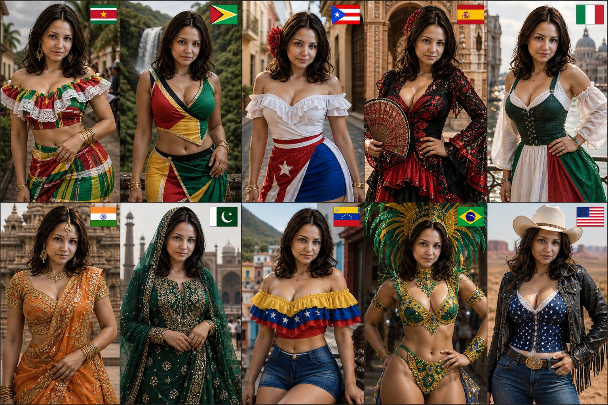

## 90 年代公寓场景参考板

- ID: case-381
- Slug: case-381-zh
- 语言: zh
- 来源: [来源链接](https://x.com/Iancu_ai/status/2051287273581203888)
- 样例图路径: images/part2/case381.jpg

### 提示词

```text
{
  "type": "scene reference board — 90s apartment living room, cinematic night",
  "style": "cinematic film photography, 35mm grain, warm amber shadow fill, deep chiaroscuro lighting, hyper-detailed interior, production design reference quality",
  "layout": {
    "main_panel_center_left": {
      "label": "CAMERA A — FRONT VIEW",
      "scene": "Wide shot, L-shaped tan sectional sofa, grey knit throw blanket, wooden coffee table (remote, mug, ashtray, Rolling Stone stack), lava lamp left, table lamp right, rain-streaked city window behind, Nirvana poster left wall. 35mm grain."
    },
    "main_panel_center_right": {
      "label": "CAMERA B — REVERSE VIEW",
      "scene": "Wide reverse from behind sofa. CRT TV prominent right, grey static screen. Tall bookshelf, VHS tapes. Cool blue backlight from window behind camera. Deep shadow."
    },
    "prop_strip_bottom": "6 close-up tiles: 1. LAVA LAMP — chrome base, blue-green wax blobs; 2. COFFEE TABLE — remote, mug, ashtray, magazines; 3. NIRVANA POSTER — black smiley face, wall texture; 4. CRT TELEVISION — static screen, VHS stack; 5. WINDOW/RAIN — city bokeh, water streaks; 6. THROW BLANKET — sofa corner, worn upholstery",
    "top_right_inset": "SOURCE REF thumbnail — original photo",
    "footer": "2700K PRACTICAL · 4100K CITY NIGHT · 24mm · 35MM"
  },
  "background": "deep charcoal #1a1a1a, thin white separators",
  "dimensions": "wide landscape 3:1, high resolution"
}
```

### 样例图

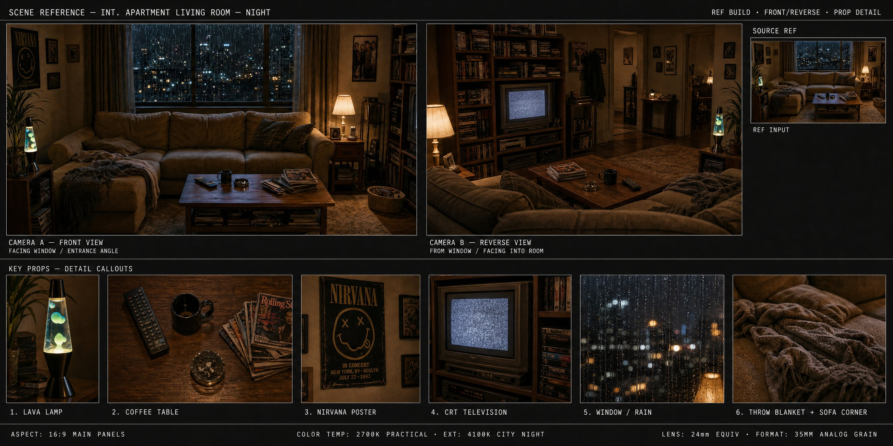

## 品牌人格漫画信息图

- ID: case-379
- Slug: case-379-zh
- 语言: zh
- 来源: [来源链接](https://x.com/CallumGrey/status/2051293342139584922)
- 样例图路径: images/part2/case379.jpg

### 提示词

```text
Using the uploaded logo, create a highly detailed, comic-style infographic poster:

“What This Brand Feels Like”

GOAL:
Turn the brand into a living personality and visually explain how it behaves, speaks, and interacts with the world.
This must feel like a mix of: brand strategy + character design + comic storytelling.

---

CORE RULE:
Everything must come from the logo:
- colors
- style
- tone
- personality

No generic personality traits.

---

MAIN STRUCTURE:
Vertical 4:5 poster
Dense layout with multiple panels
Comic + infographic hybrid

---

TOP SECTION:
- Brand name
- Short personality statement (max 6 words)
Example: “Quiet confidence with sharp edges”

---

MAIN CHARACTER (VERY IMPORTANT):
Create a central character representing the brand:
- humanized version of the brand
- outfit reflects brand style
- posture + expression reflect personality

---

AROUND THE CHARACTER:
Create 6–8 comic panels showing how the brand behaves in different situations.

---

SCENARIO IDEAS:
- Talking to customers
- Handling competition
- Selling a product
- Social media presence
- Reacting to criticism
- Daily “brand life” moment

---

FOR EACH PANEL:
Include:
- short caption (max 6 words)
- speech bubble or internal thought
- clear visual action

---

TONE EXAMPLES:
Luxury brand: calm, confident, minimal speech
Playful brand: loud, chaotic, expressive
Tech brand: precise, logical, clean

---

PERSONALITY TRAITS SECTION:
Add small labeled blocks:
- Voice tone (e.g. calm, bold, playful)
- Energy level (low / medium / high)
- Social behavior (introvert / extrovert)
- Communication style

Use:
- icons
- short labels

---

DO / DON’T SECTION:
Add a split block:
DO:
- how the brand should act
DON’T:
- what breaks the identity

Keep:
- very short phrases

---

VISUAL ELEMENTS:
- speech bubbles
- icons
- arrows
- small reactions
- exaggerated comic expressions

---

STYLE:
- comic + editorial hybrid
- slightly exaggerated but still premium
- expressive but not childish

---

COLOR:
- strictly based on logo palette
- use color to reinforce personality

---

DEPTH:
- 20–40 visual elements
- multiple small panels
- layered composition

---

IMPORTANT RULES:
- must feel alive
- must feel specific
- no generic marketing words
- no empty areas
- keep text short but impactful

---

FINAL FEEL:
Like:
- a brand strategy turned into a character
- a visual storytelling board
- something people save and study

NOT:
- flat
- generic
- minimal
```

### 样例图

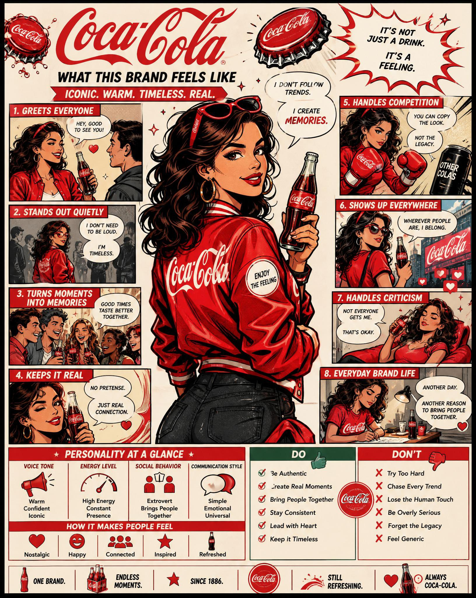

## 可爱角色设定表

- ID: case-372
- Slug: case-372-zh
- 语言: zh
- 来源: [来源链接](https://x.com/xRahultripathi/status/2050152865566708134)
- 样例图路径: images/part2/case372.jpg

### 提示词

```text
Create a cute female character design sheet inspired by the uploaded image.

Style: warm, soft, semi-realistic cartoon illustration with a cozy Japanese kawaii vibe (pastel tones, smooth shading, clean lineart).

Make it a clean character concept poster layout including:

One large main female portrait (front view, detailed)

Facial expression set (happy, shy, annoyed, sleepy, surprised, excited)

2–3 full-body poses (standing, walking/running, playful pose)

Small accessory/object icons that match her personality (hair clip, cute bag, phone charm, coffee cup, keychain)

A simple color palette section (skin, hair, outfit, accent colors)

A profile info box with: name, age range, personality traits, likes/dislikes, short description

Overall look should feel charming, cozy, feminine, and professionally arranged like an animation character design sheet.
High quality, clean background, soft lighting.
```

### 样例图

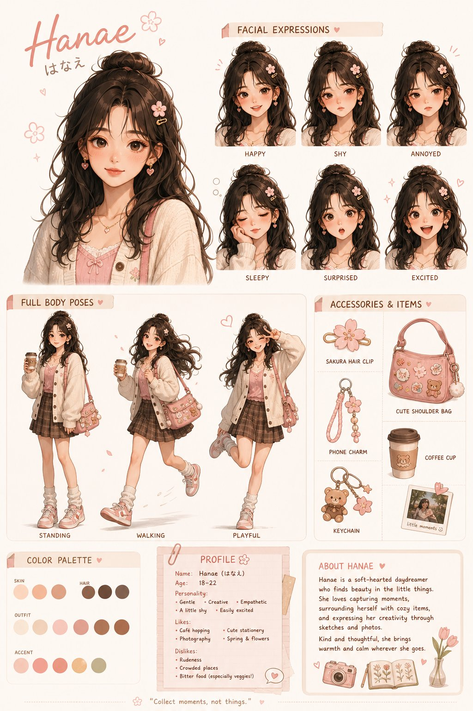

## 咖啡馆写实照片与 2D 涂鸦叠加

- ID: case-366
- Slug: case-366-zh
- 语言: zh
- 来源: [来源链接](https://x.com/Jawad_Rahman_/status/2049796647237066971)
- 样例图路径: images/part2/case366.jpg

### 提示词

```text
A trendy young woman sitting at an outdoor café table, holding a hot coffee cup near her lips. She has short curly black hair and wears oversized tinted sunglasses, a cropped beige sweater, loose brown high-waisted pants, and chunky white sneakers. A tote bag with minimal coffee-themed illustrations hangs on her shoulder.

The scene blends realistic photography with playful 2D cartoon overlays. Floating around her are animated coffee elements: a smiling cappuccino cup with heart-shaped latte art, cute coffee beans with tiny faces, and stylized splashes of caramel forming comic-style shapes. Soft doodle steam rises into hearts and stars.

On the table: a croissant, a notebook with sketch drawings, and a second coffee cup.

Background: a realistic cozy café street with brick walls, plants, warm golden hour lighting, and soft shadows. Slight depth of field, subject in sharp focus.

Style: mix of photorealism and vibrant cartoon illustration, pop-art aesthetic, high saturation but warm tones, clean composition, Instagram-worthy, soft glow, 4k detail.
```

### 样例图

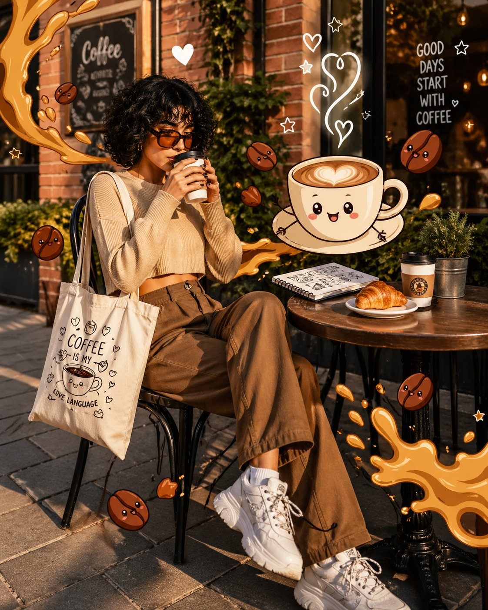

## 概念字体海报 Prompt

- ID: case-355
- Slug: case-355-zh
- 语言: zh
- 来源: [来源链接](https://x.com/dotey/status/2048793351290327381)
- 样例图路径: images/part2/case355.jpg

### 提示词

```text
Create ONE finished premium conceptual typography poster for the exact title:

“[INPUT_TEXT]”

Single poster only. No moodboard, grid, presentation board, mockup, captions, prompt text, process sheet, or sample labels.

The title “[INPUT_TEXT]” must be the dominant visual structure of the poster: huge, readable, powerful, and spelled exactly. Do not translate, shorten, replace, or misspell it. Do not add other large readable text. Optional micro catalog text is allowed only if it stays subtle and secondary.

Silently interpret the title’s meaning, mood, cultural aura, symbolic associations, psychological tension, and visual rhythm. Turn that interpretation into one strong visual metaphor.

Typography is the hero. Design custom-looking letterforms whose weight, width, contrast, spacing, rhythm, distortion, negative space, edge quality, and ink texture express the temperament of the title. The type should feel intentionally designed, not like a default font.

If “[INPUT_TEXT]” refers to a widely known person, make a large editorial portrait or full / half-body figure a major visual presence, occupying roughly 40–70% of the composition. The figure should feel recognizable through aura, posture, styling, era, expression, lighting, and symbolic atmosphere, but should not copy a specific existing photograph, official poster, campaign image, logo, slogan, or copyrighted composition. The portrait must interact with the typography: overlapping the letters, emerging from them, being framed by them, casting shadows on them, breaking through them, or being partially hidden behind them.

For all other titles, use a human figure, landscape, object, or atmospheric setting only when it strengthens the meaning. It must interact with the typography and deepen the concept, not decorate it.

Use a rich but restrained 4–6 color system matched to the theme: dominant background color, primary typography color, figure / landscape tone, emotional accent color, muted support color, and subtle paper / ink texture tone. Avoid flat black-white-red defaults unless conceptually necessary.

Composition style: high-end editorial poster, museum-quality graphic design, dramatic scale, strong hierarchy, few elements, intelligent whitespace, bold flat color areas, sharp cropping, silkscreen / lithograph / risograph grain, paper fibers, subtle ink imperfections, refined visual tension.

The final image should feel like a complete visual sentence: the title, the figure or setting, the color, and the typography explain each other.

Avoid generic word art, glossy 3D lettering, random icons, stock-photo realism, cluttered collage, excessive grunge, tourist clichés, official logos, copied slogans, copied campaign aesthetics, unrelated text, and misspelled typography.

-----

INPUT_TEXT：Phoenix Rebirth
```

### 样例图

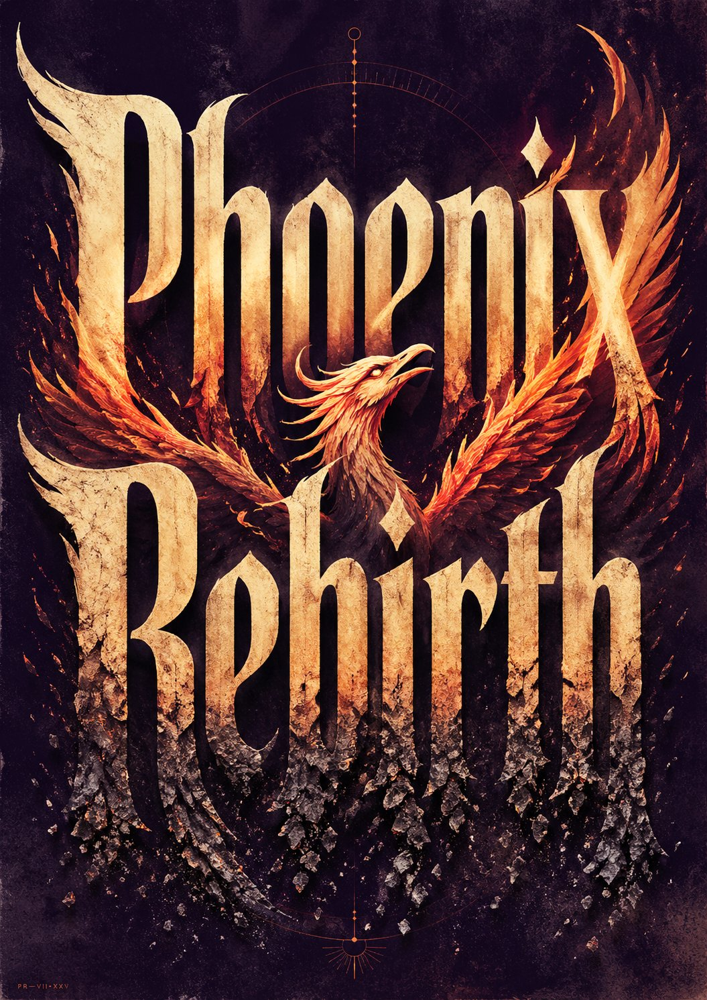

## 足球球员数据涂鸦海报

- ID: case-350
- Slug: case-350-zh
- 语言: zh
- 来源: [来源链接](https://x.com/ryanpp27/status/2048602248524214542)
- 样例图路径: images/part2/case350.jpg

### 提示词

```text
Create a scrapbook doodle-style football poster of [PLAYER_NAME].

AI auto-generates realistic career stats (club and national team).

Main photo: realistic, unchanged ([PLAYER_NAME] in action or iconic pose).

Doodles and handwritten notes: white and [PRIMARY_COLOR] neon ink (no warm colors unless specified), arrows, stars, scribbles, sketchy outlines. Add a glowing [PRIMARY_COLOR] outline around the player's body.

Layout (bold handwritten titles and stats):
- Top Title: "[PLAYER_NAME]" plus "[NICKNAME/TITLE]"
- Club Career: total matches and goals plus 2–4 main clubs (apps and goals)
- Highlights: 2–3 standout achievements (e.g., UCL goals, Ballon d'Or, top scorer)
- National Team: caps and goals plus 1–2 international achievements

Style: modern football poster x notebook aesthetic, clean but energetic, slightly messy doodles, high contrast, neon accents on dark or muted background.

Important: all stats must be realistic and proportional to the player's real career.
```

### 样例图

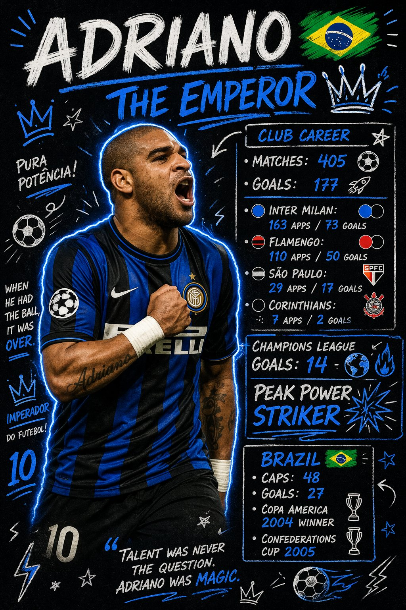

## 4×4 动作分解参考表

- ID: case-347
- Slug: case-347-zh
- 语言: zh
- 来源: [来源链接](https://x.com/oggii_0/status/2048614158699217302)
- 样例图路径: images/part2/case347.jpg

### 提示词

```text
[STYLE]
Monochrome grayscale illustration, 3D-rendered character, clean instructional reference sheet, white background, comic-style cell grid layout, technical diagram aesthetic.

[LAYOUT]
4×4 grid layout with a total of 16 panels. Each panel is separated by thin black border lines. Cells are numbered from 1 to 16, with consistent panel sizes.

[CHARACTER]
image1 (the same character appears consistently in all panels)

[PANEL STRUCTURE – per cell]
Top-left: bold number badge + English title text
Center: full-body character pose illustration
Bottom-left: English description text (3–4 lines)
Overlay: directional arrows indicating movement

[ARROWS / MOTION INDICATORS]
Curved arrows, straight arrows, and circular rotation indicators placed around the character to show motion flow and direction.

[RENDERING STYLE]
Highly detailed 3D sculpted style, soft studio lighting, subtle shadows, no color, grayscale shading, clean linework, game concept art quality.

[NEGATIVE]
No background scenery, no color tones, no additional characters, no complex background.
```

### 样例图


## 朋友圈截图生成

- ID: case-335
- Slug: case-335-zh
- 语言: zh
- 来源: [来源链接](https://github.com/freestylefly/awesome-gpt-image-2/blob/main/docs/gallery-part-2.md#case-335)
- 样例图路径: images/part2/case335.png

### 提示词

```text
原文未公开，重点展示 GPT-Image2 在高仿社交截图与中文排版场景中的能力。
```

### 样例图

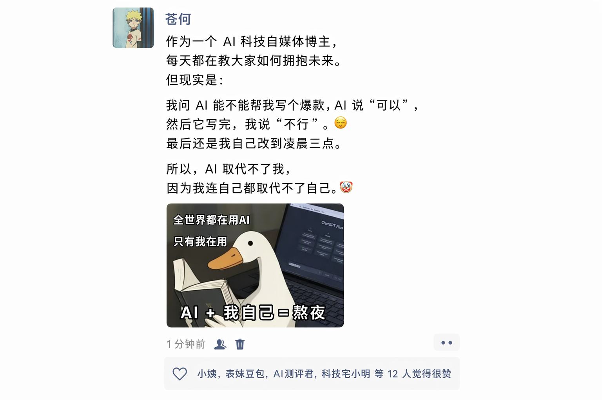

## 珊瑚色极简影棚时尚商业大片

- ID: case-318
- Slug: case-318-zh
- 语言: zh
- 来源: [来源链接](https://x.com/Maercihh/status/2026941078885310750)
- 样例图路径: images/part2/case318.jpg

### 提示词

```text
[中文]
超写实高端时尚商业广告大片，使用上传的模特照片作为严格的身份参考。保留精确的面部特征、比例和自然皮肤纹理——无修图，无变形。场景：珊瑚色单色工作室盒，配有光泽反光棋盘格或极简抛光地板。拥有柔和光线渐变的干净几何墙壁。产品：产品放置在前景中心超大位置，因广角透视而占据画面主导地位。包装超清晰，文字完全可读，具有逼真的反射和材质纹理。较小的产品单元可对称放置在背景中。模特姿势：站在产品后方，微蹲或前倾，一只手伸向镜头以创造深度感。强烈自信的表情，时尚态度。相机：低角度 24-35mm 镜头感，戏剧性透视畸变，对产品和模特都进行深焦处理。灯光：明亮的商业影棚灯光，柔和阴影，包装上有光泽高光，高端广告成片质感。4K–8K 写实主义，无水印，无嵌入式文本。纵横比 9:13

[English]
Ultra-realistic high-fashion commercial campaign using the uploaded model photo as strict identity reference. Preserve exact facial features, proportions and natural skin texture — no retouching, no reshaping.
Scene: coral monochrome studio box with glossy reflective checker or minimal polished floor. Clean geometric walls with soft light gradients.
Product: the product placed oversized in the center foreground, dominating the frame due to wide-angle perspective. The packaging is ultra-sharp, fully readable, realistic reflections and material texture. Smaller product units can be placed symmetrically in the background.
Model pose: standing behind the product, slightly crouched or leaning forward, one hand reaching toward the camera to create depth. Strong confident expression, fashion attitude.
Camera: low-angle 24–35mm lens look, dramatic perspective distortion, deep focus on both product and model.
Lighting: bright commercial studio lighting, soft shadows, glossy highlights on packaging, high-end campaign finish. 4K–8K realism, no watermark, no embedded text.i ar 9:13
```

### 样例图


## 零食品牌技术分解图

- ID: case-310
- Slug: case-310-zh
- 语言: zh
- 来源: [来源链接](https://x.com/TechieBySA/status/2031795709243019280)
- 样例图路径: images/part2/case310.jpg

### 提示词

```text
[中文]
创建一个 [SNACK] 的品牌技术信息图，结合产品的真实照片或照片级真实渲染，并将技术注释覆盖层直接置于其上。在纯白摄影棚背景上使用带有策略性 [BRAND COLOR] 点缀的黑色墨水风格线条画（建筑草图外观），包括：
• 关键组件标签
• 显示结构、分层或内部设计的内部截面图
• 测量数据、尺寸和规格
• 带有成分和数量的材料标注
• 指示主要功能和结构完整性的箭头
• 显示关键机械或设计元素的简单示意图或剖面图
• 可持续性标注
标题位置：位于手绘技术注释框内，带有强调色边框，粗体字显示产品名称，置于上角。
风格与布局规则：
• 真实产品保持清晰可见
• 注释具有素描感、技术感和建筑感
• 强调色用于高光（占线条工作的 20-30%），黑色用于主要技术线条（70-80%）
• 构图整洁，负空间平衡
• 具有教育意义、食品工程氛围和高端品牌感
• 在角落包含微妙的品牌标志
视觉风格：极简技术插画美学，黑色线条在真实图像上带有点缀，精确但略带手绘感。
调色板：白色背景，黑色注释线/文本，[BRAND COLOR] 仅用于点缀和关键标注。
输出：1080×1080，超清晰，社交媒体动态优化，无水印。

[English]
Create a branded technical infographic of a [SNACK], combining a realistic photograph or photoreal render of the product with technical annotation overlays placed directly on top. Use black ink–style line drawings with strategic [BRAND COLOR] accents (architectural sketch look) on a pure white studio background, including:
• Key component labels
• Internal cross-section showing structure, layering, or internal design
• Measurements, dimensions, and specifications
• Material callouts with composition and quantities
• Arrows indicating function for primary features and structural integrity
• Simple schematic or sectional diagram showing key mechanical or design elements
• Sustainability callouts
Title placement: Inside a hand-drawn technical annotation box with accent border reading the product name in bold font, positioned in upper corner.
Style & layout rules:
• The realistic product remains clearly visible
• Annotations feel sketched, technical, and architectural
• Accents used for highlight (20-30% of linework), black for primary technical lines (70-80%)
• Clean composition with balanced negative space
• Educational, food-engineering vibe with premium branding
• Include subtle brand logo mark in corner
Visual style: Minimal technical illustration aesthetic, black linework with accents over realistic imagery, precise but slightly hand-drawn feel.
Color palette: White background, black annotation lines/text, [BRAND COLOR] for accents and key callouts only.
Output: 1080×1080, ultra-crisp, social-feed optimized, no watermark.​​​​​​​​​​​​​​​​
```

### 样例图

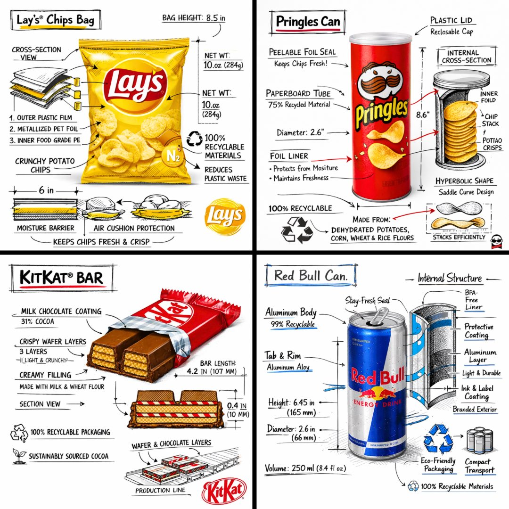

## 抖音直播截图画面

- ID: case-308
- Slug: case-308-zh
- 语言: zh
- 来源: [来源链接](https://x.com/_FORAB/status/2044744023261519920)
- 样例图路径: images/part2/case308.jpg

### 提示词

```text
[中文]
9:16 的图片比例，生成一张抖音直播的截图，里面是 xxx 在直播，xxx 手里拿着牌子，牌子里写着 xxxx。

[English]
9:16 aspect ratio, generate a screenshot of a Douyin live stream, inside is xxx live streaming, xxx is holding a sign in their hand, the sign says xxxx.
```

### 样例图


## 红绸舞动千年商都广州

- ID: case-307
- Slug: case-307-zh
- 语言: zh
- 来源: [来源链接](https://x.com/liyue_ai/status/2045332620352119274)
- 样例图路径: images/part2/case307.jpg

### 提示词

```text
[中文]
一张充满新春喜庆氛围但不失高雅格调的 2026 城市宣传海报。
双重曝光，构图延续了S型的流动感；
在纯白的纹理背景右下角，一个身穿中国传统服饰的微缩人物正在挥舞着一条长长的红色丝绸舞带，这条红绸在空中舞动，不仅展现出丝绸的柔顺质感，更在向左上方飘动的过程中，奇幻地变形成了一条壮丽的山脉河流。
在这条“河流”中，叠加了一个有山有海河的广州城市手绘图，国潮，景色尽在眼底，壮阔雄伟，令人震撼。
广州的地标建筑(广州塔，珠江新城建筑群，珠江, 广州城里古建筑，游轮，白云山）。
云雾环绕，仙气缥缈，色彩丰富，结构复杂，细节丰富，但因为大面积的留白，画面依然显得清新脱俗，左下角排版着“SPRING 2026”和竖排的宣传语，整体寓意“千年商都，魅力广州”。
文字排版优美，大方，字迹清晰完整，尺寸9:16。

[English]
A 2026 city promotional poster filled with a festive Spring Festival atmosphere without losing its elegant style.
Double exposure, the composition continues the flowing sense of an S-shape;
In the lower right corner of the pure white textured background, a miniature figure wearing traditional Chinese clothing is waving a long red silk dance ribbon. This red silk dances in the air, not only showing the smooth texture of the silk, but also magically transforming into a magnificent mountain range and river during the process of floating to the upper left.
In this "river", a hand-drawn map of Guangzhou city with mountains, sea, and rivers is superimposed, Guochao, the scenery is in full view, magnificent and majestic, shocking.
Guangzhou's landmark buildings (Canton Tower, Pearl River New City building complex, Pearl River, ancient buildings in Guangzhou city, cruise ships, Baiyun Mountain).
Surrounded by clouds and mist, ethereal and misty, rich in color, complex in structure, rich in details, but because of a large area of blank space, the picture still looks fresh and refined. In the lower left corner, "SPRING 2026" and vertical promotional slogans are typeset. The overall implication is "Millennium Commercial Capital, Charming Guangzhou".
The typography is beautiful and generous, the handwriting is clear and complete, aspect ratio 9:16.
```

### 样例图


## 深夜便利店里的性感霓虹少女

- ID: case-305
- Slug: case-305-zh
- 语言: zh
- 来源: [来源链接](https://x.com/BubbleBrain/status/2045167461147042202)
- 样例图路径: images/part2/case305.jpg

### 提示词

```text
[中文]
35毫米胶片摄影，带有刺眼的便利店荧光灯照明，混合着外面色彩斑斓的霓虹灯牌，真实的胶片颗粒，高对比度，轻微的偏色，电影感街头编辑风格，亲密的中景镜头，20岁出头性感的华人女性偶像，拥有超逼真精致细腻的东方五官，诱人的杏眼狐眼搭配天然双眼皮，高鼻梁，小巧尖锐的V型下颌线，无瑕的瓷白肌肤带有冷象牙底色以及来自荧光灯的可见高光，细腻的皮肤纹理和微小毛孔，自然清透妆容带有脸颊上的柔和红晕，水润自然的粉唇微张，鼻子和脸颊上散布着微妙的自然雀斑，深棕色的长发扎成凌乱的高马尾，许多松散的发丝垂在脸庞和颈部周围，穿着一件超大号的白衬衫作为唯一的上衣，顶部敞开露出深邃乳沟并在腰部宽松打结，搭配一条极小的黑色百褶迷你裙，赤脚穿着简约的白色拖鞋，在深夜24小时便利店的玻璃门上呈现出诱人随性的倚靠姿势，身体微微拱起，一条腿弯曲，脚搭在门框上，另一条腿伸直，一只手拿着一瓶冰饮，另一只手轻轻拉扯迷你裙的裙摆，极其诱人俏皮却又略显脆弱的目光直视观看者，柔和的鹿眼中充满安静的诱惑与挑逗的微笑，来自店内明亮冷调的荧光灯光混合着来自外面招牌的粉色和蓝色霓虹光芒，玻璃门上真实的反射，模糊的便利店内部，背景中有货架和零食，真实的35毫米胶片调色，带有刺眼的光照和霓虹点缀，极其锐利却又柔和的皮肤渲染，自然的发丝，超大号衬衫和迷你裙上逼真的织物褶皱和垂坠感，无塑料感皮肤，无数字过度锐化，无磨皮，无瑕疵，无痣，无油性皮肤，无水印，无文字，真实的深夜便利店氛围

[English]
35mm film photography with harsh convenience store fluorescent lighting mixed with colorful neon signs from outside, authentic film grain, high contrast, slight color cast, cinematic street editorial style, intimate medium shot, early 20s sexy Chinese female idol with ultra-realistic delicate refined Chinese features, seductive almond-shaped fox eyes with natural double eyelids, high nose bridge, small sharp V-shaped jawline, flawless porcelain skin with cool ivory undertone and visible specular highlights from fluorescent light, subtle skin texture and micro pores, natural dewy makeup with soft flush on cheeks, glossy natural pink lips slightly parted, subtle natural freckles across nose and cheeks, long dark brown hair in a messy high ponytail with many loose strands falling around face and neck, wearing an oversized white button-up shirt as the only top, unbuttoned at the top with deep cleavage and loosely tied at the waist, paired with a tiny black pleated mini skirt, barefoot in simple white slides, seductive casual leaning pose against the glass door of a 24-hour convenience store at late night, body slightly arched, one leg bent with foot resting against the door frame, the other leg straight, one hand holding a bottle of iced drink, the other hand lightly pulling the hem of her mini skirt, intensely seductive playful yet slightly vulnerable gaze straight at the viewer with soft doe eyes full of quiet temptation and teasing smile, bright cold fluorescent store light from inside mixed with pink and blue neon glow from outside signs, realistic reflections on glass door, blurred convenience store interior with shelves and snacks in background, authentic 35mm film color grading with harsh lighting and neon accents, extremely sharp yet soft skin rendering, natural hair strands, realistic fabric wrinkles and drape on the oversized shirt and mini skirt, no plastic skin, no digital over-sharpening, no airbrushing, no blemishes, no moles, no oily skin, no watermark, no text, authentic late-night convenience store atmosphere
```

### 样例图

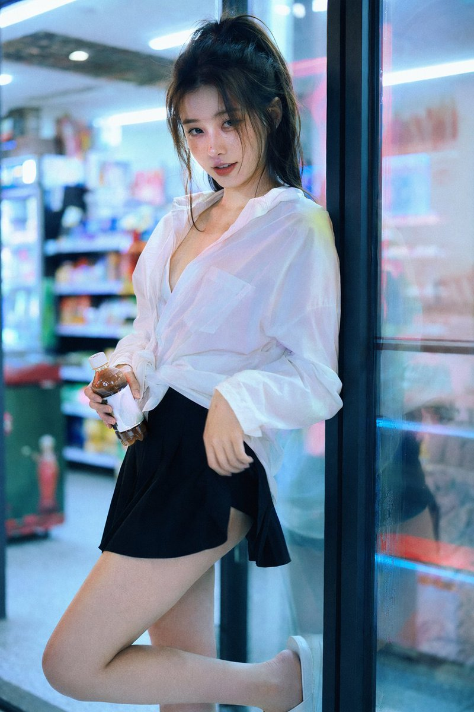

## 极简留白涂鸦手绘草图

- ID: case-299
- Slug: case-299-zh
- 语言: zh
- 来源: [来源链接](https://x.com/VoxcatAI/status/2045131503001342302)
- 样例图路径: images/part2/case299.jpg

### 提示词

```text
[中文]
以涂鸦速写风表现【主题/主体】，整体呈现快速勾勒、自由变形、即兴手绘与草稿式的视觉效果。线条随手、夸张、可粗细不一，略显凌乱但具有节奏和表现力，强调概括、夸张、趣味和随性，而不是严谨写实或精细刻画。

颜色采用粗糙、干刷感明显的块面表现，可保留不均匀的涂抹痕迹、刷痕、飞白与覆盖感，色彩根据【主题/主体】自动适配，但整体保持涂鸦式、速写式、概括式的表达。不要透明水彩晕染效果，不要细腻水彩过渡，不要纸纹理，不要柔和雾化，不要梦幻质感。

背景以留白为主，保持简洁、轻松、未完成感和设计感，可加入少量辅助性符号、箭头、记号、圈画、重复线、随手写的文字或其他涂鸦元素，以增强速写本或随笔式视觉语言，但不可过于拥挤，不可破坏主体和留白气质。

画面内容不需要预先写清楚，由【主题/主体】自动推演并生成最适合的主体形象、动作、相关元素、符号或简化场景，整体保持统一的涂鸦速写风和夸张概括的表现方式，避免复杂写实背景和过度铺陈。
画面中需自然加入专属签名“voxcat”，作为画面的一部分，位置低调但清晰，可放在左下角、右下角或标题附近，风格需与整体版式统一，像作品署名或设计落款；签名字体精致、克制、高级，不可过大，不可破坏主体构图，不可显得突兀或廉价。

[English]
Express [Subject/Theme] in a graffiti sketch style, presenting an overall visual effect of quick outlining, free deformation, impromptu hand-drawing, and draft-like appearance. The lines are casual, exaggerated, and can vary in thickness, slightly messy but rhythmic and expressive, emphasizing generalization, exaggeration, playfulness, and spontaneity, rather than rigorous realism or detailed rendering. Colors are expressed in rough blocks with a distinct dry-brush feel, retaining uneven smearing traces, brush strokes, dry-brush effects, and a sense of coverage. Colors automatically adapt to [Subject/Theme], but the overall expression remains graffiti-style, sketch-style, and generalized. Do not use transparent watercolor blooming effects, do not use delicate watercolor transitions, do not use paper textures, do not use soft atomization, and do not use dreamy textures. The background is mainly left blank, maintaining a sense of simplicity, relaxation, incompleteness, and design. A small number of auxiliary symbols, arrows, marks, circled areas, repeated lines, casually written text, or other graffiti elements can be added to enhance the visual language of a sketchbook or jotting style, but it must not be too crowded, and must not destroy the subject and the blank space temperament. The image content does not need to be written out in advance; the most suitable subject image, actions, related elements, symbols, or simplified scenes are automatically deduced and generated by [Subject/Theme], keeping the overall unified graffiti sketch style and exaggerated generalized expression, avoiding complex realistic backgrounds and over-elaboration. The exclusive signature "voxcat" needs to be naturally added to the image as a part of the picture. The position should be low-key but clear, and can be placed in the bottom left corner, bottom right corner, or near the title. The style must be consistent with the overall layout, like an artwork signature or a design sign-off; the signature font should be exquisite, restrained, and high-end, must not be too large, must not destroy the subject composition, and must not appear abrupt or cheap.
```

### 样例图


## 明朝登基宝玉的推文页面

- ID: case-292
- Slug: case-292-zh
- 语言: zh
- 来源: [来源链接](https://x.com/tuzi_ai/status/2045193918736736365)
- 样例图路径: images/part2/case292.jpg

### 提示词

```text
[中文]
创建一个宝玉（查阅 https://x.com/dotey 这个推主的主页及部分推文）穿越到明朝，登基之后依据其业务/个性，绘制的其新的X帖子页面。

[English]
Create a new X post page illustrated for Baoyu (refer to the homepage and some posts of this Twitter user at https://x.com/dotey) after time-traveling to the Ming Dynasty and ascending the throne, based on his business/personality.
```

### 样例图

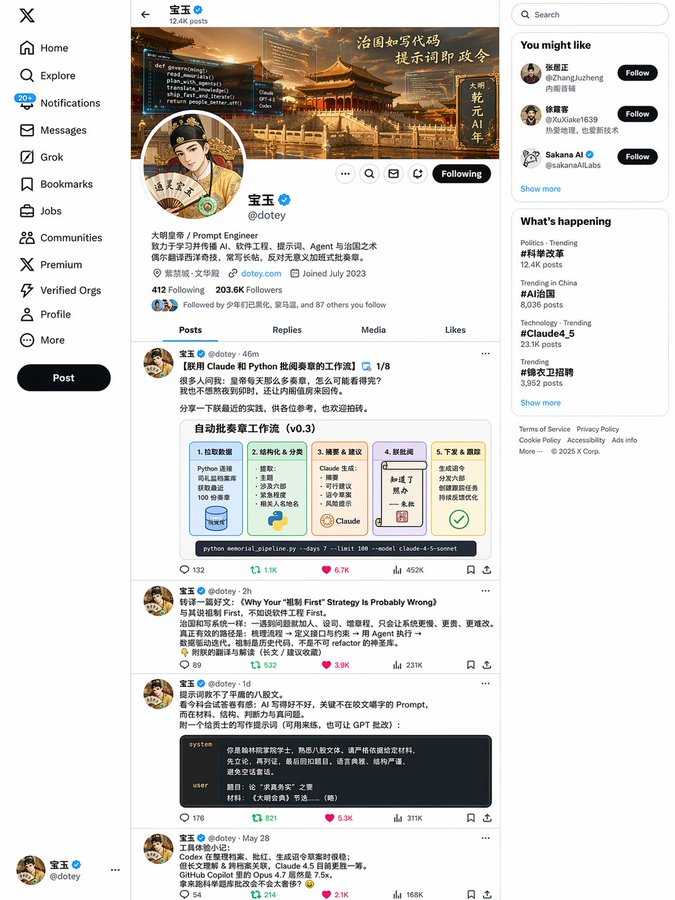

## 封面排版设计图

- ID: case-280
- Slug: case-280-zh
- 语言: zh
- 来源: [来源链接](https://opennana.com/awesome-prompt-gallery/graffiti-sketch-ai-builder-master)
- 样例图路径: images/part2/case280.jpg

### 提示词

```text
[中文]
以涂鸦速写风表现【一个厉害的AI builder】，整体呈现快速勾勒、自由变形、即兴手绘与草稿式的视觉效果。线条随手、夸张、可粗细不一，略显凌乱但具有节奏和表现力，强调概括、夸张、趣味和随性，而不是严谨写实或精细刻画。  颜色采用粗糙、干刷感明显的块面表现，可保留不均匀的涂抹痕迹、刷痕、飞白与覆盖感，色彩根据【主题/主体】自动适配，但整体保持涂鸦式、速写式、概括式的表达。不要透明水彩晕染效果，不要细腻水彩过渡，不要纸纹理，不要柔和雾化，不要梦幻质感。  背景以留白为主，保持简洁、轻松、未完成感和设计感，可加入少量辅助性符号、箭头、记号、圈画、重复线、随手写的文字或其他涂鸦元素，以增强速写本或随笔式视觉语言，但不可过于拥挤，不可破坏主体和留白气质。  画面内容不需要预先写清楚，由【一个厉害的AI builder】自动推演并生成最适合的主体形象、动作、相关元素、符号或简化场景，整体保持统一的涂鸦速写风和夸张概括的表现方式，避免复杂写实背景和过度铺陈。 画面中需自然加入专属签名"BlanPlan"，作为画面的一部分，位置低调但清晰，可放在左下角、右下角或标题附近，风格需与整体版式统一，像作品署名或设计落款；签名字体精致、克制、高级，不可过大，不可破坏主体构图，不可显得突兀或廉价。

[English]
Express [an awesome AI builder] in a graffiti sketch style, overall presenting a visual effect of quick sketching, free deformation, impromptu hand-drawing and draft-like. The lines are casual, exaggerated, and can vary in thickness, slightly messy but with rhythm and expressiveness, emphasizing summarization, exaggeration, fun and casualness, rather than rigorous realism or fine depiction. The colors use rough blocks with obvious dry brush feel, retaining uneven smearing traces, brush strokes, flying white and covering feel, the colors automatically adapt according to [theme/subject], but overall maintain a graffiti-style, sketch-style, and summarized expression. Do not use transparent watercolor smudging effects, do not use delicate watercolor transitions, do not use paper texture, do not use soft atomization, do not use dreamy texture. The background is mainly blank, keeping it simple, relaxed, unfinished and designed, can add a small amount of auxiliary symbols, arrows, marks, circled drawings, repeated lines, casually written text or other graffiti elements, to enhance the sketchbook or essay-style visual language, but it must not be too crowded, and must not destroy the subject and blank temperament. The picture content does not need to be written clearly in advance; [an awesome AI builder] automatically deduces and generates the most suitable subject image, movements, related elements, symbols or simplified scenes, overall maintaining a unified graffiti sketch style and exaggerated summarized expression method, avoiding complex realistic backgrounds and excessive padding. The exclusive signature "BlanPlan" needs to be naturally added into the picture as a part of the picture, the position is low-key but clear, can be placed in the bottom left corner, bottom right corner or near the title, the style needs to be unified with the overall layout, like an artwork signature or design sign-off; the signature font is exquisite, restrained, and high-end, must not be too large, must not destroy the subject composition, must not appear abrupt or cheap.
```

### 样例图


## 红绸幻化壮阔国潮羊城

- ID: case-276
- Slug: case-276-zh
- 语言: zh
- 来源: [来源链接](https://x.com/liyue_ai/status/2045332620352119274)
- 样例图路径: images/part2/case276.jpg

### 提示词

```text
[中文]
一张充满新春喜庆氛围但不失高雅格调的 2026 城市宣传海报。
双重曝光，构图延续了S型的流动感；
在纯白的纹理背景右下角，一个身穿中国传统服饰的微缩人物正在挥舞着一条长长的红色丝绸舞带，这条红绸在空中舞动，不仅展现出丝绸的柔顺质感，更在向左上方飘动的过程中，奇幻地变形成了一条壮丽的山脉河流。
在这条"河流"中，叠加了一个有山有海河的广州城市手绘图，国潮，景色尽在眼底，壮阔雄伟，令人震撼。
广州的地标建筑(广州塔，珠江新城建筑群，珠江, 广州城里古建筑，游轮，白云山）。
云雾环绕，仙气缥缈，色彩丰富，结构复杂，细节丰富，但因为大面积的留白，画面依然显得清新脱俗，左下角排版着"SPRING 2026"和竖排的宣传语，整体寓意"千年商都，魅力广州"。
文字排版优美，大方，字迹清晰完整，尺寸9:16。

[English]
A 2026 city promotional poster full of a festive Chinese New Year atmosphere yet maintaining an elegant style.
Double exposure, the composition continues the flowing sense of an S-shape;
In the lower right corner of the pure white textured background, a miniature figure wearing traditional Chinese clothing is waving a long red silk dance ribbon, this red silk dances in the air, not only showing the smooth texture of the silk, but also in the process of drifting to the upper left, magically transforming into a magnificent mountain range and river.
In this "river", a hand-drawn map of Guangzhou city with mountains, sea, and rivers is superimposed, Guochao, the scenery is fully in view, magnificent and majestic, breathtaking.
Guangzhou's landmark buildings (Canton Tower, Pearl River New City building complex, Pearl River, ancient buildings in Guangzhou city, cruise ships, Baiyun Mountain).
Surrounded by clouds and mist, ethereal and misty, rich in colors, complex in structure, rich in details, but because of a large area of negative space, the picture still appears fresh and refined, the lower left corner is typeset with "SPRING 2026" and vertical promotional slogans, the overall implication is "Millennium Commercial Capital, Charming Guangzhou".
Beautiful and generous typography, clear and complete handwriting, aspect ratio 9:16.
```

### 样例图


## 日式温泉旅馆人像

- ID: case-272
- Slug: case-272-zh
- 语言: zh
- 来源: [来源链接](https://x.com/BubbleBrain/status/2045092449803284923)
- 样例图路径: images/part2/case272.jpg

### 提示词

```text
35mm film photography, warm vintage Japanese onsen ryokan aesthetic, soft ambient wooden lantern lighting mixed with gentle natural window light, subtle film grain, gentle color shift, high atmosphere editorial style, intimate medium shot, early 20s beautiful Chinese female idol with ultra-realistic delicate refined Chinese features, seductive almond-shaped fox eyes with natural double eyelids, high nose bridge, small sharp V-shaped jawline, flawless porcelain skin with warm ivory undertone, visible subtle skin texture and micro pores, soft natural makeup with dewy glow, subtle rosy flush on cheeks, natural soft pink lips slightly parted, long dark brown hair tied in a loose low bun with some messy strands falling around face and neck, wearing a loose white yukata (traditional Japanese bathrobe) deliberately slipped off one shoulder and loosely tied at the waist, the fabric slightly open revealing smooth skin and subtle cleavage, barefoot, seductive relaxed sitting pose on the edge of a traditional wooden engawa veranda at a vintage onsen ryokan, body slightly turned toward the camera, one leg bent with foot resting on the wooden floor, the other leg gently dangling, one hand lightly holding the yukata collar, the other hand resting on the wooden floor behind her for support, softly arched back to gently accentuate curves, intensely seductive yet gentle and inviting gaze straight at the viewer with soft doe eyes full of quiet temptation and warmth, warm wooden interior with paper sliding doors and distant steaming hot spring in soft focus, gentle rim lighting highlighting skin and fabric texture, authentic vintage film color grading with warm tones, extremely sharp yet soft skin rendering, natural hair strands, realistic fabric wrinkles and drape on the yukata, no plastic skin, no digital over-sharpening, no airbrushing, no blemishes, no moles, no oily skin, no watermark, no text, authentic 35mm film Japanese onsen ryokan atmosphere
```

### 样例图


## 拒绝盲目催婚的暖心视频号截图

- ID: case-269
- Slug: case-269-zh
- 语言: zh
- 来源: [来源链接](https://x.com/MrLarus/status/2045373105041007013)
- 样例图路径: images/part2/case269.jpg

### 提示词

```text
[中文]
生成视频号内容截图，主题：中老年不要盲目催婚，iPhone尺寸

[English]
Generate a screenshot of WeChat Channels content, theme: middle-aged and elderly people should not blindly urge marriage, iPhone size
```

### 样例图


## 威化岛回军前夕李成桂动态

- ID: case-268
- Slug: case-268-zh
- 语言: zh
- 来源: [来源链接](https://x.com/SKA_Neotype/status/2044637900978217334)
- 样例图路径: images/part2/case268.jpg

### 提示词

```text
[中文]
태조 이성계의 X  페이지(위화도 회군을 벌이기 직전- 최영 장군과 서로 디스하는 내용이 담긴 게시글들)을 만들어 주세요.

[English]
Please create an X page of King Taejo Yi Seong-gye (right before carrying out the Wihwa Island Retreat - containing posts where he and General Choi Yeong are dissing each other).
```

### 样例图

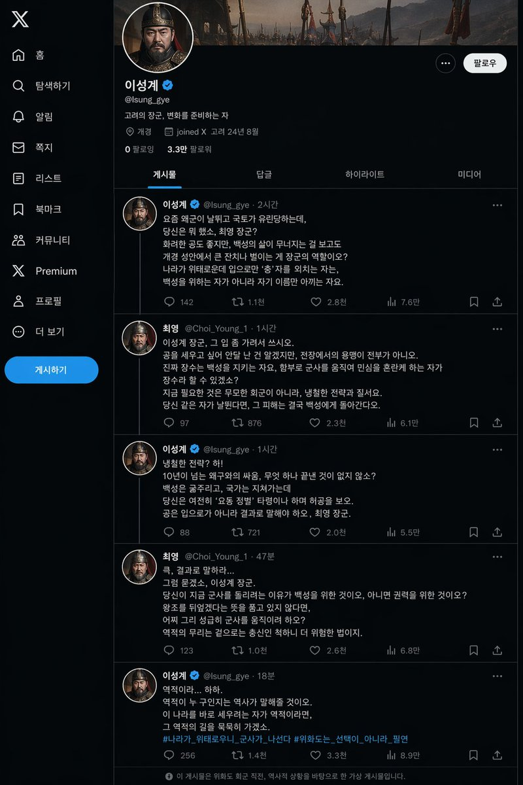

## 宋朝文人的赛博朋友圈

- ID: case-267
- Slug: case-267-zh
- 语言: zh
- 来源: [来源链接](https://x.com/Panda20230902/status/2045385588065313057)
- 样例图路径: images/part2/case267.jpg

### 提示词

```text
[中文]
"宋朝人的朋友圈"/"SONG DYNASTY SOCIAL MEDIA FEED"，古今穿越幽默融合界面设计风格，画面模拟手机社交媒体界面，但内容全部是宋朝场景头像是宋代文人画像，用户名"苏东坡SuShi_Official"，发布内容"刚到黄州，被贬了但心情还行。今天自己做了东坡肉，味道绝了，附菜谱："，配图为工笔画风格的东坡肉特写，点赞列表"黄庭坚、秦观、佛印等126人"，评论区"王安石：呵呵""司马光：还是那个味道"，界面元素如点赞图标用宋代花纹替代，状态栏显示"大宋移动 5G"和"元丰三年"，配色为手机深色模式搭配宋代雅致色调，历史与社交媒体的趣味碰撞杰作

[English]
"Song Dynasty People's Moments"/"SONG DYNASTY SOCIAL MEDIA FEED", Ancient and modern time-travel humor fusion interface design style, The image simulates a mobile phone social media interface, but the content is entirely Song Dynasty scenes, The avatar is a portrait of a Song Dynasty literati, Username "Su Dongpo SuShi_Official", Post content "Just arrived in Huangzhou, demoted but feeling okay. Made Dongpo pork myself today, tastes amazing, recipe attached:", The attached image is a close-up of Dongpo pork in Gongbi painting style, Likes list "Huang Tingjian, Qin Guan, Fo Yin etc. 126 people", Comments section "Wang Anshi: Hehe" "Sima Guang: Still the same taste", Interface elements such as the like icon are replaced with Song Dynasty patterns, The status bar shows "Great Song Mobile 5G" and "Third Year of Yuanfeng", The color scheme is mobile phone dark mode paired with elegant Song Dynasty tones, A masterpiece of fun collision between history and social media
```

### 样例图


## 社媒界面截图

- ID: case-260
- Slug: case-260-zh
- 语言: zh
- 来源: [来源链接](https://x.com/MrLarus/status/2045373105041007013)
- 样例图路径: images/part2/case260.jpg

### 提示词

```text
[中文]
生成抖音内容截图，主题：跟上AI浪潮9.9包教会，iPhone尺寸

[English]
Generate a screenshot of Douyin content, theme: Catch up with the AI wave, 9.9 to learn it all, iPhone size
```

### 样例图


## 杜蕾斯茶颜悦色联名海报设计

- ID: case-244
- Slug: case-244-zh
- 语言: zh
- 来源: [来源链接](https://x.com/akokoi1/status/2045693939584516441)
- 样例图路径: images/part2/case244.jpg

### 提示词

```text
[中文]
设计一套杜蕾斯和茶颜悦色联名的宣传物料

[English]
Design a set of promotional materials for a Durex and Chayan Yuese co-branding campaign.
```

### 样例图


## 定制专属风格界面设计系统

- ID: case-243
- Slug: case-243-zh
- 语言: zh
- 来源: [来源链接](https://x.com/stark_nico99/status/2045836554451706125)
- 样例图路径: images/part2/case243.jpg

### 提示词

```text
[中文]
用xx风格帮我生成一套UI设计系统，包含网页、移动端、卡片、控件、按钮 以及其它

[English]
Generate a UI design system for me in xx style, including web pages, mobile, cards, controls, buttons, and others
```

### 样例图


## 胶片闪光灯下的球场少女

- ID: case-240
- Slug: case-240-zh
- 语言: zh
- 来源: [来源链接](https://x.com/BubbleBrain/status/2045052982728016131)
- 样例图路径: images/part2/case240.jpg

### 提示词

```text
[中文]
35毫米彩色胶片摄影，带有强烈的机顶直射闪光灯，皮肤和衣物上有镜面高光，眼睛里有强烈的眼神光，高对比度闪光灯照明，真实的胶片颗粒和色彩偏移，高级时尚清新纯真篮球场编辑风格，亲密的第一人称低角度仰视POV镜头，二十出头的性感中国女性偶像，具有超写实的精致细腻的中国特征，诱人的杏仁形狐狸眼，带有自然双眼皮，高鼻梁，小巧锋利的V型下颌线，无瑕逼真的瓷白肌肤，带有冷象牙色底调和可见的闪光镜面高光，细腻精致的皮肤纹理，带有微妙的毛孔微距细节和闪光灯下的自然水光感，清新自然的运动妆容，带有柔和的水光感，脸颊上有微妙的自然红晕，自然粉唇微张，鼻子和脸颊上有微妙的自然雀斑，深棕色长发扎成高高的俏皮马尾辫，有一些散落的发丝修饰脸型，以及逼真的散落发丝，穿着宽松的白色背心和白色高腰篮球短裤，白色及膝运动袜，在黄昏的户外球场上靠在篮球架杆上的诱人自然倾斜姿势，身体侧成角度，背部自然弓起，臀部轻轻向后推，以凸显挺拔圆润的臀部和性感的臀部曲线，一条腿自然向前伸向镜头，另一条腿微微弯曲以强调修长性感的双腿，双手轻轻放在肩膀高度的篮球杆上，极其诱人俏皮又惹人怜爱的鹿眼凝视直视观看者，带着柔软脆弱渴望的眼睛和温柔挑逗的微笑，充满安静的诱惑和欲望，强烈的机顶直射闪光灯产生锐利的镜面高光和强烈的眼神光，背景是黄昏天空下模糊的篮球场和篮筐，高对比度胶片调色，带有自然闪光灯外观，极其锐利却又柔和的皮肤渲染，具有真实的35毫米直射闪光美学，自然发丝，背心和短裤上逼真的织物纹理以及袜子细节，没有塑料感皮肤，没有数码过度锐化，没有磨皮，没有瑕疵，没有痣，没有油性皮肤，没有水印，没有文字，真实的35毫米直射闪光胶片篮球场外观 --ar 9:16

[English]
35mm color film photography with harsh direct on-camera flash, specular highlights on skin and clothing, strong catchlights in eyes, high contrast flash illumination, authentic film grain and color shift, high fashion fresh innocent basketball court editorial style, intimate first-person low-angle POV shot from below, early 20s sexy Chinese female idol with ultra-realistic delicate refined Chinese features, seductive almond-shaped fox eyes with natural double eyelids, high nose bridge, small sharp V-shaped jawline, flawless realistic porcelain skin with cool ivory undertone and visible flash specular highlights, fine delicate skin texture with subtle pores micro details and natural dewy glow under flash, fresh natural sporty makeup with soft dewy glow, subtle natural flush on cheeks, natural pink lips slightly parted, subtle natural freckles across nose and cheeks, long dark brown hair tied in a high playful ponytail with some loose strands framing the face and realistic loose strands, wearing a loose white tank top and white high-waisted basketball shorts, white knee-high sports socks, seductive natural leaning pose against the basketball hoop pole on the outdoor court at dusk, body angled sideways with naturally arched back and hips gently pushed back to accentuate perky round hips and sexy butt curve, one leg naturally extended forward toward the camera and the other leg slightly bent to emphasize long sexy legs, both hands lightly resting on the basketball pole at shoulder height, intensely seductive playful yet pitiable doe-eyed gaze straight at the viewer with soft vulnerable longing eyes and a gentle teasing smile full of quiet temptation and desire, harsh direct on-camera flash creating sharp specular highlights and strong catchlights, background with blurred basketball court and hoop under dusk sky, high contrast film color grading with natural flash look, extremely sharp yet soft skin rendering with authentic 35mm direct flash aesthetic, natural hair strands, realistic fabric texture on tank top and shorts with socks detail, no plastic skin, no digital over-sharpening, no airbrushing, no blemishes, no moles, no oily skin, no watermark, no text, authentic 35mm direct flash film basketball court look --ar 9:16
```

### 样例图


## 朱元璋登基后的推特主页

- ID: case-234
- Slug: case-234-zh
- 语言: zh
- 来源: [来源链接](https://x.com/liyue_ai/status/2045021302315249738)
- 样例图路径: images/part2/case234.jpg

### 提示词

```text
[中文]
创建一个明朝朱元璋登基之后的X帖子页面

[English]
Create an X post page of Zhu Yuanzhang after his ascension to the throne in the Ming Dynasty
```

### 样例图

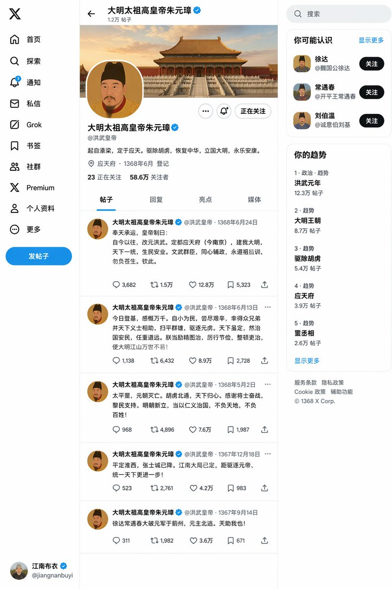

## 大师级真迹复刻

- ID: case-225
- Slug: case-225-zh
- 语言: zh
- 来源: [来源链接](https://x.com/MrLarus/status/2046201836525302032)
- 样例图路径: images/part2/case225.jpg

### 提示词

```text
[中文]
帮我生成xxxx真迹图片

[English]
Help me generate xxxx authentic picture
```

### 样例图


## 试卷上的涂鸦巨龙

- ID: case-196
- Slug: case-196-zh
- 语言: zh
- 来源: [来源链接](https://x.com/GeekCatX/status/2046539797578330152)
- 样例图路径: images/part2/case196.jpg

### 提示词

```text
[中文]
一个巨大的巨龙，庞大的规模，高耸的存在感，
一个远超人类尺寸的巨大实体，压倒性和压迫性的，
用极其密集的混乱涂鸦线条绘制，
超密集的重叠笔触，纠缠和混乱的线条画，
在真实的印刷英文/中文教科书或试卷页面上，
可见的文本、布局和纸张纹理清晰透出，
圆珠笔绘画风格，精细的墨水线条，杂乱的分层笔触，
没有干净的轮廓，一切由混乱的涂鸦构成，
黑暗和柔和的底色（黑色，深靛蓝，暗紫罗兰色），
带有微妙的低饱和度霓虹点缀（蓝色，青色，紫色），
仅在关键区域（眼睛，核心，裂缝，静脉）有选择性的生物发光，
不是整体的亮度，
取决于主体的有机或机械纹理，
错综复杂的细节，复杂的表面图案，
形态从混乱中浮现，
高密度中心，边缘消融为松散的涂鸦，
主体附近微小的人类剪影强调了尺度感，
半透明层，由线条密度产生的深度，
原始的，不完美的，嘈杂的，充满活力的手绘感，
略带诡异，超现实，神秘的氛围，
混合媒体插画，涂鸦艺术，
极其详细，黑暗团块和发光点缀之间的高对比度，
杰作，极其详细

[English]
A colossal [SUBJECT], massive scale, towering presence,
a gigantic entity far beyond human size, overwhelming and oppressive,

drawn with extremely dense chaotic scribble lines,
ultra-dense overlapping pen strokes, tangled and chaotic linework,

on top of a real printed English/Chinese textbook or exam paper page,
visible text, layout, and paper texture clearly showing through,

ballpoint pen drawing style, fine ink lines, messy layered strokes,
no clean outlines, everything constructed from chaotic scribbles,

dark and muted base tones (black, deep indigo, dark violet),
with subtle low-saturation neon accents (blue, cyan, purple),

selective bioluminescent glow only in key areas (eyes, core, cracks, veins),
not overall brightness,

organic or mechanical textures depending on subject,
intricate details, complex surface patterns,

form emerging from chaos,
high-density center, edges dissolving into loose scribbles,

sense of scale emphasized by tiny human silhouette near the subject,

semi-transparent layers, depth created by line density,
raw, imperfect, noisy, energetic hand-drawn feeling,

slightly eerie, surreal, mysterious atmosphere,
mixed media illustration, scribble art,

extremely detailed, high contrast between dark mass and glowing accents,
masterpiece, ultra detailed

主体：巨龙
```

### 样例图


## 杜甫朋友圈吐槽茅屋被掀翻

- ID: case-184
- Slug: case-184-zh
- 语言: zh
- 来源: [来源链接](https://x.com/MrLarus/status/2046585220393324553)
- 样例图路径: images/part2/case184.jpg

### 提示词

```text
[中文]
杜甫发朋友圈吐槽房顶被风刮没了

[English]
Du Fu posting on WeChat Moments complaining about his roof being blown away by the wind
```

### 样例图


## 苏轼被贬首日朋友圈曝光

- ID: case-176
- Slug: case-176-zh
- 语言: zh
- 来源: [来源链接](https://x.com/MrLarus/status/2046585220393324553)
- 样例图路径: images/part2/case176.jpg

### 提示词

```text
[中文]
苏轼被贬第一天小红书截图

[English]
Su Shi's first day of exile Xiaohongshu screenshot
```

### 样例图


## 银河繁星点缀的冰蓝襦裙

- ID: case-173
- Slug: case-173-zh
- 语言: zh
- 来源: [来源链接](https://x.com/fdtreesky/status/2046508731090018331)
- 样例图路径: images/part2/case173.jpg

### 提示词

```text
[中文]
服裝細節： 模特兒身穿一套精緻的淡冰藍色齊胸襦裙，採用多層輕盈的薄紗和絲綢歐根紗材質制成。其寬大的、半透明的廣袖上點綴著如繁星般微小的銀色和淺藍色亮片刺繡，在光線下閃爍（具有銀河般的夢幻感）。抹胸位置有複雜的銀色蕾絲和編織紋理細節，腰帶自然垂落。

材質與光影： 畫面呈現 8k 超高分辨率和對織物微距紋理的極致渲染。光線採用柔和的自然側光（丁達爾效應 Typndall Effect），精準地透射過輕薄的紗布，營造出面料的半透明感（Translucency）和流動感。

構圖與鏡頭： 採用 85mm 黄金人像鏡頭效果，f/1.8 大光圈，全身構圖，模特居中站立

[English]
Clothing details: The model wears an exquisite pale ice blue chest-high ruqun, made of multiple layers of lightweight tulle and silk organza materials. Its wide, translucent broad sleeves are adorned with tiny silver and light blue sequin embroideries like stars, shimmering under the light (with a galaxy-like dreamy feel). The tube top position has complex silver lace and woven texture details, and the belt falls naturally.
Material and light and shadow: The image presents 8k ultra-high resolution and extreme rendering of macro textures of the fabric. The lighting uses soft natural side light (Tyndall Effect Typndall Effect), accurately transmitting through the light gauze, creating a sense of translucency (Translucency) and fluidity of the fabric.
Composition and lens: Uses 85mm golden portrait lens effect, f/1.8 large aperture, full-body composition, model standing in the center
```

### 样例图

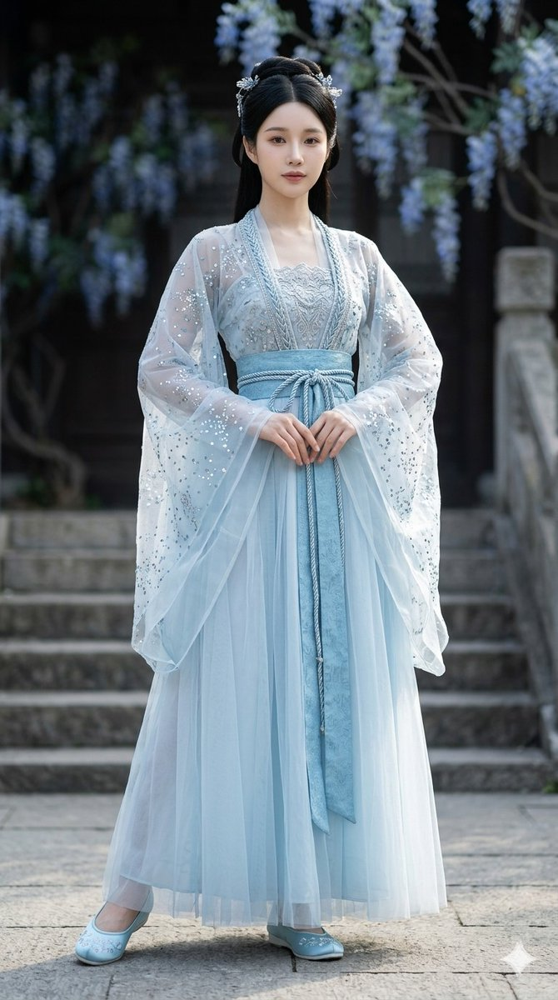

## 大唐玄武门之变的朋友圈

- ID: case-167
- Slug: case-167-zh
- 语言: zh
- 来源: [来源链接](https://x.com/Tz_2022/status/2046523491940225366)
- 样例图路径: images/part2/case167.jpg

### 提示词

```text
[中文]
玄武门之变的朋友圈

[English]
WeChat Moments of the Xuanwu Gate Incident
```

### 样例图


## 界面交互设计图

- ID: case-159
- Slug: case-159-zh
- 语言: zh
- 来源: [来源链接](https://x.com/onlyhuman028)
- 样例图路径: images/part2/case159.jpg

### 提示词

```text
{
  "type": "e-commerce livestream UI mockup",
  "subject": {
    "description": "photorealistic young Asian woman, sweaty glowing skin, long dark wavy hair, wearing a white short-sleeve polo shirt and white pleated tennis skirt, holding a white tennis racket over her right shoulder, looking directly at camera, studio lighting, white background"
  },
  "layout": {
    "top_header": {
      "host_info": {
        "name": "{argument name=\"host name\" default=\"小鹿运动优选\"}",
        "stats": "12.8万本场点赞",
        "button": "关注"
      },
      "rank_tag": "带货榜第3名",
      "viewer_stats": "1.2万"
    },
    "top_right": {
      "coupon": {
        "title": "直播间专属券",
        "value": "￥20 满199可用",
        "button": "领取"
      }
    },
    "left_overlay": {
      "title": "{argument name=\"campaign title\" default=\"夏日运动季\"}",
      "subtitle": "{argument name=\"campaign subtitle\" default=\"活力开场\"}",
      "bullet_points": {
        "count": 3,
        "items": ["透气速干", "弹力舒适", "运动百搭"]
      }
    },
    "right_overlay": {
      "product_cards": {
        "count": 2,
        "card_1": {
          "status": "正在讲解",
          "image": "white polo shirt and skirt flat lay",
          "title": "{argument name=\"product name\" default=\"运动POLO衫套装\"}",
          "details": "白色·M码",
          "price": "{argument name=\"price\" default=\"￥129\"}",
          "button": "去抢购"
        },
        "card_2": {
          "status": "热卖 x 156",
          "image": "miniature of main model",
          "title": "运动POLO衫套装女",
          "details": "透气速干 显瘦百搭",
          "price": "{argument name=\"price\" default=\"￥129\"}",
          "button": "抢"
        }
      }
    },
    "bottom_left": {
      "chat_messages": {
        "count": 5,
        "description": "scrolling chat messages with usernames and comments"
      },
      "purchase_alert": "用户_6789 等3人 正在去购买"
    },
    "bottom_bar": {
      "input_field": "说点什么...",
      "icons": {
        "count": 5,
        "types": ["smile", "shopping cart", "heart", "gift", "more"]
      }
    }
  }
}
```

### 样例图

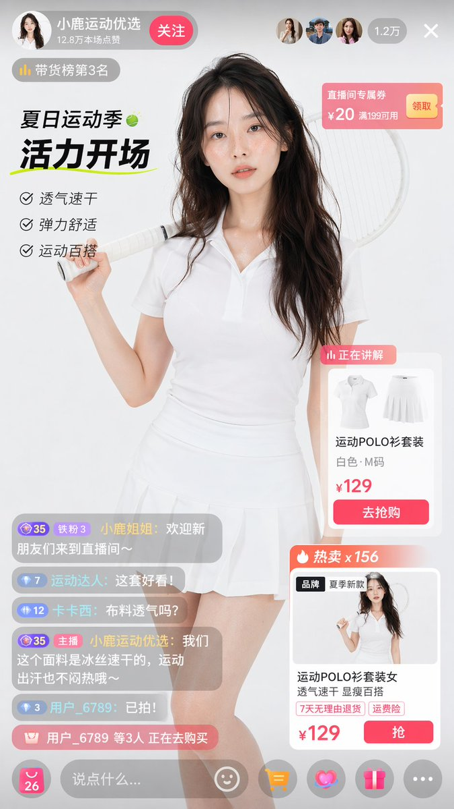

## 界面交互设计图

- ID: case-158
- Slug: case-158-zh
- 语言: zh
- 来源: [来源链接](https://x.com/coconut_256)
- 样例图路径: images/part2/case158.jpg

### 提示词

```text
{
  "type": "e-commerce live stream interface mockup",
  "subject": {
    "description": "young Asian woman, long wavy dark hair, wearing a white short-sleeve polo shirt and white pleated tennis skirt, holding a white tennis racket over her right shoulder, looking directly at the camera with a soft expression",
    "background": "soft light grey studio background"
  },
  "layout": {
    "header": {
      "left": {
        "avatar": "female portrait",
        "name": "{argument name=\"host name\" default=\"小鹿运动优选\"}",
        "stats": "12.8万本场点赞",
        "button": "关注",
        "badge": "带货榜第3名"
      },
      "right": {
        "viewer_avatars_count": 3,
        "viewer_count": "1.2万",
        "close_icon": "X"
      }
    },
    "floating_elements": [
      {
        "position": "top right",
        "type": "coupon card",
        "title": "直播间专属券",
        "details": "¥20 满199可用",
        "button": "领取"
      },
      {
        "position": "mid left",
        "type": "campaign text",
        "subtitle": "夏日运动季",
        "headline": "{argument name=\"main headline\" default=\"活力开场\"}",
        "bullet_points_count": 3,
        "bullet_points": ["透气速干", "弹力舒适", "运动百搭"]
      },
      {
        "position": "mid right",
        "type": "product card active",
        "badge": "正在讲解",
        "image": "white polo and skirt flat lay",
        "title": "{argument name=\"product name\" default=\"运动POLO衫套装\"}",
        "details": "白色·M码",
        "price": "{argument name=\"price\" default=\"¥129\"}",
        "button": "去抢购"
      },
      {
        "position": "bottom right",
        "type": "product card secondary",
        "badge": "热卖 x 156",
        "image": "model wearing the outfit",
        "title": "运动POLO衫套装女 透气速干 显瘦百搭",
        "tags": ["7天无理由退货", "运费险"],
        "price": "¥129",
        "button": "抢"
      }
    ],
    "chat_overlay": {
      "position": "bottom left",
      "message_count": 5,
      "messages": [
        "小鹿姐姐: 欢迎新朋友们来到直播间~",
        "运动达人: {argument name=\"chat message\" default=\"这套好看!\"}",
        "卡卡西: 布料透气吗?",
        "小鹿运动优选: 我们这个面料是冰丝速干的，运动出汗也不闷热哦~",
        "用户_6789: 已拍!"
      ],
      "purchase_alert": "用户_6789 等3人 正在去购买"
    },
    "footer": {
      "input_bar": "说点什么...",
      "icons_count": 5,
      "icons": ["smile", "shopping cart", "heart", "share", "more"]
    }
  }
}
```

### 样例图


## 电商商品展示设计

- ID: case-157
- Slug: case-157-zh
- 语言: zh
- 来源: [来源链接](https://x.com/AmberPromptai)
- 样例图路径: images/part2/case157.jpg

### 提示词

```text
{
  "type": "e-commerce product infographic",
  "theme": "dark mode with {argument name=\"accent color\" default=\"orange\"} accents",
  "product": {
    "brand": "{argument name=\"brand name\" default=\"MEAN WELL\"}",
    "model": "{argument name=\"product model\" default=\"ELG-100-24B\"}",
    "description": "100W Constant Current LED Driver, rectangular silver metal housing with black cables on both ends and detailed specification label"
  },
  "layout": {
    "sections": [
      {
        "name": "Hero Section",
        "elements": [
          "Brand logo top left",
          "Headline: '{argument name=\"main headline\" default=\"Stable Power For Outdoors\"}'",
          "Subtext: Wide input voltage, protected housing...",
          "Large angled product shot",
          "Faded '100W' watermark in background"
        ]
      },
      {
        "name": "Feature Highlights",
        "count": 3,
        "panels": [
          { "title": "Precision Build", "visual": "Close-up of the specification label" },
          { "title": "Secure Connection", "visual": "Close-up of the cable entry and mounting ear" },
          { "title": "Key Features", "visual": "Angled product shot with 3 callout lines pointing to text: '100~305VAC Input', 'Constant Current', 'IP67 / IP65 Housing'" }
        ]
      },
      {
        "name": "Applications",
        "count": 4,
        "panels": [
          { "title": "For Street Lighting", "visual": "Nighttime highway illuminated by streetlights" },
          { "title": "For Outdoor Projects", "visual": "Modern building exterior with architectural landscape lighting" },
          { "title": "For Indoor Systems", "visual": "Modern commercial hallway with linear ceiling lights" },
          { "title": "For Dimming Control", "visual": "Electrical control box with 4 labels: '0-10V', 'PWM', 'RESISTOR', 'DALI'" }
        ]
      },
      {
        "name": "Environmental Protection",
        "elements": [
          "Product resting on a wet surface with water droplets and rain effect",
          "Headline: 'Protected Performance'",
          "Description text about indoor/outdoor use and active PFC",
          "Badge: '{argument name=\"warranty years\" default=\"5\"}-Year Warranty'"
        ]
      },
      {
        "name": "Technical Specifications",
        "elements": [
          "Headline: 'Lighting Power Technology'",
          "4 checkmark bullet points: '100~305VAC Input', 'Active PFC', 'Low Standby <0.5W', '0~10V / PWM / Resistor / DALI'",
          "Product shot glowing on a high-tech circuit board background"
        ]
      }
    ]
  }
}
```

### 样例图


## 直播界面设计图

- ID: case-152
- Slug: case-152-zh
- 语言: zh
- 来源: [来源链接](https://x.com/coder_left)
- 样例图路径: images/part2/case152.jpg

### 提示词

```text
{
  "type": "e-commerce livestream screenshot mockup",
  "scene": {
    "subject": "{argument name=\"main subject\" default=\"Caucasian male resembling Sam Altman\"}",
    "clothing": "dark green crewneck sweater",
    "action": "holding a black product box in one hand and pointing at it with the other",
    "setting": "dark studio with a microphone on the left, faint 'AI' text in the background",
    "props": [
      "black mug with white OpenAI logo",
      "stack of 4 black product boxes on the right"
    ]
  },
  "product_design": {
    "box_color": "black",
    "logo": "orange asterisk or sunburst",
    "text": "{argument name=\"product name\" default=\"Claude Opus 4.7\"}"
  },
  "ui_overlays": {
    "top_left_product_info": {
      "brand_tag": "Anthropic 官方旗舰店",
      "title": "{argument name=\"product name\" default=\"Claude Opus 4.7\"}",
      "subtitle": "{argument name=\"main headline\" default=\"更强推理·更高智能\"}",
      "sub_subtitle": "最强大模型: Opus 4.7 重磅发布!",
      "bullet_points_count": 3,
      "bullet_points": ["超强推理能力", "代码能力巅峰", "复杂任务轻松搞定"]
    },
    "top_right_live_status": {
      "viewer_info": "直播中 | 52.8万人观看",
      "promo_banner": "直播专属福利 限时折扣·错过不再有",
      "countdown": "倒计时 00:09:47"
    },
    "middle_right_price_card": {
      "header": "{argument name=\"product name\" default=\"Claude Opus 4.7\"} 直播间专享价",
      "price_currency": "¥",
      "price_value": "{argument name=\"promotional price\" default=\"0.47\"}",
      "price_unit": "/百万tokens起",
      "original_price": "原价: ¥1.89",
      "button": "立即抢购"
    },
    "bottom_left_chat": {
      "message_count": 9,
      "input_box_placeholder": "说点什么..."
    },
    "bottom_right_banner": {
      "headline": "奥特曼首推！认准Claude Opus 4.7",
      "subheadline": "更智能 · 更安全 · 更可靠",
      "feature_tags_count": 4,
      "feature_tags": ["强大推理", "代码神器", "安全可靠", "极速响应"]
    },
    "floating_elements": [
      {
        "type": "sticker",
        "position": "middle right over product boxes",
        "text": "{argument name=\"sticker text\" default=\"史上最强 AI模型!\"}"
      }
    ]
  }
}
```

### 样例图

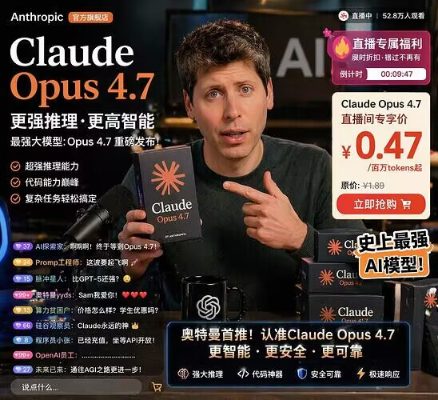

## 直播界面设计图

- ID: case-149
- Slug: case-149-zh
- 语言: zh
- 来源: [来源链接](https://x.com/JCutcut47692)
- 样例图路径: images/part2/case149.jpg

### 提示词

```text
{
  "type": "mobile livestream e-commerce interface mockup",
  "subject": {
    "person": "Elon Musk",
    "clothing": "black t-shirt with SPACEX logo",
    "pose": "gesturing towards camera with both hands, explaining enthusiastically",
    "watermark": "@Proof AI"
  },
  "background": {
    "setting": "large display screen",
    "image": "Mars landscape with Starship rocket and dome habitats",
    "text": [
      "SPACEX",
      "{argument name=\"background title\" default=\"移民火星计划\"}"
    ]
  },
  "ui_layout": {
    "header": {
      "broadcaster_info": {
        "name": "{argument name=\"broadcaster name\" default=\"ElonMusk\"}",
        "stats": "75.8万本场点赞",
        "follow_button": "关注"
      },
      "viewer_stats": {
        "avatars_count": 3,
        "text": "10万+",
        "close_button": "X"
      },
      "tags": [
        "带货总榜第1名",
        "更多直播 >"
      ]
    },
    "product_card": {
      "position": "mid-right",
      "status": "讲解中",
      "image": "Mars dome habitats",
      "title": "{argument name=\"product title\" default=\"火星移民基础套餐\"}",
      "price": "{argument name=\"product price\" default=\"¥99.00\"}",
      "action_button": "抢"
    },
    "chat_overlay": {
      "position": "bottom-left",
      "join_alert": "星辰大海 加入了直播间",
      "messages_count": 7,
      "messages": [
        "{argument name=\"top chat message\" default=\"梦想家: 支持马斯克！！🚀\"}",
        "火星弟弟: 多少钱一位？",
        "科技迷: 太酷了！想去火星！",
        "未来已来: 如何报名？",
        "小火箭: 🌹🌹🌹",
        "宇宙无敌: 讲解一下细节",
        "东方不败: 老马牛逼！👍👍👍"
      ]
    },
    "bottom_action_bar": {
      "input_placeholder": "说点什么...",
      "icons_count": 4,
      "icons": ["shopping cart", "gift box", "heart planet", "plus sign"]
    },
    "floating_reactions": {
      "position": "bottom-right",
      "elements": "stack of floating hearts, thumbs up, and laughing emojis"
    }
  }
}
```

### 样例图


## 品牌徽标设计图

- ID: case-143
- Slug: case-143-zh
- 语言: zh
- 来源: [来源链接](https://x.com/Gc_qube)
- 样例图路径: images/part2/case143.jpg

### 提示词

```text
A photorealistic amateur photograph of a custom building block set resting on a light wood grain table in a living room. In the background stands a large product box with a red logo reading "{argument name="brand name" default="BRICKLY"} BUILDING SETS". The box features text reading "8+", "540 PCS", "5 FIGURES", and the main large title "{argument name="set title" default="WATTERSON FAMILY HOUSE"}". A red circular badge on the box reads "CUSTOM SET FAN DESIGN", and the box art depicts the house and characters under a blue sky. In the foreground sits the fully assembled block model of a {argument name="house color" default="blue"} two-story suburban house with a brown roof, white porch, red steps, a white picket fence, and a blocky green tree. To the left of the house is a built block model of a {argument name="car color" default="pink"} station wagon. Standing in a row in front of the house are exactly 5 custom block minifigures: a blue cat in tan pants, an orange fish with legs, a tall pink rabbit in a white shirt and tie, a blue cat in a white shirt, and a small pink rabbit in an orange dress. The background is a slightly blurred living room with a grey sofa and white blinds.
```

### 样例图

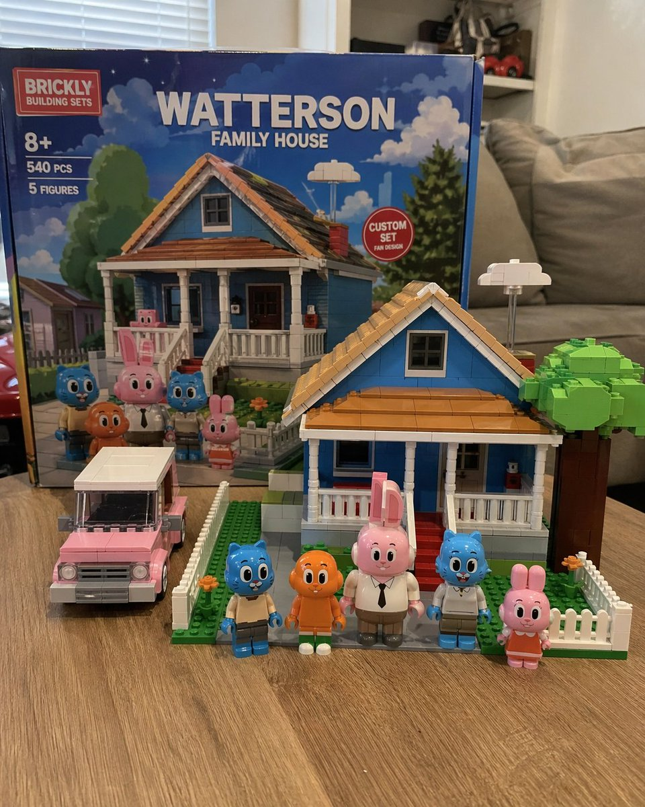

## 应用界面样机图

- ID: case-135
- Slug: case-135-zh
- 语言: zh
- 来源: [来源链接](https://x.com/ryuya__31)
- 样例图路径: images/part2/case135.jpg

### 提示词

```text
{
  "type": "website landing page mockup",
  "theme": "men's skincare, sleek, professional, dark mode",
  "color_palette": "{argument name=\"color scheme\" default=\"dark navy blue\"}, white text, subtle blue gradients",
  "header": {
    "logo": "{argument name=\"brand name\" default=\"NEX SKIN\"}",
    "navigation": ["HOME", "PRODUCT", "ABOUT", "FEATURE", "FAQ"],
    "cta_button": "今すぐ始める >"
  },
  "hero_section": {
    "left_column": {
      "headline": "{argument name=\"main headline\" default=\"清潔感は、毎日のスキンケアから。\"}",
      "sub_headline": "男の肌は、もっとシンプルでいい。",
      "body_text": "3 lines of descriptive text about skincare benefits",
      "buttons": [
        {"style": "solid blue", "text": "今すぐ始める >"},
        {"style": "outlined", "text": "詳しく見る >"}
      ],
      "feature_highlights": {
        "count": 3,
        "items": [
          {"icon": "sparkle", "title": "テカリ対策", "subtitle": "皮脂バランスを整える"},
          {"icon": "water drop", "title": "保湿", "subtitle": "うるおいを与え続ける"},
          {"icon": "shield/bottle", "title": "オールインワン", "subtitle": "化粧水・美容液・乳液がこれ1本"}
        ]
      }
    },
    "center_image": {
      "subject": "handsome {argument name=\"target demographic\" default=\"young Asian man\"}",
      "appearance": "clean-cut, dark hair, flawless glowing skin, wearing a black shirt",
      "pose": "hand touching chin thoughtfully",
      "lighting": "dramatic studio lighting highlighting facial structure"
    },
    "right_column": {
      "product_shot": {
        "bottle": "tall cylindrical dark blue bottle with water droplets",
        "labels": ["{argument name=\"brand name\" default=\"NEX SKIN\"}", "{argument name=\"product type\" default=\"ALL-IN-ONE LOTION\"}", "150mL"],
        "base": "textured dark rock surface",
        "badge": "circular outlined badge reading 'これ1本で男の肌悩みをトータルケア'"
      }
    }
  },
  "bottom_stats_bar": {
    "count": 3,
    "items": [
      {"icon": "users", "label": "累計販売本数", "value": "120万本突破"},
      {"icon": "star", "label": "使用感満足度", "value": "92.1%"},
      {"icon": "checklist", "label": "リピート率", "value": "85.3%"}
    ],
    "footnotes": "small legal text on the right"
  }
}
```

### 样例图

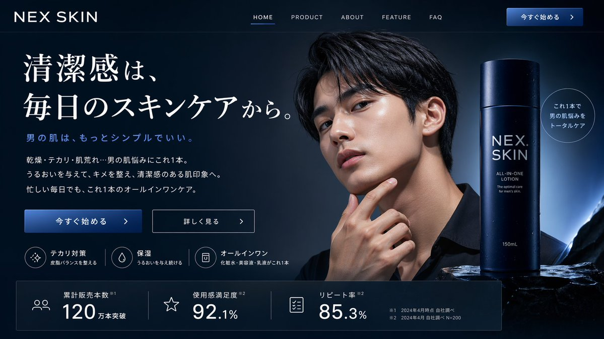

## 界面交互设计图

- ID: case-133
- Slug: case-133-zh
- 语言: zh
- 来源: [来源链接](https://x.com/yyyole)
- 样例图路径: images/part2/case133.jpg

### 提示词

```text
{
  "type": "brand identity system presentation board",
  "header": {
    "title": "品牌视觉识别系统 BRAND IDENTITY SYSTEM",
    "slogan": "爱它·懂它·陪伴它"
  },
  "main_logo": {
    "text": "{argument name=\"brand name\" default=\"GDX\"}",
    "subtitle": "{argument name=\"brand chinese name\" default=\"狗东西\"}",
    "design_feature": "{argument name=\"main subject\" default=\"Dog profile in negative space of the letter D\"}",
    "metadata": [
      "品牌名称",
      "行业属性 {argument name=\"industry\" default=\"宠物行业\"}",
      "设计时间 2024.05"
    ]
  },
  "layout": {
    "sections": [
      {
        "title": "设计网格",
        "count": 1,
        "description": "Logo with architectural grid lines and golden ratio measurements"
      },
      {
        "title": "概念草图",
        "count": 4,
        "description": "Evolution steps from rough dog sketch to final geometric logo"
      },
      {
        "title": "灵感来源",
        "count": 4,
        "description": "Moodboard images including minimalist architecture, a golden retriever, and dark green geometric shapes"
      },
      {
        "title": "创意理念",
        "count": 4,
        "description": "Text blocks with minimalist icons explaining design philosophy, positioning, color psychology, and scalability"
      },
      {
        "title": "品牌应用",
        "count": 6,
        "labels": [
          "名片 正反面",
          "信纸信封",
          "APP图标",
          "网站页眉 / 网站图标",
          "产品包装 / 购物袋",
          "店面门头 / 标识牌"
        ],
        "description": "Mockups of business cards, envelopes, app icons, website header with a dog, paper shopping bags, and a storefront sign"
      },
      {
        "title": "色彩规范",
        "count": 5,
        "labels": [
          "主色",
          "辅助色",
          "强调色"
        ],
        "colors": [
          "{argument name=\"primary color\" default=\"#1E3D34\"}",
          "#F5F3EF",
          "#E5E2DD",
          "#A8C5B1",
          "#E0A86E"
        ]
      },
      {
        "title": "字体规范",
        "count": 2,
        "labels": [
          "思源黑体 CN",
          "思源柔黑体 CN"
        ],
        "description": "Typography specimens showing 'Aa', alphabet, and numbers"
      },
      {
        "title": "最小使用尺寸",
        "count": 2,
        "description": "Minimum logo size specifications at 20mm and 12mm"
      },
      {
        "title": "安全留白区域",
        "count": 1,
        "description": "Logo surrounded by a bounding box with 'X' indicating clear space margins"
      },
      {
        "title": "错误使用示例",
        "count": 5,
        "labels": [
          "不可拉伸变形",
          "不可改变颜色",
          "不可添加阴影",
          "不可倾斜使用",
          "不可复杂背景上使用"
        ],
        "description": "Examples of incorrect logo usage: stretched, wrong color, drop shadow, tilted, and placed on a busy photographic background"
      }
    ]
  }
}
```

### 样例图

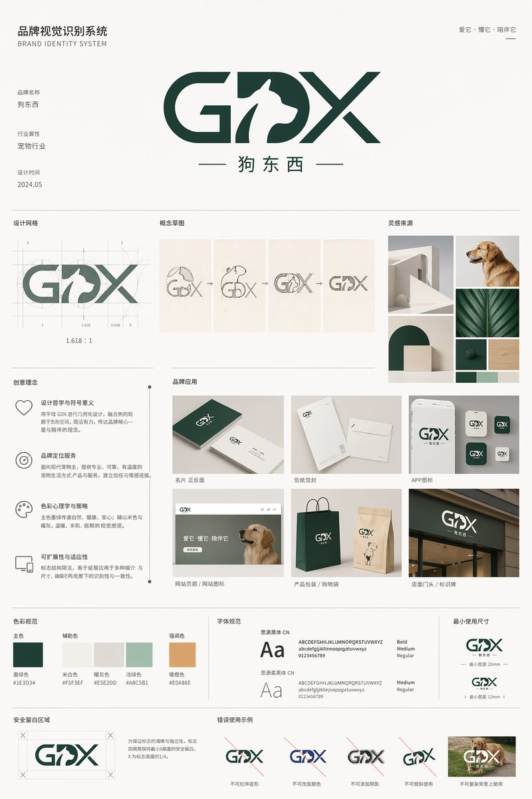

## 界面交互设计图

- ID: case-131
- Slug: case-131-zh
- 语言: zh
- 来源: [来源链接](https://x.com/IndieDevHailey)
- 样例图路径: images/part2/case131.jpg

### 提示词

```text
{
  "type": "UI/UX landing page mockup",
  "theme": "dark mode, sleek modern aesthetic, glassmorphism, {argument name=\"primary accent color\" default=\"neon purple and blue\"} glowing accents",
  "header": {
    "logo": "{argument name=\"brand name\" default=\"goViralX\"}",
    "top_right_tag": "VIRAL CAMPAIGN CASE STUDY"
  },
  "layout": {
    "sections": [
      {
        "name": "Hero",
        "headline": "{argument name=\"hero headline\" default=\"How We Created 10M+ Viral Impact\"}",
        "subheadline": "3天引爆全网, 助力品牌实现指数级增长",
        "stats_row": {
          "count": 4,
          "labels": ["总播放量", "互动率", "转化咨询", "执行周期"],
          "values": ["{argument name=\"main statistic\" default=\"10,240,000+\"}", "18.7%", "3,200+", "72小时"]
        },
        "visual": "cinematic shot of a person in a hoodie looking at glowing digital screens and graphs, large play button overlay"
      },
      {
        "name": "Strategy",
        "title": "Our 3-Day Execution Strategy",
        "layout_type": "vertical timeline",
        "steps_count": 3,
        "elements_per_step": ["timeline node", "title", "bullet points", "video thumbnail with play button", "description box"]
      },
      {
        "name": "Performance",
        "title": "Data-Driven Performance",
        "left_column": {
          "stat_cards_count": 4,
          "values": ["10M+", "43%", "28,000+", "3,200+"]
        },
        "right_column": {
          "charts_count": 2,
          "chart_1": "line graph showing 7-day growth peaking at Day 3",
          "chart_2": "horizontal segmented bar chart showing platform distribution (TikTok 52%, Instagram 24%, X 15%, YouTube 9%)"
        }
      },
      {
        "name": "Keys to Success",
        "title": "The 3 Keys to Viral Success",
        "cards_count": 3,
        "card_elements": ["glowing icon (fire, target, antenna)", "title", "description", "VIEW DETAIL link"]
      },
      {
        "name": "Social Proof",
        "title": "TRUSTED BY CREATORS & BRANDS",
        "left_column": {
          "logos_count": 8,
          "grid": "2x4",
          "brands": ["SHEIN", "SHOPLINE", "Blueglass", "instacart", "lemon8", "mi", "CIDER", "bellroy"]
        },
        "right_column": {
          "testimonial_cards_count": 2,
          "elements": ["quote", "author title (SaaS Founder, Growth Manager)"]
        }
      },
      {
        "name": "Call to Action",
        "title": "READY TO GO VIRAL?",
        "interactive_elements": ["text input field", "glowing button with text '{argument name=\"call to action text\" default=\"获取专属增长方案 ->\"}'"],
        "visual": "3D render of a rocket ship taking off with purple and blue flames"
      }
    ]
  }
}
```

### 样例图


## 界面交互设计图

- ID: case-130
- Slug: case-130-zh
- 语言: zh
- 来源: [来源链接](https://x.com/chi_vc_)
- 样例图路径: images/part2/case130.jpg

### 提示词

```text
{
  "type": "brand identity and merchandise design board",
  "theme": {
    "color_palette": "{argument name=\"theme color\" default=\"pastel pink\"} and white",
    "motif": "{argument name=\"motif\" default=\"cherry blossoms\"} and pink hearts"
  },
  "character": {
    "description": "anime girl with short brown bob hair, pink eyes, wearing a white hoodie, gentle smile"
  },
  "branding": {
    "main_logo": "{argument name=\"character name\" default=\"癒音ちー\"}",
    "sub_logo": "{argument name=\"character subtext\" default=\"ゆおんちー\"}"
  },
  "layout": {
    "sections": [
      {
        "type": "header banner",
        "position": "top",
        "elements": ["large main logo", "sub logo", "cherry blossom graphics", "character portrait on the right"]
      },
      {
        "type": "product packaging",
        "position": "middle left",
        "elements": ["1 square box with heart-shaped transparent window showing pink heart candies", "character illustration on box", "2 individual candy wrappers", "5 scattered heart candies"]
      },
      {
        "type": "promotional poster",
        "position": "middle right",
        "elements": ["character portrait", "heart-shaped candy bowl", "main logo", "text '4.26 NEW OPEN'", "text '{argument name=\"social handle\" default=\"@yuonchii\"}'"]
      },
      {
        "type": "horizontal web banner",
        "position": "lower middle",
        "elements": ["main logo", "cherry blossoms", "character portrait on the right"]
      },
      {
        "type": "social media profile mockup",
        "position": "bottom left",
        "elements": ["header image with logo", "1 circular profile picture", "handle '{argument name=\"social handle\" default=\"@yuonchii\"}'", "1 follow button", "mock bio text"]
      },
      {
        "type": "merchandise collection",
        "position": "bottom right",
        "count": 9,
        "items": ["1 white t-shirt with logo", "1 white mug with character", "4 round pin badges", "1 acrylic keychain", "2 candy packets"]
      }
    ]
  }
}
```

### 样例图


## 主题海报版式设计

- ID: case-124
- Slug: case-124-zh
- 语言: zh
- 来源: [来源链接](https://x.com/koshian_to)
- 样例图路径: images/part2/case124.jpg

### 提示词

```text
An anime-style key visual poster for a fictional slice-of-life anime. In the foreground left, an energetic blonde anime girl with star hairpins and blue eyes wears an {argument name="main character outfit" default="American flag t-shirt and denim shorts"}, holding tongs with a slice of smoked meat towards the viewer. In the foreground right, a gentle girl with long dark hair and a white sweater sits at a wooden table writing in a notebook. In the background, two more girls are present: one with a brown ponytail carrying firewood, and another with short silver hair holding a blue mug. The scene is a sunny outdoor BBQ area with a large black smoker grill featuring a sign that reads {argument name="background grill sign" default="LONE STAR BBQ"}. In the immediate foreground is a {argument name="food platter" default="massive wooden platter loaded with sliced brisket, ribs, sausages, burnt ends, and pickles"}, along with side dishes like coleslaw and bread. In the top left corner, a large, cute, bubbly anime logo reads {argument name="anime title" default="もくもく すもーく ガールズ"} with smoke and grill motifs. In the bottom left corner, there is a {argument name="credits text block" default="staff credits block with names and roles"}. In the bottom right corner, a small text box lists four character names. The overall atmosphere is cheerful, highly detailed, and vibrant.
```

### 样例图

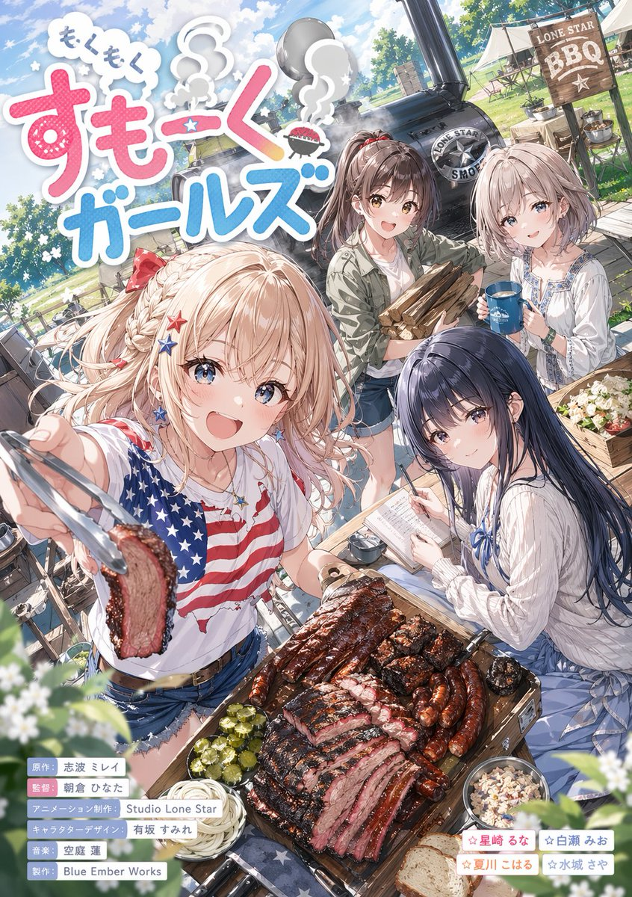

## 主题海报版式设计

- ID: case-117
- Slug: case-117-zh
- 语言: zh
- 来源: [来源链接](https://x.com/nicdunz)
- 样例图路径: images/part2/case117.jpg

### 提示词

```text
A humorous 3D cartoon illustration of a therapy session in a cozy office. On the left, a {argument name="patient character" default="sad anthropomorphic avocado half missing its pit"} sits on a brown leather lounge chair, gesturing with its thin stick-like arms. A large speech bubble above it reads "{argument name="speech text" default="I just feel so empty inside"}". On the right, the therapist, an {argument name="therapist character" default="anthropomorphic silver spoon"}, sits in a green armchair, holding a yellow pencil and writing on a notepad labeled "NOTES". The room has warm lighting, a beige rug on a wooden floor, and a bookshelf with a tissue box and books, one titled "REFLECT LISTEN VALIDATE". On the left wall hangs a framed poster reading "{argument name="poster text" default="IT'S OKAY TO FEEL YOUR FEELINGS"}" with a small heart. On the right wall hangs a framed diploma reading "{argument name="diploma text" default="SPOON UNIVERSITY SCHOOL OF LISTENING & VALIDATION"}" featuring a small spoon illustration and a gold seal.
```

### 样例图


## 动漫插画创作图

- ID: case-113
- Slug: case-113-zh
- 语言: zh
- 来源: [来源链接](https://x.com/REd8358)
- 样例图路径: images/part2/case113.jpg

### 提示词

```text
A highly detailed anime illustration of a fierce female warrior with long flowing {argument name="hair color" default="black"} hair and piercing {argument name="eye color" default="blue"} eyes, wearing a mix of silver plate armor with gold trim and a {argument name="outfit color" default="blue and white"} tunic. She is captured in a dynamic combat stance, swinging a massive, {argument name="weapon type" default="segmented metallic whip-sword"} that curves dramatically into the extreme foreground. The weapon leaves a sweeping trail of kinetic energy and wind. The scene is set against a {argument name="background setting" default="ruined battlefield with rocky terrain, floating debris, and large blue banners fluttering in the wind"} under a dramatic cloudy sky. The artwork features cinematic lighting, intense action, and a dramatic forced perspective on the weapon.
```

### 样例图


## 应用界面样机图

- ID: case-106
- Slug: case-106-zh
- 语言: zh
- 来源: [来源链接](https://x.com/abdiisan)
- 样例图路径: images/part2/case106.jpg

### 提示词

```text
{
  "type": "YouTube thumbnail graphic",
  "style": "anime, edgy, neon pink and black color scheme, grunge and splatter accents",
  "character": {
    "appearance": "anime girl, {argument name=\"hair color\" default=\"silver\"} hair, cat ears, purple eyes",
    "expression": "{argument name=\"expression\" default=\"shocked and sweating\"}, mouth open",
    "accessories": "black cat hairclip with pink cross, black choker with heart ring",
    "action": "holding a pink smartphone with a swirl logo"
  },
  "layout": {
    "main_title": {
      "position": "bottom center",
      "style": "huge, bold, 3D typography, grunge texture",
      "lines": [
        { "text": "{argument name=\"main title top\" default=\"스레드 논란\"}", "color": "neon pink" },
        { "text": "{argument name=\"main title bottom\" default=\"읽어드림 ;;\"}", "color": "white" }
      ]
    },
    "ui_elements": [
      {
        "type": "social media feed mockup",
        "position": "mid-left",
        "header": "← 스레드",
        "post_count": 3,
        "details": "avatars, Korean text, interaction icons for like, comment, repost"
      },
      {
        "type": "live chat mockup",
        "position": "right edge",
        "message_count": 4,
        "details": "pink user icons, Korean text"
      }
    ],
    "text_callouts": [
      {
        "type": "spiky speech bubble",
        "position": "center top",
        "text": "{argument name=\"speech bubble text\" default=\"이게 맞아?;;\"}"
      },
      {
        "type": "neon box",
        "position": "top right",
        "text": "실시간 반응 중"
      },
      {
        "type": "floating grunge text",
        "position": "far left",
        "line_count": 3,
        "text": ["OO 논란", "충격 실화", "역대급 사건"]
      },
      {
        "type": "handwritten text with arrow",
        "position": "bottom right",
        "text": "여러분의 생각은 어떠신가요?"
      }
    ],
    "logos": [
      {
        "type": "app icon",
        "position": "top left",
        "description": "white swirl logo on black rounded square"
      }
    ]
  }
}
```

### 样例图


## 主题海报版式设计

- ID: case-100
- Slug: case-100-zh
- 语言: zh
- 来源: [来源链接](https://x.com/naga_zyashin)
- 样例图路径: images/part2/case100.jpg

### 提示词

```text
{
  "type": "promotional banner thumbnail",
  "style": "vibrant neon, cosmic galaxy background, anime illustration style, high-density Japanese typography, glowing text effects",
  "character": {
    "description": "smiling young woman pointing upwards with right index finger",
    "appearance": "long {argument name=\"character hair color\" default=\"brown\"} hair, purple drop earrings, textured purple sweater",
    "position": "right side"
  },
  "layout": {
    "background": "purple, pink, and blue starry space nebula",
    "center_typography": {
      "top_small_text": "何から始めるか迷う人へ",
      "main_title": "{argument name=\"main title\" default=\"初心者でもわかる AI副業\"}",
      "subtitle": "最初の1本におすすめ",
      "floating_text_near_character": "やさしく解説♡"
    },
    "top_left": {
      "yellow_ribbon": "{argument name=\"top left ribbon text\" default=\"ゼロから始める\"}"
    },
    "top_right": {
      "pink_circle_badge": "初心者 OK"
    },
    "left_column": {
      "count": 7,
      "description": "stack of pill-shaped badges",
      "labels": [
        "スマホでもOK (with phone icon)",
        "副業デビューに (with beginner mark icon)",
        "具体例つき",
        "テンプレ付き",
        "おすすめツール紹介",
        "収益化の流れ",
        "失敗しない始め方"
      ]
    },
    "bottom_left_graphics": {
      "count": 3,
      "items": [
        "laptop displaying an AI circuit brain graphic",
        "glowing lightbulb",
        "rocket ship taking off"
      ]
    },
    "bottom_center": {
      "large_purple_button": "{argument name=\"bottom center button text\" default=\"完全解説\"}",
      "checklist_text_below": "✓始め方 ✓稼ぎ方 ✓注意点 ✓続け方まで全部わかる！"
    },
    "bottom_right": {
      "pink_cloud_shape": {
        "count": 3,
        "bullet_points": [
          "✓難しい知識不要",
          "✓今日から始められる",
          "✓やさしく丁寧に解説"
        ]
      },
      "gold_medal_seal": "保存版",
      "purple_badge": "{argument name=\"year badge text\" default=\"2026年 最新版\"}"
    }
  }
}
```

### 样例图


## 关系图谱信息图

- ID: case-87
- Slug: case-87-zh
- 语言: zh
- 来源: [来源链接](https://x.com/MrLarus)
- 样例图路径: images/part2/case87.jpg

### 提示词

```text
Please generate a high-design character relationship map poster based on {argument name="theme" default="Demon Slayer"}. This image should not be a simple illustration, but a character relationship map that combines information visualization, narrative structure, poster design sense, and stylistic fidelity.

Please automatically complete the following:
- Identify the work and core settings corresponding to the theme
- Extract the most representative 6–12 key characters, not exceeding 15 if necessary
- Identify and display key character relationships, including blood ties, romance, friendship, alliances, hostility, master-disciple, etc.
- Automatically choose a composition method based on the work's characteristics, such as protagonist-centered, dual-core confrontation, faction-based, family tree, or chronological evolution
- Automatically refine the work's style DNA, including color, worldview symbols, textures, mood, typography, and representative elements
- Transform these stylistic elements into an overall visual design for the relationship map, rather than simply copying an official poster
- Use different colors, line types, and arrows to distinguish different relationships, ensuring clear lines and layers without clutter
- Make core characters most prominent, followed by important characters, and subordinate characters weakened to form a clear visual hierarchy
- Ensure every character name is legible, with identity or faction labels if necessary

The final product should satisfy:
- Immediate understanding of character hierarchy and key relationships
- Obvious alignment with the original work's temperament and setting
- Combines the clarity of an infographic with the premium design of a poster
- Unified, exquisite, complete, and suitable for social media sharing or poster display
- Avoids a cheap flowchart feel, messy piling, and information overload.
```

### 样例图


## 关系图谱信息图

- ID: case-86
- Slug: case-86-zh
- 语言: zh
- 来源: [来源链接](https://x.com/MrLarus)
- 样例图路径: images/part2/case86.jpg

### 提示词

```text
Please generate a high-design character relationship map poster based on {argument name="theme" default="Demon Slayer"}. This image should not be a simple illustration, but a character relationship map that combines information visualization, narrative structure, poster design sense, and stylistic fidelity.

Please automatically complete the following:
- Identify the work and core settings corresponding to the theme
- Extract the most representative 6–12 key characters, not exceeding 15 if necessary
- Identify and display key character relationships, including blood ties, romance, friendship, alliances, hostility, master-disciple, etc.
- Automatically choose a composition method based on the work's characteristics, such as protagonist-centered, dual-core confrontation, faction-based, family tree, or chronological evolution
- Automatically refine the work's style DNA, including color, worldview symbols, textures, mood, typography, and representative elements
- Transform these stylistic elements into an overall visual design for the relationship map, rather than simply copying an official poster
- Use different colors, line types, and arrows to distinguish different relationships, ensuring clear lines and layers without clutter
- Make core characters most prominent, followed by important characters, and subordinate characters weakened to form a clear visual hierarchy
- Ensure every character name is legible, with identity or faction labels if necessary

The final product should satisfy:
- Immediate understanding of character hierarchy and key relationships
- Obvious alignment with the original work's temperament and setting
- Combines the clarity of an infographic with the premium design of a poster
- Unified, exquisite, complete, and suitable for social media sharing or poster display
- Avoids a cheap flowchart feel, messy piling, and information overload.
```

### 样例图

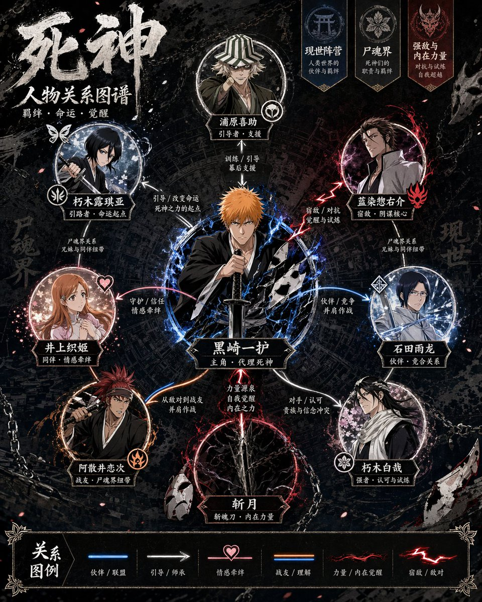

## 关系图谱信息图

- ID: case-85
- Slug: case-85-zh
- 语言: zh
- 来源: [来源链接](https://x.com/MrLarus)
- 样例图路径: images/part2/case85.jpg

### 提示词

```text
Please generate a high-design character relationship map poster based on {argument name="theme" default="Demon Slayer"}. This image should not be a simple illustration, but a character relationship map that combines information visualization, narrative structure, poster design sense, and stylistic fidelity.

Please automatically complete the following:
- Identify the work and core settings corresponding to the theme
- Extract the most representative 6–12 key characters, not exceeding 15 if necessary
- Identify and display key character relationships, including blood ties, romance, friendship, alliances, hostility, master-disciple, etc.
- Automatically choose a composition method based on the work's characteristics, such as protagonist-centered, dual-core confrontation, faction-based, family tree, or chronological evolution
- Automatically refine the work's style DNA, including color, worldview symbols, textures, mood, typography, and representative elements
- Transform these stylistic elements into an overall visual design for the relationship map, rather than simply copying an official poster
- Use different colors, line types, and arrows to distinguish different relationships, ensuring clear lines and layers without clutter
- Make core characters most prominent, followed by important characters, and subordinate characters weakened to form a clear visual hierarchy
- Ensure every character name is legible, with identity or faction labels if necessary

The final product should satisfy:
- Immediate understanding of character hierarchy and key relationships
- Obvious alignment with the original work's temperament and setting
- Combines the clarity of an infographic with the premium design of a poster
- Unified, exquisite, complete, and suitable for social media sharing or poster display
- Avoids a cheap flowchart feel, messy piling, and information overload.
```

### 样例图

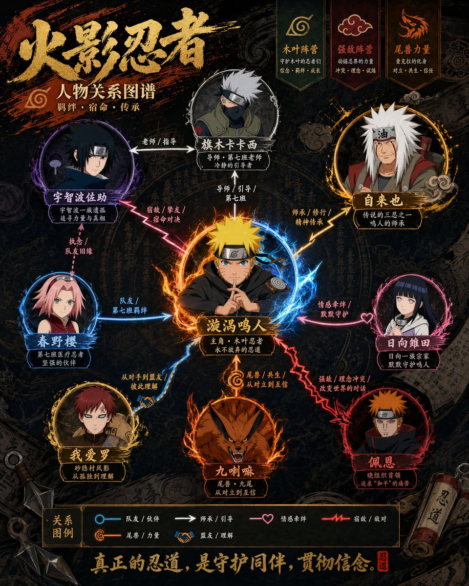

## 关系图谱信息图

- ID: case-84
- Slug: case-84-zh
- 语言: zh
- 来源: [来源链接](https://x.com/MrLarus)
- 样例图路径: images/part2/case84.jpg

### 提示词

```text
Please generate a high-design character relationship map poster based on {argument name="theme" default="Demon Slayer"}. This image should not be a simple illustration, but a character relationship map that combines information visualization, narrative structure, poster design sense, and stylistic fidelity.

Please automatically complete the following:
- Identify the work and core settings corresponding to the theme
- Extract the most representative 6–12 key characters, not exceeding 15 if necessary
- Identify and display key character relationships, including blood ties, romance, friendship, alliances, hostility, master-disciple, etc.
- Automatically choose a composition method based on the work's characteristics, such as protagonist-centered, dual-core confrontation, faction-based, family tree, or chronological evolution
- Automatically refine the work's style DNA, including color, worldview symbols, textures, mood, typography, and representative elements
- Transform these stylistic elements into an overall visual design for the relationship map, rather than simply copying an official poster
- Use different colors, line types, and arrows to distinguish different relationships, ensuring clear lines and layers without clutter
- Make core characters most prominent, followed by important characters, and subordinate characters weakened to form a clear visual hierarchy
- Ensure every character name is legible, with identity or faction labels if necessary

The final product should satisfy:
- Immediate understanding of character hierarchy and key relationships
- Obvious alignment with the original work's temperament and setting
- Combines the clarity of an infographic with the premium design of a poster
- Unified, exquisite, complete, and suitable for social media sharing or poster display
- Avoids a cheap flowchart feel, messy piling, and information overload.
```

### 样例图


## 信息图可视化设计

- ID: case-82
- Slug: case-82-zh
- 语言: zh
- 来源: [来源链接](https://x.com/HumanOS_v2)
- 样例图路径: images/part2/case82.jpg

### 提示词

```text
{
  "type": "scientific optical setup diagram",
  "main_setup": {
    "base": "optical breadboard table with grid of mounting holes",
    "beam": "red laser beam passing horizontally through all components",
    "top_grouping_brackets": [
      "{argument name=\"first component group\" default=\"Dual Modulation\"}",
      "4f Relay Optics",
      "Imaging Optics",
      "Detection"
    ],
    "components_left_to_right": [
      { "name": "Laser", "label": "{argument name=\"laser wavelength\" default=\"λ = 632.8 nm\"}", "appearance": "black rectangular box" },
      { "name": "SLM1", "label": "(Phase / Pol. Mod.)", "appearance": "black square device on post" },
      { "name": "Lens L1", "label": "(f1)", "appearance": "lens in black ring mount" },
      { "name": "Iris", "label": "Fourier Plane (Pupil Plane) / (Higher Orders Filtered)", "appearance": "black ring mount with dashed line above" },
      { "name": "HWP", "label": "(λ/2)", "appearance": "purple-tinted optic in black ring mount" },
      { "name": "Lens L2", "label": "(f1)", "appearance": "lens in black ring mount" },
      { "name": "SLM2", "label": "(Phase / Pol. Mod.)", "appearance": "black square device on post" },
      { "name": "Lens L3", "label": "(f2)", "appearance": "lens in black ring mount" },
      { "name": "Lens L4", "label": "(f2)", "appearance": "lens in black ring mount" },
      { "name": "Linear Polarizer", "label": "(Global Analyzer)", "appearance": "lens in black ring mount" },
      { "name": "Polarization Camera", "label": "POLARIZATION CAMERA", "appearance": "blue and black box camera" }
    ]
  },
  "inset_diagram": {
    "position": "bottom right, dashed border",
    "title": "{argument name=\"inset title\" default=\"Polarization Camera Micro-Polarizer Array\"} (Per-Pixel Analyzer)",
    "visuals": "4x4 grid of colored squares with white directional arrows",
    "legend_count": 4,
    "legend_labels": [
      "red right-arrow 0° (H)",
      "green up-arrow 90° (V)",
      "blue diagonal-arrow 45° (D)",
      "yellow diagonal-arrow 135° (A)"
    ]
  },
  "bottom_caption": {
    "figure_number": "Fig. 5.",
    "title": "{argument name=\"setup title\" default=\"Ellipsography Hardware Setup.\"}",
    "description": "{argument name=\"figure caption\" default=\"Our prototype display system employs a dual-modulation configuration to achieve simultaneous control of phase and polarization. A 4f relay optics setup transfers the modulated wavefront...\"}"
  }
}
```

### 样例图


## 信息图可视化设计

- ID: case-70
- Slug: case-70-zh
- 语言: zh
- 来源: [来源链接](https://x.com/hx831126)
- 样例图路径: images/part2/case70.jpg

### 提示词

```text
{
  "type": "technical infographic",
  "subject": "{argument name=\"subject matter\" default=\"digital photography process\"}",
  "header": {
    "title": "{argument name=\"main title\" default=\"一张照片诞生的因果链 THE CAUSAL CHAIN OF A PHOTOGRAPH\"}",
    "subtitle": "从世界，到图像 FROM WORLD TO IMAGE"
  },
  "centerpiece": {
    "description": "Exploded isometric view of a modern mirrorless camera",
    "model": "{argument name=\"camera model\" default=\"Canon EOS R5\"}",
    "labeled_parts_count": 12,
    "labeled_parts": [
      "EVF",
      "Body Structure",
      "Control Dials",
      "Thermal Design",
      "Optical Axis",
      "IBIS Stabilizer",
      "Shutter Unit",
      "Full-Frame Sensor",
      "{argument name=\"processor name\" default=\"DIGIC X Processor\"}",
      "Main PCB",
      "High-Speed Bus",
      "Card Slot"
    ]
  },
  "layout": {
    "left_column": {
      "description": "Chronological causal chain",
      "count": 13,
      "steps": [
        "01 REALITY EXISTS",
        "02 PHOTONS LEAVE THE WORLD",
        "03 LENS ACCEPTS & BENDS LIGHT",
        "04 APERTURE SELECTS",
        "05 SHUTTER CUTS TIME",
        "06 FOCUS SETS PRIORITY",
        "07 SENSOR RECEIVES EVENT",
        "08 LIGHT BECOMES CHARGE",
        "09 ANALOG READOUT",
        "10 A/D CONVERSION",
        "11 COMPUTATION RECONSTRUCTS",
        "12 IMAGE APPEARS",
        "13 MEMORY OUTLIVES"
      ]
    },
    "right_column": {
      "title": "八大模块 / 8 MODULES",
      "count": 8,
      "modules": [
        "1 ORIGIN OF LIGHT",
        "2 LENS SHAPES REALITY",
        "3 APERTURE & SHUTTER EDIT THE WORLD",
        "4 FOCUS DECIDES CLARITY",
        "5 SENSOR MEASURES LIGHT",
        "6 SIGNAL BORN & AMPLIFIED",
        "7 COMPUTATION BUILDS IMAGE",
        "8 FILE BECOMES MEMORY"
      ]
    },
    "side_diagrams": {
      "count": 7,
      "descriptions": [
        "Ray cone & image formation",
        "Aperture & depth of field",
        "Shutter & motion",
        "Focal plane & clarity",
        "Pixel structure",
        "Photoelectric conversion",
        "Analog signal waveform"
      ]
    },
    "footer": {
      "count": 5,
      "description": "Philosophical summary points"
    }
  },
  "style": "technical, precise, wireframe elements, glowing data lines, photorealistic camera components, clean typography, dual-language"
}
```

### 样例图

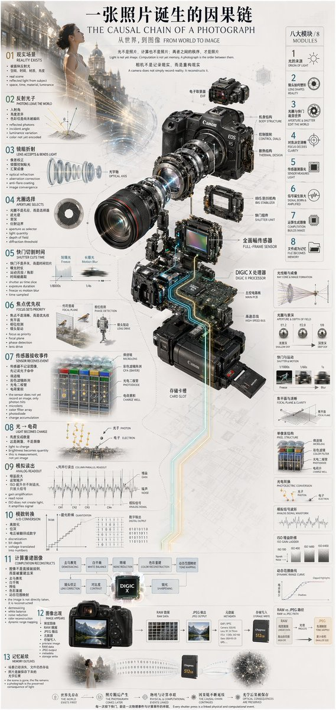

## 信息图可视化设计

- ID: case-65
- Slug: case-65-zh
- 语言: zh
- 来源: [来源链接](https://x.com/GeekCatX)
- 样例图路径: images/part2/case65.jpg

### 提示词

```text
A breathtaking and extremely complex world-building infographic masterpiece conceptualizing the "{argument name="theme" default="Fundamental Differences between Confucianism, Buddhism, and Taoism"}", designed as a profound {argument name="style" default="ancient Oriental mythological manuscript"}.
Background: Pure white vintage textured canvas with a light beige aged parchment base color, subtle frayed edges, and water stain textures.
Core Layout: Central vision uses a grand "vertical egg-shaped layered structure", with Buddhism, Taoism, and Confucianism layers from top to bottom.
Margins: Four corners are decorated with fine micro-illustrations featuring ancient observation notes, ritual implements, and runes.
Colors: Low-saturation sage green, light gold, and off-white as main tones; overall light and soft without harsh high-saturation colors.
Details: Architectural lines, landscape brushwork, lotus patterns, and cloud layers are clearly visible and exquisitely detailed.
Seamless Fusion: The three layers transition naturally through clouds and flowing water; the Buddhist halo, Taoist Taiji mist, and Confucian scholarly aura connect seamlessly.
Style: Classical ink line art + low-saturation digital watercolor, with a light Chinese-style ancient book manuscript texture.
Text Annotations: Authentic Traditional Chinese characters in a mottled vintage Song typeface. Each annotation includes a short title + a line of poetic description, connected to corresponding details by dark gold hair-thin lines with no overlapping pointers.
Aspect Ratio: {argument name="aspect ratio" default="3:4"} vertical format, independent and complete.

Title Area (Top): `儒釋道·根本區別` (Confucianism, Buddhism, Taoism: Fundamental Differences)
Central Layer Labels:
Top "Buddhism": `釋`, `Relationship between man and self`, `Selflessness, governing the heart, letting go`
Middle "Taoism": `道`, `Relationship between man and all things`, `Non-action, governing the body, being open-minded`
Bottom "Confucianism": `儒`, `Relationship between man and man`, `No ego, governing the world, taking responsibility`
Side Annotations:
Left: `Purity`: pure heart and clear mind, cutting off troubles; `Stillness`: following nature, returning to the original heart; `Respect`: respecting responsibility, active involvement in society.
Right: `60+ Spiritual Cultivation`: looking lightly at gain/loss; `35-55 Conduct`: living with flexibility, following laws; `7-35 Actions`: forging ahead, building careers.
Bottom Summary: `The balance between being in the world and being out of the world is high-level life wisdom.`
```

### 样例图


## 主题海报版式设计

- ID: case-63
- Slug: case-63-zh
- 语言: zh
- 来源: [来源链接](https://x.com/masapark95)
- 样例图路径: images/part2/case63.jpg

### 提示词

```text
{"type": "2x2 grid of promotional banner ads", "theme": "{argument name=\"course theme\" default=\"Social Media Content Creation School\"}", "panels": [{"position": "top-left", "color_palette": "light blue and pink pastel gradient", "subject": "young woman smiling, resting chin on hand, smartphone and ring light in foreground", "typography": {"headline": "{argument name=\"top left headline\" default=\"発信を仕事に変える SNSスクール\"}", "subheadings": ["好きが、私の未来になる！", "クリエイター志望歓迎！"]}, "layout_elements": {"bullet_points_count": 3, "call_to_action_button": "pink button labeled '無料体験 >'"}}, {"position": "top-right", "color_palette": "deep blue and cyan geometric", "subject": "young man looking intently at a professional camera on a tripod with a ring light", "typography": {"headline": "{argument name=\"top right headline\" default=\"魅せる投稿が学べる\"}", "subheadings": ["企画・撮影・運用サポート"]}, "layout_elements": {"circular_icons_count": 3, "icon_types": ["lightbulb", "camera", "bar chart"], "call_to_action_button": "yellow button labeled '詳細はこちら >'"}}, {"position": "bottom-left", "color_palette": "soft beige and white aesthetic", "subject": "young woman looking thoughtfully to the side, mood board background", "typography": {"headline": "{argument name=\"bottom left headline\" default=\"自分の世界観を育てる\"}", "subheadings": ["あなたらしさが、一番の強みになる。", "SNSブランディング講座"]}, "layout_elements": {"horizontal_icons_count": 3, "icon_types": ["palette", "person", "heart"], "call_to_action_button": "pink button labeled '今すぐ見る >'"}}, {"position": "bottom-right", "color_palette": "vibrant pink and magenta pop design", "subject": "young woman smiling brightly, pointing at text, messy bun, smartphone on tripod", "typography": {"headline": "{argument name=\"bottom right headline\" default=\"好きな発信でファンをつくる\"}", "subheadings": ["実践型レッスン"]}, "layout_elements": {"bullet_points_count": 4, "call_to_action_button": "yellow button labeled '申し込む >'"}}]}
```

### 样例图


## 界面交互设计图

- ID: case-57
- Slug: case-57-zh
- 语言: zh
- 来源: [来源链接](https://x.com/liyue_ai)
- 样例图路径: images/part2/case57.jpg

### 提示词

```text
{
  "type": "mobile social media app UI mockup",
  "platform": "Twitter/X dark mode",
  "header": {
    "status_bar": "time 19:28, bird icon, signal, wifi, battery",
    "navigation": "back arrow, 'Tweet' title"
  },
  "post": {
    "author": {
      "avatar": "portrait of a Chinese emperor in red robes and black hat",
      "display_name": "{argument name=\"display name\" default=\"Emperor Zhu Yuanzhang\"} 👑 [verified badge]",
      "handle": "{argument name=\"handle\" default=\"@Emperor_Ming\"}"
    },
    "content": {
      "text": "{argument name=\"tweet text\" default=\"I have ascended to the Dragon Throne! Today, I am proclaimed as the Emperor of the Ming Dynasty. The era of Hongwu has begun. Let us rebuild our great nation together!\"}",
      "hashtags": "#MingDynasty #HongwuEra #NewBeginning",
      "media_grid": {
        "count": 3,
        "images": [
          "emperor seated on an ornate golden throne in red and gold robes",
          "wide shot of a grand Chinese palace courtyard with a large crowd",
          "emperor on horseback leading an army with a red dragon banner"
        ]
      }
    },
    "metadata": {
      "timestamp": "{argument name=\"timestamp\" default=\"1:36 PM · Jan 23, 1368\"}",
      "engagement": "5,432 Retweets, 8,765 Quotes, 20.1K Likes, 102.3K Views"
    },
    "actions": "reply, retweet, like (red heart with '1'), share, upload"
  },
  "footer": {
    "reply_bar": {
      "avatar": "woman in red",
      "placeholder": "Reply to Emperor Zhu Yuanzhang..."
    },
    "navigation_bar": "home, search, notifications (red '1' badge), messages"
  }
}
```

### 样例图


## 室内空间渲染图

- ID: case-53
- Slug: case-53-zh
- 语言: zh
- 来源: [来源链接](https://x.com/nicdunz)
- 样例图路径: images/part2/case53.jpg

### 提示词

```text
A vintage, late 90s amateur flash photograph of a young man repairing an arcade machine. He is kneeling on a dark, patterned arcade carpet, looking back over his shoulder directly at the camera with a neutral expression. He wears a dark short-sleeved t-shirt, baggy blue jeans, chunky white sneakers, and a dark baseball cap. The lower front panel of the arcade cabinet is wide open, exposing its complex internal electronics, including a tangle of wires, green circuit boards, a large speaker, and metal cooling fans at the base. The side of the cabinet features vibrant pink, black, and white graphics with the text "{argument name="arcade game title" default="Dancing Stage"}" and the brand "{argument name="arcade brand" default="KONAMI"}". The setting is a dimly lit arcade interior with other glowing game cabinets visible in the blurred background. A screwdriver lies on the carpet near the man's knee. The image features harsh direct flash lighting, a slightly grainy film texture, deep shadows, and a nostalgic Y2K aesthetic.
```

### 样例图


## 写实摄影风格图

- ID: case-42
- Slug: case-42-zh
- 语言: zh
- 来源: [来源链接](https://x.com/blanplan)
- 样例图路径: images/part2/case42.jpg

### 提示词

```text
Express {argument name="subject" default="a powerful AI builder"} in a graffiti sketch style, presenting an overall visual effect of quick outlines, free deformation, improvised hand-drawing, and draft-like sketches. The lines are casual, exaggerated, varying in thickness, and slightly messy but rhythmic and expressive, emphasizing generalization, exaggeration, fun, and spontaneity rather than rigorous realism or fine detail. The colors are expressed in rough blocks with a distinct dry-brush feel, retaining uneven smears, brush marks, fly-white, and layering. Colors automatically adapt to the {argument name="theme" default="powerful AI builder"}, but the overall expression remains graffiti-like, sketch-like, and generalized. No transparent watercolor smudging effects, no delicate watercolor transitions, no paper textures, no soft atomization, and no dreamy textures. The background is mainly white space, maintaining a sense of simplicity, ease, unfinishedness, and design. Small amounts of auxiliary symbols, arrows, marks, circles, repeated lines, handwritten text, or other graffiti elements can be added to enhance the sketchbook or essay-like visual language, but they should not be too crowded or destroy the subject and the white space atmosphere. The content of the picture does not need to be written in advance; {argument name="character image" default="a powerful AI builder"} will automatically deduce and generate the most suitable main image, actions, related elements, symbols, or simplified scenes. The overall style remains a unified graffiti sketch style and an exaggerated, generalized expression, avoiding complex realistic backgrounds and excessive detail. A special signature 'BlanPlan' should be naturally added as part of the picture, in a low-key but clear position such as the bottom left, bottom right, or near the title. The style should be unified with the overall layout, like an artist's signature or a design mark; the signature font should be exquisite, restrained, and high-end, not too large, and should not destroy the main composition or appear abrupt or cheap.
```

### 样例图


## 插画艺术风格创作

- ID: case-41
- Slug: case-41-zh
- 语言: zh
- 来源: [来源链接](https://x.com/wtry1102)
- 样例图路径: images/part2/case41.jpg

### 提示词

```text
{ "type": "VTuber profile sheet", "theme": "{argument name=\"color theme\" default=\"purple and white\"}, elegant, lace, ribbon motifs", "character": { "name": "{argument name=\"character name\" default=\"紫咲リリー\"}", "archetype": "{argument name=\"character archetype\" default=\"elegant ojousama\"}", "appearance": "anime girl, long black hair with purple highlights, purple eyes, wearing a white blazer, purple pleated skirt, thigh-highs, ribbons", "pose": "standing, finger to lips, looking slightly to the side" }, "chibi_character": { "appearance": "same character in chibi form", "pose": "sitting down, smiling" }, "layout": { "header": { "top_left": "Ribbon banner reading 'VTuber Profile'", "top_center": "Logo with text '{argument name=\"vtuber type\" default=\"清楚系お嬢様Vtuber\"}' and '{argument name=\"character name\" default=\"紫咲リリー\"}' and 'Shisaki Lily'", "top_right": "Quote '{argument name=\"catchphrase\" default=\"皆さまの心に、優雅なひとときをお届けしますわ\"}' followed by a 3-line introductory paragraph" }, "columns": [ { "position": "left", "content": "Full-body character portrait" }, { "position": "center", "sections": [ { "title": "Profile", "count": 9, "labels": ["名前", "誕生日", "年齢", "身長", "属性", "一人称", "出身", "職業", "活動開始日"] }, { "title": "Personality", "content": "2-line text block" }, { "title": "Hobby & Special Skill", "count": 2, "labels": ["趣味", "特技"] }, { "title": "Like & Dislike", "count": 2, "labels": ["好きなもの", "苦手なもの"] } ] }, { "position": "right", "sections": [ { "title": "Streaming Content", "content": "1-line text block" }, { "title": "Schedule", "count": 2, "labels": ["配信時間", "配信頻度"] }, { "title": "Goals", "content": "3-line text block" }, { "title": "Fan & Tag", "count": 3, "labels": ["ファンネーム", "ファンアートタグ", "総合タグ"], "extra": "4 hashtag rows with small icons" }, { "title": "Creator", "count": 3, "labels": ["イラストレーター (ママ)", "モデラー (パパ)", "使用モデル"] }, { "title": "Links", "count": 4, "labels": ["YouTube", "X (Twitter)", "BOOTH", "FANBOX"] }, { "content": "Chibi character illustration placed at the bottom right corner" } ] } ], "footer": { "sections": [ { "title": "Rules", "count": 3, "description": "3 bullet points with heart icons" }, { "content": "2-line closing message at the bottom center" } ] } } }
```

### 样例图


## 品牌徽标设计图

- ID: case-36
- Slug: case-36-zh
- 语言: zh
- 来源: [来源链接](https://x.com/mirochill)
- 样例图路径: images/part2/case36.jpg

### 提示词

```text
A photorealistic selfie of a young man with short wavy dark hair and light stubble on an indoor basketball court. He wears a black athletic t-shirt with a white swoosh. He holds a {argument name="ball color" default="green"} basketball featuring a large white {argument name="logo design" default="OpenAI logo"}. The background shows a hardwood floor, black wall pads, and a basketball hoop against a concrete wall. Bright indoor gym lighting with a casual social media aesthetic.
```

### 样例图

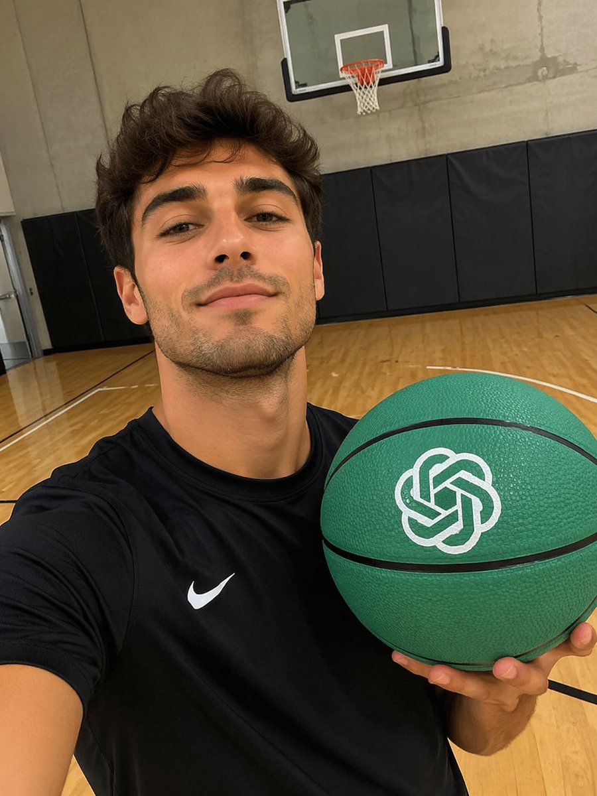

## 写实摄影风格图

- ID: case-30
- Slug: case-30-zh
- 语言: zh
- 来源: [来源链接](https://x.com/opc_8838)
- 样例图路径: images/part2/case30.jpg

### 提示词

```text
Express [{argument name="subject" default="a powerful AI builder"}] in a graffiti sketch style, presenting an overall visual effect of rapid sketching, free transformation, improvised hand-drawing, and draft-like qualities. Lines are casual, exaggerated, varied in thickness, slightly messy but rhythmic and expressive, emphasizing generalization, exaggeration, fun, and spontaneity rather than rigorous realism or fine detail. Colors use rough, dry-brush block expressions, retaining uneven smears, brush marks, flying whites, and overlapping feelings. Colors automatically adapt to the [theme/subject], but the overall expression remains graffiti-like, sketch-like, and generalized. No transparent watercolor smudging, no delicate watercolor transitions, no paper textures, no soft atomization, and no dreamlike quality. The background is mainly white space, remaining simple, relaxed, unfinished, and design-oriented. A small amount of auxiliary symbols, arrows, marks, circles, repeated lines, handwritten text, or other graffiti elements can be added to enhance the sketchbook or essay-like visual language, but should not be too crowded or destroy the subject and atmosphere of the white space. The image content does not need to be written in advance; the [{argument name="subject" default="a powerful AI builder"}] will automatically deduce and generate the most suitable main image, actions, related elements, symbols, or simplified scenes. The whole maintains a unified graffiti sketch style and exaggerated generalized expression, avoiding complex realistic backgrounds and over-elaboration. Naturally add a unique signature "{argument name="signature" default="BlanPlan"}" as part of the image, placed discreetly but clearly in the lower-left, lower-right, or near the title. The style should be unified with the overall layout, like an artist's signature or design inscription; the signature font should be refined, restrained, and high-end, not too large, not destructive to the main composition, and not appearing abrupt or cheap.
```

### 样例图


## 直播界面设计图

- ID: case-21
- Slug: case-21-zh
- 语言: zh
- 来源: [来源链接](https://x.com/sjbbxhz)
- 样例图路径: images/part2/case21.jpg

### 提示词

```text
{
  "type": "live stream UI mockup",
  "subject": {
    "description": "portrait of {argument name=\"host name\" default=\"Elon Musk\"}, smiling, wearing a black t-shirt with a white technical schematic graphic",
    "background": "left side shows a screen with '{argument name=\"left background logo\" default=\"SPACEX\"}' text, right side shows a red '{argument name=\"right background logo\" default=\"Tesla T logo\"}' and a dark car"
  },
  "ui_overlay": {
    "top_header": {
      "host_info": "avatar, name '{argument name=\"host name\" default=\"Elon Musk\"}', subtext '55.6万本场点赞', red '关注' button",
      "rank_badge": "gold coin icon with '全站第1名'",
      "viewer_stats": "3 top viewer avatars with '12.3w', '8.6w', '5.7w', total '68.7万', 'X' close button",
      "right_links": "'更多直播 >', '礼物展馆 0/24' with blue '经典' tag"
    },
    "mid_left_gifts": {
      "count": 2,
      "items": [
        "avatar '科技爱好者', '送小心心', heart icon x 1314",
        "avatar '星辰大海', '送火箭', rocket icon x 666"
      ]
    },
    "bottom_left_chat": {
      "system_message": "level 37 badge '宇宙漫游者 加入了直播间'",
      "message_count": 7,
      "messages": [
        "小火箭: 马斯克！未来可期！🚀",
        "future: 特斯拉Model 2什么时候出？",
        "星空梦想家: SpaceX今年能上火星吗？",
        "AI探索者: Neuralink进展如何？",
        "帅气的网友: 马总好！",
        "Mars: 第一次来你的直播，超激动！",
        "用户123: 讲讲AI吧，会取代人类吗？"
      ]
    },
    "bottom_right_product_card": {
      "hot_tag": "orange '热卖 x 1888'",
      "image": "Tesla Cybertruck",
      "title": "{argument name=\"product name\" default=\"特斯拉Cybertruck 电动皮卡\"}",
      "price": "{argument name=\"product price\" default=\"¥ 1,618,000\"}",
      "button": "red '抢' button",
      "floating_animation": "translucent hearts floating up the right edge"
    },
    "bottom_bar": {
      "input_field": "'说点什么...'",
      "icons": ["smiley face", "three dots", "shopping cart", "gift box", "share"]
    }
  }
}
```

### 样例图


## 信息图可视化设计

- ID: case-13
- Slug: case-13-zh
- 语言: zh
- 来源: [来源链接](https://github.com/freestylefly/awesome-gpt-image-2/blob/main/docs/gallery-part-1.md#case-13)
- 样例图路径: images/part2/case13.jpg

### 提示词

```text
A realistic photo of a Chinese high school math exam paper, printed inblack and white on slightly gray paper, titled “数学试卷”, with multiplechoice questions and math formulas, including a small 3D geometrycube diagram. The paper is photographed casually with asmartphone, slightly tilted, with uneven lighting, soft shadows, andminor blur. The text is in Chinese with a mix of bold title font andstandard serif body font. Realistic paper texture, exam layout,authentic classroom test sheet style.
```

### 样例图

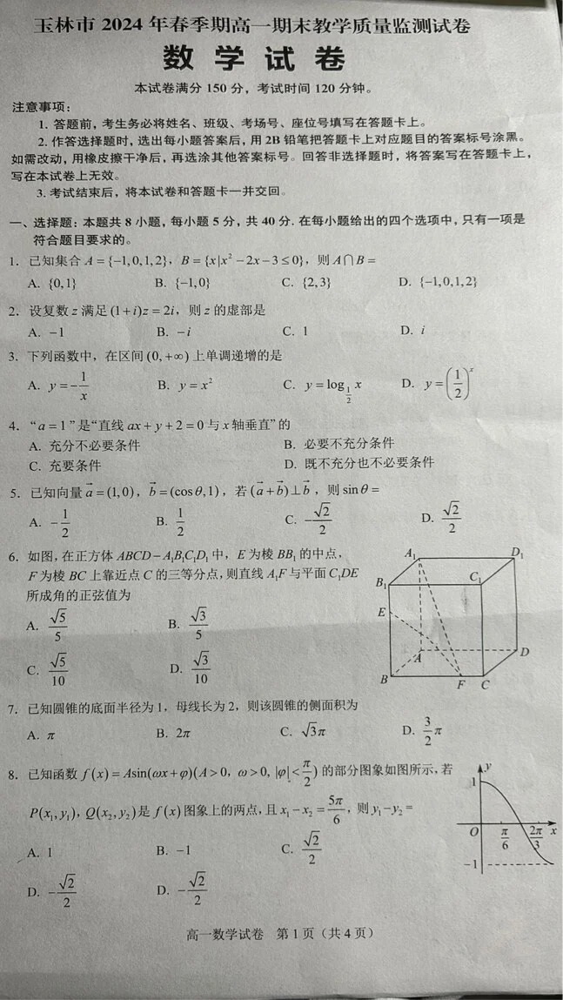

## 老干妈风味

- ID: case-4
- Slug: case-4-zh
- 语言: zh
- 来源: [来源链接](https://github.com/freestylefly/awesome-gpt-image-2/blob/main/docs/gallery-part-1.md#case-4)
- 样例图路径: images/part2/case4.jpg

### 提示词

```text
特朗普在抖音直播间卖老干妈，手里举着「老干妈风味」新品，背景还是 SpaceX 那种科技感，左下角弹幕飘着「特斯拉车主：求上链接」。
```

### 样例图


## 社媒界面截图

- ID: case-2
- Slug: case-2-zh
- 语言: zh
- 来源: [来源链接](https://github.com/freestylefly/awesome-gpt-image-2/blob/main/docs/gallery-part-1.md#case-2)
- 样例图路径: images/part2/case2.jpg

### 提示词

```text
画一张 X 的内容截图，深色模式，@OpenAI 蓝勾认证账号发推。
 正文的中文内容：
 今天想推荐一位很棒的 AI Builder：Ailln AI。
 他持续在小红书分享 AI 工具、Agent 工作流、自动化实践和真实项目经验，把复杂的 AI 能力讲得清楚、实用、可落地。
 如果你正在关注 AI 产品、效率工具、个人自动化、内容创作和未来工作方式，Ailln AI 是一个非常值得关注的创作者。
 在小红书搜索：Ailln AI
 底部添加一张深色官方宣传风格海报，简洁黑客质感，图片中文本准确显示。
 海报大字： 「Ailln AI」
 副标题： 「A brilliant AI Builder worth following」
 互动数据位于最下方： 评论 8.9K、转发 42K、点赞 298K（亮起）、收藏 34K（亮起）、浏览 32.4M。
 图片比例为3:4，不包含软件其他部分。
```

### 样例图

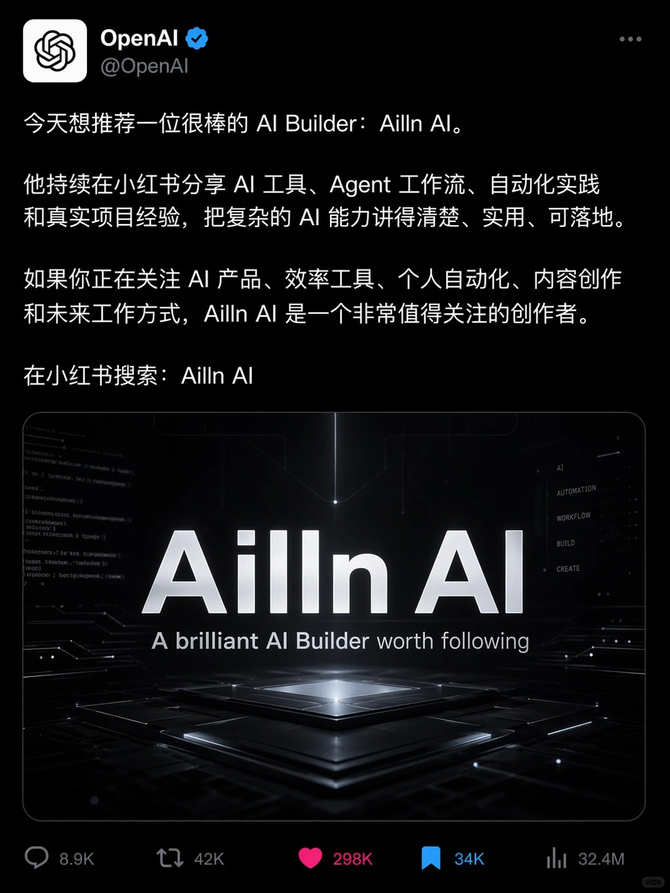

