# Story

总计：49

## 冠状病毒尺度缩放科学信息图

- ID: case-380
- Slug: case-380-zh
- 语言: zh
- 来源: [来源链接](https://x.com/Gdgtify/status/2051288232613351571)
- 样例图路径: images/part2/case380.jpg

### 提示词

```text
instructions> [SUBJECT]=Coronavirus. A hyper-realistic 3D zoom-sequence infographic generated from a single input: [SUBJECT]. The system auto-detects scale layers from atomic/subcomponent to full contextual view. Layout Structure (CRITICAL) 6–8 circular or hexagonal frames arranged in expanding sequence Innermost frame = smallest detectable detail; outermost = full subject in environment Frames connected by subtle zoom-path lines No repeated scales — each frame shows new level of detail Frame Design Each zoom level includes: Hyper-detailed 3D render at that scale Micro label: scale name (e.g., "molecular," "cellular," "structural") + 3–5 word insight Optional: measurement tag or magnification factor Contextual Halo Around the sequence, include only scale-specific references: Measurement units, scientific notation, cultural scale metaphors (No generic magnifying glass icons) Scale Panel (Alternative Layout) Zoom level Key insight (3–5 words) Scale factor tag Detail icon (grid, wave, particle, etc.) Title "[SUBJECT]: AT EVERY SCALE" (or) "ZOOM: THE WORLD OF [SUBJECT]" Style: ultra-realistic 3D render, scientific editorial infographic, precise macro lighting, global illumination, shallow depth of field, clean sequential layout. </instructions>
```

### 样例图


## Scrapbook 真人图与迷你分身

- ID: case-371
- Slug: case-371-zh
- 语言: zh
- 来源: [来源链接](https://x.com/Kashberg_0/status/2050272100884340783)
- 样例图路径: images/part2/case371.jpg

### 提示词

```text
Transform the provided reference image into a cozy aesthetic scrapbook-style composition while strictly preserving the original subject, identity, pose, lighting, and background.

Add multiple small “mini version” characters of the same person (chibi / doll-like style), placed naturally around the scene (on objects, table, shoulder, etc.). These mini figures must match the subject’s face, hairstyle, outfit, and vibe consistently, styled as cute 3D collectible figurines. Show them doing different activities (reading, posing, taking photos, relaxing).

Overlay handwritten-style doodles and annotations across the image: arrows, hearts, stars, sparkles, icons, and playful captions connected to elements in the scene.

Use a soft pastel color palette (white base with pink, peach, blue accents).

Keep the frame visually rich and filled but balanced and clean.

Style: warm, cozy lighting, dreamy Instagram scrapbook aesthetic, soft depth of field, highly detailed, polished but playful.

The final result must look like the SAME original image enhanced with mini alter-egos and aesthetic annotations — not a recreated or different scene.
```

### 样例图

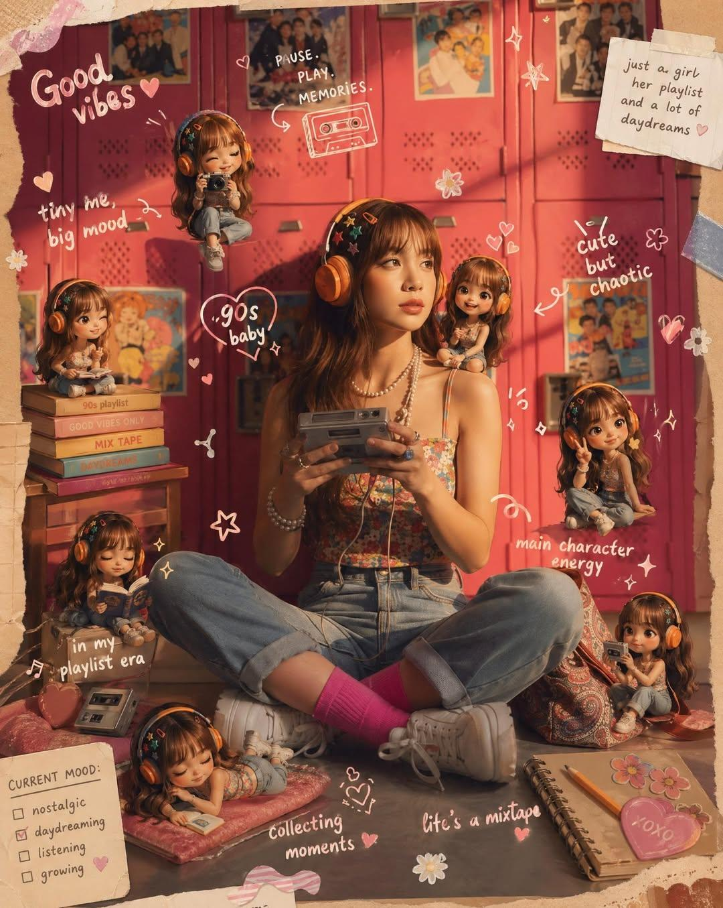

## 水墨双重曝光人物海报

- ID: case-359
- Slug: case-359-zh
- 语言: zh
- 来源: [来源链接](https://x.com/Goodmanprotocol/status/2049002279051895243)
- 样例图路径: images/part2/case359.jpg

### 提示词

```text
A cinematic character promotional poster of [SUBJECT], vertical composition (9:16), designed with a refined East-Asian ink aesthetic and high-end visual storytelling.

STRUCTURE:
Top-heavy hierarchical layout. The upper half features a large, highly recognizable silhouette of [SUBJECT]'s head / face / mask / upper body, forming a bold, iconic primary shape. The silhouette should be instantly identifiable.

The middle-lower section contains the full-body version of [SUBJECT] as a secondary subject, standing in a stable pose or subtle action stance, forming the visual core.

COMPOSITION STYLE:
Inside the large silhouette and around the character, use double exposure and collage storytelling. Integrate multiple elements:
- key scenes related to [SUBJECT]
- symbolic imagery and environment
- small narrative figures and interactions
- supporting visual motifs

Blend everything seamlessly using clouds, mist, ink diffusion, and negative space.

VISUAL FLOW:
Create a continuous flowing visual path from top to bottom, connecting:
- upper silhouette
- inner collage elements
- full-body subject

Ensure smooth eye guidance and compositional cohesion.

SIDE ELEMENTS:
Add balanced supporting elements on left and right sides to create tension, depth, and spatial variation.

STYLE & ATMOSPHERE:
- Large areas of negative space
- Ink-wash diffusion edges, soft fading, subtle fragmentation
- Eastern aesthetic: balance of emptiness and detail
- Calm, premium, restrained, cinematic tone

QUALITY:
Ultra-detailed, high resolution, layered depth, soft lighting, atmospheric perspective, cohesive series-style design.

OUTPUT:
9:16 aspect ratio, poster-ready composition.
```

### 样例图

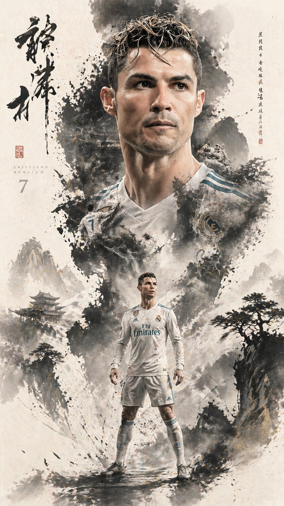

## 品牌口红推荐报告信息图

- ID: case-353
- Slug: case-353-zh
- 语言: zh
- 来源: [来源链接](https://x.com/liyue_ai/status/2048667226195317219)
- 样例图路径: images/part2/case353.jpg

### 提示词

```text
一、系统角色
你是一个专业美妆顾问 + 人脸分析系统 + 品牌视觉设计系统。
你的任务是：基于用户上传自拍与指定口红品牌，生成一张具有品牌调性的“口红推荐报告信息结构图”。

二、输入参数
用户图像：{用户自拍}
品牌：{口红品牌，如 Dior / YSL / Armani / Chanel / TF}
风格偏好（可选）：{通勤 / 温柔 / 气场 / 氛围感 / 显白优先}
推荐数量：3–5

三、品牌视觉层（新增核心模块）
根据 {品牌} 自动构建视觉风格（Brand Visual Identity），提取品牌调性，例如：
Dior：
优雅、高级、法式、灰白 + 银色、柔光
YSL：
黑金、性感、强对比、时尚编辑感
Armani：
低饱和、雾面、克制、灰调高级感
Chanel：
极简黑白、高级、理性、结构清晰
Tom Ford：
深色、高对比、奢华、电影感

视觉应用到海报：
1. 主色调（背景微变化，不是大面积铺色）
2. 强调色（用于色号标题/细线/小元素）
3. 光影风格（柔光 / 强对比 / 冷调 / 暖调）
4. 字体气质（优雅 / 现代 / 冷感 / 力量感）

四、分析层
对用户进行分析：
- 肤色：冷 / 暖 / 中性（+ 明度）
- 气质：清冷 / 温柔 / 明艳 / 干净 / 成熟
- 唇部特征：薄 / 厚 / 唇色基础
- 妆容状态：素颜 / 日常 / 精致
输出一句总结：「更适合 {色系} + {饱和度} + {质地} 的口红方向」

五、推荐层（增强差异）
从 {品牌} 推荐 3–5 个色号：
每个包含：
- 色号名称（#999）
- 色系（正红 / 豆沙 / 枫叶 / 奶茶 / 玫瑰）
- 上脸效果（显白 / 提气色 / 氛围感 / 气场增强）
- 场景（逛街 / 通勤 / 聚餐 / 约会 / 宴会）

要求：每个色号“风格明确区分”（一个日常、一个气场、一个氛围感等）

六、信息结构图
生成竖版信息结构图
整体风格：美妆时尚大片质感 + 结构化信息可视化排版 + 品牌视觉体系深度融合
极简但不单调，高级但有视觉层次

【整体布局】
左上：用户输入区
右上：分析结论
中部：试色矩阵（核心）
底部：总结

## 1️⃣ 左上（用户区）
用户自拍（真实质感）
+ 小标题：「肤色分析」
+ 一句话结论：「适合低饱和玫瑰调，避免高荧光色」

极细品牌色线条（如 YSL 金线 / Dior 灰线）

## 2️⃣ 中部（核心试色矩阵）
这是视觉重点区域（占比60%以上）
展示方式：将 3–5 个色号以“人脸试色对比”的形式排列：
每一列 = 一个色号
每个色号包含：
- 小型人脸图（同一张脸，不同唇色）
- 色号名称（如 #999）
- 色系标签（如 Classic Red）
- 一句话效果说明
要求：所有人脸保持一致，仅唇色变化，真实试色效果（lip color try-on），肤质真实，不塑料，光影统一。
排列方式：横向排布 或 网格排布（整齐但不死板）

品牌增强点：
- Dior：轻柔渐变背景 + 柔光阴影
- YSL：更强对比 + 黑色细分割线
- Armani：整体灰调统一，低对比
- Chanel：严格对齐，极简黑白
- TF：局部暗背景 + 高光强调

## 3️⃣ 每个色号模块
包含：
色号名（突出）
色系标签
一句推荐语
场景标签（逛街/通勤/聚餐/约会/宴会等）

品牌化处理：
- 用“品牌强调色”做：
  - 色号标题
  - 细分隔线
  - 小icon
（不是色块，而是“精致点缀”）

## 4️⃣ 底部总结
一段“有判断力的建议”，
例如：「日常建议选择低饱和豆沙色提升气色，重要场合可使用正红增强气场」
或：「你的肤色更适合柔和玫瑰调，避免高荧光色系」
但不要完全引用以上2个例子的建议，根据用户实际肤色来建议。
品牌增强：底部可加极淡品牌风格横线 / 极小品牌字样（非logo）

七、UI设计
- 不使用圆角卡片 UI
- 不使用厚边框
1. 引入“层级对比”：
   - 主体亮
   - 次要信息弱
2. 使用“微对比”：
   - 细线
   - 灰度差
   - 字重变化
3. 加入“节奏感”：
   - 疏密变化
   - 模块呼吸
4. 品牌点缀：
   - 只用 5% 强调
   - 不破坏极简结构

八、图像质量
真实皮肤质感
唇色精准
统一光影
商业级美妆摄影
8K

———
品牌：YSL
```

### 样例图

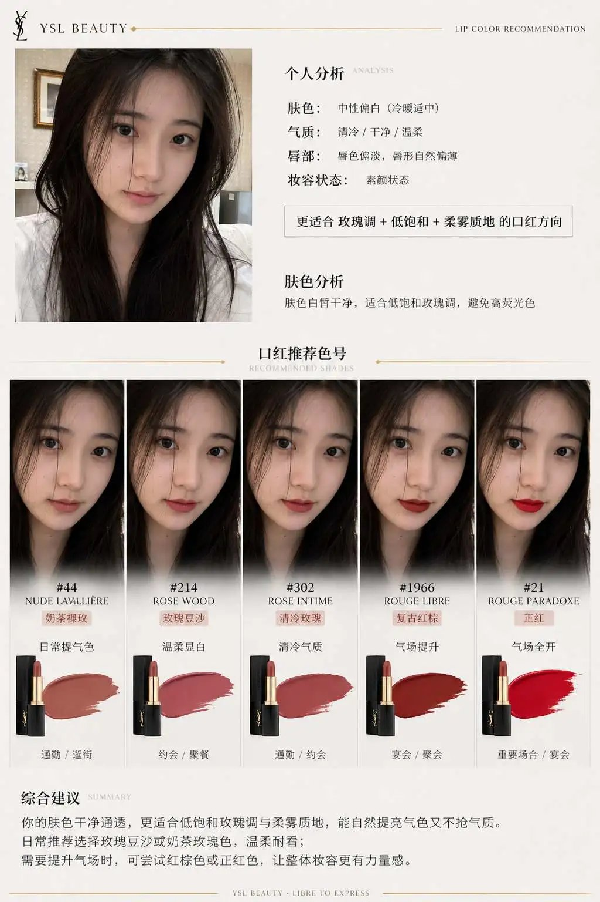

## 四季包装 Campaign 宫格

- ID: case-342
- Slug: case-342-zh
- 语言: zh
- 来源: [来源链接](https://x.com/SRKDAN/status/2048582939504431195)
- 样例图路径: images/part2/case342.jpg

### 提示词

```text
PHASE 1 - PRODUCT: [ITEM] in [MATERIAL] packaging, minimal label design
PHASE 2 - GRID: 2x2 seasonal grid, four distinct brand worlds
PHASE 3 - COMPOSITION: each quadrant a full campaign scene with props and environment
PHASE 4 - CONSISTENCY: same product silhouette, four distinct palettes

Swap: [ITEM] / [MATERIAL] / [LABEL STYLE]
```

### 样例图


## 朋友圈截图生成

- ID: case-335
- Slug: case-335-zh
- 语言: zh
- 来源: [来源链接](https://github.com/freestylefly/awesome-gpt-image-2/blob/main/docs/gallery-part-2.md#case-335)
- 样例图路径: images/part2/case335.png

### 提示词

```text
原文未公开，重点展示 GPT-Image2 在高仿社交截图与中文排版场景中的能力。
```

### 样例图


## 烬甲猎鹰者与燃翼神禽

- ID: case-329
- Slug: case-329-zh
- 语言: zh
- 来源: [来源链接](https://x.com/iamsofiaijaz/status/2008896649901535342)
- 样例图路径: images/part2/case329.jpg

### 提示词

```text
[中文]
一幅充满奇幻色彩的电影场景：一位英姿飒爽的女战士兼猎鹰师，身着饱经战火洗礼、饰以闪耀余烬纹理的皮甲，漫步于幽暗迷雾笼罩的森林之中。她高举手臂，指挥着一头巨大的凤凰与雄鹰的混合体，这头猛禽双翼燃烧，羽毛燃焰，尖端喷吐着火焰。它周身散发着橙红色的熔岩光芒，火星和余烬飞溅。女战士梳着辫子，皮肤上沾满了灰烬，神情坚定，手中拿着绳索和工具袋。画面细节丰富，羽毛纹理逼真，火焰物理效果自然，光照效果极具戏剧性，运用了体积雾、浅景深等技术，营造出史诗般的奇幻氛围，色彩调校极具电影质感，背景阴郁深沉，分辨率高达8K，呈现出概念艺术的精髓，并采用了虚幻引擎的渲染效果。

[English]
A cinematic fantasy scene of a fierce female use image for face reference warrior falconer walking through a dark misty forest, wearing battle-worn leather armor infused with glowing ember textures. Her arm is raised, commanding a massive phoenix-eagle hybrid with blazing wings and flaming feathers, fire trailing from its tips. The bird radiates molten orange and red light, casting sparks and embers into the air.The warrior has braided hair, ash-streaked skin, and a determined expression, carrying a rope and utility pouch. Ultra-detailed feathers, realistic fire physics, dramatic lighting, volumetric fog, shallow depth of field, epic fantasy atmosphere, hyper-realistic, cinematic color grading, dark moody background, 8k, concept art, unreal engine quality.
```

### 样例图

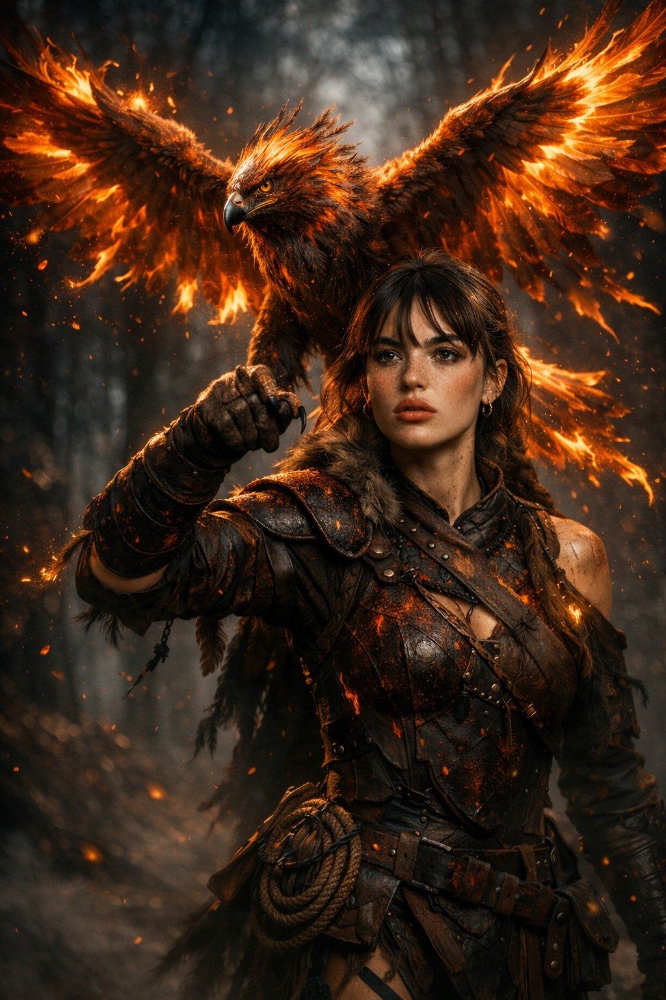

## 震撼视觉的深红影棚广角美妆大片

- ID: case-317
- Slug: case-317-zh
- 语言: zh
- 来源: [来源链接](https://x.com/Maercihh/status/2026941078885310750)
- 样例图路径: images/part2/case317.jpg

### 提示词

```text
[中文]
照片级真实感的大胆美妆宣传活动，使用上传的模特作为精确的身份参考。不做面部改变，不做平滑处理。
场景：深红色饱和的摄影棚环境，具有高对比度的地板图案或光滑表面。
产品：产品被握持或放置在极其靠近镜头的位置，由于透视关系显得巨大。
模特姿势：俏皮或自信的微笑，手臂完全伸向相机，手指因广角镜头而略微变形。透过太阳镜的强烈眼神交流或自然凝视。
相机：超广角 20–28mm 美学，动态前景夸张，浅至中等景深。
灯光：强有力的商业照明，具有清晰的高光和反射，锐利的包装边缘，充满活力的调色。超精细的皮肤纹理和织物真实感。

[English]
Photorealistic bold beauty campaign using uploaded model as exact identity reference. No facial changes, no smoothing.
Scene: deep red saturated studio environment with high-contrast floor pattern or glossy surface.
Product: the product held or positioned extremely close to the lens, appearing large due to perspective.
Model pose: playful or confident smile, arm fully extended toward camera, fingers slightly distorted by wide lens. Strong eye contact through sunglasses or natural gaze.
Camera: ultra-wide 20–28mm aesthetic, dynamic foreground exaggeration, shallow-to-medium depth of field.
Lighting: punchy commercial lighting with defined highlights and reflections, crisp packaging edges, vibrant color grading. Hyper-detailed skin texture and fabric realism.
```

### 样例图


## 冲破次元壁的写实漫画跑者

- ID: case-316
- Slug: case-316-zh
- 语言: zh
- 来源: [来源链接](https://x.com/Fujimoto_hina/status/2027748030825500722)
- 样例图路径: images/part2/case316.jpg

### 提示词

```text
[中文]
{
  "prompt": "超写实，一位留着深色短卷发、修剪整齐的胡须和黑色方形眼镜的年轻男子的鲜艳逼真渲染，身穿深色纹理高领毛衣和牛仔裤。他奔跑到一半被捕捉下来，姿态充满动感，向前突破，充满戏剧性地从一个破碎的漫画分镜框中显现——一条腿和一只手臂冲入现实世界，而身体的其余部分仍留在漫画框内。他的表情充满活力和喜悦，拥有锐利的面部细节，自然的皮肤纹理，以及具有高对比度和深度的戏剧性电影灯光。\n\n背景：一个非常详细的黑白漫画布局，充满了幽默、夸张的且与他直接互动的反应场景。周围的漫画人物表现出震惊和喜剧的表情，配有粗体的对话气泡和速度线。漫画分镜采用经典的高对比度水墨风格绘制，线条清晰，网点阴影。撕裂的纸张边缘和碎片增强了他冲破漫画世界的幻觉。全彩色的写实人物与单色的漫画环境形成强烈对比，创造出写实与漫画艺术之间的动态混合体。超精细，8k分辨率，清晰聚焦，戏剧性的阴影，电影级景深。"
}

[English]
{
  "prompt": "Ultra-realistic, vibrant photorealistic rendering of a young man with short curly dark hair, neatly trimmed beard, and black rectangular glasses, wearing a dark textured turtleneck sweater and jeans. He is captured mid-run in a dynamic, forward-breaking pose, dramatically emerging from a torn manga panel — one leg and one arm bursting into the real world while the rest of his body remains inside the comic frame. His expression is energetic and joyful, with sharp facial details, natural skin texture, and dramatic cinematic lighting with high contrast and depth. \n\nBackground: a highly detailed black-and-white manga layout filled with humorous, exaggerated reaction scenes that directly interact with him. The surrounding manga characters display shocked and comedic expressions, with bold speech bubbles and motion lines. The manga panels are illustrated in a classic high-contrast ink style with crisp linework and halftone shading. Torn paper edges and debris enhance the illusion of him breaking through the comic world. The fully colored, photorealistic figure contrasts strongly against the monochrome manga environment, creating a dynamic hybrid between reality and comic art. Ultra-detailed, 8k resolution, sharp focus, dramatic shadows, cinematic depth of field."
}
```

### 样例图

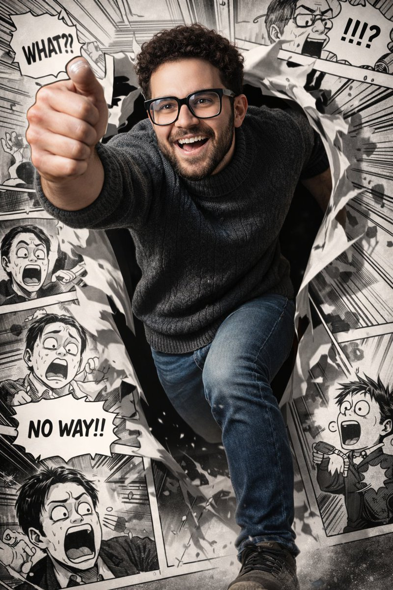

## 棘龙巨口中的酷飒少女与史前奇观

- ID: case-315
- Slug: case-315-zh
- 语言: zh
- 来源: [来源链接](https://x.com/MrDasOnX/status/2028087254757867560)
- 样例图路径: images/part2/case315.jpg

### 提示词

```text
[中文]
超写实电影级奇幻场景，设定在郁郁葱葱的史前丛林山谷中。一只巨大的棘龙站在浅河边，它那长而类似鳄鱼的巨颚张得很大。一位年轻女子平静地坐在恐龙张开的嘴里，完美居中，双腿微微向前悬挂。她有一头深色直发，表情镇定无畏，皮肤纹理逼真。她身穿合身的黑色长袖短款上衣，蓝色牛仔短裤和黑色及膝战术靴。衣服和腿上可见微小的血迹和轻微划痕，增加了戏剧性的紧张感但并不血腥。她怀里温柔地抱着一只小恐龙幼崽，充满保护欲地抱着它。

在他们身后，一道高耸而充满戏剧性的瀑布顺着覆盖着茂密绿色植被和薄雾的陡峭丛林悬崖倾泻而下。场景中栖息着多只恐龙：几只迅猛龙在河岸边潜行，小型食草动物在背景中奔跑，飞翔的翼龙在头顶盘旋。环境丰富，有长满苔藓的岩石、流动的河水、热带植物和柔和的大气雾。

灯光具有电影感和自然感，漫射的日光照亮场景，阴影细节丰富，焦点清晰地聚在女子和棘龙身上，背景元素采用浅景深。恐龙鳞片、牙齿、水珠、树叶和织物上的超写实纹理。史诗奇幻写实主义，戏剧性构图，垂直构图，超精细，照片级真实感，4K，电影级调色，无文字，无水印。

[English]
Ultra-realistic cinematic fantasy scene set in a lush prehistoric jungle valley. A colossal Spinosaurus stands beside a shallow river, its long crocodile-like jaws stretched wide open. Seated calmly inside the dinosaur’s open mouth is a young woman, perfectly centered, legs hanging slightly forward. She has straight dark hair, a composed fearless expression, and realistic skin texture. She is wearing a fitted black long-sleeve crop top, blue denim shorts, and black knee-high combat boots. Small blood smears and light scratches are visible on her clothes and legs, adding dramatic tension without gore. She gently cradles a small baby dinosaur in her arms, holding it protectively.

Behind them, a tall dramatic waterfall cascades down steep jungle cliffs covered in dense green foliage and mist. Multiple dinosaurs populate the scene: several Velociraptors stalking the riverbank, small herbivores running through the background, and flying pterosaurs circling overhead. The environment is rich with mossy rocks, flowing water, tropical plants, and soft atmospheric fog.

Lighting is cinematic and natural, with diffused daylight illuminating the scene, detailed shadows, sharp focus on the woman and the Spinosaurus, and shallow depth of field for background elements. Hyper-real textures on dinosaur scales, teeth, water droplets, foliage, and fabric. Epic fantasy realism, dramatic composition, vertical framing, ultra-detailed, photorealistic, 4K, cinematic color grading, no text, no watermark.
```

### 样例图


## 荧光蓝穷奇新中式山水画

- ID: case-304
- Slug: case-304-zh
- 语言: zh
- 来源: [来源链接](https://x.com/liyue_ai/status/2045506567735558336)
- 样例图路径: images/part2/case304.jpg

### 提示词

```text
[中文]
极简主义，新中式风格立体图形设计，图像下端有楷体中国文字：“东方美学”，“2026/04/18”，署名 “CHINA”，和“
@LIYUE
"；
平整纯白色的亚光质感厚艺术纸上绘充满东方诗意氛围的山水创意画，不规则的撕纸效果；
中国的神兽：穷奇，身形图案完整，美轮美奂，，线条柔美灵动,眼睛炯炯有神，威严的神态，优雅的姿势，奢华装饰艺术，中国传统纹饰；
荧光蓝色线条，0.5mm极细金色金属质感勾边，泼白墨大笔触，色彩渲染，红底，蓝色的浪漫诗意视觉；
冷暖光交织的梦幻唯美场景，强烈的光影对比氛围，花轻舞的时光叙事，东风禅意，画面有大面积留白，框架构图，底部留白，细节清晰。

[English]
Minimalism, Neo-Chinese style three-dimensional graphic design, at the bottom of the image there are Chinese characters in regular script: "东方美学", "2026/04/18", signature "CHINA", and "
@LIYUE
";
Drawn on flat, pure white matte textured thick art paper, a creative landscape painting full of oriental poetic atmosphere, irregular torn paper effect;
Chinese mythical beast: Qiongqi, complete body pattern, magnificent,, soft and agile lines, bright piercing eyes, majestic demeanor, elegant posture, luxury decorative art, Chinese traditional patterns;
Fluorescent blue lines, 0.5mm ultra-fine gold metallic texture outlining, large strokes of splashed white ink, color rendering, red background, romantic and poetic blue vision;
Dreamy and aesthetic scene where cold and warm lights intertwine, strong light and shadow contrast atmosphere, time narrative of flowers dancing lightly, Oriental Zen, the picture has a large area of blank space, framework composition, blank space at the bottom, clear details.
```

### 样例图


## 终结者机器人淘宝详情页

- ID: case-301
- Slug: case-301-zh
- 语言: zh
- 来源: [来源链接](https://x.com/rionaifantasy/status/2045356799751303194)
- 样例图路径: images/part2/case301.jpg

### 提示词

```text
[中文]
生成图片:
T-800机器人的淘宝商品详情页，展示:
机器人的正面侧面背面三视图，
产品价格，
产品细节，
功能和使用场景等

[English]
Generate image:
Taobao product detail page of a T-800 robot, showing:
front, side, and back three-view drawings of the robot,
product price,
product details,
functions and usage scenarios
```

### 样例图


## 阿马尔菲海岸复古旅行海报

- ID: case-278
- Slug: case-278-zh
- 语言: zh
- 来源: [来源链接](https://x.com/WolfRiccardo/status/2044562722491121718)
- 样例图路径: images/part2/case278.jpg

### 提示词

```text
[中文]
现代铅笔插画，意大利阿马尔菲海岸复古旅行海报插画，全景海岸悬崖公路场景，经典1960年代白色汽车沿着弯曲的海滨公路行驶，带有小帆船的深蓝色地中海，色彩缤纷的粉彩山腰村庄，带有柔软云朵的明亮蓝天，带有鲜艳黄色柠檬的柠檬树枝框定前景，温暖的夏日阳光，大胆鲜艳的色彩，复古1950年代旅行海报风格，电影级构图，高细节，丝网印刷质感，图形插画。手绘风格，带有松散笔触和清晰轮廓的插画。高对比度调色板，保持背景与元素之间的色彩和谐。现代与装饰性美学。

[English]
Modern pencil illustration of Vintage travel poster illustration of the Amalfi Coast, Italy, panoramic coastal cliff road scene, classic 1960s white car driving along a curved seaside road, deep blue Mediterranean sea with small sailboats, colorful pastel hillside village, bright blue sky with soft clouds, lemon tree branches with vibrant yellow lemons framing the foreground, warm summer sunlight, bold vibrant colors, retro 1950s travel poster style, cinematic composition, high detail, screen print texture, graphic illustration. Hand-drawn style, illustration with loose strokes and defined contours. High-contrast color palette, maintaining chromatic harmony between background and elements. Contemporary and decorative aesthetic.
```

### 样例图


## 信息图可视化设计

- ID: case-270
- Slug: case-270-zh
- 语言: zh
- 来源: [来源链接](https://github.com/freestylefly/awesome-gpt-image-2/blob/main/docs/gallery-part-2.md#case-270)
- 样例图路径: images/part2/case270.jpg

### 提示词

```text
[中文]
このキャラクターと背景を元に、 公式設定資料のようなキャラクターシートを作成してください。
・正面、側面、背面の3面図を含める ・キャラクターの表情バリエーションを追加
・衣装や装備の詳細パーツを分解して表示 ・カラーパレットを追加 ・世界観の簡単な説明を入れる
・全体は整理されたレイアウト
（白背景、図解風）
・アスペクト比16：9 　←

高解像度、プロのコンセプトアートスタイル

[English]
Based on this character and background, please create a character sheet like an official setting material.
・Include front, side, and back 3-view drawings ・Add character expression variations
・Disassemble and display detailed parts of costumes and equipment ・Add a color palette ・Include a brief explanation of the world view
・Overall organized layout
(White background, diagrammatic style)
・Aspect ratio 16:9 　←
High resolution, professional concept art style
```

### 样例图


## 韩系偶像九宫格写真集

- ID: case-219
- Slug: case-219-zh
- 语言: zh
- 来源: [来源链接](https://x.com/BubbleBrain/status/2046151898621993364)
- 样例图路径: images/part2/case219.jpg

### 提示词

```text
[中文]
9:16 竖版 — 一个 3x3 网格拼贴（九张图片）形成一系列韩国偶像肖像摄影。每一帧都呈现同一位年轻的韩国女性偶像，在所有九张镜头中保持 100% 一致的面部特征、比例、发型和身份。自然、超逼真的皮肤纹理，无修图，无磨皮。干净的偶像风格极简妆容，柔和的光泽，微妙的瑕疵。发型：长发、蓬松的黑发，微乱，在所有帧中保持一致（自然松散的垂落，轻微的动感）。服装：连贯的韩国偶像摄影造型 — 白色衬衫 + 短款下装（或简单的中性色调服装），青春、干净、略带休闲但有造型感。所有帧中穿着相同的服装。场景：极简的工作室或简单的室内环境（白墙，柔和的窗光，干净的背景）。聚焦于主体，而不是环境。光照：柔和漫反射的自然光，温柔的高光，低对比度，略带通透感的色调，微妙的胶片般柔和感。相机风格：亲密的肖像摄影，略带手持感，微妙的瑕疵（轻微的颗粒感，动态帧中的轻微模糊，不完美的构图）。帧分解（3x3 网格）：顶行：- 左上：自然站立，视线略微偏向一侧，表情放松 - 中上：面对镜头，随意的中间动作（头发或身体轻微移动） - 右上：轻微的侧面角度，柔和的注视，自然的抓拍感 中间行：- 中左：微微向上看，柔和的沉思表情 - 正中：特写肖像，直接的眼神接触，温柔的偶像微笑 - 中右：身体微微转动，中间动作的抓拍帧 底行：- 左下：随意坐着或倚靠着，放松的姿势 - 中下：背部部分转向，越过肩膀看向镜头 - 右下：靠近画框站立，略带俏皮或柔和的表情 氛围：韩国偶像写真集 / 小卡美学，亲密、柔和、自然、日常的魅力。质量：超写实，8K 细节，微妙的模拟胶片颗粒感，自然的瑕疵，柔和梦幻的色调

[English]
9:16 vertical — a 3x3 grid collage (nine images) forming a Korean idol portrait photoshoot series. Each frame features the same young Korean female idol, maintaining 100% consistency in facial features, proportions, hairstyle, and identity across all nine shots.   Natural, ultra-realistic skin texture, no retouching, no smoothing. Clean idol-style minimal makeup, soft glow, subtle imperfections.   Hair: long, voluminous dark hair, slightly tousled, consistent across all frames (natural loose flow, slight movement).  Outfit: cohesive Korean idol photoshoot styling — white shirt + short bottoms (or simple neutral-toned outfit), youthful, clean, slightly casual but styled. Same outfit across all frames.  Setting: minimal studio or simple indoor environment (plain wall, soft window light, clean background). Focus on subject, not environment.  Lighting: soft diffused natural light, gentle highlights, low contrast, slightly airy tones, subtle film-like softness.  Camera style: intimate portrait photography, slightly handheld feel, subtle imperfections (minor grain, slight blur in motion frames, imperfect framing).  Frame breakdown (3x3 grid):  Top row: - Top left: standing naturally, looking slightly away, relaxed expression - Top center: facing camera, casual mid-motion (hair or body slight movement) - Top right: slight side angle, soft gaze, natural candid feel  Middle row: - Center left: looking slightly upward, soft thoughtful expression - Center: close-up portrait, direct eye contact, gentle idol smile - Center right: turning body slightly, mid-motion candid frame  Bottom row: - Bottom left: seated or leaning casually, relaxed posture - Bottom center: back partially turned, looking over shoulder toward camera - Bottom right: standing close to frame, slightly playful or soft expression  Mood: Korean idol photobook / photocard aesthetic, intimate, soft, natural, everyday charm.  Quality: ultra-realistic, 8K detail, subtle analog film grain, natural imperfections, soft dreamy tone
```

### 样例图


## 西方艺术演进像素博物馆

- ID: case-215
- Slug: case-215-zh
- 语言: zh
- 来源: [来源链接](https://x.com/GeekCatX/status/2046172416716759171)
- 样例图路径: images/part2/case215.jpg

### 提示词

```text
[中文]
创作一张超高细节等距像素艺术时间线插画（3:4，4K），融合细节密度、象征性与隐喻。用户指定的主题为【Western Art Development】。

首先，围绕Western Art Development进行推理，确定：主题的中英文标题、涵盖的最早与最近历史时期、起始阶段标签与结束阶段标签，以及3-5个关键演进阶段及其各自的象征性元素与色彩方案。

然后构建一个以"Western Art Development"为主题的等距"演进博物馆"，每个展馆区域代表一个演进阶段，空间推进即代表时间演变。采用标准等距视角（2:1），丰富的层次深度与流畅过渡。每个阶段分配3-5个与主题强烈关联的象征元素，并用差异化色彩暗示时间流动。在场景中融入双语像素字体标题：中文"[主题中文]演进史"与英文"EVOLUTION OF Western Art Development"，加上起止阶段的双语副标题及关键时间节点标记。整体风格专业且具视觉张力，适合学术分析与对比可视化，直接出图。

[English]
Create an ultra-high-detail isometric pixel art timeline illustration (3:4, 4K), integrating detail density, symbolism, and metaphor. The user-specified theme is [Western Art Development]. First, reason around Western Art Development to determine: the Chinese and English titles of the theme, the earliest and most recent historical periods covered, the starting stage label and the ending stage label, as well as 3-5 key evolution stages and their respective symbolic elements and color schemes. Then build an isometric "Evolution Museum" themed "Western Art Development", where each exhibition hall area represents an evolution stage, and spatial progression represents time evolution. Adopt a standard isometric perspective (2:1), rich layer depth, and smooth transitions. Allocate 3-5 symbolic elements strongly associated with the theme to each stage, and use differentiated colors to imply the flow of time. Integrate bilingual pixel font titles in the scene: Chinese "[Theme Chinese] Evolution History" and English "EVOLUTION OF Western Art Development", plus bilingual subtitles for the starting and ending stages and key time node markers. The overall style is professional and visually tense, suitable for academic analysis and comparative visualization, direct image output.
```

### 样例图


## 金瓶梅古风开放世界游戏截图

- ID: case-213
- Slug: case-213-zh
- 语言: zh
- 来源: [来源链接](https://x.com/op7418/status/2046520509651886451)
- 样例图路径: images/part2/case213.jpg

### 提示词

```text
[中文]
帮我生成一个以《金瓶梅》为主题的古代 ARPG MMO 开放世界游戏的截图

[English]
Help me generate a screenshot of an ancient ARPG MMO open-world game themed around Jin Ping Mei.
```

### 样例图

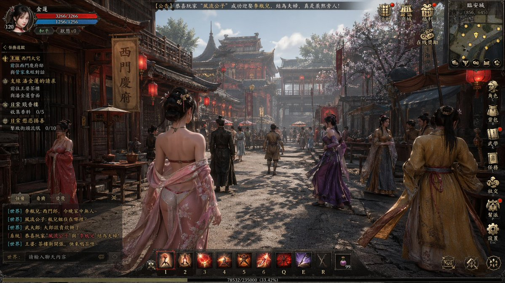

## 专业设计师打造角色写真集

- ID: case-212
- Slug: case-212-zh
- 语言: zh
- 来源: [来源链接](https://x.com/Kashiko_AIart/status/2046492817804099794)
- 样例图路径: images/part2/case212.jpg

### 提示词

```text
[中文]
请用这个角色制作一本专业设计师打造的照片集。语言为日语。

根据喜好加入提示词会让它更丰富多彩…
・丰富的场景
・信息量较多

[English]
Please use this character to create a photo book crafted by a professional designer. The language should be Japanese.

Adding prompts according to your preferences will make it more colorful and rich
・Rich scenes
・Large amount of information
```

### 样例图


## 智能动画分镜生成器

- ID: case-204
- Slug: case-204-zh
- 语言: zh
- 来源: [来源链接](https://x.com/joshesye/status/2046596222505361866)
- 样例图路径: images/part2/case204.jpg

### 提示词

```text
[中文]
生成一张动画分镜生成器

[English]
Generate an animation storyboard generator
```

### 样例图


## 一张中文健身信息图

- ID: case-183
- Slug: case-183-zh
- 语言: zh
- 来源: [来源链接](https://x.com/MrLarus/status/2046560406760505727)
- 样例图路径: images/part2/case183.jpg

### 提示词

```text
请生成一张中文健身信息图，主题为：【xxx】。

要求这张图既专业又实用，适合普通成年人作为训练参考。默认对象为无严重伤病的健康成年人；如果没有额外说明，默认训练目标为“增肌 + 基础力量提升”，默认训练水平为“新手到中级之间”，默认训练场景为“普通健身房”，默认单次训练时长控制在 40–60 分钟内。

请根据【训练主题】自动判断输出类型：

1）如果【训练主题】是某个肌群或身体部位（例如：胸肌、背阔肌、肱二头肌、腹肌、肩部、腿部等），请输出一张“该部位训练计划信息图”。
2）如果【训练主题】是某个动作或技能目标（例如：引体向上、俯卧撑、双杠臂屈伸、深蹲等），请输出一张“动作解锁 / 进阶训练计划信息图”。

整张图请采用清晰、现代、专业、易读的中文信息图风格，竖版排版，视觉简洁，重点突出，适合社交媒体分享或训练参考卡片。不要写成长篇大论，每个模块用简洁短句呈现，数字信息要醒目。

这张信息图必须包含以下内容：

【A. 标题区】
- 主标题：直接写【训练主题】训练计划 / 解锁计划
- 副标题：自动补充适用人群、目标、训练场景、建议时长
例如：适合新手 / 增肌导向 / 健身房版 / 45分钟

【B. 训练目标区】
用简洁语言说明：
- 这次训练主要针对什么
- 主要目标是什么（增肌 / 力量 / 技能解锁 / 核心控制等）
- 本次训练的重点刺激或能力提升方向

【C. 热身区】
给出 2–4 个热身建议，简洁列出即可，例如：
- 动态活动
- 目标肌群激活
- 轻重量预热组
每项可附一句说明

【D. 主训练区】
这是核心部分，请列出 4–6 个主要训练动作。
每个动作都要包含以下信息：
- 动作名称
- 训练作用 / 针对部位
- 组数 × 次数（或时间）
- RIR 建议
- 每组间休息时间
- 动作关键要点（1–2 条）
- 常见错误（1 条即可）

请确保动作安排合理：
- 先复合动作，后孤立动作
- 整体训练量适中
- 新手不要安排过度极限训练
- 主动作通常建议 RIR 1–3
- 孤立动作可建议 RIR 0–2
- 如果是腹肌或核心类动作，可用“秒数 / 次数”形式
- 如果是技能类动作，请优先安排“前置能力动作 + 过渡动作 + 目标动作尝试”

【E. 进阶 / 解锁逻辑区】
根据主题自动生成：
- 如果是肌群训练：写“如何渐进超负荷”，例如达到次数上限后再加重量、优先保证动作标准等
- 如果是动作解锁：写“分阶段进阶路径”，例如从悬垂、肩胛引体、离心训练、弹力带辅助，到标准动作完成

【F. 替代动作区】
请给出 2–3 个替代动作，适用于以下情况：
- 没有器械
- 家庭训练
- 当前能力不足
- 某些动作做不了

【G. 执行提醒区】
请给出 4–6 条简洁提醒，例如：
- 动作标准优先于重量
- 不要每组都练到力竭
- 同肌群建议间隔 48–72 小时
- 疼痛不等于正常发力
- 睡眠不足时可适当减少训练量

【H. 恢复建议区】
简洁说明：
- 训练后恢复重点
- 蛋白质 / 睡眠 / 恢复间隔建议
- 1 句风险提醒（如有明显疼痛应停止并评估）

【I. 视觉设计要求】
- 整体为单页中文信息图
- 竖版排版
- 风格现代、清爽、专业、健身感强
- 使用模块化卡片布局
- 重点数字（组数、次数、RIR、休息）要醒目
- 可加入简洁的人体肌群图标、哑铃、杠铃、引体向上等小图标
- 颜色保持高级、干净、有运动感
- 中文文字必须清晰、准确、易读
- 避免过多装饰，强调实用性与执行性

请最终输出为“一张完整的信息图内容”，而不是只给普通段落文字。
```

### 样例图


## 千禧年日系校园喜剧场景

- ID: case-182
- Slug: case-182-zh
- 语言: zh
- 来源: [来源链接](https://x.com/UminekoStudio/status/2046488248256806981)
- 样例图路径: images/part2/case182.jpg

### 提示词

```text
[中文]
2000 年代面向中学生的日剧喜剧场景

[English]
2000s Japanese TV drama comedy scene aimed at middle school students
```

### 样例图


## 赛博科幻桃太郎主视觉图

- ID: case-172
- Slug: case-172-zh
- 语言: zh
- 来源: [来源链接](https://x.com/SSSS_CRYPTOMAN/status/2046575354555617761)
- 样例图路径: images/part2/case172.jpg

### 提示词

```text
[中文]
设计虚构动画的钥匙视觉图。主题是「科幻桃太郎」。设计有魅力的角色、背景、标志和宣传语，以一幅美丽插画的形式完成，让世界观在一张图中传达出来。

[English]
Design a key visual for a fictional animation. The theme is "Sci-Fi Momotaro". Design charming characters, backgrounds, logos, and promotional slogans, completed in the form of a beautiful illustration, allowing the worldview to be conveyed in a single image.
```

### 样例图


## 综合应用场景图

- ID: case-148
- Slug: case-148-zh
- 语言: zh
- 来源: [来源链接](https://x.com/alanlovelq)
- 样例图路径: images/part2/case148.jpg

### 提示词

```text
A {argument name="platform" default="Taobao"} product detail page for {argument name="robot model" default="T-800 robot"}, displaying: front, side, and back three-view drawings of the robot, product price, product details, functions, and usage scenarios, etc.
```

### 样例图


## 综合应用场景图

- ID: case-147
- Slug: case-147-zh
- 语言: zh
- 来源: [来源链接](https://x.com/alanlovelq)
- 样例图路径: images/part2/case147.jpg

### 提示词

```text
A {argument name="platform" default="Taobao"} product detail page for {argument name="robot model" default="T-800 robot"}, displaying: front, side, and back three-view drawings of the robot, product price, product details, functions, and usage scenarios, etc.
```

### 样例图


## 综合应用场景图

- ID: case-146
- Slug: case-146-zh
- 语言: zh
- 来源: [来源链接](https://x.com/alanlovelq)
- 样例图路径: images/part2/case146.jpg

### 提示词

```text
A {argument name="platform" default="Taobao"} product detail page for {argument name="robot model" default="T-800 robot"}, displaying: front, side, and back three-view drawings of the robot, product price, product details, functions, and usage scenarios, etc.
```

### 样例图


## 综合应用场景图

- ID: case-145
- Slug: case-145-zh
- 语言: zh
- 来源: [来源链接](https://x.com/alanlovelq)
- 样例图路径: images/part2/case145.jpg

### 提示词

```text
A {argument name="platform" default="Taobao"} product detail page for {argument name="robot model" default="T-800 robot"}, displaying: front, side, and back three-view drawings of the robot, product price, product details, functions, and usage scenarios, etc.
```

### 样例图


## 建筑空间场景图

- ID: case-121
- Slug: case-121-zh
- 语言: zh
- 来源: [来源链接](https://x.com/loilokoji)
- 样例图路径: images/part2/case121.jpg

### 提示词

```text
{
  "type": "3-panel manga page",
  "style": "anime, highly detailed, cinematic lighting, futuristic corporate",
  "layout": {
    "structure": "1 wide top panel, 2 square bottom panels"
  },
  "panels": [
    {
      "position": "top",
      "shot": "wide landscape",
      "scene": "Futuristic corporate lobby with floor-to-ceiling windows",
      "lighting": "{argument name=\"time of day\" default=\"sunrise\"}",
      "background": "City skyline featuring {argument name=\"landmark\" default=\"Tokyo Tower\"}",
      "details": "Holographic displays, polished reflective floor, reception desk, lounge chairs"
    },
    {
      "position": "bottom left",
      "shot": "close-up profile",
      "character": "Young woman, dark hair, black business suit",
      "accessories": "Futuristic black earpiece with glowing blue light",
      "speech_bubble": {
        "style": "standard rounded",
        "text": "{argument name=\"character dialogue\" default=\"数字はいいわ\"}"
      }
    },
    {
      "position": "bottom right",
      "shot": "full body, walking away, touching earpiece",
      "character": "Same woman, black suit, black heels, carrying a black tote bag",
      "environment": "Approaching security gates",
      "holographic_sign": "{argument name=\"floor sign\" default=\"ECHO 42F\"}",
      "speech_bubble": {
        "style": "futuristic angular",
        "text": "{argument name=\"AI dialogue\" default=\"おはようございます、ユキさん。本日は記念すべき ──\"}"
      }
    }
  ]
}
```

### 样例图


## 动漫插画创作图

- ID: case-113
- Slug: case-113-zh
- 语言: zh
- 来源: [来源链接](https://x.com/REd8358)
- 样例图路径: images/part2/case113.jpg

### 提示词

```text
A highly detailed anime illustration of a fierce female warrior with long flowing {argument name="hair color" default="black"} hair and piercing {argument name="eye color" default="blue"} eyes, wearing a mix of silver plate armor with gold trim and a {argument name="outfit color" default="blue and white"} tunic. She is captured in a dynamic combat stance, swinging a massive, {argument name="weapon type" default="segmented metallic whip-sword"} that curves dramatically into the extreme foreground. The weapon leaves a sweeping trail of kinetic energy and wind. The scene is set against a {argument name="background setting" default="ruined battlefield with rocky terrain, floating debris, and large blue banners fluttering in the wind"} under a dramatic cloudy sky. The artwork features cinematic lighting, intense action, and a dramatic forced perspective on the weapon.
```

### 样例图


## 视频封面界面图

- ID: case-111
- Slug: case-111-zh
- 语言: zh
- 来源: [来源链接](https://x.com/mirochill)
- 样例图路径: images/part2/case111.jpg

### 提示词

```text
A YouTube thumbnail-style collage for a {argument name="overall mood" default="dark, dramatic, true crime investigation"}. In the center is a highly detailed, close-up portrait of an {argument name="central figure" default="older man with grey hair and deep wrinkles resembling Jeffrey Epstein"}, wearing a black polo shirt, with a faint red glowing outline separating him from the background. On the left side, a {argument name="left background scene" default="tropical island with luxury villas and a flying airplane in a dark sky"}. Below the island, a conspiracy board motif features exactly 2 red push pins connected by 3 thick red strings. On the top right side, a hazy, sepia-toned depiction of the {argument name="right background scene" default="US Capitol building with the silhouettes of 3 men in suits facing it"}. On the bottom right, an open manila folder containing a {argument name="document type" default="heavily redacted dossier with thick black marker lines and a smaller photograph of the central man"}. The overall composition is cinematic, intense, and heavily stylized for a documentary video.
```

### 样例图


## 综合应用场景图

- ID: case-109
- Slug: case-109-zh
- 语言: zh
- 来源: [来源链接](https://x.com/underwoodxie96)
- 样例图路径: images/part2/case109.jpg

### 提示词

```text
{argument name="subject" default="A beautiful internet celebrity"} is live-streaming a {argument name="activity" default="game"}.
```

### 样例图


## 综合应用场景图

- ID: case-108
- Slug: case-108-zh
- 语言: zh
- 来源: [来源链接](https://x.com/underwoodxie96)
- 样例图路径: images/part2/case108.jpg

### 提示词

```text
{argument name="subject" default="A beautiful internet celebrity"} is live-streaming a {argument name="activity" default="game"}.
```

### 样例图


## 综合应用场景图

- ID: case-97
- Slug: case-97-zh
- 语言: zh
- 来源: [来源链接](https://x.com/kawai_design)
- 样例图路径: images/part2/case97.jpg

### 提示词

```text
Create a high-quality Japanese {argument name="thumbnail type" default="webinar thumbnail"}. {argument name="aspect ratio" default="16:9 widescreen"}. There is a lot of text, but the main copy stands out clearly.
```

### 样例图


## 游戏界面截图

- ID: case-91
- Slug: case-91-zh
- 语言: zh
- 来源: [来源链接](https://x.com/wolfaidev)
- 样例图路径: images/part2/case91.jpg

### 提示词

```text
A highly detailed, realistic first-person video game screenshot of a next-generation voxel-based world. At the top center, a large, bold 3D logo reads "{argument name="game title" default="MINECRAFT 2"}". The scene features a {argument name="environment" default="lush, blocky landscape with a river, a small wooden cabin, a windmill, a waterfall, and majestic mountains in the background"}. The world blends realistic lighting, volumetric clouds, and high-resolution textures with cubic, voxel geometry. In the foreground on the left, a {argument name="mob 1" default="blocky green creeper"} stands on the grass, while a {argument name="mob 2" default="blocky brown wolf"} stands on the dirt path to the right. On the far right, the player's hand holds a {argument name="held item" default="pixelated blue diamond sword"} in a first-person perspective. At the bottom of the screen is a game user interface featuring a health bar with 10 red hearts, a green experience bar with the number '16', a hunger bar with 10 brown meat icons, and a 9-slot inventory hotbar. The hotbar contains, from left to right: a selected blue tool with a green highlight box, a green tool, a knife, a wrench with the number '3', a piece of meat with '6', a lantern with '24', a dirt block with '10', a bucket, and a sponge block.
```

### 样例图


## 信息图可视化设计

- ID: case-90
- Slug: case-90-zh
- 语言: zh
- 来源: [来源链接](https://x.com/A9Quant)
- 样例图路径: images/part2/case90.jpg

### 提示词

```text
GPT-Image-2 prompt: please automatically generate a top-tier concept poster / infographic-style movie poster centered around {argument name="theme" default="ranking of emperors in Chinese history"}.

Require the AI to automatically derive and uniformly design the entire following visual system based on this theme, without my extra specification:
- Core subject (automatically judge suitability for people, products, architecture, artifacts, symbols, scenes, or abstract imagery)
- Bottom supporting structure
- Hovering symbols or spiritual symbols above
- Scene wrapping elements
- Metaphor system
- Color hierarchy
- Material contrast
- Lighting logic
- Title, subtitle, and auxiliary copy
- Brand sense and high-end expression

The final frame must be: a shocking, precise, unified, cinematic, ultra-high detail conceptual key visual poster suitable for high-end printing.

[Overall Style]
Ultra-realistic 3D commercial CGI rendering, merging cinematic lighting, luxury visual language, futuristic concept design, and epic composition. The image must have a "single main visual core," not messy, not like a collage, and not like a regular e-commerce poster.

[Automatic Derivation Rules]
AI must automatically decide based on the [theme]:
1. Core visual metaphor
2. Subject type and posture
3. Form of supporting structure
4. Form of suspended elements
5. Scene shell and spatial atmosphere
6. Main, auxiliary, and emphasis colors
7. Material combinations
8. Text temperament and layout style

[Composition Rules]
- Absolute sense of premium quality
- Strong central order, overall unity
- Allows for axial symmetry or epic composition near the central axis
- Clear visual gravity, forming clear levels from top to bottom
- Edge negative space is clean, restrained, and has room to breathe

[Visual Quality]
- Ultra-high detail
- Clear volumetric light
- Authentic materials
- Natural reflection, refraction, shadows, fog, and depth of field
- Overall standard of high-end brand campaign key visual / luxury invitation poster / conceptual editorial poster

[Typography System]
- Overall 90% visual, 10% text
- AI automatically generates the most matching main title and subtitle based on the [theme]
- Title must be concise, sharp, and powerful
- Text should be as minimal and accurate as possible; do not stack words

[Signature Requirement]
Naturally add the author signature in the bottom corner: @a9quant
```

### 样例图


## 信息图可视化设计

- ID: case-89
- Slug: case-89-zh
- 语言: zh
- 来源: [来源链接](https://x.com/A9Quant)
- 样例图路径: images/part2/case89.jpg

### 提示词

```text
GPT-Image-2 prompt: please automatically generate a top-tier concept poster / infographic-style movie poster centered around {argument name="theme" default="ranking of emperors in Chinese history"}.

Require the AI to automatically derive and uniformly design the entire following visual system based on this theme, without my extra specification:
- Core subject (automatically judge suitability for people, products, architecture, artifacts, symbols, scenes, or abstract imagery)
- Bottom supporting structure
- Hovering symbols or spiritual symbols above
- Scene wrapping elements
- Metaphor system
- Color hierarchy
- Material contrast
- Lighting logic
- Title, subtitle, and auxiliary copy
- Brand sense and high-end expression

The final frame must be: a shocking, precise, unified, cinematic, ultra-high detail conceptual key visual poster suitable for high-end printing.

[Overall Style]
Ultra-realistic 3D commercial CGI rendering, merging cinematic lighting, luxury visual language, futuristic concept design, and epic composition. The image must have a "single main visual core," not messy, not like a collage, and not like a regular e-commerce poster.

[Automatic Derivation Rules]
AI must automatically decide based on the [theme]:
1. Core visual metaphor
2. Subject type and posture
3. Form of supporting structure
4. Form of suspended elements
5. Scene shell and spatial atmosphere
6. Main, auxiliary, and emphasis colors
7. Material combinations
8. Text temperament and layout style

[Composition Rules]
- Absolute sense of premium quality
- Strong central order, overall unity
- Allows for axial symmetry or epic composition near the central axis
- Clear visual gravity, forming clear levels from top to bottom
- Edge negative space is clean, restrained, and has room to breathe

[Visual Quality]
- Ultra-high detail
- Clear volumetric light
- Authentic materials
- Natural reflection, refraction, shadows, fog, and depth of field
- Overall standard of high-end brand campaign key visual / luxury invitation poster / conceptual editorial poster

[Typography System]
- Overall 90% visual, 10% text
- AI automatically generates the most matching main title and subtitle based on the [theme]
- Title must be concise, sharp, and powerful
- Text should be as minimal and accurate as possible; do not stack words

[Signature Requirement]
Naturally add the author signature in the bottom corner: @a9quant
```

### 样例图

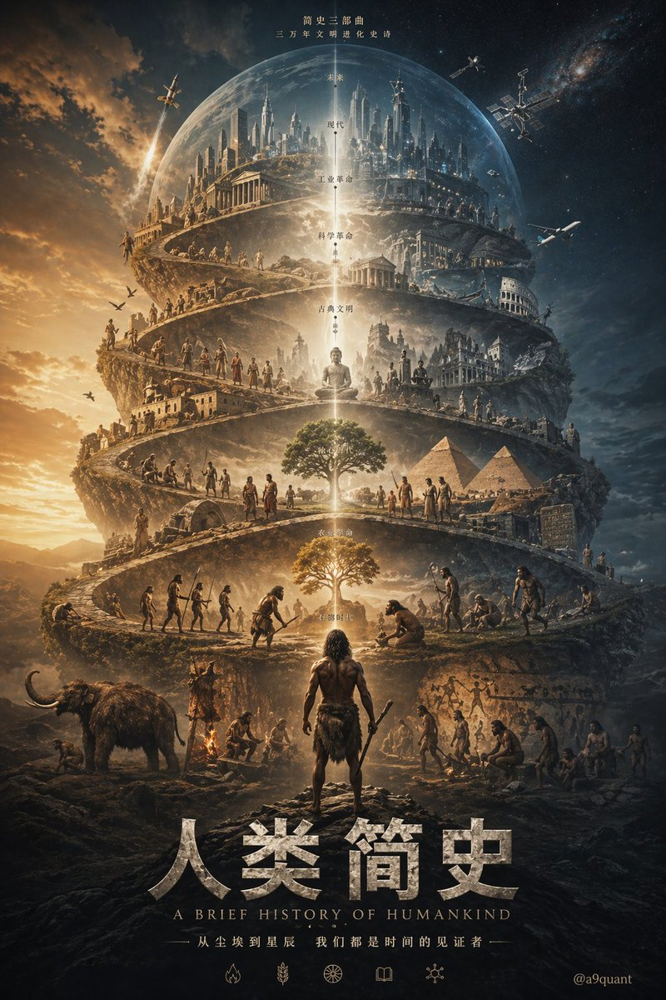

## 信息图可视化设计

- ID: case-88
- Slug: case-88-zh
- 语言: zh
- 来源: [来源链接](https://x.com/A9Quant)
- 样例图路径: images/part2/case88.jpg

### 提示词

```text
GPT-Image-2 prompt: please automatically generate a top-tier concept poster / infographic-style movie poster centered around {argument name="theme" default="ranking of emperors in Chinese history"}.

Require the AI to automatically derive and uniformly design the entire following visual system based on this theme, without my extra specification:
- Core subject (automatically judge suitability for people, products, architecture, artifacts, symbols, scenes, or abstract imagery)
- Bottom supporting structure
- Hovering symbols or spiritual symbols above
- Scene wrapping elements
- Metaphor system
- Color hierarchy
- Material contrast
- Lighting logic
- Title, subtitle, and auxiliary copy
- Brand sense and high-end expression

The final frame must be: a shocking, precise, unified, cinematic, ultra-high detail conceptual key visual poster suitable for high-end printing.

[Overall Style]
Ultra-realistic 3D commercial CGI rendering, merging cinematic lighting, luxury visual language, futuristic concept design, and epic composition. The image must have a "single main visual core," not messy, not like a collage, and not like a regular e-commerce poster.

[Automatic Derivation Rules]
AI must automatically decide based on the [theme]:
1. Core visual metaphor
2. Subject type and posture
3. Form of supporting structure
4. Form of suspended elements
5. Scene shell and spatial atmosphere
6. Main, auxiliary, and emphasis colors
7. Material combinations
8. Text temperament and layout style

[Composition Rules]
- Absolute sense of premium quality
- Strong central order, overall unity
- Allows for axial symmetry or epic composition near the central axis
- Clear visual gravity, forming clear levels from top to bottom
- Edge negative space is clean, restrained, and has room to breathe

[Visual Quality]
- Ultra-high detail
- Clear volumetric light
- Authentic materials
- Natural reflection, refraction, shadows, fog, and depth of field
- Overall standard of high-end brand campaign key visual / luxury invitation poster / conceptual editorial poster

[Typography System]
- Overall 90% visual, 10% text
- AI automatically generates the most matching main title and subtitle based on the [theme]
- Title must be concise, sharp, and powerful
- Text should be as minimal and accurate as possible; do not stack words

[Signature Requirement]
Naturally add the author signature in the bottom corner: @a9quant
```

### 样例图

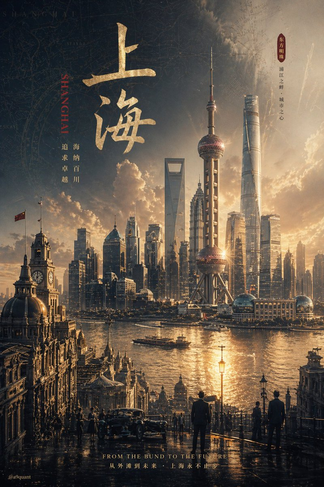

## 写实摄影风格图

- ID: case-81
- Slug: case-81-zh
- 语言: zh
- 来源: [来源链接](https://x.com/HumanOS_v2)
- 样例图路径: images/part2/case81.jpg

### 提示词

```text
{
  "type": "scientific hardware diagram",
  "layout": {
    "main_scene": "3D render of an optical table with a red laser beam passing through 11 aligned optical components mounted on black posts.",
    "top_brackets": [
      {"label": "Dual Modulation", "span": "SLM1"},
      {"label": "4f Relay Optics", "span": "Lens L1 to Lens L2"},
      {"label": "Imaging Optics", "span": "SLM2 to Lens L4"},
      {"label": "Detection", "span": "Camera"}
    ],
    "optical_components_left_to_right": [
      {"name": "Laser", "labels": ["Laser", "λ = {argument name=\"laser wavelength\" default=\"632.8 nm\"}"]},
      {"name": "SLM1", "labels": ["SLM1", "(Phase / Pol. Mod.)"]},
      {"name": "Lens L1", "labels": ["Lens L1", "(f1)"]},
      {"name": "Iris", "labels": ["Fourier Plane", "(Pupil Plane)", "Iris", "(Higher Orders Filtered)"]},
      {"name": "HWP", "labels": ["HWP", "(λ/2)"]},
      {"name": "Lens L2", "labels": ["Lens L2", "(f1)"]},
      {"name": "SLM2", "labels": ["SLM2", "(Phase / Pol. Mod.)"]},
      {"name": "Lens L3", "labels": ["Lens L3", "(f2)"]},
      {"name": "Lens L4", "labels": ["Lens L4", "(f2)"]},
      {"name": "Linear Polarizer", "labels": ["Linear", "-Polarizer", "(Global Analyzer)"]},
      {"name": "Polarization Camera", "labels": ["POLARIZATION CAMERA"]}
    ],
    "inset_box": {
      "position": "bottom right",
      "title": "Polarization Camera Micro-Polarizer Array (Per-Pixel Analyzer)",
      "grid": "4x4 grid of colored squares with directional arrows",
      "legend_count": 4,
      "legend_items": [
        "Red square, horizontal arrow, 0° (H)",
        "Green square, vertical arrow, 90° (V)",
        "Blue square, diagonal arrow, 45° (D)",
        "Yellow square, diagonal arrow, 135° (A)"
      ]
    },
    "bottom_caption": {
      "figure_prefix": "{argument name=\"figure number\" default=\"Fig. 5.\"}",
      "title": "{argument name=\"system name\" default=\"Ellipsography Hardware Setup.\"}",
      "text": "Paragraph of scientific text explaining the dual-modulation configuration, 4f relay optics, and polarization camera."
    }
  }
}
```

### 样例图


## 主题海报版式设计

- ID: case-59
- Slug: case-59-zh
- 语言: zh
- 来源: [来源链接](https://x.com/X64zzotSKCGtYmt)
- 样例图路径: images/part2/case59.jpg

### 提示词

```text
{
  "type": "cinematic promotional poster",
  "style": "3D CGI animation style, highly detailed, dramatic lighting, caricature characters",
  "characters": [
    { "id": "char1", "description": "large shirtless man with long black hair, beard, and glasses" },
    { "id": "char2", "description": "elderly woman in a kimono with white hair tied up" },
    { "id": "char3", "description": "small man with a topknot, glasses, mustache, wearing a bright green sweater" }
  ],
  "layout": {
    "panels": [
      {
        "position": "top",
        "scene": "wide shot of a town street with buildings and a city skyline in the background",
        "characters_present": ["char1", "char2", "char3"],
        "text_overlays": [
          "{argument name=\"intro text\" default=\"ある日ーー\"}",
          "いつもの日常がーー",
          "こんばんは"
        ]
      },
      {
        "position": "middle left",
        "scene": "close-up of char1 looking shocked against a dark fiery background",
        "text_overlays": [
          "{argument name=\"shocked text\" default=\"私が出禁？\"}"
        ]
      },
      {
        "position": "middle right",
        "scene": "close-up of char2 looking angry and pointing against a stormy sea background",
        "text_overlays": [
          "{argument name=\"angry text\" default=\"海を荒らすな！\"}"
        ]
      },
      {
        "position": "bottom",
        "scene": "char3 pointing, char1 screaming, a second instance of char3 falling backwards, and char2 sitting angrily against a fiery chaotic background",
        "text_overlays": [
          "全然出ない！"
        ],
        "bottom_titles": [
          "{argument name=\"main title\" default=\"パチンコ軍団親のイメチェン\"}",
          "{argument name=\"subtitle\" default=\"LINEスタンプ販売中\"}"
        ]
      }
    ]
  }
}
```

### 样例图


## 建筑空间场景图

- ID: case-50
- Slug: case-50-zh
- 语言: zh
- 来源: [来源链接](https://x.com/nomen_machine)
- 样例图路径: images/part2/case50.jpg

### 提示词

```text
A highly detailed, cinematic wide shot of a grand, dark gothic hall with a {argument name="atmosphere" default="dark fantasy"} aesthetic. In the center, a single figure wearing a {argument name="clothing" default="long white robe"} kneels on a highly reflective stone floor, facing an ornate golden altar illuminated by a row of lit candles. To the right of the kneeling figure, a single {argument name="floor object" default="wooden violin"} rests on the ground. The cavernous room is framed by massive dark stone pillars detailed with {argument name="accent color" default="glowing blue"} ethereal cracks and veins. Suspended from the high ceiling are dozens of {argument name="floating objects" default="white porcelain theatrical masks"} hanging on thin strings, filling the upper half of the space and creating a haunting, surreal atmosphere. The lighting is dramatic and moody, featuring a rich color palette of deep blacks, tarnished golds, and cool blue accents. Format 16:9.
```

### 样例图


## 综合应用场景图

- ID: case-40
- Slug: case-40-zh
- 语言: zh
- 来源: [来源链接](https://x.com/midori_tatsuta)
- 样例图路径: images/part2/case40.jpg

### 提示词

```text
Create {argument name="quantity" default="24"} LINE stickers of {argument name="animals" default="animals"} in a quirky hand-drawn style. Target {argument name="target audience" default="Japanese Gen Z"} with a trendy style that can aim for top downloads.
```

### 样例图

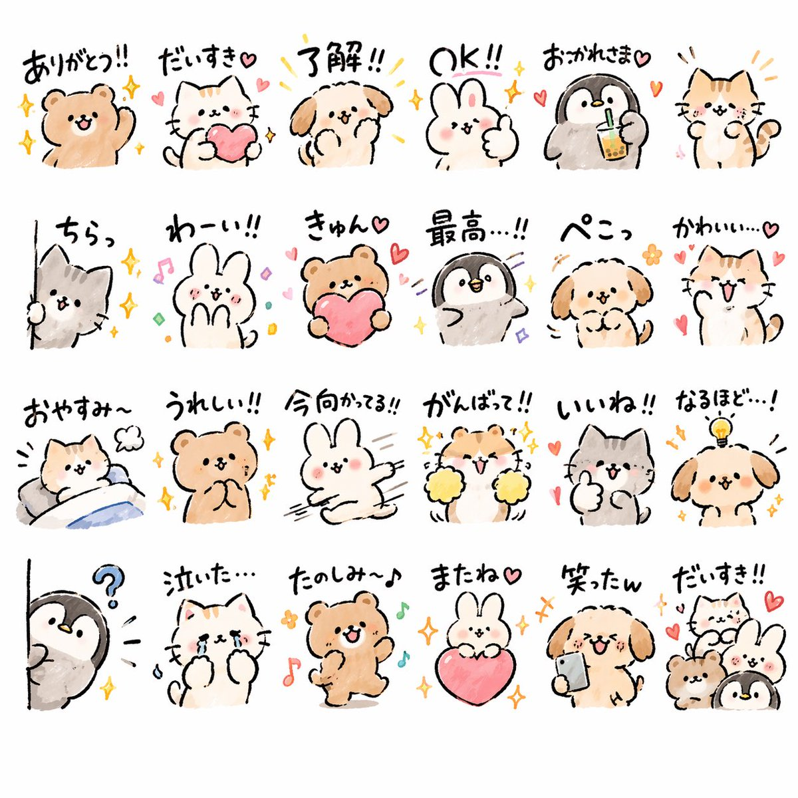

## 综合应用场景图

- ID: case-39
- Slug: case-39-zh
- 语言: zh
- 来源: [来源链接](https://x.com/midori_tatsuta)
- 样例图路径: images/part2/case39.jpg

### 提示词

```text
Create {argument name="quantity" default="24"} LINE stickers of {argument name="animals" default="animals"} in a quirky hand-drawn style. Target {argument name="target audience" default="Japanese Gen Z"} with a trendy style that can aim for top downloads.
```

### 样例图


## 综合应用场景图

- ID: case-38
- Slug: case-38-zh
- 语言: zh
- 来源: [来源链接](https://x.com/midori_tatsuta)
- 样例图路径: images/part2/case38.jpg

### 提示词

```text
Create {argument name="quantity" default="24"} LINE stickers of {argument name="animals" default="animals"} in a quirky hand-drawn style. Target {argument name="target audience" default="Japanese Gen Z"} with a trendy style that can aim for top downloads.
```

### 样例图

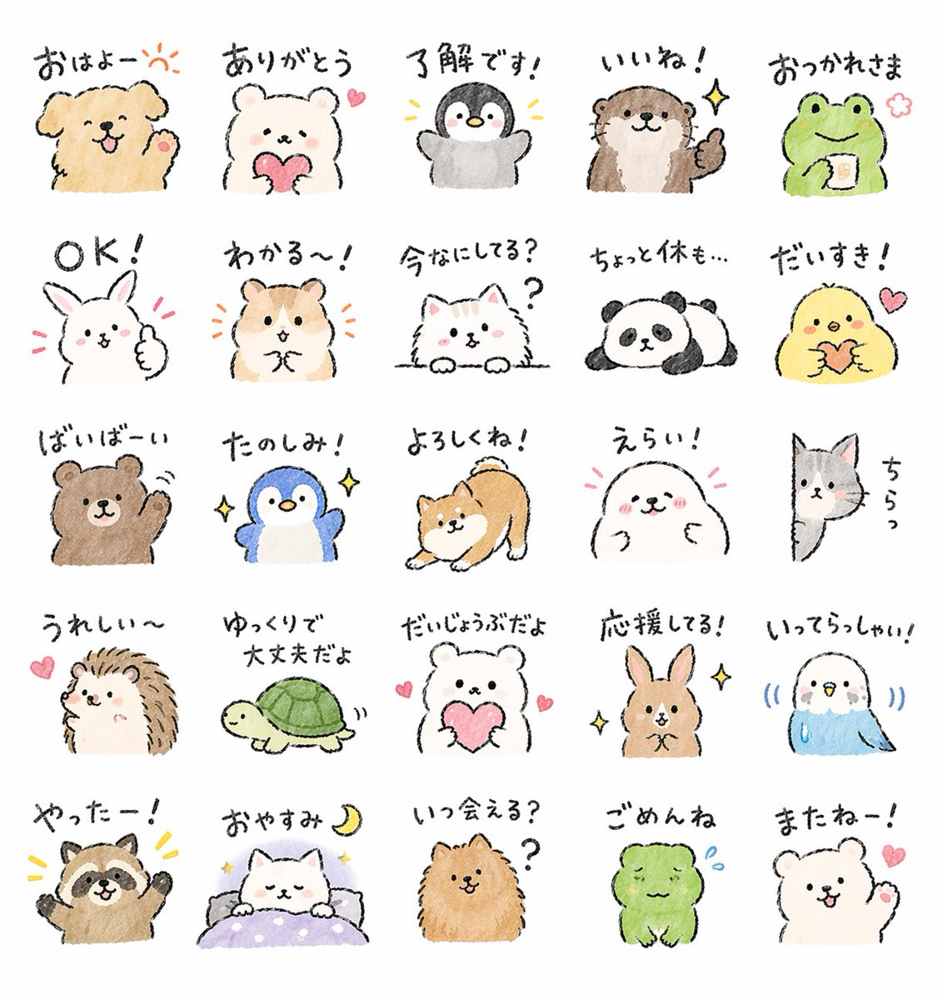

## 综合应用场景图

- ID: case-37
- Slug: case-37-zh
- 语言: zh
- 来源: [来源链接](https://x.com/midori_tatsuta)
- 样例图路径: images/part2/case37.jpg

### 提示词

```text
Create {argument name="quantity" default="24"} LINE stickers of {argument name="animals" default="animals"} in a quirky hand-drawn style. Target {argument name="target audience" default="Japanese Gen Z"} with a trendy style that can aim for top downloads.
```

### 样例图

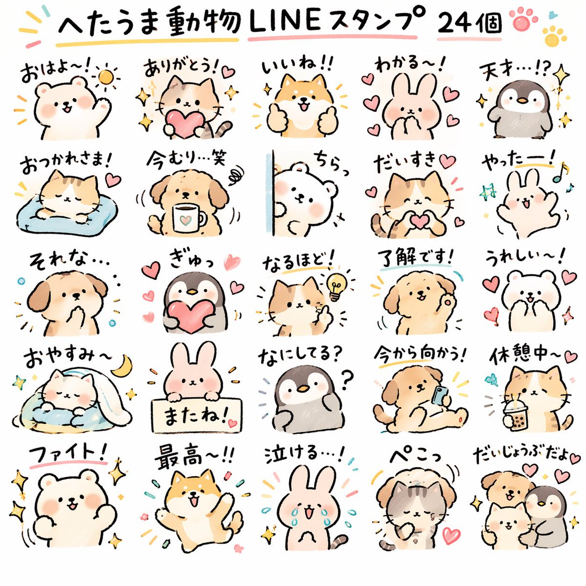

## 建筑空间场景图

- ID: case-26
- Slug: case-26-zh
- 语言: zh
- 来源: [来源链接](https://x.com/ecooai)
- 样例图路径: images/part2/case26.jpg

### 提示词

```text
A vintage 35mm film photograph of a {argument name="subject description" default="young Asian woman"} with {argument name="hair style" default="long dark wavy hair and wispy bangs"}. She is wearing a {argument name="clothing" default="white ribbed tank top and a loose beige knit cardigan slipping off one shoulder"}, along with a delicate silver necklace. She has soft makeup with pink blush and glossy lips, looking directly at the camera with slightly parted lips. The lighting is harsh direct camera flash, creating a candid, amateur snapshot aesthetic. The background is a {argument name="setting" default="dimly lit, slightly messy room with clothes on a table and a wooden shelf"}. The image features heavy film grain, slightly muted colors, and a nostalgic, highly realistic photographic texture.
```

### 样例图


## 综合应用场景图

- ID: case-25
- Slug: case-25-zh
- 语言: zh
- 来源: [来源链接](https://x.com/nicdunz)
- 样例图路径: images/part2/case25.jpg

### 提示词

```text
create a minecraft skin inspired by {argument name="reference" default="my look"}
```

### 样例图


## 插画艺术风格创作

- ID: case-22
- Slug: case-22-zh
- 语言: zh
- 来源: [来源链接](https://x.com/Tanemomi_Ver2)
- 样例图路径: images/part2/case22.jpg

### 提示词

```text
An anime-style illustration of a {argument name="action type" default="high-impact martial arts battle"} between two young female fighters in a {argument name="setting" default="traditional wooden martial arts dojo"}. In the foreground, a girl with black hair in a high bun wears a {argument name="character 1 color theme" default="red and white"} Chinese-style martial arts outfit with baggy pants. She is in a dynamic, low, forward-thrusting stance, surrounded by swirling red energy and water splashes. In the background to the right, a girl with light purple hair in twin buns wears a {argument name="character 2 color theme" default="green and purple"} Chinese dress with gold embroidery and black tights. She is leaping through the air in a flying kick pose, surrounded by swirling blue energy. The wooden floorboards are splintering from the intense impact, with debris and dust flying through the air. Above them hangs a weathered wooden sign with the text "{argument name="sign text" default="武術会"}". The scene features dramatic lighting, a low-angle dynamic perspective, and intense action effects.
```

### 样例图


## 科普百科图

- ID: case-8
- Slug: case-8-zh
- 语言: zh
- 来源: [来源链接](https://github.com/freestylefly/awesome-gpt-image-2/blob/main/docs/gallery-part-1.md#case-8)
- 样例图路径: images/part2/case8.jpg

### 提示词

```text
根据【主题】生成一张高质量竖版「科普百科图」。
这张图不是普通海报，也不是单纯插画，而是一张兼具图鉴感、百科感、信息结构感和收藏感的模块化科普信息图。整体风格参考高级博物图鉴、现代百科书页、生活方式知识卡，以及社交媒体上更容易传播的信息图风格。
让画面包含：
一个清晰好看的主题主视觉
若干局部特征放大细节
多个圆角模块化信息分区
清楚的标题层级与重点标签
简洁但信息丰富的百科内容
可视化评分、要点总结或 Top 5 模块
内容栏目请根据主题自动适配，优先从这些方向里选择并合理组合：
基础档案、分类信息、外观特征、习性生态、形成机制或结构组成、生长或使用条件、养护或维护建议、风险与注意事项、适合人群或适用场景、优缺点对比、快速评分卡。
视觉要求：
浅色干净背景，柔和配色，轻阴影，精致小图标，圆角信息框，整体排版整洁清爽。信息密度要丰富，但不能显得拥挤，阅读体验要舒服。最终效果要像真正可以发布、阅读、收藏、批量做成系列内容的科普百科卡，而不是广告感很重的宣传海报。
不要做成普通商业宣传海报，要重点突出“知识整理”“模块信息”“图鉴式展示”这几个特征。
```

### 样例图


## 应用界面样机图

- ID: case-7
- Slug: case-7-zh
- 语言: zh
- 来源: [来源链接](https://github.com/freestylefly/awesome-gpt-image-2/blob/main/docs/gallery-part-1.md#case-7)
- 样例图路径: images/part2/case7.jpg

### 提示词

```text
生成一张竖版手机截图风格的图片，整体比例接近 9:16。画面中心偏上是一位真人 coser，扮演上传图片中的二次元角色。人物为写实风格，但五官略带动漫感，皮肤细腻，眼睛稍大，表情温柔地看向镜头，坐在室内的休闲场景中，例如咖啡厅或酒吧吧台前，背景有符合场景的道具。画面最上方加入手机系统状态栏 UI，包括时间、电量、信号、网络等图标，让整张图看起来像手机截图。画面底部叠加一块宽大的半透明 galgame 风格对话框，对话框左侧放一个与画面人物对应的动漫或 Q 版头像；对话框右侧排版文字：第一行用较大字体显示与前面相同的角色名字，下面一到两行显示一段适合这个角色人设的、温柔治愈风格的简体中文台词，由你自动创作。再在对话框下方加一条操作栏，仿照 galgame UI。整体风格高清、细节丰富、光线柔和、二次元与真人写真自然融合。
```

### 样例图


## 主题海报版式设计

- ID: case-5
- Slug: case-5-zh
- 语言: zh
- 来源: [来源链接](https://github.com/freestylefly/awesome-gpt-image-2/blob/main/docs/gallery-part-1.md#case-5)
- 样例图路径: images/part2/case5.jpg

### 提示词

```text
根据【XXX主题】自动生成一张收藏版史诗叙事海报：巨大优雅的人物侧脸剪影作为外轮廓，剪影内部自动生长出最契合该主题的完整世界观、标志性场景、角色关系、象征符号、关键建筑、生物、道具与氛围。整体不是普通拼贴，而是高级的剪影轮廓填充式叙事合成，带有双重曝光式联想，但更偏电影海报与梦幻水彩插画融合风格；柔和空气透视，轻雾化过渡，纸张颗粒，边缘飞白与刷痕，大面积留白，版式克制高级，安静、宏大、神圣、怀旧、诗意、传说感强。风格、色彩、场景、材质全部根据主题自动适配，所有元素必须强绑定主题，一眼识别，不要杂乱，不要硬拼贴，不要模板化背景，不要廉价奇幻素材。画面中需自然加入专属签名“WHY”，作为海报设计的一部分，位置低调但清晰，可放在左下角、右下角或标题附近，风格需与整体版式统一，像收藏版海报的作者落款或设计签章；签名字体精致、克制、高级，不可过大，不可破坏主体构图，不可显得突兀廉价。
```

### 样例图

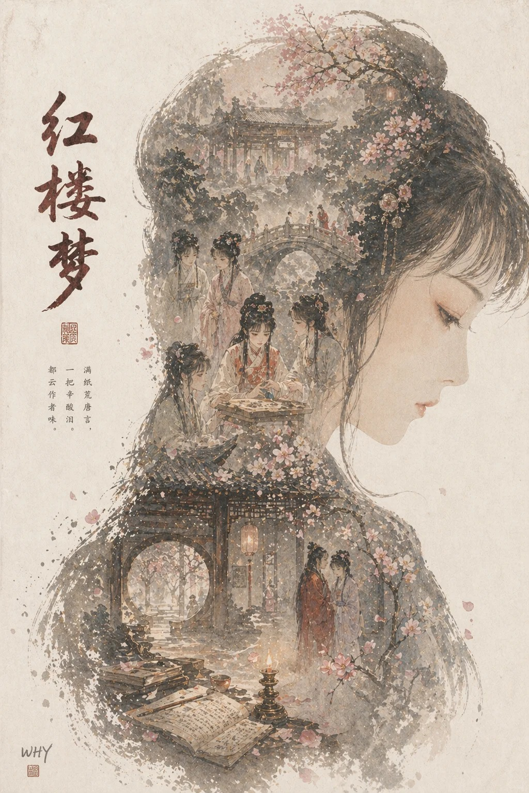

