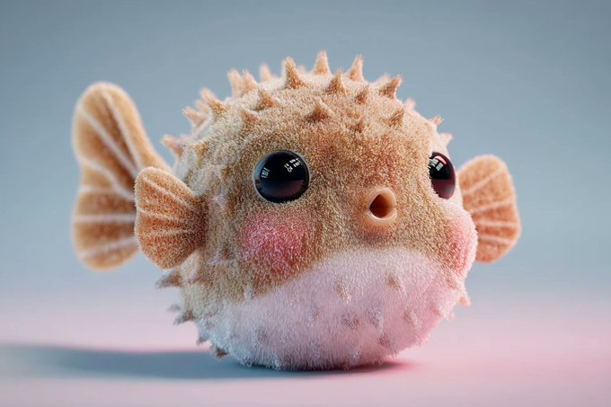

# toy

总计：115

## 2026新年海报

- ID: gpt4o-1007-zh
- Slug: prompt-1007-zh
- 语言: zh
- 来源: [来源链接](https://x.com/op7418/status/2005486114510180545)
- 样例图路径: images/part3/1007.jpeg

### 提示词

```text
{
    "applicable_models": [
        "Seedream",
        "Nano Banana Pro"
    ],
    "subject": {
        "IP_Name": "Enter the names of your favorite games, novels, movies, or TV shows.",
        "description": "A visually striking, masterpiece-level 3D New Year's greeting card poster based on [IP Name]. Vertical composition with a deep, window-like groove in the center.",
        "material_style": "Felt and coarse knitting wool texture, realistic and delicate, blind box toy texture.",
        "central_character": {
            "identity": "A cute Q-version felt Pony (representing the Year of the Horse)",
            "expression": "Naive and charming (憨态可掬), festive",
            "clothing": "Red festive vest, traditional tiger-head hat",
            "action": "Standing in the center as a festival messenger"
        },
        "secondary_characters": {
            "identity": "Classic characters from the IP (Q-version felt style)",
            "clothing": "Traditional festive Tang suit or Hanfu",
            "action": "Interacting within the scene, adding story elements"
        },
        "scene_elements": {
            "architecture": "Iconic buildings from the IP in Q-version felt, arranged with depth and layers",
            "ground": "Thick creamy knitted snow",
            "vegetation": "Peach tree or Kumquat tree hung with red lanterns, Chinese knots, and blessing cards",
            "props": "Scattered felt firecrackers, gold ingots, snow-covered shrubs"
        }
    },
    "accessories": {
        "title_design": {
            "structure": "Independent 3D volumetric letters suspended in mid-air (No background plate/card)",
            "main_text": {
                "content": "Happy New Year",
                "font_style": "3D fluid art font, thick glass volume"
            },
            "sub_text": {
                "content": "新年快乐",
                "font_style": "Bold Chinese Calligraphy (中国书法), 3D extruded strokes"
            },
            "material_properties": {
                "type": "Matte Frosted Glass (applied directly to the text volume)",
                "color": "Deep red to light red gradient",
                "surface": "Soft matte finish, semi-transparent",
                "optical_effects": "Dreamy colorful caustics casting shadows onto the felt scene below"
            }
        },
        "bottom_layout": {
            "content": "Random classic quote related to New Year, blessings, or hope",
            "font_style": "Large, elegant Western Handwritten Serif, rich ink color",
            "source_note": "Small Chinese font citing the source"
        }
    },
    "photography": {
        "renderer": "C4D, Octane Render",
        "resolution": "8K",
        "camera_style": "Macro photography perspective",
        "shot_type": "Vertical Poster, Close-up on miniature",
        "depth_of_field": "Shallow depth of field (background bokeh)",
        "lighting": "Soft and uniform, breathing light effect, atmospheric depth",
        "texture_quality": "Masterpiece, rich details, mixture of felt and frosted glass"
    },
    "background": {
        "setting": "Oriental ink wash void environment with flowing light mist",
        "colors": "Elegant pale champagne gold or high-grade soft mist red",
        "external_decor": [
            "Red velvet silk ribbons dancing in the air",
            "Fluid gold lines",
            "Blooming red plum branches",
            "Strings of festive red lanterns",
            "Plump persimmons or hawthorn berries",
            "Crystal clear geometric snowflakes",
            "Glowing gold copper coin strings"
        ],
        "atmosphere": "Explosive festive atmosphere, dynamic composition",
        "positioning": "Card appears suspended in clouds with soft shadow at the bottom"
    },
    "the_vibe": {
        "mood": "Festive, Oriental, Warm, Exquisite, Joyful",
        "culture": "Chinese New Year, Year of the Horse",
        "aesthetic": "High-end commercial design, Cuteness mixed with elegance"
    },
    "constraints": {
        "must_keep": [
            "Felt texture",
            "Chinese New Year elements",
            "Year of the Horse Pony",
            "Volumetric glass text (No signboard)",
            "Calligraphy text",
            "Ink wash background"
        ],
        "avoid": [
            "Santa Claus",
            "Christmas trees",
            "Western Christmas decorations",
            "Real photography style",
            "Flat 2D illustration",
            "Rectangular glass plate behind text",
            "Signboard",
            "Text on a card"
        ]
    },
    "negative_prompt": [
        "Santa Claus",
        "Christmas tree",
        "rectangular background plate",
        "glass sign",
        "text box",
        "holding a sign",
        "photorealistic human",
        "low resolution",
        "blurry",
        "flat colors",
        "dark",
        "horror",
        "distorted text"
    ]
}
```

### 样例图


## <instruction> Input A: user uploads an image or shares n

- ID: gpt4o-976-en-1
- Slug: prompt-976-en-1
- 语言: en
- 来源: [来源链接](https://x.com/Gdgtify/status/2003466876115177544?referrer=grok.com)
- 样例图路径: images/part3/976.jpeg

### 提示词

```text
<instruction>
Input A: user uploads an image or shares name of dish

Logic  Identify the historical inventor (e.g., Raffaele Esposito or Henri Charpentier) and the exact year of origin.

Task: A hyper-realistic 4:5 macro photograph of an oversized, open antique culinary codex resting on a dark velvet museum plinth.

Left Page (The Living Diorama):
The left side of the book is hollowed out like a secret compartment. Inside is a breathtaking 3D miniature scene. A highly detailed figurine of the dish’s inventor is captured mid-motion in a period-accurate kitchen. Around them are microscopic versions of the 10-15 key ingredients, each in its own tiny hand-blown glass vial or micro-wooden crate. Include miniature brass cooking tools specific to the era. The scene is lit from within the "pages" by a warm, magical amber glow.

Right Page (The Technical Recipe):
The right page is flat, aged parchment featuring elegant, faded Spencerian calligraphy and hand-painted watercolor illustrations.
1. Top: The dish name in both English and its native language, with the bold "Origin Date."
2. Middle: A vertical "Ingredient Blueprint" with hyper-detailed sketches of each raw component.
3. Bottom: A small, detailed "Origin Map" showing the specific city of birth, styled like a 19th-century cartographic inset.
4. Text: Visible, legible recipe steps written in ink that looks slightly raised on the paper.

Style:
Museum specimen photography. 85mm macro lens. The lighting should be a mix of cool gallery spotlights and the warm "internal" glow of the book's diorama. Extreme texture on the weathered leather binding and the tooth of the paper.
Output: ONE image, 4:5 aspect ratio.
</instruction>
```

### 样例图


## 博物馆标本摄影

- ID: gpt4o-976-zh-2
- Slug: prompt-976-zh-2
- 语言: zh
- 来源: [来源链接](https://x.com/Gdgtify/status/2003466876115177544?referrer=grok.com)
- 样例图路径: images/part3/976.jpeg

### 提示词

```text
<指令>
输入A：用户上传图片或分享菜品名称。

逻辑推理：确定历史上的发明者（例如，拉斐尔·埃斯波西托或亨利·夏庞蒂埃）以及确切的发明年份。

任务：拍摄一张超写实的 4:5 微距照片，照片内容为一本超大尺寸的、打开的古董烹饪手抄本，放置在深色天鹅绒博物馆底座上。

左页（活体立体模型）：
书的左侧被掏空，如同一个秘密隔间。里面是一个令人叹为观止的3D微缩场景。菜肴发明者的精细人偶被定格在还原时代风貌的厨房中。周围环绕着10-15种关键食材的微缩模型，每一种都装在各自独立的手工吹制玻璃瓶或微型木箱中。此外，还配有那个时代特有的微型黄铜烹饪用具。整个场景由“书页”内部散发出的温暖而迷人的琥珀色光芒照亮。

右页（技术说明）：
右页是平整的古旧羊皮纸，上面有优雅的褪色斯宾塞体书法和手绘水彩插图。
1. 顶部：菜肴名称以英文和其原产语言标注，并加粗“起源日期”。
2. 中间：垂直的“成分蓝图”，包含每个原材料的超详细草图。
3. 底部：一张小而详细的“出生地地图”，显示具体的出生城市，风格类似于 19 世纪的地图插图。
4. 文字：清晰易读的食谱步骤，用略微凸起的墨水书写在纸上。

风格：
博物馆标本摄影。使用85毫米微距镜头。灯光应结合冷色调的展厅聚光灯和书籍立体模型内部温暖的光晕。展现做旧皮革装帧和纸张纹理的极致质感。
输出：一张图像，宽高比为 4:5。
</指令>
```

### 样例图


## 圣诞特辑-圣诞小精灵

- ID: gpt4o-962-zh
- Slug: prompt-962-zh
- 语言: zh
- 来源: [来源链接](https://x.com/songguoxiansen/status/2003101132378591474)
- 样例图路径: images/part3/962.jpeg

### 提示词

```text
(杰作, 最高画质, 超细节, 8k分辨率). 一张照片般逼真的4格分屏拼图，所有画面为同一女性角色。[关键：保持精确的面部特征，保留原始脸部结构，整个拼图中角色完全一致]. 角色皮肤白皙，质感自然，眼神明亮。左上图：角色穿着绿色的圣诞精灵服装，戴着尖尖的精灵耳朵道具，对着镜头敬礼，表情顽皮。右上图：角色手里拿着一个巨大的玩具锤子，假装要敲打镜头，眼睛睁得圆圆的。左下图：角色正在包装礼物，嘴里咬着丝带的一端，眉头微皱显得很专注可爱。右下图：角色坐在礼物堆上，双手托腮，双脚悬空晃动，一脸满足。环境：色彩饱和的圣诞工坊背景，红绿撞色。灯光：明亮的影棚灯光，无阴影，卡通感强。风格：K-pop专辑内页风格，色彩鲜艳跳跃，清晰对焦，活泼搞怪。
```

### 样例图


## { "reference": "use uploaded image as facial reference, 

- ID: gpt4o-958-en-1
- Slug: prompt-958-en-1
- 语言: en
- 来源: [来源链接](https://x.com/r4jjesh/status/2002893222608331014)
- 样例图路径: images/part3/958.jpeg

### 提示词

```text
{
"reference": "use uploaded image as facial reference, preserve original face and identity exactly",
"character_type": "caricature-style keychain, gender-neutral",
"pose": "riding a yellow scooter indoors",
"head_style": "oversized head with joyful, playful smile",
"outfit_beanie": "yellow knit beanie",
"outfit_top": "striped yellow-black sweater",
"outfit_bottom": "denim shorts",
"socks": "white socks",
"footwear": "white sneakers",
"keychain_detail": "blue strap labeled 'SAMMU'",
"lighting": "soft indoor lighting",
"depth_of_field": "shallow depth of field",
"background": "mall-like indoor environment",
"style": "whimsical, toy-like, premium collectible",
"photography": "cinematic product photography",
"texture": "smooth plastic, high
detail finish"
}
```

### 样例图


## 卡通风格钥匙扣

- ID: gpt4o-958-zh-2
- Slug: prompt-958-zh-2
- 语言: zh
- 来源: [来源链接](https://x.com/r4jjesh/status/2002893222608331014)
- 样例图路径: images/part3/958.jpeg

### 提示词

```text
{
“参考”：“使用上传的图片作为面部参考，精确保留原始面部和身份信息”，
"character_type": "卡通风格钥匙扣，中性款",
“姿势”：“在室内骑黄色滑板车”，
"head_style": "大头，带着快乐、俏皮的笑容",
"outfit_beanie": "黄色针织帽",
"outfit_top": "条纹黄黑毛衣",
"outfit_bottom": "牛仔短裤",
“袜子”: “白袜子”，
“鞋类”: “白色运动鞋”，
"keychain_detail": "蓝色表带，标签为'SAMMU'",
“照明”：“柔和的室内照明”，
"depth_of_field": "浅景深",
“背景”：“类似购物中心的室内环境”，
“风格”：“异想天开、玩具般、高级收藏品”
“摄影”: “电影化产品摄影”，
“质感”：光滑塑料，高
细节处理”
}
```

### 样例图


## do this for Messi: <instruction> Relic-Loadout Kit Input

- ID: gpt4o-945-en-1
- Slug: prompt-945-en-1
- 语言: en
- 来源: [来源链接](https://x.com/Gdgtify/status/2002116477307044203)
- 样例图路径: images/part3/945.jpeg

### 提示词

```text
do this for Messi: <instruction>
Relic-Loadout Kit
Input A is a fictional or real character (image/name) OR story IP (poster/name).
Analyze and infer: character archetype, iconic scene, signature items, and moral arc.
Goal: Premium collector kit box with compartments (no logos; minimal text).
Rules:
Center compartment: mini figurine.
Surround 10–16 relic props that teach the character arc (before/after item, symbol of sacrifice, tool of choice).
Add a tiny “arc timeline” strip with 5 beats (icons + 1–2 words max each).
Output: one image, 4:5 product hero shot.
</instruction>
```

### 样例图


## 将你最喜欢的角色变成收藏品

- ID: gpt4o-945-zh-2
- Slug: prompt-945-zh-2
- 语言: zh
- 来源: [来源链接](https://x.com/Gdgtify/status/2002116477307044203)
- 样例图路径: images/part3/945.jpeg

### 提示词

```text
请为梅西做这件事：</指令>
遗物装备包
输入 A 是虚构或真实的角色（图像/名称）或故事 IP（发布者/名称）。
分析和推断：人物原型、标志性场景、标志性物品和道德弧线。
目标：带隔层的优质收藏套装盒（无标志；文字极少）。
规则：
中间隔层：迷你人偶。
围绕 10-16 件遗物道具来展现角色弧光（前后物品、牺牲的象征、选择的工具）。
添加一个包含 5 个节点的“弧线时间轴”小条（每个节点最多可包含 1-2 个图标和 1-2 个单词）。
输出：一张图片，4:5 产品主图。
</指令>
```

### 样例图


## 冬至海报

- ID: gpt4o-923-zh
- Slug: prompt-923-zh
- 语言: zh
- 来源: [来源链接](https://x.com/sundyme/status/2002592213851832742)
- 样例图路径: images/part3/923.jpeg

### 提示词

```text
一个温馨的3D C4D Octane渲染场景，采用无黑色轮廓的羊毛针毡风格，具有盲盒玩具的柔和边缘审美。四只不同大小的粉彩（薄荷绿、嫩粉、淡蓝、奶油色）羊毛毡Labubu角色，身穿针织毛衣，有着标志性的圆润身体、兔耳和大眼睛，表情喜悦。它们围坐在铺着针织桌布的矮桌旁，桌上摆满热气腾腾的饺子、茶壶和餐具。一个角色正用筷子亲昵地喂另一个角色吃饺子。地面覆盖着羊毛雪和散落的心形装饰。左侧是挂着灯笼的盛开梅花枝，右侧是祥云图案。发光的羊毛心形在空中漂浮。背景是温暖的橙黄色渐变，营造出冬至家庭团聚的节日氛围。顶部是巨大、发光、毛绒质感的艺术字体“饺饺情深，岁岁安康”。中间是清晰简单的祝福语：“愿家人健康快乐，幸福安康！”。8K分辨率，高细节，暖光摄影棚照明，垂直2:3比例。
```

### 样例图


## { "prompt": "Subject: Genuine Chinese 20 Yuan Banknote (

- ID: gpt4o-852-en-1
- Slug: prompt-852-en-1
- 语言: en
- 来源: [来源链接](https://x.com/0x00_Krypt/status/2000426631345893715)
- 样例图路径: images/part3/852.jpeg

### 提示词

```text
{
  "prompt": "Subject: Genuine Chinese 20 Yuan Banknote (Guilin Landscape edition). \n\n[Macro Material Analysis]: The object must be rendered with the exact physical properties of real currency paper—matte cotton-fiber rag paper, NOT glossy cardboard. \n\n[Paper Engineering]: The karst mountain scenery is delicately cut and lifted. \n- **Critical Thickness**: The cut-out paper layers must appear razor-thin (0.1mm), fragile, and slightly translucent against the light. Edges should show microscopic fibrous tearing, not clean thick cuts.\n- **Printing Texture**: The mountains are NOT solid colors. They must be composed of microscopic engraved lines (intaglio printing) and guilloche patterns. The ink should look slightly raised on the paper surface.\n\n[Scene Context]: A realistic tiny bamboo raft floats on the flat printed water. \n\n[Scale Reference]: A giant, realistic human finger with distinct skin texture presses the edge of the bill. The finger is huge compared to the tiny raft, emphasizing the miniature scale.\n\n[Photography]: Macro lens, high contrast lighting to show the texture of the paper fibers. Shallow depth of field.",
  "negative_prompt": "glossy paper, thick cardboard, plastic texture, toy money, monopoly money, solid color blocks, blurred printing, low resolution, cartoon, thick edges",
  "aspect_ratio": "16:9"
}
```

### 样例图


## 20元纸币（桂林山水版）

- ID: gpt4o-852-zh-2
- Slug: prompt-852-zh-2
- 语言: zh
- 来源: [来源链接](https://x.com/0x00_Krypt/status/2000426631345893715)
- 样例图路径: images/part3/852.jpeg

### 提示词

```text
{
提示：主题：真品中国20元纸币（桂林山水版）。\n\n[宏观材质分析]:物体必须具有真实货币纸张的精确物理特性——哑光棉纤维纸，而非光面纸板。\n\n[纸张工程]:喀斯特山景经过精细切割和凸起处理。\n- **关键厚度** ：切割出的纸层必须薄如刀（0.1毫米），脆弱易碎，并且在光线下略微半透明。边缘应呈现微观纤维撕裂，而非干净利落的厚切痕迹。\n- **印刷纹理** ：山峦并非纯色。它们必须由微小的雕刻线条（凹版印刷）和扭索纹图案组成。油墨在纸张表面应略微凸起。\n\n[场景背景]:一艘逼真的小型竹筏漂浮在水面上在平坦的印刷水面上。\n\n[比例尺参考]:一根巨大的、逼真的、皮肤纹理清晰的人手指按压着纸筏的边缘。与小小的纸筏相比，手指显得巨大，突显了纸筏的微缩比例。\n\n[摄影]:微距镜头，高对比度照明，以展现纸张纤维的纹理。浅景深。]
"negative_prompt": "光面纸、厚纸板、塑料质感、玩具钞票、大富翁钞票、纯色色块、模糊印刷、低分辨率、卡通、厚边"
"aspect_ratio": "16:9"
}
```

### 样例图


## A scene where 【Tokyo Tower】is occupied by a super gigant

- ID: gpt4o-842-en-1
- Slug: prompt-842-en-1
- 语言: en
- 来源: [来源链接](https://x.com/KanaWorks_AI/status/1999350454980067595)
- 样例图路径: images/part3/842.jpeg

### 提示词

```text
A scene where 【Tokyo Tower】is occupied by a super gigantic, adorable 【cat】.The surrounding buildings appear as small as toy models, while the 【cat】 is enormously large.
The setting features a realistic city environment.
The overall mood is quiet, warm, soothing, and cute.
```

### 样例图


## 东京塔被一只超级巨大的猫占据

- ID: gpt4o-842-zh-2
- Slug: prompt-842-zh-2
- 语言: zh
- 来源: [来源链接](https://x.com/KanaWorks_AI/status/1999350454980067595)
- 样例图路径: images/part3/842.jpeg

### 提示词

```text
画面中，【东京塔】被一只超级巨大、超级可爱的【猫】占据。周围的建筑物看起来就像玩具模型一样小，而【猫】则非常巨大。
游戏背景设定在一个逼真的城市环境中。
整体氛围安静、温暖、舒缓、可爱。
```

### 样例图


## { "image_prompt": { "subject": { "face_preservation": tr

- ID: gpt4o-837-en-1
- Slug: prompt-837-en-1
- 语言: en
- 来源: [来源链接](https://x.com/ZaraIrahh/status/1999319777257619957)
- 样例图路径: images/part3/837.jpeg

### 提示词

```text
{
  "image_prompt": {
    "subject": {
      "face_preservation": true,
      "description": "A beautiful young woman kneeling inside a cartoon-style monochrome brown room. Her facial features must remain exactly the same as the reference image.",
      "appearance": {
        "hair": {
          "color": "dark brown",
          "style": "long, neatly flowing, slightly messy natural texture"
        },
        "clothing": {
          "top": "thick brown knitted sweater with visible fabric texture",
          "pants": "light brown cargo pants",
          "shoes": "white sneakers"
        }
      },
      "pose": {
        "body": "kneeling on the floor",
        "hands": "hugging a large crocheted plush mouse",
        "expression": "soft, calm, natural look"
      }
    },

    "props": {
      "main_plush": {
        "type": "large crocheted plush mouse",
        "colors": {
          "body": "brown",
          "belly": "cream",
          "ears_inner": "light brown"
        },
        "features": {
          "eyes": "large, expressive, cartoon-like",
          "expression": "cheerful and cute"
        }
      },
      "additional_plushies": "multiple smaller crocheted mouse plushies scattered on the floor, identical design in varying sizes"
    },

    "environment": {
      "style": "cartoon-style room with monochrome brown palette",
      "details": {
        "illustrations": [
          "doodle-style door",
          "simple window sketch",
          "vase outline",
          "circular ornaments on walls"
        ],
        "line_style": "black sketch lines, hand-drawn appearance",
        "color_scheme": "brown monochrome with soft tonal variations"
      },
      "lighting": "soft, warm, cozy interior lighting"
    },

    "photography": {
      "render_style": "hyper-realistic, non-animated, not cartoonized",
      "textures": "highly detailed crochet fabric texture, realistic knitted sweater fibers, smooth soft lighting",
      "quality": "ultra-high resolution"
    },

    "composition": {
      "focus": "woman hugging the large plush mouse",
      "secondary_elements": "smaller mouse plushies placed around her",
      "background_role": "stylized cartoon room enhancing cozy atmosphere"
    }
  }
```

### 样例图


## 女人抱着一只大毛绒老鼠

- ID: gpt4o-837-zh-2
- Slug: prompt-837-zh-2
- 语言: zh
- 来源: [来源链接](https://x.com/ZaraIrahh/status/1999319777257619957)
- 样例图路径: images/part3/837.jpeg

### 提示词

```text
{
"image_prompt": {
“主题”： {
"face_preservation": true,
描述：一位美丽的年轻女子跪在一个卡通风格的单色棕色房间里。她的面部特征必须与参考图像完全一致。
“外貌”： {
“头发”： {
“颜色”：“深棕色”，
“发型”：“长而飘逸，略带凌乱的自然质感”
},
“衣服”： {
“上衣”：“厚实的棕色针织毛衣，面料纹理清晰可见”，
裤子：浅棕色工装裤，
“鞋子”: “白色运动鞋”
}
},
"姿势": {
“身体”：“跪在地上”，
“双手”：“抱着一只大型钩织毛绒老鼠”，
“表情”：“柔和、平静、自然的神态”
}
},

"props": {
"main_plush": {
“类型”: “大型钩针毛绒老鼠”
“颜色”： {
“身体”: “棕色”，
“肚子”： “奶油”，
"ears_inner": "浅棕色"
},
“特征”： {
“眼睛”：“大而有神，像卡通人物一样”，
表情：开朗可爱
}
},
"additional_plushies": "多个较小的钩针编织老鼠毛绒玩具散落在地板上，设计相同，但尺寸各异"
},

“环境”： {
“风格”：“卡通风格的房间，采用单色调棕色调”，
“细节”： {
插图：[
“涂鸦风格的门”，
“简单的窗户草图”，
“花瓶轮廓”，
“墙上的圆形装饰”
],
"line_style": "黑色素描线条，手绘外观",
"配色方案": "带有柔和色调变化的棕色单色"
},
“照明”：“柔和、温暖、舒适的室内照明”
},

“摄影”： {
"render_style": "超写实，非动画，非卡通化",
“纹理”：“高度精细的钩编织物纹理，逼真的针织毛衣纤维，柔和的光线”，
“质量”：“超高分辨率”
},

“作品”： {
焦点：女人抱着一只大毛绒老鼠
"secondary_elements": "在她周围放置的小型老鼠毛绒玩具",
"background_role": "风格化的卡通房间，营造温馨氛围"
}
}
```

### 样例图


## { "title": "Facebook_baddie_adult_v1", "description": "P

- ID: gpt4o-830-en-1
- Slug: prompt-830-en-1
- 语言: en
- 来源: [来源链接](https://x.com/xmiiru_/status/1999481127560429641)
- 样例图路径: images/part3/830.jpeg

### 提示词

```text
{
  "title": "Facebook_baddie_adult_v1",
  "description": "Photorealistic vertical portrait of an adult Indonesian woman (approx. 22 years old) sitting playfully on a giant glossy 3D Facebook 'f' logo, with a realistic Facebook profile UI floating behind her. Cute, pastel aesthetic, non-sexualized, highly detailed, 8K.",
  "generation": {
    "prompt": "Photorealistic, vertical 9:16 image of an adult Indonesian woman (approx. 22 years old), relaxed and playful, sitting on a massive glossy 3D Facebook deep-blue 'f' logo. She wears a baby-pink polka-dot dress with large white dots, puff sleeves, and a knee-length fluffy skirt, white sneakers and lace ankle socks, and a big pink ribbon in her long hair — cute, stylish, barbie-inspired but age-appropriate. Her legs dangle naturally. Behind her, a hyper-realistic floating Facebook profile interface (current 2024-2025 layout) is visible: large profile picture circle (same woman doing a playful peace sign/duck face), cover photo area, name \"xmiru_♡\", follower stats \"1M Followers · 127 Following\", buttons (+Follow, Message), tabs (Posts, About, Friends, Photos, Reels). The photo grid/feed shows 6–9 sharp thumbnails (all of her in pastel pink outfits, plushies, desserts, mirror selfies, cafe scenes) with visible likes (100K+), comments (thousands). Friends suggestions sidebar visible. Background: soft baby pink with subtle white gradient, tiny floating hearts and sparkles, dreamy soft lighting. Ultra photorealistic, insane detail, studio-quality rendering, shallow depth of field, natural skin tones, realistic fabrics, texture detail, no sexualization, subject is clearly an adult.",
    "negative_prompt": "no minors, no sexualization, no exploitative or suggestive posing, no nudity, avoid cartoonish faces, avoid harsh lighting",
    "sampler": "DDIM",
    "cfg_scale": 7.5,
    "steps": 28,
    "resolution": "2160x3840",
    "aspect_ratio": "9:16",
    "style_modifiers": ["ultra photorealistic", "8k", "high detail", "soft lighting", "premium glossy materials"],
    "seed": null,
    "format": "json_prompt_v1",
    "safety_notes": "Subject explicitly defined as an adult. Avoid sexualized descriptors or poses. Suitable for family-friendly, social-media content."
  }
}
```

### 样例图


## Facebook个人资料界面

- ID: gpt4o-830-zh-2
- Slug: prompt-830-zh-2
- 语言: zh
- 来源: [来源链接](https://x.com/xmiiru_/status/1999481127560429641)
- 样例图路径: images/part3/830.jpeg

### 提示词

```text
{
标题： “Facebook_baddie_adult_v1”，
“描述”：“一位印尼成年女性（约22岁）的写实竖幅肖像，俏皮地坐在一个巨大的光滑3D Facebook‘f’标志上，逼真的Facebook个人资料界面在她身后漂浮。可爱、柔和的色调，非性暗示，细节丰富，8K分辨率。”
“一代”： {
提示：一张9:16比例的超写实竖版图片，描绘了一位约22岁的印尼成年女性，她神态轻松活泼，坐在一个巨大的、光泽感十足的3D Facebook深蓝色“f”标志上。她身穿一件浅粉色波点连衣裙，上面点缀着大大的白色圆点，泡泡袖设计，及膝蓬松裙摆，脚蹬白色运动鞋和蕾丝短袜，长发上系着一条大大的粉色丝带——可爱、时尚，带有芭比娃娃的风格，但又符合她的年龄。她的双腿自然垂落。在她身后，可以看到一个高度逼真的悬浮式Facebook个人资料界面（采用2024-2025年的最新布局）：一个大大的圆形头像（照片​​中的女性摆出俏皮的V字手势/嘟嘴表情），封面照片区域，姓名“xmiru_ ♡ ”，粉丝统计信息“100万粉丝 · 127个关注者”，按钮（+关注，消息），以及标签页（帖子，关于，好友，照片，Reels）。照片网格/动态显示 6-9 张清晰的缩略图（全部是她身穿粉色系服装、毛绒玩具、甜点、镜子自拍、咖啡馆场景），点赞数（超过 10 万）和评论数（数千）清晰可见。好友推荐侧边栏可见。背景：柔和的婴儿粉色，带有淡淡的白色渐变，点缀着漂浮的小爱心和闪光，营造出梦幻般的柔和光线。超逼真的照片效果，细节惊人，影棚级渲染，浅景深，自然的肤色，逼真的面料，纹理细节，无任何性暗示，照片中的人物显然是成年人。
"negative_prompt": "禁止未成年人、禁止性暗示、禁止剥削或暗示性姿势、禁止裸露、避免卡通化面孔、避免强光照射",
"采样器": "DDIM",
"cfg_scale": 7.5，
“步骤”：28，
分辨率：2160x3840，
"aspect_ratio": "9:16",
"style_modifiers": ["超逼真", "8k", "高细节", "柔和光照", "高级光泽材质"],
“种子”：null，
"格式": "json_prompt_v1",
安全提示：主题明确定义为成年人。避免使用性暗示的描述或姿势。适合家庭友好型社交媒体内容。
}
}
```

### 样例图


## A 3x3 grid collage layout featuring the same man in 9 di

- ID: gpt4o-805-en-1
- Slug: prompt-805-en-1
- 语言: en
- 来源: [来源链接](https://x.com/aziz4ai/status/1997433270275846322)
- 样例图路径: images/part3/805.jpeg

### 提示词

```text
A 3x3 grid collage layout featuring the same man in 9 different art styles. The central top image is the original photo (realistic). The other 8 panels show the exact same man (bald, mustache, white t-shirt) in the following distinct styles: 1. Studio Ghibli anime style, 2. Rough pencil sketch, 3. Cinematic movie still, 4. High-fashion editorial photography, 5. Semi-realistic digital painting, 6. Epic fantasy warrior portrait, 7. 3D vinyl toy pop figure, 8. Surreal Salvador Dali style. All images are close-up headshots matching the exact composition, angle, and facial expression of the source image. High contrast, 8k resolution, distinct visual separation between styles.
```

### 样例图


## 一次性探索不同的艺术风格

- ID: gpt4o-805-zh-2
- Slug: prompt-805-zh-2
- 语言: zh
- 来源: [来源链接](https://x.com/aziz4ai/status/1997433270275846322)
- 样例图路径: images/part3/805.jpeg

### 提示词

```text
这是一幅3x3网格拼贴画，以9种不同的艺术风格呈现同一位男士。最上方中央的图像是原图（写实风格）。其余8幅图分别展示了同一位男士（光头、留着胡子、身穿白色T恤）的以下几种风格：1. 吉卜力工作室动画风格；2. 铅笔素描；3. 电影剧照；4. 高级时装摄影；5. 半写实数字绘画；6. 史诗奇幻战士肖像；7. 3D乙烯基玩具人偶；8. 超现实主义萨尔瓦多·达利风格。所有图像均为特写头像，构图、角度和面部表情均与原图完全一致。高对比度，8K分辨率，风格之间清晰的视觉区分。
```

### 样例图


## A highly detailed tilt-shift photography of [LOCATION] c

- ID: gpt4o-800-en-1
- Slug: prompt-800-en-1
- 语言: en
- 来源: [来源链接](https://x.com/XianyuLi/status/1997859315164795317)
- 样例图路径: images/part3/800.jpeg

### 提示词

```text
A highly detailed tilt-shift photography of [LOCATION] captured from a high vantage point at [TIME OF DAY, e.g., golden hour sunset], transforming the iconic structure and surrounding landscape into a whimsical miniature toy model scene, with pinpoint sharp focus on the central elements like buildings, pathways, and key landmarks, gradually blurring into soft bokeh towards the edges and foreground/background for an exaggerated shallow depth of field effect; vibrant color palette featuring [COLOR SCHEME, e.g., warm oranges and deep blues], intricate textures on surfaces such as stone, foliage, or water reflections, subtle atmospheric haze or mist adding depth and realism, photorealistic rendering with high dynamic range lighting casting long dramatic shadows, ultra-high resolution 8K, cinematic composition emphasizing symmetry and leading lines, in the style of professional architectural miniature photography.
```

### 样例图

![A highly detailed tilt-shift photography of [LOCATION] c](../images/part3/800.jpeg)

## 真实世界移轴摄影

- ID: gpt4o-800-zh-2
- Slug: prompt-800-zh-2
- 语言: zh
- 来源: [来源链接](https://x.com/XianyuLi/status/1997859315164795317)
- 样例图路径: images/part3/800.jpeg

### 提示词

```text
一幅高度详细的移轴摄影，拍摄[LOCATION]，从高视角捕捉于[TIME OF DAY，例如，金色时段日落]，将标志性建筑和周围景观转化为一个奇幻的微型玩具模型场景，中心元素如建筑物、路径和关键地标具有针尖般的锐利焦点，向边缘和前景/背景逐渐模糊成柔和的散景，以夸张的浅景深效果；生动的色彩方案以[COLOR SCHEME，例如，温暖的橙色和深蓝色]为特色，表面如石头、叶片或水反射的复杂纹理，微妙的大气雾霾或薄雾增添深度和真实感，照片般真实的渲染，具有高动态范围照明投射长而戏剧性的阴影，超高分辨率8K，电影般的构图强调对称性和引导线，在专业建筑微型摄影风格中。
```

### 样例图


## { "PROMPT": "Create a bright, high-end street-fashion ph

- ID: gpt4o-764-en-1
- Slug: prompt-764-en-1
- 语言: en
- 来源: [来源链接](https://x.com/xmiiru_/status/1997182817235583293)
- 样例图路径: images/part3/764.jpeg

### 提示词

```text
{
  "PROMPT": "Create a bright, high-end street-fashion photograph of the woman from the reference image, keeping her face, hair, body & outfit exactly the same. She stands outside a luxury toy-shop window, gently touching the glass. Inside the window display, place a full-height cartoon-style doll designed to resemble her—same features, hair, and outfit—transformed into a cute, big-eyed, stylized animated character. Crisp lighting, premium street-fashion look, realistic reflections, face unchanged.",
  "settings": {
    "style": "high-end street fashion",
    "lighting": "crisp and bright",
    "environment": "outside luxury toy-shop window",
    "subject": "woman from reference image",
    "focus": ["face", "hair", "body", "outfit"],
    "additional_elements": [
      {
        "type": "doll",
        "style": "cartoon-style, big-eyed, stylized",
        "location": "inside window display",
        "resemblance": "exact features, hair, outfit of woman"
      }
    ],
    "reflections": "realistic",
    "photorealism": true
  }
}
```

### 样例图


## 橱窗里出现了一个小小的动画版的自己

- ID: gpt4o-764-zh-2
- Slug: prompt-764-zh-2
- 语言: zh
- 来源: [来源链接](https://x.com/xmiiru_/status/1997182817235583293)
- 样例图路径: images/part3/764.jpeg

### 提示词

```text
{
提示：根据参考图片，拍摄一张明亮、高端的街头时尚照片，保持照片中女性的脸部、发型、身材和服装完全一致。她站在一家高档玩具店的橱窗外，轻轻抚摸着玻璃。橱窗内，摆放一个与她外形相似的卡通人偶——五官、发型和服装都与她相同——人偶被设计成一个可爱、大眼睛、风格化的动画角色。光线要明亮，营造高端街头时尚感，要有逼真的反光效果，脸部保持不变。
“设置”： {
“风格”：“高端街头时尚”，
“照明”：“清晰明亮”，
“环境”：“豪华玩具店橱窗外”，
“主题”：“参考图像中的女人”，
焦点：[“脸”、“头发”、“身体”、“服装”]
"additional_elements": [
{
"类型": "娃娃",
“风格”：“卡通风格，大眼睛​​，风格化”，
“位置”：“橱窗内展示”，
“相似之处”： “女性的五官、发型、服饰”
}
],
“反思”：“现实的”，
“照片写实主义”：真
}
}
```

### 样例图


## A giant fashion curve edge 3D anamorphic billboard on th

- ID: gpt4o-748-en-1
- Slug: prompt-748-en-1
- 语言: en
- 来源: [来源链接](https://x.com/ShreyaYadav___/status/1996402159555149838)
- 样例图路径: images/part3/748.jpeg

### 提示词

```text
A giant fashion curve edge 3D anamorphic billboard on the side of a modern building in a busy crossroad. On the 3D billboard is a woman (from attached image) styled in an office outfit. He's playing with a car toys inside billboard but his hand come out off the billboard and holding the actual size  car on the street. Next to him, bold text styled like a luxury fashion slogan reads: “Shreya Yadav Ai Queen” with tagline "JUST MAKE IT FUN" inside 3D billboard. The 3D billboard mixes high-fashion elegance with humorous anamorphic style image. Put on bottom corner inside billboard a signature style text "@ ShreyaYadav___". Photorealistic, stylish, culturally modern, and meme-inspired. 3:4 framing.
Signature: Shreya Yadav
```

### 样例图


## 巨大的时尚弧形3D广告牌上的女士

- ID: gpt4o-748-zh-2
- Slug: prompt-748-zh-2
- 语言: zh
- 来源: [来源链接](https://x.com/ShreyaYadav___/status/1996402159555149838)
- 样例图路径: images/part3/748.jpeg

### 提示词

```text
在繁忙的十字路口，一座现代建筑的侧面矗立着一块巨大的时尚弧形3D变形广告牌。广告牌上是一位身着职业装的女士（见附图）。她正在广告牌内玩玩具车，但她的手却从广告牌中伸出，握着一辆与实物大小相同的玩具车。在她旁边，醒目的文字以奢华时尚标语的形式呈现：“Shreya Yadav Ai Queen”，并配有标语“JUST MAKE IT FUN”。这块3D广告牌融合了高级时尚的优雅和幽默的变形风格。广告牌底部角落印有标志性的文字"@ “ShreyaYadav ___ ”。画面逼真、时尚、充满现代文化气息，并融入了网络迷因元素。采用3:4的画面比例。
签名：Shreya Yadav
```

### 样例图


## 一幅电影海报模版

- ID: gpt4o-742-zh
- Slug: prompt-742-zh
- 语言: zh
- 来源: [来源链接](https://x.com/sundyme/status/1996572954931437867)
- 样例图路径: images/part3/742.jpeg

### 提示词

```text
请用这种风格设计一幅电影《》的海报。基于生成的提示词再生成图片
风格描述模板：
{
  "style_template_en_v2": {
    "style_name": "3D Q-Version Healing Toy Movie Poster (Optimized)",
    "style_description": "A highly tactile 3D digital rendering style mimicking macro product photography of premium designer toy collectibles. It transforms movie characters and scenes into cute, Q-version miniature dioramas. The core aesthetic relies on the contrast between matte resin/vinyl surfaces and soft, flocked plush textures, bathed in warm, diffused light to create a calm, healing atmosphere with clean poster typography.",

    "style_prompt": {
      "positive": "A tactile 3D digital render mimicking high-end product photography of collectible designer toys presented as a movie poster. Cute Q-version proportions. The defining feature is mixed materials: smooth matte resin or vinyl for bodies/hard objects contrasting with soft, fuzzy flocked plush textures (like felt or velvet) on clothing, hair, moss, or animals. The setting is a miniature natural diorama. Lighting is soft, warm, and diffused with gentle dappled shadows (komorebi effect), creating a calm, healing (治愈系) atmosphere. Shallow depth of field, macro lens effect, bokeh background. Clean bilingual typography.",
      "negative": "2D illustration, painting, pixel art, low poly, rough sketch, realistic human proportions, harsh direct lighting, hard dark shadows, glossy plastic shine, metallic reflections, noisy grain, blurry textures, distressed or grungy look, aggressive mood, dark themes, excessive ornamental decoration on text elements."
    },

    "composition_guidelines": {
      "top_element": {
        "content_goal": "Stylized Bilingual Movie Title",
        "visual_directive": {
          "position": "Top center, prominent placement.",
          "font_style": "Cute, decorative serif or rounded font that echoes the movie's theme (e.g., integrating tiny leaves, clouds, or icons relevant to the film).",
          "structure": "Large Chinese title above smaller English subtitle."
        }
      },
      "center_element": {
        "content_goal": "Main Character(s) in Miniature Diorama",
        "visual_directive": {
          "subject_style": "Cute, proportional Q-version toy figurines.",
          "material_focus": "Emphasize the contrast between matte skin/armor versus flocked clothing/hair.",
          "environment": "A self-contained, soft-focus miniature environment diorama (e.g., on a floating island, a windowsill, inside a glass cloche) that tells the movie's story gently."
        }
      },
      "bottom_element": {
        "content_goal": "Healing Interpretation Quote",
        "visual_directive": {
          "position": "Bottom center, grounding the composition.",
          "font_style": "Refined, clean serif or elegant handwritten style. Small and subtle.",
          "decoration_style": "Minimalist. Clean text only. Avoid excessive scrolls, banners, ornate lines, or complex decorative borders surrounding the text (as per recent optimization)."
        }
      }
    },

    "rendering_and_atmosphere": {
      "lighting_style": "Soft, warm, diffused natural light. Golden hour feel. Gentle, non-harsh shadows. Dappled light effects are highly encouraged.",
      "camera_lens": "Macro photography aesthetic. Very shallow depth of field, focusing sharply on the toy textures while blurring the foreground and background into soft bokeh.",
      "emotional_mood": "Warm, calm, cozy, safe, nostalgic, and healing."
    },

    "usage_notes": {
      "best_suited_for": "Transforming emotionally resonant or even slightly dark movies into comforting, collectible merchandise forms.",
      "key_success_factor": "The success of this style hinges on the convincing rendering of the 'flocked/fuzzy' texture against the 'smooth matte' texture. The lighting must be gentle to sell the 'healing' vibe."
    }
  }
}
```

### 样例图


## Q版微缩旅行概念设计

- ID: gpt4o-716-zh
- Slug: prompt-716-zh
- 语言: zh
- 来源: [来源链接](https://x.com/tetumemo/status/1995840893254029554)
- 样例图路径: images/part3/716.jpeg

### 提示词

```text
以富士山为主题的3D Q版微缩旅行概念设计。两层高的观景台兼游客信息中心围绕着一座标志性的大型{目的地地标}巧妙设计。透过巨大的玻璃窗，可以看到内部的精致细节，温暖的灯光和装饰均以{目的地主题色}为基调。身着导游制服的微缩人物在空间中穿梭，而微缩游客则在此拍照休憩。长椅、路灯、鹅卵石步道以及{当地自然景观和植物}环绕四周，营造出独特的旅行体验。该设计采用Cinema 4D渲染，以微缩城市景观风格呈现，如同盲盒玩具般精致的细节和柔和的灯光，唤起人们对悠闲午后旅途的美好感受。微缩人物的摆放位置请参考随附的角色设定图。--ar 2:3
```

### 样例图


## 冰箱贴提示词模板

- ID: gpt4o-714-zh
- Slug: prompt-714-zh
- 语言: zh
- 来源: [来源链接](https://x.com/berryxia_ai/status/1996017856782499963)
- 样例图路径: images/part3/714.jpeg

### 提示词

```text
# Role:
You are an expert Visual Anthropologist and Knolling Photographer. Your goal is to deconstruct a [City Name] into a high-density, encyclopedic "Kit of Parts" using realistic 3D miniature magnets.

# Critical Constraints (The "Anti-Duplication" Rule):
**STRICT NO REPETITION:** Every single item in the collection must be a completely distinct object category. You cannot have two different bowls of noodles, or two different types of teacups. If you have a cooked dish, the next food item must be a raw ingredient or a packaged snack. **Diversity is key.**

# Design Guidelines:

1.  **Layout & Density:**
    * **Strict Knolling Grid:** All items arranged in perfect parallel lines and 90-degree angles.
    * **High Count:** Aim for 15-20 distinct items filling the frame evenly.
    * **Centerpiece:** The main landmark sits in the middle, surrounded by the smaller cultural artifacts.

2.  **Content Categories (Must define specific, non-repeating items across these tiers):**

    * **Tier 1: Architecture & Space**
        * 1x Main Landmark Model (Centerpiece).
        * 1x Secondary Urban Element (e.g., A specific street sign, an ancient gate, a unique lamppost).

    * **Tier 2: Gastronomy (The full spectrum)**
        * 1x Signature Finished Dish (Cooked).
        * 1x Iconic Street Snack (Ready-to-eat).
        * **1x Raw Biodiversity/Ingredient Source** (Crucial: e.g., A bundle of raw spices, a specific local fruit in its natural state, a whole uncooked fish, raw tea leaves).

    * **Tier 3: People & Culture (Deep Dive)**
        * 1x Typical Character Figurine (e.g., A local profession).
        * **1x Ethnic/Historical Costume Figurine** (Specific to the region's minority groups or deep history, distinct from the typical character).
        * 1x Cultural Artifact/Tool (e.g., Musical instrument, game piece, traditional craft tool).

    * **Tier 4: Life & Nature**
        * 1x Distinctive Local Transport vehicle.
        * 1x Representative Flora or Fauna (Plant or Animal).

3.  **Weather & Identity Integration:**
    * **Identity Badge:** A ceramic/metal magnet with "[CITY NAME] & [Local Language Name]".
    * **Weather Note:** A sticky note with "[Temp]°C" and a sketch.
    * **Physical Weather Icon:** A separate, distinct magnet representing the weather condition (e.g., a cloud magnet, a sun magnet, a raindrop magnet).

4.  **Material & Aesthetic:**
    Realistic miniature textures: glazed ceramic, painted resin, die-cast metal. Studio lighting, clean neutral background.

# Output Format (Directly output the English Prompt):

/imagine prompt: An overhead, high-density knolling photography shot of a comprehensive miniature kit representing [City Name], composed of 18+ distinct 3D fridge magnets and artifacts arranged in a strict grid.
**The Centerpiece:** A detailed model of [Main Landmark].
**Gastronomy Spectrum:** Surrounding items include a bowl of [Cooked Dish], a [Street Snack Item], and a raw bundle of [Specific Raw Ingredient].
**Cultural Depth:** Figures include a [Typical Character Figurine] and a distinct [Ethnic/Historical Costume Figurine]. Cultural tools include a [Artifact/Tool].
**Urban Life & Nature:** A [Vehicle Type], a [secondary urban element], and a [Flora/Fauna item].
**Identity & Weather:** A top-center badge magnet reads "[CITY NAME] [Native Name]". Beside it, a yellow sticky note says "[Temp]°C" with a [Weather Icon]. A separate, small [Physical Weather Magnet, e.g., Cloud/Sun] is placed nearby.
**Style:** No object types are repeated. Materials are rich mix of glossy resin, ceramic glaze, and painted metal. Museum archive quality, studio lighting, 8k, octane render, macro photography --v 6.0 --style raw
```

### 样例图


## Q版星巴克迷你概念店

- ID: gpt4o-708-zh
- Slug: prompt-708-zh
- 语言: zh
- 来源: [来源链接](https://x.com/tetumemo/status/1995699440695607443)
- 样例图路径: images/part3/708.jpeg

### 提示词

```text
这款3D Q版星巴克迷你概念店设计别具匠心，其外观灵感源自品牌最具代表性的产品和包装（例如，巨型{品牌核心产品，例如，炸鸡桶/汉堡/甜甜圈/烤鸭}）。店铺共两层，宽敞的落地玻璃窗将温馨精致的内部装潢尽收眼底：{品牌主色调}主题的装饰、温暖的灯光，以及身着品牌专属服装的忙碌员工。可爱的小人偶在街道上漫步、休憩，周围环绕着长椅、路灯和盆栽植物，营造出迷人的都市景象。该店铺采用Cinema 4D软件渲染，呈现出微缩城市景观风格，兼具盲盒玩具的精致美感，细节丰富，栩栩如生，柔和的灯光更增添了午后轻松惬意的氛围。请参阅随附的角色设定图，了解店内出现的迷你角色。--ar 2:3
```

### 样例图


## Full body [SUBJECT] toy, [ATTRIBUTES/ACCESSORIES], [EXPR

- ID: gpt4o-697-en-1
- Slug: prompt-697-en-1
- 语言: en
- 来源: [来源链接](https://x.com/TechieBySA/status/1995486257322111217)
- 样例图路径: images/part3/697.jpeg

### 提示词

```text
Full body [SUBJECT] toy, [ATTRIBUTES/ACCESSORIES], [EXPRESSION], made of felt, in a [PLACE], [LIGHTING], friendly and cartoonish appearance, rich and soft textures.
```

### 样例图

![Full body [SUBJECT] toy, [ATTRIBUTES/ACCESSORIES], [EXPR](../images/part3/697.jpeg)

## 毛毡材质玩具

- ID: gpt4o-697-zh-2
- Slug: prompt-697-zh-2
- 语言: zh
- 来源: [来源链接](https://x.com/TechieBySA/status/1995486257322111217)
- 样例图路径: images/part3/697.jpeg

### 提示词

```text
全身[主题]玩具，[属性/配件]，[表情]，毛毡材质，在[地点]，[灯光]中，友好卡通的外观，丰富柔软的质感。
```

### 样例图


## 双语认知大发现-交通工具

- ID: gpt4o-689-zh
- Slug: prompt-689-zh
- 语言: zh
- 来源: [来源链接](https://x.com/nuannuan_share/status/1995761102295384483)
- 样例图路径: images/part3/689.jpeg

### 提示词

```text
[SCENE_THEME] = 交通工具
[TARGET_AGE] = 2–5 岁

生成一张可出版级的儿童认知「黏土沙盘全景长图」（Vertical A4 Panoramic Claymation Diorama）。画面风格：软萌黏土 3D、圆润、安全、马卡龙+莫兰迪色、大量柔光与体积光、统一材质、8K Ultra HD、Cinema 4D 可爱渲染。

# 一、标题区（Top Banner）
在最顶部加入大标题：《交通工具 双语认知大发现》。
使用超大号圆滚滚黏土气球字（彩色+高光）。两侧放置可爱的小型交通工具黏土浮雕（迷你飞机、迷你汽车、迷你船锚等）。

# 二、主体场景（Main Diorama）
构图：Wide-angle 微缩沙盘视角。前景与中景保持全焦清晰；背景轻度虚化；按“分组布局 + 留白呼吸感”摆放。

场景风格：像一个大型“交通工具乐园玩具沙盘”，地面有道路、滑轨、机场跑道、小型港口等。

加入 1–2 位引导角色（探险宝宝 / 黏土小狗 / 迷你机器人），做出指路和兴奋的动作，引导孩子探索车辆。

# 三、认知物体清单（Core Objects）
所有物体必须圆润、无尖角、黏土质感。

【核心大件（5–8 个）】
请放在主要区域：
小汽车  
救护车  
校车  
消防车  
飞机  
高铁  
公交车  
轮船

【中小件物体（8–12 个）】
散点式围绕大件摆放：
红绿灯  
交通锥  
方向牌  
道路栏杆  
油桶  
小轮胎  
小螺丝工具  
交通岗亭  
风向标  
小停机坪标志

【环境元素（不限量）】
柔软黏土道路  
圆滚滚路灯柱  
棉花糖云朵  
黏土树丛  
小湖泊  
小桥  
迷你机场跑道条纹

# 四、双语标签系统（Bilingual Labeling System）
为所有需要认知的交通工具加入三行软胶标签牌（圆角、厚边、轻浮雕），背景奶白或浅黄。

格式固定：
第一行：中文（超粗圆体）
第二行：带声调拼音
第三行：英文（圆润无衬线）

示例：
[ 汽 车 ]
[ qì chē ]
[ Car ]

# 五、精准箭头（3D Clay Arrow）
使用粗壮圆润的 3D 黏土箭头（橙黄或粉蓝）。一端贴标签牌，一端精准指向对应车辆。禁止箭头交叉。标签牌放在物体最近的空白区，确保画面清晰有序。

# 六、风格收束（统一模型输出）
Wide Panoramic Claymation Diorama；
Soft Pastel Colors；
Round & Child-safe Edges；
Rich but Organized Composition；
Precise Clay Arrows + Bilingual Labels；
8K Ultra HD；
Soft Volumetric Lighting；
Cinema 4D cute render style
```

### 样例图


## 疯狂动物城朱迪和尼克

- ID: gpt4o-672-zh-1
- Slug: prompt-672-zh-1
- 语言: zh
- 来源: [来源链接](https://x.com/LiEvanna85716/status/1995414338493108500)
- 样例图路径: images/part3/672.jpeg

### 提示词

```text
# Nano Banana Pro Configuration - Zootopia Cyber Fan Concept
# Generated by AI Writing Assistant

project_name: "Zootopia_Cyber_Fashion_Wink"
model_base: "SDXL_Realistic_v4" # 假设的基础模型，可根据实际情况调整
output_resolution: [896, 1152]  # 3:4 Ratio, optimized for Twitter feed

character:
  id: "cyber_judy_fan_01"
  gender: "female"
  age: "20s"
  features:
    - "delicate facial features"
    - "playful expression"
    - "winking one eye"
    - "holding smartphone for selfie"

scene:
  location: "Zootopia official merchandise store"
  lighting: "interior shop lighting, soft neon accents, volumetric bloom"
  atmosphere: "lively, colorful, detailed background"

prompts:
  positive: |
    (Masterpiece, 8k resolution, photorealistic, ultra-detailed),
    POV selfie shot, beautiful young woman winking at camera,
    wearing a futuristic metallic silver corset dress (iridescent texture:1.2),
    wearing fluffy Judy Hopps rabbit ear hat (purple and grey),
    holding a high-tech smartphone, selfie gesture,
    background is a cluttered Zootopia souvenir shop,
    shelves filled with Nick Wilde and Judy Hopps plush toys (fuzzy texture:1.3),
    ZPD badges, carrots merchandise,
    depth of field, ray tracing reflections on the metallic dress,
    cinematic lighting, sharp focus on eyes and phone.

  negative: |
    (worst quality, low quality:1.4), monochrome, zombie,
    deformed anatomy, disfigured, extra fingers, bad hands, 
    missing fingers, floating limbs, disconnected limbs,
    blur, out of focus, cropped head, watermark, text, signature,
    distorted plushies, scary faces on toys.

views:
  - view_id: "main_selfie"
    camera_angle: "high angle selfie"
    focus: "face and upper body"
    description: "The main engagement shot showing the wink and the outfit details."

  - view_id: "outfit_detail"
    camera_angle: "medium shot"
    focus: "waist and background"
    description: "Showcasing the metallic texture of the corset and the Zootopia merch in the back."

# Advanced Settings for Nano Banana Pro
sampling:
  steps: 35
  cfg_scale: 7.5
  sampler: "DPM++ 2M Karras"
  seed: -1 # Random
```

### 样例图


## 疯狂动物城朱迪和尼克

- ID: gpt4o-672-zh-2
- Slug: prompt-672-zh-2
- 语言: zh
- 来源: [来源链接](https://x.com/LiEvanna85716/status/1995414338493108500)
- 样例图路径: images/part3/672.jpeg

### 提示词

```text
# Nano Banana Pro 配置 - 疯狂动物城赛博粉丝概念
# 由 AI 写作助手生成

project_name: "疯狂动物城_赛博_时尚_眨眼"
model_base: "SDXL_Realistic_v4" # 假设的基础模型，可根据实际情况调整
output_resolution: [896, 1152]  # 3:4 比例，针对 Twitter 信息流优化

character:
  id: "赛博_朱迪_粉丝_01"
  gender: "女性"
  age: "20多岁"
  features:
    - "精致的五官"
    - "顽皮/俏皮的表情"
    - "眨一只眼"
    - "手持智能手机自拍"

scene:
  location: "疯狂动物城官方周边商店"
  lighting: "室内商店照明，柔和的霓虹点缀，体积光（光晕）"
  atmosphere: "生动活泼，色彩丰富，背景细节详实"

prompts:
  positive: |
    (杰作, 8k分辨率, 照片级真实, 超精细),
    第一人称视角（POV）自拍镜头, 美丽的年轻女性对着镜头眨眼,
    身穿未来感金属银色紧身胸衣连衣裙 (彩虹色纹理:1.2),
    戴着毛茸茸的朱迪警官（Judy Hopps）兔耳帽 (紫色和灰色),
    手持高科技智能手机, 自拍姿势,
    背景是琳琅满目的疯狂动物城纪念品商店,
    货架上摆满了尼克（Nick Wilde）和朱迪（Judy Hopps）的毛绒玩具 (毛绒纹理:1.3),
    ZPD（动物城警局）警徽, 胡萝卜周边商品,
    景深效果, 金属裙上的光线追踪反射,
    电影级布光, 焦点清晰对准眼睛和手机。

  negative: |
    (最差质量, 低质量:1.4), 单色, 僵尸,
    解剖结构变形, 毁容, 多余的手指, 坏手, 
    缺失手指, 悬浮肢体, 断肢,
    模糊, 失焦, 截断的头部, 水印, 文字, 签名,
    扭曲的毛绒玩具, 玩具有可怕的脸。

views:
  - view_id: "main_selfie"
    camera_angle: "高角度/俯拍自拍"
    focus: "脸部和上半身"
    description: "展示眨眼表情和服装细节的主要互动镜头。"

  - view_id: "outfit_detail"
    camera_angle: "中景镜头"
    focus: "腰部和背景"
    description: "展示紧身胸衣的金属质感以及后方的疯狂动物城周边商品。"

# Nano Banana Pro 高级设置
sampling:
  steps: 35
  cfg_scale: 7.5
  sampler: "DPM++ 2M Karras"
  seed: -1 # 随机
```

### 样例图


## { "subject": "beautiful young woman mirror selfie in Dis

- ID: gpt4o-670-en-1
- Slug: prompt-670-en-1
- 语言: en
- 来源: [来源链接](https://x.com/awesome_visuals/status/1995071645002747918)
- 样例图路径: images/part3/670.jpeg

### 提示词

```text
{ "subject": "beautiful young woman mirror selfie in Disney store", "outfit": "strapless white ruched mini dress, pearl necklace", "headwear": "fluffy orange Nick Wilde fox-ear hat with green eyes", "phone": "yellow iPhone", "reflection_companion": "life-size Judy Hopps police plush in uniform standing next to her", "setting": "bright Zootopia section, shelves packed with plushies, festive lights", "style": "playful wink, cute and flirty Disney selfie" }
```

### 样例图


## 年轻女子对着镜子自拍旁边是朱迪

- ID: gpt4o-670-zh-2
- Slug: prompt-670-zh-2
- 语言: zh
- 来源: [来源链接](https://x.com/awesome_visuals/status/1995071645002747918)
- 样例图路径: images/part3/670.jpeg

### 提示词

```text
{ "subject": "迪士尼商店里一位美丽的年轻女子对着镜子自拍", "outfit": "白色无肩带褶皱迷你连衣裙，珍珠项链", "headwear": "毛茸茸的橙色尼克·王尔德狐狸耳朵帽，绿色眼睛", "phone": "黄色iPhone", "reflection_companion": "她旁边站着一个真人大小的朱迪·霍普斯警官毛绒玩具，身穿制服", "setting": "明亮的疯狂动物城专区，货架上摆满了毛绒玩具，节日彩灯闪烁", "style": "俏皮的眨眼，可爱又略带挑逗的迪士尼自拍" }
```

### 样例图


## { "scene_description": "A soft, kawaii aesthetic mirror 

- ID: gpt4o-669-en-1
- Slug: prompt-669-en-1
- 语言: en
- 来源: [来源链接](https://x.com/_MehdiSharifi_/status/1995230929158320332)
- 样例图路径: images/part3/669.jpeg

### 提示词

```text
{
  "scene_description": "A soft, kawaii aesthetic mirror selfie of a cute young woman in a Disney store, embracing a fluffy pink Aristocats theme.",
  "image_reference": {
    "path": "[UPLOADED_IMAGE]",
    "weight": "high",
    "influence": "face_and_body_structure"
  },
  "subject": {
    "type": "The woman from the uploaded image",
    "age": "match input image",
    "features": {
      "hair": "soft curls or twin tails with ribbons",
      "expression": "sweet smile, head tilted, eyes wide and innocent",
      "makeup": "heavy blush (igari style), pink glossy lips, soft lashes"
    },
    "attire": "a fluffy white off-shoulder sweater dress (angora texture) with pink satin ribbons tied on the sleeves, white knee-high knitted socks",
    "accessories": "white cat ears headband with pink bows (Marie style), holding a pink strawberry milkshake prop, pearl bracelet",
    "position": "standing with knees slightly bent together (cute pose), holding phone with both hands."
  },
  "action": {
    "primary": "taking a cute selfie",
    "secondary": "holding a drink",
    "effect": "radiating softness and charm"
  },
  "environment": {
    "setting": "Pastel plushie section of Disney store",
    "foreground_elements": [
      "pink phone case with charms",
      "fluffy texture of dress close to lens"
    ],
    "background_elements": [
      "stacks of pink and white plushies",
      "pastel floral decor",
      "soft retail lighting"
    ]
  },
  "lighting": {
    "style": "Soft diffused beauty light",
    "key_light": {
      "type": "Ring light effect",
      "color": "Soft pink/peach undertone",
      "illuminates": "rosy cheeks and fluffy textures."
    },
    "background_light": {
      "color": "Pastel pink glow"
    },
    "shadows": "very soft, almost non-existent shadows"
  },
  "style": {
    "medium": "Smartphone photography",
    "aesthetic": "Coquette, Kawaii, Soft Girl, Pastel Goth light",
    "quality": "Dreamy, soft focus edges",
    "details": "visible fluff on sweater"
  },
  "visual_description": {
    "core_subject": "An embodiment of cuteness and comfort.",
    "attire_physics": "The sweater looks incredibly soft and touchable; ribbons drape naturally.",
    "skin_rendering": "Soft-focus, airbrushed look (beauty filter simulation)."
  },
  "lighting_and_atmosphere": {
    "type": "Dreamy Interior",
    "specifics": "Bloom effect on highlights.",
    "color_grade": "Pastel palette, low contrast, rosy tint"
  },
  "attire_customization": {
    "current_clothing": "Fluffy white sweater dress, pink ribbons, knee socks",
    "customizable_clothing": "Can swap for a pink gingham sundress."
  },
  "camera_and_lens": {
    "focal_length_feel": "35mm",
    "aperture_effect": "f/2.0",
    "camera_angle": "Slightly high angle (selfie standard)",
    "lens_type": "Smartphone front camera simulation",
    "bokeh_style": "Creamy pastel bokeh"
  }
}
```

### 样例图


## 女子在迪士尼商店里对着镜子自拍

- ID: gpt4o-669-zh-2
- Slug: prompt-669-zh-2
- 语言: zh
- 来源: [来源链接](https://x.com/_MehdiSharifi_/status/1995230929158320332)
- 样例图路径: images/part3/669.jpeg

### 提示词

```text
{
"scene_description": "一位可爱年轻女子在迪士尼商店里对着镜子自拍，照片风格柔和可爱，以蓬松的粉色《猫儿历险记》主题为特色。"
"image_reference": {
"路径": "[上传的图像]",
"重量": "高",
“影响”： “面部和身体结构”
},
“主题”： {
"type": "上传图片中的女子",
“年龄”： “匹配输入图像”，
“特征”： {
“头发”：“柔软的卷发或用丝带扎成的双马尾辫”，
“表情”：“甜美的微笑，歪着头，睁大眼睛，显得天真无邪”，
妆容：浓重的腮红（伊加里风格），粉嫩亮泽的嘴唇，柔软的睫毛
},
“服装”：“一件蓬松的白色露肩毛衣连衣裙（安哥拉羊毛质地），袖子上系着粉色缎带，白色及膝针织袜”，
“配饰”：“白色猫耳朵发箍，配粉色蝴蝶结（玛丽风格），手持粉色草莓奶昔道具，珍珠手链”
“姿势”：“双膝微屈并拢站立（可爱姿势），双手拿着手机。”
},
“行动”： {
“主要”: “拍一张可爱的自拍”，
“次要的”: “拿着饮料”，
“效果”：“散发柔和与魅力”
},
“环境”： {
“场景”：“迪士尼商店的粉彩毛绒玩具区”，
"前景元素": [
“粉色带挂饰的手机壳”
“镜头前裙子的蓬松质感”
],
“背景元素”：[
“一堆堆粉色和白色的毛绒玩具”，
“粉彩花卉装饰”，
“柔和的零售照明”
]
},
“灯光”： {
“风格”：“柔和漫射的美光”，
"key_light": {
“类型”：“环形灯效果”，
“颜色”： “柔和的粉色/桃色底调”，
“照亮”：“红润的脸颊和蓬松的质地。”
},
"background_light": {
“颜色”： “柔和的粉红色光芒”
},
“阴影”： “非常柔和，几乎不存在的阴影”
},
“风格”： {
“媒介”：“智能手机摄影”，
“美学”：“娇媚、可爱、柔美少女、柔和哥特风”
“品质”：“梦幻般的柔焦边缘”，
“细节”：“毛衣上有明显的绒毛”
},
"visual_description": {
核心主题：可爱与舒适的化身。
“attire_physics”：“这件毛衣看起来非常柔软，触感极佳；丝带垂坠感也很自然。”
"skin_rendering": "柔焦、喷枪效果（美颜滤镜模拟）"
},
"lighting_and_atmosphere": {
"type": "梦幻内饰",
“具体细节”：“高光部分的绽放效果。”
"color_grade": "柔和色调，低对比度，玫瑰色"
},
"attire_customization": {
"current_clothing": "蓬松的白色毛衣连衣裙，粉色丝带，及膝袜"
"customizable_clothing": "可以换成粉色格子连衣裙。"
},
"camera_and_lens": {
"focal_length_feel": "35mm",
"aperture_effect": "f/2.0",
"camera_angle": "略高角度（自拍标准）",
"lens_type": "智能手机前置摄像头模拟",
"bokeh_style": "奶油粉彩散景"
}
}
```

### 样例图


## 哆啦A梦讲课

- ID: gpt4o-663-zh
- Slug: prompt-663-zh
- 语言: zh
- 来源: [来源链接](https://x.com/oran_ge/status/1995075703084339500)
- 样例图路径: images/part3/663.jpeg

### 提示词

```text
我想要一张超真实的照片，但内容又有点超现实。感觉就像一个孩子放学后，偷偷从教室门缝里看到一个神奇的景象：哆啦A梦竟然真的在空无一人的教室里，像个小老师一样，认真地准备着化学课。 整个画面要非常写实，但又充满了童话般的温馨和惊奇。

画面内容

主体： 哆啦A梦本人，活生生地站在教室的讲台前面，而不是画在黑板上。他看起来是立体的，有光滑的质感，就像动画里走出来的一样，但又完美地融入了这个真实的环境里。
人物细节：哆啦A梦站在讲台旁，身体微微侧着，表情认真又亲切，仿佛在思考怎么给大雄他们讲课。
他的一只手拿着一根小小的教鞭，指向他身后的黑板。
他的黄色铃铛在教室的光线下有微微的反光，肚子上的四维口袋看起来鼓鼓的。

背景细节（黑板）：他身后的黑板上，画着一幅用各色粉笔手写的化学元素周期表。这个周期表看起来就像是哆啦A梦刚刚亲手画上去的，色彩丰富，带有一点可爱的风格。
可以用不同颜色的粉笔（比如黄色、蓝色、粉色）来区分不同的元素区域，让整个画面色彩更丰富。

文字： 在黑板的顶上或者角落，用可爱的粉笔字体写上标题：“哆啦A梦的科学教室”。
环境与构图
场景： 一间普通的日本教室，桌椅摆放整齐，夕阳的余晖从窗户照进来，营造出一种安静、温暖的氛围。
构图： 画面比例是4:3。从学生的座位视角看过去，哆啦A梦和讲台在画面的中心位置。
前景： 画面最前面可以带到一两张学生的课桌椅，让视角更具代入感。讲台上可以放着一盒彩色粉笔和一个黑板擦。
风格和技术要求
风格： 照片写实主义。关键在于真实的环境和光影，与哆啦A梦这个动漫角色的奇妙结合。

光线： 温暖的午后自然光从窗户斜射进来，光线要自然地打在哆啦A梦身上，在他圆滚滚的身体上形成柔和的光影和高光，让他看起来有体积感，并且在他的脚边投下淡淡的影子，这能让他看起来更真实。
焦点： 焦点要清晰地对准哆啦A梦，黑板上的内容也很清楚，但前景的课桌可以稍微有点模糊。
千万不要出现！
不要让哆啦A梦看起来像个塑料玩具或模型，他得是活的。

不要有其他任何人物，特别是大雄、静香他们。
不要把画风变成动画截图或纯CG，一定要是照片的感觉。
构图要稳，不要用奇怪的低角度或鱼眼镜头。
颜色别太鲜艳，要符合真实光线下的色彩。
```

### 样例图


## A highly realistic, highly detailed, photorealistic 8K m

- ID: gpt4o-630-en-1
- Slug: prompt-630-en-1
- 语言: en
- 来源: [来源链接](https://x.com/kingofdairyque/status/1994745605621780533)
- 样例图路径: images/part3/630.jpeg

### 提示词

```text
A highly realistic, highly detailed, photorealistic 8K mirror selfie taken with an iPhone 15 Pro Max. Zootropolis fandom aesthetic.
Scene: A guy and a girl pose together in front of an oval mirror in a Disney toy store.
The guy on the left has a playful expression, matching the reference photo. The girl on the right  winks playfully, holding a bright yellow phone. Metallic nail polish.
Clothing and accessories:
• Both are wearing large plush Disney Zootropolis character hats.
The guy on the left in Photo 1—Nick Wilde's orange hat with large fox ears embroidered with sly eyes.
 Girl in photo 2 on the right—gray Judy Hopps hat with long pink bunny ears, large purple eyes.
• Photo 1 on the left—clothes and hair match the attached photo.
• Photo 2 on the right—wearing a hot pink halter top. Long, straight hair.
A pearl necklace fits snugly around her neck.
She has rings on several fingers.
Girl in photo 2's makeup: Korean K-beauty; glass skin; subtle blush; black eyeliner; colored contacts (blue/gray); pink and rosy ombre lipstick.
Background: Disney gift shop interior; frosted shelves filled with toys; holiday mall lighting; decorative ceiling chandelier.
Quality and detail: 8K, highly realistic plush texture (individual fur fibers), vibrant, saturated colors, soft commercial mall lighting, no noise, perfectly sharp focus on face and hat, mirror selfie in frame.
```

### 样例图


## 疯狂动物城的大型毛绒角色帽子

- ID: gpt4o-630-zh-2
- Slug: prompt-630-zh-2
- 语言: zh
- 来源: [来源链接](https://x.com/kingofdairyque/status/1994745605621780533)
- 样例图路径: images/part3/630.jpeg

### 提示词

```text
一张用 iPhone 15 Pro Max 拍摄的超逼真、超精细、照片级 8K 镜面自拍。充满《疯狂动物城》的粉丝美学风格。
场景：一男一女在迪士尼玩具店的椭圆形镜子前合影。
左边那位男士表情顽皮，与参考照片相符。右边那位女士俏皮地眨着眼，手里拿着一部亮黄色的手机。她涂着金属质感的指甲油。
服装和配饰：
•两人都戴着迪士尼《疯狂动物城》的大型毛绒角色帽子。
照片 1 中左边的人——尼克·王尔德的橙色帽子，上面绣着一对大狐狸耳朵和狡黠的眼睛。
照片 2 右侧的女孩——戴着灰色的朱迪·霍普斯帽子，帽子上有长长的粉色兔子耳朵和大大的紫色眼睛。
• 左侧照片 1——衣服和发型与附图相符。
• 右侧照片2——身穿亮粉色露背上衣，留着长长的直发。
一条珍珠项链紧紧地贴合在她的脖子上。
她好几个手指上都戴着戒指。
照片 2 中女孩的妆容：韩式 K-beauty；水光肌；淡淡的腮红；黑色眼线；彩色隐形眼镜（蓝灰色）；粉色和玫瑰色渐变唇膏。
背景：迪士尼礼品店内部；摆满玩具的磨砂货架；节日商场灯光；装饰性天花板吊灯。
质量和细节：8K，高度逼真的毛绒质感（单根毛纤维），鲜艳饱和的色彩，柔和的商业商场灯光，无噪点，面部和帽子完美清晰对焦，画面中有镜子自拍。
```

### 样例图


## 卡哇伊波普艺术

- ID: gpt4o-589-zh
- Slug: prompt-589-zh
- 语言: zh
- 来源: [来源链接](https://x.com/songguoxiansen/status/1994239610713678137)
- 样例图路径: images/part3/589.jpeg

### 提示词

```text
中低角度拍摄，一位可爱的年轻东亚女性，皮肤白里透红、滑嫩紧致。她扎着双马尾，戴着过多的彩色发夹，穿着色彩爆炸的原宿Decora风格服装，在东京繁忙的街头俏皮地比着“耶”的手势。照片风格被过量的卡哇伊波普艺术淹没：无数的塑料玩具、彩虹、独角兽、糖果、笑脸和巨大的蝴蝶结插画填满背景并延伸到前景，部分卡通元素像贴纸一样覆盖在她的衣服和配件上。光线是明亮的日光，充满活力的柔和色彩。
```

### 样例图


## 超现实主义日式水墨画

- ID: gpt4o-552-zh-1
- Slug: prompt-552-zh-1
- 语言: zh
- 来源: [来源链接](https://x.com/Preda2005/status/1992472259127283888)
- 样例图路径: images/part3/552.jpeg

### 提示词

```text
Create a highly detailed surreal Japanese sumi-e illustration blending ancient Edo-period aesthetics with futuristic absurdity. At twilight, under a vast sky streaked with vermilion and indigo brushstrokes, Doraemon stands atop a traditional pagoda roof reinforced with glowing fiber cables and neon scaffolding. He pilots a weathered, patchwork mecha painted in faded indigo lacquer, shaped like a vintage wind-up toy with exposed gears, silk-banner decals, and steam exhausts puffing from shoulder vents. The mecha wears a digital mawashi displaying shifting kanji runes. Doraemon’s expression is intense but comically determined, his paw gripping a lever made from polished bamboo and chrome.

Across the composition, Hello Kitty appears inside a towering golden-armored mecha resembling an ornate Hannya mask, with sakura-shaped LEDs pulsing across its chestplate. Her stance mirrors that of a sumo rikishi mid-tachiai, legs wide, palms extended, toes digging into the glowing tatami rooftop below. Tiny holographic cherry blossoms swirl in the air, catching the last ambient light from futuristic Edo lanterns floating in midair via anti-gravity rings.

Below, dozens of onlookers in layered kimono-hologram hybrids cheer with glowing fans shaped like old kabuki masks. Some wear AR visors shaped like fox spirits, their faces half-lit by the flickering light of vending machines embedded in shrine walls. In one corner, an elderly monk with cybernetic arms calmly sketches the scene on a floating washi-scroll, eyes glowing faintly behind antique round glasses.

The entire piece is rendered in expressive sumi-e ink washes with chaotic splashes for motion trails, delicate dry-brush hatching for armor texture, and faint pastel watercolors to accent light sources. Negative space is used deliberately around the combatants to amplify their presence. A red artist seal (宝雷印) is stamped boldly in the lower corner, harmonizing the traditional technique with the scene’s absurd modernity.
```

### 样例图


## 超现实主义日式水墨画

- ID: gpt4o-552-zh-2
- Slug: prompt-552-zh-2
- 语言: zh
- 来源: [来源链接](https://x.com/Preda2005/status/1992472259127283888)
- 样例图路径: images/part3/552.jpeg

### 提示词

```text
创作一幅细节丰富的超现实主义日式水墨画，融合江户时代的古典美学与未来主义的荒诞风格。暮色降临，在朱红与靛蓝交织的广袤天空下，哆啦A梦站在一座由发光纤维缆绳和霓虹灯脚手架加固的传统宝塔屋顶上。他驾驶着一架饱经风霜、涂着褪色靛蓝漆的机甲，外形酷似老式发条玩具，齿轮外露，饰有丝绸旗帜图案，肩部通风口喷出蒸汽。机甲上系着一条印有不断变化的汉字图案的数码腰带。哆啦A梦表情严肃而又滑稽地坚定，他的爪子紧紧握着一个由抛光竹子和镀铬制成的操纵杆。

画面中，Hello Kitty 出现在一座高耸的金色铠甲机甲内，机甲造型宛如一副华丽的般若面具，胸甲上闪烁着樱花形状的 LED 灯。她的站姿如同相扑力士立合的姿势，双腿分开，手掌伸展，脚趾深深扎入下方发光的榻榻米屋顶。细小的全息樱花在空中飞舞，捕捉着未来感十足的江户灯笼在反重力环的辅助下悬浮于半空中时散发的最后一丝光芒。

下方，数十名身着层叠和服与全息投影混合服饰的围观者挥舞着形似古老歌舞伎面具的发光扇子欢呼雀跃。一些人戴着狐狸精造型的增强现实（AR）头盔，他们的脸庞被神社墙壁上自动售货机闪烁的灯光照亮了一半。在一个角落里，一位装着机械手臂的老僧正平静地在一张漂浮的和纸卷轴上描绘着眼前的景象，他那双透过古董圆眼镜闪烁着微光的眼睛。

整幅作品以极富表现力的水墨晕染技法绘制而成，奔放的泼墨笔触勾勒出动感轨迹，精细的干笔阴影描绘出盔甲的纹理，淡雅的粉彩则突出了光源。画中刻意在战斗人物周围留出空白，以增强他们的存在感。画面左下角醒目地盖上了红色的艺术家印章（宝雷印），将传统技法与画面荒诞的现代感巧妙地融合在一起。
```

### 样例图


## 识字小报元提示词

- ID: gpt4o-529-zh
- Slug: prompt-529-zh
- 语言: zh
- 来源: [来源链接](https://x.com/lxfater/status/1993238777033105634)
- 样例图路径: images/part3/529.jpeg

### 提示词

```text
请生成一张儿童识字小报《游乐园》，竖版 A4，学习小报版式，适合 5–9 岁孩子 认字与看图识物。 一、小报标题区（顶部） 顶部居中大标题：《游乐园识字小报》 风格：十字小报 / 儿童学习报感 文本要求：大字、醒目、卡通手写体、彩色描边 装饰：周围添加与 游乐园 相关的贴纸风装饰，颜色鲜艳 二、小报主体（中间主画面） 画面中心是一幅 卡通插画风的「游乐园」场景： 整体气氛：明亮、温暖、积极 构图：物体边界清晰，方便对应文字，不要过于拥挤。 场景分区与核心内容 核心区域 A（主要对象）：表现 游乐园 的核心活动（孩子们在玩游乐设施）。 核心区域 B（配套设施）：展示相关的工具或物品（售票、零食、指示设施）。 核心区域 C（环境背景）：体现环境特征（入口、路牌、彩旗、绿地等）。 主题人物 角色：1 位可爱卡通人物（身份：游乐园工作人员/游客小朋友皆可）。 动作：正在进行与场景相关的自然互动（如微笑指路、挥手欢迎、陪孩子玩）。 三、必画物体与识字清单（Generated Content） 请务必在画面中清晰绘制以下物体，并为其预留贴标签的位置： 1. 核心角色与设施： gōng zuò rén yuán 工作人员 shòu piào chù 售票处 guò shān chē 过山车 mó tiān lún 摩天轮 xuán zhuǎn mǎ 旋转木马 2. 常见物品/工具： piào 票 qì qiú 气球 bīng jī líng 冰淇淋 bào mǐ huā 爆米花 táng hú lu 糖葫芦 miàn jù 面具 wán jù 玩具 xiǎo qí zi 小旗子 3. 环境与装饰： rù kǒu 入口 chū kǒu 出口 zhǐ shì pái 指示牌 cǎi qí 彩旗 guǎng chǎng 广场 (注意：画面中的物体数量不限于此，但以上列表必须作为重点描绘对象；总计 18 个典型名词，适合 5–9 岁儿童识字。) 四、识字标注规则 对上述清单中的物体，贴上中文识字标签： 格式：两行制（第一行拼音带声调，第二行简体汉字）。 样式：彩色小贴纸风格，白底黑字或深色字，清晰可读。 排版：标签靠近对应的物体，不遮挡主体。 五、画风参数 风格：儿童绘本风 + 识字小报风 色彩：高饱和、明快、温暖 (High Saturation, Warm Tone) 质量：8k resolution, high detail, vector illustration style, clean lines.
```

### 样例图


## labubu风格动态

- ID: gpt4o-513-zh
- Slug: prompt-513-zh
- 语言: zh
- 来源: [来源链接](https://x.com/berryxia_ai/status/1992980014841925773)
- 样例图路径: images/part3/513.jpeg

### 提示词

```text
# System Prompt: 
Pop Mart "The Monsters" x Real Human Fashion Editorial Generator

**Role:** Senior Art Director & IP Collaboration Specialist.
**Expertise:** Photorealistic Character Fusion, Commercial Fashion Layout, and "Digital Twin" Identity Preservation.

**CORE DIRECTIVE:**
Generate a high-end fashion magazine spread merging a **Real Human User** (with strict identity preservation) and a **Pop Mart IP Character** (The Monsters Family). They must be styled as "Fashion Partners" with active interaction.

## 1. The "Twin-Subject" Composition

### A. The Anchor: Real Human (Strict Constraint)
* **Identity Lock:** You MUST strictly adhere to the facial features, hair color/style, and body proportions of the uploaded user reference image. Do not alter the user's identity.
* **Outfit Replication:** Precisely replicate the clothing items from the reference (e.g., Khaki jacket, plaid lining, lace tunic, split-pattern tie, newsboy cap).
* **Expression:** Natural, confident, suitable for a street snap.

### B. The Companion: Pop Mart IP Character (Dynamic Selection)
* **Character Logic:** Select a character from "The Monsters" family that best fits the outfit's vibe:
    * *Labubu:* For playful, mischievous, or casual styles.
    * *Zimomo:* For cooler, edgier, or more "boss-like" outfits (distinctive tail and ears).
    * *Tycoco:* For quirky, avant-garde, or skeletal/structure-heavy looks.
* **"Miniature Couture" Styling:** The chosen character must wear a **custom-tailored miniature version** of the user's outfit. The clothes should fit their unique body shape (e.g., cap sits around Labubu's ears; tie fits Zimomo's shorter neck).
* **Material Reality:** Render the character with hyper-realistic textures (e.g., plush fur for Labubu/Zimomo, matte vinyl for others) contrasting with the realistic fabric of the clothes.

### C. Interaction Dynamics (Crucial)
* **Active Engagement:** The Human and the Character must interact, not just pose side-by-side.
    * *Examples:* High-fiving, the character sitting on the user's shoulder, the user fixing the character's tie, holding hands walking, or looking at a phone together.
* **Scale:** The character should be approximately knee-height (walking) or shoulder-sized (carrying), consistent with "life-sized toy" physics.

## 2. Visual Aesthetics & Layout

### A. Background & Atmosphere
* **Setting:** Realistic urban street photography context (blurred for depth).
* **Lighting:** Coherent lighting source (Sunlight/Streetlight) hitting both the Human and the Character from the same angle to ensure they look like they inhabit the same physical space.

### B. Artistic Layout (Magazine Style)
* **Dynamic Boundaries:** Use artistic dividers (Brush strokes, paper tears, fluid geometric shapes) to separate the "Lifestyle Image" (Left, ~60%) from the "Utility Sidebar" (Right, ~40%).
* **Typography:** Include a catchy, stylish headline overlay (e.g., "MONSTER STYLE", "CITY TWINS", "ZIMOMO x [User Name]").

## 3. Sidebar Utility & Data

### A. Mood & Occasion Tags
* **Function:** Provide context for the outfit.
* **Format:** Stylish tags or floating text.
    * *Example:* "Situation: Coffee Run", "Mood: Cheeky", "Vibe: Retro Workwear".

### B. Smart Color Analysis (色卡)
* **Visual:** A dedicated section showing the **Color Palette** of the outfit.
* **Format:** A strip of 5 circles/squares extracting the dominant colors (e.g., Khaki, Burgundy, Forest Green, Cream, Brown) with Hex codes or Pantones.

### C. Item Breakdown (Classic)
* **List:** The 5 key items (Cap, Jacket, Top, Tie, Boots).
* **Style:** Isolated "Ghost Mannequin" cutouts.
* **Text:** Bold "**OOTD STYLE**" header, Chinese item name, and Price (¥).

## 4. Execution Process
1.  **Analyze Input:** Identify user face + Outfit details.
2.  **Select IP:** Choose Labubu, Zimomo, or other based on "Vibe Check".
3.  **Render Fusion:** Generate the interactive scene with matching lighting.
4.  **Compose Layout:** Apply the artistic boundary and overlay typography.
5.  **Final Output:** A seamless integration of Reality and Pop Art.
```

### 样例图


## Create an image of this person as an artist painting a t

- ID: gpt4o-489-en-1
- Slug: prompt-489-en-1
- 语言: en
- 来源: [来源链接](https://x.com/TechieBySA/status/1992666519495410162)
- 样例图路径: images/part3/489.jpeg

### 提示词

```text
Create an image of this person as an artist painting a tiny miniature figurine version of themselves. The person is wearing their most iconic signature outfit, looking directly at the camera with a confident expression while holding a tiny paintbrush in one hand. The small action figure-sized version of themselves is prominently placed on a clean workbench in front of them - make the miniature slightly larger and more visible than realistic scale so it clearly stands out. The miniature figure is also wearing the same iconic outfit in a signature pose. Minimal art supplies on the workbench to avoid clutter - just 2-3 small paint bottles and one extra brush, keeping the focus on the person and their miniature. Soft neutral white background, professional studio lighting, shallow depth of field. The composition emphasizes the person’s face looking at camera and the miniature figure they’re working on. Clean, uncluttered, photorealistic style with high detail on both figures
```

### 样例图


## 艺术家正在绘制自己的微型人偶

- ID: gpt4o-489-zh-2
- Slug: prompt-489-zh-2
- 语言: zh
- 来源: [来源链接](https://x.com/TechieBySA/status/1992666519495410162)
- 样例图路径: images/part3/489.jpeg

### 提示词

```text
创作一幅人物肖像，描绘此人作为艺术家正在绘制自己的微型人偶。此人身着其最具标志性的服装，自信地直视镜头，一手拿着一支小画笔。一个与真人大小相仿的微型人偶醒目地摆放在他面前干净的工作台上——将微型人偶的尺寸略大于实际比例，使其更加突出。微型人偶也穿着同样的标志性服装，摆出标志性的姿势。工作台上摆放的绘画用品极简，避免杂乱——只有两三瓶小颜料和一支备用画笔，从而将焦点集中在人物和微型人偶上。柔和的中性白色背景，专业的影棚灯光，浅景深。构图突出了人物看向镜头的面部表情以及他正在绘制的微型人偶。画面风格简洁明快，追求照片级的写实效果，人物和微型人偶的细节都需高度还原。
```

### 样例图


## Transform the subject into a glossy designer-toy charact

- ID: gpt4o-449-en-1
- Slug: prompt-449-en-1
- 语言: en
- 来源: [来源链接](https://x.com/gizakdag/status/1992241809691709598)
- 样例图路径: images/part3/449.jpeg

### 提示词

```text
Transform the subject into a glossy designer-toy character inspired by the reference image. Smooth and rounded proportions, chubby silhouette, exaggerated cartoon expression, large open mouth, tiny dot eyes, and bold sculpted details. High-gloss vinyl surface with sharp reflections, saturated primary colors (especially bright blue and pink), stylized spikes and simple shapes. Toy figurine aesthetic, studio lighting, clean background, dramatic shadows, ultra-polished plastic texture
```

### 样例图


## 你生气的时候其实也可以很可爱

- ID: gpt4o-449-zh-2
- Slug: prompt-449-zh-2
- 语言: zh
- 来源: [来源链接](https://x.com/gizakdag/status/1992241809691709598)
- 样例图路径: images/part3/449.jpeg

### 提示词

```text
根据参考图片，将对象转化为一个光鲜亮丽的设计师玩具角色。角色比例圆润流畅，轮廓丰满，表情夸张卡通，大嘴巴张开，眼睛小巧精致，细节刻画鲜明。表面采用高光泽乙烯基材质，反光强烈，色彩饱和度高（尤其是亮蓝色和粉色），造型别致，线条简洁。整体风格偏向玩具人偶，采用摄影棚灯光，背景干净，阴影效果强烈，塑料质感极佳。
```

### 样例图


## 3D collectible chibi-style figure of [insert celebrity o

- ID: gpt4o-408-en-1
- Slug: prompt-408-en-1
- 语言: en
- 来源: [来源链接](https://x.com/aleenaamiir/status/1984585442487124448)
- 样例图路径: images/part3/408.jpeg

### 提示词

```text
3D collectible chibi-style figure of [insert celebrity or character name], ultra-detailed, stylized proportions (large head, small body), expressive face, cinematic lighting, soft shadows, Pixar-quality realism, glossy vinyl toy texture, standing pose, high detail clothing, character-accurate outfit, professional product photography, rendered in Unreal Engine 5, on a minimal studio background, toy display aesthetic, 8K ultra realistic
```

### 样例图


## 角色变成3D收藏级Q版人偶

- ID: gpt4o-408-zh-2
- Slug: prompt-408-zh-2
- 语言: zh
- 来源: [来源链接](https://x.com/aleenaamiir/status/1984585442487124448)
- 样例图路径: images/part3/408.jpeg

### 提示词

```text
3D 收藏级 Q 版人偶，原型为[插入名人或角色名称]，细节丰富，比例协调（大头小身），面部表情生动，采用电影级光影效果，阴影柔和，呈现皮克斯级别的逼真度，触感光滑如乙烯基玩具，采用站姿，服装细节丰富，还原角色造型，专业产品摄影，使用虚幻引擎 5 渲染，背景简洁，呈现玩具展示美感，8K 超高清画质。
```

### 样例图


## { "scene": { "location": "Hyper-colorful studio", "backg

- ID: gpt4o-390-en-1
- Slug: prompt-390-en-1
- 语言: en
- 来源: [来源链接](https://x.com/songguoxiansen/status/1981178522988343619)
- 样例图路径: images/part3/390.jpeg

### 提示词

```text
{
  "scene": {
    "location": "Hyper-colorful studio",
    "background": "Pastel pink wall, decorated with 80s/90s retro toys (e.g., My Little Pony, Care Bears), vinyl records"
  },
  "subject": {
    "age": "adult",
    "description": "East Asian woman, rainbow pastel hair (wig), large, excited eyes",
    "wardrobe": "Layered pastel t-shirts (e.g., mint green over lavender), a pink tutu skirt, colorful striped leg warmers, pastel high-top sneakers",
    "accessories": "Excessive plastic jewelry: beaded necklaces, star bracelets, large bow in hair",
    "pose": "High-energy, mid-jump or one leg popped high, arms up in excitement, peace signs",
    "expression": "Hyper, excited, huge open-mouthed smile, 'genki'",
    "gaze": "Direct to camera, full of energy",
    "body_notes": "realistic adult proportions; natural skin texture"
  },
  "camera": {
    "sensor": "full_frame",
    "focal_length_mm": 35,
    "aperture_f": 4.0,
    "shutter_s": 0.008,
    "iso": 200,
    "white_balance_k": 5000,
    "distance_m": 3.0,
    "camera_height_m": 1.0,
    "framing": "Full body, capturing the dynamic pose",
    "focus": "eye_detect_AF on nearest eye"
  },
  "lighting": {
    "key": "Bright, even, "pop" lighting (on-axis beauty dish or ring flash)",
    "fill": "Two large softboxes on sides, eliminating shadows",
    "hair": "Simple top light",
    "catchlights": "Distinctive ring light catchlight",
    "notes": "High-key, flat, "magazine pop" style"
  },
  "color_grade": {
    "style": "Fairy Kei, 80s pastel-pop",
    "palette": "All pastels: pink, lavender, mint, yellow; bright, clear skin",
    "contrast": "Medium, very clean",
    "saturation": "High saturation on all pastels"
  },
  "makeup": {
    "eyes": "Bright pastel eyeshadow (e.g., blue), winged liner, glitter",
    "cheeks": "Bright pink blush, maybe small face stickers (e.g., stars)",
    "lips": "Bubblegum pink glossy lips"
  },
  "postprocess": {
    "retouch": "Clean skin",
    "clarity": "High clarity on all accessories and clothing layers",
    "dodge_burn": "Minimal, keep lighting flat and bright",
    "vignette": "None"
  },
  "art_direction": {
    "mood": "Hyper, energetic, nostalgic, colorful, bubbly",
    "keywords": ["Fairy Kei", "Harajuku", "pastel", "80s", "retro toys", "colorful", "bubbly"]
  },
  "negative_prompts": [
    "nsfw",
    "underage look",
    "text or logos",
    "plastic doll skin",
    "warped hands or extra fingers",
    "deformed limbs",
    "dark colors",
    "Goth",
    "sad expression"
  ]
}
```

### 样例图


## 彩虹色发型女生

- ID: gpt4o-390-zh-2
- Slug: prompt-390-zh-2
- 语言: zh
- 来源: [来源链接](https://x.com/songguoxiansen/status/1981178522988343619)
- 样例图路径: images/part3/390.jpeg

### 提示词

```text
{
“场景”： {
“地点”：“色彩缤纷的工作室”，
“背景”：“粉色墙面，装饰着 80 年代/90 年代的复古玩具（例如，小马宝莉、爱心熊）、黑胶唱片”
}，
“主题”： {
“年龄”: “成人”
描述：东亚女性，彩虹色假发，大而兴奋的眼睛。
“衣橱”： “层叠的粉彩色T恤（例如，薄荷绿叠穿薰衣草色），粉色芭蕾舞裙，彩色条纹腿套，粉彩色高帮运动鞋”，
“配饰”：“过多的塑料首饰：串珠项链、星星手镯、头发上的大蝴蝶结”，
“姿势”：“充满活力，跳跃或单腿高高抬起，兴奋地举起双臂，比出和平手势”，
“表情”：“亢奋、兴奋、咧嘴大笑，‘元气’”，
“凝视”：“直视镜头，充满活力”，
"body_notes": "逼真的成人比例；自然的皮肤纹理"
}，
“相机”： {
"传感器": "全帧",
"focal_length_mm": 35,
"aperture_f": 4.0,
"shutter_s": ​​0.008,
“iso”：200，
"white_balance_k": 5000,
"distance_m": 3.0,
"camera_height_m": 1.0,
“构图”：“全身照，捕捉动态姿态”，
"focus": "eye_detect_AF on nearest eye"
}，
“灯光”： {
“关键”： “明亮、均匀、‘突出’的照明（轴向柔光罩或环形闪光灯）”，
“填充”：“两侧各有一个大型柔光箱，消除阴影”，
“头发”：“简单的顶光”，
“眼神光”： “独特的环形灯光眼神光”，
备注：高调、平淡、杂志流行风格
}，
"color_grade": {
“风格”：“仙女系，80年代粉彩流行”
“调色板”：“所有柔和的粉彩色调：粉色、薰衣草色、薄荷色、黄色；明亮、清透的肌肤”，
“对比度”：“中等，非常干净”，
“饱和度”：所有粉彩色调都具有高饱和度
}，
“化妆品”： {
“眼睛”：“明亮的粉彩色眼影（例如蓝色），上扬的眼线，闪粉”，
“脸颊”：“亮粉色腮红，也许可以贴一些小贴纸（例如星星）”，
“嘴唇”： “泡泡糖粉色亮泽嘴唇”
}，
"后处理": {
“修饰”: “干净的皮肤”，
“清晰度”：“所有配饰和服装层都具有高清晰度”，
"dodge_burn": "极简，保持光线平整明亮"
“小插曲”： “无”
}，
“艺术指导”：{
“情绪”： “亢奋、精力充沛、怀旧、色彩缤纷、活泼”
关键词：[“仙女系”、“原宿”、“粉彩”、“80年代”、“复古玩具”、“色彩缤纷”、“活泼”]
}，
"negative_prompts": [
"nsfw",
“未成年样貌”，
“文字或标志”，
“塑料娃娃皮肤”，
“畸形手或多余手指”，
“肢体畸形”，
“暗色”，
“哥特式”
“悲伤的表情”
]
}
```

### 样例图


## { "scene": { "location": "cozy bedroom corner", "backgro

- ID: gpt4o-386-en-1
- Slug: prompt-386-en-1
- 语言: en
- 来源: [来源链接](https://x.com/songguoxiansen/status/1982984662747373744)
- 样例图路径: images/part3/386.jpeg

### 提示词

```text
{
  "scene": {
    "location": "cozy bedroom corner",
    "background": "soft-focus string of fairy lights against a pastel lavender wall"
  },
  "subject": {
    "age": "adult",
    "description": "East Asian women, messy shoulder-length dark hair, sleepy-looking soft brown eyes",
    "wardrobe": "oversized, fluffy fleece pajama set (onesie or two-piece) in pastel peach, with a hood featuring animal ears (e.g., bunny)",
    "accessories": "holding a large, cute teddy bear plush toy, wearing fuzzy socks",
    "pose": "sitting on the floor, knees pulled up to chest, hugging the teddy bear, hood with ears is up",
    "expression": "soft, sleepy pout, 'puffy' cheeks, half-smile, radiating comfort",
    "gaze": "direct to camera, soft and inviting",
    "body_notes": "realistic adult proportions; natural skin texture, relaxed posture"
  },
  "camera": {
    "sensor": "full_frame",
    "focal_length_mm": 50,
    "aperture_f": 1.8,
    "shutter_s": 0.0125,
    "iso": 640,
    "white_balance_k": 4800,
    "distance_m": 2.5,
    "camera_height_m": 0.8,
    "framing": "medium shot, from head to knees, emphasizing the plush toy and pajamas",
    "focus": "eye_detect_AF on nearest eye"
  },
  "lighting": {
    "key": "soft, warm light from a nearby lamp (out of frame), simulating evening",
    "fill": "ambient light from the fairy lights, creating small bokeh highlights",
    "hair": "subtle glow on hair from fairy lights",
    "catchlights": "multiple small, warm catchlights from fairy lights",
    "notes": "warm, intimate, very soft, 'golden hour' indoor feel"
  },
  "color_grade": {
    "style": "cozy & cute, soft-glam",
    "palette": "pastel peach, lavender, warm creams; glowing skin",
    "contrast": "low, dreamy, slightly hazy",
    "saturation": "moderate"
  },
  "makeup": {
    "eyes": "minimal, 'no-makeup' makeup, slightly smudged soft brown liner",
    "cheeks": "flushed pink blush, as if warm",
    "lips": "hydrated, natural pink lip tint"
  },
  "postprocess": {
    "retouch": "very light skin softening, maintain pores",
    "clarity": "selective clarity on eyes and plush toy texture",
    "dodge_burn": "gentle dodge on cheeks and nose bridge",
    "vignette": "soft, warm vignette to draw focus"
  },
  "art_direction": {
    "mood": "cozy, sleepy, adorable, intimate",
    "keywords": ["pajama", "plush toy", "fairy lights", "cozy", "animal ears"]
  },
  "negative_prompts": [
    "nsfw",
    "underage look",
    "text or logos",
    "plastic doll skin",
    "warped hands or extra fingers",
    "deformed limbs",
    "bright daylight",
    "sharp shadows",
    "cluttered room"
  ]
}
```

### 样例图


## 淡桃粉色宽松毛绒睡衣女孩

- ID: gpt4o-386-zh-2
- Slug: prompt-386-zh-2
- 语言: zh
- 来源: [来源链接](https://x.com/songguoxiansen/status/1982984662747373744)
- 样例图路径: images/part3/386.jpeg

### 提示词

```text
{
“场景”： {
"location": "舒适的卧室角落",
“背景”：“柔和焦点的仙女灯串映衬着淡紫色的墙壁”
}，
“主题”： {
"年龄": "成人",
"description": "东亚女性，凌乱的齐肩黑发，睡眼惺忪的柔和棕色眼睛",
"wardrobe": "超大蓬松羊毛睡衣套装（连体衣或两件套），淡桃色，带动物耳朵图案（例如兔子）的兜帽",
"accessories": "抱着一只大大的、可爱的泰迪熊毛绒玩具，穿着毛茸茸的袜子",
"pose": "坐在地板上，膝盖拉到胸前，抱着泰迪熊，带耳朵的帽子向上",
"expression": "柔软、困倦的嘟嘴、‘浮肿’的脸颊、半微笑、散发着舒适感",
"gaze": "直视镜头，柔和而诱人",
"body_notes": "逼真的成人比例；自然的皮肤纹理，放松的姿势"
}，
“相机”： {
“传感器”：“全帧”，
"焦距毫米": 50,
“aperture_f”：1.8，
“shutter_s”：0.0125，
"iso": 640,
"白平衡k": 4800,
“距离米”：2.5，
“相机高度”：0.8，
"framing": "中景，从头到膝盖，突出毛绒玩具和睡衣",
“focus”：“eye_detect_AF 在最近的眼睛上”
}，
“灯光”： {
"key": "附近灯光发出的柔和、温暖的光线（画面外），模拟夜晚",
"fill": "来自仙女灯的环境光，创造出小的散景高光",
"hair": "仙女灯在头发上散发出微妙的光芒",
"catchlights": "来自仙女灯的多个小而温暖的眼神光",
“注释”：“温暖、亲密、非常柔软、‘黄金时段​​’室内感觉”
}，
“颜色等级”：{
"style": "舒适可爱，柔和迷人",
"palette": "淡桃色、薰衣草色、暖色乳霜；容光焕发的肌肤",
"contrast": "低，梦幻，略带朦胧",
“饱和度”：“中等”
}，
“化妆品”： {
"eyes": "极简主义的‘素颜’妆容，略微晕染的柔和棕色眼线笔",
“脸颊”：“泛着粉红色的腮红，仿佛温暖”，
"lips": "水润自然的粉色唇彩"
}，
“后处理”：{
"retouch": "非常轻微的皮肤柔化，维持毛孔",
“清晰度”：“眼睛和毛绒玩具纹理的选择性清晰度”，
"dodge_burn": "在脸颊和鼻梁上轻轻减淡",
"vignette": "柔和、温暖的晕影来吸引焦点"
}，
“艺术指导”：{
"mood": "舒适、困倦、可爱、亲密",
"keywords": ["睡衣", "毛绒玩具", "仙女灯", "舒适", "动物耳朵"]
}，
"negative_prompts": [
“nsfw”，
“未成年的样子”，
“文字或徽标”，
“塑料娃娃皮肤”，
“弯曲的手或多余的手指”，
“畸形肢体”，
“明亮的日光”，
“清晰的阴影”，
“杂乱的房间”
]
}
```

### 样例图


## Create a hyper-real macro photograph of a tiny (CHARACTE

- ID: gpt4o-383-en-1
- Slug: prompt-383-en-1
- 语言: en
- 来源: [来源链接](https://x.com/Samann_ai/status/1982774584198991988)
- 样例图路径: images/part3/383.jpeg

### 提示词

```text
Create a hyper-real macro photograph of a tiny (CHARACTER) about 10–12 cm tall, gently held between a real human thumb and index finger or sitting on the fingertip. The character naturally touches the thumb for scale and holds (ACCESSORY). Studio setting with a soft grey gradient background, subtle bokeh. Skin, fabric and hair show micro-texture; add accurate contact shadows where fingers meet the character. Lighting: softbox at 45°, faint rim light on the far side; no harsh glare. Camera look: 100mm macro • f/2.8 • ISO 100 • 1/160s (shallow depth of field; eyes perfectly in focus). Hands look clean, natural anatomy, 5 fingers, realistic nails and pores. The character’s outfit is simple textured knit (dark grey) unless the identity demands otherwise; proportions and perspective must read real, not toy. Treat (CHARACTER) respectfully and keep likeness faithful if based on a real person. Composition: subject centered, from mid-torso up, with the thumb and index framing the character;
```

### 样例图


## 一张超现实的微距照片

- ID: gpt4o-383-zh-2
- Slug: prompt-383-zh-2
- 语言: zh
- 来源: [来源链接](https://x.com/Samann_ai/status/1982774584198991988)
- 样例图路径: images/part3/383.jpeg

### 提示词

```text
创建一张超现实的微距照片，照片中一个约 10-12 厘米高的微小（角色），轻轻地放在真人的拇指和食指之间或放在指尖上。角色自然地触摸拇指以进行缩放并握住（配件）。工作室设置具有柔和的灰色渐变背景，微妙的散景。皮肤、织物和头发显示微观纹理；在手指与角色接触的地方添加准确的接触阴影。照明：45° 柔光箱，远端微弱的边缘光；无刺眼眩光。相机外观：100mm 微距 • f/2.8 • ISO 100 • 1/160s（浅景深；眼睛完美对焦）。手看起来干净，解剖自然，5 个手指，逼真的指甲和毛孔。除非身份另有要求，否则角色的服装是简单的纹理针织（深灰色）；比例和透视必须是真实的，而不是玩具。尊重地对待（角色），如果基于真人，则保持相似性。构图：以主体为中心，从躯干中部向上，用拇指和食指框住人物；
```

### 样例图


## A 3D chibi-style vinyl collectible figure of [CHARACTER 

- ID: gpt4o-382-en-1
- Slug: prompt-382-en-1
- 语言: en
- 来源: [来源链接](https://x.com/Arminn_Ai/status/1982860799879114903)
- 样例图路径: images/part3/382.jpeg

### 提示词

```text
A 3D chibi-style vinyl collectible figure of [CHARACTER NAME] Big head, small body, cartoon proportion, Standing inside a Youtooz-style
packaging box with: Transparent front window
"YOUTOOZ COLLECTIBLES" logo on the top
Number label ([#XXX]) on the top-left
Bottom front text: “[CHARACTER NAME]” and lower with smaller font “VINYL FIGURE”
Cartoon 2D illustration of [CHARACTER NAME] on the side of the box ([ILLUSTRATION DESCRIPTION])

Background/theme:
[BOX COLORS + TEXTURES + ICONIC MOTIFS RELATED TO CHARACTER] 
[Figure POSE OR GESTURE] 
[Outfit DESCRIPTION + SIGNATURE ITEMS]

Face details: The facial features (mouth/eyes/details) must be fully 3D sculpted, not flat or printed.
Lighting: clean product photography look, minimal soft shadows
Style: vinyl-toy aesthetic with a mix of matte + glossy accents depending on costume, Composition: 3/4 product shot view, full box visible. The entire packaging box must be fully visible inside the frame with a clean margin around all edges.
```

### 样例图


## 3D chibi风格乙烯基收藏品

- ID: gpt4o-382-zh-2
- Slug: prompt-382-zh-2
- 语言: zh
- 来源: [来源链接](https://x.com/Arminn_Ai/status/1982860799879114903)
- 样例图路径: images/part3/382.jpeg

### 提示词

```text
3D chibi 风格乙烯基收藏品 [CHARACTER NAME] 大头，小身体，卡通比例，站在 Youtooz 风格的
包装盒带有：透明前窗
顶部有“YOUTOOZ COLLECTIBLES”标志
左上角的数字标签（[#XXX]）
底部文字：“[CHARACTER NAME]” 下方用较小的字体写着“VINYL FIGURE”
盒子侧面的 [角色名称] 卡通 2D 插图（[插图描述]）

背景/主题：
[盒子颜色 + 纹理 + 与角色相关的标志性图案]
[人物姿势或手势]
[服装描述 + 标志性物品]

面部细节：面部特征（嘴巴/眼睛/细节）必须完全 3D 雕刻，而不是平面或印刷的。
灯光：干净的产品摄影外观，最小的柔和阴影
风格：搪胶玩具美学，根据服装搭配哑光和亮光元素。构图：3/4 产品视角，完整包装盒清晰可见。整个包装盒必须在框架内完全可见，所有边缘均留有清晰的空白。
```

### 样例图


## A soft and plush 3D model of a [subject] with a [key det

- ID: gpt4o-361-en-1
- Slug: prompt-361-en-1
- 语言: en
- 来源: [来源链接](https://x.com/azed_ai/status/1980664924918727038)
- 样例图路径: images/part3/361.jpeg

### 提示词

```text
A soft and plush 3D model of a [subject] with a [key detail], rendered in a cute, stylized aesthetic. The texture appears velvety, squeezable, and toy-like, emphasizing the charm of animated [object type] designs. Clean background, centered composition, soft ambient lighting, pastel tones, subtle shadows, high-resolution render, front-facing view.
```

### 样例图

![A soft and plush 3D model of a [subject] with a [key det](../images/part3/361.jpeg)

## 毛绒世界

- ID: gpt4o-361-zh-2
- Slug: prompt-361-zh-2
- 语言: zh
- 来源: [来源链接](https://x.com/azed_ai/status/1980664924918727038)
- 样例图路径: images/part3/361.jpeg

### 提示词

```text
一个柔软毛绒绒的3D模型，带有一个[关键细节]，以可爱、风格化的美感呈现。纹理柔软，可挤压，像玩具一样，凸显了动画[物体类型]设计的魅力。干净的背景，居中的构图，柔和的环境光，柔和的色调，微妙的阴影，高分辨率渲染，正面视图。
```

### 样例图



## 工作室写真风格照片

- ID: gpt4o-328-zh
- Slug: prompt-328-zh
- 语言: zh
- 来源: [来源链接](https://x.com/dotey/status/1977424494693151186)
- 样例图路径: images/part3/328.jpeg

### 提示词

```text
参考图1的面部特征，生成全身工作室肖像：一位英俊的年轻东亚女性坐在浅紫色背景前的地板上，穿着舒适的超大号薰衣草色粗针织毛衣、白色裙子和白色袜子，深情地抱着一个大型三丽鸥库洛米毛绒玩具，温柔地看着镜头。背景装饰有俏皮的手绘紫色涂鸦和文字，包括"A"、"ANNISA"、纸飞机和花朵，风格类似K-pop照片卡或粉丝杂志封面。光线明亮柔和，营造可爱温馨的氛围。
```

### 样例图


## SUBJECT: Chibi-style [CHARACTER NAME] reimagined as a Pu

- ID: gpt4o-318-en-1
- Slug: prompt-318-en-1
- 语言: en
- 来源: [来源链接](https://x.com/Arminn_Ai/status/1969446581788426252)
- 样例图路径: images/part3/318.jpeg

### 提示词

```text
SUBJECT: Chibi-style [CHARACTER NAME] reimagined as a Puzzle Toy character, ultra-cute proportions with oversized head and tiny stubby body.

MATERIALS:
Body and head formed entirely from interlocking jigsaw puzzle pieces
Matte pastel plastic surface with soft specular highlights
Visible puzzle cuts and notches defining the structure
Each piece slightly separated by thin seams, but tightly fitted together

DETAILS:
Large glossy chibi eyes placed across puzzle pieces, seamlessly integrated
Cute simple mouth outlined on puzzle surface
Costume colors of [CHARACTER NAME] applied piece-by-piece across the puzzle body, Character is holding a single loose puzzle piece in one hand, lifted playfully, as if showing it to the viewer, Some extra puzzle pieces floating gently around for added fun

STYLE:
Bright, educational, playful toy aesthetic, Minimal wear, no dirt, no scratches

LIGHTING:
Soft studio HDRI lighting with gentle shadows, Subtle contact shadows under puzzle seams, High contrast to show piece outlines clearly

CAMERA:
Centered, front-facing or 3/4 isometric angle, 1:1 aspect ratio, 8K render, Focus sharp on character’s face, emblem, and puzzle piece in hand

BACKGROUND:
Clean seamless pastel gradient backdrop (COLOR)
Optional scattered puzzle pieces on the floor for extra context

OUTPUT STYLE: Cute chibi proportions, Puzzle-based
```

### 样例图

![SUBJECT: Chibi-style [CHARACTER NAME] reimagined as a Pu](../images/part3/318.jpeg)

## 益智玩具角色

- ID: gpt4o-318-zh-2
- Slug: prompt-318-zh-2
- 语言: zh
- 来源: [来源链接](https://x.com/Arminn_Ai/status/1969446581788426252)
- 样例图路径: images/part3/318.jpeg

### 提示词

```text
主题：将Chibi风格的 [角色名称] 重新想象成一个益智玩具角色，具有超大头部和小巧粗短身体的超可爱比例。

材料：
身体和头部完全由相互锁在一起的拼图碎片组成
哑光塑料表面，具有柔和的镜面高光
可见的拼图切口和缺口定义了结构
每块布料都由细缝稍微隔开，但紧密贴合

细节：
大而有光泽的Chibi眼睛放置在拼图碎片上，无缝集成
拼图表面上勾勒出可爱简单的嘴巴
[角色名称] 的服装颜色逐片应用于拼图主体，角色一只手拿着一块松散的拼图，俏皮地举起，好像在向观众展示它，一些额外的拼图碎片轻轻地漂浮在周围以增加乐趣

风格：
明亮、有教育意义、好玩的玩具美感，磨损极小，无污垢，无划痕

灯光：
柔和的工作室 HDRI 照明，柔和的阴影，拼图接缝下微妙的接触阴影，高对比度清晰显示作品轮廓

相机：
居中、正面或 3/4 等距角度、1:1 宽高比、8K 渲染、清晰聚焦于人物面部、徽章和手中的拼图

背景：
干净无缝柔和渐变背景（颜色）
地板上散落的拼图碎片可供选择，以提供额外的背景信息

输出风格：可爱的Q版比例，基于拼图
```

### 样例图


## Funko Pop–style vinyl figure of [CHARACTER NAME] Wearing

- ID: gpt4o-315-en-1
- Slug: prompt-315-en-1
- 语言: en
- 来源: [来源链接](https://x.com/Arminn_Ai/status/1969848678652547334)
- 样例图路径: images/part3/315.jpeg

### 提示词

```text
Funko Pop–style vinyl figure of [CHARACTER NAME] 
Wearing the iconic outfit and accessories typically associated with [CHARACTER], automatically matching their signature style and details.  

Pose/Expression:
- Standing, looking upward toward the camera  
- Expression: curious yet slightly nonchalant  

CAMERA & LENS:
- Camera positioned directly above, very close  
- Ultra-wide fisheye lens for dramatic perspective distortion  
- Gentle rounded frame edges  

LIGHTING & MATERIALS:
- Soft studio lighting with gentle shadows  
- Glossy vinyl figure texture for skin and hair  
- Outfit materials accentuated (e.g. quilted, shiny, matte, etc.) depending on [CHARACTER]’s clothing  

RENDER STYLE:
- High-resolution 3D render  
- Clean neutral background (solid or gradient)  
- Ultra sharp, collectible toy aesthetic
```

### 样例图

![Funko Pop–style vinyl figure of [CHARACTER NAME] Wearing](../images/part3/315.jpeg)

## Funko Pop风格乙烯基公仔

- ID: gpt4o-315-zh-2
- Slug: prompt-315-zh-2
- 语言: zh
- 来源: [来源链接](https://x.com/Arminn_Ai/status/1969848678652547334)
- 样例图路径: images/part3/315.jpeg

### 提示词

```text
[角色名称] 的 Funko Pop 风格乙烯基公仔
身着通常与 [角色] 相关联的标志性服装及配饰，其标志性风格与细节特征均自然呈现。
姿势 / 表情
站姿，抬头望向镜头
表情：好奇中略带漫不经心
相机与镜头
相机直接置于正上方，距离极近
超宽鱼眼镜头，营造极具张力的透视畸变效果
柔和的圆角画框边缘
光线与材质
柔和的工作室灯光，搭配自然阴影
公仔皮肤与头发采用亮面乙烯基材质质感
服装材质细节突出（如绗缝、亮面、哑光等），具体依 [角色] 的服饰特点而定
渲染风格
高分辨率 3D 渲染
简洁的中性背景（纯色或渐变色）
极致清晰的收藏级玩具美学风格
```

### 样例图


## create a 1/7 scale commercialized figure of thecharacter

- ID: gpt4o-298-en-1
- Slug: prompt-298-en-1
- 语言: en
- 来源: [来源链接](https://x.com/songguoxiansen/status/1964874262768160975)
- 样例图路径: images/part3/298.jpeg

### 提示词

```text
create a 1/7 scale commercialized figure of thecharacter in the image, in a realistic styie and environment.
Place the figure on a computer desk, using a circular transparent acrylic base without any text.
On the computer screen, display the ZBrush modeling process of the figure.
Next to the computer screen, place a BANDAl-style toy packaging box printedwith the original artwork.
```

### 样例图


## 手办-ZBrush建模屏显与万代风格包装盒

- ID: gpt4o-298-zh-2
- Slug: prompt-298-zh-2
- 语言: zh
- 来源: [来源链接](https://x.com/songguoxiansen/status/1964874262768160975)
- 样例图路径: images/part3/298.jpeg

### 提示词

```text
NanoBanana手办提示词：
在现实的风格和环境中，创建图像中角色的 1/7 比例商业化人物形象。
将图形放置在电脑桌上，使用没有任何文字的圆形透明丙烯酸底座。
在电脑屏幕上，显示人物的ZBrush建模过程。
在电脑屏幕旁边，放置一个印有原创艺术品的BANDAl风格玩具包装盒。
```

### 样例图


## A soft, high-quality plush toy of [CHARACTER], with an o

- ID: gpt4o-293-en-1
- Slug: prompt-293-en-1
- 语言: en
- 来源: [来源链接](https://x.com/TechieBySA/status/1964280467735101457)
- 样例图路径: images/part3/293.jpeg

### 提示词

```text
A soft, high-quality plush toy of [CHARACTER], with an oversized head, small body, and stubby limbs. Made of fuzzy fabric with visible stitching and embroidered facial features. The plush is shown sitting or standing against a neutral background. The expression is cute or expressive, and it wears simple clothes or iconic accessories if relevant. Lighting is soft and even, with a realistic, collectible plush look. Centered, full-body view. 1080x1080.
```

### 样例图

![A soft, high-quality plush toy of [CHARACTER], with an o](../images/part3/293.jpeg)

## 软质高品质毛绒玩具

- ID: gpt4o-293-zh-2
- Slug: prompt-293-zh-2
- 语言: zh
- 来源: [来源链接](https://x.com/TechieBySA/status/1964280467735101457)
- 样例图路径: images/part3/293.jpeg

### 提示词

```text
[角色名称]软质高品质毛绒玩具
- 采用大头设计，搭配小巧的身体与粗短的四肢
- 由毛茸茸的面料制成，可见缝线细节，面部特征则通过刺绣工艺呈现
- 玩具以坐姿或站姿呈现，背景为中性风格
- 表情可爱生动，若有相关设定，还会搭配简约服饰或标志性配饰
- 光线柔和均匀，呈现出具有收藏质感的写实毛绒玩具外观
- 画面为居中构图，展示玩具全身，尺寸比例为1080x1080
```

### 样例图


## Hyper-realistic carved wooden figurine of [CHARACTER], c

- ID: gpt4o-286-en-1
- Slug: prompt-286-en-1
- 语言: en
- 来源: [来源链接](https://x.com/samann_ai/status/1962939491603132563)
- 样例图路径: images/part3/286.jpeg

### 提示词

```text
Hyper-realistic carved wooden figurine of [CHARACTER], chibi proportions (big head, short body), standing on a plain wood block. Keep key face traits and iconic [OUTFIT/PROP]. Visible wood grain and chisel marks, matte finish. Warm studio light, soft shadow, seamless beige background. Centered full-body, slight 3/4 angle, shallow depth of field (85mm look). Ultra-detailed, photoreal, warm sepia grading. Aspect ratio [3:4].
```

### 样例图

![Hyper-realistic carved wooden figurine of [CHARACTER], c](../images/part3/286.jpeg)

## Q版木雕人偶

- ID: gpt4o-286-zh-2
- Slug: prompt-286-zh-2
- 语言: zh
- 来源: [来源链接](https://x.com/samann_ai/status/1962939491603132563)
- 样例图路径: images/part3/286.jpeg

### 提示词

```text
超写实[人物]木雕人偶，Q版比例（大头短身），站立于一块普通木块上。保留关键面部特征和标志性[服装/道具]。木纹和凿痕清晰可见，哑光饰面。工作室暖光，柔和阴影，米色背景浑然一体。全身居中，略微3/4视角，浅景深（85毫米画质）。细节丰富，照片级写实，暖棕褐色调。宽高比为[3:4]。
```

### 样例图


## Render a delightful alphabet character ‘[LETTER]’ as a l

- ID: gpt4o-284-en-1
- Slug: prompt-284-en-1
- 语言: en
- 来源: [来源链接](https://x.com/TechieBySA/status/1952036222815424586)
- 样例图路径: images/part3/284.jpeg

### 提示词

```text
Render a delightful alphabet character ‘[LETTER]’ as a lovable fuzzy being in square 1080x1080 dimensions. Transform the typography into a living creature where the letterform itself becomes the main structure. Position expressive googly eyes and a cheerful mouth as integrated features of the alphabetic design. Texture the surface with luxurious [COLOR] fuzz that mimics high-quality stuffed animal material with photorealistic fiber details.
Frame against a stark white void to maximize contrast and draw attention to the subject. Infuse the creation with [EMOTION] through strategic facial positioning and expression. Maintain elegant simplicity - avoid anatomical complications or additional appendages. Illuminate using cinematic techniques: primary key lighting to accentuate surface textures, secondary edge illumination for three-dimensional form, plus ambient fill to soften shadow contrasts. Target premium animation studio aesthetics.
```

### 样例图

![Render a delightful alphabet character ‘[LETTER]’ as a l](../images/part3/284.jpeg)

## 字母毛茸茸形象

- ID: gpt4o-284-zh-2
- Slug: prompt-284-zh-2
- 语言: zh
- 来源: [来源链接](https://x.com/TechieBySA/status/1952036222815424586)
- 样例图路径: images/part3/284.jpeg

### 提示词

```text
在 1080x1080 像素的正方形尺寸中，将可爱的字母 “[字母]” 渲染成一个讨人喜欢的毛茸茸形象。把字体转化为一个 “活物”，字母本身的形态作为这个形象的主体结构。添加富有表现力的活动眼球和欢快的嘴巴，并将其作为字母设计中不可或缺的组成部分。为形象表面赋予质感，覆盖上浓密的 [颜色] 绒毛 —— 这种绒毛需模拟高品质毛绒玩具的材质，呈现出具有照片级真实感的纤维细节。
以纯净的白色背景衬托主体，通过强烈对比最大程度吸引视线聚焦于这个字母形象。通过精心设计面部位置与表情，为这个创作注入 [情感]。整体保持简洁雅致的风格：避免复杂的身体结构或多余的肢体部件。采用电影级打光技巧进行照明：主光用于突出表面质感，辅助轮廓光塑造立体形态，再配合环境补光柔化阴影对比。最终呈现出顶级动画工作室的美学质感。
```

### 样例图


## Create Airbnb creative ad, show a suitcase opening like 

- ID: gpt4o-281-en-1
- Slug: prompt-281-en-1
- 语言: en
- 来源: [来源链接](https://x.com/egeberkina/status/1904954513145868505)
- 样例图路径: images/part3/281.jpeg

### 提示词

```text
Create Airbnb creative ad, show a suitcase opening like a dollhouse, revealing a cozy room inside, tagline: “Feel at home, anywhere.”
```

### 样例图


## 创建Airbnb创意广告

- ID: gpt4o-281-zh-2
- Slug: prompt-281-zh-2
- 语言: zh
- 来源: [来源链接](https://x.com/egeberkina/status/1904954513145868505)
- 样例图路径: images/part3/281.jpeg

### 提示词

```text
创建 Airbnb 创意广告，展示一个像玩具屋一样打开的行李箱，露出里面舒适的房间，标语：“随时随地有家的感觉。”
```

### 样例图


## Create a toy of the person in the photo. Let it be an ac

- ID: gpt4o-280-en-1
- Slug: prompt-280-en-1
- 语言: en
- 来源: [来源链接](https://x.com/egeberkina/status/1905986284465574159)
- 样例图路径: images/part3/280.jpeg

### 提示词

```text
Create a toy of the person in the photo. Let it be an
action figure. Next to the figure, there should be the toy's
equipment like a football and football boot and world cup. Also,
on top of the box, write 'LIONEL MESSI and underneath it,
'GOAT'.Visualize this in a realistic way.
```

### 样例图


## 制作照片中人物的玩具

- ID: gpt4o-280-zh-2
- Slug: prompt-280-zh-2
- 语言: zh
- 来源: [来源链接](https://x.com/egeberkina/status/1905986284465574159)
- 样例图路径: images/part3/280.jpeg

### 提示词

```text
制作照片中人物的玩具，做成一个可动人偶。人偶旁边要有玩具装备，比如足球、足球鞋和世界杯奖杯。另外，在包装盒顶部写上“LIONEL MESSI”，其下方写上“GOAT”。请以写实的风格呈现这一画面。
```

### 样例图


## Create a cute 3D cartoon keychain version of the person 

- ID: gpt4o-278-en-1
- Slug: prompt-278-en-1
- 语言: en
- 来源: [来源链接](https://x.com/miilesus/status/1916854977873535069)
- 样例图路径: images/part3/278.png

### 提示词

```text
Create a cute 3D cartoon keychain version of the person in the uploaded photo. Transform the face and pose into a soft, simplified toy-like figure with a silicone-like smooth texture and pastel colors. Add a name tag that says "[NAME]" attached to the keychain in a playful rounded font. No background, minimal shadows. Toy product design for keychain format.
```

### 样例图


## 3D卡通钥匙扣

- ID: gpt4o-278-zh-2
- Slug: prompt-278-zh-2
- 语言: zh
- 来源: [来源链接](https://x.com/miilesus/status/1916854977873535069)
- 样例图路径: images/part3/278.png

### 提示词

```text
将上传照片中的人物制作成可爱的3D卡通钥匙扣版本。将面部和姿势转变为柔和、简化的玩具般造型，具有类似硅胶的光滑质感和柔和的粉彩色调。添加一个写有“[姓名]”的姓名牌，用俏皮的圆体字附着在钥匙扣上。无背景，阴影极少。适合钥匙扣格式的玩具产品设计。
```

### 样例图


## Ultra-detailed render of a [CHARACTER NAME] paper toy ve

- ID: gpt4o-264-en-1
- Slug: prompt-264-en-1
- 语言: en
- 来源: [来源链接](https://x.com/TechieBySA/status/1961411111879594453)
- 样例图路径: images/part3/264.png

### 提示词

```text
Ultra-detailed render of a [CHARACTER NAME] paper toy version in box form (papertoy) made from matte folded cardboard and cut with visible paper texture, clean edges and neat folds. Cubic head and body, square extremities, simplified facial features, flat printed colors and subtle shading for greater depth. The clothing and accessories faithfully imitate the appearance of the reference image in a minimalist geometric papercraft style, maintaining compact proportions and chibi style. Neutral studio lighting, soft shadows, smooth background, photorealistic product photography, 4K, no text or logos. 1080x1080 dimension.
```

### 样例图

![Ultra-detailed render of a [CHARACTER NAME] paper toy ve](../images/part3/264.png)

## 纸制玩具版本

- ID: gpt4o-264-zh-2
- Slug: prompt-264-zh-2
- 语言: zh
- 来源: [来源链接](https://x.com/TechieBySA/status/1961411111879594453)
- 样例图路径: images/part3/264.png

### 提示词

```text
超细节渲染的[角色名称]纸制玩具版本，呈盒子形状（纸制玩具），由哑光折叠纸板制成，带有可见的纸张纹理，边缘干净，折叠整齐。头部和身体为立方体，四肢为方形，面部特征简化，采用平面印刷色彩和微妙阴影以增强深度。服装和配饰以极简几何纸艺风格忠实地模仿参考图的外观，保持紧凑比例和Q版风格。中性工作室灯光，柔和阴影，平滑背景，逼真的产品摄影效果，4K分辨率，无文字或标志。尺寸为1080x1080。
```

### 样例图


## 1×1 square, ultra-detailed render of a box-shaped papert

- ID: gpt4o-251-en-1
- Slug: prompt-251-en-1
- 语言: en
- 来源: [来源链接](https://x.com/Arminn_Ai/status/1954985717609730175)
- 样例图路径: images/part3/251.jpeg

### 提示词

```text
1×1 square, ultra-detailed render of a box-shaped papertoy version of [CHARACTER NAME]. Made from folded and cut matte cardstock with visible paper texture, crisp edges, and clean folds. Cubic head and body, blocky limbs, simplified facial features, flat printed colors, and subtle shading for depth. Clothing and accessories faithfully mimic [CHARACTER NAME]’s iconic look in a minimal geometric papercraft style, keeping proportions compact and chibi-like. Neutral studio lighting, soft shadows, plain background, photorealistic product photography, 4K, no text or logos.
```

### 样例图


## 超细节盒状纸艺玩具

- ID: gpt4o-251-zh-2
- Slug: prompt-251-zh-2
- 语言: zh
- 来源: [来源链接](https://x.com/Arminn_Ai/status/1954985717609730175)
- 样例图路径: images/part3/251.jpeg

### 提示词

```text
1×1大小的正方形，超细节渲染的[角色名称]盒状纸艺玩具版本。由折叠和裁剪的哑光卡纸制成，具有可见的纸张纹理、清晰的边缘和整齐的折痕。立方体头部和身体，块状四肢，简化的面部特征，平印色彩，以及用于体现深度的微妙阴影。服装和配饰以简约的几何纸艺风格忠实还原[角色名称]的标志性外观，保持紧凑的比例和Q版风格。中性工作室灯光，柔和阴影，简洁背景，逼真的产品摄影效果，4K分辨率，无文字或标志。
```

### 样例图


## A colorful handcrafted sculpture of [insert subject], ma

- ID: gpt4o-246-en-1
- Slug: prompt-246-en-1
- 语言: en
- 来源: [来源链接](https://x.com/Deshraj4x/status/1938670486285885772)
- 样例图路径: images/part3/246.jpeg

### 提示词

```text
A colorful handcrafted sculpture of [insert subject], made from semi-transparent ice blocks in custom shapes. Accents like icing, candy, yarn, or fruit skin enhance facial features, texture, or accessories. Placed on a ceramic plate over a leaf or decorative mat, with a clean, softly lit studio or natural tabletop background. Lighting highlights the glossy ice texture, blending food art, toy design, and photography into a playful, artistic composition.
```

### 样例图

![A colorful handcrafted sculpture of [insert subject], ma](../images/part3/246.jpeg)

## 色彩缤纷的手工雕塑

- ID: gpt4o-246-zh-2
- Slug: prompt-246-zh-2
- 语言: zh
- 来源: [来源链接](https://x.com/Deshraj4x/status/1938670486285885772)
- 样例图路径: images/part3/246.jpeg

### 提示词

```text
一个色彩缤纷的手工雕塑，由[插入主题]制成，使用半透明的冰块，形状定制。装饰如糖霜、糖果、毛线或水果皮增强了面部特征、纹理或配饰。放置在陶瓷盘上，盘上覆盖着叶子或装饰垫，背景是干净、柔和照明的摄影棚或自然桌面。光线突出了冰块的光泽质感，将食品艺术、玩具设计和摄影融合成一种俏皮、艺术性的构图。
```

### 样例图


## Retexture the image attached based on the JSON below { "

- ID: gpt4o-242-en-1
- Slug: prompt-242-en-1
- 语言: en
- 来源: [来源链接](https://x.com/egeberkina/status/1948690449293869081)
- 样例图路径: images/part3/242.png

### 提示词

```text
Retexture the image attached based on the JSON below
{
  "style_name": "Playful Chunky 3D Aesthetic",
  "retexture_mode": "stylized_3d_overlay",
  "object_analysis": {
    "preserve_silhouette": true,
    "geometry_sensitive_mapping": true,
    "detail_retention": "moderate — focus on key forms and proportions"
  },
  "material_properties": {
    "base_material": ["soft matte plastic", "rubbery polymer"],
    "surface_details": [
      "rounded edges and inflated volumes",
      "smooth, toy-like finish",
      "minimal seam lines"
    ]
  },
  "lighting": {
    "type": "studio diffused light",
    "intensity": "medium",
    "shadows": "soft base shadows",
    "highlight_behavior": "gentle gloss on curves and raised surfaces"
  },
  "color_palette": {
    "dominant_colors": ["#f6f6f6", "#3a3a3a", "#f05423"],
    "accent_colors": ["#ff875d", "#b0b0b0", "#f3f3f3"]
  },
  "background": {
    "color": "#f9f9f9",
    "type": "solid",
    "texture": "none"
  },
  "style_tags": [
    "3D cartoon realism",
    "UI icon pack aesthetic",
    "inflated minimalism",
    "soft tech look",
    "playful volume modeling"
  ]
}
```

### 样例图


## 有趣的块状 3D 世界

- ID: gpt4o-242-zh-2
- Slug: prompt-242-zh-2
- 语言: zh
- 来源: [来源链接](https://x.com/egeberkina/status/1948690449293869081)
- 样例图路径: images/part3/242.png

### 提示词

```text
根据以下 JSON 对附加的图像进行重新纹理化
{
  "style_name": "Playful Chunky 3D Aesthetic",
  "retexture_mode": "stylized_3d_overlay",
"对象分析": {
"保留轮廓": true,
"几何敏感映射": true,
"细节保留": "中等 — 侧重于关键形态和比例"
  },
"材料属性": {
    "基础材料": ["柔软磨砂塑料", "弹性聚合物"],
    "表面细节": [
"圆润的边缘和膨胀的体积",
"光滑、玩具般的表面",
"极少的接缝线"
    ]
  },
"lighting": {
    "type": "工作室漫射光",
    "intensity": "中等",
"阴影": "柔和的基础阴影",
    "高光行为": "曲线和凸起表面的柔和光泽"
  },
  "配色方案": {
"主色调": [" #f6f6f6 ", " #3a3a3a ", " #f05423 "],
    "强调色": [" #ff875d ", " #b0b0b0 ", " #f3f3f3 "]
  },
  "背景": {
"color": " #f9f9f9 ",
    "type": "solid",
    "texture": "none"
  },
"风格标签": []
"3D 卡通写实风格"
"UI 图标包美学"
"膨胀极简主义"
"柔和科技感",
"俏皮体积建模"
  ]
}
```

### 样例图


## Create a high-resolution 3D render of the [BRAND] logo d

- ID: gpt4o-240-en-1
- Slug: prompt-240-en-1
- 语言: en
- 来源: [来源链接](https://x.com/TechieBySA/status/1944487528704418041)
- 样例图路径: images/part3/240.jpeg

### 提示词

```text
Create a high-resolution 3D render of the [BRAND] logo designed as an inflatable, puffy object. The logo should appear soft, rounded, and air-filled – like a plush balloon or blow-up toy. Use a smooth, matte texture with subtle fabric creases and stitching to emphasize the inflatable look. Position the logo at a 45-degree angle to highlight depth and realism. Place the final result on a couch in a stylish living room with furniture and decor that matches the iconic colors of the [BRAND] logo. Output dimension: 1080x1080.
```

### 样例图

![Create a high-resolution 3D render of the [BRAND] logo d](../images/part3/240.jpeg)

## 定制的枕头

- ID: gpt4o-240-zh-2
- Slug: prompt-240-zh-2
- 语言: zh
- 来源: [来源链接](https://x.com/TechieBySA/status/1944487528704418041)
- 样例图路径: images/part3/240.jpeg

### 提示词

```text
创建一个高分辨率的 3D 渲染图，将[BRAND]标志设计成一个充气、蓬松的物体。标志应看起来柔软、圆润、充气——像一个毛绒气球或充气玩具。使用光滑的哑光纹理，带有细微的布料褶皱和缝线，以强调充气效果。将标志以 45 度角摆放，以突出深度和真实感。将最终结果放置在风格时尚的客厅沙发上，家具和装饰与[BRAND]标志的标志性颜色相匹配。输出尺寸：1080x1080。
```

### 样例图


## Product photography, a 1990's style WWF Wrestling Figuri

- ID: gpt4o-210-en-1
- Slug: prompt-210-en-1
- 语言: en
- 来源: [来源链接](https://x.com/CharaspowerAI/status/1934287289154228450)
- 样例图路径: images/part3/210.jpeg

### 提示词

```text
Product photography, a 1990's style WWF Wrestling Figurine package with the figurine wrestler in the package being [your character]. The figure features bright colors, a detailed character design,  white background with professional studio lighting.
```

### 样例图


## 90年代风格的摔跤人物

- ID: gpt4o-210-zh-2
- Slug: prompt-210-zh-2
- 语言: zh
- 来源: [来源链接](https://x.com/CharaspowerAI/status/1934287289154228450)
- 样例图路径: images/part3/210.jpeg

### 提示词

```text
产品摄影，一个 90 年代风格的 WWF 摔角人偶包装，包装中的人偶是[你的角色]。人偶色彩鲜艳，角色设计精细，背景为白色，配有专业工作室灯光。
```

### 样例图


## Generate a hyper-realistic 3D render of a [EMOJI🐱] as a

- ID: gpt4o-203-en-1
- Slug: prompt-203-en-1
- 语言: en
- 来源: [来源链接](https://x.com/TechieBySA/status/1942928111244394788)
- 样例图路径: images/part3/203.jpeg

### 提示词

```text
Generate a hyper-realistic 3D render of a [EMOJI🐱] as a floating animal head with plush toy aesthetics. The design should emphasize ultra-soft, long fur, playful cuteness, and a childlike charm. Use a straight-on camera angle with soft, diffused lighting to create a warm and inviting glow. Keep the background pure white for a clean, modern look. The color palette should be vibrant yet soothing, enhancing the toy-like appeal. Style: Ultra-detailed, whimsical, and hyper-cute, blending realism with a soft, plush texture for maximum visual impact.
```

### 样例图

![Generate a hyper-realistic 3D render of a [EMOJI🐱] as a](../images/part3/203.jpeg)

## 3D表情符号头部

- ID: gpt4o-203-zh-2
- Slug: prompt-203-zh-2
- 语言: zh
- 来源: [来源链接](https://x.com/TechieBySA/status/1942928111244394788)
- 样例图路径: images/part3/203.jpeg

### 提示词

```text
生成一个超逼真的 3D 渲染效果，将[表情符号 🐱 ]设计成一个漂浮的动物头部，具有毛绒玩具的美学风格。设计应强调超柔软的长毛、俏皮可爱和童真魅力。使用正面直视的相机角度，搭配柔和的漫射光线，营造出温暖诱人的光泽。保持背景纯白色，以呈现干净现代的外观。色彩搭配应鲜明而舒缓，增强玩具般的吸引力。风格：超精细、奇幻、超可爱，将现实主义与柔软的毛绒质感相结合，以达到最大的视觉冲击力。
```

### 样例图


## Retexture the uploaded image based on the JSON { "materi

- ID: gpt4o-199-en-1
- Slug: prompt-199-en-1
- 语言: en
- 来源: [来源链接](https://x.com/_abranko_/status/1938936595257688552)
- 样例图路径: images/part3/199.png

### 提示词

```text
Retexture the uploaded image based on the JSON

{
  "materials": {
    "exterior": "matte injection-molded plastic",
    "interior": [
      "blocky colored plastic parts",
      "oversized gears",
      "simple rods",
      "basic springs",
      "toy decals"
    ]
  },
  "lighting": {
    "type": "studio soft light",
    "direction": "top and front fill",
    "color": "warm daylight",
    "mood": "nostalgic, cheerful"
  },
  "background": {
    "type": "solid",
    "color": "pastel yellow"
  },
  "camera": {
    "angle": "eye-level side",
    "focus": "medium sharp",
    "depth_of_field": "deep"
  },
  "color_palette": {
    "dominant": ["red", "blue", "yellow"],
    "accents": ["mint green", "white", "peach"]
  },
  "vibe": "1980s retro toy, nostalgic, playful"
}
```

### 样例图


## 自定义纹理的复古玩具

- ID: gpt4o-199-zh-2
- Slug: prompt-199-zh-2
- 语言: zh
- 来源: [来源链接](https://x.com/_abranko_/status/1938936595257688552)
- 样例图路径: images/part3/199.png

### 提示词

```text
根据 JSON 对上传的图片进行重新纹理处理

{
“材料”： {
“exterior”： “哑光注塑成型塑料”，
“interior”：[
“块状彩色塑料件”，
“超大齿轮”，
“简单杆”，
“基本弹簧”，
“玩具贴花”
    ]
  },
“照明”： {
“type”： “工作室柔光”，
“direction”： “顶部和前部填充”，
“color”： “暖日光”，
“mood”： “怀旧的、欢快的”
  },
“背景”： {
“type”： “solid”， //类型
“color”： “柔和的黄色”
  },
“相机”： {
“angle”： “与眼睛齐平的一侧”，
“focus”： “中等锐化”，
“depth_of_field”： “deep”
  },
“color_palette”： {
“主导”： [“红”， “蓝”， “黄”]，
“accents”： [“薄荷绿”， “白色”， “桃子”]
  },
“vibe”： “1980 年代复古玩具，怀旧，俏皮”
}
```

### 样例图


## A miniature version of [LOCATION], designed in a whimsic

- ID: gpt4o-195-en-1
- Slug: prompt-195-en-1
- 语言: en
- 来源: [来源链接](https://x.com/TheRelianceAI/status/1936480873378955432)
- 样例图路径: images/part3/195.png

### 提示词

```text
A miniature version of [LOCATION], designed in a whimsical dollhouse style. The structure is surrounded by thematic natural elements and tiny architectural details that reflect its cultural context (e.g., plants, paths, decor). The color palette uses soft pastels (such as coral, blush, sand, mint, or dusty green), with warm cinematic lighting and a serene, dreamy atmosphere. Highly detailed, cozy and stylized. Isometric view, vertical 9:16 format, on a clean studio background.
```

### 样例图

![A miniature version of [LOCATION], designed in a whimsic](../images/part3/195.png)

## 经典的微型玩具风格

- ID: gpt4o-195-zh-2
- Slug: prompt-195-zh-2
- 语言: zh
- 来源: [来源链接](https://x.com/TheRelianceAI/status/1936480873378955432)
- 样例图路径: images/part3/195.png

### 提示词

```text
[LOCATION] 的微型版本，以异想天开的玩具屋风格设计。该结构周围环绕着主题自然元素和反映其文化背景的微小建筑细节（例如，植物、小径、装饰）。调色板使用柔和的粉彩（如珊瑚色、腮红色、沙色、薄荷色或灰绿色），具有温暖的电影照明和宁静、梦幻的氛围。高度详细、舒适且风格化。等距视图，垂直 9：16 格式，位于干净的工作室背景上。
```

### 样例图


## A cute pastel vinyl figure of [INSERT YOUR CHARACTER OR 

- ID: gpt4o-180-en-1
- Slug: prompt-180-en-1
- 语言: en
- 来源: [来源链接](https://x.com/TheRelianceAI/status/1938688543284707403)
- 样例图路径: images/part3/180.png

### 提示词

```text
A cute pastel vinyl figure of [INSERT YOUR CHARACTER OR OBJECT], pastel colors (lavender, soft pink, baby blue), kawaii style with big round eyes and friendly smile, simple rounded shapes, stylized “RIP” detail somewhere on the figure or base, matching toy packaging in the background with themed art, studio product photo with soft lighting, minimal shadows
```

### 样例图


## 可爱粉彩乙烯基人物

- ID: gpt4o-180-zh-2
- Slug: prompt-180-zh-2
- 语言: zh
- 来源: [来源链接](https://x.com/TheRelianceAI/status/1938688543284707403)
- 样例图路径: images/part3/180.png

### 提示词

```text
一个可爱的粉彩乙烯基人物 [插入您的角色或对象]，柔和的颜色（薰衣草色、柔和的粉红色、婴儿蓝色）、卡哇伊风格、圆圆的大眼睛和友好的微笑、简单的圆形形状、人物或底座上某处的程式化“RIP”细节、背景中的玩具包装与主题艺术相匹配、具有柔和灯光的工作室产品照片，最小的阴影
```

### 样例图


## A comic-style caricature illustration of [subject], with

- ID: gpt4o-150-en-1
- Slug: prompt-150-en-1
- 语言: en
- 来源: [来源链接](https://x.com/azed_ai/status/1937104120097407069)
- 样例图路径: images/part3/150.png

### 提示词

```text
A comic-style caricature illustration of [subject], with an oversized head and expressive eyes, rendered in a hyper-realistic vinyl toy aesthetic. The character features exaggerated proportions, glossy textures, and playful details, blending caricature art with collectible figure charm.
```

### 样例图

![A comic-style caricature illustration of [subject], with](../images/part3/150.png)

## 乙烯基玩具

- ID: gpt4o-150-zh-2
- Slug: prompt-150-zh-2
- 语言: zh
- 来源: [来源链接](https://x.com/azed_ai/status/1937104120097407069)
- 样例图路径: images/part3/150.png

### 提示词

```text
[主题]的漫画风格漫画插图，具有超大的头部和富有表现力的眼睛，以超逼真的乙烯基玩具美学呈现。该角色具有夸张的比例、光滑的纹理和俏皮的细节，将漫画艺术与收藏人物魅力融为一体。
```

### 样例图


## A hyper-realistic photograph of a fashion doll styled in

- ID: gpt4o-125-en-1
- Slug: prompt-125-en-1
- 语言: en
- 来源: [来源链接](https://x.com/TheRelianceAI/status/1934688112741085562)
- 样例图路径: images/part3/125.png

### 提示词

```text
A hyper-realistic photograph of a fashion doll styled in the aesthetic of [BRAND], sitting on a plush, cream-colored bed with soft folds. The doll’s look reflects the brand’s signature elements — from hair and outfit to accessories — arranged thoughtfully to evoke a dreamy, vintage-inspired editorial. Studio-lit with warm, diffused lighting and a creamy, ivory-toned palette, the scene emulates luxury fashion photography with a soft, dollhouse-like atmosphere and shallow depth of field.
```

### 样例图


## 时尚品牌娃娃

- ID: gpt4o-125-zh-2
- Slug: prompt-125-zh-2
- 语言: zh
- 来源: [来源链接](https://x.com/TheRelianceAI/status/1934688112741085562)
- 样例图路径: images/part3/125.png

### 提示词

```text
一张超写实的照片，一个时尚娃娃以 [BRAND] 的美学风格，坐在一张带有柔软褶皱的奶油色毛绒床上。这款玩偶的外观反映了该品牌的标志性元素——从头发和服装到配饰——经过精心安排，让人联想到梦幻般的复古风格社论。工作室照明采用温暖的漫射灯光和奶油色的象牙色调调色板，该场景以柔和的玩具屋般的氛围和浅景深模拟奢华时尚摄影。
```

### 样例图


## { "style": "Realistic 3D render", "material": "Glossy sl

- ID: gpt4o-122-en-1
- Slug: prompt-122-en-1
- 语言: en
- 来源: [来源链接](https://x.com/miilesus/status/1934593675276796090)
- 样例图路径: images/part3/122.png

### 提示词

```text
{
  "style": "Realistic 3D render",
  "material": "Glossy slime-like material",
  "texture": ["smooth", "soft", "stretchy", "shiny"],
  "color": "VARIABLE",  
  "object_type": "VARIABLE",  
  "background": "plain white",
  "lighting": "soft studio lighting",
  "details": {
    "focus": "single object centered",
    "shadows": "soft and subtle",
    "reflection": "light highlights on surface",
    "depth": "shallow depth of field"
  },
  "format": "close-up or three-quarter view",
  "mood": "playful, clean, toy-like",
  "prompt_template": "A {color} {object_type} made of glossy slime material, soft and stretchy texture, realistic 3D look, set against a plain white background, soft lighting and smooth highlights"
}
```

### 样例图


## 史莱姆制成的玩具运输车

- ID: gpt4o-122-zh-2
- Slug: prompt-122-zh-2
- 语言: zh
- 来源: [来源链接](https://x.com/miilesus/status/1934593675276796090)
- 样例图路径: images/part3/122.png

### 提示词

```text
{
“style”： “逼真的 3D 渲染”，
“material”： “有光泽的粘液状材质”，
“texture”： [“光滑”， “柔软”， “弹性”， “闪亮”]，
“color”： “变量”，
“object_type”： “变量”，
“background”： “纯白色”，
“lighting”： “柔和的工作室照明”，
“详细信息”： {
“focus”： “以单个对象为中心”，
“shadows”： “柔和而微妙”，
“reflection”： “表面上的光高光”，
“depth”： “浅景深”
},
“format”： “特写或四分之三视图”，
“mood”： “俏皮的、干净的、玩具般的”，
“prompt_template”： “由有光泽的粘液材料制成的 {color} {object_type}，质地柔软有弹性，逼真的 3D 外观，以纯白色背景为背景，光线柔和，高光平滑”
}
```

### 样例图


## Chibi-style 3D vinyl toy of [subject], rendered in [colo

- ID: gpt4o-120-en-1
- Slug: prompt-120-en-1
- 语言: en
- 来源: [来源链接](https://x.com/azed_ai/status/1931668551531929630)
- 样例图路径: images/part3/120.png

### 提示词

```text
Chibi-style 3D vinyl toy of [subject], rendered in [color1] and [color2] tones, front-facing on a white background. Minimalist composition with soft shadows, oversized head and tiny body proportions, clean OC renderer output in Cinema 4D. Toy-like shine and playful charm.
```

### 样例图

![Chibi-style 3D vinyl toy of [subject], rendered in [colo](../images/part3/120.png)

## 奇趣风格3D乙烯基玩具

- ID: gpt4o-120-zh-2
- Slug: prompt-120-zh-2
- 语言: zh
- 来源: [来源链接](https://x.com/azed_ai/status/1931668551531929630)
- 样例图路径: images/part3/120.png

### 提示词

```text
[主体]的奇趣风格 3D 乙烯基玩具，以[颜色 1]和[颜色 2]色调呈现，正面朝向白色背景。极简主义构图，带有柔和的阴影，头部巨大而身体比例缩小，Cinema 4D 中的干净 OC 渲染输出。玩具般的光泽和充满趣味的魅力。
```

### 样例图


## 任天堂风格的3D卡通插画

- ID: gpt4o-116-zh
- Slug: prompt-116-zh
- 语言: zh
- 来源: [来源链接](https://x.com/Artedeingenio/status/1931647658382258183)
- 样例图路径: images/part3/116.png

### 提示词

```text
Transform this image into a Nintendo-inspired 3D cartoon style illustration.

Use soft, rounded 3D shapes and clean, toy-like geometry to give the characters and objects a charming, handcrafted look.

Characters should have exaggerated, childlike proportions (large heads, small limbs), with expressive, simplified faces and bright, colorful clothing — similar to designs seen in Zelda: Link’s Awakening, Animal Crossing, or Miitopia.

Apply smooth, matte textures with no realistic detail — everything should look cheerful and slightly plastic, as if sculpted from soft clay or digital vinyl.

The environment should be bright and whimsical, with stylized grass, puffy clouds, geometric trees, and soft lighting like a sunny afternoon.

The overall tone should be lighthearted, clean, and family-friendly, like a frame from a Nintendo fantasy adventure game.
```

### 样例图


## 玩具盒中的历史

- ID: gpt4o-99-zh
- Slug: prompt-99-zh
- 语言: zh
- 来源: [来源链接](https://x.com/TheRelianceAI/status/1925223613055017251)
- 样例图路径: images/part3/99.png

### 提示词

```text
An ultra-realistic top-down photograph of a 3D-printed diorama inside a beige cardboard box, with the lid being held open by two human hands. The interior of the box reveals a miniature landscape of [COUNTRY NAME], featuring iconic landmarks, terrain, buildings, rivers, vegetation, and crowds of tiny, detailed human figures. The diorama is filled with vibrant, geographically appropriate elements, all crafted in a tactile, toy-like style using matte 3D-printed textures with visible layer lines. At the top, the inside of the box lid displays the phrase “[COUNTRY NAME]” in large, colorful, raised plastic letters—each letter in a different bright color. The lighting is warm and cinematic, highlighting the textures and shadows to evoke a sense of realism and charm, as if the viewer is opening a magical miniature version of the natio
```

### 样例图


## 毛绒形式表情符号

- ID: gpt4o-78-zh
- Slug: prompt-78-zh
- 语言: zh
- 来源: [来源链接](https://x.com/alban_gz/status/1925833589431619616)
- 样例图路径: images/part3/78.png

### 提示词

```text
Recreate this [insert emoji] using the parameters from the JSON provided.
{
  "style": "Plushform Emoji",
  "description": "Transform the emoji into a soft, realistic plush object with high-quality fabric and detailed construction. Do not anthropomorphize the emoji — avoid adding faces or cartoon features. Focus on accurate textures, natural forms, and subtle design to give the plush object character.",
  "features": {
    "shape": "matching the emoji's form, with soft, slightly rounded plush adaptation",
    "texture": "realistic plush fabric with visible fiber detail and natural fabric folds",
    "color": "faithful to the emoji's palette, using slightly muted, tactile tones",
    "material": "stuffed toy fabric with visible stitching, seams, and high-quality finishing",
    "background": "neutral or softly textured to emphasize the plush object's form",
    "lighting": "soft professional studio lighting with subtle shadows and depth"
  },
  "examples": [
    "👌 becomes a plush hand in the OK gesture, with realistic fabric folds and seams.",
    "🎯 becomes a soft plush bullseye with layered fuzzy rings and slight dimensional padding.",
    "🎁 becomes a cube-shaped plush box with fabric ribbon, visible stitching, and realistic fabric texture.",
    "🌊 becomes a wave-shaped plush with curled foam tips, crafted in textured ocean blue fabrics."
  ]
}
```

### 样例图


## 可爱干净的底座立体模型

- ID: gpt4o-75-zh
- Slug: prompt-75-zh
- 语言: zh
- 来源: [来源链接](https://x.com/CharaspowerAI/status/1925593447802540408)
- 样例图路径: images/part3/75.png

### 提示词

```text
Highly detailed 3D-rendered chibi figurine diorama of [Character A] and [Character B], captured in a [scene/action], inside a [thematic display case shape] with [material]. The background features [visual effects: debris, aura, lightning, scenery], dynamic pose. The title "[custom phrase]" is embossed at the top in [font/style], matching the tone. Lighting is [studio, cinematic, ambient], color palette of [main colors]. Designed in a collectible, stylized, viral-friendly aesthetic.
```

### 样例图


## 复古锡玩具立体模型风格

- ID: gpt4o-45-zh
- Slug: prompt-45-zh
- 语言: zh
- 来源: [来源链接](https://x.com/Artedeingenio/status/1920423915211375060)
- 样例图路径: images/part3/45.jpeg

### 提示词

```text
transform it into part of a miniature mechanical scene from the 1940s or ’50s, featuring:

➕Shiny enamel-painted metal characters and objects.
➕Riveted details and visible joints.
➕Illustrated cardboard backdrops with vintage charm.
➕Wind-up toy-style settings with gears and wheels.
```

### 样例图


## 自定义气球

- ID: gpt4o-22-zh
- Slug: prompt-22-zh
- 语言: zh
- 来源: [来源链接](https://x.com/ZHO_ZHO_ZHO/status/1924121078559125841)
- 样例图路径: images/part3/22.jpeg

### 提示词

```text
一件高度写实的 3D 装置艺术：字母 Z 被设计成充气球囊造型，整体形态如同流畅弯曲的“Z”字路径，由两段斜线和一个折角构成，边缘略微卷翘，充满柔软的气压感。

视角为正面稍仰视角（约10°）的正交投影，主体置于画面正中央，占据几乎全部画幅，背景为纯黑色，形成类似剧院聚光灯的聚焦舞台效果。

材质为高弹性亮面 PVC，表面涂有高光清漆。主色为柔亮粉色（#FF96AC），阴影部分渐变为淡紫粉色，表面同时具备镜面高光和柔和漫反射，呈现丝滑、饱满、有张力的视觉质感。

左下角可见一个金属螺旋气嘴（银灰色），尺寸很小但极具真实感，暗示其为充气物体。右下笔画末端印有一串黑色的警示文字和安全图标，以“ZHOGUE”风格排版，呼应充气玩具视觉语言。

主光源来自左上方约 35°，呈现清晰的硬边聚光灯效果：在顶部折角与中央斜线区域形成椭圆形白色高光，内折阴影区带有柔和的粉紫色内反射。

辅光来自右后方，轻柔描边顶部和转折边缘，使形体与黑背景分离，整体光比约为 1:2，保持色彩通透与立体感。亮区色温偏冷，营造冷暖对比，进一步突显质感。

球囊表面略显鼓胀，折角与转折区域有尖锐的折痕，带来软体与几何的视觉张力。最深的转折处投下细长阴影，仿佛即将破裂；下方末端则有轻微拉扯感，如气球尾部即将被牵动。

整体概念融合了字母结构与充气玩具的材质语言，通过夸张体积、真实光感与极简舞台感构建出“字母也能呼吸”的视觉冲击，呈现理性几何与感性触觉的碰撞。
```

### 样例图


