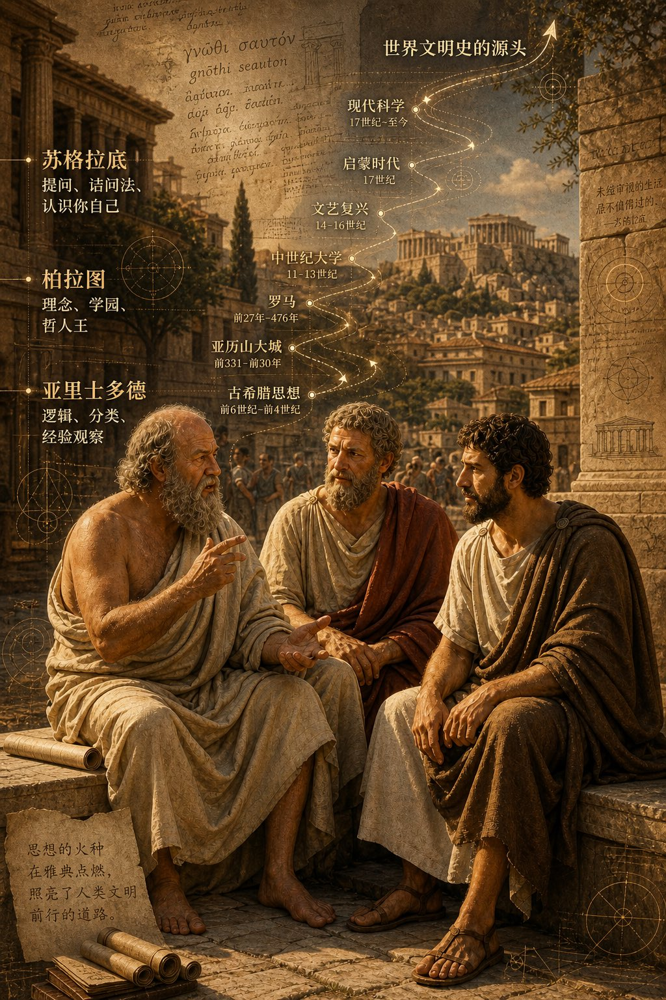
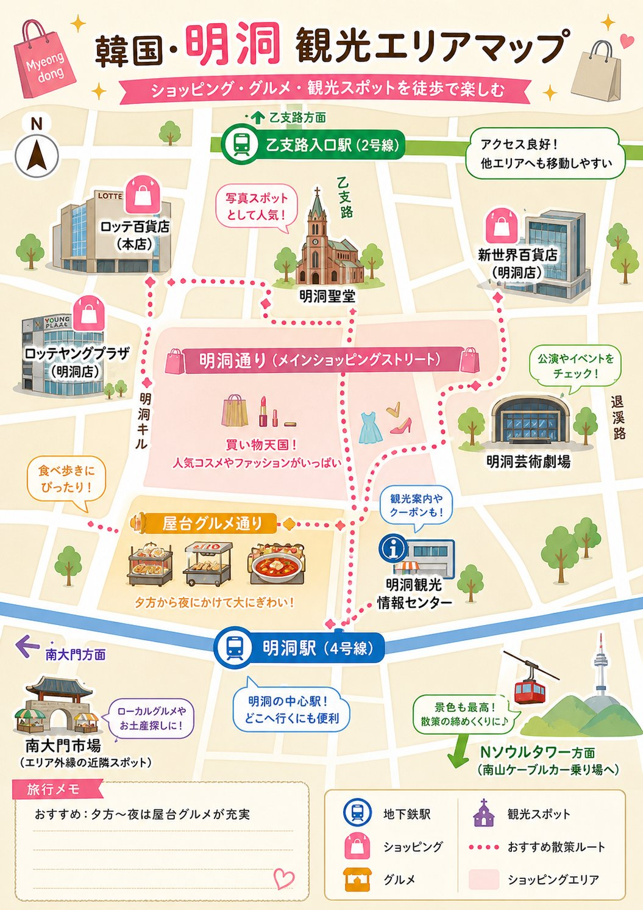
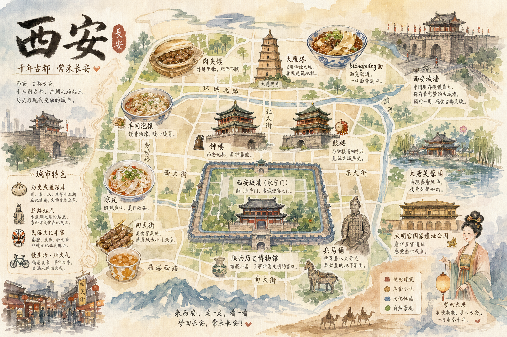
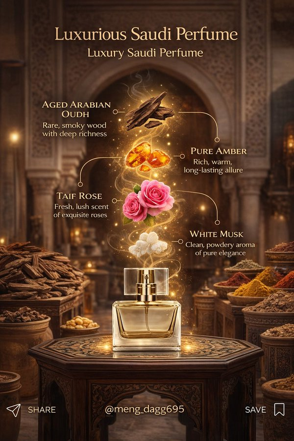
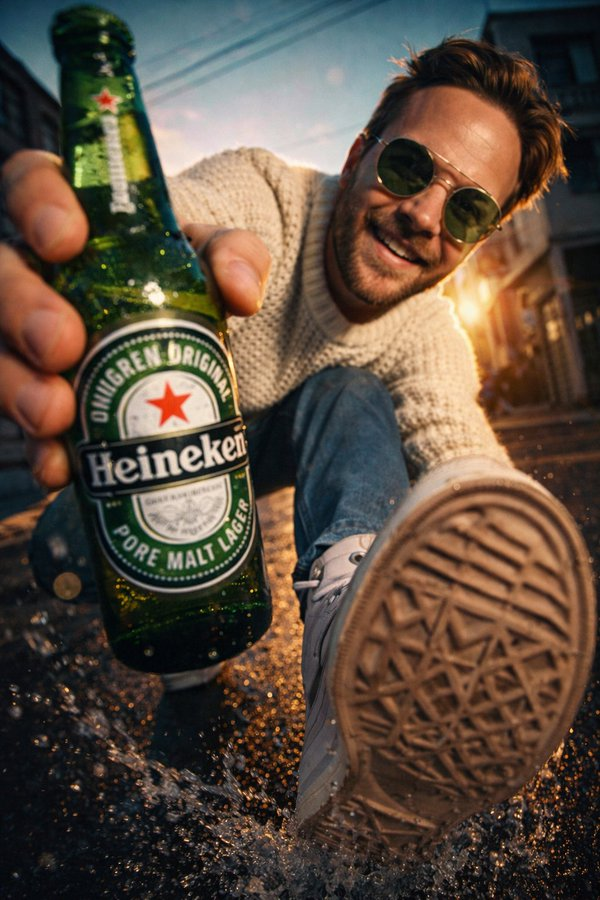
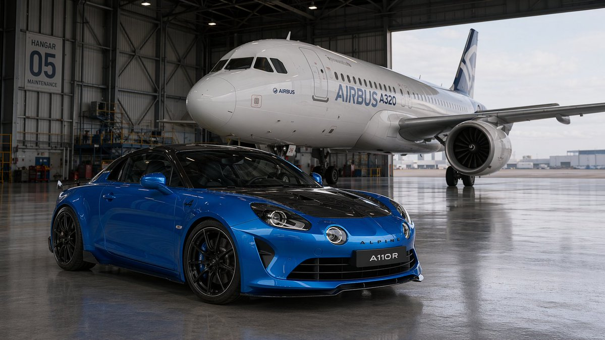
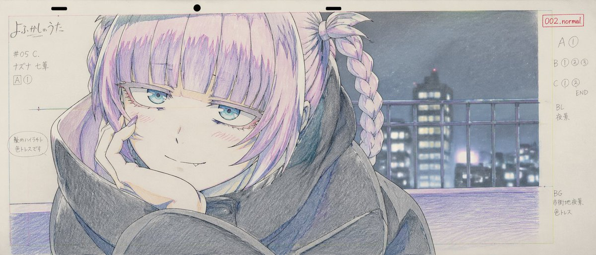
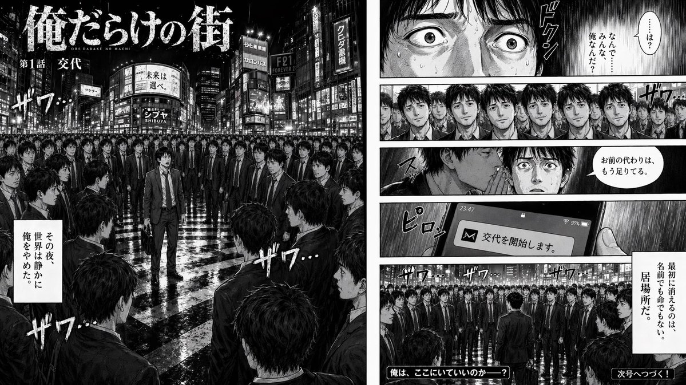

# Travel

总计：31

## 古希腊三哲时间轴城市图

- ID: case-375
- Slug: case-375-zh
- 语言: zh
- 来源: [来源链接](https://x.com/ToroJushiAi/status/2050713034503409874)
- 样例图路径: images/part2/case375.jpg

### 提示词

```text
二千五百年前，柏拉图，苏格拉底， 亚力士多德，坐在雅典街头聊天，聊出了世界文明史的源头。

背景可以加上他们聊天内容，按时间轴的走向，重叠在古希腊雅典的城市风光中。
```

### 样例图



## 明洞旅游区域地图

- ID: case-369
- Slug: case-369-zh
- 语言: zh
- 来源: [来源链接](https://x.com/so_ainsight/status/2050354639036654048)
- 样例图路径: images/part2/case369.jpg

### 提示词

```text
[エリア]の観光エリアマップを画像で作成して
```

### 样例图



## 西安手绘水彩城市地图

- ID: case-331
- Slug: case-331-zh
- 语言: zh
- 来源: [来源链接](https://github.com/freestylefly/awesome-gpt-image-2/blob/main/docs/gallery-part-2.md#case-331)
- 样例图路径: images/part2/case331.png

### 提示词

```text
生成一张手绘水彩风格的「西安」城市地图，包含当地特色美食、地标建筑及城市特色
```

### 样例图



## 俯拍巨女城景自拍

- ID: case-328
- Slug: case-328-zh
- 语言: zh
- 来源: [来源链接](https://x.com/saniaspeaks_/status/2009834337043394622)
- 样例图路径: images/part2/case328.jpg

### 提示词

```text
[中文]
{
  "type": "图像生成提示词",
  "language": "zh",
  "style": "超现实电影感自拍摄影",
  "aspect_ratio": "9:16",
  "identity_preservation": {
    "use_reference_image": true,
    "strict_identity_lock": true,
    "alter_face": false,
    "alter_skin": false,
    "alter_hair": false,
    "alter_gender": false,
    "notes": "保留上传参考图像中完全一致的脸部特征、皮肤纹理、头发、眼镜、年龄和性别。禁止合成皮肤或雕塑感。"
  },
  "subject": {
    "gender": "女性",
    "capture_method": "由主体本人拍摄的自拍",
    "pose": {
      "selfie_arm": {
        "description": "一只手臂完全伸直并完全向上伸展，手持拍摄自拍的相机",
        "visibility": "手臂在画面中清晰可见、笔直且占主导地位",
        "camera_visibility": "自拍相机设备本身不得在画面中出现"
      },
      "product_arm": {
        "description": "另一只手臂完全伸向相机，手持附带的佳能相机",
        "importance": "产品最靠近相机并在视觉上占主导地位"
      },
      "head": {
        "tilt": "头部向自拍相机微微倾斜"
      },
      "expression": "自然放松的面部表情"
    },
    "body_visibility": "从头到脚全身可见",
    "feet": "双脚清晰接触路面"
  },
  "composition": {
    "perspective": "胸部高度的自然自拍视角",
    "camera_angle": "极端俯拍角度，相机位于主体正上方并直视下方",
    "layer_depth": [
      "产品（最靠近相机）",
      "脸部",
      "全身",
      "城市环境（背景）"
    ]
  },
  "scale_and_perspective": {
    "effect": "强制透视",
    "subject_scale": "女性呈现极度巨大",
    "buildings_scale": "建筑物显得小得多，最高不超过她的膝盖",
    "dominance": "主体在视觉上完全主导整个场景",
    "realism": "激发规模感同时保持物理可信"
  },
  "environment": {
    "location": "真实城市十字路口",
    "elements": [
      "人行横道",
      "道路标线",
      "交通标志",
      "汽车",
      "自行车",
      "真实人类尺度的行人"
    ],
    "setting": "地面层城市环境"
  },
  "lighting": {
    "type": "自然日光",
    "conditions": "晴朗或轻度多云天空",
    "shadows": "柔和且真实",
    "restrictions": "禁止奇幻或戏剧性照明"
  },
  "product_rules": {
    "usage": "完全按提供的上传佳能产品使用",
    "distortion": "无",
    "logo": "保持不变",
    "appearance": "仅有自然反射和真实高光"
  },
  "camera_quality": {
    "realism": "最大照片真实感",
    "depth": "前景、主体与背景清晰分离",
    "artifacts": "无"
  },
  "constraints": [
    "禁止AI艺术感",
    "禁止塑料或雕塑皮肤",
    "禁止扭曲脸部或身体",
    "禁止多余肢体或错误解剖",
    "禁止文字或水印",
    "禁止可见自拍相机设备"
  ],
  "output_goal": "创作一张超现实电影感自拍图像：女性使用其确切参考身份，从极端俯拍视角在真实城市人行横道拍摄，具备强制透视比例、自然日光，并将佳能相机产品明显持向镜头。"
}

[English]
{
  "type": "image_generation_prompt",
  "language": "en",
  "style": "hyper-realistic cinematic selfie photography",
  "aspect_ratio": "9:16",
  "identity_preservation": {
    "use_reference_image": true,
    "strict_identity_lock": true,
    "alter_face": false,
    "alter_skin": false,
    "alter_hair": false,
    "alter_gender": false,
    "notes": "Preserve identical facial features, skin texture, hair, glasses, age, and gender from the uploaded reference image. No synthetic skin or sculptural look."
  },
  "subject": {
    "gender": "female",
    "capture_method": "selfie taken by the subject herself",
    "pose": {
      "selfie_arm": {
        "description": "one arm fully straight and completely extended upward holding the camera that takes the selfie",
        "visibility": "arm clearly visible, straight and dominant in frame",
        "camera_visibility": "the selfie camera device itself must NOT be visible in the frame"
      },
      "product_arm": {
        "description": "the other arm fully extended toward the camera holding the attached Canon camera",
        "importance": "product is closest to the camera and visually dominant"
      },
      "head": {
        "tilt": "slightly tilted toward the selfie camera"
      },
      "expression": "natural and relaxed facial expression"
    },
    "body_visibility": "full body visible from head to toe",
    "feet": "feet clearly touching the road surface"
  },
  "composition": {
    "perspective": "natural selfie perspective at chest height",
    "camera_angle": "extreme top-down angle, camera above the subject looking directly downward",
    "layer_depth": [
      "product (closest to camera)",
      "face",
      "full body",
      "city environment (background)"
    ]
  },
  "scale_and_perspective": {
    "effect": "forced perspective",
    "subject_scale": "the woman appears extremely giant",
    "buildings_scale": "buildings appear much smaller, reaching no higher than her knees",
    "dominance": "the subject visually dominates the entire scene",
    "realism": "inspiring scale while remaining physically believable"
  },
  "environment": {
    "location": "real urban intersection",
    "elements": [
      "pedestrian crosswalk",
      "road markings",
      "traffic signs",
      "cars",
      "bicycles",
      "pedestrians at realistic human scale"
    ],
    "setting": "ground-level urban environment"
  },
  "lighting": {
    "type": "natural daylight",
    "conditions": "clear or lightly cloudy sky",
    "shadows": "soft and realistic",
    "restrictions": "no fantasy or dramatic lighting"
  },
  "product_rules": {
    "usage": "use the uploaded Canon product exactly as provided",
    "distortion": "none",
    "logo": "unchanged",
    "appearance": "natural reflections and realistic highlights only"
  },
  "camera_quality": {
    "realism": "maximum photorealism",
    "depth": "clear separation of foreground, subject, and background",
    "artifacts": "none"
  },
  "constraints": [
    "No AI-art look",
    "No plastic or sculpted skin",
    "No distortion of face or body",
    "No extra limbs or incorrect anatomy",
    "No text or watermarks",
    "No visible selfie camera device"
  ],
  "output_goal": "Create a hyper-realistic cinematic selfie image of a woman using her exact reference identity, captured from an extreme top-down perspective in a real urban crosswalk, with forced perspective scale, natural daylight, and a Canon camera product prominently held toward the lens."
}
```

### 样例图


## 沉香玫瑰悬浮幻景

- ID: case-327
- Slug: case-327-zh
- 语言: zh
- 来源: [来源链接](https://x.com/meng_dagg695/status/2011334627290726746)
- 样例图路径: images/part2/case327.jpg

### 提示词

```text
[中文]
{
  "master_prompt_type": "超精细8K AI图像生成",
  "global_settings": {
    "resolution": "8K UHD",
    "aspect_ratio": "2:3 竖版",
    "render_quality": "极致锐度、超微细节、电影级光效",
    "style": "超现实商业产品摄影",
    "color_profile": "温暖金调搭配柔和琥珀高光",
    "environment": {
      "location": "古老中东市场走廊",
      "architecture": {
        "walls": "岁月痕迹的粗糙石墙与可见纹理",
        "arches": "背景巨型石拱",
        "floor": "暖棕色石材地面"
      },
      "background_elements": [
        "装满香料的木架",
        "袋装与碗装干货",
        "悬挂草药束",
        "散发暖黄光的传统金属灯笼"
      ],
      "lighting": {
        "primary": "柔和金色环境光",
        "secondary": "两侧暖灯笼辉光",
        "atmosphere": "薄雾增强光线漫射"
      }
    },
    "main_subject": {
      "type": "香水瓶",
      "position": "中心前景",
      "placement": "置于华丽木桌之上",
      "material": {
        "bottle": "透明清玻璃",
        "cap": "黄金金属矩形瓶盖",
        "liquid": "淡金香水液体"
      },
      "design": {
        "shape": "圆角矩形瓶身",
        "finish": "高光反射表面",
        "label": "无可见标签"
      },
      "table": {
        "material": "深色雕花木材",
        "shape": "方形台面",
        "details": [
          "繁复花卉与几何雕刻",
          "金色镶嵌装饰",
          "抛光表面映光"
        ]
      },
      "floating_elements": {
        "composition_style": "竖向成分堆叠",
        "motion": "成分悬浮并伴随旋转金光",
        "effects": [
          "发光粒子",
          "闪耀尘埃",
          "柔光尾迹连接元素"
        ],
        "elements_order_top_to_bottom": [
          {
            "ingredient": "琥珀树脂",
            "appearance": "半透明金棕树脂块",
            "glow": "温暖内发光"
          },
          {
            "ingredient": "大马士革玫瑰",
            "appearance": "盛放粉色玫瑰",
            "details": [
              "柔软层叠花瓣",
              "自然绿叶",
              "轻飘附近花瓣"
            ]
          },
          {
            "ingredient": "白麝香",
            "appearance": "光滑白水晶状石块",
            "additional": "石下细白粉末"
          },
          {
            "ingredient": "陈年沉香",
            "appearance": "深棕木片",
            "texture": "粗糙纤维木纹",
            "effect": "缕缕白烟上升"
          }
        ]
      },
      "text_elements": {
        "title": {
          "text": "精致叙利亚香水",
          "font_style": "优雅衬线体",
          "color": "金色",
          "position": "顶部中央"
        },
        "subtitle": {
          "text": "奢华叙利亚香水",
          "font_style": "较小衬线体",
          "color": "金色",
          "position": "主标题下方"
        },
        "ingredient_labels": [
          {
            "title": "纯琥珀",
            "description": "来自自然深处的珍贵树脂"
          },
          {
            "title": "大马士革玫瑰",
            "description": "美丽与叙利亚传承的象征"
          },
          {
            "title": "白麝香",
            "description": "干净、粉感、永恒优雅的香氛"
          },
          {
            "title": "陈年沉香",
            "description": "深邃温暖、浓郁烟熏木香"
          }
        ],
        "typography_details": {
          "connector_lines": "细弯金线连接文字与成分",
          "icons": "线末端小圆点标记"
        },
        "opacity": "轻微半透明"
      }
    },
    "overall_mood": {
      "tone": "奢华、温暖、优雅",
      "theme": "传承香水工艺",
      "visual_feel": "浓郁、高端、电影级广告"
    }
  }
}

[English]
{
  "master_prompt_type": "Ultra-detailed 8K AI image generation",
  "global_settings": {
    "resolution": "8K UHD",
    "aspect_ratio": "2:3 vertical",
    "render_quality": "extreme sharpness, ultra-fine detail, cinematic lighting",
    "style": "hyper-realistic commercial product photography",
    "color_profile": "warm golden tones with soft amber highlights",
    "environment": {
      "location": "ancient Middle Eastern market corridor",
      "architecture": {
        "walls": "aged stone walls with visible texture and wear",
        "arches": "large stone archway in background",
        "floor": "stone flooring, warm brown tone"
      },
      "background_elements": [
        "wooden shelves filled with spices",
        "sacks and bowls of dried goods",
        "hanging bundles of herbs",
        "traditional metal lanterns emitting warm yellow light"
      ],
      "lighting": {
        "primary": "soft golden ambient light",
        "secondary": "warm lantern glow from both sides",
        "atmosphere": "slight haze enhancing light diffusion" "main_subject": {
          "type": "perfume bottle",
          "position": "center foreground",
          "placement": "on top of an ornate wooden table",
          "material": {
            "bottle": "transparent clear glass",
            "cap": "gold metallic rectangular cap",
            "liquid": "light golden perfume liquid"
          },
          "design": {
            "shape": "rectangular bottle with rounded edges",
            "finish": "glossy reflective surface",
            "label": "no visible label" "table": {
              "material": "dark carved wood",
              "shape": "square top",
              "details": [
                "intricate floral and geometric carvings",
                "golden inlay accents",
                "polished surface reflecting light" "floating_elements": {
                  "composition_style": "vertical ingredient stack",
                  "motion": "ingredients appear suspended with swirling golden light",
                  "effects": [
                    "glowing particles",
                    "sparkling dust",
                    "soft light trails connecting elements"
                  ],
                  "elements_order_top_to_bottom": [
                    {
                      "ingredient": "amber resin",
                      "appearance": "translucent golden-brown resin chunks",
                      "glow": "warm internal glow" "ingredient": "damask rose",
                      "appearance": "fully bloomed pink rose",
                      "details": [
                        "soft layered petals",
                        "natural green leaves",
                        "petals gently floating nearby"
                      ] "ingredient": "white musk",
                      "appearance": "smooth white crystal-like stone",
                      "additional": "fine white powder beneath the stone" "ingredient": "aged agarwood",
                      "appearance": "dark brown wooden pieces",
                      "texture": "rough, fibrous wood grain",
                      "effect": "thin white smoke rising upward" "text_elements": {
                        "title": {
                          "text": "Exquisite Syrian Perfume",
                          "font_style": "elegant serif",
                          "color": "gold",
                          "position": "top center"
                        },
                        "subtitle": {
                          "text": "Luxury Syrian Perfume",
                          "font_style": "smaller serif",
                          "color": "gold",
                          "position": "below main title"
                        },
                        "ingredient_labels": [
                          {
                            "title": "Pure Amber",
                            "description": "Precious resin from the depths of nature"
                          } "title": "Damask Rose",
                          "description": "Symbol of beauty and Syrian heritage"
                        },
                        {
                          "title": "White Musk",
                          "description": "Clean, powdery scent of timeless elegance"
                        },
                        {
                          "title": "Aged Agarwood",
                          "description": "Rich, smoky wood with deep warmth"
                        }
                      ],
                      "typography_details": {
                        "connector_lines": "thin curved golden lines connecting text to ingredients",
                        "icons": "small circular markers at line endpoints"
                      } "opacity": "slightly translucent"
                    } "overall_mood": "tone": "luxurious, warm, elegant",
                    "theme": "heritage perfume craftsmanship",
                    "visual_feel": "rich, premium, cinematic ads
```

### 样例图



## 街头炫瓶男模

- ID: case-322
- Slug: case-322-zh
- 语言: zh
- 来源: [来源链接](https://x.com/ecommartinez/status/2017311074551533921)
- 样例图路径: images/part2/case322.jpg

### 提示词

```text
[中文]
专业照片，一位男士，30岁的俄罗斯模特（参考图像），正对着镜头，向相机倾斜，从下往上拍摄，使用广角镜头。男士倾斜着身体，近距离将一瓶饮料展示给镜头，一只手拿着瓶子，紧贴在镜头前。瓶子的标签和方向保持笔直，以便标签清晰可读。他穿着白色运动鞋，一只脚在镜头前方。男士站在街道上，湿漉漉的沥青和飞溅的水花从下方拍出。鲜艳的色彩，电影级灯光，光线从后方打在模特的脸上。--v7 --ar 3:4 --style raw

[English]
Professional photo, a guy, a 30-year-old Russian model (reference image), is facing the lens, tilted towards the camera, angle from below, shot with a wide-angle lens. The guy is tilted and shows a bottle close-up to the camera, a hand with a bottle close-up right in front of the lens. The label and direction of the bottle are straight so the label is readable. He's wearing white sneakers, one foot in front of the camera. The guy is standing on the street, wet asphalt and splashes from below. Bright colors, cinematic lighting, the light is behind and on the model’s face. --v7 --ar 3:4 --style raw
```

### 样例图



## 红蓝光影下的未来都市双重曝光青年

- ID: case-314
- Slug: case-314-zh
- 语言: zh
- 来源: [来源链接](https://x.com/Fujimoto_hina/status/2028045894088630679)
- 样例图路径: images/part2/case314.jpg

### 提示词

```text
[中文]
{
  "prompt": "一位年轻男子的超写实电影级双重曝光侧脸肖像，表情专注强烈，皮肤纹理细节丰富，眼神锐利。他的面部与从剪影中浮现的未来主义城市天际线无缝融合，摩天大楼和城市建筑构成了他的颈部和下颌线。深蓝色和鲜艳红色的强烈对比，象征着冲突与力量。抽象的数字划痕、碎裂的玻璃纹理和漏光效果覆盖在面部，营造出戏剧性的效果。干净的白色背景，超精细的灯光，专业电影海报风格，高对比度，清晰聚焦，8K分辨率，逼真的发丝，社论海报构图，现代平面设计美学，戏剧性的氛围，超高清，照片级真实。",
  "negative_prompt": "模糊，低分辨率，扭曲的面部，多余的肢体，过饱和的颜色，嘈杂的背景，平淡的灯光，卡通化，低细节",
  "resolution": "8K",
  "style": "电影感，双重曝光，照片级真实感，社论海报",
  "background": "干净的白色",
  "lighting": "高对比度，戏剧性的蓝红分割布光"
}

[English]
{
  "prompt": "A hyper-realistic cinematic double exposure portrait of a young man in side profile, intense focused expression, detailed skin texture and sharp eyes. His face seamlessly blended with a futuristic city skyline emerging from his silhouette, skyscrapers and urban buildings forming his neck and jawline. Strong contrast of deep blue and vibrant red tones symbolizing conflict and power. Abstract digital scratches, fractured glass textures, and light leaks overlaying the face for a dramatic effect. Clean white background, ultra-detailed lighting, professional movie poster style, high contrast, sharp focus, 8K resolution, realistic hair strands, editorial poster composition, modern graphic design aesthetics, dramatic mood, ultra-HD, photorealistic.",
  "negative_prompt": "blurry, low resolution, distorted face, extra limbs, oversaturated colors, noisy background, flat lighting, cartoonish, low detail",
  "resolution": "8K",
  "style": "cinematic, double exposure, photorealistic, editorial poster",
  "background": "clean white",
  "lighting": "high contrast, dramatic blue and red split lighting"
}
```

### 样例图


## 梦幻波士顿春季城市海报

- ID: case-298
- Slug: case-298-zh
- 语言: zh
- 来源: [来源链接](https://x.com/BubbleBrain/status/2045358053831172358)
- 样例图路径: images/part2/case298.jpg

### 提示词

```text
[中文]
一张引人注目的2026年春季波士顿城市海报，具有优雅的庆典氛围和大胆的当代设计。在干净的米白色纹理背景上，带有大面积的留白，一个微型的单人赛艇手在图像右下角一条狭窄的反光水带上划行。船桨划出的尾波以动态的书法曲线向上扫过，逐渐变成查尔斯河，然后再变成一幅梦幻般的手绘波士顿全景。在这个流动的河流形状的构图中包含着标志性的波士顿元素：后湾天际线、灯塔山红砖联排别墅、橡树街、波士顿公共花园、天鹅船、扎基姆桥、芬威球场启发的细节、历史悠久的砖砌建筑、港口渡轮，以及这座城市的水滨氛围。柔和的晨雾，金色的春季光线，深红和金色的微妙节日点缀，丰富的细节，层次分明的深度，精致的城市海报美学，清新而优雅，视觉上强有力但不拥挤。左下角的优雅排版写着“SPRING 2026”，并附有垂直标语“BOSTON, A CITY OF RIVER, MEMORY, AND INVENTION”，文字清晰且构图优美，高端平面设计，9:16

[English]
A striking Spring 2026 city poster for Boston with an elegant celebratory mood and a bold contemporary design. On a clean off-white textured background with large areas of negative space, a miniature single sculler rows across the lower right corner of the image on a narrow ribbon of reflective water. The wake from the oar sweeps upward in a dynamic calligraphic curve, gradually transforming into the Charles River and then into a dreamlike hand-painted panorama of Boston. Inside this flowing river-shaped composition are iconic Boston elements: the Back Bay skyline, Beacon Hill brownstones, Acorn Street, Boston Public Garden, Swan Boats, Zakim Bridge, Fenway-inspired details, historic brick architecture, harbor ferries, and the city’s waterfront atmosphere. Soft morning fog, golden spring light, subtle festive accents in crimson and gold, rich detail, layered depth, sophisticated city-poster aesthetics, fresh and refined, visually powerful but not overcrowded. Elegant typography in the lower left reads “SPRING 2026” with a vertical slogan “BOSTON, A CITY OF RIVER, MEMORY, AND INVENTION”, text clear and beautifully composed, premium graphic design, 9:16
```

### 样例图


## 珠江新城剪纸璀璨夜景

- ID: case-286
- Slug: case-286-zh
- 语言: zh
- 来源: [来源链接](https://x.com/liyue_ai/status/2045527750606487877)
- 样例图路径: images/part2/case286.jpg

### 提示词

```text
[中文]
以珠江新城现代都市景观为灵感的剪纸艺术，通过精巧的镂空手法在一整幅纸上，立体刻画广州塔、东西双塔等地标建筑与繁华城景。
所有建筑与元素均以流畅的线条与结构相连，无孤立部分，构成一幅完整的都市画卷。
画面采用金属箔或光泽纸材质，表面带有细腻的明暗光泽，在光照下呈现柔和的高光与阴影，仿佛被城市灯光轻轻照亮。
背景以虚化的珠江新城天际线为衬，点缀隐约可见的花城广场与树木轮廓，整体透出现代浪漫的氛围。
作品中巧妙融入轻盈的蒲公英绒毛或星光般的动态光点，象征梦想与活力在这座新城中飘散飞扬。整体呈现8K超高清视觉，细节丰富，真实而富有艺术感染力。

[English]
Paper-cut art inspired by the modern urban landscape of Zhujiang New Town, through exquisite hollow-carving techniques on a single sheet of paper, three-dimensionally depicting landmark buildings such as Canton Tower, East and West Twin Towers, and the bustling cityscape. All buildings and elements are connected by smooth lines and structures, with no isolated parts, forming a complete urban scroll. The picture uses metallic foil or glossy paper material, with delicate light and dark gloss on the surface, presenting soft highlights and shadows under illumination, as if gently illuminated by city lights. The background is set against a blurred Zhujiang New Town skyline, dotted with faintly visible outlines of Huacheng Square and trees, overall revealing a modern romantic atmosphere. The work cleverly integrates light dandelion fluff or starlight-like dynamic light points, symbolizing dreams and vitality fluttering and flying in this new city. The overall presents 8K ultra-high-definition vision, rich in details, realistic and full of artistic appeal.
```

### 样例图


## 瑜伽裤女主播展示身材曲线

- ID: case-255
- Slug: case-255-zh
- 语言: zh
- 来源: [来源链接](https://x.com/joshesye/status/2044796366950703316)
- 样例图路径: images/part2/case255.jpg

### 提示词

```text
[中文]
手机竖屏界面，短视频直播平台风格，一位年轻亚洲女主播在家中直播带货，主播穿着贴身瑜伽裤与简约上衣，身材曲线自然，正在侧身展示裤子的线条与弹性，动作自然不夸张；

[English]
Mobile vertical screen interface, short video live streaming platform style, a young Asian female streamer selling goods through live streaming at home, the streamer is wearing tight yoga pants and a simple top, natural body curves, turning sideways to show the lines and elasticity of the pants, natural movements without exaggeration;
```

### 样例图


## 粤超联赛国潮风邀请函海报

- ID: case-236
- Slug: case-236-zh
- 语言: zh
- 来源: [来源链接](https://x.com/liyue_ai/status/2045772039521542202)
- 样例图路径: images/part2/case236.jpg

### 提示词

```text
[中文]
广东省城市足球超级联赛（粤超）邀请函海报设计，比例9:16；

S型流动构图，画面从下方向上延展，一条由足球运动轨迹形成的动态能量流贯穿画面， 中心为一颗发光的足球，带有动感轨迹与能量光效；

沿S型动线融合广东城市地标与文化元素： 广州塔、深圳平安金融中心、珠海渔女雕像、岭南建筑与佛山武术剪影、中山孙中山文化象征、潮汕英歌舞动态人物轮廓、清远山水自然景观， 所有元素采用“线描 + 局部色块 + 留白”融合表现，层次递进、远近虚实结合；

加入抽象足球运动员剪影，弱化人物细节，强化动势与竞技氛围，视觉重点仍为足球；

风格：现代国潮高级海报，极简风格但富有设计感，高级、干净、统一， 融合东方美学与现代体育视觉；

色彩方案：高饱和但克制，中国红为主视觉，青蓝色辅助，金色点缀高光， 高对比但不杂乱，具有品牌级视觉冲击力；

顶部中央横版视觉主标题 「广东省城市足球超级联赛」：中字，宋体， 中央竖排文字排版： 「粤超」，大字，手写书法艺术字体， 「邀请函」：中字，宋体，纵向排列，间距较大， 底部中央第一排横排： 「2026年4月25日」，小字，宋体，第二排：「广州越秀山体育场」，小字，宋体， 预留文字排版空间；

整体版式平衡、具有高级品牌海报质感，极致精细，构图简洁干净，无杂乱元素，电影级光影，8K 分辨率，高端设计感。融入源自中国传统祥云纹的雅致云纹与水波纹元素，浮动光效粒子，富有动感与生机。

[English]
Guangdong Provincial City Football Super League (Yuechao) invitation poster design, aspect ratio 9:16;

S-shaped flowing composition, the picture extends from bottom to top, a dynamic energy flow formed by the trajectory of football movement runs through the picture, the center is a glowing football, with dynamic trajectory and energy light effects;

Along the S-shaped motion line, integrate Guangdong city landmarks and cultural elements: Canton Tower, Shenzhen Ping An Finance Centre, Zhuhai Fisher Girl statue, Lingnan architecture and Foshan martial arts silhouettes, Zhongshan Sun Yat-sen cultural symbols, Chaoshan Yingge dance dynamic character outlines, Qingyuan landscape natural scenery, all elements adopt the integrated expression of "line drawing + partial color blocks + blank space", progressive layers, combination of distance and virtual-real;

Add abstract football player silhouettes, weaken character details, strengthen momentum and competitive atmosphere, the visual focus remains on the football;

Style: modern Guochao high-end poster, minimalist style but rich in design sense, high-end, clean, unified, integrating oriental aesthetics and modern sports vision;

Color scheme: high saturation but restrained, Chinese red as the main visual, cyan-blue as auxiliary, gold embellished highlights, high contrast but not cluttered, with brand-level visual impact;

Top center horizontal visual main title "Guangdong Provincial City Football Super League": medium font, Song typeface, center vertical text layout: "Yuechao", large font, handwritten calligraphy art font, "Invitation": medium font, Song typeface, vertical arrangement, large spacing, bottom center first row horizontal: "April 25, 2026", small font, Song typeface, second row: "Guangzhou Yuexiushan Stadium", small font, Song typeface, reserve text layout space;

The overall layout is balanced, has a high-end brand poster texture, extremely detailed, the composition is simple and clean, no cluttered elements, cinematic light and shadow, 8K resolution, high-end design sense. Integrate elegant cloud patterns and water wave patterns derived from traditional Chinese auspicious clouds, floating light effect particles, full of dynamics and vitality.
```

### 样例图


## 极简国潮鎏金广州塔海报

- ID: case-230
- Slug: case-230-zh
- 语言: zh
- 来源: [来源链接](https://x.com/liyue_ai/status/2045744531686166878)
- 样例图路径: images/part2/case230.jpg

### 提示词

```text
[中文]
新中式极简风格高端城市海报，9:16竖版构图，以广州为核心主题，画面中心为抽象几何化的广州塔，造型简洁但具有辨识度，

整体采用S型流动构图，从下方向上延展，珠江水系被设计为流动的水波纹与传统祥云纹样融合，环绕整个画面形成视觉动线，

广州地标建筑以“留白+线描+局部色块”的方式点缀其中：珠江新城双塔、猎德大桥、白云山轮廓、岭南骑楼，
传统与现代建筑自然融合，层次递进，远近虚实分明，

风格控制：极简 + 高级 + 东方意境，不杂乱不过度写实，

色彩方案（重点）：
高饱和但克制 ，中国红、青蓝、鎏金为主色，
辅以少量暖金高光点缀，形成强烈视觉冲击但不俗艳，

背景：大面积纯净留白或淡宣纸肌理，增强呼吸感与高级感，

细节：祥云与水纹具有轻微浮雕/烫金质感，
局部加入微光粒子或流动光线，增强现代感，

光影：柔和渐变光+局部高光，突出恢弘大气氛围，

整体风格：国潮高级插画 / 品牌海报级质感 / 8K / 超清细节

[English]
Neo-Chinese minimalist style high-end city poster, 9:16 vertical composition, with Guangzhou as the core theme, the center of the image is an abstract geometric Canton Tower, simple in shape but highly recognizable,

The overall adopts an S-shaped flowing composition, extending from bottom to top, the Pearl River water system is designed as flowing water ripples fused with traditional auspicious cloud patterns, surrounding the entire image to form a visual dynamic line,

Guangzhou landmark buildings are embellished in it in the way of "blank space + line drawing + local color blocks": Zhujiang New Town Twin Towers, Liede Bridge, Baiyun Mountain outline, Lingnan arcade houses,
Traditional and modern architecture naturally blend, progressive layers, clear distinction between far and near, virtual and real,

Style control: minimalist + high-end + Eastern artistic conception, not cluttered and not overly realistic,

Color scheme (key point):
High saturation but restrained, Chinese red, cyan blue, and gilded gold as the main colors,
Supplemented by a small amount of warm gold highlight embellishments, forming a strong visual impact but not tacky,

Background: large area of pure blank space or light Xuan paper texture, enhancing a sense of breathing and high-end feel,

Details: auspicious clouds and water ripples have a slight relief/gold stamping texture,
Locally add faint light particles or flowing light lines to enhance modernity,

Light and shadow: soft gradient light + local highlights, highlighting a magnificent and grand atmosphere,

Overall style: Guochao high-end illustration / brand poster-level texture / 8K / ultra-clear details
```

### 样例图


## 琉璃透明画眉鸟飞舞羊城墨卷

- ID: case-229
- Slug: case-229-zh
- 语言: zh
- 来源: [来源链接](https://x.com/liyue_ai/status/2045873940883808523)
- 样例图路径: images/part2/case229.jpg

### 提示词

```text
[中文]
【背景与骨架线条】
纯黑深邃底色，一条粗壮有力的墨色书法S型曲线自画面一端蜿蜒贯穿至另一端，笔触苍劲，墨迹浓淡有致，如大写意行笔，构成整幅画面的视觉骨架与叙事动线。
【主体：透明燕子】
曲线上方，一只展翅飞翔的画眉鸟占据视觉核心；身体呈玻璃透明质感，内部映射传统建筑群叠影，蓝绿色光流在透明羽翼间流转折射，仿佛时间长河与文明记忆凝缩其中；轮廓以极细金线勾边，增强立体感与神圣感。
【中景：古典建筑序列】
燕子下方，沿墨线曲线错落分布广州的各种风景名胜：白云山、陈家祠、双子塔、广州塔、猎德大桥、海珠塔依次浮现；主色调青绿与淡金，建筑细节清晰，琉璃瓦、飞檐翘角、石阶回廊；木棉花簇拥点缀于建筑周围，花瓣随风轻散，静谧而悠远；几朵水墨云朵轻盈飘浮其间，增添空灵层次。
【前景：白鹤与水面】
前景湖畔：数只白鹤或静立水边、或振翅腾飞，姿态各异，优雅从容；浅蓝湖面如镜，倒影荡漾，波光细碎，营造宁静氛围。
【远景：山峦】
远处山峦层叠起伏，青黛色晕染，墨色由浓至淡，朦胧氤氲，富有水墨层次；与前景形成近实远虚的空间纵深。
【构图与光影】
非线性透视构图，墨线曲线为叙事主轴，古今元素沿线嵌入；光源自画面中心向外辐射扩散，形成强烈明暗对比，中心亮、四周渐暗；冷色调主导（深蓝、青绿、银白），暖色点缀（樱花粉、淡金），和谐而神秘；东方美学与现代意象交融，超现实诗意意境。
【技术规格】
8K超高清渲染，极致细节精度，最佳画质，比例 9:16

[English]
[
  Background and Skeleton Lines
] Pure black deep background,
a thick and powerful ink calligraphy S-shaped curve meanders from one end of the picture to the other,
with vigorous brushstrokes and well-proportioned ink shades,
like freehand brushwork,
forming the visual skeleton and narrative dynamic line of the entire picture. [
  Subject: Transparent Swallow
] Above the curve,
a flying thrush with spread wings occupies the visual core; the body has a glass transparent texture,
with overlapping shadows of traditional architectural complexes mapped inside,
blue-green light flows circulate and refract between the transparent wings,
as if the long river of time and civilized memories are condensed within it; the outline is bordered with extremely thin gold lines to enhance three-dimensionality and sacredness. [
  Midground: Classical Architecture Sequence
] Below the swallow,
various scenic spots in Guangzhou are scattered along the ink curve: Baiyun Mountain,
Chen Clan Ancestral Hall,
Twin Towers,
Canton Tower,
Liede Bridge,
Haizhu Tower appear in sequence; the main tone is cyan-green and pale gold,
architectural details are clear,
glazed tiles,
flying eaves,
stone steps and corridors; kapok flowers cluster and decorate around the buildings,
petals scatter lightly with the wind,
quiet and distant; a few ink clouds float lightly among them,
adding ethereal layers. [
  Foreground: White Cranes and Water Surface
] Lakeside in the foreground: several white cranes either stand quietly by the water or flap their wings to soar,
with different postures,
elegant and calm; the light blue lake surface is like a mirror,
reflections rippling,
shimmering light,
creating a tranquil atmosphere. [
  Distance: Mountains
] Distant mountains rise and fall in layers,
smudged in cyan-black,
ink shades from thick to light,
hazy and misty,
rich in ink wash layers; forming a spatial depth with solid foreground and empty distance with the foreground. [
  Composition and Light and Shadow
] Non-linear perspective composition,
the ink curve is the main narrative axis,
ancient and modern elements are embedded along the line; the light source radiates and diffuses outward from the center of the picture,
forming a strong contrast between light and dark,
bright in the center and gradually darkening around; cool tones dominate (dark blue,
cyan-green,
silver white),
warm tones embellish (cherry blossom pink,
pale gold),
harmonious and mysterious; Eastern aesthetics blend with modern imagery,
surreal poetic mood. [
  Technical Specifications
] 8K ultra-high definition rendering,
extreme detail precision,
best image quality,
ratio 9:16
```

### 样例图


## 鎏金广州塔的东方奇幻海报

- ID: case-220
- Slug: case-220-zh
- 语言: zh
- 来源: [来源链接](https://x.com/liyue_ai/status/2046243132774494607)
- 样例图路径: images/part2/case220.jpg

### 提示词

```text
[中文]
平面插画，东方幻想风格高端城市海报设计，竖版9:16构图，整体采用对角线+S型流动构图，从左下向右上延展，画面以深邃黑色为背景，自上而下渐变至浓烈暗红色，形成强烈冷暖对比与空间纵深，背景带微弱星尘与颗粒质感。画面中央一条金色流动能量线条如火焰般蜿蜒贯穿，自底部向上延伸，具有流体质感、粒子光效与渐变高光，局部带细微能量碎屑与体积光。

金色流光中逐层浮现广州城市地标建筑群：广州塔为视觉核心，比例突出，周围融合珠江新城高楼群、猎德大桥及现代与岭南建筑元素，建筑采用“精细线描 + 金色发光体块”表现，轮廓清晰、细节丰富，在金色光晕映衬下仿佛悬浮于虚空，形成超现实空间层次，远景轻微雾化增强纵深感。

画面底部为一位东方白发女性形象，长发飘逸，如烟似雾，与金色流光自然衔接并逐渐融合，发丝半透明带渐变光感，姿态柔美，双目微闭，神情宁静，怀抱一束多彩鲜花，花间点缀微光粒子与星点效果，象征人与城市能量的精神连接，人物细节适度简化以突出整体设计感。

光影集中于金色流线、建筑与人物轮廓，形成强烈明暗对比与视觉聚焦，整体氛围宏大、神秘、具有东方神话意境且略带治愈感。色彩以黑与暗红为基底，高亮鎏金为主视觉强调，金色具备丰富明暗层次，辅以小面积高饱和花束色彩点缀，整体高级克制。

页面文字与画面融合排版：顶部居中宋体大字“广州·中国”，下方小字“2026/04/20”，再下方小字“LIYUE”，文字采用淡金色或柔和暖白色，与整体光影统一。高品质细节，电影级光影表现，体积光与粒子细节丰富，画面干净无噪点，超高清8K分辨率，商业级海报质感。

[English]
Flat illustration, Oriental fantasy style high-end city poster design, vertical 9:16 composition, the overall adopts a diagonal + S-shaped flowing composition, extending from the bottom left to the top right, the picture uses deep black as the background, gradually changing from top to bottom to intense dark red, forming a strong cold-warm contrast and spatial depth, the background has a faint stardust and grainy texture. In the center of the picture, a golden flowing energy line winds through like a flame, extending from the bottom to the top, having a fluid texture, particle light effects and gradient highlights, with subtle energy debris and volumetric light in some areas. Guangzhou city landmark building complexes emerge layer by layer in the golden flowing light: Canton Tower is the visual core, with a prominent proportion, surrounded by the integration of Zhujiang New Town high-rise buildings, Liede Bridge and modern and Lingnan architectural elements, the buildings are expressed using "fine line drawing + golden glowing blocks", clear outlines and rich details, set off by the golden halo, they seem to float in the void, forming a surreal spatial hierarchy, the distant view is slightly fogged to enhance the sense of depth. At the bottom of the picture is an oriental white-haired female figure, long hair fluttering, like smoke and mist, naturally connecting and gradually blending with the golden flowing light, the hair is translucent with a gradient light sense, graceful posture, eyes slightly closed, serene expression, holding a bunch of colorful fresh flowers in her arms, interspersed with faint light particles and starlight effects among the flowers, symbolizing the spiritual connection between human and urban energy, character details are moderately simplified to highlight the overall sense of design. Light and shadow are focused on the golden streamlines, buildings and character outlines, forming a strong light-dark contrast and visual focus, the overall atmosphere is grand, mysterious, with an Oriental mythological artistic conception and a slight healing sense. The color uses black and dark red as the base, highlighted gilded gold as the main visual emphasis, the gold has rich light and dark layers, supplemented by small areas of high-saturation bouquet color embellishments, the overall is advanced and restrained. Page text and picture integrated typography: large Song typeface characters "Guangzhou·China" centered at the top, small characters "2026/04/20" below, small characters "LIYUE" further below, the text uses light gold or soft warm white, unifying with the overall light and shadow. High-quality details, cinematic light and shadow performance, rich volumetric light and particle details, clean picture without noise, ultra-high definition 8K resolution, commercial-grade poster texture.
```

### 样例图


## 清冷佳人夜市烧烤三刀流

- ID: case-165
- Slug: case-165-zh
- 语言: zh
- 来源: [来源链接](https://x.com/BubbleBrain/status/2046564674112831920)
- 样例图路径: images/part2/case165.jpg

### 提示词

```text
[中文]
一个有着清冷孤傲气质的绝美佳人，精致的面部特征，一张冷酷且精致的高级时装面容，长发，以及优雅苗条的身材；烧烤“三刀流”姿势：嘴里叼着一根烧烤串，每只手各拿一根烧烤串交叉以模仿索隆的三刀流；街头夜景氛围，温暖黄色的夜市灯光，模糊的背景，胶片般的质感，柔焦光晕，电影般的叙事感，时髦高端网红风格的时尚拍摄，清晰发光的肌肤，清晰细致的发丝，生动的动态表情，低角度广角镜头，情绪化的暗调氛围，浅景深，超高清8K，极致细节，电影级光照

[English]
a stunning beauty with a cool, aloof atmosphere, delicate facial features, a cold and sophisticated high-fashion face, long hair, and a graceful slender figure; barbecue “three-sword style” pose: one barbecue skewer held in her mouth, one skewer in each hand crossed to mimic Zoro’s three-sword style; street night scene ambiance, warm yellow night market lighting, blurred background, film-like texture, soft-focus glow, cinematic storytelling feel, trendy high-end influencer-style fashion shoot, clear luminous skin, sharply detailed strands of hair, lively dynamic expression, low-angle wide-angle shot, moody dark-toned atmosphere, shallow depth of field, ultra HD 8K, extreme detail, cinematic lighting
```

### 样例图


## 写实摄影风格创作

- ID: case-154
- Slug: case-154-zh
- 语言: zh
- 来源: [来源链接](https://x.com/AlwaveNazca)
- 样例图路径: images/part2/case154.jpg

### 提示词

```text
A photorealistic, high-resolution commercial photograph of a {argument name="car model and color" default="bright blue Alpine A110 R sports car"} parked in the foreground inside a massive aircraft hangar. The car features a black carbon fiber hood, black roof, black alloy wheels, and a front license plate reading "{argument name="license plate text" default="A110 R"}". Directly behind the car, dominating the background, is a {argument name="airplane model" default="white Airbus A320 commercial airliner"} with a blue tail. The hangar has a highly polished, reflective concrete floor that mirrors the car and plane. To the left, a sign on the metal wall reads "{argument name="hangar sign text" default="HANGAR 05 MAINTENANCE"}". The hangar doors are wide open, revealing a bright, overcast sky and a distant cityscape. The lighting is soft and cinematic, highlighting the sleek aerodynamic curves of both vehicles.
```

### 样例图



## 电商商品展示设计

- ID: case-125
- Slug: case-125-zh
- 语言: zh
- 来源: [来源链接](https://x.com/Gc_qube)
- 样例图路径: images/part2/case125.jpg

### 提示词

```text
{
  "type": "anime production layout sheet",
  "style": "traditional colored pencil genga, key animation drawing",
  "subject": {
    "character": "{argument name=\"character name\" default=\"ナズナ 七草\"}",
    "appearance": "anime girl with {argument name=\"hair color\" default=\"light purple\"} hair styled in twin braids and bangs, blue eyes, wearing a dark oversized coat",
    "pose_and_expression": "{argument name=\"expression\" default=\"smug with a small fang, resting chin on hand\"}"
  },
  "background": "{argument name=\"background scene\" default=\"nighttime city skyline with a railing\"}, soft focus",
  "layout": {
    "top_edge": "standard animation paper peg holes",
    "left_margin": {
      "series_title": "{argument name=\"anime title\" default=\"よふかしのうた\"}",
      "production_codes": ["#05 C.", "[A] (1)"],
      "circled_note": "髪のハイライト 色トレスです"
    },
    "right_margin": {
      "red_box": "002.normal",
      "timing_layers": ["A (1)", "B (1) (2) (3)", "C (1) (2) END"],
      "background_notes": ["BL 夜景", "BG 市街地夜景 色トレス"]
    }
  }
}
```

### 样例图



## 主题海报版式设计

- ID: case-122
- Slug: case-122-zh
- 语言: zh
- 来源: [来源链接](https://x.com/pcneko_lab)
- 样例图路径: images/part2/case122.jpg

### 提示词

```text
{
  "type": "movie poster grid",
  "layout": "2x2 grid",
  "posters": [
    {
      "position": "top-left",
      "genre": "sci-fi comedy",
      "visuals": "A Japanese salaryman sitting on a crowded train looking nervous, flanked by two aliens in business attire: a green frog-like alien looking at a smartphone, and a blue octopus-like alien reading a newspaper.",
      "text_elements": {
        "tagline_top": "隣の席のアイツ、実は宇宙人でした。",
        "train_display": "次は 地球 (ちきゅう) Next Earth",
        "tagline_side": "この星の常識、いつの間にかアップデートされていた。",
        "main_title": "{argument name=\"poster 1 title\" default=\"となりの宇宙人\"}",
        "cast": "星野サダオ タコヤキ・Z カエルダ・X",
        "release_date": "6月13日(金) 全国公開"
      }
    },
    {
      "position": "top-right",
      "genre": "surreal romance",
      "visuals": "A man in a dark jacket affectionately hugging a giant onigiri (rice ball) topped with mentaiko (spicy cod roe) wrapped in seaweed. They are sitting on a rocky beach during a beautiful sunset.",
      "text_elements": {
        "tagline": "めんたいこは、裏切らない。",
        "main_title": "{argument name=\"poster 2 title\" default=\"めんたいこ ひとすじ\"}",
        "cast": "中尾シンイチ めんたい子 博多ミツル 高菜ユカリ のり平",
        "release_date": "7月18日(金) 心にしみる、しお味系ラブストーリー"
      }
    },
    {
      "position": "bottom-left",
      "genre": "heist comedy",
      "visuals": "A joyful elderly woman in a leopard print blouse laughing maniacally while holding a fan of Japanese yen bills. Money is raining down around her. A happy raccoon is in the foreground.",
      "text_elements": {
        "tagline": "人生、まだまだ使いきってなんかない！",
        "main_title": "{argument name=\"poster 3 title\" default=\"老後の逆襲\"}",
        "subtitle": "〜いたずらタヌキと億万長者〜",
        "cast": "ババンバ・バーバラ タヌキチ 金持ちババ 遺産マユミ 税理士ゴンザレス",
        "release_date": "9月5日(金) 痛快！下剋上エンターテインメント！"
      }
    },
    {
      "position": "bottom-right",
      "genre": "disaster thriller",
      "visuals": "A dramatic disaster scene where laundry baskets, shirts, and clothes are being sucked up into a stormy, apocalyptic sky above a ruined Tokyo city skyline featuring the Tokyo Tower.",
      "text_elements": {
        "tagline": "それは、静かに、確実に、洗濯物を奪っていく。",
        "main_title": "{argument name=\"poster 4 title\" default=\"洗濯物 ストーム\"}",
        "cast": "森タクヤ 干場カオリ 風間ハルキ ピンチハンガー・タカ 洗濯バサミ・ケン",
        "release_date": "8月29日(金) 全国の空が、危ない。"
      }
    }
  ]
}
```

### 样例图


## 建筑空间场景图

- ID: case-121
- Slug: case-121-zh
- 语言: zh
- 来源: [来源链接](https://x.com/loilokoji)
- 样例图路径: images/part2/case121.jpg

### 提示词

```text
{
  "type": "3-panel manga page",
  "style": "anime, highly detailed, cinematic lighting, futuristic corporate",
  "layout": {
    "structure": "1 wide top panel, 2 square bottom panels"
  },
  "panels": [
    {
      "position": "top",
      "shot": "wide landscape",
      "scene": "Futuristic corporate lobby with floor-to-ceiling windows",
      "lighting": "{argument name=\"time of day\" default=\"sunrise\"}",
      "background": "City skyline featuring {argument name=\"landmark\" default=\"Tokyo Tower\"}",
      "details": "Holographic displays, polished reflective floor, reception desk, lounge chairs"
    },
    {
      "position": "bottom left",
      "shot": "close-up profile",
      "character": "Young woman, dark hair, black business suit",
      "accessories": "Futuristic black earpiece with glowing blue light",
      "speech_bubble": {
        "style": "standard rounded",
        "text": "{argument name=\"character dialogue\" default=\"数字はいいわ\"}"
      }
    },
    {
      "position": "bottom right",
      "shot": "full body, walking away, touching earpiece",
      "character": "Same woman, black suit, black heels, carrying a black tote bag",
      "environment": "Approaching security gates",
      "holographic_sign": "{argument name=\"floor sign\" default=\"ECHO 42F\"}",
      "speech_bubble": {
        "style": "futuristic angular",
        "text": "{argument name=\"AI dialogue\" default=\"おはようございます、ユキさん。本日は記念すべき ──\"}"
      }
    }
  ]
}
```

### 样例图


## 主题海报版式设计

- ID: case-119
- Slug: case-119-zh
- 语言: zh
- 来源: [来源链接](https://x.com/old_pgmrs_will)
- 样例图路径: images/part2/case119.jpg

### 提示词

```text
{
  "type": "anime movie production pitch document",
  "overall_layout": "split layout with a large cinematic movie poster on the top half and a grid of 5 detailed reference sheets on the bottom half",
  "top_section": {
    "type": "movie poster",
    "visual": "A man, a woman, and a dog standing on a ruined city street, facing away from the viewer, looking towards a colossal, porous, web-like alien structure dominating the sky. A rusty 'RESTRICTED AREA' sign is on the right.",
    "typography": {
      "title": "{argument name=\"movie title\" default=\"劇場版 巨骸の向こう側 Fallen Colossus\"}",
      "release_date": "{argument name=\"release date\" default=\"2027.11.28 ROADSHOW\"}",
      "tagline": "そこにあるのは、まだ「説明」されていないもの。",
      "credits_studio": "{argument name=\"studio name\" default=\"WIT STUDIO\"}"
    }
  },
  "bottom_sections": [
    {
      "title": "{argument name=\"male character name\" default=\"来栖 武 / Kurusu Takeru\"}",
      "type": "character reference sheet",
      "elements": {
        "full_body_poses": 3,
        "expressions": 3,
        "detail_shots": 8,
        "description": "Male protagonist in dark tactical jacket and cargo pants. Includes front, back, and side full-body views, headshots, and detailed callouts for gloves, boots, backpack, and radio."
      }
    },
    {
      "title": "{argument name=\"female character name\" default=\"大城 真那 / Oshiro Mana\"}",
      "type": "character reference sheet",
      "elements": {
        "full_body_poses": 3,
        "expressions": 3,
        "detail_shots": 6,
        "description": "Female protagonist in grey tactical uniform. Includes front, back, and side full-body views, headshots, and detailed callouts for jacket, boots, ID badge, and pouch."
      }
    },
    {
      "title": "カゲ (Kage) 設定画",
      "type": "animal character reference sheet",
      "elements": {
        "full_body_poses": 4,
        "expressions": 4,
        "detail_shots": 5,
        "description": "Dog companion. Includes side, front, back, and angled full-body views, headshots, and detailed callouts for fur texture, paws, and a motorcycle sidecar."
      }
    },
    {
      "title": "第7巨骸 (Remnant-7) 内部区画 設定画",
      "type": "environment and vehicle reference sheet",
      "elements": {
        "large_diagrams": 1,
        "environment_thumbnails": 4,
        "vehicle_designs": 1,
        "description": "Cross-section of the porous alien structure, smaller environment thumbnails, and a motorcycle design featuring the characters."
      }
    },
    {
      "title": "Concept Art",
      "type": "scene illustration",
      "elements": {
        "characters": 3,
        "vehicles": 1,
        "description": "The male character, female character, and dog with a motorcycle sidecar parked in front of the glowing, porous alien structure."
      }
    }
  ]
}
```

### 样例图


## 品牌视觉识别图

- ID: case-115
- Slug: case-115-zh
- 语言: zh
- 来源: [来源链接](https://x.com/onofumi_AI)
- 样例图路径: images/part2/case115.jpg

### 提示词

```text
{
  "type": "two-page manga spread",
  "style": "highly detailed realistic manga, monochrome, screentones, dramatic lighting, psychological thriller",
  "global_elements": {
    "protagonist": "{argument name=\"main character description\" default=\"young Japanese salaryman in a suit\"}",
    "theme": "{argument name=\"core concept\" default=\"surrounded by a massive crowd of identical clones of himself\"}"
  },
  "layout": {
    "left_page": {
      "type": "full page splash panel",
      "setting": "{argument name=\"setting\" default=\"Shibuya scramble crossing at night\"}",
      "visuals": "Protagonist standing alone in the center of the crossing, looking around in shock at a massive crowd where every single person is an exact clone of him.",
      "text_elements": [
        {"type": "manga title logo", "text": "{argument name=\"manga title\" default=\"俺だらけの街\"}"},
        {"type": "subtitle", "text": "第1話 交代"},
        {"type": "narration box", "text": "その夜、世界は静かに俺をやめた。"},
        {"type": "sound effect", "text": "ザワ…"}
      ]
    },
    "right_page": {
      "type": "5-panel vertical layout",
      "panels": [
        {
          "panel_number": 1,
          "visuals": "Extreme close-up of protagonist's eyes, wide with shock, sweating.",
          "text_elements": [
            {"type": "speech bubble", "text": "……は？ なんで……みんな、俺なんだ？"},
            {"type": "sound effect", "text": "ドクン"}
          ]
        },
        {
          "panel_number": 2,
          "visuals": "A horizontal row of 8 identical clones in suits staring blankly forward.",
          "text_elements": [
            {"type": "sound effect", "text": "ザワ…"}
          ]
        },
        {
          "panel_number": 3,
          "visuals": "A clone leaning in to whisper into the shocked protagonist's ear.",
          "text_elements": [
            {"type": "speech bubble", "text": "お前の代わりは、もう足りてる。"},
            {"type": "sound effect", "text": "スッ"}
          ]
        },
        {
          "panel_number": 4,
          "visuals": "Close-up of a smartphone screen held in a hand, showing a push notification.",
          "text_elements": [
            {"type": "screen text", "text": "交代を開始します。"},
            {"type": "sound effect", "text": "ピロン"}
          ]
        },
        {
          "panel_number": 5,
          "visuals": "Wide shot of the endless crowd of clones in the city street.",
          "text_elements": [
            {"type": "narration box", "text": "最初に消えるのは、名前でも命でもない。居場所だ。"},
            {"type": "bottom left text", "text": "俺は、ここにいていいのか——？"},
            {"type": "bottom right text", "text": "{argument name=\"cliffhanger text\" default=\"次号へつづく！\"}"},
            {"type": "sound effect", "text": "ザワ… ザワ… ザワ…"}
          ]
        }
      ]
    }
  }
}
```

### 样例图



## 关系图谱信息图

- ID: case-87
- Slug: case-87-zh
- 语言: zh
- 来源: [来源链接](https://x.com/MrLarus)
- 样例图路径: images/part2/case87.jpg

### 提示词

```text
Please generate a high-design character relationship map poster based on {argument name="theme" default="Demon Slayer"}. This image should not be a simple illustration, but a character relationship map that combines information visualization, narrative structure, poster design sense, and stylistic fidelity.

Please automatically complete the following:
- Identify the work and core settings corresponding to the theme
- Extract the most representative 6–12 key characters, not exceeding 15 if necessary
- Identify and display key character relationships, including blood ties, romance, friendship, alliances, hostility, master-disciple, etc.
- Automatically choose a composition method based on the work's characteristics, such as protagonist-centered, dual-core confrontation, faction-based, family tree, or chronological evolution
- Automatically refine the work's style DNA, including color, worldview symbols, textures, mood, typography, and representative elements
- Transform these stylistic elements into an overall visual design for the relationship map, rather than simply copying an official poster
- Use different colors, line types, and arrows to distinguish different relationships, ensuring clear lines and layers without clutter
- Make core characters most prominent, followed by important characters, and subordinate characters weakened to form a clear visual hierarchy
- Ensure every character name is legible, with identity or faction labels if necessary

The final product should satisfy:
- Immediate understanding of character hierarchy and key relationships
- Obvious alignment with the original work's temperament and setting
- Combines the clarity of an infographic with the premium design of a poster
- Unified, exquisite, complete, and suitable for social media sharing or poster display
- Avoids a cheap flowchart feel, messy piling, and information overload.
```

### 样例图


## 关系图谱信息图

- ID: case-86
- Slug: case-86-zh
- 语言: zh
- 来源: [来源链接](https://x.com/MrLarus)
- 样例图路径: images/part2/case86.jpg

### 提示词

```text
Please generate a high-design character relationship map poster based on {argument name="theme" default="Demon Slayer"}. This image should not be a simple illustration, but a character relationship map that combines information visualization, narrative structure, poster design sense, and stylistic fidelity.

Please automatically complete the following:
- Identify the work and core settings corresponding to the theme
- Extract the most representative 6–12 key characters, not exceeding 15 if necessary
- Identify and display key character relationships, including blood ties, romance, friendship, alliances, hostility, master-disciple, etc.
- Automatically choose a composition method based on the work's characteristics, such as protagonist-centered, dual-core confrontation, faction-based, family tree, or chronological evolution
- Automatically refine the work's style DNA, including color, worldview symbols, textures, mood, typography, and representative elements
- Transform these stylistic elements into an overall visual design for the relationship map, rather than simply copying an official poster
- Use different colors, line types, and arrows to distinguish different relationships, ensuring clear lines and layers without clutter
- Make core characters most prominent, followed by important characters, and subordinate characters weakened to form a clear visual hierarchy
- Ensure every character name is legible, with identity or faction labels if necessary

The final product should satisfy:
- Immediate understanding of character hierarchy and key relationships
- Obvious alignment with the original work's temperament and setting
- Combines the clarity of an infographic with the premium design of a poster
- Unified, exquisite, complete, and suitable for social media sharing or poster display
- Avoids a cheap flowchart feel, messy piling, and information overload.
```

### 样例图


## 关系图谱信息图

- ID: case-85
- Slug: case-85-zh
- 语言: zh
- 来源: [来源链接](https://x.com/MrLarus)
- 样例图路径: images/part2/case85.jpg

### 提示词

```text
Please generate a high-design character relationship map poster based on {argument name="theme" default="Demon Slayer"}. This image should not be a simple illustration, but a character relationship map that combines information visualization, narrative structure, poster design sense, and stylistic fidelity.

Please automatically complete the following:
- Identify the work and core settings corresponding to the theme
- Extract the most representative 6–12 key characters, not exceeding 15 if necessary
- Identify and display key character relationships, including blood ties, romance, friendship, alliances, hostility, master-disciple, etc.
- Automatically choose a composition method based on the work's characteristics, such as protagonist-centered, dual-core confrontation, faction-based, family tree, or chronological evolution
- Automatically refine the work's style DNA, including color, worldview symbols, textures, mood, typography, and representative elements
- Transform these stylistic elements into an overall visual design for the relationship map, rather than simply copying an official poster
- Use different colors, line types, and arrows to distinguish different relationships, ensuring clear lines and layers without clutter
- Make core characters most prominent, followed by important characters, and subordinate characters weakened to form a clear visual hierarchy
- Ensure every character name is legible, with identity or faction labels if necessary

The final product should satisfy:
- Immediate understanding of character hierarchy and key relationships
- Obvious alignment with the original work's temperament and setting
- Combines the clarity of an infographic with the premium design of a poster
- Unified, exquisite, complete, and suitable for social media sharing or poster display
- Avoids a cheap flowchart feel, messy piling, and information overload.
```

### 样例图


## 关系图谱信息图

- ID: case-84
- Slug: case-84-zh
- 语言: zh
- 来源: [来源链接](https://x.com/MrLarus)
- 样例图路径: images/part2/case84.jpg

### 提示词

```text
Please generate a high-design character relationship map poster based on {argument name="theme" default="Demon Slayer"}. This image should not be a simple illustration, but a character relationship map that combines information visualization, narrative structure, poster design sense, and stylistic fidelity.

Please automatically complete the following:
- Identify the work and core settings corresponding to the theme
- Extract the most representative 6–12 key characters, not exceeding 15 if necessary
- Identify and display key character relationships, including blood ties, romance, friendship, alliances, hostility, master-disciple, etc.
- Automatically choose a composition method based on the work's characteristics, such as protagonist-centered, dual-core confrontation, faction-based, family tree, or chronological evolution
- Automatically refine the work's style DNA, including color, worldview symbols, textures, mood, typography, and representative elements
- Transform these stylistic elements into an overall visual design for the relationship map, rather than simply copying an official poster
- Use different colors, line types, and arrows to distinguish different relationships, ensuring clear lines and layers without clutter
- Make core characters most prominent, followed by important characters, and subordinate characters weakened to form a clear visual hierarchy
- Ensure every character name is legible, with identity or faction labels if necessary

The final product should satisfy:
- Immediate understanding of character hierarchy and key relationships
- Obvious alignment with the original work's temperament and setting
- Combines the clarity of an infographic with the premium design of a poster
- Unified, exquisite, complete, and suitable for social media sharing or poster display
- Avoids a cheap flowchart feel, messy piling, and information overload.
```

### 样例图


## 主题海报版式设计

- ID: case-59
- Slug: case-59-zh
- 语言: zh
- 来源: [来源链接](https://x.com/X64zzotSKCGtYmt)
- 样例图路径: images/part2/case59.jpg

### 提示词

```text
{
  "type": "cinematic promotional poster",
  "style": "3D CGI animation style, highly detailed, dramatic lighting, caricature characters",
  "characters": [
    { "id": "char1", "description": "large shirtless man with long black hair, beard, and glasses" },
    { "id": "char2", "description": "elderly woman in a kimono with white hair tied up" },
    { "id": "char3", "description": "small man with a topknot, glasses, mustache, wearing a bright green sweater" }
  ],
  "layout": {
    "panels": [
      {
        "position": "top",
        "scene": "wide shot of a town street with buildings and a city skyline in the background",
        "characters_present": ["char1", "char2", "char3"],
        "text_overlays": [
          "{argument name=\"intro text\" default=\"ある日ーー\"}",
          "いつもの日常がーー",
          "こんばんは"
        ]
      },
      {
        "position": "middle left",
        "scene": "close-up of char1 looking shocked against a dark fiery background",
        "text_overlays": [
          "{argument name=\"shocked text\" default=\"私が出禁？\"}"
        ]
      },
      {
        "position": "middle right",
        "scene": "close-up of char2 looking angry and pointing against a stormy sea background",
        "text_overlays": [
          "{argument name=\"angry text\" default=\"海を荒らすな！\"}"
        ]
      },
      {
        "position": "bottom",
        "scene": "char3 pointing, char1 screaming, a second instance of char3 falling backwards, and char2 sitting angrily against a fiery chaotic background",
        "text_overlays": [
          "全然出ない！"
        ],
        "bottom_titles": [
          "{argument name=\"main title\" default=\"パチンコ軍団親のイメチェン\"}",
          "{argument name=\"subtitle\" default=\"LINEスタンプ販売中\"}"
        ]
      }
    ]
  }
}
```

### 样例图


## 主题海报版式设计

- ID: case-58
- Slug: case-58-zh
- 语言: zh
- 来源: [来源链接](https://x.com/liyue_ai)
- 样例图路径: images/part2/case58.jpg

### 提示词

```text
Flat illustration, high-end oriental fantasy style city poster design, vertical 9:16 composition. The layout uses a diagonal + S-shaped flow extending from the bottom left to top right. The background is deep black grading down to intense dark red, creating strong warm-cool contrast and spatial depth with faint stardust and grain texture. In the center, a flowing golden energy line winds through like a flame, extending upward from the base, featuring fluid texture, particle effects, and gradient highlights, with subtle energy debris and volumetric light.

Within the golden flow, the architectural landmarks of {argument name="city" default="Guangzhou"} emerge layer by layer: the Canton Tower is the visual core with prominent proportions, surrounded by the Zhujiang New Town skyline, Liede Bridge, and modern Lingnan architectural elements. Buildings are rendered using "fine line drawing + golden luminous blocks," with clear outlines and rich details, appearing to float in a void against the golden halo, creating a surreal spatial hierarchy with slightly fogged backgrounds for added depth.

At the bottom of the frame is an oriental white-haired female figure with flowing hair like mist, naturally connecting and merging with the golden light. Her hair is translucent with gradient light effects; she has a graceful posture, eyes closed, and a serene expression, holding a bouquet of colorful flowers dotted with shimmering particles, symbolizing the spiritual connection between people and city energy. Character details are moderately simplified to emphasize the overall design.

Lighting is concentrated on the golden flow, buildings, and character outlines, creating intense chiaroscuro and visual focus. The overall atmosphere is grand, mysterious, imbued with oriental mythology, and slightly healing. Colors use black and dark red as a base with brilliant gold as the main visual emphasis. The gold has rich light-dark layers, complemented by small areas of high-saturation floral colors, maintaining a sophisticated and restrained aesthetic.

Integrated text and layout: Centered Songti font at the top reads "{argument name="city" default="Guangzhou"} · China," followed by smaller text "{argument name="date" default="2026/04/20"}" and "{argument name="author" default="LIYUE"}" below. Text uses pale gold or soft warm white, unified with the overall lighting. High-quality details, cinematic lighting, rich volumetric and particle details, clean image without noise, ultra-high 8K resolution, commercial-grade poster quality.
```

### 样例图


## 人像写实摄影图

- ID: case-35
- Slug: case-35-zh
- 语言: zh
- 来源: [来源链接](https://x.com/kazmaendo)
- 样例图路径: images/part2/case35.jpg

### 提示词

```text
A {argument name="photography style" default="photorealistic portrait with shallow depth of field and soft bokeh"} of a {argument name="subject" default="young Japanese woman"} looking back over her shoulder at the camera with a {argument name="expression" default="gentle smile"}. She is wearing a {argument name="attire" default="light beige kimono with orange maple leaf patterns"} and a gold obi. Her dark hair is styled in an elegant updo with loose strands framing her face, and she wears small pearl earrings. The background features an {argument name="setting" default="autumn garden with vibrant red maple leaves"}, with bright red foliage framing the top left and a heavily blurred, soft background creating a serene, cinematic atmosphere.
```

### 样例图


## 一张手绘风格的城市美食地图，以台州为主题

- ID: case-11
- Slug: case-11-zh
- 语言: zh
- 来源: [来源链接](https://github.com/freestylefly/awesome-gpt-image-2/blob/main/docs/gallery-part-1.md#case-11)
- 样例图路径: images/part2/case11.jpg

### 提示词

```text
一张手绘风格的城市美食地图，以台州为主题。画面以鸟瞰视角的手绘简化城市地图为底，标注椒江、路桥、黄岩等区域和灵江、台州湾等水系地标，不追求精确比例而是追求可爱的水彩手绘感。地图上分布着12个美食地点的精致手绘小插画：1. 椒江老粮坊的蛋清羊尾（金黄蓬松的蛋泡甜点撒着糖粉，筷子夹起拉丝）2. 临海紫阳古街的食饼筒（一个饱满的麦饼卷切开露出肉丝、蛋皮、米面等丰富馅料）3. 三门的青蟹（一只肥硕的青壳大蟹张着大钳子，旁边一小碟姜醋）4. 温岭石塘渔港的海鲜面（粗瓷大碗浓白鱼汤面铺满虾、蛏子、小黄鱼）5. 路桥的糟羹（一锅稠厚的五彩羹，芥菜、冬笋、香干、牡蛎粒粒可见）6. 玉环坎门的炊圆（三四个白胖糯米团子卧在笼屉里，旁边酱油碟滴着麻油）7. 黄岩的麦虾（陶锅里面疙瘩配蛤蜊、青菜翻滚冒泡）8. 仙居的八大碗（八只粗陶小碗围成一圈——土鸡、溪鱼、豆腐皮俱全）9. 天台的饺饼筒（几卷金黄酥脆的薄饼整齐码放，露出红烧肉和豆面馅）10. 临海的麦油脂（竹盘上摊着薄如蝉翼的饼皮卷着肉末、豆芽、鸡蛋丝）11. 温岭的嵌糕（厚实的年糕饼中间嵌着红烧肉和油条，正在铁板上滋滋作响）12. 椒江的姜汁调蛋（一只青花碗里琥珀色姜汤卧着嫩滑蛋花，撒几粒核桃碎）。每个插画约占地图5%面积，旁边用手写体标注店名和一句推荐语如“阿婆凌晨四点就起来和面”“本地人认准这口锅”。地图边缘用手绘藤蔓、杨梅枝和小海鲜（虾、蟹、贝壳）装饰形成边框。右下角有一个手绘指南针（标注“东海”方向）和图例说明。左上角标题“台州·山海食光地图”使用胖圆的手绘美术字，用杨梅和小黄鱼点缀装饰。整体画风为水彩+彩铅混合的手绘质感，颜色以杨梅红、姜黄、海蓝、翠绿为主，图片比例1:1。
```

### 样例图


## 主题海报版式设计

- ID: case-9
- Slug: case-9-zh
- 语言: zh
- 来源: [来源链接](https://github.com/freestylefly/awesome-gpt-image-2/blob/main/docs/gallery-part-1.md#case-9)
- 样例图路径: images/part2/case9.jpg

### 提示词

```text
2026中国城市系列宣传海报，主题为【北京】。现代、多彩、明亮通透的国潮风，竖版9:16。大面积白色纹理留白背景，一条从右下向左上盘旋的红色丝绸形成S型主构图。右下角一位东方女性挥舞红绸，服饰需结合北京地域文化定制。红绸延展为城市长卷，融合天坛、长城、鸟巢、喇叭沟门原始森林公园、什刹海、京味相声。左侧排版SPRING 2026、竖排Beijing和小印章“北京”。要求统一系列感，但不能雷同，细节丰富，城市辨识度强。文字清晰且精美布局，高端图形设计。
```

### 样例图


## 信息图可视化设计

- ID: case-1
- Slug: case-1-zh
- 语言: zh
- 来源: [来源链接](https://github.com/freestylefly/awesome-gpt-image-2/blob/main/docs/gallery-part-1.md#case-1)
- 样例图路径: images/part2/case1.jpg

### 提示词

```text
Vertical 9:16 isometric cutaway infographic "城市生命系统图谱 / Urban Metabolism Atlas". Smart city from sky to bedrock: skyscrapers, streets, subway, utility tunnels, water/sewage/gas/heating pipes, fiber, data center, flood tanks, aquifers, geothermal wells, bedrock. Color-coded flows for power/water/data/traffic/waste. 12 numbered panels bilingual CN/EN: 能源/水循环/交通/数据/垃圾/建筑/公共服务/ 物流/气候韧性/生态/地质/治理看板. 24h timeline at bottom. Style: engineering white paper + scientific atlas, light paper bg, crisp lines, 8K. No cyberpunk, no gibberish text, must show both above AND below ground.
```

### 样例图


