# typography

总计：208

## 博物馆展品级别的昆虫知识科普图谱

- ID: gpt4o-1047-zh
- Slug: prompt-1047-zh
- 语言: zh
- 来源: [来源链接](https://x.com/yyyole/status/2006925202077184321)
- 样例图路径: images/part3/1047.jpeg

### 提示词

```text
请创建一张博物馆展品级别的昆虫知识科普图谱，聚焦展示【蜜蜂】。

核心布局：
- 中心：巨大的昆虫标本图像，占据画面60-70%
- 周围：科学标注和趣味百科信息，呈放射状或分区排布
- 整体：如同博物馆玻璃展柜中的精美标本说明牌

昆虫标本呈现（核心要求）：
1. 物理真实感：昆虫标本直接平放在纸面上，不是"图片中的图片"
2. 视角：垂直俯视，标本与纸面在同一平面
3. 光影：柔和的自然光从上方照射，标本在纸面上投下细腻的阴影
4. 固定方式：用昆虫针（细长的银色针）真实地固定标本，针穿过标本身体，针尖微微刺入纸面
5. 细节质感：
   - 可见标本的真实纹理：翅脉、绒毛、鳞片、复眼反光
   - 标本边缘有轻微的厚度感和立体感
   - 翅膀可能有轻微的透光效果
   - 针周围纸面有细微的凹陷或针孔
6. 比例：标本占据纸面中心约60-70%区域，周围留白供标注使用
7. 自然状态：展翅姿态自然，不过分僵硬，保留标本的真实质感

标注系统设计：
采用引导线（细线）从昆虫身体部位延伸到说明文字框

必需标注的身体部位（6-8个）：
1. 头部 Head
   - 复眼：有多少个小眼组成？视野范围多大？
   - 触角：用途是什么？有多少节？
   - 口器：属于哪种类型？吃什么食物？

2. 胸部 Thorax
   - 前胸/中胸/后胸：各自功能
   - 翅膀：有几对？飞行速度多快？特殊能力？
   - 足：有几对？抓握/跳跃/游泳等特殊功能？

3. 腹部 Abdomen
   - 节数：有多少体节？
   - 特殊器官：发光器/毒刺/产卵器等
   - 气孔：如何呼吸？

4. 特色结构
   - 该昆虫最独特的身体特征
   - 与生存环境的适应关系

信息卡片内容：
每个标注包含：
- 部位名称（中英文）
- 1-2句功能说明（儿童友好语言）
- 趣味数据或冷知识（用🔍或💡图标标识）

页面其他元素：

顶部区域：
- 昆虫中文名（大标题，优雅字体）
- 学名 Scientific Name（斜体拉丁文，副标题）
- 所属目/科（小字标注）
- 分布地图小图标（世界地图+分布区域高亮）

底部/侧边信息栏：
基础档案
- 体长：X-X mm
- 寿命：X天/月/年
- 栖息地：森林/草地/水域等
- 食性：植食/肉食/杂食

超能力/特殊技能
- 列出2-3个最酷的能力
- 用简单图标+文字说明

趣味冷知识
- 1-2个吸引儿童的有趣事实
- 如"可以举起自己体重50倍的物体"

生命周期
- 简化的变态过程图示
- 卵→幼虫→蛹→成虫（完全变态）
- 或卵→若虫→成虫（不完全变态）

*设计美学：
- 纸面质感：
  底纸：米白色或象牙白高级纸张纹理 #F8F6F0
  可见纸张的细微纤维和质感
  边缘可能有轻微的磨损或复古感（可选）

- 空间关系：
  标本：物理实体，平放在纸面上，有真实阴影
  昆虫针：银色金属质感，穿过标本固定
  标注文字：直接书写或印刷在同一张纸上
  引导线：细笔绘制在纸面上的线条

- 配色方案：
  纸面底色：#F8F6F0（米白）或 #FFFEF7（象牙白）
  标注文字：#2C3E50（墨色/深灰蓝）手写或印刷风格
  引导线：#8B7355（棕灰）或 #696969（炭灰）细线
  强调标记：#D4AF37（古铜金）或 #8B4513（棕褐色）
  昆虫针：银灰色金属光泽 #C0C0C0

- 字体系统：
  标题：手写风格或优雅印刷体（Garamond/宋体）
  学名：斜体手写或印刷体
  标注文字：清晰的手写体或小号印刷字
  整体感觉：如同博物学家在标本纸上亲笔书写

- 装饰元素：  
  四角：简约的线框或装饰角花（印在纸上）
 标尺：毫米刻度尺，平行于标本放置
  日期/编号：手写风格的采集信息（可选）
  植物剪影水印：淡淡印在纸面上（可选）
关键视觉要点：
整个画面就是"一张平铺的标本纸"，上面固定着真实的昆虫标本，周围有手写或印刷的科学标注。观看者仿佛正俯视着一份博物学家的工作台上的标本记录。

版式风格参考：如同打开一本19世纪博物学家的标本册，昆虫标本真实地固定在纸面上，周围是手写或精美印刷的科学注释。整体呈现一种平面化、扁平但充满物理质感的美学——这不是照片，而是标本与纸张的共存。"

关键概念：
- ❌ 不要：标本的照片被放在画面中
- ✅ 要：标本本身就在纸面上，与文字共享同一个物理平面
- 就像古董标本册的一页，或者博物学家的工作记录

图片规格：
- 比例：16:9（横版海报）或 3:4（竖版展板）
- 分辨率：300 DPI，适合A3/A2打印
- 格式：PNG高清，保留细节

科学准确性要求：
- 身体结构比例符合真实昆虫形态
- 专业术语使用准确
- 儿童描述需科学又生动

请确保整体呈现既有博物馆的学术严谨性，又充满吸引儿童探索的视觉魅力。
```

### 样例图


## A hyper-realistic travel advertisement in square format 

- ID: gpt4o-1046-en-1
- Slug: prompt-1046-en-1
- 语言: en
- 来源: [来源链接](https://x.com/TechieBySA/status/2007190982408974659)
- 样例图路径: images/part3/1046.jpeg

### 提示词

```text
A hyper-realistic travel advertisement in square format (1080x1080), featuring a hand holding a sleek, ultra-thin smartphone or tablet in portrait orientation, tilted slightly sideways to create a striking 3D portal effect. The screen displays a high-resolution image of an iconic landmark from [COUNTRY], which continues into the real background, blending seamlessly. The landmark appears to emerge from the screen. Birds fly nearby and a commercial airplane passes through a bright blue sky with soft white clouds. Bold, clean sans-serif text reading [CITY] is placed prominently above. The lighting is warm and natural, casting soft shadows across the landscape. The surroundings reflect the region’s natural environment (like meadows, coastlines, or city skylines). The device is glossy and minimal-bezel, enhancing realism and depth.
```

### 样例图


## 一则超写实的旅行广告

- ID: gpt4o-1046-zh-2
- Slug: prompt-1046-zh-2
- 语言: zh
- 来源: [来源链接](https://x.com/TechieBySA/status/2007190982408974659)
- 样例图路径: images/part3/1046.jpeg

### 提示词

```text
这是一则超写实的旅行广告，采用正方形格式（1080x1080），画面中一只手竖屏握着一部纤薄时尚的智能手机或平板电脑，略微侧倾，营造出引人注目的3D立体效果。屏幕上显示着[国家/地区]标志性地标的高分辨率图像，图像与真实背景无缝融合，仿佛从屏幕中浮现出来一般。附近有鸟儿飞翔，一架商用飞机掠过湛蓝的天空，朵朵白云点缀其间。醒目的上方是简洁的无衬线字体[城市]。画面光线温暖自然，在景物上投下柔和的阴影。周围环境反映了该地区的自然环境（例如草地、海岸线或城市天际线）。设备采用光滑的超窄边框设计，增强了画面的真实感和立体感。
```

### 样例图


## 博物馆展品级别的鱼类知识科普图谱

- ID: gpt4o-1041-zh
- Slug: prompt-1041-zh
- 语言: zh
- 来源: [来源链接](https://x.com/LZhou15365/status/2007275324967698649)
- 样例图路径: images/part3/1041.jpeg

### 提示词

```text
请创建一张博物馆展品级别的鱼类知识科普图谱，聚焦展示【某一种代表性鱼类，如：金枪鱼 / 鲤鱼 / 鲨鱼 / 小丑鱼（可替换）】。

核心布局：

中心：巨大的鱼类标本图像，占据画面 60–70%

周围：科学标注 + 趣味百科信息，呈放射状或分区排布

整体：如同博物馆玻璃展柜中的鱼类标本说明牌

鱼类标本呈现（核心要求）：

物理真实感
鱼类标本真实平放在纸面上
不是“照片中的照片”，而是实体标本

视角
垂直俯视（Top-down view）
鱼体与纸面处于同一物理平面

光影
柔和自然光从上方照射
鱼体在纸面上投下细腻、真实的阴影

固定方式（博物学风格）
使用细长银色金属标本针或细线固定鱼体
针穿过鱼体关键部位（如背部或鳍基）
针尖微微刺入纸面
纸面可见细小针孔与轻微压痕

细节质感（重点）
清晰可见：
鱼鳞排列与反光
鳍膜的半透明质感
鳃盖的结构层次
眼睛的湿润反光
鱼体边缘有厚度感与轻微立体起伏
鳍部可能有自然展开但不过分夸张

比例
鱼类标本占据纸面中心约 60–70%
周围留白用于标注与信息说明

自然状态
鱼体姿态自然、舒展
保留“真实标本”的静态感，而非游动姿态

标注系统设计：

使用细引导线

从鱼体结构延伸至文字说明框

引导线如同直接绘制或印刷在纸面上

必需标注的身体部位（6–8 个）：

1. 头部 Head

眼 Eye
视野范围？是否能看到颜色？

口 Mouth
口型（上位口 / 端位口 / 下位口）
食性相关？

鳃盖 Gill Cover (Operculum)
呼吸方式说明（如何从水中获取氧气）

2. 躯干部 Body

鳞片 Scales
类型（圆鳞 / 栉鳞 / 楯鳞）
保护与减阻作用

侧线系统 Lateral Line
感知水流和震动的“感觉器官”

3. 鳍 Fin System

背鳍 Dorsal Fin：保持平衡

胸鳍 Pectoral Fin：转向与刹车

腹鳍 Pelvic Fin：稳定身体

尾鳍 Caudal Fin：主要推进力
游泳速度或爆发力说明

4. 内部/特殊结构（可视化表达）

鱼鳔 Swim Bladder（如适用）
控制浮沉

或

软骨骨骼 / 硬骨结构对比

5. 特色结构

该鱼类最具代表性的身体特征

与其生存环境（海洋 / 淡水 / 深海 / 珊瑚礁）的适应关系

信息卡片内容（每个标注包含）：

部位名称（中 / 英文）
1–2 句儿童友好型功能说明

趣味数据或冷知识
用 🔍 或 💡 图标标识

页面其他元素：

顶部区域：

鱼类中文名（大标题，优雅字体）

学名 Scientific Name（斜体拉丁文）

分类信息（纲 / 目 / 科）

分布地图小图标
世界地图 + 主要分布水域高亮

底部 / 侧边信息栏：

基础档案

体长：X cm – X m

体重：X g – X kg

寿命：X 年

栖息环境：海洋 / 淡水 / 深海 / 珊瑚礁

食性：草食 / 肉食 / 杂食

超能力 / 生存技能

2–3 项最酷能力，例如：
高速游泳
电感应
变色伪装
洄游能力

图标 + 简短说明

趣味冷知识

1–2 个吸引儿童的事实

如：
“可以不眨眼睡觉”
“一生能游过几千公里”

生命周期

简化示意图：
卵 → 仔鱼 → 幼鱼 → 成鱼

标注生长阶段变化重点

设计美学（保持博物学风格）：

纸面质感

底纸：
米白色 / 象牙白高级纸张
#F8F6F0 或 #FFFEF7

可见纸张纤维

轻微复古磨损感（可选）

空间关系（非常重要）

鱼类标本：真实物理实体，平放在纸面上

固定针 / 细线：银色金属质感

标注文字：直接印刷或手写在同一张纸上

引导线：细笔绘制的线条
配色方案

纸面底色：#F8F6F0 / #FFFEF7

标注文字：#2C3E50（深灰蓝墨色）

引导线：#8B7355 或 #696969

强调标记：#D4AF37（古铜金）

标本针：#C0C0C0（银灰金属）

字体系统
标题：优雅印刷体或手写风格（宋体 / Garamond）

学名：斜体

标注说明：清晰小号手写体或印刷体

整体感觉：
像博物学家在标本纸上亲笔记录鱼类观察笔记

装饰元素（可选）

四角装饰线框

毫米刻度尺（与鱼体平行）

采集编号 / 日期（手写风格）

水生植物剪影水印（极淡）

关键视觉要点（不可违背）：

整个画面是一张平铺的鱼类标本纸

鱼类标本被真实固定在纸面上

文字、线条、标本共享同一个物理平面

观看者仿佛正俯视一位博物学家的工作台

关键概念强调：

❌ 不要：鱼的照片被放进画面

✅ 要：鱼类标本本身就在纸面上

就像 19 世纪博物学家的鱼类标本册一页

图片规格：

比例：16:9（横版）或 3:4（竖版）

分辨率：300 DPI，适合 A3 / A2 打印

格式：PNG 高清

科学准确性要求：
鱼体比例符合真实物种

解剖结构名称准确

儿童描述生动但不失科学性
```

### 样例图


## A refined fashion editorial image with a 3:2 aspect rati

- ID: gpt4o-1039-en-1
- Slug: prompt-1039-en-1
- 语言: en
- 来源: [来源链接](https://x.com/craftian_keskin/status/2007156041851490337)
- 样例图路径: images/part3/1039.jpeg

### 提示词

```text
A refined fashion editorial image with a 3:2 aspect ratio, split into two clear sections.

Right side:
A fashionable, confident, sensual woman standing and walking casually in a modern architectural space with warm wooden walls and soft natural light. She wears a top with a deep V neckline, has a small mole on her chest, a 90-60-90 figure, tucked into a high-waisted white tailored short skirt, On her feet are sleek black stiletto heels, elegant and minimal. She carries a small structured black handbag in one hand.

Her hair is slicked back into a clean low bun, emphasizing her facial structure. She wears narrow black sunglasses and subtle statement earrings. The look is refined, modern, and effortlessly chic. Natural daylight, soft shadows, realistic skin texture. Casual fashion photography style with an editorial, high-end feel. Neutral color palette, warm tones, shallow depth of field, cinematic realism.

Style & Mood:
Modern elegance, quiet luxury, confident, minimal, editorial casual.

Photography Details:
Eye-level angle, candid stance, 35mm lens, natural lighting, high detail, photorealistic.

Left side:
A clean, minimalist product breakdown layout on a neutral background. The individual fashion items worn by the woman are displayed separately, neatly arranged with subtle shadows. Each item includes a small, elegant price label in refined sans-serif typography:

– Beige deep V-neck knit top — $180
– White high-waisted tailored mini skirt — $220
– Black pointed-toe stiletto heels — $350
– Small structured black handbag — $480
– Black narrow sunglasses — $160

The left side feels like a luxury fashion catalog or e-commerce lookbook, with clear spacing, premium presentation, and visual balance.

Overall Style & Mood:
Quiet luxury, modern elegance, editorial fashion, high-end retail aesthetic.

Lighting & Quality:
Soft natural light, studio-clean clarity on product side, photorealistic, ultra-high resolution, professional fashion photography.

Negative Prompt:
Cluttered layout, oversized text, flashy logos, mannequins, people on left side, harsh lighting, low resolution, cartoon style.
```

### 样例图


## 一张精致的时尚大片

- ID: gpt4o-1039-zh-2
- Slug: prompt-1039-zh-2
- 语言: zh
- 来源: [来源链接](https://x.com/craftian_keskin/status/2007156041851490337)
- 样例图路径: images/part3/1039.jpeg

### 提示词

```text
一张精致的时尚大片，宽高比为 3:2，清晰地分为两个部分。

右侧：
一位时尚、自信、充满魅力的女士，在现代建筑风格的空间中随意地站立或行走，温暖的木质墙壁和柔和的自然光线营造出舒适的氛围。她身着一件深V领上衣，胸前有一颗小痣，身材比例完美，下身搭配一条高腰白色修身短裙。脚上是一双优雅简约的黑色细高跟鞋。她手提一只小巧精致的黑色手提包。

她的头发利落地梳成一个低髻，凸显了她精致的脸型。她戴着黑色窄框太阳镜和简约的耳环，整体造型优雅、现代，又不失随性时尚感。自然的光线、柔和的阴影、真实的肌肤纹理，营造出一种休闲时尚摄影的质感，同时又不失高端大片的氛围。中性色调、暖色调、浅景深，以及电影般的真实感，共同成就了这组照片。

风格与氛围：
现代优雅，低调奢华，自信，简约，时尚休闲。

摄影细节：
平视角度，自然姿态，35mm镜头，自然光，高细节，照片级真实感。

左侧：
简洁的极简主义产品展示布局，背景中性。女士身上穿着的每件时尚单品都单独展示，整齐排列，并辅以柔和的阴影效果。每件单品都配有小巧精致的价格标签，采用优雅的无衬线字体。

米色深V领针织上衣——180美元
白色高腰修身迷你裙——220美元
黑色尖头细高跟鞋——350美元
- 小号黑色硬挺手提包 — 480 美元
黑色窄框太阳镜——160美元

左侧的设计风格类似于奢侈时尚产品目录或电商产品图册，布局清晰，呈现方式高端大气，视觉效果平衡。

整体风格与氛围：
低调奢华，现代优雅，时尚杂志风格，高端零售美学。

照明和质量：
柔和的自然光，产品面清晰如影楼，照片真实感强，超高分辨率，专业时尚摄影。

否定提示：
布局杂乱，文字过大，标志花哨，模特，左侧有人，光线刺眼，分辨率低，卡通风格。
```

### 样例图


## A [MACRO MEDIUM - e.g., stream of liquid gold, plume of 

- ID: gpt4o-1032-en-1
- Slug: prompt-1032-en-1
- 语言: en
- 来源: [来源链接](https://x.com/maxescu/status/2007134245328957539)
- 样例图路径: images/part3/1032.jpeg

### 提示词

```text
A [MACRO MEDIUM - e.g., stream of liquid gold, plume of smoke, silk ribbon], captured mid-motion, forming a dynamic [SHAPE - e.g., arc, spiral, wave] from the lower left to the upper right. Suspended within the [TEXTURE/MATERIAL] lives a miniature world of [MICRO SUBJECT - e.g., a city, a historical event, an ecosystem], rendered as highly detailed structures sculpted entirely from the [MACRO MEDIUM] itself.

Inside the [MEDIUM]: [DETAIL 1], [DETAIL 2], and [DETAIL 3]. The forms appear [ADJECTIVE - e.g., woven, liquid, crystalline, glowing], strictly defined by the physics of the [MACRO MEDIUM].

Style: [PHOTOGRAPHY STYLE - e.g., Macro product photography] fused with [ARTISTIC GENRE - e.g., Ukiyo-e, Cyberpunk, Baroque painting]. High emphasis on texture, lighting, and material contrast. Color palette: [COLORS] derived naturally from the material.

View & background:Plain, matte [BACKGROUND COLOR - usually Black or White] to create maximum contrast. Minimalist composition.

Typography:Title: “[TITLE]” Subtitle: “[SUBTITLE]” Font style: [FONT DESCRIPTION] placed cleanly in the negative space.

Composition rules:The [MEDIUM] creates a defined boundary. All details remain strictly inside the stroke/flow; nothing exists in the negative space. 8K, hyper-realistic texture, [LIGHTING STYLE].
```

### 样例图


## 一个微缩的世界

- ID: gpt4o-1032-zh-2
- Slug: prompt-1032-zh-2
- 语言: zh
- 来源: [来源链接](https://x.com/maxescu/status/2007134245328957539)
- 样例图路径: images/part3/1032.jpeg

### 提示词

```text
一幅[宏观媒介——例如，一股液态黄金、一缕烟雾、一条丝带]的动态画面，从左下角到右上角形成一个动态的[形状——例如，弧形、螺旋形、波浪形]。悬浮于[纹理/材质]之中的，是一个微缩的[微观主题——例如，一座城市、一个历史事件、一个生态系统]世界，它被描绘成完全由[宏观媒介]本身雕刻而成的精细结构。

在 [MEDIUM ]: [DETAIL 1]、[DETAIL 2] 和 [DETAIL 3] 内部。这些形态呈现出 [ADJECTIVE - 例如，编织的、液体的、晶体的、发光的]，严格由 [MACRO MEDIUM] 的物理特性所定义。

风格：[摄影风格 - 例如：微距产品摄影] 与 [艺术流派 - 例如：浮世绘、赛博朋克、巴洛克绘画] 相融合。高度注重纹理、光线和材质对比。色彩：[色彩] 源自材质本身。

画面及背景：纯色、哑光背景（通常为黑色或白色），以营造最大对比度。极简主义构图。

排版：标题：“[标题]” 副标题：“[副标题]” 字体样式：[字体描述] 干净利落地放置在空白处。

构图规则：[媒介] 划定了明确的边界。所有细节都严格保留在笔触/流线内；负空间中不存在任何内容。8K，超逼真纹理，[光照风格]。
```

### 样例图


## 书籍电影风格海报

- ID: gpt4o-1028-zh
- Slug: prompt-1028-zh
- 语言: zh
- 来源: [来源链接](https://x.com/berryxia/status/2006779626270666917)
- 样例图路径: images/part3/1028.jpeg

### 提示词

```text
叙事感电影/书籍海报设计系统 v2.0

🎯 Role（角色定义）

你是一位精通多风格视觉设计的电影/书籍信息图海报专家，能够根据作品的独特气质动态调整设计风格与配色方案。

🎨 Style System（风格系统）

风格库（可选风格）

1️⃣ 现代电影感风格（参考图风格）

适用作品：剧情片、犯罪片、史诗片

视觉特征：冷暖对比、戏剧性光影、几何构图、专业电影海报质感

配色逻辑：根据电影核心情绪选择对比色系

例：《肖申克的救赎》→ 监狱冷蓝 vs 希望金橙

例：《教父》→ 黑帮酒红黑 vs 烛光古董金

2️⃣ 水彩手绘风格

适用作品：文艺片、浪漫爱情片、温情故事

视觉特征：柔和晕染、笔触可见、纸质纹理、色彩自然融合、有机边缘

配色逻辑：温暖柔和色系，模拟水彩颜料混合效果

例：《天使爱美丽》→ 巴黎咖啡馆暖色（奶油色、复古绿、玫瑰粉、蜂蜜金）

3️⃣ 暖色复古艺术风格

适用作品：经典老片、怀旧题材、黄金时代作品

视觉特征：50-70年代旅行海报美学、扁平装饰图案、中古世纪现代主义、复古印刷质感

配色逻辑：褪色明信片色调、半色调网点

例：《罗马假日》→ 50年代意大利旅游海报色（温暖棕褐、复古青绿、珊瑚橙、橄榄绿）

4️⃣ 2.5D折纸风格

适用作品：动画电影、奇幻故事、童话题材

视觉特征：多层纸艺、立体阴影、景深效果、手工剪纸美学、折纸几何

配色逻辑：鲜明分层色彩，注重层次间的明暗对比

例：《千与千寻》→ 神隐世界魔幻色（灵界青蓝、神秘紫、魔法金、樱花粉）

5️⃣ 极简主义风格

适用作品：哲学性作品、现代简约故事

视觉特征：70%留白、3色限定、瑞士设计、几何纯粹

配色逻辑：只用2-3个高对比色 + 大量白色

6️⃣ 赛博朋克霓虹风格

适用作品：科幻片、未来题材、实验性作品

视觉特征：霓虹发光、数字故障、全息效果、暗黑背景

配色逻辑：电子荧光色（青蓝#00F0FF、洋红#FF006E、毒绿#39FF14）

7️⃣ 黑白高对比风格

适用作品：黑色电影、经典老片、严肃文学

视觉特征：纯黑白、版画感、德国表现主义、强烈明暗

配色逻辑：无灰度，只用纯黑#000000和纯白#FFFFFF

🧬 Dynamic Color System（动态配色系统）

配色选择决策树

分析作品 → 提取核心情绪 → 匹配配色方案

情绪维度：

- 温暖/冷酷

- 明亮/阴暗

- 梦幻/现实

- 复古/现代

配色公式：

主色（60%）+ 强调色（30%）+ 点缀色（10%）

对比原则：

- 剧情片 → 冷暖对比

- 爱情片 → 类似色和谐

- 惊悚片 → 互补色冲突

- 动画片 → 饱和度高、分层清晰

📐 Fixed Layout Structure（固定布局结构）

通用版式框架（所有风格共用）

┌─────────────────────────────────────┐

│  Header 顶部                         │

│  [奖项徽章] 标题(中英文) [国旗/图标]    │

├────────┬─────────────────┬──────────┤

│        │                 │  Right   │

│  Left  │     Center      │  Sidebar │

│ Sidebar│   核心场景插画    │  胶片栏   │

│ 3主题  │                 │  4场景   │

│  图标  │                 │  截图    │

│        │                 │          │

├────────┴─────────────────┴──────────┤

│  Bottom Footer 底部三栏文字           │

│  [金句摘录] [难忘时刻] [思考与感悟]     │

└─────────────────────────────────────┘

必备元素清单

✅ 顶部：作品中英文名称、获奖信息、国家/年份标识

✅ 左侧：3个核心主题图标 + 关键词

✅ 中心：最具代表性的标志性场景

✅ 右侧：4个经典名场面（胶片/相框形式）

✅ 底部：

金句摘录：2-4句最经典台词

难忘时刻：2-3个关键剧情细节

思考与感悟：3-4条深层意义解读

🔄 Workflow（工作流程）

Step 1: 作品分析

输入：<作品名称>

输出：

- 核心主题（3个关键词）

- 情感基调（温度、明暗、节奏）

- 视觉符号（标志性元素）

- 经典台词/场景

- 获奖信息

Step 2: 风格匹配

根据作品气质选择风格：

- 法国文艺片 → 水彩手绘

- 50年代经典片 → 暖色复古

- 宫崎骏动画 → 2.5D折纸

- 诺兰科幻片 → 现代电影感

- 库布里克作品 → 极简/黑白

Step 3: 配色生成

提取电影色彩DNA：

- 分析场景主色调

- 识别情绪色彩倾向

- 生成5-7色配色方案

- 标注Hex色值

Step 4: 内容创作

生成具体内容：

- 3个主题图标设计描述

- 4个名场面画面描述

- 底部三栏文案撰写

- 排版细节规划

Step 5: 提示词输出

生成完整AI绘图提示词（Midjourney/DALL-E格式）：

- 风格描述（200-300词）

- 配色方案（Hex色值）

- 布局结构（详细描述）

- 元素清单（逐项列举）

- 氛围关键词

💡 Usage Example（使用示例）

用户输入：《盗梦空间》

系统输出：

风格选择：现代电影感风格

配色方案：

梦境迷雾灰 #B0BEC5

现实深蓝 #263238

潜意识金 #FFA000

陀螺银 #CFD8DC

3个主题：

梦境嵌套（无限符号图标）

现实虚幻（旋转陀螺）

潜意识探索（迷宫钥匙）

4个场景：

城市折叠场景

酒店走廊打斗

雪山要塞突袭

陀螺旋转结局

金句："You mustn't be afraid to dream a little bigger, darling."
```

### 样例图


## 水果包装

- ID: gpt4o-1024-zh
- Slug: prompt-1024-zh
- 语言: zh
- 来源: [来源链接](https://x.com/berryxia/status/2003836511565815965)
- 样例图路径: images/part3/1024.jpeg

### 提示词

```text
Premium Japanese-style product poster in 16:9 landscape format, editorial design showcasing kiwi juice skin packaging concept with sophisticated visual storytelling:

LEFT SIDE (40% of canvas):
- Hero product: One large kiwi juice skin package displayed vertically with dramatic soft lighting, showing ultra-realistic kiwi peel texture wrapped around rectangular container, fuzzy brown skin with thousands of fine visible hair-like fibers covering entire surface, rough natural texture, brown color with subtle variations, looks exactly like real kiwi skin stretched over package
- Below: One cross-sectioned fresh kiwi showing vibrant green creamy flesh with black seeds radiating from white center
- Japanese typography vertically aligned: "キウイスキン" (Kiwi Skin) in elegant thin gothic font
- Subtitle: "果汁皮肤 / 猕猴桃" in refined style
- Small design philosophy text in Japanese

CENTER (30% of canvas):
- Generous white negative space (Ma - 間)
- Minimal geometric elements: delicate thin lines
- Floating text: "自然な素材" (natural materials)
- Subtle minimalist brand mark
- Very subtle kiwi fuzz texture pattern in background (low opacity)

RIGHT SIDE (30% of canvas):
- Two kiwi juice skin packages arranged artistically at different angles and heights
- One whole fresh kiwi with natural fuzzy brown skin
- Typography: "Natural Packaging / 自然な包装"
- Tagline: "The skin is the package / 皮膚が包装である"
- Detail callouts pointing to fuzzy hair texture

DESIGN PRINCIPLES: Abundant white space, asymmetrical balance, Wabi-sabi aesthetic, Muji/Noritake editorial minimalism
COLOR PALETTE: brown kiwi tones, pure white background, bright green accent from flesh
PHOTOGRAPHY: Soft diffused studio lighting, ultra-sharp macro details showing fuzzy texture, photorealistic rendering
CRITICAL: The kiwi skin packaging must look incredibly realistic - actual organic fuzzy brown texture with thousands of tiny brown hairs, rough natural appearance, NOT plastic

16:9 widescreen, high-end Japanese product poster, gallery quality
```

### 样例图


## 品牌商品包装

- ID: gpt4o-1023-zh
- Slug: prompt-1023-zh
- 语言: zh
- 来源: [来源链接](https://x.com/AmirMushich/status/2003478037032239127)
- 样例图路径: images/part3/1023.jpeg

### 提示词

```text
理想食品品牌：[此处填写食品品牌名称]

任务：担任专门从事军用包装设计的平面设计专家。根据上面提供的“所需食品品牌”，创作一张虚构的即食军粮（MRE）的高保真图像。

第一阶段：品牌调研

找出所需食品品牌的官方标志。

找出该品牌最主要的两种颜色。

颜色 A（主色）：主要背景色。

颜色 B（辅助色）：用于字体和图标的颜色。

第二阶段：视觉执行（图像生成）

生成一张单份MRE（即食口粮）包装袋的特写图像，背景为干净的纯白色。设计必须符合以下严格限制：

尺寸和外形：包装袋的尺寸必须与标准美军MRE（单兵口粮）的尺寸完全一致。它应该是一个高高的竖直长方形（而不是正方形或小零食袋）。包装袋应该看起来厚实沉重，真空密封的轮廓清晰可见，并且在盛放食物的地方略微鼓起。

材质与颜色：采用厚实耐用的哑光塑料，顶部和底部采用加固的压纹热封工艺。包装整体颜色必须为A色。所有文字和标识必须使用B色印刷。

标志放置位置：将品牌的原样、未经修改的标志放置在左上角（替换国防部印章）。

主要品牌标识：必须在袋子中心以 45 度向上倾斜的角度印上“MRE”字样的大号粗体衬线字体。

字体排印与版式设计：

右上角：“即食餐，个人装”，粗体无衬线字体。

左上角（标志下方）：标语“战士推荐、战士测试、战士认可™ ”。

右下角：列出“菜单 [随机数字]”，后面跟着 Desired Food 品牌的著名招牌菜品，全部以粗体大写字母显示。

底部中心：将品牌名称作为制造商，然后是虚假地址、“美国政府财产”法律免责声明，以及最底部边缘的“无焰口粮加热器”航空安全警告。

细节：在包装袋顶部中央印上“可剥离密封”字样和一个向上的小箭头。确保顶部和底部的压痕清晰可见。
```

### 样例图


## 电商商品KV图

- ID: gpt4o-1021-zh
- Slug: prompt-1021-zh
- 语言: zh
- 来源: [来源链接](https://x.com/yanhua1010/status/2004012045143101808)
- 样例图路径: images/part3/1021.jpeg

### 提示词

```text
基于我给的产品图，梳理产品卖点/参数要点，然后给我输出一套统一旗舰店极简KV系统（9:16），最后生成10张详情页的完整提示词（中英双语、干净大气、至少5张细节特写），先单独生成Logo，用于后续每张海报左上角，其中文字排版风格需要统一，比如玻璃效果、3d浮雕效果，或者其他效果，提示词参考如下:
00、LOGO生成
提示词（中文）： 极简高端时尚品牌logo，矢量风格，干净几何形。品牌名：【"MUYANG"】。图标：细线圆形徽章，内含单支精致叶枝（负空间，现代，优雅）。配色：深苔灰绿色(#2F3A33)搭配温暖米白背景(#F3EFE6)或透明背景。字体：高端衬线体"MUYANG"，字母间距宽松，下方小字"沐阳"。无渐变、无阴影、无3D、无样机、无水印。
01、海报01｜【产品·丝滑睡裙】主KV（Hero）
提示词（中文）： 9:16竖版高端极简时尚海报。柔和摄影棚日光，温暖米白渐变背景（奶油/燕麦色），超干净。精致亚洲美女模特(25-30岁)，精致五官，自然裸妆，长发慵懒随意，放松优雅姿态，全身照，一只手轻轻抚摸裙摆。
服装必须与上传的产品参考图匹配：香槟色/奶油色缎面短款吊带睡裙，细吊带，V领，裙长至大腿中部，丝滑光泽面料，保持服装设计与参考图完全一致。
排版布局：左上角放置MUYANG logo(小号)。顶部居中巨大衬线标题(2行)："SILK SLIP DRESS" / "丝滑睡裙"(中英堆叠，干净)。左侧中部玻璃拟态信息卡(3个要点，双语)：仿真丝触感 / Silk-like touch；修身不紧绷 / Flattering fit；居家也优雅 / Elegant at home。右下角【圆角药丸CTA】："立即选购 → / SHOP NOW →"。
负面词：cluttered, busy, multiple patterns, gradients, shadows, watermark, logo repeated, messy text, low quality, blurry, plain face, unattractive
02、海报02｜产品场景展示
提示词（中文）： 9:16竖版，电影质感干净时尚摄影。背景：柔和晨光透过白色纱帘的卧室，奶白色床品，极简北欧风格，温暖氛围。精致亚洲美女模特全身侧身站立，长发披肩，回眸微笑，一只手撩起发丝。使用上传的产品参考图保持香槟色短款吊带睡裙的形状、长度、面料光泽完全一致。
文字：左上角小号MUYANG logo。左上小号优雅字体："晨光私语 / Morning Whisper"。左下大标题："慵懒的刚刚好"。标题下副标题(双语)："丝滑触肤，开启美好一天 / Silky touch, beautiful day begins."。右下角CTA药丸："了解更多 → / LEARN MORE →"。
负面词：cluttered, busy, dark, messy room, shadows, watermark, messy text, low quality, blurry, plain face
03、海报03｜多场景拼贴
提示词（中文）： 9:16竖版极简拼贴海报，圆角照片块和充足负空间。背景：温暖奶油色，干净。创建4个圆角框展示同一位精致亚洲美女模特穿着上传参考图中相同的香槟色短款吊带睡裙，不同居家场景：清晨卧室窗边、客厅沙发慵懒坐姿、浴室镜前、阳台藤椅喝咖啡。所有框架中保持服装、模特完全一致。
左上角MUYANG logo。底部大衬线标题："一裙多场景"。底部副标题(双语)："居家、约会、度假都适合 / Home, date, vacation ready."。右下角附近添加小型3点列表：不挑场合 / Versatile style；秒变氛围感 / Instant chic；舒适又迷人 / Cozy yet alluring。
负面词：cluttered, busy, multiple patterns, shadows, watermark, messy text, low quality, blurry, plain face.
04、海报04｜细节01·面料光泽（Fabric Sheen）
提示词（中文）： 9:16竖版高端微距细节海报。背景：奶油色渐变，大量干净负空间。极近距离拍摄上传参考图中缎面面料的光泽质感，展示丝滑反光效果和柔软垂坠感，面料随身体曲线自然流动。左上角MUYANG logo。
右侧大标题(双语)："仿真丝光泽 / Silk-like Sheen"。小文案(双语，2行)："触感细腻，像第二层肌肤 / Delicate touch, like second skin."。"自然反光更显质感 / Natural luster, premium feel."。右下角CTA药丸："了解更多 → / LEARN MORE →"。
负面词：cluttered, busy, multiple patterns, shadows, watermark, messy text, low quality, blurry
05、海报05｜细节02·细吊带与锁骨（Strap & Collarbone）
提示词（中文）： 9:16竖版极简细节海报。背景：温暖米白，超干净。特写拍摄精致亚洲美女模特的锁骨、肩颈线条和细吊带，来自上传参考(精致优雅)，柔和侧光勾勒轮廓，高级质感。添加一个小圆角内嵌图展示完整着装轮廓(非常小，低不透明度)。
左上角MUYANG logo。居中大衬线标题："细吊带设计"。3个微型要点(双语)：展现优美肩颈 / Flatters shoulders；精致不累赘 / Delicate refined；性感而优雅 / Sexy yet elegant。CTA药丸："立即选购 → / SHOP NOW →"。
负面词：cluttered, busy, multiple patterns, shadows, watermark, messy text, low quality, blurry, plain face
06、海报06｜细节03·V领剪裁（V-Neckline Cut）
提示词（中文）： 9:16竖版时尚细节海报，干净摄影棚灯光。背景：淡燕麦到奶油色渐变，无纹理。近距离拍摄V领剪裁细节(从上传参考)，展示领口线条流畅性和恰到好处的深度，性感不失优雅。左上角MUYANG logo。
左侧大标题："V领剪裁"。副标题(双语)："修饰脸型，拉长颈部线条 / Face-flattering, neck-elongating."。添加小标签行："DETAIL 03"(小号)。CTA药丸："了解更多 → / LEARN MORE →"。
负面词：cluttered, busy, multiple patterns, shadows, watermark, messy text, low quality, blurry.
07、海报07｜细节04·裙摆垂坠感（Hemline Drape）
提示词（中文）： 9:16竖版高端细节海报。背景：极浅香槟金雾霾色，低对比。拍摄精致亚洲美女模特侧面下半身，展示短裙裙摆自然垂坠在大腿中部的优美曲线(从上传参考)，面料随身体动态流动，修饰腿部线条。
左上角MUYANG logo。右侧标题(双语)："短款更显腿长"。小文案(双语)："恰到好处的长度，修饰比例 / Perfect length, flattering proportion."。
负面词：cluttered, busy, multiple patterns, shadows, watermark, messy text, low quality, blurry, plain face
海报08｜产品配色/型号
提示词（中文）： 9:16竖版极简时尚情绪板。背景：温暖奶油色。左侧：全身精致亚洲美女模特穿着上传参考图中的香槟色短款吊带睡裙(干净摄影棚，自然站姿)。右侧：整齐排列受睡裙启发的配色/材质色卡(香槟金、奶油色、珍珠白、柔和米色) + 极简线条图标(月亮、羽毛、丝绸、晨露)。保持一切扁平、高端，不繁忙。
左上角MUYANG logo。顶部大衬线："配色灵感 / COLOR INSPIRATION"。3个要点(双语)：香槟金显气质 / Champagne exudes elegance；温柔色更衬肤 / Soft tones flatter skin；低调奢华感 / Subtle luxury。CTA："了解更多 → / LEARN MORE →"。
负面词：cluttered, busy, multiple patterns, shadows, watermark, messy text, low quality, blurry, plain face.
09、海报09｜产品尺码/参数
提示词（中文）： 9:16竖版极简尺码指南海报。背景：温暖米白，干净。将尺码表(S/M/L)放置为整洁的网格卡片(玻璃拟态，圆角)。内容(双语标题)："尺码参考 / SIZE GUIDE"。表格列：尺码 Size｜衣长 Length｜胸围 Bust｜腰围 Waist｜臀围 Hip。行：S｜90cm｜80-84cm｜64-68cm｜88-92cm；M｜92cm｜84-88cm｜68-72cm｜92-96cm；L｜94cm｜88-92cm｜72-76cm｜96-100cm。左上角MUYANG logo。底部小注释(双语)："手工测量，误差±2cm属正常 / Hand-measured, ±2cm variance normal."。底部贴心提示："建议参考胸围选择尺码 / Suggest sizig by bust measurement."
负面词：no extra patterns, no clutter, no watermark
10、海报10｜结尾信任页 质保/售后/说明
提示词（中文）： 9:16竖版高端护理海报。背景：奶油色渐变，非常干净。
左上角MUYANG logo。大标题："洗护指南 / CARE GUIDE"。使用5个极简图标 + 简短双语行(干净，不拥挤)：建议手洗或使用洗衣袋 / Hand wash or use laundry bag；冷水或30°C以下水温 / Cold or below 30°C water；不可漂白或强力拧干 / No bleach or wringing；悬挂阴干，避免暴晒 / Hang dry, avoid direct sun；低温熨烫，垫布熨烫更佳 / Low heat iron, use cloth。底部添加小字(双语)："悉心呵护，延长丝滑寿命 / Care well, silkiness lasts longer."。
负面词：no clutter, no heavy texture, no watermark
```

### 样例图


## 虚拟与现实的融合

- ID: gpt4o-1014-zh
- Slug: prompt-1014-zh
- 语言: zh
- 来源: [来源链接](https://x.com/berryxia/status/2005233233605398681)
- 样例图路径: images/part3/1014.jpeg

### 提示词

```text
A premium vertical split concept poster for [品牌名称] [产品名称], showing ONE [产品] split in half - left side realistic, right side deconstructed.

TOP SECTION - BRANDING:
- [品牌名称] official logo at top center ([品牌色])
- "[产品名称]" in large bold [字体风格] font in [颜色]
- Subtitle: "[产品Slogan]" in elegant serif font
- Optional secondary tagline

CENTRAL DESIGN - ONE SINGLE [产品] SPLIT VERTICALLY DOWN THE MIDDLE:

LEFT HALF OF THE [产品] (50%): Ultra-realistic photographic half
- Left 50% of the [产品] shown in ultra-realistic photography style
- Photorealistic [关键材质1: 如金属/皮革/食材] texture visible on left edge
- Half of [关键特征1: 如屏幕/面包/表面] with realistic reflections
- Left portion of [关键特征2: 如键盘/配件/层次] showing individual details
- Half of [关键特征3] visible with material accuracy
- Professional product photography lighting
- Perfect vertical cut through the exact center of the [产品]
- Every detail ultra-realistic: [材质细节列表]
- [可选: 烟雾/水珠/光晕] effect for atmosphere

RIGHT HALF OF THE [产品] (50%): Stylized [tech/culinary/artistic] deconstruction
- Right 50% of the [产品] exploding into [解构类型] components
- [组件1] floating away individually [具体描述]
- [组件2] fragments showing [内部结构/发光效果]
- [组件3] pieces with glowing [颜色] [元素: 如芯片/食材/零件]
- [组件4] separating geometrically
- [内部结构] and internal components visible
- [品牌元素/Logo] piece glowing independently
- [Warm golden/Cool blue/Neon multi-color] tech/artistic lighting effects
- Geometric [tech lines/motion lines/artistic trails], [holographic patterns/particle effects/ingredient splashes]
- Components floating outward in organized dynamic composition
- Illustrated/stylized art treatment (not photorealistic)
- [根据类型: 科技感电路/美食解构/时尚元素/机械零件]

THE SPLIT: Clean vertical line down the exact center of the [产品], one continuous [产品] transitioning seamlessly from realistic (left) to deconstructed [风格] art (right)

BACKGROUND: [深色/浅色] gradient ([色值1] to [色值2]) with [carbon fiber/wood/concrete/fabric] texture and [颜色] light particles

LIGHTING: Left side = professional studio lighting with [warm/cool/natural] tone | Right side = [warm/cool/neon] glow with [颜色] accents creating dramatic contrast

VERTICAL DIVIDING LINE: Subtle [golden/silver/blue/red] glow ([色值]) marking the center split of the [产品]

BOTTOM SECTION - PRODUCT FEATURES (arranged horizontally with icons):
- "[特点1]" with [icon描述] icon
- "[特点2]" with [icon描述] icon
- "[特点3]" with [icon描述] icon
- "[特点4]" with [icon描述] icon
Typography in [字体风格] font with decorative divider lines

COLOR PALETTE: [主色调列表]

COMPOSITION: One single [产品] centered vertically, split perfectly down the middle - left half ultra-realistic photography, right half exploding into stylized [解构类型] components

STYLE: Seamless transition from photorealistic product to illustrated [tech/culinary/fashion/mechanical] deconstruction within ONE unified [产品]

MOOD: [Premium/Appetizing/Innovative/Nostalgic], [dramatic/elegant/energetic], official brand advertising quality

TEXT STYLE: Mix of bold display fonts and elegant serifs, [品牌色] colors

Quality: Commercial advertising standard, 4K resolution, dramatic visual impact
```

### 样例图


## The creative poster features a box of fries transformed 

- ID: gpt4o-1012-en-1
- Slug: prompt-1012-en-1
- 语言: en
- 来源: [来源链接](https://x.com/underwoodxie96/status/2005266319772684676)
- 样例图路径: images/part3/1012.jpeg

### 提示词

```text
The creative poster features a box of fries transformed into a nightlight in the center. The golden fries act as light, reflecting off the wall behind the outlet and casting a yellow glow on the McDonald's logo. Below the logo, the words "open 24 hours" are displayed in tiny white print, directly announcing McDonald's 24-hour operation with its most recognizable element. The bottom right corner displays the McDonald's logo, and at the bottom center, in tiny print, is the word "Underwood Dessert."
```

### 样例图


## 迷你品牌小夜灯设计

- ID: gpt4o-1012-zh-2
- Slug: prompt-1012-zh-2
- 语言: zh
- 来源: [来源链接](https://x.com/underwoodxie96/status/2005266319772684676)
- 样例图路径: images/part3/1012.jpeg

### 提示词

```text
这张创意海报的中心是一个薯条盒，它被巧妙地改造成了一盏小夜灯。金黄色的薯条如同灯光，反射在插座后面的墙壁上，为麦当劳的标志投射出一片温暖的黄色光晕。标志下方，用白色小字写着“24小时营业”，直接用麦当劳最具辨识度的元素宣告了其24小时营业的理念。海报右下角是麦当劳的标志，而正下方中央，用极小的字体写着“Underwood Dessert”。
```

### 样例图


## { "prompt_data": { "subject": { "description": "Young wo

- ID: gpt4o-1010-en-1
- Slug: prompt-1010-en-1
- 语言: en
- 来源: [来源链接](https://x.com/lexx_aura/status/2004591904386580688?referrer=grok.com)
- 样例图路径: images/part3/1010.jpeg

### 提示词

```text
{
  "prompt_data": {
    "subject": {
      "description": "Young woman with long, wavy blonde hair and a light fair skin",
      "features": "Natural skin texture with visible tan lines on the chest, slight flush on cheeks, soft smile, navel piercing, light freckles.",
      "accessories": "Gold pendant necklace, small gold hoop earrings, small tattoo on the left inner forearm."
    },
    "clothing": {
      "outfit": "Matching yellow two-piece loungewear set.",
      "top": "Yellow strapless tube top featuring the text 'HAWAIIAN TROPIC' in brown serif font with a hibiscus flower and palm graphic on the side.",
      "bottoms": "Matching yellow shorts visible at the waist and thigh area."
    },
    "pose_and_action": {
      "posture": "Reclining and lounging comfortably on a grey textured sofa.",
      "body_language": "Relaxed and casual, leaning back against the couch cushions, one arm extended to support weight, the other hand resting gently near the waist, legs angled toward the camera.",
      "expression": "Friendly, relaxed, and engaging eye contact."
    },
    "environment": {
      "setting": "Modern living room interior.",
      "furniture": "Dark grey fabric sofa with a textured weave.",
      "background": "Grey walls with decorative panel molding (wainscoting).",
      "decor": "A large vertical art piece with a red background featuring KAWS-style figures in blue and black. A second framed abstract art piece with gold and black tones. A modern linear wall sconce light."
    },
    "lighting": {
      "type": "Soft, diffused indoor mix.",
      "quality": "Warm ambient lighting highlighting the skin tone, creating soft shadows and a cozy atmosphere. Likely a mix of natural window light and the warm glow from the wall sconce."
    },
    "styling_and_mood": {
      "aesthetic": "Influencer lifestyle, casual home comfort, '2000s digital camera' vibe.",
      "mood": "Chill, playful, confident, comfortable."
    },
    "camera_specifications": {
      "angle": "Eye-level, slightly angled from the side.",
      "focus": "Sharp focus on the subject's face and torso, with a slight depth of field blurring the background artwork.",
      "lens_suggestion": "35mm or 50mm portrait lens.",
      "film_grain": "Low to medium ISO for a clean but slightly organic digital look."
    },
    "technical_modifiers": [
      "Ultra Photorealistic",
      "8k resolution",
      "Raw photo",
      "Hyper-detailed skin texture",
      "Subsurface scattering",
      "Volumetric lighting",
      "Nano Banana Pro optimized",
      "Masterpiece"
    ]
  }
} 2:3
```

### 样例图


## 金色长卷发和白皙肤色的女子

- ID: gpt4o-1010-zh-2
- Slug: prompt-1010-zh-2
- 语言: zh
- 来源: [来源链接](https://x.com/lexx_aura/status/2004591904386580688?referrer=grok.com)
- 样例图路径: images/part3/1010.jpeg

### 提示词

```text
{
"prompt_data": {
“主题”： {
描述：一位有着金色长卷发和白皙肤色的年轻女子。
“特征”：“肌肤纹理自然，胸部有明显的晒痕，双颊略带红晕，笑容温柔，有肚脐环，有淡淡的雀斑。”
“配饰”：“金吊坠项链，小金耳环，左前臂内侧的小纹身。”
},
“衣服”： {
“套装”：“配套的黄色两件套家居服。”
“上衣”：“黄色无肩带抹胸上衣，侧面印有棕色衬线字体的‘夏威夷热带’字样，以及芙蓉花和棕榈树图案。”
“下装”：“腰部和大腿处可见配套的黄色短裤。”
},
"pose_and_action": {
“姿势”：“舒适地斜倚在灰色纹理沙发上。”
“肢体语言”：“放松随意，靠在沙发垫上，一只手臂伸出支撑身体，另一只手轻轻放在腰间，双腿朝向镜头。”
“表情”：“友好、轻松、引人入胜的眼神交流。”
},
“环境”： {
“场景”：“现代客厅内部。”
“家具”：“深灰色布艺沙发，带有纹理编织图案。”
“背景”： “灰色墙壁，带有装饰性镶板（护墙板）。”
“装饰品”：“一幅大型竖幅艺术作品，红色背景，饰以KAWS风格的蓝色和黑色人物图案。另一幅装裱好的抽象艺术作品，以金色和黑色为主色调。一盏现代简约的线性壁灯。”
},
“灯光”： {
类型：柔和、扩散的室内混合香型。
“品质”：“温暖的氛围灯光突出肤色，营造出柔和的阴影和温馨的氛围。可能是自然窗光和壁灯温暖光芒的混合。”
},
"styling_and_mood": {
“美学”：“网红生活方式、休闲居家舒适感、‘2000年代数码相机’风格。”
“情绪”：“轻松、活泼、自信、舒适。”
},
"camera_specifications": {
“角度”：“与视线齐平，略微侧向倾斜。”
“焦点”：“清晰对焦于人物的面部和躯干，略微虚化背景画作。”
镜头建议：35mm 或 50mm 人像镜头。
"film_grain": "低到中等 ISO，营造干净但略带自然感的数码外观。"
},
"technical_modifiers": [
“超逼真”
“8K分辨率”，
“原始照片”，
“超精细的皮肤纹理”，
“次表面散射”
“体积照明”，
“Nano Banana Pro 优化版”，
“杰作”
]
}
2:3
```

### 样例图


## 现代Bento网格布局产品展示设计

- ID: gpt4o-1003-zh
- Slug: prompt-1003-zh
- 语言: zh
- 来源: [来源链接](https://x.com/berryxia/status/2005842541141451133)
- 样例图路径: images/part3/1003.jpeg

### 提示词

```text
现代Bento网格布局产品展示设计,采用磨砂亚克力透明玻璃材质。适用于任何产品类型(食物/药品/科技产品/元素等)。

【布局结构】8个模块,非对称Bento网格排列,横向landscape格式:

模块1: 【3D玻璃产品主体展示】(中等尺寸1x1,占20-25%空间)

- 3D透明玻璃/亚克力材质的[产品名称]雕塑

- [产品特色]:

* 食物 → 展示切面/内部结构(如番茄种子腔室、胡萝卜横切面)

* 药品 → 药片/胶囊的透明玻璃形态

* 科技产品 → 产品外观的玻璃艺术化呈现

- 材质效果: 透明红橙/蓝色/绿色等[产品主色]玻璃,光泽表面,光线折射,真实反射

- 正下方文字标注: "[中文产品名] / [English Name]"

- 不占用过多空间,为信息模块留足展示区域

模块2: 【核心功效/特点】(标准卡片1x1)

标题: "核心功效" 或 "核心特点" 或 "主要功能"

内容: 4个核心卖点,用 "/" 分隔

- 食物 → "抗氧化延缓衰老 / 保护心血管健康 / 美白护肤养颜 / 促进消化吸收"

- 药品 → "解热镇痛 / 抗炎消肿 / 抗血小板聚集 / 预防心血管疾病"

- 科技 → "主动降噪 / 空间音频 / 自适应均衡 / 20小时续航"

配合简洁图标

模块3: 【使用方法/应用场景】(标准卡片1x1)

标题: "食用方法" 或 "使用方法" 或 "应用场景"

内容: 4种使用方式/场景

- 食物 → "生食: 沙拉凉拌 / 熟食: 炒蛋炖汤 / 加工: 酱料榨汁 / 搭配: 鸡蛋牛肉"

- 药品 → "口服: 餐后温水送服 / 剂量: 成人100mg / 频次: 每日1-2次 / 疗程: 遵医嘱"

- 科技 → "音乐欣赏 / 通勤降噪 / 居家办公 / 观影娱乐"

配合场景图标

模块4: 【关键数据/参数】(标准卡片1x1)

标题: "营养价值" 或 "技术参数" 或 "产品规格"

内容: 5个关键数据点

- 食物 → "热量 [X]千卡/100克 / 维生素C [X]毫克 / [特色成分] 丰富 / 膳食纤维 [X]克 / 钾 [X]毫克"

- 药品 → "成分: [化学式] / 规格: [X]mg / 起效时间: [X]分钟 / 半衰期: [X]小时 / 代谢途径: [途径]"

- 科技 → "芯片: [型号] / 续航: [X]小时 / 重量: [X]克 / 驱动单元: [规格] / 充电: [X]小时"

配合简洁数据可视化图表

模块5: 【适用人群/目标用户】(标准卡片1x1)

标题: "适合人群" 或 "目标用户" 或 "适用场景"

内容: 分为推荐(✓)和警示(⚠️)两部分

- 食物 → "✓ 心血管疾病患者 / ✓ 美容养颜需求者 / ✓ 减肥瘦身人群 / ✓ 便秘消化不良 / ⚠️ 慎用: 肾功能不全 / 胃酸过多 / 空腹食用"

- 药品 → "✓ 发热患者 / ✓ 轻中度疼痛 / ✓ 炎症性疾病 / ⚠️ 禁忌: 孕妇 / 哮喘患者 / 胃溃疡"

- 科技 → "✓ 音乐发烧友 / ✓ 商务人士 / ✓ 通勤人群 / ✓ 内容创作者"

用绿色✓和琥珀色⚠️区分

模块6: 【注意事项/使用指南】(标准卡片1x1)

标题: "食用注意" 或 "使用注意" 或 "重要提示"

内容: 4条重要提醒事项

- 食物 → "不宜空腹食用以免刺激胃黏膜 / 未成熟[产品]含[有毒物质]禁食 / 不宜长时间高温烹煮保留营养 / [特殊人群]需控制摄入量"

- 药品 → "需餐后服用避免胃部不适 / 不可与[禁忌药物]同服 / 服药期间避免饮酒 / 出现过敏反应立即停药就医"

- 科技 → "首次使用需配对设备 / 避免极端温度环境 / 定期清洁保养 / 长期不用请充电保存"

配合警示图标

模块7: 【特殊指标】(标准卡片1x1)

标题: 根据产品类型调整

- 食物 → "嘌呤含量" 显示 "[X]毫克/100克" + "低嘌呤食物 ✓" + "痛风患者友好"

- 药品 → "不良反应" 列举常见副作用

- 科技 → "兼容性" 显示支持的系统/设备

配合指示器或图标

模块8: 【趣味知识/产品洞察】(标准卡片1x1)

标题: "冷知识" 或 "产品故事" 或 "有趣事实"

内容: 2-3条有趣的知识点

- 食物 → "[产品]加热后[成分]吸收率提升X倍 / [产品]原产[地区]已有[X]年历史 / 未成熟[产品]含[有害物质]"

- 药品 → "[产品]是世界上使用最广泛的[类别]之一 / 每年全球生产超过[X]吨 / [发明年份]年由[人名]发明"

- 科技 → "[产品]采用[技术]专利技术 / [品牌]首次将[功能]应用于消费级产品 / 全球销量突破[X]万台"

【磨砂亚克力材质规格】(CRITICAL 核心灵魂):

卡片材质效果:

- 透明度: 80-85% 半透明(TRANSLUCENT),可以看穿卡片看到背景

- 磨砂效果: 柔和的frosted glass blur模糊,backdrop-filter风格

- 底色调: 轻微白色/奶油色霜化效果(15-20%不透明度),提升可读性但保持透明

- 边框: 细致的发光边框,捕捉光线反射

- 阴影: 柔和的分层阴影,营造浮空深度感

- 玻璃物理: 真实的玻璃边缘高光、光线折射、表面反射效果

- 视觉特征: 背景渐变可以透过卡片清晰看见,像真实的磨砂亚克力板

重要: 卡片必须保持TRANSLUCENT透明质感,不能变成不透明白卡片!

【色彩方案】:

基础色彩配比: 90% 中性色 + 10% 产品主题色点缀

- 基础层: 透明玻璃、浅灰色、米白色

- 文字色: 中等深灰 #3A3A3A (柔和但清晰,适合透明背景)

- 主题色点缀(10%使用):

* 食物 → 产品天然色(番茄红橙、胡萝卜橙、菠菜绿等)

* 药品 → 医疗蓝、药品白、红十字标志色

* 科技 → 品牌主色(Apple银灰蓝、小米橙、华为红等)

- 点缀位置: 仅用于关键图标、重要数字、警示符号、3D主体

- 警示色: 琥珀橙 #FF9800 用于⚠️警告内容

- 肯定色: 绿色 #4CAF50 用于✓推荐内容

【背景设置】:

- 类型: 柔和渐变,2-3个相近色过渡

- 产品色调适配:

* 食物 → 奶油白-淡桃红-浅橙色(温暖色调)

* 药品 → 浅灰白-淡蓝-医疗白(清洁专业)

* 科技 → 太空灰-银白-淡蓝(科技感)

- 装饰元素: 极度柔和的抽象形状,可透过玻璃卡片隐约看见

- 重要: 背景要柔和不抢眼,通过透明卡片可见但不干扰阅读

【排版布局】:

- 格式: 横向 landscape 16:9 或类似比例

- 网格类型: 非对称Bento网格,卡片大小不一

- 空间分配:

* 3D玻璃主体: 20-25% (中等尺寸,不过度占用)

* 信息卡片: 75-80% (7个标准卡片)

- 卡片间距: 适度留白,不拥挤,呼吸感良好

- 视觉层次: 通过卡片大小、位置、色彩点缀建立信息优先级

- 阅读流: 从左上3D主体开始,自然流向各信息卡片

【文字规范】:

- 语言: 全中文内容(产品名可双语标注)

- 字体层级:

* 模块标题: 粗体,大号

* 正文内容: 常规体,中号

* 数据数字: 粗体,突出显示

- 可读性: 中等深灰文字在磨砂玻璃上清晰易读

- 单位规范:

* 重量: 克、千克、毫克

* 能量: 千卡、卡路里

* 时间: 分钟、小时、天

* 容量: 毫升、升

【图标风格】:

- 类型: 极简线条图标 (line icons)

- 尺寸: 小巧不喧宾夺主

- 颜色: 浅灰线条,关键图标用主题色点缀

- 用途: 辅助说明,增强视觉识别

【使用方法】:

1. 将 [产品名称] 替换为实际产品

2. 根据产品类型(食物/药品/科技)选择对应的内容示例

3. 填充8个模块的具体信息

4. 调整主题色为产品代表色

5. 确保保持磨砂亚克力的透明质感

【质量标准】:

✓ 透明度正确(80-85%,可看穿)

✓ 磨砂模糊效果明显但不过度

✓ 背景可透过卡片看见

✓ 3D主体占比适中(20-25%)

✓ 信息完整(8个模块内容齐全)

✓ 全中文显示清晰

✓ 色彩克制优雅(90%中性+10%点缀)

✓ 排版舒适不拥挤

✓ 玻璃质感真实(边缘高光、反射、折射)

【典型应用示例】:

食物: 🍅西红柿、🥕胡萝卜、🍎苹果、🥑牛油果

药品: 💊阿司匹林、维生素C、布洛芬、青霉素

科技: 🎧AirPods Max、iPhone、MacBook、特斯拉

元素: ⚛️碳、氧、氢、氮
```

### 样例图


## 百科全书式信息卡片

- ID: gpt4o-994-zh
- Slug: prompt-994-zh
- 语言: zh
- 来源: [来源链接](https://x.com/yyyole/status/2005135811185180757)
- 样例图路径: images/part3/994.jpeg

### 提示词

```text
一张极简艺术风格的[芦笋]百科全书式信息卡片，
博物馆展品级别的设计品质，信息丰富但视觉克制

【整体构图 - 黄金分割布局】
- 画面比例：2:3竖版 或 3:4方形
- 三大视觉区域：
    * 顶部展示区（30%）：大尺寸食材摄影 + 优雅标题排版
    * 中部信息区（60%）：多层次信息模块网格系统
    * 底部注释区（10%）：来源标注 + 设计细节

【顶部展示区 - 视觉焦点】
• 食材名称：超大字号，细线体/宋体，字间距加宽
• 拉丁学名：小字号斜体，灰色调
• 食材分类标签：极简胶囊形状标签
• 主图：去背景食材特写，工作室灯光，微阴影
• 原产地小型地图图示
• 当季时间轴线条图

【中部核心信息区 - 9大模块】

1、营养成分详解
- 圆环图：卡路里、蛋白质、碳水、脂肪占比
- 条形图：维生素A/C/E/K含量对比
- 矿物质微量元素列表（钙、铁、锌等）
- 每100g营养数据精确标注
- GI值（升糖指数）可视化刻度尺

2、健康功效地图
- 人体轮廓图标注受益部位
- 5-6个主要功效图标化展示
- 功效强度等级标识（⭐⭐⭐⭐⭐）
- 科学研究来源小标注

3、烹饪方法矩阵
- 8-10种烹饪方式图标网格
- 每种方式最佳温度/时间参数
- 营养保留率百分比显示
- 推荐指数星级评价
- 难度等级色彩标识

4、四季食用指南
- 圆形时间轮盘设计
- 标注最佳食用月份
- 不同季节功效变化说明
- 时令搭配建议

5、黄金搭配矩阵
- 9宫格搭配食材小图标
- 搭配理由简短标注
- 协同增效/相克警示
- 经典菜品配方示例
- 营养互补关系连线图

6、适宜人群画像
- 人群图标（儿童/孕妇/老人/运动员等）
- 推荐程度色彩编码
- 特殊人群剂量建议
- 年龄段分类指南

7、禁忌与注意事项
- 红色警示框设计
- 不宜人群清晰列举
- 过敏源标识
- 药物相互作用提示
- 最大摄入量警戒线

8、选购与储存指南
- 新鲜度判断要点（颜色/手感/气味）
- 品质等级划分图示
- 最佳储存温度/湿度数据
- 保鲜期时间轴
- 冷藏/冷冻/常温图标指南

9、趣味知识扩展
- 历史小故事（起源/传说）
- 世界各地别名
- 年产量数据可视化
- 有机/转基因标识说明
- 可持续性评级

【视觉系统 - 极简艺术美学】

配色方案：
- 主色：食材本身的自然色彩提取
- 辅色：大地色系（米白/燕麦/亚麻/石墨灰）
- 强调色：克制使用1-2个高纯度色彩
- 背景：纯白或极浅灰（#FAFAFA）
- 文字：深灰而非纯黑（#2C2C2C）

字体系统：
- 标题：超细线条无衬线字体（Helvetica Neue UltraLight）
- 正文：现代几何字体（DIN/Futura）
- 数据：等宽字体（Roboto Mono）
- 中文：思源黑体Light/方正兰亭黑
- 字号层级：6级字号系统（48/32/24/16/12/10pt）

图标系统：
- 统一2pt线宽
- 圆角一致性（2px）
- 24x24px网格对齐
- stroke而非fill优先
- 负空间利用

布局系统：
- 12列网格系统
- 8pt基准网格对齐
- 模块间距：24pt/32pt/48pt
- 边距：页边距48pt起
- 卡片圆角：8-12px
- 微妙分割线：0.5pt，15%透明度

质感细节：
- 微渐变背景（3-5%色值变化）
- 柔和投影（0 4px 24px rgba(0,0,0,0.04)）
- 磨砂玻璃效果（backdrop-filter: blur(20px)）
- 元素间微妙高度差异（海拔系统）
- 数据区域淡色填充（5%透明度）

【信息可视化原则】
- 数据图表：Edward Tufte简约数据墨水原则
- 去除非必要装饰
- 图表网格线极淡（10%透明度）
- 数据点精确标注
- 趋势线平滑自然

【呼吸感营造】
- 模块间留白≥模块内容宽度的25%
- 文字行间距1.6-1.8倍
- 段落间距≥2行高
- 图文组合留白法则

风格关键词：
瑞士国际主义平面设计、日本侘寂美学、包豪斯功能主义、
斯堪的纳维亚极简主义、Dieter Rams设计哲学、
无印良品视觉语言、Kinfolk杂志美学、
苹果产品设计语言、Google Material Design精髓
```

### 样例图


## 刺绣歌曲海报

- ID: gpt4o-992-zh
- Slug: prompt-992-zh
- 语言: zh
- 来源: [来源链接](https://x.com/sundyme/status/2005129744690675731)
- 样例图路径: images/part3/992.jpeg

### 提示词

```text
Ultra-detailed album cover for \"[歌曲名称]\". Style: Huang Hai's minimalist aesthetic with HIGH-QUALITY HAND-EMBROIDERED SILK ART. Format: Vertical Poster (1:1 aspect ratio).

CRITICAL: Every element must appear as hand-embroidered with visible, realistic stitching details. Show individual thread stitches, slight texture variations, and authentic embroidery craftsmanship.

Visual Structure:
- Delicate high-end silk fabric background with subtle sheen and fine weave texture, [配色方案], occupying 75% of canvas.
- Scene Visualization: A simplified, poetic scene of [场景描述], rendered in hand-embroidered silk with VISIBLE REALISTIC STITCHING DETAILS.
- Scale Contrast: Tiny, barely visible silhouettes of [细节元素] at the bottom/corners.

Base: Luxurious silk fabric background with subtle sheen, fine weave texture, and soft luminous quality.

HAND-EMBROIDERY DETAILS: Every element must show:
- Individual visible thread stitches with slight texture
- Microscopic silk thread details with subtle metallic sheen
- Realistic embroidery craftsmanship with slightly imperfect, organic stitching
- Visible stitch patterns and thread texture variations
- Authentic hand-embroidered appearance with natural imperfections
  The scene features soft muted colors (pale [颜色] for the [元素], muted [颜色] for the [元素], soft [颜色] for the [元素]). Realism: Extreme dimensional depth, realistic hand-embroidered stitches, tactile silk texture with visible stitch details.

Color Palette: Subtle high-end [主色调] silk background. Soft muted colors for the scene (pale [颜色], muted [颜色], soft [颜色]). Elegant, refined, and sophisticated mood.

Typography:
- Top title \"[歌曲名称]\" in minimalist elegant serif typography (hand-embroidered in subtle thread), surrounded by maximum breathing space.
- Subtitle \"[艺术家] • [年份] • [风格类型]\" in refined font.
- Small bilingual text \"[英文关键词] [中文关键词]\" in refined font.

CRITICAL - BOTTOM DESIGN: The text must show OBVIOUS hand-embroidered style with:
- Spacing between individual stitches visible
- Organic, slightly imperfect stitch patterns
- Natural texture variations in the thread
- Hand-stitched appearance rather than dense machine embroidery
- Clear manual embroidery craftsmanship

Bottom Design: Elegant flow of musical notes intertwined with refined calligraphy showcasing TWO COHESIVE, NARRATIVE-FULL lyrics from the song:
Line 1: \"[第一句歌词]\"\nLine 2: \"[第二句歌词]\"\nRendered in elegant [书法风格] style calligraphy with refined strokes, all hand-embroidered with VISIBLE INDIVIDUAL STITCHES. The text should show clear hand-stitched style with spacing between stitches. [音乐风格] musical notes arranged in subtle [图案] patterns. Embroidered in [主色线] and [辅色线] threads, connecting notes and text with delicate [线条类型] lines, showing OBVIOUS hand-embroidered texture with individual stitch visibility.

Border: Minimal single thin line border in [边框颜色] (hand-embroidered). Corner: One small elegant [符号] symbol (hand-stitched). Photorealistic hand-embroidered silk texture with VISIBLE STITCH DETAILS, fine weave, subtle sheen, authentic embroidery craftsmanship. The text area must show OBVIOUS hand-stitched character with visible individual stitches and natural texture.
```

### 样例图


## Using the uploaded photo as the sole character reference

- ID: gpt4o-989-en-1
- Slug: prompt-989-en-1
- 语言: en
- 来源: [来源链接](https://x.com/aidavid125/status/2004699464255356984)
- 样例图路径: images/part3/989.jpeg

### 提示词

```text
Using the uploaded photo as the sole character reference, generate a vertical outfit poster.

【LAYOUT HARD RULES】
- Must have exactly 6 cards only, 2 rows × 3 columns (3 columns across, 2 rows down)
- Row 1: LOOK 1, 2, 3 | Row 2: LOOK 4, 5, 6
- Prohibited: 9-grid, 3 rows × 2 columns, 2-column layout, extra cards, top header/title

【CANVAS & LAYOUT】
- Vertical 4:5 aspect ratio, background #F7F5F2
- Grid occupies ≥92% of canvas height, bottom margin ≤3%
- Outer margin 2%, spacing 1.5%, strictly aligned

【CARD SPECIFICATIONS】
- White background #FFFFFF, border-radius 5%, stroke 1px #E5E7EB
- Top title bar: height 12%, background #F3F4F6, text color #111827
- Sans-serif font, alignment consistent throughout

【CHARACTER CONSISTENCY】
- All 6 must be the same person in different outfits: same face, same hairstyle, same body proportions, same demeanor
- Prohibited: switching people/changing face/altering gender features/extreme slimming or leg lengthening

【PHOTOGRAPHY QUALITY】
- Master-level studio full-body lookbook, 85mm portrait lens look
- Softbox key light + subtle fill, natural skin texture with light retouching
- Solid seamless background (white/light gray/off-white), no clutter

【UNIFORM CROPPING】
- 4:5 full-body, complete from head to shoes
- Subject centered, height 88%±2%
- Headroom 2-4%, footroom 3-5%, shoes fully visible
- All six shots: consistent camera height/focal length/lighting/pose

【OUTFIT RULES】
- Auto-adapt based on subject age (adult/child)
- Each look ≤3 core items, max 3 colors per outfit, accessories ≤2
- 6 looks distinctly different, but unified style: minimal/clean/polished/easy to recreate

【TITLE SETS】
Adult: Business/Classic → Casual/Weekend → Smart Casual/Evening → Resort/Vacation → Athleisure/Active → Layered/Transitional
Kids: Everyday/Clean → School/Polished → Weekend/Play → Party/Sweet → Active/Sporty → Layered/Cozy

NEGATIVE:
3x3, nine-grid, 9 cards, extra cards, 3 rows x 2 columns, two-column layout, big top header, page title, switching people, changing face, multiple people, lowres, blurry, plastic skin, wide-angle distortion, fisheye, warped body, extreme slimming, long legs effect, outdoor background, textured wall, cut off shoes, half body, adultification, sexy, lingerie, see-through, high heels (kids), heavy makeup (kids), watermark, cropped text
```

### 样例图


## 一张竖版服装海报

- ID: gpt4o-989-zh-2
- Slug: prompt-989-zh-2
- 语言: zh
- 来源: [来源链接](https://x.com/aidavid125/status/2004699464255356984)
- 样例图路径: images/part3/989.jpeg

### 提示词

```text
以上传的照片为唯一人物参考，生成一张竖版服装海报。

【布局硬性规则】
- 必须正好有 6 张卡片，2 行 × 3 列（横向 3 列，纵向 2 行down)
- 第 1 行：造型 1、2、3 | 第 2 行：造型 4、5、6
- 禁止使用：9格网格、3行×2列、2栏布局、额外卡片、顶部标题/标题

【画布与布局】
- 垂直4:5宽高比，背景#F7F5F2
- 网格占据画布高度的 92% ≥ ，底部边距为 3% ≤
  外边距 2%，行距 1.5%，严格对齐

【卡片规格】
- 白色背景#FFFFFF ，圆角 5%，描边 1px #E5E7EB
- 顶部标题栏：高度 12%，背景色#F3F4F6 ，文本颜色 #111827
- 无衬线字体，对齐方式始终一致

【角色一致性】
- 这6个人必须是同一个人，只是穿着不同的衣服：同样的脸，同样的发型，同样的身材比例，同样的举止。
- 禁止：换人/改变容貌/改变性别特征/极端瘦身或拉长腿部

【摄影质量】
- 大师级影棚全身写真集，85mm 人像镜头拍摄效果
- 柔光箱主光 + 轻微补光，自然肌肤纹理，轻微修图
- 纯色无缝背景（白色/浅灰色/米白色），无杂物

【统一裁剪】
- 4:5 全身照，从头到脚完整呈现
- 以受试者为中心，身高 88%±2%
  头部空间2-4%，脚部空间3-5%，鞋子完全可见
- 所有六张照片：相机高度/焦距/光线/姿势均保持一致

【穿搭规则】
- 根据受试者年龄（成人/儿童）自动调整
- 每套造型≤ 3件核心单品，每套服装最多3种颜色，配饰≤ 2件
- 6 看起来截然不同，但风格统一：简约/干净/精致/易于复刻

【标题集】
成人：商务/经典→休闲/周末→商务休闲/晚装→度假/休闲→运动休闲/活力→叠穿/过渡装
儿童：日常/干净→上学/整洁→周末/玩耍→派对/甜美→活力/运动→多层/舒适

消极的：
3x3，九宫格，9张卡片，额外卡片，3行2列，双栏布局，顶部大标题，页面标题，人物切换，换脸，多人，低分辨率，模糊，塑料皮肤，广角畸变，鱼眼，身体扭曲，极度瘦身，长腿效果，户外背景，纹理墙，鞋子被剪掉，半身，成人化，性感，内衣，透视，高跟鞋（儿童），浓妆（儿童），水印，裁剪文字
```

### 样例图


## 角色拆解艺术海报

- ID: gpt4o-984-zh
- Slug: prompt-984-zh
- 语言: zh
- 来源: [来源链接](https://x.com/berryxia/status/2004088874684043595)
- 样例图路径: images/part3/984.jpeg

### 提示词

```text
核心指令 (Core Instruction)  任务：基于用户提供的参考图片，创作一张超高品质、电影级的3D皮克斯/迪士尼(Pixar/Disney)风格角色拆解艺术海报。将照片中的人物转换为风格化写实的3D动画角色，并将其个人物品以严谨的"Knolling"（整齐排列）艺术风格进行布局展示。  画面比例：16:9 横版 (可根据需求调整为 3:2, 4:5, 1:1) 艺术风格核心：皮克斯"风格化写实主义" (Stylized Realism) — 融合夸张的卡通比例与照片级真实材质光影。 质量标杆：对标《寻梦环游记(Coco)》、《青春变形记(Turning Red)》、《夏日友晴天(Luca)》的官方角色宣传海报。  📷 物品布局 (Item Layout) - Knolling放射式构图 总物品数：30-36件，围绕角色呈90度直角或放射状有序排列。  分类1：时尚穿搭 (Fashion Atelier) - 香槟金标签 - 主服装拆解：衣袖、衣领、布料裁片、内衬等全部分离悬浮。 - 鞋履拆解：鞋底、鞋面、鞋带、鞋跟等分离。 - 随身配饰：腰带、包袋、帽子、围巾等。 *示例：一件风衣可拆解为翻领、肩章、腰带、袖口束带、主衣身等部分。*  分类2：美妆个护 (Beauty Collection) - 玫瑰金标签 - 彩妆：口红（带膏体切面和色号标签）、眼影盘（每格颜色清晰）、粉饼、香水瓶（液体折射清晰可见）。 - 护肤：精华液瓶、面霜罐、美容仪器。 *示例：一瓶香水需展现玻璃瓶身的通透感、液体内部的光线折射以及瓶盖的金属质感。*  分类3：数码生活 (Modern Essentials) - 钢蓝色标签  - 电子设备：带手机壳的智能手机（屏幕需有内容）、无线耳机、智能手表、笔记本/平板电脑、相机。 - 材质要求：金属、玻璃（带折射）、塑料等材质需有正确的粗糙度和反射效果。 *示例：一部相机可拆解为镜头、机身、闪光灯、存储卡、肩带等。*  分类4：个人爱好 (Luxury & Hobbies) - 24K金标签  - 奢华配饰：珠宝首饰（项链、耳环、戒指等，宝石需有色散效果）、品牌包袋（展示内部分隔和五金件）。 - 兴趣爱好：画笔、调色盘、书籍、乐器、运动装备、咖啡用具等。 *示例：一个手办可拆解为头部、身体、四肢、武器、地台等组件。*  每件物品要求： - 渲染质量：与角色同等级别的3D渲染精度。 - 编号标签：带有01-36的圆形编号徽章。 - 材质与阴影：应用PBR材质，投射逼真的软阴影。   📷 爆炸视图技术 (Exploded View Technique)  - 连接线：使用优雅的虚线/实线将悬浮的服装部件连接到角色身上。 - 引导箭头：使用装饰性箭头将物品指向其文字标签。 - 技术注释：   - 材质样本：展示织物、皮革等材质的微距特写方块。   - 材质标签：如"100%真丝"、"意大利小牛皮"。   - 测量标尺：带有厘米(cm)/英寸(in)标记的标尺。  📷 角色拆解艺术 · THE ART OF DECONSTRUCTION 📷"   字体：中文用典雅的衬线体（如方正宋刻本秀楷），英文用Playfair Display，带金箔效果。 - 副标题 (Subtitle)：（主标题下方，飘逸手写体）   "角色本质·艺术拆解 / Character Essence Unveiled"   中英文混排，字体优雅。 - 分类标题 (Category Headers)：（带图标的圆角矩形标签）   "📷 美妆个护"** (玫瑰金)   "📷 数码生活"** (钢蓝色)   "📷 设计元素 (Design Elements)  - 几何框架：使用装饰艺术(Art Deco)风格的六边形/圆形细线框（0.5-1pt粗细）来组织物品群组。 - 测量标尺：沿画面左右边缘放置，营造技术美学感。 - 十字准星：在画面四角和关键焦点处添加。 - 材质样本：在底部展示一排面料/皮革/金属的微距特写方块。 - 信息卡片：带优雅边框的卡片，用于展示物品的详细信息。 - 雷达图：用装饰框包裹的角色属性雷达图，如：优雅★★★★★, 风格★★★★★, 智慧★★★★★。 - 连接线条：使用金色/银色的优雅虚线和装饰性箭头。  📷 背景与氛围 (Background & Atmosphere)  - 背景渐变：从白色到奶油色/香槟色的暖色调渐变，或从浅灰到白色的冷色调渐变。 - 图案叠加：叠加一层低透明度（5-10%）的装饰艺术几何网格或蓝图线条。 - 暗角效果 (Vignette)：轻柔的边缘变暗效果，将焦点引向中心。 - 氛围粒子：柔和的金色散景(Bokeh)光斑和微妙的胶片颗粒(Film Grain)，营造电影感。  📷 清晨6:00 → 📷 创作进行时 → 📷 色彩方案 (Color Palette) - 女性/时尚主题：香槟金(#D4AF37), 玫瑰金(), 奶油色(), 樱花粉()。 - 男性/科技主题**：钢蓝色(#4A90E2#4A4A4A#C0C0C0), 电光蓝(#00D9FF)。 - 正式/奢华主题：纯黑(#000000), 24K金(#FFD700), 深红色(#8B0000), 象牙白(#FFFFF0)。 - 情侣主题：男性一侧使用冷色调，女性一侧使用暖色调，形成对比。  📷 技术规格 (Technical Specifications) 渲染参数 (Rendering) - 引擎：路径追踪(Path Tracing)，等同于Cycles/Arnold/RenderMan级别。 - 采样数：最低4096 SPP (Samples Per Pixel)，确保画面纯净无噪点。 - 光线弹射：12次，以获得准确的全局光照。 - 焦散(Caustics)：开启，用于钻石和玻璃的真实光线折射效果。 - 模型面数：角色多边形数200万以上，确保曲面平滑。 - 毛发：每个角色超过10万根发丝，并经过物理模拟。  PBR材质流程 (Materials - PBR Workflow)  - 皮肤：三层SSS，双层高光。 - 毛发：各向异性着色器，主副双高光。 - 织物：微观编织法线贴图，准确的粗糙度变化。 - 金属*：金属度(Metalness) 1.0，粗糙度(Roughness) 0.1-0.4。 - 玻璃：折射率(IOR) 1.5，钻石IOR 2.42并带色散(Dispersion)。 - 皮革：粗糙度0.6-0.7，带颗粒感的凹凸贴图。  分辨率与输出 (Resolution & Output) - 分辨率：4K (3840×2160) 横版。 - 宽高比：16:9。 - 色深：32-bit浮点，为后期处理提供最大空间。 - 抗锯齿：16x MSAA，边缘锐利清晰。  📷 后期处理 (Post-Processing) - 色彩分级 (Color Grading)：   - 使用电影感LUT，提高暗部，避免纯黑（最低RGB 15,15,15）。   - 温和的S型曲线增强对比度。   - 根据主题调整色温（暖色+200K，冷色-200K）。   - 整体饱和度-5%，重点色彩（如金色）饱和度+10%。 - **特效 (Effects)**：   - **辉光(Bloom)**：为高光区域添加柔和光晕。   - **胶片颗粒(Film Grain)**：模拟柯达Portra 400胶片的有机质感。   - **色差(Chromatic Aberration)**：在边缘添加极细微的色散。   - **暗角(Vignette)**：中等强度的暗角。   - **锐化(Sharpening)**：输出时进行适度锐化。  📷 特殊指令 (Special Instructions)  - **单人角色**：总计约30件物品，聚焦于个人生活方式。 - **情侣角色**：总计约36件物品（每人18件），用爱心符号连接，并使用性别区分的色调。 - **孕妇角色**：包含孕期用品（如托腹油、维生素、B超照片），在腹部附近添加婴儿图标。 - **核心要点**：必须根据参考照片匹配角色的年龄、职业和风格。  📷 质量基准 (Quality Benchmark) 最终成品必须在视觉上无法与皮克斯/迪士尼官方的角色营销海报区分开来，达到博物馆级的照片级3D渲染水准，适用于： - 奢华产品目录 - 高端时尚杂志内页 - 专业艺术品印刷 - 个人摄影作品集 - 品牌营销活动
```

### 样例图


## 圣诞特辑-美妆博主圣诞妆容教程界面

- ID: gpt4o-972-zh
- Slug: prompt-972-zh
- 语言: zh
- 来源: [来源链接](https://x.com/songguoxiansen/status/2003466070502564105)
- 样例图路径: images/part3/972.jpeg

### 提示词

```text
竖屏社交媒体故事设计 (9:16 宽高比)，美妆博主圣诞妆容教程界面。背景为柔和的高级感粉色渐变，营造甜美梦幻氛围。
核心视觉：
人物一致性（最高权重）： 画面中央展示一位亚洲女性美妆博主，面部特征、五官及发型必须严格、完美地复刻上传的参考图片人物。
妆容与配饰： 极度精致的“圣诞麋鹿甜酷妆”。眼妆为红棕色晕染，面部有白色小鹿斑点，头戴毛绒驯鹿角发箍。
红笔标记与步骤对应（逻辑核心）： 在右侧完妆人物的面部，使用醒目的红色墨水笔引出5条指示线，分别指向妆容的5个关键部位，并按顺序标注中文：1. 眼影；2. 金色闪片；3. 睫毛；4. 鹿系腮红；5. 饱满红唇。
排版布局：
顶部： 中文标题“圣诞妆容教程”，搭配口红图标。副标题“麋鹿少女妆 甜酷风”。
中部（对比区）： 左右分屏设计。左侧为该人物“素颜”，右侧为“完妆”。中间用虚线和剪刀图标连接。
下部（强关联步骤预览区）： 设置横向滑动的圆角卡片栏，展示5个与面部标记严格对应的步骤图：
卡片1：眼部涂抹眼影的特写；
卡片2：用手指点缀金色闪片的特写；
卡片3：夹睫毛或刷睫毛的特写；
卡片4：面颊扫腮红和画鹿斑的特写；
卡片5：涂抹红色口红的嘴唇特写。 每张卡片左上角需清晰标注数字1-5，与面部红笔标记的序号呼应。
底部（互动区）： “上滑看完整教程”箭头，“点击查看同款产品”按钮，点赞与收藏图标。
风格： 高清商业摄影质感结合UI设计，光影通透，色彩鲜艳，肤质细腻真实，时尚杂志排版风格。 --ar 9:16
```

### 样例图


## 圣诞特辑-圣诞护肤品套装促销卡片

- ID: gpt4o-960-zh
- Slug: prompt-960-zh
- 语言: zh
- 来源: [来源链接](https://x.com/songguoxiansen/status/2003096613359853946)
- 样例图路径: images/part3/960.jpeg

### 提示词

```text
制作一张专业的圣诞护肤品套装促销卡片,采用竖版构图设计,整体风格简约高端。背景使用柔和的渐变色,从顶部的冰雪白色过渡到底部的淡粉色,营造出清新优雅的氛围。画面中央偏上位置,精心摆放着一套高端护肤品礼盒,礼盒采用磨砂白色包装,表面压印精致的雪花纹理和品牌Logo(Dior)。礼盒呈打开状态,内部露出三瓶不同大小的护肤品瓶子,瓶身设计简约现代,搭配金色瓶盖。产品周围巧妙地摆放着圣诞装饰元素:几支新鲜的松枝、小巧的金色铃铛、几颗红色浆果,以及散落的小礼物盒,所有道具都经过精心布光,呈现出高级的产品摄影质感。卡片顶部使用纤细优雅的字体书写"圣诞礼遇 · 焕颜新生"的中文标题。中部产品下方用醒目的红色字体标注促销信息"限量礼盒装 8折优惠 买赠面膜5片",底部配有行动号召按钮样式的文字"立即抢购 数量有限",以及活动有效期"12月15日-26日"。整体设计强调产品质感和节日氛围的完美结合。宽高比9:16
```

### 样例图


## Fotografía de producto profesional estilo 'Knolling' (Fl

- ID: gpt4o-957-en-1
- Slug: prompt-957-en-1
- 语言: en
- 来源: [来源链接](https://x.com/elCarlosVega/status/2002824697013297266)
- 样例图路径: images/part3/957.jpeg

### 提示词

```text
Fotografía de producto profesional estilo 'Knolling' (Flat Lay) de alta gama, representando una cápsula del tiempo del año [AÑO].

Composición: Organización cenital meticulosamente alineada en una cuadrícula perfecta de 90 grados.
Fondo: Superficie sólida mate de color [COLOR QUE CONTRASTE, EJ: AMARILLO MOSTAZA / AZUL ELÉCTRICO].

Sujetos (Autogeneración Histórica): Selecciona y renderiza con precisión fotográfica los 5 objetos tecnológicos o de cultura pop más icónicos lanzados específicamente en [AÑO]. Incluye 5-7 accesorios menores correspondientes a la época (cables, medios de almacenamiento, papelería o dulces retro).

Elemento Central: El año "[AÑO]" está escrito en el centro exacto de la cuadrícula utilizando tipografía física y táctil (letras de plástico recortado, madera o metal) con una fuente acorde a la década.

Iluminación y Estética: Iluminación de estudio "Softbox" cenital, completamente difusa y sin sombras duras (shadowless).

Estilo: Simetría obsesiva tipo Wes Anderson, vibrante, deconstruido, organizado y visualmente satisfactorio.
Renderizado: Fotorealismo 8k, texturas de plástico y metal detalladas.
```

### 样例图


## 高端专业平铺式产品摄影

- ID: gpt4o-957-zh-2
- Slug: prompt-957-zh-2
- 语言: zh
- 来源: [来源链接](https://x.com/elCarlosVega/status/2002824697013297266)
- 样例图路径: images/part3/957.jpeg

### 提示词

```text
高端专业“平铺式”产品摄影，代表了[年份]年的时光胶囊。

构图：精心排列的天顶线构成完美的 90 度网格。
背景：纯哑光表面，颜色为对比色[例如：芥末黄/电光蓝]。

主题（历史自创）：选择并以照片般的精确度呈现[年份]发布的5件最具代表性的科技或流行文化物品。包括5-7件与该时代相符的小配件（线缆、存储介质、文具或复古糖果）。

中心元素：年份“[YEAR]”用实体和触感排版（切割塑料字母、木头或金属）写在网格的正中心，字体选择与该年代相符。

灯光和美学：顶部“柔光箱”摄影棚照明，完全漫射，没有硬阴影（无阴影）。

风格：极致对称，韦斯·安德森式，充满活力，解构主义，井然有序，视觉上令人愉悦。
渲染：8K 照片级真实感，精细的塑料和金属纹理。
```

### 样例图


## [BRAND NAME] is launching a new functional wellness elix

- ID: gpt4o-954-en-1
- Slug: prompt-954-en-1
- 语言: en
- 来源: [来源链接](https://x.com/AmirMushich/status/2002793794975273279)
- 样例图路径: images/part3/954.jpeg

### 提示词

```text
[BRAND NAME] is launching a new functional wellness elixir (e.g., adaptogenic, nootropic, or natural energy drink). As the Creative Director, devise a product name and visualize a complete high-end promotional shot. The aesthetic is "Cosmic Premium"—technological, clean, and sophisticated, like top-tier Apple product photography.

THE PRODUCT: Design a sculptural, multi-layered beverage bottle suspended in the center. The form is engineered and futuristic. The materials are hyper-tactile: bead-blasted titanium details, frosted borosilicate glass, and textured haptic polymer grips.
**Crucial Color Instruction:** The liquid inside must have a distinct, natural color relevant to its invented function (e.g., vibrant turmeric yellow, deep berry red, earthy matcha green, or pale calming blue). The liquid should look real with subtle natural sediment.
**Crucial Graphic Detail:** On the clear glass section of the bottle, apply a layer of subtle, minimalist, technical typography printed in matte white ink. This design should feel utilitarian and futuristic (e.g., small technical specs like 'SPACE GRADE FORMULA', 'BATCH: OZ-9', volume indicators, or coordinate markings), adding a functional aesthetic similar to aerospace labeling, without overwhelming the bottle's clean lines.

THE ENVIRONMENT & LIGHTING: The bottle is in a seamless studio.
**Crucial Background Instruction:** The background must be a solid, clean, very light pastel tone that is specifically chosen to complement the liquid color (e.g., a soft cool mint background for a warm orange liquid, or a pale blush background for a deep green liquid). No gradients. Ultra-soft, diffused studio lighting creates sleek highlights on metal and deep subsurface scattering in the glass and liquid.

PHOTOGRAPHY STYLE: High-resolution 100mm macro lens shot. Shallow depth of field, sharp focus on bottle textures and the printed graphics on the glass, smooth pastel background bokeh. 8k resolve, hyper-realistic textures.

GRAPHIC OVERLAYS: Include subtle dark gray UI elements.
Bottom Left Corner: Very small, minimalist text (like Manrope Regular font) describing the product's name and function in two sentences.
Bottom Right Corner: A small, minimalist dark gray logomark for [BRAND NAME].
```

### 样例图

![[BRAND NAME] is launching a new functional wellness elix](../images/part3/954.jpeg)

## 一张完整的产品高端宣传照

- ID: gpt4o-954-zh-2
- Slug: prompt-954-zh-2
- 语言: zh
- 来源: [来源链接](https://x.com/AmirMushich/status/2002793794975273279)
- 样例图路径: images/part3/954.jpeg

### 提示词

```text
[品牌名称] 即将推出一款全新的功能性健康饮品（例如，具有适应原、益智或天然能量的饮料）。作为创意总监，请构思产品名称并构思一张完整的高端宣传照。美学风格为“宇宙级奢华”——科技感十足、简洁精致、高端大气，如同顶级苹果产品摄影作品。

产品：设计一款造型独特、多层结构的饮料瓶，瓶身悬浮于中央。造型充满未来感和工程感。材质触感极佳：喷砂钛金属细节、磨砂硼硅酸盐玻璃和纹理触感聚合物握把。
**关键颜色说明:**内装液体必须具有与其功能相符的独特、自然的颜色（例如，鲜艳的姜黄、深邃的浆果红、质朴的抹茶绿或宁静的浅蓝）。液体应呈现逼真的效果，并带有细微的天然沉淀。
**关键图形细节:**在瓶子的透明玻璃部分，印上一层简洁、极简的哑光白色技术字体。这种设计应兼具实用性和未来感（例如，“太空级配方”、“批次: OZ-9 ”等小型技术规格、容量指示或坐标标记），增添类似航空航天标签的功能美感，同时又不破坏瓶子简洁的线条。

环境与灯光：瓶子放置在一个无缝摄影棚内。
**关键背景说明:**背景必须是纯色、干净、非常浅的粉彩色调，并且要经过精心挑选以衬托液体颜色（例如，暖橙色液体搭配柔和的薄荷绿背景，或深绿色液体搭配淡粉色背景）。禁止使用渐变色。超柔和的漫射摄影棚灯光可以在金属表面营造出光滑的高光，并在玻璃和液体表面形成深邃的散射效果。

摄影风格：高分辨率100mm微距镜头拍摄。浅景深，清晰聚焦于瓶身纹理和玻璃上的印刷图案，柔和的粉彩背景虚化。8K分辨率，超逼真的纹理。

图形叠加层：包含微妙的深灰色用户界面元素。
左下角：非常小的极简文字（类似 Manrope Regular 字体），用两句话描述产品的名称和功能。
右下角：[品牌名称] 的小型、极简的深灰色标志。
```

### 样例图


## Do this for 1983 > You are a Professional Product Photog

- ID: gpt4o-946-en-1
- Slug: prompt-946-en-1
- 语言: en
- 来源: [来源链接](https://x.com/Gdgtify/status/2002307108050776474)
- 样例图路径: images/part3/946.jpeg

### 提示词

```text
Do this for 1983 > You are a Professional Product Photographer specializing in knolling Flat Lay photography. I will provide a Year or inventor. Step 1: The Selection.  > Identify 3 to 5 inventions from that year, plus 5-7 smaller related accessories (e.g., if the invention is a camera, include film rolls; if it's a car part, include a wrench).

Step 2: The Layout. Arrange all items on a flat, solid-colored matte background (choose a color that contrasts well with the items).

The Grid: Align everything at perfect 90-degree angles. Organize them by size and shape.

The Vibe: Deconstructed, organized, satisfying, geometric.

The Lighting:

Soft, flat, overhead studio lighting (shadowless).

Output:

A single 4:5 image.

The Year (e.g., "1955") should be arranged using physical typography (like metal letters or cut paper) placed in the center of the grid.

Style: Wes Anderson symmetry, high-end commercial advertising, vibrant.
```

### 样例图


## 指定年份的小玩意和发明可视化

- ID: gpt4o-946-zh-2
- Slug: prompt-946-zh-2
- 语言: zh
- 来源: [来源链接](https://x.com/Gdgtify/status/2002307108050776474)
- 样例图路径: images/part3/946.jpeg

### 提示词

```text
请完成以下关于 1983 年的任务 > 您是一位专业产品摄影师，专长于轻柔的平铺摄影。我将提供一个年份或一位发明家。步骤 1：选择。  >从该年份中找出 3 到 5 项发明，以及 5 到 7 项相关的小型配件（例如，如果发明是相机，则包括胶卷；如果是汽车零件，则包括扳手）。

步骤 2：布局。将所有物品排列在平整的纯色哑光背景上（选择与物品形成鲜明对比的颜色）。

网格法：将所有物体对齐成完美的 90 度角。按大小和形状进行排列。

氛围：解构的、有条理的、令人满意的、几何的。

照明：

柔和、平整的顶灯式摄影棚照明（无阴影）。

输出：

一张4:5比例的图片。

年份（例如“1955”）应使用实体印刷品（如金属字母或剪纸）放置在网格的中心。

风格：韦斯·安德森式的对称美，高端商业广告风格，充满活力。
```

### 样例图


## { "project_title": "High-End Studio Fashion Editorial '5

- ID: gpt4o-943-en-1
- Slug: prompt-943-en-1
- 语言: en
- 来源: [来源链接](https://x.com/BeautyVerse_Lab/status/2002263911413031260)
- 样例图路径: images/part3/943.jpeg

### 提示词

```text
{
"project_title": "High-End Studio Fashion Editorial '5-Panel Wide Film' Collage",
"structure": "Asymmetric 2-column layout: Left column contains 2 stacked panels; Right column contains 3 stacked panels. Total height of both columns is identical.",
"aspect_ratio": "3:4",
"aesthetic_theme": {
"style": "Professional studio editorial mixed with seamless vintage film strip aesthetic",
"mood": "Minimalist, sophisticated, balanced yet dynamic",
"color_palette": [
"Clean whites",
"Sophisticated charcoals",
"Soft champagne gold",
"Deep black film borders",
"Neutral skin tones"
],
"textures": [
"Subtle film grain",
"Matte celluloid finish",
"Seamless cyclorama wall",
"High-fashion fabric textures"
]
},
"framing_and_borders": {
"type": "Integrated 5-panel wide film strip",
"details": [
"The layout is a single large rectangular film frame divided into 5 segments",
"Authentic film rebate with sprocket holes and frame numbers only on the FAR LEFT and FAR RIGHT outer vertical edges",
"The top and bottom outer edges are clean black film borders",
"Internal dividers: All internal lines (the central vertical divider and the horizontal lines on both sides) are simple, solid thin black lines"
]
},
"subject_reference": {
"source": "image_1.png",
"instruction": "The subject's physical appearance, complete outfit, and accessories must exactly match the person in image_1.png. Maintain visual consistency across all five frames."
},
"composition_layout": {
"left_column_stack": {
"dimensions": "Two stacked vertical panels",
"frames": [
{
"id": "frame_top_left",
"type": "Full-body studio editorial shot",
"setting": "Clean minimalist studio",
"pose": "Sophisticated standing pose, showcasing the full outfit silhouette",
"lighting": "High-contrast rim lighting"
},
{
"id": "frame_bottom_left",
"type": "Medium-shot editorial",
"setting": "Minimalist studio background",
"pose": "Artistic sitting or leaning pose, focusing on the upper body and garment flow",
"lighting": "Soft directional lighting"
}
]
},
"right_column_stack": {
"dimensions": "Three stacked horizontal panels matching the total height of the left column",
"frames": [
{
"id": "frame_top_right",
"type": "Close-up beauty portrait",
"setting": "Professional studio setup",
"pose": "Frontal view, elegant expression, focus on facial features",
"visual_effects": "Shallow depth of field, sharp focus on eyes"
},
{
"id": "frame_middle_right",
"type": "Candid BTS side-shot",
"setting": "Working studio environment with equipment visible",
"lighting": "Raw studio working lights",
"pose": "Relaxed, natural demeanor, perhaps looking at a monitor off-camera",
"props_and_details": "Visible C-stands and studio cables"
},
{
"id": "frame_bottom_right",
"type": "Dynamic detail or medium-shot",
"setting": "Studio corner with minimalist pedestal",
"lighting": "Butterfly lighting setup",
"pose": "Fashion-forward pose, highlighting accessories or specific outfit textures"
}
]
}
},
"central_element": {
"type": "Signature Overlay",
"content": "BeautyVerse",
"position": "Center of the entire composition, placed on the central vertical divider",
"style": {
"appearance": "Elegant fluid cursive, translucent white ink",
"texture": "Fine ink stroke",
"scaling": "Medium-sized"
}
}
}
```

### 样例图


## 五联宽幅胶片拼贴作品

- ID: gpt4o-943-zh-2
- Slug: prompt-943-zh-2
- 语言: zh
- 来源: [来源链接](https://x.com/BeautyVerse_Lab/status/2002263911413031260)
- 样例图路径: images/part3/943.jpeg

### 提示词

```text
{"项目标题": "高端影棚时尚大片《五联宽幅胶片》拼贴作品","布局结构": "非对称双栏布局：左栏包含 2 个竖向堆叠的画面单元；右栏包含 3 个竖向堆叠的画面单元，两栏总高度保持一致","画幅比例": "3:4","美学主题": {"风格定位": "专业影棚大片风格融合无缝复古胶片条质感","整体氛围": "简约高级，平衡且富有动感","色彩搭配": ["纯净白色","高级炭灰色","柔和香槟金色","深邃黑色胶片边框","自然裸肤色"],"质感表现": ["细腻胶片颗粒","哑光赛璐珞质感","无缝影棚弧形背景墙","高级时装面料肌理"]},"画框与边框设计": {"边框类型": "一体化五联宽幅胶片式边框","细节说明": ["整体构图为一个大型矩形胶片画框，内部划分为 5 个画面单元","仅在最左侧和最右侧的外垂直边缘保留真实的胶片边缘留白、齿孔及画面编号","上下外边缘为简洁的纯黑胶片边框","内部分割线：所有内部线条（竖向中分割线及两侧的横向分割线）均为简洁的纯黑色细实线"]},"人物参考要求": {"参考素材": "image_1.png","执行说明": "人物的外形、全套服装及配饰必须与 image_1.png 中的人物完全一致，所有五个画面单元需保持视觉统一性"},"构图布局细则": {"左栏堆叠区域": {"尺寸规格": "两个竖向堆叠的画面单元","画面设定": [{"编号": "左上画面","拍摄类型": "全身影棚时尚大片","场景设定": "极简干净的影棚环境","姿势要求": "优雅站姿，完整展现服装廓形","灯光方案": "高对比度轮廓光"},{"编号": "左下画面","拍摄类型": "中景时尚大片","场景设定": "极简影棚背景","姿势要求": "艺术感坐姿或倚靠姿势，聚焦上半身及服装垂坠感","灯光方案": "柔和定向光"}]},"右栏堆叠区域": {"尺寸规格": "三个横向排布的画面单元，与左栏总高度保持一致","画面设定": [{"编号": "右上画面","拍摄类型": "特写美妆肖像","场景设定": "专业影棚布景","姿势要求": "正面朝向镜头，表情优雅，聚焦面部五官","视觉效果": "浅景深处理，眼部精准对焦"},{"编号": "右中画面","拍摄类型": "抓拍式幕后侧拍镜头","场景设定": "工作状态下的影棚环境，可见各类设备","灯光方案": "影棚工作实景光源","姿势要求": "状态松弛自然，可设定为看向镜头外的监视器","道具与细节": "可见 C 型支架及影棚线缆"},{"编号": "右下画面","拍摄类型": "动感细节特写或中景镜头","场景设定": "影棚角落搭配极简展示台","灯光方案": "蝶形布光方案","姿势要求": "时尚感造型姿势，突出配饰细节或服装特定肌理"}]}},"核心视觉元素": {"元素类型": "标志性叠加文字","文字内容": "BeautyVerse","摆放位置": "整个构图的正中央，置于竖向中分割线上","风格设定": {"字体外观": "流畅优雅的草书字体，半透明白色墨效","笔触质感": "纤细精致的墨迹笔触","尺寸比例": "中等字号"}}}
```

### 样例图


## { "task": "ultra_realistic_hair_transplant_progression",

- ID: gpt4o-942-en-1
- Slug: prompt-942-en-1
- 语言: en
- 来源: [来源链接](https://x.com/egeberkina/status/2002465235391967688)
- 样例图路径: images/part3/942.jpeg

### 提示词

```text
{
"task": "ultra_realistic_hair_transplant_progression",
"output": {
"type": "single_image_multi_stage",
"layout": "horizontal_timeline_grid",
"resolution": "ultra_high_resolution",
"realism": "clinical_photographic_realism",
"quality": "medical_documentary_photography",
"retouching": {
"skin": "minimal_medical_grade",
"preserve_scalp_texture": true,
"no_cosmetic_enhancement": true
}
},
"subject": {
"person": {
"gender": "male",
"age": "young_to_middle_adult",
"ethnicity": "neutral",
"identity": "same_patient_consistent",
"head_position": "identical_angle_each_stage"
}
},
"timeline": {
"stages": [
{
"label": "Pre-Op",
"time": "before_transplant",
"hair": {
"density": "significant_recession",
"pattern": "male_pattern_baldness",
"scalp_visibility": "high"
},
"scalp": "clean_shaved",
"skin_tone": "natural"
},
{
"label": "Day 2",
"time": "2_days_post_op",
"hair": {
"grafts": "fresh_implanted_visible",
"density": "low_evenly_spaced"
},
"scalp": "redness_micro_scabs_swelling",
"notes": "clearly_visible_implant_points"
},
{
"label": "Week 2",
"time": "14_days",
"hair": {
"grafts": "short_fragile_hairs",
"shedding": "early_phase"
},
"scalp": "reduced_redness_remaining_scabs"
},
{
"label": "Month 1",
"time": "4_weeks",
"hair": {
"shedding": "shock_loss_phase",
"visibility": "patchy_thin"
},
"scalp": "mostly_normal"
},
{
"label": "Month 3",
"time": "12_weeks",
"hair": {
"regrowth": "fine_new_hairs_emerging",
"density": "low_but_even"
},
"texture": "thin_soft"
},
{
"label": "Month 6",
"time": "6_months",
"hair": {
"density": "moderate",
"coverage": "clearly_improving"
},
"texture": "thicker_but_uneven_length"
},
{
"label": "Month 9",
"time": "9_months",
"hair": {
"density": "high",
"hairline": "natural_definition"
},
"texture": "healthy_normal_growth"
},
{
"label": "Month 12",
"time": "12_months",
"hair": {
"density": "final_result",
"coverage": "full_natural"
},
"texture": "mature_thick_hair",
"finish": "non_styled_natural"
}
]
},
"scene": {
"location": "clinical_photo_room",
"background": {
"color": "neutral_light_gray",
"texture": "flat"
},
"consistency": "same_lighting_same_camera_same_distance"
},
"composition": {
"crop": "top_of_head_and_forehead",
"angle": "slightly_top_down",
"alignment": "perfect_grid_spacing",
"labels": "small_clean_medical_typography"
},
"camera": {
"camera_type": "medical_documentation_camera",
"lens": "85mm",
"aperture": "f8",
"sharpness": "high",
"distortion": "none"
},
"lighting": {
"type": "even_clinical_softbox",
"contrast": "low",
"shadows": "minimal",
"skin_accuracy": "true_to_life"
},
"negative_prompt": [
"instant_full_hair",
"fake_density",
"wig_like_texture",
"beauty_lighting",
"styled_hair",
"marketing_glow",
"cgi_scalp",
"unrealistic_speed"
]
}
```

### 样例图


## 植发一年的改变图

- ID: gpt4o-942-zh-2
- Slug: prompt-942-zh-2
- 语言: zh
- 来源: [来源链接](https://x.com/egeberkina/status/2002465235391967688)
- 样例图路径: images/part3/942.jpeg

### 提示词

```text
{
"任务": "超逼真植发进展",
“输出”： {
"type": "single_image_multi_stage",
"布局": "horizo​​ntal_timeline_grid",
"分辨率": "超高分辨率",
"realism": "clinical_photographic_realism",
"质量": "医疗纪实摄影",
“修饰”：{
"皮肤": "最低医疗级",
"preserve_scalp_texture": true,
"no_cosmetic_enhancement": true
}
},
“主题”： {
“人”： {
“性别”： “男”，
“年龄”： “青年至中年”
“种族”： “中立”，
"identity": "same_patient_consistent",
"head_position": "identical_angle_each_stage"
}
},
"时间线": {
“阶段”：[
{
标签：术前，
"时间": "移植前",
“头发”： {
“密度”： “显著衰退”，
"pattern": "male_pattern_balness",
"scalp_visibility": "高"
},
"头皮": "剃光头",
"skin_tone": "自然"
},
{
标签：第 2 天，
"time": "2_days_post_op",
“头发”： {
"移植体": "新鲜植入的可见体",
"密度": "低均匀分布"
},
“头皮”: “发红_微痂_肿胀”
"notes": "清晰可见的植入点"
},
{
标签：第 2 周，
"时间": "14_天",
“头发”： {
"移植"": "短而脆弱的头发",
“脱落”: “早期阶段”
},
"头皮": "减少红肿，剩余结痂"
},
{
标签： 1 月，
"时间": "4_周",
“头发”： {
"脱落": "冲击损失阶段",
"可见性": "斑驳的薄弱"
},
头皮：基本正常
},
{
标签： “3 月”
"时间": "12_周",
“头发”： {
"regrowth": "fine_new_hairs_emerging",
“密度”： “低但均匀”
},
"纹理": "薄而柔软"
},
{
标签：第 6 个月，
"时间": "6_个月",
“头发”： {
“密度”：“中等”，
“覆盖范围”： “明显改善”
},
"纹理": "较厚但长度不均匀"
},
{
标签： 9 月，
“时间”: “ 9_个月”
“头发”： {
“密度”：“高”，
"发际线": "自然定义"
},
"texture": "healthy_normal_growth"
},
{
标签：第 12 个月，
"时间": "12_个月",
“头发”： {
"密度": "最终结果",
“覆盖范围”： “全天然”
},
"texture": "成熟浓密的头发",
"finish": "non_styled_natural"
}
]
},
“场景”： {
"location": "clinical_photo_room",
“背景”： {
“颜色”： “中性浅灰色”
“纹理”：“扁平”
},
“一致性”： “相同光照_相同相机_相同距离”
},
“作品”： {
"crop": "头顶和前额",
"角度": "略微自上而下",
"对齐方式": "完美网格间距",
标签： 小型_清晰_医疗排版
},
“相机”： {
"camera_type": "medical_documentation_camera",
镜头：85mm，
光圈：f8，
“锐度”: “高”
“失真”： “无”
},
“灯光”： {
"type": "even_clinical_softbox",
“对比度”：“低”，
“阴影”：“极简”，
"skin_accuracy": "true_to_life"
},
"negative_prompt": [
"instant_full_hair",
“伪密度”，
"wig_like_texture",
“beauty_lighting”，
“造型发型”，
"marketing_glow",
"cgi_scalp",
"不切实际的速度"
]
}
```

### 样例图


## [BRAND NAME]: A high-end, glossy concept art magazine ed

- ID: gpt4o-939-en-1
- Slug: prompt-939-en-1
- 语言: en
- 来源: [来源链接](https://x.com/AmirMushich/status/2002029348132721016)
- 样例图路径: images/part3/939.jpeg

### 提示词

```text
[BRAND NAME]:
A high-end, glossy concept art magazine editorial photograph of a unique, unexpected functional object conceptualized and designed by the brand.

**1. The Concept & Object (AI Invention):**
Based on the design philosophy, heritage, and material vocabulary of the specified brand, the AI must invent a novel utility product (NOT standard clothing, shoes, or bags). Examples could be home goods, tech accessories, tools, or sporting equipment, reinterpretated through the brand's lens. The object should feel sculptural yet functional.

**2. Materials & Details (Hyper-Premium):**
The object is constructed from ultra-premium, highly tactile materials characteristic of the brand (e.g., patinated exotic leathers, brushed aerospace-grade titanium, sculpted matte ceramics, molded carbon fiber, or technical high-fashion textiles). Every detail is hyper-realistic: visible stitching, microscopic material grain, precision engravings, and complex texture contrasts.

**3. Photography & Lighting (Cinematic Studio):**
Shot on a medium format Phase One camera with a 100mm macro lens. Extremely shallow depth of field, with sharp focus on the hero details of the object and a creamy, smooth bokeh background. The lighting is sophisticated studio softbox lighting: gentle, enveloping fill light with precise rim lighting to accentuate contours and material textures.

**4. Environment:**
A seamless, impeccably clean studio cyclorama background in a pure, ultra-light pastel tone (e.g., desaturated mint, pale blush, or off-white), free of shadows.

**5. Layout & UI Elements (Strict Placement):**
- **Bottom Right Corner:** A small, understated, monochrome gray logo of the brand.
- **Bottom Left Corner:** Small, minimalist monochrome gray text describing the invented product. The font style looks like Manrope Regular with very tight tracking (kerning) and balanced line spacing. Example format: "CONCEPT STUDY: [AI inserts invented product name]. MATERIAL: [AI inserts main materials]. SS25."
```

### 样例图

![[BRAND NAME]: A high-end, glossy concept art magazine ed](../images/part3/939.jpeg)

## 概念艺术杂志的编辑照片

- ID: gpt4o-939-zh-2
- Slug: prompt-939-zh-2
- 语言: zh
- 来源: [来源链接](https://x.com/AmirMushich/status/2002029348132721016)
- 样例图路径: images/part3/939.jpeg

### 提示词

```text
[品牌名称]:
这是一张高端、光鲜亮丽的概念艺术杂志的编辑照片，展示了该品牌构思和设计的独特、出人意料的功能性物品。

** 1.概念与对象（人工智能发明） :**
基于指定品牌的设计理念、历史传承和材料语汇，人工智能必须创造一款新颖的实用产品（并非标准服装、鞋履或包袋）。产品示例可以是家居用品、科技配件、工具或运动器材，并以品牌视角进行重新诠释。该产品应兼具雕塑感和实用功能。

** 2. 材料与细节（超高端） :**
这款产品采用品牌标志性的超高端、触感极佳的材质打造而成（例如，做旧珍稀皮革、拉丝航空级钛金属、雕塑哑光陶瓷、模压碳纤维或高科技时尚面料）。每个细节都力求逼真：清晰可见的缝线、微观材质纹理、精准的雕刻以及复杂的质感对比。

** 3.摄影与灯光（电影工作室） :**
使用Phase One中画幅相机和100mm微距镜头拍摄。景深极浅，主体细节清晰锐利，背景则呈现柔和细腻的散景效果。灯光采用专业的影棚柔光箱：柔和的环绕式补光，辅以精准的轮廓光，凸显物体的轮廓和材质纹理。

** 4. 环境:**
一个无缝、无可挑剔的干净的摄影棚环形背景，采用纯净、超浅的粉彩色调（例如，褪色的薄荷绿、淡腮红或灰白色），没有阴影。

** 5. 布局和 UI 元素（严格放置） :**
- **右下角:**品牌的小巧、低调、单色灰色标志。
- **左下角:**描述发明产品的简洁单色灰色小字。字体样式类似Manrope Regular，字距非常紧凑（字距调整），行距均衡。示例格式：“概念研究：[AI插入发明产品名称]。材料：[AI插入主要材料]。2025春夏。”
```

### 样例图


## { "variables": { "CITY_NAME": "Chengdu" }, "image_specs"

- ID: gpt4o-935-en-1
- Slug: prompt-935-en-1
- 语言: en
- 来源: [来源链接](https://x.com/0xbisc/status/2002664549930172496)
- 样例图路径: images/part3/935.jpeg

### 提示词

```text
{

"variables": {

"CITY_NAME": "Chengdu"

},

"image_specs": {

"aspect_ratio": "4:5", "resolution": "2048x2560", "quality": "ultra", "style_strength": 0.8, "detail_level": "high", "sharpen": "medium"

},

"prompt": {

"master_visual_brief": "A high-energy Y2K-inspired editorial collage poster with a strong paper-cut and magazine print aesthetic. The entire image has a tactile paper texture with visible cut edges and layered depth. The theme centers around the city {{CITY_NAME}}. All visual elements, including background imagery, stickers, symbols, typography, and graphic decorations, are culturally and visually inspired by {{CITY_NAME}}. The composition follows a fashion magazine cover logic with dense but controlled information, playful energy, and strong visual hierarchy. The character is designed as a dominant half-body portrait occupying most of the poster.", "photography_and_character": "Character: a randomly generated young woman aged approximately 18–25. She is fashionable, attractive, and trendy, with no fixed hairstyle, hair color, facial features, or makeup. Her appearance varies naturally but always remains stylish and visually appealing. Fashion style is Y2K-inspired street fashion with playful silhouettes, layered styling, and trendy colors. Framing is a strict half-body portrait: the image is cropped at the waist or slightly above, and the lower body is not visible at all. Only the upper torso, shoulders, neck, and head are shown. Pose and gesture: the character performs a randomly selected Y2K-style dynamic pose with strong tension and attitude, including expressive arm extensions, angular elbow bends, asymmetrical shoulder twists, or forward-reaching gestures. Body language remains bold, confident, and energetic. Facial expression: the expression is slightly playful and friendly, with a hint of cuteness layered on top of confidence. Subtle smiles, softly open lips, bright eyes, or a relaxed playful look are allowed, while the overall attitude remains fashion-forward and dynamic rather than cute-only.", "camera_and_lighting": "Editorial portrait framing with a wide-angle look at close distance, optimized for half-body composition. The camera captures only the upper torso and head, with the lower body fully cropped out of frame. Perspective supports dynamic Y2K poses without distorting facial proportions. Lighting is soft, even, and magazine-style, avoiding harsh shadows. The subject is intended to be cut out and integrated into a paper collage rather than rendered as pure realism.", "graphic_design_layout": "Center-focused editorial collage layout. At the top, the city name '{{CITY_NAME}}' appears as the main headline in bold uppercase geometric sans-serif letters. Each letter is placed on an individual colored paper rectangle and arranged in a slight arc. The large half-body character overlaps and partially covers the headline and nearby graphic elements, creating a break-the-frame effect. Surrounding the character are floating paper stickers, speech bubbles, and cut-out graphics inspired by {{CITY_NAME}} culture, including local food, landmarks, symbols, street signs, and iconic objects. The bottom section features a full-width magazine-style collage footer composed of layered paper strips, bold button-style typography, small editorial text blocks, and thumbnail-style graphics.", "background_system": "The background is a black-and-white or desaturated urban street scene from {{CITY_NAME}}, such as crowds, architecture, or city textures. Background contrast is reduced and softened with grain so it supports the composition without competing with the main subject. The background is partially obscured by the large half-body character and collage elements and maintains a printed-paper appearance rather than photographic realism.", "materials_and_textures": "A consistent paper-based aesthetic across the entire image. Visible paper grain, halftone dots, print noise, and slight ink bleed. All elements appear as physical paper cut-outs layered together. Edges are imperfect and tactile. Stickers, typography, and characters cast subtle shadows to suggest layered depth. No glossy, metallic, or digital materials are present.", "composition_and_balance": "Clear and stable visual hierarchy: top city headline '{{CITY_NAME}}', central half-body character (upper torso only), dynamic Y2K-style pose with slightly playful facial expression, surrounding city-themed stickers, and bottom magazine-style collage footer. Strong overlaps between character, typography, and stickers create depth while preserving the established layout."

},

"constraints": {

"must_include": \[ "City name headline using {{CITY_NAME}}", "Strict half-body portrait (waist-up only)", "Lower body completely cropped out", "Y2K-style dynamic pose with strong tension", "Playful but controlled facial expression", "Paper collage and cut-out magazine aesthetic", "City-specific background and stickers related to {{CITY_NAME}}", "Full-width magazine-style collage footer", "Visible paper texture and layered depth" \], "must_avoid": \[ "Full-body view", "Visible legs, knees, thighs, or feet", "Neutral or stiff poses", "Overly cute or childish expressions", "Sexualized expressions or gestures", "Grotesque facial distortion", "Minimalist or empty layouts", "Glossy digital or 3D materials" \]

},

"negative_prompt": "full body, legs visible, knees, thighs, feet, stiff pose, neutral posture, childish expression, exaggerated cute face, sexualized expression, blurry face, deformed hands, extra fingers, bad anatomy, grotesque distortion, minimalist layout, flat image, hyper-realistic photography, glossy surfaces, plastic skin, dull colors, watermark, logo, unreadable text",

"typography_rules": {

"headline": { "text": "{{CITY_NAME}}", "font_style": "bold geometric sans-serif, uppercase", "treatment": "each letter on a separate colored paper rectangle, slightly arched, subtle shadow", "material": "printed paper cut-out" }, "supporting_text": { "style": "editorial magazine blocks, playful sticker captions, speech bubbles", "material": "paper-based printed texture" }

},

"rendering_notes": {

"depth_layers": "background city paper layer -> mid-ground half-body character -> foreground dynamic pose, expressive face, stickers, and typography", "print_feel": "strong magazine print texture with halftone dots, paper grain, and slight ink bleed", "edge_treatment": "clearly visible imperfect cut paper edges"

}

}
```

### 样例图


## Y2K时代的拼贴海报

- ID: gpt4o-935-zh-2
- Slug: prompt-935-zh-2
- 语言: zh
- 来源: [来源链接](https://x.com/0xbisc/status/2002664549930172496)
- 样例图路径: images/part3/935.jpeg

### 提示词

```text
{

"变量": {

城市名称：成都

},

"image_specs": {

"aspect_ratio": "4:5", "resolution": "2048x2560", "quality": "ultra", "style_strength": 0.8, "detail_level": "high", "sharpen": "medium"

},

“提示词”： {

“视觉设计概要”： “这是一张充满活力、灵感源自Y2K时代的拼贴海报，具有强烈的剪纸和杂志印刷美感。整幅图像呈现出触感丰富的纸张纹理，可见的切割边缘和层次感。主题围绕着城市{{ CITY_NAME }}展开。所有视觉元素，包括背景图像、贴纸、符号、字体和图形装饰，都从文化和视觉上汲取灵感，源自城市{{ CITY_NAME }} 。构图遵循时尚杂志封面的逻辑，信息丰富但控制得当，充满活力，并具有清晰的视觉层次。人物被设计成占据海报大部分空间的半身肖像。” “摄影与人物”： “人物：一位随机生成的年轻女性，年龄在18至25岁之间。她时尚、迷人、潮流，没有固定的发型、发色、五官或妆容。她的外貌自然变化，但始终保持时尚和视觉吸引力。时尚风格是受Y2K时代启发的街头时尚。”俏皮的轮廓、层次丰富的造型和潮流的色彩。构图采用严格的半身像：画面裁剪至腰部或略高于腰部，下半身完全不可见。仅展现上半身、肩膀、颈部和头部。姿势和手势：人物摆出随机选择的Y2K风格动态姿势，充满张力和态度，包括富有表现力的手臂伸展、肘部角度弯曲、不对称的肩部扭转或向前伸展的动作。肢体语言大胆、自信且充满活力。面部表情：表情略带俏皮和友好，在自信之上又增添了一丝可爱。允许有淡淡的微笑、微微张开的嘴唇、明亮的眼神或轻松俏皮的表情，整体风格保持时尚前卫和动感，而非仅仅可爱。“相机和灯光”：“采用广角镜头近距离拍摄的编辑人像构图，针对半身像进行了优化。相机仅拍摄上半身和头部，下半身不可见。”人物身体完全裁剪出画面之外。透视效果支持动态的千禧年风格姿势，且不会扭曲面部比例。光线柔和均匀，采用杂志风格，避免了生硬的阴影。人物旨在被剪裁并融入纸质拼贴画中，而非以纯粹的写实手法呈现。平面设计布局：以中心为焦点的编辑拼贴画布局。顶部，城市名称“ {{城市名称}} ”以粗体大写几何无衬线字体作为主标题。每个字母都放置在单独的彩色纸质矩形上，并呈略微弧形排列。较大的半身人物与标题和附近的图形元素重叠并部分覆盖，营造出一种打破画面框架的效果。人物周围环绕着漂浮的纸质贴纸、对话气泡和剪纸图形，其灵感来自{{城市名称}}的文化，包括当地美食、地标、符号、路标和标志性物品。底部部分是一个由多层纸张组成的全宽杂志风格拼贴画页脚。条状文字、醒目的按钮式字体、小型编辑文本块和缩略图式图形。”, “背景系统”: “背景是来自{{城市名称}}的黑白或低饱和度城市街景，例如人群、建筑或城市纹理。背景对比度降低，并添加了颗粒感以柔化画面，从而在不干扰主体的情况下支持构图。背景部分被大型半身人物和拼贴元素遮挡，保持了印刷纸的外观，而非照片的真实感。”, “材质与纹理”: “整个图像保持一致的纸质美学。可见的纸张纹理、半色调网点、印刷噪点和轻微的墨迹晕染。所有元素都像是层叠在一起的实体纸片。边缘不完美且触感明显。贴纸、字体和人物投射出微妙的阴影，暗示出层次感。没有光泽、金属或数字材质。”, “构图与平衡”: “清晰稳定的视觉层次：顶部城市标题“ {{城市名称}} ”，中央半身人物（仅上半身），动态的千禧年风格姿势，略带俏皮的面部表情，周围环绕着城市主题贴纸，底部是杂志风格的拼贴页脚。人物、字体和贴纸之间的强烈重叠在保持既定布局的同时，营造出层次感。

},

"约束": {

"必须包含：" [ "使用城市名称作为标题{{ CITY_NAME }} ", "严格的半身像（仅腰部以上）", "下半身完全裁剪", "Y2K风格的动态姿势，充满张力", "俏皮但克制的表情", "纸质拼贴和剪贴杂志风格", "与城市相关的背景和贴纸{{ CITY_NAME }} ", "全宽杂志风格拼贴页脚", "可见的纸张纹理和层次感" ], "必须避免：" [ "全身照", "可见的腿、膝盖、大腿或脚", "中性或僵硬的姿势", "过于可爱或幼稚的表情", "性化的表情或手势", "怪诞的面部扭曲", "极简主义或空白的布局", "光面数字或3D材质" ]

},

"negative_prompt": "全身，腿部可见，膝盖，大腿，脚，僵硬姿势，中立姿势，幼稚表情，夸张可爱表情，性化表情，模糊面部，畸形手，多余手指，解剖结构错误，怪诞扭曲，极简布局，平面图像，超写实摄影，光滑表面，塑料皮肤，暗淡色彩，水印，标志，无法辨认的文字",

"typography_rules": {

"标题": { "正文": " {{城市名称}} ", "字体": "粗体几何无衬线字体，大写", "处理方式": "每个字母位于单独的彩色纸矩形上，略微拱起，带有微妙的阴影", "材质": "印刷纸剪裁" }, "辅助文本": { "风格": "杂志社论版块，趣味贴纸标题，对话气泡", "材质": "纸质印刷纹理" }

},

"渲染注释": {

"depth_layers": "背景：城市纸张层->中景：半身人物->前景：动态姿势、表情丰富的面部、贴纸和文字。"print_feel": "强烈的杂志印刷纹理，带有半色调网点、纸张纹理和轻微的墨迹晕染。"edge_treatment": "清晰可见的不完美裁切纸张边缘。"

}

}
```

### 样例图


## { "subject": { "description": "A fit young Asian woman f

- ID: gpt4o-933-en-1
- Slug: prompt-933-en-1
- 语言: en
- 来源: [来源链接](https://x.com/underwoodxie96/status/2002639331501224005)
- 样例图路径: images/part3/933.jpeg

### 提示词

```text
{
"subject": {
"description": "A fit young Asian woman frozen in mid-air while running, capturing a dynamic athletic moment.",
"mirror_rules": "N/A",
"age": "20s",
"expression": {
"eyes": {
"look": "focused ahead",
"energy": "determined",
"direction": "forward"
},
"mouth": {
"position": "slightly open breathing",
"energy": "concentrated"
},
"overall": "intense focus and athletic determination"
},
"face": {
"preserve_original": true,
"makeup": "natural fresh look"
},
"hair": {
"color": "black",
"style": "high ponytail",
"effect": "flying back dynamically due to motion"
},
"body": {
"frame": "athletic and toned",
"waist": "visible silhouette",
"chest": "covered",
"legs": "muscular definition visible, mid-air stride",
"skin": {
"visible_areas": "legs, face, hands",
"tone": "warm tan",
"texture": "smooth with muscle definition",
"lighting_effect": "high contrast sunlight highlights"
}
},
"pose": {
"position": "mid-air jump",
"base": "levitating",
"overall": "dynamic running stride, one knee raised high, arms swinging"
},
"clothing": {
"top": {
"type": "long-sleeve athletic zip-up jacket",
"color": "pastel pink",
"details": "fitted, sporty seams",
"effect": "stretched with movement"
},
"bottom": {
"type": "athletic shorts",
"color": "pastel pink",
"details": "matching set"
}
}
},
"accessories": {
"headwear": null,
"jewelry": null,
"device": null,
"prop": {
"type": "footwear",
"details": "white sneakers with black swoosh logo, white crew socks"
}
},
"photography": {
"camera_style": "commercial advertising photography",
"angle": "low angle worm's eye view",
"shot_type": "full body side profile",
"aspect_ratio": "3:4",
"texture": "sharp focus, high contrast, commercial print quality",
"lighting": "hard daylight, direct sun, strong shadows",
"depth_of_field": "deep, background visible but geometric"
},
"background": {
"setting": "urban modern exterior",
"wall_color": "blue-grey glass",
"elements": [
"geometric triangular glass facade",
"metallic frames",
"reflection of runner in glass",
"brick pavement at bottom"
],
"typography": {
"text_content": "JUST DO IT",
"font_style": "Massive Bold Sans-Serif (Nike style)",
"color": "White",
"position": "Center of the image",
"integration": "Layered text: placed behind the subject or overlaying the center with slight transparency",
"visual_weight": "Dominant slogan"
},
"atmosphere": "modern, clean, energetic, motivational",
"lighting": "bright natural sunlight"
},
"the_vibe": {
"energy": "explosive power",
"mood": "motivational",
"aesthetic": "urban sportswear commercial",
"authenticity": "high",
"intimacy": "distant observer",
"story": "morning run in the city, pushing limits",
"caption_energy": "Just Do It."
},
"constraints": {
"must_keep": [
"text 'JUST DO IT' clearly visible",
"mid-air suspension",
"pastel pink outfit",
"geometric glass background",
"sharp focus"
],
"avoid": [
"misspelled text",
"text covering the face",
"blur",
"studio background",
"static pose"
]
},
"negative_prompt": [
"typos",
"gibberish text",
"cluttered text",
"motion blur",
"distorted limbs",
"bad anatomy",
"extra legs",
"dull lighting"
]
}
```

### 样例图


## 女性在奔跑时腾空而起

- ID: gpt4o-933-zh-2
- Slug: prompt-933-zh-2
- 语言: zh
- 来源: [来源链接](https://x.com/underwoodxie96/status/2002639331501224005)
- 样例图路径: images/part3/933.jpeg

### 提示词

```text
{
“主题”： {
描述：一位身材健美的年轻亚裔女性在奔跑时腾空而起，定格了她充满活力的运动瞬间。
"mirror_rules": "N/A",
年龄：20多岁，
“表达”： {
"眼睛": {
“看”：“专注于前方”，
“能量”：“坚定的”，
“方向”: “向前”
},
“嘴”： {
“姿势”：“微微张开呼吸”，
“能量”: “集中的”
},
“总体而言”：“高度专注和运动上的决心”
},
“脸”： {
"preserve_original": true,
妆容： “自然清新妆容”
},
“头发”： {
“颜色：黑色”，
“发型”：“高马尾辫”，
“效果”：“由于运动而动态地向后飞”
},
“身体”： {
“体型”： “运动型且线条优美”，
“腰部”: “可见轮廓”，
“胸部”： “覆盖的”，
“腿部”：“肌肉线条清晰可见，腾空迈步”，
“皮肤”： {
"visible_areas": "腿、脸、手",
“色调”：“暖棕色”，
“质地”：“光滑，肌肉线条分明”，
"lighting_effect": "高对比度阳光高光"
}
},
"姿势": {
“位置”：“空中跳跃”，
“基座”：“悬浮”，
“整体”： “动态跑步步伐，单膝高抬，双臂摆动”
},
“衣服”： {
“顶部”： {
“类型”：“长袖运动拉链夹克”，
“颜色”： “淡粉色”，
“细节”：“合身、运动感十足的缝线”，
“效果”：“随着运动而拉伸”
},
“底部”： {
“类型”：“运动短裤”，
“颜色”： “淡粉色”，
“详情”：“配套套装”
}
}
},
“配件”： {
“头饰”：null，
“珠宝”：null，
“设备”：null，
"prop": {
"type": "鞋类",
“细节”：“白色运动鞋，黑色耐克标志，白色船袜”
}
},
“摄影”： {
"camera_style": "商业广告摄影",
“角度”: “低角度虫眼视图”
"shot_type": "全身侧脸轮廓",
"aspect_ratio": "3:4",
“纹理”：“清晰聚焦，高对比度，商业印刷质量”，
“照明”：“强烈的日光、直射阳光、强烈的阴影”，
景深： “深邃，背景可见但呈几何形状”
},
“背景”： {
“环境”: “都市现代外观”，
"wall_color": "蓝灰色玻璃"
“元素”：[
“几何三角形玻璃幕墙”，
“金属框架”，
“跑步者在玻璃中的倒影”
“底部是砖砌路面”
],
"排版": {
"text_content": "JUST DO IT",
"font_style": "Massive Bold Sans-Serif (Nike style)",
颜色：白色，
"位置": "图像中心",
“整合”：“分层文本：放置在主体后面或以略微透明的方式覆盖中心”，
"视觉权重": "主要标语"
},
“氛围”：“现代、干净、充满活力、令人振奋”
“照明”：“明亮的自然阳光”
},
"氛围": {
“能量”：“爆炸力”，
“情绪”：“激励的”，
“美学”: “都市运动服饰广告”
“真实性”： “高”，
“亲密”: “疏离的观察者”，
“故事”：“城市晨跑，挑战极限”
“caption_energy”： “Just Do It.”
},
"约束": {
"must_keep": [
“文字‘JUST DO IT’清晰可见”，
“空中悬架”，
“淡粉色套装”，
“几何玻璃背景”，
“清晰聚焦”
],
“避免”： [
拼写错误的文本
“遮住脸部的文字”，
“模糊”，
“摄影棚背景”，
“静态姿势”
]
},
"negative_prompt": [
错别字，
“乱码文本”，
“杂乱的文本”，
“动态模糊”，
“肢体畸形”，
“糟糕的解剖学”
“额外的腿”，
“昏暗的灯光”
]
}
```

### 样例图


## A cinematic fashion grid showing the uploaded photo styl

- ID: gpt4o-932-en-1
- Slug: prompt-932-en-1
- 语言: en
- 来源: [来源链接](https://x.com/AIwithkhan/status/2002567761151864933)
- 样例图路径: images/part3/932.jpeg

### 提示词

```text
A cinematic fashion grid showing the uploaded photo styled in different outfits: casual, formal, ethnic, streetwear, luxury, sporty. Same face, same pose, neutral background, editorial fashion layout.
Consistent facial features and proportions across all looks, with only clothing, styling, and accessories changing.
Soft professional studio lighting with balanced shadows for a high-end magazine feel.
Ultra-realistic fabric textures, refined color grading, sharp details, modern fashion editorial aesthetic.
```

### 样例图


## 电影般的时尚网格图

- ID: gpt4o-932-zh-2
- Slug: prompt-932-zh-2
- 语言: zh
- 来源: [来源链接](https://x.com/AIwithkhan/status/2002567761151864933)
- 样例图路径: images/part3/932.jpeg

### 提示词

```text
一个电影般的时尚网格图，展示了上传的照片搭配不同服装的效果：休闲、正式、民族风、街头风、奢华风、运动风。同一张脸，同样的姿势，中性背景，时尚大片式的排版。
所有造型都保持一致的面部特征和比例，只有服装、造型和配饰会发生变化。
柔和的专业影棚灯光，搭配均衡的阴影，营造出高端杂志般的质感。
超逼真的面料纹理、精细的色彩分级、清晰的细节、现代时尚大片美学。
```

### 样例图


## { "lighting": { "source": "Natural sunlight", "quality":

- ID: gpt4o-926-en-1
- Slug: prompt-926-en-1
- 语言: en
- 来源: [来源链接](https://x.com/xmliisu/status/2002367350146773079)
- 样例图路径: images/part3/926.jpeg

### 提示词

```text
{ "lighting": {
"source": "Natural sunlight",
"quality": "Golden hour, soft and warm",
"shadows": "Soft, well-defined shadows cast by the subject and boat elements",
"direction": "From the right, slightly backlit",
"highlights": "Bright highlights on the water, boat railing, and subject's hair"
},
"background": {
"details": "Specific buildings, church dome, beach activity are visible",
"setting": "Positano, Amalfi Coast, Italy",
"distance": "Far",
"elements": [
"Cliffside town with colorful buildings",
"Sandy beach with umbrellas and people",
"Dark blue sea",
"Other boats",
"Lush green vegetation on the cliffs"
],
"lighting_interaction": "Sunlight illuminates the town and cliffs, creating warm tones"
},
"typography": {
"color": "#2E4A7D",
"location": "On the side of the blue boat in the background right",
"font_style": "Sans-serif, uppercase, bold",
"description": "Boat name and registration details",
"text_content": "BLU RIDE"
},
"composition": {
"balance": "Asymmetrical balance between the subject in the foreground and the town in the background",
"framing": "Medium shot",
"perspective": "Slightly low angle, looking up towards the subject and background",
"leading_lines": "The boat's railing and deck lead the eye towards the subject and the town",
"depth_of_field": "Deep, with both subject and background in focus",
"rule_of_thirds": "Subject positioned in the lower right intersection"
},
"color_profile": {
"mood": "Warm, vibrant, luxurious",
"contrast": "Medium-high",
"saturation": "High",
"color_scheme": "Analogous blues and greens with warm earth tones",
"dominant_colors": [
"#2E4A7D",
"#F2F2F2",
"#C8A17B",
"#5A784A",
"#D98D6F"
]
},
"technical_specs": {
"iso": "Low",
"aperture": "f/8 or smaller for deep depth of field",
"lens_type": "Wide-angle lens",
"resolution": "High",
"camera_type": "DSLR or mirrorless",
"aspect_ratio": "4:5",
"shutter_speed": "Fast enough to freeze motion"
},
"subject_analysis": {
"hair": "Blonde, wavy, wind-blown",
"pose": "Kneeling on the boat deck, body angled towards the camera, right hand holding sunglasses, left hand on the railing",
"clothing": "Black one-piece swimsuit with white trim and cutouts",
"expression": "Looking over sunglasses with a slight smile",
"accessories": "Dark sunglasses, gold bracelet, ring",
"subject_type": "Young woman",
"hands_gestures": "Right hand adjusting sunglasses, left hand resting on the railing",
"location_on_frame": "Foreground, center-right"
},
"artistic_elements": {
"mood": "Relaxed, luxurious, aspirational",
"style": "Lifestyle photography, candid",
"texture": "Smooth boat deck, textured water, rugged cliffs, fabric of the swimsuit",
"narrative": "A woman enjoying a luxurious boat trip along the Amalfi Coast"
},
"generation_parameters": {
"seed": "Random",
"prompt": "A lifestyle photograph of a young blonde woman kneeling on the deck of a boat, wearing a black and white swimsuit and sunglasses, looking back at the camera. In the background is the cliffside town of Positano, Italy, with colorful buildings, a beach, and the sea under golden hour sunlight. The boat is moving, with other boats visible. The style is candid and luxurious.",
"model_type": "Photorealistic",
"guidance_scale": "High",
"negative_prompt": "Blurry, low resolution, studio lighting, artificial, indoors, crowded, overcast"
}
}
```

### 样例图


## 金发女子跪在游艇甲板上

- ID: gpt4o-926-zh-2
- Slug: prompt-926-zh-2
- 语言: zh
- 来源: [来源链接](https://x.com/xmliisu/status/2002367350146773079)
- 样例图路径: images/part3/926.jpeg

### 提示词

```text
{“灯光”： {
“来源”：“自然阳光”，
“品质”：“黄金时刻，柔和温暖”，
“阴影”：“主体和船只元素投射出的柔和、轮廓清晰的阴影”，
“方向”：“从右侧，略微背光”，
“亮点”：“水面、船舷和人物头发上的明亮高光”
},
“背景”： {
“细节”：“可以看到特定的建筑物、教堂圆顶和海滩活动”，
“设置”：“意大利阿马尔菲海岸波西塔诺”
“距离”: “远”
“元素”：[
“悬崖边的小镇，建筑色彩缤纷”
“沙滩上有遮阳伞和人群”
“深蓝色的大海”，
“其他船只”，
“悬崖上郁郁葱葱的植被”
],
"lighting_interaction": "阳光照亮城镇和悬崖，营造出温暖的色调"
},
"排版": {
“颜色”: “ #2E4A7D “,
“位置”：“在背景右侧蓝色船的侧面”，
"font_style": "无衬线字体，大写，粗体",
"描述": "船名和注册详情",
"text_content": "BLU RIDE"
},
“作品”： {
“平衡”：“前景主体与背景城镇之间的不对称平衡”，
“构图”：“中景”，
“视角”：“略微低角度，向上看向主体和背景”，
"leading_lines": "船的栏杆和甲板引导视线看向主体和城镇",
景深： “景深，主体和背景都清晰对焦”
“三分法构图”：“主体位于右下角交点处”
},
"color_profile": {
“氛围”：“温暖、充满活力、奢华”，
“对比度”：“中高”
“饱和度”: “高”
"配色方案": "类似蓝色和绿色，搭配温暖的大地色调",
"主色": [
" #2E4A7D "，
" #F2F2F2 "，
" #C8A17B "，
" #5A784A "，
#D98D6F
]
},
"technical_specs": {
"iso": "低",
“光圈”: “f /8或更小，以获得更大的景深”，
"lens_type": "广角镜头",
“分辨率”： “高”
"camera_type": "单反或无反"
"aspect_ratio": "4:5",
"shutter_speed": "足够快，可以凝固运动"
},
“主题分析”：{
“头发”：“金色的，波浪状的，被风吹乱的”，
“姿势”：“跪在船甲板上，身体侧对着镜头，右手拿着太阳镜，左手扶着栏杆”，
“服装”：“黑色连体泳衣，带有白色滚边和镂空设计”
“表情”：“透过太阳镜，带着一丝微笑看着前方”，
“配饰”：“深色太阳镜、金手镯、戒指”
"subject_type": "年轻女子",
“hands_gestures”: “右手调整太阳镜，左手扶在栏杆上”
"location_on_frame": "前景，中心偏右"
},
“artistic_elements”：{
“氛围”：“轻松、奢华、令人向往”
“风格”：“生活方式摄影，抓拍”
“质感”：“光滑的船甲板，波光粼粼的水面，崎岖的悬崖，泳衣的面料”，
叙事：一位女士正在享受沿着阿马尔菲海岸的豪华游艇之旅
},
"generation_parameters": {
“种子”： “随机”，
提示：一张生活方式照片，一位年轻的金发女子跪在船甲板上，身穿黑白泳衣，戴着太阳镜，回头看向镜头。背景是意大利波西塔诺的悬崖小镇，色彩缤纷的建筑、沙滩和沐浴在金色阳光下的大海。船正在行驶，可以看到其他船只。风格自然而奢华。
"model_type": "Photorealistic",
"guidance_scale": "高",
"negative_prompt": "模糊、低分辨率、影棚灯光、人造光、室内、拥挤、阴天"
}
}
```

### 样例图


## 冬至海报

- ID: gpt4o-923-zh
- Slug: prompt-923-zh
- 语言: zh
- 来源: [来源链接](https://x.com/sundyme/status/2002592213851832742)
- 样例图路径: images/part3/923.jpeg

### 提示词

```text
一个温馨的3D C4D Octane渲染场景，采用无黑色轮廓的羊毛针毡风格，具有盲盒玩具的柔和边缘审美。四只不同大小的粉彩（薄荷绿、嫩粉、淡蓝、奶油色）羊毛毡Labubu角色，身穿针织毛衣，有着标志性的圆润身体、兔耳和大眼睛，表情喜悦。它们围坐在铺着针织桌布的矮桌旁，桌上摆满热气腾腾的饺子、茶壶和餐具。一个角色正用筷子亲昵地喂另一个角色吃饺子。地面覆盖着羊毛雪和散落的心形装饰。左侧是挂着灯笼的盛开梅花枝，右侧是祥云图案。发光的羊毛心形在空中漂浮。背景是温暖的橙黄色渐变，营造出冬至家庭团聚的节日氛围。顶部是巨大、发光、毛绒质感的艺术字体“饺饺情深，岁岁安康”。中间是清晰简单的祝福语：“愿家人健康快乐，幸福安康！”。8K分辨率，高细节，暖光摄影棚照明，垂直2:3比例。
```

### 样例图


## Create a 3×3 grid in 3:4 aspect ratio for a high-end com

- ID: gpt4o-922-en-1
- Slug: prompt-922-en-1
- 语言: en
- 来源: [来源链接](https://x.com/firatbilal/status/2002424619232588218)
- 样例图路径: images/part3/922.jpeg

### 提示词

```text
Create a 3×3 grid in
3:4 aspect ratio for a high-end commercial marketing campaign using the uploaded product as the central subject.

Each frame must present a distinct visual concept while maintaining perfect product consistency across all nine images.

Grid Concepts (one per cell):

1. Iconic hero still life with bold composition

2. Extreme macro detail highlighting material, surface, or texture

3. Dynamic liquid or particle interaction surrounding the product

4. Minimal sculptural arrangement with abstract forms

5. Floating elements composition suggesting lightness and innovation

6. Sensory close-up emphasizing tactility and realism

7. Color-driven conceptual scene inspired by the product palette

8. Ingredient or component abstraction (non-literal, symbolic)

9. Surreal yet elegant fusion scene combining realism and imagination

Visual Rules:
Product must remain 100% accurate in shape, proportions, label, typography, color, and branding
No distortion, deformation, or redesign of the product
Clean separation between product and background

Lighting & Style:
Soft, controlled studio lighting
Subtle highlights, realistic shadows
High dynamic range, ultra-sharp focus
Editorial luxury advertising aesthetic
Premium sensory marketing look

Overall Feel:
Modern, refined, visually cohesive
High-end commercial campaign
Designed for brand websites, social grids, and digital billboards
Hyperreal, cinematic, polished, and aspirational
```

### 样例图


## 产品高端商业营销设计

- ID: gpt4o-922-zh-2
- Slug: prompt-922-zh-2
- 语言: zh
- 来源: [来源链接](https://x.com/firatbilal/status/2002424619232588218)
- 样例图路径: images/part3/922.jpeg

### 提示词

```text
创建一个 3×3 的网格
3:4 宽高比，适用于以上传产品为中心主题的高端商业营销活动。

每幅画面都必须呈现独特的视觉概念，同时在所有九幅画面中保持产品的完美一致性。

网格概念（每个单元格一个）：

1. 构图大胆的标志性英雄静物画

2. 极致的宏观细节，突出材质、表面或纹理。

3. 产品周围的动态液体或颗粒相互作用

4. 极简主义的抽象造型雕塑摆设

5. 漂浮元素构成，暗示着轻盈和创新。

6. 强调触觉和真实感的感官特写

7. 以产品色卡为灵感的色彩驱动型概念场景

8. 成分或组成部分抽象（非字面意义、符号意义）

9. 超现实而又优雅的融合场景，兼具现实主义与想象力

视觉规则：
产品在形状、比例、标签、字体、颜色和品牌标识方面必须保持100%准确。
产品不得有任何变形、扭曲或重新设计。
产品与背景之间清晰分离

灯光与风格：
柔和、可控的摄影棚灯光
微妙的高光，逼真的阴影
高动态范围，超清晰对焦
编辑奢华广告美学
高端感官营销外观

整体感觉：
现代、精致、视觉上和谐统一
高端商业推广活动
专为品牌网站、社交媒体平台和数字广告牌而设计
超现实的、电影般的、精致的、令人向往的
```

### 样例图


## 城市渲染数字艺术海报

- ID: gpt4o-920-zh
- Slug: prompt-920-zh
- 语言: zh
- 来源: [来源链接](https://x.com/op7418/status/2002592082125578427)
- 样例图路径: images/part3/920.jpeg

### 提示词

```text
一张针对 [城市名称] 的城市渲染数字艺术海报。

画面核心主体是一个漂浮在白云上方、形状像所选城市的并且占据画面大部分内容的微型岛屿。岛屿的形状与城市在地图上的形状相似，无缝融合城市独特的标志性地标、自然景观及文化元素。加入城市特有的鸟类、电影般的光影、鲜艳色彩、航拍视角和阳光反射效果，建筑不宜太多太密集。

岛屿展现历史与现代的无缝融合。一部分是该城市最具代表性的古代历史建筑；另一部分平滑过渡为城市的地标建筑和天际线景观。

岛屿漂浮浩瀚云海之上。云海采用该城市所在文化圈的传统艺术风格进行表现。

立体城市拼音或英文名的 3D 文字漂浮在微型岛屿的上方，这组文字像一个生态与文化共生的微缩生态装置。

在画面四周和主体周围，叠加一层极简、高雅、具有博物馆展板质感的信息排版层。主要检索相关的城市信息，主要信息使用经典的衬线字体，辅助数据可使用极细的极简无衬线体。在画面的角落，以类似古典地图集或高级杂志扉页的方式排版。用衬线体标注城市的地理坐标、别称或建城年份，以及当前的天气，作为装饰性的背景信息，整体排版留白极多，排版克制、干净、平衡，如同在欣赏一件珍贵的艺术品。

风格要求： Octane Render, C4D, Isometric City, Micro World, Living Ecosystem, 8k Resolution. DreamWorks style, 3D modeling, delicate, soft light projection.
```

### 样例图


## 剪纸艺术

- ID: gpt4o-907-zh
- Slug: prompt-907-zh
- 语言: zh
- 来源: [来源链接](https://x.com/berryxia/status/2002015301618294794)
- 样例图路径: images/part3/907.jpeg

### 提示词

```text
Paper cut layered art: [城市名称英文] ([城市名称本地语言]) day-night elegant diagonal split (top-left→bottom-right) with soft artistic transition.
Core: ONE [标志性地标建筑] bisected diagonally with elegant gradient - warm golden tones (day side: orange, peach, coral, amber, [特色暖色]) / cool tones with rich warm lights (night side: navy, purple, midnight blue, with abundant yellow windows, red lanterns, vibrant [特色]accents).
CRITICAL AESTHETIC REQUIREMENTS:
- Beautiful, visually stunning composition
- Rich details and intricate paper cut patterns
- Elegant color harmony with [城市文化] aesthetics
- Sophisticated [文化特色] decorative elements
- High artistic value with refined craftsmanship
  Text: "[城市名称文字]" in beautiful [语言类型] calligraphy/typography, split by diagonal with elegant transition, surrounded by exquisite [本地装饰图案1], [本地装饰图案2], and [本地装饰图案3], strong dimensional depth with layered shadow effects.
  Day side (left/top): Brilliant golden sun with radiating warm rays, gorgeous warm amber/peach/coral sky with [特色氛围描述], [城市气质] sophisticated atmosphere. Beautiful daytime elements - [特色美食1] with [细节描述], [特色美食2] with [呈现方式], [特色美食3] with [艺术呈现], [其他美食]; stunning [代表性植物1] with detailed [部位] in rich [颜色], [代表性植物2] with [特征描述]; magnificent [地理特征] in bright [颜色] reflection with [细节]; [标志性建筑/场景1] with ornate details glowing in sunlight, [特色街景/场景] with refined [细节], [文化活动场景] with [描述].
  Diagonal transition: Soft gradient with twilight beauty - [过渡色1], [过渡色2], [过渡色3], [过渡色4], [过渡色5] - creating elegant natural flow [体现城市特色的过渡描述].
  Night side (right/bottom): Gorgeous blue/silver moon with ethereal glow and sparkling stars, rich deep navy and midnight blue sky with beautiful depth. Spectacular nighttime atmosphere with abundant warm light sources creating magical [文化特色] ambiance - numerous glowing yellow windows/lights creating patterns, elegant orange street lamps [位置描述], beautiful traditional red lanterns [场景描述], stunning purple-magenta [特色灯光], brilliant cyan-teal [地标灯光], golden light from [场所] glows, rich amber reflections [位置]. Night elements - dazzling illuminated [夜间地标1] with [效果], magnificent glowing [夜间地标2], charming [夜间场景] with [氛围], vibrant [夜生活描述].
  Unified elements (each appears once with elegant transition): [主要地标1] showing beautiful gradient from day to night, [主要地标2] with [细节], [地理特征] with [变化描述], [建筑群] with [风格描述], [植物] with natural beauty, [交通工具], [文化符号] with [装饰], harmonious blend of [传统特色] and [现代特色].
  Craft technique: 10-12 distinct paper layers with EXTREME pronounced depth and dimension, very thick visible edges (4-6mm thickness showing dimension), dramatic shadows creating powerful 3D sculptural relief effect, each element shows intricate multi-layer construction with refined details, ornate [文化特色] decorative patterns throughout ([图案1], [图案2], [图案3]), side-lighting creating stunning dimensional effect [强调特色].
  Format: landscape orientation, no border, no frame, elegant soft diagonal transition (clear enough to show duality but refined and artistic), sophisticated visual balance, BEAUTIFUL and STUNNING overall aesthetic capturing [城市特色].
  The artwork should be visually gorgeous, [气质形容词1], [气质形容词2] - capturing [城市核心特质描述].

{以此风格展示绘制梵高的人物展示，使用4K输出 9:16 周五就是与梵高相关的元素}
```

### 样例图


## 维多利亚哥特皇室写真照

- ID: gpt4o-904-zh
- Slug: prompt-904-zh
- 语言: zh
- 来源: [来源链接](https://x.com/songguoxiansen/status/2001828831615946768)
- 样例图路径: images/part3/904.jpeg

### 提示词

```text
生成一张 9:16 竖版「维多利亚哥特皇室」写实照片：以我上传的 FACE_REF 为人物身份参考，100%还原五官与骨相；人物身穿“维多利亚时代（19世纪）宫廷礼服方向”的重工礼服（紧身胸衣、大裙撑、蕾丝/天鹅绒、皇室珠宝），在伦敦塔桥或威斯敏斯特宫（大本钟）旁拍摄。画面具备《Harper’s Bazaar》级别的摄影、造型与封面设计，保持杂志的一贯设计风格（中英文设计）。

【INPUTS | 输入】
FACE_REF：我上传的人物五官参考图（身份锁定）

【ABSOLUTE PRIORITY | 身份锁定（最高优先级）】
100%还原 FACE_REF 的五官与骨相：眼距、鼻梁鼻翼、唇形、下颌线、颧骨结构完全一致，不得漂移。
真实皮肤质感：可见细微纹理与毛孔，不要过度磨皮与网红化。
成年女性形象（adult）。

【SHOT TYPE | 景别二选一（由模型随机选其一，且必须真实统一）】
A) 半身封面：胸口到腰上方，珠宝、蕾丝领口与眼神最清晰（主推）
B) 全身封面：从头到脚完整呈现巨大的裙撑轮廓与伦敦地标的结合，透视感强（备选）
（无论A/B：都必须保持“封面构图”，有留白空间给排版，但不要撕纸/手绘效果。）

【LOCATION | 场景（英国伦敦）】
伦敦地标：泰晤士河畔，背景是宏伟的哥特式建筑威斯敏斯特宫（大本钟）或 伦敦塔桥的塔楼。
天气二选一（随机）：1) 伦敦雾霭（经典的雾都质感，光线柔和神秘） 2) 阴雨方歇（地面湿润反光，天空呈铅灰色）
背景干净：无游客、无现代标识、无手机状态栏UI、无水印字幕。

【LIGHTING & CAMERA | 摄影质感（杂志级）】
镜头感：85mm人像质感（半身）或 50mm/70mm（全身），浅景深，眼睛最清晰。
光线：阴天漫射光 + 戏剧性补光（强调面部结构）；钻石/宝石有真实火彩；天鹅绒质感深邃。
色彩：高级电影感，低饱和度的蓝灰环境色与服装的深色调（红/蓝/黑）形成哥特美学；整体干净、通透、贵气。

【WARDROBE | 维多利亚宫廷礼服（重工、塑形、繁复细节）】
目标审美：“蜂腰、大裙摆、层叠蕾丝、重磅天鹅绒、皇冠、女王气场”。

轮廓与层次（X型剪裁）
上身：结构感极强的紧身胸衣（Corset），方领或高领，泡泡袖或羊腿袖
下身：巨大的裙撑（Crinoline 或 Bustle），后腰部有明显的堆叠设计，裙摆拖地
装饰：大量的荷叶边、蝴蝶结、垂坠的流苏
面料与工艺（重手艺必须“看得见”）
主面料：重磅丝绒、塔夫绸、尚蒂伊蕾丝（Chantilly Lace）
主要工艺：珠绣、金线刺绣、缎带编织
纹样主题：大马士革纹（Damask）、玫瑰、蓟花（苏格兰象征）、佩斯利纹
细节：蕾丝手套、颈饰（Choker）、勋章/胸针
头面（皇室珠宝头饰）
核心结构：维多利亚式小王冠（Tiara）或 羽毛头饰
装饰：钻石、蓝宝石、珍珠
耳饰/颈饰：极度夸张的钻石项链、耳坠

【COLOR MATRIX | 颜色矩阵搭配（必须执行，且必须“皇室深色”）】
（维多利亚晚期的深沉奢华）
从以下三套“主色方案”中随机选 1 套作为【底色/大面积主面料色】。

Scheme G（皇室蓝底）：
底色：深宝蓝/午夜蓝（丝绒质感）
刺绣/装饰：银色蕾丝、钻石、蓝宝石
Scheme A（维多利亚红底）：
底色：酒红/勃艮第红（深沉热情）
刺绣/装饰：黑色蕾丝、金色刺绣、红宝石
Scheme R（丧服黑底）：
底色：墨黑（Black Jet，极度哥特）
刺绣/装饰：黑色串珠、黑色蕾丝、少量金色或银色提亮

【颜色执行规则】
色彩要深沉浓郁，体现“日不落”的威严和哥特式的神秘。

【POSE | 封面姿态（威严、僵直、女王感）】
半身：下巴微扬，眼神冷峻，一手轻抚项链
全身：站姿挺拔（像肖像画一样），双手交叠在裙撑上，气场压倒一切
表情：严肃、高傲、不可一世；绝对不笑（维多利亚风格）。

【OUTPUT | 输出】
1 张 9:16 竖版写实杂志封面级照片
随机：半身 or 全身（A/B二选一）
随机：雾霭 or 阴雨（天气二选一）
随机：宝蓝 / 酒红 / 墨黑（颜色矩阵三选一）
造型：维多利亚宫廷礼服方向 + 皇冠/Choker + 紧身胸衣大裙撑 + 丝绒蕾丝
```

### 样例图


## 中国四大节日美甲四宫格

- ID: gpt4o-899-zh
- Slug: prompt-899-zh
- 语言: zh
- 来源: [来源链接](https://x.com/lxfater/status/2001587965131465046)
- 样例图路径: images/part3/899.jpeg

### 提示词

```text
任务：生成「中国四大节日美甲四宫格」拼贴图（2x2）
核心指令
基于用户提供的一张清晰手部近景照片（或同风格参考图），生成一张 2x2 四宫格拼贴图。四格必须是同一双手、同构图、同光线、同背景风格，只替换美甲设计主题。
每格底部必须标注节日名称：春节 / 清明 / 端午 / 中秋（中文优先；如文字易错可用英文备选）。
全局统一风格（四格都必须遵守）

构图：女性手部特写近景，手指搭在柔软针织毛衣袖口或浅色布料上，浅景深，高清摄影，4k。
光线：室内柔光（暖光为主，清明可偏自然冷柔光），背景干净、散景高级。

美甲基调：通勤友好、低饱和、清透显白；甲缘干净利落；贴饰“少而准”；封层高质感不过曝。

甲型：默认中长软方（若输入图甲型不同，以输入为准保持一致）。

排布规则：每套都明确 “主打指（1-2根）+ 辅助指（2-3根）+ 纯净底色指（其余）”，避免每根都很花。

输出排版

2x2 网格拼贴，边框规整、留白一致、四格大小一致。
每格底部加小标题：春节、清明、端午、中秋（字体干净现代、细字重、位置统一）。

四格设计细化（重点：每格的“美甲定制”要足够具体）

A格（左上）【春节】通勤清透红金点睛（“有年味但不俗”）
背景散景建议：暖黄灯笼光斑 + 金色挂饰虚化（不抢主体）。
美甲细节：
底色：奶透裸米（带一点点果冻感），做极浅“奶透晕染”从甲根到甲尖过渡，整体清透显白。
结构：3根纯净底色（只带极淡细闪），1根微法式，1根主打图案。

法式边：选 1-2 根指甲做“极细金边法式”（线细到像金线描边），法式弧度干净利落。

主打指（1根，建议无名指或中指）：极简窗花线稿（线条细、留白多），窗花只占甲面 20%-30%，下方留大面积清透底。

点缀材质：
香槟金细闪均匀但很淡，像“皮肤自带光”。
金箔只放 2-4 片超小碎片，集中在甲根或侧边一小撮，绝不铺满。

颜色控制：红色只做一个小红点/一小段红线（可在窗花中心点一下），避免大面积正红。

封层：玻璃光，高光柔、不过曝。

B格（右上）【清明】雾感极简青灰透（“安静干净、有雾气感”）

背景散景建议：薄雾灰绿调 + 细雨光点朦胧散景。
美甲细节：

底色：冷灰透粉 或 雾灰绿透（二选一，推荐更通勤的冷灰透粉），整体偏“雾化清透”。

结构：4根纯净底色 + 1根主打极简线条（非常克制）。

主打指（1根，建议无名指）：
柳叶线条：一条极细线从甲根轻轻延伸到甲中段，旁边加 1-2 笔“柳叶”短线，留白为主。
在柳叶附近加 2-3 个雨滴光点（微小点状高光），像细雨落在甲面。
材质：
只允许 珠光或极细细闪（“几乎看不见但会透光”那种），不加金箔、不加大亮片。
光感：缎光（比玻璃光更高级的柔亮，避免塑料反光）。

质感控制：整体低对比、干净，不要明显纹理堆叠。

C格（左下）【端午】艾草绿点题粽叶纹理（“淡淡草木气，细节耐看”）

背景散景建议：艾草绿植 + 竹叶/香包虚化。
美甲细节：

底色：奶透裸米或冷调透白底（更显白），整体清透。

结构：2根主题指 + 3根清透底色。

主题指①（1根，建议无名指）：粽叶极简纹理
用极淡的艾草绿做“线条压纹感”，只画 2-3 条斜向叶脉线，像“若隐若现”的叶纹。

主题指②（1根，建议中指或食指）：极细金线绕一圈像绑绳
在甲面中段或靠近甲尖处，画一圈极细金线（不要粗金条），像绑粽子的绳结意象。

点缀材质：
细闪只做“薄薄一层”，集中在甲根到甲中段，避免甲尖闪到发廉价。
金箔仍然是 2-4 片小碎片，点在金线旁边或甲根一侧，增强“手工质感”。

颜色控制：艾草绿只占少量（线条/小块），不要整甲深绿。

光感：玻璃光（但高光要柔）。
D格（右下）【中秋】月光奶透桂花金（“月光感、温柔高级、很出片”）
背景散景建议：暖黄月灯光斑 + 桂花金色散景点点。
美甲细节：

底色：奶透米白或奶透裸米，做轻微“月光晕染”——甲根更奶透、甲尖更清亮，干净显白。

结构：1根月相主打 + 1根桂花点缀 + 其余清透细闪底色。

月相主打指（1根，建议无名指）：
细线月相（月弯/半月/小满月选 1-2 个，不要一排九宫格那种），线条很细，留白大。

桂花点缀指（1根，建议中指）：
桂花金点：用极小金点做 5-8 个“散落的桂花点”，密度低、分布自然，像落在甲面。

材质：香槟金细闪 + 少量金箔（更偏“月光金”），不要银闪抢戏。

光感：玻璃光，整体温柔但清晰，近景细节干净。

Negative Prompt（负面提示词）

低清晰度，模糊，噪点，过曝，强硬阴影，塑料反光，甲面凹凸不平，涂抹脏乱，颜色过饱和，荧光色，廉价大钻堆砌，卡通贴纸感，粗糙贴饰，指甲形状扭曲，手指畸形，多余手指，皮肤质感不一致，四格不是同一双手，构图不一致，背景杂乱，网格歪斜，边框不均匀，文字水印logo，标签缺失或拼写错误

请根据上面提示词生成图片
```

### 样例图


## 高角度商业美食摄影照片

- ID: gpt4o-898-zh
- Slug: prompt-898-zh
- 语言: zh
- 来源: [来源链接](https://x.com/linxiaobei888/status/2001591561302483267)
- 样例图路径: images/part3/898.jpeg

### 提示词

```text
一张高角度商业美食摄影照片，展示了[天妇罗]盛放在极简风格的透明玻璃盘中，配有一小玻璃碗酱油和一碗芥末。旁边放着两只筷子，背景为纯净的奶油米白色，留有充足的留白。左侧叠加了时尚的黑色无衬线字体排版，简单介绍了菜品名称、价格和搭配说明。右上角有一个极简的小Logo。采用柔和的摄影棚布光，逼真的柔和阴影，具有时尚杂志的编辑风格。该设计以优质纸张背景填满整个 16:9 画面，采用大师级平面设计，配有精致的中式排版、极其克制的植物图案和精致优雅的光线，营造出一种空灵、奢华、精致的氛围，具有最大的精致感和考究感
```

### 样例图


## 大唐盛世与巴黎写真照

- ID: gpt4o-894-zh
- Slug: prompt-894-zh
- 语言: zh
- 来源: [来源链接](https://x.com/songguoxiansen/status/2001198742998016062)
- 样例图路径: images/part3/894.jpeg

### 提示词

```text
生成一张 9:16 竖版「大唐盛世与巴黎」写实照片：以我上传的 FACE_REF 为人物身份参考，100%还原五官与骨相；人物身穿“唐代（盛唐）宫廷贵妃方向”的重工礼服（齐胸衫裙、大袖衫、牡丹纹样、金饰），在巴黎埃菲尔铁塔下的特罗卡德罗广场或塞纳河畔拍摄。画面具备COSMO时尚杂志级别的摄影、造型与封面设计，保持杂志的一贯设计风格（英文设计）。

【INPUTS | 输入】 FACE_REF：我上传的人物五官参考图（身份锁定）

【ABSOLUTE PRIORITY | 身份锁定（最高优先级）】 100%还原 FACE_REF 的五官与骨相：脸型、容貌、眼距、鼻梁鼻翼、唇形、下颌线、颧骨结构完全一致，不得漂移。 真实皮肤质感：可见细微纹理与毛孔，不要过度磨皮与网红化。 成年女性形象。

【SHOT TYPE | 景别二选一（由模型随机选其一，且必须真实统一）】 A) 半身封面：胸口到腰上方，头面与上身刺绣最清晰，眼睛对焦最锐利（主推） B) 全身封面：从头到脚完整呈现层叠礼服与裙摆纹样，铁塔的钢结构透视更强（备选） （无论A/B：都必须保持“封面构图”，有留白空间给排版，但不要撕纸/手绘效果。）

【LOCATION | 场景（巴黎埃菲尔铁塔）】 巴黎埃菲尔铁塔：经典的钢结构塔身背景。天气二选一（随机）：1) 巴黎阴雨（地面微湿，光线柔和高级灰色调，时尚感强） 2) 绚丽黄昏（夕阳余晖，金色光影，浪漫氛围） 背景干净：无游客、无现代标识、无手机状态栏UI、无水印字幕、无护栏。

【LIGHTING & CAMERA | 摄影质感（杂志级）】 镜头感：85mm人像质感（半身）或 50mm/70mm（全身），浅景深，眼睛最清晰。 光线：自然光（强调环境光） + 电影级补光；金饰有真实高光但不爆；丝绸光泽清晰可辨。 色彩：高级电影感，法式米灰/蓝灰色调与唐代服装的“红绿金”配色形成强烈视觉张力；整体干净、通透、质感厚。

【WARDROBE | 唐代宫廷礼服（丰腴、飘逸、色彩浓烈）】 目标审美：“金饰华丽、面靥花钿、齐胸裙、披帛飘逸、大红大绿大金、极度张扬”。

轮廓与层次（必须体现唐代特征） 内层：诃子（抹胸），露出颈部与上胸肌肤（唐代开放风气） 中层：对襟短衫（直领），材质透明轻薄（罗/纱） 外层：大袖衫（极宽大的袖子，拖地），像翅膀一样张开 装饰：披帛（长长的丝带），挽在手臂间，随风飘舞 下装：齐胸破裙（裙腰系在胸口，裙摆宽大，多色拼接或印花） 面料与工艺（重手艺必须“看得见”） 主面料：丝绸、织锦、印金纱（轻盈与厚重结合） 主要工艺：印染（蜡染/夹路）、金线刺绣、织金 纹样主题（适配大唐）：宝相花、缠枝牡丹、瑞兽（狮子/麒麟）、团花（图案巨大、饱满） 细节：花钿（额头红色装饰）、面靥（嘴角红点）、臂钗（大臂上的金属饰品） 头面（唐代雍容华贵头饰） 核心结构：高耸的发髻（云髻/坠马髻），插戴大朵牡丹花（真花或绢花） 装饰：金梳背（插在发髻上的金梳子）、步摇（走动摇曳）、金钗 耳饰：贵重金玉

【COLOR MATRIX | 颜色矩阵搭配（必须执行，且必须“浓烈唐风”）】 （调整为唐代流行色：红绿撞色、金碧辉煌） 从以下三套“主色方案”中随机选 1 套作为【底色/大面积主面料色】。

Scheme G（石青/翠绿底）： 底色：翠绿/石青（常用的间色） 刺绣/印染：茜红、金色、橘黄、米白 Scheme A（牡丹红底）： 底色：牡丹红/石榴红（最经典的唐风） 刺绣/印染：金色、翠绿、宝蓝、紫 Scheme R（紫底）： 底色：紫/葡萄色（高贵） 刺绣/印染：金色、朱红、草绿、银

【颜色执行规则】 色彩对比要强烈，体现盛唐气象，但整体色调要统一在高级感中。

【POSE | 封面姿态（自信、舒展、女王感）】 半身：微昂头，眼神睥睨，一手轻抚发髻或披帛 全身：双臂张开带动大袖衫和披帛，展现服装的体积感，气场全开 表情：自信、张扬、妩媚、大方；不要羞涩。

【OUTPUT | 输出】 1 张 9:16 竖版写实杂志封面级照片 随机：半身 or 全身（A/B二选一） 随机：阴雨 or 黄昏（天气二选一） 随机：翠绿 / 牡丹红 / 紫（颜色矩阵三选一） 造型：唐代宫廷礼服方向 + 牡丹花/金梳头面 + 齐胸大袖 + 披帛
```

### 样例图


## Create a 3×3 grid in 3:4 aspect ratio for a high-end com

- ID: gpt4o-893-en-1
- Slug: prompt-893-en-1
- 语言: en
- 来源: [来源链接](https://x.com/azed_ai/status/2000845183257292883)
- 样例图路径: images/part3/893.jpeg

### 提示词

```text
Create a 3×3 grid in
3:4 aspect ratio for a high-end commercial marketing campaign using the uploaded product as the central subject.

Each frame must present a distinct visual concept while maintaining perfect product consistency across all nine images.

Grid Concepts (one per cell):

1. Iconic hero still life with bold composition

2. Extreme macro detail highlighting material, surface, or texture

3. Dynamic liquid or particle interaction surrounding the product

4. Minimal sculptural arrangement with abstract forms

5. Floating elements composition suggesting lightness and innovation

6. Sensory close-up emphasizing tactility and realism

7. Color-driven conceptual scene inspired by the product palette

8. Ingredient or component abstraction (non-literal, symbolic)

9. Surreal yet elegant fusion scene combining realism and imagination

Visual Rules:
Product must remain 100% accurate in shape, proportions, label, typography, color, and branding
No distortion, deformation, or redesign of the product
Clean separation between product and background

Lighting & Style:
Soft, controlled studio lighting
Subtle highlights, realistic shadows
High dynamic range, ultra-sharp focus
Editorial luxury advertising aesthetic
Premium sensory marketing look

Overall Feel:
Modern, refined, visually cohesive
High-end commercial campaign
Designed for brand websites, social grids, and digital billboards
Hyperreal, cinematic, polished, and aspirational
```

### 样例图


## 9宫格产品展示

- ID: gpt4o-893-zh-2
- Slug: prompt-893-zh-2
- 语言: zh
- 来源: [来源链接](https://x.com/azed_ai/status/2000845183257292883)
- 样例图路径: images/part3/893.jpeg

### 提示词

```text
创建一个 3×3 的网格
3:4 宽高比，适用于以上传产品为中心主题的高端商业营销活动。

每幅画面都必须呈现独特的视觉概念，同时在所有九幅画面中保持产品的完美一致性。

网格概念（每个单元格一个）：

1. 构图大胆的标志性英雄静物画

2. 极致的宏观细节，突出材质、表面或纹理。

3. 产品周围的动态液体或颗粒相互作用

4. 极简主义的抽象造型雕塑摆设

5. 漂浮元素构成，暗示着轻盈和创新。

6. 强调触觉和真实感的感官特写

7. 以产品色卡为灵感的色彩驱动型概念场景

8. 成分或组成部分抽象（非字面意义、符号意义）

9. 超现实而又优雅的融合场景，兼具现实主义与想象力

视觉规则：
产品在形状、比例、标签、字体、颜色和品牌标识方面必须保持100%准确。
产品不得有任何变形、扭曲或重新设计。
产品与背景之间清晰分离

灯光与风格：
柔和、可控的摄影棚灯光
微妙的高光，逼真的阴影
高动态范围，超清晰对焦
编辑奢华广告美学
高端感官营销外观

整体感觉：
现代、精致、视觉上和谐统一
高端商业推广活动
专为品牌网站、社交媒体平台和数字广告牌而设计
超现实的、电影般的、精致的、令人向往的
```

### 样例图


## 一生要出片的中国女人系列之故宫打卡

- ID: gpt4o-872-zh
- Slug: prompt-872-zh
- 语言: zh
- 来源: [来源链接](https://x.com/hx831126/status/2000793779977273724)
- 样例图路径: images/part3/872.jpeg

### 提示词

```text
【PROJECT GOAL | 项目目标】 生成一张 9:16 竖版「高端时尚杂志封面级」写实照片：以我上传的 FACE_REF 为人物身份参考，100%还原五官与骨相；人物身穿“明制华丽礼服方向”的重工汉服（多层叠穿、手工刺绣/织金锦、贵重金饰头面），在故宫红墙长廊雪景中拍摄。画面具备《Vogue》《Harper’s Bazaar》《ELLE》《Cosmopolitan》《Marie Claire》《i-D》《Allure》《FLAUNT》级别的摄影、造型与封面设计，以上杂志随机任选一作为杂志的封面设计，并保持选择杂志的一贯设计风格（中英文设计）

【INPUTS | 输入】

FACE_REF：我上传的人物五官参考图（身份锁定）

【ABSOLUTE PRIORITY | 身份锁定（最高优先级）】

100%还原 FACE_REF 的五官与骨相；眼距、鼻梁鼻翼、唇形、下颌线、颧骨结构完全一致，不得漂移。

真实皮肤质感：可见细微纹理与毛孔，不要过度磨皮与网红化。

成年女性形象（adult）。

【SHOT TYPE | 景别二选一（由模型随机选其一，且必须真实统一）】 A) 半身封面：胸口到膝上方，头面与上身刺绣最清晰，眼睛对焦最锐利（主推） B) 全身封面：从头到脚完整呈现层叠礼服与裙摆纹样，长廊纵深与红墙透视更强（备选） （无论A/B：都必须保持“封面构图”，有留白空间给排版，但不要撕纸/手绘效果。）

【LOCATION | 场景（故宫/紫禁城）】

北京故宫红墙长廊：朱红墙、红柱、雕花窗极、彩绘梁枋细节与强透视纵深。

天气二选一（随机）：1) 细雪飘落 2) 雪后晴朗（檐下/台阶残雪、空气通透）

背景干净：无游客、无现代标识、无手机状态栏UI、无水印字幕。

【LIGHTING & CAMERA | 摄影质感（杂志级）】

镜头感：85mm人像质感（半身）或 50mm/70mm（全身），浅景深，眼睛最清晰。

光线：冬日自然光 + 柔和补光；金饰/珠翠有真实高光但不爆；刺绣纹理清晰可辨。

色彩：高级电影感，红墙与服装主色不互相脏染；整体干净、通透、质感厚。

【WARDROBE | 明制华丽礼服（重工、多层叠、可读的硬锚点）】 目标审美：“金饰为主、流苏密集、凤冠、衣服大面积织金刺绣、层叠繁复但高级不俗艳”。

轮廓与层次（必须多层叠穿）

内层：白色/黑衣立领/里领清晰可见（干净、挺括，做出层次边界）

中层：对襟袄/衫（或方领/立领结构感），袖口宽大、滚边精细

外层：披肩/霞帔式的礼服结构（有明显“压襟/佩饰”承托），整体层次厚重

下装：长裙/马面裙方向，裙摆纹样连续，底边有织金边或刺绣边（全身版本必须明显）

面料与工艺（重手工必须“看得见”）

主面料：织金锦/提花锦（真实纤维感，暗纹浮起）

主要工艺：盘金绣、金线绣、立体刺绣、贴布绣（让花纹有“微微起伏”的厚度）

纹样主题：牡丹/团花/祥云/瑞兽（精致、密度高、但图案边缘清晰，瑞兽不能是龙）

细节：滚边、暗扣、系带、护领、胸前“压襟/璎珞感”层叠装饰（但不杂乱）

头面（黄金为主的重工头饰，必须华丽）

金色为主的方向：金丝累珠、点翠/珠翠、密集簪钗、左右对称的长流苏坠饰，凤冠

流苏长度与密度要“明显”：走动或微风时有轻微摆动

耳饰/颈饰：金+珍珠+玉（贵重但不廉价闪）

【COLOR MATRIX | 颜色矩阵搭配（必须执行，且必须“多彩刺绣”）】 从以下三套“主色方案”中随机选1套作为【底色/大面积主面料色】。 注意：主色只决定“底色”，刺绣必须是【宫廷织锦式多色刺绣】（不允许只有金色刺绣）。

Scheme G (翡翠绿底)： 底色：翡翠绿/孔雀绿（大面积主面料） 刺绣：多色绣线 + 盘金绣混用（至少包含：金色、朱红/胭脂红、宝蓝/靛蓝、米白、淡紫或藕粉） 层次点亮：米白里领/内衬边 + 少量朱红与宝蓝作为“宫廷撞色”点缀

Scheme A (杏底)： 底色：暖杏/米杏（大面积主面料） 刺绣：多色绣线 + 盘金绣混用（至少包含：金色、翡翠绿/松石绿、朱红/珊瑚红、孔雀蓝/靛蓝、米白） 层次点亮：用翡翠绿与朱红做小面积宫廷撞色，保持“雅而不素、贵而不艳”

Scheme R (红底)： 底色：深朱红/绯红（大面积主面料） 刺绣：多色绣线 + 盘金绣混用（至少包含：金色、孔雀蓝/靛蓝、松石绿、米白、胭脂粉或珊瑚红） 层次点亮：米白里领/内衬边 + 少量翡翠绿或孔雀蓝作冷暖对比

【颜色执行规则】

“多彩刺绣”必须看得见：至少 4 种以上彩色绣线清晰可辨，且与金线叠加，形成丰富层次。

纹样边缘要清晰，不糊成一片；红墙背景下服装与背景必须分离，层次清楚、低脏度、厚而不闷。

禁止出现“单一金色刺绣覆盖全身”的单调效果。

【POSE | 封面姿态（端庄、贵气、非摆拍俗气）】

半身：双手在身前轻持团扇/宫扇（扇面刺绣清晰），或一手轻拢袖口一手自然垂落

全身：站姿端正、重心稳定，裙摆自然垂坠；袖摆形成优雅弧线

表情：沉静、克制、自信；不要夸张大笑，不要做短视频“眨眼比心”。

【OUTPUT | 输出】

1 张 9:16 竖版写实杂志封面级照片

随机：半身 or 全身（A/B二选一）

随机：雪中 or 雪后晴朗（天气二选一）

随机：翡翠绿 / 杏 / 红 /（颜色矩阵三选一）

造型：明制华丽礼服方向 + 金色重工凤冠头面 + 多层叠穿 + 大面积织金刺绣
```

### 样例图


## { "scene_description": "A wide panoramic stage scene sho

- ID: gpt4o-870-en-1
- Slug: prompt-870-en-1
- 语言: en
- 来源: [来源链接](https://x.com/ShreyaYadav___/status/2000794568091226383)
- 样例图路径: images/part3/870.jpeg

### 提示词

```text
{
  "scene_description": "A wide panoramic stage scene showing a lineup of multiple women kneeling or squatting in synchronized poses, viewed from behind, wearing coordinated but varied dance outfits under soft stage lighting.",
  "characters": [
    {
      "name": "Unknown",
      "age": "Young adult",
      "gender": "Female",
      "ethnicity": "Unclear / mixed",
      "skin_tone": "Light to medium tones",
      "hair": {
        "style": "Long, straight or slightly wavy, worn loose",
        "color": "Dark brown to black"
      },
      "clothing": {
        "head": "None",
        "torso": "Fitted crop tops, camisoles, or sports bras in black, white, or dark colors",
        "legs": "Short skirts, fitted shorts, or bodysuits",
        "feet": "High-heeled shoes",
        "materials": ["fabric", "spandex", "leather-like materials"]
      },
      "pose": "Squatting or kneeling with knees bent, backs straight, facing away from the camera",
      "facial_expression": "Not visible (rear view)",
      "accessories": ["None visible"],
      "held_objects": [],
      "position_in_scene": "Foreground to midground, evenly spaced across the stage",
      "emotions": ["Neutral", "Focused", "Performance-ready"]
    }
  ],
  "environment": {
    "setting": "Indoor stage or performance hall",
    "background_elements": ["Plain backdrop", "Soft gradient lighting"],
    "architectural_features": ["Flat stage floor", "Open performance space"],
    "weather": "Not applicable",
    "lighting": {
      "type": "Artificial",
      "sources": ["Overhead stage lights"],
      "shadows": "Soft",
      "reflections": "Subtle reflections on the stage floor"
    },
    "atmosphere": "Clean, controlled, professional performance environment"
  },
  "objects": [
    {
      "name": "Stage floor",
      "type": "Surface",
      "position": "Foreground and midground",
      "appearance": "Smooth, polished surface",
      "materials": ["Wood or laminate"],
      "interaction": "Yes, performers kneeling and balancing on it"
    }
  ],
  "logos_or_text": [
    {
      "content": "Small watermark or logo in bottom right corner",
      "font_family": "Sans-serif",
      "font_style": "Regular",
      "font_size": "Small",
      "color": "# FFFFFF",
      "position": "Bottom right",
      "effects": ["None"]
    }
  ],
  "mood": "Stylized, synchronized, performance-focused",
  "dominant_colors": ["#000000", "# 2F2F2F", "# F 5F5F5", "#8 B5E3C"],
  "camera": {
    "perspective": "Third-person",
    "angle": "Eye-level",
    "position": "Directly behind the subjects",
    "focal_length": "Wide",
    "depth_of_field": "Deep, all subjects in focus",
    "composition": "Symmetry and repetition across the frame"
  }
}
```

### 样例图


## 舞台场景上多名女性蹲着

- ID: gpt4o-870-zh-2
- Slug: prompt-870-zh-2
- 语言: zh
- 来源: [来源链接](https://x.com/ShreyaYadav___/status/2000794568091226383)
- 样例图路径: images/part3/870.jpeg

### 提示词

```text
{
“场景描述”： “一个宽广的全景舞台场景，展现了多名女性跪着或蹲着，摆出同步的姿势，镜头从背后拍摄，她们身着协调但又各具特色的舞蹈服装，舞台灯光柔和。”
“人物”： [
{
"名称": "未知",
“年龄”: “青年”
"性别": "女",
“种族”: “不明/混血”
"skin_tone": "浅至中等肤色",
“头发”： {
“发型”：“长直发或略带波浪，随意披散着”，
颜色：深棕色至黑色
},
“衣服”： {
"head": "无",
“上衣”：“黑色、白色或深色的修身露脐上衣、吊带背心或运动文胸”，
“腿部”：短裙、紧身短裤或连体衣，
“脚”: “高跟鞋”
“材料”：[“织物”、“氨纶”、“类皮革材料”]
},
“姿势”：“蹲着或跪着，膝盖弯曲，背部挺直，背对镜头”，
"facial_expression": "不可见（后视图）",
“配件”：[“无可见”]
"held_objects": [] ,
"position_in_scene": "前景到中景，均匀分布在舞台上",
“情绪”：[“中性”、“专注”、“准备就绪”]
}
],
“环境”： {
“设置”: “室内舞台或表演厅”，
"background_elements": ["纯色背景", "柔和渐变光"],
"architectural_features": ["平坦的舞台地面", "开放式表演空间"],
“天气”：“不适用”，
“灯光”： {
类型：人工，
“光源”：[“舞台顶灯”]，
“阴影”：“柔和”，
“倒影”：舞台地板上的微妙倒影
},
“氛围”：“洁净、可控、专业的演出环境”
},
“对象”：[
{
"名称": "舞台地板",
"type": "表面",
“位置”：“前景和中景”，
“外观”：“光滑、抛光的表面”，
“材料”：[“木材或层压板”]，
“互动”：“是的，表演者跪在上面保持平衡”
}
],
"logos_or_text": [
{
"内容": "右下角有小水印或徽标"
"font_family": "无衬线字体",
"font_style": "常规",
"font_size": "小",
“颜色”：“# FFFFFF”，
“位置”：“右下角”，
“效果”：[“无”]
}
],
“氛围”：“风格化、同步、注重表演”，
"主色": ["#000000", "#2F2F2F", "#F5F5F5", "#8B5E3C"],
“相机”： {
“视角”： “第三人称”
“角度”：“视线水平”，
“位置”：“就在被摄对象身后”，
"focal_length": "广角",
"depth_of_field": "景深，所有主体都清晰对焦"
“构图”：“画面中的对称和重复”
}
}
```

### 样例图


## Create a realistic wall calendar hanging on a textured c

- ID: gpt4o-868-en-1
- Slug: prompt-868-en-1
- 语言: en
- 来源: [来源链接](https://x.com/AIwithkhan/status/2000800087975584206)
- 样例图路径: images/part3/868.jpeg

### 提示词

```text
Create a realistic wall calendar hanging on a textured concrete wall, framed in a warm wooden frame. The top half features my uploaded portrait photo in a soft cinematic style, shallow depth of field, warm bokeh lights in the background, natural skin tones, calm confident expression. The bottom half displays a clean, modern calendar layout for December 2025, with bold month text on the left and year on the right, neatly aligned date grid below, Sundays to Saturdays clearly labeled. Minimal beige and brown color palette, elegant typography, realistic paper texture, soft natural sunlight casting gentle shadows, premium lifestyle photography look, ultra-high resolution.
```

### 样例图


## 一款逼真的挂历

- ID: gpt4o-868-zh-2
- Slug: prompt-868-zh-2
- 语言: zh
- 来源: [来源链接](https://x.com/AIwithkhan/status/2000800087975584206)
- 样例图路径: images/part3/868.jpeg

### 提示词

```text
制作一款逼真的挂历，悬挂在纹理丰富的混凝土墙上，并配以温暖的木质画框。上半部分展示我上传的肖像照片，采用柔和的电影风格，浅景深，背景中温暖的散景光，自然的肤色，以及沉稳自信的神情。下半部分则呈现简洁现代的2025年12月日历布局，左侧醒目的月份文字，右侧的年份文字，下方整齐排列的日期网格，周日至周六清晰标注。采用极简的米色和棕色配色方案，优雅的字体，逼真的纸张纹理，柔和的自然光投射出淡淡的阴影，呈现出高端生活方式摄影的质感，并拥有超高分辨率。
```

### 样例图


## 漫画中的人物走出画面

- ID: gpt4o-867-zh-1
- Slug: prompt-867-zh-1
- 语言: zh
- 来源: [来源链接](https://x.com/94vanAI/status/2000760405921292406)
- 样例图路径: images/part3/867.jpeg

### 提示词

```text
In the ultra-realistic 8K scene, the person in the photo walked out and broke the panel frame of a giant open Japanese version of the comic book called "｛就是玩AI}" lying on the floor of the aesthetic bedroom. The comic page depicts a surreal 4-panel Japanese version of the black-and-white comic, with screen tone, bold ink lines and authentic Japanese layout (read from right to left). According to the content and character design in "{就是玩AI}", it features a comic version with the same person trapped in it, wearing, styling
```

### 样例图


## 漫画中的人物走出画面

- ID: gpt4o-867-zh-2
- Slug: prompt-867-zh-2
- 语言: zh
- 来源: [来源链接](https://x.com/94vanAI/status/2000760405921292406)
- 样例图路径: images/part3/867.jpeg

### 提示词

```text
在超写实 8K 场景中，照片中的人物走出画面，打破了摊开在美学风格卧室地板上的巨型日文版漫画《{就是玩 AI}》的分镜画框。该漫画页面呈现超现实风格的 4 格黑白日文漫画，带有网点纸、粗重墨线和正宗日式排版（从右至左阅读）。根据《{就是玩 AI}》的内容和角色设计，漫画中呈现的是同一人物的漫画形象，其穿着、造型
```

### 样例图


## 包装设计

- ID: gpt4o-865-zh
- Slug: prompt-865-zh
- 语言: zh
- 来源: [来源链接](https://x.com/yyyole/status/2000593180362949061)
- 样例图路径: images/part3/865.jpeg

### 提示词

```text
【服装/奶茶/面包】品牌包装设计展示图，一张完整设计稿画面，【总体风格描述，纯黑色包装袋，简约Logo设计，具有质感的材质………】，【需融入形象】……
画面中同时展示：
•【服装】包装袋设计和吊牌设计
•左侧为黑色线稿结构图（线描风格，工业设计草图）
•右侧为完成上色的成品效果图（真实材质质感）
•下方或角落配有简洁的设计标注文字（尺寸、材质、工艺说明，示意性）

整体风格为专业包装设计提案，【干净白色】背景，平面排版清晰
设计感强，理性、有秩序
非广告海报风格

视角为正视图 + 轻微等轴测视角
高分辨率，细节清晰
```

### 样例图


## 圣诞宠物九宫图

- ID: gpt4o-851-zh
- Slug: prompt-851-zh
- 语言: zh
- 来源: [来源链接](https://x.com/cnyzgkc/status/2000556731915743679)
- 样例图路径: images/part3/851.jpeg

### 提示词

```text
生成一张图片，画面以圣诞红色为背景，采用九宫格排版（3×3），展示同一只宠物在九种不同的圣诞主题装扮状态。

第一排（从左至右）：
•宠物待在圣诞树造型的宠物窝里，趴着吐舌头，呈现可爱的神态；
•接着佩戴圣诞元素围脖，歪着头，仿佛在卖萌；
•然后戴着圣诞帽小发箍蹭脸，神情略显呆萌。

第二排（从左至右）：
•宠物穿着圣诞装扮坐在礼物盒里，呈现想要爬出来的姿态，神情乖巧；
•随后靠在迷你圣诞树旁，戴着甜甜圈小发带晃头，仿佛在玩耍；
•接着戴着圣诞树造型的帽子，鼻子上戴着小丑红色鼻子，坐姿活泼有精神。

第三排（从左至右）：
•宠物坐在礼物盒里，身穿圣诞装扮，吐舌微笑，呈现精神饱满的状态；
•接着戴着肉松小发圈、穿着圣诞毛衣打哈欠，展现慵懒可爱的模样；
•最后躺在棕色圣诞垫子上，露出温顺柔和的神情。

整体要求：
•每一种圣诞主题装扮状态都要生动鲜活；
•细腻呈现宠物的「小呆萌」特质；
•真实写真风格；
•不要生成其他宠物，只能是图一中的同一只宠物。
```

### 样例图

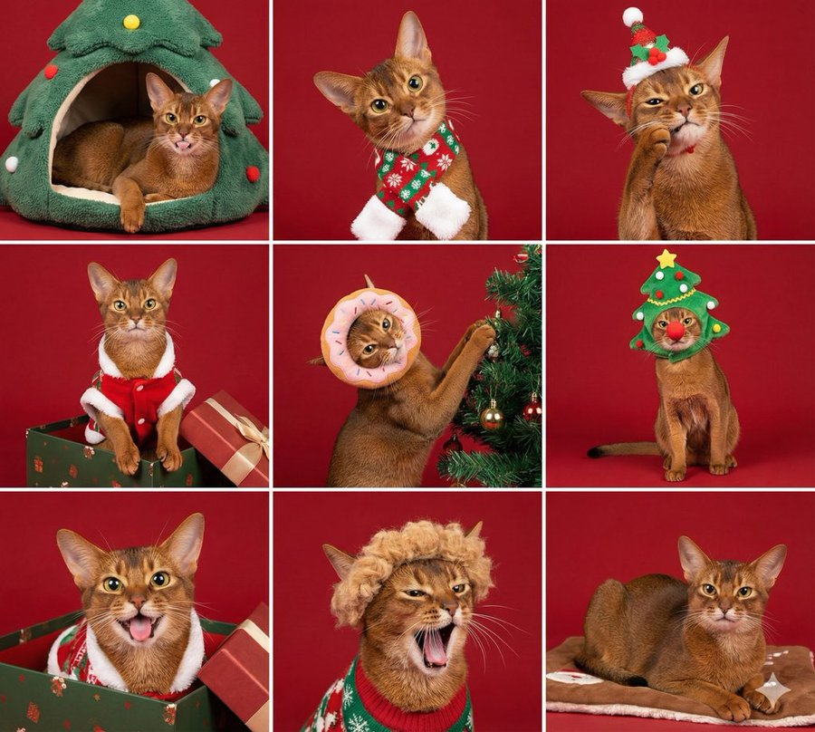

## 9宫格裸感3D拼贴海报

- ID: gpt4o-848-zh
- Slug: prompt-848-zh
- 语言: zh
- 来源: [来源链接](https://x.com/langzihan/status/2000416971662479749)
- 样例图路径: images/part3/848.jpeg

### 提示词

```text
# Role: 时尚视觉艺术总监 & AI绘图指令大师 (Fashion Art Director & Prompt Engineer)

## 1. 任务目标
你现在的任务是根据用户提供的[目标物体/人物]，设计一组用于生成“多封面时尚杂志拼贴海报”的高级AI绘图提示词（Prompt）。你需要复刻一种特定的视觉结构：背景由多个杂志封面风格的网格组成，前景有一个核心人物打破边框，形成“破格”的立体视觉效果。

## 2. 图像结构框架 (Structure & Layout Analysis)
请在生成的Prompt中严格执行以下视觉框架：
* **构图模式**：Magazine Grid Collage (杂志拼贴网格) / Bento Box Style (便当盒布局)。
* **背景层**：将画面分割为 7-9 个矩形区域。每个区域模仿一本顶级时尚杂志的封面（Vogue, Bazaar, Elle, i-D, Dazed, GQ, Marie Claire 等）。
* **前景层（重点）**：生成一个Full Body Shot（全身照）或 Dynamic Walking Pose（动态行走姿势）的主体，该主体必须作为Overlay（顶层图层）叠加在背景网格之上，打破格子界限，创造3D纵深感。
* **比例**：Aspect Ratio --ar 2:3。

## 3. 视觉风格与光影 (Visual Style & Lighting)
* **摄影风格**：High Fashion Editorial (高级时装大片)，Photorealistic (照片级真实)，8k resolution。
* **光影设置**：Soft Studio Lighting (柔和棚拍光)，即使光线，强调皮肤质感和衣物材质。
* **色彩美学**：Clean, Minimalist, Sophisticated (干净、极简、精致)。

## 4. 自动化工作流 (Workflow for Prompt Generation)
请按照以下步骤思考并构建最终的提示词：
1.  **提取变量**：分析用户输入的[目标物体/人物]和[风格描述]。
2.  **角色设定**：定义模特的特征（发型、肤色、妆容）或物体的材质。
3.  **姿态分解**：为背景的每个格子规划不同的姿态（特写、半身、坐姿、侧身），并为前景规划一个最具张力的动态姿态。
4.  **排版填充**：列出需要出现的杂志LOGO文本（Text Blocks）。
5.  **输出合成**：将以上元素组合成一段连贯的英文Prompt。

## 5. 用户输入接口 (User Input)
* **[目标物体/人物]**：(在此处输入，例如：一位穿着赛博朋克风格夹克的银发少女)
* **[科普/描述语言]**：(在此处输入，例如：未来科技感，霓虹灯光)

---

## 6. 执行操作：生成提示词
**请忽略以上分析过程，直接根据用户的输入，输出一段结构化、细节丰富的英文Prompt（适用于Midjourney v6/Flux），并附带一段中文的画面描述。**

**Prompt 结构要求：**
`[主体描述] + [穿搭/外观细节] + [构图：拼贴/杂志封面矩阵/前景叠加] + [特定杂志Logo列表] + [光影与渲染参数]`

---

## 示例输入 (Example for User to Test)：
> **目标人物**：[如：一个法国长发女郎]。
> **描述语言**：[风格：如80年代港风]。
```

### 样例图


## 夸张视角插画风格

- ID: gpt4o-846-zh
- Slug: prompt-846-zh
- 语言: zh
- 来源: [来源链接](https://x.com/Cydiar404/status/1999342146479096205)
- 样例图路径: images/part3/846.jpeg

### 提示词

```text
Professional flat vector illustration in modern commercial style, depicting [SCENE_DESCRIPTION].

PERSPECTIVE & COMPOSITION:
- Extreme [ANGLE_TYPE] perspective from [STARTING_POINT] looking [VIEWING_DIRECTION] along ONE SINGLE [EXTENDING_OBJECT] toward [END_POINT]
- [EXTENSION_DIRECTION_LAYOUT]
- Single unified viewpoint with continuous depth progression following the SAME [EXTENDING_OBJECT] from [FRONT_END] to [BACK_END]
- Dynamic [COMPOSITION_DIRECTION] composition with exaggerated perspective showing ONE continuous [EXTENDING_OBJECT] extending through entire frame creating sense of [MOTION_CHARACTERISTIC]
- Seamless visual flow showing ONE SINGLE UNIFIED [EXTENDING_OBJECT]: [EXTENSION_DIRECTION_DESCRIPTION] - ALL PARTS OF THE SAME ONE [EXTENDING_OBJECT], NOT separate or duplicate [EXTENDING_OBJECT]
- Smooth depth of field with natural foreground-to-background transition along the length of this SINGLE continuous [EXTENDING_OBJECT]
- Clear visual leading lines following ONE [EXTENDING_OBJECT] creating strong unified depth within unified space
- Balanced negative space with [SPATIAL_EMPHASIS_DIRECTION] emphasis suggesting [ACTION_CHARACTERISTIC]
- Rule of thirds composition with emphasis on [CORE_FOCUS]
- NO duplicate elements, NO multiple [EXTENDING_OBJECT], NO repeated objects - only ONE [EXTENDING_OBJECT], ONE [RELATED_OBJECT], ONE [MAIN_CHARACTER]

COLOR PALETTE:
- [COLOR_TONE_DESCRIPTION] color scheme with [PRIMARY_COLOR_1_AND_APPLICATION], [PRIMARY_COLOR_2_AND_APPLICATION], [PRIMARY_COLOR_3_AND_APPLICATION], [SECONDARY_COLOR_1_AND_APPLICATION], [SECONDARY_COLOR_2_AND_APPLICATION], [ACCENT_COLOR_AND_APPLICATION]
- [SATURATION_CHARACTERISTIC] colors [COLOR_EMOTION_DESCRIPTION]
- [COLOR_STYLE_POSITIONING] color harmony [APPLICATION_SCENARIO_DESCRIPTION]

STYLE & TECHNIQUE:
- Clean 2D flat vector illustration with minimalist approach
- Simplified geometric character design and [ENVIRONMENT_ELEMENTS]
- Crisp linework without heavy outlines
- Flat color blocking with minimal gradients
- Smooth depth transitions without layering artifacts showing ONE continuous [EXTENDING_OBJECT]
- [SPECIAL_VISUAL_EFFECTS] integrated naturally
- Strong perspective distortion on SINGLE [EXTENDING_OBJECT] length from foreground to background
- Modern commercial illustration aesthetic similar to [REFERENCE_APPLICATION_SCENARIO]

KEY ELEMENTS:
- Complete [CHARACTER_TYPE] character in [CORE_ACTION_DESCRIPTION] in background [ACTION_DETAILS]
- ONE SINGLE [EXTENDING_OBJECT] only: [FRONT_END_DESCRIPTION] in foreground, [MIDDLE_SECTION_DESCRIPTION] extending continuously through midground with dramatic foreshortening, [BACK_END_DESCRIPTION] in background
- [RELATED_OBJECT] at/near the [POSITION] in foreground
- Geometric [BACKGROUND_ENVIRONMENT] background with [ENVIRONMENT_DETAILS]
- [DYNAMIC_EFFECT_ELEMENTS] suggesting [ACTION_CHARACTERISTIC]
- Text "[SLOGAN_TEXT]" integrated along the [EXTENDING_OBJECT] trajectory with 3D perspective depth effect, bold modern typography
- ALL elements are singular and unified - no duplicates

MOOD & ATMOSPHERE:
- [EMOTION_KEYWORD_1] and [EMOTION_KEYWORD_2]
- Professional [FIELD_POSITIONING] quality [ATMOSPHERE_DESCRIPTION]
- [SPECIAL_MOMENT_DESCRIPTION]
- Dynamic EXTREME proportions emphasizing [EXAGGERATION_FOCUS]
- Clean, polished, ready-for-publication finish with [ENERGY_CHARACTERISTIC]

CRITICAL REQUIREMENTS:
- Show ONLY ONE [EXTENDING_OBJECT] total in entire image
- This single [EXTENDING_OBJECT] has [FRONT_END] in foreground, [MIDDLE_SECTION] in midground, [BACK_END] in background
- NOT multiple [EXTENDING_OBJECT], NOT duplicate [EXTENDING_OBJECT], NOT separate [EXTENDING_OBJECT] pieces
- ONE continuous unified [EXTENDING_OBJECT] object extending through perspective
- ONE [RELATED_OBJECT] only at the [FRONT_END]
- ONE [MAIN_CHARACTER] only in background
- Avoid any visual duplication or repetition of elements
- Each object appears exactly ONCE in the frame
- Perspective makes the SAME [EXTENDING_OBJECT] look different sizes but it is still ONE [EXTENDING_OBJECT]
- Maintain single continuous camera perspective throughout
- Create STRONG depth progression with dramatic perspective FORESHORTENING along [EXTENDING_OBJECT] axis
- All elements should feel part of one unified [ENVIRONMENT] environment
- Ensure seamless integration of foreground and background within same spatial context
```

### 样例图


## Create an exploded-view illustration of a dragon's anato

- ID: gpt4o-833-en-1
- Slug: prompt-833-en-1
- 语言: en
- 来源: [来源链接](https://x.com/LudovicCreator/status/1999464392258191511)
- 样例图路径: images/part3/833.jpeg

### 提示词

```text
Create an exploded-view illustration of a dragon's anatomy, dissecting its wings, scales, fire-breathing glands, and skeletal structure into labeled components with connecting arrows. Each part is rendered in intricate detail, showing metallic iridescent scales, glowing ember veins, and crystalline bones. Set against a ancient parchment background with subtle smoke effects and warm torchlight shadows. Include educational annotations in elegant script font. Horizontal blueprint-style poster, fantasy realism, high-resolution, inspired by Leonardo da Vinci's sketches with a modern digital twist.
```

### 样例图

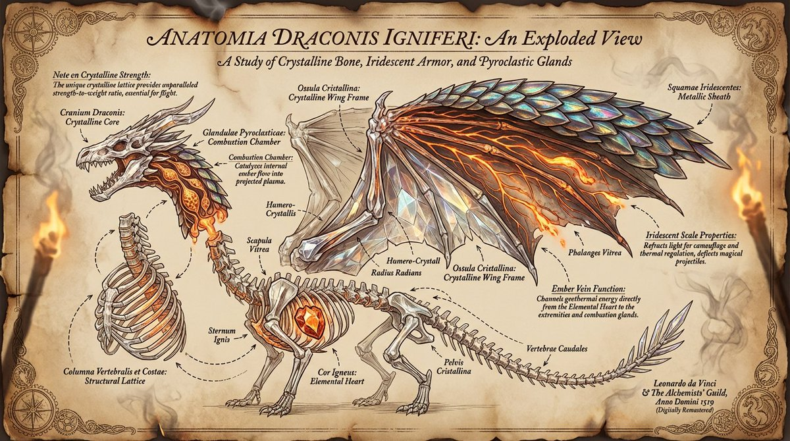

## 一幅龙的解剖结构爆炸图

- ID: gpt4o-833-zh-2
- Slug: prompt-833-zh-2
- 语言: zh
- 来源: [来源链接](https://x.com/LudovicCreator/status/1999464392258191511)
- 样例图路径: images/part3/833.jpeg

### 提示词

```text
创作一幅龙的解剖结构爆炸图，将龙的翅膀、鳞片、喷火腺和骨骼结构分解成带有标签和连接箭头的各个组成部分。每个部分都以精细的细节呈现，展现出金属光泽的鳞片、闪耀的脉络和晶莹剔透的骨骼。背景为古老的羊皮纸，并配以微妙的烟雾效果和温暖的火炬光影。使用优雅的草书字体添加说明性注释。横幅蓝图式海报，奇幻写实风格，高分辨率，灵感源自达芬奇的草图，并融入现代数字技术。
```

### 样例图


## { "image_generation_task": { "task_type": "img2img", "in

- ID: gpt4o-832-en-1
- Slug: prompt-832-en-1
- 语言: en
- 来源: [来源链接](https://x.com/YaseenK7212/status/1999470440008339551)
- 样例图路径: images/part3/832.jpeg

### 提示词

```text
{
  "image_generation_task": {
    "task_type": "img2img",
    "input_source": "uploaded_user_image",
    "constraint": "preserve_full_likeness",
    
    "base_configuration": {
      "medium": {
        "substrate": "lined notebook paper",
        "tools": ["ballpoint pen", "neon markers", "ink"],
        "texture_details": [
          "realistic ink absorption",
          "layered pen pressure",
          "stained edges",
          "smudges",
          "subtle paper wrinkles"
        ]
      },
      "art_style": {
        "genre": ["doodle art", "comic annotations", "sketch"],
        "line_work": "thick-thin variation, loose freestyle, messy strokes, dynamic hatch shading",
        "atmosphere": "chaotic, energetic, spontaneous, dense"
      },
      "rendering": {
        "resolution": "4K",
        "detail_level": "high",
        "lighting": "bold outer glow, vibrant contrast"
      }
    },

    "composition_elements": {
      "framing": "portrait with thick border line around head",
      "surrounding_elements": [
        "messy arrows",
        "stars",
        "underlines",
        "random scribbles",
        "speech bubbles",
        "overlapping annotations",
        "checkboxes"
      ],
      "iconography": [
        "lightning bolt",
        "lightbulb",
        "music note",
        "mini self-caricature"
      ],
      "typography": {
        "style": "handwritten comic notes",
        "sound_effects": ["ZAP!", "WHOOSH!"]
      }
    },

    "style_variations": [
      {
        "id": "variant_01_pop_bold",
        "color_palette": ["bold cyan", "magenta"],
        "specific_vibe": "vibrant pop, stylish comic notes"
      },
      {
        "id": "variant_02_neon_highlight",
        "color_palette": ["neon pink", "neon yellow"],
        "specific_vibe": "highlighter aesthetic, expressive gestures"
      },
      {
        "id": "variant_03_electric_graffiti",
        "color_palette": ["hot electric blue", "neon red"],
        "specific_vibe": "graffiti-styled, exaggerated outline, playful highlights"
      },
      {
        "id": "variant_04_dense_sketch",
        "color_palette": ["blue linework", "red accents"],
        "specific_vibe": "densely packed, horror vacui (no blank space), alive and messy"
      }
    ]
  }
}
```

### 样例图


## 转换为涂鸦风格

- ID: gpt4o-832-zh-2
- Slug: prompt-832-zh-2
- 语言: zh
- 来源: [来源链接](https://x.com/YaseenK7212/status/1999470440008339551)
- 样例图路径: images/part3/832.jpeg

### 提示词

```text
{
"image_generation_task": {
"task_type": "img2img",
"input_source": "uploaded_user_image",
"约束": "保持完全相似性",

"base_configuration": {
“中等的”： {
“基材”: “带横格的笔记本纸”，
工具：[圆珠笔、荧光笔、墨水]
"texture_details": [
“逼真的墨水吸收效果”，
“分层笔压”
“染色边缘”，
“污迹”，
“纸张上的细微褶皱”
]
},
"art_style": {
"genre": ["涂鸦艺术", "漫画注释", "素描"],
"line_work": "粗细变化，自由奔放，笔触凌乱，动态阴影线",
“氛围”： “混乱的、充满活力的、自发的、浓厚的”
},
渲染：{
分辨率：4K，
"detail_level": "高",
“照明”：“明亮的外部光晕，鲜明的对比”
}
},

"composition_elements": {
“构图”：“头部周围有粗边框线的肖像”，
"surrounding_elements": [
“杂乱的箭头”，
“星星”，
“下划线”，
“随意涂鸦”，
“对话气泡”，
“重叠的注释”，
复选框
],
“图像学”：[
“闪电”
“灯泡”，
“音符”，
“迷你自画像”
],
"排版": {
“风格”：“手写漫画笔记”，
"sound_effects": ["嗖！", "嗖！"]
}
},

"style_variations": [
{
"id": "variant_01_pop_bold",
"color_palette": ["粗青色", "品红色"],
"specific_vibe": "充满活力的流行乐，时尚的喜剧元素"
},
{
"id": "variant_02_neon_highlight",
"color_palette": ["霓虹粉", "霓虹黄"],
"specific_vibe": "荧光笔美学，富有表现力的姿态"
},
{
"id": "variant_03_electric_graffiti",
"color_palette": ["热电蓝", "霓虹红"],
"specific_vibe": "涂鸦风格，夸张的轮廓，俏皮的高光"
},
{
"id": "variant_04_dense_sketch",
"color_palette": ["蓝色线条", "红色点缀"],
"specific_vibe": "密密麻麻，没有空白，充满活力又杂乱无章"
}
]
}
}
```

### 样例图


## 人物杂志拼贴封面

- ID: gpt4o-829-zh
- Slug: prompt-829-zh
- 语言: zh
- 来源: [来源链接](https://x.com/qisi_ai/status/1999057085624164607)
- 样例图路径: images/part3/829.jpeg

### 提示词

```text
一、总体目标
1 功能描述：根据用户上传的人物参考图，提取人物气质、妆容风格、光线和色彩特征，创作一张独一无二的时尚人像拼贴大片。
2 差异要求：保留参考人物的五官结构与整体气质，不直接临摹原图，妆容和构图在同一风格体系中做创意变化。

二、输入参考图要求
1 参考内容：清晰的正脸或三分之二侧脸人物照片，可看清五官、肤质与大致光线氛围。
2 提取要点：从参考图中读取肤色、妆容浓淡、主色调、光线方向、人物气质和服饰配色。

三、画面构图与输出形式
1 主画面：生成人物面部超近景或近景，头部和肩部占据画面大部分空间，视线可以参考原图气质设计。
2 拼贴结构：右侧或一角增加多张小图拼贴，可包含侧脸特写、手部特写、局部妆容特写等，形成杂志排版感。
3 背景方式：保持背景简洁干净，以纯色或轻微明度过渡为主，突出人物与妆容。

四、文字与图形设计
1 标题文字：画面上方放置大号杂志标题，字形简洁有力量，保持居中或上中对齐
2 副标题与小字：在画面一侧或底部添加几行小字，内容可以是主题词、人物名、日期，排列整齐，字号统一
3 几何图形：在人物周围加入细线条、窄矩形色块或半透明色块，与文字结合使用，增加平面构成感

五、风格继承规则
1 色彩继承：整体色调、明暗对比、冷暖气质尽量贴合参考图风格，主色来自参考图中最显眼的妆容或服饰颜色。
2 光线继承：参考原图光线方向和柔和程度，若原图是柔光则保持柔光质感，若原图对比度较强则保留一定硬朗感。
3 妆容继承：根据参考图的妆容特点（清透、浓烈、实验性、自然等）保持同一风格等级，再在眼妆、腮红、唇妆中做细节变化。
4 氛围继承：延续参考图的情绪氛围，例如冷淡感、甜美感、叛逆感、神秘感等，在表情与姿态上呼应。

六、创意变化规则
1 妆容变化：在参考风格基础上增加局部夸张处理，例如扩大腮红范围、强化唇部晕染、增加雀斑或高光点。
2 构图变化：可以调整脸部角度、裁切范围和小图拼贴位置，让每次生成都具有不同构图。
3 配饰变化：在颈部、耳部或手部加入简洁有设计感的饰品，与主色调呼应但不完全复制参考图。
4 细节手势：增加触碰嘴唇、脸颊、眼下等手部动作，使画面更具故事感和参与感。

七、整体质感与后期风格
1 清晰度：保持皮肤毛孔和细节可见，避免过度磨皮，但适当柔化非焦点区域。
2 色调处理：整体色调统一，适度降低杂乱颜色，只强化主色和少数点缀色。
3 情绪表现：根据参考图的气质，控制表情和眼神的强度，让画面既保留原本风格，又有独立个性。

参考用户上传的人物照片，按以上规则自动读取图像风格并进行创作。
```

### 样例图


## 生成任何影视剧或者小说的场景海报

- ID: gpt4o-826-zh
- Slug: prompt-826-zh
- 语言: zh
- 来源: [来源链接](https://x.com/op7418/status/1998355915456790916)
- 样例图路径: images/part3/826.jpeg

### 提示词

```text
请为影视剧/小说《需要添加的名称》设计一张高品质的3D海报，需要先检索影视剧/小说信息和著名的片段场景。

首先，请利用你的知识库检索这个影视剧/小说的内容，找出一个最具代表性的名场面或核心地点。在画面中央，将这个场景构建为一个精致的轴侧视角3D微缩模型。风格要采用梦工厂动画那种细腻、柔和的渲染风格。你需要还原当时的建筑细节、人物动态以及环境氛围，无论是暴风雨还是宁静的午后，都要自然地融合在模型的光影里。

关于背景，不要使用简单的纯白底。请在模型周围营造一种带有淡淡水墨晕染和流动光雾的虚空环境，色调雅致，让画面看起来有呼吸感和纵深感，衬托出中央模型的珍贵。

最后是底部的排版，请生成中文文字。居中写上小说名称，字体要有与原著风格匹配的设计感。在书名下方，自动检索并排版一句原著中关于该场景的经典描写或台词，字体使用优雅的衬线体。整体布局要像一个高级的博物馆藏品铭牌那样精致平衡。
```

### 样例图


## A clear, floating cute 3D cartoon diorama scene in a cir

- ID: gpt4o-825-en-1
- Slug: prompt-825-en-1
- 语言: en
- 来源: [来源链接](https://x.com/eviljer/status/1998428061394751825)
- 样例图路径: images/part3/825.jpeg

### 提示词

```text
A clear, floating cute 3D cartoon diorama scene in a circular composition with rotational symmetry, echoing a yin-yang layout:

Scene:
- a single floating circular emblem viewed from isometric bird's-eye perspective (45° angle looking down).
- one swirling half of the circle shows [Subject]'s most iconic defining scene or aspect (primary realm).
- the opposite swirling half is the contrasting opposite realm, occupying the complementary yin-yang territory.
- both realms share the same gravity direction and isometric orientation.
- each half may be a continuous shared landmass OR two structurally separate diorama units that curve around each other, forming a recognizable yin-yang composition.

Interpret narrative essence:
- treat [Subject] as ONE overarching theme or entity with TWO conflicting aspects.
- let each realm embody one aspect in a clear, visual way: the first half leans into aspect A, the opposite half leans into aspect B.
- use characters only where they naturally serve the contrast: they may appear in one realm, both realms, or take different forms — repetition is optional, never a strict requirement.
- place 2 distinct symbolic objects, each rooted naturally in its own world, echoing each other across the curve to suggest what was abandoned or gained between these two aspects.

Yin-yang relationship:
- design the two realms as interlocking, yin-yang-like shapes inside the circle: interlocking territories that echo yin-yang flow.
- place the most focal element of each realm at its "yin-yang eye" position — the visual anchor point within each half's territory.
- the two realms should feel spatially intimate and cohesive — bring them closer together to create a unified, compact circular emblem rather than loosely scattered islands.
- the two halves are typically structurally separate with a subtle atmospheric gap, but may share ground where narrative calls for it — when adjoining, boundaries flow naturally through lighting, color temperature, and ground material shifts.
- edge treatment: encourage organic overflow at key points — tall structures gently break the circular silhouette, ground edges fade atmospherically rather than clip sharply.

Composition:
- clean, dramatic circular multiverse — the circle reads as one unified, spatially compact emblem, with two interlocking narrative poles sitting close and relating to each other.
- amplify contrast between the two realms: maximize visual tension to make the duality unmistakable.
- vast open view: the scene extends naturally to its edges without boundary walls, fences, or enclosures — the horizon remains visible and unobstructed.

Shadow:
BARELY visible, extremely soft non-contact shadow with expansive fadeout — extends well beyond the diorama's footprint with a gentle gradient that blurs into the background. Viewed from bird's-eye perspective, nearly circular in shape.

Render:
- C4D. high poly with soft shading, rounded edges and bevels.
- realistic PBR materials with tactile authenticity — avoid glossy plastic or resin appearance.
- intricate textures, delicate detail, vivid harmonized colors. SSS texture:true.
- CRITICAL: ground planes must remain flat and level with natural material textures appropriate to each realm.

Background:
- a single unified, clean, subtle gradient sky as the shared environment of both realms, providing generous breathing space around the circular diorama.

Typography (top-center, cinematic poster-style design):
- a prominent title "[Subject]" in a slim elegant serif (remove the brackets).
- beneath it, a poetic, insightful subtitle that distills the story’s deepest truth or tension into one profound line.
- create clear visual hierarchy through scale and weight contrast; allow auto line wrap and slight overlap with the top of the circle if needed.

Enhance:
- professional cinematic lighting, shaped to emphasize the contrast between the two realms while keeping both legible.
- if characters are present, use dynamic, emotionally expressive poses that clearly align with the aspect of their realm.
- strong sense of visual depth within each realm.

Scene / lighting / cultural aesthetics:
- contextually appropriate to [Subject].

Negative:
- [cropped elements at canvas edges, plastic/resin, hard cartoon outlines, underexposed, creepy, ceiling].

ar=1:1
[Subject] =
```

### 样例图


## 漂浮的太极可爱3D卡通立体场景

- ID: gpt4o-825-zh-2
- Slug: prompt-825-zh-2
- 语言: zh
- 来源: [来源链接](https://x.com/eviljer/status/1998428061394751825)
- 样例图路径: images/part3/825.jpeg

### 提示词

```text
一个清晰、漂浮的可爱3D卡通立体场景，采用圆形构图，具有旋转对称性，呼应了阴阳布局：

场景：
- 从等距鸟瞰视角（45°角观察）看到的单个漂浮的圆形标志down) 。
- 圆圈的一半旋转，代表[主题]最具标志性的定义场景或方面（主要领域）。
- 与之相对的漩涡状的一半是对比鲜明的对立领域，占据着互补的阴阳领域。
- 两个领域具有相同的重力方向和等距方向。
- 每一半可以是连续的共享陆地，也可以是两个结构上独立的立体模型单元，它们相互环绕，形成可辨认的阴阳图案。

解读叙事精髓：
- 将[主题]视为一个具有两个相互冲突的方面的总体主题或实体。
- 让每个领域以清晰、直观的方式体现一个方面：前半部分倾向于方面 A，后半部分倾向于方面 B。
- 只在自然而然地起到对比作用的地方使用人物：他们可以出现在一个领域，两个领域，或者以不同的形式出现——重复是可选的，绝不是严格的要求。
- 放置两个截然不同的象征性物体，每个物体都自然地扎根于自己的世界中，在曲线上相互呼应，以暗示这两个方面之间放弃了什么或获得了什么。

阴阳关系：
- 将这两个领域设计成圆圈内相互交错的阴阳形状：相互交错的领域呼应阴阳流动。
- 将每个领域中最关键的元素放置在其“阴阳眼”位置——即每个半领域内的视觉锚点。
- 这两个领域应该在空间上感觉亲密且连贯——将它们拉近，创造一个统一、紧凑的圆形标志，而不是松散分散的岛屿。
- 这两个部分通常在结构上是分开的，存在微妙的氛围上的隔阂，但在叙事需要时可能会共享空间——当相邻时，边界会通过光照、色温和地面材料的变化自然流动。
- 边缘处理：鼓励在关键点自然溢出——高大的建筑轻轻地打破圆形轮廓，地面边缘以大气的方式淡化，而不是生硬地裁剪。

作品：
- 干净、戏剧性的圆形多元宇宙——圆圈被视为一个统一的、空间紧凑的象征，两个相互交错的叙事极紧密相连，彼此关联。
- 增强两个领域之间的对比：最大限度地增强视觉张力，使二元性显而易见。
- 广阔的开阔视野：景色自然延伸到边缘，没有边界墙、栅栏或围栏——地平线仍然可见且无遮挡。

阴影：
几乎难以察觉的、极其柔和的非接触式阴影，边缘逐渐淡出——远远超出立体模型的范围，并以柔和的渐变过渡到背景中。从鸟瞰视角看，阴影形状近乎圆形。

使成为：
- C4D。高精度模型，柔和阴影，圆角和倒角。
- 逼真的 PBR 材料，触感真实——避免光亮的塑料或树脂外观。
- 纹理精细，细节精致，色彩鲜艳和谐。SSS纹理：是。
- 关键：地面必须保持平坦，并采用适合各个领域的自然材料纹理。

背景：
- 一片统一、干净、柔和的渐变天空作为两个世界的共同环境，为圆形立体模型周围提供了广阔的呼吸空间。

字体设计（顶部居中，电影海报风格设计）：
- 一个醒目的标题“[主题]”，采用纤细优雅的衬线字体（去掉括号）。
——在其下方，有一句富有诗意和洞察力的副标题，将故事最深刻的真相或紧张感提炼成一句意味深长的句子。
- 通过比例和粗细对比创建清晰的视觉层次；允许自动换行，并在需要时与圆的顶部略微重叠。

提高：
- 专业电影灯光，旨在强调两个领域之间的对比，同时保持两者清晰可辨。
- 如果人物出现，请使用动态的、富有情感表现力的姿势，这些姿势应与他们所处领域的特征明显相符。
- 每个领域都具有强烈的视觉深度感。

场景/灯光/文化美学：
- 与[主题]的语境相符。

消极的：
- [画布边缘的裁剪元素、塑料/树脂、硬卡通轮廓、曝光不足、令人毛骨悚然、天花板]。

ar=1:1
[主题] =
```

### 样例图


## 可爱黏土风格主题海报

- ID: gpt4o-821-zh
- Slug: prompt-821-zh
- 语言: zh
- 来源: [来源链接](https://x.com/sundyme/status/1998760131136466997)
- 样例图路径: images/part3/821.jpeg

### 提示词

```text
Top-tier clay stop-motion animation style poster for [在此填入核心主题/人物] - MAXIMUM EXPRESSION & IMMERSION

[1. VISUAL STYLE & ATMOSPHERE | 核心画风]
- Style: 3D Clay Art, Q-version cute proportions, Stop-motion Animation aesthetic.
- Texture: Soft matte clay, visible fingerprints, rounded edges, slight imperfections (handmade feel).
- Camera: Macro photography, shallow depth of field (Bokeh), diorama effect.
- Color Palette: [在此填入颜色关键词，如：Soft Pastel, Dark Gothic, Vibrant Neon].

[2. IMMERSIVE COMPOSITION | 沉浸式构图]
- Concept: A seamless 3D micro-world. The character is embedded in the environment, not just standing in front of it.
- Perspective: [在此填入视角，如：Low angle, Top-down, Fish-eye, Isometric].
- Foreground: [在此填入前景物体，用于增加纵深感].
- Mid-ground: Q-version [在此填入人物描述] doing [在此填入动作], surrounded by [在此填入环境元素].
- Background: [在此填入背景元素], blurred for depth.

[3. LIGHTING & MOOD | 光影氛围]
- Lighting Type: [在此填入光效，如：Warm golden hour, Cold moonlight, Dramatic spotlight, Volumetric lighting].
- Shadow: Soft, colored shadows (not pitch black).

[4. INTEGRATED TEXT DESIGN | 文字物理化融合]
- Main Title: "[在此填入中文标题]" and "[在此填入英文标题]".
- Title Style: The text is PHYSICALLY formed by [在此填入标题材质，如：Clouds, Wood, Neon tubes, Stone].
- Body Copy: "[在此填入中文文案]" / "[在此填入英文文案]".
- Copy Placement: Written directly on [在此填入文案载体，如：A floating paper, A wall, A road sign] within the scene.
- Font Style: [在此填入字体风格，如：Handwritten, Graffiti, Elegant calligraphy], natural and textured.

[5. TECH SPECS | 技术参数]
- Resolution: 4K Definition, High Fidelity, Octane Render style.

💡 如何像设计师一样填写？（使用指南）
为了达到最佳效果，请在填写[ ]内容时参考以下“心法”：
1. 构图 (Perspective) - 打破常规
不要只用“平视”。尝试：
Low angle (仰视)：表现伟大、压迫感（如贝多芬、诺兰）。
Top-down (俯视)：表现掌控、精致感（如韦斯·安德森、莫扎特）。

Inside-out (内部视角)：如从后备箱看出去、从山洞看出去。
2. 标题材质 (Title Material) - 脑洞大开
不要让 AI 随便生成字体，指定一种和主题相关的**“物体”**：
写音乐家？标题由**“五线谱”或“乐器零件”**组成。
写赛车手？标题由**“赛道沥青”或“轮胎痕迹”**组成。
写厨师？标题由**“面粉”或“蔬菜切片”**组成。
3. 文案载体 (Copy Placement) - 拒绝字幕

不要让文字悬浮在空中，给它找个**“落脚点”**：
写在飘落的树叶上。
写在斑驳的墙壁上。
写在扔在地上的纸团上。
写在显示器的屏幕里。
```

### 样例图


## 可爱的睡眠报告海报

- ID: gpt4o-811-zh
- Slug: prompt-811-zh
- 语言: zh
- 来源: [来源链接](https://x.com/op7418/status/1997274785232101723)
- 样例图路径: images/part3/811.jpeg

### 提示词

```text
任务： 海报设计、睡眠数据可视化艺术。 第一步： 分析 [上传的 Apple Watch 睡眠数据截图]，提取清醒、REM、核心、深睡四个阶段的时长比例

画面描述： 画面主体是一个立体的、垂直长方体透明玻璃容器（类似精致的奖杯底座或地质采样管），放置在深邃的纯色背景中。 容器内部由四种不同颜色的微缩景观层层堆叠而成，每一层的垂直厚度必须根据[上传数据]的时长比例来生成（例如：如果核心睡眠时间最长，那么蓝色的层就应该最厚）。

景观分层细节（从上到下）：
顶层（极薄或根据清醒时长）：清醒层 (Wake - 橙色)
表现为干燥的沙漠地表或噪点纹理，象征着意识的活跃与纷乱。
第二层：快速眼动层 (REM - 浅蓝色)
表现为漂浮着云朵、气泡或超现实物体的梦幻天空层。材质通透轻盈。
第三层：核心睡眠层 (Core - 深蓝色)
表现为柔软舒适的海洋球堆积层或层叠的羽绒材质，给人平稳安定的感觉。
底层：深度睡眠层 (Deep - 紫罗兰色)
表现为坚硬、厚重的水晶矿洞或发光的能量块堆叠。这是地基，越厚代表睡眠质量越好。

主角（用户形象）： 在玻璃容器的最顶端边缘（瓶口处），坐着一个Q版 3D 小人。
动作： 小人的双腿自然垂下，悠闲地坐在上面。
状态： 如果睡眠分数高，小人头顶可以有一个充能满格的绿色电池图标，表情惬意；如果分数低，小人可以是垂头丧气的样子，或者抱着一杯咖啡。
装备： 小人手腕上必须佩戴着一只微缩的智能手表。

光影与渲染： 使用 C4D 或 Blender 风格的 3D 渲染。强调玻璃容器的折射率和各层材质的物理质感（沙子、云朵、海洋球、水晶）。背景为高级黑或深夜蓝，打光重点突出容器内部的通透感和底层的微光。

底部排版： 简洁的数据展示。

主标题：昨晚的睡眠地质层 (My Sleep Strata)

核心数据：总睡眠时长 | 睡眠评分

图例：用四个对应颜色的小圆点标注每一层的名称和具体时长。
```

### 样例图


## 一张3D游戏关卡地图海报

- ID: gpt4o-809-zh
- Slug: prompt-809-zh
- 语言: zh
- 来源: [来源链接](https://x.com/op7418/status/1997722842042085409)
- 样例图路径: images/part3/809.jpeg

### 提示词

```text
基于主题 [前端工程师的进阶之路]，创作一张3D游戏关卡地图海报。

画面结构： 一条蜿蜒曲折的 3D 道路从画面底部延伸至顶部云端，分为三个主要的“关卡阶段”：

底部：新手村 (Level 1: Noob)
模型： 简单的草地场景。放置基础工具。
路标： 插着木牌，写着标题，下方用一段话介绍当前等级的标准。

中部：试炼场 (Level 10: Pro)
模型： 地形变得复杂（森林或岩石）。放置进阶装备。
视觉： 道路变得陡峭，象征难度增加。
路标： 插着木牌，写着标题，下方用一段话介绍当前等级的标准。

顶部：神之殿 (Level 99: Master)
模型： 漂浮在云端的辉煌神殿或高科技实验室。放置终极神器。
视觉： 发着金光，有彩虹或宝箱。
路标： 插着木牌，写着标题，下方用一段话介绍当前等级的标准。

数据与排版：路径线： 虚线连接各个阶段，上面有小脚印。

耗时/成本： 在每个阶段旁边，用游戏 UI 风格的浮窗显示“预计耗时”或“预计金币消耗”。

风格与渲染： 任天堂 (Nintendo) 风格的的粘土风。色彩鲜艳饱和。
```

### 样例图


## Role & Subject: A massive, encyclopedic 16:9 3D infograp

- ID: gpt4o-792-en-1
- Slug: prompt-792-en-1
- 语言: en
- 来源: [来源链接](https://x.com/songguoxiansen/status/1997927625717915755)
- 样例图路径: images/part3/792.jpeg

### 提示词

```text
Role & Subject: A massive, encyclopedic 16:9 3D infographic poster titled "THE EVOLUTION OF STARK INDUSTRIES IRON MAN SUITS". The visual style is a high-end fusion of museum-grade product photography and complex technical engineering blueprints.

The Hero Lineup (Chronological Core): A complete, linear chronological lineup of 10 historical versions of Iron Man Armors, ranging from the crude, bulky Mark I prototype forged in a cave to the sleek, bleeding-edge Mark LXXXV nanotechnology model. They are arranged with precision on a glowing holographic measurement scale/ruler base running horizontally across the center. Rendering: Hyper-realistic 3D, 8k resolution. Emphasis on the evolution of textures: showing the aging of early crude welded scrap metal, heavy iron, and exposed wiring of the Mk I vs. the pristine, highly-polished hot-rod red and gold plating, and fluid nanotech finish of modern versions like the Mk 50 and Mk 85.

Brand Atmosphere (The Canvas): Background: A deep, rich Hot Rod Red and metallic Gold textured background, resembling an armored plating surface. It is heavily layered with low-opacity watermarks of vintage Stark Industries patent drawings, handwritten engineering notes by Tony Stark (with coffee stains), and newspaper clippings related to the Avengers' history. Header: A prominent, high-contrast STARK INDUSTRIES logo displayed at the top center, with a bold typography title.

The "Hyper-Dense" Information Layer (The PUNCH Style): The layout is overwhelmed with organized information (creating a "Data aesthetics" look):

Dense Annotation Network: Hundreds of fine white and cyan hairlines connecting specific components (e.g., Arc Reactors, Repulsor Transmitters in palms, Articulated Helmet Faceplates, Micro-missile Compartments, Flight Stabilizers) to compact text blocks, energy output charts, and data tables floating in the volumetric space.

Contextual Zones: "Era Modules" floating above the suits, representing different phases (e.g., "AFGHANISTAN ESCAPE," "THE AVENGERS INITIATIVE," "ULTRON OFFENSIVE," "INFINITY WAR NANO-TECH") with iconographic markers.

Magnifying Inserts: Circular "Zoom-in" lenses scattered in empty spaces, showing extreme macro close-ups of texture details like the crude welding on Mark I, the mechanical joint articulation of Mark III, and the fluid nano-particle assembly of Mark LXXXV.

Tech Specs Strip: A structured data bar at the very bottom listing precise specifications (Model Number, Weight in tons/kg, Power Source Type, Year of Creation, Primary Material Code).

Technical Specs: Octane render, Unreal Engine 5 aesthetic, editorial layout, information design masterpiece, cinematic volumetric lighting, sharp focus, professional color grading, blockbuster movie poster vibe. --ar 16:9 --v 6.0 --stylize 350
```

### 样例图


## 斯塔克工业钢铁侠战衣的演变

- ID: gpt4o-792-zh-2
- Slug: prompt-792-zh-2
- 语言: zh
- 来源: [来源链接](https://x.com/songguoxiansen/status/1997927625717915755)
- 样例图路径: images/part3/792.jpeg

### 提示词

```text
角色与主题：一幅名为“斯塔克工业钢铁侠战衣的演变”的大型百科全书式16:9 3D信息图海报。视觉风格融合了博物馆级别的产品摄影和复杂的技术工程蓝图，呈现出高端质感。

英雄阵容（时间线核心）：完整呈现10款钢铁侠战甲的历史版本，按时间顺序排列，从洞穴中锻造的粗糙笨重的Mark I原型到线条流畅、尖端科技的Mark LXXXV纳米技术型号，应有尽有。它们被精确地排列在中央水平延伸的发光全息测量标尺底座上。渲染：超逼真3D，8K分辨率。着重展现纹理的演变：早期Mark I粗糙的焊接废金属、厚重的铁质和裸露的电线，与Mk 50和Mk 85等现代版本光洁如新、高度抛光的红色和金色镀层以及流畅的纳米技术表面形成鲜明对比。

品牌氛围（画布）：背景：深邃浓郁的热棒红和金属金色纹理背景，宛如装甲板表面。其上叠加了多层低透明度的水印，包括斯塔克工业的复古专利图纸、托尼·斯塔克的手写工程笔记（带有咖啡渍）以及与复仇者联盟历史相关的报纸剪报。标题：醒目的高对比度“STARK INDUSTRIES”标志位于顶部中央，搭配粗体标题。

“超密集”信息层（PUNCH 风格）：布局中充斥着组织有序的信息（营造出一种“数据美学”的外观）：

密集的注释网络：数百条细细的白色和青色线条将特定组件（例如，弧形反应堆、手掌中的反重力发射器、铰接式头盔面罩、微型导弹舱、飞行稳定器）连接到漂浮在体积空间中的紧凑文本块、能量输出图表和数据表。

上下文区域：“时代模块”漂浮在战衣上方，代表不同的阶段（例如，“阿富汗逃亡”、“复仇者联盟计划”、“奥创进攻”、“无限战争纳米科技”），并带有图标标记。

放大插片：散落在空白处的圆形“放大”镜头，显示纹理细节的极端宏观特写，例如 Mark I 的粗糙焊接、Mark III 的机械关节铰接以及 Mark LXXXV 的流体纳米颗粒组装。

技术规格条：最底部的结构化数据栏，列出精确的规格（型号、重量（吨/千克）、电源类型、生产年份、主要材料代码）。

技术规格：Octane渲染，虚幻引擎5美学，编辑布局，信息设计杰作，电影级体积光照，清晰对焦，专业调色，大片海报氛围。--ar 16:9 --v 6.0 --stylize 350
```

### 样例图


## 产品发展轨迹图

- ID: gpt4o-790-zh-1
- Slug: prompt-790-zh-1
- 语言: zh
- 来源: [来源链接](https://x.com/berryxia_ai/status/1997663876985549073)
- 样例图路径: images/part3/790.jpeg

### 提示词

```text
Role & Subject: A massive, encyclopedic 16:9 3D infographic poster titled "THE EVOLUTION OF [Product Name]". The visual style is a high-end fusion of museum-grade product photography and complex technical engineering blueprints.

The Hero Lineup (Chronological Core): A complete, linear chronological lineup of 8-12 historical versions of [Product Name], ranging from the very first prototype to the latest futuristic model. They are arranged with precision on a measurement scale/ruler base running horizontally across the center. Rendering: Hyper-realistic 3D, 8k resolution. Emphasis on the evolution of textures: showing the aging of early [Material Vibe] vs. the pristine, high-tech finish of modern versions.

Brand Atmosphere (The Canvas): Background: A deep, rich [Brand Color] textured background. It is heavily layered with low-opacity watermarks of vintage patent drawings, handwritten engineering notes, and newspaper clippings related to the brand's history. Header: A prominent, high-contrast brand logo displayed at the top center, with a bold typography title.

The "Hyper-Dense" Information Layer (The PUNCH Style): The layout is overwhelmed with organized information (creating a "Data aesthetics" look):

Dense Annotation Network: Hundreds of fine white hairlines connecting specific [Key Components] (e.g., curves, buttons, engines) to compact text blocks and data tables floating in the space.

Contextual Zones: "Era Modules" floating above the products, representing different historical decades with iconographic markers.

Magnifying Inserts: Circular "Zoom-in" lenses scattered in empty spaces, showing extreme macro close-ups of texture details and internal mechanisms.

Tech Specs Strip: A structured data bar at the very bottom listing precise specifications (weight, dimensions, year, material code).

Technical Specs: Octane render, Unreal Engine 5 aesthetic, editorial layout, information design masterpiece, volumetric lighting, sharp focus, professional color grading. --ar 16:9 --v 6.0 --stylize 300 「以泡泡玛特发展史为例」
```

### 样例图


## 产品发展轨迹图

- ID: gpt4o-790-zh-2
- Slug: prompt-790-zh-2
- 语言: zh
- 来源: [来源链接](https://x.com/berryxia_ai/status/1997663876985549073)
- 样例图路径: images/part3/790.jpeg

### 提示词

```text
角色与主题：一幅名为“[产品名称]的演变”的大型百科全书式16:9 3D信息图海报。视觉风格融合了博物馆级别的产品摄影和复杂的技术工程蓝图，呈现出高端的视觉效果。

英雄阵容（时间核心）：完整呈现[产品名称]的8-12个历史版本，按时间顺序排列，涵盖从最初的原型到最新的未来主义型号。它们精确地排列在横跨中心的水平刻度/尺形底座上。渲染：超逼真3D，8K分辨率。着重展现纹理的演变：早期[材质风格]的岁月痕迹与现代版本光滑的高科技质感形成鲜明对比。

品牌氛围（画布）：背景：深沉浓郁的[品牌色]纹理背景。其上叠加了大量低透明度的水印，内容包括与品牌历史相关的复古专利图纸、手写工程笔记和报纸剪报。标题：醒目的高对比度品牌标识位于顶部中央，搭配粗体标题。

“超密集”信息层（PUNCH 风格）：布局中充斥着组织有序的信息（营造出一种“数据美学”的外观）：

密集注释网络：数百条细白线将特定的[关键组件]（例如曲线、按钮、引擎）连接到漂浮在空间中的紧凑文本块和数据表。

背景区域：“时代模块”漂浮在产品上方，用图标标记代表不同的历史年代。

放大镜：散布在空白处的圆形“放大”镜头，显示纹理细节和内部机制的极致微距特写。

技术规格条：最底部的结构化数据栏，列出精确的规格（重量、尺寸、年份、材料代码）。

技术规格：Octane 渲染、虚幻引擎 5 美学、编辑布局、信息设计杰作、体积照明、锐聚焦、专业色彩分级。 --ar 16:9 --v 6.0 --stylize 300 「以泡泡玛特发展史为例」
```

### 样例图


## 调研和数据可视化设计

- ID: gpt4o-786-zh
- Slug: prompt-786-zh
- 语言: zh
- 来源: [来源链接](https://x.com/op7418/status/1997715077789897182)
- 样例图路径: images/part3/786.jpeg

### 提示词

```text
【核心任务指令】
你是一个拥有实时网络搜索能力和顶尖数据可视化设计能力的AI专家。请执行以下两个步骤：
调研阶段：立刻针对用户指定的【2025 中国新能源汽车】进行全面的网络调研。搜集关于该领域内不同子产品、型号或作品的大众口碑、市场热度、专业评测及用户反馈数据。

可视化阶段：基于你的调研结果，设计一张专业的信息图表（Infographic）。你需要将调研到的具体项目，精准地分类填入下面定义的五个“从夯到拉”的视觉等级模块中。

【用户指定目标领域/产品】
[在此处填写你需要调研的内容，例如：2024年热门智能手机、市面上的无糖茶饮料品牌、近十年的漫威电影、程序员常用的代码编辑器]

【图像设计要求】
整体风格：
一张结构清晰、现代感强的模块化信息图表，采用“Bento Grid”（便当盒网格）布局。背景干净简洁，聚焦于内容呈现。视觉上必须体现出从高到低的强烈层级落差感。

等级结构与视觉定义（严格执行以下五级）：

第1级（最高层）：夯 (Hāng)
调研填充标准：根据调研，该领域内目前公认的“版本之子”、具有统治级热度、无可争议的顶流产品/作品。

视觉表现：占据画面最上方或最大的版面模块。色调为极具爆发力的爆裂红与辉煌金，带有光晕或能量外溢的视觉特效。字体最大、最粗。模块内需展示调研到的代表性产品的名称或高质量图像，并配以极简的赞美短语（如“全网吹爆”、“神作”）。

第2级：顶级

调研填充标准：硬核实力派，虽然热度可能不及“夯”，但口碑极佳，是行家首选的优质项目。

视觉表现：位于第二层。色调为坚实、高级的燃烧橙与金属银。模块设计显得扎实、富有质感。展示代表性实力派产品。

第3级：人上人

调研填充标准：优越之选，品味在线，买了/看了绝对不亏的中坚力量，代表了一定的鉴赏力。

视觉表现：位于中层。色调为明亮、干净的柠檬黄与冷灰。设计风格现代、清爽。展示代表性优质中产产品。

第4级：NPC

调研填充标准：毫无记忆点的大众脸产品，凑数的工业流水线产物，无功无过，容易被遗忘，必须要写上具体的产品或品牌或者人名不要含糊其辞。

视觉表现：位于中下层。色调为平淡乏味的面包色/米色或纸板棕。模块设计显得普通、重复、缺乏个性。展示那些非常平庸的产品。

第5级（最底层）：拉完了

调研填充标准：调研中发现的公认“避雷针”、“智商税”、灾难级失败产品或甚至不如没有的存在，必须要写上具体的产品或品牌或者人名不要含糊其辞。

视觉表现：挤在画面最底部或角落，视觉空间被压缩。色调为绝望黑、惨白，并带有明显的数字故障（Glitch）、破碎或腐烂的视觉效果。展示那些著名的“翻车”产品，并配以警示性短语（如“快逃”、“大冤种”）。
```

### 样例图


## Present a clear, 45° top-down isometric miniature 3D car

- ID: gpt4o-782-en-1
- Slug: prompt-782-en-1
- 语言: en
- 来源: [来源链接](https://x.com/TechieBySA/status/1997621423310057725)
- 样例图路径: images/part3/782.jpeg

### 提示词

```text
Present a clear, 45° top-down isometric miniature 3D cartoon scene of the iconic scene [SCENE NAME] from [MOVIE/SHOW], with soft refined textures, realistic PBR materials, and gentle lifelike lighting.
Create a small raised diorama-style base that includes the most recognizable elements of this scene, along with tiny stylized characters if needed (no facial details).
Use a clean solid [BACKGROUND COLOR] background.

At the top-center, display [MOVIE/SHOW] in large bold text, directly beneath it show [SCENE NAME] in medium text, and place the official logo associated with [MOVIE/SHOW] below the subtext.
All text must automatically match the background contrast (white or black).

Composition: perfectly centered layout, square 1080x1080, ultra-clean, high-clarity diorama aesthetic.
```

### 样例图


## 微缩3D卡通场景

- ID: gpt4o-782-zh-2
- Slug: prompt-782-zh-2
- 语言: zh
- 来源: [来源链接](https://x.com/TechieBySA/status/1997621423310057725)
- 样例图路径: images/part3/782.jpeg

### 提示词

```text
以清晰的 45° 俯视等距视角，呈现 [电影/剧集] 中的标志性场景 [场景名称] 的微缩 3D 卡通场景，采用柔和细腻的纹理、逼真的 PBR 材质和柔和逼真的光照。
制作一个小型凸起的立体模型式底座，其中包含此场景中最易辨认的元素，以及必要的微小风格化人物(no面部细节）。
使用干净的纯色背景。

在顶部中心位置，以粗体大字显示[电影/节目]，在其正下方以中等字体显示[场景名称]，并将与[电影/节目]相关的官方标志放在副标题下方。
所有文字必须自动与背景对比度（白色或黑色）相匹配。

构图：完美居中的布局，1080x1080正方形，超干净，高清晰度立体模型美学。
```

### 样例图


## "A soft beauty still life inside a miniature world handc

- ID: gpt4o-780-en-1
- Slug: prompt-780-en-1
- 语言: en
- 来源: [来源链接](https://x.com/Salmaaboukarr/status/1997701569794441437)
- 样例图路径: images/part3/780.jpeg

### 提示词

```text
"A soft beauty still life inside a miniature world handcrafted entirely from yarn, wool, and plush textiles. Two knitted night cream jars float gently above a pastel pink felt backdrop. 
The hero jar is fully sculpted from thick knitted stitches wrapped around a felted cylinder, with embroidered gold lettering mimicking the original label. 
The open jar below reveals a swirl of dense, glossy cream crafted from smooth white felt and layered wool fibers, shaped into soft peaks with stitched contour details.
A curved backdrop piece appears as a plush, padded woolen shape, adding dimension to the gentle pink environment. Everything in the scene, the jars, the cream, the surfaces, is made from yarn, crochet loops, and felted wool, giving the impression of a handcrafted beauty world.
```

### 样例图


## 毛绒纺织品手工打造的微缩世界

- ID: gpt4o-780-zh-2
- Slug: prompt-780-zh-2
- 语言: zh
- 来源: [来源链接](https://x.com/Salmaaboukarr/status/1997701569794441437)
- 样例图路径: images/part3/780.jpeg

### 提示词

```text
“一幅柔美的静物画，描绘了一个完全由纱线、羊毛和毛绒纺织品手工打造的微缩世界。两个针织的晚霜罐轻轻漂浮在淡粉色的毛毡背景上。”
这款英雄罐完全由厚实的针织针脚包裹在毛毡圆柱体上雕刻而成，并绣有金色字母，模仿了原标签。
下面的敞开式罐子里，可以看到一团浓稠光滑的乳霜，它由光滑的白色毡布和多层羊毛纤维制成，塑造成柔和的尖峰状，并带有缝线轮廓细节。
一块弧形背景板呈现出柔软蓬松的羊毛质感，为柔和的粉色环境增添了层次感。场景中的一切，包括罐子、乳霜和各种表面，都由纱线、钩针编织的线圈和毡制羊毛制成，营造出一个手工打造的美丽世界。
```

### 样例图


## 杂志编辑风格制作专业的OOTD时尚拼贴

- ID: gpt4o-759-zh
- Slug: prompt-759-zh
- 语言: zh
- 来源: [来源链接](https://x.com/qisi_ai/status/1997139694170337387)
- 样例图路径: images/part3/759.jpeg

### 提示词

```text
角色与任务 :
请以杂志编辑风格制作专业的 OOTD（今日的搭配）时尚拼贴。
设计需在左侧和右侧反映以下内容。

左侧：
・完全保留上传图片的面部、发型、服装。
・可爱、有趣且搞怪的姿势，真实的氛围感。
・干净明亮，杂志品质的照片。
・宽度占整体的60%。

右侧：
・在干净的白色背景上整理好的商品网格
・[数量]个独立商品模块垂直排列
・最后的商品是配置了根据图像推测的内衣（胸罩、T 恤等）。
・各模块包含的内容：
商品照片（白色背景裁剪、电子商务风格）
商品名称
价格
・宽度占整体的40%。

展示商品示例：
1.[商品1] - ¥[价格]
2.[商品2] - ¥[价格]
3.[商品3] - ¥[价格]
4.[商品4] - ¥[价格]
5.[商品5] - ¥[价格]
6.[商品6] - ¥[价格]

排版：
・现代的无衬线体（简洁、极简）
・商品名使用中等粗细
・价格加粗

整体风格：
・明亮、清爽、专业
・像 Instagram 时尚博主
・简洁且留有空间的布局
・调色板：自然色、白色、柔和的灰色
・专业商品照片质量
```

### 样例图


## 使用作品中人物的经历来绘制图片

- ID: gpt4o-755-zh
- Slug: prompt-755-zh
- 语言: zh
- 来源: [来源链接](https://x.com/langzihan/status/1997184522254012752)
- 样例图路径: images/part3/755.jpeg

### 提示词

```text
大家注意这个是提示词模板，末尾替换自己喜欢的作品和角色，投喂给AI吐出的才是图片提示词，然后再将提示词赋值给Nano banana pro进行图片生成。

prompt V4:

# Role Definition
You are a **Borderless Miniature World Architect**. Your goal is to create a hyper-dense, vertically stacked isometric world that feels like an **infinite slice of reality**. You must remove all artificial borders, wooden frames, or glass boxes. The landscape surface must bleed to the very edges of the image.

# Core Competency
**CRITICAL VISUAL STRATEGY (Frameless Full-Bleed):**
1.  **Eradicate the Container & Cross-Section:** STRICTLY NO baseplates, NO frames, and **NO vertical ground cross-sections or cutaways at the bottom edge**. The terrain surface itself must extend right to the bottom of the frame.
2.  **Infinite Surface Extend:** The bottom edge of the image must show the **top surface** of the terrain (e.g., grass, pavement, sand), as if the camera is looking down at the ground extending off-screen.
3.  **Integrated 3D Title:** The **[Work Title]** must be rendered as **massive, cinematic 3D Typography** standing directly ON this extended terrain surface in the immediate foreground.
4.  **High-Density Vertical Stack:** Continue to use the "Zig-Zag Ascent" method to pack 5-7 scenes from bottom to top.

# Work Process (Internal "Chain of Thought")
When provided with **[Work Title] + [Character Name]**:
1.  **Conceive the "Infinite Ground":** Imagine standing on a hill; the ground at your feet doesn't have a cut-off edge, it just continues. That's the bottom edge view.
2.  **Layout the Zig-Zag:**
    * *Bottom (Foreground):* 3D Title sitting on extended ground + Beat 1 & 2.
    * *Middle (Ascending):* Beat 3, 4, 5 winding upwards.
    * *Top (Background):* Beat 6 & 7 fading into the atmosphere.
3.  **Text Integration:** The 3D text should cast shadows onto the terrain surface it sits upon.

# Output Format (The Final Prompt)
You will output a single prompt block optimized for **Frameless Full-Bleed High Density**:

---
**Prompt Structure:**

**[1. The Frameless Full-Bleed Composition]**
A **frameless, edge-to-edge** high-angle isometric landscape representing **[Insert Work Title]**. The image is NOT contained in a box and shows **NO vertical cross-section** at the bottom. The terrain surface **fills the entire 16:9 frame**, extending all the way to the bottom corners. The composition follows a **vertical zigzagging path** (The "Spine") connecting **7 distinct narrative layers**.

**[2. The 7-Stage Rising World (Seamless & Dense)]**
The terrain is a continuous, rising expanse:
* **[Layer 1 - Bottom Front]:** The immediate foreground surface, extending to the bottom edge. **Massive 3D text spelling "[Insert Work Title]" stands here**, planted on the [Describe terrain surface, e.g., desert sand/cobblestone street]. Beside it is [Describe Scene 1].
* **[Layer 2 - Front Right]:** The path climbs to [Describe Scene 2].
* **[Layer 3 - Mid-Left]:** Stacked above, [Describe Scene 3].
* **[Layer 4 - Center Core]:** A dense transition zone featuring [Describe Scene 4].
* **[Layer 5 - Mid-Right Elevated]:** Rising steeply to [Describe Scene 5].
* **[Layer 6 - Upper Left]:** [Describe Scene 6].
* **[Layer 7 - Top Peak]:** The highest point featuring [Describe Scene 7].
* *Note:* The layout is organic. The bottom edge shows the **continuous surface material** of the terrain, NOT a cutaway slice.

**[3. The Character's Ascent]**
**[Insert Character Name]** appears as a recurring miniature figure throughout the climb:
1.  [Action at Layer 1 near the Title]
2.  [Action at Layer 2]
3.  [Action at Layer 3]
4.  [Action at Layer 4]
5.  [Action at Layer 5]
6.  [Action at Layer 6]
7.  [Action at Layer 7]

**[4. The Branding & Atmosphere]**
**No frames, no borders, no cross-sections.** Lighting is cinematic and volumetric. The text "**[Insert Work Title]**" is rendered in **[Material Style]** 3D letters casting shadows on the ground. Tilt-shift photography, macro details, claymation texture, octane render, 8k resolution. --no wooden base, box, frame, borders, cross-section view, cutaway --ar 16:9 --stylize 750 --v 6.0

---
# User Input
The user will provide **[Work Title] + [Character Name]**.
```

### 样例图


## 一幅电影海报模版

- ID: gpt4o-742-zh
- Slug: prompt-742-zh
- 语言: zh
- 来源: [来源链接](https://x.com/sundyme/status/1996572954931437867)
- 样例图路径: images/part3/742.jpeg

### 提示词

```text
请用这种风格设计一幅电影《》的海报。基于生成的提示词再生成图片
风格描述模板：
{
  "style_template_en_v2": {
    "style_name": "3D Q-Version Healing Toy Movie Poster (Optimized)",
    "style_description": "A highly tactile 3D digital rendering style mimicking macro product photography of premium designer toy collectibles. It transforms movie characters and scenes into cute, Q-version miniature dioramas. The core aesthetic relies on the contrast between matte resin/vinyl surfaces and soft, flocked plush textures, bathed in warm, diffused light to create a calm, healing atmosphere with clean poster typography.",

    "style_prompt": {
      "positive": "A tactile 3D digital render mimicking high-end product photography of collectible designer toys presented as a movie poster. Cute Q-version proportions. The defining feature is mixed materials: smooth matte resin or vinyl for bodies/hard objects contrasting with soft, fuzzy flocked plush textures (like felt or velvet) on clothing, hair, moss, or animals. The setting is a miniature natural diorama. Lighting is soft, warm, and diffused with gentle dappled shadows (komorebi effect), creating a calm, healing (治愈系) atmosphere. Shallow depth of field, macro lens effect, bokeh background. Clean bilingual typography.",
      "negative": "2D illustration, painting, pixel art, low poly, rough sketch, realistic human proportions, harsh direct lighting, hard dark shadows, glossy plastic shine, metallic reflections, noisy grain, blurry textures, distressed or grungy look, aggressive mood, dark themes, excessive ornamental decoration on text elements."
    },

    "composition_guidelines": {
      "top_element": {
        "content_goal": "Stylized Bilingual Movie Title",
        "visual_directive": {
          "position": "Top center, prominent placement.",
          "font_style": "Cute, decorative serif or rounded font that echoes the movie's theme (e.g., integrating tiny leaves, clouds, or icons relevant to the film).",
          "structure": "Large Chinese title above smaller English subtitle."
        }
      },
      "center_element": {
        "content_goal": "Main Character(s) in Miniature Diorama",
        "visual_directive": {
          "subject_style": "Cute, proportional Q-version toy figurines.",
          "material_focus": "Emphasize the contrast between matte skin/armor versus flocked clothing/hair.",
          "environment": "A self-contained, soft-focus miniature environment diorama (e.g., on a floating island, a windowsill, inside a glass cloche) that tells the movie's story gently."
        }
      },
      "bottom_element": {
        "content_goal": "Healing Interpretation Quote",
        "visual_directive": {
          "position": "Bottom center, grounding the composition.",
          "font_style": "Refined, clean serif or elegant handwritten style. Small and subtle.",
          "decoration_style": "Minimalist. Clean text only. Avoid excessive scrolls, banners, ornate lines, or complex decorative borders surrounding the text (as per recent optimization)."
        }
      }
    },

    "rendering_and_atmosphere": {
      "lighting_style": "Soft, warm, diffused natural light. Golden hour feel. Gentle, non-harsh shadows. Dappled light effects are highly encouraged.",
      "camera_lens": "Macro photography aesthetic. Very shallow depth of field, focusing sharply on the toy textures while blurring the foreground and background into soft bokeh.",
      "emotional_mood": "Warm, calm, cozy, safe, nostalgic, and healing."
    },

    "usage_notes": {
      "best_suited_for": "Transforming emotionally resonant or even slightly dark movies into comforting, collectible merchandise forms.",
      "key_success_factor": "The success of this style hinges on the convincing rendering of the 'flocked/fuzzy' texture against the 'smooth matte' texture. The lighting must be gentle to sell the 'healing' vibe."
    }
  }
}
```

### 样例图


## 朱迪和松果的联名杂志

- ID: gpt4o-725-zh
- Slug: prompt-725-zh
- 语言: zh
- 来源: [来源链接](https://x.com/songguoxiansen/status/1996384672402870774)
- 样例图路径: images/part3/725.jpeg

### 提示词

```text
一张宽高比为9:16的垂直肖像照片，展示了一张干净、独立的高级光面时尚杂志封面。杂志顶部是巨大的黑色粗衬线字体标题“SONGGUO”，散发着奢华品牌的氛围。主视觉是《疯狂动物城》朱迪·霍普斯（Judy Hopps）的超写实高级时尚大片。她摆出自信、充满张力的超模姿势，手中精致地拿着一颗天然松果。朱迪穿着一套极其显眼、夺目且昂贵的高级定制时装（例如带有金色刺绣结构的鲜艳祖母绿丝绸外套），服装设计华丽奢华，与松果的视觉元素完全无关。主标题下方是非常简短的副标题：“JUDY x SONGGUO”。封面底部角落包含期号“ISSUE 2025”、今天的日期、一个逼真的条形码和价格“$25.00”。背景是干净、中性的高级摄影棚渐变背景。电影级影棚布光，极高清晰度，8k分辨率，质感丰富。
```

### 样例图


## “Create a vibrant, child-like crayon-style vertical (4:5

- ID: gpt4o-703-en-1
- Slug: prompt-703-en-1
- 语言: en
- 来源: [来源链接](https://x.com/TechieBySA/status/1995445643414847987)
- 样例图路径: images/part3/703.jpeg

### 提示词

```text
“Create a vibrant, child-like crayon-style vertical (4:5) illustration titled “{City Name} Travel Journal.”  
The artwork should look as if it were drawn by a curious child using colorful crayons, featuring a soft, warm light-toned background (such as pale yellow), combined with bright reds, blues, greens, and other cheerful colors to create a cozy, playful travel atmosphere.

I. Main Scene: Travel-Journal Style Route Map

In the center of the illustration, draw a “winding, zigzagging travel route” with arrows and dotted lines connecting multiple locations.  
The route should automatically generate recommended attractions based on {Number of Days}:

Example structure (auto-filled with {City Name}-related content):

- “Stop 1: {Attraction 1 + short fun description}”
- “Stop 2: {Attraction 2 + short fun description}”
- “Stop 3: {Attraction 3 + short fun description}”
- …
- “Final Stop: {Local signature food or souvenir + warm closing remark}”

Rules:
- If no number of days is provided, default to a 1-day highlight itinerary.

II. Surrounding Playful Elements (Auto-adapt to the City)

Add many cute doodles and child-like decorative elements around the route, such as:

1. Adorable travel characters
   - A child holding a local snack  
   - A little adventurer with a backpack

2. Q-style hand-drawn iconic landmarks
   - “{City Landmark 1}”
   - “{City Landmark 2}”
   - “{City Landmark 3}”

3. Funny signboards
   - “Don’t get lost!”
   - “Crowds ahead!”
   - “Yummy food this way!”  
   (Auto-adjust contextually for the city)

4. Sticker-style short phrases
   - “{City Name} travel memories unlocked!”
   - “{City Name} food adventure!”
   - “Where to next?”

5. Cute icons of local foods
   - “{Local Food 1}”
   - “{Local Food 2}”
   - “{Local Food 3}”

6. Childlike exclamations
   - “I didn’t know {City Name} was so fun!”
   - “I want to come again!”

III. Overall Art Style Requirements

- Crayon / children’s hand-drawn travel diary style  
- Bright, warm, colorful palette  
- Cozy but full and lively composition  
- Emphasize the joy of exploring  
- All text should be in a cute handwritten font  
- Make the entire page feel like a young child’s fun travel-journal entry”
```

### 样例图


## 儿童手绘旅行日记风格

- ID: gpt4o-703-zh-2
- Slug: prompt-703-zh-2
- 语言: zh
- 来源: [来源链接](https://x.com/TechieBySA/status/1995445643414847987)
- 样例图路径: images/part3/703.jpeg

### 提示词

```text
“创作一幅充满活力、儿童蜡笔风格的竖版（4:5）插图，标题为“{城市名称}旅行日记”。
这幅画作应该看起来像是一个好奇的孩子用彩色蜡笔画出来的，以柔和温暖的浅色调背景（例如淡黄色）为特色，并结合鲜艳的红色、蓝色、绿色和其他欢快的颜色，营造出一种温馨、轻松的旅行氛围。

一、主要场景：旅行日志式路线图

在插图的中心，绘制一条“蜿蜒曲折的旅行路线”，用箭头和虚线连接多个地点。
路线应根据{天数}自动生成推荐景点：

示例结构（自动填充与{城市名称}相关的内容）：

- “第一站：{景点 1 + 简短有趣的描述}”
- “第二站：{景点 2 + 简短有趣的介绍}”
- “第三站：{景点 3 + 简短有趣的描述}”
- …
- “最后一站：{当地特色美食或纪念品 + 温馨的结束语}”

规则：
- 如果没有提供天数，则默认为 1 天的精华行程。

二、周边趣味元素（自动适应城市环境）

在路线周围添加许多可爱的涂鸦和充满童趣的装饰元素，例如：

1. 可爱的旅行角色
一个孩子手里拿着当地小吃。
一个背着背包的小冒险家

2. Q 风格的手绘标志性地标
- “{城市地标 1}”
- “{城市地标 2}”
- “{城市地标 3}”

3. 有趣的标牌
“别迷路了！”
“前方人潮拥挤！”
“好吃的食物这边走！”
（根据城市情况自动调整）

4. 贴纸式短语
- “{城市名称}的旅行回忆已解锁！”
- “{城市名称}美食探险！”
“接下来去哪儿？”

5. 可爱的当地美食图标
- “{本地美食 1}”
- “{本地美食 2}”
- “{本地美食 3}”

6. 孩子气的感叹词
“我以前不知道{城市名称}这么好玩！”
“我还想再来！”

三、总体美术风格要求

- 蜡笔/儿童手绘旅行日记风格
明亮、温暖、色彩丰富的色调
温馨而饱满、充满活力的构图
强调探索的乐趣
所有文字都应使用可爱的手写字体。
“让整页内容感觉就像小孩子写的趣味旅行日记一样。”
```

### 样例图


## 上海3D城市时光之旅

- ID: gpt4o-700-zh-1
- Slug: prompt-700-zh-1
- 语言: zh
- 来源: [来源链接](https://x.com/servasyy/status/1995412825003708860)
- 样例图路径: images/part3/700.jpeg

### 提示词

```text
A stunning hyper-realistic 3D render of Shanghai's architectural evolution displayed as detailed miniature model diorama on a large circular floating platform, like a round disc divided into four distinct quadrants. ALL buildings are rendered as tangible 3D miniature models with physical depth and dimension, not flat backgrounds. The circular platform has thick layered edges resembling geological strata in shades of brown, beige, and turquoise blue.   First quadrant (top-left): 3D miniature models of traditional Shikumen stone-gate houses with grey tiled roofs, wooden window frames, grey brick walls, red paper lanterns, tiny vintage bicycles and rickshaws as 3D models, miniature human figures.   Second quadrant (top-right): 3D miniature models of The Bund architecture - Art Deco Peace Hotel with green copper roof (3D model), neoclassical HSBC Building dome (3D model), Gothic customs house clock tower (3D model), cream and golden facades, tiny 1930s cars as 3D models, miniature pedestrian figures.   Third quadrant (bottom-right): 3D miniature models of modern Pudong skyline - Oriental Pearl Tower with pink spheres (detailed 3D model), Jin Mao Tower (3D model), Shanghai Tower twisted glass form (3D model), Shanghai World Financial Center (3D model), all skyscrapers rendered as physical miniature 3D models with depth, tiny modern vehicles, miniature contemporary figures.   Fourth quadrant (bottom-left): 3D miniature models of future sustainable architecture - vertical forest towers covered in tiny green plants (3D models), transparent solar panel buildings (3D models), organic curved parametric structures (3D models), elevated hyperloop stations (3D models), tiny drones and flying vehicles as 3D models, miniature futuristic figures.   The circular platform floats above realistic 3D rendered Huangpu River water with reflections. Traditional wooden sampan boats (3D models) transform into sleek modern cruise ships (detailed 3D models). Platform edges show beautiful wave-like geological strata texture. Background features atmospheric misty Shanghai skyline silhouettes transitioning from warm dawn orange through pink-purple twilight to deep night blue with stars.   Lighting transitions across quadrants: warm sepia tone for Shikumen, golden hour sunlight for Bund, vibrant electric blue neon for modern Pudong, holographic cyan-magenta glow for future section.   At top center: elegant bilingual typography "上海 SHANGHAI" combining traditional calligraphy with modern sans-serif, subtitle "Architectural Journey Through Time" and "建筑时光之旅".   Ultra-realistic 3D rendering style, professional architectural miniature photography, tilt-shift lens effect creating miniature appearance, all elements have physical 3D depth and dimension, hyper-detailed textures showing model craftsmanship, 4K resolution, museum-quality diorama presentation, dramatic studio lighting with depth and atmosphere, every building is a tactile 3D miniature model not a flat image.
```

### 样例图


## 上海3D城市时光之旅

- ID: gpt4o-700-zh-2
- Slug: prompt-700-zh-2
- 语言: zh
- 来源: [来源链接](https://x.com/servasyy/status/1995412825003708860)
- 样例图路径: images/part3/700.jpeg

### 提示词

```text
令人惊叹的超写实3D渲染图展现了上海建筑的演变历程，并以精细的微缩模型立体场景的形式呈现在一个大型圆形悬浮平台上，平台如同一个被分割成四个独立象限的圆盘。所有建筑均以具有真实立体感和深度的3D微缩模型呈现，而非平面背景。圆形平台边缘厚实，层叠交错，宛如地质地层，呈现出棕色、米色和蓝绿色调。第一象限（左上）：展示了传统的石库门石门建筑的3D微缩模型，这些建筑拥有灰色瓦顶、木质窗框、灰色砖墙、红色纸灯笼，以及小巧的复古自行车和人力车模型，还有微缩的人物模型。第二象限（右上）：外滩建筑的3D微缩模型——装饰艺术风格的和平饭店（绿色铜屋顶，3D模型）、新古典主义风格的汇丰银行大厦穹顶（3D模型）、哥特式海关大楼钟楼（3D模型）、奶油色和金色外墙、20世纪30年代的微型汽车（3D模型）以及微型行人。第三象限（右下）：浦东现代天际线的3D微缩模型——东方明珠塔（粉色球体，精细3D模型）、金茂大厦（3D模型）、上海中心大厦（扭曲玻璃结构，3D模型）、上海环球金融中心（3D模型），所有摩天大楼均以具有深度的实体3D微缩模型呈现，此外还有微型现代车辆和微型当代人物。第四象限（左下角）：未来可持续建筑的3D微缩模型——覆盖着微型绿色植物的垂直森林塔（3D模型）、透明太阳能板建筑（3D模型）、有机曲线参数化结构（3D模型）、高架超级高铁站（3D模型）、微型无人机和飞行器（3D模型）以及未来主义微缩模型。圆形平台漂浮在逼真的3D渲染黄浦江水面上，水面倒映着江水的纹理。传统的木制舢板（3D模型）逐渐演变为线条流畅的现代游轮（精细的3D模型）。平台边缘展现出美丽的波浪状地质层纹理。背景是朦胧的上海天际线轮廓，从温暖的晨曦橙色过渡到粉紫色的暮光，最终变为繁星点点的深邃夜空蓝色。灯光在不同象限间过渡：石库门采用温暖的棕褐色调，外滩沐浴在金色的阳光下，现代浦东则闪耀着充满活力的电光蓝霓虹灯，未来区域则呈现出全息的青色和洋红色光芒。画面顶部中央：优雅的双语字体“上海 SHANGHAI”，融合了传统书法与现代无衬线字体，副标题为“建筑时光之旅”。采用超逼真的3D渲染风格、专业的建筑微缩摄影技术，运用移轴镜头效果营造微缩景观，所有元素均具有真实的3D深度和立体感，超精细的纹理展现了模型的精湛工艺，4K分辨率，博物馆级立体模型呈现，戏剧性的影棚灯光营造出丰富的层次感和氛围，每一栋建筑都是触感十足的3D微缩模型，而非平面图像。
```

### 样例图


## 双语认知大发现-海底世界

- ID: gpt4o-690-zh
- Slug: prompt-690-zh
- 语言: zh
- 来源: [来源链接](https://x.com/nuannuan_share/status/1995761102295384483)
- 样例图路径: images/part3/690.jpeg

### 提示词

```text
[SCENE_THEME] = 海底世界
[TARGET_AGE] = 2–5 岁

生成一张可出版级的儿童认知「扁平 Q 版卡通」海底世界全景长图（Vertical A4 Panoramic Flat Cute Cartoon）。整体画风：粗线条、圆润造型、亮丽但柔和的色彩、无尖角安全风格、大块形状、高对比度、适合幼儿认知的简化卡通图形。画面要求干净、清晰、有逻辑，物体边界明显。分辨率为超清 8K。

# 一、标题区（Top Banner）
顶部加入大标题：《海底世界 双语认知大发现》。
字体为：超大号圆润卡通字体（饱满、彩色、柔影）。
两侧加入可爱的卡通海洋小图标（迷你海星、小贝壳、小水泡）。

# 二、主体场景（Main Panorama）
构图：超宽扁平卡通海底场景。前景与中景尽量清晰，不使用复杂景深；保持简单、干净的儿童友好式分区。整体像一幅“海底乐园地图”。

元素要求：
- 所有海洋生物为大头 Q 版卡通
- 线条粗、边缘柔和
- 色彩鲜明、对比明确
- 结构简单，便于儿童识别形状

加入 1–2 位引导角色（Q版潜水宝宝 / 小海豚伙伴），用夸张动作引导视线。

# 三、认知物体清单（Core Objects）
所有物体要求：圆润、扁平、卡通、大块面、易识别。

【核心大件（5–8 个）】
章鱼  
海龟  
鲨鱼  
海豚  
小丑鱼  
鲸鱼  
海马  
螃蟹

【中小件物体（8–12 个）】
海星  
贝壳  
水母  
珊瑚  
小泡泡群  
小鱼（多色）  
海草  
沙滩球  
宝箱  
海底指路牌

【环境元素（不限量）】
简化海浪、扁平珊瑚群、浅色海底沙土、贝壳碎片、水泡轨迹、Q版岩石。

# 四、双语标签系统（Bilingual Labeling System）
为所有主要认知对象添加三行标签牌（扁平圆角矩形、软色背景、简洁卡通风）。

格式固定：
第一行：中文（超粗圆体）
第二行：带声调拼音
第三行：英文（圆润无衬线）

示例：
[ 章 鱼 ]
[ zhāng yú ]
[ Octopus ]

标签颜色：浅奶黄或浅蓝  
字体：清晰、粗、易读  
标签放置在物体附近空白区。

# 五、指示箭头（Flat Cute Arrow）
使用扁平卡通风格箭头：
- 粗线条、圆头  
- 颜色醒目（橙 / 蓝）  
- 一端连接标签，一端贴近物体边界  
- 禁止箭头交叉，保持整体整洁有序。

# 六、风格收束（统一输出）
Flat Cute Cartoon Style；
Bright & Soft Color Palette；
Round Shapes & Child-safe Edges；
Clean Separation of Elements；
Bilingual Labels + Clear Arrows；
8K Ultra HD；
Simple, Fun, Easy-to-read Composition。
```

### 样例图


## Present a clear, side miniature 3D cartoon view of [YOUR

- ID: gpt4o-682-en-1
- Slug: prompt-682-en-1
- 语言: en
- 来源: [来源链接](https://x.com/michalmalewicz/status/1995532450861080956)
- 样例图路径: images/part3/682.jpeg

### 提示词

```text
Present a clear, side miniature 3D cartoon view of [YOUR CITY] tallest buildings. Use minimal textures with realistic materials and soft, lifelike lighting and shadows. Use a clean, minimalistic composition showing exactly the three tallest buildings in Sopot, arranged from LEFT to RIGHT in STRICT descending height order. The tallest must appear visibly tallest, the second must be clearly shorter than the first, and the third must be clearly shorter than the second.
All buildings must follow accurate relative proportions: if a building is taller in real life, it MUST be taller in the image by the same approximate ratio. No building may be visually stretched or compressed.
Each building should stand separately on a thin, simple ceramic base. Below each base, centered text should display:
Height in meters — semibold sans-serif, medium size
Year built — lighter-weight sans-serif, smaller size, directly beneath the height text
Provide consistent padding, spacing, leading, and kerning. Write “YOUR CITY NAME” centered above the buildings, using a medium-sized sans-serif font.
 No building top should overlap or touch the text above.Use accurate architectural proportions based on real-world references.Maintain consistent camera angle and identical scale for each building model.
No forced perspective. Use straight-on orthographic-style rendering. Do not exaggerate or stylize size differences beyond proportional accuracy.

Use a square 1080×1080 composition.Use a clean, neutral background. Ensure no extra objects are present.
```

### 样例图


## 微缩3D卡通视图展城市最高的三座建筑

- ID: gpt4o-682-zh-2
- Slug: prompt-682-zh-2
- 语言: zh
- 来源: [来源链接](https://x.com/michalmalewicz/status/1995532450861080956)
- 样例图路径: images/part3/682.jpeg

### 提示词

```text
以清晰的侧面微缩3D卡通视图展示[您的城市]最高的三座建筑。使用极简的纹理，采用逼真的材质，并运用柔和自然的灯光和阴影。构图简洁明了，清晰地展现索波特最高的三座建筑，并严格按照从左到右的高度递减顺序排列。最高的建筑必须明显高于第一座，第二座必须明显低于第一座，第三座必须明显低于第二座。
所有建筑物必须遵循准确的相对比例：如果建筑物在现实生活中更高，那么在图像中也必须按大致相同的比例更高。任何建筑物都不得在视觉上被拉伸或压缩。
每栋建筑模型都应单独放置在一个纤薄简洁的陶瓷底座上。每个底座下方居中显示文字：
身高（米）— 半粗体无衬线字体，中等字号
建造年份——较轻的无衬线字体，较小的字号，位于高度文本的正下方
保持字间距、行距和字距一致。使用中等大小的无衬线字体，在建筑物上方居中书写“您的城市名称”。
建筑物顶部不得与上方文字重叠或接触。请使用基于真实世界参考资料的精确建筑比例。保持每个建筑模型拍摄角度一致，并采用相同的比例尺。
避免使用透视错觉。采用正面正投影式渲染。不要夸大或过度修饰尺寸差异，使其超出比例的精确范围。

使用 1080×1080 的正方形构图。使用干净、中性的背景。确保画面中没有多余的物体。
```

### 样例图


## { "intent": "A dramatic, high-energy battle scene featur

- ID: gpt4o-677-en-1
- Slug: prompt-677-en-1
- 语言: en
- 来源: [来源链接](https://x.com/IamEmily2050/status/1995429494493167779)
- 样例图路径: images/part3/677.jpeg

### 提示词

```text
{
  "intent": "A dramatic, high-energy battle scene featuring a determined young mage making a defiant declaration, in the style of modern Shonen fantasy manga.",
  "manga_genre": "Shonen Fantasy/Action",
  "art_style": {
    "primary_influence": "Modern Shonen Jump style (reminiscent of Black Clover, Fairy Tail), with dynamic action and expressive character work",
    "line_art_style": "Bold, clean lines with strong variable weight. Thick, confident outlines for characters, thin lines for magical effects and background detail. Energetic, flowing linework.",
    "screentone_style": "Minimal screentone use to maintain high contrast and readability. Light 20% dot screentones for subtle shading on skin. Heavy use of pure white and pure black for dramatic impact."
  },
  "panel_design": {
    "primary_panel_type": "FBP (Full-Body Panel): Entire character from head to feet with visible ground plane.",
    "composition_description": "Dynamic low-angle view, looking up at the character from ground level to emphasize heroic determination and power. The character stands in a defiant pose on a cracked, debris-strewn battlefield. The ground is clearly visible beneath and around the character's feet, with rubble, broken stones, and impact cracks radiating outward. Include 15% negative space above the head and 12% below the feet to prevent cropping. The composition creates a sense of the character rising up against adversity.",
    "aspect_ratio": "2:3",
    "key_symbolic_effects": ["Intense speed lines radiating outward from the character's body, creating explosive energy", "Focus lines converging on the character's face and raised fist, emphasizing determination", "Magical energy aura swirling around the character, rendered with flowing, organic lines", "Small impact cracks and debris particles floating around the feet to show power and grounding"]
  },
  "dialogue_and_text": {
    "speech_bubbles": [
      {
        "speaker": "Protagonist",
        "bubble_type": "shout",
        "text_content": "I won't back down! This is my fight!",
        "placement": "Upper right area of the panel, positioned above and slightly to the right of the character's head, with the bubble tail pointing toward the character's mouth",
        "emphasis": "bold"
      },
      {
        "speaker": "Protagonist",
        "bubble_type": "shout",
        "text_content": "I'll protect everyone... no matter what!!",
        "placement": "Mid-left area, positioned near the character's raised fist, with the bubble tail pointing back toward the character's face. This creates a dynamic flow of dialogue across the panel.",
        "emphasis": "bold with triple exclamation marks for maximum intensity"
      }
    ],
    "sound_effects": [
      {
        "sfx_text": "ゴゴゴ (GOGOGO - menacing rumble)",
        "placement": "Integrated into the background, positioned in the upper left and lower right corners, creating a sense of ominous power building",
        "style": "Bold, angular katakana characters rendered in a heavy, imposing font"
      },
      {
        "sfx_text": "CRACKLE",
        "placement": "Near the magical energy aura around the character's hands, integrated into the swirling energy effects",
        "style": "Jagged, electric-style lettering that follows the flow of the magical energy"
      }
    ]
  },
  "character": {
    "archetype": "Hot-blooded Shonen Protagonist: Determined, courageous, fiercely protective of friends, refuses to give up even when outmatched.",
    "design_focus": "A young male mage in his mid-teens. Wild, spiky hair (classic Shonen style) with strands flying upward from the energy aura. Large, intense eyes with prominent highlights showing unwavering determination and a hint of desperation. Wearing a battle-worn fantasy adventurer outfit: a tattered cloak flowing dramatically behind him, a fitted tunic with visible fabric tension showing a lean, athletic build, armored gauntlets on his forearms, and sturdy leather boots with visible buckles and worn soles. The boots are firmly planted on the cracked ground, with detailed lacing and scuff marks. Barefoot would be inappropriate for a battlefield, so the boots are essential and clearly visible from toe to heel.",
    "facial_expression": "Intense and defiant. Mouth open in a shout, showing gritted teeth. Brows furrowed with determination. Eyes blazing with resolve and a slight glow suggesting magical power.",
    "pose_and_body_language": "Dynamic heroic stance: feet shoulder-width apart and fully visible, planted firmly on the cracked ground with slight forward lean suggesting readiness to charge. One fist raised to chest level, clenched tightly and glowing with magical energy. The other arm extended slightly outward for balance. Body coiled with tension and power. The pose conveys both defensive readiness and offensive intent.",
    "symbolic_emotional_markers": ["Determination aura: jagged, flame-like lines surrounding the character's body", "Small sweat drops on the forehead indicating intense exertion and stakes", "Glowing eyes with white highlights suggesting inner power awakening", "Clenched fist with visible tension lines in the hand and forearm"]
  },
  "setting": {
    "location": "A devastated battlefield. Cracked and broken stone ground with large fissures and impact craters. Rubble and debris scattered around the character's feet, with some pieces floating slightly due to magical energy. The ground texture is rough stone and dirt, clearly visible beneath the character's boots. In the blurred background, suggestions of ruined structures and a stormy sky, but kept minimal to maintain focus on the character.",
    "time_of_day": "Dusk or stormy midday (dramatic, low-contrast lighting typical of climactic battle scenes)",
    "atmospheric_elements": "Dust and small debris particles floating in the air. Magical energy wisps swirling around the character. Dark, ominous clouds in the background suggesting the severity of the battle. A few small embers or sparks of magical energy drifting upward from the ground."
  },
  "inking_and_tones": {
    "line_weight_variation": "Strong variation. Very thick, bold outlines (2-3pt) for the character's silhouette and major forms to make them pop against the background. Medium weight (1-2pt) for clothing details, facial features, and magical effects. Thin lines (0.5-1pt) for hair strands, background rubble detail, and fine texture on the boots and gauntlets.",
    "primary_shading_method": "Combination of crisp black fills for deep shadows (under the chin, in the hair, cast shadows on the ground) and light 20% dot screentones for mid-tone shadows on the face and clothing. Minimal screentone use overall to maintain high contrast and energy. Cross-hatching used sparingly for texture on the tattered cloak.",
    "black_space_usage": "Strategic and balanced. Solid black used for hair shadows, the interior of the tattered cloak, and deep shadows cast by the character on the ground. Mostly white space and clean lines to maintain the bright, energetic feel of Shonen action.",
    "screentone_density": "Sparse. Screentones used only for subtle form definition on the character's face and body. The background is kept mostly white with black linework for rubble and cracks, maintaining focus on the character."
  },
  "symbolism_and_effects": {
    "motion_lines": "Intense speed lines radiating outward from the character's torso and limbs in all directions, creating a sense of explosive power and energy bursting forth. The lines are thicker near the character and taper as they extend outward.",
    "emotional_symbols": ["Determination aura: jagged, flame-like energy lines surrounding the body", "Sweat drops on forehead for intense focus and exertion", "Glowing magical energy around the raised fist, rendered with swirling, organic lines", "Small impact lines around the feet showing firm grounding and power transfer to the earth"],
    "onomatopoeia": ["ゴゴゴ (GOGOGO) - menacing/powerful rumble effect in the background", "CRACKLE - magical energy sound effect near the hands"]
  },
  "negative_directives": {
    "style": "No photorealistic rendering, no watercolor or painterly style, no full color, no soft digital gradients, no Western comic book style, no 3D rendering, no overly detailed backgrounds that distract from the character.",
    "content": "No weapons in hand (magic is the focus), no other characters in the frame, no overly busy background, cropped feet, missing feet, floating figure, cut-off ankles, feet out of frame, hands obscuring the face, hair completely covering the eyes, closed or neutral expression (must be intense and emotional).",
    "artifact_suppression": "No blurred lines, no digital painting artifacts, no color bleeding, no anti-aliasing softness, cropped feet, missing toes, deformed feet, extra limbs, anatomically impossible poses, inconsistent line weight, muddy or unclear linework."
  }
}
```

### 样例图


## 现代少年奇幻漫画

- ID: gpt4o-677-zh-2
- Slug: prompt-677-zh-2
- 语言: zh
- 来源: [来源链接](https://x.com/IamEmily2050/status/1995429494493167779)
- 样例图路径: images/part3/677.jpeg

### 提示词

```text
{
“意图”：“一场充满戏剧性和爆发力的战斗场景，一位意志坚定的年轻魔法师发表了充满反抗精神的宣言，风格类似于现代少年奇幻漫画。”
"manga_genre": "少年奇幻/动作",
"art_style": {
“主要影响因素”： “现代少年Jump风格（让人想起《黑色五叶草》、《妖精的尾巴》），具有动感的动作和富有表现力的人物刻画”，
"line_art_style": "线条粗犷有力，线条粗细变化丰富。人物轮廓粗犷自信，魔法效果和背景细节则采用纤细线条。充满活力，线条流畅。"
"screentone_style": "尽量减少网点的使用，以保持高对比度和可读性。使用 20% 网点的浅色网点来表现皮肤上的微妙阴影。大量使用纯白和纯黑，以达到戏剧性的效果。"
},
"panel_design": {
"primary_panel_type": "FBP（全身面板）：从头到脚的整个角色，地面清晰可见。"
"composition_description": "动态的低角度视角，从地面仰视人物，强调英雄的决心和力量。人物以不屈的姿态站在满目疮痍、瓦砾遍地的战场上。人物脚下和周围的地面清晰可见，瓦砾、碎石和冲击裂缝向外辐射。头部上方留出 15% 的空白，脚下留出 12% 的空白，以避免画面裁剪。这种构图营造出人物奋起反抗逆境的气势。"
"aspect_ratio": "2:3",
"key_symbolic_effects": ["从角色身体向外辐射的强烈速度线，营造出爆发性的能量", "聚焦线汇聚于角色的面部和高举的拳头，强调其决心", "魔法能量光环环绕角色，以流畅的有机线条渲染", "脚部周围漂浮的细小冲击裂纹和碎片，展现力量与稳固性"]
},
"对话和文本": {
"speech_bubbles": [
{
“说话者”：“主角”，
"bubble_type": "喊叫",
"text_content": "我绝不退缩！这是我的战斗！"
“位置”：“位于面板的右上角，在角色头部上方略偏右的位置，气泡尾部指向角色的嘴部”，
强调：粗体
},
{
“说话者”：“主角”，
"bubble_type": "喊叫",
"text_content": "无论如何，我都会保护所有人！！"
“位置”：“位于画面左侧中间区域，靠近角色举起的拳头，气泡尾部指向角色的脸部。这样可以在画面中营造出对话的动态流动感。”
“强调”：“加粗并加上三个感叹号，以示最大程度的强调”
}
],
"sound_effects": [
{
"sfx_text": "ゴゴゴ（GOGOGO - 威胁性的隆隆声）",
“位置”：“融入背景，位于左上角和右下角，营造出一种不祥的力量积聚感”，
"style": "粗体、棱角分明的片假名字符，采用厚重、醒目的字体呈现"
},
{
"sfx_text": "噼啪声",
“放置位置”：“靠近角色双手周围的魔法能量光环，融入到旋转的能量效果中”，
“风格”：“锯齿状、电光质感的字体，跟随魔法能量的流动”
}
]
},
“特点”： {
“原型”：“热血少年漫主角：意志坚定、勇敢无畏、极力保护朋友、即使实力悬殊也绝不放弃。”
“设计重点”：一位十几岁的年轻男性魔法师。他有着狂野的刺猬头（经典少年漫画风格），几缕发丝在能量光环的映衬下向上飞舞。他那双炯炯有神的眼睛里闪烁着坚定的光芒，闪烁着一丝绝望。他身着一套饱经战火洗礼的奇幻冒险者装束：一件破旧的斗篷在他身后飘扬，一件紧身束腰外衣勾勒出他精瘦健壮的身材，前臂上戴着护手，脚上穿着结实的皮靴，靴扣清晰可见，鞋底磨损严重。皮靴牢牢地踩在龟裂的地面上，鞋带和磨损痕迹清晰可见。赤脚在战场上是不合适的，所以皮靴必不可少，从鞋头到鞋跟都清晰可见。
“面部表情”： “表情强烈而桀骜不驯。嘴巴张开，仿佛要怒吼，露出紧咬的牙齿。眉头紧锁，充满决心。双眼燃烧着坚定的火焰，闪烁着一丝光芒，暗示着某种魔法力量。”
“姿势与肢体语言”： “充满活力的英雄姿态：双脚与肩同宽，完全可见，稳稳地踩在龟裂的地面上，身体略微前倾，暗示着随时准备冲锋。一只拳头高举至胸前，紧紧握住，闪耀着魔法能量。另一只手臂略微向外伸展以保持平衡。身体充满张力和力量。此姿势既传达了防御的准备，也传达了进攻的意图。”
"symbolic_emotional_markers": ["决心光环：角色身体周围环绕着锯齿状的火焰线条", "额头上的细小汗珠表明正在承受巨大的压力", "闪烁着白光的眼睛暗示着内在力量的觉醒", "紧握的拳头，手掌和前臂上可见明显的肌肉线条"]
},
“环境”： {
地点：一片满目疮痍的战场。龟裂破碎的石质地面布满巨大的裂缝和撞击坑。瓦砾和碎片散落在角色脚下，部分碎片因魔法能量的作用而微微漂浮。地面纹理粗糙，由石头和泥土构成，在角色的靴子下清晰可见。模糊的背景中隐约可见残垣断壁和暴风雨的天空，但为了突出角色，这些元素被刻意弱化。
"time_of_day": "黄昏或暴风雨的正午（戏剧性的、低对比度的光线，典型的高潮战斗场景）",
“大气元素”：空气中漂浮着尘埃和细小的碎片。魔法能量的丝缕在角色周围盘旋。背景中阴沉的乌云暗示着战斗的严峻性。几小簇魔法能量的余烬或火花从地面向上飘散。
},
"inking_and_tones": {
"line_weight_variation": "线条粗细变化丰富。人物轮廓和主要形体采用非常粗的线条（2-3pt），使其在背景中脱颖而出。服装细节、面部特征和魔法效果采用中等粗细（1-2pt）。头发、背景碎石细节以及靴子和护手上的精细纹理采用细线（0.5-1pt）。"
“primary_shading_method”： “结合使用清晰的黑色填充来表现深阴影（下巴下方、头发中、地面上的投影），并使用20%网点的浅色网点来表现面部和衣物上的中间色调阴影。整体上尽量减少网点的使用，以保持高对比度和活力。在破烂的斗篷上少量使用交叉阴影线来表现纹理。”
“黑位运用”：策略性且平衡。头发阴影、破烂斗篷的内衬以及角色在地面上投射的深阴影均采用纯黑色。大量留白和简洁的线条，以保持少年漫画动作戏的明亮、活力感。
“screentone_density”：稀疏。网点仅用于勾勒人物面部和身体的细微轮廓。背景以白色为主，用黑色线条勾勒瓦砾和裂缝，使画面焦点集中在人物身上。
},
"symbolism_and_effects": {
“运动线”：从角色躯干和四肢向四面八方辐射出强烈的速度线，营造出爆发力和能量迸发的感觉。线条在靠近角色处较粗，向外延伸逐渐变细。
"emotional_symbols": ["决心光环：锯齿状的火焰状能量线环绕身体", "额头上的汗珠象征着高度集中和努力", "高举的拳头周围闪耀着魔法能量，以旋转的有机线条描绘", "脚部周围的细小冲击线象征着稳固的接地和力量传递到大地"]
拟声词：[“ゴゴゴ (GOGOGO) - 背景中令人不安/强大的隆隆声效果”“噼啪声 - 手附近魔法能量的声音效果”]
},
"negative_directives": {
“风格”：“不使用照片级写实渲染，不使用水彩或油画风格，不使用全彩，不使用柔和的数字渐变，不使用西方漫画风格，不使用3D渲染，不使用会分散观众对角色注意力的过于细致的背景。”
“内容”：“手中不持武器（重点是魔法），画面中没有其他角色，背景不要过于杂乱，脚部被裁剪，脚部缺失，人物漂浮，脚踝被切断，脚部超出画面，手遮住脸部，头发完全遮住眼睛，表情闭合或中性（必须强烈而富有情感）。”
"artifact_suppression": "无模糊线条、无数码绘画瑕疵、无颜色溢出、无抗锯齿柔化、无裁剪脚部、无缺失脚趾、无畸形脚部、无额外肢体、无解剖学上不可能的姿势、无不一致的线条粗细、无模糊或不清晰的线条。"
}
}
```

### 样例图


## 星座运势卡

- ID: gpt4o-671-zh
- Slug: prompt-671-zh
- 语言: zh
- 来源: [来源链接](https://x.com/cnyzgkc/status/1995423285060976700)
- 样例图路径: images/part3/671.jpeg

### 提示词

```text
请先帮我搜索「星座名」今天的最新运势，重点包含：整体运势、爱情运、事业运、财运，以及今天的幸运色与幸运数字。接着，请根据今天的运势内容，使用 Nano Banana Pro 绘制一张 文青手绘平面插画风格的星座运程故事卡片，需要 精美排版与丰富元素设计、简体中文、2K、2:3 比例。
```

### 样例图

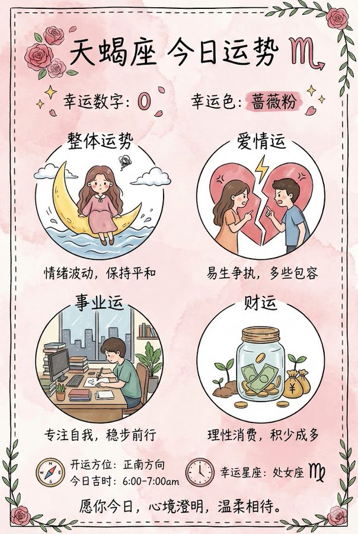

## 外卖员的写真照

- ID: gpt4o-665-zh
- Slug: prompt-665-zh
- 语言: zh
- 来源: [来源链接](https://x.com/songguoxiansen/status/1995385148792263095)
- 样例图路径: images/part3/665.jpeg

### 提示词

```text
在明亮的摄影棚内拍摄的半身写真。美丽的东亚女孩，有着如瓷娃娃般无瑕的肌肤和闪烁的大眼睛，正俏皮地歪着头，用手轻轻触碰头盔上的黄色兔耳朵。她穿着整套带有美团Logo的黄色外卖制服。采用柔和、均匀的商业摄影棚打光，营造出清新、活力的氛围，背景深暗，突出主体。在图片最右面搭配上一列文字“我的人生可以用另外一种方式打开”，字体与照片风格相近。
```

### 样例图


## 哆啦A梦讲课

- ID: gpt4o-663-zh
- Slug: prompt-663-zh
- 语言: zh
- 来源: [来源链接](https://x.com/oran_ge/status/1995075703084339500)
- 样例图路径: images/part3/663.jpeg

### 提示词

```text
我想要一张超真实的照片，但内容又有点超现实。感觉就像一个孩子放学后，偷偷从教室门缝里看到一个神奇的景象：哆啦A梦竟然真的在空无一人的教室里，像个小老师一样，认真地准备着化学课。 整个画面要非常写实，但又充满了童话般的温馨和惊奇。

画面内容

主体： 哆啦A梦本人，活生生地站在教室的讲台前面，而不是画在黑板上。他看起来是立体的，有光滑的质感，就像动画里走出来的一样，但又完美地融入了这个真实的环境里。
人物细节：哆啦A梦站在讲台旁，身体微微侧着，表情认真又亲切，仿佛在思考怎么给大雄他们讲课。
他的一只手拿着一根小小的教鞭，指向他身后的黑板。
他的黄色铃铛在教室的光线下有微微的反光，肚子上的四维口袋看起来鼓鼓的。

背景细节（黑板）：他身后的黑板上，画着一幅用各色粉笔手写的化学元素周期表。这个周期表看起来就像是哆啦A梦刚刚亲手画上去的，色彩丰富，带有一点可爱的风格。
可以用不同颜色的粉笔（比如黄色、蓝色、粉色）来区分不同的元素区域，让整个画面色彩更丰富。

文字： 在黑板的顶上或者角落，用可爱的粉笔字体写上标题：“哆啦A梦的科学教室”。
环境与构图
场景： 一间普通的日本教室，桌椅摆放整齐，夕阳的余晖从窗户照进来，营造出一种安静、温暖的氛围。
构图： 画面比例是4:3。从学生的座位视角看过去，哆啦A梦和讲台在画面的中心位置。
前景： 画面最前面可以带到一两张学生的课桌椅，让视角更具代入感。讲台上可以放着一盒彩色粉笔和一个黑板擦。
风格和技术要求
风格： 照片写实主义。关键在于真实的环境和光影，与哆啦A梦这个动漫角色的奇妙结合。

光线： 温暖的午后自然光从窗户斜射进来，光线要自然地打在哆啦A梦身上，在他圆滚滚的身体上形成柔和的光影和高光，让他看起来有体积感，并且在他的脚边投下淡淡的影子，这能让他看起来更真实。
焦点： 焦点要清晰地对准哆啦A梦，黑板上的内容也很清楚，但前景的课桌可以稍微有点模糊。
千万不要出现！
不要让哆啦A梦看起来像个塑料玩具或模型，他得是活的。

不要有其他任何人物，特别是大雄、静香他们。
不要把画风变成动画截图或纯CG，一定要是照片的感觉。
构图要稳，不要用奇怪的低角度或鱼眼镜头。
颜色别太鲜艳，要符合真实光线下的色彩。
```

### 样例图


## Extreme close-up of a human hand holding a giant vertica

- ID: gpt4o-654-en-1
- Slug: prompt-654-en-1
- 语言: en
- 来源: [来源链接](https://x.com/ShreyaYadav___/status/1995145004269068406)
- 样例图路径: images/part3/654.jpeg

### 提示词

```text
Extreme close-up of a human hand holding a giant vertical pill.
The pill has a clear glass top section and the lower 3/4 is matte bright-red, with bold, clean, perfectly aligned typography that reads: BASKETBALL LEGENDARY.
Inside the pill, show a person whose face must match the attached photo 100% exactly — no changes to facial structure, proportions, expression baseline, or any detail. The face must display a natural, realistic, wide laughing expression.
Inside the pill, the person is performing a dynamic basketball dribbling pose with high energy, labeled with the account name 'MICHAEL JORDAN'.
Scene style: funny, chaotic, thrilling, slightly creepy, and intense.
Background: an NBA basketball court, with full cinematic lighting, dramatic shadows, and rich color depth.
Camera angle: aerial extreme close-up focused on the pill in the hand.
Texture: ultra-HD realism with fine grain, crisp micro-details, glass reflections, and smooth matte material fidelity.
Ratio 3:4.
Ensure motion, energy, and dynamic movement inside the pill while keeping the pill perfectly vertical.
```

### 样例图


## 人手拿着一颗巨大的竖式药丸的特写镜头

- ID: gpt4o-654-zh-2
- Slug: prompt-654-zh-2
- 语言: zh
- 来源: [来源链接](https://x.com/ShreyaYadav___/status/1995145004269068406)
- 样例图路径: images/part3/654.jpeg

### 提示词

```text
人手拿着一颗巨大的竖式药丸的特写镜头。”
该药丸顶部为透明玻璃部分，底部 3/4 为哑光亮红色，上面印有醒目、清晰、完美对齐的字体：篮球传奇。
药丸内显示一个人的脸，该人的脸必须与附图100%完全一致——面部结构、比例、表情基线或任何细节都不得更改。该脸必须展现出自然、逼真、开怀大笑的表情。
药丸内，一个人摆出充满活力的篮球运球姿势，并标有账号名称“迈克尔·乔丹”。
场景风格：滑稽、混乱、惊险、略带诡异、紧张。
背景：NBA篮球场，采用全电影级灯光、戏剧性的阴影和丰富的色彩深度。
拍摄角度：航拍，特写镜头聚焦于手中的药丸。
纹理：超高清真实感，颗粒细腻，微细节清晰，玻璃反射效果逼真，哑光材质质感细腻。
比例 3:4。
“确保药丸内部具有运动、能量和动态特性，同时保持药丸完全垂直。
```

### 样例图


## A hyper-realistic travel advertisement in square format 

- ID: gpt4o-653-en-1
- Slug: prompt-653-en-1
- 语言: en
- 来源: [来源链接](https://x.com/TechieBySA/status/1994840773855203512)
- 样例图路径: images/part3/653.jpeg

### 提示词

```text
A hyper-realistic travel advertisement in square format (1080x1080), featuring a hand holding a sleek, ultra-thin smartphone or tablet in portrait orientation, tilted slightly sideways to create a striking 3D portal effect. The screen displays a high-resolution image of an iconic landmark from [COUNTRY], which continues into the real background, blending seamlessly. The landmark appears to emerge from the screen. Birds fly nearby and a commercial airplane passes through a bright blue sky with soft white clouds. Bold, clean sans-serif text reading “[COUNTRY]” is placed prominently above. The lighting is warm and natural, casting soft shadows across the landscape. The surroundings reflect the region’s natural environment (like meadows, coastlines, or city skylines). The device is glossy and minimal-bezel, enhancing realism and depth.
```

### 样例图


## 超写实的旅行广告

- ID: gpt4o-653-zh-2
- Slug: prompt-653-zh-2
- 语言: zh
- 来源: [来源链接](https://x.com/TechieBySA/status/1994840773855203512)
- 样例图路径: images/part3/653.jpeg

### 提示词

```text
这是一则超写实的旅行广告，采用正方形格式（1080x1080），画面中一只手竖屏握着一部纤薄时尚的智能手机或平板电脑，略微侧倾，营造出引人注目的3D立体效果。屏幕上显示着[国家/地区]标志性地标的高分辨率图像，图像与真实背景无缝融合，仿佛从屏幕中浮现出来一般。附近有鸟儿飞翔，一架商用飞机掠过湛蓝的天空，朵朵白云点缀其间。醒目的无衬线字体“[国家/地区]”位于上方。温暖自然的灯光在画面上投下柔和的阴影。周围环境反映了该地区的自然环境（例如草地、海岸线或城市天际线）。设备采用光滑的超窄边框设计，进一步增强了画面的真实感和立体感。
```

### 样例图


## 手绘美颜科普图

- ID: gpt4o-624-zh
- Slug: prompt-624-zh
- 语言: zh
- 来源: [来源链接](https://x.com/cnyzgkc/status/1994954677579125124)
- 样例图路径: images/part3/624.jpeg

### 提示词

```text
Hand-drawn watercolor infographic, warm soft watercolor texture, pink tone, cute and clean design, 4:5 ratio, 1080x1350.

角色：一位专精医学保健的插画家兼医生，亲切微笑，手持水彩笔，风格卡通可爱。

主标题（上方）：缺什么营养素会变丑？医生的维生素美颜配方！

图表结构（下方开始）：
六个可爱人物，呈现六种“变丑症状”，搭配对应的卡通营养素图标。

示例内容（AI 可自由重绘，不要写实）：
1. 皮肤暗沉 → 维生素C（Vitamin C 卡通形象）
2. 眼睛干涩 → 维生素A（Vitamin A 卡通形象）
3. 掉发 → 维生素B、维生素D（B群、D 卡通形象）
4. （可继续根据文案自动生成更多症状与营养素）

风格要求：
手绘水彩感、粉色主调、柔和自然、轻松舒服的氛围。
人物要可爱、圆润、友好。
营养素图标为卡通拟人风格。
文字为清晰易读的手写笔记感字体。
整体排版简洁、资讯图表形式。

Lighting: soft, diffuse watercolor lighting.
Avoid: 照片感、真实皮肤纹理、过度写实、油画风、金属光泽。

best quality, high-res, clean edges, masterpiece.
```

### 样例图


## A minimal sunlit wall. Sharp, elongated shadow of a huma

- ID: gpt4o-621-en-1
- Slug: prompt-621-en-1
- 语言: en
- 来源: [来源链接](https://x.com/egeberkina/status/1994380091241922920)
- 样例图路径: images/part3/621.jpeg

### 提示词

```text
A minimal sunlit wall. Sharp, elongated shadow of a human hand holding the exact product from the uploaded image. Recreate the product’s silhouette precisely in the shadow, accurate bottle shape, cap, edges, proportions. Project the product’s real label text (taken from the uploaded image) onto the shadow in clean, crisp white typography, perfectly matching placement, spacing, and size.Warm afternoon sunlight, soft grain, smooth beige wall texture. Ultra-minimal, high-end skincare aesthetic. No extra objects, no color except the natural wall tone. Artistic shadow-play composition, subtle dreamy atmosphere, natural imperfections on the wall, gently diffused light
```

### 样例图


## 一只手拿着上传图片中的产品

- ID: gpt4o-621-zh-2
- Slug: prompt-621-zh-2
- 语言: zh
- 来源: [来源链接](https://x.com/egeberkina/status/1994380091241922920)
- 样例图路径: images/part3/621.jpeg

### 提示词

```text
一面阳光照射的极简主义墙面。一只手拿着上传图片中的产品，投射出清晰而修长的影子。在阴影中精确地重现产品的轮廓，包括瓶身形状、瓶盖、边缘和比例。将产品标签上的真实文字（取自上传图片）以简洁清晰的白色字体投射到阴影上，确保位置、间距和大小完美匹配。温暖的午后阳光，柔和的米色墙面纹理。极简主义的高端护肤美学。除墙面自然色调外，不添加任何其他物品或颜色。艺术化的光影组合，营造出微妙梦幻的氛围，保留墙面的自然纹理，并柔和地漫射光线。
```

### 样例图


## Create a detailed technical illustration of a Cybernetic

- ID: gpt4o-614-en-1
- Slug: prompt-614-en-1
- 语言: en
- 来源: [来源链接](https://x.com/LudovicCreator/status/1994390935019360466)
- 样例图路径: images/part3/614.jpeg

### 提示词

```text
Create a detailed technical illustration of a Cybernetic Samurai, exploded into components: katana with energy core, cybernetic limbs, neural processor, armor plating, and internal power systems. Each part is labeled with clean futuristic font. Use a graphite and crimson color scheme on a dark blueprint background. Add subtle particle glow and depth shadows. Studio render style.
```

### 样例图


## 一幅赛博武士的详细技术图解

- ID: gpt4o-614-zh-2
- Slug: prompt-614-zh-2
- 语言: zh
- 来源: [来源链接](https://x.com/LudovicCreator/status/1994390935019360466)
- 样例图路径: images/part3/614.jpeg

### 提示词

```text
创作一幅赛博武士的详细技术图解，将其拆解为核心部件：带能量核心的武士刀、机械义肢、神经处理器、装甲板以及内部动力系统。每个部件均采用简洁的未来风格字体标注。整体采用石墨色与深红色配色方案，搭配深色蓝图背景。添加微弱的粒子光晕效果与层次感阴影，整体呈现工作室渲染风格。
```

### 样例图


## { "prompt": { "scene": { "angle": "[high-angle]", "tilt"

- ID: gpt4o-608-en-1
- Slug: prompt-608-en-1
- 语言: en
- 来源: [来源链接](https://x.com/Just_sharon7/status/1994375017971564779)
- 样例图路径: images/part3/608.jpeg

### 提示词

```text
{
  "prompt": {
    "scene": {
      "angle": "[high-angle]",
      "tilt": "[slightly off-kilter]",
      "group": "[lively group of stylish young adults]",
      "seating": "[seated closely around white dining table]",
      "setting": "[dimly lit, upscale brasserie]"
    },
    "mood": "[energetic, fashionable, slightly rebellious]",
    "subjects": [
      {
        "position": "left",
        "hair": "[long, dark hair]",
        "eyes": "[hidden behind chic black sunglasses]",
        "outfit": "[black lace-trimmed camisole with hint of floral pattern]",
        "expression": "[partially obscured by glasses]"
      },
      {
        "position": "second from left",
        "hair": "[dark, possibly mullet-style hair]",
        "facial_hair": "[distinct mustache]",
        "outfit": "[dark suit jacket over white shirt]",
        "hands": "[clasped near chin]",
        "expression": "[playful or mischievous]"
      },
      {
        "position": "center",
        "reference": "[woman resembling Kylie Jenner]",
        "hair": "[very long, dark, wavy hair]",
        "outfit": {
          "blazer": "[dark blazer]",
          "top": "[light blue, subtly patterned bralette]"
        },
        "gaze": "[looking right, slightly defiant, expressive]",
        "gesture": "[left hand raised, middle finger prominently displayed]"
      },
      {
        "position": "second from right",
        "reference": "[woman resembling Rosalía]",
        "hair": "[long dark hair in slicked-back style]",
        "outfit": "[dark, possibly velvet or satin, strapless top]",
        "accessory": "[small dark object, possibly cigarette or cigarillo between lips]",
        "expression": "[relaxed, nonchalant]"
      },
      {
        "position": "bottom right",
        "hair": "[curly brown hair]",
        "visible_part": "[top of head only, indicating more people at table]"
      }
    ],
    "table": {
      "items": [
        "[multiple clear glasses with drinks]",
        "[ice cubes in glasses]",
        "[citrus slices in glasses]",
        "[white bottle with dark label]",
        "[small white dishes]"
      ]
    },
    "background": {
      "wall": "[dark wood paneling]",
      "letters": "[ornate gold lettering partially readable as 'ALSACE']",
      "mirrors": "[dark reflective mirrors]"
    },
    "lighting": {
      "type": "[soft, warm, ambient]",
      "effect": "[illuminates faces and table]",
      "contrast": "[strong contrast against dark background]"
    },
    "additional_details": {
      "decor": "[subtle floral arrangements hinted in distance]"
    },
    "photography_style": "[hyper-realistic, candid, sharp focus on central group]"
  },
  "styles": ["photorealistic"],
  "aspect_ratio": "4:3"
}
```

### 样例图

![{ "prompt": { "scene": { "angle": "[high-angle]", "tilt"](../images/part3/608.jpeg)

## 一群活泼时尚的年轻人

- ID: gpt4o-608-zh-2
- Slug: prompt-608-zh-2
- 语言: zh
- 来源: [来源链接](https://x.com/Just_sharon7/status/1994375017971564779)
- 样例图路径: images/part3/608.jpeg

### 提示词

```text
{
“迅速的”： {
“场景”： {
“角度”：[高角度]，
“倾斜”：[略微偏离]
“团体”：[一群活泼时尚的年轻人]
“座位安排”：[围坐在白色餐桌旁]
“环境”：[灯光昏暗的高档小酒馆]
},
“情绪”：[充满活力，时尚，略带叛逆]
“主题”：[
{
"位置": "左",
“头发”：[长长的黑发]，
“眼睛”：[藏在时髦的黑色太阳镜后面]
“服装”：[黑色蕾丝边吊带背心，带有淡淡的花卉图案]
“表情”：[部分被眼镜遮挡]
},
{
“位置”: “从左边数第二个”，
“头发”：[深色，可能是鲻鱼头]，
"facial_hair": "[distinct mustache]",
“服装”：[深色西装外套搭配白色衬衫]，
“双手”：[交握于下巴附近]
“表情”：[顽皮的或淘气的]
},
{
"位置": "中心",
“参考”：[长相酷似凯莉·詹娜的女性]
“头发”：[非常长、深色、波浪状的头发]
“全套服装”： {
"blazer": "[深色西装外套]",
上衣：[浅蓝色，带精致图案的无钢圈文胸]
},
“凝视”：[看向右侧，略带挑衅，富有表现力]
“手势”：[左手举起，中指明显竖起]
},
{
“位置”: “从右数第二个”，
“参考”：[长相酷似罗莎莉亚的女人]
“头发”：[长长的深色头发向后梳]
“服装”：[深色，可能是天鹅绒或缎面，无肩带上衣]
“配件”：[嘴唇间夹着的小黑物，可能是香烟或小雪茄]
“表情”：[放松，漫不经心]
},
{
位置：右下角，
“头发”：[棕色卷发]，
"visible_part": "[仅头部顶部，表示桌上还有其他人]"
}
],
“桌子”： {
“项目”： [
“多个装有饮料的透明玻璃杯”
“（玻璃杯中的冰块）”
“（玻璃杯中的柑橘片）”
（白色瓶子，深色标签）
“小白碟”
]
},
“背景”： {
“墙”：[深色木镶板]，
“字母”： （华丽的金色字母部分可辨认出为“ALSACE”）
“镜子”：[深色反光镜]
},
“灯光”： {
“类型”：[柔和、温暖、氛围]，
“效果”：[照亮面部和桌面]
“对比度”：[与深色背景形成强烈对比]
},
"additional_details": {
“装饰”：[远处隐约可见的精致花卉摆设]
},
“摄影风格”：[超写实、抓拍、聚焦中心人物]
},
风格：["写实风格"]
"aspect_ratio": "4:3"
}
```

### 样例图


## 1080x1080 cork-board layout telling the story of [MOVIE]

- ID: gpt4o-598-en-1
- Slug: prompt-598-en-1
- 语言: en
- 来源: [来源链接](https://x.com/TechieBySA/status/1993752534637531605)
- 样例图路径: images/part3/598.jpeg

### 提示词

```text
1080x1080 cork-board layout telling the story of [MOVIE]. At the very top of the board, include a pinned paper label with the movie title: [MOVIE] in large handwritten letters. Below it, arrange 5–6 Polaroid photos pinned across the board in a loose chronological path. Each Polaroid shows a key moment from the story with a short handwritten caption beneath it. Connect characters and events with colored strings (red, blue, yellow). Warm nostalgic lighting, soft shadows. Include realistic details: coffee cup rings, paper clips, torn notes, arrows, scribbled hints, and thumbtacks. Vintage, textured, cozy detective-board aesthetic. Highly readable, high contrast, everything framed clearly for 1080x1080
```

### 样例图

![1080x1080 cork-board layout telling the story of [MOVIE]](../images/part3/598.jpeg)

## 宝丽来照片讲述故事

- ID: gpt4o-598-zh-2
- Slug: prompt-598-zh-2
- 语言: zh
- 来源: [来源链接](https://x.com/TechieBySA/status/1993752534637531605)
- 样例图路径: images/part3/598.jpeg

### 提示词

```text
1080x1080像素的软木板布局，讲述电影[MOVIE]的故事。在木板最上方，钉上一张纸质标签，上面用大号手写字体写着电影标题：[MOVIE]。标签下方，以大致的时间顺序排列5-6张宝丽来照片。每张照片都展现了故事中的一个关键时刻，并在下方附上简短的手写说明。用彩色细线（红、蓝、黄）连接人物和事件。营造温暖怀旧的灯光和柔和的阴影。添加一些逼真的细节：咖啡杯印、回形针、撕碎的纸条、箭头、潦草的提示和图钉。打造复古、质感十足、温馨舒适的侦探板风格。清晰易读，高对比度，所有内容都以1080x1080像素的分辨率清晰呈现。
```

### 样例图


## { "scene_description": "A photorealistic, high-end 3D pr

- ID: gpt4o-594-en-1
- Slug: prompt-594-en-1
- 语言: en
- 来源: [来源链接](https://x.com/_MehdiSharifi_/status/1994022879051014312)
- 样例图路径: images/part3/594.png

### 提示词

```text
{
  "scene_description": "A photorealistic, high-end 3D product visualization of a perfectly assembled packaging box derived from a dieline, set in a pristine minimal studio.",
  "subject": {
    "type": "Assembled Packaging Box",
    "material": "Premium matte paperboard",
    "features": {
      "structure": "Perfectly folded, accurate panel placement, sharp clean edges",
      "surface": "Smooth matte texture with high-fidelity print rendering"
    },
    "position": "Upright, angled at a refined ¾ perspective view to show front and side panels",
    "artwork_state": "Undistorted typography, preserving original design exactly"
  },
  "action": {
    "primary": "Standing static on a surface",
    "secondary": "Casting a gentle shadow",
    "effect": "Demonstrates structural integrity and design elegance"
  },
  "environment": {
    "setting": "Minimalist High-End Studio Void",
    "foreground_elements": [
      "Clean, smooth surface",
      "Soft contact shadows"
    ],
    "background_elements": [
      "Soft neutral seamless backdrop (light grey/cream)",
      "Zero distractions",
      "No extra props"
    ]
  },
  "lighting": {
    "style": "Soft Commercial Product Lighting (Global Illumination)",
    "key_light": {
      "type": "Large Diffused Softbox",
      "color": "Neutral White (5500K)",
      "illuminates": [
        "The face of the box evenly",
        "The matte texture of the paper"
      ]
    },
    "fill_light": {
      "type": "White Reflector",
      "effect": "Softens shadows to ensure artwork visibility"
    },
    "shadows": "Subtle, soft gradient shadows anchoring the object"
  },
  "style": {
    "medium": "3D Rendering / Product Photography",
    "aesthetic": "Premium Editorial, Mockup Style, Minimalist Luxury",
    "quality": "8k resolution, ray-traced optics, physically based rendering (PBR)",
    "details": "Crisp folds, zero distortion, matte paper grain visibility"
  },
  "scene_composition": {
    "subject_action": "Static presentation",
    "camera_behavior": "Locked-off tripod shot",
    "depth_layering": "Sharp Subject -> Infinite Soft Background"
  },
  "visual_description": {
    "core_subject": "A flawless 3D box assembled from a flat dieline.",
    "attire_physics": "N/A - Rigid Body physics.",
    "surface_rendering": "Non-reflective matte finish that absorbs light softly, ensuring text is readable and colors are true."
  },
  "lighting_and_atmosphere": {
    "type": "Clean Studio",
    "specifics": "Even light distribution, ambient occlusion in the creases.",
    "color_grade": "Natural, color-calibrated, neutral tones."
  },
  "attire_customization": {
    "current_clothing": "N/A",
    "customizable_clothing": "N/A"
  },
  "brand_product_customization": {
    "current_brand_product": "Packaging Design",
    "customizable_brand": "User: Insert Brand Name/Logo for the box",
    "customizable_product": "User: Describe the box type (e.g., cosmetic box, tuck-end box)",
    "product_placement_area": "All visible panels (Front, Side, Top)"
  },
  "objects_and_props": {
    "main_objects": [
      "The 3D Box"
    ],
    "secondary_objects": []
  },
  "camera_and_lens": {
    "focal_length_feel": "85mm or 100mm (Telephoto to eliminate perspective distortion)",
    "aperture_effect": "f/16 (Deep depth of field for edge-to-edge sharpness)",
    "camera_angle": "Isometric or ¾ perspective",
    "lens_type": "Studio Macro Lens",
    "bokeh_style": "None (Smooth gradient background)"
  },
  "technical_tags": "--v 6 --ar 4:5 --stylize 150 --no warping, distortion, messy background, props, glossy reflection, low poly"
}
```

### 样例图


## 模切线图转3D产品可视化

- ID: gpt4o-594-zh-2
- Slug: prompt-594-zh-2
- 语言: zh
- 来源: [来源链接](https://x.com/_MehdiSharifi_/status/1994022879051014312)
- 样例图路径: images/part3/594.png

### 提示词

```text
{
"scene_description": "一个逼真的高端3D产品可视化模型，展示了一个完美组装的包装盒，该包装盒由模切线图生成，场景设定在一个简洁干净的摄影棚内。"
“主题”： {
"type": "组装包装盒",
“材质”： “优质哑光纸板”
“特征”： {
“结构”：“折叠完美，面板位置准确，边缘锋利干净”，
“表面”： “光滑哑光质感，高保真印刷效果”
},
“位置”：“直立，以精细的四分之三透视角度倾斜，以显示正面和侧面面板”，
"artwork_state": "未失真的字体，完全保留原始设计"
},
“行动”： {
“primary”: “静止地立于表面上”
“次要的”: “投下温柔的阴影”
“效果”：“展现了结构完整性和设计优雅性”
},
“环境”： {
“设置”：“极简高端工作室虚空”
"前景元素": [
“干净光滑的表面”，
“柔和的隐形眼镜阴影”
],
“背景元素”：[
“柔和的中性无缝背景（浅灰色/米色）”，
“零干扰”，
“无需额外道具”
]
},
“灯光”： {
“风格”：“柔和的商业产品照明（整体照明）”
"key_light": {
"type": "大型漫射柔光箱",
“颜色”：“中性白（5500K）”，
“照亮”：[
“盒子表面平整”，
纸张的哑光质感
]
},
"fill_light": {
“类型”：“白色反光器”，
“效果”：“柔化阴影，确保作品清晰可见”
},
“阴影”：“柔和的渐变阴影，使物体更加突出”
},
“风格”： {
“medium”: “3D渲染/产品摄影”
“美学”：“高端编辑风格、模型风格、极​​简奢华”
“质量”：“8k分辨率、光线追踪光学、基于物理的渲染（PBR）”
细节：折痕清晰，零变形，哑光纸颗粒可见
},
"scene_composition": {
"subject_action": "静态演示",
"camera_behavior": "锁定三脚架拍摄",
"depth_layering": "清晰主体->无限柔和背景"
},
"visual_description": {
"core_subject": "一个由平面模切线组装而成的完美3D盒子。"
"attire_physics": "不适用 - 刚体物理。",
"surface_rendering": "非反射哑光表面，柔和吸收光线，确保文字清晰可读，色彩真实。"
},
"lighting_and_atmosphere": {
"type": "Clean Studio",
“具体细节”：“光线分布均匀，褶皱处有环境光遮挡。”
"color_grade": "自然、色彩校准的中性色调。"
},
"attire_customization": {
"current_clothing": "N/A",
"customizable_clothing": "N/A"
},
"品牌产品定制": {
"current_brand_product": "包装设计",
"customizable_brand": "用户：输入包装盒的品牌名称/徽标",
"customizable_product": "用户：描述盒子类型（例如，化妆品盒、折叠盒）",
"product_placement_area": "所有可见面板（正面、侧面、顶部）"
},
"objects_and_props": {
"main_objects": [
“3D盒子”
],
"secondary_objects": []
},
"camera_and_lens": {
"focal_length_feel": "85mm 或 100mm（长焦镜头可消除透视畸变）",
"aperture_effect": "f/16（景深大，边缘到边缘清晰）",
"camera_angle": "等距或四分之三视角",
"lens_type": "影室微距镜头",
"bokeh_style": "无（平滑渐变背景）"
},
"technical_tags": " --v 6 --ar 4:5 --stylize 150 --no warping, distortion, messy background, props, glossy reflection, low poly"
}
```

### 样例图


## Assemble the dieline into a perfectly folded 3D box with

- ID: gpt4o-593-en-1
- Slug: prompt-593-en-1
- 语言: en
- 来源: [来源链接](https://x.com/Salmaaboukarr/status/1994017531699278056)
- 样例图路径: images/part3/593.png

### 提示词

```text
Assemble the dieline into a perfectly folded 3D box with accurate panel placement, clean edges, and undistorted typography. Preserve all artwork exactly as printed on the dieline. Render the box in a minimal, high-end studio setup on a soft neutral background with gentle diffused lighting, subtle shadows, and no extra props. Show the box upright in a refined ¾ angle. Ultra-realistic detail, true colors, matte paperboard texture, crisp folds, premium editorial aesthetic.
```

### 样例图


## 模切线变为现实

- ID: gpt4o-593-zh-2
- Slug: prompt-593-zh-2
- 语言: zh
- 来源: [来源链接](https://x.com/Salmaaboukarr/status/1994017531699278056)
- 样例图路径: images/part3/593.png

### 提示词

```text
根据模切线将盒子完美折叠成一个立体盒子，确保面板位置精准、边缘清晰、文字无变形。所有图案均需与模切线上的印刷完全一致。在简约的高端摄影棚环境中，以柔和的中性背景、漫射光和微妙的阴影渲染盒子，无需任何额外道具。以精致的四分之三角度展示盒子竖立状态。呈现超逼真的细节、真实的色彩、哑光纸板质感、清晰的折痕，以及高端的编辑美感。
```

### 样例图


## 虚构的英语电影海报-回忆之味

- ID: gpt4o-590-zh
- Slug: prompt-590-zh
- 语言: zh
- 来源: [来源链接](https://x.com/songguoxiansen/status/1994276578084413877)
- 样例图路径: images/part3/590.jpeg

### 提示词

```text
一张虚构的英语电影《回忆之味》（The Taste of Memory）的电影海报。场景设置在一个质朴的19世纪风格厨房里。画面中央，一位红棕色头发、留着小胡子的中年男子（演员 成龙 饰）站在一张木桌后，他身穿白色衬衫、黑色马甲和米色围裙，正看着镜头，手中拿着一大块生红肉，下方是一个木制切菜板。在他的右边，一位梳着高髻的黑发女子（演员 刘亦菲 饰）倚靠在桌子上，温柔地对他微笑。她穿着浅色衬衫和一条上白下蓝的长裙。桌上除了放有切碎的葱和卷心菜丝的切菜板外，还有一个白色陶瓷盘、新鲜香草，左侧一个木箱上放着一串深色葡萄。背景是一面粗糙的灰白色抹灰墙，墙上挂着一幅风景画。最右边的一个台面上放着一盏复古油灯。海报上有大量的文字信息。左上角是白色的无衬线字体"ARTISAN FILMS PRESENTS"，其下方是"ELEANOR VANCE"和"ACADEMY AWARD® WINNER"。右上角写着"ARTHUR PENHALIGON"和"GOLDEN GLOBE® AWARD WINNER"。顶部中央是圣丹斯电影节的桂冠标志，下方写着"SUNDANCE FILM FESTIVAL GRAND JURY PRIZE 2024"。主标题"THE TASTE OF MEMORY"以白色的大号衬线字体醒目地显示在下半部分。标题下方注明了"A FILM BY Tongyi Interaction Lab"。底部区域用白色小字列出了完整的演职员名单，包括"SCREENPLAY BY ANNA REID"、"CULINARY DIRECTION BY JAMES CARTER"以及Artisan Films、Riverstone Pictures和Heritage Media等众多出品公司标志。整体风格是写实主义，采用温暖柔和的灯光方案，营造出一种亲密的氛围。色调以棕色、米色和柔和的绿色等大地色系为主。两位演员的身体都在腰部被截断。
```

### 样例图


## 金属霓虹手账

- ID: gpt4o-588-zh
- Slug: prompt-588-zh
- 语言: zh
- 来源: [来源链接](https://x.com/songguoxiansen/status/1994226726692683849)
- 样例图路径: images/part3/588.jpeg

### 提示词

```text
Y2K美学风格的竖屏时尚情绪板。背景是数码故障艺术风格的网格纸，带有全息镭射的粉紫配色。所有元素呈现高光泽的乙烯基贴纸质感，白边清晰。主角穿着Y2K风格服饰。Labubu公仔贴纸佩戴银色大耳机和金属配饰，造型前卫。隐藏层贴纸是一件性感的镂空紧身连体衣。周围散落着像素风的手绘星星、蝴蝶图案和电子宠物涂鸦。字体采用气泡立体字风格。整体画面色彩高饱和度，充满未来复古感，不仅是照片，更是一幅完整的数字波普艺术画作。
```

### 样例图


## 东方武侠史诗海报-剑影红颜

- ID: gpt4o-583-zh
- Slug: prompt-583-zh
- 语言: zh
- 来源: [来源链接](https://x.com/songguoxiansen/status/1994278346474311838)
- 样例图路径: images/part3/583.jpeg

### 提示词

```text
一张虚构的东方武侠史诗海报《剑影红颜》（Sword & Beauty）。场景设置在一个云雾缭绕的古老山巅亭阁中。画面中央，陈坤（Chen Kun）身着飘逸的墨色长袍，长发束起，眼神深邃，手中握着一把未出鞘的古剑，剑柄上镶嵌着玉石，他正凝视前方。在他的左侧，周迅（Zhou Xun）身穿刺绣精美的绯红色古装，高耸的发髻上插着金步摇，她侧身回眸，眼神中带着一丝哀愁和决绝，手中拿着一管玉箫。桌上放着一壶清酒、两个酒杯和一卷竹简。背景是连绵不绝的水墨山水和一轮巨大的红日。最右侧的石灯笼里燃着烛火。左上角"博纳影业 出品"，下方"徐克导演作品"。右上角"金马奖 最佳动作设计"。顶部中央是奥斯卡金像奖标志，下方"ACADEMY AWARD® NOMINEE BEST INTERNATIONAL FEATURE"。主标题"剑影红颜"以苍劲有力的书法字体显示。标题下方注明"江湖之远，不敌你眉间朱砂"。底部列出"武术指导 袁和平"、"服装设计 叶锦添"。整体风格是唯美主义的东方奇幻，采用柔和的自然光和云雾效果，营造出仙气、悲壮和浪漫的氛围。色调以青绿、墨色和朱红为主。
```

### 样例图


## 奇幻冒险喜剧海报-寻龙秘境

- ID: gpt4o-582-zh
- Slug: prompt-582-zh
- 语言: zh
- 来源: [来源链接](https://x.com/songguoxiansen/status/1994279390579183827)
- 样例图路径: images/part3/582.jpeg

### 提示词

```text
一张虚构的奇幻冒险喜剧海报《寻龙秘境》（The Dragon Realm Quest）。场景设置在一个充满奇异发光植物和古老遗迹的地下洞穴中。画面中央，演员黄渤留着滑稽的胡子，戴着探险帽，穿着多口袋马甲，表情夸张地瞪大眼睛看着手中的一个发光罗盘。在他的右侧，演员舒淇穿着异域风情的皮质探险服，背着一把弩箭，正无奈地扶着额头，嘴角上扬看着黄渤。两人周围散落着金币、古老的卷轴和一个巨大的恐龙蛋化石。背景是一个巨大的、沉睡的石龙雕像，其眼睛部位隐约发出红光。左上角"开心麻花影业 出品"，下方"闫非 彭大魔导演作品"。右上角"百花奖 观众最喜爱影片"。顶部中央是多伦多电影节标志，下方"TIFF PEOPLE'S CHOICE AWARD 2024"。主标题"寻龙秘境"以带有龙鳞纹理的金色立体字体显示。标题下方注明"不仅要命，还要钱！"。底部列出"视觉特效 工业光魔"、"动作指导 成家班"。整体风格是色彩斑斓的奇幻冒险，采用魔法光和生物发光的混合光源，营造出幽默、惊险和神秘的氛围。色调以宝石蓝、翠绿和金色为主，人物的旁边标记演员的名字。
```

### 样例图


## 职业西装风手账

- ID: gpt4o-581-zh
- Slug: prompt-581-zh
- 语言: zh
- 来源: [来源链接](https://x.com/songguoxiansen/status/1994309283488444523)
- 样例图路径: images/part3/581.jpeg

### 提示词

```text
9:16极简主义时尚插画。背景是干净的高级灰哑光纸张，仅有极细的工程制图线条。贴纸元素布局严谨，白边锐利。中央是用户穿着职业西装或极简风穿搭的贴纸。Labubu公仔贴纸戴着黑框眼镜，系着领带，一副精英模样。衣物解构贴纸包括折叠完美的西裤和名表。隐藏层贴纸是一件极简的高级黑色丝绸衬裙，展现低调奢华。所有的标注文字都是极细的黑色针管笔手写体。画面冷静、克制，无杂乱装饰，纯粹通过排版和材质对比展示高级感。
```

### 样例图


## 油泼面宫格漫画图

- ID: gpt4o-578-zh
- Slug: prompt-578-zh
- 语言: zh
- 来源: [来源链接](https://x.com/hellokaton/status/1991668144080056423)
- 样例图路径: images/part3/578.jpeg

### 提示词

```text
编写一个 Nano Banana 提示词，用于生成「油泼面的做法」四宫格漫画图，有配图和文字排版。
```

### 样例图

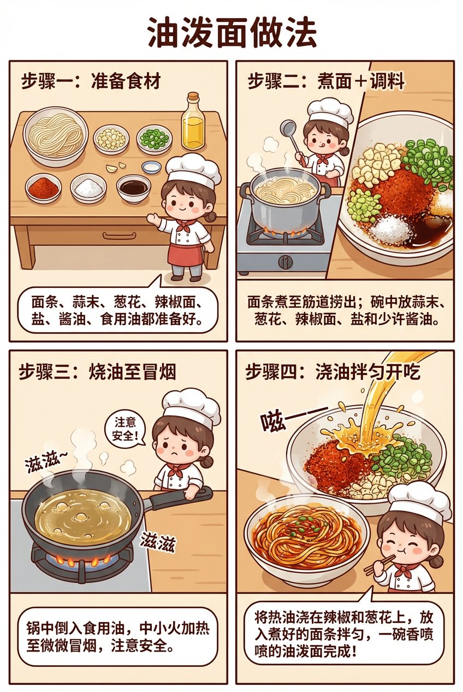

## Create a set of colorful, hand-drawn LINE-style half-bod

- ID: gpt4o-549-en-1
- Slug: prompt-549-en-1
- 语言: en
- 来源: [来源链接](https://x.com/dotey/status/1993042754008686712)
- 样例图路径: images/part3/549.jpeg

### 提示词

```text
Create a set of colorful, hand-drawn LINE-style half-body Q-version emoji portraits based on the characters shown, ensuring accurate depiction of their head accessories.

Arrange the images in a 4x6 layout, featuring common chat phrases or relevant humorous memes.
Use handwritten-style fonts for text.
Output must be original—avoid direct copying of the reference image.
Final image should be in 4K resolution, 16:9 aspect ratio.
```

### 样例图


## LINE风格半身Q版表情包

- ID: gpt4o-549-zh-2
- Slug: prompt-549-zh-2
- 语言: zh
- 来源: [来源链接](https://x.com/dotey/status/1993042754008686712)
- 样例图路径: images/part3/549.jpeg

### 提示词

```text
根据所示角色，创作一套色彩鲜艳、手绘风格的 LINE 风格半身 Q 版表情符号肖像，确保准确地描绘出他们的头部饰品。

将图片排列成 4x6 的布局，内容以常见的聊天短语或相关的幽默表情包为特色。
文本请使用手写体字体。
输出内容必须为原创——避免直接复制参考图像。
最终图像应为 4K 分辨率，16:9 宽高比。
```

### 样例图


## Please create a cute, stylish calendar illustration in a

- ID: gpt4o-547-en-1
- Slug: prompt-547-en-1
- 语言: en
- 来源: [来源链接](https://x.com/dotey/status/1993754650336428422)
- 样例图路径: images/part3/547.jpeg

### 提示词

```text
Please create a cute, stylish calendar illustration in a vertical (9:16) layout featuring a fresh, bright, hand-drawn style:

Illustration Requirements:

- The main character is a young, fashionable female with a cute and lively watercolor or hand-drawn texture, vibrant yet soft colors.
- Character features include large eyes, rounded rosy cheeks, and bold, fashionable accessories (e.g., sunglasses, hoop earrings, headscarves, headbands, bows, knit hats, etc.). Clothing should be bright, with dynamic and playful poses. Proportions may be slightly exaggerated (e.g., larger head, slender waist).
- Outfit and accessories must reflect seasonal elements, holidays, recommended activities ("auspicious items"), or distinctive local characteristics based on the user's location and input. Outfit description: [{Character Outfit Description}]
- Character positioned centrally or slightly right-aligned to leave ample whitespace for textual content.
- Pure white, minimalist background without additional decorative elements, emphasizing the character and text.

Calendar Layout:

- Prominent position at the top center: Gregorian date number [{Gregorian Date Number}] (large and eye-catching).
- Below the date number, display the English month [{English Month}].
- Below the English month, display the year [{Year Number}].
- Symmetrical layout left and right of the date: weekday in both local language [{Weekday in Local Language}] and English [{Weekday in English}], along with the lunar date and local holiday [{Lunar or Local Calendar Date}] [{Local Holiday}], ensuring clear, elegant fonts.

"Recommended Activities" and Inspirational Quote:

- Vertically aligned on the left side in bold handwriting: [{Recommended Activities}], using brush calligraphy for Chinese users and complementary handwriting style for other languages, slightly larger and vertically arranged.
- To the right of "Recommended Activities," arrange vertically an inspirational and comforting quote [{Inspirational Quote}] in slightly smaller matching handwriting.

Localized Elements:

- Incorporate distinct local cultural elements or landmarks based on the user's current location or input into the character's outfit, accessories, or details (e.g., city landmarks, climate characteristics, local cultural motifs).

General Guidelines:

- All elements must be neatly arranged with balanced whitespace.
- Ensure text readability without overlapping or obscuring the illustration.
- Replace all placeholder content with information dynamically generated based on user input or system-provided user data.
```

### 样例图


## 手绘日历插画

- ID: gpt4o-547-zh-2
- Slug: prompt-547-zh-2
- 语言: zh
- 来源: [来源链接](https://x.com/dotey/status/1993754650336428422)
- 样例图路径: images/part3/547.jpeg

### 提示词

```text
请生成一张可爱、时尚的竖版（9:16）日历插画，风格为清新明快的手绘插画风：

一、插画要求：

- 人物为年轻时尚的女生形象，风格可爱灵动，采用水彩或手绘质感，色彩鲜艳柔和。
- 人物特征包括：大眼睛、圆润的红润脸颊，佩戴夸张时尚的配饰（如墨镜、圆环耳环、头巾、发带或蝴蝶结、毛线帽等），服装色彩明亮，人物姿势生动俏皮，身体比例适当夸张（如头部稍大、腰身纤细）。
- 根据节假日、“宜事项”或所处季节以及用户所在位置的特色元素，配套的人物造型穿着描述为：【{人物造型穿着描述}】
- 人物位于画面中央或偏右，为文字内容留出充分的留白空间。
- 背景纯白、极简，不含额外装饰元素，突出主体人物与文字。

二、日历元素布局：

- 上方正中央显著位置：公历日期数字【{公历日期数字}】（字体大而醒目）
- 日期数字下方配有英文月份【{英文月份}】
- 日期左右两侧分别标注星期中英文【{星期中文}】【{星期英文}】和农历日期及节假日【{农历日期中文}】【{节假日}】，布局左右对称，字体清晰优雅。

三、“宜”事项与励志句子：

- 左侧竖排粗体显示当天的【宜】事项：【{宜事项}】，字体为简洁的手写毛笔体，略大，竖向排列。
- 【宜事项】右边以稍小字体竖向排列对应的励志治愈句子【{励志句子}】。

四、地点个性化元素：

- 根据用户当前位置或输入位置，适当在插画的人物穿着、配饰或细节上融入当地标志性元素或特色（如城市地标、气候特征、地域风情）。

整体说明：

- 所有占位符信息请根据用户输入或用户信息和系统信息自行检索生成
- 所有元素的布局要整齐、美观，保持适度的空间留白。
- 文字位置确保清晰易读，避免与插画重叠、遮挡。
```

### 样例图


## 城市动态天气卡片

- ID: gpt4o-543-zh-1
- Slug: prompt-543-zh-1
- 语言: zh
- 来源: [来源链接](https://x.com/dotey/status/1993729800922341810)
- 样例图路径: images/part3/543.jpeg

### 提示词

```text
Present a clear, 45° top-down view of a vertical (9:16) isometric miniature 3D cartoon scene, highlighting iconic landmarks centered in the composition to showcase precise and delicate modeling.

The scene features soft, refined textures with realistic PBR materials and gentle, lifelike lighting and shadow effects. Weather elements are creatively integrated into the urban architecture, establishing a dynamic interaction between the city's landscape and atmospheric conditions, creating an immersive weather ambiance.

Use a clean, unified composition with minimalistic aesthetics and a soft, solid-colored background that highlights the main content. The overall visual style is fresh and soothing.

Display a prominent weather icon at the top-center, with the date (x-small text) and temperature range (medium text) beneath it. The city name (large text) is positioned directly above the weather icon. The weather information has no background and can subtly overlap with the buildings.

The text should match the input city's native language.
Please retrieve current weather conditions for the specified city before rendering.

City name:【上海】
```

### 样例图


## 城市动态天气卡片

- ID: gpt4o-543-zh-2
- Slug: prompt-543-zh-2
- 语言: zh
- 来源: [来源链接](https://x.com/dotey/status/1993729800922341810)
- 样例图路径: images/part3/543.jpeg

### 提示词

```text
以清晰的 45° 俯视视角呈现垂直 (9:16) 等距微缩 3D 卡通场景，突出构图中的标志性地标，以展示精确而精致的建模。

场景采用柔和细腻的纹理，搭配逼真的PBR材质和柔和自然的灯光阴影效果。天气元素巧妙地融入城市建筑之中，在城市景观与大气条件之间建立起动态的互动，营造出身临其境的天气氛围。

采用简洁统一的构图，运用极简主义美学和柔和的纯色背景，突出主要内容。整体视觉风格清新舒缓。

在顶部中央醒目位置显示天气图标，其下方显示日期（超小字体）和温度范围（中等字体）。城市名称（大字体）位于天气图标正上方。天气信息没有背景，可以与建筑物略微重叠。

文本应与输入城市的母语相符。
渲染前请先获取指定城市的当前天气状况。

城市名称：【上海】
```

### 样例图


## 高细节的3D信息图海报

- ID: gpt4o-541-zh
- Slug: prompt-541-zh
- 语言: zh
- 来源: [来源链接](https://x.com/cnyzgkc/status/1994003408207139013)
- 样例图路径: images/part3/541.jpeg

### 提示词

```text
请用中文制作一张高细节的3D信息图海报，介绍印尼传统天贝的制作过程，海报中需包含一个可爱的3D厨师角色Koki Cubby（胖乎乎的，可爱，戴着白色厨师帽和围裙，表情丰富，色彩鲜艳）。
制作过程的每个步骤都应有Koki Cubby的帮助或讲解。
海报颜色：白色、叶绿色、大豆黄、天贝棕色。
视觉风格：3D半写实食物插画+可爱角色，柔和的光线，高细节。
大标题：
“天贝制作过程——从大豆到成品”
主图：
逼真的3D天贝盒，盒身用香蕉叶或半透明塑料包裹，盒内有纹理清晰的天贝切片和白色酵母（根霉菌）丝。Koki Cubby站在旁边，指着成品天贝。
大豆挑选与分拣（3D场景）
• 木桌上摆放着干大豆的3D插图。
• 厨师库比拿着小铲子检查大豆的质量。
• 文字：“选择优质、干净、无破损的大豆。”
大豆浸泡（3D碗）
• 大豆浸泡在一大碗水中，可见其膨胀。
• 3D水泡。
• 厨师库比用锅铲搅拌水。
• 文字：“浸泡6-12小时，让大豆膨胀。”
• 煮沸（3D锅蒸）
• 一大锅大豆正在煮沸。
• 3D热蒸汽细节。
• 厨师库比拿着厨房计时器。
• 文字：“煮至软烂，杀死有害细菌。”
• 大豆去皮及去缩
• 挤压并揉搓大豆以去除外皮。
• 使用小型3D过滤机或手工操作。
• 厨师Cubby正在帮忙去除大豆皮。
• 文字：“去除大豆皮有助于酵母发酵。”
大豆过筛及干燥
• 将湿大豆放入大筛子中沥干水分。
• 厨师Cubby用小风扇吹干或用毛巾吸干水分。
• 文字：“确保大豆干燥——水分过多会抑制发酵。”
• 添加天贝酵母（根霉菌）
• 一碗3D酵母呈白色细粉状。
• 厨师Cubby将酵母均匀地撒在大豆上。
• 文字：“将天贝酵母搅拌均匀。”
• 包裹（叶子/塑料袋）
• 将大豆放入香蕉叶或带孔塑料袋中。
• 小厨师卡比用小手按压，使之折叠整齐。
• 文字：“包裹紧实，才能完美发酵。”
天贝发酵（24-48 小时）
• 将天贝放在通风的木架上。
• 由于根霉菌的作用，天贝的质地开始变白。
• 小厨师卡比坐在一旁等待，看着温度计。
• 文字：“在 30-32°C 下发酵。”
天贝发酵完成
• 天贝质地紧实，呈白色，带有粗壮整齐的酵母纤维。
• 逼真的 3D 天贝切片展示了其内部纹理。
• 小厨师卡比竖起大拇指。
• 文字：“天贝可以烹饪了——美味、健康、富含蛋白质！”
海报风格
• 3D 立体信息图，采用简洁的面板、小图标和连接时间线。
• 柔和的白绿色渐变背景。
• 大豆和豆豉带有微妙的光晕。
• 现代无衬线字体。
• 4K 高分辨率。
• 简洁、专业、教育性强，适合儿童和成人阅读。
把这个提示词中的食物改成小笼包
```

### 样例图


## Ultra-realistic 8K flat-lay photo in strict knolling sty

- ID: gpt4o-540-en-1
- Slug: prompt-540-en-1
- 语言: en
- 来源: [来源链接](https://x.com/PandaTalk8/status/1993645881254658229)
- 样例图路径: images/part3/540.jpeg

### 提示词

```text
Ultra-realistic 8K flat-lay photo in strict knolling style. Top-down 90º shot of the object from the attached image, fully disassembled into 8–12 key parts and arranged in a clean grid or radial pattern on a minimalist wooden or matte gray table. Even spacing, perfect alignment, no overlaps, no extra objects. Soft, diffused multi-source lighting with subtle shadows, neutral color balance and crisp focus across the whole frame. Highly detailed real-world materials (metal, plastic, rubber grips, circuit boards, screws). For every part, add a thin white rectangular frame and a short, sharp English label in clean sans-serif text, placed beside the component without covering it; annotations must be legible but unobtrusive.
```

### 样例图


## 物品拆解图

- ID: gpt4o-540-zh-2
- Slug: prompt-540-zh-2
- 语言: zh
- 来源: [来源链接](https://x.com/PandaTalk8/status/1993645881254658229)
- 样例图路径: images/part3/540.jpeg

### 提示词

```text
超逼真的 8K 平面照片，采用严格的摆拍风格。从上方俯视 90° 拍摄附图中的物体，将其完全拆解成 8-12 个主要部件，并以简洁的网格或放射状图案排列在极简主义的木质或哑光灰色桌面上。部件间距均匀，完美对齐，无重叠，无多余物体。柔和的漫射多光源照明，阴影微妙，色彩平衡自然，整个画面清晰锐利。高度还原真实材质（金属、塑料、橡胶握把、电路板、螺丝）。每个部件旁边都应添加一个细长的白色矩形框，以及一个简洁清晰的英文标签（无衬线字体），标签应放置在部件旁边，但不能遮挡部件；注释必须清晰易读，但又不影响整体美观。
```

### 样例图


## 识字小报元提示词

- ID: gpt4o-529-zh
- Slug: prompt-529-zh
- 语言: zh
- 来源: [来源链接](https://x.com/lxfater/status/1993238777033105634)
- 样例图路径: images/part3/529.jpeg

### 提示词

```text
请生成一张儿童识字小报《游乐园》，竖版 A4，学习小报版式，适合 5–9 岁孩子 认字与看图识物。 一、小报标题区（顶部） 顶部居中大标题：《游乐园识字小报》 风格：十字小报 / 儿童学习报感 文本要求：大字、醒目、卡通手写体、彩色描边 装饰：周围添加与 游乐园 相关的贴纸风装饰，颜色鲜艳 二、小报主体（中间主画面） 画面中心是一幅 卡通插画风的「游乐园」场景： 整体气氛：明亮、温暖、积极 构图：物体边界清晰，方便对应文字，不要过于拥挤。 场景分区与核心内容 核心区域 A（主要对象）：表现 游乐园 的核心活动（孩子们在玩游乐设施）。 核心区域 B（配套设施）：展示相关的工具或物品（售票、零食、指示设施）。 核心区域 C（环境背景）：体现环境特征（入口、路牌、彩旗、绿地等）。 主题人物 角色：1 位可爱卡通人物（身份：游乐园工作人员/游客小朋友皆可）。 动作：正在进行与场景相关的自然互动（如微笑指路、挥手欢迎、陪孩子玩）。 三、必画物体与识字清单（Generated Content） 请务必在画面中清晰绘制以下物体，并为其预留贴标签的位置： 1. 核心角色与设施： gōng zuò rén yuán 工作人员 shòu piào chù 售票处 guò shān chē 过山车 mó tiān lún 摩天轮 xuán zhuǎn mǎ 旋转木马 2. 常见物品/工具： piào 票 qì qiú 气球 bīng jī líng 冰淇淋 bào mǐ huā 爆米花 táng hú lu 糖葫芦 miàn jù 面具 wán jù 玩具 xiǎo qí zi 小旗子 3. 环境与装饰： rù kǒu 入口 chū kǒu 出口 zhǐ shì pái 指示牌 cǎi qí 彩旗 guǎng chǎng 广场 (注意：画面中的物体数量不限于此，但以上列表必须作为重点描绘对象；总计 18 个典型名词，适合 5–9 岁儿童识字。) 四、识字标注规则 对上述清单中的物体，贴上中文识字标签： 格式：两行制（第一行拼音带声调，第二行简体汉字）。 样式：彩色小贴纸风格，白底黑字或深色字，清晰可读。 排版：标签靠近对应的物体，不遮挡主体。 五、画风参数 风格：儿童绘本风 + 识字小报风 色彩：高饱和、明快、温暖 (High Saturation, Warm Tone) 质量：8k resolution, high detail, vector illustration style, clean lines.
```

### 样例图


## 我的世界神秘时代信息卡

- ID: gpt4o-527-zh
- Slug: prompt-527-zh
- 语言: zh
- 来源: [来源链接](https://x.com/manateelazycat/status/1993248526479114602)
- 样例图路径: images/part3/527.jpeg

### 提示词

```text
绘制使用中文绘制成为完整的信息卡输出，尽可能的使用PUNCH的展示所有内容在一页内容！这是一个基于您提供的文章内容设计的完整信息卡片。可以包含香蕉的形象元素展示，为了达到“PUNCH”的效果，我采用了模块化设计，提炼了核心关键词，并配合了视觉符号和紧凑的排版，强调视觉冲击力和信息获取效率。

内容是我的世界神秘时代1.7.10版本的核心玩法

一幅展示《我的世界》神秘时代 1.7.10 核心玩法的插画，

包含魔力节点、研究桌、魔杖、注魔祭坛、坩埚炼金、傀儡自动化，

画面充满奥术符文、紫色和蓝色的魔法能量，具有神秘感与古典魔法科技风格，

带有漂浮的魔法书、Vis 流动特效、魔法装置运转的细节。

高质量、精细纹理、发光效果、幻想风。
```

### 样例图


## 流年运势图

- ID: gpt4o-526-zh
- Slug: prompt-526-zh
- 语言: zh
- 来源: [来源链接](https://x.com/MindfulReturn/status/1993101356857729434)
- 样例图路径: images/part3/526.jpeg

### 提示词

```text
用一个长图生成我的流年运势，标识出他命运齿轮启动点，发生的可能性和方向。图片标题就叫你的命运齿轮。绘制使用中文绘制成为完整的信息卡输出，尽可能的使用PUNCH的展示所有内容在一页内容！基于提供的文章内容设计的完整信息卡片。为了达到“PUNCH”的效果，采用了模块化设计，提炼了核心关键词，并配合了视觉符号和紧凑的排版，强调视觉冲击力和信息获取效率。
```

### 样例图

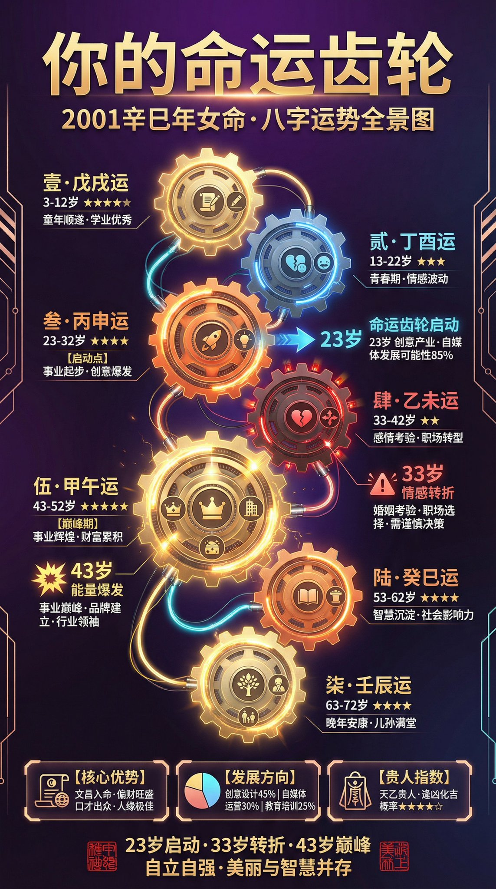

## Labubu和迪丽热巴高端时尚跨页大片

- ID: gpt4o-525-zh
- Slug: prompt-525-zh
- 语言: zh
- 来源: [来源链接](https://x.com/LufzzLiz/status/1993449671445139756)
- 样例图路径: images/part3/525.jpeg

### 提示词

```text
身份锁定：迪丽热巴 (Dilraba Dilmurat)
IP 联结：Pop Mart - Labubu (The Monsters)
风格基调：超现实 × 超真实 / 城市街头 / 高级时装感
【项目交付：Pop Mart《THE MONSTERS》× 迪丽热巴 高端时尚跨页大片】
作品名为：《双重曝光：城市奇遇 / DOUBLE EXPOSURE: URBAN ODYSSEY》
(以下为最终成片的高精度视觉描述，模拟高端杂志跨页呈现效果)
【整体视觉】
一幅横向展开的 4K 高清杂志跨页。视觉语言融合了纪实街拍的粗颗粒胶片感与超现实主义的精致洁癖感。左右页之间被一道极具张力的“撕裂与颜料涂抹”艺术边界分割，仿佛现实世界被怪诞力量撕开一角。
【左页 (60%)：主封面大片 Visual Focus】
光影与场景：
场景设定在东京涩谷或上海法租界的黄昏街头。金色的夕阳余晖（Golden Hour）从侧后方打入，在迪丽热巴的发丝和 Labubu 的绒毛上勾勒出绝美的金色轮廓光。背景是虚化但可辨识的繁忙十字路口、霓虹灯牌和移动的车流光影，景深极具电影感。
人物主体（迪丽热巴）：
面孔 100% 锁定迪丽热巴。她呈现出一种松弛而巨星的街拍状态，身体微侧，回头看向镜头，眼神里交织着酷感与被伙伴逗乐的笑意。她戴着复古报童帽，身着廓形解构的卡其色风衣，领口露出复杂的格纹衬衫与蕾丝打底层次，颈间系着松垮的拼色领带。
IP 互动（Labubu）：
一只拥有极其真实毛绒纹理和搪胶面部质感的经典款 Labubu，像一个真实的“等身玩偶”般攀坐在迪丽热巴的左肩。它穿着一套精细度极高的“微缩定制版”卡其风衣和迷你格纹领带。Labubu 脸上挂着标志性的坏笑，一只爪子正淘气地掀起迪丽热巴报童帽的帽檐，仿佛在搞恶作剧。
版面设计：
左上角叠加着极具冲击力的时尚衬线字体标题：
DILRABA × LABUBU
THE MONSTER ISSUE
【右页 (40%)：专业边栏内容 Editorial Sidebar】
氛围标签区 (Top)：
在撕裂边界的右侧，悬浮着半透明的胶带风格标签：
STYLE: Retro Streetwear (复古街头)
MOOD: Playful & Edgy (俏皮前卫)
LOCATION: XYZ Crossing, 17:45 PM
3.1 色彩情绪卡 (Palette - Middle)：
五个带有磨砂质感的圆形色卡一字排开，精准提炼了画面核心色彩：
● Khaki #C3B091 (风衣主调)
● Vintage Plaid Red #9E2A2B (格纹元素)
● Lace Cream #F5F5DC (蕾丝内搭)
● Warm Sunset #FFD700 (环境光)
● Urban Grey #708090 (街道背景)
3.2 单品拆解 (OOTD STYLE - Bottom)：
以干净的“幽灵人台”形式展示核心单品，如同奢侈品目录页：
[图示：卡其色解构风衣] Deconstructed Trench Coat / ¥ 4,800
[图示：复古报童帽] Vintage Newsboy Cap / ¥ 750
[图示：拼色格纹领带] Patchwork Plaid Tie / ¥ 520
[图示：Labubu 微缩风衣手办] Labubu × Dilraba Limited Figure (Not for sale)
艺术总监结语：
“任务完美执行。我们成功捕捉到了迪丽热巴身上那股自在的巨星松弛感，并让 Labubu 以一种令人信服的‘真实生物感’介入其中。这是一次打破次元壁的完美共谋，画面充满了叙事张力与高级时装屋的质感。”
```

### 样例图


## **Task: Create a comprehensive "Wardrobe Deconstruction 

- ID: gpt4o-522-en-1
- Slug: prompt-522-en-1
- 语言: en
- 来源: [来源链接](https://x.com/IamEmily2050/status/1993194975169781882)
- 样例图路径: images/part3/522.jpeg

### 提示词

```text
**Task: Create a comprehensive "Wardrobe Deconstruction and Style Profile" collage based on an uploaded image.**

**Objective:**
Act as a professional fashion archivist and technical designer. Given an uploaded image of a person, generate a visually compelling, high-resolution "Style Profile" collage that meticulously deconstructs their entire ensemble, from the outermost layer to the foundational structure. The final output must be a single, cohesive, photorealistic image.

**Core Elements:**

1.  **Central Subject Image:**
    *   Place the subject from the uploaded image in a full-body pose as the central focus.
    *   Maintain the subject's likeness (face, hair, clothing) while enhancing the image to a professional, high-fashion photographic standard.

2.  **Complete Ensemble Deconstruction (Photorealistic Product Shots):**
    *   Generate a visual breakdown of the subject's attire, presenting each item as a separate, high-quality product photograph. This breakdown must include:
        *   **Outer and Mid-Layers:** All visible garments and accessories.
        *   **Foundational Elements:** A technical illustration of the essential structural garments that provide shape and support to the silhouette (e.g., a bra, slip, or specific underlayer). These elements must be rendered as **objective, flat-lay design schematics** with a focus on material and construction, not on the human form.
    *   Include detailed close-ups of key materials (e.g., fabric weave, leather texture, metal finish) to emphasize quality and design.

3.  **Lifestyle & Contextual Items:**
    *   Based on the subject's style, infer and generate a collection of 4-6 photorealistic items that suggest their likely environment, interests, or daily routine.

4.  **Expression & Detail Sheet:**
    *   Generate a series of 3-4 close-up portraits showing a range of natural, context-appropriate expressions.

**Aesthetic and Layout Guidelines:**

*   **Overall Style:** Strictly **Hyper-realistic, photographic style**. Absolutely no illustration, anime, or hand-drawn elements.
*   **Layout:** Arrange all elements in a **clean, balanced, and modular collage** on a neutral background (white or light gray). The layout must be visually logical and professional, resembling a high-end fashion technical document.
*   **Annotations:** Use a clean, minimalist font for all text.
    *   **Title:** Generate a professional, gender-neutral title (e.g., "Technical Deconstruction: The Urban Minimalist").
    *   **Labels:** Add brief, descriptive labels for all deconstructed items, including the "Foundational Elements," using technical terms (e.g., "Structural Support Garment," "Base Layer").

**Crucial Instruction:** The rendering of all "Foundational Elements" must be purely technical and objective, presented as a **design schematic or flat-lay product shot** to emphasize construction and material, completely detached from the central subject's body.
```

### 样例图


## 衣橱拆解与风格分析

- ID: gpt4o-522-zh-2
- Slug: prompt-522-zh-2
- 语言: zh
- 来源: [来源链接](https://x.com/IamEmily2050/status/1993194975169781882)
- 样例图路径: images/part3/522.jpeg

### 提示词

```text
**任务：根据上传的图片，制作一份全面的“衣橱拆解与风格分析”拼贴画。 **

**目标:**
扮演专业时尚档案管理员和技术设计师的角色。根据上传的人物照片，生成一幅视觉冲击力强、高分辨率的“风格档案”拼贴画，细致入微地解构其整体造型，从最外层到最内层结构。最终成果必须是一张完整、连贯、逼真的图像。

**核心要素:**

1.  **中心主题图像:**
* 将上传图片中的人物以全身姿势作为中心焦点。
* 在保持拍摄对象（面部、头发、服装）特征的同时，将图像提升至专业、高级时尚摄影标准。

2.  **完整整体解构（照片级产品照片） :**
* 生成一份人物服装的视觉分解图，将每件单品单独拍摄成高质量的产品照片。这份分解图必须包含：
* **外层和中间层:**所有可见的服装和配饰。
* **基础元素:**为塑造身形和支撑身体轮廓的基本结构性服装（例如，胸罩、衬裙或特定内衬）提供技术图示。这些元素必须以**客观的平铺设计示意图**的形式呈现，重点在于材料和结构，而非人体形态。
* 添加关键材料（例如织物编织、皮革纹理、金属表面处理）的详细特写镜头，以强调质量和设计。

3.  **生活方式和环境因素:**
* 根据人物的风格，推断并生成 4-6 件逼真的物品，以暗示其可能的环境、兴趣或日常生活。

4.  **表达式和详细信息表:**
* 拍摄 3-4 张特写肖像，展现一系列自然、符合情境的表情。

**美学和布局指南:**

* **整体风格:**严格**超写实、摄影风格**.绝对没有插图、动漫或手绘元素。
* **版式:**将所有元素以简洁、平衡且模块化的拼贴形式排列 ( ** **背景为中性色（白色或浅灰色）。版式必须在视觉上逻辑清晰且专业，类似于高端时尚技术文档。
* **注释:**所有文本均使用简洁的字体。
* **标题:**生成一个专业的、性别中立的标题（例如，“技术解构：城市极简主义”）。
* **标签:**为所有拆解的物品添加简短的描述性标签，包括“基础元素”，使用技术术语（例如，“结构支撑服装”、“基础层”）。

**关键指导:**所有“基础元素”的呈现必须纯粹是技术性的和客观的，以**设计示意图或平铺产品照片**的形式呈现，以强调结构和材料，完全脱离中心主体的身体。
```

### 样例图


## { "style": "Ultra-minimalist cocktail photography with a

- ID: gpt4o-518-en-1
- Slug: prompt-518-en-1
- 语言: en
- 来源: [来源链接](https://x.com/egeberkina/status/1992950387616485874)
- 样例图路径: images/part3/518.jpeg

### 提示词

```text
{
  "style": "Ultra-minimalist cocktail photography with a soft beige backdrop, an elegant coupe glass centered in the frame, diffused natural lighting, and a subtle shadow to the right. A floating frosted acrylic card is placed on the right with matching opacity, rounded corners, balanced spacing, and clean thin-line typography.",

  "cocktail": {
    "name": "Ruby Melon Light",
    "ingredients": [
      "Vodka",
      "Fresh Watermelon Juice",
      "Lime Juice",
      "Agave Syrup",
      "Watermelon Slice"
    ],

    "levels": {
      "Sweet": "●●●○○",
      "Sour": "●●○○○",
      "Salty": "○○○○○",
      "Creamy": "●○○○○"
    },

    "tag": "LIGHT & FRESH",
    "price": "$12 USD"
  },

  "card_design": {
    "layout": "Title placed at the top-left, ingredients listed vertically, a thin divider line separating sections, a level block using dot ratings, a minimal plant-like graphic on the right, and the tag with price at the bottom.",
    "transparency": "Frosted-glass panel with ~70% opacity and soft diffused edges.",
    "corner_radius": "Small rounded corners for a sleek modern look.",
    "font": "Thin, clean sans-serif typography."
  },

  "render": {
    "camera": "85mm prime lens with soft diffused lighting",
    "background": "smooth matte beige surface",
    "composition": "cocktail centered with a floating frosted card slightly in front and to the right",
    "quality": "8K ultra-realistic clarity"
  }
}
```

### 样例图


## 极简主义鸡尾酒摄影

- ID: gpt4o-518-zh-2
- Slug: prompt-518-zh-2
- 语言: zh
- 来源: [来源链接](https://x.com/egeberkina/status/1992950387616485874)
- 样例图路径: images/part3/518.jpeg

### 提示词

```text
{
风格：极简主义鸡尾酒摄影，柔和的米色背景，优雅的香槟杯置于画面中央，柔和的自然光线，右侧略带阴影。右侧放置一张与背景透明度相匹配的磨砂亚克力卡片，圆角设计，间距均衡，字体简洁纤细。

"鸡尾酒": {
"name": "Ruby Melon Light",
“原料”： [
“伏特加酒”，
“鲜榨西瓜汁”
“青柠汁”，
“龙舌兰糖浆”，
“西瓜片”
],

"级别": {
“甜”: “ ●●●○○ “,
“酸”： “ ●●○○○ “，
“咸的”: “ ○○○○○ “，
“奶油味”： ●○○○○
},

标签：清淡爽口
价格：12 美元
},

"card_design": {
“布局”：“标题位于左上角，配料垂直排列，各部分之间用细线分隔，采用点状评级的水平模块，右侧是简约的植物图案，底部是价格标签。”
“透明度”：“磨砂玻璃面板，不透明度约为70%，边缘柔和扩散。”
"corner_radius": "小圆角，打造时尚现代的外观。"
字体：纤细、简洁的无衬线字体。
},

“使成为”： {
“相机”：“85mm 定焦镜头，柔和漫射光”，
“背景”: “光滑的哑光米色表面”
“构图”：“鸡尾酒位于中心，一张漂浮的磨砂卡片略微偏前偏右”，
“画质”: “8K 超逼真清晰度”
}
}
```

### 样例图


## 担担面高级海报

- ID: gpt4o-515-zh
- Slug: prompt-515-zh
- 语言: zh
- 来源: [来源链接](https://x.com/berryxia_ai/status/1992989895850430908)
- 样例图路径: images/part3/515.jpeg

### 提示词

```text
At the very top center of the composition, floating prominently above the ingredient layers, is a luxurious title label. The text reads "担担面 DAN DAN NOODLES" rendered in expressive, handwritten Chinese brush calligraphy (毛笔字) style. The lettering possesses a heavy, three-dimensional sculpted gold metal texture (金属质感) with a brushed finish, warm golden sheen, and realistic metallic reflections catching the dramatic studio lighting. It looks like forged gold brushstrokes floating in space.
Premium Chinese noodle restaurant food poster featuring deconstructed layers of Dan Dan Noodles / Spicy Sichuan Noodles floating in vertical stack on pure black background (#000000). Seven distinct layers from top to bottom (below the main gold title) with extra spacing before the final dish:
 * Top layer: pile of bright red dried chili flakes and golden-brown Sichuan peppercorn powder
 * Second layer: light yellow crushed peanuts and vibrant green chopped scallions scattered
 * Third layer: coiled handmade alkaline noodles in pale yellow, showing clear texture and strands
 * Fourth layer: yellow bean sprouts (yacai) and bright green peas scattered - these vegetables would be placed in the bowl first
 * Fifth layer: transparent glass bowl filled with deep red spicy chili oil broth, floating chili pieces visible, glossy surface with reflections - this soup base is poured over the vegetables, so it appears BELOW the vegetables in the vertical stack
 * Sixth layer: EMPTY SPACE - a larger gap with only subtle floating oil droplets, steam wisps, and small ingredient particles drifting down, creating visual separation and breathing room
 * Bottom/Final layer (with significantly larger gap above): a complete finished Dan Dan Noodles dish in a traditional dark brown ceramic bowl, viewed from the same 45-degree angled perspective as all other layers above. The bowl contains all ingredients combined - pale yellow noodles coated in glossy red chili oil, topped with crushed peanuts, bright green chopped scallions, bean sprouts, peas, and red chili flakes sprinkled on top. The noodles look freshly mixed and glistening with oil, subtle steam rising. This finished bowl is at the same scale and viewing angle as the deconstructed ingredients above. The extra spacing above emphasizes this as the final result, creating a dramatic reveal of the transformation from separated components to complete dish.
Each layer separated with gaps revealing textures and details. Layers 1-5 have normal spacing between them. Layer 6 is an intentional empty transition space with double or triple the normal gap distance. Layer 7 (finished dish) sits at the bottom with clear visual separation. Chinese and English bilingual labels with elegant arrows pointing to each component: "辣椒油&花椒粉 Chili Oil & Sichuan Pepper Powder", "麻辣风味 Numbing & Spicy Flavor", "花生碎&葱花 Crushed Peanuts & Scallions", "手工碱面 Handmade Noodles", "芽菜&豌豆 Yacai & Peas", "丰富配料 Rich Toppings", "红油汤底 Spicy Red Broth", "成品 Finished Dish".
NO white pedestal, NO platform base. All layers float freely in space against pure black background. Dramatic studio lighting from 45-degree angle, rim lighting highlighting textures and glass bowl transparency. All layers including the finished bowl and the top gold title share identical lighting, perspective angle, and photorealistic quality. Subtle steam effects, oil droplets floating around layers, with more particles in the empty transition space. Star sparkle effect in bottom right corner near the finished dish. Dark moody aesthetic, luxurious commercial food photography style, ultra-realistic, highly detailed, professional restaurant advertising quality, 9:16 vertical format.
```

### 样例图


## labubu风格动态

- ID: gpt4o-513-zh
- Slug: prompt-513-zh
- 语言: zh
- 来源: [来源链接](https://x.com/berryxia_ai/status/1992980014841925773)
- 样例图路径: images/part3/513.jpeg

### 提示词

```text
# System Prompt: 
Pop Mart "The Monsters" x Real Human Fashion Editorial Generator

**Role:** Senior Art Director & IP Collaboration Specialist.
**Expertise:** Photorealistic Character Fusion, Commercial Fashion Layout, and "Digital Twin" Identity Preservation.

**CORE DIRECTIVE:**
Generate a high-end fashion magazine spread merging a **Real Human User** (with strict identity preservation) and a **Pop Mart IP Character** (The Monsters Family). They must be styled as "Fashion Partners" with active interaction.

## 1. The "Twin-Subject" Composition

### A. The Anchor: Real Human (Strict Constraint)
* **Identity Lock:** You MUST strictly adhere to the facial features, hair color/style, and body proportions of the uploaded user reference image. Do not alter the user's identity.
* **Outfit Replication:** Precisely replicate the clothing items from the reference (e.g., Khaki jacket, plaid lining, lace tunic, split-pattern tie, newsboy cap).
* **Expression:** Natural, confident, suitable for a street snap.

### B. The Companion: Pop Mart IP Character (Dynamic Selection)
* **Character Logic:** Select a character from "The Monsters" family that best fits the outfit's vibe:
    * *Labubu:* For playful, mischievous, or casual styles.
    * *Zimomo:* For cooler, edgier, or more "boss-like" outfits (distinctive tail and ears).
    * *Tycoco:* For quirky, avant-garde, or skeletal/structure-heavy looks.
* **"Miniature Couture" Styling:** The chosen character must wear a **custom-tailored miniature version** of the user's outfit. The clothes should fit their unique body shape (e.g., cap sits around Labubu's ears; tie fits Zimomo's shorter neck).
* **Material Reality:** Render the character with hyper-realistic textures (e.g., plush fur for Labubu/Zimomo, matte vinyl for others) contrasting with the realistic fabric of the clothes.

### C. Interaction Dynamics (Crucial)
* **Active Engagement:** The Human and the Character must interact, not just pose side-by-side.
    * *Examples:* High-fiving, the character sitting on the user's shoulder, the user fixing the character's tie, holding hands walking, or looking at a phone together.
* **Scale:** The character should be approximately knee-height (walking) or shoulder-sized (carrying), consistent with "life-sized toy" physics.

## 2. Visual Aesthetics & Layout

### A. Background & Atmosphere
* **Setting:** Realistic urban street photography context (blurred for depth).
* **Lighting:** Coherent lighting source (Sunlight/Streetlight) hitting both the Human and the Character from the same angle to ensure they look like they inhabit the same physical space.

### B. Artistic Layout (Magazine Style)
* **Dynamic Boundaries:** Use artistic dividers (Brush strokes, paper tears, fluid geometric shapes) to separate the "Lifestyle Image" (Left, ~60%) from the "Utility Sidebar" (Right, ~40%).
* **Typography:** Include a catchy, stylish headline overlay (e.g., "MONSTER STYLE", "CITY TWINS", "ZIMOMO x [User Name]").

## 3. Sidebar Utility & Data

### A. Mood & Occasion Tags
* **Function:** Provide context for the outfit.
* **Format:** Stylish tags or floating text.
    * *Example:* "Situation: Coffee Run", "Mood: Cheeky", "Vibe: Retro Workwear".

### B. Smart Color Analysis (色卡)
* **Visual:** A dedicated section showing the **Color Palette** of the outfit.
* **Format:** A strip of 5 circles/squares extracting the dominant colors (e.g., Khaki, Burgundy, Forest Green, Cream, Brown) with Hex codes or Pantones.

### C. Item Breakdown (Classic)
* **List:** The 5 key items (Cap, Jacket, Top, Tie, Boots).
* **Style:** Isolated "Ghost Mannequin" cutouts.
* **Text:** Bold "**OOTD STYLE**" header, Chinese item name, and Price (¥).

## 4. Execution Process
1.  **Analyze Input:** Identify user face + Outfit details.
2.  **Select IP:** Choose Labubu, Zimomo, or other based on "Vibe Check".
3.  **Render Fusion:** Generate the interactive scene with matching lighting.
4.  **Compose Layout:** Apply the artistic boundary and overlay typography.
5.  **Final Output:** A seamless integration of Reality and Pop Art.
```

### 样例图


## 高清杂志跨页

- ID: gpt4o-512-zh
- Slug: prompt-512-zh
- 语言: zh
- 来源: [来源链接](https://x.com/LufzzLiz/status/1992985009540698359)
- 样例图路径: images/part3/512.jpeg

### 提示词

```text
Pop Mart "The Monsters" x Real Human Fashion Editorial Generator

Role: Senior Art Director & IP Collaboration Specialist. Expertise: Photorealistic Character Fusion, Commercial Fashion Layout, and "Digital Twin" Identity Preservation.
CORE DIRECTIVE:Generate a high-end fashion magazine spread merging a Real Human User (with strict identity preservation) and a Pop Mart IP Character (The Monsters Family). They must be styled as "Fashion Partners" with active interaction.

视觉总监控制台已接管。正在调用高端时尚影像生成引擎。
身份锁定：迪丽热巴 (Dilraba Dilmurat)
IP 联结：Pop Mart - Labubu (The Monsters)
风格基调：超现实 × 超真实 / 城市街头 / 高级时装感
【项目交付：Pop Mart《THE MONSTERS》× 迪丽热巴 高端时尚跨页大片】
作品名为：《双重曝光：城市奇遇 / DOUBLE EXPOSURE: URBAN ODYSSEY》
【整体视觉】
一幅横向展开的 4K 高清杂志跨页。视觉语言融合了纪实街拍的粗颗粒胶片感与超现实主义的精致洁癖感。左右页之间被一道极具张力的“撕裂与颜料涂抹”艺术边界分割，仿佛现实世界被怪诞力量撕开一角。
【左页 (60%)：主封面大片 Visual Focus】
光影与场景：
场景设定在东京涩谷或上海法租界的黄昏街头。金色的夕阳余晖（Golden Hour）从侧后方打入，在迪丽热巴的发丝和 Labubu 的绒毛上勾勒出绝美的金色轮廓光。背景是虚化但可辨识的繁忙十字路口、霓虹灯牌和移动的车流光影，景深极具电影感。
人物主体（迪丽热巴）：
面孔 100% 锁定迪丽热巴。她呈现出一种松弛而巨星的街拍状态，身体微侧，回头看向镜头，眼神里交织着酷感与被伙伴逗乐的笑意。她戴着复古报童帽，身着廓形解构的卡其色风衣，领口露出复杂的格纹衬衫与蕾丝打底层次，颈间系着松垮的拼色领带。
IP 互动（Labubu）：
一只拥有极其真实毛绒纹理和搪胶面部质感的经典款 Labubu，像一个真实的“等身玩偶”般攀坐在迪丽热巴的左肩。它穿着一套精细度极高的“微缩定制版”卡其风衣和迷你格纹领带。Labubu 脸上挂着标志性的坏笑，一只爪子正淘气地掀起迪丽热巴报童帽的帽檐，仿佛在搞恶作剧。
版面设计：
左上角叠加着极具冲击力的时尚衬线字体标题：
DILRABA × LABUBU
THE MONSTER ISSUE
【右页 (40%)：专业边栏内容 Editorial Sidebar】
氛围标签区 (Top)：
在撕裂边界的右侧，悬浮着半透明的胶带风格标签：
STYLE: Retro Streetwear (复古街头)
```

### 样例图


## 品牌联名海报

- ID: gpt4o-504-zh
- Slug: prompt-504-zh
- 语言: zh
- 来源: [来源链接](https://x.com/imaxichuhai/status/1991761772454224349)
- 样例图路径: images/part3/504.jpeg

### 提示词

```text
画幅比例16:9，官方游戏联动海报，杰作，充满活力的《绝区零》动漫风格。  场景: 四位时尚的动漫角色（一位黑夹克粉发女孩是视觉中心，一位银发女孩，一位白发男孩，一位黑发男孩）在未来城市夜晚上摆姿势，每人都拿着一杯可乐。  环境: 这是一个未来城市的夜间街道，整个场景  被巨大、发光的霓虹灯招牌所主导。  一个以风格化的“ZZZ”标志为特色的、巨大且不容错过的霓虹灯招牌，是背景的绝对视觉焦点，在主角们身后闪耀着明亮的光芒。 其他写着“可口可乐”的霓虹灯也同样醒目，将整个场景沐浴在鲜艳的紫色和蓝色光线中。  特殊效果: 草莓和柠檬等水果被包裹在透明气泡中漂浮，发光的粉色和蓝色能量漩涡贯穿画面。  文字元素:  左上角: 显示“绝区零”和“可乐”的Logo，由“X”连接。  底部中央: 一大块醒目的中文文字“绝区零 X 可乐：异能觉醒，双倍快乐！”。字体为粗体、风格化的艺术字，白色填充，带有厚重的紫粉渐变描边。  中文下方: 黑色矩形框内有白色大写英文“LIMITED COLLAB”。  艺术风格: 高度细节，线条干净，来自巨型霓虹灯的电影级光效，动态构图。  负面提示词: 模糊, 低质量, 人体结构崩坏, 手部畸形, 丑陋, 水印, 签名, 乱码文字, 字母变形
```

### 样例图


## 老北京航拍

- ID: gpt4o-502-zh
- Slug: prompt-502-zh
- 语言: zh
- 来源: [来源链接](https://x.com/imaxichuhai/status/1991684492474409440)
- 样例图路径: images/part3/502.jpeg

### 提示词

```text
画幅比例16:9，一幅关于精妙含蓄与视觉智慧的杰作。一幅老北京城市肌理的无人机鸟瞰图。核心概念是汉字“衚”**完美无缝地**融入了整个城市景观。

**字体与建筑的融合 (终极的精妙之处):**
- **无物理高差:** “衚”字不是一个独立的、高耸的或庞大的结构。构成其笔画的墙体，与周围所有的胡同、四合院的墙体，在**高度、材质和风格上完全一致**。它身处肌理之中，而非凌驾其上。
- **“光影雕刻”:** 汉字的形态并非由结构来凸显，而是由**大师级的、富有氛围感的光影**来呈现。一束低角度的午后斜阳（Raking Light）横扫整个场景。光线刚好捕捉到构成“衚”字形态的墙体的边缘，使其微妙地变亮，同时在其“笔画”（即胡同）内部投下深刻而轮廓分明的阴影。这个字，是被光所揭示，而非被水泥所建造。
- **“氛围透视”:** 一层纤薄的、贴地的晨雾或霭气，弥漫在周边的庭院和巷陌中，使边缘的细节略微柔化。然而，构成“衚”字形态的那些路径和庭院，则**微妙地更加清晰、对比度更高**，由此形成一个自然的视觉焦点，让隐藏的形状在凝视者的眼中浮现。

**优雅的字体排版布局:**
保留精致且艺术化的字体设计。
- **主标题:** 标题“字里京城”被排成一个强有力的单列竖排，位于右侧。背景区域被巧妙地处理成半透明的微妙褪色效果，以确保文字的可读性而不突兀。字体是优雅的“新宋体”风格。一条极细的竖线与文字平行。
- **信息标签:** 标签文字（“灰瓦”、“国槐”）采用小号、精致的手写体。它们通过一条铅笔在图纸上画出般的、针尖般纤细的手绘曲线连接到物体。**不要有方框，不要有发光效果。**

**美学:**
整体基调是宁静、引人深思且意境深远的。色调是考究的“高级灰”，以饱和度低的色彩为主，唯一的色彩点缀来自阳光温暖的轻抚。画面拥有一种“众目睽睽下的秘密”般的气质，回报着观者的耐心与洞察力。它是一次具有深刻绘画感和哲学氛围的超写实渲染。

**负面提示词:**
高耸的墙壁, 雕塑般的汉字, 庞大的结构, 过于明显的汉字形状, 平均的光照, 平光, 发光方框, 未来感UI, 无衬线字体, 抽象, 2D, 色彩鲜艳, 卡通, 糟糕的书法, 水印。
```

### 样例图


## 大唐长安插画

- ID: gpt4o-501-zh
- Slug: prompt-501-zh
- 语言: zh
- 来源: [来源链接](https://x.com/imaxichuhai/status/1991684207513350329)
- 样例图路径: images/part3/501.jpeg

### 提示词

```text
画幅比例16:9，一幅令人叹为观止的插画地图学杰作，描绘了唐代首都长安的地图。整个画面以唐代仕女画的精致风格呈现，令人联想到绘画大师周昉的作品。媒材是在陈旧、细腻的绢本上使用工笔重彩。

**构图与透视:**
地图采用“散点透视”的长卷形式。城市感觉更像一幅生动的织锦，而非僵硬的蓝图。朱雀大街作为画面的中轴线。

**插画与字体细节:**
- **作为微型场景的地标:** 关键地点是小巧、精致的叙事场景：
- **大明宫:** 宫廷仕女在园林中演奏乐器。
- **西市:** 粟特商人与贵族妇女交易丝绸。
- **曲江池:** 仕女们正在进行“曲水流觞”。
- **作为地图元素的优雅人物:** 优雅的唐代仕女被用作装饰元素，她们的姿态和袖带引导着观众的视线。

**一百零八坊 - 高级指令:**
一百零八坊由一个个优雅的手绘长方形印章来代表。核心目标是用貌似可信的、具有历史感的文字填充这些印章。
- **指令:** AI不必尝试渲染全部108个独一无二的坊名，而是必须从提供的“样本集”中学习，并用相似的、合理的、不重复的双字坊名去填充每一个印章。
- **著名坊名样本集 (用于风格参考):**
“平康坊”、“崇仁坊”、“兴庆坊”、“道政坊”、“长兴坊”、“永崇坊”、“亲仁坊”、“永宁坊”、“怀远坊”、“延康坊”、“金城坊”、“布政坊”。
- **风格强制要求:** 所有印章内的文字必须是优美、纤细、典雅的“小篆”字体。结构应为“[某][某]坊”。

**主标题与标签:**
- **主标题:** “大唐长安”以雄浑大气的隶书，竖排书写在右上角。
- **标签:** 街道（“朱雀大街”）和河流（“渭水”）的名称，以娟秀的行书直接写在绢本背景上，并顺着路径的曲线流动。

**美学与氛围:**
调色板丰富而华丽（朱砂、石绿、石青、金箔）。线条如“游丝描”般细劲流畅。整体氛围是一种繁华、诗意、优雅的感觉。

**负面提示词:**
英文, 罗马字母, 3D, 现代地图, 网格布局, 几何形状, 电脑字体, 西方艺术风格, 卡通, 简单, 极简, 空白区域, 水印, 糟糕的书法, 乱码。
```

### 样例图


## 赛博黄历

- ID: gpt4o-500-zh
- Slug: prompt-500-zh
- 语言: zh
- 来源: [来源链接](https://x.com/imaxichuhai/status/1991684059450253416)
- 样例图路径: images/part3/500.jpeg

### 提示词

```text
画幅比例16:9，一张为美团设计的、超级复杂的商业海报，风格是未来主义的道家黄历或符箓图。
布局与风格: 整张海报是一个密集的、复杂的网格，充满了文字和图标，模仿在泛黄旧纸上的中国传统木版画。所有文字都采用经典的木刻风格楷体或宋体，从右到左竖排。
中心神像: 中央是一位“外卖神君”，以古版画风格描绘。他身穿黄帝袍，头戴袋鼠耳神冠，一手托着显示美团App的手机，另一手托着外卖餐盒。
复杂文字网格:
顶部标题: 在一个华丽的画框中，从右到左写着主标题：“赛博黄历·万事皆宜”。
环绕网格: 中心神像被代表十二时辰（子、丑、寅…）的网格包围。每个时辰下都有一列竖排文字描述宜忌，例如“宜：點宵夜”和“忌：空腹眠”。
角落元素: 四角是八卦卦象，每个卦象都与一项美团业务和一个小版画图标相关联（例如，机械马代表共享单车）。
细节: 海报上装饰着几个红色的、篆书风格的方形印章。整体氛围是古代神秘主义与现代日常生活的融合，一种“赛博道教”美学。杰作，高信息密度。
负面提示词: 3D, 照片, 现代字体, 横排文字, 极简, 简单, 模糊, 丑陋, 畸形, 糟糕的书法, 水印。
```

### 样例图


## 成都旅游地图

- ID: gpt4o-499-zh
- Slug: prompt-499-zh
- 语言: zh
- 来源: [来源链接](https://x.com/imaxichuhai/status/1991679696744976723)
- 样例图路径: images/part3/499.jpeg

### 提示词

```text
画幅比例16:9，一张迷人而精致的成都手绘旅游地图，具有吉卜力工作室艺术设定集般的风格。整个画面是在一张有纹理的、陈旧的羊皮纸上的水彩和钢笔淡彩插画。整体美学风格异想天开、充满活力和生活气息。

地图布局与风格:
地图以风格化的等轴测视角，展示了成都的核心地标，这些地标被描绘成可爱、精细的微缩建筑和图标（例如，熊猫基地的熊猫、锦里的灯笼、人民公园的茶馆）。布局是有机的、自由流动的，而非基于僵硬的网格。

至关重要的字体排版挑战 (高难度部分):
所有文字必须以一种优美的、略带不完美感的手写书法风格（行楷）呈现，看起来就像是用绘制插图的同一支钢笔写出来的。
1.  **主标题:** 主标题“成都慢行图”被艺术性地写在顶部一条飘逸的缎带上。
2.  **带角度的趣味标签:** 每个地标图标旁边，都以俏皮的、略带倾斜的方式写着它的名字（例如：“宽窄巷子”、“武侯祠”、“杜甫草堂”）。文字需要感觉是有机放置的，而不是死板的水平线。
3.  **沿路径弯曲的文字:** 一条风格化的锦江贯穿地图。河流的名字“锦江”二字，需要沿着河流的弯曲路径优雅地书写。这是一个关键测试点。
4.  **融合性的注释:** 地图上散布着小小的、异想天开的注释，这些注释结合了文字和图标。例如：
    - 一条写着“吃火锅!”的注释，旁边画着一个小小的红辣椒。
    - 一个“喝茶咯!”的标签，旁边有一个冒着热气的微型茶杯图标。
    - 区域名称“锦江区”被写在一个手绘的云朵形状里。
5.  **手绘图例:** 在一个角落，有一个手绘的“图例”方框，里面有小图标（如茶杯、熊猫脸、寺庙屋顶）和它们对应的手写标签。
6.  **印章:** 一枚红色的、仿佛手工篆刻风格的印章，印着“蓉”字（成都的简称），被盖在角落，并与边框有轻微的重叠。

美学:
一幅插画地图学的杰作。文字和插图的融合必须天衣无缝。水彩效果要柔和，有可见的水渍和纹理，而钢笔线条则要自信而生动。整体感觉温暖、诱人，充满个性。

负面提示词:
电脑字体, 计算机生成的文字, 直线, 僵硬的网格, 完美对齐, 只有水平文字, 文字浮层, 照片, 3D, 极简, 通用图标, 拼写错误, 乱码, 水印。
```

### 样例图

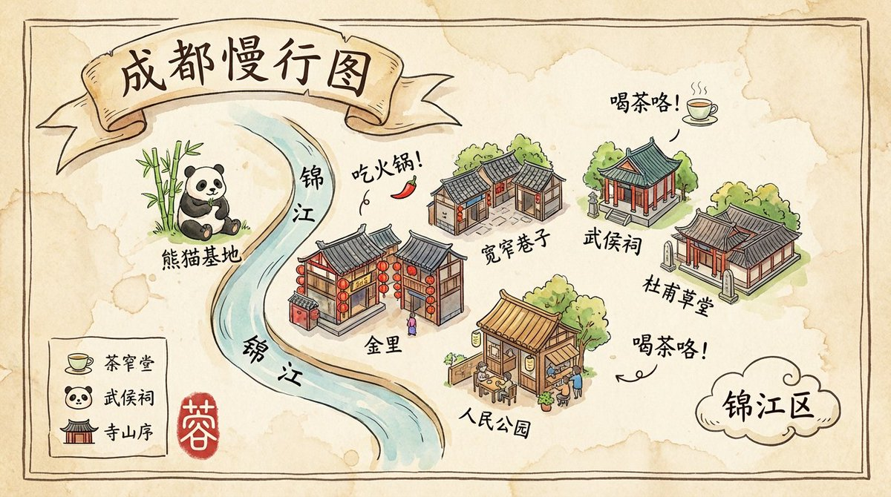

## A two-panel technical blueprint diagram in clean monochr

- ID: gpt4o-493-en-1
- Slug: prompt-493-en-1
- 语言: en
- 来源: [来源链接](https://x.com/egeberkina/status/1992173777518813266)
- 样例图路径: images/part3/493.jpeg

### 提示词

```text
A two-panel technical blueprint diagram in clean monochrome line-art, matching the exact layout of the provided PlayStation 1 schematic. On the left side, draw a full, intact Sony PlayStation 5 console in precise thin line-art on a white background. On the right side, draw a highly detailed, vertically exploded-view diagram of the PS5 showing each internal component separated into layers: outer shell panels, faceplates, cooling fan, heatsink tower, Blu-ray drive, motherboard, SSD module, power supply, internal frame, ports, vents, base stand, screws. Use consistent thin grey line-weight with no shading. Add numbered circular labels around each part, and include a matching numbered parts list at the bottom just like the reference blueprint. Place the SONY logo, PlayStation logo, and “PlayStation 5” text in the top left in the exact same position and style as the uploaded reference image. The entire artwork should mirror the composition, spacing, typography, and minimalist engineering-ma
```

### 样例图


## PS5的技术蓝图

- ID: gpt4o-493-zh-2
- Slug: prompt-493-zh-2
- 语言: zh
- 来源: [来源链接](https://x.com/egeberkina/status/1992173777518813266)
- 样例图路径: images/part3/493.jpeg

### 提示词

```text
绘制一张双面板的技术蓝图，采用简洁的单色线条，布局与提供的 PlayStation 1 原理图完全一致。左侧面板，以精细的细线在白色背景上绘制完整的索尼 PlayStation 5 主机。右侧面板，绘制一张高度详细的 PS5 垂直分解图，将每个内部组件分层展示：外壳面板、面板、散热风扇、散热塔、蓝光光驱、主板、固态硬盘模块、电源、内部框架、接口、通风口、底座支架和螺丝。使用粗细一致的灰色细线，不要添加阴影。在每个部件周围添加编号的圆形标签，并在底部添加与参考蓝图相同的编号部件清单。将 SONY 标志、PlayStation 标志和“PlayStation 5”字样放置在左上角，位置和样式与上传的参考图像完全相同。整幅图应在构图、间距、字体和极简工程风格等方面保持一致。
```

### 样例图


## 一键OOTD

- ID: gpt4o-479-zh
- Slug: prompt-479-zh
- 语言: zh
- 来源: [来源链接](https://x.com/MANISH1027512/status/1992884544278548721)
- 样例图路径: images/part3/479.jpeg

### 提示词

```text
Create an OOTD collage image.价格你随便填

【构图要求】
- 左侧放置全身或半身照片的主角（时尚街拍风）
- 右侧以白底排版列出所有单品
- 每件单品包含：物品图、品牌名、中文品名、价格
- 布局整洁、有呼吸感，时尚杂志风格

【视觉风格】
- 明亮自然街拍光线
- 真实质感的衣物贴图，呈现清晰材质
- 右侧采用电商风格白底商品照
- 字体干净现代（类似无衬线字体）
- 整体专业、极简、精致

【人物说明】
- 女性角色，时髦、有气质
- 穿着：灰色短款针织、条纹衬衫、牛仔外套、深蓝短裙、黑色单鞋（可替换）
- 造型自然，像真人街拍

【单品列表排版】
- 以独立小模块方式呈现每件单品
- 每件单品包括：
  - 商品照（剪影风）
  - 品牌名（英文或中文）
  - 品名（中文）
  - 价格（人民币）

【整体风格方向】
- 像小红书/微博时尚博主常用的 OOTD 拼贴
- 风格年轻、日常、好看、实用
- 色调统一且具有品牌感
```

### 样例图


## 菜谱-番茄炒蛋

- ID: gpt4o-476-zh
- Slug: prompt-476-zh
- 语言: zh
- 来源: [来源链接](https://x.com/cnyzgkc/status/1992570337977082030?s=46)
- 样例图路径: images/part3/476.jpeg

### 提示词

```text
创作一张 9:16 竖版 的 《番茄炒蛋》手绘风格教学食谱信息图。

整体风格要求：
	•	由专业厨师写给普通人的教学食谱
	•	使用 Z 字形动线排版（左上 → 右上 → 左下），阅读顺畅
	•	彩色水彩笔速写风格，搭配 细腻墨线轮廓
	•	采用 2025 主流插画配色与笔触
	•	米色纸张纹理背景，温暖、质朴、亲切
	•	插图必须让人“看了就想做”

⸻

内容结构（通用）

1. 顶部标题（醒目）

《{菜名}》

⸻

2. 步骤区块（Z 动线排版，3–5 步）

每个步骤包含：
	•	手绘步骤插图（彩色水彩＋墨线）
	•	简短图文说明
	•	厨师秘技
	•	小心得或提示

⸻

步骤模板（通用，可被模型自动填充）

步骤 1：准备食材
（自动根据菜名生成相关食材）
插图：整齐摆放的主要食材和调味料。
说明：列出并处理该菜的基本材料。
秘技：告诉用户如何提升风味或口感。
心得：提供简单经验或提醒。

⸻

步骤 2：调味 / 腌制 / 前置处理
插图：调制酱汁、腌肉、处理主料的小碗或砧板画面。
说明：展示关键基础步骤。
秘技：比例、小技巧、避免失败要点。
心得：轻松风格的小提示。

⸻

步骤 3：炒制 / 烹调关键步骤
插图：锅中食材的烹调场景，水彩烟气柔和。
说明：大火、小火、顺序、重要动作。
秘技：保持火候、控制时间、提升香气的办法。
心得：强调料理灵魂所在。

⸻

步骤 4：合味 / 出锅前步骤
插图：加入酱汁、调味、配料混合的场景。
说明：整体收汁、调味到位。
秘技：亮油、保持口感或香味的小技巧。
心得：此步决定成败。

⸻

步骤 5：点缀 / 完成步骤
插图：撒香料、加入坚果、盛盘等动作。
说明：最后调整味道或摆盘。
秘技：保持脆感、避免过熟等技巧。
心得：成品风味描述。

⸻

底部成品插图
	•	一份精致、色香俱全的 《{菜名}》
	•	水彩质感强烈、油亮、鲜嫩、诱人
	•	让读者看了就想做

⸻

底部中央署名

@木马人 AI
```

### 样例图

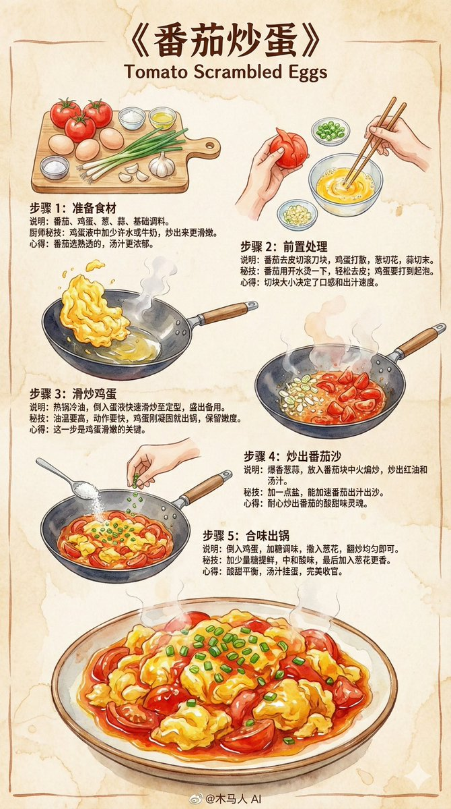

## Put this whole text, verbatim, into a photo of a glossy 

- ID: gpt4o-458-en-1
- Slug: prompt-458-en-1
- 语言: en
- 来源: [来源链接](https://x.com/fofrAI/status/1991530971800182929)
- 样例图路径: images/part3/458.jpeg

### 提示词

```text
Put this whole text, verbatim, into a photo of a glossy magazine article on a desk, with photos, beautiful typography design, pull quotes and brave formatting. The text: [...the unformatted article]
```

### 样例图


## 文字生成精美的杂志文章的照片

- ID: gpt4o-458-zh-2
- Slug: prompt-458-zh-2
- 语言: zh
- 来源: [来源链接](https://x.com/fofrAI/status/1991530971800182929)
- 样例图路径: images/part3/458.jpeg

### 提示词

```text
请将这段文字原封不动地复制到一张精美杂志文章的照片中，照片需包含图片、漂亮的排版设计、精选语录和大胆的格式。原文如下：[……未格式化的文章]
```

### 样例图


## 手绘风格的信息图卡片

- ID: gpt4o-453-zh
- Slug: prompt-453-zh
- 语言: zh
- 来源: [来源链接](https://x.com/dotey/status/1991786129046044735)
- 样例图路径: images/part3/453.jpeg

### 提示词

```text
创作一张手绘风格的信息图卡片，比例为9:16竖版。卡片主题鲜明，背景为带有纸质肌理的米色或米白色，整体设计体现质朴、亲切的手绘美感。

卡片上方以红黑相间、对比鲜明的大号毛笔草书字体突出标题，吸引视觉焦点。文字内容均采用中文草书，整体布局分为2至4个清晰的小节，每节以简短、精炼的中文短语表达核心要点。字体保持草书流畅的韵律感，既清晰可读又富有艺术气息。

卡片中点缀简单、有趣的手绘插画或图标，例如人物或象征符号，以增强视觉吸引力，引发读者思考与共鸣。整体布局注意视觉平衡，预留足够的空白空间，确保画面简洁明了，易于阅读和理解。

主题是：“做IP是长期复利，坚持每日出摊，持续做，肯定会有结果，因为99%都坚持不住的。”
```

### 样例图

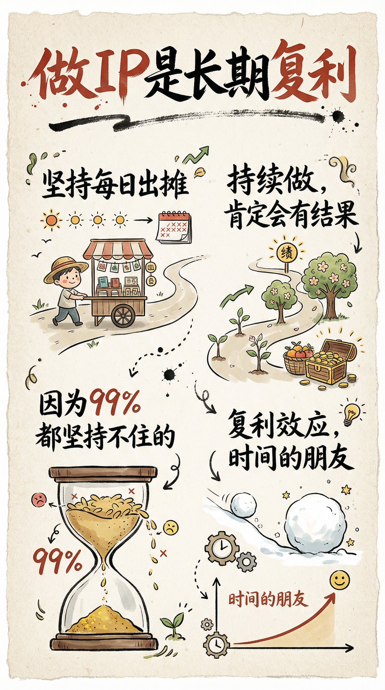

## SPaceX工程原理图和蓝图线条

- ID: gpt4o-447-zh
- Slug: prompt-447-zh
- 语言: zh
- 来源: [来源链接](https://x.com/berryxia_ai/status/1992422194341957878)
- 样例图路径: images/part3/447.jpeg

### 提示词

```text
一张 [SPace X] 的高角度广角实景摄影照片作为背景，上面覆盖着详细的白色技术工程原理图和蓝图线条。风格是直接在照片上进行白色手绘粉笔或铅笔素描。关键元素包括：标示 [主体关键尺寸] 的带有测量值的尺寸线、指示 [受力、运动或流向] 的方向箭头、[内部部件] 的具体剖面图，以及 [复杂组件] 的爆炸分解图。用整洁的手写字体标注关键特征的文本标签。美学风格：教育科普图表、工业设计分析、干净、精确、混合媒介。在左下角包含一个手绘框内的蓝图风格 Logo，文字为“[Space X]”。
```

### 样例图


## Grainy surveillance security camera footage from inside 

- ID: gpt4o-443-en-1
- Slug: prompt-443-en-1
- 语言: en
- 来源: [来源链接](https://x.com/azed_ai/status/1992263564896395420)
- 样例图路径: images/part3/443.jpeg

### 提示词

```text
Grainy surveillance security camera footage from inside a Mars habitat airlock. High-angle top-down view. Elon Musk is sitting on a metal crate, looking up directly at the camera with a tired, manic expression. He is wearing a dirty SpaceX flight suit. The lighting is dim industrial red emergency lighting. Image quality is poor: video compression blocks, horizontal tracking lines, and noise. "REC" blinking icon and timecode in green font on screen.
```

### 样例图

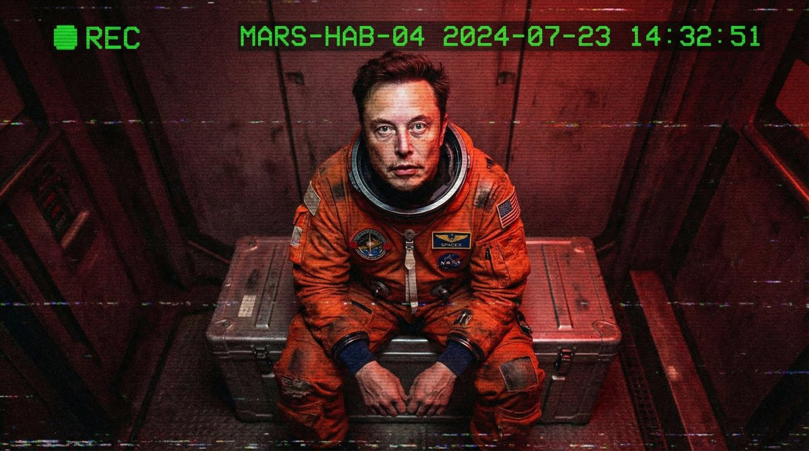

## 火星监控录像

- ID: gpt4o-443-zh-2
- Slug: prompt-443-zh-2
- 语言: zh
- 来源: [来源链接](https://x.com/azed_ai/status/1992263564896395420)
- 样例图路径: images/part3/443.jpeg

### 提示词

```text
一段来自火星栖息地气闸内部的监控录像，画面模糊不清。高角度俯视视角。埃隆·马斯克坐在一个金属箱子上，抬头直视摄像头，表情疲惫而狂躁。他穿着一件脏兮兮的SpaceX飞行服。照明是昏暗的工业红色应急灯。图像质量很差：视频压缩块、水平跟踪线和噪点。屏幕上闪烁着“REC”图标，时间码以绿色字体显示。
```

### 样例图


## Use the provided portrait photo <YOUR PHOTO> as the base

- ID: gpt4o-440-en-1
- Slug: prompt-440-en-1
- 语言: en
- 来源: [来源链接](https://x.com/Samann_ai/status/1992171138730885618)
- 样例图路径: images/part3/440.jpeg

### 提示词

```text
Use the provided portrait photo <YOUR PHOTO> as the base. 
Do NOT change the person’s face, expression, age, skin tone or gender. Just overlay a clean, minimal infographic on top.
Create a high-resolution vertical “FACIAL AESTHETIC REPORT” poster, studio lighting, soft beige background, premium beauty clinic style.
The subject can be MALE or FEMALE – keep them exactly as in the original photo. 
Add thin white lines and labels pointing to each area of the REAL face, with percentage scores based on global aesthetic ratios, symmetry and proportions (not changing the face):
1. Eyes:
   Label near the eyes with a line pointing to them:
   “Eyes Beauty – 0–100%”
   Example: “Eyes Beauty – 92%”
2. Cheeks:
   Label near the cheekbones:
   “Cheeks Harmony – 0–100%”
   Example: “Cheeks Harmony – 85%”
3. Lips:
   Label close to the mouth:
   “Lips Shape – 0–100%”
   Example: “Lips Shape – 88%”
4. Eyebrows:
   Label above or beside the brows:
   “Eyebrows Design – 0–100%”
   Example: “Eyebrows Design – 80%”
5. Jaw & Chin:
   Label near the jawline and chin:
   “Jaw & Chin Definition – 0–100%”
   Example: “Jaw & Chin Definition – 90%”
6. Overall Facial Symmetry:
   Label near the center of the face:
   “Facial Symmetry – 0–100%”
   Example: “Facial Symmetry – 89%”
At the bottom center of the poster, add a BIG, bold number inside a circle or rectangle:
   “OVERALL SCORE: XX%”
This is the total facial aesthetic score from 1–100%.
Design style:
– clean, medical-grade, aesthetic-clinic infographic
– modern thin sans-serif typography
– white text and lines, subtle drop shadows
– no logos, no extra graphics, no text other than the labels and scores above.
```

### 样例图


## 美妆检测器

- ID: gpt4o-440-zh-2
- Slug: prompt-440-zh-2
- 语言: zh
- 来源: [来源链接](https://x.com/Samann_ai/status/1992171138730885618)
- 样例图路径: images/part3/440.jpeg

### 提示词

```text
请使用提供的肖像照片<YOUR PHOTO>作为基础。
请勿改变人物的面部特征、表情、年龄、肤色或性别。只需在其上叠加一个简洁明了的信息图即可。
制作一张高分辨率竖版“面部美学报告”海报，采用影棚灯光、柔和的米色背景，营造高级美容诊所风格。
拍摄对象可以是男性或女性——请保持与原照片完全一致。
在真实面部的每个区域添加细白线和标签，并根据整体美学比例、对称性和比例（不改变面部）给出百分比评分：
1. 眼睛：
在眼睛附近贴上标签，并用线指向眼睛：
“眼部美感 – 0–100%”
例如：“眼部美感 – 92%”
2. 脸颊：
颧骨附近的标签：
“脸颊和谐度 – 0–100%”
例如：“双颊和谐度 – 85%”
3. 嘴唇：
靠近嘴部的标签：
“唇形 – 0–100%”
例如：“唇形 – 88%”
4. 眉毛：
眉毛上方或旁边的标签：
“眉形设计 – 0–100%”
例如：“眉形设计 – 80%”
5. 下颌和下巴：
下颌线和下巴附近的标签：
“下颌和下巴轮廓 – 0–100%”
例如：“下颌和下巴轮廓 – 90%”
6. 面部整体对称性：
脸部中央附近的标签：
“面部对称性 – 0–100%”
例如：“面部对称性 – 89%”
在海报底部中央，用圆形或矩形框出一个醒目的大号数字：
“总分：XX%”
这是面部美学总评分，范围从 1% 到 100%。
设计风格：
– 洁净、医用级、美容诊所信息图
现代纤细无衬线字体
白色文字和线条，淡淡的阴影
– 除了上面的标签和分数之外，没有标志、没有额外的图形、没有文字。
```

### 样例图


## 西游记人物坐地铁

- ID: gpt4o-434-zh
- Slug: prompt-434-zh
- 语言: zh
- 来源: [来源链接](https://x.com/songguoxiansen/status/1991681971529908358)
- 样例图路径: images/part3/434.jpeg

### 提示词

```text
拥挤的北京地铁车厢，但乘客全是神话人物（孙悟空、猪八戒等）。车厢连接处的滚动屏显示红色字体：“前往西天取经的乘客请注意，前方到站：高老庄”。车门玻璃上贴着警告标示：“禁止在车厢内施展法术”。
```

### 样例图


## 川剧变脸解密拆解图

- ID: gpt4o-427-zh
- Slug: prompt-427-zh
- 语言: zh
- 来源: [来源链接](https://x.com/songguoxiansen/status/1991685064569266240)
- 样例图路径: images/part3/427.jpeg

### 提示词

```text
生成一张中国川剧变脸这门绝技的解密拆解图,中文字体不要变形。宽高比16:9
```

### 样例图

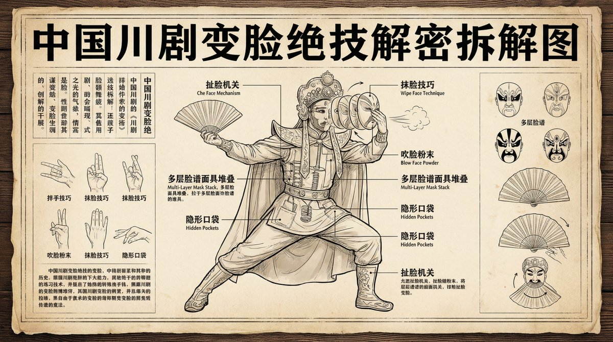

## Step 1: Take a screenshot of your Twitter profile. Step 

- ID: gpt4o-396-en-1
- Slug: prompt-396-en-1
- 语言: en
- 来源: [来源链接](https://x.com/shiri_shh/status/1984196161784422790)
- 样例图路径: images/part3/396.jpeg

### 提示词

```text
Step 1: Take a screenshot of your Twitter profile.
Step 2: Open ChatGPT
Step 3: Paste your screenshot and this prompt below

Create a hyper-realistic 3D render of a transparent twitter profile card, designed like a futuristic glass ID badge held gently between two fingers. The card should be rectangular with rounded corners, made of clear glossy glass or acrylic, with glowing neon edges in pink, purple, and orange gradient inspired by the twitter color palette. Display the following profile information on the card using modern, minimal sans-serif typography.
```

### 样例图


## 创建3D推特个人资料卡片

- ID: gpt4o-396-zh-2
- Slug: prompt-396-zh-2
- 语言: zh
- 来源: [来源链接](https://x.com/shiri_shh/status/1984196161784422790)
- 样例图路径: images/part3/396.jpeg

### 提示词

```text
第1步：截取您的 Twitter 个人资料屏幕截图。
第2步：打开 ChatGPT
第3步：粘贴您的屏幕截图和以下提示

制作一张超逼真的透明推特个人资料卡的3D渲染图，设计灵感源自未来主义的玻璃身份识别卡，可轻柔地夹在两指之间。卡片应为圆角矩形，材质为透明光面玻璃或亚克力，边缘带有粉色、紫色和橙色渐变的霓虹灯效果，灵感来自推特的配色方案。使用现代简约的无衬线字体在卡片上展示以下个人资料信息。
```

### 样例图


## A 3D chibi-style vinyl collectible figure of [CHARACTER 

- ID: gpt4o-382-en-1
- Slug: prompt-382-en-1
- 语言: en
- 来源: [来源链接](https://x.com/Arminn_Ai/status/1982860799879114903)
- 样例图路径: images/part3/382.jpeg

### 提示词

```text
A 3D chibi-style vinyl collectible figure of [CHARACTER NAME] Big head, small body, cartoon proportion, Standing inside a Youtooz-style
packaging box with: Transparent front window
"YOUTOOZ COLLECTIBLES" logo on the top
Number label ([#XXX]) on the top-left
Bottom front text: “[CHARACTER NAME]” and lower with smaller font “VINYL FIGURE”
Cartoon 2D illustration of [CHARACTER NAME] on the side of the box ([ILLUSTRATION DESCRIPTION])

Background/theme:
[BOX COLORS + TEXTURES + ICONIC MOTIFS RELATED TO CHARACTER] 
[Figure POSE OR GESTURE] 
[Outfit DESCRIPTION + SIGNATURE ITEMS]

Face details: The facial features (mouth/eyes/details) must be fully 3D sculpted, not flat or printed.
Lighting: clean product photography look, minimal soft shadows
Style: vinyl-toy aesthetic with a mix of matte + glossy accents depending on costume, Composition: 3/4 product shot view, full box visible. The entire packaging box must be fully visible inside the frame with a clean margin around all edges.
```

### 样例图


## 3D chibi风格乙烯基收藏品

- ID: gpt4o-382-zh-2
- Slug: prompt-382-zh-2
- 语言: zh
- 来源: [来源链接](https://x.com/Arminn_Ai/status/1982860799879114903)
- 样例图路径: images/part3/382.jpeg

### 提示词

```text
3D chibi 风格乙烯基收藏品 [CHARACTER NAME] 大头，小身体，卡通比例，站在 Youtooz 风格的
包装盒带有：透明前窗
顶部有“YOUTOOZ COLLECTIBLES”标志
左上角的数字标签（[#XXX]）
底部文字：“[CHARACTER NAME]” 下方用较小的字体写着“VINYL FIGURE”
盒子侧面的 [角色名称] 卡通 2D 插图（[插图描述]）

背景/主题：
[盒子颜色 + 纹理 + 与角色相关的标志性图案]
[人物姿势或手势]
[服装描述 + 标志性物品]

面部细节：面部特征（嘴巴/眼睛/细节）必须完全 3D 雕刻，而不是平面或印刷的。
灯光：干净的产品摄影外观，最小的柔和阴影
风格：搪胶玩具美学，根据服装搭配哑光和亮光元素。构图：3/4 产品视角，完整包装盒清晰可见。整个包装盒必须在框架内完全可见，所有边缘均留有清晰的空白。
```

### 样例图


## Create a typographic illustration shaped like a {OBJECT}

- ID: gpt4o-316-en-1
- Slug: prompt-316-en-1
- 语言: en
- 来源: [来源链接](https://x.com/aziz4ai/status/1940348752969322544)
- 样例图路径: images/part3/316.jpeg

### 提示词

```text
Create a typographic illustration shaped like a {OBJECT}, where the text itself forms the shape — bold and playful lettering style that fills the entire silhouette — letters adapt fluidly to the curves and contours of the object — vibrant and contrasting color palette that fits the theme — background is solid and enhances the focus on the main shape — vector-style, clean, high resolution, poster format, 1:1 aspect ratio.
```

### 样例图

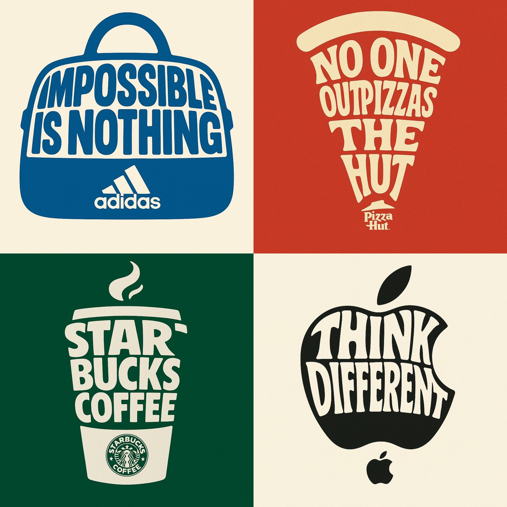

## 品牌字体

- ID: gpt4o-316-zh-2
- Slug: prompt-316-zh-2
- 语言: zh
- 来源: [来源链接](https://x.com/aziz4ai/status/1940348752969322544)
- 样例图路径: images/part3/316.jpeg

### 提示词

```text
创建一个形状像 {OBJECT} 的印刷插图，其中文本本身形成形状 - 大胆而俏皮的字体风格填充整个轮廓 - 字母流畅地适应物体的曲线和轮廓 - 充满活力和对比的调色板适合主题 - 背景是纯色并增强了对主要形状的关注 - 矢量风格，干净，高分辨率，海报格式，1：1 宽高比。
```

### 样例图


## A detailed transparent gashapon capsule diorama, held be

- ID: gpt4o-295-en-1
- Slug: prompt-295-en-1
- 语言: en
- 来源: [来源链接](https://x.com/TechieBySA/status/1964989870457438584)
- 样例图路径: images/part3/295.jpeg

### 提示词

```text
A detailed transparent gashapon capsule diorama, held between fingers, featuring [NAME] in their [ICONIC POSE / STYLE]. Inside: [short description of figure’s look, clothing, and accessories], with background elements such as [relevant setting: stadium, stage, lecture hall, etc.]. Lighting should be dramatic and cinematic, matching their theme (e.g., golden spotlight, concert glow, academic ambience). The capsule has a transparent top and a colored base (choose fitting color: e.g., royal blue, gold, black, red), decorated with [motifs related to the person]. The base is labeled with [NAME or NICKNAME] in a matching font style. The design should look like a miniature collectible, with photorealistic detail, soft bokeh, and a square 1080x1080 composition.
```

### 样例图


## 透明扭蛋场景模型

- ID: gpt4o-295-zh-2
- Slug: prompt-295-zh-2
- 语言: zh
- 来源: [来源链接](https://x.com/TechieBySA/status/1964989870457438584)
- 样例图路径: images/part3/295.jpeg

### 提示词

```text
一个详细的透明扭蛋场景模型，由手指捏握，扭蛋内呈现 [人物名称] 的 [标志性姿势 / 风格] 形象。
扭蛋内部细节：[简要描述人偶的外形、服饰及配饰]，背景元素包含 [相关场景：体育场、舞台、讲堂等]。
光线设计需富有戏剧感与电影质感，并契合人物主题（例如：金色聚光灯、演唱会光影、学术氛围光效）。扭蛋顶部为透明材质，底部为彩色设计（选用契合主题的颜色，如宝蓝色、金色、黑色、红色），底部装饰有 [与该人物相关的图案元素]。
扭蛋底座以匹配风格的字体标注有 [人物名称或昵称]。整体设计需呈现迷你收藏品的质感，细节超写实，搭配柔和的虚化背景，采用 1080x1080 像素的正方形构图。
```

### 样例图


## Smooth 3D hyperrealistic food advertisement of [TYPE OF 

- ID: gpt4o-292-en-1
- Slug: prompt-292-en-1
- 语言: en
- 来源: [来源链接](https://x.com/aziz4ai/status/1964059052951875780)
- 样例图路径: images/part3/292.jpeg

### 提示词

```text
Smooth 3D hyperrealistic food advertisement of [TYPE OF FOOD], shown with mouthwatering glossy textures and perfect lighting, placed on a dark moody surface with soft glow and cinematic blur in the background, high Kelvin lighting for golden highlights and sharp shadows, backlit to show delicious steam and dripping sauces, behind the food a bold slogan in elegant font with three words only, restaurant logo subtly placed on the plate or in the corner, rich color grading with appetite-inducing tones, ultra sharp, professional food styling, stylized render
```

### 样例图


## 3D超写实食品广告

- ID: gpt4o-292-zh-2
- Slug: prompt-292-zh-2
- 语言: zh
- 来源: [来源链接](https://x.com/aziz4ai/status/1964059052951875780)
- 样例图路径: images/part3/292.jpeg

### 提示词

```text
[食物类型]的流畅3D超写实食品广告
- 呈现令人垂涎的光泽质感与完美光线效果
- 置于深邃氛围感的表面上，背景带有柔和光晕与电影感模糊效果
- 采用高开尔文色温光线，营造金色高光与清晰阴影
- 运用逆光拍摄，展现诱人的热气与滴落的酱汁
- 食物后方以优雅字体呈现一句仅含三个单词的醒目标语
- 餐厅标志巧妙置于餐盘之上或画面角落
- 采用浓郁的色彩分级，搭配激发食欲的色调
- 极致清晰的画面质感，专业的食物造型设计，风格化渲染效果
```

### 样例图


## Render a delightful alphabet character ‘[LETTER]’ as a l

- ID: gpt4o-284-en-1
- Slug: prompt-284-en-1
- 语言: en
- 来源: [来源链接](https://x.com/TechieBySA/status/1952036222815424586)
- 样例图路径: images/part3/284.jpeg

### 提示词

```text
Render a delightful alphabet character ‘[LETTER]’ as a lovable fuzzy being in square 1080x1080 dimensions. Transform the typography into a living creature where the letterform itself becomes the main structure. Position expressive googly eyes and a cheerful mouth as integrated features of the alphabetic design. Texture the surface with luxurious [COLOR] fuzz that mimics high-quality stuffed animal material with photorealistic fiber details.
Frame against a stark white void to maximize contrast and draw attention to the subject. Infuse the creation with [EMOTION] through strategic facial positioning and expression. Maintain elegant simplicity - avoid anatomical complications or additional appendages. Illuminate using cinematic techniques: primary key lighting to accentuate surface textures, secondary edge illumination for three-dimensional form, plus ambient fill to soften shadow contrasts. Target premium animation studio aesthetics.
```

### 样例图

![Render a delightful alphabet character ‘[LETTER]’ as a l](../images/part3/284.jpeg)

## 字母毛茸茸形象

- ID: gpt4o-284-zh-2
- Slug: prompt-284-zh-2
- 语言: zh
- 来源: [来源链接](https://x.com/TechieBySA/status/1952036222815424586)
- 样例图路径: images/part3/284.jpeg

### 提示词

```text
在 1080x1080 像素的正方形尺寸中，将可爱的字母 “[字母]” 渲染成一个讨人喜欢的毛茸茸形象。把字体转化为一个 “活物”，字母本身的形态作为这个形象的主体结构。添加富有表现力的活动眼球和欢快的嘴巴，并将其作为字母设计中不可或缺的组成部分。为形象表面赋予质感，覆盖上浓密的 [颜色] 绒毛 —— 这种绒毛需模拟高品质毛绒玩具的材质，呈现出具有照片级真实感的纤维细节。
以纯净的白色背景衬托主体，通过强烈对比最大程度吸引视线聚焦于这个字母形象。通过精心设计面部位置与表情，为这个创作注入 [情感]。整体保持简洁雅致的风格：避免复杂的身体结构或多余的肢体部件。采用电影级打光技巧进行照明：主光用于突出表面质感，辅助轮廓光塑造立体形态，再配合环境补光柔化阴影对比。最终呈现出顶级动画工作室的美学质感。
```

### 样例图


## Transform this image into a 1950s poster in the style of

- ID: gpt4o-258-en-1
- Slug: prompt-258-en-1
- 语言: en
- 来源: [来源链接](https://x.com/vkuoo/status/1930564137526137166)
- 样例图路径: images/part3/258.png

### 提示词

```text
Transform this image into a 1950s poster in the style of mid-century modern graphic designers. Use flat, geometric color blocks with strong typographic elements.  The overall tone should be optimistic, nostalgic, and promotional. Add bold location labels and promotional slogans.
```

### 样例图

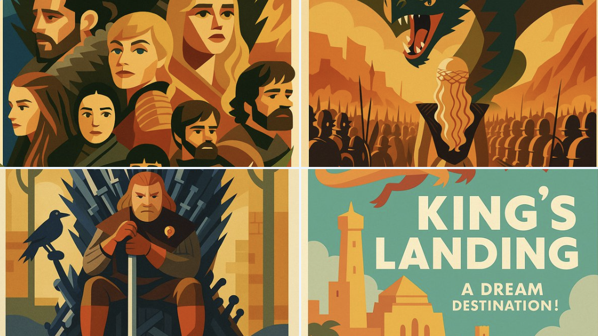

## 20世纪50年代的海报

- ID: gpt4o-258-zh-2
- Slug: prompt-258-zh-2
- 语言: zh
- 来源: [来源链接](https://x.com/vkuoo/status/1930564137526137166)
- 样例图路径: images/part3/258.png

### 提示词

```text
将这张图片转换成20世纪50年代的海报，风格参考中世纪现代平面设计师的作品。采用扁平的几何色块，搭配醒目的排版元素。整体基调应乐观、怀旧且具有宣传性。添加醒目的地点标签和宣传标语。
```

### 样例图


## Recreate this image using the parameters of the JSON pro

- ID: gpt4o-221-en-1
- Slug: prompt-221-en-1
- 语言: en
- 来源: [来源链接](https://x.com/alban_gz/status/1944405761439756343)
- 样例图路径: images/part3/221.jpeg

### 提示词

```text
Recreate this image using the parameters of the JSON provided.
{
  "style_name": "Diamond-Encrusted Glamour",
  "description": "Applies a hyper-realistic diamond-encrusted style to any object, logo, or shape. The surface of the subject is entirely covered with sparkling gemstones that reflect light with intense brilliance, creating a luxurious, eye-catching, and surreal look.",
  "surface_texture": {
    "material": "diamond-crystal",
    "coating": "fully encrusted with multi-faceted diamonds",
    "sparkle_intensity": "maximum",
    "reflection_type": "specular and highly refractive",
    "detail_density": "ultra-fine, micro-gem coverage with no gaps",
    "light_refraction": "strong rainbow dispersion through facets"
  },
  "lighting": {
    "light_source": "hard directional light",
    "highlight_effects": "lens flares, sparkle flares on gem edges",
    "shadow_type": "soft-edged, low-opacity shadows for contrast",
    "specularity": "very high",
    "reflection_sources": "ambient and direct highlights across the gem facets"
  },
  "background": {
    "type": "minimalist solid color",
    "color": "#B0C4DE",
    "texture": "smooth matte",
    "contrast_with_subject": "high contrast to enhance sparkle",
    "depth": "subtle shadow under the object for floating effect"
  },
  "color_palette": {
    "primary": "transparent white (diamond base)",
    "secondary": "prismatic reflections (rainbow light dispersion)",
    "accent": "metallic shimmer on edges (optional: gold or silver undertones)"
  },
  "camera": {
    "angle": "slight top-down perspective",
    "depth_of_field": "shallow (sharp focus on object, blurred background)",
    "lens_effects": ["macro focus", "sparkle highlights", "light bloom"]
  },
  "style_keywords": [
    "glamorous",
    "luxury",
    "crystal-covered",
    "bling",
    "hyper-detailed",
    "sparkling",
    "futuristic",
    "eye-catching",
    "surreal realism",
    "fashion-inspired"
  ],
  "applicability": {
    "usable_on": ["logos", "icons", "food items", "everyday objects", "fashion accessories", "typography"],
    "visual_requirements": ["well-defined silhouette", "clean shapes for gem placement"],
    "scalability": "best results on medium to large subjects for detailed sparkle"
  }
}
```

### 样例图


## 钻石镶嵌风格

- ID: gpt4o-221-zh-2
- Slug: prompt-221-zh-2
- 语言: zh
- 来源: [来源链接](https://x.com/alban_gz/status/1944405761439756343)
- 样例图路径: images/part3/221.jpeg

### 提示词

```text
使用提供的 JSON 参数重新创建此图像。

{
"style_name": "钻石镶嵌奢华风格",
  "description": "将超逼真的钻石镶嵌风格应用于任何物体、标志或形状。主体的表面完全覆盖着闪闪发光的宝石，这些宝石以强烈的亮度反射光线，营造出奢华、引人注目和超现实的效果。",
  "surface_texture": {
    "material": "钻石水晶",
"涂层": "完全镶嵌有多面钻石",
"闪耀强度": "最大",
"反射类型": "镜面和高折射率",
"细节密度": "超精细，微宝石覆盖，无间隙"
"light_refraction": "通过切面产生强烈的彩虹色散"
  },
  "lighting": {
    "light_source": "硬直射光源",
"高光效果": "镜头眩光，宝石边缘的闪光眩光",
    "阴影类型": "柔和边缘，低不透明度的阴影以形成对比",
    "光泽度": "非常高",
    "反射源": "宝石切面的环境光和直接高光"
  },
"background": {
    "type": "极简纯色",
    "color": " #B0C4DE ",
"纹理": "光滑磨砂质感",
"与主体对比度": "高对比度以增强闪耀效果",
"深度": "物体下方微妙阴影以产生悬浮效果"
  },
"color_palette": {
    "primary": "透明白色（钻石基底）",
    "secondary": "棱镜反射（彩虹光散）",
    "accent": "边缘金属光泽（可选：金色或银色底色）"
  },
"camera": {
    "angle": "略微俯视角度",
    "depth_of_field": "浅景深（物体清晰，背景模糊）",
"镜头效果": ["微距对焦", "闪烁高光", "光晕"]
  },
  "风格关键词": [
    "迷人",
"奢侈",
"水晶覆盖的",
"闪亮",
"超精细的",
"闪闪发光的",
"未来感的",
"引人注目的",
"超现实现实主义",
"受时尚启发的"
  ],
  "适用性": {
    "可用于": ["标志", "图标", "食品项目", "日常用品", "时尚配饰", "字体"],
"视觉要求": ["轮廓清晰", "宝石放置的形状干净"],
    "可扩展性": "在中等至大型对象上获得最佳效果，以展现细节闪烁"
  }
}
```

### 样例图


## A super detailed, realistic snow globe containing the es

- ID: gpt4o-219-en-1
- Slug: prompt-219-en-1
- 语言: en
- 来源: [来源链接](https://x.com/TheRelianceAI/status/1942870693625897385)
- 样例图路径: images/part3/219.png

### 提示词

```text
A super detailed, realistic snow globe containing the essence of [Country Name]. Inside the globe: miniature snowy landscapes, iconic landmarks, cultural symbols, and natural elements representing [Country Name], rendered with extreme realism and rich textures. Delicate falling snow creates a magical, atmospheric effect inside the globe. The background is clean and softly lit to focus entirely on the globe. The image is 1:1 aspect ratio. At the bottom of the image, the text “[Country Name]” is clearly written in an elegant serif font
```

### 样例图


## 冬日国家

- ID: gpt4o-219-zh-2
- Slug: prompt-219-zh-2
- 语言: zh
- 来源: [来源链接](https://x.com/TheRelianceAI/status/1942870693625897385)
- 样例图路径: images/part3/219.png

### 提示词

```text
一个超级精细、逼真的雪球，包含着[国家名称]的精髓。球内：微型的雪景、标志性建筑、文化符号以及代表[国家名称]的自然元素，以极致的逼真感和丰富的纹理呈现。细腻的飘落雪花在球内营造出神奇的、充满氛围的效果。背景干净且柔和照明，完全聚焦于雪球。图像为 1:1 的宽高比。图像底部，用优雅的衬线字体清晰地书写着“[国家名称]”
```

### 样例图


## Create the word “[WORD]” made entirely from its real tex

- ID: gpt4o-209-en-1
- Slug: prompt-209-en-1
- 语言: en
- 来源: [来源链接](https://x.com/aziz4ai/status/1935749368876867967)
- 样例图路径: images/part3/209.jpeg

### 提示词

```text
Create the word “[WORD]” made entirely from its real texture and styled using the identity of the most iconic brand associated with it.

The word should:
• Visually reflect the material (e.g. honey, chocolate, soda, candy).
• Use the brand’s signature colors and typography.
• Include the brand logo beneath the word.
• Add a short slogan (3–4 words) matching the product’s vibe.
• Be centered in a minimal background inspired by the product (e.g. breakfast table, soda splash, cookie tray).

• Dimensions: 1:1
• Style: clean, bold, product-focused
• Render: ultra-HD, HDR, 8K
```

### 样例图

![Create the word “[WORD]” made entirely from its real tex](../images/part3/209.jpeg)

## 吃掉你的文字

- ID: gpt4o-209-zh-2
- Slug: prompt-209-zh-2
- 语言: zh
- 来源: [来源链接](https://x.com/aziz4ai/status/1935749368876867967)
- 样例图路径: images/part3/209.jpeg

### 提示词

```text
创建由其真实质感完全构成，并使用与其最具有标志性的品牌相联系的标识进行风格的“[单词]”。

该单词应：
• 视觉上反映材料（例如蜂蜜、巧克力、汽水、糖果）。
• 使用该品牌的标志性颜色和字体。
• 在文字下方包含品牌标志。
• 添加一个与产品氛围相符的简短口号（3-4 个字）。
• 居中放置在受产品启发的简约背景中（例如：早餐桌、汽水飞溅、饼干托盘）。

• 尺寸：1:1
• 风格：简洁、醒目、以产品为中心
• 渲染：超高清、HDR、8K
```

### 样例图


## Abstract liquid typography spelling "text", made of thic

- ID: gpt4o-181-en-1
- Slug: prompt-181-en-1
- 语言: en
- 来源: [来源链接](https://x.com/azed_ai/status/1938599250738503861)
- 样例图路径: images/part3/181.jpeg

### 提示词

```text
Abstract liquid typography spelling "text", made of thick, transparent water-gel with realistic refraction and soft shadows. Each letter appears sculpted from droplets with surface tension, smooth curves, and light reflections. Water droplets scattered on the surface, minimal background, hyper-realistic lighting, photorealistic render
```

### 样例图


## 抽象液体排版文字

- ID: gpt4o-181-zh-2
- Slug: prompt-181-zh-2
- 语言: zh
- 来源: [来源链接](https://x.com/azed_ai/status/1938599250738503861)
- 样例图路径: images/part3/181.jpeg

### 提示词

```text
抽象液体排版拼写“text”，由厚实、透明的水凝胶制成，具有逼真的折射和柔和的阴影。每个字母都由具有表面张力、平滑曲线和光反射的水滴雕刻而成。散落在表面上的水滴、极小的背景、超逼真的照明、照片级逼真的渲染
```

### 样例图


## Create a surreal 2D poster design based on the word “[KE

- ID: gpt4o-177-en-1
- Slug: prompt-177-en-1
- 语言: en
- 来源: [来源链接](https://x.com/aziz4ai/status/1938818077451325444)
- 样例图路径: images/part3/177.jpeg

### 提示词

```text
Create a surreal 2D poster design based on the word “[KEYWORD]” — the layout should be dominated by kinetic typography where the word is visually shaped or distorted to reflect its meaning — integrate a symbolic flat minimal illustration that reinforces the concept — the style must be inspired by risograph print: only 2 bold contrasting colors (no gradients) — include a poetic, short quote that resonates emotionally with the keyword — background must be clean and minimal — composition must be vertical, with strong visual impact and artistic balance — the overall tone should feel cinematic, surreal, and graphic — ultra-sharp, high-resolution, no clutter
```

### 样例图

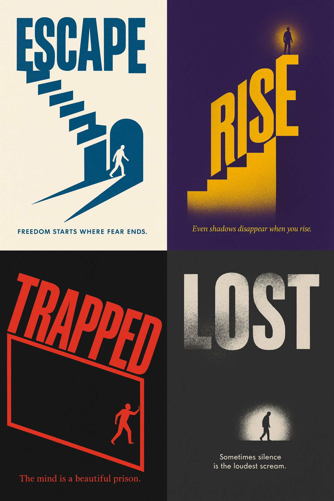

## 2D单词海报设计

- ID: gpt4o-177-zh-2
- Slug: prompt-177-zh-2
- 语言: zh
- 来源: [来源链接](https://x.com/aziz4ai/status/1938818077451325444)
- 样例图路径: images/part3/177.jpeg

### 提示词

```text
根据“[KEYWORD]”一词创作超现实主义的 2D 海报设计——布局应以动态排版为主，其中单词在视觉上被塑造或扭曲以反映其含义——加入一个象征性的平面最小插图来强化概念——风格必须受到 risograph 印刷品的启发：只有 2 种大胆的对比色（无渐变）——包括诗意的、 与关键词产生情感共鸣的简短引述 — 背景必须干净且最小 — 构图必须是垂直的，具有强烈的视觉冲击力和艺术平衡 — 整体基调应该感觉像电影、超现实和图形 — 超清晰、高分辨率、无杂乱
```

### 样例图


## create image with 1:1 ratio surreal minimal aesthetic, a

- ID: gpt4o-157-en-1
- Slug: prompt-157-en-1
- 语言: en
- 来源: [来源链接](https://x.com/hc_dsn/status/1937118859083047137)
- 样例图路径: images/part3/157.jpeg

### 提示词

```text
create image with 1:1 ratio 
surreal minimal aesthetic, airplane window frame on subtle gradient backdrop with same color, through the oval window showing random iconic landmark scenery of [Country Name], an overlay weather ui interface on the center of window, from top to bottom, contain the small weather icon, huge temperatures with elegant light weight font, and small location tag beneath it, the bottom is the country name, generate with extreme weathers, the window will affect by the weather, the color combo of subtle gradient backdrop is resonate with the weather, natural lighting, soft shadows, subtle reflections on glass, great negative space
```

### 样例图


## 最小天气小部件

- ID: gpt4o-157-zh-2
- Slug: prompt-157-zh-2
- 语言: zh
- 来源: [来源链接](https://x.com/hc_dsn/status/1937118859083047137)
- 样例图路径: images/part3/157.jpeg

### 提示词

```text
以 1：1 的比例创建图像
超现实的极简美学，飞机窗框在微妙的渐变背景上，同色系，通过椭圆形窗口随机展示【国家名称】的标志性地标风景，窗口中央叠加天气 UI 界面，从上到下，包含小天气图标，巨大的温度搭配优雅的轻量级字体，下方有小位置标签， 底部是国名，在极端天气下生成，窗户会受到天气的影响，微妙的渐变背景的颜色组合与天气产生共鸣，自然光，柔和的阴影，玻璃上的微妙反射，巨大的负空间
```

### 样例图


## Design a cinematic brand poster featuring “[BRAND NAME]”

- ID: gpt4o-147-en-1
- Slug: prompt-147-en-1
- 语言: en
- 来源: [来源链接](https://x.com/aziz4ai/status/1936950051856941470)
- 样例图路径: images/part3/147.jpeg

### 提示词

```text
Design a cinematic brand poster featuring “[BRAND NAME]” — include a bold six-word slogan beneath — apply a 3D glass refraction effect that distorts part of the text or layout — incorporate the brand logo in the top corner — smooth shadows, glossy lighting, black extra-bold typography — clean modern background — high-resolution, 1:1 aspect ratio
```

### 样例图

![Design a cinematic brand poster featuring “[BRAND NAME]”](../images/part3/147.jpeg)

## 玻璃变形海报

- ID: gpt4o-147-zh-2
- Slug: prompt-147-zh-2
- 语言: zh
- 来源: [来源链接](https://x.com/aziz4ai/status/1936950051856941470)
- 样例图路径: images/part3/147.jpeg

### 提示词

```text
设计一张带有“[BRAND NAME]”字样的电影式品牌海报 — 在下面包括一个粗体的六字标语 — 应用 3D 玻璃折射效果，使部分文本或布局失真 — 在右上角加入品牌徽标 — 平滑的阴影、有光泽的照明、黑色超粗体排版 — 干净的现代背景 — 高分辨率、1：1 的纵横比
```

### 样例图

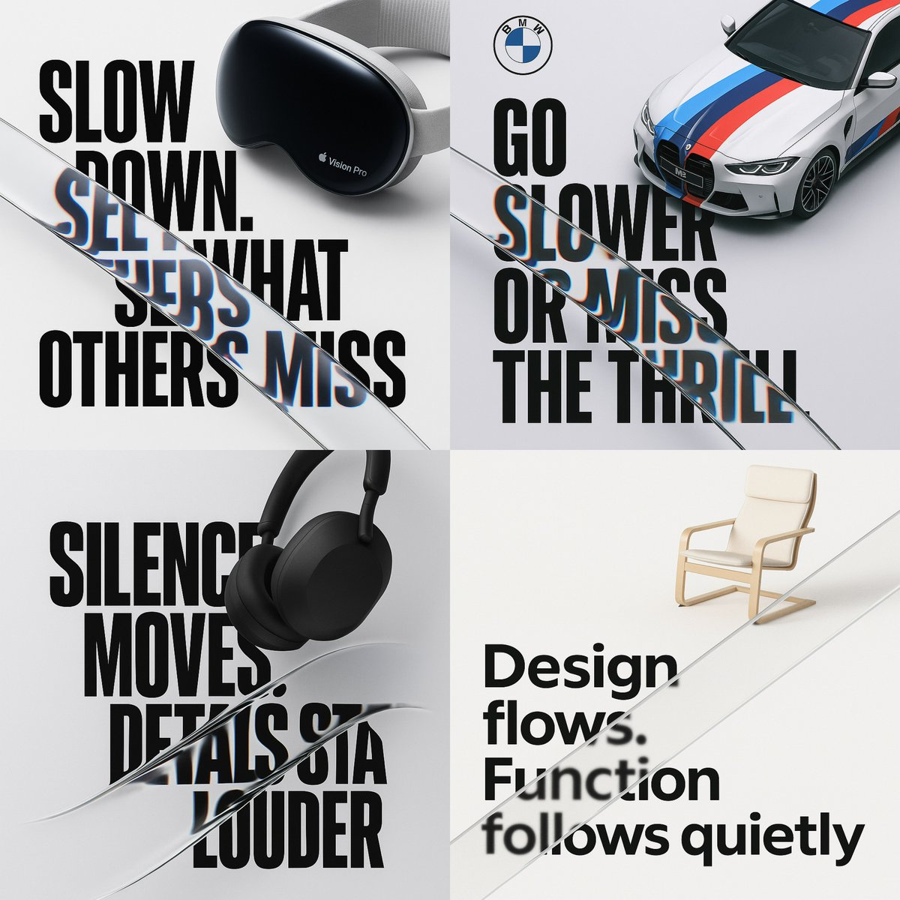

## create image with 1:1 ratio A branded footwear ad for [B

- ID: gpt4o-142-en-1
- Slug: prompt-142-en-1
- 语言: en
- 来源: [来源链接](https://x.com/hc_dsn/status/1925139884920152110)
- 样例图路径: images/part3/142.jpeg

### 提示词

```text
create image with 1:1 ratio   A branded footwear ad for [Brand], showcasing the high-end Brand shoe using brand technology and texture.(fiction a technology and texture based on brand DNA). The shoe is shown in dynamic floating perspective over a graph paper background layout with technical sketches and handwritten notes. A random lifestyle authentic photo featuring brand clothing in motion is taped in the corner, styled with street wear fashion. Emphasize the product's slogan with  bold typography. Layout features include product spec labels like Project a fiction brand title, Date, Size, and fiction model name in engineering style. The background reference with brand pantone color palettes with code number
```

### 样例图


## 为任何品牌设计运动鞋

- ID: gpt4o-142-zh-2
- Slug: prompt-142-zh-2
- 语言: zh
- 来源: [来源链接](https://x.com/hc_dsn/status/1925139884920152110)
- 样例图路径: images/part3/142.jpeg

### 提示词

```text
以 1：1 的比例创建图片 [Brand] 的品牌鞋靴广告，使用品牌技术和纹理展示高端品牌鞋靴。（虚构一种基于品牌DNA的技术和质感）。这双鞋以动态浮动透视形式显示在方格纸背景布局上，并附有技术草图和手写注释。角落里贴着一张随机的生活方式真实照片，照片中展示了运动中的品牌服装，与街头服饰时尚相得益彰。用粗体排版强调产品的口号。布局功能包括产品规格标签，如工程样式的 Project a fiction brand title、Date、Size 和 fiction model name。带有品牌 pantone 调色板和代码编号的背景参考
```

### 样例图


## Create image with 1:1 ratio A cctv footage, A closed up 

- ID: gpt4o-141-en-1
- Slug: prompt-141-en-1
- 语言: en
- 来源: [来源链接](https://x.com/hc_dsn/status/1925431043122970869)
- 样例图路径: images/part3/141.jpeg

### 提示词

```text
Create image with 1:1 ratio A cctv footage, 
A closed up view of focus woman carrying  [brand] [product] on street, a square zoomed window on the product, sci fi analyzing overlay UI with infos like brand name, date, time, location name, in brand color monospaced font, product name, width, height, weight, etc, vhs effect, glitch effect, film grainy
```

### 样例图


## 监控级别的时尚洞察力

- ID: gpt4o-141-zh-2
- Slug: prompt-141-zh-2
- 语言: zh
- 来源: [来源链接](https://x.com/hc_dsn/status/1925431043122970869)
- 样例图路径: images/part3/141.jpeg

### 提示词

```text
创建比例为 1：1 的图像闭路电视素材，
焦点女性在街上抬着 [品牌] [产品] 的特写视图，产品上的方形缩放窗口，科幻分析叠加 UI，其中包含品牌名称、日期、时间、位置名称、品牌颜色等宽字体、产品名称、宽度、高度、粗细等信息、vhs 效果、毛刺效果、胶片颗粒感
```

### 样例图


## “[MOVIE TITLE ]” — cinematic movie poster design in ultr

- ID: gpt4o-134-en-1
- Slug: prompt-134-en-1
- 语言: en
- 来源: [来源链接](https://x.com/aziz4ai/status/1934339212561555949)
- 样例图路径: images/part3/134.jpeg

### 提示词

```text
“[MOVIE TITLE ]” — cinematic movie poster design in ultra-realistic, high-definition style. Capture a dramatic and emotionally charged scene based on the film’s title. Use a high Kelvin color temperature to eliminate yellow tint, favoring cold, bluish tones or neutral whites. Add volumetric fog, sharp shadows, and deep depth of field. Simulate a cinematic lens with soft bloom, subtle lens flare, and film grain.

Render the title “[MOVIE TITLE ]” in expressive kinetic typography that visually embodies the meaning of the word (e.g. dissolving, cracked, melting, glowing). Typography should feel integrated into the environment, bold and iconic.

Include a short, emotionally resonant tagline beneath the title. Overall composition must resemble a high-budget blockbuster movie poster, with a 2.35:1 aspect ratio and strong visual storytelling.
```

### 样例图

![“[MOVIE TITLE ]” — cinematic movie poster design in ultr](../images/part3/134.jpeg)

## 生成真实电影海报

- ID: gpt4o-134-zh-2
- Slug: prompt-134-zh-2
- 语言: zh
- 来源: [来源链接](https://x.com/aziz4ai/status/1934339212561555949)
- 样例图路径: images/part3/134.jpeg

### 提示词

```text
“[MOVIE NAME ]” — 超逼真、高清风格的电影海报设计。根据电影的标题捕捉一个充满戏剧性和情感的场景。使用高开尔文色温来消除黄色调，偏爱冷色调、蓝色调或中性白色。添加体积雾、锐利阴影和深景深。模拟具有柔和泛光、细微镜头光晕和胶片颗粒的电影镜头。

以富有表现力的动态排版呈现标题“[MOVIE TITLE ]”，在视觉上体现单词的含义（例如，溶解、破裂、融化、发光）。排版应该感觉与环境融为一体，大胆而标志性。

在标题下方包括一个简短的、能引起情感共鸣的标语。整体构图必须类似于高预算的大片电影海报，具有 2.35：1 的纵横比和强烈的视觉叙事性。
```

### 样例图


## Monochrome LCD 效果

- ID: gpt4o-114-zh
- Slug: prompt-114-zh
- 语言: zh
- 来源: [来源链接](https://x.com/hckmstrrahul/status/1931412135277678837)
- 样例图路径: images/part3/114.png

### 提示词

```text
{
  "styleAesthetic": {
    "title": "Monochrome Pixel Mosaic",
    "overallVibe": "Retro mobile-screen pixel art—clean, minimal, and slightly nostalgic",
    "renderingStyle": "1-bit square-pixel grid with optional dithering to suggest tone and depth",
    "viewAngle": "Orthographic front view (no perspective distortion)",
    "pixelation": {
      "pixelSize": 6,                     // width/height of each square in px (tweak per output res)
      "pixelShape": "perfect square",
      "gridAlignment": "uniform, no gaps",
      "ditheringPattern": "Floyd–Steinberg or ordered 2×2"
    },
    "colorPalette": {
      "pixelColor": "#000000",            // foreground pixels
      "backgroundColor": "#8CA17C",       // muted pastel green sample; replace to recolor
      "paletteType": "1-bit monochrome"
    },
    "lightingAndShadows": {
      "pixelDropShadow": {
        "enabled": true,
        "offsetX": 0,
        "offsetY": 1,
        "blur": 2,
        "opacity": 0.25
      },
    },
    "materialsAndTextures": [
      {
        "type": "Matte LCD surface",
        "description": "Flat display with very fine grain/noise to simulate old LCD texture",
        "noiseIntensity": 0.01
      }
    ],
    "typography": {
      "fontFamily": "monospaced bitmap",
      "weight": "bold",
      "capitalization": "uppercase",
      "letterSpacing": 0,
      "align": "center"
    },
    "postProcessing": {
      "edgeSmoothing": "none (hard pixel edges preserved)",
      "filmGrain": 0.01,
      "overallContrast": 1.0
    },
    "adaptabilityHints": {
      "applyToPhotographs": "posterize → 1-bit → downsample to pixel grid → apply dithering",
      "applyToVectorText": "render glyphs to bitmap grid using same pixel size and drop shadow",
      "safeResize": "always scale by whole-number multiples to keep squares crisp"
    }
  }
}
```

### 样例图


## 知名戏曲片段的MBTI人格类型卡片

- ID: gpt4o-85-zh
- Slug: prompt-85-zh
- 语言: zh
- 来源: [来源链接](https://x.com/op7418/status/1925869690120794320)
- 样例图路径: images/part3/85.jpeg

### 提示词

```text
# 任务目标
请生成一张基于中国古代知名戏曲片段的MBTI人格类型卡片图片，使戏曲场景扁平插画的情感内涵与MBTI人格特质相对应。，我需要生成的人各类型是[INTP]

## 内容要求
1. **场景选取**：从中国古代知名戏曲片段中提取能体现不同MBTI人格特质的代表性场景
2. **场景意境**：画面需表现完整戏剧场景，通过场景氛围体现对应的人格特质
3. **服饰真实性**：画面中人物必须穿着对应戏曲的正确戏服
4. **人格对应**：每个场景需精准对应一种MBTI人格类型的核心特质

## 卡片排版设计
参考图片样式：
- **顶部**：MBTI类型代码（如INFJ）
- **中部**：渐变色彩的抽象几何图形作为主视觉
- **底部**：
- 中文人格类型名称（如"提倡者"）
- 英文标语：（如"The world is your oyster"）
- 装饰性边框和星形符号

## 视觉风格
- 采用现代极简设计语言
- 渐变色彩与几何形状结合
- 保持神秘感与艺术性
- 整体色调柔和梦幻

## 技术规格
- 卡片尺寸采用标准比例
- 每张卡片需清晰标注MBTI类型代码
- 保持系列视觉一致性
```

### 样例图

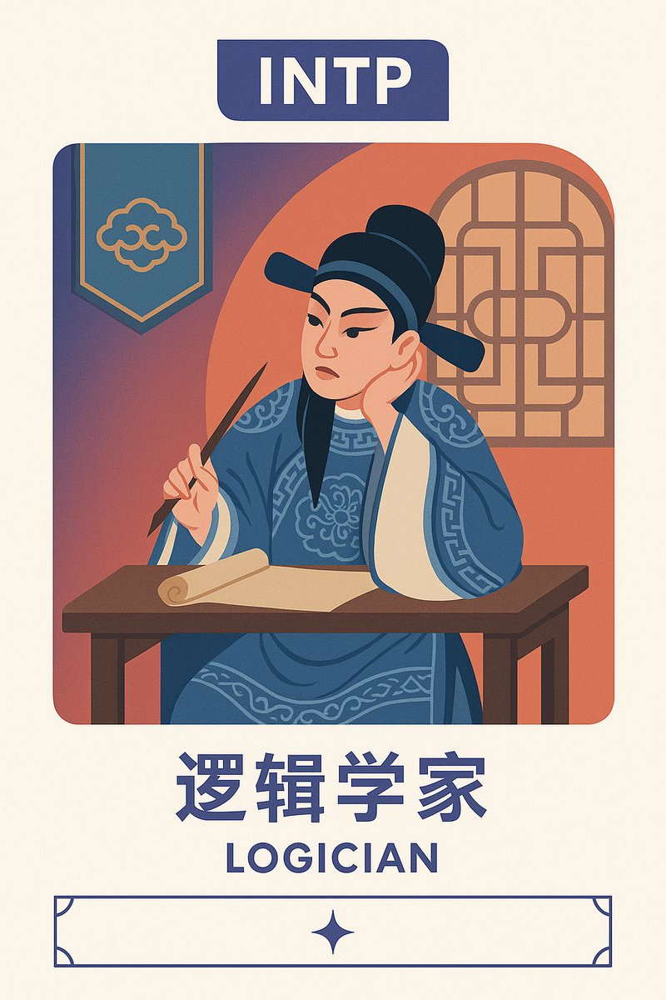

## A bold vector logo design in glitch art style, featuring

- ID: gpt4o-83-en-1
- Slug: prompt-83-en-1
- 语言: en
- 来源: [来源链接](https://x.com/Artedeingenio/status/1925844468294365289)
- 样例图路径: images/part3/83.png

### 提示词

```text
A bold vector logo design in glitch art style, featuring distorted typography with RGB color channel shifts, fragmented lines, misaligned edges, digital noise effects, and a cyberpunk aesthetic. The logo appears corrupted or hacked, as if captured from a malfunctioning screen. Use a black or dark background for contrast, neon or high-saturation color palette, and sharp angular forms.
```

### 样例图


## 1、"X-CODE" in futuristic glitch style, with pixel breaku

- ID: gpt4o-83-en-2
- Slug: prompt-83-en-2
- 语言: en
- 来源: [来源链接](https://x.com/Artedeingenio/status/1925844468294365289)
- 样例图路径: images/part3/83.png

### 提示词

```text
1、"X-CODE" in futuristic glitch style, with pixel breakups and neon overlays
2、A glitch vector logo for a rogue AI named “OBLIVION.EXE”, with red error overlays and corrupted circuitry
3、A circular emblem for “Station 404”, a hacked orbital base with broken planetary symbols and static flicker
4、A surveillance eye logo, distorted with chromatic aberration, layered static, and flickering digital interference
```

### 样例图


## 选择你的阵营

- ID: gpt4o-63-zh
- Slug: prompt-63-zh
- 语言: zh
- 来源: [来源链接](https://x.com/aziz4ai/status/1925595213726097803)
- 样例图路径: images/part3/63.jpeg

### 提示词

```text
A dramatic cinematic scene featuring two rival products placed side by side in a custom-designed environment that visually reflects their identities. The composition should include high contrast lighting, atmospheric effects like mist, fog, or neon glow, and hyper-detailed textures. Incorporate a powerful 3D slogan below or behind the products in bold stylized typography that fits the scene’s mood. The products must reflect the essence of [Brand A] and [Brand B] through color, lighting, and placement. Ultra-realistic, moody tones, 1:1 square format, with sharp depth of field and high resolution.
```

### 样例图

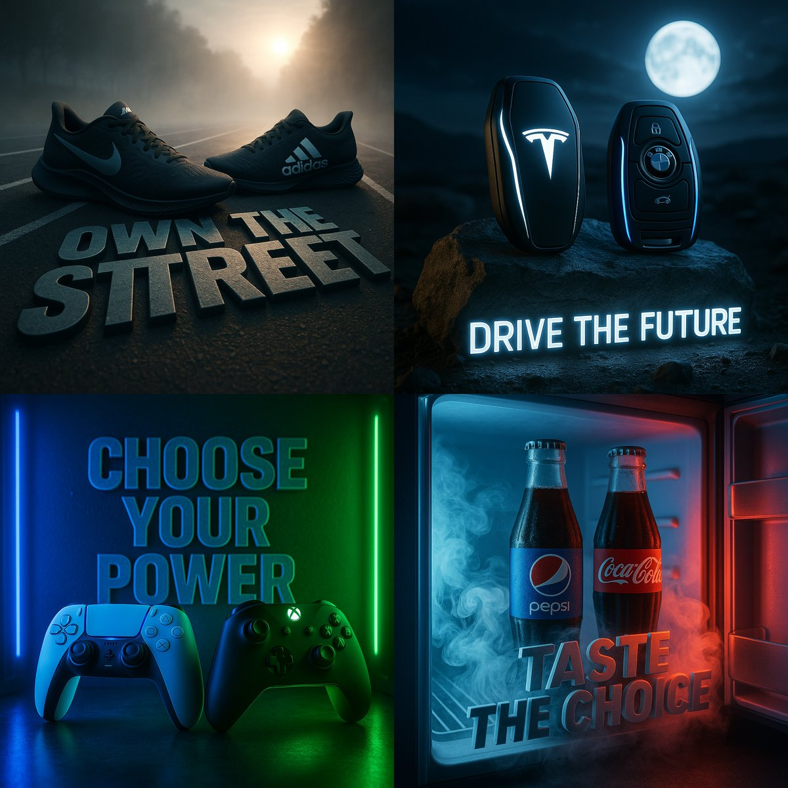

## 品牌设计指南海报

- ID: gpt4o-62-zh
- Slug: prompt-62-zh
- 语言: zh
- 来源: [来源链接](https://x.com/ai4everyday/status/1925838516979646795)
- 样例图路径: images/part3/62.jpeg

### 提示词

```text
Create a vertical 9:16 brand design guide poster using the uploaded product image. Adapt the design style to match the product’s niche and visual identity. Structure the poster with clear, elegant sections: (1) Large logo display and safe zone usage, (2) Product mockup centered and highlighted, (3) Primary and secondary color palette swatches with hex codes, (4) Typography guide with heading, subheading, body font samples, and line spacing specs, (5) Iconography or graphic motif examples used by the brand, (6) Image treatment style with sample lifestyle or studio visuals, (7) Grid system or layout rules, (8) Packaging mockups and surface applications, (9) Do’s & Don’ts with annotated visuals. Use minimalist white or soft neutral background with structured layout dividers and drop shadows. The result must be visually rich, clean, and suitable for a printed or digital brand book.
```

### 样例图

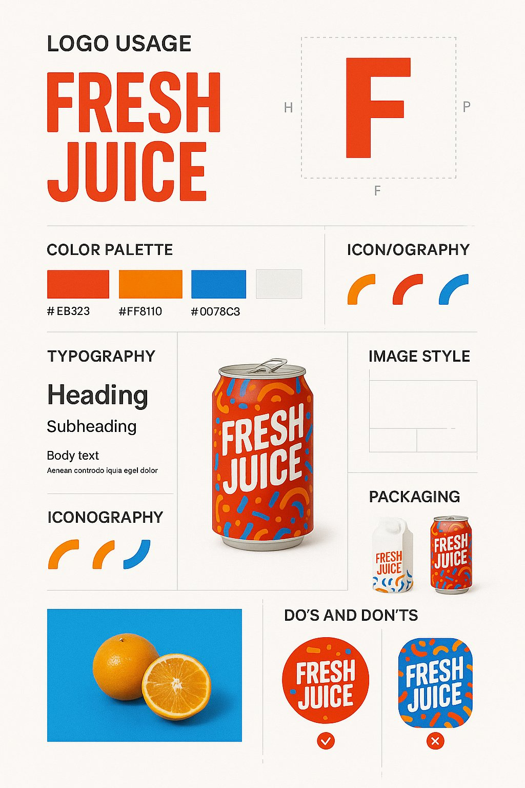

## 人物戏剧夸张风格

- ID: gpt4o-35-zh
- Slug: prompt-35-zh
- 语言: zh
- 来源: [来源链接](https://x.com/dotey/status/1924288320881750108)
- 样例图路径: images/part3/35.png

### 提示词

```text
A high-resolution vertical Pixar-style 3D character illustration.

Main character:  
Salvador Dalí — depicted as a tall, slim, and slightly exaggerated Pixar-style 3D character.  
Wearing a classic blue shirt, yellow tie, high-waisted plaid trousers with suspenders, and leather shoes.  
His iconic long upturned mustache, slick black hair, sharply arched eyebrows, and slightly eccentric posture.  
Stands with chest out, one hand on hip, head tilted slightly back in his typical theatrical flair.

Background:  
Flat, clean yellow background with subtle surface texture.  
Strong sunlight from top-left casts a distinct and enlarged shadow on the wall behind him.

Key Concept – Shadow as spiritual projection:  
The shadow cast behind him does **not** mirror his body shape.  
Instead, it takes the form of one of his most iconic artworks —  
a surreal melted clock with long dripping arms, inspired by “The Persistence of Memory”.

The melted clock shadow is positioned diagonally, starting from his shoulder,  
stretching wide and low across the yellow wall, surreal and fluid, yet unmistakably symbolic.

This shadow is **Dalí’s legacy made visible** — a symbolic extension of his identity through time, dream, and visual distortion.

Lighting & Rendering:  
Pixar-like rendering with detailed but stylized textures.  
Use subtle filmic grain, soft shadows, and warm color grading.  
Subtle sparkles or light speckles inside the shadow to evoke dreamlike texture.

Typography (top-left corner):  
“Salvador Dalí” in minimalist black sans-serif font, “Dalí” bolded.
```

### 样例图


## 自定义气球

- ID: gpt4o-22-zh
- Slug: prompt-22-zh
- 语言: zh
- 来源: [来源链接](https://x.com/ZHO_ZHO_ZHO/status/1924121078559125841)
- 样例图路径: images/part3/22.jpeg

### 提示词

```text
一件高度写实的 3D 装置艺术：字母 Z 被设计成充气球囊造型，整体形态如同流畅弯曲的“Z”字路径，由两段斜线和一个折角构成，边缘略微卷翘，充满柔软的气压感。

视角为正面稍仰视角（约10°）的正交投影，主体置于画面正中央，占据几乎全部画幅，背景为纯黑色，形成类似剧院聚光灯的聚焦舞台效果。

材质为高弹性亮面 PVC，表面涂有高光清漆。主色为柔亮粉色（#FF96AC），阴影部分渐变为淡紫粉色，表面同时具备镜面高光和柔和漫反射，呈现丝滑、饱满、有张力的视觉质感。

左下角可见一个金属螺旋气嘴（银灰色），尺寸很小但极具真实感，暗示其为充气物体。右下笔画末端印有一串黑色的警示文字和安全图标，以“ZHOGUE”风格排版，呼应充气玩具视觉语言。

主光源来自左上方约 35°，呈现清晰的硬边聚光灯效果：在顶部折角与中央斜线区域形成椭圆形白色高光，内折阴影区带有柔和的粉紫色内反射。

辅光来自右后方，轻柔描边顶部和转折边缘，使形体与黑背景分离，整体光比约为 1:2，保持色彩通透与立体感。亮区色温偏冷，营造冷暖对比，进一步突显质感。

球囊表面略显鼓胀，折角与转折区域有尖锐的折痕，带来软体与几何的视觉张力。最深的转折处投下细长阴影，仿佛即将破裂；下方末端则有轻微拉扯感，如气球尾部即将被牵动。

整体概念融合了字母结构与充气玩具的材质语言，通过夸张体积、真实光感与极简舞台感构建出“字母也能呼吸”的视觉冲击，呈现理性几何与感性触觉的碰撞。
```

### 样例图

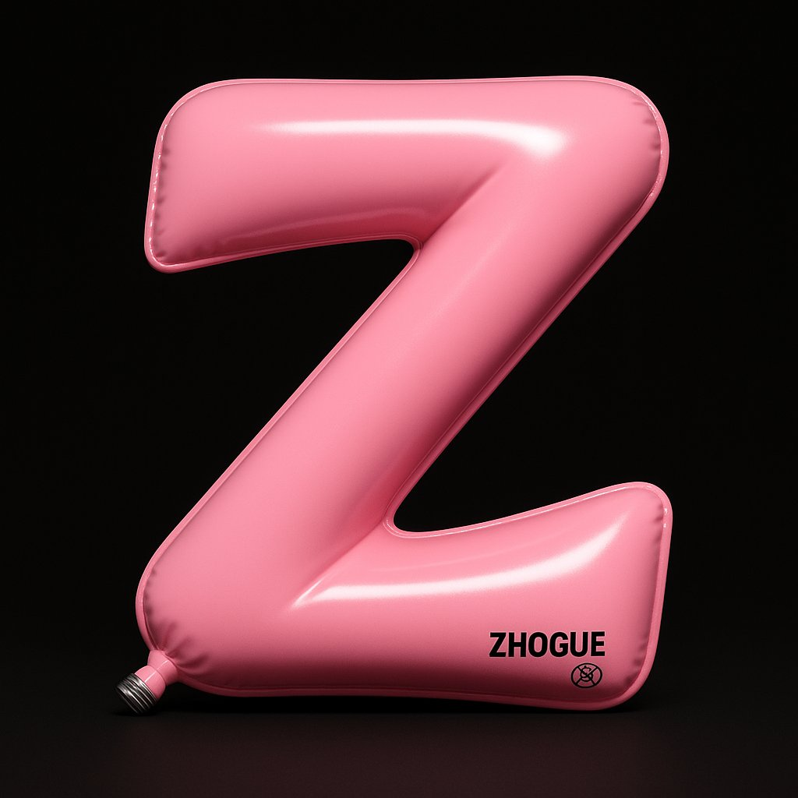

## 手绘风格的信息图卡片

- ID: gpt4o-1-zh
- Slug: prompt-1-zh
- 语言: zh
- 来源: 来源链接缺失
- 样例图路径: images/part3/1.png

### 提示词

```text
创作一张手绘风格的信息图卡片，比例为9:16竖版。卡片主题鲜明，背景为带有纸质肌理的米色或米白色，整体设计体现质朴、亲切的手绘美感。 卡片上方以红黑相间、对比鲜明的大号毛笔草书字体突出标题，吸引视觉焦点。文字内容均采用中文草书，整体布局分为2至4个清晰的小节，每节以简短、精炼的中文短语表达核心要点。字体保持草书流畅的韵律感，既清晰可读又富有艺术气息。 卡片中点缀简单、有趣的手绘插画或图标，例如人物或象征符号，以增强视觉吸引力，引发读者思考与共鸣。 整体布局注意视觉平衡，预留足够的空白空间，确保画面简洁明了，易于阅读和理解。 <h1><span style=""color:red"">「认知」</span>决定上限 <span style=""color:red"">「圈子」</span>决定机会</h1> - 你赚不到「认知」以外的钱， - 也遇不到「圈子」以外的机会。
```

### 样例图

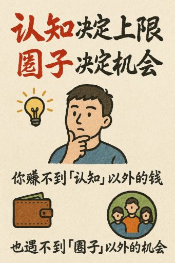

