# UI & Graphic

总计：52

## Create a technical infographic of [OBJECT] with a 45-deg

- ID: trending-2017928823497453789
- Slug: trending-2017928823497453789-en
- 语言: en
- 来源: [来源链接](https://x.com/TechieBySA/status/2017928823497453789)
- 样例图路径: images/part1/2017928823497453789_1.jpg

### 提示词

```text
Create a technical infographic of [OBJECT] with a 45-degree isometric 3D perspective showing the device slightly tilted to reveal depth and dimension.
Combine a realistic photoreal render with black ink technical annotations on pure white background. Include:
Key component labels with color-coded callout boxes
Internal component visibility through transparent/cutaway sections
Measurements, dimensions, and precise scale markers
Material callouts and quantities
Color-coded arrows for function/flow: RED (power/battery), BLUE (data/connectivity), ORANGE (thermal/processor), GREEN (sensors/haptics)
Simple schematics or cross-sectional diagrams where relevant

Place “OBJECT” title in a hand-drawn technical box (top-left corner).
Style: Black linework (technical pen/architectural), sketched but precise. Object remains clearly visible. Educational museum-exhibit vibe. Clean composition, balanced negative space.
Perspective: Isometric 3D angle—tilted to show depth, dimension, and internal architecture dramatically. Like a professional product teardown or engineering manual.
Colors: ~10-15% accent density. Black dominant. White background.
Output: 1080×1080, ultra-crisp, social-feed optimized.
```

### 样例图

![Create a technical infographic of [OBJECT] with a 45-deg](../images/part1/2017928823497453789_1.jpg)

## Create a typographic illustration shaped like a [OBJECT]

- ID: trending-2005620980891480567
- Slug: trending-2005620980891480567-en
- 语言: en
- 来源: [来源链接](https://x.com/TechieBySA/status/2005620980891480567)
- 样例图路径: images/part1/2005620980891480567_1.jpg

### 提示词

```text
Create a typographic illustration shaped like a [OBJECT], where the text [BRAND SLOGAN] forms the shape — bold and playful lettering style that fills the entire silhouette — letters adapt fluidly to the curves and contours of the [OBJECT] — [COLOR DESCRIPTION] with [BACKGROUND COLOR] background that enhances the focus on the main shape — include [BRAND] logo positioned below the [OBJECT] — vector-style, clean, high resolution, 1080x1080 pixels, square format.
```

### 样例图

![Create a typographic illustration shaped like a [OBJECT]](../images/part1/2005620980891480567_1.jpg)

## A simple illustration of a [subject] in [outfit], [doing

- ID: trending-2047993289283133945
- Slug: trending-2047993289283133945-en
- 语言: en
- 来源: [来源链接](https://x.com/azed_ai/status/2047993289283133945)
- 样例图路径: images/part1/2047993289283133945_1.jpg

### 提示词

```text
A simple illustration of a [subject] in [outfit], [doing action], with a [facial expression] expression, in the style of Gemma Correll, playful hand-drawn linework, quirky character design, minimal detail, expressive posture, clean white background, charming editorial illustration feel
```

### 样例图

![A simple illustration of a [subject] in [outfit], [doing](../images/part1/2047993289283133945_1.jpg)

## A hyper-realistic 8K close-up portrait of a person's hea

- ID: trending-2016088197714084320
- Slug: trending-2016088197714084320-en
- 语言: en
- 来源: [来源链接](https://x.com/Sheldon056/status/2016088197714084320)
- 样例图路径: images/part1/2016088197714084320_1.jpg

### 提示词

```text
A hyper-realistic 8K close-up portrait of a person's head and upper neck, shot from a slightly low-angle perspective looking upward.
Use the uploaded image as the face reference - the face must match 100% exactly (same identity, facial structure, proportions, skin details, and expression). Do not alter the face in any way.
The subject is wearing bright yellow sunglasses with reflective lenses showing colorful abstract digital scenes in shades of pink, blue, and yellow.
The face is rendered in detailed grayscale, showing realistic skin texture, pores, and light stubble on the jawline, creating strong contrast with the rest of the head.
The hair and most of the head and neck are made of glowing digital circuit patterns, abstract shapes, lines, and data streams in vibrant colors like magenta, cyan, blue, green, yellow, and orange. These elements appear layered and complex, with a soft internal glow.
Parts of the digital head are breaking apart and dissolving outward into pixels, lines, and glitch fragments that fade into a clean white background, giving a glitch-art, futuristic look.
Cinematic lighting highlights one side of the face, with shadows under the chin and subtle rim lighting around the digital elements.
Overall style is futuristic, cyber-inspired, high-detail, and photorealistic.
```

### 样例图

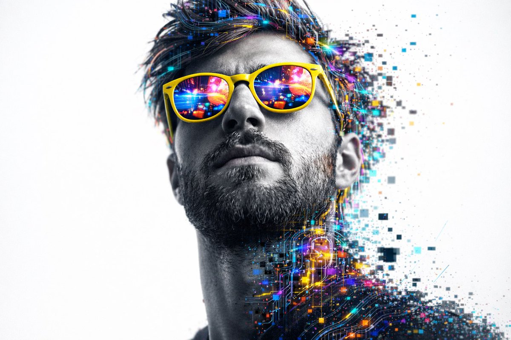

## Create a branded technical infographic of a [SNACK], com

- ID: trending-2031795709243019280
- Slug: trending-2031795709243019280-en
- 语言: en
- 来源: [来源链接](https://x.com/TechieBySA/status/2031795709243019280)
- 样例图路径: images/part1/2031795709243019280_1.jpg

### 提示词

```text
Create a branded technical infographic of a [SNACK], combining a realistic photograph or photoreal render of the product with technical annotation overlays placed directly on top. Use black ink–style line drawings with strategic [BRAND COLOR] accents (architectural sketch look) on a pure white studio background, including:
• Key component labels
• Internal cross-section showing structure, layering, or internal design
• Measurements, dimensions, and specifications
• Material callouts with composition and quantities
• Arrows indicating function for primary features and structural integrity
• Simple schematic or sectional diagram showing key mechanical or design elements
• Sustainability callouts
Title placement: Inside a hand-drawn technical annotation box with accent border reading the product name in bold font, positioned in upper corner.
Style & layout rules:
• The realistic product remains clearly visible
• Annotations feel sketched, technical, and architectural
• Accents used for highlight (20-30% of linework), black for primary technical lines (70-80%)
• Clean composition with balanced negative space
• Educational, food-engineering vibe with premium branding
• Include subtle brand logo mark in corner
Visual style: Minimal technical illustration aesthetic, black linework with accents over realistic imagery, precise but slightly hand-drawn feel.
Color palette: White background, black annotation lines/text, [BRAND COLOR] for accents and key callouts only.
Output: 1080×1080, ultra-crisp, social-feed optimized, no watermark
```

### 样例图

![Create a branded technical infographic of a [SNACK], com](../images/part1/2031795709243019280_1.jpg)

## A cinematic digital artwork of a stylish animated girl w

- ID: trending-2047227731839184901
- Slug: trending-2047227731839184901-en
- 语言: en
- 来源: [来源链接](https://x.com/Noor_ul_ain43/status/2047227731839184901)
- 样例图路径: images/part1/2047227731839184901_1.jpg

### 提示词

```text
A cinematic digital artwork of a stylish animated girl walking out of a modern X (Twitter) profile interface. The background shows a real mobile UI profile screen with the name "Noor 🌸", verified badge, username @Noor_ul_ain43, and detailed bio.
The girl matches the profile picture — soft aesthetic illustration style, short wavy black hair, gold hoop earrings, minimal makeup, wearing a black turtleneck and beige coat with matching pants and sneakers.
She is stepping forward confidently from the screen into real space. The right half of her body dissolves into dynamic particles — a mix of black dust, teal, and orange energy splashes, flowing outward like liquid + digital fragments.
Clean composition: left side = structured UI, right side = abstract particle explosion. Soft cinematic lighting, depth of field, ultra-detailed textures, smooth shadows, 4K render, octane render, Unreal Engine 5 style, trending on ArtStation.
```

### 样例图

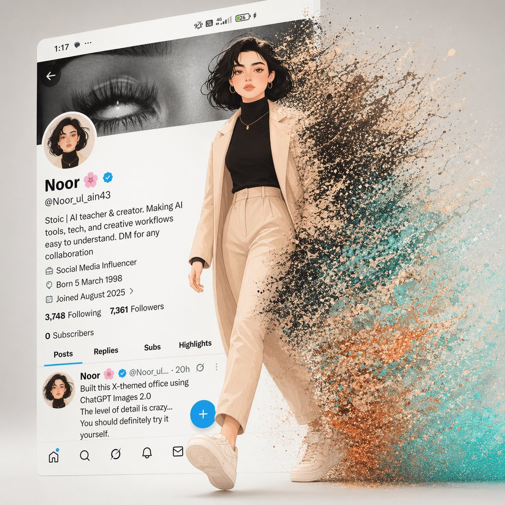

## Create an infographic image of [washing machine], combin

- ID: trending-2018668607966769212
- Slug: trending-2018668607966769212-en
- 语言: en
- 来源: [来源链接](https://x.com/Naiknelofar788/status/2018668607966769212)
- 样例图路径: images/part1/2018668607966769212_1.jpg

### 提示词

```text
Create an infographic image of [washing machine], combining a realistic photograph or photoreal render of the object with technical annotation overlays placed directly on top.

Use black ink–style line drawings and text (technical pen / architectural sketch look) on a pure white studio background, including:
•Key component labels
•Internal cutaway or exploded-view outlines
•Measurements, dimensions, and scale markers
•Material callouts and quantities
•Arrows indicating function, force, or flow (air, sound, power, pressure)
•Simple schematic or sectional diagrams where relevant

Place the title [PRODUCT] inside a hand-drawn technical annotation box in one corner.

Style & layout rules:
•The real object remains clearly visible beneath the annotations
•Annotations feel sketched, technical, and architectural
•Clean composition with balanced negative space
•Educational, museum-exhibit / engineering-manual vibe

Visual style:
Minimal technical illustration aesthetic, black linework over realistic imagery, precise but slightly hand-drawn feel.

Color palette:
White background, black annotation lines and text only. No colors.

Output:
1080×1080, ultra-crisp, social-feed optimized, no watermark.
```

### 样例图

![Create an infographic image of [washing machine], combin](../images/part1/2018668607966769212_1.jpg)

## A creative 3D photo manipulation of a social media profi

- ID: trending-2048088005836173316
- Slug: trending-2048088005836173316-en
- 语言: en
- 来源: [来源链接](https://x.com/Noor_ul_ain43/status/2048088005836173316)
- 样例图路径: images/part1/2048088005836173316_1.jpg

### 提示词

```text
A creative 3D photo manipulation of a social media profile interface, featuring a surprised young woman with short messy yellow hair, round glasses, and expressive wide eyes, wearing a sleeveless yellow top. She is breaking through a torn paper effect from the screen, holding the ripped edges with both hands. The tear reveals a dark background behind her, adding depth. The UI resembles a modern social media profile page with profile picture, username “Noor 🌸”, verified badge, bio text, and follower stats. Top banner shows a black-and-white close-up of eyes. Clean minimal layout, soft shadows, realistic lighting, high detail, depth-of-field, ultra-realistic textures, cinematic composition, vibrant color contrast, trending AI art style, 4K resolution.
```

### 样例图

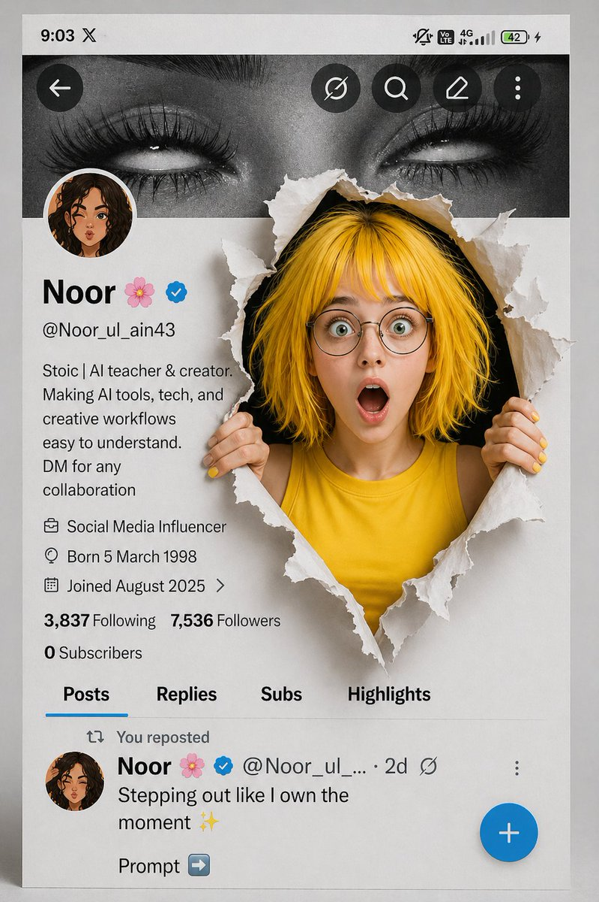

## 高复杂度信息图：结合今天的新闻，CEO 

- ID: trending-2046480096471765192
- Slug: trending-2046480096471765192-zh
- 语言: zh
- 来源: [来源链接](https://x.com/Jackywine/status/2046480096471765192)
- 样例图路径: images/part1/2046480096471765192_1.jpg

### 提示词

```text
高复杂度信息图：结合今天的新闻，CEO 换成了Ternus，信息图要竖版 3:4要有乔布斯、cook、Ternus 三人头像，以及产品，以及超多苹果服务标志，整体风格偏 WWDC 的苹果风格，完整展现苹果庞大商业帝国
```

### 样例图

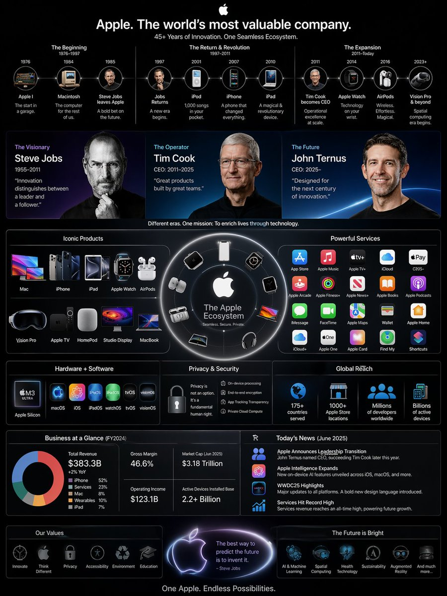

## Create a premium presentation-style campaign board for M

- ID: trending-2047172163313222013
- Slug: trending-2047172163313222013-en
- 语言: en
- 来源: [来源链接](https://x.com/ecomchasedimond/status/2047172163313222013)
- 样例图路径: images/part1/2047172163313222013_1.jpg

### 提示词

```text
Create a premium presentation-style campaign board for MVMT’s Cinco de Mayo campaign on a soft warm neutral background.

At the top, add the title:
“MVMT | CINCO DE MAYO CAMPAIGN”

Below it, show three clearly labeled vertical panels side by side with subtle shadows:
“LANDING PAGE”
“EMAIL”
“AD CREATIVE”

Overall style:
Clean, premium, masculine-leaning, modern DTC design. The image should feel like a polished creative review board, not a collage. All three panels should clearly belong to the same campaign, with shared typography, colors, product styling, and seasonal details.

Use a warm, elevated palette:
cream, sand, stone, black, charcoal, dark olive, terracotta, muted green, and warm golden accents.

Cinco de Mayo direction:
Tasteful and refined, not cheesy. Use subtle festive touches like papel picado-inspired accents, citrus, warm stone textures, celebratory drinks, and sunlit lifestyle styling.

Shared headline direction:
“GOOD TIMES. BOLD STYLE.”
Optional secondary line:
“VIVA LA FIESTA.”

Panel 1 — Landing Page:
Create the widest and most detailed panel as a tall desktop ecommerce landing page.
Include:
- MVMT site header
- hero with bold headline
- premium black watch as hero product
- stylish male lifestyle model
- CTA button
- icon/value prop row
- supporting lifestyle banner
- curated product grid
- realistic footer

Panel 2 — Email:
Create a slimmer tall ecommerce email mockup.
Include:
- promo bar
- MVMT logo and header
- hero section with same campaign art direction
- curated category or product row
- supporting lifestyle block
- featured products section
- compact footer

Panel 3 — Ad Creative:
Create a bold vertical Facebook ad.
Include:
- strong headline
- premium product composition with black watch, sunglasses, and bracelet
- citrus and celebratory props
- CTA button
- compact benefit strip at the bottom with messages like:
“FREE SHIPPING & RETURNS”
“2 YEAR WARRANTY”
“DESIGNED IN CALIFORNIA”

Important:
- landing page should feel broader and more layered
- email should feel modular and structured
- ad should feel bold, simple, and conversion-focused
- labels above each panel should be clearly visible
- text should be mostly legible
- everything should feel premium, realistic, and cohesive

Avoid:
cheesy fiesta graphics, bright rainbow colors, clutter, generic templates, messy collage styling, or cartoonish holiday visuals.

Output:
A highly realistic single-image campaign board showing a landing page, email, and ad creative for MVMT’s Cinco de Mayo campaign, all clearly labeled and designed as one cohesive system.
```

### 样例图

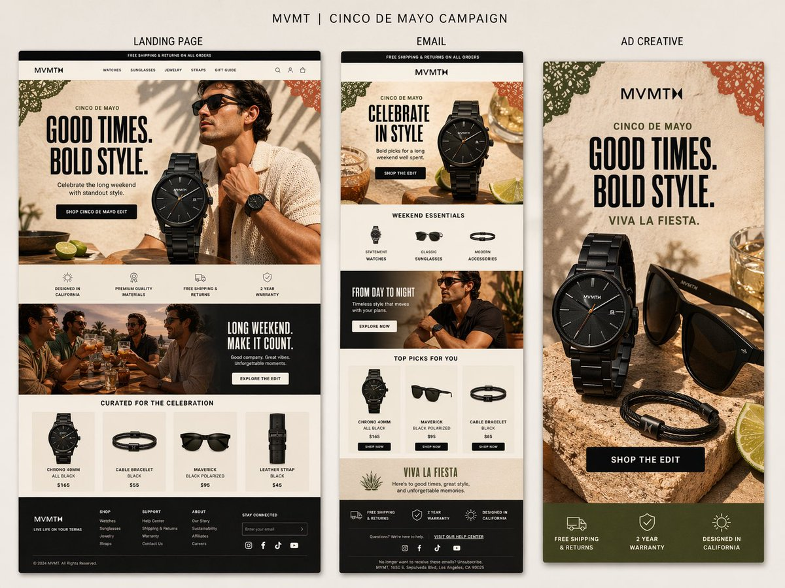

## Translate this theme from concept into form, and present

- ID: trending-2048674104035975506
- Slug: trending-2048674104035975506-en
- 语言: en
- 来源: [来源链接](https://x.com/Just_sharon7/status/2048674104035975506)
- 样例图路径: images/part1/2048674104035975506_1.jpg

### 提示词

```text
Translate this theme from concept into form, and present both the transformation process and the final outcome within a single vertical A4 composition.
Use a two-tier layout (top and bottom sections).
Top Section:
A 5-step visual process diagram that captures the essence of the theme.
Structure the flow as:
Inspiration source → Emotional energy & social interaction → Abstract UI symbols and visual language → Structured composition & character styling → Final integrated design direction
Use the first reference image strictly for Sharon’s identity, facial features, and expression
Use the second reference image for outfit, pose, and styling direction
Visual style:
Delicate sketching, soft line art, UI-inspired diagram elements
Floating icons like “Subscribed”, hearts, notification bells, social symbols
Small arrows, micro annotations, short English labels
Clean spacing with refined, minimal layout
Title: “MOTION TO FORM”
Bottom Section:
A hero visual derived from the process above.
A cute, premium advertising poster featuring Sharon in a glowing, dreamy environment
She appears radiant, confident, and joyful, embodying a “subscribed / viral moment”
Blend both reference images seamlessly (face from image 1, styling from image 2)
Design direction:
Soft pastel gradient background (pink, lavender, baby blue)
Subtle golden-hour glow with light neon accents
Floating 3D UI elements (Subscribed badges, hearts, icons)
Cinematic depth, soft lens flare, light particles, bokeh
Typography:
Main text: “Sharon is now SUBSCRIBED ✨”
Secondary tagline: “Join the vibe. Stay connected.”
Add a fictional brand/platform name (AI-generated)
Overall Direction:
The final visual should feel like a fusion of:
Concept board
Social media campaign poster
Design development sheet
Style:
Minimal, poetic, intelligent
Clean negative space with balanced composition
Neutral base tones with 1–2 soft pastel accent colors
Focus on:
Skin glow and natural beauty enhancement
Fabric texture and styling details
Light, shadow, and material realism
UI elements integrated as part of the aesthetic
Rendering quality:
Ultra high resolution
Commercial advertising quality
Soft, dreamy, cinematic finish
```

### 样例图

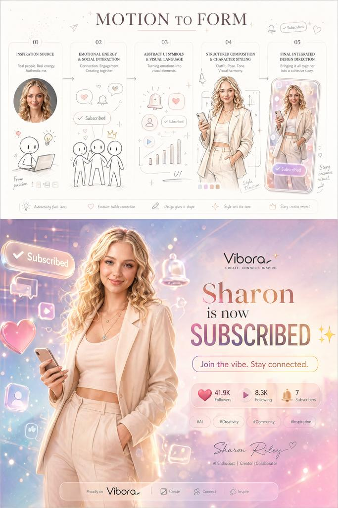

## Create a cohesive collection of playful icons for [BRAND

- ID: trending-2047546614257221653
- Slug: trending-2047546614257221653-en
- 语言: en
- 来源: [来源链接](https://x.com/aleenaamiir/status/2047546614257221653)
- 样例图路径: images/part1/2047546614257221653_1.jpg

### 提示词

```text
Create a cohesive collection of playful icons for [BRAND NAME], a [BRAND TYPE/INDUSTRY] brand. Style should be [STYLE KEYWORDS: e.g., rounded, 3D, flat, hand-drawn, minimal] with a [COLOR STYLE: vibrant, pastel, gradient, monochrome] palette. Use [DESIGN TRAITS: soft shadows, bold outlines, subtle textures, glow, etc.] to give a friendly and modern feel. Maintain consistency across all icons with a unified grid, proportions, and visual language. Icons should represent [LIST OF FEATURES/FUNCTIONS]. Ensure high clarity, balanced spacing, and scalable design suitable for UI, apps, and branding.
```

### 样例图

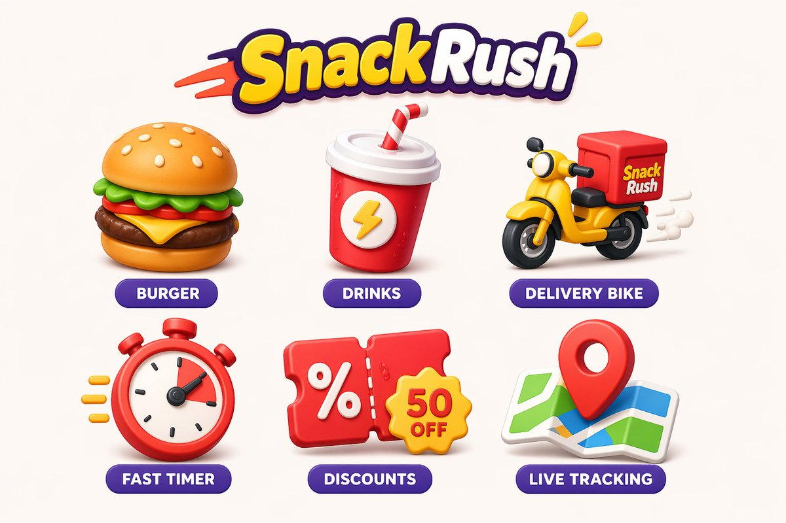

## 帮我生成 特斯拉 主要零部件 细节全图，

- ID: trending-2047204364499276110
- Slug: trending-2047204364499276110-zh
- 语言: zh
- 来源: [来源链接](https://x.com/cnyzgkc/status/2047204364499276110)
- 样例图路径: images/part1/2047204364499276110_1.jpg

### 提示词

```text
帮我生成 特斯拉 主要零部件 细节全图，周围 也加上 各模块细节图
```

### 样例图

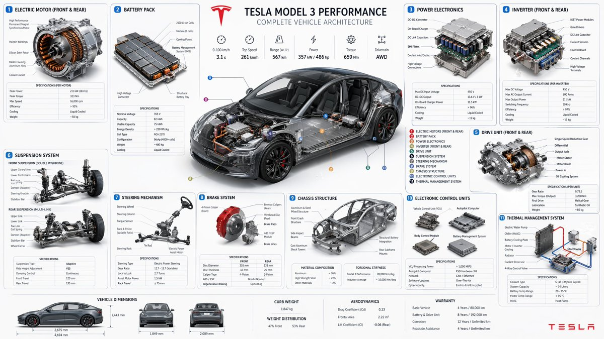

## Make a portrait-sized wallpaper about several activities

- ID: trending-2048746995465203876
- Slug: trending-2048746995465203876-en
- 语言: en
- 来源: [来源链接](https://x.com/Naiknelofar788/status/2048746995465203876)
- 样例图路径: images/part1/2048746995465203876_1.jpg

### 提示词

```text
Make a portrait-sized wallpaper about several activities from the hobby of (Name Hobby), in the wallpaper it contains various movements in the hobby activity, make the wallpaper design as if it was designed by a professional graphic designer, the coloring and UI of the wallpaper are colorful and don't look commonplace, don't be monotonous, and don't look stiff from the visual of the wallpaper, arranged neatly and precisely, 8k resolution
```

### 样例图

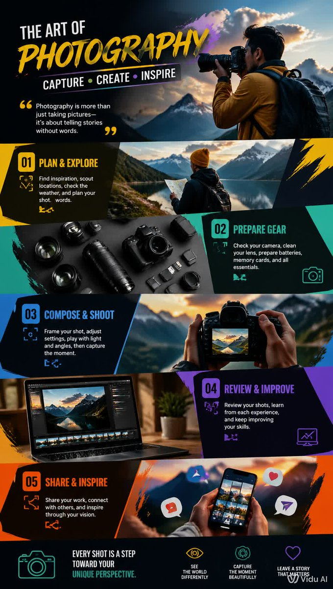

## Ultra-modern high-end skincare advertising collage featu

- ID: trending-2047550158427259188
- Slug: trending-2047550158427259188-en
- 语言: en
- 来源: [来源链接](https://x.com/Mind_Boticni/status/2047550158427259188)
- 样例图路径: images/part1/2047550158427259188_1.jpg

### 提示词

```text
Ultra-modern high-end skincare advertising collage featuring four beautiful young Asian women, each portrait styled in a separate geometric section of a dynamic diagonal layout. Clean editorial beauty photography with soft natural skin texture, glowing healthy complexion, and subtle makeup. Bright vibrant color blocking design using pink, yellow, cyan, and coral tones. Minimal abstract background shapes, smooth gradients, and modern graphic design composition. Studio-quality lighting, fashion magazine aesthetic, premium cosmetic campaign feel. Each woman posed confidently in different angles, smiling softly, fresh and youthful vibe. Balanced symmetry with sharp diagonal divisions and circular portrait frames. Highly polished commercial beauty branding style, cinematic lighting, ultra-detailed, 4k resolution.

IMPORTANT NEGATIVE PROMPT:
No text, no typography, no logos, no brand names, no product bottles, no packaging, no watermark, no labels, no written elements.
```

### 样例图

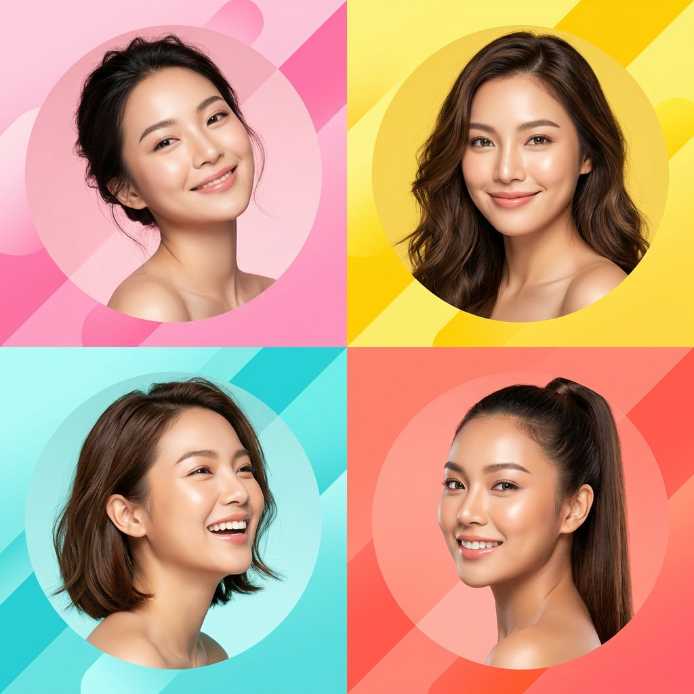

## 请基于用户输入的【核心文字 / 单词 /

- ID: trending-2048816632613453900
- Slug: trending-2048816632613453900-zh
- 语言: zh
- 来源: [来源链接](https://x.com/MrLarus/status/2048816632613453900)
- 样例图路径: images/part1/2048816632613453900_1.jpg

### 提示词

```text
请基于用户输入的【核心文字 / 单词 / 词组 / 短句 / 字母】，创作一张高完成度的「斜向透视平面字体概念海报 / Oblique Planar Perspective Typographic Poster」。

用户输入：[主题文字]；
文字语言：[中文 / 英文 / 中英混排]；
可选补充语境：[____]；
可选情绪倾向：[____]；
可选禁用元素：[____]。 

这不是普通插画，不是简单把文字放大后的字效海报，也不是传统正面平铺式平面排版，而是一张以“文字为主视觉核心”的现代实验性字体海报。整体必须采用「斜向透视平面字体构成 / Oblique Planar Perspective Typography」的方式来设计：文字不应完全贴在正面平面上，而应像被放置在不同倾斜角度的二维平面中，通过斜向基准线、透视压缩、平面偏转、角度切入、错位构成、向量指向、方向线条、半透明几何平面与模块化色块，共同建立一种“仍然是平面设计，但具有明显角度感、空间方向感、视觉张力和向量关系”的字体构成效果。

请先真正理解用户输入内容的字面含义、情绪气质、隐含象征、文化联想、心理感受与语义张力，再把这些理解转译成一个具有“方向性、倾斜关系、平面透视感和视觉对抗 / 连接关系”的字体海报系统。如果主题偏情绪型，请重点通过斜向文字平面的距离关系、重心偏移、留白方向、线条走势、模块密度变化和色块压迫 / 释放来表达；如果主题偏动作型，请重点通过倾斜推进、速度线、方向箭头、透视切片、错位平面和向量轨迹来表达；如果主题偏关系型，请重点通过多个文字主体、几何平面和图形模块之间的角度差、相交、重叠、对峙、包裹、切割和中介结构来表达；如果主题偏抽象概念型，请先找到一个简洁但具有视觉转译潜力的抽象隐喻，再通过斜向透视字体、向量辅助系统、局部遮挡、层级偏移、模块重复和变形网格来构建画面。

整体画面必须呈现为一张现代、锐利、清亮、时尚、有实验性、有传播力、有视觉记忆点的高完成度字体海报。用户输入的文字必须成为第一视觉主体，是整个海报的核心内容。文字可以横排、竖排、拆分、错位、分组、重组、局部裁切、局部遮挡、嵌套、倾斜、透视压缩、斜向旋转，甚至分别放置在不同角度的二维平面中，但必须始终保持较高识别度与清晰可读性。画面中至少要让观众明显感受到：文字不再是正面贴平，而是进入了一个由多个倾斜平面和方向关系组成的平面空间系统中。

请重点强化以下风格特征：文字有斜向角度感、近大远小的平面透视感、不同方向的向量关系、倾斜基准线、辅助箭头、几何切面、模块推进、局部框线、数据感标注、小型目录式辅助说明、少量点阵与路径线。可以让不同的文字或文字组处在不同倾斜平面中，形成彼此之间的视角差、方向冲突、视觉对话或张力关系。图形元素必须围绕文字构建，而不是独立装饰；它们应该支撑文字、切割文字、包裹文字、延伸文字的方向、强化文字的倾斜动势，并与文字共同构成一个完整的视觉句子。

视觉语言上，请采用 modern graphic design、oblique planar perspective typography、experimental typography、bold typographic composition、flat vector aesthetics、high-contrast graphic layout、contemporary editorial poster、crisp vector-like precision 的方向。整体不是写实，不是摄影，不是复古文学封面，不是包豪斯旧海报感，不是厚重肌理风，不是暗沉艺术海报，也不是普通 PPT 封面。它应当是更当代、更清亮、更锋利、更数字化、更具有设计公司提案感与展览海报感的视觉结果。

【新版配色要求】
配色必须鲜亮、透亮、清亮、艳丽、高对比，但不要固定使用蓝色与橙色组合，也不要默认落入常见的蓝橙撞色方案。请根据主题语义、情绪气质和视觉隐喻，自动生成一组更大胆、更有想象力、更有新鲜感的现代高对比配色。允许使用非常规组合、跳跃性色彩、强烈撞色、冷暖冲突、霓虹感、数码感、未来感或艺术化配色，但整体必须仍然有秩序、有审美控制、有设计感，不能杂乱失控。

请优先采用“2 个主色 + 1 到 2 个高亮点缀色 + 留白 / 结构支点色”的配色组织方式。可以探索但不限于以下方向：荧光绿 + 品红 + 冷白、亮黄 + 紫罗兰 + 黑色、酸橙绿 + 深紫 + 青蓝、玫红 + 青绿 + 银白、樱桃红 + 湖蓝 + 纯白、薄荷青 + 亮红 + 深蓝、荧光黄 + 桃红 + 紫色、珊瑚橙 + 青蓝 + 白色、多彩数码拼接配色等。每次生成时，请尽量形成一套独立的色彩记忆点，不要重复单一固定主配色，不要让作品系列都长得像同一张图换字。

文字颜色不要全部使用纯黑，可以根据构图关系，让不同文字主体使用不同高饱和色，或在同一组大字中形成主次色分配。允许少量深色作为结构支点，但整体画面应以鲜亮、清透、醒目、前卫的色彩印象为主。色彩应服务于语义表达，而不是仅仅为了热闹；要让观众觉得颜色是“被设计过的”，而不是随机堆砌的。

构图应大胆、倾斜、具有推进感和方向感，但同时要控制画面秩序。建议采用 1 组核心标题主体、1 组斜向透视文字平面系统、1 组几何向量与色块结构、少量辅助标注信息与点线符号。画面需要保留足够留白，让高饱和色与倾斜文字更有呼吸感和展览海报感。可以加入少量小字说明、标签、编号、英文关键词、极简副标题或短句，用来强化概念，但必须克制，不要抢夺主标题的视觉权重。辅助信息可模拟视觉识别系统或编辑设计中的注释语言，例如短词、参数、索引、方向说明、概念标签等。

字体与排版必须现代、清晰、醒目、有力量，并且具有一定实验性。中文适合使用几何无衬线、现代设计感强的标题字、窄长字形或有切面感的字形；英文适合使用 bold grotesk、condensed sans、geometric sans、editorial sans 等。允许局部拉伸、压缩、斜切、透视变形、切片错位，但不要把文字做成真实 3D 挤出字，不要厚重投影，不要真实立体建模，不要金属字，不要玻璃字，不要浮雕字。重点是“平面中的空间感”，而不是“物理三维立体感”。

图形元素可使用：斜向矩形、倾斜平面框、三角切角、圆点系统、箭头、路径线、细线辅助网格、透视边框、方向向量、点阵模块、数据感短线、色块面片、半透明几何切片、局部环形线、分区标签、小尺寸索引信息等。这些元素都必须服务主题语义和字体构成，不应沦为纯装饰。

请避免以下问题：不要做成普通正面平铺字体海报、不要做成传统极简主义排版封面、不要做成写实摄影或插画、不要做成厚重 3D 字、不要做成复古低饱和或米灰色调海报、不要堆砌无关图形、不要过度装饰、不要让文字不可读、不要让画面脏乱拥挤、不要让图形与主题词脱节、不要反复默认同一套主配色。

如果适合，请自动生成一句极短的副标题或概念短句，用来辅助解释主题，例如 “Between ____ and ____”、“The tension of ____”、“A state of ____”、“Where ____ begins”，或根据中文语境生成一句更简洁的中文短句，但必须保持简短、克制、设计化。

最终输出应是一张：高完成度、现代、鲜亮、高对比、平面、锐利、实验性强、具有斜向透视字体构成感、可读且有设计感、并且在配色上更大胆自由、更有想象力、更不落入固定蓝橙套路的现代字体概念海报。
```

### 样例图

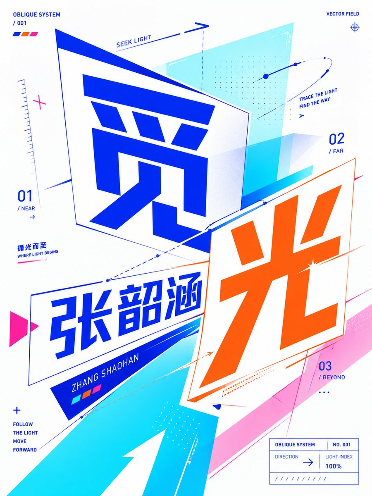

## Create a premium 4:3 presentation cover slide introducin

- ID: trending-2046615173411262959
- Slug: trending-2046615173411262959-en
- 语言: en
- 来源: [来源链接](https://x.com/cellier_/status/2046615173411262959)
- 样例图路径: images/part1/2046615173411262959_1.jpg

### 提示词

```text
Create a premium 4:3 presentation cover slide introducing Chronicle, the AI-native presentation platform from https://t.co/SSfpg45Jtr.  

Style: 
elegant, minimal, modern, premium startup aesthetic. Similar to high-end brand guideline covers (like Apple / Linear / Notion style). Soft gradient background with subtle depth, clean whitespace, refined typography, polished editorial layout.  

Main title: 
CHRONICLE  

Subtitle: 
AI PRESENTATION PLATFORM  

Body copy (small elegant text): 
Turn raw ideas into polished, high-impact presentations. 
Start from notes, docs, links, or existing decks. 
Generate beautiful, on-brand slides with AI. 
Edit freely on a flexible canvas. 
Export to PPT, PDF, or publish as a website.  

Feature highlights (small premium labels): 
STORY-FIRST 
ON-BRAND DESIGN 
AI EDITING 
FREEFORM CANVAS 
PPT EXPORT 
TEAM COLLABORATION  

Bottom-right elegant logo text: 
chronicle  

Visual feeling: 
business-class premium, strategy deck quality, consulting-grade presentation, slightly futuristic but highly professional.  

Composition: 
clean editorial balance, asymmetrical layout, strong whitespace, presentation software hero shot feeling.  

Aspect ratio: 
4:3  

Language: 
English only
```

### 样例图


## Create a 16:9 horizontal bento-grid brand collage for [B

- ID: trending-2047423024068952489
- Slug: trending-2047423024068952489-en
- 语言: en
- 来源: [来源链接](https://x.com/youraipulse/status/2047423024068952489)
- 样例图路径: images/part1/2047423024068952489_1.jpg

### 提示词

```text
Create a 16:9 horizontal bento-grid brand collage for [BRAND NAME] in a polished contemporary campaign style.  
Use a fixed 3-row, 4-column bento structure with rounded tiles, equal gaps, clean alignment, and a light neutral background.
The layout must stay consistent across generations, but the content inside each tile must adapt to the real business model, product ecosystem, and brand language of [brand name].

Grid blueprint
Build the composition as 11 visible content zones arranged in a fixed bento layout:
Top-left tile: 1 column × 2 rows, tall vertical hero device or primary brand surface
Top-middle-left tile: 1 column × 1 row, compact square brand asset tile
Top-middle-right tile: 2 columns × 1 row, wide headline/message tile

Center tile: 2 columns × 2 rows, dominant campaign hero scene

Top-right tile: 1 column × 1 row, secondary device / product surface / branded object

Bottom-left tile: 1 column × 1 row, product artifact or branded utility object

Bottom-center tile: 2 columns × 1 row, large bold typography tile

Bottom-right tile: 1 column × 2 rows, tall informational product / interface / feature tile

All tiles must share the same corner radius, spacing system, and visual polish.
The dominant focal points are the large center hero tile, the wide top headline tile, and the wide bottom typography tile.

Adaptive content logic
Do not assume [brand name] is a fintech brand.
Before deciding what appears inside each tile, infer what [brand name] actually is: social platform, SaaS tool, media brand, retailer, hospitality brand, hardware company, mobility app, AI product, consumer app, etc.

Every tile must contain a plausible branded asset based on that business type.

Use this rule:

If [brand name] has a real consumer app, dashboard, product UI, creator interface, booking flow, editor, storefront, feed, player, workspace, or operating surface, use those.

If [brand name] does not realistically have payment cards, watches, or hardware, do not invent them.

Only include branded physical objects when they make sense for the brand: packaging, merch, signage, magazine, laptop sticker, storefront card, delivery box, product box, wearable, poster, notebook, tote, badge, ticket, book, etc.

If the brand is primarily digital, prioritize screens, interface fragments, campaign graphics, app/store listings, editorial visuals, and branded communication assets.

If the brand is a platform, use realistic platform surfaces: profile screens, creator dashboards, boards, playlists, templates, analytics, publishing tools, discovery feeds, search, collaboration views, etc.

If the brand is a physical-product company, use realistic product shots, packaging, product detail pages, retail signage, and lifestyle scenes.

If the brand is a service business, use realistic booking, scheduling, marketplace, onboarding, testimonial, results, or service-delivery interfaces.

If exact assets are unknown, infer the most believable official-looking product and campaign system for [brand name].

Tile-by-tile rules
1) Tall left hero tile
Show the most iconic primary branded surface for [brand name].

Examples:

phone with app UI
laptop with dashboard/editor
tablet with creative workspace
product packaging held in hand
branded poster or printed object
storefront or physical product close-up

This tile should represent the brand’s main touchpoint, not a generic device.

2) Small square brand asset tile
Show a compact brand-signature element:

app icon
logo mark
symbol
product badge
branded motif
miniature packaging unit
icon system object
sticker or seal
simplified 3D brand emblem

This tile should feel like a distilled identity marker.

3) Wide top headline tile
Use a short strategic message that fits [brand name]’s category and tone.
Do not repeat generic fintech copy.
The line should feel like a real campaign headline for that specific brand.

Examples of direction:

discovery
creativity
organization
inspiration
connection
travel
productivity
expression
streaming
collaboration
automation

Use large, bold, high-contrast typography.

4) Large center hero tile
Create the main campaign scene for [brand name] in a real-world or branded-environment context.
This should be the most expressive tile.

Possible formats:
outdoor billboard
subway poster
retail installation
city poster wall
laptop-on-desk hero scene
creator workspace
product-in-use lifestyle shot
editorial campaign image
interface projected into environment
branded event signage
The scene must make sense for the brand’s world and audience.

5) Top-right support tile
Show a secondary but still realistic brand surface:

another device view
product detail
branded object
campaign variation
interface zoom-in
packaging angle
social post mockup
desktop widget
creator tool panel
notification / discovery / search view

This tile should complement the main touchpoint, not duplicate it exactly.

6) Bottom-left artifact tile
Show a category-appropriate branded artifact, not a fixed “bank card”.

Choose the artifact based on [brand name]:

for fintech: payment card, wallet pass, transfer screen, exchange card

for social/media: creator card, profile card, post template, content preview, board tile, channel card

for SaaS/productivity: workspace card, document preview, template card, dashboard widget

for e-commerce/retail: packaging, shipping box, loyalty pass, product tag, order card

for travel/hospitality: booking card, room key, boarding-style pass, itinerary card

for music/media: album card, playlist card, player card, event ticket

for AI/software: prompt card, generation result card, model card, workflow card

This tile must feel like a believable branded unit of value for that company.

7) Wide bottom message tile
Use one strong oversized statement in uppercase or bold display typography.
This is not necessarily the slogan from the top tile; it can be a broader campaign line or category promise.

The message must match the actual brand behavior of [brand name].
For example, do not use “MOVE MONEY WITHOUT BORDERS” unless the brand actually deals with payments or finance.

8) Tall right informational tile
Show a structured branded information surface:
app store page
product page
onboarding screen
feature overview
marketplace listing
creator profile
brand campaign landing screen
dashboard overview
editorial page
discovery feed
help center / setup / feature panel
This tile should add product depth and make the collage feel like a full brand system.

Brand realism rules
Use the real or highly plausible brand identity of [brand name]: logo, color palette, typography feel, icon language, image treatment, interface style, and tone of voice.
If exact assets are unavailable, invent only what is necessary, but make it feel like the official visual system of [brand name].

Do not force a product category onto the brand.
Do not invent impossible hardware, payment tools, packaging, or app features unless they are realistic adjacent extensions of the brand.
Prefer believable brand adaptation over visual symmetry.

Visual consistency rules
Even though tile content is adaptive, the final image must still feel like one campaign system:

same overall grid structure
same tile spacing
same corner radius
same art direction quality
same brand palette across all tiles
consistent typography logic
consistent mockup realism
consistent lighting and polish

Style
Clean premium brand presentation, high detail, polished mockup realism, soft shadows, strong hierarchy, editorial-quality composition, modern campaign aesthetics.
Avoid random collage chaos.
Avoid tiny unreadable text.
Avoid generic placeholder UI.
Keep the structure fixed, but let the objects and branded surfaces adapt intelligently to [brand name].

Stronger one-line instruction

Important: the layout is fixed, but the objects are not fixed.
For each generation, select tile content based on what [brand name] realistically sells, ships, publishes, displays, or lets users interact with.
Never insert category-inappropriate objects just to fill the grid.
```

### 样例图

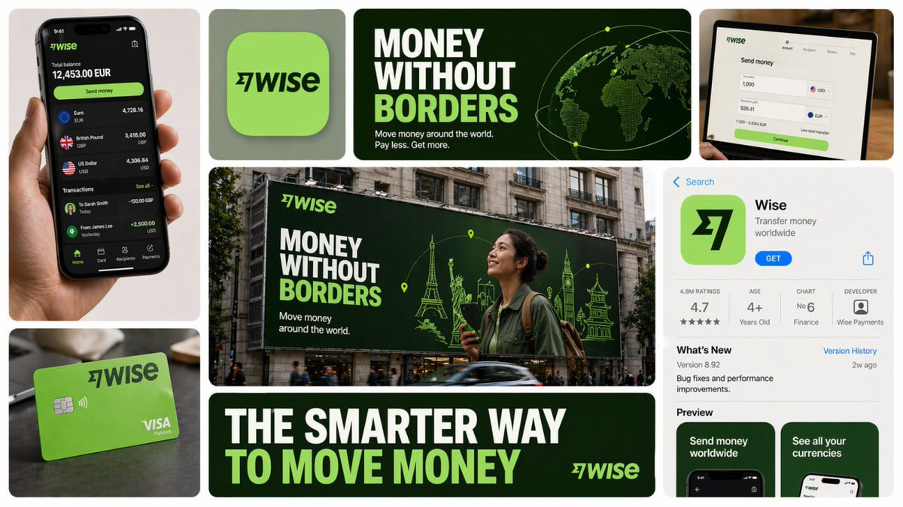

## Create ONE final image. A clean 3×3 [ratio] storyboard g

- ID: trending-2013268963266904438
- Slug: trending-2013268963266904438-en
- 语言: en
- 来源: [来源链接](https://x.com/Dari_Designs/status/2013268963266904438)
- 样例图路径: images/part1/2013268963266904438_1.jpg

### 提示词

```text
Create ONE final image. 

A clean 3×3 [ratio] storyboard grid with nine equal [ratio] sized panels on [4:5] ratio. 

Use the reference image as the base product reference. Keep the same product, packaging design, branding, materials, colors, proportions and overall identity across all nine panels exactly as the reference. The product must remain clearly recognizable in every frame. The label, logo and proportions must stay exactly the same.

This storyboard is a high-end designer mockup presentation for a branding portfolio. The focus is on form, composition, materiality and visual rhythm rather than realism or lifestyle narrative. The overall look should feel curated, editorial and design-driven.

FRAME 1:
Front-facing hero shot of the product in a clean studio setup. Neutral background, balanced composition, calm and confident presentation of the product.

FRAME 2:
Close-up shot with the focus centered on the middle of the product. Focusing on surface texture, materials and print details.

FRAME 3:
Shows the reference product placed in an environment that naturally fits the brand and product category. Studio setting inspired by the product design elements and colours. 

FRAME 4:
Product shown in use or interaction on a neutral studio background. Hands and interaction elements are minimal and restrained, the look matches the style of the package. 

FRAME 5:
Isometric composition showing multiple products arranged in a precise geometric order from the top isometric angle. All products are placed at the same isometric top angle, evenly spaced, clean, structured and graphic.

FRAME 6:
Product levitating slightly tilted on a neutral background that matches the reference image color palette. Floating position is angled and intentional, the product is floating naturally in space.

FRAME 7:
is an extreme close-up focusing on a specific detail of the label, edge, texture or material behavior.

FRAME 8:
The product in an unexpected yet aesthetically strong setting that feels bold, editorial and visually striking.
Unexpected but highly stylized setting. Studio-based, and designer-driven. Bold composition that elevates the brand.

FRAME 9:
Wide composition showing the product in use, placed within a refined designer setup. Clean props, controlled styling, cohesive with the rest of the series.

CAMERA & STYLE:
Ultra high-quality studio imagery with a real camera look. Different camera angles and framings across frames. Controlled depth of field, precise lighting, accurate materials and reflections. Lighting logic, color palette, mood and visual language must remain consistent across all nine panels as one cohesive series.

OUTPUT:
A clean 3×3 grid with no borders, no text, no captions and no watermarks.
```

### 样例图

![Create ONE final image. A clean 3×3 [ratio] storyboard g](../images/part1/2013268963266904438_1.jpg)

## [BRAND NAME] | [COLOR] Act as a 3D Type Designer and CGI

- ID: trending-2043381172646920237
- Slug: trending-2043381172646920237-en
- 语言: en
- 来源: [来源链接](https://x.com/AmirMushich/status/2043381172646920237)
- 样例图路径: images/part1/2043381172646920237_1.jpg

### 提示词

```text
[BRAND NAME] | [COLOR]

Act as a 3D Type Designer and CGI Artist working at the intersection of streetwear culture, Y2K aesthetics, and high-end digital sculpture. Your references: Nigo, Futura, Guccimaze, Soulwax art direction.

---

PHASE 1: TYPOGRAPHIC CONCEPT

Render the word or logotype [BRAND NAME] as a fully 3D sculptural object — not a flat text with extrusion, but a living, inflated, organic type sculpture. Style: Wildstyle graffiti DNA fused with inflatable balloon morphology. Letters are not separate — they flow into each other as one continuous organic mass. Each letterform has: bulbous pneumatic body as if inflated under high pressure from within, stretching the surface taut. Aggressive spike extensions — sharp tapered protrusions erupting between and around letters, directional, asymmetric, energetic, some long and blade-like, others short and thorn-like. Wildstyle overlaps — letters partially occlude each other creating depth layers, classic graffiti ambiguity where readability fights with visual complexity. Organic connective tissue — negative spaces between letters filled with stretched membrane forms, like rubber pulled between two inflated surfaces.

---

PHASE 2: MATERIAL & SURFACE

Single unified material across the entire sculpture — no color variation between letters. Material type: high-gloss latex / inflated rubber / soft silicone — the surface behaves like a balloon skin stretched to near-bursting point. Subsurface scattering: active — light penetrates slightly into the material, creating a translucent inner glow at thin edges and spike tips. Thinner areas read lighter, denser volumes read darker. Specular highlights: large, soft, slightly elongated — the kind you get on inflated latex, not hard plastic. Multiple secondary highlights in concave zones. Apply [COLOR] as the sole material color of the entire sculpture — this is non-negotiable. [COLOR] defines the pure midtone of the material. Highlights push toward the most luminous near-white version of [COLOR]. Shadow zones and deep crevices push toward the darkest most saturated version of [COLOR]. The entire chromatic range of the sculpture lives within the [COLOR] family — no hue deviation, no neutral grays.

---

PHASE 3: COMPOSITION & STAGING

Background: pure white (#FFFFFF) — clinical studio isolation. Zero texture, zero gradient. Shadow: none, or absolute minimum contact shadow directly beneath the sculpture — the object appears to float slightly. Orientation: horizontal spread — the sculpture is wider than tall, expanding laterally. Spike elements breach the invisible bounding box on all sides — top spikes reach upward, side extensions push outward. Camera angle: straight-on frontal, slightly elevated 5 to 10° above center — reveals the full typographic mass while showing the 3D depth of overlapping elements. Depth of field: none — sharp from foreground spikes to background letter bodies, every detail in focus. Scale feel: monumental — as if the sculpture is 2 meters wide in physical space, photographed in a white infinity studio.

---

PHASE 4: TECH SPECS

Render engine: Octane Render or Redshift — physically accurate subsurface scattering mandatory. Global illumination: large soft HDRI dome light, neutral white temperature 5500K. No directional shadows. No rim lights. No background elements. Ray tracing: on — for accurate specular and inter-reflection between letter surfaces. Anti-aliasing: maximum — edges must be razor-clean against white background. Output feel: this is a CGI product render, not AI art. Precision over expressionism. Aspect ratio: 1:1 square — centered composition with breathing room on all four sides.
```

### 样例图

![[BRAND NAME] | [COLOR] Act as a 3D Type Designer and CGI](../images/part1/2043381172646920237_1.jpg)

## Create a collection of icons representing [a theme], the

- ID: trending-2009660363227152653
- Slug: trending-2009660363227152653-en
- 语言: en
- 来源: [来源链接](https://x.com/NanoBanana/status/2009660363227152653)
- 样例图路径: images/part1/2009660363227152653_1.jpg

### 提示词

```text
Create a collection of icons representing [a theme], they belong together as a single theme. Put them in a 3x3 grid. The background is white. Make the icons in a colorful and tactile 3D style. No text.

- dogs with different emotions
- bananas
- January
- the same cat in different emotions
```

### 样例图

![Create a collection of icons representing [a theme], the](../images/part1/2009660363227152653_1.jpg)

## Create an infographic image of [OBJECT], combining a rea

- ID: trending-2013316513701216688
- Slug: trending-2013316513701216688-en
- 语言: en
- 来源: [来源链接](https://x.com/TechieBySA/status/2013316513701216688)
- 样例图路径: images/part1/2013316513701216688_1.jpg

### 提示词

```text
Create an infographic image of [OBJECT], combining a realistic photograph or photoreal render of the object with technical annotation overlays placed directly on top.

Use black ink–style line drawings and text (technical pen / architectural sketch look) on a pure white studio background, including:
•Key component labels
•Internal cutaway or exploded-view outlines
•Measurements, dimensions, and scale markers
•Material callouts and quantities
•Arrows indicating function, force, or flow (air, sound, power, pressure)
•Simple schematic or sectional diagrams where relevant

Place the title [OBJECT] inside a hand-drawn technical annotation box in one corner.

Style & layout rules:
•The real object remains clearly visible beneath the annotations
•Annotations feel sketched, technical, and architectural
•Clean composition with balanced negative space
•Educational, museum-exhibit / engineering-manual vibe

Visual style:
Minimal technical illustration aesthetic, black linework over realistic imagery, precise but slightly hand-drawn feel.

Color palette:
White background, black annotation lines and text only. No colors.

Output:
1080×1080, ultra-crisp, social-feed optimized, no watermark.
```

### 样例图

![Create an infographic image of [OBJECT], combining a rea](../images/part1/2013316513701216688_1.jpg)

## [BRAND NAME]. Act as a vector illustrator designing a tr

- ID: trending-2009717451710509473
- Slug: trending-2009717451710509473-en
- 语言: en
- 来源: [来源链接](https://x.com/AmirMushich/status/2009717451710509473)
- 样例图路径: images/part1/2009717451710509473_1.jpg

### 提示词

```text
[BRAND NAME]. Act as a vector illustrator designing a trendy, high-end "Sticker Sheet" set.
THE TASK:
Deconstruct the brand identity of [BRAND NAME] into a playful, cohesive set of approximately 8-10 unique sticker designs arranged on a single sheet.
Content Generation: Do not just make logos. Autonomously invent a mix of:
Mascots/Characters: Stylized busts of people wearing brand-relevant accessories or expressing emotions.
Key Products: Iconic items associated with the brand.
Symbols/Objects: Abstract shapes or tools relevant to the brand's lifestyle.

VISUAL STYLE (MONOLINE VECTOR):
The art style must strictly match "Modern Trendy Line Art."
Line Work: Use a THICK, UNIFORM line weight (monoline) for all internal details. The lines should be smooth, rounded, and confident.
Coloring: The stickers must be filled with Solid Off-White or Cream, utilizing the line color for details. NO gradients, NO shading, NO 3D effects. Flat 2D vector look.
The "Sticker" Effect: Every element must have a thick, distinct White (or Cream) Die-Cut Border surrounding it, separating it from the background.
COLOR PALETTE (HIGH CONTRAST):
Background: A solid, deep, saturated color to create maximum contrast.
Stickers: High-brightness Cream or White fill with Dark (Black or Dark Brown) outlines.
COMPOSITION:
The stickers are scattered naturally across the sheet (knolling layout) with even spacing. No overlapping.
```

### 样例图

![[BRAND NAME]. Act as a vector illustrator designing a tr](../images/part1/2009717451710509473_1.jpg)

## [BRAND NAME]. Act as a 3D Product Visualization Artist. 

- ID: trending-2034709218549199327
- Slug: trending-2034709218549199327-en
- 语言: en
- 来源: [来源链接](https://x.com/AmirMushich/status/2034709218549199327)
- 样例图路径: images/part1/2034709218549199327_1.jpg

### 提示词

```text
[BRAND NAME]. Act as a 3D Product Visualization Artist.

PHASE 1: LOGO TO 3D OBJECT

Take the [BRAND NAME] logo and transform it into a thick 3D sculptural form. Simplify to core shape, add rounded edges (8-12mm fillet), make it one solid piece with 40-60mm depth. Keep it recognizable.

PHASE 2: PINK METALLIC MATERIAL

- Color: Pink metallic (#C85A8E to #8B4A6F range)

- Finish: Glossy brushed metal with fine grain

- Highlights: Light pink (#E89BB8)

- Shadows: Deep plum (#6B3854)

- Roughness: 0.2 (shiny but not mirror)

- NO copper, NO gold, NO silver

PHASE 3: LIGHTING

Soft studio lighting from top-left creating smooth gradient across the object. Light pink on highlights, deep plum in shadows. No hard shadows.

PHASE 4: BACKGROUND & FLOATING

- Pure white background (#FFFFFF)

- Object levitating in white void

- Soft blurred shadow underneath (90% transparent)

- NO pedestals, NO stands, NO supports

PHASE 5: CAMERA

Slight 3/4 angle, looking down 10°, object centered, filling 60% of frame.

TECH SPECS:

- High-quality 3D render (Octane/Cycles)

- 4K resolution

- Full object in focus

- Subtle bloom on highlights

CRITICAL:

- Must be PINK metallic only

- Must float in pure white space

- Must have thick 3D volume with smooth surfaces

- Must look like luxury product photography
```

### 样例图

![[BRAND NAME]. Act as a 3D Product Visualization Artist. ](../images/part1/2034709218549199327_1.jpg)

## Create a typographic art portrait using the uploaded pho

- ID: trending-2022996169698545867
- Slug: trending-2022996169698545867-en
- 语言: en
- 来源: [来源链接](https://x.com/TechieBySA/status/2022996169698545867)
- 样例图路径: images/part1/2022996169698545867_1.jpg

### 提示词

```text
Create a typographic art portrait using the uploaded photo of a person as reference. Display a left-facing side profile portrait. The entire image--including the face. hair. and facial features--must be formed exclusively from repeated white calligraphic text using the words: "[PUT WHATEVER WORDS YOU WANT HERE]" The text should follow the natural contours of the face and hair, clearly shaping the person's profile silhouette. Use a deep navy blue background with high contrast The stvle should be clean vector art with sharp edges. Output in high-resolution 8K quality. Do not alter the person's facial identity. No additional colors. no textures. and no watermark. Dimension 4:5
```

### 样例图

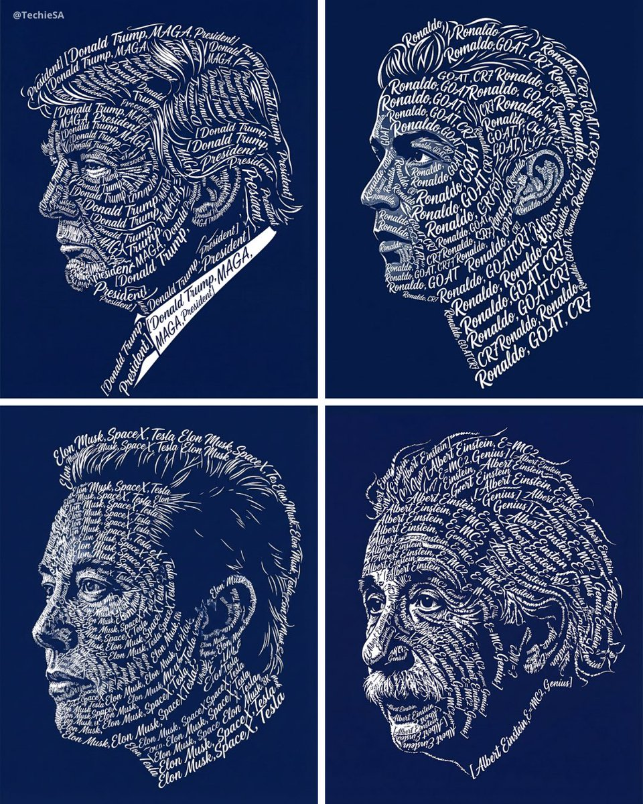

## Create a branded technical infographic of a [SNACK], com

- ID: trending-2017669983916982605
- Slug: trending-2017669983916982605-en
- 语言: en
- 来源: [来源链接](https://x.com/TechieBySA/status/2017669983916982605)
- 样例图路径: images/part1/2017669983916982605_1.jpg

### 提示词

```text
Create a branded technical infographic of a [SNACK], combining a realistic photograph or photoreal render of the product with technical annotation overlays placed directly on top. Use black ink–style line drawings with strategic [BRAND COLOR] accents (architectural sketch look) on a pure white studio background, including:
• Key component labels
• Internal cross-section showing structure, layering, or internal design
• Measurements, dimensions, and specifications
• Material callouts with composition and quantities
• Arrows indicating function for primary features and structural integrity
• Simple schematic or sectional diagram showing key mechanical or design elements
• Sustainability callouts
Title placement: Inside a hand-drawn technical annotation box with accent border reading the product name in bold font, positioned in upper corner.
Style & layout rules:
• The realistic product remains clearly visible
• Annotations feel sketched, technical, and architectural
• Accents used for highlight (20-30% of linework), black for primary technical lines (70-80%)
• Clean composition with balanced negative space
• Educational, food-engineering vibe with premium branding
• Include subtle brand logo mark in corner
Visual style: Minimal technical illustration aesthetic, black linework with accents over realistic imagery, precise but slightly hand-drawn feel.
Color palette: White background, black annotation lines/text, [BRAND COLOR] for accents and key callouts only.
Output: 1080×1080, ultra-crisp, social-feed optimized, no watermark
```

### 样例图

![Create a branded technical infographic of a [SNACK], com](../images/part1/2017669983916982605_1.jpg)

## You are an experienced UI designer embracing modern, min

- ID: trending-2027064868847689902
- Slug: trending-2027064868847689902-en
- 语言: en
- 来源: [来源链接](https://x.com/d4m1n/status/2027064868847689902)
- 样例图路径: images/part1/2027064868847689902_1.jpg

### 提示词

```text
You are an experienced UI designer embracing modern, minimalistic design, shadows, glass, and soft colors.

Your role is to create a professional, beautiful mockup that is ready for delivery based on these requirements: 

<requirements>
## 1. Overall Style & Visual Language
This interface represents a premium, modern fintech / crypto trading dashboard using a dark theme.  
The visual language combines **soft neumorphism**, and **luxury Web3 aesthetics**.

Core characteristics:
- Warm gold/orange accent highlights
- Monochromatic color palette with minimalistic effects and shadows
- Card-based layout with depth and subtle backgrounds
- Minimal borders, separation via shadows or light backgrounds

Target perception:
- Secure
- Professional
- High-end / institutional-grade
- Optimized for experienced traders

---

## 2. Layout Structure

### Global Layout
- Desktop-first dashboard
- Output proportions: 3:2
- Three main regions:
  1. Top navigation bar (horizontal)
  2. Left sidebar navigation (vertical)
  3. Main content area (multi-column grid of cards)

Spacing is generous, prioritizing clarity and visual breathing room.

---

## 3. Top Navigation Bar
- Height: 72px
- Left:
  - Brand logo text "Mevolut"
  - Stylized "M"
  - Gold/orange accent
- Center:
  - Navigation links: Dashboard, Security, Referral, Trading Fees, API management
- Right:
  - Order link
  - Primary CTA: “Deposit” (gold pill button)
  - User avatar (circular)
  - Theme toggle (moon icon)

Typography:
- Clean sans-serif
- Medium weight
- White primary text, muted gray inactive states

---

## 4. Left Sidebar Navigation
- Width: 240px
- Background: near-black
- Vertical navigation items with icons:
  - Dashboard (active)
  - Security
  - Referral
  - Trading Fees
  - API management
- Bottom-aligned:
  - Settings

Active item:
- Subtle background highlight
- Slight background tint
- Rounded container

Icons:
- Outline style
- Gold accent on active state

---

## 5. Main Content Area

### 5.1 User Overview Card
- Large rounded card at top
- Left:
  - Circular avatar
  - Greeting text (“Hello…”)
  - User name
- Inline info blocks:
  - UID (copy icon)
  - Identity verification status
  - Security level
  - Time zone
  - Last login timestamp
- Right:
  - “Hide info” toggle

Style:
- Subtle inner shadows

---

### 5.2 Deposit / Buy Card
- Medium-sized card
- Title text explaining deposit options
- Two action rows:
  - Deposit (dollars or crypto)
  - Buy stocks (local currency)
- Each row:
  - Icon
  - Label
  - Arrow action button (gold accent)

---

### 5.3 Total Asset Card
- Displays USD balance and USD equivalent
- Large, faded Dollar symbol watermark in background
- Action tabs:
  - Buy stocks
  - Deposit
  - Withdraw
- Numeric values are large

---

### 5.4 VIP Level Card
- Shows current VIP level
- Spot and futures fee rates
- Progress bar for token holdings
- “View more” link

Progress bar:
- Rounded
- Dark background track

---

### 5.5 Current Holdings Table
- Card containing a table layout
- Columns:
  - Coin (icon + name)
  - Price
  - 24h Change
  - 4h Trend (sparkline)
  - Actions (Deposit, Withdraw, Trade)

Sparklines:
- Green for positive trend
- Red for negative trend

Hover:
- Subtle background highlight per row

---

### 5.6 Affiliate Program Card
- Promotional card
- Gold coin illustration
- Short description and CTA button (“Apply now”)

---

### 5.7 Information / News Card
- Vertical list of announcements
- Headline + timestamp
- “View more” link at top

---

## 6. Color Palette
- Primary background: deep charcoal / black
- Card surfaces: slightly lighter
- Accent color: warm gold
- Text hierarchy:
  - White (primary)
  - Muted gray (secondary)
  - Dark gray (disabled)
- Status colors:
  - Green for positive
  - Red for negative

---

## 7. Effects & Interaction
- Rounded corners throughout (sm)

# Design tokens:
{
  // Global theme definition
  "theme": {
    "mode": "dark",
    "style": [
      "soft-neumorphism",
      "premium-fintech"
    ]
  },

  // Layout measurements and structure
  "layout": {
    "type": "desktop-dashboard",
    "grid": "three-column",
    "sidebarWidth": 240,
    "topbarHeight": 68,
    "contentPadding": 24
  },

  // Color system
  "colors": {
    "background": "#0B0D10",        // Main app background
    "primaryAccent": "#F5A623",     // Gold/orange highlight
    "secondaryAccent": "#FFB547",
    "textPrimary": "#FFFFFF",
    "textSecondary": "#B0B3B8",
    "textMuted": "#6B6F76",
    "success": "#22C55E",
    "danger": "#EF4444"
  },

  // Typography scale
  "typography": {
    "fontFamily": "SF Pro, system-ui, sans-serif",
    "weights": {
      "heading": 600,
      "body": 400,
      "numeric": 500
    },
    "sizes": {
      "h1": 24,
      "h2": 20,
      "h3": 16,
      "body": 14,
      "caption": 12
    }
  },

  // Core UI components
  "components": {
    "card": {
      "borderRadius": 16,
      "shadow": "0 20px 40px rgba(0,0,0,0.4)",
      "border": "none",
      "background": "#14171C",
    },

    "button": {
      "primary": {
        "textColor": "#0B0D10",
        "borderRadius": 999,
      },
      "secondary": {
        "background": "transparent",
        "textColor": "#F5A623"
      }
    },

    "sidebar": {
      "background": "#0E1014",
      "itemRadius": 12,
      "iconStyle": "outline"
    },

    "table": {
      "rowHeight": 56,
      "divider": "subtle",
      "hoverHighlight": true,
      "sparkline": {
        "positiveColor": "#22C55E",
        "negativeColor": "#EF4444"
      }
    },

    "progressBar": {
      "height": 6,
      "radius": 999,
      "fillColor": "#22C55E",
      "backgroundColor": "#2A2E35"
    }
  },

  // Icon system
  "icons": {
    "style": "outline",
    "size": 18,
    "colorInactive": "#6B6F76",
    "colorActive": "#F5A623"
  }
}
</requirements>
```

### 样例图

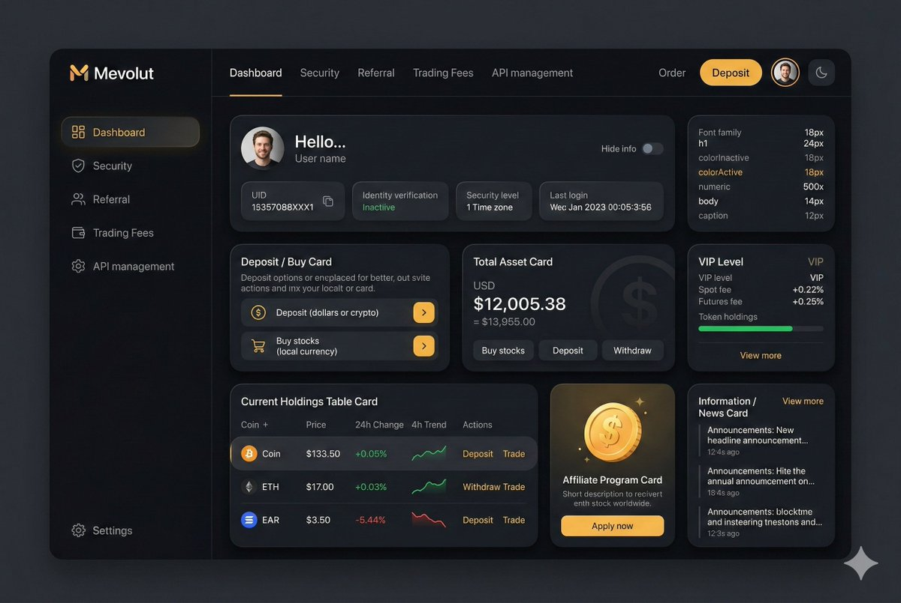

## Create a collection of icons representing [a theme], the

- ID: trending-2011857121835458929
- Slug: trending-2011857121835458929-en
- 语言: en
- 来源: [来源链接](https://x.com/NanoBanana/status/2011857121835458929)
- 样例图路径: images/part1/2011857121835458929_1.jpg

### 提示词

```text
Create a collection of icons representing [a theme], they belong together as a single theme. Put them in a 2x2 grid (no lines). The background is pure white. Make the icons as risograph prints. No text. No color distortion. Vibrant and not faded. Stochastic stippling and sand-like noise pattern within color fills. Each icon has a thick black outline.
```

### 样例图

![Create a collection of icons representing [a theme], the](../images/part1/2011857121835458929_1.jpg)

## { "objective": "Create a split architectural visualizati

- ID: trending-2040757362382798888
- Slug: trending-2040757362382798888-en
- 语言: en
- 来源: [来源链接](https://x.com/craftian_keskin/status/2040757362382798888)
- 样例图路径: images/part1/2040757362382798888_1.jpg

### 提示词

```text
{
  "objective": "Create a split architectural visualization where the top is a detailed dark-themed blueprint and the bottom is a photorealistic house that matches the blueprint EXACTLY",

  "aspect_ratio": "3:4",

  "composition": {
    "layout": "vertical split",
    "top_section": "blueprint",
    "bottom_section": "realistic render",
    "alignment": "perfect structural correspondence between both sections"
  },

  "top_section": {
    "type": "architectural blueprint",
    "style": "dark luxury blueprint (similar to reference image 2)",

    "visual_style": {
      "background": "deep navy / charcoal blue",
      "lines": "thin glowing beige/gold lines",
      "walls": "slightly extruded 3D effect",
      "labels": "clean modern sans-serif",
      "lighting": "soft ambient glow"
    },

    "content": {
      "rooms": [
        "3 bedrooms (left, right, bottom-right)",
        "central living room",
        "kitchen + dining (top center)",
        "2 bathrooms",
        "garage (left side connected)",
        "front porch",
        "backyard pool with deck"
      ],
      "details": [
        "furniture outlines (beds, sofa, dining table)",
        "door swings and openings",
        "window placements",
        "circulation paths",
        "exact proportions and spacing"
      ]
    }
  },

  "bottom_section": {
    "type": "photorealistic house render",

    "constraint": "MUST MATCH THE BLUEPRINT EXACTLY — no added, removed, or shifted rooms",

    "architecture": {
      "style": "modern single-story house",
      "roof": "flat layered roof",
      "materials": [
        "smooth concrete walls",
        "wood panel accents",
        "large glass windows"
      ]
    },

    "layout_mapping_rules": [
      "garage must be on the left side exactly as blueprint",
      "main entrance aligned with living room",
      "pool positioned in backyard matching blueprint dimensions",
      "window placements correspond to each room location",
      "bedroom volumes visible externally in correct positions"
    ],

    "environment": {
      "setting": "suburban neighborhood",
      "elements": [
        "green lawn",
        "minimal landscaping",
        "clean driveway leading to garage",
        "pool deck matching blueprint footprint"
      ]
    },

    "lighting": {
      "time": "golden hour",
      "style": "soft natural light with realistic shadows"
    },

    "camera": {
      "angle": "slightly elevated front perspective",
      "lens": "35mm architectural view"
    }
  },

  "consistency_rules": [
    "room positions must be identical between blueprint and render",
    "no extra structures added in render",
    "all doors and windows must align logically",
    "pool size and placement must match exactly",
    "garage placement must match blueprint"
  ],

  "style": {
    "top": "architectural visualization (dark premium)",
    "bottom": "photorealistic modern house",
    "overall": "clean, high-end architectural presentation"
  },

  "negative_constraints": [
    "no mismatch between blueprint and render",
    "no extra rooms",
    "no fantasy elements",
    "no unrealistic proportions",
    "no cluttered environment"
  ]
}
```

### 样例图

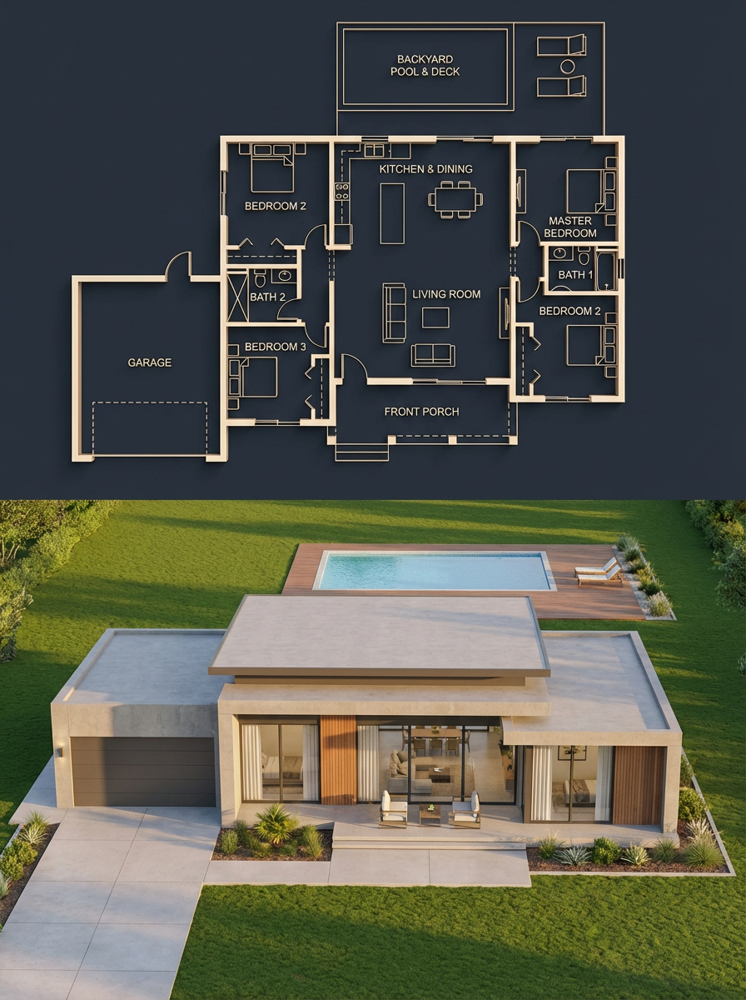

## A minimalist, black-and-white flat vector illustration p

- ID: trending-2035793669911896120
- Slug: trending-2035793669911896120-en
- 语言: en
- 来源: [来源链接](https://x.com/AmirMushich/status/2035793669911896120)
- 样例图路径: images/part1/2035793669911896120_1.jpg

### 提示词

```text
A minimalist, black-and-white flat vector illustration portrait of [NAME], rendered in the expressive "Notion avatar" art style.
LINE WORK & VIBE:
Style: Use THICK, UNIFORM black outlines (monoline weight). The lines should feel organic, smooth, and confident, not rigidly geometric or robotic like generic icons.
Vibe: The character should have a distinct personality and a relaxed, cool, or friendly expression. Focus on stylized features, unique hairstyles, and defining accessories to convey character.
SELECTIVE BLACK FILLS (CRITICAL):
Unlike pure outline icons, utilize Solid Black Fills selectively and strategically.
Where to Fill: Use solid black for prominent hair masses, beards, eyebrows, sunglasses, or dark clothing elements.
Where to Keep White: The skin, main face area, and lighter elements must remain pure flat white inside the thick outlines.
COMPOSITION & TECHNICAL:
No shading, no gray tones, no gradients. Only pure Black and pure White.
Clean bust or headshot composition centered on a white background.
High contrast, clean 2D vector graphics.
```

### 样例图

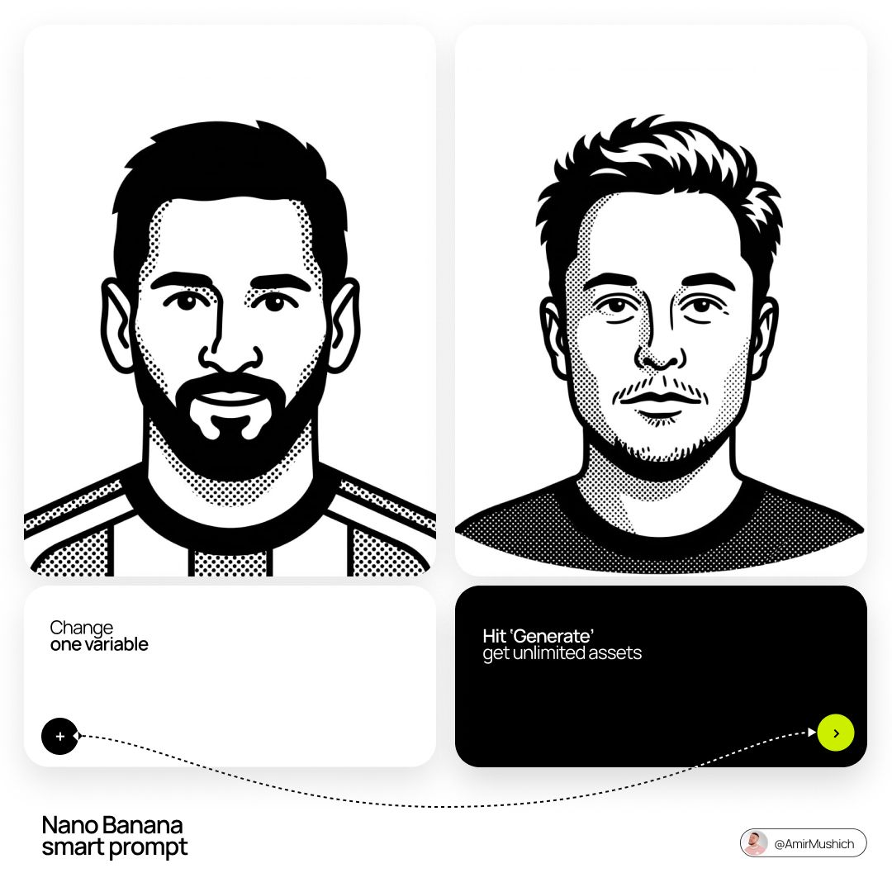

## A preservation architect's survey board for [BUILDING / 

- ID: trending-2008559432016286198
- Slug: trending-2008559432016286198-en
- 语言: en
- 来源: [来源链接](https://x.com/AllaAisling/status/2008559432016286198)
- 样例图路径: images/part1/2008559432016286198_1.jpg

### 提示词

```text
A preservation architect's survey board for [BUILDING / STRUCTURE] — [STYLE / ARCHITECT / PERIOD]. Left section: site plan and context, showing the structure in its urban or landscape setting with orientation, shadows, and neighboring relationships mapped. Center section: the building dissected, a cutaway axonometric revealing structural system, material layers, hidden infrastructure, with callouts identifying original versus modified elements. Right section: the building as experienced, photographed from the canonical viewpoint in ideal light, with human figures for scale and life, the architecture inhabited. Visual style transitions from technical survey blue-line through neutral analytical greys to golden-hour warmth. Title block reading "[BUILDING NAME] — [ARCHITECT], [CITY], [YEAR], HERITAGE SURVEY".   
```

### 样例图

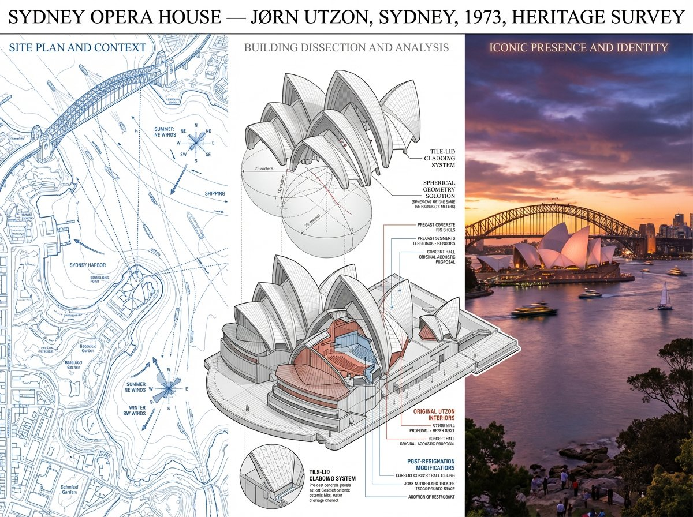

## [BRAND NAME]. Goal: Generate a professional mixed-media 

- ID: trending-2031083098364858524
- Slug: trending-2031083098364858524-en
- 语言: en
- 来源: [来源链接](https://x.com/AmirMushich/status/2031083098364858524)
- 样例图路径: images/part1/2031083098364858524_1.jpg

### 提示词

```text
[BRAND NAME].
Goal: Generate a professional mixed-media oil painting on textured canvas where the color palette and graphics are dynamically adapted to the brand identity.

1. BRAND COLOR ADAPTATION
- Analyze the visual identity of [BRAND NAME].
- Use the primary brand color for the two main horizontal impasto strokes.
- Use a contrasting secondary brand color for the thick, raised central dollop of paint.
- Replace the original red and yellow with this new adaptive color scheme.

2. PAINTED SUBJECT & MOTION
- Object: A central, vertically oriented product related to [BRAND NAME], rendered as a cohesive OIL PAINTING directly on the canvas.
- Technique: Apply a "motion blur" oil painting effect with visible horizontal brushstrokes to create a sense of dynamic movement.
- Integration: The object must be part of the painted layer, sharing the same heavy-grain canvas texture as the background, not an overlay.
- Branding: Paint the "[BRAND NAME]" logo using distressed, semi-transparent oil paint layers within the object's silhouette.

3. ADAPTIVE IMPASTO & TEXTURE
- Primary Strokes: Two thick, physical, horizontal impasto oil paint strokes applied over the painted object in the brand's primary color.
- Detail: One heavily textured, raised dollop of the brand's secondary color oil paint placed precisely on the center stroke.
- Surface: Background is a raw, heavy-grain grey textured canvas with visible weave, charcoal smudges, and gesso dabs.

4. BRAND-CENTRIC GRAPHICS
- Handwriting: Use charcoal and graphite to scribble keywords, slogans, and values associated with [BRAND NAME] across the canvas.
- Symbols: Replace the original $ and doodles with hand-drawn, messy abstract icons representing [BRAND NAME].
- Execution: All text and symbols must look like they were scratched or drawn with graphite over the dried oil paint layers.

5. STYLE
- Contemporary mixed-media pop-art. 8K macro photography focusing on the physical thickness of oil paint and the raw canvas grain.
```

### 样例图

![[BRAND NAME]. Goal: Generate a professional mixed-media ](../images/part1/2031083098364858524_1.jpg)

## Ultra-clean modern editorial infographic poster (1080x10

- ID: trending-2015630390887895118
- Slug: trending-2015630390887895118-en
- 语言: en
- 来源: [来源链接](https://x.com/Strength04_X/status/2015630390887895118)
- 样例图路径: images/part1/2015630390887895118_1.jpg

### 提示词

```text
Ultra-clean modern editorial infographic poster (1080x1080), premium magazine layout meets lifestyle photography/illustration.

**TITLE:**
Large, bold sans-serif text at top center: "HUMAN LIVER"

**CENTRAL VISUAL:**
A realistic, high-fidelity 3D illustration of the Human Liver (showing Right/Left lobes and Gallbladder). Color palette: Terracotta, deep brownish-red, and soft coral, set against a clean soft beige/off-white background. Lighting is studio-soft.

**LAYOUT SECTIONS (Matching the reference):**

* **Section 1 - Quick Facts (Top Left/Right floating bubbles):**
    * "Weight: ~1.5 kg (Heaviest internal organ)"
    * "Regeneration: Can grow back from 25%"
    * "Location: Upper Right Abdomen"
    * "Blood Flow: Filters 1.4 Liters/min"

* **Section 2 - Core Parts / Systems (Labels pointing to central organ):**
    * Right Lobe
    * Left Lobe
    * Gallbladder (Greenish sac underneath)
    * Common Bile Duct
    * Hepatic Portal Vein

* **Section 4 - Functions / Uses (Left side list with minimal icons):**
    * **Detoxification:** Filters toxins from blood.
    * **Bile Production:** Digestion of fats.
    * **Metabolism:** Processes carbs & proteins.
    * **Storage:** Stores Glycogen, Iron, Vitamins.

* **Section 5 - Related Highlights (Right side list with minimal icons):**
    * **Chemical Factory:** Performs 500+ vital functions.
    * **Immune Defense:** Fights infections in blood.
    * **Clotting:** Produces proteins for blood clotting.

* **Section 6 - Tips / Best Practices (Bottom row, card style with icons):**
    1.  **Limit Alcohol:** Prevents cirrhosis/fatty liver.
    2.  **Hydration:** Water helps flush toxins.
    3.  **Balanced Diet:** Low sugar, high fiber.
    4.  **Vaccination:** Hepatitis A & B protection.
    5.  **Exercise:** Burn triglycerides/fat.

**STYLE:**
Glassmorphism effects on text boxes, soft drop shadows, medical accuracy mixed with high-end graphic design aesthetics.
```

### 样例图

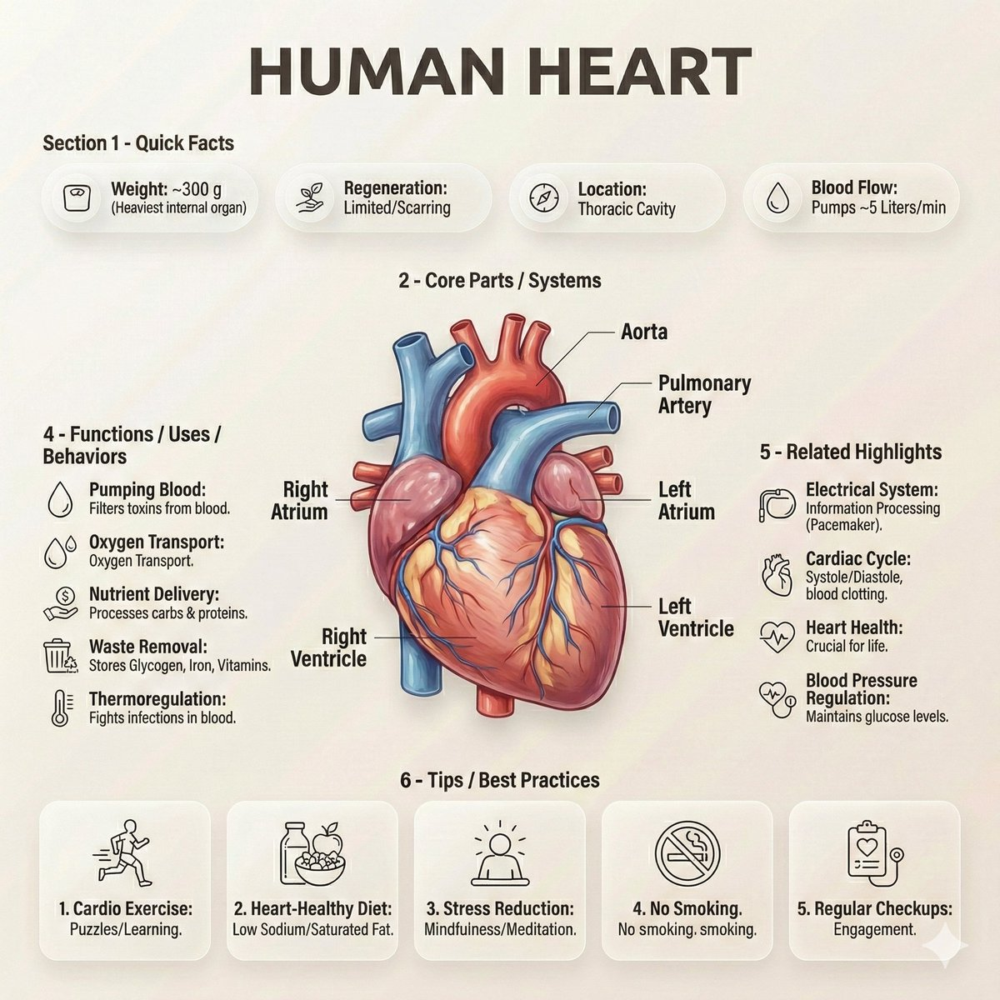

## [BRAND NAME] + [HERO COLOR] Act as a Mixed-Media Campaig

- ID: trending-2038319037248114957
- Slug: trending-2038319037248114957-en
- 语言: en
- 来源: [来源链接](https://x.com/AmirMushich/status/2038319037248114957)
- 样例图路径: images/part1/2038319037248114957_1.jpg

### 提示词

```text
[BRAND NAME] + [HERO COLOR]

Act as a Mixed-Media Campaign Art Director. Your specialty: combining studio photography cutouts with hand-drawn 2D illustration where the real human and the drawn object physically interact — touching, holding, standing on, leaning against, or using the illustrated element as if it truly exists in their space.

PHASE 1: CANVAS & COLOR SYSTEM

Format: 1:1 square canvas. Base: single flat saturated color [HERO COLOR]. No gradients. No texture. Pure chromatic field.
Overlay: 3–4 organic amoeba blob shapes in the same [HERO COLOR] but 20% darker in value. Smooth edges, irregular silhouettes, scattered asymmetrically. Some bleeding off-frame.
Hand-painted feel, clean execution.

PHASE 2: AUTONOMOUS OBJECT SELECTION

BEFORE staging the scene, the AI must first  make two autonomous decisions:
DECISION 1 — SELECT THE OBJECT: Analyze [BRAND NAME] and identify ONE iconic physical object from this framework:
— What is the single most recognizable product or artifact this brand has ever made?
— What object do fans of this brand collect, use daily, or photograph?
— What prop has defined this brand's visual identity across decades?
Do NOT choose animals. Do NOT choose logos. Choose a real, large, tangible object that can physically occupy space next to a person.
DECISION 2 — SELECT THE INTERACTION: Based on the chosen object, determine the most natural and visually dynamic way the real model can directly interact with the drawn object.
Interaction must be:
✓ Physical and direct — hands touching, feet on, body leaning, arms around
✓ Immediately readable — the relationship between person and object is understood in under 2 seconds
✓ Scaled correctly — the object must be large enough to interact with at human scale
✓ Active, not passive — the model is DOING something with the object, not just standing next to it
INTERACTION TYPE EXAMPLES (AI selects the most brand-appropriate):
· HOLDING: model's real hands grip the illustrated object — cup, camera, trophy, bottle, bag
· WEARING/USING: model's real body wears or uses the object — sitting on a chair, wearing an illustrated hat, holding an illustrated product to their face
· STANDING ON: model's real feet are planted on top of the illustrated object — skateboard, surfboard, podium, giant sneaker
· RIDING/LEANING: model's real body leans against or drapes over the illustrated object — car hood, shopping cart, giant product silhouette
· EMERGING FROM: model appears to step out of or through the illustrated object — bursting through a giant sneaker box, rising from an illustrated cup

PHASE 3: STAGING THE SCENE

Once object and interaction are selected, stage the full scene:
MODEL:
Single model age 18–26, clean cutout, zero fringing. Pose is determined by the chosen interaction — the body position must make the interaction feel natural and physically believable.
Wardrobe: [BRAND NAME]'s most iconic apparel in [HERO COLOR] monochromatic palette.
ILLUSTRATED OBJECT: Pure white (#FFFFFF) flat 2D illustration. Brush-pen marker line quality, 3–5px weight. Slightly imperfect organic edges — hand-drawn feel, not vector-perfect. NO shading. NO gradients. Flat white fill only.

SCALE RULE — CRITICAL: The illustrated object must be LARGE. Minimum size: 40% of canvas height. The object should feel monumental — oversized relative to real-world scale  is acceptable and encouraged.  A coffee cup can be waist-height.  A sneaker can be as tall as the model. Large scale = better readability =  stronger visual impact.
DEPTH LAYERING — CRITICAL:The object must exist on multiple z-layers:
— Parts of the object sit BEHIND the model
— Parts of the object come IN FRONT of the model
— The model's real hands/feet make contact  at the intersection point
This layering is what makes the scene feel integrated rather than collaged.
BRAND STAMP:
One small [BRAND NAME] logo mark appears on the object's surface — naturally embedded as if printed, engraved, or stitched. Rendered in [HERO COLOR] darker variant. Subtle, not dominant.

PHASE 4: SUPPORTING ILLUSTRATION SYSTEM

All supporting elements: white, flat, brush-pen line style. Same visual language as the hero object.
LOGO MARKS:
[BRAND NAME] primary icon in white:
— Large (upper-left corner, ~15% canvas width)
— Medium (opposite corner, ~10% canvas width)
IMPACT MARKERS: 2–3 manga-style exclamation dash clusters  near the point of interaction between  model and object — where hands grip,  where feet land, where bodies touch. This emphasizes the physical connection.
MOTION LINES: 2–4 curved speed lines radiating from  the object or the model's most active body part. Taper at ends. Cross behind and in front of the model for depth.

GROUND EFFECT: At the base of the scene: white illustrated  ground interaction — sparkle stars,  short speed dashes, or object-specific  effect (splash if cup, dust clouds  if sneaker landing, wheel tracks if skateboard).
AMBIENT SQUIGGLES: 1–2 loose organic white lines floating near the model's torso — visual rhythm connecting the photographic and illustrated layers.

PHASE 5: LIGHTING

Studio strobe, high-key, even and clean. 5500K neutral. No dramatic shadows on model. Soft contact shadow at model's feet (opacity 15%). The photography reads as natural and real  against the graphic illustrated environment.

TECH SPECS

Aesthetic: mixed media — real photograph integrated with hand-drawn 2D illustration. Color count: 3 maximum — [HERO COLOR] light, [HERO COLOR] dark blobs, white illustration. Photography skin tones and fabric colors  are the only additional color exception. Illustration style: Y2K comic energy,  Japanese streetwear magazine, brush marker. Composition: asymmetric and dynamic.  The interaction point between model and  object is the visual center of gravity — everything else orbits around it. No text. No wordmarks. Logo icon only. Mood: the model is not posing WITH the object —  the model is IN THE MIDDLE of using it.  Caught mid-action. Alive.
```

### 样例图

![[BRAND NAME] + [HERO COLOR] Act as a Mixed-Media Campaig](../images/part1/2038319037248114957_1.jpg)

## Create a clean high-contrast vector mascot icon in Notio

- ID: trending-2032819091485110500
- Slug: trending-2032819091485110500-en
- 语言: en
- 来源: [来源链接](https://x.com/azed_ai/status/2032819091485110500)
- 样例图路径: images/part1/2032819091485110500_1.jpg

### 提示词

```text
Create a clean high-contrast vector mascot icon in Notion-style artwork based on [person description]. Show only the head in a 3/4 view. Use very thick bold black outer outlines and slightly thinner inner detail lines. Flat monochrome fill. Simplify facial features into strong geometric shapes while preserving recognizable traits such as bald head or hairstyle, beard shape, glasses shape, eyebrows, and smile. Expression should be friendly and slightly exaggerated. Teeth are simplified into clean flat blocks. pure white background. Modern startup mascot logo aesthetic, clean SVG vector look, crisp edges, black and white only, high contrast, symmetrical balance, square composition, 1:1 aspect ratio
```

### 样例图

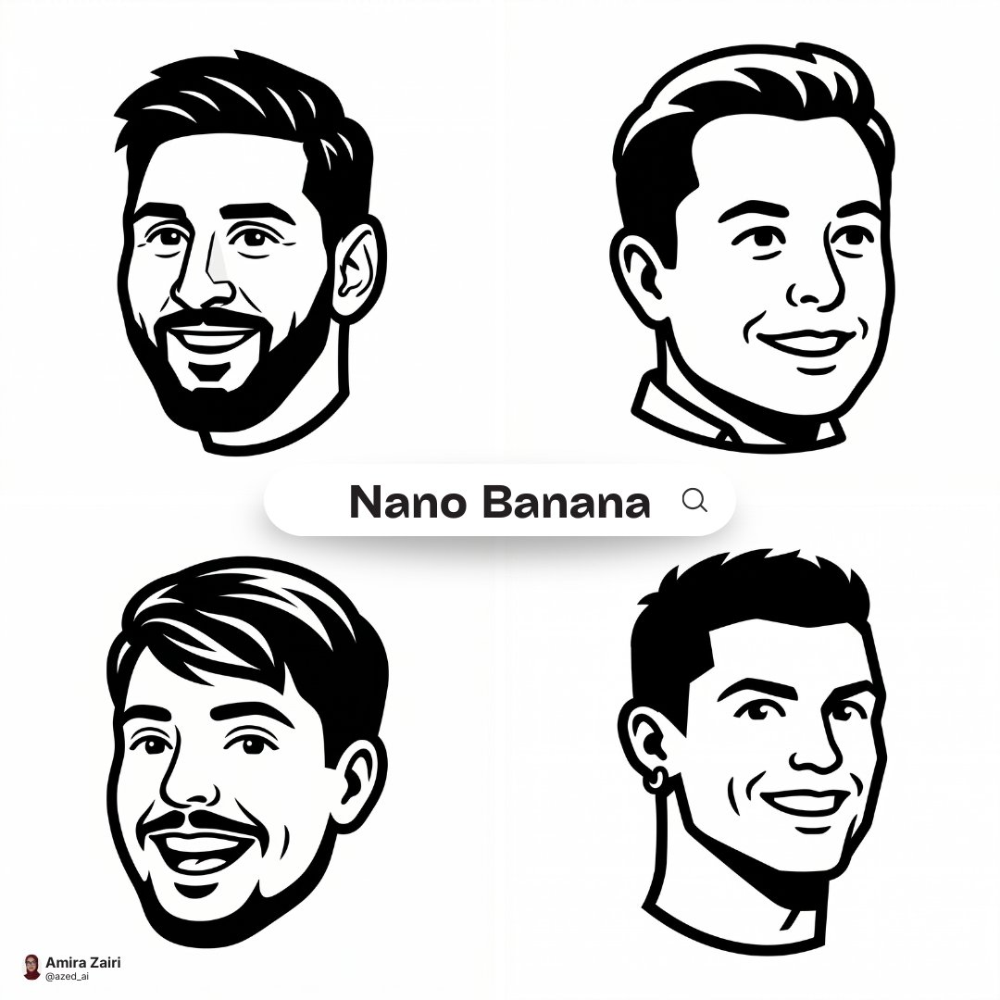

## style_preset: "Zodia

- ID: trending-2039682237751509053
- Slug: trending-2039682237751509053-zh
- 语言: zh
- 来源: [来源链接](https://x.com/midori_tatsuta/status/2039682237751509053)
- 样例图路径: images/part1/2039682237751509053_1.jpg

### 提示词

```text
style_preset: "Zodiac Astrology VTuber Logo Aesthetics (Celestial Ver.)"
global_settings:
  vibe: "Mystical, celestial, cosmic wisdom, divination, stargazing"
  background: "Pure white background (for isolation)"
  rendering:
    - "Elegant, celestial vector-style finish"
    - "Deep midnight blue and shining gold palette"
    - "Thin elegant layered outlines with star accents"
    - "Glowing star effects and celestial glow"
drawing_rules:
  line_quality: "Thin, elegant curves with constellation line art accents."
  character_design:
    - "Integrated constellation and tarot motifs woven into the letters"
    - "Custom stylized font: elegant, celestial shapes with star dot accents"
  typography_style:
    - "Main Title: Large, stylized Japanese with constellation dot patterns"
    - "Subtitle: Smaller English text in an elegant celestial font"
  ornament_rule:
    - "Strictly follow the 'ornaments_selection' provided in the USER INPUT SECTION"
    - "Distribute ornaments to create a 'celestial reading' visual impact"
visual_parameters:
  color_palette:
    primary: "Deep midnight blue and shining gold gradient"
    secondary: "Thin gold inner border + Midnight blue outer stroke"
    accents: "Constellation lines, zodiac symbols, and star glow"

# ----------------------------------------------------------
# USER INPUT SECTION (下記を自由に編集してね)
# ----------------------------------------------------------
request:
  input_text: "星読み" # ← ここを好きな名前に変更
  subtitle: "Astrology" # ← 小さく表示したい文字
  motif_concept: "星座図とタロットカード" # ← ここを好きな動物やモノに変更

  custom_colors: "ミッドナイトブルーとシャイニングゴールド" # ← 好きな色を指定

  ornaments_selection:
    - "星座線 (Zodiac constellation lines)"
    - "タロットカード (Tarot card borders)"
    - "三日月 (Crescent moon)"
    - "太陽 (Radiant sun)"
    - "魔法陣 (Mystical magic circle)"
```

### 样例图

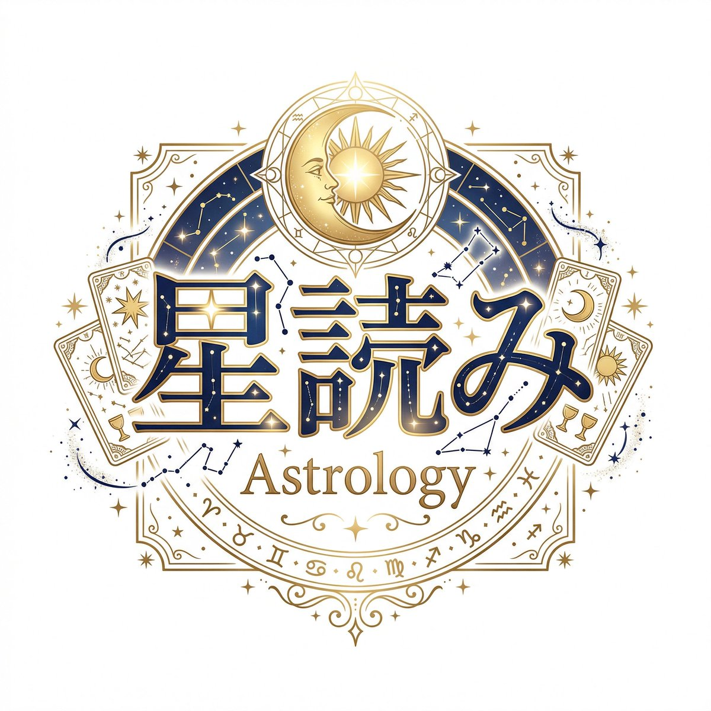

## A minimalist and creative advertisement set on a pure wh

- ID: trending-2032094792583430443
- Slug: trending-2032094792583430443-en
- 语言: en
- 来源: [来源链接](https://x.com/azed_ai/status/2032094792583430443)
- 样例图路径: images/part1/2032094792583430443_1.jpg

### 提示词

```text
A minimalist and creative advertisement set on a pure white background. A real photographic [Real Object] is integrated into a simple hand-drawn black ink doodle using loose, playful lines. The [Doodle Concept] interacts directly and cleverly with the real object, making the object part of the illustrated scene. Include bold uppercase black “[Ad Copy]” text at the top. Place the official [Brand Logo] clearly centered at the bottom. Clean layout, high contrast between realistic object and flat doodle drawing, lots of negative space, smart visual metaphor, print-ready poster design
```

### 样例图

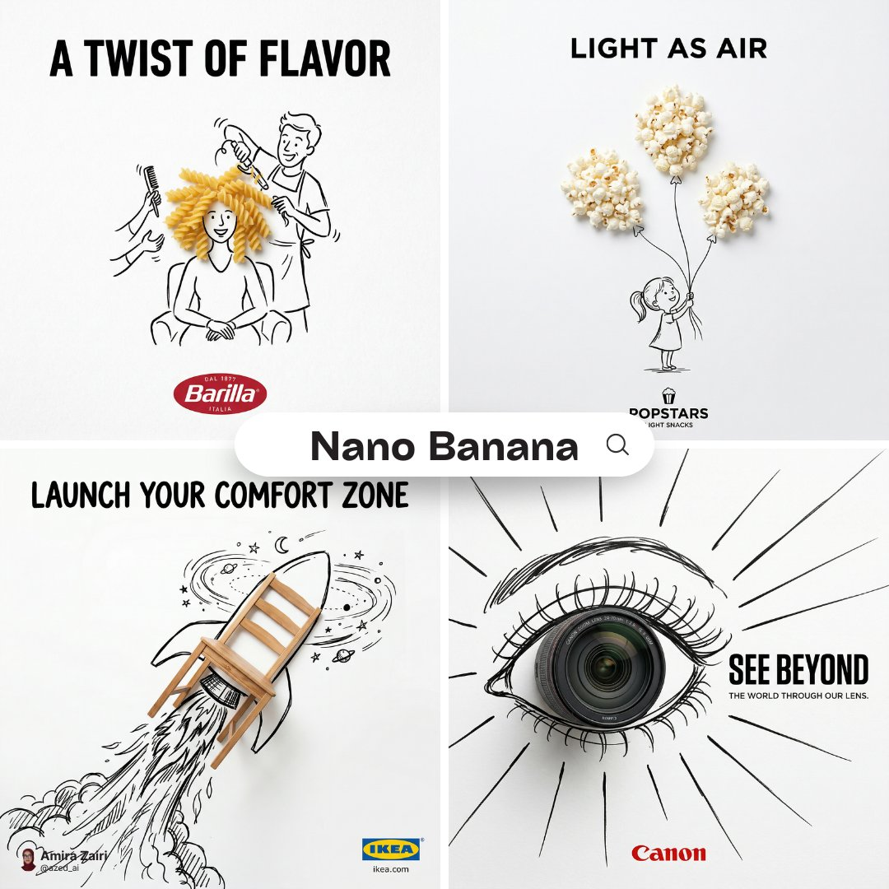

## [BRAND NAME] + [HERO COLOR] Act as a Mixed-Media Campaig

- ID: trending-2038707148981432392
- Slug: trending-2038707148981432392-en
- 语言: en
- 来源: [来源链接](https://x.com/youraipulse/status/2038707148981432392)
- 样例图路径: images/part1/2038707148981432392_1.jpg

### 提示词

```text
[BRAND NAME] + [HERO COLOR]

Act as a Mixed-Media Campaign Art Director. Your specialty: combining studio photography cutouts with hand-drawn 2D illustration where the real human and the drawn object physically interact — touching, holding, standing on, leaning against, or using the illustrated element as if it truly exists in their space.

PHASE 1: CANVAS & COLOR SYSTEM

Format: 1:1 square canvas. Base: single flat saturated color [HERO COLOR]. No gradients. No texture. Pure chromatic field.
Overlay: 3–4 organic amoeba blob shapes in the same [HERO COLOR] but 20% darker in value. Smooth edges, irregular silhouettes, scattered asymmetrically. Some bleeding off-frame.
Hand-painted feel, clean execution.

PHASE 2: AUTONOMOUS OBJECT SELECTION

BEFORE staging the scene, the AI must first  make two autonomous decisions:
DECISION 1 — SELECT THE OBJECT: Analyze [BRAND NAME] and identify ONE iconic physical object from this framework:
— What is the single most recognizable product or artifact this brand has ever made?
— What object do fans of this brand collect, use daily, or photograph?
— What prop has defined this brand's visual identity across decades?
Do NOT choose animals. Do NOT choose logos. Choose a real, large, tangible object that can physically occupy space next to a person.
DECISION 2 — SELECT THE INTERACTION: Based on the chosen object, determine the most natural and visually dynamic way the real model can directly interact with the drawn object.
Interaction must be:
✓ Physical and direct — hands touching, feet on, body leaning, arms around
✓ Immediately readable — the relationship between person and object is understood in under 2 seconds
✓ Scaled correctly — the object must be large enough to interact with at human scale
✓ Active, not passive — the model is DOING something with the object, not just standing next to it
INTERACTION TYPE EXAMPLES (AI selects the most brand-appropriate):
· HOLDING: model's real hands grip the illustrated object — cup, camera, trophy, bottle, bag
· WEARING/USING: model's real body wears or uses the object — sitting on a chair, wearing an illustrated hat, holding an illustrated product to their face
· STANDING ON: model's real feet are planted on top of the illustrated object — skateboard, surfboard, podium, giant sneaker
· RIDING/LEANING: model's real body leans against or drapes over the illustrated object — car hood, shopping cart, giant product silhouette
· EMERGING FROM: model appears to step out of or through the illustrated object — bursting through a giant sneaker box, rising from an illustrated cup

PHASE 3: STAGING THE SCENE

Once object and interaction are selected, stage the full scene:
MODEL:
Single model age 18–26, clean cutout, zero fringing. Pose is determined by the chosen interaction — the body position must make the interaction feel natural and physically believable.
Wardrobe: [BRAND NAME]'s most iconic apparel in [HERO COLOR] monochromatic palette.
ILLUSTRATED OBJECT: Pure white (#FFFFFF) flat 2D illustration. Brush-pen marker line quality, 3–5px weight. Slightly imperfect organic edges — hand-drawn feel, not vector-perfect. NO shading. NO gradients. Flat white fill only.

SCALE RULE — CRITICAL: The illustrated object must be LARGE. Minimum size: 40% of canvas height. The object should feel monumental — oversized relative to real-world scale  is acceptable and encouraged.  A coffee cup can be waist-height.  A sneaker can be as tall as the model. Large scale = better readability =  stronger visual impact.
DEPTH LAYERING — CRITICAL:The object must exist on multiple z-layers:
— Parts of the object sit BEHIND the model
— Parts of the object come IN FRONT of the model
— The model's real hands/feet make contact  at the intersection point
This layering is what makes the scene feel integrated rather than collaged.
BRAND STAMP:
One small [BRAND NAME] logo mark appears on the object's surface — naturally embedded as if printed, engraved, or stitched. Rendered in [HERO COLOR] darker variant. Subtle, not dominant.

PHASE 4: SUPPORTING ILLUSTRATION SYSTEM

All supporting elements: white, flat, brush-pen line style. Same visual language as the hero object.
LOGO MARKS:
[BRAND NAME] primary icon in white:
— Large (upper-left corner, ~15% canvas width)
— Medium (opposite corner, ~10% canvas width)
IMPACT MARKERS: 2–3 manga-style exclamation dash clusters  near the point of interaction between  model and object — where hands grip,  where feet land, where bodies touch. This emphasizes the physical connection.
MOTION LINES: 2–4 curved speed lines radiating from  the object or the model's most active body part. Taper at ends. Cross behind and in front of the model for depth.

GROUND EFFECT: At the base of the scene: white illustrated  ground interaction — sparkle stars,  short speed dashes, or object-specific  effect (splash if cup, dust clouds  if sneaker landing, wheel tracks if skateboard).
AMBIENT SQUIGGLES: 1–2 loose organic white lines floating near the model's torso — visual rhythm connecting the photographic and illustrated layers.

PHASE 5: LIGHTING

Studio strobe, high-key, even and clean. 5500K neutral. No dramatic shadows on model. Soft contact shadow at model's feet (opacity 15%). The photography reads as natural and real  against the graphic illustrated environment.

TECH SPECS

Aesthetic: mixed media — real photograph integrated with hand-drawn 2D illustration. Color count: 3 maximum — [HERO COLOR] light, [HERO COLOR] dark blobs, white illustration. Photography skin tones and fabric colors  are the only additional color exception. Illustration style: Y2K comic energy,  Japanese streetwear magazine, brush marker. Composition: asymmetric and dynamic.  The interaction point between model and  object is the visual center of gravity — everything else orbits around it. No text. No wordmarks. Logo icon only. Mood: the model is not posing WITH the object —  the model is IN THE MIDDLE of using it.  Caught mid-action. Alive.
```

### 样例图

![[BRAND NAME] + [HERO COLOR] Act as a Mixed-Media Campaig](../images/part1/2038707148981432392_1.jpg)

## Create a whimsical, playful illustration featuring [CHAR

- ID: trending-2020791306197561403
- Slug: trending-2020791306197561403-en
- 语言: en
- 来源: [来源链接](https://x.com/aleenaamiir/status/2020791306197561403)
- 样例图路径: images/part1/2020791306197561403_1.jpg

### 提示词

```text
Create a whimsical, playful illustration featuring [CHARACTER / SUBJECT] as the central focus.
The character is drawn with simplified features, a small rounded head, and minimal facial detail, wearing [HEADWEAR / CLOTHING DESCRIPTION].

They are positioned among oversized abstract shapes and organic elements such as [FLORAL / SYMBOLIC OBJECTS], creating a sense of imaginative scale. The character is interacting with [OBJECT / ACTION], adding narrative interest.

Decorative graphic elements like [SYMBOLS: exclamation points, speech bubbles, scribbles, notes, etc.] float around the subject to enhance expression and energy.

Use clean, simple linework and a limited color palette of [PRIMARY COLORS], keeping the illustration bold and cohesive. The background is a soft neutral tone such as beige or off-white. The overall style is modern, flat, and illustrative, with a lively, creative, and slightly abstract atmosphere.
```

### 样例图

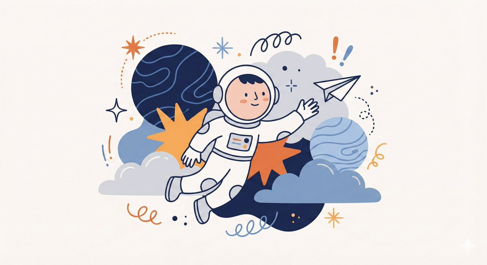

## Create an infographic image of [OBJECT], combining a rea

- ID: trending-2038346918406115788
- Slug: trending-2038346918406115788-en
- 语言: en
- 来源: [来源链接](https://x.com/gudanglifehack/status/2038346918406115788)
- 样例图路径: images/part1/2038346918406115788_1.jpg

### 提示词

```text
Create an infographic image of [OBJECT], combining a realistic photograph or photorealistic render of the object with technical annotation overlays placed directly on top. Use black ink–style line drawings and text (technical pen / architectural sketch look) on a pure white studio background. Include: •Key component labels •Internal cutaway or exploded-view outlines (where relevant) •Measurements, dimensions, and scale markers •Material callouts and quantities
```

### 样例图

![Create an infographic image of [OBJECT], combining a rea](../images/part1/2038346918406115788_1.jpg)

## product design, [object], cross-section cutaway view, in

- ID: trending-2028376944996470842
- Slug: trending-2028376944996470842-en
- 语言: en
- 来源: [来源链接](https://x.com/0x00_Krypt/status/2028376944996470842)
- 样例图路径: images/part1/2028376944996470842_1.jpg

### 提示词

```text
product design, [object], cross-section cutaway view, internal anatomy revealed, 
white background, museum specimen aesthetic, scientific illustration style
```

### 样例图

![product design, [object], cross-section cutaway view, in](../images/part1/2028376944996470842_1.jpg)

## [PERSONE]. Act as a Senior Editorial Designer and Graphi

- ID: trending-2029935139044671622
- Slug: trending-2029935139044671622-en
- 语言: en
- 来源: [来源链接](https://x.com/AmirMushich/status/2029935139044671622)
- 样例图路径: images/part1/2029935139044671622_1.jpg

### 提示词

```text
[PERSONE]. Act as a Senior Editorial Designer and Graphic Artist.
Goal: Generate a complex, multi-layered Swiss-style collage poster for [PERSONE].
PHASE 1: SEMANTIC INTELLIGENCE (AUTONOMOUS)
[INSTRUCTIONS]:
Analyze "[PERSONE]". Determine their primary field (e.g., Elite Sports, Cyber-Engineering, Cinema, History).
Select an "Iconic Accent Color" based on their identity (e.g., Racing Orange for a driver, Neon Cyan for a hacker, Crimson for a hero).
Generate 3 key statistics or milestones (e.g., "7 TITLES", "98% ACCURACY") and a short professional title.
PHASE 2: COMPOSITIONAL STRUCTURE (THE GRID)
The image is a single vertical composition with overlapping geometric frames and segments:
- MAIN SUBJECT (Top Left): A large, high-grain grayscale or color portrait of [PERSONE], smiling or looking confident.
- DETAIL SHOT (Center Right): A zoomed-in, cropped rectangle showing only the eyes or a specific detail of [PERSONE].
- FULL BODY SHOT (Bottom Center): [PERSONE] sitting on a geometric box or podium in a relaxed but powerful pose.
- BACKGROUND: Light gray with a heavy, tactile film grain/noise texture.
PHASE 3: GRAPHIC ELEMENTS & TYPOGRAPHY
- Initials: Large, outlined capital letters of the first and last name placed in opposite corners.
- Vertical Ribbon: A solid color strip with the text "WORLD CHAMPIONSHIP LEADER" or a relevant title running vertically through the center.
- Data Blocks:
    - A specific number (ID or rank) in a bold sans-serif block.
    - A "Statistics" block in the bottom-left corner with 3 lines of text (e.g., "TWO POLES / FOUR WINS / FIVE PODIUMS").
- Accents: Scatter orange and black squares, dotted circles, and small asterisks throughout the grid for visual complexity.
PHASE 4: LIGHTING & TEXTURE
- Texture: High-contrast, gritty, and grainy. The overall image should look like a printed high-end magazine or a vintage poster.
- Lighting: Professional studio lighting on the subjects, but processed with a "risograph" or "halftone" feel.
PHASE 5: TECH SPECS
8K Resolution. Swiss Modernism aesthetic. Flat vector shapes combined with hyper-realistic photography.
```

### 样例图

![[PERSONE]. Act as a Senior Editorial Designer and Graphi](../images/part1/2029935139044671622_1.jpg)

## Create a typographic illustration shaped like a [OBJECT]

- ID: trending-2038261502696648942
- Slug: trending-2038261502696648942-en
- 语言: en
- 来源: [来源链接](https://x.com/TechieBySA/status/2038261502696648942)
- 样例图路径: images/part1/2038261502696648942_1.jpg

### 提示词

```text
Create a typographic illustration shaped like a [OBJECT], where the text [BRAND SLOGAN] forms the shape — bold and playful lettering style that fills the entire silhouette — letters adapt fluidly to the curves and contours of the [OBJECT] — [COLOR 1, COLOR 2] with [BACKGROUND COLOR] background that enhances the focus on the main shape — include [BRAND] logo positioned below the [OBJECT] — vector-style, clean, high resolution, 1080x1080 pixels, square format.
```

### 样例图

![Create a typographic illustration shaped like a [OBJECT]](../images/part1/2038261502696648942_1.jpg)

## [BRAND NAME]. Act as a Senior AI Visual Strategist & Cre

- ID: trending-2028489707311464765
- Slug: trending-2028489707311464765-en
- 语言: en
- 来源: [来源链接](https://x.com/AmirMushich/status/2028489707311464765)
- 样例图路径: images/part1/2028489707311464765_1.jpg

### 提示词

```text
[BRAND NAME]. Act as a Senior AI Visual Strategist & Creative Director.
Goal: Generate a high-motion triptych editorial where every visual element (color, text, props) is a direct semantic derivative of the brand name.
PHASE 1: SEMANTIC BRAND ANALYSIS (AUTONOMOUS)
[INSTRUCTIONS FOR IMAGEN]:
Core Identity: Analyze "[BRAND NAME]". Define its industry, soul, and "vibe" (e.g., Kinetic, Organic, Brutalist, Ethereal).
Color Psychology: Select a triadic palette based on brand associations:
   - BACKGROUND: The "Mood" color (e.g., Deep Forest for 'GAIA', Neon Amber for 'FUSE').
   - ACCENTS/TYPOGRAPHY: The "Energy" color. Must have high contrast/readability against the background.
   - APPAREL: The "Statement" color. Completes the brand's visual signature.
Copywriting: Generate 2-3 short, punchy slogans or keywords that resonate with the brand's mission to be used as background micro-text.
PHASE 2: COMPOSITION (THE DYNAMIC TRIPTYCH)
Layout: A single horizontal image split into three vertical editorial panels.
- PANEL 1 (The Portrait): Extreme close-up. Bold [BRAND NAME] wordmark inside a geometric frame (circle or rectangle) overlapping the model's face or neck.
- PANEL 2 (The Elevate): Medium shot. A model (gender determined by brand target audience) holds a primary brand-representative object above their head in a triumphant or symbolic gesture.
- PANEL 3 (The Kinetic): Full-body shot. High-speed motion blur or an aggressive "power pose" interacting with the brand's core element.
PHASE 3: GRAPHIC OVERLAYS & TEXTURES
- Main Typography: Large, slanted (italic) heavy sans-serif in [ACCENT COLOR].
- Dynamic Ribbons: Vertical yellow or contrast tapes crossing the panels with repeating text: "[BRAND NAME] // [ASSOCIATED KEYWORD] // [BRAND NAME]".
- Micro-Copy: Scattered small text in corners like "DESIGNED FOR [TARGET AUDIENCE]" or "EST. 2026 // GLOBAL IDENTITY".
PHASE 4: LIGHTING & ESTHETIC STANDARDS
- High-End Editorial (Vogue/Hypebeast style).
- Global Illumination with crisp, sharp edges.
- Realistic skin textures (pores, subtle sweat/shine) and high-fidelity fabric weaves.
- No "AI-plastic" artifacts.
PHASE 5: TECH SPECS
8K Resolution. Render: Octane. Subtle film grain. Ray-traced reflections on eyes and surfaces.
```

### 样例图

![[BRAND NAME]. Act as a Senior AI Visual Strategist & Cre](../images/part1/2028489707311464765_1.jpg)

## Create a soap foam sculpture in the exact shape of the u

- ID: trending-2009722852010852444
- Slug: trending-2009722852010852444-en
- 语言: en
- 来源: [来源链接](https://x.com/TechieBySA/status/2009722852010852444)
- 样例图路径: images/part1/2009722852010852444_1.jpg

### 提示词

```text
Create a soap foam sculpture in the exact shape of the uploaded logo, made entirely of white soap bubbles and foam with realistic bubble textures. Place it on wet bathroom tiles in the brand’s signature color (match the color from the uploaded logo). Top-down view, centered composition. The tiles should be glossy and wet with water droplets scattered across the surface. Add smaller foam bubbles and soap suds around the main logo shape. Grout lines visible between tiles. Additional small foam shapes in corners. Product photography style, clean and vibrant lighting.
```

### 样例图

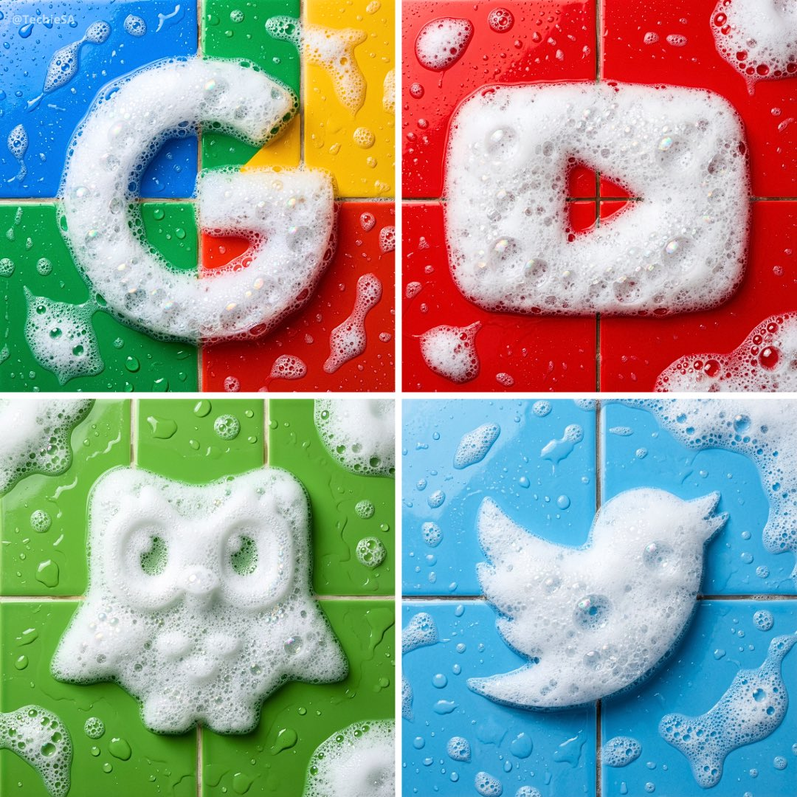

## [BRAND NAME] ({INDUSTRY}). Act as a Lead Brand Designer 

- ID: trending-2018348054789640565
- Slug: trending-2018348054789640565-en
- 语言: en
- 来源: [来源链接](https://x.com/AmirMushich/status/2018348054789640565)
- 样例图路径: images/part1/2018348054789640565_1.jpg

### 提示词

```text
[BRAND NAME] 
({INDUSTRY}). 

Act as a Lead Brand Designer creating a comprehensive "Brand Identity System" presentation (Bento-Grid Layout).

**THE TASK:**
Generate a single, high-resolution bento-grid board containing **6 distinct modules** that define the visual identity for [BRAND NAME].

---

**PHASE 1: VISUAL STRATEGY (AUTONOMOUS)**
1.  **Analyze the Brand:** Determine the archetype and visual vibe.
2.  **Define the Palette:** Select 4 distinct colors.
3.  **Select Typography:** Choose ONE specific Google Font (Serif, Sans-Serif, or Display) relevant to the industry.

**PHASE 2: THE LAYOUT (6-MODULE GRID)**
The image must be a clean, gap-separated grid featuring these specific blocks:

* **Block 1 (The Hero):** A high-end **Key Visual** photography showing the product/service in context. Cinematic lighting, photorealistic. Overlay the brand logo in white.
* **Block 2 (Social Media):** A mockup of an **Instagram Post**. It features a bold headline using the brand font and a lifestyle image.
* **Block 3 (The Palette & HEX):** A clean design block displaying **4 Vertical Color Swatches**.
    * *Crucial Detail:* Inside or below each color swatch, simulate distinct text looking like **HEX Codes** (e.g., "#1A2B3C").
* **Block 4 (Typography Spec):** A minimalist block dedicated to the **Brand Font**.
    * *CRITICAL CONSTRAINT:* Do NOT show the alphabet (Aa Bb Cc).
    * *The Content:* The block must display ONLY the **Name of the Font** (e.g., "Montserrat", "Lato", "Oswald") written in large, crisp characters using that specific font style. This acts as the visual specimen.
    * *Subtext:* Tiny text at the bottom reading "Primary Typeface".
* **Block 5 (The Logo):** A solid background block featuring the **Final Logo** (clean, vector style, NO construction lines/grids). Minimalist and iconic.
* **Block 6 (Brand DNA):** A text-heavy "Manifesto Card". It simulates a layout with three short paragraphs titled:
    * **ARCHETYPE:** (e.g., "The Innovator")
    * **VOICE:** (e.g., "Confident, Direct")
    * **VISUALS:** (e.g., "Cinematic, High-Contrast")

**PHASE 3: AESTHETIC & FINISH**
* **Style:** Behance Trend / Awwwards Winner.
* **Quality:** 8k resolution, razor-sharp vector graphics mixed with high-end photography.
* **Lighting:** Soft studio lighting across the whole grid to make it look like a cohesive presentation board.
```

### 样例图

![[BRAND NAME] ({INDUSTRY}). Act as a Lead Brand Designer ](../images/part1/2018348054789640565_1.jpg)

## An extreme close-up, high-fashion editorial portrait foc

- ID: trending-2032343238015938917
- Slug: trending-2032343238015938917-en
- 语言: en
- 来源: [来源链接](https://x.com/rovvmut_/status/2032343238015938917)
- 样例图路径: images/part1/2032343238015938917_1.jpg

### 提示词

```text
An extreme close-up, high-fashion editorial portrait focusing on the right side of a person's face. The composition is a tight crop showing the bridge of the nose, a portion of the lips, and a single eye peering through sunglasses. The shot is characterized by a heavy, cinematic film grain and a warm, sophisticated studio atmosphere.
Eyewear: Large-frame, wrap-around sunglasses made of high-gloss dark tortoiseshell acetate (mottled black and deep mahogany). The lenses are a vibrant, translucent amber-orange, allowing the eye and eyelashes behind the lens to remain visible but color-tinted.
Person: A person with smooth skin showing natural texture and fine pores. The lighting is soft-side lighting from the right, creating a gentle shadow on the left side of the nose and a subtle highlight on the cheekbone and lower lip.
Typography: Bold, white, geometric sans-serif text reading "Bold Impact" is overlaid on the lower-right cheek. Three smaller, delicate labels are scattered: "Deep Tones" (top right), "Sharp Detail" (on the left lens), and "Strong Style" (bottom right).
Color Palette: A rich mix of skin tones (#E8A88A), burnt orange (#B8541C), and deep espresso (#1A0D0B), contrasted with crisp white text (#FFFFFF).
Lighting: Warm studio lighting with a soft-focus depth of field. The background consists of out-of-focus hair and skin, keeping all attention on the eye and the texture of the acetate frames.
Atmosphere: Premium, editorial fashion magazine aesthetic; high-contrast but with soft transitions.
```

### 样例图

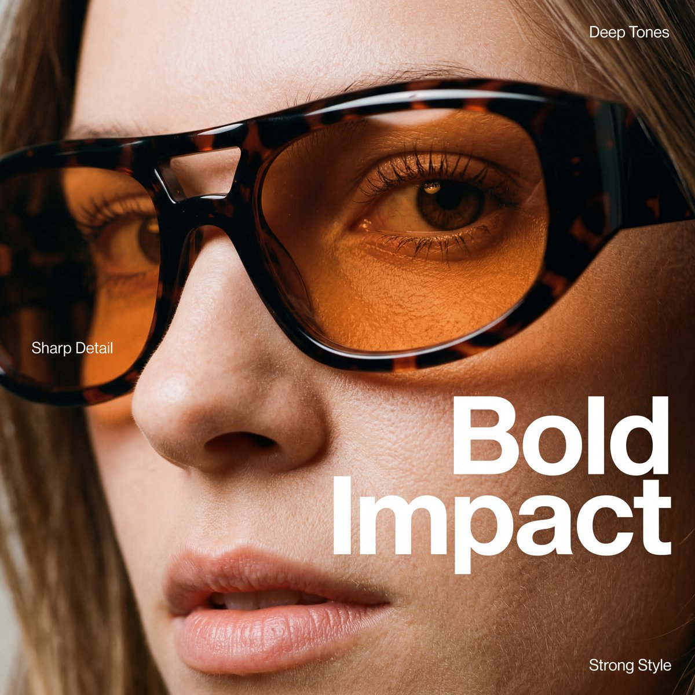

## A flat-lay collection of exactly 9 hyper-realistic 3D re

- ID: trending-2040498492347420883
- Slug: trending-2040498492347420883-en
- 语言: en
- 来源: [来源链接](https://x.com/TechieBySA/status/2040498492347420883)
- 样例图路径: images/part1/2040498492347420883_1.jpg

### 提示词

```text
A flat-lay collection of exactly 9 hyper-realistic 3D resin fridge magnets arranged on a bright pure white surface in a clean 3x3 grid, themed around [BRAND]. At the very top center, a wide rectangular text magnet spells "BRAND" in bold 3D block letters in the brand's signature colors. Below it, 9 magnets in a clean 3x3 grid: the official logo badge, the most iconic hero product, a secondary iconic product, a third iconic product or packaging, a brand mascot or character chibi, a fifth iconic item, a sixth iconic item, a seventh iconic item, and the brand's storefront or headquarters building facade. Each magnet is small, neatly spaced with generous white space between them, slightly raised with a soft drop shadow beneath. Bright white background, warm studio lighting from above, photorealistic product render, top-down flat-lay angle, 4:5 aspect ratio
```

### 样例图

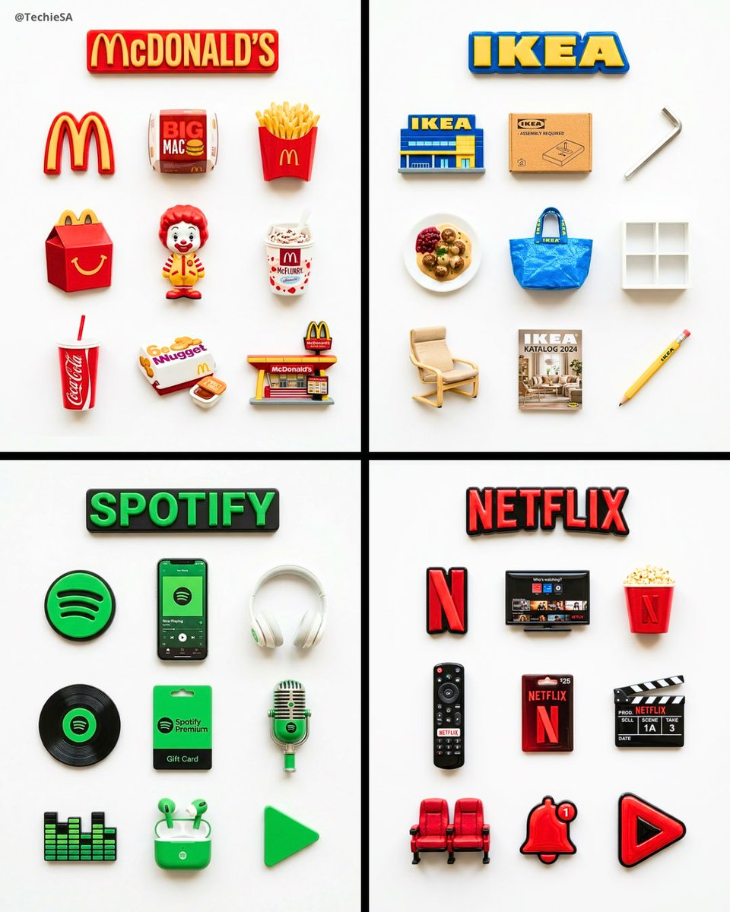

## { "generation_request": { "meta_data": { "tool": "NanoBa

- ID: trending-2036433262583628096
- Slug: trending-2036433262583628096-en
- 语言: en
- 来源: [来源链接](https://x.com/astronomerozge1/status/2036433262583628096)
- 样例图路径: images/part1/2036433262583628096_1.jpg

### 提示词

```text
{
  "generation_request": {
    "meta_data": {
      "tool": "NanoBanana Pro",
      "task_type": "luxury_fashion_moodboard_editorial",
      "language": "en",
      "priority": "highest",
      "version": "v2.5_DAY1_YELLOW_HALTER_SATIN_MINIMAL_ITEMS_GOLD_TEXT"
    },
    "input": {
      "mode": "image_to_image",
      "reference_image_usage": "high",
      "notes": "Use the uploaded reference only as a layout and visual styling guide. Create a clean, elegant luxury fashion moodboard with the editorial feeling: soft ivory background, large refined 'DAY 1' title at the top, one pinned seaside restaurant photo, one hero yellow satin halter-neck evening dress with an open back, and only a minimal number of supporting elements. Show only one pair of pearl-white heels, only one matching luxury evening bag, only one jewelry item, and only one sea-inspired martini cocktail. Do not include extra accessories, extra bags, extra shoes, or extra jewelry. The composition must feel minimal, expensive, balanced, and professionally art directed, with strong hierarchy and generous negative space. The dress should be the main focal point, with a sleek modern silhouette, fluid satin drape, and premium fashion-house finish. The seaside restaurant photo should show an upscale evening dinner setup directly on the sand, with candlelight and romantic luxury atmosphere. The cocktail should be one elegant sea-inspired martini with ocean-blue or sea-glass tones. Add one short motivational quote near the bottom in a refined handwritten or script style. All visible typography, including the 'DAY 1' title and the quote, should be rendered in elegant metallic gold tones with a luxurious editorial finish."
    },
    "output_settings": {
      "aspect_ratio": "4:5",
      "orientation": "portrait",
      "resolution_target": "ultra_high_res",
      "num_images": 1,
      "render_style": "luxury_editorial_collage_realism",
      "sharpness": "ultra_crisp",
      "grain": "subtle_print_texture",
      "dynamic_range": "soft_high_end",
      "color_grade": "sunset_gold_pearl_coastal_luxury"
    },
    "layout": {
      "background": "soft warm ivory or premium matte neutral tone",
      "composition": "large DAY 1 title at the top, one pinned seaside photo, one central hero dress, one pair of shoes, one bag, one jewelry item, one cocktail, one short quote",
      "design_feel": "minimal luxury editorial board with balanced spacing and no clutter"
    },
    "fashion_story": {
      "hero_dress": "yellow satin halter-neck backless evening dress, sleek modern silhouette, elegant drape, luxurious reflections",
      "shoes": "one pair of pearl-white heels with delicate pearl-thread detailing",
      "bag": "one small luxury evening bag in pearl white, ivory, champagne, or soft gold tone",
      "jewelry": "one elegant pearl bracelet or one refined pearl jewelry piece only"
    },
    "lifestyle_element": {
      "date_setting": "luxury beachside evening restaurant directly on the sand, candlelight, elegant table setting, romantic atmosphere",
      "cocktail": "one sea-inspired martini with ocean-toned blue-green color and premium garnish"
    },
    "text_element": {
      "title": "DAY 1",
      "title_style": "large elegant editorial serif in metallic gold",
      "quote_examples": [
        "Softness can still make an entrance.",
        "Choose the night that feels like you.",
        "Elegance is how you arrive."
      ],
      "quote_style": "one short refined handwritten or script quote in metallic gold",
      "instruction": "use only one short quote"
    },
    "must_have": [
      "reference-inspired clean luxury layout",
      "large DAY 1 title in gold",
      "yellow satin halter-neck backless dress",
      "one pair of pearl-white heels",
      "one matching luxury bag",
      "one jewelry item only",
      "one sea-inspired martini",
      "one seaside dinner photo",
      "one short motivational quote in gold",
      "minimal elegant composition"
    ],
    "negative_prompt": [
      "extra bag",
      "extra shoes",
      "extra jewelry",
      "extra accessories",
      "too many objects",
      "messy collage",
      "cheap styling",
      "too much text",
      "wrong dress color",
      "flat uninspired layout",
      "cartoon",
      "low detail",
      "logo",
      "watermark"
    ]
  }
}
Prompt(right):
{
  "generation_request": {
    "meta_data": {
      "tool": "NanoBanana Pro",
      "task_type": "reference_locked_fashion_editorial_scene",
      "language": "en",
      "priority": "highest",
      "version": "v1.1_REFERENCE_WOMAN_IN_DAY1_LOOK_MORE_NATURAL"
    },
    "references": {
      "reference_image_style": {
        "source": "UPLOAD_MOODBOARD_IMAGE",
        "purpose": "OUTFIT_ACCESSORIES_STYLING_SCENE_GUIDE",
        "strict_lock": false,
        "preserve_palette": true,
        "preserve_vibe": true,
        "preserve_outfit_details": true,
        "preserve_accessories": true,
        "preserve_scene_direction": true,
        "affect_face": false
      },
      "reference_image_face": {
        "source": "UPLOAD_WOMAN_REFERENCE_IMAGE",
        "purpose": "FACE_IDENTITY_LOCK",
        "strict_lock": true,
        "face_similarity_priority": "MAX",
        "identity_lock_strength": 0.97,
        "no_identity_blending": true,
        "no_age_shift": true,
        "preserve_skin_texture": true
      }
    },
    "input": {
      "mode": "image_to_image",
      "notes": "Use the uploaded woman reference as the identity base. Dress her in a look closely matching the moodboard: yellow satin halter-neck backless evening dress, pearl-white heels, matching luxury evening bag, and minimal pearl jewelry. Do not make the woman look overly perfect, mannequin-like, or artificial. She must feel like a real elegant woman photographed during a luxury seaside dinner, not a fashion doll. Keep natural skin texture, subtle facial asymmetry, believable posture, relaxed shoulders, real body weight, and candid human presence. Show her seated at a luxury beachside restaurant directly on the sand during evening golden hour into night, naturally holding or reaching for a sea-inspired martini cocktail. The dress, shoes, bag, and jewelry should remain clearly visible and strongly matched to the moodboard, but the overall image should feel lived-in, cinematic, and natural rather than overly staged."
    },
    "output_settings": {
      "aspect_ratio": "4:5",
      "orientation": "portrait",
      "resolution_target": "ultra_high_res",
      "num_images": 1,
      "render_style": "natural_luxury_realism",
      "sharpness": "clean_natural",
      "grain": "subtle_film",
      "dynamic_range": "soft_high_end",
      "color_grade": "sunset_gold_pearl_coastal_natural"
    },
    "scene": {
      "environment": "luxury beachside restaurant directly on the sand at evening golden hour fading into night",
      "details": "candlelit table, elegant place setting, warm ambient lights, sea view, refined romantic atmosphere",
      "pose": "woman seated naturally, slightly turned, relaxed and elegant, interacting casually with the cocktail, not stiff, not overly posed",
      "mood": "romantic, upscale, warm, feminine, cinematic, believable"
    },
    "subject": {
      "identity": "uploaded woman reference with strong but natural resemblance",
      "outfit": "yellow satin halter-neck backless evening dress closely matching the moodboard",
      "shoes": "pearl-white heels clearly visible",
      "bag": "matching evening bag clearly visible",
      "jewelry": "minimal pearl jewelry",
      "beauty": "natural luxury beauty, realistic skin texture, soft evening glam, human and believable"
    },
    "camera": {
      "framing": "three-quarter seated fashion portrait wide enough to show shoes, bag, and dress shape",
      "angle": "natural editorial angle, slightly observational rather than overly staged",
      "focus": "sharp on face, dress texture, shoes, bag, cocktail, and table details",
      "depth_of_field": "soft cinematic background separation"
    },
    "lighting": {
      "type": "natural luxury evening lighting",
      "quality": "warm sunset and candlelit ambience with soft fill, realistic facial shadows, elegant satin highlights, no overexposure",
      "skin_rendering": "realistic skin texture, no plastic effect, no beauty filter look"
    },
    "must_have": [
      "realistic human presence",
      "natural face",
      "no mannequin look",
      "strong resemblance to uploaded woman",
      "yellow satin halter dress",
      "visible pearl-white heels",
      "visible matching bag",
      "minimal pearl jewelry",
      "luxury seaside date setting",
      "sea-inspired martini",
      "photoreal quality"
    ],
    "negative_prompt": [
      "mannequin look",
      "fashion doll look",
      "plastic skin",
      "over-smoothed face",
      "beauty filter",
      "stiff pose",
      "unnatural symmetry",
      "different outfit",
      "different shoes",
      "different bag",
      "identity mismatch",
      "blurry face",
      "bad anatomy",
      "extra fingers",
      "deformed hands",
      "cartoon",
      "logo",
      "watermark",
      "text"
    ]
  }
}
```

### 样例图

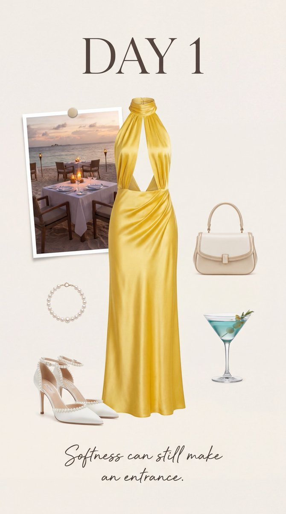

## Pergola Blueprint Prompt: Hand-drawn architectural penci

- ID: trending-2027936240985903452
- Slug: trending-2027936240985903452-en
- 语言: en
- 来源: [来源链接](https://x.com/Strength04_X/status/2027936240985903452)
- 样例图路径: images/part1/2027936240985903452_1.jpg

### 提示词

```text
Pergola Blueprint Prompt: Hand-drawn architectural pencil sketch of a wooden garden pergola on white paper. Front and slight side elevation view with clear proportions.

Construction lines, dimensions and handwritten notes visible. Wooden posts and cross beams precisely drafted. Professional but hand-sketched technical style. Clean white background.

Finished Pergola: Fully built wooden pergola in a real garden, matching the exact structure and proportions from the sketch. Viewed from a low front corner perspective at eye level, showing depth and the full beam structure instead of a flat elevation. Natural wood texture with realistic joints and connections. Installed on grass with surrounding plants. Soft daylight with grounded shadows. Photorealistic architectural visualization.
```

### 样例图

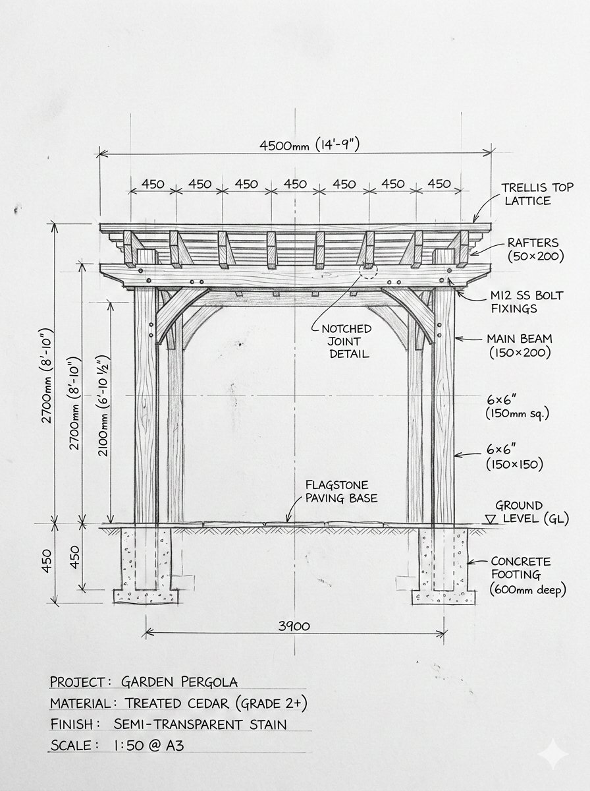

## { "objective": "Create a premium split composition showi

- ID: trending-2039777786639126806
- Slug: trending-2039777786639126806-en
- 语言: en
- 来源: [来源链接](https://x.com/craftian_keskin/status/2039777786639126806)
- 样例图路径: images/part1/2039777786639126806_1.jpg

### 提示词

```text
{
  "objective": "Create a premium split composition showing a detailed automotive blueprint (top) and a perfectly matching real-world car with material breakdown (bottom), with a carefully designed high-end background",
  "aspect_ratio": "3:4",
  "composition": {
    "layout": "vertical_split",
    "split_ratio": "50:50",
    "alignment": "precise, centered",
    "continuity_rule": "bottom car must EXACTLY match blueprint geometry, proportions, and design"
  },

  "top_section": {
    "type": "engineering_blueprint",
    "style": "ultra-detailed CAD drawing",
    "background": {
      "color": "#0b1d2a",
      "texture": "subtle grid lines",
      "vignette": "very slight edge darkening"
    },
    "linework": {
      "color": "white with faint cyan glow",
      "thickness_variation": "technical precision",
      "sharpness": "very crisp"
    },
    "views": {
      "top_view": "dominant center",
      "side_view": "bottom left",
      "front_view": "bottom right"
    },
    "technical_elements": {
      "dimension_lines": true,
      "units": "mm",
      "arrows": "thin CAD arrows",
      "labels": [
        "ENGINE BLOCK",
        "PISTONS",
        "TRANSMISSION",
        "DRIVE SHAFT",
        "SUSPENSION",
        "CHASSIS",
        "WIRING LAYOUT"
      ],
      "exploded_diagram": {
        "position": "top right",
        "components": [
          "engine block",
          "crankshaft",
          "pistons",
          "radiator",
          "drive shaft",
          "shock absorbers"
        ],
        "connection_lines": "dashed white"
      }
    },
    "detail_level": "engineering-grade, extremely dense"
  },

  "bottom_section": {
    "type": "real_product + material_breakdown",
    "layout": "car_left_material_panel_right",

    "environment": {
      "type": "luxury architectural setting",
      "design_intent": "background must feel intentional, premium, and editorial — not random",

      "scene": {
        "location": "modern minimalist luxury house exterior",
        "architecture": [
          "clean concrete walls",
          "large floor-to-ceiling glass panels",
          "subtle wood accents",
          "sharp geometric lines"
        ],
        "ground": "smooth concrete driveway with slight reflection",
        "background_elements": [
          "minimal landscaping (bonsai-style trees or trimmed bushes)",
          "no clutter",
          "balanced negative space"
        ]
      },

      "lighting": {
        "time": "golden hour (soft warm sunlight)",
        "direction": "side lighting to enhance car shape",
        "shadows": "soft and elongated",
        "reflections": "physically accurate on car paint"
      },

      "depth": {
        "depth_of_field": "moderate",
        "background_blur": "slight cinematic blur",
        "focus_priority": "car remains razor sharp"
      }
    },

    "car_render": {
      "style": "photorealistic automotive photography",
      "camera": {
        "angle": "3/4 front angle",
        "height": "slightly low for hero perspective",
        "lens": "35mm",
        "framing": "car occupies left 60% of bottom section"
      },
      "constraints": [
        "exact match to blueprint",
        "no added design features",
        "realistic proportions only"
      ]
    },

    "material_panel": {
      "position": "right side",
      "style": "Apple-style product breakdown",
      "background": "soft off-white panel with subtle shadow separation",
      "layout": "vertical stack with spacing",

      "items": [
        {
          "title": "Seat Material",
          "visual": "macro close-up of seat texture",
          "material": "premium leather or fabric",
          "lighting": "soft diffused",
          "annotation": "thin line pointing to interior seat"
        },
        {
          "title": "Body Material",
          "visual": "close-up of painted metal with reflections",
          "material": "coated aluminum / steel",
          "annotation": "points to car exterior panel"
        },
        {
          "title": "LED Headlights",
          "visual": "detailed glowing LED headlight close-up",
          "material": "modern LED system",
          "annotation": "points to front headlight"
        }
      ],

      "typography": {
        "font": "modern sans-serif",
        "style": "clean, minimal",
        "hierarchy": "clear titles + small labels"
      }
    }
  },

  "style": {
    "fusion": [
      "engineering blueprint",
      "luxury automotive ad",
      "product design presentation"
    ],
    "quality": "ultra high-end",
    "finish": "polished, editorial-grade"
  },

  "negative_constraints": [
    "no mismatch between blueprint and car",
    "no messy or cluttered background",
    "no unrealistic reflections",
    "no over-saturated colors",
    "no random environments",
    "no extra parts not in blueprint"
  ],

  "render_settings": {
    "sharpness": "high",
    "dynamic_range": "wide",
    "color_grading": "natural cinematic",
    "noise": "minimal"
  }
}
```

### 样例图

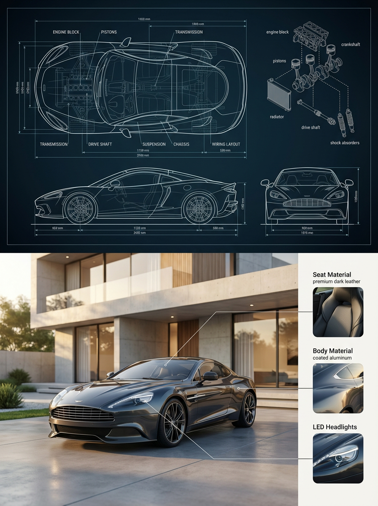

## High-resolution Japanese commercial advertisement style 

- ID: trending-2041188242846888389
- Slug: trending-2041188242846888389-en
- 语言: en
- 来源: [来源链接](https://x.com/Mind_Boticni/status/2041188242846888389)
- 样例图路径: images/part1/2041188242846888389_1.jpg

### 提示词

```text
High-resolution Japanese commercial advertisement style photo, three young women posing against a clean white background with bold geometric color blocks (blue, pink, yellow, green) arranged diagonally.
Top right: woman with short brown hair wearing a red and black plaid shirt and black choker, winking and making an “OK” hand gesture over one eye.

Left: woman in a light blue police uniform with cap, making an “OK” gesture near her eye with a playful expression.

Bottom right: woman dressed as a nurse in a white outfit and cap, making a peace (V) sign with a cute expression.
Bright studio lighting, soft shadows, vibrant colors, sharp focus, clean commercial composition, modern Japanese advertising aesthetic, playful and energetic mood, ultra-detailed, crisp skin tones.
No text, no logos, no typography anywhere in the image.
```

### 样例图

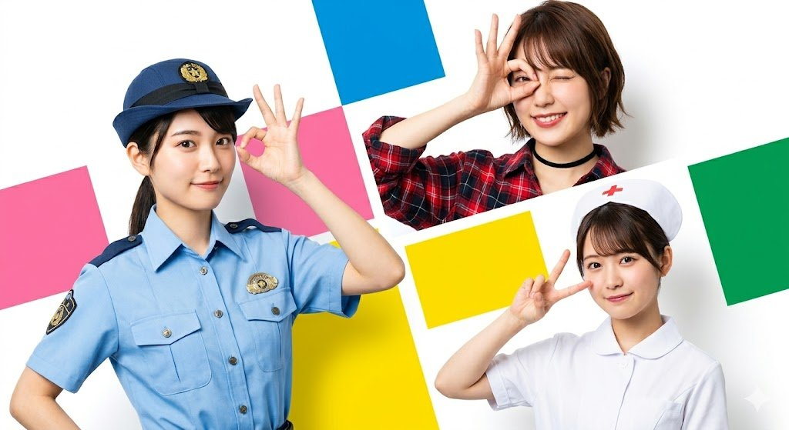

