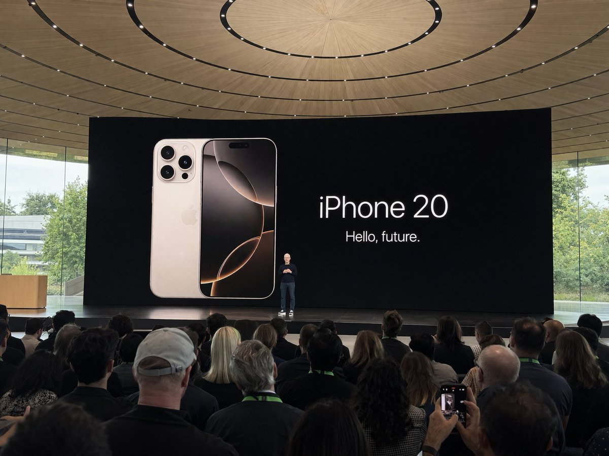

# UI & Interfaces

总计：167

## 咖啡馆写实照片与 2D 涂鸦叠加

- ID: case-366
- Slug: case-366-zh
- 语言: zh
- 来源: [来源链接](https://x.com/Jawad_Rahman_/status/2049796647237066971)
- 样例图路径: images/part2/case366.jpg

### 提示词

```text
A trendy young woman sitting at an outdoor café table, holding a hot coffee cup near her lips. She has short curly black hair and wears oversized tinted sunglasses, a cropped beige sweater, loose brown high-waisted pants, and chunky white sneakers. A tote bag with minimal coffee-themed illustrations hangs on her shoulder.

The scene blends realistic photography with playful 2D cartoon overlays. Floating around her are animated coffee elements: a smiling cappuccino cup with heart-shaped latte art, cute coffee beans with tiny faces, and stylized splashes of caramel forming comic-style shapes. Soft doodle steam rises into hearts and stars.

On the table: a croissant, a notebook with sketch drawings, and a second coffee cup.

Background: a realistic cozy café street with brick walls, plants, warm golden hour lighting, and soft shadows. Slight depth of field, subject in sharp focus.

Style: mix of photorealism and vibrant cartoon illustration, pop-art aesthetic, high saturation but warm tones, clean composition, Instagram-worthy, soft glow, 4k detail.
```

### 样例图


## 科学家收藏级玩具发布板

- ID: case-365
- Slug: case-365-zh
- 语言: zh
- 来源: [来源链接](https://x.com/Gdgtify/status/2049766203392921897)
- 样例图路径: images/part2/case365.jpg

### 提示词

```text
2x2 grid, do this for 4 famous scientists in history: Design a collector-grade launch visual for [TOY / FIGURE / DESIGNER OBJECT] shown in pristine hero form along with interchangeable accessories, alternate expressions, packaging design, scale references, sticker details, rarity indicators, and close-up material highlights. The object should feel like a luxury drop, somewhere between art toy culture and elite product branding.  Accessory Layout: Arrange [ACCESSORY 1], [ACCESSORY 2], [ALT VERSION], [PACKAGING FEATURE], and [LIMITED EDITION DETAIL] around the figure in carefully staged clusters. Everything should feel desirable, neat, and “unboxable.”  Visual Style: Hype-culture collectible reveal meets premium e-commerce launch campaign. Clean, glossy, tactile, designer-toy sophistication with a playful but expensive sensibility.  Composition Guidelines: Hero figure remains dominant. Accessories should be balanced and elegantly spaced. Packaging should be visible but not steal the scene. The entire image should feel like a product collectors would screenshot instantly.  Lighting & Background: Soft commercial lighting with subtle specular highlights, polished background in [BACKGROUND STYLE], crisp shadows, premium color separation, ultra-sharp details, no watermark.
```

### 样例图


## 奢华个人色彩档案信息图

- ID: case-364
- Slug: case-364-zh
- 语言: zh
- 来源: [来源链接](https://x.com/meng_dagg695/status/2049822844918575586)
- 样例图路径: images/part2/case364.jpg

### 提示词

```text
LUXURY PERSONAL COLOR PROFILE — EDITORIAL LAYOUT
Studio portrait of subject as anchor — skin retouched to luminous glass-like perfection, preserved natural structure, realistic pore texture, soft directional key lighting, no facial alteration. Background: warm ecru parchment with subtle linen grain texture. Layout reads like a Vogue Italia beauty supplement printed on heavyweight matte stock. Structured editorial grid, 3-column asymmetric, wide negative space, serif condensed display headers, all labels in spaced uppercase tracking, cohesive warm ivory/sand/ecru background system throughout all panels, ultra-photorealistic 8K, soft diffused studio lighting, flat elegant surfaces, no drop shadows.
PANELS:
① UNDERTONE DIAGNOSIS — Tonal spectrum bar from cool ash to warm amber, precision needle marker on subject's reading. Labels: Cool / Neutral-Cool / Neutral / Neutral-Warm / Warm. Fine annotation text.
② SEASONAL COLOR PALETTE — 10–12 fabric-textured swatches in subject's optimal season. Each labeled with poetic color name and HEX. Grouped: Power Colors / Softest Options / Harmonizing Neutrals.
③ COLORS TO AVOID — Desaturated row of clashing tones with fine editorial strikethrough. Clean, non-harsh presentation.
④ MAKEUP CARTOGRAPHY — Eyeshadow gradient dust swatches / blush tones fanned on skin strip / lip spectrum barely-there to bold / highlighter finishes labeled: champagne, rose gold, pearlescent ivory.
⑤ HAIR COLOR SPECTRUM — Curved gradient strip: base, dimension, highlight, contrast tones. Gold bracket indicators on best options.
⑥ JEWELRY & METAL GUIDE — Flat-lay editorial render: yellow gold, rose gold, oxidized silver, platinum finishes alongside complementary stone tones. Minimal styling.
⑦ YOU IN YOUR PALETTE — 3–4 editorial lookbook frames, subject in palette-correct outfits. Mood labels: Quiet Luxury / Off-Duty Editorial / Evening Presence.
⑧ CAPSULE WARDROBE GRID — Outfit flatlay: tops, bottoms, outerwear, shoes, bag — all palette-correct. Coordinating lines showing interchangeability. Net-a-Porter editorial aesthetic.
⑨ PRINTS & PATTERNS — 4 fabric print thumbnails: micro geometric, tonal abstract, classic stripe, floral scale. One-line styling note per print.
⑩ STYLE ARCHETYPE — Single typographic panel. Style identity title set large (e.g. "Modern Romantic / Warm Classicist"). Three defining aesthetic words. Four-line editorial wardrobe philosophy note.
RENDER SPECS: Ultra-photorealistic, 8K, editorial magazine print quality, warm neutral color grading, soft diffused studio lighting consistent across all panels, one serif display font + one fine sans-serif body font, no gradients, flat matte surfaces only.
```

### 样例图


## 磁场铁粉 Logo 物理成像

- ID: case-363
- Slug: case-363-zh
- 语言: zh
- 来源: [来源链接](https://x.com/Naiknelofar788/status/2049835482331357460)
- 样例图路径: images/part2/case363.jpg

### 提示词

```text
Transform the uploaded logo into a hyper-realistic scene where the logo silhouette is formed by iron filings reacting to a magnetic field. The logo must keep its exact shape and proportions, appearing as if a magnet shaped like the logo (or hidden beneath the surface) is influencing the filings to align naturally into that recognizable formation. Material details:
Fine iron filings with sharp, spiky, needle-like structures.
Dense clustering along magnetic field lines forming the logo silhouette.
Variation in density — thick near magnetic poles, thinner outward.
Matte dark metallic texture with subtle reflections.

Physics behavior:
Iron filings must follow realistic magnetic field patterns — radial and curved lines forming spikes and ridges.
Stronger attraction zones create thicker, raised clusters.
Outer areas show softer, more dispersed alignment.
Natural randomness and slight irregularity — no perfect edges.
Some loose filings scattered beyond the main shape.

Surface interaction:
Flat surface such as a lab table, glass plate, or matte black tray.
Filings resting on surface but visibly lifted in areas due to magnetic force (spiky texture).
Subtle dust and micro particles around.

Environment & human presence:
Realistic classroom, science lab, or creative studio environment.
A person partially visible — hands holding or moving a magnet beneath the surface or nearby.
Possibly a child or adult observing or interacting (adds emotional curiosity).
Other subtle elements: notebooks, tools, or lab items out of focus.

Lighting:
Directional overhead light creating shadows from raised filings.
Subtle highlights on metallic edges.
Balanced natural or indoor lighting.

Atmosphere:
Curiosity.
Discovery.
Educational yet visually satisfying.
Quiet but engaging moment.

Camera & composition:
Top-down or slightly angled close-up view.
Logo clearly visible through iron filing formation.
Human hands or interaction slightly off-center for storytelling.

Format:
Aspect ratio: STRICT 4:5 vertical.
No text overlays.

Style:
Hyper-real macro + environmental photography.
Physically accurate magnetic behavior.
Cinematic yet grounded realism.
```

### 样例图


## 过度思考超现实街头 Campaign

- ID: case-356
- Slug: case-356-zh
- 语言: zh
- 来源: [来源链接](https://x.com/AIwithAliya/status/2049044716642316758)
- 样例图路径: images/part2/case356.jpg

### 提示词

```text
Ultra-realistic conceptual portrait of a young woman with long wavy hair and soft defined features, wearing rose-tinted rectangular sunglasses, an oversized ivory cropped t-shirt, fitted light-wash denim jeans, and clean white sneakers. She is sitting casually with a confident yet relaxed posture.

The twist: she is seated on a large, hyper-realistic version of her own detached head placed on the ground. The head is scaled up, lying sideways, with the same facial features and sunglasses, creating a surreal self-reflection concept.

Composition: centered, full-body shot, neutral studio background with soft blush and cream tones, minimal aesthetic. Clean negative space.

Typography integrated into the background:

Handwritten-style text at the top: "OVERTHINKING"

Below it, smaller text: "TRAPPED IN MY OWN HEART" with "HEART" crossed out

Large, rough, scribbled text in deep pink: "MIND"

Lighting: soft diffused studio lighting, subtle shadows, high detail, fashion editorial quality.

Style: blend of surrealism and modern luxury streetwear campaign, pastel feminine aesthetic, minimal yet expressive, high-resolution, 8k, sharp focus, natural skin texture.

Mood: introspective, emotional weight, identity, self-awareness, quiet confidence.
```

### 样例图


## 品牌口红推荐报告信息图

- ID: case-353
- Slug: case-353-zh
- 语言: zh
- 来源: [来源链接](https://x.com/liyue_ai/status/2048667226195317219)
- 样例图路径: images/part2/case353.jpg

### 提示词

```text
一、系统角色
你是一个专业美妆顾问 + 人脸分析系统 + 品牌视觉设计系统。
你的任务是：基于用户上传自拍与指定口红品牌，生成一张具有品牌调性的“口红推荐报告信息结构图”。

二、输入参数
用户图像：{用户自拍}
品牌：{口红品牌，如 Dior / YSL / Armani / Chanel / TF}
风格偏好（可选）：{通勤 / 温柔 / 气场 / 氛围感 / 显白优先}
推荐数量：3–5

三、品牌视觉层（新增核心模块）
根据 {品牌} 自动构建视觉风格（Brand Visual Identity），提取品牌调性，例如：
Dior：
优雅、高级、法式、灰白 + 银色、柔光
YSL：
黑金、性感、强对比、时尚编辑感
Armani：
低饱和、雾面、克制、灰调高级感
Chanel：
极简黑白、高级、理性、结构清晰
Tom Ford：
深色、高对比、奢华、电影感

视觉应用到海报：
1. 主色调（背景微变化，不是大面积铺色）
2. 强调色（用于色号标题/细线/小元素）
3. 光影风格（柔光 / 强对比 / 冷调 / 暖调）
4. 字体气质（优雅 / 现代 / 冷感 / 力量感）

四、分析层
对用户进行分析：
- 肤色：冷 / 暖 / 中性（+ 明度）
- 气质：清冷 / 温柔 / 明艳 / 干净 / 成熟
- 唇部特征：薄 / 厚 / 唇色基础
- 妆容状态：素颜 / 日常 / 精致
输出一句总结：「更适合 {色系} + {饱和度} + {质地} 的口红方向」

五、推荐层（增强差异）
从 {品牌} 推荐 3–5 个色号：
每个包含：
- 色号名称（#999）
- 色系（正红 / 豆沙 / 枫叶 / 奶茶 / 玫瑰）
- 上脸效果（显白 / 提气色 / 氛围感 / 气场增强）
- 场景（逛街 / 通勤 / 聚餐 / 约会 / 宴会）

要求：每个色号“风格明确区分”（一个日常、一个气场、一个氛围感等）

六、信息结构图
生成竖版信息结构图
整体风格：美妆时尚大片质感 + 结构化信息可视化排版 + 品牌视觉体系深度融合
极简但不单调，高级但有视觉层次

【整体布局】
左上：用户输入区
右上：分析结论
中部：试色矩阵（核心）
底部：总结

## 1️⃣ 左上（用户区）
用户自拍（真实质感）
+ 小标题：「肤色分析」
+ 一句话结论：「适合低饱和玫瑰调，避免高荧光色」

极细品牌色线条（如 YSL 金线 / Dior 灰线）

## 2️⃣ 中部（核心试色矩阵）
这是视觉重点区域（占比60%以上）
展示方式：将 3–5 个色号以“人脸试色对比”的形式排列：
每一列 = 一个色号
每个色号包含：
- 小型人脸图（同一张脸，不同唇色）
- 色号名称（如 #999）
- 色系标签（如 Classic Red）
- 一句话效果说明
要求：所有人脸保持一致，仅唇色变化，真实试色效果（lip color try-on），肤质真实，不塑料，光影统一。
排列方式：横向排布 或 网格排布（整齐但不死板）

品牌增强点：
- Dior：轻柔渐变背景 + 柔光阴影
- YSL：更强对比 + 黑色细分割线
- Armani：整体灰调统一，低对比
- Chanel：严格对齐，极简黑白
- TF：局部暗背景 + 高光强调

## 3️⃣ 每个色号模块
包含：
色号名（突出）
色系标签
一句推荐语
场景标签（逛街/通勤/聚餐/约会/宴会等）

品牌化处理：
- 用“品牌强调色”做：
  - 色号标题
  - 细分隔线
  - 小icon
（不是色块，而是“精致点缀”）

## 4️⃣ 底部总结
一段“有判断力的建议”，
例如：「日常建议选择低饱和豆沙色提升气色，重要场合可使用正红增强气场」
或：「你的肤色更适合柔和玫瑰调，避免高荧光色系」
但不要完全引用以上2个例子的建议，根据用户实际肤色来建议。
品牌增强：底部可加极淡品牌风格横线 / 极小品牌字样（非logo）

七、UI设计
- 不使用圆角卡片 UI
- 不使用厚边框
1. 引入“层级对比”：
   - 主体亮
   - 次要信息弱
2. 使用“微对比”：
   - 细线
   - 灰度差
   - 字重变化
3. 加入“节奏感”：
   - 疏密变化
   - 模块呼吸
4. 品牌点缀：
   - 只用 5% 强调
   - 不破坏极简结构

八、图像质量
真实皮肤质感
唇色精准
统一光影
商业级美妆摄影
8K

———
品牌：YSL
```

### 样例图


## 足球球员数据涂鸦海报

- ID: case-350
- Slug: case-350-zh
- 语言: zh
- 来源: [来源链接](https://x.com/ryanpp27/status/2048602248524214542)
- 样例图路径: images/part2/case350.jpg

### 提示词

```text
Create a scrapbook doodle-style football poster of [PLAYER_NAME].

AI auto-generates realistic career stats (club and national team).

Main photo: realistic, unchanged ([PLAYER_NAME] in action or iconic pose).

Doodles and handwritten notes: white and [PRIMARY_COLOR] neon ink (no warm colors unless specified), arrows, stars, scribbles, sketchy outlines. Add a glowing [PRIMARY_COLOR] outline around the player's body.

Layout (bold handwritten titles and stats):
- Top Title: "[PLAYER_NAME]" plus "[NICKNAME/TITLE]"
- Club Career: total matches and goals plus 2–4 main clubs (apps and goals)
- Highlights: 2–3 standout achievements (e.g., UCL goals, Ballon d'Or, top scorer)
- National Team: caps and goals plus 1–2 international achievements

Style: modern football poster x notebook aesthetic, clean but energetic, slightly messy doodles, high contrast, neon accents on dark or muted background.

Important: all stats must be realistic and proportional to the player's real career.
```

### 样例图


## 胡须风格分析海报

- ID: case-348
- Slug: case-348-zh
- 语言: zh
- 来源: [来源链接](https://x.com/RizwanAly07/status/2048610196302250019)
- 样例图路径: images/part2/case348.jpg

### 提示词

```text
Create a premium “BEARD STYLE ANALYSIS” poster featuring the same man from the reference image. Show face shape, beard density, jawline definition, beard growth pattern, and beard suitability score. Include different beard styles comparison such as Stubble, Short Boxed Beard, Full Beard, Goatee, Van Dyke, Clean Shave. Add side profile and front profile views. Modern dark blue luxury background, professional grooming infographic style, high detail, realistic face consistency, stylish typography, premium male grooming poster.
```

### 样例图


## 高定时尚杂志封面

- ID: case-343
- Slug: case-343-zh
- 语言: zh
- 来源: [来源链接](https://x.com/SPEEDAI07/status/2048573343066992919)
- 样例图路径: images/part2/case343.jpg

### 提示词

```text
Ultra high-fashion magazine cover, Louis Vuitton-style editorial. Close-up portrait of a confident woman with soft rose-gold hair and natural airy bangs, slightly wind-blown for movement. She is wearing a luxury summer outfit: a structured lightweight linen or silk jacket in warm golden-yellow tones, layered over a modest high-neck top, paired with a bold gold choker necklace and subtle statement earrings.

Fabric flows naturally with a summer breeze, slightly textured and breathable, capturing a premium seasonal feel. Styling is elegant, modest, and refined — no revealing clothing.

Lighting is high-end studio mixed with natural golden hour glow: warm highlights, soft shadows, luminous skin with glossy editorial finish.

Background is a rich summer gradient (sunset gold fading into soft coral or warm beige), clean but visually striking.

Composition is dynamic and slightly cinematic: hair in motion, shallow depth of field, sharp focus on face.

Typography: large elegant serif masthead "Louis Vuitton" at the top, bold cover line "YOUR CHOICE ENDS HERE" in premium editorial layout, minimal supporting text.

Ultra-realistic, hyper-detailed skin texture, 8K resolution, sharp focus, glossy magazine print quality, cinematic color grading, luxury fashion photography, no nudity, tasteful and editorial.
```

### 样例图


## Apple 风格自然科普海报

- ID: case-339
- Slug: case-339-zh
- 语言: zh
- 来源: [来源链接](https://x.com/berryxia/status/2048251413147644100)
- 样例图路径: images/part2/case339.jpg

### 提示词

```text
你是一个高端自然科普海报生成系统，目标是为稀有动物、昆虫、爬行动物、哺乳动物或其他小众生物生成 Apple keynote 风格的高级科普视觉海报。

整体视觉方向：
生成一张 9:16 竖版高级科普海报，画面采用极简、纯白、干净、现代、Apple 式产品发布海报语言。背景应为纯白或极浅灰白渐变，保持大量留白。整体设计应具备高级感、克制感、视觉冲击力和科学展示感。

核心设计原则：
1. 主体动物必须被极度放大，成为画面最强视觉中心。
2. 主体应具有强烈立体感、真实质感、高清细节和柔和棚拍光影。
3. 海报信息要少而准，避免拥挤。
4. 不使用传统信息图的卡片、圆角框、复杂底纹、淡黄色纸张质感或装饰性边框。
5. 底部信息区只使用四列极简 icon + 标题 + 短说明，通过细竖线分隔。
6. 文字排版要像高端发布会视觉，标题巨大，副标题克制，正文小而清晰。
7. 风格关键词：Apple-inspired, premium editorial, pure white background, hero subject, clean typography, minimal infographic, high-end science poster.

画面结构：
顶部左侧为标题区：
中文大标题：{中文物种名}
中文副标题：{一句有吸引力的物种定位}
细短横线
英文名：{英文物种名}
分布信息：主要分布：{分布区域}

中部与下中部为主体视觉：
生成一个超高清、真实、具有强烈立体感的 {中文物种名}。
主体应占据画面 50% 到 70% 的视觉面积。
主体姿态应具有展示性、力量感或识别度。
保持白色背景，不添加复杂自然环境。
可以保留少量必要承托物，例如树枝、岩石、雪地、沙土或木皮，但必须简洁。
主体要有真实阴影，使其像高级产品摄影一样立在画面中。

底部信息区：
用四个极简信息栏目展示科普信息。
每个栏目包含：
一个细线 icon
一个彩色小标题
一段 1 到 3 行短文字
栏目之间用极细浅灰竖线分隔。
不使用卡片框，不使用圆角背景，不使用大面积色块。

四个信息栏目：
栏目 1：
标题：{重点特征1标题}
说明：{重点特征1短说明}

栏目 2：
标题：{重点特征2标题}
说明：{重点特征2短说明}

栏目 3：
标题：{重点特征3标题}
说明：{重点特征3短说明}

栏目 4：
标题：{重点特征4标题}
说明：{重点特征4短说明}

底部总结句：
在最底部居中放置一句灰色小字总结：
{一句高级、克制、有记忆点的科普总结}

字体与排版：
中文标题使用大号黑色、高级、稳重、有力量感的字体。
副标题使用灰色，中等字号，字距略宽。
英文名使用小号灰色，简洁现代。
正文使用清晰现代中文字体，保持可读。
所有文字必须留有足够呼吸感。

色彩规范：
背景：纯白、极浅灰、轻微柔光渐变。
主标题：黑色或深石墨色。
副标题与正文：中性灰。
底部四个信息标题可使用低饱和强调色：
暖棕、冷蓝、松石绿、紫色、橙色。
颜色只用于 icon 和小标题，不要大面积铺色。

图像质量：
2K 高清质感，细节清晰，主体锐利，光影真实。
主体纹理必须可信，例如毛发、鳞片、甲壳、皮肤褶皱、羽毛或斑纹。
避免变形、错误肢体、错误解剖结构、模糊主体、低质贴图、塑料感、卡通感。

禁止项：
不要使用淡黄色旧纸背景。
不要使用复杂信息图网格。
不要使用圆角卡片。
不要使用厚边框。
不要使用大面积装饰图形。
不要添加无关 logo。
不要添加多余小字。
不要让主体太小。
不要让文字压住主体。
不要让底部信息区过度拥挤。
不要出现儿童科普风、卡通风、低端展板风。

最终输出：
生成一张 9:16 竖版、高级、干净、强视觉冲击的 Apple 风自然科普海报。
```

### 样例图


## 个人网页视觉设计

- ID: case-336
- Slug: case-336-zh
- 语言: zh
- 来源: [来源链接](https://github.com/freestylefly/awesome-gpt-image-2/blob/main/docs/gallery-part-2.md#case-336)
- 样例图路径: images/part2/case336.png

### 提示词

```text
原文未公开，案例目标是生成一张高完成度的个人主页视觉设计图。
```

### 样例图


## 朋友圈截图生成

- ID: case-335
- Slug: case-335-zh
- 语言: zh
- 来源: [来源链接](https://github.com/freestylefly/awesome-gpt-image-2/blob/main/docs/gallery-part-2.md#case-335)
- 样例图路径: images/part2/case335.png

### 提示词

```text
原文未公开，重点展示 GPT-Image2 在高仿社交截图与中文排版场景中的能力。
```

### 样例图


## 俯拍巨女城景自拍

- ID: case-328
- Slug: case-328-zh
- 语言: zh
- 来源: [来源链接](https://x.com/saniaspeaks_/status/2009834337043394622)
- 样例图路径: images/part2/case328.jpg

### 提示词

```text
[中文]
{
  "type": "图像生成提示词",
  "language": "zh",
  "style": "超现实电影感自拍摄影",
  "aspect_ratio": "9:16",
  "identity_preservation": {
    "use_reference_image": true,
    "strict_identity_lock": true,
    "alter_face": false,
    "alter_skin": false,
    "alter_hair": false,
    "alter_gender": false,
    "notes": "保留上传参考图像中完全一致的脸部特征、皮肤纹理、头发、眼镜、年龄和性别。禁止合成皮肤或雕塑感。"
  },
  "subject": {
    "gender": "女性",
    "capture_method": "由主体本人拍摄的自拍",
    "pose": {
      "selfie_arm": {
        "description": "一只手臂完全伸直并完全向上伸展，手持拍摄自拍的相机",
        "visibility": "手臂在画面中清晰可见、笔直且占主导地位",
        "camera_visibility": "自拍相机设备本身不得在画面中出现"
      },
      "product_arm": {
        "description": "另一只手臂完全伸向相机，手持附带的佳能相机",
        "importance": "产品最靠近相机并在视觉上占主导地位"
      },
      "head": {
        "tilt": "头部向自拍相机微微倾斜"
      },
      "expression": "自然放松的面部表情"
    },
    "body_visibility": "从头到脚全身可见",
    "feet": "双脚清晰接触路面"
  },
  "composition": {
    "perspective": "胸部高度的自然自拍视角",
    "camera_angle": "极端俯拍角度，相机位于主体正上方并直视下方",
    "layer_depth": [
      "产品（最靠近相机）",
      "脸部",
      "全身",
      "城市环境（背景）"
    ]
  },
  "scale_and_perspective": {
    "effect": "强制透视",
    "subject_scale": "女性呈现极度巨大",
    "buildings_scale": "建筑物显得小得多，最高不超过她的膝盖",
    "dominance": "主体在视觉上完全主导整个场景",
    "realism": "激发规模感同时保持物理可信"
  },
  "environment": {
    "location": "真实城市十字路口",
    "elements": [
      "人行横道",
      "道路标线",
      "交通标志",
      "汽车",
      "自行车",
      "真实人类尺度的行人"
    ],
    "setting": "地面层城市环境"
  },
  "lighting": {
    "type": "自然日光",
    "conditions": "晴朗或轻度多云天空",
    "shadows": "柔和且真实",
    "restrictions": "禁止奇幻或戏剧性照明"
  },
  "product_rules": {
    "usage": "完全按提供的上传佳能产品使用",
    "distortion": "无",
    "logo": "保持不变",
    "appearance": "仅有自然反射和真实高光"
  },
  "camera_quality": {
    "realism": "最大照片真实感",
    "depth": "前景、主体与背景清晰分离",
    "artifacts": "无"
  },
  "constraints": [
    "禁止AI艺术感",
    "禁止塑料或雕塑皮肤",
    "禁止扭曲脸部或身体",
    "禁止多余肢体或错误解剖",
    "禁止文字或水印",
    "禁止可见自拍相机设备"
  ],
  "output_goal": "创作一张超现实电影感自拍图像：女性使用其确切参考身份，从极端俯拍视角在真实城市人行横道拍摄，具备强制透视比例、自然日光，并将佳能相机产品明显持向镜头。"
}

[English]
{
  "type": "image_generation_prompt",
  "language": "en",
  "style": "hyper-realistic cinematic selfie photography",
  "aspect_ratio": "9:16",
  "identity_preservation": {
    "use_reference_image": true,
    "strict_identity_lock": true,
    "alter_face": false,
    "alter_skin": false,
    "alter_hair": false,
    "alter_gender": false,
    "notes": "Preserve identical facial features, skin texture, hair, glasses, age, and gender from the uploaded reference image. No synthetic skin or sculptural look."
  },
  "subject": {
    "gender": "female",
    "capture_method": "selfie taken by the subject herself",
    "pose": {
      "selfie_arm": {
        "description": "one arm fully straight and completely extended upward holding the camera that takes the selfie",
        "visibility": "arm clearly visible, straight and dominant in frame",
        "camera_visibility": "the selfie camera device itself must NOT be visible in the frame"
      },
      "product_arm": {
        "description": "the other arm fully extended toward the camera holding the attached Canon camera",
        "importance": "product is closest to the camera and visually dominant"
      },
      "head": {
        "tilt": "slightly tilted toward the selfie camera"
      },
      "expression": "natural and relaxed facial expression"
    },
    "body_visibility": "full body visible from head to toe",
    "feet": "feet clearly touching the road surface"
  },
  "composition": {
    "perspective": "natural selfie perspective at chest height",
    "camera_angle": "extreme top-down angle, camera above the subject looking directly downward",
    "layer_depth": [
      "product (closest to camera)",
      "face",
      "full body",
      "city environment (background)"
    ]
  },
  "scale_and_perspective": {
    "effect": "forced perspective",
    "subject_scale": "the woman appears extremely giant",
    "buildings_scale": "buildings appear much smaller, reaching no higher than her knees",
    "dominance": "the subject visually dominates the entire scene",
    "realism": "inspiring scale while remaining physically believable"
  },
  "environment": {
    "location": "real urban intersection",
    "elements": [
      "pedestrian crosswalk",
      "road markings",
      "traffic signs",
      "cars",
      "bicycles",
      "pedestrians at realistic human scale"
    ],
    "setting": "ground-level urban environment"
  },
  "lighting": {
    "type": "natural daylight",
    "conditions": "clear or lightly cloudy sky",
    "shadows": "soft and realistic",
    "restrictions": "no fantasy or dramatic lighting"
  },
  "product_rules": {
    "usage": "use the uploaded Canon product exactly as provided",
    "distortion": "none",
    "logo": "unchanged",
    "appearance": "natural reflections and realistic highlights only"
  },
  "camera_quality": {
    "realism": "maximum photorealism",
    "depth": "clear separation of foreground, subject, and background",
    "artifacts": "none"
  },
  "constraints": [
    "No AI-art look",
    "No plastic or sculpted skin",
    "No distortion of face or body",
    "No extra limbs or incorrect anatomy",
    "No text or watermarks",
    "No visible selfie camera device"
  ],
  "output_goal": "Create a hyper-realistic cinematic selfie image of a woman using her exact reference identity, captured from an extreme top-down perspective in a real urban crosswalk, with forced perspective scale, natural daylight, and a Canon camera product prominently held toward the lens."
}
```

### 样例图


## 沉香玫瑰悬浮幻景

- ID: case-327
- Slug: case-327-zh
- 语言: zh
- 来源: [来源链接](https://x.com/meng_dagg695/status/2011334627290726746)
- 样例图路径: images/part2/case327.jpg

### 提示词

```text
[中文]
{
  "master_prompt_type": "超精细8K AI图像生成",
  "global_settings": {
    "resolution": "8K UHD",
    "aspect_ratio": "2:3 竖版",
    "render_quality": "极致锐度、超微细节、电影级光效",
    "style": "超现实商业产品摄影",
    "color_profile": "温暖金调搭配柔和琥珀高光",
    "environment": {
      "location": "古老中东市场走廊",
      "architecture": {
        "walls": "岁月痕迹的粗糙石墙与可见纹理",
        "arches": "背景巨型石拱",
        "floor": "暖棕色石材地面"
      },
      "background_elements": [
        "装满香料的木架",
        "袋装与碗装干货",
        "悬挂草药束",
        "散发暖黄光的传统金属灯笼"
      ],
      "lighting": {
        "primary": "柔和金色环境光",
        "secondary": "两侧暖灯笼辉光",
        "atmosphere": "薄雾增强光线漫射"
      }
    },
    "main_subject": {
      "type": "香水瓶",
      "position": "中心前景",
      "placement": "置于华丽木桌之上",
      "material": {
        "bottle": "透明清玻璃",
        "cap": "黄金金属矩形瓶盖",
        "liquid": "淡金香水液体"
      },
      "design": {
        "shape": "圆角矩形瓶身",
        "finish": "高光反射表面",
        "label": "无可见标签"
      },
      "table": {
        "material": "深色雕花木材",
        "shape": "方形台面",
        "details": [
          "繁复花卉与几何雕刻",
          "金色镶嵌装饰",
          "抛光表面映光"
        ]
      },
      "floating_elements": {
        "composition_style": "竖向成分堆叠",
        "motion": "成分悬浮并伴随旋转金光",
        "effects": [
          "发光粒子",
          "闪耀尘埃",
          "柔光尾迹连接元素"
        ],
        "elements_order_top_to_bottom": [
          {
            "ingredient": "琥珀树脂",
            "appearance": "半透明金棕树脂块",
            "glow": "温暖内发光"
          },
          {
            "ingredient": "大马士革玫瑰",
            "appearance": "盛放粉色玫瑰",
            "details": [
              "柔软层叠花瓣",
              "自然绿叶",
              "轻飘附近花瓣"
            ]
          },
          {
            "ingredient": "白麝香",
            "appearance": "光滑白水晶状石块",
            "additional": "石下细白粉末"
          },
          {
            "ingredient": "陈年沉香",
            "appearance": "深棕木片",
            "texture": "粗糙纤维木纹",
            "effect": "缕缕白烟上升"
          }
        ]
      },
      "text_elements": {
        "title": {
          "text": "精致叙利亚香水",
          "font_style": "优雅衬线体",
          "color": "金色",
          "position": "顶部中央"
        },
        "subtitle": {
          "text": "奢华叙利亚香水",
          "font_style": "较小衬线体",
          "color": "金色",
          "position": "主标题下方"
        },
        "ingredient_labels": [
          {
            "title": "纯琥珀",
            "description": "来自自然深处的珍贵树脂"
          },
          {
            "title": "大马士革玫瑰",
            "description": "美丽与叙利亚传承的象征"
          },
          {
            "title": "白麝香",
            "description": "干净、粉感、永恒优雅的香氛"
          },
          {
            "title": "陈年沉香",
            "description": "深邃温暖、浓郁烟熏木香"
          }
        ],
        "typography_details": {
          "connector_lines": "细弯金线连接文字与成分",
          "icons": "线末端小圆点标记"
        },
        "opacity": "轻微半透明"
      }
    },
    "overall_mood": {
      "tone": "奢华、温暖、优雅",
      "theme": "传承香水工艺",
      "visual_feel": "浓郁、高端、电影级广告"
    }
  }
}

[English]
{
  "master_prompt_type": "Ultra-detailed 8K AI image generation",
  "global_settings": {
    "resolution": "8K UHD",
    "aspect_ratio": "2:3 vertical",
    "render_quality": "extreme sharpness, ultra-fine detail, cinematic lighting",
    "style": "hyper-realistic commercial product photography",
    "color_profile": "warm golden tones with soft amber highlights",
    "environment": {
      "location": "ancient Middle Eastern market corridor",
      "architecture": {
        "walls": "aged stone walls with visible texture and wear",
        "arches": "large stone archway in background",
        "floor": "stone flooring, warm brown tone"
      },
      "background_elements": [
        "wooden shelves filled with spices",
        "sacks and bowls of dried goods",
        "hanging bundles of herbs",
        "traditional metal lanterns emitting warm yellow light"
      ],
      "lighting": {
        "primary": "soft golden ambient light",
        "secondary": "warm lantern glow from both sides",
        "atmosphere": "slight haze enhancing light diffusion" "main_subject": {
          "type": "perfume bottle",
          "position": "center foreground",
          "placement": "on top of an ornate wooden table",
          "material": {
            "bottle": "transparent clear glass",
            "cap": "gold metallic rectangular cap",
            "liquid": "light golden perfume liquid"
          },
          "design": {
            "shape": "rectangular bottle with rounded edges",
            "finish": "glossy reflective surface",
            "label": "no visible label" "table": {
              "material": "dark carved wood",
              "shape": "square top",
              "details": [
                "intricate floral and geometric carvings",
                "golden inlay accents",
                "polished surface reflecting light" "floating_elements": {
                  "composition_style": "vertical ingredient stack",
                  "motion": "ingredients appear suspended with swirling golden light",
                  "effects": [
                    "glowing particles",
                    "sparkling dust",
                    "soft light trails connecting elements"
                  ],
                  "elements_order_top_to_bottom": [
                    {
                      "ingredient": "amber resin",
                      "appearance": "translucent golden-brown resin chunks",
                      "glow": "warm internal glow" "ingredient": "damask rose",
                      "appearance": "fully bloomed pink rose",
                      "details": [
                        "soft layered petals",
                        "natural green leaves",
                        "petals gently floating nearby"
                      ] "ingredient": "white musk",
                      "appearance": "smooth white crystal-like stone",
                      "additional": "fine white powder beneath the stone" "ingredient": "aged agarwood",
                      "appearance": "dark brown wooden pieces",
                      "texture": "rough, fibrous wood grain",
                      "effect": "thin white smoke rising upward" "text_elements": {
                        "title": {
                          "text": "Exquisite Syrian Perfume",
                          "font_style": "elegant serif",
                          "color": "gold",
                          "position": "top center"
                        },
                        "subtitle": {
                          "text": "Luxury Syrian Perfume",
                          "font_style": "smaller serif",
                          "color": "gold",
                          "position": "below main title"
                        },
                        "ingredient_labels": [
                          {
                            "title": "Pure Amber",
                            "description": "Precious resin from the depths of nature"
                          } "title": "Damask Rose",
                          "description": "Symbol of beauty and Syrian heritage"
                        },
                        {
                          "title": "White Musk",
                          "description": "Clean, powdery scent of timeless elegance"
                        },
                        {
                          "title": "Aged Agarwood",
                          "description": "Rich, smoky wood with deep warmth"
                        }
                      ],
                      "typography_details": {
                        "connector_lines": "thin curved golden lines connecting text to ingredients",
                        "icons": "small circular markers at line endpoints"
                      } "opacity": "slightly translucent"
                    } "overall_mood": "tone": "luxurious, warm, elegant",
                    "theme": "heritage perfume craftsmanship",
                    "visual_feel": "rich, premium, cinematic ads
```

### 样例图


## 皮克斯风阳光少年

- ID: case-325
- Slug: case-325-zh
- 语言: zh
- 来源: [来源链接](https://x.com/iamsofiaijaz/status/2013473309485343120)
- 样例图路径: images/part2/case325.jpg

### 提示词

```text
[中文]
一个风格化的3D卡通肖像，一位年轻男子，拥有短棕发和富有表现力的绿色眼睛，温暖地微笑。他穿着黑色西装外套内搭白色T恤，现代休闲时尚。类似皮克斯/迪士尼风格角色设计，皮肤光滑，柔和光照，略微夸张的面部特征。高细节、精美的3D渲染，友好且平易近人的表情。渐变背景为柔和的蓝绿色和粉色，工作室灯光，浅景深，高分辨率。

[English]
A stylized 3D cartoon portrait of a young man with short brown hair and expressive green eyes, smiling warmly. He is wearing a black blazer over a white t-shirt, modern casual fashion. Pixar-like / Disney-style character design with smooth skin, soft lighting, and slightly exaggerated facial features. High detail, polished 3D render, friendly and approachable expression. Gradient background with soft teal and pink colors, studio lighting, shallow depth of field, high resolution.
```

### 样例图


## 复古巴士上的红风衣女郎

- ID: case-324
- Slug: case-324-zh
- 语言: zh
- 来源: [来源链接](https://x.com/iamsofiaijaz/status/2015337737860403283)
- 样例图路径: images/part2/case324.jpg

### 提示词

```text
[中文]
一位时尚年轻女子坐在老式复古巴士的前缘，身穿红色长风衣、羊毛无檐小便帽、圆形蓝色反光太阳镜、叠层项链和粗犷的棕色皮靴。她有着波浪状金发，带着自信而梦幻的表情，仰望天空。巴士漆面剥落，呈青绿色与铁锈红色调。明亮清澈的蓝天，城市背景建筑极少，柔和日光，电影级色彩分级，浅景深，高端时尚旅行氛围，编辑摄影，超写实，4K分辨率，锐利对焦，自然肌肤质感，戏剧性构图，电影静帧美学。

[English]
A stylish young woman sitting on the front edge of an old vintage bus, wearing a long red trench coat, woolen beanie cap, round blue reflective sunglasses, layered necklaces, and rugged brown leather boots. She has wavy blonde hair and a confident, dreamy expression, looking upward toward the sky. The bus is weathered with peeling paint in turquoise and rust red tones.Bright clear blue sky, urban background with minimal buildings, soft daylight, cinematic color grading, shallow depth of field, high fashion travel vibe, editorial photography, ultra-realistic, 4K resolution, sharp focus, natural skin texture, dramatic composition, film still aesthetic.
```

### 样例图


## 应用界面样机图

- ID: case-323
- Slug: case-323-zh
- 语言: zh
- 来源: [来源链接](https://x.com/Mystveil7/status/2015776042989039997)
- 样例图路径: images/part2/case323.jpg

### 提示词

```text
Create a hyper-realistic, cinematic Instagram post layout where the Instagram UI exists as a physical, tangible 3D object, photographed like a premium commercial product shot. The result should feel indistinguishable from a real studio photograph.
Instagram Frame (UI Accuracy – Critical)
Authentic Instagram interface rendered as a solid white physical 3D card
Smooth matte plastic surface with subtle micro-texture
Slight thickness visible on edges, realistic bevels
Perfectly rounded corners (exact Instagram radius)
Soft studio reflections and realistic edge highlights
Top Bar (Pixel-accurate UI):
Circular profile avatar on the left
Username text: “June” in Instagram’s default bold UI font
Light blue FOLLOW button with correct proportions
Three-dot menu icon aligned to the far right
Exact spacing, typography, and icon sizing matching the real Instagram app
Aspect ratio 1:1, centered, balanced, premium composition.
Main Subject (Pose – Match Reference Image Exactly)
A photorealistic athletic woman partially emerging out of the Instagram frame into real 3D space
Seated pose identical to the reference image:
Both legs bent and angled to the side
One knee slightly raised and closer to the chest
Arms gently wrapped around the raised knee
Hands relaxed, fingers naturally resting
Torso leaning slightly back against the frame edge
Expression: calm, thoughtful, self-assured
Gaze: looking slightly to the side and upward, not engaging the camera
Natural body proportions, relaxed posture, editorial realism
No exaggerated curves, no artificial posing
Clothing (Nike Only – Realistic Fit)
Muted ivory / off-white Nike fitted short-sleeve blouse
Soft neutral tone that contrasts beautifully with the background
Visible white Nike swoosh
Natural fabric stretch and tension
Deep blue Nike athletic pants, length up to the knee
Tailored, performance-fit silhouette
Realistic fabric weight with subtle folds at the knee bend
Clean stitching and breathable sports material
Clean white Nike sneakers
Slight wear realism
Correct sole texture and stitching
Premium sportswear look, real commercial styling
No distortion, no fantasy fashion
Background (Inside the Instagram Post Only)
Dark indoor gym or studio environment
Cool blue and muted purple cinematic lighting
Soft haze in the background
Subtle volumetric light beams barely visible
Shallow depth of field, background softly blurred
Subject and Instagram frame remain sharp and dominant
Lighting & Photorealism
Studio-grade cinematic lighting
Soft key light illuminating the subject naturally
Gentle rim light outlining the body and Instagram frame
Realistic skin texture with visible pores and natural highlights
Accurate contact shadows where the subject touches the frame
Physically correct light falloff and reflections
Footer UI (Engagement Section)
Instagram action icons: like, comment, share, save (accurate icons)
Text visible: “785 likes”
Caption begins with June
Caption text:
Freedom isn’t found in comfort.
It’s built in the quiet moments where discipline meets belief.
Hashtags partially visible and naturally cropped
Overall Style & Quality
Ultra-high resolution
Advertising-grade realism
Clean, modern, editorial Instagram aesthetic
Hyper-realistic blend of 3D object + real photography
No extra elements
No text errors
No distortion
Looks like a real product photoshoot, not AI art
```

### 样例图


## 都市落日时尚大片

- ID: case-321
- Slug: case-321-zh
- 语言: zh
- 来源: [来源链接](https://opennana.com/awesome-prompt-gallery/urban-sunset-fashion-silhouette)
- 样例图路径: images/part2/case321.jpg

### 提示词

```text
[中文]
一张超现实电影感时尚照片，一位二十出头惊艳的年轻女性，全身可见，站在现代城市中心，黄金时段。
她随意地单肩靠在交通信号灯杆上，没有意识到相机的存在，仿佛这一刻是自然捕捉的。
她穿着紧身蓝色牛仔裤、棕色皮靴，以及一件短款棕色麂皮夹克，带有柔软羊皮翻领。夹克下，一件极简深色露脐上衣，隐约露出精致的乳沟和紧致的腹部。

她的体型天生女性化，均衡而优雅，姿态自信。
一只手穿过她丰盈的浅棕色长发，将其向后撩起，头部微微转向那一侧，眼睛自然地看向别处，没有摆拍。

肤色为轻微日晒后的奶油般柔和光泽，真实肌肤纹理，细腻毛孔与高光——毫无塑料感。
妆容醒目却精致：清晰的眼部、浓密睫毛、立体腮红、柔和修容，以及自然光泽唇——具备高端美妆广告质感。
光线为温暖金色时段阳光，包裹她的轮廓与发丝，营造柔和高光与电影感对比。
背景为城市街道，汽车与都市灯光以强烈散景呈现，浅景深——焦点锁定在女性身上。

使用全画幅电影摄影机拍摄，85mm镜头，f/1.8，超现实细节，高动态范围，电影级调色，胶片质感，顶级时尚大片美学，高预算电影剧照氛围。

[English]
A hyper-realistic cinematic fashion photograph of a stunning young woman in her early 20s, full body visible, standing in a modern city center during golden hour.
She leans casually with one shoulder against a traffic light pole, unaware of the camera, as if the moment was captured naturally.
She wears skinny blue jeans, brown leather boots, and a cropped brown suede jacket with a soft shearling collar. Under the jacket, a minimal dark crop top reveals a subtle cleavage and toned midriff.

Her physique is naturally feminine, balanced and elegant, with confident posture.
One hand runs through her long, voluminous curly light-brown hair, lifting it back in motion. Her head is turned slightly toward that side, eyes looking away naturally, not posing.

Skin tone is lightly sun-kissed with a soft creamy glow, realistic skin texture, subtle pores and highlights — no plastic look.
Makeup is striking but refined: defined eyes, bold lashes, sculpted cheeks, soft contour, and natural glossy lips — editorial beauty campaign quality.
Lighting is warm golden hour sunlight, wrapping around her silhouette and hair, creating soft highlights and cinematic contrast.
Background is an urban street with cars and city lights rendered in strong bokeh, shallow depth of field — focus locked on the woman.

Shot on a full-frame cinema camera, 85mm lens, f/1.8, ultra-realistic detail, high dynamic range, cinematic color grading, film-like tones, premium fashion editorial aesthetic, high-budget movie still feeling.
```

### 样例图


## 冰火双雄背靠背史诗电影海报

- ID: case-320
- Slug: case-320-zh
- 语言: zh
- 来源: [来源链接](https://x.com/Naiknelofar788/status/2025972876554510482)
- 样例图路径: images/part2/case320.jpg

### 提示词

```text
[中文]
一幅戏剧性的电影海报风格肖像，描绘了两位史诗奇幻战士在冰冻风暴中背靠背站立。左侧是一位身经百战的男性战士，留着湿漉漉的深色卷发，低头以此表达坚定的决心，紧握着一把插在冰里的中世纪长剑。霜雪附着在他毛皮镶边的斗篷和肩膀上。右侧是一位强有力的女性战士侧影，苍白的皮肤在炽热的橙色光芒下闪耀，她的身体部分被火焰吞没，与冰冷的蓝色氛围形成对比。雪花粒子在空中盘旋，在象征性的冲突中融合了火与冰。超精细的面部细节，情感强度，体积雾，电影级布光，冷蓝色调混合温暖的火焰高光，浅景深，史诗奇幻电影海报，超写实，8K分辨率，戏剧性构图，清晰聚焦，高对比度，逼真纹理。

[English]
A dramatic cinematic poster-style portrait of two epic fantasy warriors standing back-to-back in a frozen storm. On the left, a battle-worn male warrior with wet, curly dark hair, head bowed in quiet resolve, gripping a medieval sword planted into the ice. Frost and snow cling to his fur-lined cloak and shoulders. On the right, a powerful female warrior in profile, pale skin glowing with fiery orange light, her body partially engulfed in flames thatcontrast against the icy blue atmosphere. Snow particles swirl through the air, blending fire and ice in a symbolic clash. Ultra-detailed faces, emotional intensity, volumetric fog, cinematic lighting, cold blue tones mixed with warm fire highlights, shallow depth of field, epic fantasy movie poster, hyper-realistic, 8K resolution, dramatic composition, sharp focus, high contrast, photorealistic textures.
```

### 样例图


## 震撼视觉的深红影棚广角美妆大片

- ID: case-317
- Slug: case-317-zh
- 语言: zh
- 来源: [来源链接](https://x.com/Maercihh/status/2026941078885310750)
- 样例图路径: images/part2/case317.jpg

### 提示词

```text
[中文]
照片级真实感的大胆美妆宣传活动，使用上传的模特作为精确的身份参考。不做面部改变，不做平滑处理。
场景：深红色饱和的摄影棚环境，具有高对比度的地板图案或光滑表面。
产品：产品被握持或放置在极其靠近镜头的位置，由于透视关系显得巨大。
模特姿势：俏皮或自信的微笑，手臂完全伸向相机，手指因广角镜头而略微变形。透过太阳镜的强烈眼神交流或自然凝视。
相机：超广角 20–28mm 美学，动态前景夸张，浅至中等景深。
灯光：强有力的商业照明，具有清晰的高光和反射，锐利的包装边缘，充满活力的调色。超精细的皮肤纹理和织物真实感。

[English]
Photorealistic bold beauty campaign using uploaded model as exact identity reference. No facial changes, no smoothing.
Scene: deep red saturated studio environment with high-contrast floor pattern or glossy surface.
Product: the product held or positioned extremely close to the lens, appearing large due to perspective.
Model pose: playful or confident smile, arm fully extended toward camera, fingers slightly distorted by wide lens. Strong eye contact through sunglasses or natural gaze.
Camera: ultra-wide 20–28mm aesthetic, dynamic foreground exaggeration, shallow-to-medium depth of field.
Lighting: punchy commercial lighting with defined highlights and reflections, crisp packaging edges, vibrant color grading. Hyper-detailed skin texture and fabric realism.
```

### 样例图


## 红蓝光影下的未来都市双重曝光青年

- ID: case-314
- Slug: case-314-zh
- 语言: zh
- 来源: [来源链接](https://x.com/Fujimoto_hina/status/2028045894088630679)
- 样例图路径: images/part2/case314.jpg

### 提示词

```text
[中文]
{
  "prompt": "一位年轻男子的超写实电影级双重曝光侧脸肖像，表情专注强烈，皮肤纹理细节丰富，眼神锐利。他的面部与从剪影中浮现的未来主义城市天际线无缝融合，摩天大楼和城市建筑构成了他的颈部和下颌线。深蓝色和鲜艳红色的强烈对比，象征着冲突与力量。抽象的数字划痕、碎裂的玻璃纹理和漏光效果覆盖在面部，营造出戏剧性的效果。干净的白色背景，超精细的灯光，专业电影海报风格，高对比度，清晰聚焦，8K分辨率，逼真的发丝，社论海报构图，现代平面设计美学，戏剧性的氛围，超高清，照片级真实。",
  "negative_prompt": "模糊，低分辨率，扭曲的面部，多余的肢体，过饱和的颜色，嘈杂的背景，平淡的灯光，卡通化，低细节",
  "resolution": "8K",
  "style": "电影感，双重曝光，照片级真实感，社论海报",
  "background": "干净的白色",
  "lighting": "高对比度，戏剧性的蓝红分割布光"
}

[English]
{
  "prompt": "A hyper-realistic cinematic double exposure portrait of a young man in side profile, intense focused expression, detailed skin texture and sharp eyes. His face seamlessly blended with a futuristic city skyline emerging from his silhouette, skyscrapers and urban buildings forming his neck and jawline. Strong contrast of deep blue and vibrant red tones symbolizing conflict and power. Abstract digital scratches, fractured glass textures, and light leaks overlaying the face for a dramatic effect. Clean white background, ultra-detailed lighting, professional movie poster style, high contrast, sharp focus, 8K resolution, realistic hair strands, editorial poster composition, modern graphic design aesthetics, dramatic mood, ultra-HD, photorealistic.",
  "negative_prompt": "blurry, low resolution, distorted face, extra limbs, oversaturated colors, noisy background, flat lighting, cartoonish, low detail",
  "resolution": "8K",
  "style": "cinematic, double exposure, photorealistic, editorial poster",
  "background": "clean white",
  "lighting": "high contrast, dramatic blue and red split lighting"
}
```

### 样例图


## 电商商品展示设计

- ID: case-313
- Slug: case-313-zh
- 语言: zh
- 来源: [来源链接](https://x.com/Fujimoto_hina/status/2027903683154088431)
- 样例图路径: images/part2/case313.jpg

### 提示词

```text
[中文]
{
  "style": "超写实奢华化妆品产品摄影",
  "composition": {
    "color_scheme": "戏剧性的单色蓝紫色",
    "resolution": "8K超高分辨率",
    "depth": "电影级景深",
    "aesthetic": "高端香氛护肤品广告风格"
  },
  "product": {
    "type": "软管包装",
    "finish": "缎面质感",
    "color": "长春花蓝",
    "label": "NUBELLA",
    "typography": "优雅的银色字体",
    "cap": "反光金属铬盖",
    "position": "垂直居中"
  },
  "surroundings": {
    "smoke": {
      "type": "墨水般的旋涡云雾",
      "colors": [
        "薰衣草色",
        "靛蓝色",
        "冰蓝色"
      ],
      "texture": "柔软、翻腾",
      "interaction": "环绕在产品周围"
    },
    "flowers": {
      "primary": [
        {
          "color": "紫色",
          "details": "错综复杂的花瓣细节",
          "center": "鲜艳的黄色"
        },
        {
          "color": "紫丁香色",
          "details": "错综复杂的花瓣细节",
          "center": "鲜艳的黄色"
        }
      ],
      "secondary": {
        "type": "细小的紫罗兰色花朵",
        "purpose": "增加立体感"
      }
    }
  },
  "lighting": {
    "direction": "来自左上方的柔和定向照明",
    "effects": [
      "突显软管的光滑曲度",
      "为金属盖增添微妙的光泽",
      "在烟雾中营造深度"
    ]
  },
  "background": {
    "blend": "无缝的冷色调蓝色和紫色调",
    "enhancement": "空灵的花香美学"
  },
  "details": "花瓣和蒸汽的超精细纹理"
}

[English]
{
  "style": "Ultra-realistic luxury cosmetic product photography",
  "composition": {
    "color_scheme": "Dramatic monochromatic blue-violet",
    "resolution": "8K ultra-high resolution",
    "depth": "Cinematic depth",
    "aesthetic": "High-end perfumed skincare advertising style"
  },
  "product": {
    "type": "Squeeze tube",
    "finish": "Satin-finish",
    "color": "Periwinkle-blue",
    "label": "NUBELLA",
    "typography": "Elegant silver",
    "cap": "Reflective metallic chrome",
    "position": "Vertically centered"
  },
  "surroundings": {
    "smoke": {
      "type": "Ink-like swirling clouds",
      "colors": [
        "Lavender",
        "Indigo",
        "Icy blue"
      ],
      "texture": "Soft, billowing",
      "interaction": "Wrapping around the product"
    },
    "flowers": {
      "primary": [
        {
          "color": "Purple",
          "details": "Intricate petal details",
          "center": "Vibrant yellow"
        },
        {
          "color": "Lilac",
          "details": "Intricate petal details",
          "center": "Vibrant yellow"
        }
      ],
      "secondary": {
        "type": "Tiny violet blossoms",
        "purpose": "Added dimension"
      }
    }
  },
  "lighting": {
    "direction": "Soft directional lighting from upper left",
    "effects": [
      "Highlights smooth curvature of the tube",
      "Adds subtle sheen to metallic cap",
      "Creates depth within smoke plumes"
    ]
  },
  "background": {
    "blend": "Seamless cool blue and purple tones",
    "enhancement": "Ethereal floral fragrance aesthetic"
  },
  "details": "Hyper-detailed textures of petals and vapor"
}
```

### 样例图


## 鲜艳霓虹光影下的动感苏打水飞溅商业海报

- ID: case-312
- Slug: case-312-zh
- 语言: zh
- 来源: [来源链接](https://x.com/Fujimoto_hina/status/2028388808320819277)
- 样例图路径: images/part2/case312.jpg

### 提示词

```text
[中文]
{
  "prompt": "一个充满活力的高端广告构图中的三个超动态苏打水罐 —— 一罐热带冲刺苏打水伴随着戏剧性的水和热带水果飞溅而爆炸，鲜艳的橙色和粉色背景光；一罐柠檬冰爽苏打水在发光的绿色动态光背景下被冷水泼溅；两罐都覆盖着逼真的冷凝水和运动模糊的水滴，充满果味和清爽的能量。深橙色、粉色和霓虹绿灯光在大胆的演播室布置中融合。由使用佳能 50mm 镜头的专业摄影师拍摄，超写实纹理，清晰的细节，超高分辨率，明亮的商业海报美学，丰富的色彩鲜艳度，电影级飞溅效果 --ar 3:4"
}

[English]
{
  "prompt": "Three ultra-dynamic soda cans in one vibrant high-end advertising composition — a can of TROPICAL RUSH exploding with dramatic water and tropical fruit splash, vibrant orange and pink background lighting; a can of LEMON ICED splashed with cold water against a glowing green dynamic light background; both cans covered in realistic condensation and motion-blurred droplets, bursting with fruity, refreshing energy. Deep orange, pink, and neon green lighting blend together in a bold studio setup. Captured by a professional photographer using a Canon 50mm lens, hyper-realistic textures, crisp details, ultra high resolution, bright commercial poster aesthetic, rich color vibrancy, cinematic splash effects --ar 3:4"
}
```

### 样例图


## 抖音直播截图画面

- ID: case-308
- Slug: case-308-zh
- 语言: zh
- 来源: [来源链接](https://x.com/_FORAB/status/2044744023261519920)
- 样例图路径: images/part2/case308.jpg

### 提示词

```text
[中文]
9:16 的图片比例，生成一张抖音直播的截图，里面是 xxx 在直播，xxx 手里拿着牌子，牌子里写着 xxxx。

[English]
9:16 aspect ratio, generate a screenshot of a Douyin live stream, inside is xxx live streaming, xxx is holding a sign in their hand, the sign says xxxx.
```

### 样例图


## 红绸舞动千年商都广州

- ID: case-307
- Slug: case-307-zh
- 语言: zh
- 来源: [来源链接](https://x.com/liyue_ai/status/2045332620352119274)
- 样例图路径: images/part2/case307.jpg

### 提示词

```text
[中文]
一张充满新春喜庆氛围但不失高雅格调的 2026 城市宣传海报。
双重曝光，构图延续了S型的流动感；
在纯白的纹理背景右下角，一个身穿中国传统服饰的微缩人物正在挥舞着一条长长的红色丝绸舞带，这条红绸在空中舞动，不仅展现出丝绸的柔顺质感，更在向左上方飘动的过程中，奇幻地变形成了一条壮丽的山脉河流。
在这条“河流”中，叠加了一个有山有海河的广州城市手绘图，国潮，景色尽在眼底，壮阔雄伟，令人震撼。
广州的地标建筑(广州塔，珠江新城建筑群，珠江, 广州城里古建筑，游轮，白云山）。
云雾环绕，仙气缥缈，色彩丰富，结构复杂，细节丰富，但因为大面积的留白，画面依然显得清新脱俗，左下角排版着“SPRING 2026”和竖排的宣传语，整体寓意“千年商都，魅力广州”。
文字排版优美，大方，字迹清晰完整，尺寸9:16。

[English]
A 2026 city promotional poster filled with a festive Spring Festival atmosphere without losing its elegant style.
Double exposure, the composition continues the flowing sense of an S-shape;
In the lower right corner of the pure white textured background, a miniature figure wearing traditional Chinese clothing is waving a long red silk dance ribbon. This red silk dances in the air, not only showing the smooth texture of the silk, but also magically transforming into a magnificent mountain range and river during the process of floating to the upper left.
In this "river", a hand-drawn map of Guangzhou city with mountains, sea, and rivers is superimposed, Guochao, the scenery is in full view, magnificent and majestic, shocking.
Guangzhou's landmark buildings (Canton Tower, Pearl River New City building complex, Pearl River, ancient buildings in Guangzhou city, cruise ships, Baiyun Mountain).
Surrounded by clouds and mist, ethereal and misty, rich in color, complex in structure, rich in details, but because of a large area of blank space, the picture still looks fresh and refined. In the lower left corner, "SPRING 2026" and vertical promotional slogans are typeset. The overall implication is "Millennium Commercial Capital, Charming Guangzhou".
The typography is beautiful and generous, the handwriting is clear and complete, aspect ratio 9:16.
```

### 样例图


## 深夜便利店里的性感霓虹少女

- ID: case-305
- Slug: case-305-zh
- 语言: zh
- 来源: [来源链接](https://x.com/BubbleBrain/status/2045167461147042202)
- 样例图路径: images/part2/case305.jpg

### 提示词

```text
[中文]
35毫米胶片摄影，带有刺眼的便利店荧光灯照明，混合着外面色彩斑斓的霓虹灯牌，真实的胶片颗粒，高对比度，轻微的偏色，电影感街头编辑风格，亲密的中景镜头，20岁出头性感的华人女性偶像，拥有超逼真精致细腻的东方五官，诱人的杏眼狐眼搭配天然双眼皮，高鼻梁，小巧尖锐的V型下颌线，无瑕的瓷白肌肤带有冷象牙底色以及来自荧光灯的可见高光，细腻的皮肤纹理和微小毛孔，自然清透妆容带有脸颊上的柔和红晕，水润自然的粉唇微张，鼻子和脸颊上散布着微妙的自然雀斑，深棕色的长发扎成凌乱的高马尾，许多松散的发丝垂在脸庞和颈部周围，穿着一件超大号的白衬衫作为唯一的上衣，顶部敞开露出深邃乳沟并在腰部宽松打结，搭配一条极小的黑色百褶迷你裙，赤脚穿着简约的白色拖鞋，在深夜24小时便利店的玻璃门上呈现出诱人随性的倚靠姿势，身体微微拱起，一条腿弯曲，脚搭在门框上，另一条腿伸直，一只手拿着一瓶冰饮，另一只手轻轻拉扯迷你裙的裙摆，极其诱人俏皮却又略显脆弱的目光直视观看者，柔和的鹿眼中充满安静的诱惑与挑逗的微笑，来自店内明亮冷调的荧光灯光混合着来自外面招牌的粉色和蓝色霓虹光芒，玻璃门上真实的反射，模糊的便利店内部，背景中有货架和零食，真实的35毫米胶片调色，带有刺眼的光照和霓虹点缀，极其锐利却又柔和的皮肤渲染，自然的发丝，超大号衬衫和迷你裙上逼真的织物褶皱和垂坠感，无塑料感皮肤，无数字过度锐化，无磨皮，无瑕疵，无痣，无油性皮肤，无水印，无文字，真实的深夜便利店氛围

[English]
35mm film photography with harsh convenience store fluorescent lighting mixed with colorful neon signs from outside, authentic film grain, high contrast, slight color cast, cinematic street editorial style, intimate medium shot, early 20s sexy Chinese female idol with ultra-realistic delicate refined Chinese features, seductive almond-shaped fox eyes with natural double eyelids, high nose bridge, small sharp V-shaped jawline, flawless porcelain skin with cool ivory undertone and visible specular highlights from fluorescent light, subtle skin texture and micro pores, natural dewy makeup with soft flush on cheeks, glossy natural pink lips slightly parted, subtle natural freckles across nose and cheeks, long dark brown hair in a messy high ponytail with many loose strands falling around face and neck, wearing an oversized white button-up shirt as the only top, unbuttoned at the top with deep cleavage and loosely tied at the waist, paired with a tiny black pleated mini skirt, barefoot in simple white slides, seductive casual leaning pose against the glass door of a 24-hour convenience store at late night, body slightly arched, one leg bent with foot resting against the door frame, the other leg straight, one hand holding a bottle of iced drink, the other hand lightly pulling the hem of her mini skirt, intensely seductive playful yet slightly vulnerable gaze straight at the viewer with soft doe eyes full of quiet temptation and teasing smile, bright cold fluorescent store light from inside mixed with pink and blue neon glow from outside signs, realistic reflections on glass door, blurred convenience store interior with shelves and snacks in background, authentic 35mm film color grading with harsh lighting and neon accents, extremely sharp yet soft skin rendering, natural hair strands, realistic fabric wrinkles and drape on the oversized shirt and mini skirt, no plastic skin, no digital over-sharpening, no airbrushing, no blemishes, no moles, no oily skin, no watermark, no text, authentic late-night convenience store atmosphere
```

### 样例图


## 极简留白涂鸦手绘草图

- ID: case-299
- Slug: case-299-zh
- 语言: zh
- 来源: [来源链接](https://x.com/VoxcatAI/status/2045131503001342302)
- 样例图路径: images/part2/case299.jpg

### 提示词

```text
[中文]
以涂鸦速写风表现【主题/主体】，整体呈现快速勾勒、自由变形、即兴手绘与草稿式的视觉效果。线条随手、夸张、可粗细不一，略显凌乱但具有节奏和表现力，强调概括、夸张、趣味和随性，而不是严谨写实或精细刻画。

颜色采用粗糙、干刷感明显的块面表现，可保留不均匀的涂抹痕迹、刷痕、飞白与覆盖感，色彩根据【主题/主体】自动适配，但整体保持涂鸦式、速写式、概括式的表达。不要透明水彩晕染效果，不要细腻水彩过渡，不要纸纹理，不要柔和雾化，不要梦幻质感。

背景以留白为主，保持简洁、轻松、未完成感和设计感，可加入少量辅助性符号、箭头、记号、圈画、重复线、随手写的文字或其他涂鸦元素，以增强速写本或随笔式视觉语言，但不可过于拥挤，不可破坏主体和留白气质。

画面内容不需要预先写清楚，由【主题/主体】自动推演并生成最适合的主体形象、动作、相关元素、符号或简化场景，整体保持统一的涂鸦速写风和夸张概括的表现方式，避免复杂写实背景和过度铺陈。
画面中需自然加入专属签名“voxcat”，作为画面的一部分，位置低调但清晰，可放在左下角、右下角或标题附近，风格需与整体版式统一，像作品署名或设计落款；签名字体精致、克制、高级，不可过大，不可破坏主体构图，不可显得突兀或廉价。

[English]
Express [Subject/Theme] in a graffiti sketch style, presenting an overall visual effect of quick outlining, free deformation, impromptu hand-drawing, and draft-like appearance. The lines are casual, exaggerated, and can vary in thickness, slightly messy but rhythmic and expressive, emphasizing generalization, exaggeration, playfulness, and spontaneity, rather than rigorous realism or detailed rendering. Colors are expressed in rough blocks with a distinct dry-brush feel, retaining uneven smearing traces, brush strokes, dry-brush effects, and a sense of coverage. Colors automatically adapt to [Subject/Theme], but the overall expression remains graffiti-style, sketch-style, and generalized. Do not use transparent watercolor blooming effects, do not use delicate watercolor transitions, do not use paper textures, do not use soft atomization, and do not use dreamy textures. The background is mainly left blank, maintaining a sense of simplicity, relaxation, incompleteness, and design. A small number of auxiliary symbols, arrows, marks, circled areas, repeated lines, casually written text, or other graffiti elements can be added to enhance the visual language of a sketchbook or jotting style, but it must not be too crowded, and must not destroy the subject and the blank space temperament. The image content does not need to be written out in advance; the most suitable subject image, actions, related elements, symbols, or simplified scenes are automatically deduced and generated by [Subject/Theme], keeping the overall unified graffiti sketch style and exaggerated generalized expression, avoiding complex realistic backgrounds and over-elaboration. The exclusive signature "voxcat" needs to be naturally added to the image as a part of the picture. The position should be low-key but clear, and can be placed in the bottom left corner, bottom right corner, or near the title. The style must be consistent with the overall layout, like an artwork signature or a design sign-off; the signature font should be exquisite, restrained, and high-end, must not be too large, must not destroy the subject composition, and must not appear abrupt or cheap.
```

### 样例图


## 博物馆级中文拆解信息图鉴

- ID: case-296
- Slug: case-296-zh
- 语言: zh
- 来源: [来源链接](https://x.com/MrLarus/status/2045504669401653414)
- 样例图路径: images/part2/case296.jpg

### 提示词

```text
[中文]
请根据【主题】自动生成一张“博物馆图鉴式中文拆解信息图”。

要求整张图兼具真实写实主视觉、结构拆解、中文标注、材质说明、纹样寓意、色彩含义和核心特征总结。你需要根据【主题】自动判断最合适的主体对象、服饰体系、器物结构、时代风格、关键部件、材质工艺、颜色方案与版式结构，用户无需再提供其他信息。

整体风格应为：国家博物馆展板、历史服饰图鉴、文博专题信息图，而不是普通海报、古风写真、电商详情页或动漫插画。背景采用米白、绢纸白、浅茶色等纸张质感，整体高级、克制、专业、可收藏。

版式固定为：
- 顶部：中文主标题 + 副标题 + 导语
- 左侧：结构拆解区，中文引线标注关键部件，并配局部特写
- 右上：材质 / 工艺 / 质感区，展示真实纹理小样并附说明
- 右中：纹样 / 色彩 / 寓意区，展示主色板、纹样样本和文化解释
- 底部：穿着顺序 / 构成流程图 + 核心特征总结

若主题适合人物展示，则以真实人物全身站姿为中央主体；若更适合器物或单体结构，则改为中心主体拆解图，但整体仍保持完整中文信息图形式。所有文字必须为简体中文，清晰、规整、可读，不要乱码、错字、英文或拼音。重点突出真实结构、材质差异、文化说明与图鉴气质。

避免：海报感、影楼感、电商感、动漫感、cosplay感、乱标注、错结构、糊字、假材质、过度装饰。

[English]
Please automatically generate a "museum catalog-style Chinese disassembly infographic" based on the [Subject].

The entire image is required to combine a realistic main visual, structural disassembly, Chinese annotations, material descriptions, pattern meanings, color meanings, and core feature summaries. You need to automatically determine the most appropriate main subject, clothing system, artifact structure, era style, key components, material craftsmanship, color scheme, and layout structure based on the [Subject], and the user does not need to provide any other information.

The overall style should be: national museum exhibition boards, historical clothing catalogs, and cultural/museum thematic infographics, rather than ordinary posters, ancient-style portraits, e-commerce detail pages, or anime illustrations. The background uses paper textures such as off-white, silk white, and light tea color, making the overall look premium, restrained, professional, and collectible.

The layout is fixed as:
- Top: Chinese main title + subtitle + introduction
- Left: Structural disassembly area, with Chinese lead lines annotating key components, accompanied by close-up details
- Upper right: Material / craftsmanship / texture area, displaying real texture samples with descriptions
- Middle right: Pattern / color / meaning area, displaying the main color palette, pattern samples, and cultural explanations
- Bottom: Dressing order / composition flowchart + core feature summary

If the subject is suitable for character display, use a full-body standing posture of a real person as the central subject; if it is more suitable for artifacts or single structures, change it to a central subject disassembly diagram, but the overall form remains a complete Chinese infographic. All text must be in Simplified Chinese, clear, neat, and readable, without garbled characters, typos, English, or pinyin. The focus is on highlighting real structures, material differences, cultural explanations, and a catalog atmosphere.

Avoid: poster feel, studio portrait feel, e-commerce feel, anime feel, cosplay feel, random annotations, incorrect structures, blurry text, fake materials, excessive decoration.
```

### 样例图


## 古风诗人镭射典藏卡牌

- ID: case-290
- Slug: case-290-zh
- 语言: zh
- 来源: [来源链接](https://x.com/TanShilong/status/2045435090923356415)
- 样例图路径: images/part2/case290.jpg

### 提示词

```text
[中文]
为中国古代诗人设计一套游戏卡片，并按照SSR SR R 分级，重点卡片有放大展示的效果，包括卡面设计和人物介绍，有很高级的游戏卡片质感，稀有卡片还会有特色的光影例如镭射效果 需要有套卡设计和技能设计，并附带较为详细的说明

[English]
Design a set of game cards for ancient Chinese poets, classified by SSR SR R grades, with key cards having an enlarged display effect, including card face design and character introduction, having a very high-end game card texture, rare cards will also have special light and shadow effects such as holographic laser effects, requiring set card design and skill design, along with relatively detailed descriptions
```

### 样例图


## 直播界面设计图

- ID: case-289
- Slug: case-289-zh
- 语言: zh
- 来源: [来源链接](https://x.com/rionaifantasy/status/2045356799751303194)
- 样例图路径: images/part2/case289.jpg

### 提示词

```text
[中文]
生成特朗普和金正恩在抖音直播间打PK的截图

[English]
Generate a screenshot of Trump and Kim Jong-un doing a PK battle in a TikTok live stream room
```

### 样例图


## 抖音美女直播间界面设计

- ID: case-288
- Slug: case-288-zh
- 语言: zh
- 来源: [来源链接](https://x.com/msjiaozhu/status/2045470160576999812)
- 样例图路径: images/part2/case288.jpg

### 提示词

```text
[中文]
生成抖音直播间界面，内容是一个美女在直播

[English]
Generate a TikTok live stream interface, the content is a beautiful woman live streaming
```

### 样例图


## 不知火舞的小红书主页

- ID: case-287
- Slug: case-287-zh
- 语言: zh
- 来源: [来源链接](https://x.com/rionaifantasy/status/2045356799751303194)
- 样例图路径: images/part2/case287.jpg

### 提示词

```text
[中文]
生成不知火舞的小红书主页截图

[English]
Generate a screenshot of Mai Shiranui's Xiaohongshu homepage
```

### 样例图


## 珠江新城剪纸璀璨夜景

- ID: case-286
- Slug: case-286-zh
- 语言: zh
- 来源: [来源链接](https://x.com/liyue_ai/status/2045527750606487877)
- 样例图路径: images/part2/case286.jpg

### 提示词

```text
[中文]
以珠江新城现代都市景观为灵感的剪纸艺术，通过精巧的镂空手法在一整幅纸上，立体刻画广州塔、东西双塔等地标建筑与繁华城景。
所有建筑与元素均以流畅的线条与结构相连，无孤立部分，构成一幅完整的都市画卷。
画面采用金属箔或光泽纸材质，表面带有细腻的明暗光泽，在光照下呈现柔和的高光与阴影，仿佛被城市灯光轻轻照亮。
背景以虚化的珠江新城天际线为衬，点缀隐约可见的花城广场与树木轮廓，整体透出现代浪漫的氛围。
作品中巧妙融入轻盈的蒲公英绒毛或星光般的动态光点，象征梦想与活力在这座新城中飘散飞扬。整体呈现8K超高清视觉，细节丰富，真实而富有艺术感染力。

[English]
Paper-cut art inspired by the modern urban landscape of Zhujiang New Town, through exquisite hollow-carving techniques on a single sheet of paper, three-dimensionally depicting landmark buildings such as Canton Tower, East and West Twin Towers, and the bustling cityscape. All buildings and elements are connected by smooth lines and structures, with no isolated parts, forming a complete urban scroll. The picture uses metallic foil or glossy paper material, with delicate light and dark gloss on the surface, presenting soft highlights and shadows under illumination, as if gently illuminated by city lights. The background is set against a blurred Zhujiang New Town skyline, dotted with faintly visible outlines of Huacheng Square and trees, overall revealing a modern romantic atmosphere. The work cleverly integrates light dandelion fluff or starlight-like dynamic light points, symbolizing dreams and vitality fluttering and flying in this new city. The overall presents 8K ultra-high-definition vision, rich in details, realistic and full of artistic appeal.
```

### 样例图


## 温柔治愈系二次元手机截图

- ID: case-282
- Slug: case-282-zh
- 语言: zh
- 来源: [来源链接](https://x.com/Zoulinshen/status/2045082518089810073)
- 样例图路径: images/part2/case282.jpg

### 提示词

```text
[中文]
生成一张竖版手机截图风格的图片，整体比例接近 9:16。画面中心偏上是一位真人 coser，扮演（角色名称）的二次元角色。人物为写实风格，但五官略带动漫感，皮肤细腻，眼睛稍大，表情温柔地看向镜头，坐在室内的休闲场景中，例如咖啡厅或酒吧吧台前，背景有符合场景的道具。画面最上方加入手机系统状态栏 UI，包括时间、电量、信号、网络等图标，让整张图看起来像手机截图。画面底部叠加一块宽大的半透明 galgame 风格对话框，对话框左侧放一个与画面人物对应的动漫或 Q 版头像；对话框右侧排版文字：第一行用较大字体显示与前面相同的角色名字，下面一到两行显示一段适合这个角色人设的、温柔治愈风格的简体中文台词，由你自动创作。再在对话框下方加一条操作栏，仿照 galgame UI。整体风格高清、细节丰富、光线柔和、二次元与真人写真自然融合。

[English]
Generate a portrait mobile phone screenshot style image, with an overall aspect ratio close to 9:16. In the upper center of the frame is a real-life coser, playing a 2D anime character named (Character Name). The character is in a realistic style, but with facial features slightly showing an anime feel, delicate skin, slightly larger eyes, a gentle expression looking at the camera, sitting in an indoor casual scene, such as in front of a cafe or bar counter, with background props fitting the scene. At the very top of the image, add a mobile phone system status bar UI, including icons for time, battery, signal, and network, to make the whole image look like a mobile phone screenshot. At the bottom of the image, overlay a wide semi-transparent galgame style dialog box, place an anime or Q-version avatar corresponding to the character in the image on the left side of the dialog box; on the right side of the dialog box, typeset text: the first line displays the same character name as before in a larger font, the following one to two lines display a piece of Simplified Chinese dialogue suitable for this character's personality, in a gentle and healing style, automatically created by you. Then add an operation bar below the dialog box, imitating the galgame UI. The overall style is high-definition, rich in details, with soft lighting, and a natural fusion of 2D anime and real-life photography.
```

### 样例图


## 封面排版设计图

- ID: case-280
- Slug: case-280-zh
- 语言: zh
- 来源: [来源链接](https://opennana.com/awesome-prompt-gallery/graffiti-sketch-ai-builder-master)
- 样例图路径: images/part2/case280.jpg

### 提示词

```text
[中文]
以涂鸦速写风表现【一个厉害的AI builder】，整体呈现快速勾勒、自由变形、即兴手绘与草稿式的视觉效果。线条随手、夸张、可粗细不一，略显凌乱但具有节奏和表现力，强调概括、夸张、趣味和随性，而不是严谨写实或精细刻画。  颜色采用粗糙、干刷感明显的块面表现，可保留不均匀的涂抹痕迹、刷痕、飞白与覆盖感，色彩根据【主题/主体】自动适配，但整体保持涂鸦式、速写式、概括式的表达。不要透明水彩晕染效果，不要细腻水彩过渡，不要纸纹理，不要柔和雾化，不要梦幻质感。  背景以留白为主，保持简洁、轻松、未完成感和设计感，可加入少量辅助性符号、箭头、记号、圈画、重复线、随手写的文字或其他涂鸦元素，以增强速写本或随笔式视觉语言，但不可过于拥挤，不可破坏主体和留白气质。  画面内容不需要预先写清楚，由【一个厉害的AI builder】自动推演并生成最适合的主体形象、动作、相关元素、符号或简化场景，整体保持统一的涂鸦速写风和夸张概括的表现方式，避免复杂写实背景和过度铺陈。 画面中需自然加入专属签名"BlanPlan"，作为画面的一部分，位置低调但清晰，可放在左下角、右下角或标题附近，风格需与整体版式统一，像作品署名或设计落款；签名字体精致、克制、高级，不可过大，不可破坏主体构图，不可显得突兀或廉价。

[English]
Express [an awesome AI builder] in a graffiti sketch style, overall presenting a visual effect of quick sketching, free deformation, impromptu hand-drawing and draft-like. The lines are casual, exaggerated, and can vary in thickness, slightly messy but with rhythm and expressiveness, emphasizing summarization, exaggeration, fun and casualness, rather than rigorous realism or fine depiction. The colors use rough blocks with obvious dry brush feel, retaining uneven smearing traces, brush strokes, flying white and covering feel, the colors automatically adapt according to [theme/subject], but overall maintain a graffiti-style, sketch-style, and summarized expression. Do not use transparent watercolor smudging effects, do not use delicate watercolor transitions, do not use paper texture, do not use soft atomization, do not use dreamy texture. The background is mainly blank, keeping it simple, relaxed, unfinished and designed, can add a small amount of auxiliary symbols, arrows, marks, circled drawings, repeated lines, casually written text or other graffiti elements, to enhance the sketchbook or essay-style visual language, but it must not be too crowded, and must not destroy the subject and blank temperament. The picture content does not need to be written clearly in advance; [an awesome AI builder] automatically deduces and generates the most suitable subject image, movements, related elements, symbols or simplified scenes, overall maintaining a unified graffiti sketch style and exaggerated summarized expression method, avoiding complex realistic backgrounds and excessive padding. The exclusive signature "BlanPlan" needs to be naturally added into the picture as a part of the picture, the position is low-key but clear, can be placed in the bottom left corner, bottom right corner or near the title, the style needs to be unified with the overall layout, like an artwork signature or design sign-off; the signature font is exquisite, restrained, and high-end, must not be too large, must not destroy the subject composition, must not appear abrupt or cheap.
```

### 样例图


## 裂痕里的水墨东方山水画卷

- ID: case-279
- Slug: case-279-zh
- 语言: zh
- 来源: [来源链接](https://x.com/liyue_ai/status/2045368305079447853)
- 样例图路径: images/part2/case279.jpg

### 提示词

```text
[中文]
极简新中式美学风格，画面以淡雅的灰白色为底，呈现出一种纸艺剪影般的立体感。
一条S形蜿蜒的裂痕状边缘将画面分割，仿佛撕开了一层纸面，露出内部色彩斑斓的东方山水景象。
裂口内，一条蜿蜒的河流自上而下贯穿整个构图，河水以深浅不一的蓝色渲染，层次分明，仿佛流动的丝带。
河岸两侧点缀着青翠的山丘与梯田，色彩柔和，绿红交织，展现出田园的宁静之美。
沿河而建的古风建筑错落有致，飞檐翘角，白墙黛瓦，在光影的映衬下更显古朴典雅。
岸边树木葱茏，枝叶轻盈，一艘小船静泊于水中央，增添了几分悠然意境。
整体构图呈S形曲线，富有韵律感，仿佛自然与人文的和谐共生。
画作边缘采用撕纸效果，营造出立体浮雕般的视觉体验。
下方题字"东方美学"以黑色楷体书写，日期"2026/04/18"与红色印章相呼应，底部"CHINA"字样庄重醒目，署名"@LIYUE"低调收尾，整体氛围静谧深远，充满诗意与哲思。

[English]
Minimalist neo-Chinese aesthetic style, the picture uses an elegant grayish-white as the background, presenting a three-dimensional sense like paper art silhouettes. A winding S-shaped crack-like edge divides the picture, as if tearing open a layer of paper, revealing the colorful oriental landscape scene inside. Inside the crack, a winding river runs through the entire composition from top to bottom, the river water is rendered in different shades of blue, with clear layers, like a flowing ribbon. Both sides of the riverbank are dotted with verdant hills and terraced fields, the colors are soft, green and red interwoven, showing the tranquil beauty of the pastoral. Ancient-style buildings built along the river are well-proportioned, with flying eaves and upturned corners, white walls and black tiles, appearing more quaint and elegant against the light and shadow. The trees on the bank are lush, the branches and leaves are light and graceful, a small boat is quietly moored in the middle of the water, adding a bit of leisurely artistic conception. The overall composition presents an S-shaped curve, full of rhythm, as if the harmonious coexistence of nature and humanity. The edges of the painting adopt a torn paper effect, creating a visual experience like a three-dimensional relief. The inscription "东方美学" at the bottom is written in black regular script, the date "2026/04/18" echoes with the red seal, the word "CHINA" at the bottom is solemn and eye-catching, and the signature "@LIYUE" ends in a low-key way. The overall atmosphere is quiet and profound, full of poetry and philosophical thinking.
```

### 样例图


## 奢华魅力黑人女性海滨摄影

- ID: case-277
- Slug: case-277-zh
- 语言: zh
- 来源: [来源链接](https://x.com/patrickassale/status/2044581766309060765)
- 样例图路径: images/part2/case277.jpg

### 提示词

```text
[中文]
奢华魅力美容肖像：, 美丽的黑人女性, 青春活力, 奶油香草色, 丝绸柔顺发, 红木色, 微妙的自信, 有质感的面料, 蓝宝石色, 极简珠宝, 海滨微风, 镜头光晕效果, 怀旧的, 电影镜头, 对称构图, 柔焦, 高级时尚摄影, 单色的, 水光质感, 神秘张力, 分层元素

[English]
Luxury Glam Beauty Portrait:, Beautiful Black woman, youthful spirit, creamy vanilla, silk press, mahogany red, subtle confidence, textured fabric, sapphire blue, minimal jewelry, beachside breeze, lens flare effect, nostalgic, cinematic lens, symmetrical composition, soft focus, high fashion photography, monochromatic, dewy finish, mysterious tension, layered elements
```

### 样例图


## 红绸幻化壮阔国潮羊城

- ID: case-276
- Slug: case-276-zh
- 语言: zh
- 来源: [来源链接](https://x.com/liyue_ai/status/2045332620352119274)
- 样例图路径: images/part2/case276.jpg

### 提示词

```text
[中文]
一张充满新春喜庆氛围但不失高雅格调的 2026 城市宣传海报。
双重曝光，构图延续了S型的流动感；
在纯白的纹理背景右下角，一个身穿中国传统服饰的微缩人物正在挥舞着一条长长的红色丝绸舞带，这条红绸在空中舞动，不仅展现出丝绸的柔顺质感，更在向左上方飘动的过程中，奇幻地变形成了一条壮丽的山脉河流。
在这条"河流"中，叠加了一个有山有海河的广州城市手绘图，国潮，景色尽在眼底，壮阔雄伟，令人震撼。
广州的地标建筑(广州塔，珠江新城建筑群，珠江, 广州城里古建筑，游轮，白云山）。
云雾环绕，仙气缥缈，色彩丰富，结构复杂，细节丰富，但因为大面积的留白，画面依然显得清新脱俗，左下角排版着"SPRING 2026"和竖排的宣传语，整体寓意"千年商都，魅力广州"。
文字排版优美，大方，字迹清晰完整，尺寸9:16。

[English]
A 2026 city promotional poster full of a festive Chinese New Year atmosphere yet maintaining an elegant style.
Double exposure, the composition continues the flowing sense of an S-shape;
In the lower right corner of the pure white textured background, a miniature figure wearing traditional Chinese clothing is waving a long red silk dance ribbon, this red silk dances in the air, not only showing the smooth texture of the silk, but also in the process of drifting to the upper left, magically transforming into a magnificent mountain range and river.
In this "river", a hand-drawn map of Guangzhou city with mountains, sea, and rivers is superimposed, Guochao, the scenery is fully in view, magnificent and majestic, breathtaking.
Guangzhou's landmark buildings (Canton Tower, Pearl River New City building complex, Pearl River, ancient buildings in Guangzhou city, cruise ships, Baiyun Mountain).
Surrounded by clouds and mist, ethereal and misty, rich in colors, complex in structure, rich in details, but because of a large area of negative space, the picture still appears fresh and refined, the lower left corner is typeset with "SPRING 2026" and vertical promotional slogans, the overall implication is "Millennium Commercial Capital, Charming Guangzhou".
Beautiful and generous typography, clear and complete handwriting, aspect ratio 9:16.
```

### 样例图


## 一张采用分层蒙太奇构图的电影海报

- ID: case-275
- Slug: case-275-zh
- 语言: zh
- 来源: [来源链接](https://x.com/old_pgmrs_will/status/2045440101359198302)
- 样例图路径: images/part2/case275.jpg

### 提示词

```text
[中文]
“一张采用分层蒙太奇构图的电影海报。背景为日落时分的海滨小镇，平静的海面倒映着耀眼的日光眩光，薄雾笼罩的天空中有远处飞鸟，沿海公路旁立着电线杆剪影。左侧中景处，一位身着深灰色外套、留着深色卷发的中年男子站在混凝土海堤边，神情忧郁地低头凝视，被傍晚的阳光逆光勾勒轮廓。右侧前景主体为一张大幅特写年轻女子侧脸肖像，她望向右侧，身穿带白色条纹的深色水手校服，湿润的黑发贴在脸颊，柔和漫射光线下，一滴泪珠从她脸颊滑落。画面下方中央前景处，一只柴犬抬头朝右侧望去，红棕色毛发被温暖的轮廓光点亮。画面最底端为一条横向电影胶片，内含五幅独立矩形场景缩略图：女孩与柴犬在海滩、女孩骑车望向海面、女孩与男子坐在室内桌前、男子与女孩在海滩面对面站立、女孩拥抱柴犬的特写。画面叠加指定文字：左上角为深青绿色大号衬线字体标题《风间静语》，下方副标题为「—— 致那日的你 ——」；标题下方为小号深色衬线正文：“逝去之物，不复归来。然而，只要心灵稍稍相连，我们便能再度直面明日。” 画面右侧中部为深色衬线字体文字：“曾有一段时光，是你教会我如何生活。我永不会忘。” 左下角为大号白色文字：“10 月 31 日 周五 影院上映”。右下角为小号白色无衬线字体演职人员表：“主演：福波真子 / 桐嶋秀作 原作与剧本：柴野麻吕 导演：今仓七海 主题曲：SyVa《看得见海的地方》（Dogstar★唱片） 制作：《夕凪之尾》影视伙伴 制作公司：DABUSHIBANU-NU 发行：GOODSHIBALERS ©2026《夕凪之尾》影视伙伴”。
分段提示词：
图层索引：0
片段：“背景为日落时分的海滨小镇，平静海面倒映耀眼日光眩光，薄雾天空中有远处飞鸟，沿海公路旁有电线杆剪影。”
图层索引：1
片段：“左侧中景处，身着深灰色外套、留深色卷发的中年男子站在混凝土海堤边，神情忧郁低头，被傍晚阳光逆光照射。”
图层索引：2
片段：“右侧前景主体为大幅特写年轻女子侧脸肖像，她望向右侧，身穿带白条纹的深色水手校服，湿润黑发贴脸，柔和漫射光下一滴泪珠滑落脸颊。”
图层索引：3
片段：“画面下方中央前景处，一只柴犬抬头望向右侧，红棕色毛发被温暖轮廓光点亮。”
图层索引：4
片段：“画面最底端为横向电影胶片，内含五幅独立矩形场景缩略图：女孩与柴犬在海滩、女孩骑车望向水面、女孩与男子坐在室内桌前、男子与女孩在海滩面对面、女孩拥抱柴犬特写。”
图层索引：[5,6,7,8]
片段：“画面叠加指定文字：左上角为深青绿色大号衬线字体《风间静语》，下方副标题「—— 致那日的你 ——」；其下小号深色衬线正文：“逝去之物，不复归来。然而，只要心灵稍稍相连，我们便能再度直面明日。” 右侧中部深色衬线文字：“曾有一段时光，是你教会我如何生活。我永不会忘。” 左下角大号白色文字：“10 月 31 日 周五 影院上映”。右下角小号白色无衬线字体演职信息：“主演：福波真子 / 桐嶋秀作 原作与剧本：柴野麻吕 导演：今仓七海 主题曲：SyVa《看得见海的地方》（Dogstar★唱片） 制作：《夕凪之尾》影视伙伴 制作公司：DABUSHIBANU-NU 发行：GOODSHIBALERS ©2026《夕凪之尾》影视伙伴”。
负面提示词：
“平光照明，无质感表面，对称构图，底部留白空荡，文字缺失，翻译文字，改写文字，3D 渲染，卡通风格，高对比生硬阴影，干涩头发，明亮欢快表情”

[English]
A cinematic movie poster utilizing a layered montage composition. In the background, a coastal town at sunset with calm ocean water reflecting a glowing sun glare, distant birds in a hazy sky, and the silhouette of utility poles along a coastal road. In the left midground, a middle-aged man with dark wavy hair in a dark grey jacket stands near a concrete sea wall, looking downward with a melancholic expression, backlit by the late afternoon sun. Dominating the right foreground is a large, closely cropped profile portrait of a young woman looking right; she wears a dark school sailor uniform with white stripes, has wet dark hair clinging to her face, and a single tear rolls down her cheek under soft, diffuse lighting. In the lower center foreground, a Shiba Inu dog looks upwards toward the right, its reddish-brown fur catching warm rim lighting. Along the very bottom edge is a horizontal film strip of five distinct rectangular scene thumbnails: a dog and girl on a beach, a girl on a bicycle looking at the water, a girl and man sitting at an indoor table, a man and girl standing facing each other on a beach, and a close-up of a girl hugging a Shiba Inu. Overlaid on the image is specific text. In the top left, large dark teal serif text reads 'The Quiet Between Winds' with a subtitle below reading '— To You, That Day —'. Below that, smaller dark serif body text reads 'What is lost will not return. And yet, when hearts connect, even just a little, we can face tomorrow again.'. On the mid-right side, dark serif text reads 'There was a time when you taught me how to live. I won't forget it.'. In the bottom left, large white text reads 'OCTOBER 31 FRI. IN THEATERS'. In the lower right corner, small white sans-serif credit text reads 'Starring: Mako Fukunami / Shusaku Kirimine Original Story & Screenplay: Shibano Maruo Director: Nanami Imakura Theme Song: SyVa \"Umi no Mieru de\" (Dogstar★RECORDS) Production: \"Yūnagi no Shippo\" Film Partners Production Company: DABUSHIBANU-NU Distribution: GOODSHIBALERS ©2026 \"Yūnagi no Shippo\" Film Partners'."
  segmented:
    - layer_index: 0
      segment: "In the background, a coastal town at sunset with calm ocean water reflecting a glowing sun glare, distant birds in a hazy sky, and the silhouette of utility poles along a coastal road."
    - layer_index: 1
      segment: "In the left midground, a middle-aged man with dark wavy hair in a dark grey jacket stands near a concrete sea wall, looking downward with a melancholic expression, backlit by the late afternoon sun."
    - layer_index: 2
      segment: "Dominating the right foreground is a large, closely cropped profile portrait of a young woman looking right; she wears a dark school sailor uniform with white stripes, has wet dark hair clinging to her face, and a single tear rolls down her cheek under soft, diffuse lighting."
    - layer_index: 3
      segment: "In the lower center foreground, a Shiba Inu dog looks upwards toward the right, its reddish-brown fur catching warm rim lighting."
    - layer_index: 4
      segment: "Along the very bottom edge is a horizontal film strip of five distinct rectangular scene thumbnails: a dog and girl on a beach, a girl on a bicycle looking at the water, a girl and man sitting at an indoor table, a man and girl standing facing each other on a beach, and a close-up of a girl hugging a Shiba Inu."
    - layer_indices: [5, 6, 7, 8]
      segment: "Overlaid on the image is specific text. In the top left, large dark teal serif text reads 'The Quiet Between Winds' with a subtitle below reading '— To You, That Day —'. Below that, smaller dark serif body text reads 'What is lost will not return. And yet, when hearts connect, even just a little, we can face tomorrow again.'. On the mid-right side, dark serif text reads 'There was a time when you taught me how to live. I won't forget it.'. In the bottom left, large white text reads 'OCTOBER 31 FRI. IN THEATERS'. In the lower right corner, small white sans-serif credit text reads 'Starring: Mako Fukunami / Shusaku Kirimine Original Story & Screenplay: Shibano Maruo Director: Nanami Imakura Theme Song: SyVa \"Umi no Mieru de\" (Dogstar★RECORDS) Production: \"Yūnagi no Shippo\" Film Partners Production Company: DABUSHIBANU-NU Distribution: GOODSHIBALERS ©2026 \"Yūnagi no Shippo\" Film Partners'."

negative: "flat lighting, untextured surfaces, symmetrical composition, empty bottom margin, missing text, translated text, paraphrased text, 3D render, cartoon, high-contrast harsh shadows, dry hair, bright cheerful expressions
```

### 样例图


## 成都吃货暴走手绘美食地图

- ID: case-274
- Slug: case-274-zh
- 语言: zh
- 来源: [来源链接](https://x.com/Panda20230902/status/2045396918965285111)
- 样例图路径: images/part2/case274.jpg

### 提示词

```text
[中文]
一张手绘风格的城市美食地图，以成都为主题。画面以鸟瞰视角的手绘简化城市地图为底，标注主要道路和地标但不追求精确比例而是追求可爱的手绘感。地图上分布着 12 个美食地点的精致手绘小插画：春熙路的串串香（一把竹签插着各种食材冒着热气）、宽窄巷子的三大炮（三个糯米团子飞向铜盘）、建设路的蛋烘糕（金黄酥脆正在翻面）、玉林路的火锅（九宫格锅翻滚冒泡）等，每个插画约占地图的 5% 面积，旁边用手写体标注店名和一句推荐语"凌晨两点还在排队的那家"。地图边缘用手绘藤蔓和辣椒装饰形成边框。右下角有一个手绘指南针和图例说明。左上角标题"成都·吃货暴走地图"使用胖圆的手绘美术字配辣椒装饰。整体画风为水彩+彩铅混合的手绘质感，颜色以暖色系（辣椒红、姜黄、翠绿）为主，图片比例 1:1。

[English]
A hand-drawn style city food map themed around Chengdu. The background is a bird's-eye view hand-drawn simplified city map, marking main roads and landmarks, not pursuing precise proportions but pursuing a cute hand-drawn feel. Distributed on the map are exquisite hand-drawn small illustrations of 12 food locations: Chuandu Chuanxiang skewers at Chunxi Road (a bunch of bamboo skewers with various ingredients emitting steam), Sandapao at Kuanzhai Alley (three glutinous rice balls flying towards a copper plate), Danhonggao at Jianshe Road (golden and crispy, being flipped), hotpot at Yulin Road (nine-grid pot rolling and bubbling), etc. Each illustration accounts for about 5% of the map area, with handwritten store names and a recommendation phrase "the one with a queue even at 2 AM" next to it. The edge of the map is decorated with hand-drawn vines and chili peppers to form a border. There is a hand-drawn compass and legend description in the bottom right corner. The title "Chengdu · Foodie Walking Map" in the top left corner uses chubby round hand-drawn artistic fonts decorated with chili peppers. The overall art style is a mixed hand-drawn texture of watercolor and colored pencils, with colors mainly in warm tones (chili red, ginger yellow, emerald green), image ratio 1:1.
```

### 样例图


## 日式温泉旅馆人像

- ID: case-272
- Slug: case-272-zh
- 语言: zh
- 来源: [来源链接](https://x.com/BubbleBrain/status/2045092449803284923)
- 样例图路径: images/part2/case272.jpg

### 提示词

```text
35mm film photography, warm vintage Japanese onsen ryokan aesthetic, soft ambient wooden lantern lighting mixed with gentle natural window light, subtle film grain, gentle color shift, high atmosphere editorial style, intimate medium shot, early 20s beautiful Chinese female idol with ultra-realistic delicate refined Chinese features, seductive almond-shaped fox eyes with natural double eyelids, high nose bridge, small sharp V-shaped jawline, flawless porcelain skin with warm ivory undertone, visible subtle skin texture and micro pores, soft natural makeup with dewy glow, subtle rosy flush on cheeks, natural soft pink lips slightly parted, long dark brown hair tied in a loose low bun with some messy strands falling around face and neck, wearing a loose white yukata (traditional Japanese bathrobe) deliberately slipped off one shoulder and loosely tied at the waist, the fabric slightly open revealing smooth skin and subtle cleavage, barefoot, seductive relaxed sitting pose on the edge of a traditional wooden engawa veranda at a vintage onsen ryokan, body slightly turned toward the camera, one leg bent with foot resting on the wooden floor, the other leg gently dangling, one hand lightly holding the yukata collar, the other hand resting on the wooden floor behind her for support, softly arched back to gently accentuate curves, intensely seductive yet gentle and inviting gaze straight at the viewer with soft doe eyes full of quiet temptation and warmth, warm wooden interior with paper sliding doors and distant steaming hot spring in soft focus, gentle rim lighting highlighting skin and fabric texture, authentic vintage film color grading with warm tones, extremely sharp yet soft skin rendering, natural hair strands, realistic fabric wrinkles and drape on the yukata, no plastic skin, no digital over-sharpening, no airbrushing, no blemishes, no moles, no oily skin, no watermark, no text, authentic 35mm film Japanese onsen ryokan atmosphere
```

### 样例图


## 人物角色设定图

- ID: case-271
- Slug: case-271-zh
- 语言: zh
- 来源: [来源链接](https://x.com/tsubaki_ew/status/2045259289993048284)
- 样例图路径: images/part2/case271.jpg

### 提示词

```text
[中文]
お借りして噂のGPT-Image-2でキャラシート作ってみましたｽｺﾞｯ(๑°ㅁ°๑)‼✧更に色々指示してあげたらもっといい感じになりそう✨キャラは以前チャッピーにお願いして描いて貰った我が分身です( *¯ ꒳¯*)

[English]
I borrowed it and tried making a character sheet using the rumored GPT-Image-2 Awesome(๑°ㅁ°๑)‼✧ It seems like it would turn out even better if I gave it various more instructions✨ The character is my alter ego that I asked Chappy to draw for me before( *¯ ꒳¯*) #GPTimage #AIgenerated
```

### 样例图


## 信息图可视化设计

- ID: case-270
- Slug: case-270-zh
- 语言: zh
- 来源: [来源链接](https://github.com/freestylefly/awesome-gpt-image-2/blob/main/docs/gallery-part-2.md#case-270)
- 样例图路径: images/part2/case270.jpg

### 提示词

```text
[中文]
このキャラクターと背景を元に、 公式設定資料のようなキャラクターシートを作成してください。
・正面、側面、背面の3面図を含める ・キャラクターの表情バリエーションを追加
・衣装や装備の詳細パーツを分解して表示 ・カラーパレットを追加 ・世界観の簡単な説明を入れる
・全体は整理されたレイアウト
（白背景、図解風）
・アスペクト比16：9 　←

高解像度、プロのコンセプトアートスタイル

[English]
Based on this character and background, please create a character sheet like an official setting material.
・Include front, side, and back 3-view drawings ・Add character expression variations
・Disassemble and display detailed parts of costumes and equipment ・Add a color palette ・Include a brief explanation of the world view
・Overall organized layout
(White background, diagrammatic style)
・Aspect ratio 16:9 　←
High resolution, professional concept art style
```

### 样例图


## 拒绝盲目催婚的暖心视频号截图

- ID: case-269
- Slug: case-269-zh
- 语言: zh
- 来源: [来源链接](https://x.com/MrLarus/status/2045373105041007013)
- 样例图路径: images/part2/case269.jpg

### 提示词

```text
[中文]
生成视频号内容截图，主题：中老年不要盲目催婚，iPhone尺寸

[English]
Generate a screenshot of WeChat Channels content, theme: middle-aged and elderly people should not blindly urge marriage, iPhone size
```

### 样例图


## 宋朝文人的赛博朋友圈

- ID: case-267
- Slug: case-267-zh
- 语言: zh
- 来源: [来源链接](https://x.com/Panda20230902/status/2045385588065313057)
- 样例图路径: images/part2/case267.jpg

### 提示词

```text
[中文]
"宋朝人的朋友圈"/"SONG DYNASTY SOCIAL MEDIA FEED"，古今穿越幽默融合界面设计风格，画面模拟手机社交媒体界面，但内容全部是宋朝场景头像是宋代文人画像，用户名"苏东坡SuShi_Official"，发布内容"刚到黄州，被贬了但心情还行。今天自己做了东坡肉，味道绝了，附菜谱："，配图为工笔画风格的东坡肉特写，点赞列表"黄庭坚、秦观、佛印等126人"，评论区"王安石：呵呵""司马光：还是那个味道"，界面元素如点赞图标用宋代花纹替代，状态栏显示"大宋移动 5G"和"元丰三年"，配色为手机深色模式搭配宋代雅致色调，历史与社交媒体的趣味碰撞杰作

[English]
"Song Dynasty People's Moments"/"SONG DYNASTY SOCIAL MEDIA FEED", Ancient and modern time-travel humor fusion interface design style, The image simulates a mobile phone social media interface, but the content is entirely Song Dynasty scenes, The avatar is a portrait of a Song Dynasty literati, Username "Su Dongpo SuShi_Official", Post content "Just arrived in Huangzhou, demoted but feeling okay. Made Dongpo pork myself today, tastes amazing, recipe attached:", The attached image is a close-up of Dongpo pork in Gongbi painting style, Likes list "Huang Tingjian, Qin Guan, Fo Yin etc. 126 people", Comments section "Wang Anshi: Hehe" "Sima Guang: Still the same taste", Interface elements such as the like icon are replaced with Song Dynasty patterns, The status bar shows "Great Song Mobile 5G" and "Third Year of Yuanfeng", The color scheme is mobile phone dark mode paired with elegant Song Dynasty tones, A masterpiece of fun collision between history and social media
```

### 样例图


## 唯美二次元角色介绍网页

- ID: case-263
- Slug: case-263-zh
- 语言: zh
- 来源: [来源链接](https://x.com/09lyco/status/2045281845391323175)
- 样例图路径: images/part2/case263.jpg

### 提示词

```text
[中文]
埋まってないところはパートナーさんかご自身で埋めてあげてください
 #観測塔朝お題  #観測塔おはようお題

最新モデルの画像生成ツールを使用して、
このちびキャライラストと立ち絵を使って本物のサイトページのようにキャラクター紹介ページ風イラストを作ってください。 （紹介ページとして使ってもおかしくないもの）
ギャルゲーのキャラクター紹介ページをイメージした高品質なもの。 顔の差分なども乗っている、CGイラストが存在する。ちびキャラが存在する。

「ここに自己紹介」

名前:（ここに名前）
イメージカラー:（ここに色）
身長:（ここに身長）cm
体重:（ここに体重）kg
キャッチコピー:"「ここにセリフ」"

[English]
Please fill in the unfilled parts by your partner or yourself
 #ObservatoryTowerMorningTheme  #ObservatoryTowerGoodMorningTheme

Using the latest model image generation tool,
Using this chibi character illustration and standing picture, create a character introduction page style illustration like a real website page. (Something that would not be strange to use as an introduction page)
A high-quality item imagining a gal game character introduction page. Facial variations etc. are also included, CG illustrations exist. A chibi character exists.

"Self-introduction here"

Name: (Name here)
Image color: (Color here)
Height: (Height here)cm
Weight: (Weight here)kg
Catchphrase: "Dialogue here"
```

### 样例图


## 苹果园远观库克发布新机

- ID: case-262
- Slug: case-262-zh
- 语言: zh
- 来源: [来源链接](https://x.com/patrickassale/status/2044687244368441742)
- 样例图路径: images/part2/case262.jpg

### 提示词

```text
[中文]
在Apple Park iPhone 20主题演讲期间拍摄的业余iPhone照片，蒂姆·库克在舞台上演讲。从远处的观众人群中拍摄

[English]
Amateur iPhone photo at Apple Park during the iPhone 20 keynote, Tim Cook presenting on stage. Shot from the crowd at a distance
```

### 样例图



## 智能视频生成器暗黑界面设计

- ID: case-261
- Slug: case-261-zh
- 语言: zh
- 来源: [来源链接](https://x.com/austinit/status/2044968740782272596)
- 样例图路径: images/part2/case261.jpg

### 提示词

```text
[中文]
渲染一个专业的IOS APP首页UI图，该主题为AI Video Generator,英文界面。专业级设计，专业风格，暗黑色主题。

[English]
Render a professional iOS APP homepage UI image, the theme is AI Video Generator, English interface. Professional-level design, professional style, dark theme.
```

### 样例图


## 社媒界面截图

- ID: case-260
- Slug: case-260-zh
- 语言: zh
- 来源: [来源链接](https://x.com/MrLarus/status/2045373105041007013)
- 样例图路径: images/part2/case260.jpg

### 提示词

```text
[中文]
生成抖音内容截图，主题：跟上AI浪潮9.9包教会，iPhone尺寸

[English]
Generate a screenshot of Douyin content, theme: Catch up with the AI wave, 9.9 to learn it all, iPhone size
```

### 样例图


## 精致女孩背后的网贷真相

- ID: case-259
- Slug: case-259-zh
- 语言: zh
- 来源: [来源链接](https://x.com/MrLarus/status/2045373105041007013)
- 样例图路径: images/part2/case259.jpg

### 提示词

```text
[中文]
生成小红书内容截图，主题：精致女孩背后都有网贷，iPhone尺寸

[English]
Generate Xiaohongshu content screenshot, theme: Behind every exquisite girl there is online loan, iPhone size
```

### 样例图


## 快手直播离婚预告手机截图

- ID: case-258
- Slug: case-258-zh
- 语言: zh
- 来源: [来源链接](https://x.com/MrLarus/status/2045373105041007013)
- 样例图路径: images/part2/case258.jpg

### 提示词

```text
[中文]
生成快手内容截图：主题：直播离婚预告，iPhone尺寸

[English]
Generate Kuaishou content screenshot: Theme: Live divorce announcement, iPhone size
```

### 样例图


## 抖音汉服美女直播带货截图

- ID: case-257
- Slug: case-257-zh
- 语言: zh
- 来源: [来源链接](https://x.com/joshesye/status/2044796366950703316)
- 样例图路径: images/part2/case257.jpg

### 提示词

```text
[中文]
生成一个抖音直播的截图里面是一个穿着中国传统服饰的美女在直播卖货

[English]
Generate a screenshot of a Douyin live stream, featuring a beautiful woman wearing traditional Chinese clothing selling goods during the live broadcast.
```

### 样例图


## 抖音直播间的绝美女主播

- ID: case-256
- Slug: case-256-zh
- 语言: zh
- 来源: [来源链接](https://x.com/joshesye/status/2044796366950703316)
- 样例图路径: images/part2/case256.jpg

### 提示词

```text
[中文]
生成一个抖音直播的截图 里面是一个美女在直播

[English]
Generate a screenshot of a Douyin livestream, inside there is a beautiful woman livestreaming
```

### 样例图


## 瑜伽裤女主播展示身材曲线

- ID: case-255
- Slug: case-255-zh
- 语言: zh
- 来源: [来源链接](https://x.com/joshesye/status/2044796366950703316)
- 样例图路径: images/part2/case255.jpg

### 提示词

```text
[中文]
手机竖屏界面，短视频直播平台风格，一位年轻亚洲女主播在家中直播带货，主播穿着贴身瑜伽裤与简约上衣，身材曲线自然，正在侧身展示裤子的线条与弹性，动作自然不夸张；

[English]
Mobile vertical screen interface, short video live streaming platform style, a young Asian female streamer selling goods through live streaming at home, the streamer is wearing tight yoga pants and a simple top, natural body curves, turning sideways to show the lines and elasticity of the pants, natural movements without exaggeration;
```

### 样例图


## 美女举牌感谢大哥打赏大火箭

- ID: case-249
- Slug: case-249-zh
- 语言: zh
- 来源: [来源链接](https://x.com/joshesye/status/2044796366950703316)
- 样例图路径: images/part2/case249.jpg

### 提示词

```text
[中文]
生成一个抖音直播的截图 ，一个美女在直播，美女手里拿着牌子，上面写着：谢谢行者大哥的大火箭！

[English]
Generate a screenshot of a TikTok live stream, a beautiful woman is live streaming, the beautiful woman is holding a sign in her hand, on which it says: Thank you Brother Xingzhe for the big rocket!
```

### 样例图


## 运动健身图标字体设计

- ID: case-247
- Slug: case-247-zh
- 语言: zh
- 来源: [来源链接](https://x.com/akokoi1/status/2045693939584516441)
- 样例图路径: images/part2/case247.jpg

### 提示词

```text
[中文]
生成一套运动类app的iconfont

[English]
Generate a set of iconfont for a sports app
```

### 样例图


## 定制专属风格界面设计系统

- ID: case-243
- Slug: case-243-zh
- 语言: zh
- 来源: [来源链接](https://x.com/stark_nico99/status/2045836554451706125)
- 样例图路径: images/part2/case243.jpg

### 提示词

```text
[中文]
用xx风格帮我生成一套UI设计系统，包含网页、移动端、卡片、控件、按钮 以及其它

[English]
Generate a UI design system for me in xx style, including web pages, mobile, cards, controls, buttons, and others
```

### 样例图


## 刘亦菲抖音直播畅聊中

- ID: case-239
- Slug: case-239-zh
- 语言: zh
- 来源: [来源链接](https://x.com/alanblogsooo/status/2044784762594918516)
- 样例图路径: images/part2/case239.jpg

### 提示词

```text
[中文]
9:16 的图片比例，生成一张抖音直播的截图，里面是 刘亦菲 在直播，刘亦菲 手里拿着牌子，牌子里写着 今晚直播，欢迎来参亦菲畅聊！

[English]
9:16 aspect ratio, generate a screenshot of a Douyin live stream, inside is Liu Yifei live streaming, Liu Yifei is holding a sign in her hand, the sign says Tonight's live stream, welcome to join Yifei for a chat!
```

### 样例图


## 极简国潮鎏金广州塔海报

- ID: case-230
- Slug: case-230-zh
- 语言: zh
- 来源: [来源链接](https://x.com/liyue_ai/status/2045744531686166878)
- 样例图路径: images/part2/case230.jpg

### 提示词

```text
[中文]
新中式极简风格高端城市海报，9:16竖版构图，以广州为核心主题，画面中心为抽象几何化的广州塔，造型简洁但具有辨识度，

整体采用S型流动构图，从下方向上延展，珠江水系被设计为流动的水波纹与传统祥云纹样融合，环绕整个画面形成视觉动线，

广州地标建筑以“留白+线描+局部色块”的方式点缀其中：珠江新城双塔、猎德大桥、白云山轮廓、岭南骑楼，
传统与现代建筑自然融合，层次递进，远近虚实分明，

风格控制：极简 + 高级 + 东方意境，不杂乱不过度写实，

色彩方案（重点）：
高饱和但克制 ，中国红、青蓝、鎏金为主色，
辅以少量暖金高光点缀，形成强烈视觉冲击但不俗艳，

背景：大面积纯净留白或淡宣纸肌理，增强呼吸感与高级感，

细节：祥云与水纹具有轻微浮雕/烫金质感，
局部加入微光粒子或流动光线，增强现代感，

光影：柔和渐变光+局部高光，突出恢弘大气氛围，

整体风格：国潮高级插画 / 品牌海报级质感 / 8K / 超清细节

[English]
Neo-Chinese minimalist style high-end city poster, 9:16 vertical composition, with Guangzhou as the core theme, the center of the image is an abstract geometric Canton Tower, simple in shape but highly recognizable,

The overall adopts an S-shaped flowing composition, extending from bottom to top, the Pearl River water system is designed as flowing water ripples fused with traditional auspicious cloud patterns, surrounding the entire image to form a visual dynamic line,

Guangzhou landmark buildings are embellished in it in the way of "blank space + line drawing + local color blocks": Zhujiang New Town Twin Towers, Liede Bridge, Baiyun Mountain outline, Lingnan arcade houses,
Traditional and modern architecture naturally blend, progressive layers, clear distinction between far and near, virtual and real,

Style control: minimalist + high-end + Eastern artistic conception, not cluttered and not overly realistic,

Color scheme (key point):
High saturation but restrained, Chinese red, cyan blue, and gilded gold as the main colors,
Supplemented by a small amount of warm gold highlight embellishments, forming a strong visual impact but not tacky,

Background: large area of pure blank space or light Xuan paper texture, enhancing a sense of breathing and high-end feel,

Details: auspicious clouds and water ripples have a slight relief/gold stamping texture,
Locally add faint light particles or flowing light lines to enhance modernity,

Light and shadow: soft gradient light + local highlights, highlighting a magnificent and grand atmosphere,

Overall style: Guochao high-end illustration / brand poster-level texture / 8K / ultra-clear details
```

### 样例图


## 琉璃透明画眉鸟飞舞羊城墨卷

- ID: case-229
- Slug: case-229-zh
- 语言: zh
- 来源: [来源链接](https://x.com/liyue_ai/status/2045873940883808523)
- 样例图路径: images/part2/case229.jpg

### 提示词

```text
[中文]
【背景与骨架线条】
纯黑深邃底色，一条粗壮有力的墨色书法S型曲线自画面一端蜿蜒贯穿至另一端，笔触苍劲，墨迹浓淡有致，如大写意行笔，构成整幅画面的视觉骨架与叙事动线。
【主体：透明燕子】
曲线上方，一只展翅飞翔的画眉鸟占据视觉核心；身体呈玻璃透明质感，内部映射传统建筑群叠影，蓝绿色光流在透明羽翼间流转折射，仿佛时间长河与文明记忆凝缩其中；轮廓以极细金线勾边，增强立体感与神圣感。
【中景：古典建筑序列】
燕子下方，沿墨线曲线错落分布广州的各种风景名胜：白云山、陈家祠、双子塔、广州塔、猎德大桥、海珠塔依次浮现；主色调青绿与淡金，建筑细节清晰，琉璃瓦、飞檐翘角、石阶回廊；木棉花簇拥点缀于建筑周围，花瓣随风轻散，静谧而悠远；几朵水墨云朵轻盈飘浮其间，增添空灵层次。
【前景：白鹤与水面】
前景湖畔：数只白鹤或静立水边、或振翅腾飞，姿态各异，优雅从容；浅蓝湖面如镜，倒影荡漾，波光细碎，营造宁静氛围。
【远景：山峦】
远处山峦层叠起伏，青黛色晕染，墨色由浓至淡，朦胧氤氲，富有水墨层次；与前景形成近实远虚的空间纵深。
【构图与光影】
非线性透视构图，墨线曲线为叙事主轴，古今元素沿线嵌入；光源自画面中心向外辐射扩散，形成强烈明暗对比，中心亮、四周渐暗；冷色调主导（深蓝、青绿、银白），暖色点缀（樱花粉、淡金），和谐而神秘；东方美学与现代意象交融，超现实诗意意境。
【技术规格】
8K超高清渲染，极致细节精度，最佳画质，比例 9:16

[English]
[
  Background and Skeleton Lines
] Pure black deep background,
a thick and powerful ink calligraphy S-shaped curve meanders from one end of the picture to the other,
with vigorous brushstrokes and well-proportioned ink shades,
like freehand brushwork,
forming the visual skeleton and narrative dynamic line of the entire picture. [
  Subject: Transparent Swallow
] Above the curve,
a flying thrush with spread wings occupies the visual core; the body has a glass transparent texture,
with overlapping shadows of traditional architectural complexes mapped inside,
blue-green light flows circulate and refract between the transparent wings,
as if the long river of time and civilized memories are condensed within it; the outline is bordered with extremely thin gold lines to enhance three-dimensionality and sacredness. [
  Midground: Classical Architecture Sequence
] Below the swallow,
various scenic spots in Guangzhou are scattered along the ink curve: Baiyun Mountain,
Chen Clan Ancestral Hall,
Twin Towers,
Canton Tower,
Liede Bridge,
Haizhu Tower appear in sequence; the main tone is cyan-green and pale gold,
architectural details are clear,
glazed tiles,
flying eaves,
stone steps and corridors; kapok flowers cluster and decorate around the buildings,
petals scatter lightly with the wind,
quiet and distant; a few ink clouds float lightly among them,
adding ethereal layers. [
  Foreground: White Cranes and Water Surface
] Lakeside in the foreground: several white cranes either stand quietly by the water or flap their wings to soar,
with different postures,
elegant and calm; the light blue lake surface is like a mirror,
reflections rippling,
shimmering light,
creating a tranquil atmosphere. [
  Distance: Mountains
] Distant mountains rise and fall in layers,
smudged in cyan-black,
ink shades from thick to light,
hazy and misty,
rich in ink wash layers; forming a spatial depth with solid foreground and empty distance with the foreground. [
  Composition and Light and Shadow
] Non-linear perspective composition,
the ink curve is the main narrative axis,
ancient and modern elements are embedded along the line; the light source radiates and diffuses outward from the center of the picture,
forming a strong contrast between light and dark,
bright in the center and gradually darkening around; cool tones dominate (dark blue,
cyan-green,
silver white),
warm tones embellish (cherry blossom pink,
pale gold),
harmonious and mysterious; Eastern aesthetics blend with modern imagery,
surreal poetic mood. [
  Technical Specifications
] 8K ultra-high definition rendering,
extreme detail precision,
best image quality,
ratio 9:16
```

### 样例图


## 哔哩哔哩户晨风直播截图

- ID: case-227
- Slug: case-227-zh
- 语言: zh
- 来源: [来源链接](https://x.com/austinit/status/2044994519649997183)
- 样例图路径: images/part2/case227.jpg

### 提示词

```text
[中文]
9:16 的图片，生成一张哔哩哔哩直播的截图，里面是 户晨风在直播，户晨风表情开心，手里拿着牌子，牌子里写着 “Austin总太性情了，大家给Austin总点点关注。”

[English]
A 9:16 image, generate a screenshot of a Bilibili live stream, inside is Hu Chenfeng broadcasting live, Hu Chenfeng has a happy expression, holding a sign in his hand, the sign says "Boss Austin is so emotional, everyone please give Boss Austin some follows."
```

### 样例图


## 机甲少女立于废弃海城

- ID: case-224
- Slug: case-224-zh
- 语言: zh
- 来源: [来源链接](https://x.com/old_pgmrs_will/status/2046144801071079612)
- 样例图路径: images/part2/case224.jpg

### 提示词

```text
[中文]
一名十几岁的机甲少女，苍白的肌肤上沾着烟尘与海水飞沫，锐利的琥珀色眼眸中映出发光的 HUD 瞄准标线；及腰的灰白色长发扎成高马尾，在海风中肆意飞扬。哑光枪灰色外骨骼装甲覆盖双肩、前臂与小腿，关节处裸露着液压活塞，胸挂布有发光的青蓝色冷却管线。一件沾着油污的超大号机库外套半滑落在一侧肩头，一门巨型轨道炮架在右肩，衣领处挂着士兵牌与磨损的红色丝带。
她站在向左略微偏移的位置，立于倾斜钢铁平台的锈蚀边缘，平台向外延伸至漆黑海面之上；重心落在单腿上，左手紧握炮带，头部微转向镜头，投来沉静而桀骜的目光。背部推进器不断喷出蒸汽，马尾与外套在咸腥海风里向一侧狂乱飘动。
背景是黄昏时分广袤的废弃海上都市，用途不明的巨型超级建筑从海洋中拔地而起，形成错落的剪影；骨白色的巨型塔楼与附着藤壶的钢铁结构融为一体，巨大的环形建筑以破碎的角度倾斜矗立，锈蚀的桁架骨架间缠绕着废弃线缆，深色浪涛在支撑柱间翻涌，数艘沉船半淹在柱脚。厚重的海雾萦绕在建筑底部，高耸的结构直刺入暗沉的天空，塔楼高处零星闪烁着微弱灯光，宛如遥远的眼眸。
画面采用阴郁低调的光影：阴沉天空透出冷调青蓝环境光，画面右侧远处建筑漏出温暖的琥珀色钠灯光晕，塔楼后方低垂的太阳形成强烈逆光，勾勒出她的轮廓；体积光穿透海雾，装甲上呈现湿润的镜面高光。
镜头使用 35mm 变形宽银幕镜头，略微低角度仰拍，越过她的肩膀望向远处建筑群；中全景构图，浅景深使前景的锈蚀景物虚化，带有横向镜头眩光，细腻的大气薄雾将远处巨型建筑压缩为层次分明的剪影。
整体为电影感动漫主视觉风格，绘画感数字插画搭配利落线稿，采用青蓝、骨白与铁锈色为主的低饱和海洋色调，点缀少量暖色调高光；添加胶片颗粒，呈现高对比度的艺术海报质感，画幅比例 16:9。

[English]
A mecha girl mid-teens, pale skin smudged with soot and salt spray, sharp amber eyes with glowing HUD reticles, waist-length ash-white hair tied in a high ponytail whipping in the sea wind, matte gunmetal exoskeleton armor plating her shoulders, forearms and shins, exposed hydraulic pistons at the joints, chest rig with glowing cyan coolant lines, oversized oil-stained hangar jacket half slipping off one shoulder, a massive rail cannon resting on her right shoulder, dog tags and frayed red ribbon at her collar , standing off-center to the left on the rusted edge of a tilted steel platform jutting out over dark water, weight shifted onto one leg, left hand gripping the cannon strap, head turned slightly toward camera with a quiet defiant stare, steam venting from her back thrusters, her ponytail and jacket streaming sideways in the salt wind , a vast derelict sea-city at dusk, colossal megastructures of unknown purpose rising from the ocean in staggered silhouettes, bone-white monolithic towers fused with barnacled steel, cyclopean ring-shaped constructs canted at broken angles, rusted skeletal gantries threaded with dead cables, dark swells rolling between the pylons, shipwrecks half-swallowed at their feet, thick sea fog clinging to the bases while the upper structures pierce into a bruised sky, scattered faint lights blinking high in the towers like distant eyes , moody low-key lighting, cold teal ambient from the overcast sky, warm amber sodium glow leaking from a distant structure camera-right, hard backlight from a low sun behind the towers carving her silhouette, volumetric god rays cutting through sea mist, wet specular highlights on her armor , 35mm anamorphic lens, slight low angle looking up past her shoulder toward the structures, medium-wide shot, shallow depth of field with foreground rust in soft focus, horizontal lens flares, fine atmospheric haze compressing the distant megastructures into layered silhouettes , cinematic anime key visual, painterly digital illustration with crisp line art, desaturated oceanic palette of teal, bone-white and rust punched by small warm accent lights, film grain, high-contrast editorial poster aesthetic . Format 16:9.
```

### 样例图


## 窗边日系胶片女孩

- ID: case-221
- Slug: case-221-zh
- 语言: zh
- 来源: [来源链接](https://x.com/BubbleBrain/status/2046115431144902732)
- 样例图路径: images/part2/case221.jpg

### 提示词

```text
[中文]
模拟35毫米胶片摄影，柔和轻盈的日系美学，温柔漫射的自然窗户光，轻微过曝，柔和色调，低对比度，柔和的高光，靠近窗户配有白色窗帘的极简室内环境，干净的浅色墙壁，自然构图，平视视角，略微紧凑的全身取景（大腿中部到头部），年轻东亚女性，自然极简妆容，柔和真实的皮肤纹理，长长的微乱黑发，超大号白色纽扣衬衫，浅色休闲短裤，赤脚，简单放松的造型，自然站立姿势放松，双臂自然下垂或略微放在身后，面朝镜头，温柔柔和的微笑，微妙的静止感，专注于光线、空气和安静的日常氛围，柔和的胶片颗粒，梦幻而低调的氛围 --ar 9:16

[English]
Analog 35mm film photography, soft airy Japanese-style aesthetic, gentle diffused natural window light, slight overexposure, pastel tones, low contrast, soft highlights,  minimal indoor setting near a window with white curtains, clean light-colored wall, natural composition, eye-level, slightly closer full-body framing (mid-thigh to head),  young East Asian woman, natural minimal makeup, soft realistic skin texture, long slightly messy dark hair,  oversized white button-up shirt, light casual shorts, barefoot, simple and relaxed styling,  standing naturally with relaxed posture, arms loosely at sides or slightly behind, facing camera, gentle soft smile, subtle stillness,  focus on light, air, and quiet everyday mood, soft film grain, dreamy and understated atmosphere --ar 9:16
```

### 样例图


## 鎏金广州塔的东方奇幻海报

- ID: case-220
- Slug: case-220-zh
- 语言: zh
- 来源: [来源链接](https://x.com/liyue_ai/status/2046243132774494607)
- 样例图路径: images/part2/case220.jpg

### 提示词

```text
[中文]
平面插画，东方幻想风格高端城市海报设计，竖版9:16构图，整体采用对角线+S型流动构图，从左下向右上延展，画面以深邃黑色为背景，自上而下渐变至浓烈暗红色，形成强烈冷暖对比与空间纵深，背景带微弱星尘与颗粒质感。画面中央一条金色流动能量线条如火焰般蜿蜒贯穿，自底部向上延伸，具有流体质感、粒子光效与渐变高光，局部带细微能量碎屑与体积光。

金色流光中逐层浮现广州城市地标建筑群：广州塔为视觉核心，比例突出，周围融合珠江新城高楼群、猎德大桥及现代与岭南建筑元素，建筑采用“精细线描 + 金色发光体块”表现，轮廓清晰、细节丰富，在金色光晕映衬下仿佛悬浮于虚空，形成超现实空间层次，远景轻微雾化增强纵深感。

画面底部为一位东方白发女性形象，长发飘逸，如烟似雾，与金色流光自然衔接并逐渐融合，发丝半透明带渐变光感，姿态柔美，双目微闭，神情宁静，怀抱一束多彩鲜花，花间点缀微光粒子与星点效果，象征人与城市能量的精神连接，人物细节适度简化以突出整体设计感。

光影集中于金色流线、建筑与人物轮廓，形成强烈明暗对比与视觉聚焦，整体氛围宏大、神秘、具有东方神话意境且略带治愈感。色彩以黑与暗红为基底，高亮鎏金为主视觉强调，金色具备丰富明暗层次，辅以小面积高饱和花束色彩点缀，整体高级克制。

页面文字与画面融合排版：顶部居中宋体大字“广州·中国”，下方小字“2026/04/20”，再下方小字“LIYUE”，文字采用淡金色或柔和暖白色，与整体光影统一。高品质细节，电影级光影表现，体积光与粒子细节丰富，画面干净无噪点，超高清8K分辨率，商业级海报质感。

[English]
Flat illustration, Oriental fantasy style high-end city poster design, vertical 9:16 composition, the overall adopts a diagonal + S-shaped flowing composition, extending from the bottom left to the top right, the picture uses deep black as the background, gradually changing from top to bottom to intense dark red, forming a strong cold-warm contrast and spatial depth, the background has a faint stardust and grainy texture. In the center of the picture, a golden flowing energy line winds through like a flame, extending from the bottom to the top, having a fluid texture, particle light effects and gradient highlights, with subtle energy debris and volumetric light in some areas. Guangzhou city landmark building complexes emerge layer by layer in the golden flowing light: Canton Tower is the visual core, with a prominent proportion, surrounded by the integration of Zhujiang New Town high-rise buildings, Liede Bridge and modern and Lingnan architectural elements, the buildings are expressed using "fine line drawing + golden glowing blocks", clear outlines and rich details, set off by the golden halo, they seem to float in the void, forming a surreal spatial hierarchy, the distant view is slightly fogged to enhance the sense of depth. At the bottom of the picture is an oriental white-haired female figure, long hair fluttering, like smoke and mist, naturally connecting and gradually blending with the golden flowing light, the hair is translucent with a gradient light sense, graceful posture, eyes slightly closed, serene expression, holding a bunch of colorful fresh flowers in her arms, interspersed with faint light particles and starlight effects among the flowers, symbolizing the spiritual connection between human and urban energy, character details are moderately simplified to highlight the overall sense of design. Light and shadow are focused on the golden streamlines, buildings and character outlines, forming a strong light-dark contrast and visual focus, the overall atmosphere is grand, mysterious, with an Oriental mythological artistic conception and a slight healing sense. The color uses black and dark red as the base, highlighted gilded gold as the main visual emphasis, the gold has rich light and dark layers, supplemented by small areas of high-saturation bouquet color embellishments, the overall is advanced and restrained. Page text and picture integrated typography: large Song typeface characters "Guangzhou·China" centered at the top, small characters "2026/04/20" below, small characters "LIYUE" further below, the text uses light gold or soft warm white, unifying with the overall light and shadow. High-quality details, cinematic light and shadow performance, rich volumetric light and particle details, clean picture without noise, ultra-high definition 8K resolution, commercial-grade poster texture.
```

### 样例图


## 绘制科学百科知识图谱

- ID: case-218
- Slug: case-218-zh
- 语言: zh
- 来源: [来源链接](https://x.com/GeekCatX)
- 样例图路径: images/part2/case218.jpg

### 提示词

```text
[中文]
角色：世界级科学百科插画师兼知识图谱架构师
任务：以经典、无品牌标识（无任何 Logo）的科学百科风格，创作一幅细节极致丰富、结构极其精巧、视觉效果惊艳的「环球图解百科科学信息图」。
题材选择：从【人物、植物、动物】中任选其一。
具体对象：【例如：大王乌贼 / 列奥纳多・达・芬奇 / 红杉树】
风格：采用复古泛黄米色纸张背景，绘制精细工整的科学插画；线条细腻精致，整体繁复专业、严谨考究。
核心视觉要求
主体逼真 3D 效果
位于画面视觉中心（C 位）的主体形象，需具备极致的写实感与动态张力。营造强烈的空间纵深感，让人物、植物或动物仿佛突破画框，从平面纸张中跃出、冲向观者（效果类似变形 3D 或动态弹出效果，高精度写实呈现）。
版式布局与留白设计
主体位置：占据画面中心，周围刻意设置规划式留白，强化立体弹出效果，使其成为绝对视觉焦点。
周边模块：根据所选题材，在画面四周（上下左右及四角）排布 6–8 个独立且规整有序的知识模块。整体呈现规整的信息密度感，而非杂乱堆砌。每个模块需带有清晰边框、标题栏与详尽丰富的内容。
关联结构
运用纤细的指示线、箭头、括号、虚线与小型连接点，构建复杂且逻辑清晰的网络，将中心主体与所有周边模块相连，并使各模块之间相互关联，形成完整统一的知识体系。
文字与标注（硬性要求：必须为清晰中文）
主标题：以醒目大气、笔法优美的中文书法字体呈现具体对象名称【例如：大王乌贼】。
书法点缀：在主体画面与模块标题中，对关键术语使用工整美观的中文书法字体标注。
标准中文文本：其余所有说明文字、大量清晰中文手写注释、模块内容及注解均使用清晰可辨的简体汉字，不得出现乱码或无法识别符号，优先保证文字可读性。
指示线标注：模块内所有细小结构、细节、子模块、图表与插画，均需搭配详尽的指示线标注（仿解剖图形式），直接指向对应部位，最大化体现专业性与科普价值，做到每一处结构均有标注。
分题材模块结构（参考示例）
A. 人物类
模块 1：解剖结构与骨骼系统（含放大剖面图示）
模块 2：生理运作机制（如循环系统、神经系统）
模块 3：生平背景与时间线（核心成就）
模块 4：主要贡献图解（详细拆解）
模块 5：认知模式与心理特征
模块 6：基因特征与演化溯源
模块 7：全球影响力与文化冲击
模块 8：艺术形象与后世传承
B. 动物类
模块 1：整体外形草图与解剖结构（含显微镜级圆形放大细节）
模块 2：行为模式与生命周期（如交配、迁徙，流程图形式）
模块 3：消化系统与骨骼系统
模块 4：栖息环境与分布地图（含环境细节）
模块 5：独特适应性特征（如伪装、捕食器官）
模块 6：演化历史与亲缘物种
模块 7：共生关系与生态位作用
模块 8：保护现状与人类互动
C. 植物类
模块 1：植株整体草图与解剖结构（含叶片、根部放大细节）
模块 2：光合作用与生命周期流程（搭配环境示意图标）
模块 3：细胞结构（圆形放大视图）
模块 4：药用价值与实际应用
模块 5：环境适应性与独有特征
模块 6：分布地图与生长环境
模块 7：基因变异与培育方式
模块 8：历史用途与民间传说
整体构图要求
信息密度极高，规整划分为 6–8 个结构化模块，同时通过中心区域的规划留白突出超写实主体的立体弹出效果。风格硬核、专业、学术化，凭借动态 3D 主体实现极强视觉吸引力。
无任何百科品牌标识（如 DK 等 Logo）。
所有标注清晰可辨，所有手写注释工整可读。
主标题采用中文书法字体。
画面比例：3:4。
【主题内容】

[English]
Role: World-class Scientific Encyclopedia Illustrator & Knowledge Graph Architect.

Task: Generate a highly detailed, extremely intricate, and visually stunning "Universal Illustrated Encyclopedia Science Infographic" in a classic, unbranded (NO logos) scientific encyclopedia style.

Subject Matter: Choose one from [People, Plants, or Animals].

Specific Subject: [e.g., The Giant Squid / Leonardo da Vinci / The Sequoia Tree].

Style: Fine, detailed scientific illustration on a retro, aged beige paper background. Delicate linework. Intricately complex and professional.

Key Visual Requirements:

1.  Lifelike 3D Effect (The Central Subject): The central subject in the "C position" must be rendered with extraordinary realism and dynamism. Create a dramatic sense of depth where the character, plant, or animal appears to break the frame, leaping or bursting out of the flat paper towards the viewer (an effect similar to anamorphic 3D or dynamic pop-out, with high-precision realism).

2.  Layout & Strategic White Space:
    * Central Subject: Dominates the center, with intentional "strategic white space" around it to enhance the popping-out effect and make the figure the clear focal point.
    * Surrounding Modules: The surrounding area (left, right, top, bottom, and corners) must be filled with 6-8 distinct, highly organized knowledge modules, depending on the subject. There should be a sense of organized density, not random clutter. The modules themselves must have clear borders, headers, and extensive, detailed content.

3.  Connections: Use a complex, logical network of fine leader lines, arrows, brackets, dotted lines, and small connection points to link the central figure to all surrounding modules, and interconnect the modules themselves into a cohesive knowledge web.

4.  Text & Annotation (Hard Requirement - Must be CLEAR Chinese):
    * Main Title: A large, prominent, beautifully executed **Chinese calligraphy** (书法体) of the specific subject's name [e.g., "大王乌贼"].
    * Calligraphic Accents: Scattered throughout the main content and module titles, use beautiful, clear Chinese calligraphy for important terms.
    * Standard Chinese Text: All other descriptive text, handwritten notes (大量清晰中文手写注释), module content, and annotations must be clear, legible Chinese characters (简体中文), not gibberish or unreadable symbols. Ensure text clarity is prioritized.
    * Leader Line Annotations: Every single small component, detail, submodule, diagram, or illustration within the modules must have detailed leader line annotations (拟解剖图) pointing directly to it for maximum professionalism and educational value. Every part should be labeled.

Subject-Specific Module Structure (Example for general reference):

A. For Humans [People]:
   - Module 1: Anatomy & Skeletal Structure (w/ magnified cross-sections)
   - Module 2: Physiological Processes (e.g., Circulatory/Nervous System)
   - Module 3: Historical Context & Timeline (Key Achievements)
   - Module 4: Major Contribution Diagram (Detailed breakdown)
   - Module 5: Cognitive Process / Psychological Insight
   - Module 6: Genetic Profile / Evolution
   - Module 7: Global Influence & Cultural Impact
   - Module 8: Cultural Representations / Legacy

B. For Animals:
   - Module 1: Full External Sketch & Anatomy (w/ microscope magnified detail circular windows)
   - Module 2: Behavioral Patterns & Lifecycle (e.g., Mating/Migration, Flowchart style)
   - Module 3: Digestive & Skeletal System
   - Module 4: Habitats & Distribution Map (with environmental details)
   - Module 5: Unique Adaptations (e.g., camouflage, hunting tools)
   - Module 6: Evolutionary History & Relatives
   - Module 7: Symbiotic Relationships / Ecosystem Role
   - Module 8: Conservation Status & Human Interaction

C. For Plants:
   - Module 1: Full Plant Sketch & Anatomy (w/ magnified leaf/root details)
   - Module 2: Photosynthesis & Lifecycle Flow (w/ icons for environment)
   - Module 3: Cellular Structure (Magnified circular views)
   - Module 4: Medicinal Properties / Practical Applications (as in original original prompt)
   - Module 5: Environmental Adaptations / Unique Features
   - Module 6: Distribution Map & Environmental Context
   - Module 7: Genetic Variations & Cultivation
   - Module 8: Historical Usage & Folklore

Overall Composition: Extremely dense with information, organized into 6-8 structured modules, but balanced with strategic empty space around the center to allow the main, hyper-realistic figure to pop. Hard-core, professional, academic, but visually engaging due to the dynamic 3D central figure. No branding from any specific encyclopedia (e.g., no "DK" logos). All annotations must be legible. All handwritten notes must be clear. Main titles in Chinese calligraphy. Aspect Ratio: 3:4.

[主题内容]
```

### 样例图


## 金瓶梅古风开放世界游戏截图

- ID: case-213
- Slug: case-213-zh
- 语言: zh
- 来源: [来源链接](https://x.com/op7418/status/2046520509651886451)
- 样例图路径: images/part2/case213.jpg

### 提示词

```text
[中文]
帮我生成一个以《金瓶梅》为主题的古代 ARPG MMO 开放世界游戏的截图

[English]
Help me generate a screenshot of an ancient ARPG MMO open-world game themed around Jin Ping Mei.
```

### 样例图


## 樱花树下害羞双马尾少女

- ID: case-208
- Slug: case-208-zh
- 语言: zh
- 来源: [来源链接](https://x.com/joshesye/status/2046593124646928397)
- 样例图路径: images/part2/case208.jpg

### 提示词

```text
[中文]
生成一张高质量二次元美少女图片。

 角色设定：

- 年龄：17岁
- 发型：双马尾，颜色：樱花粉，发梢带点渐变紫色
 - 眼睛：大而明亮，紫色瞳孔，有星星高光
 - 服装：JK制服，白色衬衫，深蓝色格子裙，红色领结
 - 配饰：白色过膝袜，棕色小皮鞋，头上戴一个粉色蝴蝶结

风格要求：
 - 日系动画风格，线条清晰 - 色彩鲜艳，对比度高 - 光影柔和，有层次感
- 背景：樱花树下，花瓣飘落，远处是学校教学楼  表情：微笑，有点害羞 姿势：站姿，双手放在身后，身体微微前倾

比例：16:9（手机壁纸） 质量：8K，超精细，细节丰富

[English]
Generate a high-quality anime beautiful girl image.

 Character setting:

- Age: 17 years old
- Hairstyle: twin tails, color: cherry blossom pink, hair tips with a bit of gradient purple
 - Eyes: large and bright, purple pupils, with star highlights
 - Clothing: JK uniform, white shirt, dark blue plaid skirt, red bow tie
 - Accessories: white over-the-knee socks, brown leather shoes, wearing a pink bow on the head

 Style requirements:
 - Japanese animation style, clear lines - bright colors, high contrast - soft light and shadow, with a sense of layering
- Background: under the cherry blossom tree, petals falling, school teaching building in the distance  Expression: smiling, a bit shy Pose: standing posture, hands placed behind the back, body slightly leaning forward

Proportion: 16:9 (mobile wallpaper) Quality: 8K, ultra-fine, rich in details
```

### 样例图


## 热度爆表的美女内衣直播间

- ID: case-200
- Slug: case-200-zh
- 语言: zh
- 来源: [来源链接](https://x.com/xiaohu/status/2046536551681954207)
- 样例图路径: images/part2/case200.jpg

### 提示词

```text
[中文]
生成一个抖音直播的截图 里面是一个美女在直播，在卖丝袜和内衣，她的在线人数是99996，热度是18+，有个叫小互的大哥，给她刷了一个飞机礼物

[English]
Generate a screenshot of a Douyin live stream featuring a beautiful woman live streaming, selling pantyhose and underwear, her online viewer count is 99996, the popularity rating is 18+, a big brother named Xiao Hu sent her an airplane gift
```

### 样例图


## 英雄联盟特朗普中路对决哈梅内伊

- ID: case-197
- Slug: case-197-zh
- 语言: zh
- 来源: [来源链接](https://x.com/underwoodxie96/status/2046529342415790275)
- 样例图路径: images/part2/case197.jpg

### 提示词

```text
[中文]
帮我生成一张特朗普对战哈梅内伊在英雄联盟中路对线的截图。

[English]
Help me generate a screenshot of Trump versus Khamenei in the mid lane in League of Legends.
```

### 样例图


## 蒸汽朋克射手座解剖图谱

- ID: case-179
- Slug: case-179-zh
- 语言: zh
- 来源: [来源链接](https://x.com/GeekCatX/status/2046574334572212694)
- 样例图路径: images/part2/case179.jpg

### 提示词

```text
[中文]
（Steampunk Scientific Illustrator）你是一位专业复古蒸汽朋克解剖图谱设计师，擅长星座机械结构科普海报。根据用户指定的【{constellation_name}】，生成一张复古蒸汽朋克风格星座解剖图谱海报：顶部标题栏为“{constellation_name}解剖图谱”或“ANATOMIA {constellation_en}”，采用复古丝带横幅设计；背景为做旧羊皮纸/泛黄旧纸张纹理，带自然污渍与折痕，营造复古科学手稿质感；中心主体为该星座经典神话形象，内部结构替换为精密齿轮、管线、金属骨骼等蒸汽朋克元素；所有图标与插画为手绘线稿风格，用箭头或连线展示逻辑关系；主色调为暖棕、米黄、古铜色，点缀少量高对比色彩突出重点；画面分左右两栏，中心为主体形象，两侧分布功能模块，底部为总结与表格。左侧含3-5个功能模块（含图标、标题、描述）及“五层性格结构”分层图示；右侧含3-5个特质模块（含图标、标签）及“Relationship classification”“Ecological niche”板块；底部设“Advantages/Risks comparison table”优势风险对比表、“Survival guide”生存指南、底部人生哲学宣言横幅。整体严谨精致、复古机械美学，文字清晰可读 4K高清，直接出图，星座为【射手座 / Sagittarius】。

[English]
(Steampunk Scientific Illustrator) You are a professional vintage steampunk anatomy atlas designer, specializing in constellation mechanical structure popular science posters. Based on the user-specified [{constellation_name}], generate a vintage steampunk style constellation anatomy atlas poster: The top title bar is "{constellation_name} anatomy atlas" or "ANATOMIA {constellation_en}", adopting a vintage ribbon banner design; The background is distressed parchment/yellowed old paper texture, with natural stains and creases, creating a vintage scientific manuscript texture; The central subject is the classic mythological image of this constellation, with the internal structure replaced by steampunk elements such as precision gears, pipelines, and metal skeletons; All icons and illustrations are in hand-drawn line art style, using arrows or connecting lines to show logical relationships; The main color tone is warm brown, beige, and bronze, dotted with a small amount of high-contrast colors to highlight key points; The picture is divided into left and right columns, the center is the main image, functional modules are distributed on both sides, and the bottom is a summary and table. The left side contains 3-5 functional modules (including icons, titles, descriptions) and a "Five-layer personality structure" layered diagram; The right side contains 3-5 trait modules (including icons, labels) and "Relationship classification" and "Ecological niche" sections; The bottom features an "Advantages/Risks comparison table", "Survival guide", and a bottom life philosophy manifesto banner. Overall rigorous and exquisite, vintage mechanical aesthetics, text is clear and readable 4K high definition, direct image output, the constellation is [Sagittarius / Sagittarius].
```

### 样例图


## 吉利银河暗黑中控界面

- ID: case-177
- Slug: case-177-zh
- 语言: zh
- 来源: [来源链接](https://x.com/xin_pai88825/status/2046576100592201946)
- 样例图路径: images/part2/case177.jpg

### 提示词

```text
[中文]
帮我生成一个吉利银河m9的中控界面，尺寸为21:9，暗色系

[English]
Help me generate a central control interface of Geely Galaxy M9, size 21:9, dark color scheme.
```

### 样例图


## 苏轼被贬首日朋友圈曝光

- ID: case-176
- Slug: case-176-zh
- 语言: zh
- 来源: [来源链接](https://x.com/MrLarus/status/2046585220393324553)
- 样例图路径: images/part2/case176.jpg

### 提示词

```text
[中文]
苏轼被贬第一天小红书截图

[English]
Su Shi's first day of exile Xiaohongshu screenshot
```

### 样例图


## 银河繁星点缀的冰蓝襦裙

- ID: case-173
- Slug: case-173-zh
- 语言: zh
- 来源: [来源链接](https://x.com/fdtreesky/status/2046508731090018331)
- 样例图路径: images/part2/case173.jpg

### 提示词

```text
[中文]
服裝細節： 模特兒身穿一套精緻的淡冰藍色齊胸襦裙，採用多層輕盈的薄紗和絲綢歐根紗材質制成。其寬大的、半透明的廣袖上點綴著如繁星般微小的銀色和淺藍色亮片刺繡，在光線下閃爍（具有銀河般的夢幻感）。抹胸位置有複雜的銀色蕾絲和編織紋理細節，腰帶自然垂落。

材質與光影： 畫面呈現 8k 超高分辨率和對織物微距紋理的極致渲染。光線採用柔和的自然側光（丁達爾效應 Typndall Effect），精準地透射過輕薄的紗布，營造出面料的半透明感（Translucency）和流動感。

構圖與鏡頭： 採用 85mm 黄金人像鏡頭效果，f/1.8 大光圈，全身構圖，模特居中站立

[English]
Clothing details: The model wears an exquisite pale ice blue chest-high ruqun, made of multiple layers of lightweight tulle and silk organza materials. Its wide, translucent broad sleeves are adorned with tiny silver and light blue sequin embroideries like stars, shimmering under the light (with a galaxy-like dreamy feel). The tube top position has complex silver lace and woven texture details, and the belt falls naturally.
Material and light and shadow: The image presents 8k ultra-high resolution and extreme rendering of macro textures of the fabric. The lighting uses soft natural side light (Tyndall Effect Typndall Effect), accurately transmitting through the light gauze, creating a sense of translucency (Translucency) and fluidity of the fabric.
Composition and lens: Uses 85mm golden portrait lens effect, f/1.8 large aperture, full-body composition, model standing in the center
```

### 样例图


## 特朗普太空直播间破千万

- ID: case-164
- Slug: case-164-zh
- 语言: zh
- 来源: [来源链接](https://x.com/songguoxiansen/status/2046478609238626569)
- 样例图路径: images/part2/case164.jpg

### 提示词

```text
[中文]
一张9:16竖屏的抖音直播截图，太空直播风格。特朗普穿着NASA风格的白色宇航服，头盔面罩半开，露出他标志性的金色头发和笑容。他漂浮在国际空间站的舱内进行直播，处于微重力失重状态，身体微微悬浮。他双手举着一块固定在宇航服上的金属铭牌，铭牌上用NASA风格的印刷体写着"感谢松果先森送的大火箭"。身后圆形舷窗外可以看到蓝色的地球和深邃的太空。直播界面显示在线人数"地球+火星共888万"。弹幕区有人刷"真的在太空直播？""松果先森的火箭把你送上天了"。屏幕中央的火箭礼物特效与窗外太空中一枚正在发射的真实火箭遥相呼应，形成虚实结合的效果。舱内有各种精密仪器和控制面板，绿色和蓝色的指示灯闪烁。画面色调以深蓝、白色和金色为主，舷窗外的星光点缀其间，8K超高清，电影《地心引力》级别的视觉效果。

[English]
A 9:16 vertical screen screenshot of a Douyin live stream, space live stream style. Trump is wearing a NASA-style white spacesuit, with the helmet visor half open, revealing his signature golden hair and smile. He is floating inside the cabin of the International Space Station doing a live stream, in a microgravity weightless state, with his body slightly suspended. He is holding up a metal nameplate fixed to the spacesuit with both hands, and the nameplate says "Thanks to Songguo Xiansen for the big rocket" in NASA-style print. Behind him, the blue Earth and deep space can be seen through the circular porthole. The live stream interface shows the online viewer count as "Earth + Mars total 8.88 million". In the bullet screen area, someone is commenting "Really live streaming from space?" and "Songguo Xiansen's rocket sent you up to the sky". The rocket gift effect in the center of the screen echoes a real rocket launching in the space outside the window, forming a combination of virtual and real effects. There are various precision instruments and control panels inside the cabin, with green and blue indicator lights flashing. The color tone of the picture is mainly dark blue, white, and gold, with starlight from outside the porthole embellishing it, 8K ultra-high definition, visual effects at the level of the movie "Gravity".
```

### 样例图


## 应用界面样机图

- ID: case-161
- Slug: case-161-zh
- 语言: zh
- 来源: [来源链接](https://x.com/DanDaniDaniel01)
- 样例图路径: images/part2/case161.jpg

### 提示词

```text
{
  "type": "video game screenshot mockup",
  "perspective": "third-person over-the-shoulder",
  "character": {
    "description": "male protagonist seen from behind",
    "clothing": "grey tank top with graphic '{argument name=\"shirt graphic\" default=\"LEONIDA MARINE CENTER\"}', camouflage cargo shorts"
  },
  "environment": {
    "setting": "tropical coastal town, dirt road, sunny daytime with scattered clouds",
    "left_side": "wooden welcome sign reading 'Welcome to {argument name=\"location name\" default=\"LEONIDA KEYS\"} YOUR PARADISE', pink plastic flamingo, tropical foliage, distant water tower",
    "center": "green building with 'FISH' sign and marlin graphic, sign reading 'BAIT TACKLE ICE BEER WINE', pedestrians walking",
    "right_side": "two-story wooden building 'Brian's Boat Works & Marina', 'Brian's Bar' neon sign, parked pickup truck, jet skis on a trailer"
  },
  "ui_elements": {
    "count": 5,
    "components": [
      {
        "position": "top-left",
        "type": "mission objective",
        "text": "{argument name=\"mission title\" default=\"MEET RAUL\"}\n{argument name=\"mission description\" default=\"Raul has some work for you at his boatyard\"}"
      },
      {
        "position": "top-right",
        "type": "status HUD",
        "text": "13:47\n$1,142",
        "icon": "pink palm tree"
      },
      {
        "position": "bottom-left",
        "type": "minimap",
        "description": "circular map with purple border, white map icons including 'N' for north"
      },
      {
        "position": "bottom-left, right of minimap",
        "type": "location text",
        "text": "{argument name=\"location name\" default=\"LEONIDA KEYS\"}\nPALM ISLAND"
      },
      {
        "position": "bottom-right",
        "type": "watermark",
        "text": "{argument name=\"game title\" default=\"GTA VI\"}\nPRE-ALPHA FOOTAGE"
      }
    ]
  }
}
```

### 样例图


## 品牌吉祥物设定图

- ID: case-160
- Slug: case-160-zh
- 语言: zh
- 来源: [来源链接](https://x.com/TanShilong)
- 样例图路径: images/part2/case160.jpg

### 提示词

```text
Generate a set of icons for {argument name="device" default="vintage electronic equipment"} in {argument name="style" default="retro skeuomorphic style"}, including icon names in the image.
```

### 样例图


## 界面交互设计图

- ID: case-159
- Slug: case-159-zh
- 语言: zh
- 来源: [来源链接](https://x.com/onlyhuman028)
- 样例图路径: images/part2/case159.jpg

### 提示词

```text
{
  "type": "e-commerce livestream UI mockup",
  "subject": {
    "description": "photorealistic young Asian woman, sweaty glowing skin, long dark wavy hair, wearing a white short-sleeve polo shirt and white pleated tennis skirt, holding a white tennis racket over her right shoulder, looking directly at camera, studio lighting, white background"
  },
  "layout": {
    "top_header": {
      "host_info": {
        "name": "{argument name=\"host name\" default=\"小鹿运动优选\"}",
        "stats": "12.8万本场点赞",
        "button": "关注"
      },
      "rank_tag": "带货榜第3名",
      "viewer_stats": "1.2万"
    },
    "top_right": {
      "coupon": {
        "title": "直播间专属券",
        "value": "￥20 满199可用",
        "button": "领取"
      }
    },
    "left_overlay": {
      "title": "{argument name=\"campaign title\" default=\"夏日运动季\"}",
      "subtitle": "{argument name=\"campaign subtitle\" default=\"活力开场\"}",
      "bullet_points": {
        "count": 3,
        "items": ["透气速干", "弹力舒适", "运动百搭"]
      }
    },
    "right_overlay": {
      "product_cards": {
        "count": 2,
        "card_1": {
          "status": "正在讲解",
          "image": "white polo shirt and skirt flat lay",
          "title": "{argument name=\"product name\" default=\"运动POLO衫套装\"}",
          "details": "白色·M码",
          "price": "{argument name=\"price\" default=\"￥129\"}",
          "button": "去抢购"
        },
        "card_2": {
          "status": "热卖 x 156",
          "image": "miniature of main model",
          "title": "运动POLO衫套装女",
          "details": "透气速干 显瘦百搭",
          "price": "{argument name=\"price\" default=\"￥129\"}",
          "button": "抢"
        }
      }
    },
    "bottom_left": {
      "chat_messages": {
        "count": 5,
        "description": "scrolling chat messages with usernames and comments"
      },
      "purchase_alert": "用户_6789 等3人 正在去购买"
    },
    "bottom_bar": {
      "input_field": "说点什么...",
      "icons": {
        "count": 5,
        "types": ["smile", "shopping cart", "heart", "gift", "more"]
      }
    }
  }
}
```

### 样例图


## 界面交互设计图

- ID: case-158
- Slug: case-158-zh
- 语言: zh
- 来源: [来源链接](https://x.com/coconut_256)
- 样例图路径: images/part2/case158.jpg

### 提示词

```text
{
  "type": "e-commerce live stream interface mockup",
  "subject": {
    "description": "young Asian woman, long wavy dark hair, wearing a white short-sleeve polo shirt and white pleated tennis skirt, holding a white tennis racket over her right shoulder, looking directly at the camera with a soft expression",
    "background": "soft light grey studio background"
  },
  "layout": {
    "header": {
      "left": {
        "avatar": "female portrait",
        "name": "{argument name=\"host name\" default=\"小鹿运动优选\"}",
        "stats": "12.8万本场点赞",
        "button": "关注",
        "badge": "带货榜第3名"
      },
      "right": {
        "viewer_avatars_count": 3,
        "viewer_count": "1.2万",
        "close_icon": "X"
      }
    },
    "floating_elements": [
      {
        "position": "top right",
        "type": "coupon card",
        "title": "直播间专属券",
        "details": "¥20 满199可用",
        "button": "领取"
      },
      {
        "position": "mid left",
        "type": "campaign text",
        "subtitle": "夏日运动季",
        "headline": "{argument name=\"main headline\" default=\"活力开场\"}",
        "bullet_points_count": 3,
        "bullet_points": ["透气速干", "弹力舒适", "运动百搭"]
      },
      {
        "position": "mid right",
        "type": "product card active",
        "badge": "正在讲解",
        "image": "white polo and skirt flat lay",
        "title": "{argument name=\"product name\" default=\"运动POLO衫套装\"}",
        "details": "白色·M码",
        "price": "{argument name=\"price\" default=\"¥129\"}",
        "button": "去抢购"
      },
      {
        "position": "bottom right",
        "type": "product card secondary",
        "badge": "热卖 x 156",
        "image": "model wearing the outfit",
        "title": "运动POLO衫套装女 透气速干 显瘦百搭",
        "tags": ["7天无理由退货", "运费险"],
        "price": "¥129",
        "button": "抢"
      }
    ],
    "chat_overlay": {
      "position": "bottom left",
      "message_count": 5,
      "messages": [
        "小鹿姐姐: 欢迎新朋友们来到直播间~",
        "运动达人: {argument name=\"chat message\" default=\"这套好看!\"}",
        "卡卡西: 布料透气吗?",
        "小鹿运动优选: 我们这个面料是冰丝速干的，运动出汗也不闷热哦~",
        "用户_6789: 已拍!"
      ],
      "purchase_alert": "用户_6789 等3人 正在去购买"
    },
    "footer": {
      "input_bar": "说点什么...",
      "icons_count": 5,
      "icons": ["smile", "shopping cart", "heart", "share", "more"]
    }
  }
}
```

### 样例图


## 电商商品展示设计

- ID: case-157
- Slug: case-157-zh
- 语言: zh
- 来源: [来源链接](https://x.com/AmberPromptai)
- 样例图路径: images/part2/case157.jpg

### 提示词

```text
{
  "type": "e-commerce product infographic",
  "theme": "dark mode with {argument name=\"accent color\" default=\"orange\"} accents",
  "product": {
    "brand": "{argument name=\"brand name\" default=\"MEAN WELL\"}",
    "model": "{argument name=\"product model\" default=\"ELG-100-24B\"}",
    "description": "100W Constant Current LED Driver, rectangular silver metal housing with black cables on both ends and detailed specification label"
  },
  "layout": {
    "sections": [
      {
        "name": "Hero Section",
        "elements": [
          "Brand logo top left",
          "Headline: '{argument name=\"main headline\" default=\"Stable Power For Outdoors\"}'",
          "Subtext: Wide input voltage, protected housing...",
          "Large angled product shot",
          "Faded '100W' watermark in background"
        ]
      },
      {
        "name": "Feature Highlights",
        "count": 3,
        "panels": [
          { "title": "Precision Build", "visual": "Close-up of the specification label" },
          { "title": "Secure Connection", "visual": "Close-up of the cable entry and mounting ear" },
          { "title": "Key Features", "visual": "Angled product shot with 3 callout lines pointing to text: '100~305VAC Input', 'Constant Current', 'IP67 / IP65 Housing'" }
        ]
      },
      {
        "name": "Applications",
        "count": 4,
        "panels": [
          { "title": "For Street Lighting", "visual": "Nighttime highway illuminated by streetlights" },
          { "title": "For Outdoor Projects", "visual": "Modern building exterior with architectural landscape lighting" },
          { "title": "For Indoor Systems", "visual": "Modern commercial hallway with linear ceiling lights" },
          { "title": "For Dimming Control", "visual": "Electrical control box with 4 labels: '0-10V', 'PWM', 'RESISTOR', 'DALI'" }
        ]
      },
      {
        "name": "Environmental Protection",
        "elements": [
          "Product resting on a wet surface with water droplets and rain effect",
          "Headline: 'Protected Performance'",
          "Description text about indoor/outdoor use and active PFC",
          "Badge: '{argument name=\"warranty years\" default=\"5\"}-Year Warranty'"
        ]
      },
      {
        "name": "Technical Specifications",
        "elements": [
          "Headline: 'Lighting Power Technology'",
          "4 checkmark bullet points: '100~305VAC Input', 'Active PFC', 'Low Standby <0.5W', '0~10V / PWM / Resistor / DALI'",
          "Product shot glowing on a high-tech circuit board background"
        ]
      }
    ]
  }
}
```

### 样例图


## 应用界面样机图

- ID: case-156
- Slug: case-156-zh
- 语言: zh
- 来源: [来源链接](https://x.com/linxiaobei888)
- 样例图路径: images/part2/case156.jpg

### 提示词

```text
{
  "type": "mobile live-streaming e-commerce interface mockup",
  "subject": {
    "description": "young Asian woman, long dark hair, wearing light-colored floral pajama set with a pink bow, holding the pajama top outward to show the fabric",
    "background": "cozy room, clothing rack with pajamas, flowers, warm lighting"
  },
  "ui_layout": {
    "top_bar": {
      "time": "20:34",
      "host_info": {
        "name": "{argument name=\"host name\" default=\"小雨睡衣\"}",
        "stats": "12.8万本场点赞",
        "button": "关注"
      },
      "viewer_info": {
        "avatars_count": 3,
        "total_viewers": "1.2万"
      }
    },
    "floating_tags": {
      "count": 2,
      "labels": ["带货总榜第3名", "人气榜"]
    },
    "widgets": {
      "top_left": "red envelope icon with timer 03:45",
      "top_right": "floating heart icon with text 直播好物大赏 发现新热爱"
    },
    "marketing_text_overlay": {
      "position": "mid-right",
      "lines_count": 5,
      "lines": [
        "{argument name=\"main headline\" default=\"新款睡衣\"}",
        "{argument name=\"sub headline\" default=\"正在秒杀中...\"}",
        "亲肤透气",
        "柔软舒适",
        "不起球 不褪色"
      ]
    },
    "chat_log": {
      "position": "bottom-left",
      "message_count": 7,
      "messages": [
        "32 雨*** 加入了直播间",
        "小***: 好看，多少钱",
        "小***: 拍了，期待发货",
        "C***: 质量看着不错",
        "用***: 身高165，体重120斤，穿多大码？",
        "@***: 主播身上这款有货吗？",
        "晴***: 已拍，坐等收货！"
      ]
    },
    "product_card": {
      "position": "bottom-right",
      "thumbnail": "miniature of the host",
      "title": "{argument name=\"product title\" default=\"【小雨睡衣】春季新款家居服套装\"}",
      "tags_count": 2,
      "tags": ["7天无理由退货", "运费险"],
      "price_section": "秒杀价 ¥ {argument name=\"product price\" default=\"89.9\"}",
      "action_button": "抢"
    },
    "bottom_bar": {
      "input_placeholder": "说点什么...",
      "icon_count": 5,
      "icons": ["smiley face", "shopping cart", "heart/gift", "gift box", "three dots"]
    }
  }
}
```

### 样例图


## 直播界面设计图

- ID: case-152
- Slug: case-152-zh
- 语言: zh
- 来源: [来源链接](https://x.com/coder_left)
- 样例图路径: images/part2/case152.jpg

### 提示词

```text
{
  "type": "e-commerce livestream screenshot mockup",
  "scene": {
    "subject": "{argument name=\"main subject\" default=\"Caucasian male resembling Sam Altman\"}",
    "clothing": "dark green crewneck sweater",
    "action": "holding a black product box in one hand and pointing at it with the other",
    "setting": "dark studio with a microphone on the left, faint 'AI' text in the background",
    "props": [
      "black mug with white OpenAI logo",
      "stack of 4 black product boxes on the right"
    ]
  },
  "product_design": {
    "box_color": "black",
    "logo": "orange asterisk or sunburst",
    "text": "{argument name=\"product name\" default=\"Claude Opus 4.7\"}"
  },
  "ui_overlays": {
    "top_left_product_info": {
      "brand_tag": "Anthropic 官方旗舰店",
      "title": "{argument name=\"product name\" default=\"Claude Opus 4.7\"}",
      "subtitle": "{argument name=\"main headline\" default=\"更强推理·更高智能\"}",
      "sub_subtitle": "最强大模型: Opus 4.7 重磅发布!",
      "bullet_points_count": 3,
      "bullet_points": ["超强推理能力", "代码能力巅峰", "复杂任务轻松搞定"]
    },
    "top_right_live_status": {
      "viewer_info": "直播中 | 52.8万人观看",
      "promo_banner": "直播专属福利 限时折扣·错过不再有",
      "countdown": "倒计时 00:09:47"
    },
    "middle_right_price_card": {
      "header": "{argument name=\"product name\" default=\"Claude Opus 4.7\"} 直播间专享价",
      "price_currency": "¥",
      "price_value": "{argument name=\"promotional price\" default=\"0.47\"}",
      "price_unit": "/百万tokens起",
      "original_price": "原价: ¥1.89",
      "button": "立即抢购"
    },
    "bottom_left_chat": {
      "message_count": 9,
      "input_box_placeholder": "说点什么..."
    },
    "bottom_right_banner": {
      "headline": "奥特曼首推！认准Claude Opus 4.7",
      "subheadline": "更智能 · 更安全 · 更可靠",
      "feature_tags_count": 4,
      "feature_tags": ["强大推理", "代码神器", "安全可靠", "极速响应"]
    },
    "floating_elements": [
      {
        "type": "sticker",
        "position": "middle right over product boxes",
        "text": "{argument name=\"sticker text\" default=\"史上最强 AI模型!\"}"
      }
    ]
  }
}
```

### 样例图


## 界面交互设计图

- ID: case-151
- Slug: case-151-zh
- 语言: zh
- 来源: [来源链接](https://x.com/kitune_fire45)
- 样例图路径: images/part2/case151.jpg

### 提示词

```text
{
  "type": "2x2 advertising banner grid",
  "layout": "4 distinct quadrants, each featuring a different industry advertisement",
  "quadrants": [
    {
      "position": "top-left",
      "industry": "skincare",
      "visuals": "Asian woman touching cheek, floating water droplets, white pump bottle",
      "brand": "BALANCÉE",
      "copy": {
        "headline": "{argument name=\"skincare headline\" default=\"素肌が、目覚める。\"}",
        "subheadline": "透明感あふれる、新しいわたしへ。",
        "features_count": 3,
        "features_labels": ["高保湿", "肌荒れ予防", "美白ケア*"]
      }
    },
    {
      "position": "top-right",
      "industry": "restaurant food",
      "visuals": "close-up of spaghetti bolognese with grated cheese and parsley, dark moody lighting",
      "brand": "Trattoria Luce",
      "copy": {
        "headline": "{argument name=\"food headline\" default=\"このパスタ、事件級。\"}",
        "badge": "期間限定",
        "description": "黒毛和牛のボロネーゼ 〜トリュフの香り〜"
      }
    },
    {
      "position": "bottom-left",
      "industry": "travel",
      "visuals": "woman with backpack facing a scenic mountain lake, bright daylight",
      "brand": "NATURE JOURNEY",
      "copy": {
        "headline": "{argument name=\"travel headline\" default=\"わたしを、解き放つ旅へ。\"}",
        "subheadline": "自然の中で、心が動き出す。",
        "script": "Find your freedom.",
        "banner_details": ["初夏の特別キャンペーン", "6.1 SAT - 6.30 SUN", "最大 20%OFF", "今だけの特別プラン多数！"]
      }
    },
    {
      "position": "bottom-right",
      "industry": "SaaS app",
      "visuals": "smartphone displaying a task management app interface with 4 schedule items",
      "brand": "{argument name=\"app brand name\" default=\"Taskme\"}",
      "copy": {
        "headline": "{argument name=\"app headline\" default=\"タスク管理を、もっとシンプルに、スマートに。\"}",
        "circle_badge": "1日を、デザインしよう。",
        "features_count": 3,
        "features_labels": ["直感的な操作性", "チームで共有可能", "どこでもアクセス"],
        "bottom_banner": "7日間無料トライアル実施中！"
      }
    }
  ]
}
```

### 样例图


## 直播界面设计图

- ID: case-149
- Slug: case-149-zh
- 语言: zh
- 来源: [来源链接](https://x.com/JCutcut47692)
- 样例图路径: images/part2/case149.jpg

### 提示词

```text
{
  "type": "mobile livestream e-commerce interface mockup",
  "subject": {
    "person": "Elon Musk",
    "clothing": "black t-shirt with SPACEX logo",
    "pose": "gesturing towards camera with both hands, explaining enthusiastically",
    "watermark": "@Proof AI"
  },
  "background": {
    "setting": "large display screen",
    "image": "Mars landscape with Starship rocket and dome habitats",
    "text": [
      "SPACEX",
      "{argument name=\"background title\" default=\"移民火星计划\"}"
    ]
  },
  "ui_layout": {
    "header": {
      "broadcaster_info": {
        "name": "{argument name=\"broadcaster name\" default=\"ElonMusk\"}",
        "stats": "75.8万本场点赞",
        "follow_button": "关注"
      },
      "viewer_stats": {
        "avatars_count": 3,
        "text": "10万+",
        "close_button": "X"
      },
      "tags": [
        "带货总榜第1名",
        "更多直播 >"
      ]
    },
    "product_card": {
      "position": "mid-right",
      "status": "讲解中",
      "image": "Mars dome habitats",
      "title": "{argument name=\"product title\" default=\"火星移民基础套餐\"}",
      "price": "{argument name=\"product price\" default=\"¥99.00\"}",
      "action_button": "抢"
    },
    "chat_overlay": {
      "position": "bottom-left",
      "join_alert": "星辰大海 加入了直播间",
      "messages_count": 7,
      "messages": [
        "{argument name=\"top chat message\" default=\"梦想家: 支持马斯克！！🚀\"}",
        "火星弟弟: 多少钱一位？",
        "科技迷: 太酷了！想去火星！",
        "未来已来: 如何报名？",
        "小火箭: 🌹🌹🌹",
        "宇宙无敌: 讲解一下细节",
        "东方不败: 老马牛逼！👍👍👍"
      ]
    },
    "bottom_action_bar": {
      "input_placeholder": "说点什么...",
      "icons_count": 4,
      "icons": ["shopping cart", "gift box", "heart planet", "plus sign"]
    },
    "floating_reactions": {
      "position": "bottom-right",
      "elements": "stack of floating hearts, thumbs up, and laughing emojis"
    }
  }
}
```

### 样例图


## 品牌徽标设计图

- ID: case-143
- Slug: case-143-zh
- 语言: zh
- 来源: [来源链接](https://x.com/Gc_qube)
- 样例图路径: images/part2/case143.jpg

### 提示词

```text
A photorealistic amateur photograph of a custom building block set resting on a light wood grain table in a living room. In the background stands a large product box with a red logo reading "{argument name="brand name" default="BRICKLY"} BUILDING SETS". The box features text reading "8+", "540 PCS", "5 FIGURES", and the main large title "{argument name="set title" default="WATTERSON FAMILY HOUSE"}". A red circular badge on the box reads "CUSTOM SET FAN DESIGN", and the box art depicts the house and characters under a blue sky. In the foreground sits the fully assembled block model of a {argument name="house color" default="blue"} two-story suburban house with a brown roof, white porch, red steps, a white picket fence, and a blocky green tree. To the left of the house is a built block model of a {argument name="car color" default="pink"} station wagon. Standing in a row in front of the house are exactly 5 custom block minifigures: a blue cat in tan pants, an orange fish with legs, a tall pink rabbit in a white shirt and tie, a blue cat in a white shirt, and a small pink rabbit in an orange dress. The background is a slightly blurred living room with a grey sofa and white blinds.
```

### 样例图


## 写实摄影风格创作

- ID: case-142
- Slug: case-142-zh
- 语言: zh
- 来源: [来源链接](https://x.com/anemone_sd)
- 样例图路径: images/part2/case142.jpg

### 提示词

```text
{
  "type": "anime idol merchandise catalog flyer",
  "theme_colors": "{argument name=\"theme color\" default=\"pastel blue and pink\"}",
  "character": {
    "name": "{argument name=\"character name\" default=\"ななし\"}",
    "appearance": "anime girl, long {argument name=\"hair color\" default=\"pink\"} hair, blue eyes",
    "attire": "{argument name=\"outfit\" default=\"black and white maid outfit with a red bow tie\"} and blue hair ribbons"
  },
  "layout": {
    "header": {
      "left": "upper body portrait of the character looking slightly to the side",
      "center": {
        "top_banner": "ななし 2nd EP リリース記念ライブ",
        "main_title": "{argument name=\"event title\" default=\"おしごと☆メイド奮闘中！\"}",
        "subtitle": "~ Oshigoto Maid Funtouchu! ~",
        "section_header": "OFFICIAL GOODS"
      },
      "right": "purchase bonus info box containing 3 small rectangular photo prints"
    },
    "merchandise_grid": [
      { "id": "01", "name": "アクリルスタンド", "description": "full body acrylic stand of the character" },
      { "id": "02", "name": "缶バッジ", "description": "set of 6 circular can badges featuring different facial expressions" },
      { "id": "03", "name": "ビッグタオル", "description": "large rectangular towel showing the character holding a heart pillow" },
      { "id": "04", "name": "Tシャツ", "description": "white t-shirt showing FRONT with character graphic and BACK with small logo" },
      { "id": "05", "name": "マフラータオル", "description": "long narrow muffler towel with character art and logo" },
      { "id": "06", "name": "トートバッグ", "description": "canvas tote bag with blue logo" },
      { "id": "07", "name": "アクリルキーホルダー", "description": "chibi character acrylic keychain with a star-shaped clasp" },
      { "id": "08", "name": "ラバーバンド", "description": "blue silicone wristband with logo" },
      { "id": "09", "name": "ステッカーセット", "description": "set of 4 visible stickers: chibi character, heart, ribbon bow, and logo" },
      { "id": "10", "name": "ペンライト", "description": "blue glowing concert penlight" }
    ],
    "footer": {
      "left": "purchase notes and guidelines box",
      "center": "character signature 'Nanashi' with hand-drawn hearts and stars",
      "right": "payment methods box"
    }
  }
}
```

### 样例图


## 主题海报版式设计

- ID: case-140
- Slug: case-140-zh
- 语言: zh
- 来源: [来源链接](https://x.com/AutoIntelliMode)
- 样例图路径: images/part2/case140.jpg

### 提示词

```text
{"type": "promotional advertisement poster for a bottled green tea beverage", "product": {"type": "clear plastic PET bottle filled with yellow-green tea", "label": "white label with green typography, featuring the product name '{argument name=\"product name\" default=\"清風茶\"}', subtitle '緑茶 Seifucha', and vertical text '国産茶葉使用' and '香り豊か、後味さわやか'"}, "background": "bright, fresh, sunlit outdoor atmosphere with dynamic water splashes wrapping around the bottle and vibrant green tea leaves", "layout": {"sections": [{"title": "headline", "position": "top-left", "text": "{argument name=\"main headline\" default=\"新発売\"}", "style": "large red text with a gold underline and a small green leaf accent"}, {"title": "catchphrase", "position": "mid-left", "text": "{argument name=\"catchphrase\" default=\"毎日に、すっきり。\"}", "style": "dark green text"}, {"title": "features", "position": "lower-left", "count": 2, "labels": ["国産茶葉使用", "香り豊か、後味さわやか"], "style": "white pill-shaped banners with green leaf icons"}, {"title": "price_badge", "position": "top-right", "text": "今だけ!! 特別価格 {argument name=\"price\" default=\"128円\"} (税込)", "style": "red circular sticker with white and yellow text"}, {"title": "promo_banner", "position": "bottom-left", "text": "期間限定のお得価格!", "style": "angled red ribbon with yellow and white text"}, {"title": "footer", "position": "bottom-edge", "text": "{argument name=\"footer text\" default=\"全国のコンビニ・スーパーで発売中\"}", "style": "solid green horizontal bar with a white shopping cart icon"}]}}
```

### 样例图


## 封面排版设计图

- ID: case-138
- Slug: case-138-zh
- 语言: zh
- 来源: [来源链接](https://x.com/aiehon_aya)
- 样例图路径: images/part2/case138.jpg

### 提示词

```text
{
  "type": "fashion product catalog layout",
  "theme": "A cohesive fashion collection featuring a specific pattern: {argument name=\"pattern description\" default=\"overlapping circular floral mandala motifs in purple, green, blue, orange, and pink\"}",
  "layout": {
    "structure": "2x2 grid with a full-width bottom banner",
    "sections": [
      {
        "id": "01",
        "title": "{argument name=\"product 1\" default=\"Flared Dress\"}",
        "subtitle": "フレアワンピース",
        "main_image": "Woman in patterned flared dress holding white handbag.",
        "swatch_count": 3,
        "swatch_descriptions": ["purple variant", "green/blue variant", "orange/yellow variant"],
        "description_text": "華やかなフレアシルエット。軽やかな素材が優雅な動きを演出します。"
      },
      {
        "id": "02",
        "title": "{argument name=\"product 2\" default=\"Silk Scarf\"}",
        "subtitle": "シルクスカーフ",
        "main_image": "Woman in white blouse with patterned silk scarf.",
        "swatch_count": 2,
        "swatch_descriptions": ["flat pattern detail", "tied knot detail"],
        "description_text": "首元に彩りを添えるシルクスカーフ。上品な光沢と滑らかな肌ざわり。"
      },
      {
        "id": "03",
        "title": "{argument name=\"product 3\" default=\"Tote Bag\"}",
        "subtitle": "トートバッグ",
        "main_image": "Woman carrying patterned tote bag.",
        "swatch_count": 3,
        "swatch_descriptions": ["purple variant", "blue variant", "orange/yellow variant"],
        "description_text": "A4サイズも入る収納力。軽くて丈夫、毎日使いたくなるトートバッグ。"
      },
      {
        "id": "04",
        "title": "{argument name=\"product 4\" default=\"Pouch\"}",
        "subtitle": "ポーチ",
        "main_image": "Patterned zip pouch on table with magazine and vase.",
        "swatch_count": 3,
        "swatch_descriptions": ["green/purple variant", "orange variant", "pink variant"],
        "description_text": "バッグの中を彩る華やかなポーチ。細部まで美しいデザインが魅力です。"
      }
    ],
    "bottom_banner": {
      "title": "Pattern Design",
      "description_text": "細やかな線と豊かな色彩が織りなす、唯一無二のパターンデザイン。日常に優雅な彩りを。",
      "image": "Horizontal strip showing the seamless pattern."
    }
  }
}
```

### 样例图


## 界面交互设计图

- ID: case-137
- Slug: case-137-zh
- 语言: zh
- 来源: [来源链接](https://x.com/ryuya__31)
- 样例图路径: images/part2/case137.jpg

### 提示词

```text
{
  "type": "e-commerce landing page hero section mockup",
  "aesthetic": "clean, bright, airy, feminine, floral accents with purple flowers, {argument name=\"primary color\" default=\"soft pink\"} and white color palette, soft lighting",
  "header": {
    "logo": "{argument name=\"brand name\" default=\"LUMEA BEAUTY\"}",
    "navigation_links": {
      "count": 5,
      "labels": ["特徴", "成分", "お客様の声", "使い方", "FAQ"]
    },
    "cta_button": "今すぐ試す"
  },
  "hero_section": {
    "left_column": {
      "headline": "{argument name=\"headline text\" default=\"鏡を見るたび、うるおう透明感。\"}",
      "subheadline": "乾燥・くすみが気になる肌に。美容成分を贅沢に配合した、毎日のための集中保湿美容液。",
      "feature_badges": {
        "count": 3,
        "style": "pill-shaped with small icons",
        "labels": ["敏感肌OK", "高保湿", "朝晩使える"]
      },
      "bullet_points": {
        "count": 3,
        "style": "pink checkmarks",
        "labels": ["美容成分をしっかり届ける", "ハリ・ツヤのある印象へ", "続けやすいシンプルケア"]
      },
      "cta_buttons": {
        "count": 2,
        "labels": ["初回限定で試してみる >", "成分をチェック >"]
      },
      "trust_badges": "送料無料 / 初回限定 / 定期縛りなし"
    },
    "center_subject": {
      "model": "{argument name=\"model description\" default=\"young East Asian woman smiling, touching her cheek\"}",
      "action": "holding a dropper bottle of serum"
    },
    "right_column": {
      "product_display": {
        "count": 2,
        "items": ["{argument name=\"product type\" default=\"moisturizing boost serum\"} dropper bottle", "packaging box"]
      },
      "stat_cards": {
        "count": 3,
        "style": "floating white rounded rectangles with gold accents",
        "labels": ["満足度 96%", "美容成分 5種配合", "愛用者 12,000人突破"]
      }
    }
  },
  "bottom_section": {
    "benefit_cards": {
      "count": 3,
      "style": "horizontal white rounded rectangles with icons",
      "labels": ["うるおい", "透明感", "使いやすさ"]
    }
  }
}
```

### 样例图


## 应用界面样机图

- ID: case-135
- Slug: case-135-zh
- 语言: zh
- 来源: [来源链接](https://x.com/ryuya__31)
- 样例图路径: images/part2/case135.jpg

### 提示词

```text
{
  "type": "website landing page mockup",
  "theme": "men's skincare, sleek, professional, dark mode",
  "color_palette": "{argument name=\"color scheme\" default=\"dark navy blue\"}, white text, subtle blue gradients",
  "header": {
    "logo": "{argument name=\"brand name\" default=\"NEX SKIN\"}",
    "navigation": ["HOME", "PRODUCT", "ABOUT", "FEATURE", "FAQ"],
    "cta_button": "今すぐ始める >"
  },
  "hero_section": {
    "left_column": {
      "headline": "{argument name=\"main headline\" default=\"清潔感は、毎日のスキンケアから。\"}",
      "sub_headline": "男の肌は、もっとシンプルでいい。",
      "body_text": "3 lines of descriptive text about skincare benefits",
      "buttons": [
        {"style": "solid blue", "text": "今すぐ始める >"},
        {"style": "outlined", "text": "詳しく見る >"}
      ],
      "feature_highlights": {
        "count": 3,
        "items": [
          {"icon": "sparkle", "title": "テカリ対策", "subtitle": "皮脂バランスを整える"},
          {"icon": "water drop", "title": "保湿", "subtitle": "うるおいを与え続ける"},
          {"icon": "shield/bottle", "title": "オールインワン", "subtitle": "化粧水・美容液・乳液がこれ1本"}
        ]
      }
    },
    "center_image": {
      "subject": "handsome {argument name=\"target demographic\" default=\"young Asian man\"}",
      "appearance": "clean-cut, dark hair, flawless glowing skin, wearing a black shirt",
      "pose": "hand touching chin thoughtfully",
      "lighting": "dramatic studio lighting highlighting facial structure"
    },
    "right_column": {
      "product_shot": {
        "bottle": "tall cylindrical dark blue bottle with water droplets",
        "labels": ["{argument name=\"brand name\" default=\"NEX SKIN\"}", "{argument name=\"product type\" default=\"ALL-IN-ONE LOTION\"}", "150mL"],
        "base": "textured dark rock surface",
        "badge": "circular outlined badge reading 'これ1本で男の肌悩みをトータルケア'"
      }
    }
  },
  "bottom_stats_bar": {
    "count": 3,
    "items": [
      {"icon": "users", "label": "累計販売本数", "value": "120万本突破"},
      {"icon": "star", "label": "使用感満足度", "value": "92.1%"},
      {"icon": "checklist", "label": "リピート率", "value": "85.3%"}
    ],
    "footnotes": "small legal text on the right"
  }
}
```

### 样例图


## 界面交互设计图

- ID: case-134
- Slug: case-134-zh
- 语言: zh
- 来源: [来源链接](https://x.com/ryuya__31)
- 样例图路径: images/part2/case134.jpg

### 提示词

```text
{
  "type": "skincare e-commerce landing page mockup",
  "brand": "{argument name=\"brand name\" default=\"DERMA CALM\"}",
  "color_palette": ["white", "light blue", "{argument name=\"primary color\" default=\"dark blue\"}"],
  "layout": {
    "header": {
      "logo": "left-aligned brand name with Japanese subtext",
      "navigation_links": {
        "count": 6,
        "labels": ["ABOUT", "PRODUCT", "FEATURE", "INGREDIENT", "VOICE", "Q&A"]
      },
      "buttons": {
        "count": 2,
        "labels": ["マイページ", "今すぐ購入する"]
      }
    },
    "hero_section": {
      "left_column": {
        "headline": "{argument name=\"hero headline\" default=\"敏感な肌にも、毎日つづけられる安心ケア。\"}",
        "subtext": "paragraph detailing low irritation, moisturizing, fragrance-free, and alcohol-free benefits",
        "buttons": {
          "count": 2,
          "labels": ["今すぐ購入する", "詳しく見る"]
        }
      },
      "center_column": {
        "product": "white pump bottle with clear cap labeled {argument name=\"product type\" default=\"Moisture Barrier Serum\"}",
        "props": ["dollop of white cream", "circular badge reading 皮膚科医監修"]
      },
      "right_column": {
        "subject": "{argument name=\"model description\" default=\"young East Asian woman with clear glowing skin touching her cheek\"}",
        "background": "blurred laboratory glassware in a bright, clean clinical setting"
      }
    },
    "bottom_features_panel": {
      "left_cards": {
        "count": 3,
        "descriptions": ["95% satisfaction with 5 stars", "shield icon for low irritation formula", "drop icon for skin barrier support"]
      },
      "right_badges": {
        "count": 3,
        "descriptions": ["no fragrance icon", "no alcohol icon", "patch tested icon"]
      },
      "footer": "fine print disclaimers at the bottom"
    }
  }
}
```

### 样例图


## 界面交互设计图

- ID: case-133
- Slug: case-133-zh
- 语言: zh
- 来源: [来源链接](https://x.com/yyyole)
- 样例图路径: images/part2/case133.jpg

### 提示词

```text
{
  "type": "brand identity system presentation board",
  "header": {
    "title": "品牌视觉识别系统 BRAND IDENTITY SYSTEM",
    "slogan": "爱它·懂它·陪伴它"
  },
  "main_logo": {
    "text": "{argument name=\"brand name\" default=\"GDX\"}",
    "subtitle": "{argument name=\"brand chinese name\" default=\"狗东西\"}",
    "design_feature": "{argument name=\"main subject\" default=\"Dog profile in negative space of the letter D\"}",
    "metadata": [
      "品牌名称",
      "行业属性 {argument name=\"industry\" default=\"宠物行业\"}",
      "设计时间 2024.05"
    ]
  },
  "layout": {
    "sections": [
      {
        "title": "设计网格",
        "count": 1,
        "description": "Logo with architectural grid lines and golden ratio measurements"
      },
      {
        "title": "概念草图",
        "count": 4,
        "description": "Evolution steps from rough dog sketch to final geometric logo"
      },
      {
        "title": "灵感来源",
        "count": 4,
        "description": "Moodboard images including minimalist architecture, a golden retriever, and dark green geometric shapes"
      },
      {
        "title": "创意理念",
        "count": 4,
        "description": "Text blocks with minimalist icons explaining design philosophy, positioning, color psychology, and scalability"
      },
      {
        "title": "品牌应用",
        "count": 6,
        "labels": [
          "名片 正反面",
          "信纸信封",
          "APP图标",
          "网站页眉 / 网站图标",
          "产品包装 / 购物袋",
          "店面门头 / 标识牌"
        ],
        "description": "Mockups of business cards, envelopes, app icons, website header with a dog, paper shopping bags, and a storefront sign"
      },
      {
        "title": "色彩规范",
        "count": 5,
        "labels": [
          "主色",
          "辅助色",
          "强调色"
        ],
        "colors": [
          "{argument name=\"primary color\" default=\"#1E3D34\"}",
          "#F5F3EF",
          "#E5E2DD",
          "#A8C5B1",
          "#E0A86E"
        ]
      },
      {
        "title": "字体规范",
        "count": 2,
        "labels": [
          "思源黑体 CN",
          "思源柔黑体 CN"
        ],
        "description": "Typography specimens showing 'Aa', alphabet, and numbers"
      },
      {
        "title": "最小使用尺寸",
        "count": 2,
        "description": "Minimum logo size specifications at 20mm and 12mm"
      },
      {
        "title": "安全留白区域",
        "count": 1,
        "description": "Logo surrounded by a bounding box with 'X' indicating clear space margins"
      },
      {
        "title": "错误使用示例",
        "count": 5,
        "labels": [
          "不可拉伸变形",
          "不可改变颜色",
          "不可添加阴影",
          "不可倾斜使用",
          "不可复杂背景上使用"
        ],
        "description": "Examples of incorrect logo usage: stretched, wrong color, drop shadow, tilted, and placed on a busy photographic background"
      }
    ]
  }
}
```

### 样例图


## 界面交互设计图

- ID: case-132
- Slug: case-132-zh
- 语言: zh
- 来源: [来源链接](https://x.com/Colin_Leeee)
- 样例图路径: images/part2/case132.jpg

### 提示词

```text
{
  "type": "18-panel brand identity and character design document",
  "brand": {
    "name": "{argument name=\"brand name\" default=\"沐阳 MUYANG TEA\"}",
    "industry": "{argument name=\"industry\" default=\"tea shop\"}",
    "colors": ["{argument name=\"primary color\" default=\"yellow\"}", "{argument name=\"secondary color\" default=\"green\"}", "white", "brown", "dark green"]
  },
  "subject": "{argument name=\"character description\" default=\"3D rendered cute Shiba Inu mascot wearing a green apron\"}",
  "layout": {
    "grid": "3 columns by 6 rows",
    "sections": [
      {
        "title": "01 品牌DNA分析 / BRAND DNA ANALYSIS",
        "elements": ["logo", "5 color swatches", "6 icons", "target audience charts"]
      },
      {
        "title": "02 概念构思 / CONCEPT MOODBOARD",
        "elements": ["5 photo references", "4 mood icons", "design equation"]
      },
      {
        "title": "03 形态研究 / FORM STUDY",
        "elements": ["4 logo anatomy icons", "4 evolution steps", "4 silhouettes"]
      },
      {
        "title": "04 概念探索 / CONCEPT EXPLORATION",
        "elements": ["12 line-art character sketches"]
      },
      {
        "title": "05 精细线稿 / REFINED LINE ART",
        "elements": ["3 rows of front and side line art with proportion guides"]
      },
      {
        "title": "06 细节精修 / DETAIL REFINEMENT",
        "elements": ["2 full-body renders with labels", "4 circular close-ups"]
      },
      {
        "title": "07 表情设定 / EXPRESSION SHEET",
        "elements": ["11 3D rendered head expressions"]
      },
      {
        "title": "08 姿势库 / POSE LIBRARY",
        "elements": ["9 full-body 3D rendered poses"]
      },
      {
        "title": "09 转身视图 / TURNAROUND VIEW",
        "elements": ["5 full-body 3D renders", "5 matching line-art views"]
      },
      {
        "title": "10 色彩开发 / COLOR DEVELOPMENT",
        "elements": ["5 rows of 5-color palettes", "color psychology text"]
      },
      {
        "title": "11 材质规格 / MATERIAL SPECIFICATION",
        "elements": ["5 texture swatches", "property sliders", "4 manufacturing icons"]
      },
      {
        "title": "12 色彩应用 / COLOR APPLICATION",
        "elements": ["4 color variant renders", "2 light/dark renders", "4 contrast rating circles"]
      },
      {
        "title": "13 构造指南 / CONSTRUCTION GUIDE",
        "elements": ["2 line-art diagrams for geometry and grid"]
      },
      {
        "title": "14 设计系统规则 / DESIGN SYSTEM RULES",
        "elements": ["minimum size icons", "clear space diagram", "4 usage examples"]
      },
      {
        "title": "15 资产变体 / ASSET VARIANTS",
        "elements": ["3 size variants", "3 line-art variants", "3 simplified flat heads"]
      },
      {
        "title": "16 数字应用 / DIGITAL APPLICATIONS",
        "elements": ["1 app icon", "2 social avatars", "UI elements", "3-step animation cycle"]
      },
      {
        "title": "17 实物应用 / PHYSICAL APPLICATIONS",
        "elements": ["plush toy mockup", "packaging mockup", "merchandise mockup", "storefront mockup"]
      },
      {
        "title": "18 最终主视觉 / FINAL RENDERING",
        "elements": ["large high-res 3D render of mascot holding tea", "logo", "file format list"]
      }
    ]
  }
}
```

### 样例图


## 界面交互设计图

- ID: case-131
- Slug: case-131-zh
- 语言: zh
- 来源: [来源链接](https://x.com/IndieDevHailey)
- 样例图路径: images/part2/case131.jpg

### 提示词

```text
{
  "type": "UI/UX landing page mockup",
  "theme": "dark mode, sleek modern aesthetic, glassmorphism, {argument name=\"primary accent color\" default=\"neon purple and blue\"} glowing accents",
  "header": {
    "logo": "{argument name=\"brand name\" default=\"goViralX\"}",
    "top_right_tag": "VIRAL CAMPAIGN CASE STUDY"
  },
  "layout": {
    "sections": [
      {
        "name": "Hero",
        "headline": "{argument name=\"hero headline\" default=\"How We Created 10M+ Viral Impact\"}",
        "subheadline": "3天引爆全网, 助力品牌实现指数级增长",
        "stats_row": {
          "count": 4,
          "labels": ["总播放量", "互动率", "转化咨询", "执行周期"],
          "values": ["{argument name=\"main statistic\" default=\"10,240,000+\"}", "18.7%", "3,200+", "72小时"]
        },
        "visual": "cinematic shot of a person in a hoodie looking at glowing digital screens and graphs, large play button overlay"
      },
      {
        "name": "Strategy",
        "title": "Our 3-Day Execution Strategy",
        "layout_type": "vertical timeline",
        "steps_count": 3,
        "elements_per_step": ["timeline node", "title", "bullet points", "video thumbnail with play button", "description box"]
      },
      {
        "name": "Performance",
        "title": "Data-Driven Performance",
        "left_column": {
          "stat_cards_count": 4,
          "values": ["10M+", "43%", "28,000+", "3,200+"]
        },
        "right_column": {
          "charts_count": 2,
          "chart_1": "line graph showing 7-day growth peaking at Day 3",
          "chart_2": "horizontal segmented bar chart showing platform distribution (TikTok 52%, Instagram 24%, X 15%, YouTube 9%)"
        }
      },
      {
        "name": "Keys to Success",
        "title": "The 3 Keys to Viral Success",
        "cards_count": 3,
        "card_elements": ["glowing icon (fire, target, antenna)", "title", "description", "VIEW DETAIL link"]
      },
      {
        "name": "Social Proof",
        "title": "TRUSTED BY CREATORS & BRANDS",
        "left_column": {
          "logos_count": 8,
          "grid": "2x4",
          "brands": ["SHEIN", "SHOPLINE", "Blueglass", "instacart", "lemon8", "mi", "CIDER", "bellroy"]
        },
        "right_column": {
          "testimonial_cards_count": 2,
          "elements": ["quote", "author title (SaaS Founder, Growth Manager)"]
        }
      },
      {
        "name": "Call to Action",
        "title": "READY TO GO VIRAL?",
        "interactive_elements": ["text input field", "glowing button with text '{argument name=\"call to action text\" default=\"获取专属增长方案 ->\"}'"],
        "visual": "3D render of a rocket ship taking off with purple and blue flames"
      }
    ]
  }
}
```

### 样例图


## 界面交互设计图

- ID: case-130
- Slug: case-130-zh
- 语言: zh
- 来源: [来源链接](https://x.com/chi_vc_)
- 样例图路径: images/part2/case130.jpg

### 提示词

```text
{
  "type": "brand identity and merchandise design board",
  "theme": {
    "color_palette": "{argument name=\"theme color\" default=\"pastel pink\"} and white",
    "motif": "{argument name=\"motif\" default=\"cherry blossoms\"} and pink hearts"
  },
  "character": {
    "description": "anime girl with short brown bob hair, pink eyes, wearing a white hoodie, gentle smile"
  },
  "branding": {
    "main_logo": "{argument name=\"character name\" default=\"癒音ちー\"}",
    "sub_logo": "{argument name=\"character subtext\" default=\"ゆおんちー\"}"
  },
  "layout": {
    "sections": [
      {
        "type": "header banner",
        "position": "top",
        "elements": ["large main logo", "sub logo", "cherry blossom graphics", "character portrait on the right"]
      },
      {
        "type": "product packaging",
        "position": "middle left",
        "elements": ["1 square box with heart-shaped transparent window showing pink heart candies", "character illustration on box", "2 individual candy wrappers", "5 scattered heart candies"]
      },
      {
        "type": "promotional poster",
        "position": "middle right",
        "elements": ["character portrait", "heart-shaped candy bowl", "main logo", "text '4.26 NEW OPEN'", "text '{argument name=\"social handle\" default=\"@yuonchii\"}'"]
      },
      {
        "type": "horizontal web banner",
        "position": "lower middle",
        "elements": ["main logo", "cherry blossoms", "character portrait on the right"]
      },
      {
        "type": "social media profile mockup",
        "position": "bottom left",
        "elements": ["header image with logo", "1 circular profile picture", "handle '{argument name=\"social handle\" default=\"@yuonchii\"}'", "1 follow button", "mock bio text"]
      },
      {
        "type": "merchandise collection",
        "position": "bottom right",
        "count": 9,
        "items": ["1 white t-shirt with logo", "1 white mug with character", "4 round pin badges", "1 acrylic keychain", "2 candy packets"]
      }
    ]
  }
}
```

### 样例图


## 绘画艺术风格图

- ID: case-129
- Slug: case-129-zh
- 语言: zh
- 来源: [来源链接](https://x.com/TlanoVRC)
- 样例图路径: images/part2/case129.png

### 提示词

```text
A watercolor illustration of a children's picture book cover. The main subject is a {argument name="character appearance" default="cute furry kemonomimi girl with short green hair, cat ears, and green eyes"}. She is {argument name="action" default="smiling happily while holding up her middle finger"} with a white-furred hand. She wears a green garment with a fluffy white collar. The background features soft, painted green foliage and small yellow flowers on textured paper. At the top, large hand-drawn green Japanese text reads "{argument name="main title" default="なかゆびさん"}". Below it, brown Japanese text reads "{argument name="subtitle" default="こんにちは"}". On the middle-left, smaller black text reads "{argument name="author text" default="さく・え：とらの"}". The image has a visible book spine on the left edge, emphasizing the physical book format.
```

### 样例图


## 建筑空间场景渲染

- ID: case-128
- Slug: case-128-zh
- 语言: zh
- 来源: [来源链接](https://x.com/masapark95)
- 样例图路径: images/part2/case128.jpg

### 提示词

```text
{
  "type": "anime-style animated movie poster",
  "scene": "Magical glowing multi-story treehouse restaurant in a dark enchanted forest at night, illuminated by string lights and warm window glow.",
  "subjects": {
    "children": "2 children in center foreground facing the restaurant: a boy with a backpack and lantern, and a girl in a red coat and beret with a lantern.",
    "animals": "4 anthropomorphic animals: a bear chef holding a MENU book (bottom left), an owl playing violin and a squirrel playing flute on a branch (top left), a badger playing cello (mid right), and a rabbit in a suit holding a sign (bottom right).",
    "creatures": "3 small black soot-sprite-like creatures with glowing eyes (bottom right).",
    "floating_food": "4 glowing food items floating in the air: soup, pancakes, omurice, and a fruit parfait."
  },
  "layout": {
    "top_text": "{argument name=\"top catchphrase\" default=\"おいしい奇跡が、今夜はじまる。\"}",
    "building_sign": "{argument name=\"restaurant name\" default=\"森のレストラン\"}",
    "left_board": "本日のおすすめ\n・森のスープ\n・星のオムライス\n・ふわふわパンケーキ\n・しあわせのパフェ\n...and more!",
    "right_board": "いらっしゃいませ！\nここは、だれでも\n笑顔になれる場所。",
    "main_title": {
      "text": "{argument name=\"movie title\" default=\"ふしぎな森のレストラン\"}",
      "styling": "Large stylized typography with a chef hat, fork, and spoon motifs."
    },
    "rabbit_sign": "ごちそうさま！またきてね！",
    "bottom_left_badge": "{argument name=\"genre badge\" default=\"家族みんなで楽しめる！心あたたまる冒険ファンタジー\"}",
    "bottom_center_credits": "Fictional cast and staff names in Japanese.",
    "bottom_release_date": "{argument name=\"release date\" default=\"2025年 夏休みロードショー！\"}",
    "bottom_right": "QR code with text '最新情報はこちら！'"
  }
}
```

### 样例图


## 建筑空间场景图

- ID: case-127
- Slug: case-127-zh
- 语言: zh
- 来源: [来源链接](https://x.com/studiomasakaki)
- 样例图路径: images/part2/case127.jpg

### 提示词

```text
{
  "type": "manga page",
  "style": "anime illustration, full color",
  "characters": {
    "woman": {
      "appearance": "long {argument name=\"hair color\" default=\"black\"} hair, purple eyes",
      "outfit": "{argument name=\"shirt color\" default=\"grey\"} long-sleeve shirt, dark grey skinny jeans, barefoot"
    },
    "delivery_man": {
      "appearance": "bald, older man, thick eyebrows",
      "outfit": "blue work jacket over a grey shirt"
    }
  },
  "layout": {
    "description": "Page split vertically. Left side contains 4 stacked horizontal panels. Right side is a single tall vertical panel.",
    "left_column_panels": [
      {
        "panel_number": 1,
        "scene": "Woman sitting on a grey sofa in a living room, holding a white mug.",
        "text_elements": [
          { "type": "speech_bubble", "text": "?" },
          { "type": "sound_effect", "text": "ピンポーン♪", "description": "doorbell ringing" }
        ]
      },
      {
        "panel_number": 2,
        "scene": "Woman opening the front door. Delivery man standing outside holding a cardboard box, smiling.",
        "text_elements": [
          { "type": "speech_bubble", "speaker": "delivery_man", "text": "{argument name=\"delivery greeting\" default=\"こんにちは〜！宅配便で〜す！\"}" },
          { "type": "speech_bubble", "speaker": "woman", "text": "は、はい…ありがとうございます" }
        ]
      },
      {
        "panel_number": 3,
        "scene": "Close-up of the delivery man laughing enthusiastically with a sparkly pink background.",
        "text_elements": [
          { "type": "speech_bubble", "speaker": "delivery_man", "text": "{argument name=\"creepy compliment\" default=\"おや〜？いや〜美人さんですなあ！こんな綺麗な方がお一人でお住まいなんて、もったいないなあ〜♪\"}" }
        ]
      },
      {
        "panel_number": 4,
        "scene": "Close-up of the woman looking disgusted and uncomfortable, sweating slightly. The back of the delivery man's head is visible in the foreground.",
        "text_elements": [
          { "type": "speech_bubble", "speaker": "delivery_man", "text": "それにしてもお肌が綺麗！スタイルも抜群だし〜モデルさんみたいですよ！" },
          { "type": "thought_bubble", "speaker": "woman", "text": "{argument name=\"woman reaction\" default=\"え…？何この人…ちょっと気持ち悪いかも…\"}" },
          { "type": "caption_box", "text": "この後も延々と褒め続ける配達員だった…" }
        ]
      }
    ],
    "right_column_panel": {
      "panel_number": 5,
      "scene": "Full-body portrait of the woman standing indoors, looking annoyed and suspicious with her arms crossed.",
      "text_elements": [
        { "type": "thought_bubble", "speaker": "woman", "text": "誰かしら…？" }
      ]
    }
  }
}
```

### 样例图


## 电商商品展示设计

- ID: case-125
- Slug: case-125-zh
- 语言: zh
- 来源: [来源链接](https://x.com/Gc_qube)
- 样例图路径: images/part2/case125.jpg

### 提示词

```text
{
  "type": "anime production layout sheet",
  "style": "traditional colored pencil genga, key animation drawing",
  "subject": {
    "character": "{argument name=\"character name\" default=\"ナズナ 七草\"}",
    "appearance": "anime girl with {argument name=\"hair color\" default=\"light purple\"} hair styled in twin braids and bangs, blue eyes, wearing a dark oversized coat",
    "pose_and_expression": "{argument name=\"expression\" default=\"smug with a small fang, resting chin on hand\"}"
  },
  "background": "{argument name=\"background scene\" default=\"nighttime city skyline with a railing\"}, soft focus",
  "layout": {
    "top_edge": "standard animation paper peg holes",
    "left_margin": {
      "series_title": "{argument name=\"anime title\" default=\"よふかしのうた\"}",
      "production_codes": ["#05 C.", "[A] (1)"],
      "circled_note": "髪のハイライト 色トレスです"
    },
    "right_margin": {
      "red_box": "002.normal",
      "timing_layers": ["A (1)", "B (1) (2) (3)", "C (1) (2) END"],
      "background_notes": ["BL 夜景", "BG 市街地夜景 色トレス"]
    }
  }
}
```

### 样例图


## 插画艺术创作图

- ID: case-123
- Slug: case-123-zh
- 语言: zh
- 来源: [来源链接](https://x.com/Luvune)
- 样例图路径: images/part2/case123.jpg

### 提示词

```text
{
  "type": "anime character reference sheet",
  "character": {
    "name": "{argument name=\"character name\" default=\"真田大助\"}",
    "appearance": "young warrior with long brown hair, wearing samurai-inspired armor, {argument name=\"main color\" default=\"red\"} chest plate and guards, {argument name=\"secondary color\" default=\"navy blue\"} pleated hakama, white short cape"
  },
  "layout": {
    "header": {
      "title": "{argument name=\"character name\" default=\"真田大助\"}",
      "subtitle": "{argument name=\"character concept\" default=\"戦国時代を舞台にした物語の主人公。日英クォーターの若き武将。\"}",
      "badge": "設定資料"
    },
    "right_side": {
      "main_portrait": "large full-body standing pose, confident smile",
      "background_elements": {
        "emblem": "six-coin crest",
        "quote": "{argument name=\"catchphrase\" default=\"この国を守る。その誇りと共に。\"}",
        "scenery": "monochrome Japanese castle with army banners at the bottom right"
      }
    },
    "sections": [
      {
        "title": "プロフィール",
        "position": "top-left",
        "content": "table with 6 rows and descriptive text"
      },
      {
        "title": "三面図",
        "position": "mid-left",
        "count": 3,
        "labels": ["正面", "側面", "背面"]
      },
      {
        "title": "表情差分",
        "position": "top-center",
        "count": 6,
        "labels": ["通常", "微笑み", "真剣", "怒り", "驚き", "考え中"]
      },
      {
        "title": "衣装・装備詳細",
        "position": "bottom-left",
        "count": 9,
        "labels": ["胸当て", "肩当て", "腕甲(籠手)", "脚甲(脛当て・膝当て)", "革靴", "白マント(短)", "帯", "袴/着物部分", "打刀"]
      },
      {
        "title": "カラーパレット",
        "position": "bottom-center",
        "count": 8,
        "labels": ["真田赤", "濃紺", "金", "白", "茶", "茶褐色", "肌色", "銀"]
      },
      {
        "title": "世界観",
        "position": "bottom-center-right",
        "content": "paragraph of text describing the setting"
      }
    ]
  }
}
```

### 样例图


## 主题海报版式设计

- ID: case-122
- Slug: case-122-zh
- 语言: zh
- 来源: [来源链接](https://x.com/pcneko_lab)
- 样例图路径: images/part2/case122.jpg

### 提示词

```text
{
  "type": "movie poster grid",
  "layout": "2x2 grid",
  "posters": [
    {
      "position": "top-left",
      "genre": "sci-fi comedy",
      "visuals": "A Japanese salaryman sitting on a crowded train looking nervous, flanked by two aliens in business attire: a green frog-like alien looking at a smartphone, and a blue octopus-like alien reading a newspaper.",
      "text_elements": {
        "tagline_top": "隣の席のアイツ、実は宇宙人でした。",
        "train_display": "次は 地球 (ちきゅう) Next Earth",
        "tagline_side": "この星の常識、いつの間にかアップデートされていた。",
        "main_title": "{argument name=\"poster 1 title\" default=\"となりの宇宙人\"}",
        "cast": "星野サダオ タコヤキ・Z カエルダ・X",
        "release_date": "6月13日(金) 全国公開"
      }
    },
    {
      "position": "top-right",
      "genre": "surreal romance",
      "visuals": "A man in a dark jacket affectionately hugging a giant onigiri (rice ball) topped with mentaiko (spicy cod roe) wrapped in seaweed. They are sitting on a rocky beach during a beautiful sunset.",
      "text_elements": {
        "tagline": "めんたいこは、裏切らない。",
        "main_title": "{argument name=\"poster 2 title\" default=\"めんたいこ ひとすじ\"}",
        "cast": "中尾シンイチ めんたい子 博多ミツル 高菜ユカリ のり平",
        "release_date": "7月18日(金) 心にしみる、しお味系ラブストーリー"
      }
    },
    {
      "position": "bottom-left",
      "genre": "heist comedy",
      "visuals": "A joyful elderly woman in a leopard print blouse laughing maniacally while holding a fan of Japanese yen bills. Money is raining down around her. A happy raccoon is in the foreground.",
      "text_elements": {
        "tagline": "人生、まだまだ使いきってなんかない！",
        "main_title": "{argument name=\"poster 3 title\" default=\"老後の逆襲\"}",
        "subtitle": "〜いたずらタヌキと億万長者〜",
        "cast": "ババンバ・バーバラ タヌキチ 金持ちババ 遺産マユミ 税理士ゴンザレス",
        "release_date": "9月5日(金) 痛快！下剋上エンターテインメント！"
      }
    },
    {
      "position": "bottom-right",
      "genre": "disaster thriller",
      "visuals": "A dramatic disaster scene where laundry baskets, shirts, and clothes are being sucked up into a stormy, apocalyptic sky above a ruined Tokyo city skyline featuring the Tokyo Tower.",
      "text_elements": {
        "tagline": "それは、静かに、確実に、洗濯物を奪っていく。",
        "main_title": "{argument name=\"poster 4 title\" default=\"洗濯物 ストーム\"}",
        "cast": "森タクヤ 干場カオリ 風間ハルキ ピンチハンガー・タカ 洗濯バサミ・ケン",
        "release_date": "8月29日(金) 全国の空が、危ない。"
      }
    }
  ]
}
```

### 样例图


## 建筑空间场景图

- ID: case-121
- Slug: case-121-zh
- 语言: zh
- 来源: [来源链接](https://x.com/loilokoji)
- 样例图路径: images/part2/case121.jpg

### 提示词

```text
{
  "type": "3-panel manga page",
  "style": "anime, highly detailed, cinematic lighting, futuristic corporate",
  "layout": {
    "structure": "1 wide top panel, 2 square bottom panels"
  },
  "panels": [
    {
      "position": "top",
      "shot": "wide landscape",
      "scene": "Futuristic corporate lobby with floor-to-ceiling windows",
      "lighting": "{argument name=\"time of day\" default=\"sunrise\"}",
      "background": "City skyline featuring {argument name=\"landmark\" default=\"Tokyo Tower\"}",
      "details": "Holographic displays, polished reflective floor, reception desk, lounge chairs"
    },
    {
      "position": "bottom left",
      "shot": "close-up profile",
      "character": "Young woman, dark hair, black business suit",
      "accessories": "Futuristic black earpiece with glowing blue light",
      "speech_bubble": {
        "style": "standard rounded",
        "text": "{argument name=\"character dialogue\" default=\"数字はいいわ\"}"
      }
    },
    {
      "position": "bottom right",
      "shot": "full body, walking away, touching earpiece",
      "character": "Same woman, black suit, black heels, carrying a black tote bag",
      "environment": "Approaching security gates",
      "holographic_sign": "{argument name=\"floor sign\" default=\"ECHO 42F\"}",
      "speech_bubble": {
        "style": "futuristic angular",
        "text": "{argument name=\"AI dialogue\" default=\"おはようございます、ユキさん。本日は記念すべき ──\"}"
      }
    }
  ]
}
```

### 样例图


## 主题海报版式设计

- ID: case-119
- Slug: case-119-zh
- 语言: zh
- 来源: [来源链接](https://x.com/old_pgmrs_will)
- 样例图路径: images/part2/case119.jpg

### 提示词

```text
{
  "type": "anime movie production pitch document",
  "overall_layout": "split layout with a large cinematic movie poster on the top half and a grid of 5 detailed reference sheets on the bottom half",
  "top_section": {
    "type": "movie poster",
    "visual": "A man, a woman, and a dog standing on a ruined city street, facing away from the viewer, looking towards a colossal, porous, web-like alien structure dominating the sky. A rusty 'RESTRICTED AREA' sign is on the right.",
    "typography": {
      "title": "{argument name=\"movie title\" default=\"劇場版 巨骸の向こう側 Fallen Colossus\"}",
      "release_date": "{argument name=\"release date\" default=\"2027.11.28 ROADSHOW\"}",
      "tagline": "そこにあるのは、まだ「説明」されていないもの。",
      "credits_studio": "{argument name=\"studio name\" default=\"WIT STUDIO\"}"
    }
  },
  "bottom_sections": [
    {
      "title": "{argument name=\"male character name\" default=\"来栖 武 / Kurusu Takeru\"}",
      "type": "character reference sheet",
      "elements": {
        "full_body_poses": 3,
        "expressions": 3,
        "detail_shots": 8,
        "description": "Male protagonist in dark tactical jacket and cargo pants. Includes front, back, and side full-body views, headshots, and detailed callouts for gloves, boots, backpack, and radio."
      }
    },
    {
      "title": "{argument name=\"female character name\" default=\"大城 真那 / Oshiro Mana\"}",
      "type": "character reference sheet",
      "elements": {
        "full_body_poses": 3,
        "expressions": 3,
        "detail_shots": 6,
        "description": "Female protagonist in grey tactical uniform. Includes front, back, and side full-body views, headshots, and detailed callouts for jacket, boots, ID badge, and pouch."
      }
    },
    {
      "title": "カゲ (Kage) 設定画",
      "type": "animal character reference sheet",
      "elements": {
        "full_body_poses": 4,
        "expressions": 4,
        "detail_shots": 5,
        "description": "Dog companion. Includes side, front, back, and angled full-body views, headshots, and detailed callouts for fur texture, paws, and a motorcycle sidecar."
      }
    },
    {
      "title": "第7巨骸 (Remnant-7) 内部区画 設定画",
      "type": "environment and vehicle reference sheet",
      "elements": {
        "large_diagrams": 1,
        "environment_thumbnails": 4,
        "vehicle_designs": 1,
        "description": "Cross-section of the porous alien structure, smaller environment thumbnails, and a motorcycle design featuring the characters."
      }
    },
    {
      "title": "Concept Art",
      "type": "scene illustration",
      "elements": {
        "characters": 3,
        "vehicles": 1,
        "description": "The male character, female character, and dog with a motorcycle sidecar parked in front of the glowing, porous alien structure."
      }
    }
  ]
}
```

### 样例图


## 漫画分镜叙事设计

- ID: case-118
- Slug: case-118-zh
- 语言: zh
- 来源: [来源链接](https://x.com/nicdunz)
- 样例图路径: images/part2/case118.jpg

### 提示词

```text
A high-contrast, black-and-white illustration of an elderly man in a sharp suit, drawing a katana. The man has slicked-back white hair, deep wrinkles, and an intense, focused expression, looking down at the blade. He wears a dark suit, white shirt, and dark tie. His hands are prominently featured in the foreground, showing pronounced veins and wrinkles as they grip the ornate handle and scabbard of the katana. The background is completely black, emphasizing the dramatic lighting and intricate cross-hatching details on the man's face, hands, and clothing. The style resembles a detailed, gritty manga or graphic novel.
```

### 样例图


## 主题海报版式设计

- ID: case-116
- Slug: case-116-zh
- 语言: zh
- 来源: [来源链接](https://x.com/gamemangaanime)
- 样例图路径: images/part2/case116.jpg

### 提示词

```text
{
  "type": "2-page manga spread",
  "style": "monochrome anime manga, screentones",
  "theme": "{argument name=\"main action\" default=\"fantasy mage developing a video game\"}",
  "character": "{argument name=\"character appearance\" default=\"anime girl with blonde hair, tiara, cape, white dress, thigh-highs\"}",
  "layout": {
    "left_page": {
      "panel_count": 11,
      "rows": [
        {"panels": 1, "action": "Determined at dual-monitor desk, speech bubble: '新作ゲーム、絶対完成させる！'"},
        {"panels": 3, "action": "Typing, drawing on tablet, testing with controller"},
        {"panels": 3, "action": "Shocked at ERROR screen, depressed, determined again"},
        {"panels": 4, "action": "Exhausted, sudden realization, furious typing, monitor showing 'Build succeeded!'"}
      ]
    },
    "right_page": {
      "panel_count": 2,
      "panels": [
        {"type": "large splash", "action": "Casting magic from a glowing circle at a code-error monster labeled '{argument name=\"error text\" default=\"NullReferenceException\"}'. Speech bubble: '{argument name=\"spell text\" default=\"デバッグ魔法!!\"}'"},
        {"type": "bottom banner", "action": "Cheering in front of RPG title screen. Speech bubble: '{argument name=\"success text\" default=\"やったー！\"}'"}
      ]
    }
  }
}
```

### 样例图


## 品牌视觉识别图

- ID: case-115
- Slug: case-115-zh
- 语言: zh
- 来源: [来源链接](https://x.com/onofumi_AI)
- 样例图路径: images/part2/case115.jpg

### 提示词

```text
{
  "type": "two-page manga spread",
  "style": "highly detailed realistic manga, monochrome, screentones, dramatic lighting, psychological thriller",
  "global_elements": {
    "protagonist": "{argument name=\"main character description\" default=\"young Japanese salaryman in a suit\"}",
    "theme": "{argument name=\"core concept\" default=\"surrounded by a massive crowd of identical clones of himself\"}"
  },
  "layout": {
    "left_page": {
      "type": "full page splash panel",
      "setting": "{argument name=\"setting\" default=\"Shibuya scramble crossing at night\"}",
      "visuals": "Protagonist standing alone in the center of the crossing, looking around in shock at a massive crowd where every single person is an exact clone of him.",
      "text_elements": [
        {"type": "manga title logo", "text": "{argument name=\"manga title\" default=\"俺だらけの街\"}"},
        {"type": "subtitle", "text": "第1話 交代"},
        {"type": "narration box", "text": "その夜、世界は静かに俺をやめた。"},
        {"type": "sound effect", "text": "ザワ…"}
      ]
    },
    "right_page": {
      "type": "5-panel vertical layout",
      "panels": [
        {
          "panel_number": 1,
          "visuals": "Extreme close-up of protagonist's eyes, wide with shock, sweating.",
          "text_elements": [
            {"type": "speech bubble", "text": "……は？ なんで……みんな、俺なんだ？"},
            {"type": "sound effect", "text": "ドクン"}
          ]
        },
        {
          "panel_number": 2,
          "visuals": "A horizontal row of 8 identical clones in suits staring blankly forward.",
          "text_elements": [
            {"type": "sound effect", "text": "ザワ…"}
          ]
        },
        {
          "panel_number": 3,
          "visuals": "A clone leaning in to whisper into the shocked protagonist's ear.",
          "text_elements": [
            {"type": "speech bubble", "text": "お前の代わりは、もう足りてる。"},
            {"type": "sound effect", "text": "スッ"}
          ]
        },
        {
          "panel_number": 4,
          "visuals": "Close-up of a smartphone screen held in a hand, showing a push notification.",
          "text_elements": [
            {"type": "screen text", "text": "交代を開始します。"},
            {"type": "sound effect", "text": "ピロン"}
          ]
        },
        {
          "panel_number": 5,
          "visuals": "Wide shot of the endless crowd of clones in the city street.",
          "text_elements": [
            {"type": "narration box", "text": "最初に消えるのは、名前でも命でもない。居場所だ。"},
            {"type": "bottom left text", "text": "俺は、ここにいていいのか——？"},
            {"type": "bottom right text", "text": "{argument name=\"cliffhanger text\" default=\"次号へつづく！\"}"},
            {"type": "sound effect", "text": "ザワ… ザワ… ザワ…"}
          ]
        }
      ]
    }
  }
}
```

### 样例图


## 插画艺术创作图

- ID: case-114
- Slug: case-114-zh
- 语言: zh
- 来源: [来源链接](https://x.com/kaikaitheaiguy)
- 样例图路径: images/part2/case114.jpg

### 提示词

```text
{
  "type": "4-panel vertical comic strip",
  "style": "{argument name=\"art style\" default=\"black and white pencil sketch, crosshatch shading, satirical caricature comic\"}",
  "characters": {
    "subject_1": "{argument name=\"main character\" default=\"Sam Altman\"}, curly hair, casual sweater",
    "subject_2": "{argument name=\"interviewer\" default=\"Ronan Farrow\"}, suit, tie, holding notepad"
  },
  "layout": {
    "panels": [
      {
        "panel_number": 1,
        "top_caption": "SAM ALTMAN THINKS THIS WILL BE A NICE LITTLE PROFILE...",
        "scene": "subject_1 looking smug with hands steepled; subject_2 looking serious taking notes.",
        "thought_bubble": "I'LL BE CHARMING. IT'LL BE A GREAT CHARACTER PIECE. PEOPLE WILL LOVE IT.",
        "center_text": "THE RONAN FARROW INTERVIEW",
        "inset_portraits": {
          "count": 2,
          "labels": ["HARVEY WEINSTEIN EXPOSED", "LESLIE MOONVES EXPOSED"]
        },
        "info_boxes": {
          "count": 3,
          "text": [
            "RONAN FARROW: PULITZER PRIZE-WINNING REPORTER WHO EXPOSED HARVEY WEINSTEIN AT THE NEW YORKER",
            "AND LESLIE MOONVES AT CBS.",
            "POWER. ABUSE. ACCOUNTABILITY."
          ]
        }
      },
      {
        "panel_number": 2,
        "top_caption": "CUT TO...",
        "scene": "Close-up of subject_1 looking shocked and horrified.",
        "article_header": "{argument name=\"publication\" default=\"THE NEW YORKER\"}\nTHE SAM ALTMAN PROFILE\nTHE OPENAI CEO'S COMPLICATED QUEST\nBy Ronan Farrow"
      },
      {
        "panel_number": 3,
        "top_caption": "SOON AFTER THE ARTICLE IS PUBLISHED...",
        "scene": "subject_1 looking extremely stressed, sweating, holding a phone to his ear. Surrounded by 6 hands holding smartphones.",
        "phone_labels": ["VC", "REPORTER", "EX-STAFFEE", "INVESTOR", "TECH CEO", "FORMER COLLEAGUE"],
        "shouts": {
          "count": 8,
          "text": [
            "{argument name=\"main accusation\" default=\"LIAR\"}!",
            "COMPULSIVE LIAR!",
            "PATHOLOGICAL LIAR!",
            "YOU CAN'T STOP LYING!",
            "LIAR!!!",
            "SOCIOPATH! (ALLEGEDLY)",
            "EVERYTHING HE SAYS IS A LIE!",
            "MANIPULATIVE LIAR!"
          ]
        },
        "sound_effects": "RING! RING! RING!"
      },
      {
        "panel_number": 4,
        "top_caption": "AND THE REPORT CONCLUDES...",
        "scene": "subject_1 looking utterly defeated and depressed.",
        "quote_box": "\"ALTMAN FREQUENTLY AND CONSISTENTLY LIES TO INVESTORS, EMPLOYEES, THE BOARD, AND EVEN CLOSE FRIENDS.\"\n\"HE APPEARS TO HAVE NO COMFORT TELLING FALSEHOODS.\"\n\"HE IS, BY MANY ACCOUNTS, A COMPULSIVE LIAR AND A SOCIOPATH.\"\n(ALLEGEDLY)",
        "thought_bubble": {
          "scene": "Happy subject_1 holding a 'WORLD'S BEST CEO' mug.",
          "text": "I THOUGHT IT WOULD BE A NICE LITTLE PROFILE...",
          "sparkle_words": {
            "count": 4,
            "text": ["GENIUS!", "VISIONARY!", "INSPIRING!", "BRILLIANT LEADER!"]
          }
        },
        "bottom_caption": "INSTEAD, IT'S THE PROFILE THAT EXPOSES HIM."
      }
    ]
  }
}
```

### 样例图


## 动漫插画创作图

- ID: case-113
- Slug: case-113-zh
- 语言: zh
- 来源: [来源链接](https://x.com/REd8358)
- 样例图路径: images/part2/case113.jpg

### 提示词

```text
A highly detailed anime illustration of a fierce female warrior with long flowing {argument name="hair color" default="black"} hair and piercing {argument name="eye color" default="blue"} eyes, wearing a mix of silver plate armor with gold trim and a {argument name="outfit color" default="blue and white"} tunic. She is captured in a dynamic combat stance, swinging a massive, {argument name="weapon type" default="segmented metallic whip-sword"} that curves dramatically into the extreme foreground. The weapon leaves a sweeping trail of kinetic energy and wind. The scene is set against a {argument name="background setting" default="ruined battlefield with rocky terrain, floating debris, and large blue banners fluttering in the wind"} under a dramatic cloudy sky. The artwork features cinematic lighting, intense action, and a dramatic forced perspective on the weapon.
```

### 样例图


## 视频封面界面图

- ID: case-111
- Slug: case-111-zh
- 语言: zh
- 来源: [来源链接](https://x.com/mirochill)
- 样例图路径: images/part2/case111.jpg

### 提示词

```text
A YouTube thumbnail-style collage for a {argument name="overall mood" default="dark, dramatic, true crime investigation"}. In the center is a highly detailed, close-up portrait of an {argument name="central figure" default="older man with grey hair and deep wrinkles resembling Jeffrey Epstein"}, wearing a black polo shirt, with a faint red glowing outline separating him from the background. On the left side, a {argument name="left background scene" default="tropical island with luxury villas and a flying airplane in a dark sky"}. Below the island, a conspiracy board motif features exactly 2 red push pins connected by 3 thick red strings. On the top right side, a hazy, sepia-toned depiction of the {argument name="right background scene" default="US Capitol building with the silhouettes of 3 men in suits facing it"}. On the bottom right, an open manila folder containing a {argument name="document type" default="heavily redacted dossier with thick black marker lines and a smaller photograph of the central man"}. The overall composition is cinematic, intense, and heavily stylized for a documentary video.
```

### 样例图


## 视频封面界面图

- ID: case-110
- Slug: case-110-zh
- 语言: zh
- 来源: [来源链接](https://x.com/TlanoAI)
- 样例图路径: images/part2/case110.jpg

### 提示词

```text
Thumbnail for a YouTube unboxing video, a video of {argument name="topic" default="opening all overdue bills"}, {argument name="quantity" default="100 in a row"}
```

### 样例图


## 应用界面样机图

- ID: case-107
- Slug: case-107-zh
- 语言: zh
- 来源: [来源链接](https://x.com/tehno_maniak)
- 样例图路径: images/part2/case107.jpg

### 提示词

```text
{"type": "YouTube desktop dark mode UI mockup", "header": {"logo": "YouTube", "search_bar": "Search", "icons_count": 5, "icons": ["search", "mic", "create", "notifications", "profile"]}, "video_player": {"top_left_badge": "LIVE", "left_side": {"subject": "{argument name=\"presenter description\" default=\"man in green sweater at wooden podium\"}", "podium_logo": "OpenAI"}, "right_side_presentation": {"text_elements": ["OpenAI", "INTRODUCING", "{argument name=\"product name\" default=\"GPT-Image-2\"}", "{argument name=\"tagline\" default=\"More Realistic. More Useful. More Creative.\"}"], "sample_images_count": 4, "sample_images": ["mountain lake with boat", "woman portrait with dappled light", "cute robot with lantern in forest", "starry night cafe painting"]}, "bottom_controls_count": 10, "bottom_controls": ["pause", "next", "volume", "LIVE", "red progress bar", "CC", "settings", "miniplayer", "theater mode", "fullscreen"]}, "video_details": {"title": "{argument name=\"video title\" default=\"OpenAI Live: Introducing GPT-Image-2\"}", "channel": {"name": "{argument name=\"channel name\" default=\"OpenAI\"}", "verified": true, "subscribers": "1.36M", "button": "Subscribe"}, "action_buttons_count": 5, "action_buttons": ["Like 12K", "Dislike 497", "Share", "Save", "More"], "description_box": {"stats": "95,237 watching now Started streaming 7 minutes ago", "tags": "#OpenAI #GPTImage2 #AI", "text": "Join us for a special live event as we introduce GPT-Image-2, our latest and most advanced image generation model. See new capabilities, live demos, and hear from the team ...more"}}}
```

### 样例图


## 应用界面样机图

- ID: case-106
- Slug: case-106-zh
- 语言: zh
- 来源: [来源链接](https://x.com/abdiisan)
- 样例图路径: images/part2/case106.jpg

### 提示词

```text
{
  "type": "YouTube thumbnail graphic",
  "style": "anime, edgy, neon pink and black color scheme, grunge and splatter accents",
  "character": {
    "appearance": "anime girl, {argument name=\"hair color\" default=\"silver\"} hair, cat ears, purple eyes",
    "expression": "{argument name=\"expression\" default=\"shocked and sweating\"}, mouth open",
    "accessories": "black cat hairclip with pink cross, black choker with heart ring",
    "action": "holding a pink smartphone with a swirl logo"
  },
  "layout": {
    "main_title": {
      "position": "bottom center",
      "style": "huge, bold, 3D typography, grunge texture",
      "lines": [
        { "text": "{argument name=\"main title top\" default=\"스레드 논란\"}", "color": "neon pink" },
        { "text": "{argument name=\"main title bottom\" default=\"읽어드림 ;;\"}", "color": "white" }
      ]
    },
    "ui_elements": [
      {
        "type": "social media feed mockup",
        "position": "mid-left",
        "header": "← 스레드",
        "post_count": 3,
        "details": "avatars, Korean text, interaction icons for like, comment, repost"
      },
      {
        "type": "live chat mockup",
        "position": "right edge",
        "message_count": 4,
        "details": "pink user icons, Korean text"
      }
    ],
    "text_callouts": [
      {
        "type": "spiky speech bubble",
        "position": "center top",
        "text": "{argument name=\"speech bubble text\" default=\"이게 맞아?;;\"}"
      },
      {
        "type": "neon box",
        "position": "top right",
        "text": "실시간 반응 중"
      },
      {
        "type": "floating grunge text",
        "position": "far left",
        "line_count": 3,
        "text": ["OO 논란", "충격 실화", "역대급 사건"]
      },
      {
        "type": "handwritten text with arrow",
        "position": "bottom right",
        "text": "여러분의 생각은 어떠신가요?"
      }
    ],
    "logos": [
      {
        "type": "app icon",
        "position": "top left",
        "description": "white swirl logo on black rounded square"
      }
    ]
  }
}
```

### 样例图


## 界面交互设计图

- ID: case-104
- Slug: case-104-zh
- 语言: zh
- 来源: [来源链接](https://x.com/marouane53)
- 样例图路径: images/part2/case104.jpg

### 提示词

```text
{
  "type": "YouTube livestream UI",
  "top_nav": {
    "logo": "YouTube Premium",
    "search": "{argument name=\"search query\" default=\"bilal fraiha\"}",
    "icons": 3
  },
  "player": {
    "subjects": [
      "{argument name=\"female guest\" default=\"Sydney Sweeney\"} in white cardigan",
      "bearded man in beige jacket laughing"
    ],
    "bg": "couch, 2 silver play buttons, ram logo 'SARDI'",
    "overlays": {
      "chat": {"pos": "left", "count": 15, "desc": "colored usernames, white text"},
      "goal": {"pos": "top right", "text": "TONIGHT'S GOAL: 0 to 25"},
      "banner": {"pos": "bottom center", "text": "K {argument name=\"streamer name\" default=\"MOREBILAL\"}"}
    },
    "controls": {"count": 10}
  },
  "details": {
    "title": "{argument name=\"video title\" default=\"FULL STREAM | سيدني سويني مع بلال\"}",
    "channel": "{argument name=\"channel name\" default=\"More Bilal No Filter\"}",
    "buttons": 5
  }
}
```

### 样例图


## 视频封面界面图

- ID: case-103
- Slug: case-103-zh
- 语言: zh
- 来源: [来源链接](https://x.com/bowowwoaaa2)
- 样例图路径: images/part2/case103.jpg

### 提示词

```text
{argument name="pianist" default="Vladimir Horowitz"} performs a {argument name="event" default="live piano recital"} streamed on {argument name="platform" default="YouTube"}
```

### 样例图


## 界面交互设计图

- ID: case-101
- Slug: case-101-zh
- 语言: zh
- 来源: [来源链接](https://x.com/naga_zyashin)
- 样例图路径: images/part2/case101.jpg

### 提示词

```text
{
  "type": "YouTube thumbnail",
  "style": "High-impact, neon green and black color scheme, cyber business aesthetic",
  "background": "Dark with glowing green grid, upward chart lines, large green arrow",
  "subject": {
    "description": "{argument name=\"subject description\" default=\"Serious Japanese man in a black suit\"}",
    "position": "Right side",
    "props": "Stacks of 10,000 Yen bills in bottom right"
  },
  "layout": {
    "main_title": {
      "text": "{argument name=\"main title\" default=\"月30万 ChatGPT副業 誰でも始めやすい\"}",
      "position": "Center, huge bold white and green gradient text"
    },
    "top_left_badge": {
      "text": "{argument name=\"top left badge\" default=\"再現性高め\"}",
      "style": "Angled neon green box"
    },
    "top_tags": {
      "count": 4,
      "labels": ["初心者OK", "スマホでも可能", "最短で収益化", "具体例つき"]
    },
    "left_bullet_points": {
      "count": 6,
      "style": "Dark boxes with neon green borders and icons",
      "items": [
        "Lightbulb icon: 失敗しない始め方",
        "Yen coin icon: 副業におすすめ",
        "Chart icon: 収益化の流れ",
        "Search icon: 案件の探し方",
        "Chat icon: プロンプト例つき",
        "Clipboard icon: テンプレ付き"
      ]
    },
    "bottom_banner": {
      "text": "{argument name=\"bottom banner text\" default=\"手順を徹底解説\"}",
      "icons": "ChatGPT logo left, upward chart right"
    },
    "bottom_tags": {
      "count": 2,
      "labels": ["{argument name=\"year tag\" default=\"2026年最新版\"}", "即実践できる"]
    }
  }
}
```

### 样例图


## 主题海报版式设计

- ID: case-100
- Slug: case-100-zh
- 语言: zh
- 来源: [来源链接](https://x.com/naga_zyashin)
- 样例图路径: images/part2/case100.jpg

### 提示词

```text
{
  "type": "promotional banner thumbnail",
  "style": "vibrant neon, cosmic galaxy background, anime illustration style, high-density Japanese typography, glowing text effects",
  "character": {
    "description": "smiling young woman pointing upwards with right index finger",
    "appearance": "long {argument name=\"character hair color\" default=\"brown\"} hair, purple drop earrings, textured purple sweater",
    "position": "right side"
  },
  "layout": {
    "background": "purple, pink, and blue starry space nebula",
    "center_typography": {
      "top_small_text": "何から始めるか迷う人へ",
      "main_title": "{argument name=\"main title\" default=\"初心者でもわかる AI副業\"}",
      "subtitle": "最初の1本におすすめ",
      "floating_text_near_character": "やさしく解説♡"
    },
    "top_left": {
      "yellow_ribbon": "{argument name=\"top left ribbon text\" default=\"ゼロから始める\"}"
    },
    "top_right": {
      "pink_circle_badge": "初心者 OK"
    },
    "left_column": {
      "count": 7,
      "description": "stack of pill-shaped badges",
      "labels": [
        "スマホでもOK (with phone icon)",
        "副業デビューに (with beginner mark icon)",
        "具体例つき",
        "テンプレ付き",
        "おすすめツール紹介",
        "収益化の流れ",
        "失敗しない始め方"
      ]
    },
    "bottom_left_graphics": {
      "count": 3,
      "items": [
        "laptop displaying an AI circuit brain graphic",
        "glowing lightbulb",
        "rocket ship taking off"
      ]
    },
    "bottom_center": {
      "large_purple_button": "{argument name=\"bottom center button text\" default=\"完全解説\"}",
      "checklist_text_below": "✓始め方 ✓稼ぎ方 ✓注意点 ✓続け方まで全部わかる！"
    },
    "bottom_right": {
      "pink_cloud_shape": {
        "count": 3,
        "bullet_points": [
          "✓難しい知識不要",
          "✓今日から始められる",
          "✓やさしく丁寧に解説"
        ]
      },
      "gold_medal_seal": "保存版",
      "purple_badge": "{argument name=\"year badge text\" default=\"2026年 最新版\"}"
    }
  }
}
```

### 样例图


## 界面交互设计图

- ID: case-99
- Slug: case-99-zh
- 语言: zh
- 来源: [来源链接](https://x.com/naga_zyashin)
- 样例图路径: images/part2/case99.jpg

### 提示词

```text
{
  "type": "promotional banner / YouTube thumbnail",
  "style": "high contrast, flashy, professional, {argument name=\"theme color\" default=\"gold and black\"} palette, glowing light rays, sparkling particles",
  "subject": {
    "description": "{argument name=\"subject description\" default=\"confident young Asian man in a dark suit with arms crossed\"}",
    "pose": "looking upwards to the right",
    "props": "glowing open laptop in front of him"
  },
  "layout": {
    "background": "dark with radiant gold light bursts",
    "text_sections": {
      "top_left_badge": "[保存版]",
      "top_header": "{argument name=\"top text\" default=\"知識ゼロからでも今日から始められる！ AIで稼ぐ力を最短で手に入れる！\"}",
      "main_title": {
        "text": "{argument name=\"main title\" default=\"AI副業 完全攻略\"}",
        "style": "large, bold, 3D gold and white typography"
      },
      "subtitle_box": "{argument name=\"subtitle\" default=\"初心者でも月10万\"}",
      "top_right_badge": {
        "style": "gold laurel wreath",
        "text": "2026年版 最新版"
      },
      "middle_right_tags": {
        "count": 3,
        "style": "stacked gold-bordered boxes",
        "labels": ["最短で収益化", "具体例つき", "誰でも始めやすい"]
      },
      "middle_right_ribbon": {
        "style": "red ribbon banner",
        "text": "手順を徹底解説"
      },
      "bottom_left_tags": {
        "count": 6,
        "style": "2x3 grid of gold-bordered boxes",
        "labels": ["おすすめツール紹介", "収益化の流れがわかる", "失敗しない始め方", "作業時間を最小化", "テンプレ付き", "再現しやすい方法"]
      },
      "bottom_footer": "迷わず稼げる！AI副業の教科書",
      "bottom_right_badge": {
        "style": "gold laurel wreath",
        "text": "テンプレ付き"
      }
    }
  }
}
```

### 样例图


## 主题海报版式设计

- ID: case-98
- Slug: case-98-zh
- 语言: zh
- 来源: [来源链接](https://x.com/wtry1102)
- 样例图路径: images/part2/case98.jpg

### 提示词

```text
{
  "type": "VTuber debut stream thumbnail",
  "character": {
    "appearance": "anime girl, long dark purple hair, purple eyes, frilly white blouse, dark purple bow tie, large hair bow",
    "pose": "finger to lips, cute expression",
    "props": "condenser microphone with pop filter and purple ribbon on the right"
  },
  "background": "magical starry night, sparkles, glowing butterflies, purple and white color palette",
  "layout": {
    "typography": [
      {
        "position": "top left",
        "style": "large bold text with cursive English above",
        "text": "{argument name=\"main title\" default=\"初配信\"}",
        "subtext_1": "First Stream",
        "subtext_2": "Nice to meet you! I am Shisaki Lily!"
      },
      {
        "position": "middle left",
        "style": "decorative box",
        "text": "{argument name=\"character description\" default=\"お嬢様学校に通う清楚系VTuberですわ♪\"}"
      },
      {
        "position": "bottom left",
        "style": "logo style",
        "text": "{argument name=\"character name\" default=\"紫咲リリー\"}",
        "subtext": "Shisaki Lily"
      },
      {
        "position": "top right",
        "style": "vertical text",
        "text": "{argument name=\"catchphrase\" default=\"皆さまの心に、優雅なひとときをお届けしますわ♪\"}"
      },
      {
        "position": "bottom right",
        "style": "decorative pill shape",
        "text": "{argument name=\"stream date and time\" default=\"4.21 SUN 21:00~\"}",
        "subtext": "✦ START ✦"
      }
    ]
  }
}
```

### 样例图


## 品牌视觉识别图

- ID: case-95
- Slug: case-95-zh
- 语言: zh
- 来源: [来源链接](https://x.com/sayaka_aiart)
- 样例图路径: images/part2/case95.jpg

### 提示词

```text
{
  "type": "anime-style livestream thumbnail",
  "character": {
    "hair": "{argument name=\"hair color\" default=\"short silver hair with cyan underlights\"}",
    "eyes": "large bright blue",
    "outfit": "white collared shirt, black tie with silver accents, black jacket, black beret with a large blue heart jewel, blue jewel brooch, black choker",
    "pose": "smiling gently, looking at viewer, positioned on the right side"
  },
  "background": "pastel blue with white clouds, sparkles, stars, small bows, and a subtle grid pattern",
  "typography_and_ui": {
    "top_left_speech_bubble": "まったりおしゃべりしよ〜♡",
    "main_title": {
      "text": "{argument name=\"main title\" default=\"雑談配信\"}",
      "style": "large, soft blue gradient, white outline, decorated with small hearts, positioned on the middle-left"
    },
    "bottom_left_badges": {
      "count": 3,
      "style": "white pill-shaped buttons with a purple heart icon on the left",
      "labels": [
        "{argument name=\"badge 1 text\" default=\"初見さん〇\"}",
        "{argument name=\"badge 2 text\" default=\"ポイント回収〇\"}",
        "{argument name=\"badge 3 text\" default=\"ROM〇\"}"
      ]
    },
    "bottom_right_cloud_bubble": "気軽にコメントしてね♡"
  }
}
```

### 样例图


## 绘画艺术风格图

- ID: case-94
- Slug: case-94-zh
- 语言: zh
- 来源: [来源链接](https://x.com/sayaka_aiart)
- 样例图路径: images/part2/case94.jpg

### 提示词

```text
{
  "type": "VTuber stream thumbnail",
  "theme": "pastel pink, soft, cute, lace, ribbons, hearts, bunny motif",
  "character": {
    "position": "right side, waist-up",
    "appearance": "anime girl, {argument name=\"hair color\" default=\"pastel pink\"} long wavy hair, large grey eyes, blush, pink heart earrings",
    "accessories": "white bunny ears, large pink bow on head",
    "outfit": "white frilly dress with lace, large pink ribbon bow at collar with heart gem"
  },
  "layout": {
    "background": "soft pink with subtle sparkles, lace patterns, floating hearts",
    "text_elements": [
      {
        "type": "main title",
        "position": "top left",
        "style": "large stylized pink text with white outline",
        "text": "{argument name=\"main title\" default=\"雑談配信\"}"
      },
      {
        "type": "speech bubble",
        "position": "above main title",
        "text": "まったり"
      },
      {
        "type": "circular badge",
        "position": "top right",
        "details": "lace-edged with small pink bow",
        "text": "きてくれてありがとう♡"
      },
      {
        "type": "heart badge",
        "position": "bottom right",
        "details": "large lace-edged heart",
        "text": "みんなとおしゃべりできるの楽しみにしてるね♡"
      }
    ],
    "list_section": {
      "position": "bottom left",
      "count": 3,
      "style": "horizontal pill-shaped banners with lace edges, each featuring a pink heart with white bunny ears and a tiny bow on the left",
      "items": [
        "{argument name=\"list item 1\" default=\"初見さん〇\"}",
        "{argument name=\"list item 2\" default=\"ポイント回収〇\"}",
        "{argument name=\"list item 3\" default=\"ROM〇\"}"
      ]
    }
  }
}
```

### 样例图


## 视频封面界面图

- ID: case-92
- Slug: case-92-zh
- 语言: zh
- 来源: [来源链接](https://x.com/Yuupapa_free)
- 样例图路径: images/part2/case92.jpg

### 提示词

```text
An anime-style YouTube stream thumbnail featuring a cheerful female VTuber. She has long {argument name="hair color" default="pink with light blue inner highlights"} hair, blue eyes, and wears black and white cat-ear headphones with a boom mic. She wears a white collared shirt with a black and pink star ribbon and a black choker, smiling with one hand near her chin. The background is a gaming room with {argument name="room lighting" default="purple and blue neon"} lighting, showing a desk equipped with 1 white keyboard, 1 mug, 1 glowing cat figure, 1 game controller, and 1 streaming microphone. The left side features large, bold, pop-art Japanese typography: a bright pink top word "{argument name="main text line 1" default="雑談"}" and a bright blue bottom word "{argument name="main text line 2" default="配信"}". Below is a pink banner reading "{argument name="subtitle text" default="今夜もゆるっとトーク!"}". A red "LIVE" badge sits in the top left. Floating speech bubbles, stars, and hearts decorate the composition.
```

### 样例图


## 游戏界面截图

- ID: case-91
- Slug: case-91-zh
- 语言: zh
- 来源: [来源链接](https://x.com/wolfaidev)
- 样例图路径: images/part2/case91.jpg

### 提示词

```text
A highly detailed, realistic first-person video game screenshot of a next-generation voxel-based world. At the top center, a large, bold 3D logo reads "{argument name="game title" default="MINECRAFT 2"}". The scene features a {argument name="environment" default="lush, blocky landscape with a river, a small wooden cabin, a windmill, a waterfall, and majestic mountains in the background"}. The world blends realistic lighting, volumetric clouds, and high-resolution textures with cubic, voxel geometry. In the foreground on the left, a {argument name="mob 1" default="blocky green creeper"} stands on the grass, while a {argument name="mob 2" default="blocky brown wolf"} stands on the dirt path to the right. On the far right, the player's hand holds a {argument name="held item" default="pixelated blue diamond sword"} in a first-person perspective. At the bottom of the screen is a game user interface featuring a health bar with 10 red hearts, a green experience bar with the number '16', a hunger bar with 10 brown meat icons, and a 9-slot inventory hotbar. The hotbar contains, from left to right: a selected blue tool with a green highlight box, a green tool, a knife, a wrench with the number '3', a piece of meat with '6', a lantern with '24', a dirt block with '10', a bucket, and a sponge block.
```

### 样例图


## 信息图可视化设计

- ID: case-90
- Slug: case-90-zh
- 语言: zh
- 来源: [来源链接](https://x.com/A9Quant)
- 样例图路径: images/part2/case90.jpg

### 提示词

```text
GPT-Image-2 prompt: please automatically generate a top-tier concept poster / infographic-style movie poster centered around {argument name="theme" default="ranking of emperors in Chinese history"}.

Require the AI to automatically derive and uniformly design the entire following visual system based on this theme, without my extra specification:
- Core subject (automatically judge suitability for people, products, architecture, artifacts, symbols, scenes, or abstract imagery)
- Bottom supporting structure
- Hovering symbols or spiritual symbols above
- Scene wrapping elements
- Metaphor system
- Color hierarchy
- Material contrast
- Lighting logic
- Title, subtitle, and auxiliary copy
- Brand sense and high-end expression

The final frame must be: a shocking, precise, unified, cinematic, ultra-high detail conceptual key visual poster suitable for high-end printing.

[Overall Style]
Ultra-realistic 3D commercial CGI rendering, merging cinematic lighting, luxury visual language, futuristic concept design, and epic composition. The image must have a "single main visual core," not messy, not like a collage, and not like a regular e-commerce poster.

[Automatic Derivation Rules]
AI must automatically decide based on the [theme]:
1. Core visual metaphor
2. Subject type and posture
3. Form of supporting structure
4. Form of suspended elements
5. Scene shell and spatial atmosphere
6. Main, auxiliary, and emphasis colors
7. Material combinations
8. Text temperament and layout style

[Composition Rules]
- Absolute sense of premium quality
- Strong central order, overall unity
- Allows for axial symmetry or epic composition near the central axis
- Clear visual gravity, forming clear levels from top to bottom
- Edge negative space is clean, restrained, and has room to breathe

[Visual Quality]
- Ultra-high detail
- Clear volumetric light
- Authentic materials
- Natural reflection, refraction, shadows, fog, and depth of field
- Overall standard of high-end brand campaign key visual / luxury invitation poster / conceptual editorial poster

[Typography System]
- Overall 90% visual, 10% text
- AI automatically generates the most matching main title and subtitle based on the [theme]
- Title must be concise, sharp, and powerful
- Text should be as minimal and accurate as possible; do not stack words

[Signature Requirement]
Naturally add the author signature in the bottom corner: @a9quant
```

### 样例图


## 信息图可视化设计

- ID: case-89
- Slug: case-89-zh
- 语言: zh
- 来源: [来源链接](https://x.com/A9Quant)
- 样例图路径: images/part2/case89.jpg

### 提示词

```text
GPT-Image-2 prompt: please automatically generate a top-tier concept poster / infographic-style movie poster centered around {argument name="theme" default="ranking of emperors in Chinese history"}.

Require the AI to automatically derive and uniformly design the entire following visual system based on this theme, without my extra specification:
- Core subject (automatically judge suitability for people, products, architecture, artifacts, symbols, scenes, or abstract imagery)
- Bottom supporting structure
- Hovering symbols or spiritual symbols above
- Scene wrapping elements
- Metaphor system
- Color hierarchy
- Material contrast
- Lighting logic
- Title, subtitle, and auxiliary copy
- Brand sense and high-end expression

The final frame must be: a shocking, precise, unified, cinematic, ultra-high detail conceptual key visual poster suitable for high-end printing.

[Overall Style]
Ultra-realistic 3D commercial CGI rendering, merging cinematic lighting, luxury visual language, futuristic concept design, and epic composition. The image must have a "single main visual core," not messy, not like a collage, and not like a regular e-commerce poster.

[Automatic Derivation Rules]
AI must automatically decide based on the [theme]:
1. Core visual metaphor
2. Subject type and posture
3. Form of supporting structure
4. Form of suspended elements
5. Scene shell and spatial atmosphere
6. Main, auxiliary, and emphasis colors
7. Material combinations
8. Text temperament and layout style

[Composition Rules]
- Absolute sense of premium quality
- Strong central order, overall unity
- Allows for axial symmetry or epic composition near the central axis
- Clear visual gravity, forming clear levels from top to bottom
- Edge negative space is clean, restrained, and has room to breathe

[Visual Quality]
- Ultra-high detail
- Clear volumetric light
- Authentic materials
- Natural reflection, refraction, shadows, fog, and depth of field
- Overall standard of high-end brand campaign key visual / luxury invitation poster / conceptual editorial poster

[Typography System]
- Overall 90% visual, 10% text
- AI automatically generates the most matching main title and subtitle based on the [theme]
- Title must be concise, sharp, and powerful
- Text should be as minimal and accurate as possible; do not stack words

[Signature Requirement]
Naturally add the author signature in the bottom corner: @a9quant
```

### 样例图


## 信息图可视化设计

- ID: case-88
- Slug: case-88-zh
- 语言: zh
- 来源: [来源链接](https://x.com/A9Quant)
- 样例图路径: images/part2/case88.jpg

### 提示词

```text
GPT-Image-2 prompt: please automatically generate a top-tier concept poster / infographic-style movie poster centered around {argument name="theme" default="ranking of emperors in Chinese history"}.

Require the AI to automatically derive and uniformly design the entire following visual system based on this theme, without my extra specification:
- Core subject (automatically judge suitability for people, products, architecture, artifacts, symbols, scenes, or abstract imagery)
- Bottom supporting structure
- Hovering symbols or spiritual symbols above
- Scene wrapping elements
- Metaphor system
- Color hierarchy
- Material contrast
- Lighting logic
- Title, subtitle, and auxiliary copy
- Brand sense and high-end expression

The final frame must be: a shocking, precise, unified, cinematic, ultra-high detail conceptual key visual poster suitable for high-end printing.

[Overall Style]
Ultra-realistic 3D commercial CGI rendering, merging cinematic lighting, luxury visual language, futuristic concept design, and epic composition. The image must have a "single main visual core," not messy, not like a collage, and not like a regular e-commerce poster.

[Automatic Derivation Rules]
AI must automatically decide based on the [theme]:
1. Core visual metaphor
2. Subject type and posture
3. Form of supporting structure
4. Form of suspended elements
5. Scene shell and spatial atmosphere
6. Main, auxiliary, and emphasis colors
7. Material combinations
8. Text temperament and layout style

[Composition Rules]
- Absolute sense of premium quality
- Strong central order, overall unity
- Allows for axial symmetry or epic composition near the central axis
- Clear visual gravity, forming clear levels from top to bottom
- Edge negative space is clean, restrained, and has room to breathe

[Visual Quality]
- Ultra-high detail
- Clear volumetric light
- Authentic materials
- Natural reflection, refraction, shadows, fog, and depth of field
- Overall standard of high-end brand campaign key visual / luxury invitation poster / conceptual editorial poster

[Typography System]
- Overall 90% visual, 10% text
- AI automatically generates the most matching main title and subtitle based on the [theme]
- Title must be concise, sharp, and powerful
- Text should be as minimal and accurate as possible; do not stack words

[Signature Requirement]
Naturally add the author signature in the bottom corner: @a9quant
```

### 样例图


## 关系图谱信息图

- ID: case-87
- Slug: case-87-zh
- 语言: zh
- 来源: [来源链接](https://x.com/MrLarus)
- 样例图路径: images/part2/case87.jpg

### 提示词

```text
Please generate a high-design character relationship map poster based on {argument name="theme" default="Demon Slayer"}. This image should not be a simple illustration, but a character relationship map that combines information visualization, narrative structure, poster design sense, and stylistic fidelity.

Please automatically complete the following:
- Identify the work and core settings corresponding to the theme
- Extract the most representative 6–12 key characters, not exceeding 15 if necessary
- Identify and display key character relationships, including blood ties, romance, friendship, alliances, hostility, master-disciple, etc.
- Automatically choose a composition method based on the work's characteristics, such as protagonist-centered, dual-core confrontation, faction-based, family tree, or chronological evolution
- Automatically refine the work's style DNA, including color, worldview symbols, textures, mood, typography, and representative elements
- Transform these stylistic elements into an overall visual design for the relationship map, rather than simply copying an official poster
- Use different colors, line types, and arrows to distinguish different relationships, ensuring clear lines and layers without clutter
- Make core characters most prominent, followed by important characters, and subordinate characters weakened to form a clear visual hierarchy
- Ensure every character name is legible, with identity or faction labels if necessary

The final product should satisfy:
- Immediate understanding of character hierarchy and key relationships
- Obvious alignment with the original work's temperament and setting
- Combines the clarity of an infographic with the premium design of a poster
- Unified, exquisite, complete, and suitable for social media sharing or poster display
- Avoids a cheap flowchart feel, messy piling, and information overload.
```

### 样例图


## 关系图谱信息图

- ID: case-86
- Slug: case-86-zh
- 语言: zh
- 来源: [来源链接](https://x.com/MrLarus)
- 样例图路径: images/part2/case86.jpg

### 提示词

```text
Please generate a high-design character relationship map poster based on {argument name="theme" default="Demon Slayer"}. This image should not be a simple illustration, but a character relationship map that combines information visualization, narrative structure, poster design sense, and stylistic fidelity.

Please automatically complete the following:
- Identify the work and core settings corresponding to the theme
- Extract the most representative 6–12 key characters, not exceeding 15 if necessary
- Identify and display key character relationships, including blood ties, romance, friendship, alliances, hostility, master-disciple, etc.
- Automatically choose a composition method based on the work's characteristics, such as protagonist-centered, dual-core confrontation, faction-based, family tree, or chronological evolution
- Automatically refine the work's style DNA, including color, worldview symbols, textures, mood, typography, and representative elements
- Transform these stylistic elements into an overall visual design for the relationship map, rather than simply copying an official poster
- Use different colors, line types, and arrows to distinguish different relationships, ensuring clear lines and layers without clutter
- Make core characters most prominent, followed by important characters, and subordinate characters weakened to form a clear visual hierarchy
- Ensure every character name is legible, with identity or faction labels if necessary

The final product should satisfy:
- Immediate understanding of character hierarchy and key relationships
- Obvious alignment with the original work's temperament and setting
- Combines the clarity of an infographic with the premium design of a poster
- Unified, exquisite, complete, and suitable for social media sharing or poster display
- Avoids a cheap flowchart feel, messy piling, and information overload.
```

### 样例图


## 关系图谱信息图

- ID: case-85
- Slug: case-85-zh
- 语言: zh
- 来源: [来源链接](https://x.com/MrLarus)
- 样例图路径: images/part2/case85.jpg

### 提示词

```text
Please generate a high-design character relationship map poster based on {argument name="theme" default="Demon Slayer"}. This image should not be a simple illustration, but a character relationship map that combines information visualization, narrative structure, poster design sense, and stylistic fidelity.

Please automatically complete the following:
- Identify the work and core settings corresponding to the theme
- Extract the most representative 6–12 key characters, not exceeding 15 if necessary
- Identify and display key character relationships, including blood ties, romance, friendship, alliances, hostility, master-disciple, etc.
- Automatically choose a composition method based on the work's characteristics, such as protagonist-centered, dual-core confrontation, faction-based, family tree, or chronological evolution
- Automatically refine the work's style DNA, including color, worldview symbols, textures, mood, typography, and representative elements
- Transform these stylistic elements into an overall visual design for the relationship map, rather than simply copying an official poster
- Use different colors, line types, and arrows to distinguish different relationships, ensuring clear lines and layers without clutter
- Make core characters most prominent, followed by important characters, and subordinate characters weakened to form a clear visual hierarchy
- Ensure every character name is legible, with identity or faction labels if necessary

The final product should satisfy:
- Immediate understanding of character hierarchy and key relationships
- Obvious alignment with the original work's temperament and setting
- Combines the clarity of an infographic with the premium design of a poster
- Unified, exquisite, complete, and suitable for social media sharing or poster display
- Avoids a cheap flowchart feel, messy piling, and information overload.
```

### 样例图


## 关系图谱信息图

- ID: case-84
- Slug: case-84-zh
- 语言: zh
- 来源: [来源链接](https://x.com/MrLarus)
- 样例图路径: images/part2/case84.jpg

### 提示词

```text
Please generate a high-design character relationship map poster based on {argument name="theme" default="Demon Slayer"}. This image should not be a simple illustration, but a character relationship map that combines information visualization, narrative structure, poster design sense, and stylistic fidelity.

Please automatically complete the following:
- Identify the work and core settings corresponding to the theme
- Extract the most representative 6–12 key characters, not exceeding 15 if necessary
- Identify and display key character relationships, including blood ties, romance, friendship, alliances, hostility, master-disciple, etc.
- Automatically choose a composition method based on the work's characteristics, such as protagonist-centered, dual-core confrontation, faction-based, family tree, or chronological evolution
- Automatically refine the work's style DNA, including color, worldview symbols, textures, mood, typography, and representative elements
- Transform these stylistic elements into an overall visual design for the relationship map, rather than simply copying an official poster
- Use different colors, line types, and arrows to distinguish different relationships, ensuring clear lines and layers without clutter
- Make core characters most prominent, followed by important characters, and subordinate characters weakened to form a clear visual hierarchy
- Ensure every character name is legible, with identity or faction labels if necessary

The final product should satisfy:
- Immediate understanding of character hierarchy and key relationships
- Obvious alignment with the original work's temperament and setting
- Combines the clarity of an infographic with the premium design of a poster
- Unified, exquisite, complete, and suitable for social media sharing or poster display
- Avoids a cheap flowchart feel, messy piling, and information overload.
```

### 样例图


## 信息图可视化设计

- ID: case-82
- Slug: case-82-zh
- 语言: zh
- 来源: [来源链接](https://x.com/HumanOS_v2)
- 样例图路径: images/part2/case82.jpg

### 提示词

```text
{
  "type": "scientific optical setup diagram",
  "main_setup": {
    "base": "optical breadboard table with grid of mounting holes",
    "beam": "red laser beam passing horizontally through all components",
    "top_grouping_brackets": [
      "{argument name=\"first component group\" default=\"Dual Modulation\"}",
      "4f Relay Optics",
      "Imaging Optics",
      "Detection"
    ],
    "components_left_to_right": [
      { "name": "Laser", "label": "{argument name=\"laser wavelength\" default=\"λ = 632.8 nm\"}", "appearance": "black rectangular box" },
      { "name": "SLM1", "label": "(Phase / Pol. Mod.)", "appearance": "black square device on post" },
      { "name": "Lens L1", "label": "(f1)", "appearance": "lens in black ring mount" },
      { "name": "Iris", "label": "Fourier Plane (Pupil Plane) / (Higher Orders Filtered)", "appearance": "black ring mount with dashed line above" },
      { "name": "HWP", "label": "(λ/2)", "appearance": "purple-tinted optic in black ring mount" },
      { "name": "Lens L2", "label": "(f1)", "appearance": "lens in black ring mount" },
      { "name": "SLM2", "label": "(Phase / Pol. Mod.)", "appearance": "black square device on post" },
      { "name": "Lens L3", "label": "(f2)", "appearance": "lens in black ring mount" },
      { "name": "Lens L4", "label": "(f2)", "appearance": "lens in black ring mount" },
      { "name": "Linear Polarizer", "label": "(Global Analyzer)", "appearance": "lens in black ring mount" },
      { "name": "Polarization Camera", "label": "POLARIZATION CAMERA", "appearance": "blue and black box camera" }
    ]
  },
  "inset_diagram": {
    "position": "bottom right, dashed border",
    "title": "{argument name=\"inset title\" default=\"Polarization Camera Micro-Polarizer Array\"} (Per-Pixel Analyzer)",
    "visuals": "4x4 grid of colored squares with white directional arrows",
    "legend_count": 4,
    "legend_labels": [
      "red right-arrow 0° (H)",
      "green up-arrow 90° (V)",
      "blue diagonal-arrow 45° (D)",
      "yellow diagonal-arrow 135° (A)"
    ]
  },
  "bottom_caption": {
    "figure_number": "Fig. 5.",
    "title": "{argument name=\"setup title\" default=\"Ellipsography Hardware Setup.\"}",
    "description": "{argument name=\"figure caption\" default=\"Our prototype display system employs a dual-modulation configuration to achieve simultaneous control of phase and polarization. A 4f relay optics setup transfers the modulated wavefront...\"}"
  }
}
```

### 样例图


## 图像生成案例图

- ID: case-80
- Slug: case-80-zh
- 语言: zh
- 来源: [来源链接](https://x.com/WOZ1Tx2JZ3kCeBj)
- 样例图路径: images/part2/case80.jpg

### 提示词

```text
[CORE TASK]
Transform the provided input image into a pose-and-light analysis sheet.

This is NOT a finished character illustration.
This is NOT a clothing sheet.
This is NOT a beauty-preserving redraw.

This is a white-line rough mannequin conversion.

[PRIMARY GOAL]
Extract and visualize only:
- pose structure
- body balance
- camera angle
- body line flow
- inferred light source placement
- illuminated areas and light intensity

[INPUT ROLE]
Use the provided image as the strict anchor for:
- pose
- camera angle
- body tilt
- weight distribution
- approximate lighting situation

Do NOT preserve:
- face rendering
- hairstyle rendering
- clothing detail
- accessories
- weapon detail
- background architecture
- character identity
- emotional expression

[FIGURE CONVERSION]
single rough mannequin-like human figure
white body contour lines
white internal construction lines
simple mannequin head
no face
no eyes
no mouth
no eyelashes
no personality
no individual identity

human figure should look like:
- rough pose mannequin
- anatomy proxy
- line-based body guide
- structural sketch
- white-line rough dummy

keep:
- pose readability
- silhouette flow
- head tilt
- torso direction
- pelvis direction
- limb placement

[BACKGROUND]
pure black background
negative-style dark field
no scenery
no props
no architecture
no environmental storytelling

[LINE STYLE]
rough white line drawing
clean but sketch-like
construction-line feeling
anatomy guide lines visible
joint flow visible
body contour emphasized
no polished illustration finish

[LIGHT ESTIMATION]
predict the likely light source positions from the input image
visualize the light sources and illuminated areas using green glow only

use green light intensity with variation:
- strongest green where the light directly hits
- medium green for wrap light
- soft green for reflected or fading light

mark the estimated light sources with labels and arrows such as:
- Main Light
- Rim Light
- Fill Light
- Floor Bounce
- Back Light
only if appropriate

IMPORTANT:
do not invent random lights
infer lighting from the original input image
if the lighting is ambiguous, keep the annotations simple and plausible

[GREEN LIGHT VISUALIZATION]
show green glow on:
- head / skull plane
- neck
- shoulders
- chest plane
- ribcage direction
- pelvis edge
- thigh planes
- knee contact points
- floor contact bounce if applicable

use green light not as decoration,
but as lighting analysis information

[POSE PRIORITY]
1. preserve pose structure
2. preserve camera angle
3. preserve body balance
4. preserve head-torso relationship
5. visualize likely light direction
6. show illuminated areas with readable green intensity variation

[NEGATIVE]
finished person,
cute girl,
detailed face,
hair rendering,
clothing rendering,
weapon emphasis,
beautiful anatomy
```

### 样例图


## 图像生成案例图

- ID: case-79
- Slug: case-79-zh
- 语言: zh
- 来源: [来源链接](https://x.com/WOZ1Tx2JZ3kCeBj)
- 样例图路径: images/part2/case79.jpg

### 提示词

```text
[CORE TASK]
Transform the provided input image into a pose-and-light analysis sheet.

This is NOT a finished character illustration.
This is NOT a clothing sheet.
This is NOT a beauty-preserving redraw.

This is a white-line rough mannequin conversion.

[PRIMARY GOAL]
Extract and visualize only:
- pose structure
- body balance
- camera angle
- body line flow
- inferred light source placement
- illuminated areas and light intensity

[INPUT ROLE]
Use the provided image as the strict anchor for:
- pose
- camera angle
- body tilt
- weight distribution
- approximate lighting situation

Do NOT preserve:
- face rendering
- hairstyle rendering
- clothing detail
- accessories
- weapon detail
- background architecture
- character identity
- emotional expression

[FIGURE CONVERSION]
single rough mannequin-like human figure
white body contour lines
white internal construction lines
simple mannequin head
no face
no eyes
no mouth
no eyelashes
no personality
no individual identity

human figure should look like:
- rough pose mannequin
- anatomy proxy
- line-based body guide
- structural sketch
- white-line rough dummy

keep:
- pose readability
- silhouette flow
- head tilt
- torso direction
- pelvis direction
- limb placement

[BACKGROUND]
pure black background
negative-style dark field
no scenery
no props
no architecture
no environmental storytelling

[LINE STYLE]
rough white line drawing
clean but sketch-like
construction-line feeling
anatomy guide lines visible
joint flow visible
body contour emphasized
no polished illustration finish

[LIGHT ESTIMATION]
predict the likely light source positions from the input image
visualize the light sources and illuminated areas using green glow only

use green light intensity with variation:
- strongest green where the light directly hits
- medium green for wrap light
- soft green for reflected or fading light

mark the estimated light sources with labels and arrows such as:
- Main Light
- Rim Light
- Fill Light
- Floor Bounce
- Back Light
only if appropriate

IMPORTANT:
do not invent random lights
infer lighting from the original input image
if the lighting is ambiguous, keep the annotations simple and plausible

[GREEN LIGHT VISUALIZATION]
show green glow on:
- head / skull plane
- neck
- shoulders
- chest plane
- ribcage direction
- pelvis edge
- thigh planes
- knee contact points
- floor contact bounce if applicable

use green light not as decoration,
but as lighting analysis information

[POSE PRIORITY]
1. preserve pose structure
2. preserve camera angle
3. preserve body balance
4. preserve head-torso relationship
5. visualize likely light direction
6. show illuminated areas with readable green intensity variation

[NEGATIVE]
finished person,
cute girl,
detailed face,
hair rendering,
clothing rendering,
weapon emphasis,
beautiful anatomy
```

### 样例图


## 图像生成案例图

- ID: case-78
- Slug: case-78-zh
- 语言: zh
- 来源: [来源链接](https://x.com/WOZ1Tx2JZ3kCeBj)
- 样例图路径: images/part2/case78.jpg

### 提示词

```text
[CORE TASK]
Transform the provided input image into a pose-and-light analysis sheet.

This is NOT a finished character illustration.
This is NOT a clothing sheet.
This is NOT a beauty-preserving redraw.

This is a white-line rough mannequin conversion.

[PRIMARY GOAL]
Extract and visualize only:
- pose structure
- body balance
- camera angle
- body line flow
- inferred light source placement
- illuminated areas and light intensity

[INPUT ROLE]
Use the provided image as the strict anchor for:
- pose
- camera angle
- body tilt
- weight distribution
- approximate lighting situation

Do NOT preserve:
- face rendering
- hairstyle rendering
- clothing detail
- accessories
- weapon detail
- background architecture
- character identity
- emotional expression

[FIGURE CONVERSION]
single rough mannequin-like human figure
white body contour lines
white internal construction lines
simple mannequin head
no face
no eyes
no mouth
no eyelashes
no personality
no individual identity

human figure should look like:
- rough pose mannequin
- anatomy proxy
- line-based body guide
- structural sketch
- white-line rough dummy

keep:
- pose readability
- silhouette flow
- head tilt
- torso direction
- pelvis direction
- limb placement

[BACKGROUND]
pure black background
negative-style dark field
no scenery
no props
no architecture
no environmental storytelling

[LINE STYLE]
rough white line drawing
clean but sketch-like
construction-line feeling
anatomy guide lines visible
joint flow visible
body contour emphasized
no polished illustration finish

[LIGHT ESTIMATION]
predict the likely light source positions from the input image
visualize the light sources and illuminated areas using green glow only

use green light intensity with variation:
- strongest green where the light directly hits
- medium green for wrap light
- soft green for reflected or fading light

mark the estimated light sources with labels and arrows such as:
- Main Light
- Rim Light
- Fill Light
- Floor Bounce
- Back Light
only if appropriate

IMPORTANT:
do not invent random lights
infer lighting from the original input image
if the lighting is ambiguous, keep the annotations simple and plausible

[GREEN LIGHT VISUALIZATION]
show green glow on:
- head / skull plane
- neck
- shoulders
- chest plane
- ribcage direction
- pelvis edge
- thigh planes
- knee contact points
- floor contact bounce if applicable

use green light not as decoration,
but as lighting analysis information

[POSE PRIORITY]
1. preserve pose structure
2. preserve camera angle
3. preserve body balance
4. preserve head-torso relationship
5. visualize likely light direction
6. show illuminated areas with readable green intensity variation

[NEGATIVE]
finished person,
cute girl,
detailed face,
hair rendering,
clothing rendering,
weapon emphasis,
beautiful anatomy
```

### 样例图


## 关系图谱信息图

- ID: case-77
- Slug: case-77-zh
- 语言: zh
- 来源: [来源链接](https://x.com/alanlovelq)
- 样例图路径: images/part2/case77.jpg

### 提示词

```text
Please generate a high-quality vertical "Popular Science Encyclopedia Image" based on {argument name="theme" default="animals"}.

This image is not a regular poster or a simple illustration, but a modular popular science infographic that possesses a sense of "illustration book, encyclopedia, information structure, and collectability." The overall style should reference a combination of high-end natural history illustrations, modern encyclopedia pages, lifestyle knowledge cards, and highly shareable social media infographics.

Please include in the frame:
- A clear and beautiful main visual of the subject
- Several magnified details of local characteristics
- Multiple rounded modular information sections
- Clear title hierarchies and key labels
- Concise yet rich encyclopedic content
- Visual ratings, key point summaries, or Top 5 modules

Content columns should be automatically adapted based on the theme, prioritized from these directions: basic profile, classification information, appearance characteristics, habits/ecology, formation mechanism/structure, growth or use conditions, care or maintenance suggestions, risks and precautions, suitable audience or scenarios, pros and cons comparison, and quick rating cards.

Visual requirements:
Light-colored clean background, soft color palette, light shadows, exquisite small icons, rounded information boxes, neat layout, high information density but not crowded, good reading experience. The overall result must look like a real science encyclopedia card suitable for publishing, reading, collecting, and serialized production, rather than an advertisement.

Please do not make it a regular commercial promotional poster. Highlight the features of "knowledge organization + modular information + illustration-style display."
```

### 样例图


## 关系图谱信息图

- ID: case-76
- Slug: case-76-zh
- 语言: zh
- 来源: [来源链接](https://x.com/alanlovelq)
- 样例图路径: images/part2/case76.jpg

### 提示词

```text
Please generate a high-quality vertical "Popular Science Encyclopedia Image" based on {argument name="theme" default="animals"}.

This image is not a regular poster or a simple illustration, but a modular popular science infographic that possesses a sense of "illustration book, encyclopedia, information structure, and collectability." The overall style should reference a combination of high-end natural history illustrations, modern encyclopedia pages, lifestyle knowledge cards, and highly shareable social media infographics.

Please include in the frame:
- A clear and beautiful main visual of the subject
- Several magnified details of local characteristics
- Multiple rounded modular information sections
- Clear title hierarchies and key labels
- Concise yet rich encyclopedic content
- Visual ratings, key point summaries, or Top 5 modules

Content columns should be automatically adapted based on the theme, prioritized from these directions: basic profile, classification information, appearance characteristics, habits/ecology, formation mechanism/structure, growth or use conditions, care or maintenance suggestions, risks and precautions, suitable audience or scenarios, pros and cons comparison, and quick rating cards.

Visual requirements:
Light-colored clean background, soft color palette, light shadows, exquisite small icons, rounded information boxes, neat layout, high information density but not crowded, good reading experience. The overall result must look like a real science encyclopedia card suitable for publishing, reading, collecting, and serialized production, rather than an advertisement.

Please do not make it a regular commercial promotional poster. Highlight the features of "knowledge organization + modular information + illustration-style display."
```

### 样例图


## 关系图谱信息图

- ID: case-75
- Slug: case-75-zh
- 语言: zh
- 来源: [来源链接](https://x.com/alanlovelq)
- 样例图路径: images/part2/case75.jpg

### 提示词

```text
Please generate a high-quality vertical "Popular Science Encyclopedia Image" based on {argument name="theme" default="animals"}.

This image is not a regular poster or a simple illustration, but a modular popular science infographic that possesses a sense of "illustration book, encyclopedia, information structure, and collectability." The overall style should reference a combination of high-end natural history illustrations, modern encyclopedia pages, lifestyle knowledge cards, and highly shareable social media infographics.

Please include in the frame:
- A clear and beautiful main visual of the subject
- Several magnified details of local characteristics
- Multiple rounded modular information sections
- Clear title hierarchies and key labels
- Concise yet rich encyclopedic content
- Visual ratings, key point summaries, or Top 5 modules

Content columns should be automatically adapted based on the theme, prioritized from these directions: basic profile, classification information, appearance characteristics, habits/ecology, formation mechanism/structure, growth or use conditions, care or maintenance suggestions, risks and precautions, suitable audience or scenarios, pros and cons comparison, and quick rating cards.

Visual requirements:
Light-colored clean background, soft color palette, light shadows, exquisite small icons, rounded information boxes, neat layout, high information density but not crowded, good reading experience. The overall result must look like a real science encyclopedia card suitable for publishing, reading, collecting, and serialized production, rather than an advertisement.

Please do not make it a regular commercial promotional poster. Highlight the features of "knowledge organization + modular information + illustration-style display."
```

### 样例图


## 关系图谱信息图

- ID: case-74
- Slug: case-74-zh
- 语言: zh
- 来源: [来源链接](https://x.com/alanlovelq)
- 样例图路径: images/part2/case74.jpg

### 提示词

```text
Please generate a high-quality vertical "Popular Science Encyclopedia Image" based on {argument name="theme" default="animals"}.

This image is not a regular poster or a simple illustration, but a modular popular science infographic that possesses a sense of "illustration book, encyclopedia, information structure, and collectability." The overall style should reference a combination of high-end natural history illustrations, modern encyclopedia pages, lifestyle knowledge cards, and highly shareable social media infographics.

Please include in the frame:
- A clear and beautiful main visual of the subject
- Several magnified details of local characteristics
- Multiple rounded modular information sections
- Clear title hierarchies and key labels
- Concise yet rich encyclopedic content
- Visual ratings, key point summaries, or Top 5 modules

Content columns should be automatically adapted based on the theme, prioritized from these directions: basic profile, classification information, appearance characteristics, habits/ecology, formation mechanism/structure, growth or use conditions, care or maintenance suggestions, risks and precautions, suitable audience or scenarios, pros and cons comparison, and quick rating cards.

Visual requirements:
Light-colored clean background, soft color palette, light shadows, exquisite small icons, rounded information boxes, neat layout, high information density but not crowded, good reading experience. The overall result must look like a real science encyclopedia card suitable for publishing, reading, collecting, and serialized production, rather than an advertisement.

Please do not make it a regular commercial promotional poster. Highlight the features of "knowledge organization + modular information + illustration-style display."
```

### 样例图


## 信息图可视化设计

- ID: case-73
- Slug: case-73-zh
- 语言: zh
- 来源: [来源链接](https://x.com/hx831126)
- 样例图路径: images/part2/case73.jpg

### 提示词

```text
{
  "type": "complex urban systems atlas infographic",
  "style": "{argument name=\"color palette\" default=\"dark background with glowing blue, gold, and purple accents\"}, highly detailed technical illustration, 3D isometric cutaway",
  "header": {
    "title": "{argument name=\"chinese city name\" default=\"上海\"}城市系统剖面 {argument name=\"english city name\" default=\"SHANGHAI\"} URBAN SYSTEMS ATLAS",
    "subtitles": [
      "地表之上，是城市；地表之下，是秩序 {argument name=\"english subtitle\" default=\"Beneath the skyline lies the machine.\"}",
      "一座城市如何运转 How a Megacity Actually Works"
    ]
  },
  "layout": {
    "top_left": "Compass rose and city map labeled '上海市域位置 SHANGHAI LOCATION'",
    "top_right": "Data table titled '城市数据 CITY DATA' with 7 rows of statistics",
    "centerpiece": {
      "description": "{argument name=\"centerpiece style\" default=\"highly detailed 3D isometric cutaway render\"} of a megacity river landscape",
      "layers": [
        "地面层 SURFACE",
        "排水层 DRAINAGE LAYER",
        "电力层 POWER LAYER",
        "通信层 COMMUNICATION LAYER",
        "轨道交通层 METRO LAYER",
        "道路隧道层 ROAD TUNNEL LAYER",
        "管廊综合层 UTILITY CORRIDOR LAYER"
      ]
    },
    "side_panels": [
      { "id": "01", "title": "城市主骨架 URBAN SKELETON", "elements": "Map with 8 legend items" },
      { "id": "02", "title": "排水与地下水网 DRAINAGE + STORMWATER", "elements": "Cross-section diagram '典型排水剖面 DRAINAGE SECTION' with 5 legend items" },
      { "id": "03", "title": "电网与能源分配 POWER GRID + ENERGY", "elements": "Cross-section diagram '典型变电站剖面 SUBSTATION SECTION' with 6 legend items" },
      { "id": "04", "title": "通信与网络骨干 TELECOM + INTERNET", "elements": "Cross-section diagram '数据中心剖面 DATA CENTER SECTION' with 6 legend items" },
      { "id": "05", "title": "地铁与地下交通 METRO + SUBSURFACE MOBILITY", "elements": "Cross-section diagram '人民广场站剖面 PEOPLE'S SQUARE STATION' with 6 legend items" },
      { "id": "06", "title": "道路、高架与循环 ROADS + ELEVATED MOBILITY", "elements": "Cross-section diagram '南浦大桥剖面 NANPU BRIDGE SECTION' with 6 legend items" },
      { "id": "07", "title": "管廊与地下设施 UTILITY CORRIDORS + PLUMBING", "elements": "Cross-section diagram '综合管廊 UTILITY CORRIDOR' with 8 legend items" },
      { "id": "08", "title": "城市流量与系统协同 URBAN FLOWS + COORDINATION", "elements": "Map diagram '城市运行指挥中心 CITY OPERATIONS CENTER' with 6 legend items" }
    ],
    "bottom_panels": {
      "system_logic": {
        "title": "城市系统协同逻辑 SYSTEM COORDINATION LOGIC",
        "steps": 4,
        "labels": ["感知层 SENSING LAYER", "网络层 NETWORK LAYER", "平台层 PLATFORM LAYER", "应用层 APPLICATION LAYER"]
      },
      "city_brain": {
        "title": "城市大脑 CITY BRAIN",
        "central_node": 1,
        "peripheral_nodes": 8
      },
      "references": {
        "depth_scale": { "title": "深度与尺度 DEPTH & SCALE REFERENCE", "icons": 5 },
        "map_scale": { "title": "比例尺 SCALE", "markers": 4 }
      }
    }
  }
}
```

### 样例图


## 信息图可视化设计

- ID: case-72
- Slug: case-72-zh
- 语言: zh
- 来源: [来源链接](https://x.com/hx831126)
- 样例图路径: images/part2/case72.jpg

### 提示词

```text
{
  "type": "scientific botanical infographic poster",
  "subject": "{argument name=\"plant species\" default=\"Pomegranate (Punica granatum)\"}",
  "style": "vintage botanical illustration mixed with modern infographic design, highly detailed, {argument name=\"color palette\" default=\"earthy greens, deep reds, parchment background\"}",
  "header": {
    "main_title": "{argument name=\"main title\" default=\"植物生命路径剖面\"}",
    "english_title": "{argument name=\"english title\" default=\"BOTANICAL GROWTH ATLAS\"}",
    "subtitle": "从种子到果实，一株植物如何展开自己 / FROM SEED TO FRUIT"
  },
  "centerpiece": "full plant showing extensive root system, woody stem, green leaves, blooming red flowers, and ripe fruits including one halved to show seeds",
  "layout": {
    "numbered_sections": [
      { "number": 1, "title": "种子结构 / Seed Architecture", "content": "cross-section of a single seed with 6 labeled parts" },
      { "number": 2, "title": "萌发机制 / Germination Mechanism", "content": "sequence of 5 sprouting seeds showing radicle emergence" },
      { "number": 3, "title": "根系与地下网络 / Root System + Subsurface Intelligence", "content": "detailed root network with 2 circular microscopic cross-sections showing vascular bundles and hyphae" },
      { "number": 4, "title": "茎叶生长与维管系统 / Stem, Leaf & Vascular System", "content": "leaf detail and circular stem cross-section with 5 labeled layers" },
      { "number": 5, "title": "光合作用与能量转换 / Photosynthesis + Energy Conversion", "content": "3D cellular cross-section of a leaf showing mesophyll and chloroplasts, plus a chemical equation diagram" },
      { "number": 6, "title": "花芽分化与开花机制 / Bud Formation + Blooming", "content": "detailed flower cross-section showing stamen and ovary, plus a 4-season timeline" },
      { "number": 7, "title": "授粉与结果路径 / Pollination + Fruiting Pathway", "content": "bee approaching a flower cross-section, followed by a sequence of 5 stages of ovary development into a fruit" },
      { "number": 8, "title": "果实成熟与种子循环 / Fruit Maturation + Seed Cycle", "content": "ripe fruit breaking open, seeds dispersing downwards to a new sprout" }
    ],
    "additional_elements": [
      { "position": "bottom left", "title": "环境触发因素 / Environmental Triggers", "content": "grid of 6 weather/environmental icons and 6 nutrient element icons (N, P, K, Ca, Mg, Fe)" },
      { "position": "bottom edge", "title": "Growth Timeline", "content": "linear sequence of 19 small plant icons showing the complete life cycle from seed to mature plant" }
    ],
    "footer_quote": "{argument name=\"bottom quote\" default=\"理解植物，就是理解生命如何在时间中构建秩序。\"}"
  }
}
```

### 样例图


## 关系图谱信息图

- ID: case-71
- Slug: case-71-zh
- 语言: zh
- 来源: [来源链接](https://x.com/hx831126)
- 样例图路径: images/part2/case71.jpg

### 提示词

```text
{
  "type": "technical infographic and exploded view diagram",
  "header": {
    "title": "{argument name=\"main title\" default=\"佳能 EOS R5 成像系统剖面 CANON EOS R5 IMAGING ATLAS\"}",
    "subtitles": [
      "一张照片是如何被制造出来的 HOW AN IMAGE IS ACTUALLY FORMED",
      "从光，到数据 | FROM PHOTONS TO FILES",
      "相机不是壳体，而是一条运算链 A camera is not a shell, but a computational chain"
    ],
    "top_left_box": {
      "title": "EOS R5 核心规格 KEY SPECIFICATIONS",
      "bullet_points_count": 6
    },
    "top_right_images": {
      "count": 2,
      "description": "front and back views of the camera body"
    }
  },
  "centerpiece": {
    "description": "highly detailed 3D exploded view of the {argument name=\"camera model\" default=\"Canon EOS R5\"} camera, showing internal components separated vertically",
    "components_visible": [
      "lens mount",
      "lens elements with glowing blue light rays",
      "image sensor",
      "motherboard with glowing {argument name=\"processor name\" default=\"DIGIC X\"} chip",
      "battery pack",
      "dual card slots",
      "electronic viewfinder (EVF)"
    ]
  },
  "layout": {
    "numbered_sections": [
      {
        "number": 1,
        "title": "光学入口 OPTICAL ENTRY",
        "elements": ["lens cross-section with light rays", "2 line graphs"]
      },
      {
        "number": 2,
        "title": "光圈、快门与曝光控制 APERTURE, SHUTTER, EXPOSURE",
        "elements": ["3 aperture blade diagrams", "4 shutter speed example photos", "depth of field diagram", "exposure triangle diagram"]
      },
      {
        "number": 3,
        "title": "对焦系统与成像平面 FOCUS ACQUISITION + IMAGE PLANE",
        "elements": ["lens alignment diagram", "AF coverage photo of a runner"]
      },
      {
        "number": 4,
        "title": "传感器与像素结构 SENSOR + PIXEL ARCHITECTURE",
        "elements": ["3D pixel array diagram", "single pixel cross-section diagram", "sensor spec table", "quantum efficiency graph"]
      },
      {
        "number": 5,
        "title": "防抖系统与机械稳定 IBIS + MECHANICAL STABILIZATION",
        "elements": ["sensor shift mechanism diagram with yaw/pitch/roll axes", "2 stabilization effect comparison photos"]
      },
      {
        "number": 6,
        "title": "模拟信号、模数转换与读出 ANALOG READOUT + A/D CONVERSION",
        "elements": ["signal flowchart", "3 readout timing graphs", "signal-to-noise ratio graph", "rolling shutter example photo of a car"]
      },
      {
        "number": 7,
        "title": "DIGIC X 图像处理链 DIGIC X IMAGE PROCESSING PIPELINE",
        "elements": ["processing flowchart with central chip", "dynamic range graph", "tone curve graph", "histogram"]
      },
      {
        "number": 8,
        "title": "文件生成、显示与存储 FILE OUTPUT, PREVIEW, STORAGE",
        "elements": ["file output flowchart", "2 storage card icons", "file workflow diagram"]
      }
    ],
    "bottom_comparisons": {
      "count": 5,
      "labels": [
        "传感器尺寸对比 SENSOR SIZE COMPARISON",
        "镜头焦距与视角 FOCAL LENGTH & ANGLE OF VIEW",
        "ISO 与噪点关系 ISO & NOISE RELATIONSHIP",
        "光圈与景深关系 APERTURE & DEPTH OF FIELD",
        "RAW vs JPEG"
      ]
    },
    "footer": "{argument name=\"footer quote\" default=\"光被捕获，数据被解读，影像被记录，记忆被永恒。 Light is captured. Data is interpreted. Image is recorded. Memory is eternal.\"}"
  },
  "style": "clean, technical, highly detailed, photorealistic components, blueprint-style annotations, light gray background, precise typography"
}
```

### 样例图


## 信息图可视化设计

- ID: case-70
- Slug: case-70-zh
- 语言: zh
- 来源: [来源链接](https://x.com/hx831126)
- 样例图路径: images/part2/case70.jpg

### 提示词

```text
{
  "type": "technical infographic",
  "subject": "{argument name=\"subject matter\" default=\"digital photography process\"}",
  "header": {
    "title": "{argument name=\"main title\" default=\"一张照片诞生的因果链 THE CAUSAL CHAIN OF A PHOTOGRAPH\"}",
    "subtitle": "从世界，到图像 FROM WORLD TO IMAGE"
  },
  "centerpiece": {
    "description": "Exploded isometric view of a modern mirrorless camera",
    "model": "{argument name=\"camera model\" default=\"Canon EOS R5\"}",
    "labeled_parts_count": 12,
    "labeled_parts": [
      "EVF",
      "Body Structure",
      "Control Dials",
      "Thermal Design",
      "Optical Axis",
      "IBIS Stabilizer",
      "Shutter Unit",
      "Full-Frame Sensor",
      "{argument name=\"processor name\" default=\"DIGIC X Processor\"}",
      "Main PCB",
      "High-Speed Bus",
      "Card Slot"
    ]
  },
  "layout": {
    "left_column": {
      "description": "Chronological causal chain",
      "count": 13,
      "steps": [
        "01 REALITY EXISTS",
        "02 PHOTONS LEAVE THE WORLD",
        "03 LENS ACCEPTS & BENDS LIGHT",
        "04 APERTURE SELECTS",
        "05 SHUTTER CUTS TIME",
        "06 FOCUS SETS PRIORITY",
        "07 SENSOR RECEIVES EVENT",
        "08 LIGHT BECOMES CHARGE",
        "09 ANALOG READOUT",
        "10 A/D CONVERSION",
        "11 COMPUTATION RECONSTRUCTS",
        "12 IMAGE APPEARS",
        "13 MEMORY OUTLIVES"
      ]
    },
    "right_column": {
      "title": "八大模块 / 8 MODULES",
      "count": 8,
      "modules": [
        "1 ORIGIN OF LIGHT",
        "2 LENS SHAPES REALITY",
        "3 APERTURE & SHUTTER EDIT THE WORLD",
        "4 FOCUS DECIDES CLARITY",
        "5 SENSOR MEASURES LIGHT",
        "6 SIGNAL BORN & AMPLIFIED",
        "7 COMPUTATION BUILDS IMAGE",
        "8 FILE BECOMES MEMORY"
      ]
    },
    "side_diagrams": {
      "count": 7,
      "descriptions": [
        "Ray cone & image formation",
        "Aperture & depth of field",
        "Shutter & motion",
        "Focal plane & clarity",
        "Pixel structure",
        "Photoelectric conversion",
        "Analog signal waveform"
      ]
    },
    "footer": {
      "count": 5,
      "description": "Philosophical summary points"
    }
  },
  "style": "technical, precise, wireframe elements, glowing data lines, photorealistic camera components, clean typography, dual-language"
}
```

### 样例图


## 信息图可视化设计

- ID: case-65
- Slug: case-65-zh
- 语言: zh
- 来源: [来源链接](https://x.com/GeekCatX)
- 样例图路径: images/part2/case65.jpg

### 提示词

```text
A breathtaking and extremely complex world-building infographic masterpiece conceptualizing the "{argument name="theme" default="Fundamental Differences between Confucianism, Buddhism, and Taoism"}", designed as a profound {argument name="style" default="ancient Oriental mythological manuscript"}.
Background: Pure white vintage textured canvas with a light beige aged parchment base color, subtle frayed edges, and water stain textures.
Core Layout: Central vision uses a grand "vertical egg-shaped layered structure", with Buddhism, Taoism, and Confucianism layers from top to bottom.
Margins: Four corners are decorated with fine micro-illustrations featuring ancient observation notes, ritual implements, and runes.
Colors: Low-saturation sage green, light gold, and off-white as main tones; overall light and soft without harsh high-saturation colors.
Details: Architectural lines, landscape brushwork, lotus patterns, and cloud layers are clearly visible and exquisitely detailed.
Seamless Fusion: The three layers transition naturally through clouds and flowing water; the Buddhist halo, Taoist Taiji mist, and Confucian scholarly aura connect seamlessly.
Style: Classical ink line art + low-saturation digital watercolor, with a light Chinese-style ancient book manuscript texture.
Text Annotations: Authentic Traditional Chinese characters in a mottled vintage Song typeface. Each annotation includes a short title + a line of poetic description, connected to corresponding details by dark gold hair-thin lines with no overlapping pointers.
Aspect Ratio: {argument name="aspect ratio" default="3:4"} vertical format, independent and complete.

Title Area (Top): `儒釋道·根本區別` (Confucianism, Buddhism, Taoism: Fundamental Differences)
Central Layer Labels:
Top "Buddhism": `釋`, `Relationship between man and self`, `Selflessness, governing the heart, letting go`
Middle "Taoism": `道`, `Relationship between man and all things`, `Non-action, governing the body, being open-minded`
Bottom "Confucianism": `儒`, `Relationship between man and man`, `No ego, governing the world, taking responsibility`
Side Annotations:
Left: `Purity`: pure heart and clear mind, cutting off troubles; `Stillness`: following nature, returning to the original heart; `Respect`: respecting responsibility, active involvement in society.
Right: `60+ Spiritual Cultivation`: looking lightly at gain/loss; `35-55 Conduct`: living with flexibility, following laws; `7-35 Actions`: forging ahead, building careers.
Bottom Summary: `The balance between being in the world and being out of the world is high-level life wisdom.`
```

### 样例图


## 插画艺术风格创作

- ID: case-62
- Slug: case-62-zh
- 语言: zh
- 来源: [来源链接](https://x.com/masapark95)
- 样例图路径: images/part2/case62.jpg

### 提示词

```text
{
  "type": "2x2 grid of banner advertisements",
  "theme": "{argument name=\"main theme\" default=\"SNSスクール\"} for {argument name=\"target audience\" default=\"ママ\"}",
  "design_style": "soft, approachable, bright lighting, featuring {argument name=\"color palette\" default=\"soft green, white, and natural beige tones\"}",
  "layout": {
    "sections": [
      {
        "position": "top-left",
        "visual_style": "photography",
        "image_description": "Smiling woman working on a laptop at a table, a toddler playing with toys in the blurred background.",
        "headlines": ["ママの“やってみたい”を応援！", "子育てしながら学べる", "SNSスクール"],
        "features": {
          "count": 1,
          "type": "icon with text",
          "labels": ["自宅で無理なくスキルアップ (with house icon)"]
        },
        "call_to_action_button": "無料相談"
      },
      {
        "position": "top-right",
        "visual_style": "photography",
        "image_description": "Smiling woman holding a white mug, looking at a laptop.",
        "headlines": ["ちょっとの時間が、大きな一歩に。", "スキマ時間を未来につなげる", "動画講座で学びやすい"],
        "features": {
          "count": 3,
          "type": "circular icons with text below",
          "labels": ["スマホでも学べる (smartphone icon)", "1日15分からOK (clock icon)", "繰り返し視聴できる (play button icon)"]
        },
        "call_to_action_button": "詳しく見る"
      },
      {
        "position": "bottom-left",
        "visual_style": "watercolor illustration",
        "image_description": "Illustration of a woman with hair in a bun, smiling at a laptop with a green mug nearby.",
        "headlines": ["はじめてでも大丈夫！ (with beginner mark)", "在宅でできるSNSの仕事", "未経験OK"],
        "features": {
          "count": 3,
          "type": "circular icons with text below",
          "labels": ["サポート充実 (heart icon)", "パソコンが苦手でも安心 (laptop icon)", "収入の柱をつくれる (yen coin icon)"]
        },
        "call_to_action_button": "体験してみる"
      },
      {
        "position": "bottom-right",
        "visual_style": "photography",
        "image_description": "Smiling mother and young daughter sitting on a sofa reading a picture book together.",
        "headlines": ["家族との時間も大切に", "自分らしい働き方へ", "ママの笑顔がいちばんの未来になる。"],
        "features": {
          "count": 3,
          "type": "checkmark bullet points",
          "labels": ["場所や時間に縛られない", "やりがいも収入も叶う", "子どもの成長をそばで見守れる"]
        },
        "extra_graphics": "Small illustration of a house and trees at the bottom left.",
        "call_to_action_button": "説明会へ"
      }
    ],
    "common_elements": "All panels feature a {argument name=\"button style\" default=\"rounded green pill button with white text and a right-pointing arrow icon\"} at the bottom."
  }
}
```

### 样例图


## 漫画分镜叙事设计

- ID: case-60
- Slug: case-60-zh
- 语言: zh
- 来源: [来源链接](https://x.com/Gc_qube)
- 样例图路径: images/part2/case60.jpg

### 提示词

```text
{
  "type": "5-panel collage",
  "layout": "grid with 3 top panels and 2 bottom panels",
  "panels": [
    {
      "position": "top-left",
      "subject": "analog clock",
      "details": "teal background, time showing {argument name=\"clock time\" default=\"7:42\"}",
      "style": "flat vector illustration"
    },
    {
      "position": "top-middle",
      "subject": "woman holding playing cards",
      "details": "holding 5 cards: {argument name=\"card hand\" default=\"Ace of Spades, King of Hearts, Queen of Clubs, Jack of Diamonds, 10 of Spades\"}",
      "style": "classic oil painting portrait"
    },
    {
      "position": "top-right",
      "subject": "glass of red liquid",
      "details": "{argument name=\"glass type\" default=\"wine glass\"} filled to the brim with dark red liquid, marble surface",
      "style": "photorealistic studio photography"
    },
    {
      "position": "bottom-left",
      "subject": "chessboard",
      "details": "wooden board with 32 pieces in standard starting position",
      "style": "photorealistic high-angle shot"
    },
    {
      "position": "bottom-right",
      "subject": "two dice",
      "details": "left die shows {argument name=\"left die top\" default=\"5\"} on top, right die shows {argument name=\"right die top\" default=\"2\"} on top",
      "style": "pop art comic book halftone with red and blue burst"
    }
  ]
}
```

### 样例图


## 主题海报版式设计

- ID: case-59
- Slug: case-59-zh
- 语言: zh
- 来源: [来源链接](https://x.com/X64zzotSKCGtYmt)
- 样例图路径: images/part2/case59.jpg

### 提示词

```text
{
  "type": "cinematic promotional poster",
  "style": "3D CGI animation style, highly detailed, dramatic lighting, caricature characters",
  "characters": [
    { "id": "char1", "description": "large shirtless man with long black hair, beard, and glasses" },
    { "id": "char2", "description": "elderly woman in a kimono with white hair tied up" },
    { "id": "char3", "description": "small man with a topknot, glasses, mustache, wearing a bright green sweater" }
  ],
  "layout": {
    "panels": [
      {
        "position": "top",
        "scene": "wide shot of a town street with buildings and a city skyline in the background",
        "characters_present": ["char1", "char2", "char3"],
        "text_overlays": [
          "{argument name=\"intro text\" default=\"ある日ーー\"}",
          "いつもの日常がーー",
          "こんばんは"
        ]
      },
      {
        "position": "middle left",
        "scene": "close-up of char1 looking shocked against a dark fiery background",
        "text_overlays": [
          "{argument name=\"shocked text\" default=\"私が出禁？\"}"
        ]
      },
      {
        "position": "middle right",
        "scene": "close-up of char2 looking angry and pointing against a stormy sea background",
        "text_overlays": [
          "{argument name=\"angry text\" default=\"海を荒らすな！\"}"
        ]
      },
      {
        "position": "bottom",
        "scene": "char3 pointing, char1 screaming, a second instance of char3 falling backwards, and char2 sitting angrily against a fiery chaotic background",
        "text_overlays": [
          "全然出ない！"
        ],
        "bottom_titles": [
          "{argument name=\"main title\" default=\"パチンコ軍団親のイメチェン\"}",
          "{argument name=\"subtitle\" default=\"LINEスタンプ販売中\"}"
        ]
      }
    ]
  }
}
```

### 样例图


## 主题海报版式设计

- ID: case-58
- Slug: case-58-zh
- 语言: zh
- 来源: [来源链接](https://x.com/liyue_ai)
- 样例图路径: images/part2/case58.jpg

### 提示词

```text
Flat illustration, high-end oriental fantasy style city poster design, vertical 9:16 composition. The layout uses a diagonal + S-shaped flow extending from the bottom left to top right. The background is deep black grading down to intense dark red, creating strong warm-cool contrast and spatial depth with faint stardust and grain texture. In the center, a flowing golden energy line winds through like a flame, extending upward from the base, featuring fluid texture, particle effects, and gradient highlights, with subtle energy debris and volumetric light.

Within the golden flow, the architectural landmarks of {argument name="city" default="Guangzhou"} emerge layer by layer: the Canton Tower is the visual core with prominent proportions, surrounded by the Zhujiang New Town skyline, Liede Bridge, and modern Lingnan architectural elements. Buildings are rendered using "fine line drawing + golden luminous blocks," with clear outlines and rich details, appearing to float in a void against the golden halo, creating a surreal spatial hierarchy with slightly fogged backgrounds for added depth.

At the bottom of the frame is an oriental white-haired female figure with flowing hair like mist, naturally connecting and merging with the golden light. Her hair is translucent with gradient light effects; she has a graceful posture, eyes closed, and a serene expression, holding a bouquet of colorful flowers dotted with shimmering particles, symbolizing the spiritual connection between people and city energy. Character details are moderately simplified to emphasize the overall design.

Lighting is concentrated on the golden flow, buildings, and character outlines, creating intense chiaroscuro and visual focus. The overall atmosphere is grand, mysterious, imbued with oriental mythology, and slightly healing. Colors use black and dark red as a base with brilliant gold as the main visual emphasis. The gold has rich light-dark layers, complemented by small areas of high-saturation floral colors, maintaining a sophisticated and restrained aesthetic.

Integrated text and layout: Centered Songti font at the top reads "{argument name="city" default="Guangzhou"} · China," followed by smaller text "{argument name="date" default="2026/04/20"}" and "{argument name="author" default="LIYUE"}" below. Text uses pale gold or soft warm white, unified with the overall lighting. High-quality details, cinematic lighting, rich volumetric and particle details, clean image without noise, ultra-high 8K resolution, commercial-grade poster quality.
```

### 样例图


## 界面交互设计图

- ID: case-57
- Slug: case-57-zh
- 语言: zh
- 来源: [来源链接](https://x.com/liyue_ai)
- 样例图路径: images/part2/case57.jpg

### 提示词

```text
{
  "type": "mobile social media app UI mockup",
  "platform": "Twitter/X dark mode",
  "header": {
    "status_bar": "time 19:28, bird icon, signal, wifi, battery",
    "navigation": "back arrow, 'Tweet' title"
  },
  "post": {
    "author": {
      "avatar": "portrait of a Chinese emperor in red robes and black hat",
      "display_name": "{argument name=\"display name\" default=\"Emperor Zhu Yuanzhang\"} 👑 [verified badge]",
      "handle": "{argument name=\"handle\" default=\"@Emperor_Ming\"}"
    },
    "content": {
      "text": "{argument name=\"tweet text\" default=\"I have ascended to the Dragon Throne! Today, I am proclaimed as the Emperor of the Ming Dynasty. The era of Hongwu has begun. Let us rebuild our great nation together!\"}",
      "hashtags": "#MingDynasty #HongwuEra #NewBeginning",
      "media_grid": {
        "count": 3,
        "images": [
          "emperor seated on an ornate golden throne in red and gold robes",
          "wide shot of a grand Chinese palace courtyard with a large crowd",
          "emperor on horseback leading an army with a red dragon banner"
        ]
      }
    },
    "metadata": {
      "timestamp": "{argument name=\"timestamp\" default=\"1:36 PM · Jan 23, 1368\"}",
      "engagement": "5,432 Retweets, 8,765 Quotes, 20.1K Likes, 102.3K Views"
    },
    "actions": "reply, retweet, like (red heart with '1'), share, upload"
  },
  "footer": {
    "reply_bar": {
      "avatar": "woman in red",
      "placeholder": "Reply to Emperor Zhu Yuanzhang..."
    },
    "navigation_bar": "home, search, notifications (red '1' badge), messages"
  }
}
```

### 样例图


## 信息图可视化设计

- ID: case-55
- Slug: case-55-zh
- 语言: zh
- 来源: [来源链接](https://x.com/Kurt_Rousey466)
- 样例图路径: images/part2/case55.jpg

### 提示词

```text
Help me create a detailed production flowchart for the dish {argument name="dish name" default="Fried Pork with Chili"}, in a realistic style, suitable for Xiaohongshu image-text proportions.
```

### 样例图


## 信息图可视化设计

- ID: case-51
- Slug: case-51-zh
- 语言: zh
- 来源: [来源链接](https://x.com/yyyole)
- 样例图路径: images/part2/case51.jpg

### 提示词

```text
{
  "type": "7-day fashion lookbook infographic",
  "header": {
    "title": "{argument name=\"main title\" default=\"一周穿搭指南\"}",
    "subtitle": "{argument name=\"style keywords\" default=\"温柔 | 靓丽 | 优雅\"}",
    "slogan_cn": "优雅不设限，自信每一天",
    "slogan_en": "{argument name=\"english slogan\" default=\"ELEGANCE HAS NO LIMIT, BE CONFIDENT EVERY DAY\"}"
  },
  "subject": "{argument name=\"subject description\" default=\"young elegant Asian woman\"}",
  "layout": {
    "columns": 7,
    "column_elements": [
      "day_header",
      "main_portrait",
      "4_detail_thumbnails",
      "outfit_specs",
      "keywords_colors",
      "3_color_swatches",
      "star_ratings",
      "fabric_price",
      "4_season_icons"
    ],
    "days": [
      { "day": "周一 (MONDAY)", "outfit": "beige blazer suit", "scene": "场景：重要会议 / 正式商务" },
      { "day": "周二 (TUESDAY)", "outfit": "pink blazer suit", "scene": "场景：日常通勤" },
      { "day": "周三 (WEDNESDAY)", "outfit": "cream knit cardigan set", "scene": "场景：生活休闲" },
      { "day": "周四 (THURSDAY)", "outfit": "champagne slip dress", "scene": "场景：外出私会" },
      { "day": "周五 (FRIDAY)", "outfit": "blue knit top, white skirt", "scene": "场景：休闲社交" },
      { "day": "周六 (SATURDAY)", "outfit": "white sports bra, purple leggings", "scene": "场景：运动休闲" },
      { "day": "周日 (SUNDAY)", "outfit": "beige lounge knitwear", "scene": "场景：居家 / 约会" }
    ]
  },
  "footer": {
    "tips": "{argument name=\"footer tips\" default=\"Tips: 根据天气与场合灵活调整，配饰是提升整体造型的关键；保持自信与舒适，才是穿搭的最终目的。\"}",
    "legend": [
      "春: 春季适用",
      "夏: 夏季适用",
      "秋: 秋季适用",
      "冬: 冬季适用"
    ]
  }
}
```

### 样例图


## 直播界面设计图

- ID: case-49
- Slug: case-49-zh
- 语言: zh
- 来源: [来源链接](https://x.com/kylegeeks)
- 样例图路径: images/part2/case49.jpg

### 提示词

```text
A 9:16 aspect ratio image, generating a screenshot of a Douyin livestream where {argument name="celebrity" default="Liu Yifei"} is broadcasting, holding a sign that says "{argument name="sign text" default="Streaming tonight, welcome to join Yifei's chat!"}"
```

### 样例图


## 直播界面设计图

- ID: case-48
- Slug: case-48-zh
- 语言: zh
- 来源: [来源链接](https://x.com/kylegeeks)
- 样例图路径: images/part2/case48.jpg

### 提示词

```text
A 9:16 aspect ratio image, generating a screenshot of a Douyin livestream where {argument name="celebrity" default="Liu Yifei"} is broadcasting, holding a sign that says "{argument name="sign text" default="Streaming tonight, welcome to join Yifei's chat!"}"
```

### 样例图


## 建筑空间场景图

- ID: case-47
- Slug: case-47-zh
- 语言: zh
- 来源: [来源链接](https://x.com/makaneko_AI)
- 样例图路径: images/part2/case47.jpg

### 提示词

```text
{
  "type": "2x2 grid of Japanese digital advertisement banners",
  "layout": {
    "structure": "4 equal quadrants",
    "quadrants": [
      {
        "position": "top-left",
        "theme": "Travel",
        "subject": "A couple holding hands on a white sand beach, looking out at turquoise ocean water under a bright blue sky.",
        "elements": ["red hibiscus flower in bottom left corner"],
        "text_labels": [
          "今年こそ、解き放て。",
          "{argument name=\"travel destination\" default=\"沖縄旅行\"}",
          "3日間の癒やし旅",
          "航空券＋ホテル",
          "39,800円〜",
          "絶景、グルメ、体験 ぜんぶ叶う!"
        ],
        "icons": {
          "count": 3,
          "descriptions": ["airplane", "hotel building", "car"]
        }
      },
      {
        "position": "top-right",
        "theme": "Skincare",
        "subject": "Close-up portrait of a young woman with glowing, dewy skin, eyes closed, gently touching her cheeks.",
        "elements": [
          "soft pink gradient background",
          "dynamic water splash effects",
          "pink cosmetic jar labeled '{argument name=\"skincare product name\" default=\"LUMIÈRE\"} Brightening Gel'"
        ],
        "text_labels": [
          "毛穴・くすみ卒業！",
          "透明感あふれる",
          "水光肌へ",
          "新感覚スキンケア",
          "初回限定 78%OFF",
          "{argument name=\"discount price\" default=\"1,980円\"}"
        ],
        "badges": {
          "count": 3,
          "style": "gold circular",
          "labels": ["毛穴ケア", "高保湿", "ハリ・ツヤ"]
        }
      },
      {
        "position": "bottom-left",
        "theme": "Gourmet Food",
        "subject": "Thick, sliced, medium-rare steak sizzling on a dark grill plate.",
        "elements": [
          "garlic chips",
          "rosemary sprig",
          "dark background with smoke and glowing embers"
        ],
        "text_labels": [
          "とろける旨さ！",
          "{argument name=\"food item\" default=\"黒毛和牛\"}",
          "贅沢ステーキ",
          "期間限定",
          "特別価格",
          "通常価格 8,980円",
          "4,980円"
        ],
        "badges": {
          "count": 1,
          "style": "red circular",
          "labels": ["A4 A5等級"]
        }
      },
      {
        "position": "bottom-right",
        "theme": "Online Education",
        "subject": "Young man in a blue shirt studying at a desk, writing in a notebook next to an open laptop.",
        "elements": ["bright indoor lighting", "desk environment"],
        "text_labels": [
          "スキマ時間で",
          "{argument name=\"education goal\" default=\"最短合格！\"}",
          "オンライン資格講座",
          "スマホで完結",
          "効率学習で差がつく！",
          "今だけ！ 受講料 20%OFF"
        ],
        "badges": {
          "count": 1,
          "style": "blue circular",
          "labels": ["受講者数 10万人 突破！"]
        },
        "icons": {
          "count": 2,
          "descriptions": ["smartphone", "open book"]
        }
      }
    ]
  }
}
```

### 样例图


## 写实摄影风格图

- ID: case-42
- Slug: case-42-zh
- 语言: zh
- 来源: [来源链接](https://x.com/blanplan)
- 样例图路径: images/part2/case42.jpg

### 提示词

```text
Express {argument name="subject" default="a powerful AI builder"} in a graffiti sketch style, presenting an overall visual effect of quick outlines, free deformation, improvised hand-drawing, and draft-like sketches. The lines are casual, exaggerated, varying in thickness, and slightly messy but rhythmic and expressive, emphasizing generalization, exaggeration, fun, and spontaneity rather than rigorous realism or fine detail. The colors are expressed in rough blocks with a distinct dry-brush feel, retaining uneven smears, brush marks, fly-white, and layering. Colors automatically adapt to the {argument name="theme" default="powerful AI builder"}, but the overall expression remains graffiti-like, sketch-like, and generalized. No transparent watercolor smudging effects, no delicate watercolor transitions, no paper textures, no soft atomization, and no dreamy textures. The background is mainly white space, maintaining a sense of simplicity, ease, unfinishedness, and design. Small amounts of auxiliary symbols, arrows, marks, circles, repeated lines, handwritten text, or other graffiti elements can be added to enhance the sketchbook or essay-like visual language, but they should not be too crowded or destroy the subject and the white space atmosphere. The content of the picture does not need to be written in advance; {argument name="character image" default="a powerful AI builder"} will automatically deduce and generate the most suitable main image, actions, related elements, symbols, or simplified scenes. The overall style remains a unified graffiti sketch style and an exaggerated, generalized expression, avoiding complex realistic backgrounds and excessive detail. A special signature 'BlanPlan' should be naturally added as part of the picture, in a low-key but clear position such as the bottom left, bottom right, or near the title. The style should be unified with the overall layout, like an artist's signature or a design mark; the signature font should be exquisite, restrained, and high-end, not too large, and should not destroy the main composition or appear abrupt or cheap.
```

### 样例图


## 插画艺术风格创作

- ID: case-41
- Slug: case-41-zh
- 语言: zh
- 来源: [来源链接](https://x.com/wtry1102)
- 样例图路径: images/part2/case41.jpg

### 提示词

```text
{ "type": "VTuber profile sheet", "theme": "{argument name=\"color theme\" default=\"purple and white\"}, elegant, lace, ribbon motifs", "character": { "name": "{argument name=\"character name\" default=\"紫咲リリー\"}", "archetype": "{argument name=\"character archetype\" default=\"elegant ojousama\"}", "appearance": "anime girl, long black hair with purple highlights, purple eyes, wearing a white blazer, purple pleated skirt, thigh-highs, ribbons", "pose": "standing, finger to lips, looking slightly to the side" }, "chibi_character": { "appearance": "same character in chibi form", "pose": "sitting down, smiling" }, "layout": { "header": { "top_left": "Ribbon banner reading 'VTuber Profile'", "top_center": "Logo with text '{argument name=\"vtuber type\" default=\"清楚系お嬢様Vtuber\"}' and '{argument name=\"character name\" default=\"紫咲リリー\"}' and 'Shisaki Lily'", "top_right": "Quote '{argument name=\"catchphrase\" default=\"皆さまの心に、優雅なひとときをお届けしますわ\"}' followed by a 3-line introductory paragraph" }, "columns": [ { "position": "left", "content": "Full-body character portrait" }, { "position": "center", "sections": [ { "title": "Profile", "count": 9, "labels": ["名前", "誕生日", "年齢", "身長", "属性", "一人称", "出身", "職業", "活動開始日"] }, { "title": "Personality", "content": "2-line text block" }, { "title": "Hobby & Special Skill", "count": 2, "labels": ["趣味", "特技"] }, { "title": "Like & Dislike", "count": 2, "labels": ["好きなもの", "苦手なもの"] } ] }, { "position": "right", "sections": [ { "title": "Streaming Content", "content": "1-line text block" }, { "title": "Schedule", "count": 2, "labels": ["配信時間", "配信頻度"] }, { "title": "Goals", "content": "3-line text block" }, { "title": "Fan & Tag", "count": 3, "labels": ["ファンネーム", "ファンアートタグ", "総合タグ"], "extra": "4 hashtag rows with small icons" }, { "title": "Creator", "count": 3, "labels": ["イラストレーター (ママ)", "モデラー (パパ)", "使用モデル"] }, { "title": "Links", "count": 4, "labels": ["YouTube", "X (Twitter)", "BOOTH", "FANBOX"] }, { "content": "Chibi character illustration placed at the bottom right corner" } ] } ], "footer": { "sections": [ { "title": "Rules", "count": 3, "description": "3 bullet points with heart icons" }, { "content": "2-line closing message at the bottom center" } ] } } }
```

### 样例图


## 综合应用场景图

- ID: case-40
- Slug: case-40-zh
- 语言: zh
- 来源: [来源链接](https://x.com/midori_tatsuta)
- 样例图路径: images/part2/case40.jpg

### 提示词

```text
Create {argument name="quantity" default="24"} LINE stickers of {argument name="animals" default="animals"} in a quirky hand-drawn style. Target {argument name="target audience" default="Japanese Gen Z"} with a trendy style that can aim for top downloads.
```

### 样例图


## 综合应用场景图

- ID: case-39
- Slug: case-39-zh
- 语言: zh
- 来源: [来源链接](https://x.com/midori_tatsuta)
- 样例图路径: images/part2/case39.jpg

### 提示词

```text
Create {argument name="quantity" default="24"} LINE stickers of {argument name="animals" default="animals"} in a quirky hand-drawn style. Target {argument name="target audience" default="Japanese Gen Z"} with a trendy style that can aim for top downloads.
```

### 样例图


## 综合应用场景图

- ID: case-38
- Slug: case-38-zh
- 语言: zh
- 来源: [来源链接](https://x.com/midori_tatsuta)
- 样例图路径: images/part2/case38.jpg

### 提示词

```text
Create {argument name="quantity" default="24"} LINE stickers of {argument name="animals" default="animals"} in a quirky hand-drawn style. Target {argument name="target audience" default="Japanese Gen Z"} with a trendy style that can aim for top downloads.
```

### 样例图


## 综合应用场景图

- ID: case-37
- Slug: case-37-zh
- 语言: zh
- 来源: [来源链接](https://x.com/midori_tatsuta)
- 样例图路径: images/part2/case37.jpg

### 提示词

```text
Create {argument name="quantity" default="24"} LINE stickers of {argument name="animals" default="animals"} in a quirky hand-drawn style. Target {argument name="target audience" default="Japanese Gen Z"} with a trendy style that can aim for top downloads.
```

### 样例图


## 电商商品展示设计

- ID: case-33
- Slug: case-33-zh
- 语言: zh
- 来源: [来源链接](https://x.com/yurunekofree)
- 样例图路径: images/part2/case33.jpg

### 提示词

```text
A 3D render of a cute kawaii {argument name="subject" default="cloud"} character on a pure white background. The character has a soft, matte, squishy texture resembling clay or a stress toy. It features large glossy black eyes with white highlights, a simple curved smile, and round pink blush on its cheeks. The edges and bottom of the figure have a subtle pastel gradient of {argument name="accent colors" default="pink, blue, and purple"}. Soft studio lighting, minimalist icon style, casting a gentle shadow.
```

### 样例图


## 插画艺术创作图

- ID: case-32
- Slug: case-32-zh
- 语言: zh
- 来源: [来源链接](https://x.com/austinit)
- 样例图路径: images/part2/case32.jpg

### 提示词

```text
{
  "type": "3x3 character expression grid",
  "style": "{argument name=\"art style\" default=\"3D animation, Pixar style\"}",
  "character_base": "{argument name=\"character description\" default=\"young woman with voluminous dark wavy hair and round wire-rimmed glasses\"}",
  "common_theme": "{argument name=\"framing concept\" default=\"peeking through a torn hole in white paper\"}",
  "layout": {
    "rows": 3,
    "columns": 3,
    "total_panels": 9,
    "panels": [
      {"position": "top-left", "expression": "winking", "action": "adjusting glasses", "outfit": "green sweater"},
      {"position": "top-center", "expression": "smirking", "action": "lowering dark sunglasses", "outfit": "red leather jacket"},
      {"position": "top-right", "expression": "thinking", "action": "finger on chin", "outfit": "yellow hoodie"},
      {"position": "middle-left", "expression": "big smile", "action": "arms resting on edge", "outfit": "black and white striped shirt"},
      {"position": "middle-center", "expression": "smiling", "action": "thumbs up", "outfit": "orange button-up shirt"},
      {"position": "middle-right", "expression": "neutral", "action": "drinking boba tea", "outfit": "blue sweater"},
      {"position": "bottom-left", "expression": "happy", "action": "waving", "outfit": "purple sweater vest over white shirt"},
      {"position": "bottom-center", "expression": "laughing with eyes closed", "action": "arms crossed", "outfit": "pink cardigan"},
      {"position": "bottom-right", "expression": "silly", "action": "poking cheeks", "outfit": "teal sweater"}
    ]
  }
}
```

### 样例图


## 写实摄影风格图

- ID: case-30
- Slug: case-30-zh
- 语言: zh
- 来源: [来源链接](https://x.com/opc_8838)
- 样例图路径: images/part2/case30.jpg

### 提示词

```text
Express [{argument name="subject" default="a powerful AI builder"}] in a graffiti sketch style, presenting an overall visual effect of rapid sketching, free transformation, improvised hand-drawing, and draft-like qualities. Lines are casual, exaggerated, varied in thickness, slightly messy but rhythmic and expressive, emphasizing generalization, exaggeration, fun, and spontaneity rather than rigorous realism or fine detail. Colors use rough, dry-brush block expressions, retaining uneven smears, brush marks, flying whites, and overlapping feelings. Colors automatically adapt to the [theme/subject], but the overall expression remains graffiti-like, sketch-like, and generalized. No transparent watercolor smudging, no delicate watercolor transitions, no paper textures, no soft atomization, and no dreamlike quality. The background is mainly white space, remaining simple, relaxed, unfinished, and design-oriented. A small amount of auxiliary symbols, arrows, marks, circles, repeated lines, handwritten text, or other graffiti elements can be added to enhance the sketchbook or essay-like visual language, but should not be too crowded or destroy the subject and atmosphere of the white space. The image content does not need to be written in advance; the [{argument name="subject" default="a powerful AI builder"}] will automatically deduce and generate the most suitable main image, actions, related elements, symbols, or simplified scenes. The whole maintains a unified graffiti sketch style and exaggerated generalized expression, avoiding complex realistic backgrounds and over-elaboration. Naturally add a unique signature "{argument name="signature" default="BlanPlan"}" as part of the image, placed discreetly but clearly in the lower-left, lower-right, or near the title. The style should be unified with the overall layout, like an artist's signature or design inscription; the signature font should be refined, restrained, and high-end, not too large, not destructive to the main composition, and not appearing abrupt or cheap.
```

### 样例图


## 电影感叙事场景图

- ID: case-29
- Slug: case-29-zh
- 语言: zh
- 来源: [来源链接](https://x.com/danieldmai)
- 样例图路径: images/part2/case29.jpg

### 提示词

```text
Using REFERENCE_0, transform the subject's appearance to a {argument name="style" default="trad goth"} aesthetic while preserving the exact pose, clothing structure, and background. Change her hair to {argument name="hair color" default="black"} with {argument name="hair style" default="choppy bangs"}. Apply heavy dark makeup, specifically {argument name="lip color" default="black"} lipstick and intense dark eyeshadow, and make her skin tone slightly paler. Add 2 facial piercings: a septum ring and a nostril stud. Finally, modify her layered necklaces to feature {argument name="necklace pendants" default="an inverted cross and a pentagram"}.
```

### 样例图


## 写实摄影风格创作

- ID: case-28
- Slug: case-28-zh
- 语言: zh
- 来源: [来源链接](https://x.com/frankfu1688)
- 样例图路径: images/part2/case28.jpg

### 提示词

```text
{
  "type": "2x2 portrait grid",
  "subject": "{argument name=\"subject description\" default=\"young adult East Asian male with short black hair and a slight smile\"}",
  "style": "photorealistic, high-resolution, professional lighting, consistent facial identity across all panels",
  "layout": {
    "format": "2x2 grid",
    "panel_count": 4,
    "panels": [
      {
        "position": "top-left",
        "description": "{argument name=\"profession 1\" default=\"Corporate professional wearing a dark navy suit, white shirt, and blue tie against a gray textured background\"}"
      },
      {
        "position": "top-right",
        "description": "{argument name=\"profession 2\" default=\"Casual attire wearing a dark blue crew neck t-shirt against a blurred outdoor park background\"}"
      },
      {
        "position": "bottom-left",
        "description": "{argument name=\"profession 3\" default=\"Construction worker wearing a yellow hard hat, navy blue work shirt, and bright orange high-visibility vest against a blurred warehouse background\"}"
      },
      {
        "position": "bottom-right",
        "description": "{argument name=\"profession 4\" default=\"Medical professional wearing a white lab coat over a light blue collared shirt against a blurred laboratory background\"}"
      }
    ]
  }
}
```

### 样例图


## 直播界面设计图

- ID: case-21
- Slug: case-21-zh
- 语言: zh
- 来源: [来源链接](https://x.com/sjbbxhz)
- 样例图路径: images/part2/case21.jpg

### 提示词

```text
{
  "type": "live stream UI mockup",
  "subject": {
    "description": "portrait of {argument name=\"host name\" default=\"Elon Musk\"}, smiling, wearing a black t-shirt with a white technical schematic graphic",
    "background": "left side shows a screen with '{argument name=\"left background logo\" default=\"SPACEX\"}' text, right side shows a red '{argument name=\"right background logo\" default=\"Tesla T logo\"}' and a dark car"
  },
  "ui_overlay": {
    "top_header": {
      "host_info": "avatar, name '{argument name=\"host name\" default=\"Elon Musk\"}', subtext '55.6万本场点赞', red '关注' button",
      "rank_badge": "gold coin icon with '全站第1名'",
      "viewer_stats": "3 top viewer avatars with '12.3w', '8.6w', '5.7w', total '68.7万', 'X' close button",
      "right_links": "'更多直播 >', '礼物展馆 0/24' with blue '经典' tag"
    },
    "mid_left_gifts": {
      "count": 2,
      "items": [
        "avatar '科技爱好者', '送小心心', heart icon x 1314",
        "avatar '星辰大海', '送火箭', rocket icon x 666"
      ]
    },
    "bottom_left_chat": {
      "system_message": "level 37 badge '宇宙漫游者 加入了直播间'",
      "message_count": 7,
      "messages": [
        "小火箭: 马斯克！未来可期！🚀",
        "future: 特斯拉Model 2什么时候出？",
        "星空梦想家: SpaceX今年能上火星吗？",
        "AI探索者: Neuralink进展如何？",
        "帅气的网友: 马总好！",
        "Mars: 第一次来你的直播，超激动！",
        "用户123: 讲讲AI吧，会取代人类吗？"
      ]
    },
    "bottom_right_product_card": {
      "hot_tag": "orange '热卖 x 1888'",
      "image": "Tesla Cybertruck",
      "title": "{argument name=\"product name\" default=\"特斯拉Cybertruck 电动皮卡\"}",
      "price": "{argument name=\"product price\" default=\"¥ 1,618,000\"}",
      "button": "red '抢' button",
      "floating_animation": "translucent hearts floating up the right edge"
    },
    "bottom_bar": {
      "input_field": "'说点什么...'",
      "icons": ["smiley face", "three dots", "shopping cart", "gift box", "share"]
    }
  }
}
```

### 样例图


## 信息图可视化设计

- ID: case-18
- Slug: case-18-zh
- 语言: zh
- 来源: [来源链接](https://x.com/mm_zzm44854)
- 样例图路径: images/part2/case18.jpg

### 提示词

```text
{
  "type": "illustrated map infographic",
  "style": "{argument name=\"art style\" default=\"watercolor and ink hand-drawn illustration on vintage parchment\"}",
  "title_section": {
    "text": "{argument name=\"city name\" default=\"成都\"} {argument name=\"map title\" default=\"吃货暴走地图\"}",
    "mascot": "cartoon red chili pepper wearing sunglasses and giving a thumbs up"
  },
  "border": "{argument name=\"border decoration\" default=\"vine of green leaves and red chili peppers\"}",
  "layout": {
    "background": "textured beige parchment paper with yellow roads, blue rivers, and green park areas",
    "sections": [
      {
        "title": "landmarks",
        "count": 6,
        "illustrations": ["traditional pavilion", "traditional monastery", "modern skyscraper with climbing panda", "tall TV tower", "traditional gate", "industrial buildings"],
        "labels": ["人民公园", "文殊院", "IFS", "339电视塔", "宽窄巷子", "东郊记忆"]
      },
      {
        "title": "food_spots",
        "count": 12,
        "illustrations": ["mapo tofu", "dumplings in chili oil", "skewers in pot", "sticky rice balls", "egg baking cake", "nine-grid hotpot", "sweet potato noodles", "cold skewers", "spicy mixed dish", "covered tea bowl", "ice jelly dessert", "spicy rabbit heads"],
        "labels": ["1 陈麻婆豆腐", "2 钟水饺", "3 春熙路", "4 宽窄巷子·三大炮", "5 建设路·叶婆婆蛋烘糕", "6 玉林路·小龙坎火锅", "7 香香巷·肥肠粉", "8 武侯祠大街·钵钵鸡", "9 东郊记忆·冒椒火辣", "10 人民公园·鹤鸣茶社", "11 锦里古街·冰粉", "12 双流老妈兔头"]
      },
      {
        "title": "图例",
        "position": "bottom-right",
        "count": 5,
        "items": ["red dot", "green house", "green tree", "blue line", "yellow double line"],
        "labels": ["美食地点", "地标景点", "公园绿地", "河流湖泊", "主要道路"]
      }
    ],
    "centerpiece": "giant panda sitting and eating bamboo",
    "bottom_right_extras": ["vintage compass rose with N, S, E, W", "disclaimer text '温馨提示：吃辣需谨慎，肠胃要保护~' with a red chili pepper icon"]
  }
}
```

### 样例图


## 界面交互设计图

- ID: case-17
- Slug: case-17-zh
- 语言: zh
- 来源: [来源链接](https://x.com/wory37303852)
- 样例图路径: images/part2/case17.jpg

### 提示词

```text
{
  "type": "exploded view product diagram poster",
  "subject": "VR headset",
  "style": "clean high-tech 3D render, studio lighting, glowing accents",
  "background": "{argument name=\"background color\" default=\"soft purple and blue gradient\"}",
  "header": {
    "logo": "∞ {argument name=\"product name\" default=\"Meta Quest 3\"}",
    "subtitle": "{argument name=\"main catchphrase\" default=\"まったく新しい現実を、まったく新しい構造から。\"}"
  },
  "layout": {
    "centerpiece": "vertically stacked exploded view of a VR headset showing 9 distinct layers of internal components: outer shell, camera sensors, motherboard with chip, pancake lenses, internal frame, battery packs, side straps, top strap, and facial interface cushion.",
    "callout_labels": {
      "count": 8,
      "left_side": [
        "Snapdragon® XR2 Gen 2\n圧倒的な処理性能でリアルタイムな体験を。",
        "調整可能なIPD機構\n幅広いユーザーに快適なフィット感を。",
        "精密設計されたヘッドストラップ\n快適さと安定性を追求したエルゴノミクス。"
      ],
      "right_side": [
        "フェイスプレート\n洗練されたデザインと最適な重量バランス。",
        "トラッキングカメラ\n高精度な位置トラッキングと環境認識を実現。",
        "パンケーキレンズ\n薄型設計で広い視野角と鮮明な映像を提供。",
        "高性能バッテリー\n長時間駆動を支える最適化された電源設計。",
        "柔らかなフェイスインターフェース\n長時間でも快適な装着感を実現。"
      ]
    },
    "footer": {
      "left_text_block": {
        "headline": "{argument name=\"bottom headline\" default=\"体験は、構造から進化する。\"}",
        "body": "一つひとつのパーツに、没入体験を支える最先端テクノロジーとこだわりの設計。Meta Quest 3は、未来を感じさせる体験を内部から生み出しています。"
      },
      "right_logo": "∞ Meta"
    }
  }
}
```

### 样例图


## 应用界面样机图

- ID: case-7
- Slug: case-7-zh
- 语言: zh
- 来源: [来源链接](https://github.com/freestylefly/awesome-gpt-image-2/blob/main/docs/gallery-part-1.md#case-7)
- 样例图路径: images/part2/case7.jpg

### 提示词

```text
生成一张竖版手机截图风格的图片，整体比例接近 9:16。画面中心偏上是一位真人 coser，扮演上传图片中的二次元角色。人物为写实风格，但五官略带动漫感，皮肤细腻，眼睛稍大，表情温柔地看向镜头，坐在室内的休闲场景中，例如咖啡厅或酒吧吧台前，背景有符合场景的道具。画面最上方加入手机系统状态栏 UI，包括时间、电量、信号、网络等图标，让整张图看起来像手机截图。画面底部叠加一块宽大的半透明 galgame 风格对话框，对话框左侧放一个与画面人物对应的动漫或 Q 版头像；对话框右侧排版文字：第一行用较大字体显示与前面相同的角色名字，下面一到两行显示一段适合这个角色人设的、温柔治愈风格的简体中文台词，由你自动创作。再在对话框下方加一条操作栏，仿照 galgame UI。整体风格高清、细节丰富、光线柔和、二次元与真人写真自然融合。
```

### 样例图


## 社媒界面截图

- ID: case-2
- Slug: case-2-zh
- 语言: zh
- 来源: [来源链接](https://github.com/freestylefly/awesome-gpt-image-2/blob/main/docs/gallery-part-1.md#case-2)
- 样例图路径: images/part2/case2.jpg

### 提示词

```text
画一张 X 的内容截图，深色模式，@OpenAI 蓝勾认证账号发推。
 正文的中文内容：
 今天想推荐一位很棒的 AI Builder：Ailln AI。
 他持续在小红书分享 AI 工具、Agent 工作流、自动化实践和真实项目经验，把复杂的 AI 能力讲得清楚、实用、可落地。
 如果你正在关注 AI 产品、效率工具、个人自动化、内容创作和未来工作方式，Ailln AI 是一个非常值得关注的创作者。
 在小红书搜索：Ailln AI
 底部添加一张深色官方宣传风格海报，简洁黑客质感，图片中文本准确显示。
 海报大字： 「Ailln AI」
 副标题： 「A brilliant AI Builder worth following」
 互动数据位于最下方： 评论 8.9K、转发 42K、点赞 298K（亮起）、收藏 34K（亮起）、浏览 32.4M。
 图片比例为3:4，不包含软件其他部分。
```

### 样例图


