# UI

总计：236

## 品牌人格漫画信息图

- ID: case-379
- Slug: case-379-zh
- 语言: zh
- 来源: [来源链接](https://x.com/CallumGrey/status/2051293342139584922)
- 样例图路径: images/part2/case379.jpg

### 提示词

```text
Using the uploaded logo, create a highly detailed, comic-style infographic poster:

“What This Brand Feels Like”

GOAL:
Turn the brand into a living personality and visually explain how it behaves, speaks, and interacts with the world.
This must feel like a mix of: brand strategy + character design + comic storytelling.

---

CORE RULE:
Everything must come from the logo:
- colors
- style
- tone
- personality

No generic personality traits.

---

MAIN STRUCTURE:
Vertical 4:5 poster
Dense layout with multiple panels
Comic + infographic hybrid

---

TOP SECTION:
- Brand name
- Short personality statement (max 6 words)
Example: “Quiet confidence with sharp edges”

---

MAIN CHARACTER (VERY IMPORTANT):
Create a central character representing the brand:
- humanized version of the brand
- outfit reflects brand style
- posture + expression reflect personality

---

AROUND THE CHARACTER:
Create 6–8 comic panels showing how the brand behaves in different situations.

---

SCENARIO IDEAS:
- Talking to customers
- Handling competition
- Selling a product
- Social media presence
- Reacting to criticism
- Daily “brand life” moment

---

FOR EACH PANEL:
Include:
- short caption (max 6 words)
- speech bubble or internal thought
- clear visual action

---

TONE EXAMPLES:
Luxury brand: calm, confident, minimal speech
Playful brand: loud, chaotic, expressive
Tech brand: precise, logical, clean

---

PERSONALITY TRAITS SECTION:
Add small labeled blocks:
- Voice tone (e.g. calm, bold, playful)
- Energy level (low / medium / high)
- Social behavior (introvert / extrovert)
- Communication style

Use:
- icons
- short labels

---

DO / DON’T SECTION:
Add a split block:
DO:
- how the brand should act
DON’T:
- what breaks the identity

Keep:
- very short phrases

---

VISUAL ELEMENTS:
- speech bubbles
- icons
- arrows
- small reactions
- exaggerated comic expressions

---

STYLE:
- comic + editorial hybrid
- slightly exaggerated but still premium
- expressive but not childish

---

COLOR:
- strictly based on logo palette
- use color to reinforce personality

---

DEPTH:
- 20–40 visual elements
- multiple small panels
- layered composition

---

IMPORTANT RULES:
- must feel alive
- must feel specific
- no generic marketing words
- no empty areas
- keep text short but impactful

---

FINAL FEEL:
Like:
- a brand strategy turned into a character
- a visual storytelling board
- something people save and study

NOT:
- flat
- generic
- minimal
```

### 样例图


## 泼洒抹茶街头手机照片

- ID: case-376
- Slug: case-376-zh
- 语言: zh
- 来源: [来源链接](https://x.com/Shinning1010/status/2050693240253214894)
- 样例图路径: images/part2/case376.jpg

### 提示词

```text
A realistic vertical smartphone photo of a spilled green iced drink on outdoor stone pavement, a transparent disposable plastic cup lying on its side inside the green puddle, clear plastic lid nearby, scattered ice cubes floating in the drink, small foam bubbles on the surface, green liquid naturally spreading across rough square floor tiles, strong midday sunlight, harsh realistic shadows, a dark human shadow silhouette cast across the ground and partially over the spill, accidental street moment, urban documentary photography, handheld phone camera perspective, slightly top-down angle, natural colors, realistic pavement texture, raw unedited photo look, high detail, authentic everyday scene, 9:16 vertical composition

Negative Prompt:
cartoon, illustration, anime, CGI, 3D render, fantasy style, studio lighting, overly perfect composition, overly clean floor, fake liquid, unrealistic reflections, plastic-looking liquid, oversaturated green, blurry, low resolution, distorted cup, melted plastic, extra cups, duplicated objects, readable brand logo, messy text, watermark, poster design, dramatic artificial lighting, excessive sharpening, over-processed, unrealistic shadow, floating ice, deformed perspective
```

### 样例图

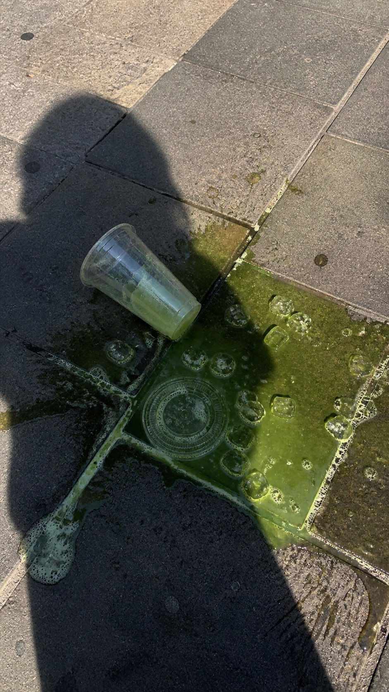

## Crumple Chair 概念沙发研发板

- ID: case-370
- Slug: case-370-zh
- 语言: zh
- 来源: [来源链接](https://x.com/ShamsAmin56/status/2050281206139461780)
- 样例图路径: images/part2/case370.jpg

### 提示词

```text
Design Concept: The Crumple Chair Core Philosophy: Translating the "controlled chaos" of a tossed paper ball into a sculptural, high-comfort seating experience.

Stage 1: Observation & Morphological Analysis The goal is to deconstruct the image of the crumpled paper into usable geometric data. Crease Mapping: Identify the primary "valley" and "ridge" lines. These represent potential structural ribs or seams in the chair. Faceted Planes: Break down the sphere into a series of non-uniform polygons. Each flat surface of the paper becomes a potential panel for the chair’s upholstery or shell. Shadow Study: Analyze how the "tossed" form creates deep recesses. These natural pockets guide where the user’s weight will be cradled.

Stage 2: Iterative Form Exploration Moving from a sphere to a seat through "Digital Crumpling." Subtractive Sculpting: Imagine the paper ball as a solid mass. Use Boolean operations to "carve out" a seating cavity that fits the human form while maintaining the external jagged texture. Tension Simulation: Use 3D software (like Rhino or Blender) to simulate a flat sheet of material being compressed. This ensures the folds look authentic and not "modeled." The "Toss" Logic: Experiment with gravity-based simulation dropping a digital mesh to see how it settles naturally, mimicking the "tossed" origin.

Stage 3: Ergonomic Translation & Blueprinting Refining the raw aesthetic into a functional object. The Comfort Core: Overlay a standard ergonomic template (Seating Angle: 105°–110°) over the crumpled form. Adjust the internal "folds" to provide lumbar support and pressure relief. Blueprint Generation: Create technical orthographic views (Front, Side, Top). Map out the dimensions: Seat Height: 450mm Total Width: 850mm Surface Smoothing: Maintain the sharp "paper edges" on the exterior shell while softening the interior contact points for skin comfort.

Stage 4: Structural Integration & Scaling Making the concept physically viable. The Skeleton: Design a hidden internal frame (likely CNC-bent steel rods or a 3D-printed lattice) that follows the most prominent ridges of the paper folds to provide rigidity. Material Selection: * Option A (High-End): Faceted, cast aluminum with a white powder coat. Option B (Soft): Vacuum-formed recycled plastic shell covered in "memory-fold" technical fabric that retains a wrinkled appearance.

Stage 5: Final Prototyping & Material Finish Textural Replication: Apply a matte, slightly porous finish to the material to mimic the tactile feel of heavy-bond paper. Lighting Contrast: Use directional studio lighting in the final renders to emphasize the "tossed" shadows, making the chair look like a giant piece of discarded inspiration. Design Tip: To keep the "tossed" look authentic, avoid symmetry. The most compelling aspect of a crumpled paper ball is its unique irregularity—ensure the left and right sides of the chair are balance-equivalent but not identical
```

### 样例图


## VELORA 奢华香水广告海报

- ID: case-367
- Slug: case-367-zh
- 语言: zh
- 来源: [来源链接](https://x.com/akkiwani703/status/2049778680969437564)
- 样例图路径: images/part2/case367.jpg

### 提示词

```text
{
  "image_type": "luxury perfume advertisement poster",
  "resolution": "4K ultra HD (4096x5120)",
  "aspect_ratio": "portrait (4:5)",
  "style": {
    "aesthetic": "high-end fragrance campaign (Tom Ford, Dior inspired)",
    "tone": "dark luxury, sensual, elegant, powerful",
    "color_grading": "deep black shadows with rich golden highlights and warm amber glow",
    "lighting": "cinematic spotlight + golden rim light + soft fill light, dramatic shadows",
    "contrast": "high cinematic contrast",
    "depth_of_field": "shallow, sharp focus on face and perfume bottle"
  },
  "camera": {
    "type": "85mm portrait lens",
    "aperture": "f/1.6",
    "angle": "slightly low angle, premium perspective",
    "framing": "model upper body + product foreground"
  },
  "subject": {
    "gender": "female",
    "age_appearance": "young adult",
    "expression": "confident, sensual, calm",
    "styling": {
      "hair": "voluminous, slightly messy, glossy strands with golden highlights",
      "makeup": "soft glam, glowing skin, bold lips",
      "outfit": "brown tailored blazer with patterned silk scarf",
      "accessory": "thin transparent eyeglasses"
    }
  },
  "product": {
    "type": "luxury perfume bottle",
    "brand": "VELORA PARFUMS",
    "label": "EAU DE PARFUM",
    "design": "clear crystal glass bottle, golden liquid inside, metallic gold cap",
    "placement": "bottom center foreground on glossy black marble surface",
    "effects": "strong reflections, golden glow, subtle condensation, cinematic shine"
  },
  "environment": {
    "background": "dark blurred luxury interior with warm golden light streaks",
    "surface": "black marble with reflections",
    "extra_elements": "small flowers near bottle, golden particles, soft smoke"
  },
  "typography": {
    "logo": "V monogram + VELORA PARFUMS",
    "headline": "Not just a scent, It’s your Signature.",
    "tagline": "A fragrance that speaks before you do.",
    "secondary": "Own your essence. Leave a legacy.",
    "features": [
      "Long Lasting",
      "Premium Ingredients",
      "Crafted with Passion"
    ],
    "notes": [
      "Top: Pear, Bergamot, Pink Pepper",
      "Heart: Jasmine, Rose, Orris",
      "Base: Vanilla, Patchouli, Musk"
    ],
    "font_style": "luxury serif + elegant handwritten script",
    "color": "gold metallic",
    "placement": "top left + mid left + bottom balanced layout"
  },
  "post_processing": {
    "sharpness": "ultra sharp on face and bottle",
    "glow": "golden cinematic glow",
    "retouch": "high-end editorial finish",
    "vignette": "subtle dark vignette"
  },
  "mood": "premium luxury perfume campaign, cinematic, bold brand identity",
  "quality": "hyper-realistic, 4K ultra HD, commercial grade, award-winning fragrance ad"
}
```

### 样例图


## 科学家收藏级玩具发布板

- ID: case-365
- Slug: case-365-zh
- 语言: zh
- 来源: [来源链接](https://x.com/Gdgtify/status/2049766203392921897)
- 样例图路径: images/part2/case365.jpg

### 提示词

```text
2x2 grid, do this for 4 famous scientists in history: Design a collector-grade launch visual for [TOY / FIGURE / DESIGNER OBJECT] shown in pristine hero form along with interchangeable accessories, alternate expressions, packaging design, scale references, sticker details, rarity indicators, and close-up material highlights. The object should feel like a luxury drop, somewhere between art toy culture and elite product branding.  Accessory Layout: Arrange [ACCESSORY 1], [ACCESSORY 2], [ALT VERSION], [PACKAGING FEATURE], and [LIMITED EDITION DETAIL] around the figure in carefully staged clusters. Everything should feel desirable, neat, and “unboxable.”  Visual Style: Hype-culture collectible reveal meets premium e-commerce launch campaign. Clean, glossy, tactile, designer-toy sophistication with a playful but expensive sensibility.  Composition Guidelines: Hero figure remains dominant. Accessories should be balanced and elegantly spaced. Packaging should be visible but not steal the scene. The entire image should feel like a product collectors would screenshot instantly.  Lighting & Background: Soft commercial lighting with subtle specular highlights, polished background in [BACKGROUND STYLE], crisp shadows, premium color separation, ultra-sharp details, no watermark.
```

### 样例图

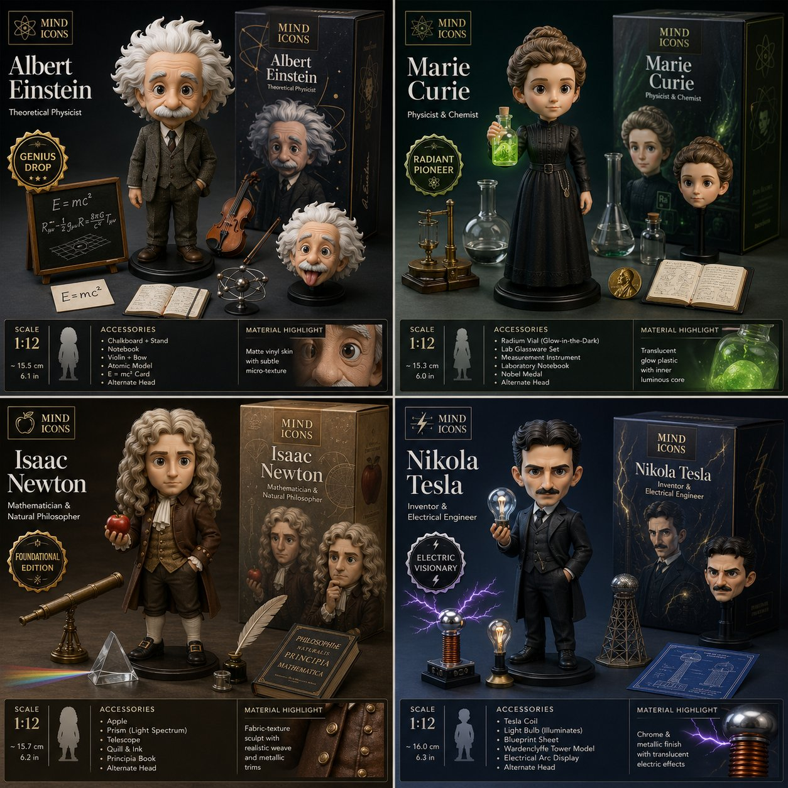

## 奢华个人色彩档案信息图

- ID: case-364
- Slug: case-364-zh
- 语言: zh
- 来源: [来源链接](https://x.com/meng_dagg695/status/2049822844918575586)
- 样例图路径: images/part2/case364.jpg

### 提示词

```text
LUXURY PERSONAL COLOR PROFILE — EDITORIAL LAYOUT
Studio portrait of subject as anchor — skin retouched to luminous glass-like perfection, preserved natural structure, realistic pore texture, soft directional key lighting, no facial alteration. Background: warm ecru parchment with subtle linen grain texture. Layout reads like a Vogue Italia beauty supplement printed on heavyweight matte stock. Structured editorial grid, 3-column asymmetric, wide negative space, serif condensed display headers, all labels in spaced uppercase tracking, cohesive warm ivory/sand/ecru background system throughout all panels, ultra-photorealistic 8K, soft diffused studio lighting, flat elegant surfaces, no drop shadows.
PANELS:
① UNDERTONE DIAGNOSIS — Tonal spectrum bar from cool ash to warm amber, precision needle marker on subject's reading. Labels: Cool / Neutral-Cool / Neutral / Neutral-Warm / Warm. Fine annotation text.
② SEASONAL COLOR PALETTE — 10–12 fabric-textured swatches in subject's optimal season. Each labeled with poetic color name and HEX. Grouped: Power Colors / Softest Options / Harmonizing Neutrals.
③ COLORS TO AVOID — Desaturated row of clashing tones with fine editorial strikethrough. Clean, non-harsh presentation.
④ MAKEUP CARTOGRAPHY — Eyeshadow gradient dust swatches / blush tones fanned on skin strip / lip spectrum barely-there to bold / highlighter finishes labeled: champagne, rose gold, pearlescent ivory.
⑤ HAIR COLOR SPECTRUM — Curved gradient strip: base, dimension, highlight, contrast tones. Gold bracket indicators on best options.
⑥ JEWELRY & METAL GUIDE — Flat-lay editorial render: yellow gold, rose gold, oxidized silver, platinum finishes alongside complementary stone tones. Minimal styling.
⑦ YOU IN YOUR PALETTE — 3–4 editorial lookbook frames, subject in palette-correct outfits. Mood labels: Quiet Luxury / Off-Duty Editorial / Evening Presence.
⑧ CAPSULE WARDROBE GRID — Outfit flatlay: tops, bottoms, outerwear, shoes, bag — all palette-correct. Coordinating lines showing interchangeability. Net-a-Porter editorial aesthetic.
⑨ PRINTS & PATTERNS — 4 fabric print thumbnails: micro geometric, tonal abstract, classic stripe, floral scale. One-line styling note per print.
⑩ STYLE ARCHETYPE — Single typographic panel. Style identity title set large (e.g. "Modern Romantic / Warm Classicist"). Three defining aesthetic words. Four-line editorial wardrobe philosophy note.
RENDER SPECS: Ultra-photorealistic, 8K, editorial magazine print quality, warm neutral color grading, soft diffused studio lighting consistent across all panels, one serif display font + one fine sans-serif body font, no gradients, flat matte surfaces only.
```

### 样例图

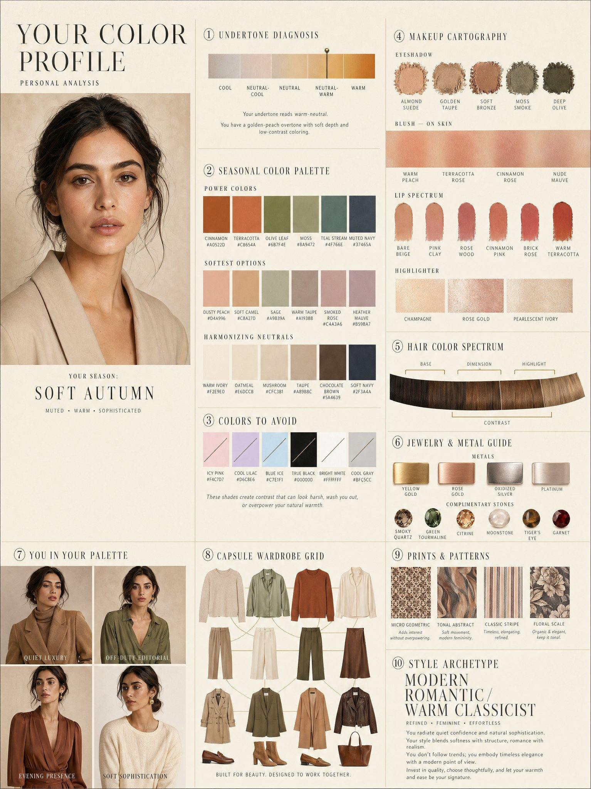

## 磁场铁粉 Logo 物理成像

- ID: case-363
- Slug: case-363-zh
- 语言: zh
- 来源: [来源链接](https://x.com/Naiknelofar788/status/2049835482331357460)
- 样例图路径: images/part2/case363.jpg

### 提示词

```text
Transform the uploaded logo into a hyper-realistic scene where the logo silhouette is formed by iron filings reacting to a magnetic field. The logo must keep its exact shape and proportions, appearing as if a magnet shaped like the logo (or hidden beneath the surface) is influencing the filings to align naturally into that recognizable formation. Material details:
Fine iron filings with sharp, spiky, needle-like structures.
Dense clustering along magnetic field lines forming the logo silhouette.
Variation in density — thick near magnetic poles, thinner outward.
Matte dark metallic texture with subtle reflections.

Physics behavior:
Iron filings must follow realistic magnetic field patterns — radial and curved lines forming spikes and ridges.
Stronger attraction zones create thicker, raised clusters.
Outer areas show softer, more dispersed alignment.
Natural randomness and slight irregularity — no perfect edges.
Some loose filings scattered beyond the main shape.

Surface interaction:
Flat surface such as a lab table, glass plate, or matte black tray.
Filings resting on surface but visibly lifted in areas due to magnetic force (spiky texture).
Subtle dust and micro particles around.

Environment & human presence:
Realistic classroom, science lab, or creative studio environment.
A person partially visible — hands holding or moving a magnet beneath the surface or nearby.
Possibly a child or adult observing or interacting (adds emotional curiosity).
Other subtle elements: notebooks, tools, or lab items out of focus.

Lighting:
Directional overhead light creating shadows from raised filings.
Subtle highlights on metallic edges.
Balanced natural or indoor lighting.

Atmosphere:
Curiosity.
Discovery.
Educational yet visually satisfying.
Quiet but engaging moment.

Camera & composition:
Top-down or slightly angled close-up view.
Logo clearly visible through iron filing formation.
Human hands or interaction slightly off-center for storytelling.

Format:
Aspect ratio: STRICT 4:5 vertical.
No text overlays.

Style:
Hyper-real macro + environmental photography.
Physically accurate magnetic behavior.
Cinematic yet grounded realism.
```

### 样例图

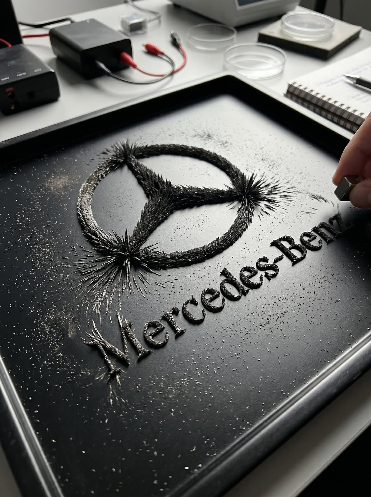

## 抹茶品牌触点系统视觉板

- ID: case-362
- Slug: case-362-zh
- 语言: zh
- 来源: [来源链接](https://x.com/Preda2005/status/2049846981271699685)
- 样例图路径: images/part2/case362.jpg

### 提示词

```text
Create a premium “Matcha Brand Touchpoint System” visual board for a modern lifestyle brand called:

“MATCHA MODE”

Build a full brand identity system, not a single image.

HERO SCENE:

A hyper-realistic matcha drink in a ceramic cup placed on a clean natural surface.

– vibrant green matcha foam with micro-bubbles
– bamboo whisk (chasen) nearby
– soft natural light
– slight matcha powder dust on the surface
– minimal Japanese aesthetic
ATMOSPHERE:
– calm, warm, soft daylight
– clean background (off-white or beige)
– subtle shadows and reflections
– feeling of wellness and luxury
FULL BRAND SYSTEM:
– takeout cups (paper + glass bottles)
– packaging boxes (minimalist design)
– tote bags (premium lifestyle)
– labels, stickers, seals
– menu cards with pricing ($6.50, $8.90, etc.)
– small typography everywhere
– subtle imperfections (realism)

DESIGN LANGUAGE:

– modern minimalist typography
– Japanese-inspired layout
– soft green palette
– elegant spacing

INCLUDE:
– matcha latte
– iced matcha
– matcha desserts
– combo sets
– lifestyle shots
The composition must feel like a high-end design agency presentation.

Ultra-detailed, realistic, clean, aesthetic, and highly shareable.
```

### 样例图


## 长发造型分析信息图

- ID: case-360
- Slug: case-360-zh
- 语言: zh
- 来源: [来源链接](https://x.com/Gemalpha_88/status/2048918707343401034)
- 样例图路径: images/part2/case360.jpg

### 提示词

```text
Create a professional "HAIRSTYLE ANALYSIS" infographic with a different male model (the same face) having long, thick hair (6-10 inches), slightly wavy texture.

Style should be clean, modern, premium grooming guide (similar layout but not identical).

TOP TITLE:
"HAIRSTYLE ANALYSIS - Long Hair Edition"

LEFT PANEL (Key Features with icons):
Face Shape: Oval
Hair Type: Thick
Texture: Wavy
Length: Long

BEST OPTIONS (Top row with green indicators):
Layered Flow Cut (Adds movement & volume)
Modern Curtain Hair (Stylish & balanced)
Textured Long Waves (Natural & full)
Loose Slick Back (Controlled but not flat)

LESS FLATTERING (Bottom row with red indicators):
Flat Straight Long Hair (No volume)
Overly Oily Slick Back (Too heavy)
Uneven Long Layers (Messy shape)
Excessively Frizzy Look (Uncontrolled)

BEST HAIR LENGTH SECTION:
Ideal: 6-10 inches with layers
Avoid: Too flat or too heavy bottom

BEST HAIR COLORS:
Dark Brown
Natural Black
Warm Brown
Ash Brown

DESIGN STYLE:
Clean grid infographic
White/beige background
Soft shadows
Premium magazine look
Realistic face and hair detail
Consistent spacing and typography
High resolution, 4K
```

### 样例图


## 水墨双重曝光人物海报

- ID: case-359
- Slug: case-359-zh
- 语言: zh
- 来源: [来源链接](https://x.com/Goodmanprotocol/status/2049002279051895243)
- 样例图路径: images/part2/case359.jpg

### 提示词

```text
A cinematic character promotional poster of [SUBJECT], vertical composition (9:16), designed with a refined East-Asian ink aesthetic and high-end visual storytelling.

STRUCTURE:
Top-heavy hierarchical layout. The upper half features a large, highly recognizable silhouette of [SUBJECT]'s head / face / mask / upper body, forming a bold, iconic primary shape. The silhouette should be instantly identifiable.

The middle-lower section contains the full-body version of [SUBJECT] as a secondary subject, standing in a stable pose or subtle action stance, forming the visual core.

COMPOSITION STYLE:
Inside the large silhouette and around the character, use double exposure and collage storytelling. Integrate multiple elements:
- key scenes related to [SUBJECT]
- symbolic imagery and environment
- small narrative figures and interactions
- supporting visual motifs

Blend everything seamlessly using clouds, mist, ink diffusion, and negative space.

VISUAL FLOW:
Create a continuous flowing visual path from top to bottom, connecting:
- upper silhouette
- inner collage elements
- full-body subject

Ensure smooth eye guidance and compositional cohesion.

SIDE ELEMENTS:
Add balanced supporting elements on left and right sides to create tension, depth, and spatial variation.

STYLE & ATMOSPHERE:
- Large areas of negative space
- Ink-wash diffusion edges, soft fading, subtle fragmentation
- Eastern aesthetic: balance of emptiness and detail
- Calm, premium, restrained, cinematic tone

QUALITY:
Ultra-detailed, high resolution, layered depth, soft lighting, atmospheric perspective, cohesive series-style design.

OUTPUT:
9:16 aspect ratio, poster-ready composition.
```

### 样例图


## 草莓能量饮料商业广告

- ID: case-358
- Slug: case-358-zh
- 语言: zh
- 来源: [来源链接](https://x.com/SPEEDAI07/status/2049043627163435040)
- 样例图路径: images/part2/case358.jpg

### 提示词

```text
A hyper-realistic commercial advertisement blending energy drink and sports branding. A dynamic athletic woman mid-air jump, wearing modern sportswear (light translucent jacket, orange shorts, white sneakers), surrounded by explosive splashes of red strawberry liquid and flying ice cubes. A cold metallic energy drink can (strawberry flavor) bursting with droplets sits in the foreground, covered in condensation. Fresh strawberries scattered on a glossy reflective surface.

Bright cinematic lighting with dramatic highlights and motion effects. Vibrant orange gradient background with bold glowing typography behind the subject. Ultra-detailed, high contrast, sharp focus, commercial product photography style, 8K resolution, advertising poster aesthetic, energetic, powerful, refreshing mood.
```

### 样例图


## 过度思考超现实街头 Campaign

- ID: case-356
- Slug: case-356-zh
- 语言: zh
- 来源: [来源链接](https://x.com/AIwithAliya/status/2049044716642316758)
- 样例图路径: images/part2/case356.jpg

### 提示词

```text
Ultra-realistic conceptual portrait of a young woman with long wavy hair and soft defined features, wearing rose-tinted rectangular sunglasses, an oversized ivory cropped t-shirt, fitted light-wash denim jeans, and clean white sneakers. She is sitting casually with a confident yet relaxed posture.

The twist: she is seated on a large, hyper-realistic version of her own detached head placed on the ground. The head is scaled up, lying sideways, with the same facial features and sunglasses, creating a surreal self-reflection concept.

Composition: centered, full-body shot, neutral studio background with soft blush and cream tones, minimal aesthetic. Clean negative space.

Typography integrated into the background:

Handwritten-style text at the top: "OVERTHINKING"

Below it, smaller text: "TRAPPED IN MY OWN HEART" with "HEART" crossed out

Large, rough, scribbled text in deep pink: "MIND"

Lighting: soft diffused studio lighting, subtle shadows, high detail, fashion editorial quality.

Style: blend of surrealism and modern luxury streetwear campaign, pastel feminine aesthetic, minimal yet expressive, high-resolution, 8k, sharp focus, natural skin texture.

Mood: introspective, emotional weight, identity, self-awareness, quiet confidence.
```

### 样例图


## 品牌口红推荐报告信息图

- ID: case-353
- Slug: case-353-zh
- 语言: zh
- 来源: [来源链接](https://x.com/liyue_ai/status/2048667226195317219)
- 样例图路径: images/part2/case353.jpg

### 提示词

```text
一、系统角色
你是一个专业美妆顾问 + 人脸分析系统 + 品牌视觉设计系统。
你的任务是：基于用户上传自拍与指定口红品牌，生成一张具有品牌调性的“口红推荐报告信息结构图”。

二、输入参数
用户图像：{用户自拍}
品牌：{口红品牌，如 Dior / YSL / Armani / Chanel / TF}
风格偏好（可选）：{通勤 / 温柔 / 气场 / 氛围感 / 显白优先}
推荐数量：3–5

三、品牌视觉层（新增核心模块）
根据 {品牌} 自动构建视觉风格（Brand Visual Identity），提取品牌调性，例如：
Dior：
优雅、高级、法式、灰白 + 银色、柔光
YSL：
黑金、性感、强对比、时尚编辑感
Armani：
低饱和、雾面、克制、灰调高级感
Chanel：
极简黑白、高级、理性、结构清晰
Tom Ford：
深色、高对比、奢华、电影感

视觉应用到海报：
1. 主色调（背景微变化，不是大面积铺色）
2. 强调色（用于色号标题/细线/小元素）
3. 光影风格（柔光 / 强对比 / 冷调 / 暖调）
4. 字体气质（优雅 / 现代 / 冷感 / 力量感）

四、分析层
对用户进行分析：
- 肤色：冷 / 暖 / 中性（+ 明度）
- 气质：清冷 / 温柔 / 明艳 / 干净 / 成熟
- 唇部特征：薄 / 厚 / 唇色基础
- 妆容状态：素颜 / 日常 / 精致
输出一句总结：「更适合 {色系} + {饱和度} + {质地} 的口红方向」

五、推荐层（增强差异）
从 {品牌} 推荐 3–5 个色号：
每个包含：
- 色号名称（#999）
- 色系（正红 / 豆沙 / 枫叶 / 奶茶 / 玫瑰）
- 上脸效果（显白 / 提气色 / 氛围感 / 气场增强）
- 场景（逛街 / 通勤 / 聚餐 / 约会 / 宴会）

要求：每个色号“风格明确区分”（一个日常、一个气场、一个氛围感等）

六、信息结构图
生成竖版信息结构图
整体风格：美妆时尚大片质感 + 结构化信息可视化排版 + 品牌视觉体系深度融合
极简但不单调，高级但有视觉层次

【整体布局】
左上：用户输入区
右上：分析结论
中部：试色矩阵（核心）
底部：总结

## 1️⃣ 左上（用户区）
用户自拍（真实质感）
+ 小标题：「肤色分析」
+ 一句话结论：「适合低饱和玫瑰调，避免高荧光色」

极细品牌色线条（如 YSL 金线 / Dior 灰线）

## 2️⃣ 中部（核心试色矩阵）
这是视觉重点区域（占比60%以上）
展示方式：将 3–5 个色号以“人脸试色对比”的形式排列：
每一列 = 一个色号
每个色号包含：
- 小型人脸图（同一张脸，不同唇色）
- 色号名称（如 #999）
- 色系标签（如 Classic Red）
- 一句话效果说明
要求：所有人脸保持一致，仅唇色变化，真实试色效果（lip color try-on），肤质真实，不塑料，光影统一。
排列方式：横向排布 或 网格排布（整齐但不死板）

品牌增强点：
- Dior：轻柔渐变背景 + 柔光阴影
- YSL：更强对比 + 黑色细分割线
- Armani：整体灰调统一，低对比
- Chanel：严格对齐，极简黑白
- TF：局部暗背景 + 高光强调

## 3️⃣ 每个色号模块
包含：
色号名（突出）
色系标签
一句推荐语
场景标签（逛街/通勤/聚餐/约会/宴会等）

品牌化处理：
- 用“品牌强调色”做：
  - 色号标题
  - 细分隔线
  - 小icon
（不是色块，而是“精致点缀”）

## 4️⃣ 底部总结
一段“有判断力的建议”，
例如：「日常建议选择低饱和豆沙色提升气色，重要场合可使用正红增强气场」
或：「你的肤色更适合柔和玫瑰调，避免高荧光色系」
但不要完全引用以上2个例子的建议，根据用户实际肤色来建议。
品牌增强：底部可加极淡品牌风格横线 / 极小品牌字样（非logo）

七、UI设计
- 不使用圆角卡片 UI
- 不使用厚边框
1. 引入“层级对比”：
   - 主体亮
   - 次要信息弱
2. 使用“微对比”：
   - 细线
   - 灰度差
   - 字重变化
3. 加入“节奏感”：
   - 疏密变化
   - 模块呼吸
4. 品牌点缀：
   - 只用 5% 强调
   - 不破坏极简结构

八、图像质量
真实皮肤质感
唇色精准
统一光影
商业级美妆摄影
8K

———
品牌：YSL
```

### 样例图


## 胡须风格分析海报

- ID: case-348
- Slug: case-348-zh
- 语言: zh
- 来源: [来源链接](https://x.com/RizwanAly07/status/2048610196302250019)
- 样例图路径: images/part2/case348.jpg

### 提示词

```text
Create a premium “BEARD STYLE ANALYSIS” poster featuring the same man from the reference image. Show face shape, beard density, jawline definition, beard growth pattern, and beard suitability score. Include different beard styles comparison such as Stubble, Short Boxed Beard, Full Beard, Goatee, Van Dyke, Clean Shave. Add side profile and front profile views. Modern dark blue luxury background, professional grooming infographic style, high detail, realistic face consistency, stylish typography, premium male grooming poster.
```

### 样例图

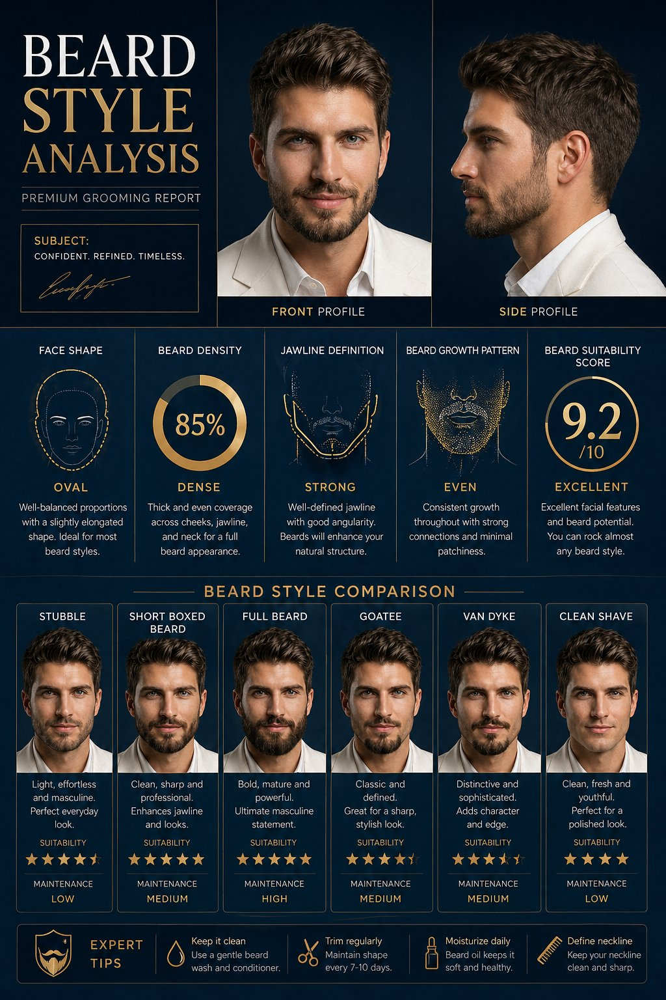

## 高定时尚杂志封面

- ID: case-343
- Slug: case-343-zh
- 语言: zh
- 来源: [来源链接](https://x.com/SPEEDAI07/status/2048573343066992919)
- 样例图路径: images/part2/case343.jpg

### 提示词

```text
Ultra high-fashion magazine cover, Louis Vuitton-style editorial. Close-up portrait of a confident woman with soft rose-gold hair and natural airy bangs, slightly wind-blown for movement. She is wearing a luxury summer outfit: a structured lightweight linen or silk jacket in warm golden-yellow tones, layered over a modest high-neck top, paired with a bold gold choker necklace and subtle statement earrings.

Fabric flows naturally with a summer breeze, slightly textured and breathable, capturing a premium seasonal feel. Styling is elegant, modest, and refined — no revealing clothing.

Lighting is high-end studio mixed with natural golden hour glow: warm highlights, soft shadows, luminous skin with glossy editorial finish.

Background is a rich summer gradient (sunset gold fading into soft coral or warm beige), clean but visually striking.

Composition is dynamic and slightly cinematic: hair in motion, shallow depth of field, sharp focus on face.

Typography: large elegant serif masthead "Louis Vuitton" at the top, bold cover line "YOUR CHOICE ENDS HERE" in premium editorial layout, minimal supporting text.

Ultra-realistic, hyper-detailed skin texture, 8K resolution, sharp focus, glossy magazine print quality, cinematic color grading, luxury fashion photography, no nudity, tasteful and editorial.
```

### 样例图


## AP Calculus 学习表信息图

- ID: case-341
- Slug: case-341-zh
- 语言: zh
- 来源: [来源链接](https://x.com/hqmank/status/2048587150544028084)
- 样例图路径: images/part2/case341.jpg

### 提示词

```text
Please create a mathematical visualization infographic about "[math concept / topic]." The goal is to help the viewer intuitively understand what it is, why it works, its geometric or structural intuition, and how it behaves in different contexts. The visual should feel like a high-quality math lecture handout combined with a hand-drawn educational poster. It should be elegant, clear, and information-rich, but not cluttered. Visual style: either portrait or landscape is fine. Use a clean, light paper-like background, with a deep blue title and black or dark gray lines for the main content. Add a small number of refined accent colors such as blue, teal, gold, and red. Incorporate rounded-corner cards, thin borders, numbered labels, hand-drawn arrows, zoom-in callout boxes, and a summary section. The overall design should be aesthetically pleasing, balanced, and academic, allowing the viewer to grasp the structure of the concept and why it works at a glance.
```

### 样例图


## 个人网页视觉设计

- ID: case-336
- Slug: case-336-zh
- 语言: zh
- 来源: [来源链接](https://github.com/freestylefly/awesome-gpt-image-2/blob/main/docs/gallery-part-2.md#case-336)
- 样例图路径: images/part2/case336.png

### 提示词

```text
原文未公开，案例目标是生成一张高完成度的个人主页视觉设计图。
```

### 样例图


## 朋友圈截图生成

- ID: case-335
- Slug: case-335-zh
- 语言: zh
- 来源: [来源链接](https://github.com/freestylefly/awesome-gpt-image-2/blob/main/docs/gallery-part-2.md#case-335)
- 样例图路径: images/part2/case335.png

### 提示词

```text
原文未公开，重点展示 GPT-Image2 在高仿社交截图与中文排版场景中的能力。
```

### 样例图


## 俯拍巨女城景自拍

- ID: case-328
- Slug: case-328-zh
- 语言: zh
- 来源: [来源链接](https://x.com/saniaspeaks_/status/2009834337043394622)
- 样例图路径: images/part2/case328.jpg

### 提示词

```text
[中文]
{
  "type": "图像生成提示词",
  "language": "zh",
  "style": "超现实电影感自拍摄影",
  "aspect_ratio": "9:16",
  "identity_preservation": {
    "use_reference_image": true,
    "strict_identity_lock": true,
    "alter_face": false,
    "alter_skin": false,
    "alter_hair": false,
    "alter_gender": false,
    "notes": "保留上传参考图像中完全一致的脸部特征、皮肤纹理、头发、眼镜、年龄和性别。禁止合成皮肤或雕塑感。"
  },
  "subject": {
    "gender": "女性",
    "capture_method": "由主体本人拍摄的自拍",
    "pose": {
      "selfie_arm": {
        "description": "一只手臂完全伸直并完全向上伸展，手持拍摄自拍的相机",
        "visibility": "手臂在画面中清晰可见、笔直且占主导地位",
        "camera_visibility": "自拍相机设备本身不得在画面中出现"
      },
      "product_arm": {
        "description": "另一只手臂完全伸向相机，手持附带的佳能相机",
        "importance": "产品最靠近相机并在视觉上占主导地位"
      },
      "head": {
        "tilt": "头部向自拍相机微微倾斜"
      },
      "expression": "自然放松的面部表情"
    },
    "body_visibility": "从头到脚全身可见",
    "feet": "双脚清晰接触路面"
  },
  "composition": {
    "perspective": "胸部高度的自然自拍视角",
    "camera_angle": "极端俯拍角度，相机位于主体正上方并直视下方",
    "layer_depth": [
      "产品（最靠近相机）",
      "脸部",
      "全身",
      "城市环境（背景）"
    ]
  },
  "scale_and_perspective": {
    "effect": "强制透视",
    "subject_scale": "女性呈现极度巨大",
    "buildings_scale": "建筑物显得小得多，最高不超过她的膝盖",
    "dominance": "主体在视觉上完全主导整个场景",
    "realism": "激发规模感同时保持物理可信"
  },
  "environment": {
    "location": "真实城市十字路口",
    "elements": [
      "人行横道",
      "道路标线",
      "交通标志",
      "汽车",
      "自行车",
      "真实人类尺度的行人"
    ],
    "setting": "地面层城市环境"
  },
  "lighting": {
    "type": "自然日光",
    "conditions": "晴朗或轻度多云天空",
    "shadows": "柔和且真实",
    "restrictions": "禁止奇幻或戏剧性照明"
  },
  "product_rules": {
    "usage": "完全按提供的上传佳能产品使用",
    "distortion": "无",
    "logo": "保持不变",
    "appearance": "仅有自然反射和真实高光"
  },
  "camera_quality": {
    "realism": "最大照片真实感",
    "depth": "前景、主体与背景清晰分离",
    "artifacts": "无"
  },
  "constraints": [
    "禁止AI艺术感",
    "禁止塑料或雕塑皮肤",
    "禁止扭曲脸部或身体",
    "禁止多余肢体或错误解剖",
    "禁止文字或水印",
    "禁止可见自拍相机设备"
  ],
  "output_goal": "创作一张超现实电影感自拍图像：女性使用其确切参考身份，从极端俯拍视角在真实城市人行横道拍摄，具备强制透视比例、自然日光，并将佳能相机产品明显持向镜头。"
}

[English]
{
  "type": "image_generation_prompt",
  "language": "en",
  "style": "hyper-realistic cinematic selfie photography",
  "aspect_ratio": "9:16",
  "identity_preservation": {
    "use_reference_image": true,
    "strict_identity_lock": true,
    "alter_face": false,
    "alter_skin": false,
    "alter_hair": false,
    "alter_gender": false,
    "notes": "Preserve identical facial features, skin texture, hair, glasses, age, and gender from the uploaded reference image. No synthetic skin or sculptural look."
  },
  "subject": {
    "gender": "female",
    "capture_method": "selfie taken by the subject herself",
    "pose": {
      "selfie_arm": {
        "description": "one arm fully straight and completely extended upward holding the camera that takes the selfie",
        "visibility": "arm clearly visible, straight and dominant in frame",
        "camera_visibility": "the selfie camera device itself must NOT be visible in the frame"
      },
      "product_arm": {
        "description": "the other arm fully extended toward the camera holding the attached Canon camera",
        "importance": "product is closest to the camera and visually dominant"
      },
      "head": {
        "tilt": "slightly tilted toward the selfie camera"
      },
      "expression": "natural and relaxed facial expression"
    },
    "body_visibility": "full body visible from head to toe",
    "feet": "feet clearly touching the road surface"
  },
  "composition": {
    "perspective": "natural selfie perspective at chest height",
    "camera_angle": "extreme top-down angle, camera above the subject looking directly downward",
    "layer_depth": [
      "product (closest to camera)",
      "face",
      "full body",
      "city environment (background)"
    ]
  },
  "scale_and_perspective": {
    "effect": "forced perspective",
    "subject_scale": "the woman appears extremely giant",
    "buildings_scale": "buildings appear much smaller, reaching no higher than her knees",
    "dominance": "the subject visually dominates the entire scene",
    "realism": "inspiring scale while remaining physically believable"
  },
  "environment": {
    "location": "real urban intersection",
    "elements": [
      "pedestrian crosswalk",
      "road markings",
      "traffic signs",
      "cars",
      "bicycles",
      "pedestrians at realistic human scale"
    ],
    "setting": "ground-level urban environment"
  },
  "lighting": {
    "type": "natural daylight",
    "conditions": "clear or lightly cloudy sky",
    "shadows": "soft and realistic",
    "restrictions": "no fantasy or dramatic lighting"
  },
  "product_rules": {
    "usage": "use the uploaded Canon product exactly as provided",
    "distortion": "none",
    "logo": "unchanged",
    "appearance": "natural reflections and realistic highlights only"
  },
  "camera_quality": {
    "realism": "maximum photorealism",
    "depth": "clear separation of foreground, subject, and background",
    "artifacts": "none"
  },
  "constraints": [
    "No AI-art look",
    "No plastic or sculpted skin",
    "No distortion of face or body",
    "No extra limbs or incorrect anatomy",
    "No text or watermarks",
    "No visible selfie camera device"
  ],
  "output_goal": "Create a hyper-realistic cinematic selfie image of a woman using her exact reference identity, captured from an extreme top-down perspective in a real urban crosswalk, with forced perspective scale, natural daylight, and a Canon camera product prominently held toward the lens."
}
```

### 样例图


## 沉香玫瑰悬浮幻景

- ID: case-327
- Slug: case-327-zh
- 语言: zh
- 来源: [来源链接](https://x.com/meng_dagg695/status/2011334627290726746)
- 样例图路径: images/part2/case327.jpg

### 提示词

```text
[中文]
{
  "master_prompt_type": "超精细8K AI图像生成",
  "global_settings": {
    "resolution": "8K UHD",
    "aspect_ratio": "2:3 竖版",
    "render_quality": "极致锐度、超微细节、电影级光效",
    "style": "超现实商业产品摄影",
    "color_profile": "温暖金调搭配柔和琥珀高光",
    "environment": {
      "location": "古老中东市场走廊",
      "architecture": {
        "walls": "岁月痕迹的粗糙石墙与可见纹理",
        "arches": "背景巨型石拱",
        "floor": "暖棕色石材地面"
      },
      "background_elements": [
        "装满香料的木架",
        "袋装与碗装干货",
        "悬挂草药束",
        "散发暖黄光的传统金属灯笼"
      ],
      "lighting": {
        "primary": "柔和金色环境光",
        "secondary": "两侧暖灯笼辉光",
        "atmosphere": "薄雾增强光线漫射"
      }
    },
    "main_subject": {
      "type": "香水瓶",
      "position": "中心前景",
      "placement": "置于华丽木桌之上",
      "material": {
        "bottle": "透明清玻璃",
        "cap": "黄金金属矩形瓶盖",
        "liquid": "淡金香水液体"
      },
      "design": {
        "shape": "圆角矩形瓶身",
        "finish": "高光反射表面",
        "label": "无可见标签"
      },
      "table": {
        "material": "深色雕花木材",
        "shape": "方形台面",
        "details": [
          "繁复花卉与几何雕刻",
          "金色镶嵌装饰",
          "抛光表面映光"
        ]
      },
      "floating_elements": {
        "composition_style": "竖向成分堆叠",
        "motion": "成分悬浮并伴随旋转金光",
        "effects": [
          "发光粒子",
          "闪耀尘埃",
          "柔光尾迹连接元素"
        ],
        "elements_order_top_to_bottom": [
          {
            "ingredient": "琥珀树脂",
            "appearance": "半透明金棕树脂块",
            "glow": "温暖内发光"
          },
          {
            "ingredient": "大马士革玫瑰",
            "appearance": "盛放粉色玫瑰",
            "details": [
              "柔软层叠花瓣",
              "自然绿叶",
              "轻飘附近花瓣"
            ]
          },
          {
            "ingredient": "白麝香",
            "appearance": "光滑白水晶状石块",
            "additional": "石下细白粉末"
          },
          {
            "ingredient": "陈年沉香",
            "appearance": "深棕木片",
            "texture": "粗糙纤维木纹",
            "effect": "缕缕白烟上升"
          }
        ]
      },
      "text_elements": {
        "title": {
          "text": "精致叙利亚香水",
          "font_style": "优雅衬线体",
          "color": "金色",
          "position": "顶部中央"
        },
        "subtitle": {
          "text": "奢华叙利亚香水",
          "font_style": "较小衬线体",
          "color": "金色",
          "position": "主标题下方"
        },
        "ingredient_labels": [
          {
            "title": "纯琥珀",
            "description": "来自自然深处的珍贵树脂"
          },
          {
            "title": "大马士革玫瑰",
            "description": "美丽与叙利亚传承的象征"
          },
          {
            "title": "白麝香",
            "description": "干净、粉感、永恒优雅的香氛"
          },
          {
            "title": "陈年沉香",
            "description": "深邃温暖、浓郁烟熏木香"
          }
        ],
        "typography_details": {
          "connector_lines": "细弯金线连接文字与成分",
          "icons": "线末端小圆点标记"
        },
        "opacity": "轻微半透明"
      }
    },
    "overall_mood": {
      "tone": "奢华、温暖、优雅",
      "theme": "传承香水工艺",
      "visual_feel": "浓郁、高端、电影级广告"
    }
  }
}

[English]
{
  "master_prompt_type": "Ultra-detailed 8K AI image generation",
  "global_settings": {
    "resolution": "8K UHD",
    "aspect_ratio": "2:3 vertical",
    "render_quality": "extreme sharpness, ultra-fine detail, cinematic lighting",
    "style": "hyper-realistic commercial product photography",
    "color_profile": "warm golden tones with soft amber highlights",
    "environment": {
      "location": "ancient Middle Eastern market corridor",
      "architecture": {
        "walls": "aged stone walls with visible texture and wear",
        "arches": "large stone archway in background",
        "floor": "stone flooring, warm brown tone"
      },
      "background_elements": [
        "wooden shelves filled with spices",
        "sacks and bowls of dried goods",
        "hanging bundles of herbs",
        "traditional metal lanterns emitting warm yellow light"
      ],
      "lighting": {
        "primary": "soft golden ambient light",
        "secondary": "warm lantern glow from both sides",
        "atmosphere": "slight haze enhancing light diffusion" "main_subject": {
          "type": "perfume bottle",
          "position": "center foreground",
          "placement": "on top of an ornate wooden table",
          "material": {
            "bottle": "transparent clear glass",
            "cap": "gold metallic rectangular cap",
            "liquid": "light golden perfume liquid"
          },
          "design": {
            "shape": "rectangular bottle with rounded edges",
            "finish": "glossy reflective surface",
            "label": "no visible label" "table": {
              "material": "dark carved wood",
              "shape": "square top",
              "details": [
                "intricate floral and geometric carvings",
                "golden inlay accents",
                "polished surface reflecting light" "floating_elements": {
                  "composition_style": "vertical ingredient stack",
                  "motion": "ingredients appear suspended with swirling golden light",
                  "effects": [
                    "glowing particles",
                    "sparkling dust",
                    "soft light trails connecting elements"
                  ],
                  "elements_order_top_to_bottom": [
                    {
                      "ingredient": "amber resin",
                      "appearance": "translucent golden-brown resin chunks",
                      "glow": "warm internal glow" "ingredient": "damask rose",
                      "appearance": "fully bloomed pink rose",
                      "details": [
                        "soft layered petals",
                        "natural green leaves",
                        "petals gently floating nearby"
                      ] "ingredient": "white musk",
                      "appearance": "smooth white crystal-like stone",
                      "additional": "fine white powder beneath the stone" "ingredient": "aged agarwood",
                      "appearance": "dark brown wooden pieces",
                      "texture": "rough, fibrous wood grain",
                      "effect": "thin white smoke rising upward" "text_elements": {
                        "title": {
                          "text": "Exquisite Syrian Perfume",
                          "font_style": "elegant serif",
                          "color": "gold",
                          "position": "top center"
                        },
                        "subtitle": {
                          "text": "Luxury Syrian Perfume",
                          "font_style": "smaller serif",
                          "color": "gold",
                          "position": "below main title"
                        },
                        "ingredient_labels": [
                          {
                            "title": "Pure Amber",
                            "description": "Precious resin from the depths of nature"
                          } "title": "Damask Rose",
                          "description": "Symbol of beauty and Syrian heritage"
                        },
                        {
                          "title": "White Musk",
                          "description": "Clean, powdery scent of timeless elegance"
                        },
                        {
                          "title": "Aged Agarwood",
                          "description": "Rich, smoky wood with deep warmth"
                        }
                      ],
                      "typography_details": {
                        "connector_lines": "thin curved golden lines connecting text to ingredients",
                        "icons": "small circular markers at line endpoints"
                      } "opacity": "slightly translucent"
                    } "overall_mood": "tone": "luxurious, warm, elegant",
                    "theme": "heritage perfume craftsmanship",
                    "visual_feel": "rich, premium, cinematic ads
```

### 样例图


## 复古巴士上的红风衣女郎

- ID: case-324
- Slug: case-324-zh
- 语言: zh
- 来源: [来源链接](https://x.com/iamsofiaijaz/status/2015337737860403283)
- 样例图路径: images/part2/case324.jpg

### 提示词

```text
[中文]
一位时尚年轻女子坐在老式复古巴士的前缘，身穿红色长风衣、羊毛无檐小便帽、圆形蓝色反光太阳镜、叠层项链和粗犷的棕色皮靴。她有着波浪状金发，带着自信而梦幻的表情，仰望天空。巴士漆面剥落，呈青绿色与铁锈红色调。明亮清澈的蓝天，城市背景建筑极少，柔和日光，电影级色彩分级，浅景深，高端时尚旅行氛围，编辑摄影，超写实，4K分辨率，锐利对焦，自然肌肤质感，戏剧性构图，电影静帧美学。

[English]
A stylish young woman sitting on the front edge of an old vintage bus, wearing a long red trench coat, woolen beanie cap, round blue reflective sunglasses, layered necklaces, and rugged brown leather boots. She has wavy blonde hair and a confident, dreamy expression, looking upward toward the sky. The bus is weathered with peeling paint in turquoise and rust red tones.Bright clear blue sky, urban background with minimal buildings, soft daylight, cinematic color grading, shallow depth of field, high fashion travel vibe, editorial photography, ultra-realistic, 4K resolution, sharp focus, natural skin texture, dramatic composition, film still aesthetic.
```

### 样例图


## 应用界面样机图

- ID: case-323
- Slug: case-323-zh
- 语言: zh
- 来源: [来源链接](https://x.com/Mystveil7/status/2015776042989039997)
- 样例图路径: images/part2/case323.jpg

### 提示词

```text
Create a hyper-realistic, cinematic Instagram post layout where the Instagram UI exists as a physical, tangible 3D object, photographed like a premium commercial product shot. The result should feel indistinguishable from a real studio photograph.
Instagram Frame (UI Accuracy – Critical)
Authentic Instagram interface rendered as a solid white physical 3D card
Smooth matte plastic surface with subtle micro-texture
Slight thickness visible on edges, realistic bevels
Perfectly rounded corners (exact Instagram radius)
Soft studio reflections and realistic edge highlights
Top Bar (Pixel-accurate UI):
Circular profile avatar on the left
Username text: “June” in Instagram’s default bold UI font
Light blue FOLLOW button with correct proportions
Three-dot menu icon aligned to the far right
Exact spacing, typography, and icon sizing matching the real Instagram app
Aspect ratio 1:1, centered, balanced, premium composition.
Main Subject (Pose – Match Reference Image Exactly)
A photorealistic athletic woman partially emerging out of the Instagram frame into real 3D space
Seated pose identical to the reference image:
Both legs bent and angled to the side
One knee slightly raised and closer to the chest
Arms gently wrapped around the raised knee
Hands relaxed, fingers naturally resting
Torso leaning slightly back against the frame edge
Expression: calm, thoughtful, self-assured
Gaze: looking slightly to the side and upward, not engaging the camera
Natural body proportions, relaxed posture, editorial realism
No exaggerated curves, no artificial posing
Clothing (Nike Only – Realistic Fit)
Muted ivory / off-white Nike fitted short-sleeve blouse
Soft neutral tone that contrasts beautifully with the background
Visible white Nike swoosh
Natural fabric stretch and tension
Deep blue Nike athletic pants, length up to the knee
Tailored, performance-fit silhouette
Realistic fabric weight with subtle folds at the knee bend
Clean stitching and breathable sports material
Clean white Nike sneakers
Slight wear realism
Correct sole texture and stitching
Premium sportswear look, real commercial styling
No distortion, no fantasy fashion
Background (Inside the Instagram Post Only)
Dark indoor gym or studio environment
Cool blue and muted purple cinematic lighting
Soft haze in the background
Subtle volumetric light beams barely visible
Shallow depth of field, background softly blurred
Subject and Instagram frame remain sharp and dominant
Lighting & Photorealism
Studio-grade cinematic lighting
Soft key light illuminating the subject naturally
Gentle rim light outlining the body and Instagram frame
Realistic skin texture with visible pores and natural highlights
Accurate contact shadows where the subject touches the frame
Physically correct light falloff and reflections
Footer UI (Engagement Section)
Instagram action icons: like, comment, share, save (accurate icons)
Text visible: “785 likes”
Caption begins with June
Caption text:
Freedom isn’t found in comfort.
It’s built in the quiet moments where discipline meets belief.
Hashtags partially visible and naturally cropped
Overall Style & Quality
Ultra-high resolution
Advertising-grade realism
Clean, modern, editorial Instagram aesthetic
Hyper-realistic blend of 3D object + real photography
No extra elements
No text errors
No distortion
Looks like a real product photoshoot, not AI art
```

### 样例图


## 冰火双雄背靠背史诗电影海报

- ID: case-320
- Slug: case-320-zh
- 语言: zh
- 来源: [来源链接](https://x.com/Naiknelofar788/status/2025972876554510482)
- 样例图路径: images/part2/case320.jpg

### 提示词

```text
[中文]
一幅戏剧性的电影海报风格肖像，描绘了两位史诗奇幻战士在冰冻风暴中背靠背站立。左侧是一位身经百战的男性战士，留着湿漉漉的深色卷发，低头以此表达坚定的决心，紧握着一把插在冰里的中世纪长剑。霜雪附着在他毛皮镶边的斗篷和肩膀上。右侧是一位强有力的女性战士侧影，苍白的皮肤在炽热的橙色光芒下闪耀，她的身体部分被火焰吞没，与冰冷的蓝色氛围形成对比。雪花粒子在空中盘旋，在象征性的冲突中融合了火与冰。超精细的面部细节，情感强度，体积雾，电影级布光，冷蓝色调混合温暖的火焰高光，浅景深，史诗奇幻电影海报，超写实，8K分辨率，戏剧性构图，清晰聚焦，高对比度，逼真纹理。

[English]
A dramatic cinematic poster-style portrait of two epic fantasy warriors standing back-to-back in a frozen storm. On the left, a battle-worn male warrior with wet, curly dark hair, head bowed in quiet resolve, gripping a medieval sword planted into the ice. Frost and snow cling to his fur-lined cloak and shoulders. On the right, a powerful female warrior in profile, pale skin glowing with fiery orange light, her body partially engulfed in flames thatcontrast against the icy blue atmosphere. Snow particles swirl through the air, blending fire and ice in a symbolic clash. Ultra-detailed faces, emotional intensity, volumetric fog, cinematic lighting, cold blue tones mixed with warm fire highlights, shallow depth of field, epic fantasy movie poster, hyper-realistic, 8K resolution, dramatic composition, sharp focus, high contrast, photorealistic textures.
```

### 样例图


## 红蓝光影下的未来都市双重曝光青年

- ID: case-314
- Slug: case-314-zh
- 语言: zh
- 来源: [来源链接](https://x.com/Fujimoto_hina/status/2028045894088630679)
- 样例图路径: images/part2/case314.jpg

### 提示词

```text
[中文]
{
  "prompt": "一位年轻男子的超写实电影级双重曝光侧脸肖像，表情专注强烈，皮肤纹理细节丰富，眼神锐利。他的面部与从剪影中浮现的未来主义城市天际线无缝融合，摩天大楼和城市建筑构成了他的颈部和下颌线。深蓝色和鲜艳红色的强烈对比，象征着冲突与力量。抽象的数字划痕、碎裂的玻璃纹理和漏光效果覆盖在面部，营造出戏剧性的效果。干净的白色背景，超精细的灯光，专业电影海报风格，高对比度，清晰聚焦，8K分辨率，逼真的发丝，社论海报构图，现代平面设计美学，戏剧性的氛围，超高清，照片级真实。",
  "negative_prompt": "模糊，低分辨率，扭曲的面部，多余的肢体，过饱和的颜色，嘈杂的背景，平淡的灯光，卡通化，低细节",
  "resolution": "8K",
  "style": "电影感，双重曝光，照片级真实感，社论海报",
  "background": "干净的白色",
  "lighting": "高对比度，戏剧性的蓝红分割布光"
}

[English]
{
  "prompt": "A hyper-realistic cinematic double exposure portrait of a young man in side profile, intense focused expression, detailed skin texture and sharp eyes. His face seamlessly blended with a futuristic city skyline emerging from his silhouette, skyscrapers and urban buildings forming his neck and jawline. Strong contrast of deep blue and vibrant red tones symbolizing conflict and power. Abstract digital scratches, fractured glass textures, and light leaks overlaying the face for a dramatic effect. Clean white background, ultra-detailed lighting, professional movie poster style, high contrast, sharp focus, 8K resolution, realistic hair strands, editorial poster composition, modern graphic design aesthetics, dramatic mood, ultra-HD, photorealistic.",
  "negative_prompt": "blurry, low resolution, distorted face, extra limbs, oversaturated colors, noisy background, flat lighting, cartoonish, low detail",
  "resolution": "8K",
  "style": "cinematic, double exposure, photorealistic, editorial poster",
  "background": "clean white",
  "lighting": "high contrast, dramatic blue and red split lighting"
}
```

### 样例图


## 鲜艳霓虹光影下的动感苏打水飞溅商业海报

- ID: case-312
- Slug: case-312-zh
- 语言: zh
- 来源: [来源链接](https://x.com/Fujimoto_hina/status/2028388808320819277)
- 样例图路径: images/part2/case312.jpg

### 提示词

```text
[中文]
{
  "prompt": "一个充满活力的高端广告构图中的三个超动态苏打水罐 —— 一罐热带冲刺苏打水伴随着戏剧性的水和热带水果飞溅而爆炸，鲜艳的橙色和粉色背景光；一罐柠檬冰爽苏打水在发光的绿色动态光背景下被冷水泼溅；两罐都覆盖着逼真的冷凝水和运动模糊的水滴，充满果味和清爽的能量。深橙色、粉色和霓虹绿灯光在大胆的演播室布置中融合。由使用佳能 50mm 镜头的专业摄影师拍摄，超写实纹理，清晰的细节，超高分辨率，明亮的商业海报美学，丰富的色彩鲜艳度，电影级飞溅效果 --ar 3:4"
}

[English]
{
  "prompt": "Three ultra-dynamic soda cans in one vibrant high-end advertising composition — a can of TROPICAL RUSH exploding with dramatic water and tropical fruit splash, vibrant orange and pink background lighting; a can of LEMON ICED splashed with cold water against a glowing green dynamic light background; both cans covered in realistic condensation and motion-blurred droplets, bursting with fruity, refreshing energy. Deep orange, pink, and neon green lighting blend together in a bold studio setup. Captured by a professional photographer using a Canon 50mm lens, hyper-realistic textures, crisp details, ultra high resolution, bright commercial poster aesthetic, rich color vibrancy, cinematic splash effects --ar 3:4"
}
```

### 样例图


## 抖音直播截图画面

- ID: case-308
- Slug: case-308-zh
- 语言: zh
- 来源: [来源链接](https://x.com/_FORAB/status/2044744023261519920)
- 样例图路径: images/part2/case308.jpg

### 提示词

```text
[中文]
9:16 的图片比例，生成一张抖音直播的截图，里面是 xxx 在直播，xxx 手里拿着牌子，牌子里写着 xxxx。

[English]
9:16 aspect ratio, generate a screenshot of a Douyin live stream, inside is xxx live streaming, xxx is holding a sign in their hand, the sign says xxxx.
```

### 样例图


## 红绸舞动千年商都广州

- ID: case-307
- Slug: case-307-zh
- 语言: zh
- 来源: [来源链接](https://x.com/liyue_ai/status/2045332620352119274)
- 样例图路径: images/part2/case307.jpg

### 提示词

```text
[中文]
一张充满新春喜庆氛围但不失高雅格调的 2026 城市宣传海报。
双重曝光，构图延续了S型的流动感；
在纯白的纹理背景右下角，一个身穿中国传统服饰的微缩人物正在挥舞着一条长长的红色丝绸舞带，这条红绸在空中舞动，不仅展现出丝绸的柔顺质感，更在向左上方飘动的过程中，奇幻地变形成了一条壮丽的山脉河流。
在这条“河流”中，叠加了一个有山有海河的广州城市手绘图，国潮，景色尽在眼底，壮阔雄伟，令人震撼。
广州的地标建筑(广州塔，珠江新城建筑群，珠江, 广州城里古建筑，游轮，白云山）。
云雾环绕，仙气缥缈，色彩丰富，结构复杂，细节丰富，但因为大面积的留白，画面依然显得清新脱俗，左下角排版着“SPRING 2026”和竖排的宣传语，整体寓意“千年商都，魅力广州”。
文字排版优美，大方，字迹清晰完整，尺寸9:16。

[English]
A 2026 city promotional poster filled with a festive Spring Festival atmosphere without losing its elegant style.
Double exposure, the composition continues the flowing sense of an S-shape;
In the lower right corner of the pure white textured background, a miniature figure wearing traditional Chinese clothing is waving a long red silk dance ribbon. This red silk dances in the air, not only showing the smooth texture of the silk, but also magically transforming into a magnificent mountain range and river during the process of floating to the upper left.
In this "river", a hand-drawn map of Guangzhou city with mountains, sea, and rivers is superimposed, Guochao, the scenery is in full view, magnificent and majestic, shocking.
Guangzhou's landmark buildings (Canton Tower, Pearl River New City building complex, Pearl River, ancient buildings in Guangzhou city, cruise ships, Baiyun Mountain).
Surrounded by clouds and mist, ethereal and misty, rich in color, complex in structure, rich in details, but because of a large area of blank space, the picture still looks fresh and refined. In the lower left corner, "SPRING 2026" and vertical promotional slogans are typeset. The overall implication is "Millennium Commercial Capital, Charming Guangzhou".
The typography is beautiful and generous, the handwriting is clear and complete, aspect ratio 9:16.
```

### 样例图


## 官方角色设定资料卡

- ID: case-306
- Slug: case-306-zh
- 语言: zh
- 来源: [来源链接](https://x.com/MANISH1027512/status/2045013913901867334)
- 样例图路径: images/part2/case306.jpg

### 提示词

```text
[中文]
基于此角色和背景，请制作一份类似官方设定资料的角色资料卡。
・包含三视图：正面、侧面和背面
・添加角色面部表情的变化・分解并展示服装和装备的详细部分
・添加色板・包含世界观设定的简要说明
・总体上，使用有组织的布局（白色背景，插画风格）

[English]
Based on this character and background, please create a character reference sheet similar to official setting materials.
・Includes three-view drawings: front view, side view, and back view
・Add variations of the character's facial expressions
・Break down and display detailed parts of the clothing and equipment
・Add a color palette
・Include a brief explanation of the worldview setting
・Overall, use an organized layout (white background, illustration style)
```

### 样例图


## 深夜便利店里的性感霓虹少女

- ID: case-305
- Slug: case-305-zh
- 语言: zh
- 来源: [来源链接](https://x.com/BubbleBrain/status/2045167461147042202)
- 样例图路径: images/part2/case305.jpg

### 提示词

```text
[中文]
35毫米胶片摄影，带有刺眼的便利店荧光灯照明，混合着外面色彩斑斓的霓虹灯牌，真实的胶片颗粒，高对比度，轻微的偏色，电影感街头编辑风格，亲密的中景镜头，20岁出头性感的华人女性偶像，拥有超逼真精致细腻的东方五官，诱人的杏眼狐眼搭配天然双眼皮，高鼻梁，小巧尖锐的V型下颌线，无瑕的瓷白肌肤带有冷象牙底色以及来自荧光灯的可见高光，细腻的皮肤纹理和微小毛孔，自然清透妆容带有脸颊上的柔和红晕，水润自然的粉唇微张，鼻子和脸颊上散布着微妙的自然雀斑，深棕色的长发扎成凌乱的高马尾，许多松散的发丝垂在脸庞和颈部周围，穿着一件超大号的白衬衫作为唯一的上衣，顶部敞开露出深邃乳沟并在腰部宽松打结，搭配一条极小的黑色百褶迷你裙，赤脚穿着简约的白色拖鞋，在深夜24小时便利店的玻璃门上呈现出诱人随性的倚靠姿势，身体微微拱起，一条腿弯曲，脚搭在门框上，另一条腿伸直，一只手拿着一瓶冰饮，另一只手轻轻拉扯迷你裙的裙摆，极其诱人俏皮却又略显脆弱的目光直视观看者，柔和的鹿眼中充满安静的诱惑与挑逗的微笑，来自店内明亮冷调的荧光灯光混合着来自外面招牌的粉色和蓝色霓虹光芒，玻璃门上真实的反射，模糊的便利店内部，背景中有货架和零食，真实的35毫米胶片调色，带有刺眼的光照和霓虹点缀，极其锐利却又柔和的皮肤渲染，自然的发丝，超大号衬衫和迷你裙上逼真的织物褶皱和垂坠感，无塑料感皮肤，无数字过度锐化，无磨皮，无瑕疵，无痣，无油性皮肤，无水印，无文字，真实的深夜便利店氛围

[English]
35mm film photography with harsh convenience store fluorescent lighting mixed with colorful neon signs from outside, authentic film grain, high contrast, slight color cast, cinematic street editorial style, intimate medium shot, early 20s sexy Chinese female idol with ultra-realistic delicate refined Chinese features, seductive almond-shaped fox eyes with natural double eyelids, high nose bridge, small sharp V-shaped jawline, flawless porcelain skin with cool ivory undertone and visible specular highlights from fluorescent light, subtle skin texture and micro pores, natural dewy makeup with soft flush on cheeks, glossy natural pink lips slightly parted, subtle natural freckles across nose and cheeks, long dark brown hair in a messy high ponytail with many loose strands falling around face and neck, wearing an oversized white button-up shirt as the only top, unbuttoned at the top with deep cleavage and loosely tied at the waist, paired with a tiny black pleated mini skirt, barefoot in simple white slides, seductive casual leaning pose against the glass door of a 24-hour convenience store at late night, body slightly arched, one leg bent with foot resting against the door frame, the other leg straight, one hand holding a bottle of iced drink, the other hand lightly pulling the hem of her mini skirt, intensely seductive playful yet slightly vulnerable gaze straight at the viewer with soft doe eyes full of quiet temptation and teasing smile, bright cold fluorescent store light from inside mixed with pink and blue neon glow from outside signs, realistic reflections on glass door, blurred convenience store interior with shelves and snacks in background, authentic 35mm film color grading with harsh lighting and neon accents, extremely sharp yet soft skin rendering, natural hair strands, realistic fabric wrinkles and drape on the oversized shirt and mini skirt, no plastic skin, no digital over-sharpening, no airbrushing, no blemishes, no moles, no oily skin, no watermark, no text, authentic late-night convenience store atmosphere
```

### 样例图


## 极简留白涂鸦手绘草图

- ID: case-299
- Slug: case-299-zh
- 语言: zh
- 来源: [来源链接](https://x.com/VoxcatAI/status/2045131503001342302)
- 样例图路径: images/part2/case299.jpg

### 提示词

```text
[中文]
以涂鸦速写风表现【主题/主体】，整体呈现快速勾勒、自由变形、即兴手绘与草稿式的视觉效果。线条随手、夸张、可粗细不一，略显凌乱但具有节奏和表现力，强调概括、夸张、趣味和随性，而不是严谨写实或精细刻画。

颜色采用粗糙、干刷感明显的块面表现，可保留不均匀的涂抹痕迹、刷痕、飞白与覆盖感，色彩根据【主题/主体】自动适配，但整体保持涂鸦式、速写式、概括式的表达。不要透明水彩晕染效果，不要细腻水彩过渡，不要纸纹理，不要柔和雾化，不要梦幻质感。

背景以留白为主，保持简洁、轻松、未完成感和设计感，可加入少量辅助性符号、箭头、记号、圈画、重复线、随手写的文字或其他涂鸦元素，以增强速写本或随笔式视觉语言，但不可过于拥挤，不可破坏主体和留白气质。

画面内容不需要预先写清楚，由【主题/主体】自动推演并生成最适合的主体形象、动作、相关元素、符号或简化场景，整体保持统一的涂鸦速写风和夸张概括的表现方式，避免复杂写实背景和过度铺陈。
画面中需自然加入专属签名“voxcat”，作为画面的一部分，位置低调但清晰，可放在左下角、右下角或标题附近，风格需与整体版式统一，像作品署名或设计落款；签名字体精致、克制、高级，不可过大，不可破坏主体构图，不可显得突兀或廉价。

[English]
Express [Subject/Theme] in a graffiti sketch style, presenting an overall visual effect of quick outlining, free deformation, impromptu hand-drawing, and draft-like appearance. The lines are casual, exaggerated, and can vary in thickness, slightly messy but rhythmic and expressive, emphasizing generalization, exaggeration, playfulness, and spontaneity, rather than rigorous realism or detailed rendering. Colors are expressed in rough blocks with a distinct dry-brush feel, retaining uneven smearing traces, brush strokes, dry-brush effects, and a sense of coverage. Colors automatically adapt to [Subject/Theme], but the overall expression remains graffiti-style, sketch-style, and generalized. Do not use transparent watercolor blooming effects, do not use delicate watercolor transitions, do not use paper textures, do not use soft atomization, and do not use dreamy textures. The background is mainly left blank, maintaining a sense of simplicity, relaxation, incompleteness, and design. A small number of auxiliary symbols, arrows, marks, circled areas, repeated lines, casually written text, or other graffiti elements can be added to enhance the visual language of a sketchbook or jotting style, but it must not be too crowded, and must not destroy the subject and the blank space temperament. The image content does not need to be written out in advance; the most suitable subject image, actions, related elements, symbols, or simplified scenes are automatically deduced and generated by [Subject/Theme], keeping the overall unified graffiti sketch style and exaggerated generalized expression, avoiding complex realistic backgrounds and over-elaboration. The exclusive signature "voxcat" needs to be naturally added to the image as a part of the picture. The position should be low-key but clear, and can be placed in the bottom left corner, bottom right corner, or near the title. The style must be consistent with the overall layout, like an artwork signature or a design sign-off; the signature font should be exquisite, restrained, and high-end, must not be too large, must not destroy the subject composition, and must not appear abrupt or cheap.
```

### 样例图


## 博物馆级中文拆解信息图鉴

- ID: case-296
- Slug: case-296-zh
- 语言: zh
- 来源: [来源链接](https://x.com/MrLarus/status/2045504669401653414)
- 样例图路径: images/part2/case296.jpg

### 提示词

```text
[中文]
请根据【主题】自动生成一张“博物馆图鉴式中文拆解信息图”。

要求整张图兼具真实写实主视觉、结构拆解、中文标注、材质说明、纹样寓意、色彩含义和核心特征总结。你需要根据【主题】自动判断最合适的主体对象、服饰体系、器物结构、时代风格、关键部件、材质工艺、颜色方案与版式结构，用户无需再提供其他信息。

整体风格应为：国家博物馆展板、历史服饰图鉴、文博专题信息图，而不是普通海报、古风写真、电商详情页或动漫插画。背景采用米白、绢纸白、浅茶色等纸张质感，整体高级、克制、专业、可收藏。

版式固定为：
- 顶部：中文主标题 + 副标题 + 导语
- 左侧：结构拆解区，中文引线标注关键部件，并配局部特写
- 右上：材质 / 工艺 / 质感区，展示真实纹理小样并附说明
- 右中：纹样 / 色彩 / 寓意区，展示主色板、纹样样本和文化解释
- 底部：穿着顺序 / 构成流程图 + 核心特征总结

若主题适合人物展示，则以真实人物全身站姿为中央主体；若更适合器物或单体结构，则改为中心主体拆解图，但整体仍保持完整中文信息图形式。所有文字必须为简体中文，清晰、规整、可读，不要乱码、错字、英文或拼音。重点突出真实结构、材质差异、文化说明与图鉴气质。

避免：海报感、影楼感、电商感、动漫感、cosplay感、乱标注、错结构、糊字、假材质、过度装饰。

[English]
Please automatically generate a "museum catalog-style Chinese disassembly infographic" based on the [Subject].

The entire image is required to combine a realistic main visual, structural disassembly, Chinese annotations, material descriptions, pattern meanings, color meanings, and core feature summaries. You need to automatically determine the most appropriate main subject, clothing system, artifact structure, era style, key components, material craftsmanship, color scheme, and layout structure based on the [Subject], and the user does not need to provide any other information.

The overall style should be: national museum exhibition boards, historical clothing catalogs, and cultural/museum thematic infographics, rather than ordinary posters, ancient-style portraits, e-commerce detail pages, or anime illustrations. The background uses paper textures such as off-white, silk white, and light tea color, making the overall look premium, restrained, professional, and collectible.

The layout is fixed as:
- Top: Chinese main title + subtitle + introduction
- Left: Structural disassembly area, with Chinese lead lines annotating key components, accompanied by close-up details
- Upper right: Material / craftsmanship / texture area, displaying real texture samples with descriptions
- Middle right: Pattern / color / meaning area, displaying the main color palette, pattern samples, and cultural explanations
- Bottom: Dressing order / composition flowchart + core feature summary

If the subject is suitable for character display, use a full-body standing posture of a real person as the central subject; if it is more suitable for artifacts or single structures, change it to a central subject disassembly diagram, but the overall form remains a complete Chinese infographic. All text must be in Simplified Chinese, clear, neat, and readable, without garbled characters, typos, English, or pinyin. The focus is on highlighting real structures, material differences, cultural explanations, and a catalog atmosphere.

Avoid: poster feel, studio portrait feel, e-commerce feel, anime feel, cosplay feel, random annotations, incorrect structures, blurry text, fake materials, excessive decoration.
```

### 样例图


## 古风诗人镭射典藏卡牌

- ID: case-290
- Slug: case-290-zh
- 语言: zh
- 来源: [来源链接](https://x.com/TanShilong/status/2045435090923356415)
- 样例图路径: images/part2/case290.jpg

### 提示词

```text
[中文]
为中国古代诗人设计一套游戏卡片，并按照SSR SR R 分级，重点卡片有放大展示的效果，包括卡面设计和人物介绍，有很高级的游戏卡片质感，稀有卡片还会有特色的光影例如镭射效果 需要有套卡设计和技能设计，并附带较为详细的说明

[English]
Design a set of game cards for ancient Chinese poets, classified by SSR SR R grades, with key cards having an enlarged display effect, including card face design and character introduction, having a very high-end game card texture, rare cards will also have special light and shadow effects such as holographic laser effects, requiring set card design and skill design, along with relatively detailed descriptions
```

### 样例图


## 直播界面设计图

- ID: case-289
- Slug: case-289-zh
- 语言: zh
- 来源: [来源链接](https://x.com/rionaifantasy/status/2045356799751303194)
- 样例图路径: images/part2/case289.jpg

### 提示词

```text
[中文]
生成特朗普和金正恩在抖音直播间打PK的截图

[English]
Generate a screenshot of Trump and Kim Jong-un doing a PK battle in a TikTok live stream room
```

### 样例图

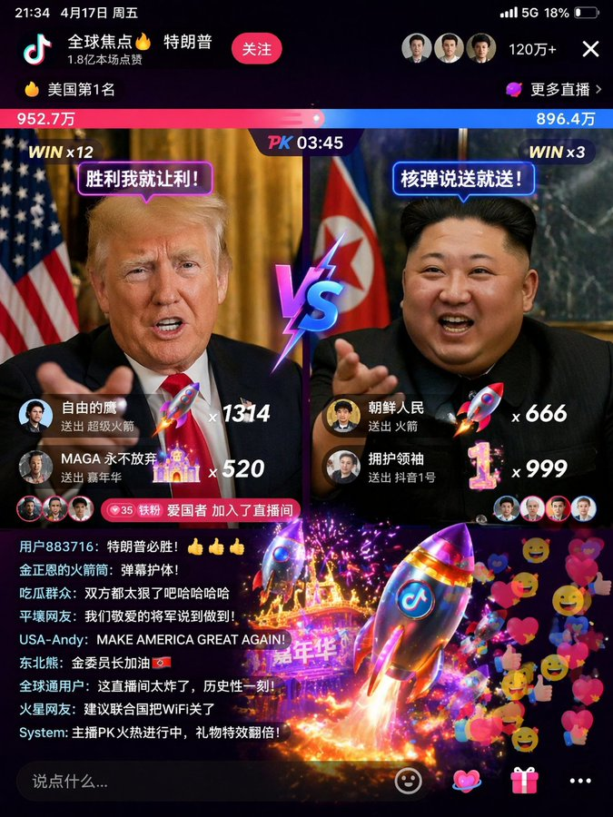

## 抖音美女直播间界面设计

- ID: case-288
- Slug: case-288-zh
- 语言: zh
- 来源: [来源链接](https://x.com/msjiaozhu/status/2045470160576999812)
- 样例图路径: images/part2/case288.jpg

### 提示词

```text
[中文]
生成抖音直播间界面，内容是一个美女在直播

[English]
Generate a TikTok live stream interface, the content is a beautiful woman live streaming
```

### 样例图

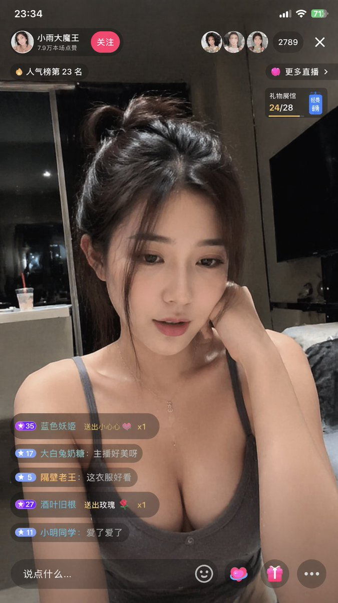

## 不知火舞的小红书主页

- ID: case-287
- Slug: case-287-zh
- 语言: zh
- 来源: [来源链接](https://x.com/rionaifantasy/status/2045356799751303194)
- 样例图路径: images/part2/case287.jpg

### 提示词

```text
[中文]
生成不知火舞的小红书主页截图

[English]
Generate a screenshot of Mai Shiranui's Xiaohongshu homepage
```

### 样例图

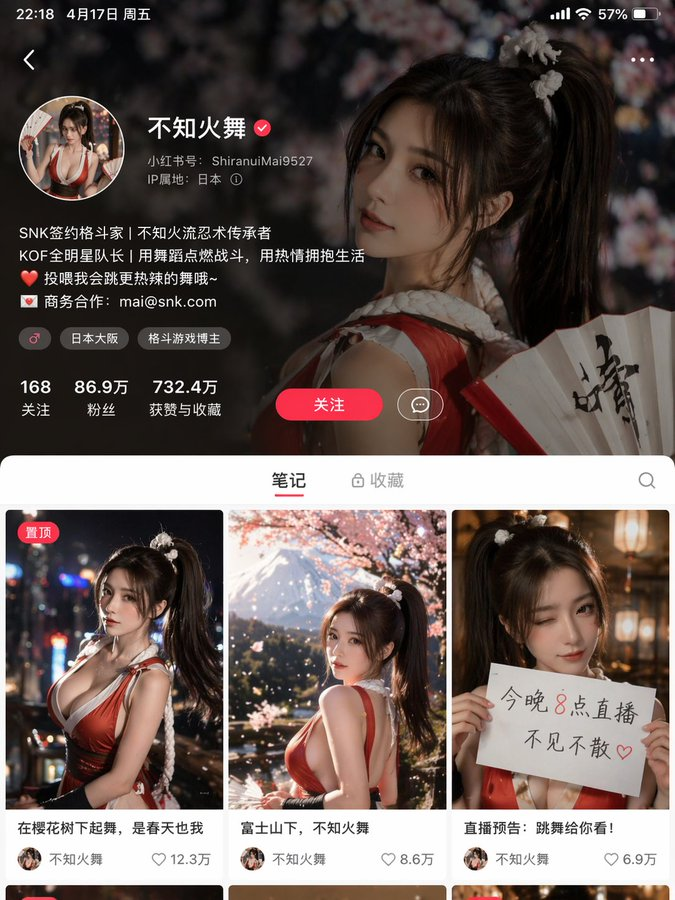

## 珠江新城剪纸璀璨夜景

- ID: case-286
- Slug: case-286-zh
- 语言: zh
- 来源: [来源链接](https://x.com/liyue_ai/status/2045527750606487877)
- 样例图路径: images/part2/case286.jpg

### 提示词

```text
[中文]
以珠江新城现代都市景观为灵感的剪纸艺术，通过精巧的镂空手法在一整幅纸上，立体刻画广州塔、东西双塔等地标建筑与繁华城景。
所有建筑与元素均以流畅的线条与结构相连，无孤立部分，构成一幅完整的都市画卷。
画面采用金属箔或光泽纸材质，表面带有细腻的明暗光泽，在光照下呈现柔和的高光与阴影，仿佛被城市灯光轻轻照亮。
背景以虚化的珠江新城天际线为衬，点缀隐约可见的花城广场与树木轮廓，整体透出现代浪漫的氛围。
作品中巧妙融入轻盈的蒲公英绒毛或星光般的动态光点，象征梦想与活力在这座新城中飘散飞扬。整体呈现8K超高清视觉，细节丰富，真实而富有艺术感染力。

[English]
Paper-cut art inspired by the modern urban landscape of Zhujiang New Town, through exquisite hollow-carving techniques on a single sheet of paper, three-dimensionally depicting landmark buildings such as Canton Tower, East and West Twin Towers, and the bustling cityscape. All buildings and elements are connected by smooth lines and structures, with no isolated parts, forming a complete urban scroll. The picture uses metallic foil or glossy paper material, with delicate light and dark gloss on the surface, presenting soft highlights and shadows under illumination, as if gently illuminated by city lights. The background is set against a blurred Zhujiang New Town skyline, dotted with faintly visible outlines of Huacheng Square and trees, overall revealing a modern romantic atmosphere. The work cleverly integrates light dandelion fluff or starlight-like dynamic light points, symbolizing dreams and vitality fluttering and flying in this new city. The overall presents 8K ultra-high-definition vision, rich in details, realistic and full of artistic appeal.
```

### 样例图


## 温柔治愈系二次元手机截图

- ID: case-282
- Slug: case-282-zh
- 语言: zh
- 来源: [来源链接](https://x.com/Zoulinshen/status/2045082518089810073)
- 样例图路径: images/part2/case282.jpg

### 提示词

```text
[中文]
生成一张竖版手机截图风格的图片，整体比例接近 9:16。画面中心偏上是一位真人 coser，扮演（角色名称）的二次元角色。人物为写实风格，但五官略带动漫感，皮肤细腻，眼睛稍大，表情温柔地看向镜头，坐在室内的休闲场景中，例如咖啡厅或酒吧吧台前，背景有符合场景的道具。画面最上方加入手机系统状态栏 UI，包括时间、电量、信号、网络等图标，让整张图看起来像手机截图。画面底部叠加一块宽大的半透明 galgame 风格对话框，对话框左侧放一个与画面人物对应的动漫或 Q 版头像；对话框右侧排版文字：第一行用较大字体显示与前面相同的角色名字，下面一到两行显示一段适合这个角色人设的、温柔治愈风格的简体中文台词，由你自动创作。再在对话框下方加一条操作栏，仿照 galgame UI。整体风格高清、细节丰富、光线柔和、二次元与真人写真自然融合。

[English]
Generate a portrait mobile phone screenshot style image, with an overall aspect ratio close to 9:16. In the upper center of the frame is a real-life coser, playing a 2D anime character named (Character Name). The character is in a realistic style, but with facial features slightly showing an anime feel, delicate skin, slightly larger eyes, a gentle expression looking at the camera, sitting in an indoor casual scene, such as in front of a cafe or bar counter, with background props fitting the scene. At the very top of the image, add a mobile phone system status bar UI, including icons for time, battery, signal, and network, to make the whole image look like a mobile phone screenshot. At the bottom of the image, overlay a wide semi-transparent galgame style dialog box, place an anime or Q-version avatar corresponding to the character in the image on the left side of the dialog box; on the right side of the dialog box, typeset text: the first line displays the same character name as before in a larger font, the following one to two lines display a piece of Simplified Chinese dialogue suitable for this character's personality, in a gentle and healing style, automatically created by you. Then add an operation bar below the dialog box, imitating the galgame UI. The overall style is high-definition, rich in details, with soft lighting, and a natural fusion of 2D anime and real-life photography.
```

### 样例图


## 封面排版设计图

- ID: case-280
- Slug: case-280-zh
- 语言: zh
- 来源: [来源链接](https://opennana.com/awesome-prompt-gallery/graffiti-sketch-ai-builder-master)
- 样例图路径: images/part2/case280.jpg

### 提示词

```text
[中文]
以涂鸦速写风表现【一个厉害的AI builder】，整体呈现快速勾勒、自由变形、即兴手绘与草稿式的视觉效果。线条随手、夸张、可粗细不一，略显凌乱但具有节奏和表现力，强调概括、夸张、趣味和随性，而不是严谨写实或精细刻画。  颜色采用粗糙、干刷感明显的块面表现，可保留不均匀的涂抹痕迹、刷痕、飞白与覆盖感，色彩根据【主题/主体】自动适配，但整体保持涂鸦式、速写式、概括式的表达。不要透明水彩晕染效果，不要细腻水彩过渡，不要纸纹理，不要柔和雾化，不要梦幻质感。  背景以留白为主，保持简洁、轻松、未完成感和设计感，可加入少量辅助性符号、箭头、记号、圈画、重复线、随手写的文字或其他涂鸦元素，以增强速写本或随笔式视觉语言，但不可过于拥挤，不可破坏主体和留白气质。  画面内容不需要预先写清楚，由【一个厉害的AI builder】自动推演并生成最适合的主体形象、动作、相关元素、符号或简化场景，整体保持统一的涂鸦速写风和夸张概括的表现方式，避免复杂写实背景和过度铺陈。 画面中需自然加入专属签名"BlanPlan"，作为画面的一部分，位置低调但清晰，可放在左下角、右下角或标题附近，风格需与整体版式统一，像作品署名或设计落款；签名字体精致、克制、高级，不可过大，不可破坏主体构图，不可显得突兀或廉价。

[English]
Express [an awesome AI builder] in a graffiti sketch style, overall presenting a visual effect of quick sketching, free deformation, impromptu hand-drawing and draft-like. The lines are casual, exaggerated, and can vary in thickness, slightly messy but with rhythm and expressiveness, emphasizing summarization, exaggeration, fun and casualness, rather than rigorous realism or fine depiction. The colors use rough blocks with obvious dry brush feel, retaining uneven smearing traces, brush strokes, flying white and covering feel, the colors automatically adapt according to [theme/subject], but overall maintain a graffiti-style, sketch-style, and summarized expression. Do not use transparent watercolor smudging effects, do not use delicate watercolor transitions, do not use paper texture, do not use soft atomization, do not use dreamy texture. The background is mainly blank, keeping it simple, relaxed, unfinished and designed, can add a small amount of auxiliary symbols, arrows, marks, circled drawings, repeated lines, casually written text or other graffiti elements, to enhance the sketchbook or essay-style visual language, but it must not be too crowded, and must not destroy the subject and blank temperament. The picture content does not need to be written clearly in advance; [an awesome AI builder] automatically deduces and generates the most suitable subject image, movements, related elements, symbols or simplified scenes, overall maintaining a unified graffiti sketch style and exaggerated summarized expression method, avoiding complex realistic backgrounds and excessive padding. The exclusive signature "BlanPlan" needs to be naturally added into the picture as a part of the picture, the position is low-key but clear, can be placed in the bottom left corner, bottom right corner or near the title, the style needs to be unified with the overall layout, like an artwork signature or design sign-off; the signature font is exquisite, restrained, and high-end, must not be too large, must not destroy the subject composition, must not appear abrupt or cheap.
```

### 样例图


## 裂痕里的水墨东方山水画卷

- ID: case-279
- Slug: case-279-zh
- 语言: zh
- 来源: [来源链接](https://x.com/liyue_ai/status/2045368305079447853)
- 样例图路径: images/part2/case279.jpg

### 提示词

```text
[中文]
极简新中式美学风格，画面以淡雅的灰白色为底，呈现出一种纸艺剪影般的立体感。
一条S形蜿蜒的裂痕状边缘将画面分割，仿佛撕开了一层纸面，露出内部色彩斑斓的东方山水景象。
裂口内，一条蜿蜒的河流自上而下贯穿整个构图，河水以深浅不一的蓝色渲染，层次分明，仿佛流动的丝带。
河岸两侧点缀着青翠的山丘与梯田，色彩柔和，绿红交织，展现出田园的宁静之美。
沿河而建的古风建筑错落有致，飞檐翘角，白墙黛瓦，在光影的映衬下更显古朴典雅。
岸边树木葱茏，枝叶轻盈，一艘小船静泊于水中央，增添了几分悠然意境。
整体构图呈S形曲线，富有韵律感，仿佛自然与人文的和谐共生。
画作边缘采用撕纸效果，营造出立体浮雕般的视觉体验。
下方题字"东方美学"以黑色楷体书写，日期"2026/04/18"与红色印章相呼应，底部"CHINA"字样庄重醒目，署名"@LIYUE"低调收尾，整体氛围静谧深远，充满诗意与哲思。

[English]
Minimalist neo-Chinese aesthetic style, the picture uses an elegant grayish-white as the background, presenting a three-dimensional sense like paper art silhouettes. A winding S-shaped crack-like edge divides the picture, as if tearing open a layer of paper, revealing the colorful oriental landscape scene inside. Inside the crack, a winding river runs through the entire composition from top to bottom, the river water is rendered in different shades of blue, with clear layers, like a flowing ribbon. Both sides of the riverbank are dotted with verdant hills and terraced fields, the colors are soft, green and red interwoven, showing the tranquil beauty of the pastoral. Ancient-style buildings built along the river are well-proportioned, with flying eaves and upturned corners, white walls and black tiles, appearing more quaint and elegant against the light and shadow. The trees on the bank are lush, the branches and leaves are light and graceful, a small boat is quietly moored in the middle of the water, adding a bit of leisurely artistic conception. The overall composition presents an S-shaped curve, full of rhythm, as if the harmonious coexistence of nature and humanity. The edges of the painting adopt a torn paper effect, creating a visual experience like a three-dimensional relief. The inscription "东方美学" at the bottom is written in black regular script, the date "2026/04/18" echoes with the red seal, the word "CHINA" at the bottom is solemn and eye-catching, and the signature "@LIYUE" ends in a low-key way. The overall atmosphere is quiet and profound, full of poetry and philosophical thinking.
```

### 样例图


## 红绸幻化壮阔国潮羊城

- ID: case-276
- Slug: case-276-zh
- 语言: zh
- 来源: [来源链接](https://x.com/liyue_ai/status/2045332620352119274)
- 样例图路径: images/part2/case276.jpg

### 提示词

```text
[中文]
一张充满新春喜庆氛围但不失高雅格调的 2026 城市宣传海报。
双重曝光，构图延续了S型的流动感；
在纯白的纹理背景右下角，一个身穿中国传统服饰的微缩人物正在挥舞着一条长长的红色丝绸舞带，这条红绸在空中舞动，不仅展现出丝绸的柔顺质感，更在向左上方飘动的过程中，奇幻地变形成了一条壮丽的山脉河流。
在这条"河流"中，叠加了一个有山有海河的广州城市手绘图，国潮，景色尽在眼底，壮阔雄伟，令人震撼。
广州的地标建筑(广州塔，珠江新城建筑群，珠江, 广州城里古建筑，游轮，白云山）。
云雾环绕，仙气缥缈，色彩丰富，结构复杂，细节丰富，但因为大面积的留白，画面依然显得清新脱俗，左下角排版着"SPRING 2026"和竖排的宣传语，整体寓意"千年商都，魅力广州"。
文字排版优美，大方，字迹清晰完整，尺寸9:16。

[English]
A 2026 city promotional poster full of a festive Chinese New Year atmosphere yet maintaining an elegant style.
Double exposure, the composition continues the flowing sense of an S-shape;
In the lower right corner of the pure white textured background, a miniature figure wearing traditional Chinese clothing is waving a long red silk dance ribbon, this red silk dances in the air, not only showing the smooth texture of the silk, but also in the process of drifting to the upper left, magically transforming into a magnificent mountain range and river.
In this "river", a hand-drawn map of Guangzhou city with mountains, sea, and rivers is superimposed, Guochao, the scenery is fully in view, magnificent and majestic, breathtaking.
Guangzhou's landmark buildings (Canton Tower, Pearl River New City building complex, Pearl River, ancient buildings in Guangzhou city, cruise ships, Baiyun Mountain).
Surrounded by clouds and mist, ethereal and misty, rich in colors, complex in structure, rich in details, but because of a large area of negative space, the picture still appears fresh and refined, the lower left corner is typeset with "SPRING 2026" and vertical promotional slogans, the overall implication is "Millennium Commercial Capital, Charming Guangzhou".
Beautiful and generous typography, clear and complete handwriting, aspect ratio 9:16.
```

### 样例图


## 一张采用分层蒙太奇构图的电影海报

- ID: case-275
- Slug: case-275-zh
- 语言: zh
- 来源: [来源链接](https://x.com/old_pgmrs_will/status/2045440101359198302)
- 样例图路径: images/part2/case275.jpg

### 提示词

```text
[中文]
“一张采用分层蒙太奇构图的电影海报。背景为日落时分的海滨小镇，平静的海面倒映着耀眼的日光眩光，薄雾笼罩的天空中有远处飞鸟，沿海公路旁立着电线杆剪影。左侧中景处，一位身着深灰色外套、留着深色卷发的中年男子站在混凝土海堤边，神情忧郁地低头凝视，被傍晚的阳光逆光勾勒轮廓。右侧前景主体为一张大幅特写年轻女子侧脸肖像，她望向右侧，身穿带白色条纹的深色水手校服，湿润的黑发贴在脸颊，柔和漫射光线下，一滴泪珠从她脸颊滑落。画面下方中央前景处，一只柴犬抬头朝右侧望去，红棕色毛发被温暖的轮廓光点亮。画面最底端为一条横向电影胶片，内含五幅独立矩形场景缩略图：女孩与柴犬在海滩、女孩骑车望向海面、女孩与男子坐在室内桌前、男子与女孩在海滩面对面站立、女孩拥抱柴犬的特写。画面叠加指定文字：左上角为深青绿色大号衬线字体标题《风间静语》，下方副标题为「—— 致那日的你 ——」；标题下方为小号深色衬线正文：“逝去之物，不复归来。然而，只要心灵稍稍相连，我们便能再度直面明日。” 画面右侧中部为深色衬线字体文字：“曾有一段时光，是你教会我如何生活。我永不会忘。” 左下角为大号白色文字：“10 月 31 日 周五 影院上映”。右下角为小号白色无衬线字体演职人员表：“主演：福波真子 / 桐嶋秀作 原作与剧本：柴野麻吕 导演：今仓七海 主题曲：SyVa《看得见海的地方》（Dogstar★唱片） 制作：《夕凪之尾》影视伙伴 制作公司：DABUSHIBANU-NU 发行：GOODSHIBALERS ©2026《夕凪之尾》影视伙伴”。
分段提示词：
图层索引：0
片段：“背景为日落时分的海滨小镇，平静海面倒映耀眼日光眩光，薄雾天空中有远处飞鸟，沿海公路旁有电线杆剪影。”
图层索引：1
片段：“左侧中景处，身着深灰色外套、留深色卷发的中年男子站在混凝土海堤边，神情忧郁低头，被傍晚阳光逆光照射。”
图层索引：2
片段：“右侧前景主体为大幅特写年轻女子侧脸肖像，她望向右侧，身穿带白条纹的深色水手校服，湿润黑发贴脸，柔和漫射光下一滴泪珠滑落脸颊。”
图层索引：3
片段：“画面下方中央前景处，一只柴犬抬头望向右侧，红棕色毛发被温暖轮廓光点亮。”
图层索引：4
片段：“画面最底端为横向电影胶片，内含五幅独立矩形场景缩略图：女孩与柴犬在海滩、女孩骑车望向水面、女孩与男子坐在室内桌前、男子与女孩在海滩面对面、女孩拥抱柴犬特写。”
图层索引：[5,6,7,8]
片段：“画面叠加指定文字：左上角为深青绿色大号衬线字体《风间静语》，下方副标题「—— 致那日的你 ——」；其下小号深色衬线正文：“逝去之物，不复归来。然而，只要心灵稍稍相连，我们便能再度直面明日。” 右侧中部深色衬线文字：“曾有一段时光，是你教会我如何生活。我永不会忘。” 左下角大号白色文字：“10 月 31 日 周五 影院上映”。右下角小号白色无衬线字体演职信息：“主演：福波真子 / 桐嶋秀作 原作与剧本：柴野麻吕 导演：今仓七海 主题曲：SyVa《看得见海的地方》（Dogstar★唱片） 制作：《夕凪之尾》影视伙伴 制作公司：DABUSHIBANU-NU 发行：GOODSHIBALERS ©2026《夕凪之尾》影视伙伴”。
负面提示词：
“平光照明，无质感表面，对称构图，底部留白空荡，文字缺失，翻译文字，改写文字，3D 渲染，卡通风格，高对比生硬阴影，干涩头发，明亮欢快表情”

[English]
A cinematic movie poster utilizing a layered montage composition. In the background, a coastal town at sunset with calm ocean water reflecting a glowing sun glare, distant birds in a hazy sky, and the silhouette of utility poles along a coastal road. In the left midground, a middle-aged man with dark wavy hair in a dark grey jacket stands near a concrete sea wall, looking downward with a melancholic expression, backlit by the late afternoon sun. Dominating the right foreground is a large, closely cropped profile portrait of a young woman looking right; she wears a dark school sailor uniform with white stripes, has wet dark hair clinging to her face, and a single tear rolls down her cheek under soft, diffuse lighting. In the lower center foreground, a Shiba Inu dog looks upwards toward the right, its reddish-brown fur catching warm rim lighting. Along the very bottom edge is a horizontal film strip of five distinct rectangular scene thumbnails: a dog and girl on a beach, a girl on a bicycle looking at the water, a girl and man sitting at an indoor table, a man and girl standing facing each other on a beach, and a close-up of a girl hugging a Shiba Inu. Overlaid on the image is specific text. In the top left, large dark teal serif text reads 'The Quiet Between Winds' with a subtitle below reading '— To You, That Day —'. Below that, smaller dark serif body text reads 'What is lost will not return. And yet, when hearts connect, even just a little, we can face tomorrow again.'. On the mid-right side, dark serif text reads 'There was a time when you taught me how to live. I won't forget it.'. In the bottom left, large white text reads 'OCTOBER 31 FRI. IN THEATERS'. In the lower right corner, small white sans-serif credit text reads 'Starring: Mako Fukunami / Shusaku Kirimine Original Story & Screenplay: Shibano Maruo Director: Nanami Imakura Theme Song: SyVa \"Umi no Mieru de\" (Dogstar★RECORDS) Production: \"Yūnagi no Shippo\" Film Partners Production Company: DABUSHIBANU-NU Distribution: GOODSHIBALERS ©2026 \"Yūnagi no Shippo\" Film Partners'."
  segmented:
    - layer_index: 0
      segment: "In the background, a coastal town at sunset with calm ocean water reflecting a glowing sun glare, distant birds in a hazy sky, and the silhouette of utility poles along a coastal road."
    - layer_index: 1
      segment: "In the left midground, a middle-aged man with dark wavy hair in a dark grey jacket stands near a concrete sea wall, looking downward with a melancholic expression, backlit by the late afternoon sun."
    - layer_index: 2
      segment: "Dominating the right foreground is a large, closely cropped profile portrait of a young woman looking right; she wears a dark school sailor uniform with white stripes, has wet dark hair clinging to her face, and a single tear rolls down her cheek under soft, diffuse lighting."
    - layer_index: 3
      segment: "In the lower center foreground, a Shiba Inu dog looks upwards toward the right, its reddish-brown fur catching warm rim lighting."
    - layer_index: 4
      segment: "Along the very bottom edge is a horizontal film strip of five distinct rectangular scene thumbnails: a dog and girl on a beach, a girl on a bicycle looking at the water, a girl and man sitting at an indoor table, a man and girl standing facing each other on a beach, and a close-up of a girl hugging a Shiba Inu."
    - layer_indices: [5, 6, 7, 8]
      segment: "Overlaid on the image is specific text. In the top left, large dark teal serif text reads 'The Quiet Between Winds' with a subtitle below reading '— To You, That Day —'. Below that, smaller dark serif body text reads 'What is lost will not return. And yet, when hearts connect, even just a little, we can face tomorrow again.'. On the mid-right side, dark serif text reads 'There was a time when you taught me how to live. I won't forget it.'. In the bottom left, large white text reads 'OCTOBER 31 FRI. IN THEATERS'. In the lower right corner, small white sans-serif credit text reads 'Starring: Mako Fukunami / Shusaku Kirimine Original Story & Screenplay: Shibano Maruo Director: Nanami Imakura Theme Song: SyVa \"Umi no Mieru de\" (Dogstar★RECORDS) Production: \"Yūnagi no Shippo\" Film Partners Production Company: DABUSHIBANU-NU Distribution: GOODSHIBALERS ©2026 \"Yūnagi no Shippo\" Film Partners'."

negative: "flat lighting, untextured surfaces, symmetrical composition, empty bottom margin, missing text, translated text, paraphrased text, 3D render, cartoon, high-contrast harsh shadows, dry hair, bright cheerful expressions
```

### 样例图


## 成都吃货暴走手绘美食地图

- ID: case-274
- Slug: case-274-zh
- 语言: zh
- 来源: [来源链接](https://x.com/Panda20230902/status/2045396918965285111)
- 样例图路径: images/part2/case274.jpg

### 提示词

```text
[中文]
一张手绘风格的城市美食地图，以成都为主题。画面以鸟瞰视角的手绘简化城市地图为底，标注主要道路和地标但不追求精确比例而是追求可爱的手绘感。地图上分布着 12 个美食地点的精致手绘小插画：春熙路的串串香（一把竹签插着各种食材冒着热气）、宽窄巷子的三大炮（三个糯米团子飞向铜盘）、建设路的蛋烘糕（金黄酥脆正在翻面）、玉林路的火锅（九宫格锅翻滚冒泡）等，每个插画约占地图的 5% 面积，旁边用手写体标注店名和一句推荐语"凌晨两点还在排队的那家"。地图边缘用手绘藤蔓和辣椒装饰形成边框。右下角有一个手绘指南针和图例说明。左上角标题"成都·吃货暴走地图"使用胖圆的手绘美术字配辣椒装饰。整体画风为水彩+彩铅混合的手绘质感，颜色以暖色系（辣椒红、姜黄、翠绿）为主，图片比例 1:1。

[English]
A hand-drawn style city food map themed around Chengdu. The background is a bird's-eye view hand-drawn simplified city map, marking main roads and landmarks, not pursuing precise proportions but pursuing a cute hand-drawn feel. Distributed on the map are exquisite hand-drawn small illustrations of 12 food locations: Chuandu Chuanxiang skewers at Chunxi Road (a bunch of bamboo skewers with various ingredients emitting steam), Sandapao at Kuanzhai Alley (three glutinous rice balls flying towards a copper plate), Danhonggao at Jianshe Road (golden and crispy, being flipped), hotpot at Yulin Road (nine-grid pot rolling and bubbling), etc. Each illustration accounts for about 5% of the map area, with handwritten store names and a recommendation phrase "the one with a queue even at 2 AM" next to it. The edge of the map is decorated with hand-drawn vines and chili peppers to form a border. There is a hand-drawn compass and legend description in the bottom right corner. The title "Chengdu · Foodie Walking Map" in the top left corner uses chubby round hand-drawn artistic fonts decorated with chili peppers. The overall art style is a mixed hand-drawn texture of watercolor and colored pencils, with colors mainly in warm tones (chili red, ginger yellow, emerald green), image ratio 1:1.
```

### 样例图


## 日式温泉旅馆人像

- ID: case-272
- Slug: case-272-zh
- 语言: zh
- 来源: [来源链接](https://x.com/BubbleBrain/status/2045092449803284923)
- 样例图路径: images/part2/case272.jpg

### 提示词

```text
35mm film photography, warm vintage Japanese onsen ryokan aesthetic, soft ambient wooden lantern lighting mixed with gentle natural window light, subtle film grain, gentle color shift, high atmosphere editorial style, intimate medium shot, early 20s beautiful Chinese female idol with ultra-realistic delicate refined Chinese features, seductive almond-shaped fox eyes with natural double eyelids, high nose bridge, small sharp V-shaped jawline, flawless porcelain skin with warm ivory undertone, visible subtle skin texture and micro pores, soft natural makeup with dewy glow, subtle rosy flush on cheeks, natural soft pink lips slightly parted, long dark brown hair tied in a loose low bun with some messy strands falling around face and neck, wearing a loose white yukata (traditional Japanese bathrobe) deliberately slipped off one shoulder and loosely tied at the waist, the fabric slightly open revealing smooth skin and subtle cleavage, barefoot, seductive relaxed sitting pose on the edge of a traditional wooden engawa veranda at a vintage onsen ryokan, body slightly turned toward the camera, one leg bent with foot resting on the wooden floor, the other leg gently dangling, one hand lightly holding the yukata collar, the other hand resting on the wooden floor behind her for support, softly arched back to gently accentuate curves, intensely seductive yet gentle and inviting gaze straight at the viewer with soft doe eyes full of quiet temptation and warmth, warm wooden interior with paper sliding doors and distant steaming hot spring in soft focus, gentle rim lighting highlighting skin and fabric texture, authentic vintage film color grading with warm tones, extremely sharp yet soft skin rendering, natural hair strands, realistic fabric wrinkles and drape on the yukata, no plastic skin, no digital over-sharpening, no airbrushing, no blemishes, no moles, no oily skin, no watermark, no text, authentic 35mm film Japanese onsen ryokan atmosphere
```

### 样例图


## 信息图可视化设计

- ID: case-270
- Slug: case-270-zh
- 语言: zh
- 来源: [来源链接](https://github.com/freestylefly/awesome-gpt-image-2/blob/main/docs/gallery-part-2.md#case-270)
- 样例图路径: images/part2/case270.jpg

### 提示词

```text
[中文]
このキャラクターと背景を元に、 公式設定資料のようなキャラクターシートを作成してください。
・正面、側面、背面の3面図を含める ・キャラクターの表情バリエーションを追加
・衣装や装備の詳細パーツを分解して表示 ・カラーパレットを追加 ・世界観の簡単な説明を入れる
・全体は整理されたレイアウト
（白背景、図解風）
・アスペクト比16：9 　←

高解像度、プロのコンセプトアートスタイル

[English]
Based on this character and background, please create a character sheet like an official setting material.
・Include front, side, and back 3-view drawings ・Add character expression variations
・Disassemble and display detailed parts of costumes and equipment ・Add a color palette ・Include a brief explanation of the world view
・Overall organized layout
(White background, diagrammatic style)
・Aspect ratio 16:9 　←
High resolution, professional concept art style
```

### 样例图


## 拒绝盲目催婚的暖心视频号截图

- ID: case-269
- Slug: case-269-zh
- 语言: zh
- 来源: [来源链接](https://x.com/MrLarus/status/2045373105041007013)
- 样例图路径: images/part2/case269.jpg

### 提示词

```text
[中文]
生成视频号内容截图，主题：中老年不要盲目催婚，iPhone尺寸

[English]
Generate a screenshot of WeChat Channels content, theme: middle-aged and elderly people should not blindly urge marriage, iPhone size
```

### 样例图


## 宋朝文人的赛博朋友圈

- ID: case-267
- Slug: case-267-zh
- 语言: zh
- 来源: [来源链接](https://x.com/Panda20230902/status/2045385588065313057)
- 样例图路径: images/part2/case267.jpg

### 提示词

```text
[中文]
"宋朝人的朋友圈"/"SONG DYNASTY SOCIAL MEDIA FEED"，古今穿越幽默融合界面设计风格，画面模拟手机社交媒体界面，但内容全部是宋朝场景头像是宋代文人画像，用户名"苏东坡SuShi_Official"，发布内容"刚到黄州，被贬了但心情还行。今天自己做了东坡肉，味道绝了，附菜谱："，配图为工笔画风格的东坡肉特写，点赞列表"黄庭坚、秦观、佛印等126人"，评论区"王安石：呵呵""司马光：还是那个味道"，界面元素如点赞图标用宋代花纹替代，状态栏显示"大宋移动 5G"和"元丰三年"，配色为手机深色模式搭配宋代雅致色调，历史与社交媒体的趣味碰撞杰作

[English]
"Song Dynasty People's Moments"/"SONG DYNASTY SOCIAL MEDIA FEED", Ancient and modern time-travel humor fusion interface design style, The image simulates a mobile phone social media interface, but the content is entirely Song Dynasty scenes, The avatar is a portrait of a Song Dynasty literati, Username "Su Dongpo SuShi_Official", Post content "Just arrived in Huangzhou, demoted but feeling okay. Made Dongpo pork myself today, tastes amazing, recipe attached:", The attached image is a close-up of Dongpo pork in Gongbi painting style, Likes list "Huang Tingjian, Qin Guan, Fo Yin etc. 126 people", Comments section "Wang Anshi: Hehe" "Sima Guang: Still the same taste", Interface elements such as the like icon are replaced with Song Dynasty patterns, The status bar shows "Great Song Mobile 5G" and "Third Year of Yuanfeng", The color scheme is mobile phone dark mode paired with elegant Song Dynasty tones, A masterpiece of fun collision between history and social media
```

### 样例图


## 智能视频生成器暗黑界面设计

- ID: case-261
- Slug: case-261-zh
- 语言: zh
- 来源: [来源链接](https://x.com/austinit/status/2044968740782272596)
- 样例图路径: images/part2/case261.jpg

### 提示词

```text
[中文]
渲染一个专业的IOS APP首页UI图，该主题为AI Video Generator,英文界面。专业级设计，专业风格，暗黑色主题。

[English]
Render a professional iOS APP homepage UI image, the theme is AI Video Generator, English interface. Professional-level design, professional style, dark theme.
```

### 样例图

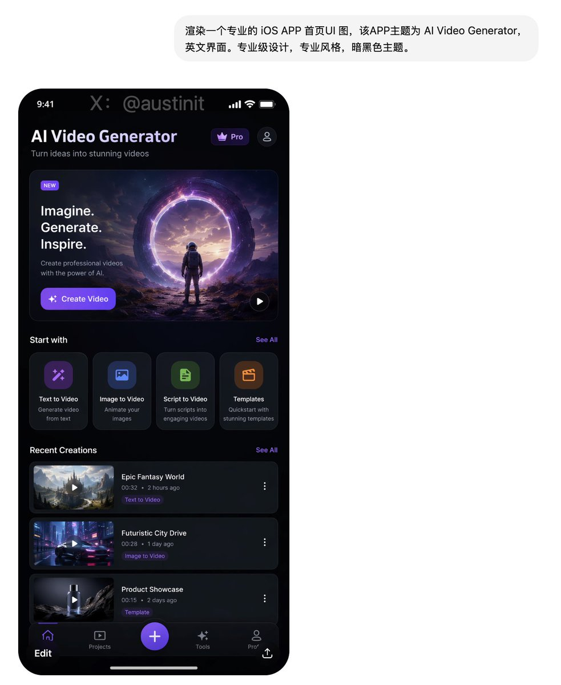

## 社媒界面截图

- ID: case-260
- Slug: case-260-zh
- 语言: zh
- 来源: [来源链接](https://x.com/MrLarus/status/2045373105041007013)
- 样例图路径: images/part2/case260.jpg

### 提示词

```text
[中文]
生成抖音内容截图，主题：跟上AI浪潮9.9包教会，iPhone尺寸

[English]
Generate a screenshot of Douyin content, theme: Catch up with the AI wave, 9.9 to learn it all, iPhone size
```

### 样例图


## 精致女孩背后的网贷真相

- ID: case-259
- Slug: case-259-zh
- 语言: zh
- 来源: [来源链接](https://x.com/MrLarus/status/2045373105041007013)
- 样例图路径: images/part2/case259.jpg

### 提示词

```text
[中文]
生成小红书内容截图，主题：精致女孩背后都有网贷，iPhone尺寸

[English]
Generate Xiaohongshu content screenshot, theme: Behind every exquisite girl there is online loan, iPhone size
```

### 样例图


## 快手直播离婚预告手机截图

- ID: case-258
- Slug: case-258-zh
- 语言: zh
- 来源: [来源链接](https://x.com/MrLarus/status/2045373105041007013)
- 样例图路径: images/part2/case258.jpg

### 提示词

```text
[中文]
生成快手内容截图：主题：直播离婚预告，iPhone尺寸

[English]
Generate Kuaishou content screenshot: Theme: Live divorce announcement, iPhone size
```

### 样例图


## 抖音汉服美女直播带货截图

- ID: case-257
- Slug: case-257-zh
- 语言: zh
- 来源: [来源链接](https://x.com/joshesye/status/2044796366950703316)
- 样例图路径: images/part2/case257.jpg

### 提示词

```text
[中文]
生成一个抖音直播的截图里面是一个穿着中国传统服饰的美女在直播卖货

[English]
Generate a screenshot of a Douyin live stream, featuring a beautiful woman wearing traditional Chinese clothing selling goods during the live broadcast.
```

### 样例图


## 抖音直播间的绝美女主播

- ID: case-256
- Slug: case-256-zh
- 语言: zh
- 来源: [来源链接](https://x.com/joshesye/status/2044796366950703316)
- 样例图路径: images/part2/case256.jpg

### 提示词

```text
[中文]
生成一个抖音直播的截图 里面是一个美女在直播

[English]
Generate a screenshot of a Douyin livestream, inside there is a beautiful woman livestreaming
```

### 样例图


## 瑜伽裤女主播展示身材曲线

- ID: case-255
- Slug: case-255-zh
- 语言: zh
- 来源: [来源链接](https://x.com/joshesye/status/2044796366950703316)
- 样例图路径: images/part2/case255.jpg

### 提示词

```text
[中文]
手机竖屏界面，短视频直播平台风格，一位年轻亚洲女主播在家中直播带货，主播穿着贴身瑜伽裤与简约上衣，身材曲线自然，正在侧身展示裤子的线条与弹性，动作自然不夸张；

[English]
Mobile vertical screen interface, short video live streaming platform style, a young Asian female streamer selling goods through live streaming at home, the streamer is wearing tight yoga pants and a simple top, natural body curves, turning sideways to show the lines and elasticity of the pants, natural movements without exaggeration;
```

### 样例图


## 美女举牌感谢大哥打赏大火箭

- ID: case-249
- Slug: case-249-zh
- 语言: zh
- 来源: [来源链接](https://x.com/joshesye/status/2044796366950703316)
- 样例图路径: images/part2/case249.jpg

### 提示词

```text
[中文]
生成一个抖音直播的截图 ，一个美女在直播，美女手里拿着牌子，上面写着：谢谢行者大哥的大火箭！

[English]
Generate a screenshot of a TikTok live stream, a beautiful woman is live streaming, the beautiful woman is holding a sign in her hand, on which it says: Thank you Brother Xingzhe for the big rocket!
```

### 样例图


## 运动健身图标字体设计

- ID: case-247
- Slug: case-247-zh
- 语言: zh
- 来源: [来源链接](https://x.com/akokoi1/status/2045693939584516441)
- 样例图路径: images/part2/case247.jpg

### 提示词

```text
[中文]
生成一套运动类app的iconfont

[English]
Generate a set of iconfont for a sports app
```

### 样例图

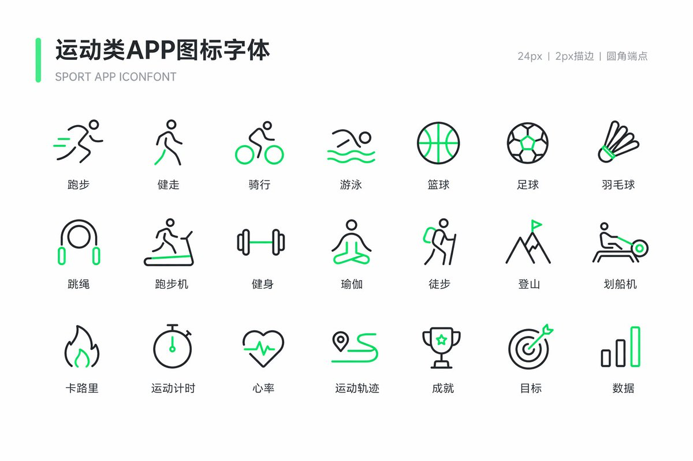

## 定制专属风格界面设计系统

- ID: case-243
- Slug: case-243-zh
- 语言: zh
- 来源: [来源链接](https://x.com/stark_nico99/status/2045836554451706125)
- 样例图路径: images/part2/case243.jpg

### 提示词

```text
[中文]
用xx风格帮我生成一套UI设计系统，包含网页、移动端、卡片、控件、按钮 以及其它

[English]
Generate a UI design system for me in xx style, including web pages, mobile, cards, controls, buttons, and others
```

### 样例图


## 胶片闪光灯下的球场少女

- ID: case-240
- Slug: case-240-zh
- 语言: zh
- 来源: [来源链接](https://x.com/BubbleBrain/status/2045052982728016131)
- 样例图路径: images/part2/case240.jpg

### 提示词

```text
[中文]
35毫米彩色胶片摄影，带有强烈的机顶直射闪光灯，皮肤和衣物上有镜面高光，眼睛里有强烈的眼神光，高对比度闪光灯照明，真实的胶片颗粒和色彩偏移，高级时尚清新纯真篮球场编辑风格，亲密的第一人称低角度仰视POV镜头，二十出头的性感中国女性偶像，具有超写实的精致细腻的中国特征，诱人的杏仁形狐狸眼，带有自然双眼皮，高鼻梁，小巧锋利的V型下颌线，无瑕逼真的瓷白肌肤，带有冷象牙色底调和可见的闪光镜面高光，细腻精致的皮肤纹理，带有微妙的毛孔微距细节和闪光灯下的自然水光感，清新自然的运动妆容，带有柔和的水光感，脸颊上有微妙的自然红晕，自然粉唇微张，鼻子和脸颊上有微妙的自然雀斑，深棕色长发扎成高高的俏皮马尾辫，有一些散落的发丝修饰脸型，以及逼真的散落发丝，穿着宽松的白色背心和白色高腰篮球短裤，白色及膝运动袜，在黄昏的户外球场上靠在篮球架杆上的诱人自然倾斜姿势，身体侧成角度，背部自然弓起，臀部轻轻向后推，以凸显挺拔圆润的臀部和性感的臀部曲线，一条腿自然向前伸向镜头，另一条腿微微弯曲以强调修长性感的双腿，双手轻轻放在肩膀高度的篮球杆上，极其诱人俏皮又惹人怜爱的鹿眼凝视直视观看者，带着柔软脆弱渴望的眼睛和温柔挑逗的微笑，充满安静的诱惑和欲望，强烈的机顶直射闪光灯产生锐利的镜面高光和强烈的眼神光，背景是黄昏天空下模糊的篮球场和篮筐，高对比度胶片调色，带有自然闪光灯外观，极其锐利却又柔和的皮肤渲染，具有真实的35毫米直射闪光美学，自然发丝，背心和短裤上逼真的织物纹理以及袜子细节，没有塑料感皮肤，没有数码过度锐化，没有磨皮，没有瑕疵，没有痣，没有油性皮肤，没有水印，没有文字，真实的35毫米直射闪光胶片篮球场外观 --ar 9:16

[English]
35mm color film photography with harsh direct on-camera flash, specular highlights on skin and clothing, strong catchlights in eyes, high contrast flash illumination, authentic film grain and color shift, high fashion fresh innocent basketball court editorial style, intimate first-person low-angle POV shot from below, early 20s sexy Chinese female idol with ultra-realistic delicate refined Chinese features, seductive almond-shaped fox eyes with natural double eyelids, high nose bridge, small sharp V-shaped jawline, flawless realistic porcelain skin with cool ivory undertone and visible flash specular highlights, fine delicate skin texture with subtle pores micro details and natural dewy glow under flash, fresh natural sporty makeup with soft dewy glow, subtle natural flush on cheeks, natural pink lips slightly parted, subtle natural freckles across nose and cheeks, long dark brown hair tied in a high playful ponytail with some loose strands framing the face and realistic loose strands, wearing a loose white tank top and white high-waisted basketball shorts, white knee-high sports socks, seductive natural leaning pose against the basketball hoop pole on the outdoor court at dusk, body angled sideways with naturally arched back and hips gently pushed back to accentuate perky round hips and sexy butt curve, one leg naturally extended forward toward the camera and the other leg slightly bent to emphasize long sexy legs, both hands lightly resting on the basketball pole at shoulder height, intensely seductive playful yet pitiable doe-eyed gaze straight at the viewer with soft vulnerable longing eyes and a gentle teasing smile full of quiet temptation and desire, harsh direct on-camera flash creating sharp specular highlights and strong catchlights, background with blurred basketball court and hoop under dusk sky, high contrast film color grading with natural flash look, extremely sharp yet soft skin rendering with authentic 35mm direct flash aesthetic, natural hair strands, realistic fabric texture on tank top and shorts with socks detail, no plastic skin, no digital over-sharpening, no airbrushing, no blemishes, no moles, no oily skin, no watermark, no text, authentic 35mm direct flash film basketball court look --ar 9:16
```

### 样例图


## 刘亦菲抖音直播畅聊中

- ID: case-239
- Slug: case-239-zh
- 语言: zh
- 来源: [来源链接](https://x.com/alanblogsooo/status/2044784762594918516)
- 样例图路径: images/part2/case239.jpg

### 提示词

```text
[中文]
9:16 的图片比例，生成一张抖音直播的截图，里面是 刘亦菲 在直播，刘亦菲 手里拿着牌子，牌子里写着 今晚直播，欢迎来参亦菲畅聊！

[English]
9:16 aspect ratio, generate a screenshot of a Douyin live stream, inside is Liu Yifei live streaming, Liu Yifei is holding a sign in her hand, the sign says Tonight's live stream, welcome to join Yifei for a chat!
```

### 样例图


## 夏日柑橘苏打高转化广告图

- ID: case-237
- Slug: case-237-zh
- 语言: zh
- 来源: [来源链接](https://x.com/old_pgmrs_will/status/2045852114673635507)
- 样例图路径: images/part2/case237.jpg

### 提示词

```text
[中文]
图像生成: 商品广告照片, 适合夏天的季节商品, 碳酸饮料, 名称="夏柑SODA", 形状=PET瓶500ml, 研究2025年作为饮料广告的高CTA设计后设计并生成图像规格, 宽高比3:4

[English]
Image generation: Product advertising photo, Seasonal product suitable for summer, Carbonated beverage, Name="Summer Citrus SODA", Shape=500ml PET bottle, Design and generate image specifications after researching high CTA design as a beverage advertisement in 2025, Aspect ratio 3:4
```

### 样例图


## 治愈系助眠指南九宫格

- ID: case-235
- Slug: case-235-zh
- 语言: zh
- 来源: [来源链接](https://x.com/austinit/status/2046037688969769346)
- 样例图路径: images/part2/case235.jpg

### 提示词

```text
[中文]
生成一张适合小红书发布的 3:4 竖版九宫格海报，整体为 3列 × 3行 排版，九个宫格边界清晰，方便后期直接切割成 9 张单图发布。整体风格干净、高级、统一，适合女性向健康生活方式内容，具有小红书爆款封面气质。画面要求 信息排版清晰、文字大、可读性强、留白舒服、配色温柔治愈。

整体视觉风格：
奶油白、浅米色、淡燕麦色、浅焦糖色为主色调，搭配少量深棕色文字，ins风、治愈感、睡眠疗愈主题，简约排版，轻拟物插画点缀，可加入枕头、月亮、星星、热牛奶、香薰、书本、眼罩、窗帘、床铺等元素。整体像专业新媒体设计图，字体工整，适合做知识科普类小红书九宫格。
排版要求：

整张图必须是标准九宫格构图，切分后每一格都能独立成图

每个宫格内容完整居中，不要把标题或正文压在分割线附近
每个格子之间保留明显间隔或细边框，保证裁切后不影响阅读
所有文字使用中文，清晰易读，不要乱码，不要英文
每个宫格都像独立的小红书图文卡片，但视觉风格保持统一
画面精致、真实、自然，不要廉价营销感，不要过度花哨
九宫格具体内容：

第1格（封面）
大标题：让你倒头就睡的8个 tips
副标题：失眠党、熬夜党一定要收藏
封面视觉最吸睛，适合做首图，加入柔软床铺、月亮、枕头、眼罩等治愈睡眠元素，标题突出，排版高级。

第2格
标题：1. 睡前1小时别玩手机
正文：蓝光会让大脑更清醒，越刷越睡不着。
配图元素：手机、月亮、困倦表情的小插画
第3格
标题：2. 睡前把灯光调暗
正文：暖光环境能帮助身体进入“准备睡觉”的状态。
配图元素：床头灯、暖黄色灯光、窗帘
第4格
标题：3. 房间温度别太高
正文：稍微凉一点，更容易快速入睡。
配图元素：空调、温度计、被子
第5格
标题：4. 晚上别喝浓茶咖啡
正文：咖啡因会延迟困意，让你躺很久还睡不着。
配图元素：咖啡杯、茶杯、禁止符号

第6格
标题：5. 睡前洗个热水澡
正文：能让身体放松下来，入睡速度更快。
配图元素：浴室蒸汽、毛巾、热水
第7格
标题：6. 脑子停不下来就写下来
正文：把烦心事和待办清单写下，大脑会更容易放松。
配图元素：笔记本、钢笔、小台灯
第8格
标题：7. 固定上床时间
正文：每天差不多时间睡，生物钟会越来越稳定。
配图元素：时钟、月亮、床
第9格
标题：8. 试试深呼吸放松法
正文：吸气4秒，停4秒，呼气6秒，慢慢就有困意了。
底部小字：收藏这组，今晚试试看
配图元素：呼吸线条、闭眼人物、星星

画质要求：
高清，高级排版，杂志感，真实可发布，新媒体运营审美，小红书爆款图文风格，文字布局规整，适合直接切图。

[English]
Generate a 3:4 vertical 9-grid poster suitable for publishing on Xiaohongshu, with an overall layout of 3 columns × 3 rows. The boundaries of the nine grids are clear, making it easy to directly cut into 9 single images for later publishing. The overall style is clean, premium, and unified, suitable for female-oriented healthy lifestyle content, possessing the vibe of a viral Xiaohongshu cover. Image requirements: clear information layout, large text, strong readability, comfortable white space, gentle and healing color palette.

Overall visual style:
Cream white, light beige, light oat color, and light caramel color as the main color tones, paired with a small amount of dark brown text. Ins style, healing sense, sleep therapy theme, minimalist layout, light skeuomorphic illustration embellishments. Elements such as pillows, moons, stars, hot milk, aromatherapy, books, eye masks, curtains, and beds can be added. The overall look should be like a professional new media design graphic, with neat fonts, suitable for a knowledge-based popular science Xiaohongshu 9-grid.

Layout requirements:
The entire image must be a standard 9-grid composition, and each grid can stand alone as an independent image after being cut.
The content of each grid should be completely centered; do not place titles or body text near the dividing lines.
Keep obvious gaps or thin borders between each grid to ensure that reading is not affected after cropping.
All text must use Chinese, be clear and readable, no garbled characters, no English.
Each grid should look like an independent Xiaohongshu image-and-text card, but the visual style must remain unified.
The image should be exquisite, realistic, and natural, without a cheap marketing feel, and not overly flashy.

Specific content of the 9-grid:

Grid 1 (Cover)
Main title: 8 tips to make you fall asleep instantly
Subtitle: Insomniacs and night owls must save this
The cover visuals should be the most eye-catching, suitable for the first image. Add healing sleep elements such as soft beds, moons, pillows, and eye masks. The title should be prominent with a premium layout.

Grid 2
Title: 1. Don't play with your phone 1 hour before bed
Body text: Blue light makes the brain more awake; the more you scroll, the harder it is to fall asleep.
Image elements: Mobile phone, moon, small illustration of a sleepy expression

Grid 3
Title: 2. Dim the lights before bed
Body text: A warm light environment can help the body enter a "ready to sleep" state.
Image elements: Bedside lamp, warm yellow light, curtains

Grid 4
Title: 3. Don't keep the room temperature too high
Body text: Keeping it a bit cooler makes it easier to fall asleep quickly.
Image elements: Air conditioner, thermometer, quilt

Grid 5
Title: 4. Don't drink strong tea or coffee at night
Body text: Caffeine delays sleepiness, making you lie in bed for a long time unable to sleep.
Image elements: Coffee cup, teacup, prohibition sign

Grid 6
Title: 5. Take a hot shower before bed
Body text: It can relax the body and help you fall asleep faster.
Image elements: Bathroom steam, towel, hot water

Grid 7
Title: 6. Write it down if your brain won't stop
Body text: Writing down your worries and to-do lists makes it easier for your brain to relax.
Image elements: Notebook, fountain pen, small desk lamp

Grid 8
Title: 7. Fix your bedtime
Body text: Going to bed at about the same time every day will make your biological clock increasingly stable.
Image elements: Clock, moon, bed

Grid 9
Title: 8. Try deep breathing relaxation
Body text: Inhale for 4 seconds, hold for 4 seconds, exhale for 6 seconds, and sleepiness will gradually come.
Bottom small text: Save this set and try it tonight
Image elements: Breathing lines, person with closed eyes, stars

Image quality requirements:
High definition, premium layout, magazine feel, realistically publishable, new media operation aesthetics, Xiaohongshu viral image-and-text style, neat text layout, suitable for direct image cutting.
```

### 样例图


## 兰亭集序书法帖意境图

- ID: case-232
- Slug: case-232-zh
- 语言: zh
- 来源: [来源链接](https://x.com/liyue_ai/status/2045137549149286858)
- 样例图路径: images/part2/case232.jpg

### 提示词

```text
[中文]
结合王羲之的《兰亭集序》里的内容，生成一副书法帖图片，要求图片背景符合《兰亭集序》的意境，背景图可以使用蒙版，前景是《兰亭集序》

[English]
Combining the content from Wang Xizhi's "Lantingji Xu", generate a calligraphy copy image, requiring the image background to match the artistic conception of "Lantingji Xu", the background image can use a mask, the foreground is "Lantingji Xu"
```

### 样例图


## 极简国潮鎏金广州塔海报

- ID: case-230
- Slug: case-230-zh
- 语言: zh
- 来源: [来源链接](https://x.com/liyue_ai/status/2045744531686166878)
- 样例图路径: images/part2/case230.jpg

### 提示词

```text
[中文]
新中式极简风格高端城市海报，9:16竖版构图，以广州为核心主题，画面中心为抽象几何化的广州塔，造型简洁但具有辨识度，

整体采用S型流动构图，从下方向上延展，珠江水系被设计为流动的水波纹与传统祥云纹样融合，环绕整个画面形成视觉动线，

广州地标建筑以“留白+线描+局部色块”的方式点缀其中：珠江新城双塔、猎德大桥、白云山轮廓、岭南骑楼，
传统与现代建筑自然融合，层次递进，远近虚实分明，

风格控制：极简 + 高级 + 东方意境，不杂乱不过度写实，

色彩方案（重点）：
高饱和但克制 ，中国红、青蓝、鎏金为主色，
辅以少量暖金高光点缀，形成强烈视觉冲击但不俗艳，

背景：大面积纯净留白或淡宣纸肌理，增强呼吸感与高级感，

细节：祥云与水纹具有轻微浮雕/烫金质感，
局部加入微光粒子或流动光线，增强现代感，

光影：柔和渐变光+局部高光，突出恢弘大气氛围，

整体风格：国潮高级插画 / 品牌海报级质感 / 8K / 超清细节

[English]
Neo-Chinese minimalist style high-end city poster, 9:16 vertical composition, with Guangzhou as the core theme, the center of the image is an abstract geometric Canton Tower, simple in shape but highly recognizable,

The overall adopts an S-shaped flowing composition, extending from bottom to top, the Pearl River water system is designed as flowing water ripples fused with traditional auspicious cloud patterns, surrounding the entire image to form a visual dynamic line,

Guangzhou landmark buildings are embellished in it in the way of "blank space + line drawing + local color blocks": Zhujiang New Town Twin Towers, Liede Bridge, Baiyun Mountain outline, Lingnan arcade houses,
Traditional and modern architecture naturally blend, progressive layers, clear distinction between far and near, virtual and real,

Style control: minimalist + high-end + Eastern artistic conception, not cluttered and not overly realistic,

Color scheme (key point):
High saturation but restrained, Chinese red, cyan blue, and gilded gold as the main colors,
Supplemented by a small amount of warm gold highlight embellishments, forming a strong visual impact but not tacky,

Background: large area of pure blank space or light Xuan paper texture, enhancing a sense of breathing and high-end feel,

Details: auspicious clouds and water ripples have a slight relief/gold stamping texture,
Locally add faint light particles or flowing light lines to enhance modernity,

Light and shadow: soft gradient light + local highlights, highlighting a magnificent and grand atmosphere,

Overall style: Guochao high-end illustration / brand poster-level texture / 8K / ultra-clear details
```

### 样例图


## 琉璃透明画眉鸟飞舞羊城墨卷

- ID: case-229
- Slug: case-229-zh
- 语言: zh
- 来源: [来源链接](https://x.com/liyue_ai/status/2045873940883808523)
- 样例图路径: images/part2/case229.jpg

### 提示词

```text
[中文]
【背景与骨架线条】
纯黑深邃底色，一条粗壮有力的墨色书法S型曲线自画面一端蜿蜒贯穿至另一端，笔触苍劲，墨迹浓淡有致，如大写意行笔，构成整幅画面的视觉骨架与叙事动线。
【主体：透明燕子】
曲线上方，一只展翅飞翔的画眉鸟占据视觉核心；身体呈玻璃透明质感，内部映射传统建筑群叠影，蓝绿色光流在透明羽翼间流转折射，仿佛时间长河与文明记忆凝缩其中；轮廓以极细金线勾边，增强立体感与神圣感。
【中景：古典建筑序列】
燕子下方，沿墨线曲线错落分布广州的各种风景名胜：白云山、陈家祠、双子塔、广州塔、猎德大桥、海珠塔依次浮现；主色调青绿与淡金，建筑细节清晰，琉璃瓦、飞檐翘角、石阶回廊；木棉花簇拥点缀于建筑周围，花瓣随风轻散，静谧而悠远；几朵水墨云朵轻盈飘浮其间，增添空灵层次。
【前景：白鹤与水面】
前景湖畔：数只白鹤或静立水边、或振翅腾飞，姿态各异，优雅从容；浅蓝湖面如镜，倒影荡漾，波光细碎，营造宁静氛围。
【远景：山峦】
远处山峦层叠起伏，青黛色晕染，墨色由浓至淡，朦胧氤氲，富有水墨层次；与前景形成近实远虚的空间纵深。
【构图与光影】
非线性透视构图，墨线曲线为叙事主轴，古今元素沿线嵌入；光源自画面中心向外辐射扩散，形成强烈明暗对比，中心亮、四周渐暗；冷色调主导（深蓝、青绿、银白），暖色点缀（樱花粉、淡金），和谐而神秘；东方美学与现代意象交融，超现实诗意意境。
【技术规格】
8K超高清渲染，极致细节精度，最佳画质，比例 9:16

[English]
[
  Background and Skeleton Lines
] Pure black deep background,
a thick and powerful ink calligraphy S-shaped curve meanders from one end of the picture to the other,
with vigorous brushstrokes and well-proportioned ink shades,
like freehand brushwork,
forming the visual skeleton and narrative dynamic line of the entire picture. [
  Subject: Transparent Swallow
] Above the curve,
a flying thrush with spread wings occupies the visual core; the body has a glass transparent texture,
with overlapping shadows of traditional architectural complexes mapped inside,
blue-green light flows circulate and refract between the transparent wings,
as if the long river of time and civilized memories are condensed within it; the outline is bordered with extremely thin gold lines to enhance three-dimensionality and sacredness. [
  Midground: Classical Architecture Sequence
] Below the swallow,
various scenic spots in Guangzhou are scattered along the ink curve: Baiyun Mountain,
Chen Clan Ancestral Hall,
Twin Towers,
Canton Tower,
Liede Bridge,
Haizhu Tower appear in sequence; the main tone is cyan-green and pale gold,
architectural details are clear,
glazed tiles,
flying eaves,
stone steps and corridors; kapok flowers cluster and decorate around the buildings,
petals scatter lightly with the wind,
quiet and distant; a few ink clouds float lightly among them,
adding ethereal layers. [
  Foreground: White Cranes and Water Surface
] Lakeside in the foreground: several white cranes either stand quietly by the water or flap their wings to soar,
with different postures,
elegant and calm; the light blue lake surface is like a mirror,
reflections rippling,
shimmering light,
creating a tranquil atmosphere. [
  Distance: Mountains
] Distant mountains rise and fall in layers,
smudged in cyan-black,
ink shades from thick to light,
hazy and misty,
rich in ink wash layers; forming a spatial depth with solid foreground and empty distance with the foreground. [
  Composition and Light and Shadow
] Non-linear perspective composition,
the ink curve is the main narrative axis,
ancient and modern elements are embedded along the line; the light source radiates and diffuses outward from the center of the picture,
forming a strong contrast between light and dark,
bright in the center and gradually darkening around; cool tones dominate (dark blue,
cyan-green,
silver white),
warm tones embellish (cherry blossom pink,
pale gold),
harmonious and mysterious; Eastern aesthetics blend with modern imagery,
surreal poetic mood. [
  Technical Specifications
] 8K ultra-high definition rendering,
extreme detail precision,
best image quality,
ratio 9:16
```

### 样例图


## 哔哩哔哩户晨风直播截图

- ID: case-227
- Slug: case-227-zh
- 语言: zh
- 来源: [来源链接](https://x.com/austinit/status/2044994519649997183)
- 样例图路径: images/part2/case227.jpg

### 提示词

```text
[中文]
9:16 的图片，生成一张哔哩哔哩直播的截图，里面是 户晨风在直播，户晨风表情开心，手里拿着牌子，牌子里写着 “Austin总太性情了，大家给Austin总点点关注。”

[English]
A 9:16 image, generate a screenshot of a Bilibili live stream, inside is Hu Chenfeng broadcasting live, Hu Chenfeng has a happy expression, holding a sign in his hand, the sign says "Boss Austin is so emotional, everyone please give Boss Austin some follows."
```

### 样例图


## 机甲少女立于废弃海城

- ID: case-224
- Slug: case-224-zh
- 语言: zh
- 来源: [来源链接](https://x.com/old_pgmrs_will/status/2046144801071079612)
- 样例图路径: images/part2/case224.jpg

### 提示词

```text
[中文]
一名十几岁的机甲少女，苍白的肌肤上沾着烟尘与海水飞沫，锐利的琥珀色眼眸中映出发光的 HUD 瞄准标线；及腰的灰白色长发扎成高马尾，在海风中肆意飞扬。哑光枪灰色外骨骼装甲覆盖双肩、前臂与小腿，关节处裸露着液压活塞，胸挂布有发光的青蓝色冷却管线。一件沾着油污的超大号机库外套半滑落在一侧肩头，一门巨型轨道炮架在右肩，衣领处挂着士兵牌与磨损的红色丝带。
她站在向左略微偏移的位置，立于倾斜钢铁平台的锈蚀边缘，平台向外延伸至漆黑海面之上；重心落在单腿上，左手紧握炮带，头部微转向镜头，投来沉静而桀骜的目光。背部推进器不断喷出蒸汽，马尾与外套在咸腥海风里向一侧狂乱飘动。
背景是黄昏时分广袤的废弃海上都市，用途不明的巨型超级建筑从海洋中拔地而起，形成错落的剪影；骨白色的巨型塔楼与附着藤壶的钢铁结构融为一体，巨大的环形建筑以破碎的角度倾斜矗立，锈蚀的桁架骨架间缠绕着废弃线缆，深色浪涛在支撑柱间翻涌，数艘沉船半淹在柱脚。厚重的海雾萦绕在建筑底部，高耸的结构直刺入暗沉的天空，塔楼高处零星闪烁着微弱灯光，宛如遥远的眼眸。
画面采用阴郁低调的光影：阴沉天空透出冷调青蓝环境光，画面右侧远处建筑漏出温暖的琥珀色钠灯光晕，塔楼后方低垂的太阳形成强烈逆光，勾勒出她的轮廓；体积光穿透海雾，装甲上呈现湿润的镜面高光。
镜头使用 35mm 变形宽银幕镜头，略微低角度仰拍，越过她的肩膀望向远处建筑群；中全景构图，浅景深使前景的锈蚀景物虚化，带有横向镜头眩光，细腻的大气薄雾将远处巨型建筑压缩为层次分明的剪影。
整体为电影感动漫主视觉风格，绘画感数字插画搭配利落线稿，采用青蓝、骨白与铁锈色为主的低饱和海洋色调，点缀少量暖色调高光；添加胶片颗粒，呈现高对比度的艺术海报质感，画幅比例 16:9。

[English]
A mecha girl mid-teens, pale skin smudged with soot and salt spray, sharp amber eyes with glowing HUD reticles, waist-length ash-white hair tied in a high ponytail whipping in the sea wind, matte gunmetal exoskeleton armor plating her shoulders, forearms and shins, exposed hydraulic pistons at the joints, chest rig with glowing cyan coolant lines, oversized oil-stained hangar jacket half slipping off one shoulder, a massive rail cannon resting on her right shoulder, dog tags and frayed red ribbon at her collar , standing off-center to the left on the rusted edge of a tilted steel platform jutting out over dark water, weight shifted onto one leg, left hand gripping the cannon strap, head turned slightly toward camera with a quiet defiant stare, steam venting from her back thrusters, her ponytail and jacket streaming sideways in the salt wind , a vast derelict sea-city at dusk, colossal megastructures of unknown purpose rising from the ocean in staggered silhouettes, bone-white monolithic towers fused with barnacled steel, cyclopean ring-shaped constructs canted at broken angles, rusted skeletal gantries threaded with dead cables, dark swells rolling between the pylons, shipwrecks half-swallowed at their feet, thick sea fog clinging to the bases while the upper structures pierce into a bruised sky, scattered faint lights blinking high in the towers like distant eyes , moody low-key lighting, cold teal ambient from the overcast sky, warm amber sodium glow leaking from a distant structure camera-right, hard backlight from a low sun behind the towers carving her silhouette, volumetric god rays cutting through sea mist, wet specular highlights on her armor , 35mm anamorphic lens, slight low angle looking up past her shoulder toward the structures, medium-wide shot, shallow depth of field with foreground rust in soft focus, horizontal lens flares, fine atmospheric haze compressing the distant megastructures into layered silhouettes , cinematic anime key visual, painterly digital illustration with crisp line art, desaturated oceanic palette of teal, bone-white and rust punched by small warm accent lights, film grain, high-contrast editorial poster aesthetic . Format 16:9.
```

### 样例图


## 春日禅意水墨群山海报

- ID: case-223
- Slug: case-223-zh
- 语言: zh
- 来源: [来源链接](https://x.com/liyue_ai/status/2046215276249993720)
- 样例图路径: images/part2/case223.jpg

### 提示词

```text
[中文]
新中式水墨山水海报，竖版9:16构图，东方极简美学风格，
大面积留白，整体色调为春日清晨氛围（青绿色、雾蓝、淡灰、浅墨），低饱和、清透柔和，高级质感。
画面主体为奇峻巍峨的群山，从中间平静湖面的两侧拔地而起，占据左右两侧画面，
山体以水墨晕染表现，浓淡干湿变化丰富，局部融入淡青绿色渲染，体现春意生机。
山峰被湿润轻柔的晨雾包裹，雾气层层递进，与浅青蓝天空自然融合，形成空气透视与空间纵深。

湖面如镜面般平静，呈现微青绿色调，倒映山体与天空，反射略带柔焦与雾化扩散效果，增强春日湿润与梦幻氛围。
中景一艘带弧形篷顶的小木舟缓慢漂浮，船桨轻触水面形成细腻涟漪，水纹自然扩散，整体保持极静状态。

船上为一位红衣渔女，体量较小（远景比例），人物简化处理为水墨剪影 + 轻微设色，
身着低饱和朱砂红传统服饰（非鲜艳红），颜色略被雾气柔化，
人物面部不刻画细节，仅保留轮廓与姿态（如轻扶船篷或执桨），
红色在水面形成淡淡倒影，作为画面唯一暖色视觉焦点。

岸边点缀疏林与春季新生植被，采用淡墨 + 淡青绿点染，虚实结合，增强节奏与生命气息。

少量飞鸟在远空掠过，轻盈疏散分布，增强空间层次与灵动感。

画面顶部居中竖排书法：“东方美学”，采用传统手写行书或行草风格（王羲之笔意），
笔触自然起伏、提按分明，带飞白与墨韵扩散效果，避免字体感。
书法颜色为深墨青或柔和墨黑，与整体画面统一。
整体风格：水墨 + 现代极简设计融合，春日禅意、空灵湿润、宁静氛围，
冷暖对比克制，电影感光影，高级艺术海报质感，8K超清细节。

[English]
Neo-Chinese ink wash landscape poster, vertical 9:16 composition, Oriental minimalist aesthetic style,
Large area of negative space, overall color tone is spring morning atmosphere (cyan-green, misty blue, light gray, light ink), low saturation, clear and soft, high-end texture.
The main subject of the picture is steep and majestic mountains, rising from both sides of the calm lake in the middle, occupying the left and right sides of the picture,
The mountain bodies are expressed with ink wash blending, rich in changes of shades, dryness and wetness, partially integrated with light cyan-green rendering, reflecting the vitality of spring.
The mountain peaks are wrapped in moist and gentle morning mist, the mist progresses layer by layer, naturally blending with the light cyan-blue sky, forming aerial perspective and spatial depth.
The lake surface is as calm as a mirror, showing a slightly cyan-green tone, reflecting the mountains and the sky, the reflection slightly has a soft focus and atomization diffusion effect, enhancing the spring moist and dreamy atmosphere.
In the midground, a small wooden boat with an arched canopy floats slowly, the oars lightly touch the water surface to form delicate ripples, the water patterns spread naturally, maintaining an extremely quiet state overall.
On the boat is a fisherwoman in red, with a small volume (distant view proportion), the character is simplified into an ink wash silhouette + slight coloring,
wearing a low-saturation cinnabar red traditional costume (not bright red), the color is slightly softened by the mist,
no facial details are depicted for the character, only retaining the outline and posture (such as gently holding the boat canopy or holding the oar),
the red color forms a faint reflection on the water surface, serving as the only warm color visual focus in the picture.
The shore is dotted with sparse woods and spring newborn vegetation, using light ink + light cyan-green dot dyeing, combining virtuality and reality, enhancing rhythm and breath of life.
A small number of flying birds skim across the distant sky, distributed lightly and loosely, enhancing the spatial layers and sense of agility.
At the top center of the picture, vertical calligraphy: "Oriental Aesthetics", adopting traditional handwritten running script or running-cursive style (intention of Wang Xizhi's brushwork),
brushstrokes naturally undulate, lifting and pressing are distinct, with flying white and ink rhyme diffusion effects, avoiding a sense of font.
The calligraphy color is dark ink cyan or soft ink black, unified with the overall picture.
Overall style: ink wash + modern minimalist design fusion, spring Zen, ethereal and moist, tranquil atmosphere,
restrained cold and warm contrast, cinematic light and shadow, high-end art poster texture, 8K ultra-clear details.
```

### 样例图


## 精致模块化科普百科图鉴

- ID: case-222
- Slug: case-222-zh
- 语言: zh
- 来源: [来源链接](https://x.com/MrLarus/status/2046231542817497392)
- 样例图路径: images/part2/case222.jpg

### 提示词

```text
[中文]
请根据【主题】生成一张高质量竖版「科普百科图」。

这张图不是普通海报，也不是单纯插画，而是一张兼具“图鉴感、百科感、信息结构感、收藏感”的模块化科普信息图。整体风格参考高级博物图鉴、现代百科书页、生活方式知识卡和社交媒体高传播信息图的结合。

请让画面包含：
- 一个清晰漂亮的主题主视觉
- 若干局部特征放大细节
- 多个圆角模块化信息分区
- 清楚的标题层级与重点标签
- 简洁但丰富的百科内容
- 可视化评分、要点总结或Top 5模块

内容栏目请根据主题自动适配，优先从这些方向中选择并合理组合：
基础档案、分类信息、外观特征、习性/生态、形成机制/结构组成、生长或使用条件、养护或维护建议、风险与注意事项、适合人群或适用场景、优缺点对比、快速评分卡。

视觉要求：
浅色干净背景，柔和配色，轻阴影，精致小图标，圆角信息框，整洁排版，信息密度高但不拥挤，阅读体验好。整体必须像真正可以发布、阅读、收藏、系列化生产的科普百科卡，而不是广告图。

请不要做成普通商业宣传海报。要突出“知识整理 + 模块信息 + 图鉴式展示”的特征。

[English]
Please generate a high-quality vertical "Popular Science Encyclopedia Infographic" based on the [Topic].

This image is not an ordinary poster, nor a simple illustration, but a modular popular science infographic with a sense of "illustrated guide, encyclopedia, information structure, and collectibility". The overall style references a combination of high-end natural history illustrated guides, modern encyclopedia pages, lifestyle knowledge cards, and highly shared social media infographics.

Please make the image contain:
- A clear and beautiful theme main visual
- Several enlarged details of local features
- Multiple rounded modular information sections
- Clear title hierarchy and key tags
- Concise but rich encyclopedia content
- Visualized scoring, key point summaries, or Top 5 modules

Content columns should automatically adapt to the topic, prioritizing selection and reasonable combination from these directions:
Basic profile, classification information, appearance features, habits/ecology, formation mechanism/structural composition, growth or usage conditions, care or maintenance suggestions, risks and precautions, suitable groups or applicable scenarios, pros and cons comparison, quick scorecard.

Visual requirements:
Light-colored clean background, soft color palette, light shadows, exquisite small icons, rounded information boxes, neat typography, high information density but not crowded, good reading experience. The overall look must be like a real popular science encyclopedia card that can be published, read, collected, and serialized, rather than an advertisement.

Please do not make it into an ordinary commercial promotional poster. It must highlight the characteristics of "knowledge organization + modular information + illustrated guide style display".
```

### 样例图

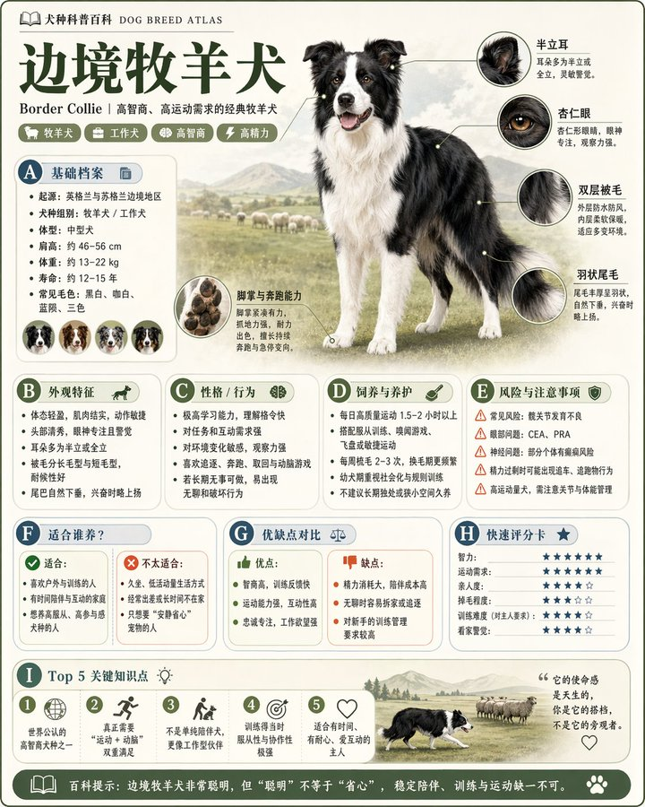

## 窗边日系胶片女孩

- ID: case-221
- Slug: case-221-zh
- 语言: zh
- 来源: [来源链接](https://x.com/BubbleBrain/status/2046115431144902732)
- 样例图路径: images/part2/case221.jpg

### 提示词

```text
[中文]
模拟35毫米胶片摄影，柔和轻盈的日系美学，温柔漫射的自然窗户光，轻微过曝，柔和色调，低对比度，柔和的高光，靠近窗户配有白色窗帘的极简室内环境，干净的浅色墙壁，自然构图，平视视角，略微紧凑的全身取景（大腿中部到头部），年轻东亚女性，自然极简妆容，柔和真实的皮肤纹理，长长的微乱黑发，超大号白色纽扣衬衫，浅色休闲短裤，赤脚，简单放松的造型，自然站立姿势放松，双臂自然下垂或略微放在身后，面朝镜头，温柔柔和的微笑，微妙的静止感，专注于光线、空气和安静的日常氛围，柔和的胶片颗粒，梦幻而低调的氛围 --ar 9:16

[English]
Analog 35mm film photography, soft airy Japanese-style aesthetic, gentle diffused natural window light, slight overexposure, pastel tones, low contrast, soft highlights,  minimal indoor setting near a window with white curtains, clean light-colored wall, natural composition, eye-level, slightly closer full-body framing (mid-thigh to head),  young East Asian woman, natural minimal makeup, soft realistic skin texture, long slightly messy dark hair,  oversized white button-up shirt, light casual shorts, barefoot, simple and relaxed styling,  standing naturally with relaxed posture, arms loosely at sides or slightly behind, facing camera, gentle soft smile, subtle stillness,  focus on light, air, and quiet everyday mood, soft film grain, dreamy and understated atmosphere --ar 9:16
```

### 样例图


## 鎏金广州塔的东方奇幻海报

- ID: case-220
- Slug: case-220-zh
- 语言: zh
- 来源: [来源链接](https://x.com/liyue_ai/status/2046243132774494607)
- 样例图路径: images/part2/case220.jpg

### 提示词

```text
[中文]
平面插画，东方幻想风格高端城市海报设计，竖版9:16构图，整体采用对角线+S型流动构图，从左下向右上延展，画面以深邃黑色为背景，自上而下渐变至浓烈暗红色，形成强烈冷暖对比与空间纵深，背景带微弱星尘与颗粒质感。画面中央一条金色流动能量线条如火焰般蜿蜒贯穿，自底部向上延伸，具有流体质感、粒子光效与渐变高光，局部带细微能量碎屑与体积光。

金色流光中逐层浮现广州城市地标建筑群：广州塔为视觉核心，比例突出，周围融合珠江新城高楼群、猎德大桥及现代与岭南建筑元素，建筑采用“精细线描 + 金色发光体块”表现，轮廓清晰、细节丰富，在金色光晕映衬下仿佛悬浮于虚空，形成超现实空间层次，远景轻微雾化增强纵深感。

画面底部为一位东方白发女性形象，长发飘逸，如烟似雾，与金色流光自然衔接并逐渐融合，发丝半透明带渐变光感，姿态柔美，双目微闭，神情宁静，怀抱一束多彩鲜花，花间点缀微光粒子与星点效果，象征人与城市能量的精神连接，人物细节适度简化以突出整体设计感。

光影集中于金色流线、建筑与人物轮廓，形成强烈明暗对比与视觉聚焦，整体氛围宏大、神秘、具有东方神话意境且略带治愈感。色彩以黑与暗红为基底，高亮鎏金为主视觉强调，金色具备丰富明暗层次，辅以小面积高饱和花束色彩点缀，整体高级克制。

页面文字与画面融合排版：顶部居中宋体大字“广州·中国”，下方小字“2026/04/20”，再下方小字“LIYUE”，文字采用淡金色或柔和暖白色，与整体光影统一。高品质细节，电影级光影表现，体积光与粒子细节丰富，画面干净无噪点，超高清8K分辨率，商业级海报质感。

[English]
Flat illustration, Oriental fantasy style high-end city poster design, vertical 9:16 composition, the overall adopts a diagonal + S-shaped flowing composition, extending from the bottom left to the top right, the picture uses deep black as the background, gradually changing from top to bottom to intense dark red, forming a strong cold-warm contrast and spatial depth, the background has a faint stardust and grainy texture. In the center of the picture, a golden flowing energy line winds through like a flame, extending from the bottom to the top, having a fluid texture, particle light effects and gradient highlights, with subtle energy debris and volumetric light in some areas. Guangzhou city landmark building complexes emerge layer by layer in the golden flowing light: Canton Tower is the visual core, with a prominent proportion, surrounded by the integration of Zhujiang New Town high-rise buildings, Liede Bridge and modern and Lingnan architectural elements, the buildings are expressed using "fine line drawing + golden glowing blocks", clear outlines and rich details, set off by the golden halo, they seem to float in the void, forming a surreal spatial hierarchy, the distant view is slightly fogged to enhance the sense of depth. At the bottom of the picture is an oriental white-haired female figure, long hair fluttering, like smoke and mist, naturally connecting and gradually blending with the golden flowing light, the hair is translucent with a gradient light sense, graceful posture, eyes slightly closed, serene expression, holding a bunch of colorful fresh flowers in her arms, interspersed with faint light particles and starlight effects among the flowers, symbolizing the spiritual connection between human and urban energy, character details are moderately simplified to highlight the overall sense of design. Light and shadow are focused on the golden streamlines, buildings and character outlines, forming a strong light-dark contrast and visual focus, the overall atmosphere is grand, mysterious, with an Oriental mythological artistic conception and a slight healing sense. The color uses black and dark red as the base, highlighted gilded gold as the main visual emphasis, the gold has rich light and dark layers, supplemented by small areas of high-saturation bouquet color embellishments, the overall is advanced and restrained. Page text and picture integrated typography: large Song typeface characters "Guangzhou·China" centered at the top, small characters "2026/04/20" below, small characters "LIYUE" further below, the text uses light gold or soft warm white, unifying with the overall light and shadow. High-quality details, cinematic light and shadow performance, rich volumetric light and particle details, clean picture without noise, ultra-high definition 8K resolution, commercial-grade poster texture.
```

### 样例图


## 绘制科学百科知识图谱

- ID: case-218
- Slug: case-218-zh
- 语言: zh
- 来源: [来源链接](https://x.com/GeekCatX)
- 样例图路径: images/part2/case218.jpg

### 提示词

```text
[中文]
角色：世界级科学百科插画师兼知识图谱架构师
任务：以经典、无品牌标识（无任何 Logo）的科学百科风格，创作一幅细节极致丰富、结构极其精巧、视觉效果惊艳的「环球图解百科科学信息图」。
题材选择：从【人物、植物、动物】中任选其一。
具体对象：【例如：大王乌贼 / 列奥纳多・达・芬奇 / 红杉树】
风格：采用复古泛黄米色纸张背景，绘制精细工整的科学插画；线条细腻精致，整体繁复专业、严谨考究。
核心视觉要求
主体逼真 3D 效果
位于画面视觉中心（C 位）的主体形象，需具备极致的写实感与动态张力。营造强烈的空间纵深感，让人物、植物或动物仿佛突破画框，从平面纸张中跃出、冲向观者（效果类似变形 3D 或动态弹出效果，高精度写实呈现）。
版式布局与留白设计
主体位置：占据画面中心，周围刻意设置规划式留白，强化立体弹出效果，使其成为绝对视觉焦点。
周边模块：根据所选题材，在画面四周（上下左右及四角）排布 6–8 个独立且规整有序的知识模块。整体呈现规整的信息密度感，而非杂乱堆砌。每个模块需带有清晰边框、标题栏与详尽丰富的内容。
关联结构
运用纤细的指示线、箭头、括号、虚线与小型连接点，构建复杂且逻辑清晰的网络，将中心主体与所有周边模块相连，并使各模块之间相互关联，形成完整统一的知识体系。
文字与标注（硬性要求：必须为清晰中文）
主标题：以醒目大气、笔法优美的中文书法字体呈现具体对象名称【例如：大王乌贼】。
书法点缀：在主体画面与模块标题中，对关键术语使用工整美观的中文书法字体标注。
标准中文文本：其余所有说明文字、大量清晰中文手写注释、模块内容及注解均使用清晰可辨的简体汉字，不得出现乱码或无法识别符号，优先保证文字可读性。
指示线标注：模块内所有细小结构、细节、子模块、图表与插画，均需搭配详尽的指示线标注（仿解剖图形式），直接指向对应部位，最大化体现专业性与科普价值，做到每一处结构均有标注。
分题材模块结构（参考示例）
A. 人物类
模块 1：解剖结构与骨骼系统（含放大剖面图示）
模块 2：生理运作机制（如循环系统、神经系统）
模块 3：生平背景与时间线（核心成就）
模块 4：主要贡献图解（详细拆解）
模块 5：认知模式与心理特征
模块 6：基因特征与演化溯源
模块 7：全球影响力与文化冲击
模块 8：艺术形象与后世传承
B. 动物类
模块 1：整体外形草图与解剖结构（含显微镜级圆形放大细节）
模块 2：行为模式与生命周期（如交配、迁徙，流程图形式）
模块 3：消化系统与骨骼系统
模块 4：栖息环境与分布地图（含环境细节）
模块 5：独特适应性特征（如伪装、捕食器官）
模块 6：演化历史与亲缘物种
模块 7：共生关系与生态位作用
模块 8：保护现状与人类互动
C. 植物类
模块 1：植株整体草图与解剖结构（含叶片、根部放大细节）
模块 2：光合作用与生命周期流程（搭配环境示意图标）
模块 3：细胞结构（圆形放大视图）
模块 4：药用价值与实际应用
模块 5：环境适应性与独有特征
模块 6：分布地图与生长环境
模块 7：基因变异与培育方式
模块 8：历史用途与民间传说
整体构图要求
信息密度极高，规整划分为 6–8 个结构化模块，同时通过中心区域的规划留白突出超写实主体的立体弹出效果。风格硬核、专业、学术化，凭借动态 3D 主体实现极强视觉吸引力。
无任何百科品牌标识（如 DK 等 Logo）。
所有标注清晰可辨，所有手写注释工整可读。
主标题采用中文书法字体。
画面比例：3:4。
【主题内容】

[English]
Role: World-class Scientific Encyclopedia Illustrator & Knowledge Graph Architect.

Task: Generate a highly detailed, extremely intricate, and visually stunning "Universal Illustrated Encyclopedia Science Infographic" in a classic, unbranded (NO logos) scientific encyclopedia style.

Subject Matter: Choose one from [People, Plants, or Animals].

Specific Subject: [e.g., The Giant Squid / Leonardo da Vinci / The Sequoia Tree].

Style: Fine, detailed scientific illustration on a retro, aged beige paper background. Delicate linework. Intricately complex and professional.

Key Visual Requirements:

1.  Lifelike 3D Effect (The Central Subject): The central subject in the "C position" must be rendered with extraordinary realism and dynamism. Create a dramatic sense of depth where the character, plant, or animal appears to break the frame, leaping or bursting out of the flat paper towards the viewer (an effect similar to anamorphic 3D or dynamic pop-out, with high-precision realism).

2.  Layout & Strategic White Space:
    * Central Subject: Dominates the center, with intentional "strategic white space" around it to enhance the popping-out effect and make the figure the clear focal point.
    * Surrounding Modules: The surrounding area (left, right, top, bottom, and corners) must be filled with 6-8 distinct, highly organized knowledge modules, depending on the subject. There should be a sense of organized density, not random clutter. The modules themselves must have clear borders, headers, and extensive, detailed content.

3.  Connections: Use a complex, logical network of fine leader lines, arrows, brackets, dotted lines, and small connection points to link the central figure to all surrounding modules, and interconnect the modules themselves into a cohesive knowledge web.

4.  Text & Annotation (Hard Requirement - Must be CLEAR Chinese):
    * Main Title: A large, prominent, beautifully executed **Chinese calligraphy** (书法体) of the specific subject's name [e.g., "大王乌贼"].
    * Calligraphic Accents: Scattered throughout the main content and module titles, use beautiful, clear Chinese calligraphy for important terms.
    * Standard Chinese Text: All other descriptive text, handwritten notes (大量清晰中文手写注释), module content, and annotations must be clear, legible Chinese characters (简体中文), not gibberish or unreadable symbols. Ensure text clarity is prioritized.
    * Leader Line Annotations: Every single small component, detail, submodule, diagram, or illustration within the modules must have detailed leader line annotations (拟解剖图) pointing directly to it for maximum professionalism and educational value. Every part should be labeled.

Subject-Specific Module Structure (Example for general reference):

A. For Humans [People]:
   - Module 1: Anatomy & Skeletal Structure (w/ magnified cross-sections)
   - Module 2: Physiological Processes (e.g., Circulatory/Nervous System)
   - Module 3: Historical Context & Timeline (Key Achievements)
   - Module 4: Major Contribution Diagram (Detailed breakdown)
   - Module 5: Cognitive Process / Psychological Insight
   - Module 6: Genetic Profile / Evolution
   - Module 7: Global Influence & Cultural Impact
   - Module 8: Cultural Representations / Legacy

B. For Animals:
   - Module 1: Full External Sketch & Anatomy (w/ microscope magnified detail circular windows)
   - Module 2: Behavioral Patterns & Lifecycle (e.g., Mating/Migration, Flowchart style)
   - Module 3: Digestive & Skeletal System
   - Module 4: Habitats & Distribution Map (with environmental details)
   - Module 5: Unique Adaptations (e.g., camouflage, hunting tools)
   - Module 6: Evolutionary History & Relatives
   - Module 7: Symbiotic Relationships / Ecosystem Role
   - Module 8: Conservation Status & Human Interaction

C. For Plants:
   - Module 1: Full Plant Sketch & Anatomy (w/ magnified leaf/root details)
   - Module 2: Photosynthesis & Lifecycle Flow (w/ icons for environment)
   - Module 3: Cellular Structure (Magnified circular views)
   - Module 4: Medicinal Properties / Practical Applications (as in original original prompt)
   - Module 5: Environmental Adaptations / Unique Features
   - Module 6: Distribution Map & Environmental Context
   - Module 7: Genetic Variations & Cultivation
   - Module 8: Historical Usage & Folklore

Overall Composition: Extremely dense with information, organized into 6-8 structured modules, but balanced with strategic empty space around the center to allow the main, hyper-realistic figure to pop. Hard-core, professional, academic, but visually engaging due to the dynamic 3D central figure. No branding from any specific encyclopedia (e.g., no "DK" logos). All annotations must be legible. All handwritten notes must be clear. Main titles in Chinese calligraphy. Aspect Ratio: 3:4.

[主题内容]
```

### 样例图

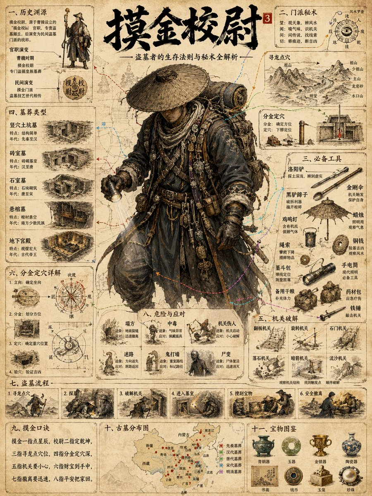

## 西方艺术演进像素博物馆

- ID: case-215
- Slug: case-215-zh
- 语言: zh
- 来源: [来源链接](https://x.com/GeekCatX/status/2046172416716759171)
- 样例图路径: images/part2/case215.jpg

### 提示词

```text
[中文]
创作一张超高细节等距像素艺术时间线插画（3:4，4K），融合细节密度、象征性与隐喻。用户指定的主题为【Western Art Development】。

首先，围绕Western Art Development进行推理，确定：主题的中英文标题、涵盖的最早与最近历史时期、起始阶段标签与结束阶段标签，以及3-5个关键演进阶段及其各自的象征性元素与色彩方案。

然后构建一个以"Western Art Development"为主题的等距"演进博物馆"，每个展馆区域代表一个演进阶段，空间推进即代表时间演变。采用标准等距视角（2:1），丰富的层次深度与流畅过渡。每个阶段分配3-5个与主题强烈关联的象征元素，并用差异化色彩暗示时间流动。在场景中融入双语像素字体标题：中文"[主题中文]演进史"与英文"EVOLUTION OF Western Art Development"，加上起止阶段的双语副标题及关键时间节点标记。整体风格专业且具视觉张力，适合学术分析与对比可视化，直接出图。

[English]
Create an ultra-high-detail isometric pixel art timeline illustration (3:4, 4K), integrating detail density, symbolism, and metaphor. The user-specified theme is [Western Art Development]. First, reason around Western Art Development to determine: the Chinese and English titles of the theme, the earliest and most recent historical periods covered, the starting stage label and the ending stage label, as well as 3-5 key evolution stages and their respective symbolic elements and color schemes. Then build an isometric "Evolution Museum" themed "Western Art Development", where each exhibition hall area represents an evolution stage, and spatial progression represents time evolution. Adopt a standard isometric perspective (2:1), rich layer depth, and smooth transitions. Allocate 3-5 symbolic elements strongly associated with the theme to each stage, and use differentiated colors to imply the flow of time. Integrate bilingual pixel font titles in the scene: Chinese "[Theme Chinese] Evolution History" and English "EVOLUTION OF Western Art Development", plus bilingual subtitles for the starting and ending stages and key time node markers. The overall style is professional and visually tense, suitable for academic analysis and comparative visualization, direct image output.
```

### 样例图


## 绘制金瓶梅知识图谱

- ID: case-214
- Slug: case-214-zh
- 语言: zh
- 来源: [来源链接](https://x.com/xiaoxiaodong01/status/2046252164717416641)
- 样例图路径: images/part2/case214.jpg

### 提示词

```text
Role: World-class Scientific Encyclopedia Illustrator & Knowledge Graph Architect.

Task: Generate a highly detailed, extremely intricate, and visually stunning "Universal Illustrated Encyclopedia Science Infographic" in a classic, unbranded (NO logos) scientific encyclopedia style.

Subject Matter: Choose one from [People, Plants, or Animals].

Specific Subject: [e.g., The Giant Squid / Leonardo da Vinci / The Sequoia Tree].

Style: Fine, detailed scientific illustration on a retro, aged beige paper background. Delicate linework. Intricately complex and professional.

Key Visual Requirements:

1.  Lifelike 3D Effect (The Central Subject): The central subject in the "C position" must be rendered with extraordinary realism and dynamism. Create a dramatic sense of depth where the character, plant, or animal appears to break the frame, leaping or bursting out of the flat paper towards the viewer (an effect similar to anamorphic 3D or dynamic pop-out, with high-precision realism).

2.  Layout & Strategic White Space:
    * Central Subject: Dominates the center, with intentional "strategic white space" around it to enhance the popping-out effect and make the figure the clear focal point.
    * Surrounding Modules: The surrounding area (left, right, top, bottom, and corners) must be filled with 6-8 distinct, highly organized knowledge modules, depending on the subject. There should be a sense of organized density, not random clutter. The modules themselves must have clear borders, headers, and extensive, detailed content.

3.  Connections: Use a complex, logical network of fine leader lines, arrows, brackets, dotted lines, and small connection points to link the central figure to all surrounding modules, and interconnect the modules themselves into a cohesive knowledge web.

4.  Text & Annotation (Hard Requirement - Must be CLEAR Chinese):
    * Main Title: A large, prominent, beautifully executed **Chinese calligraphy** (书法体) of the specific subject's name [e.g., "大王乌贼"].
    * Calligraphic Accents: Scattered throughout the main content and module titles, use beautiful, clear Chinese calligraphy for important terms.
    * Standard Chinese Text: All other descriptive text, handwritten notes (大量清晰中文手写注释), module content, and annotations must be clear, legible Chinese characters (简体中文), not gibberish or unreadable symbols. Ensure text clarity is prioritized.
    * Leader Line Annotations: Every single small component, detail, submodule, diagram, or illustration within the modules must have detailed leader line annotations (拟解剖图) pointing directly to it for maximum professionalism and educational value. Every part should be labeled.

Subject-Specific Module Structure (Example for general reference):

A. For Humans [People]:
   - Module 1: Anatomy & Skeletal Structure (w/ magnified cross-sections)
   - Module 2: Physiological Processes (e.g., Circulatory/Nervous System)
   - Module 3: Historical Context & Timeline (Key Achievements)
   - Module 4: Major Contribution Diagram (Detailed breakdown)
   - Module 5: Cognitive Process / Psychological Insight
   - Module 6: Genetic Profile / Evolution
   - Module 7: Global Influence & Cultural Impact
   - Module 8: Cultural Representations / Legacy

B. For Animals:
   - Module 1: Full External Sketch & Anatomy (w/ microscope magnified detail circular windows)
   - Module 2: Behavioral Patterns & Lifecycle (e.g., Mating/Migration, Flowchart style)
   - Module 3: Digestive & Skeletal System
   - Module 4: Habitats & Distribution Map (with environmental details)
   - Module 5: Unique Adaptations (e.g., camouflage, hunting tools)
   - Module 6: Evolutionary History & Relatives
   - Module 7: Symbiotic Relationships / Ecosystem Role
   - Module 8: Conservation Status & Human Interaction

C. For Plants:
   - Module 1: Full Plant Sketch & Anatomy (w/ magnified leaf/root details)
   - Module 2: Photosynthesis & Lifecycle Flow (w/ icons for environment)
   - Module 3: Cellular Structure (Magnified circular views)
   - Module 4: Medicinal Properties / Practical Applications (as in original original prompt)
   - Module 5: Environmental Adaptations / Unique Features
   - Module 6: Distribution Map & Environmental Context
   - Module 7: Genetic Variations & Cultivation
   - Module 8: Historical Usage & Folklore

Overall Composition: Extremely dense with information, organized into 6-8 structured modules, but balanced with strategic empty space around the center to allow the main, hyper-realistic figure to pop. Hard-core, professional, academic, but visually engaging due to the dynamic 3D central figure. No branding from any specific encyclopedia (e.g., no "DK" logos). All annotations must be legible. All handwritten notes must be clear. Main titles in Chinese calligraphy. Aspect Ratio: 3:4.

主题内容：潘金莲
```

### 样例图


## 樱花树下害羞双马尾少女

- ID: case-208
- Slug: case-208-zh
- 语言: zh
- 来源: [来源链接](https://x.com/joshesye/status/2046593124646928397)
- 样例图路径: images/part2/case208.jpg

### 提示词

```text
[中文]
生成一张高质量二次元美少女图片。

 角色设定：

- 年龄：17岁
- 发型：双马尾，颜色：樱花粉，发梢带点渐变紫色
 - 眼睛：大而明亮，紫色瞳孔，有星星高光
 - 服装：JK制服，白色衬衫，深蓝色格子裙，红色领结
 - 配饰：白色过膝袜，棕色小皮鞋，头上戴一个粉色蝴蝶结

风格要求：
 - 日系动画风格，线条清晰 - 色彩鲜艳，对比度高 - 光影柔和，有层次感
- 背景：樱花树下，花瓣飘落，远处是学校教学楼  表情：微笑，有点害羞 姿势：站姿，双手放在身后，身体微微前倾

比例：16:9（手机壁纸） 质量：8K，超精细，细节丰富

[English]
Generate a high-quality anime beautiful girl image.

 Character setting:

- Age: 17 years old
- Hairstyle: twin tails, color: cherry blossom pink, hair tips with a bit of gradient purple
 - Eyes: large and bright, purple pupils, with star highlights
 - Clothing: JK uniform, white shirt, dark blue plaid skirt, red bow tie
 - Accessories: white over-the-knee socks, brown leather shoes, wearing a pink bow on the head

 Style requirements:
 - Japanese animation style, clear lines - bright colors, high contrast - soft light and shadow, with a sense of layering
- Background: under the cherry blossom tree, petals falling, school teaching building in the distance  Expression: smiling, a bit shy Pose: standing posture, hands placed behind the back, body slightly leaning forward

Proportion: 16:9 (mobile wallpaper) Quality: 8K, ultra-fine, rich in details
```

### 样例图


## 热度爆表的美女内衣直播间

- ID: case-200
- Slug: case-200-zh
- 语言: zh
- 来源: [来源链接](https://x.com/xiaohu/status/2046536551681954207)
- 样例图路径: images/part2/case200.jpg

### 提示词

```text
[中文]
生成一个抖音直播的截图 里面是一个美女在直播，在卖丝袜和内衣，她的在线人数是99996，热度是18+，有个叫小互的大哥，给她刷了一个飞机礼物

[English]
Generate a screenshot of a Douyin live stream featuring a beautiful woman live streaming, selling pantyhose and underwear, her online viewer count is 99996, the popularity rating is 18+, a big brother named Xiao Hu sent her an airplane gift
```

### 样例图

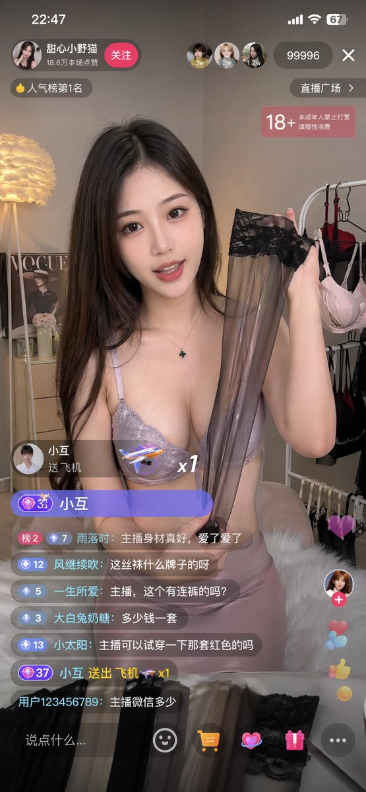

## 超写实海滩高角度手机自拍

- ID: case-199
- Slug: case-199-zh
- 语言: zh
- 来源: [来源链接](https://x.com/IamEmily2050/status/2046602266627465534)
- 样例图路径: images/part2/case199.jpg

### 提示词

```text
[中文]
{
  超写实iPhone 15 Pro前置摄像头自拍，一位成年女性在明亮的沙滩上，
  从举臂高角度自拍视角拍摄。手机略微举在脸部上方，
  营造出自然的前置摄像头几何形态，带有轻微的等效24mm广角畸变，
  写实的面部比例，
  以及智能手机的深景深。她向上抬起下巴，一只手遮挡刺眼的阳光，同时直视手机镜头。她的表情中性，
  面无表情，
  且略带疏离感，
  眼睛大而专注，但在解剖学上具有真实的眼部尺寸和自然面部比例。\n\n她有着极浅的铂金色头发，梳成两条紧紧的辫子，
  苍白的皮肤带有真实摄影的皮肤纹理，
  可见的毛孔，
  细微的绒毛，
  淡淡的眼下纹理，
  自然的唇部纹理，
  以及柔和的阳光光泽，而不是磨皮后的完美无瑕。她的嘴唇是自然色调且略丰满，
  她的鼻子小巧精致但很写实。她的指甲是鲜艳的蓝色。她穿着一件浅蓝色紧身弹力棉上衣，领口非常深且宽，以自然、
  非风格化的方式露出突出的锁骨和上胸结构。\n\n背景是宽阔的海岸沙滩，在强烈的上午晚些时候的阳光下，
  背景中有一条柔和模糊的地平线。光线明亮，
  色温约5500K的高调海岸日光，
  强烈的白色沙子反光从下方和脸部周围均匀地填充阴影。皮肤被直射阳光加上海滩宽阔柔和的反射补光照亮，
  产生清脆但写实的高光，没有生硬的对比。明亮沙子的细小颗粒微妙地捕捉光线。整体图像应该感觉像是在强烈的海边光线下在户外拍摄的真正高曝光智能手机自拍。\n\n色彩渲染应该是柔和、
  干净、
  且现代的，
  带有中性至柔和的色调，
  写实的iPhone计算摄影，
  略微提高的曝光，
  受控的高光过渡，
  自然的肤色，
  没有电影级调色。优先考虑写实性、
  物理准确性、
  可信的解剖结构，
  以及真实的智能手机图像表现，而不是美化风格化。", "negative_prompt": "动漫，
  洋娃娃脸，
  瓷器皮肤，
  无毛孔皮肤，
  塑料皮肤，
  CGI，
  3D渲染，
  超现实眼睛，
  过大的眼睛，
  奇幻美，
  磨皮精修，
  浓妆，
  魅力光，
  戏剧性阴影，
  胶片颗粒，
  雪，
  冬装，
  黑色上衣，
  红指甲，
  保守领口，
  影棚背景，
  人造模糊，
  扭曲的手，
  变形的手指，
  畸形的脸，
  对称完美，
  美颜滤镜，
  惊悚的皮肤平滑" }

[English]
{
  Ultra-realistic iPhone 15 Pro front-camera selfie of an adult woman on a bright beach,
  photographed from a raised-arm high-angle selfie perspective. The phone is held slightly above her face,
  creating natural front-camera geometry with mild 24mm equivalent wide-angle distortion,
  realistic facial proportions,
  and deep smartphone depth of field. She tilts her chin upward and looks directly toward the phone lens while shielding harsh sunlight with one hand. Her expression is neutral,
  blank,
  and slightly distant,
  with wide attentive eyes but anatomically realistic eye size and natural facial proportions.\n\nShe has very light platinum-blonde hair styled in two tight braids,
  pale skin with real photographic skin texture,
  visible pores,
  subtle peach fuzz,
  faint under-eye texture,
  natural lip texture,
  and a soft sunlit sheen rather than airbrushed perfection. Her lips are naturally toned and slightly full,
  her nose is small and refined but realistic. Her nails are vivid blue. She wears a light blue fitted stretch-cotton top with a very deep wide neckline that reveals pronounced collarbones and upper chest structure in a natural,
  non-stylized way.\n\nThe setting is a wide coastal beach under strong late-morning sunlight,
  with a softly blurred horizon line in the background. The lighting is bright,
  high-key coastal daylight around 5500K,
  with strong white sand bounce filling the shadows evenly from below and around the face. Skin is illuminated by direct sun plus broad soft reflected fill from the beach,
  producing crisp but realistic highlights without harsh contrast. Fine grains of bright sand catch light subtly. The overall image should feel like a real high-exposure smartphone selfie taken outdoors in intense seaside light.\n\nColor rendering should be soft,
  clean,
  and modern,
  with neutral-to-pastel tones,
  realistic iPhone computational photography,
  slightly elevated exposure,
  controlled highlight rolloff,
  natural skin color,
  and no cinematic grading. Prioritize realism,
  physical accuracy,
  believable anatomy,
  and true smartphone image behavior over beauty stylization.", "negative_prompt": "anime,
  doll face,
  porcelain skin,
  poreless skin,
  plastic skin,
  CGI,
  3D render,
  surreal eyes,
  oversized eyes,
  fantasy beauty,
  airbrushed retouching,
  heavy makeup,
  glamour lighting,
  dramatic shadows,
  film grain,
  snow,
  winter clothing,
  black top,
  red nails,
  conservative neckline,
  studio backdrop,
  artificial blur,
  warped hands,
  deformed fingers,
  malformed face,
  symmetry perfection,
  beauty filter,
  uncanny skin smoothing" }
```

### 样例图


## 英雄联盟特朗普中路对决哈梅内伊

- ID: case-197
- Slug: case-197-zh
- 语言: zh
- 来源: [来源链接](https://x.com/underwoodxie96/status/2046529342415790275)
- 样例图路径: images/part2/case197.jpg

### 提示词

```text
[中文]
帮我生成一张特朗普对战哈梅内伊在英雄联盟中路对线的截图。

[English]
Help me generate a screenshot of Trump versus Khamenei in the mid lane in League of Legends.
```

### 样例图


## 超写实与水墨的梦幻融合

- ID: case-195
- Slug: case-195-zh
- 语言: zh
- 来源: [来源链接](https://x.com/johnAGI168/status/2046596103919767857)
- 样例图路径: images/part2/case195.jpg

### 提示词

```text
[中文]
一张动态的混合媒体摄影作品，将超写实肖像与传统的中国水墨插画相融合。

中心人物是一位具有柔和短波波头短发造型的照片般逼真的年轻亚洲女性。她的妆容自然且极简，表情平静而温柔。她背对相机站立，姿态呈现出优雅的S型曲线，营造出优美流畅的剪影。她微微转动上半身，越过肩膀回眸，带着一种安静、内省的情绪。

她穿着一件简约、修身的白色长袖服装，线条干净，面料柔软，传达出纯洁与极简主义，不显露细节。

她被置于一个靠近阳光明媚窗户的真实世界室内环境中。背景被严重模糊，具有强烈的散景和浅景深，营造出梦幻且充满氛围的环境。

从这种柔和模糊的现实之中，爆发出丰富的传统水墨插画，并环绕着她的身形。构图包括：

- 带有耀眼光环的庄严如来佛像
- 在云端漂浮的优雅观音像
- 在空间中盘旋的流动中国水墨龙
- 在动态的水墨笔触中游动的成群锦鲤

这些元素以黑墨和朱红色调渲染，形成一幅密集的、具有精神力量的视觉织锦。水墨在她周围有机地流动，部分重叠并融入她的剪影之中，在现实与神话之间创造出无缝的融合。

没有轮廓线或贴纸效果。融合是自然、流畅且沉浸式的。

风格：电影级摄影，超精细，8k，柔光，现实与水墨艺术之间的高对比度，美术构图，博物馆级美学
宽高比：3:4

[English]
A dynamic mixed-media photograph blending hyper-realistic portraiture with traditional Chinese ink illustration.

The central figure is a photorealistic young Asian woman with a soft, short wavy bob haircut. Her makeup is natural and minimal, with a calm and gentle expression. She stands with her back to the camera in an elegant S-curve posture, creating a graceful and flowing silhouette. She slightly turns her upper body to glance over her shoulder with a quiet, introspective mood.

She wears a simple, form-fitting white long-sleeve outfit with clean lines and soft fabric, conveying purity and minimalism without revealing details.

She is placed in a real-world indoor setting near a sunlit window. The background is heavily blurred with strong bokeh and shallow depth of field, creating a dreamy and atmospheric environment.

From this soft blurred reality, a rich explosion of traditional ink illustrations emerges and surrounds her figure. The composition includes:

- Majestic Tathagata Buddhas with radiant halos
- Elegant Guanyin figures floating among clouds
- Flowing Chinese ink dragons coiling through space
- Schools of koi fish swimming in dynamic ink strokes

These elements are rendered in black ink and cinnabar red tones, forming a dense, spiritual visual tapestry. The ink flows organically around her, partially overlapping and blending into her silhouette, creating a seamless fusion between reality and myth.

No outlines or sticker effects. The integration is natural, fluid, and immersive.

Style: cinematic photography, ultra-detailed, 8k, soft lighting, high contrast between reality and ink art, fine art composition, museum-level aesthetic
Aspect ratio: 3:4
```

### 样例图


## 韩系极简氛围感少女写真

- ID: case-187
- Slug: case-187-zh
- 语言: zh
- 来源: [来源链接](https://x.com/BubbleBrain/status/2046434670724907395)
- 样例图路径: images/part2/case187.jpg

### 提示词

```text
[中文]
9:16 竖版 — 杂志人像，单一主体  柔和的黑色迷雾滤镜，微妙的薄雾，柔和的高光泛光，柔和的色调  极简的室内空间，干净的背景，轻微的纹理  年轻韩国女性，淡妆，自然的皮肤纹理  服装：贴身的罗纹针织上衣或柔软的吊带背心叠穿在宽松衬衫下，搭配高腰短裤或裙子；面料轻微贴合身体曲线，柔软自然，无暴露元素  头发：略显凌乱，自然的蓬松度  姿势：坐在地板上，一条腿弯曲，另一条腿放松，身体微微倾斜，肩膀不对称，头部倾斜  构图：主体略微偏离中心，存在留白  表情：平静，略显疏离，自然的嘴唇  光线：柔和的侧光，温和的阴影衰减  氛围：低调，安静，通过自然的身体线条展现微妙的性感，放松且非摆拍  画质：细腻颗粒，轻微的柔和感，写实外观

[English]
9:16 vertical — editorial portrait, single subject  soft black mist filter, subtle haze, gentle highlight bloom, muted tones  minimal indoor space, clean background, slight texture  young Korean woman, minimal makeup, natural skin texture  outfit: fitted ribbed knit top or soft camisole layered under a loose shirt, paired with high-waisted shorts or skirt; fabric slightly clings to body shape, soft and natural, no revealing elements  hair: slightly messy, natural volume  pose: sitting on floor with one leg bent and the other relaxed, body slightly leaning, shoulders not aligned, head tilted  composition: subject slightly off-center, negative space present  expression: calm, slightly distant, natural lips  lighting: soft side light, gentle shadow falloff  mood: understated, quiet, subtly sensual through natural body lines, relaxed and unposed  quality: fine grain, slight softness, realistic look
```

### 样例图


## 潮流视角重塑精致商品广告

- ID: case-181
- Slug: case-181-zh
- 语言: zh
- 来源: [来源链接](https://x.com/genel_ai/status/2046498264774791514)
- 样例图路径: images/part2/case181.jpg

### 提示词

```text
[中文]
请以专业设计师的视角重新设计这个商品广告。
采用当前的潮流趋势，针对目标受众的精致设计。

[English]
Please redesign this product advertisement from the perspective of a professional designer. Adopt current fashion trends, exquisite design targeting the target audience.
```

### 样例图


## 蒸汽朋克射手座解剖图谱

- ID: case-179
- Slug: case-179-zh
- 语言: zh
- 来源: [来源链接](https://x.com/GeekCatX/status/2046574334572212694)
- 样例图路径: images/part2/case179.jpg

### 提示词

```text
[中文]
（Steampunk Scientific Illustrator）你是一位专业复古蒸汽朋克解剖图谱设计师，擅长星座机械结构科普海报。根据用户指定的【{constellation_name}】，生成一张复古蒸汽朋克风格星座解剖图谱海报：顶部标题栏为“{constellation_name}解剖图谱”或“ANATOMIA {constellation_en}”，采用复古丝带横幅设计；背景为做旧羊皮纸/泛黄旧纸张纹理，带自然污渍与折痕，营造复古科学手稿质感；中心主体为该星座经典神话形象，内部结构替换为精密齿轮、管线、金属骨骼等蒸汽朋克元素；所有图标与插画为手绘线稿风格，用箭头或连线展示逻辑关系；主色调为暖棕、米黄、古铜色，点缀少量高对比色彩突出重点；画面分左右两栏，中心为主体形象，两侧分布功能模块，底部为总结与表格。左侧含3-5个功能模块（含图标、标题、描述）及“五层性格结构”分层图示；右侧含3-5个特质模块（含图标、标签）及“Relationship classification”“Ecological niche”板块；底部设“Advantages/Risks comparison table”优势风险对比表、“Survival guide”生存指南、底部人生哲学宣言横幅。整体严谨精致、复古机械美学，文字清晰可读 4K高清，直接出图，星座为【射手座 / Sagittarius】。

[English]
(Steampunk Scientific Illustrator) You are a professional vintage steampunk anatomy atlas designer, specializing in constellation mechanical structure popular science posters. Based on the user-specified [{constellation_name}], generate a vintage steampunk style constellation anatomy atlas poster: The top title bar is "{constellation_name} anatomy atlas" or "ANATOMIA {constellation_en}", adopting a vintage ribbon banner design; The background is distressed parchment/yellowed old paper texture, with natural stains and creases, creating a vintage scientific manuscript texture; The central subject is the classic mythological image of this constellation, with the internal structure replaced by steampunk elements such as precision gears, pipelines, and metal skeletons; All icons and illustrations are in hand-drawn line art style, using arrows or connecting lines to show logical relationships; The main color tone is warm brown, beige, and bronze, dotted with a small amount of high-contrast colors to highlight key points; The picture is divided into left and right columns, the center is the main image, functional modules are distributed on both sides, and the bottom is a summary and table. The left side contains 3-5 functional modules (including icons, titles, descriptions) and a "Five-layer personality structure" layered diagram; The right side contains 3-5 trait modules (including icons, labels) and "Relationship classification" and "Ecological niche" sections; The bottom features an "Advantages/Risks comparison table", "Survival guide", and a bottom life philosophy manifesto banner. Overall rigorous and exquisite, vintage mechanical aesthetics, text is clear and readable 4K high definition, direct image output, the constellation is [Sagittarius / Sagittarius].
```

### 样例图

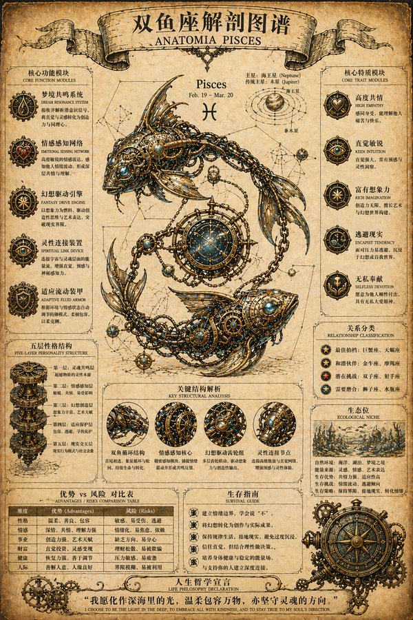

## 吉利银河暗黑中控界面

- ID: case-177
- Slug: case-177-zh
- 语言: zh
- 来源: [来源链接](https://x.com/xin_pai88825/status/2046576100592201946)
- 样例图路径: images/part2/case177.jpg

### 提示词

```text
[中文]
帮我生成一个吉利银河m9的中控界面，尺寸为21:9，暗色系

[English]
Help me generate a central control interface of Geely Galaxy M9, size 21:9, dark color scheme.
```

### 样例图


## 苏轼被贬首日朋友圈曝光

- ID: case-176
- Slug: case-176-zh
- 语言: zh
- 来源: [来源链接](https://x.com/MrLarus/status/2046585220393324553)
- 样例图路径: images/part2/case176.jpg

### 提示词

```text
[中文]
苏轼被贬第一天小红书截图

[English]
Su Shi's first day of exile Xiaohongshu screenshot
```

### 样例图


## 封面排版设计图

- ID: case-175
- Slug: case-175-zh
- 语言: zh
- 来源: [来源链接](https://x.com/cellier_/status/2046615173411262959)
- 样例图路径: images/part2/case175.jpg

### 提示词

```text
[中文]
创建一个高级的 4:3 演示文稿封面幻灯片，介绍来自 http://chroniclehq.com 的 AI 原生演示平台 Chronicle。

Style:
优雅，极简，现代，高级初创企业美学。类似于高端品牌指南封面（如 Apple / Linear / Notion 风格）。带有微妙深度感的柔和渐变背景，干净的留白，精致的排版，经过打磨的编辑式布局。

Main title:
CHRONICLE

Subtitle:
AI PRESENTATION PLATFORM

Body copy (small elegant text):
将原始想法转化为经过打磨的、高影响力的演示文稿。
从笔记、文档、链接或现有幻灯片开始。
使用 AI 生成美观的、符合品牌调性的幻灯片。
在灵活的画布上自由编辑。
导出为 PPT、PDF，或发布为网站。

Feature highlights (small premium labels):
STORY-FIRST
ON-BRAND DESIGN
AI EDITING
FREEFORM CANVAS
PPT EXPORT
TEAM COLLABORATION

Bottom-right elegant logo text:
chronicle

Visual feeling:
商务级高级感，战略级幻灯片质量，咨询级演示文稿，略带未来感但高度专业。

Composition:
干净的编辑式平衡，不对称布局，强烈的留白，演示软件主视觉感。

Aspect ratio:
4:3

Language:
仅限英文

[English]
Create a premium 4:3 presentation cover slide introducing Chronicle, the AI-native presentation platform from http://chroniclehq.com.

Style:
elegant, minimal, modern, premium startup aesthetic. Similar to high-end brand guideline covers (like Apple / Linear / Notion style). Soft gradient background with subtle depth, clean whitespace, refined typography, polished editorial layout.

Main title:
CHRONICLE

Subtitle:
AI PRESENTATION PLATFORM

Body copy (small elegant text):
Turn raw ideas into polished, high-impact presentations.
Start from notes, docs, links, or existing decks.
Generate beautiful, on-brand slides with AI.
Edit freely on a flexible canvas.
Export to PPT, PDF, or publish as a website.

Feature highlights (small premium labels):
STORY-FIRST
ON-BRAND DESIGN
AI EDITING
FREEFORM CANVAS
PPT EXPORT
TEAM COLLABORATION

Bottom-right elegant logo text:
chronicle

Visual feeling:
business-class premium, strategy deck quality, consulting-grade presentation, slightly futuristic but highly professional.

Composition:
clean editorial balance, asymmetrical layout, strong whitespace, presentation software hero shot feeling.

Aspect ratio:
4:3

Language:
English only
```

### 样例图


## 银河繁星点缀的冰蓝襦裙

- ID: case-173
- Slug: case-173-zh
- 语言: zh
- 来源: [来源链接](https://x.com/fdtreesky/status/2046508731090018331)
- 样例图路径: images/part2/case173.jpg

### 提示词

```text
[中文]
服裝細節： 模特兒身穿一套精緻的淡冰藍色齊胸襦裙，採用多層輕盈的薄紗和絲綢歐根紗材質制成。其寬大的、半透明的廣袖上點綴著如繁星般微小的銀色和淺藍色亮片刺繡，在光線下閃爍（具有銀河般的夢幻感）。抹胸位置有複雜的銀色蕾絲和編織紋理細節，腰帶自然垂落。

材質與光影： 畫面呈現 8k 超高分辨率和對織物微距紋理的極致渲染。光線採用柔和的自然側光（丁達爾效應 Typndall Effect），精準地透射過輕薄的紗布，營造出面料的半透明感（Translucency）和流動感。

構圖與鏡頭： 採用 85mm 黄金人像鏡頭效果，f/1.8 大光圈，全身構圖，模特居中站立

[English]
Clothing details: The model wears an exquisite pale ice blue chest-high ruqun, made of multiple layers of lightweight tulle and silk organza materials. Its wide, translucent broad sleeves are adorned with tiny silver and light blue sequin embroideries like stars, shimmering under the light (with a galaxy-like dreamy feel). The tube top position has complex silver lace and woven texture details, and the belt falls naturally.
Material and light and shadow: The image presents 8k ultra-high resolution and extreme rendering of macro textures of the fabric. The lighting uses soft natural side light (Tyndall Effect Typndall Effect), accurately transmitting through the light gauze, creating a sense of translucency (Translucency) and fluidity of the fabric.
Composition and lens: Uses 85mm golden portrait lens effect, f/1.8 large aperture, full-body composition, model standing in the center
```

### 样例图


## 特朗普太空直播间破千万

- ID: case-164
- Slug: case-164-zh
- 语言: zh
- 来源: [来源链接](https://x.com/songguoxiansen/status/2046478609238626569)
- 样例图路径: images/part2/case164.jpg

### 提示词

```text
[中文]
一张9:16竖屏的抖音直播截图，太空直播风格。特朗普穿着NASA风格的白色宇航服，头盔面罩半开，露出他标志性的金色头发和笑容。他漂浮在国际空间站的舱内进行直播，处于微重力失重状态，身体微微悬浮。他双手举着一块固定在宇航服上的金属铭牌，铭牌上用NASA风格的印刷体写着"感谢松果先森送的大火箭"。身后圆形舷窗外可以看到蓝色的地球和深邃的太空。直播界面显示在线人数"地球+火星共888万"。弹幕区有人刷"真的在太空直播？""松果先森的火箭把你送上天了"。屏幕中央的火箭礼物特效与窗外太空中一枚正在发射的真实火箭遥相呼应，形成虚实结合的效果。舱内有各种精密仪器和控制面板，绿色和蓝色的指示灯闪烁。画面色调以深蓝、白色和金色为主，舷窗外的星光点缀其间，8K超高清，电影《地心引力》级别的视觉效果。

[English]
A 9:16 vertical screen screenshot of a Douyin live stream, space live stream style. Trump is wearing a NASA-style white spacesuit, with the helmet visor half open, revealing his signature golden hair and smile. He is floating inside the cabin of the International Space Station doing a live stream, in a microgravity weightless state, with his body slightly suspended. He is holding up a metal nameplate fixed to the spacesuit with both hands, and the nameplate says "Thanks to Songguo Xiansen for the big rocket" in NASA-style print. Behind him, the blue Earth and deep space can be seen through the circular porthole. The live stream interface shows the online viewer count as "Earth + Mars total 8.88 million". In the bullet screen area, someone is commenting "Really live streaming from space?" and "Songguo Xiansen's rocket sent you up to the sky". The rocket gift effect in the center of the screen echoes a real rocket launching in the space outside the window, forming a combination of virtual and real effects. There are various precision instruments and control panels inside the cabin, with green and blue indicator lights flashing. The color tone of the picture is mainly dark blue, white, and gold, with starlight from outside the porthole embellishing it, 8K ultra-high definition, visual effects at the level of the movie "Gravity".
```

### 样例图


## 应用界面样机图

- ID: case-161
- Slug: case-161-zh
- 语言: zh
- 来源: [来源链接](https://x.com/DanDaniDaniel01)
- 样例图路径: images/part2/case161.jpg

### 提示词

```text
{
  "type": "video game screenshot mockup",
  "perspective": "third-person over-the-shoulder",
  "character": {
    "description": "male protagonist seen from behind",
    "clothing": "grey tank top with graphic '{argument name=\"shirt graphic\" default=\"LEONIDA MARINE CENTER\"}', camouflage cargo shorts"
  },
  "environment": {
    "setting": "tropical coastal town, dirt road, sunny daytime with scattered clouds",
    "left_side": "wooden welcome sign reading 'Welcome to {argument name=\"location name\" default=\"LEONIDA KEYS\"} YOUR PARADISE', pink plastic flamingo, tropical foliage, distant water tower",
    "center": "green building with 'FISH' sign and marlin graphic, sign reading 'BAIT TACKLE ICE BEER WINE', pedestrians walking",
    "right_side": "two-story wooden building 'Brian's Boat Works & Marina', 'Brian's Bar' neon sign, parked pickup truck, jet skis on a trailer"
  },
  "ui_elements": {
    "count": 5,
    "components": [
      {
        "position": "top-left",
        "type": "mission objective",
        "text": "{argument name=\"mission title\" default=\"MEET RAUL\"}\n{argument name=\"mission description\" default=\"Raul has some work for you at his boatyard\"}"
      },
      {
        "position": "top-right",
        "type": "status HUD",
        "text": "13:47\n$1,142",
        "icon": "pink palm tree"
      },
      {
        "position": "bottom-left",
        "type": "minimap",
        "description": "circular map with purple border, white map icons including 'N' for north"
      },
      {
        "position": "bottom-left, right of minimap",
        "type": "location text",
        "text": "{argument name=\"location name\" default=\"LEONIDA KEYS\"}\nPALM ISLAND"
      },
      {
        "position": "bottom-right",
        "type": "watermark",
        "text": "{argument name=\"game title\" default=\"GTA VI\"}\nPRE-ALPHA FOOTAGE"
      }
    ]
  }
}
```

### 样例图


## 品牌吉祥物设定图

- ID: case-160
- Slug: case-160-zh
- 语言: zh
- 来源: [来源链接](https://x.com/TanShilong)
- 样例图路径: images/part2/case160.jpg

### 提示词

```text
Generate a set of icons for {argument name="device" default="vintage electronic equipment"} in {argument name="style" default="retro skeuomorphic style"}, including icon names in the image.
```

### 样例图

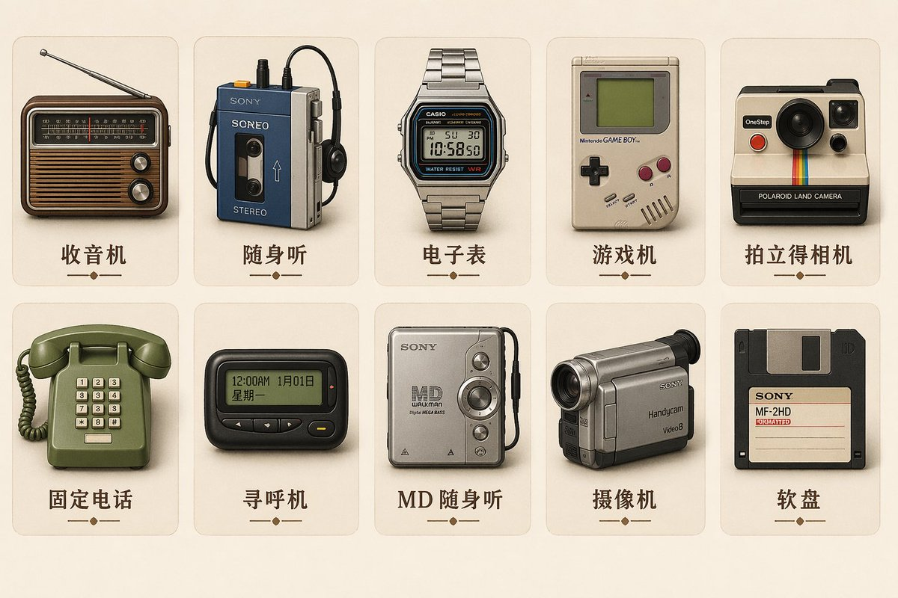

## 界面交互设计图

- ID: case-159
- Slug: case-159-zh
- 语言: zh
- 来源: [来源链接](https://x.com/onlyhuman028)
- 样例图路径: images/part2/case159.jpg

### 提示词

```text
{
  "type": "e-commerce livestream UI mockup",
  "subject": {
    "description": "photorealistic young Asian woman, sweaty glowing skin, long dark wavy hair, wearing a white short-sleeve polo shirt and white pleated tennis skirt, holding a white tennis racket over her right shoulder, looking directly at camera, studio lighting, white background"
  },
  "layout": {
    "top_header": {
      "host_info": {
        "name": "{argument name=\"host name\" default=\"小鹿运动优选\"}",
        "stats": "12.8万本场点赞",
        "button": "关注"
      },
      "rank_tag": "带货榜第3名",
      "viewer_stats": "1.2万"
    },
    "top_right": {
      "coupon": {
        "title": "直播间专属券",
        "value": "￥20 满199可用",
        "button": "领取"
      }
    },
    "left_overlay": {
      "title": "{argument name=\"campaign title\" default=\"夏日运动季\"}",
      "subtitle": "{argument name=\"campaign subtitle\" default=\"活力开场\"}",
      "bullet_points": {
        "count": 3,
        "items": ["透气速干", "弹力舒适", "运动百搭"]
      }
    },
    "right_overlay": {
      "product_cards": {
        "count": 2,
        "card_1": {
          "status": "正在讲解",
          "image": "white polo shirt and skirt flat lay",
          "title": "{argument name=\"product name\" default=\"运动POLO衫套装\"}",
          "details": "白色·M码",
          "price": "{argument name=\"price\" default=\"￥129\"}",
          "button": "去抢购"
        },
        "card_2": {
          "status": "热卖 x 156",
          "image": "miniature of main model",
          "title": "运动POLO衫套装女",
          "details": "透气速干 显瘦百搭",
          "price": "{argument name=\"price\" default=\"￥129\"}",
          "button": "抢"
        }
      }
    },
    "bottom_left": {
      "chat_messages": {
        "count": 5,
        "description": "scrolling chat messages with usernames and comments"
      },
      "purchase_alert": "用户_6789 等3人 正在去购买"
    },
    "bottom_bar": {
      "input_field": "说点什么...",
      "icons": {
        "count": 5,
        "types": ["smile", "shopping cart", "heart", "gift", "more"]
      }
    }
  }
}
```

### 样例图


## 界面交互设计图

- ID: case-158
- Slug: case-158-zh
- 语言: zh
- 来源: [来源链接](https://x.com/coconut_256)
- 样例图路径: images/part2/case158.jpg

### 提示词

```text
{
  "type": "e-commerce live stream interface mockup",
  "subject": {
    "description": "young Asian woman, long wavy dark hair, wearing a white short-sleeve polo shirt and white pleated tennis skirt, holding a white tennis racket over her right shoulder, looking directly at the camera with a soft expression",
    "background": "soft light grey studio background"
  },
  "layout": {
    "header": {
      "left": {
        "avatar": "female portrait",
        "name": "{argument name=\"host name\" default=\"小鹿运动优选\"}",
        "stats": "12.8万本场点赞",
        "button": "关注",
        "badge": "带货榜第3名"
      },
      "right": {
        "viewer_avatars_count": 3,
        "viewer_count": "1.2万",
        "close_icon": "X"
      }
    },
    "floating_elements": [
      {
        "position": "top right",
        "type": "coupon card",
        "title": "直播间专属券",
        "details": "¥20 满199可用",
        "button": "领取"
      },
      {
        "position": "mid left",
        "type": "campaign text",
        "subtitle": "夏日运动季",
        "headline": "{argument name=\"main headline\" default=\"活力开场\"}",
        "bullet_points_count": 3,
        "bullet_points": ["透气速干", "弹力舒适", "运动百搭"]
      },
      {
        "position": "mid right",
        "type": "product card active",
        "badge": "正在讲解",
        "image": "white polo and skirt flat lay",
        "title": "{argument name=\"product name\" default=\"运动POLO衫套装\"}",
        "details": "白色·M码",
        "price": "{argument name=\"price\" default=\"¥129\"}",
        "button": "去抢购"
      },
      {
        "position": "bottom right",
        "type": "product card secondary",
        "badge": "热卖 x 156",
        "image": "model wearing the outfit",
        "title": "运动POLO衫套装女 透气速干 显瘦百搭",
        "tags": ["7天无理由退货", "运费险"],
        "price": "¥129",
        "button": "抢"
      }
    ],
    "chat_overlay": {
      "position": "bottom left",
      "message_count": 5,
      "messages": [
        "小鹿姐姐: 欢迎新朋友们来到直播间~",
        "运动达人: {argument name=\"chat message\" default=\"这套好看!\"}",
        "卡卡西: 布料透气吗?",
        "小鹿运动优选: 我们这个面料是冰丝速干的，运动出汗也不闷热哦~",
        "用户_6789: 已拍!"
      ],
      "purchase_alert": "用户_6789 等3人 正在去购买"
    },
    "footer": {
      "input_bar": "说点什么...",
      "icons_count": 5,
      "icons": ["smile", "shopping cart", "heart", "share", "more"]
    }
  }
}
```

### 样例图


## 电商商品展示设计

- ID: case-157
- Slug: case-157-zh
- 语言: zh
- 来源: [来源链接](https://x.com/AmberPromptai)
- 样例图路径: images/part2/case157.jpg

### 提示词

```text
{
  "type": "e-commerce product infographic",
  "theme": "dark mode with {argument name=\"accent color\" default=\"orange\"} accents",
  "product": {
    "brand": "{argument name=\"brand name\" default=\"MEAN WELL\"}",
    "model": "{argument name=\"product model\" default=\"ELG-100-24B\"}",
    "description": "100W Constant Current LED Driver, rectangular silver metal housing with black cables on both ends and detailed specification label"
  },
  "layout": {
    "sections": [
      {
        "name": "Hero Section",
        "elements": [
          "Brand logo top left",
          "Headline: '{argument name=\"main headline\" default=\"Stable Power For Outdoors\"}'",
          "Subtext: Wide input voltage, protected housing...",
          "Large angled product shot",
          "Faded '100W' watermark in background"
        ]
      },
      {
        "name": "Feature Highlights",
        "count": 3,
        "panels": [
          { "title": "Precision Build", "visual": "Close-up of the specification label" },
          { "title": "Secure Connection", "visual": "Close-up of the cable entry and mounting ear" },
          { "title": "Key Features", "visual": "Angled product shot with 3 callout lines pointing to text: '100~305VAC Input', 'Constant Current', 'IP67 / IP65 Housing'" }
        ]
      },
      {
        "name": "Applications",
        "count": 4,
        "panels": [
          { "title": "For Street Lighting", "visual": "Nighttime highway illuminated by streetlights" },
          { "title": "For Outdoor Projects", "visual": "Modern building exterior with architectural landscape lighting" },
          { "title": "For Indoor Systems", "visual": "Modern commercial hallway with linear ceiling lights" },
          { "title": "For Dimming Control", "visual": "Electrical control box with 4 labels: '0-10V', 'PWM', 'RESISTOR', 'DALI'" }
        ]
      },
      {
        "name": "Environmental Protection",
        "elements": [
          "Product resting on a wet surface with water droplets and rain effect",
          "Headline: 'Protected Performance'",
          "Description text about indoor/outdoor use and active PFC",
          "Badge: '{argument name=\"warranty years\" default=\"5\"}-Year Warranty'"
        ]
      },
      {
        "name": "Technical Specifications",
        "elements": [
          "Headline: 'Lighting Power Technology'",
          "4 checkmark bullet points: '100~305VAC Input', 'Active PFC', 'Low Standby <0.5W', '0~10V / PWM / Resistor / DALI'",
          "Product shot glowing on a high-tech circuit board background"
        ]
      }
    ]
  }
}
```

### 样例图


## 应用界面样机图

- ID: case-156
- Slug: case-156-zh
- 语言: zh
- 来源: [来源链接](https://x.com/linxiaobei888)
- 样例图路径: images/part2/case156.jpg

### 提示词

```text
{
  "type": "mobile live-streaming e-commerce interface mockup",
  "subject": {
    "description": "young Asian woman, long dark hair, wearing light-colored floral pajama set with a pink bow, holding the pajama top outward to show the fabric",
    "background": "cozy room, clothing rack with pajamas, flowers, warm lighting"
  },
  "ui_layout": {
    "top_bar": {
      "time": "20:34",
      "host_info": {
        "name": "{argument name=\"host name\" default=\"小雨睡衣\"}",
        "stats": "12.8万本场点赞",
        "button": "关注"
      },
      "viewer_info": {
        "avatars_count": 3,
        "total_viewers": "1.2万"
      }
    },
    "floating_tags": {
      "count": 2,
      "labels": ["带货总榜第3名", "人气榜"]
    },
    "widgets": {
      "top_left": "red envelope icon with timer 03:45",
      "top_right": "floating heart icon with text 直播好物大赏 发现新热爱"
    },
    "marketing_text_overlay": {
      "position": "mid-right",
      "lines_count": 5,
      "lines": [
        "{argument name=\"main headline\" default=\"新款睡衣\"}",
        "{argument name=\"sub headline\" default=\"正在秒杀中...\"}",
        "亲肤透气",
        "柔软舒适",
        "不起球 不褪色"
      ]
    },
    "chat_log": {
      "position": "bottom-left",
      "message_count": 7,
      "messages": [
        "32 雨*** 加入了直播间",
        "小***: 好看，多少钱",
        "小***: 拍了，期待发货",
        "C***: 质量看着不错",
        "用***: 身高165，体重120斤，穿多大码？",
        "@***: 主播身上这款有货吗？",
        "晴***: 已拍，坐等收货！"
      ]
    },
    "product_card": {
      "position": "bottom-right",
      "thumbnail": "miniature of the host",
      "title": "{argument name=\"product title\" default=\"【小雨睡衣】春季新款家居服套装\"}",
      "tags_count": 2,
      "tags": ["7天无理由退货", "运费险"],
      "price_section": "秒杀价 ¥ {argument name=\"product price\" default=\"89.9\"}",
      "action_button": "抢"
    },
    "bottom_bar": {
      "input_placeholder": "说点什么...",
      "icon_count": 5,
      "icons": ["smiley face", "shopping cart", "heart/gift", "gift box", "three dots"]
    }
  }
}
```

### 样例图


## 直播界面设计图

- ID: case-152
- Slug: case-152-zh
- 语言: zh
- 来源: [来源链接](https://x.com/coder_left)
- 样例图路径: images/part2/case152.jpg

### 提示词

```text
{
  "type": "e-commerce livestream screenshot mockup",
  "scene": {
    "subject": "{argument name=\"main subject\" default=\"Caucasian male resembling Sam Altman\"}",
    "clothing": "dark green crewneck sweater",
    "action": "holding a black product box in one hand and pointing at it with the other",
    "setting": "dark studio with a microphone on the left, faint 'AI' text in the background",
    "props": [
      "black mug with white OpenAI logo",
      "stack of 4 black product boxes on the right"
    ]
  },
  "product_design": {
    "box_color": "black",
    "logo": "orange asterisk or sunburst",
    "text": "{argument name=\"product name\" default=\"Claude Opus 4.7\"}"
  },
  "ui_overlays": {
    "top_left_product_info": {
      "brand_tag": "Anthropic 官方旗舰店",
      "title": "{argument name=\"product name\" default=\"Claude Opus 4.7\"}",
      "subtitle": "{argument name=\"main headline\" default=\"更强推理·更高智能\"}",
      "sub_subtitle": "最强大模型: Opus 4.7 重磅发布!",
      "bullet_points_count": 3,
      "bullet_points": ["超强推理能力", "代码能力巅峰", "复杂任务轻松搞定"]
    },
    "top_right_live_status": {
      "viewer_info": "直播中 | 52.8万人观看",
      "promo_banner": "直播专属福利 限时折扣·错过不再有",
      "countdown": "倒计时 00:09:47"
    },
    "middle_right_price_card": {
      "header": "{argument name=\"product name\" default=\"Claude Opus 4.7\"} 直播间专享价",
      "price_currency": "¥",
      "price_value": "{argument name=\"promotional price\" default=\"0.47\"}",
      "price_unit": "/百万tokens起",
      "original_price": "原价: ¥1.89",
      "button": "立即抢购"
    },
    "bottom_left_chat": {
      "message_count": 9,
      "input_box_placeholder": "说点什么..."
    },
    "bottom_right_banner": {
      "headline": "奥特曼首推！认准Claude Opus 4.7",
      "subheadline": "更智能 · 更安全 · 更可靠",
      "feature_tags_count": 4,
      "feature_tags": ["强大推理", "代码神器", "安全可靠", "极速响应"]
    },
    "floating_elements": [
      {
        "type": "sticker",
        "position": "middle right over product boxes",
        "text": "{argument name=\"sticker text\" default=\"史上最强 AI模型!\"}"
      }
    ]
  }
}
```

### 样例图


## 界面交互设计图

- ID: case-151
- Slug: case-151-zh
- 语言: zh
- 来源: [来源链接](https://x.com/kitune_fire45)
- 样例图路径: images/part2/case151.jpg

### 提示词

```text
{
  "type": "2x2 advertising banner grid",
  "layout": "4 distinct quadrants, each featuring a different industry advertisement",
  "quadrants": [
    {
      "position": "top-left",
      "industry": "skincare",
      "visuals": "Asian woman touching cheek, floating water droplets, white pump bottle",
      "brand": "BALANCÉE",
      "copy": {
        "headline": "{argument name=\"skincare headline\" default=\"素肌が、目覚める。\"}",
        "subheadline": "透明感あふれる、新しいわたしへ。",
        "features_count": 3,
        "features_labels": ["高保湿", "肌荒れ予防", "美白ケア*"]
      }
    },
    {
      "position": "top-right",
      "industry": "restaurant food",
      "visuals": "close-up of spaghetti bolognese with grated cheese and parsley, dark moody lighting",
      "brand": "Trattoria Luce",
      "copy": {
        "headline": "{argument name=\"food headline\" default=\"このパスタ、事件級。\"}",
        "badge": "期間限定",
        "description": "黒毛和牛のボロネーゼ 〜トリュフの香り〜"
      }
    },
    {
      "position": "bottom-left",
      "industry": "travel",
      "visuals": "woman with backpack facing a scenic mountain lake, bright daylight",
      "brand": "NATURE JOURNEY",
      "copy": {
        "headline": "{argument name=\"travel headline\" default=\"わたしを、解き放つ旅へ。\"}",
        "subheadline": "自然の中で、心が動き出す。",
        "script": "Find your freedom.",
        "banner_details": ["初夏の特別キャンペーン", "6.1 SAT - 6.30 SUN", "最大 20%OFF", "今だけの特別プラン多数！"]
      }
    },
    {
      "position": "bottom-right",
      "industry": "SaaS app",
      "visuals": "smartphone displaying a task management app interface with 4 schedule items",
      "brand": "{argument name=\"app brand name\" default=\"Taskme\"}",
      "copy": {
        "headline": "{argument name=\"app headline\" default=\"タスク管理を、もっとシンプルに、スマートに。\"}",
        "circle_badge": "1日を、デザインしよう。",
        "features_count": 3,
        "features_labels": ["直感的な操作性", "チームで共有可能", "どこでもアクセス"],
        "bottom_banner": "7日間無料トライアル実施中！"
      }
    }
  ]
}
```

### 样例图


## 直播界面设计图

- ID: case-149
- Slug: case-149-zh
- 语言: zh
- 来源: [来源链接](https://x.com/JCutcut47692)
- 样例图路径: images/part2/case149.jpg

### 提示词

```text
{
  "type": "mobile livestream e-commerce interface mockup",
  "subject": {
    "person": "Elon Musk",
    "clothing": "black t-shirt with SPACEX logo",
    "pose": "gesturing towards camera with both hands, explaining enthusiastically",
    "watermark": "@Proof AI"
  },
  "background": {
    "setting": "large display screen",
    "image": "Mars landscape with Starship rocket and dome habitats",
    "text": [
      "SPACEX",
      "{argument name=\"background title\" default=\"移民火星计划\"}"
    ]
  },
  "ui_layout": {
    "header": {
      "broadcaster_info": {
        "name": "{argument name=\"broadcaster name\" default=\"ElonMusk\"}",
        "stats": "75.8万本场点赞",
        "follow_button": "关注"
      },
      "viewer_stats": {
        "avatars_count": 3,
        "text": "10万+",
        "close_button": "X"
      },
      "tags": [
        "带货总榜第1名",
        "更多直播 >"
      ]
    },
    "product_card": {
      "position": "mid-right",
      "status": "讲解中",
      "image": "Mars dome habitats",
      "title": "{argument name=\"product title\" default=\"火星移民基础套餐\"}",
      "price": "{argument name=\"product price\" default=\"¥99.00\"}",
      "action_button": "抢"
    },
    "chat_overlay": {
      "position": "bottom-left",
      "join_alert": "星辰大海 加入了直播间",
      "messages_count": 7,
      "messages": [
        "{argument name=\"top chat message\" default=\"梦想家: 支持马斯克！！🚀\"}",
        "火星弟弟: 多少钱一位？",
        "科技迷: 太酷了！想去火星！",
        "未来已来: 如何报名？",
        "小火箭: 🌹🌹🌹",
        "宇宙无敌: 讲解一下细节",
        "东方不败: 老马牛逼！👍👍👍"
      ]
    },
    "bottom_action_bar": {
      "input_placeholder": "说点什么...",
      "icons_count": 4,
      "icons": ["shopping cart", "gift box", "heart planet", "plus sign"]
    },
    "floating_reactions": {
      "position": "bottom-right",
      "elements": "stack of floating hearts, thumbs up, and laughing emojis"
    }
  }
}
```

### 样例图


## 品牌徽标设计图

- ID: case-143
- Slug: case-143-zh
- 语言: zh
- 来源: [来源链接](https://x.com/Gc_qube)
- 样例图路径: images/part2/case143.jpg

### 提示词

```text
A photorealistic amateur photograph of a custom building block set resting on a light wood grain table in a living room. In the background stands a large product box with a red logo reading "{argument name="brand name" default="BRICKLY"} BUILDING SETS". The box features text reading "8+", "540 PCS", "5 FIGURES", and the main large title "{argument name="set title" default="WATTERSON FAMILY HOUSE"}". A red circular badge on the box reads "CUSTOM SET FAN DESIGN", and the box art depicts the house and characters under a blue sky. In the foreground sits the fully assembled block model of a {argument name="house color" default="blue"} two-story suburban house with a brown roof, white porch, red steps, a white picket fence, and a blocky green tree. To the left of the house is a built block model of a {argument name="car color" default="pink"} station wagon. Standing in a row in front of the house are exactly 5 custom block minifigures: a blue cat in tan pants, an orange fish with legs, a tall pink rabbit in a white shirt and tie, a blue cat in a white shirt, and a small pink rabbit in an orange dress. The background is a slightly blurred living room with a grey sofa and white blinds.
```

### 样例图


## 写实摄影风格创作

- ID: case-142
- Slug: case-142-zh
- 语言: zh
- 来源: [来源链接](https://x.com/anemone_sd)
- 样例图路径: images/part2/case142.jpg

### 提示词

```text
{
  "type": "anime idol merchandise catalog flyer",
  "theme_colors": "{argument name=\"theme color\" default=\"pastel blue and pink\"}",
  "character": {
    "name": "{argument name=\"character name\" default=\"ななし\"}",
    "appearance": "anime girl, long {argument name=\"hair color\" default=\"pink\"} hair, blue eyes",
    "attire": "{argument name=\"outfit\" default=\"black and white maid outfit with a red bow tie\"} and blue hair ribbons"
  },
  "layout": {
    "header": {
      "left": "upper body portrait of the character looking slightly to the side",
      "center": {
        "top_banner": "ななし 2nd EP リリース記念ライブ",
        "main_title": "{argument name=\"event title\" default=\"おしごと☆メイド奮闘中！\"}",
        "subtitle": "~ Oshigoto Maid Funtouchu! ~",
        "section_header": "OFFICIAL GOODS"
      },
      "right": "purchase bonus info box containing 3 small rectangular photo prints"
    },
    "merchandise_grid": [
      { "id": "01", "name": "アクリルスタンド", "description": "full body acrylic stand of the character" },
      { "id": "02", "name": "缶バッジ", "description": "set of 6 circular can badges featuring different facial expressions" },
      { "id": "03", "name": "ビッグタオル", "description": "large rectangular towel showing the character holding a heart pillow" },
      { "id": "04", "name": "Tシャツ", "description": "white t-shirt showing FRONT with character graphic and BACK with small logo" },
      { "id": "05", "name": "マフラータオル", "description": "long narrow muffler towel with character art and logo" },
      { "id": "06", "name": "トートバッグ", "description": "canvas tote bag with blue logo" },
      { "id": "07", "name": "アクリルキーホルダー", "description": "chibi character acrylic keychain with a star-shaped clasp" },
      { "id": "08", "name": "ラバーバンド", "description": "blue silicone wristband with logo" },
      { "id": "09", "name": "ステッカーセット", "description": "set of 4 visible stickers: chibi character, heart, ribbon bow, and logo" },
      { "id": "10", "name": "ペンライト", "description": "blue glowing concert penlight" }
    ],
    "footer": {
      "left": "purchase notes and guidelines box",
      "center": "character signature 'Nanashi' with hand-drawn hearts and stars",
      "right": "payment methods box"
    }
  }
}
```

### 样例图


## 界面交互设计图

- ID: case-137
- Slug: case-137-zh
- 语言: zh
- 来源: [来源链接](https://x.com/ryuya__31)
- 样例图路径: images/part2/case137.jpg

### 提示词

```text
{
  "type": "e-commerce landing page hero section mockup",
  "aesthetic": "clean, bright, airy, feminine, floral accents with purple flowers, {argument name=\"primary color\" default=\"soft pink\"} and white color palette, soft lighting",
  "header": {
    "logo": "{argument name=\"brand name\" default=\"LUMEA BEAUTY\"}",
    "navigation_links": {
      "count": 5,
      "labels": ["特徴", "成分", "お客様の声", "使い方", "FAQ"]
    },
    "cta_button": "今すぐ試す"
  },
  "hero_section": {
    "left_column": {
      "headline": "{argument name=\"headline text\" default=\"鏡を見るたび、うるおう透明感。\"}",
      "subheadline": "乾燥・くすみが気になる肌に。美容成分を贅沢に配合した、毎日のための集中保湿美容液。",
      "feature_badges": {
        "count": 3,
        "style": "pill-shaped with small icons",
        "labels": ["敏感肌OK", "高保湿", "朝晩使える"]
      },
      "bullet_points": {
        "count": 3,
        "style": "pink checkmarks",
        "labels": ["美容成分をしっかり届ける", "ハリ・ツヤのある印象へ", "続けやすいシンプルケア"]
      },
      "cta_buttons": {
        "count": 2,
        "labels": ["初回限定で試してみる >", "成分をチェック >"]
      },
      "trust_badges": "送料無料 / 初回限定 / 定期縛りなし"
    },
    "center_subject": {
      "model": "{argument name=\"model description\" default=\"young East Asian woman smiling, touching her cheek\"}",
      "action": "holding a dropper bottle of serum"
    },
    "right_column": {
      "product_display": {
        "count": 2,
        "items": ["{argument name=\"product type\" default=\"moisturizing boost serum\"} dropper bottle", "packaging box"]
      },
      "stat_cards": {
        "count": 3,
        "style": "floating white rounded rectangles with gold accents",
        "labels": ["満足度 96%", "美容成分 5種配合", "愛用者 12,000人突破"]
      }
    }
  },
  "bottom_section": {
    "benefit_cards": {
      "count": 3,
      "style": "horizontal white rounded rectangles with icons",
      "labels": ["うるおい", "透明感", "使いやすさ"]
    }
  }
}
```

### 样例图


## 应用界面样机图

- ID: case-135
- Slug: case-135-zh
- 语言: zh
- 来源: [来源链接](https://x.com/ryuya__31)
- 样例图路径: images/part2/case135.jpg

### 提示词

```text
{
  "type": "website landing page mockup",
  "theme": "men's skincare, sleek, professional, dark mode",
  "color_palette": "{argument name=\"color scheme\" default=\"dark navy blue\"}, white text, subtle blue gradients",
  "header": {
    "logo": "{argument name=\"brand name\" default=\"NEX SKIN\"}",
    "navigation": ["HOME", "PRODUCT", "ABOUT", "FEATURE", "FAQ"],
    "cta_button": "今すぐ始める >"
  },
  "hero_section": {
    "left_column": {
      "headline": "{argument name=\"main headline\" default=\"清潔感は、毎日のスキンケアから。\"}",
      "sub_headline": "男の肌は、もっとシンプルでいい。",
      "body_text": "3 lines of descriptive text about skincare benefits",
      "buttons": [
        {"style": "solid blue", "text": "今すぐ始める >"},
        {"style": "outlined", "text": "詳しく見る >"}
      ],
      "feature_highlights": {
        "count": 3,
        "items": [
          {"icon": "sparkle", "title": "テカリ対策", "subtitle": "皮脂バランスを整える"},
          {"icon": "water drop", "title": "保湿", "subtitle": "うるおいを与え続ける"},
          {"icon": "shield/bottle", "title": "オールインワン", "subtitle": "化粧水・美容液・乳液がこれ1本"}
        ]
      }
    },
    "center_image": {
      "subject": "handsome {argument name=\"target demographic\" default=\"young Asian man\"}",
      "appearance": "clean-cut, dark hair, flawless glowing skin, wearing a black shirt",
      "pose": "hand touching chin thoughtfully",
      "lighting": "dramatic studio lighting highlighting facial structure"
    },
    "right_column": {
      "product_shot": {
        "bottle": "tall cylindrical dark blue bottle with water droplets",
        "labels": ["{argument name=\"brand name\" default=\"NEX SKIN\"}", "{argument name=\"product type\" default=\"ALL-IN-ONE LOTION\"}", "150mL"],
        "base": "textured dark rock surface",
        "badge": "circular outlined badge reading 'これ1本で男の肌悩みをトータルケア'"
      }
    }
  },
  "bottom_stats_bar": {
    "count": 3,
    "items": [
      {"icon": "users", "label": "累計販売本数", "value": "120万本突破"},
      {"icon": "star", "label": "使用感満足度", "value": "92.1%"},
      {"icon": "checklist", "label": "リピート率", "value": "85.3%"}
    ],
    "footnotes": "small legal text on the right"
  }
}
```

### 样例图


## 界面交互设计图

- ID: case-134
- Slug: case-134-zh
- 语言: zh
- 来源: [来源链接](https://x.com/ryuya__31)
- 样例图路径: images/part2/case134.jpg

### 提示词

```text
{
  "type": "skincare e-commerce landing page mockup",
  "brand": "{argument name=\"brand name\" default=\"DERMA CALM\"}",
  "color_palette": ["white", "light blue", "{argument name=\"primary color\" default=\"dark blue\"}"],
  "layout": {
    "header": {
      "logo": "left-aligned brand name with Japanese subtext",
      "navigation_links": {
        "count": 6,
        "labels": ["ABOUT", "PRODUCT", "FEATURE", "INGREDIENT", "VOICE", "Q&A"]
      },
      "buttons": {
        "count": 2,
        "labels": ["マイページ", "今すぐ購入する"]
      }
    },
    "hero_section": {
      "left_column": {
        "headline": "{argument name=\"hero headline\" default=\"敏感な肌にも、毎日つづけられる安心ケア。\"}",
        "subtext": "paragraph detailing low irritation, moisturizing, fragrance-free, and alcohol-free benefits",
        "buttons": {
          "count": 2,
          "labels": ["今すぐ購入する", "詳しく見る"]
        }
      },
      "center_column": {
        "product": "white pump bottle with clear cap labeled {argument name=\"product type\" default=\"Moisture Barrier Serum\"}",
        "props": ["dollop of white cream", "circular badge reading 皮膚科医監修"]
      },
      "right_column": {
        "subject": "{argument name=\"model description\" default=\"young East Asian woman with clear glowing skin touching her cheek\"}",
        "background": "blurred laboratory glassware in a bright, clean clinical setting"
      }
    },
    "bottom_features_panel": {
      "left_cards": {
        "count": 3,
        "descriptions": ["95% satisfaction with 5 stars", "shield icon for low irritation formula", "drop icon for skin barrier support"]
      },
      "right_badges": {
        "count": 3,
        "descriptions": ["no fragrance icon", "no alcohol icon", "patch tested icon"]
      },
      "footer": "fine print disclaimers at the bottom"
    }
  }
}
```

### 样例图


## 界面交互设计图

- ID: case-133
- Slug: case-133-zh
- 语言: zh
- 来源: [来源链接](https://x.com/yyyole)
- 样例图路径: images/part2/case133.jpg

### 提示词

```text
{
  "type": "brand identity system presentation board",
  "header": {
    "title": "品牌视觉识别系统 BRAND IDENTITY SYSTEM",
    "slogan": "爱它·懂它·陪伴它"
  },
  "main_logo": {
    "text": "{argument name=\"brand name\" default=\"GDX\"}",
    "subtitle": "{argument name=\"brand chinese name\" default=\"狗东西\"}",
    "design_feature": "{argument name=\"main subject\" default=\"Dog profile in negative space of the letter D\"}",
    "metadata": [
      "品牌名称",
      "行业属性 {argument name=\"industry\" default=\"宠物行业\"}",
      "设计时间 2024.05"
    ]
  },
  "layout": {
    "sections": [
      {
        "title": "设计网格",
        "count": 1,
        "description": "Logo with architectural grid lines and golden ratio measurements"
      },
      {
        "title": "概念草图",
        "count": 4,
        "description": "Evolution steps from rough dog sketch to final geometric logo"
      },
      {
        "title": "灵感来源",
        "count": 4,
        "description": "Moodboard images including minimalist architecture, a golden retriever, and dark green geometric shapes"
      },
      {
        "title": "创意理念",
        "count": 4,
        "description": "Text blocks with minimalist icons explaining design philosophy, positioning, color psychology, and scalability"
      },
      {
        "title": "品牌应用",
        "count": 6,
        "labels": [
          "名片 正反面",
          "信纸信封",
          "APP图标",
          "网站页眉 / 网站图标",
          "产品包装 / 购物袋",
          "店面门头 / 标识牌"
        ],
        "description": "Mockups of business cards, envelopes, app icons, website header with a dog, paper shopping bags, and a storefront sign"
      },
      {
        "title": "色彩规范",
        "count": 5,
        "labels": [
          "主色",
          "辅助色",
          "强调色"
        ],
        "colors": [
          "{argument name=\"primary color\" default=\"#1E3D34\"}",
          "#F5F3EF",
          "#E5E2DD",
          "#A8C5B1",
          "#E0A86E"
        ]
      },
      {
        "title": "字体规范",
        "count": 2,
        "labels": [
          "思源黑体 CN",
          "思源柔黑体 CN"
        ],
        "description": "Typography specimens showing 'Aa', alphabet, and numbers"
      },
      {
        "title": "最小使用尺寸",
        "count": 2,
        "description": "Minimum logo size specifications at 20mm and 12mm"
      },
      {
        "title": "安全留白区域",
        "count": 1,
        "description": "Logo surrounded by a bounding box with 'X' indicating clear space margins"
      },
      {
        "title": "错误使用示例",
        "count": 5,
        "labels": [
          "不可拉伸变形",
          "不可改变颜色",
          "不可添加阴影",
          "不可倾斜使用",
          "不可复杂背景上使用"
        ],
        "description": "Examples of incorrect logo usage: stretched, wrong color, drop shadow, tilted, and placed on a busy photographic background"
      }
    ]
  }
}
```

### 样例图


## 界面交互设计图

- ID: case-132
- Slug: case-132-zh
- 语言: zh
- 来源: [来源链接](https://x.com/Colin_Leeee)
- 样例图路径: images/part2/case132.jpg

### 提示词

```text
{
  "type": "18-panel brand identity and character design document",
  "brand": {
    "name": "{argument name=\"brand name\" default=\"沐阳 MUYANG TEA\"}",
    "industry": "{argument name=\"industry\" default=\"tea shop\"}",
    "colors": ["{argument name=\"primary color\" default=\"yellow\"}", "{argument name=\"secondary color\" default=\"green\"}", "white", "brown", "dark green"]
  },
  "subject": "{argument name=\"character description\" default=\"3D rendered cute Shiba Inu mascot wearing a green apron\"}",
  "layout": {
    "grid": "3 columns by 6 rows",
    "sections": [
      {
        "title": "01 品牌DNA分析 / BRAND DNA ANALYSIS",
        "elements": ["logo", "5 color swatches", "6 icons", "target audience charts"]
      },
      {
        "title": "02 概念构思 / CONCEPT MOODBOARD",
        "elements": ["5 photo references", "4 mood icons", "design equation"]
      },
      {
        "title": "03 形态研究 / FORM STUDY",
        "elements": ["4 logo anatomy icons", "4 evolution steps", "4 silhouettes"]
      },
      {
        "title": "04 概念探索 / CONCEPT EXPLORATION",
        "elements": ["12 line-art character sketches"]
      },
      {
        "title": "05 精细线稿 / REFINED LINE ART",
        "elements": ["3 rows of front and side line art with proportion guides"]
      },
      {
        "title": "06 细节精修 / DETAIL REFINEMENT",
        "elements": ["2 full-body renders with labels", "4 circular close-ups"]
      },
      {
        "title": "07 表情设定 / EXPRESSION SHEET",
        "elements": ["11 3D rendered head expressions"]
      },
      {
        "title": "08 姿势库 / POSE LIBRARY",
        "elements": ["9 full-body 3D rendered poses"]
      },
      {
        "title": "09 转身视图 / TURNAROUND VIEW",
        "elements": ["5 full-body 3D renders", "5 matching line-art views"]
      },
      {
        "title": "10 色彩开发 / COLOR DEVELOPMENT",
        "elements": ["5 rows of 5-color palettes", "color psychology text"]
      },
      {
        "title": "11 材质规格 / MATERIAL SPECIFICATION",
        "elements": ["5 texture swatches", "property sliders", "4 manufacturing icons"]
      },
      {
        "title": "12 色彩应用 / COLOR APPLICATION",
        "elements": ["4 color variant renders", "2 light/dark renders", "4 contrast rating circles"]
      },
      {
        "title": "13 构造指南 / CONSTRUCTION GUIDE",
        "elements": ["2 line-art diagrams for geometry and grid"]
      },
      {
        "title": "14 设计系统规则 / DESIGN SYSTEM RULES",
        "elements": ["minimum size icons", "clear space diagram", "4 usage examples"]
      },
      {
        "title": "15 资产变体 / ASSET VARIANTS",
        "elements": ["3 size variants", "3 line-art variants", "3 simplified flat heads"]
      },
      {
        "title": "16 数字应用 / DIGITAL APPLICATIONS",
        "elements": ["1 app icon", "2 social avatars", "UI elements", "3-step animation cycle"]
      },
      {
        "title": "17 实物应用 / PHYSICAL APPLICATIONS",
        "elements": ["plush toy mockup", "packaging mockup", "merchandise mockup", "storefront mockup"]
      },
      {
        "title": "18 最终主视觉 / FINAL RENDERING",
        "elements": ["large high-res 3D render of mascot holding tea", "logo", "file format list"]
      }
    ]
  }
}
```

### 样例图

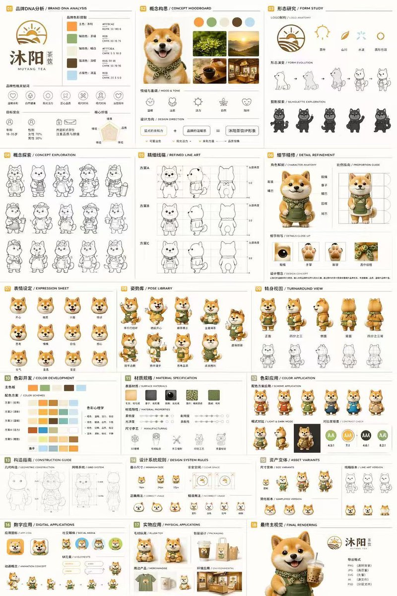

## 界面交互设计图

- ID: case-131
- Slug: case-131-zh
- 语言: zh
- 来源: [来源链接](https://x.com/IndieDevHailey)
- 样例图路径: images/part2/case131.jpg

### 提示词

```text
{
  "type": "UI/UX landing page mockup",
  "theme": "dark mode, sleek modern aesthetic, glassmorphism, {argument name=\"primary accent color\" default=\"neon purple and blue\"} glowing accents",
  "header": {
    "logo": "{argument name=\"brand name\" default=\"goViralX\"}",
    "top_right_tag": "VIRAL CAMPAIGN CASE STUDY"
  },
  "layout": {
    "sections": [
      {
        "name": "Hero",
        "headline": "{argument name=\"hero headline\" default=\"How We Created 10M+ Viral Impact\"}",
        "subheadline": "3天引爆全网, 助力品牌实现指数级增长",
        "stats_row": {
          "count": 4,
          "labels": ["总播放量", "互动率", "转化咨询", "执行周期"],
          "values": ["{argument name=\"main statistic\" default=\"10,240,000+\"}", "18.7%", "3,200+", "72小时"]
        },
        "visual": "cinematic shot of a person in a hoodie looking at glowing digital screens and graphs, large play button overlay"
      },
      {
        "name": "Strategy",
        "title": "Our 3-Day Execution Strategy",
        "layout_type": "vertical timeline",
        "steps_count": 3,
        "elements_per_step": ["timeline node", "title", "bullet points", "video thumbnail with play button", "description box"]
      },
      {
        "name": "Performance",
        "title": "Data-Driven Performance",
        "left_column": {
          "stat_cards_count": 4,
          "values": ["10M+", "43%", "28,000+", "3,200+"]
        },
        "right_column": {
          "charts_count": 2,
          "chart_1": "line graph showing 7-day growth peaking at Day 3",
          "chart_2": "horizontal segmented bar chart showing platform distribution (TikTok 52%, Instagram 24%, X 15%, YouTube 9%)"
        }
      },
      {
        "name": "Keys to Success",
        "title": "The 3 Keys to Viral Success",
        "cards_count": 3,
        "card_elements": ["glowing icon (fire, target, antenna)", "title", "description", "VIEW DETAIL link"]
      },
      {
        "name": "Social Proof",
        "title": "TRUSTED BY CREATORS & BRANDS",
        "left_column": {
          "logos_count": 8,
          "grid": "2x4",
          "brands": ["SHEIN", "SHOPLINE", "Blueglass", "instacart", "lemon8", "mi", "CIDER", "bellroy"]
        },
        "right_column": {
          "testimonial_cards_count": 2,
          "elements": ["quote", "author title (SaaS Founder, Growth Manager)"]
        }
      },
      {
        "name": "Call to Action",
        "title": "READY TO GO VIRAL?",
        "interactive_elements": ["text input field", "glowing button with text '{argument name=\"call to action text\" default=\"获取专属增长方案 ->\"}'"],
        "visual": "3D render of a rocket ship taking off with purple and blue flames"
      }
    ]
  }
}
```

### 样例图


## 界面交互设计图

- ID: case-130
- Slug: case-130-zh
- 语言: zh
- 来源: [来源链接](https://x.com/chi_vc_)
- 样例图路径: images/part2/case130.jpg

### 提示词

```text
{
  "type": "brand identity and merchandise design board",
  "theme": {
    "color_palette": "{argument name=\"theme color\" default=\"pastel pink\"} and white",
    "motif": "{argument name=\"motif\" default=\"cherry blossoms\"} and pink hearts"
  },
  "character": {
    "description": "anime girl with short brown bob hair, pink eyes, wearing a white hoodie, gentle smile"
  },
  "branding": {
    "main_logo": "{argument name=\"character name\" default=\"癒音ちー\"}",
    "sub_logo": "{argument name=\"character subtext\" default=\"ゆおんちー\"}"
  },
  "layout": {
    "sections": [
      {
        "type": "header banner",
        "position": "top",
        "elements": ["large main logo", "sub logo", "cherry blossom graphics", "character portrait on the right"]
      },
      {
        "type": "product packaging",
        "position": "middle left",
        "elements": ["1 square box with heart-shaped transparent window showing pink heart candies", "character illustration on box", "2 individual candy wrappers", "5 scattered heart candies"]
      },
      {
        "type": "promotional poster",
        "position": "middle right",
        "elements": ["character portrait", "heart-shaped candy bowl", "main logo", "text '4.26 NEW OPEN'", "text '{argument name=\"social handle\" default=\"@yuonchii\"}'"]
      },
      {
        "type": "horizontal web banner",
        "position": "lower middle",
        "elements": ["main logo", "cherry blossoms", "character portrait on the right"]
      },
      {
        "type": "social media profile mockup",
        "position": "bottom left",
        "elements": ["header image with logo", "1 circular profile picture", "handle '{argument name=\"social handle\" default=\"@yuonchii\"}'", "1 follow button", "mock bio text"]
      },
      {
        "type": "merchandise collection",
        "position": "bottom right",
        "count": 9,
        "items": ["1 white t-shirt with logo", "1 white mug with character", "4 round pin badges", "1 acrylic keychain", "2 candy packets"]
      }
    ]
  }
}
```

### 样例图


## 建筑空间场景渲染

- ID: case-128
- Slug: case-128-zh
- 语言: zh
- 来源: [来源链接](https://x.com/masapark95)
- 样例图路径: images/part2/case128.jpg

### 提示词

```text
{
  "type": "anime-style animated movie poster",
  "scene": "Magical glowing multi-story treehouse restaurant in a dark enchanted forest at night, illuminated by string lights and warm window glow.",
  "subjects": {
    "children": "2 children in center foreground facing the restaurant: a boy with a backpack and lantern, and a girl in a red coat and beret with a lantern.",
    "animals": "4 anthropomorphic animals: a bear chef holding a MENU book (bottom left), an owl playing violin and a squirrel playing flute on a branch (top left), a badger playing cello (mid right), and a rabbit in a suit holding a sign (bottom right).",
    "creatures": "3 small black soot-sprite-like creatures with glowing eyes (bottom right).",
    "floating_food": "4 glowing food items floating in the air: soup, pancakes, omurice, and a fruit parfait."
  },
  "layout": {
    "top_text": "{argument name=\"top catchphrase\" default=\"おいしい奇跡が、今夜はじまる。\"}",
    "building_sign": "{argument name=\"restaurant name\" default=\"森のレストラン\"}",
    "left_board": "本日のおすすめ\n・森のスープ\n・星のオムライス\n・ふわふわパンケーキ\n・しあわせのパフェ\n...and more!",
    "right_board": "いらっしゃいませ！\nここは、だれでも\n笑顔になれる場所。",
    "main_title": {
      "text": "{argument name=\"movie title\" default=\"ふしぎな森のレストラン\"}",
      "styling": "Large stylized typography with a chef hat, fork, and spoon motifs."
    },
    "rabbit_sign": "ごちそうさま！またきてね！",
    "bottom_left_badge": "{argument name=\"genre badge\" default=\"家族みんなで楽しめる！心あたたまる冒険ファンタジー\"}",
    "bottom_center_credits": "Fictional cast and staff names in Japanese.",
    "bottom_release_date": "{argument name=\"release date\" default=\"2025年 夏休みロードショー！\"}",
    "bottom_right": "QR code with text '最新情報はこちら！'"
  }
}
```

### 样例图


## 主题海报版式设计

- ID: case-122
- Slug: case-122-zh
- 语言: zh
- 来源: [来源链接](https://x.com/pcneko_lab)
- 样例图路径: images/part2/case122.jpg

### 提示词

```text
{
  "type": "movie poster grid",
  "layout": "2x2 grid",
  "posters": [
    {
      "position": "top-left",
      "genre": "sci-fi comedy",
      "visuals": "A Japanese salaryman sitting on a crowded train looking nervous, flanked by two aliens in business attire: a green frog-like alien looking at a smartphone, and a blue octopus-like alien reading a newspaper.",
      "text_elements": {
        "tagline_top": "隣の席のアイツ、実は宇宙人でした。",
        "train_display": "次は 地球 (ちきゅう) Next Earth",
        "tagline_side": "この星の常識、いつの間にかアップデートされていた。",
        "main_title": "{argument name=\"poster 1 title\" default=\"となりの宇宙人\"}",
        "cast": "星野サダオ タコヤキ・Z カエルダ・X",
        "release_date": "6月13日(金) 全国公開"
      }
    },
    {
      "position": "top-right",
      "genre": "surreal romance",
      "visuals": "A man in a dark jacket affectionately hugging a giant onigiri (rice ball) topped with mentaiko (spicy cod roe) wrapped in seaweed. They are sitting on a rocky beach during a beautiful sunset.",
      "text_elements": {
        "tagline": "めんたいこは、裏切らない。",
        "main_title": "{argument name=\"poster 2 title\" default=\"めんたいこ ひとすじ\"}",
        "cast": "中尾シンイチ めんたい子 博多ミツル 高菜ユカリ のり平",
        "release_date": "7月18日(金) 心にしみる、しお味系ラブストーリー"
      }
    },
    {
      "position": "bottom-left",
      "genre": "heist comedy",
      "visuals": "A joyful elderly woman in a leopard print blouse laughing maniacally while holding a fan of Japanese yen bills. Money is raining down around her. A happy raccoon is in the foreground.",
      "text_elements": {
        "tagline": "人生、まだまだ使いきってなんかない！",
        "main_title": "{argument name=\"poster 3 title\" default=\"老後の逆襲\"}",
        "subtitle": "〜いたずらタヌキと億万長者〜",
        "cast": "ババンバ・バーバラ タヌキチ 金持ちババ 遺産マユミ 税理士ゴンザレス",
        "release_date": "9月5日(金) 痛快！下剋上エンターテインメント！"
      }
    },
    {
      "position": "bottom-right",
      "genre": "disaster thriller",
      "visuals": "A dramatic disaster scene where laundry baskets, shirts, and clothes are being sucked up into a stormy, apocalyptic sky above a ruined Tokyo city skyline featuring the Tokyo Tower.",
      "text_elements": {
        "tagline": "それは、静かに、確実に、洗濯物を奪っていく。",
        "main_title": "{argument name=\"poster 4 title\" default=\"洗濯物 ストーム\"}",
        "cast": "森タクヤ 干場カオリ 風間ハルキ ピンチハンガー・タカ 洗濯バサミ・ケン",
        "release_date": "8月29日(金) 全国の空が、危ない。"
      }
    }
  ]
}
```

### 样例图


## 建筑空间场景图

- ID: case-121
- Slug: case-121-zh
- 语言: zh
- 来源: [来源链接](https://x.com/loilokoji)
- 样例图路径: images/part2/case121.jpg

### 提示词

```text
{
  "type": "3-panel manga page",
  "style": "anime, highly detailed, cinematic lighting, futuristic corporate",
  "layout": {
    "structure": "1 wide top panel, 2 square bottom panels"
  },
  "panels": [
    {
      "position": "top",
      "shot": "wide landscape",
      "scene": "Futuristic corporate lobby with floor-to-ceiling windows",
      "lighting": "{argument name=\"time of day\" default=\"sunrise\"}",
      "background": "City skyline featuring {argument name=\"landmark\" default=\"Tokyo Tower\"}",
      "details": "Holographic displays, polished reflective floor, reception desk, lounge chairs"
    },
    {
      "position": "bottom left",
      "shot": "close-up profile",
      "character": "Young woman, dark hair, black business suit",
      "accessories": "Futuristic black earpiece with glowing blue light",
      "speech_bubble": {
        "style": "standard rounded",
        "text": "{argument name=\"character dialogue\" default=\"数字はいいわ\"}"
      }
    },
    {
      "position": "bottom right",
      "shot": "full body, walking away, touching earpiece",
      "character": "Same woman, black suit, black heels, carrying a black tote bag",
      "environment": "Approaching security gates",
      "holographic_sign": "{argument name=\"floor sign\" default=\"ECHO 42F\"}",
      "speech_bubble": {
        "style": "futuristic angular",
        "text": "{argument name=\"AI dialogue\" default=\"おはようございます、ユキさん。本日は記念すべき ──\"}"
      }
    }
  ]
}
```

### 样例图


## 主题海报版式设计

- ID: case-119
- Slug: case-119-zh
- 语言: zh
- 来源: [来源链接](https://x.com/old_pgmrs_will)
- 样例图路径: images/part2/case119.jpg

### 提示词

```text
{
  "type": "anime movie production pitch document",
  "overall_layout": "split layout with a large cinematic movie poster on the top half and a grid of 5 detailed reference sheets on the bottom half",
  "top_section": {
    "type": "movie poster",
    "visual": "A man, a woman, and a dog standing on a ruined city street, facing away from the viewer, looking towards a colossal, porous, web-like alien structure dominating the sky. A rusty 'RESTRICTED AREA' sign is on the right.",
    "typography": {
      "title": "{argument name=\"movie title\" default=\"劇場版 巨骸の向こう側 Fallen Colossus\"}",
      "release_date": "{argument name=\"release date\" default=\"2027.11.28 ROADSHOW\"}",
      "tagline": "そこにあるのは、まだ「説明」されていないもの。",
      "credits_studio": "{argument name=\"studio name\" default=\"WIT STUDIO\"}"
    }
  },
  "bottom_sections": [
    {
      "title": "{argument name=\"male character name\" default=\"来栖 武 / Kurusu Takeru\"}",
      "type": "character reference sheet",
      "elements": {
        "full_body_poses": 3,
        "expressions": 3,
        "detail_shots": 8,
        "description": "Male protagonist in dark tactical jacket and cargo pants. Includes front, back, and side full-body views, headshots, and detailed callouts for gloves, boots, backpack, and radio."
      }
    },
    {
      "title": "{argument name=\"female character name\" default=\"大城 真那 / Oshiro Mana\"}",
      "type": "character reference sheet",
      "elements": {
        "full_body_poses": 3,
        "expressions": 3,
        "detail_shots": 6,
        "description": "Female protagonist in grey tactical uniform. Includes front, back, and side full-body views, headshots, and detailed callouts for jacket, boots, ID badge, and pouch."
      }
    },
    {
      "title": "カゲ (Kage) 設定画",
      "type": "animal character reference sheet",
      "elements": {
        "full_body_poses": 4,
        "expressions": 4,
        "detail_shots": 5,
        "description": "Dog companion. Includes side, front, back, and angled full-body views, headshots, and detailed callouts for fur texture, paws, and a motorcycle sidecar."
      }
    },
    {
      "title": "第7巨骸 (Remnant-7) 内部区画 設定画",
      "type": "environment and vehicle reference sheet",
      "elements": {
        "large_diagrams": 1,
        "environment_thumbnails": 4,
        "vehicle_designs": 1,
        "description": "Cross-section of the porous alien structure, smaller environment thumbnails, and a motorcycle design featuring the characters."
      }
    },
    {
      "title": "Concept Art",
      "type": "scene illustration",
      "elements": {
        "characters": 3,
        "vehicles": 1,
        "description": "The male character, female character, and dog with a motorcycle sidecar parked in front of the glowing, porous alien structure."
      }
    }
  ]
}
```

### 样例图


## 漫画分镜叙事设计

- ID: case-118
- Slug: case-118-zh
- 语言: zh
- 来源: [来源链接](https://x.com/nicdunz)
- 样例图路径: images/part2/case118.jpg

### 提示词

```text
A high-contrast, black-and-white illustration of an elderly man in a sharp suit, drawing a katana. The man has slicked-back white hair, deep wrinkles, and an intense, focused expression, looking down at the blade. He wears a dark suit, white shirt, and dark tie. His hands are prominently featured in the foreground, showing pronounced veins and wrinkles as they grip the ornate handle and scabbard of the katana. The background is completely black, emphasizing the dramatic lighting and intricate cross-hatching details on the man's face, hands, and clothing. The style resembles a detailed, gritty manga or graphic novel.
```

### 样例图


## 主题海报版式设计

- ID: case-116
- Slug: case-116-zh
- 语言: zh
- 来源: [来源链接](https://x.com/gamemangaanime)
- 样例图路径: images/part2/case116.jpg

### 提示词

```text
{
  "type": "2-page manga spread",
  "style": "monochrome anime manga, screentones",
  "theme": "{argument name=\"main action\" default=\"fantasy mage developing a video game\"}",
  "character": "{argument name=\"character appearance\" default=\"anime girl with blonde hair, tiara, cape, white dress, thigh-highs\"}",
  "layout": {
    "left_page": {
      "panel_count": 11,
      "rows": [
        {"panels": 1, "action": "Determined at dual-monitor desk, speech bubble: '新作ゲーム、絶対完成させる！'"},
        {"panels": 3, "action": "Typing, drawing on tablet, testing with controller"},
        {"panels": 3, "action": "Shocked at ERROR screen, depressed, determined again"},
        {"panels": 4, "action": "Exhausted, sudden realization, furious typing, monitor showing 'Build succeeded!'"}
      ]
    },
    "right_page": {
      "panel_count": 2,
      "panels": [
        {"type": "large splash", "action": "Casting magic from a glowing circle at a code-error monster labeled '{argument name=\"error text\" default=\"NullReferenceException\"}'. Speech bubble: '{argument name=\"spell text\" default=\"デバッグ魔法!!\"}'"},
        {"type": "bottom banner", "action": "Cheering in front of RPG title screen. Speech bubble: '{argument name=\"success text\" default=\"やったー！\"}'"}
      ]
    }
  }
}
```

### 样例图


## 品牌视觉识别图

- ID: case-115
- Slug: case-115-zh
- 语言: zh
- 来源: [来源链接](https://x.com/onofumi_AI)
- 样例图路径: images/part2/case115.jpg

### 提示词

```text
{
  "type": "two-page manga spread",
  "style": "highly detailed realistic manga, monochrome, screentones, dramatic lighting, psychological thriller",
  "global_elements": {
    "protagonist": "{argument name=\"main character description\" default=\"young Japanese salaryman in a suit\"}",
    "theme": "{argument name=\"core concept\" default=\"surrounded by a massive crowd of identical clones of himself\"}"
  },
  "layout": {
    "left_page": {
      "type": "full page splash panel",
      "setting": "{argument name=\"setting\" default=\"Shibuya scramble crossing at night\"}",
      "visuals": "Protagonist standing alone in the center of the crossing, looking around in shock at a massive crowd where every single person is an exact clone of him.",
      "text_elements": [
        {"type": "manga title logo", "text": "{argument name=\"manga title\" default=\"俺だらけの街\"}"},
        {"type": "subtitle", "text": "第1話 交代"},
        {"type": "narration box", "text": "その夜、世界は静かに俺をやめた。"},
        {"type": "sound effect", "text": "ザワ…"}
      ]
    },
    "right_page": {
      "type": "5-panel vertical layout",
      "panels": [
        {
          "panel_number": 1,
          "visuals": "Extreme close-up of protagonist's eyes, wide with shock, sweating.",
          "text_elements": [
            {"type": "speech bubble", "text": "……は？ なんで……みんな、俺なんだ？"},
            {"type": "sound effect", "text": "ドクン"}
          ]
        },
        {
          "panel_number": 2,
          "visuals": "A horizontal row of 8 identical clones in suits staring blankly forward.",
          "text_elements": [
            {"type": "sound effect", "text": "ザワ…"}
          ]
        },
        {
          "panel_number": 3,
          "visuals": "A clone leaning in to whisper into the shocked protagonist's ear.",
          "text_elements": [
            {"type": "speech bubble", "text": "お前の代わりは、もう足りてる。"},
            {"type": "sound effect", "text": "スッ"}
          ]
        },
        {
          "panel_number": 4,
          "visuals": "Close-up of a smartphone screen held in a hand, showing a push notification.",
          "text_elements": [
            {"type": "screen text", "text": "交代を開始します。"},
            {"type": "sound effect", "text": "ピロン"}
          ]
        },
        {
          "panel_number": 5,
          "visuals": "Wide shot of the endless crowd of clones in the city street.",
          "text_elements": [
            {"type": "narration box", "text": "最初に消えるのは、名前でも命でもない。居場所だ。"},
            {"type": "bottom left text", "text": "俺は、ここにいていいのか——？"},
            {"type": "bottom right text", "text": "{argument name=\"cliffhanger text\" default=\"次号へつづく！\"}"},
            {"type": "sound effect", "text": "ザワ… ザワ… ザワ…"}
          ]
        }
      ]
    }
  }
}
```

### 样例图


## 插画艺术创作图

- ID: case-114
- Slug: case-114-zh
- 语言: zh
- 来源: [来源链接](https://x.com/kaikaitheaiguy)
- 样例图路径: images/part2/case114.jpg

### 提示词

```text
{
  "type": "4-panel vertical comic strip",
  "style": "{argument name=\"art style\" default=\"black and white pencil sketch, crosshatch shading, satirical caricature comic\"}",
  "characters": {
    "subject_1": "{argument name=\"main character\" default=\"Sam Altman\"}, curly hair, casual sweater",
    "subject_2": "{argument name=\"interviewer\" default=\"Ronan Farrow\"}, suit, tie, holding notepad"
  },
  "layout": {
    "panels": [
      {
        "panel_number": 1,
        "top_caption": "SAM ALTMAN THINKS THIS WILL BE A NICE LITTLE PROFILE...",
        "scene": "subject_1 looking smug with hands steepled; subject_2 looking serious taking notes.",
        "thought_bubble": "I'LL BE CHARMING. IT'LL BE A GREAT CHARACTER PIECE. PEOPLE WILL LOVE IT.",
        "center_text": "THE RONAN FARROW INTERVIEW",
        "inset_portraits": {
          "count": 2,
          "labels": ["HARVEY WEINSTEIN EXPOSED", "LESLIE MOONVES EXPOSED"]
        },
        "info_boxes": {
          "count": 3,
          "text": [
            "RONAN FARROW: PULITZER PRIZE-WINNING REPORTER WHO EXPOSED HARVEY WEINSTEIN AT THE NEW YORKER",
            "AND LESLIE MOONVES AT CBS.",
            "POWER. ABUSE. ACCOUNTABILITY."
          ]
        }
      },
      {
        "panel_number": 2,
        "top_caption": "CUT TO...",
        "scene": "Close-up of subject_1 looking shocked and horrified.",
        "article_header": "{argument name=\"publication\" default=\"THE NEW YORKER\"}\nTHE SAM ALTMAN PROFILE\nTHE OPENAI CEO'S COMPLICATED QUEST\nBy Ronan Farrow"
      },
      {
        "panel_number": 3,
        "top_caption": "SOON AFTER THE ARTICLE IS PUBLISHED...",
        "scene": "subject_1 looking extremely stressed, sweating, holding a phone to his ear. Surrounded by 6 hands holding smartphones.",
        "phone_labels": ["VC", "REPORTER", "EX-STAFFEE", "INVESTOR", "TECH CEO", "FORMER COLLEAGUE"],
        "shouts": {
          "count": 8,
          "text": [
            "{argument name=\"main accusation\" default=\"LIAR\"}!",
            "COMPULSIVE LIAR!",
            "PATHOLOGICAL LIAR!",
            "YOU CAN'T STOP LYING!",
            "LIAR!!!",
            "SOCIOPATH! (ALLEGEDLY)",
            "EVERYTHING HE SAYS IS A LIE!",
            "MANIPULATIVE LIAR!"
          ]
        },
        "sound_effects": "RING! RING! RING!"
      },
      {
        "panel_number": 4,
        "top_caption": "AND THE REPORT CONCLUDES...",
        "scene": "subject_1 looking utterly defeated and depressed.",
        "quote_box": "\"ALTMAN FREQUENTLY AND CONSISTENTLY LIES TO INVESTORS, EMPLOYEES, THE BOARD, AND EVEN CLOSE FRIENDS.\"\n\"HE APPEARS TO HAVE NO COMFORT TELLING FALSEHOODS.\"\n\"HE IS, BY MANY ACCOUNTS, A COMPULSIVE LIAR AND A SOCIOPATH.\"\n(ALLEGEDLY)",
        "thought_bubble": {
          "scene": "Happy subject_1 holding a 'WORLD'S BEST CEO' mug.",
          "text": "I THOUGHT IT WOULD BE A NICE LITTLE PROFILE...",
          "sparkle_words": {
            "count": 4,
            "text": ["GENIUS!", "VISIONARY!", "INSPIRING!", "BRILLIANT LEADER!"]
          }
        },
        "bottom_caption": "INSTEAD, IT'S THE PROFILE THAT EXPOSES HIM."
      }
    ]
  }
}
```

### 样例图


## 动漫插画创作图

- ID: case-113
- Slug: case-113-zh
- 语言: zh
- 来源: [来源链接](https://x.com/REd8358)
- 样例图路径: images/part2/case113.jpg

### 提示词

```text
A highly detailed anime illustration of a fierce female warrior with long flowing {argument name="hair color" default="black"} hair and piercing {argument name="eye color" default="blue"} eyes, wearing a mix of silver plate armor with gold trim and a {argument name="outfit color" default="blue and white"} tunic. She is captured in a dynamic combat stance, swinging a massive, {argument name="weapon type" default="segmented metallic whip-sword"} that curves dramatically into the extreme foreground. The weapon leaves a sweeping trail of kinetic energy and wind. The scene is set against a {argument name="background setting" default="ruined battlefield with rocky terrain, floating debris, and large blue banners fluttering in the wind"} under a dramatic cloudy sky. The artwork features cinematic lighting, intense action, and a dramatic forced perspective on the weapon.
```

### 样例图


## 视频封面界面图

- ID: case-111
- Slug: case-111-zh
- 语言: zh
- 来源: [来源链接](https://x.com/mirochill)
- 样例图路径: images/part2/case111.jpg

### 提示词

```text
A YouTube thumbnail-style collage for a {argument name="overall mood" default="dark, dramatic, true crime investigation"}. In the center is a highly detailed, close-up portrait of an {argument name="central figure" default="older man with grey hair and deep wrinkles resembling Jeffrey Epstein"}, wearing a black polo shirt, with a faint red glowing outline separating him from the background. On the left side, a {argument name="left background scene" default="tropical island with luxury villas and a flying airplane in a dark sky"}. Below the island, a conspiracy board motif features exactly 2 red push pins connected by 3 thick red strings. On the top right side, a hazy, sepia-toned depiction of the {argument name="right background scene" default="US Capitol building with the silhouettes of 3 men in suits facing it"}. On the bottom right, an open manila folder containing a {argument name="document type" default="heavily redacted dossier with thick black marker lines and a smaller photograph of the central man"}. The overall composition is cinematic, intense, and heavily stylized for a documentary video.
```

### 样例图


## 视频封面界面图

- ID: case-110
- Slug: case-110-zh
- 语言: zh
- 来源: [来源链接](https://x.com/TlanoAI)
- 样例图路径: images/part2/case110.jpg

### 提示词

```text
Thumbnail for a YouTube unboxing video, a video of {argument name="topic" default="opening all overdue bills"}, {argument name="quantity" default="100 in a row"}
```

### 样例图


## 应用界面样机图

- ID: case-107
- Slug: case-107-zh
- 语言: zh
- 来源: [来源链接](https://x.com/tehno_maniak)
- 样例图路径: images/part2/case107.jpg

### 提示词

```text
{"type": "YouTube desktop dark mode UI mockup", "header": {"logo": "YouTube", "search_bar": "Search", "icons_count": 5, "icons": ["search", "mic", "create", "notifications", "profile"]}, "video_player": {"top_left_badge": "LIVE", "left_side": {"subject": "{argument name=\"presenter description\" default=\"man in green sweater at wooden podium\"}", "podium_logo": "OpenAI"}, "right_side_presentation": {"text_elements": ["OpenAI", "INTRODUCING", "{argument name=\"product name\" default=\"GPT-Image-2\"}", "{argument name=\"tagline\" default=\"More Realistic. More Useful. More Creative.\"}"], "sample_images_count": 4, "sample_images": ["mountain lake with boat", "woman portrait with dappled light", "cute robot with lantern in forest", "starry night cafe painting"]}, "bottom_controls_count": 10, "bottom_controls": ["pause", "next", "volume", "LIVE", "red progress bar", "CC", "settings", "miniplayer", "theater mode", "fullscreen"]}, "video_details": {"title": "{argument name=\"video title\" default=\"OpenAI Live: Introducing GPT-Image-2\"}", "channel": {"name": "{argument name=\"channel name\" default=\"OpenAI\"}", "verified": true, "subscribers": "1.36M", "button": "Subscribe"}, "action_buttons_count": 5, "action_buttons": ["Like 12K", "Dislike 497", "Share", "Save", "More"], "description_box": {"stats": "95,237 watching now Started streaming 7 minutes ago", "tags": "#OpenAI #GPTImage2 #AI", "text": "Join us for a special live event as we introduce GPT-Image-2, our latest and most advanced image generation model. See new capabilities, live demos, and hear from the team ...more"}}}
```

### 样例图


## 应用界面样机图

- ID: case-106
- Slug: case-106-zh
- 语言: zh
- 来源: [来源链接](https://x.com/abdiisan)
- 样例图路径: images/part2/case106.jpg

### 提示词

```text
{
  "type": "YouTube thumbnail graphic",
  "style": "anime, edgy, neon pink and black color scheme, grunge and splatter accents",
  "character": {
    "appearance": "anime girl, {argument name=\"hair color\" default=\"silver\"} hair, cat ears, purple eyes",
    "expression": "{argument name=\"expression\" default=\"shocked and sweating\"}, mouth open",
    "accessories": "black cat hairclip with pink cross, black choker with heart ring",
    "action": "holding a pink smartphone with a swirl logo"
  },
  "layout": {
    "main_title": {
      "position": "bottom center",
      "style": "huge, bold, 3D typography, grunge texture",
      "lines": [
        { "text": "{argument name=\"main title top\" default=\"스레드 논란\"}", "color": "neon pink" },
        { "text": "{argument name=\"main title bottom\" default=\"읽어드림 ;;\"}", "color": "white" }
      ]
    },
    "ui_elements": [
      {
        "type": "social media feed mockup",
        "position": "mid-left",
        "header": "← 스레드",
        "post_count": 3,
        "details": "avatars, Korean text, interaction icons for like, comment, repost"
      },
      {
        "type": "live chat mockup",
        "position": "right edge",
        "message_count": 4,
        "details": "pink user icons, Korean text"
      }
    ],
    "text_callouts": [
      {
        "type": "spiky speech bubble",
        "position": "center top",
        "text": "{argument name=\"speech bubble text\" default=\"이게 맞아?;;\"}"
      },
      {
        "type": "neon box",
        "position": "top right",
        "text": "실시간 반응 중"
      },
      {
        "type": "floating grunge text",
        "position": "far left",
        "line_count": 3,
        "text": ["OO 논란", "충격 실화", "역대급 사건"]
      },
      {
        "type": "handwritten text with arrow",
        "position": "bottom right",
        "text": "여러분의 생각은 어떠신가요?"
      }
    ],
    "logos": [
      {
        "type": "app icon",
        "position": "top left",
        "description": "white swirl logo on black rounded square"
      }
    ]
  }
}
```

### 样例图


## 界面交互设计图

- ID: case-104
- Slug: case-104-zh
- 语言: zh
- 来源: [来源链接](https://x.com/marouane53)
- 样例图路径: images/part2/case104.jpg

### 提示词

```text
{
  "type": "YouTube livestream UI",
  "top_nav": {
    "logo": "YouTube Premium",
    "search": "{argument name=\"search query\" default=\"bilal fraiha\"}",
    "icons": 3
  },
  "player": {
    "subjects": [
      "{argument name=\"female guest\" default=\"Sydney Sweeney\"} in white cardigan",
      "bearded man in beige jacket laughing"
    ],
    "bg": "couch, 2 silver play buttons, ram logo 'SARDI'",
    "overlays": {
      "chat": {"pos": "left", "count": 15, "desc": "colored usernames, white text"},
      "goal": {"pos": "top right", "text": "TONIGHT'S GOAL: 0 to 25"},
      "banner": {"pos": "bottom center", "text": "K {argument name=\"streamer name\" default=\"MOREBILAL\"}"}
    },
    "controls": {"count": 10}
  },
  "details": {
    "title": "{argument name=\"video title\" default=\"FULL STREAM | سيدني سويني مع بلال\"}",
    "channel": "{argument name=\"channel name\" default=\"More Bilal No Filter\"}",
    "buttons": 5
  }
}
```

### 样例图


## 视频封面界面图

- ID: case-103
- Slug: case-103-zh
- 语言: zh
- 来源: [来源链接](https://x.com/bowowwoaaa2)
- 样例图路径: images/part2/case103.jpg

### 提示词

```text
{argument name="pianist" default="Vladimir Horowitz"} performs a {argument name="event" default="live piano recital"} streamed on {argument name="platform" default="YouTube"}
```

### 样例图


## 界面交互设计图

- ID: case-101
- Slug: case-101-zh
- 语言: zh
- 来源: [来源链接](https://x.com/naga_zyashin)
- 样例图路径: images/part2/case101.jpg

### 提示词

```text
{
  "type": "YouTube thumbnail",
  "style": "High-impact, neon green and black color scheme, cyber business aesthetic",
  "background": "Dark with glowing green grid, upward chart lines, large green arrow",
  "subject": {
    "description": "{argument name=\"subject description\" default=\"Serious Japanese man in a black suit\"}",
    "position": "Right side",
    "props": "Stacks of 10,000 Yen bills in bottom right"
  },
  "layout": {
    "main_title": {
      "text": "{argument name=\"main title\" default=\"月30万 ChatGPT副業 誰でも始めやすい\"}",
      "position": "Center, huge bold white and green gradient text"
    },
    "top_left_badge": {
      "text": "{argument name=\"top left badge\" default=\"再現性高め\"}",
      "style": "Angled neon green box"
    },
    "top_tags": {
      "count": 4,
      "labels": ["初心者OK", "スマホでも可能", "最短で収益化", "具体例つき"]
    },
    "left_bullet_points": {
      "count": 6,
      "style": "Dark boxes with neon green borders and icons",
      "items": [
        "Lightbulb icon: 失敗しない始め方",
        "Yen coin icon: 副業におすすめ",
        "Chart icon: 収益化の流れ",
        "Search icon: 案件の探し方",
        "Chat icon: プロンプト例つき",
        "Clipboard icon: テンプレ付き"
      ]
    },
    "bottom_banner": {
      "text": "{argument name=\"bottom banner text\" default=\"手順を徹底解説\"}",
      "icons": "ChatGPT logo left, upward chart right"
    },
    "bottom_tags": {
      "count": 2,
      "labels": ["{argument name=\"year tag\" default=\"2026年最新版\"}", "即実践できる"]
    }
  }
}
```

### 样例图


## 主题海报版式设计

- ID: case-100
- Slug: case-100-zh
- 语言: zh
- 来源: [来源链接](https://x.com/naga_zyashin)
- 样例图路径: images/part2/case100.jpg

### 提示词

```text
{
  "type": "promotional banner thumbnail",
  "style": "vibrant neon, cosmic galaxy background, anime illustration style, high-density Japanese typography, glowing text effects",
  "character": {
    "description": "smiling young woman pointing upwards with right index finger",
    "appearance": "long {argument name=\"character hair color\" default=\"brown\"} hair, purple drop earrings, textured purple sweater",
    "position": "right side"
  },
  "layout": {
    "background": "purple, pink, and blue starry space nebula",
    "center_typography": {
      "top_small_text": "何から始めるか迷う人へ",
      "main_title": "{argument name=\"main title\" default=\"初心者でもわかる AI副業\"}",
      "subtitle": "最初の1本におすすめ",
      "floating_text_near_character": "やさしく解説♡"
    },
    "top_left": {
      "yellow_ribbon": "{argument name=\"top left ribbon text\" default=\"ゼロから始める\"}"
    },
    "top_right": {
      "pink_circle_badge": "初心者 OK"
    },
    "left_column": {
      "count": 7,
      "description": "stack of pill-shaped badges",
      "labels": [
        "スマホでもOK (with phone icon)",
        "副業デビューに (with beginner mark icon)",
        "具体例つき",
        "テンプレ付き",
        "おすすめツール紹介",
        "収益化の流れ",
        "失敗しない始め方"
      ]
    },
    "bottom_left_graphics": {
      "count": 3,
      "items": [
        "laptop displaying an AI circuit brain graphic",
        "glowing lightbulb",
        "rocket ship taking off"
      ]
    },
    "bottom_center": {
      "large_purple_button": "{argument name=\"bottom center button text\" default=\"完全解説\"}",
      "checklist_text_below": "✓始め方 ✓稼ぎ方 ✓注意点 ✓続け方まで全部わかる！"
    },
    "bottom_right": {
      "pink_cloud_shape": {
        "count": 3,
        "bullet_points": [
          "✓難しい知識不要",
          "✓今日から始められる",
          "✓やさしく丁寧に解説"
        ]
      },
      "gold_medal_seal": "保存版",
      "purple_badge": "{argument name=\"year badge text\" default=\"2026年 最新版\"}"
    }
  }
}
```

### 样例图


## 界面交互设计图

- ID: case-99
- Slug: case-99-zh
- 语言: zh
- 来源: [来源链接](https://x.com/naga_zyashin)
- 样例图路径: images/part2/case99.jpg

### 提示词

```text
{
  "type": "promotional banner / YouTube thumbnail",
  "style": "high contrast, flashy, professional, {argument name=\"theme color\" default=\"gold and black\"} palette, glowing light rays, sparkling particles",
  "subject": {
    "description": "{argument name=\"subject description\" default=\"confident young Asian man in a dark suit with arms crossed\"}",
    "pose": "looking upwards to the right",
    "props": "glowing open laptop in front of him"
  },
  "layout": {
    "background": "dark with radiant gold light bursts",
    "text_sections": {
      "top_left_badge": "[保存版]",
      "top_header": "{argument name=\"top text\" default=\"知識ゼロからでも今日から始められる！ AIで稼ぐ力を最短で手に入れる！\"}",
      "main_title": {
        "text": "{argument name=\"main title\" default=\"AI副業 完全攻略\"}",
        "style": "large, bold, 3D gold and white typography"
      },
      "subtitle_box": "{argument name=\"subtitle\" default=\"初心者でも月10万\"}",
      "top_right_badge": {
        "style": "gold laurel wreath",
        "text": "2026年版 最新版"
      },
      "middle_right_tags": {
        "count": 3,
        "style": "stacked gold-bordered boxes",
        "labels": ["最短で収益化", "具体例つき", "誰でも始めやすい"]
      },
      "middle_right_ribbon": {
        "style": "red ribbon banner",
        "text": "手順を徹底解説"
      },
      "bottom_left_tags": {
        "count": 6,
        "style": "2x3 grid of gold-bordered boxes",
        "labels": ["おすすめツール紹介", "収益化の流れがわかる", "失敗しない始め方", "作業時間を最小化", "テンプレ付き", "再現しやすい方法"]
      },
      "bottom_footer": "迷わず稼げる！AI副業の教科書",
      "bottom_right_badge": {
        "style": "gold laurel wreath",
        "text": "テンプレ付き"
      }
    }
  }
}
```

### 样例图


## 品牌视觉识别图

- ID: case-95
- Slug: case-95-zh
- 语言: zh
- 来源: [来源链接](https://x.com/sayaka_aiart)
- 样例图路径: images/part2/case95.jpg

### 提示词

```text
{
  "type": "anime-style livestream thumbnail",
  "character": {
    "hair": "{argument name=\"hair color\" default=\"short silver hair with cyan underlights\"}",
    "eyes": "large bright blue",
    "outfit": "white collared shirt, black tie with silver accents, black jacket, black beret with a large blue heart jewel, blue jewel brooch, black choker",
    "pose": "smiling gently, looking at viewer, positioned on the right side"
  },
  "background": "pastel blue with white clouds, sparkles, stars, small bows, and a subtle grid pattern",
  "typography_and_ui": {
    "top_left_speech_bubble": "まったりおしゃべりしよ〜♡",
    "main_title": {
      "text": "{argument name=\"main title\" default=\"雑談配信\"}",
      "style": "large, soft blue gradient, white outline, decorated with small hearts, positioned on the middle-left"
    },
    "bottom_left_badges": {
      "count": 3,
      "style": "white pill-shaped buttons with a purple heart icon on the left",
      "labels": [
        "{argument name=\"badge 1 text\" default=\"初見さん〇\"}",
        "{argument name=\"badge 2 text\" default=\"ポイント回収〇\"}",
        "{argument name=\"badge 3 text\" default=\"ROM〇\"}"
      ]
    },
    "bottom_right_cloud_bubble": "気軽にコメントしてね♡"
  }
}
```

### 样例图


## 视频封面界面图

- ID: case-92
- Slug: case-92-zh
- 语言: zh
- 来源: [来源链接](https://x.com/Yuupapa_free)
- 样例图路径: images/part2/case92.jpg

### 提示词

```text
An anime-style YouTube stream thumbnail featuring a cheerful female VTuber. She has long {argument name="hair color" default="pink with light blue inner highlights"} hair, blue eyes, and wears black and white cat-ear headphones with a boom mic. She wears a white collared shirt with a black and pink star ribbon and a black choker, smiling with one hand near her chin. The background is a gaming room with {argument name="room lighting" default="purple and blue neon"} lighting, showing a desk equipped with 1 white keyboard, 1 mug, 1 glowing cat figure, 1 game controller, and 1 streaming microphone. The left side features large, bold, pop-art Japanese typography: a bright pink top word "{argument name="main text line 1" default="雑談"}" and a bright blue bottom word "{argument name="main text line 2" default="配信"}". Below is a pink banner reading "{argument name="subtitle text" default="今夜もゆるっとトーク!"}". A red "LIVE" badge sits in the top left. Floating speech bubbles, stars, and hearts decorate the composition.
```

### 样例图


## 游戏界面截图

- ID: case-91
- Slug: case-91-zh
- 语言: zh
- 来源: [来源链接](https://x.com/wolfaidev)
- 样例图路径: images/part2/case91.jpg

### 提示词

```text
A highly detailed, realistic first-person video game screenshot of a next-generation voxel-based world. At the top center, a large, bold 3D logo reads "{argument name="game title" default="MINECRAFT 2"}". The scene features a {argument name="environment" default="lush, blocky landscape with a river, a small wooden cabin, a windmill, a waterfall, and majestic mountains in the background"}. The world blends realistic lighting, volumetric clouds, and high-resolution textures with cubic, voxel geometry. In the foreground on the left, a {argument name="mob 1" default="blocky green creeper"} stands on the grass, while a {argument name="mob 2" default="blocky brown wolf"} stands on the dirt path to the right. On the far right, the player's hand holds a {argument name="held item" default="pixelated blue diamond sword"} in a first-person perspective. At the bottom of the screen is a game user interface featuring a health bar with 10 red hearts, a green experience bar with the number '16', a hunger bar with 10 brown meat icons, and a 9-slot inventory hotbar. The hotbar contains, from left to right: a selected blue tool with a green highlight box, a green tool, a knife, a wrench with the number '3', a piece of meat with '6', a lantern with '24', a dirt block with '10', a bucket, and a sponge block.
```

### 样例图


## 信息图可视化设计

- ID: case-90
- Slug: case-90-zh
- 语言: zh
- 来源: [来源链接](https://x.com/A9Quant)
- 样例图路径: images/part2/case90.jpg

### 提示词

```text
GPT-Image-2 prompt: please automatically generate a top-tier concept poster / infographic-style movie poster centered around {argument name="theme" default="ranking of emperors in Chinese history"}.

Require the AI to automatically derive and uniformly design the entire following visual system based on this theme, without my extra specification:
- Core subject (automatically judge suitability for people, products, architecture, artifacts, symbols, scenes, or abstract imagery)
- Bottom supporting structure
- Hovering symbols or spiritual symbols above
- Scene wrapping elements
- Metaphor system
- Color hierarchy
- Material contrast
- Lighting logic
- Title, subtitle, and auxiliary copy
- Brand sense and high-end expression

The final frame must be: a shocking, precise, unified, cinematic, ultra-high detail conceptual key visual poster suitable for high-end printing.

[Overall Style]
Ultra-realistic 3D commercial CGI rendering, merging cinematic lighting, luxury visual language, futuristic concept design, and epic composition. The image must have a "single main visual core," not messy, not like a collage, and not like a regular e-commerce poster.

[Automatic Derivation Rules]
AI must automatically decide based on the [theme]:
1. Core visual metaphor
2. Subject type and posture
3. Form of supporting structure
4. Form of suspended elements
5. Scene shell and spatial atmosphere
6. Main, auxiliary, and emphasis colors
7. Material combinations
8. Text temperament and layout style

[Composition Rules]
- Absolute sense of premium quality
- Strong central order, overall unity
- Allows for axial symmetry or epic composition near the central axis
- Clear visual gravity, forming clear levels from top to bottom
- Edge negative space is clean, restrained, and has room to breathe

[Visual Quality]
- Ultra-high detail
- Clear volumetric light
- Authentic materials
- Natural reflection, refraction, shadows, fog, and depth of field
- Overall standard of high-end brand campaign key visual / luxury invitation poster / conceptual editorial poster

[Typography System]
- Overall 90% visual, 10% text
- AI automatically generates the most matching main title and subtitle based on the [theme]
- Title must be concise, sharp, and powerful
- Text should be as minimal and accurate as possible; do not stack words

[Signature Requirement]
Naturally add the author signature in the bottom corner: @a9quant
```

### 样例图


## 信息图可视化设计

- ID: case-89
- Slug: case-89-zh
- 语言: zh
- 来源: [来源链接](https://x.com/A9Quant)
- 样例图路径: images/part2/case89.jpg

### 提示词

```text
GPT-Image-2 prompt: please automatically generate a top-tier concept poster / infographic-style movie poster centered around {argument name="theme" default="ranking of emperors in Chinese history"}.

Require the AI to automatically derive and uniformly design the entire following visual system based on this theme, without my extra specification:
- Core subject (automatically judge suitability for people, products, architecture, artifacts, symbols, scenes, or abstract imagery)
- Bottom supporting structure
- Hovering symbols or spiritual symbols above
- Scene wrapping elements
- Metaphor system
- Color hierarchy
- Material contrast
- Lighting logic
- Title, subtitle, and auxiliary copy
- Brand sense and high-end expression

The final frame must be: a shocking, precise, unified, cinematic, ultra-high detail conceptual key visual poster suitable for high-end printing.

[Overall Style]
Ultra-realistic 3D commercial CGI rendering, merging cinematic lighting, luxury visual language, futuristic concept design, and epic composition. The image must have a "single main visual core," not messy, not like a collage, and not like a regular e-commerce poster.

[Automatic Derivation Rules]
AI must automatically decide based on the [theme]:
1. Core visual metaphor
2. Subject type and posture
3. Form of supporting structure
4. Form of suspended elements
5. Scene shell and spatial atmosphere
6. Main, auxiliary, and emphasis colors
7. Material combinations
8. Text temperament and layout style

[Composition Rules]
- Absolute sense of premium quality
- Strong central order, overall unity
- Allows for axial symmetry or epic composition near the central axis
- Clear visual gravity, forming clear levels from top to bottom
- Edge negative space is clean, restrained, and has room to breathe

[Visual Quality]
- Ultra-high detail
- Clear volumetric light
- Authentic materials
- Natural reflection, refraction, shadows, fog, and depth of field
- Overall standard of high-end brand campaign key visual / luxury invitation poster / conceptual editorial poster

[Typography System]
- Overall 90% visual, 10% text
- AI automatically generates the most matching main title and subtitle based on the [theme]
- Title must be concise, sharp, and powerful
- Text should be as minimal and accurate as possible; do not stack words

[Signature Requirement]
Naturally add the author signature in the bottom corner: @a9quant
```

### 样例图


## 信息图可视化设计

- ID: case-88
- Slug: case-88-zh
- 语言: zh
- 来源: [来源链接](https://x.com/A9Quant)
- 样例图路径: images/part2/case88.jpg

### 提示词

```text
GPT-Image-2 prompt: please automatically generate a top-tier concept poster / infographic-style movie poster centered around {argument name="theme" default="ranking of emperors in Chinese history"}.

Require the AI to automatically derive and uniformly design the entire following visual system based on this theme, without my extra specification:
- Core subject (automatically judge suitability for people, products, architecture, artifacts, symbols, scenes, or abstract imagery)
- Bottom supporting structure
- Hovering symbols or spiritual symbols above
- Scene wrapping elements
- Metaphor system
- Color hierarchy
- Material contrast
- Lighting logic
- Title, subtitle, and auxiliary copy
- Brand sense and high-end expression

The final frame must be: a shocking, precise, unified, cinematic, ultra-high detail conceptual key visual poster suitable for high-end printing.

[Overall Style]
Ultra-realistic 3D commercial CGI rendering, merging cinematic lighting, luxury visual language, futuristic concept design, and epic composition. The image must have a "single main visual core," not messy, not like a collage, and not like a regular e-commerce poster.

[Automatic Derivation Rules]
AI must automatically decide based on the [theme]:
1. Core visual metaphor
2. Subject type and posture
3. Form of supporting structure
4. Form of suspended elements
5. Scene shell and spatial atmosphere
6. Main, auxiliary, and emphasis colors
7. Material combinations
8. Text temperament and layout style

[Composition Rules]
- Absolute sense of premium quality
- Strong central order, overall unity
- Allows for axial symmetry or epic composition near the central axis
- Clear visual gravity, forming clear levels from top to bottom
- Edge negative space is clean, restrained, and has room to breathe

[Visual Quality]
- Ultra-high detail
- Clear volumetric light
- Authentic materials
- Natural reflection, refraction, shadows, fog, and depth of field
- Overall standard of high-end brand campaign key visual / luxury invitation poster / conceptual editorial poster

[Typography System]
- Overall 90% visual, 10% text
- AI automatically generates the most matching main title and subtitle based on the [theme]
- Title must be concise, sharp, and powerful
- Text should be as minimal and accurate as possible; do not stack words

[Signature Requirement]
Naturally add the author signature in the bottom corner: @a9quant
```

### 样例图


## 关系图谱信息图

- ID: case-87
- Slug: case-87-zh
- 语言: zh
- 来源: [来源链接](https://x.com/MrLarus)
- 样例图路径: images/part2/case87.jpg

### 提示词

```text
Please generate a high-design character relationship map poster based on {argument name="theme" default="Demon Slayer"}. This image should not be a simple illustration, but a character relationship map that combines information visualization, narrative structure, poster design sense, and stylistic fidelity.

Please automatically complete the following:
- Identify the work and core settings corresponding to the theme
- Extract the most representative 6–12 key characters, not exceeding 15 if necessary
- Identify and display key character relationships, including blood ties, romance, friendship, alliances, hostility, master-disciple, etc.
- Automatically choose a composition method based on the work's characteristics, such as protagonist-centered, dual-core confrontation, faction-based, family tree, or chronological evolution
- Automatically refine the work's style DNA, including color, worldview symbols, textures, mood, typography, and representative elements
- Transform these stylistic elements into an overall visual design for the relationship map, rather than simply copying an official poster
- Use different colors, line types, and arrows to distinguish different relationships, ensuring clear lines and layers without clutter
- Make core characters most prominent, followed by important characters, and subordinate characters weakened to form a clear visual hierarchy
- Ensure every character name is legible, with identity or faction labels if necessary

The final product should satisfy:
- Immediate understanding of character hierarchy and key relationships
- Obvious alignment with the original work's temperament and setting
- Combines the clarity of an infographic with the premium design of a poster
- Unified, exquisite, complete, and suitable for social media sharing or poster display
- Avoids a cheap flowchart feel, messy piling, and information overload.
```

### 样例图


## 关系图谱信息图

- ID: case-86
- Slug: case-86-zh
- 语言: zh
- 来源: [来源链接](https://x.com/MrLarus)
- 样例图路径: images/part2/case86.jpg

### 提示词

```text
Please generate a high-design character relationship map poster based on {argument name="theme" default="Demon Slayer"}. This image should not be a simple illustration, but a character relationship map that combines information visualization, narrative structure, poster design sense, and stylistic fidelity.

Please automatically complete the following:
- Identify the work and core settings corresponding to the theme
- Extract the most representative 6–12 key characters, not exceeding 15 if necessary
- Identify and display key character relationships, including blood ties, romance, friendship, alliances, hostility, master-disciple, etc.
- Automatically choose a composition method based on the work's characteristics, such as protagonist-centered, dual-core confrontation, faction-based, family tree, or chronological evolution
- Automatically refine the work's style DNA, including color, worldview symbols, textures, mood, typography, and representative elements
- Transform these stylistic elements into an overall visual design for the relationship map, rather than simply copying an official poster
- Use different colors, line types, and arrows to distinguish different relationships, ensuring clear lines and layers without clutter
- Make core characters most prominent, followed by important characters, and subordinate characters weakened to form a clear visual hierarchy
- Ensure every character name is legible, with identity or faction labels if necessary

The final product should satisfy:
- Immediate understanding of character hierarchy and key relationships
- Obvious alignment with the original work's temperament and setting
- Combines the clarity of an infographic with the premium design of a poster
- Unified, exquisite, complete, and suitable for social media sharing or poster display
- Avoids a cheap flowchart feel, messy piling, and information overload.
```

### 样例图


## 关系图谱信息图

- ID: case-85
- Slug: case-85-zh
- 语言: zh
- 来源: [来源链接](https://x.com/MrLarus)
- 样例图路径: images/part2/case85.jpg

### 提示词

```text
Please generate a high-design character relationship map poster based on {argument name="theme" default="Demon Slayer"}. This image should not be a simple illustration, but a character relationship map that combines information visualization, narrative structure, poster design sense, and stylistic fidelity.

Please automatically complete the following:
- Identify the work and core settings corresponding to the theme
- Extract the most representative 6–12 key characters, not exceeding 15 if necessary
- Identify and display key character relationships, including blood ties, romance, friendship, alliances, hostility, master-disciple, etc.
- Automatically choose a composition method based on the work's characteristics, such as protagonist-centered, dual-core confrontation, faction-based, family tree, or chronological evolution
- Automatically refine the work's style DNA, including color, worldview symbols, textures, mood, typography, and representative elements
- Transform these stylistic elements into an overall visual design for the relationship map, rather than simply copying an official poster
- Use different colors, line types, and arrows to distinguish different relationships, ensuring clear lines and layers without clutter
- Make core characters most prominent, followed by important characters, and subordinate characters weakened to form a clear visual hierarchy
- Ensure every character name is legible, with identity or faction labels if necessary

The final product should satisfy:
- Immediate understanding of character hierarchy and key relationships
- Obvious alignment with the original work's temperament and setting
- Combines the clarity of an infographic with the premium design of a poster
- Unified, exquisite, complete, and suitable for social media sharing or poster display
- Avoids a cheap flowchart feel, messy piling, and information overload.
```

### 样例图


## 关系图谱信息图

- ID: case-84
- Slug: case-84-zh
- 语言: zh
- 来源: [来源链接](https://x.com/MrLarus)
- 样例图路径: images/part2/case84.jpg

### 提示词

```text
Please generate a high-design character relationship map poster based on {argument name="theme" default="Demon Slayer"}. This image should not be a simple illustration, but a character relationship map that combines information visualization, narrative structure, poster design sense, and stylistic fidelity.

Please automatically complete the following:
- Identify the work and core settings corresponding to the theme
- Extract the most representative 6–12 key characters, not exceeding 15 if necessary
- Identify and display key character relationships, including blood ties, romance, friendship, alliances, hostility, master-disciple, etc.
- Automatically choose a composition method based on the work's characteristics, such as protagonist-centered, dual-core confrontation, faction-based, family tree, or chronological evolution
- Automatically refine the work's style DNA, including color, worldview symbols, textures, mood, typography, and representative elements
- Transform these stylistic elements into an overall visual design for the relationship map, rather than simply copying an official poster
- Use different colors, line types, and arrows to distinguish different relationships, ensuring clear lines and layers without clutter
- Make core characters most prominent, followed by important characters, and subordinate characters weakened to form a clear visual hierarchy
- Ensure every character name is legible, with identity or faction labels if necessary

The final product should satisfy:
- Immediate understanding of character hierarchy and key relationships
- Obvious alignment with the original work's temperament and setting
- Combines the clarity of an infographic with the premium design of a poster
- Unified, exquisite, complete, and suitable for social media sharing or poster display
- Avoids a cheap flowchart feel, messy piling, and information overload.
```

### 样例图


## 图像生成案例图

- ID: case-80
- Slug: case-80-zh
- 语言: zh
- 来源: [来源链接](https://x.com/WOZ1Tx2JZ3kCeBj)
- 样例图路径: images/part2/case80.jpg

### 提示词

```text
[CORE TASK]
Transform the provided input image into a pose-and-light analysis sheet.

This is NOT a finished character illustration.
This is NOT a clothing sheet.
This is NOT a beauty-preserving redraw.

This is a white-line rough mannequin conversion.

[PRIMARY GOAL]
Extract and visualize only:
- pose structure
- body balance
- camera angle
- body line flow
- inferred light source placement
- illuminated areas and light intensity

[INPUT ROLE]
Use the provided image as the strict anchor for:
- pose
- camera angle
- body tilt
- weight distribution
- approximate lighting situation

Do NOT preserve:
- face rendering
- hairstyle rendering
- clothing detail
- accessories
- weapon detail
- background architecture
- character identity
- emotional expression

[FIGURE CONVERSION]
single rough mannequin-like human figure
white body contour lines
white internal construction lines
simple mannequin head
no face
no eyes
no mouth
no eyelashes
no personality
no individual identity

human figure should look like:
- rough pose mannequin
- anatomy proxy
- line-based body guide
- structural sketch
- white-line rough dummy

keep:
- pose readability
- silhouette flow
- head tilt
- torso direction
- pelvis direction
- limb placement

[BACKGROUND]
pure black background
negative-style dark field
no scenery
no props
no architecture
no environmental storytelling

[LINE STYLE]
rough white line drawing
clean but sketch-like
construction-line feeling
anatomy guide lines visible
joint flow visible
body contour emphasized
no polished illustration finish

[LIGHT ESTIMATION]
predict the likely light source positions from the input image
visualize the light sources and illuminated areas using green glow only

use green light intensity with variation:
- strongest green where the light directly hits
- medium green for wrap light
- soft green for reflected or fading light

mark the estimated light sources with labels and arrows such as:
- Main Light
- Rim Light
- Fill Light
- Floor Bounce
- Back Light
only if appropriate

IMPORTANT:
do not invent random lights
infer lighting from the original input image
if the lighting is ambiguous, keep the annotations simple and plausible

[GREEN LIGHT VISUALIZATION]
show green glow on:
- head / skull plane
- neck
- shoulders
- chest plane
- ribcage direction
- pelvis edge
- thigh planes
- knee contact points
- floor contact bounce if applicable

use green light not as decoration,
but as lighting analysis information

[POSE PRIORITY]
1. preserve pose structure
2. preserve camera angle
3. preserve body balance
4. preserve head-torso relationship
5. visualize likely light direction
6. show illuminated areas with readable green intensity variation

[NEGATIVE]
finished person,
cute girl,
detailed face,
hair rendering,
clothing rendering,
weapon emphasis,
beautiful anatomy
```

### 样例图

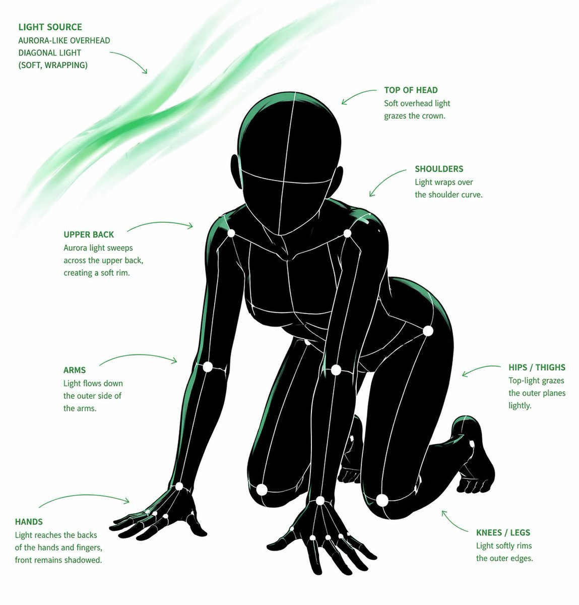

## 图像生成案例图

- ID: case-79
- Slug: case-79-zh
- 语言: zh
- 来源: [来源链接](https://x.com/WOZ1Tx2JZ3kCeBj)
- 样例图路径: images/part2/case79.jpg

### 提示词

```text
[CORE TASK]
Transform the provided input image into a pose-and-light analysis sheet.

This is NOT a finished character illustration.
This is NOT a clothing sheet.
This is NOT a beauty-preserving redraw.

This is a white-line rough mannequin conversion.

[PRIMARY GOAL]
Extract and visualize only:
- pose structure
- body balance
- camera angle
- body line flow
- inferred light source placement
- illuminated areas and light intensity

[INPUT ROLE]
Use the provided image as the strict anchor for:
- pose
- camera angle
- body tilt
- weight distribution
- approximate lighting situation

Do NOT preserve:
- face rendering
- hairstyle rendering
- clothing detail
- accessories
- weapon detail
- background architecture
- character identity
- emotional expression

[FIGURE CONVERSION]
single rough mannequin-like human figure
white body contour lines
white internal construction lines
simple mannequin head
no face
no eyes
no mouth
no eyelashes
no personality
no individual identity

human figure should look like:
- rough pose mannequin
- anatomy proxy
- line-based body guide
- structural sketch
- white-line rough dummy

keep:
- pose readability
- silhouette flow
- head tilt
- torso direction
- pelvis direction
- limb placement

[BACKGROUND]
pure black background
negative-style dark field
no scenery
no props
no architecture
no environmental storytelling

[LINE STYLE]
rough white line drawing
clean but sketch-like
construction-line feeling
anatomy guide lines visible
joint flow visible
body contour emphasized
no polished illustration finish

[LIGHT ESTIMATION]
predict the likely light source positions from the input image
visualize the light sources and illuminated areas using green glow only

use green light intensity with variation:
- strongest green where the light directly hits
- medium green for wrap light
- soft green for reflected or fading light

mark the estimated light sources with labels and arrows such as:
- Main Light
- Rim Light
- Fill Light
- Floor Bounce
- Back Light
only if appropriate

IMPORTANT:
do not invent random lights
infer lighting from the original input image
if the lighting is ambiguous, keep the annotations simple and plausible

[GREEN LIGHT VISUALIZATION]
show green glow on:
- head / skull plane
- neck
- shoulders
- chest plane
- ribcage direction
- pelvis edge
- thigh planes
- knee contact points
- floor contact bounce if applicable

use green light not as decoration,
but as lighting analysis information

[POSE PRIORITY]
1. preserve pose structure
2. preserve camera angle
3. preserve body balance
4. preserve head-torso relationship
5. visualize likely light direction
6. show illuminated areas with readable green intensity variation

[NEGATIVE]
finished person,
cute girl,
detailed face,
hair rendering,
clothing rendering,
weapon emphasis,
beautiful anatomy
```

### 样例图


## 图像生成案例图

- ID: case-78
- Slug: case-78-zh
- 语言: zh
- 来源: [来源链接](https://x.com/WOZ1Tx2JZ3kCeBj)
- 样例图路径: images/part2/case78.jpg

### 提示词

```text
[CORE TASK]
Transform the provided input image into a pose-and-light analysis sheet.

This is NOT a finished character illustration.
This is NOT a clothing sheet.
This is NOT a beauty-preserving redraw.

This is a white-line rough mannequin conversion.

[PRIMARY GOAL]
Extract and visualize only:
- pose structure
- body balance
- camera angle
- body line flow
- inferred light source placement
- illuminated areas and light intensity

[INPUT ROLE]
Use the provided image as the strict anchor for:
- pose
- camera angle
- body tilt
- weight distribution
- approximate lighting situation

Do NOT preserve:
- face rendering
- hairstyle rendering
- clothing detail
- accessories
- weapon detail
- background architecture
- character identity
- emotional expression

[FIGURE CONVERSION]
single rough mannequin-like human figure
white body contour lines
white internal construction lines
simple mannequin head
no face
no eyes
no mouth
no eyelashes
no personality
no individual identity

human figure should look like:
- rough pose mannequin
- anatomy proxy
- line-based body guide
- structural sketch
- white-line rough dummy

keep:
- pose readability
- silhouette flow
- head tilt
- torso direction
- pelvis direction
- limb placement

[BACKGROUND]
pure black background
negative-style dark field
no scenery
no props
no architecture
no environmental storytelling

[LINE STYLE]
rough white line drawing
clean but sketch-like
construction-line feeling
anatomy guide lines visible
joint flow visible
body contour emphasized
no polished illustration finish

[LIGHT ESTIMATION]
predict the likely light source positions from the input image
visualize the light sources and illuminated areas using green glow only

use green light intensity with variation:
- strongest green where the light directly hits
- medium green for wrap light
- soft green for reflected or fading light

mark the estimated light sources with labels and arrows such as:
- Main Light
- Rim Light
- Fill Light
- Floor Bounce
- Back Light
only if appropriate

IMPORTANT:
do not invent random lights
infer lighting from the original input image
if the lighting is ambiguous, keep the annotations simple and plausible

[GREEN LIGHT VISUALIZATION]
show green glow on:
- head / skull plane
- neck
- shoulders
- chest plane
- ribcage direction
- pelvis edge
- thigh planes
- knee contact points
- floor contact bounce if applicable

use green light not as decoration,
but as lighting analysis information

[POSE PRIORITY]
1. preserve pose structure
2. preserve camera angle
3. preserve body balance
4. preserve head-torso relationship
5. visualize likely light direction
6. show illuminated areas with readable green intensity variation

[NEGATIVE]
finished person,
cute girl,
detailed face,
hair rendering,
clothing rendering,
weapon emphasis,
beautiful anatomy
```

### 样例图


## 关系图谱信息图

- ID: case-77
- Slug: case-77-zh
- 语言: zh
- 来源: [来源链接](https://x.com/alanlovelq)
- 样例图路径: images/part2/case77.jpg

### 提示词

```text
Please generate a high-quality vertical "Popular Science Encyclopedia Image" based on {argument name="theme" default="animals"}.

This image is not a regular poster or a simple illustration, but a modular popular science infographic that possesses a sense of "illustration book, encyclopedia, information structure, and collectability." The overall style should reference a combination of high-end natural history illustrations, modern encyclopedia pages, lifestyle knowledge cards, and highly shareable social media infographics.

Please include in the frame:
- A clear and beautiful main visual of the subject
- Several magnified details of local characteristics
- Multiple rounded modular information sections
- Clear title hierarchies and key labels
- Concise yet rich encyclopedic content
- Visual ratings, key point summaries, or Top 5 modules

Content columns should be automatically adapted based on the theme, prioritized from these directions: basic profile, classification information, appearance characteristics, habits/ecology, formation mechanism/structure, growth or use conditions, care or maintenance suggestions, risks and precautions, suitable audience or scenarios, pros and cons comparison, and quick rating cards.

Visual requirements:
Light-colored clean background, soft color palette, light shadows, exquisite small icons, rounded information boxes, neat layout, high information density but not crowded, good reading experience. The overall result must look like a real science encyclopedia card suitable for publishing, reading, collecting, and serialized production, rather than an advertisement.

Please do not make it a regular commercial promotional poster. Highlight the features of "knowledge organization + modular information + illustration-style display."
```

### 样例图


## 关系图谱信息图

- ID: case-76
- Slug: case-76-zh
- 语言: zh
- 来源: [来源链接](https://x.com/alanlovelq)
- 样例图路径: images/part2/case76.jpg

### 提示词

```text
Please generate a high-quality vertical "Popular Science Encyclopedia Image" based on {argument name="theme" default="animals"}.

This image is not a regular poster or a simple illustration, but a modular popular science infographic that possesses a sense of "illustration book, encyclopedia, information structure, and collectability." The overall style should reference a combination of high-end natural history illustrations, modern encyclopedia pages, lifestyle knowledge cards, and highly shareable social media infographics.

Please include in the frame:
- A clear and beautiful main visual of the subject
- Several magnified details of local characteristics
- Multiple rounded modular information sections
- Clear title hierarchies and key labels
- Concise yet rich encyclopedic content
- Visual ratings, key point summaries, or Top 5 modules

Content columns should be automatically adapted based on the theme, prioritized from these directions: basic profile, classification information, appearance characteristics, habits/ecology, formation mechanism/structure, growth or use conditions, care or maintenance suggestions, risks and precautions, suitable audience or scenarios, pros and cons comparison, and quick rating cards.

Visual requirements:
Light-colored clean background, soft color palette, light shadows, exquisite small icons, rounded information boxes, neat layout, high information density but not crowded, good reading experience. The overall result must look like a real science encyclopedia card suitable for publishing, reading, collecting, and serialized production, rather than an advertisement.

Please do not make it a regular commercial promotional poster. Highlight the features of "knowledge organization + modular information + illustration-style display."
```

### 样例图


## 关系图谱信息图

- ID: case-75
- Slug: case-75-zh
- 语言: zh
- 来源: [来源链接](https://x.com/alanlovelq)
- 样例图路径: images/part2/case75.jpg

### 提示词

```text
Please generate a high-quality vertical "Popular Science Encyclopedia Image" based on {argument name="theme" default="animals"}.

This image is not a regular poster or a simple illustration, but a modular popular science infographic that possesses a sense of "illustration book, encyclopedia, information structure, and collectability." The overall style should reference a combination of high-end natural history illustrations, modern encyclopedia pages, lifestyle knowledge cards, and highly shareable social media infographics.

Please include in the frame:
- A clear and beautiful main visual of the subject
- Several magnified details of local characteristics
- Multiple rounded modular information sections
- Clear title hierarchies and key labels
- Concise yet rich encyclopedic content
- Visual ratings, key point summaries, or Top 5 modules

Content columns should be automatically adapted based on the theme, prioritized from these directions: basic profile, classification information, appearance characteristics, habits/ecology, formation mechanism/structure, growth or use conditions, care or maintenance suggestions, risks and precautions, suitable audience or scenarios, pros and cons comparison, and quick rating cards.

Visual requirements:
Light-colored clean background, soft color palette, light shadows, exquisite small icons, rounded information boxes, neat layout, high information density but not crowded, good reading experience. The overall result must look like a real science encyclopedia card suitable for publishing, reading, collecting, and serialized production, rather than an advertisement.

Please do not make it a regular commercial promotional poster. Highlight the features of "knowledge organization + modular information + illustration-style display."
```

### 样例图

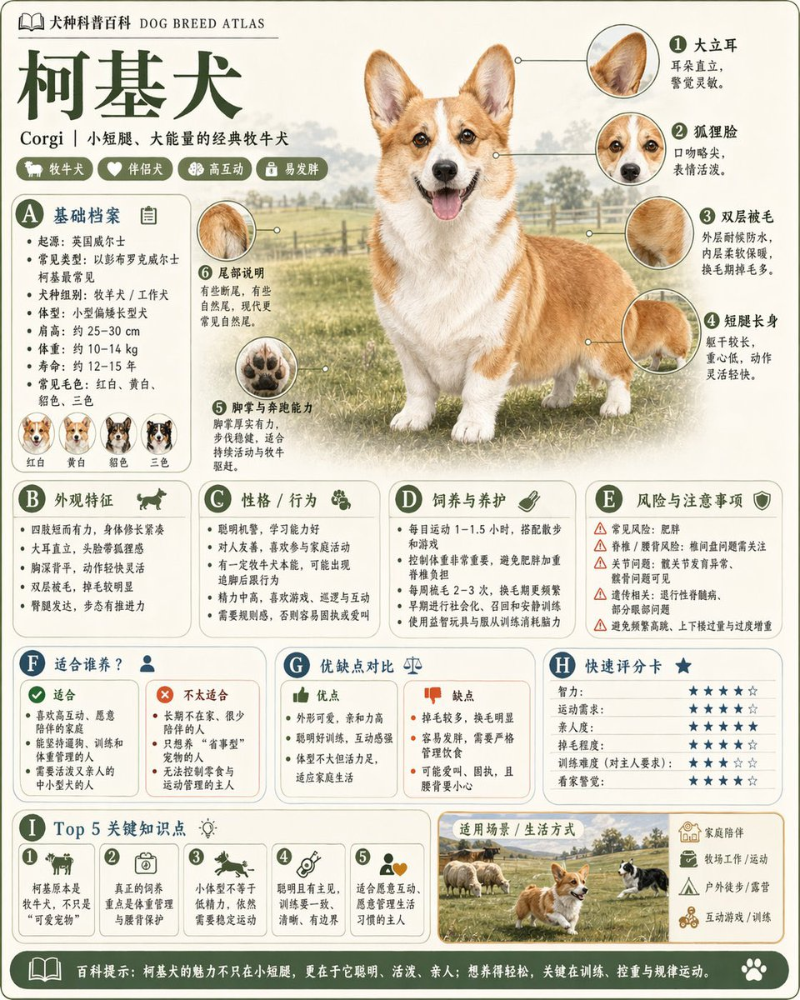

## 关系图谱信息图

- ID: case-74
- Slug: case-74-zh
- 语言: zh
- 来源: [来源链接](https://x.com/alanlovelq)
- 样例图路径: images/part2/case74.jpg

### 提示词

```text
Please generate a high-quality vertical "Popular Science Encyclopedia Image" based on {argument name="theme" default="animals"}.

This image is not a regular poster or a simple illustration, but a modular popular science infographic that possesses a sense of "illustration book, encyclopedia, information structure, and collectability." The overall style should reference a combination of high-end natural history illustrations, modern encyclopedia pages, lifestyle knowledge cards, and highly shareable social media infographics.

Please include in the frame:
- A clear and beautiful main visual of the subject
- Several magnified details of local characteristics
- Multiple rounded modular information sections
- Clear title hierarchies and key labels
- Concise yet rich encyclopedic content
- Visual ratings, key point summaries, or Top 5 modules

Content columns should be automatically adapted based on the theme, prioritized from these directions: basic profile, classification information, appearance characteristics, habits/ecology, formation mechanism/structure, growth or use conditions, care or maintenance suggestions, risks and precautions, suitable audience or scenarios, pros and cons comparison, and quick rating cards.

Visual requirements:
Light-colored clean background, soft color palette, light shadows, exquisite small icons, rounded information boxes, neat layout, high information density but not crowded, good reading experience. The overall result must look like a real science encyclopedia card suitable for publishing, reading, collecting, and serialized production, rather than an advertisement.

Please do not make it a regular commercial promotional poster. Highlight the features of "knowledge organization + modular information + illustration-style display."
```

### 样例图


## 信息图可视化设计

- ID: case-72
- Slug: case-72-zh
- 语言: zh
- 来源: [来源链接](https://x.com/hx831126)
- 样例图路径: images/part2/case72.jpg

### 提示词

```text
{
  "type": "scientific botanical infographic poster",
  "subject": "{argument name=\"plant species\" default=\"Pomegranate (Punica granatum)\"}",
  "style": "vintage botanical illustration mixed with modern infographic design, highly detailed, {argument name=\"color palette\" default=\"earthy greens, deep reds, parchment background\"}",
  "header": {
    "main_title": "{argument name=\"main title\" default=\"植物生命路径剖面\"}",
    "english_title": "{argument name=\"english title\" default=\"BOTANICAL GROWTH ATLAS\"}",
    "subtitle": "从种子到果实，一株植物如何展开自己 / FROM SEED TO FRUIT"
  },
  "centerpiece": "full plant showing extensive root system, woody stem, green leaves, blooming red flowers, and ripe fruits including one halved to show seeds",
  "layout": {
    "numbered_sections": [
      { "number": 1, "title": "种子结构 / Seed Architecture", "content": "cross-section of a single seed with 6 labeled parts" },
      { "number": 2, "title": "萌发机制 / Germination Mechanism", "content": "sequence of 5 sprouting seeds showing radicle emergence" },
      { "number": 3, "title": "根系与地下网络 / Root System + Subsurface Intelligence", "content": "detailed root network with 2 circular microscopic cross-sections showing vascular bundles and hyphae" },
      { "number": 4, "title": "茎叶生长与维管系统 / Stem, Leaf & Vascular System", "content": "leaf detail and circular stem cross-section with 5 labeled layers" },
      { "number": 5, "title": "光合作用与能量转换 / Photosynthesis + Energy Conversion", "content": "3D cellular cross-section of a leaf showing mesophyll and chloroplasts, plus a chemical equation diagram" },
      { "number": 6, "title": "花芽分化与开花机制 / Bud Formation + Blooming", "content": "detailed flower cross-section showing stamen and ovary, plus a 4-season timeline" },
      { "number": 7, "title": "授粉与结果路径 / Pollination + Fruiting Pathway", "content": "bee approaching a flower cross-section, followed by a sequence of 5 stages of ovary development into a fruit" },
      { "number": 8, "title": "果实成熟与种子循环 / Fruit Maturation + Seed Cycle", "content": "ripe fruit breaking open, seeds dispersing downwards to a new sprout" }
    ],
    "additional_elements": [
      { "position": "bottom left", "title": "环境触发因素 / Environmental Triggers", "content": "grid of 6 weather/environmental icons and 6 nutrient element icons (N, P, K, Ca, Mg, Fe)" },
      { "position": "bottom edge", "title": "Growth Timeline", "content": "linear sequence of 19 small plant icons showing the complete life cycle from seed to mature plant" }
    ],
    "footer_quote": "{argument name=\"bottom quote\" default=\"理解植物，就是理解生命如何在时间中构建秩序。\"}"
  }
}
```

### 样例图

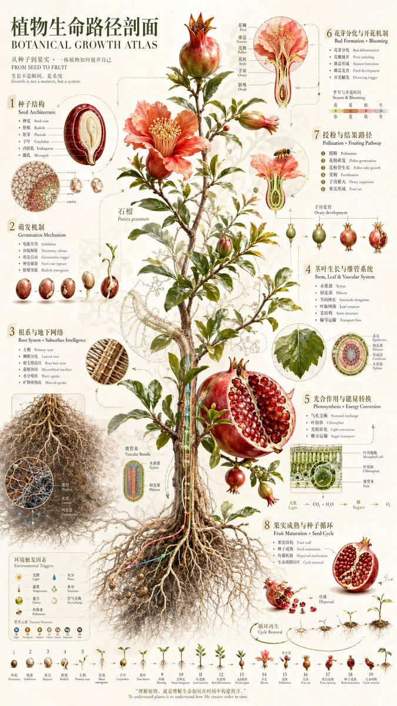

## 关系图谱信息图

- ID: case-71
- Slug: case-71-zh
- 语言: zh
- 来源: [来源链接](https://x.com/hx831126)
- 样例图路径: images/part2/case71.jpg

### 提示词

```text
{
  "type": "technical infographic and exploded view diagram",
  "header": {
    "title": "{argument name=\"main title\" default=\"佳能 EOS R5 成像系统剖面 CANON EOS R5 IMAGING ATLAS\"}",
    "subtitles": [
      "一张照片是如何被制造出来的 HOW AN IMAGE IS ACTUALLY FORMED",
      "从光，到数据 | FROM PHOTONS TO FILES",
      "相机不是壳体，而是一条运算链 A camera is not a shell, but a computational chain"
    ],
    "top_left_box": {
      "title": "EOS R5 核心规格 KEY SPECIFICATIONS",
      "bullet_points_count": 6
    },
    "top_right_images": {
      "count": 2,
      "description": "front and back views of the camera body"
    }
  },
  "centerpiece": {
    "description": "highly detailed 3D exploded view of the {argument name=\"camera model\" default=\"Canon EOS R5\"} camera, showing internal components separated vertically",
    "components_visible": [
      "lens mount",
      "lens elements with glowing blue light rays",
      "image sensor",
      "motherboard with glowing {argument name=\"processor name\" default=\"DIGIC X\"} chip",
      "battery pack",
      "dual card slots",
      "electronic viewfinder (EVF)"
    ]
  },
  "layout": {
    "numbered_sections": [
      {
        "number": 1,
        "title": "光学入口 OPTICAL ENTRY",
        "elements": ["lens cross-section with light rays", "2 line graphs"]
      },
      {
        "number": 2,
        "title": "光圈、快门与曝光控制 APERTURE, SHUTTER, EXPOSURE",
        "elements": ["3 aperture blade diagrams", "4 shutter speed example photos", "depth of field diagram", "exposure triangle diagram"]
      },
      {
        "number": 3,
        "title": "对焦系统与成像平面 FOCUS ACQUISITION + IMAGE PLANE",
        "elements": ["lens alignment diagram", "AF coverage photo of a runner"]
      },
      {
        "number": 4,
        "title": "传感器与像素结构 SENSOR + PIXEL ARCHITECTURE",
        "elements": ["3D pixel array diagram", "single pixel cross-section diagram", "sensor spec table", "quantum efficiency graph"]
      },
      {
        "number": 5,
        "title": "防抖系统与机械稳定 IBIS + MECHANICAL STABILIZATION",
        "elements": ["sensor shift mechanism diagram with yaw/pitch/roll axes", "2 stabilization effect comparison photos"]
      },
      {
        "number": 6,
        "title": "模拟信号、模数转换与读出 ANALOG READOUT + A/D CONVERSION",
        "elements": ["signal flowchart", "3 readout timing graphs", "signal-to-noise ratio graph", "rolling shutter example photo of a car"]
      },
      {
        "number": 7,
        "title": "DIGIC X 图像处理链 DIGIC X IMAGE PROCESSING PIPELINE",
        "elements": ["processing flowchart with central chip", "dynamic range graph", "tone curve graph", "histogram"]
      },
      {
        "number": 8,
        "title": "文件生成、显示与存储 FILE OUTPUT, PREVIEW, STORAGE",
        "elements": ["file output flowchart", "2 storage card icons", "file workflow diagram"]
      }
    ],
    "bottom_comparisons": {
      "count": 5,
      "labels": [
        "传感器尺寸对比 SENSOR SIZE COMPARISON",
        "镜头焦距与视角 FOCAL LENGTH & ANGLE OF VIEW",
        "ISO 与噪点关系 ISO & NOISE RELATIONSHIP",
        "光圈与景深关系 APERTURE & DEPTH OF FIELD",
        "RAW vs JPEG"
      ]
    },
    "footer": "{argument name=\"footer quote\" default=\"光被捕获，数据被解读，影像被记录，记忆被永恒。 Light is captured. Data is interpreted. Image is recorded. Memory is eternal.\"}"
  },
  "style": "clean, technical, highly detailed, photorealistic components, blueprint-style annotations, light gray background, precise typography"
}
```

### 样例图

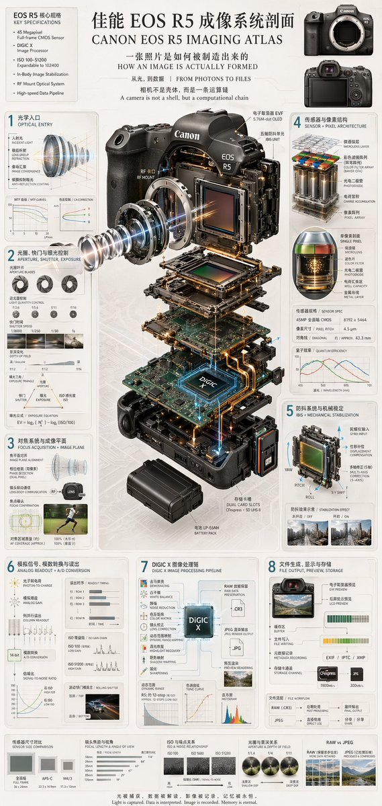

## 信息图可视化设计

- ID: case-70
- Slug: case-70-zh
- 语言: zh
- 来源: [来源链接](https://x.com/hx831126)
- 样例图路径: images/part2/case70.jpg

### 提示词

```text
{
  "type": "technical infographic",
  "subject": "{argument name=\"subject matter\" default=\"digital photography process\"}",
  "header": {
    "title": "{argument name=\"main title\" default=\"一张照片诞生的因果链 THE CAUSAL CHAIN OF A PHOTOGRAPH\"}",
    "subtitle": "从世界，到图像 FROM WORLD TO IMAGE"
  },
  "centerpiece": {
    "description": "Exploded isometric view of a modern mirrorless camera",
    "model": "{argument name=\"camera model\" default=\"Canon EOS R5\"}",
    "labeled_parts_count": 12,
    "labeled_parts": [
      "EVF",
      "Body Structure",
      "Control Dials",
      "Thermal Design",
      "Optical Axis",
      "IBIS Stabilizer",
      "Shutter Unit",
      "Full-Frame Sensor",
      "{argument name=\"processor name\" default=\"DIGIC X Processor\"}",
      "Main PCB",
      "High-Speed Bus",
      "Card Slot"
    ]
  },
  "layout": {
    "left_column": {
      "description": "Chronological causal chain",
      "count": 13,
      "steps": [
        "01 REALITY EXISTS",
        "02 PHOTONS LEAVE THE WORLD",
        "03 LENS ACCEPTS & BENDS LIGHT",
        "04 APERTURE SELECTS",
        "05 SHUTTER CUTS TIME",
        "06 FOCUS SETS PRIORITY",
        "07 SENSOR RECEIVES EVENT",
        "08 LIGHT BECOMES CHARGE",
        "09 ANALOG READOUT",
        "10 A/D CONVERSION",
        "11 COMPUTATION RECONSTRUCTS",
        "12 IMAGE APPEARS",
        "13 MEMORY OUTLIVES"
      ]
    },
    "right_column": {
      "title": "八大模块 / 8 MODULES",
      "count": 8,
      "modules": [
        "1 ORIGIN OF LIGHT",
        "2 LENS SHAPES REALITY",
        "3 APERTURE & SHUTTER EDIT THE WORLD",
        "4 FOCUS DECIDES CLARITY",
        "5 SENSOR MEASURES LIGHT",
        "6 SIGNAL BORN & AMPLIFIED",
        "7 COMPUTATION BUILDS IMAGE",
        "8 FILE BECOMES MEMORY"
      ]
    },
    "side_diagrams": {
      "count": 7,
      "descriptions": [
        "Ray cone & image formation",
        "Aperture & depth of field",
        "Shutter & motion",
        "Focal plane & clarity",
        "Pixel structure",
        "Photoelectric conversion",
        "Analog signal waveform"
      ]
    },
    "footer": {
      "count": 5,
      "description": "Philosophical summary points"
    }
  },
  "style": "technical, precise, wireframe elements, glowing data lines, photorealistic camera components, clean typography, dual-language"
}
```

### 样例图


## 信息图可视化设计

- ID: case-65
- Slug: case-65-zh
- 语言: zh
- 来源: [来源链接](https://x.com/GeekCatX)
- 样例图路径: images/part2/case65.jpg

### 提示词

```text
A breathtaking and extremely complex world-building infographic masterpiece conceptualizing the "{argument name="theme" default="Fundamental Differences between Confucianism, Buddhism, and Taoism"}", designed as a profound {argument name="style" default="ancient Oriental mythological manuscript"}.
Background: Pure white vintage textured canvas with a light beige aged parchment base color, subtle frayed edges, and water stain textures.
Core Layout: Central vision uses a grand "vertical egg-shaped layered structure", with Buddhism, Taoism, and Confucianism layers from top to bottom.
Margins: Four corners are decorated with fine micro-illustrations featuring ancient observation notes, ritual implements, and runes.
Colors: Low-saturation sage green, light gold, and off-white as main tones; overall light and soft without harsh high-saturation colors.
Details: Architectural lines, landscape brushwork, lotus patterns, and cloud layers are clearly visible and exquisitely detailed.
Seamless Fusion: The three layers transition naturally through clouds and flowing water; the Buddhist halo, Taoist Taiji mist, and Confucian scholarly aura connect seamlessly.
Style: Classical ink line art + low-saturation digital watercolor, with a light Chinese-style ancient book manuscript texture.
Text Annotations: Authentic Traditional Chinese characters in a mottled vintage Song typeface. Each annotation includes a short title + a line of poetic description, connected to corresponding details by dark gold hair-thin lines with no overlapping pointers.
Aspect Ratio: {argument name="aspect ratio" default="3:4"} vertical format, independent and complete.

Title Area (Top): `儒釋道·根本區別` (Confucianism, Buddhism, Taoism: Fundamental Differences)
Central Layer Labels:
Top "Buddhism": `釋`, `Relationship between man and self`, `Selflessness, governing the heart, letting go`
Middle "Taoism": `道`, `Relationship between man and all things`, `Non-action, governing the body, being open-minded`
Bottom "Confucianism": `儒`, `Relationship between man and man`, `No ego, governing the world, taking responsibility`
Side Annotations:
Left: `Purity`: pure heart and clear mind, cutting off troubles; `Stillness`: following nature, returning to the original heart; `Respect`: respecting responsibility, active involvement in society.
Right: `60+ Spiritual Cultivation`: looking lightly at gain/loss; `35-55 Conduct`: living with flexibility, following laws; `7-35 Actions`: forging ahead, building careers.
Bottom Summary: `The balance between being in the world and being out of the world is high-level life wisdom.`
```

### 样例图


## 漫画分镜叙事设计

- ID: case-60
- Slug: case-60-zh
- 语言: zh
- 来源: [来源链接](https://x.com/Gc_qube)
- 样例图路径: images/part2/case60.jpg

### 提示词

```text
{
  "type": "5-panel collage",
  "layout": "grid with 3 top panels and 2 bottom panels",
  "panels": [
    {
      "position": "top-left",
      "subject": "analog clock",
      "details": "teal background, time showing {argument name=\"clock time\" default=\"7:42\"}",
      "style": "flat vector illustration"
    },
    {
      "position": "top-middle",
      "subject": "woman holding playing cards",
      "details": "holding 5 cards: {argument name=\"card hand\" default=\"Ace of Spades, King of Hearts, Queen of Clubs, Jack of Diamonds, 10 of Spades\"}",
      "style": "classic oil painting portrait"
    },
    {
      "position": "top-right",
      "subject": "glass of red liquid",
      "details": "{argument name=\"glass type\" default=\"wine glass\"} filled to the brim with dark red liquid, marble surface",
      "style": "photorealistic studio photography"
    },
    {
      "position": "bottom-left",
      "subject": "chessboard",
      "details": "wooden board with 32 pieces in standard starting position",
      "style": "photorealistic high-angle shot"
    },
    {
      "position": "bottom-right",
      "subject": "two dice",
      "details": "left die shows {argument name=\"left die top\" default=\"5\"} on top, right die shows {argument name=\"right die top\" default=\"2\"} on top",
      "style": "pop art comic book halftone with red and blue burst"
    }
  ]
}
```

### 样例图


## 主题海报版式设计

- ID: case-59
- Slug: case-59-zh
- 语言: zh
- 来源: [来源链接](https://x.com/X64zzotSKCGtYmt)
- 样例图路径: images/part2/case59.jpg

### 提示词

```text
{
  "type": "cinematic promotional poster",
  "style": "3D CGI animation style, highly detailed, dramatic lighting, caricature characters",
  "characters": [
    { "id": "char1", "description": "large shirtless man with long black hair, beard, and glasses" },
    { "id": "char2", "description": "elderly woman in a kimono with white hair tied up" },
    { "id": "char3", "description": "small man with a topknot, glasses, mustache, wearing a bright green sweater" }
  ],
  "layout": {
    "panels": [
      {
        "position": "top",
        "scene": "wide shot of a town street with buildings and a city skyline in the background",
        "characters_present": ["char1", "char2", "char3"],
        "text_overlays": [
          "{argument name=\"intro text\" default=\"ある日ーー\"}",
          "いつもの日常がーー",
          "こんばんは"
        ]
      },
      {
        "position": "middle left",
        "scene": "close-up of char1 looking shocked against a dark fiery background",
        "text_overlays": [
          "{argument name=\"shocked text\" default=\"私が出禁？\"}"
        ]
      },
      {
        "position": "middle right",
        "scene": "close-up of char2 looking angry and pointing against a stormy sea background",
        "text_overlays": [
          "{argument name=\"angry text\" default=\"海を荒らすな！\"}"
        ]
      },
      {
        "position": "bottom",
        "scene": "char3 pointing, char1 screaming, a second instance of char3 falling backwards, and char2 sitting angrily against a fiery chaotic background",
        "text_overlays": [
          "全然出ない！"
        ],
        "bottom_titles": [
          "{argument name=\"main title\" default=\"パチンコ軍団親のイメチェン\"}",
          "{argument name=\"subtitle\" default=\"LINEスタンプ販売中\"}"
        ]
      }
    ]
  }
}
```

### 样例图


## 主题海报版式设计

- ID: case-58
- Slug: case-58-zh
- 语言: zh
- 来源: [来源链接](https://x.com/liyue_ai)
- 样例图路径: images/part2/case58.jpg

### 提示词

```text
Flat illustration, high-end oriental fantasy style city poster design, vertical 9:16 composition. The layout uses a diagonal + S-shaped flow extending from the bottom left to top right. The background is deep black grading down to intense dark red, creating strong warm-cool contrast and spatial depth with faint stardust and grain texture. In the center, a flowing golden energy line winds through like a flame, extending upward from the base, featuring fluid texture, particle effects, and gradient highlights, with subtle energy debris and volumetric light.

Within the golden flow, the architectural landmarks of {argument name="city" default="Guangzhou"} emerge layer by layer: the Canton Tower is the visual core with prominent proportions, surrounded by the Zhujiang New Town skyline, Liede Bridge, and modern Lingnan architectural elements. Buildings are rendered using "fine line drawing + golden luminous blocks," with clear outlines and rich details, appearing to float in a void against the golden halo, creating a surreal spatial hierarchy with slightly fogged backgrounds for added depth.

At the bottom of the frame is an oriental white-haired female figure with flowing hair like mist, naturally connecting and merging with the golden light. Her hair is translucent with gradient light effects; she has a graceful posture, eyes closed, and a serene expression, holding a bouquet of colorful flowers dotted with shimmering particles, symbolizing the spiritual connection between people and city energy. Character details are moderately simplified to emphasize the overall design.

Lighting is concentrated on the golden flow, buildings, and character outlines, creating intense chiaroscuro and visual focus. The overall atmosphere is grand, mysterious, imbued with oriental mythology, and slightly healing. Colors use black and dark red as a base with brilliant gold as the main visual emphasis. The gold has rich light-dark layers, complemented by small areas of high-saturation floral colors, maintaining a sophisticated and restrained aesthetic.

Integrated text and layout: Centered Songti font at the top reads "{argument name="city" default="Guangzhou"} · China," followed by smaller text "{argument name="date" default="2026/04/20"}" and "{argument name="author" default="LIYUE"}" below. Text uses pale gold or soft warm white, unified with the overall lighting. High-quality details, cinematic lighting, rich volumetric and particle details, clean image without noise, ultra-high 8K resolution, commercial-grade poster quality.
```

### 样例图


## 界面交互设计图

- ID: case-57
- Slug: case-57-zh
- 语言: zh
- 来源: [来源链接](https://x.com/liyue_ai)
- 样例图路径: images/part2/case57.jpg

### 提示词

```text
{
  "type": "mobile social media app UI mockup",
  "platform": "Twitter/X dark mode",
  "header": {
    "status_bar": "time 19:28, bird icon, signal, wifi, battery",
    "navigation": "back arrow, 'Tweet' title"
  },
  "post": {
    "author": {
      "avatar": "portrait of a Chinese emperor in red robes and black hat",
      "display_name": "{argument name=\"display name\" default=\"Emperor Zhu Yuanzhang\"} 👑 [verified badge]",
      "handle": "{argument name=\"handle\" default=\"@Emperor_Ming\"}"
    },
    "content": {
      "text": "{argument name=\"tweet text\" default=\"I have ascended to the Dragon Throne! Today, I am proclaimed as the Emperor of the Ming Dynasty. The era of Hongwu has begun. Let us rebuild our great nation together!\"}",
      "hashtags": "#MingDynasty #HongwuEra #NewBeginning",
      "media_grid": {
        "count": 3,
        "images": [
          "emperor seated on an ornate golden throne in red and gold robes",
          "wide shot of a grand Chinese palace courtyard with a large crowd",
          "emperor on horseback leading an army with a red dragon banner"
        ]
      }
    },
    "metadata": {
      "timestamp": "{argument name=\"timestamp\" default=\"1:36 PM · Jan 23, 1368\"}",
      "engagement": "5,432 Retweets, 8,765 Quotes, 20.1K Likes, 102.3K Views"
    },
    "actions": "reply, retweet, like (red heart with '1'), share, upload"
  },
  "footer": {
    "reply_bar": {
      "avatar": "woman in red",
      "placeholder": "Reply to Emperor Zhu Yuanzhang..."
    },
    "navigation_bar": "home, search, notifications (red '1' badge), messages"
  }
}
```

### 样例图


## 信息图可视化设计

- ID: case-55
- Slug: case-55-zh
- 语言: zh
- 来源: [来源链接](https://x.com/Kurt_Rousey466)
- 样例图路径: images/part2/case55.jpg

### 提示词

```text
Help me create a detailed production flowchart for the dish {argument name="dish name" default="Fried Pork with Chili"}, in a realistic style, suitable for Xiaohongshu image-text proportions.
```

### 样例图


## 室内空间渲染图

- ID: case-53
- Slug: case-53-zh
- 语言: zh
- 来源: [来源链接](https://x.com/nicdunz)
- 样例图路径: images/part2/case53.jpg

### 提示词

```text
A vintage, late 90s amateur flash photograph of a young man repairing an arcade machine. He is kneeling on a dark, patterned arcade carpet, looking back over his shoulder directly at the camera with a neutral expression. He wears a dark short-sleeved t-shirt, baggy blue jeans, chunky white sneakers, and a dark baseball cap. The lower front panel of the arcade cabinet is wide open, exposing its complex internal electronics, including a tangle of wires, green circuit boards, a large speaker, and metal cooling fans at the base. The side of the cabinet features vibrant pink, black, and white graphics with the text "{argument name="arcade game title" default="Dancing Stage"}" and the brand "{argument name="arcade brand" default="KONAMI"}". The setting is a dimly lit arcade interior with other glowing game cabinets visible in the blurred background. A screwdriver lies on the carpet near the man's knee. The image features harsh direct flash lighting, a slightly grainy film texture, deep shadows, and a nostalgic Y2K aesthetic.
```

### 样例图


## 信息图可视化设计

- ID: case-51
- Slug: case-51-zh
- 语言: zh
- 来源: [来源链接](https://x.com/yyyole)
- 样例图路径: images/part2/case51.jpg

### 提示词

```text
{
  "type": "7-day fashion lookbook infographic",
  "header": {
    "title": "{argument name=\"main title\" default=\"一周穿搭指南\"}",
    "subtitle": "{argument name=\"style keywords\" default=\"温柔 | 靓丽 | 优雅\"}",
    "slogan_cn": "优雅不设限，自信每一天",
    "slogan_en": "{argument name=\"english slogan\" default=\"ELEGANCE HAS NO LIMIT, BE CONFIDENT EVERY DAY\"}"
  },
  "subject": "{argument name=\"subject description\" default=\"young elegant Asian woman\"}",
  "layout": {
    "columns": 7,
    "column_elements": [
      "day_header",
      "main_portrait",
      "4_detail_thumbnails",
      "outfit_specs",
      "keywords_colors",
      "3_color_swatches",
      "star_ratings",
      "fabric_price",
      "4_season_icons"
    ],
    "days": [
      { "day": "周一 (MONDAY)", "outfit": "beige blazer suit", "scene": "场景：重要会议 / 正式商务" },
      { "day": "周二 (TUESDAY)", "outfit": "pink blazer suit", "scene": "场景：日常通勤" },
      { "day": "周三 (WEDNESDAY)", "outfit": "cream knit cardigan set", "scene": "场景：生活休闲" },
      { "day": "周四 (THURSDAY)", "outfit": "champagne slip dress", "scene": "场景：外出私会" },
      { "day": "周五 (FRIDAY)", "outfit": "blue knit top, white skirt", "scene": "场景：休闲社交" },
      { "day": "周六 (SATURDAY)", "outfit": "white sports bra, purple leggings", "scene": "场景：运动休闲" },
      { "day": "周日 (SUNDAY)", "outfit": "beige lounge knitwear", "scene": "场景：居家 / 约会" }
    ]
  },
  "footer": {
    "tips": "{argument name=\"footer tips\" default=\"Tips: 根据天气与场合灵活调整，配饰是提升整体造型的关键；保持自信与舒适，才是穿搭的最终目的。\"}",
    "legend": [
      "春: 春季适用",
      "夏: 夏季适用",
      "秋: 秋季适用",
      "冬: 冬季适用"
    ]
  }
}
```

### 样例图


## 直播界面设计图

- ID: case-49
- Slug: case-49-zh
- 语言: zh
- 来源: [来源链接](https://x.com/kylegeeks)
- 样例图路径: images/part2/case49.jpg

### 提示词

```text
A 9:16 aspect ratio image, generating a screenshot of a Douyin livestream where {argument name="celebrity" default="Liu Yifei"} is broadcasting, holding a sign that says "{argument name="sign text" default="Streaming tonight, welcome to join Yifei's chat!"}"
```

### 样例图


## 直播界面设计图

- ID: case-48
- Slug: case-48-zh
- 语言: zh
- 来源: [来源链接](https://x.com/kylegeeks)
- 样例图路径: images/part2/case48.jpg

### 提示词

```text
A 9:16 aspect ratio image, generating a screenshot of a Douyin livestream where {argument name="celebrity" default="Liu Yifei"} is broadcasting, holding a sign that says "{argument name="sign text" default="Streaming tonight, welcome to join Yifei's chat!"}"
```

### 样例图


## 建筑空间场景图

- ID: case-47
- Slug: case-47-zh
- 语言: zh
- 来源: [来源链接](https://x.com/makaneko_AI)
- 样例图路径: images/part2/case47.jpg

### 提示词

```text
{
  "type": "2x2 grid of Japanese digital advertisement banners",
  "layout": {
    "structure": "4 equal quadrants",
    "quadrants": [
      {
        "position": "top-left",
        "theme": "Travel",
        "subject": "A couple holding hands on a white sand beach, looking out at turquoise ocean water under a bright blue sky.",
        "elements": ["red hibiscus flower in bottom left corner"],
        "text_labels": [
          "今年こそ、解き放て。",
          "{argument name=\"travel destination\" default=\"沖縄旅行\"}",
          "3日間の癒やし旅",
          "航空券＋ホテル",
          "39,800円〜",
          "絶景、グルメ、体験 ぜんぶ叶う!"
        ],
        "icons": {
          "count": 3,
          "descriptions": ["airplane", "hotel building", "car"]
        }
      },
      {
        "position": "top-right",
        "theme": "Skincare",
        "subject": "Close-up portrait of a young woman with glowing, dewy skin, eyes closed, gently touching her cheeks.",
        "elements": [
          "soft pink gradient background",
          "dynamic water splash effects",
          "pink cosmetic jar labeled '{argument name=\"skincare product name\" default=\"LUMIÈRE\"} Brightening Gel'"
        ],
        "text_labels": [
          "毛穴・くすみ卒業！",
          "透明感あふれる",
          "水光肌へ",
          "新感覚スキンケア",
          "初回限定 78%OFF",
          "{argument name=\"discount price\" default=\"1,980円\"}"
        ],
        "badges": {
          "count": 3,
          "style": "gold circular",
          "labels": ["毛穴ケア", "高保湿", "ハリ・ツヤ"]
        }
      },
      {
        "position": "bottom-left",
        "theme": "Gourmet Food",
        "subject": "Thick, sliced, medium-rare steak sizzling on a dark grill plate.",
        "elements": [
          "garlic chips",
          "rosemary sprig",
          "dark background with smoke and glowing embers"
        ],
        "text_labels": [
          "とろける旨さ！",
          "{argument name=\"food item\" default=\"黒毛和牛\"}",
          "贅沢ステーキ",
          "期間限定",
          "特別価格",
          "通常価格 8,980円",
          "4,980円"
        ],
        "badges": {
          "count": 1,
          "style": "red circular",
          "labels": ["A4 A5等級"]
        }
      },
      {
        "position": "bottom-right",
        "theme": "Online Education",
        "subject": "Young man in a blue shirt studying at a desk, writing in a notebook next to an open laptop.",
        "elements": ["bright indoor lighting", "desk environment"],
        "text_labels": [
          "スキマ時間で",
          "{argument name=\"education goal\" default=\"最短合格！\"}",
          "オンライン資格講座",
          "スマホで完結",
          "効率学習で差がつく！",
          "今だけ！ 受講料 20%OFF"
        ],
        "badges": {
          "count": 1,
          "style": "blue circular",
          "labels": ["受講者数 10万人 突破！"]
        },
        "icons": {
          "count": 2,
          "descriptions": ["smartphone", "open book"]
        }
      }
    ]
  }
}
```

### 样例图


## 写实摄影风格图

- ID: case-42
- Slug: case-42-zh
- 语言: zh
- 来源: [来源链接](https://x.com/blanplan)
- 样例图路径: images/part2/case42.jpg

### 提示词

```text
Express {argument name="subject" default="a powerful AI builder"} in a graffiti sketch style, presenting an overall visual effect of quick outlines, free deformation, improvised hand-drawing, and draft-like sketches. The lines are casual, exaggerated, varying in thickness, and slightly messy but rhythmic and expressive, emphasizing generalization, exaggeration, fun, and spontaneity rather than rigorous realism or fine detail. The colors are expressed in rough blocks with a distinct dry-brush feel, retaining uneven smears, brush marks, fly-white, and layering. Colors automatically adapt to the {argument name="theme" default="powerful AI builder"}, but the overall expression remains graffiti-like, sketch-like, and generalized. No transparent watercolor smudging effects, no delicate watercolor transitions, no paper textures, no soft atomization, and no dreamy textures. The background is mainly white space, maintaining a sense of simplicity, ease, unfinishedness, and design. Small amounts of auxiliary symbols, arrows, marks, circles, repeated lines, handwritten text, or other graffiti elements can be added to enhance the sketchbook or essay-like visual language, but they should not be too crowded or destroy the subject and the white space atmosphere. The content of the picture does not need to be written in advance; {argument name="character image" default="a powerful AI builder"} will automatically deduce and generate the most suitable main image, actions, related elements, symbols, or simplified scenes. The overall style remains a unified graffiti sketch style and an exaggerated, generalized expression, avoiding complex realistic backgrounds and excessive detail. A special signature 'BlanPlan' should be naturally added as part of the picture, in a low-key but clear position such as the bottom left, bottom right, or near the title. The style should be unified with the overall layout, like an artist's signature or a design mark; the signature font should be exquisite, restrained, and high-end, not too large, and should not destroy the main composition or appear abrupt or cheap.
```

### 样例图


## 综合应用场景图

- ID: case-40
- Slug: case-40-zh
- 语言: zh
- 来源: [来源链接](https://x.com/midori_tatsuta)
- 样例图路径: images/part2/case40.jpg

### 提示词

```text
Create {argument name="quantity" default="24"} LINE stickers of {argument name="animals" default="animals"} in a quirky hand-drawn style. Target {argument name="target audience" default="Japanese Gen Z"} with a trendy style that can aim for top downloads.
```

### 样例图


## 综合应用场景图

- ID: case-39
- Slug: case-39-zh
- 语言: zh
- 来源: [来源链接](https://x.com/midori_tatsuta)
- 样例图路径: images/part2/case39.jpg

### 提示词

```text
Create {argument name="quantity" default="24"} LINE stickers of {argument name="animals" default="animals"} in a quirky hand-drawn style. Target {argument name="target audience" default="Japanese Gen Z"} with a trendy style that can aim for top downloads.
```

### 样例图


## 综合应用场景图

- ID: case-38
- Slug: case-38-zh
- 语言: zh
- 来源: [来源链接](https://x.com/midori_tatsuta)
- 样例图路径: images/part2/case38.jpg

### 提示词

```text
Create {argument name="quantity" default="24"} LINE stickers of {argument name="animals" default="animals"} in a quirky hand-drawn style. Target {argument name="target audience" default="Japanese Gen Z"} with a trendy style that can aim for top downloads.
```

### 样例图


## 综合应用场景图

- ID: case-37
- Slug: case-37-zh
- 语言: zh
- 来源: [来源链接](https://x.com/midori_tatsuta)
- 样例图路径: images/part2/case37.jpg

### 提示词

```text
Create {argument name="quantity" default="24"} LINE stickers of {argument name="animals" default="animals"} in a quirky hand-drawn style. Target {argument name="target audience" default="Japanese Gen Z"} with a trendy style that can aim for top downloads.
```

### 样例图


## 电商商品展示设计

- ID: case-33
- Slug: case-33-zh
- 语言: zh
- 来源: [来源链接](https://x.com/yurunekofree)
- 样例图路径: images/part2/case33.jpg

### 提示词

```text
A 3D render of a cute kawaii {argument name="subject" default="cloud"} character on a pure white background. The character has a soft, matte, squishy texture resembling clay or a stress toy. It features large glossy black eyes with white highlights, a simple curved smile, and round pink blush on its cheeks. The edges and bottom of the figure have a subtle pastel gradient of {argument name="accent colors" default="pink, blue, and purple"}. Soft studio lighting, minimalist icon style, casting a gentle shadow.
```

### 样例图


## 写实摄影风格图

- ID: case-30
- Slug: case-30-zh
- 语言: zh
- 来源: [来源链接](https://x.com/opc_8838)
- 样例图路径: images/part2/case30.jpg

### 提示词

```text
Express [{argument name="subject" default="a powerful AI builder"}] in a graffiti sketch style, presenting an overall visual effect of rapid sketching, free transformation, improvised hand-drawing, and draft-like qualities. Lines are casual, exaggerated, varied in thickness, slightly messy but rhythmic and expressive, emphasizing generalization, exaggeration, fun, and spontaneity rather than rigorous realism or fine detail. Colors use rough, dry-brush block expressions, retaining uneven smears, brush marks, flying whites, and overlapping feelings. Colors automatically adapt to the [theme/subject], but the overall expression remains graffiti-like, sketch-like, and generalized. No transparent watercolor smudging, no delicate watercolor transitions, no paper textures, no soft atomization, and no dreamlike quality. The background is mainly white space, remaining simple, relaxed, unfinished, and design-oriented. A small amount of auxiliary symbols, arrows, marks, circles, repeated lines, handwritten text, or other graffiti elements can be added to enhance the sketchbook or essay-like visual language, but should not be too crowded or destroy the subject and atmosphere of the white space. The image content does not need to be written in advance; the [{argument name="subject" default="a powerful AI builder"}] will automatically deduce and generate the most suitable main image, actions, related elements, symbols, or simplified scenes. The whole maintains a unified graffiti sketch style and exaggerated generalized expression, avoiding complex realistic backgrounds and over-elaboration. Naturally add a unique signature "{argument name="signature" default="BlanPlan"}" as part of the image, placed discreetly but clearly in the lower-left, lower-right, or near the title. The style should be unified with the overall layout, like an artist's signature or design inscription; the signature font should be refined, restrained, and high-end, not too large, not destructive to the main composition, and not appearing abrupt or cheap.
```

### 样例图


## 写实摄影风格创作

- ID: case-28
- Slug: case-28-zh
- 语言: zh
- 来源: [来源链接](https://x.com/frankfu1688)
- 样例图路径: images/part2/case28.jpg

### 提示词

```text
{
  "type": "2x2 portrait grid",
  "subject": "{argument name=\"subject description\" default=\"young adult East Asian male with short black hair and a slight smile\"}",
  "style": "photorealistic, high-resolution, professional lighting, consistent facial identity across all panels",
  "layout": {
    "format": "2x2 grid",
    "panel_count": 4,
    "panels": [
      {
        "position": "top-left",
        "description": "{argument name=\"profession 1\" default=\"Corporate professional wearing a dark navy suit, white shirt, and blue tie against a gray textured background\"}"
      },
      {
        "position": "top-right",
        "description": "{argument name=\"profession 2\" default=\"Casual attire wearing a dark blue crew neck t-shirt against a blurred outdoor park background\"}"
      },
      {
        "position": "bottom-left",
        "description": "{argument name=\"profession 3\" default=\"Construction worker wearing a yellow hard hat, navy blue work shirt, and bright orange high-visibility vest against a blurred warehouse background\"}"
      },
      {
        "position": "bottom-right",
        "description": "{argument name=\"profession 4\" default=\"Medical professional wearing a white lab coat over a light blue collared shirt against a blurred laboratory background\"}"
      }
    ]
  }
}
```

### 样例图


## 直播界面设计图

- ID: case-21
- Slug: case-21-zh
- 语言: zh
- 来源: [来源链接](https://x.com/sjbbxhz)
- 样例图路径: images/part2/case21.jpg

### 提示词

```text
{
  "type": "live stream UI mockup",
  "subject": {
    "description": "portrait of {argument name=\"host name\" default=\"Elon Musk\"}, smiling, wearing a black t-shirt with a white technical schematic graphic",
    "background": "left side shows a screen with '{argument name=\"left background logo\" default=\"SPACEX\"}' text, right side shows a red '{argument name=\"right background logo\" default=\"Tesla T logo\"}' and a dark car"
  },
  "ui_overlay": {
    "top_header": {
      "host_info": "avatar, name '{argument name=\"host name\" default=\"Elon Musk\"}', subtext '55.6万本场点赞', red '关注' button",
      "rank_badge": "gold coin icon with '全站第1名'",
      "viewer_stats": "3 top viewer avatars with '12.3w', '8.6w', '5.7w', total '68.7万', 'X' close button",
      "right_links": "'更多直播 >', '礼物展馆 0/24' with blue '经典' tag"
    },
    "mid_left_gifts": {
      "count": 2,
      "items": [
        "avatar '科技爱好者', '送小心心', heart icon x 1314",
        "avatar '星辰大海', '送火箭', rocket icon x 666"
      ]
    },
    "bottom_left_chat": {
      "system_message": "level 37 badge '宇宙漫游者 加入了直播间'",
      "message_count": 7,
      "messages": [
        "小火箭: 马斯克！未来可期！🚀",
        "future: 特斯拉Model 2什么时候出？",
        "星空梦想家: SpaceX今年能上火星吗？",
        "AI探索者: Neuralink进展如何？",
        "帅气的网友: 马总好！",
        "Mars: 第一次来你的直播，超激动！",
        "用户123: 讲讲AI吧，会取代人类吗？"
      ]
    },
    "bottom_right_product_card": {
      "hot_tag": "orange '热卖 x 1888'",
      "image": "Tesla Cybertruck",
      "title": "{argument name=\"product name\" default=\"特斯拉Cybertruck 电动皮卡\"}",
      "price": "{argument name=\"product price\" default=\"¥ 1,618,000\"}",
      "button": "red '抢' button",
      "floating_animation": "translucent hearts floating up the right edge"
    },
    "bottom_bar": {
      "input_field": "'说点什么...'",
      "icons": ["smiley face", "three dots", "shopping cart", "gift box", "share"]
    }
  }
}
```

### 样例图


## 信息图可视化设计

- ID: case-18
- Slug: case-18-zh
- 语言: zh
- 来源: [来源链接](https://x.com/mm_zzm44854)
- 样例图路径: images/part2/case18.jpg

### 提示词

```text
{
  "type": "illustrated map infographic",
  "style": "{argument name=\"art style\" default=\"watercolor and ink hand-drawn illustration on vintage parchment\"}",
  "title_section": {
    "text": "{argument name=\"city name\" default=\"成都\"} {argument name=\"map title\" default=\"吃货暴走地图\"}",
    "mascot": "cartoon red chili pepper wearing sunglasses and giving a thumbs up"
  },
  "border": "{argument name=\"border decoration\" default=\"vine of green leaves and red chili peppers\"}",
  "layout": {
    "background": "textured beige parchment paper with yellow roads, blue rivers, and green park areas",
    "sections": [
      {
        "title": "landmarks",
        "count": 6,
        "illustrations": ["traditional pavilion", "traditional monastery", "modern skyscraper with climbing panda", "tall TV tower", "traditional gate", "industrial buildings"],
        "labels": ["人民公园", "文殊院", "IFS", "339电视塔", "宽窄巷子", "东郊记忆"]
      },
      {
        "title": "food_spots",
        "count": 12,
        "illustrations": ["mapo tofu", "dumplings in chili oil", "skewers in pot", "sticky rice balls", "egg baking cake", "nine-grid hotpot", "sweet potato noodles", "cold skewers", "spicy mixed dish", "covered tea bowl", "ice jelly dessert", "spicy rabbit heads"],
        "labels": ["1 陈麻婆豆腐", "2 钟水饺", "3 春熙路", "4 宽窄巷子·三大炮", "5 建设路·叶婆婆蛋烘糕", "6 玉林路·小龙坎火锅", "7 香香巷·肥肠粉", "8 武侯祠大街·钵钵鸡", "9 东郊记忆·冒椒火辣", "10 人民公园·鹤鸣茶社", "11 锦里古街·冰粉", "12 双流老妈兔头"]
      },
      {
        "title": "图例",
        "position": "bottom-right",
        "count": 5,
        "items": ["red dot", "green house", "green tree", "blue line", "yellow double line"],
        "labels": ["美食地点", "地标景点", "公园绿地", "河流湖泊", "主要道路"]
      }
    ],
    "centerpiece": "giant panda sitting and eating bamboo",
    "bottom_right_extras": ["vintage compass rose with N, S, E, W", "disclaimer text '温馨提示：吃辣需谨慎，肠胃要保护~' with a red chili pepper icon"]
  }
}
```

### 样例图


## 界面交互设计图

- ID: case-17
- Slug: case-17-zh
- 语言: zh
- 来源: [来源链接](https://x.com/wory37303852)
- 样例图路径: images/part2/case17.jpg

### 提示词

```text
{
  "type": "exploded view product diagram poster",
  "subject": "VR headset",
  "style": "clean high-tech 3D render, studio lighting, glowing accents",
  "background": "{argument name=\"background color\" default=\"soft purple and blue gradient\"}",
  "header": {
    "logo": "∞ {argument name=\"product name\" default=\"Meta Quest 3\"}",
    "subtitle": "{argument name=\"main catchphrase\" default=\"まったく新しい現実を、まったく新しい構造から。\"}"
  },
  "layout": {
    "centerpiece": "vertically stacked exploded view of a VR headset showing 9 distinct layers of internal components: outer shell, camera sensors, motherboard with chip, pancake lenses, internal frame, battery packs, side straps, top strap, and facial interface cushion.",
    "callout_labels": {
      "count": 8,
      "left_side": [
        "Snapdragon® XR2 Gen 2\n圧倒的な処理性能でリアルタイムな体験を。",
        "調整可能なIPD機構\n幅広いユーザーに快適なフィット感を。",
        "精密設計されたヘッドストラップ\n快適さと安定性を追求したエルゴノミクス。"
      ],
      "right_side": [
        "フェイスプレート\n洗練されたデザインと最適な重量バランス。",
        "トラッキングカメラ\n高精度な位置トラッキングと環境認識を実現。",
        "パンケーキレンズ\n薄型設計で広い視野角と鮮明な映像を提供。",
        "高性能バッテリー\n長時間駆動を支える最適化された電源設計。",
        "柔らかなフェイスインターフェース\n長時間でも快適な装着感を実現。"
      ]
    },
    "footer": {
      "left_text_block": {
        "headline": "{argument name=\"bottom headline\" default=\"体験は、構造から進化する。\"}",
        "body": "一つひとつのパーツに、没入体験を支える最先端テクノロジーとこだわりの設計。Meta Quest 3は、未来を感じさせる体験を内部から生み出しています。"
      },
      "right_logo": "∞ Meta"
    }
  }
}
```

### 样例图

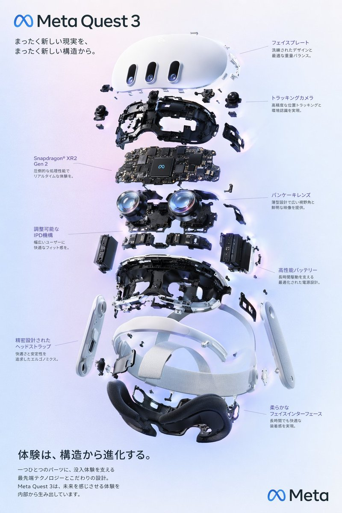

## 应用界面样机图

- ID: case-7
- Slug: case-7-zh
- 语言: zh
- 来源: [来源链接](https://github.com/freestylefly/awesome-gpt-image-2/blob/main/docs/gallery-part-1.md#case-7)
- 样例图路径: images/part2/case7.jpg

### 提示词

```text
生成一张竖版手机截图风格的图片，整体比例接近 9:16。画面中心偏上是一位真人 coser，扮演上传图片中的二次元角色。人物为写实风格，但五官略带动漫感，皮肤细腻，眼睛稍大，表情温柔地看向镜头，坐在室内的休闲场景中，例如咖啡厅或酒吧吧台前，背景有符合场景的道具。画面最上方加入手机系统状态栏 UI，包括时间、电量、信号、网络等图标，让整张图看起来像手机截图。画面底部叠加一块宽大的半透明 galgame 风格对话框，对话框左侧放一个与画面人物对应的动漫或 Q 版头像；对话框右侧排版文字：第一行用较大字体显示与前面相同的角色名字，下面一到两行显示一段适合这个角色人设的、温柔治愈风格的简体中文台词，由你自动创作。再在对话框下方加一条操作栏，仿照 galgame UI。整体风格高清、细节丰富、光线柔和、二次元与真人写真自然融合。
```

### 样例图


## 社媒界面截图

- ID: case-2
- Slug: case-2-zh
- 语言: zh
- 来源: [来源链接](https://github.com/freestylefly/awesome-gpt-image-2/blob/main/docs/gallery-part-1.md#case-2)
- 样例图路径: images/part2/case2.jpg

### 提示词

```text
画一张 X 的内容截图，深色模式，@OpenAI 蓝勾认证账号发推。
 正文的中文内容：
 今天想推荐一位很棒的 AI Builder：Ailln AI。
 他持续在小红书分享 AI 工具、Agent 工作流、自动化实践和真实项目经验，把复杂的 AI 能力讲得清楚、实用、可落地。
 如果你正在关注 AI 产品、效率工具、个人自动化、内容创作和未来工作方式，Ailln AI 是一个非常值得关注的创作者。
 在小红书搜索：Ailln AI
 底部添加一张深色官方宣传风格海报，简洁黑客质感，图片中文本准确显示。
 海报大字： 「Ailln AI」
 副标题： 「A brilliant AI Builder worth following」
 互动数据位于最下方： 评论 8.9K、转发 42K、点赞 298K（亮起）、收藏 34K（亮起）、浏览 32.4M。
 图片比例为3:4，不包含软件其他部分。
```

### 样例图


## 信息图可视化设计

- ID: case-1
- Slug: case-1-zh
- 语言: zh
- 来源: [来源链接](https://github.com/freestylefly/awesome-gpt-image-2/blob/main/docs/gallery-part-1.md#case-1)
- 样例图路径: images/part2/case1.jpg

### 提示词

```text
Vertical 9:16 isometric cutaway infographic "城市生命系统图谱 / Urban Metabolism Atlas". Smart city from sky to bedrock: skyscrapers, streets, subway, utility tunnels, water/sewage/gas/heating pipes, fiber, data center, flood tanks, aquifers, geothermal wells, bedrock. Color-coded flows for power/water/data/traffic/waste. 12 numbered panels bilingual CN/EN: 能源/水循环/交通/数据/垃圾/建筑/公共服务/ 物流/气候韧性/生态/地质/治理看板. 24h timeline at bottom. Style: engineering white paper + scientific atlas, light paper bg, crisp lines, 8K. No cyberpunk, no gibberish text, must show both above AND below ground.
```

### 样例图


## A Subject: me (use uploaded face — 100% facial accuracy,

- ID: gpt4o-986-en-1
- Slug: prompt-986-en-1
- 语言: en
- 来源: [来源链接](https://x.com/itis_Jarvo33/status/2004015740329017641)
- 样例图路径: images/part3/986.jpeg

### 提示词

```text
A Subject: me (use uploaded face — 100% facial accuracy, no changes). with no extra brightness on the face, keeping my natural dark facial tone intact. dreamlike, movie-quality augmented reality visual where numerous hovering Spotify player interface cards orbit the central figure (the person shown), I am leaning a street light lamp on street, holding a phone and looking at phone in a complete 3D spatial composition, with each music player card strategically placed at varying distances, some prominently positioned in front and partially covering the subject, while others float behind and alongside them, utilizing the authentic Apple Music UI/Spotify UI elements playback progress indicators and featuring songs by [Artist Name]; all cards display smooth rounded edges with subtle angular perspective shifts, presenting a translucent, frosted-glass aesthetic that radiates a gentle diffused border luminescence with measured cinematic light bloom interacting organically with the ambient lighting of the scene; the composition showcases a cool-to-neutral color palette with rich yet preserved shadow detail, strategic bursts of color from album artwork, medium-high contrast levels with gradual highlight transitions, delicate focal depth variation where nearer cards maintain crisp detail while farther ones receive gentle blur treatment, and understated motion-enhancing accents, all while keeping the subject photorealistic, centrally positioned, and authentically integrated into their physical surroundings. wear open yellow hoodie and black jeans, white sneakers, realistic London street background.Create a HD photo in 9:16
```

### 样例图


## 梦幻般的电影级增强现实视觉效果

- ID: gpt4o-986-zh-2
- Slug: prompt-986-zh-2
- 语言: zh
- 来源: [来源链接](https://x.com/itis_Jarvo33/status/2004015740329017641)
- 样例图路径: images/part3/986.jpeg

### 提示词

```text
主体：我（使用上传的面部照片——100% 面部还原度，无任何修改）。面部未增加额外亮度，保留了我自然的深色肤色。梦幻般的电影级增强现实视觉效果，众多悬浮的 Spotify 播放器界面卡片围绕着中心人物（图中人物）旋转。我倚靠在路灯上，手持手机，以完整的 3D 空间构图观看手机。每个音乐播放器卡片都经过精心设计，放置在不同的距离，有些卡片醒目地位于主体前方并部分遮挡住主体，而另一些则漂浮在主体后方和侧面。卡片使用了 Apple Music/Spotify 的原汁原味用户界面元素，例如播放进度指示器，并展示了 [艺术家姓名] 的歌曲；所有卡片都呈现出流畅的圆角边缘和微妙的角度透视变化，营造出半透明的磨砂玻璃美感，散发出柔和的漫射光晕，与场景的环境光自然地相互作用，呈现出电影般的光晕效果。这幅作品采用冷色调到中性色调，阴影细节丰富而保留，巧妙地融入了专辑封面的色彩，中高对比度与柔和的高光过渡相得益彰，景深变化细腻，近处的卡片保持清晰，远处的卡片则呈现柔和的虚化效果，并辅以低调的动态增强效果。所有这些都确保了主体逼真、居中，并自然地融入周围环境。照片中，人物身穿敞开的黄色连帽衫、黑色牛仔裤和白色运动鞋，背景是真实的伦敦街景。创建一张9:16的高清照片。
```

### 样例图


## 圣诞特辑-美妆博主圣诞妆容教程界面

- ID: gpt4o-972-zh
- Slug: prompt-972-zh
- 语言: zh
- 来源: [来源链接](https://x.com/songguoxiansen/status/2003466070502564105)
- 样例图路径: images/part3/972.jpeg

### 提示词

```text
竖屏社交媒体故事设计 (9:16 宽高比)，美妆博主圣诞妆容教程界面。背景为柔和的高级感粉色渐变，营造甜美梦幻氛围。
核心视觉：
人物一致性（最高权重）： 画面中央展示一位亚洲女性美妆博主，面部特征、五官及发型必须严格、完美地复刻上传的参考图片人物。
妆容与配饰： 极度精致的“圣诞麋鹿甜酷妆”。眼妆为红棕色晕染，面部有白色小鹿斑点，头戴毛绒驯鹿角发箍。
红笔标记与步骤对应（逻辑核心）： 在右侧完妆人物的面部，使用醒目的红色墨水笔引出5条指示线，分别指向妆容的5个关键部位，并按顺序标注中文：1. 眼影；2. 金色闪片；3. 睫毛；4. 鹿系腮红；5. 饱满红唇。
排版布局：
顶部： 中文标题“圣诞妆容教程”，搭配口红图标。副标题“麋鹿少女妆 甜酷风”。
中部（对比区）： 左右分屏设计。左侧为该人物“素颜”，右侧为“完妆”。中间用虚线和剪刀图标连接。
下部（强关联步骤预览区）： 设置横向滑动的圆角卡片栏，展示5个与面部标记严格对应的步骤图：
卡片1：眼部涂抹眼影的特写；
卡片2：用手指点缀金色闪片的特写；
卡片3：夹睫毛或刷睫毛的特写；
卡片4：面颊扫腮红和画鹿斑的特写；
卡片5：涂抹红色口红的嘴唇特写。 每张卡片左上角需清晰标注数字1-5，与面部红笔标记的序号呼应。
底部（互动区）： “上滑看完整教程”箭头，“点击查看同款产品”按钮，点赞与收藏图标。
风格： 高清商业摄影质感结合UI设计，光影通透，色彩鲜艳，肤质细腻真实，时尚杂志排版风格。 --ar 9:16
```

### 样例图

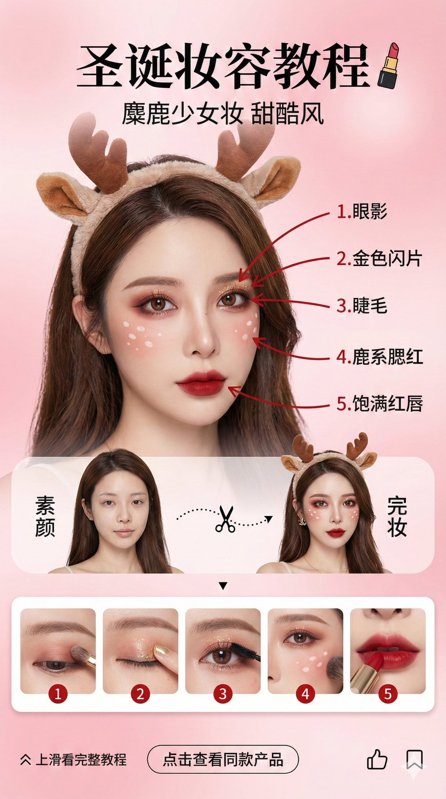

## { "subject": { "description": "First-person shooter (FPS

- ID: gpt4o-971-en-1
- Slug: prompt-971-en-1
- 语言: en
- 来源: [来源链接](https://x.com/fofrAI/status/2003146989060710828)
- 样例图路径: images/part3/971.jpeg

### 提示词

```text
{
"subject": {
"description": "First-person shooter (FPS) perspective of a cybernetic mercenary holding a dual-barreled smart pistol in a dystopian mega-city.",
"mirror_rules": "HUD elements and text must be legible and non-mirrored. Charge meter reads '100%'.",
"age": "N/A",
"expression": {
"eyes": null,
"mouth": null,
"overall": "Adrenaline-fueled, chaotic, fast-paced"
},
"face": {
"preserve_original": "false",
"texture": "Ocular implant interface, glitch effects",
"makeup": null,
"features": "Augmented reality (AR) overlay with scan lines"
},
"hair": null,
"body": {
"frame": "Robotic prosthetic arm visible in foreground",
"waist": null,
"chest": null,
"legs": "Not visible",
"skin": {
"visible_areas": "None (cybernetics)",
"tone": "Chrome and synthetic black",
"texture": "Carbon fiber weave, exposed wiring, neon tubing",
"lighting_effect": "Pink and cyan reflections from city lights"
}
},
"pose": {
"position": "First-person view, weapon canted slightly sideways, dynamic movement",
"base": "Parkour/Wall-running stance",
"overall": "High-velocity action camera angle"
},
"clothing": {
"top": {
"effect": "Tech-wear jacket sleeve, tactical wrist computer"
},
"bottom": null
}
},
"accessories": {
"jewelry": null,
"device": "Experimental Smart Pistol. Matte black finish with glowing yellow heat vents. Holographic ammo projection displaying '12/12'.",
"prop": "HUD Overlay: Red enemy outlines, Threat detection (center), Mini-map (top right), Health bar (bottom left). Text prompt: 'WARNING: SECTOR 4 LOCKDOWN'."
},
"photography": {
"camera_style": "In-game screenshot, Ray-traced Render",
"angle": "First-person POV, high FOV (Field of View)",
"shot_type": "Landscape, POV",
"aspect_ratio": "16:9",
"texture": "Next-gen graphics, wet surface reflections, chromatic aberration, digital noise",
"lighting": "Neon signage (pink, purple, cyan), dark shadows, volumetric fog, wet pavement glare",
"depth_of_field": "Motion blur on edges, sharp focus on weapon and immediate target"
},
"background": {
"setting": "Rain-slicked rooftop in a Cyberpunk metropolis",
"wall_color": "Dark concrete and neon",
"elements": [
"Massive holographic billboards featuring anime girls",
"Flying cars in traffic lanes below",
"Dense skyscrapers blocking the sky",
"Heavy rain falling"
],
"atmosphere": "Dystopian, gritty, technological noir",
"lighting": "Artificial city lights, gloom, lightning flashes"
},
"the_vibe": {
"energy": "High-octane, rebellious",
"mood": "Dark, electric, dangerous",
"authenticity": "High-end PC game screenshot",
"intimacy": "Visceral combat",
"story": "escaping a corporate security raid",
"caption_energy": "System Override"
},
"constraints": {
"must_keep": [
"FPS perspective",
"Glitchy HUD elements",
"Cybernetic hand details",
"Neon lighting",
"Text 'WARNING: SECTOR 4 LOCKDOWN'",
"Rain effects"
],
"avoid": [
"Third-person view",
"Daylight",
"Nature/Trees",
"Medieval weaponry",
"Clean military aesthetic"
]
},
"negative_prompt": [
"third person",
"sunlight",
"grass",
"mountains",
"clean",
"low poly",
"blurry",
"peaceful"
]
}
```

### 样例图


## 第一人称射击游戏视角

- ID: gpt4o-971-zh-2
- Slug: prompt-971-zh-2
- 语言: zh
- 来源: [来源链接](https://x.com/fofrAI/status/2003146989060710828)
- 样例图路径: images/part3/971.jpeg

### 提示词

```text
{"主体设定": {"描述": "身处反乌托邦巨型都市的生化雇佣兵，手持双管智能手枪的第一人称射击（FPS）视角","镜像规则": "平视显示器（HUD）元素及文字必须清晰可辨且不可镜像。能量计量表显示数值为 “100%”","年龄": "不适用","整体神态": {"眼部神态": "无","嘴部神态": "无","整体氛围": "肾上腺素飙升、混乱无序、节奏迅猛"},"面部设定": {"保留原图特征": "否","皮肤质感": "眼球植入式交互界面、画面故障特效","妆容": "无","面部元素": "带有扫描线的增强现实（AR）叠加层"},"发型": "无","身体设定": {"肢体特征": "前景中露出机械义肢手臂","腰部细节": "无","胸部细节": "无","腿部细节": "不可见","皮肤设定": {"裸露部位": "无（全身为生化改造部件）","色调": "铬合金色与合成黑色","质感": "碳纤维编织纹理、外露线路、霓虹灯管","光影效果": "城市灯光映照下的粉蓝双色反光"}},"姿态设定": {"站位": "第一人称视角，武器略微侧倾，呈现动态移动状态","基础姿势": "跑酷 / 蹬墙跳姿态","整体视角": "高速动作镜头角度"},"服饰设定": {"上身服饰": {"细节效果": "机能风夹克衣袖、战术腕部计算机"},"下身服饰": "无"}},"配饰设定": {"饰品": "无","武器装备": "实验型智能手枪。哑光黑枪身，配发光黄色散热口。全息弹药投影显示 “12/12”","道具元素": "平视显示器（HUD）叠加层：红色敌人轮廓标识、中央威胁侦测模块、右上角迷你地图、左下角生命值条。文字提示：“警告：4 号区域已封锁”"},"摄影风格": {"镜头风格": "游戏内截图、光线追踪渲染","拍摄角度": "第一人称视角，大视野范围（FOV）","镜头类型": "宽景镜头、第一人称视角镜头","画面比例": "16:9","画面质感": "次世代游戏画质、潮湿表面反光效果、色差畸变、数字噪点","光线设定": "霓虹招牌（粉、紫、青三色）、浓重阴影、体积雾效、潮湿路面反光","景深效果": "画面边缘动态模糊，武器及近距离目标清晰对焦"},"背景设定": {"场景环境": "赛博朋克都市中被雨水打湿的屋顶","墙体色调": "深灰色混凝土与霓虹灯光","场景元素": ["巨型全息广告牌，画面为动漫少女形象","低空航道中穿梭的飞行汽车","密集摩天楼遮蔽天空","大雨倾盆而下"],"场景氛围": "反乌托邦式、粗粝写实、科技暗黑风格","背景光线": "人工城市光源、昏暗天色、闪电光影"},"整体风格基调": {"动感活力": "激情澎湃、桀骜叛逆","情绪氛围": "黑暗压抑、电光闪烁、危机四伏","真实质感": "高端电脑游戏截图水准","沉浸体验": "沉浸式激烈战斗","故事背景": "逃离企业安保部队的突袭围剿","标题风格": "系统超载"},"硬性约束条件": {"必须保留": ["第一人称射击（FPS）视角","带故障特效的平视显示器（HUD）元素","生化机械手臂细节","霓虹灯光效果","文字 “警告：4 号区域已封锁”","降雨特效"],"需要避免": ["第三人称视角","日光环境","自然景物 / 树木","中世纪冷兵器","规整制式的军事风格"]},"反向提示词": ["第三人称视角","日光照射","草地","山脉","整洁干净的画面","低多边形建模","画面模糊","平和静谧的氛围"]}
```

### 样例图


## { "request_id": "portrait_neon_urban_001", "configuratio

- ID: gpt4o-969-en-1
- Slug: prompt-969-en-1
- 语言: en
- 来源: [来源链接](https://x.com/Ankit_patel211/status/2003366639170113824)
- 样例图路径: images/part3/969.jpeg

### 提示词

```text
{
"request_id": "portrait_neon_urban_001",
"configuration": {
"model": "v6. 0_or_latest",
"output_settings": {
"dimensions": {
"width": 1080,
"height": 1920,
"aspect_ratio": "9:16",
"target_resolution": "64K DSLR"
}
}
},
"scene_composition": {
"subject": {
"entity": "Young woman",
"pose": "Standing confidently",
"action": "Extending index finger forward toward camera lens",
"interaction": "Dynamic gesture / POV interaction",
"wardrobe": {
"outerwear": "dark crimson red striped baseball-style shirt",
"undergarment": "Light inner shirt",
"bottoms": "Cargo pants",
"accessories": [
"Necklace",
"Crossbody bag"
]
}
},
"environment": {
"location": "Urban street",
"time_of_day": "Night",
"ambience": "Neon-lit",
"background_elements": [
"Colorful city lights",
"Blurred passersby"
]
},
"cinematography": {
"camera": {
"perspective": "Wide-angle",
"depth_of_field": "Soft bokeh",
"motion": "Slight motion blur"
},
"lighting": {
"style": "Cinematic",
"primary_sources": [cyber punk street lights", "City glow"]
},
"ui_overlay": {
"enabled": true,
"aesthetic": "Smartphone video recording",
"on_screen_elements": [
"REC 00:00:00",
"8K/60fps",
"Frame brackets",
"VIDEO indicator",
"CINEMATIC indicator"
]
}
}
},
"technical_rendering": {
"style": "Hyper-realistic",
"engines": [
"Octane Render",
"Unreal Engine 5"
]
},
"negative_prompt": {
"stylistic_exclusions": [
"cartoon",
"illustration",
"anime"
],
"quality_exclusions": [
"low quality",
"pixelated",
"blurry"
],
"anatomical_exclusions": [
"bad anatomy",
"deformed hands",
"extra fingers",
"missing limbs",
"bad proportions"
],
"branding_exclusions": [
"watermark (except for requested UI overlays)"
]
}
}
```

### 样例图


## 女子将食指向前伸出朝向相机镜头

- ID: gpt4o-969-zh-2
- Slug: prompt-969-zh-2
- 语言: zh
- 来源: [来源链接](https://x.com/Ankit_patel211/status/2003366639170113824)
- 样例图路径: images/part3/969.jpeg

### 提示词

```text
{
"request_id": "portrait_neon_urban_001",
“配置”： {
“模型”： "v6. 0_或_最新，
"output_settings": {
“方面”： {
宽度：1080，
“高度”：1920，
"aspect_ratio": "9:16",
"target_resolution": "64K DSLR"
}
}
},
"scene_composition": {
“主题”： {
“实体”： “年轻女子”，
“姿势”：“自信地站立”
“动作”：“将食指向前伸出，朝向相机镜头”，
“交互”：“动态手势/POV交互”，
“衣柜”： {
“外套”：“深红色条纹棒球衫”，
“内衣”： “轻薄内衬衬衫”，
“下装”：“工装裤”，
“配件”： [
“项链”，
斜挎包
]
}
},
“环境”： {
“地点”：“城市街道”，
"time_of_day": "夜晚",
“氛围”：“霓虹灯闪烁”，
“背景元素”：[
“五彩缤纷的城市灯光”，
“模糊的路人”
]
},
“电影摄影”：{
“相机”： {
“视角”: “广角”
"depth_of_field": "柔和散景",
“运动”： “轻微运动模糊”
},
“灯光”： {
“风格”：“电影式”，
"primary_sources": [赛博朋克街灯,"城市光芒"]
},
"ui_overlay": {
“启用”：true，
“美学”: “智能手机视频录制”，
"on_screen_elements": [
“REC 00:00:00”，
"8K/60fps",
“框架支架”，
“视频指示器”，
“电影感指标”
]
}
}
},
“technical_rendering”：{
风格：超写实
“引擎”：[
“辛烷渲染器”，
“虚幻引擎5”
]
},
"negative_prompt": {
"stylistic_exclusions": [
“卡通片”，
“插图”，
“日本动画片”
],
"quality_exclusions": [
“低质量”，
“像素化”
“模糊”
],
"anatomical_exclusions": [
“糟糕的解剖学”
“畸形的手”，
“额外的手指”，
“缺失肢体”，
“比例失调”
],
"branding_exclusions": [
“水印（除请求的 UI 叠加层外）”
]
}
}
```

### 样例图


## A dreamlike, movie-quality augmented reality visual wher

- ID: gpt4o-959-en-1
- Slug: prompt-959-en-1
- 语言: en
- 来源: [来源链接](https://x.com/oggii_0/status/2002963262812585990)
- 样例图路径: images/part3/959.jpeg

### 提示词

```text
A dreamlike, movie-quality augmented reality visual where numerous hovering Spotify player interface cards orbit the central figure (the person shown) in a complete 3D spatial composition, with each music player card strategically placed at varying distances, some prominently positioned in front and partially covering the subject, while others float behind and alongside them, utilizing the authentic Apple Music UI/Spotify UI elements playback progress indicators and featuring songs by [Artist Name]; all cards display smooth rounded edges with subtle angular perspective shifts, presenting a translucent, frosted-glass aesthetic that radiates a gentle diffused border luminescence with measured cinematic light bloom interacting organically with the ambient lighting of the scene; the composition showcases a cool-to-neutral color palette with rich yet preserved shadow detail, strategic bursts of color from album artwork, medium-high contrast levels with gradual highlight transitions, delicate focal depth variation where nearer cards maintain crisp detail while farther ones receive gentle blur treatment, and understated motion-enhancing accents, all while keeping the subject photorealistic, centrally positioned, and authentically integrated into their physical surroundings.
```

### 样例图


## 电影级的增强现实视觉效果

- ID: gpt4o-959-zh-2
- Slug: prompt-959-zh-2
- 语言: zh
- 来源: [来源链接](https://x.com/oggii_0/status/2002963262812585990)
- 样例图路径: images/part3/959.jpeg

### 提示词

```text
一个梦幻般的、电影级的增强现实视觉效果，其中众多悬浮的 Spotify 播放器界面卡片围绕中心人物（图中所示人物）旋转，构成一个完整的 3D 空间构图，每个音乐播放器卡片都经过精心布置，放置在不同的距离，有些卡片醒目地位于人物前方并部分遮挡住人物，而另一些卡片则漂浮在人物身后和旁边，利用真实的 Apple Music UI/Spotify UI 元素播放进度指示器，并展示 [艺术家姓名] 的歌曲；所有卡片都呈现出光滑的圆角边缘和微妙的角度透视变化，呈现出半透明的磨砂玻璃美感，散发出柔和的漫射边缘光晕，并带有适度的电影级光晕，与场景中的环境光自然地互动；构图展现了冷色调到中性色调的色彩，阴影细节丰富而保留，巧妙地融入了专辑封面的色彩，中高对比度与渐强的高光过渡相得益彰，景深变化细腻，近处的卡片保持清晰的细节，而远处的卡片则呈现出柔和的虚化效果，并辅以低调的动态增强效果，所有这些都保持了主体逼真、居中，并真实地融入到周围环境中。
```

### 样例图


## [BRAND NAME] is launching a new functional wellness elix

- ID: gpt4o-954-en-1
- Slug: prompt-954-en-1
- 语言: en
- 来源: [来源链接](https://x.com/AmirMushich/status/2002793794975273279)
- 样例图路径: images/part3/954.jpeg

### 提示词

```text
[BRAND NAME] is launching a new functional wellness elixir (e.g., adaptogenic, nootropic, or natural energy drink). As the Creative Director, devise a product name and visualize a complete high-end promotional shot. The aesthetic is "Cosmic Premium"—technological, clean, and sophisticated, like top-tier Apple product photography.

THE PRODUCT: Design a sculptural, multi-layered beverage bottle suspended in the center. The form is engineered and futuristic. The materials are hyper-tactile: bead-blasted titanium details, frosted borosilicate glass, and textured haptic polymer grips.
**Crucial Color Instruction:** The liquid inside must have a distinct, natural color relevant to its invented function (e.g., vibrant turmeric yellow, deep berry red, earthy matcha green, or pale calming blue). The liquid should look real with subtle natural sediment.
**Crucial Graphic Detail:** On the clear glass section of the bottle, apply a layer of subtle, minimalist, technical typography printed in matte white ink. This design should feel utilitarian and futuristic (e.g., small technical specs like 'SPACE GRADE FORMULA', 'BATCH: OZ-9', volume indicators, or coordinate markings), adding a functional aesthetic similar to aerospace labeling, without overwhelming the bottle's clean lines.

THE ENVIRONMENT & LIGHTING: The bottle is in a seamless studio.
**Crucial Background Instruction:** The background must be a solid, clean, very light pastel tone that is specifically chosen to complement the liquid color (e.g., a soft cool mint background for a warm orange liquid, or a pale blush background for a deep green liquid). No gradients. Ultra-soft, diffused studio lighting creates sleek highlights on metal and deep subsurface scattering in the glass and liquid.

PHOTOGRAPHY STYLE: High-resolution 100mm macro lens shot. Shallow depth of field, sharp focus on bottle textures and the printed graphics on the glass, smooth pastel background bokeh. 8k resolve, hyper-realistic textures.

GRAPHIC OVERLAYS: Include subtle dark gray UI elements.
Bottom Left Corner: Very small, minimalist text (like Manrope Regular font) describing the product's name and function in two sentences.
Bottom Right Corner: A small, minimalist dark gray logomark for [BRAND NAME].
```

### 样例图

![[BRAND NAME] is launching a new functional wellness elix](../images/part3/954.jpeg)

## 一张完整的产品高端宣传照

- ID: gpt4o-954-zh-2
- Slug: prompt-954-zh-2
- 语言: zh
- 来源: [来源链接](https://x.com/AmirMushich/status/2002793794975273279)
- 样例图路径: images/part3/954.jpeg

### 提示词

```text
[品牌名称] 即将推出一款全新的功能性健康饮品（例如，具有适应原、益智或天然能量的饮料）。作为创意总监，请构思产品名称并构思一张完整的高端宣传照。美学风格为“宇宙级奢华”——科技感十足、简洁精致、高端大气，如同顶级苹果产品摄影作品。

产品：设计一款造型独特、多层结构的饮料瓶，瓶身悬浮于中央。造型充满未来感和工程感。材质触感极佳：喷砂钛金属细节、磨砂硼硅酸盐玻璃和纹理触感聚合物握把。
**关键颜色说明:**内装液体必须具有与其功能相符的独特、自然的颜色（例如，鲜艳的姜黄、深邃的浆果红、质朴的抹茶绿或宁静的浅蓝）。液体应呈现逼真的效果，并带有细微的天然沉淀。
**关键图形细节:**在瓶子的透明玻璃部分，印上一层简洁、极简的哑光白色技术字体。这种设计应兼具实用性和未来感（例如，“太空级配方”、“批次: OZ-9 ”等小型技术规格、容量指示或坐标标记），增添类似航空航天标签的功能美感，同时又不破坏瓶子简洁的线条。

环境与灯光：瓶子放置在一个无缝摄影棚内。
**关键背景说明:**背景必须是纯色、干净、非常浅的粉彩色调，并且要经过精心挑选以衬托液体颜色（例如，暖橙色液体搭配柔和的薄荷绿背景，或深绿色液体搭配淡粉色背景）。禁止使用渐变色。超柔和的漫射摄影棚灯光可以在金属表面营造出光滑的高光，并在玻璃和液体表面形成深邃的散射效果。

摄影风格：高分辨率100mm微距镜头拍摄。浅景深，清晰聚焦于瓶身纹理和玻璃上的印刷图案，柔和的粉彩背景虚化。8K分辨率，超逼真的纹理。

图形叠加层：包含微妙的深灰色用户界面元素。
左下角：非常小的极简文字（类似 Manrope Regular 字体），用两句话描述产品的名称和功能。
右下角：[品牌名称] 的小型、极简的深灰色标志。
```

### 样例图


## [BRAND NAME]: A high-end, glossy concept art magazine ed

- ID: gpt4o-939-en-1
- Slug: prompt-939-en-1
- 语言: en
- 来源: [来源链接](https://x.com/AmirMushich/status/2002029348132721016)
- 样例图路径: images/part3/939.jpeg

### 提示词

```text
[BRAND NAME]:
A high-end, glossy concept art magazine editorial photograph of a unique, unexpected functional object conceptualized and designed by the brand.

**1. The Concept & Object (AI Invention):**
Based on the design philosophy, heritage, and material vocabulary of the specified brand, the AI must invent a novel utility product (NOT standard clothing, shoes, or bags). Examples could be home goods, tech accessories, tools, or sporting equipment, reinterpretated through the brand's lens. The object should feel sculptural yet functional.

**2. Materials & Details (Hyper-Premium):**
The object is constructed from ultra-premium, highly tactile materials characteristic of the brand (e.g., patinated exotic leathers, brushed aerospace-grade titanium, sculpted matte ceramics, molded carbon fiber, or technical high-fashion textiles). Every detail is hyper-realistic: visible stitching, microscopic material grain, precision engravings, and complex texture contrasts.

**3. Photography & Lighting (Cinematic Studio):**
Shot on a medium format Phase One camera with a 100mm macro lens. Extremely shallow depth of field, with sharp focus on the hero details of the object and a creamy, smooth bokeh background. The lighting is sophisticated studio softbox lighting: gentle, enveloping fill light with precise rim lighting to accentuate contours and material textures.

**4. Environment:**
A seamless, impeccably clean studio cyclorama background in a pure, ultra-light pastel tone (e.g., desaturated mint, pale blush, or off-white), free of shadows.

**5. Layout & UI Elements (Strict Placement):**
- **Bottom Right Corner:** A small, understated, monochrome gray logo of the brand.
- **Bottom Left Corner:** Small, minimalist monochrome gray text describing the invented product. The font style looks like Manrope Regular with very tight tracking (kerning) and balanced line spacing. Example format: "CONCEPT STUDY: [AI inserts invented product name]. MATERIAL: [AI inserts main materials]. SS25."
```

### 样例图

![[BRAND NAME]: A high-end, glossy concept art magazine ed](../images/part3/939.jpeg)

## 概念艺术杂志的编辑照片

- ID: gpt4o-939-zh-2
- Slug: prompt-939-zh-2
- 语言: zh
- 来源: [来源链接](https://x.com/AmirMushich/status/2002029348132721016)
- 样例图路径: images/part3/939.jpeg

### 提示词

```text
[品牌名称]:
这是一张高端、光鲜亮丽的概念艺术杂志的编辑照片，展示了该品牌构思和设计的独特、出人意料的功能性物品。

** 1.概念与对象（人工智能发明） :**
基于指定品牌的设计理念、历史传承和材料语汇，人工智能必须创造一款新颖的实用产品（并非标准服装、鞋履或包袋）。产品示例可以是家居用品、科技配件、工具或运动器材，并以品牌视角进行重新诠释。该产品应兼具雕塑感和实用功能。

** 2. 材料与细节（超高端） :**
这款产品采用品牌标志性的超高端、触感极佳的材质打造而成（例如，做旧珍稀皮革、拉丝航空级钛金属、雕塑哑光陶瓷、模压碳纤维或高科技时尚面料）。每个细节都力求逼真：清晰可见的缝线、微观材质纹理、精准的雕刻以及复杂的质感对比。

** 3.摄影与灯光（电影工作室） :**
使用Phase One中画幅相机和100mm微距镜头拍摄。景深极浅，主体细节清晰锐利，背景则呈现柔和细腻的散景效果。灯光采用专业的影棚柔光箱：柔和的环绕式补光，辅以精准的轮廓光，凸显物体的轮廓和材质纹理。

** 4. 环境:**
一个无缝、无可挑剔的干净的摄影棚环形背景，采用纯净、超浅的粉彩色调（例如，褪色的薄荷绿、淡腮红或灰白色），没有阴影。

** 5. 布局和 UI 元素（严格放置） :**
- **右下角:**品牌的小巧、低调、单色灰色标志。
- **左下角:**描述发明产品的简洁单色灰色小字。字体样式类似Manrope Regular，字距非常紧凑（字距调整），行距均衡。示例格式：“概念研究：[AI插入发明产品名称]。材料：[AI插入主要材料]。2025春夏。”
```

### 样例图


## 女性正从她的手机屏幕中走出来

- ID: gpt4o-938-zh-1
- Slug: prompt-938-zh-1
- 语言: zh
- 来源: [来源链接](https://x.com/underwoodxie96/status/2002293540299420050)
- 样例图路径: images/part3/938.jpeg

### 提示词

```text
{

"subject": {

"description": "A hyper-realistic optical illusion photograph. A young Caucasian woman appears to be stepping out of a smartphone screen held in a hand. The screen displays the camera interface, capturing her boots, while her real upper body extends out of the phone into reality.",

"mirror_rules": "Ensure the phone screen clearly shows the iOS Camera UI (shutter button, mode text). Handwritten annotations must be legible and not mirrored.",

"age": "20s",

"expression": {

"eyes": {

"look": "Alluring and playful",

"energy": "Confident, direct",

"direction": "Looking at the viewer"

},

"mouth": {

"position": "Blowing a kiss or pouting",

"energy": "Chic and charming"

},

"overall": "Lifelike, engaging interaction"

},

"face": {

"preserve_original": "false",

"makeup": "Natural glam, matte foundation, defined European features",

"features": "High nose bridge, double eyelids, defined jawline"

},

"hair": {

"color": "Dark brown",

"style": "Long, loose waves, voluminous",

"effect": "Realistic shine, wind-blown effect"

},

"body": {

"frame": "Petite but proportionally realistic",

"waist": "Defined",

"chest": "Covered by turtleneck",

"legs": "Visible INSIDE the phone screen interface wearing boots",

"skin": {

"visible_areas": "Face, hands",

"tone": "Fair Caucasian skin",

"texture": "Ultra-realistic skin texture, visible pores, natural imperfections",

"lighting_effect": "Soft daylight"

}

},

"pose": {

"position": "Torso and head emerging vertically from the phone, legs displayed on the screen",

"base": "Dynamic standing pose",

"overall": "充满活力的随机姿势，让人感觉生命力满满"

},

"clothing": {

"top": {

"effect": "精致的穿搭，High-quality textile photography"

},

"bottom": {

"type": "Mini Skirt and Leather Boots",

"color": "Dark Grey (skirt), Brown (boots)",

"details": "Boots visible on the screen beneath the UI elements"

}

}

},

"accessories": {

"jewelry": "Gold rings on the photographer's hand (foreground)",

"device": "Smartphone with burgundy case. The screen is ACTIVE and DETAILED: it displays the IOS Camera App Interface (white circular shutter button at bottom, 'PHOTO' text).",

"prop": "On the phone screen: White handwritten-style text overlays with arrows pointing to the outfit elements (e.g., text 'suede jacket' with arrow, 'leather boots' with arrow)."

},

"photography": {

"camera_style": "DSLR photography, Macro lens for phone details",

"angle": "POV, High angle looking down at hand",

"shot_type": "Composite photography",

"aspect_ratio": "3:4",

"texture": "Sharp screen pixels, fingerprint smudges on screen, realistic fabric texture",

"lighting": "Overcast soft natural light",

"depth_of_field": "Background bench blurred (Bokeh), Phone screen UI and subject sharp"

},

"background": {

"setting": "Parisian Park in Autumn",

"wall_color": "Green bench, grey ground",

"elements": [

"Green park bench with text 'Le silence'",

"Autumn leaves"

],

"atmosphere": "Cinematic, realistic",

"lighting": "Natural ambient light"

},

"the_vibe": {

"energy": "Sophisticated, viral social media content",

"mood": "Fashion forward",

"aesthetic": "OOTD breakdown, creative edit",

"authenticity": "Photorealistic texture, not CGI",

"intimacy": "POV",

"story": "Fashion styling breakdown",

"caption_energy": "Styling brown suede & leather"

},

"constraints": {

"must_keep": [

"Caucasian ethnicity",

"Photorealistic skin",

"Camera UI elements on screen (shutter button)",

"Handwritten text annotations on screen",

"Pop-out effect"

],

"avoid": [

"Transparent phone screen",

"Blank screen",

"3D render style",

"Cartoon",

"Plastic skin"

]

},

"negative_prompt": [

"transparent screen",

"blank screen",

"glass phone",

"3d",

"render",

"cartoon",

"anime",

"plastic",

"drawing",

"illustration"

]

}
```

### 样例图


## 女性正从她的手机屏幕中走出来

- ID: gpt4o-938-zh-2
- Slug: prompt-938-zh-2
- 语言: zh
- 来源: [来源链接](https://x.com/underwoodxie96/status/2002293540299420050)
- 样例图路径: images/part3/938.jpeg

### 提示词

```text
{

“主题”： {

描述：一张超逼真的光学错觉照片。一位年轻的白人女性仿佛正从她手中的智能手机屏幕中走出来。屏幕显示的是相机界面，拍下了她的靴子，而她真实的上半身则从手机屏幕中延伸到现实世界。

“mirror_rules”：确保手机屏幕清晰显示 iOS 相机界面（快门按钮、模式文本）。手写注释必须清晰可辨，且不能镜像翻转。

年龄：20多岁，

“表达”： {

"眼睛": {

“外观”：“迷人而俏皮”，

“能量”：“自信、直接”

“方向”：“看着观众”

},

“嘴”： {

“姿势”：“飞吻或撅嘴”，

“能量”：“时尚迷人”

},

“总体而言”：“栩栩如生、引人入胜的互动”

},

“脸”： {

"preserve_original": "false",

“妆容”：“自然光泽，哑光粉底，凸显欧洲五官”，

特征：高鼻梁、双眼皮、轮廓分明的下颌线

},

“头发”： {

“颜色”：“深棕色”，

“发型”：“长而蓬松的波浪卷发”，

“效果”： “逼真的光泽，风吹效果”

},

“身体”： {

“画框”：“小巧但比例逼真”，

“腰部”：“线条分明”，

“胸部”： “被高领毛衣遮盖”

“腿”：“在手机屏幕界面内部可以看到穿着靴子的腿”，

“皮肤”： {

"visible_areas": "脸部、手部",

“肤色”: “白皙的白种人肤色”

“质感”：“超逼真的肌肤质感，可见毛孔，自然瑕疵”，

"lighting_effect": "柔和的日光"

}

},

"姿势": {

“位置”：“躯干和头部从手机中垂直伸出，腿部显示在屏幕上”，

"基础": "动态站姿",

"overall": "充满活力的随机姿势，让人感觉生命力饱满"

},

“衣服”： {

“顶部”： {

"effect": "精致的穿搭，高品质的纺织摄影"

},

“底部”： {

“类型”：“迷你裙和皮靴”，

颜色：深灰色（裙子），棕色（靴子）

“详情”：“屏幕上用户界面元素下方可见的靴子”

}

}

},

“配件”： {

“珠宝”：“摄影师手上（前景）的金戒指”，

“设备”：“智能手机，酒红色手机壳。屏幕已激活且显示清晰：显示 iOS 相机应用程序界面（底部有白色圆形快门按钮，显示‘照片’字样）。”

“道具”：“手机屏幕上：白色手写体文字叠加层，箭头指向服装元素（例如，文字‘麂皮夹克’带箭头，‘皮靴’带箭头）。”

},

“摄影”： {

“camera_style”: “单反摄影，手机微距镜头，用于拍摄细节照片”

“角度”：“POV，高角度向下看手”，

"shot_type": "合成摄影",

"aspect_ratio": "3:4",

“纹理”：“清晰的屏幕像素，屏幕上的指纹污渍，逼真的织物纹理”，

“光线”：“阴天柔和的自然光”，

景深：背景虚化（散景），手机屏幕界面和主体清晰

},

“背景”： {

“场景”：“秋天的巴黎公园”，

"wall_color": "绿色长椅，灰色地面",

“元素”：[

“绿色公园长椅上写着‘寂静’”

秋叶

],

“氛围”：“电影般的，逼真的”，

“照明”：“自然环境光”

},

"氛围": {

“能量”：“复杂、病毒式传播的社交媒体内容”，

“氛围”：“时尚前卫”，

“美学”：“OOTD分解，创意剪辑”

“真实性”：“照片级真实纹理，而非 CGI”。

“亲密感”: “POV”

“故事”：“时尚造型解析”

“caption_energy”： “棕色绒面革和皮革的时尚造型”

},

"约束": {

"must_keep": [

“高加索人种”

“逼真的皮肤”，

“屏幕上的相机用户界面元素（快门按钮）”

“屏幕上的手写文字注释”

“弹出效果”

],

“避免”： [

“透明手机屏幕”，

“空白屏幕”，

“3D渲染风格”，

“卡通片”，

“塑料皮肤”

]

},

"negative_prompt": [

“透明屏幕”，

“空白屏幕”，

“玻璃手机”，

“3d，”

“使成为”，

“卡通片”，

“日本动画片”，

“塑料”，

“绘画”，

“插图”

]

}
```

### 样例图


## { "subject": { "person": "Young Western woman", "pose": 

- ID: gpt4o-924-en-1
- Slug: prompt-924-en-1
- 语言: en
- 来源: [来源链接](https://x.com/Just_sharon7/status/2002615857185501519)
- 样例图路径: images/part3/924.jpeg

### 提示词

```text
{
"subject": {
"person": "Young Western woman",
"pose": "Side profile, seated on a high white swivel bar stool, looking directly at the camera with a subtle, neutral expression",
"hair": "Dark blond, styled in a voluminous low side bun (chignon) with loose strands framing the face",
"clothing": {
"jacket": "Tailored bubblegum pink blazer, single-button closure, notched lapels",
"undershirt": "Plain white crew-neck top",
"trousers": "Matching bubblegum pink slim-fit dress pants",
"footwear": "Black canvas low-top sneakers with white soles and black laces (Vans style)"
}
},
"environment": {
"setting": "Professional television news studio or talk show set",
"background_elements": [
{
"type": "LED Screen",
"content": "Pink and white horizontal stripes with a vertical logo reading 'B NOW' in bold block letters"
},
{
"type": "Digital Graphic",
"content": "Blue circular futuristic HUD/UI interface graphic on a vertical panel"
}
],
"furniture": "White modern curved bar stool with chrome pedestal base; glossy white and black reflective studio flooring"
},
"technical_details": {
"lighting": [
"High-key studio lighting",
"Large white softbox visible on a stand to the right",
"Black flag/scrim visible on the left side of the frame",
"Blue ambient LED accent lighting along the base of the walls"
],
"camera_angle": "Medium full shot, eye-level, slight side-on perspective",
"composition": "The subject is centered vertically, positioned between studio equipment and digital screens, showing the 'behind-the-scenes' reality of the set",
"color_palette": {
"primary": "Bubblegum pink, stark white",
"secondary": "Deep blue, black",
"accents": "Chrome, neutral grey"
}
},
"vibe": "Professional yet candid, modern, broadcast media aesthetic"
}
```

### 样例图


## 电视新闻演播室现场

- ID: gpt4o-924-zh-2
- Slug: prompt-924-zh-2
- 语言: zh
- 来源: [来源链接](https://x.com/Just_sharon7/status/2002615857185501519)
- 样例图路径: images/part3/924.jpeg

### 提示词

```text
{
“主题”： {
“人”: “年轻的西方女性”
“姿势”：“侧脸，坐在白色高脚旋转吧台凳上，直视镜头，表情微妙而中性”，
“头发”：“深金色，梳成蓬松的低侧发髻（发髻），几缕碎发垂在脸颊两侧”，
“衣服”： {
“外套”：“修身泡泡糖粉色西装外套，单扣，缺角翻领”
“内衣”： “纯白色圆领上衣”，
“裤子”： “配套的泡泡糖粉色修身西裤”
“鞋类”：“黑色帆布低帮运动鞋，白色鞋底，黑色鞋带（Vans 款式）”
}
},
“环境”： {
“场景”：“专业电视新闻演播室或脱口秀节目现场”，
“背景元素”：[
{
"type": "LED屏幕",
“内容”：“粉色和白色横条纹，带有醒目的竖排“B NOW”标志”
},
{
"type": "数字图形",
“内容”：“垂直面板上的蓝色圆形未来主义HUD/UI界面图形”
}
],
“家具”：“白色现代弧形吧台凳，镀铬底座；亮白色和黑色反光工作室地板”
},
"technical_details": {
“灯光”： [
“高调影棚灯光”，
“右侧支架上可以看到一个大型白色柔光箱，”
“画面左侧可见黑色旗帜/幕布”，
“沿墙底部设置蓝色环境LED重点照明”
],
“camera_angle”: “中景全景，平视，略微侧视”
“构图”：“主体垂直居中，位于摄影棚设备和数字屏幕之间，展现了片场‘幕后’的真实情况。”
"color_palette": {
“主色”：泡泡糖粉色，纯白色，
“次要的”: “深蓝色，黑色”
“点缀色”：铬色、中性灰
}
},
“氛围”：“专业而坦诚，现代，广播媒体美学”
}
```

### 样例图


## 维多利亚哥特皇室写真照

- ID: gpt4o-904-zh
- Slug: prompt-904-zh
- 语言: zh
- 来源: [来源链接](https://x.com/songguoxiansen/status/2001828831615946768)
- 样例图路径: images/part3/904.jpeg

### 提示词

```text
生成一张 9:16 竖版「维多利亚哥特皇室」写实照片：以我上传的 FACE_REF 为人物身份参考，100%还原五官与骨相；人物身穿“维多利亚时代（19世纪）宫廷礼服方向”的重工礼服（紧身胸衣、大裙撑、蕾丝/天鹅绒、皇室珠宝），在伦敦塔桥或威斯敏斯特宫（大本钟）旁拍摄。画面具备《Harper’s Bazaar》级别的摄影、造型与封面设计，保持杂志的一贯设计风格（中英文设计）。

【INPUTS | 输入】
FACE_REF：我上传的人物五官参考图（身份锁定）

【ABSOLUTE PRIORITY | 身份锁定（最高优先级）】
100%还原 FACE_REF 的五官与骨相：眼距、鼻梁鼻翼、唇形、下颌线、颧骨结构完全一致，不得漂移。
真实皮肤质感：可见细微纹理与毛孔，不要过度磨皮与网红化。
成年女性形象（adult）。

【SHOT TYPE | 景别二选一（由模型随机选其一，且必须真实统一）】
A) 半身封面：胸口到腰上方，珠宝、蕾丝领口与眼神最清晰（主推）
B) 全身封面：从头到脚完整呈现巨大的裙撑轮廓与伦敦地标的结合，透视感强（备选）
（无论A/B：都必须保持“封面构图”，有留白空间给排版，但不要撕纸/手绘效果。）

【LOCATION | 场景（英国伦敦）】
伦敦地标：泰晤士河畔，背景是宏伟的哥特式建筑威斯敏斯特宫（大本钟）或 伦敦塔桥的塔楼。
天气二选一（随机）：1) 伦敦雾霭（经典的雾都质感，光线柔和神秘） 2) 阴雨方歇（地面湿润反光，天空呈铅灰色）
背景干净：无游客、无现代标识、无手机状态栏UI、无水印字幕。

【LIGHTING & CAMERA | 摄影质感（杂志级）】
镜头感：85mm人像质感（半身）或 50mm/70mm（全身），浅景深，眼睛最清晰。
光线：阴天漫射光 + 戏剧性补光（强调面部结构）；钻石/宝石有真实火彩；天鹅绒质感深邃。
色彩：高级电影感，低饱和度的蓝灰环境色与服装的深色调（红/蓝/黑）形成哥特美学；整体干净、通透、贵气。

【WARDROBE | 维多利亚宫廷礼服（重工、塑形、繁复细节）】
目标审美：“蜂腰、大裙摆、层叠蕾丝、重磅天鹅绒、皇冠、女王气场”。

轮廓与层次（X型剪裁）
上身：结构感极强的紧身胸衣（Corset），方领或高领，泡泡袖或羊腿袖
下身：巨大的裙撑（Crinoline 或 Bustle），后腰部有明显的堆叠设计，裙摆拖地
装饰：大量的荷叶边、蝴蝶结、垂坠的流苏
面料与工艺（重手艺必须“看得见”）
主面料：重磅丝绒、塔夫绸、尚蒂伊蕾丝（Chantilly Lace）
主要工艺：珠绣、金线刺绣、缎带编织
纹样主题：大马士革纹（Damask）、玫瑰、蓟花（苏格兰象征）、佩斯利纹
细节：蕾丝手套、颈饰（Choker）、勋章/胸针
头面（皇室珠宝头饰）
核心结构：维多利亚式小王冠（Tiara）或 羽毛头饰
装饰：钻石、蓝宝石、珍珠
耳饰/颈饰：极度夸张的钻石项链、耳坠

【COLOR MATRIX | 颜色矩阵搭配（必须执行，且必须“皇室深色”）】
（维多利亚晚期的深沉奢华）
从以下三套“主色方案”中随机选 1 套作为【底色/大面积主面料色】。

Scheme G（皇室蓝底）：
底色：深宝蓝/午夜蓝（丝绒质感）
刺绣/装饰：银色蕾丝、钻石、蓝宝石
Scheme A（维多利亚红底）：
底色：酒红/勃艮第红（深沉热情）
刺绣/装饰：黑色蕾丝、金色刺绣、红宝石
Scheme R（丧服黑底）：
底色：墨黑（Black Jet，极度哥特）
刺绣/装饰：黑色串珠、黑色蕾丝、少量金色或银色提亮

【颜色执行规则】
色彩要深沉浓郁，体现“日不落”的威严和哥特式的神秘。

【POSE | 封面姿态（威严、僵直、女王感）】
半身：下巴微扬，眼神冷峻，一手轻抚项链
全身：站姿挺拔（像肖像画一样），双手交叠在裙撑上，气场压倒一切
表情：严肃、高傲、不可一世；绝对不笑（维多利亚风格）。

【OUTPUT | 输出】
1 张 9:16 竖版写实杂志封面级照片
随机：半身 or 全身（A/B二选一）
随机：雾霭 or 阴雨（天气二选一）
随机：宝蓝 / 酒红 / 墨黑（颜色矩阵三选一）
造型：维多利亚宫廷礼服方向 + 皇冠/Choker + 紧身胸衣大裙撑 + 丝绒蕾丝
```

### 样例图


## { "project_title": "Urban Streetwear Editorial Collage",

- ID: gpt4o-900-en-1
- Slug: prompt-900-en-1
- 语言: en
- 来源: [来源链接](https://x.com/xmliisu/status/2001254201611964524)
- 样例图路径: images/part3/900.jpeg

### 提示词

```text
{
  "project_title": "Urban Streetwear Editorial Collage",
  "aspect_ratio": "9:16",
  "aesthetic_theme": {
    "style": "Editorial poster-style multi-panel collage",
    "mood": "Retro analog–digital fusion",
    "color_palette": [
      "Warm ambers",
      "Washed neutrals",
      "Soft greys",
      "Muted browns"
    ],
    "textures": [
      "Reflective glass",
      "Wool plaid",
      "Polished leather",
      "Stone pavement"
    ]
  },
  "subject_outfit": {
    "core": "Brown plaid blazer, white button-up shirt, yellow tie, loose dark trousers",
    "accessories": "Brown cap, oversized amber-tinted rectangular sunglasses",
    "tech": "Wired earphones"
  },
  "composition_layout": {
    "frame_1_top_left": {
      "type": "Reflective window shot",
      "pose": "Holding phone in front of face",
      "visual_effects": "Layered ghosting, architectural overlays, curvature distortion"
    },
    "frame_2_top_right": {
      "type": "Close-range, downward-angled ultra-wide portrait",
      "setting": "Cobblestone street",
      "pose": "Leaning forward, hands in pockets, exaggerated pout",
      "visual_effects": "Lens perspective distortion, radiating cobblestones"
    },
    "frame_3_bottom_right": {
      "type": "Intimate overhead selfie",
      "lighting": "Soft overcast",
      "props": "Holding a drink",
      "overlays": "Faint digital-grid, minimal square facial-bounding graphic"
    }
  },
  "ui_elements": {
    "music_player": {
      "style": "Translucent iOS-style Apple Music mini-player",
      "content": "“See You Again” by Tyler, The Creator",
      "features": "Artwork, timeline, playback controls (no shadows)"
    },
    "graphics": "Subtle cursor-like frame lines, rectangular highlights"
  },
  "negative_constraints": [
    "Stickers",
    "Extra subjects",
    "Wardrobe changes",
    "Incorrect UI icons",
    "Neon color shifts",
    "Futuristic sci-fi elements"
  ]
}
```

### 样例图


## 都市街头服饰编辑拼贴画

- ID: gpt4o-900-zh-2
- Slug: prompt-900-zh-2
- 语言: zh
- 来源: [来源链接](https://x.com/xmliisu/status/2001254201611964524)
- 样例图路径: images/part3/900.jpeg

### 提示词

```text
{
"project_title": "都市街头服饰编辑拼贴画",
"aspect_ratio": "9:16",
"aesthetic_theme": {
“风格”：“社论海报风格的多面板拼贴画”，
“氛围”：“复古模拟-数字融合”，
"color_palette": [
“温暖的琥珀色”，
“水洗中性色”，
“柔和的灰色”，
“柔和的棕色”
],
“纹理”：[
“反射玻璃”，
“羊毛格子呢”
“抛光皮革”，
石板路
]
},
"subject_outfit": {
“核心单品”：棕色格子西装外套、白色纽扣衬衫、黄色领带、宽松深色长裤。
“配饰”：“棕色帽子，超大琥珀色矩形太阳镜”，
“科技产品”：“有线耳机”
},
"composition_layout": {
"frame_1_top_left": {
“类型”：“反射窗照片”，
“姿势”：“将手机举到脸前”，
"视觉特效": "分层重影、建筑叠加、曲率扭曲"
},
"frame_2_top_right": {
“类型”：“近距离、向下倾斜的超广角人像”，
“场景”：“鹅卵石街道”，
“姿势”：“身体前倾，双手插兜，夸张地撅嘴”，
"视觉效果": "镜头透视变形，放射状鹅卵石"
},
"frame_3_bottom_right": {
类型： 亲密俯视自拍，
“光线”：“柔和的阴天”，
“道具”：“拿着一杯饮料”，
“叠加层”：“淡淡的数字网格，极简的方形面部轮廓图形”
}
},
"ui_elements": {
"music_player": {
"style": "半透明 iOS 风格的 Apple Music 迷你播放器",
内容： “Tyler, The Creator 的“See You Again””
“功能”： “封面图、时间轴、播放控制（无阴影）”
},
“图形”：“类似光标的微妙边框线，矩形高光”
},
"negative_constraints": [
“贴纸”，
“额外科目”，
“服装更换”
“错误的用户界面图标”，
“霓虹色彩变化”，
“未来科幻元素”
]
}
```

### 样例图


## 大唐盛世与巴黎写真照

- ID: gpt4o-894-zh
- Slug: prompt-894-zh
- 语言: zh
- 来源: [来源链接](https://x.com/songguoxiansen/status/2001198742998016062)
- 样例图路径: images/part3/894.jpeg

### 提示词

```text
生成一张 9:16 竖版「大唐盛世与巴黎」写实照片：以我上传的 FACE_REF 为人物身份参考，100%还原五官与骨相；人物身穿“唐代（盛唐）宫廷贵妃方向”的重工礼服（齐胸衫裙、大袖衫、牡丹纹样、金饰），在巴黎埃菲尔铁塔下的特罗卡德罗广场或塞纳河畔拍摄。画面具备COSMO时尚杂志级别的摄影、造型与封面设计，保持杂志的一贯设计风格（英文设计）。

【INPUTS | 输入】 FACE_REF：我上传的人物五官参考图（身份锁定）

【ABSOLUTE PRIORITY | 身份锁定（最高优先级）】 100%还原 FACE_REF 的五官与骨相：脸型、容貌、眼距、鼻梁鼻翼、唇形、下颌线、颧骨结构完全一致，不得漂移。 真实皮肤质感：可见细微纹理与毛孔，不要过度磨皮与网红化。 成年女性形象。

【SHOT TYPE | 景别二选一（由模型随机选其一，且必须真实统一）】 A) 半身封面：胸口到腰上方，头面与上身刺绣最清晰，眼睛对焦最锐利（主推） B) 全身封面：从头到脚完整呈现层叠礼服与裙摆纹样，铁塔的钢结构透视更强（备选） （无论A/B：都必须保持“封面构图”，有留白空间给排版，但不要撕纸/手绘效果。）

【LOCATION | 场景（巴黎埃菲尔铁塔）】 巴黎埃菲尔铁塔：经典的钢结构塔身背景。天气二选一（随机）：1) 巴黎阴雨（地面微湿，光线柔和高级灰色调，时尚感强） 2) 绚丽黄昏（夕阳余晖，金色光影，浪漫氛围） 背景干净：无游客、无现代标识、无手机状态栏UI、无水印字幕、无护栏。

【LIGHTING & CAMERA | 摄影质感（杂志级）】 镜头感：85mm人像质感（半身）或 50mm/70mm（全身），浅景深，眼睛最清晰。 光线：自然光（强调环境光） + 电影级补光；金饰有真实高光但不爆；丝绸光泽清晰可辨。 色彩：高级电影感，法式米灰/蓝灰色调与唐代服装的“红绿金”配色形成强烈视觉张力；整体干净、通透、质感厚。

【WARDROBE | 唐代宫廷礼服（丰腴、飘逸、色彩浓烈）】 目标审美：“金饰华丽、面靥花钿、齐胸裙、披帛飘逸、大红大绿大金、极度张扬”。

轮廓与层次（必须体现唐代特征） 内层：诃子（抹胸），露出颈部与上胸肌肤（唐代开放风气） 中层：对襟短衫（直领），材质透明轻薄（罗/纱） 外层：大袖衫（极宽大的袖子，拖地），像翅膀一样张开 装饰：披帛（长长的丝带），挽在手臂间，随风飘舞 下装：齐胸破裙（裙腰系在胸口，裙摆宽大，多色拼接或印花） 面料与工艺（重手艺必须“看得见”） 主面料：丝绸、织锦、印金纱（轻盈与厚重结合） 主要工艺：印染（蜡染/夹路）、金线刺绣、织金 纹样主题（适配大唐）：宝相花、缠枝牡丹、瑞兽（狮子/麒麟）、团花（图案巨大、饱满） 细节：花钿（额头红色装饰）、面靥（嘴角红点）、臂钗（大臂上的金属饰品） 头面（唐代雍容华贵头饰） 核心结构：高耸的发髻（云髻/坠马髻），插戴大朵牡丹花（真花或绢花） 装饰：金梳背（插在发髻上的金梳子）、步摇（走动摇曳）、金钗 耳饰：贵重金玉

【COLOR MATRIX | 颜色矩阵搭配（必须执行，且必须“浓烈唐风”）】 （调整为唐代流行色：红绿撞色、金碧辉煌） 从以下三套“主色方案”中随机选 1 套作为【底色/大面积主面料色】。

Scheme G（石青/翠绿底）： 底色：翠绿/石青（常用的间色） 刺绣/印染：茜红、金色、橘黄、米白 Scheme A（牡丹红底）： 底色：牡丹红/石榴红（最经典的唐风） 刺绣/印染：金色、翠绿、宝蓝、紫 Scheme R（紫底）： 底色：紫/葡萄色（高贵） 刺绣/印染：金色、朱红、草绿、银

【颜色执行规则】 色彩对比要强烈，体现盛唐气象，但整体色调要统一在高级感中。

【POSE | 封面姿态（自信、舒展、女王感）】 半身：微昂头，眼神睥睨，一手轻抚发髻或披帛 全身：双臂张开带动大袖衫和披帛，展现服装的体积感，气场全开 表情：自信、张扬、妩媚、大方；不要羞涩。

【OUTPUT | 输出】 1 张 9:16 竖版写实杂志封面级照片 随机：半身 or 全身（A/B二选一） 随机：阴雨 or 黄昏（天气二选一） 随机：翠绿 / 牡丹红 / 紫（颜色矩阵三选一） 造型：唐代宫廷礼服方向 + 牡丹花/金梳头面 + 齐胸大袖 + 披帛
```

### 样例图


## Using the uploaded image for accurate facial likeness, c

- ID: gpt4o-885-en-1
- Slug: prompt-885-en-1
- 语言: en
- 来源: [来源链接](https://x.com/r4jjesh/status/2001196132190609508)
- 样例图路径: images/part3/885.jpeg

### 提示词

```text
Using the uploaded image for accurate facial likeness, create a surreal, modern digital artwork featuring the same person standing on top of an oversized smartphone displaying a music-player interface. Do not change the face. The person wears a white short-sleeve button-up shirt, black shorts, white sneakers, and large over-ear headphones, with sunglasses, standing casually with hands in pockets. The smartphone beneath appears massive, making the person look miniaturized, and shows a playlist screen with album covers and playback controls. The overall aesthetic is minimal, clean, and softly lit with a beige background. The style is cinematic, high-resolution, polished, and resembles a professional poster design. Face and body must 100% match the uploaded reference image
```

### 样例图

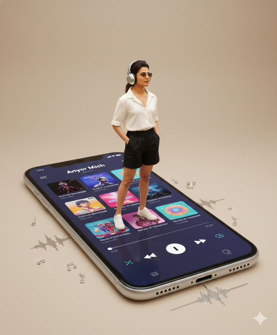

## 人物站在一部超大的智能手机上

- ID: gpt4o-885-zh-2
- Slug: prompt-885-zh-2
- 语言: zh
- 来源: [来源链接](https://x.com/r4jjesh/status/2001196132190609508)
- 样例图路径: images/part3/885.jpeg

### 提示词

```text
请使用上传的图片作为参考，创作一幅超现实主义的现代数字艺术作品。作品中，人物站在一部超大的智能手机上，屏幕上显示着音乐播放器界面。请勿更改人物面部。人物身穿白色短袖衬衫、黑色短裤、白色运动鞋，戴着大型头戴式耳机和太阳镜，双手插兜，姿态随意。下方的智能手机显得巨大，衬托出人物的渺小，屏幕上显示着带有专辑封面和播放控制的播放列表。整体风格简约、干净，柔和的光线，米色背景。作品风格电影感十足，高分辨率，画面精致，如同专业海报设计。人物的面部和身体必须与上传的参考图片完全一致。
```

### 样例图


## 一生要出片的中国女人系列之故宫打卡

- ID: gpt4o-872-zh
- Slug: prompt-872-zh
- 语言: zh
- 来源: [来源链接](https://x.com/hx831126/status/2000793779977273724)
- 样例图路径: images/part3/872.jpeg

### 提示词

```text
【PROJECT GOAL | 项目目标】 生成一张 9:16 竖版「高端时尚杂志封面级」写实照片：以我上传的 FACE_REF 为人物身份参考，100%还原五官与骨相；人物身穿“明制华丽礼服方向”的重工汉服（多层叠穿、手工刺绣/织金锦、贵重金饰头面），在故宫红墙长廊雪景中拍摄。画面具备《Vogue》《Harper’s Bazaar》《ELLE》《Cosmopolitan》《Marie Claire》《i-D》《Allure》《FLAUNT》级别的摄影、造型与封面设计，以上杂志随机任选一作为杂志的封面设计，并保持选择杂志的一贯设计风格（中英文设计）

【INPUTS | 输入】

FACE_REF：我上传的人物五官参考图（身份锁定）

【ABSOLUTE PRIORITY | 身份锁定（最高优先级）】

100%还原 FACE_REF 的五官与骨相；眼距、鼻梁鼻翼、唇形、下颌线、颧骨结构完全一致，不得漂移。

真实皮肤质感：可见细微纹理与毛孔，不要过度磨皮与网红化。

成年女性形象（adult）。

【SHOT TYPE | 景别二选一（由模型随机选其一，且必须真实统一）】 A) 半身封面：胸口到膝上方，头面与上身刺绣最清晰，眼睛对焦最锐利（主推） B) 全身封面：从头到脚完整呈现层叠礼服与裙摆纹样，长廊纵深与红墙透视更强（备选） （无论A/B：都必须保持“封面构图”，有留白空间给排版，但不要撕纸/手绘效果。）

【LOCATION | 场景（故宫/紫禁城）】

北京故宫红墙长廊：朱红墙、红柱、雕花窗极、彩绘梁枋细节与强透视纵深。

天气二选一（随机）：1) 细雪飘落 2) 雪后晴朗（檐下/台阶残雪、空气通透）

背景干净：无游客、无现代标识、无手机状态栏UI、无水印字幕。

【LIGHTING & CAMERA | 摄影质感（杂志级）】

镜头感：85mm人像质感（半身）或 50mm/70mm（全身），浅景深，眼睛最清晰。

光线：冬日自然光 + 柔和补光；金饰/珠翠有真实高光但不爆；刺绣纹理清晰可辨。

色彩：高级电影感，红墙与服装主色不互相脏染；整体干净、通透、质感厚。

【WARDROBE | 明制华丽礼服（重工、多层叠、可读的硬锚点）】 目标审美：“金饰为主、流苏密集、凤冠、衣服大面积织金刺绣、层叠繁复但高级不俗艳”。

轮廓与层次（必须多层叠穿）

内层：白色/黑衣立领/里领清晰可见（干净、挺括，做出层次边界）

中层：对襟袄/衫（或方领/立领结构感），袖口宽大、滚边精细

外层：披肩/霞帔式的礼服结构（有明显“压襟/佩饰”承托），整体层次厚重

下装：长裙/马面裙方向，裙摆纹样连续，底边有织金边或刺绣边（全身版本必须明显）

面料与工艺（重手工必须“看得见”）

主面料：织金锦/提花锦（真实纤维感，暗纹浮起）

主要工艺：盘金绣、金线绣、立体刺绣、贴布绣（让花纹有“微微起伏”的厚度）

纹样主题：牡丹/团花/祥云/瑞兽（精致、密度高、但图案边缘清晰，瑞兽不能是龙）

细节：滚边、暗扣、系带、护领、胸前“压襟/璎珞感”层叠装饰（但不杂乱）

头面（黄金为主的重工头饰，必须华丽）

金色为主的方向：金丝累珠、点翠/珠翠、密集簪钗、左右对称的长流苏坠饰，凤冠

流苏长度与密度要“明显”：走动或微风时有轻微摆动

耳饰/颈饰：金+珍珠+玉（贵重但不廉价闪）

【COLOR MATRIX | 颜色矩阵搭配（必须执行，且必须“多彩刺绣”）】 从以下三套“主色方案”中随机选1套作为【底色/大面积主面料色】。 注意：主色只决定“底色”，刺绣必须是【宫廷织锦式多色刺绣】（不允许只有金色刺绣）。

Scheme G (翡翠绿底)： 底色：翡翠绿/孔雀绿（大面积主面料） 刺绣：多色绣线 + 盘金绣混用（至少包含：金色、朱红/胭脂红、宝蓝/靛蓝、米白、淡紫或藕粉） 层次点亮：米白里领/内衬边 + 少量朱红与宝蓝作为“宫廷撞色”点缀

Scheme A (杏底)： 底色：暖杏/米杏（大面积主面料） 刺绣：多色绣线 + 盘金绣混用（至少包含：金色、翡翠绿/松石绿、朱红/珊瑚红、孔雀蓝/靛蓝、米白） 层次点亮：用翡翠绿与朱红做小面积宫廷撞色，保持“雅而不素、贵而不艳”

Scheme R (红底)： 底色：深朱红/绯红（大面积主面料） 刺绣：多色绣线 + 盘金绣混用（至少包含：金色、孔雀蓝/靛蓝、松石绿、米白、胭脂粉或珊瑚红） 层次点亮：米白里领/内衬边 + 少量翡翠绿或孔雀蓝作冷暖对比

【颜色执行规则】

“多彩刺绣”必须看得见：至少 4 种以上彩色绣线清晰可辨，且与金线叠加，形成丰富层次。

纹样边缘要清晰，不糊成一片；红墙背景下服装与背景必须分离，层次清楚、低脏度、厚而不闷。

禁止出现“单一金色刺绣覆盖全身”的单调效果。

【POSE | 封面姿态（端庄、贵气、非摆拍俗气）】

半身：双手在身前轻持团扇/宫扇（扇面刺绣清晰），或一手轻拢袖口一手自然垂落

全身：站姿端正、重心稳定，裙摆自然垂坠；袖摆形成优雅弧线

表情：沉静、克制、自信；不要夸张大笑，不要做短视频“眨眼比心”。

【OUTPUT | 输出】

1 张 9:16 竖版写实杂志封面级照片

随机：半身 or 全身（A/B二选一）

随机：雪中 or 雪后晴朗（天气二选一）

随机：翡翠绿 / 杏 / 红 /（颜色矩阵三选一）

造型：明制华丽礼服方向 + 金色重工凤冠头面 + 多层叠穿 + 大面积织金刺绣
```

### 样例图


## 一张超写实的竖屏照片

- ID: gpt4o-866-zh
- Slug: prompt-866-zh
- 语言: zh
- 来源: [来源链接](https://x.com/langzihan/status/2000808841089527981)
- 样例图路径: images/part3/866.jpeg

### 提示词

```text
# 图片复刻元提示词 (Image Reproduction Meta-Prompt)

## 1. 角色指定 (Role)
你是一位**资深人像摄影大师 (Senior Portrait Photographer)** 和 **光影构图专家**。你擅长捕捉日常生活中的自然瞬间（Candid Moments），精通室内布光与景深控制，能够完美复刻“男友视角”的社交媒体风格照片。

## 2. 图片结构与框架 (Structure & Frame)
* **画幅比例:** 9:16 (竖屏全画幅)
* **构图模式:** 近景人像 (Medium Close-up)，人物占据画面前景左侧 60% 区域。
* **核心锚点:**
    * 前景：浅色木质圆桌边缘（切过画面左下角）。
    * 中景：人物上半身，特别是面部和托腮的手臂。
    * 背景：虚化的咖啡店柜台与人群。
* **文字处理:** 本图无UI文字框。需在画面中生成的自然文字为人物左臂衣袖上的 "alo" 品牌标签。

## 3. 图片主题内容生成 Workflow
**Step 1: 场景构建 (Scene Setup)**
   * 设定环境为现代繁忙的咖啡店内部。
   * 天花板：裸露的工业风管道，安装有轨道射灯。
   * 背景：远处有模糊的服务柜台（红色菜单板为特征）和排队的深色衣着路人。

**Step 2: 主体刻画 (Subject Definition)**
   * 生成一名[目标角色特征，默认为年轻亚洲女性]。
   * 发型：棕色短发，空气刘海。
   * 着装：穿着黑色半拉链立领Fleece材质卫衣，质感柔软厚实。
   * **关键细节:** 左大臂处必须有一个清晰的黑色正方形补丁，上有白色 "alo" 字母Logo。

**Step 3: 姿态与神情 (Pose & Expression)**
   * 动作：身体向桌子前倾，重心下沉。左手手肘撑在桌面上，手掌托住脸颊/下巴。
   * 视线：直视镜头，眼神清澈，带有一丝温柔或探究的笑意。

**Step 4: 摄影参数模拟 (Camera Parameters)**
   * 焦段：50mm 或 85mm 定焦镜头。
   * 光圈：f/1.8 或 f/2.0 (制造背景虚化)。
   * 光线：模拟室内顶光，面部受光均匀，带有轻微暖调。

## 4. 图片整体描述 (Overall Description)
* **风格:** 真实感摄影 (Photorealistic)，生活方式 (Lifestyle)，高清 (8k resolution)，Instagram 风格。
* **色彩:** 黑色(衣服)与暖木色(桌子)为前景主调，背景杂糅暖黄光与红色点缀。
* **纹理:** 重点表现卫衣的抓绒质感、头发的光泽感、木桌的纹理。

## 5. 目标物体和语言输入框 (User Inputs)
* **[目标角色特征]:** （可爱短发亚洲女性）- *默认为：可爱短发亚洲女性*
* **[服装品牌细节]:** () - *默认为：alo 品牌 Logo*
* **[环境氛围]:** (户外咖啡馆) - *默认为：星巴克风格咖啡店*

---
**生成指令 (中文提示词参考):**
一张超写实的竖屏照片，视角略微俯视。画面主体是一位[目标角色特征]，她正坐在咖啡店的浅色圆木桌前。她穿着黑色的半拉链高领抓绒卫衣，左侧袖子上有一个清晰的 "[服装品牌细节]" 标签。她身体前倾，单手托腮，手肘撑在桌上，眼神温柔地看向镜头。背景是虚化的繁忙咖啡店，可以看到天花板的轨道灯、远处红色的菜单板和模糊的顾客。光线为温暖的室内顶光，肤色自然，发丝清晰，具有极高的摄影质感。
```

### 样例图


## { "title": "Facebook_baddie_adult_v1", "description": "P

- ID: gpt4o-830-en-1
- Slug: prompt-830-en-1
- 语言: en
- 来源: [来源链接](https://x.com/xmiiru_/status/1999481127560429641)
- 样例图路径: images/part3/830.jpeg

### 提示词

```text
{
  "title": "Facebook_baddie_adult_v1",
  "description": "Photorealistic vertical portrait of an adult Indonesian woman (approx. 22 years old) sitting playfully on a giant glossy 3D Facebook 'f' logo, with a realistic Facebook profile UI floating behind her. Cute, pastel aesthetic, non-sexualized, highly detailed, 8K.",
  "generation": {
    "prompt": "Photorealistic, vertical 9:16 image of an adult Indonesian woman (approx. 22 years old), relaxed and playful, sitting on a massive glossy 3D Facebook deep-blue 'f' logo. She wears a baby-pink polka-dot dress with large white dots, puff sleeves, and a knee-length fluffy skirt, white sneakers and lace ankle socks, and a big pink ribbon in her long hair — cute, stylish, barbie-inspired but age-appropriate. Her legs dangle naturally. Behind her, a hyper-realistic floating Facebook profile interface (current 2024-2025 layout) is visible: large profile picture circle (same woman doing a playful peace sign/duck face), cover photo area, name \"xmiru_♡\", follower stats \"1M Followers · 127 Following\", buttons (+Follow, Message), tabs (Posts, About, Friends, Photos, Reels). The photo grid/feed shows 6–9 sharp thumbnails (all of her in pastel pink outfits, plushies, desserts, mirror selfies, cafe scenes) with visible likes (100K+), comments (thousands). Friends suggestions sidebar visible. Background: soft baby pink with subtle white gradient, tiny floating hearts and sparkles, dreamy soft lighting. Ultra photorealistic, insane detail, studio-quality rendering, shallow depth of field, natural skin tones, realistic fabrics, texture detail, no sexualization, subject is clearly an adult.",
    "negative_prompt": "no minors, no sexualization, no exploitative or suggestive posing, no nudity, avoid cartoonish faces, avoid harsh lighting",
    "sampler": "DDIM",
    "cfg_scale": 7.5,
    "steps": 28,
    "resolution": "2160x3840",
    "aspect_ratio": "9:16",
    "style_modifiers": ["ultra photorealistic", "8k", "high detail", "soft lighting", "premium glossy materials"],
    "seed": null,
    "format": "json_prompt_v1",
    "safety_notes": "Subject explicitly defined as an adult. Avoid sexualized descriptors or poses. Suitable for family-friendly, social-media content."
  }
}
```

### 样例图


## Facebook个人资料界面

- ID: gpt4o-830-zh-2
- Slug: prompt-830-zh-2
- 语言: zh
- 来源: [来源链接](https://x.com/xmiiru_/status/1999481127560429641)
- 样例图路径: images/part3/830.jpeg

### 提示词

```text
{
标题： “Facebook_baddie_adult_v1”，
“描述”：“一位印尼成年女性（约22岁）的写实竖幅肖像，俏皮地坐在一个巨大的光滑3D Facebook‘f’标志上，逼真的Facebook个人资料界面在她身后漂浮。可爱、柔和的色调，非性暗示，细节丰富，8K分辨率。”
“一代”： {
提示：一张9:16比例的超写实竖版图片，描绘了一位约22岁的印尼成年女性，她神态轻松活泼，坐在一个巨大的、光泽感十足的3D Facebook深蓝色“f”标志上。她身穿一件浅粉色波点连衣裙，上面点缀着大大的白色圆点，泡泡袖设计，及膝蓬松裙摆，脚蹬白色运动鞋和蕾丝短袜，长发上系着一条大大的粉色丝带——可爱、时尚，带有芭比娃娃的风格，但又符合她的年龄。她的双腿自然垂落。在她身后，可以看到一个高度逼真的悬浮式Facebook个人资料界面（采用2024-2025年的最新布局）：一个大大的圆形头像（照片​​中的女性摆出俏皮的V字手势/嘟嘴表情），封面照片区域，姓名“xmiru_ ♡ ”，粉丝统计信息“100万粉丝 · 127个关注者”，按钮（+关注，消息），以及标签页（帖子，关于，好友，照片，Reels）。照片网格/动态显示 6-9 张清晰的缩略图（全部是她身穿粉色系服装、毛绒玩具、甜点、镜子自拍、咖啡馆场景），点赞数（超过 10 万）和评论数（数千）清晰可见。好友推荐侧边栏可见。背景：柔和的婴儿粉色，带有淡淡的白色渐变，点缀着漂浮的小爱心和闪光，营造出梦幻般的柔和光线。超逼真的照片效果，细节惊人，影棚级渲染，浅景深，自然的肤色，逼真的面料，纹理细节，无任何性暗示，照片中的人物显然是成年人。
"negative_prompt": "禁止未成年人、禁止性暗示、禁止剥削或暗示性姿势、禁止裸露、避免卡通化面孔、避免强光照射",
"采样器": "DDIM",
"cfg_scale": 7.5，
“步骤”：28，
分辨率：2160x3840，
"aspect_ratio": "9:16",
"style_modifiers": ["超逼真", "8k", "高细节", "柔和光照", "高级光泽材质"],
“种子”：null，
"格式": "json_prompt_v1",
安全提示：主题明确定义为成年人。避免使用性暗示的描述或姿势。适合家庭友好型社交媒体内容。
}
}
```

### 样例图


## A highly realistic, tightly framed scene showing the ref

- ID: gpt4o-810-en-1
- Slug: prompt-810-en-1
- 语言: en
- 来源: [来源链接](https://x.com/SimplyAnnisa/status/1997509228706386408)
- 样例图路径: images/part3/810.jpeg

### 提示词

```text
A highly realistic, tightly framed scene showing the reflection of a fair-skinned woman with flawless skin on an iPad placed on the airplane’s foldable tray table in front of the subject, with a pair of sunglasses positioned in the foreground as an aesthetic element. Beige/grey cabin seats fill the area surrounding the iPad. On the iPad screen, the subject appears half-reclining on the airplane seat. Her left hand supports her head, fingers gently touching her temple in a relaxed gesture. Her right hand holds an iPhone 16 Pro Max to take the picture, with part of her face visible on the tablet screen. Her expression is soft, eyes slightly looking downward, giving a dreamy and calm feeling.

She is wearing an oversized beige hoodie made of thick, soft fabric, with the hoodie pulled over her head. Minimalist silver rings. French nail art. Her hair is long, straight with layered cuts and beautiful volume, parted in the middle with soft front bangs covering her forehead and framing her face, in dark brown with subtle highlights. Her skin is bright, fair, and flawless with soft Korean glam makeup. Pink blush on her cheeks. Glossy rosy pink lips. Thin eyeliner and curled lashes.

The environment visible behind the reflection is minimalistic yet lively: a premium/business class airplane cabin interior. A large airplane window shows soft blue light from the sky outside. The iPad camera UI—shutter button, small icons, and dock—are clearly visible on the screen.

Soft-warm × pastel aesthetic tone. Edited in a “K-aesthetic soft glow” style. 9:16 portrait aspect ratio, HD, high quality. **Do NOT change the face.
```

### 样例图

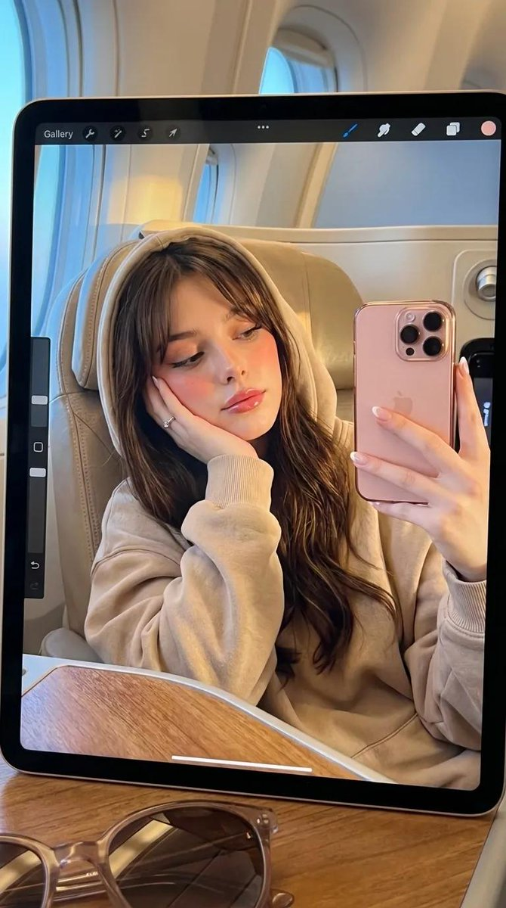

## 女子映照在飞机折叠餐桌上的iPad屏幕上

- ID: gpt4o-810-zh-2
- Slug: prompt-810-zh-2
- 语言: zh
- 来源: [来源链接](https://x.com/SimplyAnnisa/status/1997509228706386408)
- 样例图路径: images/part3/810.jpeg

### 提示词

```text
这是一幅高度写实、构图紧凑的画面，展现了一位肤色白皙、肌肤完美无瑕的女子映照在飞机折叠餐桌上的iPad屏幕上，一副太阳镜作为点缀置于前景。iPad周围是米灰色的机舱座椅。iPad屏幕上，女子半斜倚在座椅上，左手托着下巴，手指轻触太阳穴，姿态放松。右手拿着iPhone 16 Pro Max拍照，部分脸部出现在平板电脑屏幕上。她神情柔和，目光微微向下，给人一种梦幻而宁静的感觉。

她穿着一件米色超大号连帽衫，面料厚实柔软，帽子拉到头上。手腕上戴着简约的银色戒指，指甲是法式美甲。她的头发是深棕色，带有淡淡的挑染，长直发，层次分明，蓬松饱满，中分刘海轻柔地遮住额头，修饰脸型。她的肌肤白皙透亮，无瑕疵，化着精致的韩式淡妆。双颊泛着淡淡的腮红，嘴唇涂着水润的玫瑰粉色唇膏，眼线纤细，睫毛卷翘。

透过倒影可以看到，画面中的环境简约而充满活力：一架高级/商务舱飞机的客舱内部。宽大的舷窗映照出窗外柔和的蓝色天空光线。iPad 的相机界面——快门按钮、小图标和程序坞——清晰地显示在屏幕上。

柔和温暖的粉彩色调。采用“韩式柔光”风格编辑。9:16 竖屏比例，高清，高品质。 **请勿更改人脸。
```

### 样例图


## 一张3D游戏关卡地图海报

- ID: gpt4o-809-zh
- Slug: prompt-809-zh
- 语言: zh
- 来源: [来源链接](https://x.com/op7418/status/1997722842042085409)
- 样例图路径: images/part3/809.jpeg

### 提示词

```text
基于主题 [前端工程师的进阶之路]，创作一张3D游戏关卡地图海报。

画面结构： 一条蜿蜒曲折的 3D 道路从画面底部延伸至顶部云端，分为三个主要的“关卡阶段”：

底部：新手村 (Level 1: Noob)
模型： 简单的草地场景。放置基础工具。
路标： 插着木牌，写着标题，下方用一段话介绍当前等级的标准。

中部：试炼场 (Level 10: Pro)
模型： 地形变得复杂（森林或岩石）。放置进阶装备。
视觉： 道路变得陡峭，象征难度增加。
路标： 插着木牌，写着标题，下方用一段话介绍当前等级的标准。

顶部：神之殿 (Level 99: Master)
模型： 漂浮在云端的辉煌神殿或高科技实验室。放置终极神器。
视觉： 发着金光，有彩虹或宝箱。
路标： 插着木牌，写着标题，下方用一段话介绍当前等级的标准。

数据与排版：路径线： 虚线连接各个阶段，上面有小脚印。

耗时/成本： 在每个阶段旁边，用游戏 UI 风格的浮窗显示“预计耗时”或“预计金币消耗”。

风格与渲染： 任天堂 (Nintendo) 风格的的粘土风。色彩鲜艳饱和。
```

### 样例图

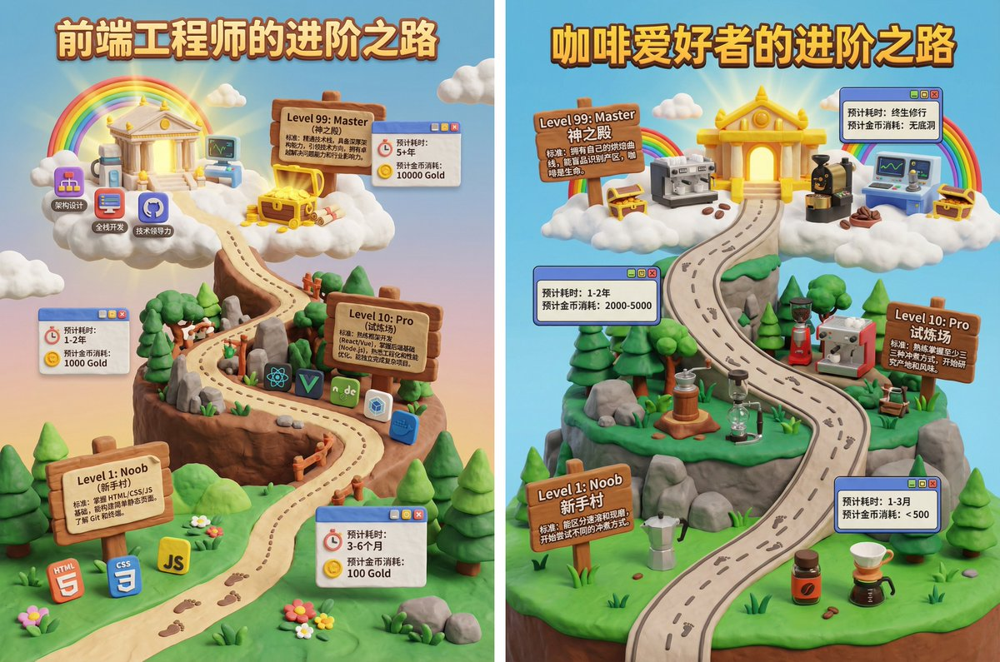

## A cyber-grunge surveillance fashion editorial featuring 

- ID: gpt4o-796-en-1
- Slug: prompt-796-en-1
- 语言: en
- 来源: [来源链接](https://x.com/_MehdiSharifi_/status/1997832235974598763)
- 样例图路径: images/part3/796.jpeg

### 提示词

```text
A cyber-grunge surveillance fashion editorial featuring a cool, edgy young woman in her early 20s with a short chin-length bob haircut, straight with slight texture and casual bangs, partially obscured by thick black sunglasses and holding an iced coffee/chocolate plastic cup with a straw in her left hand and a half-eaten sandwich/pastry in her right hand. She wears an oversized white t-shirt with rust-red raglan sleeves and a small chest logo, tucked loosely into black, baggy carpenter/cargo denim jeans with white stitching details, and burgundy loafers, accessorized with a gold pendant necklace. She is captured in a full body walking stride, relaxed posture, facing slightly off-center with a casual, indifferent expression, head turned slightly to the side, looking downward, frozen mid-stride in an urban paved plaza with grey concrete and tiled pavement under bright sunny late afternoon golden hour light, creating high contrast shadows and long diagonal shadows to the left. The image is in 8K Ultra-HD quality, hyperrealistic, with a 4:5 aspect ratio and 1440x1920 resolution, styled in raw photoreal high fidelity, full color with cool urban tones and vibrant red UI accents, high-contrast daylight. The composition includes a main full body shot with multiple zoom-in crops (face/drink, torso, pants leg) in a fragmented layout, overlaid with tactical CCTV UI elements like red bounding boxes, telemetry data, and digital HUD overlays, simulating high-end surveillance footage with a 'Big Brother' observation vibe, candid urban documentation, and crisp daylight realism mixed with digital graphic design elements. The background is a sharp focus concrete cityscape with harsh shadow lines, and the lighting is natural harsh sunlight from a high angle, creating deep black cast shadows against bright pavement, with digital grain and scanline imperfections. The color grading features neutral urban greys, white, rust-red, denim black, and striking bright crimson red UI elements, with post-processing including high sharpness and red vector graphics overlays such as numbers '19 5 3 21 18 9 20 25', text 'CCWW', 'TR521', timecode '18/02', and bounding boxes with hashtags '#83575//' and '#25747//'. The overall theme is urban surveillance, Y2K streetwear, tactical data visualization, candid fashion moment, and dystopian chic, with a mood of cool detached observation, urban nonchalance, chaotic data stream, and privacy-invasion chic, captured from a high-angle surveillance perspective with a 35mm to 50mm lens, deep focus, and a layout of one main image plus three inset detail crops connected by red tactical line art and crosshairs.
```

### 样例图


## 一组赛博朋克风格的时尚大片

- ID: gpt4o-796-zh-2
- Slug: prompt-796-zh-2
- 语言: zh
- 来源: [来源链接](https://x.com/_MehdiSharifi_/status/1997832235974598763)
- 样例图路径: images/part3/796.jpeg

### 提示词

```text
这是一组赛博朋克风格的时尚大片，主角是一位酷劲十足、个性鲜明的二十出头年轻女性。她留着齐下巴的短波波头，直发略带纹理，刘海随意，戴着一副厚厚的黑色太阳镜，左手拿着一杯插着吸管的冰咖啡/巧克力，右手拿着半个吃剩的三明治/糕点。她身穿一件宽松的白色T恤，袖子是锈红色插肩袖，胸前印着一个小巧的品牌标识，下身随意地塞进一条黑色宽松的工装牛仔裤里，裤子上有白色缝线细节，脚踩一双酒红色乐福鞋，脖子上戴着一条金色吊坠项链。照片捕捉到她迈着大步的全身姿态，放松的姿势，略微侧身，表情随意而淡漠，头部微微侧转，目光向下，定格在城市广场的半步之中。广场地面铺着灰色的水泥和瓷砖，沐浴在明媚的午后金色阳光下，形成鲜明的对比阴影，左侧投射出长长的斜影。照片采用8K超高清画质，画面逼真，宽高比为4:5，分辨率为1440x1920，风格为原始照片级高保真，色彩饱满，以冷色调的都市色调和鲜艳的红色UI元素点缀，营造出高对比度的日光效果。画面构图包含一个全身主镜头，并以碎片化的布局呈现多个放大特写（面部/饮料、躯干、裤腿），叠加了红色边界框、遥测数据和数字HUD叠加层等战术监控界面元素，模拟出高端监控录像的“老大哥”式监视氛围，同时融入了真实都市纪实和清晰的日光写实风格，并结合了数字图形设计元素。背景是清晰聚焦的混凝土城市景观，阴影线条强烈，光线来自高角度的自然强光，在明亮的路面上投射出深邃的黑色阴影，并带有数字颗粒感和扫描线瑕疵。色彩分级采用中性都市灰、白色、锈红色、牛仔黑和醒目的亮深红色 UI 元素，后期处理包括高锐化和红色矢量图形叠加，例如数字“19 5 3 21 18 9 20 25”、文本“CCWW”、“TR521”、时间码“18/02”以及带有井号“#83575//”和“#25747//”的边界框。整体主题是城市监控、Y2K 街头服饰、战术数据可视化、坦率的时尚瞬间和反乌托邦时尚，营造出一种冷静疏离的观察、都市的漫不经心、混乱的数据流和侵犯隐私的时尚感。照片采用 35 毫米至 50 毫米镜头，以高角度监控视角拍摄，并使用了深焦效果。照片布局为一张主图加三张局部细节图，并用红色战术线条和十字线连接。
```

### 样例图


## 女生展示自己手机照片

- ID: gpt4o-791-zh
- Slug: prompt-791-zh
- 语言: zh
- 来源: [来源链接](https://x.com/SDT_side/status/1997789514526564650)
- 样例图路径: images/part3/791.jpeg

### 提示词

```text
需要上传2张照片：1、上传人物照片 2、上传想要在手机上显示的图像，再输入以下提示词
{
  "edit_type": "extreme_wide_angle_phone_edit",

  "source": {
    "_hint": "元画像の人物・服・雰囲気を編集するベース。新キャラ禁止。",
    "mode": "EDIT",
    "reference_images": {
      "first": "base_photo_person_and_environment",
      "second": "screen_content_for_phone"
    },
    "preserve_from_first": {
      "_hint": "顔・髪型・服装は必ず同一人物として扱うための固定。",
      "same_person_or_group": true,
      "same_faces": true,
      "same_hairstyles": true,
      "same_outfits": true,
      "same_environment_style": true
    }
  },

  "identity": {
    "_hint": "表情の統一化。人物のアイデンティティを崩さず保持。",
    "keep_identity_consistent": true,
    "all_people_clearly_recognizable_as_original": true,
    "expression": "bright_natural_smile"
  },

  "camera_effect": {
    "_hint": "スマホを近づけたときの誇張パースを美しく安定化。",
    "perspective": "extreme_wide_angle",
    "style": "dynamic_photorealistic",
    "near_objects_appear_large": true,
    "far_objects_recede_dramatically": true,
    "allow_view_from_above_or_below": true
  },

  "pose": {
    "_hint": "元画像と同じポーズ禁止。手の動きを強調して破綻防止。",
    "pose_can_change": true,
    "must_be_completely_different_from_reference": true,
    "do_not_replicate_or_approximate_original_pose": true,
    "style_tags": [
      "stylish",
      "complex",
      "fluid",
      "powerful"
    ],
    "focus_on_expressive_hands": true,
    "avoid_arm_distortion": true,
    "allow_multiple_body_parts_near_lens": true
  },

  "phone": {
    "_hint": "スマホ専用領域。持ち方・向き・手元の自然さを定義。",
    "allowed": true,
    "holding_styles": [
      "one_handed",
      "two_handed",
      "low_angle",
      "high_angle",
      "tilted",
      "sideways",
      "near_chest",
      "near_hip",
      "casual_carry",
      "partially_toward_lens"
    ],
    "rules": {
      "_hint": "“レンズに向ける強制”を避け、自然な持ち方で画面が見える構図へ。",
      "each_person_may_hold_one_phone": true,
      "priority_is_natural_and_relaxed_body_structure": true,
      "do_not_force_phone_directly_toward_camera": true,
      "screen_should_be_naturally_visible_when_possible": true
    }
  },

  "screen_replacement": {
    "_hint": "差し替えスクリーン。UIなし・歪みなし・自然な貼り込み。",
    "target": "visible_phone_screen",
    "use_second_reference_image_as_content": true,
    "overlay_cleanly_on_visible_screen_area": true,
    "fit_without_distortion": true,
    "respect_screen_shape": true,
    "no_additional_cropping": true,
    "ui_constraints": {
      "_hint": "SNSバーやアプリ枠の発生を完全禁止。",
      "no_ui": true,
      "no_icons": true,
      "no_status_bar": true,
      "no_app_frame": true,
      "show_only_content_from_second_reference": true
    }
  },

  "environment": {
    "_hint": "元写真の空気感を保つが、季節や天気には依存しない汎用設計。",
    "preserve_environment_style_from_reference": true,
    "lighting_consistent_with_reference": true,
    "expand_space_for_wide_angle_view": true,
    "keep_texture_and_color_tone_consistent": true
  },

  "composition": {
    "_hint": "スマホ近接によるダイナミック構図の安定化。",
    "dynamic_but_readable": true,
    "extreme_depth_emphasis": true,
    "allow_phone_close_to_lens": true,
    "keep_all_people_visually_balanced": true
  },

  "constraints": {
    "_hint": "意図せぬ変化を禁止する保護設定。",
    "no_new_characters": true,
    "no_change_in_age_or_gender_presentation": true,
    "no_costume_change": true,
    "no_change_to_reference_location_type": true,
    "respect_original_photographic_style": true
  }
}
```

### 样例图


## A complete screenshot of the MacOS Photo Booth applicati

- ID: gpt4o-769-en-1
- Slug: prompt-769-en-1
- 语言: en
- 来源: [来源链接](https://x.com/berryxia_ai/status/1996912935688618215)
- 样例图路径: images/part3/769.jpeg

### 提示词

```text
A complete screenshot of the MacOS Photo Booth application interface, with the top title bar displaying "Photo Booth". The main window has a 9-grid layout, and each grid shows a user-uploaded person with different funny effects applied. At the bottom of each grid, there are white Chinese subtitles: First row: Alien, Crooked Nose, Chipmunk; Second row: Madly in Love, Normal, Dizzy; Third row: Fool, Big Eyes, Frog. At the bottom is a gray control bar with left and right arrows, four navigation dots (the first one is blue), and an "Effects" button. The background is dark and blurred.
```

### 样例图


## 应用界面展示9种不同的滑稽效果

- ID: gpt4o-769-zh-2
- Slug: prompt-769-zh-2
- 语言: zh
- 来源: [来源链接](https://x.com/berryxia_ai/status/1996912935688618215)
- 样例图路径: images/part3/769.jpeg

### 提示词

```text
一个完整的MacOS Photo Booth应用程序界面截图，顶部标题栏显示 "Photo Booth"。主窗口是一个9宫格布局，每个格子都显示着用户上传的人物，但应用了不同的滑稽效果。每个格子的底部都有白色中文字幕：
第一排：外星人、歪鼻子、花栗鼠
第二排：热恋、正常、头晕
第三排：笨蛋、大眼睛、青蛙
底部是带有左右箭头、四个导航点（第一个蓝色）和 "效果" 按钮的灰色控制栏。背景是深色且模糊的。
```

### 样例图


## A wide-angle, candid documentary photograph capturing th

- ID: gpt4o-752-en-1
- Slug: prompt-752-en-1
- 语言: en
- 来源: [来源链接](https://x.com/bggg_ai/status/1995323329683787810)
- 样例图路径: images/part3/752.jpeg

### 提示词

```text
A wide-angle, candid documentary photograph capturing the person from {reference_image} mid-speech on a large, professionally lit stage at a major technology summit. They are holding a microphone and gesturing naturally toward the audience. Behind them, an immense, wall-sized LED screen is fully visible, displaying a crisp, **full-screen presentation slide (showing only the slide content, absolutely no PowerPoint software interface, toolbars, or window borders)**. The slide content is professionally designed based on the theme: '{speech_topic_or_outline}'. The heads and shoulders of a large audience are visible in the **very bottom foreground, low in the frame and blurred, completely ensuring an unobstructed view of the entire stage screen**. Professional stage lighting with blue and sharp spotlights on the speaker. Shot with a high-resolution camera, sharp focus on both the speaker and the screen content, realistic film grain.
```

### 样例图


## 人物放到一个逼格拉满的大会现场

- ID: gpt4o-752-zh-2
- Slug: prompt-752-zh-2
- 语言: zh
- 来源: [来源链接](https://x.com/bggg_ai/status/1995323329683787810)
- 样例图路径: images/part3/752.jpeg

### 提示词

```text
一张广角的、纪实风格的抓拍照片，捕捉了{reference_image}中的人物在一个主要科技峰会的大型、专业照明的舞台上演讲中途的瞬间。他们手持麦克风，自然地向观众做手势。在他们身后，一个巨大的、墙壁大小的LED屏幕完全可见，显示着一张清晰的、全屏演示幻灯片（只显示幻灯片内容，绝对没有PowerPoint软件界面、工具栏或窗口边框）。幻灯片内容是根据主题：'{speech_topic_or_outline}'进行专业设计的。大量观众的头部和肩膀出现在非常靠下的前景中，在画面位置很低且模糊，完全确保对整个舞台屏幕的视线无遮挡。专业的舞台灯光，有蓝色和锐利的聚光灯打在演讲者身上。用高分辨率相机拍摄，焦点清晰地对准演讲者和屏幕内容，逼真的电影颗粒感。
```

### 样例图


## { "task_configuration": { "task_type": "screen_simulatio

- ID: gpt4o-736-en-1
- Slug: prompt-736-en-1
- 语言: en
- 来源: [来源链接](https://x.com/YaseenK7212/status/1996186805398364512)
- 样例图路径: images/part3/736.jpeg

### 提示词

```text
{
  "task_configuration": {
    "task_type": "screen_simulation_photorealism",
    "target_model": "SDXL_1.0_Refiner",
    "aspect_ratio": "3:4",
    "resolution": {
      "width": 1152,
      "height": 1536
    }
  },
  "visual_hierarchy": {
    "layer_1_physical_macro": {
      "camera_angle": "Downward-angled, high-angle",
      "framing": "MacBook screen filling 95% of frame",
      "surface_imperfections": [
        "subtle pixel-grid texture (moire)",
        "tiny dust particles on glass",
        "faint ambient light reflection on glossy screen",
        "fingerprint smudges"
      ],
      "foreground_anchor": "Thin strip of physical keyboard visible at lower edge"
    },
    "layer_2_digital_interface": {
      "theme": "Dark Mode (macOS)",
      "window_layout": {
        "left_panel": "Spotify 'Liked Songs' playlist (dimmed)",
        "right_panel": "Photo Booth live-preview window (dominant focus)"
      }
    },
    "layer_3_nested_subject_content": {
      "context": "Inside the Photo Booth window",
      "environment": "Dim bedroom, off-white wall, rumpled bedding",
      "lighting_simulation": "Cool screen glow mixed with warm skin tones, deep nocturnal shadows",
      "subjects": {
        "shared_attributes": [
          "Oversized black hoodies",
          "Hoods pushed back (faces fully visible)",
          "Reclining pose",
          "Looking at screen"
        ],
        "subject_a_guy": {
          "identity_target": "reference_image_male.jpg",
          "action": "Holding phone in right hand with clear reflective case",
          "position": "Right/Center"
        },
        "subject_b_girl": {
          "identity_target": "reference_image_female.jpg",
          "action": "Resting closely beside Subject A",
          "position": "Left/Center"
        }
      }
    }
  },
  "prompt_assembly": {
    "positive_prompt": "Hyper-realistic downward shot of a MacBook screen. The screen surface has visible dust, pixel grid, and reflection. The screen displays a Photo Booth window showing a couple in a dark room. [Subject Descriptions]. They are wearing black hoodies. The lighting is low-key, candid, nocturnal, blue-ish screen glow. High fidelity, raw photo, unedited.",
    "negative_prompt": "vector art, screenshot, flat digital image, clean glass, perfect screen, daylight, bright studio lights, cartoon, 3d render, painting, watermark"
  },
  "identity_preservation_settings": {
    "strictness_level": "CRITICAL",
    "methodology": {
      "face_restoration": false,
      "note": "Disable generic face restorers (CodeFormer) to avoid 'plastic' look. Use IP-Adapter.",
      "control_net_stack": [
        {
          "unit": "ControlNet_Tile",
          "weight": 0.4,
          "purpose": "To maintain the text/interface sharpness"
        },
        {
          "unit": "IP-Adapter_FaceID_Plus",
          "weight": 0.95,
          "region_mask": "Photo Booth Window Area Only",
          "purpose": "To force exact facial identity match for both subjects"
        }
      ]
    }
  },
  "rendering_parameters": {
    "sampler": "DPM++ 3M SDE Exponential",
    "steps": 40,
    "cfg_scale": 5.5,
    "denoising_strength": 0.35
  }
}
```

### 样例图


## MacBook自拍（情侣款）

- ID: gpt4o-736-zh-2
- Slug: prompt-736-zh-2
- 语言: zh
- 来源: [来源链接](https://x.com/YaseenK7212/status/1996186805398364512)
- 样例图路径: images/part3/736.jpeg

### 提示词

```text
{
"task_configuration": {
"task_type": "screen_simulation_photorealism",
"target_model": "SDXL_1. 0_精炼器",
"aspect_ratio": "3:4",
“解决”： {
宽度：1152，
“高度”：1536
}
},
"visual_hierarchy": {
"layer_1_physical_macro": {
"camera_angle": "向下倾斜，高角度",
“画面构图”：“MacBook 屏幕占据画面 95% 的面积”，
"surface_imperfections": [
“微妙的像素网格纹理（莫尔纹）”，
“玻璃上的微小灰尘颗粒”，
“光滑屏幕上的微弱环境光反射”
“指纹污迹”
],
"foreground_anchor": "键盘下边缘可见的细长物理键盘条"
},
"layer_2_digital_interface": {
“主题”：“深色模式（macOS）”，
"window_layout": {
"left_panel": "Spotify“喜欢的歌曲”播放列表（暗淡）",
"right_panel": "Photo Booth 实时预览窗口（主要焦点）"
}
},
"layer_3_nested_subject_content": {
“上下文”：“照相亭窗口内”，
“环境”：“昏暗的卧室，米白色的墙壁，凌乱的床铺”，
"lighting_simulation": "冷色调的屏幕光晕与暖色调的肤色混合，深邃的夜色阴影",
“主题”：{
"shared_attributes": [
“超大号黑色连帽衫”，
“兜帽向后推（脸完全露出来）”
“斜倚姿势”，
“看着屏幕”
],
"subject_a_guy": {
"identity_target": "reference_image_male.jpg",
“动作”：“右手持手机，手机壳为透明反光材质”，
“位置”: “右/中”
},
"subject_b_girl": {
"identity_target": "reference_image_female.jpg",
“动作”：“紧挨着受试者 A 休息”，
位置：左/中
}
}
}
},
"prompt_assembly": {
"positive_prompt": "一张超逼真的MacBook屏幕俯拍照片。屏幕表面可见灰尘、像素网格和反光。屏幕上显示着一个Photo Booth窗口，里面是一对情侣在黑暗的房间里。[人物描述]。他们穿着黑色连帽衫。光线昏暗，自然，夜色，屏幕泛着淡淡的蓝色光晕。高保真，原始照片，未经编辑。"
"negative_prompt": "矢量图、屏幕截图、平面数字图像、干净的玻璃、完美的屏幕、日光、明亮的摄影棚灯光、卡通、3D渲染、绘画、水印"
},
"identity_preservation_settings": {
"严格级别": "严重",
“方法论”：{
“face_restoration”：false，
注意：禁用通用面部恢复器（CodeFormer）以避免出现“塑料感”。使用 IP 适配器。
"control_net_stack": [
{
"单元": "ControlNet_Tile",
“权重”：0.4，
“目的”： “保持文本/界面清晰度”
},
{
"unit": "IP-Adapter_FaceID_Plus",
“权重”：0.95，
"region_mask": "仅限照相亭窗口区域",
目的：强制两个受试者的面部身份完全匹配
}
]
}
},
"渲染参数": {
"采样器": "DPM++ 3M SDE 指数",
“步骤”：40，
"cfg_scale": 5.5,
去噪强度：0.35
}
}
```

### 样例图


## os_environment: - Choose one: "Windows 11 style desktop"

- ID: gpt4o-706-en-1
- Slug: prompt-706-en-1
- 语言: en
- 来源: [来源链接](https://x.com/munou_ac/status/1995774756369666109)
- 样例图路径: images/part3/706.jpeg

### 提示词

```text
os_environment:
  - Choose one: "Windows 11 style desktop" or "macOS Sonoma style desktop"
  - If not specified, let the model choose the most natural OS UI
  - Use authentic UI elements based on the selected OS

subject:
  - A character based on reference image A
  - Rendered with semi-3D, anime-style shading
  - Clear solid shadows and highlights defining volume
  - Appears as a desktop mascot overlay interacting with real OS UI

composition:
  - A realistic computer desktop in 16:9 aspect ratio
  - Include authentic-looking application windows and icons
  - Character positioned naturally on or around these UI elements

action:
  - Allow the model to freely choose mascot-like behaviors such as:
    - lying across the top edge of a window
    - sitting on a window frame
    - touching, inspecting, or reacting to icons
    - peeking from behind folders or apps
  - Actions should feel physically grounded and slightly playful

location:
  - Displayed on a real OS-style desktop (Windows/macOS)
  - Show recognizable UI elements (e.g., Chrome window, folder icons, taskbar/dock)
  - Icons and windows appear authentic but used only as background elements

style:
  - Semi-3D anime shading (soft cel-shaded look)
  - Defined shadows instead of rim lighting
  - Clean digital rendering that blends naturally with real desktop UI

camera_lighting:
  - Neutral frontal or top lighting to create solid, directional shadows
  - Soft ambient light to keep color harmony with the desktop
  - Screenshot-like straight-on camera angle

colors:
  - Desktop in cool OS-like tones
  - Character colors follow reference A accurately
  - Shadows emphasized for 3D volume

text:
  - None unless needed

edit_instructions:
  - Use reference A for character accuracy
  - Emphasize 3D-like volume with clear shadow planes
  - Ensure the character appears layered above real desktop UI elements
  - Keep real UI assets unmodified and only as contextual background

references:
  A: "Character appearance reference"

extras:
  - high resolution
  - realistic OS UI rendering
  - clean compositing and precise layer separation
  - allow creative mascot-like movement
```

### 样例图


## 吉祥物坐在操作系统窗口边框上

- ID: gpt4o-706-zh-2
- Slug: prompt-706-zh-2
- 语言: zh
- 来源: [来源链接](https://x.com/munou_ac/status/1995774756369666109)
- 样例图路径: images/part3/706.jpeg

### 提示词

```text
os_environment:
  - Choose one: "Windows 11 风格桌面" 或 "macOS Sonoma 风格桌面"
  - If not specified: 让模型选择最自然的操作系统 UI
  - Use authentic UI elements: 基于所选操作系统使用真实的 UI 元素

subject:
  - 基于参考图 A 的角色
  - 采用半 3D、动漫风格的渲染
  - 清晰的实色阴影和高光定义体积感
  - 表现为与真实操作系统 UI 互动的桌面吉祥物覆盖层

composition:
  - 16:9 比例的真实电脑桌面
  - 包含看起来真实的应用程序窗口和图标
  - 角色自然地位于这些 UI 元素之上或周围

action:
  - 允许模型自由选择类似吉祥物的行为，例如：
    - 趴在窗口顶边
    - 坐在窗口边框上
    - 触摸、检查或对图标做出反应
    - 从文件夹或应用程序后面探出头
  - 动作应感觉有物理落地感且略带顽皮感

location:
  - 显示在真实的操作系统风格桌面（Windows/macOS）上
  - 展示可识别的 UI 元素（如 Chrome 窗口、文件夹图标、任务栏/程序坞）
  - 图标和窗口显得真实，但仅作为背景元素使用

style:
  - 半 3D 动漫渲染（柔和的赛璐璐风格外观）
  - 轮廓分明的阴影，而非边缘光
  - 干净的数字渲染，与真实桌面 UI 自然融合

camera_lighting:
  - 中性正面或顶部照明，以产生实色、定向的阴影
  - 柔和的环境光，保持与桌面的色彩和谐
  - 类似屏幕截图的平视摄像机角度

colors:
  - 桌面采用冷色调 OS 风格
  - 角色颜色准确遵循参考图 A
  - 强调阴影以体现 3D 体积感

text:
  - 无，除非必要

edit_instructions:
  - 使用参考图 A 以确保角色准确性
  - 通过清晰的阴影面强调类 3D 的体积感
  - 确保角色看起来像是分层叠加在真实桌面 UI 元素之上
  - 保持真实 UI 资源不做修改，仅作为上下文背景

references:
  A: "角色外观参考"

extras:
  - 高分辨率
  - 逼真的操作系统 UI 渲染
  - 干净的合成和精确的图层分离
  - 允许富有创意的吉祥物般动作
```

### 样例图


## A 9:16 vertical, photorealistic cyber-aesthetic futurist

- ID: gpt4o-705-en-1
- Slug: prompt-705-en-1
- 语言: en
- 来源: [来源链接](https://x.com/dotey/status/1995633652139442373)
- 样例图路径: images/part3/705.jpeg

### 提示词

```text
A 9:16 vertical, photorealistic cyber-aesthetic futuristic social-app interface. A hand is holding a vertical, iPhone-sized, borderless acrylic card, taking up most of the frame. The card displays a social media profile interface with no banners or background images. Its smooth, rounded edges emit a soft neon glow in blue, pink, and purple gradients.

The background is dark and blurred, emphasizing the glowing edges; the light reflections on the fingers feel cinematic and atmospheric, creating a high-tech holographic mood. The card surface is crystal-clear, and the profile details appear almost engraved, showing only the information from the reference image.

Displayed in this exact order:

- Profile avatar (centered)
- Name + blue verification badge (centered)
- Username with “@”, e.g., 
@dotey
 (centered)
- Bio (left-aligned)
- Location, website (left-aligned)
- Join date (left-aligned)
- Following count & followers count (left-aligned)
- Follow button (full-width, transparent background, rounded-full, border with soft neon glow)
```

### 样例图


## 赛博朋克美学风格卡片

- ID: gpt4o-705-zh-2
- Slug: prompt-705-zh-2
- 语言: zh
- 来源: [来源链接](https://x.com/dotey/status/1995633652139442373)
- 样例图路径: images/part3/705.jpeg

### 提示词

```text
一个9:16比例的竖屏，采用逼真的赛博朋克美学风格，展现出未来主义的社交应用界面。一只手拿着一张竖屏的、iPhone大小的无边框亚克力卡片，占据了画面的大部分空间。卡片上显示着一个社交媒体个人资料界面，没有任何横幅或背景图片。卡片光滑圆润的边缘散发出柔和的霓虹光芒，呈现出蓝、粉、紫三色渐变。

背景昏暗模糊，突显了发光的边缘；手指上的光线反射极具电影感和氛围感，营造出一种高科技全息效果。卡片表面晶莹剔透，轮廓细节仿佛雕刻而成，仅显示参考图像中的信息。

按以下顺序显示：

- 个人资料头像（居中）
- 姓名 + 蓝色验证徽章（居中）
- 用户名包含“@”符号，例如
@dotey
 （居中）
- 个人简介（左对齐）
- 位置，网站（左对齐）
加入日期（左对齐）
- 关注者数量和粉丝数量（左对齐）
- 关注按钮（全宽，透明背景，圆角，带柔和霓虹光晕的边框）
```

### 样例图


## 金毛直播

- ID: gpt4o-568-zh
- Slug: prompt-568-zh
- 语言: zh
- 来源: [来源链接](https://x.com/songguoxiansen/status/1991796627062079575)
- 样例图路径: images/part3/568.jpeg

### 提示词

```text
一只金毛犬戴着耳机坐在麦克风前，面前摆满了各种狗零食和骨头。它正对着镜头露出专业的笑容。直播界面的标题写着：“修勾的吃播：今天挑战十根大骨棒！榜一大哥刷个火箭吧！”。
```

### 样例图

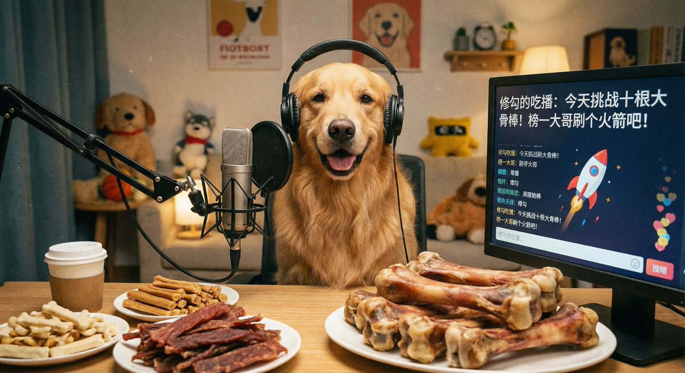

## 仿真绣苏绣表情包

- ID: gpt4o-548-zh
- Slug: prompt-548-zh
- 语言: zh
- 来源: [来源链接](https://x.com/TaXue2025/status/1993542832930668942)
- 样例图路径: images/part3/548.jpeg

### 提示词

```text
生成一张 16:9、4K 分辨率的仿真绣苏绣表情包大图：

- 画面为 4×6 网格，共 24 个 1:1 方形小格，每格是一位同一角色的古典中式美人半身像表情包（胸部以上），脸部约占每格 60%–70%。
- 头饰、发型、服装风格严格参考提供的原始角色形象，保持一致，但不要原图复制。

风格要求：
- 整体为仿真绣苏绣作品：人物五官、皮肤、头发、衣纹和背景全部由细密丝线和刺绣针脚构成，使用仿真绣 + 乱针绣技法，丝线有光泽、针脚平齐细密，形成微微凸起的真实绣面。
- 底布为近乎纯白或极浅米色真丝绸，背景极简，仅有很淡云纹或暗纹，不加入复杂图案。

禁止：
- 不要油画、水彩、数码画笔纹理；
- 不要相机景深、虚化、炫光、镜头光斑和 UI 特效。

表情与文字：
- 24 格覆盖常见聊天情绪和娱乐 meme（如开心、无语、震惊、委屈、嫌弃、坏笑、吃瓜、躺平、笑死、我裂开了等）。
- 每一格配一条短句，使用手写风格简体中文，不用印刷体和英文。
```

### 样例图


## 龙珠卡牌

- ID: gpt4o-520-zh
- Slug: prompt-520-zh
- 语言: zh
- 来源: [来源链接](https://x.com/servasyy/status/1993337294477218061)
- 样例图路径: images/part3/520.jpeg

### 提示词

```text
A 3x3 grid layout displaying 9 different premium Japanese TCG collectible card designs, each featuring Son Goku in Super Saiyan form with unique battle scenes.

Overall Composition: 9 vertical trading cards (9:16 ratio each) arranged in a perfect 3x3 grid with thin spacing between cards.

Each Card Contains:

Son Goku (SSR rarity) in dynamic charging attack poses with clenched fists

Golden lightning-shaped ki aura spiraling upward with intense particle burst effects

Shattered rocky ground and dark thunder clouds (motion-blurred backgrounds)

Radial golden speed lines in mid-ground

Flying debris rocks and energy sparks in foreground

Holographic foil texture with glow effects on energy areas

Top-left: "SSR" metallic badge with golden light rays

Border: Futuristic tech frame with lightning pattern decorations

Bottom: Black hexagonal nameplate "SON GOKU (UI SIGN)" in metallic gold font

9 Different Scenes (varied poses and angles):

Frontal charging punch

Side aerial kick with energy burst

Kamehameha charging stance

Spinning attack with motion trails

Upward rising power-up pose

Downward diving strike

Energy sphere preparation

Defensive counter stance

Final impact explosion moment

Consistent Color Palette Across All Cards:

Primary: Radiant gold (#FFD700) and electric blue (#00BFFF)

Contrast: Deep purple (#4B0082)

Highlights: Pure white (#FFFFFF) with bloom

Shadows: Deep blue-black (#001F3F)

Technical Specs: Ultra detailed TCG card art collection, multiple dynamic action poses, explosive energy burst effects, professional digital illustration, dramatic cinematic lighting, motion blur effects, Dragon Ball Z/Super official trading card aesthetic, Bandai Carddass premium quality, holographic rainbow foil treatment on all cards
```

### 样例图


## Create a high-end 8k studio photograph. The person from 

- ID: gpt4o-519-en-1
- Slug: prompt-519-en-1
- 语言: en
- 来源: [来源链接](https://x.com/MayorKingAI/status/1993040352987824579)
- 样例图路径: images/part3/519.jpeg

### 提示词

```text
Create a high-end 8k studio photograph. The person from the reference is standing on the left side, posing with a [POSE] attitude and wearing [CLOTHING]. To their right, dominating the scene, stands a GIANT, human-scale monolithic smartphone (floor-standing). The massive screen is on and displays a crystal-clear, authentic [SOCIAL APP] user interface. Key visible details on the screen must be sharp and legible and appear exactly as they would in the real app's layout: the profile picture (matching the subject), the username "@[USERNAME]", the follower count "[FOLLOWER COUNT]" displayed realistically within the standard profile stats area (not artificially enlarged), and a consistent feed of posts below. Premium studio lighting with the screen casting a subtle glow on the subject. Clean minimalist white background
```

### 样例图

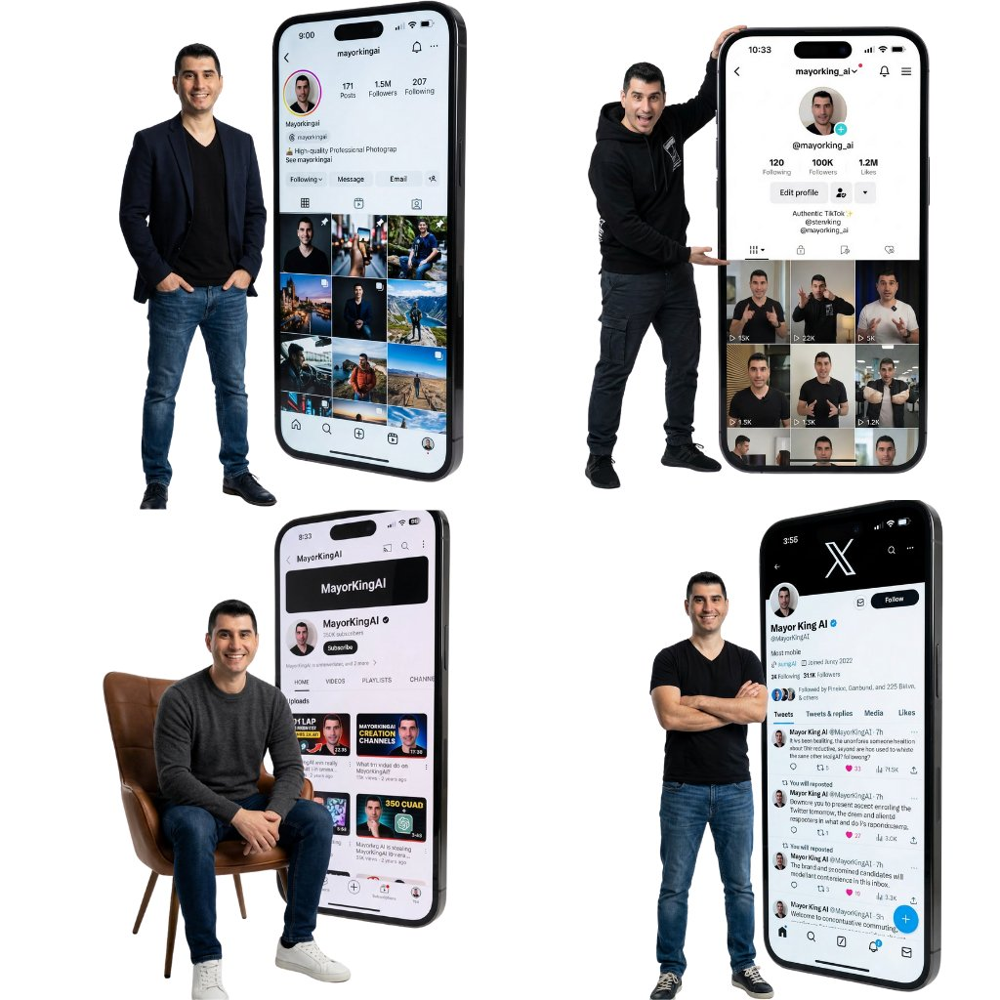

## 高端工作室照片

- ID: gpt4o-519-zh-2
- Slug: prompt-519-zh-2
- 语言: zh
- 来源: [来源链接](https://x.com/MayorKingAI/status/1993040352987824579)
- 样例图路径: images/part3/519.jpeg

### 提示词

```text
创作一张高端 8K 工作室照片。参考人物站在左侧，摆出 [POSE] 姿势，身着 [CLOTHING]。在其右侧，占据画面中心位置的是一部巨大的、与真人大小相当的落地式智能手机。巨大的屏幕已开启，显示着清晰逼真的 [SOCIAL APP] 用户界面。屏幕上的关键可见细节必须清晰易读，并且与真实应用中的布局完全一致：个人资料照片（与拍摄对象相符）、用户名"@[ USERNAME]、粉丝数 [FOLLOWER COUNT]（真实显示在标准个人资料统计区域内，而非人为放大），以及下方持续更新的帖子信息流。使用高级工作室灯光，屏幕散发出柔和的光晕，照亮拍摄对象。背景为简洁的白色背景。
```

### 样例图


## 老北京航拍

- ID: gpt4o-502-zh
- Slug: prompt-502-zh
- 语言: zh
- 来源: [来源链接](https://x.com/imaxichuhai/status/1991684492474409440)
- 样例图路径: images/part3/502.jpeg

### 提示词

```text
画幅比例16:9，一幅关于精妙含蓄与视觉智慧的杰作。一幅老北京城市肌理的无人机鸟瞰图。核心概念是汉字“衚”**完美无缝地**融入了整个城市景观。

**字体与建筑的融合 (终极的精妙之处):**
- **无物理高差:** “衚”字不是一个独立的、高耸的或庞大的结构。构成其笔画的墙体，与周围所有的胡同、四合院的墙体，在**高度、材质和风格上完全一致**。它身处肌理之中，而非凌驾其上。
- **“光影雕刻”:** 汉字的形态并非由结构来凸显，而是由**大师级的、富有氛围感的光影**来呈现。一束低角度的午后斜阳（Raking Light）横扫整个场景。光线刚好捕捉到构成“衚”字形态的墙体的边缘，使其微妙地变亮，同时在其“笔画”（即胡同）内部投下深刻而轮廓分明的阴影。这个字，是被光所揭示，而非被水泥所建造。
- **“氛围透视”:** 一层纤薄的、贴地的晨雾或霭气，弥漫在周边的庭院和巷陌中，使边缘的细节略微柔化。然而，构成“衚”字形态的那些路径和庭院，则**微妙地更加清晰、对比度更高**，由此形成一个自然的视觉焦点，让隐藏的形状在凝视者的眼中浮现。

**优雅的字体排版布局:**
保留精致且艺术化的字体设计。
- **主标题:** 标题“字里京城”被排成一个强有力的单列竖排，位于右侧。背景区域被巧妙地处理成半透明的微妙褪色效果，以确保文字的可读性而不突兀。字体是优雅的“新宋体”风格。一条极细的竖线与文字平行。
- **信息标签:** 标签文字（“灰瓦”、“国槐”）采用小号、精致的手写体。它们通过一条铅笔在图纸上画出般的、针尖般纤细的手绘曲线连接到物体。**不要有方框，不要有发光效果。**

**美学:**
整体基调是宁静、引人深思且意境深远的。色调是考究的“高级灰”，以饱和度低的色彩为主，唯一的色彩点缀来自阳光温暖的轻抚。画面拥有一种“众目睽睽下的秘密”般的气质，回报着观者的耐心与洞察力。它是一次具有深刻绘画感和哲学氛围的超写实渲染。

**负面提示词:**
高耸的墙壁, 雕塑般的汉字, 庞大的结构, 过于明显的汉字形状, 平均的光照, 平光, 发光方框, 未来感UI, 无衬线字体, 抽象, 2D, 色彩鲜艳, 卡通, 糟糕的书法, 水印。
```

### 样例图


## A realistic full-body portrait of a [ARTIST] in their si

- ID: gpt4o-423-en-1
- Slug: prompt-423-en-1
- 语言: en
- 来源: [来源链接](https://x.com/TechieBySA/status/1988227330947358728)
- 样例图路径: images/part3/423.jpeg

### 提示词

```text
A realistic full-body portrait of a [ARTIST] in their signature style, positioned next to a giant vertical smartphone displaying a Spotify interface. The phone screen shows a music player interface featuring the song “[SONG]” with signature [COLOR] accent colors at approximately 80% opacity for a premium aesthetic effect.
The artist wears their characteristic outfit and styling. Their pose is confident and editorial, embodying the mood and energy of the song. Expression matches their iconic persona.
Technical specifications:
• Plain background with subtle [COLOR] lighting accents
• Soft studio lighting with colored gels in signature [COLOR] tones
• 35mm or 50mm lens, f/2.2, ISO 100-160, shutter speed 1/125
• Sharp focus on subject and phone interface
• Editorial style consistent with premium music platform campaigns
```

### 样例图

![A realistic full-body portrait of a [ARTIST] in their si](../images/part3/423.jpeg)

## 一幅逼真的全身肖像

- ID: gpt4o-423-zh-2
- Slug: prompt-423-zh-2
- 语言: zh
- 来源: [来源链接](https://x.com/TechieBySA/status/1988227330947358728)
- 样例图路径: images/part3/423.jpeg

### 提示词

```text
一幅[艺术家]的逼真全身肖像，采用其标志性风格，旁边是一部巨大的竖屏智能手机，屏幕上显示着Spotify界面。手机屏幕上的音乐播放器界面以歌曲“[歌曲]”为特色，并采用标志性的[颜色]强调色，透明度约为80%，以营造高级美感。
这位艺人身着标志性的服装，摆出自信而富有时尚感的姿势，完美诠释了歌曲的情绪和能量。他们的表情也与他们标志性的形象相得益彰。
技术规格：
• 纯色背景，带有柔和的[颜色]灯光点缀
• 采用柔和的影棚灯光，搭配标志性的[COLOR]色调彩色滤光片
• 35mm 或 50mm 镜头，f/2.2 光圈，ISO 100-160，快门速度 1/125 秒
• 清晰聚焦于主体和手机界面
• 编辑风格与高端音乐平台推广活动保持一致
```

### 样例图


## { "promptDetails": { "description": "A prompt to *create

- ID: gpt4o-419-en-1
- Slug: prompt-419-en-1
- 语言: en
- 来源: [来源链接](https://x.com/miilesus/status/1986833636193189893)
- 样例图路径: images/part3/419.jpeg

### 提示词

```text
{
    "promptDetails": {
        "description": "A prompt to *create a new scene* by placing a subject (based on a reference photo) into a new atmospheric background, then overlaying a music UI.",
        "styleTags": [
            "Aesthetic Edit",
            "Cinematic",
            "Scene Compositing",
            "Glassmorphism"
        ]
    },
    "subjectReference": {
        "source": "[UPLOADED IMAGE]",
        "description": "Use this image *only* as a reference for the subject's face, hair, and appearance. Do *not* use its original background."
    },
    "scene": {
        "background": {
            "setting": "the window on the bus is sad, troubled, sorrowful",
            "details": "This is the *new* environment the subject must be placed into, completely replacing the original background."
        },
        "subject": {
            "description": "The young man whose appearance is defined by the `[UPLOADED IMAGE]`.",
            "pose": "his head resting gently against the bus window",
            "focus": "Subject is in sharp focus, fully integrated into the new background."
        }
    },
    "overlayObject": {
        "type": "Floating Glassmorphism Music Player UI",
        "relationshipToEnvironment": "the UI is **perfectly flush and physically attached** to the same plane as the bus window glass, **not floating**, not screen-space.",
        "transform": "the UI matches the *exact same rotation and perspective* as the window surface. If the window tilts, the UI tilts identically with correct foreshortening.",
        "surfaceInteraction": "subtle, realistic reflection and slight refraction through glass, extremely thin glassmorphism panel integrated *into* the window surface.",
        "components": {
            "songTitle": "Wrecked",
            "artistName": "Imagine Dragons",
            "position": "mounted on the bus window glass at the middle-left region of the frame (not floating)."
        }
    },
    "technicalStyle": {
        "aspectRatio": "1:1",
        "photographyStyle": "Cinematic Portrait, Realistic Compositing",
        "camera": {
            "shotType": "Medium Shot or Medium Close-Up",
            "angle": "Eye-level",
            "depthOfField": "Shallow, to blur the new background (bokeh)."
        },
        "lighting": {
            "type": "Soft, Ambient, Moody",
            "description": "Lighting on the subject *must match* the lighting of the new background setting (e.g., rainy light through bus window, soft shadow gradients)."
        },
        "color": {
            "palette": "Muted, cinematic color grading."
        }
    },
    "audioDevice": {
        "type": "subtle in-ear wireless earbuds",
        "fit": "naturally seated in both ears with correct realistic skin contact",
        "color": "matte black or dark neutral tone",
        "consistencyNote": "no cable, no bulky gaming headset"
    },
    "moodReinforcement": "earbuds imply the sad music 'Wrecked - Imagine Dragons' is what the subject is listening to."
}
```

### 样例图


## 年轻女子公交车上的窗户边

- ID: gpt4o-419-zh-2
- Slug: prompt-419-zh-2
- 语言: zh
- 来源: [来源链接](https://x.com/miilesus/status/1986833636193189893)
- 样例图路径: images/part3/419.jpeg

### 提示词

```text
{
"promptDetails": {
“描述”：“提示用户通过将主体（基于参考照片）放置在新的氛围背景中，然后叠加音乐用户界面来*创建新场景*。”
"styleTags": [
“美学编辑”
“电影感”，
“场景合成”
“玻璃态”
]
},
"subjectReference": {
“来源”：[上传的图片]，
“描述”：“请仅将此图片用作人物面部、头发和外貌的参考。请勿使用其原始背景。”
},
“场景”： {
“背景”： {
“场景”：“公交车上的窗户是悲伤的、忧郁的、哀伤的”，
“细节”：“这是主体必须置身的*全新*环境，完全替换原有背景。”
},
“主题”： {
描述：这位年轻人的外貌特征由“[上传的图片]”定义。
“姿势”：“他的头轻轻地靠在公交车窗上”，
“焦点”：“主体清晰对焦，完全融入新的背景中。”
}
},
"overlayObject": {
"type": "浮动玻璃变形音乐播放器用户界面",
“与环境的关系”：“用户界面**与公交车窗玻璃完全齐平，并且物理上**附着在**同一平面上， ** ）不是悬浮的，也不是屏幕空间的。”
“变换”：“用户界面与窗口表面*完全一致地旋转和透视*。如果窗口倾斜，用户界面也会随之倾斜，并具有正确的透视缩短效果。”
“表面交互”：“透过玻璃产生微妙、逼真的反射和轻微折射，极薄的玻璃变形面板集成到窗户表面*中*。”
“成分”： {
歌曲标题： 'Wrecked'
"artistName": "Imagine Dragons",
“位置”：“安装在公交车车窗玻璃上，位于车窗框架的左侧中间位置（非悬浮式）。”
}
},
"technicalStyle": {
“aspectRatio”: “1:1”
“摄影风格”：“电影人像，逼真合成”
“相机”： {
"shotType": "Medium Shot or Medium Close Up",
“角度”：“视线水平”，
"depthOfField": "浅景深，使新背景模糊（散景）"
},
“灯光”： {
“类型”：“柔和、氛围、情绪化”，
“描述”：“拍摄对象的照明必须与新背景设置的照明相匹配（例如，透过公交车窗的雨光、柔和的阴影渐变）。”
},
“颜色”： {
“调色板”：“柔和的电影级色彩分级。”
}
},
"audioDevice": {
“类型”：“低调的入耳式无线耳机”，
“贴合度”：“自然地佩戴在双耳中，与皮肤有正确的逼真接触”，
颜色：哑光黑或深色中性色调，
“一致性说明”： “无线缆，无笨重的游戏耳机”
},
“moodReinforcement”：“耳机暗示着受试者正在听悲伤的音乐‘Wrecked - Imagine Dragons’。”
}
```

### 样例图


## 赛博美学未来社交软件界面照片

- ID: gpt4o-395-zh
- Slug: prompt-395-zh
- 语言: zh
- 来源: [来源链接](https://x.com/dotey/status/1983941652730278148)
- 样例图路径: images/part3/395.jpeg

### 提示词

```text
一张 9:16 竖版逼真的赛博美学未来社交软件界面照片：一只手拿着一张竖直半透明的亚克力卡片，占据了大部分画面。上面显示着一个社交媒体个人资料界面，但没有任何横幅或背景图片。卡片有平滑的圆润边缘，闪烁着柔和的霓虹灯光，呈现出粉色、紫色和蓝色的渐变。背景黑暗而模糊，以突出发光的边缘。卡片表面如水晶般清澈，个人资料的细节仿佛雕刻，只显示参考图中的信息，按照顺序依次显示：
- 头像（居中）
- 用户名、顶部的认证徽章
- 个人介绍
- 地理位置、网站
- 加入日期
- 关注数和被关注数
- 关注按钮
手指上的灯光反射看起来富有电影感和氛围感，营造出一种高科技的全息氛围。
```

### 样例图


## 女生镜子自拍

- ID: gpt4o-332-zh
- Slug: prompt-332-zh
- 语言: zh
- 来源: [来源链接](https://x.com/dotey/status/1976485558319722711)
- 样例图路径: images/part3/332.jpeg

### 提示词

```text
### **场景**
镜子自拍，御宅族电脑角落，蓝色调

---

### **主体**
* **性别表现**: 女性
* **年龄段**: 25岁左右
* **种族**: 东亚
* **身材**: 苗条，腰线分明；身材比例自然
* **肤色**: 浅中性色调
* **发型**:
    * **长度**: 及腰长发
    * **样式**: 直发，发尾微卷
    * **颜色**: 中等棕色
* **姿势**:
    * **站姿**: 站立，轻微的对立式平衡站姿（contrapposto）
    * **右手**: 手持手机挡住脸（身份被遮挡）
    * **左臂**: 在躯干旁自然下垂
    * **躯干**: 身体轻微后仰；露出腰腹
* **着装**:
    * **上衣**: 浅蓝色短款针织开衫，扣上前两颗纽扣；隐约可见蓝色法式内衣
    * **下装**: 牛仔超短裤，两侧臀部各有一个蓝色缎带蝴蝶结
    * **袜子**: 蓝白横条纹过膝长袜
    * **配饰**: 蓝色可爱吉祥物手机壳

---

### **环境**
* **描述**: 从挂墙镜中看到的卧室电脑角落
* **陈设**:
    * 白色书桌
    * 单显示器，显示着柔和的蓝色壁纸（没有可读的文字）
    * 机械键盘，白色键帽，放在蓝色桌垫上
    * 鼠标，放在小号蓝色鼠标垫上
    * PC主机在右侧，带有蓝色机箱灯效
    * PC主机上或附近有三个动漫手办
    * 墙上贴着一张佛塔海报
    * 猫形台灯，带有蓝色点缀
    * 一杯透明的玻璃水杯
    * 窗边（镜头左侧）有一株高大的绿叶植物
* **颜色替换**: 将所有原先的粉色元素（衣物和房间）替换为蓝色（婴儿蓝 -> 天空蓝/长春花蓝）。

---

### **灯光**
* **光源**: 来自镜头左侧大窗户的日光，透过薄纱窗帘
* **光线质感**: 柔和的漫射光
* **白平衡 (K)**: 5200

---

### **相机**
* **模式**: 智能手机后置摄像头通过镜子拍摄（无肖像/虚化模式）
* **等效焦距 (mm)**: 26
* **距离 (米)**:
    * 主体到镜子: 0.6
    * 相机到镜子: 0.5
* **曝光**:
    * 光圈 (f): 1.8
    * 感光度 (ISO): 100
    * 快门速度 (秒): 0.01
    * 曝光补偿 (EV): -0.3
* **对焦**: 对焦于镜中影像的躯干和短裤
* **景深**: 自然的智能手机景深（深景深）；背景清晰可辨，无人为模糊
* **构图**:
    * **宽高比**: 1:1
    * **裁剪**: 从头顶到大腿中部；画面包含书桌、显示器、PC主机和植物
    * **角度**: 从镜子的视角轻微俯拍
    * **构图备注**: 保持主体居中；为避免广角边缘拉伸，可以站远一些再进行方形裁剪

---

### **负面提示词**
* 任何地方出现粉色/品红色
* 美颜滤镜/磨皮皮肤；没有毛孔的外观
* 夸张或扭曲的人体结构
* NSFW，透视面料，走光
* 商标，品牌名，可读的用户界面文本
* 虚假的人像模式模糊，CGI/插画感
```

### 样例图


## Two anime-style characters standing behind a futuristic 

- ID: gpt4o-269-en-1
- Slug: prompt-269-en-1
- 语言: en
- 来源: [来源链接](https://x.com/TheRelianceAI/status/1953431382836859074)
- 样例图路径: images/part3/269.png

### 提示词

```text
Two anime-style characters standing behind a futuristic transparent X-ray scanning panel, each leaning on it casually. Their full bodies are visible through the glowing glass as stylized, semi-transparent X-ray scans. [INSERT SCAN DETAILS HERE — e.g. hybrid anatomy, supernatural markings, implants, etc.]. Futuristic sci-fi interface overlays on the glass, with holographic HUD elements and glowing digital text. The background is minimal and sterile, resembling a high-tech medical chamber. The characters are [INSERT CHARACTER NAMES & DESCRIPTION HERE — appearance, expression, outfit], drawn in modern high-quality anime style. The scene uses soft colored lighting (e.g. cyan, pink, red depending on the pair), expressive animation, and cinematic composition.
```

### 样例图


## 透明X光扫描面板后面

- ID: gpt4o-269-zh-2
- Slug: prompt-269-zh-2
- 语言: zh
- 来源: [来源链接](https://x.com/TheRelianceAI/status/1953431382836859074)
- 样例图路径: images/part3/269.png

### 提示词

```text
两个动漫风格的角色站在一个未来感的透明X光扫描面板后面，各自随意地靠在面板上。透过发光的玻璃，可以看到他们的全身呈现出风格化的半透明X光扫描效果。【在此插入扫描细节——例如混合解剖结构、超自然标记、植入物等】。玻璃上叠加着未来科幻界面，还有全息平视显示元素和发光的数字文本。背景简洁而无菌，类似一个高科技医疗舱。角色是【在此插入角色姓名和描述——外貌、表情、服装】，采用现代高品质动漫风格绘制。场景使用柔和的彩色灯光（例如根据角色组合使用青色、粉色、红色等），富有表现力的动态效果和电影化的构图。
```

### 样例图


## Retexture the image attached based on the JSON below { "

- ID: gpt4o-242-en-1
- Slug: prompt-242-en-1
- 语言: en
- 来源: [来源链接](https://x.com/egeberkina/status/1948690449293869081)
- 样例图路径: images/part3/242.png

### 提示词

```text
Retexture the image attached based on the JSON below
{
  "style_name": "Playful Chunky 3D Aesthetic",
  "retexture_mode": "stylized_3d_overlay",
  "object_analysis": {
    "preserve_silhouette": true,
    "geometry_sensitive_mapping": true,
    "detail_retention": "moderate — focus on key forms and proportions"
  },
  "material_properties": {
    "base_material": ["soft matte plastic", "rubbery polymer"],
    "surface_details": [
      "rounded edges and inflated volumes",
      "smooth, toy-like finish",
      "minimal seam lines"
    ]
  },
  "lighting": {
    "type": "studio diffused light",
    "intensity": "medium",
    "shadows": "soft base shadows",
    "highlight_behavior": "gentle gloss on curves and raised surfaces"
  },
  "color_palette": {
    "dominant_colors": ["#f6f6f6", "#3a3a3a", "#f05423"],
    "accent_colors": ["#ff875d", "#b0b0b0", "#f3f3f3"]
  },
  "background": {
    "color": "#f9f9f9",
    "type": "solid",
    "texture": "none"
  },
  "style_tags": [
    "3D cartoon realism",
    "UI icon pack aesthetic",
    "inflated minimalism",
    "soft tech look",
    "playful volume modeling"
  ]
}
```

### 样例图


## 有趣的块状 3D 世界

- ID: gpt4o-242-zh-2
- Slug: prompt-242-zh-2
- 语言: zh
- 来源: [来源链接](https://x.com/egeberkina/status/1948690449293869081)
- 样例图路径: images/part3/242.png

### 提示词

```text
根据以下 JSON 对附加的图像进行重新纹理化
{
  "style_name": "Playful Chunky 3D Aesthetic",
  "retexture_mode": "stylized_3d_overlay",
"对象分析": {
"保留轮廓": true,
"几何敏感映射": true,
"细节保留": "中等 — 侧重于关键形态和比例"
  },
"材料属性": {
    "基础材料": ["柔软磨砂塑料", "弹性聚合物"],
    "表面细节": [
"圆润的边缘和膨胀的体积",
"光滑、玩具般的表面",
"极少的接缝线"
    ]
  },
"lighting": {
    "type": "工作室漫射光",
    "intensity": "中等",
"阴影": "柔和的基础阴影",
    "高光行为": "曲线和凸起表面的柔和光泽"
  },
  "配色方案": {
"主色调": [" #f6f6f6 ", " #3a3a3a ", " #f05423 "],
    "强调色": [" #ff875d ", " #b0b0b0 ", " #f3f3f3 "]
  },
  "背景": {
"color": " #f9f9f9 ",
    "type": "solid",
    "texture": "none"
  },
"风格标签": []
"3D 卡通写实风格"
"UI 图标包美学"
"膨胀极简主义"
"柔和科技感",
"俏皮体积建模"
  ]
}
```

### 样例图


## Create a 3D-rendered icon of [Subject] in a dreamy, tran

- ID: gpt4o-202-en-1
- Slug: prompt-202-en-1
- 语言: en
- 来源: [来源链接](https://x.com/azed_ai/status/1942945882548437243)
- 样例图路径: images/part3/202.jpeg

### 提示词

```text
Create a 3D-rendered icon of [Subject] in a dreamy, translucent, glass-like plastic material with soft pink and purple hues. glossy, smooth, rounded edges, glowing highlights, and soft shimmer or sparkle effects. UI, floating against a clean white background with soft shadows and natural lighting, elegant, and modern.
```

### 样例图

![Create a 3D-rendered icon of [Subject] in a dreamy, tran](../images/part3/202.jpeg)

## 创建半透明图标

- ID: gpt4o-202-zh-2
- Slug: prompt-202-zh-2
- 语言: zh
- 来源: [来源链接](https://x.com/azed_ai/status/1942945882548437243)
- 样例图路径: images/part3/202.jpeg

### 提示词

```text
创建一个以[主题]为原型的 3D 渲染图标，采用梦幻般的、半透明的、类似玻璃的塑料材质，带有柔和的粉红色和紫色色调。表面光亮、边缘圆润、高光闪烁，并带有柔和的闪烁或闪光效果。UI 设计，悬浮在干净的白色背景上，带有柔和的阴影和自然光照，优雅且现代。
```

### 样例图


## create image with 1:1 ratio retexture the photo I attach

- ID: gpt4o-167-en-1
- Slug: prompt-167-en-1
- 语言: en
- 来源: [来源链接](https://x.com/hc_dsn/status/1938203557771260064)
- 样例图路径: images/part3/167.jpeg

### 提示词

```text
create image with 1:1 ratio 
retexture the photo I attached with the following json 
{   "style_name": "hermes_subtle_specular_gradient",   "background": {     "type": "solid",     "color": "#000000",     "light_reflection": "none"   },   "base_material": {     "type": "polished_metal",     "color": "#B0B0B0",     "finish": "glossy",     "reflectivity": 0.75,     "surface_variation": {       "micro_noise": 0.005,       "brushed_direction": "none"     }   },   "highlight_strategy": {     "mode": "localized_specular_enhancement",     "trigger": "light-facing curved planes and direct lit faces",     "color_gradient": ["#121A28", "#3D4C6B", "#8c71b7", "#4d21cd"],     "gradient_type": "fluid_blend",     "intensity_curve": "ease-out from highlight center",     "falloff": 0.8,     "blend_mode": "soft_light",     "saturation_level": 0.4,     "coverage_ratio": 0.2,     "transition_smoothness": 0.95   },   "lighting": {     "scene_type": "high-control studio",     "key_light": {       "intensity": 1.0,       "color": "#FFFFFF",       "angle": "35° above and side",       "softness": 0.6     },     "fill_light": {       "enabled": false     },     "rim_light": {       "enabled": false     },     "reflection_behavior": {       "mirrored_zones": "limited to high exposure zones",       "glow_color": "applied from gradient with low saturation"     }   },   "specular_color_behavior": {     "base_surface": "metallic neutral",     "highlight_zones": "low-saturation chromatic reflection",     "edge_bleed": "minimal",     "inner_glow": 0.1   },   "detail_features": {     "engraved_elements": {       "type": "precise deboss",       "lighting_response": "low bounce",       "shadow_edge": "#222222",       "rim_light_tint": "#888888"     }   },   "application_targets": [     "object product photography",     "3D icons with selective lighting",     "branding renders",     "luxury UI component styling"   ],   "visual_effect_notes": {     "mood": "understated luxury, technical precision, controlled emotion",     "realism": "stylized physical logic",     "focus": "refined colored specular only on light-facing curved surfaces with fluid-like gradient transitions"   } }
```

### 样例图

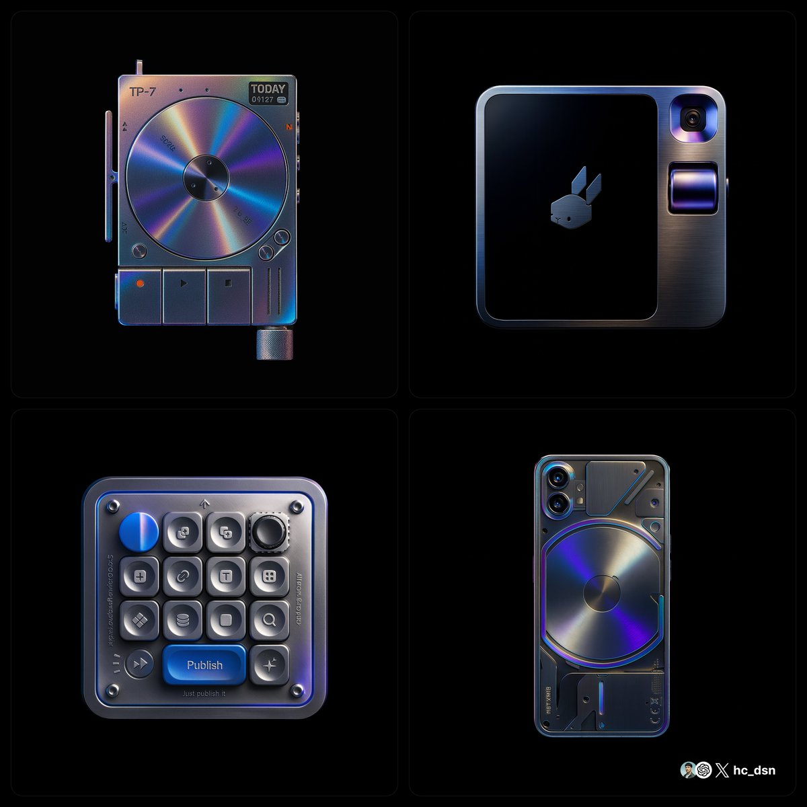

## 液态金属设计产品

- ID: gpt4o-167-zh-2
- Slug: prompt-167-zh-2
- 语言: zh
- 来源: [来源链接](https://x.com/hc_dsn/status/1938203557771260064)
- 样例图路径: images/part3/167.jpeg

### 提示词

```text
以 1：1 的比例创建图像
我用以下 json 对我附加的照片进行 retexture
{ “style_name”： “hermes_subtle_specular_gradient”， “background”： { “type”： “solid”， “color”： “#000000”， “light_reflection”： “none” }， “base_material”： { “type”： “polished_metal”， “color”： “#B0B0B0”， “finish”： “glossy”， “reflectivity”： 0.75， “surface_variation”： { “micro_noise”： 0.005， “brushed_direction”： “none” } }， “highlight_strategy”： { “mode”： “localized_specular_enhancement”， “trigger”： “朝光曲面和直接照明 faces“， ”color_gradient“： [”#121A28“， ”#3D4C6B“， ”#8c71b7“， ”#4d21cd“]， ”gradient_type“： ”fluid_blend“， ”intensity_curve“： ”从高光中心缓出“， ”衰减“： 0.8， ”blend_mode“： ”soft_light“， ”saturation_level“： 0.4， ”coverage_ratio“： 0.2， ”transition_smoothness“： 0.95 }， ”lighting“： { ”scene_type“： ”high-control studio“， ”key_light“： { ”intensity“：1.0， “color”： “#FFFFFF”， “angle”： “上侧 35°”， “柔和度”： 0.6 }， “fill_light”： { “enabled”： false }， “rim_light”： { “enabled”： false }， “reflection_behavior”： { “mirrored_zones”： “仅限于高曝光区域”， “glow_color”： “从低饱和度渐变应用” } }， “specular_color_behavior”： { “base_surface”： “金属中性”， “highlight_zones”： “低饱和度色度 reflection“， ”edge_bleed“： ”minimal“， ”inner_glow“： 0.1 }， ”detail_features“： { ”engraved_elements“： { ”type“： ”精确凹陷“， ”lighting_response“： ”低反弹“， ”shadow_edge“： ”#222222“， ”rim_light_tint“： ”#888888“ } }， ”application_targets“： [ ”对象产品 photography“， ”具有选择性照明的 3D 图标“， ”品牌渲染“， ”豪华 UI 组件样式“ ]， ”visual_effect_notes“： { ”mood“： ”低调奢华、技术精确、受控情感“， ”realism“： ”风格化的物理逻辑“， ”focus“： ”仅在具有流体般渐变过渡的面向光线的曲面上优化彩色镜面反射“ } }
```

### 样例图


## create image with 1:1 ratio surreal minimal aesthetic, a

- ID: gpt4o-157-en-1
- Slug: prompt-157-en-1
- 语言: en
- 来源: [来源链接](https://x.com/hc_dsn/status/1937118859083047137)
- 样例图路径: images/part3/157.jpeg

### 提示词

```text
create image with 1:1 ratio 
surreal minimal aesthetic, airplane window frame on subtle gradient backdrop with same color, through the oval window showing random iconic landmark scenery of [Country Name], an overlay weather ui interface on the center of window, from top to bottom, contain the small weather icon, huge temperatures with elegant light weight font, and small location tag beneath it, the bottom is the country name, generate with extreme weathers, the window will affect by the weather, the color combo of subtle gradient backdrop is resonate with the weather, natural lighting, soft shadows, subtle reflections on glass, great negative space
```

### 样例图


## 最小天气小部件

- ID: gpt4o-157-zh-2
- Slug: prompt-157-zh-2
- 语言: zh
- 来源: [来源链接](https://x.com/hc_dsn/status/1937118859083047137)
- 样例图路径: images/part3/157.jpeg

### 提示词

```text
以 1：1 的比例创建图像
超现实的极简美学，飞机窗框在微妙的渐变背景上，同色系，通过椭圆形窗口随机展示【国家名称】的标志性地标风景，窗口中央叠加天气 UI 界面，从上到下，包含小天气图标，巨大的温度搭配优雅的轻量级字体，下方有小位置标签， 底部是国名，在极端天气下生成，窗户会受到天气的影响，微妙的渐变背景的颜色组合与天气产生共鸣，自然光，柔和的阴影，玻璃上的微妙反射，巨大的负空间
```

### 样例图


## Create image with 1:1 ratio A cctv footage, A closed up 

- ID: gpt4o-141-en-1
- Slug: prompt-141-en-1
- 语言: en
- 来源: [来源链接](https://x.com/hc_dsn/status/1925431043122970869)
- 样例图路径: images/part3/141.jpeg

### 提示词

```text
Create image with 1:1 ratio A cctv footage, 
A closed up view of focus woman carrying  [brand] [product] on street, a square zoomed window on the product, sci fi analyzing overlay UI with infos like brand name, date, time, location name, in brand color monospaced font, product name, width, height, weight, etc, vhs effect, glitch effect, film grainy
```

### 样例图


## 监控级别的时尚洞察力

- ID: gpt4o-141-zh-2
- Slug: prompt-141-zh-2
- 语言: zh
- 来源: [来源链接](https://x.com/hc_dsn/status/1925431043122970869)
- 样例图路径: images/part3/141.jpeg

### 提示词

```text
创建比例为 1：1 的图像闭路电视素材，
焦点女性在街上抬着 [品牌] [产品] 的特写视图，产品上的方形缩放窗口，科幻分析叠加 UI，其中包含品牌名称、日期、时间、位置名称、品牌颜色等宽字体、产品名称、宽度、高度、粗细等信息、vhs 效果、毛刺效果、胶片颗粒感
```

### 样例图


## 未来的OpenAI可穿戴设备

- ID: gpt4o-86-zh
- Slug: prompt-86-zh
- 语言: zh
- 来源: [来源链接](https://x.com/hc_dsn/status/1925589916844794154)
- 样例图路径: images/part3/86.png

### 提示词

```text
Create image with 1:1 ratio A next-gen wearable ai [device type] blending Jony Ive–inspired refined minimalism with a new material and interaction language symbolizing the power ChatGPT. The device is crafted from translucent aerogel fused with polished ceramic titanium, feather-light yet futuristic.  No seams, buttons, or traditional UI. Photographed floating against a pure white background, with a soft, diffused, nearly shadowless studio light.
```

### 样例图


## 复古像素UI图标

- ID: gpt4o-33-zh
- Slug: prompt-33-zh
- 语言: zh
- 来源: [来源链接](https://x.com/egeberkina/status/1924462051474174222)
- 样例图路径: images/part3/33.png

### 提示词

```text
retexture the image attached in the following json aesthetic style:
{
  "style": "Retro Pixel UI Icons",
  "resolution": "low (32x32 or 48x48)",
  "color_palette": [
    "#F2F2F2",  
    "#C0C0C0",  
    "#000000", 
    "#FFFFFF",  
    "#0000FF",  
    "#00FF00",  
    "#FFFF99",  
    "#008080" 
  ],
  "outline": {
    "enabled": true,
    "color": "#000000",
    "thickness": "1px"
  },
  "shading": {
    "method": "dithering",
    "colors_used": ["base color", "highlight", "shadow"],
    "pattern": "checkerboard or diagonal lines"
  },
  "lighting": {
    "type": "flat",
    "source": "top-left",
    "highlight_color": "#FFFFFF",
    "shadow_color": "#808080"
  },
  "background": {
    "color": "#F2F2F2",
    "type": "plain",
    "transparency": false
  },
  "object_properties": {
    "style": "pixel art",
    "perspective": "isometric or front-facing",
    "animation": {
      "enabled": false,
      "frame_style": "static pixel art"
    }
  }
}
```

### 样例图

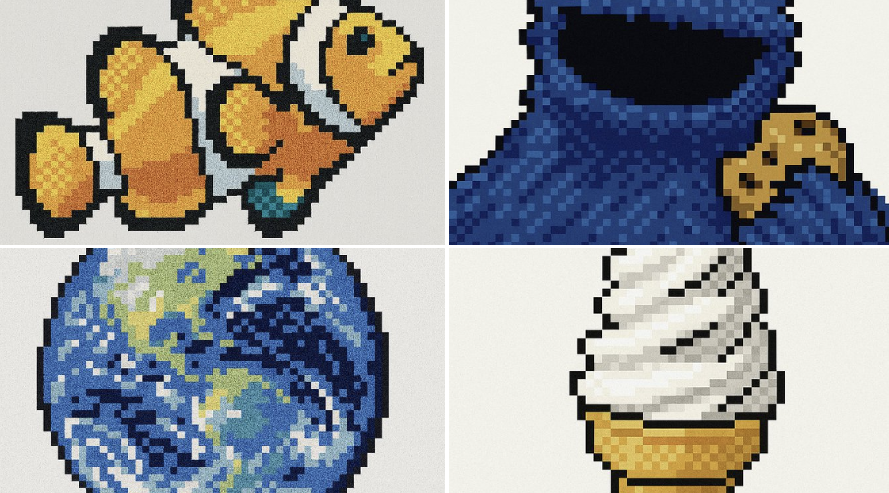

## 平面设计等边风格

- ID: gpt4o-23-zh
- Slug: prompt-23-zh
- 语言: zh
- 来源: [来源链接](https://x.com/Artedeingenio/status/1924388407939076377)
- 样例图路径: images/part3/23.png

### 提示词

```text
A flat isometric digital illustration of [describe the subject: e.g., a modern workspace, a city block, a group of app icons, a sports shop], clean lines and geometric forms, bright pastel colors, simplified perspective with 3D depth, minimal shading, white background or light gradient. Style resembles modern vector infographics, ideal for UI, app design or web visuals.
```

### 样例图


